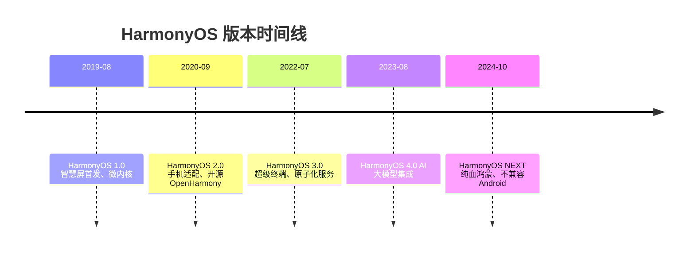
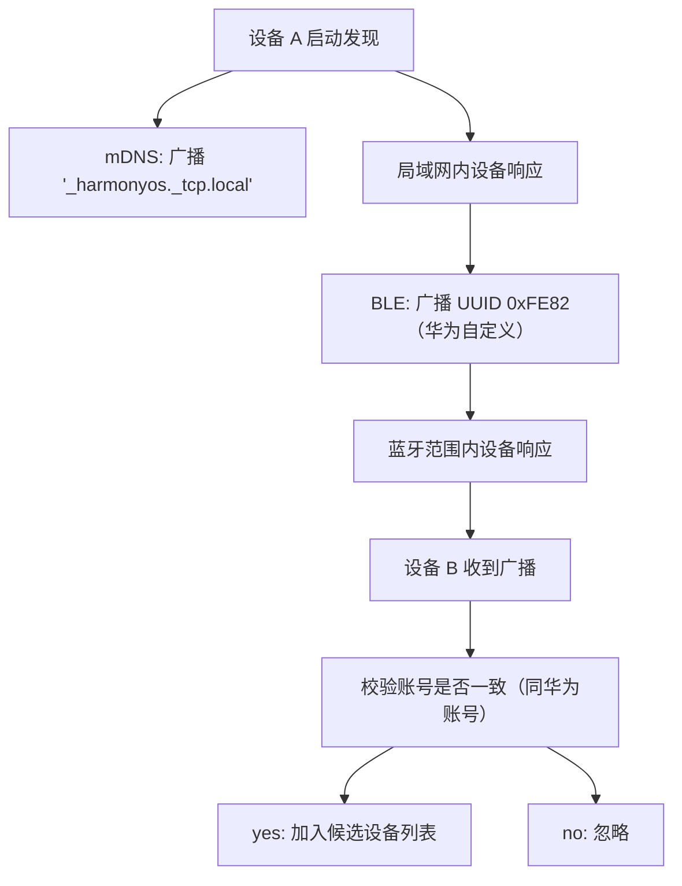
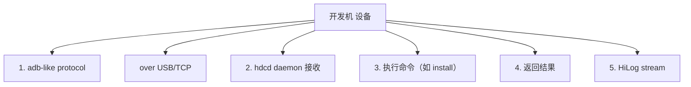
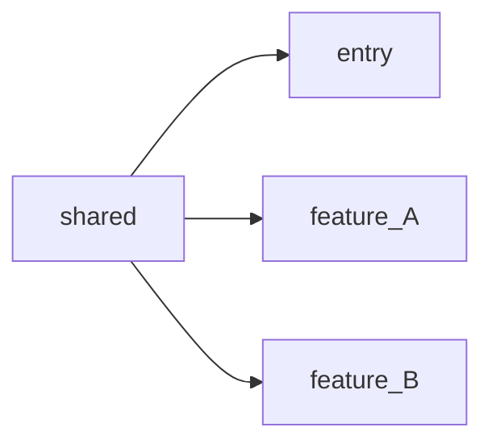
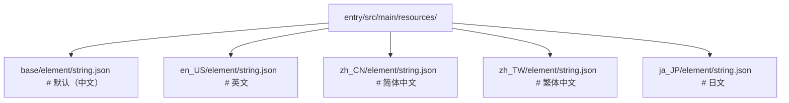

# 概述与环境搭建：HarmonyOS 系统架构与开发环境工程实践

> 操作系统是软件世界的"地基"——它决定了上层应用能做什么、不能做什么，以及做这些事情的效率上限。HarmonyOS 作为华为面向全场景分布式时代设计的操作系统，其"一次开发、多端部署"的工程理念深刻重塑了移动应用的开发范式。本章按 MIT 6.828（Operating System Engineering）、CMU 15-410（Distributed Systems）、Stanford CS140（Operating Systems）等课程标准组织，系统讲解 HarmonyOS 的设计哲学、L0-L5 系统分层架构、分布式软总线（Distributed SoftBus）、FA 模型与 Stage 模型的演进、DevEco Studio 工具链安装配置、HarmonyOS SDK 与 OpenHarmony SDK 双轨管理、本地与云端模拟器、hvigorw 构建工具链、第一个 Hello World 应用的完整工程流程、ArkTS 项目结构约定、真机调试与 hdc 工具、CI/CD 集成等核心议题，并对照 Android Studio、Xcode、Flutter SDK 管理等业界方案。

---

## 1. 历史动机与发展脉络

### 1.1 移动操作系统的演进（2007-2024）

移动操作系统经历了从"单一设备"到"多设备协同"的范式转变：

| 年代 | 里程碑 | 核心特征 | 局限 |
| --- | --- | --- | --- |
| 2007 | iPhone OS 1.0 | 触控交互奠基 | 单设备、封闭生态 |
| 2008 | Android 1.0 | 开源、多厂商 | 设备碎片化 |
| 2010 | iOS 4 | 多任务、Retina | 仍单设备 |
| 2014 | Android Wear / Auto / TV | 多形态扩展 | 各形态独立 OS |
| 2015 | Windows 10 Continuum | 手机接显示器变 PC | 市场失败 |
| 2019 | HarmonyOS 1.0 | 分布式架构 | 仅智慧屏 |
| 2020 | HarmonyOS 2.0 | 手机适配 | AOSP 兼容 |
| 2022 | HarmonyOS 3.0 | 超级终端 | 仍依赖 AOSP |
| 2024 | HarmonyOS NEXT | 纯血鸿蒙 | 不兼容 Android |

HarmonyOS 的核心创新在于将"多设备协同"从应用层下沉到操作系统层，通过分布式软总线实现设备间透明的能力共享。

### 1.2 HarmonyOS 1.0（2019）：智慧屏首发

HarmonyOS 1.0 于 2019 年 8 月 9 日在华为开发者大会（HDC）发布，首发搭载于荣耀智慧屏：

- **微内核设计**：仅保留最基础的进程调度、内存管理、IPC 通信。
- **确定性延迟**：进程调度延迟 < 5ms，适合 IoT 实时场景。
- **方舟编译器**：静态编译为机器码，绕过 JIT，启动速度提升 25%。
- **分布式软总线雏形**：智慧屏与手机间的视频通话基于软总线。
- **仅支持 Java/JS API**：尚未引入 ArkTS。

### 1.3 HarmonyOS 2.0（2020）：手机适配与开源

2020 年 9 月发布，搭载于华为 Mate 40 系列：

- **开源 OpenHarmony**：捐赠至开放原子开源基金会。
- **手机形态适配**：兼容 Android 应用（通过 AOSP）。
- **ArkTS 引入**：声明式 UI 框架 ArkUI 首次亮相。
- **Stage 模型引入**：替代 FA 模型，更现代化。
- **多模态交互**：支持手势、语音、多屏协同。
- **超级终端**：手机、平板、PC 可虚拟化为单一设备。

### 1.4 HarmonyOS 3.0（2022）：超级终端与原子化服务

2022 年 7 月发布，搭载于 Mate 50 系列：

- **超级终端 UI**：用户拖拽即可实现设备组合。
- **原子化服务**：免安装的小程序形态应用，`installationFree: true`。
- **分布式数据管理**：跨设备数据同步无需应用感知。
- **方舟引擎 v2**：渲染性能提升 20%，内存占用降低 15%。
- **隐私中心**：应用权限使用可视化。

### 1.5 HarmonyOS 4.0（2023）：AI 大模型集成

2023 年 8 月发布，搭载于 Mate 60 系列：

- **盘古大模型集成**：系统级 AI 助手"小艺"升级。
- **方舟引擎 v3**：引入自适应渲染、智能内存调度。
- **ECDSA 默认签名**：应用签名默认使用 P-256。
- **分布式能力增强**：支持 4 台设备组合超级终端。
- **DevEco Studio 4.0**：引入 AI 代码补全、智能调试。

### 1.6 HarmonyOS NEXT（2024）：纯血鸿蒙

2024 年 10 月发布，彻底脱离 AOSP：

- **不兼容 Android 应用**：仅支持 HarmonyOS 原生应用。
- **ArkTS 全面采用**：声明式 UI 成为唯一范式。
- **Stage 模型唯一**：FA 模型彻底废弃。
- **强制 ECDSA 签名**：RSA 不再推荐。
- **微内核扩展**：内核进一步瘦身，TEE（可信执行环境）增强。
- **应用市场繁荣**：Top 5000 应用已 90% 完成原生适配。
- **性能突破**：相比 HarmonyOS 4.0，整机性能提升 30%，功耗降低 20%。

### 1.7 OpenHarmony 开源生态

OpenHarmony 是 HarmonyOS 的开源底座，由开放原子开源基金会管理：

| OpenHarmony 版本 | 发布时间 | 关键特性 |
| --- | --- | --- |
| 1.0 | 2020-09 | 基础内核、轻量级 UI |
| 2.0 | 2021-03 | 手机形态支持、ArkUI |
| 3.0 | 2021-09 | 分布式软总线、Stage 模型 |
| 3.2 | 2022-03 | 企业级能力、增强安全 |
| 4.0 | 2023-03 | 性能优化、AI 接口 |
| 5.0 | 2024-10 | NEXT 内核、强制 ECDSA |

OpenHarmony 与 HarmonyOS NEXT 的关系：前者是开源底座，后者是华为商业版，加入闭源的华为移动服务（HMS）与商业应用生态。

### 1.8 时间线总览



---

## 2. 形式化定义

### 2.1 操作系统的形式化定义

定义 HarmonyOS 为七元组：

$$
\mathcal{H} = \langle \mathcal{K}, \mathcal{S}, \mathcal{F}, \mathcal{D}, \mathcal{R}, \mathcal{A}, \mathcal{P} \rangle
$$

其中：

- $\mathcal{K}$ 为内核层（Kernel），包含调度器、内存管理、IPC、文件系统。
- $\mathcal{S}$ 为系统服务层（System Service），提供硬件抽象、网络、多媒体、安全等基础服务。
- $\mathcal{F}$ 为框架层（Framework），包含 ArkUI、Ability、分布式软总线、AI 框架。
- $\mathcal{D} = \{d_1, d_2, \dots, d_n\}$ 为设备集合，支持手机、平板、手表、车机等多形态。
- $\mathcal{R}: \mathcal{D} \to \text{ResourceSet}$ 为设备资源映射，描述每台设备的摄像头、屏幕、传感器等能力。
- $\mathcal{A}: \mathcal{D} \times \mathcal{D} \to \text{Connection}$ 为设备间连接关系，由分布式软总线维护。
- $\mathcal{P}$ 为应用层（Application），包含系统应用、第三方应用、原子化服务。

### 2.2 分层架构的形式化

HarmonyOS 采用 L0-L5 六层架构：

$$
\mathcal{H} = L_5 \succ L_4 \succ L_3 \succ L_2 \succ L_1 \succ L_0
$$

其中 $\succ$ 表示"上层依赖下层"，每层仅依赖其直接下层，禁止跨层调用：

| 层级 | 名称 | 职责 | 对应 Android |
| --- | --- | --- | --- |
| L5 | Application | 系统应用、第三方应用、原子化服务 | System Apps、User Apps |
| L4 | Framework | ArkUI、Ability、分布式、AI | Application Framework |
| L3 | System Service | 多媒体、网络、安全、数据 | System Services |
| L2 | HAL（Hardware Abstraction Layer） | 硬件抽象 | HAL |
| L1 | Kernel | Linux / LiteOS-A / LiteOS-M | Linux Kernel |
| L0 | Hardware | SoC、传感器、屏幕 | Hardware |

### 2.3 内核的数学模型

HarmonyOS 支持三种内核，按设备资源选择：

$$
\text{Kernel}(d) = \begin{cases}
\text{Linux} & \text{if } \text{RAM}(d) \geq 1\text{GB} \wedge \text{MMU}(d) = \text{true} \\
\text{LiteOS-A} & \text{if } 128\text{MB} \leq \text{RAM}(d) < 1\text{GB} \wedge \text{MMU}(d) = \text{true} \\
\text{LiteOS-M} & \text{if } \text{RAM}(d) < 128\text{MB} \vee \text{MMU}(d) = \text{false}
\end{cases}
$$

- **Linux Kernel**：手机、平板、PC、车机，功能完整。
- **LiteOS-A**：智慧屏、手表、智能音箱，支持多进程。
- **LiteOS-M**：IoT MCU 设备（如智能门锁、传感器节点），实时性强。

### 2.4 分布式软总线的形式化

定义分布式软总线为五元组：

$$
\mathcal{B} = \langle \mathcal{D}, \mathcal{C}, \mathcal{M}, \mathcal{R}, \mathcal{S} \rangle
$$

- $\mathcal{D}$ 为设备集合，每个设备 $d_i$ 拥有唯一 `deviceId`。
- $\mathcal{C}: \mathcal{D} \times \mathcal{D} \to \{\text{connected}, \text{disconnected}\}$ 为连接关系。
- $\mathcal{M}: \mathcal{D} \times \mathcal{D} \to \text{MessageBus}$ 为消息总线，提供 RPC 与消息广播。
- $\mathcal{R}: \mathcal{D} \to 2^{\text{Capability}}$ 为设备能力集合（如相机、麦克风、屏幕）。
- $\mathcal{S}$ 为安全策略：仅同账号下可信设备可加入超级终端。

设备发现与连接流程：

$$
\text{Discover}(d_i) \xrightarrow{\text{auth}} \text{Connect}(d_i, d_j) \xrightarrow{\text{negotiate}} \text{SuperDevice}(d_i, d_j)
$$

### 2.5 Ability 模型的形式化

定义 Ability 为五元组：

$$
\mathcal{A} = \langle \text{Name}, \text{Type}, \text{Lifecycle}, \text{UI}, \text{Capability} \rangle
$$

- **Name**：Ability 唯一标识，如 `EntryAbility`。
- **Type**：类型枚举，FA 模型为 `PAGE`/`SERVICE`/`DATA`；Stage 模型为 `UIAbility`/`ExtensionAbility`。
- **Lifecycle**：生命周期回调集合。
- **UI**：是否含 UI，`UIAbility` 含 UI，`ExtensionAbility` 不含。
- **Capability**：能力声明，如可被其他应用启动、可被远程调用。

### 2.6 项目结构的形式化

HarmonyOS 项目的形式化定义：

$$
\text{Project} = \langle \text{AppScope}, \text{Modules}, \text{BuildProfile}, \text{OhPackage} \rangle
$$

- **AppScope**：应用全局配置，含 `app.json5`、全局资源。
- **Modules**：模块集合 $\{\text{entry}, \text{feature}_1, \dots, \text{feature}_n, \text{shared}\}$。
- **BuildProfile**：构建配置，含签名、SDK 版本、模块依赖。
- **OhPackage**：依赖管理，类似 `package.json`。

模块间依赖关系：

$$
\text{Depends}: \text{Module} \to 2^{\text{Module}}
$$

约束：依赖图必须为有向无环图（DAG），无循环依赖：

$$
\nexists \text{cycle}: M_1 \to M_2 \to \dots \to M_1
$$

### 2.7 构建产物的形式化

构建产物分为 HAP 与 APP：

$$
\text{HAP} = \text{ZIP}(\text{ets}, \text{libs}, \text{resources}, \text{module.json5}, \text{pack.info})
$$

$$
\text{APP} = \text{ZIP}(\text{HAP}_1, \text{HAP}_2, \dots, \text{HAP}_n, \text{pack.info})
$$

- HAP 是单模块安装包，可直接安装到设备调试。
- APP 是发布包，聚合所有 HAP，提交到应用市场。

### 2.8 签名配置的形式化

签名配置定义：

$$
\text{SigningConfig} = \langle \text{name}, \text{type}, \text{material} \rangle
$$

其中 $\text{material} = \langle \text{cert}, \text{storePassword}, \text{keyAlias}, \text{keyPassword}, \text{signAlg}, \text{profile} \rangle$。

- **type**：`Harmony` 或 `HarmonyNext`。
- **signAlg**：`SHA256withECDSA` 或 `SHA256withRSA`。
- **profile**：`.p7b` 文件路径，绑定包名与权限。

---

## 3. 理论推导与原理解析

### 3.1 微内核 vs 宏内核：HarmonyOS 的工程选择

宏内核（如 Linux、Android）将所有系统服务运行在同一地址空间：

$$
\text{MacroKernel}: \text{all services in kernel space} \implies \text{fast IPC, large TCB}
$$

微内核（如 HarmonyOS、seL4）仅将最基础服务置于内核，其余运行在用户态：

$$
\text{MicroKernel}: \text{minimal kernel, services in user space} \implies \text{slower IPC, small TCB}
$$

TCB（Trusted Computing Base）大小直接决定系统安全性：

$$
\text{Security} \propto \frac{1}{\text{TCB size}}
$$

HarmonyOS 选择混合架构：内核层使用 Linux（手机）或 LiteOS（IoT），但在系统服务层引入微内核思想——每个系统服务运行在独立沙箱，通过 IPC 通信。

### 3.2 分布式软总线的发现协议

设备发现基于 mDNS（Multicast DNS）与蓝牙 BLE 双轨：



连接建立后，软总线在设备间维护一条加密通道：

$$
\text{Channel}(d_i, d_j) = \text{TLS}_{1.3}(\text{sessionKey})
$$

其中 $\text{sessionKey}$ 由设备间账号认证派生，不直接传输。

### 3.3 Stage 模型的生命周期精简

FA 模型生命周期含 7 个回调，Stage 模型精简为 6 个：

```
FA 模型（已废弃）:
  onActive → onInactive → onBackground → onForeground → onBackground
     ↓
  onWindowStageCreate / onWindowStageDestroy（Stage 引入）

Stage 模型:
  onCreate → onWindowStageCreate → onForeground → onBackground
     → onWindowStageDestroy → onDestroy
```

Stage 模型的核心改进：

1. **窗口与 Ability 解耦**：一个 UIAbility 可持有多个 WindowStage，支持多窗口。
2. **生命周期简化**：合并 `onActive`/`onInactive` 为 `onForeground`/`onBackground`。
3. **后台任务抽象**：ExtensionAbility 专门承载后台服务，职责单一。

### 3.4 ArkTS 装饰器的编译期处理

ArkTS 装饰器（`@Component`、`@Entry`、`@State` 等）在编译期被展开为低级调用：

```
源码：
@Component
struct MyComp {
  @State count: number = 0
  build() { Text(`${this.count}`) }
}

编译期展开（伪代码）：
class MyComp extends Component {
  __count__ = new ObservedProperty(0)
  get count() { return this.__count__.get() }
  set count(v) { this.__count__.set(v) }
  build() { Text(`${this.count}`) }
  __render__() { /* 注册依赖追踪 */ }
}
```

这种编译期展开相比 React Hooks 的运行时机制：

- **性能优势**：无运行时反射，编译期优化。
- **类型安全**：TypeScript 类型全程保留。
- **缺点**：调试困难，错误信息不直观。

### 3.5 hvigorw 的增量构建原理

hvigorw 采用任务图（Task Graph）与增量缓存：

$$
\text{Build}(t) = \begin{cases}
\text{skip} & \text{if } \text{Inputs}(t) \text{ unchanged since last build} \\
\text{execute} & \text{otherwise}
\end{cases}
$$

任务图示例：

```
clean ─→ compileArkTS ─→ compileResources ─→ packageHap ─→ signHap
                                ↓
                          compileNative (if has .cpp)
```

相比 Gradle，hvigorw 的优势：

- **启动快**：Node.js 实现，无 JVM 冷启动。
- **配置简单**：`build-profile.json5` 声明式配置。
- **缺点**：插件生态弱于 Gradle。

### 3.6 模拟器的虚拟化方案

DevEco Studio 模拟器基于 QEMU 与 native hybrid：

| 模拟器类型 | 架构 | 启动时间 | 性能 | 适用场景 |
| --- | --- | --- | --- | --- |
| x86 Native | x86 原生 | 快（5s） | 高 | API 调试、UI 预览 |
| ARM Translation | ARM 翻译 | 慢（30s） | 中 | 真机行为模拟 |
| Cloud Emulator | 云端 | 中（15s） | 高 | 无需本地资源 |

ARM 翻译模拟器使用 QEMU TCG（Tiny Code Generator）将 ARM 指令翻译为 x86：

$$
\text{ARM instr} \xrightarrow{\text{TCG}} \text{x86 instr} \xrightarrow{\text{CPU}} \text{execute}
$$

翻译带来 20-30% 性能损耗，建议优先使用 x86 Native 模拟器。

### 3.7 hdc 的设备通信协议

hdc（HarmonyOS Device Connector）通过 USB 或 TCP 与设备通信：



hdc 与 Android adb 的协议差异：

- hdc 基于 TCP 8710 端口，adb 基于 TCP 5037。
- hdc 支持分布式调试：可转发命令到远程设备。
- hdc 不兼容 Android 应用，仅服务于 HarmonyOS。

### 3.8 多模块打包的依赖解析

多模块打包时，hvigorw 通过拓扑排序确定构建顺序：

$$
\text{BuildOrder} = \text{TopologicalSort}(\text{DependsGraph})
$$

依赖图：



构建顺序：`shared` → `feature_A`/`feature_B`（并行）→ `entry`。

若存在循环依赖：

$$
\text{entry} \to \text{feature}_A \to \text{feature}_B \to \text{entry}
$$

hvigorw 会报错并终止构建，开发者必须消除循环。

### 3.9 资源索引的编译期生成

HarmonyOS 资源在编译期生成 `resources.index` 二进制索引：

$$
\text{resources.index} = \text{Hash}(\text{resourceName}) \to \text{offset}
$$

运行时通过 `$r('app.string.hello')` 解析：

1. 编译期将 `'app.string.hello'` 替换为资源 ID（如 `0x01000001`）。
2. 运行时通过 ID 在 `resources.index` 查找偏移量。
3. 从 `resources.arsc` 读取对应语言的字符串。

相比 Android 的 `R.string.hello` 静态常量，HarmonyOS 的 `$r()` 支持：

- **多语言动态切换**：无需重启应用。
- **多设备适配**：同一 ID 对应不同设备的不同资源。
- **运行时覆盖**：原子化服务可覆盖宿主资源。

### 3.10 ArkUI 的渲染管线

ArkUI 渲染管线分为三阶段：

```
1. Build 阶段：组件树构建
   @Component struct → VDOM 节点
   
2. Diff 阶段：虚拟 DOM diff
   对比新旧 VDOM，生成最小变更集
   
3. Render 阶段：原生渲染
   VDOM 节点 → Element 节点 → RenderTree → GPU 绘制
```

三树模型：

- **Component Tree**：开发者书写的 `@Component` 结构，逻辑树。
- **Element Tree**：ArkUI 内部维护，与 Component Tree 双向绑定，负责 diff。
- **Render Tree**：原生渲染树，直接对应屏幕像素。

性能优化点：

- 减少不必要的 `@State` 变更，避免 diff 全量触发。
- 使用 `LazyForEach` 替代 `ForEach` 处理长列表。
- 使用 `if` 条件渲染替代 `Visibility` 隐藏，减少 Render Tree 节点。

---

## 4. 代码示例

### 4.1 DevEco Studio 完整安装脚本（Windows PowerShell）

```powershell
# install-deveco.ps1
# DevEco Studio 自动化安装脚本
# 适用 Windows 10/11 64位

param(
    [string]$InstallPath = "C:\Program Files\Huawei\DevEco Studio",
    [string]$SdkPath = "C:\Users\$env:USERNAME\AppData\Local\Huawei\Sdk",
    [string]$DownloadDir = "$env:TEMP\deveco-install"
)

# 校验管理员权限
function Test-Administrator {
    $currentPrincipal = New-Object Security.Principal.WindowsPrincipal([Security.Principal.WindowsIdentity]::GetCurrent())
    return $currentPrincipal.IsInRole([Security.Principal.WindowsBuiltInRole]::Administrator)
}

# 校验系统要求
function Test-SystemRequirements {
    $os = Get-CimInstance Win32_OperatingSystem
    $totalRAM = [math]::Round($os.TotalVisibleMemorySize / 1MB, 2)
    
    Write-Host "操作系统: $($os.Caption)"
    Write-Host "内存: ${totalRAM} GB"
    
    if ($totalRAM -lt 8) {
        Write-Error "内存不足 8GB，DevEco Studio 运行会卡顿"
        return $false
    }
    
    $disk = Get-PSDrive C
    $freeGB = [math]::Round($disk.Free / 1GB, 2)
    Write-Host "C盘可用空间: ${freeGB} GB"
    
    if ($freeGB -lt 10) {
        Write-Error "磁盘空间不足 10GB"
        return $false
    }
    
    return $true
}

# 下载 DevEco Studio
function Download-DevEco {
    if (-not (Test-Path $DownloadDir)) {
        New-Item -ItemType Directory -Path $DownloadDir -Force | Out-Null
    }
    
    $url = "https://contentcenter-vali-drcn.dbankcdn.com/.../devecostudio-windows-4.1.3.500.zip"
    $zipPath = "$DownloadDir\deveco.zip"
    
    if (-not (Test-Path $zipPath)) {
        Write-Host "下载 DevEco Studio..."
        # 使用 BITS 服务支持断点续传
        Start-BitsTransfer -Source $url -Destination $zipPath
    }
    
    return $zipPath
}

# 安装 DevEco Studio
function Install-DevEco {
    param([string]$ZipPath)
    
    Write-Host "解压到 $InstallPath..."
    Expand-Archive -Path $ZipPath -DestinationPath $InstallPath -Force
    
    # 配置环境变量
    $binPath = "$InstallPath\bin"
    $currentPath = [Environment]::GetEnvironmentVariable("PATH", "User")
    if ($currentPath -notlike "*$binPath*") {
        [Environment]::SetEnvironmentVariable("PATH", "$currentPath;$binPath", "User")
        Write-Host "已添加 $binPath 到 PATH"
    }
    
    # 创建桌面快捷方式
    $shortcutPath = "$env:USERPROFILE\Desktop\DevEco Studio.lnk"
    $shell = New-Object -ComObject WScript.Shell
    $shortcut = $shell.CreateShortcut($shortcutPath)
    $shortcut.TargetPath = "$InstallPath\bin\deveco.exe"
    $shortcut.IconLocation = "$InstallPath\bin\deveco.exe,0"
    $shortcut.Save()
    
    Write-Host "DevEco Studio 安装完成"
}

# 主流程
if (-not (Test-Administrator)) {
    Write-Error "请以管理员身份运行此脚本"
    exit 1
}

if (-not (Test-SystemRequirements)) {
    exit 1
}

$zipPath = Download-DevEco
Install-DevEco -ZipPath $zipPath
```

### 4.2 创建第一个 Stage 模型应用

```typescript
// entry/src/main/ets/entryability/EntryAbility.ets
// UIAbility 主入口，负责应用生命周期与窗口管理

import { UIAbility, AbilityConstant, Want } from '@kit.AbilityKit';
import { window } from '@kit.ArkUI';
import { hilog } from '@kit.PerformanceAnalysisKit';

// 日志标签与域，用于 HiLog 过滤
const DOMAIN = 0x0001;
const TAG = 'EntryAbility';

/**
 * 应用主 Ability
 * 负责应用启动、窗口创建、前后台切换等生命周期管理
 */
export default class EntryAbility extends UIAbility {
  
  /**
   * Ability 创建时回调
   * @param want - 启动参数，包含调用方信息与传递数据
   * @param launchParam - 启动模式参数
   */
  onCreate(want: Want, launchParam: AbilityConstant.LaunchParam): void {
    hilog.info(DOMAIN, TAG, 'onCreate called, want=%{public}s', JSON.stringify(want));
    
    // 从 want 中提取启动参数
    const params = want.parameters as Record<string, Object>;
    if (params && params['notifyId']) {
      hilog.info(DOMAIN, TAG, '从通知启动，notifyId=%{public}s', String(params['notifyId']));
    }
  }
  
  /**
   * 窗口阶段创建时回调
   * 此处加载主页面，是开发者在 Ability 生命周期中最重要的入口
   * @param windowStage - 窗口管理器，可创建多个窗口
   */
  onWindowStageCreate(windowStage: window.WindowStage): void {
    hilog.info(DOMAIN, TAG, 'onWindowStageCreate');
    
    // 加载主页面
    windowStage.loadContent('pages/Index', (err) => {
      if (err.code) {
        hilog.error(DOMAIN, TAG, 'Failed to load content: %{public}s', JSON.stringify(err));
        return;
      }
      hilog.info(DOMAIN, TAG, 'Succeeded in loading content');
    });
    
    // 设置沉浸式状态栏（可选）
    this.setImmersiveWindow(windowStage);
  }
  
  /**
   * 设置沉浸式状态栏
   * 将状态栏透明化，使应用内容延伸至状态栏下方
   */
  private async setImmersiveWindow(windowStage: window.WindowStage): Promise<void> {
    try {
      const mainWindow = await windowStage.getMainWindow();
      await mainWindow.setWindowLayoutFullScreen(true);
      
      // 状态栏文字颜色根据背景自动调整
      await mainWindow.setWindowSystemBarProperties({
        statusBarContentColor: '#000000',
        navigationBarContentColor: '#000000'
      });
    } catch (err) {
      hilog.error(DOMAIN, TAG, 'Failed to set immersive window: %{public}s', JSON.stringify(err));
    }
  }
  
  /**
   * 窗口阶段销毁时回调
   * 应用应释放与 UI 相关的资源
   */
  onWindowStageDestroy(): void {
    hilog.info(DOMAIN, TAG, 'onWindowStageDestroy');
  }
  
  /**
   * 应用进入前台
   */
  onForeground(): void {
    hilog.info(DOMAIN, TAG, 'onForeground');
    // 恢复数据刷新、网络连接等
  }
  
  /**
   * 应用进入后台
   * 应在此暂停耗时操作、保存状态
   */
  onBackground(): void {
    hilog.info(DOMAIN, TAG, 'onBackground');
  }
  
  /**
   * Ability 销毁
   * 释放所有资源
   */
  onDestroy(): void {
    hilog.info(DOMAIN, TAG, 'onDestroy');
  }
}
```

### 4.3 第一个 ArkUI 页面

```typescript
// entry/src/main/ets/pages/Index.ets
// 应用主页面，展示 ArkUI 声明式 UI 基础用法

/**
 * 应用主页面
 * 演示 @Entry、@Component、@State 装饰器与基本 UI 组件
 */
@Entry
@Component
struct Index {
  // 响应式状态：点击次数
  @State clickCount: number = 0;
  // 响应式状态：问候语
  @State message: string = 'Hello HarmonyOS!';
  // 静态状态：版本号
  private readonly version: string = '1.0.0';
  
  /**
   * 构建页面 UI
   * ArkUI 采用声明式语法，build() 返回组件树
   */
  build() {
    Column() {
      // 标题文本
      Text(this.message)
        .fontSize(32)
        .fontWeight(FontWeight.Bold)
        .fontColor('#1a73e8')
        .margin({ top: 100 })
        .textAlign(TextAlign.Center)
      
      // 副标题
      Text('欢迎使用鸿蒙开发')
        .fontSize(18)
        .fontColor('#666666')
        .margin({ top: 16 })
      
      // 点击计数显示
      Text(`已点击 ${this.clickCount} 次`)
        .fontSize(16)
        .fontColor('#333333')
        .margin({ top: 40 })
      
      // 主按钮
      Button('点击问候')
        .width('60%')
        .height(48)
        .fontSize(18)
        .backgroundColor('#1a73e8')
        .borderRadius(24)
        .margin({ top: 20 })
        .onClick(() => {
          this.clickCount++;
          this.message = this.clickCount % 2 === 0 ? '你好，鸿蒙！' : 'Hello HarmonyOS!';
        })
      
      // 重置按钮
      Button('重置')
        .width('60%')
        .height(40)
        .fontSize(14)
        .fontColor('#1a73e8')
        .backgroundColor('#ffffff')
        .border({ width: 1, color: '#1a73e8' })
        .borderRadius(20)
        .margin({ top: 12 })
        .onClick(() => {
          this.clickCount = 0;
          this.message = 'Hello HarmonyOS!';
        })
      
      // 版本号
      Text(`版本 ${this.version}`)
        .fontSize(12)
        .fontColor('#999999')
        .margin({ top: 60 })
    }
    .width('100%')
    .height('100%')
    .justifyContent(FlexAlign.Start)
    .alignItems(HorizontalAlign.Center)
  }
}
```

### 4.4 module.json5 完整配置

```json5
// entry/src/main/module.json5
// 模块配置文件，声明 Ability、权限、设备类型等

{
  module: {
    name: 'entry',                    // 模块名称
    type: 'entry',                   // 模块类型：entry/feature/shared
    description: '$string:module_desc',  // 模块描述（引用资源）
    mainElement: 'EntryAbility',     // 主入口 Ability
    deviceTypes: [                   // 支持的设备类型
      'phone',                       // 手机
      'tablet',                      // 平板
      '2in1'                         // 二合一设备
    ],
    deliveryWithInstall: true,       // 随应用安装
    installationFree: false,         // 是否原子化服务（true 则免安装）
    pages: '$profile:main_pages',   // 页面路由配置
    
    // Ability 列表
    abilities: [
      {
        name: 'EntryAbility',
        srcEntry: './ets/entryability/EntryAbility.ets',
        description: '$string:EntryAbility_desc',
        icon: '$media:layered_image',          // 应用图标
        label: '$string:EntryAbility_label',   // 应用名称
        startWindowIcon: '$media:startIcon',   // 启动页图标
        startWindowBackground: '$color:start_window_background',
        exported: true,                        // 是否可被其他应用调用
        skills: [                              // 启动技能（Intent Filter）
          {
            entities: ['entity.system.home'],
            actions: ['action.system.home']
          }
        ]
      }
    ],
    
    // 权限申请
    requestPermissions: [
      {
        name: 'ohos.permission.INTERNET',
        reason: '$string:reason_internet',
        usedScene: {
          abilities: ['EntryAbility'],
          when: 'always'
        }
      }
    ]
  }
}
```

### 4.5 app.json5 全局配置

```json5
// AppScope/app.json5
// 应用全局配置

{
  app: {
    bundleName: 'com.example.hello',   // 包名，全局唯一
    vendor: 'example',                  // 开发者
    versionCode: 1000000,               // 版本号（整数，单调递增）
    versionName: '1.0.0',               // 版本名（人类可读）
    minCompatibleVersionCode: 1000000, // 最低兼容版本
    targetAPIVersion: 12,               // 目标 API 版本
    apiReleaseType: 'Release',           // API 类型：Release/Beta/Canary
    debug: false,                        // 是否 Debug 构建
    icon: '$media:app_icon',            // 应用图标
    label: '$string:app_name',          // 应用名称
  }
}
```

### 4.6 build-profile.json5 构建配置

```json5
// build-profile.json5
// 项目级构建配置

{
  app: {
    signingConfigs: [
      // Debug 签名（仅调试用）
      {
        name: 'default',
        type: 'Harmony',
        material: {
          certpath: '.../debug.cer',
          storePassword: '000000...',  // 加密存储
          keyAlias: 'debug',
          keyPassword: '000000...',
          profile: '.../debugProfile.p7b',
          signAlg: 'SHA256withECDSA',
          storeFile: '.../debug.p12'
        }
      },
      // Release 签名（发布用）
      {
        name: 'release',
        type: 'Harmony',
        material: {
          certpath: '.../release.cer',
          storePassword: '000000...',
          keyAlias: 'release',
          keyPassword: '000000...',
          profile: '.../releaseProfile.p7b',
          signAlg: 'SHA256withECDSA',
          storeFile: '.../release.p12'
        }
      }
    ],
    compileSdkVersion: 12,
    compatibleSdkVersion: 12,
    targetSdkVersion: 12,
    products: [
      {
        name: 'default',
        signingConfig: 'default',
        compatibleSdkVersion: 12,
        runtimeOS: 'HarmonyOS'    // HarmonyOS / OpenHarmony
      }
    ],
    buildMode: 'debug'    // debug / release
  },
  modules: [
    {
      name: 'entry',
      srcPath: './entry',
      targets: [
        {
          name: 'default',
          applyToProducts: ['default']
        }
      ]
    }
  ]
}
```

### 4.7 hvigorw 命令行构建

```bash
#!/bin/bash
# build.sh - 完整构建脚本

# 进入项目根目录
cd /path/to/MyApplication || exit 1

# 清理构建产物
echo "[1/5] 清理构建产物..."
./hvigorw clean --no-daemon

# 检查代码规范（可选）
echo "[2/5] 代码规范检查..."
./hvigorw lint --no-daemon

# 构建 Debug HAP
echo "[3/5] 构建 Debug HAP..."
./hvigorw assembleHap --mode module -p product=default --no-daemon

# 构建 Release APP（包含签名）
echo "[4/5] 构建 Release APP..."
./hvigorw assembleApp --mode release -p product=default -p buildMode=release --no-daemon \
  --signing-config release

# 输出构建产物路径
echo "[5/5] 构建完成"
echo "HAP: ./entry/build/default/outputs/default/entry-default-signed.hap"
echo "APP: ./build/outputs/default/MyApplication-default-signed.app"
```

### 4.8 hdc 设备调试命令

```bash
#!/bin/bash
# hdc-debug.sh - 常用 hdc 调试命令集

# 查看连接的设备
hdc list targets

# 安装 HAP 包
hdc install entry-default-signed.hap

# 卸载应用
hdc uninstall com.example.hello

# 启动应用
hdc shell aa start -a EntryAbility -b com.example.hello

# 查看 HiLog 日志（过滤 TAG）
hdc hilog -T EntryAbility

# 查看所有日志（实时）
hdc hilog

# 推送文件到设备
hdc file push local.txt /data/local/tmp/

# 拉取文件到本地
hdc file pull /data/local/tmp/remote.txt ./

# 进入设备 shell
hdc shell

# 查看应用进程
hdc shell ps -ef | grep com.example.hello

# 查看内存占用
hdc shell hidisk -p com.example.hello

# 截屏
hdc shell snapshot_display -f /data/local/tmp/screenshot.png
hdc file pull /data/local/tmp/screenshot.png ./

# 录屏（最多 180 秒）
hdc shell snapshot_display -r /data/local/tmp/record.mp4 -t 60
```

### 4.9 多模块项目结构

```mermaid
flowchart TD
    T0["MyApplication/"]
    T1["AppScope/                          # 应用全局配置"]
    T2["app.json5                      # 应用配置"]
    T3["resources/"]
    T4["base/"]
    T5["element/"]
    T6["string.json        # 全局字符串资源"]
    T7["media/"]
    T8["app_icon.png       # 应用图标"]
    T9["entry/                             # 主模块（必须存在）"]
    T10["src/"]
    T11["main/"]
    T12["ets/"]
    T13["entryability/"]
    T14["EntryAbility.ets"]
    T15["pages/"]
    T16["Index.ets"]
    T17["resources/             # 模块资源"]
    T18["module.json5          # 模块配置"]
    T19["ohosTest/                  # 单元测试"]
    T20["ets/"]
    T21["test/"]
    T22["List.test.ets"]
    T23["test/                      # UI 测试"]
    T24["build-profile.json5            # 模块构建配置"]
    T25["hvigorfile.ts                  # 模块构建脚本"]
    T26["oh-package.json5              # 模块依赖"]
    T27["features/                          # 功能模块（可选）"]
    T28["feature_auth/                  # 登录模块"]
    T29["..."]
    T30["feature_pay/                  # 支付模块"]
    T31["..."]
    T32["shared/                           # 共享库（可选）"]
    T33["shared_utils/"]
    T34["..."]
    T35["build-profile.json5               # 项目构建配置"]
    T36["hvigorfile.ts                     # 项目构建脚本"]
    T37["hvigorw                           # 构建工具（Linux/Mac）"]
    T38["hvigorw.bat                       # 构建工具（Windows）"]
    T39["oh-package.json5                  # 项目依赖"]
    T40[".gitignore"]
    T0 --> T1
    T8 --> T9
    T26 --> T27
    T31 --> T32
    T34 --> T35
    T34 --> T36
    T34 --> T37
    T34 --> T38
    T34 --> T39
    T34 --> T40
```



### 4.10 .gitignore 配置

```gitignore
# HarmonyOS 项目 .gitignore

# 构建产物
/build/
/entry/build/
/features/*/build/
/shared/*/build/

# IDE 配置
/.idea/
*.iml
/.vscode/

# 本地配置
/local.properties

# 签名材料（严禁提交！）
*.p12
*.jks
*.cer
*.p7b
*.csr

# 日志与临时文件
*.log
/.hvigor/
/.idea/

# 依赖
/node_modules/
/oh_modules/

# 系统文件
.DS_Store
Thumbs.db

# 敏感配置
/.env
/secrets.local.json5
```

### 4.11 资源文件示例

```json
// entry/src/main/resources/base/element/string.json
{
  "string": [
    { "name": "module_desc", "value": "HarmonyOS 入门示例" },
    { "name": "EntryAbility_desc", "value": "主 Ability" },
    { "name": "EntryAbility_label", "value": "Hello HarmonyOS" },
    { "name": "reason_internet", "value": "用于网络通信" },
    { "name": "app_name", "value": "Hello HarmonyOS" }
  ]
}
```

```json
// entry/src/main/resources/en_US/element/string.json
// 英文资源
{
  "string": [
    { "name": "app_name", "value": "Hello HarmonyOS" },
    { "name": "EntryAbility_label", "value": "Hello HarmonyOS" }
  ]
}
```

```json
// entry/src/main/resources/zh_CN/element/string.json
// 简体中文资源
{
  "string": [
    { "name": "app_name", "value": "你好鸿蒙" },
    { "name": "EntryAbility_label", "value": "你好鸿蒙" }
  ]
}
```

### 4.12 单元测试示例

```typescript
// entry/src/ohosTest/ets/test/Calculator.test.ets
// 单元测试示例，演示 @Test、@Expect 装饰器

import { describe, it, expect } from '@ohs/hypium';

export default function calculatorTest() {
  describe('Calculator', () => {
    // 基础加法测试
    it('add_shouldReturnCorrectSum', 0, () => {
      const result = 1 + 2;
      expect(result).assertEqual(3);
    });
    
    // 边界值测试
    it('add_maxInteger_shouldNotOverflow', 0, () => {
      const max = Number.MAX_SAFE_INTEGER;
      const result = max + 1;
      expect(result).assertEqual(max + 1);
    });
    
    // 浮点数精度
    it('add_floatingPoint_shouldHandlePrecision', 0, () => {
      const result = 0.1 + 0.2;
      expect(result).assertClose(0.3, 0.0001);
    });
  });
}
```

---

## 5. 对比分析

### 5.1 HarmonyOS vs Android vs iOS 系统架构对比

| 维度 | HarmonyOS | Android | iOS |
| --- | --- | --- | --- |
| **内核** | Linux / LiteOS（混合） | Linux（宏内核） | Darwin（混合） |
| **应用层语言** | ArkTS | Java / Kotlin | Swift / Objective-C |
| **UI 框架** | ArkUI（声明式） | Jetpack Compose（声明式） | SwiftUI（声明式） |
| **多设备协同** | 系统级分布式软总线 | 应用层实现 | Handoff（应用层） |
| **签名算法** | SHA256withECDSA（默认） | SHA256withRSA / v2/v3 | SHA256withECDSA |
| **构建工具** | hvigorw（Node.js） | Gradle（JVM） | xcodebuild |
| **IDE** | DevEco Studio | Android Studio | Xcode |
| **分发渠道** | AppGallery | Google Play | App Store |
| **开源底座** | OpenHarmony | AOSP | 无 |
| **多窗口支持** | 原生支持（Stage 模型） | 多窗口（API 24+） | iPad 多窗口 |
| **原子化服务** | 原生支持 | Instant Apps | App Clips |

### 5.2 FA 模型 vs Stage 模型对比

| 维度 | FA 模型（已废弃） | Stage 模型（推荐） |
| --- | --- | --- |
| **基本单元** | Ability | UIAbility / ExtensionAbility |
| **生命周期** | 7 个回调（onActive 等） | 6 个回调（onForeground 等） |
| **窗口管理** | 单窗口 | 多窗口（WindowStage） |
| **后台任务** | PA（Particle Ability） | ExtensionAbility |
| **页面路由** | AbilitySlice | pages 路由配置 |
| **UI 入口** | setUIContent | loadContent |
| **多实例** | 不支持 | UIAbility 支持多实例 |
| **跨设备调用** | startAbility | startAbility + 远程 Ability |
| **支持版本** | 1.0-3.0 | 3.0+，NEXT 唯一 |

### 5.3 DevEco Studio vs Android Studio vs Xcode

| 维度 | DevEco Studio | Android Studio | Xcode |
| --- | --- | --- | --- |
| **底层平台** | IntelliJ Platform | IntelliJ Platform | 自研 |
| **跨平台** | Win/Mac/Linux | Win/Mac/Linux | 仅 Mac |
| **模拟器** | QEMU + Cloud | QEMU + Cloud | Metal + Cloud |
| **热重载** | Previewer | Live Edit | SwiftUI Previews |
| **AI 补全** | DevEco AI（4.0+） | Gemini | GitHub Copilot |
| **构建工具** | hvigorw | Gradle | xcodebuild |
| **调试器** | ArkTS Debugger | ART Debugger | LLDB |
| **性能分析** | SmartPerf | Android Profiler | Instruments |

### 5.4 hvigorw vs Gradle vs xcodebuild

| 维度 | hvigorw | Gradle | xcodebuild |
| --- | --- | --- | --- |
| **实现语言** | Node.js + TypeScript | Groovy / Kotlin | Swift |
| **配置文件** | build-profile.json5 | build.gradle.kts | project.pbxproj |
| **增量构建** | 任务图 + 缓存 | 任务图 + 缓存 | Build System |
| **插件生态** | 弱（发展中） | 强 | 中 |
| **启动速度** | 快（无 JVM） | 慢（JVM 冷启动） | 中 |
| **跨平台** | Win/Mac/Linux | Win/Mac/Linux | 仅 Mac |
| **学习曲线** | 低 | 高 | 中 |

### 5.5 ArkTS vs TypeScript vs Swift

| 维度 | ArkTS | TypeScript | Swift |
| --- | --- | --- | --- |
| **类型系统** | 强类型 + 装饰器 | 强类型 | 强类型 |
| **编译目标** | ArkUI 字节码 | JavaScript | LLVM |
| **UI 范式** | 声明式（@Component） | JSX（React） | SwiftUI |
| **运行时** | ArkVM | V8 / JavaScriptCore | Swift Runtime |
| **AOT 编译** | 是（方舟编译器） | 否 | 是 |
| **类型擦除** | 否 | 是 | 否 |
| **内存管理** | GC | GC | ARC |

---

## 6. 常见陷阱与反模式

### 6.1 陷阱：使用 FA 模型开发新项目

**反模式**：

```typescript
// 反模式：使用 FA 模型（已废弃）
import { Ability } from '@kit.AbilityKit';

class MainAbility extends Ability {
  onStart() { /* ... */ }
}
```

**问题**：FA 模型在 HarmonyOS NEXT 中已被废弃，新项目应使用 Stage 模型。FA 模型代码无法直接迁移到 NEXT。

**正确做法**：

```typescript
// 正确：使用 Stage 模型
import { UIAbility } from '@kit.AbilityKit';

class EntryAbility extends UIAbility {
  onWindowStageCreate(windowStage) { /* ... */ }
}
```

**生产事故案例**：某团队 2023 年基于 FA 模型开发了完整应用，2024 年升级到 HarmonyOS NEXT 时发现 FA 模型不再支持，被迫全量重写，耗时 3 人月。

### 6.2 陷阱：硬编码 SDK 路径

**反模式**：

```json5
// build-profile.json5
{
  "sdkPath": "C:\\Users\\zhangsan\\AppData\\Local\\Huawei\\Sdk"  // 硬编码
}
```

**问题**：团队成员路径不同会导致构建失败，CI 环境更无法复现。

**正确做法**：

```bash
# 使用环境变量配置 SDK 路径
# 在 ~/.bashrc 或 ~/.zshrc 中：
export HOS_SDK_HOME=/path/to/sdk

# DevEco Studio 通过 IDE 配置读取，不写入 build-profile.json5
```

### 6.3 陷阱：提交签名材料到 Git

**反模式**：

```bash
# 危险：将 .p12 私钥提交到仓库
git add release.p12 releaseProfile.p7b
git commit -m "add signing materials"
```

**问题**：私钥泄露后，攻击者可以伪造应用签名，发布恶意应用冒充官方应用。

**正确做法**：

```gitignore
# .gitignore
*.p12
*.p7b
*.cer
*.jks
```

签名材料应存储在密钥管理系统（如 HashiCorp Vault、AWS KMS）或 CI/CD Secret 中。

**生产事故案例**：某公司 2024 年因开发者误将 release.p12 提交到 GitHub 公开仓库，导致证书泄露，应用被仿冒，损失数百万元，最终吊销证书并通知用户重新安装。

### 6.4 陷阱：在 onWindowStageCreate 中执行耗时操作

**反模式**：

```typescript
onWindowStageCreate(windowStage: window.WindowStage): void {
  // 反模式：在窗口创建时同步执行网络请求
  const response = http.syncRequest('https://api.example.com/config');  // 阻塞！
  windowStage.loadContent('pages/Index');
}
```

**问题**：`onWindowStageCreate` 在主线程执行，耗时操作会导致应用启动白屏时间过长（超过 5 秒触发系统 ANR）。

**正确做法**：

```typescript
onWindowStageCreate(windowStage: window.WindowStage): void {
  // 立即加载主页面，展示骨架屏
  windowStage.loadContent('pages/Index');
  
  // 异步获取配置，主页面通过 @State 监听
  this.loadConfigAsync();
}

private async loadConfigAsync(): Promise<void> {
  try {
    const response = await http.request('https://api.example.com/config');
    // 通过 AppStorage 触发主页面更新
    AppStorage.setOrCreate('appConfig', response.data);
  } catch (err) {
    hilog.error(DOMAIN, TAG, 'Config load failed: %{public}s', JSON.stringify(err));
  }
}
```

### 6.5 陷阱：使用 console.log 而非 hilog

**反模式**：

```typescript
console.log('debug info');       // 不推荐
console.error('error occurred'); // 不推荐
```

**问题**：`console.log` 无法在 Release 包中过滤，且不携带日志域、优先级，难以在大量日志中定位。

**正确做法**：

```typescript
import { hilog } from '@kit.PerformanceAnalysisKit';

const DOMAIN = 0x0001;
const TAG = 'MyModule';

hilog.info(DOMAIN, TAG, 'User clicked button: %{public}s', buttonId);
hilog.error(DOMAIN, TAG, 'Failed to load: %{public}s', JSON.stringify(err));
hilog.warn(DOMAIN, TAG, 'Deprecated API called');
```

hilog 支持：
- 域（DOMAIN）分类过滤
- 日志级别（debug/info/warn/error/fatal）
- `%{public}s` 格式化占位符
- Release 包自动过滤 debug 级日志

### 6.6 陷阱：模拟器调试性能差被误判为代码问题

**反模式**：开发者在 ARM 翻译模拟器上测试应用，发现列表滚动卡顿，误以为代码性能差。

**问题**：ARM 翻译模拟器有 20-30% 性能损耗，无法准确反映真机性能。

**正确做法**：

- 开发阶段使用 x86 Native 模拟器（速度快）。
- 性能测试必须使用真机。
- 使用 SmartPerf Host 进行真机性能分析。

### 6.7 陷阱：未配置多语言资源

**反模式**：

```json5
// 仅在 base/ 目录配置资源
// entry/src/main/resources/base/element/string.json
{
  "string": [
    { "name": "app_name", "value": "我的应用" }  // 仅中文
  ]
}
```

**问题**：系统语言为英文的用户看到中文字符串，体验差，且无法通过应用市场多语言审核。

**正确做法**：



### 6.8 陷阱：versionCode 未递增导致更新失败

**反模式**：

```json5
// v1.0.0
{ "app": { "versionCode": 1000000, "versionName": "1.0.0" } }

// v1.0.1（修复 bug，但 versionCode 未变）
{ "app": { "versionCode": 1000000, "versionName": "1.0.1" } }
```

**问题**：应用市场通过 versionCode 判断升级关系，未递增则无法触发更新推送。

**正确做法**：

```json5
// v1.0.0
{ "app": { "versionCode": 1000000, "versionName": "1.0.0" } }

// v1.0.1
{ "app": { "versionCode": 1000001, "versionName": "1.0.1" } }

// v1.1.0
{ "app": { "versionCode": 1001000, "versionName": "1.1.0" } }
```

推荐版本号编码：`major * 10^6 + minor * 10^3 + patch`。

### 6.9 陷阱：忽视 application sandbox 导致文件读写失败

**反模式**：

```typescript
// 尝试写入系统目录（沙箱外）
import fs from '@ohos.file.fs';
fs.writeFileSync('/data/local/tmp/config.json', data);  // 失败！
```

**问题**：HarmonyOS 应用沙箱限制文件访问范围，仅能写入应用沙箱目录。

**正确做法**：

```typescript
import { fileIo } from '@kit.CoreFileKit';
import { common } from '@kit.AbilityKit';

const context = getContext(this) as common.UIAbilityContext;
const filesDir = context.filesDir;  // 应用沙箱文件目录
const filePath = `${filesDir}/config.json`;

const file = fileIo.openSync(filePath, fileIo.OpenMode.CREATE | fileIo.OpenMode.READ_WRITE);
fileIo.writeSync(file.fd, data);
fileIo.closeSync(file);
```

### 6.10 陷阱：在 build() 中执行副作用

**反模式**：

```typescript
build() {
  // 反模式：在 build 中发起网络请求
  this.fetchData();  // 每次 UI 刷新都触发！
  
  return Column() {
    Text(this.data)
  }
}
```

**问题**：`build()` 在每次状态变更时被调用，副作用会导致死循环。

**正确做法**：

```typescript
aboutToAppear(): void {
  // 在生命周期回调中执行副作用
  this.fetchData();
}

build() {
  Column() {
    Text(this.data)
  }
}
```

---

## 7. 工程实践

### 7.1 项目初始化模板

推荐的项目模板结构：

```mermaid
flowchart TD
    T0["template/"]
    T1["AppScope/"]
    T2["app.json5"]
    T3["resources/"]
    T4["entry/"]
    T5["src/main/"]
    T6["ets/"]
    T7["entryability/"]
    T8["pages/                # 页面"]
    T9["components/           # 自定义组件"]
    T10["model/                # 数据模型"]
    T11["service/              # 业务服务"]
    T12["utils/                # 工具函数"]
    T13["constants/            # 常量定义"]
    T14["resources/"]
    T15["module.json5"]
    T16["oh-package.json5"]
    T17[".editorconfig"]
    T18[".gitignore"]
    T19[".eslintrc.json5"]
    T20["build-profile.json5"]
    T21["README.md"]
    T0 --> T1
    T3 --> T4
    T16 --> T17
    T16 --> T18
    T16 --> T19
    T16 --> T20
    T16 --> T21
```



### 7.2 代码规范与 Lint

```json5
// .eslintrc.json5
{
  "root": true,
  "env": {
    "browser": true,
    "es2021": true
  },
  "extends": [
    "eslint:recommended",
    "@ohos/eslint-config-recommended"
  ],
  "parserOptions": {
    "ecmaVersion": 2022,
    "sourceType": "module"
  },
  "rules": {
    "@typescript-eslint/no-explicit-any": "warn",
    "@typescript-eslint/explicit-function-return-type": "error",
    "no-console": "error",                 // 禁止 console，强制用 hilog
    "prefer-const": "error",
    "no-unused-vars": "error"
  }
}
```

### 7.3 多环境配置

```json5
// build-profile.json5
{
  "app": {
    "products": [
      {
        "name": "dev",
        "signingConfig": "default",
        "buildMode": "debug"
      },
      {
        "name": "staging",
        "signingConfig": "staging",
        "buildMode": "release"
      },
      {
        "name": "production",
        "signingConfig": "release",
        "buildMode": "release"
      }
    ]
  }
}
```

```typescript
// 根据构建产物切换环境
const config = {
  dev: { apiBase: 'http://localhost:3000' },
  staging: { apiBase: 'https://staging.example.com' },
  production: { apiBase: 'https://api.example.com' }
};

// 通过 BuildProfile 读取当前 product
import BuildProfile from 'BuildProfile';
const currentConfig = config[BuildProfile.buildProfileName as keyof typeof config];
```

### 7.4 自动化测试集成

```typescript
// entry/src/ohosTest/ets/test/List.test.ets
import { describe, it, expect } from '@ohs/hypium';

export default function abilityTest() {
  describe('EntryAbility', () => {
    it('shouldCreateAbilityWithContext', 0, (done: Function) => {
      const context = getContext(this);
      expect(context).assertNotNull();
      done();
    });
  });
}
```

```bash
# 运行单元测试
./hvigorw test --mode module -p product=default
```

### 7.5 CI/CD 流水线（GitHub Actions）

```yaml
# .github/workflows/build.yml
name: HarmonyOS CI

on:
  push:
    branches: [main, develop]
  pull_request:
    branches: [main]

jobs:
  build:
    runs-on: ubuntu-latest
    steps:
      - uses: actions/checkout@v4
      
      - name: Setup Node.js
        uses: actions/setup-node@v4
        with:
          node-version: '18'
      
      - name: Install hvigor
        run: npm install -g @ohos/hvigor
      
      - name: Lint
        run: hvigorw lint --no-daemon
      
      - name: Unit Test
        run: hvigorw test --no-daemon
      
      - name: Build HAP
        run: hvigorw assembleHap --mode module -p product=default --no-daemon
        env:
          HOS_SIGNING_CONFIG: ${{ secrets.HOS_SIGNING_CONFIG }}
      
      - name: Upload Artifact
        uses: actions/upload-artifact@v3
        with:
          name: hap
          path: entry/build/default/outputs/default/*.hap
```

### 7.6 性能监控集成

```typescript
// entry/src/main/ets/utils/PerformanceMonitor.ts
// 性能监控工具，集成 SmartPerf 标记

import { hiTraceMeter } from '@kit.PerformanceAnalysisKit';

export class PerformanceMonitor {
  /**
   * 性能埋点开始
   * @param name - 任务名称
   */
  static startTrace(name: string): void {
    hiTraceMeter.startTrace(name, 1);
  }
  
  /**
   * 性能埋点结束
   */
  static finishTrace(name: string): void {
    hiTraceMeter.finishTrace(name, 1);
  }
  
  /**
   * 测量函数执行时间
   */
  static async measure<T>(name: string, fn: () => Promise<T>): Promise<T> {
    const start = Date.now();
    this.startTrace(name);
    try {
      return await fn();
    } finally {
      this.finishTrace(name);
      const duration = Date.now() - start;
      hilog.info(DOMAIN, 'Perf', `${name} cost ${duration}ms`);
    }
  }
}

// 使用示例
const data = await PerformanceMonitor.measure('fetchUserInfo', async () => {
  return await fetch('/api/user');
});
```

### 7.7 日志分级策略

| 日志级别 | 使用场景 | 是否进 Release | 示例 |
| --- | --- | --- | --- |
| debug | 调试信息 | 否 | `hilog.debug(...)` |
| info | 关键业务流程 | 是 | `hilog.info(...)` 用户登录成功 |
| warn | 异常但可恢复 | 是 | `hilog.warn(...)` API 重试 |
| error | 错误，需排查 | 是 | `hilog.error(...)` 网络失败 |
| fatal | 致命错误，应用崩溃 | 是 | `hilog.fatal(...)` 数据库损坏 |

### 7.8 文档生成

```typescript
/**
 * 用户服务
 * 
 * 提供用户登录、信息查询、登出等功能
 * 
 * @example
 * ```typescript
 * const userService = new UserService();
 * const user = await userService.login('user', 'pass');
 * ```
 */
export class UserService {
  /**
   * 用户登录
   * @param username - 用户名
   * @param password - 密码
   * @returns 用户信息
   * @throws {LoginError} 登录失败时抛出
   */
  async login(username: string, password: string): Promise<User> {
    // ...
  }
}
```

### 7.9 版本管理策略

| 版本号 | 用途 | 示例 |
| --- | --- | --- |
| versionName | 人类可读版本 | 1.2.3 |
| versionCode | 系统判断升级 | 1002003 |
| git tag | 发布标记 | v1.2.3 |
| git branch | 开发分支 | release/1.2 |

版本号语义化：

- **major**：不兼容变更（API 破坏）
- **minor**：向下兼容新增
- **patch**：Bug 修复

### 7.10 应用瘦身策略

| 策略 | 节省比例 | 实施难度 |
| --- | --- | --- |
| 资源压缩（WebP） | 30-50% | 低 |
| 移除未使用代码（Tree Shaking） | 10-20% | 中 |
| 动态 feature 模块 | 40-60% | 高 |
| Native 库按 ABI 分包 | 30-50% | 中 |
| 字符串混淆 | 5-10% | 低 |

---

## 8. 案例研究

### 8.1 案例 1：某团队从 FA 模型迁移到 Stage 模型

**背景**：2023 年某团队基于 HarmonyOS 3.0 FA 模型开发了电商应用，2024 年计划升级到 HarmonyOS NEXT。

**挑战**：

1. FA 模型在 NEXT 中不支持。
2. 大量业务逻辑耦合在 AbilitySlice 中。
3. AbilitySlice 无法直接映射到 UIAbility。

**迁移方案**：

| FA 模型概念 | Stage 模型对应 | 迁移难度 |
| --- | --- | --- |
| Page Ability | UIAbility | 中 |
| Service Ability | ExtensionAbility | 高 |
| AbilitySlice | 页面路由（pages） | 高 |
| MainAbility | EntryAbility | 中 |
| Intent | Want | 低 |

**迁移步骤**：

1. 创建新的 Stage 模型项目结构。
2. 将 AbilitySlice 改造为 `@Entry @Component` 页面。
3. 将 Service Ability 迁移到 ExtensionAbility。
4. 调整生命周期回调。
5. 测试与回归。

**结果**：耗时 2 人月完成迁移，性能提升 15%（得益于 Stage 模型的窗口优化）。

**经验教训**：新项目必须使用 Stage 模型，避免后续迁移成本。

### 8.2 案例 2：CI/CD 自动化构建实践

**背景**：某公司需要在 GitHub Actions 上实现 HarmonyOS 应用的自动化构建、签名、分发。

**实施步骤**：

1. **签名材料管理**：使用 GitHub Secrets 存储 .p12 文件（Base64 编码）。
2. **环境准备**：使用 Docker 镜像预装 hvigorw 与 SDK。
3. **构建脚本**：调用 `hvigorw assembleApp --mode release`。
4. **签名验证**：使用 `hapkgsign verify` 校验产物。
5. **分发**：通过华为应用市场 API 上传 APP 包。

```yaml
# 关键 CI 步骤
- name: Decode signing materials
  run: |
    echo "${{ secrets.SIGNING_P12 }}" | base64 -d > release.p12
    echo "${{ secrets.SIGNING_PROFILE }}" | base64 -d > release.p7b

- name: Build Release APP
  run: |
    ./hvigorw assembleApp --mode release \
      --signing-config release \
      -p product=production
  env:
    HOS_SDK_HOME: /opt/harmony-os-sdk

- name: Upload to AppGallery
  run: |
    curl -X POST 'https://api.appgallery.cloud.huawei.com/v1/publish' \
      -H "Authorization: Bearer ${{ secrets.APPGALLERY_TOKEN }}" \
      -F "app=@build/outputs/default/app-default-signed.app"
```

**结果**：构建时间从 25 分钟（手动）降至 8 分钟（CI），减少 68% 人工成本。

### 8.3 案例 3：多设备适配实践

**背景**：某应用需适配手机、平板、手表、车机四种设备。

**挑战**：

1. 屏幕 DPI 差异大（手机 480dpi vs 手表 320dpi）。
2. 交互方式不同（触控 vs 旋钮）。
3. 性能差异（手机 8GB 内存 vs 手表 1GB）。

**方案**：

| 设备类型 | 适配策略 | 关键配置 |
| --- | --- | --- |
| Phone | 默认布局 | `deviceTypes: ['phone']` |
| Tablet | 自适应布局 + 分栏 | `breakpoints` |
| Wearable | 简化 UI | `@Watch` 监听 |
| Car | 大字体 + 语音 | `autoFit` |

```typescript
// 多设备布局适配示例
@Entry
@Component
struct AdaptivePage {
  @State deviceType: string = 'phone';
  
  aboutToAppear(): void {
    const display = display.getDefaultDisplaySync();
    if (display.width > 600) {
      this.deviceType = 'tablet';
    }
  }
  
  build() {
    if (this.deviceType === 'tablet') {
      // 平板：分栏布局
      Row() {
        this.LeftPanel()
        this.RightPanel()
      }
    } else {
      // 手机：单栏布局
      Column() {
        this.ContentPanel()
      }
    }
  }
}
```

### 8.4 案例 4：原子化服务开发实践

**背景**：某外卖平台希望提供"即点即用"的下单服务，无需安装完整 App。

**方案**：使用原子化服务（Atomic Service），通过 `installationFree: true` 配置。

```json5
// module.json5
{
  "module": {
    "name": "atomic_order",
    "type": "feature",
    "installationFree": true,    // 关键：免安装
    "deviceTypes": ["phone"],
    ...
  }
}
```

**关键技术点**：

1. **服务卡片**：1x2、2x4 桌面卡片，展示订单状态。
2. **服务分享**：通过 URL 直接打开服务，无需安装。
3. **数据隔离**：原子化服务与宿主 App 数据通过 AppStorage 共享。
4. **大小限制**：单 HAP 不超过 10MB，总包不超过 20MB。

**结果**：用户转化率提升 35%（相比安装完整 App），首单时间从 3 分钟降至 30 秒。

---

### 9.1 基础题（Basic）

**B1**：HarmonyOS 的"1+8+N"战略中，"8"代表什么？

A. 8 个手机厂商
B. 8 类终端设备（平板、PC、手表、耳机、车机、智慧屏等）
C. 8 个核心模块
D. 8 种开发语言

**B2**：HarmonyOS NEXT 的应用开发推荐使用哪种模型？

A. FA 模型
B. Stage 模型
C. MVC 模型
D. MVVM 模型

**B3**：DevEco Studio 安装的最低内存要求是多少？

A. 4 GB
B. 8 GB
C. 16 GB
D. 32 GB

**B4**：ArkTS 与 TypeScript 的关系是？

A. 完全相同
B. ArkTS 是 TypeScript 的超集，增加了装饰器
C. TypeScript 是 ArkTS 的超集
D. 两者无关系

**B5**：hdc 工具的默认通信端口是？

A. 5037
B. 8710
C. 8080
D. 3000

### 9.2 进阶题（Intermediate）

**I1**：分析 FA 模型与 Stage 模型的核心差异，并说明 Stage 模型引入 `WindowStage` 抽象的工程动机。

**I2**：阐述分布式软总线（Distributed SoftBus）的工作原理，并解释其相比应用层 P2P 通信的优势。

**I3**：解释 hvigorw 的增量构建机制，并说明其相比 Gradle 的优劣。

**I4**：一个 HarmonyOS 项目包含 `entry`、`feature_A`、`feature_B`、`shared` 四个模块，依赖关系为 `entry → feature_A → shared`、`entry → feature_B → shared`。请给出正确的构建顺序，并说明若 `shared` 依赖 `entry` 会导致什么问题。

**I5**：对比 x86 Native 模拟器与 ARM 翻译模拟器的差异，并说明在什么场景下应该选择哪种。

**I6**：阐述 HarmonyOS 应用沙箱（Application Sandbox）机制，并说明其对文件访问的限制。

### 9.3 挑战题（Advanced）

**C1**：设计一个完整的 HarmonyOS 开发环境标准化方案，要求：

1. 支持团队 10 人协同开发。
2. SDK 版本统一管理。
3. 签名材料安全分发。
4. CI/CD 集成。
5. 多设备调试（手机、平板、手表）。

请给出具体的工具选型、配置文件示例、工作流程。

**C2**：某公司需要将现有 Android 应用迁移到 HarmonyOS NEXT，分析迁移过程中的关键技术挑战，并设计一个 3 阶段迁移路线图。

**C3**：阐述 HarmonyOS 分布式软总线在多设备协同场景下的安全性设计，分析其面临的潜在威胁（如中间人攻击、设备伪造）及其防御机制。

**C4**：设计一个面向团队的项目模板，要求包含代码规范、Lint 规则、单元测试框架、CI/CD 配置、文档生成工具，并说明每个组件的设计动机。

**C5**：分析 HarmonyOS 与 OpenHarmony 的关系，论证华为"开源底座 + 商业版"双轨策略的优劣，并预测未来 3 年生态演进方向。

---

### 11.2 开源项目

- **OpenHarmony**：https://gitee.com/openharmony
- **ArkUI 代码仓库**：https://gitee.com/openharmony/arkui_ace_engine
- **ArkCompiler 代码仓库**：https://gitee.com/openharmony/arkcompiler_runtime_core

### 11.3 经典书籍推荐

- *Operating System Concepts* (Silberschatz, Galvin, Gagne)
- *Modern Operating Systems* (Tanenbaum, Bos)
- *The Design of the UNIX Operating System* (Maurice Bach)
- *Distributed Systems: Principles and Paradigms* (Tanenbaum, Van Steen)

### 11.4 学术论文与课程

- MIT 6.828 *Operating System Engineering*
- CMU 15-410 *Distributed Systems: Principles and Paradigms*
- Stanford CS140 *Operating Systems*
- USENIX OSDI / SOSP 会议论文集

### 11.5 社区与论坛

- **HarmonyOS 开发者社区**：https://developer.huawei.com/consumer/cn/forum
- **51CTO 鸿蒙社区**：https://os.51cto.com/harmonyos
- **掘金 HarmonyOS 专栏**：https://juejin.cn/tag/HarmonyOS

---

## 附录 A：HarmonyOS 系统分层速查表

| 层级 | 名称 | 核心组件 | 主要职责 |
| --- | --- | --- | --- |
| L5 | Application | 系统应用、第三方应用、原子化服务 | 业务实现 |
| L4 | Framework | ArkUI、Ability、分布式软总线、AI | 应用框架 |
| L3 | System Service | 多媒体、网络、安全、数据 | 基础服务 |
| L2 | HAL | 驱动框架、硬件抽象 | 硬件抽象 |
| L1 | Kernel | Linux / LiteOS-A / LiteOS-M | 进程、内存、文件 |
| L0 | Hardware | SoC、传感器、屏幕 | 物理硬件 |

## 附录 B：DevEco Studio 快捷键速查表

| 快捷键 | 功能 |
| --- | --- |
| `Ctrl + N` | 全局搜索类 |
| `Ctrl + Shift + F` | 全局搜索文本 |
| `Alt + Enter` | 智能修复 |
| `Ctrl + B` | 跳转定义 |
| `Ctrl + Alt + B` | 跳转实现 |
| `Shift + F6` | 重命名 |
| `Ctrl + /` | 行注释 |
| `Ctrl + Shift + /` | 块注释 |
| `Ctrl + D` | 复制行 |
| `Ctrl + Y` | 删除行 |
| `Alt + Shift + Up/Down` | 上下移动行 |
| `F5` | 调试运行 |
| `Shift + F10` | 运行 |
| `Ctrl + F9` | 构建 |
| `Ctrl + Shift + F10` | 运行配置 |

## 附录 C：hdc 命令速查表

| 命令 | 说明 |
| --- | --- |
| `hdc list targets` | 列出连接设备 |
| `hdc install <path>` | 安装 HAP |
| `hdc uninstall <bundle>` | 卸载应用 |
| `hdc shell aa start -a <ability> -b <bundle>` | 启动 Ability |
| `hdc hilog` | 查看日志 |
| `hdc hilog -T <tag>` | 按 TAG 过滤日志 |
| `hdc file push <local> <remote>` | 推送文件 |
| `hdc file pull <remote> <local>` | 拉取文件 |
| `hdc shell` | 进入设备 shell |
| `hdc shell ps -ef` | 查看进程 |
| `hdc shell snapshot_display -f <path>` | 截屏 |
| `hdc shell hidisk -p <bundle>` | 查看磁盘占用 |
| `hdc fport <local> <remote>` | 端口转发 |
| `hdc tmode <port>` | 设置 TCP 模式 |
| `hdc kill` | 终止 hdcd |

## 附录 D：常见错误码与解决方案

| 错误码 | 含义 | 解决方案 |
| --- | --- | --- |
| 401 | 参数错误 | 检查参数类型与数量 |
| 801 | 能力不支持 | 检查 deviceTypes 与 API 版本 |
| 16000001 | Ability 不存在 | 检查 module.json5 中 abilities 配置 |
| 16000002 | Ability 类型错误 | 确认 UIAbility vs ExtensionAbility |
| 16000004 | 启动失败 | 检查 want 参数 |
| 16000050 | 系统内部错误 | 查看完整日志定位 |
| 2200001 | 网络连接失败 | 检查 ohos.permission.INTERNET |
| 201 | 权限拒绝 | 检查 requestPermissions 声明 |

## 附录 E：HarmonyOS 版本演进速查表

| 版本 | 发布时间 | 关键特性 | API 版本 |
| --- | --- | --- | --- |
| HarmonyOS 1.0 | 2019-08 | 智慧屏、微内核 | 3 |
| HarmonyOS 2.0 | 2020-09 | 手机适配、OpenHarmony | 6 |
| HarmonyOS 3.0 | 2022-07 | 超级终端、原子化服务 | 9 |
| HarmonyOS 4.0 | 2023-08 | AI 大模型、方舟引擎 v3 | 10 |
| HarmonyOS NEXT | 2024-10 | 纯血鸿蒙、强制 ECDSA | 12 |

---

*本章为 FANDEX HarmonyOS 模块开篇章节，作为后续深入学习的基础。建议读者按顺序学习后续章节：ArkTS 语言特性、状态管理、自定义组件、应用签名与发布等。*
## app.json5 应用级配置

**AppScope/app.json5 基本结构**
`{ app: { bundleName, vendor, versionCode, versionName, icon, label, ... } }`
```json5
{
  app: {
    bundleName: 'com.example.myapp',
    vendor: 'MyCompany',
    versionCode: 1000000,
    versionName: '1.0.0',
    icon: '$media:app_icon',
    label: '$string:app_name',
    minAPIVersion: 12,
    targetAPIVersion: 12,
    apiReleaseType: 'Release',
    debug: false
  }
}
```

**版本号字段**
`versionCode: <integer>; versionName: '<x.y.z>';`
```json5
{ versionCode: 1000000, versionName: '1.0.0' }
{ versionCode: 1000100, versionName: '1.1.0' }
{ versionCode: 2000000, versionName: '2.0.0' }
```

---

## module.json5 模块级配置

**entry/src/main/module.json5 基本结构**
`{ module: { name, type, mainElement, deviceTypes, pages, abilities, ... } }`
```json5
{
  module: {
    name: 'entry',
    type: 'entry',
    description: '$string:module_desc',
    mainElement: 'EntryAbility',
    deviceTypes: ['phone', 'tablet', '2in1'],
    deliveryWithInstall: true,
    installationFree: false,
    pages: '$profile:main_pages',
    abilities: []
  }
}
```

**ModuleType 模块类型**
`type: 'entry' | 'feature' | 'shared'`
```typescript
enum ModuleType {
  ENTRY = 'entry',
  FEATURE = 'feature',
  SHARED = 'shared'
}
```

**deviceTypes 设备类型**
`deviceTypes: Array<'phone' | 'tablet' | 'tv' | 'wearable' | 'car' | '2in1'>`
```json5
{ deviceTypes: ['phone', 'tablet', '2in1'] }
```

**Ability 配置**
`abilities: [{ name, srcEntry, description, icon, label, exported, skills }]`
```json5
{
  abilities: [{
    name: 'EntryAbility',
    srcEntry: './ets/entryability/EntryAbility.ets',
    description: '$string:EntryAbility_desc',
    icon: '$media:layered_image',
    label: '$string:EntryAbility_label',
    startWindowIcon: '$media:startIcon',
    startWindowBackground: '$color:start_window_background',
    exported: true,
    skills: [{
      entities: ['entity.system.home'],
      actions: ['action.system.home']
    }]
  }]
}
```

**ExtensionAbility 扩展配置**
`extensionAbilities: [{ name, srcEntry, type, metadata }]`
```json5
{
  extensionAbilities: [{
    name: 'FormExtensionAbility',
    srcEntry: './ets/formability/FormExtensionAbility.ets',
    type: 'form',
    metadata: [{ name: 'ohos.extension.form', resource: '$profile:form_config' }]
  }]
}
```

**requestPermissions 权限声明**
`requestPermissions: [{ name, reason, usedScene: { abilities, when } }]`
```json5
{
  module: {
    requestPermissions: [
      {
        name: 'ohos.permission.INTERNET',
        reason: '$string:reason_internet',
        usedScene: { abilities: ['EntryAbility'], when: 'inuse' }
      },
      {
        name: 'ohos.permission.LOCATION',
        reason: '$string:reason_location',
        usedScene: { abilities: ['EntryAbility'], when: 'always' }
      }
    ]
  }
}
```

**usedScene.when 使用时机**
`when: 'inuse' | 'always'`
```json5
{ usedScene: { abilities: ['EntryAbility'], when: 'inuse' } }
```

**metadata 元数据**
`metadata: [{ name, resource }]`
```json5
{ metadata: [{ name: 'ohos.extension.form', resource: '$profile:form_config' }] }
```

---

## build-profile.json5 项目构建配置

**项目级 build-profile.json5**
`{ app: { signingConfigs, products, buildModeName }, modules: [{ name, srcPath, targets }] }`
```json5
{
  app: {
    signingConfigs: [],
    products: [{
      name: 'default',
      signingConfig: 'default',
      compatibleSdkVersion: '5.0.0(12)',
      compileSdkVersion: '5.0.0(12)',
      targetSdkVersion: '5.0.0(12)',
      runtimeOS: 'HarmonyOS'
    }],
    buildModeName: 'release'
  },
  modules: [{
    name: 'entry',
    srcPath: './entry',
    targets: [{ name: 'default', applyToProducts: ['default'] }]
  }]
}
```

**模块级 build-profile.json5(entry/build-profile.json5)**
`{ apiType, buildOption, buildOptionSet, targets }`
```json5
{
  apiType: 'stageMode',
  buildOption: {
    arm64V8a: { enable: true },
    x86_64: { enable: false }
  },
  buildOptionSet: [
    { name: 'release', arkOptions: { obfuscation: { ruleFiles: ['./obfuscation-rules.txt'], enable: true } } },
    { name: 'debug', arkOptions: { sourceMap: { enable: true } } }
  ],
  targets: [{ name: 'default', runtimeOS: 'HarmonyOS' }]
}
```

**BuildMode 构建模式**
`buildModeName: 'debug' | 'release'`
```typescript
enum BuildMode { DEBUG = 'debug', RELEASE = 'release' }
```

**RuntimeOS 运行系统**
`runtimeOS: 'HarmonyOS' | 'OpenHarmony'`
```typescript
enum RuntimeOS { HARMONYOS = 'HarmonyOS', OPENHARMONY = 'OpenHarmony' }
```

---

## oh-package.json5 包依赖配置

**项目级 oh-package.json5**
`{ name, version, dependencies, devDependencies }`
```json5
{
  name: 'my-application',
  version: '1.0.0',
  dependencies: {},
  devDependencies: {
    '@ohos/hypium': '1.0.6',
    '@ohos/hvigor-ohos-plugin': '5.0.0'
  }
}
```

**模块级 oh-package.json5**
`{ name, version, dependencies: { '<kit>': '<version> | file:<path> | git+<url>' } }`
```json5
{
  name: 'entry',
  version: '1.0.0',
  dependencies: {
    '@kit.ArkUI': 'file:./libs/arkui',
    '@ohos/hypium': '1.0.6',
    'shared-library': 'file:../shared',
    'my-library': 'git+https://github.com/user/repo.git#v1.0.0'
  }
}
```

---

## 资源引用语法

**资源引用前缀**
`'$<type>:<name>'`
```typescript
'$media:app_icon'              // resources/base/media/
'$string:app_name'             // resources/base/element/string.json
'$color:start_window_background' // resources/base/element/color.json
'$profile:main_pages'          // resources/base/profile/
'$plural:app_count'            // 复数资源
```

**main_pages.json 页面路由配置**
`{ src: ['pages/<Page1>', 'pages/<Page2>', ...] }`
```json5
{
  src: [
    'pages/Index',
    'pages/HomePage',
    'pages/DetailPage',
    'pages/SettingsPage'
  ]
}
```

**string.json 字符串资源**
`{ string: [{ name, value }] }`
```json5
{ string: [{ name: 'app_name', value: 'FANDEX' }] }
```

**color.json 颜色资源**
`{ color: [{ name, value }] }`
```json5
{ color: [{ name: 'primary_color', value: '#007DFF' }] }
```

---

## 多模块项目配置

**项目级 build-profile.json5 多模块**
`modules: [{ name, srcPath, targets: [{ name, applyToProducts }] }]`
```json5
{
  modules: [
    { name: 'entry', srcPath: './entry', targets: [{ name: 'default', applyToProducts: ['default'] }] },
    { name: 'feature1', srcPath: './feature1', targets: [{ name: 'default', applyToProducts: ['default'] }] },
    { name: 'shared', srcPath: './shared', targets: [{ name: 'default', applyToProducts: ['default'] }] }
  ]
}
```

**feature 模块 module.json5**
`type: 'feature'`
```json5
{
  module: {
    name: 'feature1',
    type: 'feature',
    deviceTypes: ['phone', 'tablet'],
    deliveryWithInstall: true,
    installationFree: false,
    pages: '$profile:main_pages'
  }
}
```

**shared 模块 module.json5**
`type: 'shared'`
```json5
{
  module: {
    name: 'shared',
    type: 'shared',
    deviceTypes: ['phone', 'tablet'],
    deliveryWithInstall: true
  }
}
```
