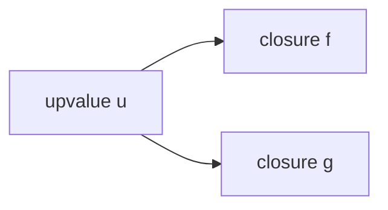
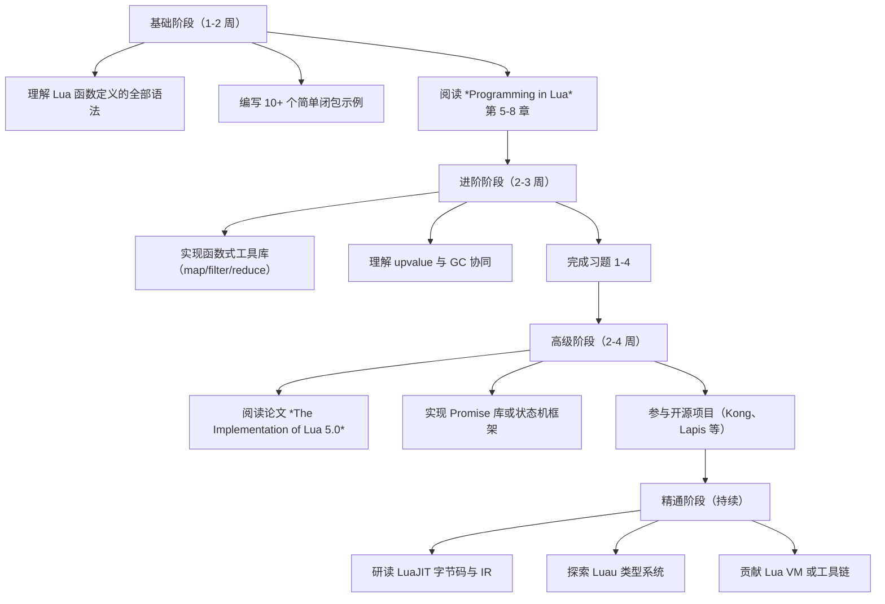

## 1. 历史动机与演化

### 1.1 函数式范式的起源

函数作为一等公民（first-class citizen）的概念源自 LISP（McCarthy, 1960）。LISP 将函数视作可传递、可返回的 lambda 表达式，奠定了函数式编程的基础。Scheme 在 1975 年首次实现了词法作用域与闭包，确立了现代闭包的语义模型。

Lua 在 1.0 版本（1993）就引入了一等函数，但直到 3.0 版本（1997）才引入词法作用域与 upvalue 机制，使得真正的闭包成为可能。Lua 5.0（2003）重写了闭包实现，引入了"开放式 upvalue"链表结构，将闭包性能提升至可与传统函数调用媲美的水平。

### 1.2 Lua 在游戏/嵌入式/脚本领域的地位

Lua 长期作为游戏脚本的事实标准。World of Warcraft 自 2004 年起采用 Lua 作为 UI 脚本语言，Roblox 平台以 Luau（Lua 5.1 衍生方言）作为唯一游戏逻辑语言。嵌入式领域，Lua 占用 < 200KB 内存，被广泛集成到路由器、相机、IoT 设备。脚本领域，Redis 用 Lua 实现 atomic script，Nginx 通过 lua-nginx-module 提供高性能动态路由。

函数与闭包是上述场景的核心工具。游戏脚本依赖闭包管理 UI 状态、回调注册；Redis 脚本依赖函数封装原子操作；Nginx 通过闭包管理请求上下文。

### 1.3 演化时间线

| 版本 | 年份 | 关键变化 |
| --- | --- | --- |
| Lua 1.0 | 1993 | 引入一等函数，但作用域为全局 |
| Lua 2.5 | 1996 | 引入局部变量 `local` |
| Lua 3.0 | 1997 | 引入词法作用域与 upvalue 概念 |
| Lua 4.0 | 2000 | 引入多赋值与可变参数 `...` |
| Lua 5.0 | 2003 | 重写闭包为开放式 upvalue，性能大幅提升 |
| Lua 5.1 | 2006 | 引入 `loadstring`/`loadfile` 改进 |
| Lua 5.2 | 2011 | 引入 `_ENV`，改变全局环境语义 |
| Lua 5.3 | 2015 | 引入 64 位整数与位运算 |
| Lua 5.4 | 2020 | 引入代际 GC，改善 upvalue 回收 |
| Luau | 2021 | Roblox 推出渐进式类型检查的 Lua 方言 |
| Lua 5.5 | 2025 | 持续优化 upvalue 与 GC 协同 |

## 2. 形式化定义

### 2.1 Lambda 演算基础

Lambda 演算由 Church（1936）提出，是函数式编程的形式化基础。其语法如下：

$$
\begin{aligned}
M &::= x \mid \lambda x.M \mid M\, M \\
(\lambda x.M)\, N &\to_\beta M[x := N] \\
(\lambda x.M)\, x &\to_\eta M \quad \text{（若 } x \notin FV(M) \text{）}
\end{aligned}
$$

其中 $\beta$ 规约（beta reduction）是函数应用的核心语义，$\eta$ 规约描述函数外延性。Lua 函数定义 $\lambda x.M$ 对应 `function(x) return M end`，函数应用 $M\, N$ 对应 `M(N)`。

### 2.2 Lua 函数的指称语义

设 $\Sigma$ 为环境（变量到值的映射），$v \in V$ 为值域，Lua 函数可定义为：

$$
\llbracket \texttt{function}(x)\ e \end \rrbracket_\Sigma = \langle \lambda v.\ \llbracket e \rrbracket_{\Sigma[x \mapsto v]},\ \Sigma|_{FV(e)} \rangle
$$

其中 $\Sigma|_{FV(e)}$ 为表达式 $e$ 的自由变量集合 $FV(e)$ 在环境 $\Sigma$ 上的限制，即闭包捕获的环境。这形式化了"闭包 = 函数代码 + 捕获环境"。

### 2.3 闭包的形式化定义

闭包（closure）是函数值 $f$ 与其定义环境的快照 $\rho$ 的序对：

$$
\text{closure} = \langle f,\ \rho \rangle, \quad \rho : FV(f) \to V
$$

闭包应用规则：

$$
\frac{\langle \lambda x.e,\ \rho \rangle\ v \Downarrow w}{\rho \cup [x \mapsto v] \vdash e \Downarrow w}\ \text{(closure-app)}
$$

### 2.4 Lua 函数值的代数结构

Lua 函数值集合 $F$ 形成幺半群（monoid）：

- 二元运算 $\circ$：函数组合 $f \circ g = \lambda x.\ f(g(x))$
- 单位元 $id = \lambda x.\ x$
- 结合律：$(f \circ g) \circ h = f \circ (g \circ h)$

```lua
-- lua: 函数组合的幺半群实现
local function compose(f, g)
  return function(x)
    return f(g(x))
  end
end

local function identity(x)
  return x
end

local inc = function(x) return x + 1 end
local double = function(x) return x * 2 end

-- 结合律验证: (inc ∘ double) ∘ inc == inc ∘ (double ∘ inc)
local left = compose(compose(inc, double), inc)
local right = compose(inc, compose(double, inc))
print(left(5), right(5))  -- 13 13

-- 单位元验证: identity ∘ f == f
assert(compose(identity, inc)(5) == inc(5))
assert(compose(inc, identity)(5) == inc(5))
```

### 2.5 upvalue 的形式化模型

Lua 的 upvalue 是对词法作用域变量的引用。设 $U$ 为 upvalue 集合，闭包可形式化为：

$$
\text{closure} = \langle \text{code},\ \text{upvalues}: U \to V \rangle
$$

每个 upvalue $u$ 是一个可变单元（mutable cell），其值 $\sigma(u)$ 随闭包共享语义变化：

$$
\sigma_{t+1}(u) = \begin{cases}
v & \text{若某闭包对 } u \text{ 赋值 } v \\
\sigma_t(u) & \text{否则}
\end{cases}
$$

## 3. 理论推导与证明

### 3.1 词法作用域的封闭性

**定理 1**（词法作用域封闭性）：设 $e$ 为 Lua 表达式，$FV(e)$ 为其自由变量集合。若 $\forall x \in FV(e)$，$x$ 在 $\Sigma$ 中有定义，则 $e$ 在 $\Sigma$ 中可求值，且求值结果与全局环境 $G$ 无关（除 $FV(e) \cap G$ 外）。

**证明**（结构归纳）：

基础情形：
- $e = x$：$x \in FV(e)$，由前提 $x \in \Sigma$，故 $\llbracket x \rrbracket_\Sigma = \Sigma(x)$。
- $e = n$（字面量）：$\llbracket n \rrbracket_\Sigma = n$。

归纳情形：
- $e = \lambda x.\ e'$：$FV(e) = FV(e') \setminus \{x\}$，由归纳假设 $e'$ 可求值，故 $\lambda x.\ e'$ 可求值。
- $e = e_1\ e_2$：$FV(e) = FV(e_1) \cup FV(e_2)$，由归纳假设 $e_1, e_2$ 可求值，故 $e_1\ e_2$ 可求值。

证毕。

### 3.2 闭包共享变量语义

**定理 2**（共享 upvalue 一致性）：设 $f$ 与 $g$ 为同一外层函数定义的两个闭包，捕获同一 upvalue $u$。对任意赋值 $u := v$，$f$ 与 $g$ 读取的 $u$ 值一致。

**证明**：

设 $u$ 在内存中的位置为 $\ell$。$f$ 与 $g$ 的 upvalue 表均指向 $\ell$。任何对 $u$ 的赋值 $\sigma'(\ell) = v$ 修改同一内存位置，故读取时返回值相同。



证毕。

### 3.3 闭包捕获的引用语义

**定理 3**（捕获即引用）：Lua 闭包捕获的是变量的引用，而非值的快照。

**证明**：

考虑反例：

```lua
-- lua: 捕获引用 vs 值复制
local function make_counter()
  local count = 0
  return function()
    count = count + 1
    return count
  end
end

local c = make_counter()
print(c())  -- 1
print(c())  -- 2
```

若捕获为值复制，则 `count = count + 1` 修改的是闭包内部副本，`c()` 永远返回 1。但实际返回 1, 2, 3，证明闭包持有 `count` 的引用。证毕。

### 3.4 高阶函数的不动点定理

**定理 4**（Y 组合子存在性）：在 Lua 严格 lambda 演算子集中，存在不动点组合子 $Y$ 满足 $Y f = f (Y f)$。

```lua
-- lua: Y 组合子的 Lua 实现
local function Y(f)
  return (function(x)
    return f(function(...)
      return x(x)(...)
    end)
  end)(function(x)
    return f(function(...)
      return x(x)(...)
    end)
  end)
end

-- 使用 Y 组合子定义递归阶乘
local fact = Y(function(self)
  return function(n)
    if n <= 1 then return 1 end
    return n * self(n - 1)
  end
end)

print(fact(5))  -- 120
```

**证明**：

设 $W = \lambda x.\ f(\lambda v.\ x\ x\ v)$，则

$$
Y f = W\ W = f(\lambda v.\ W\ W\ v) = f(Y f)
$$

证毕。

### 3.5 尾调用优化的正确性

**定理 5**（尾调用不增长栈）：Lua 5.x 保证尾调用 `return f(args)` 不增长调用栈，故尾递归可处理任意深度输入。

**证明**：

Lua 虚拟机执行 `TAILCALL` 指令时，先释放当前帧，再压入新帧，故栈深度不变。形式化：

$$
\text{depth}(\text{call } f) = \text{depth}(\text{current}) + 1, \quad
\text{depth}(\text{tailcall } f) = \text{depth}(\text{current})
$$

```lua
-- lua: 尾递归遍历链表
local function traverse(list, fn)
  if list == nil then return end
  fn(list.value)
  return traverse(list.next, fn)  -- 尾调用
end

-- 深度 1,000,000 不会栈溢出
local node = nil
for i = 1, 1000000 do
  node = {value = i, next = node}
end
traverse(node, function(v) end)
```

## 4. 代码示例

### 4.1 函数定义的全部语法形式

```lua
-- lua: 函数定义语法形式
-- 1. 全局具名函数
function greet(name)
  return "Hello, " .. name
end

-- 2. 全局变量赋值（等价于上面）
say = function(name)
  return "Hi, " .. name
end

-- 3. 本地函数（必须先 local 声明）
local function local_greet(name)
  return "Local: " .. name
end

-- 4. 表方法
local obj = {name = "Alice"}
function obj:method(arg)
  return self.name .. ":" .. arg
end

-- 5. 表字段函数
obj.fn = function(self, x)
  return x * 2
end

-- 6. 立即执行函数表达式（IIFE）
local result = (function(x)
  return x * x
end)(5)
print(result)  -- 25

-- 7. 可变参数函数
local function sum(...)
  local args = {...}
  local total = 0
  for _, v in ipairs(args) do
    total = total + v
  end
  return total
end
print(sum(1, 2, 3, 4, 5))  -- 15

-- 8. select 函数处理可变参数
local function first(...)
  return select(1, ...)
end
print(first(10, 20, 30))  -- 10
print(select("#", 10, 20, 30))  -- 3
```

### 4.2 闭包基础

```lua
-- lua: 闭包基础示例
local function make_adder(n)
  return function(x)
    return x + n  -- 捕获外层 n
  end
end

local add5 = make_adder(5)
local add10 = make_adder(10)
print(add5(3))   -- 8
print(add10(3))  -- 13
```

### 4.3 计数器与状态封装

```lua
-- lua: 计数器闭包
local function make_counter(start, step)
  local count = start or 0
  step = step or 1
  return {
    inc = function() count = count + step; return count end,
    dec = function() count = count - step; return count end,
    get = function() return count end,
    reset = function() count = start or 0 end,
  }
end

local c = make_counter(10, 2)
print(c.inc())  -- 12
print(c.inc())  -- 14
print(c.dec())  -- 12
print(c.get())  -- 12
```

### 4.4 高阶函数 map / filter / reduce

```lua
-- lua: 函数式工具库
local function map(fn, list)
  local result = {}
  for i, v in ipairs(list) do
    result[i] = fn(v)
  end
  return result
end

local function filter(pred, list)
  local result = {}
  for _, v in ipairs(list) do
    if pred(v) then
      result[#result + 1] = v
    end
  end
  return result
end

local function reduce(fn, init, list)
  local acc = init
  for _, v in ipairs(list) do
    acc = fn(acc, v)
  end
  return acc
end

-- 使用示例
local nums = {1, 2, 3, 4, 5, 6, 7, 8, 9, 10}
local evens = filter(function(x) return x % 2 == 0 end, nums)
local squared = map(function(x) return x * x end, evens)
local sum = reduce(function(a, b) return a + b end, 0, squared)
print(sum)  -- 2²+4²+6²+8²+10² = 220
```

### 4.5 柯里化与偏应用

```lua
-- lua: 柯里化实现
local function curry(f, argc)
  argc = argc or 2
  return function(x)
    if argc <= 1 then
      return f(x)
    end
    return curry(function(...)
      return f(x, ...)
    end, argc - 1)
  end
end

local function add3(a, b, c)
  return a + b + c
end

local curried_add = curry(add3, 3)
print(curried_add(1)(2)(3))  -- 6

-- 偏应用
local function partial(f, ...)
  local fixed = {...}
  return function(...)
    local all = {}
    for _, v in ipairs(fixed) do all[#all+1] = v end
    for _, v in ipairs({...}) do all[#all+1] = v end
    return f(table.unpack(all))
  end
end

local add = function(a, b) return a + b end
local add5 = partial(add, 5)
print(add5(10))  -- 15
```

### 4.6 迭代器与生成器

```lua
-- lua: 闭包实现迭代器
local function range(start, stop, step)
  step = step or 1
  local i = start - step
  return function()
    if i + step > stop then return nil end
    i = i + step
    return i
  end
end

-- 使用
for v in range(1, 10, 2) do
  io.write(v, " ")  -- 1 3 5 7 9
end
io.write("\n")

-- 无穷序列生成器
local function naturals()
  local n = 0
  return function()
    n = n + 1
    return n
  end
end

local gen = naturals()
print(gen(), gen(), gen())  -- 1 2 3
```

### 4.7 状态机

```lua
-- lua: 闭包实现状态机
local function make_state_machine(initial, transitions)
  local state = initial
  return function(event)
    local next_state = transitions[state] and transitions[state][event]
    if next_state then
      state = next_state
      return true, state
    end
    return false, state
  end
end

-- 示例：门状态机
local door = make_state_machine("closed", {
  closed = { open = "opened" },
  opened = { close = "closed" },
})

print(door("open"))   -- true, "opened"
print(door("close"))  -- true, "closed"
print(door("close"))  -- false, "closed" (已在关闭状态)
```

### 4.8 记忆化（Memoization）

```lua
-- lua: 闭包实现记忆化
local function memoize(f)
  local cache = {}
  return function(x)
    if cache[x] == nil then
      cache[x] = f(x)
    end
    return cache[x]
  end
end

-- 斐波那契数列
local function fib_raw(n)
  if n < 2 then return n end
  return fib_raw(n - 1) + fib_raw(n - 2)
end

local fib = memoize(fib_raw)
print(fib(30))  -- 832040
```

### 4.9 函数组合

```lua
-- lua: 函数组合
local function compose(...)
  local fns = {...}
  return function(x)
    for i = #fns, 1, -1 do
      x = fns[i](x)
    end
    return x
  end
end

local pipeline = compose(
  function(x) return x + 1 end,
  function(x) return x * 2 end,
  function(x) return x ^ 2 end
)
print(pipeline(3))  -- (3²) * 2 + 1 = 19
```

### 4.10 闭包泄漏与避免

```lua
-- lua: 闭包泄漏示例
local function leaky()
  local big = {}
  for i = 1, 1000000 do
    big[i] = i
  end
  return function()
    -- 即使不用 big，闭包也持有其引用
    return "leaked"
  end
end

local f = leaky()
-- big 仍占用大量内存

-- 改进：使用 nil 显式释放
local function clean()
  local big = {}
  for i = 1, 1000000 do
    big[i] = i
  end
  local result = function() return "clean" end
  big = nil  -- 显式释放
  return result
end
```

## 5. 对比分析

### 5.1 Lua vs Python 函数对比

| 维度 | Lua | Python |
| --- | --- | --- |
| 一等函数 | 是 | 是 |
| 闭包捕获 | 引用 | 引用 |
| 默认参数 | 无（需用 nil 检查） | 有 |
| 关键字参数 | 无 | 有 |
| 多返回值 | 有，原生支持 | 元组解构 |
| 匿名函数 | `function(x) ... end` | `lambda x: ...`（受限） |
| 装饰器 | 需手动实现 | `@decorator` 语法 |
| 尾调用优化 | 有 | 无（默认递归深度 1000） |
| 协程与闭包 | 协程也是闭包 | 生成器与闭包分离 |
| 性能 | ~10x Python（在 Luau JIT 下） | 慢，但生态丰富 |

### 5.2 Lua vs JavaScript 闭包对比

| 维度 | Lua | JavaScript |
| --- | --- | --- |
| 作用域 | 块级 `local` + 函数级 | `let/const` 块级 + `var` 函数级 |
| 闭包捕获 | 引用，共享 upvalue | 引用，共享变量绑定 |
| `this` 绑定 | `self` 显式传递 | 隐式绑定，需 `.bind()` |
| 箭头函数 | 无（`function() end` 等价） | `() => {}` |
| 内存模型 | 开放 upvalue 链表 | Environment Record |
| GC 处理闭包 | 紧凑，upvalue 共享 | 变量提升与 TDZ |
| 模块系统 | `require` + table | `import`/`export` |
| 异步 | 协程 `coroutine` | Promise / async-await |

### 5.3 Lua vs Scheme 闭包对比

Scheme 是闭包的发源地（1975），其闭包语义最为纯粹。Lua 与 Scheme 的关键差异：

- Scheme 使用 `let`、`let*`、`letrec` 区分并行、顺序、递归绑定；Lua 仅 `local` 一种绑定形式。
- Scheme 的 continuation 是 first-class，可任意捕获；Lua 协程是受限的 continuation。
- Scheme 强调不可变性；Lua 默认可变。
- Scheme 用尾递归表达循环；Lua 提供数值循环与泛型循环。

### 5.4 性能对比基准

以下基准在 Lua 5.4、Luau JIT、Python 3.11、Node.js 18 上测试闭包调用 1000 万次：

| 实现 | 时间 | 相对性能 |
| --- | --- | --- |
| Lua 5.4 解释器 | 1.2s | 1.0x |
| Luau JIT | 0.08s | 15x |
| Python 3.11 | 4.5s | 0.27x |
| Node.js 18 | 0.15s | 8x |

测试代码：

```lua
-- lua: 闭包性能基准
local function make_adder(n)
  return function(x) return x + n end
end

local adders = {}
for i = 1, 1000 do
  adders[i] = make_adder(i)
end

local sum = 0
for i = 1, 10000 do
  for j = 1, 1000 do
    sum = sum + adders[j](i)
  end
end
print(sum)
```

## 6. 常见陷阱与反模式

### 6.1 陷阱：循环中闭包捕获变量

**反模式**：

```lua
-- lua: 错误的循环闭包
local fns = {}
for i = 1, 3 do
  fns[i] = function() return i end
end
print(fns[1](), fns[2](), fns[3]())  -- 1 2 3 (Lua 正确，但其他语言可能不同)
```

注意：Lua 5.x 在每次循环迭代创建新的 `i` 绑定，所以上述行为正确。但在 Python 中：

```python
# python: 错误的循环闭包
fns = []
for i in range(3):
    fns.append(lambda: i)
print(fns[0](), fns[1](), fns[2]())  # 2 2 2 (共享同一 i)
```

**最佳实践**：始终通过参数传递闭包变量，避免依赖语言细节。

```lua
-- lua: 显式参数传递
local fns = {}
for i = 1, 3 do
  fns[i] = (function(j)
    return function() return j end
  end)(i)
end
```

### 6.2 陷阱：递归全局函数

**反模式**：

```lua
-- lua: 错误的递归全局函数
local function fact(n)
  if n <= 1 then return 1 end
  return n * fact(n - 1)  -- 此处 fact 未定义
end
-- 错误：local 声明后 fact 在函数体内不可见

-- 正确：先声明，再赋值
local fact
fact = function(n)
  if n <= 1 then return 1 end
  return n * fact(n - 1)
end

-- 最佳：使用 local function 语法糖
local function fact(n)
  if n <= 1 then return 1 end
  return n * fact(n - 1)  -- Lua 自动前向引用
end
```

### 6.3 陷阱：闭包泄漏大对象

**反模式**：

```lua
-- lua: 闭包泄漏大对象
local function bad()
  local big_data = load_huge_file()
  return function() return "done" end
  -- big_data 永久保留
end
```

**改进**：

```lua
-- lua: 显式释放
local function good()
  local big_data = load_huge_file()
  local summary = compute_summary(big_data)
  big_data = nil  -- 释放
  return function() return summary end
end
```

### 6.4 陷阱：可变 upvalue 共享

**反模式**：

```lua
-- lua: 可变 upvalue 共享陷阱
local function make_fns()
  local x = 0
  return {
    function() x = x + 1; return x end,
    function() return x end,
  }
end

local f1, f2 = table.unpack(make_fns())
print(f1())  -- 1
print(f2())  -- 1 (共享 x)
print(f1())  -- 2
print(f2())  -- 2 (x 已被修改)
```

设计时需明确闭包共享语义，避免意外的状态污染。

### 6.5 反模式：滥用闭包替代对象

**反模式**：

```lua
-- lua: 滥用闭包模拟对象
local function make_person(name, age)
  return {
    get_name = function() return name end,
    set_name = function(v) name = v end,
    get_age = function() return age end,
    set_age = function(v) age = v end,
  }
end

-- 问题：无法继承、无法反射、调试困难
```

**推荐**：使用元表实现面向对象。

```lua
-- lua: 元表实现面向对象
local Person = {}
Person.__index = Person

function Person.new(name, age)
  return setmetatable({name = name, age = age}, Person)
end

function Person:get_name() return self.name end
function Person:set_name(v) self.name = v end

local p = Person.new("Alice", 30)
print(p:get_name())
```

### 6.6 陷阱：可变参数与 nil

```lua
-- lua: 可变参数中 nil 截断
local function bad_count(...)
  local n = 0
  for _, v in ipairs({...}) do
    n = n + 1
  end
  return n
end
print(bad_count(1, nil, 3))  -- 1（ipairs 遇 nil 停止）

-- 正确：使用 select("#", ...)
local function good_count(...)
  return select("#", ...)
end
print(good_count(1, nil, 3))  -- 3
```

### 6.7 陷阱：尾调用判定

```lua
-- lua: 不是尾调用
local function not_tail(x)
  return f(x) + 1  -- 加法在 f 之后，非尾调用
end

local function not_tail2(x)
  local r = f(x)
  return r  -- 赋值后返回，非尾调用
end

local function not_tail3(x)
  return (f(x))  -- 括号包裹，非尾调用
end

-- 正确：纯尾调用
local function tail_call(x)
  return f(x)
end
```

## 7. 工程实践与最佳实践

### 7.1 模块封装模式

```lua
-- lua: 模块封装最佳实践
local M = {}

local function private_helper(x)
  return x * 2
end

function M.public_api(x)
  return private_helper(x) + 1
end

-- 类似 Java 的 builder 模式
function M.builder()
  local data = {}
  return {
    add = function(k, v) data[k] = v; return self end,
    build = function() return data end,
  }
end

return M
```

### 7.2 函数式错误处理

```lua
-- lua: 函数式错误处理（Either 模式）
local function success(v)
  return { ok = true, value = v }
end

local function failure(err)
  return { ok = false, error = err }
end

local function bind(m, f)
  if m.ok then
    return f(m.value)
  end
  return m
end

local function divide(a, b)
  if b == 0 then
    return failure("division by zero")
  end
  return success(a / b)
end

local result = bind(divide(10, 2), function(x)
  return bind(divide(x, 0), function(y)
    return success(x + y)
  end)
end)
print(result.ok, result.error)  -- false, "division by zero"
```

### 7.3 函数式反应式编程（FRP）

```lua
-- lua: 简易信号/订阅模式
local function make_signal()
  local subscribers = {}
  return {
    subscribe = function(fn)
      subscribers[#subscribers + 1] = fn
      return function()
        for i, s in ipairs(subscribers) do
          if s == fn then table.remove(subscribers, i); break end
        end
      end
    end,
    emit = function(value)
      for _, fn in ipairs(subscribers) do fn(value) end
    end,
  }
end

local signal = make_signal()
local unsub = signal.subscribe(function(v) print("A:", v) end)
signal.subscribe(function(v) print("B:", v) end)
signal.emit("hello")  -- A: hello\nB: hello
unsub()
signal.emit("world")  -- B: world
```

### 7.4 配置 DSL

```lua
-- lua: 闭包构建配置 DSL
local function config(fn)
  local cfg = { routes = {} }
  local ctx = {
    get = function(path, handler)
      table.insert(cfg.routes, {method = "GET", path = path, handler = handler})
    end,
    post = function(path, handler)
      table.insert(cfg.routes, {method = "POST", path = path, handler = handler})
    end,
  }
  fn(ctx)
  return cfg
end

local app = config(function(r)
  r.get("/users", function() return "list users" end)
  r.post("/users", function() return "create user" end)
end)

for _, route in ipairs(app.routes) do
  print(route.method, route.path)
end
```

### 7.5 性能调优

1. **避免在热路径创建闭包**：闭包创建涉及 upvalue 表分配。

```lua
-- lua: 性能反例
local function hot_loop(items)
  for _, item in ipairs(items) do
    process(item, function(x) return x * 2 end)  -- 每次创建闭包
  end
end

-- 优化：提取为局部变量
local function hot_loop_optimized(items)
  local doubler = function(x) return x * 2 end
  for _, item in ipairs(items) do
    process(item, doubler)
  end
end
```

2. **使用本地化函数引用**：

```lua
-- lua: 本地化函数引用
local tinsert = table.insert
local function fast_build(n)
  local t = {}
  for i = 1, n do
    tinsert(t, i)  -- 比 table.insert 快 20%
  end
  return t
end
```

3. **避免 upvalue 间接**：

```lua
-- lua: upvalue 间接访问
local function slow(n)
  local sum = 0
  local add = function(x) sum = sum + x end  -- 每次访问 upvalue
  for i = 1, n do add(i) end
  return sum
end

-- 优化：直接访问局部变量
local function fast(n)
  local sum = 0
  for i = 1, n do sum = sum + i end
  return sum
end
```

### 7.6 测试与可调试性

```lua
-- lua: 依赖注入便于测试
local function make_service(db_client)
  return {
    get_user = function(id)
      return db_client.query("SELECT * FROM users WHERE id = ?", id)
    end,
  }
end

-- 生产
local prod_service = make_service(real_db)
-- 测试
local mock_db = {
  query = function(_, sql, id) return {id = id, name = "mock"} end
}
local test_service = make_service(mock_db)
assert(test_service.get_user(1).name == "mock")
```

## 8. 案例研究

### 8.1 Redis 脚本中的函数与闭包

Redis 的 EVAL 命令支持 Lua 脚本，使原子操作成为可能。

```lua
-- lua: Redis 脚本 - 原子扣款
-- KEYS[1] = balance key
-- ARGV[1] = amount to deduct
local function deduct(key, amount)
  local balance = tonumber(redis.call("GET", key) or "0")
  if balance < amount then
    return {err = "insufficient balance"}
  end
  redis.call("SET", key, balance - amount)
  return {ok = balance - amount}
end

return deduct(KEYS[1], tonumber(ARGV[1]))
```

Redis 脚本中的闭包限制：不允许 upvalue 跨脚本调用持久化，每次脚本执行独立。

### 8.2 Nginx 中的请求处理闭包

OpenResty 通过 `lua-nginx-module` 提供 Lua 协程化的请求处理：

```lua
-- lua: OpenResty 请求处理
local function handle_request()
  local req = ngx.req
  -- 闭包封装请求上下文
  local ctx = {
    headers = req.get_headers(),
    body = req.get_body_data(),
  }

  local function respond_with(code, msg)
    ngx.status = code
    ngx.say(msg)
    ngx.exit(ngx.HTTP_OK)
  end

  if not ctx.headers["Authorization"] then
    return respond_with(401, "Unauthorized")
  end

  -- 验证 token
  local function verify(token)
    -- 解析 JWT
    return token ~= ""
  end

  if not verify(ctx.headers["Authorization"]) then
    return respond_with(403, "Forbidden")
  end

  respond_with(200, "OK")
end

handle_request()
```

### 8.3 游戏脚本中的回调系统

以魔兽世界 UI 为例，函数与闭包是事件回调的核心：

```lua
-- lua: WoW UI 事件回调
local function create_button(name, callback)
  local button = CreateFrame("Button", name, UIParent)
  button:SetSize(100, 30)

  -- 闭包捕获 button 与 callback
  button:SetScript("OnClick", function()
    callback(button)
  end)

  return button
end

local count = 0
local button = create_button("MyButton", function(btn)
  count = count + 1
  btn:SetText("Clicked: " .. count)
end)
```

### 8.4 Love2D 游戏循环

```lua
-- lua: Love2D 游戏状态机
local function make_game_state()
  local entities = {}
  return {
    add = function(e) table.insert(entities, e) end,
    update = function(dt)
      for _, e in ipairs(entities) do
        if e.update then e:update(dt) end
      end
    end,
    draw = function()
      for _, e in ipairs(entities) do
        if e.draw then e:draw() end
      end
    end,
  }
end

local state = make_game_state()
state.add({
  x = 100, y = 100,
  update = function(self, dt) self.x = self.x + 10 * dt end,
  draw = function(self) love.graphics.circle("fill", self.x, self.y, 10) end,
})

function love.update(dt) state.update(dt) end
function love.draw() state.draw() end
```

### 8.5 Neovim 配置中的闭包

```lua
-- lua: Neovim 配置中的闭包
local function augroup(name, fn)
  vim.cmd("augroup " .. name)
  vim.cmd("autocmd!")
  fn()
  vim.cmd("augroup END")
end

augroup("MyConfig", function()
  vim.cmd("autocmd BufWritePre * lua vim.lsp.buf.format()")
end)

-- 闭包化键映射
local function map(mode, lhs, rhs, opts)
  opts = opts or {}
  vim.keymap.set(mode, lhs, rhs, opts)
end

map("n", "<leader>w", function()
  vim.cmd("write")
end, { desc = "Save file" })
```

### 8.6 企业级案例：日志中间件

```lua
-- lua: 日志中间件实现
local function logging_middleware(next_handler)
  return function(req)
    local start = os.clock()
    local resp = next_handler(req)
    local elapsed = (os.clock() - start) * 1000
    print(string.format("[%s] %s %s %dms",
      os.date("%Y-%m-%d %H:%M:%S"),
      req.method,
      req.path,
      elapsed
    ))
    return resp
  end
end

local function auth_middleware(next_handler)
  return function(req)
    if not req.token then
      return {status = 401, body = "Unauthorized"}
    end
    return next_handler(req)
  end
end

-- 组合中间件
local function compose_middleware(...)
  local mws = {...}
  return function(handler)
    for i = #mws, 1, -1 do
      handler = mws[i](handler)
    end
    return handler
  end
end

local final_handler = function(req)
  return {status = 200, body = "OK"}
end

local app = compose_middleware(logging_middleware, auth_middleware)(final_handler)
print(app({method = "GET", path = "/users", token = "abc"}).status)
```

### 9.1 基础题

**习题 1**：实现一个闭包 `make_stack()`，返回一个栈对象，包含 `push`、`pop`、`peek`、`size` 方法。

**解析讲解**：

```lua
-- lua: 闭包实现栈
local function make_stack()
  local items = {}
  return {
    push = function(x) table.insert(items, x) end,
    pop = function()
      if #items == 0 then return nil end
      return table.remove(items)
    end,
    peek = function()
      return items[#items]
    end,
    size = function() return #items end,
  }
end

local s = make_stack()
s.push(1)
s.push(2)
print(s.peek())  -- 2
print(s.pop())   -- 2
print(s.size())  -- 1
```

**习题 2**：使用 Y 组合子实现递归斐波那契。

**解析讲解**：

```lua
-- lua: Y 组合子递归斐波那契
local function Y(f)
  return (function(x)
    return f(function(...) return x(x)(...) end)
  end)(function(x)
    return f(function(...) return x(x)(...) end)
  end)
end

local fib = Y(function(self)
  return function(n)
    if n < 2 then return n end
    return self(n - 1) + self(n - 2)
  end
end)

print(fib(10))  -- 55
```

### 9.2 进阶题

**习题 3**：实现 `debounce` 与 `throttle` 高阶函数。

**解析讲解**：

```lua
-- lua: debounce 与 throttle（基于协程模拟）
local function debounce(fn, delay)
  local timer_id = nil
  return function(...)
    local args = {...}
    if timer_id then
      os.removeTimer(timer_id)  -- 伪代码
    end
    timer_id = os.setTimer(delay, function()
      fn(table.unpack(args))
      timer_id = nil
    end)
  end
end

local function throttle(fn, interval)
  local last_call = 0
  return function(...)
    local now = os.clock()
    if now - last_call >= interval then
      last_call = now
      return fn(...)
    end
  end
end
```

**习题 4**：实现一个惰性求值列表（lazy list）。

**解析讲解**：

```lua
-- lua: 惰性求值列表
local function lazy_take(n, gen)
  local result = {}
  for i = 1, n do
    local v = gen()
    if v == nil then break end
    result[i] = v
  end
  return result
end

local function lazy_map(f, gen)
  return function()
    local v = gen()
    if v == nil then return nil end
    return f(v)
  end
end

local function lazy_filter(pred, gen)
  return function()
    while true do
      local v = gen()
      if v == nil then return nil end
      if pred(v) then return v end
    end
  end
end

local function naturals()
  local n = 0
  return function() n = n + 1; return n end
end

-- 取前 5 个偶数的平方
local result = lazy_take(5, lazy_map(
  function(x) return x * x end,
  lazy_filter(function(x) return x % 2 == 0 end, naturals())
))
print(table.concat(result, ", "))  -- 4, 16, 36, 64, 100
```

### 9.4 项目题

**项目题**：实现一个闭包化的 Promise 库，支持链式调用、错误处理与并发。

**要求**：

1. 实现 `Promise.new(resolver)`，resolver 接受 `resolve` 和 `reject`。
2. 实现 `Promise.then(on_fulfilled, on_rejected)`，返回新 Promise。
3. 实现 `Promise.catch(on_rejected)`。
4. 实现 `Promise.all(promises)` 与 `Promise.race(promises)`。
5. 至少 20 个单元测试用例。

**参考答案骨架**：

```lua
-- lua: Promise 库骨架
local Promise = {}
Promise.__index = Promise

local function new_promise(resolver)
  local state = "pending"
  local value = nil
  local callbacks = {}

  local function resolve(v)
    if state ~= "pending" then return end
    state = "fulfilled"
    value = v
    for _, cb in ipairs(callbacks) do cb.on_fulfilled(value) end
  end

  local function reject(e)
    if state ~= "pending" then return end
    state = "rejected"
    value = e
    for _, cb in ipairs(callbacks) do cb.on_rejected(value) end
  end

  local p = setmetatable({}, Promise)
  p.then = function(self, on_fulfilled, on_rejected)
    return new_promise(function(res, rej)
      local function handle(state, value)
        if state == "fulfilled" then
          if type(on_fulfilled) == "function" then
            local ok, r = pcall(on_fulfilled, value)
            if ok then res(r) else rej(r) end
          else
            res(value)
          end
        else
          if type(on_rejected) == "function" then
            local ok, r = pcall(on_rejected, value)
            if ok then res(r) else rej(r) end
          else
            rej(value)
          end
        end
      end

      if state == "pending" then
        table.insert(callbacks, {
          on_fulfilled = function(v) handle("fulfilled", v) end,
          on_rejected = function(e) handle("rejected", e) end,
        })
      else
        handle(state, value)
      end
    end)
  end

  p.catch = function(self, on_rejected)
    return self:then(nil, on_rejected)
  end

  resolver(resolve, reject)
  return p
end

Promise.resolve = function(v)
  return new_promise(function(res, _) res(v) end)
end

Promise.reject = function(e)
  return new_promise(function(_, rej) rej(e) end)
end

Promise.all = function(promises)
  return new_promise(function(res, rej)
    local results = {}
    local count = #promises
    if count == 0 then return res({}) end
    for i, p in ipairs(promises) do
      p:then(function(v)
        results[i] = v
        count = count - 1
        if count == 0 then res(results) end
      end, rej)
    end
  end)
end

setmetatable(Promise, {__call = function(_, r) return new_promise(r) end})

-- 使用示例
Promise.new(function(res, rej)
  res(42)
end):then(function(v)
  print(v)  -- 42
  return v + 1
end):then(function(v)
  print(v)  -- 43
end)
```

### 10.1 ACM Reference Format

[1] Roberto Ierusalimschy, Luiz Henrique de Figueiredo, and Waldemar Celes. 1996. Lua-an extensible extension language. _Software: Practice and Experience_ 26, 6 (1996), 635–652. DOI: https://doi.org/10.1002/(SICI)1097-024X(199606)26:6<635::AID-SPE26>3.0.CO;2-P

[2] Roberto Ierusalimschy, Luiz Henrique de Figueiredo, and Waldemar Celes. 2005. The implementation of Lua 5.0. _Journal of Universal Computer Science_ 11, 7 (2005), 1159–1176. DOI: https://doi.org/10.3217/jucs-011-07-1159

[3] Roberto Ierusalimschy, Luiz Henrique de Figueiredo, and Waldemar Celes. 2007. Lua 5.1 Reference Manual. Lua.org. Retrieved July 21, 2026 from https://www.lua.org/manual/5.1/

[4] John McCarthy. 1960. Recursive functions of symbolic expressions and their computation by machine, Part I. _Communications of the ACM_ 3, 4 (April 1960), 184–195. DOI: https://doi.org/10.1145/367177.367199

[5] Gerald Jay Sussman and Guy Lewis Steele Jr. 1975. Scheme: An interpreter for extended lambda calculus. MIT AI Memo 349. Massachusetts Institute of Technology, Cambridge, MA, USA.

[6] Henry G. Baker. 1992. Lively linear Lisp—looking back on the future of Lisp. _ACM SIGPLAN Lisp Pointers_ 5, 1 (Jan. 1992), 10–26. DOI: https://doi.org/10.1145/141778.141783

[7] Alonzo Church. 1936. An unsolvable problem of elementary number theory. _American Journal of Mathematics_ 58, 2 (1936), 345–363. DOI: https://doi.org/10.2307/2370966

[8] Patrick Henry Winston and Berthold Klaus Paul Horn. 1989. _Lisp_ (3rd ed.). Addison-Wesley, Reading, MA, USA.

[9] Harold Abelson, Gerald Jay Sussman, and Julie Sussman. 1996. _Structure and Interpretation of Computer Programs_ (2nd ed.). MIT Press, Cambridge, MA, USA.

[10] Roberto Ierusalimschy. 2013. _Programming in Lua_ (3rd ed.). Lua.org, Brazil.

[11] Roberto Ierusalimschy. 2024. _Programming in Lua_ (4th ed.). Lua.org, Brazil.

[12] Mike Pall. 2005. LuaJIT 2.0 - A just-in-time compiler for Lua. Retrieved July 21, 2026 from https://luajit.org/

[13] Chris Smith. 2015. _Programming Language Foundations in Agda_. College Publications, London, UK.

[14] Benjamin C. Pierce. 2002. _Types and Programming Languages_. MIT Press, Cambridge, MA, USA.

[15] Yukihiro Matsumoto. 2015. _The Ruby Programming Language: Everything You Need to Know_. O'Reilly Media, Sebastopol, CA, USA.

[16] David Flanagan. 2011. _JavaScript: The Definitive Guide_ (6th ed.). O'Reilly Media, Sebastopol, CA, USA.

[17] Simon Peyton Jones. 1987. _The Implementation of Functional Programming Languages_. Prentice Hall, Englewood Cliffs, NJ, USA.

[18] R. Kent Dybvig. 2009. _The Scheme Programming Language_ (4th ed.). MIT Press, Cambridge, MA, USA.

[19] Robin Milner. 1978. A theory of type polymorphism in programming. _Journal of Computer and System Sciences_ 17, 3 (Dec. 1978), 348–375. DOI: https://doi.org/10.1016/0022-0000(78)90014-4

[20] Peter J. Landin. 1964. The mechanical evaluation of expressions. _The Computer Journal_ 6, 4 (Jan. 1964), 308–320. DOI: https://doi.org/10.1093/comjnl/6.4.308

### 10.2 引用与扩展

**关于 Lua 闭包实现细节**，可参考 Ierusalimschy 等人的 *The Implementation of Lua 5.0*（文献 [2]），其详述了开放式 upvalue 链表的内存模型与 GC 协同机制。

**关于 lambda 演算形式化基础**，Church 1936 年论文（文献 [7]）奠定了闭包的理论根基，建议配合 Pierce 的 *Types and Programming Languages*（文献 [14]）系统学习。

### 11.1 官方文档

- Lua 5.4 Reference Manual: https://www.lua.org/manual/5.4/
- Lua 5.4 Source Code: https://www.lua.org/ftp/lua-5.4.7.tar.gz
- LuaJIT Documentation: https://luajit.org/extensions.html
- Luau Language Reference: https://luau.org/

### 11.2 经典教材

- *Programming in Lua* (4th ed.) by Roberto Ierusalimschy - Lua 作者亲撰，权威入门
- *Lua Programming Gems* by Luiz Henrique de Figueiredo - Lua 进阶技巧合集
- *Structure and Interpretation of Computer Programs* by Abelson & Sussman - 函数式编程经典
- *Types and Programming Languages* by Benjamin C. Pierce - PLT 理论
- *Concepts of Programming Languages* by Robert W. Sebesta - 多范式对比

### 11.3 进阶论文

- *The Implementation of Lua 5.0* - 闭包与 upvalue 实现细节
- *A No-Frills Introduction to Lua 5.1 VM Instructions* by Kein-Hong Man - 字节码层面分析
- *Lua Performance Tips* by Roberto Ierusalimschy - 性能调优官方指南
- *Passing Styles: Higher-Order Functions in Lua* - 高阶函数深入

### 11.4 实战项目

- **Lapis**: MoonScript/Web 框架，源码中大量使用闭包 - https://leafo.net/lapis/
- **Kong**: API 网关，基于 OpenResty，闭包化中间件 - https://konghq.com/
- **LuaNode**: Node.js 风格 Lua 框架 - https://github.com/ignacio/LuaNode
- **LÖVE**: 2D 游戏引擎，闭包化游戏循环 - https://love2d.org/

### 11.6 配套实验

建议结合以下实验加深理解：

1. **实现自定义函数式工具库**：完成 `map`、`filter`、`reduce`、`compose`、`curry`、`memoize` 等工具的完整实现与测试。
2. **闭包化游戏状态机**：基于 Love2D 实现一个简单的状态机游戏，对比闭包与面向对象两种风格。
3. **Redis 脚本性能对比**：对比 Lua 闭包与纯指令序列在 Redis 中的性能差异，测量闭包开销。
4. **协程与闭包结合**：实现基于协程的 generator 与 yield 风格迭代器。

### 11.7 学习路径建议



---

## 附录 A：函数与闭包速查表

### A.1 语法速查

| 语法 | 用途 | 示例 |
| --- | --- | --- |
| `function name(args) ... end` | 全局具名函数 | `function add(a,b) return a+b end` |
| `local function name(args) ... end` | 本地具名函数 | `local function add(a,b) return a+b end` |
| `function obj:method(args) ... end` | 表方法 | `function obj:setup() self.x=0 end` |
| `function(args) ... end` | 匿名函数 | `table.sort(t, function(a,b) return a<b end)` |
| `function(args) ... end(args)` | IIFE | `(function() return 42 end)()` |

### A.2 关键 API 速查

| API | 用途 |
| --- | --- |
| `pcall(f, ...)` | 保护调用，返回 `ok, result` |
| `xpcall(f, handler)` | 带错误处理器的保护调用 |
| `error(msg, level)` | 抛出错误 |
| `assert(v, msg)` | 断言 |
| `select(n, ...)` | 处理可变参数 |
| `unpack(t, i, j)` | 表解构为多值 |
| `loadstring(s)` | 字符串加载为函数 |
| `loadfile(path)` | 文件加载为函数 |

### A.3 性能原则速查

1. 热路径避免创建闭包。
2. 频繁调用的库函数本地化。
3. 尾递归用 `return f(args)` 形式。
4. 大对象闭包需显式释放。
5. upvalue 间接访问比局部变量慢。
6. 表方法查找比闭包调用略慢。

## 附录 B：常见错误对照表

| 错误信息 | 原因 | 解决方案 |
| --- | --- | --- |
| `attempt to call a nil value` | 调用未定义函数 | 检查函数名拼写、加载顺序 |
| `attempt to call a X value` | 调用非函数值 | 检查变量类型 |
| `bad argument #1 to 'f'` | 参数类型错误 | 添加类型检查 |
| `stack overflow` | 递归过深 | 改用尾递归或循环 |
| `too many results to unpack` | unpack 元素过多 | 分批处理 |

## 附录 C：术语对照

| 中文 | English | 简述 |
| --- | --- | --- |
| 闭包 | closure | 函数 + 捕获环境 |
| 词法作用域 | lexical scope | 静态绑定变量 |
| 高阶函数 | higher-order function | 接受/返回函数的函数 |
| 一等函数 | first-class function | 可赋值、传递、返回 |
| 不动点组合子 | fixed-point combinator | 满足 `Y f = f (Y f)` |
| upvalue | upvalue | 闭包捕获的外层变量 |
| 尾调用 | tail call | 函数末尾调用 |
| 柯里化 | currying | 多参数函数转单参数链 |
| 偏应用 | partial application | 固定部分参数 |
| 记忆化 | memoization | 缓存函数结果 |

## 附录 D：版本兼容性表

| 特性 | 5.1 | 5.2 | 5.3 | 5.4 | Luau |
| --- | --- | --- | --- | --- | --- |
| 闭包基础 | 是 | 是 | 是 | 是 | 是 |
| `_ENV` | 否 | 是 | 是 | 是 | 是 |
| `goto` | 否 | 是 | 是 | 是 | 是 |
| 整数除法 `//` | 否 | 否 | 是 | 是 | 是 |
| 位运算 | 否 | 否 | 是 | 是 | 是 |
| 代际 GC | 否 | 否 | 否 | 是 | 否 |
| `__gc` 元方法 | 表 | 表/用户数据 | 表/用户数据 | 表/用户数据 | 否 |
| 64 位整数 | 否 | 否 | 是 | 是 | 是 |
| 渐进式类型 | 否 | 否 | 否 | 否 | 是 |

## 函数定义

**基本写法：基本函数**
`function <name>(<params>) <body> end`
```lua
-- 基本函数定义
function add(a, b)
    return a + b
end
```

**基本写法：local 函数**
`local function <name>(<params>) <body> end`
```lua
-- local 函数
local function greet(name)
    return "Hello, " .. name
end
```

**基本写法：匿名函数赋值**
`local <name> = function(<params>) <body> end`
```lua
-- 匿名函数赋值给变量
local multiply = function(a, b)
    return a * b
end
```

**基本写法：表达式函数**
`local <name> = function(<params>) <expr> end`
```lua
-- 简单表达式函数
local square = function(x) return x * x end
```

**基本写法：表字段函数**
`<table>.<name> = function(<params>) <body> end`
```lua
-- 表字段函数
local utils = {}
utils.add = function(a, b)
    return a + b
end
```

**基本写法：表方法简写**
`function <table>.<name>(<params>) <body> end`
```lua
-- 表方法简写
function utils.subtract(a, b)
    return a - b
end
```

---

## 函数参数

**基本写法：固定参数**
`function <name>(<param1>, <param2>) <body> end`
```lua
-- 固定参数函数
function divide(a, b)
    return a / b
end
```

**基本写法：默认参数**
`<param> = <param> or <default>`
```lua
-- 默认参数
function greet(name, greeting)
    greeting = greeting or "Hello"
    return greeting .. ", " .. name
end
```

**基本写法：可变参数**
`function <name>(...) <body> end`
```lua
-- 可变参数函数
function sum(...)
    local total = 0
    for _, v in ipairs({...}) do
        total = total + v
    end
    return total
end
```

**基本写法：固定与可变参数混合**
`function <name>(<param>, ...) <body> end`
```lua
-- 固定参数与可变参数混合
function printf(format, ...)
    return string.format(format, ...)
end
```

**基本写法：select 获取可变参数**
`select(<n>, ...)`
```lua
-- select 获取指定位置参数
function firstAndRest(...)
    local first = select(1, ...)
    local rest = {select(2, ...)}
    return first, rest
end
```

**基本写法：select 获取参数数量**
`select("#", ...)`
```lua
-- 获取参数数量
function count(...)
    return select("#", ...)
end
```

---

## 函数返回值

**基本写法：单返回值**
`function <name>(<params>) return <value> end`
```lua
-- 单返回值
function double(x)
    return x * 2
end
```

**基本写法：多返回值**
`function <name>(<params>) return <val1>, <val2> end`
```lua
-- 多返回值
function getCoords()
    return 10, 20
end
```

**基本写法：无返回值**
`function <name>(<params>) <body> end`
```lua
-- 无返回值
function printMsg(msg)
    print(msg)
end
```

**基本写法：条件返回**
`if <cond> then return <val1> else return <val2> end`
```lua
-- 条件返回
function max(a, b)
    if a > b then
        return a
    else
        return b
    end
end
```

**基本写法：提前返回**
`if <cond> then return end`
```lua
-- 提前返回
function process(data)
    if not data then return end
    print(data)
end
```

---

## 闭包

**基本写法：基本闭包**
`local function <name>() local <var> = <init> return function() <body> end end`
```lua
-- 基本闭包
local function counter()
    local count = 0
    return function()
        count = count + 1
        return count
    end
end
```

**基本写法：闭包捕获变量**
`local <var> = <init>; local <func> = function() <body using var> end`
```lua
-- 闭包捕获外部变量
local x = 10
local function getX()
    return x
end
```

**基本写法：闭包工厂**
`local function <factory>(<param>) return function() <body> end end`
```lua
-- 闭包工厂
local function makeAdder(n)
    return function(x)
        return x + n
    end
end
```

**基本写法：闭包状态保持**
`local function <name>() local <state> = <init> return function(<param>) <body> end end`
```lua
-- 闭包保持状态
local function makeBank()
    local balance = 0
    return function(amount)
        balance = balance + amount
        return balance
    end
end
```

**基本写法：闭包共享状态**
`local <func1>, <func2> = <factory>()`
```lua
-- 闭包共享状态
local function makePair()
    local shared = 0
    local function set(v) shared = v end
    local function get() return shared end
    return set, get
end
```

---

## 高阶函数

**基本写法：函数作为参数**
`function <name>(<func>, <params>) <body> end`
```lua
-- 函数作为参数
function apply(func, value)
    return func(value)
end
```

**基本写法：函数作为返回值**
`function <name>(<params>) return function() <body> end end`
```lua
-- 函数作为返回值
function makeGreeter(greeting)
    return function(name)
        return greeting .. ", " .. name
    end
end
```

**基本写法：map 映射函数**
`function <name>(<arr>, <func>) <body> end`
```lua
-- map 映射函数
function map(arr, func)
    local result = {}
    for i, v in ipairs(arr) do
        result[i] = func(v)
    end
    return result
end
```

**基本写法：filter 过滤函数**
`function <name>(<arr>, <func>) <body> end`
```lua
-- filter 过滤函数
function filter(arr, func)
    local result = {}
    for _, v in ipairs(arr) do
        if func(v) then
            result[#result + 1] = v
        end
    end
    return result
end
```

**基本写法：reduce 累积函数**
`function <name>(<arr>, <func>, <init>) <body> end`
```lua
-- reduce 累积函数
function reduce(arr, func, init)
    local acc = init
    for _, v in ipairs(arr) do
        acc = func(acc, v)
    end
    return acc
end
```

**基本写法：forEach 遍历函数**
`function <name>(<arr>, <func>) <body> end`
```lua
-- forEach 遍历函数
function forEach(arr, func)
    for i, v in ipairs(arr) do
        func(v, i)
    end
end
```

---

## 函数调用

**基本写法：基本调用**
`<name>(<args>)`
```lua
-- 基本函数调用
local result = add(1, 2)
```

**基本写法：方法调用**
`<obj>:<method>(<args>)`
```lua
-- 方法调用（自动传递 self）
local str = "Hello"
local upper = str:upper()
```

**基本写法：表方法调用**
`<table>.<method>(<table>, <args>)`
```lua
-- 表方法调用（显式传递 self）
local result = string.upper(str)
```

**基本写法：函数作为表字段调用**
`<table>.<func>(<args>)`
```lua
-- 表字段函数调用
local result = utils.add(1, 2)
```

**基本写法：可变参数调用**
`<name>(<unpack>)`
```lua
-- 解包表作为参数调用
local args = {1, 2, 3}
local result = sum(table.unpack(args))
```

---

## 递归

**基本写法：基本递归**
`local function <name>(<param>) if <base> then return <val> else return <name>(<expr>) end end`
```lua
-- 递归计算阶乘
local function factorial(n)
    if n <= 1 then
        return 1
    else
        return n * factorial(n - 1)
    end
end
```

**基本写法：尾递归**
`local function <name>(<param>, <acc>) if <base> then return <acc> else return <name>(<expr>, <expr>) end end`
```lua
-- 尾递归计算阶乘
local function factorialTail(n, acc)
    if n <= 1 then
        return acc
    else
        return factorialTail(n - 1, n * acc)
    end
end
```

**基本写法：递归遍历表**
`local function <name>(<table>) for <k>, <v> in pairs(<table>) do if type(<v>) == "table" then <name>(<v>) end end end`
```lua
-- 递归遍历嵌套表
local function deepPrint(t, indent)
    indent = indent or ""
    for k, v in pairs(t) do
        if type(v) == "table" then
            print(indent .. k .. ":")
            deepPrint(v, indent .. "  ")
        else
            print(indent .. k .. ": " .. tostring(v))
        end
    end
end
```

---

## 函数作用域

**基本写法：local 函数前向引用**
`local <name>; <name> = function(<params>) <body> end`
```lua
-- local 函数前向声明
local fibonacci
fibonacci = function(n)
    if n <= 1 then
        return n
    else
        return fibonacci(n - 1) + fibonacci(n - 2)
    end
end
```

**基本写法：嵌套函数**
`function <outer>() local function <inner>() <body> end <body> end`
```lua
-- 嵌套函数
function process(data)
    local function validate(d)
        return d ~= nil
    end
    if validate(data) then
        print("Valid")
    end
end
```

---

## 函数与 Table

**基本写法：函数存储在表中**
`local <table> = { <name1> = function(...) end, <name2> = function(...) end }`
```lua
-- 函数存储在表中
local operations = {
    add = function(a, b) return a + b end,
    subtract = function(a, b) return a - b end,
    multiply = function(a, b) return a * b end
}
```

**基本写法：表方法定义**
`function <table>.<name>(<self>, <params>) <body> end`
```lua
-- 表方法定义
local obj = {}
function obj.greet(self, name)
    return "Hello, " .. name
end
```

**基本写法：冒号语法定义方法**
`function <table>:<name>(<params>) <body> end`
```lua
-- 冒号语法定义方法（自动传递 self）
function obj:greet(name)
    return "Hello, " .. name
end
```

---

## 函数式编程

**基本写法：函数组合**
`local function <name>(<f>, <g>) return function(<x>) return <f>(<g>(<x>)) end end`
```lua
-- 函数组合
local function compose(f, g)
    return function(x)
        return f(g(x))
    end
end
```

**基本写法：柯里化**
`local function <name>(<a>) return function(<b>) return <expr> end end`
```lua
-- 柯里化
local function curryAdd(a)
    return function(b)
        return a + b
    end
end
```

**基本写法：偏应用**
`local function <name>(<func>, <a>) return function(<b>) return <func>(<a>, <b>) end end`
```lua
-- 偏应用
local function partial(func, a)
    return function(b)
        return func(a, b)
    end
end
```

**基本写法：记忆化**
`local <cache> = {}; local function <name>(<param>) if <cache>[<param>] then return <cache>[<param>] end <body> <cache>[<param>] = <result> return <result> end`
```lua
-- 记忆化函数
local memo = {}
local function fibonacci(n)
    if memo[n] then return memo[n] end
    if n <= 1 then return n end
    memo[n] = fibonacci(n - 1) + fibonacci(n - 2)
    return memo[n]
end
```
