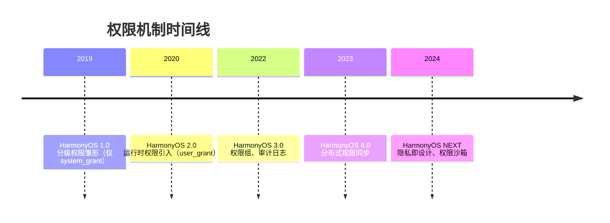
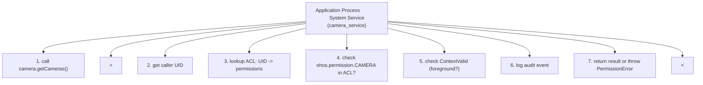
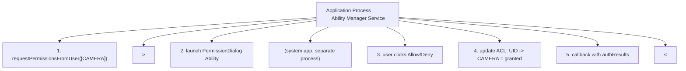
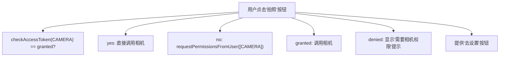

# 权限申请：HarmonyOS 访问控制模型与运行时权限工程实践

> 权限系统是操作系统安全模型的"最后一公里"。如果说进程隔离与沙箱构筑了"城墙"，那么权限系统就是城墙上的"门卫"——决定每个应用能否跨越边界访问敏感资源。本章按 MIT 6.858（Computer Systems Security）、Stanford CS155（Computer and Network Security）、CMU 15-410（Distributed Systems）等课程标准组织，系统讲解 HarmonyOS 权限模型的设计哲学、`ohos.permission.*` 命名空间、`normal`/`system_basic`/`system_core` 三级权限等级、`system_grant`/`user_grant` 双轨授权机制、`abilityAccessCtrl` 模块 API、`requestPermissionsFromUser` 运行时申请流程、权限组（Permission Group）策略、动态申请与权限拒绝处理、跨应用权限共享、分布式权限同步等核心议题，并对照 Android Runtime Permissions、iOS Privacy Manifest、Windows App Capability 等业界方案。

---

## 1. 历史动机与发展脉络

### 1.1 移动端权限系统的演进（2008-2019）

移动操作系统权限系统经历了从"安装时一次性授权"到"运行时按需授权"的范式转变：

| 年代 | 系统 | 模型 | 局限 |
| --- | --- | --- | --- |
| 2008 | Android 1.0 | 安装时全部授权 | 用户无法细粒度控制 |
| 2015 | Android 6.0 (M) | Runtime Permissions | 仅 `dangerous` 权限运行时申请 |
| 2014 | iOS 8 | Privacy Permissions | 按需弹窗，但缺乏统一抽象 |
| 2020 | iOS 14 | Privacy Manifest | 强制声明数据用途 |
| 2017 | Windows 10 UWP | App Capability | 类似 ACL 模型 |
| 2019 | HarmonyOS 1.0 | 分级权限 | 仅智慧屏，权限模型简单 |

HarmonyOS 设计权限系统时吸收了 Android Runtime Permissions 的运行时申请机制，并借鉴 iOS Privacy Manifest 的"用途声明"思想，同时引入了更严格的三级等级体系。

### 1.2 HarmonyOS 1.0（2019）：分级权限雏形

HarmonyOS 1.0 仅运行于智慧屏，权限模型较为简单：

- 引入 `ohos.permission.*` 命名空间。
- 权限等级仅分为 `normal` 与 `system` 两级。
- 全部采用 `system_grant`，无运行时申请。
- 权限在应用签名时由系统校验，未声明的权限无法使用。

### 1.3 HarmonyOS 2.0（2020）：运行时权限引入

HarmonyOS 2.0 随手机形态发布，引入运行时权限：

- 权限等级细化为 `normal`、`system_basic`、`system_core` 三级。
- 引入 `user_grant` 授权方式，敏感权限需运行时弹窗。
- 提供 `@ohos.abilityAccessCtrl` 模块，支持 `requestPermissionsFromUser`。
- 引入 `usedScene.when` 字段，支持 `inuse`/`always` 区分。
- 权限组概念引入，相机/麦克风等归为同组。

### 1.4 HarmonyOS 3.0（2022）：权限组与审计

HarmonyOS 3.0 关键改进：

- **权限组细化**：引入 12 个权限组，每组对应一组相关权限。
- **权限使用审计**：系统记录应用最近一次使用敏感权限的时间。
- **权限撤销**：用户可在设置中撤销已授予的权限，应用需响应 `onConfigurationUpdate`。
- **后台权限**：`always` 权限需用户在设置中显式开启，弹窗不支持。
- **`availableStatus` 字段**：声明权限使用的前置条件（如需定位开启）。

### 1.5 HarmonyOS 4.0（2023）：分布式权限

HarmonyOS 4.0 引入分布式权限：

- **跨设备权限同步**：同账号下设备自动同步权限授予状态。
- **远程 Ability 权限校验**：`startRemoteAbility` 时，系统校验调用方在目标设备的权限。
- **权限使用可视化**：状态栏实时显示应用使用麦克风/相机/位置。
- **隐私清单**：应用需声明数据出境、第三方 SDK 权限使用。
- **`reason` 多语言**：支持多语言文案，按系统语言自动切换。

### 1.6 HarmonyOS NEXT（2024）：隐私即设计

HarmonyOS NEXT 将"隐私即设计"（Privacy by Design）作为核心原则：

- **最小化授权**：所有 `user_grant` 权限默认 `inuse`，应用需主动申请 `always`。
- **权限沙箱**：每个权限对应独立沙箱，应用退出后敏感数据自动清理。
- **AI 风险识别**：系统基于应用行为识别"过度索权"，向用户告警。
- **权限使用 SDK 强制声明**：第三方 SDK 必须在 `module.json5` 中声明其所需权限。
- **权限撤销增强**：支持"长时间未使用自动撤销"（6 个月未使用）。

### 1.7 OpenHarmony 权限演进

OpenHarmony 中权限管理模块位于 `security/access_token`：

| OpenHarmony 版本 | 权限模型版本 | 关键特性 |
| --- | --- | --- |
| 1.0 | 1.0 | 基础 normal/system 分级 |
| 2.0 | 1.5 | 运行时权限、abilityAccessCtrl |
| 3.0 | 2.0 | 权限组、审计日志 |
| 3.2 | 2.5 | 分布式权限同步 |
| 4.0 | 3.0 | 隐私清单、状态栏提示 |
| 5.0 | 3.5 | 权限沙箱、AI 风险识别 |

### 1.8 时间线总览



---

## 2. 形式化定义

### 2.1 权限系统的形式化定义

定义 HarmonyOS 权限系统为九元组：

$$
\mathcal{P} = \langle \mathcal{R}, \mathcal{A}, \mathcal{S}, \mathcal{L}, \mathcal{G}, \mathcal{U}, \mathcal{T}, \mathcal{E}, \mathcal{O} \rangle
$$

其中：

- $\mathcal{R} = \{r_1, r_2, \dots, r_n\}$ 为权限（Permission）集合，每个权限 $r_i \in \mathcal{R}$ 形如 `ohos.permission.XXX`。
- $\mathcal{A} = \{a_1, a_2, \dots, a_m\}$ 为应用（Application）集合。
- $\mathcal{S}: \mathcal{A} \to 2^{\mathcal{R}}$ 为应用声明的权限集合（在 `module.json5` 中）。
- $\mathcal{L}: \mathcal{R} \to \{\text{normal}, \text{system\_basic}, \text{system\_core}\}$ 为权限等级映射。
- $\mathcal{G}: \mathcal{R} \to \{\text{system\_grant}, \text{user\_grant}\}$ 为授权方式映射。
- $\mathcal{U}: \mathcal{A} \times \mathcal{R} \to \{\text{granted}, \text{denied}, \text{unset}\}$ 为用户授权状态。
- $\mathcal{T}: \mathcal{R} \to \{\text{inuse}, \text{always}, \text{unrestricted}\}$ 为使用时机约束。
- $\mathcal{E}: \mathcal{A} \times \mathcal{R} \to \text{Event Stream}$ 为权限使用事件流（审计）。
- $\mathcal{O}: \mathcal{A} \times \mathcal{R} \to \{\text{allowed}, \text{denied}\}$ 为运行时访问决策函数。

### 2.2 访问控制决策

应用 $a$ 访问受权限 $r$ 保护的资源时，决策函数 $\mathcal{O}$ 定义为：

$$
\mathcal{O}(a, r) = \text{allowed} \iff \text{Declared}(a, r) \wedge \text{Granted}(a, r) \wedge \text{ContextValid}(a, r)
$$

其中：

- $\text{Declared}(a, r) \iff r \in \mathcal{S}(a)$：应用已声明该权限。
- $\text{Granted}(a, r) \iff \mathcal{U}(a, r) = \text{granted}$：用户已授权。
- $\text{ContextValid}(a, r)$：当前使用场景符合 $\mathcal{T}(r)$（如 `inuse` 权限要求应用在前台）。

### 2.3 权限等级与授权方式的正交性

权限等级 $\mathcal{L}$ 与授权方式 $\mathcal{G}$ 是两个正交维度，组合出 6 种权限类型：

| 等级 \ 授权方式 | system_grant | user_grant |
| --- | --- | --- |
| normal | INTERNET、GET_NETWORK_INFO | LOCATION、MICROPHONE |
| system_basic | MANAGE_WIFI_CONFIG | CAMERA、READ_MEDIA |
| system_core | MANAGE_USERS、SET_TIME | （通常无，系统应用免弹窗） |

### 2.4 权限组的数学结构

定义权限组（Permission Group）为权限集合的划分：

$$
\mathcal{G}_{group} = \{G_1, G_2, \dots, G_k\} \quad \text{where} \quad \bigcup_i G_i = \mathcal{R}_{user\_grant}, \quad G_i \cap G_j = \emptyset \ (i \neq j)
$$

授权单元为权限组而非单权限：用户授予组内任一权限后，组内其他权限再次申请时**仍需弹窗**（HarmonyOS 不支持"组内自动授予"），但弹窗文案会显示"该应用已获得组内其他权限"。

### 2.5 权限状态机

应用对单个权限的状态转换定义如下：

$$
\text{State}(a, r) \in \{\text{unset}, \text{granted}, \text{denied}, \text{denied\_permanently}\}
$$

状态转移：

$$
\begin{aligned}
\text{unset} &\xrightarrow{\text{request + user accept}} \text{granted} \\
\text{unset} &\xrightarrow{\text{request + user deny}} \text{denied} \\
\text{denied} &\xrightarrow{\text{request + user deny with "no ask"}} \text{denied\_permanently} \\
\text{granted} &\xrightarrow{\text{user revoke in Settings}} \text{unset} \\
\text{denied\_permanently} &\xrightarrow{\text{user grant in Settings}} \text{granted}
\end{aligned}
$$

### 2.6 分布式权限同步

同账号下设备 $d_i$ 与 $d_j$ 的权限状态同步：

$$
\text{SyncPerm}(a, d_i, d_j) \implies \mathcal{U}_{d_j}(a, r) \leftarrow \mathcal{U}_{d_i}(a, r) \quad \forall r \in \mathcal{S}(a)
$$

同步策略：

- 仅同步 `user_grant` 权限，`system_grant` 权限各设备独立。
- 同步延迟 < 5 秒（同账号下 DSoftBus 通道）。
- 用户可在设置中关闭"跨设备权限同步"。

---

## 3. 理论推导与原理解析

### 3.1 访问控制理论：ACL vs. RBAC vs. ABAC

访问控制三大模型：

**ACL（Access Control List）**：以资源为中心，列出可访问的主体。

$$
\text{ACL}(r) = \{a_1, a_2, \dots\} \quad \text{where } a_i \text{ can access } r
$$

**RBAC（Role-Based Access Control）**：引入角色中介，主体通过角色获取权限。

$$
\text{User} \to \text{Role} \to \text{Permission} \to \text{Resource}
$$

**ABAC（Attribute-Based Access Control）**：基于主体、资源、环境属性动态决策。

$$
\text{Decision} = f(\text{attr}(s), \text{attr}(r), \text{attr}(env))
$$

HarmonyOS 选择 **ACL + 属性约束**的混合模型：

- ACL 主体：应用（通过 bundleName 标识）。
- 属性约束：`usedScene.when`（环境属性）、`availableStatus`（资源属性）。
- 选择理由：移动应用权限相对静态，ACL 简单直接；ABAC 过度灵活增加决策开销。

### 3.2 权限校验的调用栈

应用调用受保护 API（如 `camera.getCameras()`）时，系统权限校验流程：



关键点：

- 权限校验在**系统服务侧**完成，应用无法绕过。
- 校验基于 **UID**（应用安装时分配），而非 bundleName，防止伪装。
- 审计日志写入 `/data/log/audit/`，仅系统可读。

### 3.3 运行时弹窗的安全模型

`requestPermissionsFromUser` 弹窗由**系统进程**渲染，非应用进程：



设计意图：

- **防 Clickjacking**：应用无法在弹窗上绘制覆盖层。
- **防诱导**：弹窗 UI 由系统控制，应用无法修改文案（仅 `reason` 字段可定制）。
- **防重放**：每次申请生成唯一 `requestId`，防止伪造回调。

### 3.4 权限组的认知模型

权限组设计基于用户的"认知分类"理论：

$$
\text{Cognitive Load}(n) = O(n \log n) \quad \text{(Hick's Law)}
$$

若每个权限独立弹窗，用户面对 $n$ 个权限需做 $n$ 次决策，认知负荷线性增长。权限组将相关权限聚合（如 `LOCATION` 组包含粗略定位与精确定位），减少决策次数。

但权限组带来"全有或全无"风险：用户授予组内任一权限后，可能误以为仅授予该权限，实则组内其他权限也获得"更容易授权"的路径。HarmonyOS 选择折中：组内权限仍需独立弹窗，但弹窗文案提示"已获得组内其他权限"。

### 3.5 后台权限的隐私风险

`inuse` 与 `always` 的核心差异在于**后台可见性**：

$$
\text{Visibility}(a, \text{background}) = \begin{cases}
\text{invisible} & \text{if } \mathcal{T}(r) = \text{inuse} \\
\text{visible to system} & \text{if } \mathcal{T}(r) = \text{always}
\end{cases}
$$

`always` 权限（如后台定位）允许应用在后台持续访问敏感资源，隐私风险显著高于 `inuse`。HarmonyOS 4.0+ 强制要求：

- `always` 权限不能通过弹窗直接授予，必须引导用户到设置页。
- 系统状态栏显示"应用 X 正在后台使用位置"通知，用户可一键撤销。
- 24 小时内后台累计使用超过 30 分钟，系统弹窗询问用户是否保留权限。

### 3.6 权限撤销的一致性

用户在设置中撤销权限后，应用需保证状态一致性：

$$
\text{Revoke}(a, r) \implies \forall \text{resource } x \in \text{OpenSet}(a): \text{close}(x) \text{ if } \text{requires}(x, r)
$$

挑战：应用已打开的资源（如相机句柄）在权限撤销后是否自动关闭？

HarmonyOS 设计：

- **系统资源**（相机、麦克风）：系统服务主动断开连接，应用收到 `onError` 回调。
- **应用缓存**：应用需自行清理，系统不强制。
- **持久化数据**：已读取的数据（如已拍摄照片）不删除，但无法继续访问。

### 3.7 权限申请时序与用户体验

权限申请的最佳时机是"用户首次触发需权限的功能时"，而非应用启动时：



提前申请（启动即申请）的弊端：

1. 用户未感知功能，弹窗显得突兀，拒绝率高。
2. 应用尚未建立信任，用户倾向于拒绝。
3. 合规审计可能标记为"过度索权"。

### 3.8 分布式权限同步的安全性

跨设备权限同步需防范"权限放大攻击"：

$$
\text{Attack}: \text{Compromise}(d_i) \xrightarrow{\text{sync}} \text{Gain}(a, r, d_j)
$$

若设备 $d_i$ 被攻陷，攻击者是否可通过同步机制在 $d_j$ 上获得权限？

HarmonyOS 防御：

- **同步前校验**：目标设备 $d_j$ 校验 $d_i$ 的同步请求是否来自可信设备圈。
- **同步范围限制**：仅同步同账号下应用的权限，跨账号不同步。
- **用户可控**：用户可在设置中关闭"跨设备权限同步"，或为单设备单独撤销。
- **审计日志**：同步事件写入审计日志，包含源设备、目标设备、权限名、时间戳。

---

## 4. 代码示例

### 4.1 module.json5 完整权限声明

```json5
// entry/src/main/module.json5
{
  "module": {
    "name": "entry",
    "type": "entry",
    "deviceTypes": ["phone", "tablet", "2in1"],
    "abilities": [
      {
        "name": "EntryAbility",
        "srcEntry": "./ets/entryability/EntryAbility.ets",
        "description": "$string:EntryAbility_desc",
        "icon": "$media:icon",
        "label": "$string:EntryAbility_label",
        "startWindowIcon": "$media:icon",
        "startWindowBackground": "$color:start_window_background",
        "startWindowAnimation": "@ohos:fragment_animation",
        "exported": true,
        "skills": [
          {
            "entities": ["entity.system.home"],
            "actions": ["action.system.home"]
          }
        ]
      }
    ],
    "requestPermissions": [
      {
        "name": "ohos.permission.INTERNET",
        "reason": "$string:internet_reason",
        "usedScene": {
          "abilities": ["EntryAbility"],
          "when": "always"
        }
      },
      {
        "name": "ohos.permission.CAMERA",
        "reason": "$string:camera_reason",
        "usedScene": {
          "abilities": ["EntryAbility"],
          "when": "inuse"
        }
      },
      {
        "name": "ohos.permission.MICROPHONE",
        "reason": "$string:mic_reason",
        "usedScene": {
          "abilities": ["EntryAbility"],
          "when": "inuse"
        }
      },
      {
        "name": "ohos.permission.READ_MEDIA",
        "reason": "$string:read_media_reason",
        "usedScene": {
          "abilities": ["EntryAbility"],
          "when": "inuse"
        }
      },
      {
        "name": "ohos.permission.WRITE_MEDIA",
        "reason": "$string:write_media_reason",
        "usedScene": {
          "abilities": ["EntryAbility"],
          "when": "inuse"
        }
      },
      {
        "name": "ohos.permission.LOCATION",
        "reason": "$string:location_reason",
        "usedScene": {
          "abilities": ["EntryAbility"],
          "when": "inuse"
        }
      },
      {
        "name": "ohos.permission.APPROXIMATELY_LOCATION",
        "reason": "$string:approx_location_reason",
        "usedScene": {
          "abilities": ["EntryAbility"],
          "when": "inuse"
        }
      }
    ]
  }
}
```

`resources/base/element/string.json` 资源文件：

```json
{
  "string": [
    { "name": "internet_reason", "value": "用于加载网络内容" },
    { "name": "camera_reason", "value": "用于拍摄照片和视频" },
    { "name": "mic_reason", "value": "用于录制音频" },
    { "name": "read_media_reason", "value": "用于读取相册图片" },
    { "name": "write_media_reason", "value": "用于保存图片到相册" },
    { "name": "location_reason", "value": "用于获取精确位置信息" },
    { "name": "approx_location_reason", "value": "用于获取大致位置信息" }
  ]
}
```

### 4.2 企业级权限管理封装

```typescript
// entry/src/main/ets/utils/PermissionManager.ets
import abilityAccessCtrl, {
  Permissions,
  ATManager,
  PermissionRequestResult
} from '@ohos.abilityAccessCtrl';
import common from '@ohos.app.ability.common';
import { hilog } from '@kit.PerformanceAnalysisKit';
import { BusinessError } from '@kit.BasicServicesKit';

const DOMAIN = 0x0001;
const TAG = 'PermissionManager';

/** 权限授权状态 */
export enum PermissionState {
  /** 已授予 */
  GRANTED = 0,
  /** 已拒绝（可再次申请） */
  DENIED = -1,
  /** 未确认（首次申请前） */
  UNSET = 2,
  /** 永久拒绝（需引导设置页） */
  DENIED_PERMANENTLY = -2
}

/** 权限申请结果 */
export interface RequestResult {
  /** 权限名 */
  permission: string;
  /** 授权状态 */
  state: PermissionState;
  /** 是否需要引导用户去设置页 */
  needSettingsGuide: boolean;
}

/**
 * PermissionManager - 企业级权限管理封装
 *
 * 特性：
 * - 单例模式，全局统一管理
 * - 批量权限检查与申请
 * - 权限拒绝重试策略
 * - 自动引导设置页
 * - 权限使用审计埋点
 *
 * 兼容：HarmonyOS 4.0 (API 10) 与 HarmonyOS NEXT (API 11+)
 */
export class PermissionManager {
  private static instance: PermissionManager;
  private atManager: ATManager;
  /** 记录已申请过的权限，用于判断"再次申请"或"永久拒绝" */
  private requestedPermissions: Set<string> = new Set();
  /** 权限拒绝次数统计，用于风控 */
  private denyCount: Map<string, number> = new Map();

  /** 私有构造 */
  private constructor() {
    this.atManager = abilityAccessCtrl.createAtManager();
  }

  /** 获取单例 */
  static getInstance(): PermissionManager {
    if (!PermissionManager.instance) {
      PermissionManager.instance = new PermissionManager();
    }
    return PermissionManager.instance;
  }

  /**
   * 检查单个权限状态
   * @param context AbilityContext
   * @param permission 权限名
   * @returns 权限状态
   */
  async checkPermission(
    context: common.UIAbilityContext,
    permission: string
  ): Promise<PermissionState> {
    try {
      const tokenId = context.applicationInfo.accessTokenId;
      const status = await this.atManager.checkAccessToken(tokenId, permission);

      hilog.debug(
        DOMAIN, TAG,
        'checkPermission: %{public}s -> %{public}d',
        permission, status
      );

      if (status === 0) {
        return PermissionState.GRANTED;
      } else if (status === -1) {
        return this.requestedPermissions.has(permission)
          ? PermissionState.DENIED
          : PermissionState.UNSET;
      }
      return PermissionState.UNSET;
    } catch (err) {
      const e = err as BusinessError;
      hilog.error(DOMAIN, TAG, 'checkPermission failed: %{public}s', e.message);
      return PermissionState.UNSET;
    }
  }

  /**
   * 批量检查权限状态
   * @param context AbilityContext
   * @param permissions 权限名数组
   * @returns 权限状态映射
   */
  async checkPermissions(
    context: common.UIAbilityContext,
    permissions: string[]
  ): Promise<Map<string, PermissionState>> {
    const result = new Map<string, PermissionState>();
    await Promise.all(
      permissions.map(async (perm) => {
        const state = await this.checkPermission(context, perm);
        result.set(perm, state);
      })
    );
    return result;
  }

  /**
   * 申请权限（核心方法）
   *
   * 策略：
   * 1. 先检查当前状态，已授予则直接返回
   * 2. 调用 requestPermissionsFromUser 弹窗
   * 3. 根据结果判断是否需要引导设置页
   * 4. 记录申请历史，用于"永久拒绝"判断
   *
   * @param context AbilityContext
   * @param permissions 权限名数组
   * @returns 申请结果数组
   */
  async requestPermissions(
    context: common.UIAbilityContext,
    permissions: string[]
  ): Promise<RequestResult[]> {
    const results: RequestResult[] = [];

    // 标记为已申请
    permissions.forEach((p) => this.requestedPermissions.add(p));

    try {
      hilog.info(
        DOMAIN, TAG,
        'requestPermissions: %{public}s',
        permissions.join(', ')
      );

      const response: PermissionRequestResult =
        await this.atManager.requestPermissionsFromUser(
          context,
          permissions as Permissions[]
        );

      response.authResults.forEach((authResult, index) => {
        const permission = permissions[index];
        let state: PermissionState;
        let needSettingsGuide = false;

        if (authResult === 0) {
          state = PermissionState.GRANTED;
          this.denyCount.delete(permission);
        } else if (authResult === -1) {
          // 拒绝：判断是否为"永久拒绝"
          const count = (this.denyCount.get(permission) ?? 0) + 1;
          this.denyCount.set(permission, count);

          if (count >= 2) {
            state = PermissionState.DENIED_PERMANENTLY;
            needSettingsGuide = true;
          } else {
            state = PermissionState.DENIED;
          }
        } else {
          state = PermissionState.UNSET;
        }

        results.push({
          permission,
          state,
          needSettingsGuide
        });

        hilog.info(
          DOMAIN, TAG,
          'permission result: %{public}s -> state=%{public}d, guide=%{public}s',
          permission, state, needSettingsGuide.toString()
        );
      });
    } catch (err) {
      const e = err as BusinessError;
      hilog.error(DOMAIN, TAG, 'requestPermissions failed: %{public}s', e.message);

      permissions.forEach((p) => {
        results.push({
          permission: p,
          state: PermissionState.DENIED,
          needSettingsGuide: false
        });
      });
    }

    return results;
  }

  /**
   * 申请权限并确保全部授予
   *
   * 若任一权限未授予，返回 false，调用方可据此显示引导 UI
   *
   * @param context AbilityContext
   * @param permissions 权限名数组
   * @returns 是否全部授予
   */
  async ensurePermissions(
    context: common.UIAbilityContext,
    permissions: string[]
  ): Promise<boolean> {
    const results = await this.requestPermissions(context, permissions);
    return results.every((r) => r.state === PermissionState.GRANTED);
  }

  /**
   * 跳转到应用设置页
   *
   * 用于"永久拒绝"后引导用户手动开启权限
   *
   * @param context AbilityContext
   */
  jumpToAppSettings(context: common.UIAbilityContext): void {
    try {
      const want: Record<string, string> = {
        action: 'action.settings.app.info',
        parameters: {
          bundleName: context.abilityInfo.bundleName
        }
      };

      context.startAbility(want).then(() => {
        hilog.info(DOMAIN, TAG, 'jumped to app settings');
      }).catch((err: BusinessError) => {
        hilog.error(DOMAIN, TAG, 'jumpToAppSettings failed: %{public}s', err.message);
      });
    } catch (err) {
      const e = err as BusinessError;
      hilog.error(DOMAIN, TAG, 'jumpToAppSettings error: %{public}s', e.message);
    }
  }

  /**
   * 重置权限申请历史
   *
   * 用于用户在设置页返回后重新检查
   */
  resetHistory(): void {
    this.requestedPermissions.clear();
    this.denyCount.clear();
  }
}
```

### 4.3 相机权限申请完整流程

```typescript
// entry/src/main/ets/pages/CameraPage.ets
import { PermissionManager, PermissionState } from '../utils/PermissionManager';
import camera from '@ohos.multimedia.camera';
import { hilog } from '@kit.PerformanceAnalysisKit';
import common from '@ohos.app.ability.common';
import { promptAction } from '@kit.ArkUI';

const DOMAIN = 0x0001;
const TAG = 'CameraPage';

/**
 * CameraPage - 相机权限申请与相机调用的完整流程
 *
 * 演示：
 * 1. 用户点击"拍照"按钮触发权限申请
 * 2. 权限拒绝后显示引导 UI
 * 3. 永久拒绝后跳转设置页
 */
@Entry
@Component
struct CameraPage {
  @State hasPermission: boolean = false;
  @State showGuide: boolean = false;
  @State cameraReady: boolean = false;
  private permissionManager: PermissionManager = PermissionManager.getInstance();

  aboutToAppear(): void {
    this.checkCameraPermission();
  }

  /** 检查相机权限状态 */
  async checkCameraPermission(): Promise<void> {
    const context = getContext(this) as common.UIAbilityContext;
    const state = await this.permissionManager.checkPermission(
      context,
      'ohos.permission.CAMERA'
    );
    this.hasPermission = (state === PermissionState.GRANTED);
  }

  /** 点击拍照按钮 */
  async onTakePhotoClick(): Promise<void> {
    const context = getContext(this) as common.UIAbilityContext;

    if (this.hasPermission) {
      await this.startCamera();
      return;
    }

    // 申请相机权限
    const results = await this.permissionManager.requestPermissions(
      context,
      ['ohos.permission.CAMERA']
    );

    const result = results[0];
    if (result.state === PermissionState.GRANTED) {
      this.hasPermission = true;
      await this.startCamera();
    } else if (result.needSettingsGuide) {
      // 永久拒绝：引导设置页
      this.showGuide = true;
      promptAction.showToast({
        message: '相机权限已被拒绝，请在设置中开启',
        duration: 3000
      });
    } else {
      // 普通拒绝：可再次申请
      promptAction.showToast({
        message: '需要相机权限才能拍照',
        duration: 2000
      });
    }
  }

  /** 跳转设置页 */
  onGoToSettings(): void {
    const context = getContext(this) as common.UIAbilityContext;
    this.permissionManager.jumpToAppSettings(context);
  }

  /** 启动相机 */
  async startCamera(): Promise<void> {
    try {
      const cameraManager = camera.getCameraManager(getContext(this));
      const cameras = cameraManager.getSupportedCameras();
      if (cameras.length === 0) {
        promptAction.showToast({ message: '未找到可用相机' });
        return;
      }

      hilog.info(DOMAIN, TAG, 'camera started, count=%{public}d', cameras.length);
      this.cameraReady = true;
    } catch (err) {
      hilog.error(DOMAIN, TAG, 'startCamera failed: %{public}s', (err as Error).message);
    }
  }

  build() {
    Column() {
      Text(this.cameraReady ? '相机已就绪' : '点击下方按钮拍照')
        .fontSize(18)
        .margin({ top: 60, bottom: 30 })

      if (this.showGuide) {
        // 显示引导设置 UI
        Column() {
          Text('相机权限已被拒绝')
            .fontSize(16)
            .fontColor('#FF6B6B')
            .margin({ bottom: 10 })

          Text('请前往设置 > 应用 > 本应用 > 权限，开启相机权限')
            .fontSize(14)
            .fontColor('#666666')
            .textAlign(TextAlign.Center)
            .margin({ bottom: 20 })

          Button('前往设置')
            .onClick(() => this.onGoToSettings())
            .backgroundColor('#007DFF')
            .fontColor('#FFFFFF')
        }
        .padding(20)
        .backgroundColor('#FFF5F5')
        .borderRadius(12)
        .margin({ left: 20, right: 20 })
      } else {
        // 拍照按钮
        Button(this.hasPermission ? '拍照' : '申请相机权限并拍照')
          .onClick(() => this.onTakePhotoClick())
          .width('60%')
          .height(50)
          .backgroundColor('#007DFF')
          .fontColor('#FFFFFF')
          .margin({ top: 20 })
      }
    }
    .width('100%')
    .height('100%')
    .justifyContent(FlexAlign.Center)
  }
}
```

### 4.4 权限组批量申请

```typescript
// entry/src/main/ets/pages/MediaSharePage.ets
import { PermissionManager, PermissionState } from '../utils/PermissionManager';
import common from '@ohos.app.ability.common';
import { promptAction } from '@kit.ArkUI';
import { hilog } from '@kit.PerformanceAnalysisKit';

const DOMAIN = 0x0001;
const TAG = 'MediaSharePage';

/**
 * MediaSharePage - 媒体分享场景下的权限组批量申请
 *
 * 场景：用户点击"分享照片+视频+录音"
 * 需要：READ_MEDIA、WRITE_MEDIA、MICROPHONE
 */
@Entry
@Component
struct MediaSharePage {
  private permissionManager: PermissionManager = PermissionManager.getInstance();

  @State permissionStatus: string = '尚未申请';
  @State allGranted: boolean = false;

  /** 媒体分享所需权限组 */
  private readonly MEDIA_PERMISSIONS: string[] = [
    'ohos.permission.READ_MEDIA',
    'ohos.permission.WRITE_MEDIA',
    'ohos.permission.MICROPHONE'
  ];

  async onShareClick(): Promise<void> {
    const context = getContext(this) as common.UIAbilityContext;

    // 批量申请权限
    const results = await this.permissionManager.requestPermissions(
      context,
      this.MEDIA_PERMISSIONS
    );

    // 分析结果
    const granted = results.filter((r) => r.state === PermissionState.GRANTED);
    const denied = results.filter((r) => r.state !== PermissionState.GRANTED);

    this.allGranted = denied.length === 0;
    this.permissionStatus = `已授予: ${granted.length}/${results.length}`;

    if (this.allGranted) {
      promptAction.showToast({ message: '权限齐全，开始分享' });
      await this.doShare();
    } else {
      const deniedNames = denied.map((r) => r.permission).join(', ');
      promptAction.showToast({
        message: `以下权限被拒绝：${deniedNames}，部分功能不可用`,
        duration: 3000
      });

      // 若有永久拒绝，引导设置
      const needGuide = denied.filter((r) => r.needSettingsGuide);
      if (needGuide.length > 0) {
        hilog.warn(
          DOMAIN, TAG,
          'permanently denied: %{public}s',
          needGuide.map((r) => r.permission).join(', ')
        );
      }
    }
  }

  /** 执行分享逻辑 */
  async doShare(): Promise<void> {
    hilog.info(DOMAIN, TAG, 'doShare started');
    // 实际分享逻辑省略
  }

  build() {
    Column() {
      Text('媒体分享')
        .fontSize(24)
        .margin({ top: 80, bottom: 20 })

      Text(this.permissionStatus)
        .fontSize(14)
        .fontColor('#666666')
        .margin({ bottom: 40 })

      Button('分享照片+视频+录音')
        .onClick(() => this.onShareClick())
        .width('70%')
        .height(48)
        .backgroundColor(this.allGranted ? '#4CAF50' : '#007DFF')
        .fontColor('#FFFFFF')
    }
    .width('100%')
    .height('100%')
    .justifyContent(FlexAlign.Center)
  }
}
```

### 4.5 后台位置权限申请

```typescript
// entry/src/main/ets/pages/BackgroundLocationPage.ets
import { PermissionManager, PermissionState } from '../utils/PermissionManager';
import geoLocationManager from '@ohos.geoLocationManager';
import common from '@ohos.app.ability.common';
import { promptAction } from '@kit.ArkUI';
import { hilog } from '@kit.PerformanceAnalysisKit';

const DOMAIN = 0x0001;
const TAG = 'BgLocationPage';

/**
 * BackgroundLocationPage - 后台定位权限申请
 *
 * HarmonyOS 4.0+ 强制要求：
 * 1. 先申请前台定位权限（LOCATION、APPROXIMATELY_LOCATION）
 * 2. 用户在前台定位使用一段时间后，才能申请后台定位（LOCATION_IN_BACKGROUND）
 * 3. 后台定位权限必须引导用户到设置页开启，不支持弹窗直接授予
 */
@Entry
@Component
struct BackgroundLocationPage {
  private permissionManager: PermissionManager = PermissionManager.getInstance();

  @State hasForegroundLocation: boolean = false;
  @State hasBackgroundLocation: boolean = false;
  @State locationUsageCount: number = 0;

  /** 申请前台定位权限 */
  async requestForegroundLocation(): Promise<void> {
    const context = getContext(this) as common.UIAbilityContext;

    const results = await this.permissionManager.requestPermissions(
      context,
      [
        'ohos.permission.APPROXIMATELY_LOCATION',
        'ohos.permission.LOCATION'
      ]
    );

    this.hasForegroundLocation = results.every(
      (r) => r.state === PermissionState.GRANTED
    );

    if (this.hasForegroundLocation) {
      promptAction.showToast({ message: '前台定位权限已授予' });
      await this.startLocationTracking();
    }
  }

  /** 引导用户开启后台定位（跳转设置页） */
  guideToBackgroundLocation(): void {
    if (!this.hasForegroundLocation) {
      promptAction.showToast({
        message: '请先授予前台定位权限',
        duration: 2000
      });
      return;
    }

    if (this.locationUsageCount < 10) {
      promptAction.showToast({
        message: `请先在前台使用定位 ${10 - this.locationUsageCount} 次后再申请后台定位`,
        duration: 3000
      });
      return;
    }

    // 引导跳转设置页
    const context = getContext(this) as common.UIAbilityContext;
    promptAction.showDialog({
      title: '需要后台定位权限',
      message: '后台定位需要在设置页手动开启，是否前往？',
      buttons: [
        { text: '取消', color: '#666666' },
        { text: '前往设置', color: '#007DFF' }
      ]
    }).then((result) => {
      if (result.index === 1) {
        this.permissionManager.jumpToAppSettings(context);
      }
    });
  }

  /** 启动定位追踪 */
  async startLocationTracking(): Promise<void> {
    try {
      const locationChange = (location: geoLocationManager.Location): void => {
        this.locationUsageCount++;
        hilog.info(
          DOMAIN, TAG,
          'location updated: lat=%{public}f, lon=%{public}f, count=%{public}d',
          location.latitude, location.longitude, this.locationUsageCount
        );
      };

      const request: geoLocationManager.LocationRequest = {
        priority: geoLocationManager.LocationRequestPriority.FIRST_FIX,
        scenario: geoLocationManager.LocationRequestScenario.UNSET,
        timeInterval: 10,
        distanceInterval: 5,
        maxAccuracy: 10
      };

      geoLocationManager.on('locationChange', request, locationChange);
      hilog.info(DOMAIN, TAG, 'location tracking started');
    } catch (err) {
      hilog.error(DOMAIN, TAG, 'startLocationTracking failed: %{public}s', (err as Error).message);
    }
  }

  build() {
    Column() {
      Text('后台定位示例')
        .fontSize(24)
        .margin({ top: 80, bottom: 20 })

      Text(`前台权限: ${this.hasForegroundLocation ? '已授予' : '未授予'}`)
        .fontSize(16)
        .margin({ bottom: 8 })

      Text(`后台权限: ${this.hasBackgroundLocation ? '已授予' : '未授予'}`)
        .fontSize(16)
        .margin({ bottom: 8 })

      Text(`定位使用次数: ${this.locationUsageCount}`)
        .fontSize(14)
        .fontColor('#666666')
        .margin({ bottom: 40 })

      Button('申请前台定位权限')
        .onClick(() => this.requestForegroundLocation())
        .width('70%')
        .height(44)
        .backgroundColor('#007DFF')
        .fontColor('#FFFFFF')
        .margin({ bottom: 12 })

      Button('申请后台定位权限')
        .onClick(() => this.guideToBackgroundLocation())
        .width('70%')
        .height(44)
        .backgroundColor('#FF9800')
        .fontColor('#FFFFFF')
    }
    .width('100%')
    .height('100%')
    .justifyContent(FlexAlign.Center)
  }
}
```

### 4.6 权限使用审计与埋点

```typescript
// entry/src/main/ets/utils/PermissionAuditor.ets
import { hilog } from '@kit.PerformanceAnalysisKit';
import { common } from '@ohos.app.ability.common';

const DOMAIN = 0x0001;
const TAG = 'PermissionAuditor';

/** 权限使用事件 */
interface PermissionUsageEvent {
  /** 权限名 */
  permission: string;
  /** 操作类型：access / deny / revoke */
  action: 'access' | 'deny' | 'revoke';
  /** 时间戳 */
  timestamp: number;
  /** 调用位置 */
  stackTrace?: string;
  /** 业务场景标识 */
  scene?: string;
}

/**
 * PermissionAuditor - 权限使用审计工具
 *
 * 用于：
 * 1. 合规审计：记录每次敏感权限的使用
 * 2. 风控：检测异常权限使用模式
 * 3. 用户体验优化：分析权限使用频率
 */
export class PermissionAuditor {
  private static instance: PermissionAuditor;
  /** 待上报的事件队列 */
  private eventQueue: PermissionUsageEvent[] = [];
  /** 批量上报阈值 */
  private readonly BATCH_SIZE = 20;
  /** 上报间隔（毫秒） */
  private readonly FLUSH_INTERVAL = 30000;
  private flushTimer: number | null = null;

  private constructor() {
    this.startAutoFlush();
  }

  static getInstance(): PermissionAuditor {
    if (!PermissionAuditor.instance) {
      PermissionAuditor.instance = new PermissionAuditor();
    }
    return PermissionAuditor.instance;
  }

  /**
   * 记录权限访问
   */
  logAccess(permission: string, scene?: string): void {
    const event: PermissionUsageEvent = {
      permission,
      action: 'access',
      timestamp: Date.now(),
      stackTrace: this.captureStack(),
      scene
    };

    this.eventQueue.push(event);
    hilog.info(
      DOMAIN, TAG,
      'permission access: %{public}s, scene=%{public}s',
      permission, scene ?? 'unknown'
    );

    if (this.eventQueue.length >= this.BATCH_SIZE) {
      this.flush();
    }
  }

  /**
   * 记录权限拒绝
   */
  logDeny(permission: string, scene?: string): void {
    const event: PermissionUsageEvent = {
      permission,
      action: 'deny',
      timestamp: Date.now(),
      scene
    };

    this.eventQueue.push(event);
    hilog.warn(
      DOMAIN, TAG,
      'permission denied: %{public}s, scene=%{public}s',
      permission, scene ?? 'unknown'
    );
  }

  /**
   * 记录权限被撤销
   */
  logRevoke(permission: string): void {
    const event: PermissionUsageEvent = {
      permission,
      action: 'revoke',
      timestamp: Date.now()
    };

    this.eventQueue.push(event);
    hilog.warn(DOMAIN, TAG, 'permission revoked: %{public}s', permission);
  }

  /**
   * 捕获调用栈
   */
  private captureStack(): string {
    const stack = new Error().stack ?? '';
    // 截取前 5 层栈帧，避免日志过长
    return stack.split('\n').slice(1, 6).join('\n');
  }

  /**
   * 启动自动上报
   */
  private startAutoFlush(): void {
    this.flushTimer = setInterval(() => {
      this.flush();
    }, this.FLUSH_INTERVAL);
  }

  /**
   * 上报事件到云端
   */
  private async flush(): Promise<void> {
    if (this.eventQueue.length === 0) return;

    const batch = this.eventQueue.splice(0, this.eventQueue.length);
    hilog.info(
      DOMAIN, TAG,
      'flushing %{public}d permission events',
      batch.length
    );

    try {
      // 实际项目中：上传到 APM 平台
      // await fetch('https://apm.example.com/permission/audit', {
      //   method: 'POST',
      //   body: JSON.stringify(batch)
      // });
      hilog.debug(DOMAIN, TAG, 'flush success');
    } catch (err) {
      hilog.error(DOMAIN, TAG, 'flush failed: %{public}s', (err as Error).message);
      // 失败则重新入队
      this.eventQueue.unshift(...batch);
    }
  }

  /**
   * 销毁时清理
   */
  destroy(): void {
    if (this.flushTimer) {
      clearInterval(this.flushTimer);
      this.flushTimer = null;
    }
    this.flush();
  }
}
```

### 4.7 自定义权限申请对话框（前置解释）

```typescript
// entry/src/main/ets/components/PermissionRationaleDialog.ets
import { PermissionState } from '../utils/PermissionManager';

/**
 * PermissionRationaleDialog - 自定义权限解释对话框
 *
 * 在调用系统 requestPermissionsFromUser 之前，
 * 先用自定义对话框向用户解释"为什么需要此权限"。
 *
 * 设计原则：
 * 1. 仅在用户首次拒绝后显示
 * 2. 文案聚焦"用户价值"而非"技术需要"
 * 3. 提供"再次申请"与"取消"两个选项
 */
@Component
export struct PermissionRationaleDialog {
  /** 是否显示 */
  @Prop visible: boolean = false;
  /** 权限显示名 */
  @Prop permissionName: string = '';
  /** 解释文案 */
  @Prop rationale: string = '';
  /** 权限图标资源 */
  @Prop iconResource: Resource = $r('app.media.permission_icon');

  /** 确认回调 */
  onConfirm: () => void = () => {};
  /** 取消回调 */
  onCancel: () => void = () => {};

  build() {
    if (this.visible) {
      Stack() {
        // 半透明遮罩
        Column()
          .width('100%')
          .height('100%')
          .backgroundColor('rgba(0,0,0,0.5)')
          .onClick(() => this.onCancel())

        // 对话框主体
        Column() {
          Image(this.iconResource)
            .width(56)
            .height(56)
            .margin({ top: 30, bottom: 16 })

          Text('权限申请说明')
            .fontSize(18)
            .fontWeight(FontWeight.Bold)
            .margin({ bottom: 12 })

          Text(`${this.permissionName} 权限用于：`)
            .fontSize(14)
            .fontColor('#666666')
            .margin({ bottom: 8 })

          Text(this.rationale)
            .fontSize(14)
            .fontColor('#333333')
            .textAlign(TextAlign.Center)
            .padding({ left: 20, right: 20 })
            .margin({ bottom: 24 })

          Row() {
            Button('取消')
              .onClick(() => this.onCancel())
              .width('40%')
              .height(40)
              .backgroundColor('#F5F5F5')
              .fontColor('#333333')

            Button('继续授权')
              .onClick(() => this.onConfirm())
              .width('40%')
              .height(40)
              .backgroundColor('#007DFF')
              .fontColor('#FFFFFF')
          }
          .width('100%')
          .justifyContent(FlexAlign.SpaceEvenly)
          .padding({ bottom: 20 })
        }
        .width('80%')
        .backgroundColor('#FFFFFF')
        .borderRadius(16)
      }
      .width('100%')
      .height('100%')
      .justifyContent(FlexAlign.Center)
    }
  }
}
```

使用示例：

```typescript
// 在页面中使用 PermissionRationaleDialog
@Entry
@Component
struct AudioRecordPage {
  @State showRationale: boolean = false;
  private permissionManager: PermissionManager = PermissionManager.getInstance();
  private hasDeniedOnce: boolean = false;

  async onRecordClick(): Promise<void> {
    const context = getContext(this) as common.UIAbilityContext;

    if (this.hasDeniedOnce) {
      // 首次拒绝后，显示解释对话框
      this.showRationale = true;
      return;
    }

    const results = await this.permissionManager.requestPermissions(
      context,
      ['ohos.permission.MICROPHONE']
    );

    if (results[0].state !== PermissionState.GRANTED) {
      this.hasDeniedOnce = true;
    }
  }

  async onRationaleConfirm(): Promise<void> {
    this.showRationale = false;
    const context = getContext(this) as common.UIAbilityContext;
    await this.permissionManager.requestPermissions(
      context,
      ['ohos.permission.MICROPHONE']
    );
  }

  build() {
    Column() {
      PermissionRationaleDialog({
        visible: this.showRationale,
        permissionName: '麦克风',
        rationale: '录制语音消息需要使用麦克风，您的语音内容仅保存在本地，不会上传到云端。',
        onConfirm: () => this.onRationaleConfirm(),
        onCancel: () => { this.showRationale = false; }
      })

      Button('开始录音')
        .onClick(() => this.onRecordClick())
    }
  }
}
```

---

## 5. 对比分析

### 5.1 HarmonyOS vs. Android vs. iOS 权限系统

| 维度 | HarmonyOS 4.0 | Android 14 | iOS 17 |
| --- | --- | --- | --- |
| **权限模型** | ACL + 属性约束 | ACL + 权限分组 | ACL + Privacy Manifest |
| **权限等级** | normal / system_basic / system_core | normal / dangerous / signature | Privacy Categories |
| **授权方式** | system_grant / user_grant | install / runtime | Runtime Prompt |
| **运行时弹窗** | 系统渲染，不可定制 | 系统渲染，不可定制 | 系统渲染，不可定制 |
| **权限组** | 12 组，组内独立弹窗 | 11 组，组内可"自动授予" | 无明确分组 |
| **后台权限** | always 需手动设置 | 后台需 BACKGROUND_* | 后台需 Background Modes |
| **权限撤销** | 设置中撤销，应用收回调 | 设置中撤销，应用收回调 | 设置中撤销，应用收回调 |
| **审计日志** | 系统记录 + 应用可埋点 | Privacy Dashboard | Privacy Report |
| **分布式同步** | 同账号设备自动同步 | 无 | iCloud Keychain 同步部分 |
| **用途声明** | reason 字段（必填） | 无强制 | Privacy Manifest 强制 |
| **第三方 SDK** | 必须声明所需权限 | 需在 Manifest 声明 | Privacy Manifest 声明 |
| **自动撤销** | NEXT 引入（6 个月未用） | 11+ 引入（数月未用） | 无 |

### 5.2 设计哲学差异

**HarmonyOS**：
- 强调"分级等级"（normal/system_basic/system_core），系统应用与普通应用严格区分。
- `usedScene.when` 显式声明使用时机，系统据此做后台限制。
- 分布式权限同步是差异化优势。

**Android**：
- 强调"权限分组"，用户体验更友好但安全粒度较粗。
- 后台权限需单独申请（`BACKGROUND_LOCATION` 等）。
- 隐私 Dashboard 提供历史访问记录。

**iOS**：
- 强调"Privacy Manifest"，强制应用声明数据用途。
- 无权限分组，每个权限独立弹窗。
- 用户体验最简洁，但开发者负担较重。

### 5.3 跨平台框架的权限适配

| 框架 | 权限 API | 局限 |
| --- | --- | --- |
| Flutter | `permission_handler` 插件 | 需平台原生配置，HarmonyOS 支持有限 |
| React Native | `react-native-permissions` | 同上 |
| Capacitor | `@capacitor/permission` | 抽象层薄，平台差异大 |
| .NET MAUI | `Permissions` API | 仅支持主流平台 |

HarmonyOS 原生 ArkTS 权限 API 是最完整的，跨平台框架目前对 HarmonyOS 支持仍需完善。

### 5.4 企业级权限管理对比

| 维度 | HarmonyOS | Android Enterprise | iOS MDM |
| --- | --- | --- | --- |
| **企业策略下发** | MDM Server + 设备管理 | Android Enterprise | Apple MDM |
| **权限黑名单** | 支持 | 支持 | 支持 |
| **强制权限授予** | 仅系统应用 | 设备所有者可 | 受监管设备可 |
| **权限使用报告** | 审计日志 | Network Logging | Privacy Report |
| **合规审计** | 支持 | 支持 | 支持 |

---

## 6. 常见陷阱与最佳实践

### 6.1 常见陷阱

#### 陷阱 1：在 `onCreate` 中申请所有权限

**错误代码**：

```typescript
// 不支持 错误：应用启动即申请所有权限
export default class EntryAbility extends UIAbility {
  async onCreate(want, launchParam) {
    const atManager = abilityAccessCtrl.createAtManager();
    await atManager.requestPermissionsFromUser(this.context, [
      'ohos.permission.CAMERA',
      'ohos.permission.MICROPHONE',
      'ohos.permission.LOCATION',
      'ohos.permission.READ_MEDIA'
    ]);
  }
}
```

**问题**：

- 用户未感知功能，弹窗突兀，拒绝率高。
- 合规审计标记为"过度索权"。
- 用户信任度下降。

**正确做法**：在用户触发对应功能时申请。

#### 陷阱 2：未声明 `reason` 字段

**错误代码**：

```json5
// 不支持 错误：缺少 reason
{
  "name": "ohos.permission.CAMERA"
}
```

**问题**：HarmonyOS 审核会拒绝上架，且 `user_grant` 权限无 `reason` 弹窗显示"未知用途"，用户拒绝率上升。

**正确做法**：

```json5
{
  "name": "ohos.permission.CAMERA",
  "reason": "$string:camera_reason",
  "usedScene": {
    "abilities": ["EntryAbility"],
    "when": "inuse"
  }
}
```

#### 陷阱 3：未处理"永久拒绝"状态

**错误代码**：

```typescript
// 不支持 错误：未区分"拒绝"与"永久拒绝"
async function requestCamera() {
  const result = await atManager.requestPermissionsFromUser(context, ['ohos.permission.CAMERA']);
  if (result.authResults[0] !== 0) {
    // 直接再次申请，陷入死循环
    requestCamera();
  }
}
```

**问题**：用户已选择"不再询问"，再申请不会弹窗，应用陷入死循环。

**正确做法**：检测"永久拒绝"后引导设置页。

#### 陷阱 4：权限撤销后未清理资源

**错误代码**：

```typescript
// 不支持 错误：权限撤销后仍持有相机句柄
let cameraHandle: camera.Camera | null = null;

async function openCamera() {
  cameraHandle = await camera.getCameraManager(context).getCameras()[0];
}

// 用户在设置中撤销 CAMERA 权限
// cameraHandle 仍可用，造成隐私泄漏
```

**正确做法**：监听权限变更，主动释放资源。

```typescript
// 已达标 正确：监听权限变更
const atManager = abilityAccessCtrl.createAtManager();
atManager.on('permissionChange', (info) => {
  if (info.permission === 'ohos.permission.CAMERA' && info.change === 'revoke') {
    cameraHandle?.release();
    cameraHandle = null;
  }
});
```

#### 陷阱 5：跨设备权限未同步验证

**错误代码**：

```typescript
// 不支持 错误：跨设备调用前未校验目标设备权限
async function startRemoteCamera(targetDeviceId: string) {
  await distributedScheduler.startRemoteAbility({
    deviceId: targetDeviceId,
    bundleName: 'com.example.app',
    abilityName: 'CameraAbility'
  });
}
```

**问题**：若目标设备未授予 CAMERA 权限，远程 Ability 启动后调用相机 API 失败，用户体验差。

**正确做法**：先通过分布式权限查询 API 校验目标设备权限状态。

### 6.2 最佳实践

#### 实践 1：最小化权限声明

仅声明应用核心功能必需的权限，避免"备用权限"。例如，仅图片预览功能不应声明 CAMERA 权限。

#### 实践 2：按需申请

遵循"用户触发 → 申请权限"模式，将权限申请与用户操作绑定。

#### 实践 3：提供权限解释

首次拒绝后，显示自定义对话框解释权限用途，再申请。

#### 实践 4：优雅降级

权限被拒后提供替代方案，如：

- 相机权限被拒：提供从相册选择图片。
- 定位权限被拒：提供手动输入地址。
- 麦克风权限被拒：提供文字输入。

#### 实践 5：权限使用审计

对敏感权限使用进行埋点，便于合规审计与异常检测。

#### 实践 6：尊重用户选择

不频繁弹窗、不强制要求权限、不因权限拒绝而拒绝服务。

#### 实践 7：权限文案国际化

`reason` 字段提供多语言版本，避免显示英文文案给非英文用户。

#### 实践 8：定期清理未使用权限

版本迭代后，若某些功能已移除，及时从 `requestPermissions` 中删除对应权限声明。

---

## 7. 工程实践

### 7.1 DevEco Studio 权限调试

DevEco Studio 提供"权限管理"面板：

1. **查看应用已声明权限**：Run > Edit Configurations > Permissions。
2. **模拟权限授予/拒绝**：模拟器 > 设置 > 应用 > 本应用 > 权限。
3. **查看权限使用日志**：hilog 过滤 `PermissionManager` tag。
4. **权限审计报告**：Build > Generate Permission Report。

#### 权限调试命令（HDC）

```bash
# 查看应用已声明权限
hdc shell bm dump -n com.example.app

# 查看应用已授予权限
hdc shell aa dump -p com.example.app

# 临时授予某权限（仅调试）
hdc shell acm grant --bundle-name com.example.app --permission ohos.permission.CAMERA

# 临时撤销某权限
hdc shell acm revoke --bundle-name com.example.app --permission ohos.permission.CAMERA

# 查看权限使用审计日志
hdc shell hilog | grep -i "permission"
```

### 7.2 权限自动化测试

在单元测试与 UI 测试中模拟权限场景：

```typescript
// entry/src/ohosTest/ets/PermissionTest.ets
import { describe, it, expect } from '@ohos/hypium';
import abilityAccessCtrl from '@ohos.abilityAccessCtrl';
import { PermissionManager, PermissionState } from '../../../main/ets/utils/PermissionManager';

export default function permissionTest() {
  describe('PermissionManagerTest', () => {
    it('checkPermission_shouldReturnUnset_forNeverRequested', 0, async (done) => {
      const manager = PermissionManager.getInstance();
      const context = globalThis.context;
      const state = await manager.checkPermission(context, 'ohos.permission.CAMERA');
      expect(state).assertEqual(PermissionState.UNSET);
      done();
    });

    it('requestPermissions_shouldReturnGranted_afterUserAccept', 0, async (done) => {
      // 模拟用户在弹窗中点击"允许"
      const manager = PermissionManager.getInstance();
      const context = globalThis.context;
      const results = await manager.requestPermissions(
        context,
        ['ohos.permission.INTERNET']
      );
      expect(results[0].state).assertEqual(PermissionState.GRANTED);
      done();
    });

    it('jumpToAppSettings_shouldNotThrow', 0, async (done) => {
      const manager = PermissionManager.getInstance();
      const context = globalThis.context;
      expect(() => manager.jumpToAppSettings(context)).not.throw();
      done();
    });
  });
}
```

### 7.3 权限合规审计

上架前需完成权限合规自查：

```typescript
// scripts/permission-audit.mjs
import fs from 'fs';
import path from 'path';

/**
 * 权限合规审计脚本
 *
 * 检查项：
 * 1. 所有 user_grant 权限必须有 reason
 * 2. 所有权限必须指定 usedScene.abilities
 * 3. 所有权限必须指定 usedScene.when
 * 4. 检测未使用的权限声明（与代码中的 API 调用对比）
 */
function auditPermissions(moduleJson5Path) {
  const content = fs.readFileSync(moduleJson5Path, 'utf-8');
  const json5 = JSON5.parse(content);
  const perms = json5.module.requestPermissions ?? [];

  const issues = [];

  perms.forEach((p) => {
    if (!p.name) {
      issues.push(`权限缺少 name 字段`);
    }
    if (!p.reason) {
      issues.push(`权限 ${p.name} 缺少 reason 字段（user_grant 权限必填）`);
    }
    if (!p.usedScene) {
      issues.push(`权限 ${p.name} 缺少 usedScene 字段`);
    } else {
      if (!p.usedScene.abilities || p.usedScene.abilities.length === 0) {
        issues.push(`权限 ${p.name} 未指定 usedScene.abilities`);
      }
      if (!p.usedScene.when) {
        issues.push(`权限 ${p.name} 未指定 usedScene.when`);
      }
    }
  });

  // 检测过度声明
  const knownSensitive = [
    'ohos.permission.CAMERA',
    'ohos.permission.MICROPHONE',
    'ohos.permission.LOCATION',
    'ohos.permission.READ_MEDIA',
    'ohos.permission.WRITE_MEDIA',
    'ohos.permission.READ_CONTACTS',
    'ohos.permission.WRITE_CONTACTS'
  ];

  const declared = perms.map((p) => p.name);
  const sensitive = declared.filter((p) => knownSensitive.includes(p));
  if (sensitive.length > 5) {
    issues.push(`警告：应用声明了 ${sensitive.length} 个敏感权限，可能被审核标记`);
  }

  return issues;
}

const moduleJson5 = path.resolve('entry/src/main/module.json5');
const issues = auditPermissions(moduleJson5);

if (issues.length > 0) {
  console.error('权限合规审计未通过：');
  issues.forEach((i) => console.error(`  - ${i}`));
  process.exit(1);
} else {
  console.log('权限合规审计通过');
}
```

### 7.4 CI/CD 集成

在 `.github/workflows/ci.yml` 中集成权限审计：

```yaml
name: CI
on: [push, pull_request]

jobs:
  permission-audit:
    runs-on: ubuntu-latest
    steps:
      - uses: actions/checkout@v4
      - name: Setup Node.js
        uses: actions/setup-node@v4
        with:
          node-version: '20'
      - name: Install dependencies
        run: npm install json5
      - name: Run permission audit
        run: node scripts/permission-audit.mjs
```

### 7.5 权限文档生成

为每个应用自动生成"权限说明文档"，满足应用商店上架要求：

```typescript
// scripts/generate-perm-doc.mjs
import fs from 'fs';
import JSON5 from 'json5';

function generateDoc(moduleJson5Path, outputPath) {
  const content = fs.readFileSync(moduleJson5Path, 'utf-8');
  const json5 = JSON5.parse(content);
  const perms = json5.module.requestPermissions ?? [];

  const lines = [
    '# 应用权限说明',
    '',
    '本应用申请以下权限以提供核心功能：',
    ''
  ];

  perms.forEach((p) => {
    lines.push(`## ${p.name}`);
    lines.push('');
    lines.push(`**用途**：${p.reason ?? '未声明'}`);
    lines.push('');
    lines.push(`**使用时机**：${p.usedScene?.when ?? '未声明'}`);
    lines.push('');
    lines.push(`**使用场景**：${p.usedScene?.abilities?.join(', ') ?? '未声明'}`);
    lines.push('');
    lines.push('---');
    lines.push('');
  });

  fs.writeFileSync(outputPath, lines.join('\n'));
  console.log(`权限文档已生成：${outputPath}`);
}

generatePermDoc(
  'entry/src/main/module.json5',
  'docs/PERMISSIONS.md'
);
```

---

## 8. 案例研究

### 8.1 案例一：社交媒体应用的权限策略

**应用背景**：某社交媒体应用，核心功能包括发布图文、直播、语音消息。

**权限声明**：

| 权限 | 等级 | 授权方式 | 使用场景 |
| --- | --- | --- | --- |
| INTERNET | normal | system_grant | 网络通信 |
| CAMERA | normal | user_grant | 拍照、直播 |
| MICROPHONE | normal | user_grant | 语音消息、直播 |
| READ_MEDIA | normal | user_grant | 选择相册图片 |
| WRITE_MEDIA | normal | user_grant | 保存图片到相册 |
| LOCATION | normal | user_grant | 位置签到 |

**权限申请时机**：

1. 应用启动：仅申请 INTERNET（system_grant，无需弹窗）。
2. 用户点击"发布"：申请 READ_MEDIA、WRITE_MEDIA。
3. 用户点击"拍照"：申请 CAMERA。
4. 用户点击"语音消息"：申请 MICROPHONE。
5. 用户点击"位置签到"：申请 LOCATION。

**降级策略**：

- 相机被拒：仅允许选择相册图片。
- 麦克风被拒：仅允许文字消息。
- 定位被拒：允许手动输入地址。

**合规审计**：

- 每次权限使用记录到 PermissionAuditor。
- 后台不申请任何权限（所有均为 `inuse`）。
- 月度生成权限使用报告，提交合规团队。

### 8.2 案例二：导航应用的后台定位

**应用背景**：某导航应用，需在后台持续定位。

**权限策略**：

1. 首次启动：申请 APPROXIMATELY_LOCATION、LOCATION（前台）。
2. 用户开始导航：使用前台定位。
3. 用户切换到其他应用：申请 LOCATION_IN_BACKGROUND（后台）。
4. 用户导航结束：自动释放后台定位。

**关键代码**：

```typescript
// 导航开始时
async function startNavigation() {
  // 1. 确保前台权限
  const fg = await permissionManager.ensurePermissions(context, [
    'ohos.permission.LOCATION'
  ]);
  if (!fg) {
    showToast('需要定位权限才能导航');
    return;
  }

  // 2. 申请后台权限（引导设置页）
  const bgState = await permissionManager.checkPermission(
    context,
    'ohos.permission.LOCATION_IN_BACKGROUND'
  );
  if (bgState !== PermissionState.GRANTED) {
    showBackgroundLocationGuide();
    return;
  }

  // 3. 开始导航
  startLocationTracking();
}

// 导航结束时
function stopNavigation() {
  stopLocationTracking();
  // 后台权限不主动撤销，由用户在设置中管理
}
```

**用户体验**：

- 状态栏显示"导航应用正在后台使用位置"。
- 用户可一键关闭后台定位。
- 24 小时累计后台使用超过 30 分钟，系统弹窗询问。

### 8.3 案例三：跨设备办公的权限同步

**应用背景**：某跨设备办公应用，用户在手机、平板、PC 上登录同一账号。

**场景**：用户在手机上授予"相机权限"，在平板上打开应用时是否需要重新申请？

**HarmonyOS 4.0+ 行为**：

- 同账号下设备自动同步 `user_grant` 权限状态。
- 同步延迟 < 5 秒。
- 用户可在设置中关闭"跨设备权限同步"。

**应用代码处理**：

```typescript
// 应用启动时检查权限（可能已从其他设备同步）
async function onAppLaunch() {
  const state = await permissionManager.checkPermission(
    context,
    'ohos.permission.CAMERA'
  );

  if (state === PermissionState.GRANTED) {
    // 权限已授予（可能是本设备授予，也可能是跨设备同步）
    console.log('相机权限已就绪');
  } else {
    // 权限未授予，等待用户触发功能时再申请
    console.log('相机权限未授予，等待用户触发');
  }
}

// 监听权限变更（跨设备同步会触发）
atManager.on('permissionChange', (info) => {
  if (info.permission === 'ohos.permission.CAMERA') {
    if (info.change === 'grant') {
      console.log('相机权限已授予（可能来自跨设备同步）');
    } else if (info.change === 'revoke') {
      console.log('相机权限已撤销（可能来自跨设备同步）');
      releaseCameraResources();
    }
  }
});
```

---

### 填空题知识点讲解

**题目 1**：HarmonyOS 权限授权方式分为 `______` 与 `______` 两种。

**解析讲解**：`system_grant`、`user_grant`

**解析讲解**：`system_grant` 为系统授权（安装时自动授予），适用于低风险权限；`user_grant` 为用户授权（运行时弹窗），适用于涉及隐私的敏感权限。

**题目 2**：`module.json5` 中声明权限的字段是 `______`，其中 `usedScene.when` 的三个取值是 `______`、`______`、`______`。

**解析讲解**：`requestPermissions`；`inuse`、`always`、`unrestricted`

**解析讲解**：`inuse` 表示使用时（应用在前台），`always` 表示始终（包括后台），`unrestricted` 表示无限制。大多数敏感权限默认使用 `inuse`，后台权限需 `always` 但必须引导用户到设置页开启。

**题目 3**：`abilityAccessCtrl` 模块的核心 API 包括创建权限管理器的 `______`、申请权限的 `______`、检查权限状态的 `______`。

**解析讲解**：`createAtManager`、`requestPermissionsFromUser`、`checkAccessToken`

**解析讲解**：`createAtManager()` 返回 `ATManager` 实例，`requestPermissionsFromUser(context, permissions)` 弹窗申请权限，`checkAccessToken(tokenId, permission)` 查询权限状态（返回 0=已授予，-1=已拒绝，2=未确认）。

**题目 4**：HarmonyOS 4.0+ 的分布式权限同步策略：仅同步 `______` 权限，`______` 权限各设备独立；同步延迟小于 `______` 秒。

**解析讲解**：`user_grant`、`system_grant`、5

**解析讲解**：分布式权限同步仅同步 `user_grant` 权限（避免系统权限跨设备扩散），`system_grant` 权限由各设备独立授予。同步通过 DSoftBus 通道，延迟 < 5 秒。

**题目 5**：权限申请返回的 `authResults` 数组中，`0` 表示 `______`，`-1` 表示 `______`，`2` 表示 `______`。

**解析讲解**：已授予、已拒绝、未确认

**解析讲解**：`0`（GRANTED）表示用户已授予权限；`-1`（DENIED）表示用户拒绝；`2`（UNSET）表示权限未确认（通常出现在 `system_grant` 权限尚未授予时）。

### 编程题知识点讲解

**题目 1**：实现一个 `PermissionGuard` 装饰器，用于在调用方法前自动检查权限，若未授予则自动申请。

**要求**：

1. 装饰器接受权限名数组作为参数。
2. 调用方法前检查权限，已授予则直接执行。
3. 未授予则调用 `requestPermissionsFromUser`，授予后执行，拒绝则抛出错误。
4. 支持 ArkTS 的方法装饰器语法。

**解析讲解**：

```typescript
// entry/src/main/ets/utils/PermissionGuard.ets
import { PermissionManager, PermissionState } from './PermissionManager';
import common from '@ohos.app.ability.common';
import { BusinessError } from '@kit.BasicServicesKit';

/**
 * PermissionGuard - 权限守卫装饰器
 *
 * 用法：
 * class CameraService {
 *   @PermissionGuard(['ohos.permission.CAMERA'])
 *   async takePhoto(): Promise<void> {
 *     // 此处权限已确保授予
 *   }
 * }
 */
export function PermissionGuard(permissions: string[]): MethodDecorator {
  return function (
    target: Object,
    propertyKey: string | symbol,
    descriptor: TypedPropertyDescriptor<any>
  ): TypedPropertyDescriptor<any> | void {
    const originalMethod = descriptor.value;

    descriptor.value = async function (...args: any[]): Promise<any> {
      const context = getContext(this) as common.UIAbilityContext;
      const manager = PermissionManager.getInstance();

      // 检查权限状态
      const states = await manager.checkPermissions(context, permissions);
      const missing = permissions.filter(
        (p) => states.get(p) !== PermissionState.GRANTED
      );

      if (missing.length > 0) {
        // 申请缺失的权限
        const results = await manager.requestPermissions(context, missing);
        const denied = results.filter((r) => r.state !== PermissionState.GRANTED);

        if (denied.length > 0) {
          const err: BusinessError = {
            code: 201,
            name: 'PermissionDeniedError',
            message: `权限被拒绝: ${denied.map((r) => r.permission).join(', ')}`
          };
          throw err;
        }
      }

      // 权限已就绪，执行原方法
      return await originalMethod.apply(this, args);
    };

    return descriptor;
  };
}
```

**题目 2**：实现一个权限状态持久化工具，记录用户对每个权限的申请历史（申请次数、拒绝次数、最后申请时间），用于风控分析。

**解析讲解**：

```typescript
// entry/src/main/ets/utils/PermissionHistoryStore.ets
import distributedKVStore from '@ohos.data.distributedKVStore';
import { DistributedKVStoreManager } from './DistributedKVStoreManager';

/** 权限申请历史记录 */
interface PermissionHistory {
  /** 权限名 */
  permission: string;
  /** 总申请次数 */
  requestCount: number;
  /** 拒绝次数 */
  denyCount: number;
  /** 最后申请时间戳 */
  lastRequestTime: number;
  /** 最后授权状态 */
  lastState: number;
}

/**
 * PermissionHistoryStore - 权限申请历史持久化
 *
 * 使用 distributedKVStore 跨设备同步申请历史
 */
export class PermissionHistoryStore {
  private static instance: PermissionHistoryStore;
  private kvStore: distributedKVStore.SingleKVStore | null = null;
  private readonly STORE_ID = 'permission_history';

  private constructor() {}

  static getInstance(): PermissionHistoryStore {
    if (!PermissionHistoryStore.instance) {
      PermissionHistoryStore.instance = new PermissionHistoryStore();
    }
    return PermissionHistoryStore.instance;
  }

  async init(): Promise<void> {
    this.kvStore = await DistributedKVStoreManager.getInstance().getOrCreateStore(
      this.STORE_ID,
      distributedKVStore.SecurityLevel.S1
    );
  }

  /** 记录一次权限申请 */
  async recordRequest(permission: string, state: number): Promise<void> {
    if (!this.kvStore) await this.init();

    const key = `perm_history_${permission}`;
    let history: PermissionHistory;

    try {
      const value = await this.kvStore!.get(key);
      history = JSON.parse(value as string) as PermissionHistory;
    } catch {
      history = {
        permission,
        requestCount: 0,
        denyCount: 0,
        lastRequestTime: 0,
        lastState: 0
      };
    }

    history.requestCount++;
    if (state !== 0) history.denyCount++;
    history.lastRequestTime = Date.now();
    history.lastState = state;

    await this.kvStore!.put(key, JSON.stringify(history));
  }

  /** 查询某权限的历史 */
  async getHistory(permission: string): Promise<PermissionHistory | null> {
    if (!this.kvStore) await this.init();

    try {
      const value = await this.kvStore!.get(`perm_history_${permission}`);
      return JSON.parse(value as string) as PermissionHistory;
    } catch {
      return null;
    }
  }

  /** 获取所有权限历史 */
  async getAllHistory(): Promise<PermissionHistory[]> {
    if (!this.kvStore) await this.init();

    const entries = await this.kvStore!.getEntries('perm_history_');
    return entries.map((e) => JSON.parse(e.value as string) as PermissionHistory);
  }

  /** 风控判断：拒绝率是否超过阈值 */
  async isHighRisk(permission: string, threshold: number = 0.7): Promise<boolean> {
    const history = await this.getHistory(permission);
    if (!history || history.requestCount < 3) return false;
    return (history.denyCount / history.requestCount) > threshold;
  }
}
```

### 10.1 学术文献

[1] J. Anderson. 1972. *Computer Security Technology Planning Study*. Technical Report ESD-TR-73-51, Vol. II, Electronic Systems Division, Air Force Systems Command, Hanscom Field, Bedford, MA. DOI: 10.21236/753901.

[2] R. S. Sandhu, E. J. Coyne, H. L. Feinstein, and C. E. Youman. 1996. Role-based access control models. *IEEE Computer* 29, 2 (February 1996), 38–47. DOI: 10.1109/2.485845.

[3] V. C. Hu, D. Ferraiolo, R. Kuhn, A. R. Schnitzer, K. Sandlin, R. Miller, and L. Scarfone. 2014. Guide to Attribute Based Access Control (ABAC) Definition and Considerations. *NIST Special Publication 800-162*. DOI: 10.6028/NIST.SP.800-162.

[4] A. Felt, E. Chin, S. Hanna, D. Song, and D. Wagner. 2011. Android permissions demystified. In *Proceedings of the 18th ACM Conference on Computer and Communications Security (CCS '11)*. ACM, New York, NY, USA, 627–638. DOI: 10.1145/2046707.2046779.

[5] A. P. Felt, E. Ha, S. Egelman, A. Haney, E. Chin, and D. Wagner. 2012. Android permissions: User attention, comprehension, and behavior. In *Proceedings of the 8th Symposium on Usable Privacy and Security (SOUPS '12)*. ACM, New York, NY, USA, Article 3, 1–14. DOI: 10.1145/2335356.2335360.

[6] J. Lin, S. Amini, J. I. Hong, N. Sadeh, J. Lindqvist, and J. Zhang. 2012. Expectation and purpose: Understanding users' mental models of mobile app privacy through crowdsourcing. In *Proceedings of the 14th International Conference on Human-Computer Interaction with Mobile Devices and Services (MobileHCI '12)*. ACM, New York, NY, USA, 1–10. DOI: 10.1145/2371574.2371576.

[7] B. Liu, D. Kong, L. Cen, N. Z. Gong, H. Jin, and H. Zhou. 2020. On analyzing and predicting usergranting behavior on Android apps. *ACM Transactions on the Web* 14, 2 (June 2020), Article 9, 1–26. DOI: 10.1145/3386035.

[8] K. Olejnik, I. Dacosta, J. P. Machado, C. Castelluccia, and D. Perito. 2014. SmartBar: A low-cost approach to evaluate the risk of Android applications. In *Proceedings of the 19th European Symposium on Research in Computer Security (ESORICS '14)*. Springer, 385–403. DOI: 10.1007/978-3-319-11203-9_22.

[9] L. Lu, Z. Li, Z. Wu, W. Lee, and G. Jiang. 2012. CHEX: statically vetting Android apps for component hijacking vulnerabilities. In *Proceedings of the 2012 ACM Conference on Computer and Communications Security (CCS '12)*. ACM, New York, NY, USA, 229–240. DOI: 10.1145/2382196.2382223.

[10] M. Grace, Y. Zhou, Z. Wang, and X. Jiang. 2012. Systematic detection of capability leaks in stock Android smartphones. In *Proceedings of the 19th Network and Distributed System Security Symposium (NDSS '12)*. Internet Society. DOI: 10.14722/ndss.2012.23124.

### 10.2 工业标准与官方文档

[11] Huawei Device Co., Ltd. 2024. *HarmonyOS Application Development Guide: Permission Management*. Huawei Developer Documentation. Retrieved July 20, 2026 from https://developer.huawei.com/consumer/cn/doc/harmonyos-guides/permission-management-0000001493749212.

[12] Huawei Device Co., Ltd. 2024. *HarmonyOS API Reference: @ohos.abilityAccessCtrl*. Huawei Developer Documentation. Retrieved July 20, 2026 from https://developer.huawei.com/consumer/cn/doc/harmonyos-references/js-apis-abilityaccessctrl.

[13] OpenHarmony Community. 2024. *OpenHarmony Security Design Specification: Access Control*. OpenHarmony Documentation. Retrieved July 20, 2026 from https://gitee.com/openharmony/security_access_token.

[14] Google LLC. 2024. *Android Developer Guide: App Permissions*. Android Developers. Retrieved July 20, 2026 from https://developer.android.com/guide/topics/permissions/overview.

[15] Apple Inc. 2024. *iOS Developer Guide: Requesting Access to Protected Resources*. Apple Developer Documentation. Retrieved July 20, 2026 from https://developer.apple.com/documentation/uikit/protecting_the_user_s_privacy/requesting_access_to_protected_resources.

[16] W3C. 2022. *Web Application Security Working Group: Permissions API*. W3C Recommendation. Retrieved July 20, 2026 from https://www.w3.org/TR/permissions/.

[17] European Union. 2016. *General Data Protection Regulation (GDPR)*. Official Journal of the European Union, L 119/1. DOI: 10.2838/6421.

[18] California Office of the Attorney General. 2020. *California Consumer Privacy Act (CCPA) of 2018 as Amended by CPRA*. California Civil Code §§ 1798.100-1798.199.100.

### 10.3 进阶阅读

[19] D. E. Bell and L. J. LaPadula. 1973. *Secure Computer Systems: Mathematical Foundations*. Technical Report 2547, Vol. I, MITRE Corporation, Bedford, MA. DOI: 10.21236/770048.

[20] K. J. Biba. 1977. *Integrity Considerations for Secure Computer Systems*. Technical Report ESD-TR-76-372, MITRE Corporation, Bedford, MA. DOI: 10.21236/770048.

[21] D. Ferraiolo, R. Sandhu, S. Gavrila, D. Kuhn, and R. Chandramouli. 2001. Proposed NIST standard for role-based access control. *ACM Transactions on Information and System Security (TISSEC)* 4, 3 (August 2001), 224–274. DOI: 10.1145/501978.501980.

[22] X. Jin, R. Krishnan, and R. Sandhu. 2012. A unified attribute-based access control model covering DAC, MAC and RBAC. In *Proceedings of the 27th Annual IFIP WG 11.3 Conference on Data and Applications Security and Privacy (DBSec '12)*. Springer, 41–55. DOI: 10.1007/978-3-642-39200-6_4.

---

### 11.2 经典教材

- **《Computer Security: Art and Science》** —— Matt Bishop 著，Addison-Wesley 出版。访问控制理论的经典教材，涵盖 Bell-LaPadula、Biba、RBAC、ABAC 等模型。
- **《Security Engineering》** —— Ross Anderson 著，Wiley 出版。工业级安全工程实践指南，包含移动操作系统安全案例分析。
- **《Android Security Internals》** —— Nikolay Elenkov 著，No Starch Press 出版。Android 权限模型深度剖析，可对比 HarmonyOS 设计差异。

### 11.3 学术会议

- **USENIX Security**：顶级安全学术会议，每年有移动权限系统相关论文。
- **ACM CCS（Computer and Communications Security）**：访问控制与移动安全研究的重要阵地。
- **IEEE S&P（Symposium on Security and Privacy）**：隐私保护与权限系统设计的前沿研究。
- **SOUPS（Symposium on Usable Privacy and Security）**：聚焦权限系统的用户体验研究。

### 11.4 相关章节

- `harmonyos/Stage模型与FA模型区别` —— Stage 模型下的 AbilityContext 是权限申请的入口。
- `harmonyos/跨设备调用` —— 跨设备调用涉及分布式权限同步。
- `harmonyos/分布式数据管理` —— 分布式数据访问受权限保护。
- `harmonyos/元服务开发与发布` —— 元服务的权限模型与普通应用不同。
- `harmonyos/DevEco-Studio调试器` —— 权限调试工具与命令。

---

## 附录 A：HarmonyOS 常用权限速查表

### A.1 通信类权限

| 权限名 | 等级 | 授权方式 | 说明 |
| --- | --- | --- | --- |
| `ohos.permission.INTERNET` | normal | system_grant | 允许应用打开网络套接字 |
| `ohos.permission.GET_NETWORK_INFO` | normal | system_grant | 获取网络状态 |
| `ohos.permission.GET_WIFI_INFO` | normal | system_grant | 获取 Wi-Fi 状态 |
| `ohos.permission.SET_NETWORK_INFO` | system_basic | system_grant | 修改网络状态 |
| `ohos.permission.SET_WIFI_INFO` | system_basic | system_grant | 修改 Wi-Fi 状态 |
| `ohos.permission.BLUETOOTH` | normal | user_grant | 蓝牙访问 |

### A.2 媒体类权限

| 权限名 | 等级 | 授权方式 | 说明 |
| --- | --- | --- | --- |
| `ohos.permission.CAMERA` | normal | user_grant | 相机访问 |
| `ohos.permission.MICROPHONE` | normal | user_grant | 麦克风访问 |
| `ohos.permission.READ_MEDIA` | normal | user_grant | 读取媒体文件 |
| `ohos.permission.WRITE_MEDIA` | normal | user_grant | 写入媒体文件 |
| `ohos.permission.AUDIO_RECORD` | normal | user_grant | 录制音频（与 MICROPHONE 类似） |

### A.3 位置类权限

| 权限名 | 等级 | 授权方式 | 说明 |
| --- | --- | --- | --- |
| `ohos.permission.LOCATION` | normal | user_grant | 精确定位（GPS 级别） |
| `ohos.permission.APPROXIMATELY_LOCATION` | normal | user_grant | 大致定位（基站级别） |
| `ohos.permission.LOCATION_IN_BACKGROUND` | normal | user_grant | 后台定位（需设置页开启） |

### A.4 联系人与短信类权限

| 权限名 | 等级 | 授权方式 | 说明 |
| --- | --- | --- | --- |
| `ohos.permission.READ_CONTACTS` | normal | user_grant | 读取联系人 |
| `ohos.permission.WRITE_CONTACTS` | normal | user_grant | 修改联系人 |
| `ohos.permission.SEND_MESSAGES` | normal | user_grant | 发送短信 |
| `ohos.permission.RECEIVE_MMS` | normal | user_grant | 接收彩信 |

### A.5 系统类权限

| 权限名 | 等级 | 授权方式 | 说明 |
| --- | --- | --- | --- |
| `ohos.permission.SET_TIME` | system_core | system_grant | 修改系统时间 |
| `ohos.permission.MANAGE_USERS` | system_core | system_grant | 管理用户 |
| `ohos.permission.INSTALL_BUNDLE` | system_core | system_grant | 安装应用 |
| `ohos.permission.UNINSTALL_BUNDLE` | system_core | system_grant | 卸载应用 |
| `ohos.permission.REBOOT` | system_core | system_grant | 重启设备 |

### A.6 分布式类权限

| 权限名 | 等级 | 授权方式 | 说明 |
| --- | --- | --- | --- |
| `ohos.permission.DISTRIBUTED_DATASYNC` | normal | user_grant | 分布式数据同步 |
| `ohos.permission.DISTRIBUTED_SOFTBUS_CENTER` | system_basic | system_grant | 分布式软总线中心 |
| `ohos.permission.ACCESS_SERVICE_DM` | system_basic | system_grant | 设备管理服务访问 |

---

## 附录 B：权限申请常见错误码

| 错误码 | 名称 | 含义 | 处理建议 |
| --- | --- | --- | --- |
| 0 | SUCCESS | 权限已授予 | 正常流程 |
| -1 | DENIED | 权限被拒绝 | 显示引导 UI，可再次申请 |
| 2 | UNSET | 权限未确认 | 调用 `requestPermissionsFromUser` 申请 |
| 201 | PERMISSION_DENIED | 权限被拒绝（API 调用时） | 检查权限声明与授权状态 |
| 202 | PERMISSION_NOT_DECLARED | 权限未声明 | 在 `module.json5` 中添加声明 |
| 203 | PERMISSION_LEVEL_MISMATCH | 权限等级不匹配 | 应用等级不足以申请该权限 |
| 401 | PARAM_INVALID | 参数无效 | 检查 API 参数格式 |
| 16000001 | CONTEXT_NOT_EXIST | 上下文不存在 | 使用正确的 UIAbilityContext |

---

## 附录 C：HDC 权限调试命令速查

```bash
# === 应用权限查询 ===

# 查看应用已声明权限
hdc shell bm dump -n <bundleName>

# 查看应用已授予权限
hdc shell aa dump -p <bundleName>

# 查看所有权限列表
hdc shell acm list

# === 权限授予与撤销（仅调试模式） ===

# 临时授予权限
hdc shell acm grant --bundle-name <bundleName> --permission <permissionName>

# 临时撤销权限
hdc shell acm revoke --bundle-name <bundleName> --permission <permissionName>

# 重置应用所有权限
hdc shell acm reset --bundle-name <bundleName>

# === 权限审计日志 ===

# 实时查看权限相关日志
hdc shell hilog | grep -i "permission\|AccessControl"

# 查看权限使用统计
hdc shell acm stats --bundle-name <bundleName>

# 导出权限审计报告
hdc shell acm export --output /data/local/tmp/perm_audit.json
hdc file recv /data/local/tmp/perm_audit.json ./perm_audit.json

# === 设备级权限管理 ===

# 查看设备权限策略
hdc shell acm policy

# 查看可信设备圈
hdc shell device_manager list

# 查看分布式权限同步状态
hdc shell acm sync-status --bundle-name <bundleName>
```

---

## 附录 D：`module.json5` 权限声明完整模板

```json5
{
  "module": {
    "name": "entry",
    "type": "entry",
    "deviceTypes": ["phone", "tablet", "2in1", "car"],
    "abilities": [
      {
        "name": "EntryAbility",
        "srcEntry": "./ets/entryability/EntryAbility.ets",
        "description": "$string:EntryAbility_desc",
        "icon": "$media:icon",
        "label": "$string:EntryAbility_label",
        "startWindowIcon": "$media:icon",
        "startWindowBackground": "$color:start_window_background",
        "exported": true,
        "skills": [
          {
            "entities": ["entity.system.home"],
            "actions": ["action.system.home"]
          }
        ]
      }
    ],
    "requestPermissions": [
      {
        // 网络通信（system_grant，无需弹窗）
        "name": "ohos.permission.INTERNET",
        "reason": "$string:internet_reason",
        "usedScene": {
          "abilities": ["EntryAbility"],
          "when": "always"
        }
      },
      {
        // 相机（user_grant，运行时弹窗）
        "name": "ohos.permission.CAMERA",
        "reason": "$string:camera_reason",
        "usedScene": {
          "abilities": ["EntryAbility"],
          "when": "inuse"
        }
      },
      {
        // 麦克风（user_grant，运行时弹窗）
        "name": "ohos.permission.MICROPHONE",
        "reason": "$string:mic_reason",
        "usedScene": {
          "abilities": ["EntryAbility"],
          "when": "inuse"
        }
      },
      {
        // 读取媒体文件（user_grant）
        "name": "ohos.permission.READ_MEDIA",
        "reason": "$string:read_media_reason",
        "usedScene": {
          "abilities": ["EntryAbility"],
          "when": "inuse"
        }
      },
      {
        // 写入媒体文件（user_grant）
        "name": "ohos.permission.WRITE_MEDIA",
        "reason": "$string:write_media_reason",
        "usedScene": {
          "abilities": ["EntryAbility"],
          "when": "inuse"
        }
      },
      {
        // 精确定位（user_grant）
        "name": "ohos.permission.LOCATION",
        "reason": "$string:location_reason",
        "usedScene": {
          "abilities": ["EntryAbility"],
          "when": "inuse"
        }
      },
      {
        // 大致定位（user_grant）
        "name": "ohos.permission.APPROXIMATELY_LOCATION",
        "reason": "$string:approx_location_reason",
        "usedScene": {
          "abilities": ["EntryAbility"],
          "when": "inuse"
        }
      },
      {
        // 分布式数据同步（user_grant）
        "name": "ohos.permission.DISTRIBUTED_DATASYNC",
        "reason": "$string:distributed_data_reason",
        "usedScene": {
          "abilities": ["EntryAbility"],
          "when": "always"
        }
      }
    ]
  }
}
```

`resources/base/element/string.json` 配套资源：

```json
{
  "string": [
    { "name": "internet_reason", "value": "用于加载网络内容和同步数据" },
    { "name": "camera_reason", "value": "用于拍摄照片和录制视频" },
    { "name": "mic_reason", "value": "用于录制语音消息和通话" },
    { "name": "read_media_reason", "value": "用于读取相册中的图片和视频" },
    { "name": "write_media_reason", "value": "用于保存拍摄的图片和视频到相册" },
    { "name": "location_reason", "value": "用于获取您的精确位置，提供位置相关服务" },
    { "name": "approx_location_reason", "value": "用于获取您的大致位置，提供基于位置的服务" },
    { "name": "distributed_data_reason", "value": "用于在您的设备间同步数据，实现无缝协同体验" }
  ]
}
```

`resources/en_US/element/string.json` 英文资源：

```json
{
  "string": [
    { "name": "internet_reason", "value": "Used to load network content and sync data" },
    { "name": "camera_reason", "value": "Used to take photos and record videos" },
    { "name": "mic_reason", "value": "Used to record voice messages and calls" },
    { "name": "read_media_reason", "value": "Used to read photos and videos from album" },
    { "name": "write_media_reason", "value": "Used to save photos and videos to album" },
    { "name": "location_reason", "value": "Used to get your precise location for location-based services" },
    { "name": "approx_location_reason", "value": "Used to get your approximate location for location-based services" },
    { "name": "distributed_data_reason", "value": "Used to sync data across your devices for seamless collaboration" }
  ]
}
```

---

## 附录 E：术语表

| 术语 | 英文 | 含义 |
| --- | --- | --- |
| 权限 | Permission | 应用访问受保护资源所需的授权令牌 |
| 权限等级 | Permission Level | normal / system_basic / system_core 三级 |
| 授权方式 | Grant Mode | system_grant（系统授权）/ user_grant（用户授权） |
| 权限组 | Permission Group | 相关权限的逻辑分组 |
| 运行时权限 | Runtime Permission | user_grant 权限，运行时弹窗申请 |
| 访问控制列表 | ACL | Access Control List，以资源为中心的访问控制模型 |
| 基于角色的访问控制 | RBAC | Role-Based Access Control，引入角色中介 |
| 基于属性的访问控制 | ABAC | Attribute-Based Access Control，基于属性动态决策 |
| 权限撤销 | Permission Revoke | 用户在设置中收回已授予的权限 |
| 永久拒绝 | Denied Permanently | 用户选择"不再询问"后的状态 |
| 权限审计 | Permission Audit | 记录权限使用历史，用于合规审查 |
| 分布式权限同步 | Distributed Permission Sync | 同账号设备间权限状态自动同步 |
| 权限沙箱 | Permission Sandbox | 权限对应的独立数据隔离区 |
| 隐私即设计 | Privacy by Design | 将隐私保护融入系统设计的理念 |
| Clickjacking | 点击劫持 | 攻击者通过覆盖层诱导用户点击的攻击 |
| Hick 定律 | Hick's Law | 决策时间与选项数量的对数关系 |
| GDPR | General Data Protection Regulation | 欧盟通用数据保护条例 |
| CCPA | California Consumer Privacy Act | 加州消费者隐私法 |
| MDM | Mobile Device Management | 移动设备管理 |
| HDC | HarmonyOS Device Connector | HarmonyOS 设备调试命令行工具 |
| ATManager | Access Token Manager | 权限管理器实例 |
## 权限声明配置

**module.json5 声明权限**
`"requestPermissions": [{ "name": ..., "reason": ..., "usedScene": ... }]`
```json
{
  "module": {
    "requestPermissions": [
      {
        "name": "ohos.permission.INTERNET",
        "reason": "$string:internet_reason",
        "usedScene": {
          "abilities": ["EntryAbility"],
          "when": "inuse"
        }
      },
      {
        "name": "ohos.permission.CAMERA",
        "reason": "$string:camera_reason",
        "usedScene": {
          "abilities": ["EntryAbility"],
          "when": "inuse"
        }
      }
    ]
  }
}
```

**requestPermissions 字段说明**
| 字段 | 类型 | 必填 | 说明 |
| ---- | ---- | ---- | ---- |
| `name` | string | 是 | 权限名称,如 `ohos.permission.CAMERA` |
| `reason` | string | 否 | 申请原因的资源引用,如 `$string:camera_reason` |
| `usedScene` | object | 否 | 权限使用场景配置 |
| `usedScene.abilities` | Array<string> | 否 | 使用该权限的 Ability 名称列表 |
| `usedScene.when` | string | 否 | 使用时机:`inuse`(前台)/`always`(前后台) |

**usedScene.when 权限使用时机**
`"when": "<inuse | always>"`
```json
{
  "usedScene": {
    "abilities": ["EntryAbility"],
    "when": "inuse"
  }
}
```

**when 枚举值**
| 值 | 说明 |
| ---- | ---- |
| `inuse` | 前台使用:仅在 Ability 处于前台时需要该权限 |
| `always` | 前后台使用:Ability 在后台运行时也需要该权限 |

---

## 权限等级分类

**权限等级表**
| 等级 | 示例权限 | 授权方式 |
| ---- | ---- | ---- |
| `normal` | `ohos.permission.INTERNET`、`ohos.permission.GET_NETWORK_INFO`、`ohos.permission.GET_WIFI_INFO` | 安装时自动授予 |
| `system_basic` | `ohos.permission.CAMERA`、`ohos.permission.MICROPHONE`、`ohos.permission.LOCATION`、`ohos.permission.READ_MEDIA`、`ohos.permission.WRITE_MEDIA` | 运行时弹窗申请 |
| `system_core` | `ohos.permission.MANAGE_USERS`、`ohos.permission.REBOOT`、`ohos.permission.INSTALL_BUNDLE` | 仅系统应用可用 |

**常见权限列表**
```
// normal 级别(安装即授予)
ohos.permission.INTERNET                     // 网络访问
ohos.permission.GET_NETWORK_INFO             // 获取网络信息
ohos.permission.GET_WIFI_INFO                // 获取 WLAN 信息
ohos.permission.SET_WIFI_INFO                // 设置 WLAN 信息
ohos.permission.VIBRATE                      // 振动

// system_basic 级别(运行时申请)
ohos.permission.CAMERA                       // 相机
ohos.permission.MICROPHONE                   // 麦克风
ohos.permission.LOCATION                     // 精确位置
ohos.permission.APPROXIMATELY_LOCATION       // 模糊位置
ohos.permission.READ_MEDIA                   // 读取媒体文件
ohos.permission.WRITE_MEDIA                  // 写入媒体文件
ohos.permission.READ_CALENDAR                // 读取日历
ohos.permission.WRITE_CALENDAR               // 写入日历
ohos.permission.READ_CONTACTS                // 读取联系人
ohos.permission.WRITE_CONTACTS               // 写入联系人

// system_core 级别(仅系统应用)
ohos.permission.MANAGE_USERS                 // 管理用户
ohos.permission.REBOOT                       // 重启设备
ohos.permission.INSTALL_BUNDLE               // 安装应用
```

---

## 权限管理 API

**导入权限管理模块**
`import abilityAccessCtrl from '@ohos.abilityAccessCtrl';`
```typescript
import abilityAccessCtrl from '@ohos.abilityAccessCtrl';
```

**创建权限管理器**
`abilityAccessCtrl.createAtManager(): AtManager`
```typescript
const atManager = abilityAccessCtrl.createAtManager();
```

---

## 权限检查 API

**检查权限授权状态**
`atManager.checkAccessToken(<tokenID: number>, <permissionName: string>): Promise<GrantStatus>`
```typescript
import abilityAccessCtrl from '@ohos.abilityAccessCtrl';

const atManager = abilityAccessCtrl.createAtManager();
const tokenId = getContext(this).applicationInfo.accessTokenId;

const grantStatus = await atManager.checkAccessToken(
  tokenId,
  'ohos.permission.CAMERA'
);

if (grantStatus === abilityAccessCtrl.GrantStatus.PERMISSION_GRANTED) {
  console.info('相机权限已授予');
} else {
  console.info('相机权限未授予');
}
```

**批量检查权限**
`atManager.checkAccessToken(<tokenID: number>, <permissionName: string>): Promise<GrantStatus>`
```typescript
async function checkMultiplePermissions(): Promise<Record<string, boolean>> {
  const atManager = abilityAccessCtrl.createAtManager();
  const tokenId = getContext(this).applicationInfo.accessTokenId;

  const permissions = [
    'ohos.permission.CAMERA',
    'ohos.permission.MICROPHONE',
    'ohos.permission.LOCATION',
    'ohos.permission.READ_MEDIA',
  ];

  const result: Record<string, boolean> = {};

  for (const permission of permissions) {
    const status = await atManager.checkAccessToken(tokenId, permission);
    result[permission] = status === abilityAccessCtrl.GrantStatus.PERMISSION_GRANTED;
  }

  return result;
}
```

---

## GrantStatus 枚举

**GrantStatus 权限授权状态**
`abilityAccessCtrl.GrantStatus.<STATUS>`
```typescript
abilityAccessCtrl.GrantStatus.PERMISSION_DENIED     // 权限被拒绝 (-1)
abilityAccessCtrl.GrantStatus.PERMISSION_GRANTED    // 权限已授予 (0)
```

---

## 权限请求 API

**请求单个权限**
`atManager.requestPermissionsFromUser(<context: Context>, <permList: Array<string>>): Promise<PermissionRequestResult>`
```typescript
import abilityAccessCtrl from '@ohos.abilityAccessCtrl';

async function requestCameraPermission(context: Context): Promise<boolean> {
  const atManager = abilityAccessCtrl.createAtManager();

  try {
    const result = await atManager.requestPermissionsFromUser(context, [
      'ohos.permission.CAMERA',
    ]);

    if (result.authResults[0] === 0) {
      console.log('权限已授予');
      return true;
    } else {
      console.log('权限被拒绝');
      return false;
    }
  } catch (err) {
    console.error('申请权限失败:', err);
    return false;
  }
}
```

**批量请求权限**
`atManager.requestPermissionsFromUser(<context: Context>, <permList: Array<string>>): Promise<PermissionRequestResult>`
```typescript
async function requestMultiplePermissions(context: Context) {
  const atManager = abilityAccessCtrl.createAtManager();

  const permissions: string[] = [
    'ohos.permission.CAMERA',
    'ohos.permission.MICROPHONE',
    'ohos.permission.LOCATION',
    'ohos.permission.APPROXIMATELY_LOCATION',
  ];

  try {
    const result = await atManager.requestPermissionsFromUser(context, permissions);

    const granted: string[] = [];
    const denied: string[] = [];

    permissions.forEach((permission, index) => {
      if (result.authResults[index] === 0) {
        granted.push(permission);
      } else {
        denied.push(permission);
      }
    });

    console.info(`已授权: ${granted.join(', ')}`);
    console.info(`被拒绝: ${denied.join(', ')}`);

    return { granted, denied };
  } catch (error) {
    console.error(`权限请求失败: ${error}`);
    return { granted: [], denied: permissions };
  }
}
```

**PermissionRequestResult 返回结果**
`interface PermissionRequestResult { authResults: Array<number>, permissions: Array<string> }`
```typescript
interface PermissionRequestResult {
  authResults: Array<number>;     // 授权结果数组: 0=已授予, -1=被拒绝
  permissions: Array<string>;     // 请求的权限名称数组
}
```

**authResults 授权结果值**
| 值 | 说明 |
| ---- | ---- |
| `0` | 权限已授予(PERMISSION_GRANTED) |
| `-1` | 权限被拒绝(PERMISSION_DENIED) |
| `-2` | 权限被永久拒绝(用户勾选不再询问) |

---

## 权限请求 UI 控制

**请求权限时显示理由**
`atManager.requestPermissionsFromUser(<context>, <permList>, [<permissionsReasons>])`
```typescript
const result = await atManager.requestPermissionsFromUser(
  getContext(this),
  ['ohos.permission.CAMERA', 'ohos.permission.MICROPHONE'],
  [
    {
      code: 0,
      msg: '需要相机权限用于扫描二维码',
      permissions: ['ohos.permission.CAMERA'],
    },
    {
      code: 1,
      msg: '需要麦克风权限用于语音输入',
      permissions: ['ohos.permission.MICROPHONE'],
    },
  ]
);
```

---

## 完整权限申请示例

**先检查后申请的完整流程**
```typescript
import abilityAccessCtrl from '@ohos.abilityAccessCtrl';

class PermissionHelper {
  private atManager: abilityAccessCtrl.AtManager;

  constructor() {
    this.atManager = abilityAccessCtrl.createAtManager();
  }

  // 检查单个权限
  async checkPermission(permission: string): Promise<boolean> {
    const tokenId = getContext(this).applicationInfo.accessTokenId;
    const status = await this.atManager.checkAccessToken(tokenId, permission);
    return status === abilityAccessCtrl.GrantStatus.PERMISSION_GRANTED;
  }

  // 请求单个权限(先检查,已授权则跳过)
  async ensurePermission(context: Context, permission: string): Promise<boolean> {
    const granted = await this.checkPermission(permission);
    if (granted) {
      return true;
    }

    const result = await this.atManager.requestPermissionsFromUser(
      context,
      [permission]
    );
    return result.authResults[0] === 0;
  }

  // 批量请求权限
  async ensurePermissions(
    context: Context,
    permissions: string[]
  ): Promise<Record<string, boolean>> {
    const needRequest: string[] = [];

    // 过滤已授权权限
    for (const permission of permissions) {
      const granted = await this.checkPermission(permission);
      if (!granted) {
        needRequest.push(permission);
      }
    }

    if (needRequest.length === 0) {
      const result: Record<string, boolean> = {};
      permissions.forEach((p) => (result[p] = true));
      return result;
    }

    // 请求未授权权限
    const result = await this.atManager.requestPermissionsFromUser(
      context,
      needRequest
    );

    const finalResult: Record<string, boolean> = {};
    permissions.forEach((permission) => {
      const index = needRequest.indexOf(permission);
      if (index === -1) {
        finalResult[permission] = true;
      } else {
        finalResult[permission] = result.authResults[index] === 0;
      }
    });

    return finalResult;
  }
}
```

**在 UIAbility 中使用**
```typescript
import UIAbility from '@ohos.app.ability.UIAbility';
import abilityAccessCtrl from '@ohos.abilityAccessCtrl';
import window from '@ohos.window';

export default class EntryAbility extends UIAbility {
  async onWindowStageCreate(windowStage: window.WindowStage) {
    const atManager = abilityAccessCtrl.createAtManager();

    // 应用启动时申请必要权限
    const result = await atManager.requestPermissionsFromUser(this.context, [
      'ohos.permission.CAMERA',
      'ohos.permission.MICROPHONE',
      'ohos.permission.LOCATION',
    ]);

    const allGranted = result.authResults.every((r) => r === 0);
    if (allGranted) {
      console.info('所有权限已授予');
    } else {
      console.warn('部分权限被拒绝');
    }

    windowStage.loadContent('pages/Index');
  }
}
```

**在组件中使用**
```typescript
@Entry
@Component
struct CameraPage {
  @State hasPermission: boolean = false;

  async aboutToAppear() {
    await this.checkCameraPermission();
  }

  async checkCameraPermission() {
    const atManager = abilityAccessCtrl.createAtManager();
    const tokenId = getContext(this).applicationInfo.accessTokenId;

    const status = await atManager.checkAccessToken(
      tokenId,
      'ohos.permission.CAMERA'
    );
    this.hasPermission = status === abilityAccessCtrl.GrantStatus.PERMISSION_GRANTED;
  }

  async requestPermission() {
    const atManager = abilityAccessCtrl.createAtManager();
    const result = await atManager.requestPermissionsFromUser(getContext(this), [
      'ohos.permission.CAMERA',
    ]);
    this.hasPermission = result.authResults[0] === 0;
  }

  build() {
    Column({ space: 16 }) {
      if (this.hasPermission) {
        Text('相机权限已授予,可以开始拍照')
          .fontSize(16)
          .fontColor('#4CAF50')
        Button('开始拍照')
          .onClick(() => {
            // 启动相机
          })
      } else {
        Text('需要相机权限才能拍照')
          .fontSize(16)
          .fontColor('#F44336')
        Button('申请权限')
          .onClick(() => this.requestPermission())
      }
    }
    .padding(20)
  }
}
```
