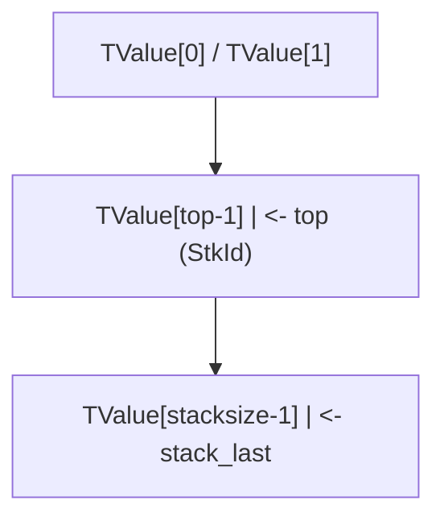

# C-API 栈操作：Lua 与 C 的交互核心

> 本文档对标 MIT 6.028（Interpretive Computer Systems）、Stanford CS107（Programming Paradigms）、CMU 15-213（Computer Systems: A Programmer's Perspective）教学水准，系统剖析 Lua 虚拟栈的设计、形式化语义、API 全集与工程实践。

## 1. 历史动机与发展脉络

### 1.1 Lua 1.0（1993）：栈的雏形

Lua 1.0 的 C API 已采用栈模型，但栈与全局表未严格分离。当时 API 类似：

```c
/* Lua 1.0 伪 API */
void lua_pushobject(lua_Object o);
lua_Object lua_getparam(int n);
```

`lua_Object` 是一个不透明的栈句柄，开发者通过 `lua_getparam` 获取参数。

### 1.2 Lua 2.x（1995）：明确栈语义

Lua 2.x 引入现代意义上的 `lua_State`（最初称为 `lua_Object` 池），栈操作 API 趋于稳定：

```c
void lua_pushnumber(lua_State *L, double n);
void lua_pushstring(lua_State *L, const char *s);
```

### 1.3 Lua 3.0（1997）：metatable 与栈结合

Lua 3.0 引入 metatable，栈操作新增 `lua_getmetatable` / `lua_setmetatable`。栈顶索引 API 完善：

```c
int lua_gettop(lua_State *L);
void lua_settop(lua_State *L, int idx);
```

### 1.4 Lua 5.0（2003）：完整的现代 API

Lua 5.0 确立了现代 C API 风格，新增：

- `lua_pushinteger`（之前只有 number）
- `lua_pushboolean`
- `lua_pushthread`
- `lua_pushlightuserdata`

### 1.5 Lua 5.1（2006）：工业标准

Lua 5.1 API 稳定，成为 WoW、Redis、Adobe Lightroom 的标准：

```c
void lua_pushcfunction(lua_State *L, lua_CFunction fn);
int lua_gettop(lua_State *L);
```

`lua_call` / `lua_pcall` 接口稳定：

```c
void lua_call(lua_State *L, int nargs, int nresults);
int lua_pcall(lua_State *L, int nargs, int nresults, int errfunc);
```

### 1.6 Lua 5.2（2012）：连续索引与 uservalue

Lua 5.2 引入 `lua_absindex`（绝对索引 API），并新增 `lua_len`、`lua_copy`：

```c
int lua_absindex(lua_State *L, int idx);
void lua_copy(lua_State *L, int fromidx, int toidx);
```

### 1.7 Lua 5.3（2015）：整数子类型

Lua 5.3 将 number 拆分为 integer 与 float 子类型：

```c
lua_Integer lua_tointegerx(lua_State *L, int idx, int *isnum);
lua_Number lua_tonumberx(lua_State *L, int idx, int *isnum);
```

`lua_pushinteger` 接受 `lua_Integer`（默认 64-bit）。

### 1.8 Lua 5.4（2020）：to-be-closed 与多 uservalue

Lua 5.4 新增：

- `lua_pushvalue` 优化（轻量复制）
- `lua_pushfstring` / `lua_pushvfstring` 格式化字符串
- `lua_closethread` 用于线程清理
- `__close` 元方法支持

### 1.9 设计哲学总结

PUC-Rio 团队阐明虚拟栈设计的三大动机：

1. **类型安全**：C 与 Lua 不直接共享内存，所有数据通过栈传递，避免指针误用。
2. **可移植性**：栈抽象屏蔽不同平台的内存模型差异。
3. **GC 一致性**：栈中所有 Lua 对象受 GC 管理，C 端持有的引用通过栈序号安全传递。

---

## 1. 形式化定义

### 1.1 Lua Reference Manual 权威定义

> **The Stack** — Lua 使用一个虚拟栈与 C 代码传递值。栈中每个元素是一个 Lua 值（nil、boolean、number、string、table、function、userdata 或 thread）。
>
> —— *Lua 5.4 Reference Manual, §4.1 The Stack*

形式化定义：

$$
\text{Stack} = (v_1, v_2, \ldots, v_n), \quad v_i \in \text{Value}, \quad n \geq 0
$$

其中 $\text{top} = n$，栈底为 $v_1$，栈顶为 $v_n$。

### 1.2 栈索引规则

栈索引分为**正索引**（positive index）与**负索引**（negative index）：

$$
\text{idx}(v_i) = \begin{cases}
i & \text{if } i \in [1, n] \quad \text{(positive)} \\
i - (n + 1) & \text{if } i \in [-(n), -1] \quad \text{(negative)}
\end{cases}
$$

负索引 $-k$ 等价于正索引 $n - k + 1$。

转换函数：

$$
\text{absidx}(k) = \begin{cases}
k & \text{if } k > 0 \\
n + k + 1 & \text{if } k < 0 \\
\text{invalid} & \text{if } k = 0
\end{cases}
$$

### 1.3 `lua_State` 结构

```c
/* lstate.h (简化) */
typedef struct lua_State {
    CommonHeader;
    lu_byte status;
    StkId top;              /* 栈顶指针 */
    global_State *g;
    struct CallInfo *ci;    /* 当前调用信息 */
    StkId stack;            /* 栈底 */
    StkId stack_last;       /* 栈容量上限 */
    UpVal *openupval;
    GCObject *gclist;
    struct lua_State *twups;
    struct lua_longjmp *errorJmp;
    CallInfo base_ci;       /* 调用信息链表头 */
    volatile lua_Hook hook;
    ptrdiff_t errfunc;
    int stacksize;
    int basehookcount;
    int hookcount;
    unsigned short nny;     /* 不可让出调用计数 */
    unsigned short nCcalls;
    lu_byte hookmask;
    lu_byte allowhook;
    /* ... */
} lua_State;
```

每个 `lua_State` 维护：

- **栈（stack）**：TValue 数组，存储 Lua 值。
- **调用信息链表（CallInfo）**：记录函数调用栈帧。
- **全局状态（global_State）**：GC、字符串表、注册表等。

### 1.4 栈操作的代数语义

设 $S$ 为栈状态，操作 $\text{op}$ 将 $S$ 转换为 $S'$：

**压栈操作**（push）：

$$
\text{push}(S, v) = S \cdot v, \quad \text{top}(S') = \text{top}(S) + 1
$$

**弹出操作**（pop）：

$$
\text{pop}(S, n) = (v_1, \ldots, v_{\text{top}-n}), \quad n \leq \text{top}
$$

**复制操作**（pushvalue）：

$$
\text{pushvalue}(S, k) = S \cdot S[\text{absidx}(k)]
$$

**替换操作**（replace）：

$$
\text{replace}(S, k) = S[\text{absidx}(k) := S[\text{top}]], \quad \text{top}' = \text{top} - 1
$$

### 1.5 错误处理的形式化

`lua_pcall` 的语义：

$$
\text{pcall}(f, \text{args}) = \begin{cases}
\text{LUA\_OK} \wedge \text{results} & \text{if } f(\text{args}) \text{ succeeds} \\
\text{error\_code} \wedge \text{error\_msg} & \text{otherwise}
\end{cases}
$$

返回值：

- `LUA_OK` (0)：成功
- `LUA_ERRRUN` (2)：运行时错误
- `LUA_ERRMEM` (4)：内存分配错误
- `LUA_ERRERR` (5)：错误处理函数自身出错

---

## 2. 理论推导与原理解析

### 2.1 虚拟栈的内存布局

每个 `lua_State` 拥有一个独立的 TValue 数组作为栈：



每个 TValue 占 16 字节（64 位平台）：

```c
typedef struct TValue {
    TValuefields;
} TValue;

/* TValuefields 展开：
 *   lu_byte tt_;     (类型标签, 1 字节)
 *   lu_byte *tt_;    (子类型, 1 字节)
 *   padding (6 字节)
 *   Value value_;    (union, 8 字节)
 */
```

### 2.2 栈容量与栈溢出

Lua 默认栈容量：

$$
\text{LUAI\_MAXSTACK} = 1000000 \quad \text{(默认)}
$$

可通过编译选项调整。栈溢出时 Lua 抛出 `"stack overflow"` 错误。

栈扩容算法：

$$
\text{new\_size} = \min(\text{old\_size} \cdot 2, \text{LUAI\_MAXSTACK})
$$

### 2.3 调用栈帧（CallInfo）

每次函数调用创建一个 `CallInfo` 节点：

```c
typedef struct CallInfo {
    StkId func;       /* 函数所在栈位置 */
    StkId top;
    struct CallInfo *next, *previous;
    /* ... */
} CallInfo;
```

CallInfo 链表形成调用栈，记录每个函数的栈帧范围。

### 2.4 类型检查算法

`lua_type(L, idx)` 返回类型标签：

```
function type(L, idx):
    if absidx(idx) > top or idx == 0:
        return LUA_TNONE  # -1
    o = stack[absidx(idx)]
    return o.tt_ & 0x0F  # 类型标签低 4 位
```

`lua_isstring` 的算法：

```
function isstring(L, idx):
    t = type(L, idx)
    return t == LUA_TSTRING or t == LUA_TNUMBER
    # number 可被隐式转换为 string
```

### 2.5 `lua_to*` 与 `luaL_check*` 的语义差异

`lua_to*` 系列函数**不抛出错误**，仅返回转换结果（失败时返回 0 或 NULL）：

```c
lua_Integer lua_tointeger(L, idx);  /* 不是 number 时返回 0 */
```

`luaL_check*` 系列函数**抛出 Lua 错误**：

```c
lua_Integer luaL_checkinteger(L, idx);  /* 不是 number 时调用 luaL_error */
```

形式化：

$$
\text{check}(f, idx) = \begin{cases}
f(\text{idx}) & \text{if } \text{type}(\text{idx}) \text{ matches} \\
\text{raise}(\text{type\_error}) & \text{otherwise}
\end{cases}
$$

### 2.6 table 操作的语义

`lua_gettable(L, idx)` 的语义：

$$
\text{gettable}(t, k) = t[k] \quad \text{if } t \text{ has } \_\_\text{index}, \text{ otherwise } t[k]
$$

- 触发 `__index` 元方法（如果存在）。
- 栈变化：弹出 key，压入 value。

`lua_rawget(L, idx)` 的语义：

$$
\text{rawget}(t, k) = t[k] \quad \text{(不触发 } \_\_\text{index})
$$

### 2.7 `lua_call` 与 `lua_pcall` 的实现

```c
/* lua_call 内部 */
void lua_call(lua_State *L, int nargs, int nresults) {
    lua_callk(L, nargs, nresults, 0, NULL);
}

/* lua_pcall 内部 */
int lua_pcall(lua_State *L, int nargs, int nresults, int errfunc) {
    /* 设置 longjmp 跳板 */
    struct lua_longjmp lj;
    lj.status = LUA_OK;
    lj.previous = L->errorJmp;
    L->errorJmp = &lj;
    if (setjmp(lj.b) == 0) {
        luaD_call(L, ...);
    } else {
        /* 错误处理 */
    }
    L->errorJmp = lj.previous;
    return lj.status;
}
```

---

## 3. 代码示例

### 3.1 基础示例：栈操作演示

```c
#include <stdio.h>
#include <lua.h>
#include <lauxlib.h>
#include <lualib.h>

int main(void) {
    lua_State *L = luaL_newstate();
    luaL_openlibs(L);

    /* 压栈 */
    lua_pushnil(L);
    lua_pushboolean(L, 1);
    lua_pushinteger(L, 42);
    lua_pushnumber(L, 3.14);
    lua_pushstring(L, "hello");
    lua_pushfstring(L, "answer = %d", 42);

    /* 栈状态：nil | true | 42 | 3.14 | "hello" | "answer = 42"
       正索引： 1    2      3      4       5           6
       负索引：-6   -5     -4     -3      -2          -1
    */

    printf("top = %d\n", lua_gettop(L));  /* 6 */

    /* 读取 */
    printf("type(1) = %d (LUA_TNIL=%d)\n", lua_type(L, 1), LUA_TNIL);
    printf("boolean(2) = %d\n", lua_toboolean(L, 2));
    printf("integer(3) = %lld\n", (long long)lua_tointeger(L, 3));
    printf("number(4) = %g\n", lua_tonumber(L, 4));
    printf("string(5) = %s\n", lua_tostring(L, 5));
    printf("string(6) = %s\n", lua_tostring(L, 6));

    /* 栈操作 */
    lua_pushvalue(L, 3);  /* 复制索引3到栈顶 */
    printf("after pushvalue(3), top = %d\n", lua_gettop(L));  /* 7 */

    lua_insert(L, 1);  /* 栈顶移到索引1 */
    printf("after insert(1), top = %d\n", lua_gettop(L));  /* 7 */

    lua_remove(L, 2);  /* 移除索引2 */
    printf("after remove(2), top = %d\n", lua_gettop(L));  /* 6 */

    lua_replace(L, 1);  /* 栈顶替换索引1 */
    printf("after replace(1), top = %d\n", lua_gettop(L));  /* 5 */

    lua_pop(L, 2);  /* 弹出2个 */
    printf("after pop(2), top = %d\n", lua_gettop(L));  /* 3 */

    lua_settop(L, 0);  /* 清空栈 */
    printf("after settop(0), top = %d\n", lua_gettop(L));  /* 0 */

    lua_close(L);
    return 0;
}
```

**编译运行**（Linux/macOS）：

```bash
cc -o stack_demo stack_demo.c -llua5.4 -lm -ldl
./stack_demo
```

**编译运行**（Windows / MSVC）：

```powershell
cl /I"C:\Atian\Lua\include" stack_demo.c ^
   /link /LIBPATH:"C:\Atian\Lua\lib" lua54.lib
.\stack_demo.exe
```

### 3.2 完整示例：C 函数注册到 Lua

```c
#define LUA_LIB
#include <stdio.h>
#include <string.h>
#include <lua.h>
#include <lauxlib.h>
#include <lualib.h>

/* 计算字符串长度
 * Lua: mylib.strlen(s)
 */
static int l_strlen(lua_State *L) {
    size_t len;
    const char *s = luaL_checklstring(L, 1, &len);
    lua_pushinteger(L, (lua_Integer)len);
    return 1;
}

/* 反转字符串
 * Lua: mylib.reverse(s)
 */
static int l_reverse(lua_State *L) {
    size_t len;
    const char *s = luaL_checklstring(L, 1, &len);
    char *buf = (char *)alloca(len + 1);  /* 栈上分配，自动释放 */
    for (size_t i = 0; i < len; i++) {
        buf[i] = s[len - 1 - i];
    }
    buf[len] = '\0';
    lua_pushlstring(L, buf, len);
    return 1;
}

/* 计算两个数的和
 * Lua: mylib.add(a, b)
 */
static int l_add(lua_State *L) {
    /* 兼容 integer 与 float */
    if (lua_isinteger(L, 1) && lua_isinteger(L, 2)) {
        lua_Integer a = lua_tointeger(L, 1);
        lua_Integer b = lua_tointeger(L, 2);
        lua_pushinteger(L, a + b);
    } else {
        lua_Number a = luaL_checknumber(L, 1);
        lua_Number b = luaL_checknumber(L, 2);
        lua_pushnumber(L, a + b);
    }
    return 1;
}

/* 调用 Lua 函数
 * Lua: mylib.call_fn(fn, ...)
 */
static int l_call_fn(lua_State *L) {
    luaL_checktype(L, 1, LUA_TFUNCTION);
    int nargs = lua_gettop(L) - 1;

    /* 将函数移到栈顶 */
    lua_pushvalue(L, 1);
    lua_insert(L, 2);

    /* pcall 调用 */
    int status = lua_pcall(L, nargs, LUA_MULTRET, 0);
    if (status != LUA_OK) {
        const char *err = lua_tostring(L, -1);
        fprintf(stderr, "pcall error: %s\n", err);
        lua_pop(L, 1);
        return 0;
    }

    /* 返回值数量 = 栈顶 - 调用前栈顶 */
    return lua_gettop(L) - 1;
}

/* 模块函数表 */
static const luaL_Reg mylib_funcs[] = {
    {"strlen", l_strlen},
    {"reverse", l_reverse},
    {"add", l_add},
    {"call_fn", l_call_fn},
    {NULL, NULL}
};

/* 模块入口 */
int luaopen_mylib(lua_State *L) {
    luaL_newlib(L, mylib_funcs);
    return 1;
}
```

**编译为动态库**（Linux/macOS）：

```bash
cc -O2 -Wall -shared -fPIC -I/usr/local/include/lua5.4 \
   -o mylib.so mylib.c
```

**编译为动态库**（Windows / MSVC）：

```powershell
cl /O2 /LD /I"C:\Atian\Lua\include" mylib.c ^
   /link /DLL /OUT:mylib.dll lua54.lib
```

**Lua 测试脚本**：

```lua
-- test_mylib.lua
local mylib = require("mylib")

print(mylib.strlen("hello"))           -- 5
print(mylib.reverse("hello"))          -- olleh
print(mylib.add(2, 3))                 -- 5
print(mylib.add(2.5, 3.7))             -- 6.2

-- 调用 Lua 函数
local function greet(name)
    return "Hello, " .. name .. "!"
end

local results = mylib.call_fn(greet, "World")
print(results)  -- Hello, World!

-- 错误处理
local function bad_fn()
    error("intentional error")
end

mylib.call_fn(bad_fn)  -- 在 stderr 输出错误
```

### 3.3 table 操作示例

```c
#include <stdio.h>
#include <lua.h>
#include <lauxlib.h>

/* 创建并返回一个 Lua table
 * Lua: t = make_table()
 * 返回: { name = "FANDEX", version = 1.0, features = {...} }
 */
static int l_make_table(lua_State *L) {
    lua_newtable(L);  /* 创建空 table */

    /* 设置 name 字段 */
    lua_pushstring(L, "FANDEX");
    lua_setfield(L, -2, "name");

    /* 设置 version 字段 */
    lua_pushnumber(L, 1.0);
    lua_setfield(L, -2, "version");

    /* 创建嵌套 features 数组 */
    lua_newtable(L);
    lua_pushstring(L, "fast");
    lua_rawseti(L, -2, 1);  /* features[1] = "fast" */
    lua_pushstring(L, "safe");
    lua_rawseti(L, -2, 2);
    lua_pushstring(L, "embeddable");
    lua_rawseti(L, -2, 3);
    lua_setfield(L, -2, "features");

    return 1;  /* 返回 table */
}

/* 遍历 table
 * Lua: dump_table(t)
 */
static int l_dump_table(lua_State *L) {
    luaL_checktype(L, 1, LUA_TTABLE);

    /* lua_pushnil 让 next 从头开始 */
    lua_pushnil(L);
    while (lua_next(L, 1) != 0) {
        /* 栈: ... key value */
        printf("key = ");
        /* 打印 key */
        lua_pushvalue(L, -2);
        printf("%s", lua_tostring(L, -1));
        lua_pop(L, 1);

        printf(", value = ");
        /* 打印 value */
        switch (lua_type(L, -1)) {
            case LUA_TSTRING:
                printf("'%s'", lua_tostring(L, -1));
                break;
            case LUA_TNUMBER:
                if (lua_isinteger(L, -1)) {
                    printf("%lld", (long long)lua_tointeger(L, -1));
                } else {
                    printf("%g", lua_tonumber(L, -1));
                }
                break;
            case LUA_TBOOLEAN:
                printf("%s", lua_toboolean(L, -1) ? "true" : "false");
                break;
            default:
                printf("%s", lua_typename(L, lua_type(L, -1)));
        }
        printf("\n");

        /* 弹出 value，保留 key 供下一次 next */
        lua_pop(L, 1);
    }

    return 0;
}

/* 元方法查询
 * Lua: t = set_meta(t, mt)
 */
static int l_set_meta(lua_State *L) {
    luaL_checktype(L, 1, LUA_TTABLE);
    luaL_checktype(L, 2, LUA_TTABLE);
    lua_setmetatable(L, 1);
    lua_pop(L, 1);  /* 弹出 mt，保留 t */
    return 1;
}
```

### 3.4 错误处理示例

```c
#include <stdio.h>
#include <lua.h>
#include <lauxlib.h>

/* 安全调用 Lua 函数
 * Lua: safe_call(fn, ...)
 * 返回: (true, results...) 或 (false, error_msg)
 */
static int l_safe_call(lua_State *L) {
    luaL_checktype(L, 1, LUA_TFUNCTION);
    int nargs = lua_gettop(L) - 1;

    /* 栈: [fn, arg1, ..., argN] */

    /* 复制函数到栈顶 */
    lua_pushvalue(L, 1);
    lua_insert(L, 2);

    /* 栈: [fn, fn_copy, arg1, ..., argN] */

    /* pcall */
    int status = lua_pcall(L, nargs, LUA_MULTRET, 0);

    if (status == LUA_OK) {
        /* 成功：压入 true，然后是返回值 */
        lua_pushboolean(L, 1);
        lua_insert(L, 2);
        return lua_gettop(L) - 1;
    } else {
        /* 失败：压入 false + 错误信息 */
        const char *err = lua_tostring(L, -1);
        lua_pop(L, 1);  /* 弹出错误对象 */

        lua_pushboolean(L, 0);
        lua_pushstring(L, err ? err : "(no error message)");
        return 2;
    }
}

/* 错误处理函数
 * Lua: with_error_handler(fn, handler, ...)
 * 调用 fn，出错时调用 handler(err) 获取最终错误
 */
static int l_with_handler(lua_State *L) {
    luaL_checktype(L, 1, LUA_TFUNCTION);  /* fn */
    luaL_checktype(L, 2, LUA_TFUNCTION);  /* handler */
    int nargs = lua_gettop(L) - 2;

    /* 设置 error handler 在栈底 */
    lua_pushvalue(L, 2);
    int handler_idx = lua_absindex(L, -1);

    /* 复制函数到栈顶 */
    lua_pushvalue(L, 1);
    lua_insert(L, -nargs - 1);

    /* pcall with errfunc */
    int status = lua_pcall(L, nargs, LUA_MULTRET, handler_idx);

    /* 弹出 handler */
    lua_remove(L, handler_idx);

    if (status != LUA_OK) {
        return lua_error(L);  /* 重新抛出 */
    }

    return lua_gettop(L);
}
```

### 3.5 `luaL_check*` 与 `lua_to*` 对比

```c
static int l_compare_apis(lua_State *L) {
    /* 方式1：luaL_check* 严格检查 */
    lua_Integer i = luaL_checkinteger(L, 1);  /* 类型不对则抛错 */

    /* 方式2：lua_is* + lua_to* 宽松处理 */
    if (lua_isnumber(L, 2)) {
        lua_Number n = lua_tonumber(L, 2);
        lua_pushnumber(L, n);
    } else if (lua_isstring(L, 2)) {
        size_t len;
        const char *s = lua_tolstring(L, 2, &len);
        lua_pushlstring(L, s, len);
    } else {
        lua_pushnil(L);
    }

    return 2;
}
```

---

## 4. 对比分析

### 4.1 Lua C-API 与其他语言嵌入 API 对比

| 语言 | 嵌入机制 | 栈模型 | 错误处理 | 典型复杂度 |
|------|----------|--------|----------|------------|
| **Lua** | 虚拟栈 | 是 | `lua_pcall` + longjmp | 中等 |
| **Python** | `PyObject*` 引用 + refcount | 否 | 异常传播 | 高（GIL、refcount） |
| **JavaScript (V8)** | `v8::HandleScope` + GC | 否 | `TryCatch` | 高 |
| **Ruby** | `VALUE` + GC | 否 | `rb_protect` | 中等 |
| **Scheme** | SRFI-18 stack | 部分 | continuation | 低 |
| **Tcl** | `Tcl_Obj` + refcount | 部分 | `Tcl_EvalEx` | 中等 |

### 4.2 栈模型 vs 引用模型

**Lua 栈模型优势**：

- 显式管理：每次操作都明确栈状态，便于调试。
- GC 友好：栈中所有对象受 GC 管理，无需手动 refcount。
- 简单性：API 数量少，学习曲线平缓。

**Python 引用模型优势**：

- 直观：`PyArg_ParseTuple` 类似 C 函数调用。
- 灵活：可在任意位置持有引用。
- 性能：避免栈操作开销。

### 4.3 `lua_tostring` vs `lua_tolstring`

| API | 返回值 | 长度获取 | 适用场景 |
|-----|--------|----------|----------|
| `lua_tostring(L, idx)` | `const char*` | 否（需 strlen） | 简单字符串访问 |
| `lua_tolstring(L, idx, &len)` | `const char*` | 是 | 二进制数据、含 '\0' 的字符串 |

### 4.4 `lua_call` vs `lua_pcall` vs `lua_callk`

| API | 错误处理 | 协程支持 | 复杂度 |
|-----|----------|----------|--------|
| `lua_call` | 无（错误直接退出） | 否 | 低 |
| `lua_pcall` | 有（返回错误码） | 否 | 中 |
| `lua_pcallk` | 有 | 是（continuation） | 高 |
| `lua_callk` | 无 | 是 | 高 |

### 4.5 与 JavaScript V8 对比

```javascript
// V8 嵌入示例
void Method(const v8::FunctionCallbackInfo<v8::Value>& args) {
    v8::HandleScope scope(args.GetIsolate());
    if (args.Length() < 1) {
        args.GetIsolate()->ThrowException(
            v8::String::NewFromUtf8(args.GetIsolate(), "need 1 arg"));
        return;
    }
    double value = args[0]->NumberValue();
    args.GetReturnValue().Set(value + 42);
}
```

对比 Lua：

```c
static int method(lua_State *L) {
    luaL_checktype(L, 1, LUA_TNUMBER);
    double value = lua_tonumber(L, 1);
    lua_pushnumber(L, value + 42);
    return 1;
}
```

- V8 使用 `HandleScope` 自动管理引用，Lua 使用栈显式管理。
- V8 的错误传播通过 C++ 异常或 `ThrowException`，Lua 通过 longjmp。
- V8 API 更复杂（类型转换、Isolate、Context），Lua 更简洁。

---

## 5. 常见陷阱与最佳实践

### 5.1 陷阱：忘记平衡栈

```c
/* 错误：栈未平衡 */
static int bad_func(lua_State *L) {
    lua_pushnumber(L, 1.0);
    lua_pushnumber(L, 2.0);
    lua_pushnumber(L, 3.0);
    /* 忘记返回或弹出，栈持续增长 */
    return 0;
}
```

**修正**：

```c
static int good_func(lua_State *L) {
    lua_pushnumber(L, 1.0);
    lua_pushnumber(L, 2.0);
    lua_pushnumber(L, 3.0);
    return 3;  /* 返回 3 个值 */
}
```

### 5.2 陷阱：使用过期字符串指针

```c
/* 错误：lua_tostring 返回的指针在栈变化后失效 */
const char *s = lua_tostring(L, -1);
lua_pop(L, 1);       /* 弹出后 s 可能指向已释放内存 */
printf("%s\n", s);   /* 未定义行为 */
```

**修正**：

```c
size_t len;
const char *s = lua_tolstring(L, -1, &len);
char *buf = malloc(len + 1);
memcpy(buf, s, len);
buf[len] = '\0';
lua_pop(L, 1);
printf("%s\n", buf);
free(buf);
```

### 5.3 陷阱：在 `lua_pcall` 错误后忘记清理

```c
/* 错误：pcall 失败后栈状态不一致 */
int status = lua_pcall(L, nargs, nresults, 0);
if (status != LUA_OK) {
    /* 错误对象在栈顶，未弹出 */
    return 0;  /* 后续操作栈状态混乱 */
}
```

**修正**：

```c
int status = lua_pcall(L, nargs, nresults, 0);
if (status != LUA_OK) {
    const char *err = lua_tostring(L, -1);
    fprintf(stderr, "error: %s\n", err);
    lua_pop(L, 1);  /* 弹出错误对象 */
    return 0;
}
```

### 5.4 陷阱：误用 `lua_tostring` 改变栈值

```c
/* 错误：lua_tostring 会修改 number 类型的栈值 */
lua_pushnumber(L, 42);
/* 此时栈顶是 number 42 */
const char *s = lua_tostring(L, -1);
/* 此时栈顶可能变成 string "42" */
lua_isinteger(L, -1);  /* false，已不是 integer */
```

**修正**：先复制再转换：

```c
lua_pushnumber(L, 42);
lua_pushvalue(L, -1);  /* 复制 */
const char *s = lua_tostring(L, -1);  /* 仅修改副本 */
lua_pop(L, 1);  /* 弹出副本 */
lua_isinteger(L, -1);  /* true，原值未变 */
```

### 5.5 陷阱：在 C 函数中使用 `lua_error`

```c
/* 错误：直接调用 lua_error 而未通过 luaL_error */
static int bad_check(lua_State *L) {
    if (!lua_isnumber(L, 1)) {
        lua_pushstring(L, "expected number");
        lua_error(L);  /* 危险：栈可能未清理 */
    }
    return 0;
}
```

**修正**：使用 `luaL_error`：

```c
static int good_check(lua_State *L) {
    luaL_checktype(L, 1, LUA_TNUMBER);
    return 0;
}
```

### 5.6 陷阱：`lua_next` 修改栈

```c
/* 错误：lua_next 中间操作栈导致迭代错误 */
lua_pushnil(L);
while (lua_next(L, 1) != 0) {
    lua_tostring(L, -2);  /* 修改 key 类型，破坏 next */
    lua_pop(L, 1);
}
```

**修正**：

```c
lua_pushnil(L);
while (lua_next(L, 1) != 0) {
    /* 复制 key/value 再操作 */
    lua_pushvalue(L, -2);  /* 复制 key */
    printf("key = %s\n", lua_tostring(L, -1));
    lua_pop(L, 1);  /* 弹出复制的 key */
    /* 弹出 value，保留原 key */
    lua_pop(L, 1);
}
```

### 5.7 陷阱：栈索引在压栈后失效

```c
/* 错误：正索引在压栈后指向错误位置 */
lua_pushstring(L, "key");  /* 索引 idx */
lua_pushstring(L, "value");  /* idx+1 */
lua_gettable(L, idx);  /* 错误！idx 可能已不是原 key */
```

**修正**：使用负索引或 `lua_absindex`：

```c
lua_pushstring(L, "key");
int key_idx = lua_absindex(L, -1);  /* 绝对索引 */
lua_pushstring(L, "value");
lua_gettable(L, key_idx);
```

### 5.8 最佳实践清单

1. **栈平衡原则**：每个 C 函数返回前，栈状态应与函数预期一致。
2. **使用 `luaL_check*` 替代手动检查**：减少代码量，错误信息更友好。
3. **错误对象及时弹出**：`lua_pcall` 失败后立即 `lua_pop(L, 1)`。
4. **优先使用负索引**：在压栈操作中负索引更稳定。
5. **`lua_tostring` 谨慎使用**：注意其可能修改 number 类型的栈值。
6. **`lua_next` 迭代保护**：迭代中不修改 key。
7. **避免 longjmp 跨 C 析构**：在 C++ 中使用 RAII 时，`lua_error` 会跳过析构函数。
8. **使用 `luaL_traceback` 增强错误信息**：便于调试。

---

## 6. 工程实践

### 6.1 嵌入 Lua 解释器

完整示例：

```c
#include <stdio.h>
#include <stdlib.h>
#include <string.h>
#include <lua.h>
#include <lauxlib.h>
#include <lualib.h>

int main(int argc, char *argv[]) {
    lua_State *L = luaL_newstate();
    if (L == NULL) {
        fprintf(stderr, "cannot create state: not enough memory\n");
        return 1;
    }
    luaL_openlibs(L);

    /* 注册自定义函数 */
    luaL_requiref(L, "mylib", luaopen_mylib, 1);
    lua_pop(L, 1);

    /* 执行脚本 */
    if (argc > 1) {
        int status = luaL_dofile(L, argv[1]);
        if (status != LUA_OK) {
            const char *err = lua_tostring(L, -1);
            fprintf(stderr, "Error: %s\n", err);
            lua_close(L);
            return 1;
        }
    } else {
        /* 交互式 REPL */
        char buf[1024];
        printf("Lua> ");
        while (fgets(buf, sizeof(buf), stdin)) {
            int status = luaL_dostring(L, buf);
            if (status != LUA_OK) {
                fprintf(stderr, "Error: %s\n", lua_tostring(L, -1));
                lua_pop(L, 1);
            } else if (lua_gettop(L) > 0) {
                lua_getglobal(L, "print");
                lua_insert(L, 1);
                lua_pcall(L, lua_gettop(L) - 1, 0, 0);
            }
            printf("Lua> ");
        }
    }

    lua_close(L);
    return 0;
}
```

### 6.2 错误处理框架

```c
/* 错误处理封装 */
typedef struct {
    int code;
    const char *message;
    const char *traceback;
} LuaError;

static LuaError safe_pcall(lua_State *L, int nargs, int nresults) {
    LuaError err = {LUA_OK, NULL, NULL};
    int base = lua_gettop(L) - nargs;

    /* 设置 traceback handler */
    lua_pushcfunction(L, lua_handler);
    lua_insert(L, base);

    int status = lua_pcall(L, nargs, nresults, base);
    lua_remove(L, base);  /* 移除 handler */

    if (status != LUA_OK) {
        err.code = status;
        err.message = lua_tostring(L, -1);
        lua_pop(L, 1);
    }
    return err;
}

static int lua_handler(lua_State *L) {
    const char *msg = lua_tostring(L, 1);
    luaL_traceback(L, L, msg, 1);
    return 1;
}
```

### 6.3 性能优化

**优化 1：批量压栈减少栈操作**

```c
/* 慢：多次单独压栈 */
for (int i = 0; i < 1000; i++) {
    lua_pushnumber(L, i);
}

/* 快：使用 lua_createtable + lua_rawseti */
lua_createtable(L, 1000, 0);
for (int i = 0; i < 1000; i++) {
    lua_pushnumber(L, i);
    lua_rawseti(L, -2, i + 1);
}
```

**优化 2：避免 `lua_tostring` 在循环中**

```c
/* 慢 */
for (int i = 0; i < n; i++) {
    lua_geti(L, 1, i + 1);
    printf("%s\n", lua_tostring(L, -1));  /* 可能触发 number -> string */
    lua_pop(L, 1);
}

/* 快：使用 lua_tointegerx 显式转换 */
for (int i = 0; i < n; i++) {
    lua_geti(L, 1, i + 1);
    int isnum;
    lua_Integer v = lua_tointegerx(L, -1, &isnum);
    if (isnum) printf("%lld\n", (long long)v);
    lua_pop(L, 1);
}
```

**优化 3：使用 `lua_pushlstring` 替代 `lua_pushstring`**

```c
/* 慢：包含 strlen */
lua_pushstring(L, "hello");

/* 快：已知长度 */
lua_pushlstring(L, "hello", 5);
```

### 6.4 调试技巧

**技巧 1：栈转储函数**

```c
static void dump_stack(lua_State *L) {
    int top = lua_gettop(L);
    printf("Stack (top=%d):\n", top);
    for (int i = 1; i <= top; i++) {
        int t = lua_type(L, i);
        printf("  [%d] (%d) %s: ", i, -top + i - 1, lua_typename(L, t));
        switch (t) {
            case LUA_TSTRING:
                printf("'%s'", lua_tostring(L, i));
                break;
            case LUA_TBOOLEAN:
                printf("%s", lua_toboolean(L, i) ? "true" : "false");
                break;
            case LUA_TNUMBER:
                printf("%g", lua_tonumber(L, i));
                break;
            default:
                printf("%p", lua_topointer(L, i));
        }
        printf("\n");
    }
}
```

**技巧 2：使用 `lua_getinfo` 获取调用栈**

```c
static void print_call_stack(lua_State *L) {
    lua_Debug ar;
    int level = 0;
    while (lua_getstack(L, level, &ar)) {
        lua_getinfo(L, "Snl", &ar);
        printf("[%d] %s:%d: in function %s\n",
               level, ar.short_src, ar.currentline, ar.name);
        level++;
    }
}
```

**技巧 3：hook 模式调试**

```c
static void debug_hook(lua_State *L, lua_Debug *ar) {
    if (ar->event == LUA_HOOKLINE) {
        lua_getinfo(L, "Sl", ar);
        printf("Line %d in %s\n", ar->currentline, ar->short_src);
    }
}

/* 启用 */
lua_sethook(L, debug_hook, LUA_MASKLINE, 0);
```

### 6.5 测试策略

```c
#include <assert.h>

void test_stack_basic(lua_State *L) {
    lua_settop(L, 0);
    assert(lua_gettop(L) == 0);

    lua_pushnil(L);
    lua_pushboolean(L, 1);
    lua_pushnumber(L, 42);
    assert(lua_gettop(L) == 3);

    assert(lua_type(L, 1) == LUA_TNIL);
    assert(lua_type(L, 2) == LUA_TBOOLEAN);
    assert(lua_type(L, 3) == LUA_TNUMBER);

    lua_pop(L, 2);
    assert(lua_gettop(L) == 1);
}

void test_pcall_error(lua_State *L) {
    /* 加载错误脚本 */
    int status = luaL_dostring(L, "error('test error')");
    assert(status == LUA_ERRRUN);

    /* 错误对象应在栈顶 */
    assert(lua_isstring(L, -1));
    lua_pop(L, 1);
}

int main(void) {
    lua_State *L = luaL_newstate();
    test_stack_basic(L);
    test_pcall_error(L);
    lua_close(L);
    return 0;
}
```

---

## 7. 案例研究

### 7.1 Redis 中的 Lua 调用

Redis 通过 `lua_pcall` 执行用户脚本，关键代码（`scripting.c`）：

```c
/* Redis 调用 Lua */
int status = lua_pcall(lua, 0, 1, 0);
if (status != LUA_OK) {
    /* 处理错误 */
    char *err = lua_tostring(lua, -1);
    addReplyError(c, err);
    lua_pop(lua, 1);
} else {
    /* 获取结果 */
    /* ... */
}
```

Redis 还限制 Lua 脚本的执行时间（默认 5 秒），通过 `lua_sethook` 实现：

```c
lua_sethook(lua, luaMaskCountHook, LUA_MASKCOUNT, 1000000);
```

### 7.2 Neovim 的 Lua 集成

Neovim 在 C 端通过栈操作暴露 API：

```c
/* Neovim 调用 nvim_get_current_buf() */
int nvim_get_current_buf(lua_State *L) {
    Buffer buffer = handle_get_current_buffer();
    push_buffer(L, buffer);
    return 1;
}
```

`push_buffer` 将 C 端 buffer 对象通过 userdata 压栈。

### 7.3 World of Warcraft UI

WoW 在 C 端注册大量 C 函数到 Lua：

```c
/* WoW 注册 Frame API */
static const luaL_Reg frame_methods[] = {
    {"Show", Frame_Show},
    {"Hide", Frame_Hide},
    {"SetWidth", Frame_SetWidth},
    /* ... 几百个方法 */
    {NULL, NULL}
};

int luaopen_frame(lua_State *L) {
    luaL_newlib(L, frame_methods);
    return 1;
}
```

### 7.4 LuaJIT 的栈优化

LuaJIT 对栈操作进行 JIT 编译优化：

- **栈操作消除**：编译器可消除冗余的 push/pop。
- **类型特化**：根据运行时类型生成特化代码。
- **寄存器分配**：将栈中常用值分配到 CPU 寄存器。

```c
/* LuaJIT 优化前 */
lua_pushnumber(L, 1.0);
lua_pushnumber(L, 2.0);
lua_add(L);  /* 内联为浮点加法指令 */

/* JIT 编译后（伪汇编） */
/* movsd xmm0, 1.0 */
/* movsd xmm1, 2.0 */
/* addsd xmm0, xmm1 */
```

### 7.5 Love2D 的栈使用

Love2D 大量使用栈操作传递图形数据：

```c
/* Love2D 绘制矩形 */
static int l_graphics_rectangle(lua_State *L) {
    const char *mode = luaL_checkstring(L, 1);
    float x = luaL_checknumber(L, 2);
    float y = luaL_checknumber(L, 3);
    float w = luaL_checknumber(L, 4);
    float h = luaL_checknumber(L, 5);

    /* 调用 SDL2 绘制 */
    if (strcmp(mode, "fill") == 0) {
        SDL_RenderFillRect(renderer, &(SDL_Rect){x, y, w, h});
    } else {
        SDL_RenderDrawRect(renderer, &(SDL_Rect){x, y, w, h});
    }
    return 0;
}
```

### 7.6 案例对比表

| 项目 | Lua 版本 | 栈操作特点 | 性能优化 |
|------|----------|------------|----------|
| Redis | 5.1 | 严格限制、超时 hook | 无 |
| Neovim | 5.1 (LuaJIT) | 大量 userdata | JIT |
| WoW | 5.1 | 海量 C 函数 | 无 |
| LuaJIT | 5.1 + JIT | 栈消除 | JIT 编译 |
| Love2D | 5.1 (LuaJIT) | 图形数据传递 | JIT |

---

### 填空题知识点讲解

**常见疑问 6**：. `lua_State` 是 Lua 与 C 交互的核心数据结构，其内部维护______、______、______三部分。

**解析讲解**：栈；调用信息链表；全局状态

---

**常见疑问 7**：. 创建新 `lua_State` 的 API 是______，关闭的 API 是______。

**解析讲解**：`luaL_newstate()`；`lua_close(L)`

---

**常见疑问 8**：. `lua_callk` 中的 'k' 代表______，用于支持______。

**解析讲解**：continuation；协程挂起后恢复

---

**常见疑问 9**：. Lua 默认最大栈深度为______，超过会抛出"______"错误。

**解析讲解**：`LUAI_MAXSTACK`（默认 1000000）；"stack overflow"

---

**常见疑问 10**：. `lua_pushcfunction(L, fn)` 实际等价于 `lua_pushcclosure(L, fn, ___)`。

**解析讲解**：0

---

### 编程题知识点讲解

**常见疑问 11**：. 实现一个 C 函数 `sum_array`，从 Lua 接收一个 number 数组，返回所有元素的和。要求：

- 使用 `luaL_checktype` 验证参数是 table
- 使用 `lua_rawlen` 或 `luaL_len` 获取长度
- 使用 `lua_geti` 或 `lua_rawgeti` 获取元素
- 处理空数组和错误情况

**解析讲解**：

```c
#define LUA_LIB
#include <lua.h>
#include <lauxlib.h>

static int l_sum_array(lua_State *L) {
    luaL_checktype(L, 1, LUA_TTABLE);

    lua_Integer n = luaL_len(L, 1);
    if (n < 0) {
        return luaL_error(L, "invalid table length");
    }

    lua_Number sum = 0;
    for (lua_Integer i = 1; i <= n; i++) {
        lua_geti(L, 1, i);  /* 压入 t[i] */
        int isnum;
        lua_Number v = lua_tonumberx(L, -1, &isnum);
        if (!isnum) {
            lua_pop(L, 1);
            return luaL_error(L, "element at index %d is not a number", i);
        }
        sum += v;
        lua_pop(L, 1);
    }

    lua_pushnumber(L, sum);
    return 1;
}

int luaopen_sumlib(lua_State *L) {
    lua_newtable(L);
    lua_pushcfunction(L, l_sum_array);
    lua_setfield(L, -2, "sum");
    return 1;
}
```

**编译**：

```bash
cc -O2 -Wall -shared -fPIC -I/usr/local/include/lua5.4 \
   -o sumlib.so sumlib.c
```

**测试**：

```lua
local sumlib = require("sumlib")

print(sumlib.sum({1, 2, 3, 4, 5}))  -- 15
print(sumlib.sum({1.5, 2.5}))       -- 4.0
print(sumlib.sum({}))                -- 0

local ok, err = pcall(sumlib.sum, {1, "x", 3})
print(ok, err)  -- false, element at index 2 is not a number
```

---

**常见疑问 12**：. 实现一个安全的 `pcall` 包装函数 `safe_call(fn, ...)`，返回 `(true, results...)` 或 `(false, error_msg, traceback)`。

**解析讲解**：

```c
#define LUA_LIB
#include <stdio.h>
#include <lua.h>
#include <lauxlib.h>

/* 错误处理函数：生成 traceback */
static int l_traceback(lua_State *L) {
    const char *msg = lua_tostring(L, 1);
    luaL_traceback(L, L, msg, 1);
    return 1;
}

static int l_safe_call(lua_State *L) {
    luaL_checktype(L, 1, LUA_TFUNCTION);
    int nargs = lua_gettop(L) - 1;

    /* 栈: [fn, arg1, ..., argN] */

    /* 推入 traceback handler */
    lua_pushcfunction(L, l_traceback);
    int handler_idx = lua_absindex(L, -1);

    /* 推入函数副本并移到 handler 之后 */
    lua_pushvalue(L, 1);
    lua_insert(L, handler_idx + 1);

    /* pcall */
    int status = lua_pcall(L, nargs, LUA_MULTRET, handler_idx);

    /* 移除 handler */
    lua_remove(L, handler_idx);

    if (status == LUA_OK) {
        /* 成功：在结果前插入 true */
        int nresults = lua_gettop(L);
        lua_pushboolean(L, 1);
        lua_insert(L, 1);
        return nresults + 1;
    } else {
        /* 失败：清栈，返回 false + error + traceback */
        int nresults = lua_gettop(L);
        lua_pushboolean(L, 0);
        lua_insert(L, 1);
        return nresults + 1;
    }
}

int luaopen_safecall(lua_State *L) {
    lua_pushcfunction(L, l_safe_call);
    return 1;
}
```

**测试**：

```lua
local safe_call = require("safecall")

local ok, result = safe_call(function() return 42 end)
print(ok, result)  -- true, 42

local ok, err, tb = safe_call(function()
    local a = nil
    return a.x  -- 触发错误
end)
print(ok, err)   -- false, error message
print(tb)        -- traceback
```

---

**常见疑问 13**：. 实现 `table_merge(t1, t2)`，将 `t2` 的所有键值对合并到 `t1`，并返回 `t1`。

**解析讲解**：

```c
#define LUA_LIB
#include <lua.h>
#include <lauxlib.h>

static int l_table_merge(lua_State *L) {
    luaL_checktype(L, 1, LUA_TTABLE);
    luaL_checktype(L, 2, LUA_TTABLE);

    /* 遍历 t2 */
    lua_pushnil(L);  /* 初始 key */
    while (lua_next(L, 2) != 0) {
        /* 栈: t1 t2 key value */
        /* 复制 key 和 value */
        lua_pushvalue(L, -2);  /* key 副本 */
        lua_pushvalue(L, -2);  /* value 副本 */

        /* t1[key] = value */
        lua_settable(L, 1);

        /* 弹出 value，保留 key */
        lua_pop(L, 1);
    }

    /* 返回 t1 */
    lua_pushvalue(L, 1);
    return 1;
}

int luaopen_mergelib(lua_State *L) {
    lua_pushcfunction(L, l_table_merge);
    return 1;
}
```

---

### 9.1 核心文献

- [1] R. Ierusalimschy, L. H. de Figueiredo, and W. Celes, *Lua 5.4 Reference Manual*, PUC-Rio, 2020. [Online]. Available: https://www.lua.org/manual/5.4/

- [2] R. Ierusalimschy, L. H. de Figueiredo, and W. Celes, "The Implementation of Lua 5.0," *Journal of Universal Computer Science*, vol. 11, no. 7, pp. 1159–1176, 2005. doi: 10.3217/jucs-011-07-1159.

- [3] R. Ierusalimschy, *Programming in Lua*, 4th ed. PUC-Rio, 2016.

- [4] R. Ierusalimschy, L. H. de Figueiredo, and W. Celes, "The Evolution of Lua," in *Proceedings of the 3rd ACM SIGPLAN Conference on History of Programming Languages (HOPL III)*, 2007, pp. 2-1–2-26. doi: 10.1145/1238844.1238846.

- [5] R. Ierusalimschy, L. H. de Figueiredo, and W. Celes, "Lua: an extensible extension language," *Journal of the Brazilian Computer Society*, vol. 2, no. 1, pp. 27–42, 1996. doi: 10.1590/S0104-65001996000100003.

### 9.2 标准与规范

- [6] PUC-Rio, "Lua 5.4 Source Code," 2020. [Online]. Available: https://github.com/lua/lua

- [7] M. Pall, "LuaJIT 2.0 Design and Implementation," 2011. [Online]. Available: http://luajit.org/

### 9.3 应用案例文献

- [8] S. Sanfilippo, "Redis and Lua: a love story," *Redis Labs Blog*, 2011. [Online]. Available: https://redis.io/docs/manual/programmability/lua/

- [9] T. M. Schiettecatte, "Embedding Lua in Neovim," *Neovim Documentation*, 2017. [Online]. Available: https://neovim.io/doc/user/

- [10] Blizzard Entertainment, *World of Warcraft API Reference*, 2004-2024. [Online]. Available: https://wowpedia.fandom.com/wiki/World_of_Warcraft_API

### 9.4 学术引用（ACM Reference Format）

R. Ierusalimschy, L. H. de Figueiredo, and W. Celes. 2005. The implementation of Lua 5.0. *Journal of Universal Computer Science* 11, 7, 1159–1176. DOI: https://doi.org/10.3217/jucs-011-07-1159

R. Ierusalimschy, L. H. de Figueiredo, and W. Celes. 2007. The evolution of Lua. In *Proceedings of the Third ACM SIGPLAN Conference on History of Programming Languages (HOPL III)*. ACM, New York, NY, USA, 2-1–2-26. DOI: https://doi.org/10.1145/1238844.1238846

---

### 10.1 书籍

- Roberto Ierusalimschy, *Programming in Lua*, 4th Edition
- Kurt Jung, *Lua Quick Reference*（Apress, 2018）
- Roberto Ierusalimschy, *From Brazil to Wikipedia*

### 10.2 论文与技术报告

- "The Implementation of Lua 5.0"（JUCS 2005）
- "A No-Frills Introduction to Lua 5.1 VM Instructions"（Kein-Hong Man）
- "LuaJIT 2.0: A Just-In-Time Compiler for Lua"（Mike Pall）

### 10.5 与本文档相关章节

- 用户数据（`/lua/用户数据`）：理解 userdata 在虚拟栈中的操作
- 模块加载（`/lua/模块加载`）：`luaopen_*` 与栈的关系
- 元表与元方法详解（`/lua/元表与元方法详解`）：`__index` 等元方法的栈语义

---

## 附录 A：C API 速查表

### A.1 栈操作

| API | 说明 |
|-----|------|
| `lua_gettop(L)` | 获取栈顶索引 |
| `lua_settop(L, idx)` | 设置栈顶 |
| `lua_pushvalue(L, idx)` | 复制值到栈顶 |
| `lua_pop(L, n)` | 弹出 n 个元素 |
| `lua_copy(L, from, to)` | 复制值 |
| `lua_insert(L, idx)` | 栈顶移到 idx |
| `lua_remove(L, idx)` | 移除 idx |
| `lua_replace(L, idx)` | 栈顶替换 idx |
| `lua_absindex(L, idx)` | 转换为正索引 |

### A.2 压栈

| API | 说明 |
|-----|------|
| `lua_pushnil(L)` | 压入 nil |
| `lua_pushboolean(L, b)` | 压入 boolean |
| `lua_pushinteger(L, n)` | 压入 integer |
| `lua_pushnumber(L, n)` | 压入 number |
| `lua_pushstring(L, s)` | 压入 string |
| `lua_pushlstring(L, s, len)` | 压入指定长度 string |
| `lua_pushfstring(L, fmt, ...)` | 格式化压入 |
| `lua_pushvfstring(L, fmt, args)` | va_list 版本 |
| `lua_pushcfunction(L, fn)` | 压入 C 函数 |
| `lua_pushlightuserdata(L, p)` | 压入 light userdata |
| `lua_pushthread(L)` | 压入当前 thread |

### A.3 读取

| API | 说明 |
|-----|------|
| `lua_toboolean(L, idx)` | 读取 boolean |
| `lua_tointeger(L, idx)` | 读取 integer |
| `lua_tointegerx(L, idx, *isnum)` | 读取 integer + 状态 |
| `lua_tonumber(L, idx)` | 读取 number |
| `lua_tonumberx(L, idx, *isnum)` | 读取 number + 状态 |
| `lua_tostring(L, idx)` | 读取 string |
| `lua_tolstring(L, idx, *len)` | 读取 string + 长度 |
| `lua_topointer(L, idx)` | 读取指针 |
| `lua_touserdata(L, idx)` | 读取 userdata |
| `lua_tothread(L, idx)` | 读取 thread |
| `lua_tocfunction(L, idx)` | 读取 C 函数 |

### A.4 类型检查

| API | 说明 |
|-----|------|
| `lua_type(L, idx)` | 获取类型 |
| `lua_typename(L, t)` | 类型名 |
| `lua_isnil(L, idx)` | 是否 nil |
| `lua_isboolean(L, idx)` | 是否 boolean |
| `lua_isnumber(L, idx)` | 是否 number |
| `lua_isstring(L, idx)` | 是否 string |
| `lua_istable(L, idx)` | 是否 table |
| `lua_isfunction(L, idx)` | 是否 function |
| `lua_isuserdata(L, idx)` | 是否 userdata |
| `lua_islightuserdata(L, idx)` | 是否 light userdata |
| `lua_isthread(L, idx)` | 是否 thread |

### A.5 Table 操作

| API | 说明 |
|-----|------|
| `lua_newtable(L)` | 创建空 table |
| `lua_createtable(L, narr, nrec)` | 预分配 table |
| `lua_gettable(L, idx)` | 触发 `__index` |
| `lua_settable(L, idx)` | 触发 `__newindex` |
| `lua_rawget(L, idx)` | 不触发 `__index` |
| `lua_rawset(L, idx)` | 不触发 `__newindex` |
| `lua_rawgeti(L, idx, n)` | 获取 t[n] |
| `lua_rawseti(L, idx, n)` | 设置 t[n] |
| `lua_getfield(L, idx, k)` | 获取 t[k] |
| `lua_setfield(L, idx, k)` | 设置 t[k] |
| `lua_geti(L, idx, n)` | 获取 t[n]（触发 `__index`） |
| `lua_seti(L, idx, n)` | 设置 t[n]（触发 `__newindex`） |
| `lua_next(L, idx)` | 遍历 table |
| `lua_rawlen(L, idx)` | 不触发 `__len` 的长度 |
| `lua_len(L, idx)` | 触发 `__len` 的长度 |

### A.6 函数调用

| API | 说明 |
|-----|------|
| `lua_call(L, nargs, nresults)` | 调用 Lua 函数 |
| `lua_pcall(L, nargs, nresults, errfunc)` | 保护调用 |
| `lua_callk(L, nargs, nresults, ctx, k)` | 可延续调用 |
| `lua_pcallk(L, nargs, nresults, errfunc, ctx, k)` | 可延续保护调用 |
| `luaL_checktype(L, idx, t)` | 类型检查 |
| `luaL_checkany(L, idx)` | 检查任意类型 |
| `luaL_checknumber(L, idx)` | 检查 number |
| `luaL_checkinteger(L, idx)` | 检查 integer |
| `luaL_checkstring(L, idx)` | 检查 string |
| `luaL_checklstring(L, idx, *len)` | 检查 string + 长度 |
| `luaL_checkudata(L, idx, tname)` | 检查 userdata 类型 |
| `luaL_optnumber(L, idx, d)` | 可选 number |
| `luaL_optinteger(L, idx, d)` | 可选 integer |
| `luaL_optstring(L, idx, d)` | 可选 string |

### A.7 错误处理

| API | 说明 |
|-----|------|
| `lua_error(L)` | 抛出错误 |
| `luaL_error(L, fmt, ...)` | 格式化错误 |
| `luaL_argerror(L, arg, msg)` | 参数错误 |
| `luaL_typeerror(L, arg, tname)` | 类型错误 |
| `luaL_traceback(L, L1, msg, level)` | 生成 traceback |

### A.8 全局/注册表

| API | 说明 |
|-----|------|
| `lua_getglobal(L, name)` | 获取全局变量 |
| `lua_setglobal(L, name)` | 设置全局变量 |
| `luaL_ref(L, t)` | 在 table t 中引用栈顶 |
| `luaL_unref(L, t, ref)` | 释放引用 |
| `lua_getregistry(L)` | 获取注册表 |

---

## 附录 B：栈状态检查表

### B.1 常见栈状态错误

| 错误信息 | 可能原因 | 排查方法 |
|----------|----------|----------|
| `attempt to call a nil value` | 调用前未压入函数 | 检查 `lua_getglobal` 返回 |
| `attempt to index a nil value` | table 操作前未压入 | 检查栈顶类型 |
| `bad argument #N` | 参数顺序错误 | 使用 `luaL_checktype` 验证 |
| `stack overflow` | 递归过深 | 检查递归基线 |
| `attempt to perform arithmetic on a string value` | 类型混淆 | 使用 `lua_isnumber` 检查 |

### B.2 调试检查流程

1. **检查栈深度**：`lua_gettop(L)`
2. **检查栈值类型**：遍历 `lua_type(L, i)`
3. **打印栈内容**：实现 `dump_stack` 函数
4. **检查栈平衡**：函数前后 `lua_gettop` 应一致
5. **使用 hook**：`lua_sethook` 单步调试

---

*文档版本：v2.0  金标准升级  最后更新：2026-06-14*
