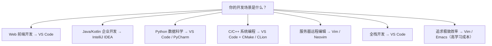
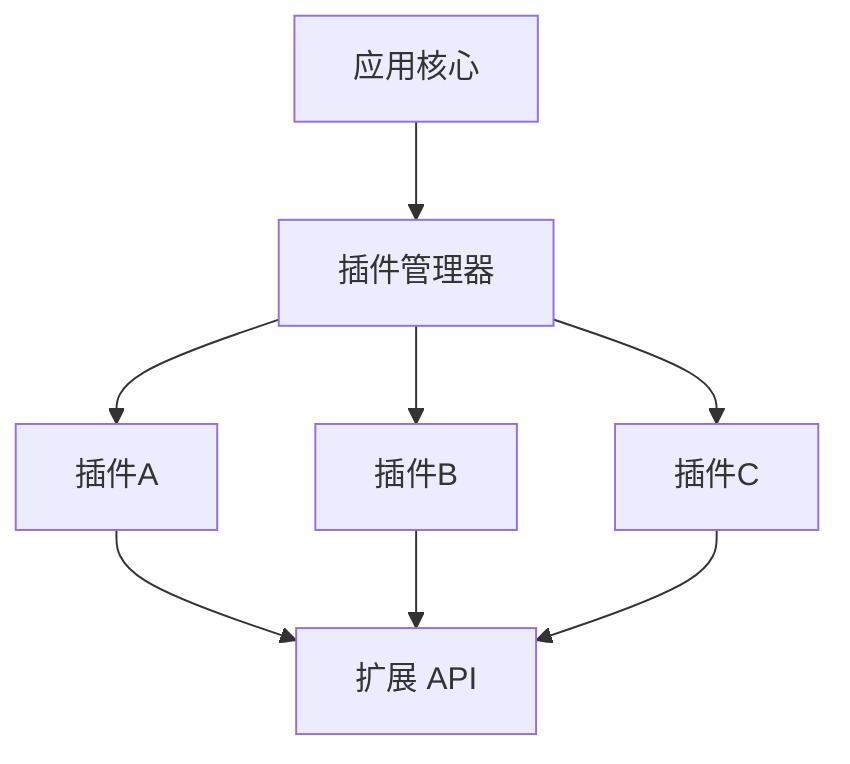
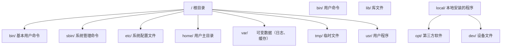
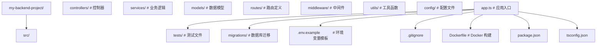
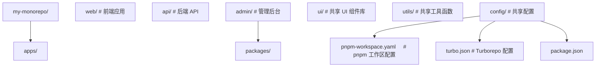

<!-- ============ 文档分隔线：001-getting-started/004-DevEnvSetup.md ============ -->

## 1. 选择操作系统

三大主流操作系统均可用于开发:

| 系统    | 优势                     | 适合场景                     |
| ------- | ------------------------ | ---------------------------- |
| Windows | 软件生态丰富, 游戏兼容好 | .NET开发、企业办公、通用开发 |
| macOS   | Unix底层, 前端工具链完善 | 前端开发、iOS开发、设计      |
| Linux   | 免费开源, 服务器环境一致 | 后端开发、运维、嵌入式       |

> 如果你是0基础, 使用当前电脑即可, 不需要专门更换操作系统. Windows用户可以通过WSL获得Linux环境.

## 2. 安装代码编辑器

推荐使用 **Visual Studio Code** (VS Code), 免费且功能强大.

### 2.1 下载安装

1. 访问 https://code.visualstudio.com
2. 点击下载对应系统版本
3. 运行安装程序, 勾选"添加到PATH"选项

### 2.2 必装扩展

安装完成后, 点击左侧扩展图标, 搜索并安装:

- **Chinese Language Pack** - 中文界面
- **GitLens** - Git增强工具
- **Prettier** - 代码格式化
- **ESLint** - JavaScript代码检查

## 3. 终端基础

终端是开发者最重要的工具之一.

### 3.1 打开终端

| 系统    | 方式                         |
| ------- | ---------------------------- |
| Windows | `Win + R` 输入 `powershell`  |
| macOS   | `Cmd + 空格` 输入 `terminal` |
| Linux   | `Ctrl + Alt + T`             |

### 3.2 常用命令

```bash
pwd           # 显示当前目录
ls            # 列出文件 (Windows: dir)
cd Documents  # 进入目录
cd ..         # 返回上级目录
mkdir project # 创建目录
clear         # 清屏 (Windows: cls)
```

### 3.3 Windows用户: 启用WSL

WSL (Windows Subsystem for Linux) 让你在Windows上运行Linux环境:

```powershell
wsl --install
```

安装后重启电脑, 即可使用Ubuntu终端.

## 4. 安装Git

Git是版本控制的基础工具, 后续模块会详细讲解.

### 4.1 安装方式

| 系统    | 命令                     |
| ------- | ------------------------ |
| Windows | 下载 https://git-scm.com |
| macOS   | `brew install git`       |
| Linux   | `sudo apt install git`   |

### 4.2 验证安装

```bash
git --version
```

显示版本号即安装成功.

## 5. 下一步

环境准备完成后, 建议按以下顺序开始学习:

1. **Markdown** - 学习文档编写基础
2. **Git** - 掌握版本控制
3. **GitHub** - 学会代码协作
## 工具链组成

**基本写法：查看 Node.js 版本**
`node --version`
```bash
# 验证 Node.js 是否安装成功
node --version
```

---

**基本写法：查看 Python 版本**
`python --version`
```bash
# 验证 Python 是否安装成功
python --version
```

---

**基本写法：查看 Java 版本**
`java -version`
```bash
# 验证 JDK 是否安装成功
java -version
```

---

**基本写法：查看 Git 版本**
`git --version`
```bash
# 验证 Git 是否安装成功
git --version
```

---

**基本写法：查看 Docker 版本**
`docker --version`
```bash
# 验证 Docker 是否安装成功
docker --version
```

---

**基本写法：查看 VS Code 版本**
`code --version`
```bash
# 验证 VS Code 命令行工具是否可用
code --version
```

---

## 包管理器识别

**基本写法：查看 npm 版本**
`npm --version`
```bash
# Node.js 默认包管理器
npm --version
```

---

**基本写法：查看 pnpm 版本**
`pnpm --version`
```bash
# 高性能 Node.js 包管理器
pnpm --version
```

---

**基本写法：查看 pip 版本**
`pip --version`
```bash
# Python 默认包管理器
pip --version
```

---

**基本写法：查看 uv 版本**
`uv --version`
```bash
# 新一代 Rust 实现的 Python 包管理器
uv --version
```

---

## 系统信息查询

**基本写法：查看操作系统信息（Windows）**
`systeminfo | findstr /B /C:"OS"`
```bash
# 查看 Windows 系统版本
systeminfo | findstr /B /C:"OS"
```

---

**基本写法：查看系统架构（Windows）**
`echo %PROCESSOR_ARCHITECTURE%`
```bash
# 查看处理器架构（x64 或 ARM64）
echo %PROCESSOR_ARCHITECTURE%
```

---

**基本写法：查看系统架构（跨平台）**
`uname -m`
```bash
# Linux/macOS 查看处理器架构
uname -m
```

---

## 环境变量检查

**基本写法：查看 PATH 环境变量（Windows）**
`echo %PATH%`
```bash
# 查看当前 PATH 环境变量
echo %PATH%
```

---

**基本写法：查看 PATH 环境变量（PowerShell）**
`$env:PATH`
```bash
# PowerShell 方式查看 PATH
$env:PATH
```

---

**基本写法：查看 JAVA_HOME**
`echo %JAVA_HOME%`
```bash
# 查看 Java 主目录环境变量
echo %JAVA_HOME%
```

---

**基本写法：查看所有环境变量（Windows）**
`set`
```bash
# 列出所有环境变量
set
```

---

**基本写法：查看所有环境变量（PowerShell）**
`Get-ChildItem Env:`
```bash
# PowerShell 列出所有环境变量
Get-ChildItem Env:
```

<!-- ============ 文档分隔线：001-getting-started/005-EnvVarPath.md ============ -->

## 1. 环境变量基础

### 1.1 什么是环境变量

环境变量是操作系统中用于存储配置信息的**键值对**，进程运行时可以读取这些变量来获取配置。每个进程都从其父进程继承环境变量，形成了一条从系统启动到当前进程的环境变量链。

```
KEY=VALUE
HOME=/home/user
PATH=/usr/local/bin:/usr/bin:/bin
LANG=en_US.UTF-8
```

环境变量的核心作用：

- **配置传递**：无需修改代码即可改变程序行为
- **路径声明**：告诉系统去哪里查找可执行文件
- **密钥管理**：存储 API Key 等敏感信息（不应硬编码）
- **行为控制**：控制程序的调试模式、日志级别等

### 1.2 环境变量的分类

| 类型         | 作用域          | 示例                 | 说明           |
| :----------- | :-------------- | :------------------- | :------------- |
| **系统级**   | 所有用户        | `PATH`、`SystemRoot` | 系统启动时加载 |
| **用户级**   | 当前用户        | `HOME`、`USER`       | 用户登录时加载 |
| **进程级**   | 当前进程        | `NODE_ENV`、`PORT`   | 进程运行时设置 |
| **Shell 级** | 当前 Shell 会话 | 临时变量             | 会话结束后消失 |

### 1.3 环境变量的生命周期

```
系统启动 → 加载系统级变量
    ↓
用户登录 → 加载用户级变量（~/.bashrc, ~/.zshrc 等）
    ↓
Shell 会话 → 加载 Shell 配置
    ↓
进程启动 → 继承父进程环境变量
    ↓
进程运行 → 可读取/修改自身环境变量
    ↓
进程结束 → 进程级变量消失
```

## 2. PATH 机制详解

### 2.1 PATH 的工作原理

`PATH` 是最重要的环境变量，它定义了系统查找可执行文件的**搜索路径列表**。当你在终端输入一个命令时，Shell 会按顺序在 PATH 中的每个目录里查找对应的可执行文件。

```bash
# 查看 PATH
echo $PATH
# 输出: /usr/local/bin:/usr/bin:/bin:/usr/sbin:/sbin

# 查找命令的实际位置
which python3
# 输出: /usr/local/bin/python3

# 查找所有匹配的位置
where node    # Windows
which -a node # macOS/Linux
```

### 2.2 PATH 搜索流程

```
输入命令: python3
    ↓
检查是否为 Shell 内建命令？ → 是 → 执行内建命令
    ↓ 否
检查是否为别名（alias）？ → 是 → 展开别名
    ↓ 否
遍历 PATH 目录:
    /usr/local/bin/python3 → 存在？ → 执行
    /usr/bin/python3       → 存在？ → 执行
    /bin/python3           → 存在？ → 执行
    ...
    ↓ 全部不存在
报错: command not found
```

### 2.3 PATH 的安全考虑

- **顺序敏感**：PATH 中靠前的目录优先级更高，可能被恶意程序利用
- **避免包含当前目录**：不要将 `.` 加入 PATH，防止目录注入攻击
- **权限控制**：PATH 中的目录应具有适当的文件系统权限

```bash
# 危险！不要这样做
export PATH=.:$PATH

# 如果当前目录有名为 ls 的恶意脚本
# 执行 ls 时会优先运行恶意脚本而非系统 ls
```

## 3. 跨平台配置

### 3.1 Linux / macOS

**配置文件加载顺序**：

```
登录 Shell:
  /etc/profile → ~/.bash_profile → ~/.bashrc

非登录 Shell:
  ~/.bashrc

Zsh:
  /etc/zshenv → ~/.zshenv → ~/.zshrc → ~/.zlogin
```

**常用操作**：

```bash
# 查看所有环境变量
env
printenv

# 查看单个变量
echo $HOME
echo $JAVA_HOME

# 设置临时变量（仅当前会话有效）
export MY_VAR="hello"

# 追加到 PATH
export PATH="$HOME/.local/bin:$PATH"

# 永久生效：写入配置文件
echo 'export PATH="$HOME/.local/bin:$PATH"' >> ~/.bashrc
source ~/.bashrc

# 删除变量
unset MY_VAR
```

### 3.2 Windows

**配置方式**：

1. **系统设置**：设置 → 系统 → 关于 → 高级系统设置 → 环境变量
2. **命令行**：

```powershell
# 查看所有环境变量
Get-ChildItem Env:

# 查看单个变量
$env:PATH
$env:JAVA_HOME

# 设置临时变量（仅当前会话）
$env:MY_VAR = "hello"

# 追加到 PATH
$env:PATH += ";C:\MyTools\bin"

# 永久设置（用户级）
[Environment]::SetEnvironmentVariable("MY_VAR", "hello", "User")

# 永久设置（系统级，需管理员权限）
[Environment]::SetEnvironmentVariable("MY_VAR", "hello", "Machine")

# 永久追加 PATH
$currentPath = [Environment]::GetEnvironmentVariable("PATH", "User")
[Environment]::SetEnvironmentVariable("PATH", "$currentPath;C:\MyTools\bin", "User")
```

### 3.3 跨平台环境变量管理

在 Node.js 项目中，推荐使用 `.env` 文件管理环境变量：

```bash
# .env 文件
DATABASE_URL=postgresql://localhost:5432/mydb
API_KEY=sk-xxxxx
NODE_ENV=development
```

```javascript
// 使用 dotenv 加载
require('dotenv').config();

console.log(process.env.DATABASE_URL);
console.log(process.env.NODE_ENV);
```

**安全规则**：

- `.env` 文件必须加入 `.gitignore`，绝不提交到版本控制
- 提供 `.env.example` 作为模板，列出所需变量但不包含真实值
- 生产环境使用 CI/CD 的密钥管理功能，而非 `.env` 文件

## 4. 常见开发工具的环境变量

### 4.1 编程语言相关

| 工具        | 变量         | 作用                 |
| :---------- | :----------- | :------------------- |
| **Java**    | `JAVA_HOME`  | JDK 安装路径         |
| **Python**  | `PYTHONPATH` | Python 模块搜索路径  |
| **Node.js** | `NODE_PATH`  | Node.js 模块搜索路径 |
| **Go**      | `GOPATH`     | Go 工作空间路径      |
| **Go**      | `GOROOT`     | Go 安装路径          |
| **Rust**    | `CARGO_HOME` | Cargo 包管理器路径   |

### 4.2 代理与网络

```bash
# HTTP 代理
export HTTP_PROXY=http://proxy.example.com:8080
export HTTPS_PROXY=http://proxy.example.com:8080
export NO_PROXY=localhost,127.0.0.1,.example.com

# npm 代理
npm config set proxy http://proxy.example.com:8080
npm config set https-proxy http://proxy.example.com:8080
```

## 5. 问题排查

### 5.1 常见问题

| 问题                   | 原因                   | 解决方案                    |
| :--------------------- | :--------------------- | :-------------------------- |
| `command not found`    | 可执行文件不在 PATH 中 | 将其所在目录加入 PATH       |
| `permission denied`    | 文件无执行权限         | `chmod +x filename`         |
| 变量设置后不生效       | 未 source 配置文件     | `source ~/.bashrc`          |
| Windows 路径分隔符错误 | 使用了 `/` 而非 `;`    | Windows 用 `;`，Unix 用 `:` |

### 5.2 调试技巧

```bash
# 检查命令的实际路径
type -a python3    # 显示所有匹配位置
command -v node    # 显示第一个匹配位置

# 检查环境变量是否已设置
[ -z "$JAVA_HOME" ] && echo "未设置" || echo "已设置: $JAVA_HOME"

# 查看进程的环境变量
cat /proc/$PID/environ | tr '\0' '\n'  # Linux
```
## Windows 系统变量查看

**基本写法：查看所有环境变量（CMD）**
`set`
```bash
# 列出所有环境变量
set
```

---

**基本写法：查看特定变量（CMD）**
`echo %<变量名>%`
```bash
# 查看指定环境变量的值
echo %PATH%
```

---

**基本写法：查看所有变量（PowerShell）**
`Get-ChildItem Env:`
```bash
# PowerShell 列出所有环境变量
Get-ChildItem Env:
```

---

**基本写法：查看特定变量（PowerShell）**
`$env:<变量名>`
```bash
# PowerShell 查看指定变量
$env:PATH
```

---

## Windows 环境变量设置

**基本写法：临时设置变量（CMD）**
`set <变量名>=<值>`
```bash
# 仅当前会话有效的变量
set MY_VAR=hello
```

---

**基本写法：永久设置用户变量（CMD）**
`setx <变量名> "<值>"`
```bash
# 永久写入用户环境变量
setx JAVA_HOME "C:\Program Files\Java\jdk-21"
```

---

**基本写法：永久设置系统变量（CMD）**
`setx <变量名> "<值>" /M`
```bash
# 写入系统级环境变量（需管理员权限）
setx PATH "%PATH%;C:\new\path" /M
```

---

**基本写法：PowerShell 设置用户变量**
`[Environment]::SetEnvironmentVariable("<变量名>", "<值>", "User")`
```bash
# PowerShell 永久设置用户变量
[Environment]::SetEnvironmentVariable("JAVA_HOME", "C:\Java\jdk-21", "User")
```

---

**基本写法：PowerShell 设置系统变量**
`[Environment]::SetEnvironmentVariable("<变量名>", "<值>", "Machine")`
```bash
# PowerShell 设置系统级变量（需管理员权限）
[Environment]::SetEnvironmentVariable("PATH", $env:PATH + ";C:\new", "Machine")
```

---

## Windows PATH 管理

**基本写法：追加路径到 PATH**
`setx PATH "%PATH%;<新路径>"`
```bash
# 将新路径追加到 PATH 环境变量
setx PATH "%PATH%;C:\my\tools"
```

---

**基本写法：PowerShell 追加 PATH**
`$env:PATH = $env:PATH + ";<新路径>"`
```bash
# 临时追加路径到当前会话 PATH
$env:PATH = $env:PATH + ";C:\my\tools"
```

---

**基本写法：PowerShell 永久追加用户 PATH**
`$old = [Environment]::GetEnvironmentVariable("PATH", "User"); [Environment]::SetEnvironmentVariable("PATH", $old + ";<新路径>", "User")`
```bash
# 永久追加路径到用户 PATH
$old = [Environment]::GetEnvironmentVariable("PATH", "User")
[Environment]::SetEnvironmentVariable("PATH", $old + ";C:\my\tools", "User")
```

---

## Linux/macOS 环境变量

**基本写法：临时设置变量**
`export <变量名>=<值>`
```bash
# 仅当前 shell 会话有效
export MY_VAR=hello
```

---

**基本写法：写入 bash 配置文件**
`echo 'export <变量名>=<值>' >> ~/.bashrc`
```bash
# 追加到 bashrc 实现永久生效
echo 'export JAVA_HOME=/usr/lib/jvm/java-21' >> ~/.bashrc
```

---

**基本写法：写入 zsh 配置文件**
`echo 'export <变量名>=<值>' >> ~/.zshrc`
```bash
# 追加到 zshrc（macOS 默认 shell）
echo 'export JAVA_HOME=/usr/lib/jvm/java-21' >> ~/.zshrc
```

---

**基本写法：追加路径到 PATH**
`export PATH=$PATH:<新路径>`
```bash
# 将新路径追加到 PATH 变量
export PATH=$PATH:/usr/local/bin
```

---

**基本写法：前置路径到 PATH**
`export PATH=<新路径>:$PATH`
```bash
# 将新路径前置到 PATH（优先级更高）
export PATH=/usr/local/bin:$PATH
```

---

## 配置文件重新加载

**基本写法：重新加载 bashrc**
`source ~/.bashrc`
```bash
# 重新加载 bash 配置文件
source ~/.bashrc
```

---

**基本写法：重新加载 zshrc**
`source ~/.zshrc`
```bash
# 重新加载 zsh 配置文件
source ~/.zshrc
```

---

**基本写法：重新加载 profile**
`source ~/.profile`
```bash
# 重新加载 profile 文件
source ~/.profile
```

---

## 变量删除

**基本写法：删除用户变量（PowerShell）**
`[Environment]::SetEnvironmentVariable("<变量名>", $null, "User")`
```bash
# 删除用户级环境变量
[Environment]::SetEnvironmentVariable("MY_VAR", $null, "User")
```

---

**基本写法：删除 setx 设置的变量**
`reg delete "HKCU\Environment" /F /V <变量名>`
```bash
# 通过注册表删除用户环境变量
reg delete "HKCU\Environment" /F /V MY_VAR
```

---

**基本写法：删除 bash 中的变量**
`unset <变量名>`
```bash
# 删除当前 shell 中的环境变量
unset MY_VAR
```

<!-- ============ 文档分隔线：001-getting-started/003-IDEEditorSelection.md ============ -->

> 阅读建议：0 基础学习者推荐直接选 VS Code，本片其余部分（Vim、JetBrains 对比）可先跳过，等遇到编辑器瓶颈再回来看。

## 1. 编辑器与IDE概述

### 1.1 核心区别

| 特性         | 文本编辑器         | 集成开发环境（IDE）        |
| :----------- | :----------------- | :------------------------- |
| **定位**     | 轻量级代码编写工具 | 全功能开发平台             |
| **启动速度** | 快（秒级）         | 慢（十秒级）               |
| **资源占用** | 低                 | 高                         |
| **内置功能** | 语法高亮、基础补全 | 调试、重构、构建、版本控制 |
| **可扩展性** | 通过插件扩展       | 插件 + 内置工具链          |
| **适用场景** | 快速编辑、脚本编写 | 大型项目开发               |

### 1.2 选型决策树



## 2. Visual Studio Code

### 2.1 核心优势

VS Code 是 Microsoft 开发的免费开源编辑器，凭借以下优势成为最流行的代码编辑器：

- **轻量快速**：基于 Electron，启动速度优于传统 IDE
- **插件生态**：超过 40,000 个扩展
- **内置终端**：集成终端、调试器、Git 支持
- **跨平台**：Windows、macOS、Linux
- **远程开发**：Remote SSH、Remote Containers、WSL

### 2.2 必装扩展

| 扩展               | 用途                           | 说明                  |
| :----------------- | :----------------------------- | :-------------------- |
| **ESLint**         | JavaScript/TypeScript 代码检查 | 实时标记代码问题      |
| **Prettier**       | 代码格式化                     | 统一代码风格          |
| **GitLens**        | Git 增强                       | 行级 blame、历史浏览  |
| **Error Lens**     | 错误高亮                       | 内联显示错误信息      |
| **Thunder Client** | API 测试                       | 轻量级 Postman 替代   |
| **Remote - SSH**   | 远程开发                       | 通过 SSH 编辑远程文件 |

### 2.3 高效配置

```json
// settings.json 关键配置
{
  "editor.fontSize": 14,
  "editor.fontFamily": "'JetBrains Mono', 'Fira Code', monospace",
  "editor.fontLigatures": true,
  "editor.formatOnSave": true,
  "editor.minimap.enabled": false,
  "editor.bracketPairColorization.enabled": true,
  "editor.guides.bracketPairs": "active",
  "editor.inlineSuggest.enabled": true,
  "files.autoSave": "afterDelay",
  "terminal.integrated.defaultProfile.windows": "PowerShell",
  "workbench.colorTheme": "One Dark Pro"
}
```

### 2.4 常用快捷键

| 功能       | Windows/Linux  | macOS            |
| :--------- | :------------- | :--------------- |
| 命令面板   | `Ctrl+Shift+P` | `Cmd+Shift+P`    |
| 文件搜索   | `Ctrl+P`       | `Cmd+P`          |
| 全局搜索   | `Ctrl+Shift+F` | `Cmd+Shift+F`    |
| 终端切换   | `Ctrl+``       | `Cmd+``          |
| 跳转定义   | `F12`          | `F12`            |
| 重命名符号 | `F2`           | `F2`             |
| 多光标     | `Alt+Click`    | `Option+Click`   |
| 行复制     | `Shift+Alt+↓`  | `Shift+Option+↓` |

## 3. IntelliJ IDEA

### 3.1 核心优势

IntelliJ IDEA 是 JetBrains 开发的商业 IDE，以**智能代码分析**著称：

- **深度代码理解**：精确的代码导航、重构和分析
- **框架支持**：Spring Boot、Jakarta EE、Android 等
- **数据库工具**：内置数据库浏览器和 SQL 编辑器
- **版本控制**：深度集成 Git、SVN、Mercurial
- **性能分析**：内置 CPU 和内存 Profiler

### 3.2 版本对比

| 特性                  | Community（免费） | Ultimate（付费） |
| :-------------------- | :---------------- | :--------------- |
| Java/Kotlin 开发      |                   |                  |
| Maven/Gradle          |                   |                  |
| Git 集成              |                   |                  |
| Spring Boot           |                   |                  |
| Web 前端（JS/TS/CSS） |                   |                  |
| 数据库工具            |                   |                  |
| HTTP 客户端           |                   |                  |
| 性能分析              |                   |                  |

### 3.3 JetBrains 全家桶

| IDE               | 语言/领域             | 说明          |
| :---------------- | :-------------------- | :------------ |
| **IntelliJ IDEA** | Java/Kotlin           | 旗舰 IDE      |
| **PyCharm**       | Python                | 数据科学支持  |
| **WebStorm**      | JavaScript/TypeScript | 前端专用      |
| **GoLand**        | Go                    | Go 开发专用   |
| **RustRover**     | Rust                  | Rust 开发专用 |
| **CLion**         | C/C++                 | 系统编程      |
| **DataGrip**      | SQL/数据库            | 数据库管理    |

## 4. Vim / Neovim

### 4.1 Vim 哲学

Vim 的核心设计理念是**手不离键盘**，通过模式切换实现高效编辑：

| 模式         | 用途             | 进入方式           |
| :----------- | :--------------- | :----------------- |
| **普通模式** | 移动、删除、复制 | `Esc`              |
| **插入模式** | 输入文本         | `i`、`a`、`o`      |
| **可视模式** | 选择文本         | `v`、`V`、`Ctrl+V` |
| **命令模式** | 执行命令         | `:`                |
| **替换模式** | 替换文本         | `R`                |

### 4.2 Neovim 现代化

Neovim 是 Vim 的现代化分支，核心改进：

- **Lua 配置**：用 Lua 替代 VimScript，性能更优
- **LSP 原生支持**：内置语言服务器协议
- **异步架构**：所有操作非阻塞
- **Tree-sitter**：增量语法解析，精确高亮

```lua
-- Neovim 配置示例 (init.lua)
vim.opt.number = true
vim.opt.relativenumber = true
vim.opt.tabstop = 4
vim.opt.shiftwidth = 4
vim.opt.expandtab = true
vim.opt.termguicolors = true

-- 使用 lazy.nvim 包管理器
require("lazy").setup({
  "neovim/nvim-lspconfig",    -- LSP 配置
  "nvim-treesitter/nvim-treesitter", -- 语法高亮
  "hrsh7th/nvim-cmp",          -- 自动补全
  "nvim-telescope/telescope.nvim",   -- 模糊搜索
  "lewis6991/gitsigns.nvim",   -- Git 集成
})
```

### 4.3 Vim 适用场景

- **服务器编辑**：SSH 远程编辑配置文件
- **Git 提交信息**：`git commit` 默认编辑器
- **快速修改**：无需等待 IDE 启动
- **追求效率**：掌握后编辑速度极快

## 5. 云端 IDE

### 5.1 方案对比

| 平台                  | 特点           | 免费额度          | 适用场景     |
| :-------------------- | :------------- | :---------------- | :----------- |
| **GitHub Codespaces** | VS Code 云端版 | 每月 120 核心小时 | 仓库快速开发 |
| **Gitpod**            | 开源云端 IDE   | 每月 50 小时      | 开源项目贡献 |
| **Replit**            | 多语言在线 IDE | 基础版免费        | 学习与原型   |
| **CodeSandbox**       | 前端在线开发   | 公开项目免费      | 前端原型演示 |

### 5.2 GitHub Codespaces 配置

```json
// .devcontainer/devcontainer.json
{
  "name": "My Dev Environment",
  "image": "mcr.microsoft.com/devcontainers/javascript-node:20",
  "features": {
    "ghcr.io/devcontainers/features/git:1": {}
  },
  "postCreateCommand": "npm install",
  "customizations": {
    "vscode": {
      "extensions": ["dbaeumer.vscode-eslint", "esbenp.prettier-vscode"]
    }
  }
}
```

## 6. 选型建议

### 6.1 按经验阶段

| 阶段           | 推荐               | 理由                             |
| :------------- | :----------------- | :------------------------------- |
| **初学者**     | VS Code            | 上手简单、插件丰富、社区活跃     |
| **进阶者**     | VS Code + Vim 键位 | 提升编辑效率                     |
| **专业开发者** | 领域 IDE + VS Code | Java 用 IntelliJ，前端用 VS Code |
| **效率极客**   | Neovim 定制        | 完全自定义、极致效率             |

### 6.2 按项目类型

| 项目类型        | 推荐方案                | 说明                   |
| :-------------- | :---------------------- | :--------------------- |
| **前端项目**    | VS Code                 | 生态最完善             |
| **Java/Spring** | IntelliJ IDEA Ultimate  | 框架支持最强           |
| **Python/ML**   | VS Code + Jupyter       | 数据科学友好           |
| **Go 微服务**   | VS Code / GoLand        | GoLand 重构更强        |
| **C/C++**       | VS Code + CMake / CLion | CLion 调试体验更好     |
| **远程开发**    | VS Code Remote / Vim    | 网络延迟敏感场景用 Vim |

<!-- ============ 文档分隔线：001-getting-started/004-PluginEcosystem.md ============ -->

> 阅读建议：插件可以边用边装，不需要一次装全。

## 1. 插件体系概述

### 1.1 为什么需要插件

插件（Plugin/Extension）是软件系统的**可扩展模块**，允许第三方在不修改核心代码的情况下增强软件功能。插件体系的核心价值：

- **开放封闭原则**：对扩展开放，对修改封闭
- **按需加载**：只安装需要的功能，保持核心轻量
- **社区驱动**：全球开发者贡献，生态快速演进
- **个性化定制**：每个开发者可以打造专属工作流

### 1.2 插件架构模式



### 1.3 插件生命周期

1. **发现**：在插件市场搜索和浏览
2. **安装**：下载并注册到插件管理器
3. **激活**：根据触发条件加载插件
4. **运行**：提供功能服务
5. **停用**：释放资源
6. **卸载**：从系统中移除

## 2. VS Code 扩展生态

### 2.1 扩展清单文件

每个 VS Code 扩展必须包含 `package.json` 清单文件：

```json
{
  "name": "my-extension",
  "displayName": "My Extension",
  "description": "A sample VS Code extension",
  "version": "1.0.0",
  "publisher": "my-publisher",
  "engines": { "vscode": "^1.80.0" },
  "categories": ["Programming Languages", "Linters"],
  "activationEvents": ["onLanguage:python"],
  "main": "./dist/extension.js",
  "contributes": {
    "commands": [
      {
        "command": "myExtension.hello",
        "title": "Say Hello"
      }
    ],
    "configuration": {
      "title": "My Extension",
      "properties": {
        "myExtension.enable": {
          "type": "boolean",
          "default": true,
          "description": "Enable the extension"
        }
      }
    }
  }
}
```

### 2.2 扩展能力点

| 能力         | API              | 说明                 |
| :----------- | :--------------- | :------------------- |
| **命令**     | `commands`       | 注册命令到命令面板   |
| **语言功能** | `LanguageClient` | 代码补全、跳转、诊断 |
| **主题**     | `themes`         | 颜色主题和图标主题   |
| **调试**     | `debuggers`      | 自定义调试适配器     |
| **树视图**   | `views`          | 侧边栏自定义视图     |
| **Webview**  | `WebviewPanel`   | 嵌入自定义 HTML      |
| **状态栏**   | `StatusBarItem`  | 底部状态信息         |
| **代码片段** | `snippets`       | 代码模板             |

### 2.3 扩展开发入门

```typescript
// src/extension.ts
import * as vscode from 'vscode';

export function activate(context: vscode.ExtensionContext) {
  const disposable = vscode.commands.registerCommand('myExtension.hello', () => {
    vscode.window.showInformationMessage('Hello from My Extension!');
  });
  context.subscriptions.push(disposable);
}

export function deactivate() {}
```

## 3. JetBrains 插件生态

### 3.1 插件市场

JetBrains 插件市场（Marketplace）提供超过 7,000 个插件，覆盖：

- **语言支持**：新增编程语言支持
- **框架集成**：Spring、Django、Rails 等
- **工具集成**：Docker、Database、HTTP Client
- **UI 增强**：主题、快捷键映射
- **代码质量**：检查器、格式化器

### 3.2 插件开发架构

JetBrains 插件基于 IntelliJ Platform SDK：

```kotlin
// plugin.xml - 插件描述文件
<idea-plugin>
  <id>com.example.myplugin</id>
  <name>My Plugin</name>
  <version>1.0.0</version>
  <vendor>My Company</vendor>

  <depends>com.intellij.modules.platform</depends>

  <extensions defaultExtensionNs="com.intellij">
    <applicationService
      serviceImplementation="com.example.MyService"/>
  </extensions>

  <actions>
    <action id="MyAction" class="com.example.MyAction"
            text="My Action" description="My action">
      <add-to-group group-id="ToolsMenu" anchor="first"/>
    </action>
  </actions>
</idea-plugin>
```

## 4. Vim/Neovim 插件生态

### 4.1 包管理器

| 包管理器        | 语言      | 特点                  |
| :-------------- | :-------- | :-------------------- |
| **vim-plug**    | VimScript | 简洁易用，最流行      |
| **packer.nvim** | Lua       | Neovim 专用，已停维   |
| **lazy.nvim**   | Lua       | Neovim 新标准，性能优 |
| **dein.vim**    | VimScript | 高性能，异步加载      |

### 4.2 lazy.nvim 配置示例

```lua
-- Neovim 插件配置
require("lazy").setup({
  -- 文件树
  {
    "nvim-neo-tree/neo-tree.nvim",
    branch = "v3.x",
    dependencies = { "nvim-lua/plenary.nvim" },
  },

  -- 模糊搜索
  {
    "nvim-telescope/telescope.nvim",
    tag = "0.1.8",
    dependencies = { "nvim-lua/plenary.nvim" },
  },

  -- 自动补全
  {
    "hrsh7th/nvim-cmp",
    dependencies = {
      "hrsh7th/cmp-nvim-lsp",
      "hrsh7th/cmp-buffer",
      "L3MON4D3/LuaSnip",
    },
  },

  -- 语法高亮
  {
    "nvim-treesitter/nvim-treesitter",
    build = ":TSUpdate",
  },
})
```

### 4.3 必备插件分类

| 类别         | 插件                 | 功能          |
| :----------- | :------------------- | :------------ |
| **文件导航** | neo-tree / nvim-tree | 文件浏览器    |
| **模糊搜索** | telescope            | 文件/内容搜索 |
| **代码补全** | nvim-cmp             | 智能补全      |
| **语法高亮** | nvim-treesitter      | 增量解析高亮  |
| **Git**      | gitsigns / fugitive  | Git 集成      |
| **LSP**      | nvim-lspconfig       | 语言服务器    |
| **格式化**   | conform.nvim         | 代码格式化    |
| **调试**     | nvim-dap             | 调试适配器    |

## 5. 插件管理最佳实践

### 5.1 安装原则

- **最小化原则**：只安装真正需要的插件，避免臃肿
- **质量优先**：选择维护活跃、星标多的插件
- **避免冲突**：功能重叠的插件可能产生冲突
- **定期清理**：移除不再使用的插件

### 5.2 配置同步

| 工具                    | 平台       | 方式             |
| :---------------------- | :--------- | :--------------- |
| **Settings Sync**       | VS Code    | GitHub Gist 同步 |
| **Settings Repository** | JetBrains  | Git 仓库同步     |
| **dotfiles**            | Vim/Neovim | Git 管理配置文件 |
| **Chezmoi**             | 通用       | 跨机器配置管理   |

### 5.3 性能优化

```bash
# VS Code 查看扩展加载时间
code --prof-startup

# Neovim 查看插件加载时间
:Lazy profile

# JetBrains 禁用不需要的插件
# Settings → Plugins → Installed → 取消勾选
```

## 6. 插件安全

### 6.1 安全风险

- **供应链攻击**：恶意插件窃取敏感信息
- **权限滥用**：插件请求不必要的系统权限
- **代码注入**：插件执行恶意代码

### 6.2 防护措施

1. **验证来源**：只从官方市场安装插件
2. **审查权限**：检查插件请求的权限是否合理
3. **关注维护**：优先选择活跃维护的插件
4. **定期更新**：保持插件版本最新
5. **最小权限**：只授予必要的权限

<!-- ============ 文档分隔线：001-getting-started/005-CommandLineBasics.md ============ -->

## 命令的通用结构（先看这里）

绝大多数终端命令都长这样：

```text
命令名  参数/选项  目标
ls     -la       /home/user
```

- **命令名**：做什么（`ls` 列出文件、`cd` 切换目录）；
- **选项**：怎么做的开关，通常以 `-` 开头（`-l` 详细信息、`-a` 含隐藏文件）；
- **目标**：对谁做（目录、文件）。

> 为什么先学这个结构？因为看懂结构后，新命令不需要背，猜也能猜出大半；记不住时用 `命令 --help` 查看说明。

## 文件列表查看

**基本写法：列出目录内容**
`ls`
```bash
# Linux/macOS 列出当前目录文件
ls
```

---

**基本写法：详细列表（Linux/macOS）**
`ls -la`
```bash
# 显示所有文件含隐藏文件及详细信息
ls -la
```

**为什么与参数拆解：**

- `ls` = list，列出目录内容；
- `-l` = long format，显示权限、大小、修改时间等详细信息；
- `-a` = all，包含以 `.` 开头的隐藏文件；
- 组合 `-la` 等价于 `-l -a`，是查看目录最常用的组合。

---

**基本写法：Windows 列出目录内容**
`dir`
```bash
# Windows CMD 列出目录文件
dir
```

---

**基本写法：PowerShell 列出内容**
`Get-ChildItem`
```bash
# PowerShell 列出目录内容
Get-ChildItem
```

---

**基本写法：显示隐藏文件（PowerShell）**
`Get-ChildItem -Force`
```bash
# 显示包含隐藏文件的所有文件
Get-ChildItem -Force
```

---

## 文件操作

**基本写法：创建新文件（PowerShell）**
`New-Item <文件名>`
```bash
# 创建新的空文件
New-Item index.html
```

---

**基本写法：创建新文件（Linux/macOS）**
`touch <文件名>`
```bash
# 创建空文件或更新时间戳
touch index.html
```

---

**基本写法：复制文件**
`cp <源文件> <目标>`
```bash
# Linux/macOS 复制文件
cp file.txt backup.txt
```

---

**基本写法：复制文件（Windows）**
`copy <源文件> <目标>`
```bash
# Windows CMD 复制文件
copy file.txt backup.txt
```

---

**基本写法：移动或重命名文件**
`mv <源文件> <目标>`
```bash
# Linux/macOS 移动或重命名
mv old.txt new.txt
```

---

**基本写法：移动文件（Windows）**
`move <源文件> <目标>`
```bash
# Windows CMD 移动文件
move file.txt D:\backup\
```

---

**基本写法：删除文件**
`rm <文件名>`
```bash
# Linux/macOS 删除文件
rm file.txt
```

---

**基本写法：删除文件（Windows）**
`del <文件名>`
```bash
# Windows CMD 删除文件
del file.txt
```

---

**基本写法：强制删除文件**
`rm -f <文件名>`
```bash
# 强制删除不提示确认
rm -f file.txt
```

---

## 目录创建与删除

**基本写法：创建目录**
`mkdir <目录名>`
```bash
# 创建新目录
mkdir myproject
```

---

**基本写法：递归创建目录**
`mkdir -p <路径>`
```bash
# 一次性创建多级目录
mkdir -p src/components/ui
```

---

**基本写法：PowerShell 递归创建**
`New-Item -ItemType Directory -Path <路径> -Force`
```bash
# PowerShell 创建多级目录
New-Item -ItemType Directory -Path "src\components\ui" -Force
```

---

**基本写法：删除目录**
`rm -r <目录名>`
```bash
# Linux/macOS 递归删除目录
rm -r oldproject
```

---

**基本写法：删除目录（Windows）**
`rmdir /s <目录名>`
```bash
# Windows CMD 递归删除目录
rmdir /s oldproject
```

---

## 文件内容查看

**基本写法：查看文件内容**
`cat <文件名>`
```bash
# 输出文件全部内容
cat package.json
```

---

**基本写法：分页查看（Linux/macOS）**
`less <文件名>`
```bash
# 分页查看大文件内容
less largefile.log
```

---

**基本写法：查看文件头部**
`head -n <行数> <文件名>`
```bash
# 查看文件前 N 行
head -n 20 README.md
```

---

**基本写法：查看文件尾部**
`tail -n <行数> <文件名>`
```bash
# 查看文件后 N 行
tail -n 20 error.log
```

---

**基本写法：实时追踪日志**
`tail -f <文件名>`
```bash
# 持续监控文件新增内容
tail -f application.log
```

---

## 文本搜索

**基本写法：搜索文件内容（Linux/macOS）**
`grep "<关键词>" <文件>`
```bash
# 在文件中搜索关键词
grep "TODO" index.js
```

---

**基本写法：递归搜索目录**
`grep -r "<关键词>" <目录>`
```bash
# 递归搜索目录下所有文件
grep -r "console.log" src/
```

---

**基本写法：Windows 搜索文件内容**
`findstr "<关键词>" <文件>`
```bash
# Windows CMD 搜索文件内容
findstr "TODO" index.js
```

---

**基本写法：PowerShell 搜索内容**
`Select-String -Pattern "<关键词>" -Path <文件>`
```bash
# PowerShell 搜索文件内容
Select-String -Pattern "TODO" -Path index.js
```

---

## 文件查找

**基本写法：按名称查找（Linux/macOS）**
`find <路径> -name "<文件名>"`
```bash
# 在指定路径查找文件
find . -name "*.js"
```

---

**基本写法：按名称查找（Windows）**
`dir /s /b <文件名>`
```bash
# Windows 递归查找文件
dir /s /b *.js
```

---

**基本写法：PowerShell 查找文件**
`Get-ChildItem -Path <路径> -Filter <模式> -Recurse`
```bash
# PowerShell 递归查找文件
Get-ChildItem -Path . -Filter "*.js" -Recurse
```
## 1. Shell 与终端

### 1.1 Shell 概述

Shell 是操作系统的**命令解释器**，是用户与内核之间的接口。它接收用户输入的命令，将其翻译为系统调用，并将结果返回给用户。

| Shell          | 全称                       | 特点                   |
| :------------- | :------------------------- | :--------------------- |
| **sh**         | Bourne Shell               | Unix 最初 Shell        |
| **bash**       | Bourne Again Shell         | Linux 默认，最广泛使用 |
| **zsh**        | Z Shell                    | macOS 默认，功能强大   |
| **fish**       | Friendly Interactive Shell | 用户友好，自动建议     |
| **PowerShell** | —                          | Windows 默认，面向对象 |

### 1.2 终端模拟器

终端模拟器是运行 Shell 的图形界面程序：

| 终端                 | 平台    | 特点               |
| :------------------- | :------ | :----------------- |
| **Windows Terminal** | Windows | 多标签、GPU 加速   |
| **iTerm2**           | macOS   | 分屏、热键窗口     |
| **Alacritty**        | 跨平台  | GPU 加速、极简     |
| **Kitty**            | 跨平台  | GPU 加速、图片显示 |
| **WezTerm**          | 跨平台  | Lua 配置、多路复用 |

### 1.3 Shell 配置文件

```bash
# bash 配置文件加载顺序
/etc/profile           # 系统级，登录时加载
~/.bash_profile        # 用户级，登录时加载
~/.bashrc              # 用户级，每次打开新 Shell 加载

# zsh 配置文件加载顺序
~/.zshenv              # 所有 zsh 实例加载
~/.zshrc               # 交互式 Shell 加载
~/.zlogin              # 登录 Shell 加载
```

## 2. 文件系统操作

### 2.1 目录导航

```bash
pwd                     # 显示当前工作目录
cd /home/user/projects  # 切换到绝对路径
cd ../..                # 上移两级目录
cd -                    # 返回上一个目录
cd ~                    # 切换到主目录
```

### 2.2 文件与目录管理

```bash
# 创建
mkdir project           # 创建目录
mkdir -p a/b/c          # 递归创建多级目录
touch file.txt          # 创建空文件

# 复制
cp file.txt backup.txt  # 复制文件
cp -r src/ dest/        # 递归复制目录

# 移动与重命名
mv old.txt new.txt      # 重命名
mv file.txt ../         # 移动到上级目录

# 删除
rm file.txt             # 删除文件（不可恢复！）
rm -r directory/        # 递归删除目录
rm -rf directory/       # 强制递归删除（危险！）

# 查找
find . -name "*.js"     # 按名称查找
find . -type f -mtime -7  # 查找7天内修改的文件
```

### 2.3 文件查看与搜索

```bash
# 查看文件
cat file.txt            # 显示全部内容
less file.txt           # 分页查看（推荐）
head -n 20 file.txt     # 显示前20行
tail -n 20 file.txt     # 显示后20行
tail -f log.txt         # 实时追踪文件末尾

# 搜索
grep "error" log.txt           # 搜索包含 error 的行
grep -r "TODO" src/            # 递归搜索目录
grep -i "warning" log.txt      # 忽略大小写
grep -n "function" app.js      # 显示行号
```

### 2.4 权限管理

```bash
# 查看权限
ls -la
# -rwxr-xr-x 1 user group 4096 Jan 1 12:00 script.sh
#  └┬┘└┬┘└┬┘
#   │   │   └── 其他用户: r-x (读+执行)
#   │   └────── 组用户: r-x (读+执行)
#   └────────── 所有者: rwx (读+写+执行)

# 修改权限
chmod +x script.sh      # 添加执行权限
chmod 755 script.sh     # 数字方式设置权限
chmod -R 644 directory/ # 递归设置目录权限

# 修改所有者
chown user:group file   # 修改文件所有者和组
```

### 2.5 文件系统层次标准（FHS）



## 3. 进程管理

### 3.1 进程查看

```bash
ps aux                   # 查看所有进程
ps -ef                   # 另一种格式
top                      # 实时进程监控
htop                     # 增强版 top（推荐）
pgrep -f "node"          # 按名称查找进程 PID
```

### 3.2 进程控制

```bash
# 前台/后台
command &                # 后台运行
Ctrl+Z                   # 暂停当前进程
bg                       # 将暂停的进程放到后台
fg                       # 将后台进程调到前台
jobs                     # 查看后台任务

# 终止进程
kill PID                 # 发送 SIGTERM（优雅终止）
kill -9 PID              # 发送 SIGKILL（强制终止）
killall node             # 按名称终止所有匹配进程
pkill -f "webpack"       # 按命令行模式终止
```

### 3.3 信号系统

| 信号        | 编号 | 含义 | 用途                        |
| :---------- | :--- | :--- | :-------------------------- |
| **SIGHUP**  | 1    | 挂断 | 终端关闭时通知进程          |
| **SIGINT**  | 2    | 中断 | `Ctrl+C` 发送               |
| **SIGQUIT** | 3    | 退出 | `Ctrl+\` 发送，生成核心转储 |
| **SIGTERM** | 15   | 终止 | 默认 kill 信号，可被捕获    |
| **SIGKILL** | 9    | 杀死 | 强制终止，不可被捕获        |
| **SIGSTOP** | 19   | 停止 | 不可被捕获，暂停进程        |
| **SIGCONT** | 18   | 继续 | 恢复暂停的进程              |

### 3.4 守护进程与服务

```bash
# systemd 服务管理
systemctl start nginx     # 启动服务
systemctl stop nginx      # 停止服务
systemctl restart nginx   # 重启服务
systemctl status nginx    # 查看状态
systemctl enable nginx    # 开机自启
systemctl disable nginx   # 取消自启

# 查看服务日志
journalctl -u nginx -f    # 实时查看 nginx 日志
```

## 4. 网络工具

### 4.1 连接测试

```bash
ping google.com           # 测试网络连通性
ping -c 4 google.com      # 发送4个包后停止
traceroute google.com     # 跟踪路由路径
mtr google.com            # 持续跟踪路由（推荐）
```

### 4.2 DNS 查询

```bash
nslookup google.com       # DNS 查询
dig google.com            # 详细 DNS 查询
dig +short google.com     # 只显示 IP 地址
host google.com           # 简洁 DNS 查询
```

### 4.3 端口与连接

```bash
# 查看端口占用
netstat -tlnp             # 查看所有监听端口
ss -tlnp                  # 更快的替代方案
lsof -i :8080             # 查看占用 8080 端口的进程

# 网络连接测试
curl http://example.com   # HTTP 请求
curl -I https://example.com  # 只看响应头
wget https://example.com/file.zip  # 下载文件
nc -zv localhost 3306     # 测试端口连通性
```

### 4.4 防火墙

```bash
# ufw（Ubuntu 防火墙）
ufw status                # 查看状态
ufw allow 80/tcp          # 允许 80 端口
ufw allow 443/tcp         # 允许 443 端口
ufw deny 3306             # 拒绝 3306 端口
ufw enable                # 启用防火墙
```

## 5. 管道与重定向

### 5.1 重定向

```bash
# 输出重定向
echo "hello" > file.txt       # 覆盖写入
echo "world" >> file.txt      # 追加写入

# 输入重定向
sort < names.txt              # 从文件读取输入

# 错误重定向
command 2> error.log          # 错误输出到文件
command 2>&1                  # 错误合并到标准输出
command &> all.log            # 所有输出到文件
```

### 5.2 管道

管道将前一个命令的**标准输出**作为后一个命令的**标准输入**：

```bash
# 组合使用
cat access.log | grep "404" | wc -l        # 统计404错误数
ps aux | grep node | grep -v grep           # 查找node进程
find . -name "*.js" | xargs wc -l          # 统计JS文件行数
history | sort | uniq -c | sort -rn | head  # 最常用命令
```

### 5.3 文本处理三剑客

```bash
# grep - 文本搜索
grep -E "error|warning" log.txt    # 正则搜索

# sed - 流编辑器
sed 's/old/new/g' file.txt         # 替换文本
sed -n '10,20p' file.txt           # 打印10-20行

# awk - 文本分析
awk '{print $1, $3}' data.txt      # 打印第1、3列
awk -F: '{print $1}' /etc/passwd   # 指定分隔符
awk '$3 > 100 {print $0}' data.txt # 条件过滤
```

## 6. Shell 脚本入门

### 6.1 基本结构

```bash
#!/bin/bash
# 这是一个 Shell 脚本

# 变量
NAME="World"
echo "Hello, $NAME!"

# 条件判断
if [ -f "package.json" ]; then
    echo "Found package.json"
    npm install
else
    echo "No package.json found"
fi

# 循环
for file in *.js; do
    echo "Processing: $file"
done

# 函数
greet() {
    local name=$1
    echo "Hello, $name!"
}
greet "Developer"
```

### 6.2 实用脚本示例

```bash
#!/bin/bash
# 自动化项目部署脚本

set -e  # 遇到错误立即退出

PROJECT_DIR="/var/www/myapp"
BRANCH="main"

echo "=== Deploying $BRANCH ==="

cd "$PROJECT_DIR"
git pull origin "$BRANCH"
npm install --production
npm run build
pm2 restart myapp

echo "=== Deploy complete ==="
```
## 路径与目录

**基本用法:查看当前路径**
`pwd`

```bash
# 显示当前工作目录绝对路径
pwd
```

---

**基本用法:切换目录**
`cd <路径>`

```bash
# 切换到指定目录
cd /home/user/project

# 返回上一级目录
cd ..

# 返回用户主目录
cd ~

# 返回上一次所在目录
cd -
```

---

**基本用法:列出目录内容**
`ls [选项] [路径]`

```bash
# 长格式列出含隐藏文件
ls -la

# 按修改时间倒序排列
ls -lt

# 人类可读文件大小(KB/MB)
ls -lh

# 仅显示目录本身属性
ls -ld src
```

---

## 文件与目录创建

**基本用法:创建目录**
`mkdir [选项] <目录名>`

```bash
# 递归创建多级目录
mkdir -p src/components/ui

# 创建时打印信息
mkdir -pv logs cache tmp
```

---

**基本用法:创建空文件**
`touch <文件名>`

```bash
# 创建空文件或更新时间戳
touch index.html

# 批量创建
touch a.txt b.txt c.txt
```

---

## 复制与移动

**基本用法:复制文件或目录**
`cp [选项] <源> <目标>`

```bash
# 递归复制整个目录
cp -r src src_backup

# 保留权限与时间戳复制
cp -a config config.bak

# 覆盖前确认
cp -i file.txt /tmp/
```

---

**基本用法:移动或重命名**
`mv [选项] <源> <目标>`

```bash
# 重命名文件
mv old.txt new.txt

# 移动并覆盖前确认
mv -i tmp.log logs/

# 不覆盖已存在文件
mv -n a.txt b.txt
```

---

## 删除操作

**基本用法:删除文件**
`rm [选项] <文件>`

```bash
# 强制删除不提示
rm -f temp.txt

# 递归删除目录
rm -r old_project

# 强制递归删除(谨慎使用)
rm -rf node_modules
```

---

## 通配符与扩展

**基本用法:通配符匹配**
`<命令> <模式>`

```bash
# 匹配所有 .js 文件
ls *.js

# 匹配单字符
ls config?.json

# 字符集合匹配
ls file[0-9].txt

# 花括号扩展批量创建
mkdir -p {src,test}/{components,utils}
```

---

## 文件信息查看

**基本用法:查看文件类型**
`file <文件>`

```bash
# 显示文件实际类型
file package.json
```

---

**基本用法:查看文件元信息**
`stat <文件>`

```bash
# 显示大小、权限、时间戳
stat README.md
```

---## 目录操作

**基本写法：查看当前路径**
`pwd`
```bash
# 显示当前工作目录
pwd
```

---

**基本写法：切换目录**
`cd <路径>`
```bash
# 切换到指定目录
cd C:\Projects\myapp
```

---

**基本写法：返回上级目录**
`cd ..`
```bash
# 返回上一级目录
cd ..
```

---

**基本写法：返回用户主目录**
`cd ~`
```bash
# 切换到用户主目录
cd ~
```

---

**基本写法：返回上一次目录**
`cd -`
```bash
# 切换到上次所在的目录
cd -
```

## 常用选项速查（为什么带这些参数）

| 命令与选项 | 含义 | 为什么常用 |
| --- | --- | --- |
| `ls -la` | `-l` 详细信息，`-a` 含隐藏文件 | 查看目录全貌 |
| `mkdir -p a/b/c` | `-p` 父目录不存在时自动创建 | 一条命令建多层目录 |
| `rm -rf 目录` | `-r` 递归，`-f` 强制 | 危险组合，删除前务必确认路径 |
| `cp -r 源 目标` | `-r` 递归复制目录 | 复制文件夹必须加 |
| `grep -r 词 目录` | `-r` 递归搜索目录 | 在项目里全局搜代码 |
| `tail -f 文件` | `-f` 持续追踪新增内容 | 实时看日志 |
| `chmod +x 文件` | `+x` 增加执行权限 | 让脚本可以运行 |
| `find 目录 -name 模式` | `-name` 按名称匹配 | 按文件名找文件 |

> 为什么选项常用 `-` 开头？这是 Unix 的约定：`-` 后跟单字母是短选项（如 `-l`），`--` 后跟单词是长选项（如 `--help`）。记不清时先试 `命令 --help`。

---

## 目录操作

**基本写法：查看当前路径**
`pwd`
```bash
# 显示当前工作目录
pwd
```

---

**基本写法：切换目录**
`cd <路径>`
```bash
# 切换到指定目录
cd C:\Projects\myapp
```

---

**基本写法：返回上级目录**
`cd ..`
```bash
# 返回上一级目录
cd ..
```

---

**基本写法：返回用户主目录**
`cd ~`
```bash
# 切换到用户主目录
cd ~
```

---

**基本写法：返回上一次目录**
`cd -`
```bash
# 切换到上次所在的目录
cd -
```

<!-- ============ 文档分隔线：001-getting-started/006-PackageManager.md ============ -->

> 阅读建议：四种包管理器不需要同时学。前端读者重点看 npm/pnpm，Python 读者看 pip，系统包管理器（apt/brew）随用随查。

## 1. 包管理器概述

### 1.1 什么是包管理器

包管理器是自动化软件**安装、更新、配置和卸载**的工具。它解决的核心问题：

- **依赖管理**：自动解析和安装依赖链
- **版本控制**：确保安装正确版本的软件包
- **安全验证**：校验包的完整性和来源
- **统一管理**：提供查询、更新、卸载的统一接口

### 1.2 包管理器分类

| 类型       | 代表            | 管理对象        | 作用域    |
| :--------- | :-------------- | :-------------- | :-------- |
| **系统级** | apt、yum、brew  | 系统软件        | 全局      |
| **语言级** | npm、pip、cargo | 语言库/框架     | 项目/全局 |
| **前端**   | npm、yarn、pnpm | 前端依赖        | 项目      |
| **容器**   | Helm            | Kubernetes 应用 | 集群      |

### 1.3 依赖解析原理

包管理器需要解决**依赖地狱**问题——不同包可能要求同一依赖的不同版本：

```
项目依赖 A@1.0 和 B@1.0
A@1.0 依赖 C@1.x
B@1.0 依赖 C@2.x
→ 冲突！C 不能同时是 1.x 和 2.x
```

解决策略：

- **扁平化**（npm v3+）：尽量将依赖提升到顶层
- **符号链接**（pnpm）：内容寻址存储，硬链接共享
- **锁定文件**：`package-lock.json`、`yarn.lock` 固定精确版本

## 2. npm（Node.js）

### 2.1 核心概念

npm 是 Node.js 的默认包管理器，拥有全球最大的开源注册表（超过 200 万个包）。

```bash
# 初始化项目
npm init                    # 交互式创建 package.json
npm init -y                 # 使用默认值

# 安装依赖
npm install                 # 安装所有依赖
npm install express         # 安装生产依赖
npm install -D jest         # 安装开发依赖
npm install -g typescript   # 全局安装

# 版本管理
npm update                  # 更新所有依赖
npm outdated                # 检查过时的依赖
npm audit                   # 安全审计
npm audit fix               # 自动修复安全漏洞

# 运行脚本
npm run dev                 # 运行 dev 脚本
npm run build               # 运行 build 脚本
npm start                   # 运行 start 脚本
```

### 2.2 package.json 详解

```json
{
  "name": "my-project",
  "version": "1.0.0",
  "description": "A sample project",
  "main": "index.js",
  "scripts": {
    "dev": "vite",
    "build": "vite build",
    "test": "vitest",
    "lint": "eslint src/"
  },
  "dependencies": {
    "express": "^4.18.2"
  },
  "devDependencies": {
    "eslint": "^8.50.0",
    "vitest": "^0.34.0"
  },
  "engines": {
    "node": ">=18.0.0"
  }
}
```

### 2.3 语义化版本（SemVer）

版本号格式：`主版本号.次版本号.修订号`（`MAJOR.MINOR.PATCH`）

| 符号 | 含义     | 示例      | 允许范围         |
| :--- | :------- | :-------- | :--------------- |
| `^`  | 兼容版本 | `^1.2.3`  | `>=1.2.3 <2.0.0` |
| `~`  | 近似版本 | `~1.2.3`  | `>=1.2.3 <1.3.0` |
| 无   | 精确版本 | `1.2.3`   | 仅 `1.2.3`       |
| `*`  | 任意版本 | `*`       | 任意版本         |
| `>=` | 最低版本 | `>=1.2.0` | `1.2.0` 及以上   |

### 2.4 npm 替代方案

| 工具     | 特点                      | 安装速度 | 磁盘占用 |
| :------- | :------------------------ | :------- | :------- |
| **npm**  | Node.js 自带              | 基准     | 基准     |
| **yarn** | Facebook 出品，确定性安装 | 快       | 相近     |
| **pnpm** | 内容寻址存储，硬链接      | 最快     | 最省     |

```bash
# pnpm 核心优势
pnpm install               # 硬链接共享，跨项目复用
pnpm add express           # 添加依赖
pnpm -r run build          # 在所有子包中运行

# pnpm 节省空间原理
# 所有包存储在全局 store
# 项目 node_modules 通过硬链接引用
# 10 个项目用同一版本的 lodash → 磁盘只存一份
```

## 3. pip（Python）

### 3.1 核心操作

```bash
# 安装包
pip install requests              # 安装最新版
pip install requests==2.31.0      # 安装指定版本
pip install requests>=2.28.0      # 安装最低版本

# 管理依赖
pip install -r requirements.txt   # 从文件安装
pip freeze > requirements.txt     # 导出当前依赖
pip list                          # 列出已安装的包
pip show requests                 # 查看包详情

# 更新与卸载
pip install --upgrade requests    # 升级包
pip uninstall requests            # 卸载包
```

### 3.2 虚拟环境

虚拟环境是 Python 的**项目隔离机制**，每个项目拥有独立的包目录：

```bash
# venv（Python 内置）
python -m venv .venv             # 创建虚拟环境
source .venv/bin/activate        # 激活（Linux/macOS）
.venv\Scripts\activate           # 激活（Windows）
deactivate                       # 退出虚拟环境

# conda（数据科学常用）
conda create -n myenv python=3.12  # 创建环境
conda activate myenv               # 激活
conda env export > environment.yml # 导出
```

### 3.3 pyproject.toml（现代标准）

```toml
# pyproject.toml - PEP 621 标准
[project]
name = "my-project"
version = "1.0.0"
description = "A sample Python project"
requires-python = ">=3.10"
dependencies = [
    "requests>=2.28.0",
    "fastapi>=0.100.0",
]

[project.optional-dependencies]
dev = [
    "pytest>=7.0",
    "ruff>=0.1.0",
]

[tool.ruff]
line-length = 88
```

### 3.4 pip 替代方案

| 工具       | 特点                 | 速度    |
| :--------- | :------------------- | :------ |
| **pip**    | Python 官方包管理器  | 基准    |
| **uv**     | Rust 编写，极快      | 10-100x |
| **poetry** | 依赖管理与打包一体化 | 中等    |
| **pipenv** | Pipfile + 虚拟环境   | 中等    |

## 4. apt（Debian/Ubuntu）

### 4.1 核心操作

```bash
# 更新软件源
sudo apt update                  # 刷新包索引

# 安装与卸载
sudo apt install nginx           # 安装包
sudo apt remove nginx            # 卸载包（保留配置）
sudo apt purge nginx             # 卸载包（删除配置）
sudo apt autoremove              # 清理不再需要的依赖

# 搜索与查询
apt search nginx                 # 搜索包
apt show nginx                   # 查看包详情
apt list --installed             # 列出已安装的包

# 更新系统
sudo apt upgrade                 # 升级所有可升级的包
sudo apt full-upgrade            # 升级并处理依赖变更
```

### 4.2 软件源配置

```bash
# /etc/apt/sources.list
deb http://archive.ubuntu.com/ubuntu/ jammy main restricted
deb http://archive.ubuntu.com/ubuntu/ jammy-updates main restricted
deb http://security.ubuntu.com/ubuntu/ jammy-security main restricted

# 添加第三方 PPA
sudo add-apt-repository ppa:deadsnakes/ppa
sudo apt update
sudo apt install python3.12
```

## 5. Homebrew（macOS/Linux）

### 5.1 核心操作

```bash
# 安装
brew install node                # 安装包
brew install --cask firefox      # 安装 GUI 应用

# 管理
brew update                      # 更新 Homebrew 自身和索引
brew upgrade                     # 升级所有过时的包
brew upgrade node                # 升级指定包
brew uninstall node              # 卸载包

# 查询
brew search node                 # 搜索包
brew info node                   # 查看包详情
brew list                        # 列出已安装的包
brew outdated                    # 查看过时的包

# 维护
brew cleanup                     # 清理旧版本缓存
brew doctor                      # 诊断问题
```

### 5.2 Brewfile 批量管理

```ruby
# Brewfile
tap "homebrew/cask"
tap "homebrew/core"

# 命令行工具
brew "git"
brew "node"
brew "python"
brew "ffmpeg"

# GUI 应用
cask "visual-studio-code"
cask "firefox"
cask "docker"

# 执行: brew bundle install
# 导出: brew bundle dump
```

## 6. 最佳实践

### 6.1 通用原则

1. **锁定版本**：始终使用锁定文件（`package-lock.json`、`yarn.lock`）
2. **最小依赖**：只安装必要的包，减少攻击面
3. **定期更新**：及时更新依赖，修复安全漏洞
4. **安全审计**：定期运行 `npm audit` / `pip audit`
5. **私有源**：企业环境使用私有注册表（Verdaccio、Nexus）

### 6.2 依赖安全

```bash
# npm 安全检查
npm audit                       # 检查已知漏洞
npm audit fix                   # 自动修复
npx npm-check-updates -u        # 交互式更新

# Python 安全检查
pip audit                       # 检查已知漏洞
safety check                    # 另一个安全检查工具
```

### 6.3 Monorepo 依赖管理

```bash
# pnpm workspace
# pnpm-workspace.yaml
packages:
  - 'apps/*'
  - 'packages/*'

# 工作区操作
pnpm -r install                 # 安装所有子项目依赖
pnpm -r run build               # 在所有子项目运行构建
pnpm --filter app1 run dev      # 只运行指定项目
```
## Debian/Ubuntu (apt)

**基本用法:更新与安装**
`apt [选项] <子命令> <包名>`

```bash
# 更新包索引
sudo apt update

# 安装软件包
sudo apt install -y curl git

# 升级所有已安装包
sudo apt upgrade

# 卸载包(保留配置)
sudo apt remove nginx

# 卸载并删除配置
sudo apt purge nginx

# 搜索包
apt search redis

# 查看包信息
apt show nginx
```

---

## CentOS/RHEL (yum/dnf)

**基本用法:安装管理**
`yum [选项] <子命令> <包名>`

```bash
# 安装软件包
sudo yum install -y vim

# 更新所有包
sudo yum update

# 卸载软件包
sudo yum remove vim

# 列出已安装
yum list installed

# dnf 为 yum 的新版本(Fedora/RHEL8+)
sudo dnf install -y htop
```

---

## macOS (Homebrew)

**基本用法:brew 安装**
`brew <子命令> <包名>`

```bash
# 安装软件
brew install node

# 更新 Homebrew 本身
brew update

# 升级所有包
brew upgrade

# 升级指定包
brew upgrade node

# 卸载软件
brew uninstall node

# 查看已安装
brew list

# 清理旧版本缓存
brew cleanup
```

---

## Windows (winget)

**基本用法:winget 安装**
`winget <子命令> <包标识>`

```powershell
# 安装软件
winget install Git.Git

# 搜索软件
winget search vscode

# 升级所有
winget upgrade --all

# 升级指定软件
winget upgrade Microsoft.VisualStudioCode

# 卸载软件
winget uninstall Microsoft.VisualStudioCode

# 列出已安装
winget list
```

---

## Windows (Chocolatey)

**基本用法:choco 安装**
`choco <子命令> <包名>`

```powershell
# 安装软件(管理员 PowerShell)
choco install python -y

# 升级所有
choco upgrade all -y

# 卸载软件
choco uninstall python -y

# 搜索包
choco search nodejs
```

---

## Arch Linux (pacman)

**基本用法:pacman 安装**
`pacman [选项] <包名>`

```bash
# 同步并安装
sudo pacman -S nginx

# 升级所有包
sudo pacman -Syu

# 卸载包
sudo pacman -R nginx

# 搜索包
pacman -Ss redis
```

---

## 通用服务管理

**基本用法:安装后启动服务**
`systemctl <子命令> <服务名>`

```bash
# 启动并设置开机自启
sudo systemctl enable --now nginx

# 查看状态
sudo systemctl status nginx

# 重启服务
sudo systemctl restart nginx
```

<!-- ============ 文档分隔线：001-getting-started/007-VCSSelection.md ============ -->

> 阅读建议：现代项目几乎都用 Git，SVN 等历史工具部分仅作背景了解，可跳过。

## 1. 版本控制系统概述

### 1.1 什么是版本控制

版本控制系统（Version Control System, VCS）是记录文件内容变化、支持多人协作的**时间机器**。它让你可以：

- 回溯到任意历史版本
- 比较不同版本之间的差异
- 多人并行开发而不互相覆盖
- 追踪每一次变更的作者和原因

### 1.2 VCS 发展历程

| 代际       | 类型   | 代表                   | 特点                       |
| :--------- | :----- | :--------------------- | :------------------------- |
| **第一代** | 本地式 | RCS、SCCS              | 只在本地管理，无法协作     |
| **第二代** | 集中式 | CVS、SVN、Perforce     | 有中央服务器，需联网操作   |
| **第三代** | 分布式 | Git、Mercurial、Bazaar | 每人拥有完整仓库，离线可用 |

## 2. Git vs SVN 核心对比

### 2.1 架构差异

**集中式（SVN）**：


- 所有操作依赖中央服务器
- 开发者只有工作副本，没有完整历史
- 网络中断时无法提交、查看日志

**分布式（Git）**：


- 每个开发者拥有完整仓库副本
- 离线也能提交、查看历史、创建分支
- 通过 push/pull 同步

### 2.2 功能对比

| 特性           | Git                  | SVN              |
| :------------- | :------------------- | :--------------- |
| **架构**       | 分布式               | 集中式           |
| **离线工作**   | 完全支持             | 大部分操作需联网 |
| **分支创建**   | 极快（指针操作）     | 慢（目录复制）   |
| **存储效率**   | 高（内容寻址、压缩） | 中等             |
| **学习曲线**   | 较陡                 | 较平缓           |
| **大文件支持** | 需要 Git LFS         | 原生支持         |
| **目录级权限** | 不支持               | 支持             |
| **空目录**     | 不跟踪               | 可跟踪           |
| **全局修订号** | 哈希值               | 递增数字         |
| **二进制文件** | 效率低               | 效率较好         |

### 2.3 性能对比

| 操作         | Git                      | SVN                    | 说明               |
| :----------- | :----------------------- | :--------------------- | :----------------- |
| **克隆仓库** | 较慢（首次下载全部历史） | 较快（只下载最新版本） | Git 后续操作更快   |
| **提交**     | 极快（本地操作）         | 较慢（需网络往返）     | Git 离线可用       |
| **分支创建** | $O(1)$                   | $O(n)$                 | Git 仅创建指针     |
| **日志查看** | 极快（本地数据）         | 较慢（需查询服务器）   | Git 离线可用       |
| **切换分支** | 极快                     | 较慢                   | Git 切换几乎无开销 |

## 3. 其他版本控制系统

### 3.1 Mercurial（Hg）

- **语言**：Python
- **特点**：命令简洁、跨平台、性能优秀
- **代表用户**：Mozilla（Firefox）、Facebook
- **状态**：活跃度下降，逐渐被 Git 取代

### 3.2 Perforce（Helix Core）

- **特点**：企业级、支持超大仓库、细粒度权限
- **适用**：游戏开发（大型二进制资产）、芯片设计
- **缺点**：商业软件、成本高

### 3.3 Fossil

- **作者**：SQLite 作者 Richard Hipp
- **特点**：内置 Wiki、工单系统、Web 界面
- **适用**：小型项目、个人项目

## 4. 选型决策

### 4.1 选择 Git 的场景

- **开源项目**：GitHub/GitLab 生态
- **Web/移动开发**：行业标准
- **微服务架构**：多仓库协作
- **CI/CD 集成**：GitHub Actions / GitLab CI
- **团队分布**：远程办公、跨时区协作

### 4.2 选择 SVN 的场景

- **大文件管理**：游戏资产、设计文件
- **目录级权限**：需要限制部分目录的访问
- **线性历史**：不使用分支的简单项目
- **遗留系统**：已有大量 SVN 历史的项目
- **合规要求**：某些行业要求集中式审计

### 4.3 选择 Perforce 的场景

- **超大仓库**：数十 TB 的二进制资产
- **游戏开发**：Unity/Unreal 项目
- **严格权限**：企业级访问控制

## 5. 迁移策略

### 5.1 SVN → Git 迁移

```bash
# 安装 git-svn
sudo apt install git-svn

# 克隆 SVN 仓库
git svn clone http://svn.example.com/project \
  --stdlayout \
  --authors-file=authors.txt \
  --prefix=svn/ \
  my-project

# authors.txt 格式
# svn_username = Git Name <email@example.com>

# 同步后续 SVN 变更
git svn fetch
git svn rebase

# 推送到 Git 远程仓库
git remote add origin git@github.com:user/project.git
git push -u origin main
```

### 5.2 迁移注意事项

1. **保留历史**：使用 `git svn clone` 保留完整提交历史
2. **作者映射**：建立 SVN 用户名到 Git 用户的映射
3. **分支转换**：SVN 的目录结构（trunk/branches/tags）需映射到 Git 分支
4. **大文件处理**：SVN 中的大文件需使用 Git LFS 管理
5. **权限迁移**：Git 不支持目录级权限，需通过其他方式实现
6. **钩子迁移**：SVN 钩子需改写为 Git 钩子或 CI/CD 流程

## 6. Git 协作平台

| 平台              | 特点                    | 适用场景           |
| :---------------- | :---------------------- | :----------------- |
| **GitHub**        | 全球最大、生态最丰富    | 开源项目、初创团队 |
| **GitLab**        | 自托管、内置 CI/CD      | 企业私有化部署     |
| **Bitbucket**     | Jira 集成、免费私有仓库 | Atlassian 生态用户 |
| **Gitea/Forgejo** | 轻量自托管、资源占用低  | 小团队私有部署     |
| **Gerrit**        | 代码审查专用            | Android 等大型项目 |

<!-- ============ 文档分隔线：001-getting-started/008-ProjectInit.md ============ -->

> 阅读建议：脚手架与项目结构是重点；Monorepo 属于进阶内容，0 基础学习者可先跳过。

## 1. 项目初始化概述

### 1.1 为什么需要规范化初始化

项目初始化不仅是创建文件和目录，更是建立**工程化基础设施**的关键步骤。良好的初始化可以：

- 统一团队开发规范
- 内置代码质量保障工具
- 自动化重复性操作
- 降低新人上手成本
- 避免后期补建基础设施的技术债

### 1.2 初始化检查清单

| 类别         | 项目                            | 说明           |
| :----------- | :------------------------------ | :------------- |
| **版本控制** | Git 仓库 + .gitignore           | 代码版本管理   |
| **依赖管理** | package.json / requirements.txt | 依赖声明与锁定 |
| **代码规范** | ESLint + Prettier               | 代码风格统一   |
| **提交规范** | Husky + commitlint              | 提交信息规范   |
| **测试框架** | Vitest / Jest / pytest          | 自动化测试     |
| **构建工具** | Vite / Webpack / Make           | 构建与打包     |
| **CI/CD**    | GitHub Actions / GitLab CI      | 持续集成与部署 |
| **文档**     | README + CHANGELOG              | 项目说明       |

## 2. 脚手架工具

### 2.1 前端脚手架

| 工具                 | 框架  | 特点                                       |
| :------------------- | :---- | :----------------------------------------- |
| **create-vue**       | Vue 3 | 官方脚手架，支持 TypeScript、Router、Pinia |
| **create-react-app** | React | 官方脚手架（已不推荐）                     |
| **Vite**             | 通用  | 极快的构建工具，支持多框架                 |
| **Next.js**          | React | SSR/SSG 全栈框架                           |
| **Nuxt**             | Vue 3 | SSR/SSG 全栈框架                           |

```bash
# Vue 3 项目
npm create vue@latest my-vue-app

# Vite 项目（选择框架）
npm create vite@latest my-project -- --template react-ts

# Next.js 项目
npx create-next-app@latest my-next-app --typescript --tailwind

# Nuxt 项目
npx nuxi@latest init my-nuxt-app
```

### 2.2 后端脚手架

```bash
# Python - FastAPI
pip install fastapi[standard]
fastapi new my-api-project

# Go - 标准项目
mkdir my-go-project && cd my-go-project
go mod init github.com/user/my-go-project

# Java - Spring Boot
# 使用 Spring Initializr: https://start.spring.io/
curl https://start.spring.io/starter.zip \
  -d type=maven-project \
  -d language=java \
  -d bootVersion=3.2.0 \
  -d groupId=com.example \
  -d artifactId=demo \
  -o demo.zip
```

### 2.3 自定义脚手架

使用 Yeoman 或自建 CLI 创建项目模板：

```javascript
// 简单脚手架实现
#!/usr/bin/env node
import { execSync } from 'child_process';
import fs from 'fs';
import path from 'path';

const projectName = process.argv[2];
const projectDir = path.join(process.cwd(), projectName);

// 创建目录
fs.mkdirSync(projectDir, { recursive: true });

// 初始化 Git
execSync('git init', { cwd: projectDir });

// 初始化 npm
execSync('npm init -y', { cwd: projectDir });

// 创建基础文件
const files = {
  'src/index.ts': '// Entry point\n',
  '.gitignore': 'node_modules/\ndist/\n.env\n',
  'tsconfig.json': JSON.stringify({
    compilerOptions: {
      target: 'ES2022',
      module: 'ESNext',
      strict: true,
      outDir: './dist',
    },
    include: ['src/**/*'],
  }, null, 2),
};

for (const [filePath, content] of Object.entries(files)) {
  const fullPath = path.join(projectDir, filePath);
  fs.mkdirSync(path.dirname(fullPath), { recursive: true });
  fs.writeFileSync(fullPath, content);
}

console.log(` Project ${projectName} created!`);
```

## 3. 项目结构规范

### 3.1 前端项目结构

```mermaid
flowchart TD
    T0["my-frontend-project/"]
    T1["public/                  # 静态资源"]
    T2["favicon.ico"]
    T3["src/"]
    T4["assets/             # 需要构建处理的资源"]
    T5["components/         # 可复用组件"]
    T6["common/         # 通用组件"]
    T7["business/       # 业务组件"]
    T8["composables/        # 组合式函数（Vue）/ Hooks（React）"]
    T9["layouts/            # 布局组件"]
    T10["pages/              # 页面组件"]
    T11["router/             # 路由配置"]
    T12["stores/             # 状态管理"]
    T13["styles/             # 全局样式"]
    T14["utils/              # 工具函数"]
    T15["types/              # TypeScript 类型定义"]
    T16["App.vue             # 根组件"]
    T17["main.ts             # 入口文件"]
    T18["tests/                  # 测试文件"]
    T19[".eslintrc.cjs           # ESLint 配置"]
    T20[".prettierrc             # Prettier 配置"]
    T21[".gitignore              # Git 忽略规则"]
    T22["index.html              # HTML 入口"]
    T23["package.json            # 项目配置"]
    T24["tsconfig.json           # TypeScript 配置"]
    T25["vite.config.ts          # Vite 配置"]
    T0 --> T1
    T2 --> T3
    T17 --> T18
    T17 --> T19
    T17 --> T20
    T17 --> T21
    T17 --> T22
    T17 --> T23
    T17 --> T24
    T17 --> T25
```



### 3.2 后端项目结构



### 3.3 Monorepo 结构



## 4. 配置文件体系

### 4.1 核心配置文件

| 文件             | 用途                | 格式       |
| :--------------- | :------------------ | :--------- |
| `package.json`   | 项目元信息与依赖    | JSON       |
| `tsconfig.json`  | TypeScript 编译选项 | JSON       |
| `vite.config.ts` | Vite 构建配置       | TypeScript |
| `.eslintrc.cjs`  | 代码检查规则        | JavaScript |
| `.prettierrc`    | 代码格式化规则      | JSON       |
| `.gitignore`     | Git 忽略规则        | 文本       |
| `.env`           | 环境变量            | KEY=VALUE  |
| `Dockerfile`     | Docker 构建指令     | 文本       |

### 4.2 EditorConfig

`.editorconfig` 确保不同编辑器使用一致的格式：

```ini
# .editorconfig
root = true

[*]
charset = utf-8
end_of_line = lf
indent_style = space
indent_size = 2
insert_final_newline = true
trim_trailing_whitespace = true

[*.md]
trim_trailing_whitespace = false
```

## 5. Git 初始化最佳实践

### 5.1 初始提交

```bash
# 创建项目目录
mkdir my-project && cd my-project

# 初始化 Git
git init

# 创建 .gitignore
cat > .gitignore << 'EOF'
node_modules/
dist/
.env
.env.local
*.log
.DS_Store
EOF

# 创建 README
cat > README.md << 'EOF'
# My Project

## Getting Started

\`\`\`bash
npm install
npm run dev
\`\`\`
EOF

# 初始提交
git add .
git commit -m "chore: initial project setup"
```

### 5.2 分支初始化

```bash
# 创建开发分支
git checkout -b develop

# 创建功能分支
git checkout -b feature/setup-project

# 合并回开发分支
git checkout develop
git merge feature/setup-project

# 推送到远程
git remote add origin git@github.com:user/my-project.git
git push -u origin main
git push -u origin develop
```

## 6. 模板与预设

### 6.1 热门模板

| 模板              | 技术栈                    | 特点             |
| :---------------- | :------------------------ | :--------------- |
| **Vitesse**       | Vue 3 + Vite + TypeScript | Vue 社区流行模板 |
| **SvelteKit**     | Svelte + Vite             | Svelte 官方框架  |
| **T3 Stack**      | Next.js + tRPC + Prisma   | TypeScript 全栈  |
| **create-t3-app** | 同上                      | T3 Stack 脚手架  |

### 6.2 GitHub 模板仓库

GitHub 支持将仓库标记为**模板仓库**，其他用户可以基于模板创建新项目：

1. 仓库 Settings → 勾选 "Template repository"
2. 其他用户点击 "Use this template" 创建新仓库
3. 新仓库不包含 Git 历史，从零开始

<!-- ============ 文档分隔线：001-getting-started/009-BuildTool.md ============ -->

> 阅读建议：按你的项目类型选读——前端看 Vite 部分，C/C++ 看 Make/CMake 部分，其余先跳过。

## 1. 构建工具概述

### 1.1 为什么需要构建工具

构建工具自动化了从**源代码到可交付产物**的转换过程，解决以下问题：

- **编译转换**：TypeScript → JavaScript、SCSS → CSS、JSX → JS
- **模块打包**：将多个模块合并为少量文件，减少 HTTP 请求
- **代码优化**：压缩、Tree Shaking、代码分割
- **资源处理**：图片压缩、字体处理、SVG 优化
- **开发体验**：热更新、源码映射、实时预览

### 1.2 构建工具分类

| 类型           | 代表                     | 特点                     |
| :------------- | :----------------------- | :----------------------- |
| **任务运行器** | Make、npm scripts        | 定义和执行构建任务       |
| **打包器**     | Webpack、Rollup、esbuild | 模块依赖分析与打包       |
| **构建系统**   | CMake、Bazel、Ninja      | 管理复杂构建流程         |
| **全功能构建** | Vite、Turbopack          | 开发服务器 + 构建 + 优化 |

## 2. Make

### 2.1 Make 基础

Make 是最经典的构建工具，通过 `Makefile` 定义任务和依赖关系：

```makefile
# Makefile
.PHONY: all build test clean install

# 默认目标
all: build

# 变量
SRC_DIR = src
BUILD_DIR = dist
CC = gcc
CFLAGS = -Wall -O2

# 构建目标
build: $(BUILD_DIR)/app

$(BUILD_DIR)/app: $(SRC_DIR)/main.c $(SRC_DIR)/utils.c
	$(CC) $(CFLAGS) -o $@ $^

# 测试
test: build
	./$(BUILD_DIR)/app --test

# 安装
install: build
	cp $(BUILD_DIR)/app /usr/local/bin/

# 清理
clean:
	rm -rf $(BUILD_DIR)
```

### 2.2 Make 核心概念

| 概念                      | 说明                  | 示例                |
| :------------------------ | :-------------------- | :------------------ |
| **目标（Target）**        | 要生成的文件或任务名  | `build:`            |
| **依赖（Prerequisites）** | 目标依赖的文件        | `build: main.c`     |
| **命令（Recipe）**        | 生成目标的 Shell 命令 | `gcc -o app main.c` |
| **变量**                  | 可复用的值            | `CC = gcc`          |
| **模式规则**              | 通用的构建模式        | `%.o: %.c`          |
| **伪目标**                | 不对应文件的任务      | `.PHONY: clean`     |

### 2.3 前端项目中的 Make

```makefile
# 前端项目 Makefile
.PHONY: dev build test lint deploy

dev:
	npm run dev

build:
	npm run build

test:
	npm run test

lint:
	npm run lint

deploy: build
	rsync -avz dist/ server:/var/www/app/

# 安装依赖
install:
	npm ci

# 清理
clean:
	rm -rf node_modules dist
```

## 3. CMake

### 3.1 CMake 基础

CMake 是 C/C++ 项目的**元构建系统**，它不直接构建项目，而是生成特定平台的构建文件（Makefile、Ninja 文件、Visual Studio 项目等）。

```cmake
# CMakeLists.txt
cmake_minimum_required(VERSION 3.20)
project(MyApp VERSION 1.0.0 LANGUAGES CXX)

# C++ 标准
set(CMAKE_CXX_STANDARD 17)
set(CMAKE_CXX_STANDARD_REQUIRED ON)

# 源文件
add_executable(myapp
    src/main.cpp
    src/utils.cpp
    src/parser.cpp
)

# 头文件目录
target_include_directories(myapp PRIVATE
    ${CMAKE_CURRENT_SOURCE_DIR}/include
)

# 链接库
target_link_libraries(myapp PRIVATE
    fmt::fmt
    Boost::filesystem
)

# 测试
enable_testing()
add_subdirectory(tests)
```

### 3.2 CMake 构建流程

```
CMakeLists.txt
      ↓ cmake
  构建文件（Makefile / .ninja / .sln）
      ↓ cmake --build
  编译产物（可执行文件 / 库文件）
      ↓ ctest
  测试结果
      ↓ cpack
  安装包（.deb / .rpm / .msi）
```

```bash
# 标准构建流程
mkdir build && cd build
cmake ..                          # 配置，生成构建文件
cmake --build .                   # 构建
ctest                             # 测试
cmake --install . --prefix=/usr   # 安装
```

### 3.3 现代 CMake 特性

```cmake
# 目标导向的现代 CMake
add_library(mylib STATIC
    src/lib.cpp
)

# 目标级别的属性设置（推荐）
target_compile_features(mylib PUBLIC cxx_std_17)
target_include_directories(mylib PUBLIC
    $<BUILD_INTERFACE:${CMAKE_CURRENT_SOURCE_DIR}/include>
    $<INSTALL_INTERFACE:include>
)

# 生成器表达式
target_compile_options(mylib PRIVATE
    $<$<CONFIG:Debug>:-g -O0>
    $<$<CONFIG:Release>:-O3>
)
```

## 4. Vite

### 4.1 Vite 核心原理

Vite 利用浏览器原生 ES Module 实现极速开发体验：

**开发模式**：

- 不打包，直接利用浏览器 ESM 加载
- 按需编译，只编译当前页面用到的模块
- 使用 esbuild 预构建依赖（比 Webpack 快 10-100 倍）

**生产构建**：

- 使用 Rollup 打包
- Tree Shaking、代码分割、CSS 代码分割

```
传统打包器（Webpack）:
  启动 → 打包所有模块 → 启动开发服务器 → 浏览器加载
  （启动时间随项目规模线性增长）

Vite:
  启动 → 直接启动开发服务器 → 浏览器按需请求 → esbuild 即时编译
  （启动时间几乎不随项目规模增长）
```

### 4.2 Vite 配置

```typescript
// vite.config.ts
import { defineConfig } from 'vite';
import vue from '@vitejs/plugin-vue';
import { resolve } from 'path';

export default defineConfig({
  plugins: [vue()],

  resolve: {
    alias: {
      '@': resolve(__dirname, 'src'),
    },
  },

  server: {
    port: 3000,
    open: true,
    proxy: {
      '/api': {
        target: 'http://localhost:8080',
        changeOrigin: true,
      },
    },
  },

  build: {
    target: 'es2022',
    outDir: 'dist',
    sourcemap: true,
    rollupOptions: {
      output: {
        manualChunks: {
          vendor: ['vue', 'vue-router', 'pinia'],
        },
      },
    },
  },
});
```

### 4.3 Vite 插件系统

```typescript
// 自定义 Vite 插件
export default function myPlugin() {
  return {
    name: 'my-plugin',

    // 开发服务器配置
    configureServer(server) {
      server.middlewares.use((req, res, next) => {
        // 自定义中间件
        next();
      });
    },

    // 转换钩子
    transform(code, id) {
      if (id.endsWith('.custom')) {
        return {
          code: transformCode(code),
          map: null,
        };
      }
    },

    // 构建钩子
    buildStart() {
      console.log('Build started');
    },

    buildEnd() {
      console.log('Build ended');
    },
  };
}
```

## 5. 构建工具对比

### 5.1 前端构建工具

| 特性             | Vite     | Webpack  | Rollup | esbuild  |
| :--------------- | :------- | :------- | :----- | :------- |
| **开发服务器**   | 原生 ESM | 需配置   |        |          |
| **HMR 速度**     | 极快     | 中等     | —      | —        |
| **构建速度**     | 快       | 慢       | 中等   | 极快     |
| **Tree Shaking** |          |          | 最佳   |          |
| **代码分割**     |          |          |        |          |
| **插件生态**     | 丰富     | 最丰富   | 中等   | 较少     |
| **适用场景**     | 应用开发 | 复杂应用 | 库开发 | 极速编译 |

### 5.2 选型建议

| 场景                  | 推荐                   | 理由                  |
| :-------------------- | :--------------------- | :-------------------- |
| **新前端项目**        | Vite                   | 开发体验最佳          |
| **遗留 Webpack 项目** | Webpack                | 迁移成本高，保持稳定  |
| **开发组件库**        | Rollup / Vite lib 模式 | Tree Shaking 效果最好 |
| **C/C++ 项目**        | CMake + Ninja          | 行业标准              |
| **通用任务自动化**    | Make / npm scripts     | 简单直接              |
| **大型 monorepo**     | Turborepo + Vite       | 增量构建、任务缓存    |

## 6. 构建优化

### 6.1 构建速度优化

```typescript
// Vite 构建优化
export default defineConfig({
  build: {
    // 启用 Rollup 缓存
    cacheDir: 'node_modules/.vite',

    // 禁用 sourcemap（生产环境）
    sourcemap: false,

    // 分包策略
    rollupOptions: {
      output: {
        manualChunks(id) {
          if (id.includes('node_modules')) {
            return 'vendor';
          }
        },
      },
    },

    // 压缩选项
    minify: 'esbuild', // 比 terser 快 20x
  },
});
```

### 6.2 产物体积优化

- **Tree Shaking**：移除未使用的导出代码
- **代码分割**：按路由或功能拆分，按需加载
- **动态导入**：`import()` 实现懒加载
- **资源压缩**：图片（Sharp）、CSS（cssnano）、HTML（html-minifier）
- **CDN 外置**：大型库（Vue、React）使用 CDN 加载

<!-- ============ 文档分隔线：001-getting-started/010-DebugThinking.md ============ -->

> 阅读建议：调试思想建议在“写过一些代码、遇到过 bug”之后阅读，入门阶段可以先跳过本篇。

## 1. 调试概述

### 1.1 什么是调试

调试（Debugging）是定位和修复程序错误的**系统化过程**。它不仅是技术技能，更是一种**思维方式**：

- **观察**：收集错误现象和上下文信息
- **假设**：基于证据提出可能的原因
- **验证**：通过实验验证或否定假设
- **修复**：确认根因后实施修复
- **反思**：总结经验，防止同类问题复发

### 1.2 Bug 的分类

| 类型           | 特征              | 示例                   |
| :------------- | :---------------- | :--------------------- |
| **语法错误**   | 编译/解析阶段暴露 | 缺少括号、拼写错误     |
| **运行时错误** | 程序执行时崩溃    | 空指针引用、数组越界   |
| **逻辑错误**   | 程序运行但不正确  | 条件判断写反、算法错误 |
| **性能问题**   | 功能正确但太慢    | O(n²) 算法、内存泄漏   |
| **并发问题**   | 间歇性出现        | 竞态条件、死锁         |

### 1.3 调试的黄金法则

1. **不要猜测，要观察**：用数据说话，不要凭直觉修改代码
2. **一次只改一处**：同时修改多处无法确定哪处有效
3. **保持可复现**：确保 Bug 可以稳定复现
4. **从简到繁**：先检查最简单的原因
5. **记录过程**：记录每一步操作和结果

## 2. 断点调试

### 2.1 断点类型

| 断点类型     | 说明               | 适用场景         |
| :----------- | :----------------- | :--------------- |
| **行断点**   | 执行到指定行暂停   | 通用调试         |
| **条件断点** | 满足条件时暂停     | 循环中的特定迭代 |
| **日志断点** | 不暂停，只输出日志 | 不想中断执行流程 |
| **函数断点** | 函数调用时暂停     | 调试第三方库函数 |
| **异常断点** | 抛出异常时暂停     | 捕获未处理的异常 |

### 2.2 VS Code 断点调试

```json
// .vscode/launch.json
{
  "version": "0.2.0",
  "configurations": [
    {
      "type": "chrome",
      "request": "launch",
      "name": "Launch Chrome",
      "url": "http://localhost:5173",
      "webRoot": "${workspaceFolder}/src"
    },
    {
      "type": "node",
      "request": "launch",
      "name": "Launch Node",
      "program": "${workspaceFolder}/src/index.ts",
      "runtimeArgs": ["--loader", "ts-node/esm"]
    }
  ]
}
```

### 2.3 调试控制

| 操作         | 快捷键          | 说明                       |
| :----------- | :-------------- | :------------------------- |
| **继续**     | `F5`            | 运行到下一个断点           |
| **单步跳过** | `F10`           | 执行当前行，不进入函数     |
| **单步进入** | `F11`           | 进入函数内部               |
| **单步跳出** | `Shift+F11`     | 执行完当前函数，返回调用处 |
| **重启**     | `Ctrl+Shift+F5` | 重新开始调试               |
| **停止**     | `Shift+F5`      | 终止调试                   |

### 2.4 调试面板

调试时可以查看以下信息：

- **变量（Variables）**：当前作用域的所有变量值
- **监视（Watch）**：自定义监视表达式
- **调用栈（Call Stack）**：函数调用链
- **断点（Breakpoints）**：所有断点列表

## 3. 日志策略

### 3.1 日志级别

| 级别      | 用途               | 示例                           |
| :-------- | :----------------- | :----------------------------- |
| **ERROR** | 错误，需要立即处理 | 数据库连接失败                 |
| **WARN**  | 警告，潜在问题     | API 响应慢、配置缺失使用默认值 |
| **INFO**  | 关键业务流程       | 用户登录、订单创建             |
| **DEBUG** | 调试信息           | 函数参数、中间变量             |
| **TRACE** | 最详细的追踪       | 每行代码执行记录               |

### 3.2 结构化日志

```typescript
//  非结构化日志
console.log('User logged in: ' + userId);

//  结构化日志
console.log(
  JSON.stringify({
    level: 'info',
    message: 'User logged in',
    userId: userId,
    timestamp: new Date().toISOString(),
    requestId: req.id,
  })
);
```

### 3.3 日志最佳实践

1. **关键路径必打**：用户操作、外部调用、状态变更
2. **包含上下文**：用户 ID、请求 ID、时间戳
3. **避免敏感信息**：不记录密码、Token、个人隐私
4. **控制日志量**：生产环境用 INFO 级别，调试时用 DEBUG
5. **统一格式**：使用日志库而非裸 `console.log`

```typescript
// 使用日志库
import pino from 'pino';

const logger = pino({
  level: process.env.LOG_LEVEL || 'info',
});

logger.info({ userId: 123 }, 'User logged in');
logger.error({ err, path: '/api/users' }, 'Failed to fetch users');
logger.debug({ query, params }, 'Executing database query');
```

### 3.4 浏览器调试日志

```javascript
// 条件断点的日志替代
console.assert(value !== null, 'Value should not be null', { value });

// 分组日志
console.group('API Request');
console.log('URL:', url);
console.log('Method:', method);
console.log('Body:', body);
console.log('Response:', response);
console.groupEnd();

// 性能计时
console.time('database-query');
await db.query(sql);
console.timeEnd('database-query'); // database-query: 45.23ms

// 表格输出
console.table([
  { name: 'Alice', score: 95 },
  { name: 'Bob', score: 87 },
]);
```

## 4. 二分排查法

### 4.1 核心思想

二分排查法借鉴了**二分查找算法**的思想：通过不断缩小问题范围来定位 Bug 的根因。


### 4.2 代码二分法

```bash
# 使用 git bisect 自动化二分排查
git bisect start
git bisect bad                  # 当前版本有 Bug
git bisect good v1.0.0          # v1.0.0 版本正常

# Git 自动切换到中间提交
# 测试后标记
git bisect good                 # 这个版本正常
# 或
git bisect bad                  # 这个版本有 Bug

# 重复直到找到引入 Bug 的提交
# Git 会显示第一个有问题的提交

# 结束
git bisect reset
```

### 4.3 通用二分策略

| 维度     | 二分方法          | 示例                |
| :------- | :---------------- | :------------------ |
| **时间** | git bisect        | 找到引入 Bug 的提交 |
| **代码** | 注释掉一半代码    | 定位到具体模块      |
| **数据** | 使用一半数据集    | 定位触发 Bug 的数据 |
| **配置** | 逐项还原配置      | 定位冲突的配置项    |
| **依赖** | 逐个升级/降级依赖 | 定位问题依赖版本    |

### 4.4 二分排查实例

```bash
# 场景：页面渲染异常，怀疑是最近某次提交引入

# 1. 确认问题范围
git log --oneline -20  # 查看最近20次提交

# 2. 启动二分
git bisect start
git bisect bad HEAD
git bisect good abc1234  # 已知正常的提交

# 3. Git 切换到中间提交，测试
# 如果正常: git bisect good
# 如果异常: git bisect bad

# 4. 重复步骤3，直到找到第一个异常提交

# 5. 查看该提交的变更
git show <commit-hash>

# 6. 结束二分
git bisect reset
```

## 5. 常见调试场景

### 5.1 异步问题调试

```typescript
// 使用 async/await 替代 .then() 链，便于断点调试
async function fetchUserData(userId: string) {
  try {
    const response = await fetch(`/api/users/${userId}`); // 可在此设断点
    if (!response.ok) {
      throw new Error(`HTTP ${response.status}`);
    }
    const data = await response.json(); // 可在此设断点
    return data;
  } catch (error) {
    logger.error({ err: error, userId }, 'Failed to fetch user');
    throw error;
  }
}
```

### 5.2 内存泄漏排查

```javascript
// Chrome DevTools Memory 面板
// 1. 拍摄堆快照（Heap Snapshot）
// 2. 执行操作
// 3. 再次拍摄快照
// 4. 对比两次快照，找出增长的对象

// 常见内存泄漏原因
// - 未移除的事件监听器
// - 闭包引用大对象
// - 未清理的定时器
// - DOM 引用未释放

// 使用 WeakRef 避免内存泄漏
const cache = new Map();
const ref = new WeakRef(largeObject);
```

### 5.3 性能问题调试

```javascript
// Performance API
performance.mark('start');
// ... 执行代码
performance.mark('end');
performance.measure('my-operation', 'start', 'end');
const measure = performance.getEntriesByName('my-operation')[0];
console.log(`Duration: ${measure.duration}ms`);

// Chrome DevTools Performance 面板
// 1. 点击 Record
// 2. 执行操作
// 3. 停止录制
// 4. 分析火焰图（Flame Chart）
```

## 6. 调试工具箱

### 6.1 通用工具

| 工具                 | 用途            | 平台   |
| :------------------- | :-------------- | :----- |
| **Chrome DevTools**  | 前端调试        | Chrome |
| **VS Code Debugger** | 通用断点调试    | 跨平台 |
| **GDB**              | C/C++ 调试      | Linux  |
| **LLDB**             | Swift/ObjC 调试 | macOS  |
| **jdb**              | Java 调试       | 跨平台 |

### 6.2 网络调试

```bash
# 抓包分析
tcpdump -i eth0 port 80        # 捕获 HTTP 流量
wireshark                       # 图形化抓包分析

# HTTP 请求调试
curl -v https://api.example.com # 详细请求/响应信息
httpie                          # 更友好的 curl 替代
```

### 6.3 系统调试

```bash
# 进程监控
strace -p PID                   # 跟踪系统调用
ltrace -p PID                   # 跟踪库函数调用
dtrace                          # 动态追踪（macOS/Solaris）

# 性能分析
perf record -g ./myapp          # Linux 性能分析
Instruments                     # macOS 性能分析
```

<!-- ============ 文档分隔线：001-getting-started/014-WindowsEnvConfigTutorial.md ============ -->

## 0. 快速开始：一键脚本与完整教程

想跳过繁琐步骤？本模块提供一键脚本，以管理员身份打开 PowerShell 执行：

```powershell
Set-ExecutionPolicy -Scope CurrentUser RemoteSigned
.\cnt-content\full\001-getting-started\scripts\setup-windows.ps1
```

脚本会自动安装 VS Code、Git、Node.js LTS、Python，并配置 npm/pip 国内镜像。装完后用 `getting-started/028-EnvVerificationChecklist` 验证，卡住查 `getting-started/029-TroubleshootingGuide`。

想理解每一步在做什么，或需要 WSL2、Docker 等进阶配置，继续阅读本篇完整教程。

## 1. WSL2 安装与配置

WSL2（Windows Subsystem for Linux 2）在 Windows 上提供完整的 Linux 内核，是 Windows 开发者的必备工具。

### 1.1 系统要求

- Windows 10 版本 2004+（内部版本 19041 及更高）或 Windows 11
- 启用虚拟化（在任务管理器 → 性能 → CPU 中确认虚拟化已启用）

### 1.2 安装 WSL2

以管理员身份打开 PowerShell：

```powershell
wsl --install
```

此命令将自动完成以下操作：

- 启用"适用于 Linux 的 Windows 子系统"可选组件
- 启用"虚拟机平台"可选组件
- 下载并安装 WSL2 Linux 内核
- 下载并安装 Ubuntu（默认发行版）
- 将 WSL 2 设置为默认版本

安装完成后重启计算机。

### 1.3 安装其他发行版

```powershell
# 查看可用发行版
wsl --list --online

# 安装指定发行版
wsl --install -d Debian
wsl --install -d Ubuntu-24.04

# 查看已安装发行版
wsl --list --verbose
```

### 1.4 设置默认发行版

```powershell
wsl --set-default Ubuntu-24.04
```

### 1.5 WSL2 基本操作

```powershell
# 启动 WSL
wsl

# 在指定发行版中执行命令
wsl -d Debian -- ls -la

# 关闭所有 WSL 实例
wsl --shutdown

# 更新 WSL
wsl --update
```

> [!note] 文件系统互通
>
> - 从 Windows 访问 WSL 文件：在资源管理器地址栏输入 `\\wsl$`
> - 从 WSL 访问 Windows 文件：`/mnt/c/`、`/mnt/d/` 等
> - 建议项目文件放在 WSL 文件系统中以获得更好的 I/O 性能

## 2. Chocolatey 包管理器

Chocolatey 是 Windows 上最流行的命令行包管理器，类似 Linux 的 apt/yum。

### 2.1 安装 Chocolatey

以管理员身份打开 PowerShell：

```powershell
# 先设置执行策略
Set-ExecutionPolicy Bypass -Scope Process -Force

# 安装 Chocolatey
[System.Net.ServicePointManager]::SecurityProtocol = [System.Net.ServicePointManager]::SecurityProtocol -bor 3072
iex ((New-Object System.Net.WebClient).DownloadString('https://community.chocolatey.org/install.ps1'))
```

### 2.2 常用命令

```powershell
# 搜索软件包
choco search nodejs

# 安装软件包
choco install git -y
choco install vscode -y
choco install nodejs-lts -y

# 升级已安装的包
choco upgrade all -y

# 查看已安装的包
choco list --local-only

# 卸载软件包
choco uninstall nodejs -y
```

### 2.3 常用开发工具一键安装

```powershell
choco install git vscode nodejs-lts python openjdk docker-desktop -y
```

## 3. Scoop 包管理器

Scoop 是另一个 Windows 包管理器，无需管理员权限，专注于便携式开发工具。

### 3.1 安装 Scoop

```powershell
# 设置执行策略
Set-ExecutionPolicy -ExecutionPolicy RemoteSigned -Scope CurrentUser

# 安装 Scoop
irm get.scoop.sh | iex
```

### 3.2 添加常用 Bucket

```powershell
scoop bucket add extras
scoop bucket add versions
scoop bucket add java
scoop bucket add nerd-fonts
```

### 3.3 常用命令

```powershell
# 搜索软件
scoop search nodejs

# 安装软件
scoop install nodejs-lts
scoop install python
scoop install openjdk

# 更新所有软件
scoop update *

# 查看已安装软件
scoop list

# 卸载软件
scoop uninstall nodejs-lts
```

> [!tip] Chocolatey vs Scoop
>
> - **Chocolatey**：软件更全，系统级安装，需要管理员权限
> - **Scoop**：无需管理员权限，用户级安装，便携式管理，适合开发工具
> - 两者可以共存，按需选择

## 4. 环境变量配置

### 4.1 图形界面配置

1. 右键"此电脑" → "属性" → "高级系统设置" → "环境变量"
2. 在"用户变量"或"系统变量"中新建/编辑/删除

### 4.2 命令行配置

```powershell
# 查看当前环境变量
$env:JAVA_HOME

# 临时设置（仅当前会话有效）
$env:MY_VAR = "hello"

# 永久设置用户环境变量
[Environment]::SetEnvironmentVariable("JAVA_HOME", "C:\Program Files\Java\jdk-21", "User")

# 永久设置系统环境变量（需管理员权限）
[Environment]::SetEnvironmentVariable("JAVA_HOME", "C:\Program Files\Java\jdk-21", "Machine")
```

### 4.3 PATH 变量配置

PATH 变量决定了系统在哪些目录中搜索可执行文件。

```powershell
# 查看当前 PATH
$env:PATH -split ";"

# 添加到用户 PATH（永久）
$currentPath = [Environment]::GetEnvironmentVariable("PATH", "User")
[Environment]::SetEnvironmentVariable("PATH", "$currentPath;C:\Tools\bin", "User")
```

> [!warning] PATH 顺序
> PATH 中的目录按顺序搜索，先找到的先使用。如果安装了多个版本的同一工具，PATH 顺序决定了使用哪个版本。建议将自定义路径放在 PATH 前面。

## 5. Git 安装与配置

### 5.1 安装 Git

```powershell
# 方式一：Chocolatey
choco install git -y

# 方式二：Scoop
scoop install git

# 方式三：官网下载
# https://git-scm.com/download/win
```

### 5.2 初始配置

```bash
# 设置用户名和邮箱
git config --global user.name "Your Name"
git config --global user.email "your.email@example.com"

# 设置默认分支名为 main
git config --global init.defaultBranch main

# 设置默认编辑器
git config --global core.editor "code --wait"

# 设置换行符处理（Windows 推荐）
git config --global core.autocrlf true

# 查看所有配置
git config --list --show-origin
```

### 5.3 生成 SSH 密钥

```bash
# 生成 Ed25519 密钥（推荐）
ssh-keygen -t ed25519 -C "your.email@example.com"

# 启动 ssh-agent
eval $(ssh-agent -s)

# 添加密钥到 agent
ssh-add ~/.ssh/id_ed25519
```

将 `~/.ssh/id_ed25519.pub` 的内容添加到 GitHub/GitLab 的 SSH Keys 中。

### 5.4 配置凭据管理器

```bash
# 安装 Git Credential Manager（Windows 通常自带）
git config --global credential.helper manager
```

## 6. Node.js 安装

### 6.1 使用 fnm 管理多版本（推荐）

fnm（Fast Node Manager）是 Rust 编写的 Node.js 版本管理器，速度极快。

```powershell
# 安装 fnm
winget install Schniz.fnm

# 或通过 Scoop
scoop install fnm

# 配置 Shell 集成（在 PowerShell 配置文件中添加）
fnm env --use-on-cd --shell powershell | Out-String | Invoke-Expression

# 安装 LTS 版本
fnm install --lts

# 安装指定版本
fnm install 20
fnm install 22

# 切换版本
fnm use 20

# 设置默认版本
fnm default 20

# 查看已安装版本
fnm list
```

### 6.2 使用 Chocolatey/Scoop 安装

```powershell
# Chocolatey
choco install nodejs-lts -y

# Scoop
scoop install nodejs-lts
```

### 6.3 配置 npm 镜像

```bash
# 设置淘宝镜像
npm config set registry https://registry.npmmirror.com

# 验证
npm config get registry

# 使用 pnpm 替代 npm（可选但推荐）
npm install -g pnpm
pnpm config set registry https://registry.npmmirror.com
```

## 7. Python 安装

### 7.1 官网安装

1. 访问 <https://www.python.org/downloads>
2. 下载最新稳定版
3. 安装时**务必勾选** "Add Python to PATH"
4. 选择 "Customize installation" 可自定义安装路径

### 7.2 使用包管理器安装

```powershell
# Chocolatey
choco install python -y

# Scoop
scoop install python
```

### 7.3 使用 pyenv-win 管理多版本

```powershell
# 安装 pyenv-win
pip install pyenv-win --target "$HOME\.pyenv"

# 或通过 Scoop
scoop install pyenv

# 安装指定版本
pyenv install 3.12.4
pyenv install 3.11.9

# 设置全局版本
pyenv global 3.12.4

# 设置项目局部版本
pyenv local 3.11.9

# 查看已安装版本
pyenv versions
```

### 7.4 配置 pip 镜像

```bash
# 设置清华镜像
pip config set global.index-url https://pypi.tuna.tsinghua.edu.cn/simple

# 验证
pip config list
```

## 8. Java JDK 安装与配置

### 8.1 安装 JDK

```powershell
# Chocolatey 安装 OpenJDK 21
choco install openjdk21 -y

# Scoop 安装
scoop install openjdk21

# Oracle JDK 官网下载
# https://www.oracle.com/java/technologies/downloads

# GraalVM 官网下载
# https://www.graalvm.org/downloads
```

### 8.2 配置环境变量

```powershell
# 设置 JAVA_HOME（根据实际安装路径调整）
[Environment]::SetEnvironmentVariable("JAVA_HOME", "C:\Program Files\Java\jdk-21", "Machine")

# 添加到 PATH
$currentPath = [Environment]::GetEnvironmentVariable("PATH", "Machine")
[Environment]::SetEnvironmentVariable("PATH", "$currentPath;%JAVA_HOME%\bin", "Machine")
```

### 8.3 验证安装

```bash
java -version
javac -version
```

### 8.4 管理多个 JDK 版本

如果需要同时安装多个 JDK 版本，可以通过修改 `JAVA_HOME` 指向不同版本来切换，或使用工具：

```powershell
# 使用 jabba 管理 JDK 版本
# https://github.com/shyiko/jabba
```

## 9. Docker Desktop 安装

### 9.1 系统要求

- Windows 10/11 Pro/Enterprise/Education（支持 Hyper-V）
- 或 Windows 10/11 Home（通过 WSL2 后端）
- 启用 WSL2

### 9.2 安装步骤

```powershell
# 方式一：Chocolatey
choco install docker-desktop -y

# 方式二：官网下载安装包
# https://www.docker.com/products/docker-desktop

# 方式三：winget
winget install Docker.DockerDesktop
```

### 9.3 配置 WSL2 后端

安装完成后，在 Docker Desktop → Settings → General 中：

- 勾选 "Use the WSL 2 based engine"
- 在 Resources → WSL Integration 中选择要集成的发行版

### 9.4 配置镜像加速

在 Docker Desktop → Settings → Docker Engine 中添加：

```json
{
  "registry-mirrors": ["https://mirror.ccs.tencentyun.com", "https://docker.mirrors.ustc.edu.cn"]
}
```

### 9.5 验证安装

```bash
docker --version
docker run hello-world
```

## 10. VS Code 安装与插件推荐

### 10.1 安装 VS Code

```powershell
# Chocolatey
choco install vscode -y

# Scoop
scoop install vscode

# winget
winget install Microsoft.VisualStudioCode

# 官网下载
# https://code.visualstudio.com
```

### 10.2 命令行集成

安装时勾选以下选项：

- 添加"通过 Code 打开"操作到 Windows 资源管理器文件上下文菜单
- 添加"通过 Code 打开"操作到 Windows 资源管理器目录上下文菜单
- 将 Code 注册为支持的文件类型的编辑器
- 添加到 PATH

安装完成后可在终端中使用：

```bash
code .          # 打开当前目录
code file.txt   # 打开指定文件
code --diff a.txt b.txt  # 对比两个文件
```

### 10.3 WSL 远程开发

安装 **WSL** 扩展后，可以在 WSL 环境中进行开发：

1. 安装扩展：在扩展面板搜索 "WSL" 并安装
2. 连接 WSL：按 `F1` → 输入 "WSL: Connect to WSL"
3. 或在 WSL 终端中输入 `code .` 自动连接

### 10.4 推荐插件

**通用工具**：

| 插件                       | 用途                            |
| -------------------------- | ------------------------------- |
| Chinese Language Pack      | 中文界面                        |
| GitLens — Git supercharged | Git 增强，查看代码作者、历史    |
| Prettier - Code formatter  | 代码格式化                      |
| EditorConfig for VS Code   | 统一编辑器配置                  |
| Error Lens                 | 行内显示错误信息                |
| Project Manager            | 快速切换项目                    |
| Thunder Client             | 轻量级 API 测试（替代 Postman） |

**前端开发**：

| 插件                      | 用途                           |
| ------------------------- | ------------------------------ |
| ESLint                    | JavaScript/TypeScript 代码检查 |
| Vue - Official            | Vue 3 语言支持（原 Volar）     |
| Tailwind CSS IntelliSense | Tailwind CSS 智能提示          |
| Auto Rename Tag           | 自动重命名配对标签             |
| CSS Peek                  | 快速跳转 CSS 定义              |
| Path Intellisense         | 路径自动补全                   |

**后端开发**：

| 插件                    | 用途                                            |
| ----------------------- | ----------------------------------------------- |
| Python                  | Python 语言支持                                 |
| Pylance                 | Python 类型检查与智能提示                       |
| Go                      | Go 语言支持                                     |
| Extension Pack for Java | Java 开发套件                                   |
| Docker                  | Docker 容器管理                                 |
| Database Client         | 数据库客户端（支持 MySQL/PostgreSQL/SQLite 等） |

**效率提升**：

| 插件                 | 用途              |
| -------------------- | ----------------- |
| GitHub Copilot       | AI 代码补全       |
| GitHub Pull Requests | PR 管理与代码审查 |
| Live Share           | 实时协作编程      |
| Remote - SSH         | 远程 SSH 开发     |
| Dev Containers       | 开发容器          |

### 10.5 推荐配置

在 `settings.json` 中添加：

```json
{
  "editor.fontSize": 14,
  "editor.lineHeight": 1.8,
  "editor.fontFamily": "'JetBrains Mono', 'Noto Sans SC', Consolas, monospace",
  "editor.fontLigatures": true,
  "editor.formatOnSave": true,
  "editor.defaultFormatter": "esbenp.prettier-vscode",
  "editor.minimap.enabled": false,
  "editor.bracketPairColorization.enabled": true,
  "editor.guides.bracketPairs": "active",
  "files.autoSave": "afterDelay",
  "files.autoSaveDelay": 1000,
  "terminal.integrated.defaultProfile.windows": "PowerShell",
  "workbench.iconTheme": "material-icon-theme"
}
```

> [!tip] 配置同步
> VS Code 支持 Settings Sync，通过 GitHub 或 Microsoft 账号同步你的设置、插件和快捷键到云端，换设备时一键恢复。

<!-- ============ 文档分隔线：001-getting-started/015-MacOSEnvConfigTutorial.md ============ -->

## 1. Homebrew 安装

Homebrew 是 macOS 上最流行的包管理器，是配置开发环境的基础。

### 1.1 安装 Homebrew

打开终端（Terminal），执行：

```bash
/bin/bash -c "$(curl -fsSL https://raw.githubusercontent.com/Homebrew/install/HEAD/install.sh)"
```

对于 Apple Silicon（M1/M2/M3/M4）Mac，安装完成后需手动添加到 PATH：

```bash
# 添加到 shell 配置文件（zsh）
echo 'eval "$(/opt/homebrew/bin/brew shellenv)"' >> ~/.zshrc
eval "$(/opt/homebrew/bin/brew shellenv)"
```

对于 Intel Mac，Homebrew 默认安装在 `/usr/local`，无需额外配置。

### 1.2 验证安装

```bash
brew --version
brew doctor
```

### 1.3 常用命令

```bash
# 搜索软件包
brew search node

# 安装软件包
brew install git
brew install wget
brew install tree

# 安装 GUI 应用（cask）
brew install --cask visual-studio-code
brew install --cask docker
brew install --cask google-chrome

# 更新 Homebrew 和所有已安装包
brew update && brew upgrade

# 查看已安装包
brew list

# 清理旧版本缓存
brew cleanup

# 查看包信息
brew info node

# 卸载包
brew uninstall node
```

### 1.4 配置国内镜像（可选）

```bash
# 设置中科大镜像
export HOMEBREW_API_DOMAIN="https://mirrors.ustc.edu.cn/homebrew-bottles/api"
export HOMEBREW_BOTTLE_DOMAIN="https://mirrors.ustc.edu.cn/homebrew-bottles"
export HOMEBREW_BREW_GIT_REMOTE="https://mirrors.ustc.edu.cn/brew.git"
export HOMEBREW_CORE_GIT_REMOTE="https://mirrors.ustc.edu.cn/homebrew-core.git"

# 永久生效（添加到 ~/.zshrc）
echo 'export HOMEBREW_API_DOMAIN="https://mirrors.ustc.edu.cn/homebrew-bottles/api"' >> ~/.zshrc
echo 'export HOMEBREW_BOTTLE_DOMAIN="https://mirrors.ustc.edu.cn/homebrew-bottles"' >> ~/.zshrc
echo 'export HOMEBREW_BREW_GIT_REMOTE="https://mirrors.ustc.edu.cn/brew.git"' >> ~/.zshrc
echo 'export HOMEBREW_CORE_GIT_REMOTE="https://mirrors.ustc.edu.cn/homebrew-core.git"' >> ~/.zshrc
```

## 2. Xcode Command Line Tools

Xcode Command Line Tools 包含 Git、make、gcc 等基础开发工具，无需安装完整 Xcode。

### 2.1 安装

```bash
xcode-select --install
```

弹出安装对话框，点击"安装"即可。

### 2.2 验证安装

```bash
xcode-select -p
# 应输出：/Library/Developer/CommandLineTools

# 验证 Git
git --version

# 验证编译工具
cc --version
```

### 2.3 完整 Xcode（可选）

如需进行 iOS/macOS 开发，从 App Store 安装完整 Xcode。

> [!note] 磁盘空间
> Xcode Command Line Tools 约需 1.5GB 磁盘空间，完整 Xcode 约需 12GB+。如不做 Apple 平台开发，仅安装 Command Line Tools 即可。

## 3. Git 配置

macOS 通过 Xcode Command Line Tools 自带 Git，无需单独安装。

### 3.1 初始配置

```bash
# 设置用户名和邮箱
git config --global user.name "Your Name"
git config --global user.email "your.email@example.com"

# 设置默认分支名
git config --global init.defaultBranch main

# 设置默认编辑器
git config --global core.editor "code --wait"

# 设置换行符处理（macOS 推荐）
git config --global core.autocrlf input

# 查看所有配置
git config --list --show-origin
```

### 3.2 生成 SSH 密钥

```bash
# 生成 Ed25519 密钥（推荐）
ssh-keygen -t ed25519 -C "your.email@example.com"

# macOS 会自动启动 ssh-agent
# 将密钥添加到钥匙串（推荐，重启后无需重新输入密码）
ssh-add --apple-use-keychain ~/.ssh/id_ed25519

# 查看公钥（复制到 GitHub/GitLab）
cat ~/.ssh/id_ed25519.pub
```

### 3.3 测试 SSH 连接

```bash
ssh -T git@github.com
# 首次连接需确认指纹，输入 yes
```

### 3.4 配置凭据管理

macOS 可以使用系统钥匙串存储 Git 凭据：

```bash
git config --global credential.helper osxkeychain
```

## 4. Node.js 安装（nvm）

nvm（Node Version Manager）是管理 Node.js 版本的标准工具。

### 4.1 安装 nvm

```bash
# 使用官方安装脚本
curl -o- https://raw.githubusercontent.com/nvm-sh/nvm/v0.40.1/install.sh | bash

# 或使用 Homebrew
brew install nvm
```

安装完成后，重启终端或执行：

```bash
source ~/.zshrc
```

### 4.2 安装 Node.js

```bash
# 安装最新 LTS 版本
nvm install --lts

# 安装指定版本
nvm install 20
nvm install 22

# 切换版本
nvm use 20

# 设置默认版本
nvm alias default 20

# 查看已安装版本
nvm list

# 查看可安装版本
nvm ls-remote --lts
```

### 4.3 项目级版本管理

在项目根目录创建 `.nvmrc` 文件：

```bash
echo "20" > .nvmrc
```

进入项目目录时执行：

```bash
nvm use
```

### 4.4 配置 npm 镜像

```bash
# 设置淘宝镜像
npm config set registry https://registry.npmmirror.com

# 使用 pnpm 替代 npm（推荐）
npm install -g pnpm
pnpm config set registry https://registry.npmmirror.com
```

## 5. Python 安装（pyenv）

pyenv 是管理多版本 Python 的最佳工具，不会破坏系统自带的 Python。

### 5.1 安装 pyenv

```bash
# 使用 Homebrew
brew install pyenv

# 添加到 shell 配置
echo 'export PYENV_ROOT="$HOME/.pyenv"' >> ~/.zshrc
echo '[[ -d $PYENV_ROOT/bin ]] && export PATH="$PYENV_ROOT/bin:$PATH"' >> ~/.zshrc
echo 'eval "$(pyenv init -)"' >> ~/.zshrc

# 重启终端
source ~/.zshrc
```

### 5.2 安装构建依赖

```bash
brew install openssl readline sqlite3 xz zlib tcl-tk
```

### 5.3 安装 Python

```bash
# 查看可安装版本
pyenv install --list | grep "  3\."

# 安装指定版本
pyenv install 3.12.4
pyenv install 3.11.9

# 设置全局版本
pyenv global 3.12.4

# 设置项目局部版本
pyenv local 3.11.9

# 查看已安装版本
pyenv versions

# 验证
python --version
which python
```

### 5.4 安装 pipx（推荐）

pipx 用于在隔离环境中安装 Python CLI 工具：

```bash
brew install pipx
pipx ensurepath
```

### 5.5 配置 pip 镜像

```bash
pip config set global.index-url https://pypi.tuna.tsinghua.edu.cn/simple
```

## 6. Java JDK 安装

### 6.1 使用 Homebrew 安装

```bash
# 安装 OpenJDK（最新 LTS）
brew install openjdk@21

# 安装其他版本
brew install openjdk@17
brew install openjdk@11

# 创建符号链接
sudo ln -sfn $(brew --prefix openjdk@21)/libexec/openjdk.jdk /Library/Java/JavaVirtualMachines/openjdk-21.jdk
```

### 6.2 配置环境变量

```bash
# 添加到 ~/.zshrc
echo 'export JAVA_HOME=$(/usr/libexec/java_home -v 21)' >> ~/.zshrc
source ~/.zshrc
```

### 6.3 使用 jenv 管理多版本

```bash
# 安装 jenv
brew install jenv

# 添加到 shell 配置
echo 'export PATH="$HOME/.jenv/bin:$PATH"' >> ~/.zshrc
echo 'eval "$(jenv init -)"' >> ~/.zshrc
source ~/.zshrc

# 添加已安装的 JDK
jenv add /Library/Java/JavaVirtualMachines/openjdk-21.jdk/Contents/Home
jenv add /Library/Java/JavaVirtualMachines/openjdk-17.jdk/Contents/Home

# 设置全局版本
jenv global 21

# 设置项目局部版本
jenv local 17

# 查看已注册版本
jenv versions
```

### 6.4 验证安装

```bash
java -version
javac -version
echo $JAVA_HOME
```

## 7. Docker Desktop 安装

### 7.1 安装

```bash
# 使用 Homebrew Cask
brew install --cask docker

# 或从官网下载
# https://www.docker.com/products/docker-desktop
```

### 7.2 启动与配置

1. 从"应用程序"或 Launchpad 启动 Docker
2. 首次启动需输入密码授权
3. 等待 Docker Engine 启动完成（菜单栏鲸鱼图标稳定）

### 7.3 配置镜像加速

点击 Docker Desktop → Settings → Docker Engine，添加：

```json
{
  "registry-mirrors": ["https://mirror.ccs.tencentyun.com", "https://docker.mirrors.ustc.edu.cn"]
}
```

### 7.4 验证安装

```bash
docker --version
docker run hello-world
```

## 8. VS Code 安装与配置

### 8.1 安装

```bash
# 使用 Homebrew Cask
brew install --cask visual-studio-code

# 或从官网下载
# https://code.visualstudio.com
```

### 8.2 命令行集成

安装后打开 VS Code，按 `Cmd + Shift + P`，输入 "Shell Command: Install 'code' command in PATH"。

之后可在终端中使用：

```bash
code .          # 打开当前目录
code file.txt   # 打开指定文件
code --diff a.txt b.txt  # 对比文件
```

### 8.3 推荐插件

**通用工具**：

| 插件                  | 用途           |
| --------------------- | -------------- |
| Chinese Language Pack | 中文界面       |
| GitLens               | Git 增强       |
| Prettier              | 代码格式化     |
| EditorConfig          | 统一编辑器配置 |
| Error Lens            | 行内显示错误   |
| Thunder Client        | 轻量 API 测试  |

**前端开发**：

| 插件                      | 用途               |
| ------------------------- | ------------------ |
| ESLint                    | JS/TS 代码检查     |
| Vue - Official            | Vue 3 语言支持     |
| Tailwind CSS IntelliSense | Tailwind 智能提示  |
| Auto Rename Tag           | 自动重命名配对标签 |

**后端开发**：

| 插件                    | 用途            |
| ----------------------- | --------------- |
| Python                  | Python 语言支持 |
| Pylance                 | Python 类型检查 |
| Go                      | Go 语言支持     |
| Extension Pack for Java | Java 开发套件   |
| Docker                  | 容器管理        |

### 8.4 推荐配置

在 `settings.json` 中添加：

```json
{
  "editor.fontSize": 14,
  "editor.lineHeight": 1.8,
  "editor.fontFamily": "'JetBrains Mono', 'Noto Sans SC', Menlo, monospace",
  "editor.fontLigatures": true,
  "editor.formatOnSave": true,
  "editor.defaultFormatter": "esbenp.prettier-vscode",
  "editor.minimap.enabled": false,
  "editor.bracketPairColorization.enabled": true,
  "files.autoSave": "afterDelay",
  "terminal.integrated.defaultProfile.osx": "zsh"
}
```

## 9. 终端增强

### 9.1 Oh My Zsh

macOS 默认使用 Zsh，Oh My Zsh 提供丰富的主题和插件：

```bash
# 安装 Oh My Zsh
sh -c "$(curl -fsSL https://raw.githubusercontent.com/ohmyzsh/ohmyzsh/master/tools/install.sh)"
```

### 9.2 推荐插件

在 `~/.zshrc` 中配置：

```bash
plugins=(
  git
  zsh-autosuggestions
  zsh-syntax-highlighting
  z
  sudo
  copypath
  dirhistory
)
```

安装第三方插件：

```bash
# zsh-autosuggestions（命令自动建议）
git clone https://github.com/zsh-users/zsh-autosuggestions ${ZSH_CUSTOM:-~/.oh-my-zsh/custom}/plugins/zsh-autosuggestions

# zsh-syntax-highlighting（语法高亮）
git clone https://github.com/zsh-users/zsh-syntax-highlighting ${ZSH_CUSTOM:-~/.oh-my-zsh/custom}/plugins/zsh-syntax-highlighting
```

### 9.3 推荐主题

```bash
# Powerlevel10k（最流行的 Zsh 主题）
git clone --depth=1 https://github.com/romkatv/powerlevel10k.git ${ZSH_CUSTOM:-~/.oh-my-zsh/custom}/themes/powerlevel10k
```

在 `~/.zshrc` 中设置：

```bash
ZSH_THEME="powerlevel10k/powerlevel10k"
```

重启终端后按向导配置主题样式。

> [!tip] 字体支持
> Powerlevel10k 等主题需要 Nerd Font 才能正确显示图标。推荐安装 MesloLGS NF：
>
> ```bash
> brew install --cask font-meslo-lg-nerd-font
> ```
>
> 然后在 VS Code 设置中将终端字体设为 `MesloLGS NF`。

## 10. 一键环境搭建脚本

将以下内容保存为 `setup-macos.sh` 并执行：

```bash
#!/bin/bash
set -e

echo "==> 安装 Xcode Command Line Tools..."
xcode-select --install 2>/dev/null || echo "已安装"

echo "==> 安装 Homebrew..."
if ! command -v brew &> /dev/null; then
  /bin/bash -c "$(curl -fsSL https://raw.githubusercontent.com/Homebrew/install/HEAD/install.sh.sh)"
fi

echo "==> 安装基础工具..."
brew install git wget curl tree jq

echo "==> 安装 Node.js (nvm)..."
curl -o- https://raw.githubusercontent.com/nvm-sh/nvm/v0.40.1/install.sh | bash
source ~/.zshrc
nvm install --lts

echo "==> 安装 Python (pyenv)..."
brew install pyenv openssl readline sqlite3 xz zlib
pyenv install 3.12.4
pyenv global 3.12.4

echo "==> 安装 Java JDK..."
brew install openjdk@21
sudo ln -sfn $(brew --prefix openjdk@21)/libexec/openjdk.jdk /Library/Java/JavaVirtualMachines/openjdk-21.jdk

echo "==> 安装 Docker Desktop..."
brew install --cask docker

echo "==> 安装 VS Code..."
brew install --cask visual-studio-code

echo "==> 环境搭建完成！"
echo "请重启终端使所有配置生效。"
```

```bash
chmod +x setup-macos.sh
./setup-macos.sh
```

<!-- ============ 文档分隔线：001-getting-started/016-LinuxEnvConfigTutorial.md ============ -->

## 1. 包管理器

Linux 发行版使用不同的包管理器，选择与你发行版对应的章节。

### 1.1 APT（Debian / Ubuntu）

```bash
# 更新软件源
sudo apt update

# 升级已安装包
sudo apt upgrade -y

# 安装软件包
sudo apt install build-essential -y

# 搜索软件包
apt search nodejs

# 卸载软件包
sudo apt remove nodejs -y

# 清理无用依赖
sudo apt autoremove -y

# 查看已安装包
dpkg -l | grep nodejs
```

### 1.2 YUM / DNF（Fedora / RHEL / CentOS）

```bash
# DNF 是 YUM 的下一代替代（Fedora 22+ / RHEL 8+）
# 更新软件源
sudo dnf check-update

# 升级已安装包
sudo dnf upgrade -y

# 安装软件包
sudo dnf install gcc make -y

# 搜索软件包
dnf search nodejs

# 卸载软件包
sudo dnf remove nodejs -y

# 清理缓存
sudo dnf clean all

# RHEL/CentOS 7 仍使用 yum
sudo yum install gcc make -y
```

### 1.3 Pacman（Arch Linux / Manjaro）

```bash
# 更新系统
sudo pacman -Syu

# 安装软件包
sudo pacman -S base-devel

# 搜索软件包
pacman -Ss nodejs

# 卸载软件包
sudo pacman -R nodejs

# 卸载软件包及其依赖
sudo pacman -Rs nodejs

# 清理缓存
sudo pacman -Sc

# 查看已安装包
pacman -Q | grep nodejs
```

### 1.4 配置国内镜像源（可选）

**Ubuntu（清华镜像）**：

```bash
sudo cp /etc/apt/sources.list /etc/apt/sources.list.bak
sudo sed -i 's|archive.ubuntu.com|mirrors.tuna.tsinghua.edu.cn|g' /etc/apt/sources.list
sudo sed -i 's|security.ubuntu.com|mirrors.tuna.tsinghua.edu.cn|g' /etc/apt/sources.list
sudo apt update
```

**Fedora（清华镜像）**：

```bash
sudo sed -e 's|^metalink=|#metalink=|g' \
         -e 's|^#baseurl=http://download.example/pub/fedora/linux|baseurl=https://mirrors.tuna.tsinghua.edu.cn/fedora|g' \
         -i.bak /etc/yum.repos.d/fedora.repo /etc/yum.repos.d/fedora-updates.repo
sudo dnf makecache
```

**Arch Linux（清华镜像）**：

```bash
sudo sed -i 's|Server = .*|Server = https://mirrors.tuna.tsinghua.edu.cn/archlinux/$repo/os/$arch|g' /etc/pacman.d/mirrorlist
sudo pacman -Sy
```

## 2. 基础开发工具

安装编译工具链（C/C++ 编译器、make 等）：

```bash
# Debian / Ubuntu
sudo apt install build-essential -y

# Fedora / RHEL
sudo dnf groupinstall "Development Tools" -y

# Arch Linux
sudo pacman -S base-devel
```

安装其他常用工具：

```bash
# Debian / Ubuntu
sudo apt install curl wget git vim unzip software-properties-common -y

# Fedora
sudo dnf install curl wget git vim unzip -y

# Arch Linux
sudo pacman -S curl wget git vim unzip
```

## 3. Git 安装与配置

### 3.1 安装 Git

```bash
# Debian / Ubuntu
sudo apt install git -y

# Fedora / RHEL
sudo dnf install git -y

# Arch Linux
sudo pacman -S git
```

### 3.2 初始配置

```bash
# 设置用户名和邮箱
git config --global user.name "Your Name"
git config --global user.email "your.email@example.com"

# 设置默认分支名
git config --global init.defaultBranch main

# 设置默认编辑器
git config --global core.editor vim
# 或使用 VS Code
git config --global core.editor "code --wait"

# 设置换行符处理
git config --global core.autocrlf input

# 查看所有配置
git config --list --show-origin
```

### 3.3 生成 SSH 密钥

```bash
# 生成 Ed25519 密钥
ssh-keygen -t ed25519 -C "your.email@example.com"

# 启动 ssh-agent
eval "$(ssh-agent -s)"

# 添加密钥
ssh-add ~/.ssh/id_ed25519

# 查看公钥（复制到 GitHub/GitLab）
cat ~/.ssh/id_ed25519.pub
```

### 3.4 测试 SSH 连接

```bash
ssh -T git@github.com
```

### 3.5 配置凭据缓存

```bash
# 缓存凭据 1 小时
git config --global credential.helper cache --timeout=3600

# 或使用 libsecret（GNOME 桌面环境）
sudo apt install libsecret-1-0 libsecret-1-dev -y  # Debian/Ubuntu
make -C /usr/share/doc/git/contrib/credential/libsecret
git config --global credential.helper /usr/share/doc/git/contrib/credential/libsecret/git-credential-libsecret
```

## 4. Node.js 安装（nvm）

### 4.1 安装 nvm

```bash
curl -o- https://raw.githubusercontent.com/nvm-sh/nvm/v0.40.1/install.sh | bash

# 或使用 wget
wget -qO- https://raw.githubusercontent.com/nvm-sh/nvm/v0.40.1/install.sh | bash
```

加载 nvm：

```bash
source ~/.bashrc    # Bash 用户
source ~/.zshrc     # Zsh 用户
```

### 4.2 安装 Node.js

```bash
# 安装最新 LTS
nvm install --lts

# 安装指定版本
nvm install 20
nvm install 22

# 切换版本
nvm use 20

# 设置默认版本
nvm alias default 20

# 查看已安装版本
nvm list
```

### 4.3 项目级版本管理

在项目根目录创建 `.nvmrc`：

```bash
echo "20" > .nvmrc
```

进入项目时自动切换版本（需在 shell 配置中添加）：

```bash
# 添加到 ~/.bashrc 或 ~/.zshrc
cdnvm() {
  cd "$@" && nvm use 2>/dev/null
}
alias cd='cdnvm'
```

### 4.4 配置 npm 镜像

```bash
npm config set registry https://registry.npmmirror.com

# 安装 pnpm（推荐）
npm install -g pnpm
pnpm config set registry https://registry.npmmirror.com
```

## 5. Python 安装（pyenv）

### 5.1 安装构建依赖

```bash
# Debian / Ubuntu
sudo apt install -y make build-essential libssl-dev zlib1g-dev \
  libbz2-dev libreadline-dev libsqlite3-dev wget curl llvm \
  libncursesw5-dev xz-utils tk-dev libxml2-dev libxmlsec1-dev \
  libffi-dev liblzma-dev

# Fedora
sudo dnf install -y gcc make zlib-devel bzip2-devel readline-devel \
  sqlite-devel openssl-devel tk-devel libffi-devel xz-devel

# Arch Linux
sudo pacman -S --needed base-devel openssl zlib bzip2 readline \
  sqlite ncurses xz tk
```

### 5.2 安装 pyenv

```bash
# 使用官方安装脚本
curl https://pyenv.run | bash
```

添加到 shell 配置（`~/.bashrc` 或 `~/.zshrc`）：

```bash
export PYENV_ROOT="$HOME/.pyenv"
[[ -d $PYENV_ROOT/bin ]] && export PATH="$PYENV_ROOT/bin:$PATH"
eval "$(pyenv init -)"
```

重启终端或执行 `source ~/.bashrc`。

### 5.3 安装 Python

```bash
# 查看可安装版本
pyenv install --list | grep "  3\."

# 安装指定版本
pyenv install 3.12.4
pyenv install 3.11.9

# 设置全局版本
pyenv global 3.12.4

# 设置项目局部版本
pyenv local 3.11.9

# 查看已安装版本
pyenv versions

# 验证
python --version
which python
```

### 5.4 安装 pipx

```bash
pip install pipx
pipx ensurepath
```

### 5.5 配置 pip 镜像

```bash
pip config set global.index-url https://pypi.tuna.tsinghua.edu.cn/simple
```

## 6. Java JDK 安装

### 6.1 使用包管理器安装

```bash
# Debian / Ubuntu — 安装 OpenJDK 21
sudo apt install openjdk-21-jdk -y

# Fedora
sudo dnf install java-21-openjdk-devel -y

# Arch Linux
sudo pacman -S jdk-openjdk
```

### 6.2 手动安装（通用方法）

```bash
# 下载 Adoptium Temurin JDK
# https://adoptium.net/temurin/releases

# 解压到 /opt
sudo tar -xzf OpenJDK21U-jdk_x64_linux_hotspot_21*.tar.gz -C /opt/

# 创建符号链接
sudo ln -s /opt/jdk-21* /opt/jdk-21
```

### 6.3 配置环境变量

在 `~/.bashrc` 或 `~/.zshrc` 中添加：

```bash
export JAVA_HOME=/usr/lib/jvm/java-21-openjdk-amd64  # Debian/Ubuntu
# 或
export JAVA_HOME=/opt/jdk-21  # 手动安装

export PATH="$JAVA_HOME/bin:$PATH"
```

生效配置：

```bash
source ~/.bashrc
```

### 6.4 使用 jenv 管理多版本

```bash
# 安装 jenv
git clone https://github.com/jenv/jenv.git ~/.jenv

# 添加到 shell 配置
echo 'export PATH="$HOME/.jenv/bin:$PATH"' >> ~/.bashrc
echo 'eval "$(jenv init -)"' >> ~/.bashrc
source ~/.bashrc

# 添加 JDK 版本
jenv add /usr/lib/jvm/java-21-openjdk-amd64
jenv add /usr/lib/jvm/java-17-openjdk-amd64

# 设置全局版本
jenv global 21

# 设置项目局部版本
jenv local 17

# 查看已注册版本
jenv versions
```

### 6.5 验证安装

```bash
java -version
javac -version
echo $JAVA_HOME
```

## 7. Docker 安装

### 7.1 Ubuntu / Debian

```bash
# 卸载旧版本
sudo apt remove docker docker-engine docker.io containerd runc -y 2>/dev/null

# 安装依赖
sudo apt install ca-certificates curl gnupg -y

# 添加 Docker 官方 GPG 密钥
sudo install -m 0755 -d /etc/apt/keyrings
curl -fsSL https://download.docker.com/linux/ubuntu/gpg | sudo gpg --dearmor -o /etc/apt/keyrings/docker.gpg
sudo chmod a+r /etc/apt/keyrings/docker.gpg

# 添加 Docker 仓库
echo "deb [arch=$(dpkg --print-architecture) signed-by=/etc/apt/keyrings/docker.gpg] https://download.docker.com/linux/ubuntu $(. /etc/os-release && echo "$VERSION_CODENAME") stable" | sudo tee /etc/apt/sources.list.d/docker.list > /dev/null

# 安装 Docker Engine
sudo apt update
sudo apt install docker-ce docker-ce-cli containerd.io docker-buildx-plugin docker-compose-plugin -y
```

### 7.2 Fedora

```bash
sudo dnf install dnf-plugins-core -y
sudo dnf config-manager --add-repo https://download.docker.com/linux/fedora/docker-ce.repo
sudo dnf install docker-ce docker-ce-cli containerd.io docker-buildx-plugin docker-compose-plugin -y
```

### 7.3 Arch Linux

```bash
sudo pacman -S docker docker-compose
```

### 7.4 配置用户权限

```bash
# 将当前用户添加到 docker 组（免 sudo）
sudo usermod -aG docker $USER

# 重新登录或执行以下命令使组变更生效
newgrp docker
```

### 7.5 启动 Docker 服务

```bash
# 启动
sudo systemctl start docker

# 设置开机自启
sudo systemctl enable docker

# 验证
docker --version
docker run hello-world
```

### 7.6 配置镜像加速

创建或编辑 `/etc/docker/daemon.json`：

```bash
sudo tee /etc/docker/daemon.json <<EOF
{
  "registry-mirrors": [
    "https://mirror.ccs.tencentyun.com",
    "https://docker.mirrors.ustc.edu.cn"
  ]
}
EOF

# 重启 Docker
sudo systemctl daemon-reload
sudo systemctl restart docker
```

## 8. VS Code 安装

### 8.1 通过包管理器安装

**Debian / Ubuntu**：

```bash
# 添加 Microsoft GPG 密钥和仓库
sudo apt install wget gpg -y
wget -qO- https://packages.microsoft.com/keys/microsoft.asc | gpg --dearmor > packages.microsoft.gpg
sudo install -D -o root -g root -m 644 packages.microsoft.gpg /etc/apt/keyrings/packages.microsoft.gpg
echo "deb [arch=amd64 signed-by=/etc/apt/keyrings/packages.microsoft.gpg] https://packages.microsoft.com/repos/code stable main" | sudo tee /etc/apt/sources.list.d/vscode.list
rm -f packages.microsoft.gpg

sudo apt update
sudo apt install code -y
```

**Fedora**：

```bash
sudo rpm --import https://packages.microsoft.com/keys/microsoft.asc
sudo tee /etc/yum.repos.d/vscode.repo <<EOF
[code]
name=Visual Studio Code
baseurl=https://packages.microsoft.com/yumrepos/vscode
enabled=1
gpgcheck=1
gpgkey=https://packages.microsoft.com/keys/microsoft.asc
EOF

sudo dnf install code -y
```

**Arch Linux**：

```bash
# AUR 安装（使用 yay 或 paru）
yay -S visual-studio-code-bin
```

### 8.2 直接下载安装

```bash
# 下载 .deb 包（Debian/Ubuntu）
wget -O code.deb "https://code.visualstudio.com/sha/download?build=stable&os=linux-deb-x64"
sudo dpkg -i code.deb
sudo apt -f install -y

# 下载 .rpm 包（Fedora/RHEL）
wget -O code.rpm "https://code.visualstudio.com/sha/download?build=stable&os=linux-rpm-x64"
sudo rpm -i code.rpm
```

### 8.3 命令行集成

安装后可在终端使用：

```bash
code .          # 打开当前目录
code file.txt   # 打开指定文件
```

### 8.4 推荐插件

与 macOS/Windows 相同，常用插件包括：

| 插件                  | 用途            |
| --------------------- | --------------- |
| Chinese Language Pack | 中文界面        |
| GitLens               | Git 增强        |
| Prettier              | 代码格式化      |
| ESLint                | JS/TS 代码检查  |
| Python                | Python 语言支持 |
| Go                    | Go 语言支持     |
| Docker                | 容器管理        |
| Remote - SSH          | 远程开发        |

### 8.5 推荐配置

在 `settings.json` 中添加：

```json
{
  "editor.fontSize": 14,
  "editor.lineHeight": 1.8,
  "editor.fontFamily": "'JetBrains Mono', 'Noto Sans SC', 'Droid Sans Mono', monospace",
  "editor.fontLigatures": true,
  "editor.formatOnSave": true,
  "editor.defaultFormatter": "esbenp.prettier-vscode",
  "editor.minimap.enabled": false,
  "editor.bracketPairColorization.enabled": true,
  "files.autoSave": "afterDelay",
  "terminal.integrated.defaultProfile.linux": "bash"
}
```

## 9. 常见问题排查

### 9.1 权限问题

```bash
# 修复文件所有者
sudo chown -R $USER:$USER ~/project

# 修复 npm 全局目录权限
mkdir -p ~/.npm-global
npm config set prefix '~/.npm-global'
echo 'export PATH=~/.npm-global/bin:$PATH' >> ~/.bashrc
source ~/.bashrc
```

### 9.2 端口占用

```bash
# 查看端口占用
sudo lsof -i :3000
sudo ss -tlnp | grep 3000

# 终止占用进程
kill -9 <PID>
```

### 9.3 磁盘空间不足

```bash
# 查看磁盘使用
df -h

# 清理包管理器缓存
sudo apt clean          # Debian/Ubuntu
sudo dnf clean all      # Fedora
sudo pacman -Sc         # Arch

# 清理 Docker 资源
docker system prune -a
```

### 9.4 中文乱码

```bash
# 安装中文语言包
sudo apt install language-pack-zh-hans -y    # Debian/Ubuntu
sudo dnf install glibc-langpack-zh -y        # Fedora

# 设置系统语言
export LANG=zh_CN.UTF-8
echo 'export LANG=zh_CN.UTF-8' >> ~/.bashrc
```

> [!tip] 远程开发
> 如果你的开发环境在远程 Linux 服务器上，推荐使用 VS Code 的 **Remote - SSH** 扩展。本地 VS Code 通过 SSH 连接远程服务器，获得与本地开发相同的体验，而代码编译运行都在服务器端完成。

<!-- ============ 文档分隔线：001-getting-started/014-NodeJsInstall.md ============ -->

## Windows 安装

**基本写法：winget 安装 Node.js LTS**
`winget install OpenJS.NodeJS.LTS`
```bash
# 通过 Windows 包管理器安装 LTS 版本
winget install OpenJS.NodeJS.LTS
```

---

**基本写法：winget 安装指定版本**
`winget install OpenJS.NodeJS -v <版本号>`
```bash
# 安装指定版本（如 22.11.0）
winget install OpenJS.NodeJS -v 22.11.0
```

---

**基本写法：升级 Node.js**
`winget upgrade OpenJS.NodeJS`
```bash
# 升级到最新版本
winget upgrade OpenJS.NodeJS
```

---

## macOS 安装

**基本写法：Homebrew 安装 Node.js**
`brew install node`
```bash
# 通过 Homebrew 安装最新版
brew install node
```

---

**基本写法：Homebrew 安装 LTS 版本**
`brew install node@22`
```bash
# 安装 LTS 长期支持版本
brew install node@22
```

---

**基本写法：升级 Node.js（macOS）**
`brew upgrade node`
```bash
# 通过 Homebrew 升级 Node.js
brew upgrade node
```

---

## Linux 安装（NodeSource）

**基本写法：Ubuntu/Debian 安装 LTS**
`curl -fsSL https://deb.nodesource.com/setup_lts.x | sudo -E bash -`
```bash
# 添加 NodeSource LTS 源（第一步）
curl -fsSL https://deb.nodesource.com/setup_lts.x | sudo -E bash -
```

---

**基本写法：apt 安装 Node.js**
`sudo apt-get install -y nodejs`
```bash
# 安装 Node.js 和 npm（第二步）
sudo apt-get install -y nodejs
```

---

## nvm 安装方式

**基本写法：nvm 安装脚本（Linux/macOS）**
`curl -o- https://raw.githubusercontent.com/nvm-sh/nvm/v0.40.6/install.sh | bash`
```bash
# 安装 nvm 版本管理器
curl -o- https://raw.githubusercontent.com/nvm-sh/nvm/v0.40.6/install.sh | bash
```

---

**基本写法：加载 nvm**
`\. "$HOME/.nvm/nvm.sh"`
```bash
# 在当前 shell 中加载 nvm
\. "$HOME/.nvm/nvm.sh"
```

---

**基本写法：nvm 安装指定版本**
`nvm install <版本号>`
```bash
# 安装指定 Node.js 版本
nvm install 24
```

---

**基本写法：nvm 安装 LTS 版本**
`nvm install --lts`
```bash
# 安装最新 LTS 版本
nvm install --lts
```

---

## 安装验证

**基本写法：验证 Node.js 安装**
`node -v`
```bash
# 应输出 v24.18.1 类似版本号
node -v
```

---

**基本写法：验证 npm 安装**
`npm -v`
```bash
# 应输出 11.16.0 类似版本号
npm -v
```

---

**基本写法：运行测试脚本**
`node -e "console.log('Node.js 运行正常')"`
```bash
# 直接执行 Node.js 代码验证运行时
node -e "console.log('Node.js 运行正常')"
```

<!-- ============ 文档分隔线：001-getting-started/018-NpmManager.md ============ -->

## 项目初始化

**基本写法：交互式创建 package.json**
`npm init`
```bash
# 通过问答方式初始化项目
npm init
```

---

**基本写法：快速创建默认 package.json**
`npm init -y`
```bash
# 跳过问答使用默认值
npm init -y
```

---

**基本写法：创建 package.json 并指定版本管理工具**
`npm create <模板名>@latest`
```bash
# 使用官方模板初始化项目
npm create vite@latest my-app
```

---

## 包安装

**基本写法：安装依赖（生产依赖）**
`npm install <包名>`
```bash
# 安装到 dependencies
npm install express
```

---

**基本写法：安装开发依赖**
`npm install <包名> --save-dev`
```bash
# 安装到 devDependencies
npm install eslint --save-dev
```

---

**基本写法：全局安装包**
`npm install -g <包名>`
```bash
# 全局安装命令行工具
npm install -g typescript
```

---

**基本写法：安装指定版本**
`npm install <包名>@<版本号>`
```bash
# 安装指定版本的包
npm install lodash@4.17.21
```

---

**基本写法：安装全部依赖**
`npm install`
```bash
# 根据 package.json 安装所有依赖
npm install
```

---

## 包管理

**基本写法：卸载包**
`npm uninstall <包名>`
```bash
# 移除项目中的包
npm uninstall express
```

---

**基本写法：更新包**
`npm update <包名>`
```bash
# 更新指定包到最新版本
npm update lodash
```

---

**基本写法：查看已安装包列表**
`npm list`
```bash
# 查看当前项目的依赖树
npm list
```

---

**基本写法：查看全局安装包**
`npm list -g --depth=0`
```bash
# 查看全局安装的包（不显示依赖）
npm list -g --depth=0
```

---

**基本写法：查看包信息**
`npm view <包名>`
```bash
# 查看包的详细信息
npm view react
```

---

## 脚本执行

**基本写法：运行 package.json 中的脚本**
`npm run <脚本名>`
```bash
# 执行 scripts 中定义的命令
npm run build
```

---

**基本写法：运行 start 脚本**
`npm start`
```bash
# start 是特殊脚本名可省略 run
npm start
```

---

**基本写法：运行 test 脚本**
`npm test`
```bash
# test 是特殊脚本名可省略 run
npm test
```

---

**基本写法：传递参数给脚本**
`npm run <脚本名> -- <参数>`
```bash
# 向脚本传递额外参数
npm run build -- --mode production
```

---

## 配置管理

**基本写法：设置 npm 镜像源**
`npm config set registry <镜像地址>`
```bash
# 切换为淘宝镜像加速下载
npm config set registry https://registry.npmmirror.com/
```

---

**基本写法：查看当前镜像源**
`npm config get registry`
```bash
# 查看当前使用的镜像源
npm config get registry
```

---

**基本写法：查看所有配置**
`npm config list`
```bash
# 查看所有 npm 配置项
npm config list
```

---

**基本写法：设置全局安装路径**
`npm config set prefix "<路径>"`
```bash
# 自定义全局包安装路径
npm config set prefix "D:\npm-global"
```

<!-- ============ 文档分隔线：001-getting-started/016-PnpmYarnManager.md ============ -->

## pnpm 安装

**基本写法：通过 npm 安装 pnpm**
`npm install -g pnpm`
```bash
# 全局安装 pnpm 包管理器
npm install -g pnpm
```

---

**基本写法：通过 winget 安装 pnpm**
`winget install pnpm.pnpm`
```bash
# Windows 包管理器安装 pnpm
winget install pnpm.pnpm
```

---

**基本写法：通过 Homebrew 安装 pnpm**
`brew install pnpm`
```bash
# macOS 通过 Homebrew 安装
brew install pnpm
```

---

**基本写法：通过独立脚本安装**
`curl -fsSL https://get.pnpm.io/install.sh | sh -`
```bash
# Linux/macOS 通过官方脚本安装
curl -fsSL https://get.pnpm.io/install.sh | sh -
```

---

## pnpm 常用命令

**基本写法：初始化项目**
`pnpm init`
```bash
# 创建 package.json 文件
pnpm init
```

---

**基本写法：安装依赖**
`pnpm install`
```bash
# 根据 package.json 安装所有依赖
pnpm install
```

---

**基本写法：添加生产依赖**
`pnpm add <包名>`
```bash
# 添加包到 dependencies
pnpm add express
```

---

**基本写法：添加开发依赖**
`pnpm add -D <包名>`
```bash
# 添加包到 devDependencies
pnpm add -D eslint
```

---

**基本写法：全局安装包**
`pnpm add -g <包名>`
```bash
# 全局安装命令行工具
pnpm add -g typescript
```

---

**基本写法：运行脚本**
`pnpm <脚本名>`
```bash
# 直接运行 scripts 中的命令
pnpm build
```

---

**基本写法：移除包**
`pnpm remove <包名>`
```bash
# 从项目中移除包
pnpm remove express
```

---

**基本写法：更新包**
`pnpm update <包名>`
```bash
# 更新指定包到最新版本
pnpm update lodash
```

---

## yarn 安装

**基本写法：通过 corepack 启用 yarn**
`corepack enable`
```bash
# Node.js 16+ 自带 corepack 管理工具
corepack enable
```

---

**基本写法：通过 npm 安装 yarn**
`npm install -g yarn`
```bash
# 全局安装 yarn 经典版本
npm install -g yarn
```

---

## yarn 常用命令

**基本写法：初始化项目**
`yarn init`
```bash
# 交互式创建 package.json
yarn init
```

---

**基本写法：安装依赖**
`yarn`
```bash
# 安装 package.json 中的所有依赖
yarn
```

---

**基本写法：添加生产依赖**
`yarn add <包名>`
```bash
# 添加包到 dependencies
yarn add express
```

---

**基本写法：添加开发依赖**
`yarn add -D <包名>`
```bash
# 添加包到 devDependencies
yarn add -D eslint
```

---

**基本写法：运行脚本**
`yarn <脚本名>`
```bash
# 运行 package.json 中的脚本
yarn build
```

---

**基本写法：移除包**
`yarn remove <包名>`
```bash
# 从项目中移除包
yarn remove express
```

---

**基本写法：升级包**
`yarn upgrade <包名>`
```bash
# 升级指定包到最新版本
yarn upgrade lodash
```

<!-- ============ 文档分隔线：001-getting-started/017-NvmVersionManage.md ============ -->

## nvm-windows 安装

**基本写法：查看 nvm 版本**
`nvm version`
```bash
# 验证 nvm-windows 是否安装成功
nvm version
```

---

**基本写法：安装指定 Node.js 版本**
`nvm install <版本号>`
```bash
# 安装指定版本的 Node.js
nvm install 24.18.1
```

---

**基本写法：安装最新 LTS 版本**
`nvm install lts`
```bash
# 安装最新长期支持版本
nvm install lts
```

---

**基本写法：安装最新稳定版**
`nvm install stable`
```bash
# 安装最新稳定版本
nvm install stable
```

---

## 版本切换

**基本写法：切换 Node.js 版本**
`nvm use <版本号>`
```bash
# 切换到已安装的指定版本
nvm use 24.18.1
```

---

**基本写法：查看已安装版本列表**
`nvm list`
```bash
# 列出所有已安装的 Node.js 版本
nvm list
```

---

**基本写法：设置默认版本**
`nvm alias default <版本号>`
```bash
# 设置默认使用的 Node.js 版本
nvm alias default 24.18.1
```

---

**基本写法：卸载 Node.js 版本**
`nvm uninstall <版本号>`
```bash
# 删除指定版本的 Node.js
nvm uninstall 14.21.3
```

---

## nvm（Linux/macOS）

**基本写法：安装 Node.js LTS**
`nvm install --lts`
```bash
# 安装最新 LTS 版本
nvm install --lts
```

---

**基本写法：使用指定版本**
`nvm use <版本号>`
```bash
# 在当前 shell 切换 Node.js 版本
nvm use 22
```

---

**基本写法：查看所有已安装版本**
`nvm ls`
```bash
# 列出本地已安装的所有版本
nvm ls
```

---

**基本写法：查看可安装版本**
`nvm ls-remote`
```bash
# 列出所有可安装的远程版本
nvm ls-remote
```

---

**基本写法：设置默认版本**
`nvm alias default <版本号>`
```bash
# 设置默认 Node.js 版本
nvm alias default 22
```

---

## 项目版本锁定

**基本写法：在项目目录锁定版本**
`nvm use <版本号>`
```bash
# 在项目根目录创建 .nvmrc 后自动切换
echo "22" > .nvmrc
```

---

**基本写法：自动使用 .nvmrc 中的版本**
`nvm use`
```bash
# 读取 .nvmrc 文件并切换到指定版本
nvm use
```

---

## fnm 替代方案

**基本写法：fnm 安装 Node.js LTS**
`fnm install --lts`
```bash
# 使用 fnm 安装 LTS 版本（跨平台更快）
fnm install --lts
```

---

**基本写法：fnm 切换版本**
`fnm use lts-latest`
```bash
# 切换到最新的 LTS 版本
fnm use lts-latest
```

---

**基本写法：fnm 设置默认版本**
`fnm default <别名>`
```bash
# 设置默认 Node.js 版本别名
fnm default lts-latest
```

<!-- ============ 文档分隔线：001-getting-started/018-PythonInstall.md ============ -->

## Windows 安装

**基本写法：winget 安装 Python**
`winget install Python.Python.3.13`
```bash
# 通过 Windows 包管理器安装 Python 3.13
winget install Python.Python.3.13
```

---

**基本写法：winget 安装指定版本**
`winget install Python.Python.3 -v <版本号>`
```bash
# 安装指定版本（如 3.12.8）
winget install Python.Python.3 -v 3.12.8
```

---

**基本写法：升级 Python**
`winget upgrade Python.Python.3`
```bash
# 升级到最新版本
winget upgrade Python.Python.3
```

---

## macOS 安装

**基本写法：Homebrew 安装 Python**
`brew install python@3.13`
```bash
# 通过 Homebrew 安装 Python 3.13
brew install python@3.13
```

---

**基本写法：升级 Python（macOS）**
`brew upgrade python`
```bash
# 通过 Homebrew 升级 Python
brew upgrade python
```

---

## Linux 安装

**基本写法：apt 安装 Python（Ubuntu/Debian）**
`sudo apt-get install python3 python3-pip`
```bash
# 安装 Python 3 和 pip
sudo apt-get install python3 python3-pip
```

---

**基本写法：yum 安装 Python（CentOS/RHEL）**
`sudo yum install python3 python3-pip`
```bash
# 安装 Python 3 和 pip
sudo yum install python3 python3-pip
```

---

**基本写法：源码编译安装**
`./configure && make && sudo make install`
```bash
# 从源码编译安装指定版本
./configure --enable-optimizations && make && sudo make install
```

---

## Python Launcher（Windows）

**基本写法：查看已安装 Python 版本**
`py -0`
```bash
# 列出 Windows 上所有已安装的 Python 版本
py -0
```

---

**基本写法：使用指定版本运行**
`py -<版本号> <脚本>`
```bash
# 使用 Python 3.11 运行脚本
py -3.11 script.py
```

---

**基本写法：查看版本详情**
`py -0p`
```bash
# 列出所有版本及其安装路径
py -0p
```

---

## 安装验证

**基本写法：验证 Python 安装**
`python --version`
```bash
# 应输出 Python 3.13.x 类似版本号
python --version
```

---

**基本写法：验证 pip 安装**
`pip --version`
```bash
# 应输出 pip 24.x 类似版本号
pip --version
```

---

**基本写法：运行测试脚本**
`python -c "print('Python 运行正常')"`
```bash
# 直接执行 Python 代码验证运行时
python -c "print('Python 运行正常')"
```

---

## pip 升级

**基本写法：升级 pip**
`python -m pip install --upgrade pip`
```bash
# 升级 pip 到最新版本
python -m pip install --upgrade pip
```

---

**基本写法：指定镜像源升级**
`pip install --upgrade pip -i <镜像地址>`
```bash
# 使用国内镜像加速升级
pip install --upgrade pip -i https://pypi.tuna.tsinghua.edu.cn/simple
```

<!-- ============ 文档分隔线：001-getting-started/022-PipVenvManager.md ============ -->

## pip 包安装

**基本写法：安装包**
`pip install <包名>`
```bash
# 安装指定的 Python 包
pip install requests
```

---

**基本写法：安装指定版本**
`pip install <包名>==<版本号>`
```bash
# 安装指定版本的包
pip install django==5.0.6
```

---

**基本写法：批量安装依赖**
`pip install -r <需求文件>`
```bash
# 从 requirements.txt 安装所有依赖
pip install -r requirements.txt
```

---

**基本写法：从 git 仓库安装**
`pip install git+<仓库地址>`
```bash
# 直接从 GitHub 仓库安装包
pip install git+https://github.com/user/repo.git
```

---

## pip 包管理

**基本写法：卸载包**
`pip uninstall <包名>`
```bash
# 移除已安装的包
pip uninstall requests
```

---

**基本写法：查看已安装包**
`pip list`
```bash
# 列出所有已安装的包
pip list
```

---

**基本写法：查看包详情**
`pip show <包名>`
```bash
# 查看指定包的详细信息
pip show django
```

---

**基本写法：导出依赖列表**
`pip freeze > requirements.txt`
```bash
# 导出当前环境所有依赖到文件
pip freeze > requirements.txt
```

---

**基本写法：升级包**
`pip install --upgrade <包名>`
```bash
# 升级包到最新版本
pip install --upgrade requests
```

---

## 镜像源配置

**基本写法：使用清华镜像源安装**
`pip install <包名> -i <镜像地址>`
```bash
# 使用清华大学镜像源加速下载
pip install requests -i https://pypi.tuna.tsinghua.edu.cn/simple
```

---

**基本写法：永久设置镜像源**
`pip config set global.index-url <镜像地址>`
```bash
# 永久切换为清华镜像源
pip config set global.index-url https://pypi.tuna.tsinghua.edu.cn/simple
```

---

**基本写法：查看当前配置**
`pip config list`
```bash
# 查看 pip 的所有配置项
pip config list
```

---

## venv 虚拟环境

**基本写法：创建虚拟环境**
`python -m venv <环境名>`
```bash
# 在当前目录创建虚拟环境
python -m venv .venv
```

---

**基本写法：激活虚拟环境（Windows）**
`<环境名>\Scripts\activate`
```bash
# Windows 下激活虚拟环境
.venv\Scripts\activate
```

---

**基本写法：激活虚拟环境（Linux/macOS）**
`source <环境名>/bin/activate`
```bash
# Linux/macOS 下激活虚拟环境
source .venv/bin/activate
```

---

**基本写法：退出虚拟环境**
`deactivate`
```bash
# 退出当前虚拟环境
deactivate
```

---

**基本写法：指定 Python 版本创建环境**
`py -<版本号> -m venv <环境名>`
```bash
# 使用 Python 3.11 创建虚拟环境
py -3.11 -m venv .venv311
```

---

## pipx 全局工具安装

**基本写法：安装 pipx**
`pip install pipx`
```bash
# 安装 pipx 用于管理全局命令行工具
pip install pipx
```

---

**基本写法：安装命令行工具**
`pipx install <包名>`
```bash
# 在隔离环境中安装 CLI 工具
pipx install black
```

---

**基本写法：运行临时工具**
`pipx run <包名> <参数>`
```bash
# 临时运行而不安装
pipx run cowsay "hello"
```

<!-- ============ 文档分隔线：001-getting-started/020-PyenvUvManage.md ============ -->

## pyenv-win 安装

**基本写法：PowerShell 安装 pyenv-win**
`irm https://github.com/pyenv-win/pyenv-win/raw/master/pyenv-win/install-pyenv-win.ps1 | iex`
```bash
# 通过 PowerShell 脚本安装 pyenv-win
irm https://github.com/pyenv-win/pyenv-win/raw/master/pyenv-win/install-pyenv-win.ps1 | iex
```

---

**基本写法：查看可安装版本**
`pyenv install --list`
```bash
# 列出所有可安装的 Python 版本
pyenv install --list
```

---

**基本写法：安装指定版本**
`pyenv install <版本号>`
```bash
# 安装指定版本的 Python
pyenv install 3.13.0
```

---

**基本写法：查看已安装版本**
`pyenv versions`
```bash
# 列出所有已安装的 Python 版本
pyenv versions
```

---

## pyenv 版本切换

**基本写法：设置全局默认版本**
`pyenv global <版本号>`
```bash
# 设置全局默认 Python 版本
pyenv global 3.13.0
```

---

**基本写法：设置项目本地版本**
`pyenv local <版本号>`
```bash
# 在当前项目目录生成 .python-version 文件
pyenv local 3.11.9
```

---

**基本写法：设置当前 shell 版本**
`pyenv shell <版本号>`
```bash
# 仅在当前终端会话切换版本
pyenv shell 3.12.8
```

---

**基本写法：卸载版本**
`pyenv uninstall <版本号>`
```bash
# 删除指定版本的 Python
pyenv uninstall 3.9.5
```

---

## uv 安装

**基本写法：Windows 安装 uv**
`powershell -ExecutionPolicy ByPass -c "irm https://astral.sh/uv/install.ps1 | iex"`
```bash
# 通过官方脚本安装 uv（Windows）
powershell -ExecutionPolicy ByPass -c "irm https://astral.sh/uv/install.ps1 | iex"
```

---

**基本写法：Linux/macOS 安装 uv**
`curl -LsSf https://astral.sh/uv/install.sh | sh`
```bash
# 通过官方脚本安装 uv（Linux/macOS）
curl -LsSf https://astral.sh/uv/install.sh | sh
```

---

**基本写法：通过 pip 安装 uv**
`pip install uv`
```bash
# 通过 pip 安装 uv
pip install uv
```

---

**基本写法：通过 Homebrew 安装 uv**
`brew install uv`
```bash
# macOS 通过 Homebrew 安装
brew install uv
```

---

## uv Python 版本管理

**基本写法：安装 Python 版本**
`uv python install <版本号>`
```bash
# 安装指定版本的 Python
uv python install 3.13
```

---

**基本写法：批量安装多个版本**
`uv python install <版本1> <版本2>`
```bash
# 一次安装多个版本
uv python install 3.13 3.12 3.11
```

---

**基本写法：查看可用版本**
`uv python list`
```bash
# 列出所有可用和已安装的版本
uv python list
```

---

**基本写法：为项目锁定版本**
`uv python pin <版本号>`
```bash
# 写入 .python-version 文件锁定项目版本
uv python pin 3.13
```

---

## uv 项目管理

**基本写法：初始化项目**
`uv init <项目名>`
```bash
# 创建标准 Python 项目结构
uv init myproject
```

---

**基本写法：添加依赖**
`uv add <包名>`
```bash
# 添加包并自动更新 uv.lock
uv add requests
```

---

**基本写法：添加开发依赖**
`uv add --dev <包名>`
```bash
# 添加开发依赖包
uv add --dev pytest
```

---

**基本写法：运行脚本**
`uv run <脚本>`
```bash
# 自动激活虚拟环境并运行
uv run main.py
```

---

**基本写法：创建虚拟环境**
`uv venv`
```bash
# 在当前目录创建 .venv 虚拟环境
uv venv
```

---

**基本写法：指定 Python 版本创建环境**
`uv venv --python <版本号>`
```bash
# 使用指定 Python 版本创建虚拟环境
uv venv --python 3.11
```

---

**基本写法：同步依赖**
`uv sync`
```bash
# 根据 uv.lock 同步安装所有依赖
uv sync
```

<!-- ============ 文档分隔线：001-getting-started/021-JavaJdkConfig.md ============ -->

## Windows 安装

**基本写法：winget 安装 Microsoft OpenJDK**
`winget install Microsoft.OpenJDK.21`
```bash
# 安装 Microsoft Build of OpenJDK 21
winget install Microsoft.OpenJDK.21
```

---

**基本写法：winget 安装 Eclipse Temurin**
`winget install EclipseAdoptium.Temurin.21.JDK`
```bash
# 安装 Eclipse Temurin 21 版本
winget install EclipseAdoptium.Temurin.21.JDK
```

---

**基本写法：winget 安装指定 JDK 版本**
`winget install Microsoft.OpenJDK.17`
```bash
# 安装 JDK 17 LTS 版本
winget install Microsoft.OpenJDK.17
```

---

## macOS 安装

**基本写法：Homebrew 安装 Temurin**
`brew install --cask temurin@21`
```bash
# 通过 Homebrew 安装 Temurin 21
brew install --cask temurin@21
```

---

**基本写法：Homebrew 安装最新 JDK**
`brew install --cask temurin`
```bash
# 安装最新版本的 Temurin
brew install --cask temurin
```

---

## Linux 安装

**基本写法：apt 安装 OpenJDK（Ubuntu/Debian）**
`sudo apt-get install openjdk-21-jdk`
```bash
# 安装 OpenJDK 21
sudo apt-get install openjdk-21-jdk
```

---

**基本写法：yum 安装 OpenJDK（CentOS/RHEL）**
`sudo yum install java-21-openjdk-devel`
```bash
# 安装 OpenJDK 21 开发包
sudo yum install java-21-openjdk-devel
```

---

## 环境变量配置（Windows）

**基本写法：设置 JAVA_HOME（CMD）**
`setx JAVA_HOME "<JDK路径>"`
```bash
# 永久设置 JAVA_HOME 环境变量
setx JAVA_HOME "C:\Program Files\Microsoft\jdk-21"
```

---

**基本写法：设置 JAVA_HOME（PowerShell）**
`[Environment]::SetEnvironmentVariable("JAVA_HOME", "<JDK路径>", "User")`
```bash
# PowerShell 用户级环境变量设置
[Environment]::SetEnvironmentVariable("JAVA_HOME", "C:\Program Files\Microsoft\jdk-21", "User")
```

---

**基本写法：将 JAVA_HOME\bin 加入 PATH**
`setx PATH "%PATH%;%JAVA_HOME%\bin"`
```bash
# 将 JDK 的 bin 目录追加到 PATH
setx PATH "%PATH%;%JAVA_HOME%\bin"
```

---

**基本写法：PowerShell 追加 PATH**
`[Environment]::SetEnvironmentVariable("PATH", $env:PATH + ";%JAVA_HOME%\bin", "User")`
```bash
# PowerShell 方式追加 PATH 环境变量
[Environment]::SetEnvironmentVariable("PATH", $env:PATH + ";$env:JAVA_HOME\bin", "User")
```

---

## 环境变量配置（Linux/macOS）

**基本写法：bash 配置 JAVA_HOME**
`export JAVA_HOME=<JDK路径>`
```bash
# 写入 ~/.bashrc 或 ~/.bash_profile
export JAVA_HOME=/usr/lib/jvm/java-21-openjdk
```

---

**基本写法：bash 追加 PATH**
`export PATH=$JAVA_HOME/bin:$PATH`
```bash
# 将 JDK bin 目录加入 PATH
export PATH=$JAVA_HOME/bin:$PATH
```

---

**基本写法：macOS 使用 java_home 工具**
`/usr/libexec/java_home -v <版本号>`
```bash
# 获取指定版本的 JDK 路径
/usr/libexec/java_home -v 21
```

---

## 安装验证

**基本写法：验证 Java 运行时**
`java -version`
```bash
# 应输出 openjdk version "21" 类似信息
java -version
```

---

**基本写法：验证 Java 编译器**
`javac -version`
```bash
# 验证 JDK 编译器是否可用
javac -version
```

---

**基本写法：验证 JAVA_HOME**
`echo %JAVA_HOME%`
```bash
# 查看已设置的 JAVA_HOME 路径
echo %JAVA_HOME%
```

---

**基本写法：运行测试程序**
`java -e "System.out.println(\"Java 运行正常\")"`
```bash
# 直接执行 Java 单行代码（JDK 22+）
java -e "System.out.println(\"Java 运行正常\")"
```

<!-- ============ 文档分隔线：001-getting-started/025-VSCodeInstall.md ============ -->

## 安装 VS Code

**基本写法：winget 安装 VS Code**
`winget install Microsoft.VisualStudioCode`
```bash
# 通过 Windows 包管理器安装 VS Code
winget install Microsoft.VisualStudioCode
```

---

**基本写法：Homebrew 安装 VS Code**
`brew install --cask visual-studio-code`
```bash
# macOS 通过 Homebrew 安装
brew install --cask visual-studio-code
```

---

**基本写法：apt 安装 VS Code（Ubuntu）**
`sudo apt install code`
```bash
# Ubuntu 系统安装 VS Code
sudo apt install code
```

---

**基本写法：升级 VS Code**
`winget upgrade Microsoft.VisualStudioCode`
```bash
# 升级到最新版本
winget upgrade Microsoft.VisualStudioCode
```

---

## 命令行工具

**基本写法：从命令行打开 VS Code**
`code <路径>`
```bash
# 用 VS Code 打开当前目录
code .
```

---

**基本写法：打开指定文件**
`code <文件名>`
```bash
# 用 VS Code 打开指定文件
code index.html
```

---

**基本写法：在新窗口打开**
`code -n <路径>`
```bash
# 强制在新窗口打开
code -n .
```

---

**基本写法：比较两个文件**
`code -d <文件1> <文件2>`
```bash
# 在 VS Code 中比较文件差异
code -d file1.txt file2.txt
```

---

## 扩展管理

**基本写法：安装扩展**
`code --install-extension <扩展ID>`
```bash
# 通过命令行安装扩展
code --install-extension ms-python.python
```

---

**基本写法：卸载扩展**
`code --uninstall-extension <扩展ID>`
```bash
# 卸载指定的扩展
code --uninstall-extension ms-python.python
```

---

**基本写法：列出已安装扩展**
`code --list-extensions`
```bash
# 列出所有已安装的扩展
code --list-extensions
```

---

**基本写法：显示扩展版本**
`code --list-extensions --show-versions`
```bash
# 列出扩展及其版本号
code --list-extensions --show-versions
```

---

## 常用扩展安装

**基本写法：安装 Python 扩展**
`code --install-extension ms-python.python`
```bash
# 安装 Python 语言支持扩展
code --install-extension ms-python.python
```

---

**基本写法：安装 Java 扩展包**
`code --install-extension vscjava.vscode-java-pack`
```bash
# 安装 Java 开发扩展包
code --install-extension vscjava.vscode-java-pack
```

---

**基本写法：安装 ESLint 扩展**
`code --install-extension dbaeumer.vscode-eslint`
```bash
# 安装 ESLint 代码检查扩展
code --install-extension dbaeumer.vscode-eslint
```

---

**基本写法：安装 GitLens 扩展**
`code --install-extension eamodio.gitlens`
```bash
# 安装 Git 增强工具扩展
code --install-extension eamodio.gitlens
```

---

**基本写法：安装 Live Server 扩展**
`code --install-extension ritwickdey.liveserver`
```bash
# 安装本地服务器扩展用于前端开发
code --install-extension ritwickdey.liveserver
```

---

## 用户配置

**基本写法：打开用户设置（JSON）**
`code $env:APPDATA\Code\User\settings.json`
```bash
# 直接编辑用户设置文件
code $env:APPDATA\Code\User\settings.json
```

---

**基本写法：打开命令面板**
`Ctrl+Shift+P`
```bash
# 快捷键打开命令面板执行命令
Ctrl+Shift+P
```

---

**基本写法：打开终端**
`Ctrl+``
```bash
# 快捷键在 VS Code 中打开集成终端
Ctrl+`
```

---

## 工作区配置

**基本写法：创建工作区文件**
`code <工作区名>.code-workspace`
```bash
# 创建多根工作区配置文件
code myproject.code-workspace
```

---

**基本写法：添加文件夹到工作区**
`code --add <文件夹路径>`
```bash
# 将文件夹添加到当前工作区
code --add ./shared
```

<!-- ============ 文档分隔线：001-getting-started/023-GitInstallConfig.md ============ -->

## Windows 安装

**基本写法：winget 安装 Git**
`winget install Git.Git`
```bash
# 通过 Windows 包管理器安装 Git
winget install Git.Git
```

---

**基本写法：winget 安装指定版本**
`winget install Git.Git -v <版本号>`
```bash
# 安装指定版本的 Git
winget install Git.Git -v 2.45.0
```

---

**基本写法：升级 Git**
`winget upgrade Git.Git`
```bash
# 升级 Git 到最新版本
winget upgrade Git.Git
```

---

## macOS 安装

**基本写法：Homebrew 安装 Git**
`brew install git`
```bash
# 通过 Homebrew 安装 Git
brew install git
```

---

**基本写法：升级 Git（macOS）**
`brew upgrade git`
```bash
# 通过 Homebrew 升级 Git
brew upgrade git
```

---

## Linux 安装

**基本写法：apt 安装 Git（Ubuntu/Debian）**
`sudo apt-get install git`
```bash
# 通过 apt 安装 Git
sudo apt-get install git
```

---

**基本写法：yum 安装 Git（CentOS/RHEL）**
`sudo yum install git`
```bash
# 通过 yum 安装 Git
sudo yum install git
```

---

**基本写法：dnf 安装 Git（Fedora）**
`sudo dnf install git`
```bash
# 通过 dnf 安装 Git
sudo dnf install git
```

---

## 用户信息配置

**基本写法：设置全局用户名**
`git config --global user.name "<用户名>"`
```bash
# 设置 Git 提交者用户名
git config --global user.name "张三"
```

---

**基本写法：设置全局邮箱**
`git config --global user.email "<邮箱>"`
```bash
# 设置 Git 提交者邮箱
git config --global user.email "zhangsan@example.com"
```

---

**基本写法：设置仓库级用户名**
`git config user.name "<用户名>"`
```bash
# 仅对当前仓库设置用户名
git config user.name "李四"
```

---

**基本写法：查看所有配置**
`git config --list`
```bash
# 查看所有 Git 配置项
git config --list
```

---

**基本写法：查看特定配置**
`git config user.name`
```bash
# 查看当前用户名配置
git config user.name
```

---

## 编辑器与默认分支配置

**基本写法：设置默认编辑器**
`git config --global core.editor "<编辑器命令>"`
```bash
# 设置 VS Code 为默认编辑器
git config --global core.editor "code --wait"
```

---

**基本写法：设置默认分支名**
`git config --global init.defaultBranch <分支名>`
```bash
# 设置新仓库默认分支为 main
git config --global init.defaultBranch main
```

---

**基本写法：设置 vim 为编辑器**
`git config --global core.editor "vim"`
```bash
# 设置 vim 为默认编辑器
git config --global core.editor "vim"
```

---

## 命令别名配置

**基本写法：设置命令别名**
`git config --global alias.<别名> "<命令>"`
```bash
# 为 status 命令设置别名 st
git config --global alias.st status
```

---

**基本写法：常用别名批量设置**
`git config --global alias.<别名> "<命令>"`
```bash
# 设置常用命令别名
git config --global alias.co checkout
git config --global alias.br branch
git config --global alias.ci commit
```

---

**基本写法：删除别名**
`git config --global --unset alias.<别名>`
```bash
# 删除已设置的命令别名
git config --global --unset alias.st
```

---

## 安装验证

**基本写法：验证 Git 安装**
`git --version`
```bash
# 应输出 git version 2.45.0 类似信息
git --version
```

---

**基本写法：查看 Git 帮助**
`git --help`
```bash
# 查看 Git 顶层帮助文档
git --help
```

---

**基本写法：查看特定命令帮助**
`git help <命令>`
```bash
# 查看 commit 命令的详细帮助
git help commit
```

<!-- ============ 文档分隔线：001-getting-started/027-DockerInstall.md ============ -->

## Windows 安装

**基本写法：winget 安装 Docker Desktop**
`winget install Docker.DockerDesktop`
```bash
# 通过 Windows 包管理器安装 Docker Desktop
winget install Docker.DockerDesktop
```

---

**基本写法：升级 Docker Desktop**
`winget upgrade Docker.DockerDesktop`
```bash
# 升级 Docker Desktop 到最新版本
winget upgrade Docker.DockerDesktop
```

---

**基本写法：WSL2 前置安装**
`wsl --install`
```bash
# 安装 WSL2（Docker Desktop 依赖）
wsl --install
```

---

**基本写法：设置 WSL2 为默认版本**
`wsl --set-default-version 2`
```bash
# 设置 WSL2 为默认版本
wsl --set-default-version 2
```

---

## macOS 安装

**基本写法：Homebrew 安装 Docker Desktop**
`brew install --cask docker`
```bash
# 通过 Homebrew 安装 Docker Desktop
brew install --cask docker
```

---

**基本写法：Homebrew 安装 Colima（轻量替代）**
`brew install colima`
```bash
# 安装 Colima 作为轻量级 Docker 运行时
brew install colima
```

---

**基本写法：启动 Colima**
`colima start`
```bash
# 启动 Colima 虚拟机
colima start
```

---

## Linux 安装

**基本写法：apt 安装 Docker（Ubuntu/Debian）**
`sudo apt-get install docker.io`
```bash
# 通过 apt 安装 Docker
sudo apt-get install docker.io
```

---

**基本写法：yum 安装 Docker（CentOS/RHEL）**
`sudo yum install docker`
```bash
# 通过 yum 安装 Docker
sudo yum install docker
```

---

**基本写法：官方脚本安装**
`curl -fsSL https://get.docker.com | sh`
```bash
# 使用 Docker 官方安装脚本
curl -fsSL https://get.docker.com | sh
```

---

## 服务管理

**基本写法：启动 Docker 服务**
`sudo systemctl start docker`
```bash
# 启动 Docker 守护进程
sudo systemctl start docker
```

---

**基本写法：设置开机自启**
`sudo systemctl enable docker`
```bash
# 设置 Docker 开机自动启动
sudo systemctl enable docker
```

---

**基本写法：查看 Docker 服务状态**
`sudo systemctl status docker`
```bash
# 查看 Docker 服务运行状态
sudo systemctl status docker
```

---

**基本写法：重启 Docker 服务**
`sudo systemctl restart docker`
```bash
# 重启 Docker 守护进程
sudo systemctl restart docker
```

---

## 用户组配置

**基本写法：添加用户到 docker 组**
`sudo usermod -aG docker <用户名>`
```bash
# 免 sudo 使用 docker 命令
sudo usermod -aG docker $USER
```

---

**基本写法：激活组权限**
`newgrp docker`
```bash
# 立即生效组权限无需重新登录
newgrp docker
```

---

## 安装验证

**基本写法：验证 Docker 安装**
`docker --version`
```bash
# 查看 Docker 版本信息
docker --version
```

---

**基本写法：查看详细版本信息**
`docker version`
```bash
# 查看 Docker 客户端和服务端版本
docker version
```

---

**基本写法：运行测试容器**
`docker run hello-world`
```bash
# 运行官方测试容器验证安装
docker run hello-world
```

---

**基本写法：查看 Docker 系统信息**
`docker info`
```bash
# 查看 Docker 系统详细配置信息
docker info
```

---

**基本写法：查看 Docker Compose 版本**
`docker compose version`
```bash
# 查看 Docker Compose 插件版本
docker compose version
```

<!-- ============ 文档分隔线：001-getting-started/028-EnvVerificationChecklist.md ============ -->

## 0. 这份清单怎么用

打开终端（Windows 用 PowerShell 或 WSL，macOS/Linux 用自带终端），逐条执行下面的命令。每一条都有“预期结果”；如果输出与预期不符，跳到 `getting-started/029-TroubleshootingGuide` 找对应问题。

建议按顺序勾选：

- [ ] 1. 终端能打开并执行命令；
- [ ] 2. VS Code 安装并可启动；
- [ ] 3. Node.js 与 npm 可用；
- [ ] 4. Python 与 pip 可用；
- [ ] 5. Git 可用且已配置身份；
- [ ] 6. Docker 可用（可选）；
- [ ] 7. 包管理器镜像生效；
- [ ] 8. 版本管理工具（nvm/pyenv）可用（可选）；
- [ ] 9. PATH 配置在“新开的终端”中生效。

## 1. 基础命令

```bash
echo hello
pwd
```

**预期**：第一行输出 `hello`；第二行输出当前目录路径。如果 `echo` 都失败，说明终端本身有问题，先解决终端。

## 2. VS Code

```bash
code --version
```

**预期**：输出类似 `1.9x.x` 的版本号。如果提示 `code 不是内部或外部命令`（Windows）或 `command not found`（macOS/Linux），说明安装时没有勾选“添加到 PATH”，或在 macOS 上未运行“Shell Command: Install 'code' command in PATH”。

## 3. Node.js 与 npm

```bash
node -v
npm -v
```

**预期**：`node -v` 输出 `v20+` 或更高（LTS 版）；`npm -v` 输出 `10+`。若提示找不到命令，检查是否安装了 Node.js，或 PATH 是否包含 Node 目录（`getting-started/005-EnvVarPath`）。

## 4. Python 与 pip

Windows 下先试：

```powershell
python --version
py --version
```

macOS/Linux：

```bash
python3 --version
python3 -m pip --version
```

**预期**：输出 Python 3.x 版本号。Windows 上 `python` 与 `py` 至少有一个可用；若都没有，用 Microsoft Store 安装 Python 3。

## 5. Git 与身份配置

```bash
git --version
git config --global user.name
git config --global user.email
```

**预期**：第一条输出 git 版本；后两条输出你配置的姓名和邮箱（非空）。若后两条为空，执行：

```bash
git config --global user.name "你的名字"
git config --global user.email "你的邮箱"
```

## 6. Docker（可选）

```bash
docker --version
docker info
```

**预期**：`docker --version` 有输出；`docker info` 不报连接错误（Windows 需先启动 Docker Desktop，并确认 WSL2 后端已启用）。

## 7. 镜像源验证

```bash
npm config get registry
pip config list
```

**预期**：npm 输出国内镜像地址（如 `https://registry.npmmirror.com`）或官方源；pip 输出镜像配置（如有）。配置方法见 `getting-started/018-NpmManager` 与 `getting-started/022-PipVenvManager`。

## 8. 版本管理工具（可选）

```bash
nvm -v        # nvm 用户
pyenv --version  # pyenv 用户
```

**预期**：输出对应版本号。注意 nvm 是 shell 函数，`nvm` 命令只在交互式 shell 中可用；如果“命令找不到”，先重开终端。

## 9. PATH 生效验证

修改 PATH 后，**必须新开一个终端窗口**再验证：

```bash
which node     # macOS/Linux
where.exe node # Windows PowerShell
```

**预期**：输出 node 的安装路径。如果仍是旧路径或找不到，说明 PATH 配置未保存或未重开终端。

## 10. 全部通过后

全部打勾后，你的开发环境已经可以开始学习写代码。建议把本清单收藏，换新电脑时按同一流程重建环境。

> 一句话记住验证：版本命令（`node -v` 等）是环境健康的体温计；命令找不到时，先重开终端，再查 PATH。

## 扩展学习

- 环境变量与 PATH：`getting-started/005-EnvVarPath`；
- 卡住排查：`getting-started/029-TroubleshootingGuide`；
- 平台配置：`getting-started/014-WindowsEnvConfigTutorial`、`getting-started/015-MacOSEnvConfigTutorial`、`getting-started/016-LinuxEnvConfigTutorial`。

<!-- ============ 文档分隔线：001-getting-started/029-TroubleshootingGuide.md ============ -->

## 0. 使用说明

按症状找章节：**命令找不到 → 1**；**权限被拒 → 2**；**下载慢/失败 → 3**；**端口占用 → 4**；**中文乱码 → 5**；**WSL 相关 → 6**；**改了配置不生效 → 7**。

## 1. 命令找不到（command not found / 不是内部或外部命令）

可能原因与对应解法：

1. **没安装**：先执行 `node -v` 对应的安装文档确认已安装；
2. **PATH 未包含目录**：把安装目录加入 PATH（见 `getting-started/005-EnvVarPath`）；
3. **没有重开终端**：PATH 修改只对新终端生效，**关掉重开**；
4. **安装时没勾选“添加到 PATH”**：重装或手动补 PATH；
5. **nvm 场景**：`nvm` 是 shell 函数，脚本（非交互）里不可用，先在交互终端安装并 `nvm use`。

## 2. 权限拒绝（Permission denied / EACCES）

```bash
# macOS/Linux：给脚本加执行权限
chmod +x setup-linux.sh
# 再用普通用户执行，避免 sudo 安装到系统目录
./setup-linux.sh
```

- Linux 安装 npm 全局包报 EACCES：改用 nvm 管理 Node，避免用 `sudo npm`；
- macOS 打开未知应用被 Gatekeeper 拦截：系统设置 → 隐私与安全性 → 仍要打开；或 `xattr -dr com.apple.quarantine 应用路径`；
- Windows 执行 ps1 脚本被策略拦截：以管理员身份运行 PowerShell 后执行 `Set-ExecutionPolicy -Scope CurrentUser RemoteSigned`，再运行脚本。

## 3. 下载慢 / 超时 / 镜像失效

1. 确认镜像地址可访问（浏览器打开试试）；
2. npm 换源：`npm config set registry https://registry.npmmirror.com`；
3. pip 换源：`pip config set global.index-url https://pypi.tuna.tsinghua.edu.cn/simple`；
4. 公司/校园网需要代理时：配置 npm 代理 `npm config set proxy http://127.0.0.1:端口`，或设置系统代理后重试；
5. GitHub 克隆失败：改用镜像（如 ghproxy）或 `git config --global url."https://ghproxy.com/https://github.com/".insteadOf "https://github.com/"`（按需使用，注意安全）。

## 4. 端口占用（EADDRINUSE / 端口被占用）

```bash
# macOS/Linux 查找占用 3000 端口的进程
lsof -i :3000
kill -9 <PID>

# Windows PowerShell 查找与结束
netstat -ano | findstr :3000
taskkill /PID <PID> /F
```

也可以直接换端口启动（如 `npm run dev -- --port 3001`）。

## 5. 中文乱码

- Windows PowerShell 乱码：`chcp 65001` 切换到 UTF-8，或设置终端默认编码；
- 文件乱码：确认文件保存为 UTF-8（VS Code 右下角编码栏）；
- 终端显示乱码：改用 Windows Terminal，或安装中文字体（如 Cascadia Code + 微软雅黑）；
- Linux 终端中文变方块：安装中文字体（如 `sudo apt install fonts-noto-cjk`）。

## 6. WSL 相关（Windows）

- **虚拟化未开启**：任务管理器 → 性能 → CPU 查看“虚拟化”；BIOS 中开启 Intel VT-x / AMD SVM；
- **WSL 版本过低**：`wsl --update` 更新内核；`wsl --set-default-version 2`；
- **WSL 与 Windows 文件互访慢**：项目放在 WSL 内部文件系统（`~/`），不要放在 `/mnt/c/`；
- **Docker Desktop 检测不到 WSL2**：设置 → Resources → WSL Integration 勾选发行版；
- **安装报错 0x80070003 等**：先启用“适用于 Linux 的 Windows 子系统”与“虚拟机平台”两个功能，重启后再 `wsl --install`。

## 7. 改了配置不生效

1. **重开终端**（90% 的情况）；
2. 确认改的是“当前用户”而不是临时会话（如 PowerShell 里 `$env:Path=...` 只在当前窗口有效）；
3. 确认配置文件语法正确：`.zshrc`/`.bashrc` 里写错会静默失败，执行 `source ~/.zshrc` 看报错；
4. 用 `which`/`where` 确认实际解析到哪个路径。

## 8. 仍然解决不了

把以下信息整理好再求助（贴到搜索或社区提问）：

- 操作系统与版本；
- 完整报错信息（不要只贴结论）；
- 你执行过的命令；
- `node -v`、`git --version` 等验证输出；
- 已尝试过的解决方案。

> 一句话记住排查：先重开终端，再看 PATH，再看权限；报错全文比“不行”两个字有用得多。

## 扩展学习

- 环境变量：`getting-started/005-EnvVarPath`；
- 验证清单：`getting-started/028-EnvVerificationChecklist`；
- 平台配置：`getting-started/014-WindowsEnvConfigTutorial`、`getting-started/015-MacOSEnvConfigTutorial`、`getting-started/016-LinuxEnvConfigTutorial`。
