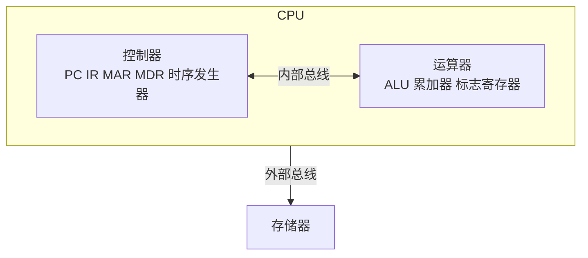
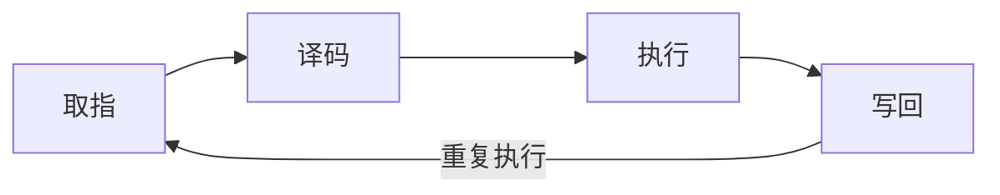
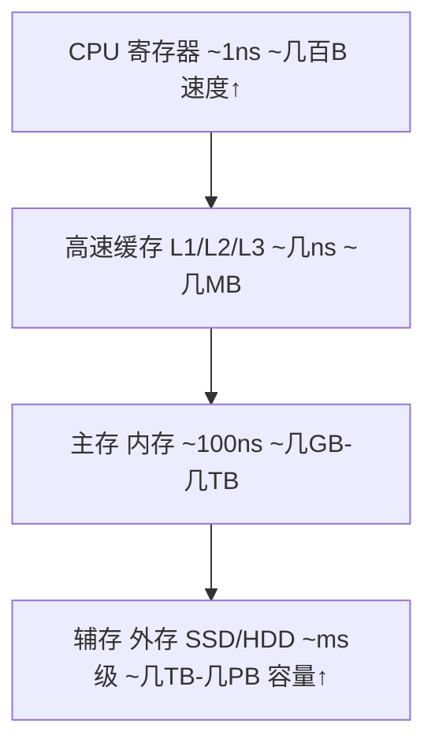
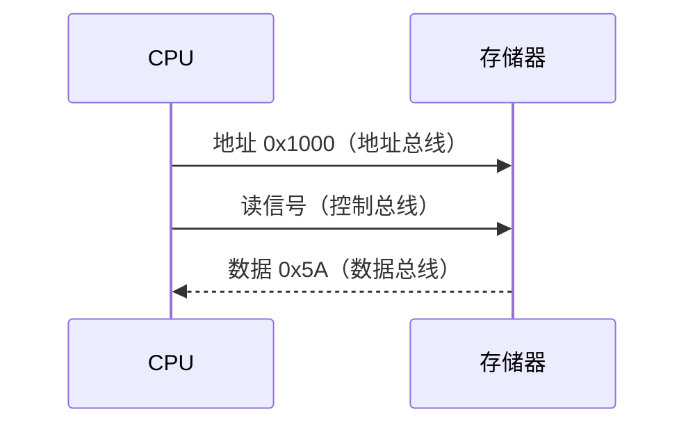
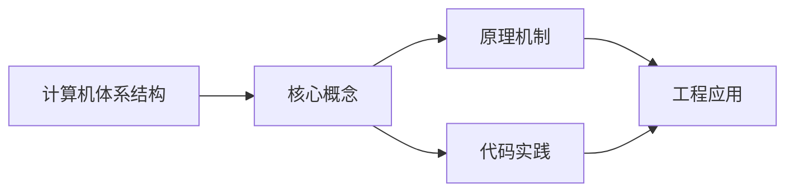
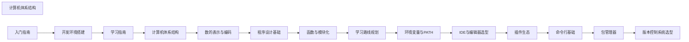

## 1. 学习目标（Bloom 分类）

本节按照布鲁姆教育目标分类学组织学习路径。本文主题为《计算机体系结构》，属于 入门指南 模块，读者可以根据自身阶段选择阅读深度。

记忆层面：能够准确复述本文的核心概念、术语与基本语法或操作步骤，并能够在提问或检索时快速定位对应知识点。能够说出 入门指南 的核心概念、常用命令与流程。

理解层面：能够用自己的语言解释核心原理与工作机制，说明概念之间的因果关系，而不是机械记忆结论。能够解释 入门指南 的工作原理与设计动机。

应用层面：能够在真实项目或练习场景中运用本文知识解决具体问题，写出正确且可维护的实现。能够独立完成 入门指南 的标准操作。

分析层面：能够拆解复杂问题，比较本文主题与相邻概念的异同，识别边界条件与例外情况。能够分析 入门指南 使用中的异常与边界。

评价层面：能够根据约束条件（性能、可读性、安全、成本）评价不同方案的优劣，做出有依据的技术决策。能够评价 入门指南 相关工具与方案。

创造层面：能够把本文知识与其他模块知识组合，设计出新的解决方案或可复用的工程模式。能够把 入门指南 融入团队工作流。

通过本节学习，读者应当能够把《计算机体系结构》纳入自己的知识网络，并与 入门指南 模块的其他主题（环境搭建、学习路径、编程基础）建立关联。

## 2. 历史动机与发展脉络

《计算机体系结构》是 入门指南 领域的重要主题。要真正理解它，需要先了解它解决的问题与演进过程。

编程入门的关键不是记忆语法，而是建立“问题 -> 方案 -> 验证”的思维循环；本模块为完全零基础的读者设计。
现代学习路径：环境搭建 -> 编程基础（变量/流程/函数）-> 数据与算法 -> 项目实践；本项目的完整文档库按此路径组织。
学习工具：IDE（VS Code）、命令行、Git、包管理器；工具链本身也是学习对象。

回到本文主题：计算机体系结构 的提出与成熟，正是上述技术背景下的必然产物。早期实现往往以简单可用为目标，随着工程规模扩大，社区逐渐沉淀出标准做法与最佳实践；理解这一脉络，可以帮助读者判断“为什么文档中的推荐写法是现在这个样子”，也能在遇到历史遗留代码时准确识别其设计年代与取舍。


## 3. 形式化定义与核心概念精讲

本节把《计算机体系结构》涉及的核心概念以“定义 + 讲解”的形式展开。读者应把定义当作工具，把讲解当作理解路径；两者结合才能形成可迁移的知识。

编程范式：命令式（逐步指令）、函数式（表达式与不可变）、面向对象（对象与消息）；语言是多范式的。
程序执行：源码 -> 编译/解释 -> 运行；调试是理解程序行为的主要手段。
抽象层次：机器码 -> 汇编 -> 高级语言 -> 框架 -> 领域语言；抽象降低认知负担。

### 3.1 原文章节逐一精讲

原文档把主题拆分为 7 个小节，下面按顺序给出每一节的导读讲解，随后保留原文细节供精读。

#### 原文精读（完整保留）


#### 1. 冯·诺依曼体系结构

现代计算机的理论基础来自1945年约翰·冯·诺依曼提出的"存储程序"思想。其核心观点是：**程序和数据以同等地位存储在同一存储器中，由控制器按顺序从存储器中取出指令并执行**。

##### 1.1 五大组成部分

冯·诺依曼体系结构将计算机划分为五个功能部件：

| 部件     | 功能                                     | 类比      |
| -------- | ---------------------------------------- | --------- |
| 控制器   | 从存储器取指令、译码、控制各部件协调工作 | 乐队指挥  |
| 运算器   | 执行算术运算和逻辑运算                   | 计算器    |
| 存储器   | 存放程序和数据                           | 书架      |
| 输入设备 | 将外部信息转换为计算机能识别的数据       | 眼睛/耳朵 |
| 输出设备 | 将计算结果转换为人类可感知的形式         | 嘴巴/手   |

> 控制器和运算器合称为**中央处理器（CPU）**。

##### 1.2 存储程序原理

存储程序是冯·诺依曼体系结构最核心的思想：

1. 程序和数据以二进制形式存放在存储器中
2. 计算机运行时，从存储器中依次取出指令并执行
3. 指令的执行顺序可以通过跳转指令改变
4. 存储器中的内容既可以被读取也可以被修改

```mermaid
flowchart TD
    subgraph Mem[存储器]<br/>指令1 指令2 指令3 数据1 数据2
    end
    Mem -->|取指令| C[控制器<br/>指令寄存器/程序计数器]
    Mem -->|读/写数据| A[运算器<br/>累加器/ALU]
```

##### 1.3 冯·诺依曼瓶颈

由于指令和数据共享同一条总线，CPU与存储器之间的数据传输速率成为系统性能的瓶颈，这被称为**冯·诺依曼瓶颈**。现代计算机通过缓存、流水线等技术缓解此问题。

#### 2. CPU 工作原理

CPU是计算机的"大脑"，由控制器和运算器两部分组成。

##### 2.1 控制器

控制器负责协调计算机各部件的工作，主要包含以下寄存器：

| 寄存器            | 作用                           |
| ----------------- | ------------------------------ |
| PC（程序计数器）  | 存放下一条要执行的指令地址     |
| IR（指令寄存器）  | 存放当前正在执行的指令         |
| MAR（地址寄存器） | 存放要访问的存储器地址         |
| MDR（数据寄存器） | 存放从存储器读出或要写入的数据 |

##### 2.2 运算器

运算器（ALU，算术逻辑单元）执行具体的计算：

- **算术运算**：加、减、乘、除
- **逻辑运算**：与、或、非、异或
- **移位操作**：左移、右移
- **比较操作**：等于、大于、小于

```c
// ALU 的简化模型
int ALU(int operand1, int operand2, int opcode) {
    switch (opcode) {
        case ADD: return operand1 + operand2;
        case SUB: return operand1 - operand2;
        case AND: return operand1 & operand2;
        case OR:  return operand1 | operand2;
        case XOR: return operand1 ^ operand2;
        case SHL: return operand1 << operand2;
        case SHR: return operand1 >> operand2;
        default:  return 0;
    }
}
```

##### 2.3 CPU 内部结构示意



#### 3. 指令周期

CPU执行一条指令的过程称为**指令周期**，通常分为以下几个阶段：

##### 3.1 取指（Fetch）

1. 将 PC 中的地址送入 MAR
2. 通过地址总线将 MAR 中的地址发送给存储器
3. 存储器将对应地址的数据通过数据总线送入 MDR
4. 将 MDR 中的指令送入 IR
5. PC 自增，指向下一条指令

##### 3.2 译码（Decode）

1. 分析 IR 中指令的操作码
2. 确定要执行的操作类型
3. 识别操作数地址

##### 3.3 执行（Execute）

1. 根据译码结果执行相应操作
2. 可能需要从存储器读取操作数
3. ALU 执行计算
4. 将结果写回寄存器或存储器

##### 3.4 指令周期流程



##### 3.5 用代码理解指令周期

```c
// 模拟简化的指令周期
void cpu_run() {
    while (running) {
        // 取指：从存储器取出PC指向的指令
        int instruction = memory[PC];

        // 译码：分离操作码和操作数
        int opcode  = (instruction >> 12) & 0xF;  // 高4位为操作码
        int operand = instruction & 0xFFF;         // 低12位为操作数

        // 执行：根据操作码执行对应操作
        switch (opcode) {
            case LOAD:  // 加载数据到累加器
                accumulator = memory[operand];
                break;
            case STORE: // 将累加器数据存入存储器
                memory[operand] = accumulator;
                break;
            case ADD:   // 加法
                accumulator += memory[operand];
                break;
            case SUB:   // 减法
                accumulator -= memory[operand];
                break;
            case JUMP:  // 无条件跳转
                PC = operand;
                continue;  // 跳过PC自增
            case HALT:  // 停机
                running = 0;
                break;
        }

        PC++;  // 程序计数器自增
    }
}
```

##### 3.6 时钟周期与指令周期

| 概念     | 定义                                 | 关系                |
| -------- | ------------------------------------ | ------------------- |
| 时钟周期 | CPU 时钟脉冲的一个周期，最小时间单位 | 基本单位            |
| 机器周期 | 完成一个基本操作所需的时间           | 通常 = 若干时钟周期 |
| 指令周期 | 执行一条指令所需的时间               | = 若干机器周期      |

> 现代CPU通过**流水线技术**让多条指令的不同阶段重叠执行，大幅提升吞吐量。例如五级流水线：取指→译码→执行→访存→写回，五条指令可以同时在不同阶段运行。

#### 4. 存储层次

计算机的存储系统按照速度、容量和价格形成层次结构，从快到慢、从小到大：

##### 4.1 存储层次结构



##### 4.2 各级存储详细对比

| 层次       | 典型容量    | 访问时间   | 是否易失 | 典型用途             |
| ---------- | ----------- | ---------- | -------- | -------------------- |
| 寄存器     | 几十~几百B  | < 1ns      | 是       | 指令执行中的临时数据 |
| L1 缓存    | 32~64 KB    | 1~2 ns     | 是       | 最频繁使用的数据     |
| L2 缓存    | 256 KB~1 MB | 3~10 ns    | 是       | 较频繁使用的数据     |
| L3 缓存    | 4~64 MB     | 10~30 ns   | 是       | 多核共享数据         |
| 主存(DRAM) | 8~128 GB    | 50~100 ns  | 是       | 运行中的程序和数据   |
| SSD        | 256 GB~4 TB | 0.1~0.5 ms | 否       | 持久化存储           |
| HDD        | 1~20 TB     | 5~15 ms    | 否       | 大容量归档存储       |

##### 4.3 缓存工作原理

缓存利用了**局部性原理**：

- **时间局部性**：最近被访问的数据，很可能在不久后再次被访问
- **空间局部性**：被访问数据附近的数据，很可能也会被访问

```c
// 缓存命中与未命中的概念
int data[1000];

// 时间局部性：sum 被反复读写
int sum = 0;
for (int i = 0; i < 1000; i++) {
    sum += data[i];  // sum 会被缓存
}

// 空间局部性：顺序访问数组
// data[0] 被访问后，data[1], data[2]... 也会被预取到缓存
for (int i = 0; i < 1000; i++) {
    process(data[i]);
}
```

##### 4.4 缓存命中率

缓存命中率是衡量缓存效率的关键指标：

```
命中率 = 缓存命中次数 / 总访问次数 × 100%
```

| 场景    | 典型命中率 | 说明                     |
| ------- | ---------- | ------------------------ |
| L1 缓存 | 90%~95%    | 大多数指令和数据在L1命中 |
| L2 缓存 | 80%~90%    | L1未命中的大部分在L2命中 |
| L3 缓存 | 70%~85%    | L2未命中的大部分在L3命中 |

> 缓存每提升1%的命中率，程序性能可能有数个百分点的提升。编写缓存友好的代码是性能优化的重要手段。

#### 5. 总线系统

总线是计算机各部件之间传送信息的公共通道。

##### 5.1 总线分类

按功能划分，总线分为三类：

| 总线类型 | 传输内容            | 方向          | 宽度           |
| -------- | ------------------- | ------------- | -------------- |
| 地址总线 | 内存地址/IO端口地址 | CPU→存储器/IO | 决定寻址空间   |
| 数据总线 | 数据                | 双向          | 决定一次传输量 |
| 控制总线 | 控制信号            | 双向          | 读写/中断等    |

##### 5.2 总线工作示例：读内存



##### 5.3 地址总线与寻址空间

地址总线的宽度决定了CPU能直接寻址的内存空间大小：

| 地址总线宽度 | 寻址空间 | 计算               |
| ------------ | -------- | ------------------ |
| 16 位        | 64 KB    | 2^16 = 65,536 B    |
| 20 位        | 1 MB     | 2^20 = 1,048,576 B |
| 32 位        | 4 GB     | 2^32 ≈ 4.3×10^9 B  |
| 64 位        | 16 EB    | 2^64 ≈ 1.8×10^19 B |

```c
// 32位系统的寻址空间计算
// 地址总线32根，每根线0或1
// 可表示地址数 = 2^32 = 4,294,967,296
// 每个地址对应1字节
// 总寻址空间 = 4,294,967,296 字节 = 4 GB

#include <stdio.h>
int main() {
    // 32位指针的大小
    printf("指针大小: %zu 字节\n", sizeof(void*));  // 4 (32位) 或 8 (64位)

    // 理论寻址空间
    unsigned long long addr_space = 1ULL << 32;
    printf("32位寻址空间: %llu 字节 = %llu GB\n",
           addr_space, addr_space / (1024*1024*1024));
    return 0;
}
```

##### 5.4 数据总线与传输效率

数据总线的宽度决定了CPU一次能传输的数据量：

| 数据总线宽度 | 一次传输 | 说明           |
| ------------ | -------- | -------------- |
| 8 位         | 1 字节   | 早期8位机      |
| 16 位        | 2 字节   | 8086等16位机   |
| 32 位        | 4 字节   | 80386等32位机  |
| 64 位        | 8 字节   | 现代64位处理器 |

##### 5.5 总线仲裁

当多个设备同时请求使用总线时，需要通过总线仲裁决定优先级：

- **链式查询**：设备串行连接，离仲裁器越近优先级越高
- **计数器定时**：从某个起始地址开始计数，被计数的设备获得总线
- **独立请求**：每个设备有独立的请求线和授权线，响应最快

#### 6. 哈佛架构与冯·诺依曼架构对比

| 特性         | 冯·诺依曼架构    | 哈佛架构           |
| ------------ | ---------------- | ------------------ |
| 指令与数据   | 共用存储器和总线 | 分开存储，独立总线 |
| 总线数量     | 1套              | 2套                |
| 取指与取数据 | 不能同时进行     | 可以同时进行       |
| 实现复杂度   | 较低             | 较高               |
| 典型应用     | 通用计算机       | DSP、嵌入式、ARM   |

> 现代CPU通常采用**改进型哈佛架构**：在CPU内部（L1缓存层）使用哈佛架构（指令缓存和数据缓存分离），在外部使用冯·诺依曼架构（统一主存），兼顾两者优势。

#### 7. 小结

| 概念          | 要点                                     |
| ------------- | ---------------------------------------- |
| 冯·诺依曼架构 | 五大部件、存储程序原理、指令数据共享总线 |
| CPU           | 控制器+运算器，通过寄存器暂存中间结果    |
| 指令周期      | 取指→译码→执行→写回，流水线提升吞吐量    |
| 存储层次      | 寄存器→缓存→内存→外存，速度递减容量递增  |
| 总线系统      | 地址总线定寻址空间，数据总线定传输宽度   |

理解计算机体系结构是学习操作系统、编译原理和性能优化的基础。后续章节将在此基础上深入探讨数据表示和程序设计。


### 3.2 概念关系图

下面用 Mermaid 图表达本文核心概念之间的关系，帮助读者建立整体图景：



图中展示的是本文知识的结构化关系：核心概念是入口，原理机制解释“为什么”，代码实践演示“怎么做”，工程应用回答“何时用”。读者学习时可以把每个小节的内容挂接到对应节点上。

## 4. 理论推导与原理解析

本节深入《计算机体系结构》背后的原理。理论部分不求面面俱到，而是聚焦“能解释现象、能指导实践”的关键推导。

编程范式：命令式（逐步指令）、函数式（表达式与不可变）、面向对象（对象与消息）；语言是多范式的。
程序执行：源码 -> 编译/解释 -> 运行；调试是理解程序行为的主要手段。
抽象层次：机器码 -> 汇编 -> 高级语言 -> 框架 -> 领域语言；抽象降低认知负担。
计算机基础：CPU 执行指令、内存存数据、I/O 与外部交互；这些概念支撑所有编程。

需要强调的是，理论推导与工程实践之间存在翻译层：理论给出的是理想化模型与边界条件，工程代码则必须处理真实环境中的例外。读者在学习时应先掌握理论的“标准情形”，再通过陷阱章节了解“非标准情形”。

## 5. 代码示例与逐行讲解

本节把原文中的代码示例系统整理，并为每个示例补充用途说明与讲解。读者不应只浏览代码，而应逐段对照讲解理解设计意图。

### 5.1 示例：1.2 存储程序原理

该示例来自原文《1.2 存储程序原理》小节，用于演示计算机体系结构相关操作。阅读时请先看代码结构，再看其后的讲解。

```mermaid
flowchart TD
    subgraph Mem[存储器]<br/>指令1 指令2 指令3 数据1 数据2
    end
    Mem -->|取指令| C[控制器<br/>指令寄存器/程序计数器]
    Mem -->|读/写数据| A[运算器<br/>累加器/ALU]
```

讲解：这段代码演示了本节核心知识点。代码中的关键操作可以归纳为三步：准备（定义或初始化）、执行（核心逻辑）、收尾（释放资源或返回结果）。实际项目中，这三步往往被封装为函数或类，以提升复用性与可测试性。

关键点分析：

该示例共 5 行有效代码，结构以数据或配置为主。阅读时应关注：数据字段的含义、配置项的作用，以及它们与运行行为的对应关系。

进阶思考路径：先尝试修改参数观察行为变化，再把示例中的模式迁移到自己的项目中；每次修改都记录预期与实测差异，这是把示例转化为能力的最快方式。

### 5.2 示例：2.2 运算器

该示例来自原文《2.2 运算器》小节，用于演示计算机体系结构相关操作。阅读时请先看代码结构，再看其后的讲解。

```c
// ALU 的简化模型
int ALU(int operand1, int operand2, int opcode) {
    switch (opcode) {
        case ADD: return operand1 + operand2;
        case SUB: return operand1 - operand2;
        case AND: return operand1 & operand2;
        case OR:  return operand1 | operand2;
        case XOR: return operand1 ^ operand2;
        case SHL: return operand1 << operand2;
        case SHR: return operand1 >> operand2;
        default:  return 0;
    }
}
```

讲解：这段代码演示了本节核心知识点。代码中的关键操作可以归纳为三步：准备（定义或初始化）、执行（核心逻辑）、收尾（释放资源或返回结果）。实际项目中，这三步往往被封装为函数或类，以提升复用性与可测试性。

关键点分析：

该示例共 13 行有效代码，包含 1 类关键结构（return）。其中：

- 入口与初始化部分负责建立上下文，对应实际项目中的启动或装配逻辑；
- 核心逻辑部分体现本文主题的主要操作，是阅读时最需要对照讲解理解的部分；
- 输出或返回部分把结果交给调用方，注意其类型与边界条件。

进阶思考路径：先尝试修改参数观察行为变化，再把示例中的模式迁移到自己的项目中；每次修改都记录预期与实测差异，这是把示例转化为能力的最快方式。

### 5.3 示例：2.3 CPU 内部结构示意

该示例来自原文《2.3 CPU 内部结构示意》小节，用于演示计算机体系结构相关操作。阅读时请先看代码结构，再看其后的讲解。


讲解：这段代码演示了本节核心知识点。代码中的关键操作可以归纳为三步：准备（定义或初始化）、执行（核心逻辑）、收尾（释放资源或返回结果）。实际项目中，这三步往往被封装为函数或类，以提升复用性与可测试性。

关键点分析：

该示例共 7 行有效代码，结构以数据或配置为主。阅读时应关注：数据字段的含义、配置项的作用，以及它们与运行行为的对应关系。

进阶思考路径：先尝试修改参数观察行为变化，再把示例中的模式迁移到自己的项目中；每次修改都记录预期与实测差异，这是把示例转化为能力的最快方式。

### 5.4 示例：3.4 指令周期流程

该示例来自原文《3.4 指令周期流程》小节，用于演示计算机体系结构相关操作。阅读时请先看代码结构，再看其后的讲解。


讲解：这段代码演示了本节核心知识点。代码中的关键操作可以归纳为三步：准备（定义或初始化）、执行（核心逻辑）、收尾（释放资源或返回结果）。实际项目中，这三步往往被封装为函数或类，以提升复用性与可测试性。

关键点分析：

该示例共 3 行有效代码，结构以数据或配置为主。阅读时应关注：数据字段的含义、配置项的作用，以及它们与运行行为的对应关系。

进阶思考路径：先尝试修改参数观察行为变化，再把示例中的模式迁移到自己的项目中；每次修改都记录预期与实测差异，这是把示例转化为能力的最快方式。

### 5.5 示例：3.5 用代码理解指令周期

该示例来自原文《3.5 用代码理解指令周期》小节，用于演示计算机体系结构相关操作。阅读时请先看代码结构，再看其后的讲解。

```c
// 模拟简化的指令周期
void cpu_run() {
    while (running) {
        // 取指：从存储器取出PC指向的指令
        int instruction = memory[PC];

        // 译码：分离操作码和操作数
        int opcode  = (instruction >> 12) & 0xF;  // 高4位为操作码
        int operand = instruction & 0xFFF;         // 低12位为操作数

        // 执行：根据操作码执行对应操作
        switch (opcode) {
            case LOAD:  // 加载数据到累加器
                accumulator = memory[operand];
                break;
            case STORE: // 将累加器数据存入存储器
                memory[operand] = accumulator;
                break;
            case ADD:   // 加法
                accumulator += memory[operand];
                break;
            case SUB:   // 减法
                accumulator -= memory[operand];
                break;
            case JUMP:  // 无条件跳转
                PC = operand;
                continue;  // 跳过PC自增
            case HALT:  // 停机
                running = 0;
                break;
        }

        PC++;  // 程序计数器自增
    }
}
```

讲解：这段代码演示了本节核心知识点。代码中的关键操作可以归纳为三步：准备（定义或初始化）、执行（核心逻辑）、收尾（释放资源或返回结果）。实际项目中，这三步往往被封装为函数或类，以提升复用性与可测试性。

关键点分析：

该示例共 32 行有效代码，包含 1 类关键结构（while）。其中：

- 入口与初始化部分负责建立上下文，对应实际项目中的启动或装配逻辑；
- 核心逻辑部分体现本文主题的主要操作，是阅读时最需要对照讲解理解的部分；
- 输出或返回部分把结果交给调用方，注意其类型与边界条件。

进阶思考路径：先尝试修改参数观察行为变化，再把示例中的模式迁移到自己的项目中；每次修改都记录预期与实测差异，这是把示例转化为能力的最快方式。

### 5.6 示例：4.1 存储层次结构

该示例来自原文《4.1 存储层次结构》小节，用于演示计算机体系结构相关操作。阅读时请先看代码结构，再看其后的讲解。


讲解：这段代码演示了本节核心知识点。代码中的关键操作可以归纳为三步：准备（定义或初始化）、执行（核心逻辑）、收尾（释放资源或返回结果）。实际项目中，这三步往往被封装为函数或类，以提升复用性与可测试性。

关键点分析：

该示例共 4 行有效代码，结构以数据或配置为主。阅读时应关注：数据字段的含义、配置项的作用，以及它们与运行行为的对应关系。

进阶思考路径：先尝试修改参数观察行为变化，再把示例中的模式迁移到自己的项目中；每次修改都记录预期与实测差异，这是把示例转化为能力的最快方式。

### 5.7 示例：4.3 缓存工作原理

该示例来自原文《4.3 缓存工作原理》小节，用于演示计算机体系结构相关操作。阅读时请先看代码结构，再看其后的讲解。

```c
// 缓存命中与未命中的概念
int data[1000];

// 时间局部性：sum 被反复读写
int sum = 0;
for (int i = 0; i < 1000; i++) {
    sum += data[i];  // sum 会被缓存
}

// 空间局部性：顺序访问数组
// data[0] 被访问后，data[1], data[2]... 也会被预取到缓存
for (int i = 0; i < 1000; i++) {
    process(data[i]);
}
```

讲解：这段代码演示了本节核心知识点。代码中的关键操作可以归纳为三步：准备（定义或初始化）、执行（核心逻辑）、收尾（释放资源或返回结果）。实际项目中，这三步往往被封装为函数或类，以提升复用性与可测试性。

关键点分析：

该示例共 12 行有效代码，包含 1 类关键结构（for）。其中：

- 入口与初始化部分负责建立上下文，对应实际项目中的启动或装配逻辑；
- 核心逻辑部分体现本文主题的主要操作，是阅读时最需要对照讲解理解的部分；
- 输出或返回部分把结果交给调用方，注意其类型与边界条件。

进阶思考路径：先尝试修改参数观察行为变化，再把示例中的模式迁移到自己的项目中；每次修改都记录预期与实测差异，这是把示例转化为能力的最快方式。

### 5.8 示例：4.4 缓存命中率

该示例来自原文《4.4 缓存命中率》小节，用于演示计算机体系结构相关操作。阅读时请先看代码结构，再看其后的讲解。

```text
命中率 = 缓存命中次数 / 总访问次数 × 100%
```

讲解：这段代码演示了本节核心知识点。代码中的关键操作可以归纳为三步：准备（定义或初始化）、执行（核心逻辑）、收尾（释放资源或返回结果）。实际项目中，这三步往往被封装为函数或类，以提升复用性与可测试性。

关键点分析：

该示例共 1 行有效代码，结构以数据或配置为主。阅读时应关注：数据字段的含义、配置项的作用，以及它们与运行行为的对应关系。

进阶思考路径：先尝试修改参数观察行为变化，再把示例中的模式迁移到自己的项目中；每次修改都记录预期与实测差异，这是把示例转化为能力的最快方式。

### 5.9 示例：5.2 总线工作示例：读内存

该示例来自原文《5.2 总线工作示例：读内存》小节，用于演示计算机体系结构相关操作。阅读时请先看代码结构，再看其后的讲解。


讲解：这段代码演示了本节核心知识点。代码中的关键操作可以归纳为三步：准备（定义或初始化）、执行（核心逻辑）、收尾（释放资源或返回结果）。实际项目中，这三步往往被封装为函数或类，以提升复用性与可测试性。

关键点分析：

该示例共 6 行有效代码，结构以数据或配置为主。阅读时应关注：数据字段的含义、配置项的作用，以及它们与运行行为的对应关系。

进阶思考路径：先尝试修改参数观察行为变化，再把示例中的模式迁移到自己的项目中；每次修改都记录预期与实测差异，这是把示例转化为能力的最快方式。

### 5.10 示例：5.3 地址总线与寻址空间

该示例来自原文《5.3 地址总线与寻址空间》小节，用于演示计算机体系结构相关操作。阅读时请先看代码结构，再看其后的讲解。

```c
// 32位系统的寻址空间计算
// 地址总线32根，每根线0或1
// 可表示地址数 = 2^32 = 4,294,967,296
// 每个地址对应1字节
// 总寻址空间 = 4,294,967,296 字节 = 4 GB

#include <stdio.h>
int main() {
    // 32位指针的大小
    printf("指针大小: %zu 字节\n", sizeof(void*));  // 4 (32位) 或 8 (64位)

    // 理论寻址空间
    unsigned long long addr_space = 1ULL << 32;
    printf("32位寻址空间: %llu 字节 = %llu GB\n",
           addr_space, addr_space / (1024*1024*1024));
    return 0;
}
```

讲解：这段代码演示了本节核心知识点。代码中的关键操作可以归纳为三步：准备（定义或初始化）、执行（核心逻辑）、收尾（释放资源或返回结果）。实际项目中，这三步往往被封装为函数或类，以提升复用性与可测试性。

关键点分析：

该示例共 15 行有效代码，包含 1 类关键结构（return）。其中：

- 入口与初始化部分负责建立上下文，对应实际项目中的启动或装配逻辑；
- 核心逻辑部分体现本文主题的主要操作，是阅读时最需要对照讲解理解的部分；
- 输出或返回部分把结果交给调用方，注意其类型与边界条件。

进阶思考路径：先尝试修改参数观察行为变化，再把示例中的模式迁移到自己的项目中；每次修改都记录预期与实测差异，这是把示例转化为能力的最快方式。


综合以上示例，可以总结出本主题的代码实践要点：第一，先定义清晰的输入输出契约；第二，核心逻辑保持单一职责；第三，错误处理与边界条件不可省略；第四，命名与注释表达意图而非复述代码。

## 6. 对比分析

对比是理解《计算机体系结构》定位的最快路径。下面从多个维度与相邻方案进行对比。

解释型与编译型：Python 解释执行上手快；Java/Go 编译期检查强。
强类型与弱类型：强类型减少运行时错误，弱类型灵活。
语言选择：Web 前端 JS/TS，后端 Java/Go/Python，系统 C/Rust。

对比的目的不是分出绝对优劣，而是建立选择依据：不同约束条件下，最优解不同。读者应把每个对比维度转化为决策检查清单。

## 7. 常见陷阱与最佳实践

本节整理该主题的高频错误与推荐做法。每个陷阱先描述现象，再解释原因，最后给出最佳实践。

### 7.1 复制粘贴代码

不理解导致维护灾难。逐行理解再使用。

深入讲解：该问题之所以被归类为“常见陷阱”，是因为它在初学者的代码中反复出现，而且往往不在第一时间暴露——错误通常隐藏在特定数据或特定时序下。

从成因上看，复制粘贴代码 一般源于对 入门指南 某个机制的理解偏差：要么误用了默认行为，要么忽略了边界条件，要么把其他语言的思维惯性带了过来。

从影响上看，复制粘贴代码 轻则产生错误结果，重则导致资源泄漏、数据损坏或安全事故；这也是为什么工程评审中会把它列为检查项。

从修复策略上看，处理复制粘贴代码的正确顺序是：先复现（构造最小用例），再定位（确认机制层面的根因），最后修复并补充回归测试。跳过复现直接改代码，往往治标不治本。

### 7.2 跳过基础

急于框架。基础（变量/流程/函数）先扎实。

深入讲解：该问题之所以被归类为“常见陷阱”，是因为它在初学者的代码中反复出现，而且往往不在第一时间暴露——错误通常隐藏在特定数据或特定时序下。

从成因上看，跳过基础 一般源于对 入门指南 某个机制的理解偏差：要么误用了默认行为，要么忽略了边界条件，要么把其他语言的思维惯性带了过来。

从影响上看，跳过基础 轻则产生错误结果，重则导致资源泄漏、数据损坏或安全事故；这也是为什么工程评审中会把它列为检查项。

从修复策略上看，处理跳过基础的正确顺序是：先复现（构造最小用例），再定位（确认机制层面的根因），最后修复并补充回归测试。跳过复现直接改代码，往往治标不治本。

### 7.3 环境混乱

版本冲突。使用版本管理（nvm/pyenv）与容器。

深入讲解：该问题之所以被归类为“常见陷阱”，是因为它在初学者的代码中反复出现，而且往往不在第一时间暴露——错误通常隐藏在特定数据或特定时序下。

从成因上看，环境混乱 一般源于对 入门指南 某个机制的理解偏差：要么误用了默认行为，要么忽略了边界条件，要么把其他语言的思维惯性带了过来。

从影响上看，环境混乱 轻则产生错误结果，重则导致资源泄漏、数据损坏或安全事故；这也是为什么工程评审中会把它列为检查项。

从修复策略上看，处理环境混乱的正确顺序是：先复现（构造最小用例），再定位（确认机制层面的根因），最后修复并补充回归测试。跳过复现直接改代码，往往治标不治本。

### 7.4 不读报错

报错是最佳提示。先读栈与信息。

深入讲解：该问题之所以被归类为“常见陷阱”，是因为它在初学者的代码中反复出现，而且往往不在第一时间暴露——错误通常隐藏在特定数据或特定时序下。

从成因上看，不读报错 一般源于对 入门指南 某个机制的理解偏差：要么误用了默认行为，要么忽略了边界条件，要么把其他语言的思维惯性带了过来。

从影响上看，不读报错 轻则产生错误结果，重则导致资源泄漏、数据损坏或安全事故；这也是为什么工程评审中会把它列为检查项。

从修复策略上看，处理不读报错的正确顺序是：先复现（构造最小用例），再定位（确认机制层面的根因），最后修复并补充回归测试。跳过复现直接改代码，往往治标不治本。

### 7.5 不会搜索

提问姿势差。用具体关键词与官方文档。

深入讲解：该问题之所以被归类为“常见陷阱”，是因为它在初学者的代码中反复出现，而且往往不在第一时间暴露——错误通常隐藏在特定数据或特定时序下。

从成因上看，不会搜索 一般源于对 入门指南 某个机制的理解偏差：要么误用了默认行为，要么忽略了边界条件，要么把其他语言的思维惯性带了过来。

从影响上看，不会搜索 轻则产生错误结果，重则导致资源泄漏、数据损坏或安全事故；这也是为什么工程评审中会把它列为检查项。

从修复策略上看，处理不会搜索的正确顺序是：先复现（构造最小用例），再定位（确认机制层面的根因），最后修复并补充回归测试。跳过复现直接改代码，往往治标不治本。

### 7.6 不动手

只看不做。每章动手写代码。

深入讲解：该问题之所以被归类为“常见陷阱”，是因为它在初学者的代码中反复出现，而且往往不在第一时间暴露——错误通常隐藏在特定数据或特定时序下。

从成因上看，不动手 一般源于对 入门指南 某个机制的理解偏差：要么误用了默认行为，要么忽略了边界条件，要么把其他语言的思维惯性带了过来。

从影响上看，不动手 轻则产生错误结果，重则导致资源泄漏、数据损坏或安全事故；这也是为什么工程评审中会把它列为检查项。

从修复策略上看，处理不动手的正确顺序是：先复现（构造最小用例），再定位（确认机制层面的根因），最后修复并补充回归测试。跳过复现直接改代码，往往治标不治本。

### 7.7 一次学太多

认知过载。小步循环：学-做-错-改。

深入讲解：该问题之所以被归类为“常见陷阱”，是因为它在初学者的代码中反复出现，而且往往不在第一时间暴露——错误通常隐藏在特定数据或特定时序下。

从成因上看，一次学太多 一般源于对 入门指南 某个机制的理解偏差：要么误用了默认行为，要么忽略了边界条件，要么把其他语言的思维惯性带了过来。

从影响上看，一次学太多 轻则产生错误结果，重则导致资源泄漏、数据损坏或安全事故；这也是为什么工程评审中会把它列为检查项。

从修复策略上看，处理一次学太多的正确顺序是：先复现（构造最小用例），再定位（确认机制层面的根因），最后修复并补充回归测试。跳过复现直接改代码，往往治标不治本。

### 7.8 忽略练习项目

无输出验证。用项目串联知识。

深入讲解：该问题之所以被归类为“常见陷阱”，是因为它在初学者的代码中反复出现，而且往往不在第一时间暴露——错误通常隐藏在特定数据或特定时序下。

从成因上看，忽略练习项目 一般源于对 入门指南 某个机制的理解偏差：要么误用了默认行为，要么忽略了边界条件，要么把其他语言的思维惯性带了过来。

从影响上看，忽略练习项目 轻则产生错误结果，重则导致资源泄漏、数据损坏或安全事故；这也是为什么工程评审中会把它列为检查项。

从修复策略上看，处理忽略练习项目的正确顺序是：先复现（构造最小用例），再定位（确认机制层面的根因），最后修复并补充回归测试。跳过复现直接改代码，往往治标不治本。

### 7.0 最佳实践总览

1. 先跑通最小示例，再逐步扩展。
2. 遇到错误先读信息，再搜索，再问人。
3. 每天保持练习节奏，间隔重复。
4. 把笔记写成文档（Markdown），沉淀知识。

把这些最佳实践固化为团队规范与代码评审检查项，是避免同类问题反复出现的关键。

## 8. 工程实践

本节把《计算机体系结构》放入真实工程场景，给出可复用的模式与组织方法。

学习环境：VS Code + 终端 + Git + 包管理器；统一版本。
练习路径：LeetCode 基础题 -> 小工具 -> 开源贡献。
社区：官方文档优先，Stack Overflow/中文社区辅助。

### 8.1 工程实践的原则拆解

以上工程实践可以归纳为四条原则。第一，配置与代码分离：入门指南 项目中环境差异应通过配置注入，而不是散落在代码分支中；这保证同一份代码可以在开发、测试、生产环境一致运行。

第二，接口稳定优先：对外接口（函数签名、协议、数据格式）一旦被消费方依赖，变更成本极高；设计时应预留扩展点并保持向后兼容。

第三，可观测性内置：日志、指标与追踪应该在功能开发时同步设计，而不是故障发生后补救；没有观测手段的模块等于黑盒。

第四，变更可回滚：任何发布都应有对应的回滚方案；数据库迁移、配置变更与代码发布一样需要版本管理与逆向路径。

### 8.2 实践落地的检查清单

- [ ] 学习环境：对照本节描述，检查当前项目是否已经落实；未落实的项列入技术债并排期处理。
- [ ] 练习路径：对照本节描述，检查当前项目是否已经落实；未落实的项列入技术债并排期处理。
- [ ] 社区：对照本节描述，检查当前项目是否已经落实；未落实的项列入技术债并排期处理。

工程实践的共性原则：配置与代码分离、接口稳定优先、可观测性内置、变更可回滚。这些原则适用于本主题的所有实现。

## 9. 案例研究

本节通过一个完整案例把《计算机体系结构》的知识串起来。案例按“需求分析、方案设计、实现、验证”四步展开。

需求：从零搭建第一个 Web 页面与脚本。
方案：VS Code + Node + HTML/CSS/JS 最小页面。
要点：分步验证（结构 -> 样式 -> 交互），控制台调试。
验证：浏览器打开页面，交互符合预期。

### 9.1 案例的扩展讨论

把案例中的方案放大到真实规模，需要额外考虑三个问题：

第一，规模：当数据量或并发量上升一个数量级时，原方案中的数据结构、缓存策略与任务调度是否仍然成立？通常需要引入分层与异步。

第二，团队：多人协作时，模块边界、接口契约与代码所有权必须明确；案例中的实现应拆分为可独立测试的单元，并配合文档说明设计意图。

第三，演进：上线后的需求变化不可避免；方案设计时应预留扩展点（配置化、插件化、事件化），并定期用真实指标验证假设。


案例研究的学习方法：先独立阅读需求，尝试在脑中形成方案，再对照实现与讲解，最后思考“如果约束变化（数据量、并发、团队规模），方案应如何调整”。

## 10. 知识要点总结与深入讲解

本节以讲解形式汇总全文要点，替代传统的习题与自测，读者不需要答题，只需跟随解释建立完整的认知框架。

关于《计算机体系结构》的核心结论：

入门是习惯养成：写、跑、错、改的循环。
环境与工具是学习的“地形”，先熟悉再深入。
文档库按模块组织，交叉引用帮助建立知识网络。

原文档各小节的要点回顾：

- 1. 冯·诺依曼体系结构：该小节围绕计算机体系结构展开具体细节，阅读时应关注其与核心结论的对应关系；每个小节都是核心结论在某一个侧面的展开。
- 2. CPU 工作原理：该小节围绕计算机体系结构展开具体细节，阅读时应关注其与核心结论的对应关系；每个小节都是核心结论在某一个侧面的展开。
- 3. 指令周期：该小节围绕计算机体系结构展开具体细节，阅读时应关注其与核心结论的对应关系；每个小节都是核心结论在某一个侧面的展开。
- 4. 存储层次：该小节围绕计算机体系结构展开具体细节，阅读时应关注其与核心结论的对应关系；每个小节都是核心结论在某一个侧面的展开。
- 5. 总线系统：该小节围绕计算机体系结构展开具体细节，阅读时应关注其与核心结论的对应关系；每个小节都是核心结论在某一个侧面的展开。
- 6. 哈佛架构与冯·诺依曼架构对比：该小节围绕计算机体系结构展开具体细节，阅读时应关注其与核心结论的对应关系；每个小节都是核心结论在某一个侧面的展开。
- 7. 小结：该小节围绕计算机体系结构展开具体细节，阅读时应关注其与核心结论的对应关系；每个小节都是核心结论在某一个侧面的展开。

把以上要点与第 3-9 节的内容对照复习，即可完成对本文主题的闭环学习。

## 11. 参考文献


本模块各文档：环境搭建、编程基础、调试思维等。
MDN 学习区：https://developer.mozilla.org/zh-CN/docs/Learn_web_development
freeCodeCamp：https://www.freecodecamp.org/chinese/
黑马程序员官网：https://www.itheima.com/

## 12. 延伸阅读


从入门到进阶路径：001 入门 -> 002 Markdown -> 003 Git -> 006 HTML -> 007 CSS -> 008 JS。
语言进阶：013 Java / 040 Python / 016 Go 按兴趣选择。
尚硅谷 Bilibili 空间（https://space.bilibili.com/302417610 ）提供基础课程。

## 14. 模块知识图谱与学习路径

本文属于 入门指南 模块。为了把《计算机体系结构》放入完整的知识网络，下面列出本模块的全部主题并给出相互关联的导读。学习时建议按模块内顺序推进，并在每个文档中留意交叉引用。



上图为模块主题的推荐学习顺序示意图（仅展示前若干主题）。各主题之间存在三类关联：

第一，前置依赖关系：早期主题是后期主题的基础，例如环境与语法先行、进阶主题随后；

第二，横向并列关系：同一层级主题从不同角度覆盖模块能力，学习顺序可以按兴趣调整；

第三，工程组合关系：多个主题在真实项目中组合使用，例如配置、性能与安全主题往往出现在同一系统的不同层面。

### 14.1 模块主题速查表

| 文档 | 主题 | 与本文的关联 |
| --- | --- | --- |
| 入门指南 | 001-GettingStartedGuide | 本文的前置基础 |
| 开发环境搭建 | 002-DevEnvSetup | 本文的前置基础 |
| 学习指南 | 003-LearningGuide | 本文的并列主题 |
| 计算机体系结构 | 004-ComputerArchitecture | 本文自身 |
| 数的表示与编码 | 005-NumberRepresentationEncoding | 本文的并列主题 |
| 程序设计基础 | 006-ProgrammingBasics | 本文的前置基础 |
| 函数与模块化 | 007-FunctionModular | 本文的并列主题 |
| 学习路线规划 | 008-LearningPathPlanning | 本文的并列主题 |
| 环境变量与PATH | 009-EnvVarPath | 本文的前置基础 |
| IDE与编辑器选型 | 010-IDEEditorSelection | 本文的并列主题 |
| 插件生态 | 011-PluginEcosystem | 本文的并列主题 |
| 命令行基础 | 012-CommandLineBasics | 本文的前置基础 |
| 包管理器 | 013-PackageManager | 本文的并列主题 |
| 版本控制系统选型 | 014-VCSSelection | 本文的并列主题 |
| 项目初始化 | 015-ProjectInit | 本文的综合应用 |
| 构建工具 | 016-BuildTool | 本文的并列主题 |
| 编程范式基础 | 017-ProgrammingParadigmBasics | 本文的前置基础 |
| 调试思想 | 018-DebugThinking | 本文的并列主题 |
| 软件下载地址汇总 | 019-SoftwareDownloadURLSummary | 本文的并列主题 |
| Windows环境配置教程 | 020-WindowsEnvConfigTutorial | 本文的前置基础 |
| macOS环境配置教程 | 021-MacOSEnvConfigTutorial | 本文的前置基础 |
| Linux环境配置教程 | 022-LinuxEnvConfigTutorial | 本文的前置基础 |
| 编程入门 Node.js 安装 | 023-NodeJsInstall | 本文的前置基础 |
| 编程入门 npm 包管理 | 024-NpmManager | 本文的前置基础 |
| 编程入门 pnpm 与 yarn 包管理 | 025-PnpmYarnManager | 本文的前置基础 |
| 编程入门 nvm 版本管理 | 026-NvmVersionManage | 本文的前置基础 |
| 编程入门 Python 安装 | 027-PythonInstall | 本文的前置基础 |
| 编程入门 pip 与 venv 包管理 | 028-PipVenvManager | 本文的前置基础 |
| 编程入门 pyenv 与 uv 版本管理 | 029-PyenvUvManage | 本文的前置基础 |
| 编程入门 Java JDK 配置 | 030-JavaJdkConfig | 本文的前置基础 |
| 编程入门 VS Code 安装配置 | 031-VSCodeInstall | 本文的前置基础 |
| 编程入门 Git 安装配置 | 032-GitInstallConfig | 本文的前置基础 |
| 编程入门 Docker 安装 | 033-DockerInstall | 本文的前置基础 |
| 文本处理命令速查手册 | 034-TextProcessing | 本文的并列主题 |
| 管道与重定向速查手册 | 035-PipeRedirect | 本文的并列主题 |
| 进程管理命令速查手册 | 036-ProcessManage | 本文的并列主题 |
| 压缩解压命令速查手册 | 037-CompressArchive | 本文的并列主题 |

速查表的作用是让读者快速判断：哪些文档应在阅读本文前掌握（前置基础），哪些文档应在阅读本文后继续（延伸主题）。本模块的交叉引用体系即以此表为基础。

## 15. 术语表

下表整理《计算机体系结构》及 入门指南 模块中出现的高频术语，给出简明释义。术语按字母序或逻辑序排列，供查阅。

| 术语 | 释义 |
| --- | --- |
| 编程范式 | 命令式（逐步指令）、函数式（表达式与不可变）、面向对象（对象与消息）；语言是多范式的。 |
| 程序执行 | 源码 -> 编译/解释 -> 运行；调试是理解程序行为的主要手段。 |
| 抽象层次 | 机器码 -> 汇编 -> 高级语言 -> 框架 -> 领域语言；抽象降低认知负担。 |
| 计算机基础 | CPU 执行指令、内存存数据、I/O 与外部交互；这些概念支撑所有编程。 |
| 复制粘贴代码（易错点） | 参见常见陷阱章节的详细讲解 |
| 跳过基础（易错点） | 参见常见陷阱章节的详细讲解 |
| 环境混乱（易错点） | 参见常见陷阱章节的详细讲解 |
| 不读报错（易错点） | 参见常见陷阱章节的详细讲解 |
| 不会搜索（易错点） | 参见常见陷阱章节的详细讲解 |
| 不动手（易错点） | 参见常见陷阱章节的详细讲解 |

术语表与正文配合使用：先通读正文，遇到模糊术语回查本表；长期使用后术语会自然进入工作记忆。

## 13. 深度专题扩展

以下专题从不同角度深入本文主题，供有进阶需求的读者研读。每个专题独立成节，内容相互补充。

### 13.1 如何高效自学编程

目标驱动：每个阶段一个小项目（计算器、笔记、网站）。
费曼技巧：把学到的知识写出来或讲出来。
刻意练习：专注薄弱点，带反馈循环。
社区参与：提问、回答、代码评审加速成长。

### 13.2 学习路径规划

阶段一（2-4 周）：环境 + 基础语法 + 小练习。
阶段二（4-8 周）：数据结构 + 简单项目。
阶段三（2-3 月）：框架 + 实战项目 + 部署。
持续：算法刷题、源码阅读、开源贡献。

## 16. 核心概念串讲（复习视角）

本节以“把知识讲给他人听”的方式，把《计算机体系结构》的核心概念重新串讲一遍。与前文按章节展开不同，这里的叙述更接近课堂总结：先说整体，再逐个展开，最后收束。

《计算机体系结构》属于 入门指南 模块。要理解它，先要理解它在模块中的位置：它解决的是该领域的一个具体问题，并依赖模块内若干前置概念；反过来，它又为后续进阶主题提供基础。

第一个概念是编程范式。命令式（逐步指令）、函数式（表达式与不可变）、面向对象（对象与消息）；语言是多范式的。

在实际使用中，编程范式需要与相邻概念区分：它们的区别不在于名称，而在于适用条件与行为边界；这正是前文对比分析章节的意义。

第一个概念是程序执行。源码 -> 编译/解释 -> 运行；调试是理解程序行为的主要手段。

在实际使用中，程序执行需要与相邻概念区分：它们的区别不在于名称，而在于适用条件与行为边界；这正是前文对比分析章节的意义。

第一个概念是抽象层次。机器码 -> 汇编 -> 高级语言 -> 框架 -> 领域语言；抽象降低认知负担。

在实际使用中，抽象层次需要与相邻概念区分：它们的区别不在于名称，而在于适用条件与行为边界；这正是前文对比分析章节的意义。

接下来是编程范式。命令式（逐步指令）、函数式（表达式与不可变）、面向对象（对象与消息）；语言是多范式的。

理解该原理的关键不是记住结论，而是记住“它从什么假设出发、推出了什么、假设不成立时会怎样”。带着这个框架复习，原理之间就会连成网络。

接下来是程序执行。源码 -> 编译/解释 -> 运行；调试是理解程序行为的主要手段。

理解该原理的关键不是记住结论，而是记住“它从什么假设出发、推出了什么、假设不成立时会怎样”。带着这个框架复习，原理之间就会连成网络。

接下来是抽象层次。机器码 -> 汇编 -> 高级语言 -> 框架 -> 领域语言；抽象降低认知负担。

理解该原理的关键不是记住结论，而是记住“它从什么假设出发、推出了什么、假设不成立时会怎样”。带着这个框架复习，原理之间就会连成网络。

接下来是计算机基础。CPU 执行指令、内存存数据、I/O 与外部交互；这些概念支撑所有编程。

理解该原理的关键不是记住结论，而是记住“它从什么假设出发、推出了什么、假设不成立时会怎样”。带着这个框架复习，原理之间就会连成网络。

串讲收束：把概念与原理放回本文主题，可以得出一个总纲——定义描述是什么，原理解释为什么，实践回答怎么做。三者构成完整的学习闭环；后续遇到相关问题，都可以按这个总纲检索知识。
