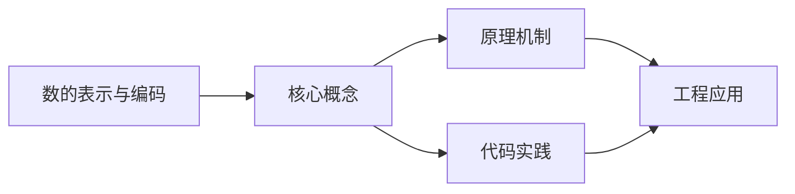

## 1. 学习目标（Bloom 分类）

本节按照布鲁姆教育目标分类学组织学习路径。本文主题为《数的表示与编码》，属于 入门指南 模块，读者可以根据自身阶段选择阅读深度。

记忆层面：能够准确复述本文的核心概念、术语与基本语法或操作步骤，并能够在提问或检索时快速定位对应知识点。能够说出 入门指南 的核心概念、常用命令与流程。

理解层面：能够用自己的语言解释核心原理与工作机制，说明概念之间的因果关系，而不是机械记忆结论。能够解释 入门指南 的工作原理与设计动机。

应用层面：能够在真实项目或练习场景中运用本文知识解决具体问题，写出正确且可维护的实现。能够独立完成 入门指南 的标准操作。

分析层面：能够拆解复杂问题，比较本文主题与相邻概念的异同，识别边界条件与例外情况。能够分析 入门指南 使用中的异常与边界。

评价层面：能够根据约束条件（性能、可读性、安全、成本）评价不同方案的优劣，做出有依据的技术决策。能够评价 入门指南 相关工具与方案。

创造层面：能够把本文知识与其他模块知识组合，设计出新的解决方案或可复用的工程模式。能够把 入门指南 融入团队工作流。

通过本节学习，读者应当能够把《数的表示与编码》纳入自己的知识网络，并与 入门指南 模块的其他主题（环境搭建、学习路径、编程基础）建立关联。

## 2. 历史动机与发展脉络

《数的表示与编码》是 入门指南 领域的重要主题。要真正理解它，需要先了解它解决的问题与演进过程。

编程入门的关键不是记忆语法，而是建立“问题 -> 方案 -> 验证”的思维循环；本模块为完全零基础的读者设计。
现代学习路径：环境搭建 -> 编程基础（变量/流程/函数）-> 数据与算法 -> 项目实践；本项目的完整文档库按此路径组织。
学习工具：IDE（VS Code）、命令行、Git、包管理器；工具链本身也是学习对象。

回到本文主题：数的表示与编码 的提出与成熟，正是上述技术背景下的必然产物。早期实现往往以简单可用为目标，随着工程规模扩大，社区逐渐沉淀出标准做法与最佳实践；理解这一脉络，可以帮助读者判断“为什么文档中的推荐写法是现在这个样子”，也能在遇到历史遗留代码时准确识别其设计年代与取舍。


## 3. 形式化定义与核心概念精讲

本节把《数的表示与编码》涉及的核心概念以“定义 + 讲解”的形式展开。读者应把定义当作工具，把讲解当作理解路径；两者结合才能形成可迁移的知识。

编程范式：命令式（逐步指令）、函数式（表达式与不可变）、面向对象（对象与消息）；语言是多范式的。
程序执行：源码 -> 编译/解释 -> 运行；调试是理解程序行为的主要手段。
抽象层次：机器码 -> 汇编 -> 高级语言 -> 框架 -> 领域语言；抽象降低认知负担。

### 3.1 原文章节逐一精讲

原文档把主题拆分为 6 个小节，下面按顺序给出每一节的导读讲解，随后保留原文细节供精读。

#### 原文精读（完整保留）


#### 1. 进制与转换

计算机内部使用二进制，但人类习惯十进制。不同进制是同一数值的不同表示方式。

##### 1.1 常用进制

| 进制     | 基数 | 数字符号   | 前缀 | 示例   |
| -------- | ---- | ---------- | ---- | ------ |
| 二进制   | 2    | 0, 1       | 0b   | 0b1010 |
| 八进制   | 8    | 0~7        | 0    | 012    |
| 十进制   | 10   | 0~9        | 无   | 10     |
| 十六进制 | 16   | 0~~9, A~~F | 0x   | 0xA    |

> 同一个数在不同进制下的表示：`0b1010` = `012` = `10` = `0xA`

##### 1.2 任意进制 → 十进制

方法：**按权展开求和**。每一位的权值 = 数字 × 基数^位序号（从右往左，从0开始）。

```
二进制 1011 → 十进制:
  1×2³ + 0×2² + 1×2¹ + 1×2⁰
= 8 + 0 + 2 + 1
= 11

八进制 17 → 十进制:
  1×8¹ + 7×8⁰
= 8 + 7
= 15

十六进制 0xFF → 十进制:
  15×16¹ + 15×16⁰
= 240 + 15
= 255
```

##### 1.3 十进制 → 任意进制

方法：**除基取余，逆序排列**。

```
十进制 25 → 二进制:
  25 ÷ 2 = 12 ... 余1  ← 最低位
  12 ÷ 2 = 6  ... 余0
   6 ÷ 2 = 3  ... 余0
   3 ÷ 2 = 1  ... 余1
   1 ÷ 2 = 0  ... 余1  ← 最高位
  结果: 11001

十进制 255 → 十六进制:
  255 ÷ 16 = 15 ... 余15 (F)  ← 最低位
   15 ÷ 16 = 0  ... 余15 (F)  ← 最高位
  结果: FF
```

##### 1.4 二进制 ↔ 八进制

方法：**每3位二进制对应1位八进制**（因为 2³ = 8）。

```
二进制 011 010 111 → 八进制
  011 = 3
  010 = 2
  111 = 7
  结果: 327

八进制 527 → 二进制
  5 = 101
  2 = 010
  7 = 111
  结果: 101 010 111
```

##### 1.5 二进制 ↔ 十六进制

方法：**每4位二进制对应1位十六进制**（因为 2⁴ = 16）。

```
二进制 1010 1111 → 十六进制
  1010 = A
  1111 = F
  结果: AF

十六进制 0xC3 → 二进制
  C = 1100
  3 = 0011
  结果: 1100 0011
```

##### 1.6 代码实现进制转换

```c
#include <stdio.h>
#include <string.h>

// 十进制整数转二进制字符串
void dec_to_bin(int n, char* buf, int size) {
    if (n == 0) {
        strcpy(buf, "0");
        return;
    }
    int i = 0;
    int is_negative = 0;
    if (n < 0) { is_negative = 1; n = -n; }
    while (n > 0 && i < size - 1) {
        buf[i++] = (n % 2) + '0';
        n /= 2;
    }
    // 反转
    for (int j = 0; j < i / 2; j++) {
        char tmp = buf[j];
        buf[j] = buf[i - 1 - j];
        buf[i - 1 - j] = tmp;
    }
    buf[i] = '\0';
}

int main() {
    char buf[33];
    dec_to_bin(25, buf, sizeof(buf));
    printf("25 的二进制: %s\n", buf);  // 11001
    return 0;
}
```

#### 2. 原码、反码与补码

计算机需要表示正数和负数。8位二进制中，最高位作为**符号位**：0表示正数，1表示负数。

##### 2.1 原码

原码是最直观的表示法：最高位为符号位，其余位为数值的绝对值。

```
+5 的原码: 0 0000101
-5 的原码: 1 0000101
+0 的原码: 0 0000000
-0 的原码: 1 0000000  ← 存在+0和-0两种表示
```

8位原码范围：**-127 ~ +127**（共255个数，因为0有两个表示）

##### 2.2 反码

- 正数的反码与原码相同
- 负数的反码：符号位不变，其余位按位取反

```
+5 的反码: 0 0000101  （与原码相同）
-5 的反码: 1 1111010  （原码数值位取反）
+0 的反码: 0 0000000
-0 的反码: 1 1111111  ← 仍然有两个0
```

8位反码范围：**-127 ~ +127**

##### 2.3 补码

- 正数的补码与原码相同
- 负数的补码 = 反码 + 1

```
+5 的补码: 0 0000101  （与原码相同）
-5 的补码: 1 1111011  （反码 11111010 + 1）
+0 的补码: 0 0000000
-0 的补码: 1 00000000 → 溢出后为 00000000 ← 只有一个0！
```

8位补码范围：**-128 ~ +127**（共256个数）

##### 2.4 为什么用补码？

补码解决了三个关键问题：

**① 统一了0的表示**

```
原码: +0 = 00000000, -0 = 10000000  → 两个0
补码: +0 = 00000000, -0 = 00000000  → 只有一个0
```

**② 加减法统一**

补码让减法可以转化为加法运算，CPU不需要单独的减法器：

```
5 - 3 = 5 + (-3)

  00000101   (+5的补码)
+ 11111101   (-3的补码)
-----------
  00000010   (+2的补码)  ← 结果正确！
  (最高位进位自然丢弃)
```

**③ 扩大了表示范围**

8位补码可以表示 -128，这是原码和反码做不到的：

```
-128 的补码: 10000000
  这个编码在原码和反码中没有对应值
  在补码中直接定义为 -128
```

##### 2.5 补码的快速求法

负数补码的两种求法：

```
方法1: 原码 → 反码 → 反码+1 → 补码
  -6 原码: 10000110
  -6 反码: 11111001
  -6 补码: 11111010

方法2: 从右往左找到第一个1，该1及其右边的0保持不变，左边各位取反
  -6 原码: 1 0000110
              ↑ 第一个1
  保持:          10
  取反:  1 1111010
  结果:  11111010  ← 与方法1一致
```

##### 2.6 补码运算与溢出

```c
#include <stdio.h>
#include <limits.h>

int main() {
    // 补码溢出示例
    signed char a = 127;   // 最大正值
    signed char b = 1;
    signed char c = a + b; // 溢出！

    printf("127 + 1 = %d\n", c);  // 输出: -128（发生了溢出）

    // 判断溢出：两个正数相加得到负数，或两个负数相加得到正数
    signed char x = -128;
    signed char y = -1;
    signed char z = x + y;  // 溢出！

    printf("-128 + (-1) = %d\n", z);  // 输出: 127（发生了溢出）

    return 0;
}
```

##### 2.7 8位各表示法范围汇总

| 表示法 | 范围        | 0的个数 | 特点               |
| ------ | ----------- | ------- | ------------------ |
| 原码   | -127 ~ +127 | 2个     | 直观，但运算复杂   |
| 反码   | -127 ~ +127 | 2个     | 原码到补码的过渡   |
| 补码   | -128 ~ +127 | 1个     | 现代计算机标准表示 |

#### 3. 浮点数表示（IEEE 754）

计算机用**浮点数**表示小数，遵循 IEEE 754 标准。

##### 3.1 科学记数法回顾

```
十进制: 123.456 = 1.23456 × 10²
二进制: 101.101 = 1.01101 × 2²
```

##### 3.2 IEEE 754 单精度（32位）

```
| 1位符号 | 8位指数 | 23位尾数 |
|   S     |   E     |    M     |

值 = (-1)^S × 1.M × 2^(E-127)
```

| 部分     | 位数 | 说明                          |
| -------- | ---- | ----------------------------- |
| 符号位 S | 1    | 0=正数，1=负数                |
| 指数 E   | 8    | 偏移量127，实际指数 = E - 127 |
| 尾数 M   | 23   | 隐含前导1，实际尾数 = 1.M     |

##### 3.3 IEEE 754 双精度（64位）

```
| 1位符号 | 11位指数 | 52位尾数 |
|   S     |    E     |    M     |

值 = (-1)^S × 1.M × 2^(E-1023)
```

##### 3.4 浮点数转换示例

**将 -6.5 转换为 IEEE 754 单精度浮点数：**

```
第1步: 确定符号位
  -6.5 为负数 → S = 1

第2步: 转换为二进制
  6 = 110
  0.5 = 0.1
  6.5 = 110.1

第3步: 规格化
  110.1 = 1.101 × 2²

第4步: 提取各字段
  S = 1
  M = 101 (后面补0至23位: 10100000000000000000000)
  E = 2 + 127 = 129 = 10000001

第5步: 组合
  1 10000001 10100000000000000000000
  = 0xC0D00000
```

##### 3.5 浮点数的特殊值

| 指数 E | 尾数 M | 含义     | 说明                |
| ------ | ------ | -------- | ------------------- |
| 全0    | 全0    | ±0       | 正零或负零          |
| 全0    | 非全0  | 非正规数 | 非常接近0的数       |
| 全1    | 全0    | ±∞       | 正无穷或负无穷      |
| 全1    | 非全0  | NaN      | 不是一个数（0/0等） |

##### 3.6 浮点数精度问题

```c
#include <stdio.h>

int main() {
    float a = 0.1f;
    float b = 0.2f;
    float c = a + b;

    // 0.1 + 0.2 不等于 0.3！
    printf("0.1 + 0.2 = %.20f\n", c);      // 0.30000001192092895508
    printf("0.3     = %.20f\n", 0.3f);      // 0.30000001192092895508

    // 正确的比较方式：使用误差范围
    float epsilon = 1e-6f;
    if (c - 0.3f < epsilon && 0.3f - c < epsilon) {
        printf("近似相等\n");
    }

    // 绝对不要用 == 比较浮点数
    if (c == 0.3f) {
        printf("相等\n");    // 可能不会执行
    }

    return 0;
}
```

##### 3.7 精度与范围对比

| 类型   | 位数 | 有效数字 | 范围                       |
| ------ | ---- | -------- | -------------------------- |
| float  | 32   | ~7位     | ±1.18×10⁻³⁸ ~ ±3.4×10³⁸    |
| double | 64   | ~15位    | ±2.23×10⁻³⁰⁸ ~ ±1.80×10³⁰⁸ |

> 实际开发中，优先使用 `double` 以获得更高精度。仅在内存受限（如嵌入式、GPU计算）时使用 `float`。

#### 4. ASCII 码

ASCII（American Standard Code for Information Interchange）是最基础的字符编码标准，用7位二进制表示128个字符。

##### 4.1 ASCII 码表（0~127）

**控制字符（0~31）：**

| 范围 | 含义           | 常见字符            |
| ---- | -------------- | ------------------- |
| 0    | NUL（空字符）  | 字符串结束标志 '\0' |
| 7    | BEL（响铃）    |                     |
| 8    | BS（退格）     | '\b'                |
| 9    | HT（水平制表） | '\t'                |
| 10   | LF（换行）     | '\n'                |
| 13   | CR（回车）     | '\r'                |
| 27   | ESC（转义）    |                     |
| 32   | SP（空格）     | ' '                 |

**可打印字符（32~127）：**

| 字符类别 | 范围   | 关键记忆点        |
| -------- | ------ | ----------------- |
| 空格     | 32     | 第一个可打印字符  |
| 数字 0~9 | 48~57  | '0' = 48          |
| 大写 A~Z | 65~90  | 'A' = 65          |
| 小写 a~z | 97~122 | 'a' = 97          |
| DEL      | 127    | 最后一个ASCII字符 |

##### 4.2 必须记住的 ASCII 值

```
'0' = 48    'A' = 65    'a' = 97
'1' = 49    'B' = 66    'b' = 98
 ...          ...          ...
'9' = 57    'Z' = 90    'z' = 122
```

关键规律：

- 数字、大写字母、小写字母的编码**各自连续**
- 大写字母 + 32 = 对应小写字母（`'A' + 32 = 'a'`）
- 数字字符 - '0' = 数值（`'7' - '0' = 7`）

```c
#include <stdio.h>

int main() {
    // 大小写转换
    char upper = 'G';
    char lower = upper + 32;   // 或 upper + ('a' - 'A')
    printf("%c -> %c\n", upper, lower);  // G -> g

    // 字符转数字
    char digit = '7';
    int value = digit - '0';
    printf("'%c' = %d\n", digit, value);  // '7' = 7

    // 判断字符类型
    char ch = '5';
    if (ch >= '0' && ch <= '9')
        printf("数字\n");
    else if (ch >= 'A' && ch <= 'Z')
        printf("大写字母\n");
    else if (ch >= 'a' && ch <= 'z')
        printf("小写字母\n");

    return 0;
}
```

##### 4.3 扩展 ASCII（128~255）

标准ASCII只有128个字符，无法表示中文等非英文字符。扩展ASCII（128~255）在不同编码页中有不同含义，这导致了**乱码问题**，也是Unicode诞生的背景。

#### 5. Unicode 与 UTF-8

##### 5.1 Unicode 概述

Unicode 为世界上几乎所有文字系统中的每个字符分配了唯一的**码点（Code Point）**。

```
码点范围: U+0000 ~ U+10FFFF（共1,114,112个码点）
表示方式: U+ 后跟4~6位十六进制数

示例:
  'A'   → U+0041
  '中'  → U+4E2D
  ''  → U+1F600
```

##### 5.2 Unicode 平面

Unicode 码点空间被划分为17个**平面**，每个平面包含 65,536 个码点：

| 平面         | 范围               | 内容                   |
| ------------ | ------------------ | ---------------------- |
| 第0平面(BMP) | U+0000 ~ U+FFFF    | 基本多文种平面，最常用 |
| 第1平面      | U+10000 ~ U+1FFFF  | 补充多文种平面         |
| 第2平面      | U+20000 ~ U+2FFFF  | CJK统一表意文字扩展    |
| 第3~13平面   | ...                | 保留或分配             |
| 第14平面     | U+E0000 ~ U+EFFFF  | 补充特殊用途平面       |
| 第15~16平面  | U+F0000 ~ U+10FFFF | 私用区                 |

> 日常使用的汉字大多在 BMP（U+4E00~U+9FFF）和第2平面中。

##### 5.3 UTF-8 编码规则

UTF-8 是 Unicode 的一种**变长编码**实现，用1~4个字节表示一个码点：

| 码点范围           | 字节数 | 编码格式                              |
| ------------------ | ------ | ------------------------------------- |
| U+0000 ~ U+007F    | 1      | `0xxxxxxx`                            |
| U+0080 ~ U+07FF    | 2      | `110xxxxx 10xxxxxx`                   |
| U+0800 ~ U+FFFF    | 3      | `1110xxxx 10xxxxxx 10xxxxxx`          |
| U+10000 ~ U+10FFFF | 4      | `11110xxx 10xxxxxx 10xxxxxx 10xxxxxx` |

##### 5.4 码点 → UTF-8 转换示例

**例1：'A' = U+0041 → 1字节**

```
U+0041 = 1000001
范围 U+0000~U+007F → 1字节格式: 0xxxxxxx
填入: 01000001
结果: 0x41（与ASCII完全兼容！）
```

**例2：'中' = U+4E2D → 3字节**

```
U+4E2D = 0100 1110 0010 1101
范围 U+0800~U+FFFF → 3字节格式: 1110xxxx 10xxxxxx 10xxxxxx

将 0100111000101101 填入 x 的位置:
  1110 0100   10 111000   10 101101
  = E4        = B8        = AD

结果: E4 B8 AD（3个字节）
```

**例3：'' = U+1F600 → 4字节**

```
U+1F600 = 0001 1111 0110 0000 0000
范围 U+10000~U+10FFFF → 4字节格式: 11110xxx 10xxxxxx 10xxxxxx 10xxxxxx

将 000011111011000000000 填入 x 的位置（共21位）:
  11110 000   10 011111   10 011000   10 000000
  = F0        = 9F        = 98        = 80

结果: F0 9F 98 80（4个字节）
```

##### 5.5 UTF-8 的设计优势

| 优势         | 说明                                         |
| ------------ | -------------------------------------------- |
| ASCII 兼容   | U+0000~U+007F 的 UTF-8 编码与 ASCII 完全相同 |
| 自同步       | 从任意字节可以判断是首字节还是后续字节       |
| 无字节序问题 | 不需要 BOM（字节序标记）                     |
| 容错性好     | 损坏一个字节只影响一个字符，不影响后续       |
| 空间效率     | 英文1字节，中文3字节，比UTF-32节省空间       |

##### 5.6 BOM（字节序标记）

UTF-16 和 UTF-32 存在字节序问题，用 BOM 标识：

```
FE FF → 大端序（Big Endian，高位在前）
FF FE → 小端序（Little Endian，低位在前）

UTF-8 的 BOM: EF BB BF（可选，不推荐添加）
```

```c
#include <stdio.h>

// 检测文件BOM
void check_bom(const unsigned char* data, int len) {
    if (len >= 3 && data[0] == 0xEF && data[1] == 0xBB && data[2] == 0xBF)
        printf("UTF-8 BOM\n");
    else if (len >= 2 && data[0] == 0xFE && data[1] == 0xFF)
        printf("UTF-16 Big Endian BOM\n");
    else if (len >= 2 && data[0] == 0xFF && data[1] == 0xFE)
        printf("UTF-16 Little Endian BOM\n");
    else
        printf("无BOM\n");
}
```

##### 5.7 编码方案对比

| 编码   | 字节数 | 优点                | 缺点                | 适用场景          |
| ------ | ------ | ------------------- | ------------------- | ----------------- |
| UTF-8  | 1~4    | 兼容ASCII，无字节序 | 中文占3字节         | Web、文件存储     |
| UTF-16 | 2或4   | 中文2字节           | 有字节序，英文2字节 | Windows内部、Java |
| UTF-32 | 固定4  | 定长，随机访问快    | 空间浪费大          | 内存中处理        |

#### 6. 小结

| 主题          | 核心要点                                     |
| ------------- | -------------------------------------------- |
| 进制转换      | 按权展开求和（→十进制），除基取余（十进制→） |
| 原码反码补码  | 补码统一0的表示、统一加减法、扩大表示范围    |
| IEEE 754      | 符号位+指数+尾数，注意精度问题和特殊值       |
| ASCII         | '0'=48, 'A'=65, 'a'=97，大小写差32           |
| Unicode/UTF-8 | 码点唯一标识字符，UTF-8变长编码兼容ASCII     |

理解数的表示与编码是理解程序行为的基础——为什么 `0.1 + 0.2 != 0.3`、为什么中文占3个字节、为什么整数溢出会变成负数，这些问题的答案都在本章中。


### 3.2 概念关系图

下面用 Mermaid 图表达本文核心概念之间的关系，帮助读者建立整体图景：



图中展示的是本文知识的结构化关系：核心概念是入口，原理机制解释“为什么”，代码实践演示“怎么做”，工程应用回答“何时用”。读者学习时可以把每个小节的内容挂接到对应节点上。

## 4. 理论推导与原理解析

本节深入《数的表示与编码》背后的原理。理论部分不求面面俱到，而是聚焦“能解释现象、能指导实践”的关键推导。

编程范式：命令式（逐步指令）、函数式（表达式与不可变）、面向对象（对象与消息）；语言是多范式的。
程序执行：源码 -> 编译/解释 -> 运行；调试是理解程序行为的主要手段。
抽象层次：机器码 -> 汇编 -> 高级语言 -> 框架 -> 领域语言；抽象降低认知负担。
计算机基础：CPU 执行指令、内存存数据、I/O 与外部交互；这些概念支撑所有编程。

需要强调的是，理论推导与工程实践之间存在翻译层：理论给出的是理想化模型与边界条件，工程代码则必须处理真实环境中的例外。读者在学习时应先掌握理论的“标准情形”，再通过陷阱章节了解“非标准情形”。

## 5. 代码示例与逐行讲解

本节把原文中的代码示例系统整理，并为每个示例补充用途说明与讲解。读者不应只浏览代码，而应逐段对照讲解理解设计意图。

### 5.1 示例：1.2 任意进制 → 十进制

该示例来自原文《1.2 任意进制 → 十进制》小节，用于演示数的表示与编码相关操作。阅读时请先看代码结构，再看其后的讲解。

```text
二进制 1011 → 十进制:
  1×2³ + 0×2² + 1×2¹ + 1×2⁰
= 8 + 0 + 2 + 1
= 11

八进制 17 → 十进制:
  1×8¹ + 7×8⁰
= 8 + 7
= 15

十六进制 0xFF → 十进制:
  15×16¹ + 15×16⁰
= 240 + 15
= 255
```

讲解：这段代码演示了本节核心知识点。代码中的关键操作可以归纳为三步：准备（定义或初始化）、执行（核心逻辑）、收尾（释放资源或返回结果）。实际项目中，这三步往往被封装为函数或类，以提升复用性与可测试性。

关键点分析：

该示例共 12 行有效代码，结构以数据或配置为主。阅读时应关注：数据字段的含义、配置项的作用，以及它们与运行行为的对应关系。

进阶思考路径：先尝试修改参数观察行为变化，再把示例中的模式迁移到自己的项目中；每次修改都记录预期与实测差异，这是把示例转化为能力的最快方式。

### 5.2 示例：1.3 十进制 → 任意进制

该示例来自原文《1.3 十进制 → 任意进制》小节，用于演示数的表示与编码相关操作。阅读时请先看代码结构，再看其后的讲解。

```text
十进制 25 → 二进制:
  25 ÷ 2 = 12 ... 余1  ← 最低位
  12 ÷ 2 = 6  ... 余0
   6 ÷ 2 = 3  ... 余0
   3 ÷ 2 = 1  ... 余1
   1 ÷ 2 = 0  ... 余1  ← 最高位
  结果: 11001

十进制 255 → 十六进制:
  255 ÷ 16 = 15 ... 余15 (F)  ← 最低位
   15 ÷ 16 = 0  ... 余15 (F)  ← 最高位
  结果: FF
```

讲解：这段代码演示了本节核心知识点。代码中的关键操作可以归纳为三步：准备（定义或初始化）、执行（核心逻辑）、收尾（释放资源或返回结果）。实际项目中，这三步往往被封装为函数或类，以提升复用性与可测试性。

关键点分析：

该示例共 11 行有效代码，结构以数据或配置为主。阅读时应关注：数据字段的含义、配置项的作用，以及它们与运行行为的对应关系。

进阶思考路径：先尝试修改参数观察行为变化，再把示例中的模式迁移到自己的项目中；每次修改都记录预期与实测差异，这是把示例转化为能力的最快方式。

### 5.3 示例：1.4 二进制 ↔ 八进制

该示例来自原文《1.4 二进制 ↔ 八进制》小节，用于演示数的表示与编码相关操作。阅读时请先看代码结构，再看其后的讲解。

```text
二进制 011 010 111 → 八进制
  011 = 3
  010 = 2
  111 = 7
  结果: 327

八进制 527 → 二进制
  5 = 101
  2 = 010
  7 = 111
  结果: 101 010 111
```

讲解：这段代码演示了本节核心知识点。代码中的关键操作可以归纳为三步：准备（定义或初始化）、执行（核心逻辑）、收尾（释放资源或返回结果）。实际项目中，这三步往往被封装为函数或类，以提升复用性与可测试性。

关键点分析：

该示例共 10 行有效代码，结构以数据或配置为主。阅读时应关注：数据字段的含义、配置项的作用，以及它们与运行行为的对应关系。

进阶思考路径：先尝试修改参数观察行为变化，再把示例中的模式迁移到自己的项目中；每次修改都记录预期与实测差异，这是把示例转化为能力的最快方式。

### 5.4 示例：1.5 二进制 ↔ 十六进制

该示例来自原文《1.5 二进制 ↔ 十六进制》小节，用于演示数的表示与编码相关操作。阅读时请先看代码结构，再看其后的讲解。

```text
二进制 1010 1111 → 十六进制
  1010 = A
  1111 = F
  结果: AF

十六进制 0xC3 → 二进制
  C = 1100
  3 = 0011
  结果: 1100 0011
```

讲解：这段代码演示了本节核心知识点。代码中的关键操作可以归纳为三步：准备（定义或初始化）、执行（核心逻辑）、收尾（释放资源或返回结果）。实际项目中，这三步往往被封装为函数或类，以提升复用性与可测试性。

关键点分析：

该示例共 8 行有效代码，结构以数据或配置为主。阅读时应关注：数据字段的含义、配置项的作用，以及它们与运行行为的对应关系。

进阶思考路径：先尝试修改参数观察行为变化，再把示例中的模式迁移到自己的项目中；每次修改都记录预期与实测差异，这是把示例转化为能力的最快方式。

### 5.5 示例：1.6 代码实现进制转换

该示例来自原文《1.6 代码实现进制转换》小节，用于演示数的表示与编码相关操作。阅读时请先看代码结构，再看其后的讲解。

```c
#include <stdio.h>
#include <string.h>

// 十进制整数转二进制字符串
void dec_to_bin(int n, char* buf, int size) {
    if (n == 0) {
        strcpy(buf, "0");
        return;
    }
    int i = 0;
    int is_negative = 0;
    if (n < 0) { is_negative = 1; n = -n; }
    while (n > 0 && i < size - 1) {
        buf[i++] = (n % 2) + '0';
        n /= 2;
    }
    // 反转
    for (int j = 0; j < i / 2; j++) {
        char tmp = buf[j];
        buf[j] = buf[i - 1 - j];
        buf[i - 1 - j] = tmp;
    }
    buf[i] = '\0';
}

int main() {
    char buf[33];
    dec_to_bin(25, buf, sizeof(buf));
    printf("25 的二进制: %s\n", buf);  // 11001
    return 0;
}
```

讲解：这段代码演示了本节核心知识点。代码中的关键操作可以归纳为三步：准备（定义或初始化）、执行（核心逻辑）、收尾（释放资源或返回结果）。实际项目中，这三步往往被封装为函数或类，以提升复用性与可测试性。

关键点分析：

该示例共 29 行有效代码，包含 4 类关键结构（if、for、while、return）。其中：

- 入口与初始化部分负责建立上下文，对应实际项目中的启动或装配逻辑；
- 核心逻辑部分体现本文主题的主要操作，是阅读时最需要对照讲解理解的部分；
- 输出或返回部分把结果交给调用方，注意其类型与边界条件。

进阶思考路径：先尝试修改参数观察行为变化，再把示例中的模式迁移到自己的项目中；每次修改都记录预期与实测差异，这是把示例转化为能力的最快方式。

### 5.6 示例：2.1 原码

该示例来自原文《2.1 原码》小节，用于演示数的表示与编码相关操作。阅读时请先看代码结构，再看其后的讲解。

```text
+5 的原码: 0 0000101
-5 的原码: 1 0000101
+0 的原码: 0 0000000
-0 的原码: 1 0000000  ← 存在+0和-0两种表示
```

讲解：这段代码演示了本节核心知识点。代码中的关键操作可以归纳为三步：准备（定义或初始化）、执行（核心逻辑）、收尾（释放资源或返回结果）。实际项目中，这三步往往被封装为函数或类，以提升复用性与可测试性。

关键点分析：

该示例共 4 行有效代码，结构以数据或配置为主。阅读时应关注：数据字段的含义、配置项的作用，以及它们与运行行为的对应关系。

进阶思考路径：先尝试修改参数观察行为变化，再把示例中的模式迁移到自己的项目中；每次修改都记录预期与实测差异，这是把示例转化为能力的最快方式。

### 5.7 示例：2.2 反码

该示例来自原文《2.2 反码》小节，用于演示数的表示与编码相关操作。阅读时请先看代码结构，再看其后的讲解。

```text
+5 的反码: 0 0000101  （与原码相同）
-5 的反码: 1 1111010  （原码数值位取反）
+0 的反码: 0 0000000
-0 的反码: 1 1111111  ← 仍然有两个0
```

讲解：这段代码演示了本节核心知识点。代码中的关键操作可以归纳为三步：准备（定义或初始化）、执行（核心逻辑）、收尾（释放资源或返回结果）。实际项目中，这三步往往被封装为函数或类，以提升复用性与可测试性。

关键点分析：

该示例共 4 行有效代码，结构以数据或配置为主。阅读时应关注：数据字段的含义、配置项的作用，以及它们与运行行为的对应关系。

进阶思考路径：先尝试修改参数观察行为变化，再把示例中的模式迁移到自己的项目中；每次修改都记录预期与实测差异，这是把示例转化为能力的最快方式。

### 5.8 示例：2.3 补码

该示例来自原文《2.3 补码》小节，用于演示数的表示与编码相关操作。阅读时请先看代码结构，再看其后的讲解。

```text
+5 的补码: 0 0000101  （与原码相同）
-5 的补码: 1 1111011  （反码 11111010 + 1）
+0 的补码: 0 0000000
-0 的补码: 1 00000000 → 溢出后为 00000000 ← 只有一个0！
```

讲解：这段代码演示了本节核心知识点。代码中的关键操作可以归纳为三步：准备（定义或初始化）、执行（核心逻辑）、收尾（释放资源或返回结果）。实际项目中，这三步往往被封装为函数或类，以提升复用性与可测试性。

关键点分析：

该示例共 4 行有效代码，结构以数据或配置为主。阅读时应关注：数据字段的含义、配置项的作用，以及它们与运行行为的对应关系。

进阶思考路径：先尝试修改参数观察行为变化，再把示例中的模式迁移到自己的项目中；每次修改都记录预期与实测差异，这是把示例转化为能力的最快方式。

### 5.9 示例：2.4 为什么用补码？

该示例来自原文《2.4 为什么用补码？》小节，用于演示数的表示与编码相关操作。阅读时请先看代码结构，再看其后的讲解。

```text
原码: +0 = 00000000, -0 = 10000000  → 两个0
补码: +0 = 00000000, -0 = 00000000  → 只有一个0
```

讲解：这段代码演示了本节核心知识点。代码中的关键操作可以归纳为三步：准备（定义或初始化）、执行（核心逻辑）、收尾（释放资源或返回结果）。实际项目中，这三步往往被封装为函数或类，以提升复用性与可测试性。

关键点分析：

该示例共 2 行有效代码，结构以数据或配置为主。阅读时应关注：数据字段的含义、配置项的作用，以及它们与运行行为的对应关系。

进阶思考路径：先尝试修改参数观察行为变化，再把示例中的模式迁移到自己的项目中；每次修改都记录预期与实测差异，这是把示例转化为能力的最快方式。

### 5.10 示例：2.4 为什么用补码？

该示例来自原文《2.4 为什么用补码？》小节，用于演示数的表示与编码相关操作。阅读时请先看代码结构，再看其后的讲解。

```text
5 - 3 = 5 + (-3)

  00000101   (+5的补码)
+ 11111101   (-3的补码)
-----------
  00000010   (+2的补码)  ← 结果正确！
  (最高位进位自然丢弃)
```

讲解：这段代码演示了本节核心知识点。代码中的关键操作可以归纳为三步：准备（定义或初始化）、执行（核心逻辑）、收尾（释放资源或返回结果）。实际项目中，这三步往往被封装为函数或类，以提升复用性与可测试性。

关键点分析：

该示例共 6 行有效代码，结构以数据或配置为主。阅读时应关注：数据字段的含义、配置项的作用，以及它们与运行行为的对应关系。

进阶思考路径：先尝试修改参数观察行为变化，再把示例中的模式迁移到自己的项目中；每次修改都记录预期与实测差异，这是把示例转化为能力的最快方式。

### 5.11 示例：2.4 为什么用补码？

该示例来自原文《2.4 为什么用补码？》小节，用于演示数的表示与编码相关操作。阅读时请先看代码结构，再看其后的讲解。

```text
-128 的补码: 10000000
  这个编码在原码和反码中没有对应值
  在补码中直接定义为 -128
```

讲解：这段代码演示了本节核心知识点。代码中的关键操作可以归纳为三步：准备（定义或初始化）、执行（核心逻辑）、收尾（释放资源或返回结果）。实际项目中，这三步往往被封装为函数或类，以提升复用性与可测试性。

关键点分析：

该示例共 3 行有效代码，结构以数据或配置为主。阅读时应关注：数据字段的含义、配置项的作用，以及它们与运行行为的对应关系。

进阶思考路径：先尝试修改参数观察行为变化，再把示例中的模式迁移到自己的项目中；每次修改都记录预期与实测差异，这是把示例转化为能力的最快方式。

### 5.12 示例：2.5 补码的快速求法

该示例来自原文《2.5 补码的快速求法》小节，用于演示数的表示与编码相关操作。阅读时请先看代码结构，再看其后的讲解。

```text
方法1: 原码 → 反码 → 反码+1 → 补码
  -6 原码: 10000110
  -6 反码: 11111001
  -6 补码: 11111010

方法2: 从右往左找到第一个1，该1及其右边的0保持不变，左边各位取反
  -6 原码: 1 0000110
              ↑ 第一个1
  保持:          10
  取反:  1 1111010
  结果:  11111010  ← 与方法1一致
```

讲解：这段代码演示了本节核心知识点。代码中的关键操作可以归纳为三步：准备（定义或初始化）、执行（核心逻辑）、收尾（释放资源或返回结果）。实际项目中，这三步往往被封装为函数或类，以提升复用性与可测试性。

关键点分析：

该示例共 10 行有效代码，结构以数据或配置为主。阅读时应关注：数据字段的含义、配置项的作用，以及它们与运行行为的对应关系。

进阶思考路径：先尝试修改参数观察行为变化，再把示例中的模式迁移到自己的项目中；每次修改都记录预期与实测差异，这是把示例转化为能力的最快方式。

### 5.13 示例：2.6 补码运算与溢出

该示例来自原文《2.6 补码运算与溢出》小节，用于演示数的表示与编码相关操作。阅读时请先看代码结构，再看其后的讲解。

```c
#include <stdio.h>
#include <limits.h>

int main() {
    // 补码溢出示例
    signed char a = 127;   // 最大正值
    signed char b = 1;
    signed char c = a + b; // 溢出！

    printf("127 + 1 = %d\n", c);  // 输出: -128（发生了溢出）

    // 判断溢出：两个正数相加得到负数，或两个负数相加得到正数
    signed char x = -128;
    signed char y = -1;
    signed char z = x + y;  // 溢出！

    printf("-128 + (-1) = %d\n", z);  // 输出: 127（发生了溢出）

    return 0;
}
```

讲解：这段代码演示了本节核心知识点。代码中的关键操作可以归纳为三步：准备（定义或初始化）、执行（核心逻辑）、收尾（释放资源或返回结果）。实际项目中，这三步往往被封装为函数或类，以提升复用性与可测试性。

关键点分析：

该示例共 15 行有效代码，包含 1 类关键结构（return）。其中：

- 入口与初始化部分负责建立上下文，对应实际项目中的启动或装配逻辑；
- 核心逻辑部分体现本文主题的主要操作，是阅读时最需要对照讲解理解的部分；
- 输出或返回部分把结果交给调用方，注意其类型与边界条件。

进阶思考路径：先尝试修改参数观察行为变化，再把示例中的模式迁移到自己的项目中；每次修改都记录预期与实测差异，这是把示例转化为能力的最快方式。

### 5.14 示例：3.1 科学记数法回顾

该示例来自原文《3.1 科学记数法回顾》小节，用于演示数的表示与编码相关操作。阅读时请先看代码结构，再看其后的讲解。

```text
十进制: 123.456 = 1.23456 × 10²
二进制: 101.101 = 1.01101 × 2²
```

讲解：这段代码演示了本节核心知识点。代码中的关键操作可以归纳为三步：准备（定义或初始化）、执行（核心逻辑）、收尾（释放资源或返回结果）。实际项目中，这三步往往被封装为函数或类，以提升复用性与可测试性。

关键点分析：

该示例共 2 行有效代码，结构以数据或配置为主。阅读时应关注：数据字段的含义、配置项的作用，以及它们与运行行为的对应关系。

进阶思考路径：先尝试修改参数观察行为变化，再把示例中的模式迁移到自己的项目中；每次修改都记录预期与实测差异，这是把示例转化为能力的最快方式。

### 5.15 示例：3.2 IEEE 754 单精度（32位）

该示例来自原文《3.2 IEEE 754 单精度（32位）》小节，用于演示数的表示与编码相关操作。阅读时请先看代码结构，再看其后的讲解。

```text
| 1位符号 | 8位指数 | 23位尾数 |
|   S     |   E     |    M     |

值 = (-1)^S × 1.M × 2^(E-127)
```

讲解：这段代码演示了本节核心知识点。代码中的关键操作可以归纳为三步：准备（定义或初始化）、执行（核心逻辑）、收尾（释放资源或返回结果）。实际项目中，这三步往往被封装为函数或类，以提升复用性与可测试性。

关键点分析：

该示例共 3 行有效代码，结构以数据或配置为主。阅读时应关注：数据字段的含义、配置项的作用，以及它们与运行行为的对应关系。

进阶思考路径：先尝试修改参数观察行为变化，再把示例中的模式迁移到自己的项目中；每次修改都记录预期与实测差异，这是把示例转化为能力的最快方式。

### 5.16 示例：3.3 IEEE 754 双精度（64位）

该示例来自原文《3.3 IEEE 754 双精度（64位）》小节，用于演示数的表示与编码相关操作。阅读时请先看代码结构，再看其后的讲解。

```text
| 1位符号 | 11位指数 | 52位尾数 |
|   S     |    E     |    M     |

值 = (-1)^S × 1.M × 2^(E-1023)
```

讲解：这段代码演示了本节核心知识点。代码中的关键操作可以归纳为三步：准备（定义或初始化）、执行（核心逻辑）、收尾（释放资源或返回结果）。实际项目中，这三步往往被封装为函数或类，以提升复用性与可测试性。

关键点分析：

该示例共 3 行有效代码，结构以数据或配置为主。阅读时应关注：数据字段的含义、配置项的作用，以及它们与运行行为的对应关系。

进阶思考路径：先尝试修改参数观察行为变化，再把示例中的模式迁移到自己的项目中；每次修改都记录预期与实测差异，这是把示例转化为能力的最快方式。

### 5.17 示例：3.4 浮点数转换示例

该示例来自原文《3.4 浮点数转换示例》小节，用于演示数的表示与编码相关操作。阅读时请先看代码结构，再看其后的讲解。

```text
第1步: 确定符号位
  -6.5 为负数 → S = 1

第2步: 转换为二进制
  6 = 110
  0.5 = 0.1
  6.5 = 110.1

第3步: 规格化
  110.1 = 1.101 × 2²

第4步: 提取各字段
  S = 1
  M = 101 (后面补0至23位: 10100000000000000000000)
  E = 2 + 127 = 129 = 10000001

第5步: 组合
  1 10000001 10100000000000000000000
  = 0xC0D00000
```

讲解：这段代码演示了本节核心知识点。代码中的关键操作可以归纳为三步：准备（定义或初始化）、执行（核心逻辑）、收尾（释放资源或返回结果）。实际项目中，这三步往往被封装为函数或类，以提升复用性与可测试性。

关键点分析：

该示例共 15 行有效代码，结构以数据或配置为主。阅读时应关注：数据字段的含义、配置项的作用，以及它们与运行行为的对应关系。

进阶思考路径：先尝试修改参数观察行为变化，再把示例中的模式迁移到自己的项目中；每次修改都记录预期与实测差异，这是把示例转化为能力的最快方式。

### 5.18 示例：3.6 浮点数精度问题

该示例来自原文《3.6 浮点数精度问题》小节，用于演示数的表示与编码相关操作。阅读时请先看代码结构，再看其后的讲解。

```c
#include <stdio.h>

int main() {
    float a = 0.1f;
    float b = 0.2f;
    float c = a + b;

    // 0.1 + 0.2 不等于 0.3！
    printf("0.1 + 0.2 = %.20f\n", c);      // 0.30000001192092895508
    printf("0.3     = %.20f\n", 0.3f);      // 0.30000001192092895508

    // 正确的比较方式：使用误差范围
    float epsilon = 1e-6f;
    if (c - 0.3f < epsilon && 0.3f - c < epsilon) {
        printf("近似相等\n");
    }

    // 绝对不要用 == 比较浮点数
    if (c == 0.3f) {
        printf("相等\n");    // 可能不会执行
    }

    return 0;
}
```

讲解：这段代码演示了本节核心知识点。代码中的关键操作可以归纳为三步：准备（定义或初始化）、执行（核心逻辑）、收尾（释放资源或返回结果）。实际项目中，这三步往往被封装为函数或类，以提升复用性与可测试性。

关键点分析：

该示例共 19 行有效代码，包含 2 类关键结构（if、return）。其中：

- 入口与初始化部分负责建立上下文，对应实际项目中的启动或装配逻辑；
- 核心逻辑部分体现本文主题的主要操作，是阅读时最需要对照讲解理解的部分；
- 输出或返回部分把结果交给调用方，注意其类型与边界条件。

进阶思考路径：先尝试修改参数观察行为变化，再把示例中的模式迁移到自己的项目中；每次修改都记录预期与实测差异，这是把示例转化为能力的最快方式。

### 5.19 示例：4.2 必须记住的 ASCII 值

该示例来自原文《4.2 必须记住的 ASCII 值》小节，用于演示数的表示与编码相关操作。阅读时请先看代码结构，再看其后的讲解。

```text
'0' = 48    'A' = 65    'a' = 97
'1' = 49    'B' = 66    'b' = 98
 ...          ...          ...
'9' = 57    'Z' = 90    'z' = 122
```

讲解：这段代码演示了本节核心知识点。代码中的关键操作可以归纳为三步：准备（定义或初始化）、执行（核心逻辑）、收尾（释放资源或返回结果）。实际项目中，这三步往往被封装为函数或类，以提升复用性与可测试性。

关键点分析：

该示例共 4 行有效代码，结构以数据或配置为主。阅读时应关注：数据字段的含义、配置项的作用，以及它们与运行行为的对应关系。

进阶思考路径：先尝试修改参数观察行为变化，再把示例中的模式迁移到自己的项目中；每次修改都记录预期与实测差异，这是把示例转化为能力的最快方式。

### 5.20 示例：4.2 必须记住的 ASCII 值

该示例来自原文《4.2 必须记住的 ASCII 值》小节，用于演示数的表示与编码相关操作。阅读时请先看代码结构，再看其后的讲解。

```c
#include <stdio.h>

int main() {
    // 大小写转换
    char upper = 'G';
    char lower = upper + 32;   // 或 upper + ('a' - 'A')
    printf("%c -> %c\n", upper, lower);  // G -> g

    // 字符转数字
    char digit = '7';
    int value = digit - '0';
    printf("'%c' = %d\n", digit, value);  // '7' = 7

    // 判断字符类型
    char ch = '5';
    if (ch >= '0' && ch <= '9')
        printf("数字\n");
    else if (ch >= 'A' && ch <= 'Z')
        printf("大写字母\n");
    else if (ch >= 'a' && ch <= 'z')
        printf("小写字母\n");

    return 0;
}
```

讲解：这段代码演示了本节核心知识点。代码中的关键操作可以归纳为三步：准备（定义或初始化）、执行（核心逻辑）、收尾（释放资源或返回结果）。实际项目中，这三步往往被封装为函数或类，以提升复用性与可测试性。

关键点分析：

该示例共 20 行有效代码，包含 2 类关键结构（if、return）。其中：

- 入口与初始化部分负责建立上下文，对应实际项目中的启动或装配逻辑；
- 核心逻辑部分体现本文主题的主要操作，是阅读时最需要对照讲解理解的部分；
- 输出或返回部分把结果交给调用方，注意其类型与边界条件。

进阶思考路径：先尝试修改参数观察行为变化，再把示例中的模式迁移到自己的项目中；每次修改都记录预期与实测差异，这是把示例转化为能力的最快方式。

### 5.21 示例：5.1 Unicode 概述

该示例来自原文《5.1 Unicode 概述》小节，用于演示数的表示与编码相关操作。阅读时请先看代码结构，再看其后的讲解。

```text
码点范围: U+0000 ~ U+10FFFF（共1,114,112个码点）
表示方式: U+ 后跟4~6位十六进制数

示例:
  'A'   → U+0041
  '中'  → U+4E2D
  ''  → U+1F600
```

讲解：这段代码演示了本节核心知识点。代码中的关键操作可以归纳为三步：准备（定义或初始化）、执行（核心逻辑）、收尾（释放资源或返回结果）。实际项目中，这三步往往被封装为函数或类，以提升复用性与可测试性。

关键点分析：

该示例共 6 行有效代码，结构以数据或配置为主。阅读时应关注：数据字段的含义、配置项的作用，以及它们与运行行为的对应关系。

进阶思考路径：先尝试修改参数观察行为变化，再把示例中的模式迁移到自己的项目中；每次修改都记录预期与实测差异，这是把示例转化为能力的最快方式。

### 5.22 示例：5.4 码点 → UTF-8 转换示例

该示例来自原文《5.4 码点 → UTF-8 转换示例》小节，用于演示数的表示与编码相关操作。阅读时请先看代码结构，再看其后的讲解。

```text
U+0041 = 1000001
范围 U+0000~U+007F → 1字节格式: 0xxxxxxx
填入: 01000001
结果: 0x41（与ASCII完全兼容！）
```

讲解：这段代码演示了本节核心知识点。代码中的关键操作可以归纳为三步：准备（定义或初始化）、执行（核心逻辑）、收尾（释放资源或返回结果）。实际项目中，这三步往往被封装为函数或类，以提升复用性与可测试性。

关键点分析：

该示例共 4 行有效代码，结构以数据或配置为主。阅读时应关注：数据字段的含义、配置项的作用，以及它们与运行行为的对应关系。

进阶思考路径：先尝试修改参数观察行为变化，再把示例中的模式迁移到自己的项目中；每次修改都记录预期与实测差异，这是把示例转化为能力的最快方式。

### 5.23 示例：5.4 码点 → UTF-8 转换示例

该示例来自原文《5.4 码点 → UTF-8 转换示例》小节，用于演示数的表示与编码相关操作。阅读时请先看代码结构，再看其后的讲解。

```text
U+4E2D = 0100 1110 0010 1101
范围 U+0800~U+FFFF → 3字节格式: 1110xxxx 10xxxxxx 10xxxxxx

将 0100111000101101 填入 x 的位置:
  1110 0100   10 111000   10 101101
  = E4        = B8        = AD

结果: E4 B8 AD（3个字节）
```

讲解：这段代码演示了本节核心知识点。代码中的关键操作可以归纳为三步：准备（定义或初始化）、执行（核心逻辑）、收尾（释放资源或返回结果）。实际项目中，这三步往往被封装为函数或类，以提升复用性与可测试性。

关键点分析：

该示例共 6 行有效代码，结构以数据或配置为主。阅读时应关注：数据字段的含义、配置项的作用，以及它们与运行行为的对应关系。

进阶思考路径：先尝试修改参数观察行为变化，再把示例中的模式迁移到自己的项目中；每次修改都记录预期与实测差异，这是把示例转化为能力的最快方式。

### 5.24 示例：5.4 码点 → UTF-8 转换示例

该示例来自原文《5.4 码点 → UTF-8 转换示例》小节，用于演示数的表示与编码相关操作。阅读时请先看代码结构，再看其后的讲解。

```text
U+1F600 = 0001 1111 0110 0000 0000
范围 U+10000~U+10FFFF → 4字节格式: 11110xxx 10xxxxxx 10xxxxxx 10xxxxxx

将 000011111011000000000 填入 x 的位置（共21位）:
  11110 000   10 011111   10 011000   10 000000
  = F0        = 9F        = 98        = 80

结果: F0 9F 98 80（4个字节）
```

讲解：这段代码演示了本节核心知识点。代码中的关键操作可以归纳为三步：准备（定义或初始化）、执行（核心逻辑）、收尾（释放资源或返回结果）。实际项目中，这三步往往被封装为函数或类，以提升复用性与可测试性。

关键点分析：

该示例共 6 行有效代码，结构以数据或配置为主。阅读时应关注：数据字段的含义、配置项的作用，以及它们与运行行为的对应关系。

进阶思考路径：先尝试修改参数观察行为变化，再把示例中的模式迁移到自己的项目中；每次修改都记录预期与实测差异，这是把示例转化为能力的最快方式。

### 5.25 示例：5.6 BOM（字节序标记）

该示例来自原文《5.6 BOM（字节序标记）》小节，用于演示数的表示与编码相关操作。阅读时请先看代码结构，再看其后的讲解。

```text
FE FF → 大端序（Big Endian，高位在前）
FF FE → 小端序（Little Endian，低位在前）

UTF-8 的 BOM: EF BB BF（可选，不推荐添加）
```

讲解：这段代码演示了本节核心知识点。代码中的关键操作可以归纳为三步：准备（定义或初始化）、执行（核心逻辑）、收尾（释放资源或返回结果）。实际项目中，这三步往往被封装为函数或类，以提升复用性与可测试性。

关键点分析：

该示例共 3 行有效代码，结构以数据或配置为主。阅读时应关注：数据字段的含义、配置项的作用，以及它们与运行行为的对应关系。

进阶思考路径：先尝试修改参数观察行为变化，再把示例中的模式迁移到自己的项目中；每次修改都记录预期与实测差异，这是把示例转化为能力的最快方式。

### 5.26 示例：5.6 BOM（字节序标记）

该示例来自原文《5.6 BOM（字节序标记）》小节，用于演示数的表示与编码相关操作。阅读时请先看代码结构，再看其后的讲解。

```c
#include <stdio.h>

// 检测文件BOM
void check_bom(const unsigned char* data, int len) {
    if (len >= 3 && data[0] == 0xEF && data[1] == 0xBB && data[2] == 0xBF)
        printf("UTF-8 BOM\n");
    else if (len >= 2 && data[0] == 0xFE && data[1] == 0xFF)
        printf("UTF-16 Big Endian BOM\n");
    else if (len >= 2 && data[0] == 0xFF && data[1] == 0xFE)
        printf("UTF-16 Little Endian BOM\n");
    else
        printf("无BOM\n");
}
```

讲解：这段代码演示了本节核心知识点。代码中的关键操作可以归纳为三步：准备（定义或初始化）、执行（核心逻辑）、收尾（释放资源或返回结果）。实际项目中，这三步往往被封装为函数或类，以提升复用性与可测试性。

关键点分析：

该示例共 12 行有效代码，包含 1 类关键结构（if）。其中：

- 入口与初始化部分负责建立上下文，对应实际项目中的启动或装配逻辑；
- 核心逻辑部分体现本文主题的主要操作，是阅读时最需要对照讲解理解的部分；
- 输出或返回部分把结果交给调用方，注意其类型与边界条件。

进阶思考路径：先尝试修改参数观察行为变化，再把示例中的模式迁移到自己的项目中；每次修改都记录预期与实测差异，这是把示例转化为能力的最快方式。


综合以上示例，可以总结出本主题的代码实践要点：第一，先定义清晰的输入输出契约；第二，核心逻辑保持单一职责；第三，错误处理与边界条件不可省略；第四，命名与注释表达意图而非复述代码。

## 6. 对比分析

对比是理解《数的表示与编码》定位的最快路径。下面从多个维度与相邻方案进行对比。

解释型与编译型：Python 解释执行上手快；Java/Go 编译期检查强。
强类型与弱类型：强类型减少运行时错误，弱类型灵活。
语言选择：Web 前端 JS/TS，后端 Java/Go/Python，系统 C/Rust。

对比的目的不是分出绝对优劣，而是建立选择依据：不同约束条件下，最优解不同。读者应把每个对比维度转化为决策检查清单。

## 7. 常见陷阱与最佳实践

本节整理该主题的高频错误与推荐做法。每个陷阱先描述现象，再解释原因，最后给出最佳实践。

### 7.1 复制粘贴代码

不理解导致维护灾难。逐行理解再使用。

深入讲解：该问题之所以被归类为“常见陷阱”，是因为它在初学者的代码中反复出现，而且往往不在第一时间暴露——错误通常隐藏在特定数据或特定时序下。

从成因上看，复制粘贴代码 一般源于对 入门指南 某个机制的理解偏差：要么误用了默认行为，要么忽略了边界条件，要么把其他语言的思维惯性带了过来。

从影响上看，复制粘贴代码 轻则产生错误结果，重则导致资源泄漏、数据损坏或安全事故；这也是为什么工程评审中会把它列为检查项。

从修复策略上看，处理复制粘贴代码的正确顺序是：先复现（构造最小用例），再定位（确认机制层面的根因），最后修复并补充回归测试。跳过复现直接改代码，往往治标不治本。

### 7.2 跳过基础

急于框架。基础（变量/流程/函数）先扎实。

深入讲解：该问题之所以被归类为“常见陷阱”，是因为它在初学者的代码中反复出现，而且往往不在第一时间暴露——错误通常隐藏在特定数据或特定时序下。

从成因上看，跳过基础 一般源于对 入门指南 某个机制的理解偏差：要么误用了默认行为，要么忽略了边界条件，要么把其他语言的思维惯性带了过来。

从影响上看，跳过基础 轻则产生错误结果，重则导致资源泄漏、数据损坏或安全事故；这也是为什么工程评审中会把它列为检查项。

从修复策略上看，处理跳过基础的正确顺序是：先复现（构造最小用例），再定位（确认机制层面的根因），最后修复并补充回归测试。跳过复现直接改代码，往往治标不治本。

### 7.3 环境混乱

版本冲突。使用版本管理（nvm/pyenv）与容器。

深入讲解：该问题之所以被归类为“常见陷阱”，是因为它在初学者的代码中反复出现，而且往往不在第一时间暴露——错误通常隐藏在特定数据或特定时序下。

从成因上看，环境混乱 一般源于对 入门指南 某个机制的理解偏差：要么误用了默认行为，要么忽略了边界条件，要么把其他语言的思维惯性带了过来。

从影响上看，环境混乱 轻则产生错误结果，重则导致资源泄漏、数据损坏或安全事故；这也是为什么工程评审中会把它列为检查项。

从修复策略上看，处理环境混乱的正确顺序是：先复现（构造最小用例），再定位（确认机制层面的根因），最后修复并补充回归测试。跳过复现直接改代码，往往治标不治本。

### 7.4 不读报错

报错是最佳提示。先读栈与信息。

深入讲解：该问题之所以被归类为“常见陷阱”，是因为它在初学者的代码中反复出现，而且往往不在第一时间暴露——错误通常隐藏在特定数据或特定时序下。

从成因上看，不读报错 一般源于对 入门指南 某个机制的理解偏差：要么误用了默认行为，要么忽略了边界条件，要么把其他语言的思维惯性带了过来。

从影响上看，不读报错 轻则产生错误结果，重则导致资源泄漏、数据损坏或安全事故；这也是为什么工程评审中会把它列为检查项。

从修复策略上看，处理不读报错的正确顺序是：先复现（构造最小用例），再定位（确认机制层面的根因），最后修复并补充回归测试。跳过复现直接改代码，往往治标不治本。

### 7.5 不会搜索

提问姿势差。用具体关键词与官方文档。

深入讲解：该问题之所以被归类为“常见陷阱”，是因为它在初学者的代码中反复出现，而且往往不在第一时间暴露——错误通常隐藏在特定数据或特定时序下。

从成因上看，不会搜索 一般源于对 入门指南 某个机制的理解偏差：要么误用了默认行为，要么忽略了边界条件，要么把其他语言的思维惯性带了过来。

从影响上看，不会搜索 轻则产生错误结果，重则导致资源泄漏、数据损坏或安全事故；这也是为什么工程评审中会把它列为检查项。

从修复策略上看，处理不会搜索的正确顺序是：先复现（构造最小用例），再定位（确认机制层面的根因），最后修复并补充回归测试。跳过复现直接改代码，往往治标不治本。

### 7.6 不动手

只看不做。每章动手写代码。

深入讲解：该问题之所以被归类为“常见陷阱”，是因为它在初学者的代码中反复出现，而且往往不在第一时间暴露——错误通常隐藏在特定数据或特定时序下。

从成因上看，不动手 一般源于对 入门指南 某个机制的理解偏差：要么误用了默认行为，要么忽略了边界条件，要么把其他语言的思维惯性带了过来。

从影响上看，不动手 轻则产生错误结果，重则导致资源泄漏、数据损坏或安全事故；这也是为什么工程评审中会把它列为检查项。

从修复策略上看，处理不动手的正确顺序是：先复现（构造最小用例），再定位（确认机制层面的根因），最后修复并补充回归测试。跳过复现直接改代码，往往治标不治本。

### 7.7 一次学太多

认知过载。小步循环：学-做-错-改。

深入讲解：该问题之所以被归类为“常见陷阱”，是因为它在初学者的代码中反复出现，而且往往不在第一时间暴露——错误通常隐藏在特定数据或特定时序下。

从成因上看，一次学太多 一般源于对 入门指南 某个机制的理解偏差：要么误用了默认行为，要么忽略了边界条件，要么把其他语言的思维惯性带了过来。

从影响上看，一次学太多 轻则产生错误结果，重则导致资源泄漏、数据损坏或安全事故；这也是为什么工程评审中会把它列为检查项。

从修复策略上看，处理一次学太多的正确顺序是：先复现（构造最小用例），再定位（确认机制层面的根因），最后修复并补充回归测试。跳过复现直接改代码，往往治标不治本。

### 7.8 忽略练习项目

无输出验证。用项目串联知识。

深入讲解：该问题之所以被归类为“常见陷阱”，是因为它在初学者的代码中反复出现，而且往往不在第一时间暴露——错误通常隐藏在特定数据或特定时序下。

从成因上看，忽略练习项目 一般源于对 入门指南 某个机制的理解偏差：要么误用了默认行为，要么忽略了边界条件，要么把其他语言的思维惯性带了过来。

从影响上看，忽略练习项目 轻则产生错误结果，重则导致资源泄漏、数据损坏或安全事故；这也是为什么工程评审中会把它列为检查项。

从修复策略上看，处理忽略练习项目的正确顺序是：先复现（构造最小用例），再定位（确认机制层面的根因），最后修复并补充回归测试。跳过复现直接改代码，往往治标不治本。

### 7.0 最佳实践总览

1. 先跑通最小示例，再逐步扩展。
2. 遇到错误先读信息，再搜索，再问人。
3. 每天保持练习节奏，间隔重复。
4. 把笔记写成文档（Markdown），沉淀知识。

把这些最佳实践固化为团队规范与代码评审检查项，是避免同类问题反复出现的关键。

## 8. 工程实践

本节把《数的表示与编码》放入真实工程场景，给出可复用的模式与组织方法。

学习环境：VS Code + 终端 + Git + 包管理器；统一版本。
练习路径：LeetCode 基础题 -> 小工具 -> 开源贡献。
社区：官方文档优先，Stack Overflow/中文社区辅助。

### 8.1 工程实践的原则拆解

以上工程实践可以归纳为四条原则。第一，配置与代码分离：入门指南 项目中环境差异应通过配置注入，而不是散落在代码分支中；这保证同一份代码可以在开发、测试、生产环境一致运行。

第二，接口稳定优先：对外接口（函数签名、协议、数据格式）一旦被消费方依赖，变更成本极高；设计时应预留扩展点并保持向后兼容。

第三，可观测性内置：日志、指标与追踪应该在功能开发时同步设计，而不是故障发生后补救；没有观测手段的模块等于黑盒。

第四，变更可回滚：任何发布都应有对应的回滚方案；数据库迁移、配置变更与代码发布一样需要版本管理与逆向路径。

### 8.2 实践落地的检查清单

- [ ] 学习环境：对照本节描述，检查当前项目是否已经落实；未落实的项列入技术债并排期处理。
- [ ] 练习路径：对照本节描述，检查当前项目是否已经落实；未落实的项列入技术债并排期处理。
- [ ] 社区：对照本节描述，检查当前项目是否已经落实；未落实的项列入技术债并排期处理。

工程实践的共性原则：配置与代码分离、接口稳定优先、可观测性内置、变更可回滚。这些原则适用于本主题的所有实现。

## 9. 案例研究

本节通过一个完整案例把《数的表示与编码》的知识串起来。案例按“需求分析、方案设计、实现、验证”四步展开。

需求：从零搭建第一个 Web 页面与脚本。
方案：VS Code + Node + HTML/CSS/JS 最小页面。
要点：分步验证（结构 -> 样式 -> 交互），控制台调试。
验证：浏览器打开页面，交互符合预期。

### 9.1 案例的扩展讨论

把案例中的方案放大到真实规模，需要额外考虑三个问题：

第一，规模：当数据量或并发量上升一个数量级时，原方案中的数据结构、缓存策略与任务调度是否仍然成立？通常需要引入分层与异步。

第二，团队：多人协作时，模块边界、接口契约与代码所有权必须明确；案例中的实现应拆分为可独立测试的单元，并配合文档说明设计意图。

第三，演进：上线后的需求变化不可避免；方案设计时应预留扩展点（配置化、插件化、事件化），并定期用真实指标验证假设。


案例研究的学习方法：先独立阅读需求，尝试在脑中形成方案，再对照实现与讲解，最后思考“如果约束变化（数据量、并发、团队规模），方案应如何调整”。

## 10. 知识要点总结与深入讲解

本节以讲解形式汇总全文要点，替代传统的习题与自测，读者不需要答题，只需跟随解释建立完整的认知框架。

关于《数的表示与编码》的核心结论：

入门是习惯养成：写、跑、错、改的循环。
环境与工具是学习的“地形”，先熟悉再深入。
文档库按模块组织，交叉引用帮助建立知识网络。

原文档各小节的要点回顾：

- 1. 进制与转换：该小节围绕数的表示与编码展开具体细节，阅读时应关注其与核心结论的对应关系；每个小节都是核心结论在某一个侧面的展开。
- 2. 原码、反码与补码：该小节围绕数的表示与编码展开具体细节，阅读时应关注其与核心结论的对应关系；每个小节都是核心结论在某一个侧面的展开。
- 3. 浮点数表示（IEEE 754）：该小节围绕数的表示与编码展开具体细节，阅读时应关注其与核心结论的对应关系；每个小节都是核心结论在某一个侧面的展开。
- 4. ASCII 码：该小节围绕数的表示与编码展开具体细节，阅读时应关注其与核心结论的对应关系；每个小节都是核心结论在某一个侧面的展开。
- 5. Unicode 与 UTF-8：该小节围绕数的表示与编码展开具体细节，阅读时应关注其与核心结论的对应关系；每个小节都是核心结论在某一个侧面的展开。
- 6. 小结：该小节围绕数的表示与编码展开具体细节，阅读时应关注其与核心结论的对应关系；每个小节都是核心结论在某一个侧面的展开。

把以上要点与第 3-9 节的内容对照复习，即可完成对本文主题的闭环学习。

## 11. 参考文献


本模块各文档：环境搭建、编程基础、调试思维等。
MDN 学习区：https://developer.mozilla.org/zh-CN/docs/Learn_web_development
freeCodeCamp：https://www.freecodecamp.org/chinese/
黑马程序员官网：https://www.itheima.com/

## 12. 延伸阅读


从入门到进阶路径：001 入门 -> 002 Markdown -> 003 Git -> 006 HTML -> 007 CSS -> 008 JS。
语言进阶：013 Java / 040 Python / 016 Go 按兴趣选择。
尚硅谷 Bilibili 空间（https://space.bilibili.com/302417610 ）提供基础课程。

## 14. 模块知识图谱与学习路径

本文属于 入门指南 模块。为了把《数的表示与编码》放入完整的知识网络，下面列出本模块的全部主题并给出相互关联的导读。学习时建议按模块内顺序推进，并在每个文档中留意交叉引用。


上图为模块主题的推荐学习顺序示意图（仅展示前若干主题）。各主题之间存在三类关联：

第一，前置依赖关系：早期主题是后期主题的基础，例如环境与语法先行、进阶主题随后；

第二，横向并列关系：同一层级主题从不同角度覆盖模块能力，学习顺序可以按兴趣调整；

第三，工程组合关系：多个主题在真实项目中组合使用，例如配置、性能与安全主题往往出现在同一系统的不同层面。

### 14.1 模块主题速查表

| 文档 | 主题 | 与本文的关联 |
| --- | --- | --- |
| 入门指南 | 001-GettingStartedGuide | 本文的前置基础 |
| 开发环境搭建 | 002-DevEnvSetup | 本文的前置基础 |
| 学习指南 | 003-LearningGuide | 本文的并列主题 |
| 计算机体系结构 | 004-ComputerArchitecture | 本文的并列主题 |
| 数的表示与编码 | 005-NumberRepresentationEncoding | 本文自身 |
| 程序设计基础 | 006-ProgrammingBasics | 本文的前置基础 |
| 函数与模块化 | 007-FunctionModular | 本文的并列主题 |
| 学习路线规划 | 008-LearningPathPlanning | 本文的并列主题 |
| 环境变量与PATH | 009-EnvVarPath | 本文的前置基础 |
| IDE与编辑器选型 | 010-IDEEditorSelection | 本文的并列主题 |
| 插件生态 | 011-PluginEcosystem | 本文的并列主题 |
| 命令行基础 | 012-CommandLineBasics | 本文的前置基础 |
| 包管理器 | 013-PackageManager | 本文的并列主题 |
| 版本控制系统选型 | 014-VCSSelection | 本文的并列主题 |
| 项目初始化 | 015-ProjectInit | 本文的综合应用 |
| 构建工具 | 016-BuildTool | 本文的并列主题 |
| 编程范式基础 | 017-ProgrammingParadigmBasics | 本文的前置基础 |
| 调试思想 | 018-DebugThinking | 本文的并列主题 |
| 软件下载地址汇总 | 019-SoftwareDownloadURLSummary | 本文的并列主题 |
| Windows环境配置教程 | 020-WindowsEnvConfigTutorial | 本文的前置基础 |
| macOS环境配置教程 | 021-MacOSEnvConfigTutorial | 本文的前置基础 |
| Linux环境配置教程 | 022-LinuxEnvConfigTutorial | 本文的前置基础 |
| 编程入门 Node.js 安装 | 023-NodeJsInstall | 本文的前置基础 |
| 编程入门 npm 包管理 | 024-NpmManager | 本文的前置基础 |
| 编程入门 pnpm 与 yarn 包管理 | 025-PnpmYarnManager | 本文的前置基础 |
| 编程入门 nvm 版本管理 | 026-NvmVersionManage | 本文的前置基础 |
| 编程入门 Python 安装 | 027-PythonInstall | 本文的前置基础 |
| 编程入门 pip 与 venv 包管理 | 028-PipVenvManager | 本文的前置基础 |
| 编程入门 pyenv 与 uv 版本管理 | 029-PyenvUvManage | 本文的前置基础 |
| 编程入门 Java JDK 配置 | 030-JavaJdkConfig | 本文的前置基础 |
| 编程入门 VS Code 安装配置 | 031-VSCodeInstall | 本文的前置基础 |
| 编程入门 Git 安装配置 | 032-GitInstallConfig | 本文的前置基础 |
| 编程入门 Docker 安装 | 033-DockerInstall | 本文的前置基础 |
| 文本处理命令速查手册 | 034-TextProcessing | 本文的并列主题 |
| 管道与重定向速查手册 | 035-PipeRedirect | 本文的并列主题 |
| 进程管理命令速查手册 | 036-ProcessManage | 本文的并列主题 |
| 压缩解压命令速查手册 | 037-CompressArchive | 本文的并列主题 |

速查表的作用是让读者快速判断：哪些文档应在阅读本文前掌握（前置基础），哪些文档应在阅读本文后继续（延伸主题）。本模块的交叉引用体系即以此表为基础。

## 15. 术语表

下表整理《数的表示与编码》及 入门指南 模块中出现的高频术语，给出简明释义。术语按字母序或逻辑序排列，供查阅。

| 术语 | 释义 |
| --- | --- |
| 编程范式 | 命令式（逐步指令）、函数式（表达式与不可变）、面向对象（对象与消息）；语言是多范式的。 |
| 程序执行 | 源码 -> 编译/解释 -> 运行；调试是理解程序行为的主要手段。 |
| 抽象层次 | 机器码 -> 汇编 -> 高级语言 -> 框架 -> 领域语言；抽象降低认知负担。 |
| 计算机基础 | CPU 执行指令、内存存数据、I/O 与外部交互；这些概念支撑所有编程。 |
| 复制粘贴代码（易错点） | 参见常见陷阱章节的详细讲解 |
| 跳过基础（易错点） | 参见常见陷阱章节的详细讲解 |
| 环境混乱（易错点） | 参见常见陷阱章节的详细讲解 |
| 不读报错（易错点） | 参见常见陷阱章节的详细讲解 |
| 不会搜索（易错点） | 参见常见陷阱章节的详细讲解 |
| 不动手（易错点） | 参见常见陷阱章节的详细讲解 |

术语表与正文配合使用：先通读正文，遇到模糊术语回查本表；长期使用后术语会自然进入工作记忆。
