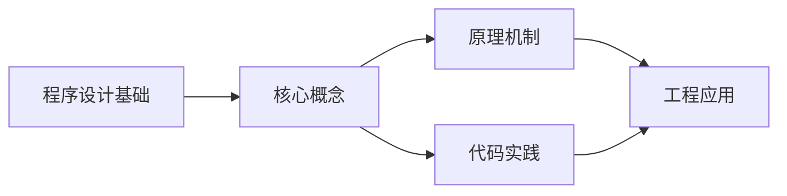
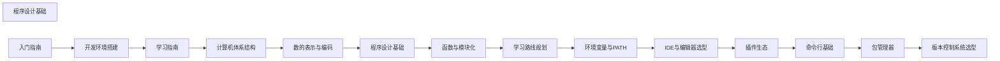

## 1. 学习目标（Bloom 分类）

本节按照布鲁姆教育目标分类学组织学习路径。本文主题为《程序设计基础》，属于 入门指南 模块，读者可以根据自身阶段选择阅读深度。

记忆层面：能够准确复述本文的核心概念、术语与基本语法或操作步骤，并能够在提问或检索时快速定位对应知识点。能够说出 入门指南 的核心概念、常用命令与流程。

理解层面：能够用自己的语言解释核心原理与工作机制，说明概念之间的因果关系，而不是机械记忆结论。能够解释 入门指南 的工作原理与设计动机。

应用层面：能够在真实项目或练习场景中运用本文知识解决具体问题，写出正确且可维护的实现。能够独立完成 入门指南 的标准操作。

分析层面：能够拆解复杂问题，比较本文主题与相邻概念的异同，识别边界条件与例外情况。能够分析 入门指南 使用中的异常与边界。

评价层面：能够根据约束条件（性能、可读性、安全、成本）评价不同方案的优劣，做出有依据的技术决策。能够评价 入门指南 相关工具与方案。

创造层面：能够把本文知识与其他模块知识组合，设计出新的解决方案或可复用的工程模式。能够把 入门指南 融入团队工作流。

通过本节学习，读者应当能够把《程序设计基础》纳入自己的知识网络，并与 入门指南 模块的其他主题（环境搭建、学习路径、编程基础）建立关联。

## 2. 历史动机与发展脉络

《程序设计基础》是 入门指南 领域的重要主题。要真正理解它，需要先了解它解决的问题与演进过程。

编程入门的关键不是记忆语法，而是建立“问题 -> 方案 -> 验证”的思维循环；本模块为完全零基础的读者设计。
现代学习路径：环境搭建 -> 编程基础（变量/流程/函数）-> 数据与算法 -> 项目实践；本项目的完整文档库按此路径组织。
学习工具：IDE（VS Code）、命令行、Git、包管理器；工具链本身也是学习对象。

回到本文主题：程序设计基础 的提出与成熟，正是上述技术背景下的必然产物。早期实现往往以简单可用为目标，随着工程规模扩大，社区逐渐沉淀出标准做法与最佳实践；理解这一脉络，可以帮助读者判断“为什么文档中的推荐写法是现在这个样子”，也能在遇到历史遗留代码时准确识别其设计年代与取舍。


## 3. 形式化定义与核心概念精讲

本节把《程序设计基础》涉及的核心概念以“定义 + 讲解”的形式展开。读者应把定义当作工具，把讲解当作理解路径；两者结合才能形成可迁移的知识。

编程范式：命令式（逐步指令）、函数式（表达式与不可变）、面向对象（对象与消息）；语言是多范式的。
程序执行：源码 -> 编译/解释 -> 运行；调试是理解程序行为的主要手段。
抽象层次：机器码 -> 汇编 -> 高级语言 -> 框架 -> 领域语言；抽象降低认知负担。

### 3.1 原文章节逐一精讲

原文档把主题拆分为 9 个小节，下面按顺序给出每一节的导读讲解，随后保留原文细节供精读。

#### 原文精读（完整保留）


#### 1. 算法流程图

流程图是用图形符号表示算法步骤的直观工具。

##### 1.1 基本符号

| 符号名称   | 形状       | 功能                 | 示例用途        |
| ---------- | ---------- | -------------------- | --------------- |
| 起止框     | 圆角矩形   | 表示算法的开始或结束 | 开始 / 结束     |
| 处理框     | 矩形       | 表示一个处理步骤     | sum = sum + i   |
| 判断框     | 菱形       | 表示条件判断         | i > 100?        |
| 输入输出框 | 平行四边形 | 表示数据的输入或输出 | 输入n / 输出sum |
| 流程线     | 箭头       | 表示执行方向         | → ↓ ← ↑         |

##### 1.2 流程图示例：求1到N的和

```mermaid
flowchart TD
    A([开始]) --> B[输入 N]
    B --> C[sum = 0]<br/>D[i = 1]
    C --> E{i <= N?}
    E -- 否 --> F[输出 sum] --> G([结束])
    E -- 是 --> H[sum = sum + i]<br/>I[i = i + 1]
    H --> E
```

##### 1.3 用代码对应流程图

```c
// 上述流程图对应的C语言代码
#include <stdio.h>

int main() {
    int N;
    scanf("%d", &N);      // 输入 N

    int sum = 0;
    int i = 1;
    while (i <= N) {       // 判断框: i <= N ?
        sum = sum + i;     // 处理框
        i = i + 1;         // 处理框
    }

    printf("%d\n", sum);   // 输出框
    return 0;
}
```

#### 2. 三种基本控制结构

任何复杂程序都可以由三种基本控制结构组合而成，这被称为**结构化程序设计**的理论基础。

##### 2.1 顺序结构

语句按书写顺序依次执行，是最基本的控制结构。

```c
// 顺序结构：交换两个变量的值
int a = 3, b = 5;
int temp;

temp = a;   // 第1步
a = b;      // 第2步
b = temp;   // 第3步

printf("a=%d, b=%d\n", a, b);  // a=5, b=3
```

##### 2.2 选择结构

根据条件选择不同的执行路径。

**if-else 语句：**

```c
// 判断奇偶
int num = 7;
if (num % 2 == 0) {
    printf("%d 是偶数\n", num);
} else {
    printf("%d 是奇数\n", num);
}
```

**多重 if-else：**

```c
// 成绩等级判定
int score = 85;

if (score >= 90) {
    printf("优秀\n");
} else if (score >= 80) {
    printf("良好\n");
} else if (score >= 70) {
    printf("中等\n");
} else if (score >= 60) {
    printf("及格\n");
} else {
    printf("不及格\n");
}
```

**switch-case 语句：**

```c
// 根据运算符执行计算
char op = '+';
int a = 10, b = 3;

switch (op) {
    case '+': printf("%d\n", a + b); break;
    case '-': printf("%d\n", a - b); break;
    case '*': printf("%d\n", a * b); break;
    case '/':
        if (b != 0) printf("%d\n", a / b);
        else        printf("除数不能为0\n");
        break;
    default: printf("不支持的运算符\n"); break;
}
```

> `switch` 中的 `break` 不能省略，否则会**穿透执行**后续所有 case，直到遇到 break 或 switch 结束。

##### 2.3 循环结构

重复执行某段代码，直到条件不满足为止。

**while 循环（先判断后执行）：**

```c
// 计算1+2+3+...+100
int sum = 0, i = 1;
while (i <= 100) {
    sum += i;
    i++;
}
printf("sum = %d\n", sum);  // 5050
```

**do-while 循环（先执行后判断，至少执行一次）：**

```c
// 猜数字游戏（至少猜一次）
int secret = 42;
int guess;
do {
    printf("请输入猜测的数字: ");
    scanf("%d", &guess);
    if (guess > secret) printf("太大了\n");
    else if (guess < secret) printf("太小了\n");
} while (guess != secret);
printf("猜对了！\n");
```

**for 循环（计数型循环）：**

```c
// 打印九九乘法表
for (int i = 1; i <= 9; i++) {
    for (int j = 1; j <= i; j++) {
        printf("%d×%d=%-4d", j, i, i * j);
    }
    printf("\n");
}
```

**break 与 continue：**

```c
// break: 跳出整个循环
for (int i = 0; i < 10; i++) {
    if (i == 5) break;    // i=5时跳出循环
    printf("%d ", i);      // 输出: 0 1 2 3 4
}

// continue: 跳过本次迭代，继续下一次
for (int i = 0; i < 10; i++) {
    if (i % 2 == 0) continue;  // 跳过偶数
    printf("%d ", i);          // 输出: 1 3 5 7 9
}
```

##### 2.4 三种循环对比

| 特性       | while      | do-while     | for          |
| ---------- | ---------- | ------------ | ------------ |
| 执行次数   | 可能0次    | 至少1次      | 可能0次      |
| 适用场景   | 不确定次数 | 至少执行一次 | 已知循环次数 |
| 初始化位置 | 循环外     | 循环外       | for语句内    |

#### 3. 程序编译与解释

高级语言需要转换为机器码才能执行，有两种主要方式：编译和解释。

##### 3.1 编译（Compilation）

将源代码**一次性翻译**为机器码（目标文件），然后执行。

```
源代码(.c) → [编译器] → 目标文件(.o) → [链接器] → 可执行文件(.exe)
```

```c
// hello.c
#include <stdio.h>
int main() {
    printf("Hello, World!\n");
    return 0;
}
```

```bash
# 编译过程
gcc -E hello.c -o hello.i     # 预处理：展开宏和头文件
gcc -S hello.i -o hello.s     # 编译：生成汇编代码
gcc -c hello.s -o hello.o     # 汇编：生成目标文件
gcc hello.o -o hello          # 链接：生成可执行文件
./hello                       # 执行
```

##### 3.2 解释（Interpretation）

逐行读取源代码并**即时执行**，不生成独立的可执行文件。

```
源代码(.py) → [解释器] → 逐行执行
```

```python
# hello.py
print("Hello, World!")
```

```bash
# 直接运行
python hello.py
```

##### 3.3 编译与解释对比

| 特性     | 编译型语言           | 解释型语言               |
| -------- | -------------------- | ------------------------ |
| 执行方式 | 先编译后执行         | 边解释边执行             |
| 执行速度 | 快（直接运行机器码） | 慢（需要实时翻译）       |
| 跨平台性 | 需要为不同平台编译   | 只要有解释器即可运行     |
| 调试体验 | 修改后需重新编译     | 修改后直接运行           |
| 错误发现 | 编译时发现语法错误   | 运行时才发现错误         |
| 典型语言 | C, C++, Go, Rust     | Python, JavaScript, Ruby |

##### 3.4 混合方式

许多现代语言采用编译+解释的混合方式：

```
Java:   源代码(.java) → 字节码(.class) → JVM解释/JIT编译执行
C#:     源代码(.cs) → IL字节码 → CLR解释/JIT编译执行
Python: 源代码(.py) → 字节码(.pyc) → Python虚拟机执行
```

> JIT（Just-In-Time）编译在程序运行时将热点代码编译为机器码，兼顾了启动速度和执行效率。

#### 4. 变量命名规则

##### 4.1 通用命名规则

| 规则                     | 合法示例           | 非法示例         |
| ------------------------ | ------------------ | ---------------- |
| 由字母、数字、下划线组成 | `score`, `max_val` | `my-name`, `2nd` |
| 不能以数字开头           | `val2`             | `2val`           |
| 不能使用关键字           | `my_int`           | `int`            |
| 区分大小写               | `Name` ≠ `name`    | —                |

##### 4.2 命名风格

| 风格                 | 格式                       | 适用语言        | 示例           |
| -------------------- | -------------------------- | --------------- | -------------- |
| 驼峰命名（小驼峰）   | 首单词小写，后续首字母大写 | Java, JS, C#    | `studentName`  |
| 帕斯卡命名（大驼峰） | 每个单词首字母大写         | C#, 类名        | `StudentName`  |
| 蛇形命名             | 单词间用下划线连接         | C, Python, Rust | `student_name` |
| 全大写               | 蛇形命名+全大写            | 常量            | `MAX_SIZE`     |

```c
// C语言命名示例
int student_count;       // 蛇形命名：变量
#define MAX_SIZE 100     // 全大写：常量
void calculate_sum();    // 蛇形命名：函数
```

```javascript
// JavaScript命名示例
let studentName; // 小驼峰：变量
const MAX_SIZE = 100; // 全大写：常量
function calculateSum() {
  // 小驼峰：函数
  // ...
}
```

##### 4.3 命名原则

- **见名知义**：`age` 比 `a` 好，`studentCount` 比 `sc` 好
- **避免缩写**：`temperature` 比 `temp` 好（除非是通用缩写如 `id`、`url`）
- **布尔变量用 is/has 前缀**：`isValid`、`hasPermission`
- **函数名用动词开头**：`getName`、`setData`、`calculateTotal`

#### 5. 基本数据类型

##### 5.1 四种基本数据类型

| 类型   | 关键字       | 占用空间    | 取值范围            | 示例            |
| ------ | ------------ | ----------- | ------------------- | --------------- |
| 整型   | int          | 4字节(通常) | -2³¹ ~ 2³¹-1        | `42`, `-7`      |
| 浮点型 | float/double | 4/8字节     | 见IEEE 754章节      | `3.14`, `-0.5`  |
| 字符型 | char         | 1字节       | -128~~127 或 0~~255 | `'A'`, `'0'`    |
| 布尔型 | bool         | 1字节       | true/false          | `true`, `false` |

##### 5.2 整型的不同大小

```c
#include <stdio.h>
#include <limits.h>

int main() {
    // 各整型的大小和范围
    printf("char:    %zu字节, 范围: %d ~ %d\n",
           sizeof(char), CHAR_MIN, CHAR_MAX);
    printf("short:   %zu字节, 范围: %d ~ %d\n",
           sizeof(short), SHRT_MIN, SHRT_MAX);
    printf("int:     %zu字节, 范围: %d ~ %d\n",
           sizeof(int), INT_MIN, INT_MAX);
    printf("long:    %zu字节, 范围: %ld ~ %ld\n",
           sizeof(long), LONG_MIN, LONG_MAX);

    return 0;
}
```

典型输出（64位系统）：

| 类型      | 字节数 | 范围                           |
| --------- | ------ | ------------------------------ |
| char      | 1      | -128 ~ 127                     |
| short     | 2      | -32,768 ~ 32,767               |
| int       | 4      | -2,147,483,648 ~ 2,147,483,647 |
| long      | 4/8    | 取决于平台                     |
| long long | 8      | -9.2×10¹⁸ ~ 9.2×10¹⁸           |

##### 5.3 有符号与无符号

```c
signed char   sc = -1;     // 范围: -128 ~ 127
unsigned char uc = 255;    // 范围: 0 ~ 255

// 无符号整型：只有正数，范围翻倍
unsigned int ui = 4294967295U;  // 范围: 0 ~ 4,294,967,295

// 注意：无符号数不会变负
unsigned int x = 0;
x = x - 1;  // 不是-1，而是4294967295（回绕）
```

##### 5.4 类型转换

```c
// 隐式转换：小类型 → 大类型（安全）
int i = 42;
double d = i;    // int → double，值不变

// 隐式转换：大类型 → 小类型（可能丢失数据）
double pi = 3.14159;
int n = pi;      // double → int，n = 3（小数部分被截断）

// 显式转换（强制类型转换）
double result = (double)1 / 2;  // 0.5（而非整数除法的0）
```

#### 6. 常量与字面量

##### 6.1 字面量

字面量是源代码中直接写出的固定值：

```c
42          // 整型字面量
3.14        // 浮点型字面量（默认double）
3.14f       // 浮点型字面量（float）
'A'         // 字符字面量
"Hello"     // 字符串字面量
true        // 布尔字面量
```

不同进制的整型字面量：

```c
int dec = 255;      // 十进制
int oct = 0377;     // 八进制（前缀0）
int hex = 0xFF;     // 十六进制（前缀0x）
int bin = 0b11111111; // 二进制（C23标准，前缀0b）
```

##### 6.2 常量

常量是程序运行期间不可修改的值：

```c
// 方式1: const 关键字（推荐）
const double PI = 3.14159265;
const int MAX_STUDENTS = 50;

// 方式2: 宏定义（C语言传统方式）
#define PI 3.14159265
#define MAX_STUDENTS 50

// 区别:
// const: 有类型检查，占用内存，调试时可查看
// #define: 无类型检查，文本替换，调试时不可见
```

```c
// 枚举常量
enum Color {
    RED,     // 0
    GREEN,   // 1
    BLUE     // 2
};

enum Weekday {
    MON = 1,
    TUE = 2,
    WED = 3,
    THU = 4,
    FRI = 5,
    SAT = 6,
    SUN = 7
};
```

#### 7. 运算符优先级与结合性

##### 7.1 常用运算符

| 类别     | 运算符            | 示例              |
| -------- | ----------------- | ----------------- |
| 算术     | + - \* / %        | `a + b`, `x % 3`  |
| 自增自减 | ++ --             | `i++`, `--j`      |
| 关系     | > < >= <= == !=   | `a > b`, `x == 0` |
| 逻辑     | && \|\| !         | `a && b`, `!flag` |
| 位运算   | & \| ^ ~ << >>    | `a & 0xFF`        |
| 赋值     | = += -= \*= /= %= | `x += 1`          |
| 条件     | ? :               | `a > b ? a : b`   |
| 逗号     | ,                 | `a = 1, b = 2`    |

##### 7.2 优先级表（从高到低）

| 优先级 | 运算符               | 结合性 | 说明       |
| ------ | -------------------- | ------ | ---------- |
| 1      | () [] -> .           | 左→右  | 最高优先级 |
| 2      | ! ~ ++ -- + - \* &   | 右→左  | 单目运算符 |
| 3      | \* / %               | 左→右  | 乘除取余   |
| 4      | + -                  | 左→右  | 加减       |
| 5      | << >>                | 左→右  | 移位       |
| 6      | < <= > >=            | 左→右  | 关系       |
| 7      | == !=                | 左→右  | 相等性     |
| 8      | &                    | 左→右  | 按位与     |
| 9      | ^                    | 左→右  | 按位异或   |
| 10     | \|                   | 左→右  | 按位或     |
| 11     | &&                   | 左→右  | 逻辑与     |
| 12     | \|\|                 | 左→右  | 逻辑或     |
| 13     | ? :                  | 右→左  | 条件       |
| 14     | = += -= \*= /= %= 等 | 右→左  | 赋值       |
| 15     | ,                    | 左→右  | 逗号       |

> 记忆口诀：**单目(2) > 算术(3-4) > 移位(5) > 关系(6-7) > 位运算(8-10) > 逻辑(11-12) > 条件(13) > 赋值(14) > 逗号(15)**

##### 7.3 易混淆的优先级陷阱

```c
// 陷阱1: & 优先级低于 ==
int flags = 5;
if (flags & 0x1 == 1) { }   // 错！等价于 flags & (0x1 == 1)
if ((flags & 0x1) == 1) { } // 对！先位与再比较

// 陷阱2: * 优先级高于 +
int a = 2, b = 3, c = 4;
int result = a + b * c;      // 2 + 12 = 14，不是 5 * 4 = 20

// 陷阱3: ++ 优先级高于 *
int arr[] = {10, 20, 30};
int *p = arr;
int val = *p++;   // 先取 *p (=10)，再 p++。val = 10
// vs
int val2 = (*p)++; // 先取 *p，再 (*p)++。val2 = 10, arr[0] = 11
```

#### 8. 表达式求值与短路求值

##### 8.1 表达式求值

表达式由运算符和操作数组成，求值时遵循优先级和结合性规则：

```c
int a = 2, b = 3, c = 4;

// 步骤分解: a + b * c - a / b
// 1. b * c = 12      （* 优先级高于 +）
// 2. a / b = 0       （/ 优先级高于 +，整数除法 2/3=0）
// 3. a + 12 = 14     （从左到右）
// 4. 14 - 0 = 14     （最终结果）
```

##### 8.2 短路求值

逻辑运算符 `&&` 和 `||` 具有**短路求值**特性：当结果已经可以确定时，不再计算后续表达式。

**逻辑与（&&）的短路：**

```c
// 如果第一个条件为假，整个表达式必为假，不再计算第二个条件
int x = 0;
if (x != 0 && 10 / x > 1) {   // x != 0 为假，10/x 不会执行
    printf("不会执行\n");       // 避免了除零错误
}
```

**逻辑或（||）的短路：**

```c
// 如果第一个条件为真，整个表达式必为真，不再计算第二个条件
int* ptr = NULL;
if (ptr == NULL || *ptr > 0) {  // ptr == NULL 为真，*ptr 不会执行
    printf("指针为空\n");        // 避免了空指针解引用
}
```

##### 8.3 短路求值的实际应用

```c
// 应用1: 安全地访问可能为空的指针
if (ptr != NULL && ptr->value > 0) {
    // 只有ptr非空时才访问ptr->value
}

// 应用2: 数组越界保护
if (index >= 0 && index < size && arr[index] == target) {
    // 先检查范围，再访问数组
}

// 应用3: 简洁的条件赋值
// 如果文件打开失败，不执行读取
FILE* fp = fopen("data.txt", "r");
if (fp && fscanf(fp, "%d", &value) == 1) {
    printf("读取成功: %d\n", value);
}
```

##### 8.4 注意：避免在短路表达式中使用副作用

```c
int i = 0;

// 危险！如果 a > 0 为真，i++ 不会执行
if (a > 0 || i++) {
    // i 的值取决于 a > 0 的结果
}

// 安全写法：将副作用分离
i++;
if (a > 0 || i > 1) {
    // 行为可预测
}
```

##### 8.5 逗号表达式

逗号运算符按从左到右顺序依次求值，整个表达式的值是**最后一个**子表达式的值：

```c
int a, b, c;
c = (a = 1, b = 2, a + b);  // a=1, b=2, c=3

// 常用于 for 循环
for (int i = 0, j = 10; i < j; i++, j--) {
    printf("i=%d, j=%d\n", i, j);
}
```

#### 9. 小结

| 主题 | 核心要点 |
| ------------ | ---------------------------------------------- | --- | -------------------- |
| 流程图 | 起止框/处理框/判断框/输入输出框/流程线 |
| 控制结构 | 顺序、选择（if/switch）、循环（while/for） |
| 编译与解释 | 编译一次执行多次 vs 边解释边执行 |
| 变量命名 | 见名知义，统一风格，避免缩写 |
| 数据类型 | 整型/浮点型/字符型/布尔型，注意范围和转换 |
| 常量与字面量 | const（推荐）vs #define，枚举常量 |
| 运算符优先级 | 单目 > 算术 > 关系 > 逻辑 > 赋值，有疑问加括号 |
| 短路求值 | && 遇假即停， | | 遇真即停，注意副作用 |

掌握程序设计基础是编写正确代码的前提。优先级记不清时就加括号，短路求值要善用但不要滥用副作用。


### 3.2 概念关系图

下面用 Mermaid 图表达本文核心概念之间的关系，帮助读者建立整体图景：



图中展示的是本文知识的结构化关系：核心概念是入口，原理机制解释“为什么”，代码实践演示“怎么做”，工程应用回答“何时用”。读者学习时可以把每个小节的内容挂接到对应节点上。

## 4. 理论推导与原理解析

本节深入《程序设计基础》背后的原理。理论部分不求面面俱到，而是聚焦“能解释现象、能指导实践”的关键推导。

编程范式：命令式（逐步指令）、函数式（表达式与不可变）、面向对象（对象与消息）；语言是多范式的。
程序执行：源码 -> 编译/解释 -> 运行；调试是理解程序行为的主要手段。
抽象层次：机器码 -> 汇编 -> 高级语言 -> 框架 -> 领域语言；抽象降低认知负担。
计算机基础：CPU 执行指令、内存存数据、I/O 与外部交互；这些概念支撑所有编程。

需要强调的是，理论推导与工程实践之间存在翻译层：理论给出的是理想化模型与边界条件，工程代码则必须处理真实环境中的例外。读者在学习时应先掌握理论的“标准情形”，再通过陷阱章节了解“非标准情形”。

## 5. 代码示例与逐行讲解

本节把原文中的代码示例系统整理，并为每个示例补充用途说明与讲解。读者不应只浏览代码，而应逐段对照讲解理解设计意图。

### 5.1 示例：1.2 流程图示例：求1到N的和

该示例来自原文《1.2 流程图示例：求1到N的和》小节，用于演示程序设计基础相关操作。阅读时请先看代码结构，再看其后的讲解。

```mermaid
flowchart TD
    A([开始]) --> B[输入 N]
    B --> C[sum = 0]<br/>D[i = 1]
    C --> E{i <= N?}
    E -- 否 --> F[输出 sum] --> G([结束])
    E -- 是 --> H[sum = sum + i]<br/>I[i = i + 1]
    H --> E
```

讲解：这段代码演示了本节核心知识点。代码中的关键操作可以归纳为三步：准备（定义或初始化）、执行（核心逻辑）、收尾（释放资源或返回结果）。实际项目中，这三步往往被封装为函数或类，以提升复用性与可测试性。

关键点分析：

该示例共 7 行有效代码，结构以数据或配置为主。阅读时应关注：数据字段的含义、配置项的作用，以及它们与运行行为的对应关系。

进阶思考路径：先尝试修改参数观察行为变化，再把示例中的模式迁移到自己的项目中；每次修改都记录预期与实测差异，这是把示例转化为能力的最快方式。

### 5.2 示例：1.3 用代码对应流程图

该示例来自原文《1.3 用代码对应流程图》小节，用于演示程序设计基础相关操作。阅读时请先看代码结构，再看其后的讲解。

```c
// 上述流程图对应的C语言代码
#include <stdio.h>

int main() {
    int N;
    scanf("%d", &N);      // 输入 N

    int sum = 0;
    int i = 1;
    while (i <= N) {       // 判断框: i <= N ?
        sum = sum + i;     // 处理框
        i = i + 1;         // 处理框
    }

    printf("%d\n", sum);   // 输出框
    return 0;
}
```

讲解：这段代码演示了本节核心知识点。代码中的关键操作可以归纳为三步：准备（定义或初始化）、执行（核心逻辑）、收尾（释放资源或返回结果）。实际项目中，这三步往往被封装为函数或类，以提升复用性与可测试性。

关键点分析：

该示例共 14 行有效代码，包含 2 类关键结构（while、return）。其中：

- 入口与初始化部分负责建立上下文，对应实际项目中的启动或装配逻辑；
- 核心逻辑部分体现本文主题的主要操作，是阅读时最需要对照讲解理解的部分；
- 输出或返回部分把结果交给调用方，注意其类型与边界条件。

进阶思考路径：先尝试修改参数观察行为变化，再把示例中的模式迁移到自己的项目中；每次修改都记录预期与实测差异，这是把示例转化为能力的最快方式。

### 5.3 示例：2.1 顺序结构

该示例来自原文《2.1 顺序结构》小节，用于演示程序设计基础相关操作。阅读时请先看代码结构，再看其后的讲解。

```c
// 顺序结构：交换两个变量的值
int a = 3, b = 5;
int temp;

temp = a;   // 第1步
a = b;      // 第2步
b = temp;   // 第3步

printf("a=%d, b=%d\n", a, b);  // a=5, b=3
```

讲解：这段代码演示了本节核心知识点。代码中的关键操作可以归纳为三步：准备（定义或初始化）、执行（核心逻辑）、收尾（释放资源或返回结果）。实际项目中，这三步往往被封装为函数或类，以提升复用性与可测试性。

关键点分析：

该示例共 7 行有效代码，结构以数据或配置为主。阅读时应关注：数据字段的含义、配置项的作用，以及它们与运行行为的对应关系。

进阶思考路径：先尝试修改参数观察行为变化，再把示例中的模式迁移到自己的项目中；每次修改都记录预期与实测差异，这是把示例转化为能力的最快方式。

### 5.4 示例：2.2 选择结构

该示例来自原文《2.2 选择结构》小节，用于演示程序设计基础相关操作。阅读时请先看代码结构，再看其后的讲解。

```c
// 判断奇偶
int num = 7;
if (num % 2 == 0) {
    printf("%d 是偶数\n", num);
} else {
    printf("%d 是奇数\n", num);
}
```

讲解：这段代码演示了本节核心知识点。代码中的关键操作可以归纳为三步：准备（定义或初始化）、执行（核心逻辑）、收尾（释放资源或返回结果）。实际项目中，这三步往往被封装为函数或类，以提升复用性与可测试性。

关键点分析：

该示例共 7 行有效代码，包含 1 类关键结构（if）。其中：

- 入口与初始化部分负责建立上下文，对应实际项目中的启动或装配逻辑；
- 核心逻辑部分体现本文主题的主要操作，是阅读时最需要对照讲解理解的部分；
- 输出或返回部分把结果交给调用方，注意其类型与边界条件。

进阶思考路径：先尝试修改参数观察行为变化，再把示例中的模式迁移到自己的项目中；每次修改都记录预期与实测差异，这是把示例转化为能力的最快方式。

### 5.5 示例：2.2 选择结构

该示例来自原文《2.2 选择结构》小节，用于演示程序设计基础相关操作。阅读时请先看代码结构，再看其后的讲解。

```c
// 成绩等级判定
int score = 85;

if (score >= 90) {
    printf("优秀\n");
} else if (score >= 80) {
    printf("良好\n");
} else if (score >= 70) {
    printf("中等\n");
} else if (score >= 60) {
    printf("及格\n");
} else {
    printf("不及格\n");
}
```

讲解：这段代码演示了本节核心知识点。代码中的关键操作可以归纳为三步：准备（定义或初始化）、执行（核心逻辑）、收尾（释放资源或返回结果）。实际项目中，这三步往往被封装为函数或类，以提升复用性与可测试性。

关键点分析：

该示例共 13 行有效代码，包含 1 类关键结构（if）。其中：

- 入口与初始化部分负责建立上下文，对应实际项目中的启动或装配逻辑；
- 核心逻辑部分体现本文主题的主要操作，是阅读时最需要对照讲解理解的部分；
- 输出或返回部分把结果交给调用方，注意其类型与边界条件。

进阶思考路径：先尝试修改参数观察行为变化，再把示例中的模式迁移到自己的项目中；每次修改都记录预期与实测差异，这是把示例转化为能力的最快方式。

### 5.6 示例：2.2 选择结构

该示例来自原文《2.2 选择结构》小节，用于演示程序设计基础相关操作。阅读时请先看代码结构，再看其后的讲解。

```c
// 根据运算符执行计算
char op = '+';
int a = 10, b = 3;

switch (op) {
    case '+': printf("%d\n", a + b); break;
    case '-': printf("%d\n", a - b); break;
    case '*': printf("%d\n", a * b); break;
    case '/':
        if (b != 0) printf("%d\n", a / b);
        else        printf("除数不能为0\n");
        break;
    default: printf("不支持的运算符\n"); break;
}
```

讲解：这段代码演示了本节核心知识点。代码中的关键操作可以归纳为三步：准备（定义或初始化）、执行（核心逻辑）、收尾（释放资源或返回结果）。实际项目中，这三步往往被封装为函数或类，以提升复用性与可测试性。

关键点分析：

该示例共 13 行有效代码，包含 1 类关键结构（if）。其中：

- 入口与初始化部分负责建立上下文，对应实际项目中的启动或装配逻辑；
- 核心逻辑部分体现本文主题的主要操作，是阅读时最需要对照讲解理解的部分；
- 输出或返回部分把结果交给调用方，注意其类型与边界条件。

进阶思考路径：先尝试修改参数观察行为变化，再把示例中的模式迁移到自己的项目中；每次修改都记录预期与实测差异，这是把示例转化为能力的最快方式。

### 5.7 示例：2.3 循环结构

该示例来自原文《2.3 循环结构》小节，用于演示程序设计基础相关操作。阅读时请先看代码结构，再看其后的讲解。

```c
// 计算1+2+3+...+100
int sum = 0, i = 1;
while (i <= 100) {
    sum += i;
    i++;
}
printf("sum = %d\n", sum);  // 5050
```

讲解：这段代码演示了本节核心知识点。代码中的关键操作可以归纳为三步：准备（定义或初始化）、执行（核心逻辑）、收尾（释放资源或返回结果）。实际项目中，这三步往往被封装为函数或类，以提升复用性与可测试性。

关键点分析：

该示例共 7 行有效代码，包含 1 类关键结构（while）。其中：

- 入口与初始化部分负责建立上下文，对应实际项目中的启动或装配逻辑；
- 核心逻辑部分体现本文主题的主要操作，是阅读时最需要对照讲解理解的部分；
- 输出或返回部分把结果交给调用方，注意其类型与边界条件。

进阶思考路径：先尝试修改参数观察行为变化，再把示例中的模式迁移到自己的项目中；每次修改都记录预期与实测差异，这是把示例转化为能力的最快方式。

### 5.8 示例：2.3 循环结构

该示例来自原文《2.3 循环结构》小节，用于演示程序设计基础相关操作。阅读时请先看代码结构，再看其后的讲解。

```c
// 猜数字游戏（至少猜一次）
int secret = 42;
int guess;
do {
    printf("请输入猜测的数字: ");
    scanf("%d", &guess);
    if (guess > secret) printf("太大了\n");
    else if (guess < secret) printf("太小了\n");
} while (guess != secret);
printf("猜对了！\n");
```

讲解：这段代码演示了本节核心知识点。代码中的关键操作可以归纳为三步：准备（定义或初始化）、执行（核心逻辑）、收尾（释放资源或返回结果）。实际项目中，这三步往往被封装为函数或类，以提升复用性与可测试性。

关键点分析：

该示例共 10 行有效代码，包含 2 类关键结构（if、while）。其中：

- 入口与初始化部分负责建立上下文，对应实际项目中的启动或装配逻辑；
- 核心逻辑部分体现本文主题的主要操作，是阅读时最需要对照讲解理解的部分；
- 输出或返回部分把结果交给调用方，注意其类型与边界条件。

进阶思考路径：先尝试修改参数观察行为变化，再把示例中的模式迁移到自己的项目中；每次修改都记录预期与实测差异，这是把示例转化为能力的最快方式。

### 5.9 示例：2.3 循环结构

该示例来自原文《2.3 循环结构》小节，用于演示程序设计基础相关操作。阅读时请先看代码结构，再看其后的讲解。

```c
// 打印九九乘法表
for (int i = 1; i <= 9; i++) {
    for (int j = 1; j <= i; j++) {
        printf("%d×%d=%-4d", j, i, i * j);
    }
    printf("\n");
}
```

讲解：这段代码演示了本节核心知识点。代码中的关键操作可以归纳为三步：准备（定义或初始化）、执行（核心逻辑）、收尾（释放资源或返回结果）。实际项目中，这三步往往被封装为函数或类，以提升复用性与可测试性。

关键点分析：

该示例共 7 行有效代码，包含 1 类关键结构（for）。其中：

- 入口与初始化部分负责建立上下文，对应实际项目中的启动或装配逻辑；
- 核心逻辑部分体现本文主题的主要操作，是阅读时最需要对照讲解理解的部分；
- 输出或返回部分把结果交给调用方，注意其类型与边界条件。

进阶思考路径：先尝试修改参数观察行为变化，再把示例中的模式迁移到自己的项目中；每次修改都记录预期与实测差异，这是把示例转化为能力的最快方式。

### 5.10 示例：2.3 循环结构

该示例来自原文《2.3 循环结构》小节，用于演示程序设计基础相关操作。阅读时请先看代码结构，再看其后的讲解。

```c
// break: 跳出整个循环
for (int i = 0; i < 10; i++) {
    if (i == 5) break;    // i=5时跳出循环
    printf("%d ", i);      // 输出: 0 1 2 3 4
}

// continue: 跳过本次迭代，继续下一次
for (int i = 0; i < 10; i++) {
    if (i % 2 == 0) continue;  // 跳过偶数
    printf("%d ", i);          // 输出: 1 3 5 7 9
}
```

讲解：这段代码演示了本节核心知识点。代码中的关键操作可以归纳为三步：准备（定义或初始化）、执行（核心逻辑）、收尾（释放资源或返回结果）。实际项目中，这三步往往被封装为函数或类，以提升复用性与可测试性。

关键点分析：

该示例共 10 行有效代码，包含 2 类关键结构（if、for）。其中：

- 入口与初始化部分负责建立上下文，对应实际项目中的启动或装配逻辑；
- 核心逻辑部分体现本文主题的主要操作，是阅读时最需要对照讲解理解的部分；
- 输出或返回部分把结果交给调用方，注意其类型与边界条件。

进阶思考路径：先尝试修改参数观察行为变化，再把示例中的模式迁移到自己的项目中；每次修改都记录预期与实测差异，这是把示例转化为能力的最快方式。

### 5.11 示例：3.1 编译（Compilation）

该示例来自原文《3.1 编译（Compilation）》小节，用于演示程序设计基础相关操作。阅读时请先看代码结构，再看其后的讲解。

```text
源代码(.c) → [编译器] → 目标文件(.o) → [链接器] → 可执行文件(.exe)
```

讲解：这段代码演示了本节核心知识点。代码中的关键操作可以归纳为三步：准备（定义或初始化）、执行（核心逻辑）、收尾（释放资源或返回结果）。实际项目中，这三步往往被封装为函数或类，以提升复用性与可测试性。

关键点分析：

该示例共 1 行有效代码，结构以数据或配置为主。阅读时应关注：数据字段的含义、配置项的作用，以及它们与运行行为的对应关系。

进阶思考路径：先尝试修改参数观察行为变化，再把示例中的模式迁移到自己的项目中；每次修改都记录预期与实测差异，这是把示例转化为能力的最快方式。

### 5.12 示例：3.1 编译（Compilation）

该示例来自原文《3.1 编译（Compilation）》小节，用于演示程序设计基础相关操作。阅读时请先看代码结构，再看其后的讲解。

```c
// hello.c
#include <stdio.h>
int main() {
    printf("Hello, World!\n");
    return 0;
}
```

讲解：这段代码演示了本节核心知识点。代码中的关键操作可以归纳为三步：准备（定义或初始化）、执行（核心逻辑）、收尾（释放资源或返回结果）。实际项目中，这三步往往被封装为函数或类，以提升复用性与可测试性。

关键点分析：

该示例共 6 行有效代码，包含 1 类关键结构（return）。其中：

- 入口与初始化部分负责建立上下文，对应实际项目中的启动或装配逻辑；
- 核心逻辑部分体现本文主题的主要操作，是阅读时最需要对照讲解理解的部分；
- 输出或返回部分把结果交给调用方，注意其类型与边界条件。

进阶思考路径：先尝试修改参数观察行为变化，再把示例中的模式迁移到自己的项目中；每次修改都记录预期与实测差异，这是把示例转化为能力的最快方式。

### 5.13 示例：3.1 编译（Compilation）

该示例来自原文《3.1 编译（Compilation）》小节，用于演示程序设计基础相关操作。阅读时请先看代码结构，再看其后的讲解。

```bash
# 编译过程
gcc -E hello.c -o hello.i     # 预处理：展开宏和头文件
gcc -S hello.i -o hello.s     # 编译：生成汇编代码
gcc -c hello.s -o hello.o     # 汇编：生成目标文件
gcc hello.o -o hello          # 链接：生成可执行文件
./hello                       # 执行
```

讲解：这段代码演示了本节核心知识点。代码中的关键操作可以归纳为三步：准备（定义或初始化）、执行（核心逻辑）、收尾（释放资源或返回结果）。实际项目中，这三步往往被封装为函数或类，以提升复用性与可测试性。

关键点分析：

该示例共 6 行有效代码，结构以数据或配置为主。阅读时应关注：数据字段的含义、配置项的作用，以及它们与运行行为的对应关系。

进阶思考路径：先尝试修改参数观察行为变化，再把示例中的模式迁移到自己的项目中；每次修改都记录预期与实测差异，这是把示例转化为能力的最快方式。

### 5.14 示例：3.2 解释（Interpretation）

该示例来自原文《3.2 解释（Interpretation）》小节，用于演示程序设计基础相关操作。阅读时请先看代码结构，再看其后的讲解。

```text
源代码(.py) → [解释器] → 逐行执行
```

讲解：这段代码演示了本节核心知识点。代码中的关键操作可以归纳为三步：准备（定义或初始化）、执行（核心逻辑）、收尾（释放资源或返回结果）。实际项目中，这三步往往被封装为函数或类，以提升复用性与可测试性。

关键点分析：

该示例共 1 行有效代码，结构以数据或配置为主。阅读时应关注：数据字段的含义、配置项的作用，以及它们与运行行为的对应关系。

进阶思考路径：先尝试修改参数观察行为变化，再把示例中的模式迁移到自己的项目中；每次修改都记录预期与实测差异，这是把示例转化为能力的最快方式。

### 5.15 示例：3.2 解释（Interpretation）

该示例来自原文《3.2 解释（Interpretation）》小节，用于演示程序设计基础相关操作。阅读时请先看代码结构，再看其后的讲解。

```python
# hello.py
print("Hello, World!")
```

讲解：这段代码演示了本节核心知识点。代码中的关键操作可以归纳为三步：准备（定义或初始化）、执行（核心逻辑）、收尾（释放资源或返回结果）。实际项目中，这三步往往被封装为函数或类，以提升复用性与可测试性。

关键点分析：

该示例共 2 行有效代码，结构以数据或配置为主。阅读时应关注：数据字段的含义、配置项的作用，以及它们与运行行为的对应关系。

进阶思考路径：先尝试修改参数观察行为变化，再把示例中的模式迁移到自己的项目中；每次修改都记录预期与实测差异，这是把示例转化为能力的最快方式。

### 5.16 示例：3.2 解释（Interpretation）

该示例来自原文《3.2 解释（Interpretation）》小节，用于演示程序设计基础相关操作。阅读时请先看代码结构，再看其后的讲解。

```bash
# 直接运行
python hello.py
```

讲解：这段代码演示了本节核心知识点。代码中的关键操作可以归纳为三步：准备（定义或初始化）、执行（核心逻辑）、收尾（释放资源或返回结果）。实际项目中，这三步往往被封装为函数或类，以提升复用性与可测试性。

关键点分析：

该示例共 2 行有效代码，结构以数据或配置为主。阅读时应关注：数据字段的含义、配置项的作用，以及它们与运行行为的对应关系。

进阶思考路径：先尝试修改参数观察行为变化，再把示例中的模式迁移到自己的项目中；每次修改都记录预期与实测差异，这是把示例转化为能力的最快方式。

### 5.17 示例：3.4 混合方式

该示例来自原文《3.4 混合方式》小节，用于演示程序设计基础相关操作。阅读时请先看代码结构，再看其后的讲解。

```text
Java:   源代码(.java) → 字节码(.class) → JVM解释/JIT编译执行
C#:     源代码(.cs) → IL字节码 → CLR解释/JIT编译执行
Python: 源代码(.py) → 字节码(.pyc) → Python虚拟机执行
```

讲解：这段代码演示了本节核心知识点。代码中的关键操作可以归纳为三步：准备（定义或初始化）、执行（核心逻辑）、收尾（释放资源或返回结果）。实际项目中，这三步往往被封装为函数或类，以提升复用性与可测试性。

关键点分析：

该示例共 3 行有效代码，包含 1 类关键结构（class）。其中：

- 入口与初始化部分负责建立上下文，对应实际项目中的启动或装配逻辑；
- 核心逻辑部分体现本文主题的主要操作，是阅读时最需要对照讲解理解的部分；
- 输出或返回部分把结果交给调用方，注意其类型与边界条件。

进阶思考路径：先尝试修改参数观察行为变化，再把示例中的模式迁移到自己的项目中；每次修改都记录预期与实测差异，这是把示例转化为能力的最快方式。

### 5.18 示例：4.2 命名风格

该示例来自原文《4.2 命名风格》小节，用于演示程序设计基础相关操作。阅读时请先看代码结构，再看其后的讲解。

```c
// C语言命名示例
int student_count;       // 蛇形命名：变量
#define MAX_SIZE 100     // 全大写：常量
void calculate_sum();    // 蛇形命名：函数
```

讲解：这段代码演示了本节核心知识点。代码中的关键操作可以归纳为三步：准备（定义或初始化）、执行（核心逻辑）、收尾（释放资源或返回结果）。实际项目中，这三步往往被封装为函数或类，以提升复用性与可测试性。

关键点分析：

该示例共 4 行有效代码，结构以数据或配置为主。阅读时应关注：数据字段的含义、配置项的作用，以及它们与运行行为的对应关系。

进阶思考路径：先尝试修改参数观察行为变化，再把示例中的模式迁移到自己的项目中；每次修改都记录预期与实测差异，这是把示例转化为能力的最快方式。

### 5.19 示例：4.2 命名风格

该示例来自原文《4.2 命名风格》小节，用于演示程序设计基础相关操作。阅读时请先看代码结构，再看其后的讲解。

```javascript
// JavaScript命名示例
let studentName; // 小驼峰：变量
const MAX_SIZE = 100; // 全大写：常量
function calculateSum() {
  // 小驼峰：函数
  // ...
}
```

讲解：这段代码演示了本节核心知识点。代码中的关键操作可以归纳为三步：准备（定义或初始化）、执行（核心逻辑）、收尾（释放资源或返回结果）。实际项目中，这三步往往被封装为函数或类，以提升复用性与可测试性。

关键点分析：

该示例共 7 行有效代码，包含 1 类关键结构（function）。其中：

- 入口与初始化部分负责建立上下文，对应实际项目中的启动或装配逻辑；
- 核心逻辑部分体现本文主题的主要操作，是阅读时最需要对照讲解理解的部分；
- 输出或返回部分把结果交给调用方，注意其类型与边界条件。

进阶思考路径：先尝试修改参数观察行为变化，再把示例中的模式迁移到自己的项目中；每次修改都记录预期与实测差异，这是把示例转化为能力的最快方式。

### 5.20 示例：5.2 整型的不同大小

该示例来自原文《5.2 整型的不同大小》小节，用于演示程序设计基础相关操作。阅读时请先看代码结构，再看其后的讲解。

```c
#include <stdio.h>
#include <limits.h>

int main() {
    // 各整型的大小和范围
    printf("char:    %zu字节, 范围: %d ~ %d\n",
           sizeof(char), CHAR_MIN, CHAR_MAX);
    printf("short:   %zu字节, 范围: %d ~ %d\n",
           sizeof(short), SHRT_MIN, SHRT_MAX);
    printf("int:     %zu字节, 范围: %d ~ %d\n",
           sizeof(int), INT_MIN, INT_MAX);
    printf("long:    %zu字节, 范围: %ld ~ %ld\n",
           sizeof(long), LONG_MIN, LONG_MAX);

    return 0;
}
```

讲解：这段代码演示了本节核心知识点。代码中的关键操作可以归纳为三步：准备（定义或初始化）、执行（核心逻辑）、收尾（释放资源或返回结果）。实际项目中，这三步往往被封装为函数或类，以提升复用性与可测试性。

关键点分析：

该示例共 14 行有效代码，包含 1 类关键结构（return）。其中：

- 入口与初始化部分负责建立上下文，对应实际项目中的启动或装配逻辑；
- 核心逻辑部分体现本文主题的主要操作，是阅读时最需要对照讲解理解的部分；
- 输出或返回部分把结果交给调用方，注意其类型与边界条件。

进阶思考路径：先尝试修改参数观察行为变化，再把示例中的模式迁移到自己的项目中；每次修改都记录预期与实测差异，这是把示例转化为能力的最快方式。

### 5.21 示例：5.3 有符号与无符号

该示例来自原文《5.3 有符号与无符号》小节，用于演示程序设计基础相关操作。阅读时请先看代码结构，再看其后的讲解。

```c
signed char   sc = -1;     // 范围: -128 ~ 127
unsigned char uc = 255;    // 范围: 0 ~ 255

// 无符号整型：只有正数，范围翻倍
unsigned int ui = 4294967295U;  // 范围: 0 ~ 4,294,967,295

// 注意：无符号数不会变负
unsigned int x = 0;
x = x - 1;  // 不是-1，而是4294967295（回绕）
```

讲解：这段代码演示了本节核心知识点。代码中的关键操作可以归纳为三步：准备（定义或初始化）、执行（核心逻辑）、收尾（释放资源或返回结果）。实际项目中，这三步往往被封装为函数或类，以提升复用性与可测试性。

关键点分析：

该示例共 7 行有效代码，结构以数据或配置为主。阅读时应关注：数据字段的含义、配置项的作用，以及它们与运行行为的对应关系。

进阶思考路径：先尝试修改参数观察行为变化，再把示例中的模式迁移到自己的项目中；每次修改都记录预期与实测差异，这是把示例转化为能力的最快方式。

### 5.22 示例：5.4 类型转换

该示例来自原文《5.4 类型转换》小节，用于演示程序设计基础相关操作。阅读时请先看代码结构，再看其后的讲解。

```c
// 隐式转换：小类型 → 大类型（安全）
int i = 42;
double d = i;    // int → double，值不变

// 隐式转换：大类型 → 小类型（可能丢失数据）
double pi = 3.14159;
int n = pi;      // double → int，n = 3（小数部分被截断）

// 显式转换（强制类型转换）
double result = (double)1 / 2;  // 0.5（而非整数除法的0）
```

讲解：这段代码演示了本节核心知识点。代码中的关键操作可以归纳为三步：准备（定义或初始化）、执行（核心逻辑）、收尾（释放资源或返回结果）。实际项目中，这三步往往被封装为函数或类，以提升复用性与可测试性。

关键点分析：

该示例共 8 行有效代码，结构以数据或配置为主。阅读时应关注：数据字段的含义、配置项的作用，以及它们与运行行为的对应关系。

进阶思考路径：先尝试修改参数观察行为变化，再把示例中的模式迁移到自己的项目中；每次修改都记录预期与实测差异，这是把示例转化为能力的最快方式。

### 5.23 示例：6.1 字面量

该示例来自原文《6.1 字面量》小节，用于演示程序设计基础相关操作。阅读时请先看代码结构，再看其后的讲解。

```c
42          // 整型字面量
3.14        // 浮点型字面量（默认double）
3.14f       // 浮点型字面量（float）
'A'         // 字符字面量
"Hello"     // 字符串字面量
true        // 布尔字面量
```

讲解：这段代码演示了本节核心知识点。代码中的关键操作可以归纳为三步：准备（定义或初始化）、执行（核心逻辑）、收尾（释放资源或返回结果）。实际项目中，这三步往往被封装为函数或类，以提升复用性与可测试性。

关键点分析：

该示例共 6 行有效代码，结构以数据或配置为主。阅读时应关注：数据字段的含义、配置项的作用，以及它们与运行行为的对应关系。

进阶思考路径：先尝试修改参数观察行为变化，再把示例中的模式迁移到自己的项目中；每次修改都记录预期与实测差异，这是把示例转化为能力的最快方式。

### 5.24 示例：6.1 字面量

该示例来自原文《6.1 字面量》小节，用于演示程序设计基础相关操作。阅读时请先看代码结构，再看其后的讲解。

```c
int dec = 255;      // 十进制
int oct = 0377;     // 八进制（前缀0）
int hex = 0xFF;     // 十六进制（前缀0x）
int bin = 0b11111111; // 二进制（C23标准，前缀0b）
```

讲解：这段代码演示了本节核心知识点。代码中的关键操作可以归纳为三步：准备（定义或初始化）、执行（核心逻辑）、收尾（释放资源或返回结果）。实际项目中，这三步往往被封装为函数或类，以提升复用性与可测试性。

关键点分析：

该示例共 4 行有效代码，结构以数据或配置为主。阅读时应关注：数据字段的含义、配置项的作用，以及它们与运行行为的对应关系。

进阶思考路径：先尝试修改参数观察行为变化，再把示例中的模式迁移到自己的项目中；每次修改都记录预期与实测差异，这是把示例转化为能力的最快方式。

### 5.25 示例：6.2 常量

该示例来自原文《6.2 常量》小节，用于演示程序设计基础相关操作。阅读时请先看代码结构，再看其后的讲解。

```c
// 方式1: const 关键字（推荐）
const double PI = 3.14159265;
const int MAX_STUDENTS = 50;

// 方式2: 宏定义（C语言传统方式）
#define PI 3.14159265
#define MAX_STUDENTS 50

// 区别:
// const: 有类型检查，占用内存，调试时可查看
// #define: 无类型检查，文本替换，调试时不可见
```

讲解：这段代码演示了本节核心知识点。代码中的关键操作可以归纳为三步：准备（定义或初始化）、执行（核心逻辑）、收尾（释放资源或返回结果）。实际项目中，这三步往往被封装为函数或类，以提升复用性与可测试性。

关键点分析：

该示例共 9 行有效代码，结构以数据或配置为主。阅读时应关注：数据字段的含义、配置项的作用，以及它们与运行行为的对应关系。

进阶思考路径：先尝试修改参数观察行为变化，再把示例中的模式迁移到自己的项目中；每次修改都记录预期与实测差异，这是把示例转化为能力的最快方式。

### 5.26 示例：6.2 常量

该示例来自原文《6.2 常量》小节，用于演示程序设计基础相关操作。阅读时请先看代码结构，再看其后的讲解。

```c
// 枚举常量
enum Color {
    RED,     // 0
    GREEN,   // 1
    BLUE     // 2
};

enum Weekday {
    MON = 1,
    TUE = 2,
    WED = 3,
    THU = 4,
    FRI = 5,
    SAT = 6,
    SUN = 7
};
```

讲解：这段代码演示了本节核心知识点。代码中的关键操作可以归纳为三步：准备（定义或初始化）、执行（核心逻辑）、收尾（释放资源或返回结果）。实际项目中，这三步往往被封装为函数或类，以提升复用性与可测试性。

关键点分析：

该示例共 15 行有效代码，结构以数据或配置为主。阅读时应关注：数据字段的含义、配置项的作用，以及它们与运行行为的对应关系。

进阶思考路径：先尝试修改参数观察行为变化，再把示例中的模式迁移到自己的项目中；每次修改都记录预期与实测差异，这是把示例转化为能力的最快方式。

### 5.27 示例：7.3 易混淆的优先级陷阱

该示例来自原文《7.3 易混淆的优先级陷阱》小节，用于演示程序设计基础相关操作。阅读时请先看代码结构，再看其后的讲解。

```c
// 陷阱1: & 优先级低于 ==
int flags = 5;
if (flags & 0x1 == 1) { }   // 错！等价于 flags & (0x1 == 1)
if ((flags & 0x1) == 1) { } // 对！先位与再比较

// 陷阱2: * 优先级高于 +
int a = 2, b = 3, c = 4;
int result = a + b * c;      // 2 + 12 = 14，不是 5 * 4 = 20

// 陷阱3: ++ 优先级高于 *
int arr[] = {10, 20, 30};
int *p = arr;
int val = *p++;   // 先取 *p (=10)，再 p++。val = 10
// vs
int val2 = (*p)++; // 先取 *p，再 (*p)++。val2 = 10, arr[0] = 11
```

讲解：这段代码演示了本节核心知识点。代码中的关键操作可以归纳为三步：准备（定义或初始化）、执行（核心逻辑）、收尾（释放资源或返回结果）。实际项目中，这三步往往被封装为函数或类，以提升复用性与可测试性。

关键点分析：

该示例共 13 行有效代码，包含 1 类关键结构（if）。其中：

- 入口与初始化部分负责建立上下文，对应实际项目中的启动或装配逻辑；
- 核心逻辑部分体现本文主题的主要操作，是阅读时最需要对照讲解理解的部分；
- 输出或返回部分把结果交给调用方，注意其类型与边界条件。

进阶思考路径：先尝试修改参数观察行为变化，再把示例中的模式迁移到自己的项目中；每次修改都记录预期与实测差异，这是把示例转化为能力的最快方式。

### 5.28 示例：8.1 表达式求值

该示例来自原文《8.1 表达式求值》小节，用于演示程序设计基础相关操作。阅读时请先看代码结构，再看其后的讲解。

```c
int a = 2, b = 3, c = 4;

// 步骤分解: a + b * c - a / b
// 1. b * c = 12      （* 优先级高于 +）
// 2. a / b = 0       （/ 优先级高于 +，整数除法 2/3=0）
// 3. a + 12 = 14     （从左到右）
// 4. 14 - 0 = 14     （最终结果）
```

讲解：这段代码演示了本节核心知识点。代码中的关键操作可以归纳为三步：准备（定义或初始化）、执行（核心逻辑）、收尾（释放资源或返回结果）。实际项目中，这三步往往被封装为函数或类，以提升复用性与可测试性。

关键点分析：

该示例共 6 行有效代码，结构以数据或配置为主。阅读时应关注：数据字段的含义、配置项的作用，以及它们与运行行为的对应关系。

进阶思考路径：先尝试修改参数观察行为变化，再把示例中的模式迁移到自己的项目中；每次修改都记录预期与实测差异，这是把示例转化为能力的最快方式。

### 5.29 示例：8.2 短路求值

该示例来自原文《8.2 短路求值》小节，用于演示程序设计基础相关操作。阅读时请先看代码结构，再看其后的讲解。

```c
// 如果第一个条件为假，整个表达式必为假，不再计算第二个条件
int x = 0;
if (x != 0 && 10 / x > 1) {   // x != 0 为假，10/x 不会执行
    printf("不会执行\n");       // 避免了除零错误
}
```

讲解：这段代码演示了本节核心知识点。代码中的关键操作可以归纳为三步：准备（定义或初始化）、执行（核心逻辑）、收尾（释放资源或返回结果）。实际项目中，这三步往往被封装为函数或类，以提升复用性与可测试性。

关键点分析：

该示例共 5 行有效代码，包含 1 类关键结构（if）。其中：

- 入口与初始化部分负责建立上下文，对应实际项目中的启动或装配逻辑；
- 核心逻辑部分体现本文主题的主要操作，是阅读时最需要对照讲解理解的部分；
- 输出或返回部分把结果交给调用方，注意其类型与边界条件。

进阶思考路径：先尝试修改参数观察行为变化，再把示例中的模式迁移到自己的项目中；每次修改都记录预期与实测差异，这是把示例转化为能力的最快方式。

### 5.30 示例：8.2 短路求值

该示例来自原文《8.2 短路求值》小节，用于演示程序设计基础相关操作。阅读时请先看代码结构，再看其后的讲解。

```c
// 如果第一个条件为真，整个表达式必为真，不再计算第二个条件
int* ptr = NULL;
if (ptr == NULL || *ptr > 0) {  // ptr == NULL 为真，*ptr 不会执行
    printf("指针为空\n");        // 避免了空指针解引用
}
```

讲解：这段代码演示了本节核心知识点。代码中的关键操作可以归纳为三步：准备（定义或初始化）、执行（核心逻辑）、收尾（释放资源或返回结果）。实际项目中，这三步往往被封装为函数或类，以提升复用性与可测试性。

关键点分析：

该示例共 5 行有效代码，包含 1 类关键结构（if）。其中：

- 入口与初始化部分负责建立上下文，对应实际项目中的启动或装配逻辑；
- 核心逻辑部分体现本文主题的主要操作，是阅读时最需要对照讲解理解的部分；
- 输出或返回部分把结果交给调用方，注意其类型与边界条件。

进阶思考路径：先尝试修改参数观察行为变化，再把示例中的模式迁移到自己的项目中；每次修改都记录预期与实测差异，这是把示例转化为能力的最快方式。

### 5.31 示例：8.3 短路求值的实际应用

该示例来自原文《8.3 短路求值的实际应用》小节，用于演示程序设计基础相关操作。阅读时请先看代码结构，再看其后的讲解。

```c
// 应用1: 安全地访问可能为空的指针
if (ptr != NULL && ptr->value > 0) {
    // 只有ptr非空时才访问ptr->value
}

// 应用2: 数组越界保护
if (index >= 0 && index < size && arr[index] == target) {
    // 先检查范围，再访问数组
}

// 应用3: 简洁的条件赋值
// 如果文件打开失败，不执行读取
FILE* fp = fopen("data.txt", "r");
if (fp && fscanf(fp, "%d", &value) == 1) {
    printf("读取成功: %d\n", value);
}
```

讲解：这段代码演示了本节核心知识点。代码中的关键操作可以归纳为三步：准备（定义或初始化）、执行（核心逻辑）、收尾（释放资源或返回结果）。实际项目中，这三步往往被封装为函数或类，以提升复用性与可测试性。

关键点分析：

该示例共 14 行有效代码，包含 1 类关键结构（if）。其中：

- 入口与初始化部分负责建立上下文，对应实际项目中的启动或装配逻辑；
- 核心逻辑部分体现本文主题的主要操作，是阅读时最需要对照讲解理解的部分；
- 输出或返回部分把结果交给调用方，注意其类型与边界条件。

进阶思考路径：先尝试修改参数观察行为变化，再把示例中的模式迁移到自己的项目中；每次修改都记录预期与实测差异，这是把示例转化为能力的最快方式。

### 5.32 示例：8.4 注意：避免在短路表达式中使用副作用

该示例来自原文《8.4 注意：避免在短路表达式中使用副作用》小节，用于演示程序设计基础相关操作。阅读时请先看代码结构，再看其后的讲解。

```c
int i = 0;

// 危险！如果 a > 0 为真，i++ 不会执行
if (a > 0 || i++) {
    // i 的值取决于 a > 0 的结果
}

// 安全写法：将副作用分离
i++;
if (a > 0 || i > 1) {
    // 行为可预测
}
```

讲解：这段代码演示了本节核心知识点。代码中的关键操作可以归纳为三步：准备（定义或初始化）、执行（核心逻辑）、收尾（释放资源或返回结果）。实际项目中，这三步往往被封装为函数或类，以提升复用性与可测试性。

关键点分析：

该示例共 10 行有效代码，包含 1 类关键结构（if）。其中：

- 入口与初始化部分负责建立上下文，对应实际项目中的启动或装配逻辑；
- 核心逻辑部分体现本文主题的主要操作，是阅读时最需要对照讲解理解的部分；
- 输出或返回部分把结果交给调用方，注意其类型与边界条件。

进阶思考路径：先尝试修改参数观察行为变化，再把示例中的模式迁移到自己的项目中；每次修改都记录预期与实测差异，这是把示例转化为能力的最快方式。

### 5.33 示例：8.5 逗号表达式

该示例来自原文《8.5 逗号表达式》小节，用于演示程序设计基础相关操作。阅读时请先看代码结构，再看其后的讲解。

```c
int a, b, c;
c = (a = 1, b = 2, a + b);  // a=1, b=2, c=3

// 常用于 for 循环
for (int i = 0, j = 10; i < j; i++, j--) {
    printf("i=%d, j=%d\n", i, j);
}
```

讲解：这段代码演示了本节核心知识点。代码中的关键操作可以归纳为三步：准备（定义或初始化）、执行（核心逻辑）、收尾（释放资源或返回结果）。实际项目中，这三步往往被封装为函数或类，以提升复用性与可测试性。

关键点分析：

该示例共 6 行有效代码，包含 1 类关键结构（for）。其中：

- 入口与初始化部分负责建立上下文，对应实际项目中的启动或装配逻辑；
- 核心逻辑部分体现本文主题的主要操作，是阅读时最需要对照讲解理解的部分；
- 输出或返回部分把结果交给调用方，注意其类型与边界条件。

进阶思考路径：先尝试修改参数观察行为变化，再把示例中的模式迁移到自己的项目中；每次修改都记录预期与实测差异，这是把示例转化为能力的最快方式。


综合以上示例，可以总结出本主题的代码实践要点：第一，先定义清晰的输入输出契约；第二，核心逻辑保持单一职责；第三，错误处理与边界条件不可省略；第四，命名与注释表达意图而非复述代码。

## 6. 对比分析

对比是理解《程序设计基础》定位的最快路径。下面从多个维度与相邻方案进行对比。

解释型与编译型：Python 解释执行上手快；Java/Go 编译期检查强。
强类型与弱类型：强类型减少运行时错误，弱类型灵活。
语言选择：Web 前端 JS/TS，后端 Java/Go/Python，系统 C/Rust。

对比的目的不是分出绝对优劣，而是建立选择依据：不同约束条件下，最优解不同。读者应把每个对比维度转化为决策检查清单。

## 7. 常见陷阱与最佳实践

本节整理该主题的高频错误与推荐做法。每个陷阱先描述现象，再解释原因，最后给出最佳实践。

### 7.1 复制粘贴代码

不理解导致维护灾难。逐行理解再使用。

深入讲解：该问题之所以被归类为“常见陷阱”，是因为它在初学者的代码中反复出现，而且往往不在第一时间暴露——错误通常隐藏在特定数据或特定时序下。

从成因上看，复制粘贴代码 一般源于对 入门指南 某个机制的理解偏差：要么误用了默认行为，要么忽略了边界条件，要么把其他语言的思维惯性带了过来。

从影响上看，复制粘贴代码 轻则产生错误结果，重则导致资源泄漏、数据损坏或安全事故；这也是为什么工程评审中会把它列为检查项。

从修复策略上看，处理复制粘贴代码的正确顺序是：先复现（构造最小用例），再定位（确认机制层面的根因），最后修复并补充回归测试。跳过复现直接改代码，往往治标不治本。

### 7.2 跳过基础

急于框架。基础（变量/流程/函数）先扎实。

深入讲解：该问题之所以被归类为“常见陷阱”，是因为它在初学者的代码中反复出现，而且往往不在第一时间暴露——错误通常隐藏在特定数据或特定时序下。

从成因上看，跳过基础 一般源于对 入门指南 某个机制的理解偏差：要么误用了默认行为，要么忽略了边界条件，要么把其他语言的思维惯性带了过来。

从影响上看，跳过基础 轻则产生错误结果，重则导致资源泄漏、数据损坏或安全事故；这也是为什么工程评审中会把它列为检查项。

从修复策略上看，处理跳过基础的正确顺序是：先复现（构造最小用例），再定位（确认机制层面的根因），最后修复并补充回归测试。跳过复现直接改代码，往往治标不治本。

### 7.3 环境混乱

版本冲突。使用版本管理（nvm/pyenv）与容器。

深入讲解：该问题之所以被归类为“常见陷阱”，是因为它在初学者的代码中反复出现，而且往往不在第一时间暴露——错误通常隐藏在特定数据或特定时序下。

从成因上看，环境混乱 一般源于对 入门指南 某个机制的理解偏差：要么误用了默认行为，要么忽略了边界条件，要么把其他语言的思维惯性带了过来。

从影响上看，环境混乱 轻则产生错误结果，重则导致资源泄漏、数据损坏或安全事故；这也是为什么工程评审中会把它列为检查项。

从修复策略上看，处理环境混乱的正确顺序是：先复现（构造最小用例），再定位（确认机制层面的根因），最后修复并补充回归测试。跳过复现直接改代码，往往治标不治本。

### 7.4 不读报错

报错是最佳提示。先读栈与信息。

深入讲解：该问题之所以被归类为“常见陷阱”，是因为它在初学者的代码中反复出现，而且往往不在第一时间暴露——错误通常隐藏在特定数据或特定时序下。

从成因上看，不读报错 一般源于对 入门指南 某个机制的理解偏差：要么误用了默认行为，要么忽略了边界条件，要么把其他语言的思维惯性带了过来。

从影响上看，不读报错 轻则产生错误结果，重则导致资源泄漏、数据损坏或安全事故；这也是为什么工程评审中会把它列为检查项。

从修复策略上看，处理不读报错的正确顺序是：先复现（构造最小用例），再定位（确认机制层面的根因），最后修复并补充回归测试。跳过复现直接改代码，往往治标不治本。

### 7.5 不会搜索

提问姿势差。用具体关键词与官方文档。

深入讲解：该问题之所以被归类为“常见陷阱”，是因为它在初学者的代码中反复出现，而且往往不在第一时间暴露——错误通常隐藏在特定数据或特定时序下。

从成因上看，不会搜索 一般源于对 入门指南 某个机制的理解偏差：要么误用了默认行为，要么忽略了边界条件，要么把其他语言的思维惯性带了过来。

从影响上看，不会搜索 轻则产生错误结果，重则导致资源泄漏、数据损坏或安全事故；这也是为什么工程评审中会把它列为检查项。

从修复策略上看，处理不会搜索的正确顺序是：先复现（构造最小用例），再定位（确认机制层面的根因），最后修复并补充回归测试。跳过复现直接改代码，往往治标不治本。

### 7.6 不动手

只看不做。每章动手写代码。

深入讲解：该问题之所以被归类为“常见陷阱”，是因为它在初学者的代码中反复出现，而且往往不在第一时间暴露——错误通常隐藏在特定数据或特定时序下。

从成因上看，不动手 一般源于对 入门指南 某个机制的理解偏差：要么误用了默认行为，要么忽略了边界条件，要么把其他语言的思维惯性带了过来。

从影响上看，不动手 轻则产生错误结果，重则导致资源泄漏、数据损坏或安全事故；这也是为什么工程评审中会把它列为检查项。

从修复策略上看，处理不动手的正确顺序是：先复现（构造最小用例），再定位（确认机制层面的根因），最后修复并补充回归测试。跳过复现直接改代码，往往治标不治本。

### 7.7 一次学太多

认知过载。小步循环：学-做-错-改。

深入讲解：该问题之所以被归类为“常见陷阱”，是因为它在初学者的代码中反复出现，而且往往不在第一时间暴露——错误通常隐藏在特定数据或特定时序下。

从成因上看，一次学太多 一般源于对 入门指南 某个机制的理解偏差：要么误用了默认行为，要么忽略了边界条件，要么把其他语言的思维惯性带了过来。

从影响上看，一次学太多 轻则产生错误结果，重则导致资源泄漏、数据损坏或安全事故；这也是为什么工程评审中会把它列为检查项。

从修复策略上看，处理一次学太多的正确顺序是：先复现（构造最小用例），再定位（确认机制层面的根因），最后修复并补充回归测试。跳过复现直接改代码，往往治标不治本。

### 7.8 忽略练习项目

无输出验证。用项目串联知识。

深入讲解：该问题之所以被归类为“常见陷阱”，是因为它在初学者的代码中反复出现，而且往往不在第一时间暴露——错误通常隐藏在特定数据或特定时序下。

从成因上看，忽略练习项目 一般源于对 入门指南 某个机制的理解偏差：要么误用了默认行为，要么忽略了边界条件，要么把其他语言的思维惯性带了过来。

从影响上看，忽略练习项目 轻则产生错误结果，重则导致资源泄漏、数据损坏或安全事故；这也是为什么工程评审中会把它列为检查项。

从修复策略上看，处理忽略练习项目的正确顺序是：先复现（构造最小用例），再定位（确认机制层面的根因），最后修复并补充回归测试。跳过复现直接改代码，往往治标不治本。

### 7.0 最佳实践总览

1. 先跑通最小示例，再逐步扩展。
2. 遇到错误先读信息，再搜索，再问人。
3. 每天保持练习节奏，间隔重复。
4. 把笔记写成文档（Markdown），沉淀知识。

把这些最佳实践固化为团队规范与代码评审检查项，是避免同类问题反复出现的关键。

## 8. 工程实践

本节把《程序设计基础》放入真实工程场景，给出可复用的模式与组织方法。

学习环境：VS Code + 终端 + Git + 包管理器；统一版本。
练习路径：LeetCode 基础题 -> 小工具 -> 开源贡献。
社区：官方文档优先，Stack Overflow/中文社区辅助。

### 8.1 工程实践的原则拆解

以上工程实践可以归纳为四条原则。第一，配置与代码分离：入门指南 项目中环境差异应通过配置注入，而不是散落在代码分支中；这保证同一份代码可以在开发、测试、生产环境一致运行。

第二，接口稳定优先：对外接口（函数签名、协议、数据格式）一旦被消费方依赖，变更成本极高；设计时应预留扩展点并保持向后兼容。

第三，可观测性内置：日志、指标与追踪应该在功能开发时同步设计，而不是故障发生后补救；没有观测手段的模块等于黑盒。

第四，变更可回滚：任何发布都应有对应的回滚方案；数据库迁移、配置变更与代码发布一样需要版本管理与逆向路径。

### 8.2 实践落地的检查清单

- [ ] 学习环境：对照本节描述，检查当前项目是否已经落实；未落实的项列入技术债并排期处理。
- [ ] 练习路径：对照本节描述，检查当前项目是否已经落实；未落实的项列入技术债并排期处理。
- [ ] 社区：对照本节描述，检查当前项目是否已经落实；未落实的项列入技术债并排期处理。

工程实践的共性原则：配置与代码分离、接口稳定优先、可观测性内置、变更可回滚。这些原则适用于本主题的所有实现。

## 9. 案例研究

本节通过一个完整案例把《程序设计基础》的知识串起来。案例按“需求分析、方案设计、实现、验证”四步展开。

需求：从零搭建第一个 Web 页面与脚本。
方案：VS Code + Node + HTML/CSS/JS 最小页面。
要点：分步验证（结构 -> 样式 -> 交互），控制台调试。
验证：浏览器打开页面，交互符合预期。

### 9.1 案例的扩展讨论

把案例中的方案放大到真实规模，需要额外考虑三个问题：

第一，规模：当数据量或并发量上升一个数量级时，原方案中的数据结构、缓存策略与任务调度是否仍然成立？通常需要引入分层与异步。

第二，团队：多人协作时，模块边界、接口契约与代码所有权必须明确；案例中的实现应拆分为可独立测试的单元，并配合文档说明设计意图。

第三，演进：上线后的需求变化不可避免；方案设计时应预留扩展点（配置化、插件化、事件化），并定期用真实指标验证假设。


案例研究的学习方法：先独立阅读需求，尝试在脑中形成方案，再对照实现与讲解，最后思考“如果约束变化（数据量、并发、团队规模），方案应如何调整”。

## 10. 知识要点总结与深入讲解

本节以讲解形式汇总全文要点，替代传统的习题与自测，读者不需要答题，只需跟随解释建立完整的认知框架。

关于《程序设计基础》的核心结论：

入门是习惯养成：写、跑、错、改的循环。
环境与工具是学习的“地形”，先熟悉再深入。
文档库按模块组织，交叉引用帮助建立知识网络。

原文档各小节的要点回顾：

- 1. 算法流程图：该小节围绕程序设计基础展开具体细节，阅读时应关注其与核心结论的对应关系；每个小节都是核心结论在某一个侧面的展开。
- 2. 三种基本控制结构：该小节围绕程序设计基础展开具体细节，阅读时应关注其与核心结论的对应关系；每个小节都是核心结论在某一个侧面的展开。
- 3. 程序编译与解释：该小节围绕程序设计基础展开具体细节，阅读时应关注其与核心结论的对应关系；每个小节都是核心结论在某一个侧面的展开。
- 4. 变量命名规则：该小节围绕程序设计基础展开具体细节，阅读时应关注其与核心结论的对应关系；每个小节都是核心结论在某一个侧面的展开。
- 5. 基本数据类型：该小节围绕程序设计基础展开具体细节，阅读时应关注其与核心结论的对应关系；每个小节都是核心结论在某一个侧面的展开。
- 6. 常量与字面量：该小节围绕程序设计基础展开具体细节，阅读时应关注其与核心结论的对应关系；每个小节都是核心结论在某一个侧面的展开。
- 7. 运算符优先级与结合性：该小节围绕程序设计基础展开具体细节，阅读时应关注其与核心结论的对应关系；每个小节都是核心结论在某一个侧面的展开。
- 8. 表达式求值与短路求值：该小节围绕程序设计基础展开具体细节，阅读时应关注其与核心结论的对应关系；每个小节都是核心结论在某一个侧面的展开。
- 9. 小结：该小节围绕程序设计基础展开具体细节，阅读时应关注其与核心结论的对应关系；每个小节都是核心结论在某一个侧面的展开。

把以上要点与第 3-9 节的内容对照复习，即可完成对本文主题的闭环学习。

## 11. 参考文献


本模块各文档：环境搭建、编程基础、调试思维等。
MDN 学习区：https://developer.mozilla.org/zh-CN/docs/Learn_web_development
freeCodeCamp：https://www.freecodecamp.org/chinese/
黑马程序员官网：https://www.itheima.com/

## 12. 延伸阅读


从入门到进阶路径：001 入门 -> 002 Markdown -> 003 Git -> 006 HTML -> 007 CSS -> 008 JS。
语言进阶：013 Java / 040 Python / 016 Go 按兴趣选择。
尚硅谷 Bilibili 空间（https://space.bilibili.com/302417610 ）提供基础课程。

## 14. 模块知识图谱与学习路径

本文属于 入门指南 模块。为了把《程序设计基础》放入完整的知识网络，下面列出本模块的全部主题并给出相互关联的导读。学习时建议按模块内顺序推进，并在每个文档中留意交叉引用。



上图为模块主题的推荐学习顺序示意图（仅展示前若干主题）。各主题之间存在三类关联：

第一，前置依赖关系：早期主题是后期主题的基础，例如环境与语法先行、进阶主题随后；

第二，横向并列关系：同一层级主题从不同角度覆盖模块能力，学习顺序可以按兴趣调整；

第三，工程组合关系：多个主题在真实项目中组合使用，例如配置、性能与安全主题往往出现在同一系统的不同层面。

### 14.1 模块主题速查表

| 文档 | 主题 | 与本文的关联 |
| --- | --- | --- |
| 入门指南 | 001-GettingStartedGuide | 本文的前置基础 |
| 开发环境搭建 | 002-DevEnvSetup | 本文的前置基础 |
| 学习指南 | 003-LearningGuide | 本文的并列主题 |
| 计算机体系结构 | 004-ComputerArchitecture | 本文的并列主题 |
| 数的表示与编码 | 005-NumberRepresentationEncoding | 本文的并列主题 |
| 程序设计基础 | 006-ProgrammingBasics | 本文自身 |
| 函数与模块化 | 007-FunctionModular | 本文的并列主题 |
| 学习路线规划 | 008-LearningPathPlanning | 本文的并列主题 |
| 环境变量与PATH | 009-EnvVarPath | 本文的前置基础 |
| IDE与编辑器选型 | 010-IDEEditorSelection | 本文的并列主题 |
| 插件生态 | 011-PluginEcosystem | 本文的并列主题 |
| 命令行基础 | 012-CommandLineBasics | 本文的前置基础 |
| 包管理器 | 013-PackageManager | 本文的并列主题 |
| 版本控制系统选型 | 014-VCSSelection | 本文的并列主题 |
| 项目初始化 | 015-ProjectInit | 本文的综合应用 |
| 构建工具 | 016-BuildTool | 本文的并列主题 |
| 编程范式基础 | 017-ProgrammingParadigmBasics | 本文的前置基础 |
| 调试思想 | 018-DebugThinking | 本文的并列主题 |
| 软件下载地址汇总 | 019-SoftwareDownloadURLSummary | 本文的并列主题 |
| Windows环境配置教程 | 020-WindowsEnvConfigTutorial | 本文的前置基础 |
| macOS环境配置教程 | 021-MacOSEnvConfigTutorial | 本文的前置基础 |
| Linux环境配置教程 | 022-LinuxEnvConfigTutorial | 本文的前置基础 |
| 编程入门 Node.js 安装 | 023-NodeJsInstall | 本文的前置基础 |
| 编程入门 npm 包管理 | 024-NpmManager | 本文的前置基础 |
| 编程入门 pnpm 与 yarn 包管理 | 025-PnpmYarnManager | 本文的前置基础 |
| 编程入门 nvm 版本管理 | 026-NvmVersionManage | 本文的前置基础 |
| 编程入门 Python 安装 | 027-PythonInstall | 本文的前置基础 |
| 编程入门 pip 与 venv 包管理 | 028-PipVenvManager | 本文的前置基础 |
| 编程入门 pyenv 与 uv 版本管理 | 029-PyenvUvManage | 本文的前置基础 |
| 编程入门 Java JDK 配置 | 030-JavaJdkConfig | 本文的前置基础 |
| 编程入门 VS Code 安装配置 | 031-VSCodeInstall | 本文的前置基础 |
| 编程入门 Git 安装配置 | 032-GitInstallConfig | 本文的前置基础 |
| 编程入门 Docker 安装 | 033-DockerInstall | 本文的前置基础 |
| 文本处理命令速查手册 | 034-TextProcessing | 本文的并列主题 |
| 管道与重定向速查手册 | 035-PipeRedirect | 本文的并列主题 |
| 进程管理命令速查手册 | 036-ProcessManage | 本文的并列主题 |
| 压缩解压命令速查手册 | 037-CompressArchive | 本文的并列主题 |

速查表的作用是让读者快速判断：哪些文档应在阅读本文前掌握（前置基础），哪些文档应在阅读本文后继续（延伸主题）。本模块的交叉引用体系即以此表为基础。

## 15. 术语表

下表整理《程序设计基础》及 入门指南 模块中出现的高频术语，给出简明释义。术语按字母序或逻辑序排列，供查阅。

| 术语 | 释义 |
| --- | --- |
| 编程范式 | 命令式（逐步指令）、函数式（表达式与不可变）、面向对象（对象与消息）；语言是多范式的。 |
| 程序执行 | 源码 -> 编译/解释 -> 运行；调试是理解程序行为的主要手段。 |
| 抽象层次 | 机器码 -> 汇编 -> 高级语言 -> 框架 -> 领域语言；抽象降低认知负担。 |
| 计算机基础 | CPU 执行指令、内存存数据、I/O 与外部交互；这些概念支撑所有编程。 |
| 复制粘贴代码（易错点） | 参见常见陷阱章节的详细讲解 |
| 跳过基础（易错点） | 参见常见陷阱章节的详细讲解 |
| 环境混乱（易错点） | 参见常见陷阱章节的详细讲解 |
| 不读报错（易错点） | 参见常见陷阱章节的详细讲解 |
| 不会搜索（易错点） | 参见常见陷阱章节的详细讲解 |
| 不动手（易错点） | 参见常见陷阱章节的详细讲解 |

术语表与正文配合使用：先通读正文，遇到模糊术语回查本表；长期使用后术语会自然进入工作记忆。
