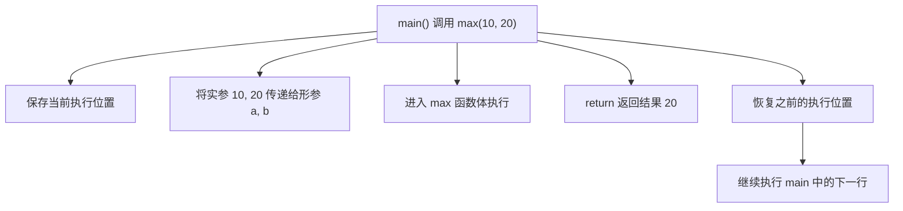
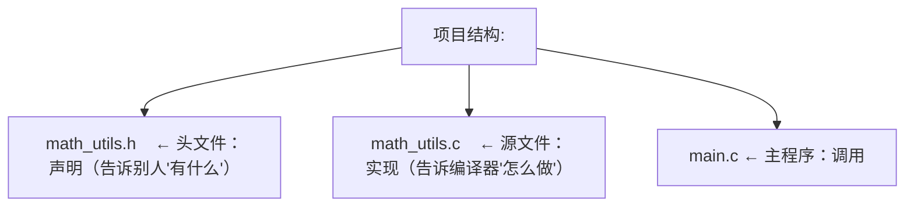
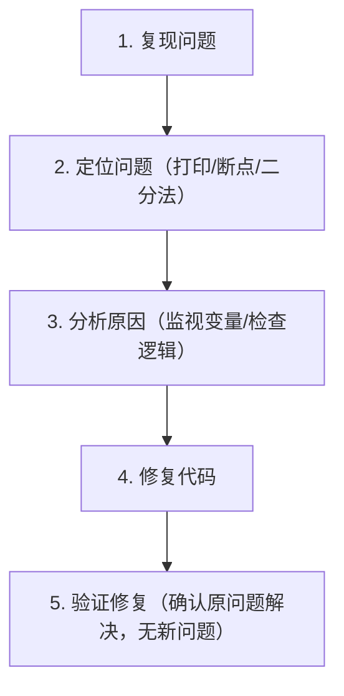
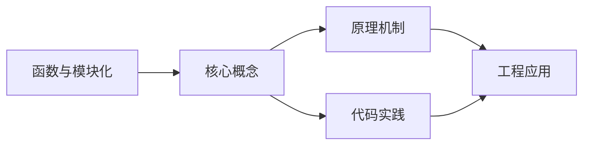

## 1. 学习目标（Bloom 分类）

本节按照布鲁姆教育目标分类学组织学习路径。本文主题为《函数与模块化》，属于 入门指南 模块，读者可以根据自身阶段选择阅读深度。

记忆层面：能够准确复述本文的核心概念、术语与基本语法或操作步骤，并能够在提问或检索时快速定位对应知识点。能够说出 入门指南 的核心概念、常用命令与流程。

理解层面：能够用自己的语言解释核心原理与工作机制，说明概念之间的因果关系，而不是机械记忆结论。能够解释 入门指南 的工作原理与设计动机。

应用层面：能够在真实项目或练习场景中运用本文知识解决具体问题，写出正确且可维护的实现。能够独立完成 入门指南 的标准操作。

分析层面：能够拆解复杂问题，比较本文主题与相邻概念的异同，识别边界条件与例外情况。能够分析 入门指南 使用中的异常与边界。

评价层面：能够根据约束条件（性能、可读性、安全、成本）评价不同方案的优劣，做出有依据的技术决策。能够评价 入门指南 相关工具与方案。

创造层面：能够把本文知识与其他模块知识组合，设计出新的解决方案或可复用的工程模式。能够把 入门指南 融入团队工作流。

通过本节学习，读者应当能够把《函数与模块化》纳入自己的知识网络，并与 入门指南 模块的其他主题（环境搭建、学习路径、编程基础）建立关联。

## 2. 历史动机与发展脉络

《函数与模块化》是 入门指南 领域的重要主题。要真正理解它，需要先了解它解决的问题与演进过程。

编程入门的关键不是记忆语法，而是建立“问题 -> 方案 -> 验证”的思维循环；本模块为完全零基础的读者设计。
现代学习路径：环境搭建 -> 编程基础（变量/流程/函数）-> 数据与算法 -> 项目实践；本项目的完整文档库按此路径组织。
学习工具：IDE（VS Code）、命令行、Git、包管理器；工具链本身也是学习对象。

回到本文主题：函数与模块化 的提出与成熟，正是上述技术背景下的必然产物。早期实现往往以简单可用为目标，随着工程规模扩大，社区逐渐沉淀出标准做法与最佳实践；理解这一脉络，可以帮助读者判断“为什么文档中的推荐写法是现在这个样子”，也能在遇到历史遗留代码时准确识别其设计年代与取舍。


## 3. 形式化定义与核心概念精讲

本节把《函数与模块化》涉及的核心概念以“定义 + 讲解”的形式展开。读者应把定义当作工具，把讲解当作理解路径；两者结合才能形成可迁移的知识。

编程范式：命令式（逐步指令）、函数式（表达式与不可变）、面向对象（对象与消息）；语言是多范式的。
程序执行：源码 -> 编译/解释 -> 运行；调试是理解程序行为的主要手段。
抽象层次：机器码 -> 汇编 -> 高级语言 -> 框架 -> 领域语言；抽象降低认知负担。

### 3.1 原文章节逐一精讲

原文档把主题拆分为 7 个小节，下面按顺序给出每一节的导读讲解，随后保留原文细节供精读。

#### 原文精读（完整保留）


#### 1. 函数定义

函数是将一段特定功能的代码封装起来、可以重复调用的程序单元。使用函数可以让代码更清晰、更易维护。

##### 1.1 函数的四个组成部分

```
返回类型  函数名(参数列表)
{
    函数体
}
```

| 组成部分 | 说明                                   | 示例               |
| -------- | -------------------------------------- | ------------------ |
| 返回类型 | 函数返回值的数据类型，void表示无返回值 | `int`, `void`      |
| 函数名   | 函数的标识符，调用时使用               | `add`, `printInfo` |
| 参数列表 | 函数接收的输入，可以为空               | `(int a, int b)`   |
| 函数体   | 花括号内的执行代码                     | `{ return a+b; }`  |

##### 1.2 函数定义与调用

```c
#include <stdio.h>

// 函数定义：计算两个整数的最大值
int max(int a, int b) {
    return a > b ? a : b;
}

// 函数定义：无返回值
void greet(const char* name) {
    printf("Hello, %s!\n", name);
}

int main() {
    // 函数调用
    int result = max(10, 20);
    printf("较大值: %d\n", result);  // 20

    greet("FANDEX");                  // Hello, FANDEX!
    return 0;
}
```

##### 1.3 函数声明（原型）

如果函数定义在调用之后，需要在调用前声明函数原型：

```c
#include <stdio.h>

// 函数声明（原型），告诉编译器函数的存在
int factorial(int n);

int main() {
    printf("5! = %d\n", factorial(5));  // 120
    return 0;
}

// 函数定义在main之后
int factorial(int n) {
    if (n <= 1) return 1;
    return n * factorial(n - 1);
}
```

##### 1.4 函数的执行流程



##### 1.5 递归函数

函数直接或间接调用自身称为递归。递归必须要有**终止条件**，否则会无限递归导致栈溢出。

```c
// 递归求斐波那契数列第n项
int fibonacci(int n) {
    if (n <= 0) return 0;       // 终止条件1
    if (n == 1) return 1;       // 终止条件2
    return fibonacci(n - 1) + fibonacci(n - 2);  // 递归调用
}

// 递归求阶乘
int factorial(int n) {
    if (n <= 1) return 1;       // 终止条件
    return n * factorial(n - 1); // 递归调用
}
```

> 递归代码简洁但效率可能较低（如斐波那契的重复计算）。实际开发中，简单的递归可以用循环替代，复杂的递归可以用记忆化（缓存已计算结果）优化。

#### 2. 参数传递方式

##### 2.1 值传递

将实参的**副本**传递给形参，函数内对形参的修改不影响实参。

```c
void try_change(int x) {
    x = 100;  // 只修改了副本，不影响原始变量
}

int main() {
    int a = 10;
    try_change(a);
    printf("a = %d\n", a);  // a = 10，值未改变
    return 0;
}
```

值传递的内存示意：

```mermaid
flowchart LR
    subgraph Before[调用前]
        BA[a → [10]]
    end
    subgraph Call[调用时 值传递]
        CA[a → [10]]
        X[x → [10] 复制了一份]
    end
    subgraph After[修改后]
        AA[a → [10] 不变]
        AX[x → [100] 变了]
    end
```

##### 2.2 指针传递（模拟引用传递）

C语言没有真正的引用传递，但可以通过传递指针来修改原始变量：

```c
void swap(int* pa, int* pb) {
    int temp = *pa;
    *pa = *pb;
    *pb = temp;
}

int main() {
    int a = 3, b = 5;
    swap(&a, &b);  // 传递a和b的地址
    printf("a=%d, b=%d\n", a, b);  // a=5, b=3，值已交换
    return 0;
}
```

指针传递的内存示意：

```mermaid
flowchart LR
    subgraph Before[调用前]
        BA[a → [3]]
        BB[b → [5]]
    end
    subgraph After[修改后 指针传递]
        AA[pa → a → [5]]
        AB[pb → b → [3]]
    end
```

##### 2.3 C++ 的引用传递

C++ 提供了真正的引用传递语法：

```cpp
// 引用传递：形参是实参的别名
void swap(int& a, int& b) {
    int temp = a;
    a = b;
    b = temp;
}

int main() {
    int x = 3, y = 5;
    swap(x, y);  // 不需要取地址符
    printf("x=%d, y=%d\n", x, y);  // x=5, y=3
    return 0;
}
```

##### 2.4 两种传递方式对比

| 特性       | 值传递               | 引用/指针传递        |
| ---------- | -------------------- | -------------------- |
| 传递内容   | 实参的副本           | 实参的地址/引用      |
| 函数内修改 | 不影响实参           | 可以修改实参         |
| 内存开销   | 需要复制数据         | 只传地址，开销小     |
| 安全性     | 较高（不会意外修改） | 需要注意空指针等问题 |
| 适用场景   | 基本类型、小型对象   | 大对象、需要修改实参 |

##### 2.5 数组作为参数

数组传递给函数时，实际传递的是数组首元素的地址（退化为指针）：

```c
// 以下三种写法等价
void print_array(int arr[], int len);
void print_array(int arr[10], int len);  // 10会被忽略
void print_array(int* arr, int len);     // 本质是指针

void print_array(int arr[], int len) {
    for (int i = 0; i < len; i++) {
        printf("%d ", arr[i]);
    }
    printf("\n");
}

int main() {
    int nums[] = {1, 2, 3, 4, 5};
    print_array(nums, 5);  // 1 2 3 4 5
    return 0;
}
```

> 因为数组退化为指针，函数内无法用 `sizeof` 获取数组长度，所以必须额外传递长度参数。

#### 3. 模块化编程

当程序规模变大时，将代码拆分为多个文件是必要的。模块化编程的核心思想是**声明与实现分离**。

##### 3.1 头文件与源文件分离



**math_utils.h（头文件）：**

```c
#ifndef MATH_UTILS_H
#define MATH_UTILS_H

// 函数声明
int max(int a, int b);
int min(int a, int b);
int factorial(int n);

#endif // MATH_UTILS_H
```

**math_utils.c（源文件）：**

```c
#include "math_utils.h"

int max(int a, int b) {
    return a > b ? a : b;
}

int min(int a, int b) {
    return a < b ? a : b;
}

int factorial(int n) {
    if (n <= 1) return 1;
    return n * factorial(n - 1);
}
```

**main.c（主程序）：**

```c
#include <stdio.h>
#include "math_utils.h"  // 包含自定义头文件

int main() {
    printf("max(3,7) = %d\n", max(3, 7));
    printf("min(3,7) = %d\n", min(3, 7));
    printf("5! = %d\n", factorial(5));
    return 0;
}
```

##### 3.2 编译多文件项目

```bash
# 分别编译各源文件为目标文件
gcc -c math_utils.c -o math_utils.o
gcc -c main.c -o main.o

# 链接所有目标文件
gcc math_utils.o main.o -o program

# 运行
./program
```

##### 3.3 #pragma once

`#pragma once` 是比传统头文件保护更简洁的方式：

```c
// 传统方式（跨平台，推荐）
#ifndef MATH_UTILS_H
#define MATH_UTILS_H
// ... 内容
#endif

// #pragma once 方式（简洁，主流编译器都支持）
#pragma once
// ... 内容
```

| 方式         | 优点              | 缺点                 |
| ------------ | ----------------- | -------------------- |
| #ifndef 保护 | 标准C，完全可移植 | 冗长，宏名可能冲突   |
| #pragma once | 简洁，不会冲突    | 非标准（但广泛支持） |

##### 3.4 static 关键字在模块化中的作用

```c
// math_utils.c

// static 函数：只在当前文件可见（内部链接）
static int helper(int x) {
    return x * x;
}

// 非static函数：可以被其他文件调用（外部链接）
int compute(int x) {
    return helper(x) + 1;
}
```

```c
// 全局变量同理
static int file_count = 0;  // 只在当前文件可见
int total_count = 0;         // 其他文件可通过 extern 访问
```

##### 3.5 extern 关键字

```c
// config.h
extern int global_config;  // 声明：告诉编译器这个变量存在

// config.c
int global_config = 42;    // 定义：实际分配内存

// main.c
#include "config.h"
#include <stdio.h>
int main() {
    printf("config = %d\n", global_config);  // 42
    return 0;
}
```

#### 4. 文件操作

文件操作是程序与外部数据交互的基本方式。C语言通过标准库 `<stdio.h>` 提供文件操作函数。

##### 4.1 文件操作基本流程

```
打开文件(fopen) → 读写操作(fread/fwrite等) → 关闭文件(fclose)
```

##### 4.2 fopen — 打开文件

```c
FILE* fopen(const char* filename, const char* mode);
```

| 模式 | 含义       | 文件不存在时 | 文件已存在时     |
| ---- | ---------- | ------------ | ---------------- |
| "r"  | 只读       | 失败         | 从头读取         |
| "w"  | 只写       | 创建新文件   | 清空内容         |
| "a"  | 追加写入   | 创建新文件   | 在末尾追加       |
| "r+" | 读写       | 失败         | 从头读写         |
| "w+" | 读写       | 创建新文件   | 清空后读写       |
| "a+" | 读+追加    | 创建新文件   | 读从开头，写追加 |
| "rb" | 二进制只读 | 失败         | 从头读取         |
| "wb" | 二进制只写 | 创建新文件   | 清空内容         |

```c
FILE* fp = fopen("data.txt", "r");
if (fp == NULL) {
    printf("文件打开失败\n");
    return -1;
}
```

##### 4.3 字符与字符串读写

```c
// 写入字符
fputc('A', fp);
fputs("Hello, World!\n", fp);

// 读取字符
int ch = fgetc(fp);    // 返回int而非char，为了区分EOF(-1)

// 读取一行
char line[256];
fgets(line, sizeof(line), fp);  // 最多读255个字符，保留'\n'
```

##### 4.4 格式化读写

```c
// 写入格式化数据
fprintf(fp, "Name: %s, Age: %d\n", "Alice", 25);

// 读取格式化数据
char name[50];
int age;
fscanf(fp, "Name: %s, Age: %d", name, &age);
```

##### 4.5 二进制读写（fread / fwrite）

```c
#include <stdio.h>
#include <string.h>

typedef struct {
    int id;
    char name[32];
    float score;
} Student;

int main() {
    Student stu = {1, "Alice", 95.5f};

    // 写入二进制文件
    FILE* fp = fopen("students.dat", "wb");
    if (fp) {
        fwrite(&stu, sizeof(Student), 1, fp);
        fclose(fp);
    }

    // 读取二进制文件
    Student read_stu;
    fp = fopen("students.dat", "rb");
    if (fp) {
        fread(&read_stu, sizeof(Student), 1, fp);
        fclose(fp);
        printf("ID: %d, Name: %s, Score: %.1f\n",
               read_stu.id, read_stu.name, read_stu.score);
    }

    return 0;
}
```

##### 4.6 文件定位

```c
// 移动文件指针
fseek(fp, 0, SEEK_SET);   // 移到文件开头
fseek(fp, 0, SEEK_END);   // 移到文件末尾
fseek(fp, -10, SEEK_CUR); // 从当前位置后退10字节

// 获取当前偏移量
long pos = ftell(fp);

// 获取文件大小
fseek(fp, 0, SEEK_END);
long file_size = ftell(fp);
fseek(fp, 0, SEEK_SET);
```

##### 4.7 完整示例：文件复制

```c
#include <stdio.h>

int main() {
    FILE* src = fopen("input.txt", "rb");
    FILE* dst = fopen("output.txt", "wb");

    if (!src || !dst) {
        printf("文件打开失败\n");
        return -1;
    }

    // 逐字节复制
    int ch;
    while ((ch = fgetc(src)) != EOF) {
        fputc(ch, dst);
    }

    fclose(src);
    fclose(dst);
    printf("复制完成\n");
    return 0;
}
```

#### 5. 异常处理机制

程序运行时可能遇到各种意外情况（文件不存在、内存不足、除零等），需要异常处理来保证程序健壮性。

##### 5.1 C语言的错误处理

C语言没有内置的异常处理机制，通常通过返回值和全局变量 `errno` 处理错误：

```c
#include <stdio.h>
#include <errno.h>
#include <string.h>

int main() {
    FILE* fp = fopen("nonexistent.txt", "r");
    if (fp == NULL) {
        // 方式1: 使用perror（自动输出errno对应的错误信息）
        perror("打开文件失败");

        // 方式2: 使用strerror
        printf("错误码: %d, 错误信息: %s\n", errno, strerror(errno));

        return -1;
    }
    fclose(fp);
    return 0;
}
```

##### 5.2 C++ 的 try-catch

C++ 提供了结构化的异常处理机制：

```cpp
#include <iostream>
#include <stdexcept>
using namespace std;

double divide(double a, double b) {
    if (b == 0) {
        throw invalid_argument("除数不能为零");
    }
    return a / b;
}

int main() {
    try {
        double result = divide(10, 0);
        cout << "结果: " << result << endl;
    }
    catch (const invalid_argument& e) {
        cout << "参数错误: " << e.what() << endl;
    }
    catch (const exception& e) {
        cout << "异常: " << e.what() << endl;
    }
    catch (...) {
        cout << "未知异常" << endl;
    }
    return 0;
}
```

##### 5.3 C++ 异常的执行流程

```
try {
    语句1;
    语句2;  ← 抛出异常
    语句3;  ← 不会执行
}
catch (...) {
    语句4;  ← 跳转到这里执行
}
语句5;      ← catch处理后继续执行
```

##### 5.4 自定义异常类

```cpp
#include <iostream>
#include <string>
using namespace std;

class FileError : public exception {
private:
    string message;
public:
    FileError(const string& filename, int code)
        : message("文件错误: " + filename + " (错误码: " + to_string(code) + ")") {}

    const char* what() const noexcept override {
        return message.c_str();
    }
};

void read_config(const string& filename) {
    // 模拟文件读取失败
    throw FileError(filename, 404);
}

int main() {
    try {
        read_config("config.json");
    }
    catch (const FileError& e) {
        cerr << e.what() << endl;  // 文件错误: config.json (错误码: 404)
    }
    return 0;
}
```

##### 5.5 Windows 结构化异常（try-except）

Windows 平台提供了 SEH（Structured Exception Handling）：

```c
#include <windows.h>
#include <stdio.h>

int main() {
    int* ptr = NULL;

    __try {
        // 可能引发异常的代码
        *ptr = 42;  // 空指针写入，会触发异常
    }
    __except (EXCEPTION_EXECUTE_HANDLER) {
        // 异常处理
        DWORD code = GetExceptionCode();
        printf("捕获异常，代码: 0x%08X\n", code);
        // 输出: 捕获异常，代码: 0xC0000005 (ACCESS_VIOLATION)
    }

    printf("程序继续执行\n");
    return 0;
}
```

##### 5.6 错误处理策略对比

| 策略       | 语言      | 优点             | 缺点         |
| ---------- | --------- | ---------------- | ------------ |
| 返回值检查 | C         | 简单，无额外开销 | 容易遗漏检查 |
| errno      | C         | 标准化           | 需要及时检查 |
| try-catch  | C++/Java  | 结构化，自动传播 | 有性能开销   |
| try-except | Windows C | 可捕获硬件异常   | 平台相关     |

#### 6. 调试基础

调试是找出并修复程序错误的过程，是开发者最重要的技能之一。

##### 6.1 常见错误类型

| 错误类型   | 定义                   | 示例                   | 发现时机 |
| ---------- | ---------------------- | ---------------------- | -------- |
| 语法错误   | 违反语言语法规则       | 缺少分号、括号不匹配   | 编译时   |
| 逻辑错误   | 程序可运行但结果不正确 | 条件写反、循环次数错误 | 运行时   |
| 运行时错误 | 程序运行时异常终止     | 除零、空指针、越界访问 | 运行时   |

##### 6.2 打印日志调试

最基本也最常用的调试方法——在关键位置插入打印语句：

```c
#include <stdio.h>

int binary_search(int arr[], int len, int target) {
    int left = 0, right = len - 1;

    while (left <= right) {
        int mid = left + (right - left) / 2;
        printf("[DEBUG] left=%d, right=%d, mid=%d, arr[mid]=%d\n",
               left, right, mid, arr[mid]);

        if (arr[mid] == target) {
            printf("[DEBUG] 找到目标，索引=%d\n", mid);
            return mid;
        } else if (arr[mid] < target) {
            left = mid + 1;
        } else {
            right = mid - 1;
        }
    }

    printf("[DEBUG] 未找到目标\n");
    return -1;
}
```

更规范的日志输出：

```c
// 使用宏控制调试输出
#ifdef DEBUG
  #define LOG(fmt, ...) printf("[LOG %s:%d] " fmt "\n", __FILE__, __LINE__, ##__VA_ARGS__)
#else
  #define LOG(fmt, ...)  // 发布版本不输出
#endif

// 使用
LOG("变量值: x=%d, y=%d", x, y);
// 输出: [LOG main.c:42] 变量值: x=10, y=20
```

##### 6.3 断点调试

断点调试允许程序在指定位置暂停，检查当前状态。

**GDB 基本命令（Linux/macOS）：**

```bash
# 编译时加入调试信息
gcc -g program.c -o program

# 启动GDB
gdb ./program
```

| GDB 命令       | 缩写   | 功能                   |
| -------------- | ------ | ---------------------- |
| break main     | b main | 在main函数设置断点     |
| break 42       | b 42   | 在第42行设置断点       |
| run            | r      | 运行程序               |
| next           | n      | 单步执行（不进入函数） |
| step           | s      | 单步执行（进入函数）   |
| continue       | c      | 继续运行到下一个断点   |
| print variable | p var  | 打印变量值             |
| list           | l      | 显示源代码             |
| quit           | q      | 退出GDB                |

**VS Code 调试（Windows推荐）：**

1. 在代码行号左侧点击设置断点（红点）
2. 按 `F5` 启动调试
3. 使用调试工具栏：

| 快捷键    | 功能             |
| --------- | ---------------- |
| F5        | 继续运行         |
| F10       | 单步跳过（next） |
| F11       | 单步进入（step） |
| Shift+F11 | 跳出函数         |
| Shift+F5  | 停止调试         |

##### 6.4 监视变量

调试时可以监视变量的值变化：

```c
// 示例：调试排序算法
void bubble_sort(int arr[], int len) {
    for (int i = 0; i < len - 1; i++) {
        for (int j = 0; j < len - 1 - i; j++) {
            // 在此处设置断点，监视以下变量：
            // - i, j 的值
            // - arr[j], arr[j+1] 的值
            // - 是否发生交换
            if (arr[j] > arr[j + 1]) {
                int temp = arr[j];
                arr[j] = arr[j + 1];
                arr[j + 1] = temp;
            }
        }
    }
}
```

**VS Code 监视窗口使用：**

1. 在调试面板找到"监视"区域
2. 点击 `+` 添加表达式，如 `arr[j]`、`i * len + j`
3. 每次暂停时自动显示当前值

##### 6.5 常用调试技巧

**① 二分法定位Bug**

```c
// 如果程序在某个位置出错，用二分法逐步缩小范围
// 在中间位置设置断点或打印
printf("CHECKPOINT 1: ok\n");  // 前半段
// ... 大段代码 ...
printf("CHECKPOINT 2: ok\n");  // 后半段
// 如果CHECKPOINT 1正常但2没输出，Bug在中间
```

**② 断言（Assert）**

```c
#include <assert.h>

int factorial(int n) {
    assert(n >= 0);  // 如果n<0，程序终止并报错
    if (n <= 1) return 1;
    return n * factorial(n - 1);
}
```

**③ 内存检查**

```bash
# 使用Valgrind检查内存泄漏（Linux/macOS）
valgrind --leak-check=full ./program

# 使用AddressSanitizer（编译器内置）
gcc -fsanitize=address -g program.c -o program
./program
```

##### 6.6 调试流程总结



#### 7. 小结

| 主题     | 核心要点                                        |
| -------- | ----------------------------------------------- |
| 函数定义 | 返回类型+函数名+参数列表+函数体，声明与定义分离 |
| 参数传递 | 值传递（副本）vs 指针/引用传递（可修改原值）    |
| 模块化   | 头文件声明、源文件实现、#pragma once 防重复包含 |
| 文件操作 | fopen→读写→fclose，注意模式与错误检查           |
| 异常处理 | C用返回值/errno，C++用try-catch，Windows用SEH   |
| 调试基础 | 打印日志、断点、单步执行、监视变量，二分法定位  |

函数与模块化是编写可维护代码的基础。将复杂问题拆分为小函数，将相关功能组织为模块，配合规范的错误处理和调试手段，才能构建出健壮的程序。


### 3.2 概念关系图

下面用 Mermaid 图表达本文核心概念之间的关系，帮助读者建立整体图景：



图中展示的是本文知识的结构化关系：核心概念是入口，原理机制解释“为什么”，代码实践演示“怎么做”，工程应用回答“何时用”。读者学习时可以把每个小节的内容挂接到对应节点上。

## 4. 理论推导与原理解析

本节深入《函数与模块化》背后的原理。理论部分不求面面俱到，而是聚焦“能解释现象、能指导实践”的关键推导。

编程范式：命令式（逐步指令）、函数式（表达式与不可变）、面向对象（对象与消息）；语言是多范式的。
程序执行：源码 -> 编译/解释 -> 运行；调试是理解程序行为的主要手段。
抽象层次：机器码 -> 汇编 -> 高级语言 -> 框架 -> 领域语言；抽象降低认知负担。
计算机基础：CPU 执行指令、内存存数据、I/O 与外部交互；这些概念支撑所有编程。

需要强调的是，理论推导与工程实践之间存在翻译层：理论给出的是理想化模型与边界条件，工程代码则必须处理真实环境中的例外。读者在学习时应先掌握理论的“标准情形”，再通过陷阱章节了解“非标准情形”。

## 5. 代码示例与逐行讲解

本节把原文中的代码示例系统整理，并为每个示例补充用途说明与讲解。读者不应只浏览代码，而应逐段对照讲解理解设计意图。

### 5.1 示例：1.1 函数的四个组成部分

该示例来自原文《1.1 函数的四个组成部分》小节，用于演示函数与模块化相关操作。阅读时请先看代码结构，再看其后的讲解。

```text
返回类型  函数名(参数列表)
{
    函数体
}
```

讲解：这段代码演示了本节核心知识点。代码中的关键操作可以归纳为三步：准备（定义或初始化）、执行（核心逻辑）、收尾（释放资源或返回结果）。实际项目中，这三步往往被封装为函数或类，以提升复用性与可测试性。

关键点分析：

该示例共 4 行有效代码，结构以数据或配置为主。阅读时应关注：数据字段的含义、配置项的作用，以及它们与运行行为的对应关系。

进阶思考路径：先尝试修改参数观察行为变化，再把示例中的模式迁移到自己的项目中；每次修改都记录预期与实测差异，这是把示例转化为能力的最快方式。

### 5.2 示例：1.2 函数定义与调用

该示例来自原文《1.2 函数定义与调用》小节，用于演示函数与模块化相关操作。阅读时请先看代码结构，再看其后的讲解。

```c
#include <stdio.h>

// 函数定义：计算两个整数的最大值
int max(int a, int b) {
    return a > b ? a : b;
}

// 函数定义：无返回值
void greet(const char* name) {
    printf("Hello, %s!\n", name);
}

int main() {
    // 函数调用
    int result = max(10, 20);
    printf("较大值: %d\n", result);  // 20

    greet("FANDEX");                  // Hello, FANDEX!
    return 0;
}
```

讲解：这段代码演示了本节核心知识点。代码中的关键操作可以归纳为三步：准备（定义或初始化）、执行（核心逻辑）、收尾（释放资源或返回结果）。实际项目中，这三步往往被封装为函数或类，以提升复用性与可测试性。

关键点分析：

该示例共 16 行有效代码，包含 1 类关键结构（return）。其中：

- 入口与初始化部分负责建立上下文，对应实际项目中的启动或装配逻辑；
- 核心逻辑部分体现本文主题的主要操作，是阅读时最需要对照讲解理解的部分；
- 输出或返回部分把结果交给调用方，注意其类型与边界条件。

进阶思考路径：先尝试修改参数观察行为变化，再把示例中的模式迁移到自己的项目中；每次修改都记录预期与实测差异，这是把示例转化为能力的最快方式。

### 5.3 示例：1.3 函数声明（原型）

该示例来自原文《1.3 函数声明（原型）》小节，用于演示函数与模块化相关操作。阅读时请先看代码结构，再看其后的讲解。

```c
#include <stdio.h>

// 函数声明（原型），告诉编译器函数的存在
int factorial(int n);

int main() {
    printf("5! = %d\n", factorial(5));  // 120
    return 0;
}

// 函数定义在main之后
int factorial(int n) {
    if (n <= 1) return 1;
    return n * factorial(n - 1);
}
```

讲解：这段代码演示了本节核心知识点。代码中的关键操作可以归纳为三步：准备（定义或初始化）、执行（核心逻辑）、收尾（释放资源或返回结果）。实际项目中，这三步往往被封装为函数或类，以提升复用性与可测试性。

关键点分析：

该示例共 12 行有效代码，包含 2 类关键结构（if、return）。其中：

- 入口与初始化部分负责建立上下文，对应实际项目中的启动或装配逻辑；
- 核心逻辑部分体现本文主题的主要操作，是阅读时最需要对照讲解理解的部分；
- 输出或返回部分把结果交给调用方，注意其类型与边界条件。

进阶思考路径：先尝试修改参数观察行为变化，再把示例中的模式迁移到自己的项目中；每次修改都记录预期与实测差异，这是把示例转化为能力的最快方式。

### 5.4 示例：1.4 函数的执行流程

该示例来自原文《1.4 函数的执行流程》小节，用于演示函数与模块化相关操作。阅读时请先看代码结构，再看其后的讲解。


讲解：这段代码演示了本节核心知识点。代码中的关键操作可以归纳为三步：准备（定义或初始化）、执行（核心逻辑）、收尾（释放资源或返回结果）。实际项目中，这三步往往被封装为函数或类，以提升复用性与可测试性。

关键点分析：

该示例共 14 行有效代码，包含 1 类关键结构（return）。其中：

- 入口与初始化部分负责建立上下文，对应实际项目中的启动或装配逻辑；
- 核心逻辑部分体现本文主题的主要操作，是阅读时最需要对照讲解理解的部分；
- 输出或返回部分把结果交给调用方，注意其类型与边界条件。

进阶思考路径：先尝试修改参数观察行为变化，再把示例中的模式迁移到自己的项目中；每次修改都记录预期与实测差异，这是把示例转化为能力的最快方式。

### 5.5 示例：1.5 递归函数

该示例来自原文《1.5 递归函数》小节，用于演示函数与模块化相关操作。阅读时请先看代码结构，再看其后的讲解。

```c
// 递归求斐波那契数列第n项
int fibonacci(int n) {
    if (n <= 0) return 0;       // 终止条件1
    if (n == 1) return 1;       // 终止条件2
    return fibonacci(n - 1) + fibonacci(n - 2);  // 递归调用
}

// 递归求阶乘
int factorial(int n) {
    if (n <= 1) return 1;       // 终止条件
    return n * factorial(n - 1); // 递归调用
}
```

讲解：这段代码演示了本节核心知识点。代码中的关键操作可以归纳为三步：准备（定义或初始化）、执行（核心逻辑）、收尾（释放资源或返回结果）。实际项目中，这三步往往被封装为函数或类，以提升复用性与可测试性。

关键点分析：

该示例共 11 行有效代码，包含 2 类关键结构（if、return）。其中：

- 入口与初始化部分负责建立上下文，对应实际项目中的启动或装配逻辑；
- 核心逻辑部分体现本文主题的主要操作，是阅读时最需要对照讲解理解的部分；
- 输出或返回部分把结果交给调用方，注意其类型与边界条件。

进阶思考路径：先尝试修改参数观察行为变化，再把示例中的模式迁移到自己的项目中；每次修改都记录预期与实测差异，这是把示例转化为能力的最快方式。

### 5.6 示例：2.1 值传递

该示例来自原文《2.1 值传递》小节，用于演示函数与模块化相关操作。阅读时请先看代码结构，再看其后的讲解。

```c
void try_change(int x) {
    x = 100;  // 只修改了副本，不影响原始变量
}

int main() {
    int a = 10;
    try_change(a);
    printf("a = %d\n", a);  // a = 10，值未改变
    return 0;
}
```

讲解：这段代码演示了本节核心知识点。代码中的关键操作可以归纳为三步：准备（定义或初始化）、执行（核心逻辑）、收尾（释放资源或返回结果）。实际项目中，这三步往往被封装为函数或类，以提升复用性与可测试性。

关键点分析：

该示例共 9 行有效代码，包含 1 类关键结构（return）。其中：

- 入口与初始化部分负责建立上下文，对应实际项目中的启动或装配逻辑；
- 核心逻辑部分体现本文主题的主要操作，是阅读时最需要对照讲解理解的部分；
- 输出或返回部分把结果交给调用方，注意其类型与边界条件。

进阶思考路径：先尝试修改参数观察行为变化，再把示例中的模式迁移到自己的项目中；每次修改都记录预期与实测差异，这是把示例转化为能力的最快方式。

### 5.7 示例：2.1 值传递

该示例来自原文《2.1 值传递》小节，用于演示函数与模块化相关操作。阅读时请先看代码结构，再看其后的讲解。

```mermaid
flowchart LR
    subgraph Before[调用前]
        BA[a → [10]]
    end
    subgraph Call[调用时 值传递]
        CA[a → [10]]
        X[x → [10] 复制了一份]
    end
    subgraph After[修改后]
        AA[a → [10] 不变]
        AX[x → [100] 变了]
    end
```

讲解：这段代码演示了本节核心知识点。代码中的关键操作可以归纳为三步：准备（定义或初始化）、执行（核心逻辑）、收尾（释放资源或返回结果）。实际项目中，这三步往往被封装为函数或类，以提升复用性与可测试性。

关键点分析：

该示例共 12 行有效代码，结构以数据或配置为主。阅读时应关注：数据字段的含义、配置项的作用，以及它们与运行行为的对应关系。

进阶思考路径：先尝试修改参数观察行为变化，再把示例中的模式迁移到自己的项目中；每次修改都记录预期与实测差异，这是把示例转化为能力的最快方式。

### 5.8 示例：2.2 指针传递（模拟引用传递）

该示例来自原文《2.2 指针传递（模拟引用传递）》小节，用于演示函数与模块化相关操作。阅读时请先看代码结构，再看其后的讲解。

```c
void swap(int* pa, int* pb) {
    int temp = *pa;
    *pa = *pb;
    *pb = temp;
}

int main() {
    int a = 3, b = 5;
    swap(&a, &b);  // 传递a和b的地址
    printf("a=%d, b=%d\n", a, b);  // a=5, b=3，值已交换
    return 0;
}
```

讲解：这段代码演示了本节核心知识点。代码中的关键操作可以归纳为三步：准备（定义或初始化）、执行（核心逻辑）、收尾（释放资源或返回结果）。实际项目中，这三步往往被封装为函数或类，以提升复用性与可测试性。

关键点分析：

该示例共 11 行有效代码，包含 1 类关键结构（return）。其中：

- 入口与初始化部分负责建立上下文，对应实际项目中的启动或装配逻辑；
- 核心逻辑部分体现本文主题的主要操作，是阅读时最需要对照讲解理解的部分；
- 输出或返回部分把结果交给调用方，注意其类型与边界条件。

进阶思考路径：先尝试修改参数观察行为变化，再把示例中的模式迁移到自己的项目中；每次修改都记录预期与实测差异，这是把示例转化为能力的最快方式。

### 5.9 示例：2.2 指针传递（模拟引用传递）

该示例来自原文《2.2 指针传递（模拟引用传递）》小节，用于演示函数与模块化相关操作。阅读时请先看代码结构，再看其后的讲解。

```mermaid
flowchart LR
    subgraph Before[调用前]
        BA[a → [3]]
        BB[b → [5]]
    end
    subgraph After[修改后 指针传递]
        AA[pa → a → [5]]
        AB[pb → b → [3]]
    end
```

讲解：这段代码演示了本节核心知识点。代码中的关键操作可以归纳为三步：准备（定义或初始化）、执行（核心逻辑）、收尾（释放资源或返回结果）。实际项目中，这三步往往被封装为函数或类，以提升复用性与可测试性。

关键点分析：

该示例共 9 行有效代码，结构以数据或配置为主。阅读时应关注：数据字段的含义、配置项的作用，以及它们与运行行为的对应关系。

进阶思考路径：先尝试修改参数观察行为变化，再把示例中的模式迁移到自己的项目中；每次修改都记录预期与实测差异，这是把示例转化为能力的最快方式。

### 5.10 示例：2.3 C++ 的引用传递

该示例来自原文《2.3 C++ 的引用传递》小节，用于演示函数与模块化相关操作。阅读时请先看代码结构，再看其后的讲解。

```cpp
// 引用传递：形参是实参的别名
void swap(int& a, int& b) {
    int temp = a;
    a = b;
    b = temp;
}

int main() {
    int x = 3, y = 5;
    swap(x, y);  // 不需要取地址符
    printf("x=%d, y=%d\n", x, y);  // x=5, y=3
    return 0;
}
```

讲解：这段代码演示了本节核心知识点。代码中的关键操作可以归纳为三步：准备（定义或初始化）、执行（核心逻辑）、收尾（释放资源或返回结果）。实际项目中，这三步往往被封装为函数或类，以提升复用性与可测试性。

关键点分析：

该示例共 12 行有效代码，包含 1 类关键结构（return）。其中：

- 入口与初始化部分负责建立上下文，对应实际项目中的启动或装配逻辑；
- 核心逻辑部分体现本文主题的主要操作，是阅读时最需要对照讲解理解的部分；
- 输出或返回部分把结果交给调用方，注意其类型与边界条件。

进阶思考路径：先尝试修改参数观察行为变化，再把示例中的模式迁移到自己的项目中；每次修改都记录预期与实测差异，这是把示例转化为能力的最快方式。

### 5.11 示例：2.5 数组作为参数

该示例来自原文《2.5 数组作为参数》小节，用于演示函数与模块化相关操作。阅读时请先看代码结构，再看其后的讲解。

```c
// 以下三种写法等价
void print_array(int arr[], int len);
void print_array(int arr[10], int len);  // 10会被忽略
void print_array(int* arr, int len);     // 本质是指针

void print_array(int arr[], int len) {
    for (int i = 0; i < len; i++) {
        printf("%d ", arr[i]);
    }
    printf("\n");
}

int main() {
    int nums[] = {1, 2, 3, 4, 5};
    print_array(nums, 5);  // 1 2 3 4 5
    return 0;
}
```

讲解：这段代码演示了本节核心知识点。代码中的关键操作可以归纳为三步：准备（定义或初始化）、执行（核心逻辑）、收尾（释放资源或返回结果）。实际项目中，这三步往往被封装为函数或类，以提升复用性与可测试性。

关键点分析：

该示例共 15 行有效代码，包含 2 类关键结构（for、return）。其中：

- 入口与初始化部分负责建立上下文，对应实际项目中的启动或装配逻辑；
- 核心逻辑部分体现本文主题的主要操作，是阅读时最需要对照讲解理解的部分；
- 输出或返回部分把结果交给调用方，注意其类型与边界条件。

进阶思考路径：先尝试修改参数观察行为变化，再把示例中的模式迁移到自己的项目中；每次修改都记录预期与实测差异，这是把示例转化为能力的最快方式。

### 5.12 示例：3.1 头文件与源文件分离

该示例来自原文《3.1 头文件与源文件分离》小节，用于演示函数与模块化相关操作。阅读时请先看代码结构，再看其后的讲解。


讲解：这段代码演示了本节核心知识点。代码中的关键操作可以归纳为三步：准备（定义或初始化）、执行（核心逻辑）、收尾（释放资源或返回结果）。实际项目中，这三步往往被封装为函数或类，以提升复用性与可测试性。

关键点分析：

该示例共 8 行有效代码，结构以数据或配置为主。阅读时应关注：数据字段的含义、配置项的作用，以及它们与运行行为的对应关系。

进阶思考路径：先尝试修改参数观察行为变化，再把示例中的模式迁移到自己的项目中；每次修改都记录预期与实测差异，这是把示例转化为能力的最快方式。

### 5.13 示例：3.1 头文件与源文件分离

该示例来自原文《3.1 头文件与源文件分离》小节，用于演示函数与模块化相关操作。阅读时请先看代码结构，再看其后的讲解。

```c
#ifndef MATH_UTILS_H
#define MATH_UTILS_H

// 函数声明
int max(int a, int b);
int min(int a, int b);
int factorial(int n);

#endif // MATH_UTILS_H
```

讲解：这段代码演示了本节核心知识点。代码中的关键操作可以归纳为三步：准备（定义或初始化）、执行（核心逻辑）、收尾（释放资源或返回结果）。实际项目中，这三步往往被封装为函数或类，以提升复用性与可测试性。

关键点分析：

该示例共 7 行有效代码，包含 2 类关键结构（def、if）。其中：

- 入口与初始化部分负责建立上下文，对应实际项目中的启动或装配逻辑；
- 核心逻辑部分体现本文主题的主要操作，是阅读时最需要对照讲解理解的部分；
- 输出或返回部分把结果交给调用方，注意其类型与边界条件。

进阶思考路径：先尝试修改参数观察行为变化，再把示例中的模式迁移到自己的项目中；每次修改都记录预期与实测差异，这是把示例转化为能力的最快方式。

### 5.14 示例：3.1 头文件与源文件分离

该示例来自原文《3.1 头文件与源文件分离》小节，用于演示函数与模块化相关操作。阅读时请先看代码结构，再看其后的讲解。

```c
#include "math_utils.h"

int max(int a, int b) {
    return a > b ? a : b;
}

int min(int a, int b) {
    return a < b ? a : b;
}

int factorial(int n) {
    if (n <= 1) return 1;
    return n * factorial(n - 1);
}
```

讲解：这段代码演示了本节核心知识点。代码中的关键操作可以归纳为三步：准备（定义或初始化）、执行（核心逻辑）、收尾（释放资源或返回结果）。实际项目中，这三步往往被封装为函数或类，以提升复用性与可测试性。

关键点分析：

该示例共 11 行有效代码，包含 2 类关键结构（if、return）。其中：

- 入口与初始化部分负责建立上下文，对应实际项目中的启动或装配逻辑；
- 核心逻辑部分体现本文主题的主要操作，是阅读时最需要对照讲解理解的部分；
- 输出或返回部分把结果交给调用方，注意其类型与边界条件。

进阶思考路径：先尝试修改参数观察行为变化，再把示例中的模式迁移到自己的项目中；每次修改都记录预期与实测差异，这是把示例转化为能力的最快方式。

### 5.15 示例：3.1 头文件与源文件分离

该示例来自原文《3.1 头文件与源文件分离》小节，用于演示函数与模块化相关操作。阅读时请先看代码结构，再看其后的讲解。

```c
#include <stdio.h>
#include "math_utils.h"  // 包含自定义头文件

int main() {
    printf("max(3,7) = %d\n", max(3, 7));
    printf("min(3,7) = %d\n", min(3, 7));
    printf("5! = %d\n", factorial(5));
    return 0;
}
```

讲解：这段代码演示了本节核心知识点。代码中的关键操作可以归纳为三步：准备（定义或初始化）、执行（核心逻辑）、收尾（释放资源或返回结果）。实际项目中，这三步往往被封装为函数或类，以提升复用性与可测试性。

关键点分析：

该示例共 8 行有效代码，包含 1 类关键结构（return）。其中：

- 入口与初始化部分负责建立上下文，对应实际项目中的启动或装配逻辑；
- 核心逻辑部分体现本文主题的主要操作，是阅读时最需要对照讲解理解的部分；
- 输出或返回部分把结果交给调用方，注意其类型与边界条件。

进阶思考路径：先尝试修改参数观察行为变化，再把示例中的模式迁移到自己的项目中；每次修改都记录预期与实测差异，这是把示例转化为能力的最快方式。

### 5.16 示例：3.2 编译多文件项目

该示例来自原文《3.2 编译多文件项目》小节，用于演示函数与模块化相关操作。阅读时请先看代码结构，再看其后的讲解。

```bash
# 分别编译各源文件为目标文件
gcc -c math_utils.c -o math_utils.o
gcc -c main.c -o main.o

# 链接所有目标文件
gcc math_utils.o main.o -o program

# 运行
./program
```

讲解：这段代码演示了本节核心知识点。代码中的关键操作可以归纳为三步：准备（定义或初始化）、执行（核心逻辑）、收尾（释放资源或返回结果）。实际项目中，这三步往往被封装为函数或类，以提升复用性与可测试性。

关键点分析：

该示例共 7 行有效代码，结构以数据或配置为主。阅读时应关注：数据字段的含义、配置项的作用，以及它们与运行行为的对应关系。

进阶思考路径：先尝试修改参数观察行为变化，再把示例中的模式迁移到自己的项目中；每次修改都记录预期与实测差异，这是把示例转化为能力的最快方式。

### 5.17 示例：3.3 #pragma once

该示例来自原文《3.3 #pragma once》小节，用于演示函数与模块化相关操作。阅读时请先看代码结构，再看其后的讲解。

```c
// 传统方式（跨平台，推荐）
#ifndef MATH_UTILS_H
#define MATH_UTILS_H
// ... 内容
#endif

// #pragma once 方式（简洁，主流编译器都支持）
#pragma once
// ... 内容
```

讲解：这段代码演示了本节核心知识点。代码中的关键操作可以归纳为三步：准备（定义或初始化）、执行（核心逻辑）、收尾（释放资源或返回结果）。实际项目中，这三步往往被封装为函数或类，以提升复用性与可测试性。

关键点分析：

该示例共 8 行有效代码，包含 1 类关键结构（def）。其中：

- 入口与初始化部分负责建立上下文，对应实际项目中的启动或装配逻辑；
- 核心逻辑部分体现本文主题的主要操作，是阅读时最需要对照讲解理解的部分；
- 输出或返回部分把结果交给调用方，注意其类型与边界条件。

进阶思考路径：先尝试修改参数观察行为变化，再把示例中的模式迁移到自己的项目中；每次修改都记录预期与实测差异，这是把示例转化为能力的最快方式。

### 5.18 示例：3.4 static 关键字在模块化中的作用

该示例来自原文《3.4 static 关键字在模块化中的作用》小节，用于演示函数与模块化相关操作。阅读时请先看代码结构，再看其后的讲解。

```c
// math_utils.c

// static 函数：只在当前文件可见（内部链接）
static int helper(int x) {
    return x * x;
}

// 非static函数：可以被其他文件调用（外部链接）
int compute(int x) {
    return helper(x) + 1;
}
```

讲解：这段代码演示了本节核心知识点。代码中的关键操作可以归纳为三步：准备（定义或初始化）、执行（核心逻辑）、收尾（释放资源或返回结果）。实际项目中，这三步往往被封装为函数或类，以提升复用性与可测试性。

关键点分析：

该示例共 9 行有效代码，包含 1 类关键结构（return）。其中：

- 入口与初始化部分负责建立上下文，对应实际项目中的启动或装配逻辑；
- 核心逻辑部分体现本文主题的主要操作，是阅读时最需要对照讲解理解的部分；
- 输出或返回部分把结果交给调用方，注意其类型与边界条件。

进阶思考路径：先尝试修改参数观察行为变化，再把示例中的模式迁移到自己的项目中；每次修改都记录预期与实测差异，这是把示例转化为能力的最快方式。

### 5.19 示例：3.4 static 关键字在模块化中的作用

该示例来自原文《3.4 static 关键字在模块化中的作用》小节，用于演示函数与模块化相关操作。阅读时请先看代码结构，再看其后的讲解。

```c
// 全局变量同理
static int file_count = 0;  // 只在当前文件可见
int total_count = 0;         // 其他文件可通过 extern 访问
```

讲解：这段代码演示了本节核心知识点。代码中的关键操作可以归纳为三步：准备（定义或初始化）、执行（核心逻辑）、收尾（释放资源或返回结果）。实际项目中，这三步往往被封装为函数或类，以提升复用性与可测试性。

关键点分析：

该示例共 3 行有效代码，结构以数据或配置为主。阅读时应关注：数据字段的含义、配置项的作用，以及它们与运行行为的对应关系。

进阶思考路径：先尝试修改参数观察行为变化，再把示例中的模式迁移到自己的项目中；每次修改都记录预期与实测差异，这是把示例转化为能力的最快方式。

### 5.20 示例：3.5 extern 关键字

该示例来自原文《3.5 extern 关键字》小节，用于演示函数与模块化相关操作。阅读时请先看代码结构，再看其后的讲解。

```c
// config.h
extern int global_config;  // 声明：告诉编译器这个变量存在

// config.c
int global_config = 42;    // 定义：实际分配内存

// main.c
#include "config.h"
#include <stdio.h>
int main() {
    printf("config = %d\n", global_config);  // 42
    return 0;
}
```

讲解：这段代码演示了本节核心知识点。代码中的关键操作可以归纳为三步：准备（定义或初始化）、执行（核心逻辑）、收尾（释放资源或返回结果）。实际项目中，这三步往往被封装为函数或类，以提升复用性与可测试性。

关键点分析：

该示例共 11 行有效代码，包含 1 类关键结构（return）。其中：

- 入口与初始化部分负责建立上下文，对应实际项目中的启动或装配逻辑；
- 核心逻辑部分体现本文主题的主要操作，是阅读时最需要对照讲解理解的部分；
- 输出或返回部分把结果交给调用方，注意其类型与边界条件。

进阶思考路径：先尝试修改参数观察行为变化，再把示例中的模式迁移到自己的项目中；每次修改都记录预期与实测差异，这是把示例转化为能力的最快方式。

### 5.21 示例：4.1 文件操作基本流程

该示例来自原文《4.1 文件操作基本流程》小节，用于演示函数与模块化相关操作。阅读时请先看代码结构，再看其后的讲解。

```text
打开文件(fopen) → 读写操作(fread/fwrite等) → 关闭文件(fclose)
```

讲解：这段代码演示了本节核心知识点。代码中的关键操作可以归纳为三步：准备（定义或初始化）、执行（核心逻辑）、收尾（释放资源或返回结果）。实际项目中，这三步往往被封装为函数或类，以提升复用性与可测试性。

关键点分析：

该示例共 1 行有效代码，结构以数据或配置为主。阅读时应关注：数据字段的含义、配置项的作用，以及它们与运行行为的对应关系。

进阶思考路径：先尝试修改参数观察行为变化，再把示例中的模式迁移到自己的项目中；每次修改都记录预期与实测差异，这是把示例转化为能力的最快方式。

### 5.22 示例：4.2 fopen — 打开文件

该示例来自原文《4.2 fopen — 打开文件》小节，用于演示函数与模块化相关操作。阅读时请先看代码结构，再看其后的讲解。

```c
FILE* fopen(const char* filename, const char* mode);
```

讲解：这段代码演示了本节核心知识点。代码中的关键操作可以归纳为三步：准备（定义或初始化）、执行（核心逻辑）、收尾（释放资源或返回结果）。实际项目中，这三步往往被封装为函数或类，以提升复用性与可测试性。

关键点分析：

该示例共 1 行有效代码，结构以数据或配置为主。阅读时应关注：数据字段的含义、配置项的作用，以及它们与运行行为的对应关系。

进阶思考路径：先尝试修改参数观察行为变化，再把示例中的模式迁移到自己的项目中；每次修改都记录预期与实测差异，这是把示例转化为能力的最快方式。

### 5.23 示例：4.2 fopen — 打开文件

该示例来自原文《4.2 fopen — 打开文件》小节，用于演示函数与模块化相关操作。阅读时请先看代码结构，再看其后的讲解。

```c
FILE* fp = fopen("data.txt", "r");
if (fp == NULL) {
    printf("文件打开失败\n");
    return -1;
}
```

讲解：这段代码演示了本节核心知识点。代码中的关键操作可以归纳为三步：准备（定义或初始化）、执行（核心逻辑）、收尾（释放资源或返回结果）。实际项目中，这三步往往被封装为函数或类，以提升复用性与可测试性。

关键点分析：

该示例共 5 行有效代码，包含 2 类关键结构（if、return）。其中：

- 入口与初始化部分负责建立上下文，对应实际项目中的启动或装配逻辑；
- 核心逻辑部分体现本文主题的主要操作，是阅读时最需要对照讲解理解的部分；
- 输出或返回部分把结果交给调用方，注意其类型与边界条件。

进阶思考路径：先尝试修改参数观察行为变化，再把示例中的模式迁移到自己的项目中；每次修改都记录预期与实测差异，这是把示例转化为能力的最快方式。

### 5.24 示例：4.3 字符与字符串读写

该示例来自原文《4.3 字符与字符串读写》小节，用于演示函数与模块化相关操作。阅读时请先看代码结构，再看其后的讲解。

```c
// 写入字符
fputc('A', fp);
fputs("Hello, World!\n", fp);

// 读取字符
int ch = fgetc(fp);    // 返回int而非char，为了区分EOF(-1)

// 读取一行
char line[256];
fgets(line, sizeof(line), fp);  // 最多读255个字符，保留'\n'
```

讲解：这段代码演示了本节核心知识点。代码中的关键操作可以归纳为三步：准备（定义或初始化）、执行（核心逻辑）、收尾（释放资源或返回结果）。实际项目中，这三步往往被封装为函数或类，以提升复用性与可测试性。

关键点分析：

该示例共 8 行有效代码，结构以数据或配置为主。阅读时应关注：数据字段的含义、配置项的作用，以及它们与运行行为的对应关系。

进阶思考路径：先尝试修改参数观察行为变化，再把示例中的模式迁移到自己的项目中；每次修改都记录预期与实测差异，这是把示例转化为能力的最快方式。

### 5.25 示例：4.4 格式化读写

该示例来自原文《4.4 格式化读写》小节，用于演示函数与模块化相关操作。阅读时请先看代码结构，再看其后的讲解。

```c
// 写入格式化数据
fprintf(fp, "Name: %s, Age: %d\n", "Alice", 25);

// 读取格式化数据
char name[50];
int age;
fscanf(fp, "Name: %s, Age: %d", name, &age);
```

讲解：这段代码演示了本节核心知识点。代码中的关键操作可以归纳为三步：准备（定义或初始化）、执行（核心逻辑）、收尾（释放资源或返回结果）。实际项目中，这三步往往被封装为函数或类，以提升复用性与可测试性。

关键点分析：

该示例共 6 行有效代码，结构以数据或配置为主。阅读时应关注：数据字段的含义、配置项的作用，以及它们与运行行为的对应关系。

进阶思考路径：先尝试修改参数观察行为变化，再把示例中的模式迁移到自己的项目中；每次修改都记录预期与实测差异，这是把示例转化为能力的最快方式。

### 5.26 示例：4.5 二进制读写（fread / fwrite）

该示例来自原文《4.5 二进制读写（fread / fwrite）》小节，用于演示函数与模块化相关操作。阅读时请先看代码结构，再看其后的讲解。

```c
#include <stdio.h>
#include <string.h>

typedef struct {
    int id;
    char name[32];
    float score;
} Student;

int main() {
    Student stu = {1, "Alice", 95.5f};

    // 写入二进制文件
    FILE* fp = fopen("students.dat", "wb");
    if (fp) {
        fwrite(&stu, sizeof(Student), 1, fp);
        fclose(fp);
    }

    // 读取二进制文件
    Student read_stu;
    fp = fopen("students.dat", "rb");
    if (fp) {
        fread(&read_stu, sizeof(Student), 1, fp);
        fclose(fp);
        printf("ID: %d, Name: %s, Score: %.1f\n",
               read_stu.id, read_stu.name, read_stu.score);
    }

    return 0;
}
```

讲解：这段代码演示了本节核心知识点。代码中的关键操作可以归纳为三步：准备（定义或初始化）、执行（核心逻辑）、收尾（释放资源或返回结果）。实际项目中，这三步往往被封装为函数或类，以提升复用性与可测试性。

关键点分析：

该示例共 26 行有效代码，包含 3 类关键结构（def、if、return）。其中：

- 入口与初始化部分负责建立上下文，对应实际项目中的启动或装配逻辑；
- 核心逻辑部分体现本文主题的主要操作，是阅读时最需要对照讲解理解的部分；
- 输出或返回部分把结果交给调用方，注意其类型与边界条件。

进阶思考路径：先尝试修改参数观察行为变化，再把示例中的模式迁移到自己的项目中；每次修改都记录预期与实测差异，这是把示例转化为能力的最快方式。

### 5.27 示例：4.6 文件定位

该示例来自原文《4.6 文件定位》小节，用于演示函数与模块化相关操作。阅读时请先看代码结构，再看其后的讲解。

```c
// 移动文件指针
fseek(fp, 0, SEEK_SET);   // 移到文件开头
fseek(fp, 0, SEEK_END);   // 移到文件末尾
fseek(fp, -10, SEEK_CUR); // 从当前位置后退10字节

// 获取当前偏移量
long pos = ftell(fp);

// 获取文件大小
fseek(fp, 0, SEEK_END);
long file_size = ftell(fp);
fseek(fp, 0, SEEK_SET);
```

讲解：这段代码演示了本节核心知识点。代码中的关键操作可以归纳为三步：准备（定义或初始化）、执行（核心逻辑）、收尾（释放资源或返回结果）。实际项目中，这三步往往被封装为函数或类，以提升复用性与可测试性。

关键点分析：

该示例共 10 行有效代码，结构以数据或配置为主。阅读时应关注：数据字段的含义、配置项的作用，以及它们与运行行为的对应关系。

进阶思考路径：先尝试修改参数观察行为变化，再把示例中的模式迁移到自己的项目中；每次修改都记录预期与实测差异，这是把示例转化为能力的最快方式。

### 5.28 示例：4.7 完整示例：文件复制

该示例来自原文《4.7 完整示例：文件复制》小节，用于演示函数与模块化相关操作。阅读时请先看代码结构，再看其后的讲解。

```c
#include <stdio.h>

int main() {
    FILE* src = fopen("input.txt", "rb");
    FILE* dst = fopen("output.txt", "wb");

    if (!src || !dst) {
        printf("文件打开失败\n");
        return -1;
    }

    // 逐字节复制
    int ch;
    while ((ch = fgetc(src)) != EOF) {
        fputc(ch, dst);
    }

    fclose(src);
    fclose(dst);
    printf("复制完成\n");
    return 0;
}
```

讲解：这段代码演示了本节核心知识点。代码中的关键操作可以归纳为三步：准备（定义或初始化）、执行（核心逻辑）、收尾（释放资源或返回结果）。实际项目中，这三步往往被封装为函数或类，以提升复用性与可测试性。

关键点分析：

该示例共 18 行有效代码，包含 3 类关键结构（if、while、return）。其中：

- 入口与初始化部分负责建立上下文，对应实际项目中的启动或装配逻辑；
- 核心逻辑部分体现本文主题的主要操作，是阅读时最需要对照讲解理解的部分；
- 输出或返回部分把结果交给调用方，注意其类型与边界条件。

进阶思考路径：先尝试修改参数观察行为变化，再把示例中的模式迁移到自己的项目中；每次修改都记录预期与实测差异，这是把示例转化为能力的最快方式。

### 5.29 示例：5.1 C语言的错误处理

该示例来自原文《5.1 C语言的错误处理》小节，用于演示函数与模块化相关操作。阅读时请先看代码结构，再看其后的讲解。

```c
#include <stdio.h>
#include <errno.h>
#include <string.h>

int main() {
    FILE* fp = fopen("nonexistent.txt", "r");
    if (fp == NULL) {
        // 方式1: 使用perror（自动输出errno对应的错误信息）
        perror("打开文件失败");

        // 方式2: 使用strerror
        printf("错误码: %d, 错误信息: %s\n", errno, strerror(errno));

        return -1;
    }
    fclose(fp);
    return 0;
}
```

讲解：这段代码演示了本节核心知识点。代码中的关键操作可以归纳为三步：准备（定义或初始化）、执行（核心逻辑）、收尾（释放资源或返回结果）。实际项目中，这三步往往被封装为函数或类，以提升复用性与可测试性。

关键点分析：

该示例共 15 行有效代码，包含 2 类关键结构（if、return）。其中：

- 入口与初始化部分负责建立上下文，对应实际项目中的启动或装配逻辑；
- 核心逻辑部分体现本文主题的主要操作，是阅读时最需要对照讲解理解的部分；
- 输出或返回部分把结果交给调用方，注意其类型与边界条件。

进阶思考路径：先尝试修改参数观察行为变化，再把示例中的模式迁移到自己的项目中；每次修改都记录预期与实测差异，这是把示例转化为能力的最快方式。

### 5.30 示例：5.2 C++ 的 try-catch

该示例来自原文《5.2 C++ 的 try-catch》小节，用于演示函数与模块化相关操作。阅读时请先看代码结构，再看其后的讲解。

```cpp
#include <iostream>
#include <stdexcept>
using namespace std;

double divide(double a, double b) {
    if (b == 0) {
        throw invalid_argument("除数不能为零");
    }
    return a / b;
}

int main() {
    try {
        double result = divide(10, 0);
        cout << "结果: " << result << endl;
    }
    catch (const invalid_argument& e) {
        cout << "参数错误: " << e.what() << endl;
    }
    catch (const exception& e) {
        cout << "异常: " << e.what() << endl;
    }
    catch (...) {
        cout << "未知异常" << endl;
    }
    return 0;
}
```

讲解：这段代码演示了本节核心知识点。代码中的关键操作可以归纳为三步：准备（定义或初始化）、执行（核心逻辑）、收尾（释放资源或返回结果）。实际项目中，这三步往往被封装为函数或类，以提升复用性与可测试性。

关键点分析：

该示例共 25 行有效代码，包含 2 类关键结构（if、return）。其中：

- 入口与初始化部分负责建立上下文，对应实际项目中的启动或装配逻辑；
- 核心逻辑部分体现本文主题的主要操作，是阅读时最需要对照讲解理解的部分；
- 输出或返回部分把结果交给调用方，注意其类型与边界条件。

进阶思考路径：先尝试修改参数观察行为变化，再把示例中的模式迁移到自己的项目中；每次修改都记录预期与实测差异，这是把示例转化为能力的最快方式。

### 5.31 示例：5.3 C++ 异常的执行流程

该示例来自原文《5.3 C++ 异常的执行流程》小节，用于演示函数与模块化相关操作。阅读时请先看代码结构，再看其后的讲解。

```text
try {
    语句1;
    语句2;  ← 抛出异常
    语句3;  ← 不会执行
}
catch (...) {
    语句4;  ← 跳转到这里执行
}
语句5;      ← catch处理后继续执行
```

讲解：这段代码演示了本节核心知识点。代码中的关键操作可以归纳为三步：准备（定义或初始化）、执行（核心逻辑）、收尾（释放资源或返回结果）。实际项目中，这三步往往被封装为函数或类，以提升复用性与可测试性。

关键点分析：

该示例共 9 行有效代码，结构以数据或配置为主。阅读时应关注：数据字段的含义、配置项的作用，以及它们与运行行为的对应关系。

进阶思考路径：先尝试修改参数观察行为变化，再把示例中的模式迁移到自己的项目中；每次修改都记录预期与实测差异，这是把示例转化为能力的最快方式。

### 5.32 示例：5.4 自定义异常类

该示例来自原文《5.4 自定义异常类》小节，用于演示函数与模块化相关操作。阅读时请先看代码结构，再看其后的讲解。

```cpp
#include <iostream>
#include <string>
using namespace std;

class FileError : public exception {
private:
    string message;
public:
    FileError(const string& filename, int code)
        : message("文件错误: " + filename + " (错误码: " + to_string(code) + ")") {}

    const char* what() const noexcept override {
        return message.c_str();
    }
};

void read_config(const string& filename) {
    // 模拟文件读取失败
    throw FileError(filename, 404);
}

int main() {
    try {
        read_config("config.json");
    }
    catch (const FileError& e) {
        cerr << e.what() << endl;  // 文件错误: config.json (错误码: 404)
    }
    return 0;
}
```

讲解：这段代码演示了本节核心知识点。代码中的关键操作可以归纳为三步：准备（定义或初始化）、执行（核心逻辑）、收尾（释放资源或返回结果）。实际项目中，这三步往往被封装为函数或类，以提升复用性与可测试性。

关键点分析：

该示例共 26 行有效代码，包含 2 类关键结构（class、return）。其中：

- 入口与初始化部分负责建立上下文，对应实际项目中的启动或装配逻辑；
- 核心逻辑部分体现本文主题的主要操作，是阅读时最需要对照讲解理解的部分；
- 输出或返回部分把结果交给调用方，注意其类型与边界条件。

进阶思考路径：先尝试修改参数观察行为变化，再把示例中的模式迁移到自己的项目中；每次修改都记录预期与实测差异，这是把示例转化为能力的最快方式。

### 5.33 示例：5.5 Windows 结构化异常（try-except）

该示例来自原文《5.5 Windows 结构化异常（try-except）》小节，用于演示函数与模块化相关操作。阅读时请先看代码结构，再看其后的讲解。

```c
#include <windows.h>
#include <stdio.h>

int main() {
    int* ptr = NULL;

    __try {
        // 可能引发异常的代码
        *ptr = 42;  // 空指针写入，会触发异常
    }
    __except (EXCEPTION_EXECUTE_HANDLER) {
        // 异常处理
        DWORD code = GetExceptionCode();
        printf("捕获异常，代码: 0x%08X\n", code);
        // 输出: 捕获异常，代码: 0xC0000005 (ACCESS_VIOLATION)
    }

    printf("程序继续执行\n");
    return 0;
}
```

讲解：这段代码演示了本节核心知识点。代码中的关键操作可以归纳为三步：准备（定义或初始化）、执行（核心逻辑）、收尾（释放资源或返回结果）。实际项目中，这三步往往被封装为函数或类，以提升复用性与可测试性。

关键点分析：

该示例共 17 行有效代码，包含 1 类关键结构（return）。其中：

- 入口与初始化部分负责建立上下文，对应实际项目中的启动或装配逻辑；
- 核心逻辑部分体现本文主题的主要操作，是阅读时最需要对照讲解理解的部分；
- 输出或返回部分把结果交给调用方，注意其类型与边界条件。

进阶思考路径：先尝试修改参数观察行为变化，再把示例中的模式迁移到自己的项目中；每次修改都记录预期与实测差异，这是把示例转化为能力的最快方式。

### 5.34 示例：6.2 打印日志调试

该示例来自原文《6.2 打印日志调试》小节，用于演示函数与模块化相关操作。阅读时请先看代码结构，再看其后的讲解。

```c
#include <stdio.h>

int binary_search(int arr[], int len, int target) {
    int left = 0, right = len - 1;

    while (left <= right) {
        int mid = left + (right - left) / 2;
        printf("[DEBUG] left=%d, right=%d, mid=%d, arr[mid]=%d\n",
               left, right, mid, arr[mid]);

        if (arr[mid] == target) {
            printf("[DEBUG] 找到目标，索引=%d\n", mid);
            return mid;
        } else if (arr[mid] < target) {
            left = mid + 1;
        } else {
            right = mid - 1;
        }
    }

    printf("[DEBUG] 未找到目标\n");
    return -1;
}
```

讲解：这段代码演示了本节核心知识点。代码中的关键操作可以归纳为三步：准备（定义或初始化）、执行（核心逻辑）、收尾（释放资源或返回结果）。实际项目中，这三步往往被封装为函数或类，以提升复用性与可测试性。

关键点分析：

该示例共 19 行有效代码，包含 3 类关键结构（if、while、return）。其中：

- 入口与初始化部分负责建立上下文，对应实际项目中的启动或装配逻辑；
- 核心逻辑部分体现本文主题的主要操作，是阅读时最需要对照讲解理解的部分；
- 输出或返回部分把结果交给调用方，注意其类型与边界条件。

进阶思考路径：先尝试修改参数观察行为变化，再把示例中的模式迁移到自己的项目中；每次修改都记录预期与实测差异，这是把示例转化为能力的最快方式。

### 5.35 示例：6.2 打印日志调试

该示例来自原文《6.2 打印日志调试》小节，用于演示函数与模块化相关操作。阅读时请先看代码结构，再看其后的讲解。

```c
// 使用宏控制调试输出
#ifdef DEBUG
  #define LOG(fmt, ...) printf("[LOG %s:%d] " fmt "\n", __FILE__, __LINE__, ##__VA_ARGS__)
#else
  #define LOG(fmt, ...)  // 发布版本不输出
#endif

// 使用
LOG("变量值: x=%d, y=%d", x, y);
// 输出: [LOG main.c:42] 变量值: x=10, y=20
```

讲解：这段代码演示了本节核心知识点。代码中的关键操作可以归纳为三步：准备（定义或初始化）、执行（核心逻辑）、收尾（释放资源或返回结果）。实际项目中，这三步往往被封装为函数或类，以提升复用性与可测试性。

关键点分析：

该示例共 9 行有效代码，包含 1 类关键结构（def）。其中：

- 入口与初始化部分负责建立上下文，对应实际项目中的启动或装配逻辑；
- 核心逻辑部分体现本文主题的主要操作，是阅读时最需要对照讲解理解的部分；
- 输出或返回部分把结果交给调用方，注意其类型与边界条件。

进阶思考路径：先尝试修改参数观察行为变化，再把示例中的模式迁移到自己的项目中；每次修改都记录预期与实测差异，这是把示例转化为能力的最快方式。

### 5.36 示例：6.3 断点调试

该示例来自原文《6.3 断点调试》小节，用于演示函数与模块化相关操作。阅读时请先看代码结构，再看其后的讲解。

```bash
# 编译时加入调试信息
gcc -g program.c -o program

# 启动GDB
gdb ./program
```

讲解：这段代码演示了本节核心知识点。代码中的关键操作可以归纳为三步：准备（定义或初始化）、执行（核心逻辑）、收尾（释放资源或返回结果）。实际项目中，这三步往往被封装为函数或类，以提升复用性与可测试性。

关键点分析：

该示例共 4 行有效代码，结构以数据或配置为主。阅读时应关注：数据字段的含义、配置项的作用，以及它们与运行行为的对应关系。

进阶思考路径：先尝试修改参数观察行为变化，再把示例中的模式迁移到自己的项目中；每次修改都记录预期与实测差异，这是把示例转化为能力的最快方式。

### 5.37 示例：6.4 监视变量

该示例来自原文《6.4 监视变量》小节，用于演示函数与模块化相关操作。阅读时请先看代码结构，再看其后的讲解。

```c
// 示例：调试排序算法
void bubble_sort(int arr[], int len) {
    for (int i = 0; i < len - 1; i++) {
        for (int j = 0; j < len - 1 - i; j++) {
            // 在此处设置断点，监视以下变量：
            // - i, j 的值
            // - arr[j], arr[j+1] 的值
            // - 是否发生交换
            if (arr[j] > arr[j + 1]) {
                int temp = arr[j];
                arr[j] = arr[j + 1];
                arr[j + 1] = temp;
            }
        }
    }
}
```

讲解：这段代码演示了本节核心知识点。代码中的关键操作可以归纳为三步：准备（定义或初始化）、执行（核心逻辑）、收尾（释放资源或返回结果）。实际项目中，这三步往往被封装为函数或类，以提升复用性与可测试性。

关键点分析：

该示例共 16 行有效代码，包含 2 类关键结构（if、for）。其中：

- 入口与初始化部分负责建立上下文，对应实际项目中的启动或装配逻辑；
- 核心逻辑部分体现本文主题的主要操作，是阅读时最需要对照讲解理解的部分；
- 输出或返回部分把结果交给调用方，注意其类型与边界条件。

进阶思考路径：先尝试修改参数观察行为变化，再把示例中的模式迁移到自己的项目中；每次修改都记录预期与实测差异，这是把示例转化为能力的最快方式。

### 5.38 示例：6.5 常用调试技巧

该示例来自原文《6.5 常用调试技巧》小节，用于演示函数与模块化相关操作。阅读时请先看代码结构，再看其后的讲解。

```c
// 如果程序在某个位置出错，用二分法逐步缩小范围
// 在中间位置设置断点或打印
printf("CHECKPOINT 1: ok\n");  // 前半段
// ... 大段代码 ...
printf("CHECKPOINT 2: ok\n");  // 后半段
// 如果CHECKPOINT 1正常但2没输出，Bug在中间
```

讲解：这段代码演示了本节核心知识点。代码中的关键操作可以归纳为三步：准备（定义或初始化）、执行（核心逻辑）、收尾（释放资源或返回结果）。实际项目中，这三步往往被封装为函数或类，以提升复用性与可测试性。

关键点分析：

该示例共 6 行有效代码，结构以数据或配置为主。阅读时应关注：数据字段的含义、配置项的作用，以及它们与运行行为的对应关系。

进阶思考路径：先尝试修改参数观察行为变化，再把示例中的模式迁移到自己的项目中；每次修改都记录预期与实测差异，这是把示例转化为能力的最快方式。

### 5.39 示例：6.5 常用调试技巧

该示例来自原文《6.5 常用调试技巧》小节，用于演示函数与模块化相关操作。阅读时请先看代码结构，再看其后的讲解。

```c
#include <assert.h>

int factorial(int n) {
    assert(n >= 0);  // 如果n<0，程序终止并报错
    if (n <= 1) return 1;
    return n * factorial(n - 1);
}
```

讲解：这段代码演示了本节核心知识点。代码中的关键操作可以归纳为三步：准备（定义或初始化）、执行（核心逻辑）、收尾（释放资源或返回结果）。实际项目中，这三步往往被封装为函数或类，以提升复用性与可测试性。

关键点分析：

该示例共 6 行有效代码，包含 2 类关键结构（if、return）。其中：

- 入口与初始化部分负责建立上下文，对应实际项目中的启动或装配逻辑；
- 核心逻辑部分体现本文主题的主要操作，是阅读时最需要对照讲解理解的部分；
- 输出或返回部分把结果交给调用方，注意其类型与边界条件。

进阶思考路径：先尝试修改参数观察行为变化，再把示例中的模式迁移到自己的项目中；每次修改都记录预期与实测差异，这是把示例转化为能力的最快方式。

### 5.40 示例：6.5 常用调试技巧

该示例来自原文《6.5 常用调试技巧》小节，用于演示函数与模块化相关操作。阅读时请先看代码结构，再看其后的讲解。

```bash
# 使用Valgrind检查内存泄漏（Linux/macOS）
valgrind --leak-check=full ./program

# 使用AddressSanitizer（编译器内置）
gcc -fsanitize=address -g program.c -o program
./program
```

讲解：这段代码演示了本节核心知识点。代码中的关键操作可以归纳为三步：准备（定义或初始化）、执行（核心逻辑）、收尾（释放资源或返回结果）。实际项目中，这三步往往被封装为函数或类，以提升复用性与可测试性。

关键点分析：

该示例共 5 行有效代码，结构以数据或配置为主。阅读时应关注：数据字段的含义、配置项的作用，以及它们与运行行为的对应关系。

进阶思考路径：先尝试修改参数观察行为变化，再把示例中的模式迁移到自己的项目中；每次修改都记录预期与实测差异，这是把示例转化为能力的最快方式。

### 5.41 示例：6.6 调试流程总结

该示例来自原文《6.6 调试流程总结》小节，用于演示函数与模块化相关操作。阅读时请先看代码结构，再看其后的讲解。


讲解：这段代码演示了本节核心知识点。代码中的关键操作可以归纳为三步：准备（定义或初始化）、执行（核心逻辑）、收尾（释放资源或返回结果）。实际项目中，这三步往往被封装为函数或类，以提升复用性与可测试性。

关键点分析：

该示例共 10 行有效代码，结构以数据或配置为主。阅读时应关注：数据字段的含义、配置项的作用，以及它们与运行行为的对应关系。

进阶思考路径：先尝试修改参数观察行为变化，再把示例中的模式迁移到自己的项目中；每次修改都记录预期与实测差异，这是把示例转化为能力的最快方式。


综合以上示例，可以总结出本主题的代码实践要点：第一，先定义清晰的输入输出契约；第二，核心逻辑保持单一职责；第三，错误处理与边界条件不可省略；第四，命名与注释表达意图而非复述代码。

## 6. 对比分析

对比是理解《函数与模块化》定位的最快路径。下面从多个维度与相邻方案进行对比。

解释型与编译型：Python 解释执行上手快；Java/Go 编译期检查强。
强类型与弱类型：强类型减少运行时错误，弱类型灵活。
语言选择：Web 前端 JS/TS，后端 Java/Go/Python，系统 C/Rust。

对比的目的不是分出绝对优劣，而是建立选择依据：不同约束条件下，最优解不同。读者应把每个对比维度转化为决策检查清单。

## 7. 常见陷阱与最佳实践

本节整理该主题的高频错误与推荐做法。每个陷阱先描述现象，再解释原因，最后给出最佳实践。

### 7.1 复制粘贴代码

不理解导致维护灾难。逐行理解再使用。

深入讲解：该问题之所以被归类为“常见陷阱”，是因为它在初学者的代码中反复出现，而且往往不在第一时间暴露——错误通常隐藏在特定数据或特定时序下。

从成因上看，复制粘贴代码 一般源于对 入门指南 某个机制的理解偏差：要么误用了默认行为，要么忽略了边界条件，要么把其他语言的思维惯性带了过来。

从影响上看，复制粘贴代码 轻则产生错误结果，重则导致资源泄漏、数据损坏或安全事故；这也是为什么工程评审中会把它列为检查项。

从修复策略上看，处理复制粘贴代码的正确顺序是：先复现（构造最小用例），再定位（确认机制层面的根因），最后修复并补充回归测试。跳过复现直接改代码，往往治标不治本。

### 7.2 跳过基础

急于框架。基础（变量/流程/函数）先扎实。

深入讲解：该问题之所以被归类为“常见陷阱”，是因为它在初学者的代码中反复出现，而且往往不在第一时间暴露——错误通常隐藏在特定数据或特定时序下。

从成因上看，跳过基础 一般源于对 入门指南 某个机制的理解偏差：要么误用了默认行为，要么忽略了边界条件，要么把其他语言的思维惯性带了过来。

从影响上看，跳过基础 轻则产生错误结果，重则导致资源泄漏、数据损坏或安全事故；这也是为什么工程评审中会把它列为检查项。

从修复策略上看，处理跳过基础的正确顺序是：先复现（构造最小用例），再定位（确认机制层面的根因），最后修复并补充回归测试。跳过复现直接改代码，往往治标不治本。

### 7.3 环境混乱

版本冲突。使用版本管理（nvm/pyenv）与容器。

深入讲解：该问题之所以被归类为“常见陷阱”，是因为它在初学者的代码中反复出现，而且往往不在第一时间暴露——错误通常隐藏在特定数据或特定时序下。

从成因上看，环境混乱 一般源于对 入门指南 某个机制的理解偏差：要么误用了默认行为，要么忽略了边界条件，要么把其他语言的思维惯性带了过来。

从影响上看，环境混乱 轻则产生错误结果，重则导致资源泄漏、数据损坏或安全事故；这也是为什么工程评审中会把它列为检查项。

从修复策略上看，处理环境混乱的正确顺序是：先复现（构造最小用例），再定位（确认机制层面的根因），最后修复并补充回归测试。跳过复现直接改代码，往往治标不治本。

### 7.4 不读报错

报错是最佳提示。先读栈与信息。

深入讲解：该问题之所以被归类为“常见陷阱”，是因为它在初学者的代码中反复出现，而且往往不在第一时间暴露——错误通常隐藏在特定数据或特定时序下。

从成因上看，不读报错 一般源于对 入门指南 某个机制的理解偏差：要么误用了默认行为，要么忽略了边界条件，要么把其他语言的思维惯性带了过来。

从影响上看，不读报错 轻则产生错误结果，重则导致资源泄漏、数据损坏或安全事故；这也是为什么工程评审中会把它列为检查项。

从修复策略上看，处理不读报错的正确顺序是：先复现（构造最小用例），再定位（确认机制层面的根因），最后修复并补充回归测试。跳过复现直接改代码，往往治标不治本。

### 7.5 不会搜索

提问姿势差。用具体关键词与官方文档。

深入讲解：该问题之所以被归类为“常见陷阱”，是因为它在初学者的代码中反复出现，而且往往不在第一时间暴露——错误通常隐藏在特定数据或特定时序下。

从成因上看，不会搜索 一般源于对 入门指南 某个机制的理解偏差：要么误用了默认行为，要么忽略了边界条件，要么把其他语言的思维惯性带了过来。

从影响上看，不会搜索 轻则产生错误结果，重则导致资源泄漏、数据损坏或安全事故；这也是为什么工程评审中会把它列为检查项。

从修复策略上看，处理不会搜索的正确顺序是：先复现（构造最小用例），再定位（确认机制层面的根因），最后修复并补充回归测试。跳过复现直接改代码，往往治标不治本。

### 7.6 不动手

只看不做。每章动手写代码。

深入讲解：该问题之所以被归类为“常见陷阱”，是因为它在初学者的代码中反复出现，而且往往不在第一时间暴露——错误通常隐藏在特定数据或特定时序下。

从成因上看，不动手 一般源于对 入门指南 某个机制的理解偏差：要么误用了默认行为，要么忽略了边界条件，要么把其他语言的思维惯性带了过来。

从影响上看，不动手 轻则产生错误结果，重则导致资源泄漏、数据损坏或安全事故；这也是为什么工程评审中会把它列为检查项。

从修复策略上看，处理不动手的正确顺序是：先复现（构造最小用例），再定位（确认机制层面的根因），最后修复并补充回归测试。跳过复现直接改代码，往往治标不治本。

### 7.7 一次学太多

认知过载。小步循环：学-做-错-改。

深入讲解：该问题之所以被归类为“常见陷阱”，是因为它在初学者的代码中反复出现，而且往往不在第一时间暴露——错误通常隐藏在特定数据或特定时序下。

从成因上看，一次学太多 一般源于对 入门指南 某个机制的理解偏差：要么误用了默认行为，要么忽略了边界条件，要么把其他语言的思维惯性带了过来。

从影响上看，一次学太多 轻则产生错误结果，重则导致资源泄漏、数据损坏或安全事故；这也是为什么工程评审中会把它列为检查项。

从修复策略上看，处理一次学太多的正确顺序是：先复现（构造最小用例），再定位（确认机制层面的根因），最后修复并补充回归测试。跳过复现直接改代码，往往治标不治本。

### 7.8 忽略练习项目

无输出验证。用项目串联知识。

深入讲解：该问题之所以被归类为“常见陷阱”，是因为它在初学者的代码中反复出现，而且往往不在第一时间暴露——错误通常隐藏在特定数据或特定时序下。

从成因上看，忽略练习项目 一般源于对 入门指南 某个机制的理解偏差：要么误用了默认行为，要么忽略了边界条件，要么把其他语言的思维惯性带了过来。

从影响上看，忽略练习项目 轻则产生错误结果，重则导致资源泄漏、数据损坏或安全事故；这也是为什么工程评审中会把它列为检查项。

从修复策略上看，处理忽略练习项目的正确顺序是：先复现（构造最小用例），再定位（确认机制层面的根因），最后修复并补充回归测试。跳过复现直接改代码，往往治标不治本。

### 7.0 最佳实践总览

1. 先跑通最小示例，再逐步扩展。
2. 遇到错误先读信息，再搜索，再问人。
3. 每天保持练习节奏，间隔重复。
4. 把笔记写成文档（Markdown），沉淀知识。

把这些最佳实践固化为团队规范与代码评审检查项，是避免同类问题反复出现的关键。

## 8. 工程实践

本节把《函数与模块化》放入真实工程场景，给出可复用的模式与组织方法。

学习环境：VS Code + 终端 + Git + 包管理器；统一版本。
练习路径：LeetCode 基础题 -> 小工具 -> 开源贡献。
社区：官方文档优先，Stack Overflow/中文社区辅助。

### 8.1 工程实践的原则拆解

以上工程实践可以归纳为四条原则。第一，配置与代码分离：入门指南 项目中环境差异应通过配置注入，而不是散落在代码分支中；这保证同一份代码可以在开发、测试、生产环境一致运行。

第二，接口稳定优先：对外接口（函数签名、协议、数据格式）一旦被消费方依赖，变更成本极高；设计时应预留扩展点并保持向后兼容。

第三，可观测性内置：日志、指标与追踪应该在功能开发时同步设计，而不是故障发生后补救；没有观测手段的模块等于黑盒。

第四，变更可回滚：任何发布都应有对应的回滚方案；数据库迁移、配置变更与代码发布一样需要版本管理与逆向路径。

### 8.2 实践落地的检查清单

- [ ] 学习环境：对照本节描述，检查当前项目是否已经落实；未落实的项列入技术债并排期处理。
- [ ] 练习路径：对照本节描述，检查当前项目是否已经落实；未落实的项列入技术债并排期处理。
- [ ] 社区：对照本节描述，检查当前项目是否已经落实；未落实的项列入技术债并排期处理。

工程实践的共性原则：配置与代码分离、接口稳定优先、可观测性内置、变更可回滚。这些原则适用于本主题的所有实现。

## 9. 案例研究

本节通过一个完整案例把《函数与模块化》的知识串起来。案例按“需求分析、方案设计、实现、验证”四步展开。

需求：从零搭建第一个 Web 页面与脚本。
方案：VS Code + Node + HTML/CSS/JS 最小页面。
要点：分步验证（结构 -> 样式 -> 交互），控制台调试。
验证：浏览器打开页面，交互符合预期。

### 9.1 案例的扩展讨论

把案例中的方案放大到真实规模，需要额外考虑三个问题：

第一，规模：当数据量或并发量上升一个数量级时，原方案中的数据结构、缓存策略与任务调度是否仍然成立？通常需要引入分层与异步。

第二，团队：多人协作时，模块边界、接口契约与代码所有权必须明确；案例中的实现应拆分为可独立测试的单元，并配合文档说明设计意图。

第三，演进：上线后的需求变化不可避免；方案设计时应预留扩展点（配置化、插件化、事件化），并定期用真实指标验证假设。


案例研究的学习方法：先独立阅读需求，尝试在脑中形成方案，再对照实现与讲解，最后思考“如果约束变化（数据量、并发、团队规模），方案应如何调整”。

## 10. 知识要点总结与深入讲解

本节以讲解形式汇总全文要点，替代传统的习题与自测，读者不需要答题，只需跟随解释建立完整的认知框架。

关于《函数与模块化》的核心结论：

入门是习惯养成：写、跑、错、改的循环。
环境与工具是学习的“地形”，先熟悉再深入。
文档库按模块组织，交叉引用帮助建立知识网络。

原文档各小节的要点回顾：

- 1. 函数定义：该小节围绕函数与模块化展开具体细节，阅读时应关注其与核心结论的对应关系；每个小节都是核心结论在某一个侧面的展开。
- 2. 参数传递方式：该小节围绕函数与模块化展开具体细节，阅读时应关注其与核心结论的对应关系；每个小节都是核心结论在某一个侧面的展开。
- 3. 模块化编程：该小节围绕函数与模块化展开具体细节，阅读时应关注其与核心结论的对应关系；每个小节都是核心结论在某一个侧面的展开。
- 4. 文件操作：该小节围绕函数与模块化展开具体细节，阅读时应关注其与核心结论的对应关系；每个小节都是核心结论在某一个侧面的展开。
- 5. 异常处理机制：该小节围绕函数与模块化展开具体细节，阅读时应关注其与核心结论的对应关系；每个小节都是核心结论在某一个侧面的展开。
- 6. 调试基础：该小节围绕函数与模块化展开具体细节，阅读时应关注其与核心结论的对应关系；每个小节都是核心结论在某一个侧面的展开。
- 7. 小结：该小节围绕函数与模块化展开具体细节，阅读时应关注其与核心结论的对应关系；每个小节都是核心结论在某一个侧面的展开。

把以上要点与第 3-9 节的内容对照复习，即可完成对本文主题的闭环学习。

## 11. 参考文献


本模块各文档：环境搭建、编程基础、调试思维等。
MDN 学习区：https://developer.mozilla.org/zh-CN/docs/Learn_web_development
freeCodeCamp：https://www.freecodecamp.org/chinese/
黑马程序员官网：https://www.itheima.com/

## 12. 延伸阅读


从入门到进阶路径：001 入门 -> 002 Markdown -> 003 Git -> 006 HTML -> 007 CSS -> 008 JS。
语言进阶：013 Java / 040 Python / 016 Go 按兴趣选择。
尚硅谷 Bilibili 空间（https://space.bilibili.com/302417610 ）提供基础课程。

## 14. 模块知识图谱与学习路径

本文属于 入门指南 模块。为了把《函数与模块化》放入完整的知识网络，下面列出本模块的全部主题并给出相互关联的导读。学习时建议按模块内顺序推进，并在每个文档中留意交叉引用。


上图为模块主题的推荐学习顺序示意图（仅展示前若干主题）。各主题之间存在三类关联：

第一，前置依赖关系：早期主题是后期主题的基础，例如环境与语法先行、进阶主题随后；

第二，横向并列关系：同一层级主题从不同角度覆盖模块能力，学习顺序可以按兴趣调整；

第三，工程组合关系：多个主题在真实项目中组合使用，例如配置、性能与安全主题往往出现在同一系统的不同层面。

### 14.1 模块主题速查表

| 文档 | 主题 | 与本文的关联 |
| --- | --- | --- |
| 入门指南 | 001-GettingStartedGuide | 本文的前置基础 |
| 开发环境搭建 | 002-DevEnvSetup | 本文的前置基础 |
| 学习指南 | 003-LearningGuide | 本文的并列主题 |
| 计算机体系结构 | 004-ComputerArchitecture | 本文的并列主题 |
| 数的表示与编码 | 005-NumberRepresentationEncoding | 本文的并列主题 |
| 程序设计基础 | 006-ProgrammingBasics | 本文的前置基础 |
| 函数与模块化 | 007-FunctionModular | 本文自身 |
| 学习路线规划 | 008-LearningPathPlanning | 本文的并列主题 |
| 环境变量与PATH | 009-EnvVarPath | 本文的前置基础 |
| IDE与编辑器选型 | 010-IDEEditorSelection | 本文的并列主题 |
| 插件生态 | 011-PluginEcosystem | 本文的并列主题 |
| 命令行基础 | 012-CommandLineBasics | 本文的前置基础 |
| 包管理器 | 013-PackageManager | 本文的并列主题 |
| 版本控制系统选型 | 014-VCSSelection | 本文的并列主题 |
| 项目初始化 | 015-ProjectInit | 本文的综合应用 |
| 构建工具 | 016-BuildTool | 本文的并列主题 |
| 编程范式基础 | 017-ProgrammingParadigmBasics | 本文的前置基础 |
| 调试思想 | 018-DebugThinking | 本文的并列主题 |
| 软件下载地址汇总 | 019-SoftwareDownloadURLSummary | 本文的并列主题 |
| Windows环境配置教程 | 020-WindowsEnvConfigTutorial | 本文的前置基础 |
| macOS环境配置教程 | 021-MacOSEnvConfigTutorial | 本文的前置基础 |
| Linux环境配置教程 | 022-LinuxEnvConfigTutorial | 本文的前置基础 |
| 编程入门 Node.js 安装 | 023-NodeJsInstall | 本文的前置基础 |
| 编程入门 npm 包管理 | 024-NpmManager | 本文的前置基础 |
| 编程入门 pnpm 与 yarn 包管理 | 025-PnpmYarnManager | 本文的前置基础 |
| 编程入门 nvm 版本管理 | 026-NvmVersionManage | 本文的前置基础 |
| 编程入门 Python 安装 | 027-PythonInstall | 本文的前置基础 |
| 编程入门 pip 与 venv 包管理 | 028-PipVenvManager | 本文的前置基础 |
| 编程入门 pyenv 与 uv 版本管理 | 029-PyenvUvManage | 本文的前置基础 |
| 编程入门 Java JDK 配置 | 030-JavaJdkConfig | 本文的前置基础 |
| 编程入门 VS Code 安装配置 | 031-VSCodeInstall | 本文的前置基础 |
| 编程入门 Git 安装配置 | 032-GitInstallConfig | 本文的前置基础 |
| 编程入门 Docker 安装 | 033-DockerInstall | 本文的前置基础 |
| 文本处理命令速查手册 | 034-TextProcessing | 本文的并列主题 |
| 管道与重定向速查手册 | 035-PipeRedirect | 本文的并列主题 |
| 进程管理命令速查手册 | 036-ProcessManage | 本文的并列主题 |
| 压缩解压命令速查手册 | 037-CompressArchive | 本文的并列主题 |

速查表的作用是让读者快速判断：哪些文档应在阅读本文前掌握（前置基础），哪些文档应在阅读本文后继续（延伸主题）。本模块的交叉引用体系即以此表为基础。

## 15. 术语表

下表整理《函数与模块化》及 入门指南 模块中出现的高频术语，给出简明释义。术语按字母序或逻辑序排列，供查阅。

| 术语 | 释义 |
| --- | --- |
| 编程范式 | 命令式（逐步指令）、函数式（表达式与不可变）、面向对象（对象与消息）；语言是多范式的。 |
| 程序执行 | 源码 -> 编译/解释 -> 运行；调试是理解程序行为的主要手段。 |
| 抽象层次 | 机器码 -> 汇编 -> 高级语言 -> 框架 -> 领域语言；抽象降低认知负担。 |
| 计算机基础 | CPU 执行指令、内存存数据、I/O 与外部交互；这些概念支撑所有编程。 |
| 复制粘贴代码（易错点） | 参见常见陷阱章节的详细讲解 |
| 跳过基础（易错点） | 参见常见陷阱章节的详细讲解 |
| 环境混乱（易错点） | 参见常见陷阱章节的详细讲解 |
| 不读报错（易错点） | 参见常见陷阱章节的详细讲解 |
| 不会搜索（易错点） | 参见常见陷阱章节的详细讲解 |
| 不动手（易错点） | 参见常见陷阱章节的详细讲解 |

术语表与正文配合使用：先通读正文，遇到模糊术语回查本表；长期使用后术语会自然进入工作记忆。
