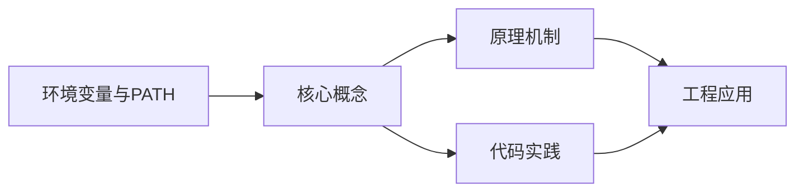
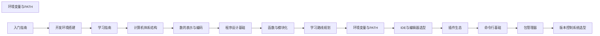

## 1. 学习目标（Bloom 分类）

本节按照布鲁姆教育目标分类学组织学习路径。本文主题为《环境变量与PATH》，属于 入门指南 模块，读者可以根据自身阶段选择阅读深度。

记忆层面：能够准确复述本文的核心概念、术语与基本语法或操作步骤，并能够在提问或检索时快速定位对应知识点。能够说出 入门指南 的核心概念、常用命令与流程。

理解层面：能够用自己的语言解释核心原理与工作机制，说明概念之间的因果关系，而不是机械记忆结论。能够解释 入门指南 的工作原理与设计动机。

应用层面：能够在真实项目或练习场景中运用本文知识解决具体问题，写出正确且可维护的实现。能够独立完成 入门指南 的标准操作。

分析层面：能够拆解复杂问题，比较本文主题与相邻概念的异同，识别边界条件与例外情况。能够分析 入门指南 使用中的异常与边界。

评价层面：能够根据约束条件（性能、可读性、安全、成本）评价不同方案的优劣，做出有依据的技术决策。能够评价 入门指南 相关工具与方案。

创造层面：能够把本文知识与其他模块知识组合，设计出新的解决方案或可复用的工程模式。能够把 入门指南 融入团队工作流。

通过本节学习，读者应当能够把《环境变量与PATH》纳入自己的知识网络，并与 入门指南 模块的其他主题（环境搭建、学习路径、编程基础）建立关联。

## 2. 历史动机与发展脉络

《环境变量与PATH》是 入门指南 领域的重要主题。要真正理解它，需要先了解它解决的问题与演进过程。

编程入门的关键不是记忆语法，而是建立“问题 -> 方案 -> 验证”的思维循环；本模块为完全零基础的读者设计。
现代学习路径：环境搭建 -> 编程基础（变量/流程/函数）-> 数据与算法 -> 项目实践；本项目的完整文档库按此路径组织。
学习工具：IDE（VS Code）、命令行、Git、包管理器；工具链本身也是学习对象。

回到本文主题：环境变量与PATH 的提出与成熟，正是上述技术背景下的必然产物。早期实现往往以简单可用为目标，随着工程规模扩大，社区逐渐沉淀出标准做法与最佳实践；理解这一脉络，可以帮助读者判断“为什么文档中的推荐写法是现在这个样子”，也能在遇到历史遗留代码时准确识别其设计年代与取舍。


## 3. 形式化定义与核心概念精讲

本节把《环境变量与PATH》涉及的核心概念以“定义 + 讲解”的形式展开。读者应把定义当作工具，把讲解当作理解路径；两者结合才能形成可迁移的知识。

编程范式：命令式（逐步指令）、函数式（表达式与不可变）、面向对象（对象与消息）；语言是多范式的。
程序执行：源码 -> 编译/解释 -> 运行；调试是理解程序行为的主要手段。
抽象层次：机器码 -> 汇编 -> 高级语言 -> 框架 -> 领域语言；抽象降低认知负担。

### 3.1 原文章节逐一精讲

原文档把主题拆分为 11 个小节，下面按顺序给出每一节的导读讲解，随后保留原文细节供精读。

#### 原文精读（完整保留）

# 编程入门 环境变量配置

> **符号约定**：`< >` 必填参数 | `[ ]` 可选参数

---

#### 1. 环境变量基础

##### 1.1 什么是环境变量

环境变量是操作系统中用于存储配置信息的**键值对**，进程运行时可以读取这些变量来获取配置。每个进程都从其父进程继承环境变量，形成了一条从系统启动到当前进程的环境变量链。

```
KEY=VALUE
HOME=/home/user
PATH=/usr/local/bin:/usr/bin:/bin
LANG=en_US.UTF-8
```

环境变量的核心作用：

- **配置传递**：无需修改代码即可改变程序行为
- **路径声明**：告诉系统去哪里查找可执行文件
- **密钥管理**：存储 API Key 等敏感信息（不应硬编码）
- **行为控制**：控制程序的调试模式、日志级别等

##### 1.2 环境变量的分类

| 类型         | 作用域          | 示例                 | 说明           |
| :----------- | :-------------- | :------------------- | :------------- |
| **系统级**   | 所有用户        | `PATH`、`SystemRoot` | 系统启动时加载 |
| **用户级**   | 当前用户        | `HOME`、`USER`       | 用户登录时加载 |
| **进程级**   | 当前进程        | `NODE_ENV`、`PORT`   | 进程运行时设置 |
| **Shell 级** | 当前 Shell 会话 | 临时变量             | 会话结束后消失 |

##### 1.3 环境变量的生命周期

```
系统启动 → 加载系统级变量
    ↓
用户登录 → 加载用户级变量（~/.bashrc, ~/.zshrc 等）
    ↓
Shell 会话 → 加载 Shell 配置
    ↓
进程启动 → 继承父进程环境变量
    ↓
进程运行 → 可读取/修改自身环境变量
    ↓
进程结束 → 进程级变量消失
```

#### 2. PATH 机制详解

##### 2.1 PATH 的工作原理

`PATH` 是最重要的环境变量，它定义了系统查找可执行文件的**搜索路径列表**。当你在终端输入一个命令时，Shell 会按顺序在 PATH 中的每个目录里查找对应的可执行文件。

```bash
# 查看 PATH
echo $PATH
# 输出: /usr/local/bin:/usr/bin:/bin:/usr/sbin:/sbin

# 查找命令的实际位置
which python3
# 输出: /usr/local/bin/python3

# 查找所有匹配的位置
where node    # Windows
which -a node # macOS/Linux
```

##### 2.2 PATH 搜索流程

```
输入命令: python3
    ↓
检查是否为 Shell 内建命令？ → 是 → 执行内建命令
    ↓ 否
检查是否为别名（alias）？ → 是 → 展开别名
    ↓ 否
遍历 PATH 目录:
    /usr/local/bin/python3 → 存在？ → 执行
    /usr/bin/python3       → 存在？ → 执行
    /bin/python3           → 存在？ → 执行
    ...
    ↓ 全部不存在
报错: command not found
```

##### 2.3 PATH 的安全考虑

- **顺序敏感**：PATH 中靠前的目录优先级更高，可能被恶意程序利用
- **避免包含当前目录**：不要将 `.` 加入 PATH，防止目录注入攻击
- **权限控制**：PATH 中的目录应具有适当的文件系统权限

```bash
# 危险！不要这样做
export PATH=.:$PATH

# 如果当前目录有名为 ls 的恶意脚本
# 执行 ls 时会优先运行恶意脚本而非系统 ls
```

#### 3. 跨平台配置

##### 3.1 Linux / macOS

**配置文件加载顺序**：

```
登录 Shell:
  /etc/profile → ~/.bash_profile → ~/.bashrc

非登录 Shell:
  ~/.bashrc

Zsh:
  /etc/zshenv → ~/.zshenv → ~/.zshrc → ~/.zlogin
```

**常用操作**：

```bash
# 查看所有环境变量
env
printenv

# 查看单个变量
echo $HOME
echo $JAVA_HOME

# 设置临时变量（仅当前会话有效）
export MY_VAR="hello"

# 追加到 PATH
export PATH="$HOME/.local/bin:$PATH"

# 永久生效：写入配置文件
echo 'export PATH="$HOME/.local/bin:$PATH"' >> ~/.bashrc
source ~/.bashrc

# 删除变量
unset MY_VAR
```

##### 3.2 Windows

**配置方式**：

1. **系统设置**：设置 → 系统 → 关于 → 高级系统设置 → 环境变量
2. **命令行**：

```powershell
# 查看所有环境变量
Get-ChildItem Env:

# 查看单个变量
$env:PATH
$env:JAVA_HOME

# 设置临时变量（仅当前会话）
$env:MY_VAR = "hello"

# 追加到 PATH
$env:PATH += ";C:\MyTools\bin"

# 永久设置（用户级）
[Environment]::SetEnvironmentVariable("MY_VAR", "hello", "User")

# 永久设置（系统级，需管理员权限）
[Environment]::SetEnvironmentVariable("MY_VAR", "hello", "Machine")

# 永久追加 PATH
$currentPath = [Environment]::GetEnvironmentVariable("PATH", "User")
[Environment]::SetEnvironmentVariable("PATH", "$currentPath;C:\MyTools\bin", "User")
```

##### 3.3 跨平台环境变量管理

在 Node.js 项目中，推荐使用 `.env` 文件管理环境变量：

```bash
# .env 文件
DATABASE_URL=postgresql://localhost:5432/mydb
API_KEY=sk-xxxxx
NODE_ENV=development
```

```javascript
// 使用 dotenv 加载
require('dotenv').config();

console.log(process.env.DATABASE_URL);
console.log(process.env.NODE_ENV);
```

**安全规则**：

- `.env` 文件必须加入 `.gitignore`，绝不提交到版本控制
- 提供 `.env.example` 作为模板，列出所需变量但不包含真实值
- 生产环境使用 CI/CD 的密钥管理功能，而非 `.env` 文件

#### 4. 常见开发工具的环境变量

##### 4.1 编程语言相关

| 工具        | 变量         | 作用                 |
| :---------- | :----------- | :------------------- |
| **Java**    | `JAVA_HOME`  | JDK 安装路径         |
| **Python**  | `PYTHONPATH` | Python 模块搜索路径  |
| **Node.js** | `NODE_PATH`  | Node.js 模块搜索路径 |
| **Go**      | `GOPATH`     | Go 工作空间路径      |
| **Go**      | `GOROOT`     | Go 安装路径          |
| **Rust**    | `CARGO_HOME` | Cargo 包管理器路径   |

##### 4.2 代理与网络

```bash
# HTTP 代理
export HTTP_PROXY=http://proxy.example.com:8080
export HTTPS_PROXY=http://proxy.example.com:8080
export NO_PROXY=localhost,127.0.0.1,.example.com

# npm 代理
npm config set proxy http://proxy.example.com:8080
npm config set https-proxy http://proxy.example.com:8080
```

#### 5. 问题排查

##### 5.1 常见问题

| 问题                   | 原因                   | 解决方案                    |
| :--------------------- | :--------------------- | :-------------------------- |
| `command not found`    | 可执行文件不在 PATH 中 | 将其所在目录加入 PATH       |
| `permission denied`    | 文件无执行权限         | `chmod +x filename`         |
| 变量设置后不生效       | 未 source 配置文件     | `source ~/.bashrc`          |
| Windows 路径分隔符错误 | 使用了 `/` 而非 `;`    | Windows 用 `;`，Unix 用 `:` |

##### 5.2 调试技巧

```bash
# 检查命令的实际路径
type -a python3    # 显示所有匹配位置
command -v node    # 显示第一个匹配位置

# 检查环境变量是否已设置
[ -z "$JAVA_HOME" ] && echo "未设置" || echo "已设置: $JAVA_HOME"

# 查看进程的环境变量
cat /proc/$PID/environ | tr '\0' '\n'  # Linux
```
#### Windows 系统变量查看

**基本写法：查看所有环境变量（CMD）**
`set`
```bash
# 列出所有环境变量
set
```

---

**基本写法：查看特定变量（CMD）**
`echo %<变量名>%`
```bash
# 查看指定环境变量的值
echo %PATH%
```

---

**基本写法：查看所有变量（PowerShell）**
`Get-ChildItem Env:`
```bash
# PowerShell 列出所有环境变量
Get-ChildItem Env:
```

---

**基本写法：查看特定变量（PowerShell）**
`$env:<变量名>`
```bash
# PowerShell 查看指定变量
$env:PATH
```

---

#### Windows 环境变量设置

**基本写法：临时设置变量（CMD）**
`set <变量名>=<值>`
```bash
# 仅当前会话有效的变量
set MY_VAR=hello
```

---

**基本写法：永久设置用户变量（CMD）**
`setx <变量名> "<值>"`
```bash
# 永久写入用户环境变量
setx JAVA_HOME "C:\Program Files\Java\jdk-21"
```

---

**基本写法：永久设置系统变量（CMD）**
`setx <变量名> "<值>" /M`
```bash
# 写入系统级环境变量（需管理员权限）
setx PATH "%PATH%;C:\new\path" /M
```

---

**基本写法：PowerShell 设置用户变量**
`[Environment]::SetEnvironmentVariable("<变量名>", "<值>", "User")`
```bash
# PowerShell 永久设置用户变量
[Environment]::SetEnvironmentVariable("JAVA_HOME", "C:\Java\jdk-21", "User")
```

---

**基本写法：PowerShell 设置系统变量**
`[Environment]::SetEnvironmentVariable("<变量名>", "<值>", "Machine")`
```bash
# PowerShell 设置系统级变量（需管理员权限）
[Environment]::SetEnvironmentVariable("PATH", $env:PATH + ";C:\new", "Machine")
```

---

#### Windows PATH 管理

**基本写法：追加路径到 PATH**
`setx PATH "%PATH%;<新路径>"`
```bash
# 将新路径追加到 PATH 环境变量
setx PATH "%PATH%;C:\my\tools"
```

---

**基本写法：PowerShell 追加 PATH**
`$env:PATH = $env:PATH + ";<新路径>"`
```bash
# 临时追加路径到当前会话 PATH
$env:PATH = $env:PATH + ";C:\my\tools"
```

---

**基本写法：PowerShell 永久追加用户 PATH**
`$old = [Environment]::GetEnvironmentVariable("PATH", "User"); [Environment]::SetEnvironmentVariable("PATH", $old + ";<新路径>", "User")`
```bash
# 永久追加路径到用户 PATH
$old = [Environment]::GetEnvironmentVariable("PATH", "User")
[Environment]::SetEnvironmentVariable("PATH", $old + ";C:\my\tools", "User")
```

---

#### Linux/macOS 环境变量

**基本写法：临时设置变量**
`export <变量名>=<值>`
```bash
# 仅当前 shell 会话有效
export MY_VAR=hello
```

---

**基本写法：写入 bash 配置文件**
`echo 'export <变量名>=<值>' >> ~/.bashrc`
```bash
# 追加到 bashrc 实现永久生效
echo 'export JAVA_HOME=/usr/lib/jvm/java-21' >> ~/.bashrc
```

---

**基本写法：写入 zsh 配置文件**
`echo 'export <变量名>=<值>' >> ~/.zshrc`
```bash
# 追加到 zshrc（macOS 默认 shell）
echo 'export JAVA_HOME=/usr/lib/jvm/java-21' >> ~/.zshrc
```

---

**基本写法：追加路径到 PATH**
`export PATH=$PATH:<新路径>`
```bash
# 将新路径追加到 PATH 变量
export PATH=$PATH:/usr/local/bin
```

---

**基本写法：前置路径到 PATH**
`export PATH=<新路径>:$PATH`
```bash
# 将新路径前置到 PATH（优先级更高）
export PATH=/usr/local/bin:$PATH
```

---

#### 配置文件重新加载

**基本写法：重新加载 bashrc**
`source ~/.bashrc`
```bash
# 重新加载 bash 配置文件
source ~/.bashrc
```

---

**基本写法：重新加载 zshrc**
`source ~/.zshrc`
```bash
# 重新加载 zsh 配置文件
source ~/.zshrc
```

---

**基本写法：重新加载 profile**
`source ~/.profile`
```bash
# 重新加载 profile 文件
source ~/.profile
```

---

#### 变量删除

**基本写法：删除用户变量（PowerShell）**
`[Environment]::SetEnvironmentVariable("<变量名>", $null, "User")`
```bash
# 删除用户级环境变量
[Environment]::SetEnvironmentVariable("MY_VAR", $null, "User")
```

---

**基本写法：删除 setx 设置的变量**
`reg delete "HKCU\Environment" /F /V <变量名>`
```bash
# 通过注册表删除用户环境变量
reg delete "HKCU\Environment" /F /V MY_VAR
```

---

**基本写法：删除 bash 中的变量**
`unset <变量名>`
```bash
# 删除当前 shell 中的环境变量
unset MY_VAR
```


### 3.2 概念关系图

下面用 Mermaid 图表达本文核心概念之间的关系，帮助读者建立整体图景：



图中展示的是本文知识的结构化关系：核心概念是入口，原理机制解释“为什么”，代码实践演示“怎么做”，工程应用回答“何时用”。读者学习时可以把每个小节的内容挂接到对应节点上。

## 4. 理论推导与原理解析

本节深入《环境变量与PATH》背后的原理。理论部分不求面面俱到，而是聚焦“能解释现象、能指导实践”的关键推导。

编程范式：命令式（逐步指令）、函数式（表达式与不可变）、面向对象（对象与消息）；语言是多范式的。
程序执行：源码 -> 编译/解释 -> 运行；调试是理解程序行为的主要手段。
抽象层次：机器码 -> 汇编 -> 高级语言 -> 框架 -> 领域语言；抽象降低认知负担。
计算机基础：CPU 执行指令、内存存数据、I/O 与外部交互；这些概念支撑所有编程。

需要强调的是，理论推导与工程实践之间存在翻译层：理论给出的是理想化模型与边界条件，工程代码则必须处理真实环境中的例外。读者在学习时应先掌握理论的“标准情形”，再通过陷阱章节了解“非标准情形”。

## 5. 代码示例与逐行讲解

本节把原文中的代码示例系统整理，并为每个示例补充用途说明与讲解。读者不应只浏览代码，而应逐段对照讲解理解设计意图。

### 5.1 示例：1.1 什么是环境变量

该示例来自原文《1.1 什么是环境变量》小节，用于演示环境变量与PATH相关操作。阅读时请先看代码结构，再看其后的讲解。

```text
KEY=VALUE
HOME=/home/user
PATH=/usr/local/bin:/usr/bin:/bin
LANG=en_US.UTF-8
```

讲解：这段代码演示了本节核心知识点。代码中的关键操作可以归纳为三步：准备（定义或初始化）、执行（核心逻辑）、收尾（释放资源或返回结果）。实际项目中，这三步往往被封装为函数或类，以提升复用性与可测试性。

关键点分析：

该示例共 4 行有效代码，结构以数据或配置为主。阅读时应关注：数据字段的含义、配置项的作用，以及它们与运行行为的对应关系。

进阶思考路径：先尝试修改参数观察行为变化，再把示例中的模式迁移到自己的项目中；每次修改都记录预期与实测差异，这是把示例转化为能力的最快方式。

### 5.2 示例：1.3 环境变量的生命周期

该示例来自原文《1.3 环境变量的生命周期》小节，用于演示环境变量与PATH相关操作。阅读时请先看代码结构，再看其后的讲解。

```text
系统启动 → 加载系统级变量
    ↓
用户登录 → 加载用户级变量（~/.bashrc, ~/.zshrc 等）
    ↓
Shell 会话 → 加载 Shell 配置
    ↓
进程启动 → 继承父进程环境变量
    ↓
进程运行 → 可读取/修改自身环境变量
    ↓
进程结束 → 进程级变量消失
```

讲解：这段代码演示了本节核心知识点。代码中的关键操作可以归纳为三步：准备（定义或初始化）、执行（核心逻辑）、收尾（释放资源或返回结果）。实际项目中，这三步往往被封装为函数或类，以提升复用性与可测试性。

关键点分析：

该示例共 11 行有效代码，结构以数据或配置为主。阅读时应关注：数据字段的含义、配置项的作用，以及它们与运行行为的对应关系。

进阶思考路径：先尝试修改参数观察行为变化，再把示例中的模式迁移到自己的项目中；每次修改都记录预期与实测差异，这是把示例转化为能力的最快方式。

### 5.3 示例：2.1 PATH 的工作原理

该示例来自原文《2.1 PATH 的工作原理》小节，用于演示环境变量与PATH相关操作。阅读时请先看代码结构，再看其后的讲解。

```bash
# 查看 PATH
echo $PATH
# 输出: /usr/local/bin:/usr/bin:/bin:/usr/sbin:/sbin

# 查找命令的实际位置
which python3
# 输出: /usr/local/bin/python3

# 查找所有匹配的位置
where node    # Windows
which -a node # macOS/Linux
```

讲解：这段代码演示了本节核心知识点。代码中的关键操作可以归纳为三步：准备（定义或初始化）、执行（核心逻辑）、收尾（释放资源或返回结果）。实际项目中，这三步往往被封装为函数或类，以提升复用性与可测试性。

关键点分析：

该示例共 9 行有效代码，结构以数据或配置为主。阅读时应关注：数据字段的含义、配置项的作用，以及它们与运行行为的对应关系。

进阶思考路径：先尝试修改参数观察行为变化，再把示例中的模式迁移到自己的项目中；每次修改都记录预期与实测差异，这是把示例转化为能力的最快方式。

### 5.4 示例：2.2 PATH 搜索流程

该示例来自原文《2.2 PATH 搜索流程》小节，用于演示环境变量与PATH相关操作。阅读时请先看代码结构，再看其后的讲解。

```text
输入命令: python3
    ↓
检查是否为 Shell 内建命令？ → 是 → 执行内建命令
    ↓ 否
检查是否为别名（alias）？ → 是 → 展开别名
    ↓ 否
遍历 PATH 目录:
    /usr/local/bin/python3 → 存在？ → 执行
    /usr/bin/python3       → 存在？ → 执行
    /bin/python3           → 存在？ → 执行
    ...
    ↓ 全部不存在
报错: command not found
```

讲解：这段代码演示了本节核心知识点。代码中的关键操作可以归纳为三步：准备（定义或初始化）、执行（核心逻辑）、收尾（释放资源或返回结果）。实际项目中，这三步往往被封装为函数或类，以提升复用性与可测试性。

关键点分析：

该示例共 13 行有效代码，结构以数据或配置为主。阅读时应关注：数据字段的含义、配置项的作用，以及它们与运行行为的对应关系。

进阶思考路径：先尝试修改参数观察行为变化，再把示例中的模式迁移到自己的项目中；每次修改都记录预期与实测差异，这是把示例转化为能力的最快方式。

### 5.5 示例：2.3 PATH 的安全考虑

该示例来自原文《2.3 PATH 的安全考虑》小节，用于演示环境变量与PATH相关操作。阅读时请先看代码结构，再看其后的讲解。

```bash
# 危险！不要这样做
export PATH=.:$PATH

# 如果当前目录有名为 ls 的恶意脚本
# 执行 ls 时会优先运行恶意脚本而非系统 ls
```

讲解：这段代码演示了本节核心知识点。代码中的关键操作可以归纳为三步：准备（定义或初始化）、执行（核心逻辑）、收尾（释放资源或返回结果）。实际项目中，这三步往往被封装为函数或类，以提升复用性与可测试性。

关键点分析：

该示例共 4 行有效代码，结构以数据或配置为主。阅读时应关注：数据字段的含义、配置项的作用，以及它们与运行行为的对应关系。

进阶思考路径：先尝试修改参数观察行为变化，再把示例中的模式迁移到自己的项目中；每次修改都记录预期与实测差异，这是把示例转化为能力的最快方式。

### 5.6 示例：3.1 Linux / macOS

该示例来自原文《3.1 Linux / macOS》小节，用于演示环境变量与PATH相关操作。阅读时请先看代码结构，再看其后的讲解。

```text
登录 Shell:
  /etc/profile → ~/.bash_profile → ~/.bashrc

非登录 Shell:
  ~/.bashrc

Zsh:
  /etc/zshenv → ~/.zshenv → ~/.zshrc → ~/.zlogin
```

讲解：这段代码演示了本节核心知识点。代码中的关键操作可以归纳为三步：准备（定义或初始化）、执行（核心逻辑）、收尾（释放资源或返回结果）。实际项目中，这三步往往被封装为函数或类，以提升复用性与可测试性。

关键点分析：

该示例共 6 行有效代码，结构以数据或配置为主。阅读时应关注：数据字段的含义、配置项的作用，以及它们与运行行为的对应关系。

进阶思考路径：先尝试修改参数观察行为变化，再把示例中的模式迁移到自己的项目中；每次修改都记录预期与实测差异，这是把示例转化为能力的最快方式。

### 5.7 示例：3.1 Linux / macOS

该示例来自原文《3.1 Linux / macOS》小节，用于演示环境变量与PATH相关操作。阅读时请先看代码结构，再看其后的讲解。

```bash
# 查看所有环境变量
env
printenv

# 查看单个变量
echo $HOME
echo $JAVA_HOME

# 设置临时变量（仅当前会话有效）
export MY_VAR="hello"

# 追加到 PATH
export PATH="$HOME/.local/bin:$PATH"

# 永久生效：写入配置文件
echo 'export PATH="$HOME/.local/bin:$PATH"' >> ~/.bashrc
source ~/.bashrc

# 删除变量
unset MY_VAR
```

讲解：这段代码演示了本节核心知识点。代码中的关键操作可以归纳为三步：准备（定义或初始化）、执行（核心逻辑）、收尾（释放资源或返回结果）。实际项目中，这三步往往被封装为函数或类，以提升复用性与可测试性。

关键点分析：

该示例共 15 行有效代码，结构以数据或配置为主。阅读时应关注：数据字段的含义、配置项的作用，以及它们与运行行为的对应关系。

进阶思考路径：先尝试修改参数观察行为变化，再把示例中的模式迁移到自己的项目中；每次修改都记录预期与实测差异，这是把示例转化为能力的最快方式。

### 5.8 示例：3.2 Windows

该示例来自原文《3.2 Windows》小节，用于演示环境变量与PATH相关操作。阅读时请先看代码结构，再看其后的讲解。

```powershell
# 查看所有环境变量
Get-ChildItem Env:

# 查看单个变量
$env:PATH
$env:JAVA_HOME

# 设置临时变量（仅当前会话）
$env:MY_VAR = "hello"

# 追加到 PATH
$env:PATH += ";C:\MyTools\bin"

# 永久设置（用户级）
[Environment]::SetEnvironmentVariable("MY_VAR", "hello", "User")

# 永久设置（系统级，需管理员权限）
[Environment]::SetEnvironmentVariable("MY_VAR", "hello", "Machine")

# 永久追加 PATH
$currentPath = [Environment]::GetEnvironmentVariable("PATH", "User")
[Environment]::SetEnvironmentVariable("PATH", "$currentPath;C:\MyTools\bin", "User")
```

讲解：这段代码演示了本节核心知识点。代码中的关键操作可以归纳为三步：准备（定义或初始化）、执行（核心逻辑）、收尾（释放资源或返回结果）。实际项目中，这三步往往被封装为函数或类，以提升复用性与可测试性。

关键点分析：

该示例共 16 行有效代码，结构以数据或配置为主。阅读时应关注：数据字段的含义、配置项的作用，以及它们与运行行为的对应关系。

进阶思考路径：先尝试修改参数观察行为变化，再把示例中的模式迁移到自己的项目中；每次修改都记录预期与实测差异，这是把示例转化为能力的最快方式。

### 5.9 示例：3.3 跨平台环境变量管理

该示例来自原文《3.3 跨平台环境变量管理》小节，用于演示环境变量与PATH相关操作。阅读时请先看代码结构，再看其后的讲解。

```bash
# .env 文件
DATABASE_URL=postgresql://localhost:5432/mydb
API_KEY=sk-xxxxx
NODE_ENV=development
```

讲解：这段代码演示了本节核心知识点。代码中的关键操作可以归纳为三步：准备（定义或初始化）、执行（核心逻辑）、收尾（释放资源或返回结果）。实际项目中，这三步往往被封装为函数或类，以提升复用性与可测试性。

关键点分析：

该示例共 4 行有效代码，结构以数据或配置为主。阅读时应关注：数据字段的含义、配置项的作用，以及它们与运行行为的对应关系。

进阶思考路径：先尝试修改参数观察行为变化，再把示例中的模式迁移到自己的项目中；每次修改都记录预期与实测差异，这是把示例转化为能力的最快方式。

### 5.10 示例：3.3 跨平台环境变量管理

该示例来自原文《3.3 跨平台环境变量管理》小节，用于演示环境变量与PATH相关操作。阅读时请先看代码结构，再看其后的讲解。

```javascript
// 使用 dotenv 加载
require('dotenv').config();

console.log(process.env.DATABASE_URL);
console.log(process.env.NODE_ENV);
```

讲解：这段代码演示了本节核心知识点。代码中的关键操作可以归纳为三步：准备（定义或初始化）、执行（核心逻辑）、收尾（释放资源或返回结果）。实际项目中，这三步往往被封装为函数或类，以提升复用性与可测试性。

关键点分析：

该示例共 4 行有效代码，结构以数据或配置为主。阅读时应关注：数据字段的含义、配置项的作用，以及它们与运行行为的对应关系。

进阶思考路径：先尝试修改参数观察行为变化，再把示例中的模式迁移到自己的项目中；每次修改都记录预期与实测差异，这是把示例转化为能力的最快方式。

### 5.11 示例：4.2 代理与网络

该示例来自原文《4.2 代理与网络》小节，用于演示环境变量与PATH相关操作。阅读时请先看代码结构，再看其后的讲解。

```bash
# HTTP 代理
export HTTP_PROXY=http://proxy.example.com:8080
export HTTPS_PROXY=http://proxy.example.com:8080
export NO_PROXY=localhost,127.0.0.1,.example.com

# npm 代理
npm config set proxy http://proxy.example.com:8080
npm config set https-proxy http://proxy.example.com:8080
```

讲解：这段代码演示了本节核心知识点。代码中的关键操作可以归纳为三步：准备（定义或初始化）、执行（核心逻辑）、收尾（释放资源或返回结果）。实际项目中，这三步往往被封装为函数或类，以提升复用性与可测试性。

关键点分析：

该示例共 7 行有效代码，结构以数据或配置为主。阅读时应关注：数据字段的含义、配置项的作用，以及它们与运行行为的对应关系。

进阶思考路径：先尝试修改参数观察行为变化，再把示例中的模式迁移到自己的项目中；每次修改都记录预期与实测差异，这是把示例转化为能力的最快方式。

### 5.12 示例：5.2 调试技巧

该示例来自原文《5.2 调试技巧》小节，用于演示环境变量与PATH相关操作。阅读时请先看代码结构，再看其后的讲解。

```bash
# 检查命令的实际路径
type -a python3    # 显示所有匹配位置
command -v node    # 显示第一个匹配位置

# 检查环境变量是否已设置
[ -z "$JAVA_HOME" ] && echo "未设置" || echo "已设置: $JAVA_HOME"

# 查看进程的环境变量
cat /proc/$PID/environ | tr '\0' '\n'  # Linux
```

讲解：这段代码演示了本节核心知识点。代码中的关键操作可以归纳为三步：准备（定义或初始化）、执行（核心逻辑）、收尾（释放资源或返回结果）。实际项目中，这三步往往被封装为函数或类，以提升复用性与可测试性。

关键点分析：

该示例共 7 行有效代码，结构以数据或配置为主。阅读时应关注：数据字段的含义、配置项的作用，以及它们与运行行为的对应关系。

进阶思考路径：先尝试修改参数观察行为变化，再把示例中的模式迁移到自己的项目中；每次修改都记录预期与实测差异，这是把示例转化为能力的最快方式。

### 5.13 示例：Windows 系统变量查看

该示例来自原文《Windows 系统变量查看》小节，用于演示环境变量与PATH相关操作。阅读时请先看代码结构，再看其后的讲解。

```bash
# 列出所有环境变量
set
```

讲解：这段代码演示了本节核心知识点。代码中的关键操作可以归纳为三步：准备（定义或初始化）、执行（核心逻辑）、收尾（释放资源或返回结果）。实际项目中，这三步往往被封装为函数或类，以提升复用性与可测试性。

关键点分析：

该示例共 2 行有效代码，结构以数据或配置为主。阅读时应关注：数据字段的含义、配置项的作用，以及它们与运行行为的对应关系。

进阶思考路径：先尝试修改参数观察行为变化，再把示例中的模式迁移到自己的项目中；每次修改都记录预期与实测差异，这是把示例转化为能力的最快方式。

### 5.14 示例：Windows 系统变量查看

该示例来自原文《Windows 系统变量查看》小节，用于演示环境变量与PATH相关操作。阅读时请先看代码结构，再看其后的讲解。

```bash
# 查看指定环境变量的值
echo %PATH%
```

讲解：这段代码演示了本节核心知识点。代码中的关键操作可以归纳为三步：准备（定义或初始化）、执行（核心逻辑）、收尾（释放资源或返回结果）。实际项目中，这三步往往被封装为函数或类，以提升复用性与可测试性。

关键点分析：

该示例共 2 行有效代码，结构以数据或配置为主。阅读时应关注：数据字段的含义、配置项的作用，以及它们与运行行为的对应关系。

进阶思考路径：先尝试修改参数观察行为变化，再把示例中的模式迁移到自己的项目中；每次修改都记录预期与实测差异，这是把示例转化为能力的最快方式。

### 5.15 示例：Windows 系统变量查看

该示例来自原文《Windows 系统变量查看》小节，用于演示环境变量与PATH相关操作。阅读时请先看代码结构，再看其后的讲解。

```bash
# PowerShell 列出所有环境变量
Get-ChildItem Env:
```

讲解：这段代码演示了本节核心知识点。代码中的关键操作可以归纳为三步：准备（定义或初始化）、执行（核心逻辑）、收尾（释放资源或返回结果）。实际项目中，这三步往往被封装为函数或类，以提升复用性与可测试性。

关键点分析：

该示例共 2 行有效代码，结构以数据或配置为主。阅读时应关注：数据字段的含义、配置项的作用，以及它们与运行行为的对应关系。

进阶思考路径：先尝试修改参数观察行为变化，再把示例中的模式迁移到自己的项目中；每次修改都记录预期与实测差异，这是把示例转化为能力的最快方式。

### 5.16 示例：Windows 系统变量查看

该示例来自原文《Windows 系统变量查看》小节，用于演示环境变量与PATH相关操作。阅读时请先看代码结构，再看其后的讲解。

```bash
# PowerShell 查看指定变量
$env:PATH
```

讲解：这段代码演示了本节核心知识点。代码中的关键操作可以归纳为三步：准备（定义或初始化）、执行（核心逻辑）、收尾（释放资源或返回结果）。实际项目中，这三步往往被封装为函数或类，以提升复用性与可测试性。

关键点分析：

该示例共 2 行有效代码，结构以数据或配置为主。阅读时应关注：数据字段的含义、配置项的作用，以及它们与运行行为的对应关系。

进阶思考路径：先尝试修改参数观察行为变化，再把示例中的模式迁移到自己的项目中；每次修改都记录预期与实测差异，这是把示例转化为能力的最快方式。

### 5.17 示例：Windows 环境变量设置

该示例来自原文《Windows 环境变量设置》小节，用于演示环境变量与PATH相关操作。阅读时请先看代码结构，再看其后的讲解。

```bash
# 仅当前会话有效的变量
set MY_VAR=hello
```

讲解：这段代码演示了本节核心知识点。代码中的关键操作可以归纳为三步：准备（定义或初始化）、执行（核心逻辑）、收尾（释放资源或返回结果）。实际项目中，这三步往往被封装为函数或类，以提升复用性与可测试性。

关键点分析：

该示例共 2 行有效代码，结构以数据或配置为主。阅读时应关注：数据字段的含义、配置项的作用，以及它们与运行行为的对应关系。

进阶思考路径：先尝试修改参数观察行为变化，再把示例中的模式迁移到自己的项目中；每次修改都记录预期与实测差异，这是把示例转化为能力的最快方式。

### 5.18 示例：Windows 环境变量设置

该示例来自原文《Windows 环境变量设置》小节，用于演示环境变量与PATH相关操作。阅读时请先看代码结构，再看其后的讲解。

```bash
# 永久写入用户环境变量
setx JAVA_HOME "C:\Program Files\Java\jdk-21"
```

讲解：这段代码演示了本节核心知识点。代码中的关键操作可以归纳为三步：准备（定义或初始化）、执行（核心逻辑）、收尾（释放资源或返回结果）。实际项目中，这三步往往被封装为函数或类，以提升复用性与可测试性。

关键点分析：

该示例共 2 行有效代码，结构以数据或配置为主。阅读时应关注：数据字段的含义、配置项的作用，以及它们与运行行为的对应关系。

进阶思考路径：先尝试修改参数观察行为变化，再把示例中的模式迁移到自己的项目中；每次修改都记录预期与实测差异，这是把示例转化为能力的最快方式。

### 5.19 示例：Windows 环境变量设置

该示例来自原文《Windows 环境变量设置》小节，用于演示环境变量与PATH相关操作。阅读时请先看代码结构，再看其后的讲解。

```bash
# 写入系统级环境变量（需管理员权限）
setx PATH "%PATH%;C:\new\path" /M
```

讲解：这段代码演示了本节核心知识点。代码中的关键操作可以归纳为三步：准备（定义或初始化）、执行（核心逻辑）、收尾（释放资源或返回结果）。实际项目中，这三步往往被封装为函数或类，以提升复用性与可测试性。

关键点分析：

该示例共 2 行有效代码，结构以数据或配置为主。阅读时应关注：数据字段的含义、配置项的作用，以及它们与运行行为的对应关系。

进阶思考路径：先尝试修改参数观察行为变化，再把示例中的模式迁移到自己的项目中；每次修改都记录预期与实测差异，这是把示例转化为能力的最快方式。

### 5.20 示例：Windows 环境变量设置

该示例来自原文《Windows 环境变量设置》小节，用于演示环境变量与PATH相关操作。阅读时请先看代码结构，再看其后的讲解。

```bash
# PowerShell 永久设置用户变量
[Environment]::SetEnvironmentVariable("JAVA_HOME", "C:\Java\jdk-21", "User")
```

讲解：这段代码演示了本节核心知识点。代码中的关键操作可以归纳为三步：准备（定义或初始化）、执行（核心逻辑）、收尾（释放资源或返回结果）。实际项目中，这三步往往被封装为函数或类，以提升复用性与可测试性。

关键点分析：

该示例共 2 行有效代码，结构以数据或配置为主。阅读时应关注：数据字段的含义、配置项的作用，以及它们与运行行为的对应关系。

进阶思考路径：先尝试修改参数观察行为变化，再把示例中的模式迁移到自己的项目中；每次修改都记录预期与实测差异，这是把示例转化为能力的最快方式。

### 5.21 示例：Windows 环境变量设置

该示例来自原文《Windows 环境变量设置》小节，用于演示环境变量与PATH相关操作。阅读时请先看代码结构，再看其后的讲解。

```bash
# PowerShell 设置系统级变量（需管理员权限）
[Environment]::SetEnvironmentVariable("PATH", $env:PATH + ";C:\new", "Machine")
```

讲解：这段代码演示了本节核心知识点。代码中的关键操作可以归纳为三步：准备（定义或初始化）、执行（核心逻辑）、收尾（释放资源或返回结果）。实际项目中，这三步往往被封装为函数或类，以提升复用性与可测试性。

关键点分析：

该示例共 2 行有效代码，结构以数据或配置为主。阅读时应关注：数据字段的含义、配置项的作用，以及它们与运行行为的对应关系。

进阶思考路径：先尝试修改参数观察行为变化，再把示例中的模式迁移到自己的项目中；每次修改都记录预期与实测差异，这是把示例转化为能力的最快方式。

### 5.22 示例：Windows PATH 管理

该示例来自原文《Windows PATH 管理》小节，用于演示环境变量与PATH相关操作。阅读时请先看代码结构，再看其后的讲解。

```bash
# 将新路径追加到 PATH 环境变量
setx PATH "%PATH%;C:\my\tools"
```

讲解：这段代码演示了本节核心知识点。代码中的关键操作可以归纳为三步：准备（定义或初始化）、执行（核心逻辑）、收尾（释放资源或返回结果）。实际项目中，这三步往往被封装为函数或类，以提升复用性与可测试性。

关键点分析：

该示例共 2 行有效代码，结构以数据或配置为主。阅读时应关注：数据字段的含义、配置项的作用，以及它们与运行行为的对应关系。

进阶思考路径：先尝试修改参数观察行为变化，再把示例中的模式迁移到自己的项目中；每次修改都记录预期与实测差异，这是把示例转化为能力的最快方式。

### 5.23 示例：Windows PATH 管理

该示例来自原文《Windows PATH 管理》小节，用于演示环境变量与PATH相关操作。阅读时请先看代码结构，再看其后的讲解。

```bash
# 临时追加路径到当前会话 PATH
$env:PATH = $env:PATH + ";C:\my\tools"
```

讲解：这段代码演示了本节核心知识点。代码中的关键操作可以归纳为三步：准备（定义或初始化）、执行（核心逻辑）、收尾（释放资源或返回结果）。实际项目中，这三步往往被封装为函数或类，以提升复用性与可测试性。

关键点分析：

该示例共 2 行有效代码，结构以数据或配置为主。阅读时应关注：数据字段的含义、配置项的作用，以及它们与运行行为的对应关系。

进阶思考路径：先尝试修改参数观察行为变化，再把示例中的模式迁移到自己的项目中；每次修改都记录预期与实测差异，这是把示例转化为能力的最快方式。

### 5.24 示例：Windows PATH 管理

该示例来自原文《Windows PATH 管理》小节，用于演示环境变量与PATH相关操作。阅读时请先看代码结构，再看其后的讲解。

```bash
# 永久追加路径到用户 PATH
$old = [Environment]::GetEnvironmentVariable("PATH", "User")
[Environment]::SetEnvironmentVariable("PATH", $old + ";C:\my\tools", "User")
```

讲解：这段代码演示了本节核心知识点。代码中的关键操作可以归纳为三步：准备（定义或初始化）、执行（核心逻辑）、收尾（释放资源或返回结果）。实际项目中，这三步往往被封装为函数或类，以提升复用性与可测试性。

关键点分析：

该示例共 3 行有效代码，结构以数据或配置为主。阅读时应关注：数据字段的含义、配置项的作用，以及它们与运行行为的对应关系。

进阶思考路径：先尝试修改参数观察行为变化，再把示例中的模式迁移到自己的项目中；每次修改都记录预期与实测差异，这是把示例转化为能力的最快方式。

### 5.25 示例：Linux/macOS 环境变量

该示例来自原文《Linux/macOS 环境变量》小节，用于演示环境变量与PATH相关操作。阅读时请先看代码结构，再看其后的讲解。

```bash
# 仅当前 shell 会话有效
export MY_VAR=hello
```

讲解：这段代码演示了本节核心知识点。代码中的关键操作可以归纳为三步：准备（定义或初始化）、执行（核心逻辑）、收尾（释放资源或返回结果）。实际项目中，这三步往往被封装为函数或类，以提升复用性与可测试性。

关键点分析：

该示例共 2 行有效代码，结构以数据或配置为主。阅读时应关注：数据字段的含义、配置项的作用，以及它们与运行行为的对应关系。

进阶思考路径：先尝试修改参数观察行为变化，再把示例中的模式迁移到自己的项目中；每次修改都记录预期与实测差异，这是把示例转化为能力的最快方式。

### 5.26 示例：Linux/macOS 环境变量

该示例来自原文《Linux/macOS 环境变量》小节，用于演示环境变量与PATH相关操作。阅读时请先看代码结构，再看其后的讲解。

```bash
# 追加到 bashrc 实现永久生效
echo 'export JAVA_HOME=/usr/lib/jvm/java-21' >> ~/.bashrc
```

讲解：这段代码演示了本节核心知识点。代码中的关键操作可以归纳为三步：准备（定义或初始化）、执行（核心逻辑）、收尾（释放资源或返回结果）。实际项目中，这三步往往被封装为函数或类，以提升复用性与可测试性。

关键点分析：

该示例共 2 行有效代码，结构以数据或配置为主。阅读时应关注：数据字段的含义、配置项的作用，以及它们与运行行为的对应关系。

进阶思考路径：先尝试修改参数观察行为变化，再把示例中的模式迁移到自己的项目中；每次修改都记录预期与实测差异，这是把示例转化为能力的最快方式。

### 5.27 示例：Linux/macOS 环境变量

该示例来自原文《Linux/macOS 环境变量》小节，用于演示环境变量与PATH相关操作。阅读时请先看代码结构，再看其后的讲解。

```bash
# 追加到 zshrc（macOS 默认 shell）
echo 'export JAVA_HOME=/usr/lib/jvm/java-21' >> ~/.zshrc
```

讲解：这段代码演示了本节核心知识点。代码中的关键操作可以归纳为三步：准备（定义或初始化）、执行（核心逻辑）、收尾（释放资源或返回结果）。实际项目中，这三步往往被封装为函数或类，以提升复用性与可测试性。

关键点分析：

该示例共 2 行有效代码，结构以数据或配置为主。阅读时应关注：数据字段的含义、配置项的作用，以及它们与运行行为的对应关系。

进阶思考路径：先尝试修改参数观察行为变化，再把示例中的模式迁移到自己的项目中；每次修改都记录预期与实测差异，这是把示例转化为能力的最快方式。

### 5.28 示例：Linux/macOS 环境变量

该示例来自原文《Linux/macOS 环境变量》小节，用于演示环境变量与PATH相关操作。阅读时请先看代码结构，再看其后的讲解。

```bash
# 将新路径追加到 PATH 变量
export PATH=$PATH:/usr/local/bin
```

讲解：这段代码演示了本节核心知识点。代码中的关键操作可以归纳为三步：准备（定义或初始化）、执行（核心逻辑）、收尾（释放资源或返回结果）。实际项目中，这三步往往被封装为函数或类，以提升复用性与可测试性。

关键点分析：

该示例共 2 行有效代码，结构以数据或配置为主。阅读时应关注：数据字段的含义、配置项的作用，以及它们与运行行为的对应关系。

进阶思考路径：先尝试修改参数观察行为变化，再把示例中的模式迁移到自己的项目中；每次修改都记录预期与实测差异，这是把示例转化为能力的最快方式。

### 5.29 示例：Linux/macOS 环境变量

该示例来自原文《Linux/macOS 环境变量》小节，用于演示环境变量与PATH相关操作。阅读时请先看代码结构，再看其后的讲解。

```bash
# 将新路径前置到 PATH（优先级更高）
export PATH=/usr/local/bin:$PATH
```

讲解：这段代码演示了本节核心知识点。代码中的关键操作可以归纳为三步：准备（定义或初始化）、执行（核心逻辑）、收尾（释放资源或返回结果）。实际项目中，这三步往往被封装为函数或类，以提升复用性与可测试性。

关键点分析：

该示例共 2 行有效代码，结构以数据或配置为主。阅读时应关注：数据字段的含义、配置项的作用，以及它们与运行行为的对应关系。

进阶思考路径：先尝试修改参数观察行为变化，再把示例中的模式迁移到自己的项目中；每次修改都记录预期与实测差异，这是把示例转化为能力的最快方式。

### 5.30 示例：配置文件重新加载

该示例来自原文《配置文件重新加载》小节，用于演示环境变量与PATH相关操作。阅读时请先看代码结构，再看其后的讲解。

```bash
# 重新加载 bash 配置文件
source ~/.bashrc
```

讲解：这段代码演示了本节核心知识点。代码中的关键操作可以归纳为三步：准备（定义或初始化）、执行（核心逻辑）、收尾（释放资源或返回结果）。实际项目中，这三步往往被封装为函数或类，以提升复用性与可测试性。

关键点分析：

该示例共 2 行有效代码，结构以数据或配置为主。阅读时应关注：数据字段的含义、配置项的作用，以及它们与运行行为的对应关系。

进阶思考路径：先尝试修改参数观察行为变化，再把示例中的模式迁移到自己的项目中；每次修改都记录预期与实测差异，这是把示例转化为能力的最快方式。

### 5.31 示例：配置文件重新加载

该示例来自原文《配置文件重新加载》小节，用于演示环境变量与PATH相关操作。阅读时请先看代码结构，再看其后的讲解。

```bash
# 重新加载 zsh 配置文件
source ~/.zshrc
```

讲解：这段代码演示了本节核心知识点。代码中的关键操作可以归纳为三步：准备（定义或初始化）、执行（核心逻辑）、收尾（释放资源或返回结果）。实际项目中，这三步往往被封装为函数或类，以提升复用性与可测试性。

关键点分析：

该示例共 2 行有效代码，结构以数据或配置为主。阅读时应关注：数据字段的含义、配置项的作用，以及它们与运行行为的对应关系。

进阶思考路径：先尝试修改参数观察行为变化，再把示例中的模式迁移到自己的项目中；每次修改都记录预期与实测差异，这是把示例转化为能力的最快方式。

### 5.32 示例：配置文件重新加载

该示例来自原文《配置文件重新加载》小节，用于演示环境变量与PATH相关操作。阅读时请先看代码结构，再看其后的讲解。

```bash
# 重新加载 profile 文件
source ~/.profile
```

讲解：这段代码演示了本节核心知识点。代码中的关键操作可以归纳为三步：准备（定义或初始化）、执行（核心逻辑）、收尾（释放资源或返回结果）。实际项目中，这三步往往被封装为函数或类，以提升复用性与可测试性。

关键点分析：

该示例共 2 行有效代码，结构以数据或配置为主。阅读时应关注：数据字段的含义、配置项的作用，以及它们与运行行为的对应关系。

进阶思考路径：先尝试修改参数观察行为变化，再把示例中的模式迁移到自己的项目中；每次修改都记录预期与实测差异，这是把示例转化为能力的最快方式。

### 5.33 示例：变量删除

该示例来自原文《变量删除》小节，用于演示环境变量与PATH相关操作。阅读时请先看代码结构，再看其后的讲解。

```bash
# 删除用户级环境变量
[Environment]::SetEnvironmentVariable("MY_VAR", $null, "User")
```

讲解：这段代码演示了本节核心知识点。代码中的关键操作可以归纳为三步：准备（定义或初始化）、执行（核心逻辑）、收尾（释放资源或返回结果）。实际项目中，这三步往往被封装为函数或类，以提升复用性与可测试性。

关键点分析：

该示例共 2 行有效代码，结构以数据或配置为主。阅读时应关注：数据字段的含义、配置项的作用，以及它们与运行行为的对应关系。

进阶思考路径：先尝试修改参数观察行为变化，再把示例中的模式迁移到自己的项目中；每次修改都记录预期与实测差异，这是把示例转化为能力的最快方式。

### 5.34 示例：变量删除

该示例来自原文《变量删除》小节，用于演示环境变量与PATH相关操作。阅读时请先看代码结构，再看其后的讲解。

```bash
# 通过注册表删除用户环境变量
reg delete "HKCU\Environment" /F /V MY_VAR
```

讲解：这段代码演示了本节核心知识点。代码中的关键操作可以归纳为三步：准备（定义或初始化）、执行（核心逻辑）、收尾（释放资源或返回结果）。实际项目中，这三步往往被封装为函数或类，以提升复用性与可测试性。

关键点分析：

该示例共 2 行有效代码，结构以数据或配置为主。阅读时应关注：数据字段的含义、配置项的作用，以及它们与运行行为的对应关系。

进阶思考路径：先尝试修改参数观察行为变化，再把示例中的模式迁移到自己的项目中；每次修改都记录预期与实测差异，这是把示例转化为能力的最快方式。

### 5.35 示例：变量删除

该示例来自原文《变量删除》小节，用于演示环境变量与PATH相关操作。阅读时请先看代码结构，再看其后的讲解。

```bash
# 删除当前 shell 中的环境变量
unset MY_VAR
```

讲解：这段代码演示了本节核心知识点。代码中的关键操作可以归纳为三步：准备（定义或初始化）、执行（核心逻辑）、收尾（释放资源或返回结果）。实际项目中，这三步往往被封装为函数或类，以提升复用性与可测试性。

关键点分析：

该示例共 2 行有效代码，结构以数据或配置为主。阅读时应关注：数据字段的含义、配置项的作用，以及它们与运行行为的对应关系。

进阶思考路径：先尝试修改参数观察行为变化，再把示例中的模式迁移到自己的项目中；每次修改都记录预期与实测差异，这是把示例转化为能力的最快方式。


综合以上示例，可以总结出本主题的代码实践要点：第一，先定义清晰的输入输出契约；第二，核心逻辑保持单一职责；第三，错误处理与边界条件不可省略；第四，命名与注释表达意图而非复述代码。

## 6. 对比分析

对比是理解《环境变量与PATH》定位的最快路径。下面从多个维度与相邻方案进行对比。

解释型与编译型：Python 解释执行上手快；Java/Go 编译期检查强。
强类型与弱类型：强类型减少运行时错误，弱类型灵活。
语言选择：Web 前端 JS/TS，后端 Java/Go/Python，系统 C/Rust。

对比的目的不是分出绝对优劣，而是建立选择依据：不同约束条件下，最优解不同。读者应把每个对比维度转化为决策检查清单。

## 7. 常见陷阱与最佳实践

本节整理该主题的高频错误与推荐做法。每个陷阱先描述现象，再解释原因，最后给出最佳实践。

### 7.1 复制粘贴代码

不理解导致维护灾难。逐行理解再使用。

深入讲解：该问题之所以被归类为“常见陷阱”，是因为它在初学者的代码中反复出现，而且往往不在第一时间暴露——错误通常隐藏在特定数据或特定时序下。

从成因上看，复制粘贴代码 一般源于对 入门指南 某个机制的理解偏差：要么误用了默认行为，要么忽略了边界条件，要么把其他语言的思维惯性带了过来。

从影响上看，复制粘贴代码 轻则产生错误结果，重则导致资源泄漏、数据损坏或安全事故；这也是为什么工程评审中会把它列为检查项。

从修复策略上看，处理复制粘贴代码的正确顺序是：先复现（构造最小用例），再定位（确认机制层面的根因），最后修复并补充回归测试。跳过复现直接改代码，往往治标不治本。

### 7.2 跳过基础

急于框架。基础（变量/流程/函数）先扎实。

深入讲解：该问题之所以被归类为“常见陷阱”，是因为它在初学者的代码中反复出现，而且往往不在第一时间暴露——错误通常隐藏在特定数据或特定时序下。

从成因上看，跳过基础 一般源于对 入门指南 某个机制的理解偏差：要么误用了默认行为，要么忽略了边界条件，要么把其他语言的思维惯性带了过来。

从影响上看，跳过基础 轻则产生错误结果，重则导致资源泄漏、数据损坏或安全事故；这也是为什么工程评审中会把它列为检查项。

从修复策略上看，处理跳过基础的正确顺序是：先复现（构造最小用例），再定位（确认机制层面的根因），最后修复并补充回归测试。跳过复现直接改代码，往往治标不治本。

### 7.3 环境混乱

版本冲突。使用版本管理（nvm/pyenv）与容器。

深入讲解：该问题之所以被归类为“常见陷阱”，是因为它在初学者的代码中反复出现，而且往往不在第一时间暴露——错误通常隐藏在特定数据或特定时序下。

从成因上看，环境混乱 一般源于对 入门指南 某个机制的理解偏差：要么误用了默认行为，要么忽略了边界条件，要么把其他语言的思维惯性带了过来。

从影响上看，环境混乱 轻则产生错误结果，重则导致资源泄漏、数据损坏或安全事故；这也是为什么工程评审中会把它列为检查项。

从修复策略上看，处理环境混乱的正确顺序是：先复现（构造最小用例），再定位（确认机制层面的根因），最后修复并补充回归测试。跳过复现直接改代码，往往治标不治本。

### 7.4 不读报错

报错是最佳提示。先读栈与信息。

深入讲解：该问题之所以被归类为“常见陷阱”，是因为它在初学者的代码中反复出现，而且往往不在第一时间暴露——错误通常隐藏在特定数据或特定时序下。

从成因上看，不读报错 一般源于对 入门指南 某个机制的理解偏差：要么误用了默认行为，要么忽略了边界条件，要么把其他语言的思维惯性带了过来。

从影响上看，不读报错 轻则产生错误结果，重则导致资源泄漏、数据损坏或安全事故；这也是为什么工程评审中会把它列为检查项。

从修复策略上看，处理不读报错的正确顺序是：先复现（构造最小用例），再定位（确认机制层面的根因），最后修复并补充回归测试。跳过复现直接改代码，往往治标不治本。

### 7.5 不会搜索

提问姿势差。用具体关键词与官方文档。

深入讲解：该问题之所以被归类为“常见陷阱”，是因为它在初学者的代码中反复出现，而且往往不在第一时间暴露——错误通常隐藏在特定数据或特定时序下。

从成因上看，不会搜索 一般源于对 入门指南 某个机制的理解偏差：要么误用了默认行为，要么忽略了边界条件，要么把其他语言的思维惯性带了过来。

从影响上看，不会搜索 轻则产生错误结果，重则导致资源泄漏、数据损坏或安全事故；这也是为什么工程评审中会把它列为检查项。

从修复策略上看，处理不会搜索的正确顺序是：先复现（构造最小用例），再定位（确认机制层面的根因），最后修复并补充回归测试。跳过复现直接改代码，往往治标不治本。

### 7.6 不动手

只看不做。每章动手写代码。

深入讲解：该问题之所以被归类为“常见陷阱”，是因为它在初学者的代码中反复出现，而且往往不在第一时间暴露——错误通常隐藏在特定数据或特定时序下。

从成因上看，不动手 一般源于对 入门指南 某个机制的理解偏差：要么误用了默认行为，要么忽略了边界条件，要么把其他语言的思维惯性带了过来。

从影响上看，不动手 轻则产生错误结果，重则导致资源泄漏、数据损坏或安全事故；这也是为什么工程评审中会把它列为检查项。

从修复策略上看，处理不动手的正确顺序是：先复现（构造最小用例），再定位（确认机制层面的根因），最后修复并补充回归测试。跳过复现直接改代码，往往治标不治本。

### 7.7 一次学太多

认知过载。小步循环：学-做-错-改。

深入讲解：该问题之所以被归类为“常见陷阱”，是因为它在初学者的代码中反复出现，而且往往不在第一时间暴露——错误通常隐藏在特定数据或特定时序下。

从成因上看，一次学太多 一般源于对 入门指南 某个机制的理解偏差：要么误用了默认行为，要么忽略了边界条件，要么把其他语言的思维惯性带了过来。

从影响上看，一次学太多 轻则产生错误结果，重则导致资源泄漏、数据损坏或安全事故；这也是为什么工程评审中会把它列为检查项。

从修复策略上看，处理一次学太多的正确顺序是：先复现（构造最小用例），再定位（确认机制层面的根因），最后修复并补充回归测试。跳过复现直接改代码，往往治标不治本。

### 7.8 忽略练习项目

无输出验证。用项目串联知识。

深入讲解：该问题之所以被归类为“常见陷阱”，是因为它在初学者的代码中反复出现，而且往往不在第一时间暴露——错误通常隐藏在特定数据或特定时序下。

从成因上看，忽略练习项目 一般源于对 入门指南 某个机制的理解偏差：要么误用了默认行为，要么忽略了边界条件，要么把其他语言的思维惯性带了过来。

从影响上看，忽略练习项目 轻则产生错误结果，重则导致资源泄漏、数据损坏或安全事故；这也是为什么工程评审中会把它列为检查项。

从修复策略上看，处理忽略练习项目的正确顺序是：先复现（构造最小用例），再定位（确认机制层面的根因），最后修复并补充回归测试。跳过复现直接改代码，往往治标不治本。

### 7.0 最佳实践总览

1. 先跑通最小示例，再逐步扩展。
2. 遇到错误先读信息，再搜索，再问人。
3. 每天保持练习节奏，间隔重复。
4. 把笔记写成文档（Markdown），沉淀知识。

把这些最佳实践固化为团队规范与代码评审检查项，是避免同类问题反复出现的关键。

## 8. 工程实践

本节把《环境变量与PATH》放入真实工程场景，给出可复用的模式与组织方法。

学习环境：VS Code + 终端 + Git + 包管理器；统一版本。
练习路径：LeetCode 基础题 -> 小工具 -> 开源贡献。
社区：官方文档优先，Stack Overflow/中文社区辅助。

### 8.1 工程实践的原则拆解

以上工程实践可以归纳为四条原则。第一，配置与代码分离：入门指南 项目中环境差异应通过配置注入，而不是散落在代码分支中；这保证同一份代码可以在开发、测试、生产环境一致运行。

第二，接口稳定优先：对外接口（函数签名、协议、数据格式）一旦被消费方依赖，变更成本极高；设计时应预留扩展点并保持向后兼容。

第三，可观测性内置：日志、指标与追踪应该在功能开发时同步设计，而不是故障发生后补救；没有观测手段的模块等于黑盒。

第四，变更可回滚：任何发布都应有对应的回滚方案；数据库迁移、配置变更与代码发布一样需要版本管理与逆向路径。

### 8.2 实践落地的检查清单

- [ ] 学习环境：对照本节描述，检查当前项目是否已经落实；未落实的项列入技术债并排期处理。
- [ ] 练习路径：对照本节描述，检查当前项目是否已经落实；未落实的项列入技术债并排期处理。
- [ ] 社区：对照本节描述，检查当前项目是否已经落实；未落实的项列入技术债并排期处理。

工程实践的共性原则：配置与代码分离、接口稳定优先、可观测性内置、变更可回滚。这些原则适用于本主题的所有实现。

## 9. 案例研究

本节通过一个完整案例把《环境变量与PATH》的知识串起来。案例按“需求分析、方案设计、实现、验证”四步展开。

需求：从零搭建第一个 Web 页面与脚本。
方案：VS Code + Node + HTML/CSS/JS 最小页面。
要点：分步验证（结构 -> 样式 -> 交互），控制台调试。
验证：浏览器打开页面，交互符合预期。

### 9.1 案例的扩展讨论

把案例中的方案放大到真实规模，需要额外考虑三个问题：

第一，规模：当数据量或并发量上升一个数量级时，原方案中的数据结构、缓存策略与任务调度是否仍然成立？通常需要引入分层与异步。

第二，团队：多人协作时，模块边界、接口契约与代码所有权必须明确；案例中的实现应拆分为可独立测试的单元，并配合文档说明设计意图。

第三，演进：上线后的需求变化不可避免；方案设计时应预留扩展点（配置化、插件化、事件化），并定期用真实指标验证假设。


案例研究的学习方法：先独立阅读需求，尝试在脑中形成方案，再对照实现与讲解，最后思考“如果约束变化（数据量、并发、团队规模），方案应如何调整”。

## 10. 知识要点总结与深入讲解

本节以讲解形式汇总全文要点，替代传统的习题与自测，读者不需要答题，只需跟随解释建立完整的认知框架。

关于《环境变量与PATH》的核心结论：

入门是习惯养成：写、跑、错、改的循环。
环境与工具是学习的“地形”，先熟悉再深入。
文档库按模块组织，交叉引用帮助建立知识网络。

原文档各小节的要点回顾：

- 1. 环境变量基础：该小节围绕环境变量与PATH展开具体细节，阅读时应关注其与核心结论的对应关系；每个小节都是核心结论在某一个侧面的展开。
- 2. PATH 机制详解：该小节围绕环境变量与PATH展开具体细节，阅读时应关注其与核心结论的对应关系；每个小节都是核心结论在某一个侧面的展开。
- 3. 跨平台配置：该小节围绕环境变量与PATH展开具体细节，阅读时应关注其与核心结论的对应关系；每个小节都是核心结论在某一个侧面的展开。
- 4. 常见开发工具的环境变量：该小节围绕环境变量与PATH展开具体细节，阅读时应关注其与核心结论的对应关系；每个小节都是核心结论在某一个侧面的展开。
- 5. 问题排查：该小节围绕环境变量与PATH展开具体细节，阅读时应关注其与核心结论的对应关系；每个小节都是核心结论在某一个侧面的展开。
- Windows 系统变量查看：该小节围绕环境变量与PATH展开具体细节，阅读时应关注其与核心结论的对应关系；每个小节都是核心结论在某一个侧面的展开。
- Windows 环境变量设置：该小节围绕环境变量与PATH展开具体细节，阅读时应关注其与核心结论的对应关系；每个小节都是核心结论在某一个侧面的展开。
- Windows PATH 管理：该小节围绕环境变量与PATH展开具体细节，阅读时应关注其与核心结论的对应关系；每个小节都是核心结论在某一个侧面的展开。
- Linux/macOS 环境变量：该小节围绕环境变量与PATH展开具体细节，阅读时应关注其与核心结论的对应关系；每个小节都是核心结论在某一个侧面的展开。
- 配置文件重新加载：该小节围绕环境变量与PATH展开具体细节，阅读时应关注其与核心结论的对应关系；每个小节都是核心结论在某一个侧面的展开。
- 变量删除：该小节围绕环境变量与PATH展开具体细节，阅读时应关注其与核心结论的对应关系；每个小节都是核心结论在某一个侧面的展开。

把以上要点与第 3-9 节的内容对照复习，即可完成对本文主题的闭环学习。

## 11. 参考文献


本模块各文档：环境搭建、编程基础、调试思维等。
MDN 学习区：https://developer.mozilla.org/zh-CN/docs/Learn_web_development
freeCodeCamp：https://www.freecodecamp.org/chinese/
黑马程序员官网：https://www.itheima.com/

## 12. 延伸阅读


从入门到进阶路径：001 入门 -> 002 Markdown -> 003 Git -> 006 HTML -> 007 CSS -> 008 JS。
语言进阶：013 Java / 040 Python / 016 Go 按兴趣选择。
尚硅谷 Bilibili 空间（https://space.bilibili.com/302417610 ）提供基础课程。

## 14. 模块知识图谱与学习路径

本文属于 入门指南 模块。为了把《环境变量与PATH》放入完整的知识网络，下面列出本模块的全部主题并给出相互关联的导读。学习时建议按模块内顺序推进，并在每个文档中留意交叉引用。



上图为模块主题的推荐学习顺序示意图（仅展示前若干主题）。各主题之间存在三类关联：

第一，前置依赖关系：早期主题是后期主题的基础，例如环境与语法先行、进阶主题随后；

第二，横向并列关系：同一层级主题从不同角度覆盖模块能力，学习顺序可以按兴趣调整；

第三，工程组合关系：多个主题在真实项目中组合使用，例如配置、性能与安全主题往往出现在同一系统的不同层面。

### 14.1 模块主题速查表

| 文档 | 主题 | 与本文的关联 |
| --- | --- | --- |
| 入门指南 | 001-GettingStartedGuide | 本文的前置基础 |
| 开发环境搭建 | 002-DevEnvSetup | 本文的前置基础 |
| 学习指南 | 003-LearningGuide | 本文的并列主题 |
| 计算机体系结构 | 004-ComputerArchitecture | 本文的并列主题 |
| 数的表示与编码 | 005-NumberRepresentationEncoding | 本文的并列主题 |
| 程序设计基础 | 006-ProgrammingBasics | 本文的前置基础 |
| 函数与模块化 | 007-FunctionModular | 本文的并列主题 |
| 学习路线规划 | 008-LearningPathPlanning | 本文的并列主题 |
| 环境变量与PATH | 009-EnvVarPath | 本文自身 |
| IDE与编辑器选型 | 010-IDEEditorSelection | 本文的并列主题 |
| 插件生态 | 011-PluginEcosystem | 本文的并列主题 |
| 命令行基础 | 012-CommandLineBasics | 本文的前置基础 |
| 包管理器 | 013-PackageManager | 本文的并列主题 |
| 版本控制系统选型 | 014-VCSSelection | 本文的并列主题 |
| 项目初始化 | 015-ProjectInit | 本文的综合应用 |
| 构建工具 | 016-BuildTool | 本文的并列主题 |
| 编程范式基础 | 017-ProgrammingParadigmBasics | 本文的前置基础 |
| 调试思想 | 018-DebugThinking | 本文的并列主题 |
| 软件下载地址汇总 | 019-SoftwareDownloadURLSummary | 本文的并列主题 |
| Windows环境配置教程 | 020-WindowsEnvConfigTutorial | 本文的前置基础 |
| macOS环境配置教程 | 021-MacOSEnvConfigTutorial | 本文的前置基础 |
| Linux环境配置教程 | 022-LinuxEnvConfigTutorial | 本文的前置基础 |
| 编程入门 Node.js 安装 | 023-NodeJsInstall | 本文的前置基础 |
| 编程入门 npm 包管理 | 024-NpmManager | 本文的前置基础 |
| 编程入门 pnpm 与 yarn 包管理 | 025-PnpmYarnManager | 本文的前置基础 |
| 编程入门 nvm 版本管理 | 026-NvmVersionManage | 本文的前置基础 |
| 编程入门 Python 安装 | 027-PythonInstall | 本文的前置基础 |
| 编程入门 pip 与 venv 包管理 | 028-PipVenvManager | 本文的前置基础 |
| 编程入门 pyenv 与 uv 版本管理 | 029-PyenvUvManage | 本文的前置基础 |
| 编程入门 Java JDK 配置 | 030-JavaJdkConfig | 本文的前置基础 |
| 编程入门 VS Code 安装配置 | 031-VSCodeInstall | 本文的前置基础 |
| 编程入门 Git 安装配置 | 032-GitInstallConfig | 本文的前置基础 |
| 编程入门 Docker 安装 | 033-DockerInstall | 本文的前置基础 |
| 文本处理命令速查手册 | 034-TextProcessing | 本文的并列主题 |
| 管道与重定向速查手册 | 035-PipeRedirect | 本文的并列主题 |
| 进程管理命令速查手册 | 036-ProcessManage | 本文的并列主题 |
| 压缩解压命令速查手册 | 037-CompressArchive | 本文的并列主题 |

速查表的作用是让读者快速判断：哪些文档应在阅读本文前掌握（前置基础），哪些文档应在阅读本文后继续（延伸主题）。本模块的交叉引用体系即以此表为基础。

## 15. 术语表

下表整理《环境变量与PATH》及 入门指南 模块中出现的高频术语，给出简明释义。术语按字母序或逻辑序排列，供查阅。

| 术语 | 释义 |
| --- | --- |
| 编程范式 | 命令式（逐步指令）、函数式（表达式与不可变）、面向对象（对象与消息）；语言是多范式的。 |
| 程序执行 | 源码 -> 编译/解释 -> 运行；调试是理解程序行为的主要手段。 |
| 抽象层次 | 机器码 -> 汇编 -> 高级语言 -> 框架 -> 领域语言；抽象降低认知负担。 |
| 计算机基础 | CPU 执行指令、内存存数据、I/O 与外部交互；这些概念支撑所有编程。 |
| 复制粘贴代码（易错点） | 参见常见陷阱章节的详细讲解 |
| 跳过基础（易错点） | 参见常见陷阱章节的详细讲解 |
| 环境混乱（易错点） | 参见常见陷阱章节的详细讲解 |
| 不读报错（易错点） | 参见常见陷阱章节的详细讲解 |
| 不会搜索（易错点） | 参见常见陷阱章节的详细讲解 |
| 不动手（易错点） | 参见常见陷阱章节的详细讲解 |

术语表与正文配合使用：先通读正文，遇到模糊术语回查本表；长期使用后术语会自然进入工作记忆。
