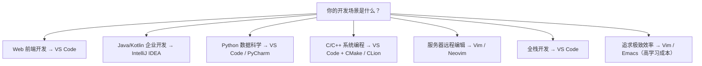

## 1. 编辑器与IDE概述

### 1.1 核心区别

| 特性         | 文本编辑器         | 集成开发环境（IDE）        |
| :----------- | :----------------- | :------------------------- |
| **定位**     | 轻量级代码编写工具 | 全功能开发平台             |
| **启动速度** | 快（秒级）         | 慢（十秒级）               |
| **资源占用** | 低                 | 高                         |
| **内置功能** | 语法高亮、基础补全 | 调试、重构、构建、版本控制 |
| **可扩展性** | 通过插件扩展       | 插件 + 内置工具链          |
| **适用场景** | 快速编辑、脚本编写 | 大型项目开发               |

### 1.2 选型决策树



## 2. Visual Studio Code

### 2.1 核心优势

VS Code 是 Microsoft 开发的免费开源编辑器，凭借以下优势成为最流行的代码编辑器：

- **轻量快速**：基于 Electron，启动速度优于传统 IDE
- **插件生态**：超过 40,000 个扩展
- **内置终端**：集成终端、调试器、Git 支持
- **跨平台**：Windows、macOS、Linux
- **远程开发**：Remote SSH、Remote Containers、WSL

### 2.2 必装扩展

| 扩展               | 用途                           | 说明                  |
| :----------------- | :----------------------------- | :-------------------- |
| **ESLint**         | JavaScript/TypeScript 代码检查 | 实时标记代码问题      |
| **Prettier**       | 代码格式化                     | 统一代码风格          |
| **GitLens**        | Git 增强                       | 行级 blame、历史浏览  |
| **Error Lens**     | 错误高亮                       | 内联显示错误信息      |
| **Thunder Client** | API 测试                       | 轻量级 Postman 替代   |
| **Remote - SSH**   | 远程开发                       | 通过 SSH 编辑远程文件 |

### 2.3 高效配置

```json
// settings.json 关键配置
{
  "editor.fontSize": 14,
  "editor.fontFamily": "'JetBrains Mono', 'Fira Code', monospace",
  "editor.fontLigatures": true,
  "editor.formatOnSave": true,
  "editor.minimap.enabled": false,
  "editor.bracketPairColorization.enabled": true,
  "editor.guides.bracketPairs": "active",
  "editor.inlineSuggest.enabled": true,
  "files.autoSave": "afterDelay",
  "terminal.integrated.defaultProfile.windows": "PowerShell",
  "workbench.colorTheme": "One Dark Pro"
}
```

### 2.4 常用快捷键

| 功能       | Windows/Linux  | macOS            |
| :--------- | :------------- | :--------------- |
| 命令面板   | `Ctrl+Shift+P` | `Cmd+Shift+P`    |
| 文件搜索   | `Ctrl+P`       | `Cmd+P`          |
| 全局搜索   | `Ctrl+Shift+F` | `Cmd+Shift+F`    |
| 终端切换   | `Ctrl+``       | `Cmd+``          |
| 跳转定义   | `F12`          | `F12`            |
| 重命名符号 | `F2`           | `F2`             |
| 多光标     | `Alt+Click`    | `Option+Click`   |
| 行复制     | `Shift+Alt+↓`  | `Shift+Option+↓` |

## 3. IntelliJ IDEA

### 3.1 核心优势

IntelliJ IDEA 是 JetBrains 开发的商业 IDE，以**智能代码分析**著称：

- **深度代码理解**：精确的代码导航、重构和分析
- **框架支持**：Spring Boot、Jakarta EE、Android 等
- **数据库工具**：内置数据库浏览器和 SQL 编辑器
- **版本控制**：深度集成 Git、SVN、Mercurial
- **性能分析**：内置 CPU 和内存 Profiler

### 3.2 版本对比

| 特性                  | Community（免费） | Ultimate（付费） |
| :-------------------- | :---------------- | :--------------- |
| Java/Kotlin 开发      |                   |                  |
| Maven/Gradle          |                   |                  |
| Git 集成              |                   |                  |
| Spring Boot           |                   |                  |
| Web 前端（JS/TS/CSS） |                   |                  |
| 数据库工具            |                   |                  |
| HTTP 客户端           |                   |                  |
| 性能分析              |                   |                  |

### 3.3 JetBrains 全家桶

| IDE               | 语言/领域             | 说明          |
| :---------------- | :-------------------- | :------------ |
| **IntelliJ IDEA** | Java/Kotlin           | 旗舰 IDE      |
| **PyCharm**       | Python                | 数据科学支持  |
| **WebStorm**      | JavaScript/TypeScript | 前端专用      |
| **GoLand**        | Go                    | Go 开发专用   |
| **RustRover**     | Rust                  | Rust 开发专用 |
| **CLion**         | C/C++                 | 系统编程      |
| **DataGrip**      | SQL/数据库            | 数据库管理    |

## 4. Vim / Neovim

### 4.1 Vim 哲学

Vim 的核心设计理念是**手不离键盘**，通过模式切换实现高效编辑：

| 模式         | 用途             | 进入方式           |
| :----------- | :--------------- | :----------------- |
| **普通模式** | 移动、删除、复制 | `Esc`              |
| **插入模式** | 输入文本         | `i`、`a`、`o`      |
| **可视模式** | 选择文本         | `v`、`V`、`Ctrl+V` |
| **命令模式** | 执行命令         | `:`                |
| **替换模式** | 替换文本         | `R`                |

### 4.2 Neovim 现代化

Neovim 是 Vim 的现代化分支，核心改进：

- **Lua 配置**：用 Lua 替代 VimScript，性能更优
- **LSP 原生支持**：内置语言服务器协议
- **异步架构**：所有操作非阻塞
- **Tree-sitter**：增量语法解析，精确高亮

```lua
-- Neovim 配置示例 (init.lua)
vim.opt.number = true
vim.opt.relativenumber = true
vim.opt.tabstop = 4
vim.opt.shiftwidth = 4
vim.opt.expandtab = true
vim.opt.termguicolors = true

-- 使用 lazy.nvim 包管理器
require("lazy").setup({
  "neovim/nvim-lspconfig",    -- LSP 配置
  "nvim-treesitter/nvim-treesitter", -- 语法高亮
  "hrsh7th/nvim-cmp",          -- 自动补全
  "nvim-telescope/telescope.nvim",   -- 模糊搜索
  "lewis6991/gitsigns.nvim",   -- Git 集成
})
```

### 4.3 Vim 适用场景

- **服务器编辑**：SSH 远程编辑配置文件
- **Git 提交信息**：`git commit` 默认编辑器
- **快速修改**：无需等待 IDE 启动
- **追求效率**：掌握后编辑速度极快

## 5. 云端 IDE

### 5.1 方案对比

| 平台                  | 特点           | 免费额度          | 适用场景     |
| :-------------------- | :------------- | :---------------- | :----------- |
| **GitHub Codespaces** | VS Code 云端版 | 每月 120 核心小时 | 仓库快速开发 |
| **Gitpod**            | 开源云端 IDE   | 每月 50 小时      | 开源项目贡献 |
| **Replit**            | 多语言在线 IDE | 基础版免费        | 学习与原型   |
| **CodeSandbox**       | 前端在线开发   | 公开项目免费      | 前端原型演示 |

### 5.2 GitHub Codespaces 配置

```json
// .devcontainer/devcontainer.json
{
  "name": "My Dev Environment",
  "image": "mcr.microsoft.com/devcontainers/javascript-node:20",
  "features": {
    "ghcr.io/devcontainers/features/git:1": {}
  },
  "postCreateCommand": "npm install",
  "customizations": {
    "vscode": {
      "extensions": ["dbaeumer.vscode-eslint", "esbenp.prettier-vscode"]
    }
  }
}
```

## 6. 选型建议

### 6.1 按经验阶段

| 阶段           | 推荐               | 理由                             |
| :------------- | :----------------- | :------------------------------- |
| **初学者**     | VS Code            | 上手简单、插件丰富、社区活跃     |
| **进阶者**     | VS Code + Vim 键位 | 提升编辑效率                     |
| **专业开发者** | 领域 IDE + VS Code | Java 用 IntelliJ，前端用 VS Code |
| **效率极客**   | Neovim 定制        | 完全自定义、极致效率             |

### 6.2 按项目类型

| 项目类型        | 推荐方案                | 说明                   |
| :-------------- | :---------------------- | :--------------------- |
| **前端项目**    | VS Code                 | 生态最完善             |
| **Java/Spring** | IntelliJ IDEA Ultimate  | 框架支持最强           |
| **Python/ML**   | VS Code + Jupyter       | 数据科学友好           |
| **Go 微服务**   | VS Code / GoLand        | GoLand 重构更强        |
| **C/C++**       | VS Code + CMake / CLion | CLion 调试体验更好     |
| **远程开发**    | VS Code Remote / Vim    | 网络延迟敏感场景用 Vim |

## 参考文献


本模块各文档：环境搭建、编程基础、调试思维等。
MDN 学习区：https://developer.mozilla.org/zh-CN/docs/Learn_web_development
freeCodeCamp：https://www.freecodecamp.org/chinese/
黑马程序员官网：https://www.itheima.com/

## 延伸阅读


从入门到进阶路径：001 入门 -> 002 Markdown -> 003 Git -> 006 HTML -> 007 CSS -> 008 JS。
语言进阶：013 Java / 040 Python / 016 Go 按兴趣选择。
尚硅谷 Bilibili 空间（https://space.bilibili.com/302417610 ）提供基础课程。

## 深度专题扩展


以下专题从不同角度深入本文主题，供有进阶需求的读者研读。每个专题独立成节，内容相互补充。

### 13.1 如何高效自学编程

目标驱动：每个阶段一个小项目（计算器、笔记、网站）。
费曼技巧：把学到的知识写出来或讲出来。
刻意练习：专注薄弱点，带反馈循环。
社区参与：提问、回答、代码评审加速成长。

### 13.2 学习路径规划

阶段一（2-4 周）：环境 + 基础语法 + 小练习。
阶段二（4-8 周）：数据结构 + 简单项目。
阶段三（2-3 月）：框架 + 实战项目 + 部署。
持续：算法刷题、源码阅读、开源贡献。

## 模块文档速查表

| 文档 | 主题 | 与本文的关联 |
| --- | --- | --- |
| 入门指南 | 001-GettingStartedGuide | 本文的前置基础 |
| 开发环境搭建 | 002-DevEnvSetup | 本文的前置基础 |
| 学习指南 | 003-LearningGuide | 本文的并列主题 |
| 计算机体系结构 | 004-ComputerArchitecture | 本文的并列主题 |
| 数的表示与编码 | 005-NumberRepresentationEncoding | 本文的并列主题 |
| 程序设计基础 | 006-ProgrammingBasics | 本文的前置基础 |
| 函数与模块化 | 007-FunctionModular | 本文的并列主题 |
| 学习路线规划 | 008-LearningPathPlanning | 本文的并列主题 |
| 环境变量与PATH | 009-EnvVarPath | 本文的前置基础 |
| IDE与编辑器选型 | 010-IDEEditorSelection | 本文自身 |
| 插件生态 | 011-PluginEcosystem | 本文的并列主题 |
| 命令行基础 | 012-CommandLineBasics | 本文的前置基础 |
| 包管理器 | 013-PackageManager | 本文的并列主题 |
| 版本控制系统选型 | 014-VCSSelection | 本文的并列主题 |
| 项目初始化 | 015-ProjectInit | 本文的综合应用 |
| 构建工具 | 016-BuildTool | 本文的并列主题 |
| 编程范式基础 | 017-ProgrammingParadigmBasics | 本文的前置基础 |
| 调试思想 | 018-DebugThinking | 本文的并列主题 |
| 软件下载地址汇总 | 019-SoftwareDownloadURLSummary | 本文的并列主题 |
| Windows环境配置教程 | 020-WindowsEnvConfigTutorial | 本文的前置基础 |
| macOS环境配置教程 | 021-MacOSEnvConfigTutorial | 本文的前置基础 |
| Linux环境配置教程 | 022-LinuxEnvConfigTutorial | 本文的前置基础 |
| 编程入门 Node.js 安装 | 023-NodeJsInstall | 本文的前置基础 |
| 编程入门 npm 包管理 | 024-NpmManager | 本文的前置基础 |
| 编程入门 pnpm 与 yarn 包管理 | 025-PnpmYarnManager | 本文的前置基础 |
| 编程入门 nvm 版本管理 | 026-NvmVersionManage | 本文的前置基础 |
| 编程入门 Python 安装 | 027-PythonInstall | 本文的前置基础 |
| 编程入门 pip 与 venv 包管理 | 028-PipVenvManager | 本文的前置基础 |
| 编程入门 pyenv 与 uv 版本管理 | 029-PyenvUvManage | 本文的前置基础 |
| 编程入门 Java JDK 配置 | 030-JavaJdkConfig | 本文的前置基础 |
| 编程入门 VS Code 安装配置 | 031-VSCodeInstall | 本文的前置基础 |
| 编程入门 Git 安装配置 | 032-GitInstallConfig | 本文的前置基础 |
| 编程入门 Docker 安装 | 033-DockerInstall | 本文的前置基础 |
| 文本处理命令速查手册 | 034-TextProcessing | 本文的并列主题 |
| 管道与重定向速查手册 | 035-PipeRedirect | 本文的并列主题 |
| 进程管理命令速查手册 | 036-ProcessManage | 本文的并列主题 |
| 压缩解压命令速查手册 | 037-CompressArchive | 本文的并列主题 |
