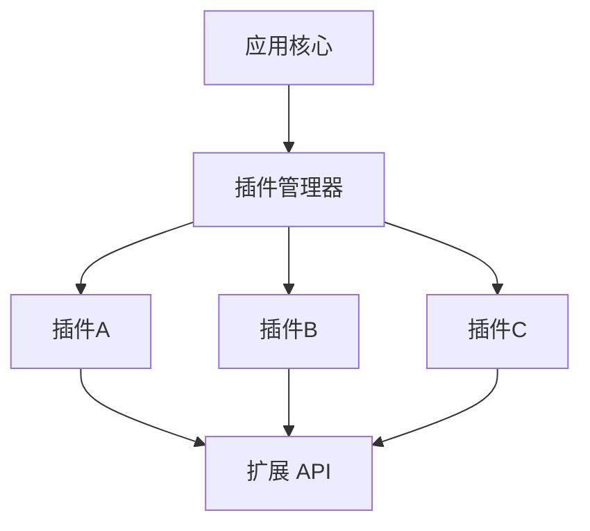

## 1. 插件体系概述

### 1.1 为什么需要插件

插件（Plugin/Extension）是软件系统的**可扩展模块**，允许第三方在不修改核心代码的情况下增强软件功能。插件体系的核心价值：

- **开放封闭原则**：对扩展开放，对修改封闭
- **按需加载**：只安装需要的功能，保持核心轻量
- **社区驱动**：全球开发者贡献，生态快速演进
- **个性化定制**：每个开发者可以打造专属工作流

### 1.2 插件架构模式



### 1.3 插件生命周期

1. **发现**：在插件市场搜索和浏览
2. **安装**：下载并注册到插件管理器
3. **激活**：根据触发条件加载插件
4. **运行**：提供功能服务
5. **停用**：释放资源
6. **卸载**：从系统中移除

## 2. VS Code 扩展生态

### 2.1 扩展清单文件

每个 VS Code 扩展必须包含 `package.json` 清单文件：

```json
{
  "name": "my-extension",
  "displayName": "My Extension",
  "description": "A sample VS Code extension",
  "version": "1.0.0",
  "publisher": "my-publisher",
  "engines": { "vscode": "^1.80.0" },
  "categories": ["Programming Languages", "Linters"],
  "activationEvents": ["onLanguage:python"],
  "main": "./dist/extension.js",
  "contributes": {
    "commands": [
      {
        "command": "myExtension.hello",
        "title": "Say Hello"
      }
    ],
    "configuration": {
      "title": "My Extension",
      "properties": {
        "myExtension.enable": {
          "type": "boolean",
          "default": true,
          "description": "Enable the extension"
        }
      }
    }
  }
}
```

### 2.2 扩展能力点

| 能力         | API              | 说明                 |
| :----------- | :--------------- | :------------------- |
| **命令**     | `commands`       | 注册命令到命令面板   |
| **语言功能** | `LanguageClient` | 代码补全、跳转、诊断 |
| **主题**     | `themes`         | 颜色主题和图标主题   |
| **调试**     | `debuggers`      | 自定义调试适配器     |
| **树视图**   | `views`          | 侧边栏自定义视图     |
| **Webview**  | `WebviewPanel`   | 嵌入自定义 HTML      |
| **状态栏**   | `StatusBarItem`  | 底部状态信息         |
| **代码片段** | `snippets`       | 代码模板             |

### 2.3 扩展开发入门

```typescript
// src/extension.ts
import * as vscode from 'vscode';

export function activate(context: vscode.ExtensionContext) {
  const disposable = vscode.commands.registerCommand('myExtension.hello', () => {
    vscode.window.showInformationMessage('Hello from My Extension!');
  });
  context.subscriptions.push(disposable);
}

export function deactivate() {}
```

## 3. JetBrains 插件生态

### 3.1 插件市场

JetBrains 插件市场（Marketplace）提供超过 7,000 个插件，覆盖：

- **语言支持**：新增编程语言支持
- **框架集成**：Spring、Django、Rails 等
- **工具集成**：Docker、Database、HTTP Client
- **UI 增强**：主题、快捷键映射
- **代码质量**：检查器、格式化器

### 3.2 插件开发架构

JetBrains 插件基于 IntelliJ Platform SDK：

```kotlin
// plugin.xml - 插件描述文件
<idea-plugin>
  <id>com.example.myplugin</id>
  <name>My Plugin</name>
  <version>1.0.0</version>
  <vendor>My Company</vendor>

  <depends>com.intellij.modules.platform</depends>

  <extensions defaultExtensionNs="com.intellij">
    <applicationService
      serviceImplementation="com.example.MyService"/>
  </extensions>

  <actions>
    <action id="MyAction" class="com.example.MyAction"
            text="My Action" description="My action">
      <add-to-group group-id="ToolsMenu" anchor="first"/>
    </action>
  </actions>
</idea-plugin>
```

## 4. Vim/Neovim 插件生态

### 4.1 包管理器

| 包管理器        | 语言      | 特点                  |
| :-------------- | :-------- | :-------------------- |
| **vim-plug**    | VimScript | 简洁易用，最流行      |
| **packer.nvim** | Lua       | Neovim 专用，已停维   |
| **lazy.nvim**   | Lua       | Neovim 新标准，性能优 |
| **dein.vim**    | VimScript | 高性能，异步加载      |

### 4.2 lazy.nvim 配置示例

```lua
-- Neovim 插件配置
require("lazy").setup({
  -- 文件树
  {
    "nvim-neo-tree/neo-tree.nvim",
    branch = "v3.x",
    dependencies = { "nvim-lua/plenary.nvim" },
  },

  -- 模糊搜索
  {
    "nvim-telescope/telescope.nvim",
    tag = "0.1.8",
    dependencies = { "nvim-lua/plenary.nvim" },
  },

  -- 自动补全
  {
    "hrsh7th/nvim-cmp",
    dependencies = {
      "hrsh7th/cmp-nvim-lsp",
      "hrsh7th/cmp-buffer",
      "L3MON4D3/LuaSnip",
    },
  },

  -- 语法高亮
  {
    "nvim-treesitter/nvim-treesitter",
    build = ":TSUpdate",
  },
})
```

### 4.3 必备插件分类

| 类别         | 插件                 | 功能          |
| :----------- | :------------------- | :------------ |
| **文件导航** | neo-tree / nvim-tree | 文件浏览器    |
| **模糊搜索** | telescope            | 文件/内容搜索 |
| **代码补全** | nvim-cmp             | 智能补全      |
| **语法高亮** | nvim-treesitter      | 增量解析高亮  |
| **Git**      | gitsigns / fugitive  | Git 集成      |
| **LSP**      | nvim-lspconfig       | 语言服务器    |
| **格式化**   | conform.nvim         | 代码格式化    |
| **调试**     | nvim-dap             | 调试适配器    |

## 5. 插件管理最佳实践

### 5.1 安装原则

- **最小化原则**：只安装真正需要的插件，避免臃肿
- **质量优先**：选择维护活跃、星标多的插件
- **避免冲突**：功能重叠的插件可能产生冲突
- **定期清理**：移除不再使用的插件

### 5.2 配置同步

| 工具                    | 平台       | 方式             |
| :---------------------- | :--------- | :--------------- |
| **Settings Sync**       | VS Code    | GitHub Gist 同步 |
| **Settings Repository** | JetBrains  | Git 仓库同步     |
| **dotfiles**            | Vim/Neovim | Git 管理配置文件 |
| **Chezmoi**             | 通用       | 跨机器配置管理   |

### 5.3 性能优化

```bash
# VS Code 查看扩展加载时间
code --prof-startup

# Neovim 查看插件加载时间
:Lazy profile

# JetBrains 禁用不需要的插件
# Settings → Plugins → Installed → 取消勾选
```

## 6. 插件安全

### 6.1 安全风险

- **供应链攻击**：恶意插件窃取敏感信息
- **权限滥用**：插件请求不必要的系统权限
- **代码注入**：插件执行恶意代码

### 6.2 防护措施

1. **验证来源**：只从官方市场安装插件
2. **审查权限**：检查插件请求的权限是否合理
3. **关注维护**：优先选择活跃维护的插件
4. **定期更新**：保持插件版本最新
5. **最小权限**：只授予必要的权限

## 参考文献

本模块各文档：环境搭建、编程基础、调试思维等。
MDN 学习区：https://developer.mozilla.org/zh-CN/docs/Learn_web_development
freeCodeCamp：https://www.freecodecamp.org/chinese/
黑马程序员官网：https://www.itheima.com/

## 延伸阅读

从入门到进阶路径：001 入门 -> 002 Markdown -> 003 Git -> 006 HTML -> 007 CSS -> 008 JS。
语言进阶：013 Java / 040 Python / 016 Go 按兴趣选择。
尚硅谷 Bilibili 空间（https://space.bilibili.com/302417610 ）提供基础课程。

## 深度专题扩展

以下专题从不同角度深入本文主题，供有进阶需求的读者研读。每个专题独立成节，内容相互补充。

### 13.1 如何高效自学编程

目标驱动：每个阶段一个小项目（计算器、笔记、网站）。
费曼技巧：把学到的知识写出来或讲出来。
刻意练习：专注薄弱点，带反馈循环。
社区参与：提问、回答、代码评审加速成长。

### 13.2 学习路径规划

阶段一（2-4 周）：环境 + 基础语法 + 小练习。
阶段二（4-8 周）：数据结构 + 简单项目。
阶段三（2-3 月）：框架 + 实战项目 + 部署。
持续：算法刷题、源码阅读、开源贡献。

## 模块文档速查表

| 文档 | 主题 | 与本文的关联 |
| --- | --- | --- |
| 入门指南 | 001-GettingStartedGuide | 本文的前置基础 |
| 开发环境搭建 | 002-DevEnvSetup | 本文的前置基础 |
| 学习指南 | 003-LearningGuide | 本文的并列主题 |
| 计算机体系结构 | 004-ComputerArchitecture | 本文的并列主题 |
| 数的表示与编码 | 005-NumberRepresentationEncoding | 本文的并列主题 |
| 程序设计基础 | 006-ProgrammingBasics | 本文的前置基础 |
| 函数与模块化 | 007-FunctionModular | 本文的并列主题 |
| 学习路线规划 | 008-LearningPathPlanning | 本文的并列主题 |
| 环境变量与PATH | 009-EnvVarPath | 本文的前置基础 |
| IDE与编辑器选型 | 010-IDEEditorSelection | 本文的并列主题 |
| 插件生态 | 011-PluginEcosystem | 本文自身 |
| 命令行基础 | 012-CommandLineBasics | 本文的前置基础 |
| 包管理器 | 013-PackageManager | 本文的并列主题 |
| 版本控制系统选型 | 014-VCSSelection | 本文的并列主题 |
| 项目初始化 | 015-ProjectInit | 本文的综合应用 |
| 构建工具 | 016-BuildTool | 本文的并列主题 |
| 编程范式基础 | 017-ProgrammingParadigmBasics | 本文的前置基础 |
| 调试思想 | 018-DebugThinking | 本文的并列主题 |
| 软件下载地址汇总 | 019-SoftwareDownloadURLSummary | 本文的并列主题 |
| Windows环境配置教程 | 020-WindowsEnvConfigTutorial | 本文的前置基础 |
| macOS环境配置教程 | 021-MacOSEnvConfigTutorial | 本文的前置基础 |
| Linux环境配置教程 | 022-LinuxEnvConfigTutorial | 本文的前置基础 |
| 编程入门 Node.js 安装 | 023-NodeJsInstall | 本文的前置基础 |
| 编程入门 npm 包管理 | 024-NpmManager | 本文的前置基础 |
| 编程入门 pnpm 与 yarn 包管理 | 025-PnpmYarnManager | 本文的前置基础 |
| 编程入门 nvm 版本管理 | 026-NvmVersionManage | 本文的前置基础 |
| 编程入门 Python 安装 | 027-PythonInstall | 本文的前置基础 |
| 编程入门 pip 与 venv 包管理 | 028-PipVenvManager | 本文的前置基础 |
| 编程入门 pyenv 与 uv 版本管理 | 029-PyenvUvManage | 本文的前置基础 |
| 编程入门 Java JDK 配置 | 030-JavaJdkConfig | 本文的前置基础 |
| 编程入门 VS Code 安装配置 | 031-VSCodeInstall | 本文的前置基础 |
| 编程入门 Git 安装配置 | 032-GitInstallConfig | 本文的前置基础 |
| 编程入门 Docker 安装 | 033-DockerInstall | 本文的前置基础 |
| 文本处理命令速查手册 | 034-TextProcessing | 本文的并列主题 |
| 管道与重定向速查手册 | 035-PipeRedirect | 本文的并列主题 |
| 进程管理命令速查手册 | 036-ProcessManage | 本文的并列主题 |
| 压缩解压命令速查手册 | 037-CompressArchive | 本文的并列主题 |
