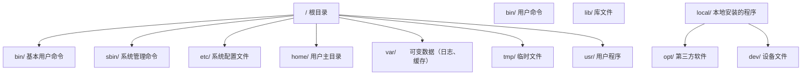
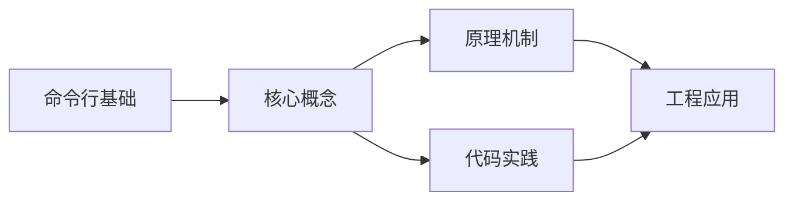

## 1. 学习目标（Bloom 分类）

本节按照布鲁姆教育目标分类学组织学习路径。本文主题为《命令行基础》，属于 入门指南 模块，读者可以根据自身阶段选择阅读深度。

记忆层面：能够准确复述本文的核心概念、术语与基本语法或操作步骤，并能够在提问或检索时快速定位对应知识点。能够说出 入门指南 的核心概念、常用命令与流程。

理解层面：能够用自己的语言解释核心原理与工作机制，说明概念之间的因果关系，而不是机械记忆结论。能够解释 入门指南 的工作原理与设计动机。

应用层面：能够在真实项目或练习场景中运用本文知识解决具体问题，写出正确且可维护的实现。能够独立完成 入门指南 的标准操作。

分析层面：能够拆解复杂问题，比较本文主题与相邻概念的异同，识别边界条件与例外情况。能够分析 入门指南 使用中的异常与边界。

评价层面：能够根据约束条件（性能、可读性、安全、成本）评价不同方案的优劣，做出有依据的技术决策。能够评价 入门指南 相关工具与方案。

创造层面：能够把本文知识与其他模块知识组合，设计出新的解决方案或可复用的工程模式。能够把 入门指南 融入团队工作流。

通过本节学习，读者应当能够把《命令行基础》纳入自己的知识网络，并与 入门指南 模块的其他主题（环境搭建、学习路径、编程基础）建立关联。

## 2. 历史动机与发展脉络

《命令行基础》是 入门指南 领域的重要主题。要真正理解它，需要先了解它解决的问题与演进过程。

编程入门的关键不是记忆语法，而是建立“问题 -> 方案 -> 验证”的思维循环；本模块为完全零基础的读者设计。
现代学习路径：环境搭建 -> 编程基础（变量/流程/函数）-> 数据与算法 -> 项目实践；本项目的完整文档库按此路径组织。
学习工具：IDE（VS Code）、命令行、Git、包管理器；工具链本身也是学习对象。

回到本文主题：命令行基础 的提出与成熟，正是上述技术背景下的必然产物。早期实现往往以简单可用为目标，随着工程规模扩大，社区逐渐沉淀出标准做法与最佳实践；理解这一脉络，可以帮助读者判断“为什么文档中的推荐写法是现在这个样子”，也能在遇到历史遗留代码时准确识别其设计年代与取舍。


## 3. 形式化定义与核心概念精讲

本节把《命令行基础》涉及的核心概念以“定义 + 讲解”的形式展开。读者应把定义当作工具，把讲解当作理解路径；两者结合才能形成可迁移的知识。

编程范式：命令式（逐步指令）、函数式（表达式与不可变）、面向对象（对象与消息）；语言是多范式的。
程序执行：源码 -> 编译/解释 -> 运行；调试是理解程序行为的主要手段。
抽象层次：机器码 -> 汇编 -> 高级语言 -> 框架 -> 领域语言；抽象降低认知负担。

### 3.1 原文章节逐一精讲

原文档把主题拆分为 19 个小节，下面按顺序给出每一节的导读讲解，随后保留原文细节供精读。

#### 原文精读（完整保留）

# 命令行基础速查手册

> **符号约定**:`< >` 必填参数 | `[ ]` 可选参数

---

#### 文件列表查看

**基本写法：列出目录内容**
`ls`
```bash
# Linux/macOS 列出当前目录文件
ls
```

---

**基本写法：详细列表（Linux/macOS）**
`ls -la`
```bash
# 显示所有文件含隐藏文件及详细信息
ls -la
```

---

**基本写法：Windows 列出目录内容**
`dir`
```bash
# Windows CMD 列出目录文件
dir
```

---

**基本写法：PowerShell 列出内容**
`Get-ChildItem`
```bash
# PowerShell 列出目录内容
Get-ChildItem
```

---

**基本写法：显示隐藏文件（PowerShell）**
`Get-ChildItem -Force`
```bash
# 显示包含隐藏文件的所有文件
Get-ChildItem -Force
```

---

#### 文件操作

**基本写法：创建新文件（PowerShell）**
`New-Item <文件名>`
```bash
# 创建新的空文件
New-Item index.html
```

---

**基本写法：创建新文件（Linux/macOS）**
`touch <文件名>`
```bash
# 创建空文件或更新时间戳
touch index.html
```

---

**基本写法：复制文件**
`cp <源文件> <目标>`
```bash
# Linux/macOS 复制文件
cp file.txt backup.txt
```

---

**基本写法：复制文件（Windows）**
`copy <源文件> <目标>`
```bash
# Windows CMD 复制文件
copy file.txt backup.txt
```

---

**基本写法：移动或重命名文件**
`mv <源文件> <目标>`
```bash
# Linux/macOS 移动或重命名
mv old.txt new.txt
```

---

**基本写法：移动文件（Windows）**
`move <源文件> <目标>`
```bash
# Windows CMD 移动文件
move file.txt D:\backup\
```

---

**基本写法：删除文件**
`rm <文件名>`
```bash
# Linux/macOS 删除文件
rm file.txt
```

---

**基本写法：删除文件（Windows）**
`del <文件名>`
```bash
# Windows CMD 删除文件
del file.txt
```

---

**基本写法：强制删除文件**
`rm -f <文件名>`
```bash
# 强制删除不提示确认
rm -f file.txt
```

---

#### 目录创建与删除

**基本写法：创建目录**
`mkdir <目录名>`
```bash
# 创建新目录
mkdir myproject
```

---

**基本写法：递归创建目录**
`mkdir -p <路径>`
```bash
# 一次性创建多级目录
mkdir -p src/components/ui
```

---

**基本写法：PowerShell 递归创建**
`New-Item -ItemType Directory -Path <路径> -Force`
```bash
# PowerShell 创建多级目录
New-Item -ItemType Directory -Path "src\components\ui" -Force
```

---

**基本写法：删除目录**
`rm -r <目录名>`
```bash
# Linux/macOS 递归删除目录
rm -r oldproject
```

---

**基本写法：删除目录（Windows）**
`rmdir /s <目录名>`
```bash
# Windows CMD 递归删除目录
rmdir /s oldproject
```

---

#### 文件内容查看

**基本写法：查看文件内容**
`cat <文件名>`
```bash
# 输出文件全部内容
cat package.json
```

---

**基本写法：分页查看（Linux/macOS）**
`less <文件名>`
```bash
# 分页查看大文件内容
less largefile.log
```

---

**基本写法：查看文件头部**
`head -n <行数> <文件名>`
```bash
# 查看文件前 N 行
head -n 20 README.md
```

---

**基本写法：查看文件尾部**
`tail -n <行数> <文件名>`
```bash
# 查看文件后 N 行
tail -n 20 error.log
```

---

**基本写法：实时追踪日志**
`tail -f <文件名>`
```bash
# 持续监控文件新增内容
tail -f application.log
```

---

#### 文本搜索

**基本写法：搜索文件内容（Linux/macOS）**
`grep "<关键词>" <文件>`
```bash
# 在文件中搜索关键词
grep "TODO" index.js
```

---

**基本写法：递归搜索目录**
`grep -r "<关键词>" <目录>`
```bash
# 递归搜索目录下所有文件
grep -r "console.log" src/
```

---

**基本写法：Windows 搜索文件内容**
`findstr "<关键词>" <文件>`
```bash
# Windows CMD 搜索文件内容
findstr "TODO" index.js
```

---

**基本写法：PowerShell 搜索内容**
`Select-String -Pattern "<关键词>" -Path <文件>`
```bash
# PowerShell 搜索文件内容
Select-String -Pattern "TODO" -Path index.js
```

---

#### 文件查找

**基本写法：按名称查找（Linux/macOS）**
`find <路径> -name "<文件名>"`
```bash
# 在指定路径查找文件
find . -name "*.js"
```

---

**基本写法：按名称查找（Windows）**
`dir /s /b <文件名>`
```bash
# Windows 递归查找文件
dir /s /b *.js
```

---

**基本写法：PowerShell 查找文件**
`Get-ChildItem -Path <路径> -Filter <模式> -Recurse`
```bash
# PowerShell 递归查找文件
Get-ChildItem -Path . -Filter "*.js" -Recurse
```
#### 1. Shell 与终端

##### 1.1 Shell 概述

Shell 是操作系统的**命令解释器**，是用户与内核之间的接口。它接收用户输入的命令，将其翻译为系统调用，并将结果返回给用户。

| Shell          | 全称                       | 特点                   |
| :------------- | :------------------------- | :--------------------- |
| **sh**         | Bourne Shell               | Unix 最初 Shell        |
| **bash**       | Bourne Again Shell         | Linux 默认，最广泛使用 |
| **zsh**        | Z Shell                    | macOS 默认，功能强大   |
| **fish**       | Friendly Interactive Shell | 用户友好，自动建议     |
| **PowerShell** | —                          | Windows 默认，面向对象 |

##### 1.2 终端模拟器

终端模拟器是运行 Shell 的图形界面程序：

| 终端                 | 平台    | 特点               |
| :------------------- | :------ | :----------------- |
| **Windows Terminal** | Windows | 多标签、GPU 加速   |
| **iTerm2**           | macOS   | 分屏、热键窗口     |
| **Alacritty**        | 跨平台  | GPU 加速、极简     |
| **Kitty**            | 跨平台  | GPU 加速、图片显示 |
| **WezTerm**          | 跨平台  | Lua 配置、多路复用 |

##### 1.3 Shell 配置文件

```bash
# bash 配置文件加载顺序
/etc/profile           # 系统级，登录时加载
~/.bash_profile        # 用户级，登录时加载
~/.bashrc              # 用户级，每次打开新 Shell 加载

# zsh 配置文件加载顺序
~/.zshenv              # 所有 zsh 实例加载
~/.zshrc               # 交互式 Shell 加载
~/.zlogin              # 登录 Shell 加载
```

#### 2. 文件系统操作

##### 2.1 目录导航

```bash
pwd                     # 显示当前工作目录
cd /home/user/projects  # 切换到绝对路径
cd ../..                # 上移两级目录
cd -                    # 返回上一个目录
cd ~                    # 切换到主目录
```

##### 2.2 文件与目录管理

```bash
# 创建
mkdir project           # 创建目录
mkdir -p a/b/c          # 递归创建多级目录
touch file.txt          # 创建空文件

# 复制
cp file.txt backup.txt  # 复制文件
cp -r src/ dest/        # 递归复制目录

# 移动与重命名
mv old.txt new.txt      # 重命名
mv file.txt ../         # 移动到上级目录

# 删除
rm file.txt             # 删除文件（不可恢复！）
rm -r directory/        # 递归删除目录
rm -rf directory/       # 强制递归删除（危险！）

# 查找
find . -name "*.js"     # 按名称查找
find . -type f -mtime -7  # 查找7天内修改的文件
```

##### 2.3 文件查看与搜索

```bash
# 查看文件
cat file.txt            # 显示全部内容
less file.txt           # 分页查看（推荐）
head -n 20 file.txt     # 显示前20行
tail -n 20 file.txt     # 显示后20行
tail -f log.txt         # 实时追踪文件末尾

# 搜索
grep "error" log.txt           # 搜索包含 error 的行
grep -r "TODO" src/            # 递归搜索目录
grep -i "warning" log.txt      # 忽略大小写
grep -n "function" app.js      # 显示行号
```

##### 2.4 权限管理

```bash
# 查看权限
ls -la
# -rwxr-xr-x 1 user group 4096 Jan 1 12:00 script.sh
#  └┬┘└┬┘└┬┘
#   │   │   └── 其他用户: r-x (读+执行)
#   │   └────── 组用户: r-x (读+执行)
#   └────────── 所有者: rwx (读+写+执行)

# 修改权限
chmod +x script.sh      # 添加执行权限
chmod 755 script.sh     # 数字方式设置权限
chmod -R 644 directory/ # 递归设置目录权限

# 修改所有者
chown user:group file   # 修改文件所有者和组
```

##### 2.5 文件系统层次标准（FHS）



#### 3. 进程管理

##### 3.1 进程查看

```bash
ps aux                   # 查看所有进程
ps -ef                   # 另一种格式
top                      # 实时进程监控
htop                     # 增强版 top（推荐）
pgrep -f "node"          # 按名称查找进程 PID
```

##### 3.2 进程控制

```bash
# 前台/后台
command &                # 后台运行
Ctrl+Z                   # 暂停当前进程
bg                       # 将暂停的进程放到后台
fg                       # 将后台进程调到前台
jobs                     # 查看后台任务

# 终止进程
kill PID                 # 发送 SIGTERM（优雅终止）
kill -9 PID              # 发送 SIGKILL（强制终止）
killall node             # 按名称终止所有匹配进程
pkill -f "webpack"       # 按命令行模式终止
```

##### 3.3 信号系统

| 信号        | 编号 | 含义 | 用途                        |
| :---------- | :--- | :--- | :-------------------------- |
| **SIGHUP**  | 1    | 挂断 | 终端关闭时通知进程          |
| **SIGINT**  | 2    | 中断 | `Ctrl+C` 发送               |
| **SIGQUIT** | 3    | 退出 | `Ctrl+\` 发送，生成核心转储 |
| **SIGTERM** | 15   | 终止 | 默认 kill 信号，可被捕获    |
| **SIGKILL** | 9    | 杀死 | 强制终止，不可被捕获        |
| **SIGSTOP** | 19   | 停止 | 不可被捕获，暂停进程        |
| **SIGCONT** | 18   | 继续 | 恢复暂停的进程              |

##### 3.4 守护进程与服务

```bash
# systemd 服务管理
systemctl start nginx     # 启动服务
systemctl stop nginx      # 停止服务
systemctl restart nginx   # 重启服务
systemctl status nginx    # 查看状态
systemctl enable nginx    # 开机自启
systemctl disable nginx   # 取消自启

# 查看服务日志
journalctl -u nginx -f    # 实时查看 nginx 日志
```

#### 4. 网络工具

##### 4.1 连接测试

```bash
ping google.com           # 测试网络连通性
ping -c 4 google.com      # 发送4个包后停止
traceroute google.com     # 跟踪路由路径
mtr google.com            # 持续跟踪路由（推荐）
```

##### 4.2 DNS 查询

```bash
nslookup google.com       # DNS 查询
dig google.com            # 详细 DNS 查询
dig +short google.com     # 只显示 IP 地址
host google.com           # 简洁 DNS 查询
```

##### 4.3 端口与连接

```bash
# 查看端口占用
netstat -tlnp             # 查看所有监听端口
ss -tlnp                  # 更快的替代方案
lsof -i :8080             # 查看占用 8080 端口的进程

# 网络连接测试
curl http://example.com   # HTTP 请求
curl -I https://example.com  # 只看响应头
wget https://example.com/file.zip  # 下载文件
nc -zv localhost 3306     # 测试端口连通性
```

##### 4.4 防火墙

```bash
# ufw（Ubuntu 防火墙）
ufw status                # 查看状态
ufw allow 80/tcp          # 允许 80 端口
ufw allow 443/tcp         # 允许 443 端口
ufw deny 3306             # 拒绝 3306 端口
ufw enable                # 启用防火墙
```

#### 5. 管道与重定向

##### 5.1 重定向

```bash
# 输出重定向
echo "hello" > file.txt       # 覆盖写入
echo "world" >> file.txt      # 追加写入

# 输入重定向
sort < names.txt              # 从文件读取输入

# 错误重定向
command 2> error.log          # 错误输出到文件
command 2>&1                  # 错误合并到标准输出
command &> all.log            # 所有输出到文件
```

##### 5.2 管道

管道将前一个命令的**标准输出**作为后一个命令的**标准输入**：

```bash
# 组合使用
cat access.log | grep "404" | wc -l        # 统计404错误数
ps aux | grep node | grep -v grep           # 查找node进程
find . -name "*.js" | xargs wc -l          # 统计JS文件行数
history | sort | uniq -c | sort -rn | head  # 最常用命令
```

##### 5.3 文本处理三剑客

```bash
# grep - 文本搜索
grep -E "error|warning" log.txt    # 正则搜索

# sed - 流编辑器
sed 's/old/new/g' file.txt         # 替换文本
sed -n '10,20p' file.txt           # 打印10-20行

# awk - 文本分析
awk '{print $1, $3}' data.txt      # 打印第1、3列
awk -F: '{print $1}' /etc/passwd   # 指定分隔符
awk '$3 > 100 {print $0}' data.txt # 条件过滤
```

#### 6. Shell 脚本入门

##### 6.1 基本结构

```bash
#!/bin/bash
# 这是一个 Shell 脚本

# 变量
NAME="World"
echo "Hello, $NAME!"

# 条件判断
if [ -f "package.json" ]; then
    echo "Found package.json"
    npm install
else
    echo "No package.json found"
fi

# 循环
for file in *.js; do
    echo "Processing: $file"
done

# 函数
greet() {
    local name=$1
    echo "Hello, $name!"
}
greet "Developer"
```

##### 6.2 实用脚本示例

```bash
#!/bin/bash
# 自动化项目部署脚本

set -e  # 遇到错误立即退出

PROJECT_DIR="/var/www/myapp"
BRANCH="main"

echo "=== Deploying $BRANCH ==="

cd "$PROJECT_DIR"
git pull origin "$BRANCH"
npm install --production
npm run build
pm2 restart myapp

echo "=== Deploy complete ==="
```
#### 路径与目录

**基本用法:查看当前路径**
`pwd`

```bash
# 显示当前工作目录绝对路径
pwd
```

---

**基本用法:切换目录**
`cd <路径>`

```bash
# 切换到指定目录
cd /home/user/project

# 返回上一级目录
cd ..

# 返回用户主目录
cd ~

# 返回上一次所在目录
cd -
```

---

**基本用法:列出目录内容**
`ls [选项] [路径]`

```bash
# 长格式列出含隐藏文件
ls -la

# 按修改时间倒序排列
ls -lt

# 人类可读文件大小(KB/MB)
ls -lh

# 仅显示目录本身属性
ls -ld src
```

---

#### 文件与目录创建

**基本用法:创建目录**
`mkdir [选项] <目录名>`

```bash
# 递归创建多级目录
mkdir -p src/components/ui

# 创建时打印信息
mkdir -pv logs cache tmp
```

---

**基本用法:创建空文件**
`touch <文件名>`

```bash
# 创建空文件或更新时间戳
touch index.html

# 批量创建
touch a.txt b.txt c.txt
```

---

#### 复制与移动

**基本用法:复制文件或目录**
`cp [选项] <源> <目标>`

```bash
# 递归复制整个目录
cp -r src src_backup

# 保留权限与时间戳复制
cp -a config config.bak

# 覆盖前确认
cp -i file.txt /tmp/
```

---

**基本用法:移动或重命名**
`mv [选项] <源> <目标>`

```bash
# 重命名文件
mv old.txt new.txt

# 移动并覆盖前确认
mv -i tmp.log logs/

# 不覆盖已存在文件
mv -n a.txt b.txt
```

---

#### 删除操作

**基本用法:删除文件**
`rm [选项] <文件>`

```bash
# 强制删除不提示
rm -f temp.txt

# 递归删除目录
rm -r old_project

# 强制递归删除(谨慎使用)
rm -rf node_modules
```

---

#### 通配符与扩展

**基本用法:通配符匹配**
`<命令> <模式>`

```bash
# 匹配所有 .js 文件
ls *.js

# 匹配单字符
ls config?.json

# 字符集合匹配
ls file[0-9].txt

# 花括号扩展批量创建
mkdir -p {src,test}/{components,utils}
```

---

#### 文件信息查看

**基本用法:查看文件类型**
`file <文件>`

```bash
# 显示文件实际类型
file package.json
```

---

**基本用法:查看文件元信息**
`stat <文件>`

```bash
# 显示大小、权限、时间戳
stat README.md
```

---## 目录操作

**基本写法：查看当前路径**
`pwd`
```bash
# 显示当前工作目录
pwd
```

---

**基本写法：切换目录**
`cd <路径>`
```bash
# 切换到指定目录
cd C:\Projects\myapp
```

---

**基本写法：返回上级目录**
`cd ..`
```bash
# 返回上一级目录
cd ..
```

---

**基本写法：返回用户主目录**
`cd ~`
```bash
# 切换到用户主目录
cd ~
```

---

**基本写法：返回上一次目录**
`cd -`
```bash
# 切换到上次所在的目录
cd -
```

---

#### 目录操作

**基本写法：查看当前路径**
`pwd`
```bash
# 显示当前工作目录
pwd
```

---

**基本写法：切换目录**
`cd <路径>`
```bash
# 切换到指定目录
cd C:\Projects\myapp
```

---

**基本写法：返回上级目录**
`cd ..`
```bash
# 返回上一级目录
cd ..
```

---

**基本写法：返回用户主目录**
`cd ~`
```bash
# 切换到用户主目录
cd ~
```

---

**基本写法：返回上一次目录**
`cd -`
```bash
# 切换到上次所在的目录
cd -
```

---


### 3.2 概念关系图

下面用 Mermaid 图表达本文核心概念之间的关系，帮助读者建立整体图景：



图中展示的是本文知识的结构化关系：核心概念是入口，原理机制解释“为什么”，代码实践演示“怎么做”，工程应用回答“何时用”。读者学习时可以把每个小节的内容挂接到对应节点上。

## 4. 理论推导与原理解析

本节深入《命令行基础》背后的原理。理论部分不求面面俱到，而是聚焦“能解释现象、能指导实践”的关键推导。

编程范式：命令式（逐步指令）、函数式（表达式与不可变）、面向对象（对象与消息）；语言是多范式的。
程序执行：源码 -> 编译/解释 -> 运行；调试是理解程序行为的主要手段。
抽象层次：机器码 -> 汇编 -> 高级语言 -> 框架 -> 领域语言；抽象降低认知负担。
计算机基础：CPU 执行指令、内存存数据、I/O 与外部交互；这些概念支撑所有编程。

需要强调的是，理论推导与工程实践之间存在翻译层：理论给出的是理想化模型与边界条件，工程代码则必须处理真实环境中的例外。读者在学习时应先掌握理论的“标准情形”，再通过陷阱章节了解“非标准情形”。

## 5. 代码示例与逐行讲解

本节把原文中的代码示例系统整理，并为每个示例补充用途说明与讲解。读者不应只浏览代码，而应逐段对照讲解理解设计意图。

### 5.1 示例：文件列表查看

该示例来自原文《文件列表查看》小节，用于演示命令行基础相关操作。阅读时请先看代码结构，再看其后的讲解。

```bash
# Linux/macOS 列出当前目录文件
ls
```

讲解：这段代码演示了本节核心知识点。代码中的关键操作可以归纳为三步：准备（定义或初始化）、执行（核心逻辑）、收尾（释放资源或返回结果）。实际项目中，这三步往往被封装为函数或类，以提升复用性与可测试性。

关键点分析：

该示例共 2 行有效代码，结构以数据或配置为主。阅读时应关注：数据字段的含义、配置项的作用，以及它们与运行行为的对应关系。

进阶思考路径：先尝试修改参数观察行为变化，再把示例中的模式迁移到自己的项目中；每次修改都记录预期与实测差异，这是把示例转化为能力的最快方式。

### 5.2 示例：文件列表查看

该示例来自原文《文件列表查看》小节，用于演示命令行基础相关操作。阅读时请先看代码结构，再看其后的讲解。

```bash
# 显示所有文件含隐藏文件及详细信息
ls -la
```

讲解：这段代码演示了本节核心知识点。代码中的关键操作可以归纳为三步：准备（定义或初始化）、执行（核心逻辑）、收尾（释放资源或返回结果）。实际项目中，这三步往往被封装为函数或类，以提升复用性与可测试性。

关键点分析：

该示例共 2 行有效代码，结构以数据或配置为主。阅读时应关注：数据字段的含义、配置项的作用，以及它们与运行行为的对应关系。

进阶思考路径：先尝试修改参数观察行为变化，再把示例中的模式迁移到自己的项目中；每次修改都记录预期与实测差异，这是把示例转化为能力的最快方式。

### 5.3 示例：文件列表查看

该示例来自原文《文件列表查看》小节，用于演示命令行基础相关操作。阅读时请先看代码结构，再看其后的讲解。

```bash
# Windows CMD 列出目录文件
dir
```

讲解：这段代码演示了本节核心知识点。代码中的关键操作可以归纳为三步：准备（定义或初始化）、执行（核心逻辑）、收尾（释放资源或返回结果）。实际项目中，这三步往往被封装为函数或类，以提升复用性与可测试性。

关键点分析：

该示例共 2 行有效代码，结构以数据或配置为主。阅读时应关注：数据字段的含义、配置项的作用，以及它们与运行行为的对应关系。

进阶思考路径：先尝试修改参数观察行为变化，再把示例中的模式迁移到自己的项目中；每次修改都记录预期与实测差异，这是把示例转化为能力的最快方式。

### 5.4 示例：文件列表查看

该示例来自原文《文件列表查看》小节，用于演示命令行基础相关操作。阅读时请先看代码结构，再看其后的讲解。

```bash
# PowerShell 列出目录内容
Get-ChildItem
```

讲解：这段代码演示了本节核心知识点。代码中的关键操作可以归纳为三步：准备（定义或初始化）、执行（核心逻辑）、收尾（释放资源或返回结果）。实际项目中，这三步往往被封装为函数或类，以提升复用性与可测试性。

关键点分析：

该示例共 2 行有效代码，结构以数据或配置为主。阅读时应关注：数据字段的含义、配置项的作用，以及它们与运行行为的对应关系。

进阶思考路径：先尝试修改参数观察行为变化，再把示例中的模式迁移到自己的项目中；每次修改都记录预期与实测差异，这是把示例转化为能力的最快方式。

### 5.5 示例：文件列表查看

该示例来自原文《文件列表查看》小节，用于演示命令行基础相关操作。阅读时请先看代码结构，再看其后的讲解。

```bash
# 显示包含隐藏文件的所有文件
Get-ChildItem -Force
```

讲解：这段代码演示了本节核心知识点。代码中的关键操作可以归纳为三步：准备（定义或初始化）、执行（核心逻辑）、收尾（释放资源或返回结果）。实际项目中，这三步往往被封装为函数或类，以提升复用性与可测试性。

关键点分析：

该示例共 2 行有效代码，结构以数据或配置为主。阅读时应关注：数据字段的含义、配置项的作用，以及它们与运行行为的对应关系。

进阶思考路径：先尝试修改参数观察行为变化，再把示例中的模式迁移到自己的项目中；每次修改都记录预期与实测差异，这是把示例转化为能力的最快方式。

### 5.6 示例：文件操作

该示例来自原文《文件操作》小节，用于演示命令行基础相关操作。阅读时请先看代码结构，再看其后的讲解。

```bash
# 创建新的空文件
New-Item index.html
```

讲解：这段代码演示了本节核心知识点。代码中的关键操作可以归纳为三步：准备（定义或初始化）、执行（核心逻辑）、收尾（释放资源或返回结果）。实际项目中，这三步往往被封装为函数或类，以提升复用性与可测试性。

关键点分析：

该示例共 2 行有效代码，结构以数据或配置为主。阅读时应关注：数据字段的含义、配置项的作用，以及它们与运行行为的对应关系。

进阶思考路径：先尝试修改参数观察行为变化，再把示例中的模式迁移到自己的项目中；每次修改都记录预期与实测差异，这是把示例转化为能力的最快方式。

### 5.7 示例：文件操作

该示例来自原文《文件操作》小节，用于演示命令行基础相关操作。阅读时请先看代码结构，再看其后的讲解。

```bash
# 创建空文件或更新时间戳
touch index.html
```

讲解：这段代码演示了本节核心知识点。代码中的关键操作可以归纳为三步：准备（定义或初始化）、执行（核心逻辑）、收尾（释放资源或返回结果）。实际项目中，这三步往往被封装为函数或类，以提升复用性与可测试性。

关键点分析：

该示例共 2 行有效代码，结构以数据或配置为主。阅读时应关注：数据字段的含义、配置项的作用，以及它们与运行行为的对应关系。

进阶思考路径：先尝试修改参数观察行为变化，再把示例中的模式迁移到自己的项目中；每次修改都记录预期与实测差异，这是把示例转化为能力的最快方式。

### 5.8 示例：文件操作

该示例来自原文《文件操作》小节，用于演示命令行基础相关操作。阅读时请先看代码结构，再看其后的讲解。

```bash
# Linux/macOS 复制文件
cp file.txt backup.txt
```

讲解：这段代码演示了本节核心知识点。代码中的关键操作可以归纳为三步：准备（定义或初始化）、执行（核心逻辑）、收尾（释放资源或返回结果）。实际项目中，这三步往往被封装为函数或类，以提升复用性与可测试性。

关键点分析：

该示例共 2 行有效代码，结构以数据或配置为主。阅读时应关注：数据字段的含义、配置项的作用，以及它们与运行行为的对应关系。

进阶思考路径：先尝试修改参数观察行为变化，再把示例中的模式迁移到自己的项目中；每次修改都记录预期与实测差异，这是把示例转化为能力的最快方式。

### 5.9 示例：文件操作

该示例来自原文《文件操作》小节，用于演示命令行基础相关操作。阅读时请先看代码结构，再看其后的讲解。

```bash
# Windows CMD 复制文件
copy file.txt backup.txt
```

讲解：这段代码演示了本节核心知识点。代码中的关键操作可以归纳为三步：准备（定义或初始化）、执行（核心逻辑）、收尾（释放资源或返回结果）。实际项目中，这三步往往被封装为函数或类，以提升复用性与可测试性。

关键点分析：

该示例共 2 行有效代码，结构以数据或配置为主。阅读时应关注：数据字段的含义、配置项的作用，以及它们与运行行为的对应关系。

进阶思考路径：先尝试修改参数观察行为变化，再把示例中的模式迁移到自己的项目中；每次修改都记录预期与实测差异，这是把示例转化为能力的最快方式。

### 5.10 示例：文件操作

该示例来自原文《文件操作》小节，用于演示命令行基础相关操作。阅读时请先看代码结构，再看其后的讲解。

```bash
# Linux/macOS 移动或重命名
mv old.txt new.txt
```

讲解：这段代码演示了本节核心知识点。代码中的关键操作可以归纳为三步：准备（定义或初始化）、执行（核心逻辑）、收尾（释放资源或返回结果）。实际项目中，这三步往往被封装为函数或类，以提升复用性与可测试性。

关键点分析：

该示例共 2 行有效代码，结构以数据或配置为主。阅读时应关注：数据字段的含义、配置项的作用，以及它们与运行行为的对应关系。

进阶思考路径：先尝试修改参数观察行为变化，再把示例中的模式迁移到自己的项目中；每次修改都记录预期与实测差异，这是把示例转化为能力的最快方式。

### 5.11 示例：文件操作

该示例来自原文《文件操作》小节，用于演示命令行基础相关操作。阅读时请先看代码结构，再看其后的讲解。

```bash
# Windows CMD 移动文件
move file.txt D:\backup\
```

讲解：这段代码演示了本节核心知识点。代码中的关键操作可以归纳为三步：准备（定义或初始化）、执行（核心逻辑）、收尾（释放资源或返回结果）。实际项目中，这三步往往被封装为函数或类，以提升复用性与可测试性。

关键点分析：

该示例共 2 行有效代码，结构以数据或配置为主。阅读时应关注：数据字段的含义、配置项的作用，以及它们与运行行为的对应关系。

进阶思考路径：先尝试修改参数观察行为变化，再把示例中的模式迁移到自己的项目中；每次修改都记录预期与实测差异，这是把示例转化为能力的最快方式。

### 5.12 示例：文件操作

该示例来自原文《文件操作》小节，用于演示命令行基础相关操作。阅读时请先看代码结构，再看其后的讲解。

```bash
# Linux/macOS 删除文件
rm file.txt
```

讲解：这段代码演示了本节核心知识点。代码中的关键操作可以归纳为三步：准备（定义或初始化）、执行（核心逻辑）、收尾（释放资源或返回结果）。实际项目中，这三步往往被封装为函数或类，以提升复用性与可测试性。

关键点分析：

该示例共 2 行有效代码，结构以数据或配置为主。阅读时应关注：数据字段的含义、配置项的作用，以及它们与运行行为的对应关系。

进阶思考路径：先尝试修改参数观察行为变化，再把示例中的模式迁移到自己的项目中；每次修改都记录预期与实测差异，这是把示例转化为能力的最快方式。

### 5.13 示例：文件操作

该示例来自原文《文件操作》小节，用于演示命令行基础相关操作。阅读时请先看代码结构，再看其后的讲解。

```bash
# Windows CMD 删除文件
del file.txt
```

讲解：这段代码演示了本节核心知识点。代码中的关键操作可以归纳为三步：准备（定义或初始化）、执行（核心逻辑）、收尾（释放资源或返回结果）。实际项目中，这三步往往被封装为函数或类，以提升复用性与可测试性。

关键点分析：

该示例共 2 行有效代码，结构以数据或配置为主。阅读时应关注：数据字段的含义、配置项的作用，以及它们与运行行为的对应关系。

进阶思考路径：先尝试修改参数观察行为变化，再把示例中的模式迁移到自己的项目中；每次修改都记录预期与实测差异，这是把示例转化为能力的最快方式。

### 5.14 示例：文件操作

该示例来自原文《文件操作》小节，用于演示命令行基础相关操作。阅读时请先看代码结构，再看其后的讲解。

```bash
# 强制删除不提示确认
rm -f file.txt
```

讲解：这段代码演示了本节核心知识点。代码中的关键操作可以归纳为三步：准备（定义或初始化）、执行（核心逻辑）、收尾（释放资源或返回结果）。实际项目中，这三步往往被封装为函数或类，以提升复用性与可测试性。

关键点分析：

该示例共 2 行有效代码，结构以数据或配置为主。阅读时应关注：数据字段的含义、配置项的作用，以及它们与运行行为的对应关系。

进阶思考路径：先尝试修改参数观察行为变化，再把示例中的模式迁移到自己的项目中；每次修改都记录预期与实测差异，这是把示例转化为能力的最快方式。

### 5.15 示例：目录创建与删除

该示例来自原文《目录创建与删除》小节，用于演示命令行基础相关操作。阅读时请先看代码结构，再看其后的讲解。

```bash
# 创建新目录
mkdir myproject
```

讲解：这段代码演示了本节核心知识点。代码中的关键操作可以归纳为三步：准备（定义或初始化）、执行（核心逻辑）、收尾（释放资源或返回结果）。实际项目中，这三步往往被封装为函数或类，以提升复用性与可测试性。

关键点分析：

该示例共 2 行有效代码，结构以数据或配置为主。阅读时应关注：数据字段的含义、配置项的作用，以及它们与运行行为的对应关系。

进阶思考路径：先尝试修改参数观察行为变化，再把示例中的模式迁移到自己的项目中；每次修改都记录预期与实测差异，这是把示例转化为能力的最快方式。

### 5.16 示例：目录创建与删除

该示例来自原文《目录创建与删除》小节，用于演示命令行基础相关操作。阅读时请先看代码结构，再看其后的讲解。

```bash
# 一次性创建多级目录
mkdir -p src/components/ui
```

讲解：这段代码演示了本节核心知识点。代码中的关键操作可以归纳为三步：准备（定义或初始化）、执行（核心逻辑）、收尾（释放资源或返回结果）。实际项目中，这三步往往被封装为函数或类，以提升复用性与可测试性。

关键点分析：

该示例共 2 行有效代码，结构以数据或配置为主。阅读时应关注：数据字段的含义、配置项的作用，以及它们与运行行为的对应关系。

进阶思考路径：先尝试修改参数观察行为变化，再把示例中的模式迁移到自己的项目中；每次修改都记录预期与实测差异，这是把示例转化为能力的最快方式。

### 5.17 示例：目录创建与删除

该示例来自原文《目录创建与删除》小节，用于演示命令行基础相关操作。阅读时请先看代码结构，再看其后的讲解。

```bash
# PowerShell 创建多级目录
New-Item -ItemType Directory -Path "src\components\ui" -Force
```

讲解：这段代码演示了本节核心知识点。代码中的关键操作可以归纳为三步：准备（定义或初始化）、执行（核心逻辑）、收尾（释放资源或返回结果）。实际项目中，这三步往往被封装为函数或类，以提升复用性与可测试性。

关键点分析：

该示例共 2 行有效代码，结构以数据或配置为主。阅读时应关注：数据字段的含义、配置项的作用，以及它们与运行行为的对应关系。

进阶思考路径：先尝试修改参数观察行为变化，再把示例中的模式迁移到自己的项目中；每次修改都记录预期与实测差异，这是把示例转化为能力的最快方式。

### 5.18 示例：目录创建与删除

该示例来自原文《目录创建与删除》小节，用于演示命令行基础相关操作。阅读时请先看代码结构，再看其后的讲解。

```bash
# Linux/macOS 递归删除目录
rm -r oldproject
```

讲解：这段代码演示了本节核心知识点。代码中的关键操作可以归纳为三步：准备（定义或初始化）、执行（核心逻辑）、收尾（释放资源或返回结果）。实际项目中，这三步往往被封装为函数或类，以提升复用性与可测试性。

关键点分析：

该示例共 2 行有效代码，结构以数据或配置为主。阅读时应关注：数据字段的含义、配置项的作用，以及它们与运行行为的对应关系。

进阶思考路径：先尝试修改参数观察行为变化，再把示例中的模式迁移到自己的项目中；每次修改都记录预期与实测差异，这是把示例转化为能力的最快方式。

### 5.19 示例：目录创建与删除

该示例来自原文《目录创建与删除》小节，用于演示命令行基础相关操作。阅读时请先看代码结构，再看其后的讲解。

```bash
# Windows CMD 递归删除目录
rmdir /s oldproject
```

讲解：这段代码演示了本节核心知识点。代码中的关键操作可以归纳为三步：准备（定义或初始化）、执行（核心逻辑）、收尾（释放资源或返回结果）。实际项目中，这三步往往被封装为函数或类，以提升复用性与可测试性。

关键点分析：

该示例共 2 行有效代码，结构以数据或配置为主。阅读时应关注：数据字段的含义、配置项的作用，以及它们与运行行为的对应关系。

进阶思考路径：先尝试修改参数观察行为变化，再把示例中的模式迁移到自己的项目中；每次修改都记录预期与实测差异，这是把示例转化为能力的最快方式。

### 5.20 示例：文件内容查看

该示例来自原文《文件内容查看》小节，用于演示命令行基础相关操作。阅读时请先看代码结构，再看其后的讲解。

```bash
# 输出文件全部内容
cat package.json
```

讲解：这段代码演示了本节核心知识点。代码中的关键操作可以归纳为三步：准备（定义或初始化）、执行（核心逻辑）、收尾（释放资源或返回结果）。实际项目中，这三步往往被封装为函数或类，以提升复用性与可测试性。

关键点分析：

该示例共 2 行有效代码，结构以数据或配置为主。阅读时应关注：数据字段的含义、配置项的作用，以及它们与运行行为的对应关系。

进阶思考路径：先尝试修改参数观察行为变化，再把示例中的模式迁移到自己的项目中；每次修改都记录预期与实测差异，这是把示例转化为能力的最快方式。

### 5.21 示例：文件内容查看

该示例来自原文《文件内容查看》小节，用于演示命令行基础相关操作。阅读时请先看代码结构，再看其后的讲解。

```bash
# 分页查看大文件内容
less largefile.log
```

讲解：这段代码演示了本节核心知识点。代码中的关键操作可以归纳为三步：准备（定义或初始化）、执行（核心逻辑）、收尾（释放资源或返回结果）。实际项目中，这三步往往被封装为函数或类，以提升复用性与可测试性。

关键点分析：

该示例共 2 行有效代码，结构以数据或配置为主。阅读时应关注：数据字段的含义、配置项的作用，以及它们与运行行为的对应关系。

进阶思考路径：先尝试修改参数观察行为变化，再把示例中的模式迁移到自己的项目中；每次修改都记录预期与实测差异，这是把示例转化为能力的最快方式。

### 5.22 示例：文件内容查看

该示例来自原文《文件内容查看》小节，用于演示命令行基础相关操作。阅读时请先看代码结构，再看其后的讲解。

```bash
# 查看文件前 N 行
head -n 20 README.md
```

讲解：这段代码演示了本节核心知识点。代码中的关键操作可以归纳为三步：准备（定义或初始化）、执行（核心逻辑）、收尾（释放资源或返回结果）。实际项目中，这三步往往被封装为函数或类，以提升复用性与可测试性。

关键点分析：

该示例共 2 行有效代码，结构以数据或配置为主。阅读时应关注：数据字段的含义、配置项的作用，以及它们与运行行为的对应关系。

进阶思考路径：先尝试修改参数观察行为变化，再把示例中的模式迁移到自己的项目中；每次修改都记录预期与实测差异，这是把示例转化为能力的最快方式。

### 5.23 示例：文件内容查看

该示例来自原文《文件内容查看》小节，用于演示命令行基础相关操作。阅读时请先看代码结构，再看其后的讲解。

```bash
# 查看文件后 N 行
tail -n 20 error.log
```

讲解：这段代码演示了本节核心知识点。代码中的关键操作可以归纳为三步：准备（定义或初始化）、执行（核心逻辑）、收尾（释放资源或返回结果）。实际项目中，这三步往往被封装为函数或类，以提升复用性与可测试性。

关键点分析：

该示例共 2 行有效代码，结构以数据或配置为主。阅读时应关注：数据字段的含义、配置项的作用，以及它们与运行行为的对应关系。

进阶思考路径：先尝试修改参数观察行为变化，再把示例中的模式迁移到自己的项目中；每次修改都记录预期与实测差异，这是把示例转化为能力的最快方式。

### 5.24 示例：文件内容查看

该示例来自原文《文件内容查看》小节，用于演示命令行基础相关操作。阅读时请先看代码结构，再看其后的讲解。

```bash
# 持续监控文件新增内容
tail -f application.log
```

讲解：这段代码演示了本节核心知识点。代码中的关键操作可以归纳为三步：准备（定义或初始化）、执行（核心逻辑）、收尾（释放资源或返回结果）。实际项目中，这三步往往被封装为函数或类，以提升复用性与可测试性。

关键点分析：

该示例共 2 行有效代码，结构以数据或配置为主。阅读时应关注：数据字段的含义、配置项的作用，以及它们与运行行为的对应关系。

进阶思考路径：先尝试修改参数观察行为变化，再把示例中的模式迁移到自己的项目中；每次修改都记录预期与实测差异，这是把示例转化为能力的最快方式。

### 5.25 示例：文本搜索

该示例来自原文《文本搜索》小节，用于演示命令行基础相关操作。阅读时请先看代码结构，再看其后的讲解。

```bash
# 在文件中搜索关键词
grep "TODO" index.js
```

讲解：这段代码演示了本节核心知识点。代码中的关键操作可以归纳为三步：准备（定义或初始化）、执行（核心逻辑）、收尾（释放资源或返回结果）。实际项目中，这三步往往被封装为函数或类，以提升复用性与可测试性。

关键点分析：

该示例共 2 行有效代码，结构以数据或配置为主。阅读时应关注：数据字段的含义、配置项的作用，以及它们与运行行为的对应关系。

进阶思考路径：先尝试修改参数观察行为变化，再把示例中的模式迁移到自己的项目中；每次修改都记录预期与实测差异，这是把示例转化为能力的最快方式。

### 5.26 示例：文本搜索

该示例来自原文《文本搜索》小节，用于演示命令行基础相关操作。阅读时请先看代码结构，再看其后的讲解。

```bash
# 递归搜索目录下所有文件
grep -r "console.log" src/
```

讲解：这段代码演示了本节核心知识点。代码中的关键操作可以归纳为三步：准备（定义或初始化）、执行（核心逻辑）、收尾（释放资源或返回结果）。实际项目中，这三步往往被封装为函数或类，以提升复用性与可测试性。

关键点分析：

该示例共 2 行有效代码，结构以数据或配置为主。阅读时应关注：数据字段的含义、配置项的作用，以及它们与运行行为的对应关系。

进阶思考路径：先尝试修改参数观察行为变化，再把示例中的模式迁移到自己的项目中；每次修改都记录预期与实测差异，这是把示例转化为能力的最快方式。

### 5.27 示例：文本搜索

该示例来自原文《文本搜索》小节，用于演示命令行基础相关操作。阅读时请先看代码结构，再看其后的讲解。

```bash
# Windows CMD 搜索文件内容
findstr "TODO" index.js
```

讲解：这段代码演示了本节核心知识点。代码中的关键操作可以归纳为三步：准备（定义或初始化）、执行（核心逻辑）、收尾（释放资源或返回结果）。实际项目中，这三步往往被封装为函数或类，以提升复用性与可测试性。

关键点分析：

该示例共 2 行有效代码，结构以数据或配置为主。阅读时应关注：数据字段的含义、配置项的作用，以及它们与运行行为的对应关系。

进阶思考路径：先尝试修改参数观察行为变化，再把示例中的模式迁移到自己的项目中；每次修改都记录预期与实测差异，这是把示例转化为能力的最快方式。

### 5.28 示例：文本搜索

该示例来自原文《文本搜索》小节，用于演示命令行基础相关操作。阅读时请先看代码结构，再看其后的讲解。

```bash
# PowerShell 搜索文件内容
Select-String -Pattern "TODO" -Path index.js
```

讲解：这段代码演示了本节核心知识点。代码中的关键操作可以归纳为三步：准备（定义或初始化）、执行（核心逻辑）、收尾（释放资源或返回结果）。实际项目中，这三步往往被封装为函数或类，以提升复用性与可测试性。

关键点分析：

该示例共 2 行有效代码，结构以数据或配置为主。阅读时应关注：数据字段的含义、配置项的作用，以及它们与运行行为的对应关系。

进阶思考路径：先尝试修改参数观察行为变化，再把示例中的模式迁移到自己的项目中；每次修改都记录预期与实测差异，这是把示例转化为能力的最快方式。

### 5.29 示例：文件查找

该示例来自原文《文件查找》小节，用于演示命令行基础相关操作。阅读时请先看代码结构，再看其后的讲解。

```bash
# 在指定路径查找文件
find . -name "*.js"
```

讲解：这段代码演示了本节核心知识点。代码中的关键操作可以归纳为三步：准备（定义或初始化）、执行（核心逻辑）、收尾（释放资源或返回结果）。实际项目中，这三步往往被封装为函数或类，以提升复用性与可测试性。

关键点分析：

该示例共 2 行有效代码，结构以数据或配置为主。阅读时应关注：数据字段的含义、配置项的作用，以及它们与运行行为的对应关系。

进阶思考路径：先尝试修改参数观察行为变化，再把示例中的模式迁移到自己的项目中；每次修改都记录预期与实测差异，这是把示例转化为能力的最快方式。

### 5.30 示例：文件查找

该示例来自原文《文件查找》小节，用于演示命令行基础相关操作。阅读时请先看代码结构，再看其后的讲解。

```bash
# Windows 递归查找文件
dir /s /b *.js
```

讲解：这段代码演示了本节核心知识点。代码中的关键操作可以归纳为三步：准备（定义或初始化）、执行（核心逻辑）、收尾（释放资源或返回结果）。实际项目中，这三步往往被封装为函数或类，以提升复用性与可测试性。

关键点分析：

该示例共 2 行有效代码，结构以数据或配置为主。阅读时应关注：数据字段的含义、配置项的作用，以及它们与运行行为的对应关系。

进阶思考路径：先尝试修改参数观察行为变化，再把示例中的模式迁移到自己的项目中；每次修改都记录预期与实测差异，这是把示例转化为能力的最快方式。

### 5.31 示例：文件查找

该示例来自原文《文件查找》小节，用于演示命令行基础相关操作。阅读时请先看代码结构，再看其后的讲解。

```bash
# PowerShell 递归查找文件
Get-ChildItem -Path . -Filter "*.js" -Recurse
```

讲解：这段代码演示了本节核心知识点。代码中的关键操作可以归纳为三步：准备（定义或初始化）、执行（核心逻辑）、收尾（释放资源或返回结果）。实际项目中，这三步往往被封装为函数或类，以提升复用性与可测试性。

关键点分析：

该示例共 2 行有效代码，结构以数据或配置为主。阅读时应关注：数据字段的含义、配置项的作用，以及它们与运行行为的对应关系。

进阶思考路径：先尝试修改参数观察行为变化，再把示例中的模式迁移到自己的项目中；每次修改都记录预期与实测差异，这是把示例转化为能力的最快方式。

### 5.32 示例：1.3 Shell 配置文件

该示例来自原文《1.3 Shell 配置文件》小节，用于演示命令行基础相关操作。阅读时请先看代码结构，再看其后的讲解。

```bash
# bash 配置文件加载顺序
/etc/profile           # 系统级，登录时加载
~/.bash_profile        # 用户级，登录时加载
~/.bashrc              # 用户级，每次打开新 Shell 加载

# zsh 配置文件加载顺序
~/.zshenv              # 所有 zsh 实例加载
~/.zshrc               # 交互式 Shell 加载
~/.zlogin              # 登录 Shell 加载
```

讲解：这段代码演示了本节核心知识点。代码中的关键操作可以归纳为三步：准备（定义或初始化）、执行（核心逻辑）、收尾（释放资源或返回结果）。实际项目中，这三步往往被封装为函数或类，以提升复用性与可测试性。

关键点分析：

该示例共 8 行有效代码，结构以数据或配置为主。阅读时应关注：数据字段的含义、配置项的作用，以及它们与运行行为的对应关系。

进阶思考路径：先尝试修改参数观察行为变化，再把示例中的模式迁移到自己的项目中；每次修改都记录预期与实测差异，这是把示例转化为能力的最快方式。

### 5.33 示例：2.1 目录导航

该示例来自原文《2.1 目录导航》小节，用于演示命令行基础相关操作。阅读时请先看代码结构，再看其后的讲解。

```bash
pwd                     # 显示当前工作目录
cd /home/user/projects  # 切换到绝对路径
cd ../..                # 上移两级目录
cd -                    # 返回上一个目录
cd ~                    # 切换到主目录
```

讲解：这段代码演示了本节核心知识点。代码中的关键操作可以归纳为三步：准备（定义或初始化）、执行（核心逻辑）、收尾（释放资源或返回结果）。实际项目中，这三步往往被封装为函数或类，以提升复用性与可测试性。

关键点分析：

该示例共 5 行有效代码，结构以数据或配置为主。阅读时应关注：数据字段的含义、配置项的作用，以及它们与运行行为的对应关系。

进阶思考路径：先尝试修改参数观察行为变化，再把示例中的模式迁移到自己的项目中；每次修改都记录预期与实测差异，这是把示例转化为能力的最快方式。

### 5.34 示例：2.2 文件与目录管理

该示例来自原文《2.2 文件与目录管理》小节，用于演示命令行基础相关操作。阅读时请先看代码结构，再看其后的讲解。

```bash
# 创建
mkdir project           # 创建目录
mkdir -p a/b/c          # 递归创建多级目录
touch file.txt          # 创建空文件

# 复制
cp file.txt backup.txt  # 复制文件
cp -r src/ dest/        # 递归复制目录

# 移动与重命名
mv old.txt new.txt      # 重命名
mv file.txt ../         # 移动到上级目录

# 删除
rm file.txt             # 删除文件（不可恢复！）
rm -r directory/        # 递归删除目录
rm -rf directory/       # 强制递归删除（危险！）

# 查找
find . -name "*.js"     # 按名称查找
find . -type f -mtime -7  # 查找7天内修改的文件
```

讲解：这段代码演示了本节核心知识点。代码中的关键操作可以归纳为三步：准备（定义或初始化）、执行（核心逻辑）、收尾（释放资源或返回结果）。实际项目中，这三步往往被封装为函数或类，以提升复用性与可测试性。

关键点分析：

该示例共 17 行有效代码，结构以数据或配置为主。阅读时应关注：数据字段的含义、配置项的作用，以及它们与运行行为的对应关系。

进阶思考路径：先尝试修改参数观察行为变化，再把示例中的模式迁移到自己的项目中；每次修改都记录预期与实测差异，这是把示例转化为能力的最快方式。

### 5.35 示例：2.3 文件查看与搜索

该示例来自原文《2.3 文件查看与搜索》小节，用于演示命令行基础相关操作。阅读时请先看代码结构，再看其后的讲解。

```bash
# 查看文件
cat file.txt            # 显示全部内容
less file.txt           # 分页查看（推荐）
head -n 20 file.txt     # 显示前20行
tail -n 20 file.txt     # 显示后20行
tail -f log.txt         # 实时追踪文件末尾

# 搜索
grep "error" log.txt           # 搜索包含 error 的行
grep -r "TODO" src/            # 递归搜索目录
grep -i "warning" log.txt      # 忽略大小写
grep -n "function" app.js      # 显示行号
```

讲解：这段代码演示了本节核心知识点。代码中的关键操作可以归纳为三步：准备（定义或初始化）、执行（核心逻辑）、收尾（释放资源或返回结果）。实际项目中，这三步往往被封装为函数或类，以提升复用性与可测试性。

关键点分析：

该示例共 11 行有效代码，包含 1 类关键结构（function）。其中：

- 入口与初始化部分负责建立上下文，对应实际项目中的启动或装配逻辑；
- 核心逻辑部分体现本文主题的主要操作，是阅读时最需要对照讲解理解的部分；
- 输出或返回部分把结果交给调用方，注意其类型与边界条件。

进阶思考路径：先尝试修改参数观察行为变化，再把示例中的模式迁移到自己的项目中；每次修改都记录预期与实测差异，这是把示例转化为能力的最快方式。

### 5.36 示例：2.4 权限管理

该示例来自原文《2.4 权限管理》小节，用于演示命令行基础相关操作。阅读时请先看代码结构，再看其后的讲解。

```bash
# 查看权限
ls -la
# -rwxr-xr-x 1 user group 4096 Jan 1 12:00 script.sh
#  └┬┘└┬┘└┬┘
#   │   │   └── 其他用户: r-x (读+执行)
#   │   └────── 组用户: r-x (读+执行)
#   └────────── 所有者: rwx (读+写+执行)

# 修改权限
chmod +x script.sh      # 添加执行权限
chmod 755 script.sh     # 数字方式设置权限
chmod -R 644 directory/ # 递归设置目录权限

# 修改所有者
chown user:group file   # 修改文件所有者和组
```

讲解：这段代码演示了本节核心知识点。代码中的关键操作可以归纳为三步：准备（定义或初始化）、执行（核心逻辑）、收尾（释放资源或返回结果）。实际项目中，这三步往往被封装为函数或类，以提升复用性与可测试性。

关键点分析：

该示例共 13 行有效代码，结构以数据或配置为主。阅读时应关注：数据字段的含义、配置项的作用，以及它们与运行行为的对应关系。

进阶思考路径：先尝试修改参数观察行为变化，再把示例中的模式迁移到自己的项目中；每次修改都记录预期与实测差异，这是把示例转化为能力的最快方式。

### 5.37 示例：2.5 文件系统层次标准（FHS）

该示例来自原文《2.5 文件系统层次标准（FHS）》小节，用于演示命令行基础相关操作。阅读时请先看代码结构，再看其后的讲解。


讲解：这段代码演示了本节核心知识点。代码中的关键操作可以归纳为三步：准备（定义或初始化）、执行（核心逻辑）、收尾（释放资源或返回结果）。实际项目中，这三步往往被封装为函数或类，以提升复用性与可测试性。

关键点分析：

该示例共 23 行有效代码，结构以数据或配置为主。阅读时应关注：数据字段的含义、配置项的作用，以及它们与运行行为的对应关系。

进阶思考路径：先尝试修改参数观察行为变化，再把示例中的模式迁移到自己的项目中；每次修改都记录预期与实测差异，这是把示例转化为能力的最快方式。

### 5.38 示例：3.1 进程查看

该示例来自原文《3.1 进程查看》小节，用于演示命令行基础相关操作。阅读时请先看代码结构，再看其后的讲解。

```bash
ps aux                   # 查看所有进程
ps -ef                   # 另一种格式
top                      # 实时进程监控
htop                     # 增强版 top（推荐）
pgrep -f "node"          # 按名称查找进程 PID
```

讲解：这段代码演示了本节核心知识点。代码中的关键操作可以归纳为三步：准备（定义或初始化）、执行（核心逻辑）、收尾（释放资源或返回结果）。实际项目中，这三步往往被封装为函数或类，以提升复用性与可测试性。

关键点分析：

该示例共 5 行有效代码，结构以数据或配置为主。阅读时应关注：数据字段的含义、配置项的作用，以及它们与运行行为的对应关系。

进阶思考路径：先尝试修改参数观察行为变化，再把示例中的模式迁移到自己的项目中；每次修改都记录预期与实测差异，这是把示例转化为能力的最快方式。

### 5.39 示例：3.2 进程控制

该示例来自原文《3.2 进程控制》小节，用于演示命令行基础相关操作。阅读时请先看代码结构，再看其后的讲解。

```bash
# 前台/后台
command &                # 后台运行
Ctrl+Z                   # 暂停当前进程
bg                       # 将暂停的进程放到后台
fg                       # 将后台进程调到前台
jobs                     # 查看后台任务

# 终止进程
kill PID                 # 发送 SIGTERM（优雅终止）
kill -9 PID              # 发送 SIGKILL（强制终止）
killall node             # 按名称终止所有匹配进程
pkill -f "webpack"       # 按命令行模式终止
```

讲解：这段代码演示了本节核心知识点。代码中的关键操作可以归纳为三步：准备（定义或初始化）、执行（核心逻辑）、收尾（释放资源或返回结果）。实际项目中，这三步往往被封装为函数或类，以提升复用性与可测试性。

关键点分析：

该示例共 11 行有效代码，结构以数据或配置为主。阅读时应关注：数据字段的含义、配置项的作用，以及它们与运行行为的对应关系。

进阶思考路径：先尝试修改参数观察行为变化，再把示例中的模式迁移到自己的项目中；每次修改都记录预期与实测差异，这是把示例转化为能力的最快方式。

### 5.40 示例：3.4 守护进程与服务

该示例来自原文《3.4 守护进程与服务》小节，用于演示命令行基础相关操作。阅读时请先看代码结构，再看其后的讲解。

```bash
# systemd 服务管理
systemctl start nginx     # 启动服务
systemctl stop nginx      # 停止服务
systemctl restart nginx   # 重启服务
systemctl status nginx    # 查看状态
systemctl enable nginx    # 开机自启
systemctl disable nginx   # 取消自启

# 查看服务日志
journalctl -u nginx -f    # 实时查看 nginx 日志
```

讲解：这段代码演示了本节核心知识点。代码中的关键操作可以归纳为三步：准备（定义或初始化）、执行（核心逻辑）、收尾（释放资源或返回结果）。实际项目中，这三步往往被封装为函数或类，以提升复用性与可测试性。

关键点分析：

该示例共 9 行有效代码，结构以数据或配置为主。阅读时应关注：数据字段的含义、配置项的作用，以及它们与运行行为的对应关系。

进阶思考路径：先尝试修改参数观察行为变化，再把示例中的模式迁移到自己的项目中；每次修改都记录预期与实测差异，这是把示例转化为能力的最快方式。

### 5.41 示例：4.1 连接测试

该示例来自原文《4.1 连接测试》小节，用于演示命令行基础相关操作。阅读时请先看代码结构，再看其后的讲解。

```bash
ping google.com           # 测试网络连通性
ping -c 4 google.com      # 发送4个包后停止
traceroute google.com     # 跟踪路由路径
mtr google.com            # 持续跟踪路由（推荐）
```

讲解：这段代码演示了本节核心知识点。代码中的关键操作可以归纳为三步：准备（定义或初始化）、执行（核心逻辑）、收尾（释放资源或返回结果）。实际项目中，这三步往往被封装为函数或类，以提升复用性与可测试性。

关键点分析：

该示例共 4 行有效代码，结构以数据或配置为主。阅读时应关注：数据字段的含义、配置项的作用，以及它们与运行行为的对应关系。

进阶思考路径：先尝试修改参数观察行为变化，再把示例中的模式迁移到自己的项目中；每次修改都记录预期与实测差异，这是把示例转化为能力的最快方式。

### 5.42 示例：4.2 DNS 查询

该示例来自原文《4.2 DNS 查询》小节，用于演示命令行基础相关操作。阅读时请先看代码结构，再看其后的讲解。

```bash
nslookup google.com       # DNS 查询
dig google.com            # 详细 DNS 查询
dig +short google.com     # 只显示 IP 地址
host google.com           # 简洁 DNS 查询
```

讲解：这段代码演示了本节核心知识点。代码中的关键操作可以归纳为三步：准备（定义或初始化）、执行（核心逻辑）、收尾（释放资源或返回结果）。实际项目中，这三步往往被封装为函数或类，以提升复用性与可测试性。

关键点分析：

该示例共 4 行有效代码，结构以数据或配置为主。阅读时应关注：数据字段的含义、配置项的作用，以及它们与运行行为的对应关系。

进阶思考路径：先尝试修改参数观察行为变化，再把示例中的模式迁移到自己的项目中；每次修改都记录预期与实测差异，这是把示例转化为能力的最快方式。

### 5.43 示例：4.3 端口与连接

该示例来自原文《4.3 端口与连接》小节，用于演示命令行基础相关操作。阅读时请先看代码结构，再看其后的讲解。

```bash
# 查看端口占用
netstat -tlnp             # 查看所有监听端口
ss -tlnp                  # 更快的替代方案
lsof -i :8080             # 查看占用 8080 端口的进程

# 网络连接测试
curl http://example.com   # HTTP 请求
curl -I https://example.com  # 只看响应头
wget https://example.com/file.zip  # 下载文件
nc -zv localhost 3306     # 测试端口连通性
```

讲解：这段代码演示了本节核心知识点。代码中的关键操作可以归纳为三步：准备（定义或初始化）、执行（核心逻辑）、收尾（释放资源或返回结果）。实际项目中，这三步往往被封装为函数或类，以提升复用性与可测试性。

关键点分析：

该示例共 9 行有效代码，结构以数据或配置为主。阅读时应关注：数据字段的含义、配置项的作用，以及它们与运行行为的对应关系。

进阶思考路径：先尝试修改参数观察行为变化，再把示例中的模式迁移到自己的项目中；每次修改都记录预期与实测差异，这是把示例转化为能力的最快方式。

### 5.44 示例：4.4 防火墙

该示例来自原文《4.4 防火墙》小节，用于演示命令行基础相关操作。阅读时请先看代码结构，再看其后的讲解。

```bash
# ufw（Ubuntu 防火墙）
ufw status                # 查看状态
ufw allow 80/tcp          # 允许 80 端口
ufw allow 443/tcp         # 允许 443 端口
ufw deny 3306             # 拒绝 3306 端口
ufw enable                # 启用防火墙
```

讲解：这段代码演示了本节核心知识点。代码中的关键操作可以归纳为三步：准备（定义或初始化）、执行（核心逻辑）、收尾（释放资源或返回结果）。实际项目中，这三步往往被封装为函数或类，以提升复用性与可测试性。

关键点分析：

该示例共 6 行有效代码，结构以数据或配置为主。阅读时应关注：数据字段的含义、配置项的作用，以及它们与运行行为的对应关系。

进阶思考路径：先尝试修改参数观察行为变化，再把示例中的模式迁移到自己的项目中；每次修改都记录预期与实测差异，这是把示例转化为能力的最快方式。

### 5.45 示例：5.1 重定向

该示例来自原文《5.1 重定向》小节，用于演示命令行基础相关操作。阅读时请先看代码结构，再看其后的讲解。

```bash
# 输出重定向
echo "hello" > file.txt       # 覆盖写入
echo "world" >> file.txt      # 追加写入

# 输入重定向
sort < names.txt              # 从文件读取输入

# 错误重定向
command 2> error.log          # 错误输出到文件
command 2>&1                  # 错误合并到标准输出
command &> all.log            # 所有输出到文件
```

讲解：这段代码演示了本节核心知识点。代码中的关键操作可以归纳为三步：准备（定义或初始化）、执行（核心逻辑）、收尾（释放资源或返回结果）。实际项目中，这三步往往被封装为函数或类，以提升复用性与可测试性。

关键点分析：

该示例共 9 行有效代码，结构以数据或配置为主。阅读时应关注：数据字段的含义、配置项的作用，以及它们与运行行为的对应关系。

进阶思考路径：先尝试修改参数观察行为变化，再把示例中的模式迁移到自己的项目中；每次修改都记录预期与实测差异，这是把示例转化为能力的最快方式。

### 5.46 示例：5.2 管道

该示例来自原文《5.2 管道》小节，用于演示命令行基础相关操作。阅读时请先看代码结构，再看其后的讲解。

```bash
# 组合使用
cat access.log | grep "404" | wc -l        # 统计404错误数
ps aux | grep node | grep -v grep           # 查找node进程
find . -name "*.js" | xargs wc -l          # 统计JS文件行数
history | sort | uniq -c | sort -rn | head  # 最常用命令
```

讲解：这段代码演示了本节核心知识点。代码中的关键操作可以归纳为三步：准备（定义或初始化）、执行（核心逻辑）、收尾（释放资源或返回结果）。实际项目中，这三步往往被封装为函数或类，以提升复用性与可测试性。

关键点分析：

该示例共 5 行有效代码，结构以数据或配置为主。阅读时应关注：数据字段的含义、配置项的作用，以及它们与运行行为的对应关系。

进阶思考路径：先尝试修改参数观察行为变化，再把示例中的模式迁移到自己的项目中；每次修改都记录预期与实测差异，这是把示例转化为能力的最快方式。

### 5.47 示例：5.3 文本处理三剑客

该示例来自原文《5.3 文本处理三剑客》小节，用于演示命令行基础相关操作。阅读时请先看代码结构，再看其后的讲解。

```bash
# grep - 文本搜索
grep -E "error|warning" log.txt    # 正则搜索

# sed - 流编辑器
sed 's/old/new/g' file.txt         # 替换文本
sed -n '10,20p' file.txt           # 打印10-20行

# awk - 文本分析
awk '{print $1, $3}' data.txt      # 打印第1、3列
awk -F: '{print $1}' /etc/passwd   # 指定分隔符
awk '$3 > 100 {print $0}' data.txt # 条件过滤
```

讲解：这段代码演示了本节核心知识点。代码中的关键操作可以归纳为三步：准备（定义或初始化）、执行（核心逻辑）、收尾（释放资源或返回结果）。实际项目中，这三步往往被封装为函数或类，以提升复用性与可测试性。

关键点分析：

该示例共 9 行有效代码，结构以数据或配置为主。阅读时应关注：数据字段的含义、配置项的作用，以及它们与运行行为的对应关系。

进阶思考路径：先尝试修改参数观察行为变化，再把示例中的模式迁移到自己的项目中；每次修改都记录预期与实测差异，这是把示例转化为能力的最快方式。

### 5.48 示例：6.1 基本结构

该示例来自原文《6.1 基本结构》小节，用于演示命令行基础相关操作。阅读时请先看代码结构，再看其后的讲解。

```bash
#!/bin/bash
# 这是一个 Shell 脚本

# 变量
NAME="World"
echo "Hello, $NAME!"

# 条件判断
if [ -f "package.json" ]; then
    echo "Found package.json"
    npm install
else
    echo "No package.json found"
fi

# 循环
for file in *.js; do
    echo "Processing: $file"
done

# 函数
greet() {
    local name=$1
    echo "Hello, $name!"
}
greet "Developer"
```

讲解：这段代码演示了本节核心知识点。代码中的关键操作可以归纳为三步：准备（定义或初始化）、执行（核心逻辑）、收尾（释放资源或返回结果）。实际项目中，这三步往往被封装为函数或类，以提升复用性与可测试性。

关键点分析：

该示例共 22 行有效代码，包含 2 类关键结构（if、for）。其中：

- 入口与初始化部分负责建立上下文，对应实际项目中的启动或装配逻辑；
- 核心逻辑部分体现本文主题的主要操作，是阅读时最需要对照讲解理解的部分；
- 输出或返回部分把结果交给调用方，注意其类型与边界条件。

进阶思考路径：先尝试修改参数观察行为变化，再把示例中的模式迁移到自己的项目中；每次修改都记录预期与实测差异，这是把示例转化为能力的最快方式。

### 5.49 示例：6.2 实用脚本示例

该示例来自原文《6.2 实用脚本示例》小节，用于演示命令行基础相关操作。阅读时请先看代码结构，再看其后的讲解。

```bash
#!/bin/bash
# 自动化项目部署脚本

set -e  # 遇到错误立即退出

PROJECT_DIR="/var/www/myapp"
BRANCH="main"

echo "=== Deploying $BRANCH ==="

cd "$PROJECT_DIR"
git pull origin "$BRANCH"
npm install --production
npm run build
pm2 restart myapp

echo "=== Deploy complete ==="
```

讲解：这段代码演示了本节核心知识点。代码中的关键操作可以归纳为三步：准备（定义或初始化）、执行（核心逻辑）、收尾（释放资源或返回结果）。实际项目中，这三步往往被封装为函数或类，以提升复用性与可测试性。

关键点分析：

该示例共 12 行有效代码，结构以数据或配置为主。阅读时应关注：数据字段的含义、配置项的作用，以及它们与运行行为的对应关系。

进阶思考路径：先尝试修改参数观察行为变化，再把示例中的模式迁移到自己的项目中；每次修改都记录预期与实测差异，这是把示例转化为能力的最快方式。

### 5.50 示例：路径与目录

该示例来自原文《路径与目录》小节，用于演示命令行基础相关操作。阅读时请先看代码结构，再看其后的讲解。

```bash
# 显示当前工作目录绝对路径
pwd
```

讲解：这段代码演示了本节核心知识点。代码中的关键操作可以归纳为三步：准备（定义或初始化）、执行（核心逻辑）、收尾（释放资源或返回结果）。实际项目中，这三步往往被封装为函数或类，以提升复用性与可测试性。

关键点分析：

该示例共 2 行有效代码，结构以数据或配置为主。阅读时应关注：数据字段的含义、配置项的作用，以及它们与运行行为的对应关系。

进阶思考路径：先尝试修改参数观察行为变化，再把示例中的模式迁移到自己的项目中；每次修改都记录预期与实测差异，这是把示例转化为能力的最快方式。

### 5.51 示例：路径与目录

该示例来自原文《路径与目录》小节，用于演示命令行基础相关操作。阅读时请先看代码结构，再看其后的讲解。

```bash
# 切换到指定目录
cd /home/user/project

# 返回上一级目录
cd ..

# 返回用户主目录
cd ~

# 返回上一次所在目录
cd -
```

讲解：这段代码演示了本节核心知识点。代码中的关键操作可以归纳为三步：准备（定义或初始化）、执行（核心逻辑）、收尾（释放资源或返回结果）。实际项目中，这三步往往被封装为函数或类，以提升复用性与可测试性。

关键点分析：

该示例共 8 行有效代码，结构以数据或配置为主。阅读时应关注：数据字段的含义、配置项的作用，以及它们与运行行为的对应关系。

进阶思考路径：先尝试修改参数观察行为变化，再把示例中的模式迁移到自己的项目中；每次修改都记录预期与实测差异，这是把示例转化为能力的最快方式。

### 5.52 示例：路径与目录

该示例来自原文《路径与目录》小节，用于演示命令行基础相关操作。阅读时请先看代码结构，再看其后的讲解。

```bash
# 长格式列出含隐藏文件
ls -la

# 按修改时间倒序排列
ls -lt

# 人类可读文件大小(KB/MB)
ls -lh

# 仅显示目录本身属性
ls -ld src
```

讲解：这段代码演示了本节核心知识点。代码中的关键操作可以归纳为三步：准备（定义或初始化）、执行（核心逻辑）、收尾（释放资源或返回结果）。实际项目中，这三步往往被封装为函数或类，以提升复用性与可测试性。

关键点分析：

该示例共 8 行有效代码，结构以数据或配置为主。阅读时应关注：数据字段的含义、配置项的作用，以及它们与运行行为的对应关系。

进阶思考路径：先尝试修改参数观察行为变化，再把示例中的模式迁移到自己的项目中；每次修改都记录预期与实测差异，这是把示例转化为能力的最快方式。

### 5.53 示例：文件与目录创建

该示例来自原文《文件与目录创建》小节，用于演示命令行基础相关操作。阅读时请先看代码结构，再看其后的讲解。

```bash
# 递归创建多级目录
mkdir -p src/components/ui

# 创建时打印信息
mkdir -pv logs cache tmp
```

讲解：这段代码演示了本节核心知识点。代码中的关键操作可以归纳为三步：准备（定义或初始化）、执行（核心逻辑）、收尾（释放资源或返回结果）。实际项目中，这三步往往被封装为函数或类，以提升复用性与可测试性。

关键点分析：

该示例共 4 行有效代码，结构以数据或配置为主。阅读时应关注：数据字段的含义、配置项的作用，以及它们与运行行为的对应关系。

进阶思考路径：先尝试修改参数观察行为变化，再把示例中的模式迁移到自己的项目中；每次修改都记录预期与实测差异，这是把示例转化为能力的最快方式。

### 5.54 示例：文件与目录创建

该示例来自原文《文件与目录创建》小节，用于演示命令行基础相关操作。阅读时请先看代码结构，再看其后的讲解。

```bash
# 创建空文件或更新时间戳
touch index.html

# 批量创建
touch a.txt b.txt c.txt
```

讲解：这段代码演示了本节核心知识点。代码中的关键操作可以归纳为三步：准备（定义或初始化）、执行（核心逻辑）、收尾（释放资源或返回结果）。实际项目中，这三步往往被封装为函数或类，以提升复用性与可测试性。

关键点分析：

该示例共 4 行有效代码，结构以数据或配置为主。阅读时应关注：数据字段的含义、配置项的作用，以及它们与运行行为的对应关系。

进阶思考路径：先尝试修改参数观察行为变化，再把示例中的模式迁移到自己的项目中；每次修改都记录预期与实测差异，这是把示例转化为能力的最快方式。

### 5.55 示例：复制与移动

该示例来自原文《复制与移动》小节，用于演示命令行基础相关操作。阅读时请先看代码结构，再看其后的讲解。

```bash
# 递归复制整个目录
cp -r src src_backup

# 保留权限与时间戳复制
cp -a config config.bak

# 覆盖前确认
cp -i file.txt /tmp/
```

讲解：这段代码演示了本节核心知识点。代码中的关键操作可以归纳为三步：准备（定义或初始化）、执行（核心逻辑）、收尾（释放资源或返回结果）。实际项目中，这三步往往被封装为函数或类，以提升复用性与可测试性。

关键点分析：

该示例共 6 行有效代码，结构以数据或配置为主。阅读时应关注：数据字段的含义、配置项的作用，以及它们与运行行为的对应关系。

进阶思考路径：先尝试修改参数观察行为变化，再把示例中的模式迁移到自己的项目中；每次修改都记录预期与实测差异，这是把示例转化为能力的最快方式。

### 5.56 示例：复制与移动

该示例来自原文《复制与移动》小节，用于演示命令行基础相关操作。阅读时请先看代码结构，再看其后的讲解。

```bash
# 重命名文件
mv old.txt new.txt

# 移动并覆盖前确认
mv -i tmp.log logs/

# 不覆盖已存在文件
mv -n a.txt b.txt
```

讲解：这段代码演示了本节核心知识点。代码中的关键操作可以归纳为三步：准备（定义或初始化）、执行（核心逻辑）、收尾（释放资源或返回结果）。实际项目中，这三步往往被封装为函数或类，以提升复用性与可测试性。

关键点分析：

该示例共 6 行有效代码，结构以数据或配置为主。阅读时应关注：数据字段的含义、配置项的作用，以及它们与运行行为的对应关系。

进阶思考路径：先尝试修改参数观察行为变化，再把示例中的模式迁移到自己的项目中；每次修改都记录预期与实测差异，这是把示例转化为能力的最快方式。

### 5.57 示例：删除操作

该示例来自原文《删除操作》小节，用于演示命令行基础相关操作。阅读时请先看代码结构，再看其后的讲解。

```bash
# 强制删除不提示
rm -f temp.txt

# 递归删除目录
rm -r old_project

# 强制递归删除(谨慎使用)
rm -rf node_modules
```

讲解：这段代码演示了本节核心知识点。代码中的关键操作可以归纳为三步：准备（定义或初始化）、执行（核心逻辑）、收尾（释放资源或返回结果）。实际项目中，这三步往往被封装为函数或类，以提升复用性与可测试性。

关键点分析：

该示例共 6 行有效代码，结构以数据或配置为主。阅读时应关注：数据字段的含义、配置项的作用，以及它们与运行行为的对应关系。

进阶思考路径：先尝试修改参数观察行为变化，再把示例中的模式迁移到自己的项目中；每次修改都记录预期与实测差异，这是把示例转化为能力的最快方式。

### 5.58 示例：通配符与扩展

该示例来自原文《通配符与扩展》小节，用于演示命令行基础相关操作。阅读时请先看代码结构，再看其后的讲解。

```bash
# 匹配所有 .js 文件
ls *.js

# 匹配单字符
ls config?.json

# 字符集合匹配
ls file[0-9].txt

# 花括号扩展批量创建
mkdir -p {src,test}/{components,utils}
```

讲解：这段代码演示了本节核心知识点。代码中的关键操作可以归纳为三步：准备（定义或初始化）、执行（核心逻辑）、收尾（释放资源或返回结果）。实际项目中，这三步往往被封装为函数或类，以提升复用性与可测试性。

关键点分析：

该示例共 8 行有效代码，结构以数据或配置为主。阅读时应关注：数据字段的含义、配置项的作用，以及它们与运行行为的对应关系。

进阶思考路径：先尝试修改参数观察行为变化，再把示例中的模式迁移到自己的项目中；每次修改都记录预期与实测差异，这是把示例转化为能力的最快方式。

### 5.59 示例：文件信息查看

该示例来自原文《文件信息查看》小节，用于演示命令行基础相关操作。阅读时请先看代码结构，再看其后的讲解。

```bash
# 显示文件实际类型
file package.json
```

讲解：这段代码演示了本节核心知识点。代码中的关键操作可以归纳为三步：准备（定义或初始化）、执行（核心逻辑）、收尾（释放资源或返回结果）。实际项目中，这三步往往被封装为函数或类，以提升复用性与可测试性。

关键点分析：

该示例共 2 行有效代码，结构以数据或配置为主。阅读时应关注：数据字段的含义、配置项的作用，以及它们与运行行为的对应关系。

进阶思考路径：先尝试修改参数观察行为变化，再把示例中的模式迁移到自己的项目中；每次修改都记录预期与实测差异，这是把示例转化为能力的最快方式。

### 5.60 示例：文件信息查看

该示例来自原文《文件信息查看》小节，用于演示命令行基础相关操作。阅读时请先看代码结构，再看其后的讲解。

```bash
# 显示大小、权限、时间戳
stat README.md
```

讲解：这段代码演示了本节核心知识点。代码中的关键操作可以归纳为三步：准备（定义或初始化）、执行（核心逻辑）、收尾（释放资源或返回结果）。实际项目中，这三步往往被封装为函数或类，以提升复用性与可测试性。

关键点分析：

该示例共 2 行有效代码，结构以数据或配置为主。阅读时应关注：数据字段的含义、配置项的作用，以及它们与运行行为的对应关系。

进阶思考路径：先尝试修改参数观察行为变化，再把示例中的模式迁移到自己的项目中；每次修改都记录预期与实测差异，这是把示例转化为能力的最快方式。

### 5.61 示例：文件信息查看

该示例来自原文《文件信息查看》小节，用于演示命令行基础相关操作。阅读时请先看代码结构，再看其后的讲解。

```bash
# 显示当前工作目录
pwd
```

讲解：这段代码演示了本节核心知识点。代码中的关键操作可以归纳为三步：准备（定义或初始化）、执行（核心逻辑）、收尾（释放资源或返回结果）。实际项目中，这三步往往被封装为函数或类，以提升复用性与可测试性。

关键点分析：

该示例共 2 行有效代码，结构以数据或配置为主。阅读时应关注：数据字段的含义、配置项的作用，以及它们与运行行为的对应关系。

进阶思考路径：先尝试修改参数观察行为变化，再把示例中的模式迁移到自己的项目中；每次修改都记录预期与实测差异，这是把示例转化为能力的最快方式。

### 5.62 示例：文件信息查看

该示例来自原文《文件信息查看》小节，用于演示命令行基础相关操作。阅读时请先看代码结构，再看其后的讲解。

```bash
# 切换到指定目录
cd C:\Projects\myapp
```

讲解：这段代码演示了本节核心知识点。代码中的关键操作可以归纳为三步：准备（定义或初始化）、执行（核心逻辑）、收尾（释放资源或返回结果）。实际项目中，这三步往往被封装为函数或类，以提升复用性与可测试性。

关键点分析：

该示例共 2 行有效代码，结构以数据或配置为主。阅读时应关注：数据字段的含义、配置项的作用，以及它们与运行行为的对应关系。

进阶思考路径：先尝试修改参数观察行为变化，再把示例中的模式迁移到自己的项目中；每次修改都记录预期与实测差异，这是把示例转化为能力的最快方式。

### 5.63 示例：文件信息查看

该示例来自原文《文件信息查看》小节，用于演示命令行基础相关操作。阅读时请先看代码结构，再看其后的讲解。

```bash
# 返回上一级目录
cd ..
```

讲解：这段代码演示了本节核心知识点。代码中的关键操作可以归纳为三步：准备（定义或初始化）、执行（核心逻辑）、收尾（释放资源或返回结果）。实际项目中，这三步往往被封装为函数或类，以提升复用性与可测试性。

关键点分析：

该示例共 2 行有效代码，结构以数据或配置为主。阅读时应关注：数据字段的含义、配置项的作用，以及它们与运行行为的对应关系。

进阶思考路径：先尝试修改参数观察行为变化，再把示例中的模式迁移到自己的项目中；每次修改都记录预期与实测差异，这是把示例转化为能力的最快方式。

### 5.64 示例：文件信息查看

该示例来自原文《文件信息查看》小节，用于演示命令行基础相关操作。阅读时请先看代码结构，再看其后的讲解。

```bash
# 切换到用户主目录
cd ~
```

讲解：这段代码演示了本节核心知识点。代码中的关键操作可以归纳为三步：准备（定义或初始化）、执行（核心逻辑）、收尾（释放资源或返回结果）。实际项目中，这三步往往被封装为函数或类，以提升复用性与可测试性。

关键点分析：

该示例共 2 行有效代码，结构以数据或配置为主。阅读时应关注：数据字段的含义、配置项的作用，以及它们与运行行为的对应关系。

进阶思考路径：先尝试修改参数观察行为变化，再把示例中的模式迁移到自己的项目中；每次修改都记录预期与实测差异，这是把示例转化为能力的最快方式。

### 5.65 示例：文件信息查看

该示例来自原文《文件信息查看》小节，用于演示命令行基础相关操作。阅读时请先看代码结构，再看其后的讲解。

```bash
# 切换到上次所在的目录
cd -
```

讲解：这段代码演示了本节核心知识点。代码中的关键操作可以归纳为三步：准备（定义或初始化）、执行（核心逻辑）、收尾（释放资源或返回结果）。实际项目中，这三步往往被封装为函数或类，以提升复用性与可测试性。

关键点分析：

该示例共 2 行有效代码，结构以数据或配置为主。阅读时应关注：数据字段的含义、配置项的作用，以及它们与运行行为的对应关系。

进阶思考路径：先尝试修改参数观察行为变化，再把示例中的模式迁移到自己的项目中；每次修改都记录预期与实测差异，这是把示例转化为能力的最快方式。

### 5.66 示例：目录操作

该示例来自原文《目录操作》小节，用于演示命令行基础相关操作。阅读时请先看代码结构，再看其后的讲解。

```bash
# 显示当前工作目录
pwd
```

讲解：这段代码演示了本节核心知识点。代码中的关键操作可以归纳为三步：准备（定义或初始化）、执行（核心逻辑）、收尾（释放资源或返回结果）。实际项目中，这三步往往被封装为函数或类，以提升复用性与可测试性。

关键点分析：

该示例共 2 行有效代码，结构以数据或配置为主。阅读时应关注：数据字段的含义、配置项的作用，以及它们与运行行为的对应关系。

进阶思考路径：先尝试修改参数观察行为变化，再把示例中的模式迁移到自己的项目中；每次修改都记录预期与实测差异，这是把示例转化为能力的最快方式。

### 5.67 示例：目录操作

该示例来自原文《目录操作》小节，用于演示命令行基础相关操作。阅读时请先看代码结构，再看其后的讲解。

```bash
# 切换到指定目录
cd C:\Projects\myapp
```

讲解：这段代码演示了本节核心知识点。代码中的关键操作可以归纳为三步：准备（定义或初始化）、执行（核心逻辑）、收尾（释放资源或返回结果）。实际项目中，这三步往往被封装为函数或类，以提升复用性与可测试性。

关键点分析：

该示例共 2 行有效代码，结构以数据或配置为主。阅读时应关注：数据字段的含义、配置项的作用，以及它们与运行行为的对应关系。

进阶思考路径：先尝试修改参数观察行为变化，再把示例中的模式迁移到自己的项目中；每次修改都记录预期与实测差异，这是把示例转化为能力的最快方式。

### 5.68 示例：目录操作

该示例来自原文《目录操作》小节，用于演示命令行基础相关操作。阅读时请先看代码结构，再看其后的讲解。

```bash
# 返回上一级目录
cd ..
```

讲解：这段代码演示了本节核心知识点。代码中的关键操作可以归纳为三步：准备（定义或初始化）、执行（核心逻辑）、收尾（释放资源或返回结果）。实际项目中，这三步往往被封装为函数或类，以提升复用性与可测试性。

关键点分析：

该示例共 2 行有效代码，结构以数据或配置为主。阅读时应关注：数据字段的含义、配置项的作用，以及它们与运行行为的对应关系。

进阶思考路径：先尝试修改参数观察行为变化，再把示例中的模式迁移到自己的项目中；每次修改都记录预期与实测差异，这是把示例转化为能力的最快方式。

### 5.69 示例：目录操作

该示例来自原文《目录操作》小节，用于演示命令行基础相关操作。阅读时请先看代码结构，再看其后的讲解。

```bash
# 切换到用户主目录
cd ~
```

讲解：这段代码演示了本节核心知识点。代码中的关键操作可以归纳为三步：准备（定义或初始化）、执行（核心逻辑）、收尾（释放资源或返回结果）。实际项目中，这三步往往被封装为函数或类，以提升复用性与可测试性。

关键点分析：

该示例共 2 行有效代码，结构以数据或配置为主。阅读时应关注：数据字段的含义、配置项的作用，以及它们与运行行为的对应关系。

进阶思考路径：先尝试修改参数观察行为变化，再把示例中的模式迁移到自己的项目中；每次修改都记录预期与实测差异，这是把示例转化为能力的最快方式。

### 5.70 示例：目录操作

该示例来自原文《目录操作》小节，用于演示命令行基础相关操作。阅读时请先看代码结构，再看其后的讲解。

```bash
# 切换到上次所在的目录
cd -
```

讲解：这段代码演示了本节核心知识点。代码中的关键操作可以归纳为三步：准备（定义或初始化）、执行（核心逻辑）、收尾（释放资源或返回结果）。实际项目中，这三步往往被封装为函数或类，以提升复用性与可测试性。

关键点分析：

该示例共 2 行有效代码，结构以数据或配置为主。阅读时应关注：数据字段的含义、配置项的作用，以及它们与运行行为的对应关系。

进阶思考路径：先尝试修改参数观察行为变化，再把示例中的模式迁移到自己的项目中；每次修改都记录预期与实测差异，这是把示例转化为能力的最快方式。


综合以上示例，可以总结出本主题的代码实践要点：第一，先定义清晰的输入输出契约；第二，核心逻辑保持单一职责；第三，错误处理与边界条件不可省略；第四，命名与注释表达意图而非复述代码。

## 6. 对比分析

对比是理解《命令行基础》定位的最快路径。下面从多个维度与相邻方案进行对比。

解释型与编译型：Python 解释执行上手快；Java/Go 编译期检查强。
强类型与弱类型：强类型减少运行时错误，弱类型灵活。
语言选择：Web 前端 JS/TS，后端 Java/Go/Python，系统 C/Rust。

对比的目的不是分出绝对优劣，而是建立选择依据：不同约束条件下，最优解不同。读者应把每个对比维度转化为决策检查清单。

## 7. 常见陷阱与最佳实践

本节整理该主题的高频错误与推荐做法。每个陷阱先描述现象，再解释原因，最后给出最佳实践。

### 7.1 复制粘贴代码

不理解导致维护灾难。逐行理解再使用。

深入讲解：该问题之所以被归类为“常见陷阱”，是因为它在初学者的代码中反复出现，而且往往不在第一时间暴露——错误通常隐藏在特定数据或特定时序下。

从成因上看，复制粘贴代码 一般源于对 入门指南 某个机制的理解偏差：要么误用了默认行为，要么忽略了边界条件，要么把其他语言的思维惯性带了过来。

从影响上看，复制粘贴代码 轻则产生错误结果，重则导致资源泄漏、数据损坏或安全事故；这也是为什么工程评审中会把它列为检查项。

从修复策略上看，处理复制粘贴代码的正确顺序是：先复现（构造最小用例），再定位（确认机制层面的根因），最后修复并补充回归测试。跳过复现直接改代码，往往治标不治本。

### 7.2 跳过基础

急于框架。基础（变量/流程/函数）先扎实。

深入讲解：该问题之所以被归类为“常见陷阱”，是因为它在初学者的代码中反复出现，而且往往不在第一时间暴露——错误通常隐藏在特定数据或特定时序下。

从成因上看，跳过基础 一般源于对 入门指南 某个机制的理解偏差：要么误用了默认行为，要么忽略了边界条件，要么把其他语言的思维惯性带了过来。

从影响上看，跳过基础 轻则产生错误结果，重则导致资源泄漏、数据损坏或安全事故；这也是为什么工程评审中会把它列为检查项。

从修复策略上看，处理跳过基础的正确顺序是：先复现（构造最小用例），再定位（确认机制层面的根因），最后修复并补充回归测试。跳过复现直接改代码，往往治标不治本。

### 7.3 环境混乱

版本冲突。使用版本管理（nvm/pyenv）与容器。

深入讲解：该问题之所以被归类为“常见陷阱”，是因为它在初学者的代码中反复出现，而且往往不在第一时间暴露——错误通常隐藏在特定数据或特定时序下。

从成因上看，环境混乱 一般源于对 入门指南 某个机制的理解偏差：要么误用了默认行为，要么忽略了边界条件，要么把其他语言的思维惯性带了过来。

从影响上看，环境混乱 轻则产生错误结果，重则导致资源泄漏、数据损坏或安全事故；这也是为什么工程评审中会把它列为检查项。

从修复策略上看，处理环境混乱的正确顺序是：先复现（构造最小用例），再定位（确认机制层面的根因），最后修复并补充回归测试。跳过复现直接改代码，往往治标不治本。

### 7.4 不读报错

报错是最佳提示。先读栈与信息。

深入讲解：该问题之所以被归类为“常见陷阱”，是因为它在初学者的代码中反复出现，而且往往不在第一时间暴露——错误通常隐藏在特定数据或特定时序下。

从成因上看，不读报错 一般源于对 入门指南 某个机制的理解偏差：要么误用了默认行为，要么忽略了边界条件，要么把其他语言的思维惯性带了过来。

从影响上看，不读报错 轻则产生错误结果，重则导致资源泄漏、数据损坏或安全事故；这也是为什么工程评审中会把它列为检查项。

从修复策略上看，处理不读报错的正确顺序是：先复现（构造最小用例），再定位（确认机制层面的根因），最后修复并补充回归测试。跳过复现直接改代码，往往治标不治本。

### 7.5 不会搜索

提问姿势差。用具体关键词与官方文档。

深入讲解：该问题之所以被归类为“常见陷阱”，是因为它在初学者的代码中反复出现，而且往往不在第一时间暴露——错误通常隐藏在特定数据或特定时序下。

从成因上看，不会搜索 一般源于对 入门指南 某个机制的理解偏差：要么误用了默认行为，要么忽略了边界条件，要么把其他语言的思维惯性带了过来。

从影响上看，不会搜索 轻则产生错误结果，重则导致资源泄漏、数据损坏或安全事故；这也是为什么工程评审中会把它列为检查项。

从修复策略上看，处理不会搜索的正确顺序是：先复现（构造最小用例），再定位（确认机制层面的根因），最后修复并补充回归测试。跳过复现直接改代码，往往治标不治本。

### 7.6 不动手

只看不做。每章动手写代码。

深入讲解：该问题之所以被归类为“常见陷阱”，是因为它在初学者的代码中反复出现，而且往往不在第一时间暴露——错误通常隐藏在特定数据或特定时序下。

从成因上看，不动手 一般源于对 入门指南 某个机制的理解偏差：要么误用了默认行为，要么忽略了边界条件，要么把其他语言的思维惯性带了过来。

从影响上看，不动手 轻则产生错误结果，重则导致资源泄漏、数据损坏或安全事故；这也是为什么工程评审中会把它列为检查项。

从修复策略上看，处理不动手的正确顺序是：先复现（构造最小用例），再定位（确认机制层面的根因），最后修复并补充回归测试。跳过复现直接改代码，往往治标不治本。

### 7.7 一次学太多

认知过载。小步循环：学-做-错-改。

深入讲解：该问题之所以被归类为“常见陷阱”，是因为它在初学者的代码中反复出现，而且往往不在第一时间暴露——错误通常隐藏在特定数据或特定时序下。

从成因上看，一次学太多 一般源于对 入门指南 某个机制的理解偏差：要么误用了默认行为，要么忽略了边界条件，要么把其他语言的思维惯性带了过来。

从影响上看，一次学太多 轻则产生错误结果，重则导致资源泄漏、数据损坏或安全事故；这也是为什么工程评审中会把它列为检查项。

从修复策略上看，处理一次学太多的正确顺序是：先复现（构造最小用例），再定位（确认机制层面的根因），最后修复并补充回归测试。跳过复现直接改代码，往往治标不治本。

### 7.8 忽略练习项目

无输出验证。用项目串联知识。

深入讲解：该问题之所以被归类为“常见陷阱”，是因为它在初学者的代码中反复出现，而且往往不在第一时间暴露——错误通常隐藏在特定数据或特定时序下。

从成因上看，忽略练习项目 一般源于对 入门指南 某个机制的理解偏差：要么误用了默认行为，要么忽略了边界条件，要么把其他语言的思维惯性带了过来。

从影响上看，忽略练习项目 轻则产生错误结果，重则导致资源泄漏、数据损坏或安全事故；这也是为什么工程评审中会把它列为检查项。

从修复策略上看，处理忽略练习项目的正确顺序是：先复现（构造最小用例），再定位（确认机制层面的根因），最后修复并补充回归测试。跳过复现直接改代码，往往治标不治本。

### 7.0 最佳实践总览

1. 先跑通最小示例，再逐步扩展。
2. 遇到错误先读信息，再搜索，再问人。
3. 每天保持练习节奏，间隔重复。
4. 把笔记写成文档（Markdown），沉淀知识。

把这些最佳实践固化为团队规范与代码评审检查项，是避免同类问题反复出现的关键。

## 8. 工程实践

本节把《命令行基础》放入真实工程场景，给出可复用的模式与组织方法。

学习环境：VS Code + 终端 + Git + 包管理器；统一版本。
练习路径：LeetCode 基础题 -> 小工具 -> 开源贡献。
社区：官方文档优先，Stack Overflow/中文社区辅助。

### 8.1 工程实践的原则拆解

以上工程实践可以归纳为四条原则。第一，配置与代码分离：入门指南 项目中环境差异应通过配置注入，而不是散落在代码分支中；这保证同一份代码可以在开发、测试、生产环境一致运行。

第二，接口稳定优先：对外接口（函数签名、协议、数据格式）一旦被消费方依赖，变更成本极高；设计时应预留扩展点并保持向后兼容。

第三，可观测性内置：日志、指标与追踪应该在功能开发时同步设计，而不是故障发生后补救；没有观测手段的模块等于黑盒。

第四，变更可回滚：任何发布都应有对应的回滚方案；数据库迁移、配置变更与代码发布一样需要版本管理与逆向路径。

### 8.2 实践落地的检查清单

- [ ] 学习环境：对照本节描述，检查当前项目是否已经落实；未落实的项列入技术债并排期处理。
- [ ] 练习路径：对照本节描述，检查当前项目是否已经落实；未落实的项列入技术债并排期处理。
- [ ] 社区：对照本节描述，检查当前项目是否已经落实；未落实的项列入技术债并排期处理。

工程实践的共性原则：配置与代码分离、接口稳定优先、可观测性内置、变更可回滚。这些原则适用于本主题的所有实现。

## 9. 案例研究

本节通过一个完整案例把《命令行基础》的知识串起来。案例按“需求分析、方案设计、实现、验证”四步展开。

需求：从零搭建第一个 Web 页面与脚本。
方案：VS Code + Node + HTML/CSS/JS 最小页面。
要点：分步验证（结构 -> 样式 -> 交互），控制台调试。
验证：浏览器打开页面，交互符合预期。

### 9.1 案例的扩展讨论

把案例中的方案放大到真实规模，需要额外考虑三个问题：

第一，规模：当数据量或并发量上升一个数量级时，原方案中的数据结构、缓存策略与任务调度是否仍然成立？通常需要引入分层与异步。

第二，团队：多人协作时，模块边界、接口契约与代码所有权必须明确；案例中的实现应拆分为可独立测试的单元，并配合文档说明设计意图。

第三，演进：上线后的需求变化不可避免；方案设计时应预留扩展点（配置化、插件化、事件化），并定期用真实指标验证假设。


案例研究的学习方法：先独立阅读需求，尝试在脑中形成方案，再对照实现与讲解，最后思考“如果约束变化（数据量、并发、团队规模），方案应如何调整”。

## 10. 知识要点总结与深入讲解

本节以讲解形式汇总全文要点，替代传统的习题与自测，读者不需要答题，只需跟随解释建立完整的认知框架。

关于《命令行基础》的核心结论：

入门是习惯养成：写、跑、错、改的循环。
环境与工具是学习的“地形”，先熟悉再深入。
文档库按模块组织，交叉引用帮助建立知识网络。

原文档各小节的要点回顾：

- 文件列表查看：该小节围绕命令行基础展开具体细节，阅读时应关注其与核心结论的对应关系；每个小节都是核心结论在某一个侧面的展开。
- 文件操作：该小节围绕命令行基础展开具体细节，阅读时应关注其与核心结论的对应关系；每个小节都是核心结论在某一个侧面的展开。
- 目录创建与删除：该小节围绕命令行基础展开具体细节，阅读时应关注其与核心结论的对应关系；每个小节都是核心结论在某一个侧面的展开。
- 文件内容查看：该小节围绕命令行基础展开具体细节，阅读时应关注其与核心结论的对应关系；每个小节都是核心结论在某一个侧面的展开。
- 文本搜索：该小节围绕命令行基础展开具体细节，阅读时应关注其与核心结论的对应关系；每个小节都是核心结论在某一个侧面的展开。
- 文件查找：该小节围绕命令行基础展开具体细节，阅读时应关注其与核心结论的对应关系；每个小节都是核心结论在某一个侧面的展开。
- 1. Shell 与终端：该小节围绕命令行基础展开具体细节，阅读时应关注其与核心结论的对应关系；每个小节都是核心结论在某一个侧面的展开。
- 2. 文件系统操作：该小节围绕命令行基础展开具体细节，阅读时应关注其与核心结论的对应关系；每个小节都是核心结论在某一个侧面的展开。
- 3. 进程管理：该小节围绕命令行基础展开具体细节，阅读时应关注其与核心结论的对应关系；每个小节都是核心结论在某一个侧面的展开。
- 4. 网络工具：该小节围绕命令行基础展开具体细节，阅读时应关注其与核心结论的对应关系；每个小节都是核心结论在某一个侧面的展开。
- 5. 管道与重定向：该小节围绕命令行基础展开具体细节，阅读时应关注其与核心结论的对应关系；每个小节都是核心结论在某一个侧面的展开。
- 6. Shell 脚本入门：该小节围绕命令行基础展开具体细节，阅读时应关注其与核心结论的对应关系；每个小节都是核心结论在某一个侧面的展开。
- 路径与目录：该小节围绕命令行基础展开具体细节，阅读时应关注其与核心结论的对应关系；每个小节都是核心结论在某一个侧面的展开。
- 文件与目录创建：该小节围绕命令行基础展开具体细节，阅读时应关注其与核心结论的对应关系；每个小节都是核心结论在某一个侧面的展开。
- 复制与移动：该小节围绕命令行基础展开具体细节，阅读时应关注其与核心结论的对应关系；每个小节都是核心结论在某一个侧面的展开。
- 删除操作：该小节围绕命令行基础展开具体细节，阅读时应关注其与核心结论的对应关系；每个小节都是核心结论在某一个侧面的展开。
- 通配符与扩展：该小节围绕命令行基础展开具体细节，阅读时应关注其与核心结论的对应关系；每个小节都是核心结论在某一个侧面的展开。
- 文件信息查看：该小节围绕命令行基础展开具体细节，阅读时应关注其与核心结论的对应关系；每个小节都是核心结论在某一个侧面的展开。
- 目录操作：该小节围绕命令行基础展开具体细节，阅读时应关注其与核心结论的对应关系；每个小节都是核心结论在某一个侧面的展开。

把以上要点与第 3-9 节的内容对照复习，即可完成对本文主题的闭环学习。

## 11. 参考文献


本模块各文档：环境搭建、编程基础、调试思维等。
MDN 学习区：https://developer.mozilla.org/zh-CN/docs/Learn_web_development
freeCodeCamp：https://www.freecodecamp.org/chinese/
黑马程序员官网：https://www.itheima.com/

## 12. 延伸阅读


从入门到进阶路径：001 入门 -> 002 Markdown -> 003 Git -> 006 HTML -> 007 CSS -> 008 JS。
语言进阶：013 Java / 040 Python / 016 Go 按兴趣选择。
尚硅谷 Bilibili 空间（https://space.bilibili.com/302417610 ）提供基础课程。

## 14. 模块知识图谱与学习路径

本文属于 入门指南 模块。为了把《命令行基础》放入完整的知识网络，下面列出本模块的全部主题并给出相互关联的导读。学习时建议按模块内顺序推进，并在每个文档中留意交叉引用。


上图为模块主题的推荐学习顺序示意图（仅展示前若干主题）。各主题之间存在三类关联：

第一，前置依赖关系：早期主题是后期主题的基础，例如环境与语法先行、进阶主题随后；

第二，横向并列关系：同一层级主题从不同角度覆盖模块能力，学习顺序可以按兴趣调整；

第三，工程组合关系：多个主题在真实项目中组合使用，例如配置、性能与安全主题往往出现在同一系统的不同层面。

### 14.1 模块主题速查表

| 文档 | 主题 | 与本文的关联 |
| --- | --- | --- |
| 入门指南 | 001-GettingStartedGuide | 本文的前置基础 |
| 开发环境搭建 | 002-DevEnvSetup | 本文的前置基础 |
| 学习指南 | 003-LearningGuide | 本文的并列主题 |
| 计算机体系结构 | 004-ComputerArchitecture | 本文的并列主题 |
| 数的表示与编码 | 005-NumberRepresentationEncoding | 本文的并列主题 |
| 程序设计基础 | 006-ProgrammingBasics | 本文的前置基础 |
| 函数与模块化 | 007-FunctionModular | 本文的并列主题 |
| 学习路线规划 | 008-LearningPathPlanning | 本文的并列主题 |
| 环境变量与PATH | 009-EnvVarPath | 本文的前置基础 |
| IDE与编辑器选型 | 010-IDEEditorSelection | 本文的并列主题 |
| 插件生态 | 011-PluginEcosystem | 本文的并列主题 |
| 命令行基础 | 012-CommandLineBasics | 本文自身 |
| 包管理器 | 013-PackageManager | 本文的并列主题 |
| 版本控制系统选型 | 014-VCSSelection | 本文的并列主题 |
| 项目初始化 | 015-ProjectInit | 本文的综合应用 |
| 构建工具 | 016-BuildTool | 本文的并列主题 |
| 编程范式基础 | 017-ProgrammingParadigmBasics | 本文的前置基础 |
| 调试思想 | 018-DebugThinking | 本文的并列主题 |
| 软件下载地址汇总 | 019-SoftwareDownloadURLSummary | 本文的并列主题 |
| Windows环境配置教程 | 020-WindowsEnvConfigTutorial | 本文的前置基础 |
| macOS环境配置教程 | 021-MacOSEnvConfigTutorial | 本文的前置基础 |
| Linux环境配置教程 | 022-LinuxEnvConfigTutorial | 本文的前置基础 |
| 编程入门 Node.js 安装 | 023-NodeJsInstall | 本文的前置基础 |
| 编程入门 npm 包管理 | 024-NpmManager | 本文的前置基础 |
| 编程入门 pnpm 与 yarn 包管理 | 025-PnpmYarnManager | 本文的前置基础 |
| 编程入门 nvm 版本管理 | 026-NvmVersionManage | 本文的前置基础 |
| 编程入门 Python 安装 | 027-PythonInstall | 本文的前置基础 |
| 编程入门 pip 与 venv 包管理 | 028-PipVenvManager | 本文的前置基础 |
| 编程入门 pyenv 与 uv 版本管理 | 029-PyenvUvManage | 本文的前置基础 |
| 编程入门 Java JDK 配置 | 030-JavaJdkConfig | 本文的前置基础 |
| 编程入门 VS Code 安装配置 | 031-VSCodeInstall | 本文的前置基础 |
| 编程入门 Git 安装配置 | 032-GitInstallConfig | 本文的前置基础 |
| 编程入门 Docker 安装 | 033-DockerInstall | 本文的前置基础 |
| 文本处理命令速查手册 | 034-TextProcessing | 本文的并列主题 |
| 管道与重定向速查手册 | 035-PipeRedirect | 本文的并列主题 |
| 进程管理命令速查手册 | 036-ProcessManage | 本文的并列主题 |
| 压缩解压命令速查手册 | 037-CompressArchive | 本文的并列主题 |

速查表的作用是让读者快速判断：哪些文档应在阅读本文前掌握（前置基础），哪些文档应在阅读本文后继续（延伸主题）。本模块的交叉引用体系即以此表为基础。

## 15. 术语表

下表整理《命令行基础》及 入门指南 模块中出现的高频术语，给出简明释义。术语按字母序或逻辑序排列，供查阅。

| 术语 | 释义 |
| --- | --- |
| 编程范式 | 命令式（逐步指令）、函数式（表达式与不可变）、面向对象（对象与消息）；语言是多范式的。 |
| 程序执行 | 源码 -> 编译/解释 -> 运行；调试是理解程序行为的主要手段。 |
| 抽象层次 | 机器码 -> 汇编 -> 高级语言 -> 框架 -> 领域语言；抽象降低认知负担。 |
| 计算机基础 | CPU 执行指令、内存存数据、I/O 与外部交互；这些概念支撑所有编程。 |
| 复制粘贴代码（易错点） | 参见常见陷阱章节的详细讲解 |
| 跳过基础（易错点） | 参见常见陷阱章节的详细讲解 |
| 环境混乱（易错点） | 参见常见陷阱章节的详细讲解 |
| 不读报错（易错点） | 参见常见陷阱章节的详细讲解 |
| 不会搜索（易错点） | 参见常见陷阱章节的详细讲解 |
| 不动手（易错点） | 参见常见陷阱章节的详细讲解 |

术语表与正文配合使用：先通读正文，遇到模糊术语回查本表；长期使用后术语会自然进入工作记忆。
