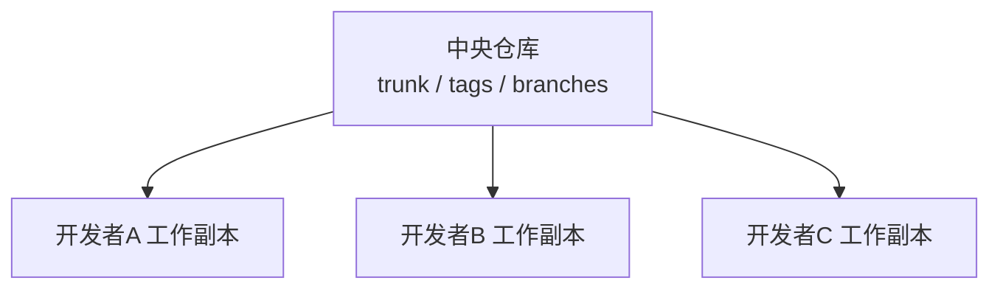
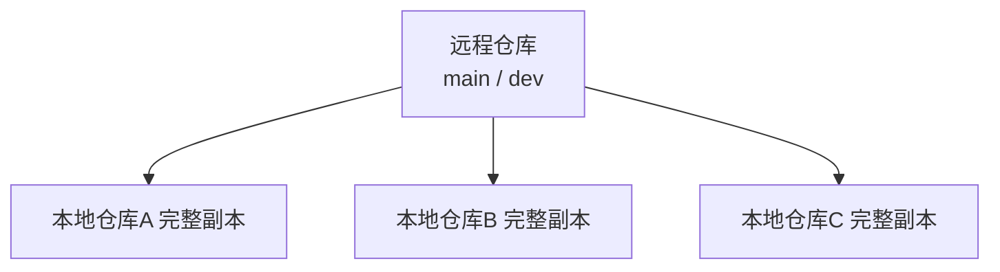

## 1. 版本控制系统概述

### 1.1 什么是版本控制

版本控制系统（Version Control System, VCS）是记录文件内容变化、支持多人协作的**时间机器**。它让你可以：

- 回溯到任意历史版本
- 比较不同版本之间的差异
- 多人并行开发而不互相覆盖
- 追踪每一次变更的作者和原因

### 1.2 VCS 发展历程

| 代际       | 类型   | 代表                   | 特点                       |
| :--------- | :----- | :--------------------- | :------------------------- |
| **第一代** | 本地式 | RCS、SCCS              | 只在本地管理，无法协作     |
| **第二代** | 集中式 | CVS、SVN、Perforce     | 有中央服务器，需联网操作   |
| **第三代** | 分布式 | Git、Mercurial、Bazaar | 每人拥有完整仓库，离线可用 |

## 2. Git vs SVN 核心对比

### 2.1 架构差异

**集中式（SVN）**：



- 所有操作依赖中央服务器
- 开发者只有工作副本，没有完整历史
- 网络中断时无法提交、查看日志

**分布式（Git）**：



- 每个开发者拥有完整仓库副本
- 离线也能提交、查看历史、创建分支
- 通过 push/pull 同步

### 2.2 功能对比

| 特性           | Git                  | SVN              |
| :------------- | :------------------- | :--------------- |
| **架构**       | 分布式               | 集中式           |
| **离线工作**   | 完全支持             | 大部分操作需联网 |
| **分支创建**   | 极快（指针操作）     | 慢（目录复制）   |
| **存储效率**   | 高（内容寻址、压缩） | 中等             |
| **学习曲线**   | 较陡                 | 较平缓           |
| **大文件支持** | 需要 Git LFS         | 原生支持         |
| **目录级权限** | 不支持               | 支持             |
| **空目录**     | 不跟踪               | 可跟踪           |
| **全局修订号** | 哈希值               | 递增数字         |
| **二进制文件** | 效率低               | 效率较好         |

### 2.3 性能对比

| 操作         | Git                      | SVN                    | 说明               |
| :----------- | :----------------------- | :--------------------- | :----------------- |
| **克隆仓库** | 较慢（首次下载全部历史） | 较快（只下载最新版本） | Git 后续操作更快   |
| **提交**     | 极快（本地操作）         | 较慢（需网络往返）     | Git 离线可用       |
| **分支创建** | $O(1)$                   | $O(n)$                 | Git 仅创建指针     |
| **日志查看** | 极快（本地数据）         | 较慢（需查询服务器）   | Git 离线可用       |
| **切换分支** | 极快                     | 较慢                   | Git 切换几乎无开销 |

## 3. 其他版本控制系统

### 3.1 Mercurial（Hg）

- **语言**：Python
- **特点**：命令简洁、跨平台、性能优秀
- **代表用户**：Mozilla（Firefox）、Facebook
- **状态**：活跃度下降，逐渐被 Git 取代

### 3.2 Perforce（Helix Core）

- **特点**：企业级、支持超大仓库、细粒度权限
- **适用**：游戏开发（大型二进制资产）、芯片设计
- **缺点**：商业软件、成本高

### 3.3 Fossil

- **作者**：SQLite 作者 Richard Hipp
- **特点**：内置 Wiki、工单系统、Web 界面
- **适用**：小型项目、个人项目

## 4. 选型决策

### 4.1 选择 Git 的场景

- **开源项目**：GitHub/GitLab 生态
- **Web/移动开发**：行业标准
- **微服务架构**：多仓库协作
- **CI/CD 集成**：GitHub Actions / GitLab CI
- **团队分布**：远程办公、跨时区协作

### 4.2 选择 SVN 的场景

- **大文件管理**：游戏资产、设计文件
- **目录级权限**：需要限制部分目录的访问
- **线性历史**：不使用分支的简单项目
- **遗留系统**：已有大量 SVN 历史的项目
- **合规要求**：某些行业要求集中式审计

### 4.3 选择 Perforce 的场景

- **超大仓库**：数十 TB 的二进制资产
- **游戏开发**：Unity/Unreal 项目
- **严格权限**：企业级访问控制

## 5. 迁移策略

### 5.1 SVN → Git 迁移

```bash
# 安装 git-svn
sudo apt install git-svn

# 克隆 SVN 仓库
git svn clone http://svn.example.com/project \
  --stdlayout \
  --authors-file=authors.txt \
  --prefix=svn/ \
  my-project

# authors.txt 格式
# svn_username = Git Name <email@example.com>

# 同步后续 SVN 变更
git svn fetch
git svn rebase

# 推送到 Git 远程仓库
git remote add origin git@github.com:user/project.git
git push -u origin main
```

### 5.2 迁移注意事项

1. **保留历史**：使用 `git svn clone` 保留完整提交历史
2. **作者映射**：建立 SVN 用户名到 Git 用户的映射
3. **分支转换**：SVN 的目录结构（trunk/branches/tags）需映射到 Git 分支
4. **大文件处理**：SVN 中的大文件需使用 Git LFS 管理
5. **权限迁移**：Git 不支持目录级权限，需通过其他方式实现
6. **钩子迁移**：SVN 钩子需改写为 Git 钩子或 CI/CD 流程

## 6. Git 协作平台

| 平台              | 特点                    | 适用场景           |
| :---------------- | :---------------------- | :----------------- |
| **GitHub**        | 全球最大、生态最丰富    | 开源项目、初创团队 |
| **GitLab**        | 自托管、内置 CI/CD      | 企业私有化部署     |
| **Bitbucket**     | Jira 集成、免费私有仓库 | Atlassian 生态用户 |
| **Gitea/Forgejo** | 轻量自托管、资源占用低  | 小团队私有部署     |
| **Gerrit**        | 代码审查专用            | Android 等大型项目 |

## 参考文献


本模块各文档：环境搭建、编程基础、调试思维等。
MDN 学习区：https://developer.mozilla.org/zh-CN/docs/Learn_web_development
freeCodeCamp：https://www.freecodecamp.org/chinese/
黑马程序员官网：https://www.itheima.com/

## 延伸阅读


从入门到进阶路径：001 入门 -> 002 Markdown -> 003 Git -> 006 HTML -> 007 CSS -> 008 JS。
语言进阶：013 Java / 040 Python / 016 Go 按兴趣选择。
尚硅谷 Bilibili 空间（https://space.bilibili.com/302417610 ）提供基础课程。

## 深度专题扩展


以下专题从不同角度深入本文主题，供有进阶需求的读者研读。每个专题独立成节，内容相互补充。

### 13.1 如何高效自学编程

目标驱动：每个阶段一个小项目（计算器、笔记、网站）。
费曼技巧：把学到的知识写出来或讲出来。
刻意练习：专注薄弱点，带反馈循环。
社区参与：提问、回答、代码评审加速成长。

### 13.2 学习路径规划

阶段一（2-4 周）：环境 + 基础语法 + 小练习。
阶段二（4-8 周）：数据结构 + 简单项目。
阶段三（2-3 月）：框架 + 实战项目 + 部署。
持续：算法刷题、源码阅读、开源贡献。

## 模块文档速查表

| 文档 | 主题 | 与本文的关联 |
| --- | --- | --- |
| 入门指南 | 001-GettingStartedGuide | 本文的前置基础 |
| 开发环境搭建 | 002-DevEnvSetup | 本文的前置基础 |
| 学习指南 | 003-LearningGuide | 本文的并列主题 |
| 计算机体系结构 | 004-ComputerArchitecture | 本文的并列主题 |
| 数的表示与编码 | 005-NumberRepresentationEncoding | 本文的并列主题 |
| 程序设计基础 | 006-ProgrammingBasics | 本文的前置基础 |
| 函数与模块化 | 007-FunctionModular | 本文的并列主题 |
| 学习路线规划 | 008-LearningPathPlanning | 本文的并列主题 |
| 环境变量与PATH | 009-EnvVarPath | 本文的前置基础 |
| IDE与编辑器选型 | 010-IDEEditorSelection | 本文的并列主题 |
| 插件生态 | 011-PluginEcosystem | 本文的并列主题 |
| 命令行基础 | 012-CommandLineBasics | 本文的前置基础 |
| 包管理器 | 013-PackageManager | 本文的并列主题 |
| 版本控制系统选型 | 014-VCSSelection | 本文自身 |
| 项目初始化 | 015-ProjectInit | 本文的综合应用 |
| 构建工具 | 016-BuildTool | 本文的并列主题 |
| 编程范式基础 | 017-ProgrammingParadigmBasics | 本文的前置基础 |
| 调试思想 | 018-DebugThinking | 本文的并列主题 |
| 软件下载地址汇总 | 019-SoftwareDownloadURLSummary | 本文的并列主题 |
| Windows环境配置教程 | 020-WindowsEnvConfigTutorial | 本文的前置基础 |
| macOS环境配置教程 | 021-MacOSEnvConfigTutorial | 本文的前置基础 |
| Linux环境配置教程 | 022-LinuxEnvConfigTutorial | 本文的前置基础 |
| 编程入门 Node.js 安装 | 023-NodeJsInstall | 本文的前置基础 |
| 编程入门 npm 包管理 | 024-NpmManager | 本文的前置基础 |
| 编程入门 pnpm 与 yarn 包管理 | 025-PnpmYarnManager | 本文的前置基础 |
| 编程入门 nvm 版本管理 | 026-NvmVersionManage | 本文的前置基础 |
| 编程入门 Python 安装 | 027-PythonInstall | 本文的前置基础 |
| 编程入门 pip 与 venv 包管理 | 028-PipVenvManager | 本文的前置基础 |
| 编程入门 pyenv 与 uv 版本管理 | 029-PyenvUvManage | 本文的前置基础 |
| 编程入门 Java JDK 配置 | 030-JavaJdkConfig | 本文的前置基础 |
| 编程入门 VS Code 安装配置 | 031-VSCodeInstall | 本文的前置基础 |
| 编程入门 Git 安装配置 | 032-GitInstallConfig | 本文的前置基础 |
| 编程入门 Docker 安装 | 033-DockerInstall | 本文的前置基础 |
| 文本处理命令速查手册 | 034-TextProcessing | 本文的并列主题 |
| 管道与重定向速查手册 | 035-PipeRedirect | 本文的并列主题 |
| 进程管理命令速查手册 | 036-ProcessManage | 本文的并列主题 |
| 压缩解压命令速查手册 | 037-CompressArchive | 本文的并列主题 |
