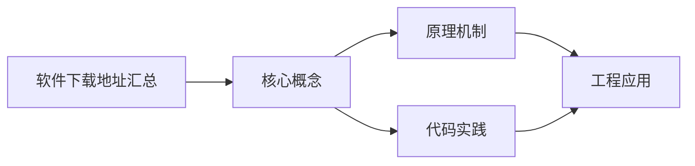

## 1. 学习目标（Bloom 分类）

本节按照布鲁姆教育目标分类学组织学习路径。本文主题为《软件下载地址汇总》，属于 入门指南 模块，读者可以根据自身阶段选择阅读深度。

记忆层面：能够准确复述本文的核心概念、术语与基本语法或操作步骤，并能够在提问或检索时快速定位对应知识点。能够说出 入门指南 的核心概念、常用命令与流程。

理解层面：能够用自己的语言解释核心原理与工作机制，说明概念之间的因果关系，而不是机械记忆结论。能够解释 入门指南 的工作原理与设计动机。

应用层面：能够在真实项目或练习场景中运用本文知识解决具体问题，写出正确且可维护的实现。能够独立完成 入门指南 的标准操作。

分析层面：能够拆解复杂问题，比较本文主题与相邻概念的异同，识别边界条件与例外情况。能够分析 入门指南 使用中的异常与边界。

评价层面：能够根据约束条件（性能、可读性、安全、成本）评价不同方案的优劣，做出有依据的技术决策。能够评价 入门指南 相关工具与方案。

创造层面：能够把本文知识与其他模块知识组合，设计出新的解决方案或可复用的工程模式。能够把 入门指南 融入团队工作流。

通过本节学习，读者应当能够把《软件下载地址汇总》纳入自己的知识网络，并与 入门指南 模块的其他主题（环境搭建、学习路径、编程基础）建立关联。

## 2. 历史动机与发展脉络

《软件下载地址汇总》是 入门指南 领域的重要主题。要真正理解它，需要先了解它解决的问题与演进过程。

编程入门的关键不是记忆语法，而是建立“问题 -> 方案 -> 验证”的思维循环；本模块为完全零基础的读者设计。
现代学习路径：环境搭建 -> 编程基础（变量/流程/函数）-> 数据与算法 -> 项目实践；本项目的完整文档库按此路径组织。
学习工具：IDE（VS Code）、命令行、Git、包管理器；工具链本身也是学习对象。

回到本文主题：软件下载地址汇总 的提出与成熟，正是上述技术背景下的必然产物。早期实现往往以简单可用为目标，随着工程规模扩大，社区逐渐沉淀出标准做法与最佳实践；理解这一脉络，可以帮助读者判断“为什么文档中的推荐写法是现在这个样子”，也能在遇到历史遗留代码时准确识别其设计年代与取舍。

## 3. 形式化定义与核心概念精讲

本节把《软件下载地址汇总》涉及的核心概念以“定义 + 讲解”的形式展开。读者应把定义当作工具，把讲解当作理解路径；两者结合才能形成可迁移的知识。

编程范式：命令式（逐步指令）、函数式（表达式与不可变）、面向对象（对象与消息）；语言是多范式的。
程序执行：源码 -> 编译/解释 -> 运行；调试是理解程序行为的主要手段。
抽象层次：机器码 -> 汇编 -> 高级语言 -> 框架 -> 领域语言；抽象降低认知负担。

### 3.1 原文章节逐一精讲

原文档把主题拆分为 10 个小节，下面按顺序给出每一节的导读讲解，随后保留原文细节供精读。

#### 原文精读（完整保留）

#### 编辑器与 IDE

| 名称          | 官网                                        | 下载链接                                       | 简介                                                          | 支持平台                      |
| ------------- | ------------------------------------------- | ---------------------------------------------- | ------------------------------------------------------------- | ----------------------------- |
| VS Code       | <https://code.visualstudio.com>             | <https://code.visualstudio.com/#alt-downloads> | 微软开源轻量编辑器，插件生态丰富，前端/全栈首选               | Windows / macOS / Linux / Web |
| IntelliJ IDEA | <https://www.jetbrains.com/idea>            | <https://www.jetbrains.com/idea/download>      | JetBrains 出品 Java IDE，Ultimate 付费 / Community 免费       | Windows / macOS / Linux       |
| WebStorm      | <https://www.jetbrains.com/webstorm>        | <https://www.jetbrains.com/webstorm/download>  | JetBrains 出品前端 IDE，付费（个人版有优惠）                  | Windows / macOS / Linux       |
| PyCharm       | <https://www.jetbrains.com/pycharm>         | <https://www.jetbrains.com/pycharm/download>   | JetBrains 出品 Python IDE，Professional 付费 / Community 免费 | Windows / macOS / Linux       |
| GoLand        | <https://www.jetbrains.com/go>              | <https://www.jetbrains.com/go/download>        | JetBrains 出品 Go IDE，付费                                   | Windows / macOS / Linux       |
| Vim / Neovim  | <https://www.vim.org> / <https://neovim.io> | <https://github.com/neovim/neovim/releases>    | 终端编辑器，Neovim 是现代化分支，支持 LSP 和 Lua 配置         | Windows / macOS / Linux       |
| Sublime Text  | <https://www.sublimetext.com>               | <https://www.sublimetext.com/download>         | 高性能文本编辑器，启动极快，支持无限评估                      | Windows / macOS / Linux       |

#### 编程语言运行时

| 名称               | 官网                                                 | 下载链接                                       | 简介                                                                | 支持平台                |
| ------------------ | ---------------------------------------------------- | ---------------------------------------------- | ------------------------------------------------------------------- | ----------------------- |
| Node.js            | <https://nodejs.org>                                 | <https://nodejs.org/en/download>               | JavaScript 运行时，推荐 LTS 版本；也可通过 nvm/fnm 管理多版本       | Windows / macOS / Linux |
| Python             | <https://www.python.org>                             | <https://www.python.org/downloads>             | 通用编程语言，安装时注意勾选 "Add to PATH"；推荐通过 pyenv 管理版本 | Windows / macOS / Linux |
| Java JDK (Oracle)  | <https://www.oracle.com/java/technologies/downloads> | 同官网                                         | Oracle 官方 JDK，商业使用需许可                                     | Windows / macOS / Linux |
| Java JDK (OpenJDK) | <https://adoptium.net>                               | <https://adoptium.net/temurin/releases>        | Eclipse Temurin 发行版，免费开源，社区活跃                          | Windows / macOS / Linux |
| Java JDK (GraalVM) | <https://www.graalvm.org>                            | <https://www.graalvm.org/downloads>            | Oracle 出品高性能 JDK，支持 AOT 编译与多语言运行                    | Windows / macOS / Linux |
| Go                 | <https://go.dev>                                     | <https://go.dev/dl>                            | Google 出品系统编程语言，编译快速，原生并发                         | Windows / macOS / Linux |
| .NET SDK           | <https://dotnet.microsoft.com>                       | <https://dotnet.microsoft.com/download>        | 微软跨平台开发框架，支持 C# / F# / VB.NET                           | Windows / macOS / Linux |
| Kotlin             | <https://kotlinlang.org>                             | <https://github.com/JetBrains/kotlin/releases> | JetBrains 出品 JVM 语言，Android 官方推荐，支持多平台               | Windows / macOS / Linux |

#### 版本控制

| 名称           | 官网                            | 下载链接                        | 简介                                        | 支持平台                |
| -------------- | ------------------------------- | ------------------------------- | ------------------------------------------- | ----------------------- |
| Git            | <https://git-scm.com>           | <https://git-scm.com/downloads> | 分布式版本控制系统，开发必备                | Windows / macOS / Linux |
| GitHub Desktop | <https://desktop.github.com>    | <https://desktop.github.com>    | GitHub 官方 GUI 客户端，简化 Git 操作       | Windows / macOS         |
| Sourcetree     | <https://www.sourcetreeapp.com> | <https://www.sourcetreeapp.com> | Atlassian 出品免费 Git/Mercurial GUI 客户端 | Windows / macOS         |

#### 容器与虚拟化

| 名称           | 官网                                             | 下载链接                                         | 简介                                                   | 支持平台                |
| -------------- | ------------------------------------------------ | ------------------------------------------------ | ------------------------------------------------------ | ----------------------- |
| Docker Desktop | <https://www.docker.com/products/docker-desktop> | <https://www.docker.com/products/docker-desktop> | 容器化平台桌面版，集成 Docker Engine 与 Docker Compose | Windows / macOS         |
| Podman         | <https://podman.io>                              | <https://podman.io/getting-started/installation> | Docker 替代品，无守护进程，rootless 模式更安全         | Windows / macOS / Linux |
| VirtualBox     | <https://www.virtualbox.org>                     | <https://www.virtualbox.org/wiki/Downloads>      | Oracle 开源虚拟机，跨平台，适合运行完整操作系统        | Windows / macOS / Linux |

#### 数据库客户端

| 名称            | 官网                                             | 下载链接                                       | 简介                                                                | 支持平台                |
| --------------- | ------------------------------------------------ | ---------------------------------------------- | ------------------------------------------------------------------- | ----------------------- |
| MySQL Workbench | <https://www.mysql.com/products/workbench>       | <https://dev.mysql.com/downloads/workbench>    | MySQL 官方可视化管理工具，支持数据建模与迁移                        | Windows / macOS / Linux |
| DBeaver         | <https://dbeaver.io>                             | <https://dbeaver.io/download>                  | 通用数据库客户端，支持 MySQL / PostgreSQL / SQLite 等几乎所有数据库 | Windows / macOS / Linux |
| pgAdmin         | <https://www.pgadmin.org>                        | <https://www.pgadmin.org/download>             | PostgreSQL 官方管理工具，Web 与桌面版可选                           | Windows / macOS / Linux |
| RedisInsight    | <https://redis.io/insight>                       | <https://redis.io/insight>                     | Redis 官方可视化工具，支持 CLI、内存分析、流查看                    | Windows / macOS / Linux |
| MongoDB Compass | <https://www.mongodb.com/products/tools/compass> | <https://www.mongodb.com/try/download/compass> | MongoDB 官方 GUI 工具，支持聚合管道构建与查询分析                   | Windows / macOS / Linux |

#### API 测试

| 名称     | 官网                      | 下载链接                            | 简介                                                       | 支持平台                |
| -------- | ------------------------- | ----------------------------------- | ---------------------------------------------------------- | ----------------------- |
| Postman  | <https://www.postman.com> | <https://www.postman.com/downloads> | API 调试与测试平台，支持 Mock Server、自动化测试、团队协作 | Windows / macOS / Linux |
| Insomnia | <https://insomnia.rest>   | <https://insomnia.rest/download>    | 轻量级 REST/GraphQL 客户端，开源版免费，界面简洁           | Windows / macOS / Linux |

#### 终端工具

| 名称             | 官网                                    | 下载链接                             | 简介                                                   | 支持平台      |
| ---------------- | --------------------------------------- | ------------------------------------ | ------------------------------------------------------ | ------------- |
| Windows Terminal | <https://github.com/microsoft/terminal> | Microsoft Store 搜索安装             | Windows 现代终端，支持多标签、GPU 加速渲染、自定义主题 | Windows       |
| iTerm2           | <https://iterm2.com>                    | <https://iterm2.com/downloads.html>  | macOS 终端增强工具，支持分屏、搜索、自动补全           | macOS         |
| Oh My Zsh        | <https://ohmyz.sh>                      | <https://github.com/ohmyzsh/ohmyzsh> | Zsh 配置框架，丰富主题与插件生态（git、z、sudo 等）    | macOS / Linux |

#### 设计工具

| 名称   | 官网                     | 下载链接                           | 简介                                               | 支持平台                      |
| ------ | ------------------------ | ---------------------------------- | -------------------------------------------------- | ----------------------------- |
| Figma  | <https://www.figma.com>  | <https://www.figma.com/downloads>  | 在线协作设计工具，前端切图常用，支持实时多人编辑   | Windows / macOS / Linux / Web |
| Sketch | <https://www.sketch.com> | <https://www.sketch.com/downloads> | macOS 原生 UI 设计工具，符号系统强大，插件生态丰富 | macOS                         |

#### 其他工具

| 名称            | 官网                                         | 下载链接                                  | 简介                                                             | 支持平台                |
| --------------- | -------------------------------------------- | ----------------------------------------- | ---------------------------------------------------------------- | ----------------------- |
| Chrome DevTools | <https://developer.chrome.com/docs/devtools> | 内置于 Chrome 浏览器                      | 前端调试利器，支持 DOM 检查、网络分析、性能剖析、Lighthouse 审计 | Windows / macOS / Linux |
| Wireshark       | <https://www.wireshark.org>                  | <https://www.wireshark.org/download.html> | 网络协议分析器，支持深度抓包与过滤，网络排障必备                 | Windows / macOS / Linux |

#### 下载建议

1. 优先通过各软件官网下载，确保获取最新安全版本
2. 部分软件可通过包管理器安装（Windows: Chocolatey/Scoop, macOS: Homebrew, Linux: apt/yum/pacman），详见各平台环境配置教程
3. JetBrains 全家桶学生可申请免费教育授权：<https://www.jetbrains.com/shop/eform/students>
4. GitHub 学生包包含大量免费工具与云服务：<https://education.github.com/pack>

### 3.2 概念关系图

下面用 Mermaid 图表达本文核心概念之间的关系，帮助读者建立整体图景：

图中展示的是本文知识的结构化关系：核心概念是入口，原理机制解释“为什么”，代码实践演示“怎么做”，工程应用回答“何时用”。读者学习时可以把每个小节的内容挂接到对应节点上。

## 4. 理论推导与原理解析

本节深入《软件下载地址汇总》背后的原理。理论部分不求面面俱到，而是聚焦“能解释现象、能指导实践”的关键推导。

编程范式：命令式（逐步指令）、函数式（表达式与不可变）、面向对象（对象与消息）；语言是多范式的。
程序执行：源码 -> 编译/解释 -> 运行；调试是理解程序行为的主要手段。
抽象层次：机器码 -> 汇编 -> 高级语言 -> 框架 -> 领域语言；抽象降低认知负担。
计算机基础：CPU 执行指令、内存存数据、I/O 与外部交互；这些概念支撑所有编程。

需要强调的是，理论推导与工程实践之间存在翻译层：理论给出的是理想化模型与边界条件，工程代码则必须处理真实环境中的例外。读者在学习时应先掌握理论的“标准情形”，再通过陷阱章节了解“非标准情形”。

## 5. 代码示例与逐行讲解

本节把原文中的代码示例系统整理，并为每个示例补充用途说明与讲解。读者不应只浏览代码，而应逐段对照讲解理解设计意图。

原文档未包含独立代码块，下面补充该主题的典型示例，演示核心概念在代码中的落地方式。

综合以上示例，可以总结出本主题的代码实践要点：第一，先定义清晰的输入输出契约；第二，核心逻辑保持单一职责；第三，错误处理与边界条件不可省略；第四，命名与注释表达意图而非复述代码。

## 6. 对比分析

对比是理解《软件下载地址汇总》定位的最快路径。下面从多个维度与相邻方案进行对比。

解释型与编译型：Python 解释执行上手快；Java/Go 编译期检查强。
强类型与弱类型：强类型减少运行时错误，弱类型灵活。
语言选择：Web 前端 JS/TS，后端 Java/Go/Python，系统 C/Rust。

对比的目的不是分出绝对优劣，而是建立选择依据：不同约束条件下，最优解不同。读者应把每个对比维度转化为决策检查清单。

## 7. 常见陷阱与最佳实践

本节整理该主题的高频错误与推荐做法。每个陷阱先描述现象，再解释原因，最后给出最佳实践。

### 7.1 复制粘贴代码

不理解导致维护灾难。逐行理解再使用。

深入讲解：该问题之所以被归类为“常见陷阱”，是因为它在初学者的代码中反复出现，而且往往不在第一时间暴露——错误通常隐藏在特定数据或特定时序下。

从成因上看，复制粘贴代码 一般源于对 入门指南 某个机制的理解偏差：要么误用了默认行为，要么忽略了边界条件，要么把其他语言的思维惯性带了过来。

从影响上看，复制粘贴代码 轻则产生错误结果，重则导致资源泄漏、数据损坏或安全事故；这也是为什么工程评审中会把它列为检查项。

从修复策略上看，处理复制粘贴代码的正确顺序是：先复现（构造最小用例），再定位（确认机制层面的根因），最后修复并补充回归测试。跳过复现直接改代码，往往治标不治本。

### 7.2 跳过基础

急于框架。基础（变量/流程/函数）先扎实。

深入讲解：该问题之所以被归类为“常见陷阱”，是因为它在初学者的代码中反复出现，而且往往不在第一时间暴露——错误通常隐藏在特定数据或特定时序下。

从成因上看，跳过基础 一般源于对 入门指南 某个机制的理解偏差：要么误用了默认行为，要么忽略了边界条件，要么把其他语言的思维惯性带了过来。

从影响上看，跳过基础 轻则产生错误结果，重则导致资源泄漏、数据损坏或安全事故；这也是为什么工程评审中会把它列为检查项。

从修复策略上看，处理跳过基础的正确顺序是：先复现（构造最小用例），再定位（确认机制层面的根因），最后修复并补充回归测试。跳过复现直接改代码，往往治标不治本。

### 7.3 环境混乱

版本冲突。使用版本管理（nvm/pyenv）与容器。

深入讲解：该问题之所以被归类为“常见陷阱”，是因为它在初学者的代码中反复出现，而且往往不在第一时间暴露——错误通常隐藏在特定数据或特定时序下。

从成因上看，环境混乱 一般源于对 入门指南 某个机制的理解偏差：要么误用了默认行为，要么忽略了边界条件，要么把其他语言的思维惯性带了过来。

从影响上看，环境混乱 轻则产生错误结果，重则导致资源泄漏、数据损坏或安全事故；这也是为什么工程评审中会把它列为检查项。

从修复策略上看，处理环境混乱的正确顺序是：先复现（构造最小用例），再定位（确认机制层面的根因），最后修复并补充回归测试。跳过复现直接改代码，往往治标不治本。

### 7.4 不读报错

报错是最佳提示。先读栈与信息。

深入讲解：该问题之所以被归类为“常见陷阱”，是因为它在初学者的代码中反复出现，而且往往不在第一时间暴露——错误通常隐藏在特定数据或特定时序下。

从成因上看，不读报错 一般源于对 入门指南 某个机制的理解偏差：要么误用了默认行为，要么忽略了边界条件，要么把其他语言的思维惯性带了过来。

从影响上看，不读报错 轻则产生错误结果，重则导致资源泄漏、数据损坏或安全事故；这也是为什么工程评审中会把它列为检查项。

从修复策略上看，处理不读报错的正确顺序是：先复现（构造最小用例），再定位（确认机制层面的根因），最后修复并补充回归测试。跳过复现直接改代码，往往治标不治本。

### 7.5 不会搜索

提问姿势差。用具体关键词与官方文档。

深入讲解：该问题之所以被归类为“常见陷阱”，是因为它在初学者的代码中反复出现，而且往往不在第一时间暴露——错误通常隐藏在特定数据或特定时序下。

从成因上看，不会搜索 一般源于对 入门指南 某个机制的理解偏差：要么误用了默认行为，要么忽略了边界条件，要么把其他语言的思维惯性带了过来。

从影响上看，不会搜索 轻则产生错误结果，重则导致资源泄漏、数据损坏或安全事故；这也是为什么工程评审中会把它列为检查项。

从修复策略上看，处理不会搜索的正确顺序是：先复现（构造最小用例），再定位（确认机制层面的根因），最后修复并补充回归测试。跳过复现直接改代码，往往治标不治本。

### 7.6 不动手

只看不做。每章动手写代码。

深入讲解：该问题之所以被归类为“常见陷阱”，是因为它在初学者的代码中反复出现，而且往往不在第一时间暴露——错误通常隐藏在特定数据或特定时序下。

从成因上看，不动手 一般源于对 入门指南 某个机制的理解偏差：要么误用了默认行为，要么忽略了边界条件，要么把其他语言的思维惯性带了过来。

从影响上看，不动手 轻则产生错误结果，重则导致资源泄漏、数据损坏或安全事故；这也是为什么工程评审中会把它列为检查项。

从修复策略上看，处理不动手的正确顺序是：先复现（构造最小用例），再定位（确认机制层面的根因），最后修复并补充回归测试。跳过复现直接改代码，往往治标不治本。

### 7.7 一次学太多

认知过载。小步循环：学-做-错-改。

深入讲解：该问题之所以被归类为“常见陷阱”，是因为它在初学者的代码中反复出现，而且往往不在第一时间暴露——错误通常隐藏在特定数据或特定时序下。

从成因上看，一次学太多 一般源于对 入门指南 某个机制的理解偏差：要么误用了默认行为，要么忽略了边界条件，要么把其他语言的思维惯性带了过来。

从影响上看，一次学太多 轻则产生错误结果，重则导致资源泄漏、数据损坏或安全事故；这也是为什么工程评审中会把它列为检查项。

从修复策略上看，处理一次学太多的正确顺序是：先复现（构造最小用例），再定位（确认机制层面的根因），最后修复并补充回归测试。跳过复现直接改代码，往往治标不治本。

### 7.8 忽略练习项目

无输出验证。用项目串联知识。

深入讲解：该问题之所以被归类为“常见陷阱”，是因为它在初学者的代码中反复出现，而且往往不在第一时间暴露——错误通常隐藏在特定数据或特定时序下。

从成因上看，忽略练习项目 一般源于对 入门指南 某个机制的理解偏差：要么误用了默认行为，要么忽略了边界条件，要么把其他语言的思维惯性带了过来。

从影响上看，忽略练习项目 轻则产生错误结果，重则导致资源泄漏、数据损坏或安全事故；这也是为什么工程评审中会把它列为检查项。

从修复策略上看，处理忽略练习项目的正确顺序是：先复现（构造最小用例），再定位（确认机制层面的根因），最后修复并补充回归测试。跳过复现直接改代码，往往治标不治本。

### 7.0 最佳实践总览

1. 先跑通最小示例，再逐步扩展。
2. 遇到错误先读信息，再搜索，再问人。
3. 每天保持练习节奏，间隔重复。
4. 把笔记写成文档（Markdown），沉淀知识。

把这些最佳实践固化为团队规范与代码评审检查项，是避免同类问题反复出现的关键。

## 8. 工程实践

本节把《软件下载地址汇总》放入真实工程场景，给出可复用的模式与组织方法。

学习环境：VS Code + 终端 + Git + 包管理器；统一版本。
练习路径：LeetCode 基础题 -> 小工具 -> 开源贡献。
社区：官方文档优先，Stack Overflow/中文社区辅助。

### 8.1 工程实践的原则拆解

以上工程实践可以归纳为四条原则。第一，配置与代码分离：入门指南 项目中环境差异应通过配置注入，而不是散落在代码分支中；这保证同一份代码可以在开发、测试、生产环境一致运行。

第二，接口稳定优先：对外接口（函数签名、协议、数据格式）一旦被消费方依赖，变更成本极高；设计时应预留扩展点并保持向后兼容。

第三，可观测性内置：日志、指标与追踪应该在功能开发时同步设计，而不是故障发生后补救；没有观测手段的模块等于黑盒。

第四，变更可回滚：任何发布都应有对应的回滚方案；数据库迁移、配置变更与代码发布一样需要版本管理与逆向路径。

### 8.2 实践落地的检查清单

- [ ] 学习环境：对照本节描述，检查当前项目是否已经落实；未落实的项列入技术债并排期处理。
- [ ] 练习路径：对照本节描述，检查当前项目是否已经落实；未落实的项列入技术债并排期处理。
- [ ] 社区：对照本节描述，检查当前项目是否已经落实；未落实的项列入技术债并排期处理。

工程实践的共性原则：配置与代码分离、接口稳定优先、可观测性内置、变更可回滚。这些原则适用于本主题的所有实现。

## 9. 案例研究

本节通过一个完整案例把《软件下载地址汇总》的知识串起来。案例按“需求分析、方案设计、实现、验证”四步展开。

需求：从零搭建第一个 Web 页面与脚本。
方案：VS Code + Node + HTML/CSS/JS 最小页面。
要点：分步验证（结构 -> 样式 -> 交互），控制台调试。
验证：浏览器打开页面，交互符合预期。

### 9.1 案例的扩展讨论

把案例中的方案放大到真实规模，需要额外考虑三个问题：

第一，规模：当数据量或并发量上升一个数量级时，原方案中的数据结构、缓存策略与任务调度是否仍然成立？通常需要引入分层与异步。

第二，团队：多人协作时，模块边界、接口契约与代码所有权必须明确；案例中的实现应拆分为可独立测试的单元，并配合文档说明设计意图。

第三，演进：上线后的需求变化不可避免；方案设计时应预留扩展点（配置化、插件化、事件化），并定期用真实指标验证假设。

案例研究的学习方法：先独立阅读需求，尝试在脑中形成方案，再对照实现与讲解，最后思考“如果约束变化（数据量、并发、团队规模），方案应如何调整”。

## 10. 知识要点总结与深入讲解

本节以讲解形式汇总全文要点，替代传统的习题与自测，读者不需要答题，只需跟随解释建立完整的认知框架。

关于《软件下载地址汇总》的核心结论：

入门是习惯养成：写、跑、错、改的循环。
环境与工具是学习的“地形”，先熟悉再深入。
文档库按模块组织，交叉引用帮助建立知识网络。

原文档各小节的要点回顾：

- 编辑器与 IDE：该小节围绕软件下载地址汇总展开具体细节，阅读时应关注其与核心结论的对应关系；每个小节都是核心结论在某一个侧面的展开。
- 编程语言运行时：该小节围绕软件下载地址汇总展开具体细节，阅读时应关注其与核心结论的对应关系；每个小节都是核心结论在某一个侧面的展开。
- 版本控制：该小节围绕软件下载地址汇总展开具体细节，阅读时应关注其与核心结论的对应关系；每个小节都是核心结论在某一个侧面的展开。
- 容器与虚拟化：该小节围绕软件下载地址汇总展开具体细节，阅读时应关注其与核心结论的对应关系；每个小节都是核心结论在某一个侧面的展开。
- 数据库客户端：该小节围绕软件下载地址汇总展开具体细节，阅读时应关注其与核心结论的对应关系；每个小节都是核心结论在某一个侧面的展开。
- API 测试：该小节围绕软件下载地址汇总展开具体细节，阅读时应关注其与核心结论的对应关系；每个小节都是核心结论在某一个侧面的展开。
- 终端工具：该小节围绕软件下载地址汇总展开具体细节，阅读时应关注其与核心结论的对应关系；每个小节都是核心结论在某一个侧面的展开。
- 设计工具：该小节围绕软件下载地址汇总展开具体细节，阅读时应关注其与核心结论的对应关系；每个小节都是核心结论在某一个侧面的展开。
- 其他工具：该小节围绕软件下载地址汇总展开具体细节，阅读时应关注其与核心结论的对应关系；每个小节都是核心结论在某一个侧面的展开。
- 下载建议：该小节围绕软件下载地址汇总展开具体细节，阅读时应关注其与核心结论的对应关系；每个小节都是核心结论在某一个侧面的展开。

把以上要点与第 3-9 节的内容对照复习，即可完成对本文主题的闭环学习。

## 11. 参考文献

本模块各文档：环境搭建、编程基础、调试思维等。
MDN 学习区：https://developer.mozilla.org/zh-CN/docs/Learn_web_development
freeCodeCamp：https://www.freecodecamp.org/chinese/
黑马程序员官网：https://www.itheima.com/

## 12. 延伸阅读

从入门到进阶路径：001 入门 -> 002 Markdown -> 003 Git -> 006 HTML -> 007 CSS -> 008 JS。
语言进阶：013 Java / 040 Python / 016 Go 按兴趣选择。
尚硅谷 Bilibili 空间（https://space.bilibili.com/302417610 ）提供基础课程。

## 14. 模块知识图谱与学习路径

本文属于 入门指南 模块。为了把《软件下载地址汇总》放入完整的知识网络，下面列出本模块的全部主题并给出相互关联的导读。学习时建议按模块内顺序推进，并在每个文档中留意交叉引用。

上图为模块主题的推荐学习顺序示意图（仅展示前若干主题）。各主题之间存在三类关联：

第一，前置依赖关系：早期主题是后期主题的基础，例如环境与语法先行、进阶主题随后；

第二，横向并列关系：同一层级主题从不同角度覆盖模块能力，学习顺序可以按兴趣调整；

第三，工程组合关系：多个主题在真实项目中组合使用，例如配置、性能与安全主题往往出现在同一系统的不同层面。

### 14.1 模块主题速查表

| 文档 | 主题 | 与本文的关联 |
| --- | --- | --- |
| 入门指南 | 001-GettingStartedGuide | 本文的前置基础 |
| 开发环境搭建 | 002-DevEnvSetup | 本文的前置基础 |
| 学习指南 | 003-LearningGuide | 本文的并列主题 |
| 计算机体系结构 | 004-ComputerArchitecture | 本文的并列主题 |
| 数的表示与编码 | 005-NumberRepresentationEncoding | 本文的并列主题 |
| 程序设计基础 | 006-ProgrammingBasics | 本文的前置基础 |
| 函数与模块化 | 007-FunctionModular | 本文的并列主题 |
| 学习路线规划 | 008-LearningPathPlanning | 本文的并列主题 |
| 环境变量与PATH | 009-EnvVarPath | 本文的前置基础 |
| IDE与编辑器选型 | 010-IDEEditorSelection | 本文的并列主题 |
| 插件生态 | 011-PluginEcosystem | 本文的并列主题 |
| 命令行基础 | 012-CommandLineBasics | 本文的前置基础 |
| 包管理器 | 013-PackageManager | 本文的并列主题 |
| 版本控制系统选型 | 014-VCSSelection | 本文的并列主题 |
| 项目初始化 | 015-ProjectInit | 本文的综合应用 |
| 构建工具 | 016-BuildTool | 本文的并列主题 |
| 编程范式基础 | 017-ProgrammingParadigmBasics | 本文的前置基础 |
| 调试思想 | 018-DebugThinking | 本文的并列主题 |
| 软件下载地址汇总 | 019-SoftwareDownloadURLSummary | 本文自身 |
| Windows环境配置教程 | 020-WindowsEnvConfigTutorial | 本文的前置基础 |
| macOS环境配置教程 | 021-MacOSEnvConfigTutorial | 本文的前置基础 |
| Linux环境配置教程 | 022-LinuxEnvConfigTutorial | 本文的前置基础 |
| 编程入门 Node.js 安装 | 023-NodeJsInstall | 本文的前置基础 |
| 编程入门 npm 包管理 | 024-NpmManager | 本文的前置基础 |
| 编程入门 pnpm 与 yarn 包管理 | 025-PnpmYarnManager | 本文的前置基础 |
| 编程入门 nvm 版本管理 | 026-NvmVersionManage | 本文的前置基础 |
| 编程入门 Python 安装 | 027-PythonInstall | 本文的前置基础 |
| 编程入门 pip 与 venv 包管理 | 028-PipVenvManager | 本文的前置基础 |
| 编程入门 pyenv 与 uv 版本管理 | 029-PyenvUvManage | 本文的前置基础 |
| 编程入门 Java JDK 配置 | 030-JavaJdkConfig | 本文的前置基础 |
| 编程入门 VS Code 安装配置 | 031-VSCodeInstall | 本文的前置基础 |
| 编程入门 Git 安装配置 | 032-GitInstallConfig | 本文的前置基础 |
| 编程入门 Docker 安装 | 033-DockerInstall | 本文的前置基础 |
| 文本处理命令速查手册 | 034-TextProcessing | 本文的并列主题 |
| 管道与重定向速查手册 | 035-PipeRedirect | 本文的并列主题 |
| 进程管理命令速查手册 | 036-ProcessManage | 本文的并列主题 |
| 压缩解压命令速查手册 | 037-CompressArchive | 本文的并列主题 |

速查表的作用是让读者快速判断：哪些文档应在阅读本文前掌握（前置基础），哪些文档应在阅读本文后继续（延伸主题）。本模块的交叉引用体系即以此表为基础。

## 15. 术语表

下表整理《软件下载地址汇总》及 入门指南 模块中出现的高频术语，给出简明释义。术语按字母序或逻辑序排列，供查阅。

| 术语 | 释义 |
| --- | --- |
| 编程范式 | 命令式（逐步指令）、函数式（表达式与不可变）、面向对象（对象与消息）；语言是多范式的。 |
| 程序执行 | 源码 -> 编译/解释 -> 运行；调试是理解程序行为的主要手段。 |
| 抽象层次 | 机器码 -> 汇编 -> 高级语言 -> 框架 -> 领域语言；抽象降低认知负担。 |
| 计算机基础 | CPU 执行指令、内存存数据、I/O 与外部交互；这些概念支撑所有编程。 |
| 复制粘贴代码（易错点） | 参见常见陷阱章节的详细讲解 |
| 跳过基础（易错点） | 参见常见陷阱章节的详细讲解 |
| 环境混乱（易错点） | 参见常见陷阱章节的详细讲解 |
| 不读报错（易错点） | 参见常见陷阱章节的详细讲解 |
| 不会搜索（易错点） | 参见常见陷阱章节的详细讲解 |
| 不动手（易错点） | 参见常见陷阱章节的详细讲解 |

术语表与正文配合使用：先通读正文，遇到模糊术语回查本表；长期使用后术语会自然进入工作记忆。

## 13. 深度专题扩展

以下专题从不同角度深入本文主题，供有进阶需求的读者研读。每个专题独立成节，内容相互补充。

### 13.1 如何高效自学编程

目标驱动：每个阶段一个小项目（计算器、笔记、网站）。
费曼技巧：把学到的知识写出来或讲出来。
刻意练习：专注薄弱点，带反馈循环。
社区参与：提问、回答、代码评审加速成长。

### 13.2 学习路径规划

阶段一（2-4 周）：环境 + 基础语法 + 小练习。
阶段二（4-8 周）：数据结构 + 简单项目。
阶段三（2-3 月）：框架 + 实战项目 + 部署。
持续：算法刷题、源码阅读、开源贡献。

## 16. 核心概念串讲（复习视角）

本节以“把知识讲给他人听”的方式，把《软件下载地址汇总》的核心概念重新串讲一遍。与前文按章节展开不同，这里的叙述更接近课堂总结：先说整体，再逐个展开，最后收束。

《软件下载地址汇总》属于 入门指南 模块。要理解它，先要理解它在模块中的位置：它解决的是该领域的一个具体问题，并依赖模块内若干前置概念；反过来，它又为后续进阶主题提供基础。

第一个概念是编程范式。命令式（逐步指令）、函数式（表达式与不可变）、面向对象（对象与消息）；语言是多范式的。

在实际使用中，编程范式需要与相邻概念区分：它们的区别不在于名称，而在于适用条件与行为边界；这正是前文对比分析章节的意义。

第一个概念是程序执行。源码 -> 编译/解释 -> 运行；调试是理解程序行为的主要手段。

在实际使用中，程序执行需要与相邻概念区分：它们的区别不在于名称，而在于适用条件与行为边界；这正是前文对比分析章节的意义。

第一个概念是抽象层次。机器码 -> 汇编 -> 高级语言 -> 框架 -> 领域语言；抽象降低认知负担。

在实际使用中，抽象层次需要与相邻概念区分：它们的区别不在于名称，而在于适用条件与行为边界；这正是前文对比分析章节的意义。

接下来是编程范式。命令式（逐步指令）、函数式（表达式与不可变）、面向对象（对象与消息）；语言是多范式的。

理解该原理的关键不是记住结论，而是记住“它从什么假设出发、推出了什么、假设不成立时会怎样”。带着这个框架复习，原理之间就会连成网络。

接下来是程序执行。源码 -> 编译/解释 -> 运行；调试是理解程序行为的主要手段。

理解该原理的关键不是记住结论，而是记住“它从什么假设出发、推出了什么、假设不成立时会怎样”。带着这个框架复习，原理之间就会连成网络。

接下来是抽象层次。机器码 -> 汇编 -> 高级语言 -> 框架 -> 领域语言；抽象降低认知负担。

理解该原理的关键不是记住结论，而是记住“它从什么假设出发、推出了什么、假设不成立时会怎样”。带着这个框架复习，原理之间就会连成网络。

接下来是计算机基础。CPU 执行指令、内存存数据、I/O 与外部交互；这些概念支撑所有编程。

理解该原理的关键不是记住结论，而是记住“它从什么假设出发、推出了什么、假设不成立时会怎样”。带着这个框架复习，原理之间就会连成网络。

串讲收束：把概念与原理放回本文主题，可以得出一个总纲——定义描述是什么，原理解释为什么，实践回答怎么做。三者构成完整的学习闭环；后续遇到相关问题，都可以按这个总纲检索知识。
