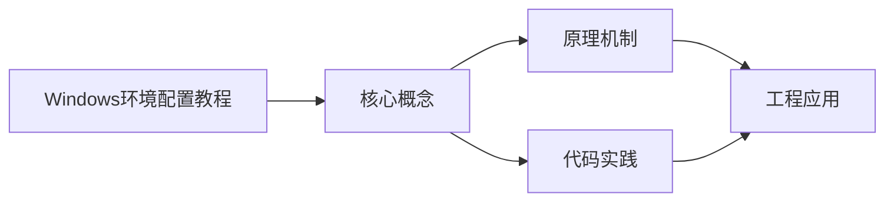

## 1. 学习目标（Bloom 分类）

本节按照布鲁姆教育目标分类学组织学习路径。本文主题为《Windows环境配置教程》，属于 入门指南 模块，读者可以根据自身阶段选择阅读深度。

记忆层面：能够准确复述本文的核心概念、术语与基本语法或操作步骤，并能够在提问或检索时快速定位对应知识点。能够说出 入门指南 的核心概念、常用命令与流程。

理解层面：能够用自己的语言解释核心原理与工作机制，说明概念之间的因果关系，而不是机械记忆结论。能够解释 入门指南 的工作原理与设计动机。

应用层面：能够在真实项目或练习场景中运用本文知识解决具体问题，写出正确且可维护的实现。能够独立完成 入门指南 的标准操作。

分析层面：能够拆解复杂问题，比较本文主题与相邻概念的异同，识别边界条件与例外情况。能够分析 入门指南 使用中的异常与边界。

评价层面：能够根据约束条件（性能、可读性、安全、成本）评价不同方案的优劣，做出有依据的技术决策。能够评价 入门指南 相关工具与方案。

创造层面：能够把本文知识与其他模块知识组合，设计出新的解决方案或可复用的工程模式。能够把 入门指南 融入团队工作流。

通过本节学习，读者应当能够把《Windows环境配置教程》纳入自己的知识网络，并与 入门指南 模块的其他主题（环境搭建、学习路径、编程基础）建立关联。

## 2. 历史动机与发展脉络

《Windows环境配置教程》是 入门指南 领域的重要主题。要真正理解它，需要先了解它解决的问题与演进过程。

编程入门的关键不是记忆语法，而是建立“问题 -> 方案 -> 验证”的思维循环；本模块为完全零基础的读者设计。
现代学习路径：环境搭建 -> 编程基础（变量/流程/函数）-> 数据与算法 -> 项目实践；本项目的完整文档库按此路径组织。
学习工具：IDE（VS Code）、命令行、Git、包管理器；工具链本身也是学习对象。

回到本文主题：Windows环境配置教程 的提出与成熟，正是上述技术背景下的必然产物。早期实现往往以简单可用为目标，随着工程规模扩大，社区逐渐沉淀出标准做法与最佳实践；理解这一脉络，可以帮助读者判断“为什么文档中的推荐写法是现在这个样子”，也能在遇到历史遗留代码时准确识别其设计年代与取舍。


## 3. 形式化定义与核心概念精讲

本节把《Windows环境配置教程》涉及的核心概念以“定义 + 讲解”的形式展开。读者应把定义当作工具，把讲解当作理解路径；两者结合才能形成可迁移的知识。

编程范式：命令式（逐步指令）、函数式（表达式与不可变）、面向对象（对象与消息）；语言是多范式的。
程序执行：源码 -> 编译/解释 -> 运行；调试是理解程序行为的主要手段。
抽象层次：机器码 -> 汇编 -> 高级语言 -> 框架 -> 领域语言；抽象降低认知负担。

### 3.1 原文章节逐一精讲

原文档把主题拆分为 10 个小节，下面按顺序给出每一节的导读讲解，随后保留原文细节供精读。

#### 原文精读（完整保留）


#### 1. WSL2 安装与配置

WSL2（Windows Subsystem for Linux 2）在 Windows 上提供完整的 Linux 内核，是 Windows 开发者的必备工具。

##### 1.1 系统要求

- Windows 10 版本 2004+（内部版本 19041 及更高）或 Windows 11
- 启用虚拟化（在任务管理器 → 性能 → CPU 中确认虚拟化已启用）

##### 1.2 安装 WSL2

以管理员身份打开 PowerShell：

```powershell
wsl --install
```

此命令将自动完成以下操作：

- 启用"适用于 Linux 的 Windows 子系统"可选组件
- 启用"虚拟机平台"可选组件
- 下载并安装 WSL2 Linux 内核
- 下载并安装 Ubuntu（默认发行版）
- 将 WSL 2 设置为默认版本

安装完成后重启计算机。

##### 1.3 安装其他发行版

```powershell
# 查看可用发行版
wsl --list --online

# 安装指定发行版
wsl --install -d Debian
wsl --install -d Ubuntu-24.04

# 查看已安装发行版
wsl --list --verbose
```

##### 1.4 设置默认发行版

```powershell
wsl --set-default Ubuntu-24.04
```

##### 1.5 WSL2 基本操作

```powershell
# 启动 WSL
wsl

# 在指定发行版中执行命令
wsl -d Debian -- ls -la

# 关闭所有 WSL 实例
wsl --shutdown

# 更新 WSL
wsl --update
```

> [!note] 文件系统互通
>
> - 从 Windows 访问 WSL 文件：在资源管理器地址栏输入 `\\wsl$`
> - 从 WSL 访问 Windows 文件：`/mnt/c/`、`/mnt/d/` 等
> - 建议项目文件放在 WSL 文件系统中以获得更好的 I/O 性能

#### 2. Chocolatey 包管理器

Chocolatey 是 Windows 上最流行的命令行包管理器，类似 Linux 的 apt/yum。

##### 2.1 安装 Chocolatey

以管理员身份打开 PowerShell：

```powershell
# 先设置执行策略
Set-ExecutionPolicy Bypass -Scope Process -Force

# 安装 Chocolatey
[System.Net.ServicePointManager]::SecurityProtocol = [System.Net.ServicePointManager]::SecurityProtocol -bor 3072
iex ((New-Object System.Net.WebClient).DownloadString('https://community.chocolatey.org/install.ps1'))
```

##### 2.2 常用命令

```powershell
# 搜索软件包
choco search nodejs

# 安装软件包
choco install git -y
choco install vscode -y
choco install nodejs-lts -y

# 升级已安装的包
choco upgrade all -y

# 查看已安装的包
choco list --local-only

# 卸载软件包
choco uninstall nodejs -y
```

##### 2.3 常用开发工具一键安装

```powershell
choco install git vscode nodejs-lts python openjdk docker-desktop -y
```

#### 3. Scoop 包管理器

Scoop 是另一个 Windows 包管理器，无需管理员权限，专注于便携式开发工具。

##### 3.1 安装 Scoop

```powershell
# 设置执行策略
Set-ExecutionPolicy -ExecutionPolicy RemoteSigned -Scope CurrentUser

# 安装 Scoop
irm get.scoop.sh | iex
```

##### 3.2 添加常用 Bucket

```powershell
scoop bucket add extras
scoop bucket add versions
scoop bucket add java
scoop bucket add nerd-fonts
```

##### 3.3 常用命令

```powershell
# 搜索软件
scoop search nodejs

# 安装软件
scoop install nodejs-lts
scoop install python
scoop install openjdk

# 更新所有软件
scoop update *

# 查看已安装软件
scoop list

# 卸载软件
scoop uninstall nodejs-lts
```

> [!tip] Chocolatey vs Scoop
>
> - **Chocolatey**：软件更全，系统级安装，需要管理员权限
> - **Scoop**：无需管理员权限，用户级安装，便携式管理，适合开发工具
> - 两者可以共存，按需选择

#### 4. 环境变量配置

##### 4.1 图形界面配置

1. 右键"此电脑" → "属性" → "高级系统设置" → "环境变量"
2. 在"用户变量"或"系统变量"中新建/编辑/删除

##### 4.2 命令行配置

```powershell
# 查看当前环境变量
$env:JAVA_HOME

# 临时设置（仅当前会话有效）
$env:MY_VAR = "hello"

# 永久设置用户环境变量
[Environment]::SetEnvironmentVariable("JAVA_HOME", "C:\Program Files\Java\jdk-21", "User")

# 永久设置系统环境变量（需管理员权限）
[Environment]::SetEnvironmentVariable("JAVA_HOME", "C:\Program Files\Java\jdk-21", "Machine")
```

##### 4.3 PATH 变量配置

PATH 变量决定了系统在哪些目录中搜索可执行文件。

```powershell
# 查看当前 PATH
$env:PATH -split ";"

# 添加到用户 PATH（永久）
$currentPath = [Environment]::GetEnvironmentVariable("PATH", "User")
[Environment]::SetEnvironmentVariable("PATH", "$currentPath;C:\Tools\bin", "User")
```

> [!warning] PATH 顺序
> PATH 中的目录按顺序搜索，先找到的先使用。如果安装了多个版本的同一工具，PATH 顺序决定了使用哪个版本。建议将自定义路径放在 PATH 前面。

#### 5. Git 安装与配置

##### 5.1 安装 Git

```powershell
# 方式一：Chocolatey
choco install git -y

# 方式二：Scoop
scoop install git

# 方式三：官网下载
# https://git-scm.com/download/win
```

##### 5.2 初始配置

```bash
# 设置用户名和邮箱
git config --global user.name "Your Name"
git config --global user.email "your.email@example.com"

# 设置默认分支名为 main
git config --global init.defaultBranch main

# 设置默认编辑器
git config --global core.editor "code --wait"

# 设置换行符处理（Windows 推荐）
git config --global core.autocrlf true

# 查看所有配置
git config --list --show-origin
```

##### 5.3 生成 SSH 密钥

```bash
# 生成 Ed25519 密钥（推荐）
ssh-keygen -t ed25519 -C "your.email@example.com"

# 启动 ssh-agent
eval $(ssh-agent -s)

# 添加密钥到 agent
ssh-add ~/.ssh/id_ed25519
```

将 `~/.ssh/id_ed25519.pub` 的内容添加到 GitHub/GitLab 的 SSH Keys 中。

##### 5.4 配置凭据管理器

```bash
# 安装 Git Credential Manager（Windows 通常自带）
git config --global credential.helper manager
```

#### 6. Node.js 安装

##### 6.1 使用 fnm 管理多版本（推荐）

fnm（Fast Node Manager）是 Rust 编写的 Node.js 版本管理器，速度极快。

```powershell
# 安装 fnm
winget install Schniz.fnm

# 或通过 Scoop
scoop install fnm

# 配置 Shell 集成（在 PowerShell 配置文件中添加）
fnm env --use-on-cd --shell powershell | Out-String | Invoke-Expression

# 安装 LTS 版本
fnm install --lts

# 安装指定版本
fnm install 20
fnm install 22

# 切换版本
fnm use 20

# 设置默认版本
fnm default 20

# 查看已安装版本
fnm list
```

##### 6.2 使用 Chocolatey/Scoop 安装

```powershell
# Chocolatey
choco install nodejs-lts -y

# Scoop
scoop install nodejs-lts
```

##### 6.3 配置 npm 镜像

```bash
# 设置淘宝镜像
npm config set registry https://registry.npmmirror.com

# 验证
npm config get registry

# 使用 pnpm 替代 npm（可选但推荐）
npm install -g pnpm
pnpm config set registry https://registry.npmmirror.com
```

#### 7. Python 安装

##### 7.1 官网安装

1. 访问 <https://www.python.org/downloads>
2. 下载最新稳定版
3. 安装时**务必勾选** "Add Python to PATH"
4. 选择 "Customize installation" 可自定义安装路径

##### 7.2 使用包管理器安装

```powershell
# Chocolatey
choco install python -y

# Scoop
scoop install python
```

##### 7.3 使用 pyenv-win 管理多版本

```powershell
# 安装 pyenv-win
pip install pyenv-win --target "$HOME\.pyenv"

# 或通过 Scoop
scoop install pyenv

# 安装指定版本
pyenv install 3.12.4
pyenv install 3.11.9

# 设置全局版本
pyenv global 3.12.4

# 设置项目局部版本
pyenv local 3.11.9

# 查看已安装版本
pyenv versions
```

##### 7.4 配置 pip 镜像

```bash
# 设置清华镜像
pip config set global.index-url https://pypi.tuna.tsinghua.edu.cn/simple

# 验证
pip config list
```

#### 8. Java JDK 安装与配置

##### 8.1 安装 JDK

```powershell
# Chocolatey 安装 OpenJDK 21
choco install openjdk21 -y

# Scoop 安装
scoop install openjdk21

# Oracle JDK 官网下载
# https://www.oracle.com/java/technologies/downloads

# GraalVM 官网下载
# https://www.graalvm.org/downloads
```

##### 8.2 配置环境变量

```powershell
# 设置 JAVA_HOME（根据实际安装路径调整）
[Environment]::SetEnvironmentVariable("JAVA_HOME", "C:\Program Files\Java\jdk-21", "Machine")

# 添加到 PATH
$currentPath = [Environment]::GetEnvironmentVariable("PATH", "Machine")
[Environment]::SetEnvironmentVariable("PATH", "$currentPath;%JAVA_HOME%\bin", "Machine")
```

##### 8.3 验证安装

```bash
java -version
javac -version
```

##### 8.4 管理多个 JDK 版本

如果需要同时安装多个 JDK 版本，可以通过修改 `JAVA_HOME` 指向不同版本来切换，或使用工具：

```powershell
# 使用 jabba 管理 JDK 版本
# https://github.com/shyiko/jabba
```

#### 9. Docker Desktop 安装

##### 9.1 系统要求

- Windows 10/11 Pro/Enterprise/Education（支持 Hyper-V）
- 或 Windows 10/11 Home（通过 WSL2 后端）
- 启用 WSL2

##### 9.2 安装步骤

```powershell
# 方式一：Chocolatey
choco install docker-desktop -y

# 方式二：官网下载安装包
# https://www.docker.com/products/docker-desktop

# 方式三：winget
winget install Docker.DockerDesktop
```

##### 9.3 配置 WSL2 后端

安装完成后，在 Docker Desktop → Settings → General 中：

- 勾选 "Use the WSL 2 based engine"
- 在 Resources → WSL Integration 中选择要集成的发行版

##### 9.4 配置镜像加速

在 Docker Desktop → Settings → Docker Engine 中添加：

```json
{
  "registry-mirrors": ["https://mirror.ccs.tencentyun.com", "https://docker.mirrors.ustc.edu.cn"]
}
```

##### 9.5 验证安装

```bash
docker --version
docker run hello-world
```

#### 10. VS Code 安装与插件推荐

##### 10.1 安装 VS Code

```powershell
# Chocolatey
choco install vscode -y

# Scoop
scoop install vscode

# winget
winget install Microsoft.VisualStudioCode

# 官网下载
# https://code.visualstudio.com
```

##### 10.2 命令行集成

安装时勾选以下选项：

- 添加"通过 Code 打开"操作到 Windows 资源管理器文件上下文菜单
- 添加"通过 Code 打开"操作到 Windows 资源管理器目录上下文菜单
- 将 Code 注册为支持的文件类型的编辑器
- 添加到 PATH

安装完成后可在终端中使用：

```bash
code .          # 打开当前目录
code file.txt   # 打开指定文件
code --diff a.txt b.txt  # 对比两个文件
```

##### 10.3 WSL 远程开发

安装 **WSL** 扩展后，可以在 WSL 环境中进行开发：

1. 安装扩展：在扩展面板搜索 "WSL" 并安装
2. 连接 WSL：按 `F1` → 输入 "WSL: Connect to WSL"
3. 或在 WSL 终端中输入 `code .` 自动连接

##### 10.4 推荐插件

**通用工具**：

| 插件                       | 用途                            |
| -------------------------- | ------------------------------- |
| Chinese Language Pack      | 中文界面                        |
| GitLens — Git supercharged | Git 增强，查看代码作者、历史    |
| Prettier - Code formatter  | 代码格式化                      |
| EditorConfig for VS Code   | 统一编辑器配置                  |
| Error Lens                 | 行内显示错误信息                |
| Project Manager            | 快速切换项目                    |
| Thunder Client             | 轻量级 API 测试（替代 Postman） |

**前端开发**：

| 插件                      | 用途                           |
| ------------------------- | ------------------------------ |
| ESLint                    | JavaScript/TypeScript 代码检查 |
| Vue - Official            | Vue 3 语言支持（原 Volar）     |
| Tailwind CSS IntelliSense | Tailwind CSS 智能提示          |
| Auto Rename Tag           | 自动重命名配对标签             |
| CSS Peek                  | 快速跳转 CSS 定义              |
| Path Intellisense         | 路径自动补全                   |

**后端开发**：

| 插件                    | 用途                                            |
| ----------------------- | ----------------------------------------------- |
| Python                  | Python 语言支持                                 |
| Pylance                 | Python 类型检查与智能提示                       |
| Go                      | Go 语言支持                                     |
| Extension Pack for Java | Java 开发套件                                   |
| Docker                  | Docker 容器管理                                 |
| Database Client         | 数据库客户端（支持 MySQL/PostgreSQL/SQLite 等） |

**效率提升**：

| 插件                 | 用途              |
| -------------------- | ----------------- |
| GitHub Copilot       | AI 代码补全       |
| GitHub Pull Requests | PR 管理与代码审查 |
| Live Share           | 实时协作编程      |
| Remote - SSH         | 远程 SSH 开发     |
| Dev Containers       | 开发容器          |

##### 10.5 推荐配置

在 `settings.json` 中添加：

```json
{
  "editor.fontSize": 14,
  "editor.lineHeight": 1.8,
  "editor.fontFamily": "'JetBrains Mono', 'Noto Sans SC', Consolas, monospace",
  "editor.fontLigatures": true,
  "editor.formatOnSave": true,
  "editor.defaultFormatter": "esbenp.prettier-vscode",
  "editor.minimap.enabled": false,
  "editor.bracketPairColorization.enabled": true,
  "editor.guides.bracketPairs": "active",
  "files.autoSave": "afterDelay",
  "files.autoSaveDelay": 1000,
  "terminal.integrated.defaultProfile.windows": "PowerShell",
  "workbench.iconTheme": "material-icon-theme"
}
```

> [!tip] 配置同步
> VS Code 支持 Settings Sync，通过 GitHub 或 Microsoft 账号同步你的设置、插件和快捷键到云端，换设备时一键恢复。


### 3.2 概念关系图

下面用 Mermaid 图表达本文核心概念之间的关系，帮助读者建立整体图景：



图中展示的是本文知识的结构化关系：核心概念是入口，原理机制解释“为什么”，代码实践演示“怎么做”，工程应用回答“何时用”。读者学习时可以把每个小节的内容挂接到对应节点上。

## 4. 理论推导与原理解析

本节深入《Windows环境配置教程》背后的原理。理论部分不求面面俱到，而是聚焦“能解释现象、能指导实践”的关键推导。

编程范式：命令式（逐步指令）、函数式（表达式与不可变）、面向对象（对象与消息）；语言是多范式的。
程序执行：源码 -> 编译/解释 -> 运行；调试是理解程序行为的主要手段。
抽象层次：机器码 -> 汇编 -> 高级语言 -> 框架 -> 领域语言；抽象降低认知负担。
计算机基础：CPU 执行指令、内存存数据、I/O 与外部交互；这些概念支撑所有编程。

需要强调的是，理论推导与工程实践之间存在翻译层：理论给出的是理想化模型与边界条件，工程代码则必须处理真实环境中的例外。读者在学习时应先掌握理论的“标准情形”，再通过陷阱章节了解“非标准情形”。

## 5. 代码示例与逐行讲解

本节把原文中的代码示例系统整理，并为每个示例补充用途说明与讲解。读者不应只浏览代码，而应逐段对照讲解理解设计意图。

### 5.1 示例：1.2 安装 WSL2

该示例来自原文《1.2 安装 WSL2》小节，用于演示Windows环境配置教程相关操作。阅读时请先看代码结构，再看其后的讲解。

```powershell
wsl --install
```

讲解：这段代码演示了本节核心知识点。代码中的关键操作可以归纳为三步：准备（定义或初始化）、执行（核心逻辑）、收尾（释放资源或返回结果）。实际项目中，这三步往往被封装为函数或类，以提升复用性与可测试性。

关键点分析：

该示例共 1 行有效代码，结构以数据或配置为主。阅读时应关注：数据字段的含义、配置项的作用，以及它们与运行行为的对应关系。

进阶思考路径：先尝试修改参数观察行为变化，再把示例中的模式迁移到自己的项目中；每次修改都记录预期与实测差异，这是把示例转化为能力的最快方式。

### 5.2 示例：1.3 安装其他发行版

该示例来自原文《1.3 安装其他发行版》小节，用于演示Windows环境配置教程相关操作。阅读时请先看代码结构，再看其后的讲解。

```powershell
# 查看可用发行版
wsl --list --online

# 安装指定发行版
wsl --install -d Debian
wsl --install -d Ubuntu-24.04

# 查看已安装发行版
wsl --list --verbose
```

讲解：这段代码演示了本节核心知识点。代码中的关键操作可以归纳为三步：准备（定义或初始化）、执行（核心逻辑）、收尾（释放资源或返回结果）。实际项目中，这三步往往被封装为函数或类，以提升复用性与可测试性。

关键点分析：

该示例共 7 行有效代码，结构以数据或配置为主。阅读时应关注：数据字段的含义、配置项的作用，以及它们与运行行为的对应关系。

进阶思考路径：先尝试修改参数观察行为变化，再把示例中的模式迁移到自己的项目中；每次修改都记录预期与实测差异，这是把示例转化为能力的最快方式。

### 5.3 示例：1.4 设置默认发行版

该示例来自原文《1.4 设置默认发行版》小节，用于演示Windows环境配置教程相关操作。阅读时请先看代码结构，再看其后的讲解。

```powershell
wsl --set-default Ubuntu-24.04
```

讲解：这段代码演示了本节核心知识点。代码中的关键操作可以归纳为三步：准备（定义或初始化）、执行（核心逻辑）、收尾（释放资源或返回结果）。实际项目中，这三步往往被封装为函数或类，以提升复用性与可测试性。

关键点分析：

该示例共 1 行有效代码，结构以数据或配置为主。阅读时应关注：数据字段的含义、配置项的作用，以及它们与运行行为的对应关系。

进阶思考路径：先尝试修改参数观察行为变化，再把示例中的模式迁移到自己的项目中；每次修改都记录预期与实测差异，这是把示例转化为能力的最快方式。

### 5.4 示例：1.5 WSL2 基本操作

该示例来自原文《1.5 WSL2 基本操作》小节，用于演示Windows环境配置教程相关操作。阅读时请先看代码结构，再看其后的讲解。

```powershell
# 启动 WSL
wsl

# 在指定发行版中执行命令
wsl -d Debian -- ls -la

# 关闭所有 WSL 实例
wsl --shutdown

# 更新 WSL
wsl --update
```

讲解：这段代码演示了本节核心知识点。代码中的关键操作可以归纳为三步：准备（定义或初始化）、执行（核心逻辑）、收尾（释放资源或返回结果）。实际项目中，这三步往往被封装为函数或类，以提升复用性与可测试性。

关键点分析：

该示例共 8 行有效代码，结构以数据或配置为主。阅读时应关注：数据字段的含义、配置项的作用，以及它们与运行行为的对应关系。

进阶思考路径：先尝试修改参数观察行为变化，再把示例中的模式迁移到自己的项目中；每次修改都记录预期与实测差异，这是把示例转化为能力的最快方式。

### 5.5 示例：2.1 安装 Chocolatey

该示例来自原文《2.1 安装 Chocolatey》小节，用于演示Windows环境配置教程相关操作。阅读时请先看代码结构，再看其后的讲解。

```powershell
# 先设置执行策略
Set-ExecutionPolicy Bypass -Scope Process -Force

# 安装 Chocolatey
[System.Net.ServicePointManager]::SecurityProtocol = [System.Net.ServicePointManager]::SecurityProtocol -bor 3072
iex ((New-Object System.Net.WebClient).DownloadString('https://community.chocolatey.org/install.ps1'))
```

讲解：这段代码演示了本节核心知识点。代码中的关键操作可以归纳为三步：准备（定义或初始化）、执行（核心逻辑）、收尾（释放资源或返回结果）。实际项目中，这三步往往被封装为函数或类，以提升复用性与可测试性。

关键点分析：

该示例共 5 行有效代码，结构以数据或配置为主。阅读时应关注：数据字段的含义、配置项的作用，以及它们与运行行为的对应关系。

进阶思考路径：先尝试修改参数观察行为变化，再把示例中的模式迁移到自己的项目中；每次修改都记录预期与实测差异，这是把示例转化为能力的最快方式。

### 5.6 示例：2.2 常用命令

该示例来自原文《2.2 常用命令》小节，用于演示Windows环境配置教程相关操作。阅读时请先看代码结构，再看其后的讲解。

```powershell
# 搜索软件包
choco search nodejs

# 安装软件包
choco install git -y
choco install vscode -y
choco install nodejs-lts -y

# 升级已安装的包
choco upgrade all -y

# 查看已安装的包
choco list --local-only

# 卸载软件包
choco uninstall nodejs -y
```

讲解：这段代码演示了本节核心知识点。代码中的关键操作可以归纳为三步：准备（定义或初始化）、执行（核心逻辑）、收尾（释放资源或返回结果）。实际项目中，这三步往往被封装为函数或类，以提升复用性与可测试性。

关键点分析：

该示例共 12 行有效代码，结构以数据或配置为主。阅读时应关注：数据字段的含义、配置项的作用，以及它们与运行行为的对应关系。

进阶思考路径：先尝试修改参数观察行为变化，再把示例中的模式迁移到自己的项目中；每次修改都记录预期与实测差异，这是把示例转化为能力的最快方式。

### 5.7 示例：2.3 常用开发工具一键安装

该示例来自原文《2.3 常用开发工具一键安装》小节，用于演示Windows环境配置教程相关操作。阅读时请先看代码结构，再看其后的讲解。

```powershell
choco install git vscode nodejs-lts python openjdk docker-desktop -y
```

讲解：这段代码演示了本节核心知识点。代码中的关键操作可以归纳为三步：准备（定义或初始化）、执行（核心逻辑）、收尾（释放资源或返回结果）。实际项目中，这三步往往被封装为函数或类，以提升复用性与可测试性。

关键点分析：

该示例共 1 行有效代码，结构以数据或配置为主。阅读时应关注：数据字段的含义、配置项的作用，以及它们与运行行为的对应关系。

进阶思考路径：先尝试修改参数观察行为变化，再把示例中的模式迁移到自己的项目中；每次修改都记录预期与实测差异，这是把示例转化为能力的最快方式。

### 5.8 示例：3.1 安装 Scoop

该示例来自原文《3.1 安装 Scoop》小节，用于演示Windows环境配置教程相关操作。阅读时请先看代码结构，再看其后的讲解。

```powershell
# 设置执行策略
Set-ExecutionPolicy -ExecutionPolicy RemoteSigned -Scope CurrentUser

# 安装 Scoop
irm get.scoop.sh | iex
```

讲解：这段代码演示了本节核心知识点。代码中的关键操作可以归纳为三步：准备（定义或初始化）、执行（核心逻辑）、收尾（释放资源或返回结果）。实际项目中，这三步往往被封装为函数或类，以提升复用性与可测试性。

关键点分析：

该示例共 4 行有效代码，结构以数据或配置为主。阅读时应关注：数据字段的含义、配置项的作用，以及它们与运行行为的对应关系。

进阶思考路径：先尝试修改参数观察行为变化，再把示例中的模式迁移到自己的项目中；每次修改都记录预期与实测差异，这是把示例转化为能力的最快方式。

### 5.9 示例：3.2 添加常用 Bucket

该示例来自原文《3.2 添加常用 Bucket》小节，用于演示Windows环境配置教程相关操作。阅读时请先看代码结构，再看其后的讲解。

```powershell
scoop bucket add extras
scoop bucket add versions
scoop bucket add java
scoop bucket add nerd-fonts
```

讲解：这段代码演示了本节核心知识点。代码中的关键操作可以归纳为三步：准备（定义或初始化）、执行（核心逻辑）、收尾（释放资源或返回结果）。实际项目中，这三步往往被封装为函数或类，以提升复用性与可测试性。

关键点分析：

该示例共 4 行有效代码，结构以数据或配置为主。阅读时应关注：数据字段的含义、配置项的作用，以及它们与运行行为的对应关系。

进阶思考路径：先尝试修改参数观察行为变化，再把示例中的模式迁移到自己的项目中；每次修改都记录预期与实测差异，这是把示例转化为能力的最快方式。

### 5.10 示例：3.3 常用命令

该示例来自原文《3.3 常用命令》小节，用于演示Windows环境配置教程相关操作。阅读时请先看代码结构，再看其后的讲解。

```powershell
# 搜索软件
scoop search nodejs

# 安装软件
scoop install nodejs-lts
scoop install python
scoop install openjdk

# 更新所有软件
scoop update *

# 查看已安装软件
scoop list

# 卸载软件
scoop uninstall nodejs-lts
```

讲解：这段代码演示了本节核心知识点。代码中的关键操作可以归纳为三步：准备（定义或初始化）、执行（核心逻辑）、收尾（释放资源或返回结果）。实际项目中，这三步往往被封装为函数或类，以提升复用性与可测试性。

关键点分析：

该示例共 12 行有效代码，结构以数据或配置为主。阅读时应关注：数据字段的含义、配置项的作用，以及它们与运行行为的对应关系。

进阶思考路径：先尝试修改参数观察行为变化，再把示例中的模式迁移到自己的项目中；每次修改都记录预期与实测差异，这是把示例转化为能力的最快方式。

### 5.11 示例：4.2 命令行配置

该示例来自原文《4.2 命令行配置》小节，用于演示Windows环境配置教程相关操作。阅读时请先看代码结构，再看其后的讲解。

```powershell
# 查看当前环境变量
$env:JAVA_HOME

# 临时设置（仅当前会话有效）
$env:MY_VAR = "hello"

# 永久设置用户环境变量
[Environment]::SetEnvironmentVariable("JAVA_HOME", "C:\Program Files\Java\jdk-21", "User")

# 永久设置系统环境变量（需管理员权限）
[Environment]::SetEnvironmentVariable("JAVA_HOME", "C:\Program Files\Java\jdk-21", "Machine")
```

讲解：这段代码演示了本节核心知识点。代码中的关键操作可以归纳为三步：准备（定义或初始化）、执行（核心逻辑）、收尾（释放资源或返回结果）。实际项目中，这三步往往被封装为函数或类，以提升复用性与可测试性。

关键点分析：

该示例共 8 行有效代码，结构以数据或配置为主。阅读时应关注：数据字段的含义、配置项的作用，以及它们与运行行为的对应关系。

进阶思考路径：先尝试修改参数观察行为变化，再把示例中的模式迁移到自己的项目中；每次修改都记录预期与实测差异，这是把示例转化为能力的最快方式。

### 5.12 示例：4.3 PATH 变量配置

该示例来自原文《4.3 PATH 变量配置》小节，用于演示Windows环境配置教程相关操作。阅读时请先看代码结构，再看其后的讲解。

```powershell
# 查看当前 PATH
$env:PATH -split ";"

# 添加到用户 PATH（永久）
$currentPath = [Environment]::GetEnvironmentVariable("PATH", "User")
[Environment]::SetEnvironmentVariable("PATH", "$currentPath;C:\Tools\bin", "User")
```

讲解：这段代码演示了本节核心知识点。代码中的关键操作可以归纳为三步：准备（定义或初始化）、执行（核心逻辑）、收尾（释放资源或返回结果）。实际项目中，这三步往往被封装为函数或类，以提升复用性与可测试性。

关键点分析：

该示例共 5 行有效代码，结构以数据或配置为主。阅读时应关注：数据字段的含义、配置项的作用，以及它们与运行行为的对应关系。

进阶思考路径：先尝试修改参数观察行为变化，再把示例中的模式迁移到自己的项目中；每次修改都记录预期与实测差异，这是把示例转化为能力的最快方式。

### 5.13 示例：5.1 安装 Git

该示例来自原文《5.1 安装 Git》小节，用于演示Windows环境配置教程相关操作。阅读时请先看代码结构，再看其后的讲解。

```powershell
# 方式一：Chocolatey
choco install git -y

# 方式二：Scoop
scoop install git

# 方式三：官网下载
# https://git-scm.com/download/win
```

讲解：这段代码演示了本节核心知识点。代码中的关键操作可以归纳为三步：准备（定义或初始化）、执行（核心逻辑）、收尾（释放资源或返回结果）。实际项目中，这三步往往被封装为函数或类，以提升复用性与可测试性。

关键点分析：

该示例共 6 行有效代码，结构以数据或配置为主。阅读时应关注：数据字段的含义、配置项的作用，以及它们与运行行为的对应关系。

进阶思考路径：先尝试修改参数观察行为变化，再把示例中的模式迁移到自己的项目中；每次修改都记录预期与实测差异，这是把示例转化为能力的最快方式。

### 5.14 示例：5.2 初始配置

该示例来自原文《5.2 初始配置》小节，用于演示Windows环境配置教程相关操作。阅读时请先看代码结构，再看其后的讲解。

```bash
# 设置用户名和邮箱
git config --global user.name "Your Name"
git config --global user.email "your.email@example.com"

# 设置默认分支名为 main
git config --global init.defaultBranch main

# 设置默认编辑器
git config --global core.editor "code --wait"

# 设置换行符处理（Windows 推荐）
git config --global core.autocrlf true

# 查看所有配置
git config --list --show-origin
```

讲解：这段代码演示了本节核心知识点。代码中的关键操作可以归纳为三步：准备（定义或初始化）、执行（核心逻辑）、收尾（释放资源或返回结果）。实际项目中，这三步往往被封装为函数或类，以提升复用性与可测试性。

关键点分析：

该示例共 11 行有效代码，结构以数据或配置为主。阅读时应关注：数据字段的含义、配置项的作用，以及它们与运行行为的对应关系。

进阶思考路径：先尝试修改参数观察行为变化，再把示例中的模式迁移到自己的项目中；每次修改都记录预期与实测差异，这是把示例转化为能力的最快方式。

### 5.15 示例：5.3 生成 SSH 密钥

该示例来自原文《5.3 生成 SSH 密钥》小节，用于演示Windows环境配置教程相关操作。阅读时请先看代码结构，再看其后的讲解。

```bash
# 生成 Ed25519 密钥（推荐）
ssh-keygen -t ed25519 -C "your.email@example.com"

# 启动 ssh-agent
eval $(ssh-agent -s)

# 添加密钥到 agent
ssh-add ~/.ssh/id_ed25519
```

讲解：这段代码演示了本节核心知识点。代码中的关键操作可以归纳为三步：准备（定义或初始化）、执行（核心逻辑）、收尾（释放资源或返回结果）。实际项目中，这三步往往被封装为函数或类，以提升复用性与可测试性。

关键点分析：

该示例共 6 行有效代码，结构以数据或配置为主。阅读时应关注：数据字段的含义、配置项的作用，以及它们与运行行为的对应关系。

进阶思考路径：先尝试修改参数观察行为变化，再把示例中的模式迁移到自己的项目中；每次修改都记录预期与实测差异，这是把示例转化为能力的最快方式。

### 5.16 示例：5.4 配置凭据管理器

该示例来自原文《5.4 配置凭据管理器》小节，用于演示Windows环境配置教程相关操作。阅读时请先看代码结构，再看其后的讲解。

```bash
# 安装 Git Credential Manager（Windows 通常自带）
git config --global credential.helper manager
```

讲解：这段代码演示了本节核心知识点。代码中的关键操作可以归纳为三步：准备（定义或初始化）、执行（核心逻辑）、收尾（释放资源或返回结果）。实际项目中，这三步往往被封装为函数或类，以提升复用性与可测试性。

关键点分析：

该示例共 2 行有效代码，结构以数据或配置为主。阅读时应关注：数据字段的含义、配置项的作用，以及它们与运行行为的对应关系。

进阶思考路径：先尝试修改参数观察行为变化，再把示例中的模式迁移到自己的项目中；每次修改都记录预期与实测差异，这是把示例转化为能力的最快方式。

### 5.17 示例：6.1 使用 fnm 管理多版本（推荐）

该示例来自原文《6.1 使用 fnm 管理多版本（推荐）》小节，用于演示Windows环境配置教程相关操作。阅读时请先看代码结构，再看其后的讲解。

```powershell
# 安装 fnm
winget install Schniz.fnm

# 或通过 Scoop
scoop install fnm

# 配置 Shell 集成（在 PowerShell 配置文件中添加）
fnm env --use-on-cd --shell powershell | Out-String | Invoke-Expression

# 安装 LTS 版本
fnm install --lts

# 安装指定版本
fnm install 20
fnm install 22

# 切换版本
fnm use 20

# 设置默认版本
fnm default 20

# 查看已安装版本
fnm list
```

讲解：这段代码演示了本节核心知识点。代码中的关键操作可以归纳为三步：准备（定义或初始化）、执行（核心逻辑）、收尾（释放资源或返回结果）。实际项目中，这三步往往被封装为函数或类，以提升复用性与可测试性。

关键点分析：

该示例共 17 行有效代码，结构以数据或配置为主。阅读时应关注：数据字段的含义、配置项的作用，以及它们与运行行为的对应关系。

进阶思考路径：先尝试修改参数观察行为变化，再把示例中的模式迁移到自己的项目中；每次修改都记录预期与实测差异，这是把示例转化为能力的最快方式。

### 5.18 示例：6.2 使用 Chocolatey/Scoop 安装

该示例来自原文《6.2 使用 Chocolatey/Scoop 安装》小节，用于演示Windows环境配置教程相关操作。阅读时请先看代码结构，再看其后的讲解。

```powershell
# Chocolatey
choco install nodejs-lts -y

# Scoop
scoop install nodejs-lts
```

讲解：这段代码演示了本节核心知识点。代码中的关键操作可以归纳为三步：准备（定义或初始化）、执行（核心逻辑）、收尾（释放资源或返回结果）。实际项目中，这三步往往被封装为函数或类，以提升复用性与可测试性。

关键点分析：

该示例共 4 行有效代码，结构以数据或配置为主。阅读时应关注：数据字段的含义、配置项的作用，以及它们与运行行为的对应关系。

进阶思考路径：先尝试修改参数观察行为变化，再把示例中的模式迁移到自己的项目中；每次修改都记录预期与实测差异，这是把示例转化为能力的最快方式。

### 5.19 示例：6.3 配置 npm 镜像

该示例来自原文《6.3 配置 npm 镜像》小节，用于演示Windows环境配置教程相关操作。阅读时请先看代码结构，再看其后的讲解。

```bash
# 设置淘宝镜像
npm config set registry https://registry.npmmirror.com

# 验证
npm config get registry

# 使用 pnpm 替代 npm（可选但推荐）
npm install -g pnpm
pnpm config set registry https://registry.npmmirror.com
```

讲解：这段代码演示了本节核心知识点。代码中的关键操作可以归纳为三步：准备（定义或初始化）、执行（核心逻辑）、收尾（释放资源或返回结果）。实际项目中，这三步往往被封装为函数或类，以提升复用性与可测试性。

关键点分析：

该示例共 7 行有效代码，结构以数据或配置为主。阅读时应关注：数据字段的含义、配置项的作用，以及它们与运行行为的对应关系。

进阶思考路径：先尝试修改参数观察行为变化，再把示例中的模式迁移到自己的项目中；每次修改都记录预期与实测差异，这是把示例转化为能力的最快方式。

### 5.20 示例：7.2 使用包管理器安装

该示例来自原文《7.2 使用包管理器安装》小节，用于演示Windows环境配置教程相关操作。阅读时请先看代码结构，再看其后的讲解。

```powershell
# Chocolatey
choco install python -y

# Scoop
scoop install python
```

讲解：这段代码演示了本节核心知识点。代码中的关键操作可以归纳为三步：准备（定义或初始化）、执行（核心逻辑）、收尾（释放资源或返回结果）。实际项目中，这三步往往被封装为函数或类，以提升复用性与可测试性。

关键点分析：

该示例共 4 行有效代码，结构以数据或配置为主。阅读时应关注：数据字段的含义、配置项的作用，以及它们与运行行为的对应关系。

进阶思考路径：先尝试修改参数观察行为变化，再把示例中的模式迁移到自己的项目中；每次修改都记录预期与实测差异，这是把示例转化为能力的最快方式。

### 5.21 示例：7.3 使用 pyenv-win 管理多版本

该示例来自原文《7.3 使用 pyenv-win 管理多版本》小节，用于演示Windows环境配置教程相关操作。阅读时请先看代码结构，再看其后的讲解。

```powershell
# 安装 pyenv-win
pip install pyenv-win --target "$HOME\.pyenv"

# 或通过 Scoop
scoop install pyenv

# 安装指定版本
pyenv install 3.12.4
pyenv install 3.11.9

# 设置全局版本
pyenv global 3.12.4

# 设置项目局部版本
pyenv local 3.11.9

# 查看已安装版本
pyenv versions
```

讲解：这段代码演示了本节核心知识点。代码中的关键操作可以归纳为三步：准备（定义或初始化）、执行（核心逻辑）、收尾（释放资源或返回结果）。实际项目中，这三步往往被封装为函数或类，以提升复用性与可测试性。

关键点分析：

该示例共 13 行有效代码，结构以数据或配置为主。阅读时应关注：数据字段的含义、配置项的作用，以及它们与运行行为的对应关系。

进阶思考路径：先尝试修改参数观察行为变化，再把示例中的模式迁移到自己的项目中；每次修改都记录预期与实测差异，这是把示例转化为能力的最快方式。

### 5.22 示例：7.4 配置 pip 镜像

该示例来自原文《7.4 配置 pip 镜像》小节，用于演示Windows环境配置教程相关操作。阅读时请先看代码结构，再看其后的讲解。

```bash
# 设置清华镜像
pip config set global.index-url https://pypi.tuna.tsinghua.edu.cn/simple

# 验证
pip config list
```

讲解：这段代码演示了本节核心知识点。代码中的关键操作可以归纳为三步：准备（定义或初始化）、执行（核心逻辑）、收尾（释放资源或返回结果）。实际项目中，这三步往往被封装为函数或类，以提升复用性与可测试性。

关键点分析：

该示例共 4 行有效代码，结构以数据或配置为主。阅读时应关注：数据字段的含义、配置项的作用，以及它们与运行行为的对应关系。

进阶思考路径：先尝试修改参数观察行为变化，再把示例中的模式迁移到自己的项目中；每次修改都记录预期与实测差异，这是把示例转化为能力的最快方式。

### 5.23 示例：8.1 安装 JDK

该示例来自原文《8.1 安装 JDK》小节，用于演示Windows环境配置教程相关操作。阅读时请先看代码结构，再看其后的讲解。

```powershell
# Chocolatey 安装 OpenJDK 21
choco install openjdk21 -y

# Scoop 安装
scoop install openjdk21

# Oracle JDK 官网下载
# https://www.oracle.com/java/technologies/downloads

# GraalVM 官网下载
# https://www.graalvm.org/downloads
```

讲解：这段代码演示了本节核心知识点。代码中的关键操作可以归纳为三步：准备（定义或初始化）、执行（核心逻辑）、收尾（释放资源或返回结果）。实际项目中，这三步往往被封装为函数或类，以提升复用性与可测试性。

关键点分析：

该示例共 8 行有效代码，结构以数据或配置为主。阅读时应关注：数据字段的含义、配置项的作用，以及它们与运行行为的对应关系。

进阶思考路径：先尝试修改参数观察行为变化，再把示例中的模式迁移到自己的项目中；每次修改都记录预期与实测差异，这是把示例转化为能力的最快方式。

### 5.24 示例：8.2 配置环境变量

该示例来自原文《8.2 配置环境变量》小节，用于演示Windows环境配置教程相关操作。阅读时请先看代码结构，再看其后的讲解。

```powershell
# 设置 JAVA_HOME（根据实际安装路径调整）
[Environment]::SetEnvironmentVariable("JAVA_HOME", "C:\Program Files\Java\jdk-21", "Machine")

# 添加到 PATH
$currentPath = [Environment]::GetEnvironmentVariable("PATH", "Machine")
[Environment]::SetEnvironmentVariable("PATH", "$currentPath;%JAVA_HOME%\bin", "Machine")
```

讲解：这段代码演示了本节核心知识点。代码中的关键操作可以归纳为三步：准备（定义或初始化）、执行（核心逻辑）、收尾（释放资源或返回结果）。实际项目中，这三步往往被封装为函数或类，以提升复用性与可测试性。

关键点分析：

该示例共 5 行有效代码，结构以数据或配置为主。阅读时应关注：数据字段的含义、配置项的作用，以及它们与运行行为的对应关系。

进阶思考路径：先尝试修改参数观察行为变化，再把示例中的模式迁移到自己的项目中；每次修改都记录预期与实测差异，这是把示例转化为能力的最快方式。

### 5.25 示例：8.3 验证安装

该示例来自原文《8.3 验证安装》小节，用于演示Windows环境配置教程相关操作。阅读时请先看代码结构，再看其后的讲解。

```bash
java -version
javac -version
```

讲解：这段代码演示了本节核心知识点。代码中的关键操作可以归纳为三步：准备（定义或初始化）、执行（核心逻辑）、收尾（释放资源或返回结果）。实际项目中，这三步往往被封装为函数或类，以提升复用性与可测试性。

关键点分析：

该示例共 2 行有效代码，结构以数据或配置为主。阅读时应关注：数据字段的含义、配置项的作用，以及它们与运行行为的对应关系。

进阶思考路径：先尝试修改参数观察行为变化，再把示例中的模式迁移到自己的项目中；每次修改都记录预期与实测差异，这是把示例转化为能力的最快方式。

### 5.26 示例：8.4 管理多个 JDK 版本

该示例来自原文《8.4 管理多个 JDK 版本》小节，用于演示Windows环境配置教程相关操作。阅读时请先看代码结构，再看其后的讲解。

```powershell
# 使用 jabba 管理 JDK 版本
# https://github.com/shyiko/jabba
```

讲解：这段代码演示了本节核心知识点。代码中的关键操作可以归纳为三步：准备（定义或初始化）、执行（核心逻辑）、收尾（释放资源或返回结果）。实际项目中，这三步往往被封装为函数或类，以提升复用性与可测试性。

关键点分析：

该示例共 2 行有效代码，结构以数据或配置为主。阅读时应关注：数据字段的含义、配置项的作用，以及它们与运行行为的对应关系。

进阶思考路径：先尝试修改参数观察行为变化，再把示例中的模式迁移到自己的项目中；每次修改都记录预期与实测差异，这是把示例转化为能力的最快方式。

### 5.27 示例：9.2 安装步骤

该示例来自原文《9.2 安装步骤》小节，用于演示Windows环境配置教程相关操作。阅读时请先看代码结构，再看其后的讲解。

```powershell
# 方式一：Chocolatey
choco install docker-desktop -y

# 方式二：官网下载安装包
# https://www.docker.com/products/docker-desktop

# 方式三：winget
winget install Docker.DockerDesktop
```

讲解：这段代码演示了本节核心知识点。代码中的关键操作可以归纳为三步：准备（定义或初始化）、执行（核心逻辑）、收尾（释放资源或返回结果）。实际项目中，这三步往往被封装为函数或类，以提升复用性与可测试性。

关键点分析：

该示例共 6 行有效代码，结构以数据或配置为主。阅读时应关注：数据字段的含义、配置项的作用，以及它们与运行行为的对应关系。

进阶思考路径：先尝试修改参数观察行为变化，再把示例中的模式迁移到自己的项目中；每次修改都记录预期与实测差异，这是把示例转化为能力的最快方式。

### 5.28 示例：9.4 配置镜像加速

该示例来自原文《9.4 配置镜像加速》小节，用于演示Windows环境配置教程相关操作。阅读时请先看代码结构，再看其后的讲解。

```json
{
  "registry-mirrors": ["https://mirror.ccs.tencentyun.com", "https://docker.mirrors.ustc.edu.cn"]
}
```

讲解：这段代码演示了本节核心知识点。代码中的关键操作可以归纳为三步：准备（定义或初始化）、执行（核心逻辑）、收尾（释放资源或返回结果）。实际项目中，这三步往往被封装为函数或类，以提升复用性与可测试性。

关键点分析：

该示例共 3 行有效代码，结构以数据或配置为主。阅读时应关注：数据字段的含义、配置项的作用，以及它们与运行行为的对应关系。

进阶思考路径：先尝试修改参数观察行为变化，再把示例中的模式迁移到自己的项目中；每次修改都记录预期与实测差异，这是把示例转化为能力的最快方式。

### 5.29 示例：9.5 验证安装

该示例来自原文《9.5 验证安装》小节，用于演示Windows环境配置教程相关操作。阅读时请先看代码结构，再看其后的讲解。

```bash
docker --version
docker run hello-world
```

讲解：这段代码演示了本节核心知识点。代码中的关键操作可以归纳为三步：准备（定义或初始化）、执行（核心逻辑）、收尾（释放资源或返回结果）。实际项目中，这三步往往被封装为函数或类，以提升复用性与可测试性。

关键点分析：

该示例共 2 行有效代码，结构以数据或配置为主。阅读时应关注：数据字段的含义、配置项的作用，以及它们与运行行为的对应关系。

进阶思考路径：先尝试修改参数观察行为变化，再把示例中的模式迁移到自己的项目中；每次修改都记录预期与实测差异，这是把示例转化为能力的最快方式。

### 5.30 示例：10.1 安装 VS Code

该示例来自原文《10.1 安装 VS Code》小节，用于演示Windows环境配置教程相关操作。阅读时请先看代码结构，再看其后的讲解。

```powershell
# Chocolatey
choco install vscode -y

# Scoop
scoop install vscode

# winget
winget install Microsoft.VisualStudioCode

# 官网下载
# https://code.visualstudio.com
```

讲解：这段代码演示了本节核心知识点。代码中的关键操作可以归纳为三步：准备（定义或初始化）、执行（核心逻辑）、收尾（释放资源或返回结果）。实际项目中，这三步往往被封装为函数或类，以提升复用性与可测试性。

关键点分析：

该示例共 8 行有效代码，结构以数据或配置为主。阅读时应关注：数据字段的含义、配置项的作用，以及它们与运行行为的对应关系。

进阶思考路径：先尝试修改参数观察行为变化，再把示例中的模式迁移到自己的项目中；每次修改都记录预期与实测差异，这是把示例转化为能力的最快方式。

### 5.31 示例：10.2 命令行集成

该示例来自原文《10.2 命令行集成》小节，用于演示Windows环境配置教程相关操作。阅读时请先看代码结构，再看其后的讲解。

```bash
code .          # 打开当前目录
code file.txt   # 打开指定文件
code --diff a.txt b.txt  # 对比两个文件
```

讲解：这段代码演示了本节核心知识点。代码中的关键操作可以归纳为三步：准备（定义或初始化）、执行（核心逻辑）、收尾（释放资源或返回结果）。实际项目中，这三步往往被封装为函数或类，以提升复用性与可测试性。

关键点分析：

该示例共 3 行有效代码，结构以数据或配置为主。阅读时应关注：数据字段的含义、配置项的作用，以及它们与运行行为的对应关系。

进阶思考路径：先尝试修改参数观察行为变化，再把示例中的模式迁移到自己的项目中；每次修改都记录预期与实测差异，这是把示例转化为能力的最快方式。

### 5.32 示例：10.5 推荐配置

该示例来自原文《10.5 推荐配置》小节，用于演示Windows环境配置教程相关操作。阅读时请先看代码结构，再看其后的讲解。

```json
{
  "editor.fontSize": 14,
  "editor.lineHeight": 1.8,
  "editor.fontFamily": "'JetBrains Mono', 'Noto Sans SC', Consolas, monospace",
  "editor.fontLigatures": true,
  "editor.formatOnSave": true,
  "editor.defaultFormatter": "esbenp.prettier-vscode",
  "editor.minimap.enabled": false,
  "editor.bracketPairColorization.enabled": true,
  "editor.guides.bracketPairs": "active",
  "files.autoSave": "afterDelay",
  "files.autoSaveDelay": 1000,
  "terminal.integrated.defaultProfile.windows": "PowerShell",
  "workbench.iconTheme": "material-icon-theme"
}
```

讲解：这段代码演示了本节核心知识点。代码中的关键操作可以归纳为三步：准备（定义或初始化）、执行（核心逻辑）、收尾（释放资源或返回结果）。实际项目中，这三步往往被封装为函数或类，以提升复用性与可测试性。

关键点分析：

该示例共 15 行有效代码，结构以数据或配置为主。阅读时应关注：数据字段的含义、配置项的作用，以及它们与运行行为的对应关系。

进阶思考路径：先尝试修改参数观察行为变化，再把示例中的模式迁移到自己的项目中；每次修改都记录预期与实测差异，这是把示例转化为能力的最快方式。


综合以上示例，可以总结出本主题的代码实践要点：第一，先定义清晰的输入输出契约；第二，核心逻辑保持单一职责；第三，错误处理与边界条件不可省略；第四，命名与注释表达意图而非复述代码。

## 6. 对比分析

对比是理解《Windows环境配置教程》定位的最快路径。下面从多个维度与相邻方案进行对比。

解释型与编译型：Python 解释执行上手快；Java/Go 编译期检查强。
强类型与弱类型：强类型减少运行时错误，弱类型灵活。
语言选择：Web 前端 JS/TS，后端 Java/Go/Python，系统 C/Rust。

对比的目的不是分出绝对优劣，而是建立选择依据：不同约束条件下，最优解不同。读者应把每个对比维度转化为决策检查清单。

## 7. 常见陷阱与最佳实践

本节整理该主题的高频错误与推荐做法。每个陷阱先描述现象，再解释原因，最后给出最佳实践。

### 7.1 复制粘贴代码

不理解导致维护灾难。逐行理解再使用。

深入讲解：该问题之所以被归类为“常见陷阱”，是因为它在初学者的代码中反复出现，而且往往不在第一时间暴露——错误通常隐藏在特定数据或特定时序下。

从成因上看，复制粘贴代码 一般源于对 入门指南 某个机制的理解偏差：要么误用了默认行为，要么忽略了边界条件，要么把其他语言的思维惯性带了过来。

从影响上看，复制粘贴代码 轻则产生错误结果，重则导致资源泄漏、数据损坏或安全事故；这也是为什么工程评审中会把它列为检查项。

从修复策略上看，处理复制粘贴代码的正确顺序是：先复现（构造最小用例），再定位（确认机制层面的根因），最后修复并补充回归测试。跳过复现直接改代码，往往治标不治本。

### 7.2 跳过基础

急于框架。基础（变量/流程/函数）先扎实。

深入讲解：该问题之所以被归类为“常见陷阱”，是因为它在初学者的代码中反复出现，而且往往不在第一时间暴露——错误通常隐藏在特定数据或特定时序下。

从成因上看，跳过基础 一般源于对 入门指南 某个机制的理解偏差：要么误用了默认行为，要么忽略了边界条件，要么把其他语言的思维惯性带了过来。

从影响上看，跳过基础 轻则产生错误结果，重则导致资源泄漏、数据损坏或安全事故；这也是为什么工程评审中会把它列为检查项。

从修复策略上看，处理跳过基础的正确顺序是：先复现（构造最小用例），再定位（确认机制层面的根因），最后修复并补充回归测试。跳过复现直接改代码，往往治标不治本。

### 7.3 环境混乱

版本冲突。使用版本管理（nvm/pyenv）与容器。

深入讲解：该问题之所以被归类为“常见陷阱”，是因为它在初学者的代码中反复出现，而且往往不在第一时间暴露——错误通常隐藏在特定数据或特定时序下。

从成因上看，环境混乱 一般源于对 入门指南 某个机制的理解偏差：要么误用了默认行为，要么忽略了边界条件，要么把其他语言的思维惯性带了过来。

从影响上看，环境混乱 轻则产生错误结果，重则导致资源泄漏、数据损坏或安全事故；这也是为什么工程评审中会把它列为检查项。

从修复策略上看，处理环境混乱的正确顺序是：先复现（构造最小用例），再定位（确认机制层面的根因），最后修复并补充回归测试。跳过复现直接改代码，往往治标不治本。

### 7.4 不读报错

报错是最佳提示。先读栈与信息。

深入讲解：该问题之所以被归类为“常见陷阱”，是因为它在初学者的代码中反复出现，而且往往不在第一时间暴露——错误通常隐藏在特定数据或特定时序下。

从成因上看，不读报错 一般源于对 入门指南 某个机制的理解偏差：要么误用了默认行为，要么忽略了边界条件，要么把其他语言的思维惯性带了过来。

从影响上看，不读报错 轻则产生错误结果，重则导致资源泄漏、数据损坏或安全事故；这也是为什么工程评审中会把它列为检查项。

从修复策略上看，处理不读报错的正确顺序是：先复现（构造最小用例），再定位（确认机制层面的根因），最后修复并补充回归测试。跳过复现直接改代码，往往治标不治本。

### 7.5 不会搜索

提问姿势差。用具体关键词与官方文档。

深入讲解：该问题之所以被归类为“常见陷阱”，是因为它在初学者的代码中反复出现，而且往往不在第一时间暴露——错误通常隐藏在特定数据或特定时序下。

从成因上看，不会搜索 一般源于对 入门指南 某个机制的理解偏差：要么误用了默认行为，要么忽略了边界条件，要么把其他语言的思维惯性带了过来。

从影响上看，不会搜索 轻则产生错误结果，重则导致资源泄漏、数据损坏或安全事故；这也是为什么工程评审中会把它列为检查项。

从修复策略上看，处理不会搜索的正确顺序是：先复现（构造最小用例），再定位（确认机制层面的根因），最后修复并补充回归测试。跳过复现直接改代码，往往治标不治本。

### 7.6 不动手

只看不做。每章动手写代码。

深入讲解：该问题之所以被归类为“常见陷阱”，是因为它在初学者的代码中反复出现，而且往往不在第一时间暴露——错误通常隐藏在特定数据或特定时序下。

从成因上看，不动手 一般源于对 入门指南 某个机制的理解偏差：要么误用了默认行为，要么忽略了边界条件，要么把其他语言的思维惯性带了过来。

从影响上看，不动手 轻则产生错误结果，重则导致资源泄漏、数据损坏或安全事故；这也是为什么工程评审中会把它列为检查项。

从修复策略上看，处理不动手的正确顺序是：先复现（构造最小用例），再定位（确认机制层面的根因），最后修复并补充回归测试。跳过复现直接改代码，往往治标不治本。

### 7.7 一次学太多

认知过载。小步循环：学-做-错-改。

深入讲解：该问题之所以被归类为“常见陷阱”，是因为它在初学者的代码中反复出现，而且往往不在第一时间暴露——错误通常隐藏在特定数据或特定时序下。

从成因上看，一次学太多 一般源于对 入门指南 某个机制的理解偏差：要么误用了默认行为，要么忽略了边界条件，要么把其他语言的思维惯性带了过来。

从影响上看，一次学太多 轻则产生错误结果，重则导致资源泄漏、数据损坏或安全事故；这也是为什么工程评审中会把它列为检查项。

从修复策略上看，处理一次学太多的正确顺序是：先复现（构造最小用例），再定位（确认机制层面的根因），最后修复并补充回归测试。跳过复现直接改代码，往往治标不治本。

### 7.8 忽略练习项目

无输出验证。用项目串联知识。

深入讲解：该问题之所以被归类为“常见陷阱”，是因为它在初学者的代码中反复出现，而且往往不在第一时间暴露——错误通常隐藏在特定数据或特定时序下。

从成因上看，忽略练习项目 一般源于对 入门指南 某个机制的理解偏差：要么误用了默认行为，要么忽略了边界条件，要么把其他语言的思维惯性带了过来。

从影响上看，忽略练习项目 轻则产生错误结果，重则导致资源泄漏、数据损坏或安全事故；这也是为什么工程评审中会把它列为检查项。

从修复策略上看，处理忽略练习项目的正确顺序是：先复现（构造最小用例），再定位（确认机制层面的根因），最后修复并补充回归测试。跳过复现直接改代码，往往治标不治本。

### 7.0 最佳实践总览

1. 先跑通最小示例，再逐步扩展。
2. 遇到错误先读信息，再搜索，再问人。
3. 每天保持练习节奏，间隔重复。
4. 把笔记写成文档（Markdown），沉淀知识。

把这些最佳实践固化为团队规范与代码评审检查项，是避免同类问题反复出现的关键。

## 8. 工程实践

本节把《Windows环境配置教程》放入真实工程场景，给出可复用的模式与组织方法。

学习环境：VS Code + 终端 + Git + 包管理器；统一版本。
练习路径：LeetCode 基础题 -> 小工具 -> 开源贡献。
社区：官方文档优先，Stack Overflow/中文社区辅助。

### 8.1 工程实践的原则拆解

以上工程实践可以归纳为四条原则。第一，配置与代码分离：入门指南 项目中环境差异应通过配置注入，而不是散落在代码分支中；这保证同一份代码可以在开发、测试、生产环境一致运行。

第二，接口稳定优先：对外接口（函数签名、协议、数据格式）一旦被消费方依赖，变更成本极高；设计时应预留扩展点并保持向后兼容。

第三，可观测性内置：日志、指标与追踪应该在功能开发时同步设计，而不是故障发生后补救；没有观测手段的模块等于黑盒。

第四，变更可回滚：任何发布都应有对应的回滚方案；数据库迁移、配置变更与代码发布一样需要版本管理与逆向路径。

### 8.2 实践落地的检查清单

- [ ] 学习环境：对照本节描述，检查当前项目是否已经落实；未落实的项列入技术债并排期处理。
- [ ] 练习路径：对照本节描述，检查当前项目是否已经落实；未落实的项列入技术债并排期处理。
- [ ] 社区：对照本节描述，检查当前项目是否已经落实；未落实的项列入技术债并排期处理。

工程实践的共性原则：配置与代码分离、接口稳定优先、可观测性内置、变更可回滚。这些原则适用于本主题的所有实现。

## 9. 案例研究

本节通过一个完整案例把《Windows环境配置教程》的知识串起来。案例按“需求分析、方案设计、实现、验证”四步展开。

需求：从零搭建第一个 Web 页面与脚本。
方案：VS Code + Node + HTML/CSS/JS 最小页面。
要点：分步验证（结构 -> 样式 -> 交互），控制台调试。
验证：浏览器打开页面，交互符合预期。

### 9.1 案例的扩展讨论

把案例中的方案放大到真实规模，需要额外考虑三个问题：

第一，规模：当数据量或并发量上升一个数量级时，原方案中的数据结构、缓存策略与任务调度是否仍然成立？通常需要引入分层与异步。

第二，团队：多人协作时，模块边界、接口契约与代码所有权必须明确；案例中的实现应拆分为可独立测试的单元，并配合文档说明设计意图。

第三，演进：上线后的需求变化不可避免；方案设计时应预留扩展点（配置化、插件化、事件化），并定期用真实指标验证假设。


案例研究的学习方法：先独立阅读需求，尝试在脑中形成方案，再对照实现与讲解，最后思考“如果约束变化（数据量、并发、团队规模），方案应如何调整”。

## 10. 知识要点总结与深入讲解

本节以讲解形式汇总全文要点，替代传统的习题与自测，读者不需要答题，只需跟随解释建立完整的认知框架。

关于《Windows环境配置教程》的核心结论：

入门是习惯养成：写、跑、错、改的循环。
环境与工具是学习的“地形”，先熟悉再深入。
文档库按模块组织，交叉引用帮助建立知识网络。

原文档各小节的要点回顾：

- 1. WSL2 安装与配置：该小节围绕Windows环境配置教程展开具体细节，阅读时应关注其与核心结论的对应关系；每个小节都是核心结论在某一个侧面的展开。
- 2. Chocolatey 包管理器：该小节围绕Windows环境配置教程展开具体细节，阅读时应关注其与核心结论的对应关系；每个小节都是核心结论在某一个侧面的展开。
- 3. Scoop 包管理器：该小节围绕Windows环境配置教程展开具体细节，阅读时应关注其与核心结论的对应关系；每个小节都是核心结论在某一个侧面的展开。
- 4. 环境变量配置：该小节围绕Windows环境配置教程展开具体细节，阅读时应关注其与核心结论的对应关系；每个小节都是核心结论在某一个侧面的展开。
- 5. Git 安装与配置：该小节围绕Windows环境配置教程展开具体细节，阅读时应关注其与核心结论的对应关系；每个小节都是核心结论在某一个侧面的展开。
- 6. Node.js 安装：该小节围绕Windows环境配置教程展开具体细节，阅读时应关注其与核心结论的对应关系；每个小节都是核心结论在某一个侧面的展开。
- 7. Python 安装：该小节围绕Windows环境配置教程展开具体细节，阅读时应关注其与核心结论的对应关系；每个小节都是核心结论在某一个侧面的展开。
- 8. Java JDK 安装与配置：该小节围绕Windows环境配置教程展开具体细节，阅读时应关注其与核心结论的对应关系；每个小节都是核心结论在某一个侧面的展开。
- 9. Docker Desktop 安装：该小节围绕Windows环境配置教程展开具体细节，阅读时应关注其与核心结论的对应关系；每个小节都是核心结论在某一个侧面的展开。
- 10. VS Code 安装与插件推荐：该小节围绕Windows环境配置教程展开具体细节，阅读时应关注其与核心结论的对应关系；每个小节都是核心结论在某一个侧面的展开。

把以上要点与第 3-9 节的内容对照复习，即可完成对本文主题的闭环学习。

## 11. 参考文献


本模块各文档：环境搭建、编程基础、调试思维等。
MDN 学习区：https://developer.mozilla.org/zh-CN/docs/Learn_web_development
freeCodeCamp：https://www.freecodecamp.org/chinese/
黑马程序员官网：https://www.itheima.com/

## 12. 延伸阅读


从入门到进阶路径：001 入门 -> 002 Markdown -> 003 Git -> 006 HTML -> 007 CSS -> 008 JS。
语言进阶：013 Java / 040 Python / 016 Go 按兴趣选择。
尚硅谷 Bilibili 空间（https://space.bilibili.com/302417610 ）提供基础课程。

## 14. 模块知识图谱与学习路径

本文属于 入门指南 模块。为了把《Windows环境配置教程》放入完整的知识网络，下面列出本模块的全部主题并给出相互关联的导读。学习时建议按模块内顺序推进，并在每个文档中留意交叉引用。


上图为模块主题的推荐学习顺序示意图（仅展示前若干主题）。各主题之间存在三类关联：

第一，前置依赖关系：早期主题是后期主题的基础，例如环境与语法先行、进阶主题随后；

第二，横向并列关系：同一层级主题从不同角度覆盖模块能力，学习顺序可以按兴趣调整；

第三，工程组合关系：多个主题在真实项目中组合使用，例如配置、性能与安全主题往往出现在同一系统的不同层面。

### 14.1 模块主题速查表

| 文档 | 主题 | 与本文的关联 |
| --- | --- | --- |
| 入门指南 | 001-GettingStartedGuide | 本文的前置基础 |
| 开发环境搭建 | 002-DevEnvSetup | 本文的前置基础 |
| 学习指南 | 003-LearningGuide | 本文的并列主题 |
| 计算机体系结构 | 004-ComputerArchitecture | 本文的并列主题 |
| 数的表示与编码 | 005-NumberRepresentationEncoding | 本文的并列主题 |
| 程序设计基础 | 006-ProgrammingBasics | 本文的前置基础 |
| 函数与模块化 | 007-FunctionModular | 本文的并列主题 |
| 学习路线规划 | 008-LearningPathPlanning | 本文的并列主题 |
| 环境变量与PATH | 009-EnvVarPath | 本文的前置基础 |
| IDE与编辑器选型 | 010-IDEEditorSelection | 本文的并列主题 |
| 插件生态 | 011-PluginEcosystem | 本文的并列主题 |
| 命令行基础 | 012-CommandLineBasics | 本文的前置基础 |
| 包管理器 | 013-PackageManager | 本文的并列主题 |
| 版本控制系统选型 | 014-VCSSelection | 本文的并列主题 |
| 项目初始化 | 015-ProjectInit | 本文的综合应用 |
| 构建工具 | 016-BuildTool | 本文的并列主题 |
| 编程范式基础 | 017-ProgrammingParadigmBasics | 本文的前置基础 |
| 调试思想 | 018-DebugThinking | 本文的并列主题 |
| 软件下载地址汇总 | 019-SoftwareDownloadURLSummary | 本文的并列主题 |
| Windows环境配置教程 | 020-WindowsEnvConfigTutorial | 本文自身 |
| macOS环境配置教程 | 021-MacOSEnvConfigTutorial | 本文的前置基础 |
| Linux环境配置教程 | 022-LinuxEnvConfigTutorial | 本文的前置基础 |
| 编程入门 Node.js 安装 | 023-NodeJsInstall | 本文的前置基础 |
| 编程入门 npm 包管理 | 024-NpmManager | 本文的前置基础 |
| 编程入门 pnpm 与 yarn 包管理 | 025-PnpmYarnManager | 本文的前置基础 |
| 编程入门 nvm 版本管理 | 026-NvmVersionManage | 本文的前置基础 |
| 编程入门 Python 安装 | 027-PythonInstall | 本文的前置基础 |
| 编程入门 pip 与 venv 包管理 | 028-PipVenvManager | 本文的前置基础 |
| 编程入门 pyenv 与 uv 版本管理 | 029-PyenvUvManage | 本文的前置基础 |
| 编程入门 Java JDK 配置 | 030-JavaJdkConfig | 本文的前置基础 |
| 编程入门 VS Code 安装配置 | 031-VSCodeInstall | 本文的前置基础 |
| 编程入门 Git 安装配置 | 032-GitInstallConfig | 本文的前置基础 |
| 编程入门 Docker 安装 | 033-DockerInstall | 本文的前置基础 |
| 文本处理命令速查手册 | 034-TextProcessing | 本文的并列主题 |
| 管道与重定向速查手册 | 035-PipeRedirect | 本文的并列主题 |
| 进程管理命令速查手册 | 036-ProcessManage | 本文的并列主题 |
| 压缩解压命令速查手册 | 037-CompressArchive | 本文的并列主题 |

速查表的作用是让读者快速判断：哪些文档应在阅读本文前掌握（前置基础），哪些文档应在阅读本文后继续（延伸主题）。本模块的交叉引用体系即以此表为基础。

## 15. 术语表

下表整理《Windows环境配置教程》及 入门指南 模块中出现的高频术语，给出简明释义。术语按字母序或逻辑序排列，供查阅。

| 术语 | 释义 |
| --- | --- |
| 编程范式 | 命令式（逐步指令）、函数式（表达式与不可变）、面向对象（对象与消息）；语言是多范式的。 |
| 程序执行 | 源码 -> 编译/解释 -> 运行；调试是理解程序行为的主要手段。 |
| 抽象层次 | 机器码 -> 汇编 -> 高级语言 -> 框架 -> 领域语言；抽象降低认知负担。 |
| 计算机基础 | CPU 执行指令、内存存数据、I/O 与外部交互；这些概念支撑所有编程。 |
| 复制粘贴代码（易错点） | 参见常见陷阱章节的详细讲解 |
| 跳过基础（易错点） | 参见常见陷阱章节的详细讲解 |
| 环境混乱（易错点） | 参见常见陷阱章节的详细讲解 |
| 不读报错（易错点） | 参见常见陷阱章节的详细讲解 |
| 不会搜索（易错点） | 参见常见陷阱章节的详细讲解 |
| 不动手（易错点） | 参见常见陷阱章节的详细讲解 |

术语表与正文配合使用：先通读正文，遇到模糊术语回查本表；长期使用后术语会自然进入工作记忆。
