<!-- ============ 文档分隔线：002-markdown/001-SyntaxGuide.md ============ -->

## 0. 学习路径与分层（先读这一节）

本模块有 32 篇文档，**不要按编号顺序阅读**。Markdown 的学习应该像学写字：先会写最常用的几个字，再学排版，最后才研究字体原理。推荐按三层递进：

### Layer 0 - 生存层（第一周，覆盖日常写作 90% 场景）

按顺序学这五篇，每学一篇立刻在编辑器里写一遍、看渲染效果：

1. `002-HeadingSyntax`（标题）
2. `003-ParagraphLineBreak`（段落与换行）
3. `004-BasicTextFormat`（加粗/斜体等基础格式）
4. `006-ListSyntax`（列表）
5. `017-LinkImage`（链接与图片）

**第一课就该有即时正反馈**：打开任意支持 Markdown 的编辑器（VS Code + 预览，或 Typora），输入 `# 你好`，看到标题变大——比读十页规范有用得多。

### Layer 1 - 进阶层（第二周，排版优化）

- `024-Table`（表格）
- `023-CodeBlockSyntaxHighlight`（代码块与语法高亮）
- `031-BlockquoteNestedList`（引用与嵌套列表）

### Layer 2 - 专业层（按需查阅，不急着学）

- `005-CommonMarkSpec`（CommonMark 规范：解析器原理，属于高级话题，零基础可完全跳过）
- `014-LaTeXMathFormula`、`015-Mermaid`（数学公式、图表）
- `032-FrontmatterYAML`、`025-SpecDocumentWriting`、`026-AdvancedSyntaxDocumentAutomation`（工程化）
- 其余速查类文档（脚注、删除线、自动链接、任务列表等）：用到再查

### 三条学习原则

1. **边学边写**：每个语法学完立刻手打一遍，不要只看示例；
2. **先看效果再看原理**：先输入符号看渲染，再理解它为什么这样设计；
3. **空白即语法**：Markdown 对空格和空行敏感（`#` 后必须有空格、段落之间要有空行），遇到“看起来对但没生效”，先检查不可见字符。

## 1. 引言

Markdown 是一种轻量级标记语言，使用纯文本格式编写文档，具有语法简洁、可读性强、跨平台兼容等特点。它允许人们使用易读易写的纯文本格式编写文档，然后转换为结构完整的 HTML 文档或其他格式。

### 1.1. Markdown 特点

- **简单易用**：语法简洁明了，学习成本低
- **跨平台兼容**：几乎所有现代文本编辑器都支持
- **可读性强**：纯文本也具有良好的结构和可读性
- **灵活性高**：支持嵌入 HTML 代码，扩展功能
- **广泛应用**：GitHub、GitLab、Bitbucket 等平台都支持
- **可转换性**：可以转换为 HTML、PDF、EPUB 等多种格式

### 1.2. Markdown 发展历史

| 年份  | 事件                                      |
| ----- | ----------------------------------------- |
| 2004  | John Gruber 和 Aaron Swartz 创建 Markdown |
| 2007  | CommonMark 规范开始制定                   |
| 2014  | GitHub Flavored Markdown (GFM) 发布       |
| 2017  | CommonMark 1.0 规范发布                   |
| 2020+ | 各种 Markdown 扩展和工具不断涌现          |

## 2. 什么是 Markdown

Markdown 是一种轻量级标记语言，由 John Gruber 和 Aaron Swartz 在 2004 年创建。它的设计目标是让人们能够使用易读易写的纯文本格式编写文档，然后可以轻松转换为结构完整的 HTML 文档。

### 2.1. Markdown 的核心设计理念

- **可读性**：Markdown 文档本身就是易读的纯文本，即使不转换为其他格式也能清晰理解
- **简洁性**：语法简单明了，学习成本低，容易上手
- **可扩展性**：支持嵌入 HTML 代码，可以实现更复杂的功能
- **平台无关**：在任何支持纯文本的平台上都可以使用

### 2.2. Markdown 的应用场景

| 应用场景       | 示例                               |
| -------------- | ---------------------------------- |
| **项目文档**   | README 文件、API 文档、技术规范    |
| **技术博客**   | 个人博客、技术社区文章             |
| **笔记整理**   | 个人学习笔记、会议记录、课程笔记   |
| **邮件撰写**   | 部分邮件客户端支持 Markdown 格式   |
| **电子书创作** | 可以转换为 PDF、EPUB 等格式        |
| **文档网站**   | 使用静态站点生成器创建文档网站     |
| **代码注释**   | 部分代码仓库使用 Markdown 编写注释 |
| **知识库**     | 企业内部知识库、wiki 系统          |

### 2.3. Markdown 与其他标记语言的比较

| 标记语言             | 特点                   | 适用场景              |
| -------------------- | ---------------------- | --------------------- |
| **Markdown**         | 简洁易用，可读性强     | 日常文档、博客、笔记  |
| **HTML**             | 功能强大，结构完整     | 网页开发、复杂文档    |
| **reStructuredText** | 功能丰富，语法严谨     | Python 文档、技术文档 |
| **AsciiDoc**         | 功能全面，语义丰富     | 大型技术文档、手册    |
| **LaTeX**            | 专业排版，数学公式支持 | 学术论文、书籍        |

## 3. 标题语法

Markdown 支持 6 级标题，通过 `#` 的数量区分层级，**`#` 后必须加 1 个空格**，否则语法不生效。

### 3.1. 语法示例

```markdown
# 一级标题（对应 HTML h1，文档主标题）

## 二级标题（对应 HTML h2，一级章节）

### 三级标题（对应 HTML h3，二级章节）

#### 四级标题

#### 五级标题

#### 六级标题
```

### 3.2. 渲染效果

# 一级标题

## 二级标题

### 三级标题

#### 四级标题

#### 五级标题

#### 六级标题

### 3.3. 标题使用建议

- **层级清晰**：合理使用标题层级，一般不超过 4 级
- **语义明确**：标题应该准确反映章节内容
- **一致性**：保持标题风格一致，避免混用不同的标题格式
- **简洁明了**：标题应该简洁明了，避免过长

## 4. 段落与换行

### 4.1. 核心规则

1. **段落分隔**：两个段落之间必须用**1 个空行**分隔，无空行的连续文本会被合并为同一段落
2. **强制换行**：行尾添加**2 个及以上空格**后按回车，实现同一段落内的换行（全平台通用标准写法）

### 4.2. 语法示例

```markdown
这是第一个段落的第一行
这一行和上一行无空行、无行尾空格，会被合并为同一段落
这是第二个段落（上一行是空行，成功分段）
这一行末尾加了 2 个空格
这一行成功换行，和上一行属于同一段落
```

### 4.3. 渲染效果

这是第一个段落的第一行
这一行和上一行无空行、无行尾空格，会被合并为同一段落
这是第二个段落（上一行是空行，成功分段）
这一行末尾加了 2 个空格
这一行成功换行，和上一行属于同一段落

### 4.4. 段落格式建议

- **段落长度**：保持段落简短，每段不超过 3-4 行，提高可读性
- **空行使用**：在不同语法元素之间添加空行，如标题与段落之间、段落与列表之间
- **缩进**：一般情况下不需要缩进段落，特殊情况（如引用内的段落）除外

## 5. 基础文本格式

### 5.1. 核心语法

| 格式效果              | 语法写法                                       | 渲染效果          |
| --------------------- | ---------------------------------------------- | ----------------- |
| **斜体**              | `*斜体文本*` 或 `_斜体文本_`                   | _斜体文本_        |
| **粗体**              | `**粗体文本**` 或 `__粗体文本__`               | **粗体文本**      |
| **粗斜体**            | `***粗斜体文本***` 或 `___粗斜体文本___`       | **_粗斜体文本_**  |
| **删除线** (GFM 扩展) | `~~删除线文本~~`                               | ~~删除线文本~~    |
| **下划线** (HTML)     | `<u>下划线文本</u>`                            | <u>下划线文本</u> |
| **高亮** (GFM 扩展)   | `==高亮文本==`                                 | ==高亮文本==      |
| **脚注** (GFM 扩展)   | `[^脚注]` 并在文档末尾定义 `[^脚注]: 脚注内容` | [^脚注]           |

[^脚注]: 这是一个脚注示例

### 5.2. 语法示例

```markdown
这是*斜体*、**粗体**、**_粗斜体_**、~~删除线~~文本
HTML 支持的<u>下划线</u>格式
GFM 扩展的==高亮==功能
脚注示例[^1]

[^1]: 这是脚注内容
```

### 5.3. 文本格式使用建议

- **适度使用**：不要过度使用文本格式，以免影响可读性
- **一致性**：在同一文档中保持文本格式的一致性
- **语义化**：根据内容的重要性选择合适的文本格式
- **避免嵌套**：尽量避免过多嵌套的文本格式，如 **_粗斜体_** 已经足够

## 6. 列表语法

### 6.1. 无序列表

使用 `-`/`*`/`+` + 空格开头，三者效果完全一致，推荐统一使用 `-`，嵌套列表需缩进**4 个空格/1 个制表符**。

#### 7.1.1 语法示例

```markdown
- 无序列表一级项 1
- 无序列表一级项 2
  - 无序列表二级嵌套项 1
  - 无序列表二级嵌套项 2
    - 无序列表三级嵌套项
- 无序列表一级项 3
```

#### 7.1.2 渲染效果

- 无序列表一级项 1
- 无序列表一级项 2
- 无序列表二级嵌套项 1
- 无序列表二级嵌套项 2
- 无序列表三级嵌套项
- 无序列表一级项 3

### 6.2. 有序列表

使用 `数字 + 英文句号 + 空格` 开头，数字顺序不影响最终渲染结果，推荐按顺序书写，嵌套需缩进**4 个空格/1 个制表符**。

#### 7.2.1 语法示例

```markdown
1.  有序列表一级项 1
2.  有序列表一级项 2
3.  有序列表二级嵌套项 1
4.  有序列表二级嵌套项 2
5.  有序列表一级项 3
```

#### 7.2.2 渲染效果

1. 有序列表一级项 1
2. 有序列表一级项 2
3. 有序列表二级嵌套项 1
4. 有序列表二级嵌套项 2
5. 有序列表一级项 3

### 6.3. 任务列表

待办清单专用语法（GFM 扩展），`[ ]` 表示未完成，`[x]` 表示已完成，符号后必须加空格。

#### 7.3.1 语法示例

```markdown
- [ ] 未完成的待办任务
- [x] 已完成的待办任务
- [x] 子任务 1
- [ ] 子任务 2
```

#### 7.3.2 渲染效果

- [ ] 未完成的待办任务
- [x] 已完成的待办任务
- [ ] 可嵌套待办
- [x] 子任务 1
- [ ] 子任务 2

### 6.4. 列表使用建议

- **嵌套层级**：嵌套列表不要超过 3 层，以免影响可读性
- **空行**：在列表项之间添加空行，提高可读性
- **内容长度**：列表项内容不要过长，必要时可以拆分为多个列表
- **一致性**：在同一文档中使用一致的列表标记符

## 7. 块引用

使用 `>` + 空格开头，可多层嵌套，也可与标题、列表、代码等其他语法混用。

### 7.1. 语法示例

```markdown
>
```

### 7.2. 渲染效果

> 单层块引用，多行内容可只在第一行加>
> 第二行内容，和上一行同属一个引用块
> 多层嵌套引用
>
> > 第二层嵌套引用
> >
> > > 第三层嵌套引用
> > > 引用内混用其他语法
>
> 1. 有序列表项
> 2. 有序列表项
>    **粗体文本**

### 7.3. 块引用使用建议

- **适度使用**：不要过度使用块引用，以免文档结构混乱
- **嵌套层级**：嵌套引用不要超过 3 层
- **内容相关性**：引用的内容应该与上下文相关
- **来源标注**：如果引用的是他人的内容，应该标注来源

## 8. 分隔线

使用 3 个及以上的 `-`/`*`/`_` 单独占一行，前后建议保留空行，避免与二级标题语法混淆。

### 8.1. 语法示例

```markdown
---
***
___
```

### 8.2. 渲染效果

---

---

### 8.3. 分隔线使用建议

- **适度使用**：分隔线用于分隔不同的内容区块，不要过度使用
- **位置**：分隔线应该放在逻辑上需要分隔的内容之间
- **一致性**：在同一文档中使用一致的分隔线风格

## 9. 链接语法

### 9.1. 行内式链接

标准格式：`[链接显示文本](链接地址 "链接可选标题")`

- 可选标题：鼠标悬浮时显示的提示文字，可省略

#### 10.1.1 语法示例

```markdown
[GitHub 官网](https://github.com '全球最大开源托管平台')
[打开豆包](https://www.doubao.com)
```

#### 10.1.2 渲染效果

[GitHub 官网](https://github.com '全球最大开源托管平台')
[打开豆包](https://www.doubao.com)

### 9.2. 自动链接

用 `<>` 包裹网址/邮箱，快速生成链接，适合直接展示完整地址。

#### 10.2.1 语法示例

```markdown
<https://github.com>
<fanquanpangpiing@163.com>
```

#### 10.2.2 渲染效果

<https://github.com>
<fanquanpangpiing@163.com>

### 9.3. 参考式链接

适合长文档中多次复用同一个链接，文档末尾统一定义地址，便于维护。

#### 10.3.1 语法示例

```markdown
[GitHub 官网][github]
[GitHub 开源社区][github]

 <!-- 文档末尾统一定义 -->

[github]: https://github.com 'GitHub 官网'
```

#### 10.3.2 渲染效果

[GitHub 官网][github]
[GitHub 开源社区][github]
[github]: https://github.com "GitHub 官网"

### 9.4. 链接使用建议

- **链接文本**：使用有意义的链接文本，避免使用"点击这里"等模糊描述
- **参考式链接**：在长文档中使用参考式链接，提高可维护性
- **链接检查**：定期检查链接是否有效，避免链接失效
- **相对路径**：在项目文档中使用相对路径，确保跨平台兼容性

## 10. 图片语法

基础格式：``

- 替代文本：图片加载失败时显示的文字，必填
- 可选标题：鼠标悬浮时显示的提示文字，可省略

### 10.1. 语法示例

```markdown

```

### 10.2. 图片带跳转链接

嵌套链接语法，实现点击图片跳转到指定地址。

```markdown
[](https://github.com)
```

### 10.3. 本地图片

使用相对路径引用本地图片，适合项目文档。

```markdown

```

### 10.4. 图片使用建议

- **替代文本**：为图片添加有意义的替代文本，提高可访问性
- **图片尺寸**：合理控制图片尺寸，避免图片过大影响加载速度
- **图片格式**：选择合适的图片格式，如 JPG、PNG、SVG 等
- **图片路径**：使用相对路径引用图片，确保跨平台兼容性

## 11. 代码语法

### 11.1. 行内代码

用单个反引号 `` ` `` 包裹，适合在行内插入短代码、关键词、命令。

#### 12.1.1 语法示例

```markdown
Python 的打印函数是`print("Hello World")`
```

#### 12.1.2 渲染效果

Python 的打印函数是`print("Hello World")`

### 11.2. 多行代码块

用三组反引号 ` ``` ` 包裹，上下单独占一行，支持指定编程语言实现语法高亮。

#### 12.2.1 语法示例

````markdown
```python
# Python 代码示例
def hello_markdown():
print("Hello Markdown!")
return 0
```
````

#### 12.2.2 渲染效果
```python
# Python 代码示例
def hello_markdown():
 print("Hello Markdown!")
 return 0
```

### 11.3. 代码语法使用建议

- **语言指定**：为代码块指定编程语言，启用语法高亮
- **代码缩进**：保持代码的缩进和格式，提高可读性
- **代码注释**：为复杂代码添加注释，解释代码功能
- **命令示例**：提供完整的命令示例，包括输入和输出
- **代码长度**：对于过长的代码，考虑只展示关键部分，或提供链接

## 12. 表格语法

使用 `|` 分隔单元格，`-` 分隔表头和表体，`:` 定义列对齐方式（GFM 扩展）：

- 左对齐：`:---`（默认）
- 居中对齐：`:---:`
- 右对齐：`---:`

### 12.1. 语法示例

```markdown
| 左对齐列   | 居中对齐列 | 右对齐列 |
| :--------- | :--------: | -------: |
| 内容 1     |   内容 2   |   内容 3 |
| 长文本测试 |  居中显示  | 靠右显示 |
```

### 12.2. 渲染效果

| 左对齐列   | 居中对齐列 | 右对齐列 |
| :--------- | :--------: | -------: |
| 内容 1     |   内容 2   |   内容 3 |
| 长文本测试 |  居中显示  | 靠右显示 |

### 12.3. 表格使用建议

- **表格内容**：表格内容应该简洁明了，避免过于复杂
- **列数**：表格列数不宜过多，一般不超过 5 列
- **对齐方式**：根据内容类型选择合适的对齐方式，如数字右对齐
- **空行**：在表格前后添加空行，提高可读性

## 13. 转义字符

使用反斜杠 `\` 转义 Markdown 特殊字符，使其正常显示，避免被解析为语法标记。

### 13.1. 可转义的核心特殊字符

```markdown
\# 井号
\- 减号
\* 星号
\. 英文句号
\! 感叹号
\| 竖线
\` 反引号
\[ \] 方括号
\( \) 圆括号
```

### 13.2. 语法示例

```markdown
\# 这不是标题
\*这不是斜体\*
\[这不是链接\](https://example.com)
```

### 13.3. 转义字符使用建议

- **必要时使用**：只在需要显示特殊字符时使用转义
- **可读性**：不要过度使用转义，以免影响代码可读性
- **测试**：在使用转义字符后，预览效果确保正确显示

## 14. 页内跳转（锚点链接）

实现文档内部标题之间的跳转，格式：`[跳转显示文本](#目标标题名称)`

### 14.1. 核心规则

1. 标题名称全部转为小写
2. 空格替换为短横线 `-`
3. 特殊符号直接省略
4. 多级标题直接拼接，如 `## 1.1 标题` 对应 `#11-标题`

### 14.2. 语法示例

```markdown
[跳转到文档开头](#markdown-语法指南)
[跳转到标题语法章节](#标题语法)
[跳转到无序列表](#无序列表)
```

### 14.3. 页内跳转使用建议

- **目录**：为长文档添加目录，使用页内跳转方便导航
- **命名规范**：确保标题名称清晰，便于生成锚点
- **测试**：在添加页内跳转后，测试跳转是否正常

## 15. 扩展语法

### 15.1. GitHub Flavored Markdown (GFM) 扩展

| 功能               | 语法         | 渲染效果   |
| ------------------ | ------------ | ---------- |
| **任务列表**       | `- [ ] 任务` | - [ ] 任务 |
| **代码块语法高亮** | `` ```python `` | 见下方示例 |
| **表格** | `\| 列1 \| 列2 \|` | 表格 |
| **删除线** | `~~文本~~` | ~~文本~~ |
| **高亮** | `==文本==` | ==文本== |
| **自动链接** | `<https://example.com>` | <https://example.com> |
| **脚注** | `[^脚注]` | [^脚注] |

代码块语法高亮示例：

```python
# 语法高亮的代码块
print("Hello Markdown!")
```

### 15.2 其他常见扩展

| 功能 | 语法 | 适用平台 |
|------|------|----------|
| **数学公式** | `$$E=mc^2$$` | MathJax 支持的平台 |
| **定义列表** | `术语` + `: 定义` | 部分 Markdown 处理器 |
| **自动生成目录** | `[TOC]` | 部分 Markdown 处理器 |
| **HTML 嵌入** | `<div>HTML 内容</div>` | 所有 Markdown 处理器 |
| **图表** | `` ```mermaid `` | Mermaid 支持的平台 |

### 15.3. 扩展语法使用建议
- **兼容性**：使用扩展语法时考虑平台兼容性
- **文档说明**：如果使用了扩展语法，在文档中说明需要的渲染环境
- **适度使用**：不要过度依赖扩展语法，保持文档的基本兼容性
## 16. 常见问题与解决方案
### 16.1. 语法标记问题
**问题描述**：标题、列表、引用等语法不生效。
**原因分析**：标记符后缺少空格。
**解决方案**：在标记符后添加一个空格，如 `# 标题`、`- 列表项`、`> 引用`。
### 16.2. 段落分隔问题
**问题描述**：文本无法正确分段。
**原因分析**：段落之间没有空行。
**解决方案**：在段落之间添加一个空行，实现正确分段。
### 16.3. 嵌套元素问题
**问题描述**：嵌套列表或引用显示异常。
**原因分析**：嵌套元素缩进不正确。
**解决方案**：使用 4 个空格或 1 个制表符进行缩进。
### 16.4. 特殊字符问题
**问题描述**：特殊字符被错误解析为 Markdown 语法。
**原因分析**：特殊字符没有转义。
**解决方案**：使用反斜杠 `\` 转义特殊字符，如 `\#`、`\*`。
### 16.5. 跨平台兼容性问题
**问题描述**：在不同平台上渲染效果不一致。
**原因分析**：使用了平台特定的扩展语法。
**解决方案**：优先使用标准 Markdown 语法，避免使用平台特定的扩展功能。
### 16.6. 图片显示问题
**问题描述**：图片无法正常显示。
**原因分析**：图片路径错误或网络问题。
**解决方案**：检查图片路径是否正确，确保图片可访问。
### 16.7. 链接失效问题
**问题描述**：链接点击后无法访问。
**原因分析**：链接地址错误或目标网站不可访问。
**解决方案**：检查链接地址是否正确，确保目标网站可访问。
## 17. 最佳实践
### 17.1. 语法风格
- **统一标记符**：在同一文档中使用一致的 Markdown 语法风格
- **标题层级**：合理使用标题层级，一般不超过 4 级
- **空行使用**：在不同语法元素之间添加空行，提高可读性
- **缩进规范**：使用 4 个空格进行缩进，保持代码整洁
- **标点符号**：使用英文标点符号，保持一致性
### 17.2. 内容组织
- **目录结构**：为长文档添加目录，便于导航
- **段落长度**：保持段落简短，每段不超过 3-4 行
- **逻辑顺序**：按照逻辑顺序组织内容，确保层次清晰
- **重点突出**：使用粗体、斜体等格式突出重要内容
- **过渡语句**：在不同章节之间添加过渡语句，使文档更连贯
### 17.3. 代码与命令
- **代码块**：对于代码和命令，使用代码块而非行内代码
- **语法高亮**：为代码块指定编程语言，启用语法高亮
- **代码注释**：为复杂代码添加注释，提高可读性
- **命令示例**：提供完整的命令示例，包括输入和输出
- **代码长度**：对于过长的代码，考虑只展示关键部分
### 17.4. 链接与图片
- **链接文本**：使用有意义的链接文本，避免使用"点击这里"
- **图片替代文本**：为图片添加有意义的替代文本
- **参考式链接**：在长文档中使用参考式链接，提高可维护性
- **图片路径**：使用相对路径引用图片，确保跨平台兼容性
- **链接检查**：定期检查链接是否有效
### 17.5. 文档管理
- **版本控制**：使用 Git 等版本控制系统管理 Markdown 文档
- **命名规范**：为文档文件使用清晰的命名规范
- **目录结构**：建立合理的文档目录结构
- **备份**：定期备份文档，防止数据丢失
- **协作**：在团队协作中，制定统一的 Markdown 规范
## 18. 工具推荐
### 18.1. 编辑器
| 编辑器 | 特点 | 适用平台 |
|--------|------|----------|
| **Visual Studio Code** | 功能强大，插件丰富，支持实时预览 | Windows, macOS, Linux |
| **Typora** | 所见即所得，实时预览，界面简洁 | Windows, macOS, Linux |
| **Sublime Text** | 轻量快速，可扩展性强 | Windows, macOS, Linux |
| **Atom** | 开源免费，可定制性强 | Windows, macOS, Linux |
| **MarkdownPad** | 专为 Markdown 设计，功能丰富 | Windows |
| **MacDown** | 专为 macOS 设计，简洁易用 | macOS |
### 18.2. 在线工具
| 工具 | 特点 | 网址 |
|------|------|------|
| **GitHub Gist** | 在线分享代码和文档 | https://gist.github.com/ |
| **Markdown Live Preview** | 在线实时预览 Markdown | https://markdownlivepreview.com/ |
| **Dillinger** | 在线 Markdown 编辑器 | https://dillinger.io/ |
| **StackEdit** | 在线 Markdown 编辑器，支持云存储 | https://stackedit.io/ |
### 18.3. 转换工具
| 工具 | 特点 | 适用场景 |
|------|------|----------|
| **Pandoc** | 强大的文档转换工具，支持多种格式 | 批量转换文档 |
| **Markdown to PDF** | 将 Markdown 转换为 PDF | 生成电子书、报告 |
| **GitBook** | 基于 Markdown 的文档网站生成工具 | 构建文档网站 |
| **VuePress** | 基于 Vue 的静态站点生成器 | 构建技术文档 |
| **Docusaurus** | Facebook 开源的文档网站生成工具 | 构建大型文档 |
### 18.4. 插件与扩展
| 插件 | 功能 | 适用编辑器 |
|------|------|------------|
| **Markdown All in One** | 提供 Markdown 快捷操作和自动完成 | VS Code |
| **Markdown Preview Enhanced** | 增强的 Markdown 预览功能 | VS Code |
| **GitHub Markdown Preview** | 模拟 GitHub 的 Markdown 渲染 | VS Code |
| **Mermaid** | 支持在 Markdown 中绘制图表 | 多种编辑器 |
| **MathJax** | 支持在 Markdown 中编写数学公式 | 多种编辑器 |
## 19. 总结
### 19.1. Markdown 核心优势
- **简单易用**：语法简洁明了，学习成本低
- **可读性强**：纯文本格式，易于阅读和编辑
- **跨平台兼容**：几乎所有现代工具都支持
- **可扩展性**：支持嵌入 HTML 和各种扩展语法
- **广泛应用**：在 GitHub、博客、文档等场景中广泛使用
### 19.2. 学习建议
1. **掌握基础语法**：先学习 Markdown 的基础语法，如标题、段落、列表等
2. **实践练习**：通过实际编写文档来巩固语法
3. **使用工具**：选择适合自己的 Markdown 编辑器，提高效率
4. **参考规范**：学习常见的 Markdown 规范和最佳实践
5. **持续学习**：关注 Markdown 的新特性和扩展
### 19.3. 最终建议
- **保持一致性**：在文档中保持一致的语法风格
- **注重可读性**：优先考虑文档的可读性，而不是追求复杂的语法
- **版本控制**：使用 Git 等工具管理文档的版本
- **分享与交流**：与他人分享 Markdown 文档，获取反馈
- **持续改进**：不断学习和改进自己的 Markdown 写作技巧
Markdown 是一种简单而强大的标记语言，它不仅可以帮助你创建结构清晰的文档，还可以提高你的写作效率。通过掌握 Markdown，你可以更专注于内容本身，而不是排版和格式问题。
## 任务列表

**基本写法：任务列表**
`- [ ] <未完成项>`
`- [x] <已完成项>`
```markdown
- [x] 已完成任务
- [ ] 待办任务
- [ ] 进行中任务
```

---

## 引用与嵌套引用

**基本写法：引用**
`> <引用内容>`
```markdown
> 这是一段引用
```

---

**基本写法：嵌套引用**
`> <一级引用>`<br>`> > <二级引用>`
```markdown
> 一级引用
> > 二级引用
> > > 三级引用
```

---

**基本写法：引用内含其他元素**
`> <元素>`
```markdown
> ## 标题
> - 列表项
> **加粗** 文本
```

---

## 代码块扩展

**基本写法：行内代码**
`` `<代码>` ``
```markdown
使用 `print()` 函数
```

---

**基本写法：带语言标签的代码块**
`` ```<语言> ``<br>`<代码>`<br>`` ``` ``
````markdown
```python
def hello():
    print("Hello")
```
````

---

**基本写法：diff 代码块**
`` ```diff ``<br>`<代码>`<br>`` ``` ``
````markdown
```diff
+ 新增行
- 删除行
! 重要修改
# 注释
```
````

---

## 表格高级用法

**基本写法：对齐表格**
`| <列1> | <列2> |`<br>`| :--- | :---: | ---: |`
```markdown
| 左对齐 | 居中对齐 | 右对齐 |
| :--- | :---: | ---: |
| Left | Center | Right |
```

---

**基本写法：表格内换行**
`<br>`
```markdown
| 列1 | 列2 |
| --- | --- |
| 第一行<br>第二行 | 内容 |
```

---

**基本写法：内联格式化表格**
`| **<列>** | *<列>* |`
```markdown
| **加粗** | *斜体* | `代码` |
| --- | --- | --- |
| 内容 | 内容 | 内容 |
```

---

## 链接高级用法

**基本写法：参考式链接**
`[<文本>][<引用标记>]`<br>`[<引用标记>]: <URL> "<标题>"`
```markdown
[Google][1]

[1]: https://google.com "Google 首页"
```

---

**基本写法：自动链接**
`<URL>`
```markdown
<https://example.com>
<user@example.com>
```

---

**基本写法：页面内锚点**
`[<文本>](#<锚点>)`
```markdown
[跳转到标题](#标题名)

## 标题名
```

---

## 图片扩展

**基本写法：带链接的图片**
`[](<链接URL>)`
```markdown
[](https://example.com)
```

---

**基本写法：指定尺寸（HTML）**
`" alt="<替代>" width="<宽>" height="<高>">`
```markdown

```

---

## 锚点与脚注

**基本写法：脚注引用**
`<文本>[^<标记>]`<br>`[^<标记>]: <脚注内容>`
```markdown
这是一个概念[^1]

[^1]: 脚注的详细说明文字
```

---

**基本写法：多行脚注**
`[^<标记>]: <第一行>`<br>`    <后续行>`
```markdown
[^2]: 第一行说明
    第二行延续内容
```

---

## 转义字符

**基本写法：转义特殊字符**
`\<字符>`
```markdown
\* 不是斜体 \*
\# 不是标题
\_ 不是强调
\` 不是代码
```

---

## HTML 内嵌

**基本写法：直接使用 HTML**
`<<标签> <属性>="<值>">`
```markdown
<details>
<summary>点击展开</summary>
隐藏的内容
</details>
```

---

**基本写法：键盘按键**
`<kbd><按键></kbd>`
```markdown
按 <kbd>Ctrl</kbd> + <kbd>C</kbd> 复制
```

---

**基本写法：高亮文本**
`<mark><内容></mark>`
```markdown
<mark>高亮显示</mark> 的文本
```

---

## 评论与注释

**基本写法：HTML 注释**
`<!-- <注释> -->`
```markdown
<!-- 这是注释，不会显示 -->
```

---

## 定义列表

**基本写法：定义列表**
`<术语>`<br>`: <定义>`
```markdown
术语 1
: 定义 1

术语 2
: 定义 2
```

---

## 缩写

**基本写法：缩写定义**
`*[<缩写>]: <全称>`
```markdown
HTML 是一种标记语言

*[HTML]: HyperText Markup Language
```

---

## 数学公式

**基本写法：行内公式**
`$<公式>$`
```markdown
质能方程 $E = mc^2$
```

---

**基本写法：块级公式**
`$$<公式>$$`
```markdown
$$
\int_a^b f(x) dx = F(b) - F(a)
$$
```

---

## Mermaid 图表

**基本写法：流程图**
`` ```mermaid ``<br>`graph <方向>`<br>`<节点定义>`
````markdown
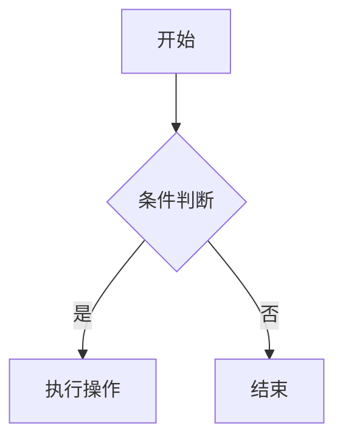
````

---

**基本写法：时序图**
`` ```mermaid ``<br>`sequenceDiagram`
````markdown
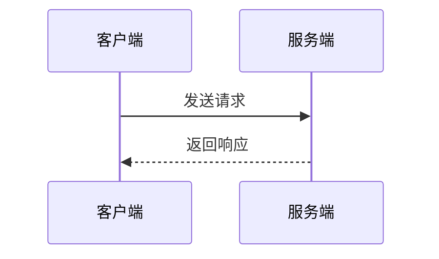
````

<!-- ============ 文档分隔线：002-markdown/002-HeadingSyntax.md ============ -->

> **认知导入（Layer 0 生存层）**
> 前置知识：无需前置，直接开始。
> 边界说明：学完本节你能写出层级分明的标题；学不会，后续所有文档的结构都会乱。
> 强制练习：打开编辑器输入 `# 你好` 和 `## 小节`，观察标题大小；再把 `#` 后面的空格删掉，观察标题是否失效——空格是语法的一部分。

## ATX 风格标题

**单行写法：一级标题**
`# <标题文本>`
```markdown
# 一级标题
```

**单行写法：二级标题**
`## <标题文本>`
```markdown
## 二级标题
```

**单行写法：三级标题**
`### <标题文本>`
```markdown
### 三级标题
```

**单行写法：四级标题**
`#### <标题文本>`
```markdown
#### 四级标题
```

**单行写法：五级标题**
`##### <标题文本>`
```markdown
#### 五级标题
```

**单行写法：六级标题**
`###### <标题文本>`
```markdown
#### 六级标题
```

**换行写法：多级标题组合**
`# <标题 1>\n## <标题 2>\n### <标题 3>`
```markdown
# 文档标题
## 第一章
### 第一节
```

---

## Setext 风格标题

**单行写法：Setext 一级标题**
`<标题文本>\n===`
```markdown
Setext 风格一级标题
===
```

**单行写法：Setext 二级标题**
`<标题文本>\n---`
```markdown
Setext 风格二级标题
---
```

---

## 标题语法规则

**基本写法：# 后必须加空格**
`<#><空格><标题文本>`
```markdown
# 正确写法（# 后有空格）
```

**错误写法：# 后无空格**
`<#><标题文本>`
```markdown
#错误写法（# 后无空格，语法不生效）
```

**换行写法：标题前后加空行**
`\n<#> <标题文本>\n`
```markdown
正文内容

## 二级标题

正文内容
```
## 3. 标题语法

Markdown 支持 6 级标题，通过 `#` 的数量区分层级，**`#`** **后必须加 1 个空格**，否则语法不生效。

### 3.1 基本语法

```markdown
# 一级标题（对应 HTML h1，文档主标题）

## 二级标题（对应 HTML h2，一级章节）

### 三级标题（对应 HTML h3，二级章节）

#### 四级标题

#### 五级标题

#### 六级标题
```

### 3.2 渲染效果

# 一级标题

## 1 二级标题

### 1.1 三级标题

#### 1.1.1 四级标题

#### 1.1.1.1 五级标题

#### 1.1.1.1.1 六级标题

### 3.3 Setext 风格标题

除了使用 `#` 符号的 ATX 风格外，Markdown 还支持 Setext 风格的标题，使用下划线表示：

```markdown
# ATX 风格标题

# Setext 风格一级标题

## Setext 风格二级标题
```

**注意**：

- Setext 风格只支持一级和二级标题
- 下划线的长度至少要与标题文本长度相同
- 一级标题使用 `=` 下划线，二级标题使用 `-` 下划线

## 2. 标题级别

| 级别 | 语法          | HTML 对应 | 用途           |
| :--- | :------------ | :-------- | :------------- |
| 一级 | `# 标题`      | `<h1>`    | 文档主标题     |
| 二级 | `## 标题`     | `<h2>`    | 主要章节       |
| 三级 | `### 标题`    | `<h3>`    | 子章节         |
| 四级 | `#### 标题`   | `<h4>`    | 子子章节       |
| 五级 | `##### 标题`  | `<h5>`    | 更细级别的章节 |
| 六级 | `###### 标题` | `<h6>`    | 最细级别的章节 |

## 3. 标题格式

### 3.1 标准格式

```markdown
# 一级标题
```

### 3.2 注意事项

1. **空格要求**：`#` 后必须加 1 个空格，否则语法不生效
2. **空行建议**：标题前后建议保留空行，提高可读性
3. **大小写**：标题文本的大小写根据内容需要确定，通常首字母大写
4. **长度**：标题长度不宜过长，一般不超过 50 个字符

## 4. 标题使用技巧

### 4.1 标题层级规划

- **一级标题**：只使用一次，作为文档的主标题
- **二级标题**：用于主要章节，如引言、核心内容、总结等
- **三级标题**：用于二级标题下的子章节
- **四级及以下**：用于更详细的内容分类

### 4.2 标题命名建议

- **简洁明了**：标题应简洁表达章节内容
- **层次分明**：标题之间应体现逻辑关系
- **一致性**：标题风格应保持一致
- **关键词**：标题中应包含关键信息，便于搜索和导航

### 4.3 自动生成目录

许多 Markdown 编辑器和平台支持根据标题自动生成目录，如：

```markdown
## 目录

- [第一章](#第一章)
- [第二章](#第二章)
- [第三章](#第三章)
```

## 5. 常见问题与解决方案

### 5.1 标题不生效

**问题描述**：标题语法不生效，显示为普通文本。
**原因分析**：`#` 后缺少空格。
**解决方案**：在 `#` 后添加一个空格，如 `# 标题`。

### 5.2 标题层级混乱

**问题描述**：文档结构混乱，标题层级使用不当。
**原因分析**：标题层级跳跃，如从一级标题直接跳到四级标题。
**解决方案**：按照层级顺序使用标题，保持层级的连续性。

### 5.3 标题过长

**问题描述**：标题过长，影响文档可读性。
**原因分析**：标题包含过多细节信息。
**解决方案**：保持标题简洁，将详细信息放在标题下方的正文部分。

## 6. 总结与最佳实践

### 6.1 核心概念

- **标题层级**：6 级标题，通过 `#` 的数量区分
- **语法要求**：`#` 后必须加 1 个空格
- **层级规划**：合理规划标题层级，保持结构清晰

### 6.2 最佳实践

1. **标题使用**

- 一级标题只使用一次，作为文档主标题
- 按照层级顺序使用标题，保持层级连续
- 标题前后保留空行，提高可读性

2. **标题命名**

- 简洁明了，表达章节核心内容
- 保持标题风格一致
- 包含关键词，便于搜索和导航

3. **目录生成**

- 为长文档添加目录，便于导航
- 使用页内链接实现目录跳转

### 6.3 个人实践总结

- 合理规划标题层级，保持文档结构清晰
- 遵循标题语法规则，确保 `#` 后加空格
- 保持标题简洁明了，突出核心内容
- 为长文档添加目录，提高可读性和导航性

## 延伸阅读
Markdown 基础语法，见 002-markdown 模块文档。
Markdown 删除线语法，见 002-markdown/010-Strikethrough 文档。
文档站构建（Astro），见 056-astro 模块（如已加入）。

<!-- ============ 文档分隔线：002-markdown/003-ParagraphLineBreak.md ============ -->

> **认知导入（Layer 0 生存层）**
> 前置知识：002 标题语法。
> 边界说明：段落与换行是 Markdown 的“第一性原理”——空白（空行、行尾空格）就是语法；学不会，你会反复遇到“看起来对但没生效”。
> 强制练习：写两段文字（中间不加空行）再刷新预览；补上空行再刷新，对比差异。再在行尾敲两个空格后回车写第二行，观察软换行效果。

## 1. 引言

段落与换行是 Markdown 文档中控制文本布局的基本元素，正确使用它们可以提高文档的可读性。

## 2. 段落

### 2.1. 段落定义

在 Markdown 中，段落是由一个或多个连续的文本行组成的，段落之间用**一个或多个空行**分隔。

### 2.2. 段落示例

```markdown
这是第一个段落。
这是第一个段落的第二行，与第一行属于同一段落。
这是第二个段落，与第一个段落之间有一个空行。
```

### 2.3. 渲染效果

这是第一个段落。
这是第一个段落的第二行，与第一行属于同一段落。
这是第二个段落，与第一个段落之间有一个空行。

## 3. 换行

### 3.1. 强制换行

在 Markdown 中，有多种方法实现同一段落内的换行：

1. **行尾空格法**（标准方法）：在行尾添加**两个或更多空格**，然后按回车键
2. **HTML 换行标签**：使用 `<br>` 标签
3. **反斜杠法**：在行尾添加反斜杠 `\`
   **示例**：

```markdown
# 换行方法示例

## 1. 行尾空格法

这是第一行，需要换行
这是第二行，与第一行属于同一段落。

## 2. HTML 换行标签

这是第一行，需要换行<br>
这是第二行，与第一行属于同一段落。

## 3. 反斜杠法

这是第一行，需要换行\
这是第二行，与第一行属于同一段落。
```

**渲染效果**：

## 1. 行尾空格法

这是第一行，需要换行
这是第二行，与第一行属于同一段落。

## 2. HTML 换行标签

这是第一行，需要换行<br>
这是第二行，与第一行属于同一段落。

## 3. 反斜杠法

这是第一行，需要换行\
这是第二行，与第一行属于同一段落。

### 3.2. 换行示例

```markdown
这是第一行，需要换行
这是第二行，与第一行属于同一段落。
这是一个新段落，与上面的段落之间有一个空行。
```

### 3.3. 渲染效果

这是第一行，需要换行
这是第二行，与第一行属于同一段落。
这是一个新段落，与上面的段落之间有一个空行。

## 4. 空行

### 4.1. 空行的作用

- **分隔段落**：段落之间使用空行分隔
- **分隔不同元素**：在标题、列表、代码块等不同元素之间使用空行，提高可读性
- **提高可读性**：适当的空行可以使文档结构更清晰

### 4.2. 空行使用示例

````markdown
# 标题

## 这是一个段落。
- 无序列表项 1
- 无序列表项 2

```java
// 代码块
public class Hello {
public static void main(String[] args) {
System.out.println("Hello!");
}
}
```
````

这是另一个段落。

````

### 4.3. 渲染效果
# 标题
这是一个段落。
- 无序列表项 1
- 无序列表项 2
```java
// 代码块
public class Hello {
 public static void main(String[] args) {
 System.out.println("Hello!");
 }
}
````

这是另一个段落。

## 5. 常见问题与解决方案

### 5.1. 段落没有正确分隔

**问题描述**：文本没有正确分段，显示为连续的一行。
**原因分析**：段落之间没有添加空行。
**解决方案**：在段落之间添加一个或多个空行，实现正确分段。

### 5.2. 换行不生效

**问题描述**：在同一段落内的换行不生效，文本显示为连续的一行。
**原因分析**：行尾没有添加两个或更多空格。
**解决方案**：在需要换行的行尾添加两个或更多空格，然后按回车键。

### 5.3. 空行过多

**问题描述**：文档中空行过多，影响文档的紧凑性。
**原因分析**：过度使用空行。
**解决方案**：合理使用空行，只在需要分隔的元素之间添加空行。

## 6. 总结与最佳实践

### 6.1. 核心概念

- **段落**：由连续文本行组成，段落之间用空行分隔
- **换行**：同一段落内的换行，需要在行尾添加两个或更多空格
- **空行**：用于分隔不同元素，提高文档可读性

### 6.2. 最佳实践

1. **段落使用**

- 每个段落表达一个完整的思想
- 段落长度适中，一般不超过 3-5 行
- 段落之间使用空行分隔

2. **换行使用**

- 在需要强调的地方使用强制换行
- 避免过度使用强制换行，保持文档的自然流动
- 确保行尾添加足够的空格（至少两个）

3. **空行使用**

- 在标题、列表、代码块等不同元素之间使用空行
- 保持空行使用的一致性
- 避免过多的空行，保持文档的紧凑性

### 6.3. 个人实践总结

- 使用空行分隔段落和不同元素
- 在需要换行的地方使用两个或更多空格
- 保持文档布局的一致性和可读性
- 合理使用空行，避免过多或过少

## 段落

**单行写法：单行段落**
`<文本>`
```markdown
这是一个段落。
```

**换行写法：空行分隔多个段落**
`<文本>\n\n<文本>`
```markdown
这是第一个段落。

这是第二个段落。
```

---

## 换行

**单行写法：行尾两个空格换行**
`<文本>  \n<文本>`
```markdown
这是第一行  
这是第二行
```

**单行写法：HTML br 标签换行**
`<文本><br>\n<文本>`
```markdown
这是第一行<br>
这是第二行
```

**单行写法：反斜杠换行**
`<文本>\\n<文本>`
```markdown
这是第一行\
这是第二行
```

---

## 空行

**换行写法：元素间用空行分隔**
`<元素>\n\n<元素>`
```markdown
# 标题

这是一个段落。

- 列表项 1
- 列表项 2
```

**换行写法：代码块前后加空行**
`<文本>\n\n```<语言>\n<代码>\n```\n\n<文本>`
````markdown
正文内容

```python
print("Hello!")
```

另一个段落
````

## 延伸阅读
Markdown 基础语法，见 002-markdown 模块文档。
Markdown 删除线语法，见 002-markdown/010-Strikethrough 文档。
文档站构建（Astro），见 056-astro 模块（如已加入）。

<!-- ============ 文档分隔线：002-markdown/004-BasicTextFormat.md ============ -->

> **认知导入（Layer 0 生存层）**
> 前置知识：003 段落与换行。
> 边界说明：加粗/斜体是最常用的行内格式，写文档、写笔记都靠它。
> 强制练习：输入 `**你好**` 和 `*你好*`，观察加粗与斜体；然后删除一个 `*`，观察格式失效——成对符号必须完整。

## 1. 引言

基础文本格式是 Markdown 中用于强调和格式化文本的基本元素，包括斜体、粗体、删除线等。

## 2. 斜体

### 3.1 语法

使用 `*` 或 `_` 包裹文本，实现斜体效果。

```markdown
*斜体文本*
_斜体文本_
```

### 3.2 渲染效果

_斜体文本_
_斜体文本_

## 3. 粗体

### 4.1 语法

使用 `**` 或 `__` 包裹文本，实现粗体效果。

```markdown
**粗体文本**
__粗体文本__
```

### 4.2 渲染效果

**粗体文本**
**粗体文本**

## 4. 粗斜体

### 5.1 语法

使用 `***` 或 `___` 包裹文本，实现粗斜体效果。

```markdown
***粗斜体文本***
___粗斜体文本___
```

### 5.2 渲染效果

**_粗斜体文本_**
**_粗斜体文本_**

## 5. 删除线

### 6.1 语法

使用 `~~` 包裹文本，实现删除线效果（GFM 扩展语法）。

```markdown
~
```

### 6.2 渲染效果

~~删除线文本~~

## 6. 下划线

### 7.1 语法

Markdown 本身不支持下划线语法，但可以使用 HTML 的 `<u>` 标签实现。

```markdown
<u>下划线文本</u>
```

### 7.2 渲染效果

<u>下划线文本</u>

## 7. 上标与下标

### 8.1 语法

Markdown 本身不支持上标和下标语法，但可以使用 HTML 标签实现：

- 上标：使用 `<sup>` 标签
- 下标：使用 `<sub>` 标签

```markdown
2<sup>2</sup> = 4
H<sub>2</sub>O
```

### 8.2 渲染效果

2<sup>2</sup> = 4
H<sub>2</sub>O

## 8. 高亮文本

### 9.1 语法

高亮文本是 GitHub Flavored Markdown (GFM) 的扩展语法，使用 `==` 包裹文本：

```markdown
=
```

### 9.2 渲染效果

==高亮文本==

## 9. 脚注

### 10.1 语法

脚注用于为文本添加注释或参考信息：

```markdown
这是一个带有脚注的文本[^1]。

[^1]: 这是脚注的内容。
```

### 10.2 渲染效果

这是一个带有脚注的文本[^1]。

[^1]: 这是脚注的内容。

## 8. 行内代码

### 9.1 语法

使用 `` ` `` 包裹文本，实现行内代码效果。

```markdown
`行内代码`
```

### 9.2 渲染效果

`行内代码`

## 9. 常见问题与解决方案

### 10.1 格式不生效

**问题描述**：文本格式不生效，显示为普通文本。
**原因分析**：标记符使用不正确或缺少标记符。
**解决方案**：确保使用正确的标记符包裹文本，如 `*斜体*`、`**粗体**` 等。

### 10.2 标记符冲突

**问题描述**：当文本中包含 `*` 或 `_` 等特殊字符时，可能与格式标记符冲突。
**解决方案**：使用反斜杠 `\` 转义特殊字符，如 `\*`、`\_`。

### 10.3 嵌套格式

**问题描述**：嵌套使用格式标记符时，可能导致格式混乱。
**解决方案**：确保嵌套的标记符正确匹配，如 `***粗斜体***`。

## 10. 总结与最佳实践

### 11.1 核心概念

- **斜体**：使用 `*` 或 `_` 包裹文本
- **粗体**：使用 `**` 或 `__` 包裹文本
- **粗斜体**：使用 `***` 或 `___` 包裹文本
- **删除线**：使用 `~~` 包裹文本
- **下划线**：使用 HTML 的 `<u>` 标签
- **上标**：使用 HTML 的 `<sup>` 标签
- **下标**：使用 HTML 的 `<sub>` 标签
- **高亮文本**：使用 `==` 包裹文本（GFM 扩展）
- **脚注**：使用 `[^1]` 标记
- **行内代码**：使用 `` ` `` 包裹文本

### 11.2 最佳实践

1. **格式使用**

- 斜体：用于强调或突出显示
- 粗体：用于重点内容或标题
- 粗斜体：用于特别重要的内容
- 删除线：用于表示已删除或过时的内容
- 上标/下标：用于数学公式或化学符号
- 高亮文本：用于特别需要注意的内容
- 脚注：用于添加补充说明
- 行内代码：用于代码片段、命令或变量名

2. **标记符选择**

- 统一使用一种标记符风格，如统一使用 `*` 而不是混合使用 `*` 和 `_`
- 保持标记符与文本之间没有空格，如 `*斜体*` 而不是 `* 斜体 *`
- 对于扩展语法，确保使用支持该语法的 Markdown 处理器

3. **使用场景**

- 技术文档：使用行内代码标记代码片段，使用脚注添加技术说明
- 教程：使用粗体强调重点内容，使用高亮标记关键步骤
- 文档更新：使用删除线标记已修改的内容
- 学术文档：使用上标/下标表示引用或公式

### 11.3 个人实践总结

- 合理使用文本格式，增强文档的可读性
- 保持格式使用的一致性
- 注意标记符的正确使用，确保格式生效
- 在需要时使用转义字符处理特殊情况
- 根据文档类型和目标受众选择合适的文本格式
## 斜体

**单行写法：使用星号包裹斜体**
`*<文本>*`
```markdown
*斜体文本*
```

**单行写法：使用下划线包裹斜体**
`_<文本>_`
```markdown
_斜体文本_
```

---

## 粗体

**单行写法：使用双星号包裹粗体**
`**<文本>**`
```markdown
**粗体文本**
```

**单行写法：使用双下划线包裹粗体**
`__<文本>__`
```markdown
__粗体文本__
```

---

## 粗斜体

**单行写法：使用三星号包裹粗斜体**
`***<文本>***`
```markdown
***粗斜体文本***
```

**单行写法：使用三下划线包裹粗斜体**
`___<文本>___`
```markdown
___粗斜体文本___
```

---

## 删除线

**单行写法：使用双波浪号包裹删除线**
`~~<文本>~~`
```markdown
~~删除线文本~~
```

---

## 下划线

**单行写法：使用 HTML u 标签**
`<u><文本></u>`
```markdown
<u>下划线文本</u>
```

---

## 上标与下标

**单行写法：使用 HTML sup 标签创建上标**
`<sup><文本></sup>`
```markdown
2<sup>2</sup> = 4
```

**单行写法：使用 HTML sub 标签创建下标**
`<sub><文本></sub>`
```markdown
H<sub>2</sub>O
```

---

## 高亮文本

**单行写法：使用双等号包裹高亮文本**
`==<文本>==`
```markdown
==高亮文本==
```

---

## 行内代码

**单行写法：使用反引号包裹行内代码**
`` `<文本>` ``
```markdown
使用 `console.log()` 输出内容
```

<!-- ============ 文档分隔线：002-markdown/005-CommonMarkSpec.md ============ -->

> **Layer 2 专业层标注**：本篇讲 CommonMark 规范的解析器原理，属于高级话题。零基础学习者可完全跳过，直接学 Layer 0/1 的语法文档即可。

## 1. CommonMark 概述

### 1.1 为什么需要 CommonMark

原始 Markdown 由 John Gruber 于 2004 年创建，但规范描述模糊，导致各平台实现差异巨大。CommonMark 项目始于 2014 年，目标是创建**无歧义的 Markdown 标准规范**。

| 问题                   | 示例                               |
| :--------------------- | :--------------------------------- |
| **嵌套列表解析不一致** | 不同解析器对缩进列表的处理不同     |
| **链接定义优先级**     | 行内链接 vs 引用链接的优先级不明确 |
| **HTML 块边界**        | HTML 块何时结束的定义不统一        |
| **强调规则**           | `*foo*bar*baz*` 的解析结果不一致   |

### 1.2 CommonMark 的目标

- **无歧义**：每个输入都有唯一确定的输出
- **可测试**：提供超过 8,000 个测试用例
- **向后兼容**：尽量兼容原始 Markdown
- **可扩展**：允许定义扩展规范（如 GFM）

## 2. 规范核心规则

### 2.1 块级与行内结构

CommonMark 将文档解析分为两个阶段：

```
输入文本
    ↓
第一阶段：识别块级结构
  （段落、标题、列表、代码块、引用等）
    ↓
第二阶段：在段落文本中识别行内结构
  （强调、链接、代码、图片等）
```

### 2.2 空白处理规则

| 规则         | 说明               | 示例                       |
| :----------- | :----------------- | :------------------------- |
| **行尾空格** | 连续空格可触发换行 | `空格空格↵` → `<br>`       |
| **制表符**   | 视为 4 个空格      | `\t` → `    `              |
| **连续空行** | 多个空行等同一个   | 段落间只需一个空行         |
| **缩进**     | 4 空格触发代码块   | `    code` → `<pre><code>` |

### 2.3 列表解析规则

CommonMark 对列表的解析有严格定义：

```markdown
- 项目一
  - 子项目（2空格缩进）

1. 有序列表
   1. 子列表（3空格缩进，与文本对齐）
```

**关键规则**：

- 无序列表项的子内容需缩进到列表标记后的第一个非空字符位置
- 有序列表项的子内容需缩进到列表标记（含点号和空格）之后的位置
- 列表连续性由空行和缩进共同决定

### 2.4 强调规则

CommonMark 使用**左右规则**解析强调：

```markdown
_foo_ → <em>foo</em>
**foo** → <strong>foo</strong>
**_foo_** → <strong><em>foo</em></strong>
_foo\*\* → <em>foo</em>_ (右侧\**只匹配一个)
foo*bar* → foo<em>bar</em>
5*3*2 → 5*3\*2 (数字间不触发强调)
```

**规则要点**：

- `*` 和 `_` 都可以表示强调，但 `_` 受单词边界限制
- 左侧 `*`/`_` 前不能是字母数字（或位于行首）
- 右侧 `*`/`_` 后不能是字母数字（或位于行尾）
- 嵌套强调时，外层不能先关闭

## 3. 与原始 Markdown 的差异

### 3.1 关键差异

| 方面         | 原始 Markdown | CommonMark                   |
| :----------- | :------------ | :--------------------------- |
| **嵌套强调** | 不支持        | 支持 `***bold italic***`     |
| **列表续行** | 模糊          | 严格缩进规则                 |
| **HTML 块**  | 7 种标签      | 详细的标签和结束规则         |
| **链接引用** | 不区分大小写  | 区分大小写                   |
| **自动链接** | 仅 `<URL>`    | 同上，GFM 扩展了无尖括号形式 |
| **硬换行**   | 行尾两个空格  | 行尾两个空格或 `\`           |

### 3.2 已知不兼容

```markdown
<!-- 原始 Markdown 解析为列表 -->

1. 第一项
2. 第二项

<!-- 中间有空行时 -->

1. 第一项

2. 第二项
   <!-- CommonMark 解析为两个独立列表 -->
   <!-- 原始 Markdown 解析为一个列表 -->
```

## 4. 解析算法

### 4.2 两阶段解析

**第一阶段：块级解析**

```
1. 逐行读取输入
2. 将行分类（ATX 标题、Setext 标题、代码围栏、引用、列表项等）
3. 构建块级文档树
4. 将内容行附加到对应的块级元素
```

**第二阶段：行内解析**

```
1. 遍历段落和标题的文本内容
2. 识别行内元素（代码跨度、强调、链接等）
3. 构建行内元素树
```

### 4.3 优先级

行内解析的优先级从高到低：

1. **代码跨度**（`` `code` ``）— 最高优先级，内部不解析
2. **自动链接**（`<url>`）
3. **HTML 标签**
4. **强调**（`*` / `_`）
5. **链接和图片**
6. **文本** — 最低优先级

## 5. 一致性测试

### 5.1 测试套件

CommonMark 提供了完整的测试套件，每个测试用例包含：

```yaml
# 示例测试用例
---
title: 'ATX headers'
section: 'ATX headings'
example: 32
markdown: |
  ## foo
    bar
  baz
html: |
  <h2>foo</h2>
  <pre><code>bar
  </code></pre>
  <p>baz</p>
---
```

### 5.2 验证工具

```bash
# 使用 cmark 参考实现
echo '# Hello' | cmark
# <h1>Hello</h1>

# 运行规范测试
python3 spec_tests.py --program cmark

# 使用 CommonMark.js
npm install commonmark
node -e "var commonmark = require('commonmark'); \
  var reader = new commonmark.Parser(); \
  var writer = commonmark.HtmlRenderer(); \
  var doc = reader.parse('# Hello'); \
  console.log(writer.render(doc));"
```

## 6. 实现与生态

### 6.1 主要实现

| 实现              | 语言       | 说明                        |
| :---------------- | :--------- | :-------------------------- |
| **cmark**         | C          | 参考实现，性能最优          |
| **commonmark.js** | JavaScript | JavaScript 参考实现         |
| **commonmark-hs** | Haskell    | 类型安全的实现              |
| **comrak**        | Rust       | 高性能 Rust 实现            |
| **goldmark**      | Go         | Go 生态主流 Markdown 解析器 |

### 6.2 扩展规范

CommonMark 定义了扩展机制，GFM（GitHub Flavored Markdown）是最著名的扩展：

- **表格**：`| col1 | col2 |`
- **任务列表**：`- [ ] todo`
- **删除线**：`~~strikethrough~~`
- **自动链接**：`https://example.com`
- **代码围栏语言**：` ```python `

<!-- ============ 文档分隔线：002-markdown/006-ListSyntax.md ============ -->

> **认知导入（Layer 0 生存层）**
> 前置知识：003 段落与换行。
> 边界说明：列表是“并列信息”的默认表达，学会它才能写清单、目录、步骤。
> 强制练习：分别用 `-` 和 `1.` 写三行列表；把第二行缩进两个空格，观察它变成子项（嵌套列表）。

## 1. 无序列表 (Unordered Lists)

### 1.1 语法

使用 `-`、`*` 或 `+` 加空格开头，三者效果完全一致，推荐统一使用 `-` 以保持一致性。

```markdown
- 无序列表项 1
- 无序列表项 2
- 无序列表项 3
```

### 1.2 渲染效果

- 无序列表项 1
- 无序列表项 2
- 无序列表项 3

### 1.3 高级用法

#### 1.3.1 列表项换行

如果列表项内容较长，需要换行时，第二行及以后的内容需要与第一行文本对齐，而不是与标记符对齐：

```markdown
- 换行后需要与第一行文本对齐，
  而不是与标记符对齐
- 另一个列表项
```

渲染效果：

- 这是一个很长的列表项，
  换行后需要与第一行文本对齐，
  而不是与标记符对齐
- 另一个列表项

#### 1.3.2 列表项中的空行

列表项之间可以添加空行，提高可读性：

```markdown
- 列表项 1

- 列表项 2

- 列表项 3
```

渲染效果：

- 列表项 1
- 列表项 2
- 列表项 3

## 2. 有序列表 (Ordered Lists)

### 2.1 语法

使用 `数字 + 英文句号 + 空格` 开头，数字顺序不影响最终渲染结果，推荐按顺序书写以保持代码的可读性。

```markdown
1.  有序列表项 1
2.  有序列表项 2
3.  有序列表项 3
```

### 2.2 渲染效果

1. 有序列表项 1
2. 有序列表项 2
3. 有序列表项 3

### 2.3 高级用法

#### 2.3.1 序号自动调整

即使使用非连续的数字，渲染时也会自动调整为连续序号：

```markdown
1.  第一项
2.  第二项（使用了数字 3）
3.  第三项（使用了数字 2）
```

渲染效果：

1. 第一项
2. 第二项（使用了数字 3）
3. 第三项（使用了数字 2）

#### 2.3.2 多级有序列表

多级有序列表的序号会自动递增：

```markdown
1. 一级列表项
1. 二级列表项
1. 三级列表项
1. 另一个二级列表项
1. 另一个一级列表项
```

渲染效果：

1. 一级列表项
1. 二级列表项
1. 三级列表项
1. 另一个二级列表项
1. 另一个一级列表项

## 3. 任务列表 (Task Lists)

### 3.1 语法

待办清单专用语法（GFM 扩展），`[ ]` 表示未完成，`[x]` 表示已完成，符号后必须加空格。

```markdown
- [ ] 未完成的待办任务
- [x] 已完成的待办任务
  - [ ] 可嵌套待办
  - [x] 子任务 1
  - [ ] 子任务 2
```

### 3.2 渲染效果

- [ ] 未完成的待办任务
- [x] 已完成的待办任务
- [ ] 可嵌套待办
- [x] 子任务 1
- [ ] 子任务 2

### 3.3 高级用法

#### 3.3.1 任务列表与描述

可以在任务列表项后添加描述文本：

```markdown
- 详细描述：需要包含项目背景、目标、计划和预算
- 详细描述：讨论项目进度和下一步计划
```

渲染效果：

- [ ] 完成项目提案
      详细描述：需要包含项目背景、目标、计划和预算
- [x] 召开团队会议
      详细描述：讨论项目进度和下一步计划

## 4. 嵌套列表 (Nested Lists)

### 4.1 语法

嵌套列表需要使用**4 个空格或 1 个制表符**进行缩进。

#### 4.1.1 无序列表嵌套

```markdown
- 一级无序列表项
    - 二级无序列表项
        - 三级无序列表项
```

#### 4.1.2 有序列表嵌套

```markdown
1. 一级有序列表项
1. 二级有序列表项
1. 三级有序列表项
1. 另一个一级有序列表项
```

#### 4.1.3 混合嵌套

```markdown
- 无序列表项

1. 有序列表项

- 无序列表项

1. 有序列表项
```

### 4.2 渲染效果

- 一级无序列表项
- 二级无序列表项
- 三级无序列表项
- 另一个一级无序列表项

1. 一级有序列表项
1. 二级有序列表项
1. 三级有序列表项
1. 另一个一级有序列表项

- 无序列表项

1.  有序列表项

- 无序列表项

1.  有序列表项

### 4.3 嵌套列表的最佳实践

- **控制嵌套层级**：一般不超过 3 层，过深的嵌套会降低可读性
- **保持缩进一致**：使用统一的缩进方式（4 个空格或 1 个制表符）
- **添加空行**：在不同层级的列表之间添加空行，提高可读性
- **使用不同类型**：根据内容需要选择合适的列表类型进行嵌套

## 5. 列表与其他元素的结合

### 5.1 列表中使用代码块

````markdown
- 列表项 1

  ```python
  print("Hello, World!")
  ```

- 列表项 2

  ```javascript
  console.log('Hello, World!');
  ```
````

渲染效果：

- 列表项 1

  ```python
  print("Hello, World!")
  ```

- 列表项 2

  ```javascript
  console.log('Hello, World!');
  ```

### 5.2 列表中使用引用

```markdown
- 列表项 1

  > 这是一个引用
  > 可以跨越多行

- 列表项 2

  > 另一个引用
```

渲染效果：

- 列表项 1
  > 这是一个引用
  > 可以跨越多行
- 列表项 2
  > 另一个引用

### 5.3 列表中使用图片和链接

```markdown
- 列表项 1：[Markdown 指南](https://www.markdownguide.org)
- 列表项 2：
```

渲染效果：

- 列表项 1：[Markdown 指南](https://www.markdownguide.org)
- 列表项 2：

## 6. 不同 Markdown 解析器的兼容性

不同的 Markdown 解析器对列表语法的支持可能略有差异：

| 解析器                                                                                       | 无序列表 | 有序列表 | 任务列表 | 嵌套列表 |
| -------------------------------------------------------------------------------------------- | -------- | -------- | -------- | -------- |
| GitHub Flavored Markdown                                                                     | 支持     | 支持     | 支持     | 支持     |
| CommonMark                                                                                   | 支持     | 支持     | 不支持   | 支持     |
| Markdown.pl                                                                                  | 支持     | 支持     | 不支持   | 支持     |
| MultiMarkdown                                                                                | 支持     | 支持     | 不支持   | 支持     |
| **注意**：任务列表是 GitHub Flavored Markdown (GFM) 的扩展特性，在其他解析器中可能不被支持。 |

## 7. 常见问题与解决方案

### 7.1 列表项不显示

**问题描述**：列表项不显示为列表，显示为普通文本。
**原因分析**：标记符后缺少空格。
**解决方案**：在标记符后添加一个空格，如 `- 列表项`、`1. 列表项`。

### 7.2 嵌套列表显示异常

**问题描述**：嵌套列表显示为一级列表，没有正确缩进。
**原因分析**：嵌套列表的缩进不正确。
**解决方案**：使用 4 个空格或 1 个制表符进行缩进。

### 7.3 任务列表不生效

**问题描述**：任务列表显示为普通无序列表，没有复选框。
**原因分析**：使用了不支持 GFM 扩展的 Markdown 解析器。
**解决方案**：使用支持 GFM 扩展的 Markdown 解析器，如 GitHub、VSCode 等。

### 7.4 列表项换行后对齐问题

**问题描述**：列表项换行后文本没有正确对齐。
**原因分析**：换行后的文本没有与第一行文本对齐。
**解决方案**：确保换行后的文本与第一行文本的起始位置对齐，而不是与列表标记符对齐。

## 8. 总结与最佳实践

### 8.1 核心概念

- **无序列表**：使用 `-`、`*` 或 `+` 加空格开头
- **有序列表**：使用 `数字 + 英文句号 + 空格` 开头
- **任务列表**：使用 `[ ]` 或 `[x]` 加空格开头（GFM 扩展）
- **嵌套列表**：使用 4 个空格或 1 个制表符进行缩进

### 8.2 最佳实践

1. **列表使用**

- 无序列表：用于不需要特定顺序的项目
- 有序列表：用于需要特定顺序的项目
- 任务列表：用于待办事项或任务跟踪

2. **格式规范**

- 统一使用一种无序列表标记符，推荐使用 `-`
- 保持列表项的缩进一致
- 列表项之间可以添加空行，提高可读性
- 长列表项换行时，确保文本对齐

3. **嵌套列表**

- 避免过深的嵌套，一般不超过 3 层
- 确保缩进正确，使用 4 个空格或 1 个制表符
- 在不同层级之间添加空行，提高可读性

4. **兼容性考虑**

- 任务列表仅在支持 GFM 的解析器中生效
- 避免使用过于复杂的嵌套结构，以确保在不同解析器中都能正确显示

5. **与其他元素结合**

- 合理使用列表与代码块、引用、图片和链接的结合
- 确保这些元素的缩进正确，以保持列表结构的完整性

### 8.3 个人实践总结

- 选择合适的列表类型，根据内容的性质和顺序要求
- 保持列表格式的一致性和缩进的正确性
- 合理使用嵌套列表，提高内容的层次感
- 注意标记符后必须加空格，确保列表语法生效
- 考虑不同 Markdown 解析器的兼容性，尤其是任务列表等扩展特性
- 结合其他 Markdown 元素时，注意保持正确的缩进和格式

---

## 无序列表

**单行写法：使用减号创建无序列表项**
`- <列表项>`
```markdown
- 无序列表项
```

**单行写法：使用星号创建无序列表项**
`* <列表项>`
```markdown
* 无序列表项
```

**单行写法：使用加号创建无序列表项**
`+ <列表项>`
```markdown
+ 无序列表项
```

**换行写法：多行无序列表**
`- <项 1>\n- <项 2>\n- <项 3>`
```markdown
- 无序列表项 1
- 无序列表项 2
- 无序列表项 3
```

**换行写法：列表项内换行对齐**
`- <第一行>\n  <第二行>`
```markdown
- 这是一个很长的列表项，
  换行后需要与第一行文本对齐
```

---

## 有序列表

**单行写法：创建有序列表项**
`<数字>. <列表项>`
```markdown
1. 有序列表项
```

**换行写法：多行有序列表**
`1. <项 1>\n2. <项 2>\n3. <项 3>`
```markdown
1. 有序列表项 1
2. 有序列表项 2
3. 有序列表项 3
```

**换行写法：序号自动调整**
`1. <项 1>\n1. <项 2>\n1. <项 3>`
```markdown
1. 第一项
1. 第二项
1. 第三项
```

---

## 任务列表

**单行写法：未完成任务项**
`- [ ] <列表项>`
```markdown
- [ ] 未完成的待办任务
```

**单行写法：已完成任务项**
`- [x] <列表项>`
```markdown
- [x] 已完成的待办任务
```

**换行写法：混合任务列表**
`- [ ] <项 1>\n- [x] <项 2>`
```markdown
- [ ] 未完成任务
- [x] 已完成任务
```

---

## 嵌套列表

**换行写法：无序嵌套列表**
`- <一级项>\n    - <二级项>`
```markdown
- 一级无序列表项
    - 二级无序列表项
```

**换行写法：三级嵌套列表**
`- <一级项>\n    - <二级项>\n        - <三级项>`
```markdown
- 一级项
    - 二级项
        - 三级项
```

**换行写法：无序与有序混合嵌套**
`- <无序项>\n    1. <有序项>`
```markdown
- 无序列表项
    1. 有序列表项
    2. 有序列表项
```

---

## 列表中使用代码块

**换行写法：列表中嵌入代码块**
`- <项>\n\n  ```<语言>\n  <代码>\n  ````
```markdown
- 列表项 1

  ```python
  print("Hello, World!")
  ```

- 列表项 2
```

---

## 列表中使用引用

**换行写法：列表中嵌入引用**
`- <项>\n  > <引用>`
```markdown
- 列表项 1
  > 这是一个引用
  > 可以跨越多行
- 列表项 2
```

<!-- ============ 文档分隔线：002-markdown/007-GitHubFlavoredMarkdown.md ============ -->

## 1. GFM 概述

### 1.1 什么是 GFM

GitHub Flavored Markdown（GFM）是 GitHub 在 CommonMark 基础上扩展的 Markdown 方言，是 GitHub 平台上所有文本内容（README、Issue、PR、评论等）的解析标准。

### 1.2 GFM 扩展列表

| 扩展         | 语法               | 说明                 |
| :----------- | :----------------- | :------------------- |
| **表格**     | `\| col \| col \|` | 结构化数据展示       |
| **任务列表** | `- [x] done`       | 待办事项追踪         |
| **删除线**   | `~~text~~`         | 标记删除内容         |
| **自动链接** | `https://...`      | 无需尖括号的 URL     |
| **代码围栏** | ` ```lang `        | 带语言标识的代码块   |
| **脚注**     | `[^1]`             | 尾注引用（部分支持） |
| **警告框**   | `> [!NOTE]`        | GitHub 特有的提示框  |

## 2. 表格

### 2.1 基本语法

```markdown
| 名称    | 类型     | 描述     |
| ------- | -------- | -------- |
| id      | integer  | 主键     |
| name    | string   | 用户名   |
| email   | string   | 邮箱地址 |
| created | datetime | 创建时间 |
```

渲染结果：

| 名称    | 类型     | 描述     |
| :------ | :------- | :------- |
| id      | integer  | 主键     |
| name    | string   | 用户名   |
| email   | string   | 邮箱地址 |
| created | datetime | 创建时间 |

### 2.2 对齐方式

通过分隔行的冒号位置控制对齐：

```markdown
| 左对齐     | 居中对齐 | 右对齐 |
| :--------- | :------: | -----: |
| Left       |  Center  |  Right |
| 长文本内容 |  短文本  | 123.45 |
```

| 对齐方式 | 语法    | 说明         |
| :------- | :------ | :----------- |
| 左对齐   | `:---`  | 默认对齐方式 |
| 居中对齐 | `:---:` | 冒号在两端   |
| 右对齐   | `---:`  | 冒号在右端   |

### 2.3 表格规则

- 表格前后需要空行
- 列数由表头决定，多出的列被忽略
- 单元格内可使用行内 Markdown（链接、强调、代码等）
- 单元格内不能包含块级元素（标题、列表等）
- 管道符 `|` 在行首和行尾可省略

```markdown
> 简化写法
>
> | 名称 | 类型    |
> | ---- | ------- |
> | id   | integer |
> | name | string  |
```

## 3. 任务列表

### 3.1 基本语法

```markdown
- [x] 完成需求分析
- [x] 编写技术方案
- [ ] 开发核心功能
- [ ] 编写单元测试
- [ ] 部署上线
```

### 3.2 任务列表嵌套

```markdown
- [x] 前端开发
  - [x] 页面布局
  - [x] 组件开发
  - [ ] 接口联调
- [ ] 后端开发
  - [x] 数据库设计
  - [ ] API 开发
  - [ ] 性能优化
```

### 3.3 Issue 中的任务列表

在 Issue 中使用任务列表可以**追踪进度**，GitHub 会自动显示完成比例：

```markdown
## Sprint 3 任务

- [x] #123 用户登录功能
- [ ] #124 权限管理模块
- [ ] #125 数据导出功能
- [ ] #126 性能优化
```

- 可以用 `#issue号` 引用其他 Issue
- 勾选任务会自动更新进度条
- PR 中也可以使用任务列表追踪变更

## 4. 删除线

### 4.1 基本语法

```markdown
~~已废弃的API~~
~~旧版本功能~~已被新功能替代
```

渲染结果：~~已废弃的API~~

### 4.2 使用场景

- 标记已完成的待办事项
- 显示价格变动（~~¥99~~ ¥59）
- 标记废弃的 API 或功能
- 编辑记录中显示删除内容

### 4.3 注意事项

- 两个 `~` 必须紧贴文本，中间不能有空格
- `~~` 不能出现在单词内部
- 可以与强调组合使用：`~~***重要且已废弃***~~`

## 5. 自动链接

### 5.1 URL 自动链接

GFM 扩展了 CommonMark 的自动链接，无需尖括号即可识别 URL：

```markdown
访问 https://github.com 了解更多

我的邮箱是 user@example.com
```

### 5.2 自动链接规则

| 类型               | 示例                      | 是否自动链接 |
| :----------------- | :------------------------ | :----------- |
| **http/https URL** | `https://example.com`     |              |
| **www 域名**       | `www.example.com`         |              |
| **邮箱地址**       | `user@example.com`        |              |
| **其他协议**       | `ftp://files.example.com` |              |
| **纯域名**         | `example.com`             |              |

### 5.3 链接截断

GFM 会自动截断过长的 URL 显示：

```markdown
https://github.com/very/long/path/to/a/resource/that/goes/on/and/on
```

在渲染时，超长 URL 会被截断显示，但链接仍然完整。

## 6. 代码围栏增强

### 6.1 语言标识

GFM 支持在代码围栏后指定语言，实现语法高亮：

````markdown
```python
def fibonacci(n: int) -> list[int]:
    """生成斐波那契数列"""
    fib = [0, 1]
    for i in range(2, n):
        fib.append(fib[i-1] + fib[i-2])
    return fib[:n]
```
````

### 6.2 支持的语言标识

| 类别      | 语言标识                                                       |
| :-------- | :------------------------------------------------------------- |
| **Web**   | `javascript`, `typescript`, `html`, `css`, `vue`, `jsx`, `tsx` |
| **后端**  | `python`, `java`, `go`, `rust`, `ruby`, `php`                  |
| **系统**  | `c`, `cpp`, `csharp`, `swift`, `kotlin`                        |
| **数据**  | `sql`, `json`, `yaml`, `toml`, `xml`                           |
| **Shell** | `bash`, `powershell`, `shell`, `zsh`                           |
| **配置**  | `dockerfile`, `nginx`, `apache`                                |
| **文档**  | `markdown`, `latex`, `math`                                    |

### 6.3 围栏内的转义

代码围栏内的内容**不进行 Markdown 解析**，原样显示。如果需要在代码块中显示三个反引号，可以使用更多反引号作为围栏：

`````markdown
````markdown
```javascript
console.log('Hello');
```
````
`````

````

## 7. 警告框（Alerts）

### 7.1 语法

GitHub 2023 年引入的扩展语法，用于创建提示框：

```markdown
> [!NOTE]
> 这是一条提示信息

> [!TIP]
> 这是一条建议

> [!IMPORTANT]
> 这是一条重要信息

> [!WARNING]
> 这是一条警告

> [!CAUTION]
> 这是一条危险警告
```

### 7.2 警告框类型

| 类型 | 颜色 | 用途 |
| :--- | :--- | :--- |
| **NOTE** | 蓝色 | 补充说明 |
| **TIP** | 绿色 | 有用的建议 |
| **IMPORTANT** | 紫色 | 关键信息 |
| **WARNING** | 橙色 | 注意事项 |
| **CAUTION** | 红色 | 危险操作警告 |

## 8. GFM 与 CommonMark 的兼容性

### 8.1 兼容策略

GFM 是 CommonMark 的**严格超集**：

- 所有合法的 CommonMark 文档在 GFM 中渲染结果相同
- GFM 额外添加的语法不会与 CommonMark 冲突
- GFM 扩展在 CommonMark 解析器中被忽略

### 8.2 迁移建议

- 编写 Markdown 时优先使用 CommonMark 语法，确保最大兼容性
- 仅在 GitHub 平台使用 GFM 扩展
- 避免依赖特定渲染器的行为
````
## 删除线

**基本写法：删除线**
`~~<文本>~~**
```markdown
# 双波浪线表示删除线
~~废弃内容~~
```

---

**基本写法：删除线与粗体组合**
`**~~<文本>~~****
```markdown
# 删除线加粗组合
**~~重要废弃~~**
```

---

## 任务列表

**基本写法：任务列表**
`- [ ] <项>**
```markdown
# GFM 支持可勾选任务列表
- [x] 完成功能
- [ ] 修复 bug
```

---

**基本写法：任务列表嵌套**
`  - [ ] <子项>**
```markdown
# 嵌套任务列表
- [ ] 主任务
  - [x] 子任务一
  - [ ] 子任务二
```

---

## 表格扩展

**基本写法：GFM 表格**
`| <列1> | <列2> |**
`| --- | --- |**
```markdown
# GFM 表格语法
| 名称 | 版本 |
| --- | --- |
| Node | 20 |
| Git | 2.47 |
```

---

**基本写法：表格对齐**
`| :--- | :---: | ---: |**
```markdown
# 用冒号控制列对齐
| 左对齐 | 居中 | 右对齐 |
| :--- | :---: | ---: |
| a | b | c |
```

---

**基本写法：表格内行内代码**
`| \`<代码>\` |**
```markdown
# 表格单元格内可使用行内代码
| 命令 | 说明 |
| --- | --- |
| `git status` | 查看状态 |
```

---

## 自动链接

**基本写法：URL 自动链接**
`<https://example.com>**
```markdown
# 尖括号包裹 URL 转为链接
<https://github.com>
```

---

**基本写法：邮箱自动链接**
`<user@example.com>**
```markdown
# 邮箱地址自动转为 mailto 链接
<alice@example.com>
```

---

**基本写法：裸 URL 自动识别**
`https://example.com**
```markdown
# GFM 自动将裸 URL 转为链接
访问 https://github.com 了解更多
```

---

## 围栏代码块

**基本写法：围栏代码块**
` ```<语言> **
```markdown
# GFM 支持围栏代码块语法
```python
print("hi")
```
```

---

**基本写法：语法高亮**
` ```<语言> **
```markdown
# 指定语言启用语法高亮
```javascript
console.log("hi")
```
```

---

## 引用折行

**基本写法：引用内多段**
`> <段落1>**
`>**
`> <段落2>**
```markdown
# 引用内用空引用行分隔段落
> 第一段
>
> 第二段
```

---

**基本写法：引用嵌套**
`> > <内容>**
```markdown
# 多层引用嵌套
> 外层引用
> > 内层引用
```

---

## 列表扩展

**基本写法：列表内嵌套段落**
`1.  <项>**
`    <续行>**
```markdown
# 列表项内容跨行需缩进
1.  第一项

    续行说明

2.  第二项
```

---

**基本写法：列表内代码块**
`1.  <项>**
`        <代码>**
```markdown
# 列表内代码需 8 空格缩进
1. 示例：

        print("hi")
```

---

## 列表前后空行

**基本写法：列表前空行**
`<段落>**
`(空行)**
`- <项>**
```markdown
# 列表前建议留空行
这是段落。

- 列表项一
- 列表项二
```

---

## 链接引用

**基本写法：定义链接引用**
`[<标识>]: <URL>**
```markdown
# 文档末尾定义链接引用
[GitHub]: https://github.com
```

---

**基本写法：使用链接引用**
`[<文本>][<标识>]**
```markdown
# 引用预定义的链接
访问 [GitHub][GitHub] 仓库
```

---

**基本写法：链接引用带标题**
`[<标识>]: <URL> "<标题>"**
```markdown
# 链接引用追加 title 属性
[Google]: https://google.com "搜索引擎"
```

---

## 禁用与转义

**基本写法：转义星号**
`\*<文本>\***
```markdown
# 反斜杠转义避免被解析为强调
这里不是 *斜体* 而是 \*字面星号\*
```

---

**基本写法：转义反引号**
`\`<文本>\``
```markdown
# 反斜杠转义反引号
显示 \`code\` 字面文本
```

---

## 警告与提示（GitHub 不支持原生）

**基本写法：用引用模拟提示**
`> **<类型>**: <内容>**
```markdown
# GitHub 用引用加粗体模拟提示框
> **Note**: 这是提示内容
> **Warning**: 这是警告内容
```

---

## 表情符号

**基本写法：emoji 短码**
`:<短码>:**
```markdown
# GFM 支持 emoji 短码
:smile: :rocket: :+1:
```

---

**基本写法：直接使用 emoji 字符**
`<emoji>**
```markdown
# 直接输入 Unicode emoji 字符
完成 享受
```

---

## 用户与 Issue 引用

**基本写法：提及用户**
`@<用户名>**
```markdown
# @ 后跟用户名提及他人
@octocat 请查看
```

---

**基本写法：引用 Issue 与 PR**
`#<编号>**
```markdown
# 自动链接到 issue 与 PR
修复 #123 的回归
关闭 PR #456
```

---

**基本写法：跨仓库引用**
`<用户>/<仓库>#<编号>**
```markdown
# 跨仓库引用 issue
相关 microsoft/vscode#12345
```

---

## 提交 SHA 引用

**基本写法：引用提交哈希**
`<40位哈希>**
```markdown
# 自动链接到提交记录
提交 08103b9f2b6e7fbed517a7e268e4e371d84a9a10 修复此问题
```

---

**基本写法：短 SHA 引用**
`<7位哈希>**
```markdown
# 7 位以上哈希自动识别
参见 abc1234
```

---

## 对比表格（diff）

**基本写法：diff 代码块**
` ```diff **
```markdown
# 用 diff 代码块展示差异
```diff
- old line
+ new line
```
```

---

## 折叠内容

**基本写法：用 HTML details 折叠**
`<details><summary><标题></summary><内容></details>**
```markdown
# GitHub 用 details 标签实现折叠
<details>
<summary>点击展开</summary>

这里是折叠内容

</details>
```

---

**基本写法：默认展开折叠**
`<details open>**
```markdown
# 用 open 属性默认展开
<details open>
<summary>默认展开</summary>
内容
</details>
```

---

## 图片扩展

**基本写法：指定图片宽高**
`" width="<宽>" height="<高>">**
```markdown
# 用 HTML img 标签指定尺寸

```

---

**基本写法：图片带链接**
`[](<链接URL>)**
```markdown
# 图片外层包裹链接
[](https://example.com)
```

---

## 数学公式扩展

**基本写法：行内公式**
`$<公式>$**
```markdown
# GFM 2022 年起支持 LaTeX 公式
能量 $E = mc^2$
```

---

**基本写法：块级公式**
`$$<公式>$$**
```markdown
# 块级公式独占一行
$$
\int_0^1 x^2 dx = \frac{1}{3}
$$
```

---

## 锚点自动生成

**基本写法：标题锚点**
`## <标题>**
```markdown
# 标题自动生成小写横线锚点
## Quick Start
# 锚点 #quick-start
```

---

**基本写法：链接到锚点**
`[<文本>](#<锚点>)**
```markdown
# 链接到本文档某标题
[快速开始](#quick-start)
```

---

## 渲染器适配

**基本写法：GitHub 渲染规则**
`GFM 规范**
```markdown
# GitHub 遵循 GFM 规范
# 支持上述所有扩展语法
```

---

**基本写法：GitLab 扩展**
`GitLab Flavored Markdown**
```markdown
# GitLab 在 GFM 基础上扩展
# 支持数学公式、Mermaid 图表等
```

---

**基本写法：VS Code 预览**
`内置 Markdown 预览**
```markdown
# VS Code 支持大部分 GFM 语法
# 通过插件可扩展更多功能
```

---

## 注意事项

**基本写法：GFM 与 CommonMark 关系**
`GFM 是 CommonMark 的超集**
```markdown
# GFM 兼容 CommonMark 并扩展
# CommonMark 不支持的扩展可参考本文档
```

---

**基本写法：兼容性检查**
`在目标平台预览验证**
```markdown
# 不同平台支持程度不同
# 建议提交前在目标平台预览
```

<!-- ============ 文档分隔线：002-markdown/008-EscapeCharacter.md ============ -->

## 1. 转义机制概述

### 1.1 为什么需要转义

Markdown 使用特殊字符作为格式标记，当需要**原样显示**这些字符时，必须使用转义机制告诉解析器"这不是格式标记"。

```markdown
# 不转义：标题

## 这是标题

# 转义：原样显示

\## 这不是标题，显示为 "## 这不是标题"
```

### 1.2 转义方式

Markdown 支持两种转义方式：

| 方式           | 语法    | 适用场景         |
| :------------- | :------ | :--------------- |
| **反斜杠转义** | `\*`    | 转义单个特殊字符 |
| **HTML 实体**  | `&amp;` | 转义任意字符     |

## 2. 反斜杠转义

### 2.1 可转义字符

CommonMark 规范定义了以下可转义字符：

| 字符    | 名称   | 用途            | 转义示例           |
| :------ | :----- | :-------------- | :----------------- |
| `\\`    | 反斜杠 | 转义前缀        | `\\` → `\`         |
| `` ` `` | 反引号 | 行内代码        | `` \` `` → `` ` `` |
| `*`     | 星号   | 强调/无序列表   | `\*` → \*          |
| `_`     | 下划线 | 强调            | `\_` → \_          |
| `{}`    | 花括号 | 某些扩展语法    | `\{` → {           |
| `[]`    | 方括号 | 链接/图片       | `\[` → [           |
| `()`    | 圆括号 | 链接            | `\(` → (           |
| `#`     | 井号   | 标题            | `\#` → #           |
| `+`     | 加号   | 有序列表        | `\+` → +           |
| `-`     | 减号   | 无序列表/分隔线 | `\-` → -           |
| `.`     | 句点   | 有序列表        | `\.` → .           |
| `!`     | 感叹号 | 图片            | `\!` → !           |
| `\|`    | 管道符 | 表格            | `\|` → \|          |

### 2.2 转义规则

**规则一**：反斜杠后跟可转义字符时，反斜杠被移除，字符原样显示

```markdown
\*不是强调\*
→ _不是强调_
```

**规则二**：反斜杠后跟不可转义字符时，反斜杠保留

```markdown
\A → \A
\3 → \3
```

**规则三**：反斜杠在行尾时，表示硬换行

```markdown
第一行\
第二行
→ 第一行<br>第二行
```

### 2.3 代码块中的转义

代码块内的内容**不进行 Markdown 解析**，因此不需要转义：

```markdown
    *这是代码块中的星号，不需要转义*

`` `这也是，不需要转义` ``
```

## 3. HTML 实体转义

### 3.1 常用 HTML 实体

| 字符 | 实体名称  | 实体编号  | 说明       |
| :--- | :-------- | :-------- | :--------- |
| `<`  | `&lt;`    | `&#60;`   | 小于号     |
| `>`  | `&gt;`    | `&#62;`   | 大于号     |
| `&`  | `&amp;`   | `&#38;`   | & 符号     |
| `"`  | `&quot;`  | `&#34;`   | 双引号     |
| `'`  | `&apos;`  | `&#39;`   | 单引号     |
| `©`  | `&copy;`  | `&#169;`  | 版权符号   |
| `®`  | `&reg;`   | `&#174;`  | 注册商标   |
| `™`  | `&trade;` | `&#8482;` | 商标符号   |
| `—`  | `&mdash;` | `&#8212;` | 破折号     |
| `–`  | `&ndash;` | `&#8211;` | 短破折号   |
| ` `  | `&nbsp;`  | `&#160;`  | 不换行空格 |

### 3.2 使用场景

```markdown
<!-- 显示 HTML 标签 -->

使用 `&lt;div&gt;` 创建容器

<!-- 显示 & 符号 -->

AT&amp;T 公司

<!-- 不换行空格（防止行尾断行） -->

第一章&nbsp;&nbsp;&nbsp;第二章

<!-- 版权声明 -->

Copyright &copy; 2026 My Company
```

## 4. 常见陷阱

### 4.1 表格中的管道符

表格中使用管道符需要转义：

```markdown
| 命令           | 说明     |
| -------------- | -------- |
| `grep \| file` | 管道操作 |

<!-- 或使用 HTML 实体 -->

| 命令               | 说明     |
| ------------------ | -------- |
| `grep &#124; file` | 管道操作 |
```

### 4.2 强调中的星号

```markdown
<!-- 错误：星号被解析为强调 -->

_文件名: readme_

<!-- 正确：转义星号 -->

\*文件名: readme\*

<!-- 或使用代码格式 -->

`*文件名: readme*`
```

### 4.3 正则表达式

```markdown
<!-- 正则中的特殊字符需要转义 -->

匹配任意字符: `\.`

<!-- 更好的方式：使用代码块 -->

匹配任意字符: `\.`
```

### 4.4 数学公式中的转义

在 LaTeX 数学公式中，反斜杠是命令前缀，需要双重转义：

```markdown
<!-- 在 Markdown 中显示 LaTeX 命令 -->

行内代码方式: `\alpha`
代码块方式:
```

```latex
\alpha + \beta
```

## 5. 各平台差异

| 场景          | CommonMark       | GFM           | 其他   |
| :------------ | :--------------- | :------------ | :----- |
| `\|` 在表格中 | 不适用           | 需要转义      | 同 GFM |
| `\-` 在行首   | 转义列表标记     | 同 CommonMark | —      |
| `\#` 在行首   | 转义标题         | 同 CommonMark | —      |
| 反斜杠数量    | 偶数个显示为半数 | 同 CommonMark | —      |
## 反斜杠转义

**单行写法：转义星号**
`\*<文本>\*`
```markdown
\*不是强调\*
```

**单行写法：转义井号**
`\#<文本>`
```markdown
\#不是标题
```

**单行写法：转义反引号**
`` \`<文本>\` ``
```markdown
\`不是代码
```

---

## 可转义字符

**单行写法：转义反斜杠**
`\\`
```markdown
\\   反斜杠
```

**单行写法：转义反引号**
`\``
```markdown
\`   反引号
```

**单行写法：转义星号**
`\*`
```markdown
\*   星号
```

**单行写法：转义下划线**
 `\_`
```markdown
\_   下划线
```

**单行写法：转义花括号**
`\{` | `\}`
```markdown
\{   左花括号
\}   右花括号
```

**单行写法：转义方括号**
`\[` | `\]`
```markdown
\[   左方括号
\]   右方括号
```

**单行写法：转义圆括号**
`\(` | `\)`
```markdown
\(   左圆括号
\)   右圆括号
```

**单行写法：转义井号**
`\#`
```markdown
\#   井号
```

**单行写法：转义加号**
`\+`
```markdown
\+   加号
```

**单行写法：转义减号**
`\-`
```markdown
\-   减号
```

**单行写法：转义句点**
`\.`
```markdown
\.   句点
```

**单行写法：转义感叹号**
`\!`
```markdown
\!   感叹号
```

**单行写法：转义管道符**
`\|`
```markdown
\|   管道符
```

---

## 转义规则

**基本写法：反斜杠后跟可转义字符时原样显示**
`\<可转义字符>`
```markdown
\*不是强调\*
```

**基本写法：反斜杠后跟不可转义字符时反斜杠保留**
`\<不可转义字符>`
```markdown
\A → \A
```

**单行写法：反斜杠在行尾表示硬换行**
`<文本>\`
```markdown
第一行\
第二行
```

---

## HTML 实体转义

**单行写法：小于号实体**
`&lt;`
```markdown
&lt;   小于号 <
```

**单行写法：大于号实体**
`&gt;`
```markdown
&gt;   大于号 >
```

**单行写法：& 符号实体**
`&amp;`
```markdown
&amp;   & 符号
```

**单行写法：双引号实体**
`&quot;`
```markdown
&quot;   双引号 "
```

**单行写法：单引号实体**
`&apos;`
```markdown
&apos;   单引号 '
```

**单行写法：版权符号实体**
`&copy;`
```markdown
&copy;   版权符号
```

**单行写法：注册商标实体**
`&reg;`
```markdown
&reg;   注册商标
```

**单行写法：商标符号实体**
`&trade;`
```markdown
&trade;   商标符号
```

**单行写法：不换行空格实体**
`&nbsp;`
```markdown
&nbsp;   不换行空格
```

---

## 表格中的管道符

**单行写法：表格中转义管道符**
`\|`
```markdown
| 命令 |
| ---- |
| `grep \| file` |
```

**单行写法：使用 HTML 实体转义管道符**
`&#124;`
```markdown
| 命令 |
| ---- |
| `grep &#124; file` |
```

---

## 代码块中的转义

**换行写法：代码块内不需要转义**
` ``` \n<任意字符>\n``` `
```markdown
```
*这是代码块中的星号，不需要转义*
`这也是，不需要转义`
```
```

<!-- ============ 文档分隔线：002-markdown/009-Footnote.md ============ -->

## 1. 脚注概述

### 1.1 什么是脚注

脚注（Footnote）允许在文档中添加**补充说明**，读者可以点击上标标记跳转到文末的详细注释。脚注常用于：

- 学术论文中的引用来源
- 技术文档中的补充说明
- 长文中的额外细节，避免打断正文阅读流

### 1.2 脚注与尾注

| 类型         | 位置     | 适用场景           |
| :----------- | :------- | :----------------- |
| **脚注**     | 页面底部 | 学术论文、技术文档 |
| **尾注**     | 文档末尾 | 书籍、长篇报告     |
| **行内注释** | 紧跟正文 | 简短补充           |

Markdown 中的脚注实际上是**尾注**——所有脚注内容统一显示在文档末尾。

## 2. 脚注语法

### 2.1 基本语法

```markdown
这是一段正文[^1]，其中包含脚注引用。

也可以使用描述性标签[^note]。

[^1]: 这是第一个脚注的内容。

[^note]: 这是描述性标签的脚注内容。
```

渲染效果：

- 正文中的 `[^1]` 显示为上标数字 [^1]
- 点击上标可跳转到文末脚注
- 文末脚注带有返回链接

### 2.2 脚注定义规则

```markdown
<!-- 规则一：脚注定义可放在文档任意位置 -->

正文内容[^1]。

<!-- 脚注定义可以放在文档末尾 -->

[^1]: 脚注内容。

<!-- 规则二：脚注定义需要空行分隔 -->

[^1]: 第一个脚注。

[^2]: 第二个脚注。

<!-- 规则三：多行脚注使用缩进 -->

[^long]:
    这是第一行。
    这是第二行（缩进4个空格）。
    这是第三行。
```

### 2.3 脚注标签类型

| 类型         | 语法             | 显示效果 | 适用场景   |
| :----------- | :--------------- | :------- | :--------- |
| **数字标签** | `[^1]`           | [1]      | 顺序引用   |
| **描述标签** | `[^source]`      | [source] | 语义化引用 |
| **混合使用** | `[^1]` `[^note]` | 各自显示 | 灵活场景   |

## 3. 多平台支持

### 3.1 支持情况

| 平台           | 支持脚注 | 语法   | 说明                   |
| :------------- | :------- | :----- | :--------------------- |
| **GitHub**     |          | `[^1]` | 2023 年开始支持        |
| **GitLab**     |          | `[^1]` | 原生支持               |
| **Obsidian**   |          | `[^1]` | 原生支持，支持行内脚注 |
| **Typora**     |          | `[^1]` | 原生支持               |
| **Hugo**       |          | `[^1]` | 需配置                 |
| **Jekyll**     |          | `[^1]` | 需插件                 |
| **CommonMark** |          | —      | 标准不支持             |
| **GFM 基础**   |          | —      | 基础规范不支持         |

### 3.2 GitHub 脚注

GitHub 于 2023 年正式支持脚注语法：

```markdown
GitHub 现在支持脚注了[^1]！

[^1]: 2023年1月，GitHub 宣布支持脚注语法。
```

**GitHub 脚注特性**：

- 脚注内容显示在文档底部
- 点击上标跳转到脚注
- 脚注旁有返回箭头
- 数字标签自动编号

### 3.3 Obsidian 脚注

Obsidian 支持标准脚注语法，还支持**行内脚注**：

```markdown
<!-- 标准脚注 -->

正文内容[^1]。

[^1]: 脚注定义。

<!-- 行内脚注（Obsidian 特有） -->

正文内容^[这是行内脚注，无需单独定义。]
```

## 4. 脚注高级用法

### 4.1 多次引用同一脚注

```markdown
TypeScript[^ts] 是 JavaScript 的超集。
TypeScript[^ts] 添加了静态类型检查。

[^ts]: TypeScript 由 Microsoft 开发，2012 年首次发布。
```

同一脚注可以多次引用，渲染时使用相同的上标标记。

### 4.2 脚注中的 Markdown

脚注内容支持行内 Markdown 语法：

```markdown
正文引用[^api]。

[^api]: 参见 [API 文档](https://example.com/api) 中关于 `fetch()` 方法的说明。
```

### 4.3 学术引用格式

```markdown
根据 Smith 等人的研究[^smith2023]，深度学习在自然语言处理领域取得了显著进展。

[^smith2023]: Smith, J., et al. "Deep Learning for NLP: A Survey." _Journal of AI Research_, vol. 45, 2023, pp. 123-156.
```

## 5. 替代方案

### 5.1 不支持脚注时的替代

当目标平台不支持脚注时，可以使用以下替代方案：

**方案一：行内链接**

```markdown
根据研究[1]，结论如下。

[1] Smith, J. "Deep Learning Survey." 2023.
```

**方案二：HTML 锚点**

```markdown
根据研究<a href="#ref1">[1]</a>。

<a name="ref1"></a>

1. Smith, J. "Deep Learning Survey." 2023.
```

**方案三：引用块**

```markdown
根据研究[1]，结论如下。

> **[1]** Smith, J. "Deep Learning Survey." 2023.
```

### 5.2 Pandoc 脚注

Pandoc 支持更丰富的脚注语法：

```markdown
<!-- 行内脚注 -->

正文^[这是行内脚注。]

<!-- 引用式脚注 -->

正文[^cite]

[^cite]: Smith, J. "Paper Title." 2023.
```
## 基本语法

**单行写法：在正文中标记脚注引用**
`<文本>[^<标识符>]`
```markdown
这是一段正文[^1]。
```

**单行写法：定义脚注内容**
`[^<标识符>]: <脚注内容>`
```markdown
[^1]: 这是第一个脚注的内容。
```

**换行写法：完整脚注用法**
`<文本>[^<标识符>]\n\n[^<标识符>]: <脚注内容>`
```markdown
这是一段正文[^1]。

[^1]: 这是脚注的内容。
```

---

## 脚注标签类型

**单行写法：数字标签**
`[^<数字>]`
```markdown
正文内容[^1]。
```

**单行写法：描述标签**
`[^<描述>]`
```markdown
正文内容[^source]。
```

**换行写法：描述标签完整用法**
`<文本>[^<描述>]\n\n[^<描述>]: <内容>`
```markdown
正文内容[^source]。

[^source]: 这是来源说明。
```

---

## 多行脚注

**换行写法：使用缩进延续多行脚注**
`[^<标识符>]: <第一行>\n    <第二行>`
```markdown
[^long]:
    这是第一行。
    这是第二行（缩进4个空格）。
```

---

## 多次引用同一脚注

**换行写法：同一标识符多次引用**
`<文本>[^<标识符>] ... <文本>[^<标识符>]`
```markdown
TypeScript[^ts] 是 JavaScript 的超集。
TypeScript[^ts] 添加了静态类型检查。

[^ts]: TypeScript 由 Microsoft 开发。
```

---

## 脚注中的 Markdown

**单行写法：脚注中包含链接和代码**
`[^<标识符>]: <Markdown 内容>`
```markdown
[^api]: 参见 [API 文档](https://example.com/api) 中关于 `fetch()` 的说明。
```

---

## 行内脚注

**单行写法：Obsidian 行内脚注**
`<文本>^[<脚注内容>]`
```markdown
正文内容^[这是行内脚注，无需单独定义。]
```

---

## 替代方案

**换行写法：行内链接替代脚注**
`<文本>[<编号>]\n\n[<编号>]: <引用内容>`
```markdown
根据研究[1]。

[1] Smith, J. "Deep Learning Survey." 2023.
```

**换行写法：HTML 锚点替代脚注**
`<a href="#<锚点>">[<编号>]</a>`
```markdown
根据研究<a href="#ref1">[1]</a>。

<a name="ref1"></a>
1. Smith, J. "Deep Learning Survey." 2023.
```

<!-- ============ 文档分隔线：002-markdown/010-Strikethrough.md ============ -->

## 1. 历史动机与发展脉络

删除线的历史可以追溯到打字机时代。在还没有文档处理软件的年代，修订文本时人们用横线划过需要废弃的文字，同时保留这些文字以便审阅者看到原始内容。这种“保留原文并标记失效”的物理习惯，后来被 WYSIWYG 文字处理器中的删除线（strikethrough）字体样式继承。

在 HTML 规范演进中，删除线经历了两个关键阶段。HTML 4 提供了 `<s>` 和 `<strike>` 两个元素表示删除线，但语义含糊。HTML5 规范最终明确了分工：`<del>` 表示“已被删除的内容”（document changes 语义），`<s>` 表示“不再准确或不再相关的内容”（如商品原价），两者都默认渲染为删除线，但机器可读的语义不同。这一区分直接影响 Markdown 删除线的设计理念。

Markdown 最初由 John Gruber 于 2004 年发布，核心规范（Markdown.pl）并不包含删除线。2004 年后的十余年里，各个实现各自为政：PHP Markdown Extra 使用 `~~`，GitHub 的早期方言也曾支持 `==` 等变体。2017 年 GitHub 发布 GitHub Flavored Markdown 规范（GFM Spec 0.28 起步，当前 0.29），正式把 `~~text~~` 删除线语法纳入规范，并同时定义了 `<del>` 与 `<s>` 的解析优先级。此后，Typora、Obsidian、VS Code 内置 Markdown 预览、JetBrains IDE 的 Markdown 插件等主流工具普遍支持 `~~` 语法。

从标准化角度看，删除线至今不是 CommonMark 核心规范的一部分，而是 GFM 的扩展。这意味着在只实现 CommonMark 的渲染器中，`~~text~~` 会被原样输出为普通文本。理解这一历史脉络，可以帮助读者解释“为什么同样的 Markdown 文件在不同平台上渲染结果不同”这一高频问题。

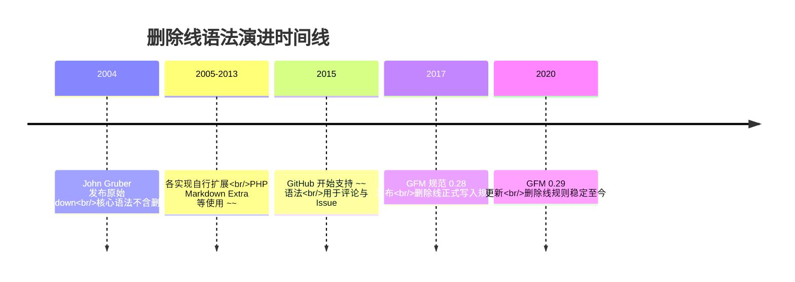

上图的时间线说明：删除线从“编辑器私有扩展”走向“社区规范”用了十余年，这提醒文档作者在跨平台写作时，应当把删除线视为增强语法而不是基础语法。

## 2. 形式化定义

根据 GitHub Flavored Markdown 规范（GFM Spec 0.29，第 6.5 节），删除线的形式化规则如下。

语法形式：一个删除线扩展（strikethrough extension）由一个或多个波浪号字符 `~` 组成，两侧各有一个相同的定界符序列包裹被删除文本。GFM 规范要求定界符序列为两个波浪号 `~~`，即：

```
~~被删除的文本~~
```

解析规则：

第一，定界符必须紧贴内容。`~~text~~` 合法，而 `~~ text ~~` 中定界符与内容之间的空格可能导致解析结果不同——GFM 的实现（如 cmark-gfm）在定界符内侧存在空格时仍可能渲染，但为了兼容性，规范建议不在定界符内侧留空格。

第二，删除线内容可以是普通文本、行内代码、链接、强调等行内元素，但不能跨段落。也就是说，`~~a\n\nb~~` 不会形成一个跨两段的删除线，因为 Markdown 的块级结构优先于行内结构。

第三，定界符长度匹配。`~~` 必须成对出现；三个波浪号 `~~~` 在行首会被识别为围栏代码块标记，在行内则可能被解析为两个定界符与一个多余字符的组合。实践中最稳妥的做法是始终使用恰好两个波浪号。

第四，转义规则。在 GFM 中，反斜杠转义可以作用于波浪号：`\~~text~~` 会让第一个波浪号失去定界符作用，从而整个文本以字面形式输出。这一点与 CommonMark 的转义机制一致。

语义定义：删除线表达“该内容在时间线上曾经成立，但当前状态下已不成立或不再推荐”的语义。它不同于：

`<del>`：表示文档修订中物理删除的内容，配合 `<ins>` 使用形成修订对；

`<s>`：表示内容不再准确或不再相关，但并没有被删除（典型场景是电商页面的原价）；

普通文本：表示内容当前仍然有效。

用集合语言表达：设 D 为文档当前状态下的有效信息集合，S 为删除线标记的文本集合，则删除线文本表达的是“S 曾经属于 D 的历史事实，且当前 S 与 D 的隶属关系被显式否定”。这种“显式否定”正是删除线区别于直接删除的价值所在。


## 3. 理论推导与原理解析

### 3.1 为什么选择波浪号作为定界符

Markdown 的定界符设计遵循“与正文冲突最小”的原则。星号 `*` 与下划线 `_` 已被强调语法占用；反引号 `` ` `` 被行内代码占用；方括号被链接占用；而波浪号在英文文本中很少出现，只在少数词（如西班牙语 ñ 的替代写法、部分网络用语）中使用。选择 `~~` 作为删除线定界符，使得解析器在绝大多数正文中不会误触发。

### 3.2 解析优先级推导

cmark-gfm 的解析过程分为块级解析与行内解析两个阶段。在行内解析阶段，解析器按顺序扫描定界符：

第一步，扫描器遇到 `~` 字符时，检查其前后字符，判断它是否可能构成定界符运行（delimiter run）。连续的波浪号构成一个运行。

第二步，解析器根据左右侧是否紧跟空白判断定界符的“左翼/右翼”属性。左翼定界符可以开始一个删除线，右翼定界符可以结束一个删除线。

第三步，按照“内侧优先”的规则，匹配最近的一对定界符。这与强调语法共用同一套算法（CommonMark 的 delimiter stack），因此删除线与 `*`、`_` 可以嵌套解析。

第四步，输出节点。GFM 扩展将匹配的删除线节点输出为 `<del>` 元素（cmark-gfm 的默认行为），这也解释了为什么 GitHub 网页端渲染的 HTML 源码中使用 `<del>` 而不是 `<s>`。

### 3.3 嵌套与组合的解析结果

以下推导展示组合语法：

输入 `~~**重要内容**~~`：解析器先遇到删除线定界符，再遇到强调定界符。由于删除线定界符先入栈且内容包含强调，最终渲染为 `<del><strong>重要内容</strong></del>`，即带删除线的加粗文本。

输入 `` ~~`git checkout -- file`~~ ``：行内代码的解析优先级高于删除线，反引号先被消费为代码跨度，波浪号随后包裹整个代码跨度，渲染为 `<del><code>git checkout -- file</code></del>`。

输入 `~~[链接](https://example.com)~~`：链接解析发生在删除线内部，结果是一个被删除线包裹的可点击链接。

这些组合都遵循“先内层后外层”的解析直觉，与 HTML 的嵌套规则一致：`<del>` 可以包含 `<strong>`、`<code>`、`<a>` 等行内元素。

## 4. 代码示例（带详尽注释）

### 4.1 基础语法示例

下面的 Markdown 源码展示删除线的最基本用法：

```markdown
当前稳定版本为 v2.0.0，~~v1.9.0 已经停止维护~~。
```

渲染结果：当前稳定版本为 v2.0.0，~~v1.9.0 已经停止维护~~。

讲解：这段示例模拟发布说明中的典型场景——旧版本号仍然保留在文档中，但通过删除线明确告知读者该版本已停止维护。读者既能看到历史，又能立即判断现状。

### 4.2 与行内代码组合

```markdown
旧命令：~~`git checkout -- file`~~，新命令：`git restore file`。
```

讲解：`~~` 包裹反引号代码块时，删除线作用于代码内容。该示例同时完成两件事：一是告诉读者旧命令已被取代，二是给出新命令。这种“旧新对照”是变更文档的标准写法，GitHub 的迁移指南大量使用该模式。

### 4.3 与加粗和链接组合

```markdown
**重点：** 该接口~~已经废弃~~，请迁移到 [新接口文档](https://example.com/docs/v2)。
```

讲解：第一层 `**` 强调“重点”二字，第二层 `~~` 标记“已经废弃”，第三层链接指向迁移目标。三者互不干扰，说明删除线可以与行内元素自由组合。注意标记顺序：先写 `~~` 再写内容，内容中的链接使用完整 Markdown 链接语法。

### 4.4 任务清单中的删除线

GFM 任务清单与删除线的组合非常常见：

```markdown
- [x] 完成登录模块
- [x] ~~完成支付模块~~（需求变更，已取消）
- [ ] 完成退款模块
```

讲解：`[x]` 表示任务已完成，但第二个任务的需求被取消，因此用删除线标记任务文本，同时在括号中补充原因。这样看板既保留了历史记录，又不会被“已完成但实际取消”的任务误导。注意：删除线只作用于文本部分，复选框 `[x]` 本身不受影响。

### 4.5 表格中的删除线

```markdown
| 状态 | 版本 | 说明 |
| --- | --- | --- |
| 已废弃 | ~~v1.8.0~~ | 存在已知安全漏洞 |
| 当前 | v2.0.0 | 推荐使用 |
```

讲解：表格单元格内使用删除线完全合法，因为 GFM 表格的内容按行内语法解析。这种用法在依赖版本对比、软件兼容性矩阵中非常实用。

### 4.6 HTML 原生方案

当渲染器不支持 `~~` 时，可以直接使用 HTML 标签：

```html
<del>已删除的内容</del>
<s>不再准确的内容</s>
```

讲解：Markdown 允许内嵌 HTML，因此 `<del>` 与 `<s>` 是删除线的“保底方案”。两者的语义区别：`<del>` 表示文档修订中删除的内容，`<s>` 表示不再准确但保留的内容。GFM 渲染 `~~` 时默认输出 `<del>`。

### 4.7 JavaScript 动态标记删除线

在 Web 应用中，可能需要根据数据状态动态生成删除线。以 React 为例：

```jsx
function PriceTag({ original, current }) {
  // 当原价高于现价时，原价需要以删除线展示
  const showStrike = original > current;
  return (
    <span>
      {/* 条件渲染：满足条件才包裹 <s> 元素 */}
      {showStrike ? <s>{original} 元</s> : null}
      <strong> {current} 元</strong>
    </span>
  );
}
```

讲解：`<s>` 是 HTML 语义元素，适合表示“原价不再适用”；React 的条件渲染在布尔值为真时输出带删除线的原价。这种写法把数据状态映射为视觉状态，是电商前端的基础模式。

## 5. 对比分析

### 5.1 GFM 删除线与 HTML 标签对比

| 维度 | `~~text~~` | `<del>text</del>` | `<s>text</s>` |
| --- | --- | --- | --- |
| 语法类型 | Markdown 扩展 | HTML 元素 | HTML 元素 |
| 语义 | 通用删除/废弃 | 修订中删除的内容 | 不再准确的内容 |
| 可读性 | 高，源码简洁 | 中，标签冗长 | 中，标签冗长 |
| 兼容性 | 仅 GFM 系渲染器 | 所有 HTML 渲染器 | 所有 HTML 渲染器 |
| 典型场景 | 笔记、Issue、变更记录 | 版本 diff、修订对比 | 电商原价、过期信息 |

讲解：表格说明“语法简洁”与“兼容广泛”之间存在权衡。写作 Markdown 时优先用 `~~`；需要精确语义或跨渲染器兼容时用 HTML 标签。

### 5.2 与下划线/删除标记的对比

很多编辑器把删除线写作 `~~`，但也有少数平台使用其他标记（如 Wiki 语法中的 `--text--`、Confluence 的 `-text-`）。GFM 的 `~~` 之所以成为事实标准，是因为 GitHub 的体量带动了 cmark-gfm 的普及，后续 Typora、Obsidian、Notion 等产品跟随支持。

### 5.3 与直接删除文本的对比

直接删除文本丢失了历史信息，读者无法知道这里曾经存在过什么；删除线则保留原文并给出“失效”标记。在需要审计、追溯、对比的场景（变更记录、决策记录、迁移指南），删除线明显优于直接删除。在追求最终干净成品的场景（正式出版物），删除线则显得杂乱。

## 6. 常见陷阱与最佳实践

陷阱一：定界符两侧误加空格。`~~ 内容 ~~` 在部分渲染器中不会正确解析。最佳实践是让 `~~` 紧贴内容，即 `~~内容~~`。

陷阱二：使用单波浪号。`~text~` 在 GFM 中不是删除线（GFM 要求两个波浪号）。某些老式实现曾支持单波浪号，但不要依赖这一行为。

陷阱三：误把删除线用于正文强调。删除线表达“失效”，如果只是想弱化语气，应使用其他方式（如括号补充说明），否则读者会认为内容已废弃。

陷阱四：跨平台渲染不一致。在只实现 CommonMark 的渲染器中，`~~` 会原样显示。最佳实践是在团队内部约定 Markdown 引擎，或为关键文档提供渲染预览检查。

陷阱五：在标题中使用删除线。`## ~~旧标题~~` 虽然可以解析，但会造成目录与正文不一致、检索混乱，应避免。

陷阱六：与围栏代码块混淆。行首的三个波浪号 `~~~` 会被识别为代码块围栏。如果要在文档中讲解删除线语法本身，应使用四空格缩进代码块或转义波浪号。

最佳实践清单：

第一，删除线只用于表达“曾经成立、现在不成立”的语义，不用于表达语气；

第二，重要变更同时给出替代内容，避免只标记废弃不给方案；

第三，在多人协作仓库中，删除线配合提交记录使用，让 Git 历史与文档标记互为印证；

第四，自动化生成变更记录时，优先使用 `<del>` 标签以获得精确语义。

## 7. 工程实践

### 7.1 变更日志模板

把删除线嵌入 semver 风格的变更日志，可以让读者一眼看出版本的替代关系：

```markdown
## [2.0.0] - 2026-08-01

### 已废弃

- ~~CLI 参数 --old-flag~~，请使用 --new-flag
- ~~Node.js 16 支持~~，最低要求 Node.js 18

### 新增

- 支持增量构建
- 输出 JSON 报告
```

讲解：每个废弃项都附带替代方案，这是工程文档的黄金法则：告诉读者“旧的不行”的同时，必须告诉“新的怎么用”。

### 7.2 项目决策记录（ADR）中的应用

```markdown
# ADR-012：构建工具选型

## 状态

~~已接受~~ 已废弃（2026-07 更新）

## 背景

原决策基于 npm 7 的依赖解析行为……
```

讲解：ADR 的状态字段使用删除线表达决策生命周期，既保留决策历史，又明确当前状态。这一模式被许多开源项目采用，是“文档即历史”的典型实践。

### 7.3 与 Git 工作流的配合

GitHub 的 Pull Request 描述、Issue 评论天然支持 GFM 删除线。团队可以在任务模板中约定：任务被取消时在标题前加删除线，而不是关闭 Issue 后删除内容。例如：

```markdown
## 任务：~~实现旧版导出功能~~（已取消，改为 CSV 导出）
```

讲解：这保证任务历史完整，后续检索时也能通过删除线快速过滤失效任务。

## 8. 案例研究：修订型学习笔记的完整写法

场景：一名开发者维护个人学习笔记，记录 Python 版本特性的变更。

原始笔记：

```markdown
Python 3.9 的 dict 支持 `|` 合并运算符。
```

当 Python 3.10 发布后，笔记更新为：

```markdown
Python 3.9 的 dict 支持 `|` 合并运算符。
~~Python 3.9 是唯一支持该语法的版本。~~
Python 3.10 起 `match` 语句与 `|` 联合类型同时可用。
```

讲解：第一行保留为事实；第二行用删除线标记“唯一支持”这一过时结论；第三行补充新版本信息。整个笔记形成一条可读的时间线，读者不会误以为旧结论仍然成立。

扩展该模式到团队 Wiki：每个页面顶部维护“信息时效区”，过时内容不删除、不隐藏，而是用删除线标记并注明更新时间。配合自动化检查（如链接失效扫描），可以显著降低文档误导风险。

## 9. 知识要点总结与深入讲解

本节替代传统习题，以“提问—解释”的方式梳理核心知识点，但全部以讲解形式呈现，读者不需要答题，只需跟随解释建立认知。

关于语法形式：删除线的唯一标准写法是 `~~内容~~`，两个波浪号必须成对出现并紧贴内容。有人会问“为什么不是三个波浪号”，因为三波浪号在行首是代码块围栏，在行内解析也容易歧义。规范的保守选择是固定使用两个。

关于语义选择：`<del>` 与 `<s>` 的区别来自 HTML5 规范。`<del>` 表示内容被删除，通常与 `<ins>` 成对出现；`<s>` 表示内容不再准确但保留。GFM 把 `~~` 渲染为 `<del>`，因此在 GitHub 上看到删除线对应的 HTML 是 `<del>`。

关于嵌套：删除线可以与加粗、斜体、代码、链接自由嵌套，因为 cmark-gfm 使用统一的定界符栈解析所有行内标记。嵌套顺序决定最终 HTML 的层级，例如 `~~**文字**~~` 产生 `<del><strong>文字</strong></del>`。

关于兼容性：CommonMark 核心规范没有删除线，因此非 GFM 渲染器可能原样输出波浪号。跨平台写作时，要么确认目标平台支持 GFM，要么使用 `<del>`/`<s>` 标签兜底。

关于工程使用：删除线的价值在于保留历史、标记失效、支撑对比。滥用删除线（如用于语气强调）会破坏语义；正确的做法是让每个删除线文本都伴随替代信息或失效原因。

### 1. 历史动机与发展脉络

删除线的历史可以追溯到打字机时代。在还没有文档处理软件的年代，修订文本时人们用横线划过需要废弃的文字，同时保留这些文字以便审阅者看到原始内容。这种“保留原文并标记失效”的物理习惯，后来被 WYSIWYG 文字处理器中的删除线（strikethrough）字体样式继承。

在 HTML 规范演进中，删除线经历了两个关键阶段。HTML 4 提供了 `<s>` 和 `<strike>` 两个元素表示删除线，但语义含糊。HTML5 规范最终明确了分工：`<del>` 表示“已被删除的内容”（document changes 语义），`<s>` 表示“不再准确或不再相关的内容”（如商品原价），两者都默认渲染为删除线，但机器可读的语义不同。这一区分直接影响 Markdown 删除线的设计理念。

Markdown 最初由 John Gruber 于 2004 年发布，核心规范（Markdown.pl）并不包含删除线。2004 年后的十余年里，各个实现各自为政：PHP Markdown Extra 使用 `~~`，GitHub 的早期方言也曾支持 `==` 等变体。2017 年 GitHub 发布 GitHub Flavored Markdown 规范（GFM Spec 0.28 起步，当前 0.29），正式把 `~~text~~` 删除线语法纳入规范，并同时定义了 `<del>` 与 `<s>` 的解析优先级。此后，Typora、Obsidian、VS Code 内置 Markdown 预览、JetBrains IDE 的 Markdown 插件等主流工具普遍支持 `~~` 语法。

从标准化角度看，删除线至今不是 CommonMark 核心规范的一部分，而是 GFM 的扩展。这意味着在只实现 CommonMark 的渲染器中，`~~text~~` 会被原样输出为普通文本。理解这一历史脉络，可以帮助读者解释“为什么同样的 Markdown 文件在不同平台上渲染结果不同”这一高频问题。


上图的时间线说明：删除线从“编辑器私有扩展”走向“社区规范”用了十余年，这提醒文档作者在跨平台写作时，应当把删除线视为增强语法而不是基础语法。

### 2. 形式化定义

根据 GitHub Flavored Markdown 规范（GFM Spec 0.29，第 6.5 节），删除线的形式化规则如下。

语法形式：一个删除线扩展（strikethrough extension）由一个或多个波浪号字符 `~` 组成，两侧各有一个相同的定界符序列包裹被删除文本。GFM 规范要求定界符序列为两个波浪号 `~~`，即：

```
~~被删除的文本~~
```

解析规则：

第一，定界符必须紧贴内容。`~~text~~` 合法，而 `~~ text ~~` 中定界符与内容之间的空格可能导致解析结果不同——GFM 的实现（如 cmark-gfm）在定界符内侧存在空格时仍可能渲染，但为了兼容性，规范建议不在定界符内侧留空格。

第二，删除线内容可以是普通文本、行内代码、链接、强调等行内元素，但不能跨段落。也就是说，`~~a\n\nb~~` 不会形成一个跨两段的删除线，因为 Markdown 的块级结构优先于行内结构。

第三，定界符长度匹配。`~~` 必须成对出现；三个波浪号 `~~~` 在行首会被识别为围栏代码块标记，在行内则可能被解析为两个定界符与一个多余字符的组合。实践中最稳妥的做法是始终使用恰好两个波浪号。

第四，转义规则。在 GFM 中，反斜杠转义可以作用于波浪号：`\~~text~~` 会让第一个波浪号失去定界符作用，从而整个文本以字面形式输出。这一点与 CommonMark 的转义机制一致。

语义定义：删除线表达“该内容在时间线上曾经成立，但当前状态下已不成立或不再推荐”的语义。它不同于：

`<del>`：表示文档修订中物理删除的内容，配合 `<ins>` 使用形成修订对；

`<s>`：表示内容不再准确或不再相关，但并没有被删除（典型场景是电商页面的原价）；

普通文本：表示内容当前仍然有效。

用集合语言表达：设 D 为文档当前状态下的有效信息集合，S 为删除线标记的文本集合，则删除线文本表达的是“S 曾经属于 D 的历史事实，且当前 S 与 D 的隶属关系被显式否定”。这种“显式否定”正是删除线区别于直接删除的价值所在。


### 3. 理论推导与原理解析

#### 3.1 为什么选择波浪号作为定界符

Markdown 的定界符设计遵循“与正文冲突最小”的原则。星号 `*` 与下划线 `_` 已被强调语法占用；反引号 `` ` `` 被行内代码占用；方括号被链接占用；而波浪号在英文文本中很少出现，只在少数词（如西班牙语 ñ 的替代写法、部分网络用语）中使用。选择 `~~` 作为删除线定界符，使得解析器在绝大多数正文中不会误触发。

#### 3.2 解析优先级推导

cmark-gfm 的解析过程分为块级解析与行内解析两个阶段。在行内解析阶段，解析器按顺序扫描定界符：

第一步，扫描器遇到 `~` 字符时，检查其前后字符，判断它是否可能构成定界符运行（delimiter run）。连续的波浪号构成一个运行。

第二步，解析器根据左右侧是否紧跟空白判断定界符的“左翼/右翼”属性。左翼定界符可以开始一个删除线，右翼定界符可以结束一个删除线。

第三步，按照“内侧优先”的规则，匹配最近的一对定界符。这与强调语法共用同一套算法（CommonMark 的 delimiter stack），因此删除线与 `*`、`_` 可以嵌套解析。

第四步，输出节点。GFM 扩展将匹配的删除线节点输出为 `<del>` 元素（cmark-gfm 的默认行为），这也解释了为什么 GitHub 网页端渲染的 HTML 源码中使用 `<del>` 而不是 `<s>`。

#### 3.3 嵌套与组合的解析结果

以下推导展示组合语法：

输入 `~~**重要内容**~~`：解析器先遇到删除线定界符，再遇到强调定界符。由于删除线定界符先入栈且内容包含强调，最终渲染为 `<del><strong>重要内容</strong></del>`，即带删除线的加粗文本。

输入 `` ~~`git checkout -- file`~~ ``：行内代码的解析优先级高于删除线，反引号先被消费为代码跨度，波浪号随后包裹整个代码跨度，渲染为 `<del><code>git checkout -- file</code></del>`。

输入 `~~[链接](https://example.com)~~`：链接解析发生在删除线内部，结果是一个被删除线包裹的可点击链接。

这些组合都遵循“先内层后外层”的解析直觉，与 HTML 的嵌套规则一致：`<del>` 可以包含 `<strong>`、`<code>`、`<a>` 等行内元素。

### 4. 代码示例（带详尽注释）

#### 4.1 基础语法示例

下面的 Markdown 源码展示删除线的最基本用法：

```markdown
当前稳定版本为 v2.0.0，~~v1.9.0 已经停止维护~~。
```

渲染结果：当前稳定版本为 v2.0.0，~~v1.9.0 已经停止维护~~。

讲解：这段示例模拟发布说明中的典型场景——旧版本号仍然保留在文档中，但通过删除线明确告知读者该版本已停止维护。读者既能看到历史，又能立即判断现状。

#### 4.2 与行内代码组合

```markdown
旧命令：~~`git checkout -- file`~~，新命令：`git restore file`。
```

讲解：`~~` 包裹反引号代码块时，删除线作用于代码内容。该示例同时完成两件事：一是告诉读者旧命令已被取代，二是给出新命令。这种“旧新对照”是变更文档的标准写法，GitHub 的迁移指南大量使用该模式。

#### 4.3 与加粗和链接组合

```markdown
**重点：** 该接口~~已经废弃~~，请迁移到 [新接口文档](https://example.com/docs/v2)。
```

讲解：第一层 `**` 强调“重点”二字，第二层 `~~` 标记“已经废弃”，第三层链接指向迁移目标。三者互不干扰，说明删除线可以与行内元素自由组合。注意标记顺序：先写 `~~` 再写内容，内容中的链接使用完整 Markdown 链接语法。

#### 4.4 任务清单中的删除线

GFM 任务清单与删除线的组合非常常见：

```markdown
- [x] 完成登录模块
- [x] ~~完成支付模块~~（需求变更，已取消）
- [ ] 完成退款模块
```

讲解：`[x]` 表示任务已完成，但第二个任务的需求被取消，因此用删除线标记任务文本，同时在括号中补充原因。这样看板既保留了历史记录，又不会被“已完成但实际取消”的任务误导。注意：删除线只作用于文本部分，复选框 `[x]` 本身不受影响。

#### 4.5 表格中的删除线

```markdown
| 状态 | 版本 | 说明 |
| --- | --- | --- |
| 已废弃 | ~~v1.8.0~~ | 存在已知安全漏洞 |
| 当前 | v2.0.0 | 推荐使用 |
```

讲解：表格单元格内使用删除线完全合法，因为 GFM 表格的内容按行内语法解析。这种用法在依赖版本对比、软件兼容性矩阵中非常实用。

#### 4.6 HTML 原生方案

当渲染器不支持 `~~` 时，可以直接使用 HTML 标签：

```html
<del>已删除的内容</del>
<s>不再准确的内容</s>
```

讲解：Markdown 允许内嵌 HTML，因此 `<del>` 与 `<s>` 是删除线的“保底方案”。两者的语义区别：`<del>` 表示文档修订中删除的内容，`<s>` 表示不再准确但保留的内容。GFM 渲染 `~~` 时默认输出 `<del>`。

#### 4.7 JavaScript 动态标记删除线

在 Web 应用中，可能需要根据数据状态动态生成删除线。以 React 为例：

```jsx
function PriceTag({ original, current }) {
  // 当原价高于现价时，原价需要以删除线展示
  const showStrike = original > current;
  return (
    <span>
      {/* 条件渲染：满足条件才包裹 <s> 元素 */}
      {showStrike ? <s>{original} 元</s> : null}
      <strong> {current} 元</strong>
    </span>
  );
}
```

讲解：`<s>` 是 HTML 语义元素，适合表示“原价不再适用”；React 的条件渲染在布尔值为真时输出带删除线的原价。这种写法把数据状态映射为视觉状态，是电商前端的基础模式。

### 5. 对比分析

#### 5.1 GFM 删除线与 HTML 标签对比

| 维度 | `~~text~~` | `<del>text</del>` | `<s>text</s>` |
| --- | --- | --- | --- |
| 语法类型 | Markdown 扩展 | HTML 元素 | HTML 元素 |
| 语义 | 通用删除/废弃 | 修订中删除的内容 | 不再准确的内容 |
| 可读性 | 高，源码简洁 | 中，标签冗长 | 中，标签冗长 |
| 兼容性 | 仅 GFM 系渲染器 | 所有 HTML 渲染器 | 所有 HTML 渲染器 |
| 典型场景 | 笔记、Issue、变更记录 | 版本 diff、修订对比 | 电商原价、过期信息 |

讲解：表格说明“语法简洁”与“兼容广泛”之间存在权衡。写作 Markdown 时优先用 `~~`；需要精确语义或跨渲染器兼容时用 HTML 标签。

#### 5.2 与下划线/删除标记的对比

很多编辑器把删除线写作 `~~`，但也有少数平台使用其他标记（如 Wiki 语法中的 `--text--`、Confluence 的 `-text-`）。GFM 的 `~~` 之所以成为事实标准，是因为 GitHub 的体量带动了 cmark-gfm 的普及，后续 Typora、Obsidian、Notion 等产品跟随支持。

#### 5.3 与直接删除文本的对比

直接删除文本丢失了历史信息，读者无法知道这里曾经存在过什么；删除线则保留原文并给出“失效”标记。在需要审计、追溯、对比的场景（变更记录、决策记录、迁移指南），删除线明显优于直接删除。在追求最终干净成品的场景（正式出版物），删除线则显得杂乱。

### 6. 常见陷阱与最佳实践

陷阱一：定界符两侧误加空格。`~~ 内容 ~~` 在部分渲染器中不会正确解析。最佳实践是让 `~~` 紧贴内容，即 `~~内容~~`。

陷阱二：使用单波浪号。`~text~` 在 GFM 中不是删除线（GFM 要求两个波浪号）。某些老式实现曾支持单波浪号，但不要依赖这一行为。

陷阱三：误把删除线用于正文强调。删除线表达“失效”，如果只是想弱化语气，应使用其他方式（如括号补充说明），否则读者会认为内容已废弃。

陷阱四：跨平台渲染不一致。在只实现 CommonMark 的渲染器中，`~~` 会原样显示。最佳实践是在团队内部约定 Markdown 引擎，或为关键文档提供渲染预览检查。

陷阱五：在标题中使用删除线。`## ~~旧标题~~` 虽然可以解析，但会造成目录与正文不一致、检索混乱，应避免。

陷阱六：与围栏代码块混淆。行首的三个波浪号 `~~~` 会被识别为代码块围栏。如果要在文档中讲解删除线语法本身，应使用四空格缩进代码块或转义波浪号。

最佳实践清单：

第一，删除线只用于表达“曾经成立、现在不成立”的语义，不用于表达语气；

第二，重要变更同时给出替代内容，避免只标记废弃不给方案；

第三，在多人协作仓库中，删除线配合提交记录使用，让 Git 历史与文档标记互为印证；

第四，自动化生成变更记录时，优先使用 `<del>` 标签以获得精确语义。

### 7. 工程实践

#### 7.1 变更日志模板

把删除线嵌入 semver 风格的变更日志，可以让读者一眼看出版本的替代关系：

```markdown
### [2.0.0] - 2026-08-01

#### 已废弃

- ~~CLI 参数 --old-flag~~，请使用 --new-flag
- ~~Node.js 16 支持~~，最低要求 Node.js 18

#### 新增

- 支持增量构建
- 输出 JSON 报告
```

讲解：每个废弃项都附带替代方案，这是工程文档的黄金法则：告诉读者“旧的不行”的同时，必须告诉“新的怎么用”。

#### 7.2 项目决策记录（ADR）中的应用

```markdown
# ADR-012：构建工具选型

### 状态

~~已接受~~ 已废弃（2026-07 更新）

### 背景

原决策基于 npm 7 的依赖解析行为……
```

讲解：ADR 的状态字段使用删除线表达决策生命周期，既保留决策历史，又明确当前状态。这一模式被许多开源项目采用，是“文档即历史”的典型实践。

#### 7.3 与 Git 工作流的配合

GitHub 的 Pull Request 描述、Issue 评论天然支持 GFM 删除线。团队可以在任务模板中约定：任务被取消时在标题前加删除线，而不是关闭 Issue 后删除内容。例如：

```markdown
### 任务：~~实现旧版导出功能~~（已取消，改为 CSV 导出）
```

讲解：这保证任务历史完整，后续检索时也能通过删除线快速过滤失效任务。

### 8. 案例研究：修订型学习笔记的完整写法

场景：一名开发者维护个人学习笔记，记录 Python 版本特性的变更。

原始笔记：

```markdown
Python 3.9 的 dict 支持 `|` 合并运算符。
```

当 Python 3.10 发布后，笔记更新为：

```markdown
Python 3.9 的 dict 支持 `|` 合并运算符。
~~Python 3.9 是唯一支持该语法的版本。~~
Python 3.10 起 `match` 语句与 `|` 联合类型同时可用。
```

讲解：第一行保留为事实；第二行用删除线标记“唯一支持”这一过时结论；第三行补充新版本信息。整个笔记形成一条可读的时间线，读者不会误以为旧结论仍然成立。

扩展该模式到团队 Wiki：每个页面顶部维护“信息时效区”，过时内容不删除、不隐藏，而是用删除线标记并注明更新时间。配合自动化检查（如链接失效扫描），可以显著降低文档误导风险。

### 9. 知识要点总结与深入讲解

本节替代传统习题，以“提问—解释”的方式梳理核心知识点，但全部以讲解形式呈现，读者不需要答题，只需跟随解释建立认知。

关于语法形式：删除线的唯一标准写法是 `~~内容~~`，两个波浪号必须成对出现并紧贴内容。有人会问“为什么不是三个波浪号”，因为三波浪号在行首是代码块围栏，在行内解析也容易歧义。规范的保守选择是固定使用两个。

关于语义选择：`<del>` 与 `<s>` 的区别来自 HTML5 规范。`<del>` 表示内容被删除，通常与 `<ins>` 成对出现；`<s>` 表示内容不再准确但保留。GFM 把 `~~` 渲染为 `<del>`，因此在 GitHub 上看到删除线对应的 HTML 是 `<del>`。

关于嵌套：删除线可以与加粗、斜体、代码、链接自由嵌套，因为 cmark-gfm 使用统一的定界符栈解析所有行内标记。嵌套顺序决定最终 HTML 的层级，例如 `~~**文字**~~` 产生 `<del><strong>文字</strong></del>`。

关于兼容性：CommonMark 核心规范没有删除线，因此非 GFM 渲染器可能原样输出波浪号。跨平台写作时，要么确认目标平台支持 GFM，要么使用 `<del>`/`<s>` 标签兜底。

关于工程使用：删除线的价值在于保留历史、标记失效、支撑对比。滥用删除线（如用于语气强调）会破坏语义；正确的做法是让每个删除线文本都伴随替代信息或失效原因。

### 11. 延伸阅读
读者可以在以下资源中继续深入学习：
---
#### 1. 删除线语法

##### 1.1 基本语法

删除线使用两个波浪号 `~~` 包裹文本：

```markdown
~~这段文字会被加上删除线~~
```

渲染结果：~~这段文字会被加上删除线~~

##### 1.2 语法规则

| 规则       | 正确       | 错误                         |
| :--------- | :--------- | :--------------------------- |
| 两个波浪号 | `~~文本~~` | `~文本~`（单波浪号无效）     |
| 紧贴文本   | `~~文本~~` | `~~ 文本 ~~`（空格会被保留） |
| 成对出现   | `~~文本~~` | `~~文本`（未闭合）           |

##### 1.3 与强调组合

删除线可以与其他行内格式组合使用：

```markdown
~~_删除且斜体_~~
~~**删除且粗体**~~
~~**_删除且粗斜体_**~~
~~`删除的代码`~~
**~~粗体且删除~~**
```

#### 1. 使用场景

##### 2.1 价格标注

```markdown
限时优惠：~~¥299~~ ¥199
```

渲染：~~¥299~~ ¥199

##### 2.2 文档修订

```markdown
项目使用 ~~Webpack~~ Vite 作为构建工具。
```

渲染：项目使用 ~~Webpack~~ Vite 作为构建工具。

##### 2.3 废弃标记

```markdown
- ~~旧版 API 已废弃~~
- 新版 API 请参考 v3 文档
```

##### 2.4 任务列表

```markdown
- [x] ~~需求分析~~ 已完成
- [ ] 开发实现
```

##### 2.5 变更记录

```markdown
#### v2.0.0 变更

- ~~`oldMethod()`~~ → `newMethod()`
- ~~`Config.default`~~ → `Config.defaults`
```

#### 2. HTML 替代

当平台不支持 GFM 删除线时，可以使用 HTML 标签：

```markdown
<s>这段文字会被加上删除线</s>

<del>这段文字会被加上删除线</del>

<strike>这段文字会被加上删除线</strike>
```

三种标签的区别：

| 标签       | HTML 标准 | 语义               | 推荐度 |
| :--------- | :-------- | :----------------- | :----- |
| `<del>`    | HTML5     | 表示已删除的内容   | 高 |
| `<s>`      | HTML5     | 表示不再准确的内容 | 中   |
| `<strike>` | 已废弃    | 无语义             | 低     |

`<del>` 标签还可以添加属性：

```markdown
<del datetime="2026-06-14">已删除的内容</del>

<del cite="https://example.com/reason">删除原因见链接</del>
```

#### 3. 跨平台支持

| 平台           | `~~语法~~` | `<del>` | `<s>` |
| :------------- | :--------- | :------ | :---- |
| **GitHub**     |            |         |       |
| **GitLab**     |            |         |       |
| **CommonMark** |            |         |       |
| **Obsidian**   |            |         |       |
| **Typora**     |            |         |       |
| **Hugo**       | （需配置） |         |       |
| **Jekyll**     | （需插件） |         |       |

#### 4. 注意事项

##### 5.1 常见问题

- **中文间距**：`~~中文~~` 在某些渲染器中可能显示异常，建议测试
- **嵌套问题**：`~~**文本**~~` 可以工作，但 `**~~文本~~**` 在某些解析器中结果不同
- **行内代码**：`~~`代码``~~` 中删除线不会作用于代码内容

##### 5.2 可访问性

屏幕阅读器对删除线的处理方式不同：

- 部分阅读器会朗读"删除开始...删除结束"
- 部分阅读器直接跳过删除线内容
- 建议在重要场景使用文字说明替代纯删除线
#### 基本语法

**单行写法：使用双波浪号包裹删除线**
`~~<文本>~~`
```markdown
~~这段文字会被加上删除线~~
```

---

#### 语法规则

**单行写法：双波浪号必须成对出现**
`~~<文本>~~`
```markdown
~~正确写法~~
```

**错误写法：单波浪号无效**
`~<文本>~`
```markdown
~错误写法~（单波浪号无效）
```

**错误写法：未闭合标记**
`~~<文本>`
```markdown
~~ 未闭合（缺少结束标记）
```

**基本写法：波浪号与文本之间不能有空格**
`~~<文本>~~`
```markdown
~~正确~~
```

**错误写法：有空格时标记不生效**
`~~ <文本> ~~`
```markdown
~~ 错误 ~~（空格会被保留）
```

---

#### 与其他格式组合

**单行写法：删除线与斜体组合**
`~~_<文本>_~~`
```markdown
~~_删除且斜体_~~
```

**单行写法：删除线与粗体组合**
`~~**<文本>**~~`
```markdown
~~**删除且粗体**~~
```

**单行写法：删除线与粗斜体组合**
`~~**_<文本>_**~~`
```markdown
~~**_删除且粗斜体_**~~
```

**单行写法：删除线与行内代码组合**
`~~`<代码>`~~`
```markdown
~~`删除的代码`~~
```

---

#### HTML 替代

**单行写法：使用 del 标签**
`<del><文本></del>`
```markdown
<del>这段文字会被加上删除线</del>
```

**单行写法：使用 s 标签**
`<s><文本></s>`
```markdown
<s>这段文字会被加上删除线</s>
```

**单行写法：使用 strike 标签**
`<strike><文本></strike>`
```markdown
<strike>这段文字会被加上删除线</strike>
```

**单行写法：del 标签带日期属性**
`<del datetime="<日期>"><文本></del>`
```markdown
<del datetime="2026-06-14">已删除的内容</del>
```

**单行写法：del 标签带引用属性**
`<del cite="<引用URL>"><文本></del>`
```markdown
<del cite="https://example.com/reason">删除原因见链接</del>
```

---

#### 使用场景

**单行写法：价格标注**
`~~<原价>~~ <现价>`
```markdown
限时优惠：~~¥299~~ ¥199
```

**单行写法：文档修订**
`~~<旧内容>~~ <新内容>`
```markdown
项目使用 ~~Webpack~~ Vite 作为构建工具。
```

**换行写法：变更记录列表**
`- ~~<旧方法>~~ → <新方法>`
```markdown
- ~~`oldMethod()`~~ → `newMethod()`
- ~~`Config.default`~~ → `Config.defaults`
```

<!-- ============ 文档分隔线：002-markdown/011-AutoLink.md ============ -->

## 1. 自动链接概述

### 1.1 什么是自动链接

自动链接是指 Markdown 解析器**自动识别**文本中的 URL 或邮箱地址，并将其转换为可点击的超链接，无需手动使用链接语法。

### 1.2 两种自动链接

| 类型                | 语法                    | 来源            |
| :------------------ | :---------------------- | :-------------- |
| **尖括号自动链接**  | `<https://example.com>` | CommonMark 标准 |
| **裸 URL 自动链接** | `https://example.com`   | GFM 扩展        |

## 2. 尖括号自动链接

### 2.1 URL 自动链接

```markdown
<https://github.com>
<http://example.com/path?q=1&r=2>
```

渲染为可点击链接，链接文本就是 URL 本身。

### 2.2 邮箱自动链接

```markdown
<user@example.com>
<contact@company.org>
```

邮箱自动链接会进行 HTML 实体编码，防止垃圾邮件爬虫：

```html
<!-- 渲染后的 HTML -->
<a
  href="mailto:&#117;&#115;&#101;&#114;&#64;&#101;&#120;&#97;&#109;&#112;&#108;&#101;&#46;&#99;&#111;&#109;"
  >user@example.com</a
>
```

### 2.3 规则

- 尖括号内必须是合法的 URL 或邮箱格式
- URL 必须包含协议（`http://` 或 `https://`）
- 尖括号内不能有空格
- 尖括号内的 `&` 和 `<` 需要转义

```markdown
<!-- 有效 -->

<https://example.com>
<user@example.com>

<!-- 无效 -->

<example.com> <!-- 缺少协议 -->
< https://example.com > <!-- 有空格 -->
```

## 3. GFM 裸 URL 自动链接

### 3.1 URL 识别规则

GFM 可以自动识别不带尖括号的 URL：

```markdown
访问 https://github.com 了解更多
浏览 www.example.com 查看
```

### 3.2 识别条件

| 条件           | 说明                                |
| :------------- | :---------------------------------- |
| **协议前缀**   | 必须以 `http://` 或 `https://` 开头 |
| **www 前缀**   | `www.` 开头的域名也会被识别         |
| **有效域名**   | 必须包含点号和顶级域                |
| **路径和查询** | URL 可以包含路径、查询参数和片段    |

### 3.3 URL 边界

GFM 使用以下规则确定 URL 的结束位置：

- 空格或换行
- 未配对的标点符号（如 `)`、`]`）
- 中文等 CJK 字符
- 控制字符

```markdown
<!-- 正确识别 -->

访问 https://github.com/user/repo 了解更多。

<!-- 括号内的 URL -->

请参考文档（https://docs.example.com）获取详情。

<!-- URL 末尾的标点 -->

这是链接 https://example.com。
```

### 3.4 邮箱自动链接

GFM 也支持裸邮箱地址的自动链接：

```markdown
联系 user@example.com 获取更多信息
```

## 4. 自动链接的定制

### 4.1 修改链接文本

自动链接的显示文本始终是 URL 本身。如需自定义文本，使用标准链接语法：

```markdown
<!-- 自动链接：显示 URL -->

<https://github.com>

<!-- 标准链接：自定义文本 -->

[GitHub](https://github.com)
```

### 4.2 在新窗口打开

自动链接默认在当前窗口打开。如需在新窗口打开，需要使用 HTML：

```markdown
<a href="https://example.com" target="_blank">在新窗口打开</a>
```

### 4.3 nofollow 属性

为自动链接添加 `rel="nofollow"` 防止搜索引擎追踪：

```markdown
<a href="https://example.com" rel="nofollow">不追踪的链接</a>
```

## 5. 安全考虑

### 5.1 XSS 防护

Markdown 解析器会对自动链接中的特殊字符进行编码：

```markdown
<https://example.com/search?q=<script>alert(1)</script>>

<!-- 渲染后 -->

<a href="https://example.com/search?q=&lt;script&gt;alert(1)&lt;/script&gt;">...</a>
```

### 5.2 邮箱保护

尖括号邮箱自动链接使用 HTML 实体编码保护邮箱地址：

```markdown
<!-- 源码 -->

<user@example.com>

<!-- 渲染后（实体编码） -->
<a href="mailto:&#117;&#115;&#101;&#114;&#64;&#101;&#120;&#97;&#109;&#112;&#108;&#101;&#46;&#99;&#111;&#109;">
  &#117;&#115;&#101;&#114;&#64;&#101;&#120;&#97;&#109;&#112;&#108;&#101;&#46;&#99;&#111;&#109;
</a>
```

### 5.3 JavaScript 协议

Markdown 解析器通常**不识别** `javascript:` 协议的自动链接：

```markdown
<javascript:alert(1)> <!-- 不会被渲染为链接 -->
```

## 6. 跨平台差异

| 特性       | CommonMark | GFM | Obsidian   |
| :--------- | :--------- | :-- | :--------- |
| 尖括号 URL |            |     |            |
| 尖括号邮箱 |            |     |            |
| 裸 URL     |            |     |            |
| 裸邮箱     |            |     |            |
| www 前缀   |            |     |            |
| Wiki 链接  |            |     | `[[页面]]` |
## 尖括号自动链接

**单行写法：URL 自动链接**
`<<URL>>`
```markdown
<https://github.com>
```

**单行写法：带路径的 URL 自动链接**
`<<URL>>`
```markdown
<http://example.com/path?q=1>
```

**单行写法：邮箱自动链接**
`<<邮箱>>`
```markdown
<user@example.com>
```

---

## GFM 裸 URL 自动链接

**单行写法：裸 URL 自动识别**
`<URL>`
```markdown
访问 https://github.com 了解更多
```

**单行写法：裸 www 地址自动识别**
`www.<域名>`
```markdown
浏览 www.example.com 查看
```

**单行写法：裸邮箱自动识别**
`<邮箱>`
```markdown
联系 user@example.com 获取更多信息
```

---

## 自动链接规则

**基本写法：URL 必须包含协议**
`<http://> | <https://>`
```markdown
<https://example.com>
```

**错误写法：缺少协议无效**
`<域名>`
```markdown
<example.com>（无效，缺少协议）
```

**基本写法：尖括号内不能有空格**
`<<URL>>`
```markdown
<https://example.com>
```

**错误写法：有空格无效**
`< <URL> >`
```markdown
< https://example.com >（无效，有空格）
```

---

## 自定义链接文本

**单行写法：使用标准链接语法自定义文本**
`[<文本>](<URL>)`
```markdown
[GitHub](https://github.com)
```

**换行写法：自动链接与标准链接对比**
`<<URL>> | [<文本>](<URL>)`
```markdown
<https://github.com>

[GitHub](https://github.com)
```

---

## 新窗口打开

**单行写法：使用 HTML a 标签在新窗口打开**
`<a href="<URL>" target="_blank"><文本></a>`
```markdown
<a href="https://example.com" target="_blank">在新窗口打开</a>
```

**单行写法：添加 nofollow 属性**
`<a href="<URL>" rel="nofollow"><文本></a>`
```markdown
<a href="https://example.com" rel="nofollow">不追踪的链接</a>
```

**单行写法：同时设置新窗口和 nofollow**
`<a href="<URL>" target="_blank" rel="nofollow"><文本></a>`
```markdown
<a href="https://example.com" target="_blank" rel="nofollow">新窗口且不追踪</a>
```

<!-- ============ 文档分隔线：002-markdown/012-Emoji.md ============ -->

## 1. Emoji 概述

### 1.1 在 Markdown 中使用 Emoji

Markdown 支持两种方式插入 Emoji：

| 方式        | 语法           | 示例        | 适用平台      |
| :---------- | :------------- | :---------- | :------------ |
| **短代码**  | `:emoji_name:` | `:smile:` → | GitHub/GitLab |
| **Unicode** | 直接输入       |             | 通用          |

### 1.2 Emoji 的价值

- **增强表达力**：用图形补充文字信息
- **视觉标记**：快速识别内容类型（ 警告、 完成）
- **提升可读性**：在列表和标题中作为视觉锚点
- **情感传达**：在协作讨论中表达语气

## 2. 短代码语法

### 2.1 基本用法

```markdown
今天天气真好 :sunny: :smile:

:tada: 项目发布成功！

:warning: 注意：此 API 已废弃
```

### 2.2 常用 Emoji 短代码

**表情与手势**

| 短代码     | 渲染 | 短代码       | 渲染 |
| :--------- | :--- | :----------- | :--- |
| `:smile:`  |      | `:laughing:` |      |
| `:heart:`  |      | `:thumbsup:` |      |
| `:rocket:` |      | `:fire:`     |      |
| `:eyes:`   |      | `:thinking:` |      |
| `:clap:`   |      | `:pray:`     |      |

**状态与标记**

| 短代码               | 渲染 | 用途      |
| :------------------- | :--- | :-------- |
| `:white_check_mark:` |      | 完成/通过 |
| `:x:`                |      | 失败/错误 |
| `:warning:`          |      | 警告      |
| `:bulb:`             |      | 提示/想法 |
| `:bookmark:`         |      | 标记/书签 |
| `:construction:`     |      | 建设中    |

**技术相关**

| 短代码       | 渲染 | 用途      |
| :----------- | :--- | :-------- |
| `:bug:`      |      | Bug       |
| `:sparkles:` |      | 新功能    |
| `:wrench:`   |      | 配置/修复 |
| `:memo:`     |      | 文档      |
| `:lock:`     |      | 安全      |
| `:gear:`     |      | 设置      |

## 3. 在 Git 提交中使用 Emoji

### 3.1 Gitmoji 规范

Gitmoji 是使用 Emoji 标识提交类型的约定：

| Emoji | 短代码                  | 提交类型    |
| :---- | :---------------------- | :---------- |
|       | `:tada:`                | 初始提交    |
|       | `:sparkles:`            | 新功能      |
|       | `:bug:`                 | 修复 Bug    |
|       | `:memo:`                | 文档更新    |
|       | `:lipstick:`            | UI/样式更新 |
|       | `:recycle:`             | 代码重构    |
|       | `:zap:`                 | 性能优化    |
|       | `:lock:`                | 安全修复    |
| ↑     | `:arrow_up:`            | 依赖升级    |
| ↓     | `:arrow_down:`          | 依赖降级    |
|       | `:construction_worker:` | CI/CD       |
|       | `:white_check_mark:`    | 测试        |

### 3.2 提交消息格式

```bash
git commit -m " feat: add user authentication"
git commit -m " fix: resolve login redirect loop"
git commit -m " docs: update API reference"
git commit -m " refactor: extract validation logic"
```

## 4. Unicode Emoji

### 4.1 直接输入

在支持 Unicode 的编辑器中可以直接输入 Emoji 字符：

```markdown
今天天气真好

项目发布成功！

注意：此 API 已废弃
```

### 4.2 Unicode 编码

每个 Emoji 都有对应的 Unicode 码点：

| Emoji | Unicode | HTML 实体   |
| :---- | :------ | :---------- |
|       | U+1F604 | `&#128516;` |
|       | U+2764  | `&#10084;`  |
|       | U+1F680 | `&#128640;` |
|       | U+2705  | `&#9989;`   |

### 4.3 组合 Emoji

某些 Emoji 可以通过零宽连接符（ZWJ, U+200D）组合：

```
 + ZWJ +  =  (女程序员)
 + ZWJ +  =  (男农民)
```

## 5. 平台兼容性

### 5.1 短代码支持

| 平台           | 短代码支持 | 说明         |
| :------------- | :--------- | :----------- |
| **GitHub**     |            | 完整支持     |
| **GitLab**     |            | 完整支持     |
| **Obsidian**   |            | 完整支持     |
| **Typora**     |            | 完整支持     |
| **Hugo**       |            | 需配置       |
| **CommonMark** |            | 不支持短代码 |

### 5.2 渲染差异

不同操作系统对 Emoji 的渲染风格不同：

| 系统          | 风格           | 示例           |
| :------------ | :------------- | :------------- |
| **macOS/iOS** | Apple 风格     | 圆润、色彩丰富 |
| **Windows**   | Microsoft 风格 | 扁平、轮廓清晰 |
| **Android**   | Google 风格    | 简约、色彩鲜明 |
| **Linux**     | 取决于字体     | 可能显示为黑白 |

## 6. 最佳实践

### 6.1 适度使用

- 在标题和列表中使用少量 Emoji 增强可读性
- 在 Git 提交消息中使用标准 Emoji
- 不要在正式文档中过度使用 Emoji
- 不要用 Emoji 替代必要的文字说明

### 6.2 可访问性

- Emoji 对屏幕阅读器不友好，确保有文字替代
- 不要仅靠 Emoji 传达关键信息
- 在正式文档中优先使用文字 + 格式

<!-- ============ 文档分隔线：002-markdown/013-SubscriptSuperscript.md ============ -->

## 1. 下标与上标概述

### 1.1 为什么需要上下标

下标和上标在科学、数学和技术文档中广泛使用：

| 类型     | 用途             | 示例           |
| :------- | :--------------- | :------------- |
| **上标** | 指数、序数、单位 | $x^2$、1st、m² |
| **下标** | 化学式、变量编号 | H₂O、$a_n$     |

### 1.2 Markdown 标准的局限

原始 Markdown 和 CommonMark **没有**原生的上下标语法，需要借助以下方式实现：

1. HTML 标签
2. LaTeX 数学公式
3. 扩展语法（平台特定）

## 2. HTML 标签方式

### 2.1 基本语法

```markdown
<!-- 上标 -->

x<sup>2</sup> + y<sup>2</sup> = z<sup>2</sup>

<!-- 下标 -->

H<sub>2</sub>O 是水的化学式
```

渲染结果：

- x<sup>2</sup> + y<sup>2</sup> = z<sup>2</sup>
- H<sub>2</sub>O 是水的化学式

### 2.2 常见用例

```markdown
<!-- 数学 -->

E = mc<sup>2</sup>

<!-- 化学 -->

2H<sub>2</sub> + O<sub>2</sub> → 2H<sub>2</sub>O

<!-- 单位 -->

面积 = 100 m<sup>2</sup>
体积 = 50 cm<sup>3</sup>

<!-- 序数 -->

1<sup>st</sup>, 2<sup>nd</sup>, 3<sup>rd</sup>

<!-- 注释标记 -->

这段话有注释<sup>[1]</sup>

<!-- 商标 -->

Brand™ 和 Company<sup>®</sup>
```

### 2.3 优缺点

| 方面     | 说明                                        |
| :------- | :------------------------------------------ |
| **优点** | 通用性最好，所有 Markdown 渲染器都支持 HTML |
| **缺点** | 语法冗长，影响 Markdown 的可读性            |
| **适用** | 需要最大兼容性的场景                        |

## 3. LaTeX 数学公式方式

### 3.1 行内公式

使用 `$...$` 包裹 LaTeX 数学公式：

```markdown
行内公式：$x^2 + y^2 = z^2$

化学式：$H_2O$

数列：$a_n = a_1 \cdot r^{n-1}$
```

### 3.2 块级公式

使用 `$$...$$` 包裹独立显示的公式：

```markdown
$$
E = mc^2
$$

$$
\sum_{i=1}^{n} i = \frac{n(n+1)}{2}
$$
```

### 3.3 上标语法

LaTeX 使用 `^` 表示上标：

```markdown
$x^2$ → $x^2$
$x^{10}$ → $x^{10}$（多位上标需花括号）
$x^{n+1}$ → $x^{n+1}$（表达式上标）
$x^{y^z}$ → $x^{y^z}$（嵌套上标）
```

### 3.4 下标语法

LaTeX 使用 `_` 表示下标：

```markdown
$a_n$ → $a_n$
$a_{10}$ → $a_{10}$（多位下标需花括号）
$a_{i,j}$ → $a_{i,j}$（多个下标）
$x_{max}$ → $x_{max}$
```

### 3.5 同时使用上下标

```markdown
$x_1^2$ → $x_1^2$
$a_n^{(k)}$ → $a_n^{(k)}$
$\sum_{i=1}^{n}$ → $\sum_{i=1}^{n}$
```

### 3.6 化学公式

```markdown
$H_2O$ → $H_2O$
$CO_2$ → $CO_2$
$Ca(OH)_2$ → $Ca(OH)_2$
$Fe_2O_3$ → $Fe_2O_3$
$CH_3COOH$ → $CH_3COOH$
```

## 4. 扩展语法

### 4.1 Pandoc 扩展

Pandoc 支持使用 `~` 和 `^` 表示下标和上标：

```markdown
H~~2~~O 是水

2^10^ = 1024
```

### 4.2 Obsidian 扩展

Obsidian 支持类似的语法：

```markdown
H~~2~~O
X^2^
```

### 4.3 扩展语法对比

| 平台           | 下标     | 上标     | 说明       |
| :------------- | :------- | :------- | :--------- |
| **Pandoc**     | `~text~` | `^text^` | 需启用扩展 |
| **Obsidian**   | `~text~` | `^text^` | 原生支持   |
| **Typora**     | `~text~` | `^text^` | 原生支持   |
| **CommonMark** |          |          | 不支持     |
| **GFM**        |          |          | 不支持     |

## 5. 方案选择建议

### 5.1 按场景选择

| 场景              | 推荐方案      | 理由               |
| :---------------- | :------------ | :----------------- |
| **简单上下标**    | HTML 标签     | 兼容性最好         |
| **数学公式**      | LaTeX         | 专业排版           |
| **化学公式**      | LaTeX 或 HTML | LaTeX 更灵活       |
| **学术论文**      | LaTeX         | 行业标准           |
| **技术文档**      | HTML 或 LaTeX | 视平台而定         |
| **GitHub README** | HTML          | GFM 不支持扩展语法 |

### 5.2 注意事项

- LaTeX 公式需要渲染器支持（KaTeX/MathJax）
- HTML 标签在代码块中不会被解析
- 扩展语法在跨平台时可能不兼容
- 建议在项目中统一使用一种方式

<!-- ============ 文档分隔线：002-markdown/014-LaTeXMathFormula.md ============ -->

> **Layer 2 专业层标注**：数学公式按需学习，非技术写作场景可跳过。

## 1. 数学公式概述

### 1.1 Markdown 中的数学公式

Markdown 通过嵌入 LaTeX 数学模式语法来渲染数学公式，主流渲染引擎为 **KaTeX**（快速）和 **MathJax**（功能全）。

| 引擎        | 速度 | 兼容性     | 特点                     |
| :---------- | :--- | :--------- | :----------------------- |
| **KaTeX**   | 极快 | 部分 LaTeX | 渲染速度快，适合大量公式 |
| **MathJax** | 较慢 | 完整 LaTeX | 功能最全，支持所有宏     |

### 1.2 行内与块级

```markdown
行内公式：质能方程 $E = mc^2$ 是物理学最著名的公式之一。

块级公式：

$$
E = mc^2
$$
```

## 2. 基础语法

### 2.1 上标与下标

```markdown
$x^2$ → $x^2$
$x^{10}$ → $x^{10}$
$a_n$ → $a_n$
$a_{ij}$ → $a_{ij}$
$x_1^2$ → $x_1^2$
```

### 2.2 分数

```markdown
$\frac{a}{b}$ → $\frac{a}{b}$
$\dfrac{a}{b}$ → $\dfrac{a}{b}$（大分数）
$a/b$ → $a/b$（行内分数）
$\cfrac{1}{1+\cfrac{1}{1+\cfrac{1}{1}}}$ → 连分数
```

### 2.3 根号

```markdown
$\sqrt{2}$ → $\sqrt{2}$
$\sqrt[3]{8}$ → $\sqrt[3]{8}$
$\sqrt[n]{a}$ → $\sqrt[n]{a}$
```

### 2.4 希腊字母

| 小写       | 语法       | 大写      | 语法      |
| :--------- | :--------- | :-------- | :-------- |
| $\alpha$   | `\alpha`   | $A$       | `A`       |
| $\beta$    | `\beta`    | $B$       | `B`       |
| $\gamma$   | `\gamma`   | $\Gamma$  | `\Gamma`  |
| $\delta$   | `\delta`   | $\Delta$  | `\Delta`  |
| $\epsilon$ | `\epsilon` | $E$       | `E`       |
| $\theta$   | `\theta`   | $\Theta$  | `\Theta`  |
| $\lambda$  | `\lambda`  | $\Lambda$ | `\Lambda` |
| $\mu$      | `\mu`      | $M$       | `M`       |
| $\pi$      | `\pi`      | $\Pi$     | `\Pi`     |
| $\sigma$   | `\sigma`   | $\Sigma$  | `\Sigma`  |
| $\omega$   | `\omega`   | $\Omega$  | `\Omega`  |
| $\phi$     | `\phi`     | $\Phi$    | `\Phi`    |

## 3. 运算符与关系

### 3.1 求和与积分

```markdown
$\sum_{i=1}^{n} i$ → $\sum_{i=1}^{n} i$
$\prod_{i=1}^{n} i$ → $\prod_{i=1}^{n} i$
$\int_{0}^{\infty} f(x) dx$ → $\int_{0}^{\infty} f(x) dx$
$\iint_{D} f(x,y) dA$ → $\iint_{D} f(x,y) dA$
$\oint_{C} F \cdot dr$ → $\oint_{C} F \cdot dr$
```

### 3.2 极限与导数

```markdown
$\lim_{x \to \infty} f(x)$ → $\lim_{x \to \infty} f(x)$
$\frac{dy}{dx}$ → $\frac{dy}{dx}$
$\frac{\partial f}{\partial x}$ → $\frac{\partial f}{\partial x}$
$\nabla f$ → $\nabla f$
```

### 3.3 关系运算符

| 符号        | 语法        | 含义     |
| :---------- | :---------- | :------- |
| $\leq$      | `\leq`      | 小于等于 |
| $\geq$      | `\geq`      | 大于等于 |
| $\neq$      | `\neq`      | 不等于   |
| $\approx$   | `\approx`   | 约等于   |
| $\equiv$    | `\equiv`    | 恒等于   |
| $\in$       | `\in`       | 属于     |
| $\subset$   | `\subset`   | 真子集   |
| $\subseteq$ | `\subseteq` | 子集     |
| $\forall$   | `\forall`   | 任意     |
| $\exists$   | `\exists`   | 存在     |

## 4. 矩阵与数组

### 4.1 矩阵

```markdown
$$
\begin{pmatrix}
a & b \\
c & d
\end{pmatrix}
$$
```

$$
\begin{pmatrix}
a & b \\
c & d
\end{pmatrix}
$$

### 4.2 方括号矩阵

```markdown
$$
\begin{bmatrix}
1 & 2 & 3 \\
4 & 5 & 6 \\
7 & 8 & 9
\end{bmatrix}
$$
```

### 4.3 行列式

```markdown
$$
\begin{vmatrix}
a & b \\
c & d
\end{vmatrix} = ad - bc
$$
```

### 4.4 增广矩阵

```markdown
$$
\left[
\begin{array}{cc|c}
1 & 2 & 3 \\
4 & 5 & 6
\end{array}
\right]
$$
```

## 5. 方程组与分段函数

### 5.1 方程组

```markdown
$$
\begin{cases}
x + y = 5 \\
2x - y = 1
\end{cases}
$$
```

### 5.2 分段函数

```markdown
$$
f(x) = \begin{cases}
x^2 & \text{if } x \geq 0 \\
-x^2 & \text{if } x < 0
\end{cases}
$$
```

## 6. 格式控制

### 6.1 字体

```markdown
$\mathbf{A}$ → $\mathbf{A}$（粗体）
$\mathbb{R}$ → $\mathbb{R}$（黑板粗体）
$\mathcal{L}$ → $\mathcal{L}$（花体）
$\mathsf{A}$ → $\mathsf{A}$（无衬线）
$\mathtt{A}$ → $\mathtt{A}$（打字机）
$\text{文本}$ → $\text{文本}$（正体文本）
```

### 6.2 空格

```markdown
$a\!b$ → $a\!b$（负空格）
$ab$ → $ab$（无空格）
$a\,b$ → $a\,b$（薄空格）
$a\;b$ → $a\;b$（中等空格）
$a\quad b$ → $a\quad b$（1em 空格）
$a\qquad b$→ $a\qquad b$（2em 空格）
```

### 6.3 颜色

```markdown
$\textcolor{red}{红色文字}$ → $\textcolor{red}{红色文字}$
$\textcolor{blue}{蓝色文字}$ → $\textcolor{blue}{蓝色文字}$
```

## 7. 常见公式示例

### 7.1 欧拉公式

$$
e^{i\pi} + 1 = 0
$$

### 7.2 高斯积分

$$
\int_{-\infty}^{\infty} e^{-x^2} dx = \sqrt{\pi}
$$

### 7.3 傅里叶变换

$$
\hat{f}(\xi) = \int_{-\infty}^{\infty} f(x) e^{-2\pi i x \xi} dx
$$

### 7.4 贝叶斯定理

$$
P(A|B) = \frac{P(B|A) \cdot P(A)}{P(B)}
$$

## 8. KaTeX 兼容性

### 8.1 KaTeX 不支持的语法

| 语法                | 说明       | 替代方案          |
| :------------------ | :--------- | :---------------- |
| `\begin{align}`     | 多行对齐   | `\begin{aligned}` |
| `\label{}`          | 交叉引用   | 手动编号          |
| `\ref{}`            | 引用标签   | 手动引用          |
| `\newcommand`       | 自定义命令 | 部分支持          |
| 某些 `\text{}` 嵌套 | 复杂文本   | 简化结构          |

### 8.2 调试技巧

- 公式不渲染时，检查语法是否正确
- 使用 [KaTeX Demo](https://katex.org/) 在线测试
- 确认 `$` 和 `$$` 前后有空行或空格
- 特殊字符需要转义：`\{`、`\}`、`\_`
## 行内公式

**单行写法：使用单个 $ 包裹行内公式**
`$<公式>$`
```markdown
质能方程 $E = mc^2$ 是物理学最著名的公式之一。
```

---

## 块级公式

**换行写法：使用双 $$ 包裹块级公式**
`$$\n<公式>\n$$`
```markdown
$$
E = mc^2
$$
```

---

## 上标与下标

**单行写法：上标使用 ^ 符号**
`$<底>^<指数>$`
```markdown
$x^2$
```

**单行写法：多字符上标使用花括号**
`$<底>^{<指数>}$`
```markdown
$x^{10}$
```

**单行写法：下标使用 _ 符号**
`$<底>_<下标>$`
```markdown
$a_n$
```

**单行写法：多字符下标使用花括号**
`$<底>_{<下标>}$`
```markdown
$a_{ij}$
```

**单行写法：上下标组合**
`$<底>_<下标>^<指数>$`
```markdown
$x_1^2$
```

---

## 分数

**单行写法：基本分数**
`$\frac{<分子>}{<分母>}$`
```markdown
$\frac{a}{b}$
```

**单行写法：大分数**
`$\dfrac{<分子>}{<分母>}$`
```markdown
$\dfrac{a}{b}$
```

**单行写法：连分数**
`$\cfrac{<分子>}{<分母>}$`
```markdown
$\cfrac{1}{1+\cfrac{1}{1+\cfrac{1}{1}}}$
```

---

## 根号

**单行写法：平方根**
`$\sqrt{<表达式>}$`
```markdown
$\sqrt{2}$
```

**单行写法：n 次方根**
`$\sqrt[<n>]{<表达式>}$`
```markdown
$\sqrt[3]{8}$
```

---

## 希腊字母

**单行写法：小写希腊字母 alpha**
`$\alpha$`
```markdown
$\alpha$
```

**单行写法：小写希腊字母 beta**
`$\beta$`
```markdown
$\beta$
```

**单行写法：小写希腊字母 gamma**
`$\gamma$`
```markdown
$\gamma$
```

**单行写法：小写希腊字母 delta**
`$\delta$`
```markdown
$\delta$
```

**单行写法：小写希腊字母 theta**
`$\theta$`
```markdown
$\theta$
```

**单行写法：小写希腊字母 lambda**
`$\lambda$`
```markdown
$\lambda$
```

**单行写法：小写希腊字母 pi**
`$\pi$`
```markdown
$\pi$
```

**单行写法：小写希腊字母 sigma**
`$\sigma$`
```markdown
$\sigma$
```

**单行写法：小写希腊字母 omega**
`$\omega$`
```markdown
$\omega$
```

**单行写法：大写希腊字母 Gamma**
`$\Gamma$`
```markdown
$\Gamma$
```

**单行写法：大写希腊字母 Delta**
`$\Delta$`
```markdown
$\Delta$
```

**单行写法：大写希腊字母 Sigma**
`$\Sigma$`
```markdown
$\Sigma$
```

**单行写法：大写希腊字母 Omega**
`$\Omega$`
```markdown
$\Omega$
```

---

## 求和与积分

**单行写法：求和**
`$\sum_{<下界>}^{<上界>} <表达式>$`
```markdown
$\sum_{i=1}^{n} i$
```

**单行写法：乘积**
`$\prod_{<下界>}^{<上界>} <表达式>$`
```markdown
$\prod_{i=1}^{n} i$
```

**单行写法：定积分**
`$\int_{<下界>}^{<上界>} <表达式> d<变量>$`
```markdown
$\int_{0}^{\infty} f(x) dx$
```

**单行写法：二重积分**
`$\iint_{<区域>} <表达式> d<变量>$`
```markdown
$\iint_{D} f(x,y) dA$
```

**单行写法：环路积分**
`$\oint_{<路径>} <表达式>$`
```markdown
$\oint_{C} F \cdot dr$
```

---

## 极限与导数

**单行写法：极限**
`$\lim_{<变量> \to <值>} <表达式>$`
```markdown
$\lim_{x \to \infty} f(x)$
```

**单行写法：导数**
`$\frac{d<因变量>}{d<自变量>}$`
```markdown
$\frac{dy}{dx}$
```

**单行写法：偏导数**
`$\frac{\partial <函数>}{\partial <变量>}$`
```markdown
$\frac{\partial f}{\partial x}$
```

**单行写法：梯度**
`$\nabla <函数>$`
```markdown
$\nabla f$
```

---

## 关系运算符

**单行写法：小于等于**
`$\leq$`
```markdown
$\leq$
```

**单行写法：大于等于**
`$\geq$`
```markdown
$\geq$
```

**单行写法：不等于**
`$\neq$`
```markdown
$\neq$
```

**单行写法：约等于**
`$\approx$`
```markdown
$\approx$
```

**单行写法：恒等于**
`$\equiv$`
```markdown
$\equiv$
```

**单行写法：属于**
`$\in$`
```markdown
$\in$
```

**单行写法：子集**
`$\subseteq$`
```markdown
$\subseteq$
```

**单行写法：任意**
`$\forall$`
```markdown
$\forall$
```

**单行写法：存在**
`$\exists$`
```markdown
$\exists$
```

---

## 矩阵

**换行写法：圆括号矩阵**
`\begin{pmatrix} ... \end{pmatrix}`
```markdown
$$
\begin{pmatrix}
a & b \\
c & d
\end{pmatrix}
$$
```

**换行写法：方括号矩阵**
`\begin{bmatrix} ... \end{bmatrix}`
```markdown
$$
\begin{bmatrix}
1 & 2 & 3 \\
4 & 5 & 6 \\
7 & 8 & 9
\end{bmatrix}
$$
```

**换行写法：行列式**
`\begin{vmatrix} ... \end{vmatrix}`
```markdown
$$
\begin{vmatrix}
a & b \\
c & d
\end{vmatrix} = ad - bc
$$
```

**换行写法：增广矩阵**
`\left[\begin{array}{cc|c} ... \end{array}\right]`
```markdown
$$
\left[
\begin{array}{cc|c}
1 & 2 & 3 \\
4 & 5 & 6
\end{array}
\right]
$$
```

---

## 方程组与分段函数

**换行写法：方程组**
`\begin{cases} ... \end{cases}`
```markdown
$$
\begin{cases}
x + y = 5 \\
2x - y = 1
\end{cases}
$$
```

**换行写法：分段函数**
`f(x) = \begin{cases} ... \end{cases}`
```markdown
$$
f(x) = \begin{cases}
x^2 & \text{if } x \geq 0 \\
-x^2 & \text{if } x < 0
\end{cases}
$$
```

---

## 字体控制

**单行写法：粗体**
`$\mathbf{<文本>}$`
```markdown
$\mathbf{A}$
```

**单行写法：黑板粗体**
`$\mathbb{<文本>}$`
```markdown
$\mathbb{R}$
```

**单行写法：花体**
`$\mathcal{<文本>}$`
```markdown
$\mathcal{L}$
```

**单行写法：正体文本**
`$\text{<文本>}$`
```markdown
$\text{if } x \geq 0$
```

---

## 空格控制

**单行写法：负空格**
`$\<命令>$`
```markdown
$a\!b$
```

**单行写法：薄空格**
`$a\,b$`
```markdown
$a\,b$
```

**单行写法：中等空格**
`$a\;b$`
```markdown
$a\;b$
```

**单行写法：1em 空格**
`$a\quad b$`
```markdown
$a\quad b$
```

**单行写法：2em 空格**
`$a\qquad b$`
```markdown
$a\qquad b$
```

---

## 颜色

**单行写法：红色文字**
`$\textcolor{red}{<文本>}$`
```markdown
$\textcolor{red}{红色文字}$
```

**单行写法：蓝色文字**
`$\textcolor{blue}{<文本>}$`
```markdown
$\textcolor{blue}{蓝色文字}$
```

---

## 常见公式示例

**换行写法：欧拉公式**
`$$\n<公式>\n$$`
```markdown
$$
e^{i\pi} + 1 = 0
$$
```

**换行写法：高斯积分**
`$$\n<公式>\n$$`
```markdown
$$
\int_{-\infty}^{\infty} e^{-x^2} dx = \sqrt{\pi}
$$
```

**换行写法：贝叶斯定理**
`$$\n<公式>\n$$`
```markdown
$$
P(A|B) = \frac{P(B|A) \cdot P(A)}{P(B)}
$$
```

<!-- ============ 文档分隔线：002-markdown/015-Mermaid.md ============ -->

> **Layer 2 专业层标注**：图表按需学习，先掌握基础语法再学绘图。

## 1. Mermaid 概述

### 1.1 什么是 Mermaid

Mermaid 是一种基于文本的图表描述语言，允许在 Markdown 中使用代码块创建图表。它将图表定义从图形编辑器转移到文本，使图表可以纳入版本控制。

### 1.2 基本语法

````markdown
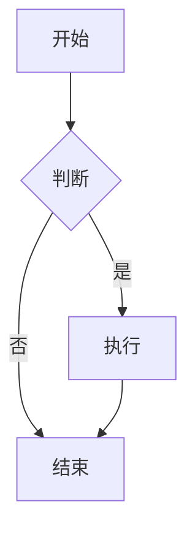
````

### 1.3 支持的图表类型

| 图表类型     | 关键字            | 用途               |
| :----------- | :---------------- | :----------------- |
| **流程图**   | `graph`           | 算法流程、业务流程 |
| **时序图**   | `sequenceDiagram` | 交互流程、API 调用 |
| **甘特图**   | `gantt`           | 项目进度、任务排期 |
| **类图**     | `classDiagram`    | 面向对象设计       |
| **状态图**   | `stateDiagram-v2` | 状态机、生命周期   |
| **ER 图**    | `erDiagram`       | 数据库设计         |
| **饼图**     | `pie`             | 数据占比           |
| **思维导图** | `mindmap`         | 知识结构           |
| **Git 图**   | `gitGraph`        | 分支策略           |

## 2. 流程图

### 2.1 方向

| 关键字      | 方向     |
| :---------- | :------- |
| `TB` / `TD` | 从上到下 |
| `BT`        | 从下到上 |
| `LR`        | 从左到右 |
| `RL`        | 从右到左 |

### 2.2 节点形状

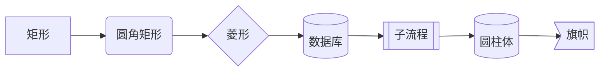

| 语法       | 形状     | 用途      |
| :--------- | :------- | :-------- |
| `[文本]`   | 矩形     | 普通步骤  |
| `(文本)`   | 圆角矩形 | 开始/结束 |
| `{文本}`   | 菱形     | 判断/条件 |
| `[(文本)]` | 圆柱体   | 数据库    |
| `[[文本]]` | 子流程   | 子过程    |
| `((文本))` | 圆形     | 连接点    |

### 2.3 连接线

| 语法 | 样式 | 说明 |
| :----- | :--------- | :-------- | ------ | -------- |
| `-->` | 实线箭头 | 默认连接 |
| `---` | 实线无箭头 | 无方向 |
| `-.->` | 虚线箭头 | 可选/条件 |
| `==>` | 粗线箭头 | 强调 |
| `-->   | 文本       | ` | 带标签 | 条件说明 |

### 2.4 完整示例

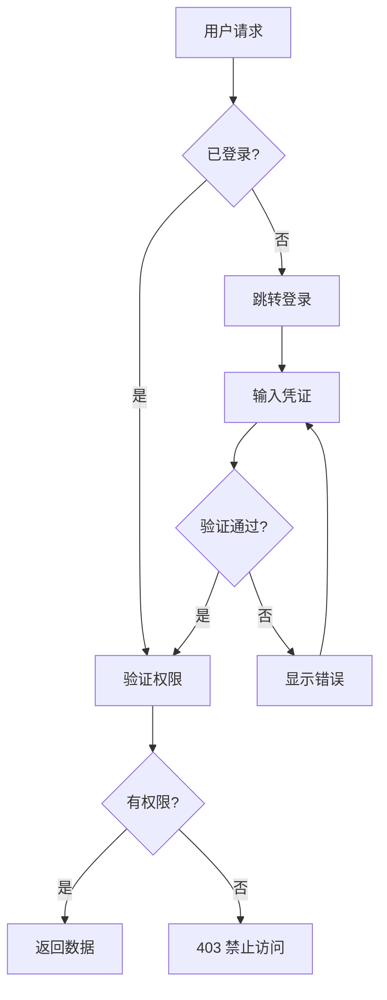

## 3. 时序图

### 3.1 基本语法

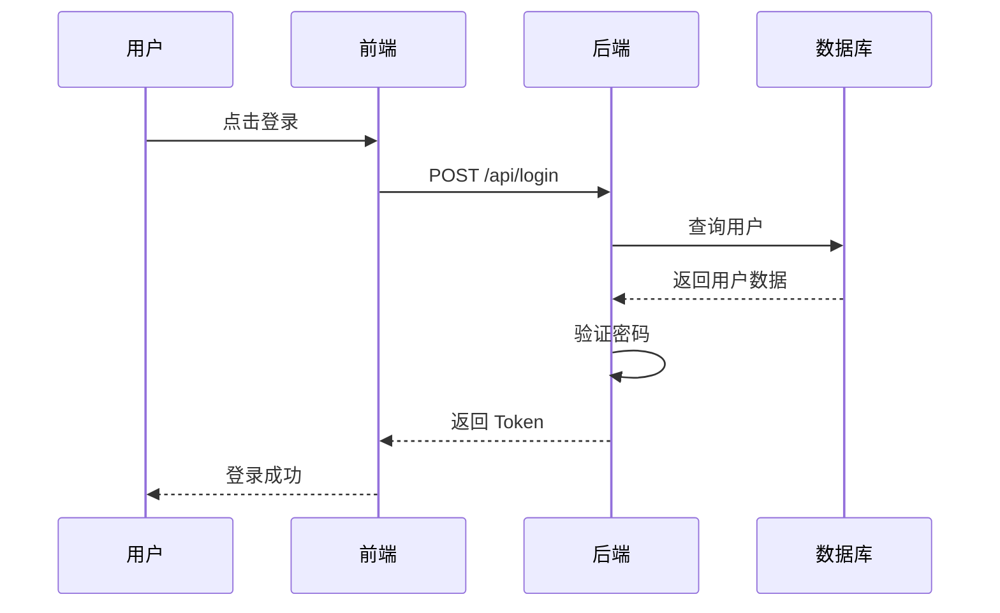

### 3.2 消息类型

| 语法   | 样式         | 说明      |
| :----- | :----------- | :-------- |
| `->>`  | 实线箭头     | 同步请求  |
| `-->>` | 虚线箭头     | 返回/响应 |
| `--)`  | 实线开放箭头 | 异步消息  |
| `--)`  | 虚线开放箭头 | 异步响应  |

### 3.3 高级特性

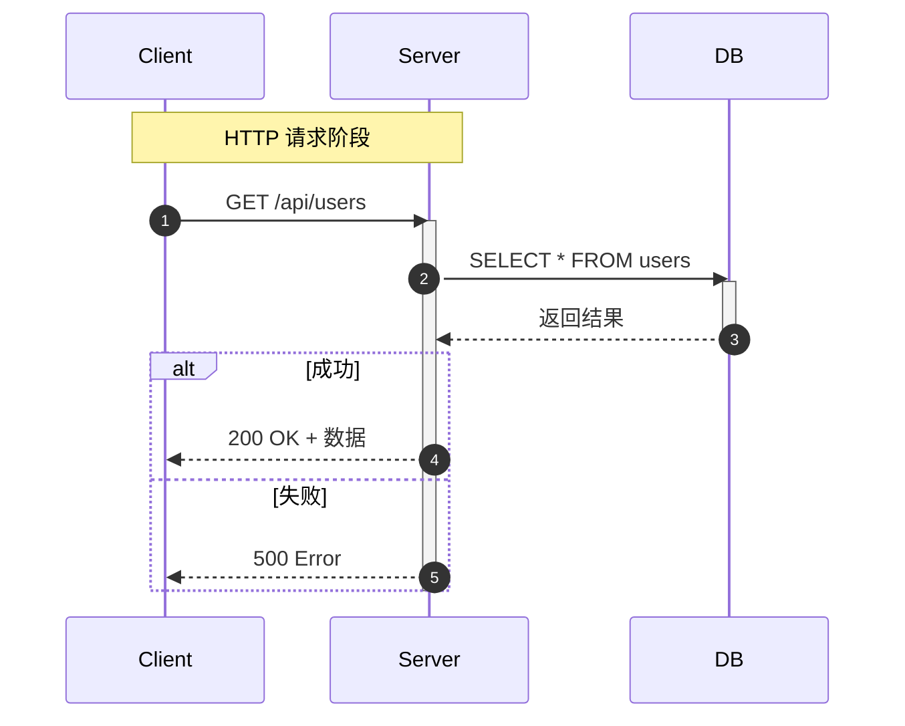

- `autonumber`：自动编号
- `Note over A,B`：跨参与者注释
- `activate`/`deactivate`：显示激活状态
- `alt`/`else`：条件分支
- `loop`：循环
- `opt`：可选

## 4. 甘特图

### 4.1 基本语法

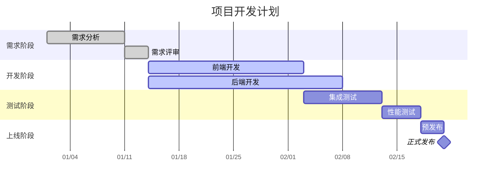

### 4.2 任务状态

| 关键字      | 样式             | 说明           |
| :---------- | :--------------- | :------------- |
| `done`      | 已完成（灰色）   | 已完成的任务   |
| `active`    | 进行中（蓝色）   | 当前执行的任务 |
| （默认）    | 未开始（浅色）   | 待执行的任务   |
| `milestone` | 里程碑（菱形）   | 关键节点       |
| `crit`      | 关键路径（红色） | 必须按时完成   |

## 5. 类图

### 5.1 基本语法

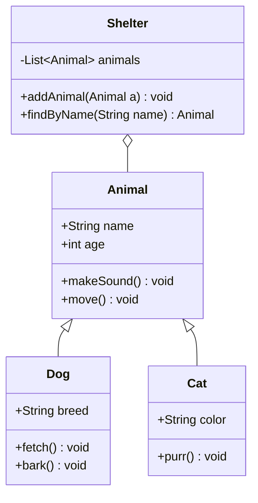

### 5.2 关系类型

| 语法    | 关系         | 说明                 |
| :------ | :----------- | :------------------- |
| `<\|--` | 继承         | 子类继承父类         |
| `*\--`  | 组合         | 强拥有，生命周期一致 |
| `o--`   | 聚合         | 弱拥有，可独立存在   |
| `-->`   | 关联         | 单向引用             |
| `--`    | 关联（双向） | 双向引用             |
| `..>`   | 依赖         | 使用关系             |
| `..\|>` | 实现         | 接口实现             |

## 6. 状态图

### 6.1 基本语法

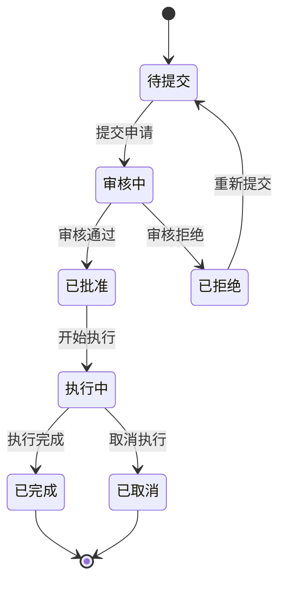

### 6.2 复合状态

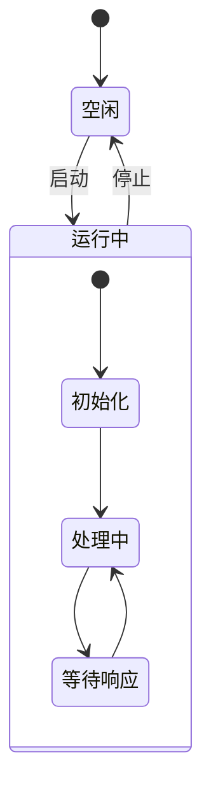

## 7. 平台支持

| 平台           | Mermaid 支持 | 说明                |
| :------------- | :----------- | :------------------ |
| **GitHub**     |              | 原生支持            |
| **GitLab**     |              | 原生支持            |
| **Obsidian**   |              | 原生支持            |
| **Typora**     |              | 原生支持            |
| **Hugo**       |              | 需 shortcode 或插件 |
| **Jekyll**     |              | 需插件              |
| **CommonMark** |              | 不支持              |

## 8. 调试技巧

- 使用 [Mermaid Live Editor](https://mermaid.live/) 在线编辑和预览
- 语法错误时图表不渲染，检查控制台错误信息
- 节点 ID 不能包含空格，使用文本标签代替
- 中文文本在某些渲染器中可能需要引号包裹
## 代码块基础

**基本写法：插入 Mermaid 图表**
` ```mermaid ` 与 ` ``` `
````markdown
# 用 mermaid 代码块标识图表

````
---

## 流程图（flowchart）

**基本写法：基础流程图**
`graph <方向>`
`    <节点A> --> <节点B>`
````markdown
# 自上而下的流程图
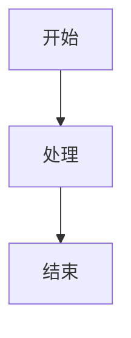
````

---

**基本写法：图表方向**
`graph <方向>`
````markdown
# TD/TB 自上而下，LR 从左到右，RL 从右到左，BT 自下而上
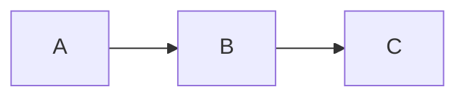
````

---

**基本写法：节点形状**
`<节点>[<文本>]`、`<节点>(<文本>)`、`<节点>{<文本>}`
````markdown
# 不同括号表示不同形状
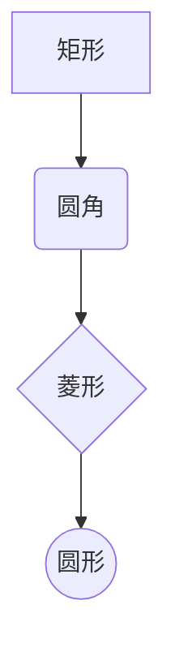
````

---

**基本写法：带文本的连线**
`<节点A> -- <文本> --> <节点B>`
````markdown
# 连线上标注说明文字
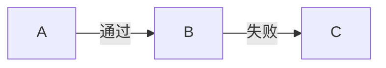
````

---

**基本写法：虚线与粗线**
`<节点A> -.-> <节点B>`、`<节点A> ==> <节点B>`
````markdown
# 虚线箭头与粗线箭头
```mermaid
graph LR
    A -.-> B
    B ==> C
```
````

---

**基本写法：子图分组**
`subgraph <名称>` ... `end`
````markdown
# 用子图对节点分组
```mermaid
graph TB
    subgraph 前端
        A[页面]
    end
    subgraph 后端
        B[API]
    end
    A --> B
```
````

---

## 时序图（sequence）

**基本写法：基础时序图**
`sequenceDiagram`
`    <参与者A>->> <参与者B>: <消息>`
````markdown
# 参与者之间的消息交互
```mermaid
sequenceDiagram
    participant User
    participant Server
    User->>Server: 请求登录
    Server-->>User: 返回 token
```
````

---

**基本写法：参与者别名**
`participant <别名> as <显示名>`
````markdown
# 为参与者设置显示别名
```mermaid
sequenceDiagram
    participant U as 用户
    participant S as 服务器
    U->>S: GET /api/users
```
````

---

**基本写法：消息类型**
`->>` 实线箭头，`-->>` 虚线箭头，`--)` 异步实线
````markdown
# 不同箭头表示不同消息类型
```mermaid
sequenceDiagram
    A->>B: 同步请求
    B-->>A: 同步响应
    A--)B: 异步通知
```
````

---

**基本写法：激活与停用**
`activate <参与者>` 与 `deactivate <参与者>`
````markdown
# 标记参与者激活时段
```mermaid
sequenceDiagram
    A->>B: 请求
    activate B
    B-->>A: 响应
    deactivate B
```
````

---

**基本写法：注释与分组**
`Note over <参与者>: <说明>`、`loop <描述>` ... `end`
````markdown
# 添加注释与循环块
```mermaid
sequenceDiagram
    participant A
    participant B
    loop 每分钟
        A->>B: 心跳
        Note over B: 处理心跳
    end
```
````

---

**基本写法：条件分支**
`alt <条件>` ... `else` ... `end`
````markdown
# 条件分支结构
```mermaid
sequenceDiagram
    A->>B: 请求
    alt 成功
        B-->>A: 数据
    else 失败
        B-->>A: 错误
    end
```
````

---

## 类图（class）

**基本写法：基础类图**
`classDiagram`
`    class <类名>`
````markdown
# 定义类与属性
```mermaid
classDiagram
    class User {
        +String name
        +Integer age
        +login() Boolean
    }
```
````

---

**基本写法：类关系**
`<类A> <关系> <类B>`
````markdown
# 不同箭头表示继承、组合、聚合等关系
```mermaid
classDiagram
    Animal <|-- Dog
    Animal <|-- Cat
    Car *-- Wheel
    School o-- Student
```
````

---

**基本写法：可见性修饰**
`+` 公有、`-` 私有、`#` 受保护、`~` 包内
````markdown
# 用符号标注成员可见性
```mermaid
classDiagram
    class Account {
        +String id
        -String password
        #Integer balance
        ~String nickname
    }
```
````

---

## 状态图（state）

**基本写法：基础状态图**
`stateDiagram-v2`
`    [*] --> <状态>`
````markdown
# 状态转换图
```mermaid
stateDiagram-v2
    [*] --> 待支付
    待支付 --> 已支付: 支付成功
    已支付 --> 已发货: 商家发货
    已发货 --> [*]: 确认收货
```
````

---

**基本写法：状态描述**
`<状态>: <说明>`
````markdown
# 状态下方写详细描述
```mermaid
stateDiagram-v2
    [*] --> Active
    Active: 活动状态
    Active: 正在处理请求
    Active --> Inactive: 暂停
```
````

---

**基本写法：复合状态**
`state <名称> {` ... `}`
````markdown
# 嵌套的复合状态
```mermaid
stateDiagram-v2
    [*] --> 运行中
    state 运行中 {
        [*] --> 加载
        加载 --> 就绪
    }
    运行中 --> [*]: 停止
```
````

---

**基本写法：分支状态**
`<<choice>>` 与条件分支
````markdown
# 用 choice 实现条件分支
```mermaid
stateDiagram-v2
    [*] --> 检查
    state 检查 <<choice>>
    检查 --> 通过: 成功
    检查 --> 拒绝: 失败
    通过 --> [*]
    拒绝 --> [*]
```
````

---

## 甘特图（gantt）

**基本写法：基础甘特图**
`gantt`
`    dateFormat <格式>`
````markdown
# 项目任务时间线
```mermaid
gantt
    title 项目计划
    dateFormat YYYY-MM-DD
    section 设计
    需求分析 :a1, 2024-01-01, 5d
    原型设计 :after a1, 3d
    section 开发
    编码 :2024-01-10, 10d
```
````

---

**基本写法：任务状态**
`done`、`active`、`crit`
````markdown
# 标记任务状态与关键路径
```mermaid
gantt
    dateFormat YYYY-MM-DD
    section 阶段一
    已完成 :done, a1, 2024-01-01, 3d
    进行中 :active, a2, after a1, 5d
    关键任务 :crit, a3, after a2, 4d
```
````

---

## 饼图（pie）

**基本写法：基础饼图**
`pie title <标题>`
`    "<标签>" : <数值>`
````markdown
# 用饼图展示占比
```mermaid
pie title 浏览器市场份额
    "Chrome" : 65
    "Safari" : 18
    "Edge" : 5
    "其他" : 12
```
````

---

## 用户旅程图（journey）

**基本写法：基础旅程图**
`journey`
`    title <标题>`
````markdown
# 描述用户体验旅程
```mermaid
journey
    title 用户购物流程
    section 浏览
      访问首页: 5: 用户
      搜索商品: 4: 用户
    section 下单
      加入购物车: 5: 用户
      提交订单: 3: 用户, 系统
```
````

---

## 主题与样式

**基本写法：自定义节点样式**
`style <节点> fill:<颜色>,stroke:<颜色>`
````markdown
# 修改节点颜色样式
```mermaid
graph TD
    A[开始] --> B[处理]
    style A fill:#f9f,stroke:#333
    style B fill:#bbf,stroke:#369
```
````

---

**基本写法：定义类样式**
`classDef <类名> fill:<颜色>,stroke:<颜色>`
`class <节点> <类名>`
````markdown
# 用 classDef 复用样式
```mermaid
graph LR
    A --> B --> C
    classDef highlight fill:#ff9,stroke:#333
    class B highlight
```
````

---

## 链接与交互

**基本写法：节点绑定链接**
`click <节点> "<URL>"`
````markdown
# 点击节点跳转链接
```mermaid
graph TD
    A[文档] --> B[官网]
    click A "https://example.com/docs"
    click B "https://example.com"
```
````

---

**基本写法：节点回调函数**
`click <节点> call <函数>`
````markdown
# 点击节点调用 JavaScript 函数
```mermaid
graph TD
    A[按钮] --> B[处理]
    click A call handleButtonClick()
```
````

<!-- ============ 文档分隔线：002-markdown/016-EditorFeature.md ============ -->

## 1. 编辑器类型

### 1.1 编辑器分类

| 类型           | 代表                 | 特点               |
| :------------- | :------------------- | :----------------- |
| **所见即所得** | Typora、Notion       | 编辑即预览，无分屏 |
| **分屏预览**   | VS Code、Obsidian    | 左编辑右预览       |
| **纯文本**     | Vim、Sublime Text    | 无预览，专注编辑   |
| **在线编辑**   | StackEdit、Dillinger | 浏览器中使用       |
| **平台内置**   | GitHub、GitLab       | 平台集成编辑器     |

### 1.2 选型建议

| 需求         | 推荐            | 理由               |
| :----------- | :-------------- | :----------------- |
| **长文写作** | Typora          | 所见即所得，沉浸式 |
| **技术文档** | VS Code         | 插件丰富，Git 集成 |
| **知识管理** | Obsidian        | 双链笔记、插件生态 |
| **快速编辑** | Vim / Nano      | 服务器环境         |
| **协作编辑** | Notion / HackMD | 实时协作           |

## 2. 实时预览

### 2.1 预览模式

| 模式           | 说明               | 适用场景     |
| :------------- | :----------------- | :----------- |
| **并排预览**   | 编辑区和预览区并排 | 对比查看效果 |
| **内联预览**   | 编辑区内直接渲染   | 快速确认格式 |
| **全屏预览**   | 只显示渲染结果     | 最终效果检查 |
| **所见即所得** | 编辑即渲染         | 长文写作     |

### 2.2 VS Code 预览

```bash
# 打开预览
Ctrl+Shift+V    # Windows/Linux
Cmd+Shift+V     # macOS

# 侧边预览
Ctrl+K V        # Windows/Linux（先按 Ctrl+K，松开后按 V）
Cmd+K V         # macOS
```

### 2.3 Obsidian 预览

Obsidian 支持三种编辑模式：

- **实时预览**：编辑时即时渲染 Markdown 语法
- **源码模式**：显示原始 Markdown 文本
- **阅读模式**：只读渲染视图

## 3. 快捷键

### 3.1 通用快捷键

| 操作         | VS Code        | Typora         | Obsidian     |
| :----------- | :------------- | :------------- | :----------- |
| **加粗**     | `Ctrl+B`       | `Ctrl+B`       | `Ctrl+B`     |
| **斜体**     | `Ctrl+I`       | `Ctrl+I`       | `Ctrl+I`     |
| **插入链接** | `Ctrl+K`       | `Ctrl+K`       | `Ctrl+K`     |
| **代码**     | `` Ctrl+` ``   | `` Ctrl+` ``   | `` Ctrl+` `` |
| **标题**     | `Ctrl+Shift+]` | `Ctrl+1~6`     | `Ctrl+1~6`   |
| **有序列表** | —              | `Ctrl+Shift+[` | —            |
| **无序列表** | —              | `Ctrl+Shift+]` | —            |
| **引用**     | —              | `Ctrl+Shift+Q` | —            |

### 3.2 VS Code Markdown 快捷键

| 操作         | 快捷键                  | 说明           |
| :----------- | :---------------------- | :------------- |
| **预览**     | `Ctrl+Shift+V`          | 打开预览标签   |
| **侧边预览** | `Ctrl+K V`              | 并排预览       |
| **全屏预览** | 预览中按 `Ctrl+Shift+V` | 切换全屏       |
| **目录**     | 预览中点击标题          | 跳转到对应位置 |

### 3.3 Typora 快捷键

| 操作           | 快捷键         | 说明           |
| :------------- | :------------- | :------------- |
| **源码模式**   | `Ctrl+/`       | 切换源码/渲染  |
| **专注模式**   | `F8`           | 高亮当前行     |
| **打字机模式** | `F9`           | 当前行居中     |
| **大纲**       | `Ctrl+Shift+O` | 显示文档大纲   |
| **插入表格**   | `Ctrl+T`       | 可视化创建表格 |
| **插入图片**   | `Ctrl+Shift+I` | 插入图片       |
| **高亮**       | `Ctrl+Shift+H` | `==高亮==`     |

## 4. 高效编辑技巧

### 4.1 代码片段（Snippets）

VS Code 中可以自定义 Markdown 代码片段：

````json
// .vscode/markdown.code-snippets
{
  "Markdown Table": {
    "prefix": "mdtable",
    "body": ["| ${1:列1} | ${2:列2} | ${3:列3} |", "| --- | --- | --- |", "| $0 |  |  |"],
    "description": "插入 Markdown 表格"
  },
  "Markdown Code Block": {
    "prefix": "mdcode",
    "body": ["```${1:language}", "$0", "```"],
    "description": "插入代码块"
  },
  "Markdown Note": {
    "prefix": "mdnote",
    "body": ["> **注意**: $0"],
    "description": "插入注意框"
  }
}
````

### 4.2 自动补全

| 触发           | 补全内容 | 说明     |
| :------------- | :------- | :------- |
| `#` + 空格     | 标题     | ATX 标题 |
| `-` + 空格     | 无序列表 | 列表项   |
| `1.` + 空格    | 有序列表 | 编号列表 |
| `>` + 空格     | 引用块   | 引用     |
| ` ``` ` + 语言 | 代码围栏 | 代码块   |
| `---` + 回车   | 分隔线   | 水平线   |

### 4.3 粘贴图片

| 编辑器       | 方式     | 说明               |
| :----------- | :------- | :----------------- |
| **Typora**   | 直接粘贴 | 自动保存到指定目录 |
| **VS Code**  | 需插件   | Paste Image 插件   |
| **Obsidian** | 直接粘贴 | 自动保存到附件目录 |
| **GitHub**   | 拖拽上传 | 自动上传到仓库     |

### 4.4 文件管理

```bash
# VS Code Markdown 相关插件
# - Markdown All in One: 快捷键、目录、预览
# - Markdown Preview Enhanced: 增强预览、Mermaid、数学公式
# - markdownlint: 语法检查
# - Paste Image: 粘贴图片
# - Markdown Table Formatter: 表格格式化
```

## 5. 语法检查

### 5.1 markdownlint

markdownlint 是 Markdown 代码质量工具，检查常见问题：

| 规则       | 编号  | 说明                  |
| :--------- | :---- | :-------------------- |
| 标题层级   | MD001 | 标题应按层级递进      |
| 首行标题   | MD041 | 文件首行应为顶级标题  |
| 行长度     | MD013 | 行长度限制（默认 80） |
| 空格       | MD009 | 行尾不应有尾随空格    |
| 代码块语言 | MD040 | 代码围栏应指定语言    |
| 重复链接   | MD034 | 应使用引用式链接      |

### 5.2 配置

```json
// .markdownlint.json
{
  "MD013": {
    "line_length": 120
  },
  "MD033": false,
  "MD041": false
}
```

<!-- ============ 文档分隔线：002-markdown/017-LinkImage.md ============ -->

> **认知导入（Layer 0 生存层）**
> 前置知识：006 列表语法。
> 边界说明：链接与图片让文档从“文字”变成“网页内容”；图片路径写错时渲染为占位图，这是最常见的报错场景。
> 强制练习：写一个链接 `[文字](https://example.com)` 和一个本地图片 ``；故意把图片路径写错，观察占位效果。

## 1. 链接 (Links)

### 1.1 行内链接 (Inline Links)

**语法**：`[链接文本](URL "可选的标题")`
**示例**：

```markdown
[GitHub](https://github.com 'GitHub 官方网站')
[Markdown 指南](https://www.markdownguide.org)
```

**渲染效果**：
[GitHub](https://github.com 'GitHub 官方网站')
[Markdown 指南](https://www.markdownguide.org)

### 1.2 引用链接 (Reference Links)

**语法**：

```markdown
[链接文本][引用标识符]
[引用标识符]: URL "可选的标题"
```

**示例**：

```markdown
[GitHub][github]
[Markdown 指南][md-guide]
[github]: https://github.com "GitHub 官方网站"
[md-guide]: https://www.markdownguide.org "Markdown 官方指南"
```

**渲染效果**：
[GitHub][github]
[Markdown 指南][md-guide]
[github]: https://github.com "GitHub 官方网站"
[md-guide]: https://www.markdownguide.org "Markdown 官方指南"

### 1.3 自动链接 (Auto Links)

**语法**：`<URL>` 或 `<电子邮件地址>`
**示例**：

```markdown
<https://github.com>
<example@example.com>
```

**渲染效果**：
<https://github.com>
<example@example.com>

### 1.4 相对链接 (Relative Links)

**语法**：使用相对路径指向本地文件或目录
**示例**：

```markdown
[README 文件](./README.md)
[图片目录](../assets/)
```

**渲染效果**：
[README 文件](../README.md)
[图片目录](../)

## 2. 图片 (Images)

### 2.1 基本语法

**语法**：``
**示例**：

```markdown

```

**渲染效果**：


### 2.2 引用图片

**语法**：

```markdown
![替代文本][图片引用标识符]
[图片引用标识符]: 图片URL "可选的标题"
```

**示例**：

```markdown
![GitHub Logo][github-logo]
[github-logo]: https://github.githubassets.com/images/modules/logos_page/GitHub-Mark.png "GitHub Logo"
```

**渲染效果**：
![GitHub Logo][github-logo]
[github-logo]: https://github.githubassets.com/images/modules/logos_page/GitHub-Mark.png "GitHub Logo"

### 2.3 本地图片

**语法**：使用相对路径指向本地图片文件
**示例**：

```markdown

```

### 2.4 图片链接

**语法**：将图片嵌套在链接中
**示例**：

```markdown
[](https://github.com)
```

**渲染效果**：
[](https://github.com)

## 3. 最佳实践

### 3.1 链接最佳实践

1. **使用描述性的链接文本**：链接文本应该清晰地描述链接的目标，避免使用"点击这里"等模糊描述
2. **添加标题属性**：对于重要的链接，添加标题属性可以提供更多上下文信息
3. **使用引用链接**：对于重复使用的链接，使用引用链接可以使代码更整洁
4. **检查链接有效性**：定期检查链接是否仍然有效

### 3.2 图片最佳实践

1. **添加替代文本**：为图片添加有意义的替代文本，提高可访问性
2. **优化图片大小**：确保图片大小适中，避免影响页面加载速度
3. **使用相对路径**：对于本地图片，使用相对路径可以确保在不同环境中都能正确显示
4. **添加图片标题**：对于复杂图片，添加标题可以提供更多信息

### 3.3 组织图片资源

1. **创建专门的图片目录**：如 `assets/` 或 `images/` 目录
2. **使用一致的命名规范**：如 `feature-image.png` 或 `step-1-screenshot.png`
3. **分类存储**：根据用途或主题对图片进行分类存储

## 4. 常见问题与解决方案

### 4.1 图片不显示

**问题**：图片无法正常显示
**解决方案**：

- 检查图片路径是否正确
- 确保图片文件存在
- 检查网络连接是否正常
- 对于本地图片，确保使用正确的相对路径

### 4.2 链接失效

**问题**：链接点击后无法访问目标页面
**解决方案**：

- 检查 URL 是否正确
- 确保目标网站仍然存在
- 对于本地文件，确保文件路径正确
- 检查是否需要添加 `http://` 或 `https://` 前缀

### 4.3 图片大小控制

**问题**：图片显示过大或过小
**解决方案**：

- 在 Markdown 中，基本语法不支持直接控制图片大小
- 可以使用 HTML 标签来控制图片大小：

```html

```

- 或者在 CSS 中设置图片样式

## 5. 扩展语法

### 5.1 GitHub Flavored Markdown (GFM)

**任务列表**：

```markdown
- [x] 完成任务 1
- [ ] 完成任务 2
```

**渲染效果**：

- [x] 完成任务 1
- [ ] 完成任务 2
- [ ] 完成任务 3

### 5.2 表格中的链接和图片

**示例**：

```markdown
| 名称   | 链接                         | 图标                                                                                 |
| ------ | ---------------------------- | ------------------------------------------------------------------------------------ |
| GitHub | [GitHub](https://github.com) |  |
| Google | [Google](https://google.com) |                                         |
```

**渲染效果**：

| 名称   | 链接                         | 图标                                                                                 |
| ------ | ---------------------------- | ------------------------------------------------------------------------------------ |
| GitHub | [GitHub](https://github.com) |  |
| Google | [Google](https://google.com) |                                         |

## 6. 总结

Markdown 提供了简洁而强大的语法来添加链接和图片，使文档更加丰富和有吸引力。通过掌握这些语法，你可以创建包含外部链接、内部链接、图片和图片链接的文档。
在使用链接和图片时，遵循最佳实践可以确保文档的可访问性、可靠性和美观度。同时，了解常见问题的解决方案可以帮助你快速解决在使用过程中遇到的问题。

---

## 行内链接

**单行写法：基本行内链接**
`[<链接文本>](<URL>)`
```markdown
[Markdown 指南](https://www.markdownguide.org)
```

**单行写法：带标题的行内链接**
`[<链接文本>](<URL> "<标题>")`
```markdown
[GitHub](https://github.com "GitHub 官方网站")
```

---

## 引用链接

**换行写法：定义引用链接**
`[<链接文本>][<引用标识符>]\n[<引用标识符>]: <URL> ["<标题>"]`
```markdown
[GitHub][github]

[github]: https://github.com "GitHub 官方网站"
```

---

## 自动链接

**单行写法：URL 自动链接**
`<<URL>>`
```markdown
<https://github.com>
```

**单行写法：邮箱自动链接**
`<<邮箱>>`
```markdown
<user@example.com>
```

---

## 相对链接

**单行写法：指向本地文件**
`[<链接文本>](<相对路径>)`
```markdown
[README 文件](./README.md)
```

**单行写法：指向上级目录**
`[<链接文本>](<相对路径>)`
```markdown
[图片目录](../assets/)
```

---

## 基本图片

**单行写法：插入图片**
``
```markdown

```

**单行写法：带标题的图片**
``
```markdown

```

---

## 引用图片

**换行写法：定义引用图片**
`![<替代文本>][<图片引用标识符>]\n[<图片引用标识符>]: <图片URL> ["<标题>"]`
```markdown
![GitHub Logo][github-logo]

[github-logo]: https://github.githubassets.com/logo.png "GitHub Logo"
```

---

## 本地图片

**单行写法：使用相对路径插入本地图片**
``
```markdown

```

---

## 图片链接

**单行写法：将图片嵌套在链接中**
`[](<链接URL>)`
```markdown
[](https://github.com)
```

---

## 图片大小控制

**单行写法：使用 HTML img 标签控制大小**
`" alt="<替代文本>" width="<宽>" height="<高>" />`
```markdown

```

**单行写法：仅控制宽度**
`" alt="<替代文本>" width="<宽>" />`
```markdown

```

<!-- ============ 文档分隔线：002-markdown/018-ConversionTool.md ============ -->

## 1. 转换工具概述

### 1.1 为什么需要转换

Markdown 虽然轻量灵活，但在某些场景需要转换为其他格式：

| 目标格式   | 场景           | 工具           |
| :--------- | :------------- | :------------- |
| **HTML**   | 网页发布       | 各渲染器       |
| **PDF**    | 打印、正式文档 | Pandoc、Typora |
| **Word**   | 企业协作       | Pandoc         |
| **LaTeX**  | 学术论文       | Pandoc         |
| **幻灯片** | 演示文稿       | Pandoc、Marp   |
| **EPUB**   | 电子书         | Pandoc         |

### 1.2 工具对比

| 工具           | 支持格式   | 特点                 |
| :------------- | :--------- | :------------------- |
| **Pandoc**     | 40+ 种格式 | 万能转换器，功能最强 |
| **Typora**     | HTML/PDF   | 所见即所得导出       |
| **Marp**       | PDF/PPTX   | Markdown 演示文稿    |
| **mdbook**     | HTML       | 在线书籍             |
| **Docusaurus** | HTML       | 技术文档网站         |

## 2. Pandoc 安装

### 2.1 安装方式

```bash
# macOS
brew install pandoc

# Ubuntu/Debian
sudo apt install pandoc

# Windows
# 从 https://pandoc.org/installing.html 下载安装包
# 或使用 Chocolatey
choco install pandoc

# 验证安装
pandoc --version
```

### 2.2 PDF 导出依赖

导出 PDF 需要额外的 LaTeX 引擎：

```bash
# 推荐：安装 TinyTeX（轻量 TeX 发行版）
curl -L https://tinyurl.com/install-tinytex | sh

# 或安装完整 TeX Live
sudo apt install texlive-full    # Linux
brew install --cask mactex       # macOS

# 中文支持
sudo apt install texlive-lang-chinese
# 或在 TinyTeX 中安装
tlmgr install cjkpunct ctex xecjk
```

## 3. Pandoc 基础用法

### 3.1 基本转换

```bash
# Markdown → HTML
pandoc input.md -o output.html

# Markdown → PDF
pandoc input.md -o output.pdf

# Markdown → Word
pandoc input.md -o output.docx

# Markdown → LaTeX
pandoc input.md -o output.tex

# Markdown → 幻灯片（Beamer）
pandoc input.md -t beamer -o slides.pdf
```

### 3.2 指定输入输出格式

```bash
# 显式指定格式
pandoc -f markdown -t html input.md -o output.html

# 从 HTML 转 Markdown
pandoc -f html -t markdown input.html -o output.md

# 从 Word 转 Markdown
pandoc -f docx -t markdown input.docx -o output.md
```

### 3.3 支持的格式

| 输入格式                  | 输出格式            |
| :------------------------ | :------------------ |
| Markdown, CommonMark, GFM | HTML, HTML5         |
| LaTeX, reStructuredText   | PDF（通过 LaTeX）   |
| Word (docx), EPUB         | Word (docx)         |
| Org-mode, Textile         | EPUB, FB2           |
| HTML, DocBook             | LaTeX, Beamer       |
| JATS, OPML                | S5, Slidy, DZSlides |
| CSV, TSV                  | RTF, ODT            |
| Native Pandoc             | AsciiDoc, man       |

## 4. 高级用法

### 4.1 YAML 元数据

```markdown
---
title: '我的文档'
author: '张三'
date: '2026-06-14'
lang: zh-CN
geometry: margin=2.5cm
fontsize: 12pt
toc: true
numbersections: true
---

# 第一章

正文内容...
```

```bash
# 使用元数据生成带目录的 PDF
pandoc input.md -o output.pdf \
  --pdf-engine=xelatex \
  -V CJKmainfont="SimSun"
```

### 4.2 模板

```bash
# 使用自定义模板
pandoc input.md -o output.html --template=my-template.html

# 列出默认模板
pandoc -D html    # HTML 模板
pandoc -D latex   # LaTeX 模板
pandoc -D docx    # Word 模板（引用文档）

# 导出默认模板用于修改
pandoc -D html > my-template.html
```

### 4.3 过滤器

Pandoc 过滤器可以在转换过程中修改文档结构：

```bash
# 使用 Python 过滤器
pandoc input.md --filter=filter.py -o output.html

# 使用 Lua 过滤器（更快）
pandoc input.md --lua-filter=filter.lua -o output.html
```

```lua
-- Lua 过滤器示例：为所有链接添加 target="_blank"
function Link(el)
  el.attributes.target = "_blank"
  el.attributes.rel = "noopener noreferrer"
  return el
end
```

### 4.4 数学公式

```bash
# LaTeX 数学公式 → MathJax（HTML）
pandoc input.md -o output.html --mathjax

# LaTeX 数学公式 → KaTeX
pandoc input.md -o output.html --katex

# LaTeX 数学公式 → 原生 LaTeX（PDF）
pandoc input.md -o output.pdf --pdf-engine=xelatex
```

## 5. 中文支持

### 5.1 PDF 中文导出

```bash
# 使用 XeLaTeX 引擎（推荐）
pandoc input.md -o output.pdf \
  --pdf-engine=xelatex \
  -V CJKmainfont="Source Han Sans CN" \
  -V mainfont="Source Han Sans CN" \
  -V monofont="Source Code Pro"

# 使用 ctex 文档类
pandoc input.md -o output.pdf \
  --pdf-engine=xelatex \
  -V documentclass=ctexart \
  -V geometry:margin=2.5cm
```

### 5.2 常见中文字体

| 字体                    | 说明     | 适用场景     |
| :---------------------- | :------- | :----------- |
| **Source Han Sans CN**  | 思源黑体 | 正文、标题   |
| **Source Han Serif CN** | 思源宋体 | 正式文档     |
| **SimSun**              | 宋体     | Windows 默认 |
| **STSong**              | 华文宋体 | macOS        |
| **FangSong**            | 仿宋     | 公文         |

## 6. 实用脚本

### 6.1 批量转换

```bash
# 将目录下所有 Markdown 文件转为 HTML
for file in *.md; do
  pandoc "$file" -o "${file%.md}.html" --standalone --metadata title="${file%.md}"
done
```

### 6.2 生成幻灯片

```bash
# Markdown → Reveal.js 幻灯片
pandoc slides.md -t revealjs -o slides.html \
  --standalone \
  -V revealjs-url=https://cdn.jsdelivr.net/npm/reveal.js@4

# Markdown → Beamer PDF 幻灯片
pandoc slides.md -t beamer -o slides.pdf \
  --pdf-engine=xelatex \
  -V documentclass=ctexbeamer
```

### 6.3 合并文档

```bash
# 合并多个 Markdown 文件为一本书
pandoc chapter1.md chapter2.md chapter3.md \
  -o book.pdf \
  --pdf-engine=xelatex \
  -V documentclass=ctexbook \
  --toc \
  -V toc-title="目录"
```

<!-- ============ 文档分隔线：002-markdown/019-AutoTOC.md ============ -->

## 1. 自动目录概述

### 1.1 为什么需要自动目录

自动目录（Table of Contents, TOC）根据文档标题自动生成导航结构，核心价值：

- **快速导航**：点击目录项跳转到对应章节
- **文档概览**：一目了然地了解文档结构
- **自动更新**：标题变更时目录自动同步

### 1.2 实现方式

| 方式          | 语法         | 适用平台        |
| :------------ | :----------- | :-------------- |
| **`[TOC]`**   | `[TOC]`      | 部分编辑器      |
| **`[[toc]]`** | `[[toc]]`    | VuePress 等     |
| **`{:toc}`**  | `{:toc}`     | Jekyll/Kramdown |
| **Pandoc**    | `--toc` 参数 | Pandoc          |
| **HTML 手动** | 锚点链接     | 通用            |

## 2. 各平台目录语法

### 2.1 `[TOC]` 语法

最常见的目录语法，在文档中插入 `[TOC]` 即可自动生成：

```markdown
[TOC]

## 第一章 概述

### 1.1 背景

### 1.2 目标

## 第二章 方法

### 2.1 实验设计

### 2.2 数据分析
```

支持 `[TOC]` 的平台：

| 平台         | 语法     | 说明                |
| :----------- | :------- | :------------------ |
| **Typora**   | `[TOC]`  | 原生支持            |
| **VS Code**  | 需插件   | Markdown All in One |
| **Obsidian** | 无需语法 | 大纲面板自动显示    |

### 2.2 VuePress / VitePress

```markdown
[[toc]]

## 标题一

### 子标题

## 标题二
```

### 2.3 Jekyll / Kramdown

```markdown
- 目录
  {:toc}

## 标题一

## 标题二
```

### 2.4 Hugo

Hugo 使用模板变量自动生成目录：

```go
{{ .TableOfContents }}
```

### 2.5 Pandoc

```bash
# 生成带目录的文档
pandoc input.md -o output.pdf --toc

# 自定义目录标题
pandoc input.md -o output.pdf --toc -V toc-title="目录"

# 设置目录深度
pandoc input.md -o output.pdf --toc --toc-depth=3
```

## 3. GitHub 中的目录

### 3.1 README 自动目录

GitHub 不支持 `[TOC]` 语法，但可以通过以下方式实现目录：

**方案一：手动锚点链接**

```markdown
## 概述

## 安装

## 使用方法

### 基本用法

### 高级配置

## 常见问题
```

### 3.2 GitHub 锚点规则

GitHub 自动为标题生成锚点，规则如下：

| 规则           | 示例标题          | 生成的锚点         |
| :------------- | :---------------- | :----------------- |
| 转小写         | `Getting Started` | `#getting-started` |
| 空格变连字符   | `Hello World`     | `#hello-world`     |
| 移除特殊字符   | `What's New?`     | `#whats-new`       |
| 中文保留       | `安装指南`        | `#安装指南`        |
| 多个连字符合并 | `A -- B`          | `#a----b`          |

### 3.3 自动生成工具

```bash
# 使用 markdown-toc 自动生成
npx markdown-toc README.md --insert

# 使用 doctoc
npx doctoc README.md
```

## 4. 自定义目录

### 4.1 带编号的目录

```markdown
## 5. 目录深度控制

### 5.1 包含/排除级别
````

<!-- 只包含 h2 和 h3 -->

## 6. 最佳实践

### 6.1 目录放置位置

- **文档开头**：最常见，方便读者快速导航
- **固定侧边栏**：长文档推荐，始终可见
- **折叠**：中等长度文档，不占用太多空间

### 6.2 维护建议

- 使用自动生成工具，避免手动维护
- 标题命名要清晰，目录才有意义
- 控制标题层级不超过 4 级
- 长文档（超过 5 个章节）建议添加目录

<!-- ============ 文档分隔线：002-markdown/020-AnchorJump.md ============ -->

## 自动生成的标题锚点

**基本写法：标题自动生成锚点**
`## <标题>`
```markdown
# 标题自动生成锚点 id
## 安装步骤
# 锚点为 #安装步骤
```

---

**基本写法：链接到本页锚点**
`[<文本>](#<锚点>)`
```markdown
# 跳转到当前文档的某标题
[跳到安装步骤](#安装步骤)
```

---

**基本写法：英文标题锚点规则**
`## <English Title>`
```markdown
# GitHub 规则：小写、空格转横线、去特殊字符
## Getting Started
# 锚点为 #getting-started
```

---

**基本写法：中文标题锚点**
`## <中文标题>`
```markdown
# 中文标题原样作为锚点
## 中文标题
# 锚点为 #中文标题
```

---

**基本写法：带特殊字符的标题**
`## <标题 (含符号)>`
```markdown
# 特殊字符被忽略
## API v2.0 - 简介
# 锚点为 #api-v20--简介
```

---

## 重复标题处理

**基本写法：重复标题加序号**
`## <标题>` 出现多次
```markdown
# 第二次出现的标题自动加 -1，第三次加 -2
## 示例
# 第一个锚点 #示例
# 第二个锚点 #示例-1
```

---

**基本写法：手动锚点**
`## <标题> {#<自定义锚点>}`
```markdown
# 用 {#id} 指定自定义锚点（部分渲染器支持）
## 示例
# 第一个锚点 #示例
# 第二个锚点 #示例-1
```

---

**基本写法：手动锚点**
`## <标题> {#<自定义锚点>}`
```markdown
# 用 {#id} 指定自定义锚点（部分渲染器支持）
## 自定义锚点 {#my-anchor}
```

---

## 自定义锚点（HTML）

**基本写法：用 HTML 锚点**
`<a id="<锚点>"></a>`
```markdown
# 用 HTML 标签定义锚点
<a id="custom-section"></a>
## 章节内容
```

---

**基本写法：链接到自定义锚点**
`[<文本>](#<自定义锚点>)`
```markdown
# 跳转到 HTML 定义的锚点
[跳到自定义](#custom-section)
```

---

**基本写法：name 属性锚点**
`<a name="<锚点>"></a>`
```markdown
# 旧式 name 属性定义锚点
<a name="section-1"></a>
```

---

## 跨文档锚点跳转

**基本写法：链接到其他文件锚点`
`[<文本>](<文件>#<锚点>)`
```markdown
# 跳转到其他 markdown 文件的标题
[参见安装文档](install.md#安装步骤)
```

---

**基本写法：链接到 HTML 文件锚点**

`[<文本>](<文件>.html#<锚点>)`
```markdown
# 跳转到 HTML 文件的锚点
[查看页面](page.html#section)
```

---

**基本写法：绝对路径锚点**

`[<文本>](/<路径>#<锚点>)`
```markdown
# 用绝对路径跳转
[文档首页](/docs/index.md#top)
```

---

## 目录（TOC）自动生成

**基本写法：GitHub 自动目录`
`<鼠标悬停标题旁的链接图标>`
```markdown
# GitHub 在标题旁自动生成链接图标
# README 顶部会自动生成目录
## 章节一
```

---

**基本写法：VS Code 插件生成 TOC`
`通过 Markdown All in One 等插件生成`
```markdown
# 用插件自动生成目录
- [章节一](#章节一)
- [章节二](#章节二)
```

---

**基本写法：手动目录`
`- [<章节>](#<锚点>)`
```markdown
# 手动维护目录列表
## GitHub 锚点规则

**基本写法：转小写`
`<标题>` 转为 `<小写>`
```markdown
# GitHub 锚点全部小写
## Hello World
# 锚点 #hello-world
```

---

**基本写法：空格转横线`
`<空格>` 转为 `-`
```markdown
# 空格替换为横线
## Getting Started Guide
# 锚点 #getting-started-guide
```

---

**基本写法：去除特殊字符`
`<特殊字符>` 被忽略
```markdown
# 标点符号被移除
## What's New?
# 锚点 #whats-new
```

---

**基本写法：连续横线合并`
`<多个空格>` 合并为单个 `-`
```markdown
# 多个空格不产生多个横线
## A  B
# 锚点 #a--b（部分渲染器合并为 #a-b）
```

---

## 锚点实战场景

**基本写法：返回顶部`
`[返回顶部](#<顶部锚点>)`
```markdown
# 在文档末尾添加返回顶部链接
[返回顶部](#top)
```

---

**基本写法：顶部锚点定义`
`<a id="top"></a>`
```markdown
# 文档顶部定义锚点
<a id="top"></a>
# 标题
```

---

**基本写法：脚注式跳转`
`<正文>[<跳转>](#<锚点>)`
```markdown
# 文中插入跳转链接
详见 [附录](#附录)。
```

---

**基本写法：导航栏式目录`
`[<章节1>](#<锚点1>) | [<章节2>](#<锚点2>)`
```markdown
# 顶部水平导航目录
[安装](#安装) | [配置](#配置) | [使用](#使用)
```

---

## 不同渲染器差异

**基本写法：GitHub 锚点`
`[<文本>](#<小写横线格式>)`
```markdown
# GitHub 标题生成小写横线锚点
[跳转](#section-title)
```

---

**基本写法：GitLab 锚点`
`[<文本>](#<锚点>)`
```markdown
# GitLab 类似 GitHub 规则
[跳转](#section-title)
```

---

**基本写法：VuePress 自定义容器锚点`
`## <标题>`
```markdown
# VuePress 自动生成侧边栏目录与锚点
## 章节标题
```

---

**基本写法：Docusaurus 锚点`
`## <标题>`
```markdown
# Docusaurus 自动生成 TOC 与锚点
## Section Title
```

---

## 锚点链接验证

**基本写法：检查锚点有效性`
`点击链接验证跳转`
```markdown
# 提交前点击所有锚点链接验证
[测试链接](#测试锚点)
```

---

**基本写法：用工具检测`
`markdown-link-check <文件>`
```bash
# 用工具检测 markdown 链接有效性
markdown-link-check README.md
```

---

## 锚点命名规范

**基本写法：英文锚点规范`
`## <English Title>`
```markdown
# 推荐使用英文锚点避免编码问题
## Installation Steps
```

---

**基本写法：简短锚点`
`## <简短标题>`
```markdown
# 锚点尽量简短易记
## Quick Start
```

---

**基本写法：层级清晰`
`## <父章节> ### <子章节>`
```markdown
# 通过标题层级反映文档结构
## 基础
## 安装

## 配置

## 进阶
### 高级用法
```

---

## 注意事项

**基本写法：锚点区分大小写`
`[<文本>](#<精确大小写>)`
```markdown
# 锚点通常区分大小写需精确匹配
[跳转](#SectionTitle)
```

---

**基本写法：避免锚点重复`
`为重复标题指定自定义锚点`
```markdown
# 重复标题用自定义锚点区分
## 示例 {#example-1}
## 示例 {#example-2}
```

---

**基本写法：链接前后留空行`
`<段落>`
`[<链接>](#<锚点>)`
```markdown
# 链接与上下文用空行分隔避免解析问题
正文段落。

[跳转](#section)

下一段落。
```
## 1. 锚点概述

### 1.1 什么是锚点

锚点是 HTML 中的**页面内定位标记**，允许通过 URL 的片段标识符（`#` 后的部分）跳转到页面内的指定位置。

```markdown
[跳转到安装章节](#安装)

### 1.2 锚点的工作原理

```
URL: https://example.com/docs#installation
                              ↑            ↑
                           页面路径      锚点标识符

1. 浏览器加载页面
2. 查找 id="installation" 的元素
3. 滚动到该元素位置
```

## 2. 标题自动锚点

### 2.1 自动生成规则

Markdown 渲染器会自动为标题生成锚点 ID：

```markdown
## Getting Started → <h2 id="getting-started">

## Hello World! → <h2 id="hello-world">

## API v2.0 → <h2 id="api-v20">

## C++ 编程 → <h2 id="c-编程">
```

### 2.2 GitHub 锚点规则

| 规则           | 输入标题          | 生成的 ID          |
| :------------- | :---------------- | :----------------- |
| 转小写         | `Getting Started` | `getting-started`  |
| 空格→连字符    | `Hello World`     | `hello-world`      |
| 移除标点       | `What's New?`     | `whats-new`        |
| 保留中文       | `安装指南`        | `安装指南`         |
| 保留数字       | `Step 1`          | `step-1`           |
| 连续连字符合并 | `A --- B`         | `a----b`           |
| 重复 ID 加后缀 | 两个 `Hello`      | `hello`, `hello-1` |

### 2.3 各平台差异

| 平台         | 中文处理 | 重复标题     | 特殊字符 |
| :----------- | :------- | :----------- | :------- |
| **GitHub**   | 保留     | 加 `-1` 后缀 | 移除     |
| **GitLab**   | 保留     | 加 `-1` 后缀 | 移除     |
| **Hugo**     | 可配置   | 加 `-1` 后缀 | 移除     |
| **VuePress** | 可配置   | 加 `-1` 后缀 | 移除     |
| **Obsidian** | 保留     | 不重复       | 移除     |

## 3. 自定义锚点

### 3.1 HTML 方式

```markdown
<a id="custom-anchor"></a>

## 标题

内容...
```

链接到自定义锚点：

```markdown
[跳转到自定义位置](#custom-anchor)
```

### 3.2 Hugo 短代码

```markdown
## 标题 {#my-anchor}

内容...

[跳转](#my-anchor)
```

### 3.3 Kramdown 方式

```markdown
## 标题

{: #my-anchor}

[跳转](#my-anchor)
```

### 3.4 VuePress 方式

VuePress 自动为标题生成锚点，也支持自定义：

```markdown
## 标题 <MyAnchor/>

[跳转](#myanchor)
```

## 4. 跳转链接语法

### 4.1 页面内跳转

```markdown
[跳转到安装](#安装)
[跳转到配置](#配置)
[跳转到 FAQ](#常见问题)
```

### 4.2 跨页面跳转

```markdown
[跳转到其他页面的章节](./other-page.md#章节标题)
[跳转到其他页面](../guide/README.md#概述)
```

### 4.3 跨站点跳转

```markdown
[跳转到外部页面的锚点](https://example.com/docs#section)
```

## 5. 实际应用

### 5.1 README 目录

```markdown
# My Project

## 使用

### 基本用法

## FAQ
```

### 5.2 交叉引用

在长文档中引用其他章节：

```markdown
如需了解安装步骤，请参阅[安装指南](#安装指南)。

详细配置选项请参考[高级配置](#高级配置)章节。
```

### 5.3 返回顶部

```markdown
<a id="top"></a>

# 文档标题

... 长文档内容 ...

[↑ 返回顶部](#top)
```

## 6. 常见问题

### 6.1 锚点不生效

| 问题             | 原因           | 解决方案               |
| :--------------- | :------------- | :--------------------- |
| 点击无反应       | 锚点 ID 不匹配 | 检查大小写和连字符     |
| 中文锚点乱码     | URL 编码问题   | 使用英文锚点或检查编码 |
| 重复标题跳转错误 | 多个相同 ID    | 使用自定义锚点区分     |
| 跨页面跳转失败   | 路径错误       | 检查相对路径           |

### 6.2 调试技巧

```javascript
// 在浏览器控制台查看所有锚点
document.querySelectorAll('[id]').forEach((el) => {
  console.log(`#${el.id} → ${el.textContent.trim().substring(0, 30)}`);
});
```

### 6.3 最佳实践

- 优先使用英文标题，确保锚点兼容性
- 避免重复标题，或使用自定义锚点区分
- 长文档在每章末尾添加返回目录链接
- 使用自动目录生成工具而非手动维护

<!-- ============ 文档分隔线：002-markdown/021-ImageCDNAcceleration.md ============ -->

## 1. 图片托管概述

### 1.1 为什么需要图床

Markdown 中的图片语法只引用 URL，不存储图片数据。因此需要一个**图床**来存储和分发图片：

```markdown

```

### 1.2 图片托管方案对比

| 方案         | 优点               | 缺点         | 适用场景 |
| :----------- | :----------------- | :----------- | :------- |
| **仓库内**   | 版本控制、离线可用 | 仓库体积膨胀 | 小型项目 |
| **GitHub**   | 免费、稳定         | 有带宽限制   | 开源项目 |
| **CDN 图床** | 快速、全球加速     | 可能有费用   | 生产环境 |
| **对象存储** | 可控、安全         | 需配置       | 企业项目 |
| **自建图床** | 完全可控           | 运维成本     | 技术团队 |

## 2. GitHub 作为图床

### 2.1 使用 Issue 上传

在 GitHub Issue 中拖拽图片，自动上传到 GitHub CDN：

```markdown
<!-- 上传后生成的链接 -->


```

### 2.2 使用仓库存储

```markdown
<!-- 项目内图片 -->


<!-- 绝对路径引用 -->


```

### 2.3 GitHub CDN 限制

| 限制       | 说明                       |
| :--------- | :------------------------- |
| 单文件大小 | ≤ 100 MB                   |
| 仓库大小   | 建议 ≤ 1 GB                |
| 带宽       | 无明确限制，但滥用会被限速 |
| 私有仓库   | 图片链接需要认证           |

### 2.4 jsDelivr 加速

jsDelivr 提供免费的 GitHub 仓库 CDN 加速：

```markdown
<!-- 原始 GitHub 链接 -->

https://raw.githubusercontent.com/user/repo/main/images/photo.png

<!-- jsDelivr CDN 加速 -->

https://cdn.jsdelivr.net/gh/user/repo/images/photo.png

<!-- 指定版本/标签 -->

https://cdn.jsdelivr.net/gh/user/repo@v1.0/images/photo.png
```

## 3. 对象存储 + CDN

### 3.1 主流对象存储

| 服务              | 免费额度       | 特点         |
| :---------------- | :------------- | :----------- |
| **Cloudflare R2** | 10 GB/月       | 无出站流量费 |
| **AWS S3**        | 5 GB（12个月） | 全球部署     |
| **阿里云 OSS**    | 按量计费       | 国内速度快   |
| **腾讯云 COS**    | 50 GB（6个月） | 国内速度快   |
| **七牛云**        | 10 GB          | 国内老牌     |

### 3.2 Cloudflare R2 + CDN 配置

```bash
# 1. 创建 R2 存储桶
# 2. 上传图片
wrangler r2 object put my-bucket/images/photo.png --file ./photo.png

# 3. 配置自定义域名
# Cloudflare Dashboard → R2 → 存储桶 → 自定义域名

# 4. 使用 CDN 链接

```

### 3.3 图片处理

CDN 通常提供图片处理功能：

```markdown
<!-- 缩放 -->


<!-- 格式转换（WebP） -->


<!-- 质量 -->


```

## 4. 图片优化

### 4.1 格式选择

| 格式     | 压缩类型 | 透明度 | 动画 | 适用场景             |
| :------- | :------- | :----- | :--- | :------------------- |
| **PNG**  | 无损     |        |      | 图标、截图、需要透明 |
| **JPEG** | 有损     |        |      | 照片、渐变           |
| **WebP** | 两者     |        |      | 通用（推荐）         |
| **SVG**  | 矢量     |        |      | 图标、Logo、图表     |
| **AVIF** | 有损     |        |      | 下一代格式           |

### 4.2 图片压缩

```bash
# 使用 Sharp（Node.js）
npx sharp-cli -i input.png -o output.webp --format webp --quality 80

# 使用 ImageMagick
convert input.png -quality 85 output.webp

# 使用 Squoosh CLI
npx @nicolo-ribaudo/squoosh-cli --webp '{quality:80}' input.png
```

### 4.3 响应式图片

```html
<picture>
  <source srcset="photo.avif" type="image/avif" />
  <source srcset="photo.webp" type="image/webp" />
  
</picture>
```

## 5. 懒加载

### 5.1 原生懒加载

```html

```

### 5.2 Markdown 中的懒加载

部分渲染器支持在 Markdown 中添加 HTML 属性：

```markdown
<!-- Hugo -->

{loading=lazy}

<!-- VuePress -->


```

### 5.3 全局懒加载

在网站中全局启用图片懒加载：

```javascript
// 为所有图片添加 loading="lazy"
document.querySelectorAll('img:not([loading])').forEach((img) => {
  img.setAttribute('loading', 'lazy');
});
```

## 6. 图床管理工具

### 6.1 常用工具

| 工具        | 平台   | 特点                   |
| :---------- | :----- | :--------------------- |
| **PicGo**   | 桌面端 | 支持多种图床，插件丰富 |
| **uPic**    | macOS  | 轻量，支持快捷键       |
| **PicList** | 桌面端 | PicGo 增强版           |
| **imgur**   | 在线   | 简单快捷               |

### 6.2 PicGo 配置

```json
// PicGo 配置示例（GitHub 图床）
{
  "picBed": {
    "current": "github",
    "github": {
      "repo": "user/image-hosting",
      "token": "ghp_xxxxx",
      "path": "images/",
      "branch": "main"
    }
  }
}
```

### 6.3 VS Code 集成

```bash
# 安装 PicGo 插件
# VS Code 扩展: PicGo

# 配置 settings.json
{
  "picgo.picBed.current": "github",
  "picgo.picBed.github.repo": "user/image-hosting",
  "picgo.picBed.github.token": "ghp_xxxxx"
}

# 使用：粘贴图片后自动上传并插入链接
```

<!-- ============ 文档分隔线：002-markdown/022-VCSPRCollaboration.md ============ -->

## 1. PR 协作概述

### 1.1 Markdown 在 PR 中的角色

Pull Request（PR）是代码协作的核心机制，Markdown 是 PR 中所有文本内容的格式标准：

- **PR 描述**：变更说明、测试计划、截图
- **代码评论**：行内评论和总体评论
- **审查意见**：审查者的反馈和建议
- **提交信息**：每次提交的说明

### 1.2 协作流程

```
创建分支 → 编写代码 → 提交 PR → 代码审查 → 修改 → 合并
    ↑                                    ↓
    └────────── Markdown 贯穿全程 ───────┘
```

## 2. PR 描述模板

### 2.1 功能 PR 模板

```markdown
## 变更类型

- [x] 新功能（feature）
- [ ] 修复（bugfix）
- [ ] 重构（refactor）
- [ ] 文档（docs）

## 变更说明

简要描述本次变更的内容和原因。

## 关联 Issue

Closes #123

## 变更详情

- 添加了用户认证模块
- 集成 JWT Token 验证
- 添加登录/注册 API

## 测试

- [x] 单元测试通过
- [x] 集成测试通过
- [ ] E2E 测试通过
- [x] 手动测试通过

## 截图

| 之前           | 之后          |
| -------------- | ------------- |
|  |  |

## 检查清单

- [x] 代码遵循项目规范
- [x] 已添加必要的注释
- [x] 文档已更新
- [x] 无新增警告
```

### 2.2 Bug 修复模板

```markdown
## Bug 描述

**现象**：用户登录后偶尔被重定向到 404 页面

**复现步骤**：

1. 访问 `/login`
2. 输入凭证并提交
3. 偶尔（约 30% 概率）出现 404

**期望行为**：登录后应重定向到首页

**根因**：`redirectUrl` 在异步操作中被意外覆盖

## 修复方案

使用局部变量保存 `redirectUrl`，避免异步操作中的竞态条件。

## 测试

- [x] 添加回归测试
- [x] 手动验证修复
```

### 2.3 配置 PR 模板

在仓库中创建 `.github/PULL_REQUEST_TEMPLATE.md` 文件：

```
.github/
└── PULL_REQUEST_TEMPLATE.md
```

或创建多个模板：

```mermaid
flowchart TD
    T0[".github/"]
    T1["PULL_REQUEST_TEMPLATE/"]
    T2["feature.md"]
    T3["bugfix.md"]
    T4["docs.md"]
    T0 --> T1
    T1 --> T2
    T1 --> T3
    T1 --> T4
```

## 3. 代码评论中的 Markdown

### 3.1 行内评论

在 PR 的代码差异视图中，可以对特定行添加评论：

````markdown
**建议**：这里可以使用可选链操作符简化代码

```javascript
// 当前
if (user && user.address && user.address.city) {

// 建议
if (user?.address?.city) {
```
````

理由：可选链更简洁，且语义更清晰。

````

### 3.2 建议式评论

GitHub 支持使用代码建议块直接提出代码修改建议：

```markdown
建议修改为：

```suggestion
const result = await fetchData(userId);
````

这样可以避免回调地狱，代码更易读。

````

### 3.3 审查评论格式

```markdown
###  必须修改

**位置**：`src/auth/login.ts:42`

**问题**：密码未使用 bcrypt 哈希就存储到数据库

**建议**：
```typescript
// 修改前
await db.query('INSERT INTO users (password) VALUES (?)', [password]);

// 修改后
const hashedPassword = await bcrypt.hash(password, 10);
await db.query('INSERT INTO users (password) VALUES (?)', [hashedPassword]);
````

**原因**：明文存储密码是严重的安全隐患

````

### 3.4 评论分类标记

| 标记 | 含义 | 使用场景 |
| :--- | :--- | :--- |
|  `nit` | 小问题 | 代码风格、命名 |
|  `question` | 疑问 | 不理解的逻辑 |
|  `suggestion` | 建议 | 可选的改进 |
|  `blocker` | 阻塞 | 必须修改才能合并 |
|  `warning` | 警告 | 潜在问题 |

## 4. 提交信息规范

### 4.1 Conventional Commits

```markdown
feat: add user authentication
fix: resolve login redirect loop
docs: update API reference
style: format code with prettier
refactor: extract validation logic
test: add unit tests for auth module
chore: upgrade dependencies
````

### 4.2 提交信息模板

```bash
# .gitmessage
# <type>(<scope>): <subject>
# 格式: <type>(<scope>): <subject>
# type: feat|fix|docs|style|refactor|test|chore
# scope: 影响范围（可选）
# subject: 简短描述（不超过50字符）
#
# 详细描述（可选，每行不超过72字符）
#
# 关联 Issue（可选）
# Closes #123
```

配置：

```bash
git config commit.template .gitmessage
```

## 5. 文档维护

### 5.1 CHANGELOG 维护

```markdown
## [2.1.0] - 2026-06-14

### Added

- 用户认证模块（#123）
- 深色模式支持（#124）

### Fixed

- 修复登录重定向问题（#125）
- 修复移动端布局错位（#126）

### Changed

- 升级依赖到最新版本（#127）

### Deprecated

- `oldAPI()` 将在 v3.0 移除，请迁移到 `newAPI()`

### Removed

- 移除已废弃的 `v1/auth` 端点
```

### 5.2 README 维护

PR 中涉及功能变更时，应同步更新 README：

```markdown
## PR 检查清单

- [ ] README 已更新（如有必要）
- [ ] CHANGELOG 已更新
- [ ] API 文档已更新（如有必要）
- [ ] 迁移指南已添加（如有破坏性变更）
```

### 5.3 文档审查要点

| 要点       | 检查内容                   |
| :--------- | :------------------------- |
| **准确性** | 文档描述是否与代码实现一致 |
| **完整性** | 新功能是否有对应文档       |
| **示例**   | 是否提供了使用示例         |
| **链接**   | 内部链接是否有效           |
| **格式**   | Markdown 语法是否正确      |

```

```

## 延伸阅读
Markdown 基础语法，见 002-markdown 模块文档。
Markdown 删除线语法，见 002-markdown/010-Strikethrough 文档。
文档站构建（Astro），见 056-astro 模块（如已加入）。

<!-- ============ 文档分隔线：002-markdown/023-CodeBlockSyntaxHighlight.md ============ -->

> **认知导入（Layer 1 进阶层）**
> 前置知识：Layer 0 五篇。
> 边界说明：代码块是技术文档的核心能力；三个反引号开闭必须成对，语言名写在开头的反引号后。
> 强制练习：用三个反引号包一段代码，并在开头写 `javascript` 观察语法高亮；删掉一个反引号观察代码块“吞掉”后续内容。

## 1. 行内代码 (Inline Code)

**语法**：使用反引号 `` ` `` 包围代码
**示例**：

```markdown
在 Markdown 中，行内代码使用 `` ` `` 包围，例如 `console.log('Hello, World!');`
```

**渲染效果**：
在 Markdown 中，行内代码使用 `` ` `` 包围，例如 `console.log('Hello, World!');`

## 2. 代码块 (Code Blocks)

### 2.1 基本代码块

**语法**：使用三个反引号 ``` 包围代码块
**示例**：

````markdown
```
function hello() {
console.log('Hello, World!');
}
hello();
```
````

**渲染效果**：

```
 function hello() {
  console.log('Hello, World!');
 }
 hello();
```

### 2.2 语法高亮

**语法**：在三个反引号后指定语言名称
**示例**：

````markdown
```javascript
function hello() {
  console.log('Hello, World!');
}
hello();
```

```python
def hello():
print('Hello, World!')
hello()
```

```java
public class Hello {
public static void main(String[] args) {
System.out.println("Hello, World!");
}
}
```

```c
#include <stdio.h>
int main() {
printf("Hello, World!\n");
return 0;
}
```

```css
body {
  font-family: Arial, sans-serif;
  background-color: #f0f0f0;
}
h1 {
  color: #333;
}
```

```html
<!DOCTYPE html>
<html lang="zh-CN">
  <head>
    <meta charset="UTF-8" />
    <title>Hello</title>
  </head>
  <body>
    <h1>Hello, World!</h1>
  </body>
</html>
```

```sql
SELECT * FROM users WHERE age > 18;
```

```json
{
  "name": "John",
  "age": 30,
  "city": "New York"
}
```

```yaml
server:
port: 8080
spring:
datasource:
url: jdbc:mysql://localhost:3306/db
```
````

**渲染效果**：

```javascript
function hello() {
  console.log('Hello, World!');
}
hello();
```

```python
 def hello():
  print('Hello, World!')
 hello()
```

```java
 public class Hello {
  public static void main(String[] args) {
  System.out.println("Hello, World!");
  }
 }
```

```c
 #include <stdio.h>
 int main() {
  printf("Hello, World!\n");
  return 0;
 }
```

```css
body {
  font-family: Arial, sans-serif;
  background-color: #f0f0f0;
}
h1 {
  color: #333;
}
```

```html
<!DOCTYPE html>
<html lang="zh-CN">
  <head>
    <meta charset="UTF-8" />
    <title>Hello</title>
  </head>
  <body>
    <h1>Hello, World!</h1>
  </body>
</html>
```

```sql
 SELECT * FROM users WHERE age > 18;
```

```json
{
  "name": "John",
  "age": 30,
  "city": "New York"
}
```

```yaml
server:
  port: 8080
spring:
  datasource:
  url: jdbc:mysql://localhost:3306/db
```

### 2.3 代码块中的换行和缩进

**示例**：

````markdown
```javascript
// 代码块中的换行和缩进会被保留
function formatText(text) {
  return text
    .split(' ')
    .map((word) => word.charAt(0).toUpperCase() + word.slice(1))
    .join(' ');
}
```
````

**渲染效果**：

```javascript
// 代码块中的换行和缩进会被保留
function formatText(text) {
  return text
    .split(' ')
    .map((word) => word.charAt(0).toUpperCase() + word.slice(1))
    .join(' ');
}
```

## 3. 代码块的高级功能

### 3.1 行号

**语法**：在一些 Markdown 渲染器中，可以通过添加 `{linenos}` 选项来显示行号
**示例**：

````markdown
```javascript {linenos}
function hello() {
  console.log('Hello, World!');
}
hello();
```
````

**渲染效果**：

```javascript {linenos}
function hello() {
  console.log('Hello, World!');
}
hello();
```

### 3.2 代码高亮特定行

**语法**：在一些 Markdown 渲染器中，可以通过添加 `{hl_lines=[1,3]}` 选项来高亮特定行
**示例**：

````markdown
```javascript {hl_lines=[2,4]}
function hello() {
  console.log('Hello, World!');
}
hello();
```
````

**渲染效果**：

```javascript {hl_lines=[2,4]}
function hello() {
  console.log('Hello, World!');
}
hello();
```

### 3.3 代码块标题

**语法**：在代码块前添加标题
**示例**：

````markdown
### 示例代码：hello.js

```javascript
function hello() {
  console.log('Hello, World!');
}
hello();
```
````

**渲染效果**：

### 示例代码：hello.js

```javascript
function hello() {
  console.log('Hello, World!');
}
hello();
```

## 4. 支持的编程语言

常见的支持语法高亮的编程语言包括：

| 语言       | 标识符         | 示例              |
| ---------- | -------------- | ----------------- |
| JavaScript | javascript, js | ` ```javascript ` |
| Python     | python, py     | ` ```python `     |
| Java       | java           | ` ```java `       |
| C          | c              | ` ```c `          |
| C++        | cpp, c++       | ` ```cpp `        |
| C#         | csharp, cs     | ` ```csharp `     |
| HTML       | html           | ` ```html `       |
| CSS        | css            | ` ```css `        |
| SQL        | sql            | ` ```sql `        |
| JSON       | json           | ` ```json `       |
| YAML       | yaml, yml      | ` ```yaml `       |
| Markdown   | markdown, md   | ` ```markdown `   |
| Shell      | shell, bash    | ` ```shell `      |
| PowerShell | powershell     | ` ```powershell ` |
| PHP        | php            | ` ```php `        |
| Ruby       | ruby, rb       | ` ```ruby `       |
| Go         | go             | ` ```go `         |
| Rust       | rust           | ` ```rust `       |
| Swift      | swift          | ` ```swift `      |
| Kotlin     | kotlin         | ` ```kotlin `     |

## 5. 最佳实践

### 5.1 代码块最佳实践

1. **使用语法高亮**：为代码块指定正确的语言，提高代码可读性
2. **保持代码整洁**：确保代码格式正确，缩进一致
3. **添加必要的注释**：解释复杂代码的逻辑
4. **控制代码长度**：过长的代码块可能影响文档可读性，考虑只展示关键部分
5. **提供上下文**：在代码块前添加简短的说明，解释代码的用途

### 5.2 代码示例最佳实践

1. **可运行的示例**：确保代码示例可以正常运行
2. **完整的示例**：提供完整的代码示例，包括必要的导入和初始化
3. **有意义的变量名**：使用描述性的变量名，提高代码可读性
4. **处理边界情况**：在示例中展示如何处理边界情况
5. **添加输出示例**：对于有输出的代码，展示预期的输出结果

## 6. 常见问题与解决方案

### 6.1 语法高亮不工作

**问题**：代码块没有显示语法高亮
**解决方案**：

- 确保正确指定了语言标识符
- 检查 Markdown 渲染器是否支持语法高亮
- 尝试使用更常见的语言标识符（如 `js` 代替 `javascript`）

### 6.2 代码块中的反引号

**问题**：代码块中包含反引号，导致代码块提前结束
**解决方案**：

- 使用更多的反引号来包围代码块，例如使用四个反引号包围包含三个反引号的代码
- 或者使用 HTML 的 `<pre>` 和 `<code>` 标签

### 6.3 代码缩进问题

**问题**：代码块中的缩进显示不正确
**解决方案**：

- 确保代码块中的缩进使用空格或制表符一致
- 避免混合使用空格和制表符
- 检查 Markdown 编辑器的缩进设置

## 7. 扩展语法

### 7.1 GitHub Flavored Markdown (GFM)

**示例**：

````markdown
```javascript
// GitHub Flavored Markdown 支持语法高亮
function githubExample() {
  console.log('Hello, GitHub!');
}
```
````

**渲染效果**：

```javascript
// GitHub Flavored Markdown 支持语法高亮
function githubExample() {
  console.log('Hello, GitHub!');
}
```

### 7.2 代码块中的数学公式

**示例**：

````markdown
```math
E = mc^2
```
````

**渲染效果**：

```math
 E = mc^2
```

## 8. 总结

Markdown 代码块和语法高亮功能使文档中的代码更加清晰易读，有助于更好地展示和解释代码。通过掌握这些功能，你可以创建包含各种编程语言代码的专业文档。
在使用代码块时，遵循最佳实践可以确保代码的可读性和可维护性。同时，了解常见问题的解决方案可以帮助你快速解决在使用过程中遇到的问题。

---

## 行内代码

**单行写法：使用反引号包裹行内代码**
`` `<代码>` ``
```markdown
使用 `console.log()` 输出内容
```

---

## 基本代码块

**换行写法：使用三个反引号创建代码块**
` ``` \n<代码>\n``` `
```markdown
```
function hello() {
  console.log('Hello, World!');
}
```
```

---

## 语法高亮

**换行写法：指定 JavaScript 语言高亮**
` ```javascript \n<代码>\n``` `
```markdown
```javascript
function hello() {
  console.log('Hello, World!');
}
```
```

**换行写法：指定 Python 语言高亮**
` ```python \n<代码>\n``` `
```markdown
```python
def hello():
    print('Hello, World!')
```
```

**换行写法：指定 Java 语言高亮**
` ```java \n<代码>\n``` `
```markdown
```java
public class Hello {
    public static void main(String[] args) {
        System.out.println("Hello, World!");
    }
}
```
```

**换行写法：指定 SQL 语言高亮**
` ```sql \n<代码>\n``` `
```markdown
```sql
SELECT * FROM users WHERE age > 18;
```
```

**换行写法：指定 JSON 语言高亮**
` ```json \n<代码>\n``` `
```markdown
```json
{
  "name": "John",
  "age": 30
}
```
```

**换行写法：指定 YAML 语言高亮**
` ```yaml \n<代码>\n``` `
```markdown
```yaml
server:
  port: 8080
```
```

**换行写法：指定 Bash 语言高亮**
` ```bash \n<代码>\n``` `
```markdown
```bash
echo "Hello, World!"
```
```

---

## 常用语言标识符

**单行写法：C 语言标识符**
` ```c `
```markdown
```c
printf("Hello, World!");
```
```

**单行写法：C++ 语言标识符**
` ```cpp `
```markdown
```cpp
cout << "Hello, World!";
```
```

**单行写法：C# 语言标识符**
` ```csharp `
```markdown
```csharp
Console.WriteLine("Hello, World!");
```
```

**单行写法：Go 语言标识符**
` ```go `
```markdown
```go
fmt.Println("Hello, World!")
```
```

**单行写法：Rust 语言标识符**
` ```rust `
```markdown
```rust
println!("Hello, World!");
```
```

**单行写法：Kotlin 语言标识符**
` ```kotlin `
```markdown
```kotlin
println("Hello, World!")
```
```

**单行写法：HTML 语言标识符**
` ```html `
```markdown
```html
<p>Hello, World!</p>
```
```

**单行写法：CSS 语言标识符**
` ```css `
```markdown
```css
body { color: red; }
```
```

**单行写法：PHP 语言标识符**
` ```php `
```markdown
```php
echo "Hello, World!";
```
```

---

## 代码块高级功能

**换行写法：显示行号**
` ```<语言> {linenos} `
```markdown
```javascript {linenos}
function hello() {
  console.log('Hello, World!');
}
```
```

**换行写法：高亮特定行**
` ```<语言> {hl_lines=[<行号>]} `
```markdown
```javascript {hl_lines=[2,4]}
function hello() {
  console.log('Hello, World!');
}
hello();
```
```

---

## 代码块中的反引号

**换行写法：使用四个反引号包围含三个反引号的代码**
` ```` \n```<代码> \n```` `
````markdown
```
代码块中包含三个反引号
```
````

---

## 数学公式代码块

**换行写法：使用 math 语言标识符**
` ```math \n<公式>\n``` `
```markdown
```math
E = mc^2
```

<!-- ============ 文档分隔线：002-markdown/024-Table.md ============ -->

> **认知导入（Layer 1 进阶层）**
> 前置知识：003 段落与换行。
> 边界说明：表格适合“对比型”信息；分隔行 `|---|---|` 的列数要和表头一致，否则列会错位。
> 强制练习：手写一个三列表格（表头 + 两行数据），刻意让分隔行少一列，观察渲染错位。

## 1. 基本表格语法

**语法**：

```markdown
| 表头 1   | 表头 2   | 表头 3   |
| -------- | -------- | -------- |
| 单元格 1 | 单元格 2 | 单元格 3 |
| 单元格 4 | 单元格 5 | 单元格 6 |
```

**示例**：

```markdown
| 姓名 | 年龄 | 城市 |
| ---- | ---- | ---- |
| 张三 | 25   | 北京 |
| 李四 | 30   | 上海 |
| 王五 | 28   | 广州 |
```

**渲染效果**：

| 姓名 | 年龄 | 城市 |
| ---- | ---- | ---- |
| 张三 | 25   | 北京 |
| 李四 | 30   | 上海 |
| 王五 | 28   | 广州 |

## 2. 表格对齐

**语法**：

- 左对齐：`|:---|`
- 居中对齐：`|:---:|`
- 右对齐：`|---:|`
  **示例**：

```markdown
| 左对齐   | 居中对齐 |   右对齐 |
| :------- | :------: | -------: |
| 内容 1   |  内容 2  |   内容 3 |
| 长内容 1 | 长内容 2 | 长内容 3 |
```

**渲染效果**：

| 左对齐   | 居中对齐 |   右对齐 |
| :------- | :------: | -------: |
| 内容 1   |  内容 2  |   内容 3 |
| 长内容 1 | 长内容 2 | 长内容 3 |

## 3. 表格中的特殊内容

### 3.1 表格中的换行

**语法**：使用 HTML 的 `<br>` 标签
**示例**：

```markdown
| 姓名 | 地址                             |
| ---- | -------------------------------- |
| 张三 | 北京市朝阳区<br>建国路 88 号     |
| 李四 | 上海市浦东新区<br>陆家嘴金融中心 |
```

**渲染效果**：

| 姓名 | 地址                             |
| ---- | -------------------------------- |
| 张三 | 北京市朝阳区<br>建国路 88 号     |
| 李四 | 上海市浦东新区<br>陆家嘴金融中心 |

### 3.2 表格中的链接

**示例**：

```markdown
| 名称   | 链接                         |
| ------ | ---------------------------- |
| GitHub | [GitHub](https://github.com) |
| Google | [Google](https://google.com) |
```

**渲染效果**：

| 名称   | 链接                         |
| ------ | ---------------------------- |
| GitHub | [GitHub](https://github.com) |
| Google | [Google](https://google.com) |

### 3.3 表格中的图片

**示例**：

```markdown
| 名称   | 图标                                                                                 |
| ------ | ------------------------------------------------------------------------------------ |
| GitHub |  |
| Google |                                         |
```

**渲染效果**：

| 名称   | 图标                                                                                 |
| ------ | ------------------------------------------------------------------------------------ |
| GitHub |  |
| Google |                                         |

### 3.4 表格中的代码

**示例**：

```markdown
| 语言       | 代码                    |
| ---------- | ----------------------- |
| JavaScript | `console.log('Hello');` |
| Python     | `print('Hello')`        |
```

**渲染效果**：

| 语言       | 代码                    |
| ---------- | ----------------------- |
| JavaScript | `console.log('Hello');` |
| Python     | `print('Hello')`        |

### 3.5 表格中的列表

**示例**：

```markdown
| 名称 | 特点                   |
| ---- | ---------------------- |
| 苹果 | - 红色<br>- 甜<br>- 脆 |
| 香蕉 | - 黄色<br>- 软<br>- 甜 |
```

**渲染效果**：

| 名称 | 特点                   |
| ---- | ---------------------- |
| 苹果 | - 红色<br>- 甜<br>- 脆 |
| 香蕉 | - 黄色<br>- 软<br>- 甜 |

## 4. 复杂表格

### 4.1 合并单元格

**注意**：标准 Markdown 不支持直接合并单元格，但可以使用 HTML 表格标签来实现
**示例**：

```html
<table>
  <tr>
    <th colspan="2">个人信息</th>
  </tr>
  <tr>
    <td>姓名</td>
    <td>张三</td>
  </tr>
  <tr>
    <td>年龄</td>
    <td>25</td>
  </tr>
  <tr>
    <th colspan="2">联系方式</th>
  </tr>
  <tr>
    <td>电话</td>
    <td>13800138000</td>
  </tr>
  <tr>
    <td>邮箱</td>
    <td>zhangsan@example.com</td>
  </tr>
</table>
```

**渲染效果**：

<table>
 <tr>
 <th colspan="2">个人信息</th>
 </tr>
 <tr>
 <td>姓名</td>
 <td>张三</td>
 </tr>
 <tr>
 <td>年龄</td>
 <td>25</td>
 </tr>
 <tr>
 <th colspan="2">联系方式</th>
 </tr>
 <tr>
 <td>电话</td>
 <td>13800138000</td>
 </tr>
 <tr>
 <td>邮箱</td>
 <td>zhangsan@example.com</td>
 </tr>
</table>
### 4.2 嵌套表格

Markdown 原生不支持合并单元格，需要使用 HTML `<table>` 标签实现嵌套结构。

**示例**：

```html
<table>
  <tr>
    <th>类别</th>
    <th>详情</th>
  </tr>
  <tr>
    <td>水果</td>
    <td>苹果、香蕉、橙子</td>
  </tr>
  <tr>
    <td>蔬菜</td>
    <td>西红柿、黄瓜、土豆</td>
  </tr>
  <tr>
    <th colspan="2">联系方式</th>
  </tr>
  <tr>
    <td>电话</td>
    <td>13800138000</td>
  </tr>
  <tr>
    <td>邮箱</td>
    <td>zhangsan@example.com</td>
  </tr>
</table>
```

**渲染效果**：

<table>
  <tr>
    <th>类别</th>
    <th>详情</th>
  </tr>
  <tr>
    <td>水果</td>
    <td>苹果、香蕉、橙子</td>
  </tr>
  <tr>
    <td>蔬菜</td>
    <td>西红柿、黄瓜、土豆</td>
  </tr>
  <tr>
    <th colspan="2">联系方式</th>
  </tr>
  <tr>
    <td>电话</td>
    <td>13800138000</td>
  </tr>
  <tr>
    <td>邮箱</td>
    <td>zhangsan@example.com</td>
  </tr>
</table>

## 5. 最佳实践

### 5.1 表格设计最佳实践

1. **保持表格简洁**：避免创建过于复杂的表格，尽量保持行数和列数适中
2. **使用有意义的表头**：表头应该清晰地描述列的内容
3. **对齐方式一致**：为同一类型的数据使用一致的对齐方式
4. **使用分隔线**：确保表头和数据之间的分隔线清晰可见
5. **添加表格标题**：为重要的表格添加标题，说明表格的用途

### 5.2 表格内容最佳实践

1. **保持数据一致**：确保表格中的数据格式一致
2. **使用简短的内容**：表格单元格中的内容应该简洁明了
3. **避免空单元格**：尽量避免空单元格，使用适当的占位符
4. **使用表格进行比较**：表格最适合用于比较不同项目的属性
5. **考虑响应式设计**：对于宽表格，考虑在移动设备上的显示效果

## 6. 常见问题与解决方案

### 6.1 表格渲染不正确

**问题**：表格没有正确渲染
**解决方案**：

- 确保表头和分隔线之间有正确的格式
- 确保所有行的列数相同
- 检查是否使用了正确的管道符 `|`
- 避免在表格中使用多余的空格

### 6.2 表格在移动设备上显示问题

**问题**：表格在移动设备上显示不完整
**解决方案**：

- 减少表格的列数
- 使用更短的列标题
- 考虑使用 HTML 表格并添加响应式样式
- 对于非常宽的表格，考虑使用横向滚动

### 6.3 表格中的特殊字符

**问题**：表格中的特殊字符导致渲染问题
**解决方案**：

- 对于管道符 `|`，可以使用 `&#124;` 或 `|` 转义
- 对于其他特殊字符，使用适当的 HTML 实体

## 7. 扩展语法

### 7.1 GitHub Flavored Markdown (GFM)

**示例**：

```markdown
| 任务   | 状态            | 负责人 |
| ------ | --------------- | ------ |
| 任务 1 | [完成] 完成     | 张三   |
| 任务 2 | [进行] 进行中   | 李四   |
| 任务 3 | [未开始] 未开始 | 王五   |
```

**渲染效果**：

| 任务   | 状态            | 负责人 |
| ------ | --------------- | ------ |
| 任务 1 | [完成] 完成     | 张三   |
| 任务 2 | [进行] 进行中   | 李四   |
| 任务 3 | [未开始] 未开始 | 王五   |

### 7.2 表格生成工具

为了简化表格的创建，可以使用在线表格生成工具：

- [TablesGenerator](https://www.tablesgenerator.com/markdown_tables)
- [Markdown Table Generator](https://www.tablesgenerator.com/markdown_tables)
- [Markdown Table Editor](https://jakewiesler.github.io/markdown-table-editor/)

## 8. 总结

Markdown 表格是一种强大的工具，用于在文档中展示结构化数据。通过掌握基本语法和最佳实践，你可以创建清晰、专业的表格。
在使用表格时，保持简洁明了是关键。避免创建过于复杂的表格，确保表头清晰，数据格式一致，这样可以提高文档的可读性和专业性。
对于复杂的表格需求，可以考虑使用 HTML 表格标签来实现更高级的功能，如合并单元格和更复杂的布局。

---

## 基本表格

**换行写法：创建基本表格**
`| <表头 1> | <表头 2> |\n| --- | --- |\n| <单元格 1> | <单元格 2> |`
```markdown
| 姓名 | 年龄 |
| ---- | ---- |
| 张三 | 25   |
| 李四 | 30   |
```

**换行写法：三列表格**
`| <列 1> | <列 2> | <列 3> |\n| --- | --- | --- |\n| <值 1> | <值 2> | <值 3> |`
```markdown
| 姓名 | 年龄 | 城市 |
| ---- | ---- | ---- |
| 张三 | 25   | 北京 |
| 李四 | 30   | 上海 |
```

---

## 表格对齐

**单行写法：左对齐列**
`| :--- |`
```markdown
| 左对齐 |
| :----- |
| 内容   |
```

**单行写法：居中对齐列**
`| :---: |`
```markdown
| 居中对齐 |
| :------: |
|   内容   |
```

**单行写法：右对齐列**
`| ---: |`
```markdown
| 右对齐 |
| -----: |
|   内容 |
```

**换行写法：混合对齐表格**
`| :--- | :---: | ---: |`
```markdown
| 左对齐   | 居中对齐 | 右对齐 |
| :------- | :------: | -----: |
| 内容 1   |  内容 2  |   内容 3 |
```

---

## 表格中的特殊内容

**单行写法：表格中换行使用 br 标签**
`| <文本><br><文本> |`
```markdown
| 地址 |
| ---- |
| 北京市朝阳区<br>建国路 88 号 |
```

**单行写法：表格中的链接**
`| [<文本>](<URL>) |`
```markdown
| 链接 |
| ---- |
| [GitHub](https://github.com) |
```

**单行写法：表格中的行内代码**
`| `<代码>` |`
```markdown
| 代码 |
| ---- |
| `print('Hello')` |
```

**单行写法：表格中转义管道符**
`| <文本>\|<文本> |`
```markdown
| 命令 |
| ---- |
| `grep \| file` |
```

---

## 合并单元格

**换行写法：使用 HTML colspan 合并单元格**
`<th colspan="<N>">`
```markdown
<table>
  <tr>
    <th colspan="2">个人信息</th>
  </tr>
  <tr>
    <td>姓名</td>
    <td>张三</td>
  </tr>
</table>
```

**换行写法：使用 HTML rowspan 合并单元格**
`<td rowspan="<N>">`
```markdown
<table>
  <tr>
    <td rowspan="2">部门 A</td>
    <td>张三</td>
  </tr>
  <tr>
    <td>李四</td>
  </tr>
</table>
```

<!-- ============ 文档分隔线：002-markdown/025-SpecDocumentWriting.md ============ -->

## 1. 表格进阶

### 1.1 基本表格

```markdown
| 列1   | 列2   | 列3   |
| ----- | ----- | ----- |
| 数据1 | 数据2 | 数据3 |
```

### 1.2 对齐方式

```markdown
| 左对齐       |  居中对齐  |       右对齐 |
| :----------- | :--------: | -----------: |
| 左           |     中     |           右 |
| 长文本左对齐 | 长文本居中 | 长文本右对齐 |
```

- `:---` 左对齐（默认）
- `:---:` 居中对齐
- `---:` 右对齐

### 1.3 复杂表格处理

Markdown 原生不支持合并单元格，可使用 HTML：

```html
<table>
  <thead>
    <tr>
      <th>模块</th>
      <th colspan="2">配置项</th>
    </tr>
    <tr>
      <th></th>
      <th>名称</th>
      <th>默认值</th>
    </tr>
  </thead>
  <tbody>
    <tr>
      <td rowspan="2">数据库</td>
      <td>host</td>
      <td>localhost</td>
    </tr>
    <tr>
      <td>port</td>
      <td>5432</td>
    </tr>
  </tbody>
</table>
```

### 1.4 表格内换行

使用 `<br>` 标签实现表格内换行：

```markdown
| 项目  | 描述                       |
| ----- | -------------------------- |
| 功能A | 第一行<br>第二行<br>第三行 |
```

### 1.5 表格内代码

```markdown
| 方法 | 语法            | 说明             |
| ---- | --------------- | ---------------- |
| 数组 | `Array.from()`  | 从类数组创建数组 |
| 对象 | `Object.keys()` | 获取键名数组     |
```

## 2. 脚注

### 2.1 基本脚注

```markdown
这是一段包含脚注的文本[^1]，还有另一个脚注[^2]。

[^1]: 这是第一个脚注的内容。

[^2]: 这是第二个脚注的内容。
```

### 2.2 命名脚注

```markdown
根据最新研究[^study-2024]显示...

[^study-2024]: Smith, J. et al. "Advanced Research" Nature, 2024.
```

### 2.3 行内脚注

```markdown
这是行内脚注^[这是行内脚注的内容，无需单独声明。]的示例。
```

### 2.4 多引用脚注

```markdown
同一脚注可被多次引用[^note]，如这里[^note]和这里[^note]。

[^note]: 这个脚注被引用了多次。
```

### 2.5 脚注位置

脚注定义可放在文档任意位置，渲染器会自动将它们收集到文档末尾。推荐放在引用段落之后或文档末尾。

## 3. 自动目录

### 3.1 GitHub 风格目录

```markdown
## 目录

[[_TOC_]]

## 第一节
```

## 4. 交叉引用

### 4.1 标题锚点引用

```markdown
详见 [安装指南](#安装指南) 章节。

引用子标题：参见 [npm 安装](#npm-安装)。
```

### 4.2 自定义锚点

```html
<h2 id="custom-anchor">自定义锚点标题</h2>
```

引用：

```markdown
跳转到 [自定义锚点](#custom-anchor)
```

### 4.3 跨文件引用

```markdown
详见 [API 文档](./api-reference.md#认证) 中的认证章节。

引用其他目录的文件：参见 [配置说明](../config/settings.md#环境变量)。
```

### 4.4 引用代码块

使用 HTML 锚点标记代码块：

````html
<div id="example-code">```javascript const greeting = 'Hello, World!';</div>
````

</div>
```

引用：

```markdown
参见 [示例代码](#example-code)
```

## 5. 文档结构规范

### 5.1 标题层级

```markdown
# 文档标题（H1，仅一个）

## 章节（H2）

### 小节（H3）

#### 细节（H4，尽量少用）
```

规则：

- 每个文档只有一个 H1
- 不跳过层级（H1 → H3 是错误的）
- H4 以下尽量少用

### 5.2 元信息模板

```markdown
---
order: 100
title: '文档标题'
module: '模块名'
category: '分类'
difficulty: '难度'
description: '简短描述'
author: 'fanquanpp'
updated: 2026-06-14
---
```

### 5.3 章节组织

```markdown
## 1. 概述

## 2. 基础概念

### 2.1 核心术语

### 2.2 工作原理

## 3. 实践指南

### 3.1 快速开始

### 3.2 进阶配置

## 4. 最佳实践

## 5. 常见问题
```

<!-- ============ 文档分隔线：002-markdown/026-AdvancedSyntaxDocumentAutomation.md ============ -->

## 1. Markdown 高级语法

### 1.1 表格

#### 1.1.1 基本表格

```markdown
| 姓名 | 年龄 | 职业     |
| :--- | :--- | :------- |
| 张三 | 25   | 工程师   |
| 李四 | 30   | 设计师   |
| 王五 | 35   | 产品经理 |
```

显示效果：

| 姓名 | 年龄 | 职业     |
| :--- | :--- | :------- |
| 张三 | 25   | 工程师   |
| 李四 | 30   | 设计师   |
| 王五 | 35   | 产品经理 |

#### 1.1.2 对齐方式

```markdown
| 左对齐 | 居中对齐 | 右对齐 |
| :----- | :------: | -----: |
| 内容   |   内容   |   内容 |
| 长内容 |  长内容  | 长内容 |
```

显示效果：

| 左对齐 | 居中对齐 | 右对齐 |
| :----- | :------: | -----: |
| 内容   |   内容   |   内容 |
| 长内容 |  长内容  | 长内容 |

### 1.2 代码块

#### 1.2.1 语法高亮

```javascript
function hello() {
  console.log('Hello, Markdown!');
}
```

```python
 def hello():
  print('Hello, Markdown!')
```

#### 1.2.2 行号和高亮

```javascript
function hello() {
  console.log('Hello, Markdown!');
  return true;
}
hello();
```

### 1.3 脚注

```markdown
这是一个有脚注的句子[^1]。

[^1]: 这是脚注的内容。
```

### 1.4 任务列表

```markdown
- [ ] 待办事项 1
- [x] 待办事项 2
  - [ ] 子任务 3
```

### 1.5 定义列表

```markdown
术语 1
: 定义 1

术语 2
: 定义 2
: 定义 3（同一术语的第二个定义）
```

### 1.6 数学公式

#### 1.6.1 行内公式

```markdown
质能方程：$E=mc^2$
```

#### 1.6.2 块级公式

```markdown
$$
E = mc^2
$$
```

### 1.7 admonition

```markdown
> [!NOTE]
> 这是一个提示

> [!WARNING]
> 这是一个警告

> [!DANGER]
> 这是一个危险警告
```

### 1.8 目录

```markdown
[toc](toc)
```

### 1.9 链接引用

```markdown
[Google][google]
[GitHub][github]
[google]: https://www.google.com
[github]: https://github.com
```

### 1.10 图片语法

#### 1.10.1 基本图片

```markdown

```

#### 1.10.2 带标题的图片

```markdown

```

#### 1.10.3 带尺寸的图片

```markdown

```

## 2. 文档自动化

### 2.1 Markdown 转 HTML

#### 2.1.1 使用 Pandoc

```bash
 # 安装 Pandoc
 # Windows: 从官网下载安装包
 # macOS: brew install pandoc
 # Linux: sudo apt install pandoc
 # 转换 Markdown 到 HTML
 pandoc input.md -o output.html
 # 转换 Markdown 到 PDF
 pandoc input.md -o output.pdf
 # 转换 Markdown 到 Word
 pandoc input.md -o output.docx
```

#### 2.1.2 使用 Node.js 工具

```bash
 # 安装 markdown-it
 npm install markdown-it
 # 创建转换脚本
 cat > convert.js << 'EOF'
 const fs = require('fs');
 const md = require('markdown-it')();
 const input = fs.readFileSync('input.md', 'utf8');
 const output = md.render(input);
 fs.writeFileSync('output.html', output);
 console.log('Conversion completed!');
 EOF
 # 运行转换
 node convert.js
```

### 2.2 静态站点生成

#### 2.2.1 使用 VuePress

**安装 VuePress**

```bash
 # 全局安装
 npm install -g vuepress
 # 或本地安装
 npm install vuepress --save-dev
```

**创建文档结构**

```mermaid
flowchart TD
    T0["docs/"]
    T1[".vuepress/"]
    T2["config.js"]
    T3["public/"]
    T4["README.md"]
    T5["guide/"]
    T6["README.md"]
    T7["api/"]
    T8["README.md"]
    T0 --> T1
    T3 --> T4
    T3 --> T5
    T6 --> T7
    T7 --> T8
```

**配置文件**

```javascript
// .vuepress/config.js
module.exports = {
  title: 'My Documentation',
  description: 'This is my documentation site',
  themeConfig: {
    nav: [
      { text: 'Home', link: '/' },
      { text: 'Guide', link: '/guide/' },
      { text: 'API', link: '/api/' },
    ],
    sidebar: {
      '/guide/': [{ text: 'Getting Started', link: '/guide/' }],
      '/api/': [{ text: 'API Reference', link: '/api/' }],
    },
  },
};
```

**构建站点**

```bash
 # 开发模式
 Vuepress dev docs
 # 构建模式
 Vuepress build docs
```

#### 2.2.2 使用 MkDocs

**安装 MkDocs**

```bash
 pip install mkdocs
```

**创建文档结构**

```mermaid
flowchart TD
    T0["docs/"]
    T1["index.md"]
    T2["guide.md"]
    T3["api.md"]
    T0 --> T1
    T0 --> T2
    T0 --> T3
```

**配置文件**

```yaml
# mkdocs.yml
site_name: My Documentation
site_description: This is my documentation site
theme:
  name: material
nav:
  - Home: index.md
  - Guide: guide.md
  - API: api.md
```

**构建站点**

```bash
 # 开发模式
 mkdocs serve
 # 构建模式
 mkdocs build
```

### 2.3 文档测试

#### 2.3.1 使用 markdown-link-check

```bash
 # 安装
 npm install -g markdown-link-check
 # 检查链接
 markdown-link-check README.md
 # 检查整个目录
 find . -name "*.md" -exec markdown-link-check {} \;
```

#### 2.3.2 使用 markdownlint

```bash
 # 安装
 npm install -g markdownlint-cli
 # 检查文档
 markdownlint README.md
 # 检查整个目录
 markdownlint .
```

### 2.4 文档版本控制

#### 2.4.1 使用 Git 分支

```bash
 # 创建版本分支
 git branch docs/v1.0
 git branch docs/v2.0
 # 切换到特定版本
 git checkout docs/v1.0
 # 合并更改
 git checkout main
 git merge docs/v1.0
```

#### 2.4.2 使用 VuePress 多版本

**配置多版本**

```javascript
// .vuepress/config.js
module.exports = {
  // ...
  themeConfig: {
    // ...
    versions: {
      '1.0': '/1.0/',
      '2.0': '/2.0/',
    },
  },
};
```

**目录结构**

```mermaid
flowchart TD
    T0["docs/"]
    T1[".vuepress/"]
    T2["1.0/"]
    T3["README.md"]
    T4["2.0/"]
    T5["README.md"]
    T6["README.md"]
    T0 --> T1
    T0 --> T2
    T3 --> T4
    T5 --> T6
```

## 3. 高级应用

### 3.1 知识库构建

#### 3.1.1 使用 Obsidian

**基本配置**

1. 创建 vault
2. 设置文件组织结构
3. 配置插件
**链接语法**

```markdown
# 页面 1

[页面 2](页面 2)

```

#### 3.1.2 使用 Notion

**基本操作**

1. 创建数据库
2. 设置属性
3. 建立关系
   **Markdown 支持**

````markdown
# 标题

- 列表项 1
- 列表项 2

> 引用块

`行内代码`

```javascript
// 代码块
function hello() {
  console.log('Hello');
}
```
````

### 3.2 技术文档写作

#### 3.2.1 文档结构

```markdown
# 项目名称

## 1. 概述

### 1.1 项目背景

### 1.2 目标与范围

## 2. 快速开始

### 2.1 环境要求

### 2.2 安装步骤

### 2.3 基本使用

## 3. 核心功能

### 3.1 功能模块 1

### 3.2 功能模块 2

## 4. API 参考

### 4.1 接口 1

### 4.2 接口 2

## 5. 常见问题

## 6. 贡献指南

## 7. 许可证
```

#### 3.2.2 文档风格指南

1.  **一致性**：保持术语和格式的一致性
2.  **清晰度**：使用简洁明了的语言
3.  **完整性**：覆盖所有重要内容
4.  **准确性**：确保信息准确无误
5.  **可维护性**：便于更新和维护

### 3.3 自动化文档生成

#### 3.3.1 从代码生成文档

- 使用 JSDoc 为带注释的 JavaScript 代码生成文档：

```javascript
/**
 * 计算两个数的和
 * @param {number} a - 第一个数
 * @param {number} b - 第二个数
 * @returns {number} 两个数的和
 */
function sum(a, b) {
  return a + b;
}
```

- 安装并运行 JSDoc 命令行工具：

```bash
# 安装 JSDoc
npm install -g jsdoc
# 生成文档
jsdoc input.js -d docs
```

#### 3.3.2 使用 TypeDoc

```bash
# 安装 TypeDoc
npm install -g typedoc
# 生成文档
typedoc --out docs src
```

## 4. 工具与资源

### 4.1 编辑器

- Visual Studio Code
- Typora
- Obsidian
- Notion

### 4.2 插件

- markdownlint（规范检查）
- Prettier（格式化）
- 自动生成目录
- 拼写检查

### 4.3 在线工具

- StackEdit
- Dillinger
- HackMD
- 语雀

### 4.4 模板

- README 模板
- 技术方案模板
- 会议纪要模板
- 发布说明模板

## 5. 最佳实践

### 5.1 内容组织

1.  **分层结构**：使用标题层级组织内容
2.  **逻辑顺序**：按照逻辑顺序排列内容
3.  **模块化**：将内容分解为模块
4.  **导航辅助**：使用目录和链接

### 5.2 格式规范

1.  **标题格式**：使用 # 符号，避免使用 === 或 ---
2.  **列表格式**：使用 - 或 \* 作为无序列表标记
3.  **代码块**：使用 ``` 包围代码块，并指定语言
4.  **链接格式**：使用 [文本](https://example.com/image.png) 格式
5.  **图片格式**：使用  格式

### 5.3 内容质量

1.  **准确性**：确保信息准确无误
2.  **完整性**：覆盖所有重要内容
3.  **清晰度**：使用简洁明了的语言
4.  **一致性**：保持术语和格式的一致性
5.  **可访问性**：考虑不同读者的需求

### 5.4 版本控制

1.  **使用 Git**：对文档进行版本控制
2.  **提交信息**：使用清晰的提交信息
3.  **分支管理**：使用分支管理不同版本的文档
4.  **合并策略**：制定合理的合并策略

## 6. 项目实战

### 6.1 构建个人知识库

- 知识库目录结构：

```mermaid
flowchart TD
    T0["knowledge-base/"]
    T1["README.md"]
    T2["notes/"]
    T3["programming/"]
    T4["javascript.md"]
    T5["python.md"]
    T6["design/"]
    T7["ui-ux.md"]
    T8["tools/"]
    T9["markdown.md"]
    T10["resources/"]
    T11["images/"]
    T0 --> T1
    T0 --> T2
    T9 --> T10
    T9 --> T11
```

- 知识库首页示例：

```markdown
# 个人知识库

## 目录

- [编程](notes/programming/)
- [JavaScript](notes/programming/javascript.md)
- [Python](notes/programming/python.md)
- [设计](notes/design/)
- [UI/UX](notes/design/ui-ux.md)
- [工具](notes/tools/)
- [Markdown](notes/tools/markdown.md)

## 如何使用

1. 克隆仓库
2. 使用 Markdown 编辑器打开文件
3. 定期更新内容
4. 提交更改到 Git
```

### 6.2 构建项目文档

- 初始化项目并启动文档开发服务器：

```bash
# 初始化项目
mkdir project-docs
cd project-docs
npm init -y
npm install vuepress --save-dev
# 创建文档结构
mkdir -p docs/.vuepress/public
docs/README.md
echo '# 项目文档' > docs/README.md
echo 'module.exports = { title: "项目文档" }' > docs/.vuepress/config.js
# 添加脚本到 package.json
npm pkg set scripts.dev="vuepress dev docs"
npm pkg set scripts.build="vuepress build docs"
# 启动开发服务器
npm run dev
```

## 7. 常见问题与解决方案

### 7.1 图片路径问题

- **现象**：图片在本地正常显示，部署后无法加载
- **原因**：使用了不正确的相对路径，或资源未随站点发布
- **解决**：使用相对当前文件的路径，并确认图片随构建产物一起部署

### 7.2 表格格式问题

- **现象**：表格没有按预期渲染
- **原因**：表头分隔行缺少 `---`，或各行列数不一致
- **解决**：表头分隔行使用 3 个以上短横线，并保证各行列数一致

### 7.3 数学公式渲染问题

- **现象**：公式显示为原始文本
- **原因**：站点未启用数学公式渲染插件
- **解决**：启用 KaTeX/MathJax 支持，并检查 `$` 与 `$$` 包裹是否正确

### 7.4 文档构建问题

- **现象**：构建失败或页面缺失
- **原因**：语法错误、链接失效或依赖缺失
- **解决**：使用 markdownlint 检查语法，用 markdown-link-check 校验链接

<!-- ============ 文档分隔线：002-markdown/027-TaskList.md ============ -->

## 基本语法

**基本写法：未完成任务**
`- [ ] <任务描述>`
```markdown
# 未勾选的待办项
- [ ] 编写单元测试
```

---

**基本写法：已完成任务**
`- [x] <任务描述>`
```markdown
# 已勾选的完成项
- [x] 完成需求评审
```

---

**基本写法：混合任务列表**
`- [ ] <项1>` 与 `- [x] <项2>`
```markdown
# 同时包含已完成与未完成项
- [x] 拉取最新代码
- [x] 修改登录逻辑
- [ ] 提交代码评审
- [ ] 部署测试环境
```

---

## 嵌套任务列表

**基本写法：缩进子任务**
`  - [ ] <子任务>`
```markdown
# 用两个空格缩进表示子任务
- [ ] 后端开发
  - [x] 设计 API 接口
  - [ ] 实现业务逻辑
- [ ] 前端开发
  - [ ] 页面布局
  - [ ] 接口联调
```

---

**基本写法：多级嵌套**
`    - [ ] <三级任务>`
```markdown
# 多层级任务嵌套
- [ ] 项目交付
  - [ ] 模块 A
    - [x] 编码
    - [ ] 测试
  - [ ] 模块 B
    - [ ] 编码
```

---

## 有序任务列表

**基本写法：有序编号任务**
`1. [ ] <任务>`
```markdown
# 用数字编号的任务列表
1. [x] 需求确认
2. [ ] 方案设计
3. [ ] 编码实现
4. [ ] 测试验证
```

---

**基本写法：有序任务嵌套**
`1. [ ] <项>` 与 `   1. [ ] <子项>`
```markdown
# 有序任务的子项缩进
1. [x] 准备阶段
   1. [x] 收集资料
   2. [ ] 整理清单
2. [ ] 执行阶段
```

---

## 任务列表交互

**基本写法：GitHub 上的可勾选任务**
`- [ ] <任务>`
```markdown
# GitHub Issue 与 PR 中支持点击勾选
- [ ] 修复登录 bug
- [ ] 补充测试用例
```

---

**基本写法：引用 Issue 任务同步**
`- [ ] <描述> #<编号>`
```markdown
# 任务描述中关联 issue
- [x] 完成 OAuth 接入 #123
- [ ] 编写接入文档 #124
```

---

## 任务列表与其他元素组合

**基本写法：任务加粗强调**
`- [ ] **<重要任务>**: <说明>`
```markdown
# 用粗体突出重要任务
- [ ] **核心功能**: 实现支付模块
- [x] **基础功能**: 完成用户注册
```

---

**基本写法：任务带链接**
`- [ ] [<名称>](<URL>)`
```markdown
# 任务项包含链接
- [x] 阅读 [需求文档](https://example.com/spec)
- [ ] 参考 [设计稿](https://example.com/design)
```

---

**基本写法：任务带代码**
`- [ ] 实现 `<函数名>` 函数`
```markdown
# 任务项包含行内代码
- [x] 实现 `getUserInfo` 接口
- [ ] 重构 `parseToken` 方法
```

---

**基本写法：任务分段说明**
`- [ ] <任务> — <说明>`
```markdown
# 用破折号分隔任务与说明
- [x] 数据库迁移 — 包含索引调整
- [ ] 接口联调 — 需后端配合
```

---

## 任务列表在表格中

**基本写法：表格内嵌入复选框**
`| <列> | <状态> |`
```markdown
# 表格中使用任务语法
| 模块 | 状态 |
| --- | --- |
| 登录 | [x] 完成 |
| 注册 | [ ] 待办 |
```

---

## 进度统计

**基本写法：手动统计进度**
`<完成数>/<总数>`
```markdown
# 在标题或段落中标注进度
## 项目进度 2/4
- [x] 模块 A
- [x] 模块 B
- [ ] 模块 C
- [ ] 模块 D
```

---

**基本写法：分组任务统计**
`### <分组> <完成数>/<总数>`
```markdown
# 分组任务清单
### 前端 1/2
- [x] 首页
- [ ] 详情页

### 后端 0/2
- [ ] 接口 A
- [ ] 接口 B
```

---

## 不同渲染器差异

**基本写法：GitHub Flavored Markdown**
`- [ ] <项>`
```markdown
# GitHub 渲染为可交互复选框
- [ ] 待办事项
```

---

**基本写法：GitLab 支持**
`- [ ] <项>`
```markdown
# GitLab 同样支持任务列表渲染
- [ ] GitLab 任务项
```

---

**基本写法：Obsidian 任务管理**
`- [ ] <项> #<标签>`
```markdown
# Obsidian 支持任务扩展语法
- [ ] 整理笔记 #重要
- [x] 完成周报 #日常
```

---

## 进阶用法

**基本写法：任务带优先级标记**
`- [ ] <优先级> <任务>`
```markdown
# 用 emoji 或符号标记优先级（替代方案用文字）
- [ ] [P0] 修复线上故障
- [ ] [P1] 优化性能瓶颈
- [ ] [P2] 完善文档
```

---

**基本写法：任务带时间**
`- [ ] <任务> (<时间>)`
```markdown
# 任务后追加计划时间
- [x] 发布版本 (2024-12-01)
- [ ] 修复回归 (2024-12-05)
```

---

**基本写法：跨行任务说明**
`- [ ] <任务>`
`  <详细说明>`
```markdown
# 任务下方缩进写详细说明
- [ ] 实现导出功能
  需要支持 CSV、JSON 两种格式
  并提供进度回调
- [x] 实现导入功能
```

---

## 任务列表注意事项

**基本写法：方括号间必须有空格**
`- [ ] <项>`
```markdown
# 正确写法：方括号内含空格
- [ ] 任务一
```

---

**基本写法：避免错误写法**
`-[] <项>`
```markdown
# 错误写法：缺少空格不会被识别
-[] 不会被识别为任务
```

---

**基本写法：x 不区分大小写**
`- [X] <项>`
```markdown
# 大写 X 同样表示完成
- [X] 已完成任务
```

---

**基本写法：任务与列表项混用**
`- <普通项>` 与 `- [ ] <任务>`
```markdown
# 普通列表项与任务项可混合
- 普通列表项
- [ ] 待办任务项
- [x] 已完成任务项
```

<!-- ============ 文档分隔线：002-markdown/028-DefinitionList.md ============ -->

## PHP Markdown Extra 语法

**基本写法：术语与定义**
`<术语>`
`: <定义>`
```markdown
# 术语下一行用冒号开头写定义
Git
: 分布式版本控制系统

Markdown
: 轻量级标记语言
```

---

**基本写法：多术语共享定义**
`<术语1>`
`<术语2>`
`: <定义>`
```markdown
# 多个术语共享同一释义
HTML
超文本标记语言
: 用于构建网页结构的标记语言
```

---

**基本写法：术语多定义**
`<术语>`
`: <定义1>`
`: <定义2>`
```markdown
# 同一术语可有多个定义项
API
: 应用程序编程接口
: 一种软件接口规范
```

---

## 缩进格式

**基本写法：冒号后缩进定义**
`<术语>`
`:    <定义>`
```markdown
# 冒号后多个空格保持对齐
HTTP
:    超文本传输协议

HTTPS
:    安全超文本传输协议
```

---

**基本写法：多行定义**
`<术语>`
`: <第一行>`
`  <第二行>`
```markdown
# 定义跨行用空格缩进续行
Markdown
: 一种轻量级标记语言
  通过简单符号生成结构化文档
```

---

## kramdown 语法

**基本写法：kramdown 定义列表**
`<术语>`
`: <定义>`
```markdown
# kramdown 兼容 PHP Markdown Extra 语法
Term
: Definition text
```

---

**基本写法：kramdown 多定义项**
`<术语>`
`: <定义1>`
`: <定义2>`
```markdown
# 多个冒号开头定义同一术语
Open Source
: 开源软件源代码公开
: 鼓励社区协作改进
```

---

## CommonMark 不支持情况

**基本写法：用 HTML 实现定义列表**
`<dl>`、`<dt>`、`<dd>`
```markdown
# CommonMark 不支持原生定义列表，用 HTML 标签实现
<dl>
  <dt>Git</dt>
  <dd>分布式版本控制系统</dd>
  <dt>Markdown</dt>
  <dd>轻量级标记语言</dd>
</dl>
```

---

**基本写法：HTML 加样式**
`<dl><dt><术语></dt><dd><定义></dd></dl>`
```markdown
# 用 HTML 标签嵌套实现丰富样式
<dl>
  <dt><strong>HTTP</strong></dt>
  <dd>超文本传输协议，Web 通信基础</dd>
</dl>
```

---

## 替代方案：粗体加冒号

**基本写法：用粗体模拟术语**
`**<术语>**: <定义>`
```markdown
# CommonMark 通用兼容写法
**Git**: 分布式版本控制系统
**Markdown**: 轻量级标记语言
```

---

**基本写法：列表模拟定义**
`- **<术语>**: <定义>`
```markdown
# 用列表加粗体实现定义效果
- **Git**: 分布式版本控制系统
- **Markdown**: 轻量级标记语言
- **API**: 应用程序编程接口
```

---

**基本写法：术语与定义分行**
`**<术语>**`
`<定义>`
```markdown
# 术语独占一行，定义另起一行
**Git**

分布式版本控制系统，支持离线操作与分支管理。
```

---

## 表格替代

**基本写法：用表格表示术语定义**
`| 术语 | 定义 |`
```markdown
# 用表格组织术语与定义
| 术语 | 定义 |
| --- | --- |
| Git | 分布式版本控制系统 |
| Markdown | 轻量级标记语言 |
```

---

## 渲染器支持差异

**基本写法：GitHub 不支持原生定义列表**
`- **<术语>**: <定义>`
```markdown
# GitHub 用粗体加冒号替代
- **HTTP**: 超文本传输协议
- **HTTPS**: 加密的超文本传输协议
```

---

**基本写法：Obsidian 支持 HTML**
`<dl><dt><术语></dt><dd><定义></dd></dl>`
```markdown
# Obsidian 通过 HTML 标签实现
<dl>
  <dt>术语</dt>
  <dd>这里写定义</dd>
</dl>
```

---

**基本写法：MkDocs 与 Python Markdown**
`<术语>`
`: <定义>`
```markdown
# MkDocs 启用 def_list 扩展后支持
Term
: Definition here
```

---

## 实战场景

**基本写法：术语表**
`## 术语表`
`<术语>`
`: <定义>`
```markdown
# 文档末尾附术语表
## 术语表

VCS
: 版本控制系统

Repository
: 代码仓库，存储项目所有文件与历史
```

---

**基本写法：API 字段说明**
`<字段名>`
`: <说明>`
```markdown
# API 文档中描述字段含义
userId
: 用户唯一标识，类型为 string

token
: 访问令牌，有效期 2 小时
```

---

**基本写法：缩写解释**
`<缩写>`
`: <全称>`
```markdown
# 解释缩写词含义
REST
: 表述性状态转移（Representational State Transfer）

GraphQL
: 图查询语言
```

---

## 与其他元素组合

**基本写法：定义中带链接**
`<术语>`
`: <说明> [<链接>](<URL>)`
```markdown
# 定义中嵌入参考链接
RFC
: 请求意见稿，互联网技术标准文档
  参见 [IETF RFC 页面](https://www.ietf.org/standards/rfcs/)
```

---

**基本写法：定义中带代码**
`<术语>`
`: 包含 \`<代码>\` 的说明`
```markdown
# 定义中嵌入行内代码
Promise
: JavaScript 异步编程对象，通过 `then` 注册回调
```

---

**基本写法：定义中带列表**
`<术语>`
`: 概述：`
`  - <项1>`
`  - <项2>`
```markdown
# 定义中嵌套列表说明
HTTP 方法
: 常用方法包括：
  - GET 获取资源
  - POST 创建资源
  - PUT 更新资源
  - DELETE 删除资源
```

---

## 注意事项

**基本写法：术语与定义间空行**
`<术语>`
`<空行>`
`: <定义>`
```markdown
# 部分解析器要求术语与定义间有空行
HTTP

: 超文本传输协议
```

---

**基本写法：术语不能为空**
`<非空术语>`
`: <定义>`
```markdown
# 术语行必须有内容
协议名称
: 协议的具体说明
```

---

**基本写法：定义冒号必须紧跟**
`<术语>`
`: <定义>`
```markdown
# 冒号必须位于新行开头（可有一个空格）
术语
: 这是正确的定义写法
```

<!-- ============ 文档分隔线：002-markdown/029-AdmonitionCallout.md ============ -->

## Obsidian Callout 语法

**基本写法：基础 callout**
`> [!<类型>] <标题>`
`> <内容>`
```markdown
# 折叠式提示框
> [!note] 提示
> 这是一个提示框内容
```

---

**基本写法：可折叠 callout**
`> [!<类型>]+ <标题>`
`> <内容>`
```markdown
# 默认展开的可折叠框
> [!info]+ 详情
> 默认展开可手动折叠
```

---

**基本写法：默认折叠**
`> [!<类型>]- <标题>`
`> <内容>`
```markdown
# 默认折叠的可折叠框
> [!warning]- 警告
> 默认折叠需点击展开
```

---

**基本写法：无标题 callout**
`> [!<类型>]`
`> <内容>`
```markdown
# 省略标题只显示内容
> [!tip]
> 这是一个无标题提示
```

---

## Obsidian Callout 类型

**基本写法：note 笔记**
`> [!note] <标题>`
```markdown
# 普通笔记类型
> [!note] 备注
> 普通信息记录
```

---

**基本写法：info 信息**
`> [!info] <标题>`
```markdown
# 信息类型
> [!info] 信息
> 一般性说明信息
```

---

**基本写法：tip 提示**
`> [!tip] <标题>`
```markdown
# 技巧提示
> [!tip] 技巧
> 提升效率的小窍门
```

---

**基本写法：warning 警告**
`> [!warning] <标题>`
```markdown
# 警告信息
> [!warning] 警告
> 注意潜在风险
```

---

**基本写法：danger 危险**
`> [!danger] <标题>`
```markdown
# 危险操作提示
> [!danger] 危险
> 此操作不可逆
```

---

**基本写法：success 成功**
`> [!success] <标题>`
```markdown
# 成功状态提示
> [!success] 成功
> 操作已完成
```

---

**基本写法：failure 失败**
`> [!failure] <标题>`
```markdown
# 失败状态提示
> [!failure] 失败
> 操作未成功
```

---

**基本写法：question 问题**
`> [!question] <标题>`
```markdown
# 常见问题提示
> [!question] 问题
> 这是常见疑问
```

---

**基本写法：example 示例**
`> [!example] <标题>`
```markdown
# 示例展示
> [!example] 示例
> 这是代码示例
```

---

**基本写法：quote 引用**
`> [!quote] <标题>`
```markdown
# 引用名言
> [!quote] 引言
> 知识就是力量
```

---

**基本写法：abstract 摘要**
`> [!abstract] <标题>`
```markdown
# 摘要总结
> [!abstract] 摘要
> 本文核心要点
```

---

**基本写法：bug 缺陷**
`> [!bug] <标题>`
```markdown
# 缺陷提示
> [!bug] 已知缺陷
> 此处行为不符合预期
```

---

## 多行内容

**基本写法：多行 callout**
`> [!<类型>] <标题>`
`> <行1>`
`> <行2>`
```markdown
# 多行内容用引用符续行
> [!note] 多行示例
> 第一行内容
> 第二行内容
> 第三行内容
```

---

**基本写法：段落分隔**
`> [!<类型>] <标题>`
`>`
`> <新段落>`
```markdown
# 用空引用行分隔段落
> [!info] 多段说明
> 第一段说明文字
>
> 第二段说明文字
```

---

**基本写法：嵌套列表**
`> [!<类型>] <标题>`
`> - <项1>`
`> - <项2>`
```markdown
# callout 内嵌套列表
> [!todo] 待办事项
> - [x] 任务一
> - [ ] 任务二
> - [ ] 任务三
```

---

**基本写法：嵌套代码块**
`> [!<类型>] <标题>`
`> \`\`\``
`> <代码>`
`> \`\`\``
````markdown
# callout 内嵌套代码块
> [!example] 示例
> ```python
> print("hello")
> ```
````

---

## 自定义 Callout

**基本写法：自定义类型**
`> [!my-custom] <标题>`
```markdown
# 通过 CSS 自定义新类型
> [!my-custom] 自定义
> 需配合 CSS 样式定义
```

---

**基本写法：自定义颜色（CSS）**
`.callout[data-callout="<类型>"]`
```css
/* 在 snippet 中定义样式 */
.callout[data-callout="my-custom"] {
    --callout-color: 255, 100, 100;
}
```

---

## MkDocs Admonition 语法

**基本写法：基础 admonition**
`!!! <类型>`
`    <内容>`
```markdown
# MkDocs 用三感叹号标识
!!! note
    这是一个提示框内容
```

---

**基本写法：带标题**
`!!! <类型> "<标题>"`
`    <内容>`
```markdown
# 类型后用引号包裹标题
!!! warning "重要警告"
    请注意此风险提示
```

---

**基本写法：可折叠默认展开**
`???+ <类型>`
`    <内容>`
```markdown
# 三个问号加号表示默认展开
???+ note
    默认展开可折叠
```

---

**基本写法：可折叠默认收起**
`??? <类型>`
`    <内容>`
```markdown
# 三个问号表示默认收起
??? tip "提示"
    默认折叠需点击展开
```

---

**基本写法：MkDocs 嵌套内容**
`!!! <类型>`
`    <段落1>`
`        <嵌套>`
```markdown
# 用 4 空格缩进表示嵌套
!!! note
    第一段内容

    - 列表项 1
    - 列表项 2
```

---

## Docusaurus Admonition

**基本写法：Docusaurus 语法**
`:::<类型>`
`<内容>`
`:::`
```markdown
# Docusaurus 用三冒号包裹
:::note
这是一个提示
:::
```

---

**基本写法：带标题**
`:::<类型> <标题>`
`<内容>`
`:::`
```markdown
# 类型后空格加标题
:::warning 重要警告
请注意此风险
:::
```

---

**基本写法：嵌套 admonition**
`:::<类型1>`
`:::<类型2>`
`<内容>`
`:::`
`:::`
````markdown
# 嵌套提示框
:::note
外层说明
:::tip
内层提示
:::
:::
````

---

## GitHub 不支持情况

**基本写法：GitHub 用引用模拟**
`> **<类型>**: <内容>`
```markdown
# GitHub 用粗体加引用模拟
> **Warning**: 此操作不可逆
> **Note**: 请参考文档
```

---

**基本写法：用 emoji 区分类型**
`> **<emoji> <类型>**: <内容>`
```markdown
# 文字替代 emoji 的纯文本方案
> **Note 提示**: 这里是说明文字
> **Warning 警告**: 注意潜在风险
```

---

## 实战场景

**基本写法：文档头部警告**
`> [!warning] <标题>`
`> <内容>`
```markdown
# 文档开头放置重要提示
> [!warning] 弃用提示
> 此 API 已废弃，请使用 v2 版本
```

---

**基本写法：示例代码块说明**
`> [!example] <标题>`
`> <内容>`
```markdown
# 在示例前添加说明
> [!example] 使用示例
> 演示函数调用方式
```

---

**基本写法：版本兼容提示**
`> [!info] <标题>`
`> <内容>`
```markdown
# 标注版本要求
> [!info] 版本要求
> 本功能需要 v2.0 及以上版本
```

---

## 跨平台兼容写法

**基本写法：通用引用替代**
`> <类型>: <内容>`
```markdown
# 兼容所有平台的简单写法
> Note: 这是说明内容
> Warning: 这是警告内容
```

---

**基本写法：HTML 实现提示框**
`<div class="<类>"><strong><类型></strong>: <内容></div>`
```markdown
# 用 HTML 实现带样式提示框
<div class="alert alert-warning">
<strong>警告</strong>: 此操作不可恢复
</div>
```

<!-- ============ 文档分隔线：002-markdown/030-HtmlEmbed.md ============ -->

> **上下文说明**：HTML 是 Markdown 的“逃生舱”——Markdown 写不了的复杂布局可以用 HTML 覆盖。前提是先掌握基础语法（Layer 0/1），否则会陷入“两种语法混在一起改不动”的困境。另外，内嵌 HTML 会原样输出到页面，请注意内容安全（不要插入不可信的 HTML）。

## 基础 HTML 嵌入

**基本写法：行内 HTML 标签`
`<tag> <内容> </tag>`
```markdown
# 直接在 markdown 中写 HTML 标签
这是一个 <strong>加粗</strong> 的文本
```

---

**基本写法：块级 HTML 标签`
`<div> <内容> </div>`
```markdown
# 块级 HTML 标签独占一行
<div>
这是 div 包裹的内容
</div>
```

---

**基本写法：HTML 标签嵌套`
`<div><p> <内容> </p></div>`
```markdown
# HTML 标签可嵌套使用
<div>
<p>段落一</p>
<p>段落二</p>
</div>
```

---

## 文本格式化

**基本写法：HTML 加粗`
`<strong> <文本> </strong>`
```markdown
# 用 strong 标签加粗
<strong>重要内容</strong>
```

---

**基本写法：HTML 斜体`
`<em> <文本> </em>`
```markdown
# 用 em 标签表示斜体
<em>强调文本</em>
```

---

**基本写法：HTML 下划线`
`<u> <文本> </u>`
```markdown
# 用 u 标签添加下划线
<u>带下划线的文本</u>
```

---

**基本写法：HTML 删除线`
`<del> <文本> </del>` 或 `<s> <文本> </s>`
```markdown
# 用 del 或 s 标签表示删除线
<del>已废弃</del>
<s>已失效</s>
```

---

**基本写法：HTML 高亮`
`<mark> <文本> </mark>`
```markdown
# 用 mark 标签高亮文本
<mark>关键信息</mark>
```

---

## 颜色与样式

**基本写法：行内颜色`
`<span style="color:<颜色>"> <文本> </span>`
```markdown
# 用 span 加 style 设置颜色
<span style="color:red">红色文本</span>
```

---

**基本写法：背景色`
`<span style="background-color:<颜色>"> <文本> </span>`
```markdown
# 设置文本背景色
<span style="background-color:yellow">黄色背景</span>
```

---

**基本写法：字号`
`<span style="font-size:<大小>"> <文本> </span>`
```markdown
# 修改字体大小
<span style="font-size:20px">大字号</span>
```

---

**基本写法：组合样式`
`<span style="color:<颜色>;font-weight:bold"> <文本> </span>`
```markdown
# 多个样式属性组合
<span style="color:blue;font-weight:bold">蓝色加粗</span>
```

---

## 换行与对齐

**基本写法：强制换行`
`<br>`
```markdown
# 用 br 标签强制换行
第一行<br>第二行
```

---

**基本写法：水平线`
`<hr>`
```markdown
# 用 hr 标签画水平分隔线
内容一
<hr>
内容二
```

---

**基本写法：文本居中`
`<div align="center"> <内容> </div>`
```markdown
# 用 align 属性居中文本
<div align="center">
居中显示
</div>
```

---

**基本写法：右对齐`
`<div align="right"> <内容> </div>`
```markdown
# 文本右对齐
<div align="right">
右对齐文本
</div>
```

---

## 锚点与链接

**基本写法：定义锚点`
`<a id="<锚点>"></a>`
```markdown
# 用 a 标签定义锚点
<a id="section-1"></a>
## 章节一
```

---

**基本写法：HTML 链接`
`<a href="<URL>"> <文本> </a>`
```markdown
# 用 a 标签创建链接
<a href="https://example.com">访问示例</a>
```

---

**基本写法：新窗口打开链接`
`<a href="<URL>" target="_blank"> <文本> </a>`
```markdown
# target="_blank" 在新标签页打开
<a href="https://example.com" target="_blank">新窗口打开</a>
```

---

## 图片扩展

**基本写法：HTML 图片`
`" alt="<描述>">`
```markdown
# 用 img 标签插入图片

```

---

**基本写法：指定图片尺寸`
`" width="<宽>" height="<高>">`
```markdown
# 设置图片宽高

```

---

**基本写法：图片样式`
`" style="border:1px solid">`
```markdown
# 给图片添加样式

```

---

**基本写法：图片居中`
`<div align="center">"></div>`
```markdown
# 用 div 居中图片
<div align="center">

</div>
```

---

## 折叠内容

**基本写法：折叠区块`
`<details><summary><标题></summary><内容></details>`
```markdown
# 用 details 实现折叠
<details>
<summary>点击展开详情</summary>

这里是折叠的内容

</details>
```

---

**基本写法：默认展开折叠`
`<details open>`
```markdown
# 用 open 属性默认展开
<details open>
<summary>默认展开</summary>
内容
</details>
```

---

**基本写法：嵌套折叠`
`<details><summary><外层>`
`<details><summary><内层>...`
```markdown
# 折叠区块可嵌套
<details>
<summary>外层</summary>
<details>
<summary>内层</summary>
内容
</details>
</details>
```

---

## 提示框

**基本写法：警告框`
`<div class="alert alert-warning"><内容></div>`
```markdown
# 用 div 加 class 实现提示框
<div class="alert alert-warning">
<strong>警告</strong> 注意此风险
</div>
```

---

**基本写法：调用框`
`<blockquote class="warning"><内容></blockquote>`
```markdown
# 用 blockquote 加 class 实现引用框
<blockquote class="warning">
警告内容
</blockquote>
```

---

## 表格扩展

**基本写法：HTML 表格`
`<table><tr><td> <内容> </td></tr></table>`
```markdown
# 用 HTML 实现更复杂的表格
<table>
<tr>
<th>姓名</th>
<th>年龄</th>
</tr>
<tr>
<td>张三</td>
<td>25</td>
</tr>
</table>
```

---

**基本写法：合并单元格`
`<td colspan="<列数>"> <内容> </td>`
```markdown
# 用 colspan 与 rowspan 合并单元格
<table>
<tr>
<td colspan="2">合并两列</td>
</tr>
<tr>
<td>单元格</td>
<td>单元格</td>
</tr>
</table>
```

---

## 视频与媒体

**基本写法：嵌入视频`
`<video src="<URL>" controls></video>`
```markdown
# 用 video 标签嵌入视频
<video src="demo.mp4" controls width="400"></video>
```

---

**基本写法：嵌入音频`
`<audio src="<URL>" controls></audio>`
```markdown
# 用 audio 标签嵌入音频
<audio src="song.mp3" controls></audio>
```

---

**基本写法：嵌入 iframe`
`<iframe src="<URL>"></iframe>`
```markdown
# 用 iframe 嵌入网页
<iframe src="https://example.com" width="600" height="400"></iframe>
```

---

## 注释

**基本写法：HTML 注释`
`<!-- <注释内容> -->`
```markdown
# 用 HTML 注释隐藏内容
<!-- 这是注释不会渲染 -->
```

---

**基本写法：多行注释`
`<!--`
`<多行内容>`
`-->`
```markdown
# 多行注释
<!--
多行
注释内容
-->
```

---

## 键盘按键样式

**基本写法：键盘按键`
`<kbd> <按键> </kbd>`
```markdown
# 用 kbd 标签表示键盘按键
按 <kbd>Ctrl</kbd> + <kbd>C</kbd> 复制
```

---

## 上下标

**基本写法：下标`
`<sub> <内容> </sub>`
```markdown
# 用 sub 标签实现下标
H<sub>2</sub>O
```

---

**基本写法：上标`
`<sup> <内容> </sup>`
```markdown
# 用 sup 标签实现上标
x<sup>2</sup> + y<sup>2</sup>
```

---

## 内联样式

**基本写法：用 style 属性`
`<元素 style="<CSS>">`
```markdown
# 行内 style 属性指定样式
<p style="color:green;font-size:18px">绿色大字</p>
```

---

**基本写法：用 class 属性`
`<元素 class="<类名>">`
```markdown
# 用 class 关联外部 CSS
<div class="highlight">高亮内容</div>
```

---

## 渲染器支持差异

**基本写法：GitHub 支持的 HTML`
`<a>  <details> <kbd> 等`
```markdown
# GitHub 支持部分安全 HTML 标签
# 禁用 script、style 标签
```

---

**基本写法：GitLab HTML 过滤`
`允许大部分 HTML 标签`
```markdown
# GitLab 允许更多 HTML 标签与属性
# 包括 style 属性
```

---

**基本写法：Obsidian 完整支持`
`支持所有 HTML 标签与样式`
```markdown
# Obsidian 渲染时保留 HTML 原样
# 支持完整样式属性
```

---

## 注意事项

**基本写法：块级 HTML 前后空行`
`<段落>`
`<div> <内容> </div>`
`<段落>`
```markdown
# 块级 HTML 前后建议留空行
段落

<div>HTML 块</div>

段落
```

---

**基本写法：避免 script 标签`
`多数平台禁用 script`
```markdown
# 多数平台出于安全过滤 script 标签
# 不要依赖 JavaScript 实现
```

---

**基本写法：HTML 与 Markdown 混用`
`<div>`
`<Markdown 内容>`
`</div>`
```markdown
# HTML 块内 Markdown 可能不解析
# 建议复杂格式统一用 HTML 或 Markdown
```

---

## 实战场景

**基本写法：文档头部居中标题`
`<div align="center"><h1> <标题> </h1></div>`
```markdown
# 居中显示项目标题
<div align="center">
<h1>项目名称</h1>
<p>项目简介</p>
</div>
```

---

**基本写法：徽章组合`
`">`
```markdown
# 用 img 标签展示多个状态徽章


```

---

**基本写法：警告区块`
`<div class="warning"><内容></div>`
```markdown
# 突出显示重要警告
<div class="warning">
<strong>重要</strong> 此功能已弃用
</div>
```

<!-- ============ 文档分隔线：002-markdown/031-BlockquoteNestedList.md ============ -->

> **认知导入（Layer 1 进阶层）**
> 前置知识：006 列表语法。
> 边界说明：引用（`>`）用于转述与摘录；嵌套列表依赖缩进，缩进不一致会破坏层级。
> 强制练习：用 `>` 写一段引用，再在引用内嵌套一个列表；调整缩进观察层级变化。

## 基础引用

**基本写法：单行引用**
`> <文本>`
```markdown
> 这是一段引用内容
```

---

**基本写法：多行引用**
`> <行1>`
`> <行2>`
```markdown
> 第一行引用
> 第二行引用
> 第三行引用
```

---

## 引用嵌套

**基本写法：引用嵌套引用**
`>> <内层文本>`
```markdown
> 外层引用
>> 内层引用
>>> 更深层引用
```

---

## 引用内含其他语法

**基本写法：引用内含标题与列表**
`> ## <标题>`
```markdown
> ## 引用内标题
> - 列表项一
> - 列表项二
> **加粗** 与 *斜体* 均可
```

---

## 嵌套列表

**基本写法：列表嵌套子项**
`<缩进>- <子项>`
```markdown
- 父项一
  - 子项一
  - 子项二
- 父项二
  - 子项三
```

---

**基本写法：有序列表嵌套**
`<缩进><数字>. <子项>`
```markdown
1. 父项
   1. 子项一
   2. 子项二
2. 父项二
```

---

## 任务列表嵌套

**基本写法：任务列表内嵌套列表**
`  - [ ] <子任务>`
```markdown
- [x] 主任务
  - [x] 子任务一
  - [ ] 子任务二
- [ ] 另一主任务
```

---

## 引用与列表混合

**基本写法：列表项内放引用**
`<列表项>` 换行 `  > <引用>`
```markdown
- 项目一
  > 项目一的说明引用
- 项目二
```

---

## 缩进规范

**基本写法：缩进位数**
`<2 或 4 空格>- <子项>`
```markdown
// 2 空格缩进（GFM 推荐）
- 项
  - 子项

// 4 空格缩进（CommonMark 标准）
- 项
    - 子项
```

---

## 多级嵌套缩进

**基本写法：三级嵌套**
`<层级数 × 2 空格>- <项>`
```markdown
- 一级
  - 二级
    - 三级
      - 四级
```

---

## 嵌套列表与代码块

**基本写法：列表项内代码块**
`<列表项>` 换行 `  <缩进 4 空格代码>`
```markdown
- 项目一

      const x = 1;
      console.log(x);

- 项目二
```

---

## 紧凑与松散列表

**基本写法：紧凑列表（无空行）**
`- <项>` 直接换行 `- <项>`
```markdown
// 紧凑：项间无空行
- 项一
- 项二

// 松散：项间有空行，渲染为段落
- 项一

- 项二
```

<!-- ============ 文档分隔线：002-markdown/032-FrontmatterYAML.md ============ -->

> **Layer 2 专业层标注**：Frontmatter 用于文档工程化（本仓库就在用），写普通笔记可跳过。

## 基础语法

**基本写法：frontmatter 块**
`---` 换行 `<YAML>` 换行 `---`
```markdown
---
title: 文档标题
date: 2025-07-31
---
正文内容
```

---

## 标量字段

**基本写法：字符串与数字**
`<键>: <值>`
```yaml
title: 用户指南
version: 2.1
draft: false
rating: 4.5
```

---

**基本写法：带引号字符串**
`<键>: "<值>"`
```yaml
title: "包含: 冒号的标题"
desc: '单引号也可'
path: "a/b/c"
```

---

## 数组字段

**基本写法：行内数组**
`<键>: [<项1>, <项2>]`
```yaml
tags: [js, ts, web]
authors: [Alice, Bob]
```

---

**基本写法：块状数组**
`<键>:`
`  - <项>`
```yaml
tags:
  - javascript
  - typescript
  - vue
```

---

## 对象字段

**基本写法：嵌套对象**
`<键>:`
`  <子键>: <值>`
```yaml
author:
  name: Alice
  email: alice@example.com
  social:
    twitter: "@alice"
```

---

**基本写法：对象数组**
`<键>:`
`  - <子键>: <值>`
```yaml
posts:
  - title: 第一篇
    date: 2025-01-01
  - title: 第二篇
    date: 2025-02-01
```

---

## 布尔与空值

**基本写法：布尔与 null**
`<键>: true` | `<键>: null`
```yaml
published: true
draft: false
featured: null
empty: ~        # ~ 等价 null
```

---

## 多行文本

**基本写法：保留换行**
`<键>: |`
```yaml
description: |
  第一行
  第二行
  保留所有换行与缩进
```

---

**基本写法：折叠换行**
`<键>: >`
```yaml
summary: >
  这是一段
  长文本，换行
  会被折叠成空格
```

---

**基本写法：保留末尾换行控制**
`<键>: |-` | `<键>: |+`
```yaml
# |- 去除末尾换行，|+ 保留全部末尾换行
desc: |- 精确无末尾换行
desc2: |+ 保留所有换行
```

---

## 日期类型

**基本写法：日期字段**
`date: <YYYY-MM-DD>`
```yaml
date: 2025-07-31
datetime: 2025-07-31T10:30:00Z
datetime2: 2025-07-31 18:30:00 +08:00
```

---

## 常用约定字段

**基本写法：博客类 frontmatter**
`<键>: <值>`
```yaml
---
title: 文章标题
date: 2025-07-31
tags: [前端, JS]
categories: 教程
author: Alice
cover: /img/a.png
draft: false
summary: 简短摘要
---
```

---

**基本写法：文档类 frontmatter**
`<键>: <值>`
```yaml
---
title: API 文档
description: 接口说明文档
sidebar_position: 3
sidebar_label: 接口
slug: /api
---
```

---

## 锚点与引用

**基本写法：锚点定义与引用**
`<键>: &<锚点名> <值>` | `*<锚点名>`
```yaml
defaults: &def
  lang: zh
  draft: false
post1:
  <<: *def
  title: 第一篇
```

---

## 转义与特殊字符

**基本写法：特殊字符处理**
`<键>: "<值>"`
```yaml
# 含冒号、井号等需引号
note: "key: value 含冒号"
url: "https://a.com/?x=1&y=2"
hash: "#标题"
```

---

## 多文档分隔

**基本写法：多 frontmatter 文档**
`---`
```yaml
---
title: 第一篇
---
正文一
---
title: 第二篇
---
正文二
```

---

## 注意事项

**基本写法：frontmatter 位置**
`---` 必须位于文件最顶部
```markdown
---
title: 标题
---
<!-- frontmatter 必须是文件第一行，前面不能有空行或内容 -->
正文
```
