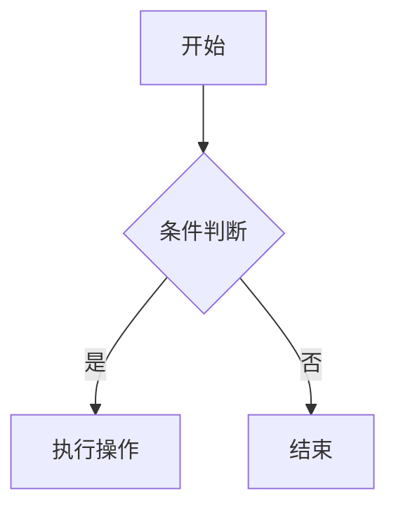
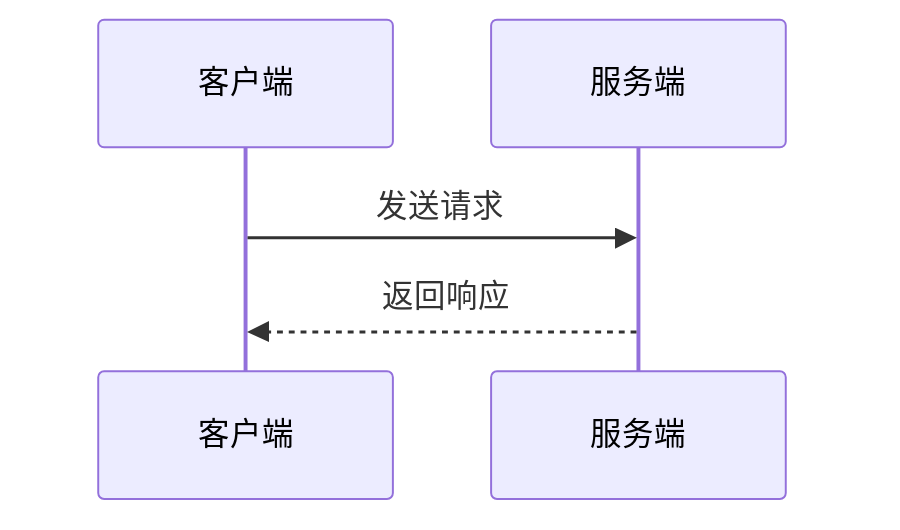
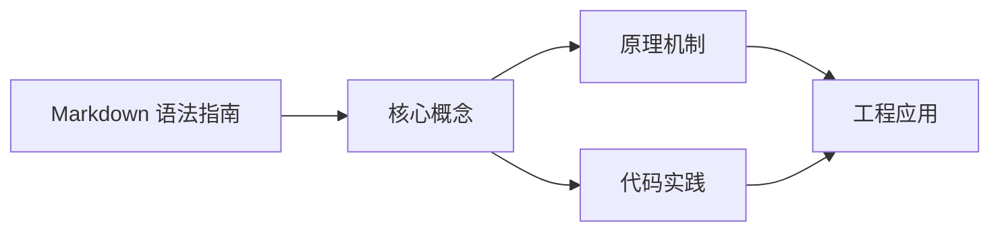
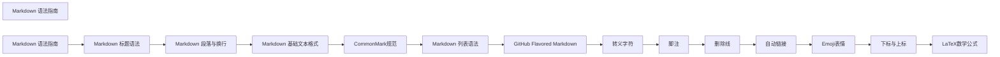

## 1. 学习目标（Bloom 分类）

本节按照布鲁姆教育目标分类学组织学习路径。本文主题为《Markdown 语法指南》，属于 Markdown 模块，读者可以根据自身阶段选择阅读深度。

记忆层面：能够准确复述本文的核心概念、术语与基本语法或操作步骤，并能够在提问或检索时快速定位对应知识点。能够说出 Markdown 的核心概念、常用命令与流程。

理解层面：能够用自己的语言解释核心原理与工作机制，说明概念之间的因果关系，而不是机械记忆结论。能够解释 Markdown 的工作原理与设计动机。

应用层面：能够在真实项目或练习场景中运用本文知识解决具体问题，写出正确且可维护的实现。能够独立完成 Markdown 的标准操作。

分析层面：能够拆解复杂问题，比较本文主题与相邻概念的异同，识别边界条件与例外情况。能够分析 Markdown 使用中的异常与边界。

评价层面：能够根据约束条件（性能、可读性、安全、成本）评价不同方案的优劣，做出有依据的技术决策。能够评价 Markdown 相关工具与方案。

创造层面：能够把本文知识与其他模块知识组合，设计出新的解决方案或可复用的工程模式。能够把 Markdown 融入团队工作流。

通过本节学习，读者应当能够把《Markdown 语法指南》纳入自己的知识网络，并与 Markdown 模块的其他主题（基础语法、GFM、写作规范）建立关联。

## 2. 历史动机与发展脉络

《Markdown 语法指南》是 Markdown 领域的重要主题。要真正理解它，需要先了解它解决的问题与演进过程。

Markdown 由 John Gruber 与 Aaron Swartz 于 2004 年设计，目标是“易读易写的纯文本格式”，可转换为 HTML。
标准化：CommonMark（2014 起）统一解析歧义；GitHub Flavored Markdown（GFM）扩展表格、任务列表、删除线、围栏代码。
生态：文档站（Astro/VitePress）、知识库（Obsidian）、论坛（GitHub/Stack Overflow）、AI 输出格式均以 Markdown 为通用语言。

回到本文主题：Markdown 语法指南 的提出与成熟，正是上述技术背景下的必然产物。早期实现往往以简单可用为目标，随着工程规模扩大，社区逐渐沉淀出标准做法与最佳实践；理解这一脉络，可以帮助读者判断“为什么文档中的推荐写法是现在这个样子”，也能在遇到历史遗留代码时准确识别其设计年代与取舍。


## 3. 形式化定义与核心概念精讲

本节把《Markdown 语法指南》涉及的核心概念以“定义 + 讲解”的形式展开。读者应把定义当作工具，把讲解当作理解路径；两者结合才能形成可迁移的知识。

块级语法：标题、段落、列表、引用、代码块、表格、分隔线；行内语法：强调、代码、链接、图片。
解析模型：块级解析优先，行内解析递归；空行分隔块；转义符 \ 输出字面量。
GFM 扩展：~~删除线~~、任务列表 - [x]、表格对齐、自动链接、围栏代码语言标注。

### 3.1 原文章节逐一精讲

原文档把主题拆分为 36 个小节，下面按顺序给出每一节的导读讲解，随后保留原文细节供精读。

#### 原文精读（完整保留）

# Markdown 高级语法速查

> **符号约定**：`< >` 必填参数 | `[ ]` 可选参数

---

#### 1. 引言

Markdown 是一种轻量级标记语言，使用纯文本格式编写文档，具有语法简洁、可读性强、跨平台兼容等特点。它允许人们使用易读易写的纯文本格式编写文档，然后转换为结构完整的 HTML 文档或其他格式。

##### 1.1. Markdown 特点

- **简单易用**：语法简洁明了，学习成本低
- **跨平台兼容**：几乎所有现代文本编辑器都支持
- **可读性强**：纯文本也具有良好的结构和可读性
- **灵活性高**：支持嵌入 HTML 代码，扩展功能
- **广泛应用**：GitHub、GitLab、Bitbucket 等平台都支持
- **可转换性**：可以转换为 HTML、PDF、EPUB 等多种格式

##### 1.2. Markdown 发展历史

| 年份  | 事件                                      |
| ----- | ----------------------------------------- |
| 2004  | John Gruber 和 Aaron Swartz 创建 Markdown |
| 2007  | CommonMark 规范开始制定                   |
| 2014  | GitHub Flavored Markdown (GFM) 发布       |
| 2017  | CommonMark 1.0 规范发布                   |
| 2020+ | 各种 Markdown 扩展和工具不断涌现          |

#### 2. 什么是 Markdown

Markdown 是一种轻量级标记语言，由 John Gruber 和 Aaron Swartz 在 2004 年创建。它的设计目标是让人们能够使用易读易写的纯文本格式编写文档，然后可以轻松转换为结构完整的 HTML 文档。

##### 2.1. Markdown 的核心设计理念

- **可读性**：Markdown 文档本身就是易读的纯文本，即使不转换为其他格式也能清晰理解
- **简洁性**：语法简单明了，学习成本低，容易上手
- **可扩展性**：支持嵌入 HTML 代码，可以实现更复杂的功能
- **平台无关**：在任何支持纯文本的平台上都可以使用

##### 2.2. Markdown 的应用场景

| 应用场景       | 示例                               |
| -------------- | ---------------------------------- |
| **项目文档**   | README 文件、API 文档、技术规范    |
| **技术博客**   | 个人博客、技术社区文章             |
| **笔记整理**   | 个人学习笔记、会议记录、课程笔记   |
| **邮件撰写**   | 部分邮件客户端支持 Markdown 格式   |
| **电子书创作** | 可以转换为 PDF、EPUB 等格式        |
| **文档网站**   | 使用静态站点生成器创建文档网站     |
| **代码注释**   | 部分代码仓库使用 Markdown 编写注释 |
| **知识库**     | 企业内部知识库、wiki 系统          |

##### 2.3. Markdown 与其他标记语言的比较

| 标记语言             | 特点                   | 适用场景              |
| -------------------- | ---------------------- | --------------------- |
| **Markdown**         | 简洁易用，可读性强     | 日常文档、博客、笔记  |
| **HTML**             | 功能强大，结构完整     | 网页开发、复杂文档    |
| **reStructuredText** | 功能丰富，语法严谨     | Python 文档、技术文档 |
| **AsciiDoc**         | 功能全面，语义丰富     | 大型技术文档、手册    |
| **LaTeX**            | 专业排版，数学公式支持 | 学术论文、书籍        |

#### 3. 标题语法

Markdown 支持 6 级标题，通过 `#` 的数量区分层级，**`#` 后必须加 1 个空格**，否则语法不生效。

##### 3.1. 语法示例

```markdown
# 一级标题（对应 HTML h1，文档主标题）

#### 二级标题（对应 HTML h2，一级章节）

##### 三级标题（对应 HTML h3，二级章节）

###### 四级标题

###### 五级标题

###### 六级标题
```

##### 3.2. 渲染效果

# 一级标题

#### 二级标题

##### 三级标题

###### 四级标题

###### 五级标题

###### 六级标题

##### 3.3. 标题使用建议

- **层级清晰**：合理使用标题层级，一般不超过 4 级
- **语义明确**：标题应该准确反映章节内容
- **一致性**：保持标题风格一致，避免混用不同的标题格式
- **简洁明了**：标题应该简洁明了，避免过长

#### 4. 段落与换行

##### 4.1. 核心规则

1. **段落分隔**：两个段落之间必须用**1 个空行**分隔，无空行的连续文本会被合并为同一段落
2. **强制换行**：行尾添加**2 个及以上空格**后按回车，实现同一段落内的换行（全平台通用标准写法）

##### 4.2. 语法示例

```markdown
这是第一个段落的第一行
这一行和上一行无空行、无行尾空格，会被合并为同一段落
这是第二个段落（上一行是空行，成功分段）
这一行末尾加了 2 个空格
这一行成功换行，和上一行属于同一段落
```

##### 4.3. 渲染效果

这是第一个段落的第一行
这一行和上一行无空行、无行尾空格，会被合并为同一段落
这是第二个段落（上一行是空行，成功分段）
这一行末尾加了 2 个空格
这一行成功换行，和上一行属于同一段落

##### 4.4. 段落格式建议

- **段落长度**：保持段落简短，每段不超过 3-4 行，提高可读性
- **空行使用**：在不同语法元素之间添加空行，如标题与段落之间、段落与列表之间
- **缩进**：一般情况下不需要缩进段落，特殊情况（如引用内的段落）除外

#### 5. 基础文本格式

##### 5.1. 核心语法

| 格式效果              | 语法写法                                       | 渲染效果          |
| --------------------- | ---------------------------------------------- | ----------------- |
| **斜体**              | `*斜体文本*` 或 `_斜体文本_`                   | _斜体文本_        |
| **粗体**              | `**粗体文本**` 或 `__粗体文本__`               | **粗体文本**      |
| **粗斜体**            | `***粗斜体文本***` 或 `___粗斜体文本___`       | **_粗斜体文本_**  |
| **删除线** (GFM 扩展) | `~~删除线文本~~`                               | ~~删除线文本~~    |
| **下划线** (HTML)     | `<u>下划线文本</u>`                            | <u>下划线文本</u> |
| **高亮** (GFM 扩展)   | `==高亮文本==`                                 | ==高亮文本==      |
| **脚注** (GFM 扩展)   | `[^脚注]` 并在文档末尾定义 `[^脚注]: 脚注内容` | [^脚注]           |

[^脚注]: 这是一个脚注示例

##### 5.2. 语法示例

```markdown
这是*斜体*、**粗体**、**_粗斜体_**、~~删除线~~文本
HTML 支持的<u>下划线</u>格式
GFM 扩展的==高亮==功能
脚注示例[^1]

[^1]: 这是脚注内容
```

##### 5.3. 文本格式使用建议

- **适度使用**：不要过度使用文本格式，以免影响可读性
- **一致性**：在同一文档中保持文本格式的一致性
- **语义化**：根据内容的重要性选择合适的文本格式
- **避免嵌套**：尽量避免过多嵌套的文本格式，如 **_粗斜体_** 已经足够

#### 6. 列表语法

##### 6.1. 无序列表

使用 `-`/`*`/`+` + 空格开头，三者效果完全一致，推荐统一使用 `-`，嵌套列表需缩进**4 个空格/1 个制表符**。

###### 7.1.1 语法示例

```markdown
-
-

- 无序列表二级嵌套项 1
- 无序列表二级嵌套项 2
- ## 无序列表三级嵌套项
```

###### 7.1.2 渲染效果

- 无序列表一级项 1
- 无序列表一级项 2
- 无序列表二级嵌套项 1
- 无序列表二级嵌套项 2
- 无序列表三级嵌套项
- 无序列表一级项 3

##### 6.2. 有序列表

使用 `数字 + 英文句号 + 空格` 开头，数字顺序不影响最终渲染结果，推荐按顺序书写，嵌套需缩进**4 个空格/1 个制表符**。

###### 7.2.1 语法示例

```markdown
1.  有序列表一级项 1
2.  有序列表一级项 2
3.  有序列表二级嵌套项 1
4.  有序列表二级嵌套项 2
5.  有序列表一级项 3
```

###### 7.2.2 渲染效果

1. 有序列表一级项 1
2. 有序列表一级项 2
3. 有序列表二级嵌套项 1
4. 有序列表二级嵌套项 2
5. 有序列表一级项 3

##### 6.3. 任务列表

待办清单专用语法（GFM 扩展），`[ ]` 表示未完成，`[x]` 表示已完成，符号后必须加空格。

###### 7.3.1 语法示例

```markdown
-
-
-

- [x] 子任务 1
- [ ] 子任务 2
```

###### 7.3.2 渲染效果

- [ ] 未完成的待办任务
- [x] 已完成的待办任务
- [ ] 可嵌套待办
- [x] 子任务 1
- [ ] 子任务 2

##### 6.4. 列表使用建议

- **嵌套层级**：嵌套列表不要超过 3 层，以免影响可读性
- **空行**：在列表项之间添加空行，提高可读性
- **内容长度**：列表项内容不要过长，必要时可以拆分为多个列表
- **一致性**：在同一文档中使用一致的列表标记符

#### 7. 块引用

使用 `>` + 空格开头，可多层嵌套，也可与标题、列表、代码等其他语法混用。

##### 7.1. 语法示例

```markdown
>
```

##### 7.2. 渲染效果

> 单层块引用，多行内容可只在第一行加>
> 第二行内容，和上一行同属一个引用块
> 多层嵌套引用
>
> > 第二层嵌套引用
> >
> > > 第三层嵌套引用
> > > 引用内混用其他语法
>
> 1. 有序列表项
> 2. 有序列表项
>    **粗体文本**

##### 7.3. 块引用使用建议

- **适度使用**：不要过度使用块引用，以免文档结构混乱
- **嵌套层级**：嵌套引用不要超过 3 层
- **内容相关性**：引用的内容应该与上下文相关
- **来源标注**：如果引用的是他人的内容，应该标注来源

#### 8. 分隔线

使用 3 个及以上的 `-`/`*`/`_` 单独占一行，前后建议保留空行，避免与二级标题语法混淆。

##### 8.1. 语法示例

```markdown
- \
  \
```

##### 8.2. 渲染效果

---

---

##### 8.3. 分隔线使用建议

- **适度使用**：分隔线用于分隔不同的内容区块，不要过度使用
- **位置**：分隔线应该放在逻辑上需要分隔的内容之间
- **一致性**：在同一文档中使用一致的分隔线风格

#### 9. 链接语法

##### 9.1. 行内式链接

标准格式：`[链接显示文本](链接地址 "链接可选标题")`

- 可选标题：鼠标悬浮时显示的提示文字，可省略

###### 10.1.1 语法示例

```markdown
[GitHub 官网](https://github.com '全球最大开源托管平台')
[打开豆包](https://www.doubao.com)
```

###### 10.1.2 渲染效果

[GitHub 官网](https://github.com '全球最大开源托管平台')
[打开豆包](https://www.doubao.com)

##### 9.2. 自动链接

用 `<>` 包裹网址/邮箱，快速生成链接，适合直接展示完整地址。

###### 10.2.1 语法示例

```markdown
<https://github.com>
<fanquanpangpiing@163.com>
```

###### 10.2.2 渲染效果

<https://github.com>
<fanquanpangpiing@163.com>

##### 9.3. 参考式链接

适合长文档中多次复用同一个链接，文档末尾统一定义地址，便于维护。

###### 10.3.1 语法示例

```markdown
[GitHub 官网][github]
[GitHub 开源社区][github]

 <!-- 文档末尾统一定义 -->

[github]: https://github.com 'GitHub 官网'
```

###### 10.3.2 渲染效果

[GitHub 官网][github]
[GitHub 开源社区][github]
[github]: https://github.com "GitHub 官网"

##### 9.4. 链接使用建议

- **链接文本**：使用有意义的链接文本，避免使用"点击这里"等模糊描述
- **参考式链接**：在长文档中使用参考式链接，提高可维护性
- **链接检查**：定期检查链接是否有效，避免链接失效
- **相对路径**：在项目文档中使用相对路径，确保跨平台兼容性

#### 10. 图片语法

基础格式：``

- 替代文本：图片加载失败时显示的文字，必填
- 可选标题：鼠标悬浮时显示的提示文字，可省略

##### 10.1. 语法示例

```markdown
!
```

##### 10.2. 图片带跳转链接

嵌套链接语法，实现点击图片跳转到指定地址。

```markdown
[](https://github.com)
```

##### 10.3. 本地图片

使用相对路径引用本地图片，适合项目文档。

```markdown
!
```

##### 10.4. 图片使用建议

- **替代文本**：为图片添加有意义的替代文本，提高可访问性
- **图片尺寸**：合理控制图片尺寸，避免图片过大影响加载速度
- **图片格式**：选择合适的图片格式，如 JPG、PNG、SVG 等
- **图片路径**：使用相对路径引用图片，确保跨平台兼容性

#### 11. 代码语法

##### 11.1. 行内代码

用单个反引号 `` ` `` 包裹，适合在行内插入短代码、关键词、命令。

###### 12.1.1 语法示例

```markdown
Python 的打印函数是`print("Hello World")`
```

###### 12.1.2 渲染效果

Python 的打印函数是`print("Hello World")`

##### 11.2. 多行代码块

用三组反引号 ` ``` ` 包裹，上下单独占一行，支持指定编程语言实现语法高亮。

###### 12.2.1 语法示例

````markdown
```python
# Python 代码示例
def hello_markdown():
print("Hello Markdown!")
return 0
```
````

###### 12.2.2 渲染效果
```python
# Python 代码示例
def hello_markdown():
 print("Hello Markdown!")
 return 0
```

##### 11.3. 代码语法使用建议

- **语言指定**：为代码块指定编程语言，启用语法高亮
- **代码缩进**：保持代码的缩进和格式，提高可读性
- **代码注释**：为复杂代码添加注释，解释代码功能
- **命令示例**：提供完整的命令示例，包括输入和输出
- **代码长度**：对于过长的代码，考虑只展示关键部分，或提供链接

#### 12. 表格语法

使用 `|` 分隔单元格，`-` 分隔表头和表体，`:` 定义列对齐方式（GFM 扩展）：

- 左对齐：`:---`（默认）
- 居中对齐：`:---:`
- 右对齐：`---:`

##### 12.1. 语法示例

```markdown
| 左对齐列   | 居中对齐列 | 右对齐列 |
| :--------- | :--------: | -------: |
| 内容 1     |   内容 2   |   内容 3 |
| 长文本测试 |  居中显示  | 靠右显示 |
```

##### 12.2. 渲染效果

| 左对齐列   | 居中对齐列 | 右对齐列 |
| :--------- | :--------: | -------: |
| 内容 1     |   内容 2   |   内容 3 |
| 长文本测试 |  居中显示  | 靠右显示 |

##### 12.3. 表格使用建议

- **表格内容**：表格内容应该简洁明了，避免过于复杂
- **列数**：表格列数不宜过多，一般不超过 5 列
- **对齐方式**：根据内容类型选择合适的对齐方式，如数字右对齐
- **空行**：在表格前后添加空行，提高可读性

#### 13. 转义字符

使用反斜杠 `\` 转义 Markdown 特殊字符，使其正常显示，避免被解析为语法标记。

##### 13.1. 可转义的核心特殊字符

```markdown
\
\
\

# 井号

-

* . 英文句号
  !
  | 竖线
  ` 反引号
  [ ] 方括号
  ( ) 圆括号
```

##### 13.2. 语法示例

```markdown
\
\
\
```

##### 13.3. 转义字符使用建议

- **必要时使用**：只在需要显示特殊字符时使用转义
- **可读性**：不要过度使用转义，以免影响代码可读性
- **测试**：在使用转义字符后，预览效果确保正确显示

#### 14. 页内跳转（锚点链接）

实现文档内部标题之间的跳转，格式：`[跳转显示文本](#目标标题名称)`

##### 14.1. 核心规则

1. 标题名称全部转为小写
2. 空格替换为短横线 `-`
3. 特殊符号直接省略
4. 多级标题直接拼接，如 `## 1.1 标题` 对应 `#11-标题`

##### 14.2. 语法示例

```markdown
[跳转到文档开头](#markdown-语法指南)
[跳转到标题语法章节](#标题语法)
[跳转到无序列表](#无序列表)
```

##### 14.3. 页内跳转使用建议

- **目录**：为长文档添加目录，使用页内跳转方便导航
- **命名规范**：确保标题名称清晰，便于生成锚点
- **测试**：在添加页内跳转后，测试跳转是否正常

#### 15. 扩展语法

##### 15.1. GitHub Flavored Markdown (GFM) 扩展

| 功能               | 语法         | 渲染效果   |
| ------------------ | ------------ | ---------- |
| **任务列表**       | `- [ ] 任务` | - [ ] 任务 |
| **代码块语法高亮** | `` ```python `` | 见下方示例 |
| **表格** | `\| 列1 \| 列2 \|` | 表格 |
| **删除线** | `~~文本~~` | ~~文本~~ |
| **高亮** | `==文本==` | ==文本== |
| **自动链接** | `<https://example.com>` | <https://example.com> |
| **脚注** | `[^脚注]` | [^脚注] |

代码块语法高亮示例：

```python
# 语法高亮的代码块
print("Hello Markdown!")
```

##### 15.2 其他常见扩展

| 功能 | 语法 | 适用平台 |
|------|------|----------|
| **数学公式** | `$$E=mc^2$$` | MathJax 支持的平台 |
| **定义列表** | `术语` + `: 定义` | 部分 Markdown 处理器 |
| **自动生成目录** | `[TOC]` | 部分 Markdown 处理器 |
| **HTML 嵌入** | `<div>HTML 内容</div>` | 所有 Markdown 处理器 |
| **图表** | `` ```mermaid `` | Mermaid 支持的平台 |

##### 15.3. 扩展语法使用建议
- **兼容性**：使用扩展语法时考虑平台兼容性
- **文档说明**：如果使用了扩展语法，在文档中说明需要的渲染环境
- **适度使用**：不要过度依赖扩展语法，保持文档的基本兼容性
#### 16. 常见问题与解决方案
##### 16.1. 语法标记问题
**问题描述**：标题、列表、引用等语法不生效。
**原因分析**：标记符后缺少空格。
**解决方案**：在标记符后添加一个空格，如 `# 标题`、`- 列表项`、`> 引用`。
##### 16.2. 段落分隔问题
**问题描述**：文本无法正确分段。
**原因分析**：段落之间没有空行。
**解决方案**：在段落之间添加一个空行，实现正确分段。
##### 16.3. 嵌套元素问题
**问题描述**：嵌套列表或引用显示异常。
**原因分析**：嵌套元素缩进不正确。
**解决方案**：使用 4 个空格或 1 个制表符进行缩进。
##### 16.4. 特殊字符问题
**问题描述**：特殊字符被错误解析为 Markdown 语法。
**原因分析**：特殊字符没有转义。
**解决方案**：使用反斜杠 `\` 转义特殊字符，如 `\#`、`\*`。
##### 16.5. 跨平台兼容性问题
**问题描述**：在不同平台上渲染效果不一致。
**原因分析**：使用了平台特定的扩展语法。
**解决方案**：优先使用标准 Markdown 语法，避免使用平台特定的扩展功能。
##### 16.6. 图片显示问题
**问题描述**：图片无法正常显示。
**原因分析**：图片路径错误或网络问题。
**解决方案**：检查图片路径是否正确，确保图片可访问。
##### 16.7. 链接失效问题
**问题描述**：链接点击后无法访问。
**原因分析**：链接地址错误或目标网站不可访问。
**解决方案**：检查链接地址是否正确，确保目标网站可访问。
#### 17. 最佳实践
##### 17.1. 语法风格
- **统一标记符**：在同一文档中使用一致的 Markdown 语法风格
- **标题层级**：合理使用标题层级，一般不超过 4 级
- **空行使用**：在不同语法元素之间添加空行，提高可读性
- **缩进规范**：使用 4 个空格进行缩进，保持代码整洁
- **标点符号**：使用英文标点符号，保持一致性
##### 17.2. 内容组织
- **目录结构**：为长文档添加目录，便于导航
- **段落长度**：保持段落简短，每段不超过 3-4 行
- **逻辑顺序**：按照逻辑顺序组织内容，确保层次清晰
- **重点突出**：使用粗体、斜体等格式突出重要内容
- **过渡语句**：在不同章节之间添加过渡语句，使文档更连贯
##### 17.3. 代码与命令
- **代码块**：对于代码和命令，使用代码块而非行内代码
- **语法高亮**：为代码块指定编程语言，启用语法高亮
- **代码注释**：为复杂代码添加注释，提高可读性
- **命令示例**：提供完整的命令示例，包括输入和输出
- **代码长度**：对于过长的代码，考虑只展示关键部分
##### 17.4. 链接与图片
- **链接文本**：使用有意义的链接文本，避免使用"点击这里"
- **图片替代文本**：为图片添加有意义的替代文本
- **参考式链接**：在长文档中使用参考式链接，提高可维护性
- **图片路径**：使用相对路径引用图片，确保跨平台兼容性
- **链接检查**：定期检查链接是否有效
##### 17.5. 文档管理
- **版本控制**：使用 Git 等版本控制系统管理 Markdown 文档
- **命名规范**：为文档文件使用清晰的命名规范
- **目录结构**：建立合理的文档目录结构
- **备份**：定期备份文档，防止数据丢失
- **协作**：在团队协作中，制定统一的 Markdown 规范
#### 18. 工具推荐
##### 18.1. 编辑器
| 编辑器 | 特点 | 适用平台 |
|--------|------|----------|
| **Visual Studio Code** | 功能强大，插件丰富，支持实时预览 | Windows, macOS, Linux |
| **Typora** | 所见即所得，实时预览，界面简洁 | Windows, macOS, Linux |
| **Sublime Text** | 轻量快速，可扩展性强 | Windows, macOS, Linux |
| **Atom** | 开源免费，可定制性强 | Windows, macOS, Linux |
| **MarkdownPad** | 专为 Markdown 设计，功能丰富 | Windows |
| **MacDown** | 专为 macOS 设计，简洁易用 | macOS |
##### 18.2. 在线工具
| 工具 | 特点 | 网址 |
|------|------|------|
| **GitHub Gist** | 在线分享代码和文档 | https://gist.github.com/ |
| **Markdown Live Preview** | 在线实时预览 Markdown | https://markdownlivepreview.com/ |
| **Dillinger** | 在线 Markdown 编辑器 | https://dillinger.io/ |
| **StackEdit** | 在线 Markdown 编辑器，支持云存储 | https://stackedit.io/ |
##### 18.3. 转换工具
| 工具 | 特点 | 适用场景 |
|------|------|----------|
| **Pandoc** | 强大的文档转换工具，支持多种格式 | 批量转换文档 |
| **Markdown to PDF** | 将 Markdown 转换为 PDF | 生成电子书、报告 |
| **GitBook** | 基于 Markdown 的文档网站生成工具 | 构建文档网站 |
| **VuePress** | 基于 Vue 的静态站点生成器 | 构建技术文档 |
| **Docusaurus** | Facebook 开源的文档网站生成工具 | 构建大型文档 |
##### 18.4. 插件与扩展
| 插件 | 功能 | 适用编辑器 |
|------|------|------------|
| **Markdown All in One** | 提供 Markdown 快捷操作和自动完成 | VS Code |
| **Markdown Preview Enhanced** | 增强的 Markdown 预览功能 | VS Code |
| **GitHub Markdown Preview** | 模拟 GitHub 的 Markdown 渲染 | VS Code |
| **Mermaid** | 支持在 Markdown 中绘制图表 | 多种编辑器 |
| **MathJax** | 支持在 Markdown 中编写数学公式 | 多种编辑器 |
#### 19. 总结
##### 19.1. Markdown 核心优势
- **简单易用**：语法简洁明了，学习成本低
- **可读性强**：纯文本格式，易于阅读和编辑
- **跨平台兼容**：几乎所有现代工具都支持
- **可扩展性**：支持嵌入 HTML 和各种扩展语法
- **广泛应用**：在 GitHub、博客、文档等场景中广泛使用
##### 19.2. 学习建议
1. **掌握基础语法**：先学习 Markdown 的基础语法，如标题、段落、列表等
2. **实践练习**：通过实际编写文档来巩固语法
3. **使用工具**：选择适合自己的 Markdown 编辑器，提高效率
4. **参考规范**：学习常见的 Markdown 规范和最佳实践
5. **持续学习**：关注 Markdown 的新特性和扩展
##### 19.3. 最终建议
- **保持一致性**：在文档中保持一致的语法风格
- **注重可读性**：优先考虑文档的可读性，而不是追求复杂的语法
- **版本控制**：使用 Git 等工具管理文档的版本
- **分享与交流**：与他人分享 Markdown 文档，获取反馈
- **持续改进**：不断学习和改进自己的 Markdown 写作技巧
Markdown 是一种简单而强大的标记语言，它不仅可以帮助你创建结构清晰的文档，还可以提高你的写作效率。通过掌握 Markdown，你可以更专注于内容本身，而不是排版和格式问题。
#### 任务列表

**基本写法：任务列表**
`- [ ] <未完成项>`
`- [x] <已完成项>`
```markdown
- [x] 已完成任务
- [ ] 待办任务
- [ ] 进行中任务
```

---

#### 引用与嵌套引用

**基本写法：引用**
`> <引用内容>`
```markdown
> 这是一段引用
```

---

**基本写法：嵌套引用**
`> <一级引用>`<br>`> > <二级引用>`
```markdown
> 一级引用
> > 二级引用
> > > 三级引用
```

---

**基本写法：引用内含其他元素**
`> <元素>`
```markdown
> ## 标题
> - 列表项
> **加粗** 文本
```

---

#### 代码块扩展

**基本写法：行内代码**
`` `<代码>` ``
```markdown
使用 `print()` 函数
```

---

**基本写法：带语言标签的代码块**
`` ```<语言> ``<br>`<代码>`<br>`` ``` ``
````markdown
```python
def hello():
    print("Hello")
```
````

---

**基本写法：diff 代码块**
`` ```diff ``<br>`<代码>`<br>`` ``` ``
````markdown
```diff
+ 新增行
- 删除行
! 重要修改
# 注释
```
````

---

#### 表格高级用法

**基本写法：对齐表格**
`| <列1> | <列2> |`<br>`| :--- | :---: | ---: |`
```markdown
| 左对齐 | 居中对齐 | 右对齐 |
| :--- | :---: | ---: |
| Left | Center | Right |
```

---

**基本写法：表格内换行**
`<br>`
```markdown
| 列1 | 列2 |
| --- | --- |
| 第一行<br>第二行 | 内容 |
```

---

**基本写法：内联格式化表格**
`| **<列>** | *<列>* |`
```markdown
| **加粗** | *斜体* | `代码` |
| --- | --- | --- |
| 内容 | 内容 | 内容 |
```

---

#### 链接高级用法

**基本写法：参考式链接**
`[<文本>][<引用标记>]`<br>`[<引用标记>]: <URL> "<标题>"`
```markdown
[Google][1]

[1]: https://google.com "Google 首页"
```

---

**基本写法：自动链接**
`<URL>`
```markdown
<https://example.com>
<user@example.com>
```

---

**基本写法：页面内锚点**
`[<文本>](#<锚点>)`
```markdown
[跳转到标题](#标题名)

#### 标题名
```

---

#### 图片扩展

**基本写法：带链接的图片**
`[](<链接URL>)`
```markdown
[](https://example.com)
```

---

**基本写法：指定尺寸（HTML）**
`" alt="<替代>" width="<宽>" height="<高>">`
```markdown

```

---

#### 锚点与脚注

**基本写法：脚注引用**
`<文本>[^<标记>]`<br>`[^<标记>]: <脚注内容>`
```markdown
这是一个概念[^1]

[^1]: 脚注的详细说明文字
```

---

**基本写法：多行脚注**
`[^<标记>]: <第一行>`<br>`    <后续行>`
```markdown
[^2]: 第一行说明
    第二行延续内容
```

---

#### 转义字符

**基本写法：转义特殊字符**
`\<字符>`
```markdown
\* 不是斜体 \*
\# 不是标题
\_ 不是强调
\` 不是代码
```

---

#### HTML 内嵌

**基本写法：直接使用 HTML**
`<<标签> <属性>="<值>">`
```markdown
<details>
<summary>点击展开</summary>
隐藏的内容
</details>
```

---

**基本写法：键盘按键**
`<kbd><按键></kbd>`
```markdown
按 <kbd>Ctrl</kbd> + <kbd>C</kbd> 复制
```

---

**基本写法：高亮文本**
`<mark><内容></mark>`
```markdown
<mark>高亮显示</mark> 的文本
```

---

#### 评论与注释

**基本写法：HTML 注释**
`<!-- <注释> -->`
```markdown
<!-- 这是注释，不会显示 -->
```

---

#### 定义列表

**基本写法：定义列表**
`<术语>`<br>`: <定义>`
```markdown
术语 1
: 定义 1

术语 2
: 定义 2
```

---

#### 缩写

**基本写法：缩写定义**
`*[<缩写>]: <全称>`
```markdown
HTML 是一种标记语言

*[HTML]: HyperText Markup Language
```

---

#### 数学公式

**基本写法：行内公式**
`$<公式>$`
```markdown
质能方程 $E = mc^2$
```

---

**基本写法：块级公式**
`$$<公式>$$`
```markdown
$$
\int_a^b f(x) dx = F(b) - F(a)
$$
```

---

#### Mermaid 图表

**基本写法：流程图**
`` ```mermaid ``<br>`graph <方向>`<br>`<节点定义>`
````markdown

````

---

**基本写法：时序图**
`` ```mermaid ``<br>`sequenceDiagram`
````markdown

````


### 3.2 概念关系图

下面用 Mermaid 图表达本文核心概念之间的关系，帮助读者建立整体图景：



图中展示的是本文知识的结构化关系：核心概念是入口，原理机制解释“为什么”，代码实践演示“怎么做”，工程应用回答“何时用”。读者学习时可以把每个小节的内容挂接到对应节点上。

## 4. 理论推导与原理解析

本节深入《Markdown 语法指南》背后的原理。理论部分不求面面俱到，而是聚焦“能解释现象、能指导实践”的关键推导。

块级语法：标题、段落、列表、引用、代码块、表格、分隔线；行内语法：强调、代码、链接、图片。
解析模型：块级解析优先，行内解析递归；空行分隔块；转义符 \ 输出字面量。
GFM 扩展：~~删除线~~、任务列表 - [x]、表格对齐、自动链接、围栏代码语言标注。
元数据：frontmatter（YAML）在文档站中承载标题、日期、标签。

需要强调的是，理论推导与工程实践之间存在翻译层：理论给出的是理想化模型与边界条件，工程代码则必须处理真实环境中的例外。读者在学习时应先掌握理论的“标准情形”，再通过陷阱章节了解“非标准情形”。

## 5. 代码示例与逐行讲解

本节把原文中的代码示例系统整理，并为每个示例补充用途说明与讲解。读者不应只浏览代码，而应逐段对照讲解理解设计意图。

### 5.1 示例：3.1. 语法示例

该示例来自原文《3.1. 语法示例》小节，用于演示Markdown 语法指南相关操作。阅读时请先看代码结构，再看其后的讲解。

```markdown
# 一级标题（对应 HTML h1，文档主标题）

## 二级标题（对应 HTML h2，一级章节）

### 三级标题（对应 HTML h3，二级章节）

#### 四级标题

##### 五级标题

###### 六级标题
```

讲解：这段代码演示了本节核心知识点。代码中的关键操作可以归纳为三步：准备（定义或初始化）、执行（核心逻辑）、收尾（释放资源或返回结果）。实际项目中，这三步往往被封装为函数或类，以提升复用性与可测试性。

关键点分析：

该示例共 6 行有效代码，结构以数据或配置为主。阅读时应关注：数据字段的含义、配置项的作用，以及它们与运行行为的对应关系。

进阶思考路径：先尝试修改参数观察行为变化，再把示例中的模式迁移到自己的项目中；每次修改都记录预期与实测差异，这是把示例转化为能力的最快方式。

### 5.2 示例：4.2. 语法示例

该示例来自原文《4.2. 语法示例》小节，用于演示Markdown 语法指南相关操作。阅读时请先看代码结构，再看其后的讲解。

```markdown
这是第一个段落的第一行
这一行和上一行无空行、无行尾空格，会被合并为同一段落
这是第二个段落（上一行是空行，成功分段）
这一行末尾加了 2 个空格
这一行成功换行，和上一行属于同一段落
```

讲解：这段代码演示了本节核心知识点。代码中的关键操作可以归纳为三步：准备（定义或初始化）、执行（核心逻辑）、收尾（释放资源或返回结果）。实际项目中，这三步往往被封装为函数或类，以提升复用性与可测试性。

关键点分析：

该示例共 5 行有效代码，结构以数据或配置为主。阅读时应关注：数据字段的含义、配置项的作用，以及它们与运行行为的对应关系。

进阶思考路径：先尝试修改参数观察行为变化，再把示例中的模式迁移到自己的项目中；每次修改都记录预期与实测差异，这是把示例转化为能力的最快方式。

### 5.3 示例：5.2. 语法示例

该示例来自原文《5.2. 语法示例》小节，用于演示Markdown 语法指南相关操作。阅读时请先看代码结构，再看其后的讲解。

```markdown
这是*斜体*、**粗体**、**_粗斜体_**、~~删除线~~文本
HTML 支持的<u>下划线</u>格式
GFM 扩展的==高亮==功能
脚注示例[^1]

[^1]: 这是脚注内容
```

讲解：这段代码演示了本节核心知识点。代码中的关键操作可以归纳为三步：准备（定义或初始化）、执行（核心逻辑）、收尾（释放资源或返回结果）。实际项目中，这三步往往被封装为函数或类，以提升复用性与可测试性。

关键点分析：

该示例共 5 行有效代码，结构以数据或配置为主。阅读时应关注：数据字段的含义、配置项的作用，以及它们与运行行为的对应关系。

进阶思考路径：先尝试修改参数观察行为变化，再把示例中的模式迁移到自己的项目中；每次修改都记录预期与实测差异，这是把示例转化为能力的最快方式。

### 5.4 示例：7.1.1 语法示例

该示例来自原文《7.1.1 语法示例》小节，用于演示Markdown 语法指南相关操作。阅读时请先看代码结构，再看其后的讲解。

```markdown
-
-

- 无序列表二级嵌套项 1
- 无序列表二级嵌套项 2
- ## 无序列表三级嵌套项
```

讲解：这段代码演示了本节核心知识点。代码中的关键操作可以归纳为三步：准备（定义或初始化）、执行（核心逻辑）、收尾（释放资源或返回结果）。实际项目中，这三步往往被封装为函数或类，以提升复用性与可测试性。

关键点分析：

该示例共 5 行有效代码，结构以数据或配置为主。阅读时应关注：数据字段的含义、配置项的作用，以及它们与运行行为的对应关系。

进阶思考路径：先尝试修改参数观察行为变化，再把示例中的模式迁移到自己的项目中；每次修改都记录预期与实测差异，这是把示例转化为能力的最快方式。

### 5.5 示例：7.2.1 语法示例

该示例来自原文《7.2.1 语法示例》小节，用于演示Markdown 语法指南相关操作。阅读时请先看代码结构，再看其后的讲解。

```markdown
1.  有序列表一级项 1
2.  有序列表一级项 2
3.  有序列表二级嵌套项 1
4.  有序列表二级嵌套项 2
5.  有序列表一级项 3
```

讲解：这段代码演示了本节核心知识点。代码中的关键操作可以归纳为三步：准备（定义或初始化）、执行（核心逻辑）、收尾（释放资源或返回结果）。实际项目中，这三步往往被封装为函数或类，以提升复用性与可测试性。

关键点分析：

该示例共 5 行有效代码，结构以数据或配置为主。阅读时应关注：数据字段的含义、配置项的作用，以及它们与运行行为的对应关系。

进阶思考路径：先尝试修改参数观察行为变化，再把示例中的模式迁移到自己的项目中；每次修改都记录预期与实测差异，这是把示例转化为能力的最快方式。

### 5.6 示例：7.3.1 语法示例

该示例来自原文《7.3.1 语法示例》小节，用于演示Markdown 语法指南相关操作。阅读时请先看代码结构，再看其后的讲解。

```markdown
-
-
-

- [x] 子任务 1
- [ ] 子任务 2
```

讲解：这段代码演示了本节核心知识点。代码中的关键操作可以归纳为三步：准备（定义或初始化）、执行（核心逻辑）、收尾（释放资源或返回结果）。实际项目中，这三步往往被封装为函数或类，以提升复用性与可测试性。

关键点分析：

该示例共 5 行有效代码，结构以数据或配置为主。阅读时应关注：数据字段的含义、配置项的作用，以及它们与运行行为的对应关系。

进阶思考路径：先尝试修改参数观察行为变化，再把示例中的模式迁移到自己的项目中；每次修改都记录预期与实测差异，这是把示例转化为能力的最快方式。

### 5.7 示例：7.1. 语法示例

该示例来自原文《7.1. 语法示例》小节，用于演示Markdown 语法指南相关操作。阅读时请先看代码结构，再看其后的讲解。

```markdown
>
```

讲解：这段代码演示了本节核心知识点。代码中的关键操作可以归纳为三步：准备（定义或初始化）、执行（核心逻辑）、收尾（释放资源或返回结果）。实际项目中，这三步往往被封装为函数或类，以提升复用性与可测试性。

关键点分析：

该示例共 1 行有效代码，结构以数据或配置为主。阅读时应关注：数据字段的含义、配置项的作用，以及它们与运行行为的对应关系。

进阶思考路径：先尝试修改参数观察行为变化，再把示例中的模式迁移到自己的项目中；每次修改都记录预期与实测差异，这是把示例转化为能力的最快方式。

### 5.8 示例：8.1. 语法示例

该示例来自原文《8.1. 语法示例》小节，用于演示Markdown 语法指南相关操作。阅读时请先看代码结构，再看其后的讲解。

```markdown
- \
  \
```

讲解：这段代码演示了本节核心知识点。代码中的关键操作可以归纳为三步：准备（定义或初始化）、执行（核心逻辑）、收尾（释放资源或返回结果）。实际项目中，这三步往往被封装为函数或类，以提升复用性与可测试性。

关键点分析：

该示例共 2 行有效代码，结构以数据或配置为主。阅读时应关注：数据字段的含义、配置项的作用，以及它们与运行行为的对应关系。

进阶思考路径：先尝试修改参数观察行为变化，再把示例中的模式迁移到自己的项目中；每次修改都记录预期与实测差异，这是把示例转化为能力的最快方式。

### 5.9 示例：10.1.1 语法示例

该示例来自原文《10.1.1 语法示例》小节，用于演示Markdown 语法指南相关操作。阅读时请先看代码结构，再看其后的讲解。

```markdown
[GitHub 官网](https://github.com '全球最大开源托管平台')
[打开豆包](https://www.doubao.com)
```

讲解：这段代码演示了本节核心知识点。代码中的关键操作可以归纳为三步：准备（定义或初始化）、执行（核心逻辑）、收尾（释放资源或返回结果）。实际项目中，这三步往往被封装为函数或类，以提升复用性与可测试性。

关键点分析：

该示例共 2 行有效代码，结构以数据或配置为主。阅读时应关注：数据字段的含义、配置项的作用，以及它们与运行行为的对应关系。

进阶思考路径：先尝试修改参数观察行为变化，再把示例中的模式迁移到自己的项目中；每次修改都记录预期与实测差异，这是把示例转化为能力的最快方式。

### 5.10 示例：10.2.1 语法示例

该示例来自原文《10.2.1 语法示例》小节，用于演示Markdown 语法指南相关操作。阅读时请先看代码结构，再看其后的讲解。

```markdown
<https://github.com>
<fanquanpangpiing@163.com>
```

讲解：这段代码演示了本节核心知识点。代码中的关键操作可以归纳为三步：准备（定义或初始化）、执行（核心逻辑）、收尾（释放资源或返回结果）。实际项目中，这三步往往被封装为函数或类，以提升复用性与可测试性。

关键点分析：

该示例共 2 行有效代码，结构以数据或配置为主。阅读时应关注：数据字段的含义、配置项的作用，以及它们与运行行为的对应关系。

进阶思考路径：先尝试修改参数观察行为变化，再把示例中的模式迁移到自己的项目中；每次修改都记录预期与实测差异，这是把示例转化为能力的最快方式。

### 5.11 示例：10.3.1 语法示例

该示例来自原文《10.3.1 语法示例》小节，用于演示Markdown 语法指南相关操作。阅读时请先看代码结构，再看其后的讲解。

```markdown
[GitHub 官网][github]
[GitHub 开源社区][github]

 <!-- 文档末尾统一定义 -->

[github]: https://github.com 'GitHub 官网'
```

讲解：这段代码演示了本节核心知识点。代码中的关键操作可以归纳为三步：准备（定义或初始化）、执行（核心逻辑）、收尾（释放资源或返回结果）。实际项目中，这三步往往被封装为函数或类，以提升复用性与可测试性。

关键点分析：

该示例共 4 行有效代码，结构以数据或配置为主。阅读时应关注：数据字段的含义、配置项的作用，以及它们与运行行为的对应关系。

进阶思考路径：先尝试修改参数观察行为变化，再把示例中的模式迁移到自己的项目中；每次修改都记录预期与实测差异，这是把示例转化为能力的最快方式。

### 5.12 示例：10.1. 语法示例

该示例来自原文《10.1. 语法示例》小节，用于演示Markdown 语法指南相关操作。阅读时请先看代码结构，再看其后的讲解。

```markdown
!
```

讲解：这段代码演示了本节核心知识点。代码中的关键操作可以归纳为三步：准备（定义或初始化）、执行（核心逻辑）、收尾（释放资源或返回结果）。实际项目中，这三步往往被封装为函数或类，以提升复用性与可测试性。

关键点分析：

该示例共 1 行有效代码，结构以数据或配置为主。阅读时应关注：数据字段的含义、配置项的作用，以及它们与运行行为的对应关系。

进阶思考路径：先尝试修改参数观察行为变化，再把示例中的模式迁移到自己的项目中；每次修改都记录预期与实测差异，这是把示例转化为能力的最快方式。

### 5.13 示例：10.2. 图片带跳转链接

该示例来自原文《10.2. 图片带跳转链接》小节，用于演示Markdown 语法指南相关操作。阅读时请先看代码结构，再看其后的讲解。

```markdown
[](https://github.com)
```

讲解：这段代码演示了本节核心知识点。代码中的关键操作可以归纳为三步：准备（定义或初始化）、执行（核心逻辑）、收尾（释放资源或返回结果）。实际项目中，这三步往往被封装为函数或类，以提升复用性与可测试性。

关键点分析：

该示例共 1 行有效代码，结构以数据或配置为主。阅读时应关注：数据字段的含义、配置项的作用，以及它们与运行行为的对应关系。

进阶思考路径：先尝试修改参数观察行为变化，再把示例中的模式迁移到自己的项目中；每次修改都记录预期与实测差异，这是把示例转化为能力的最快方式。

### 5.14 示例：10.3. 本地图片

该示例来自原文《10.3. 本地图片》小节，用于演示Markdown 语法指南相关操作。阅读时请先看代码结构，再看其后的讲解。

```markdown
!
```

讲解：这段代码演示了本节核心知识点。代码中的关键操作可以归纳为三步：准备（定义或初始化）、执行（核心逻辑）、收尾（释放资源或返回结果）。实际项目中，这三步往往被封装为函数或类，以提升复用性与可测试性。

关键点分析：

该示例共 1 行有效代码，结构以数据或配置为主。阅读时应关注：数据字段的含义、配置项的作用，以及它们与运行行为的对应关系。

进阶思考路径：先尝试修改参数观察行为变化，再把示例中的模式迁移到自己的项目中；每次修改都记录预期与实测差异，这是把示例转化为能力的最快方式。

### 5.15 示例：12.1.1 语法示例

该示例来自原文《12.1.1 语法示例》小节，用于演示Markdown 语法指南相关操作。阅读时请先看代码结构，再看其后的讲解。

```markdown
Python 的打印函数是`print("Hello World")`
```

讲解：这段代码演示了本节核心知识点。代码中的关键操作可以归纳为三步：准备（定义或初始化）、执行（核心逻辑）、收尾（释放资源或返回结果）。实际项目中，这三步往往被封装为函数或类，以提升复用性与可测试性。

关键点分析：

该示例共 1 行有效代码，结构以数据或配置为主。阅读时应关注：数据字段的含义、配置项的作用，以及它们与运行行为的对应关系。

进阶思考路径：先尝试修改参数观察行为变化，再把示例中的模式迁移到自己的项目中；每次修改都记录预期与实测差异，这是把示例转化为能力的最快方式。

### 5.16 示例：12.2.2 渲染效果

该示例来自原文《12.2.2 渲染效果》小节，用于演示Markdown 语法指南相关操作。阅读时请先看代码结构，再看其后的讲解。

```python
# Python 代码示例
def hello_markdown():
 print("Hello Markdown!")
 return 0
```

讲解：这段代码演示了本节核心知识点。代码中的关键操作可以归纳为三步：准备（定义或初始化）、执行（核心逻辑）、收尾（释放资源或返回结果）。实际项目中，这三步往往被封装为函数或类，以提升复用性与可测试性。

关键点分析：

该示例共 4 行有效代码，包含 2 类关键结构（def、return）。其中：

- 入口与初始化部分负责建立上下文，对应实际项目中的启动或装配逻辑；
- 核心逻辑部分体现本文主题的主要操作，是阅读时最需要对照讲解理解的部分；
- 输出或返回部分把结果交给调用方，注意其类型与边界条件。

进阶思考路径：先尝试修改参数观察行为变化，再把示例中的模式迁移到自己的项目中；每次修改都记录预期与实测差异，这是把示例转化为能力的最快方式。

### 5.17 示例：12.1. 语法示例

该示例来自原文《12.1. 语法示例》小节，用于演示Markdown 语法指南相关操作。阅读时请先看代码结构，再看其后的讲解。

```markdown
| 左对齐列   | 居中对齐列 | 右对齐列 |
| :--------- | :--------: | -------: |
| 内容 1     |   内容 2   |   内容 3 |
| 长文本测试 |  居中显示  | 靠右显示 |
```

讲解：这段代码演示了本节核心知识点。代码中的关键操作可以归纳为三步：准备（定义或初始化）、执行（核心逻辑）、收尾（释放资源或返回结果）。实际项目中，这三步往往被封装为函数或类，以提升复用性与可测试性。

关键点分析：

该示例共 4 行有效代码，结构以数据或配置为主。阅读时应关注：数据字段的含义、配置项的作用，以及它们与运行行为的对应关系。

进阶思考路径：先尝试修改参数观察行为变化，再把示例中的模式迁移到自己的项目中；每次修改都记录预期与实测差异，这是把示例转化为能力的最快方式。

### 5.18 示例：13.1. 可转义的核心特殊字符

该示例来自原文《13.1. 可转义的核心特殊字符》小节，用于演示Markdown 语法指南相关操作。阅读时请先看代码结构，再看其后的讲解。

```markdown
\
\
\

# 井号

-

* . 英文句号
  !
  | 竖线
  ` 反引号
  [ ] 方括号
  ( ) 圆括号
```

讲解：这段代码演示了本节核心知识点。代码中的关键操作可以归纳为三步：准备（定义或初始化）、执行（核心逻辑）、收尾（释放资源或返回结果）。实际项目中，这三步往往被封装为函数或类，以提升复用性与可测试性。

关键点分析：

该示例共 11 行有效代码，结构以数据或配置为主。阅读时应关注：数据字段的含义、配置项的作用，以及它们与运行行为的对应关系。

进阶思考路径：先尝试修改参数观察行为变化，再把示例中的模式迁移到自己的项目中；每次修改都记录预期与实测差异，这是把示例转化为能力的最快方式。

### 5.19 示例：13.2. 语法示例

该示例来自原文《13.2. 语法示例》小节，用于演示Markdown 语法指南相关操作。阅读时请先看代码结构，再看其后的讲解。

```markdown
\
\
\
```

讲解：这段代码演示了本节核心知识点。代码中的关键操作可以归纳为三步：准备（定义或初始化）、执行（核心逻辑）、收尾（释放资源或返回结果）。实际项目中，这三步往往被封装为函数或类，以提升复用性与可测试性。

关键点分析：

该示例共 3 行有效代码，结构以数据或配置为主。阅读时应关注：数据字段的含义、配置项的作用，以及它们与运行行为的对应关系。

进阶思考路径：先尝试修改参数观察行为变化，再把示例中的模式迁移到自己的项目中；每次修改都记录预期与实测差异，这是把示例转化为能力的最快方式。

### 5.20 示例：14.2. 语法示例

该示例来自原文《14.2. 语法示例》小节，用于演示Markdown 语法指南相关操作。阅读时请先看代码结构，再看其后的讲解。

```markdown
[跳转到文档开头](#markdown-语法指南)
[跳转到标题语法章节](#标题语法)
[跳转到无序列表](#无序列表)
```

讲解：这段代码演示了本节核心知识点。代码中的关键操作可以归纳为三步：准备（定义或初始化）、执行（核心逻辑）、收尾（释放资源或返回结果）。实际项目中，这三步往往被封装为函数或类，以提升复用性与可测试性。

关键点分析：

该示例共 3 行有效代码，结构以数据或配置为主。阅读时应关注：数据字段的含义、配置项的作用，以及它们与运行行为的对应关系。

进阶思考路径：先尝试修改参数观察行为变化，再把示例中的模式迁移到自己的项目中；每次修改都记录预期与实测差异，这是把示例转化为能力的最快方式。

### 5.21 示例：15.1. GitHub Flavored Markdown (GFM) 扩展

该示例来自原文《15.1. GitHub Flavored Markdown (GFM) 扩展》小节，用于演示Markdown 语法指南相关操作。阅读时请先看代码结构，再看其后的讲解。

```python
# 语法高亮的代码块
print("Hello Markdown!")
```

讲解：这段代码演示了本节核心知识点。代码中的关键操作可以归纳为三步：准备（定义或初始化）、执行（核心逻辑）、收尾（释放资源或返回结果）。实际项目中，这三步往往被封装为函数或类，以提升复用性与可测试性。

关键点分析：

该示例共 2 行有效代码，结构以数据或配置为主。阅读时应关注：数据字段的含义、配置项的作用，以及它们与运行行为的对应关系。

进阶思考路径：先尝试修改参数观察行为变化，再把示例中的模式迁移到自己的项目中；每次修改都记录预期与实测差异，这是把示例转化为能力的最快方式。

### 5.22 示例：任务列表

该示例来自原文《任务列表》小节，用于演示Markdown 语法指南相关操作。阅读时请先看代码结构，再看其后的讲解。

```markdown
- [x] 已完成任务
- [ ] 待办任务
- [ ] 进行中任务
```

讲解：这段代码演示了本节核心知识点。代码中的关键操作可以归纳为三步：准备（定义或初始化）、执行（核心逻辑）、收尾（释放资源或返回结果）。实际项目中，这三步往往被封装为函数或类，以提升复用性与可测试性。

关键点分析：

该示例共 3 行有效代码，结构以数据或配置为主。阅读时应关注：数据字段的含义、配置项的作用，以及它们与运行行为的对应关系。

进阶思考路径：先尝试修改参数观察行为变化，再把示例中的模式迁移到自己的项目中；每次修改都记录预期与实测差异，这是把示例转化为能力的最快方式。

### 5.23 示例：引用与嵌套引用

该示例来自原文《引用与嵌套引用》小节，用于演示Markdown 语法指南相关操作。阅读时请先看代码结构，再看其后的讲解。

```markdown
> 这是一段引用
```

讲解：这段代码演示了本节核心知识点。代码中的关键操作可以归纳为三步：准备（定义或初始化）、执行（核心逻辑）、收尾（释放资源或返回结果）。实际项目中，这三步往往被封装为函数或类，以提升复用性与可测试性。

关键点分析：

该示例共 1 行有效代码，结构以数据或配置为主。阅读时应关注：数据字段的含义、配置项的作用，以及它们与运行行为的对应关系。

进阶思考路径：先尝试修改参数观察行为变化，再把示例中的模式迁移到自己的项目中；每次修改都记录预期与实测差异，这是把示例转化为能力的最快方式。

### 5.24 示例：引用与嵌套引用

该示例来自原文《引用与嵌套引用》小节，用于演示Markdown 语法指南相关操作。阅读时请先看代码结构，再看其后的讲解。

```markdown
> 一级引用
> > 二级引用
> > > 三级引用
```

讲解：这段代码演示了本节核心知识点。代码中的关键操作可以归纳为三步：准备（定义或初始化）、执行（核心逻辑）、收尾（释放资源或返回结果）。实际项目中，这三步往往被封装为函数或类，以提升复用性与可测试性。

关键点分析：

该示例共 3 行有效代码，结构以数据或配置为主。阅读时应关注：数据字段的含义、配置项的作用，以及它们与运行行为的对应关系。

进阶思考路径：先尝试修改参数观察行为变化，再把示例中的模式迁移到自己的项目中；每次修改都记录预期与实测差异，这是把示例转化为能力的最快方式。

### 5.25 示例：引用与嵌套引用

该示例来自原文《引用与嵌套引用》小节，用于演示Markdown 语法指南相关操作。阅读时请先看代码结构，再看其后的讲解。

```markdown
> ## 标题
> - 列表项
> **加粗** 文本
```

讲解：这段代码演示了本节核心知识点。代码中的关键操作可以归纳为三步：准备（定义或初始化）、执行（核心逻辑）、收尾（释放资源或返回结果）。实际项目中，这三步往往被封装为函数或类，以提升复用性与可测试性。

关键点分析：

该示例共 3 行有效代码，结构以数据或配置为主。阅读时应关注：数据字段的含义、配置项的作用，以及它们与运行行为的对应关系。

进阶思考路径：先尝试修改参数观察行为变化，再把示例中的模式迁移到自己的项目中；每次修改都记录预期与实测差异，这是把示例转化为能力的最快方式。

### 5.26 示例：代码块扩展

该示例来自原文《代码块扩展》小节，用于演示Markdown 语法指南相关操作。阅读时请先看代码结构，再看其后的讲解。

```markdown
使用 `print()` 函数
```

讲解：这段代码演示了本节核心知识点。代码中的关键操作可以归纳为三步：准备（定义或初始化）、执行（核心逻辑）、收尾（释放资源或返回结果）。实际项目中，这三步往往被封装为函数或类，以提升复用性与可测试性。

关键点分析：

该示例共 1 行有效代码，结构以数据或配置为主。阅读时应关注：数据字段的含义、配置项的作用，以及它们与运行行为的对应关系。

进阶思考路径：先尝试修改参数观察行为变化，再把示例中的模式迁移到自己的项目中；每次修改都记录预期与实测差异，这是把示例转化为能力的最快方式。

### 5.27 示例：表格高级用法

该示例来自原文《表格高级用法》小节，用于演示Markdown 语法指南相关操作。阅读时请先看代码结构，再看其后的讲解。

```markdown
| 左对齐 | 居中对齐 | 右对齐 |
| :--- | :---: | ---: |
| Left | Center | Right |
```

讲解：这段代码演示了本节核心知识点。代码中的关键操作可以归纳为三步：准备（定义或初始化）、执行（核心逻辑）、收尾（释放资源或返回结果）。实际项目中，这三步往往被封装为函数或类，以提升复用性与可测试性。

关键点分析：

该示例共 3 行有效代码，结构以数据或配置为主。阅读时应关注：数据字段的含义、配置项的作用，以及它们与运行行为的对应关系。

进阶思考路径：先尝试修改参数观察行为变化，再把示例中的模式迁移到自己的项目中；每次修改都记录预期与实测差异，这是把示例转化为能力的最快方式。

### 5.28 示例：表格高级用法

该示例来自原文《表格高级用法》小节，用于演示Markdown 语法指南相关操作。阅读时请先看代码结构，再看其后的讲解。

```markdown
| 列1 | 列2 |
| --- | --- |
| 第一行<br>第二行 | 内容 |
```

讲解：这段代码演示了本节核心知识点。代码中的关键操作可以归纳为三步：准备（定义或初始化）、执行（核心逻辑）、收尾（释放资源或返回结果）。实际项目中，这三步往往被封装为函数或类，以提升复用性与可测试性。

关键点分析：

该示例共 3 行有效代码，结构以数据或配置为主。阅读时应关注：数据字段的含义、配置项的作用，以及它们与运行行为的对应关系。

进阶思考路径：先尝试修改参数观察行为变化，再把示例中的模式迁移到自己的项目中；每次修改都记录预期与实测差异，这是把示例转化为能力的最快方式。

### 5.29 示例：表格高级用法

该示例来自原文《表格高级用法》小节，用于演示Markdown 语法指南相关操作。阅读时请先看代码结构，再看其后的讲解。

```markdown
| **加粗** | *斜体* | `代码` |
| --- | --- | --- |
| 内容 | 内容 | 内容 |
```

讲解：这段代码演示了本节核心知识点。代码中的关键操作可以归纳为三步：准备（定义或初始化）、执行（核心逻辑）、收尾（释放资源或返回结果）。实际项目中，这三步往往被封装为函数或类，以提升复用性与可测试性。

关键点分析：

该示例共 3 行有效代码，结构以数据或配置为主。阅读时应关注：数据字段的含义、配置项的作用，以及它们与运行行为的对应关系。

进阶思考路径：先尝试修改参数观察行为变化，再把示例中的模式迁移到自己的项目中；每次修改都记录预期与实测差异，这是把示例转化为能力的最快方式。

### 5.30 示例：链接高级用法

该示例来自原文《链接高级用法》小节，用于演示Markdown 语法指南相关操作。阅读时请先看代码结构，再看其后的讲解。

```markdown
[Google][1]

[1]: https://google.com "Google 首页"
```

讲解：这段代码演示了本节核心知识点。代码中的关键操作可以归纳为三步：准备（定义或初始化）、执行（核心逻辑）、收尾（释放资源或返回结果）。实际项目中，这三步往往被封装为函数或类，以提升复用性与可测试性。

关键点分析：

该示例共 2 行有效代码，结构以数据或配置为主。阅读时应关注：数据字段的含义、配置项的作用，以及它们与运行行为的对应关系。

进阶思考路径：先尝试修改参数观察行为变化，再把示例中的模式迁移到自己的项目中；每次修改都记录预期与实测差异，这是把示例转化为能力的最快方式。

### 5.31 示例：链接高级用法

该示例来自原文《链接高级用法》小节，用于演示Markdown 语法指南相关操作。阅读时请先看代码结构，再看其后的讲解。

```markdown
<https://example.com>
<user@example.com>
```

讲解：这段代码演示了本节核心知识点。代码中的关键操作可以归纳为三步：准备（定义或初始化）、执行（核心逻辑）、收尾（释放资源或返回结果）。实际项目中，这三步往往被封装为函数或类，以提升复用性与可测试性。

关键点分析：

该示例共 2 行有效代码，结构以数据或配置为主。阅读时应关注：数据字段的含义、配置项的作用，以及它们与运行行为的对应关系。

进阶思考路径：先尝试修改参数观察行为变化，再把示例中的模式迁移到自己的项目中；每次修改都记录预期与实测差异，这是把示例转化为能力的最快方式。

### 5.32 示例：链接高级用法

该示例来自原文《链接高级用法》小节，用于演示Markdown 语法指南相关操作。阅读时请先看代码结构，再看其后的讲解。

```markdown
[跳转到标题](#标题名)

## 标题名
```

讲解：这段代码演示了本节核心知识点。代码中的关键操作可以归纳为三步：准备（定义或初始化）、执行（核心逻辑）、收尾（释放资源或返回结果）。实际项目中，这三步往往被封装为函数或类，以提升复用性与可测试性。

关键点分析：

该示例共 2 行有效代码，结构以数据或配置为主。阅读时应关注：数据字段的含义、配置项的作用，以及它们与运行行为的对应关系。

进阶思考路径：先尝试修改参数观察行为变化，再把示例中的模式迁移到自己的项目中；每次修改都记录预期与实测差异，这是把示例转化为能力的最快方式。

### 5.33 示例：图片扩展

该示例来自原文《图片扩展》小节，用于演示Markdown 语法指南相关操作。阅读时请先看代码结构，再看其后的讲解。

```markdown
[](https://example.com)
```

讲解：这段代码演示了本节核心知识点。代码中的关键操作可以归纳为三步：准备（定义或初始化）、执行（核心逻辑）、收尾（释放资源或返回结果）。实际项目中，这三步往往被封装为函数或类，以提升复用性与可测试性。

关键点分析：

该示例共 1 行有效代码，结构以数据或配置为主。阅读时应关注：数据字段的含义、配置项的作用，以及它们与运行行为的对应关系。

进阶思考路径：先尝试修改参数观察行为变化，再把示例中的模式迁移到自己的项目中；每次修改都记录预期与实测差异，这是把示例转化为能力的最快方式。

### 5.34 示例：图片扩展

该示例来自原文《图片扩展》小节，用于演示Markdown 语法指南相关操作。阅读时请先看代码结构，再看其后的讲解。

```markdown

```

讲解：这段代码演示了本节核心知识点。代码中的关键操作可以归纳为三步：准备（定义或初始化）、执行（核心逻辑）、收尾（释放资源或返回结果）。实际项目中，这三步往往被封装为函数或类，以提升复用性与可测试性。

关键点分析：

该示例共 1 行有效代码，结构以数据或配置为主。阅读时应关注：数据字段的含义、配置项的作用，以及它们与运行行为的对应关系。

进阶思考路径：先尝试修改参数观察行为变化，再把示例中的模式迁移到自己的项目中；每次修改都记录预期与实测差异，这是把示例转化为能力的最快方式。

### 5.35 示例：锚点与脚注

该示例来自原文《锚点与脚注》小节，用于演示Markdown 语法指南相关操作。阅读时请先看代码结构，再看其后的讲解。

```markdown
这是一个概念[^1]

[^1]: 脚注的详细说明文字
```

讲解：这段代码演示了本节核心知识点。代码中的关键操作可以归纳为三步：准备（定义或初始化）、执行（核心逻辑）、收尾（释放资源或返回结果）。实际项目中，这三步往往被封装为函数或类，以提升复用性与可测试性。

关键点分析：

该示例共 2 行有效代码，结构以数据或配置为主。阅读时应关注：数据字段的含义、配置项的作用，以及它们与运行行为的对应关系。

进阶思考路径：先尝试修改参数观察行为变化，再把示例中的模式迁移到自己的项目中；每次修改都记录预期与实测差异，这是把示例转化为能力的最快方式。

### 5.36 示例：锚点与脚注

该示例来自原文《锚点与脚注》小节，用于演示Markdown 语法指南相关操作。阅读时请先看代码结构，再看其后的讲解。

```markdown
[^2]: 第一行说明
    第二行延续内容
```

讲解：这段代码演示了本节核心知识点。代码中的关键操作可以归纳为三步：准备（定义或初始化）、执行（核心逻辑）、收尾（释放资源或返回结果）。实际项目中，这三步往往被封装为函数或类，以提升复用性与可测试性。

关键点分析：

该示例共 2 行有效代码，结构以数据或配置为主。阅读时应关注：数据字段的含义、配置项的作用，以及它们与运行行为的对应关系。

进阶思考路径：先尝试修改参数观察行为变化，再把示例中的模式迁移到自己的项目中；每次修改都记录预期与实测差异，这是把示例转化为能力的最快方式。

### 5.37 示例：转义字符

该示例来自原文《转义字符》小节，用于演示Markdown 语法指南相关操作。阅读时请先看代码结构，再看其后的讲解。

```markdown
\* 不是斜体 \*
\# 不是标题
\_ 不是强调
\` 不是代码
```

讲解：这段代码演示了本节核心知识点。代码中的关键操作可以归纳为三步：准备（定义或初始化）、执行（核心逻辑）、收尾（释放资源或返回结果）。实际项目中，这三步往往被封装为函数或类，以提升复用性与可测试性。

关键点分析：

该示例共 4 行有效代码，结构以数据或配置为主。阅读时应关注：数据字段的含义、配置项的作用，以及它们与运行行为的对应关系。

进阶思考路径：先尝试修改参数观察行为变化，再把示例中的模式迁移到自己的项目中；每次修改都记录预期与实测差异，这是把示例转化为能力的最快方式。

### 5.38 示例：HTML 内嵌

该示例来自原文《HTML 内嵌》小节，用于演示Markdown 语法指南相关操作。阅读时请先看代码结构，再看其后的讲解。

```markdown
<details>
<summary>点击展开</summary>
隐藏的内容
</details>
```

讲解：这段代码演示了本节核心知识点。代码中的关键操作可以归纳为三步：准备（定义或初始化）、执行（核心逻辑）、收尾（释放资源或返回结果）。实际项目中，这三步往往被封装为函数或类，以提升复用性与可测试性。

关键点分析：

该示例共 4 行有效代码，结构以数据或配置为主。阅读时应关注：数据字段的含义、配置项的作用，以及它们与运行行为的对应关系。

进阶思考路径：先尝试修改参数观察行为变化，再把示例中的模式迁移到自己的项目中；每次修改都记录预期与实测差异，这是把示例转化为能力的最快方式。

### 5.39 示例：HTML 内嵌

该示例来自原文《HTML 内嵌》小节，用于演示Markdown 语法指南相关操作。阅读时请先看代码结构，再看其后的讲解。

```markdown
按 <kbd>Ctrl</kbd> + <kbd>C</kbd> 复制
```

讲解：这段代码演示了本节核心知识点。代码中的关键操作可以归纳为三步：准备（定义或初始化）、执行（核心逻辑）、收尾（释放资源或返回结果）。实际项目中，这三步往往被封装为函数或类，以提升复用性与可测试性。

关键点分析：

该示例共 1 行有效代码，结构以数据或配置为主。阅读时应关注：数据字段的含义、配置项的作用，以及它们与运行行为的对应关系。

进阶思考路径：先尝试修改参数观察行为变化，再把示例中的模式迁移到自己的项目中；每次修改都记录预期与实测差异，这是把示例转化为能力的最快方式。

### 5.40 示例：HTML 内嵌

该示例来自原文《HTML 内嵌》小节，用于演示Markdown 语法指南相关操作。阅读时请先看代码结构，再看其后的讲解。

```markdown
<mark>高亮显示</mark> 的文本
```

讲解：这段代码演示了本节核心知识点。代码中的关键操作可以归纳为三步：准备（定义或初始化）、执行（核心逻辑）、收尾（释放资源或返回结果）。实际项目中，这三步往往被封装为函数或类，以提升复用性与可测试性。

关键点分析：

该示例共 1 行有效代码，结构以数据或配置为主。阅读时应关注：数据字段的含义、配置项的作用，以及它们与运行行为的对应关系。

进阶思考路径：先尝试修改参数观察行为变化，再把示例中的模式迁移到自己的项目中；每次修改都记录预期与实测差异，这是把示例转化为能力的最快方式。

### 5.41 示例：评论与注释

该示例来自原文《评论与注释》小节，用于演示Markdown 语法指南相关操作。阅读时请先看代码结构，再看其后的讲解。

```markdown
<!-- 这是注释，不会显示 -->
```

讲解：这段代码演示了本节核心知识点。代码中的关键操作可以归纳为三步：准备（定义或初始化）、执行（核心逻辑）、收尾（释放资源或返回结果）。实际项目中，这三步往往被封装为函数或类，以提升复用性与可测试性。

关键点分析：

该示例共 1 行有效代码，结构以数据或配置为主。阅读时应关注：数据字段的含义、配置项的作用，以及它们与运行行为的对应关系。

进阶思考路径：先尝试修改参数观察行为变化，再把示例中的模式迁移到自己的项目中；每次修改都记录预期与实测差异，这是把示例转化为能力的最快方式。

### 5.42 示例：定义列表

该示例来自原文《定义列表》小节，用于演示Markdown 语法指南相关操作。阅读时请先看代码结构，再看其后的讲解。

```markdown
术语 1
: 定义 1

术语 2
: 定义 2
```

讲解：这段代码演示了本节核心知识点。代码中的关键操作可以归纳为三步：准备（定义或初始化）、执行（核心逻辑）、收尾（释放资源或返回结果）。实际项目中，这三步往往被封装为函数或类，以提升复用性与可测试性。

关键点分析：

该示例共 4 行有效代码，结构以数据或配置为主。阅读时应关注：数据字段的含义、配置项的作用，以及它们与运行行为的对应关系。

进阶思考路径：先尝试修改参数观察行为变化，再把示例中的模式迁移到自己的项目中；每次修改都记录预期与实测差异，这是把示例转化为能力的最快方式。

### 5.43 示例：缩写

该示例来自原文《缩写》小节，用于演示Markdown 语法指南相关操作。阅读时请先看代码结构，再看其后的讲解。

```markdown
HTML 是一种标记语言

*[HTML]: HyperText Markup Language
```

讲解：这段代码演示了本节核心知识点。代码中的关键操作可以归纳为三步：准备（定义或初始化）、执行（核心逻辑）、收尾（释放资源或返回结果）。实际项目中，这三步往往被封装为函数或类，以提升复用性与可测试性。

关键点分析：

该示例共 2 行有效代码，结构以数据或配置为主。阅读时应关注：数据字段的含义、配置项的作用，以及它们与运行行为的对应关系。

进阶思考路径：先尝试修改参数观察行为变化，再把示例中的模式迁移到自己的项目中；每次修改都记录预期与实测差异，这是把示例转化为能力的最快方式。

### 5.44 示例：数学公式

该示例来自原文《数学公式》小节，用于演示Markdown 语法指南相关操作。阅读时请先看代码结构，再看其后的讲解。

```markdown
质能方程 $E = mc^2$
```

讲解：这段代码演示了本节核心知识点。代码中的关键操作可以归纳为三步：准备（定义或初始化）、执行（核心逻辑）、收尾（释放资源或返回结果）。实际项目中，这三步往往被封装为函数或类，以提升复用性与可测试性。

关键点分析：

该示例共 1 行有效代码，结构以数据或配置为主。阅读时应关注：数据字段的含义、配置项的作用，以及它们与运行行为的对应关系。

进阶思考路径：先尝试修改参数观察行为变化，再把示例中的模式迁移到自己的项目中；每次修改都记录预期与实测差异，这是把示例转化为能力的最快方式。

### 5.45 示例：数学公式

该示例来自原文《数学公式》小节，用于演示Markdown 语法指南相关操作。阅读时请先看代码结构，再看其后的讲解。

```markdown
$$
\int_a^b f(x) dx = F(b) - F(a)
$$
```

讲解：这段代码演示了本节核心知识点。代码中的关键操作可以归纳为三步：准备（定义或初始化）、执行（核心逻辑）、收尾（释放资源或返回结果）。实际项目中，这三步往往被封装为函数或类，以提升复用性与可测试性。

关键点分析：

该示例共 3 行有效代码，结构以数据或配置为主。阅读时应关注：数据字段的含义、配置项的作用，以及它们与运行行为的对应关系。

进阶思考路径：先尝试修改参数观察行为变化，再把示例中的模式迁移到自己的项目中；每次修改都记录预期与实测差异，这是把示例转化为能力的最快方式。


综合以上示例，可以总结出本主题的代码实践要点：第一，先定义清晰的输入输出契约；第二，核心逻辑保持单一职责；第三，错误处理与边界条件不可省略；第四，命名与注释表达意图而非复述代码。

## 6. 对比分析

对比是理解《Markdown 语法指南》定位的最快路径。下面从多个维度与相邻方案进行对比。

Markdown 与 HTML：Markdown 易读，HTML 精确；Markdown 允许内嵌 HTML 兜底。
CommonMark 与 GFM：CommonMark 是基础，GFM 是 GitHub 超集；跨平台注意差异。
Markdown 与 AsciiDoc：AsciiDoc 更强大，Markdown 更普及。

对比的目的不是分出绝对优劣，而是建立选择依据：不同约束条件下，最优解不同。读者应把每个对比维度转化为决策检查清单。

## 7. 常见陷阱与最佳实践

本节整理该主题的高频错误与推荐做法。每个陷阱先描述现象，再解释原因，最后给出最佳实践。

### 7.1 缩进代码块

四空格缩进在列表内失效。使用围栏代码块 ```。

深入讲解：该问题之所以被归类为“常见陷阱”，是因为它在初学者的代码中反复出现，而且往往不在第一时间暴露——错误通常隐藏在特定数据或特定时序下。

从成因上看，缩进代码块 一般源于对 Markdown 某个机制的理解偏差：要么误用了默认行为，要么忽略了边界条件，要么把其他语言的思维惯性带了过来。

从影响上看，缩进代码块 轻则产生错误结果，重则导致资源泄漏、数据损坏或安全事故；这也是为什么工程评审中会把它列为检查项。

从修复策略上看，处理缩进代码块的正确顺序是：先复现（构造最小用例），再定位（确认机制层面的根因），最后修复并补充回归测试。跳过复现直接改代码，往往治标不治本。

### 7.2 标题层级跳变

目录结构混乱。连续使用层级。

深入讲解：该问题之所以被归类为“常见陷阱”，是因为它在初学者的代码中反复出现，而且往往不在第一时间暴露——错误通常隐藏在特定数据或特定时序下。

从成因上看，标题层级跳变 一般源于对 Markdown 某个机制的理解偏差：要么误用了默认行为，要么忽略了边界条件，要么把其他语言的思维惯性带了过来。

从影响上看，标题层级跳变 轻则产生错误结果，重则导致资源泄漏、数据损坏或安全事故；这也是为什么工程评审中会把它列为检查项。

从修复策略上看，处理标题层级跳变的正确顺序是：先复现（构造最小用例），再定位（确认机制层面的根因），最后修复并补充回归测试。跳过复现直接改代码，往往治标不治本。

### 7.3 表格列数不一

渲染错位。保持分隔行与列数一致。

深入讲解：该问题之所以被归类为“常见陷阱”，是因为它在初学者的代码中反复出现，而且往往不在第一时间暴露——错误通常隐藏在特定数据或特定时序下。

从成因上看，表格列数不一 一般源于对 Markdown 某个机制的理解偏差：要么误用了默认行为，要么忽略了边界条件，要么把其他语言的思维惯性带了过来。

从影响上看，表格列数不一 轻则产生错误结果，重则导致资源泄漏、数据损坏或安全事故；这也是为什么工程评审中会把它列为检查项。

从修复策略上看，处理表格列数不一的正确顺序是：先复现（构造最小用例），再定位（确认机制层面的根因），最后修复并补充回归测试。跳过复现直接改代码，往往治标不治本。

### 7.4 中文标点转义

多余转义影响阅读。只转义语法字符。

深入讲解：该问题之所以被归类为“常见陷阱”，是因为它在初学者的代码中反复出现，而且往往不在第一时间暴露——错误通常隐藏在特定数据或特定时序下。

从成因上看，中文标点转义 一般源于对 Markdown 某个机制的理解偏差：要么误用了默认行为，要么忽略了边界条件，要么把其他语言的思维惯性带了过来。

从影响上看，中文标点转义 轻则产生错误结果，重则导致资源泄漏、数据损坏或安全事故；这也是为什么工程评审中会把它列为检查项。

从修复策略上看，处理中文标点转义的正确顺序是：先复现（构造最小用例），再定位（确认机制层面的根因），最后修复并补充回归测试。跳过复现直接改代码，往往治标不治本。

### 7.5 图片无 alt

加载失败无说明。提供描述性 alt。

深入讲解：该问题之所以被归类为“常见陷阱”，是因为它在初学者的代码中反复出现，而且往往不在第一时间暴露——错误通常隐藏在特定数据或特定时序下。

从成因上看，图片无 alt 一般源于对 Markdown 某个机制的理解偏差：要么误用了默认行为，要么忽略了边界条件，要么把其他语言的思维惯性带了过来。

从影响上看，图片无 alt 轻则产生错误结果，重则导致资源泄漏、数据损坏或安全事故；这也是为什么工程评审中会把它列为检查项。

从修复策略上看，处理图片无 alt的正确顺序是：先复现（构造最小用例），再定位（确认机制层面的根因），最后修复并补充回归测试。跳过复现直接改代码，往往治标不治本。

### 7.6 链接裸地址

可读性差。使用 [文字](地址)。

深入讲解：该问题之所以被归类为“常见陷阱”，是因为它在初学者的代码中反复出现，而且往往不在第一时间暴露——错误通常隐藏在特定数据或特定时序下。

从成因上看，链接裸地址 一般源于对 Markdown 某个机制的理解偏差：要么误用了默认行为，要么忽略了边界条件，要么把其他语言的思维惯性带了过来。

从影响上看，链接裸地址 轻则产生错误结果，重则导致资源泄漏、数据损坏或安全事故；这也是为什么工程评审中会把它列为检查项。

从修复策略上看，处理链接裸地址的正确顺序是：先复现（构造最小用例），再定位（确认机制层面的根因），最后修复并补充回归测试。跳过复现直接改代码，往往治标不治本。

### 7.7 特殊字符未转义

#、* 等被解析。需要字面量时转义。

深入讲解：该问题之所以被归类为“常见陷阱”，是因为它在初学者的代码中反复出现，而且往往不在第一时间暴露——错误通常隐藏在特定数据或特定时序下。

从成因上看，特殊字符未转义 一般源于对 Markdown 某个机制的理解偏差：要么误用了默认行为，要么忽略了边界条件，要么把其他语言的思维惯性带了过来。

从影响上看，特殊字符未转义 轻则产生错误结果，重则导致资源泄漏、数据损坏或安全事故；这也是为什么工程评审中会把它列为检查项。

从修复策略上看，处理特殊字符未转义的正确顺序是：先复现（构造最小用例），再定位（确认机制层面的根因），最后修复并补充回归测试。跳过复现直接改代码，往往治标不治本。

### 7.8 大文档单文件

维护困难。按模块拆分 + 目录索引。

深入讲解：该问题之所以被归类为“常见陷阱”，是因为它在初学者的代码中反复出现，而且往往不在第一时间暴露——错误通常隐藏在特定数据或特定时序下。

从成因上看，大文档单文件 一般源于对 Markdown 某个机制的理解偏差：要么误用了默认行为，要么忽略了边界条件，要么把其他语言的思维惯性带了过来。

从影响上看，大文档单文件 轻则产生错误结果，重则导致资源泄漏、数据损坏或安全事故；这也是为什么工程评审中会把它列为检查项。

从修复策略上看，处理大文档单文件的正确顺序是：先复现（构造最小用例），再定位（确认机制层面的根因），最后修复并补充回归测试。跳过复现直接改代码，往往治标不治本。

### 7.0 最佳实践总览

1. 标题层级与目录一致，每篇文档一个 h1。
2. 代码块标注语言，支持语法高亮。
3. 表格用于结构化数据，列表用于集合。
4. 链接使用相对路径保证仓库内可跳转。

把这些最佳实践固化为团队规范与代码评审检查项，是避免同类问题反复出现的关键。

## 8. 工程实践

本节把《Markdown 语法指南》放入真实工程场景，给出可复用的模式与组织方法。

文档站：Astro/VitePress 自动生成目录与导航；frontmatter 驱动元数据。
写作规范：术语一致、代码可复制、版本信息标注。
质量检查：markdownlint、链接检查、拼写检查接入 CI。

### 8.1 工程实践的原则拆解

以上工程实践可以归纳为四条原则。第一，配置与代码分离：Markdown 项目中环境差异应通过配置注入，而不是散落在代码分支中；这保证同一份代码可以在开发、测试、生产环境一致运行。

第二，接口稳定优先：对外接口（函数签名、协议、数据格式）一旦被消费方依赖，变更成本极高；设计时应预留扩展点并保持向后兼容。

第三，可观测性内置：日志、指标与追踪应该在功能开发时同步设计，而不是故障发生后补救；没有观测手段的模块等于黑盒。

第四，变更可回滚：任何发布都应有对应的回滚方案；数据库迁移、配置变更与代码发布一样需要版本管理与逆向路径。

### 8.2 实践落地的检查清单

- [ ] 文档站：对照本节描述，检查当前项目是否已经落实；未落实的项列入技术债并排期处理。
- [ ] 写作规范：对照本节描述，检查当前项目是否已经落实；未落实的项列入技术债并排期处理。
- [ ] 质量检查：对照本节描述，检查当前项目是否已经落实；未落实的项列入技术债并排期处理。

工程实践的共性原则：配置与代码分离、接口稳定优先、可观测性内置、变更可回滚。这些原则适用于本主题的所有实现。

## 9. 案例研究

本节通过一个完整案例把《Markdown 语法指南》的知识串起来。案例按“需求分析、方案设计、实现、验证”四步展开。

需求：为项目搭建规范化的文档体系。
方案：docs 目录 + 索引 + 模板 + lint。
要点：命名规范、frontmatter 统一、交叉链接。
验证：构建预览 + 链接扫描 + 团队评审。

### 9.1 案例的扩展讨论

把案例中的方案放大到真实规模，需要额外考虑三个问题：

第一，规模：当数据量或并发量上升一个数量级时，原方案中的数据结构、缓存策略与任务调度是否仍然成立？通常需要引入分层与异步。

第二，团队：多人协作时，模块边界、接口契约与代码所有权必须明确；案例中的实现应拆分为可独立测试的单元，并配合文档说明设计意图。

第三，演进：上线后的需求变化不可避免；方案设计时应预留扩展点（配置化、插件化、事件化），并定期用真实指标验证假设。


案例研究的学习方法：先独立阅读需求，尝试在脑中形成方案，再对照实现与讲解，最后思考“如果约束变化（数据量、并发、团队规模），方案应如何调整”。

## 10. 知识要点总结与深入讲解

本节以讲解形式汇总全文要点，替代传统的习题与自测，读者不需要答题，只需跟随解释建立完整的认知框架。

关于《Markdown 语法指南》的核心结论：

Markdown 是内容与展示分离的轻量格式。
语法有限反而促成规范统一。
文档即代码：纳入版本控制与 CI。

原文档各小节的要点回顾：

- 1. 引言：该小节围绕Markdown 语法指南展开具体细节，阅读时应关注其与核心结论的对应关系；每个小节都是核心结论在某一个侧面的展开。
- 2. 什么是 Markdown：该小节围绕Markdown 语法指南展开具体细节，阅读时应关注其与核心结论的对应关系；每个小节都是核心结论在某一个侧面的展开。
- 3. 标题语法：该小节围绕Markdown 语法指南展开具体细节，阅读时应关注其与核心结论的对应关系；每个小节都是核心结论在某一个侧面的展开。
- 二级标题（对应 HTML h2，一级章节）：该小节围绕Markdown 语法指南展开具体细节，阅读时应关注其与核心结论的对应关系；每个小节都是核心结论在某一个侧面的展开。
- 二级标题：该小节围绕Markdown 语法指南展开具体细节，阅读时应关注其与核心结论的对应关系；每个小节都是核心结论在某一个侧面的展开。
- 4. 段落与换行：该小节围绕Markdown 语法指南展开具体细节，阅读时应关注其与核心结论的对应关系；每个小节都是核心结论在某一个侧面的展开。
- 5. 基础文本格式：该小节围绕Markdown 语法指南展开具体细节，阅读时应关注其与核心结论的对应关系；每个小节都是核心结论在某一个侧面的展开。
- 6. 列表语法：该小节围绕Markdown 语法指南展开具体细节，阅读时应关注其与核心结论的对应关系；每个小节都是核心结论在某一个侧面的展开。
- 7. 块引用：该小节围绕Markdown 语法指南展开具体细节，阅读时应关注其与核心结论的对应关系；每个小节都是核心结论在某一个侧面的展开。
- 8. 分隔线：该小节围绕Markdown 语法指南展开具体细节，阅读时应关注其与核心结论的对应关系；每个小节都是核心结论在某一个侧面的展开。
- 9. 链接语法：该小节围绕Markdown 语法指南展开具体细节，阅读时应关注其与核心结论的对应关系；每个小节都是核心结论在某一个侧面的展开。
- 10. 图片语法：该小节围绕Markdown 语法指南展开具体细节，阅读时应关注其与核心结论的对应关系；每个小节都是核心结论在某一个侧面的展开。
- 11. 代码语法：该小节围绕Markdown 语法指南展开具体细节，阅读时应关注其与核心结论的对应关系；每个小节都是核心结论在某一个侧面的展开。
- 12. 表格语法：该小节围绕Markdown 语法指南展开具体细节，阅读时应关注其与核心结论的对应关系；每个小节都是核心结论在某一个侧面的展开。
- 13. 转义字符：该小节围绕Markdown 语法指南展开具体细节，阅读时应关注其与核心结论的对应关系；每个小节都是核心结论在某一个侧面的展开。
- 14. 页内跳转（锚点链接）：该小节围绕Markdown 语法指南展开具体细节，阅读时应关注其与核心结论的对应关系；每个小节都是核心结论在某一个侧面的展开。
- 15. 扩展语法：该小节围绕Markdown 语法指南展开具体细节，阅读时应关注其与核心结论的对应关系；每个小节都是核心结论在某一个侧面的展开。
- 16. 常见问题与解决方案：该小节围绕Markdown 语法指南展开具体细节，阅读时应关注其与核心结论的对应关系；每个小节都是核心结论在某一个侧面的展开。
- 17. 最佳实践：该小节围绕Markdown 语法指南展开具体细节，阅读时应关注其与核心结论的对应关系；每个小节都是核心结论在某一个侧面的展开。
- 18. 工具推荐：该小节围绕Markdown 语法指南展开具体细节，阅读时应关注其与核心结论的对应关系；每个小节都是核心结论在某一个侧面的展开。
- 19. 总结：该小节围绕Markdown 语法指南展开具体细节，阅读时应关注其与核心结论的对应关系；每个小节都是核心结论在某一个侧面的展开。
- 任务列表：该小节围绕Markdown 语法指南展开具体细节，阅读时应关注其与核心结论的对应关系；每个小节都是核心结论在某一个侧面的展开。
- 引用与嵌套引用：该小节围绕Markdown 语法指南展开具体细节，阅读时应关注其与核心结论的对应关系；每个小节都是核心结论在某一个侧面的展开。
- 代码块扩展：该小节围绕Markdown 语法指南展开具体细节，阅读时应关注其与核心结论的对应关系；每个小节都是核心结论在某一个侧面的展开。
- 表格高级用法：该小节围绕Markdown 语法指南展开具体细节，阅读时应关注其与核心结论的对应关系；每个小节都是核心结论在某一个侧面的展开。
- 链接高级用法：该小节围绕Markdown 语法指南展开具体细节，阅读时应关注其与核心结论的对应关系；每个小节都是核心结论在某一个侧面的展开。
- 标题名：该小节围绕Markdown 语法指南展开具体细节，阅读时应关注其与核心结论的对应关系；每个小节都是核心结论在某一个侧面的展开。
- 图片扩展：该小节围绕Markdown 语法指南展开具体细节，阅读时应关注其与核心结论的对应关系；每个小节都是核心结论在某一个侧面的展开。
- 锚点与脚注：该小节围绕Markdown 语法指南展开具体细节，阅读时应关注其与核心结论的对应关系；每个小节都是核心结论在某一个侧面的展开。
- 转义字符：该小节围绕Markdown 语法指南展开具体细节，阅读时应关注其与核心结论的对应关系；每个小节都是核心结论在某一个侧面的展开。
- HTML 内嵌：该小节围绕Markdown 语法指南展开具体细节，阅读时应关注其与核心结论的对应关系；每个小节都是核心结论在某一个侧面的展开。
- 评论与注释：该小节围绕Markdown 语法指南展开具体细节，阅读时应关注其与核心结论的对应关系；每个小节都是核心结论在某一个侧面的展开。
- 定义列表：该小节围绕Markdown 语法指南展开具体细节，阅读时应关注其与核心结论的对应关系；每个小节都是核心结论在某一个侧面的展开。
- 缩写：该小节围绕Markdown 语法指南展开具体细节，阅读时应关注其与核心结论的对应关系；每个小节都是核心结论在某一个侧面的展开。
- 数学公式：该小节围绕Markdown 语法指南展开具体细节，阅读时应关注其与核心结论的对应关系；每个小节都是核心结论在某一个侧面的展开。
- Mermaid 图表：该小节围绕Markdown 语法指南展开具体细节，阅读时应关注其与核心结论的对应关系；每个小节都是核心结论在某一个侧面的展开。

把以上要点与第 3-9 节的内容对照复习，即可完成对本文主题的闭环学习。

## 11. 参考文献


CommonMark 规范：https://spec.commonmark.org/
GFM 规范：https://github.github.com/gfm/
Markdown 指南：https://www.markdownguide.org/
Markdownlint：https://github.com/DavidAnson/markdownlint

## 12. 延伸阅读


Markdown 基础语法，见 002-markdown 模块文档。
Markdown 删除线语法，见 002-markdown/010-Strikethrough 文档。
文档站构建（Astro），见 056-astro 模块（如已加入）。
尚硅谷 Bilibili 空间（https://space.bilibili.com/302417610 ）提供文档写作课程。

## 14. 模块知识图谱与学习路径

本文属于 Markdown 模块。为了把《Markdown 语法指南》放入完整的知识网络，下面列出本模块的全部主题并给出相互关联的导读。学习时建议按模块内顺序推进，并在每个文档中留意交叉引用。



上图为模块主题的推荐学习顺序示意图（仅展示前若干主题）。各主题之间存在三类关联：

第一，前置依赖关系：早期主题是后期主题的基础，例如环境与语法先行、进阶主题随后；

第二，横向并列关系：同一层级主题从不同角度覆盖模块能力，学习顺序可以按兴趣调整；

第三，工程组合关系：多个主题在真实项目中组合使用，例如配置、性能与安全主题往往出现在同一系统的不同层面。

### 14.1 模块主题速查表

| 文档 | 主题 | 与本文的关联 |
| --- | --- | --- |
| Markdown 语法指南 | 001-SyntaxGuide | 本文自身 |
| Markdown 标题语法 | 002-HeadingSyntax | 本文的并列主题 |
| Markdown 段落与换行 | 003-ParagraphLineBreak | 本文的并列主题 |
| Markdown 基础文本格式 | 004-BasicTextFormat | 本文的前置基础 |
| CommonMark规范 | 005-CommonMarkSpec | 本文的并列主题 |
| Markdown 列表语法 | 006-ListSyntax | 本文的并列主题 |
| GitHub Flavored Markdown | 007-GitHubFlavoredMarkdown | 本文的并列主题 |
| 转义字符 | 008-EscapeCharacter | 本文的并列主题 |
| 脚注 | 009-Footnote | 本文的并列主题 |
| 删除线 | 010-Strikethrough | 本文的并列主题 |
| 自动链接 | 011-AutoLink | 本文的并列主题 |
| Emoji表情 | 012-Emoji | 本文的并列主题 |
| 下标与上标 | 013-SubscriptSuperscript | 本文的并列主题 |
| LaTeX数学公式 | 014-LaTeXMathFormula | 本文的并列主题 |
| Mermaid图表 | 015-Mermaid | 本文的并列主题 |
| 编辑器功能 | 016-EditorFeature | 本文的并列主题 |
| Markdown 链接与图片 | 017-LinkImage | 本文的并列主题 |
| 转换工具 | 018-ConversionTool | 本文的并列主题 |
| 自动目录 | 019-AutoTOC | 本文的并列主题 |
| 锚点跳转 | 020-AnchorJump | 本文的并列主题 |
| 图片CDN加速 | 021-ImageCDNAcceleration | 本文的并列主题 |
| 版本控制下的PR协作 | 022-VCSPRCollaboration | 本文的并列主题 |
| Markdown 代码块与语法高亮 | 023-CodeBlockSyntaxHighlight | 本文的并列主题 |
| Markdown 表格 | 024-Table | 本文的并列主题 |
| 规范文档编写 | 025-SpecDocumentWriting | 本文的并列主题 |
| Markdown 高级语法与文档自动化 | 026-AdvancedSyntaxDocumentAutomation | 本文的并列主题 |
| Markdown 任务列表 | 027-TaskList | 本文的并列主题 |
| Markdown 定义列表 | 028-DefinitionList | 本文的并列主题 |
| Markdown 提示框（admonition/callout） | 029-AdmonitionCallout | 本文的并列主题 |
| Markdown HTML 内嵌 | 030-HtmlEmbed | 本文的并列主题 |
| Markdown 引用与嵌套列表语法速查 | 031-BlockquoteNestedList | 本文的并列主题 |
| Markdown Frontmatter YAML 语法速查 | 032-FrontmatterYAML | 本文的并列主题 |

速查表的作用是让读者快速判断：哪些文档应在阅读本文前掌握（前置基础），哪些文档应在阅读本文后继续（延伸主题）。本模块的交叉引用体系即以此表为基础。

## 15. 术语表

下表整理《Markdown 语法指南》及 Markdown 模块中出现的高频术语，给出简明释义。术语按字母序或逻辑序排列，供查阅。

| 术语 | 释义 |
| --- | --- |
| 块级语法 | 标题、段落、列表、引用、代码块、表格、分隔线；行内语法：强调、代码、链接、图片。 |
| 解析模型 | 块级解析优先，行内解析递归；空行分隔块；转义符 \ 输出字面量。 |
| GFM 扩展 | ~~删除线~~、任务列表 - [x]、表格对齐、自动链接、围栏代码语言标注。 |
| 元数据 | frontmatter（YAML）在文档站中承载标题、日期、标签。 |
| 缩进代码块（易错点） | 参见常见陷阱章节的详细讲解 |
| 标题层级跳变（易错点） | 参见常见陷阱章节的详细讲解 |
| 表格列数不一（易错点） | 参见常见陷阱章节的详细讲解 |
| 中文标点转义（易错点） | 参见常见陷阱章节的详细讲解 |
| 图片无 alt（易错点） | 参见常见陷阱章节的详细讲解 |
| 链接裸地址（易错点） | 参见常见陷阱章节的详细讲解 |

术语表与正文配合使用：先通读正文，遇到模糊术语回查本表；长期使用后术语会自然进入工作记忆。
