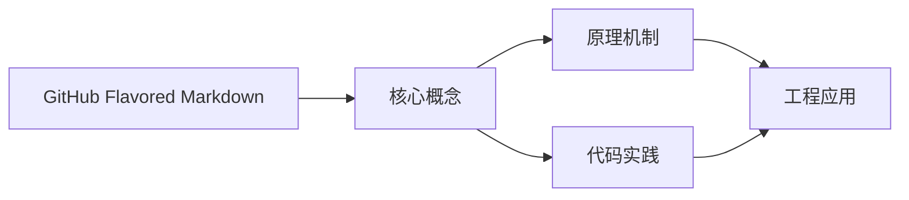
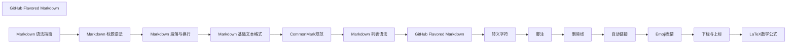

## 1. 学习目标（Bloom 分类）

本节按照布鲁姆教育目标分类学组织学习路径。本文主题为《GitHub Flavored Markdown》，属于 Markdown 模块，读者可以根据自身阶段选择阅读深度。

记忆层面：能够准确复述本文的核心概念、术语与基本语法或操作步骤，并能够在提问或检索时快速定位对应知识点。能够说出 Markdown 的核心概念、常用命令与流程。

理解层面：能够用自己的语言解释核心原理与工作机制，说明概念之间的因果关系，而不是机械记忆结论。能够解释 Markdown 的工作原理与设计动机。

应用层面：能够在真实项目或练习场景中运用本文知识解决具体问题，写出正确且可维护的实现。能够独立完成 Markdown 的标准操作。

分析层面：能够拆解复杂问题，比较本文主题与相邻概念的异同，识别边界条件与例外情况。能够分析 Markdown 使用中的异常与边界。

评价层面：能够根据约束条件（性能、可读性、安全、成本）评价不同方案的优劣，做出有依据的技术决策。能够评价 Markdown 相关工具与方案。

创造层面：能够把本文知识与其他模块知识组合，设计出新的解决方案或可复用的工程模式。能够把 Markdown 融入团队工作流。

通过本节学习，读者应当能够把《GitHub Flavored Markdown》纳入自己的知识网络，并与 Markdown 模块的其他主题（基础语法、GFM、写作规范）建立关联。

## 2. 历史动机与发展脉络

《GitHub Flavored Markdown》是 Markdown 领域的重要主题。要真正理解它，需要先了解它解决的问题与演进过程。

Markdown 由 John Gruber 与 Aaron Swartz 于 2004 年设计，目标是“易读易写的纯文本格式”，可转换为 HTML。
标准化：CommonMark（2014 起）统一解析歧义；GitHub Flavored Markdown（GFM）扩展表格、任务列表、删除线、围栏代码。
生态：文档站（Astro/VitePress）、知识库（Obsidian）、论坛（GitHub/Stack Overflow）、AI 输出格式均以 Markdown 为通用语言。

回到本文主题：GitHub Flavored Markdown 的提出与成熟，正是上述技术背景下的必然产物。早期实现往往以简单可用为目标，随着工程规模扩大，社区逐渐沉淀出标准做法与最佳实践；理解这一脉络，可以帮助读者判断“为什么文档中的推荐写法是现在这个样子”，也能在遇到历史遗留代码时准确识别其设计年代与取舍。


## 3. 形式化定义与核心概念精讲

本节把《GitHub Flavored Markdown》涉及的核心概念以“定义 + 讲解”的形式展开。读者应把定义当作工具，把讲解当作理解路径；两者结合才能形成可迁移的知识。

块级语法：标题、段落、列表、引用、代码块、表格、分隔线；行内语法：强调、代码、链接、图片。
解析模型：块级解析优先，行内解析递归；空行分隔块；转义符 \ 输出字面量。
GFM 扩展：~~删除线~~、任务列表 - [x]、表格对齐、自动链接、围栏代码语言标注。

### 3.1 原文章节逐一精讲

原文档把主题拆分为 31 个小节，下面按顺序给出每一节的导读讲解，随后保留原文细节供精读。

#### 原文精读（完整保留）

# GitHub Flavored Markdown 扩展

> **符号约定**：`< >` 必填参数 | `[ ]` 可选参数

---

#### 1. GFM 概述

##### 1.1 什么是 GFM

GitHub Flavored Markdown（GFM）是 GitHub 在 CommonMark 基础上扩展的 Markdown 方言，是 GitHub 平台上所有文本内容（README、Issue、PR、评论等）的解析标准。

##### 1.2 GFM 扩展列表

| 扩展         | 语法               | 说明                 |
| :----------- | :----------------- | :------------------- |
| **表格**     | `\| col \| col \|` | 结构化数据展示       |
| **任务列表** | `- [x] done`       | 待办事项追踪         |
| **删除线**   | `~~text~~`         | 标记删除内容         |
| **自动链接** | `https://...`      | 无需尖括号的 URL     |
| **代码围栏** | ` ```lang `        | 带语言标识的代码块   |
| **脚注**     | `[^1]`             | 尾注引用（部分支持） |
| **警告框**   | `> [!NOTE]`        | GitHub 特有的提示框  |

#### 2. 表格

##### 2.1 基本语法

```markdown
| 名称    | 类型     | 描述     |
| ------- | -------- | -------- |
| id      | integer  | 主键     |
| name    | string   | 用户名   |
| email   | string   | 邮箱地址 |
| created | datetime | 创建时间 |
```

渲染结果：

| 名称    | 类型     | 描述     |
| :------ | :------- | :------- |
| id      | integer  | 主键     |
| name    | string   | 用户名   |
| email   | string   | 邮箱地址 |
| created | datetime | 创建时间 |

##### 2.2 对齐方式

通过分隔行的冒号位置控制对齐：

```markdown
| 左对齐     | 居中对齐 | 右对齐 |
| :--------- | :------: | -----: |
| Left       |  Center  |  Right |
| 长文本内容 |  短文本  | 123.45 |
```

| 对齐方式 | 语法    | 说明         |
| :------- | :------ | :----------- |
| 左对齐   | `:---`  | 默认对齐方式 |
| 居中对齐 | `:---:` | 冒号在两端   |
| 右对齐   | `---:`  | 冒号在右端   |

##### 2.3 表格规则

- 表格前后需要空行
- 列数由表头决定，多出的列被忽略
- 单元格内可使用行内 Markdown（链接、强调、代码等）
- 单元格内不能包含块级元素（标题、列表等）
- 管道符 `|` 在行首和行尾可省略

```markdown
> 简化写法
>
> | 名称 | 类型    |
> | ---- | ------- |
> | id   | integer |
> | name | string  |
```

#### 3. 任务列表

##### 3.1 基本语法

```markdown
- [x] 完成需求分析
- [x] 编写技术方案
- [ ] 开发核心功能
- [ ] 编写单元测试
- [ ] 部署上线
```

##### 3.2 任务列表嵌套

```markdown
- [x] 前端开发
  - [x] 页面布局
  - [x] 组件开发
  - [ ] 接口联调
- [ ] 后端开发
  - [x] 数据库设计
  - [ ] API 开发
  - [ ] 性能优化
```

##### 3.3 Issue 中的任务列表

在 Issue 中使用任务列表可以**追踪进度**，GitHub 会自动显示完成比例：

```markdown
#### Sprint 3 任务

- [x] #123 用户登录功能
- [ ] #124 权限管理模块
- [ ] #125 数据导出功能
- [ ] #126 性能优化
```

- 可以用 `#issue号` 引用其他 Issue
- 勾选任务会自动更新进度条
- PR 中也可以使用任务列表追踪变更

#### 4. 删除线

##### 4.1 基本语法

```markdown
~~已废弃的API~~
~~旧版本功能~~已被新功能替代
```

渲染结果：~~已废弃的API~~

##### 4.2 使用场景

- 标记已完成的待办事项
- 显示价格变动（~~¥99~~ ¥59）
- 标记废弃的 API 或功能
- 编辑记录中显示删除内容

##### 4.3 注意事项

- 两个 `~` 必须紧贴文本，中间不能有空格
- `~~` 不能出现在单词内部
- 可以与强调组合使用：`~~***重要且已废弃***~~`

#### 5. 自动链接

##### 5.1 URL 自动链接

GFM 扩展了 CommonMark 的自动链接，无需尖括号即可识别 URL：

```markdown
访问 https://github.com 了解更多

我的邮箱是 user@example.com
```

##### 5.2 自动链接规则

| 类型               | 示例                      | 是否自动链接 |
| :----------------- | :------------------------ | :----------- |
| **http/https URL** | `https://example.com`     |              |
| **www 域名**       | `www.example.com`         |              |
| **邮箱地址**       | `user@example.com`        |              |
| **其他协议**       | `ftp://files.example.com` |              |
| **纯域名**         | `example.com`             |              |

##### 5.3 链接截断

GFM 会自动截断过长的 URL 显示：

```markdown
https://github.com/very/long/path/to/a/resource/that/goes/on/and/on
```

在渲染时，超长 URL 会被截断显示，但链接仍然完整。

#### 6. 代码围栏增强

##### 6.1 语言标识

GFM 支持在代码围栏后指定语言，实现语法高亮：

````markdown
```python
def fibonacci(n: int) -> list[int]:
    """生成斐波那契数列"""
    fib = [0, 1]
    for i in range(2, n):
        fib.append(fib[i-1] + fib[i-2])
    return fib[:n]
```
````

##### 6.2 支持的语言标识

| 类别      | 语言标识                                                       |
| :-------- | :------------------------------------------------------------- |
| **Web**   | `javascript`, `typescript`, `html`, `css`, `vue`, `jsx`, `tsx` |
| **后端**  | `python`, `java`, `go`, `rust`, `ruby`, `php`                  |
| **系统**  | `c`, `cpp`, `csharp`, `swift`, `kotlin`                        |
| **数据**  | `sql`, `json`, `yaml`, `toml`, `xml`                           |
| **Shell** | `bash`, `powershell`, `shell`, `zsh`                           |
| **配置**  | `dockerfile`, `nginx`, `apache`                                |
| **文档**  | `markdown`, `latex`, `math`                                    |

##### 6.3 围栏内的转义

代码围栏内的内容**不进行 Markdown 解析**，原样显示。如果需要在代码块中显示三个反引号，可以使用更多反引号作为围栏：

`````markdown
````markdown
```javascript
console.log('Hello');
```
````
`````

````

#### 7. 警告框（Alerts）

##### 7.1 语法

GitHub 2023 年引入的扩展语法，用于创建提示框：

```markdown
> [!NOTE]
> 这是一条提示信息

> [!TIP]
> 这是一条建议

> [!IMPORTANT]
> 这是一条重要信息

> [!WARNING]
> 这是一条警告

> [!CAUTION]
> 这是一条危险警告
```

##### 7.2 警告框类型

| 类型 | 颜色 | 用途 |
| :--- | :--- | :--- |
| **NOTE** | 蓝色 | 补充说明 |
| **TIP** | 绿色 | 有用的建议 |
| **IMPORTANT** | 紫色 | 关键信息 |
| **WARNING** | 橙色 | 注意事项 |
| **CAUTION** | 红色 | 危险操作警告 |

#### 8. GFM 与 CommonMark 的兼容性

##### 8.1 兼容策略

GFM 是 CommonMark 的**严格超集**：

- 所有合法的 CommonMark 文档在 GFM 中渲染结果相同
- GFM 额外添加的语法不会与 CommonMark 冲突
- GFM 扩展在 CommonMark 解析器中被忽略

##### 8.2 迁移建议

- 编写 Markdown 时优先使用 CommonMark 语法，确保最大兼容性
- 仅在 GitHub 平台使用 GFM 扩展
- 避免依赖特定渲染器的行为
````
#### 删除线

**基本写法：删除线**
`~~<文本>~~**
```markdown
# 双波浪线表示删除线
~~废弃内容~~
```

---

**基本写法：删除线与粗体组合**
`**~~<文本>~~****
```markdown
# 删除线加粗组合
**~~重要废弃~~**
```

---

#### 任务列表

**基本写法：任务列表**
`- [ ] <项>**
```markdown
# GFM 支持可勾选任务列表
- [x] 完成功能
- [ ] 修复 bug
```

---

**基本写法：任务列表嵌套**
`  - [ ] <子项>**
```markdown
# 嵌套任务列表
- [ ] 主任务
  - [x] 子任务一
  - [ ] 子任务二
```

---

#### 表格扩展

**基本写法：GFM 表格**
`| <列1> | <列2> |**
`| --- | --- |**
```markdown
# GFM 表格语法
| 名称 | 版本 |
| --- | --- |
| Node | 20 |
| Git | 2.47 |
```

---

**基本写法：表格对齐**
`| :--- | :---: | ---: |**
```markdown
# 用冒号控制列对齐
| 左对齐 | 居中 | 右对齐 |
| :--- | :---: | ---: |
| a | b | c |
```

---

**基本写法：表格内行内代码**
`| \`<代码>\` |**
```markdown
# 表格单元格内可使用行内代码
| 命令 | 说明 |
| --- | --- |
| `git status` | 查看状态 |
```

---

#### 自动链接

**基本写法：URL 自动链接**
`<https://example.com>**
```markdown
# 尖括号包裹 URL 转为链接
<https://github.com>
```

---

**基本写法：邮箱自动链接**
`<user@example.com>**
```markdown
# 邮箱地址自动转为 mailto 链接
<alice@example.com>
```

---

**基本写法：裸 URL 自动识别**
`https://example.com**
```markdown
# GFM 自动将裸 URL 转为链接
访问 https://github.com 了解更多
```

---

#### 围栏代码块

**基本写法：围栏代码块**
` ```<语言> **
```markdown
# GFM 支持围栏代码块语法
```python
print("hi")
```
```

---

**基本写法：语法高亮**
` ```<语言> **
```markdown
# 指定语言启用语法高亮
```javascript
console.log("hi")
```
```

---

#### 引用折行

**基本写法：引用内多段**
`> <段落1>**
`>**
`> <段落2>**
```markdown
# 引用内用空引用行分隔段落
> 第一段
>
> 第二段
```

---

**基本写法：引用嵌套**
`> > <内容>**
```markdown
# 多层引用嵌套
> 外层引用
> > 内层引用
```

---

#### 列表扩展

**基本写法：列表内嵌套段落**
`1.  <项>**
`    <续行>**
```markdown
# 列表项内容跨行需缩进
1.  第一项

    续行说明

2.  第二项
```

---

**基本写法：列表内代码块**
`1.  <项>**
`        <代码>**
```markdown
# 列表内代码需 8 空格缩进
1. 示例：

        print("hi")
```

---

#### 列表前后空行

**基本写法：列表前空行**
`<段落>**
`(空行)**
`- <项>**
```markdown
# 列表前建议留空行
这是段落。

- 列表项一
- 列表项二
```

---

#### 链接引用

**基本写法：定义链接引用**
`[<标识>]: <URL>**
```markdown
# 文档末尾定义链接引用
[GitHub]: https://github.com
```

---

**基本写法：使用链接引用**
`[<文本>][<标识>]**
```markdown
# 引用预定义的链接
访问 [GitHub][GitHub] 仓库
```

---

**基本写法：链接引用带标题**
`[<标识>]: <URL> "<标题>"**
```markdown
# 链接引用追加 title 属性
[Google]: https://google.com "搜索引擎"
```

---

#### 禁用与转义

**基本写法：转义星号**
`\*<文本>\***
```markdown
# 反斜杠转义避免被解析为强调
这里不是 *斜体* 而是 \*字面星号\*
```

---

**基本写法：转义反引号**
`\`<文本>\``
```markdown
# 反斜杠转义反引号
显示 \`code\` 字面文本
```

---

#### 警告与提示（GitHub 不支持原生）

**基本写法：用引用模拟提示**
`> **<类型>**: <内容>**
```markdown
# GitHub 用引用加粗体模拟提示框
> **Note**: 这是提示内容
> **Warning**: 这是警告内容
```

---

#### 表情符号

**基本写法：emoji 短码**
`:<短码>:**
```markdown
# GFM 支持 emoji 短码
:smile: :rocket: :+1:
```

---

**基本写法：直接使用 emoji 字符**
`<emoji>**
```markdown
# 直接输入 Unicode emoji 字符
完成 享受
```

---

#### 用户与 Issue 引用

**基本写法：提及用户**
`@<用户名>**
```markdown
# @ 后跟用户名提及他人
@octocat 请查看
```

---

**基本写法：引用 Issue 与 PR**
`#<编号>**
```markdown
# 自动链接到 issue 与 PR
修复 #123 的回归
关闭 PR #456
```

---

**基本写法：跨仓库引用**
`<用户>/<仓库>#<编号>**
```markdown
# 跨仓库引用 issue
相关 microsoft/vscode#12345
```

---

#### 提交 SHA 引用

**基本写法：引用提交哈希**
`<40位哈希>**
```markdown
# 自动链接到提交记录
提交 08103b9f2b6e7fbed517a7e268e4e371d84a9a10 修复此问题
```

---

**基本写法：短 SHA 引用**
`<7位哈希>**
```markdown
# 7 位以上哈希自动识别
参见 abc1234
```

---

#### 对比表格（diff）

**基本写法：diff 代码块**
` ```diff **
```markdown
# 用 diff 代码块展示差异
```diff
- old line
+ new line
```
```

---

#### 折叠内容

**基本写法：用 HTML details 折叠**
`<details><summary><标题></summary><内容></details>**
```markdown
# GitHub 用 details 标签实现折叠
<details>
<summary>点击展开</summary>

这里是折叠内容

</details>
```

---

**基本写法：默认展开折叠**
`<details open>**
```markdown
# 用 open 属性默认展开
<details open>
<summary>默认展开</summary>
内容
</details>
```

---

#### 图片扩展

**基本写法：指定图片宽高**
`" width="<宽>" height="<高>">**
```markdown
# 用 HTML img 标签指定尺寸

```

---

**基本写法：图片带链接**
`[](<链接URL>)**
```markdown
# 图片外层包裹链接
[](https://example.com)
```

---

#### 数学公式扩展

**基本写法：行内公式**
`$<公式>$**
```markdown
# GFM 2022 年起支持 LaTeX 公式
能量 $E = mc^2$
```

---

**基本写法：块级公式**
`$$<公式>$$**
```markdown
# 块级公式独占一行
$$
\int_0^1 x^2 dx = \frac{1}{3}
$$
```

---

#### 锚点自动生成

**基本写法：标题锚点**
`## <标题>**
```markdown
# 标题自动生成小写横线锚点
#### Quick Start
# 锚点 #quick-start
```

---

**基本写法：链接到锚点**
`[<文本>](#<锚点>)**
```markdown
# 链接到本文档某标题
[快速开始](#quick-start)
```

---

#### 渲染器适配

**基本写法：GitHub 渲染规则**
`GFM 规范**
```markdown
# GitHub 遵循 GFM 规范
# 支持上述所有扩展语法
```

---

**基本写法：GitLab 扩展**
`GitLab Flavored Markdown**
```markdown
# GitLab 在 GFM 基础上扩展
# 支持数学公式、Mermaid 图表等
```

---

**基本写法：VS Code 预览**
`内置 Markdown 预览**
```markdown
# VS Code 支持大部分 GFM 语法
# 通过插件可扩展更多功能
```

---

#### 注意事项

**基本写法：GFM 与 CommonMark 关系**
`GFM 是 CommonMark 的超集**
```markdown
# GFM 兼容 CommonMark 并扩展
# CommonMark 不支持的扩展可参考本文档
```

---

**基本写法：兼容性检查**
`在目标平台预览验证**
```markdown
# 不同平台支持程度不同
# 建议提交前在目标平台预览
```


### 3.2 概念关系图

下面用 Mermaid 图表达本文核心概念之间的关系，帮助读者建立整体图景：



图中展示的是本文知识的结构化关系：核心概念是入口，原理机制解释“为什么”，代码实践演示“怎么做”，工程应用回答“何时用”。读者学习时可以把每个小节的内容挂接到对应节点上。

## 4. 理论推导与原理解析

本节深入《GitHub Flavored Markdown》背后的原理。理论部分不求面面俱到，而是聚焦“能解释现象、能指导实践”的关键推导。

块级语法：标题、段落、列表、引用、代码块、表格、分隔线；行内语法：强调、代码、链接、图片。
解析模型：块级解析优先，行内解析递归；空行分隔块；转义符 \ 输出字面量。
GFM 扩展：~~删除线~~、任务列表 - [x]、表格对齐、自动链接、围栏代码语言标注。
元数据：frontmatter（YAML）在文档站中承载标题、日期、标签。

需要强调的是，理论推导与工程实践之间存在翻译层：理论给出的是理想化模型与边界条件，工程代码则必须处理真实环境中的例外。读者在学习时应先掌握理论的“标准情形”，再通过陷阱章节了解“非标准情形”。

## 5. 代码示例与逐行讲解

本节把原文中的代码示例系统整理，并为每个示例补充用途说明与讲解。读者不应只浏览代码，而应逐段对照讲解理解设计意图。

### 5.1 示例：2.1 基本语法

该示例来自原文《2.1 基本语法》小节，用于演示GitHub Flavored Markdown相关操作。阅读时请先看代码结构，再看其后的讲解。

```markdown
| 名称    | 类型     | 描述     |
| ------- | -------- | -------- |
| id      | integer  | 主键     |
| name    | string   | 用户名   |
| email   | string   | 邮箱地址 |
| created | datetime | 创建时间 |
```

讲解：这段代码演示了本节核心知识点。代码中的关键操作可以归纳为三步：准备（定义或初始化）、执行（核心逻辑）、收尾（释放资源或返回结果）。实际项目中，这三步往往被封装为函数或类，以提升复用性与可测试性。

关键点分析：

该示例共 6 行有效代码，结构以数据或配置为主。阅读时应关注：数据字段的含义、配置项的作用，以及它们与运行行为的对应关系。

进阶思考路径：先尝试修改参数观察行为变化，再把示例中的模式迁移到自己的项目中；每次修改都记录预期与实测差异，这是把示例转化为能力的最快方式。

### 5.2 示例：2.2 对齐方式

该示例来自原文《2.2 对齐方式》小节，用于演示GitHub Flavored Markdown相关操作。阅读时请先看代码结构，再看其后的讲解。

```markdown
| 左对齐     | 居中对齐 | 右对齐 |
| :--------- | :------: | -----: |
| Left       |  Center  |  Right |
| 长文本内容 |  短文本  | 123.45 |
```

讲解：这段代码演示了本节核心知识点。代码中的关键操作可以归纳为三步：准备（定义或初始化）、执行（核心逻辑）、收尾（释放资源或返回结果）。实际项目中，这三步往往被封装为函数或类，以提升复用性与可测试性。

关键点分析：

该示例共 4 行有效代码，结构以数据或配置为主。阅读时应关注：数据字段的含义、配置项的作用，以及它们与运行行为的对应关系。

进阶思考路径：先尝试修改参数观察行为变化，再把示例中的模式迁移到自己的项目中；每次修改都记录预期与实测差异，这是把示例转化为能力的最快方式。

### 5.3 示例：2.3 表格规则

该示例来自原文《2.3 表格规则》小节，用于演示GitHub Flavored Markdown相关操作。阅读时请先看代码结构，再看其后的讲解。

```markdown
> 简化写法
>
> | 名称 | 类型    |
> | ---- | ------- |
> | id   | integer |
> | name | string  |
```

讲解：这段代码演示了本节核心知识点。代码中的关键操作可以归纳为三步：准备（定义或初始化）、执行（核心逻辑）、收尾（释放资源或返回结果）。实际项目中，这三步往往被封装为函数或类，以提升复用性与可测试性。

关键点分析：

该示例共 6 行有效代码，结构以数据或配置为主。阅读时应关注：数据字段的含义、配置项的作用，以及它们与运行行为的对应关系。

进阶思考路径：先尝试修改参数观察行为变化，再把示例中的模式迁移到自己的项目中；每次修改都记录预期与实测差异，这是把示例转化为能力的最快方式。

### 5.4 示例：3.1 基本语法

该示例来自原文《3.1 基本语法》小节，用于演示GitHub Flavored Markdown相关操作。阅读时请先看代码结构，再看其后的讲解。

```markdown
- [x] 完成需求分析
- [x] 编写技术方案
- [ ] 开发核心功能
- [ ] 编写单元测试
- [ ] 部署上线
```

讲解：这段代码演示了本节核心知识点。代码中的关键操作可以归纳为三步：准备（定义或初始化）、执行（核心逻辑）、收尾（释放资源或返回结果）。实际项目中，这三步往往被封装为函数或类，以提升复用性与可测试性。

关键点分析：

该示例共 5 行有效代码，结构以数据或配置为主。阅读时应关注：数据字段的含义、配置项的作用，以及它们与运行行为的对应关系。

进阶思考路径：先尝试修改参数观察行为变化，再把示例中的模式迁移到自己的项目中；每次修改都记录预期与实测差异，这是把示例转化为能力的最快方式。

### 5.5 示例：3.2 任务列表嵌套

该示例来自原文《3.2 任务列表嵌套》小节，用于演示GitHub Flavored Markdown相关操作。阅读时请先看代码结构，再看其后的讲解。

```markdown
- [x] 前端开发
  - [x] 页面布局
  - [x] 组件开发
  - [ ] 接口联调
- [ ] 后端开发
  - [x] 数据库设计
  - [ ] API 开发
  - [ ] 性能优化
```

讲解：这段代码演示了本节核心知识点。代码中的关键操作可以归纳为三步：准备（定义或初始化）、执行（核心逻辑）、收尾（释放资源或返回结果）。实际项目中，这三步往往被封装为函数或类，以提升复用性与可测试性。

关键点分析：

该示例共 8 行有效代码，结构以数据或配置为主。阅读时应关注：数据字段的含义、配置项的作用，以及它们与运行行为的对应关系。

进阶思考路径：先尝试修改参数观察行为变化，再把示例中的模式迁移到自己的项目中；每次修改都记录预期与实测差异，这是把示例转化为能力的最快方式。

### 5.6 示例：3.3 Issue 中的任务列表

该示例来自原文《3.3 Issue 中的任务列表》小节，用于演示GitHub Flavored Markdown相关操作。阅读时请先看代码结构，再看其后的讲解。

```markdown
## Sprint 3 任务

- [x] #123 用户登录功能
- [ ] #124 权限管理模块
- [ ] #125 数据导出功能
- [ ] #126 性能优化
```

讲解：这段代码演示了本节核心知识点。代码中的关键操作可以归纳为三步：准备（定义或初始化）、执行（核心逻辑）、收尾（释放资源或返回结果）。实际项目中，这三步往往被封装为函数或类，以提升复用性与可测试性。

关键点分析：

该示例共 5 行有效代码，结构以数据或配置为主。阅读时应关注：数据字段的含义、配置项的作用，以及它们与运行行为的对应关系。

进阶思考路径：先尝试修改参数观察行为变化，再把示例中的模式迁移到自己的项目中；每次修改都记录预期与实测差异，这是把示例转化为能力的最快方式。

### 5.7 示例：4.1 基本语法

该示例来自原文《4.1 基本语法》小节，用于演示GitHub Flavored Markdown相关操作。阅读时请先看代码结构，再看其后的讲解。

```markdown
~~已废弃的API~~
~~旧版本功能~~已被新功能替代
```

讲解：这段代码演示了本节核心知识点。代码中的关键操作可以归纳为三步：准备（定义或初始化）、执行（核心逻辑）、收尾（释放资源或返回结果）。实际项目中，这三步往往被封装为函数或类，以提升复用性与可测试性。

关键点分析：

该示例共 2 行有效代码，结构以数据或配置为主。阅读时应关注：数据字段的含义、配置项的作用，以及它们与运行行为的对应关系。

进阶思考路径：先尝试修改参数观察行为变化，再把示例中的模式迁移到自己的项目中；每次修改都记录预期与实测差异，这是把示例转化为能力的最快方式。

### 5.8 示例：5.1 URL 自动链接

该示例来自原文《5.1 URL 自动链接》小节，用于演示GitHub Flavored Markdown相关操作。阅读时请先看代码结构，再看其后的讲解。

```markdown
访问 https://github.com 了解更多

我的邮箱是 user@example.com
```

讲解：这段代码演示了本节核心知识点。代码中的关键操作可以归纳为三步：准备（定义或初始化）、执行（核心逻辑）、收尾（释放资源或返回结果）。实际项目中，这三步往往被封装为函数或类，以提升复用性与可测试性。

关键点分析：

该示例共 2 行有效代码，结构以数据或配置为主。阅读时应关注：数据字段的含义、配置项的作用，以及它们与运行行为的对应关系。

进阶思考路径：先尝试修改参数观察行为变化，再把示例中的模式迁移到自己的项目中；每次修改都记录预期与实测差异，这是把示例转化为能力的最快方式。

### 5.9 示例：5.3 链接截断

该示例来自原文《5.3 链接截断》小节，用于演示GitHub Flavored Markdown相关操作。阅读时请先看代码结构，再看其后的讲解。

```markdown
https://github.com/very/long/path/to/a/resource/that/goes/on/and/on
```

讲解：这段代码演示了本节核心知识点。代码中的关键操作可以归纳为三步：准备（定义或初始化）、执行（核心逻辑）、收尾（释放资源或返回结果）。实际项目中，这三步往往被封装为函数或类，以提升复用性与可测试性。

关键点分析：

该示例共 1 行有效代码，结构以数据或配置为主。阅读时应关注：数据字段的含义、配置项的作用，以及它们与运行行为的对应关系。

进阶思考路径：先尝试修改参数观察行为变化，再把示例中的模式迁移到自己的项目中；每次修改都记录预期与实测差异，这是把示例转化为能力的最快方式。

### 5.10 示例：6.3 围栏内的转义

该示例来自原文《6.3 围栏内的转义》小节，用于演示GitHub Flavored Markdown相关操作。阅读时请先看代码结构，再看其后的讲解。

```javascript
console.log('Hello');
```

讲解：这段代码演示了本节核心知识点。代码中的关键操作可以归纳为三步：准备（定义或初始化）、执行（核心逻辑）、收尾（释放资源或返回结果）。实际项目中，这三步往往被封装为函数或类，以提升复用性与可测试性。

关键点分析：

该示例共 1 行有效代码，结构以数据或配置为主。阅读时应关注：数据字段的含义、配置项的作用，以及它们与运行行为的对应关系。

进阶思考路径：先尝试修改参数观察行为变化，再把示例中的模式迁移到自己的项目中；每次修改都记录预期与实测差异，这是把示例转化为能力的最快方式。

### 5.11 示例：6.3 围栏内的转义

该示例来自原文《6.3 围栏内的转义》小节，用于演示GitHub Flavored Markdown相关操作。阅读时请先看代码结构，再看其后的讲解。

````

## 7. 警告框（Alerts）

### 7.1 语法

GitHub 2023 年引入的扩展语法，用于创建提示框：

```

讲解：这段代码演示了本节核心知识点。代码中的关键操作可以归纳为三步：准备（定义或初始化）、执行（核心逻辑）、收尾（释放资源或返回结果）。实际项目中，这三步往往被封装为函数或类，以提升复用性与可测试性。

关键点分析：

该示例共 3 行有效代码，结构以数据或配置为主。阅读时应关注：数据字段的含义、配置项的作用，以及它们与运行行为的对应关系。

进阶思考路径：先尝试修改参数观察行为变化，再把示例中的模式迁移到自己的项目中；每次修改都记录预期与实测差异，这是把示例转化为能力的最快方式。

### 5.12 示例：6.3 围栏内的转义

该示例来自原文《6.3 围栏内的转义》小节，用于演示GitHub Flavored Markdown相关操作。阅读时请先看代码结构，再看其后的讲解。

```text

### 7.2 警告框类型

| 类型 | 颜色 | 用途 |
| :--- | :--- | :--- |
| **NOTE** | 蓝色 | 补充说明 |
| **TIP** | 绿色 | 有用的建议 |
| **IMPORTANT** | 紫色 | 关键信息 |
| **WARNING** | 橙色 | 注意事项 |
| **CAUTION** | 红色 | 危险操作警告 |

## 8. GFM 与 CommonMark 的兼容性

### 8.1 兼容策略

GFM 是 CommonMark 的**严格超集**：

- 所有合法的 CommonMark 文档在 GFM 中渲染结果相同
- GFM 额外添加的语法不会与 CommonMark 冲突
- GFM 扩展在 CommonMark 解析器中被忽略

### 8.2 迁移建议

- 编写 Markdown 时优先使用 CommonMark 语法，确保最大兼容性
- 仅在 GitHub 平台使用 GFM 扩展
- 避免依赖特定渲染器的行为
```

讲解：这段代码演示了本节核心知识点。代码中的关键操作可以归纳为三步：准备（定义或初始化）、执行（核心逻辑）、收尾（释放资源或返回结果）。实际项目中，这三步往往被封装为函数或类，以提升复用性与可测试性。

关键点分析：

该示例共 18 行有效代码，结构以数据或配置为主。阅读时应关注：数据字段的含义、配置项的作用，以及它们与运行行为的对应关系。

进阶思考路径：先尝试修改参数观察行为变化，再把示例中的模式迁移到自己的项目中；每次修改都记录预期与实测差异，这是把示例转化为能力的最快方式。

### 5.13 示例：删除线

该示例来自原文《删除线》小节，用于演示GitHub Flavored Markdown相关操作。阅读时请先看代码结构，再看其后的讲解。

```markdown
# 双波浪线表示删除线
~~废弃内容~~
```

讲解：这段代码演示了本节核心知识点。代码中的关键操作可以归纳为三步：准备（定义或初始化）、执行（核心逻辑）、收尾（释放资源或返回结果）。实际项目中，这三步往往被封装为函数或类，以提升复用性与可测试性。

关键点分析：

该示例共 2 行有效代码，结构以数据或配置为主。阅读时应关注：数据字段的含义、配置项的作用，以及它们与运行行为的对应关系。

进阶思考路径：先尝试修改参数观察行为变化，再把示例中的模式迁移到自己的项目中；每次修改都记录预期与实测差异，这是把示例转化为能力的最快方式。

### 5.14 示例：删除线

该示例来自原文《删除线》小节，用于演示GitHub Flavored Markdown相关操作。阅读时请先看代码结构，再看其后的讲解。

```markdown
# 删除线加粗组合
**~~重要废弃~~**
```

讲解：这段代码演示了本节核心知识点。代码中的关键操作可以归纳为三步：准备（定义或初始化）、执行（核心逻辑）、收尾（释放资源或返回结果）。实际项目中，这三步往往被封装为函数或类，以提升复用性与可测试性。

关键点分析：

该示例共 2 行有效代码，结构以数据或配置为主。阅读时应关注：数据字段的含义、配置项的作用，以及它们与运行行为的对应关系。

进阶思考路径：先尝试修改参数观察行为变化，再把示例中的模式迁移到自己的项目中；每次修改都记录预期与实测差异，这是把示例转化为能力的最快方式。

### 5.15 示例：任务列表

该示例来自原文《任务列表》小节，用于演示GitHub Flavored Markdown相关操作。阅读时请先看代码结构，再看其后的讲解。

```markdown
# GFM 支持可勾选任务列表
- [x] 完成功能
- [ ] 修复 bug
```

讲解：这段代码演示了本节核心知识点。代码中的关键操作可以归纳为三步：准备（定义或初始化）、执行（核心逻辑）、收尾（释放资源或返回结果）。实际项目中，这三步往往被封装为函数或类，以提升复用性与可测试性。

关键点分析：

该示例共 3 行有效代码，结构以数据或配置为主。阅读时应关注：数据字段的含义、配置项的作用，以及它们与运行行为的对应关系。

进阶思考路径：先尝试修改参数观察行为变化，再把示例中的模式迁移到自己的项目中；每次修改都记录预期与实测差异，这是把示例转化为能力的最快方式。

### 5.16 示例：任务列表

该示例来自原文《任务列表》小节，用于演示GitHub Flavored Markdown相关操作。阅读时请先看代码结构，再看其后的讲解。

```markdown
# 嵌套任务列表
- [ ] 主任务
  - [x] 子任务一
  - [ ] 子任务二
```

讲解：这段代码演示了本节核心知识点。代码中的关键操作可以归纳为三步：准备（定义或初始化）、执行（核心逻辑）、收尾（释放资源或返回结果）。实际项目中，这三步往往被封装为函数或类，以提升复用性与可测试性。

关键点分析：

该示例共 4 行有效代码，结构以数据或配置为主。阅读时应关注：数据字段的含义、配置项的作用，以及它们与运行行为的对应关系。

进阶思考路径：先尝试修改参数观察行为变化，再把示例中的模式迁移到自己的项目中；每次修改都记录预期与实测差异，这是把示例转化为能力的最快方式。

### 5.17 示例：表格扩展

该示例来自原文《表格扩展》小节，用于演示GitHub Flavored Markdown相关操作。阅读时请先看代码结构，再看其后的讲解。

```markdown
# GFM 表格语法
| 名称 | 版本 |
| --- | --- |
| Node | 20 |
| Git | 2.47 |
```

讲解：这段代码演示了本节核心知识点。代码中的关键操作可以归纳为三步：准备（定义或初始化）、执行（核心逻辑）、收尾（释放资源或返回结果）。实际项目中，这三步往往被封装为函数或类，以提升复用性与可测试性。

关键点分析：

该示例共 5 行有效代码，结构以数据或配置为主。阅读时应关注：数据字段的含义、配置项的作用，以及它们与运行行为的对应关系。

进阶思考路径：先尝试修改参数观察行为变化，再把示例中的模式迁移到自己的项目中；每次修改都记录预期与实测差异，这是把示例转化为能力的最快方式。

### 5.18 示例：表格扩展

该示例来自原文《表格扩展》小节，用于演示GitHub Flavored Markdown相关操作。阅读时请先看代码结构，再看其后的讲解。

```markdown
# 用冒号控制列对齐
| 左对齐 | 居中 | 右对齐 |
| :--- | :---: | ---: |
| a | b | c |
```

讲解：这段代码演示了本节核心知识点。代码中的关键操作可以归纳为三步：准备（定义或初始化）、执行（核心逻辑）、收尾（释放资源或返回结果）。实际项目中，这三步往往被封装为函数或类，以提升复用性与可测试性。

关键点分析：

该示例共 4 行有效代码，结构以数据或配置为主。阅读时应关注：数据字段的含义、配置项的作用，以及它们与运行行为的对应关系。

进阶思考路径：先尝试修改参数观察行为变化，再把示例中的模式迁移到自己的项目中；每次修改都记录预期与实测差异，这是把示例转化为能力的最快方式。

### 5.19 示例：表格扩展

该示例来自原文《表格扩展》小节，用于演示GitHub Flavored Markdown相关操作。阅读时请先看代码结构，再看其后的讲解。

```markdown
# 表格单元格内可使用行内代码
| 命令 | 说明 |
| --- | --- |
| `git status` | 查看状态 |
```

讲解：这段代码演示了本节核心知识点。代码中的关键操作可以归纳为三步：准备（定义或初始化）、执行（核心逻辑）、收尾（释放资源或返回结果）。实际项目中，这三步往往被封装为函数或类，以提升复用性与可测试性。

关键点分析：

该示例共 4 行有效代码，结构以数据或配置为主。阅读时应关注：数据字段的含义、配置项的作用，以及它们与运行行为的对应关系。

进阶思考路径：先尝试修改参数观察行为变化，再把示例中的模式迁移到自己的项目中；每次修改都记录预期与实测差异，这是把示例转化为能力的最快方式。

### 5.20 示例：自动链接

该示例来自原文《自动链接》小节，用于演示GitHub Flavored Markdown相关操作。阅读时请先看代码结构，再看其后的讲解。

```markdown
# 尖括号包裹 URL 转为链接
<https://github.com>
```

讲解：这段代码演示了本节核心知识点。代码中的关键操作可以归纳为三步：准备（定义或初始化）、执行（核心逻辑）、收尾（释放资源或返回结果）。实际项目中，这三步往往被封装为函数或类，以提升复用性与可测试性。

关键点分析：

该示例共 2 行有效代码，结构以数据或配置为主。阅读时应关注：数据字段的含义、配置项的作用，以及它们与运行行为的对应关系。

进阶思考路径：先尝试修改参数观察行为变化，再把示例中的模式迁移到自己的项目中；每次修改都记录预期与实测差异，这是把示例转化为能力的最快方式。

### 5.21 示例：自动链接

该示例来自原文《自动链接》小节，用于演示GitHub Flavored Markdown相关操作。阅读时请先看代码结构，再看其后的讲解。

```markdown
# 邮箱地址自动转为 mailto 链接
<alice@example.com>
```

讲解：这段代码演示了本节核心知识点。代码中的关键操作可以归纳为三步：准备（定义或初始化）、执行（核心逻辑）、收尾（释放资源或返回结果）。实际项目中，这三步往往被封装为函数或类，以提升复用性与可测试性。

关键点分析：

该示例共 2 行有效代码，结构以数据或配置为主。阅读时应关注：数据字段的含义、配置项的作用，以及它们与运行行为的对应关系。

进阶思考路径：先尝试修改参数观察行为变化，再把示例中的模式迁移到自己的项目中；每次修改都记录预期与实测差异，这是把示例转化为能力的最快方式。

### 5.22 示例：自动链接

该示例来自原文《自动链接》小节，用于演示GitHub Flavored Markdown相关操作。阅读时请先看代码结构，再看其后的讲解。

```markdown
# GFM 自动将裸 URL 转为链接
访问 https://github.com 了解更多
```

讲解：这段代码演示了本节核心知识点。代码中的关键操作可以归纳为三步：准备（定义或初始化）、执行（核心逻辑）、收尾（释放资源或返回结果）。实际项目中，这三步往往被封装为函数或类，以提升复用性与可测试性。

关键点分析：

该示例共 2 行有效代码，结构以数据或配置为主。阅读时应关注：数据字段的含义、配置项的作用，以及它们与运行行为的对应关系。

进阶思考路径：先尝试修改参数观察行为变化，再把示例中的模式迁移到自己的项目中；每次修改都记录预期与实测差异，这是把示例转化为能力的最快方式。

### 5.23 示例：围栏代码块

该示例来自原文《围栏代码块》小节，用于演示GitHub Flavored Markdown相关操作。阅读时请先看代码结构，再看其后的讲解。

```markdown
# GFM 支持围栏代码块语法
```

讲解：这段代码演示了本节核心知识点。代码中的关键操作可以归纳为三步：准备（定义或初始化）、执行（核心逻辑）、收尾（释放资源或返回结果）。实际项目中，这三步往往被封装为函数或类，以提升复用性与可测试性。

关键点分析：

该示例共 1 行有效代码，结构以数据或配置为主。阅读时应关注：数据字段的含义、配置项的作用，以及它们与运行行为的对应关系。

进阶思考路径：先尝试修改参数观察行为变化，再把示例中的模式迁移到自己的项目中；每次修改都记录预期与实测差异，这是把示例转化为能力的最快方式。

### 5.24 示例：围栏代码块

该示例来自原文《围栏代码块》小节，用于演示GitHub Flavored Markdown相关操作。阅读时请先看代码结构，再看其后的讲解。

```markdown
# 指定语言启用语法高亮
```

讲解：这段代码演示了本节核心知识点。代码中的关键操作可以归纳为三步：准备（定义或初始化）、执行（核心逻辑）、收尾（释放资源或返回结果）。实际项目中，这三步往往被封装为函数或类，以提升复用性与可测试性。

关键点分析：

该示例共 1 行有效代码，结构以数据或配置为主。阅读时应关注：数据字段的含义、配置项的作用，以及它们与运行行为的对应关系。

进阶思考路径：先尝试修改参数观察行为变化，再把示例中的模式迁移到自己的项目中；每次修改都记录预期与实测差异，这是把示例转化为能力的最快方式。

### 5.25 示例：引用折行

该示例来自原文《引用折行》小节，用于演示GitHub Flavored Markdown相关操作。阅读时请先看代码结构，再看其后的讲解。

```markdown
# 引用内用空引用行分隔段落
> 第一段
>
> 第二段
```

讲解：这段代码演示了本节核心知识点。代码中的关键操作可以归纳为三步：准备（定义或初始化）、执行（核心逻辑）、收尾（释放资源或返回结果）。实际项目中，这三步往往被封装为函数或类，以提升复用性与可测试性。

关键点分析：

该示例共 4 行有效代码，结构以数据或配置为主。阅读时应关注：数据字段的含义、配置项的作用，以及它们与运行行为的对应关系。

进阶思考路径：先尝试修改参数观察行为变化，再把示例中的模式迁移到自己的项目中；每次修改都记录预期与实测差异，这是把示例转化为能力的最快方式。

### 5.26 示例：引用折行

该示例来自原文《引用折行》小节，用于演示GitHub Flavored Markdown相关操作。阅读时请先看代码结构，再看其后的讲解。

```markdown
# 多层引用嵌套
> 外层引用
> > 内层引用
```

讲解：这段代码演示了本节核心知识点。代码中的关键操作可以归纳为三步：准备（定义或初始化）、执行（核心逻辑）、收尾（释放资源或返回结果）。实际项目中，这三步往往被封装为函数或类，以提升复用性与可测试性。

关键点分析：

该示例共 3 行有效代码，结构以数据或配置为主。阅读时应关注：数据字段的含义、配置项的作用，以及它们与运行行为的对应关系。

进阶思考路径：先尝试修改参数观察行为变化，再把示例中的模式迁移到自己的项目中；每次修改都记录预期与实测差异，这是把示例转化为能力的最快方式。

### 5.27 示例：列表扩展

该示例来自原文《列表扩展》小节，用于演示GitHub Flavored Markdown相关操作。阅读时请先看代码结构，再看其后的讲解。

```markdown
# 列表项内容跨行需缩进
1.  第一项

    续行说明

2.  第二项
```

讲解：这段代码演示了本节核心知识点。代码中的关键操作可以归纳为三步：准备（定义或初始化）、执行（核心逻辑）、收尾（释放资源或返回结果）。实际项目中，这三步往往被封装为函数或类，以提升复用性与可测试性。

关键点分析：

该示例共 4 行有效代码，结构以数据或配置为主。阅读时应关注：数据字段的含义、配置项的作用，以及它们与运行行为的对应关系。

进阶思考路径：先尝试修改参数观察行为变化，再把示例中的模式迁移到自己的项目中；每次修改都记录预期与实测差异，这是把示例转化为能力的最快方式。

### 5.28 示例：列表扩展

该示例来自原文《列表扩展》小节，用于演示GitHub Flavored Markdown相关操作。阅读时请先看代码结构，再看其后的讲解。

```markdown
# 列表内代码需 8 空格缩进
1. 示例：

        print("hi")
```

讲解：这段代码演示了本节核心知识点。代码中的关键操作可以归纳为三步：准备（定义或初始化）、执行（核心逻辑）、收尾（释放资源或返回结果）。实际项目中，这三步往往被封装为函数或类，以提升复用性与可测试性。

关键点分析：

该示例共 3 行有效代码，结构以数据或配置为主。阅读时应关注：数据字段的含义、配置项的作用，以及它们与运行行为的对应关系。

进阶思考路径：先尝试修改参数观察行为变化，再把示例中的模式迁移到自己的项目中；每次修改都记录预期与实测差异，这是把示例转化为能力的最快方式。

### 5.29 示例：列表前后空行

该示例来自原文《列表前后空行》小节，用于演示GitHub Flavored Markdown相关操作。阅读时请先看代码结构，再看其后的讲解。

```markdown
# 列表前建议留空行
这是段落。

- 列表项一
- 列表项二
```

讲解：这段代码演示了本节核心知识点。代码中的关键操作可以归纳为三步：准备（定义或初始化）、执行（核心逻辑）、收尾（释放资源或返回结果）。实际项目中，这三步往往被封装为函数或类，以提升复用性与可测试性。

关键点分析：

该示例共 4 行有效代码，结构以数据或配置为主。阅读时应关注：数据字段的含义、配置项的作用，以及它们与运行行为的对应关系。

进阶思考路径：先尝试修改参数观察行为变化，再把示例中的模式迁移到自己的项目中；每次修改都记录预期与实测差异，这是把示例转化为能力的最快方式。

### 5.30 示例：链接引用

该示例来自原文《链接引用》小节，用于演示GitHub Flavored Markdown相关操作。阅读时请先看代码结构，再看其后的讲解。

```markdown
# 文档末尾定义链接引用
[GitHub]: https://github.com
```

讲解：这段代码演示了本节核心知识点。代码中的关键操作可以归纳为三步：准备（定义或初始化）、执行（核心逻辑）、收尾（释放资源或返回结果）。实际项目中，这三步往往被封装为函数或类，以提升复用性与可测试性。

关键点分析：

该示例共 2 行有效代码，结构以数据或配置为主。阅读时应关注：数据字段的含义、配置项的作用，以及它们与运行行为的对应关系。

进阶思考路径：先尝试修改参数观察行为变化，再把示例中的模式迁移到自己的项目中；每次修改都记录预期与实测差异，这是把示例转化为能力的最快方式。

### 5.31 示例：链接引用

该示例来自原文《链接引用》小节，用于演示GitHub Flavored Markdown相关操作。阅读时请先看代码结构，再看其后的讲解。

```markdown
# 引用预定义的链接
访问 [GitHub][GitHub] 仓库
```

讲解：这段代码演示了本节核心知识点。代码中的关键操作可以归纳为三步：准备（定义或初始化）、执行（核心逻辑）、收尾（释放资源或返回结果）。实际项目中，这三步往往被封装为函数或类，以提升复用性与可测试性。

关键点分析：

该示例共 2 行有效代码，结构以数据或配置为主。阅读时应关注：数据字段的含义、配置项的作用，以及它们与运行行为的对应关系。

进阶思考路径：先尝试修改参数观察行为变化，再把示例中的模式迁移到自己的项目中；每次修改都记录预期与实测差异，这是把示例转化为能力的最快方式。

### 5.32 示例：链接引用

该示例来自原文《链接引用》小节，用于演示GitHub Flavored Markdown相关操作。阅读时请先看代码结构，再看其后的讲解。

```markdown
# 链接引用追加 title 属性
[Google]: https://google.com "搜索引擎"
```

讲解：这段代码演示了本节核心知识点。代码中的关键操作可以归纳为三步：准备（定义或初始化）、执行（核心逻辑）、收尾（释放资源或返回结果）。实际项目中，这三步往往被封装为函数或类，以提升复用性与可测试性。

关键点分析：

该示例共 2 行有效代码，结构以数据或配置为主。阅读时应关注：数据字段的含义、配置项的作用，以及它们与运行行为的对应关系。

进阶思考路径：先尝试修改参数观察行为变化，再把示例中的模式迁移到自己的项目中；每次修改都记录预期与实测差异，这是把示例转化为能力的最快方式。

### 5.33 示例：禁用与转义

该示例来自原文《禁用与转义》小节，用于演示GitHub Flavored Markdown相关操作。阅读时请先看代码结构，再看其后的讲解。

```markdown
# 反斜杠转义避免被解析为强调
这里不是 *斜体* 而是 \*字面星号\*
```

讲解：这段代码演示了本节核心知识点。代码中的关键操作可以归纳为三步：准备（定义或初始化）、执行（核心逻辑）、收尾（释放资源或返回结果）。实际项目中，这三步往往被封装为函数或类，以提升复用性与可测试性。

关键点分析：

该示例共 2 行有效代码，结构以数据或配置为主。阅读时应关注：数据字段的含义、配置项的作用，以及它们与运行行为的对应关系。

进阶思考路径：先尝试修改参数观察行为变化，再把示例中的模式迁移到自己的项目中；每次修改都记录预期与实测差异，这是把示例转化为能力的最快方式。

### 5.34 示例：禁用与转义

该示例来自原文《禁用与转义》小节，用于演示GitHub Flavored Markdown相关操作。阅读时请先看代码结构，再看其后的讲解。

```markdown
# 反斜杠转义反引号
显示 \`code\` 字面文本
```

讲解：这段代码演示了本节核心知识点。代码中的关键操作可以归纳为三步：准备（定义或初始化）、执行（核心逻辑）、收尾（释放资源或返回结果）。实际项目中，这三步往往被封装为函数或类，以提升复用性与可测试性。

关键点分析：

该示例共 2 行有效代码，结构以数据或配置为主。阅读时应关注：数据字段的含义、配置项的作用，以及它们与运行行为的对应关系。

进阶思考路径：先尝试修改参数观察行为变化，再把示例中的模式迁移到自己的项目中；每次修改都记录预期与实测差异，这是把示例转化为能力的最快方式。

### 5.35 示例：警告与提示（GitHub 不支持原生）

该示例来自原文《警告与提示（GitHub 不支持原生）》小节，用于演示GitHub Flavored Markdown相关操作。阅读时请先看代码结构，再看其后的讲解。

```markdown
# GitHub 用引用加粗体模拟提示框
> **Note**: 这是提示内容
> **Warning**: 这是警告内容
```

讲解：这段代码演示了本节核心知识点。代码中的关键操作可以归纳为三步：准备（定义或初始化）、执行（核心逻辑）、收尾（释放资源或返回结果）。实际项目中，这三步往往被封装为函数或类，以提升复用性与可测试性。

关键点分析：

该示例共 3 行有效代码，结构以数据或配置为主。阅读时应关注：数据字段的含义、配置项的作用，以及它们与运行行为的对应关系。

进阶思考路径：先尝试修改参数观察行为变化，再把示例中的模式迁移到自己的项目中；每次修改都记录预期与实测差异，这是把示例转化为能力的最快方式。

### 5.36 示例：表情符号

该示例来自原文《表情符号》小节，用于演示GitHub Flavored Markdown相关操作。阅读时请先看代码结构，再看其后的讲解。

```markdown
# GFM 支持 emoji 短码
:smile: :rocket: :+1:
```

讲解：这段代码演示了本节核心知识点。代码中的关键操作可以归纳为三步：准备（定义或初始化）、执行（核心逻辑）、收尾（释放资源或返回结果）。实际项目中，这三步往往被封装为函数或类，以提升复用性与可测试性。

关键点分析：

该示例共 2 行有效代码，结构以数据或配置为主。阅读时应关注：数据字段的含义、配置项的作用，以及它们与运行行为的对应关系。

进阶思考路径：先尝试修改参数观察行为变化，再把示例中的模式迁移到自己的项目中；每次修改都记录预期与实测差异，这是把示例转化为能力的最快方式。

### 5.37 示例：表情符号

该示例来自原文《表情符号》小节，用于演示GitHub Flavored Markdown相关操作。阅读时请先看代码结构，再看其后的讲解。

```markdown
# 直接输入 Unicode emoji 字符
完成 享受
```

讲解：这段代码演示了本节核心知识点。代码中的关键操作可以归纳为三步：准备（定义或初始化）、执行（核心逻辑）、收尾（释放资源或返回结果）。实际项目中，这三步往往被封装为函数或类，以提升复用性与可测试性。

关键点分析：

该示例共 2 行有效代码，结构以数据或配置为主。阅读时应关注：数据字段的含义、配置项的作用，以及它们与运行行为的对应关系。

进阶思考路径：先尝试修改参数观察行为变化，再把示例中的模式迁移到自己的项目中；每次修改都记录预期与实测差异，这是把示例转化为能力的最快方式。

### 5.38 示例：用户与 Issue 引用

该示例来自原文《用户与 Issue 引用》小节，用于演示GitHub Flavored Markdown相关操作。阅读时请先看代码结构，再看其后的讲解。

```markdown
# @ 后跟用户名提及他人
@octocat 请查看
```

讲解：这段代码演示了本节核心知识点。代码中的关键操作可以归纳为三步：准备（定义或初始化）、执行（核心逻辑）、收尾（释放资源或返回结果）。实际项目中，这三步往往被封装为函数或类，以提升复用性与可测试性。

关键点分析：

该示例共 2 行有效代码，结构以数据或配置为主。阅读时应关注：数据字段的含义、配置项的作用，以及它们与运行行为的对应关系。

进阶思考路径：先尝试修改参数观察行为变化，再把示例中的模式迁移到自己的项目中；每次修改都记录预期与实测差异，这是把示例转化为能力的最快方式。

### 5.39 示例：用户与 Issue 引用

该示例来自原文《用户与 Issue 引用》小节，用于演示GitHub Flavored Markdown相关操作。阅读时请先看代码结构，再看其后的讲解。

```markdown
# 自动链接到 issue 与 PR
修复 #123 的回归
关闭 PR #456
```

讲解：这段代码演示了本节核心知识点。代码中的关键操作可以归纳为三步：准备（定义或初始化）、执行（核心逻辑）、收尾（释放资源或返回结果）。实际项目中，这三步往往被封装为函数或类，以提升复用性与可测试性。

关键点分析：

该示例共 3 行有效代码，结构以数据或配置为主。阅读时应关注：数据字段的含义、配置项的作用，以及它们与运行行为的对应关系。

进阶思考路径：先尝试修改参数观察行为变化，再把示例中的模式迁移到自己的项目中；每次修改都记录预期与实测差异，这是把示例转化为能力的最快方式。

### 5.40 示例：用户与 Issue 引用

该示例来自原文《用户与 Issue 引用》小节，用于演示GitHub Flavored Markdown相关操作。阅读时请先看代码结构，再看其后的讲解。

```markdown
# 跨仓库引用 issue
相关 microsoft/vscode#12345
```

讲解：这段代码演示了本节核心知识点。代码中的关键操作可以归纳为三步：准备（定义或初始化）、执行（核心逻辑）、收尾（释放资源或返回结果）。实际项目中，这三步往往被封装为函数或类，以提升复用性与可测试性。

关键点分析：

该示例共 2 行有效代码，结构以数据或配置为主。阅读时应关注：数据字段的含义、配置项的作用，以及它们与运行行为的对应关系。

进阶思考路径：先尝试修改参数观察行为变化，再把示例中的模式迁移到自己的项目中；每次修改都记录预期与实测差异，这是把示例转化为能力的最快方式。

### 5.41 示例：提交 SHA 引用

该示例来自原文《提交 SHA 引用》小节，用于演示GitHub Flavored Markdown相关操作。阅读时请先看代码结构，再看其后的讲解。

```markdown
# 自动链接到提交记录
提交 08103b9f2b6e7fbed517a7e268e4e371d84a9a10 修复此问题
```

讲解：这段代码演示了本节核心知识点。代码中的关键操作可以归纳为三步：准备（定义或初始化）、执行（核心逻辑）、收尾（释放资源或返回结果）。实际项目中，这三步往往被封装为函数或类，以提升复用性与可测试性。

关键点分析：

该示例共 2 行有效代码，结构以数据或配置为主。阅读时应关注：数据字段的含义、配置项的作用，以及它们与运行行为的对应关系。

进阶思考路径：先尝试修改参数观察行为变化，再把示例中的模式迁移到自己的项目中；每次修改都记录预期与实测差异，这是把示例转化为能力的最快方式。

### 5.42 示例：提交 SHA 引用

该示例来自原文《提交 SHA 引用》小节，用于演示GitHub Flavored Markdown相关操作。阅读时请先看代码结构，再看其后的讲解。

```markdown
# 7 位以上哈希自动识别
参见 abc1234
```

讲解：这段代码演示了本节核心知识点。代码中的关键操作可以归纳为三步：准备（定义或初始化）、执行（核心逻辑）、收尾（释放资源或返回结果）。实际项目中，这三步往往被封装为函数或类，以提升复用性与可测试性。

关键点分析：

该示例共 2 行有效代码，结构以数据或配置为主。阅读时应关注：数据字段的含义、配置项的作用，以及它们与运行行为的对应关系。

进阶思考路径：先尝试修改参数观察行为变化，再把示例中的模式迁移到自己的项目中；每次修改都记录预期与实测差异，这是把示例转化为能力的最快方式。

### 5.43 示例：对比表格（diff）

该示例来自原文《对比表格（diff）》小节，用于演示GitHub Flavored Markdown相关操作。阅读时请先看代码结构，再看其后的讲解。

```markdown
# 用 diff 代码块展示差异
```

讲解：这段代码演示了本节核心知识点。代码中的关键操作可以归纳为三步：准备（定义或初始化）、执行（核心逻辑）、收尾（释放资源或返回结果）。实际项目中，这三步往往被封装为函数或类，以提升复用性与可测试性。

关键点分析：

该示例共 1 行有效代码，结构以数据或配置为主。阅读时应关注：数据字段的含义、配置项的作用，以及它们与运行行为的对应关系。

进阶思考路径：先尝试修改参数观察行为变化，再把示例中的模式迁移到自己的项目中；每次修改都记录预期与实测差异，这是把示例转化为能力的最快方式。

### 5.44 示例：折叠内容

该示例来自原文《折叠内容》小节，用于演示GitHub Flavored Markdown相关操作。阅读时请先看代码结构，再看其后的讲解。

```markdown
# GitHub 用 details 标签实现折叠
<details>
<summary>点击展开</summary>

这里是折叠内容

</details>
```

讲解：这段代码演示了本节核心知识点。代码中的关键操作可以归纳为三步：准备（定义或初始化）、执行（核心逻辑）、收尾（释放资源或返回结果）。实际项目中，这三步往往被封装为函数或类，以提升复用性与可测试性。

关键点分析：

该示例共 5 行有效代码，结构以数据或配置为主。阅读时应关注：数据字段的含义、配置项的作用，以及它们与运行行为的对应关系。

进阶思考路径：先尝试修改参数观察行为变化，再把示例中的模式迁移到自己的项目中；每次修改都记录预期与实测差异，这是把示例转化为能力的最快方式。

### 5.45 示例：折叠内容

该示例来自原文《折叠内容》小节，用于演示GitHub Flavored Markdown相关操作。阅读时请先看代码结构，再看其后的讲解。

```markdown
# 用 open 属性默认展开
<details open>
<summary>默认展开</summary>
内容
</details>
```

讲解：这段代码演示了本节核心知识点。代码中的关键操作可以归纳为三步：准备（定义或初始化）、执行（核心逻辑）、收尾（释放资源或返回结果）。实际项目中，这三步往往被封装为函数或类，以提升复用性与可测试性。

关键点分析：

该示例共 5 行有效代码，结构以数据或配置为主。阅读时应关注：数据字段的含义、配置项的作用，以及它们与运行行为的对应关系。

进阶思考路径：先尝试修改参数观察行为变化，再把示例中的模式迁移到自己的项目中；每次修改都记录预期与实测差异，这是把示例转化为能力的最快方式。

### 5.46 示例：图片扩展

该示例来自原文《图片扩展》小节，用于演示GitHub Flavored Markdown相关操作。阅读时请先看代码结构，再看其后的讲解。

```markdown
# 用 HTML img 标签指定尺寸

```

讲解：这段代码演示了本节核心知识点。代码中的关键操作可以归纳为三步：准备（定义或初始化）、执行（核心逻辑）、收尾（释放资源或返回结果）。实际项目中，这三步往往被封装为函数或类，以提升复用性与可测试性。

关键点分析：

该示例共 2 行有效代码，结构以数据或配置为主。阅读时应关注：数据字段的含义、配置项的作用，以及它们与运行行为的对应关系。

进阶思考路径：先尝试修改参数观察行为变化，再把示例中的模式迁移到自己的项目中；每次修改都记录预期与实测差异，这是把示例转化为能力的最快方式。

### 5.47 示例：图片扩展

该示例来自原文《图片扩展》小节，用于演示GitHub Flavored Markdown相关操作。阅读时请先看代码结构，再看其后的讲解。

```markdown
# 图片外层包裹链接
[](https://example.com)
```

讲解：这段代码演示了本节核心知识点。代码中的关键操作可以归纳为三步：准备（定义或初始化）、执行（核心逻辑）、收尾（释放资源或返回结果）。实际项目中，这三步往往被封装为函数或类，以提升复用性与可测试性。

关键点分析：

该示例共 2 行有效代码，结构以数据或配置为主。阅读时应关注：数据字段的含义、配置项的作用，以及它们与运行行为的对应关系。

进阶思考路径：先尝试修改参数观察行为变化，再把示例中的模式迁移到自己的项目中；每次修改都记录预期与实测差异，这是把示例转化为能力的最快方式。

### 5.48 示例：数学公式扩展

该示例来自原文《数学公式扩展》小节，用于演示GitHub Flavored Markdown相关操作。阅读时请先看代码结构，再看其后的讲解。

```markdown
# GFM 2022 年起支持 LaTeX 公式
能量 $E = mc^2$
```

讲解：这段代码演示了本节核心知识点。代码中的关键操作可以归纳为三步：准备（定义或初始化）、执行（核心逻辑）、收尾（释放资源或返回结果）。实际项目中，这三步往往被封装为函数或类，以提升复用性与可测试性。

关键点分析：

该示例共 2 行有效代码，结构以数据或配置为主。阅读时应关注：数据字段的含义、配置项的作用，以及它们与运行行为的对应关系。

进阶思考路径：先尝试修改参数观察行为变化，再把示例中的模式迁移到自己的项目中；每次修改都记录预期与实测差异，这是把示例转化为能力的最快方式。

### 5.49 示例：数学公式扩展

该示例来自原文《数学公式扩展》小节，用于演示GitHub Flavored Markdown相关操作。阅读时请先看代码结构，再看其后的讲解。

```markdown
# 块级公式独占一行
$$
\int_0^1 x^2 dx = \frac{1}{3}
$$
```

讲解：这段代码演示了本节核心知识点。代码中的关键操作可以归纳为三步：准备（定义或初始化）、执行（核心逻辑）、收尾（释放资源或返回结果）。实际项目中，这三步往往被封装为函数或类，以提升复用性与可测试性。

关键点分析：

该示例共 4 行有效代码，结构以数据或配置为主。阅读时应关注：数据字段的含义、配置项的作用，以及它们与运行行为的对应关系。

进阶思考路径：先尝试修改参数观察行为变化，再把示例中的模式迁移到自己的项目中；每次修改都记录预期与实测差异，这是把示例转化为能力的最快方式。

### 5.50 示例：锚点自动生成

该示例来自原文《锚点自动生成》小节，用于演示GitHub Flavored Markdown相关操作。阅读时请先看代码结构，再看其后的讲解。

```markdown
# 标题自动生成小写横线锚点
## Quick Start
# 锚点 #quick-start
```

讲解：这段代码演示了本节核心知识点。代码中的关键操作可以归纳为三步：准备（定义或初始化）、执行（核心逻辑）、收尾（释放资源或返回结果）。实际项目中，这三步往往被封装为函数或类，以提升复用性与可测试性。

关键点分析：

该示例共 3 行有效代码，结构以数据或配置为主。阅读时应关注：数据字段的含义、配置项的作用，以及它们与运行行为的对应关系。

进阶思考路径：先尝试修改参数观察行为变化，再把示例中的模式迁移到自己的项目中；每次修改都记录预期与实测差异，这是把示例转化为能力的最快方式。

### 5.51 示例：锚点自动生成

该示例来自原文《锚点自动生成》小节，用于演示GitHub Flavored Markdown相关操作。阅读时请先看代码结构，再看其后的讲解。

```markdown
# 链接到本文档某标题
[快速开始](#quick-start)
```

讲解：这段代码演示了本节核心知识点。代码中的关键操作可以归纳为三步：准备（定义或初始化）、执行（核心逻辑）、收尾（释放资源或返回结果）。实际项目中，这三步往往被封装为函数或类，以提升复用性与可测试性。

关键点分析：

该示例共 2 行有效代码，结构以数据或配置为主。阅读时应关注：数据字段的含义、配置项的作用，以及它们与运行行为的对应关系。

进阶思考路径：先尝试修改参数观察行为变化，再把示例中的模式迁移到自己的项目中；每次修改都记录预期与实测差异，这是把示例转化为能力的最快方式。

### 5.52 示例：渲染器适配

该示例来自原文《渲染器适配》小节，用于演示GitHub Flavored Markdown相关操作。阅读时请先看代码结构，再看其后的讲解。

```markdown
# GitHub 遵循 GFM 规范
# 支持上述所有扩展语法
```

讲解：这段代码演示了本节核心知识点。代码中的关键操作可以归纳为三步：准备（定义或初始化）、执行（核心逻辑）、收尾（释放资源或返回结果）。实际项目中，这三步往往被封装为函数或类，以提升复用性与可测试性。

关键点分析：

该示例共 2 行有效代码，结构以数据或配置为主。阅读时应关注：数据字段的含义、配置项的作用，以及它们与运行行为的对应关系。

进阶思考路径：先尝试修改参数观察行为变化，再把示例中的模式迁移到自己的项目中；每次修改都记录预期与实测差异，这是把示例转化为能力的最快方式。

### 5.53 示例：渲染器适配

该示例来自原文《渲染器适配》小节，用于演示GitHub Flavored Markdown相关操作。阅读时请先看代码结构，再看其后的讲解。

```markdown
# GitLab 在 GFM 基础上扩展
# 支持数学公式、Mermaid 图表等
```

讲解：这段代码演示了本节核心知识点。代码中的关键操作可以归纳为三步：准备（定义或初始化）、执行（核心逻辑）、收尾（释放资源或返回结果）。实际项目中，这三步往往被封装为函数或类，以提升复用性与可测试性。

关键点分析：

该示例共 2 行有效代码，结构以数据或配置为主。阅读时应关注：数据字段的含义、配置项的作用，以及它们与运行行为的对应关系。

进阶思考路径：先尝试修改参数观察行为变化，再把示例中的模式迁移到自己的项目中；每次修改都记录预期与实测差异，这是把示例转化为能力的最快方式。

### 5.54 示例：渲染器适配

该示例来自原文《渲染器适配》小节，用于演示GitHub Flavored Markdown相关操作。阅读时请先看代码结构，再看其后的讲解。

```markdown
# VS Code 支持大部分 GFM 语法
# 通过插件可扩展更多功能
```

讲解：这段代码演示了本节核心知识点。代码中的关键操作可以归纳为三步：准备（定义或初始化）、执行（核心逻辑）、收尾（释放资源或返回结果）。实际项目中，这三步往往被封装为函数或类，以提升复用性与可测试性。

关键点分析：

该示例共 2 行有效代码，结构以数据或配置为主。阅读时应关注：数据字段的含义、配置项的作用，以及它们与运行行为的对应关系。

进阶思考路径：先尝试修改参数观察行为变化，再把示例中的模式迁移到自己的项目中；每次修改都记录预期与实测差异，这是把示例转化为能力的最快方式。

### 5.55 示例：注意事项

该示例来自原文《注意事项》小节，用于演示GitHub Flavored Markdown相关操作。阅读时请先看代码结构，再看其后的讲解。

```markdown
# GFM 兼容 CommonMark 并扩展
# CommonMark 不支持的扩展可参考本文档
```

讲解：这段代码演示了本节核心知识点。代码中的关键操作可以归纳为三步：准备（定义或初始化）、执行（核心逻辑）、收尾（释放资源或返回结果）。实际项目中，这三步往往被封装为函数或类，以提升复用性与可测试性。

关键点分析：

该示例共 2 行有效代码，结构以数据或配置为主。阅读时应关注：数据字段的含义、配置项的作用，以及它们与运行行为的对应关系。

进阶思考路径：先尝试修改参数观察行为变化，再把示例中的模式迁移到自己的项目中；每次修改都记录预期与实测差异，这是把示例转化为能力的最快方式。

### 5.56 示例：注意事项

该示例来自原文《注意事项》小节，用于演示GitHub Flavored Markdown相关操作。阅读时请先看代码结构，再看其后的讲解。

```markdown
# 不同平台支持程度不同
# 建议提交前在目标平台预览
```

讲解：这段代码演示了本节核心知识点。代码中的关键操作可以归纳为三步：准备（定义或初始化）、执行（核心逻辑）、收尾（释放资源或返回结果）。实际项目中，这三步往往被封装为函数或类，以提升复用性与可测试性。

关键点分析：

该示例共 2 行有效代码，结构以数据或配置为主。阅读时应关注：数据字段的含义、配置项的作用，以及它们与运行行为的对应关系。

进阶思考路径：先尝试修改参数观察行为变化，再把示例中的模式迁移到自己的项目中；每次修改都记录预期与实测差异，这是把示例转化为能力的最快方式。


综合以上示例，可以总结出本主题的代码实践要点：第一，先定义清晰的输入输出契约；第二，核心逻辑保持单一职责；第三，错误处理与边界条件不可省略；第四，命名与注释表达意图而非复述代码。

## 6. 对比分析

对比是理解《GitHub Flavored Markdown》定位的最快路径。下面从多个维度与相邻方案进行对比。

Markdown 与 HTML：Markdown 易读，HTML 精确；Markdown 允许内嵌 HTML 兜底。
CommonMark 与 GFM：CommonMark 是基础，GFM 是 GitHub 超集；跨平台注意差异。
Markdown 与 AsciiDoc：AsciiDoc 更强大，Markdown 更普及。

对比的目的不是分出绝对优劣，而是建立选择依据：不同约束条件下，最优解不同。读者应把每个对比维度转化为决策检查清单。

## 7. 常见陷阱与最佳实践

本节整理该主题的高频错误与推荐做法。每个陷阱先描述现象，再解释原因，最后给出最佳实践。

### 7.1 缩进代码块

四空格缩进在列表内失效。使用围栏代码块 ```。

深入讲解：该问题之所以被归类为“常见陷阱”，是因为它在初学者的代码中反复出现，而且往往不在第一时间暴露——错误通常隐藏在特定数据或特定时序下。

从成因上看，缩进代码块 一般源于对 Markdown 某个机制的理解偏差：要么误用了默认行为，要么忽略了边界条件，要么把其他语言的思维惯性带了过来。

从影响上看，缩进代码块 轻则产生错误结果，重则导致资源泄漏、数据损坏或安全事故；这也是为什么工程评审中会把它列为检查项。

从修复策略上看，处理缩进代码块的正确顺序是：先复现（构造最小用例），再定位（确认机制层面的根因），最后修复并补充回归测试。跳过复现直接改代码，往往治标不治本。

### 7.2 标题层级跳变

目录结构混乱。连续使用层级。

深入讲解：该问题之所以被归类为“常见陷阱”，是因为它在初学者的代码中反复出现，而且往往不在第一时间暴露——错误通常隐藏在特定数据或特定时序下。

从成因上看，标题层级跳变 一般源于对 Markdown 某个机制的理解偏差：要么误用了默认行为，要么忽略了边界条件，要么把其他语言的思维惯性带了过来。

从影响上看，标题层级跳变 轻则产生错误结果，重则导致资源泄漏、数据损坏或安全事故；这也是为什么工程评审中会把它列为检查项。

从修复策略上看，处理标题层级跳变的正确顺序是：先复现（构造最小用例），再定位（确认机制层面的根因），最后修复并补充回归测试。跳过复现直接改代码，往往治标不治本。

### 7.3 表格列数不一

渲染错位。保持分隔行与列数一致。

深入讲解：该问题之所以被归类为“常见陷阱”，是因为它在初学者的代码中反复出现，而且往往不在第一时间暴露——错误通常隐藏在特定数据或特定时序下。

从成因上看，表格列数不一 一般源于对 Markdown 某个机制的理解偏差：要么误用了默认行为，要么忽略了边界条件，要么把其他语言的思维惯性带了过来。

从影响上看，表格列数不一 轻则产生错误结果，重则导致资源泄漏、数据损坏或安全事故；这也是为什么工程评审中会把它列为检查项。

从修复策略上看，处理表格列数不一的正确顺序是：先复现（构造最小用例），再定位（确认机制层面的根因），最后修复并补充回归测试。跳过复现直接改代码，往往治标不治本。

### 7.4 中文标点转义

多余转义影响阅读。只转义语法字符。

深入讲解：该问题之所以被归类为“常见陷阱”，是因为它在初学者的代码中反复出现，而且往往不在第一时间暴露——错误通常隐藏在特定数据或特定时序下。

从成因上看，中文标点转义 一般源于对 Markdown 某个机制的理解偏差：要么误用了默认行为，要么忽略了边界条件，要么把其他语言的思维惯性带了过来。

从影响上看，中文标点转义 轻则产生错误结果，重则导致资源泄漏、数据损坏或安全事故；这也是为什么工程评审中会把它列为检查项。

从修复策略上看，处理中文标点转义的正确顺序是：先复现（构造最小用例），再定位（确认机制层面的根因），最后修复并补充回归测试。跳过复现直接改代码，往往治标不治本。

### 7.5 图片无 alt

加载失败无说明。提供描述性 alt。

深入讲解：该问题之所以被归类为“常见陷阱”，是因为它在初学者的代码中反复出现，而且往往不在第一时间暴露——错误通常隐藏在特定数据或特定时序下。

从成因上看，图片无 alt 一般源于对 Markdown 某个机制的理解偏差：要么误用了默认行为，要么忽略了边界条件，要么把其他语言的思维惯性带了过来。

从影响上看，图片无 alt 轻则产生错误结果，重则导致资源泄漏、数据损坏或安全事故；这也是为什么工程评审中会把它列为检查项。

从修复策略上看，处理图片无 alt的正确顺序是：先复现（构造最小用例），再定位（确认机制层面的根因），最后修复并补充回归测试。跳过复现直接改代码，往往治标不治本。

### 7.6 链接裸地址

可读性差。使用 [文字](地址)。

深入讲解：该问题之所以被归类为“常见陷阱”，是因为它在初学者的代码中反复出现，而且往往不在第一时间暴露——错误通常隐藏在特定数据或特定时序下。

从成因上看，链接裸地址 一般源于对 Markdown 某个机制的理解偏差：要么误用了默认行为，要么忽略了边界条件，要么把其他语言的思维惯性带了过来。

从影响上看，链接裸地址 轻则产生错误结果，重则导致资源泄漏、数据损坏或安全事故；这也是为什么工程评审中会把它列为检查项。

从修复策略上看，处理链接裸地址的正确顺序是：先复现（构造最小用例），再定位（确认机制层面的根因），最后修复并补充回归测试。跳过复现直接改代码，往往治标不治本。

### 7.7 特殊字符未转义

#、* 等被解析。需要字面量时转义。

深入讲解：该问题之所以被归类为“常见陷阱”，是因为它在初学者的代码中反复出现，而且往往不在第一时间暴露——错误通常隐藏在特定数据或特定时序下。

从成因上看，特殊字符未转义 一般源于对 Markdown 某个机制的理解偏差：要么误用了默认行为，要么忽略了边界条件，要么把其他语言的思维惯性带了过来。

从影响上看，特殊字符未转义 轻则产生错误结果，重则导致资源泄漏、数据损坏或安全事故；这也是为什么工程评审中会把它列为检查项。

从修复策略上看，处理特殊字符未转义的正确顺序是：先复现（构造最小用例），再定位（确认机制层面的根因），最后修复并补充回归测试。跳过复现直接改代码，往往治标不治本。

### 7.8 大文档单文件

维护困难。按模块拆分 + 目录索引。

深入讲解：该问题之所以被归类为“常见陷阱”，是因为它在初学者的代码中反复出现，而且往往不在第一时间暴露——错误通常隐藏在特定数据或特定时序下。

从成因上看，大文档单文件 一般源于对 Markdown 某个机制的理解偏差：要么误用了默认行为，要么忽略了边界条件，要么把其他语言的思维惯性带了过来。

从影响上看，大文档单文件 轻则产生错误结果，重则导致资源泄漏、数据损坏或安全事故；这也是为什么工程评审中会把它列为检查项。

从修复策略上看，处理大文档单文件的正确顺序是：先复现（构造最小用例），再定位（确认机制层面的根因），最后修复并补充回归测试。跳过复现直接改代码，往往治标不治本。

### 7.0 最佳实践总览

1. 标题层级与目录一致，每篇文档一个 h1。
2. 代码块标注语言，支持语法高亮。
3. 表格用于结构化数据，列表用于集合。
4. 链接使用相对路径保证仓库内可跳转。

把这些最佳实践固化为团队规范与代码评审检查项，是避免同类问题反复出现的关键。

## 8. 工程实践

本节把《GitHub Flavored Markdown》放入真实工程场景，给出可复用的模式与组织方法。

文档站：Astro/VitePress 自动生成目录与导航；frontmatter 驱动元数据。
写作规范：术语一致、代码可复制、版本信息标注。
质量检查：markdownlint、链接检查、拼写检查接入 CI。

### 8.1 工程实践的原则拆解

以上工程实践可以归纳为四条原则。第一，配置与代码分离：Markdown 项目中环境差异应通过配置注入，而不是散落在代码分支中；这保证同一份代码可以在开发、测试、生产环境一致运行。

第二，接口稳定优先：对外接口（函数签名、协议、数据格式）一旦被消费方依赖，变更成本极高；设计时应预留扩展点并保持向后兼容。

第三，可观测性内置：日志、指标与追踪应该在功能开发时同步设计，而不是故障发生后补救；没有观测手段的模块等于黑盒。

第四，变更可回滚：任何发布都应有对应的回滚方案；数据库迁移、配置变更与代码发布一样需要版本管理与逆向路径。

### 8.2 实践落地的检查清单

- [ ] 文档站：对照本节描述，检查当前项目是否已经落实；未落实的项列入技术债并排期处理。
- [ ] 写作规范：对照本节描述，检查当前项目是否已经落实；未落实的项列入技术债并排期处理。
- [ ] 质量检查：对照本节描述，检查当前项目是否已经落实；未落实的项列入技术债并排期处理。

工程实践的共性原则：配置与代码分离、接口稳定优先、可观测性内置、变更可回滚。这些原则适用于本主题的所有实现。

## 9. 案例研究

本节通过一个完整案例把《GitHub Flavored Markdown》的知识串起来。案例按“需求分析、方案设计、实现、验证”四步展开。

需求：为项目搭建规范化的文档体系。
方案：docs 目录 + 索引 + 模板 + lint。
要点：命名规范、frontmatter 统一、交叉链接。
验证：构建预览 + 链接扫描 + 团队评审。

### 9.1 案例的扩展讨论

把案例中的方案放大到真实规模，需要额外考虑三个问题：

第一，规模：当数据量或并发量上升一个数量级时，原方案中的数据结构、缓存策略与任务调度是否仍然成立？通常需要引入分层与异步。

第二，团队：多人协作时，模块边界、接口契约与代码所有权必须明确；案例中的实现应拆分为可独立测试的单元，并配合文档说明设计意图。

第三，演进：上线后的需求变化不可避免；方案设计时应预留扩展点（配置化、插件化、事件化），并定期用真实指标验证假设。


案例研究的学习方法：先独立阅读需求，尝试在脑中形成方案，再对照实现与讲解，最后思考“如果约束变化（数据量、并发、团队规模），方案应如何调整”。

## 10. 知识要点总结与深入讲解

本节以讲解形式汇总全文要点，替代传统的习题与自测，读者不需要答题，只需跟随解释建立完整的认知框架。

关于《GitHub Flavored Markdown》的核心结论：

Markdown 是内容与展示分离的轻量格式。
语法有限反而促成规范统一。
文档即代码：纳入版本控制与 CI。

原文档各小节的要点回顾：

- 1. GFM 概述：该小节围绕GitHub Flavored Markdown展开具体细节，阅读时应关注其与核心结论的对应关系；每个小节都是核心结论在某一个侧面的展开。
- 2. 表格：该小节围绕GitHub Flavored Markdown展开具体细节，阅读时应关注其与核心结论的对应关系；每个小节都是核心结论在某一个侧面的展开。
- 3. 任务列表：该小节围绕GitHub Flavored Markdown展开具体细节，阅读时应关注其与核心结论的对应关系；每个小节都是核心结论在某一个侧面的展开。
- Sprint 3 任务：该小节围绕GitHub Flavored Markdown展开具体细节，阅读时应关注其与核心结论的对应关系；每个小节都是核心结论在某一个侧面的展开。
- 4. 删除线：该小节围绕GitHub Flavored Markdown展开具体细节，阅读时应关注其与核心结论的对应关系；每个小节都是核心结论在某一个侧面的展开。
- 5. 自动链接：该小节围绕GitHub Flavored Markdown展开具体细节，阅读时应关注其与核心结论的对应关系；每个小节都是核心结论在某一个侧面的展开。
- 6. 代码围栏增强：该小节围绕GitHub Flavored Markdown展开具体细节，阅读时应关注其与核心结论的对应关系；每个小节都是核心结论在某一个侧面的展开。
- 7. 警告框（Alerts）：该小节围绕GitHub Flavored Markdown展开具体细节，阅读时应关注其与核心结论的对应关系；每个小节都是核心结论在某一个侧面的展开。
- 8. GFM 与 CommonMark 的兼容性：该小节围绕GitHub Flavored Markdown展开具体细节，阅读时应关注其与核心结论的对应关系；每个小节都是核心结论在某一个侧面的展开。
- 删除线：该小节围绕GitHub Flavored Markdown展开具体细节，阅读时应关注其与核心结论的对应关系；每个小节都是核心结论在某一个侧面的展开。
- 任务列表：该小节围绕GitHub Flavored Markdown展开具体细节，阅读时应关注其与核心结论的对应关系；每个小节都是核心结论在某一个侧面的展开。
- 表格扩展：该小节围绕GitHub Flavored Markdown展开具体细节，阅读时应关注其与核心结论的对应关系；每个小节都是核心结论在某一个侧面的展开。
- 自动链接：该小节围绕GitHub Flavored Markdown展开具体细节，阅读时应关注其与核心结论的对应关系；每个小节都是核心结论在某一个侧面的展开。
- 围栏代码块：该小节围绕GitHub Flavored Markdown展开具体细节，阅读时应关注其与核心结论的对应关系；每个小节都是核心结论在某一个侧面的展开。
- 引用折行：该小节围绕GitHub Flavored Markdown展开具体细节，阅读时应关注其与核心结论的对应关系；每个小节都是核心结论在某一个侧面的展开。
- 列表扩展：该小节围绕GitHub Flavored Markdown展开具体细节，阅读时应关注其与核心结论的对应关系；每个小节都是核心结论在某一个侧面的展开。
- 列表前后空行：该小节围绕GitHub Flavored Markdown展开具体细节，阅读时应关注其与核心结论的对应关系；每个小节都是核心结论在某一个侧面的展开。
- 链接引用：该小节围绕GitHub Flavored Markdown展开具体细节，阅读时应关注其与核心结论的对应关系；每个小节都是核心结论在某一个侧面的展开。
- 禁用与转义：该小节围绕GitHub Flavored Markdown展开具体细节，阅读时应关注其与核心结论的对应关系；每个小节都是核心结论在某一个侧面的展开。
- 警告与提示（GitHub 不支持原生）：该小节围绕GitHub Flavored Markdown展开具体细节，阅读时应关注其与核心结论的对应关系；每个小节都是核心结论在某一个侧面的展开。
- 表情符号：该小节围绕GitHub Flavored Markdown展开具体细节，阅读时应关注其与核心结论的对应关系；每个小节都是核心结论在某一个侧面的展开。
- 用户与 Issue 引用：该小节围绕GitHub Flavored Markdown展开具体细节，阅读时应关注其与核心结论的对应关系；每个小节都是核心结论在某一个侧面的展开。
- 提交 SHA 引用：该小节围绕GitHub Flavored Markdown展开具体细节，阅读时应关注其与核心结论的对应关系；每个小节都是核心结论在某一个侧面的展开。
- 对比表格（diff）：该小节围绕GitHub Flavored Markdown展开具体细节，阅读时应关注其与核心结论的对应关系；每个小节都是核心结论在某一个侧面的展开。
- 折叠内容：该小节围绕GitHub Flavored Markdown展开具体细节，阅读时应关注其与核心结论的对应关系；每个小节都是核心结论在某一个侧面的展开。
- 图片扩展：该小节围绕GitHub Flavored Markdown展开具体细节，阅读时应关注其与核心结论的对应关系；每个小节都是核心结论在某一个侧面的展开。
- 数学公式扩展：该小节围绕GitHub Flavored Markdown展开具体细节，阅读时应关注其与核心结论的对应关系；每个小节都是核心结论在某一个侧面的展开。
- 锚点自动生成：该小节围绕GitHub Flavored Markdown展开具体细节，阅读时应关注其与核心结论的对应关系；每个小节都是核心结论在某一个侧面的展开。
- Quick Start：该小节围绕GitHub Flavored Markdown展开具体细节，阅读时应关注其与核心结论的对应关系；每个小节都是核心结论在某一个侧面的展开。
- 渲染器适配：该小节围绕GitHub Flavored Markdown展开具体细节，阅读时应关注其与核心结论的对应关系；每个小节都是核心结论在某一个侧面的展开。
- 注意事项：该小节围绕GitHub Flavored Markdown展开具体细节，阅读时应关注其与核心结论的对应关系；每个小节都是核心结论在某一个侧面的展开。

把以上要点与第 3-9 节的内容对照复习，即可完成对本文主题的闭环学习。

## 11. 参考文献


CommonMark 规范：https://spec.commonmark.org/
GFM 规范：https://github.github.com/gfm/
Markdown 指南：https://www.markdownguide.org/
Markdownlint：https://github.com/DavidAnson/markdownlint

## 12. 延伸阅读


Markdown 基础语法，见 002-markdown 模块文档。
Markdown 删除线语法，见 002-markdown/010-Strikethrough 文档。
文档站构建（Astro），见 056-astro 模块（如已加入）。
尚硅谷 Bilibili 空间（https://space.bilibili.com/302417610 ）提供文档写作课程。

## 14. 模块知识图谱与学习路径

本文属于 Markdown 模块。为了把《GitHub Flavored Markdown》放入完整的知识网络，下面列出本模块的全部主题并给出相互关联的导读。学习时建议按模块内顺序推进，并在每个文档中留意交叉引用。



上图为模块主题的推荐学习顺序示意图（仅展示前若干主题）。各主题之间存在三类关联：

第一，前置依赖关系：早期主题是后期主题的基础，例如环境与语法先行、进阶主题随后；

第二，横向并列关系：同一层级主题从不同角度覆盖模块能力，学习顺序可以按兴趣调整；

第三，工程组合关系：多个主题在真实项目中组合使用，例如配置、性能与安全主题往往出现在同一系统的不同层面。

### 14.1 模块主题速查表

| 文档 | 主题 | 与本文的关联 |
| --- | --- | --- |
| Markdown 语法指南 | 001-SyntaxGuide | 本文的并列主题 |
| Markdown 标题语法 | 002-HeadingSyntax | 本文的并列主题 |
| Markdown 段落与换行 | 003-ParagraphLineBreak | 本文的并列主题 |
| Markdown 基础文本格式 | 004-BasicTextFormat | 本文的前置基础 |
| CommonMark规范 | 005-CommonMarkSpec | 本文的并列主题 |
| Markdown 列表语法 | 006-ListSyntax | 本文的并列主题 |
| GitHub Flavored Markdown | 007-GitHubFlavoredMarkdown | 本文自身 |
| 转义字符 | 008-EscapeCharacter | 本文的并列主题 |
| 脚注 | 009-Footnote | 本文的并列主题 |
| 删除线 | 010-Strikethrough | 本文的并列主题 |
| 自动链接 | 011-AutoLink | 本文的并列主题 |
| Emoji表情 | 012-Emoji | 本文的并列主题 |
| 下标与上标 | 013-SubscriptSuperscript | 本文的并列主题 |
| LaTeX数学公式 | 014-LaTeXMathFormula | 本文的并列主题 |
| Mermaid图表 | 015-Mermaid | 本文的并列主题 |
| 编辑器功能 | 016-EditorFeature | 本文的并列主题 |
| Markdown 链接与图片 | 017-LinkImage | 本文的并列主题 |
| 转换工具 | 018-ConversionTool | 本文的并列主题 |
| 自动目录 | 019-AutoTOC | 本文的并列主题 |
| 锚点跳转 | 020-AnchorJump | 本文的并列主题 |
| 图片CDN加速 | 021-ImageCDNAcceleration | 本文的并列主题 |
| 版本控制下的PR协作 | 022-VCSPRCollaboration | 本文的并列主题 |
| Markdown 代码块与语法高亮 | 023-CodeBlockSyntaxHighlight | 本文的并列主题 |
| Markdown 表格 | 024-Table | 本文的并列主题 |
| 规范文档编写 | 025-SpecDocumentWriting | 本文的并列主题 |
| Markdown 高级语法与文档自动化 | 026-AdvancedSyntaxDocumentAutomation | 本文的并列主题 |
| Markdown 任务列表 | 027-TaskList | 本文的并列主题 |
| Markdown 定义列表 | 028-DefinitionList | 本文的并列主题 |
| Markdown 提示框（admonition/callout） | 029-AdmonitionCallout | 本文的并列主题 |
| Markdown HTML 内嵌 | 030-HtmlEmbed | 本文的并列主题 |
| Markdown 引用与嵌套列表语法速查 | 031-BlockquoteNestedList | 本文的并列主题 |
| Markdown Frontmatter YAML 语法速查 | 032-FrontmatterYAML | 本文的并列主题 |

速查表的作用是让读者快速判断：哪些文档应在阅读本文前掌握（前置基础），哪些文档应在阅读本文后继续（延伸主题）。本模块的交叉引用体系即以此表为基础。

## 15. 术语表

下表整理《GitHub Flavored Markdown》及 Markdown 模块中出现的高频术语，给出简明释义。术语按字母序或逻辑序排列，供查阅。

| 术语 | 释义 |
| --- | --- |
| 块级语法 | 标题、段落、列表、引用、代码块、表格、分隔线；行内语法：强调、代码、链接、图片。 |
| 解析模型 | 块级解析优先，行内解析递归；空行分隔块；转义符 \ 输出字面量。 |
| GFM 扩展 | ~~删除线~~、任务列表 - [x]、表格对齐、自动链接、围栏代码语言标注。 |
| 元数据 | frontmatter（YAML）在文档站中承载标题、日期、标签。 |
| 缩进代码块（易错点） | 参见常见陷阱章节的详细讲解 |
| 标题层级跳变（易错点） | 参见常见陷阱章节的详细讲解 |
| 表格列数不一（易错点） | 参见常见陷阱章节的详细讲解 |
| 中文标点转义（易错点） | 参见常见陷阱章节的详细讲解 |
| 图片无 alt（易错点） | 参见常见陷阱章节的详细讲解 |
| 链接裸地址（易错点） | 参见常见陷阱章节的详细讲解 |

术语表与正文配合使用：先通读正文，遇到模糊术语回查本表；长期使用后术语会自然进入工作记忆。
