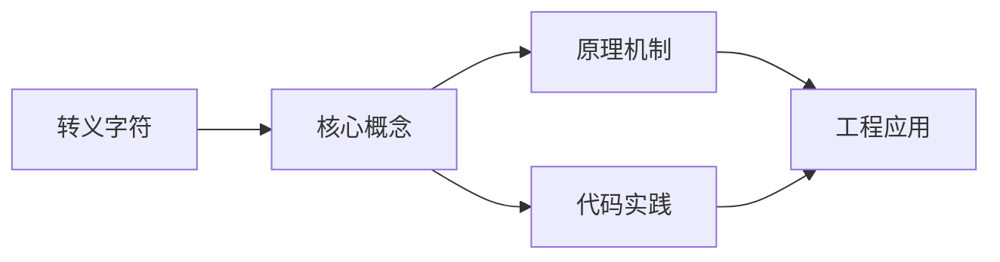
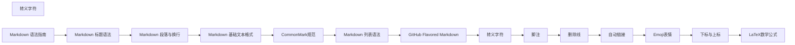

## 1. 学习目标（Bloom 分类）

本节按照布鲁姆教育目标分类学组织学习路径。本文主题为《转义字符》，属于 Markdown 模块，读者可以根据自身阶段选择阅读深度。

记忆层面：能够准确复述本文的核心概念、术语与基本语法或操作步骤，并能够在提问或检索时快速定位对应知识点。能够说出 Markdown 的核心概念、常用命令与流程。

理解层面：能够用自己的语言解释核心原理与工作机制，说明概念之间的因果关系，而不是机械记忆结论。能够解释 Markdown 的工作原理与设计动机。

应用层面：能够在真实项目或练习场景中运用本文知识解决具体问题，写出正确且可维护的实现。能够独立完成 Markdown 的标准操作。

分析层面：能够拆解复杂问题，比较本文主题与相邻概念的异同，识别边界条件与例外情况。能够分析 Markdown 使用中的异常与边界。

评价层面：能够根据约束条件（性能、可读性、安全、成本）评价不同方案的优劣，做出有依据的技术决策。能够评价 Markdown 相关工具与方案。

创造层面：能够把本文知识与其他模块知识组合，设计出新的解决方案或可复用的工程模式。能够把 Markdown 融入团队工作流。

通过本节学习，读者应当能够把《转义字符》纳入自己的知识网络，并与 Markdown 模块的其他主题（基础语法、GFM、写作规范）建立关联。

## 2. 历史动机与发展脉络

《转义字符》是 Markdown 领域的重要主题。要真正理解它，需要先了解它解决的问题与演进过程。

Markdown 由 John Gruber 与 Aaron Swartz 于 2004 年设计，目标是“易读易写的纯文本格式”，可转换为 HTML。
标准化：CommonMark（2014 起）统一解析歧义；GitHub Flavored Markdown（GFM）扩展表格、任务列表、删除线、围栏代码。
生态：文档站（Astro/VitePress）、知识库（Obsidian）、论坛（GitHub/Stack Overflow）、AI 输出格式均以 Markdown 为通用语言。

回到本文主题：转义字符 的提出与成熟，正是上述技术背景下的必然产物。早期实现往往以简单可用为目标，随着工程规模扩大，社区逐渐沉淀出标准做法与最佳实践；理解这一脉络，可以帮助读者判断“为什么文档中的推荐写法是现在这个样子”，也能在遇到历史遗留代码时准确识别其设计年代与取舍。


## 3. 形式化定义与核心概念精讲

本节把《转义字符》涉及的核心概念以“定义 + 讲解”的形式展开。读者应把定义当作工具，把讲解当作理解路径；两者结合才能形成可迁移的知识。

块级语法：标题、段落、列表、引用、代码块、表格、分隔线；行内语法：强调、代码、链接、图片。
解析模型：块级解析优先，行内解析递归；空行分隔块；转义符 \ 输出字面量。
GFM 扩展：~~删除线~~、任务列表 - [x]、表格对齐、自动链接、围栏代码语言标注。

### 3.1 原文章节逐一精讲

原文档把主题拆分为 12 个小节，下面按顺序给出每一节的导读讲解，随后保留原文细节供精读。

#### 原文精读（完整保留）

# 转义字符

> **符号约定**：`< >` 必填参数 | `[ ]` 可选参数

---

#### 1. 转义机制概述

##### 1.1 为什么需要转义

Markdown 使用特殊字符作为格式标记，当需要**原样显示**这些字符时，必须使用转义机制告诉解析器"这不是格式标记"。

```markdown
# 不转义：标题

#### 这是标题

# 转义：原样显示

\## 这不是标题，显示为 "## 这不是标题"
```

##### 1.2 转义方式

Markdown 支持两种转义方式：

| 方式           | 语法    | 适用场景         |
| :------------- | :------ | :--------------- |
| **反斜杠转义** | `\*`    | 转义单个特殊字符 |
| **HTML 实体**  | `&amp;` | 转义任意字符     |

#### 2. 反斜杠转义

##### 2.1 可转义字符

CommonMark 规范定义了以下可转义字符：

| 字符    | 名称   | 用途            | 转义示例           |
| :------ | :----- | :-------------- | :----------------- |
| `\\`    | 反斜杠 | 转义前缀        | `\\` → `\`         |
| `` ` `` | 反引号 | 行内代码        | `` \` `` → `` ` `` |
| `*`     | 星号   | 强调/无序列表   | `\*` → \*          |
| `_`     | 下划线 | 强调            | `\_` → \_          |
| `{}`    | 花括号 | 某些扩展语法    | `\{` → {           |
| `[]`    | 方括号 | 链接/图片       | `\[` → [           |
| `()`    | 圆括号 | 链接            | `\(` → (           |
| `#`     | 井号   | 标题            | `\#` → #           |
| `+`     | 加号   | 有序列表        | `\+` → +           |
| `-`     | 减号   | 无序列表/分隔线 | `\-` → -           |
| `.`     | 句点   | 有序列表        | `\.` → .           |
| `!`     | 感叹号 | 图片            | `\!` → !           |
| `\|`    | 管道符 | 表格            | `\|` → \|          |

##### 2.2 转义规则

**规则一**：反斜杠后跟可转义字符时，反斜杠被移除，字符原样显示

```markdown
\*不是强调\*
→ _不是强调_
```

**规则二**：反斜杠后跟不可转义字符时，反斜杠保留

```markdown
\A → \A
\3 → \3
```

**规则三**：反斜杠在行尾时，表示硬换行

```markdown
第一行\
第二行
→ 第一行<br>第二行
```

##### 2.3 代码块中的转义

代码块内的内容**不进行 Markdown 解析**，因此不需要转义：

```markdown
    *这是代码块中的星号，不需要转义*

`` `这也是，不需要转义` ``
```

#### 3. HTML 实体转义

##### 3.1 常用 HTML 实体

| 字符 | 实体名称  | 实体编号  | 说明       |
| :--- | :-------- | :-------- | :--------- |
| `<`  | `&lt;`    | `&#60;`   | 小于号     |
| `>`  | `&gt;`    | `&#62;`   | 大于号     |
| `&`  | `&amp;`   | `&#38;`   | & 符号     |
| `"`  | `&quot;`  | `&#34;`   | 双引号     |
| `'`  | `&apos;`  | `&#39;`   | 单引号     |
| `©`  | `&copy;`  | `&#169;`  | 版权符号   |
| `®`  | `&reg;`   | `&#174;`  | 注册商标   |
| `™`  | `&trade;` | `&#8482;` | 商标符号   |
| `—`  | `&mdash;` | `&#8212;` | 破折号     |
| `–`  | `&ndash;` | `&#8211;` | 短破折号   |
| ` `  | `&nbsp;`  | `&#160;`  | 不换行空格 |

##### 3.2 使用场景

```markdown
<!-- 显示 HTML 标签 -->

使用 `&lt;div&gt;` 创建容器

<!-- 显示 & 符号 -->

AT&amp;T 公司

<!-- 不换行空格（防止行尾断行） -->

第一章&nbsp;&nbsp;&nbsp;第二章

<!-- 版权声明 -->

Copyright &copy; 2026 My Company
```

#### 4. 常见陷阱

##### 4.1 表格中的管道符

表格中使用管道符需要转义：

```markdown
| 命令           | 说明     |
| -------------- | -------- |
| `grep \| file` | 管道操作 |

<!-- 或使用 HTML 实体 -->

| 命令               | 说明     |
| ------------------ | -------- |
| `grep &#124; file` | 管道操作 |
```

##### 4.2 强调中的星号

```markdown
<!-- 错误：星号被解析为强调 -->

_文件名: readme_

<!-- 正确：转义星号 -->

\*文件名: readme\*

<!-- 或使用代码格式 -->

`*文件名: readme*`
```

##### 4.3 正则表达式

```markdown
<!-- 正则中的特殊字符需要转义 -->

匹配任意字符: `\.`

<!-- 更好的方式：使用代码块 -->

匹配任意字符: `\.`
```

##### 4.4 数学公式中的转义

在 LaTeX 数学公式中，反斜杠是命令前缀，需要双重转义：

```markdown
<!-- 在 Markdown 中显示 LaTeX 命令 -->

行内代码方式: `\alpha`
代码块方式:
```

```latex
\alpha + \beta
```

#### 5. 各平台差异

| 场景          | CommonMark       | GFM           | 其他   |
| :------------ | :--------------- | :------------ | :----- |
| `\|` 在表格中 | 不适用           | 需要转义      | 同 GFM |
| `\-` 在行首   | 转义列表标记     | 同 CommonMark | —      |
| `\#` 在行首   | 转义标题         | 同 CommonMark | —      |
| 反斜杠数量    | 偶数个显示为半数 | 同 CommonMark | —      |
#### 反斜杠转义

**单行写法：转义星号**
`\*<文本>\*`
```markdown
\*不是强调\*
```

**单行写法：转义井号**
`\#<文本>`
```markdown
\#不是标题
```

**单行写法：转义反引号**
`` \`<文本>\` ``
```markdown
\`不是代码
```

---

#### 可转义字符

**单行写法：转义反斜杠**
`\\`
```markdown
\\   反斜杠
```

**单行写法：转义反引号**
`\``
```markdown
\`   反引号
```

**单行写法：转义星号**
`\*`
```markdown
\*   星号
```

**单行写法：转义下划线**
 `\_`
```markdown
\_   下划线
```

**单行写法：转义花括号**
`\{` | `\}`
```markdown
\{   左花括号
\}   右花括号
```

**单行写法：转义方括号**
`\[` | `\]`
```markdown
\[   左方括号
\]   右方括号
```

**单行写法：转义圆括号**
`\(` | `\)`
```markdown
\(   左圆括号
\)   右圆括号
```

**单行写法：转义井号**
`\#`
```markdown
\#   井号
```

**单行写法：转义加号**
`\+`
```markdown
\+   加号
```

**单行写法：转义减号**
`\-`
```markdown
\-   减号
```

**单行写法：转义句点**
`\.`
```markdown
\.   句点
```

**单行写法：转义感叹号**
`\!`
```markdown
\!   感叹号
```

**单行写法：转义管道符**
`\|`
```markdown
\|   管道符
```

---

#### 转义规则

**基本写法：反斜杠后跟可转义字符时原样显示**
`\<可转义字符>`
```markdown
\*不是强调\*
```

**基本写法：反斜杠后跟不可转义字符时反斜杠保留**
`\<不可转义字符>`
```markdown
\A → \A
```

**单行写法：反斜杠在行尾表示硬换行**
`<文本>\`
```markdown
第一行\
第二行
```

---

#### HTML 实体转义

**单行写法：小于号实体**
`&lt;`
```markdown
&lt;   小于号 <
```

**单行写法：大于号实体**
`&gt;`
```markdown
&gt;   大于号 >
```

**单行写法：& 符号实体**
`&amp;`
```markdown
&amp;   & 符号
```

**单行写法：双引号实体**
`&quot;`
```markdown
&quot;   双引号 "
```

**单行写法：单引号实体**
`&apos;`
```markdown
&apos;   单引号 '
```

**单行写法：版权符号实体**
`&copy;`
```markdown
&copy;   版权符号
```

**单行写法：注册商标实体**
`&reg;`
```markdown
&reg;   注册商标
```

**单行写法：商标符号实体**
`&trade;`
```markdown
&trade;   商标符号
```

**单行写法：不换行空格实体**
`&nbsp;`
```markdown
&nbsp;   不换行空格
```

---

#### 表格中的管道符

**单行写法：表格中转义管道符**
`\|`
```markdown
| 命令 |
| ---- |
| `grep \| file` |
```

**单行写法：使用 HTML 实体转义管道符**
`&#124;`
```markdown
| 命令 |
| ---- |
| `grep &#124; file` |
```

---

#### 代码块中的转义

**换行写法：代码块内不需要转义**
` ``` \n<任意字符>\n``` `
```markdown
```
*这是代码块中的星号，不需要转义*
`这也是，不需要转义`
```
```


### 3.2 概念关系图

下面用 Mermaid 图表达本文核心概念之间的关系，帮助读者建立整体图景：



图中展示的是本文知识的结构化关系：核心概念是入口，原理机制解释“为什么”，代码实践演示“怎么做”，工程应用回答“何时用”。读者学习时可以把每个小节的内容挂接到对应节点上。

## 4. 理论推导与原理解析

本节深入《转义字符》背后的原理。理论部分不求面面俱到，而是聚焦“能解释现象、能指导实践”的关键推导。

块级语法：标题、段落、列表、引用、代码块、表格、分隔线；行内语法：强调、代码、链接、图片。
解析模型：块级解析优先，行内解析递归；空行分隔块；转义符 \ 输出字面量。
GFM 扩展：~~删除线~~、任务列表 - [x]、表格对齐、自动链接、围栏代码语言标注。
元数据：frontmatter（YAML）在文档站中承载标题、日期、标签。

需要强调的是，理论推导与工程实践之间存在翻译层：理论给出的是理想化模型与边界条件，工程代码则必须处理真实环境中的例外。读者在学习时应先掌握理论的“标准情形”，再通过陷阱章节了解“非标准情形”。

## 5. 代码示例与逐行讲解

本节把原文中的代码示例系统整理，并为每个示例补充用途说明与讲解。读者不应只浏览代码，而应逐段对照讲解理解设计意图。

### 5.1 示例：1.1 为什么需要转义

该示例来自原文《1.1 为什么需要转义》小节，用于演示转义字符相关操作。阅读时请先看代码结构，再看其后的讲解。

```markdown
# 不转义：标题

## 这是标题

# 转义：原样显示

\## 这不是标题，显示为 "## 这不是标题"
```

讲解：这段代码演示了本节核心知识点。代码中的关键操作可以归纳为三步：准备（定义或初始化）、执行（核心逻辑）、收尾（释放资源或返回结果）。实际项目中，这三步往往被封装为函数或类，以提升复用性与可测试性。

关键点分析：

该示例共 4 行有效代码，结构以数据或配置为主。阅读时应关注：数据字段的含义、配置项的作用，以及它们与运行行为的对应关系。

进阶思考路径：先尝试修改参数观察行为变化，再把示例中的模式迁移到自己的项目中；每次修改都记录预期与实测差异，这是把示例转化为能力的最快方式。

### 5.2 示例：2.2 转义规则

该示例来自原文《2.2 转义规则》小节，用于演示转义字符相关操作。阅读时请先看代码结构，再看其后的讲解。

```markdown
\*不是强调\*
→ _不是强调_
```

讲解：这段代码演示了本节核心知识点。代码中的关键操作可以归纳为三步：准备（定义或初始化）、执行（核心逻辑）、收尾（释放资源或返回结果）。实际项目中，这三步往往被封装为函数或类，以提升复用性与可测试性。

关键点分析：

该示例共 2 行有效代码，结构以数据或配置为主。阅读时应关注：数据字段的含义、配置项的作用，以及它们与运行行为的对应关系。

进阶思考路径：先尝试修改参数观察行为变化，再把示例中的模式迁移到自己的项目中；每次修改都记录预期与实测差异，这是把示例转化为能力的最快方式。

### 5.3 示例：2.2 转义规则

该示例来自原文《2.2 转义规则》小节，用于演示转义字符相关操作。阅读时请先看代码结构，再看其后的讲解。

```markdown
\A → \A
\3 → \3
```

讲解：这段代码演示了本节核心知识点。代码中的关键操作可以归纳为三步：准备（定义或初始化）、执行（核心逻辑）、收尾（释放资源或返回结果）。实际项目中，这三步往往被封装为函数或类，以提升复用性与可测试性。

关键点分析：

该示例共 2 行有效代码，结构以数据或配置为主。阅读时应关注：数据字段的含义、配置项的作用，以及它们与运行行为的对应关系。

进阶思考路径：先尝试修改参数观察行为变化，再把示例中的模式迁移到自己的项目中；每次修改都记录预期与实测差异，这是把示例转化为能力的最快方式。

### 5.4 示例：2.2 转义规则

该示例来自原文《2.2 转义规则》小节，用于演示转义字符相关操作。阅读时请先看代码结构，再看其后的讲解。

```markdown
第一行\
第二行
→ 第一行<br>第二行
```

讲解：这段代码演示了本节核心知识点。代码中的关键操作可以归纳为三步：准备（定义或初始化）、执行（核心逻辑）、收尾（释放资源或返回结果）。实际项目中，这三步往往被封装为函数或类，以提升复用性与可测试性。

关键点分析：

该示例共 3 行有效代码，结构以数据或配置为主。阅读时应关注：数据字段的含义、配置项的作用，以及它们与运行行为的对应关系。

进阶思考路径：先尝试修改参数观察行为变化，再把示例中的模式迁移到自己的项目中；每次修改都记录预期与实测差异，这是把示例转化为能力的最快方式。

### 5.5 示例：2.3 代码块中的转义

该示例来自原文《2.3 代码块中的转义》小节，用于演示转义字符相关操作。阅读时请先看代码结构，再看其后的讲解。

```markdown
    *这是代码块中的星号，不需要转义*

`` `这也是，不需要转义` ``
```

讲解：这段代码演示了本节核心知识点。代码中的关键操作可以归纳为三步：准备（定义或初始化）、执行（核心逻辑）、收尾（释放资源或返回结果）。实际项目中，这三步往往被封装为函数或类，以提升复用性与可测试性。

关键点分析：

该示例共 2 行有效代码，结构以数据或配置为主。阅读时应关注：数据字段的含义、配置项的作用，以及它们与运行行为的对应关系。

进阶思考路径：先尝试修改参数观察行为变化，再把示例中的模式迁移到自己的项目中；每次修改都记录预期与实测差异，这是把示例转化为能力的最快方式。

### 5.6 示例：3.2 使用场景

该示例来自原文《3.2 使用场景》小节，用于演示转义字符相关操作。阅读时请先看代码结构，再看其后的讲解。

```markdown
<!-- 显示 HTML 标签 -->

使用 `&lt;div&gt;` 创建容器

<!-- 显示 & 符号 -->

AT&amp;T 公司

<!-- 不换行空格（防止行尾断行） -->

第一章&nbsp;&nbsp;&nbsp;第二章

<!-- 版权声明 -->

Copyright &copy; 2026 My Company
```

讲解：这段代码演示了本节核心知识点。代码中的关键操作可以归纳为三步：准备（定义或初始化）、执行（核心逻辑）、收尾（释放资源或返回结果）。实际项目中，这三步往往被封装为函数或类，以提升复用性与可测试性。

关键点分析：

该示例共 8 行有效代码，结构以数据或配置为主。阅读时应关注：数据字段的含义、配置项的作用，以及它们与运行行为的对应关系。

进阶思考路径：先尝试修改参数观察行为变化，再把示例中的模式迁移到自己的项目中；每次修改都记录预期与实测差异，这是把示例转化为能力的最快方式。

### 5.7 示例：4.1 表格中的管道符

该示例来自原文《4.1 表格中的管道符》小节，用于演示转义字符相关操作。阅读时请先看代码结构，再看其后的讲解。

```markdown
| 命令           | 说明     |
| -------------- | -------- |
| `grep \| file` | 管道操作 |

<!-- 或使用 HTML 实体 -->

| 命令               | 说明     |
| ------------------ | -------- |
| `grep &#124; file` | 管道操作 |
```

讲解：这段代码演示了本节核心知识点。代码中的关键操作可以归纳为三步：准备（定义或初始化）、执行（核心逻辑）、收尾（释放资源或返回结果）。实际项目中，这三步往往被封装为函数或类，以提升复用性与可测试性。

关键点分析：

该示例共 7 行有效代码，结构以数据或配置为主。阅读时应关注：数据字段的含义、配置项的作用，以及它们与运行行为的对应关系。

进阶思考路径：先尝试修改参数观察行为变化，再把示例中的模式迁移到自己的项目中；每次修改都记录预期与实测差异，这是把示例转化为能力的最快方式。

### 5.8 示例：4.2 强调中的星号

该示例来自原文《4.2 强调中的星号》小节，用于演示转义字符相关操作。阅读时请先看代码结构，再看其后的讲解。

```markdown
<!-- 错误：星号被解析为强调 -->

_文件名: readme_

<!-- 正确：转义星号 -->

\*文件名: readme\*

<!-- 或使用代码格式 -->

`*文件名: readme*`
```

讲解：这段代码演示了本节核心知识点。代码中的关键操作可以归纳为三步：准备（定义或初始化）、执行（核心逻辑）、收尾（释放资源或返回结果）。实际项目中，这三步往往被封装为函数或类，以提升复用性与可测试性。

关键点分析：

该示例共 6 行有效代码，结构以数据或配置为主。阅读时应关注：数据字段的含义、配置项的作用，以及它们与运行行为的对应关系。

进阶思考路径：先尝试修改参数观察行为变化，再把示例中的模式迁移到自己的项目中；每次修改都记录预期与实测差异，这是把示例转化为能力的最快方式。

### 5.9 示例：4.3 正则表达式

该示例来自原文《4.3 正则表达式》小节，用于演示转义字符相关操作。阅读时请先看代码结构，再看其后的讲解。

```markdown
<!-- 正则中的特殊字符需要转义 -->

匹配任意字符: `\.`

<!-- 更好的方式：使用代码块 -->

匹配任意字符: `\.`
```

讲解：这段代码演示了本节核心知识点。代码中的关键操作可以归纳为三步：准备（定义或初始化）、执行（核心逻辑）、收尾（释放资源或返回结果）。实际项目中，这三步往往被封装为函数或类，以提升复用性与可测试性。

关键点分析：

该示例共 4 行有效代码，结构以数据或配置为主。阅读时应关注：数据字段的含义、配置项的作用，以及它们与运行行为的对应关系。

进阶思考路径：先尝试修改参数观察行为变化，再把示例中的模式迁移到自己的项目中；每次修改都记录预期与实测差异，这是把示例转化为能力的最快方式。

### 5.10 示例：4.4 数学公式中的转义

该示例来自原文《4.4 数学公式中的转义》小节，用于演示转义字符相关操作。阅读时请先看代码结构，再看其后的讲解。

```markdown
<!-- 在 Markdown 中显示 LaTeX 命令 -->

行内代码方式: `\alpha`
代码块方式:
```

讲解：这段代码演示了本节核心知识点。代码中的关键操作可以归纳为三步：准备（定义或初始化）、执行（核心逻辑）、收尾（释放资源或返回结果）。实际项目中，这三步往往被封装为函数或类，以提升复用性与可测试性。

关键点分析：

该示例共 3 行有效代码，结构以数据或配置为主。阅读时应关注：数据字段的含义、配置项的作用，以及它们与运行行为的对应关系。

进阶思考路径：先尝试修改参数观察行为变化，再把示例中的模式迁移到自己的项目中；每次修改都记录预期与实测差异，这是把示例转化为能力的最快方式。

### 5.11 示例：4.4 数学公式中的转义

该示例来自原文《4.4 数学公式中的转义》小节，用于演示转义字符相关操作。阅读时请先看代码结构，再看其后的讲解。

```latex
\alpha + \beta
```

讲解：这段代码演示了本节核心知识点。代码中的关键操作可以归纳为三步：准备（定义或初始化）、执行（核心逻辑）、收尾（释放资源或返回结果）。实际项目中，这三步往往被封装为函数或类，以提升复用性与可测试性。

关键点分析：

该示例共 1 行有效代码，结构以数据或配置为主。阅读时应关注：数据字段的含义、配置项的作用，以及它们与运行行为的对应关系。

进阶思考路径：先尝试修改参数观察行为变化，再把示例中的模式迁移到自己的项目中；每次修改都记录预期与实测差异，这是把示例转化为能力的最快方式。

### 5.12 示例：反斜杠转义

该示例来自原文《反斜杠转义》小节，用于演示转义字符相关操作。阅读时请先看代码结构，再看其后的讲解。

```markdown
\*不是强调\*
```

讲解：这段代码演示了本节核心知识点。代码中的关键操作可以归纳为三步：准备（定义或初始化）、执行（核心逻辑）、收尾（释放资源或返回结果）。实际项目中，这三步往往被封装为函数或类，以提升复用性与可测试性。

关键点分析：

该示例共 1 行有效代码，结构以数据或配置为主。阅读时应关注：数据字段的含义、配置项的作用，以及它们与运行行为的对应关系。

进阶思考路径：先尝试修改参数观察行为变化，再把示例中的模式迁移到自己的项目中；每次修改都记录预期与实测差异，这是把示例转化为能力的最快方式。

### 5.13 示例：反斜杠转义

该示例来自原文《反斜杠转义》小节，用于演示转义字符相关操作。阅读时请先看代码结构，再看其后的讲解。

```markdown
\#不是标题
```

讲解：这段代码演示了本节核心知识点。代码中的关键操作可以归纳为三步：准备（定义或初始化）、执行（核心逻辑）、收尾（释放资源或返回结果）。实际项目中，这三步往往被封装为函数或类，以提升复用性与可测试性。

关键点分析：

该示例共 1 行有效代码，结构以数据或配置为主。阅读时应关注：数据字段的含义、配置项的作用，以及它们与运行行为的对应关系。

进阶思考路径：先尝试修改参数观察行为变化，再把示例中的模式迁移到自己的项目中；每次修改都记录预期与实测差异，这是把示例转化为能力的最快方式。

### 5.14 示例：反斜杠转义

该示例来自原文《反斜杠转义》小节，用于演示转义字符相关操作。阅读时请先看代码结构，再看其后的讲解。

```markdown
\`不是代码
```

讲解：这段代码演示了本节核心知识点。代码中的关键操作可以归纳为三步：准备（定义或初始化）、执行（核心逻辑）、收尾（释放资源或返回结果）。实际项目中，这三步往往被封装为函数或类，以提升复用性与可测试性。

关键点分析：

该示例共 1 行有效代码，结构以数据或配置为主。阅读时应关注：数据字段的含义、配置项的作用，以及它们与运行行为的对应关系。

进阶思考路径：先尝试修改参数观察行为变化，再把示例中的模式迁移到自己的项目中；每次修改都记录预期与实测差异，这是把示例转化为能力的最快方式。

### 5.15 示例：可转义字符

该示例来自原文《可转义字符》小节，用于演示转义字符相关操作。阅读时请先看代码结构，再看其后的讲解。

```markdown
\\   反斜杠
```

讲解：这段代码演示了本节核心知识点。代码中的关键操作可以归纳为三步：准备（定义或初始化）、执行（核心逻辑）、收尾（释放资源或返回结果）。实际项目中，这三步往往被封装为函数或类，以提升复用性与可测试性。

关键点分析：

该示例共 1 行有效代码，结构以数据或配置为主。阅读时应关注：数据字段的含义、配置项的作用，以及它们与运行行为的对应关系。

进阶思考路径：先尝试修改参数观察行为变化，再把示例中的模式迁移到自己的项目中；每次修改都记录预期与实测差异，这是把示例转化为能力的最快方式。

### 5.16 示例：可转义字符

该示例来自原文《可转义字符》小节，用于演示转义字符相关操作。阅读时请先看代码结构，再看其后的讲解。

```markdown
\`   反引号
```

讲解：这段代码演示了本节核心知识点。代码中的关键操作可以归纳为三步：准备（定义或初始化）、执行（核心逻辑）、收尾（释放资源或返回结果）。实际项目中，这三步往往被封装为函数或类，以提升复用性与可测试性。

关键点分析：

该示例共 1 行有效代码，结构以数据或配置为主。阅读时应关注：数据字段的含义、配置项的作用，以及它们与运行行为的对应关系。

进阶思考路径：先尝试修改参数观察行为变化，再把示例中的模式迁移到自己的项目中；每次修改都记录预期与实测差异，这是把示例转化为能力的最快方式。

### 5.17 示例：可转义字符

该示例来自原文《可转义字符》小节，用于演示转义字符相关操作。阅读时请先看代码结构，再看其后的讲解。

```markdown
\*   星号
```

讲解：这段代码演示了本节核心知识点。代码中的关键操作可以归纳为三步：准备（定义或初始化）、执行（核心逻辑）、收尾（释放资源或返回结果）。实际项目中，这三步往往被封装为函数或类，以提升复用性与可测试性。

关键点分析：

该示例共 1 行有效代码，结构以数据或配置为主。阅读时应关注：数据字段的含义、配置项的作用，以及它们与运行行为的对应关系。

进阶思考路径：先尝试修改参数观察行为变化，再把示例中的模式迁移到自己的项目中；每次修改都记录预期与实测差异，这是把示例转化为能力的最快方式。

### 5.18 示例：可转义字符

该示例来自原文《可转义字符》小节，用于演示转义字符相关操作。阅读时请先看代码结构，再看其后的讲解。

```markdown
\_   下划线
```

讲解：这段代码演示了本节核心知识点。代码中的关键操作可以归纳为三步：准备（定义或初始化）、执行（核心逻辑）、收尾（释放资源或返回结果）。实际项目中，这三步往往被封装为函数或类，以提升复用性与可测试性。

关键点分析：

该示例共 1 行有效代码，结构以数据或配置为主。阅读时应关注：数据字段的含义、配置项的作用，以及它们与运行行为的对应关系。

进阶思考路径：先尝试修改参数观察行为变化，再把示例中的模式迁移到自己的项目中；每次修改都记录预期与实测差异，这是把示例转化为能力的最快方式。

### 5.19 示例：可转义字符

该示例来自原文《可转义字符》小节，用于演示转义字符相关操作。阅读时请先看代码结构，再看其后的讲解。

```markdown
\{   左花括号
\}   右花括号
```

讲解：这段代码演示了本节核心知识点。代码中的关键操作可以归纳为三步：准备（定义或初始化）、执行（核心逻辑）、收尾（释放资源或返回结果）。实际项目中，这三步往往被封装为函数或类，以提升复用性与可测试性。

关键点分析：

该示例共 2 行有效代码，结构以数据或配置为主。阅读时应关注：数据字段的含义、配置项的作用，以及它们与运行行为的对应关系。

进阶思考路径：先尝试修改参数观察行为变化，再把示例中的模式迁移到自己的项目中；每次修改都记录预期与实测差异，这是把示例转化为能力的最快方式。

### 5.20 示例：可转义字符

该示例来自原文《可转义字符》小节，用于演示转义字符相关操作。阅读时请先看代码结构，再看其后的讲解。

```markdown
\[   左方括号
\]   右方括号
```

讲解：这段代码演示了本节核心知识点。代码中的关键操作可以归纳为三步：准备（定义或初始化）、执行（核心逻辑）、收尾（释放资源或返回结果）。实际项目中，这三步往往被封装为函数或类，以提升复用性与可测试性。

关键点分析：

该示例共 2 行有效代码，结构以数据或配置为主。阅读时应关注：数据字段的含义、配置项的作用，以及它们与运行行为的对应关系。

进阶思考路径：先尝试修改参数观察行为变化，再把示例中的模式迁移到自己的项目中；每次修改都记录预期与实测差异，这是把示例转化为能力的最快方式。

### 5.21 示例：可转义字符

该示例来自原文《可转义字符》小节，用于演示转义字符相关操作。阅读时请先看代码结构，再看其后的讲解。

```markdown
\(   左圆括号
\)   右圆括号
```

讲解：这段代码演示了本节核心知识点。代码中的关键操作可以归纳为三步：准备（定义或初始化）、执行（核心逻辑）、收尾（释放资源或返回结果）。实际项目中，这三步往往被封装为函数或类，以提升复用性与可测试性。

关键点分析：

该示例共 2 行有效代码，结构以数据或配置为主。阅读时应关注：数据字段的含义、配置项的作用，以及它们与运行行为的对应关系。

进阶思考路径：先尝试修改参数观察行为变化，再把示例中的模式迁移到自己的项目中；每次修改都记录预期与实测差异，这是把示例转化为能力的最快方式。

### 5.22 示例：可转义字符

该示例来自原文《可转义字符》小节，用于演示转义字符相关操作。阅读时请先看代码结构，再看其后的讲解。

```markdown
\#   井号
```

讲解：这段代码演示了本节核心知识点。代码中的关键操作可以归纳为三步：准备（定义或初始化）、执行（核心逻辑）、收尾（释放资源或返回结果）。实际项目中，这三步往往被封装为函数或类，以提升复用性与可测试性。

关键点分析：

该示例共 1 行有效代码，结构以数据或配置为主。阅读时应关注：数据字段的含义、配置项的作用，以及它们与运行行为的对应关系。

进阶思考路径：先尝试修改参数观察行为变化，再把示例中的模式迁移到自己的项目中；每次修改都记录预期与实测差异，这是把示例转化为能力的最快方式。

### 5.23 示例：可转义字符

该示例来自原文《可转义字符》小节，用于演示转义字符相关操作。阅读时请先看代码结构，再看其后的讲解。

```markdown
\+   加号
```

讲解：这段代码演示了本节核心知识点。代码中的关键操作可以归纳为三步：准备（定义或初始化）、执行（核心逻辑）、收尾（释放资源或返回结果）。实际项目中，这三步往往被封装为函数或类，以提升复用性与可测试性。

关键点分析：

该示例共 1 行有效代码，结构以数据或配置为主。阅读时应关注：数据字段的含义、配置项的作用，以及它们与运行行为的对应关系。

进阶思考路径：先尝试修改参数观察行为变化，再把示例中的模式迁移到自己的项目中；每次修改都记录预期与实测差异，这是把示例转化为能力的最快方式。

### 5.24 示例：可转义字符

该示例来自原文《可转义字符》小节，用于演示转义字符相关操作。阅读时请先看代码结构，再看其后的讲解。

```markdown
\-   减号
```

讲解：这段代码演示了本节核心知识点。代码中的关键操作可以归纳为三步：准备（定义或初始化）、执行（核心逻辑）、收尾（释放资源或返回结果）。实际项目中，这三步往往被封装为函数或类，以提升复用性与可测试性。

关键点分析：

该示例共 1 行有效代码，结构以数据或配置为主。阅读时应关注：数据字段的含义、配置项的作用，以及它们与运行行为的对应关系。

进阶思考路径：先尝试修改参数观察行为变化，再把示例中的模式迁移到自己的项目中；每次修改都记录预期与实测差异，这是把示例转化为能力的最快方式。

### 5.25 示例：可转义字符

该示例来自原文《可转义字符》小节，用于演示转义字符相关操作。阅读时请先看代码结构，再看其后的讲解。

```markdown
\.   句点
```

讲解：这段代码演示了本节核心知识点。代码中的关键操作可以归纳为三步：准备（定义或初始化）、执行（核心逻辑）、收尾（释放资源或返回结果）。实际项目中，这三步往往被封装为函数或类，以提升复用性与可测试性。

关键点分析：

该示例共 1 行有效代码，结构以数据或配置为主。阅读时应关注：数据字段的含义、配置项的作用，以及它们与运行行为的对应关系。

进阶思考路径：先尝试修改参数观察行为变化，再把示例中的模式迁移到自己的项目中；每次修改都记录预期与实测差异，这是把示例转化为能力的最快方式。

### 5.26 示例：可转义字符

该示例来自原文《可转义字符》小节，用于演示转义字符相关操作。阅读时请先看代码结构，再看其后的讲解。

```markdown
\!   感叹号
```

讲解：这段代码演示了本节核心知识点。代码中的关键操作可以归纳为三步：准备（定义或初始化）、执行（核心逻辑）、收尾（释放资源或返回结果）。实际项目中，这三步往往被封装为函数或类，以提升复用性与可测试性。

关键点分析：

该示例共 1 行有效代码，结构以数据或配置为主。阅读时应关注：数据字段的含义、配置项的作用，以及它们与运行行为的对应关系。

进阶思考路径：先尝试修改参数观察行为变化，再把示例中的模式迁移到自己的项目中；每次修改都记录预期与实测差异，这是把示例转化为能力的最快方式。

### 5.27 示例：可转义字符

该示例来自原文《可转义字符》小节，用于演示转义字符相关操作。阅读时请先看代码结构，再看其后的讲解。

```markdown
\|   管道符
```

讲解：这段代码演示了本节核心知识点。代码中的关键操作可以归纳为三步：准备（定义或初始化）、执行（核心逻辑）、收尾（释放资源或返回结果）。实际项目中，这三步往往被封装为函数或类，以提升复用性与可测试性。

关键点分析：

该示例共 1 行有效代码，结构以数据或配置为主。阅读时应关注：数据字段的含义、配置项的作用，以及它们与运行行为的对应关系。

进阶思考路径：先尝试修改参数观察行为变化，再把示例中的模式迁移到自己的项目中；每次修改都记录预期与实测差异，这是把示例转化为能力的最快方式。

### 5.28 示例：转义规则

该示例来自原文《转义规则》小节，用于演示转义字符相关操作。阅读时请先看代码结构，再看其后的讲解。

```markdown
\*不是强调\*
```

讲解：这段代码演示了本节核心知识点。代码中的关键操作可以归纳为三步：准备（定义或初始化）、执行（核心逻辑）、收尾（释放资源或返回结果）。实际项目中，这三步往往被封装为函数或类，以提升复用性与可测试性。

关键点分析：

该示例共 1 行有效代码，结构以数据或配置为主。阅读时应关注：数据字段的含义、配置项的作用，以及它们与运行行为的对应关系。

进阶思考路径：先尝试修改参数观察行为变化，再把示例中的模式迁移到自己的项目中；每次修改都记录预期与实测差异，这是把示例转化为能力的最快方式。

### 5.29 示例：转义规则

该示例来自原文《转义规则》小节，用于演示转义字符相关操作。阅读时请先看代码结构，再看其后的讲解。

```markdown
\A → \A
```

讲解：这段代码演示了本节核心知识点。代码中的关键操作可以归纳为三步：准备（定义或初始化）、执行（核心逻辑）、收尾（释放资源或返回结果）。实际项目中，这三步往往被封装为函数或类，以提升复用性与可测试性。

关键点分析：

该示例共 1 行有效代码，结构以数据或配置为主。阅读时应关注：数据字段的含义、配置项的作用，以及它们与运行行为的对应关系。

进阶思考路径：先尝试修改参数观察行为变化，再把示例中的模式迁移到自己的项目中；每次修改都记录预期与实测差异，这是把示例转化为能力的最快方式。

### 5.30 示例：转义规则

该示例来自原文《转义规则》小节，用于演示转义字符相关操作。阅读时请先看代码结构，再看其后的讲解。

```markdown
第一行\
第二行
```

讲解：这段代码演示了本节核心知识点。代码中的关键操作可以归纳为三步：准备（定义或初始化）、执行（核心逻辑）、收尾（释放资源或返回结果）。实际项目中，这三步往往被封装为函数或类，以提升复用性与可测试性。

关键点分析：

该示例共 2 行有效代码，结构以数据或配置为主。阅读时应关注：数据字段的含义、配置项的作用，以及它们与运行行为的对应关系。

进阶思考路径：先尝试修改参数观察行为变化，再把示例中的模式迁移到自己的项目中；每次修改都记录预期与实测差异，这是把示例转化为能力的最快方式。

### 5.31 示例：HTML 实体转义

该示例来自原文《HTML 实体转义》小节，用于演示转义字符相关操作。阅读时请先看代码结构，再看其后的讲解。

```markdown
&lt;   小于号 <
```

讲解：这段代码演示了本节核心知识点。代码中的关键操作可以归纳为三步：准备（定义或初始化）、执行（核心逻辑）、收尾（释放资源或返回结果）。实际项目中，这三步往往被封装为函数或类，以提升复用性与可测试性。

关键点分析：

该示例共 1 行有效代码，结构以数据或配置为主。阅读时应关注：数据字段的含义、配置项的作用，以及它们与运行行为的对应关系。

进阶思考路径：先尝试修改参数观察行为变化，再把示例中的模式迁移到自己的项目中；每次修改都记录预期与实测差异，这是把示例转化为能力的最快方式。

### 5.32 示例：HTML 实体转义

该示例来自原文《HTML 实体转义》小节，用于演示转义字符相关操作。阅读时请先看代码结构，再看其后的讲解。

```markdown
&gt;   大于号 >
```

讲解：这段代码演示了本节核心知识点。代码中的关键操作可以归纳为三步：准备（定义或初始化）、执行（核心逻辑）、收尾（释放资源或返回结果）。实际项目中，这三步往往被封装为函数或类，以提升复用性与可测试性。

关键点分析：

该示例共 1 行有效代码，结构以数据或配置为主。阅读时应关注：数据字段的含义、配置项的作用，以及它们与运行行为的对应关系。

进阶思考路径：先尝试修改参数观察行为变化，再把示例中的模式迁移到自己的项目中；每次修改都记录预期与实测差异，这是把示例转化为能力的最快方式。

### 5.33 示例：HTML 实体转义

该示例来自原文《HTML 实体转义》小节，用于演示转义字符相关操作。阅读时请先看代码结构，再看其后的讲解。

```markdown
&amp;   & 符号
```

讲解：这段代码演示了本节核心知识点。代码中的关键操作可以归纳为三步：准备（定义或初始化）、执行（核心逻辑）、收尾（释放资源或返回结果）。实际项目中，这三步往往被封装为函数或类，以提升复用性与可测试性。

关键点分析：

该示例共 1 行有效代码，结构以数据或配置为主。阅读时应关注：数据字段的含义、配置项的作用，以及它们与运行行为的对应关系。

进阶思考路径：先尝试修改参数观察行为变化，再把示例中的模式迁移到自己的项目中；每次修改都记录预期与实测差异，这是把示例转化为能力的最快方式。

### 5.34 示例：HTML 实体转义

该示例来自原文《HTML 实体转义》小节，用于演示转义字符相关操作。阅读时请先看代码结构，再看其后的讲解。

```markdown
&quot;   双引号 "
```

讲解：这段代码演示了本节核心知识点。代码中的关键操作可以归纳为三步：准备（定义或初始化）、执行（核心逻辑）、收尾（释放资源或返回结果）。实际项目中，这三步往往被封装为函数或类，以提升复用性与可测试性。

关键点分析：

该示例共 1 行有效代码，结构以数据或配置为主。阅读时应关注：数据字段的含义、配置项的作用，以及它们与运行行为的对应关系。

进阶思考路径：先尝试修改参数观察行为变化，再把示例中的模式迁移到自己的项目中；每次修改都记录预期与实测差异，这是把示例转化为能力的最快方式。

### 5.35 示例：HTML 实体转义

该示例来自原文《HTML 实体转义》小节，用于演示转义字符相关操作。阅读时请先看代码结构，再看其后的讲解。

```markdown
&apos;   单引号 '
```

讲解：这段代码演示了本节核心知识点。代码中的关键操作可以归纳为三步：准备（定义或初始化）、执行（核心逻辑）、收尾（释放资源或返回结果）。实际项目中，这三步往往被封装为函数或类，以提升复用性与可测试性。

关键点分析：

该示例共 1 行有效代码，结构以数据或配置为主。阅读时应关注：数据字段的含义、配置项的作用，以及它们与运行行为的对应关系。

进阶思考路径：先尝试修改参数观察行为变化，再把示例中的模式迁移到自己的项目中；每次修改都记录预期与实测差异，这是把示例转化为能力的最快方式。

### 5.36 示例：HTML 实体转义

该示例来自原文《HTML 实体转义》小节，用于演示转义字符相关操作。阅读时请先看代码结构，再看其后的讲解。

```markdown
&copy;   版权符号
```

讲解：这段代码演示了本节核心知识点。代码中的关键操作可以归纳为三步：准备（定义或初始化）、执行（核心逻辑）、收尾（释放资源或返回结果）。实际项目中，这三步往往被封装为函数或类，以提升复用性与可测试性。

关键点分析：

该示例共 1 行有效代码，结构以数据或配置为主。阅读时应关注：数据字段的含义、配置项的作用，以及它们与运行行为的对应关系。

进阶思考路径：先尝试修改参数观察行为变化，再把示例中的模式迁移到自己的项目中；每次修改都记录预期与实测差异，这是把示例转化为能力的最快方式。

### 5.37 示例：HTML 实体转义

该示例来自原文《HTML 实体转义》小节，用于演示转义字符相关操作。阅读时请先看代码结构，再看其后的讲解。

```markdown
&reg;   注册商标
```

讲解：这段代码演示了本节核心知识点。代码中的关键操作可以归纳为三步：准备（定义或初始化）、执行（核心逻辑）、收尾（释放资源或返回结果）。实际项目中，这三步往往被封装为函数或类，以提升复用性与可测试性。

关键点分析：

该示例共 1 行有效代码，结构以数据或配置为主。阅读时应关注：数据字段的含义、配置项的作用，以及它们与运行行为的对应关系。

进阶思考路径：先尝试修改参数观察行为变化，再把示例中的模式迁移到自己的项目中；每次修改都记录预期与实测差异，这是把示例转化为能力的最快方式。

### 5.38 示例：HTML 实体转义

该示例来自原文《HTML 实体转义》小节，用于演示转义字符相关操作。阅读时请先看代码结构，再看其后的讲解。

```markdown
&trade;   商标符号
```

讲解：这段代码演示了本节核心知识点。代码中的关键操作可以归纳为三步：准备（定义或初始化）、执行（核心逻辑）、收尾（释放资源或返回结果）。实际项目中，这三步往往被封装为函数或类，以提升复用性与可测试性。

关键点分析：

该示例共 1 行有效代码，结构以数据或配置为主。阅读时应关注：数据字段的含义、配置项的作用，以及它们与运行行为的对应关系。

进阶思考路径：先尝试修改参数观察行为变化，再把示例中的模式迁移到自己的项目中；每次修改都记录预期与实测差异，这是把示例转化为能力的最快方式。

### 5.39 示例：HTML 实体转义

该示例来自原文《HTML 实体转义》小节，用于演示转义字符相关操作。阅读时请先看代码结构，再看其后的讲解。

```markdown
&nbsp;   不换行空格
```

讲解：这段代码演示了本节核心知识点。代码中的关键操作可以归纳为三步：准备（定义或初始化）、执行（核心逻辑）、收尾（释放资源或返回结果）。实际项目中，这三步往往被封装为函数或类，以提升复用性与可测试性。

关键点分析：

该示例共 1 行有效代码，结构以数据或配置为主。阅读时应关注：数据字段的含义、配置项的作用，以及它们与运行行为的对应关系。

进阶思考路径：先尝试修改参数观察行为变化，再把示例中的模式迁移到自己的项目中；每次修改都记录预期与实测差异，这是把示例转化为能力的最快方式。

### 5.40 示例：表格中的管道符

该示例来自原文《表格中的管道符》小节，用于演示转义字符相关操作。阅读时请先看代码结构，再看其后的讲解。

```markdown
| 命令 |
| ---- |
| `grep \| file` |
```

讲解：这段代码演示了本节核心知识点。代码中的关键操作可以归纳为三步：准备（定义或初始化）、执行（核心逻辑）、收尾（释放资源或返回结果）。实际项目中，这三步往往被封装为函数或类，以提升复用性与可测试性。

关键点分析：

该示例共 3 行有效代码，结构以数据或配置为主。阅读时应关注：数据字段的含义、配置项的作用，以及它们与运行行为的对应关系。

进阶思考路径：先尝试修改参数观察行为变化，再把示例中的模式迁移到自己的项目中；每次修改都记录预期与实测差异，这是把示例转化为能力的最快方式。

### 5.41 示例：表格中的管道符

该示例来自原文《表格中的管道符》小节，用于演示转义字符相关操作。阅读时请先看代码结构，再看其后的讲解。

```markdown
| 命令 |
| ---- |
| `grep &#124; file` |
```

讲解：这段代码演示了本节核心知识点。代码中的关键操作可以归纳为三步：准备（定义或初始化）、执行（核心逻辑）、收尾（释放资源或返回结果）。实际项目中，这三步往往被封装为函数或类，以提升复用性与可测试性。

关键点分析：

该示例共 3 行有效代码，结构以数据或配置为主。阅读时应关注：数据字段的含义、配置项的作用，以及它们与运行行为的对应关系。

进阶思考路径：先尝试修改参数观察行为变化，再把示例中的模式迁移到自己的项目中；每次修改都记录预期与实测差异，这是把示例转化为能力的最快方式。


综合以上示例，可以总结出本主题的代码实践要点：第一，先定义清晰的输入输出契约；第二，核心逻辑保持单一职责；第三，错误处理与边界条件不可省略；第四，命名与注释表达意图而非复述代码。

## 6. 对比分析

对比是理解《转义字符》定位的最快路径。下面从多个维度与相邻方案进行对比。

Markdown 与 HTML：Markdown 易读，HTML 精确；Markdown 允许内嵌 HTML 兜底。
CommonMark 与 GFM：CommonMark 是基础，GFM 是 GitHub 超集；跨平台注意差异。
Markdown 与 AsciiDoc：AsciiDoc 更强大，Markdown 更普及。

对比的目的不是分出绝对优劣，而是建立选择依据：不同约束条件下，最优解不同。读者应把每个对比维度转化为决策检查清单。

## 7. 常见陷阱与最佳实践

本节整理该主题的高频错误与推荐做法。每个陷阱先描述现象，再解释原因，最后给出最佳实践。

### 7.1 缩进代码块

四空格缩进在列表内失效。使用围栏代码块 ```。

深入讲解：该问题之所以被归类为“常见陷阱”，是因为它在初学者的代码中反复出现，而且往往不在第一时间暴露——错误通常隐藏在特定数据或特定时序下。

从成因上看，缩进代码块 一般源于对 Markdown 某个机制的理解偏差：要么误用了默认行为，要么忽略了边界条件，要么把其他语言的思维惯性带了过来。

从影响上看，缩进代码块 轻则产生错误结果，重则导致资源泄漏、数据损坏或安全事故；这也是为什么工程评审中会把它列为检查项。

从修复策略上看，处理缩进代码块的正确顺序是：先复现（构造最小用例），再定位（确认机制层面的根因），最后修复并补充回归测试。跳过复现直接改代码，往往治标不治本。

### 7.2 标题层级跳变

目录结构混乱。连续使用层级。

深入讲解：该问题之所以被归类为“常见陷阱”，是因为它在初学者的代码中反复出现，而且往往不在第一时间暴露——错误通常隐藏在特定数据或特定时序下。

从成因上看，标题层级跳变 一般源于对 Markdown 某个机制的理解偏差：要么误用了默认行为，要么忽略了边界条件，要么把其他语言的思维惯性带了过来。

从影响上看，标题层级跳变 轻则产生错误结果，重则导致资源泄漏、数据损坏或安全事故；这也是为什么工程评审中会把它列为检查项。

从修复策略上看，处理标题层级跳变的正确顺序是：先复现（构造最小用例），再定位（确认机制层面的根因），最后修复并补充回归测试。跳过复现直接改代码，往往治标不治本。

### 7.3 表格列数不一

渲染错位。保持分隔行与列数一致。

深入讲解：该问题之所以被归类为“常见陷阱”，是因为它在初学者的代码中反复出现，而且往往不在第一时间暴露——错误通常隐藏在特定数据或特定时序下。

从成因上看，表格列数不一 一般源于对 Markdown 某个机制的理解偏差：要么误用了默认行为，要么忽略了边界条件，要么把其他语言的思维惯性带了过来。

从影响上看，表格列数不一 轻则产生错误结果，重则导致资源泄漏、数据损坏或安全事故；这也是为什么工程评审中会把它列为检查项。

从修复策略上看，处理表格列数不一的正确顺序是：先复现（构造最小用例），再定位（确认机制层面的根因），最后修复并补充回归测试。跳过复现直接改代码，往往治标不治本。

### 7.4 中文标点转义

多余转义影响阅读。只转义语法字符。

深入讲解：该问题之所以被归类为“常见陷阱”，是因为它在初学者的代码中反复出现，而且往往不在第一时间暴露——错误通常隐藏在特定数据或特定时序下。

从成因上看，中文标点转义 一般源于对 Markdown 某个机制的理解偏差：要么误用了默认行为，要么忽略了边界条件，要么把其他语言的思维惯性带了过来。

从影响上看，中文标点转义 轻则产生错误结果，重则导致资源泄漏、数据损坏或安全事故；这也是为什么工程评审中会把它列为检查项。

从修复策略上看，处理中文标点转义的正确顺序是：先复现（构造最小用例），再定位（确认机制层面的根因），最后修复并补充回归测试。跳过复现直接改代码，往往治标不治本。

### 7.5 图片无 alt

加载失败无说明。提供描述性 alt。

深入讲解：该问题之所以被归类为“常见陷阱”，是因为它在初学者的代码中反复出现，而且往往不在第一时间暴露——错误通常隐藏在特定数据或特定时序下。

从成因上看，图片无 alt 一般源于对 Markdown 某个机制的理解偏差：要么误用了默认行为，要么忽略了边界条件，要么把其他语言的思维惯性带了过来。

从影响上看，图片无 alt 轻则产生错误结果，重则导致资源泄漏、数据损坏或安全事故；这也是为什么工程评审中会把它列为检查项。

从修复策略上看，处理图片无 alt的正确顺序是：先复现（构造最小用例），再定位（确认机制层面的根因），最后修复并补充回归测试。跳过复现直接改代码，往往治标不治本。

### 7.6 链接裸地址

可读性差。使用 [文字](地址)。

深入讲解：该问题之所以被归类为“常见陷阱”，是因为它在初学者的代码中反复出现，而且往往不在第一时间暴露——错误通常隐藏在特定数据或特定时序下。

从成因上看，链接裸地址 一般源于对 Markdown 某个机制的理解偏差：要么误用了默认行为，要么忽略了边界条件，要么把其他语言的思维惯性带了过来。

从影响上看，链接裸地址 轻则产生错误结果，重则导致资源泄漏、数据损坏或安全事故；这也是为什么工程评审中会把它列为检查项。

从修复策略上看，处理链接裸地址的正确顺序是：先复现（构造最小用例），再定位（确认机制层面的根因），最后修复并补充回归测试。跳过复现直接改代码，往往治标不治本。

### 7.7 特殊字符未转义

#、* 等被解析。需要字面量时转义。

深入讲解：该问题之所以被归类为“常见陷阱”，是因为它在初学者的代码中反复出现，而且往往不在第一时间暴露——错误通常隐藏在特定数据或特定时序下。

从成因上看，特殊字符未转义 一般源于对 Markdown 某个机制的理解偏差：要么误用了默认行为，要么忽略了边界条件，要么把其他语言的思维惯性带了过来。

从影响上看，特殊字符未转义 轻则产生错误结果，重则导致资源泄漏、数据损坏或安全事故；这也是为什么工程评审中会把它列为检查项。

从修复策略上看，处理特殊字符未转义的正确顺序是：先复现（构造最小用例），再定位（确认机制层面的根因），最后修复并补充回归测试。跳过复现直接改代码，往往治标不治本。

### 7.8 大文档单文件

维护困难。按模块拆分 + 目录索引。

深入讲解：该问题之所以被归类为“常见陷阱”，是因为它在初学者的代码中反复出现，而且往往不在第一时间暴露——错误通常隐藏在特定数据或特定时序下。

从成因上看，大文档单文件 一般源于对 Markdown 某个机制的理解偏差：要么误用了默认行为，要么忽略了边界条件，要么把其他语言的思维惯性带了过来。

从影响上看，大文档单文件 轻则产生错误结果，重则导致资源泄漏、数据损坏或安全事故；这也是为什么工程评审中会把它列为检查项。

从修复策略上看，处理大文档单文件的正确顺序是：先复现（构造最小用例），再定位（确认机制层面的根因），最后修复并补充回归测试。跳过复现直接改代码，往往治标不治本。

### 7.0 最佳实践总览

1. 标题层级与目录一致，每篇文档一个 h1。
2. 代码块标注语言，支持语法高亮。
3. 表格用于结构化数据，列表用于集合。
4. 链接使用相对路径保证仓库内可跳转。

把这些最佳实践固化为团队规范与代码评审检查项，是避免同类问题反复出现的关键。

## 8. 工程实践

本节把《转义字符》放入真实工程场景，给出可复用的模式与组织方法。

文档站：Astro/VitePress 自动生成目录与导航；frontmatter 驱动元数据。
写作规范：术语一致、代码可复制、版本信息标注。
质量检查：markdownlint、链接检查、拼写检查接入 CI。

### 8.1 工程实践的原则拆解

以上工程实践可以归纳为四条原则。第一，配置与代码分离：Markdown 项目中环境差异应通过配置注入，而不是散落在代码分支中；这保证同一份代码可以在开发、测试、生产环境一致运行。

第二，接口稳定优先：对外接口（函数签名、协议、数据格式）一旦被消费方依赖，变更成本极高；设计时应预留扩展点并保持向后兼容。

第三，可观测性内置：日志、指标与追踪应该在功能开发时同步设计，而不是故障发生后补救；没有观测手段的模块等于黑盒。

第四，变更可回滚：任何发布都应有对应的回滚方案；数据库迁移、配置变更与代码发布一样需要版本管理与逆向路径。

### 8.2 实践落地的检查清单

- [ ] 文档站：对照本节描述，检查当前项目是否已经落实；未落实的项列入技术债并排期处理。
- [ ] 写作规范：对照本节描述，检查当前项目是否已经落实；未落实的项列入技术债并排期处理。
- [ ] 质量检查：对照本节描述，检查当前项目是否已经落实；未落实的项列入技术债并排期处理。

工程实践的共性原则：配置与代码分离、接口稳定优先、可观测性内置、变更可回滚。这些原则适用于本主题的所有实现。

## 9. 案例研究

本节通过一个完整案例把《转义字符》的知识串起来。案例按“需求分析、方案设计、实现、验证”四步展开。

需求：为项目搭建规范化的文档体系。
方案：docs 目录 + 索引 + 模板 + lint。
要点：命名规范、frontmatter 统一、交叉链接。
验证：构建预览 + 链接扫描 + 团队评审。

### 9.1 案例的扩展讨论

把案例中的方案放大到真实规模，需要额外考虑三个问题：

第一，规模：当数据量或并发量上升一个数量级时，原方案中的数据结构、缓存策略与任务调度是否仍然成立？通常需要引入分层与异步。

第二，团队：多人协作时，模块边界、接口契约与代码所有权必须明确；案例中的实现应拆分为可独立测试的单元，并配合文档说明设计意图。

第三，演进：上线后的需求变化不可避免；方案设计时应预留扩展点（配置化、插件化、事件化），并定期用真实指标验证假设。


案例研究的学习方法：先独立阅读需求，尝试在脑中形成方案，再对照实现与讲解，最后思考“如果约束变化（数据量、并发、团队规模），方案应如何调整”。

## 10. 知识要点总结与深入讲解

本节以讲解形式汇总全文要点，替代传统的习题与自测，读者不需要答题，只需跟随解释建立完整的认知框架。

关于《转义字符》的核心结论：

Markdown 是内容与展示分离的轻量格式。
语法有限反而促成规范统一。
文档即代码：纳入版本控制与 CI。

原文档各小节的要点回顾：

- 1. 转义机制概述：该小节围绕转义字符展开具体细节，阅读时应关注其与核心结论的对应关系；每个小节都是核心结论在某一个侧面的展开。
- 这是标题：该小节围绕转义字符展开具体细节，阅读时应关注其与核心结论的对应关系；每个小节都是核心结论在某一个侧面的展开。
- 2. 反斜杠转义：该小节围绕转义字符展开具体细节，阅读时应关注其与核心结论的对应关系；每个小节都是核心结论在某一个侧面的展开。
- 3. HTML 实体转义：该小节围绕转义字符展开具体细节，阅读时应关注其与核心结论的对应关系；每个小节都是核心结论在某一个侧面的展开。
- 4. 常见陷阱：该小节围绕转义字符展开具体细节，阅读时应关注其与核心结论的对应关系；每个小节都是核心结论在某一个侧面的展开。
- 5. 各平台差异：该小节围绕转义字符展开具体细节，阅读时应关注其与核心结论的对应关系；每个小节都是核心结论在某一个侧面的展开。
- 反斜杠转义：该小节围绕转义字符展开具体细节，阅读时应关注其与核心结论的对应关系；每个小节都是核心结论在某一个侧面的展开。
- 可转义字符：该小节围绕转义字符展开具体细节，阅读时应关注其与核心结论的对应关系；每个小节都是核心结论在某一个侧面的展开。
- 转义规则：该小节围绕转义字符展开具体细节，阅读时应关注其与核心结论的对应关系；每个小节都是核心结论在某一个侧面的展开。
- HTML 实体转义：该小节围绕转义字符展开具体细节，阅读时应关注其与核心结论的对应关系；每个小节都是核心结论在某一个侧面的展开。
- 表格中的管道符：该小节围绕转义字符展开具体细节，阅读时应关注其与核心结论的对应关系；每个小节都是核心结论在某一个侧面的展开。
- 代码块中的转义：该小节围绕转义字符展开具体细节，阅读时应关注其与核心结论的对应关系；每个小节都是核心结论在某一个侧面的展开。

把以上要点与第 3-9 节的内容对照复习，即可完成对本文主题的闭环学习。

## 11. 参考文献


CommonMark 规范：https://spec.commonmark.org/
GFM 规范：https://github.github.com/gfm/
Markdown 指南：https://www.markdownguide.org/
Markdownlint：https://github.com/DavidAnson/markdownlint

## 12. 延伸阅读


Markdown 基础语法，见 002-markdown 模块文档。
Markdown 删除线语法，见 002-markdown/010-Strikethrough 文档。
文档站构建（Astro），见 056-astro 模块（如已加入）。
尚硅谷 Bilibili 空间（https://space.bilibili.com/302417610 ）提供文档写作课程。

## 14. 模块知识图谱与学习路径

本文属于 Markdown 模块。为了把《转义字符》放入完整的知识网络，下面列出本模块的全部主题并给出相互关联的导读。学习时建议按模块内顺序推进，并在每个文档中留意交叉引用。



上图为模块主题的推荐学习顺序示意图（仅展示前若干主题）。各主题之间存在三类关联：

第一，前置依赖关系：早期主题是后期主题的基础，例如环境与语法先行、进阶主题随后；

第二，横向并列关系：同一层级主题从不同角度覆盖模块能力，学习顺序可以按兴趣调整；

第三，工程组合关系：多个主题在真实项目中组合使用，例如配置、性能与安全主题往往出现在同一系统的不同层面。

### 14.1 模块主题速查表

| 文档 | 主题 | 与本文的关联 |
| --- | --- | --- |
| Markdown 语法指南 | 001-SyntaxGuide | 本文的并列主题 |
| Markdown 标题语法 | 002-HeadingSyntax | 本文的并列主题 |
| Markdown 段落与换行 | 003-ParagraphLineBreak | 本文的并列主题 |
| Markdown 基础文本格式 | 004-BasicTextFormat | 本文的前置基础 |
| CommonMark规范 | 005-CommonMarkSpec | 本文的并列主题 |
| Markdown 列表语法 | 006-ListSyntax | 本文的并列主题 |
| GitHub Flavored Markdown | 007-GitHubFlavoredMarkdown | 本文的并列主题 |
| 转义字符 | 008-EscapeCharacter | 本文自身 |
| 脚注 | 009-Footnote | 本文的并列主题 |
| 删除线 | 010-Strikethrough | 本文的并列主题 |
| 自动链接 | 011-AutoLink | 本文的并列主题 |
| Emoji表情 | 012-Emoji | 本文的并列主题 |
| 下标与上标 | 013-SubscriptSuperscript | 本文的并列主题 |
| LaTeX数学公式 | 014-LaTeXMathFormula | 本文的并列主题 |
| Mermaid图表 | 015-Mermaid | 本文的并列主题 |
| 编辑器功能 | 016-EditorFeature | 本文的并列主题 |
| Markdown 链接与图片 | 017-LinkImage | 本文的并列主题 |
| 转换工具 | 018-ConversionTool | 本文的并列主题 |
| 自动目录 | 019-AutoTOC | 本文的并列主题 |
| 锚点跳转 | 020-AnchorJump | 本文的并列主题 |
| 图片CDN加速 | 021-ImageCDNAcceleration | 本文的并列主题 |
| 版本控制下的PR协作 | 022-VCSPRCollaboration | 本文的并列主题 |
| Markdown 代码块与语法高亮 | 023-CodeBlockSyntaxHighlight | 本文的并列主题 |
| Markdown 表格 | 024-Table | 本文的并列主题 |
| 规范文档编写 | 025-SpecDocumentWriting | 本文的并列主题 |
| Markdown 高级语法与文档自动化 | 026-AdvancedSyntaxDocumentAutomation | 本文的并列主题 |
| Markdown 任务列表 | 027-TaskList | 本文的并列主题 |
| Markdown 定义列表 | 028-DefinitionList | 本文的并列主题 |
| Markdown 提示框（admonition/callout） | 029-AdmonitionCallout | 本文的并列主题 |
| Markdown HTML 内嵌 | 030-HtmlEmbed | 本文的并列主题 |
| Markdown 引用与嵌套列表语法速查 | 031-BlockquoteNestedList | 本文的并列主题 |
| Markdown Frontmatter YAML 语法速查 | 032-FrontmatterYAML | 本文的并列主题 |

速查表的作用是让读者快速判断：哪些文档应在阅读本文前掌握（前置基础），哪些文档应在阅读本文后继续（延伸主题）。本模块的交叉引用体系即以此表为基础。

## 15. 术语表

下表整理《转义字符》及 Markdown 模块中出现的高频术语，给出简明释义。术语按字母序或逻辑序排列，供查阅。

| 术语 | 释义 |
| --- | --- |
| 块级语法 | 标题、段落、列表、引用、代码块、表格、分隔线；行内语法：强调、代码、链接、图片。 |
| 解析模型 | 块级解析优先，行内解析递归；空行分隔块；转义符 \ 输出字面量。 |
| GFM 扩展 | ~~删除线~~、任务列表 - [x]、表格对齐、自动链接、围栏代码语言标注。 |
| 元数据 | frontmatter（YAML）在文档站中承载标题、日期、标签。 |
| 缩进代码块（易错点） | 参见常见陷阱章节的详细讲解 |
| 标题层级跳变（易错点） | 参见常见陷阱章节的详细讲解 |
| 表格列数不一（易错点） | 参见常见陷阱章节的详细讲解 |
| 中文标点转义（易错点） | 参见常见陷阱章节的详细讲解 |
| 图片无 alt（易错点） | 参见常见陷阱章节的详细讲解 |
| 链接裸地址（易错点） | 参见常见陷阱章节的详细讲解 |

术语表与正文配合使用：先通读正文，遇到模糊术语回查本表；长期使用后术语会自然进入工作记忆。
