## 1. 学习目标（Bloom 分类）

本节按照布鲁姆教育目标分类学组织学习路径。本文主题为《Mermaid图表》，属于 Markdown 模块，读者可以根据自身阶段选择阅读深度。

记忆层面：能够准确复述本文的核心概念、术语与基本语法或操作步骤，并能够在提问或检索时快速定位对应知识点。能够说出 Markdown 的核心概念、常用命令与流程。

理解层面：能够用自己的语言解释核心原理与工作机制，说明概念之间的因果关系，而不是机械记忆结论。能够解释 Markdown 的工作原理与设计动机。

应用层面：能够在真实项目或练习场景中运用本文知识解决具体问题，写出正确且可维护的实现。能够独立完成 Markdown 的标准操作。

分析层面：能够拆解复杂问题，比较本文主题与相邻概念的异同，识别边界条件与例外情况。能够分析 Markdown 使用中的异常与边界。

评价层面：能够根据约束条件（性能、可读性、安全、成本）评价不同方案的优劣，做出有依据的技术决策。能够评价 Markdown 相关工具与方案。

创造层面：能够把本文知识与其他模块知识组合，设计出新的解决方案或可复用的工程模式。能够把 Markdown 融入团队工作流。

通过本节学习，读者应当能够把《Mermaid图表》纳入自己的知识网络，并与 Markdown 模块的其他主题（基础语法、GFM、写作规范）建立关联。

## 2. 历史动机与发展脉络

《Mermaid图表》是 Markdown 领域的重要主题。要真正理解它，需要先了解它解决的问题与演进过程。

Markdown 由 John Gruber 与 Aaron Swartz 于 2004 年设计，目标是“易读易写的纯文本格式”，可转换为 HTML。
标准化：CommonMark（2014 起）统一解析歧义；GitHub Flavored Markdown（GFM）扩展表格、任务列表、删除线、围栏代码。
生态：文档站（Astro/VitePress）、知识库（Obsidian）、论坛（GitHub/Stack Overflow）、AI 输出格式均以 Markdown 为通用语言。

回到本文主题：Mermaid图表 的提出与成熟，正是上述技术背景下的必然产物。早期实现往往以简单可用为目标，随着工程规模扩大，社区逐渐沉淀出标准做法与最佳实践；理解这一脉络，可以帮助读者判断“为什么文档中的推荐写法是现在这个样子”，也能在遇到历史遗留代码时准确识别其设计年代与取舍。


## 3. 形式化定义与核心概念精讲

本节把《Mermaid图表》涉及的核心概念以“定义 + 讲解”的形式展开。读者应把定义当作工具，把讲解当作理解路径；两者结合才能形成可迁移的知识。

块级语法：标题、段落、列表、引用、代码块、表格、分隔线；行内语法：强调、代码、链接、图片。
解析模型：块级解析优先，行内解析递归；空行分隔块；转义符 \ 输出字面量。
GFM 扩展：~~删除线~~、任务列表 - [x]、表格对齐、自动链接、围栏代码语言标注。

### 3.1 原文章节逐一精讲

原文档把主题拆分为 18 个小节，下面按顺序给出每一节的导读讲解，随后保留原文细节供精读。

#### 原文精读（完整保留）

# Markdown Mermaid 图表语法

> **符号约定**：`< >` 必填参数 | `[ ]` 可选参数

---

#### 1. Mermaid 概述

##### 1.1 什么是 Mermaid

Mermaid 是一种基于文本的图表描述语言，允许在 Markdown 中使用代码块创建图表。它将图表定义从图形编辑器转移到文本，使图表可以纳入版本控制。

##### 1.2 基本语法

````markdown
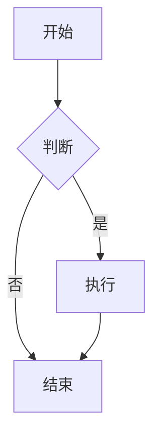
````

##### 1.3 支持的图表类型

| 图表类型     | 关键字            | 用途               |
| :----------- | :---------------- | :----------------- |
| **流程图**   | `graph`           | 算法流程、业务流程 |
| **时序图**   | `sequenceDiagram` | 交互流程、API 调用 |
| **甘特图**   | `gantt`           | 项目进度、任务排期 |
| **类图**     | `classDiagram`    | 面向对象设计       |
| **状态图**   | `stateDiagram-v2` | 状态机、生命周期   |
| **ER 图**    | `erDiagram`       | 数据库设计         |
| **饼图**     | `pie`             | 数据占比           |
| **思维导图** | `mindmap`         | 知识结构           |
| **Git 图**   | `gitGraph`        | 分支策略           |

#### 2. 流程图

##### 2.1 方向

| 关键字      | 方向     |
| :---------- | :------- |
| `TB` / `TD` | 从上到下 |
| `BT`        | 从下到上 |
| `LR`        | 从左到右 |
| `RL`        | 从右到左 |

##### 2.2 节点形状

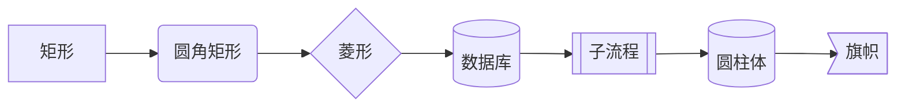

| 语法       | 形状     | 用途      |
| :--------- | :------- | :-------- |
| `[文本]`   | 矩形     | 普通步骤  |
| `(文本)`   | 圆角矩形 | 开始/结束 |
| `{文本}`   | 菱形     | 判断/条件 |
| `[(文本)]` | 圆柱体   | 数据库    |
| `[[文本]]` | 子流程   | 子过程    |
| `((文本))` | 圆形     | 连接点    |

##### 2.3 连接线

| 语法 | 样式 | 说明 |
| :----- | :--------- | :-------- | ------ | -------- |
| `-->` | 实线箭头 | 默认连接 |
| `---` | 实线无箭头 | 无方向 |
| `-.->` | 虚线箭头 | 可选/条件 |
| `==>` | 粗线箭头 | 强调 |
| `-->   | 文本       | ` | 带标签 | 条件说明 |

##### 2.4 完整示例

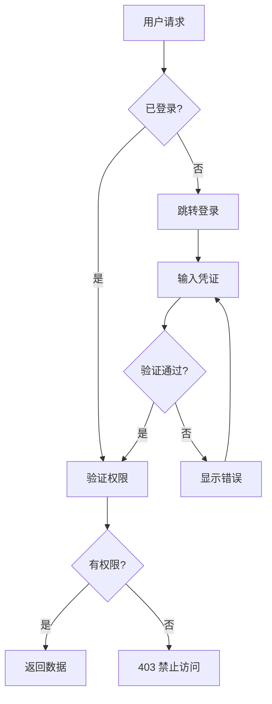

#### 3. 时序图

##### 3.1 基本语法

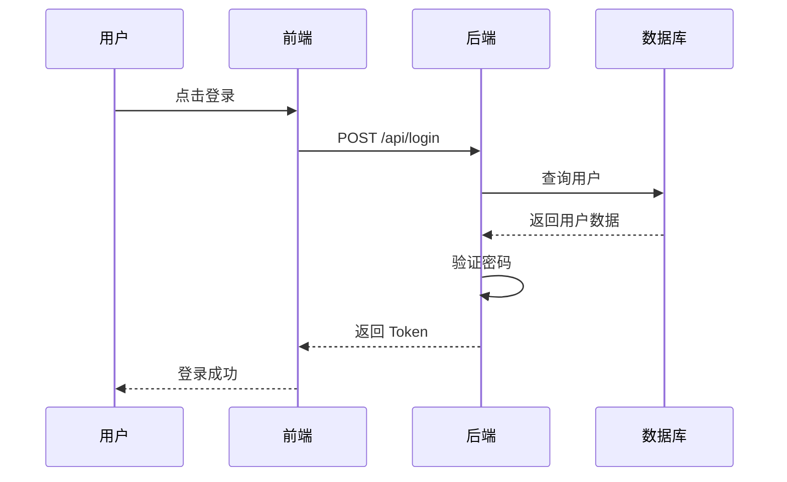

##### 3.2 消息类型

| 语法   | 样式         | 说明      |
| :----- | :----------- | :-------- |
| `->>`  | 实线箭头     | 同步请求  |
| `-->>` | 虚线箭头     | 返回/响应 |
| `--)`  | 实线开放箭头 | 异步消息  |
| `--)`  | 虚线开放箭头 | 异步响应  |

##### 3.3 高级特性

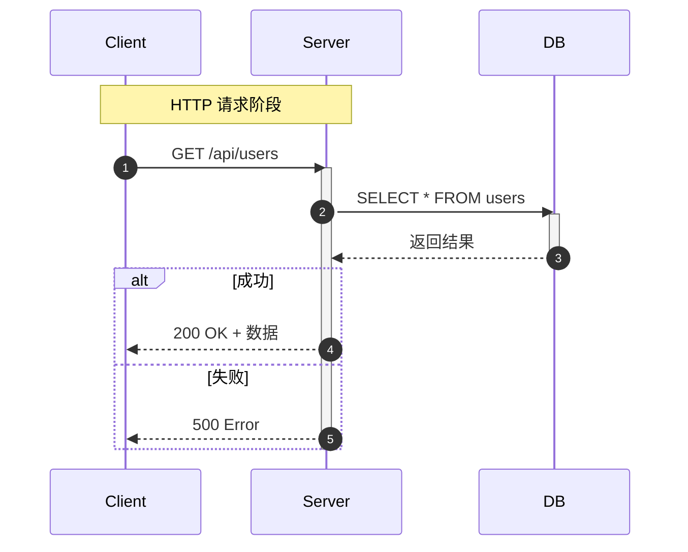

- `autonumber`：自动编号
- `Note over A,B`：跨参与者注释
- `activate`/`deactivate`：显示激活状态
- `alt`/`else`：条件分支
- `loop`：循环
- `opt`：可选

#### 4. 甘特图

##### 4.1 基本语法

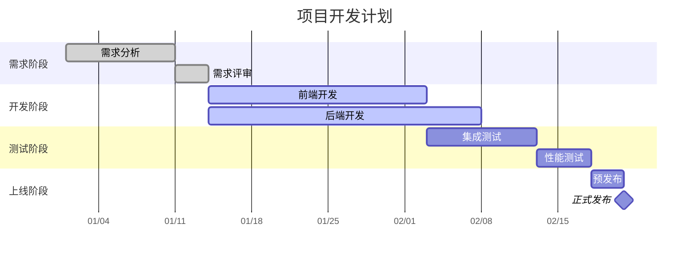

##### 4.2 任务状态

| 关键字      | 样式             | 说明           |
| :---------- | :--------------- | :------------- |
| `done`      | 已完成（灰色）   | 已完成的任务   |
| `active`    | 进行中（蓝色）   | 当前执行的任务 |
| （默认）    | 未开始（浅色）   | 待执行的任务   |
| `milestone` | 里程碑（菱形）   | 关键节点       |
| `crit`      | 关键路径（红色） | 必须按时完成   |

#### 5. 类图

##### 5.1 基本语法

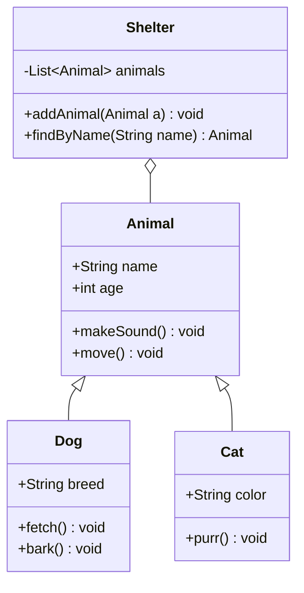

##### 5.2 关系类型

| 语法    | 关系         | 说明                 |
| :------ | :----------- | :------------------- |
| `<\|--` | 继承         | 子类继承父类         |
| `*\--`  | 组合         | 强拥有，生命周期一致 |
| `o--`   | 聚合         | 弱拥有，可独立存在   |
| `-->`   | 关联         | 单向引用             |
| `--`    | 关联（双向） | 双向引用             |
| `..>`   | 依赖         | 使用关系             |
| `..\|>` | 实现         | 接口实现             |

#### 6. 状态图

##### 6.1 基本语法

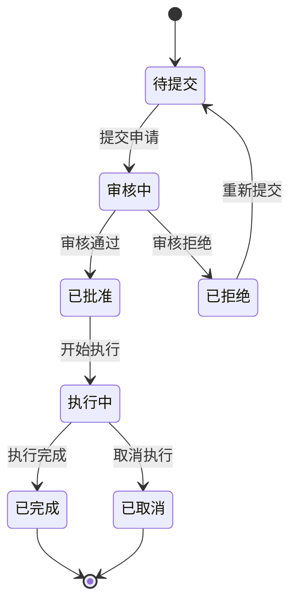

##### 6.2 复合状态

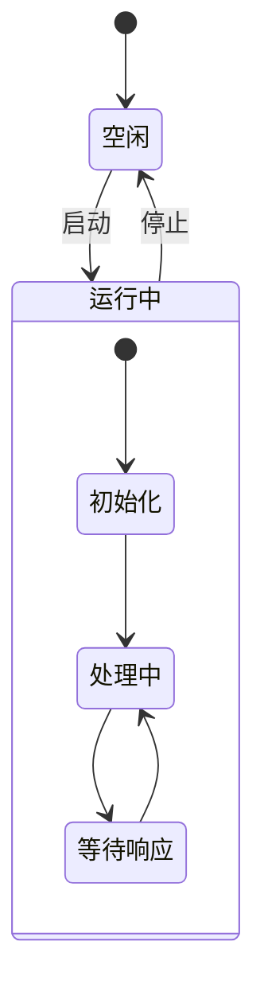

#### 7. 平台支持

| 平台           | Mermaid 支持 | 说明                |
| :------------- | :----------- | :------------------ |
| **GitHub**     |              | 原生支持            |
| **GitLab**     |              | 原生支持            |
| **Obsidian**   |              | 原生支持            |
| **Typora**     |              | 原生支持            |
| **Hugo**       |              | 需 shortcode 或插件 |
| **Jekyll**     |              | 需插件              |
| **CommonMark** |              | 不支持              |

#### 8. 调试技巧

- 使用 [Mermaid Live Editor](https://mermaid.live/) 在线编辑和预览
- 语法错误时图表不渲染，检查控制台错误信息
- 节点 ID 不能包含空格，使用文本标签代替
- 中文文本在某些渲染器中可能需要引号包裹
#### 代码块基础

**基本写法：插入 Mermaid 图表**
` ```mermaid ` 与 ` ``` `
````markdown
# 用 mermaid 代码块标识图表

````
---

#### 流程图（flowchart）

**基本写法：基础流程图**
`graph <方向>`
`    <节点A> --> <节点B>`
````markdown
# 自上而下的流程图
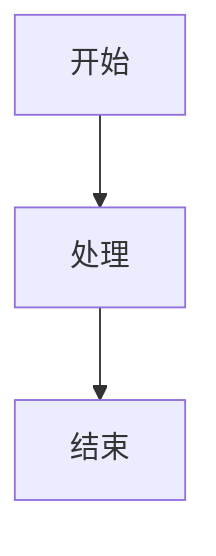
````

---

**基本写法：图表方向**
`graph <方向>`
````markdown
# TD/TB 自上而下，LR 从左到右，RL 从右到左，BT 自下而上
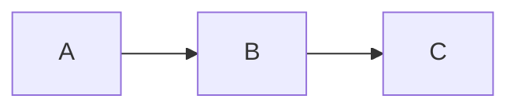
````

---

**基本写法：节点形状**
`<节点>[<文本>]`、`<节点>(<文本>)`、`<节点>{<文本>}`
````markdown
# 不同括号表示不同形状
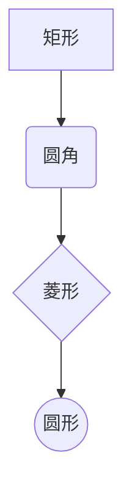
````

---

**基本写法：带文本的连线**
`<节点A> -- <文本> --> <节点B>`
````markdown
# 连线上标注说明文字
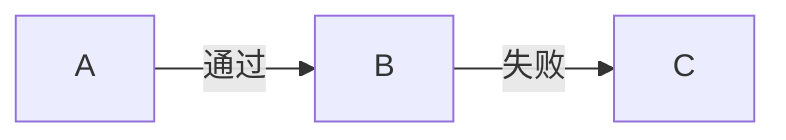
````

---

**基本写法：虚线与粗线**
`<节点A> -.-> <节点B>`、`<节点A> ==> <节点B>`
````markdown
# 虚线箭头与粗线箭头
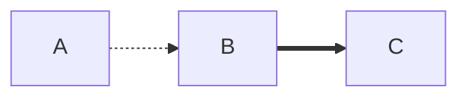
````

---

**基本写法：子图分组**
`subgraph <名称>` ... `end`
````markdown
# 用子图对节点分组
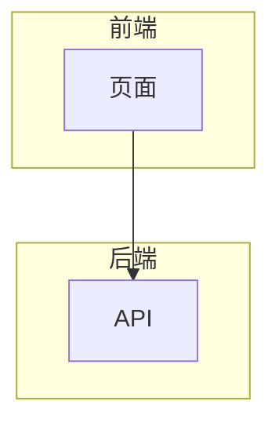
````

---

#### 时序图（sequence）

**基本写法：基础时序图**
`sequenceDiagram`
`    <参与者A>->> <参与者B>: <消息>`
````markdown
# 参与者之间的消息交互
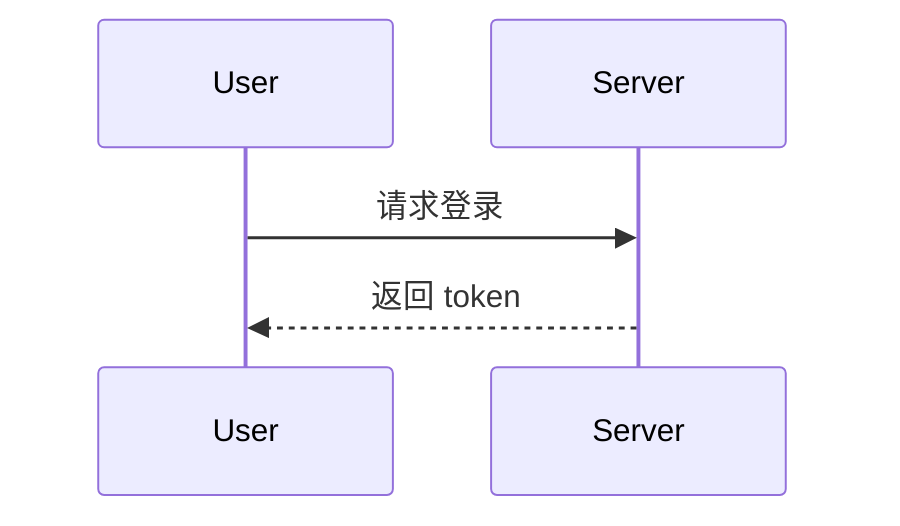
````

---

**基本写法：参与者别名**
`participant <别名> as <显示名>`
````markdown
# 为参与者设置显示别名
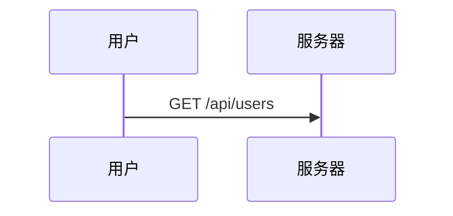
````

---

**基本写法：消息类型**
`->>` 实线箭头，`-->>` 虚线箭头，`--)` 异步实线
````markdown
# 不同箭头表示不同消息类型
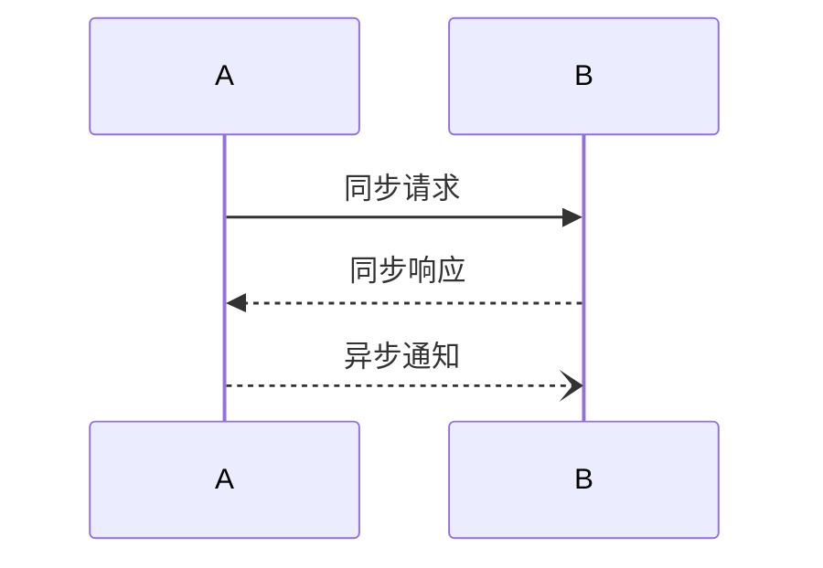
````

---

**基本写法：激活与停用**
`activate <参与者>` 与 `deactivate <参与者>`
````markdown
# 标记参与者激活时段
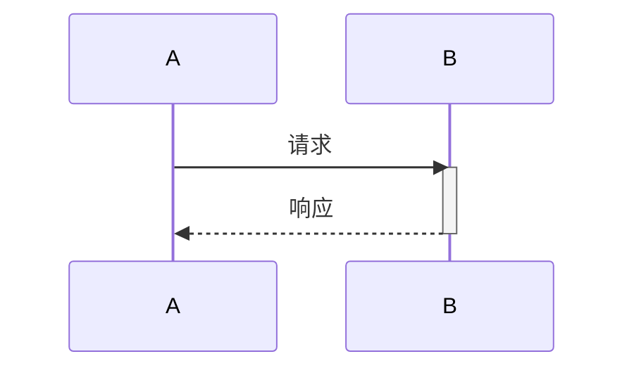
````

---

**基本写法：注释与分组**
`Note over <参与者>: <说明>`、`loop <描述>` ... `end`
````markdown
# 添加注释与循环块
```mermaid
sequenceDiagram
    participant A
    participant B
    loop 每分钟
        A->>B: 心跳
        Note over B: 处理心跳
    end
```
````

---

**基本写法：条件分支**
`alt <条件>` ... `else` ... `end`
````markdown
# 条件分支结构
```mermaid
sequenceDiagram
    A->>B: 请求
    alt 成功
        B-->>A: 数据
    else 失败
        B-->>A: 错误
    end
```
````

---

#### 类图（class）

**基本写法：基础类图**
`classDiagram`
`    class <类名>`
````markdown
# 定义类与属性
```mermaid
classDiagram
    class User {
        +String name
        +Integer age
        +login() Boolean
    }
```
````

---

**基本写法：类关系**
`<类A> <关系> <类B>`
````markdown
# 不同箭头表示继承、组合、聚合等关系
```mermaid
classDiagram
    Animal <|-- Dog
    Animal <|-- Cat
    Car *-- Wheel
    School o-- Student
```
````

---

**基本写法：可见性修饰**
`+` 公有、`-` 私有、`#` 受保护、`~` 包内
````markdown
# 用符号标注成员可见性
```mermaid
classDiagram
    class Account {
        +String id
        -String password
        #Integer balance
        ~String nickname
    }
```
````

---

#### 状态图（state）

**基本写法：基础状态图**
`stateDiagram-v2`
`    [*] --> <状态>`
````markdown
# 状态转换图
```mermaid
stateDiagram-v2
    [*] --> 待支付
    待支付 --> 已支付: 支付成功
    已支付 --> 已发货: 商家发货
    已发货 --> [*]: 确认收货
```
````

---

**基本写法：状态描述**
`<状态>: <说明>`
````markdown
# 状态下方写详细描述
```mermaid
stateDiagram-v2
    [*] --> Active
    Active: 活动状态
    Active: 正在处理请求
    Active --> Inactive: 暂停
```
````

---

**基本写法：复合状态**
`state <名称> {` ... `}`
````markdown
# 嵌套的复合状态
```mermaid
stateDiagram-v2
    [*] --> 运行中
    state 运行中 {
        [*] --> 加载
        加载 --> 就绪
    }
    运行中 --> [*]: 停止
```
````

---

**基本写法：分支状态**
`<<choice>>` 与条件分支
````markdown
# 用 choice 实现条件分支
```mermaid
stateDiagram-v2
    [*] --> 检查
    state 检查 <<choice>>
    检查 --> 通过: 成功
    检查 --> 拒绝: 失败
    通过 --> [*]
    拒绝 --> [*]
```
````

---

#### 甘特图（gantt）

**基本写法：基础甘特图**
`gantt`
`    dateFormat <格式>`
````markdown
# 项目任务时间线
```mermaid
gantt
    title 项目计划
    dateFormat YYYY-MM-DD
    section 设计
    需求分析 :a1, 2024-01-01, 5d
    原型设计 :after a1, 3d
    section 开发
    编码 :2024-01-10, 10d
```
````

---

**基本写法：任务状态**
`done`、`active`、`crit`
````markdown
# 标记任务状态与关键路径
```mermaid
gantt
    dateFormat YYYY-MM-DD
    section 阶段一
    已完成 :done, a1, 2024-01-01, 3d
    进行中 :active, a2, after a1, 5d
    关键任务 :crit, a3, after a2, 4d
```
````

---

#### 饼图（pie）

**基本写法：基础饼图**
`pie title <标题>`
`    "<标签>" : <数值>`
````markdown
# 用饼图展示占比
```mermaid
pie title 浏览器市场份额
    "Chrome" : 65
    "Safari" : 18
    "Edge" : 5
    "其他" : 12
```
````

---

#### 用户旅程图（journey）

**基本写法：基础旅程图**
`journey`
`    title <标题>`
````markdown
# 描述用户体验旅程
```mermaid
journey
    title 用户购物流程
    section 浏览
      访问首页: 5: 用户
      搜索商品: 4: 用户
    section 下单
      加入购物车: 5: 用户
      提交订单: 3: 用户, 系统
```
````

---

#### 主题与样式

**基本写法：自定义节点样式**
`style <节点> fill:<颜色>,stroke:<颜色>`
````markdown
# 修改节点颜色样式
```mermaid
graph TD
    A[开始] --> B[处理]
    style A fill:#f9f,stroke:#333
    style B fill:#bbf,stroke:#369
```
````

---

**基本写法：定义类样式**
`classDef <类名> fill:<颜色>,stroke:<颜色>`
`class <节点> <类名>`
````markdown
# 用 classDef 复用样式
```mermaid
graph LR
    A --> B --> C
    classDef highlight fill:#ff9,stroke:#333
    class B highlight
```
````

---

#### 链接与交互

**基本写法：节点绑定链接**
`click <节点> "<URL>"`
````markdown
# 点击节点跳转链接
```mermaid
graph TD
    A[文档] --> B[官网]
    click A "https://example.com/docs"
    click B "https://example.com"
```
````

---

**基本写法：节点回调函数**
`click <节点> call <函数>`
````markdown
# 点击节点调用 JavaScript 函数
```mermaid
graph TD
    A[按钮] --> B[处理]
    click A call handleButtonClick()
```
````


### 3.2 概念关系图

下面用 Mermaid 图表达本文核心概念之间的关系，帮助读者建立整体图景：

```mermaid
flowchart LR
    A["Mermaid图表"] --> B["核心概念"]
    B --> C["原理机制"]
    B --> D["代码实践"]
    C --> E["工程应用"]
    D --> E
```

图中展示的是本文知识的结构化关系：核心概念是入口，原理机制解释“为什么”，代码实践演示“怎么做”，工程应用回答“何时用”。读者学习时可以把每个小节的内容挂接到对应节点上。

## 4. 理论推导与原理解析

本节深入《Mermaid图表》背后的原理。理论部分不求面面俱到，而是聚焦“能解释现象、能指导实践”的关键推导。

块级语法：标题、段落、列表、引用、代码块、表格、分隔线；行内语法：强调、代码、链接、图片。
解析模型：块级解析优先，行内解析递归；空行分隔块；转义符 \ 输出字面量。
GFM 扩展：~~删除线~~、任务列表 - [x]、表格对齐、自动链接、围栏代码语言标注。
元数据：frontmatter（YAML）在文档站中承载标题、日期、标签。

需要强调的是，理论推导与工程实践之间存在翻译层：理论给出的是理想化模型与边界条件，工程代码则必须处理真实环境中的例外。读者在学习时应先掌握理论的“标准情形”，再通过陷阱章节了解“非标准情形”。

## 5. 代码示例与逐行讲解

本节把原文中的代码示例系统整理，并为每个示例补充用途说明与讲解。读者不应只浏览代码，而应逐段对照讲解理解设计意图。

### 5.1 示例：2.2 节点形状

该示例来自原文《2.2 节点形状》小节，用于演示Mermaid图表相关操作。阅读时请先看代码结构，再看其后的讲解。

```mermaid
graph LR
    A[矩形] --> B(圆角矩形)
    B --> C{菱形}
    C --> D[(数据库)]
    D --> E[[子流程]]
    E --> F[(圆柱体)]
    F --> G>旗帜]
```

讲解：这段代码演示了本节核心知识点。代码中的关键操作可以归纳为三步：准备（定义或初始化）、执行（核心逻辑）、收尾（释放资源或返回结果）。实际项目中，这三步往往被封装为函数或类，以提升复用性与可测试性。

关键点分析：

该示例共 7 行有效代码，结构以数据或配置为主。阅读时应关注：数据字段的含义、配置项的作用，以及它们与运行行为的对应关系。

进阶思考路径：先尝试修改参数观察行为变化，再把示例中的模式迁移到自己的项目中；每次修改都记录预期与实测差异，这是把示例转化为能力的最快方式。

### 5.2 示例：2.4 完整示例

该示例来自原文《2.4 完整示例》小节，用于演示Mermaid图表相关操作。阅读时请先看代码结构，再看其后的讲解。

```mermaid
graph TD
    A[用户请求] --> B{已登录?}
    B -->|是| C[验证权限]
    B -->|否| D[跳转登录]
    D --> E[输入凭证]
    E --> F{验证通过?}
    F -->|是| C
    F -->|否| G[显示错误]
    G --> E
    C --> H{有权限?}
    H -->|是| I[返回数据]
    H -->|否| J[403 禁止访问]
```

讲解：这段代码演示了本节核心知识点。代码中的关键操作可以归纳为三步：准备（定义或初始化）、执行（核心逻辑）、收尾（释放资源或返回结果）。实际项目中，这三步往往被封装为函数或类，以提升复用性与可测试性。

关键点分析：

该示例共 12 行有效代码，结构以数据或配置为主。阅读时应关注：数据字段的含义、配置项的作用，以及它们与运行行为的对应关系。

进阶思考路径：先尝试修改参数观察行为变化，再把示例中的模式迁移到自己的项目中；每次修改都记录预期与实测差异，这是把示例转化为能力的最快方式。

### 5.3 示例：3.1 基本语法

该示例来自原文《3.1 基本语法》小节，用于演示Mermaid图表相关操作。阅读时请先看代码结构，再看其后的讲解。

```mermaid
sequenceDiagram
    participant U as 用户
    participant F as 前端
    participant B as 后端
    participant D as 数据库

    U->>F: 点击登录
    F->>B: POST /api/login
    B->>D: 查询用户
    D-->>B: 返回用户数据
    B->>B: 验证密码
    B-->>F: 返回 Token
    F-->>U: 登录成功
```

讲解：这段代码演示了本节核心知识点。代码中的关键操作可以归纳为三步：准备（定义或初始化）、执行（核心逻辑）、收尾（释放资源或返回结果）。实际项目中，这三步往往被封装为函数或类，以提升复用性与可测试性。

关键点分析：

该示例共 12 行有效代码，结构以数据或配置为主。阅读时应关注：数据字段的含义、配置项的作用，以及它们与运行行为的对应关系。

进阶思考路径：先尝试修改参数观察行为变化，再把示例中的模式迁移到自己的项目中；每次修改都记录预期与实测差异，这是把示例转化为能力的最快方式。

### 5.4 示例：3.3 高级特性

该示例来自原文《3.3 高级特性》小节，用于演示Mermaid图表相关操作。阅读时请先看代码结构，再看其后的讲解。

```mermaid
sequenceDiagram
    autonumber
    participant Client
    participant Server
    participant DB

    Note over Client,Server: HTTP 请求阶段
    Client->>Server: GET /api/users

    activate Server
    Server->>DB: SELECT * FROM users
    activate DB
    DB-->>Server: 返回结果
    deactivate DB

    alt 成功
        Server-->>Client: 200 OK + 数据
    else 失败
        Server-->>Client: 500 Error
    end
    deactivate Server
```

讲解：这段代码演示了本节核心知识点。代码中的关键操作可以归纳为三步：准备（定义或初始化）、执行（核心逻辑）、收尾（释放资源或返回结果）。实际项目中，这三步往往被封装为函数或类，以提升复用性与可测试性。

关键点分析：

该示例共 18 行有效代码，包含 2 类关键结构（SELECT、FROM）。其中：

- 入口与初始化部分负责建立上下文，对应实际项目中的启动或装配逻辑；
- 核心逻辑部分体现本文主题的主要操作，是阅读时最需要对照讲解理解的部分；
- 输出或返回部分把结果交给调用方，注意其类型与边界条件。

进阶思考路径：先尝试修改参数观察行为变化，再把示例中的模式迁移到自己的项目中；每次修改都记录预期与实测差异，这是把示例转化为能力的最快方式。

### 5.5 示例：4.1 基本语法

该示例来自原文《4.1 基本语法》小节，用于演示Mermaid图表相关操作。阅读时请先看代码结构，再看其后的讲解。

```mermaid
gantt
    title 项目开发计划
    dateFormat YYYY-MM-DD
    axisFormat %m/%d

    section 需求阶段
    需求分析       :done, req1, 2026-01-01, 10d
    需求评审       :done, req2, after req1, 3d

    section 开发阶段
    前端开发       :active, dev1, after req2, 20d
    后端开发       :active, dev2, after req2, 25d

    section 测试阶段
    集成测试       :test1, after dev1, 10d
    性能测试       :test2, after test1, 5d

    section 上线阶段
    预发布         :rel1, after test2, 3d
    正式发布       :milestone, rel2, after rel1, 0d
```

讲解：这段代码演示了本节核心知识点。代码中的关键操作可以归纳为三步：准备（定义或初始化）、执行（核心逻辑）、收尾（释放资源或返回结果）。实际项目中，这三步往往被封装为函数或类，以提升复用性与可测试性。

关键点分析：

该示例共 16 行有效代码，结构以数据或配置为主。阅读时应关注：数据字段的含义、配置项的作用，以及它们与运行行为的对应关系。

进阶思考路径：先尝试修改参数观察行为变化，再把示例中的模式迁移到自己的项目中；每次修改都记录预期与实测差异，这是把示例转化为能力的最快方式。

### 5.6 示例：5.1 基本语法

该示例来自原文《5.1 基本语法》小节，用于演示Mermaid图表相关操作。阅读时请先看代码结构，再看其后的讲解。

```mermaid
classDiagram
    class Animal {
        +String name
        +int age
        +makeSound() void
        +move() void
    }

    class Dog {
        +String breed
        +fetch() void
        +bark() void
    }

    class Cat {
        +String color
        +purr() void
    }

    class Shelter {
        -List~Animal~ animals
        +addAnimal(Animal a) void
        +findByName(String name) Animal
    }

    Animal <|-- Dog
    Animal <|-- Cat
    Shelter o-- Animal
```

讲解：这段代码演示了本节核心知识点。代码中的关键操作可以归纳为三步：准备（定义或初始化）、执行（核心逻辑）、收尾（释放资源或返回结果）。实际项目中，这三步往往被封装为函数或类，以提升复用性与可测试性。

关键点分析：

该示例共 24 行有效代码，包含 1 类关键结构（class）。其中：

- 入口与初始化部分负责建立上下文，对应实际项目中的启动或装配逻辑；
- 核心逻辑部分体现本文主题的主要操作，是阅读时最需要对照讲解理解的部分；
- 输出或返回部分把结果交给调用方，注意其类型与边界条件。

进阶思考路径：先尝试修改参数观察行为变化，再把示例中的模式迁移到自己的项目中；每次修改都记录预期与实测差异，这是把示例转化为能力的最快方式。

### 5.7 示例：6.1 基本语法

该示例来自原文《6.1 基本语法》小节，用于演示Mermaid图表相关操作。阅读时请先看代码结构，再看其后的讲解。

```mermaid
stateDiagram-v2
    [*] --> 待提交
    待提交 --> 审核中: 提交申请
    审核中 --> 已批准: 审核通过
    审核中 --> 已拒绝: 审核拒绝
    已拒绝 --> 待提交: 重新提交
    已批准 --> 执行中: 开始执行
    执行中 --> 已完成: 执行完成
    执行中 --> 已取消: 取消执行
    已完成 --> [*]
    已取消 --> [*]
```

讲解：这段代码演示了本节核心知识点。代码中的关键操作可以归纳为三步：准备（定义或初始化）、执行（核心逻辑）、收尾（释放资源或返回结果）。实际项目中，这三步往往被封装为函数或类，以提升复用性与可测试性。

关键点分析：

该示例共 11 行有效代码，结构以数据或配置为主。阅读时应关注：数据字段的含义、配置项的作用，以及它们与运行行为的对应关系。

进阶思考路径：先尝试修改参数观察行为变化，再把示例中的模式迁移到自己的项目中；每次修改都记录预期与实测差异，这是把示例转化为能力的最快方式。

### 5.8 示例：6.2 复合状态

该示例来自原文《6.2 复合状态》小节，用于演示Mermaid图表相关操作。阅读时请先看代码结构，再看其后的讲解。

```mermaid
stateDiagram-v2
    [*] --> 空闲

    state 运行中 {
        [*] --> 初始化
        初始化 --> 处理中
        处理中 --> 等待响应
        等待响应 --> 处理中
    }

    空闲 --> 运行中: 启动
    运行中 --> 空闲: 停止
```

讲解：这段代码演示了本节核心知识点。代码中的关键操作可以归纳为三步：准备（定义或初始化）、执行（核心逻辑）、收尾（释放资源或返回结果）。实际项目中，这三步往往被封装为函数或类，以提升复用性与可测试性。

关键点分析：

该示例共 10 行有效代码，结构以数据或配置为主。阅读时应关注：数据字段的含义、配置项的作用，以及它们与运行行为的对应关系。

进阶思考路径：先尝试修改参数观察行为变化，再把示例中的模式迁移到自己的项目中；每次修改都记录预期与实测差异，这是把示例转化为能力的最快方式。

### 5.9 示例：代码块基础

该示例来自原文《代码块基础》小节，用于演示Mermaid图表相关操作。阅读时请先看代码结构，再看其后的讲解。

````markdown
# 用 mermaid 代码块标识图表
```

讲解：这段代码演示了本节核心知识点。代码中的关键操作可以归纳为三步：准备（定义或初始化）、执行（核心逻辑）、收尾（释放资源或返回结果）。实际项目中，这三步往往被封装为函数或类，以提升复用性与可测试性。

关键点分析：

该示例共 1 行有效代码，结构以数据或配置为主。阅读时应关注：数据字段的含义、配置项的作用，以及它们与运行行为的对应关系。

进阶思考路径：先尝试修改参数观察行为变化，再把示例中的模式迁移到自己的项目中；每次修改都记录预期与实测差异，这是把示例转化为能力的最快方式。

### 5.10 示例：流程图（flowchart）

该示例来自原文《流程图（flowchart）》小节，用于演示Mermaid图表相关操作。阅读时请先看代码结构，再看其后的讲解。

````markdown
# 自上而下的流程图
```

讲解：这段代码演示了本节核心知识点。代码中的关键操作可以归纳为三步：准备（定义或初始化）、执行（核心逻辑）、收尾（释放资源或返回结果）。实际项目中，这三步往往被封装为函数或类，以提升复用性与可测试性。

关键点分析：

该示例共 1 行有效代码，结构以数据或配置为主。阅读时应关注：数据字段的含义、配置项的作用，以及它们与运行行为的对应关系。

进阶思考路径：先尝试修改参数观察行为变化，再把示例中的模式迁移到自己的项目中；每次修改都记录预期与实测差异，这是把示例转化为能力的最快方式。

### 5.11 示例：流程图（flowchart）

该示例来自原文《流程图（flowchart）》小节，用于演示Mermaid图表相关操作。阅读时请先看代码结构，再看其后的讲解。

````markdown
# TD/TB 自上而下，LR 从左到右，RL 从右到左，BT 自下而上
```

讲解：这段代码演示了本节核心知识点。代码中的关键操作可以归纳为三步：准备（定义或初始化）、执行（核心逻辑）、收尾（释放资源或返回结果）。实际项目中，这三步往往被封装为函数或类，以提升复用性与可测试性。

关键点分析：

该示例共 1 行有效代码，结构以数据或配置为主。阅读时应关注：数据字段的含义、配置项的作用，以及它们与运行行为的对应关系。

进阶思考路径：先尝试修改参数观察行为变化，再把示例中的模式迁移到自己的项目中；每次修改都记录预期与实测差异，这是把示例转化为能力的最快方式。

### 5.12 示例：流程图（flowchart）

该示例来自原文《流程图（flowchart）》小节，用于演示Mermaid图表相关操作。阅读时请先看代码结构，再看其后的讲解。

````markdown
# 不同括号表示不同形状
```

讲解：这段代码演示了本节核心知识点。代码中的关键操作可以归纳为三步：准备（定义或初始化）、执行（核心逻辑）、收尾（释放资源或返回结果）。实际项目中，这三步往往被封装为函数或类，以提升复用性与可测试性。

关键点分析：

该示例共 1 行有效代码，结构以数据或配置为主。阅读时应关注：数据字段的含义、配置项的作用，以及它们与运行行为的对应关系。

进阶思考路径：先尝试修改参数观察行为变化，再把示例中的模式迁移到自己的项目中；每次修改都记录预期与实测差异，这是把示例转化为能力的最快方式。

### 5.13 示例：流程图（flowchart）

该示例来自原文《流程图（flowchart）》小节，用于演示Mermaid图表相关操作。阅读时请先看代码结构，再看其后的讲解。

````markdown
# 连线上标注说明文字
```

讲解：这段代码演示了本节核心知识点。代码中的关键操作可以归纳为三步：准备（定义或初始化）、执行（核心逻辑）、收尾（释放资源或返回结果）。实际项目中，这三步往往被封装为函数或类，以提升复用性与可测试性。

关键点分析：

该示例共 1 行有效代码，结构以数据或配置为主。阅读时应关注：数据字段的含义、配置项的作用，以及它们与运行行为的对应关系。

进阶思考路径：先尝试修改参数观察行为变化，再把示例中的模式迁移到自己的项目中；每次修改都记录预期与实测差异，这是把示例转化为能力的最快方式。

### 5.14 示例：流程图（flowchart）

该示例来自原文《流程图（flowchart）》小节，用于演示Mermaid图表相关操作。阅读时请先看代码结构，再看其后的讲解。

````markdown
# 虚线箭头与粗线箭头
```

讲解：这段代码演示了本节核心知识点。代码中的关键操作可以归纳为三步：准备（定义或初始化）、执行（核心逻辑）、收尾（释放资源或返回结果）。实际项目中，这三步往往被封装为函数或类，以提升复用性与可测试性。

关键点分析：

该示例共 1 行有效代码，结构以数据或配置为主。阅读时应关注：数据字段的含义、配置项的作用，以及它们与运行行为的对应关系。

进阶思考路径：先尝试修改参数观察行为变化，再把示例中的模式迁移到自己的项目中；每次修改都记录预期与实测差异，这是把示例转化为能力的最快方式。

### 5.15 示例：流程图（flowchart）

该示例来自原文《流程图（flowchart）》小节，用于演示Mermaid图表相关操作。阅读时请先看代码结构，再看其后的讲解。

````markdown
# 用子图对节点分组
```

讲解：这段代码演示了本节核心知识点。代码中的关键操作可以归纳为三步：准备（定义或初始化）、执行（核心逻辑）、收尾（释放资源或返回结果）。实际项目中，这三步往往被封装为函数或类，以提升复用性与可测试性。

关键点分析：

该示例共 1 行有效代码，结构以数据或配置为主。阅读时应关注：数据字段的含义、配置项的作用，以及它们与运行行为的对应关系。

进阶思考路径：先尝试修改参数观察行为变化，再把示例中的模式迁移到自己的项目中；每次修改都记录预期与实测差异，这是把示例转化为能力的最快方式。

### 5.16 示例：时序图（sequence）

该示例来自原文《时序图（sequence）》小节，用于演示Mermaid图表相关操作。阅读时请先看代码结构，再看其后的讲解。

````markdown
# 参与者之间的消息交互
```

讲解：这段代码演示了本节核心知识点。代码中的关键操作可以归纳为三步：准备（定义或初始化）、执行（核心逻辑）、收尾（释放资源或返回结果）。实际项目中，这三步往往被封装为函数或类，以提升复用性与可测试性。

关键点分析：

该示例共 1 行有效代码，结构以数据或配置为主。阅读时应关注：数据字段的含义、配置项的作用，以及它们与运行行为的对应关系。

进阶思考路径：先尝试修改参数观察行为变化，再把示例中的模式迁移到自己的项目中；每次修改都记录预期与实测差异，这是把示例转化为能力的最快方式。

### 5.17 示例：时序图（sequence）

该示例来自原文《时序图（sequence）》小节，用于演示Mermaid图表相关操作。阅读时请先看代码结构，再看其后的讲解。

````markdown
# 为参与者设置显示别名
```

讲解：这段代码演示了本节核心知识点。代码中的关键操作可以归纳为三步：准备（定义或初始化）、执行（核心逻辑）、收尾（释放资源或返回结果）。实际项目中，这三步往往被封装为函数或类，以提升复用性与可测试性。

关键点分析：

该示例共 1 行有效代码，结构以数据或配置为主。阅读时应关注：数据字段的含义、配置项的作用，以及它们与运行行为的对应关系。

进阶思考路径：先尝试修改参数观察行为变化，再把示例中的模式迁移到自己的项目中；每次修改都记录预期与实测差异，这是把示例转化为能力的最快方式。

### 5.18 示例：时序图（sequence）

该示例来自原文《时序图（sequence）》小节，用于演示Mermaid图表相关操作。阅读时请先看代码结构，再看其后的讲解。

````markdown
# 不同箭头表示不同消息类型
```

讲解：这段代码演示了本节核心知识点。代码中的关键操作可以归纳为三步：准备（定义或初始化）、执行（核心逻辑）、收尾（释放资源或返回结果）。实际项目中，这三步往往被封装为函数或类，以提升复用性与可测试性。

关键点分析：

该示例共 1 行有效代码，结构以数据或配置为主。阅读时应关注：数据字段的含义、配置项的作用，以及它们与运行行为的对应关系。

进阶思考路径：先尝试修改参数观察行为变化，再把示例中的模式迁移到自己的项目中；每次修改都记录预期与实测差异，这是把示例转化为能力的最快方式。

### 5.19 示例：时序图（sequence）

该示例来自原文《时序图（sequence）》小节，用于演示Mermaid图表相关操作。阅读时请先看代码结构，再看其后的讲解。

````markdown
# 标记参与者激活时段
```

讲解：这段代码演示了本节核心知识点。代码中的关键操作可以归纳为三步：准备（定义或初始化）、执行（核心逻辑）、收尾（释放资源或返回结果）。实际项目中，这三步往往被封装为函数或类，以提升复用性与可测试性。

关键点分析：

该示例共 1 行有效代码，结构以数据或配置为主。阅读时应关注：数据字段的含义、配置项的作用，以及它们与运行行为的对应关系。

进阶思考路径：先尝试修改参数观察行为变化，再把示例中的模式迁移到自己的项目中；每次修改都记录预期与实测差异，这是把示例转化为能力的最快方式。

### 5.20 示例：时序图（sequence）

该示例来自原文《时序图（sequence）》小节，用于演示Mermaid图表相关操作。阅读时请先看代码结构，再看其后的讲解。

````markdown
# 添加注释与循环块
```

讲解：这段代码演示了本节核心知识点。代码中的关键操作可以归纳为三步：准备（定义或初始化）、执行（核心逻辑）、收尾（释放资源或返回结果）。实际项目中，这三步往往被封装为函数或类，以提升复用性与可测试性。

关键点分析：

该示例共 1 行有效代码，结构以数据或配置为主。阅读时应关注：数据字段的含义、配置项的作用，以及它们与运行行为的对应关系。

进阶思考路径：先尝试修改参数观察行为变化，再把示例中的模式迁移到自己的项目中；每次修改都记录预期与实测差异，这是把示例转化为能力的最快方式。

### 5.21 示例：时序图（sequence）

该示例来自原文《时序图（sequence）》小节，用于演示Mermaid图表相关操作。阅读时请先看代码结构，再看其后的讲解。

````markdown
# 条件分支结构
```

讲解：这段代码演示了本节核心知识点。代码中的关键操作可以归纳为三步：准备（定义或初始化）、执行（核心逻辑）、收尾（释放资源或返回结果）。实际项目中，这三步往往被封装为函数或类，以提升复用性与可测试性。

关键点分析：

该示例共 1 行有效代码，结构以数据或配置为主。阅读时应关注：数据字段的含义、配置项的作用，以及它们与运行行为的对应关系。

进阶思考路径：先尝试修改参数观察行为变化，再把示例中的模式迁移到自己的项目中；每次修改都记录预期与实测差异，这是把示例转化为能力的最快方式。

### 5.22 示例：类图（class）

该示例来自原文《类图（class）》小节，用于演示Mermaid图表相关操作。阅读时请先看代码结构，再看其后的讲解。

````markdown
# 定义类与属性
```

讲解：这段代码演示了本节核心知识点。代码中的关键操作可以归纳为三步：准备（定义或初始化）、执行（核心逻辑）、收尾（释放资源或返回结果）。实际项目中，这三步往往被封装为函数或类，以提升复用性与可测试性。

关键点分析：

该示例共 1 行有效代码，结构以数据或配置为主。阅读时应关注：数据字段的含义、配置项的作用，以及它们与运行行为的对应关系。

进阶思考路径：先尝试修改参数观察行为变化，再把示例中的模式迁移到自己的项目中；每次修改都记录预期与实测差异，这是把示例转化为能力的最快方式。

### 5.23 示例：类图（class）

该示例来自原文《类图（class）》小节，用于演示Mermaid图表相关操作。阅读时请先看代码结构，再看其后的讲解。

````markdown
# 不同箭头表示继承、组合、聚合等关系
```

讲解：这段代码演示了本节核心知识点。代码中的关键操作可以归纳为三步：准备（定义或初始化）、执行（核心逻辑）、收尾（释放资源或返回结果）。实际项目中，这三步往往被封装为函数或类，以提升复用性与可测试性。

关键点分析：

该示例共 1 行有效代码，结构以数据或配置为主。阅读时应关注：数据字段的含义、配置项的作用，以及它们与运行行为的对应关系。

进阶思考路径：先尝试修改参数观察行为变化，再把示例中的模式迁移到自己的项目中；每次修改都记录预期与实测差异，这是把示例转化为能力的最快方式。

### 5.24 示例：类图（class）

该示例来自原文《类图（class）》小节，用于演示Mermaid图表相关操作。阅读时请先看代码结构，再看其后的讲解。

````markdown
# 用符号标注成员可见性
```

讲解：这段代码演示了本节核心知识点。代码中的关键操作可以归纳为三步：准备（定义或初始化）、执行（核心逻辑）、收尾（释放资源或返回结果）。实际项目中，这三步往往被封装为函数或类，以提升复用性与可测试性。

关键点分析：

该示例共 1 行有效代码，结构以数据或配置为主。阅读时应关注：数据字段的含义、配置项的作用，以及它们与运行行为的对应关系。

进阶思考路径：先尝试修改参数观察行为变化，再把示例中的模式迁移到自己的项目中；每次修改都记录预期与实测差异，这是把示例转化为能力的最快方式。

### 5.25 示例：状态图（state）

该示例来自原文《状态图（state）》小节，用于演示Mermaid图表相关操作。阅读时请先看代码结构，再看其后的讲解。

````markdown
# 状态转换图
```

讲解：这段代码演示了本节核心知识点。代码中的关键操作可以归纳为三步：准备（定义或初始化）、执行（核心逻辑）、收尾（释放资源或返回结果）。实际项目中，这三步往往被封装为函数或类，以提升复用性与可测试性。

关键点分析：

该示例共 1 行有效代码，结构以数据或配置为主。阅读时应关注：数据字段的含义、配置项的作用，以及它们与运行行为的对应关系。

进阶思考路径：先尝试修改参数观察行为变化，再把示例中的模式迁移到自己的项目中；每次修改都记录预期与实测差异，这是把示例转化为能力的最快方式。

### 5.26 示例：状态图（state）

该示例来自原文《状态图（state）》小节，用于演示Mermaid图表相关操作。阅读时请先看代码结构，再看其后的讲解。

````markdown
# 状态下方写详细描述
```

讲解：这段代码演示了本节核心知识点。代码中的关键操作可以归纳为三步：准备（定义或初始化）、执行（核心逻辑）、收尾（释放资源或返回结果）。实际项目中，这三步往往被封装为函数或类，以提升复用性与可测试性。

关键点分析：

该示例共 1 行有效代码，结构以数据或配置为主。阅读时应关注：数据字段的含义、配置项的作用，以及它们与运行行为的对应关系。

进阶思考路径：先尝试修改参数观察行为变化，再把示例中的模式迁移到自己的项目中；每次修改都记录预期与实测差异，这是把示例转化为能力的最快方式。

### 5.27 示例：状态图（state）

该示例来自原文《状态图（state）》小节，用于演示Mermaid图表相关操作。阅读时请先看代码结构，再看其后的讲解。

````markdown
# 嵌套的复合状态
```

讲解：这段代码演示了本节核心知识点。代码中的关键操作可以归纳为三步：准备（定义或初始化）、执行（核心逻辑）、收尾（释放资源或返回结果）。实际项目中，这三步往往被封装为函数或类，以提升复用性与可测试性。

关键点分析：

该示例共 1 行有效代码，结构以数据或配置为主。阅读时应关注：数据字段的含义、配置项的作用，以及它们与运行行为的对应关系。

进阶思考路径：先尝试修改参数观察行为变化，再把示例中的模式迁移到自己的项目中；每次修改都记录预期与实测差异，这是把示例转化为能力的最快方式。

### 5.28 示例：状态图（state）

该示例来自原文《状态图（state）》小节，用于演示Mermaid图表相关操作。阅读时请先看代码结构，再看其后的讲解。

````markdown
# 用 choice 实现条件分支
```

讲解：这段代码演示了本节核心知识点。代码中的关键操作可以归纳为三步：准备（定义或初始化）、执行（核心逻辑）、收尾（释放资源或返回结果）。实际项目中，这三步往往被封装为函数或类，以提升复用性与可测试性。

关键点分析：

该示例共 1 行有效代码，结构以数据或配置为主。阅读时应关注：数据字段的含义、配置项的作用，以及它们与运行行为的对应关系。

进阶思考路径：先尝试修改参数观察行为变化，再把示例中的模式迁移到自己的项目中；每次修改都记录预期与实测差异，这是把示例转化为能力的最快方式。

### 5.29 示例：甘特图（gantt）

该示例来自原文《甘特图（gantt）》小节，用于演示Mermaid图表相关操作。阅读时请先看代码结构，再看其后的讲解。

````markdown
# 项目任务时间线
```

讲解：这段代码演示了本节核心知识点。代码中的关键操作可以归纳为三步：准备（定义或初始化）、执行（核心逻辑）、收尾（释放资源或返回结果）。实际项目中，这三步往往被封装为函数或类，以提升复用性与可测试性。

关键点分析：

该示例共 1 行有效代码，结构以数据或配置为主。阅读时应关注：数据字段的含义、配置项的作用，以及它们与运行行为的对应关系。

进阶思考路径：先尝试修改参数观察行为变化，再把示例中的模式迁移到自己的项目中；每次修改都记录预期与实测差异，这是把示例转化为能力的最快方式。

### 5.30 示例：甘特图（gantt）

该示例来自原文《甘特图（gantt）》小节，用于演示Mermaid图表相关操作。阅读时请先看代码结构，再看其后的讲解。

````markdown
# 标记任务状态与关键路径
```

讲解：这段代码演示了本节核心知识点。代码中的关键操作可以归纳为三步：准备（定义或初始化）、执行（核心逻辑）、收尾（释放资源或返回结果）。实际项目中，这三步往往被封装为函数或类，以提升复用性与可测试性。

关键点分析：

该示例共 1 行有效代码，结构以数据或配置为主。阅读时应关注：数据字段的含义、配置项的作用，以及它们与运行行为的对应关系。

进阶思考路径：先尝试修改参数观察行为变化，再把示例中的模式迁移到自己的项目中；每次修改都记录预期与实测差异，这是把示例转化为能力的最快方式。

### 5.31 示例：饼图（pie）

该示例来自原文《饼图（pie）》小节，用于演示Mermaid图表相关操作。阅读时请先看代码结构，再看其后的讲解。

````markdown
# 用饼图展示占比
```

讲解：这段代码演示了本节核心知识点。代码中的关键操作可以归纳为三步：准备（定义或初始化）、执行（核心逻辑）、收尾（释放资源或返回结果）。实际项目中，这三步往往被封装为函数或类，以提升复用性与可测试性。

关键点分析：

该示例共 1 行有效代码，结构以数据或配置为主。阅读时应关注：数据字段的含义、配置项的作用，以及它们与运行行为的对应关系。

进阶思考路径：先尝试修改参数观察行为变化，再把示例中的模式迁移到自己的项目中；每次修改都记录预期与实测差异，这是把示例转化为能力的最快方式。

### 5.32 示例：用户旅程图（journey）

该示例来自原文《用户旅程图（journey）》小节，用于演示Mermaid图表相关操作。阅读时请先看代码结构，再看其后的讲解。

````markdown
# 描述用户体验旅程
```

讲解：这段代码演示了本节核心知识点。代码中的关键操作可以归纳为三步：准备（定义或初始化）、执行（核心逻辑）、收尾（释放资源或返回结果）。实际项目中，这三步往往被封装为函数或类，以提升复用性与可测试性。

关键点分析：

该示例共 1 行有效代码，结构以数据或配置为主。阅读时应关注：数据字段的含义、配置项的作用，以及它们与运行行为的对应关系。

进阶思考路径：先尝试修改参数观察行为变化，再把示例中的模式迁移到自己的项目中；每次修改都记录预期与实测差异，这是把示例转化为能力的最快方式。

### 5.33 示例：主题与样式

该示例来自原文《主题与样式》小节，用于演示Mermaid图表相关操作。阅读时请先看代码结构，再看其后的讲解。

````markdown
# 修改节点颜色样式
```

讲解：这段代码演示了本节核心知识点。代码中的关键操作可以归纳为三步：准备（定义或初始化）、执行（核心逻辑）、收尾（释放资源或返回结果）。实际项目中，这三步往往被封装为函数或类，以提升复用性与可测试性。

关键点分析：

该示例共 1 行有效代码，结构以数据或配置为主。阅读时应关注：数据字段的含义、配置项的作用，以及它们与运行行为的对应关系。

进阶思考路径：先尝试修改参数观察行为变化，再把示例中的模式迁移到自己的项目中；每次修改都记录预期与实测差异，这是把示例转化为能力的最快方式。

### 5.34 示例：主题与样式

该示例来自原文《主题与样式》小节，用于演示Mermaid图表相关操作。阅读时请先看代码结构，再看其后的讲解。

````markdown
# 用 classDef 复用样式
```

讲解：这段代码演示了本节核心知识点。代码中的关键操作可以归纳为三步：准备（定义或初始化）、执行（核心逻辑）、收尾（释放资源或返回结果）。实际项目中，这三步往往被封装为函数或类，以提升复用性与可测试性。

关键点分析：

该示例共 1 行有效代码，包含 1 类关键结构（class）。其中：

- 入口与初始化部分负责建立上下文，对应实际项目中的启动或装配逻辑；
- 核心逻辑部分体现本文主题的主要操作，是阅读时最需要对照讲解理解的部分；
- 输出或返回部分把结果交给调用方，注意其类型与边界条件。

进阶思考路径：先尝试修改参数观察行为变化，再把示例中的模式迁移到自己的项目中；每次修改都记录预期与实测差异，这是把示例转化为能力的最快方式。

### 5.35 示例：链接与交互

该示例来自原文《链接与交互》小节，用于演示Mermaid图表相关操作。阅读时请先看代码结构，再看其后的讲解。

````markdown
# 点击节点跳转链接
```

讲解：这段代码演示了本节核心知识点。代码中的关键操作可以归纳为三步：准备（定义或初始化）、执行（核心逻辑）、收尾（释放资源或返回结果）。实际项目中，这三步往往被封装为函数或类，以提升复用性与可测试性。

关键点分析：

该示例共 1 行有效代码，结构以数据或配置为主。阅读时应关注：数据字段的含义、配置项的作用，以及它们与运行行为的对应关系。

进阶思考路径：先尝试修改参数观察行为变化，再把示例中的模式迁移到自己的项目中；每次修改都记录预期与实测差异，这是把示例转化为能力的最快方式。

### 5.36 示例：链接与交互

该示例来自原文《链接与交互》小节，用于演示Mermaid图表相关操作。阅读时请先看代码结构，再看其后的讲解。

````markdown
# 点击节点调用 JavaScript 函数
```

讲解：这段代码演示了本节核心知识点。代码中的关键操作可以归纳为三步：准备（定义或初始化）、执行（核心逻辑）、收尾（释放资源或返回结果）。实际项目中，这三步往往被封装为函数或类，以提升复用性与可测试性。

关键点分析：

该示例共 1 行有效代码，结构以数据或配置为主。阅读时应关注：数据字段的含义、配置项的作用，以及它们与运行行为的对应关系。

进阶思考路径：先尝试修改参数观察行为变化，再把示例中的模式迁移到自己的项目中；每次修改都记录预期与实测差异，这是把示例转化为能力的最快方式。


综合以上示例，可以总结出本主题的代码实践要点：第一，先定义清晰的输入输出契约；第二，核心逻辑保持单一职责；第三，错误处理与边界条件不可省略；第四，命名与注释表达意图而非复述代码。

## 6. 对比分析

对比是理解《Mermaid图表》定位的最快路径。下面从多个维度与相邻方案进行对比。

Markdown 与 HTML：Markdown 易读，HTML 精确；Markdown 允许内嵌 HTML 兜底。
CommonMark 与 GFM：CommonMark 是基础，GFM 是 GitHub 超集；跨平台注意差异。
Markdown 与 AsciiDoc：AsciiDoc 更强大，Markdown 更普及。

对比的目的不是分出绝对优劣，而是建立选择依据：不同约束条件下，最优解不同。读者应把每个对比维度转化为决策检查清单。

## 7. 常见陷阱与最佳实践

本节整理该主题的高频错误与推荐做法。每个陷阱先描述现象，再解释原因，最后给出最佳实践。

### 7.1 缩进代码块

四空格缩进在列表内失效。使用围栏代码块 ```。

深入讲解：该问题之所以被归类为“常见陷阱”，是因为它在初学者的代码中反复出现，而且往往不在第一时间暴露——错误通常隐藏在特定数据或特定时序下。

从成因上看，缩进代码块 一般源于对 Markdown 某个机制的理解偏差：要么误用了默认行为，要么忽略了边界条件，要么把其他语言的思维惯性带了过来。

从影响上看，缩进代码块 轻则产生错误结果，重则导致资源泄漏、数据损坏或安全事故；这也是为什么工程评审中会把它列为检查项。

从修复策略上看，处理缩进代码块的正确顺序是：先复现（构造最小用例），再定位（确认机制层面的根因），最后修复并补充回归测试。跳过复现直接改代码，往往治标不治本。

### 7.2 标题层级跳变

目录结构混乱。连续使用层级。

深入讲解：该问题之所以被归类为“常见陷阱”，是因为它在初学者的代码中反复出现，而且往往不在第一时间暴露——错误通常隐藏在特定数据或特定时序下。

从成因上看，标题层级跳变 一般源于对 Markdown 某个机制的理解偏差：要么误用了默认行为，要么忽略了边界条件，要么把其他语言的思维惯性带了过来。

从影响上看，标题层级跳变 轻则产生错误结果，重则导致资源泄漏、数据损坏或安全事故；这也是为什么工程评审中会把它列为检查项。

从修复策略上看，处理标题层级跳变的正确顺序是：先复现（构造最小用例），再定位（确认机制层面的根因），最后修复并补充回归测试。跳过复现直接改代码，往往治标不治本。

### 7.3 表格列数不一

渲染错位。保持分隔行与列数一致。

深入讲解：该问题之所以被归类为“常见陷阱”，是因为它在初学者的代码中反复出现，而且往往不在第一时间暴露——错误通常隐藏在特定数据或特定时序下。

从成因上看，表格列数不一 一般源于对 Markdown 某个机制的理解偏差：要么误用了默认行为，要么忽略了边界条件，要么把其他语言的思维惯性带了过来。

从影响上看，表格列数不一 轻则产生错误结果，重则导致资源泄漏、数据损坏或安全事故；这也是为什么工程评审中会把它列为检查项。

从修复策略上看，处理表格列数不一的正确顺序是：先复现（构造最小用例），再定位（确认机制层面的根因），最后修复并补充回归测试。跳过复现直接改代码，往往治标不治本。

### 7.4 中文标点转义

多余转义影响阅读。只转义语法字符。

深入讲解：该问题之所以被归类为“常见陷阱”，是因为它在初学者的代码中反复出现，而且往往不在第一时间暴露——错误通常隐藏在特定数据或特定时序下。

从成因上看，中文标点转义 一般源于对 Markdown 某个机制的理解偏差：要么误用了默认行为，要么忽略了边界条件，要么把其他语言的思维惯性带了过来。

从影响上看，中文标点转义 轻则产生错误结果，重则导致资源泄漏、数据损坏或安全事故；这也是为什么工程评审中会把它列为检查项。

从修复策略上看，处理中文标点转义的正确顺序是：先复现（构造最小用例），再定位（确认机制层面的根因），最后修复并补充回归测试。跳过复现直接改代码，往往治标不治本。

### 7.5 图片无 alt

加载失败无说明。提供描述性 alt。

深入讲解：该问题之所以被归类为“常见陷阱”，是因为它在初学者的代码中反复出现，而且往往不在第一时间暴露——错误通常隐藏在特定数据或特定时序下。

从成因上看，图片无 alt 一般源于对 Markdown 某个机制的理解偏差：要么误用了默认行为，要么忽略了边界条件，要么把其他语言的思维惯性带了过来。

从影响上看，图片无 alt 轻则产生错误结果，重则导致资源泄漏、数据损坏或安全事故；这也是为什么工程评审中会把它列为检查项。

从修复策略上看，处理图片无 alt的正确顺序是：先复现（构造最小用例），再定位（确认机制层面的根因），最后修复并补充回归测试。跳过复现直接改代码，往往治标不治本。

### 7.6 链接裸地址

可读性差。使用 [文字](地址)。

深入讲解：该问题之所以被归类为“常见陷阱”，是因为它在初学者的代码中反复出现，而且往往不在第一时间暴露——错误通常隐藏在特定数据或特定时序下。

从成因上看，链接裸地址 一般源于对 Markdown 某个机制的理解偏差：要么误用了默认行为，要么忽略了边界条件，要么把其他语言的思维惯性带了过来。

从影响上看，链接裸地址 轻则产生错误结果，重则导致资源泄漏、数据损坏或安全事故；这也是为什么工程评审中会把它列为检查项。

从修复策略上看，处理链接裸地址的正确顺序是：先复现（构造最小用例），再定位（确认机制层面的根因），最后修复并补充回归测试。跳过复现直接改代码，往往治标不治本。

### 7.7 特殊字符未转义

#、* 等被解析。需要字面量时转义。

深入讲解：该问题之所以被归类为“常见陷阱”，是因为它在初学者的代码中反复出现，而且往往不在第一时间暴露——错误通常隐藏在特定数据或特定时序下。

从成因上看，特殊字符未转义 一般源于对 Markdown 某个机制的理解偏差：要么误用了默认行为，要么忽略了边界条件，要么把其他语言的思维惯性带了过来。

从影响上看，特殊字符未转义 轻则产生错误结果，重则导致资源泄漏、数据损坏或安全事故；这也是为什么工程评审中会把它列为检查项。

从修复策略上看，处理特殊字符未转义的正确顺序是：先复现（构造最小用例），再定位（确认机制层面的根因），最后修复并补充回归测试。跳过复现直接改代码，往往治标不治本。

### 7.8 大文档单文件

维护困难。按模块拆分 + 目录索引。

深入讲解：该问题之所以被归类为“常见陷阱”，是因为它在初学者的代码中反复出现，而且往往不在第一时间暴露——错误通常隐藏在特定数据或特定时序下。

从成因上看，大文档单文件 一般源于对 Markdown 某个机制的理解偏差：要么误用了默认行为，要么忽略了边界条件，要么把其他语言的思维惯性带了过来。

从影响上看，大文档单文件 轻则产生错误结果，重则导致资源泄漏、数据损坏或安全事故；这也是为什么工程评审中会把它列为检查项。

从修复策略上看，处理大文档单文件的正确顺序是：先复现（构造最小用例），再定位（确认机制层面的根因），最后修复并补充回归测试。跳过复现直接改代码，往往治标不治本。

### 7.0 最佳实践总览

1. 标题层级与目录一致，每篇文档一个 h1。
2. 代码块标注语言，支持语法高亮。
3. 表格用于结构化数据，列表用于集合。
4. 链接使用相对路径保证仓库内可跳转。

把这些最佳实践固化为团队规范与代码评审检查项，是避免同类问题反复出现的关键。

## 8. 工程实践

本节把《Mermaid图表》放入真实工程场景，给出可复用的模式与组织方法。

文档站：Astro/VitePress 自动生成目录与导航；frontmatter 驱动元数据。
写作规范：术语一致、代码可复制、版本信息标注。
质量检查：markdownlint、链接检查、拼写检查接入 CI。

### 8.1 工程实践的原则拆解

以上工程实践可以归纳为四条原则。第一，配置与代码分离：Markdown 项目中环境差异应通过配置注入，而不是散落在代码分支中；这保证同一份代码可以在开发、测试、生产环境一致运行。

第二，接口稳定优先：对外接口（函数签名、协议、数据格式）一旦被消费方依赖，变更成本极高；设计时应预留扩展点并保持向后兼容。

第三，可观测性内置：日志、指标与追踪应该在功能开发时同步设计，而不是故障发生后补救；没有观测手段的模块等于黑盒。

第四，变更可回滚：任何发布都应有对应的回滚方案；数据库迁移、配置变更与代码发布一样需要版本管理与逆向路径。

### 8.2 实践落地的检查清单

- [ ] 文档站：对照本节描述，检查当前项目是否已经落实；未落实的项列入技术债并排期处理。
- [ ] 写作规范：对照本节描述，检查当前项目是否已经落实；未落实的项列入技术债并排期处理。
- [ ] 质量检查：对照本节描述，检查当前项目是否已经落实；未落实的项列入技术债并排期处理。

工程实践的共性原则：配置与代码分离、接口稳定优先、可观测性内置、变更可回滚。这些原则适用于本主题的所有实现。

## 9. 案例研究

本节通过一个完整案例把《Mermaid图表》的知识串起来。案例按“需求分析、方案设计、实现、验证”四步展开。

需求：为项目搭建规范化的文档体系。
方案：docs 目录 + 索引 + 模板 + lint。
要点：命名规范、frontmatter 统一、交叉链接。
验证：构建预览 + 链接扫描 + 团队评审。

### 9.1 案例的扩展讨论

把案例中的方案放大到真实规模，需要额外考虑三个问题：

第一，规模：当数据量或并发量上升一个数量级时，原方案中的数据结构、缓存策略与任务调度是否仍然成立？通常需要引入分层与异步。

第二，团队：多人协作时，模块边界、接口契约与代码所有权必须明确；案例中的实现应拆分为可独立测试的单元，并配合文档说明设计意图。

第三，演进：上线后的需求变化不可避免；方案设计时应预留扩展点（配置化、插件化、事件化），并定期用真实指标验证假设。


案例研究的学习方法：先独立阅读需求，尝试在脑中形成方案，再对照实现与讲解，最后思考“如果约束变化（数据量、并发、团队规模），方案应如何调整”。

## 10. 知识要点总结与深入讲解

本节以讲解形式汇总全文要点，替代传统的习题与自测，读者不需要答题，只需跟随解释建立完整的认知框架。

关于《Mermaid图表》的核心结论：

Markdown 是内容与展示分离的轻量格式。
语法有限反而促成规范统一。
文档即代码：纳入版本控制与 CI。

原文档各小节的要点回顾：

- 1. Mermaid 概述：该小节围绕Mermaid图表展开具体细节，阅读时应关注其与核心结论的对应关系；每个小节都是核心结论在某一个侧面的展开。
- 2. 流程图：该小节围绕Mermaid图表展开具体细节，阅读时应关注其与核心结论的对应关系；每个小节都是核心结论在某一个侧面的展开。
- 3. 时序图：该小节围绕Mermaid图表展开具体细节，阅读时应关注其与核心结论的对应关系；每个小节都是核心结论在某一个侧面的展开。
- 4. 甘特图：该小节围绕Mermaid图表展开具体细节，阅读时应关注其与核心结论的对应关系；每个小节都是核心结论在某一个侧面的展开。
- 5. 类图：该小节围绕Mermaid图表展开具体细节，阅读时应关注其与核心结论的对应关系；每个小节都是核心结论在某一个侧面的展开。
- 6. 状态图：该小节围绕Mermaid图表展开具体细节，阅读时应关注其与核心结论的对应关系；每个小节都是核心结论在某一个侧面的展开。
- 7. 平台支持：该小节围绕Mermaid图表展开具体细节，阅读时应关注其与核心结论的对应关系；每个小节都是核心结论在某一个侧面的展开。
- 8. 调试技巧：该小节围绕Mermaid图表展开具体细节，阅读时应关注其与核心结论的对应关系；每个小节都是核心结论在某一个侧面的展开。
- 代码块基础：该小节围绕Mermaid图表展开具体细节，阅读时应关注其与核心结论的对应关系；每个小节都是核心结论在某一个侧面的展开。
- 流程图（flowchart）：该小节围绕Mermaid图表展开具体细节，阅读时应关注其与核心结论的对应关系；每个小节都是核心结论在某一个侧面的展开。
- 时序图（sequence）：该小节围绕Mermaid图表展开具体细节，阅读时应关注其与核心结论的对应关系；每个小节都是核心结论在某一个侧面的展开。
- 类图（class）：该小节围绕Mermaid图表展开具体细节，阅读时应关注其与核心结论的对应关系；每个小节都是核心结论在某一个侧面的展开。
- 状态图（state）：该小节围绕Mermaid图表展开具体细节，阅读时应关注其与核心结论的对应关系；每个小节都是核心结论在某一个侧面的展开。
- 甘特图（gantt）：该小节围绕Mermaid图表展开具体细节，阅读时应关注其与核心结论的对应关系；每个小节都是核心结论在某一个侧面的展开。
- 饼图（pie）：该小节围绕Mermaid图表展开具体细节，阅读时应关注其与核心结论的对应关系；每个小节都是核心结论在某一个侧面的展开。
- 用户旅程图（journey）：该小节围绕Mermaid图表展开具体细节，阅读时应关注其与核心结论的对应关系；每个小节都是核心结论在某一个侧面的展开。
- 主题与样式：该小节围绕Mermaid图表展开具体细节，阅读时应关注其与核心结论的对应关系；每个小节都是核心结论在某一个侧面的展开。
- 链接与交互：该小节围绕Mermaid图表展开具体细节，阅读时应关注其与核心结论的对应关系；每个小节都是核心结论在某一个侧面的展开。

把以上要点与第 3-9 节的内容对照复习，即可完成对本文主题的闭环学习。

## 11. 参考文献


CommonMark 规范：https://spec.commonmark.org/
GFM 规范：https://github.github.com/gfm/
Markdown 指南：https://www.markdownguide.org/
Markdownlint：https://github.com/DavidAnson/markdownlint

## 12. 延伸阅读


Markdown 基础语法，见 002-markdown 模块文档。
Markdown 删除线语法，见 002-markdown/010-Strikethrough 文档。
文档站构建（Astro），见 056-astro 模块（如已加入）。
尚硅谷 Bilibili 空间（https://space.bilibili.com/302417610 ）提供文档写作课程。

## 14. 模块知识图谱与学习路径

本文属于 Markdown 模块。为了把《Mermaid图表》放入完整的知识网络，下面列出本模块的全部主题并给出相互关联的导读。学习时建议按模块内顺序推进，并在每个文档中留意交叉引用。

```mermaid
flowchart LR
    A["Mermaid图表"]
    N0["Markdown 语法指南"]
    N1["Markdown 标题语法"]
    N0 --> N1
    N2["Markdown 段落与换行"]
    N1 --> N2
    N3["Markdown 基础文本格式"]
    N2 --> N3
    N4["CommonMark规范"]
    N3 --> N4
    N5["Markdown 列表语法"]
    N4 --> N5
    N6["GitHub Flavored Markdown"]
    N5 --> N6
    N7["转义字符"]
    N6 --> N7
    N8["脚注"]
    N7 --> N8
    N9["删除线"]
    N8 --> N9
    N10["自动链接"]
    N9 --> N10
    N11["Emoji表情"]
    N10 --> N11
    N12["下标与上标"]
    N11 --> N12
    N13["LaTeX数学公式"]
    N12 --> N13
```

上图为模块主题的推荐学习顺序示意图（仅展示前若干主题）。各主题之间存在三类关联：

第一，前置依赖关系：早期主题是后期主题的基础，例如环境与语法先行、进阶主题随后；

第二，横向并列关系：同一层级主题从不同角度覆盖模块能力，学习顺序可以按兴趣调整；

第三，工程组合关系：多个主题在真实项目中组合使用，例如配置、性能与安全主题往往出现在同一系统的不同层面。

### 14.1 模块主题速查表

| 文档 | 主题 | 与本文的关联 |
| --- | --- | --- |
| Markdown 语法指南 | 001-SyntaxGuide | 本文的并列主题 |
| Markdown 标题语法 | 002-HeadingSyntax | 本文的并列主题 |
| Markdown 段落与换行 | 003-ParagraphLineBreak | 本文的并列主题 |
| Markdown 基础文本格式 | 004-BasicTextFormat | 本文的前置基础 |
| CommonMark规范 | 005-CommonMarkSpec | 本文的并列主题 |
| Markdown 列表语法 | 006-ListSyntax | 本文的并列主题 |
| GitHub Flavored Markdown | 007-GitHubFlavoredMarkdown | 本文的并列主题 |
| 转义字符 | 008-EscapeCharacter | 本文的并列主题 |
| 脚注 | 009-Footnote | 本文的并列主题 |
| 删除线 | 010-Strikethrough | 本文的并列主题 |
| 自动链接 | 011-AutoLink | 本文的并列主题 |
| Emoji表情 | 012-Emoji | 本文的并列主题 |
| 下标与上标 | 013-SubscriptSuperscript | 本文的并列主题 |
| LaTeX数学公式 | 014-LaTeXMathFormula | 本文的并列主题 |
| Mermaid图表 | 015-Mermaid | 本文自身 |
| 编辑器功能 | 016-EditorFeature | 本文的并列主题 |
| Markdown 链接与图片 | 017-LinkImage | 本文的并列主题 |
| 转换工具 | 018-ConversionTool | 本文的并列主题 |
| 自动目录 | 019-AutoTOC | 本文的并列主题 |
| 锚点跳转 | 020-AnchorJump | 本文的并列主题 |
| 图片CDN加速 | 021-ImageCDNAcceleration | 本文的并列主题 |
| 版本控制下的PR协作 | 022-VCSPRCollaboration | 本文的并列主题 |
| Markdown 代码块与语法高亮 | 023-CodeBlockSyntaxHighlight | 本文的并列主题 |
| Markdown 表格 | 024-Table | 本文的并列主题 |
| 规范文档编写 | 025-SpecDocumentWriting | 本文的并列主题 |
| Markdown 高级语法与文档自动化 | 026-AdvancedSyntaxDocumentAutomation | 本文的并列主题 |
| Markdown 任务列表 | 027-TaskList | 本文的并列主题 |
| Markdown 定义列表 | 028-DefinitionList | 本文的并列主题 |
| Markdown 提示框（admonition/callout） | 029-AdmonitionCallout | 本文的并列主题 |
| Markdown HTML 内嵌 | 030-HtmlEmbed | 本文的并列主题 |
| Markdown 引用与嵌套列表语法速查 | 031-BlockquoteNestedList | 本文的并列主题 |
| Markdown Frontmatter YAML 语法速查 | 032-FrontmatterYAML | 本文的并列主题 |

速查表的作用是让读者快速判断：哪些文档应在阅读本文前掌握（前置基础），哪些文档应在阅读本文后继续（延伸主题）。本模块的交叉引用体系即以此表为基础。

## 15. 术语表

下表整理《Mermaid图表》及 Markdown 模块中出现的高频术语，给出简明释义。术语按字母序或逻辑序排列，供查阅。

| 术语 | 释义 |
| --- | --- |
| 块级语法 | 标题、段落、列表、引用、代码块、表格、分隔线；行内语法：强调、代码、链接、图片。 |
| 解析模型 | 块级解析优先，行内解析递归；空行分隔块；转义符 \ 输出字面量。 |
| GFM 扩展 | ~~删除线~~、任务列表 - [x]、表格对齐、自动链接、围栏代码语言标注。 |
| 元数据 | frontmatter（YAML）在文档站中承载标题、日期、标签。 |
| 缩进代码块（易错点） | 参见常见陷阱章节的详细讲解 |
| 标题层级跳变（易错点） | 参见常见陷阱章节的详细讲解 |
| 表格列数不一（易错点） | 参见常见陷阱章节的详细讲解 |
| 中文标点转义（易错点） | 参见常见陷阱章节的详细讲解 |
| 图片无 alt（易错点） | 参见常见陷阱章节的详细讲解 |
| 链接裸地址（易错点） | 参见常见陷阱章节的详细讲解 |

术语表与正文配合使用：先通读正文，遇到模糊术语回查本表；长期使用后术语会自然进入工作记忆。
