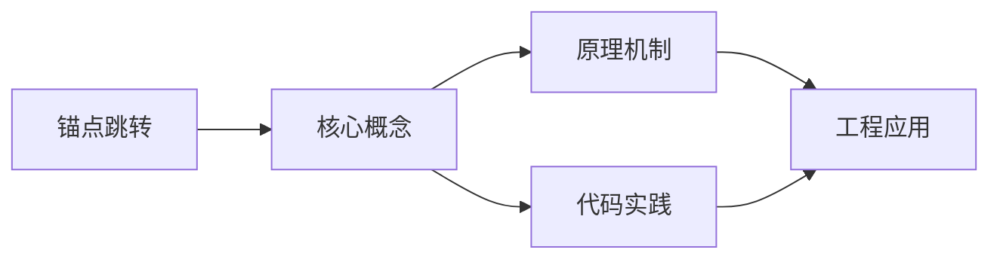
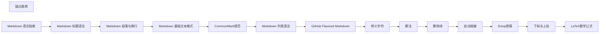

## 1. 学习目标（Bloom 分类）

本节按照布鲁姆教育目标分类学组织学习路径。本文主题为《锚点跳转》，属于 Markdown 模块，读者可以根据自身阶段选择阅读深度。

记忆层面：能够准确复述本文的核心概念、术语与基本语法或操作步骤，并能够在提问或检索时快速定位对应知识点。能够说出 Markdown 的核心概念、常用命令与流程。

理解层面：能够用自己的语言解释核心原理与工作机制，说明概念之间的因果关系，而不是机械记忆结论。能够解释 Markdown 的工作原理与设计动机。

应用层面：能够在真实项目或练习场景中运用本文知识解决具体问题，写出正确且可维护的实现。能够独立完成 Markdown 的标准操作。

分析层面：能够拆解复杂问题，比较本文主题与相邻概念的异同，识别边界条件与例外情况。能够分析 Markdown 使用中的异常与边界。

评价层面：能够根据约束条件（性能、可读性、安全、成本）评价不同方案的优劣，做出有依据的技术决策。能够评价 Markdown 相关工具与方案。

创造层面：能够把本文知识与其他模块知识组合，设计出新的解决方案或可复用的工程模式。能够把 Markdown 融入团队工作流。

通过本节学习，读者应当能够把《锚点跳转》纳入自己的知识网络，并与 Markdown 模块的其他主题（基础语法、GFM、写作规范）建立关联。

## 2. 历史动机与发展脉络

《锚点跳转》是 Markdown 领域的重要主题。要真正理解它，需要先了解它解决的问题与演进过程。

Markdown 由 John Gruber 与 Aaron Swartz 于 2004 年设计，目标是“易读易写的纯文本格式”，可转换为 HTML。
标准化：CommonMark（2014 起）统一解析歧义；GitHub Flavored Markdown（GFM）扩展表格、任务列表、删除线、围栏代码。
生态：文档站（Astro/VitePress）、知识库（Obsidian）、论坛（GitHub/Stack Overflow）、AI 输出格式均以 Markdown 为通用语言。

回到本文主题：锚点跳转 的提出与成熟，正是上述技术背景下的必然产物。早期实现往往以简单可用为目标，随着工程规模扩大，社区逐渐沉淀出标准做法与最佳实践；理解这一脉络，可以帮助读者判断“为什么文档中的推荐写法是现在这个样子”，也能在遇到历史遗留代码时准确识别其设计年代与取舍。


## 3. 形式化定义与核心概念精讲

本节把《锚点跳转》涉及的核心概念以“定义 + 讲解”的形式展开。读者应把定义当作工具，把讲解当作理解路径；两者结合才能形成可迁移的知识。

块级语法：标题、段落、列表、引用、代码块、表格、分隔线；行内语法：强调、代码、链接、图片。
解析模型：块级解析优先，行内解析递归；空行分隔块；转义符 \ 输出字面量。
GFM 扩展：~~删除线~~、任务列表 - [x]、表格对齐、自动链接、围栏代码语言标注。

### 3.1 原文章节逐一精讲

原文档把主题拆分为 52 个小节，下面按顺序给出每一节的导读讲解，随后保留原文细节供精读。

#### 原文精读（完整保留）

# Markdown 锚点与目录

> **符号约定**：`< >` 必填参数 | `[ ]` 可选参数

---

#### 自动生成的标题锚点

**基本写法：标题自动生成锚点**
`## <标题>`
```markdown
# 标题自动生成锚点 id
#### 安装步骤
# 锚点为 #安装步骤
```

---

**基本写法：链接到本页锚点**
`[<文本>](#<锚点>)`
```markdown
# 跳转到当前文档的某标题
[跳到安装步骤](#安装步骤)
```

---

**基本写法：英文标题锚点规则**
`## <English Title>`
```markdown
# GitHub 规则：小写、空格转横线、去特殊字符
#### Getting Started
# 锚点为 #getting-started
```

---

**基本写法：中文标题锚点**
`## <中文标题>`
```markdown
# 中文标题原样作为锚点
#### 中文标题
# 锚点为 #中文标题
```

---

**基本写法：带特殊字符的标题**
`## <标题 (含符号)>`
```markdown
# 特殊字符被忽略
#### API v2.0 - 简介
# 锚点为 #api-v20--简介
```

---

#### 重复标题处理

**基本写法：重复标题加序号**
`## <标题>` 出现多次
```markdown
# 第二次出现的标题自动加 -1，第三次加 -2
#### 示例
# 第一个锚点 #示例
# 第二个锚点 #示例-1
```

---

**基本写法：手动锚点**
`## <标题> {#<自定义锚点>}`
```markdown
# 用 {#id} 指定自定义锚点（部分渲染器支持）
#### 示例
# 第一个锚点 #示例
# 第二个锚点 #示例-1
```

---

**基本写法：手动锚点**
`## <标题> {#<自定义锚点>}`
```markdown
# 用 {#id} 指定自定义锚点（部分渲染器支持）
#### 自定义锚点 {#my-anchor}
```

---

#### 自定义锚点（HTML）

**基本写法：用 HTML 锚点**
`<a id="<锚点>"></a>`
```markdown
# 用 HTML 标签定义锚点
<a id="custom-section"></a>
#### 章节内容
```

---

**基本写法：链接到自定义锚点**
`[<文本>](#<自定义锚点>)`
```markdown
# 跳转到 HTML 定义的锚点
[跳到自定义](#custom-section)
```

---

**基本写法：name 属性锚点**
`<a name="<锚点>"></a>`
```markdown
# 旧式 name 属性定义锚点
<a name="section-1"></a>
```

---

#### 跨文档锚点跳转

**基本写法：链接到其他文件锚点`
`[<文本>](<文件>#<锚点>)`
```markdown
# 跳转到其他 markdown 文件的标题
[参见安装文档](install.md#安装步骤)
```

---

**基本写法：链接到 HTML 文件锚点`
`[<文本>](<文件>.html#<锚点>)`
```markdown
# 跳转到 HTML 文件的锚点
[查看页面](page.html#section)
```

---

**基本写法：绝对路径锚点`
`[<文本>](/<路径>#<锚点>)`
```markdown
# 用绝对路径跳转
[文档首页](/docs/index.md#top)
```

---

#### 目录（TOC）自动生成

**基本写法：GitHub 自动目录`
`<鼠标悬停标题旁的链接图标>`
```markdown
# GitHub 在标题旁自动生成链接图标
# README 顶部会自动生成目录
#### 章节一
```

---

**基本写法：VS Code 插件生成 TOC`
`通过 Markdown All in One 等插件生成`
```markdown
# 用插件自动生成目录
- [章节一](#章节一)
- [章节二](#章节二)
```

---

**基本写法：手动目录`
`- [<章节>](#<锚点>)`
```markdown
# 手动维护目录列表
#### 目录
- [安装](#安装)
- [配置](#配置)
- [使用](#使用)
```

---

**基本写法：嵌套目录`
`- [<父章节>](#<锚点>)`
`  - [<子章节>](#<锚点>)`
```markdown
# 用缩进表示层级
#### 目录

- [安装](#安装)
- [配置](#配置)
- [使用](#使用)
  - [基本用法](#基本用法)
  - [高级用法](#高级用法)
- [FAQ](#faq)

#### GitHub 锚点规则

**基本写法：转小写`
`<标题>` 转为 `<小写>`
```markdown
# GitHub 锚点全部小写
#### Hello World
# 锚点 #hello-world
```

---

**基本写法：空格转横线`
`<空格>` 转为 `-`
```markdown
# 空格替换为横线
#### Getting Started Guide
# 锚点 #getting-started-guide
```

---

**基本写法：去除特殊字符`
`<特殊字符>` 被忽略
```markdown
# 标点符号被移除
#### What's New?
# 锚点 #whats-new
```

---

**基本写法：连续横线合并`
`<多个空格>` 合并为单个 `-`
```markdown
# 多个空格不产生多个横线
#### A  B
# 锚点 #a--b（部分渲染器合并为 #a-b）
```

---

#### 锚点实战场景

**基本写法：返回顶部`
`[返回顶部](#<顶部锚点>)`
```markdown
# 在文档末尾添加返回顶部链接
[返回顶部](#top)
```

---

**基本写法：顶部锚点定义`
`<a id="top"></a>`
```markdown
# 文档顶部定义锚点
<a id="top"></a>
# 标题
```

---

**基本写法：脚注式跳转`
`<正文>[<跳转>](#<锚点>)`
```markdown
# 文中插入跳转链接
详见 [附录](#附录)。
```

---

**基本写法：导航栏式目录`
`[<章节1>](#<锚点1>) | [<章节2>](#<锚点2>)`
```markdown
# 顶部水平导航目录
[安装](#安装) | [配置](#配置) | [使用](#使用)
```

---

#### 不同渲染器差异

**基本写法：GitHub 锚点`
`[<文本>](#<小写横线格式>)`
```markdown
# GitHub 标题生成小写横线锚点
[跳转](#section-title)
```

---

**基本写法：GitLab 锚点`
`[<文本>](#<锚点>)`
```markdown
# GitLab 类似 GitHub 规则
[跳转](#section-title)
```

---

**基本写法：VuePress 自定义容器锚点`
`## <标题>`
```markdown
# VuePress 自动生成侧边栏目录与锚点
#### 章节标题
```

---

**基本写法：Docusaurus 锚点`
`## <标题>`
```markdown
# Docusaurus 自动生成 TOC 与锚点
#### Section Title
```

---

#### 锚点链接验证

**基本写法：检查锚点有效性`
`点击链接验证跳转`
```markdown
# 提交前点击所有锚点链接验证
[测试链接](#测试锚点)
```

---

**基本写法：用工具检测`
`markdown-link-check <文件>`
```bash
# 用工具检测 markdown 链接有效性
markdown-link-check README.md
```

---

#### 锚点命名规范

**基本写法：英文锚点规范`
`## <English Title>`
```markdown
# 推荐使用英文锚点避免编码问题
#### Installation Steps
```

---

**基本写法：简短锚点`
`## <简短标题>`
```markdown
# 锚点尽量简短易记
#### Quick Start
```

---

**基本写法：层级清晰`
`## <父章节> ### <子章节>`
```markdown
# 通过标题层级反映文档结构
#### 基础
#### 安装

#### 配置

#### 进阶
##### 高级用法
```

---

#### 注意事项

**基本写法：锚点区分大小写`
`[<文本>](#<精确大小写>)`
```markdown
# 锚点通常区分大小写需精确匹配
[跳转](#SectionTitle)
```

---

**基本写法：避免锚点重复`
`为重复标题指定自定义锚点`
```markdown
# 重复标题用自定义锚点区分
#### 示例 {#example-1}
#### 示例 {#example-2}
```

---

**基本写法：链接前后留空行`
`<段落>`
`[<链接>](#<锚点>)`
```markdown
# 链接与上下文用空行分隔避免解析问题
正文段落。

[跳转](#section)

下一段落。
```
#### 1. 锚点概述

##### 1.1 什么是锚点

锚点是 HTML 中的**页面内定位标记**，允许通过 URL 的片段标识符（`#` 后的部分）跳转到页面内的指定位置。

```markdown
[跳转到安装章节](#安装)

##### 1.2 锚点的工作原理

```
URL: https://example.com/docs#installation
                              ↑            ↑
                           页面路径      锚点标识符

1. 浏览器加载页面
2. 查找 id="installation" 的元素
3. 滚动到该元素位置
```

#### 2. 标题自动锚点

##### 2.1 自动生成规则

Markdown 渲染器会自动为标题生成锚点 ID：

```markdown
#### Getting Started → <h2 id="getting-started">

#### Hello World! → <h2 id="hello-world">

#### API v2.0 → <h2 id="api-v20">

#### C++ 编程 → <h2 id="c-编程">
```

##### 2.2 GitHub 锚点规则

| 规则           | 输入标题          | 生成的 ID          |
| :------------- | :---------------- | :----------------- |
| 转小写         | `Getting Started` | `getting-started`  |
| 空格→连字符    | `Hello World`     | `hello-world`      |
| 移除标点       | `What's New?`     | `whats-new`        |
| 保留中文       | `安装指南`        | `安装指南`         |
| 保留数字       | `Step 1`          | `step-1`           |
| 连续连字符合并 | `A --- B`         | `a----b`           |
| 重复 ID 加后缀 | 两个 `Hello`      | `hello`, `hello-1` |

##### 2.3 各平台差异

| 平台         | 中文处理 | 重复标题     | 特殊字符 |
| :----------- | :------- | :----------- | :------- |
| **GitHub**   | 保留     | 加 `-1` 后缀 | 移除     |
| **GitLab**   | 保留     | 加 `-1` 后缀 | 移除     |
| **Hugo**     | 可配置   | 加 `-1` 后缀 | 移除     |
| **VuePress** | 可配置   | 加 `-1` 后缀 | 移除     |
| **Obsidian** | 保留     | 不重复       | 移除     |

#### 3. 自定义锚点

##### 3.1 HTML 方式

```markdown
<a id="custom-anchor"></a>

#### 标题

内容...
```

链接到自定义锚点：

```markdown
[跳转到自定义位置](#custom-anchor)
```

##### 3.2 Hugo 短代码

```markdown
#### 标题 {#my-anchor}

内容...

[跳转](#my-anchor)
```

##### 3.3 Kramdown 方式

```markdown
#### 标题

{: #my-anchor}

[跳转](#my-anchor)
```

##### 3.4 VuePress 方式

VuePress 自动为标题生成锚点，也支持自定义：

```markdown
#### 标题 <MyAnchor/>

[跳转](#myanchor)
```

#### 4. 跳转链接语法

##### 4.1 页面内跳转

```markdown
[跳转到安装](#安装)
[跳转到配置](#配置)
[跳转到 FAQ](#常见问题)
```

##### 4.2 跨页面跳转

```markdown
[跳转到其他页面的章节](./other-page.md#章节标题)
[跳转到其他页面](../guide/README.md#概述)
```

##### 4.3 跨站点跳转

```markdown
[跳转到外部页面的锚点](https://example.com/docs#section)
```

#### 5. 实际应用

##### 5.1 README 目录

```markdown
# My Project

#### 使用

##### 基本用法

#### FAQ
```

##### 5.2 交叉引用

在长文档中引用其他章节：

```markdown
如需了解安装步骤，请参阅[安装指南](#安装指南)。

详细配置选项请参考[高级配置](#高级配置)章节。
```

##### 5.3 返回顶部

```markdown
<a id="top"></a>

# 文档标题

... 长文档内容 ...

[↑ 返回顶部](#top)
```

#### 6. 常见问题

##### 6.1 锚点不生效

| 问题             | 原因           | 解决方案               |
| :--------------- | :------------- | :--------------------- |
| 点击无反应       | 锚点 ID 不匹配 | 检查大小写和连字符     |
| 中文锚点乱码     | URL 编码问题   | 使用英文锚点或检查编码 |
| 重复标题跳转错误 | 多个相同 ID    | 使用自定义锚点区分     |
| 跨页面跳转失败   | 路径错误       | 检查相对路径           |

##### 6.2 调试技巧

```javascript
// 在浏览器控制台查看所有锚点
document.querySelectorAll('[id]').forEach((el) => {
  console.log(`#${el.id} → ${el.textContent.trim().substring(0, 30)}`);
});
```

##### 6.3 最佳实践

- 优先使用英文标题，确保锚点兼容性
- 避免重复标题，或使用自定义锚点区分
- 长文档在每章末尾添加返回目录链接
- 使用自动目录生成工具而非手动维护


### 3.2 概念关系图

下面用 Mermaid 图表达本文核心概念之间的关系，帮助读者建立整体图景：



图中展示的是本文知识的结构化关系：核心概念是入口，原理机制解释“为什么”，代码实践演示“怎么做”，工程应用回答“何时用”。读者学习时可以把每个小节的内容挂接到对应节点上。

## 4. 理论推导与原理解析

本节深入《锚点跳转》背后的原理。理论部分不求面面俱到，而是聚焦“能解释现象、能指导实践”的关键推导。

块级语法：标题、段落、列表、引用、代码块、表格、分隔线；行内语法：强调、代码、链接、图片。
解析模型：块级解析优先，行内解析递归；空行分隔块；转义符 \ 输出字面量。
GFM 扩展：~~删除线~~、任务列表 - [x]、表格对齐、自动链接、围栏代码语言标注。
元数据：frontmatter（YAML）在文档站中承载标题、日期、标签。

需要强调的是，理论推导与工程实践之间存在翻译层：理论给出的是理想化模型与边界条件，工程代码则必须处理真实环境中的例外。读者在学习时应先掌握理论的“标准情形”，再通过陷阱章节了解“非标准情形”。

## 5. 代码示例与逐行讲解

本节把原文中的代码示例系统整理，并为每个示例补充用途说明与讲解。读者不应只浏览代码，而应逐段对照讲解理解设计意图。

### 5.1 示例：自动生成的标题锚点

该示例来自原文《自动生成的标题锚点》小节，用于演示锚点跳转相关操作。阅读时请先看代码结构，再看其后的讲解。

```markdown
# 标题自动生成锚点 id
## 安装步骤
# 锚点为 #安装步骤
```

讲解：这段代码演示了本节核心知识点。代码中的关键操作可以归纳为三步：准备（定义或初始化）、执行（核心逻辑）、收尾（释放资源或返回结果）。实际项目中，这三步往往被封装为函数或类，以提升复用性与可测试性。

关键点分析：

该示例共 3 行有效代码，结构以数据或配置为主。阅读时应关注：数据字段的含义、配置项的作用，以及它们与运行行为的对应关系。

进阶思考路径：先尝试修改参数观察行为变化，再把示例中的模式迁移到自己的项目中；每次修改都记录预期与实测差异，这是把示例转化为能力的最快方式。

### 5.2 示例：自动生成的标题锚点

该示例来自原文《自动生成的标题锚点》小节，用于演示锚点跳转相关操作。阅读时请先看代码结构，再看其后的讲解。

```markdown
# 跳转到当前文档的某标题
[跳到安装步骤](#安装步骤)
```

讲解：这段代码演示了本节核心知识点。代码中的关键操作可以归纳为三步：准备（定义或初始化）、执行（核心逻辑）、收尾（释放资源或返回结果）。实际项目中，这三步往往被封装为函数或类，以提升复用性与可测试性。

关键点分析：

该示例共 2 行有效代码，结构以数据或配置为主。阅读时应关注：数据字段的含义、配置项的作用，以及它们与运行行为的对应关系。

进阶思考路径：先尝试修改参数观察行为变化，再把示例中的模式迁移到自己的项目中；每次修改都记录预期与实测差异，这是把示例转化为能力的最快方式。

### 5.3 示例：自动生成的标题锚点

该示例来自原文《自动生成的标题锚点》小节，用于演示锚点跳转相关操作。阅读时请先看代码结构，再看其后的讲解。

```markdown
# GitHub 规则：小写、空格转横线、去特殊字符
## Getting Started
# 锚点为 #getting-started
```

讲解：这段代码演示了本节核心知识点。代码中的关键操作可以归纳为三步：准备（定义或初始化）、执行（核心逻辑）、收尾（释放资源或返回结果）。实际项目中，这三步往往被封装为函数或类，以提升复用性与可测试性。

关键点分析：

该示例共 3 行有效代码，结构以数据或配置为主。阅读时应关注：数据字段的含义、配置项的作用，以及它们与运行行为的对应关系。

进阶思考路径：先尝试修改参数观察行为变化，再把示例中的模式迁移到自己的项目中；每次修改都记录预期与实测差异，这是把示例转化为能力的最快方式。

### 5.4 示例：自动生成的标题锚点

该示例来自原文《自动生成的标题锚点》小节，用于演示锚点跳转相关操作。阅读时请先看代码结构，再看其后的讲解。

```markdown
# 中文标题原样作为锚点
## 中文标题
# 锚点为 #中文标题
```

讲解：这段代码演示了本节核心知识点。代码中的关键操作可以归纳为三步：准备（定义或初始化）、执行（核心逻辑）、收尾（释放资源或返回结果）。实际项目中，这三步往往被封装为函数或类，以提升复用性与可测试性。

关键点分析：

该示例共 3 行有效代码，结构以数据或配置为主。阅读时应关注：数据字段的含义、配置项的作用，以及它们与运行行为的对应关系。

进阶思考路径：先尝试修改参数观察行为变化，再把示例中的模式迁移到自己的项目中；每次修改都记录预期与实测差异，这是把示例转化为能力的最快方式。

### 5.5 示例：自动生成的标题锚点

该示例来自原文《自动生成的标题锚点》小节，用于演示锚点跳转相关操作。阅读时请先看代码结构，再看其后的讲解。

```markdown
# 特殊字符被忽略
## API v2.0 - 简介
# 锚点为 #api-v20--简介
```

讲解：这段代码演示了本节核心知识点。代码中的关键操作可以归纳为三步：准备（定义或初始化）、执行（核心逻辑）、收尾（释放资源或返回结果）。实际项目中，这三步往往被封装为函数或类，以提升复用性与可测试性。

关键点分析：

该示例共 3 行有效代码，结构以数据或配置为主。阅读时应关注：数据字段的含义、配置项的作用，以及它们与运行行为的对应关系。

进阶思考路径：先尝试修改参数观察行为变化，再把示例中的模式迁移到自己的项目中；每次修改都记录预期与实测差异，这是把示例转化为能力的最快方式。

### 5.6 示例：重复标题处理

该示例来自原文《重复标题处理》小节，用于演示锚点跳转相关操作。阅读时请先看代码结构，再看其后的讲解。

```markdown
# 第二次出现的标题自动加 -1，第三次加 -2
## 示例
# 第一个锚点 #示例
# 第二个锚点 #示例-1
```

讲解：这段代码演示了本节核心知识点。代码中的关键操作可以归纳为三步：准备（定义或初始化）、执行（核心逻辑）、收尾（释放资源或返回结果）。实际项目中，这三步往往被封装为函数或类，以提升复用性与可测试性。

关键点分析：

该示例共 4 行有效代码，结构以数据或配置为主。阅读时应关注：数据字段的含义、配置项的作用，以及它们与运行行为的对应关系。

进阶思考路径：先尝试修改参数观察行为变化，再把示例中的模式迁移到自己的项目中；每次修改都记录预期与实测差异，这是把示例转化为能力的最快方式。

### 5.7 示例：重复标题处理

该示例来自原文《重复标题处理》小节，用于演示锚点跳转相关操作。阅读时请先看代码结构，再看其后的讲解。

```markdown
# 用 {#id} 指定自定义锚点（部分渲染器支持）
## 示例
# 第一个锚点 #示例
# 第二个锚点 #示例-1
```

讲解：这段代码演示了本节核心知识点。代码中的关键操作可以归纳为三步：准备（定义或初始化）、执行（核心逻辑）、收尾（释放资源或返回结果）。实际项目中，这三步往往被封装为函数或类，以提升复用性与可测试性。

关键点分析：

该示例共 4 行有效代码，结构以数据或配置为主。阅读时应关注：数据字段的含义、配置项的作用，以及它们与运行行为的对应关系。

进阶思考路径：先尝试修改参数观察行为变化，再把示例中的模式迁移到自己的项目中；每次修改都记录预期与实测差异，这是把示例转化为能力的最快方式。

### 5.8 示例：重复标题处理

该示例来自原文《重复标题处理》小节，用于演示锚点跳转相关操作。阅读时请先看代码结构，再看其后的讲解。

```markdown
# 用 {#id} 指定自定义锚点（部分渲染器支持）
## 自定义锚点 {#my-anchor}
```

讲解：这段代码演示了本节核心知识点。代码中的关键操作可以归纳为三步：准备（定义或初始化）、执行（核心逻辑）、收尾（释放资源或返回结果）。实际项目中，这三步往往被封装为函数或类，以提升复用性与可测试性。

关键点分析：

该示例共 2 行有效代码，结构以数据或配置为主。阅读时应关注：数据字段的含义、配置项的作用，以及它们与运行行为的对应关系。

进阶思考路径：先尝试修改参数观察行为变化，再把示例中的模式迁移到自己的项目中；每次修改都记录预期与实测差异，这是把示例转化为能力的最快方式。

### 5.9 示例：自定义锚点（HTML）

该示例来自原文《自定义锚点（HTML）》小节，用于演示锚点跳转相关操作。阅读时请先看代码结构，再看其后的讲解。

```markdown
# 用 HTML 标签定义锚点
<a id="custom-section"></a>
## 章节内容
```

讲解：这段代码演示了本节核心知识点。代码中的关键操作可以归纳为三步：准备（定义或初始化）、执行（核心逻辑）、收尾（释放资源或返回结果）。实际项目中，这三步往往被封装为函数或类，以提升复用性与可测试性。

关键点分析：

该示例共 3 行有效代码，结构以数据或配置为主。阅读时应关注：数据字段的含义、配置项的作用，以及它们与运行行为的对应关系。

进阶思考路径：先尝试修改参数观察行为变化，再把示例中的模式迁移到自己的项目中；每次修改都记录预期与实测差异，这是把示例转化为能力的最快方式。

### 5.10 示例：自定义锚点（HTML）

该示例来自原文《自定义锚点（HTML）》小节，用于演示锚点跳转相关操作。阅读时请先看代码结构，再看其后的讲解。

```markdown
# 跳转到 HTML 定义的锚点
[跳到自定义](#custom-section)
```

讲解：这段代码演示了本节核心知识点。代码中的关键操作可以归纳为三步：准备（定义或初始化）、执行（核心逻辑）、收尾（释放资源或返回结果）。实际项目中，这三步往往被封装为函数或类，以提升复用性与可测试性。

关键点分析：

该示例共 2 行有效代码，结构以数据或配置为主。阅读时应关注：数据字段的含义、配置项的作用，以及它们与运行行为的对应关系。

进阶思考路径：先尝试修改参数观察行为变化，再把示例中的模式迁移到自己的项目中；每次修改都记录预期与实测差异，这是把示例转化为能力的最快方式。

### 5.11 示例：自定义锚点（HTML）

该示例来自原文《自定义锚点（HTML）》小节，用于演示锚点跳转相关操作。阅读时请先看代码结构，再看其后的讲解。

```markdown
# 旧式 name 属性定义锚点
<a name="section-1"></a>
```

讲解：这段代码演示了本节核心知识点。代码中的关键操作可以归纳为三步：准备（定义或初始化）、执行（核心逻辑）、收尾（释放资源或返回结果）。实际项目中，这三步往往被封装为函数或类，以提升复用性与可测试性。

关键点分析：

该示例共 2 行有效代码，结构以数据或配置为主。阅读时应关注：数据字段的含义、配置项的作用，以及它们与运行行为的对应关系。

进阶思考路径：先尝试修改参数观察行为变化，再把示例中的模式迁移到自己的项目中；每次修改都记录预期与实测差异，这是把示例转化为能力的最快方式。

### 5.12 示例：跨文档锚点跳转

该示例来自原文《跨文档锚点跳转》小节，用于演示锚点跳转相关操作。阅读时请先看代码结构，再看其后的讲解。

```markdown
# 跳转到其他 markdown 文件的标题
[参见安装文档](install.md#安装步骤)
```

讲解：这段代码演示了本节核心知识点。代码中的关键操作可以归纳为三步：准备（定义或初始化）、执行（核心逻辑）、收尾（释放资源或返回结果）。实际项目中，这三步往往被封装为函数或类，以提升复用性与可测试性。

关键点分析：

该示例共 2 行有效代码，结构以数据或配置为主。阅读时应关注：数据字段的含义、配置项的作用，以及它们与运行行为的对应关系。

进阶思考路径：先尝试修改参数观察行为变化，再把示例中的模式迁移到自己的项目中；每次修改都记录预期与实测差异，这是把示例转化为能力的最快方式。

### 5.13 示例：跨文档锚点跳转

该示例来自原文《跨文档锚点跳转》小节，用于演示锚点跳转相关操作。阅读时请先看代码结构，再看其后的讲解。

```markdown
# 跳转到 HTML 文件的锚点
[查看页面](page.html#section)
```

讲解：这段代码演示了本节核心知识点。代码中的关键操作可以归纳为三步：准备（定义或初始化）、执行（核心逻辑）、收尾（释放资源或返回结果）。实际项目中，这三步往往被封装为函数或类，以提升复用性与可测试性。

关键点分析：

该示例共 2 行有效代码，结构以数据或配置为主。阅读时应关注：数据字段的含义、配置项的作用，以及它们与运行行为的对应关系。

进阶思考路径：先尝试修改参数观察行为变化，再把示例中的模式迁移到自己的项目中；每次修改都记录预期与实测差异，这是把示例转化为能力的最快方式。

### 5.14 示例：跨文档锚点跳转

该示例来自原文《跨文档锚点跳转》小节，用于演示锚点跳转相关操作。阅读时请先看代码结构，再看其后的讲解。

```markdown
# 用绝对路径跳转
[文档首页](/docs/index.md#top)
```

讲解：这段代码演示了本节核心知识点。代码中的关键操作可以归纳为三步：准备（定义或初始化）、执行（核心逻辑）、收尾（释放资源或返回结果）。实际项目中，这三步往往被封装为函数或类，以提升复用性与可测试性。

关键点分析：

该示例共 2 行有效代码，结构以数据或配置为主。阅读时应关注：数据字段的含义、配置项的作用，以及它们与运行行为的对应关系。

进阶思考路径：先尝试修改参数观察行为变化，再把示例中的模式迁移到自己的项目中；每次修改都记录预期与实测差异，这是把示例转化为能力的最快方式。

### 5.15 示例：目录（TOC）自动生成

该示例来自原文《目录（TOC）自动生成》小节，用于演示锚点跳转相关操作。阅读时请先看代码结构，再看其后的讲解。

```markdown
# GitHub 在标题旁自动生成链接图标
# README 顶部会自动生成目录
## 章节一
```

讲解：这段代码演示了本节核心知识点。代码中的关键操作可以归纳为三步：准备（定义或初始化）、执行（核心逻辑）、收尾（释放资源或返回结果）。实际项目中，这三步往往被封装为函数或类，以提升复用性与可测试性。

关键点分析：

该示例共 3 行有效代码，结构以数据或配置为主。阅读时应关注：数据字段的含义、配置项的作用，以及它们与运行行为的对应关系。

进阶思考路径：先尝试修改参数观察行为变化，再把示例中的模式迁移到自己的项目中；每次修改都记录预期与实测差异，这是把示例转化为能力的最快方式。

### 5.16 示例：目录（TOC）自动生成

该示例来自原文《目录（TOC）自动生成》小节，用于演示锚点跳转相关操作。阅读时请先看代码结构，再看其后的讲解。

```markdown
# 用插件自动生成目录
- [章节一](#章节一)
- [章节二](#章节二)
```

讲解：这段代码演示了本节核心知识点。代码中的关键操作可以归纳为三步：准备（定义或初始化）、执行（核心逻辑）、收尾（释放资源或返回结果）。实际项目中，这三步往往被封装为函数或类，以提升复用性与可测试性。

关键点分析：

该示例共 3 行有效代码，结构以数据或配置为主。阅读时应关注：数据字段的含义、配置项的作用，以及它们与运行行为的对应关系。

进阶思考路径：先尝试修改参数观察行为变化，再把示例中的模式迁移到自己的项目中；每次修改都记录预期与实测差异，这是把示例转化为能力的最快方式。

### 5.17 示例：目录（TOC）自动生成

该示例来自原文《目录（TOC）自动生成》小节，用于演示锚点跳转相关操作。阅读时请先看代码结构，再看其后的讲解。

```markdown
# 手动维护目录列表
## 目录
- [安装](#安装)
- [配置](#配置)
- [使用](#使用)
```

讲解：这段代码演示了本节核心知识点。代码中的关键操作可以归纳为三步：准备（定义或初始化）、执行（核心逻辑）、收尾（释放资源或返回结果）。实际项目中，这三步往往被封装为函数或类，以提升复用性与可测试性。

关键点分析：

该示例共 5 行有效代码，结构以数据或配置为主。阅读时应关注：数据字段的含义、配置项的作用，以及它们与运行行为的对应关系。

进阶思考路径：先尝试修改参数观察行为变化，再把示例中的模式迁移到自己的项目中；每次修改都记录预期与实测差异，这是把示例转化为能力的最快方式。

### 5.18 示例：目录（TOC）自动生成

该示例来自原文《目录（TOC）自动生成》小节，用于演示锚点跳转相关操作。阅读时请先看代码结构，再看其后的讲解。

```markdown
# 用缩进表示层级
## 目录

- [安装](#安装)
- [配置](#配置)
- [使用](#使用)
  - [基本用法](#基本用法)
  - [高级用法](#高级用法)
- [FAQ](#faq)

## GitHub 锚点规则

**基本写法：转小写`
`<标题>` 转为 `<小写>`
```

讲解：这段代码演示了本节核心知识点。代码中的关键操作可以归纳为三步：准备（定义或初始化）、执行（核心逻辑）、收尾（释放资源或返回结果）。实际项目中，这三步往往被封装为函数或类，以提升复用性与可测试性。

关键点分析：

该示例共 11 行有效代码，结构以数据或配置为主。阅读时应关注：数据字段的含义、配置项的作用，以及它们与运行行为的对应关系。

进阶思考路径：先尝试修改参数观察行为变化，再把示例中的模式迁移到自己的项目中；每次修改都记录预期与实测差异，这是把示例转化为能力的最快方式。

### 5.19 示例：锚点 #hello-world

该示例来自原文《锚点 #hello-world》小节，用于演示锚点跳转相关操作。阅读时请先看代码结构，再看其后的讲解。

```text

---

**基本写法：空格转横线`
`<空格>` 转为 `-`
```

讲解：这段代码演示了本节核心知识点。代码中的关键操作可以归纳为三步：准备（定义或初始化）、执行（核心逻辑）、收尾（释放资源或返回结果）。实际项目中，这三步往往被封装为函数或类，以提升复用性与可测试性。

关键点分析：

该示例共 3 行有效代码，结构以数据或配置为主。阅读时应关注：数据字段的含义、配置项的作用，以及它们与运行行为的对应关系。

进阶思考路径：先尝试修改参数观察行为变化，再把示例中的模式迁移到自己的项目中；每次修改都记录预期与实测差异，这是把示例转化为能力的最快方式。

### 5.20 示例：锚点 #getting-started-guide

该示例来自原文《锚点 #getting-started-guide》小节，用于演示锚点跳转相关操作。阅读时请先看代码结构，再看其后的讲解。

```text

---

**基本写法：去除特殊字符`
`<特殊字符>` 被忽略
```

讲解：这段代码演示了本节核心知识点。代码中的关键操作可以归纳为三步：准备（定义或初始化）、执行（核心逻辑）、收尾（释放资源或返回结果）。实际项目中，这三步往往被封装为函数或类，以提升复用性与可测试性。

关键点分析：

该示例共 3 行有效代码，结构以数据或配置为主。阅读时应关注：数据字段的含义、配置项的作用，以及它们与运行行为的对应关系。

进阶思考路径：先尝试修改参数观察行为变化，再把示例中的模式迁移到自己的项目中；每次修改都记录预期与实测差异，这是把示例转化为能力的最快方式。

### 5.21 示例：锚点 #whats-new

该示例来自原文《锚点 #whats-new》小节，用于演示锚点跳转相关操作。阅读时请先看代码结构，再看其后的讲解。

```text

---

**基本写法：连续横线合并`
`<多个空格>` 合并为单个 `-`
```

讲解：这段代码演示了本节核心知识点。代码中的关键操作可以归纳为三步：准备（定义或初始化）、执行（核心逻辑）、收尾（释放资源或返回结果）。实际项目中，这三步往往被封装为函数或类，以提升复用性与可测试性。

关键点分析：

该示例共 3 行有效代码，结构以数据或配置为主。阅读时应关注：数据字段的含义、配置项的作用，以及它们与运行行为的对应关系。

进阶思考路径：先尝试修改参数观察行为变化，再把示例中的模式迁移到自己的项目中；每次修改都记录预期与实测差异，这是把示例转化为能力的最快方式。

### 5.22 示例：锚点 #a--b（部分渲染器合并为 #a-b）

该示例来自原文《锚点 #a--b（部分渲染器合并为 #a-b）》小节，用于演示锚点跳转相关操作。阅读时请先看代码结构，再看其后的讲解。

```text

---

## 锚点实战场景

**基本写法：返回顶部`
`[返回顶部](#<顶部锚点>)`
```

讲解：这段代码演示了本节核心知识点。代码中的关键操作可以归纳为三步：准备（定义或初始化）、执行（核心逻辑）、收尾（释放资源或返回结果）。实际项目中，这三步往往被封装为函数或类，以提升复用性与可测试性。

关键点分析：

该示例共 4 行有效代码，结构以数据或配置为主。阅读时应关注：数据字段的含义、配置项的作用，以及它们与运行行为的对应关系。

进阶思考路径：先尝试修改参数观察行为变化，再把示例中的模式迁移到自己的项目中；每次修改都记录预期与实测差异，这是把示例转化为能力的最快方式。

### 5.23 示例：在文档末尾添加返回顶部链接

该示例来自原文《在文档末尾添加返回顶部链接》小节，用于演示锚点跳转相关操作。阅读时请先看代码结构，再看其后的讲解。

```text

---

**基本写法：顶部锚点定义`
`<a id="top"></a>`
```

讲解：这段代码演示了本节核心知识点。代码中的关键操作可以归纳为三步：准备（定义或初始化）、执行（核心逻辑）、收尾（释放资源或返回结果）。实际项目中，这三步往往被封装为函数或类，以提升复用性与可测试性。

关键点分析：

该示例共 3 行有效代码，结构以数据或配置为主。阅读时应关注：数据字段的含义、配置项的作用，以及它们与运行行为的对应关系。

进阶思考路径：先尝试修改参数观察行为变化，再把示例中的模式迁移到自己的项目中；每次修改都记录预期与实测差异，这是把示例转化为能力的最快方式。

### 5.24 示例：标题

该示例来自原文《标题》小节，用于演示锚点跳转相关操作。阅读时请先看代码结构，再看其后的讲解。

```text

---

**基本写法：脚注式跳转`
`<正文>[<跳转>](#<锚点>)`
```

讲解：这段代码演示了本节核心知识点。代码中的关键操作可以归纳为三步：准备（定义或初始化）、执行（核心逻辑）、收尾（释放资源或返回结果）。实际项目中，这三步往往被封装为函数或类，以提升复用性与可测试性。

关键点分析：

该示例共 3 行有效代码，结构以数据或配置为主。阅读时应关注：数据字段的含义、配置项的作用，以及它们与运行行为的对应关系。

进阶思考路径：先尝试修改参数观察行为变化，再把示例中的模式迁移到自己的项目中；每次修改都记录预期与实测差异，这是把示例转化为能力的最快方式。

### 5.25 示例：文中插入跳转链接

该示例来自原文《文中插入跳转链接》小节，用于演示锚点跳转相关操作。阅读时请先看代码结构，再看其后的讲解。

```text

---

**基本写法：导航栏式目录`
`[<章节1>](#<锚点1>) | [<章节2>](#<锚点2>)`
```

讲解：这段代码演示了本节核心知识点。代码中的关键操作可以归纳为三步：准备（定义或初始化）、执行（核心逻辑）、收尾（释放资源或返回结果）。实际项目中，这三步往往被封装为函数或类，以提升复用性与可测试性。

关键点分析：

该示例共 3 行有效代码，结构以数据或配置为主。阅读时应关注：数据字段的含义、配置项的作用，以及它们与运行行为的对应关系。

进阶思考路径：先尝试修改参数观察行为变化，再把示例中的模式迁移到自己的项目中；每次修改都记录预期与实测差异，这是把示例转化为能力的最快方式。

### 5.26 示例：顶部水平导航目录

该示例来自原文《顶部水平导航目录》小节，用于演示锚点跳转相关操作。阅读时请先看代码结构，再看其后的讲解。

```text

---

## 不同渲染器差异

**基本写法：GitHub 锚点`
`[<文本>](#<小写横线格式>)`
```

讲解：这段代码演示了本节核心知识点。代码中的关键操作可以归纳为三步：准备（定义或初始化）、执行（核心逻辑）、收尾（释放资源或返回结果）。实际项目中，这三步往往被封装为函数或类，以提升复用性与可测试性。

关键点分析：

该示例共 4 行有效代码，结构以数据或配置为主。阅读时应关注：数据字段的含义、配置项的作用，以及它们与运行行为的对应关系。

进阶思考路径：先尝试修改参数观察行为变化，再把示例中的模式迁移到自己的项目中；每次修改都记录预期与实测差异，这是把示例转化为能力的最快方式。

### 5.27 示例：GitHub 标题生成小写横线锚点

该示例来自原文《GitHub 标题生成小写横线锚点》小节，用于演示锚点跳转相关操作。阅读时请先看代码结构，再看其后的讲解。

```text

---

**基本写法：GitLab 锚点`
`[<文本>](#<锚点>)`
```

讲解：这段代码演示了本节核心知识点。代码中的关键操作可以归纳为三步：准备（定义或初始化）、执行（核心逻辑）、收尾（释放资源或返回结果）。实际项目中，这三步往往被封装为函数或类，以提升复用性与可测试性。

关键点分析：

该示例共 3 行有效代码，结构以数据或配置为主。阅读时应关注：数据字段的含义、配置项的作用，以及它们与运行行为的对应关系。

进阶思考路径：先尝试修改参数观察行为变化，再把示例中的模式迁移到自己的项目中；每次修改都记录预期与实测差异，这是把示例转化为能力的最快方式。

### 5.28 示例：GitLab 类似 GitHub 规则

该示例来自原文《GitLab 类似 GitHub 规则》小节，用于演示锚点跳转相关操作。阅读时请先看代码结构，再看其后的讲解。

```text

---

**基本写法：VuePress 自定义容器锚点`
`## <标题>`
```

讲解：这段代码演示了本节核心知识点。代码中的关键操作可以归纳为三步：准备（定义或初始化）、执行（核心逻辑）、收尾（释放资源或返回结果）。实际项目中，这三步往往被封装为函数或类，以提升复用性与可测试性。

关键点分析：

该示例共 3 行有效代码，结构以数据或配置为主。阅读时应关注：数据字段的含义、配置项的作用，以及它们与运行行为的对应关系。

进阶思考路径：先尝试修改参数观察行为变化，再把示例中的模式迁移到自己的项目中；每次修改都记录预期与实测差异，这是把示例转化为能力的最快方式。

### 5.29 示例：章节标题

该示例来自原文《章节标题》小节，用于演示锚点跳转相关操作。阅读时请先看代码结构，再看其后的讲解。

```text

---

**基本写法：Docusaurus 锚点`
`## <标题>`
```

讲解：这段代码演示了本节核心知识点。代码中的关键操作可以归纳为三步：准备（定义或初始化）、执行（核心逻辑）、收尾（释放资源或返回结果）。实际项目中，这三步往往被封装为函数或类，以提升复用性与可测试性。

关键点分析：

该示例共 3 行有效代码，结构以数据或配置为主。阅读时应关注：数据字段的含义、配置项的作用，以及它们与运行行为的对应关系。

进阶思考路径：先尝试修改参数观察行为变化，再把示例中的模式迁移到自己的项目中；每次修改都记录预期与实测差异，这是把示例转化为能力的最快方式。

### 5.30 示例：Section Title

该示例来自原文《Section Title》小节，用于演示锚点跳转相关操作。阅读时请先看代码结构，再看其后的讲解。

```text

---

## 锚点链接验证

**基本写法：检查锚点有效性`
`点击链接验证跳转`
```

讲解：这段代码演示了本节核心知识点。代码中的关键操作可以归纳为三步：准备（定义或初始化）、执行（核心逻辑）、收尾（释放资源或返回结果）。实际项目中，这三步往往被封装为函数或类，以提升复用性与可测试性。

关键点分析：

该示例共 4 行有效代码，结构以数据或配置为主。阅读时应关注：数据字段的含义、配置项的作用，以及它们与运行行为的对应关系。

进阶思考路径：先尝试修改参数观察行为变化，再把示例中的模式迁移到自己的项目中；每次修改都记录预期与实测差异，这是把示例转化为能力的最快方式。

### 5.31 示例：提交前点击所有锚点链接验证

该示例来自原文《提交前点击所有锚点链接验证》小节，用于演示锚点跳转相关操作。阅读时请先看代码结构，再看其后的讲解。

```text

---

**基本写法：用工具检测`
`markdown-link-check <文件>`
```

讲解：这段代码演示了本节核心知识点。代码中的关键操作可以归纳为三步：准备（定义或初始化）、执行（核心逻辑）、收尾（释放资源或返回结果）。实际项目中，这三步往往被封装为函数或类，以提升复用性与可测试性。

关键点分析：

该示例共 3 行有效代码，结构以数据或配置为主。阅读时应关注：数据字段的含义、配置项的作用，以及它们与运行行为的对应关系。

进阶思考路径：先尝试修改参数观察行为变化，再把示例中的模式迁移到自己的项目中；每次修改都记录预期与实测差异，这是把示例转化为能力的最快方式。

### 5.32 示例：用工具检测 markdown 链接有效性

该示例来自原文《用工具检测 markdown 链接有效性》小节，用于演示锚点跳转相关操作。阅读时请先看代码结构，再看其后的讲解。

```text

---

## 锚点命名规范

**基本写法：英文锚点规范`
`## <English Title>`
```

讲解：这段代码演示了本节核心知识点。代码中的关键操作可以归纳为三步：准备（定义或初始化）、执行（核心逻辑）、收尾（释放资源或返回结果）。实际项目中，这三步往往被封装为函数或类，以提升复用性与可测试性。

关键点分析：

该示例共 4 行有效代码，结构以数据或配置为主。阅读时应关注：数据字段的含义、配置项的作用，以及它们与运行行为的对应关系。

进阶思考路径：先尝试修改参数观察行为变化，再把示例中的模式迁移到自己的项目中；每次修改都记录预期与实测差异，这是把示例转化为能力的最快方式。

### 5.33 示例：Installation Steps

该示例来自原文《Installation Steps》小节，用于演示锚点跳转相关操作。阅读时请先看代码结构，再看其后的讲解。

```text

---

**基本写法：简短锚点`
`## <简短标题>`
```

讲解：这段代码演示了本节核心知识点。代码中的关键操作可以归纳为三步：准备（定义或初始化）、执行（核心逻辑）、收尾（释放资源或返回结果）。实际项目中，这三步往往被封装为函数或类，以提升复用性与可测试性。

关键点分析：

该示例共 3 行有效代码，结构以数据或配置为主。阅读时应关注：数据字段的含义、配置项的作用，以及它们与运行行为的对应关系。

进阶思考路径：先尝试修改参数观察行为变化，再把示例中的模式迁移到自己的项目中；每次修改都记录预期与实测差异，这是把示例转化为能力的最快方式。

### 5.34 示例：Quick Start

该示例来自原文《Quick Start》小节，用于演示锚点跳转相关操作。阅读时请先看代码结构，再看其后的讲解。

```text

---

**基本写法：层级清晰`
`## <父章节> ### <子章节>`
```

讲解：这段代码演示了本节核心知识点。代码中的关键操作可以归纳为三步：准备（定义或初始化）、执行（核心逻辑）、收尾（释放资源或返回结果）。实际项目中，这三步往往被封装为函数或类，以提升复用性与可测试性。

关键点分析：

该示例共 3 行有效代码，结构以数据或配置为主。阅读时应关注：数据字段的含义、配置项的作用，以及它们与运行行为的对应关系。

进阶思考路径：先尝试修改参数观察行为变化，再把示例中的模式迁移到自己的项目中；每次修改都记录预期与实测差异，这是把示例转化为能力的最快方式。

### 5.35 示例：高级用法

该示例来自原文《高级用法》小节，用于演示锚点跳转相关操作。阅读时请先看代码结构，再看其后的讲解。

```text

---

## 注意事项

**基本写法：锚点区分大小写`
`[<文本>](#<精确大小写>)`
```

讲解：这段代码演示了本节核心知识点。代码中的关键操作可以归纳为三步：准备（定义或初始化）、执行（核心逻辑）、收尾（释放资源或返回结果）。实际项目中，这三步往往被封装为函数或类，以提升复用性与可测试性。

关键点分析：

该示例共 4 行有效代码，结构以数据或配置为主。阅读时应关注：数据字段的含义、配置项的作用，以及它们与运行行为的对应关系。

进阶思考路径：先尝试修改参数观察行为变化，再把示例中的模式迁移到自己的项目中；每次修改都记录预期与实测差异，这是把示例转化为能力的最快方式。

### 5.36 示例：锚点通常区分大小写需精确匹配

该示例来自原文《锚点通常区分大小写需精确匹配》小节，用于演示锚点跳转相关操作。阅读时请先看代码结构，再看其后的讲解。

```text

---

**基本写法：避免锚点重复`
`为重复标题指定自定义锚点`
```

讲解：这段代码演示了本节核心知识点。代码中的关键操作可以归纳为三步：准备（定义或初始化）、执行（核心逻辑）、收尾（释放资源或返回结果）。实际项目中，这三步往往被封装为函数或类，以提升复用性与可测试性。

关键点分析：

该示例共 3 行有效代码，结构以数据或配置为主。阅读时应关注：数据字段的含义、配置项的作用，以及它们与运行行为的对应关系。

进阶思考路径：先尝试修改参数观察行为变化，再把示例中的模式迁移到自己的项目中；每次修改都记录预期与实测差异，这是把示例转化为能力的最快方式。

### 5.37 示例：示例 {#example-2}

该示例来自原文《示例 {#example-2}》小节，用于演示锚点跳转相关操作。阅读时请先看代码结构，再看其后的讲解。

```text

---

**基本写法：链接前后留空行`
`<段落>`
`[<链接>](#<锚点>)`
```

讲解：这段代码演示了本节核心知识点。代码中的关键操作可以归纳为三步：准备（定义或初始化）、执行（核心逻辑）、收尾（释放资源或返回结果）。实际项目中，这三步往往被封装为函数或类，以提升复用性与可测试性。

关键点分析：

该示例共 4 行有效代码，结构以数据或配置为主。阅读时应关注：数据字段的含义、配置项的作用，以及它们与运行行为的对应关系。

进阶思考路径：先尝试修改参数观察行为变化，再把示例中的模式迁移到自己的项目中；每次修改都记录预期与实测差异，这是把示例转化为能力的最快方式。

### 5.38 示例：链接与上下文用空行分隔避免解析问题

该示例来自原文《链接与上下文用空行分隔避免解析问题》小节，用于演示锚点跳转相关操作。阅读时请先看代码结构，再看其后的讲解。

```text
## 1. 锚点概述

### 1.1 什么是锚点

锚点是 HTML 中的**页面内定位标记**，允许通过 URL 的片段标识符（`#` 后的部分）跳转到页面内的指定位置。

```

讲解：这段代码演示了本节核心知识点。代码中的关键操作可以归纳为三步：准备（定义或初始化）、执行（核心逻辑）、收尾（释放资源或返回结果）。实际项目中，这三步往往被封装为函数或类，以提升复用性与可测试性。

关键点分析：

该示例共 3 行有效代码，结构以数据或配置为主。阅读时应关注：数据字段的含义、配置项的作用，以及它们与运行行为的对应关系。

进阶思考路径：先尝试修改参数观察行为变化，再把示例中的模式迁移到自己的项目中；每次修改都记录预期与实测差异，这是把示例转化为能力的最快方式。

### 5.39 示例：1.2 锚点的工作原理

该示例来自原文《1.2 锚点的工作原理》小节，用于演示锚点跳转相关操作。阅读时请先看代码结构，再看其后的讲解。

```text
URL: https://example.com/docs#installation
                              ↑            ↑
                           页面路径      锚点标识符

1. 浏览器加载页面
2. 查找 id="installation" 的元素
3. 滚动到该元素位置
```

讲解：这段代码演示了本节核心知识点。代码中的关键操作可以归纳为三步：准备（定义或初始化）、执行（核心逻辑）、收尾（释放资源或返回结果）。实际项目中，这三步往往被封装为函数或类，以提升复用性与可测试性。

关键点分析：

该示例共 6 行有效代码，结构以数据或配置为主。阅读时应关注：数据字段的含义、配置项的作用，以及它们与运行行为的对应关系。

进阶思考路径：先尝试修改参数观察行为变化，再把示例中的模式迁移到自己的项目中；每次修改都记录预期与实测差异，这是把示例转化为能力的最快方式。

### 5.40 示例：2.1 自动生成规则

该示例来自原文《2.1 自动生成规则》小节，用于演示锚点跳转相关操作。阅读时请先看代码结构，再看其后的讲解。

```markdown
## Getting Started → <h2 id="getting-started">

## Hello World! → <h2 id="hello-world">

## API v2.0 → <h2 id="api-v20">

## C++ 编程 → <h2 id="c-编程">
```

讲解：这段代码演示了本节核心知识点。代码中的关键操作可以归纳为三步：准备（定义或初始化）、执行（核心逻辑）、收尾（释放资源或返回结果）。实际项目中，这三步往往被封装为函数或类，以提升复用性与可测试性。

关键点分析：

该示例共 4 行有效代码，结构以数据或配置为主。阅读时应关注：数据字段的含义、配置项的作用，以及它们与运行行为的对应关系。

进阶思考路径：先尝试修改参数观察行为变化，再把示例中的模式迁移到自己的项目中；每次修改都记录预期与实测差异，这是把示例转化为能力的最快方式。

### 5.41 示例：3.1 HTML 方式

该示例来自原文《3.1 HTML 方式》小节，用于演示锚点跳转相关操作。阅读时请先看代码结构，再看其后的讲解。

```markdown
<a id="custom-anchor"></a>

## 标题

内容...
```

讲解：这段代码演示了本节核心知识点。代码中的关键操作可以归纳为三步：准备（定义或初始化）、执行（核心逻辑）、收尾（释放资源或返回结果）。实际项目中，这三步往往被封装为函数或类，以提升复用性与可测试性。

关键点分析：

该示例共 3 行有效代码，结构以数据或配置为主。阅读时应关注：数据字段的含义、配置项的作用，以及它们与运行行为的对应关系。

进阶思考路径：先尝试修改参数观察行为变化，再把示例中的模式迁移到自己的项目中；每次修改都记录预期与实测差异，这是把示例转化为能力的最快方式。

### 5.42 示例：3.1 HTML 方式

该示例来自原文《3.1 HTML 方式》小节，用于演示锚点跳转相关操作。阅读时请先看代码结构，再看其后的讲解。

```markdown
[跳转到自定义位置](#custom-anchor)
```

讲解：这段代码演示了本节核心知识点。代码中的关键操作可以归纳为三步：准备（定义或初始化）、执行（核心逻辑）、收尾（释放资源或返回结果）。实际项目中，这三步往往被封装为函数或类，以提升复用性与可测试性。

关键点分析：

该示例共 1 行有效代码，结构以数据或配置为主。阅读时应关注：数据字段的含义、配置项的作用，以及它们与运行行为的对应关系。

进阶思考路径：先尝试修改参数观察行为变化，再把示例中的模式迁移到自己的项目中；每次修改都记录预期与实测差异，这是把示例转化为能力的最快方式。

### 5.43 示例：3.2 Hugo 短代码

该示例来自原文《3.2 Hugo 短代码》小节，用于演示锚点跳转相关操作。阅读时请先看代码结构，再看其后的讲解。

```markdown
## 标题 {#my-anchor}

内容...

[跳转](#my-anchor)
```

讲解：这段代码演示了本节核心知识点。代码中的关键操作可以归纳为三步：准备（定义或初始化）、执行（核心逻辑）、收尾（释放资源或返回结果）。实际项目中，这三步往往被封装为函数或类，以提升复用性与可测试性。

关键点分析：

该示例共 3 行有效代码，结构以数据或配置为主。阅读时应关注：数据字段的含义、配置项的作用，以及它们与运行行为的对应关系。

进阶思考路径：先尝试修改参数观察行为变化，再把示例中的模式迁移到自己的项目中；每次修改都记录预期与实测差异，这是把示例转化为能力的最快方式。

### 5.44 示例：3.3 Kramdown 方式

该示例来自原文《3.3 Kramdown 方式》小节，用于演示锚点跳转相关操作。阅读时请先看代码结构，再看其后的讲解。

```markdown
## 标题

{: #my-anchor}

[跳转](#my-anchor)
```

讲解：这段代码演示了本节核心知识点。代码中的关键操作可以归纳为三步：准备（定义或初始化）、执行（核心逻辑）、收尾（释放资源或返回结果）。实际项目中，这三步往往被封装为函数或类，以提升复用性与可测试性。

关键点分析：

该示例共 3 行有效代码，结构以数据或配置为主。阅读时应关注：数据字段的含义、配置项的作用，以及它们与运行行为的对应关系。

进阶思考路径：先尝试修改参数观察行为变化，再把示例中的模式迁移到自己的项目中；每次修改都记录预期与实测差异，这是把示例转化为能力的最快方式。

### 5.45 示例：3.4 VuePress 方式

该示例来自原文《3.4 VuePress 方式》小节，用于演示锚点跳转相关操作。阅读时请先看代码结构，再看其后的讲解。

```markdown
## 标题 <MyAnchor/>

[跳转](#myanchor)
```

讲解：这段代码演示了本节核心知识点。代码中的关键操作可以归纳为三步：准备（定义或初始化）、执行（核心逻辑）、收尾（释放资源或返回结果）。实际项目中，这三步往往被封装为函数或类，以提升复用性与可测试性。

关键点分析：

该示例共 2 行有效代码，结构以数据或配置为主。阅读时应关注：数据字段的含义、配置项的作用，以及它们与运行行为的对应关系。

进阶思考路径：先尝试修改参数观察行为变化，再把示例中的模式迁移到自己的项目中；每次修改都记录预期与实测差异，这是把示例转化为能力的最快方式。

### 5.46 示例：4.1 页面内跳转

该示例来自原文《4.1 页面内跳转》小节，用于演示锚点跳转相关操作。阅读时请先看代码结构，再看其后的讲解。

```markdown
[跳转到安装](#安装)
[跳转到配置](#配置)
[跳转到 FAQ](#常见问题)
```

讲解：这段代码演示了本节核心知识点。代码中的关键操作可以归纳为三步：准备（定义或初始化）、执行（核心逻辑）、收尾（释放资源或返回结果）。实际项目中，这三步往往被封装为函数或类，以提升复用性与可测试性。

关键点分析：

该示例共 3 行有效代码，结构以数据或配置为主。阅读时应关注：数据字段的含义、配置项的作用，以及它们与运行行为的对应关系。

进阶思考路径：先尝试修改参数观察行为变化，再把示例中的模式迁移到自己的项目中；每次修改都记录预期与实测差异，这是把示例转化为能力的最快方式。

### 5.47 示例：4.2 跨页面跳转

该示例来自原文《4.2 跨页面跳转》小节，用于演示锚点跳转相关操作。阅读时请先看代码结构，再看其后的讲解。

```markdown
[跳转到其他页面的章节](./other-page.md#章节标题)
[跳转到其他页面](../guide/README.md#概述)
```

讲解：这段代码演示了本节核心知识点。代码中的关键操作可以归纳为三步：准备（定义或初始化）、执行（核心逻辑）、收尾（释放资源或返回结果）。实际项目中，这三步往往被封装为函数或类，以提升复用性与可测试性。

关键点分析：

该示例共 2 行有效代码，结构以数据或配置为主。阅读时应关注：数据字段的含义、配置项的作用，以及它们与运行行为的对应关系。

进阶思考路径：先尝试修改参数观察行为变化，再把示例中的模式迁移到自己的项目中；每次修改都记录预期与实测差异，这是把示例转化为能力的最快方式。

### 5.48 示例：4.3 跨站点跳转

该示例来自原文《4.3 跨站点跳转》小节，用于演示锚点跳转相关操作。阅读时请先看代码结构，再看其后的讲解。

```markdown
[跳转到外部页面的锚点](https://example.com/docs#section)
```

讲解：这段代码演示了本节核心知识点。代码中的关键操作可以归纳为三步：准备（定义或初始化）、执行（核心逻辑）、收尾（释放资源或返回结果）。实际项目中，这三步往往被封装为函数或类，以提升复用性与可测试性。

关键点分析：

该示例共 1 行有效代码，结构以数据或配置为主。阅读时应关注：数据字段的含义、配置项的作用，以及它们与运行行为的对应关系。

进阶思考路径：先尝试修改参数观察行为变化，再把示例中的模式迁移到自己的项目中；每次修改都记录预期与实测差异，这是把示例转化为能力的最快方式。

### 5.49 示例：5.1 README 目录

该示例来自原文《5.1 README 目录》小节，用于演示锚点跳转相关操作。阅读时请先看代码结构，再看其后的讲解。

```markdown
# My Project

## 使用

### 基本用法

## FAQ
```

讲解：这段代码演示了本节核心知识点。代码中的关键操作可以归纳为三步：准备（定义或初始化）、执行（核心逻辑）、收尾（释放资源或返回结果）。实际项目中，这三步往往被封装为函数或类，以提升复用性与可测试性。

关键点分析：

该示例共 4 行有效代码，结构以数据或配置为主。阅读时应关注：数据字段的含义、配置项的作用，以及它们与运行行为的对应关系。

进阶思考路径：先尝试修改参数观察行为变化，再把示例中的模式迁移到自己的项目中；每次修改都记录预期与实测差异，这是把示例转化为能力的最快方式。

### 5.50 示例：5.2 交叉引用

该示例来自原文《5.2 交叉引用》小节，用于演示锚点跳转相关操作。阅读时请先看代码结构，再看其后的讲解。

```markdown
如需了解安装步骤，请参阅[安装指南](#安装指南)。

详细配置选项请参考[高级配置](#高级配置)章节。
```

讲解：这段代码演示了本节核心知识点。代码中的关键操作可以归纳为三步：准备（定义或初始化）、执行（核心逻辑）、收尾（释放资源或返回结果）。实际项目中，这三步往往被封装为函数或类，以提升复用性与可测试性。

关键点分析：

该示例共 2 行有效代码，结构以数据或配置为主。阅读时应关注：数据字段的含义、配置项的作用，以及它们与运行行为的对应关系。

进阶思考路径：先尝试修改参数观察行为变化，再把示例中的模式迁移到自己的项目中；每次修改都记录预期与实测差异，这是把示例转化为能力的最快方式。

### 5.51 示例：5.3 返回顶部

该示例来自原文《5.3 返回顶部》小节，用于演示锚点跳转相关操作。阅读时请先看代码结构，再看其后的讲解。

```markdown
<a id="top"></a>

# 文档标题

... 长文档内容 ...

[↑ 返回顶部](#top)
```

讲解：这段代码演示了本节核心知识点。代码中的关键操作可以归纳为三步：准备（定义或初始化）、执行（核心逻辑）、收尾（释放资源或返回结果）。实际项目中，这三步往往被封装为函数或类，以提升复用性与可测试性。

关键点分析：

该示例共 4 行有效代码，结构以数据或配置为主。阅读时应关注：数据字段的含义、配置项的作用，以及它们与运行行为的对应关系。

进阶思考路径：先尝试修改参数观察行为变化，再把示例中的模式迁移到自己的项目中；每次修改都记录预期与实测差异，这是把示例转化为能力的最快方式。

### 5.52 示例：6.2 调试技巧

该示例来自原文《6.2 调试技巧》小节，用于演示锚点跳转相关操作。阅读时请先看代码结构，再看其后的讲解。

```javascript
// 在浏览器控制台查看所有锚点
document.querySelectorAll('[id]').forEach((el) => {
  console.log(`#${el.id} → ${el.textContent.trim().substring(0, 30)}`);
});
```

讲解：这段代码演示了本节核心知识点。代码中的关键操作可以归纳为三步：准备（定义或初始化）、执行（核心逻辑）、收尾（释放资源或返回结果）。实际项目中，这三步往往被封装为函数或类，以提升复用性与可测试性。

关键点分析：

该示例共 4 行有效代码，结构以数据或配置为主。阅读时应关注：数据字段的含义、配置项的作用，以及它们与运行行为的对应关系。

进阶思考路径：先尝试修改参数观察行为变化，再把示例中的模式迁移到自己的项目中；每次修改都记录预期与实测差异，这是把示例转化为能力的最快方式。


综合以上示例，可以总结出本主题的代码实践要点：第一，先定义清晰的输入输出契约；第二，核心逻辑保持单一职责；第三，错误处理与边界条件不可省略；第四，命名与注释表达意图而非复述代码。

## 6. 对比分析

对比是理解《锚点跳转》定位的最快路径。下面从多个维度与相邻方案进行对比。

Markdown 与 HTML：Markdown 易读，HTML 精确；Markdown 允许内嵌 HTML 兜底。
CommonMark 与 GFM：CommonMark 是基础，GFM 是 GitHub 超集；跨平台注意差异。
Markdown 与 AsciiDoc：AsciiDoc 更强大，Markdown 更普及。

对比的目的不是分出绝对优劣，而是建立选择依据：不同约束条件下，最优解不同。读者应把每个对比维度转化为决策检查清单。

## 7. 常见陷阱与最佳实践

本节整理该主题的高频错误与推荐做法。每个陷阱先描述现象，再解释原因，最后给出最佳实践。

### 7.1 缩进代码块

四空格缩进在列表内失效。使用围栏代码块 ```。

深入讲解：该问题之所以被归类为“常见陷阱”，是因为它在初学者的代码中反复出现，而且往往不在第一时间暴露——错误通常隐藏在特定数据或特定时序下。

从成因上看，缩进代码块 一般源于对 Markdown 某个机制的理解偏差：要么误用了默认行为，要么忽略了边界条件，要么把其他语言的思维惯性带了过来。

从影响上看，缩进代码块 轻则产生错误结果，重则导致资源泄漏、数据损坏或安全事故；这也是为什么工程评审中会把它列为检查项。

从修复策略上看，处理缩进代码块的正确顺序是：先复现（构造最小用例），再定位（确认机制层面的根因），最后修复并补充回归测试。跳过复现直接改代码，往往治标不治本。

### 7.2 标题层级跳变

目录结构混乱。连续使用层级。

深入讲解：该问题之所以被归类为“常见陷阱”，是因为它在初学者的代码中反复出现，而且往往不在第一时间暴露——错误通常隐藏在特定数据或特定时序下。

从成因上看，标题层级跳变 一般源于对 Markdown 某个机制的理解偏差：要么误用了默认行为，要么忽略了边界条件，要么把其他语言的思维惯性带了过来。

从影响上看，标题层级跳变 轻则产生错误结果，重则导致资源泄漏、数据损坏或安全事故；这也是为什么工程评审中会把它列为检查项。

从修复策略上看，处理标题层级跳变的正确顺序是：先复现（构造最小用例），再定位（确认机制层面的根因），最后修复并补充回归测试。跳过复现直接改代码，往往治标不治本。

### 7.3 表格列数不一

渲染错位。保持分隔行与列数一致。

深入讲解：该问题之所以被归类为“常见陷阱”，是因为它在初学者的代码中反复出现，而且往往不在第一时间暴露——错误通常隐藏在特定数据或特定时序下。

从成因上看，表格列数不一 一般源于对 Markdown 某个机制的理解偏差：要么误用了默认行为，要么忽略了边界条件，要么把其他语言的思维惯性带了过来。

从影响上看，表格列数不一 轻则产生错误结果，重则导致资源泄漏、数据损坏或安全事故；这也是为什么工程评审中会把它列为检查项。

从修复策略上看，处理表格列数不一的正确顺序是：先复现（构造最小用例），再定位（确认机制层面的根因），最后修复并补充回归测试。跳过复现直接改代码，往往治标不治本。

### 7.4 中文标点转义

多余转义影响阅读。只转义语法字符。

深入讲解：该问题之所以被归类为“常见陷阱”，是因为它在初学者的代码中反复出现，而且往往不在第一时间暴露——错误通常隐藏在特定数据或特定时序下。

从成因上看，中文标点转义 一般源于对 Markdown 某个机制的理解偏差：要么误用了默认行为，要么忽略了边界条件，要么把其他语言的思维惯性带了过来。

从影响上看，中文标点转义 轻则产生错误结果，重则导致资源泄漏、数据损坏或安全事故；这也是为什么工程评审中会把它列为检查项。

从修复策略上看，处理中文标点转义的正确顺序是：先复现（构造最小用例），再定位（确认机制层面的根因），最后修复并补充回归测试。跳过复现直接改代码，往往治标不治本。

### 7.5 图片无 alt

加载失败无说明。提供描述性 alt。

深入讲解：该问题之所以被归类为“常见陷阱”，是因为它在初学者的代码中反复出现，而且往往不在第一时间暴露——错误通常隐藏在特定数据或特定时序下。

从成因上看，图片无 alt 一般源于对 Markdown 某个机制的理解偏差：要么误用了默认行为，要么忽略了边界条件，要么把其他语言的思维惯性带了过来。

从影响上看，图片无 alt 轻则产生错误结果，重则导致资源泄漏、数据损坏或安全事故；这也是为什么工程评审中会把它列为检查项。

从修复策略上看，处理图片无 alt的正确顺序是：先复现（构造最小用例），再定位（确认机制层面的根因），最后修复并补充回归测试。跳过复现直接改代码，往往治标不治本。

### 7.6 链接裸地址

可读性差。使用 [文字](地址)。

深入讲解：该问题之所以被归类为“常见陷阱”，是因为它在初学者的代码中反复出现，而且往往不在第一时间暴露——错误通常隐藏在特定数据或特定时序下。

从成因上看，链接裸地址 一般源于对 Markdown 某个机制的理解偏差：要么误用了默认行为，要么忽略了边界条件，要么把其他语言的思维惯性带了过来。

从影响上看，链接裸地址 轻则产生错误结果，重则导致资源泄漏、数据损坏或安全事故；这也是为什么工程评审中会把它列为检查项。

从修复策略上看，处理链接裸地址的正确顺序是：先复现（构造最小用例），再定位（确认机制层面的根因），最后修复并补充回归测试。跳过复现直接改代码，往往治标不治本。

### 7.7 特殊字符未转义

#、* 等被解析。需要字面量时转义。

深入讲解：该问题之所以被归类为“常见陷阱”，是因为它在初学者的代码中反复出现，而且往往不在第一时间暴露——错误通常隐藏在特定数据或特定时序下。

从成因上看，特殊字符未转义 一般源于对 Markdown 某个机制的理解偏差：要么误用了默认行为，要么忽略了边界条件，要么把其他语言的思维惯性带了过来。

从影响上看，特殊字符未转义 轻则产生错误结果，重则导致资源泄漏、数据损坏或安全事故；这也是为什么工程评审中会把它列为检查项。

从修复策略上看，处理特殊字符未转义的正确顺序是：先复现（构造最小用例），再定位（确认机制层面的根因），最后修复并补充回归测试。跳过复现直接改代码，往往治标不治本。

### 7.8 大文档单文件

维护困难。按模块拆分 + 目录索引。

深入讲解：该问题之所以被归类为“常见陷阱”，是因为它在初学者的代码中反复出现，而且往往不在第一时间暴露——错误通常隐藏在特定数据或特定时序下。

从成因上看，大文档单文件 一般源于对 Markdown 某个机制的理解偏差：要么误用了默认行为，要么忽略了边界条件，要么把其他语言的思维惯性带了过来。

从影响上看，大文档单文件 轻则产生错误结果，重则导致资源泄漏、数据损坏或安全事故；这也是为什么工程评审中会把它列为检查项。

从修复策略上看，处理大文档单文件的正确顺序是：先复现（构造最小用例），再定位（确认机制层面的根因），最后修复并补充回归测试。跳过复现直接改代码，往往治标不治本。

### 7.0 最佳实践总览

1. 标题层级与目录一致，每篇文档一个 h1。
2. 代码块标注语言，支持语法高亮。
3. 表格用于结构化数据，列表用于集合。
4. 链接使用相对路径保证仓库内可跳转。

把这些最佳实践固化为团队规范与代码评审检查项，是避免同类问题反复出现的关键。

## 8. 工程实践

本节把《锚点跳转》放入真实工程场景，给出可复用的模式与组织方法。

文档站：Astro/VitePress 自动生成目录与导航；frontmatter 驱动元数据。
写作规范：术语一致、代码可复制、版本信息标注。
质量检查：markdownlint、链接检查、拼写检查接入 CI。

### 8.1 工程实践的原则拆解

以上工程实践可以归纳为四条原则。第一，配置与代码分离：Markdown 项目中环境差异应通过配置注入，而不是散落在代码分支中；这保证同一份代码可以在开发、测试、生产环境一致运行。

第二，接口稳定优先：对外接口（函数签名、协议、数据格式）一旦被消费方依赖，变更成本极高；设计时应预留扩展点并保持向后兼容。

第三，可观测性内置：日志、指标与追踪应该在功能开发时同步设计，而不是故障发生后补救；没有观测手段的模块等于黑盒。

第四，变更可回滚：任何发布都应有对应的回滚方案；数据库迁移、配置变更与代码发布一样需要版本管理与逆向路径。

### 8.2 实践落地的检查清单

- [ ] 文档站：对照本节描述，检查当前项目是否已经落实；未落实的项列入技术债并排期处理。
- [ ] 写作规范：对照本节描述，检查当前项目是否已经落实；未落实的项列入技术债并排期处理。
- [ ] 质量检查：对照本节描述，检查当前项目是否已经落实；未落实的项列入技术债并排期处理。

工程实践的共性原则：配置与代码分离、接口稳定优先、可观测性内置、变更可回滚。这些原则适用于本主题的所有实现。

## 9. 案例研究

本节通过一个完整案例把《锚点跳转》的知识串起来。案例按“需求分析、方案设计、实现、验证”四步展开。

需求：为项目搭建规范化的文档体系。
方案：docs 目录 + 索引 + 模板 + lint。
要点：命名规范、frontmatter 统一、交叉链接。
验证：构建预览 + 链接扫描 + 团队评审。

### 9.1 案例的扩展讨论

把案例中的方案放大到真实规模，需要额外考虑三个问题：

第一，规模：当数据量或并发量上升一个数量级时，原方案中的数据结构、缓存策略与任务调度是否仍然成立？通常需要引入分层与异步。

第二，团队：多人协作时，模块边界、接口契约与代码所有权必须明确；案例中的实现应拆分为可独立测试的单元，并配合文档说明设计意图。

第三，演进：上线后的需求变化不可避免；方案设计时应预留扩展点（配置化、插件化、事件化），并定期用真实指标验证假设。


案例研究的学习方法：先独立阅读需求，尝试在脑中形成方案，再对照实现与讲解，最后思考“如果约束变化（数据量、并发、团队规模），方案应如何调整”。

## 10. 知识要点总结与深入讲解

本节以讲解形式汇总全文要点，替代传统的习题与自测，读者不需要答题，只需跟随解释建立完整的认知框架。

关于《锚点跳转》的核心结论：

Markdown 是内容与展示分离的轻量格式。
语法有限反而促成规范统一。
文档即代码：纳入版本控制与 CI。

原文档各小节的要点回顾：

- 自动生成的标题锚点：该小节围绕锚点跳转展开具体细节，阅读时应关注其与核心结论的对应关系；每个小节都是核心结论在某一个侧面的展开。
- 安装步骤：该小节围绕锚点跳转展开具体细节，阅读时应关注其与核心结论的对应关系；每个小节都是核心结论在某一个侧面的展开。
- Getting Started：该小节围绕锚点跳转展开具体细节，阅读时应关注其与核心结论的对应关系；每个小节都是核心结论在某一个侧面的展开。
- 中文标题：该小节围绕锚点跳转展开具体细节，阅读时应关注其与核心结论的对应关系；每个小节都是核心结论在某一个侧面的展开。
- API v2.0 - 简介：该小节围绕锚点跳转展开具体细节，阅读时应关注其与核心结论的对应关系；每个小节都是核心结论在某一个侧面的展开。
- 重复标题处理：该小节围绕锚点跳转展开具体细节，阅读时应关注其与核心结论的对应关系；每个小节都是核心结论在某一个侧面的展开。
- 示例：该小节围绕锚点跳转展开具体细节，阅读时应关注其与核心结论的对应关系；每个小节都是核心结论在某一个侧面的展开。
- 示例：该小节围绕锚点跳转展开具体细节，阅读时应关注其与核心结论的对应关系；每个小节都是核心结论在某一个侧面的展开。
- 自定义锚点 {#my-anchor}：该小节围绕锚点跳转展开具体细节，阅读时应关注其与核心结论的对应关系；每个小节都是核心结论在某一个侧面的展开。
- 自定义锚点（HTML）：该小节围绕锚点跳转展开具体细节，阅读时应关注其与核心结论的对应关系；每个小节都是核心结论在某一个侧面的展开。
- 章节内容：该小节围绕锚点跳转展开具体细节，阅读时应关注其与核心结论的对应关系；每个小节都是核心结论在某一个侧面的展开。
- 跨文档锚点跳转：该小节围绕锚点跳转展开具体细节，阅读时应关注其与核心结论的对应关系；每个小节都是核心结论在某一个侧面的展开。
- 目录（TOC）自动生成：该小节围绕锚点跳转展开具体细节，阅读时应关注其与核心结论的对应关系；每个小节都是核心结论在某一个侧面的展开。
- 章节一：该小节围绕锚点跳转展开具体细节，阅读时应关注其与核心结论的对应关系；每个小节都是核心结论在某一个侧面的展开。
- 目录：该小节围绕锚点跳转展开具体细节，阅读时应关注其与核心结论的对应关系；每个小节都是核心结论在某一个侧面的展开。
- 目录：该小节围绕锚点跳转展开具体细节，阅读时应关注其与核心结论的对应关系；每个小节都是核心结论在某一个侧面的展开。
- GitHub 锚点规则：该小节围绕锚点跳转展开具体细节，阅读时应关注其与核心结论的对应关系；每个小节都是核心结论在某一个侧面的展开。
- Hello World：该小节围绕锚点跳转展开具体细节，阅读时应关注其与核心结论的对应关系；每个小节都是核心结论在某一个侧面的展开。
- Getting Started Guide：该小节围绕锚点跳转展开具体细节，阅读时应关注其与核心结论的对应关系；每个小节都是核心结论在某一个侧面的展开。
- What's New?：该小节围绕锚点跳转展开具体细节，阅读时应关注其与核心结论的对应关系；每个小节都是核心结论在某一个侧面的展开。
- A  B：该小节围绕锚点跳转展开具体细节，阅读时应关注其与核心结论的对应关系；每个小节都是核心结论在某一个侧面的展开。
- 锚点实战场景：该小节围绕锚点跳转展开具体细节，阅读时应关注其与核心结论的对应关系；每个小节都是核心结论在某一个侧面的展开。
- 不同渲染器差异：该小节围绕锚点跳转展开具体细节，阅读时应关注其与核心结论的对应关系；每个小节都是核心结论在某一个侧面的展开。
- 章节标题：该小节围绕锚点跳转展开具体细节，阅读时应关注其与核心结论的对应关系；每个小节都是核心结论在某一个侧面的展开。
- Section Title：该小节围绕锚点跳转展开具体细节，阅读时应关注其与核心结论的对应关系；每个小节都是核心结论在某一个侧面的展开。
- 锚点链接验证：该小节围绕锚点跳转展开具体细节，阅读时应关注其与核心结论的对应关系；每个小节都是核心结论在某一个侧面的展开。
- 锚点命名规范：该小节围绕锚点跳转展开具体细节，阅读时应关注其与核心结论的对应关系；每个小节都是核心结论在某一个侧面的展开。
- Installation Steps：该小节围绕锚点跳转展开具体细节，阅读时应关注其与核心结论的对应关系；每个小节都是核心结论在某一个侧面的展开。
- Quick Start：该小节围绕锚点跳转展开具体细节，阅读时应关注其与核心结论的对应关系；每个小节都是核心结论在某一个侧面的展开。
- 基础：该小节围绕锚点跳转展开具体细节，阅读时应关注其与核心结论的对应关系；每个小节都是核心结论在某一个侧面的展开。
- 安装：该小节围绕锚点跳转展开具体细节，阅读时应关注其与核心结论的对应关系；每个小节都是核心结论在某一个侧面的展开。
- 配置：该小节围绕锚点跳转展开具体细节，阅读时应关注其与核心结论的对应关系；每个小节都是核心结论在某一个侧面的展开。
- 进阶：该小节围绕锚点跳转展开具体细节，阅读时应关注其与核心结论的对应关系；每个小节都是核心结论在某一个侧面的展开。
- 注意事项：该小节围绕锚点跳转展开具体细节，阅读时应关注其与核心结论的对应关系；每个小节都是核心结论在某一个侧面的展开。
- 示例 {#example-1}：该小节围绕锚点跳转展开具体细节，阅读时应关注其与核心结论的对应关系；每个小节都是核心结论在某一个侧面的展开。
- 示例 {#example-2}：该小节围绕锚点跳转展开具体细节，阅读时应关注其与核心结论的对应关系；每个小节都是核心结论在某一个侧面的展开。
- 1. 锚点概述：该小节围绕锚点跳转展开具体细节，阅读时应关注其与核心结论的对应关系；每个小节都是核心结论在某一个侧面的展开。
- 2. 标题自动锚点：该小节围绕锚点跳转展开具体细节，阅读时应关注其与核心结论的对应关系；每个小节都是核心结论在某一个侧面的展开。
- Getting Started → <h2 id="getting-started">：该小节围绕锚点跳转展开具体细节，阅读时应关注其与核心结论的对应关系；每个小节都是核心结论在某一个侧面的展开。
- Hello World! → <h2 id="hello-world">：该小节围绕锚点跳转展开具体细节，阅读时应关注其与核心结论的对应关系；每个小节都是核心结论在某一个侧面的展开。
- API v2.0 → <h2 id="api-v20">：该小节围绕锚点跳转展开具体细节，阅读时应关注其与核心结论的对应关系；每个小节都是核心结论在某一个侧面的展开。
- C++ 编程 → <h2 id="c-编程">：该小节围绕锚点跳转展开具体细节，阅读时应关注其与核心结论的对应关系；每个小节都是核心结论在某一个侧面的展开。
- 3. 自定义锚点：该小节围绕锚点跳转展开具体细节，阅读时应关注其与核心结论的对应关系；每个小节都是核心结论在某一个侧面的展开。
- 标题：该小节围绕锚点跳转展开具体细节，阅读时应关注其与核心结论的对应关系；每个小节都是核心结论在某一个侧面的展开。
- 标题 {#my-anchor}：该小节围绕锚点跳转展开具体细节，阅读时应关注其与核心结论的对应关系；每个小节都是核心结论在某一个侧面的展开。
- 标题：该小节围绕锚点跳转展开具体细节，阅读时应关注其与核心结论的对应关系；每个小节都是核心结论在某一个侧面的展开。
- 标题 <MyAnchor/>：该小节围绕锚点跳转展开具体细节，阅读时应关注其与核心结论的对应关系；每个小节都是核心结论在某一个侧面的展开。
- 4. 跳转链接语法：该小节围绕锚点跳转展开具体细节，阅读时应关注其与核心结论的对应关系；每个小节都是核心结论在某一个侧面的展开。
- 5. 实际应用：该小节围绕锚点跳转展开具体细节，阅读时应关注其与核心结论的对应关系；每个小节都是核心结论在某一个侧面的展开。
- 使用：该小节围绕锚点跳转展开具体细节，阅读时应关注其与核心结论的对应关系；每个小节都是核心结论在某一个侧面的展开。
- FAQ：该小节围绕锚点跳转展开具体细节，阅读时应关注其与核心结论的对应关系；每个小节都是核心结论在某一个侧面的展开。
- 6. 常见问题：该小节围绕锚点跳转展开具体细节，阅读时应关注其与核心结论的对应关系；每个小节都是核心结论在某一个侧面的展开。

把以上要点与第 3-9 节的内容对照复习，即可完成对本文主题的闭环学习。

## 11. 参考文献


CommonMark 规范：https://spec.commonmark.org/
GFM 规范：https://github.github.com/gfm/
Markdown 指南：https://www.markdownguide.org/
Markdownlint：https://github.com/DavidAnson/markdownlint

## 12. 延伸阅读


Markdown 基础语法，见 002-markdown 模块文档。
Markdown 删除线语法，见 002-markdown/010-Strikethrough 文档。
文档站构建（Astro），见 056-astro 模块（如已加入）。
尚硅谷 Bilibili 空间（https://space.bilibili.com/302417610 ）提供文档写作课程。

## 14. 模块知识图谱与学习路径

本文属于 Markdown 模块。为了把《锚点跳转》放入完整的知识网络，下面列出本模块的全部主题并给出相互关联的导读。学习时建议按模块内顺序推进，并在每个文档中留意交叉引用。



上图为模块主题的推荐学习顺序示意图（仅展示前若干主题）。各主题之间存在三类关联：

第一，前置依赖关系：早期主题是后期主题的基础，例如环境与语法先行、进阶主题随后；

第二，横向并列关系：同一层级主题从不同角度覆盖模块能力，学习顺序可以按兴趣调整；

第三，工程组合关系：多个主题在真实项目中组合使用，例如配置、性能与安全主题往往出现在同一系统的不同层面。

### 14.1 模块主题速查表

| 文档 | 主题 | 与本文的关联 |
| --- | --- | --- |
| Markdown 语法指南 | 001-SyntaxGuide | 本文的并列主题 |
| Markdown 标题语法 | 002-HeadingSyntax | 本文的并列主题 |
| Markdown 段落与换行 | 003-ParagraphLineBreak | 本文的并列主题 |
| Markdown 基础文本格式 | 004-BasicTextFormat | 本文的前置基础 |
| CommonMark规范 | 005-CommonMarkSpec | 本文的并列主题 |
| Markdown 列表语法 | 006-ListSyntax | 本文的并列主题 |
| GitHub Flavored Markdown | 007-GitHubFlavoredMarkdown | 本文的并列主题 |
| 转义字符 | 008-EscapeCharacter | 本文的并列主题 |
| 脚注 | 009-Footnote | 本文的并列主题 |
| 删除线 | 010-Strikethrough | 本文的并列主题 |
| 自动链接 | 011-AutoLink | 本文的并列主题 |
| Emoji表情 | 012-Emoji | 本文的并列主题 |
| 下标与上标 | 013-SubscriptSuperscript | 本文的并列主题 |
| LaTeX数学公式 | 014-LaTeXMathFormula | 本文的并列主题 |
| Mermaid图表 | 015-Mermaid | 本文的并列主题 |
| 编辑器功能 | 016-EditorFeature | 本文的并列主题 |
| Markdown 链接与图片 | 017-LinkImage | 本文的并列主题 |
| 转换工具 | 018-ConversionTool | 本文的并列主题 |
| 自动目录 | 019-AutoTOC | 本文的并列主题 |
| 锚点跳转 | 020-AnchorJump | 本文自身 |
| 图片CDN加速 | 021-ImageCDNAcceleration | 本文的并列主题 |
| 版本控制下的PR协作 | 022-VCSPRCollaboration | 本文的并列主题 |
| Markdown 代码块与语法高亮 | 023-CodeBlockSyntaxHighlight | 本文的并列主题 |
| Markdown 表格 | 024-Table | 本文的并列主题 |
| 规范文档编写 | 025-SpecDocumentWriting | 本文的并列主题 |
| Markdown 高级语法与文档自动化 | 026-AdvancedSyntaxDocumentAutomation | 本文的并列主题 |
| Markdown 任务列表 | 027-TaskList | 本文的并列主题 |
| Markdown 定义列表 | 028-DefinitionList | 本文的并列主题 |
| Markdown 提示框（admonition/callout） | 029-AdmonitionCallout | 本文的并列主题 |
| Markdown HTML 内嵌 | 030-HtmlEmbed | 本文的并列主题 |
| Markdown 引用与嵌套列表语法速查 | 031-BlockquoteNestedList | 本文的并列主题 |
| Markdown Frontmatter YAML 语法速查 | 032-FrontmatterYAML | 本文的并列主题 |

速查表的作用是让读者快速判断：哪些文档应在阅读本文前掌握（前置基础），哪些文档应在阅读本文后继续（延伸主题）。本模块的交叉引用体系即以此表为基础。

## 15. 术语表

下表整理《锚点跳转》及 Markdown 模块中出现的高频术语，给出简明释义。术语按字母序或逻辑序排列，供查阅。

| 术语 | 释义 |
| --- | --- |
| 块级语法 | 标题、段落、列表、引用、代码块、表格、分隔线；行内语法：强调、代码、链接、图片。 |
| 解析模型 | 块级解析优先，行内解析递归；空行分隔块；转义符 \ 输出字面量。 |
| GFM 扩展 | ~~删除线~~、任务列表 - [x]、表格对齐、自动链接、围栏代码语言标注。 |
| 元数据 | frontmatter（YAML）在文档站中承载标题、日期、标签。 |
| 缩进代码块（易错点） | 参见常见陷阱章节的详细讲解 |
| 标题层级跳变（易错点） | 参见常见陷阱章节的详细讲解 |
| 表格列数不一（易错点） | 参见常见陷阱章节的详细讲解 |
| 中文标点转义（易错点） | 参见常见陷阱章节的详细讲解 |
| 图片无 alt（易错点） | 参见常见陷阱章节的详细讲解 |
| 链接裸地址（易错点） | 参见常见陷阱章节的详细讲解 |

术语表与正文配合使用：先通读正文，遇到模糊术语回查本表；长期使用后术语会自然进入工作记忆。
