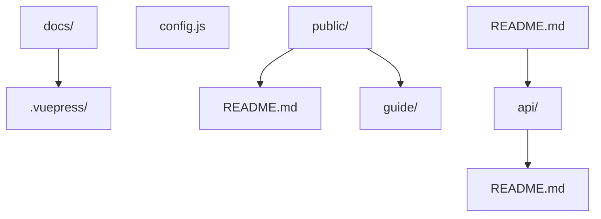
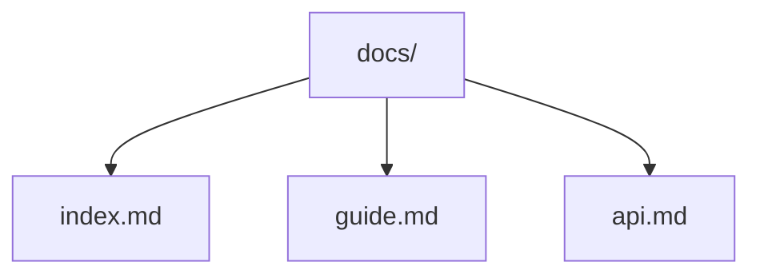
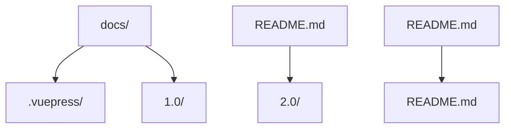
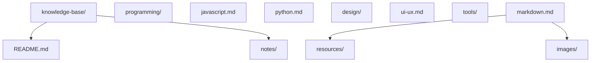
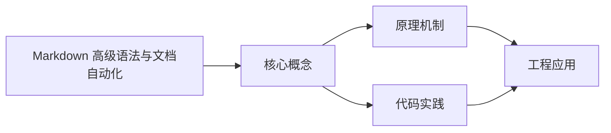

## 1. 学习目标（Bloom 分类）

本节按照布鲁姆教育目标分类学组织学习路径。本文主题为《Markdown 高级语法与文档自动化》，属于 Markdown 模块，读者可以根据自身阶段选择阅读深度。

记忆层面：能够准确复述本文的核心概念、术语与基本语法或操作步骤，并能够在提问或检索时快速定位对应知识点。能够说出 Markdown 的核心概念、常用命令与流程。

理解层面：能够用自己的语言解释核心原理与工作机制，说明概念之间的因果关系，而不是机械记忆结论。能够解释 Markdown 的工作原理与设计动机。

应用层面：能够在真实项目或练习场景中运用本文知识解决具体问题，写出正确且可维护的实现。能够独立完成 Markdown 的标准操作。

分析层面：能够拆解复杂问题，比较本文主题与相邻概念的异同，识别边界条件与例外情况。能够分析 Markdown 使用中的异常与边界。

评价层面：能够根据约束条件（性能、可读性、安全、成本）评价不同方案的优劣，做出有依据的技术决策。能够评价 Markdown 相关工具与方案。

创造层面：能够把本文知识与其他模块知识组合，设计出新的解决方案或可复用的工程模式。能够把 Markdown 融入团队工作流。

通过本节学习，读者应当能够把《Markdown 高级语法与文档自动化》纳入自己的知识网络，并与 Markdown 模块的其他主题（基础语法、GFM、写作规范）建立关联。

## 2. 历史动机与发展脉络

《Markdown 高级语法与文档自动化》是 Markdown 领域的重要主题。要真正理解它，需要先了解它解决的问题与演进过程。

Markdown 由 John Gruber 与 Aaron Swartz 于 2004 年设计，目标是“易读易写的纯文本格式”，可转换为 HTML。
标准化：CommonMark（2014 起）统一解析歧义；GitHub Flavored Markdown（GFM）扩展表格、任务列表、删除线、围栏代码。
生态：文档站（Astro/VitePress）、知识库（Obsidian）、论坛（GitHub/Stack Overflow）、AI 输出格式均以 Markdown 为通用语言。

回到本文主题：Markdown 高级语法与文档自动化 的提出与成熟，正是上述技术背景下的必然产物。早期实现往往以简单可用为目标，随着工程规模扩大，社区逐渐沉淀出标准做法与最佳实践；理解这一脉络，可以帮助读者判断“为什么文档中的推荐写法是现在这个样子”，也能在遇到历史遗留代码时准确识别其设计年代与取舍。


## 3. 形式化定义与核心概念精讲

本节把《Markdown 高级语法与文档自动化》涉及的核心概念以“定义 + 讲解”的形式展开。读者应把定义当作工具，把讲解当作理解路径；两者结合才能形成可迁移的知识。

块级语法：标题、段落、列表、引用、代码块、表格、分隔线；行内语法：强调、代码、链接、图片。
解析模型：块级解析优先，行内解析递归；空行分隔块；转义符 \ 输出字面量。
GFM 扩展：~~删除线~~、任务列表 - [x]、表格对齐、自动链接、围栏代码语言标注。

### 3.1 原文章节逐一精讲

原文档把主题拆分为 17 个小节，下面按顺序给出每一节的导读讲解，随后保留原文细节供精读。

#### 原文精读（完整保留）


#### 1. Markdown 高级语法

##### 1.1 表格

###### 1.1.1 基本表格

```markdown
| 姓名 | 年龄 | 职业     |
| :--- | :--- | :------- |
| 张三 | 25   | 工程师   |
| 李四 | 30   | 设计师   |
| 王五 | 35   | 产品经理 |
```

显示效果：

| 姓名 | 年龄 | 职业     |
| :--- | :--- | :------- |
| 张三 | 25   | 工程师   |
| 李四 | 30   | 设计师   |
| 王五 | 35   | 产品经理 |

###### 1.1.2 对齐方式

```markdown
| 左对齐 | 居中对齐 | 右对齐 |
| :----- | :------: | -----: |
| 内容   |   内容   |   内容 |
| 长内容 |  长内容  | 长内容 |
```

显示效果：

| 左对齐 | 居中对齐 | 右对齐 |
| :----- | :------: | -----: |
| 内容   |   内容   |   内容 |
| 长内容 |  长内容  | 长内容 |

##### 1.2 代码块

###### 1.2.1 语法高亮

```javascript
function hello() {
  console.log('Hello, Markdown!');
}
```

```python
 def hello():
  print('Hello, Markdown!')
```

###### 1.2.2 行号和高亮

```javascript
function hello() {
  console.log('Hello, Markdown!');
  return true;
}
hello();
```

##### 1.3 脚注

```markdown
这是一个有脚注的句子[^1]。

[^1]: 这是脚注的内容。
```

##### 1.4 任务列表

```markdown
-
-
-
-
```

##### 1.5 定义列表

```markdown
术语 1
:
术语 2
:
:
```

##### 1.6 数学公式

###### 1.6.1 行内公式

```markdown
质能方程：$E=mc^2$
```

###### 1.6.2 块级公式

```markdown
$$
\
$$
```

##### 1.7 admonition

```markdown
:
这是一个提示
:
:
这是一个警告
:
:
这是一个危险警告
:
```

##### 1.8 目录

```markdown
[toc](toc)
```

##### 1.9 链接引用

```markdown
[Google][google]
[GitHub][github]
[google]: https://www.google.com
[github]: https://github.com
```

##### 1.10 图片语法

###### 1.10.1 基本图片

```markdown
!
```

###### 1.10.2 带标题的图片

```markdown
!
```

###### 1.10.3 带尺寸的图片

```markdown
!
```

#### 2. 文档自动化

##### 2.1 Markdown 转 HTML

###### 2.1.1 使用 Pandoc

```bash
 # 安装 Pandoc
 # Windows: 从官网下载安装包
 # macOS: brew install pandoc
 # Linux: sudo apt install pandoc
 # 转换 Markdown 到 HTML
 pandoc input.md -o output.html
 # 转换 Markdown 到 PDF
 pandoc input.md -o output.pdf
 # 转换 Markdown 到 Word
 pandoc input.md -o output.docx
```

###### 2.1.2 使用 Node.js 工具

```bash
 # 安装 markdown-it
 npm install markdown-it
 # 创建转换脚本
 cat > convert.js << 'EOF'
 const fs = require('fs');
 const md = require('markdown-it')();
 const input = fs.readFileSync('input.md', 'utf8');
 const output = md.render(input);
 fs.writeFileSync('output.html', output);
 console.log('Conversion completed!');
 EOF
 # 运行转换
 node convert.js
```

##### 2.2 静态站点生成

###### 2.2.1 使用 VuePress

**安装 VuePress**

```bash
 # 全局安装
 npm install -g vuepress
 # 或本地安装
 npm install vuepress --save-dev
```

**创建文档结构**



**配置文件**

```javascript
// .vuepress/config.js
module.exports = {
  title: 'My Documentation',
  description: 'This is my documentation site',
  themeConfig: {
    nav: [
      { text: 'Home', link: '/' },
      { text: 'Guide', link: '/guide/' },
      { text: 'API', link: '/api/' },
    ],
    sidebar: {
      '/guide/': [{ text: 'Getting Started', link: '/guide/' }],
      '/api/': [{ text: 'API Reference', link: '/api/' }],
    },
  },
};
```

**构建站点**

```bash
 # 开发模式
 Vuepress dev docs
 # 构建模式
 Vuepress build docs
```

###### 2.2.2 使用 MkDocs

**安装 MkDocs**

```bash
 pip install mkdocs
```

**创建文档结构**



**配置文件**

```yaml
# mkdocs.yml
site_name: My Documentation
site_description: This is my documentation site
theme:
  name: material
nav:
  - Home: index.md
  - Guide: guide.md
  - API: api.md
```

**构建站点**

```bash
 # 开发模式
 mkdocs serve
 # 构建模式
 mkdocs build
```

##### 2.3 文档测试

###### 2.3.1 使用 markdown-link-check

```bash
 # 安装
 npm install -g markdown-link-check
 # 检查链接
 markdown-link-check README.md
 # 检查整个目录
 find . -name "*.md" -exec markdown-link-check {} \;
```

###### 2.3.2 使用 markdownlint

```bash
 # 安装
 npm install -g markdownlint-cli
 # 检查文档
 markdownlint README.md
 # 检查整个目录
 markdownlint .
```

##### 2.4 文档版本控制

###### 2.4.1 使用 Git 分支

```bash
 # 创建版本分支
 git branch docs/v1.0
 git branch docs/v2.0
 # 切换到特定版本
 git checkout docs/v1.0
 # 合并更改
 git checkout main
 git merge docs/v1.0
```

###### 2.4.2 使用 VuePress 多版本

**配置多版本**

```javascript
// .vuepress/config.js
module.exports = {
  // ...
  themeConfig: {
    // ...
    versions: {
      '1.0': '/1.0/',
      '2.0': '/2.0/',
    },
  },
};
```

**目录结构**



#### 3. 高级应用

##### 3.1 知识库构建

###### 3.1.1 使用 Obsidian

**基本配置**

1. 创建 vault
2. 设置文件组织结构
3. 配置插件
   **链接语法**

```markdown
# 页面 1

[页面 2](页面 2)
!
```

###### 3.1.2 使用 Notion

**基本操作**

1. 创建数据库
2. 设置属性
3. 建立关系
   **Markdown 支持**

````markdown
# 标题

-

*
* > `代码`

```javascript
// 代码块
function hello() {
  console.log('Hello');
}
```
````

##### 3.2 技术文档写作

###### 3.2.1 文档结构

```markdown
# 项目名称

#### 1. 概述

##### 1.1 项目背景

##### 1.2 目标与范围

#### 2. 快速开始

##### 2.1 环境要求

##### 2.2 安装步骤

##### 2.3 基本使用

#### 3. 核心功能

##### 3.1 功能模块 1

##### 3.2 功能模块 2

#### 4. API 参考

##### 4.1 接口 1

##### 4.2 接口 2

#### 5. 常见问题

#### 6. 贡献指南

#### 7. 许可证
```

###### 3.2.2 文档风格指南

1.  **一致性**：保持术语和格式的一致性
2.  **清晰度**：使用简洁明了的语言
3.  **完整性**：覆盖所有重要内容
4.  **准确性**：确保信息准确无误
5.  **可维护性**：便于更新和维护

##### 3.3 自动化文档生成

###### 3.3.1 从代码生成文档

-

```javascript
/**
 * 计算两个数的和
 * @param {number} a - 第一个数
 * @param {number} b - 第二个数
 * @returns {number} 两个数的和
 */
function sum(a, b) {
  return a + b;
}
```

-

```bash
# 安装 JSDoc
npm install -g jsdoc
# 生成文档
jsdoc input.js -d docs
```

###### 3.3.2 使用 TypeDoc

```bash
# 安装 TypeDoc
npm install -g typedoc
# 生成文档
typedoc --out docs src
```

#### 4. 工具与资源

##### 4.1 编辑器

-
-
-
-

##### 4.2 插件

-
-
-
-

##### 4.3 在线工具

-
-
-
-

##### 4.4 模板

-
-
-
-

#### 5. 最佳实践

##### 5.1 内容组织

1.  **分层结构**：使用标题层级组织内容
2.  **逻辑顺序**：按照逻辑顺序排列内容
3.  **模块化**：将内容分解为模块
4.  **导航辅助**：使用目录和链接

##### 5.2 格式规范

1.  **标题格式**：使用 # 符号，避免使用 === 或 ---
2.  **列表格式**：使用 - 或 \* 作为无序列表标记
3.  **代码块**：使用 ``` 包围代码块，并指定语言
4.  **链接格式**：使用 [文本](https://example.com/image.png) 格式
5.  **图片格式**：使用  格式

##### 5.3 内容质量

1.  **准确性**：确保信息准确无误
2.  **完整性**：覆盖所有重要内容
3.  **清晰度**：使用简洁明了的语言
4.  **一致性**：保持术语和格式的一致性
5.  **可访问性**：考虑不同读者的需求

##### 5.4 版本控制

1.  **使用 Git**：对文档进行版本控制
2.  **提交信息**：使用清晰的提交信息
3.  **分支管理**：使用分支管理不同版本的文档
4.  **合并策略**：制定合理的合并策略

#### 6. 项目实战

##### 6.1 构建个人知识库

-



-

```markdown
# 个人知识库

#### 目录

- [编程](notes/programming/)
- [JavaScript](notes/programming/javascript.md)
- [Python](notes/programming/python.md)
- [设计](notes/design/)
- [UI/UX](notes/design/ui-ux.md)
- [工具](notes/tools/)
- [Markdown](notes/tools/markdown.md)

#### 如何使用

1. 克隆仓库
2. 使用 Markdown 编辑器打开文件
3. 定期更新内容
4. 提交更改到 Git
```

##### 6.2 构建项目文档

-

```bash
# 初始化项目
mkdir project-docs
cd project-docs
npm init -y
npm install vuepress --save-dev
# 创建文档结构
mkdir -p docs/.vuepress/public
docs/README.md
echo '# 项目文档' > docs/README.md
echo 'module.exports = { title: "项目文档" }' > docs/.vuepress/config.js
# 添加脚本到 package.json
npm pkg set scripts.dev="vuepress dev docs"
npm pkg set scripts.build="vuepress build docs"
# 启动开发服务器
npm run dev
```

#### 7. 常见问题与解决方案

##### 7.1 图片路径问题

-
-

*
*
*
*

##### 7.2 表格格式问题

-
-

*
*
*

##### 7.3 数学公式渲染问题

-
-

*
*
*

##### 7.4 文档构建问题

-
-

*
*
*

#### 8. 延伸阅读

-
-
-
-
- 通过本教程，你已经了解了 Markdown 的高级语法和文档自动化工具。在实际项目中，你可以使用这些技术来创建高质量的文档，提高工作效率，构建个人知识库或项目文档。


### 3.2 概念关系图

下面用 Mermaid 图表达本文核心概念之间的关系，帮助读者建立整体图景：



图中展示的是本文知识的结构化关系：核心概念是入口，原理机制解释“为什么”，代码实践演示“怎么做”，工程应用回答“何时用”。读者学习时可以把每个小节的内容挂接到对应节点上。

## 4. 理论推导与原理解析

本节深入《Markdown 高级语法与文档自动化》背后的原理。理论部分不求面面俱到，而是聚焦“能解释现象、能指导实践”的关键推导。

块级语法：标题、段落、列表、引用、代码块、表格、分隔线；行内语法：强调、代码、链接、图片。
解析模型：块级解析优先，行内解析递归；空行分隔块；转义符 \ 输出字面量。
GFM 扩展：~~删除线~~、任务列表 - [x]、表格对齐、自动链接、围栏代码语言标注。
元数据：frontmatter（YAML）在文档站中承载标题、日期、标签。

需要强调的是，理论推导与工程实践之间存在翻译层：理论给出的是理想化模型与边界条件，工程代码则必须处理真实环境中的例外。读者在学习时应先掌握理论的“标准情形”，再通过陷阱章节了解“非标准情形”。

## 5. 代码示例与逐行讲解

本节把原文中的代码示例系统整理，并为每个示例补充用途说明与讲解。读者不应只浏览代码，而应逐段对照讲解理解设计意图。

### 5.1 示例：1.1.1 基本表格

该示例来自原文《1.1.1 基本表格》小节，用于演示Markdown 高级语法与文档自动化相关操作。阅读时请先看代码结构，再看其后的讲解。

```markdown
| 姓名 | 年龄 | 职业     |
| :--- | :--- | :------- |
| 张三 | 25   | 工程师   |
| 李四 | 30   | 设计师   |
| 王五 | 35   | 产品经理 |
```

讲解：这段代码演示了本节核心知识点。代码中的关键操作可以归纳为三步：准备（定义或初始化）、执行（核心逻辑）、收尾（释放资源或返回结果）。实际项目中，这三步往往被封装为函数或类，以提升复用性与可测试性。

关键点分析：

该示例共 5 行有效代码，结构以数据或配置为主。阅读时应关注：数据字段的含义、配置项的作用，以及它们与运行行为的对应关系。

进阶思考路径：先尝试修改参数观察行为变化，再把示例中的模式迁移到自己的项目中；每次修改都记录预期与实测差异，这是把示例转化为能力的最快方式。

### 5.2 示例：1.1.2 对齐方式

该示例来自原文《1.1.2 对齐方式》小节，用于演示Markdown 高级语法与文档自动化相关操作。阅读时请先看代码结构，再看其后的讲解。

```markdown
| 左对齐 | 居中对齐 | 右对齐 |
| :----- | :------: | -----: |
| 内容   |   内容   |   内容 |
| 长内容 |  长内容  | 长内容 |
```

讲解：这段代码演示了本节核心知识点。代码中的关键操作可以归纳为三步：准备（定义或初始化）、执行（核心逻辑）、收尾（释放资源或返回结果）。实际项目中，这三步往往被封装为函数或类，以提升复用性与可测试性。

关键点分析：

该示例共 4 行有效代码，结构以数据或配置为主。阅读时应关注：数据字段的含义、配置项的作用，以及它们与运行行为的对应关系。

进阶思考路径：先尝试修改参数观察行为变化，再把示例中的模式迁移到自己的项目中；每次修改都记录预期与实测差异，这是把示例转化为能力的最快方式。

### 5.3 示例：1.2.1 语法高亮

该示例来自原文《1.2.1 语法高亮》小节，用于演示Markdown 高级语法与文档自动化相关操作。阅读时请先看代码结构，再看其后的讲解。

```javascript
function hello() {
  console.log('Hello, Markdown!');
}
```

讲解：这段代码演示了本节核心知识点。代码中的关键操作可以归纳为三步：准备（定义或初始化）、执行（核心逻辑）、收尾（释放资源或返回结果）。实际项目中，这三步往往被封装为函数或类，以提升复用性与可测试性。

关键点分析：

该示例共 3 行有效代码，包含 1 类关键结构（function）。其中：

- 入口与初始化部分负责建立上下文，对应实际项目中的启动或装配逻辑；
- 核心逻辑部分体现本文主题的主要操作，是阅读时最需要对照讲解理解的部分；
- 输出或返回部分把结果交给调用方，注意其类型与边界条件。

进阶思考路径：先尝试修改参数观察行为变化，再把示例中的模式迁移到自己的项目中；每次修改都记录预期与实测差异，这是把示例转化为能力的最快方式。

### 5.4 示例：1.2.1 语法高亮

该示例来自原文《1.2.1 语法高亮》小节，用于演示Markdown 高级语法与文档自动化相关操作。阅读时请先看代码结构，再看其后的讲解。

```python
 def hello():
  print('Hello, Markdown!')
```

讲解：这段代码演示了本节核心知识点。代码中的关键操作可以归纳为三步：准备（定义或初始化）、执行（核心逻辑）、收尾（释放资源或返回结果）。实际项目中，这三步往往被封装为函数或类，以提升复用性与可测试性。

关键点分析：

该示例共 2 行有效代码，包含 1 类关键结构（def）。其中：

- 入口与初始化部分负责建立上下文，对应实际项目中的启动或装配逻辑；
- 核心逻辑部分体现本文主题的主要操作，是阅读时最需要对照讲解理解的部分；
- 输出或返回部分把结果交给调用方，注意其类型与边界条件。

进阶思考路径：先尝试修改参数观察行为变化，再把示例中的模式迁移到自己的项目中；每次修改都记录预期与实测差异，这是把示例转化为能力的最快方式。

### 5.5 示例：1.2.2 行号和高亮

该示例来自原文《1.2.2 行号和高亮》小节，用于演示Markdown 高级语法与文档自动化相关操作。阅读时请先看代码结构，再看其后的讲解。

```javascript
function hello() {
  console.log('Hello, Markdown!');
  return true;
}
hello();
```

讲解：这段代码演示了本节核心知识点。代码中的关键操作可以归纳为三步：准备（定义或初始化）、执行（核心逻辑）、收尾（释放资源或返回结果）。实际项目中，这三步往往被封装为函数或类，以提升复用性与可测试性。

关键点分析：

该示例共 5 行有效代码，包含 2 类关键结构（function、return）。其中：

- 入口与初始化部分负责建立上下文，对应实际项目中的启动或装配逻辑；
- 核心逻辑部分体现本文主题的主要操作，是阅读时最需要对照讲解理解的部分；
- 输出或返回部分把结果交给调用方，注意其类型与边界条件。

进阶思考路径：先尝试修改参数观察行为变化，再把示例中的模式迁移到自己的项目中；每次修改都记录预期与实测差异，这是把示例转化为能力的最快方式。

### 5.6 示例：1.3 脚注

该示例来自原文《1.3 脚注》小节，用于演示Markdown 高级语法与文档自动化相关操作。阅读时请先看代码结构，再看其后的讲解。

```markdown
这是一个有脚注的句子[^1]。

[^1]: 这是脚注的内容。
```

讲解：这段代码演示了本节核心知识点。代码中的关键操作可以归纳为三步：准备（定义或初始化）、执行（核心逻辑）、收尾（释放资源或返回结果）。实际项目中，这三步往往被封装为函数或类，以提升复用性与可测试性。

关键点分析：

该示例共 2 行有效代码，结构以数据或配置为主。阅读时应关注：数据字段的含义、配置项的作用，以及它们与运行行为的对应关系。

进阶思考路径：先尝试修改参数观察行为变化，再把示例中的模式迁移到自己的项目中；每次修改都记录预期与实测差异，这是把示例转化为能力的最快方式。

### 5.7 示例：1.4 任务列表

该示例来自原文《1.4 任务列表》小节，用于演示Markdown 高级语法与文档自动化相关操作。阅读时请先看代码结构，再看其后的讲解。

```markdown
-
-
-
-
```

讲解：这段代码演示了本节核心知识点。代码中的关键操作可以归纳为三步：准备（定义或初始化）、执行（核心逻辑）、收尾（释放资源或返回结果）。实际项目中，这三步往往被封装为函数或类，以提升复用性与可测试性。

关键点分析：

该示例共 4 行有效代码，结构以数据或配置为主。阅读时应关注：数据字段的含义、配置项的作用，以及它们与运行行为的对应关系。

进阶思考路径：先尝试修改参数观察行为变化，再把示例中的模式迁移到自己的项目中；每次修改都记录预期与实测差异，这是把示例转化为能力的最快方式。

### 5.8 示例：1.5 定义列表

该示例来自原文《1.5 定义列表》小节，用于演示Markdown 高级语法与文档自动化相关操作。阅读时请先看代码结构，再看其后的讲解。

```markdown
术语 1
:
术语 2
:
:
```

讲解：这段代码演示了本节核心知识点。代码中的关键操作可以归纳为三步：准备（定义或初始化）、执行（核心逻辑）、收尾（释放资源或返回结果）。实际项目中，这三步往往被封装为函数或类，以提升复用性与可测试性。

关键点分析：

该示例共 5 行有效代码，结构以数据或配置为主。阅读时应关注：数据字段的含义、配置项的作用，以及它们与运行行为的对应关系。

进阶思考路径：先尝试修改参数观察行为变化，再把示例中的模式迁移到自己的项目中；每次修改都记录预期与实测差异，这是把示例转化为能力的最快方式。

### 5.9 示例：1.6.1 行内公式

该示例来自原文《1.6.1 行内公式》小节，用于演示Markdown 高级语法与文档自动化相关操作。阅读时请先看代码结构，再看其后的讲解。

```markdown
质能方程：$E=mc^2$
```

讲解：这段代码演示了本节核心知识点。代码中的关键操作可以归纳为三步：准备（定义或初始化）、执行（核心逻辑）、收尾（释放资源或返回结果）。实际项目中，这三步往往被封装为函数或类，以提升复用性与可测试性。

关键点分析：

该示例共 1 行有效代码，结构以数据或配置为主。阅读时应关注：数据字段的含义、配置项的作用，以及它们与运行行为的对应关系。

进阶思考路径：先尝试修改参数观察行为变化，再把示例中的模式迁移到自己的项目中；每次修改都记录预期与实测差异，这是把示例转化为能力的最快方式。

### 5.10 示例：1.6.2 块级公式

该示例来自原文《1.6.2 块级公式》小节，用于演示Markdown 高级语法与文档自动化相关操作。阅读时请先看代码结构，再看其后的讲解。

```markdown
$$
\
$$
```

讲解：这段代码演示了本节核心知识点。代码中的关键操作可以归纳为三步：准备（定义或初始化）、执行（核心逻辑）、收尾（释放资源或返回结果）。实际项目中，这三步往往被封装为函数或类，以提升复用性与可测试性。

关键点分析：

该示例共 3 行有效代码，结构以数据或配置为主。阅读时应关注：数据字段的含义、配置项的作用，以及它们与运行行为的对应关系。

进阶思考路径：先尝试修改参数观察行为变化，再把示例中的模式迁移到自己的项目中；每次修改都记录预期与实测差异，这是把示例转化为能力的最快方式。

### 5.11 示例：1.7 admonition

该示例来自原文《1.7 admonition》小节，用于演示Markdown 高级语法与文档自动化相关操作。阅读时请先看代码结构，再看其后的讲解。

```markdown
:
这是一个提示
:
:
这是一个警告
:
:
这是一个危险警告
:
```

讲解：这段代码演示了本节核心知识点。代码中的关键操作可以归纳为三步：准备（定义或初始化）、执行（核心逻辑）、收尾（释放资源或返回结果）。实际项目中，这三步往往被封装为函数或类，以提升复用性与可测试性。

关键点分析：

该示例共 9 行有效代码，结构以数据或配置为主。阅读时应关注：数据字段的含义、配置项的作用，以及它们与运行行为的对应关系。

进阶思考路径：先尝试修改参数观察行为变化，再把示例中的模式迁移到自己的项目中；每次修改都记录预期与实测差异，这是把示例转化为能力的最快方式。

### 5.12 示例：1.8 目录

该示例来自原文《1.8 目录》小节，用于演示Markdown 高级语法与文档自动化相关操作。阅读时请先看代码结构，再看其后的讲解。

```markdown
[toc](toc)
```

讲解：这段代码演示了本节核心知识点。代码中的关键操作可以归纳为三步：准备（定义或初始化）、执行（核心逻辑）、收尾（释放资源或返回结果）。实际项目中，这三步往往被封装为函数或类，以提升复用性与可测试性。

关键点分析：

该示例共 1 行有效代码，结构以数据或配置为主。阅读时应关注：数据字段的含义、配置项的作用，以及它们与运行行为的对应关系。

进阶思考路径：先尝试修改参数观察行为变化，再把示例中的模式迁移到自己的项目中；每次修改都记录预期与实测差异，这是把示例转化为能力的最快方式。

### 5.13 示例：1.9 链接引用

该示例来自原文《1.9 链接引用》小节，用于演示Markdown 高级语法与文档自动化相关操作。阅读时请先看代码结构，再看其后的讲解。

```markdown
[Google][google]
[GitHub][github]
[google]: https://www.google.com
[github]: https://github.com
```

讲解：这段代码演示了本节核心知识点。代码中的关键操作可以归纳为三步：准备（定义或初始化）、执行（核心逻辑）、收尾（释放资源或返回结果）。实际项目中，这三步往往被封装为函数或类，以提升复用性与可测试性。

关键点分析：

该示例共 4 行有效代码，结构以数据或配置为主。阅读时应关注：数据字段的含义、配置项的作用，以及它们与运行行为的对应关系。

进阶思考路径：先尝试修改参数观察行为变化，再把示例中的模式迁移到自己的项目中；每次修改都记录预期与实测差异，这是把示例转化为能力的最快方式。

### 5.14 示例：1.10.1 基本图片

该示例来自原文《1.10.1 基本图片》小节，用于演示Markdown 高级语法与文档自动化相关操作。阅读时请先看代码结构，再看其后的讲解。

```markdown
!
```

讲解：这段代码演示了本节核心知识点。代码中的关键操作可以归纳为三步：准备（定义或初始化）、执行（核心逻辑）、收尾（释放资源或返回结果）。实际项目中，这三步往往被封装为函数或类，以提升复用性与可测试性。

关键点分析：

该示例共 1 行有效代码，结构以数据或配置为主。阅读时应关注：数据字段的含义、配置项的作用，以及它们与运行行为的对应关系。

进阶思考路径：先尝试修改参数观察行为变化，再把示例中的模式迁移到自己的项目中；每次修改都记录预期与实测差异，这是把示例转化为能力的最快方式。

### 5.15 示例：1.10.2 带标题的图片

该示例来自原文《1.10.2 带标题的图片》小节，用于演示Markdown 高级语法与文档自动化相关操作。阅读时请先看代码结构，再看其后的讲解。

```markdown
!
```

讲解：这段代码演示了本节核心知识点。代码中的关键操作可以归纳为三步：准备（定义或初始化）、执行（核心逻辑）、收尾（释放资源或返回结果）。实际项目中，这三步往往被封装为函数或类，以提升复用性与可测试性。

关键点分析：

该示例共 1 行有效代码，结构以数据或配置为主。阅读时应关注：数据字段的含义、配置项的作用，以及它们与运行行为的对应关系。

进阶思考路径：先尝试修改参数观察行为变化，再把示例中的模式迁移到自己的项目中；每次修改都记录预期与实测差异，这是把示例转化为能力的最快方式。

### 5.16 示例：1.10.3 带尺寸的图片

该示例来自原文《1.10.3 带尺寸的图片》小节，用于演示Markdown 高级语法与文档自动化相关操作。阅读时请先看代码结构，再看其后的讲解。

```markdown
!
```

讲解：这段代码演示了本节核心知识点。代码中的关键操作可以归纳为三步：准备（定义或初始化）、执行（核心逻辑）、收尾（释放资源或返回结果）。实际项目中，这三步往往被封装为函数或类，以提升复用性与可测试性。

关键点分析：

该示例共 1 行有效代码，结构以数据或配置为主。阅读时应关注：数据字段的含义、配置项的作用，以及它们与运行行为的对应关系。

进阶思考路径：先尝试修改参数观察行为变化，再把示例中的模式迁移到自己的项目中；每次修改都记录预期与实测差异，这是把示例转化为能力的最快方式。

### 5.17 示例：2.1.1 使用 Pandoc

该示例来自原文《2.1.1 使用 Pandoc》小节，用于演示Markdown 高级语法与文档自动化相关操作。阅读时请先看代码结构，再看其后的讲解。

```bash
 # 安装 Pandoc
 # Windows: 从官网下载安装包
 # macOS: brew install pandoc
 # Linux: sudo apt install pandoc
 # 转换 Markdown 到 HTML
 pandoc input.md -o output.html
 # 转换 Markdown 到 PDF
 pandoc input.md -o output.pdf
 # 转换 Markdown 到 Word
 pandoc input.md -o output.docx
```

讲解：这段代码演示了本节核心知识点。代码中的关键操作可以归纳为三步：准备（定义或初始化）、执行（核心逻辑）、收尾（释放资源或返回结果）。实际项目中，这三步往往被封装为函数或类，以提升复用性与可测试性。

关键点分析：

该示例共 10 行有效代码，结构以数据或配置为主。阅读时应关注：数据字段的含义、配置项的作用，以及它们与运行行为的对应关系。

进阶思考路径：先尝试修改参数观察行为变化，再把示例中的模式迁移到自己的项目中；每次修改都记录预期与实测差异，这是把示例转化为能力的最快方式。

### 5.18 示例：2.1.2 使用 Node.js 工具

该示例来自原文《2.1.2 使用 Node.js 工具》小节，用于演示Markdown 高级语法与文档自动化相关操作。阅读时请先看代码结构，再看其后的讲解。

```bash
 # 安装 markdown-it
 npm install markdown-it
 # 创建转换脚本
 cat > convert.js << 'EOF'
 const fs = require('fs');
 const md = require('markdown-it')();
 const input = fs.readFileSync('input.md', 'utf8');
 const output = md.render(input);
 fs.writeFileSync('output.html', output);
 console.log('Conversion completed!');
 EOF
 # 运行转换
 node convert.js
```

讲解：这段代码演示了本节核心知识点。代码中的关键操作可以归纳为三步：准备（定义或初始化）、执行（核心逻辑）、收尾（释放资源或返回结果）。实际项目中，这三步往往被封装为函数或类，以提升复用性与可测试性。

关键点分析：

该示例共 13 行有效代码，结构以数据或配置为主。阅读时应关注：数据字段的含义、配置项的作用，以及它们与运行行为的对应关系。

进阶思考路径：先尝试修改参数观察行为变化，再把示例中的模式迁移到自己的项目中；每次修改都记录预期与实测差异，这是把示例转化为能力的最快方式。

### 5.19 示例：2.2.1 使用 VuePress

该示例来自原文《2.2.1 使用 VuePress》小节，用于演示Markdown 高级语法与文档自动化相关操作。阅读时请先看代码结构，再看其后的讲解。

```bash
 # 全局安装
 npm install -g vuepress
 # 或本地安装
 npm install vuepress --save-dev
```

讲解：这段代码演示了本节核心知识点。代码中的关键操作可以归纳为三步：准备（定义或初始化）、执行（核心逻辑）、收尾（释放资源或返回结果）。实际项目中，这三步往往被封装为函数或类，以提升复用性与可测试性。

关键点分析：

该示例共 4 行有效代码，结构以数据或配置为主。阅读时应关注：数据字段的含义、配置项的作用，以及它们与运行行为的对应关系。

进阶思考路径：先尝试修改参数观察行为变化，再把示例中的模式迁移到自己的项目中；每次修改都记录预期与实测差异，这是把示例转化为能力的最快方式。

### 5.20 示例：2.2.1 使用 VuePress

该示例来自原文《2.2.1 使用 VuePress》小节，用于演示Markdown 高级语法与文档自动化相关操作。阅读时请先看代码结构，再看其后的讲解。


讲解：这段代码演示了本节核心知识点。代码中的关键操作可以归纳为三步：准备（定义或初始化）、执行（核心逻辑）、收尾（释放资源或返回结果）。实际项目中，这三步往往被封装为函数或类，以提升复用性与可测试性。

关键点分析：

该示例共 15 行有效代码，结构以数据或配置为主。阅读时应关注：数据字段的含义、配置项的作用，以及它们与运行行为的对应关系。

进阶思考路径：先尝试修改参数观察行为变化，再把示例中的模式迁移到自己的项目中；每次修改都记录预期与实测差异，这是把示例转化为能力的最快方式。

### 5.21 示例：2.2.1 使用 VuePress

该示例来自原文《2.2.1 使用 VuePress》小节，用于演示Markdown 高级语法与文档自动化相关操作。阅读时请先看代码结构，再看其后的讲解。

```javascript
// .vuepress/config.js
module.exports = {
  title: 'My Documentation',
  description: 'This is my documentation site',
  themeConfig: {
    nav: [
      { text: 'Home', link: '/' },
      { text: 'Guide', link: '/guide/' },
      { text: 'API', link: '/api/' },
    ],
    sidebar: {
      '/guide/': [{ text: 'Getting Started', link: '/guide/' }],
      '/api/': [{ text: 'API Reference', link: '/api/' }],
    },
  },
};
```

讲解：这段代码演示了本节核心知识点。代码中的关键操作可以归纳为三步：准备（定义或初始化）、执行（核心逻辑）、收尾（释放资源或返回结果）。实际项目中，这三步往往被封装为函数或类，以提升复用性与可测试性。

关键点分析：

该示例共 16 行有效代码，结构以数据或配置为主。阅读时应关注：数据字段的含义、配置项的作用，以及它们与运行行为的对应关系。

进阶思考路径：先尝试修改参数观察行为变化，再把示例中的模式迁移到自己的项目中；每次修改都记录预期与实测差异，这是把示例转化为能力的最快方式。

### 5.22 示例：2.2.1 使用 VuePress

该示例来自原文《2.2.1 使用 VuePress》小节，用于演示Markdown 高级语法与文档自动化相关操作。阅读时请先看代码结构，再看其后的讲解。

```bash
 # 开发模式
 Vuepress dev docs
 # 构建模式
 Vuepress build docs
```

讲解：这段代码演示了本节核心知识点。代码中的关键操作可以归纳为三步：准备（定义或初始化）、执行（核心逻辑）、收尾（释放资源或返回结果）。实际项目中，这三步往往被封装为函数或类，以提升复用性与可测试性。

关键点分析：

该示例共 4 行有效代码，结构以数据或配置为主。阅读时应关注：数据字段的含义、配置项的作用，以及它们与运行行为的对应关系。

进阶思考路径：先尝试修改参数观察行为变化，再把示例中的模式迁移到自己的项目中；每次修改都记录预期与实测差异，这是把示例转化为能力的最快方式。

### 5.23 示例：2.2.2 使用 MkDocs

该示例来自原文《2.2.2 使用 MkDocs》小节，用于演示Markdown 高级语法与文档自动化相关操作。阅读时请先看代码结构，再看其后的讲解。

```bash
 pip install mkdocs
```

讲解：这段代码演示了本节核心知识点。代码中的关键操作可以归纳为三步：准备（定义或初始化）、执行（核心逻辑）、收尾（释放资源或返回结果）。实际项目中，这三步往往被封装为函数或类，以提升复用性与可测试性。

关键点分析：

该示例共 1 行有效代码，结构以数据或配置为主。阅读时应关注：数据字段的含义、配置项的作用，以及它们与运行行为的对应关系。

进阶思考路径：先尝试修改参数观察行为变化，再把示例中的模式迁移到自己的项目中；每次修改都记录预期与实测差异，这是把示例转化为能力的最快方式。

### 5.24 示例：2.2.2 使用 MkDocs

该示例来自原文《2.2.2 使用 MkDocs》小节，用于演示Markdown 高级语法与文档自动化相关操作。阅读时请先看代码结构，再看其后的讲解。


讲解：这段代码演示了本节核心知识点。代码中的关键操作可以归纳为三步：准备（定义或初始化）、执行（核心逻辑）、收尾（释放资源或返回结果）。实际项目中，这三步往往被封装为函数或类，以提升复用性与可测试性。

关键点分析：

该示例共 8 行有效代码，结构以数据或配置为主。阅读时应关注：数据字段的含义、配置项的作用，以及它们与运行行为的对应关系。

进阶思考路径：先尝试修改参数观察行为变化，再把示例中的模式迁移到自己的项目中；每次修改都记录预期与实测差异，这是把示例转化为能力的最快方式。

### 5.25 示例：2.2.2 使用 MkDocs

该示例来自原文《2.2.2 使用 MkDocs》小节，用于演示Markdown 高级语法与文档自动化相关操作。阅读时请先看代码结构，再看其后的讲解。

```yaml
# mkdocs.yml
site_name: My Documentation
site_description: This is my documentation site
theme:
  name: material
nav:
  - Home: index.md
  - Guide: guide.md
  - API: api.md
```

讲解：这段代码演示了本节核心知识点。代码中的关键操作可以归纳为三步：准备（定义或初始化）、执行（核心逻辑）、收尾（释放资源或返回结果）。实际项目中，这三步往往被封装为函数或类，以提升复用性与可测试性。

关键点分析：

该示例共 9 行有效代码，结构以数据或配置为主。阅读时应关注：数据字段的含义、配置项的作用，以及它们与运行行为的对应关系。

进阶思考路径：先尝试修改参数观察行为变化，再把示例中的模式迁移到自己的项目中；每次修改都记录预期与实测差异，这是把示例转化为能力的最快方式。

### 5.26 示例：2.2.2 使用 MkDocs

该示例来自原文《2.2.2 使用 MkDocs》小节，用于演示Markdown 高级语法与文档自动化相关操作。阅读时请先看代码结构，再看其后的讲解。

```bash
 # 开发模式
 mkdocs serve
 # 构建模式
 mkdocs build
```

讲解：这段代码演示了本节核心知识点。代码中的关键操作可以归纳为三步：准备（定义或初始化）、执行（核心逻辑）、收尾（释放资源或返回结果）。实际项目中，这三步往往被封装为函数或类，以提升复用性与可测试性。

关键点分析：

该示例共 4 行有效代码，结构以数据或配置为主。阅读时应关注：数据字段的含义、配置项的作用，以及它们与运行行为的对应关系。

进阶思考路径：先尝试修改参数观察行为变化，再把示例中的模式迁移到自己的项目中；每次修改都记录预期与实测差异，这是把示例转化为能力的最快方式。

### 5.27 示例：2.3.1 使用 markdown-link-check

该示例来自原文《2.3.1 使用 markdown-link-check》小节，用于演示Markdown 高级语法与文档自动化相关操作。阅读时请先看代码结构，再看其后的讲解。

```bash
 # 安装
 npm install -g markdown-link-check
 # 检查链接
 markdown-link-check README.md
 # 检查整个目录
 find . -name "*.md" -exec markdown-link-check {} \;
```

讲解：这段代码演示了本节核心知识点。代码中的关键操作可以归纳为三步：准备（定义或初始化）、执行（核心逻辑）、收尾（释放资源或返回结果）。实际项目中，这三步往往被封装为函数或类，以提升复用性与可测试性。

关键点分析：

该示例共 6 行有效代码，结构以数据或配置为主。阅读时应关注：数据字段的含义、配置项的作用，以及它们与运行行为的对应关系。

进阶思考路径：先尝试修改参数观察行为变化，再把示例中的模式迁移到自己的项目中；每次修改都记录预期与实测差异，这是把示例转化为能力的最快方式。

### 5.28 示例：2.3.2 使用 markdownlint

该示例来自原文《2.3.2 使用 markdownlint》小节，用于演示Markdown 高级语法与文档自动化相关操作。阅读时请先看代码结构，再看其后的讲解。

```bash
 # 安装
 npm install -g markdownlint-cli
 # 检查文档
 markdownlint README.md
 # 检查整个目录
 markdownlint .
```

讲解：这段代码演示了本节核心知识点。代码中的关键操作可以归纳为三步：准备（定义或初始化）、执行（核心逻辑）、收尾（释放资源或返回结果）。实际项目中，这三步往往被封装为函数或类，以提升复用性与可测试性。

关键点分析：

该示例共 6 行有效代码，结构以数据或配置为主。阅读时应关注：数据字段的含义、配置项的作用，以及它们与运行行为的对应关系。

进阶思考路径：先尝试修改参数观察行为变化，再把示例中的模式迁移到自己的项目中；每次修改都记录预期与实测差异，这是把示例转化为能力的最快方式。

### 5.29 示例：2.4.1 使用 Git 分支

该示例来自原文《2.4.1 使用 Git 分支》小节，用于演示Markdown 高级语法与文档自动化相关操作。阅读时请先看代码结构，再看其后的讲解。

```bash
 # 创建版本分支
 git branch docs/v1.0
 git branch docs/v2.0
 # 切换到特定版本
 git checkout docs/v1.0
 # 合并更改
 git checkout main
 git merge docs/v1.0
```

讲解：这段代码演示了本节核心知识点。代码中的关键操作可以归纳为三步：准备（定义或初始化）、执行（核心逻辑）、收尾（释放资源或返回结果）。实际项目中，这三步往往被封装为函数或类，以提升复用性与可测试性。

关键点分析：

该示例共 8 行有效代码，结构以数据或配置为主。阅读时应关注：数据字段的含义、配置项的作用，以及它们与运行行为的对应关系。

进阶思考路径：先尝试修改参数观察行为变化，再把示例中的模式迁移到自己的项目中；每次修改都记录预期与实测差异，这是把示例转化为能力的最快方式。

### 5.30 示例：2.4.2 使用 VuePress 多版本

该示例来自原文《2.4.2 使用 VuePress 多版本》小节，用于演示Markdown 高级语法与文档自动化相关操作。阅读时请先看代码结构，再看其后的讲解。

```javascript
// .vuepress/config.js
module.exports = {
  // ...
  themeConfig: {
    // ...
    versions: {
      '1.0': '/1.0/',
      '2.0': '/2.0/',
    },
  },
};
```

讲解：这段代码演示了本节核心知识点。代码中的关键操作可以归纳为三步：准备（定义或初始化）、执行（核心逻辑）、收尾（释放资源或返回结果）。实际项目中，这三步往往被封装为函数或类，以提升复用性与可测试性。

关键点分析：

该示例共 11 行有效代码，结构以数据或配置为主。阅读时应关注：数据字段的含义、配置项的作用，以及它们与运行行为的对应关系。

进阶思考路径：先尝试修改参数观察行为变化，再把示例中的模式迁移到自己的项目中；每次修改都记录预期与实测差异，这是把示例转化为能力的最快方式。

### 5.31 示例：2.4.2 使用 VuePress 多版本

该示例来自原文《2.4.2 使用 VuePress 多版本》小节，用于演示Markdown 高级语法与文档自动化相关操作。阅读时请先看代码结构，再看其后的讲解。


讲解：这段代码演示了本节核心知识点。代码中的关键操作可以归纳为三步：准备（定义或初始化）、执行（核心逻辑）、收尾（释放资源或返回结果）。实际项目中，这三步往往被封装为函数或类，以提升复用性与可测试性。

关键点分析：

该示例共 12 行有效代码，结构以数据或配置为主。阅读时应关注：数据字段的含义、配置项的作用，以及它们与运行行为的对应关系。

进阶思考路径：先尝试修改参数观察行为变化，再把示例中的模式迁移到自己的项目中；每次修改都记录预期与实测差异，这是把示例转化为能力的最快方式。

### 5.32 示例：3.1.1 使用 Obsidian

该示例来自原文《3.1.1 使用 Obsidian》小节，用于演示Markdown 高级语法与文档自动化相关操作。阅读时请先看代码结构，再看其后的讲解。

```markdown
# 页面 1

[页面 2](页面 2)
!
```

讲解：这段代码演示了本节核心知识点。代码中的关键操作可以归纳为三步：准备（定义或初始化）、执行（核心逻辑）、收尾（释放资源或返回结果）。实际项目中，这三步往往被封装为函数或类，以提升复用性与可测试性。

关键点分析：

该示例共 3 行有效代码，结构以数据或配置为主。阅读时应关注：数据字段的含义、配置项的作用，以及它们与运行行为的对应关系。

进阶思考路径：先尝试修改参数观察行为变化，再把示例中的模式迁移到自己的项目中；每次修改都记录预期与实测差异，这是把示例转化为能力的最快方式。

### 5.33 示例：3.1.2 使用 Notion

该示例来自原文《3.1.2 使用 Notion》小节，用于演示Markdown 高级语法与文档自动化相关操作。阅读时请先看代码结构，再看其后的讲解。

````markdown
# 标题

-

*
* > `代码`

```

讲解：这段代码演示了本节核心知识点。代码中的关键操作可以归纳为三步：准备（定义或初始化）、执行（核心逻辑）、收尾（释放资源或返回结果）。实际项目中，这三步往往被封装为函数或类，以提升复用性与可测试性。

关键点分析：

该示例共 4 行有效代码，结构以数据或配置为主。阅读时应关注：数据字段的含义、配置项的作用，以及它们与运行行为的对应关系。

进阶思考路径：先尝试修改参数观察行为变化，再把示例中的模式迁移到自己的项目中；每次修改都记录预期与实测差异，这是把示例转化为能力的最快方式。

### 5.34 示例：3.2.1 文档结构

该示例来自原文《3.2.1 文档结构》小节，用于演示Markdown 高级语法与文档自动化相关操作。阅读时请先看代码结构，再看其后的讲解。

```markdown
# 项目名称

## 1. 概述

### 1.1 项目背景

### 1.2 目标与范围

## 2. 快速开始

### 2.1 环境要求

### 2.2 安装步骤

### 2.3 基本使用

## 3. 核心功能

### 3.1 功能模块 1

### 3.2 功能模块 2

## 4. API 参考

### 4.1 接口 1

### 4.2 接口 2

## 5. 常见问题

## 6. 贡献指南

## 7. 许可证
```

讲解：这段代码演示了本节核心知识点。代码中的关键操作可以归纳为三步：准备（定义或初始化）、执行（核心逻辑）、收尾（释放资源或返回结果）。实际项目中，这三步往往被封装为函数或类，以提升复用性与可测试性。

关键点分析：

该示例共 17 行有效代码，结构以数据或配置为主。阅读时应关注：数据字段的含义、配置项的作用，以及它们与运行行为的对应关系。

进阶思考路径：先尝试修改参数观察行为变化，再把示例中的模式迁移到自己的项目中；每次修改都记录预期与实测差异，这是把示例转化为能力的最快方式。

### 5.35 示例：3.3.1 从代码生成文档

该示例来自原文《3.3.1 从代码生成文档》小节，用于演示Markdown 高级语法与文档自动化相关操作。阅读时请先看代码结构，再看其后的讲解。

```javascript
/**
 * 计算两个数的和
 * @param {number} a - 第一个数
 * @param {number} b - 第二个数
 * @returns {number} 两个数的和
 */
function sum(a, b) {
  return a + b;
}
```

讲解：这段代码演示了本节核心知识点。代码中的关键操作可以归纳为三步：准备（定义或初始化）、执行（核心逻辑）、收尾（释放资源或返回结果）。实际项目中，这三步往往被封装为函数或类，以提升复用性与可测试性。

关键点分析：

该示例共 9 行有效代码，包含 2 类关键结构（function、return）。其中：

- 入口与初始化部分负责建立上下文，对应实际项目中的启动或装配逻辑；
- 核心逻辑部分体现本文主题的主要操作，是阅读时最需要对照讲解理解的部分；
- 输出或返回部分把结果交给调用方，注意其类型与边界条件。

进阶思考路径：先尝试修改参数观察行为变化，再把示例中的模式迁移到自己的项目中；每次修改都记录预期与实测差异，这是把示例转化为能力的最快方式。

### 5.36 示例：3.3.1 从代码生成文档

该示例来自原文《3.3.1 从代码生成文档》小节，用于演示Markdown 高级语法与文档自动化相关操作。阅读时请先看代码结构，再看其后的讲解。

```bash
# 安装 JSDoc
npm install -g jsdoc
# 生成文档
jsdoc input.js -d docs
```

讲解：这段代码演示了本节核心知识点。代码中的关键操作可以归纳为三步：准备（定义或初始化）、执行（核心逻辑）、收尾（释放资源或返回结果）。实际项目中，这三步往往被封装为函数或类，以提升复用性与可测试性。

关键点分析：

该示例共 4 行有效代码，结构以数据或配置为主。阅读时应关注：数据字段的含义、配置项的作用，以及它们与运行行为的对应关系。

进阶思考路径：先尝试修改参数观察行为变化，再把示例中的模式迁移到自己的项目中；每次修改都记录预期与实测差异，这是把示例转化为能力的最快方式。

### 5.37 示例：3.3.2 使用 TypeDoc

该示例来自原文《3.3.2 使用 TypeDoc》小节，用于演示Markdown 高级语法与文档自动化相关操作。阅读时请先看代码结构，再看其后的讲解。

```bash
# 安装 TypeDoc
npm install -g typedoc
# 生成文档
typedoc --out docs src
```

讲解：这段代码演示了本节核心知识点。代码中的关键操作可以归纳为三步：准备（定义或初始化）、执行（核心逻辑）、收尾（释放资源或返回结果）。实际项目中，这三步往往被封装为函数或类，以提升复用性与可测试性。

关键点分析：

该示例共 4 行有效代码，结构以数据或配置为主。阅读时应关注：数据字段的含义、配置项的作用，以及它们与运行行为的对应关系。

进阶思考路径：先尝试修改参数观察行为变化，再把示例中的模式迁移到自己的项目中；每次修改都记录预期与实测差异，这是把示例转化为能力的最快方式。

### 5.38 示例：6.1 构建个人知识库

该示例来自原文《6.1 构建个人知识库》小节，用于演示Markdown 高级语法与文档自动化相关操作。阅读时请先看代码结构，再看其后的讲解。


讲解：这段代码演示了本节核心知识点。代码中的关键操作可以归纳为三步：准备（定义或初始化）、执行（核心逻辑）、收尾（释放资源或返回结果）。实际项目中，这三步往往被封装为函数或类，以提升复用性与可测试性。

关键点分析：

该示例共 17 行有效代码，结构以数据或配置为主。阅读时应关注：数据字段的含义、配置项的作用，以及它们与运行行为的对应关系。

进阶思考路径：先尝试修改参数观察行为变化，再把示例中的模式迁移到自己的项目中；每次修改都记录预期与实测差异，这是把示例转化为能力的最快方式。

### 5.39 示例：6.1 构建个人知识库

该示例来自原文《6.1 构建个人知识库》小节，用于演示Markdown 高级语法与文档自动化相关操作。阅读时请先看代码结构，再看其后的讲解。

```markdown
# 个人知识库

## 目录

- [编程](notes/programming/)
- [JavaScript](notes/programming/javascript.md)
- [Python](notes/programming/python.md)
- [设计](notes/design/)
- [UI/UX](notes/design/ui-ux.md)
- [工具](notes/tools/)
- [Markdown](notes/tools/markdown.md)

## 如何使用

1. 克隆仓库
2. 使用 Markdown 编辑器打开文件
3. 定期更新内容
4. 提交更改到 Git
```

讲解：这段代码演示了本节核心知识点。代码中的关键操作可以归纳为三步：准备（定义或初始化）、执行（核心逻辑）、收尾（释放资源或返回结果）。实际项目中，这三步往往被封装为函数或类，以提升复用性与可测试性。

关键点分析：

该示例共 14 行有效代码，结构以数据或配置为主。阅读时应关注：数据字段的含义、配置项的作用，以及它们与运行行为的对应关系。

进阶思考路径：先尝试修改参数观察行为变化，再把示例中的模式迁移到自己的项目中；每次修改都记录预期与实测差异，这是把示例转化为能力的最快方式。

### 5.40 示例：6.2 构建项目文档

该示例来自原文《6.2 构建项目文档》小节，用于演示Markdown 高级语法与文档自动化相关操作。阅读时请先看代码结构，再看其后的讲解。

```bash
# 初始化项目
mkdir project-docs
cd project-docs
npm init -y
npm install vuepress --save-dev
# 创建文档结构
mkdir -p docs/.vuepress/public
docs/README.md
echo '# 项目文档' > docs/README.md
echo 'module.exports = { title: "项目文档" }' > docs/.vuepress/config.js
# 添加脚本到 package.json
npm pkg set scripts.dev="vuepress dev docs"
npm pkg set scripts.build="vuepress build docs"
# 启动开发服务器
npm run dev
```

讲解：这段代码演示了本节核心知识点。代码中的关键操作可以归纳为三步：准备（定义或初始化）、执行（核心逻辑）、收尾（释放资源或返回结果）。实际项目中，这三步往往被封装为函数或类，以提升复用性与可测试性。

关键点分析：

该示例共 15 行有效代码，结构以数据或配置为主。阅读时应关注：数据字段的含义、配置项的作用，以及它们与运行行为的对应关系。

进阶思考路径：先尝试修改参数观察行为变化，再把示例中的模式迁移到自己的项目中；每次修改都记录预期与实测差异，这是把示例转化为能力的最快方式。


综合以上示例，可以总结出本主题的代码实践要点：第一，先定义清晰的输入输出契约；第二，核心逻辑保持单一职责；第三，错误处理与边界条件不可省略；第四，命名与注释表达意图而非复述代码。

## 6. 对比分析

对比是理解《Markdown 高级语法与文档自动化》定位的最快路径。下面从多个维度与相邻方案进行对比。

Markdown 与 HTML：Markdown 易读，HTML 精确；Markdown 允许内嵌 HTML 兜底。
CommonMark 与 GFM：CommonMark 是基础，GFM 是 GitHub 超集；跨平台注意差异。
Markdown 与 AsciiDoc：AsciiDoc 更强大，Markdown 更普及。

对比的目的不是分出绝对优劣，而是建立选择依据：不同约束条件下，最优解不同。读者应把每个对比维度转化为决策检查清单。

## 7. 常见陷阱与最佳实践

本节整理该主题的高频错误与推荐做法。每个陷阱先描述现象，再解释原因，最后给出最佳实践。

### 7.1 缩进代码块

四空格缩进在列表内失效。使用围栏代码块 ```。

深入讲解：该问题之所以被归类为“常见陷阱”，是因为它在初学者的代码中反复出现，而且往往不在第一时间暴露——错误通常隐藏在特定数据或特定时序下。

从成因上看，缩进代码块 一般源于对 Markdown 某个机制的理解偏差：要么误用了默认行为，要么忽略了边界条件，要么把其他语言的思维惯性带了过来。

从影响上看，缩进代码块 轻则产生错误结果，重则导致资源泄漏、数据损坏或安全事故；这也是为什么工程评审中会把它列为检查项。

从修复策略上看，处理缩进代码块的正确顺序是：先复现（构造最小用例），再定位（确认机制层面的根因），最后修复并补充回归测试。跳过复现直接改代码，往往治标不治本。

### 7.2 标题层级跳变

目录结构混乱。连续使用层级。

深入讲解：该问题之所以被归类为“常见陷阱”，是因为它在初学者的代码中反复出现，而且往往不在第一时间暴露——错误通常隐藏在特定数据或特定时序下。

从成因上看，标题层级跳变 一般源于对 Markdown 某个机制的理解偏差：要么误用了默认行为，要么忽略了边界条件，要么把其他语言的思维惯性带了过来。

从影响上看，标题层级跳变 轻则产生错误结果，重则导致资源泄漏、数据损坏或安全事故；这也是为什么工程评审中会把它列为检查项。

从修复策略上看，处理标题层级跳变的正确顺序是：先复现（构造最小用例），再定位（确认机制层面的根因），最后修复并补充回归测试。跳过复现直接改代码，往往治标不治本。

### 7.3 表格列数不一

渲染错位。保持分隔行与列数一致。

深入讲解：该问题之所以被归类为“常见陷阱”，是因为它在初学者的代码中反复出现，而且往往不在第一时间暴露——错误通常隐藏在特定数据或特定时序下。

从成因上看，表格列数不一 一般源于对 Markdown 某个机制的理解偏差：要么误用了默认行为，要么忽略了边界条件，要么把其他语言的思维惯性带了过来。

从影响上看，表格列数不一 轻则产生错误结果，重则导致资源泄漏、数据损坏或安全事故；这也是为什么工程评审中会把它列为检查项。

从修复策略上看，处理表格列数不一的正确顺序是：先复现（构造最小用例），再定位（确认机制层面的根因），最后修复并补充回归测试。跳过复现直接改代码，往往治标不治本。

### 7.4 中文标点转义

多余转义影响阅读。只转义语法字符。

深入讲解：该问题之所以被归类为“常见陷阱”，是因为它在初学者的代码中反复出现，而且往往不在第一时间暴露——错误通常隐藏在特定数据或特定时序下。

从成因上看，中文标点转义 一般源于对 Markdown 某个机制的理解偏差：要么误用了默认行为，要么忽略了边界条件，要么把其他语言的思维惯性带了过来。

从影响上看，中文标点转义 轻则产生错误结果，重则导致资源泄漏、数据损坏或安全事故；这也是为什么工程评审中会把它列为检查项。

从修复策略上看，处理中文标点转义的正确顺序是：先复现（构造最小用例），再定位（确认机制层面的根因），最后修复并补充回归测试。跳过复现直接改代码，往往治标不治本。

### 7.5 图片无 alt

加载失败无说明。提供描述性 alt。

深入讲解：该问题之所以被归类为“常见陷阱”，是因为它在初学者的代码中反复出现，而且往往不在第一时间暴露——错误通常隐藏在特定数据或特定时序下。

从成因上看，图片无 alt 一般源于对 Markdown 某个机制的理解偏差：要么误用了默认行为，要么忽略了边界条件，要么把其他语言的思维惯性带了过来。

从影响上看，图片无 alt 轻则产生错误结果，重则导致资源泄漏、数据损坏或安全事故；这也是为什么工程评审中会把它列为检查项。

从修复策略上看，处理图片无 alt的正确顺序是：先复现（构造最小用例），再定位（确认机制层面的根因），最后修复并补充回归测试。跳过复现直接改代码，往往治标不治本。

### 7.6 链接裸地址

可读性差。使用 [文字](地址)。

深入讲解：该问题之所以被归类为“常见陷阱”，是因为它在初学者的代码中反复出现，而且往往不在第一时间暴露——错误通常隐藏在特定数据或特定时序下。

从成因上看，链接裸地址 一般源于对 Markdown 某个机制的理解偏差：要么误用了默认行为，要么忽略了边界条件，要么把其他语言的思维惯性带了过来。

从影响上看，链接裸地址 轻则产生错误结果，重则导致资源泄漏、数据损坏或安全事故；这也是为什么工程评审中会把它列为检查项。

从修复策略上看，处理链接裸地址的正确顺序是：先复现（构造最小用例），再定位（确认机制层面的根因），最后修复并补充回归测试。跳过复现直接改代码，往往治标不治本。

### 7.7 特殊字符未转义

#、* 等被解析。需要字面量时转义。

深入讲解：该问题之所以被归类为“常见陷阱”，是因为它在初学者的代码中反复出现，而且往往不在第一时间暴露——错误通常隐藏在特定数据或特定时序下。

从成因上看，特殊字符未转义 一般源于对 Markdown 某个机制的理解偏差：要么误用了默认行为，要么忽略了边界条件，要么把其他语言的思维惯性带了过来。

从影响上看，特殊字符未转义 轻则产生错误结果，重则导致资源泄漏、数据损坏或安全事故；这也是为什么工程评审中会把它列为检查项。

从修复策略上看，处理特殊字符未转义的正确顺序是：先复现（构造最小用例），再定位（确认机制层面的根因），最后修复并补充回归测试。跳过复现直接改代码，往往治标不治本。

### 7.8 大文档单文件

维护困难。按模块拆分 + 目录索引。

深入讲解：该问题之所以被归类为“常见陷阱”，是因为它在初学者的代码中反复出现，而且往往不在第一时间暴露——错误通常隐藏在特定数据或特定时序下。

从成因上看，大文档单文件 一般源于对 Markdown 某个机制的理解偏差：要么误用了默认行为，要么忽略了边界条件，要么把其他语言的思维惯性带了过来。

从影响上看，大文档单文件 轻则产生错误结果，重则导致资源泄漏、数据损坏或安全事故；这也是为什么工程评审中会把它列为检查项。

从修复策略上看，处理大文档单文件的正确顺序是：先复现（构造最小用例），再定位（确认机制层面的根因），最后修复并补充回归测试。跳过复现直接改代码，往往治标不治本。

### 7.0 最佳实践总览

1. 标题层级与目录一致，每篇文档一个 h1。
2. 代码块标注语言，支持语法高亮。
3. 表格用于结构化数据，列表用于集合。
4. 链接使用相对路径保证仓库内可跳转。

把这些最佳实践固化为团队规范与代码评审检查项，是避免同类问题反复出现的关键。

## 8. 工程实践

本节把《Markdown 高级语法与文档自动化》放入真实工程场景，给出可复用的模式与组织方法。

文档站：Astro/VitePress 自动生成目录与导航；frontmatter 驱动元数据。
写作规范：术语一致、代码可复制、版本信息标注。
质量检查：markdownlint、链接检查、拼写检查接入 CI。

### 8.1 工程实践的原则拆解

以上工程实践可以归纳为四条原则。第一，配置与代码分离：Markdown 项目中环境差异应通过配置注入，而不是散落在代码分支中；这保证同一份代码可以在开发、测试、生产环境一致运行。

第二，接口稳定优先：对外接口（函数签名、协议、数据格式）一旦被消费方依赖，变更成本极高；设计时应预留扩展点并保持向后兼容。

第三，可观测性内置：日志、指标与追踪应该在功能开发时同步设计，而不是故障发生后补救；没有观测手段的模块等于黑盒。

第四，变更可回滚：任何发布都应有对应的回滚方案；数据库迁移、配置变更与代码发布一样需要版本管理与逆向路径。

### 8.2 实践落地的检查清单

- [ ] 文档站：对照本节描述，检查当前项目是否已经落实；未落实的项列入技术债并排期处理。
- [ ] 写作规范：对照本节描述，检查当前项目是否已经落实；未落实的项列入技术债并排期处理。
- [ ] 质量检查：对照本节描述，检查当前项目是否已经落实；未落实的项列入技术债并排期处理。

工程实践的共性原则：配置与代码分离、接口稳定优先、可观测性内置、变更可回滚。这些原则适用于本主题的所有实现。

## 9. 案例研究

本节通过一个完整案例把《Markdown 高级语法与文档自动化》的知识串起来。案例按“需求分析、方案设计、实现、验证”四步展开。

需求：为项目搭建规范化的文档体系。
方案：docs 目录 + 索引 + 模板 + lint。
要点：命名规范、frontmatter 统一、交叉链接。
验证：构建预览 + 链接扫描 + 团队评审。

### 9.1 案例的扩展讨论

把案例中的方案放大到真实规模，需要额外考虑三个问题：

第一，规模：当数据量或并发量上升一个数量级时，原方案中的数据结构、缓存策略与任务调度是否仍然成立？通常需要引入分层与异步。

第二，团队：多人协作时，模块边界、接口契约与代码所有权必须明确；案例中的实现应拆分为可独立测试的单元，并配合文档说明设计意图。

第三，演进：上线后的需求变化不可避免；方案设计时应预留扩展点（配置化、插件化、事件化），并定期用真实指标验证假设。


案例研究的学习方法：先独立阅读需求，尝试在脑中形成方案，再对照实现与讲解，最后思考“如果约束变化（数据量、并发、团队规模），方案应如何调整”。

## 10. 知识要点总结与深入讲解

本节以讲解形式汇总全文要点，替代传统的习题与自测，读者不需要答题，只需跟随解释建立完整的认知框架。

关于《Markdown 高级语法与文档自动化》的核心结论：

Markdown 是内容与展示分离的轻量格式。
语法有限反而促成规范统一。
文档即代码：纳入版本控制与 CI。

原文档各小节的要点回顾：

- 1. Markdown 高级语法：该小节围绕Markdown 高级语法与文档自动化展开具体细节，阅读时应关注其与核心结论的对应关系；每个小节都是核心结论在某一个侧面的展开。
- 2. 文档自动化：该小节围绕Markdown 高级语法与文档自动化展开具体细节，阅读时应关注其与核心结论的对应关系；每个小节都是核心结论在某一个侧面的展开。
- 3. 高级应用：该小节围绕Markdown 高级语法与文档自动化展开具体细节，阅读时应关注其与核心结论的对应关系；每个小节都是核心结论在某一个侧面的展开。
- 1. 概述：该小节围绕Markdown 高级语法与文档自动化展开具体细节，阅读时应关注其与核心结论的对应关系；每个小节都是核心结论在某一个侧面的展开。
- 2. 快速开始：该小节围绕Markdown 高级语法与文档自动化展开具体细节，阅读时应关注其与核心结论的对应关系；每个小节都是核心结论在某一个侧面的展开。
- 3. 核心功能：该小节围绕Markdown 高级语法与文档自动化展开具体细节，阅读时应关注其与核心结论的对应关系；每个小节都是核心结论在某一个侧面的展开。
- 4. API 参考：该小节围绕Markdown 高级语法与文档自动化展开具体细节，阅读时应关注其与核心结论的对应关系；每个小节都是核心结论在某一个侧面的展开。
- 5. 常见问题：该小节围绕Markdown 高级语法与文档自动化展开具体细节，阅读时应关注其与核心结论的对应关系；每个小节都是核心结论在某一个侧面的展开。
- 6. 贡献指南：该小节围绕Markdown 高级语法与文档自动化展开具体细节，阅读时应关注其与核心结论的对应关系；每个小节都是核心结论在某一个侧面的展开。
- 7. 许可证：该小节围绕Markdown 高级语法与文档自动化展开具体细节，阅读时应关注其与核心结论的对应关系；每个小节都是核心结论在某一个侧面的展开。
- 4. 工具与资源：该小节围绕Markdown 高级语法与文档自动化展开具体细节，阅读时应关注其与核心结论的对应关系；每个小节都是核心结论在某一个侧面的展开。
- 5. 最佳实践：该小节围绕Markdown 高级语法与文档自动化展开具体细节，阅读时应关注其与核心结论的对应关系；每个小节都是核心结论在某一个侧面的展开。
- 6. 项目实战：该小节围绕Markdown 高级语法与文档自动化展开具体细节，阅读时应关注其与核心结论的对应关系；每个小节都是核心结论在某一个侧面的展开。
- 目录：该小节围绕Markdown 高级语法与文档自动化展开具体细节，阅读时应关注其与核心结论的对应关系；每个小节都是核心结论在某一个侧面的展开。
- 如何使用：该小节围绕Markdown 高级语法与文档自动化展开具体细节，阅读时应关注其与核心结论的对应关系；每个小节都是核心结论在某一个侧面的展开。
- 7. 常见问题与解决方案：该小节围绕Markdown 高级语法与文档自动化展开具体细节，阅读时应关注其与核心结论的对应关系；每个小节都是核心结论在某一个侧面的展开。
- 8. 延伸阅读：该小节围绕Markdown 高级语法与文档自动化展开具体细节，阅读时应关注其与核心结论的对应关系；每个小节都是核心结论在某一个侧面的展开。

把以上要点与第 3-9 节的内容对照复习，即可完成对本文主题的闭环学习。

## 11. 参考文献


CommonMark 规范：https://spec.commonmark.org/
GFM 规范：https://github.github.com/gfm/
Markdown 指南：https://www.markdownguide.org/
Markdownlint：https://github.com/DavidAnson/markdownlint

## 12. 延伸阅读


Markdown 基础语法，见 002-markdown 模块文档。
Markdown 删除线语法，见 002-markdown/010-Strikethrough 文档。
文档站构建（Astro），见 056-astro 模块（如已加入）。
尚硅谷 Bilibili 空间（https://space.bilibili.com/302417610 ）提供文档写作课程。

## 14. 模块知识图谱与学习路径

本文属于 Markdown 模块。为了把《Markdown 高级语法与文档自动化》放入完整的知识网络，下面列出本模块的全部主题并给出相互关联的导读。学习时建议按模块内顺序推进，并在每个文档中留意交叉引用。


上图为模块主题的推荐学习顺序示意图（仅展示前若干主题）。各主题之间存在三类关联：

第一，前置依赖关系：早期主题是后期主题的基础，例如环境与语法先行、进阶主题随后；

第二，横向并列关系：同一层级主题从不同角度覆盖模块能力，学习顺序可以按兴趣调整；

第三，工程组合关系：多个主题在真实项目中组合使用，例如配置、性能与安全主题往往出现在同一系统的不同层面。

### 14.1 模块主题速查表

| 文档 | 主题 | 与本文的关联 |
| --- | --- | --- |
| Markdown 语法指南 | 001-SyntaxGuide | 本文的并列主题 |
| Markdown 标题语法 | 002-HeadingSyntax | 本文的并列主题 |
| Markdown 段落与换行 | 003-ParagraphLineBreak | 本文的并列主题 |
| Markdown 基础文本格式 | 004-BasicTextFormat | 本文的前置基础 |
| CommonMark规范 | 005-CommonMarkSpec | 本文的并列主题 |
| Markdown 列表语法 | 006-ListSyntax | 本文的并列主题 |
| GitHub Flavored Markdown | 007-GitHubFlavoredMarkdown | 本文的并列主题 |
| 转义字符 | 008-EscapeCharacter | 本文的并列主题 |
| 脚注 | 009-Footnote | 本文的并列主题 |
| 删除线 | 010-Strikethrough | 本文的并列主题 |
| 自动链接 | 011-AutoLink | 本文的并列主题 |
| Emoji表情 | 012-Emoji | 本文的并列主题 |
| 下标与上标 | 013-SubscriptSuperscript | 本文的并列主题 |
| LaTeX数学公式 | 014-LaTeXMathFormula | 本文的并列主题 |
| Mermaid图表 | 015-Mermaid | 本文的并列主题 |
| 编辑器功能 | 016-EditorFeature | 本文的并列主题 |
| Markdown 链接与图片 | 017-LinkImage | 本文的并列主题 |
| 转换工具 | 018-ConversionTool | 本文的并列主题 |
| 自动目录 | 019-AutoTOC | 本文的并列主题 |
| 锚点跳转 | 020-AnchorJump | 本文的并列主题 |
| 图片CDN加速 | 021-ImageCDNAcceleration | 本文的并列主题 |
| 版本控制下的PR协作 | 022-VCSPRCollaboration | 本文的并列主题 |
| Markdown 代码块与语法高亮 | 023-CodeBlockSyntaxHighlight | 本文的并列主题 |
| Markdown 表格 | 024-Table | 本文的并列主题 |
| 规范文档编写 | 025-SpecDocumentWriting | 本文的并列主题 |
| Markdown 高级语法与文档自动化 | 026-AdvancedSyntaxDocumentAutomation | 本文自身 |
| Markdown 任务列表 | 027-TaskList | 本文的并列主题 |
| Markdown 定义列表 | 028-DefinitionList | 本文的并列主题 |
| Markdown 提示框（admonition/callout） | 029-AdmonitionCallout | 本文的并列主题 |
| Markdown HTML 内嵌 | 030-HtmlEmbed | 本文的并列主题 |
| Markdown 引用与嵌套列表语法速查 | 031-BlockquoteNestedList | 本文的并列主题 |
| Markdown Frontmatter YAML 语法速查 | 032-FrontmatterYAML | 本文的并列主题 |

速查表的作用是让读者快速判断：哪些文档应在阅读本文前掌握（前置基础），哪些文档应在阅读本文后继续（延伸主题）。本模块的交叉引用体系即以此表为基础。

## 15. 术语表

下表整理《Markdown 高级语法与文档自动化》及 Markdown 模块中出现的高频术语，给出简明释义。术语按字母序或逻辑序排列，供查阅。

| 术语 | 释义 |
| --- | --- |
| 块级语法 | 标题、段落、列表、引用、代码块、表格、分隔线；行内语法：强调、代码、链接、图片。 |
| 解析模型 | 块级解析优先，行内解析递归；空行分隔块；转义符 \ 输出字面量。 |
| GFM 扩展 | ~~删除线~~、任务列表 - [x]、表格对齐、自动链接、围栏代码语言标注。 |
| 元数据 | frontmatter（YAML）在文档站中承载标题、日期、标签。 |
| 缩进代码块（易错点） | 参见常见陷阱章节的详细讲解 |
| 标题层级跳变（易错点） | 参见常见陷阱章节的详细讲解 |
| 表格列数不一（易错点） | 参见常见陷阱章节的详细讲解 |
| 中文标点转义（易错点） | 参见常见陷阱章节的详细讲解 |
| 图片无 alt（易错点） | 参见常见陷阱章节的详细讲解 |
| 链接裸地址（易错点） | 参见常见陷阱章节的详细讲解 |

术语表与正文配合使用：先通读正文，遇到模糊术语回查本表；长期使用后术语会自然进入工作记忆。
