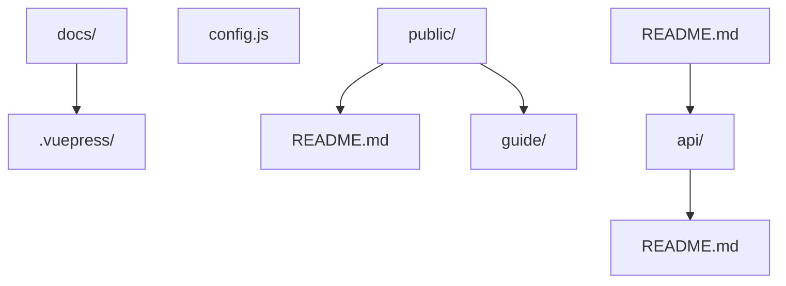
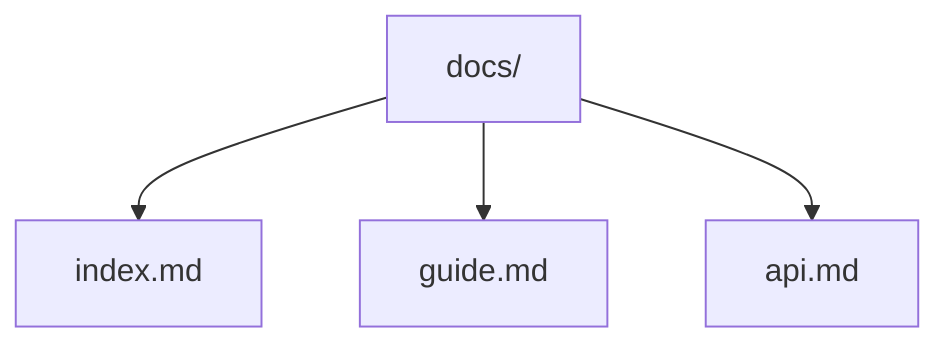
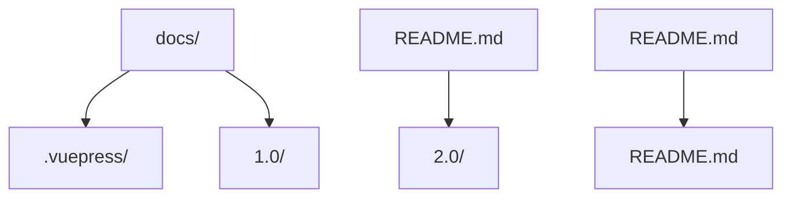
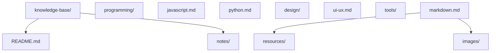

## 1. Markdown 高级语法

### 1.1 表格

#### 1.1.1 基本表格

```markdown
| 姓名 | 年龄 | 职业     |
| :--- | :--- | :------- |
| 张三 | 25   | 工程师   |
| 李四 | 30   | 设计师   |
| 王五 | 35   | 产品经理 |
```

显示效果：

| 姓名 | 年龄 | 职业     |
| :--- | :--- | :------- |
| 张三 | 25   | 工程师   |
| 李四 | 30   | 设计师   |
| 王五 | 35   | 产品经理 |

#### 1.1.2 对齐方式

```markdown
| 左对齐 | 居中对齐 | 右对齐 |
| :----- | :------: | -----: |
| 内容   |   内容   |   内容 |
| 长内容 |  长内容  | 长内容 |
```

显示效果：

| 左对齐 | 居中对齐 | 右对齐 |
| :----- | :------: | -----: |
| 内容   |   内容   |   内容 |
| 长内容 |  长内容  | 长内容 |

### 1.2 代码块

#### 1.2.1 语法高亮

```javascript
function hello() {
  console.log('Hello, Markdown!');
}
```

```python
 def hello():
  print('Hello, Markdown!')
```

#### 1.2.2 行号和高亮

```javascript
function hello() {
  console.log('Hello, Markdown!');
  return true;
}
hello();
```

### 1.3 脚注

```markdown
这是一个有脚注的句子[^1]。

[^1]: 这是脚注的内容。
```

### 1.4 任务列表

```markdown
-
-
-
-
```

### 1.5 定义列表

```markdown
术语 1
:
术语 2
:
:
```

### 1.6 数学公式

#### 1.6.1 行内公式

```markdown
质能方程：$E=mc^2$
```

#### 1.6.2 块级公式

```markdown
$$
\
$$
```

### 1.7 admonition

```markdown
:
这是一个提示
:
:
这是一个警告
:
:
这是一个危险警告
:
```

### 1.8 目录

```markdown
[toc](toc)
```

### 1.9 链接引用

```markdown
[Google][google]
[GitHub][github]
[google]: https://www.google.com
[github]: https://github.com
```

### 1.10 图片语法

#### 1.10.1 基本图片

```markdown
!
```

#### 1.10.2 带标题的图片

```markdown
!
```

#### 1.10.3 带尺寸的图片

```markdown
!
```

## 2. 文档自动化

### 2.1 Markdown 转 HTML

#### 2.1.1 使用 Pandoc

```bash
 # 安装 Pandoc
 # Windows: 从官网下载安装包
 # macOS: brew install pandoc
 # Linux: sudo apt install pandoc
 # 转换 Markdown 到 HTML
 pandoc input.md -o output.html
 # 转换 Markdown 到 PDF
 pandoc input.md -o output.pdf
 # 转换 Markdown 到 Word
 pandoc input.md -o output.docx
```

#### 2.1.2 使用 Node.js 工具

```bash
 # 安装 markdown-it
 npm install markdown-it
 # 创建转换脚本
 cat > convert.js << 'EOF'
 const fs = require('fs');
 const md = require('markdown-it')();
 const input = fs.readFileSync('input.md', 'utf8');
 const output = md.render(input);
 fs.writeFileSync('output.html', output);
 console.log('Conversion completed!');
 EOF
 # 运行转换
 node convert.js
```

### 2.2 静态站点生成

#### 2.2.1 使用 VuePress

**安装 VuePress**

```bash
 # 全局安装
 npm install -g vuepress
 # 或本地安装
 npm install vuepress --save-dev
```

**创建文档结构**



**配置文件**

```javascript
// .vuepress/config.js
module.exports = {
  title: 'My Documentation',
  description: 'This is my documentation site',
  themeConfig: {
    nav: [
      { text: 'Home', link: '/' },
      { text: 'Guide', link: '/guide/' },
      { text: 'API', link: '/api/' },
    ],
    sidebar: {
      '/guide/': [{ text: 'Getting Started', link: '/guide/' }],
      '/api/': [{ text: 'API Reference', link: '/api/' }],
    },
  },
};
```

**构建站点**

```bash
 # 开发模式
 Vuepress dev docs
 # 构建模式
 Vuepress build docs
```

#### 2.2.2 使用 MkDocs

**安装 MkDocs**

```bash
 pip install mkdocs
```

**创建文档结构**



**配置文件**

```yaml
# mkdocs.yml
site_name: My Documentation
site_description: This is my documentation site
theme:
  name: material
nav:
  - Home: index.md
  - Guide: guide.md
  - API: api.md
```

**构建站点**

```bash
 # 开发模式
 mkdocs serve
 # 构建模式
 mkdocs build
```

### 2.3 文档测试

#### 2.3.1 使用 markdown-link-check

```bash
 # 安装
 npm install -g markdown-link-check
 # 检查链接
 markdown-link-check README.md
 # 检查整个目录
 find . -name "*.md" -exec markdown-link-check {} \;
```

#### 2.3.2 使用 markdownlint

```bash
 # 安装
 npm install -g markdownlint-cli
 # 检查文档
 markdownlint README.md
 # 检查整个目录
 markdownlint .
```

### 2.4 文档版本控制

#### 2.4.1 使用 Git 分支

```bash
 # 创建版本分支
 git branch docs/v1.0
 git branch docs/v2.0
 # 切换到特定版本
 git checkout docs/v1.0
 # 合并更改
 git checkout main
 git merge docs/v1.0
```

#### 2.4.2 使用 VuePress 多版本

**配置多版本**

```javascript
// .vuepress/config.js
module.exports = {
  // ...
  themeConfig: {
    // ...
    versions: {
      '1.0': '/1.0/',
      '2.0': '/2.0/',
    },
  },
};
```

**目录结构**



## 3. 高级应用

### 3.1 知识库构建

#### 3.1.1 使用 Obsidian

**基本配置**

1. 创建 vault
2. 设置文件组织结构
3. 配置插件
   **链接语法**

```markdown
# 页面 1

[页面 2](页面 2)
!
```

#### 3.1.2 使用 Notion

**基本操作**

1. 创建数据库
2. 设置属性
3. 建立关系
   **Markdown 支持**

````markdown
# 标题

-

*
* > `代码`

```javascript
// 代码块
function hello() {
  console.log('Hello');
}
```
````

### 3.2 技术文档写作

#### 3.2.1 文档结构

```markdown
# 项目名称

## 1. 概述

### 1.1 项目背景

### 1.2 目标与范围

## 2. 快速开始

### 2.1 环境要求

### 2.2 安装步骤

### 2.3 基本使用

## 3. 核心功能

### 3.1 功能模块 1

### 3.2 功能模块 2

## 4. API 参考

### 4.1 接口 1

### 4.2 接口 2

## 5. 常见问题

## 6. 贡献指南

## 7. 许可证
```

#### 3.2.2 文档风格指南

1.  **一致性**：保持术语和格式的一致性
2.  **清晰度**：使用简洁明了的语言
3.  **完整性**：覆盖所有重要内容
4.  **准确性**：确保信息准确无误
5.  **可维护性**：便于更新和维护

### 3.3 自动化文档生成

#### 3.3.1 从代码生成文档

-

```javascript
/**
 * 计算两个数的和
 * @param {number} a - 第一个数
 * @param {number} b - 第二个数
 * @returns {number} 两个数的和
 */
function sum(a, b) {
  return a + b;
}
```

-

```bash
# 安装 JSDoc
npm install -g jsdoc
# 生成文档
jsdoc input.js -d docs
```

#### 3.3.2 使用 TypeDoc

```bash
# 安装 TypeDoc
npm install -g typedoc
# 生成文档
typedoc --out docs src
```

## 4. 工具与资源

### 4.1 编辑器

-
-
-
-

### 4.2 插件

-
-
-
-

### 4.3 在线工具

-
-
-
-

### 4.4 模板

-
-
-
-

## 5. 最佳实践

### 5.1 内容组织

1.  **分层结构**：使用标题层级组织内容
2.  **逻辑顺序**：按照逻辑顺序排列内容
3.  **模块化**：将内容分解为模块
4.  **导航辅助**：使用目录和链接

### 5.2 格式规范

1.  **标题格式**：使用 # 符号，避免使用 === 或 ---
2.  **列表格式**：使用 - 或 \* 作为无序列表标记
3.  **代码块**：使用 ``` 包围代码块，并指定语言
4.  **链接格式**：使用 [文本](https://example.com/image.png) 格式
5.  **图片格式**：使用  格式

### 5.3 内容质量

1.  **准确性**：确保信息准确无误
2.  **完整性**：覆盖所有重要内容
3.  **清晰度**：使用简洁明了的语言
4.  **一致性**：保持术语和格式的一致性
5.  **可访问性**：考虑不同读者的需求

### 5.4 版本控制

1.  **使用 Git**：对文档进行版本控制
2.  **提交信息**：使用清晰的提交信息
3.  **分支管理**：使用分支管理不同版本的文档
4.  **合并策略**：制定合理的合并策略

## 6. 项目实战

### 6.1 构建个人知识库

-



-

```markdown
# 个人知识库

## 目录

- [编程](notes/programming/)
- [JavaScript](notes/programming/javascript.md)
- [Python](notes/programming/python.md)
- [设计](notes/design/)
- [UI/UX](notes/design/ui-ux.md)
- [工具](notes/tools/)
- [Markdown](notes/tools/markdown.md)

## 如何使用

1. 克隆仓库
2. 使用 Markdown 编辑器打开文件
3. 定期更新内容
4. 提交更改到 Git
```

### 6.2 构建项目文档

-

```bash
# 初始化项目
mkdir project-docs
cd project-docs
npm init -y
npm install vuepress --save-dev
# 创建文档结构
mkdir -p docs/.vuepress/public
docs/README.md
echo '# 项目文档' > docs/README.md
echo 'module.exports = { title: "项目文档" }' > docs/.vuepress/config.js
# 添加脚本到 package.json
npm pkg set scripts.dev="vuepress dev docs"
npm pkg set scripts.build="vuepress build docs"
# 启动开发服务器
npm run dev
```

## 7. 常见问题与解决方案

### 7.1 图片路径问题

-
-

*
*
*
*

### 7.2 表格格式问题

-
-

*
*
*

### 7.3 数学公式渲染问题

-
-

*
*
*

### 7.4 文档构建问题

-
-

*
*
*

## 8. 延伸阅读

-
-
-
-
- 通过本教程，你已经了解了 Markdown 的高级语法和文档自动化工具。在实际项目中，你可以使用这些技术来创建高质量的文档，提高工作效率，构建个人知识库或项目文档。

## 参考文献


CommonMark 规范：https://spec.commonmark.org/
GFM 规范：https://github.github.com/gfm/
Markdown 指南：https://www.markdownguide.org/
Markdownlint：https://github.com/DavidAnson/markdownlint

## 延伸阅读


Markdown 基础语法，见 002-markdown 模块文档。
Markdown 删除线语法，见 002-markdown/010-Strikethrough 文档。
文档站构建（Astro），见 056-astro 模块（如已加入）。
尚硅谷 Bilibili 空间（https://space.bilibili.com/302417610 ）提供文档写作课程。

## 模块文档速查表

| 文档 | 主题 | 与本文的关联 |
| --- | --- | --- |
| Markdown 语法指南 | 001-SyntaxGuide | 本文的并列主题 |
| Markdown 标题语法 | 002-HeadingSyntax | 本文的并列主题 |
| Markdown 段落与换行 | 003-ParagraphLineBreak | 本文的并列主题 |
| Markdown 基础文本格式 | 004-BasicTextFormat | 本文的前置基础 |
| CommonMark规范 | 005-CommonMarkSpec | 本文的并列主题 |
| Markdown 列表语法 | 006-ListSyntax | 本文的并列主题 |
| GitHub Flavored Markdown | 007-GitHubFlavoredMarkdown | 本文的并列主题 |
| 转义字符 | 008-EscapeCharacter | 本文的并列主题 |
| 脚注 | 009-Footnote | 本文的并列主题 |
| 删除线 | 010-Strikethrough | 本文的并列主题 |
| 自动链接 | 011-AutoLink | 本文的并列主题 |
| Emoji表情 | 012-Emoji | 本文的并列主题 |
| 下标与上标 | 013-SubscriptSuperscript | 本文的并列主题 |
| LaTeX数学公式 | 014-LaTeXMathFormula | 本文的并列主题 |
| Mermaid图表 | 015-Mermaid | 本文的并列主题 |
| 编辑器功能 | 016-EditorFeature | 本文的并列主题 |
| Markdown 链接与图片 | 017-LinkImage | 本文的并列主题 |
| 转换工具 | 018-ConversionTool | 本文的并列主题 |
| 自动目录 | 019-AutoTOC | 本文的并列主题 |
| 锚点跳转 | 020-AnchorJump | 本文的并列主题 |
| 图片CDN加速 | 021-ImageCDNAcceleration | 本文的并列主题 |
| 版本控制下的PR协作 | 022-VCSPRCollaboration | 本文的并列主题 |
| Markdown 代码块与语法高亮 | 023-CodeBlockSyntaxHighlight | 本文的并列主题 |
| Markdown 表格 | 024-Table | 本文的并列主题 |
| 规范文档编写 | 025-SpecDocumentWriting | 本文的并列主题 |
| Markdown 高级语法与文档自动化 | 026-AdvancedSyntaxDocumentAutomation | 本文自身 |
| Markdown 任务列表 | 027-TaskList | 本文的并列主题 |
| Markdown 定义列表 | 028-DefinitionList | 本文的并列主题 |
| Markdown 提示框（admonition/callout） | 029-AdmonitionCallout | 本文的并列主题 |
| Markdown HTML 内嵌 | 030-HtmlEmbed | 本文的并列主题 |
| Markdown 引用与嵌套列表语法速查 | 031-BlockquoteNestedList | 本文的并列主题 |
| Markdown Frontmatter YAML 语法速查 | 032-FrontmatterYAML | 本文的并列主题 |
