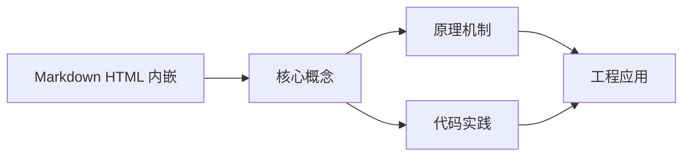
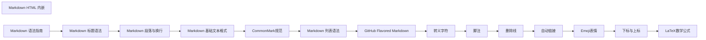

## 1. 学习目标（Bloom 分类）

本节按照布鲁姆教育目标分类学组织学习路径。本文主题为《Markdown HTML 内嵌》，属于 Markdown 模块，读者可以根据自身阶段选择阅读深度。

记忆层面：能够准确复述本文的核心概念、术语与基本语法或操作步骤，并能够在提问或检索时快速定位对应知识点。能够说出 Markdown 的核心概念、常用命令与流程。

理解层面：能够用自己的语言解释核心原理与工作机制，说明概念之间的因果关系，而不是机械记忆结论。能够解释 Markdown 的工作原理与设计动机。

应用层面：能够在真实项目或练习场景中运用本文知识解决具体问题，写出正确且可维护的实现。能够独立完成 Markdown 的标准操作。

分析层面：能够拆解复杂问题，比较本文主题与相邻概念的异同，识别边界条件与例外情况。能够分析 Markdown 使用中的异常与边界。

评价层面：能够根据约束条件（性能、可读性、安全、成本）评价不同方案的优劣，做出有依据的技术决策。能够评价 Markdown 相关工具与方案。

创造层面：能够把本文知识与其他模块知识组合，设计出新的解决方案或可复用的工程模式。能够把 Markdown 融入团队工作流。

通过本节学习，读者应当能够把《Markdown HTML 内嵌》纳入自己的知识网络，并与 Markdown 模块的其他主题（基础语法、GFM、写作规范）建立关联。

## 2. 历史动机与发展脉络

《Markdown HTML 内嵌》是 Markdown 领域的重要主题。要真正理解它，需要先了解它解决的问题与演进过程。

Markdown 由 John Gruber 与 Aaron Swartz 于 2004 年设计，目标是“易读易写的纯文本格式”，可转换为 HTML。
标准化：CommonMark（2014 起）统一解析歧义；GitHub Flavored Markdown（GFM）扩展表格、任务列表、删除线、围栏代码。
生态：文档站（Astro/VitePress）、知识库（Obsidian）、论坛（GitHub/Stack Overflow）、AI 输出格式均以 Markdown 为通用语言。

回到本文主题：Markdown HTML 内嵌 的提出与成熟，正是上述技术背景下的必然产物。早期实现往往以简单可用为目标，随着工程规模扩大，社区逐渐沉淀出标准做法与最佳实践；理解这一脉络，可以帮助读者判断“为什么文档中的推荐写法是现在这个样子”，也能在遇到历史遗留代码时准确识别其设计年代与取舍。


## 3. 形式化定义与核心概念精讲

本节把《Markdown HTML 内嵌》涉及的核心概念以“定义 + 讲解”的形式展开。读者应把定义当作工具，把讲解当作理解路径；两者结合才能形成可迁移的知识。

块级语法：标题、段落、列表、引用、代码块、表格、分隔线；行内语法：强调、代码、链接、图片。
解析模型：块级解析优先，行内解析递归；空行分隔块；转义符 \ 输出字面量。
GFM 扩展：~~删除线~~、任务列表 - [x]、表格对齐、自动链接、围栏代码语言标注。

### 3.1 原文章节逐一精讲

原文档把主题拆分为 18 个小节，下面按顺序给出每一节的导读讲解，随后保留原文细节供精读。

#### 原文精读（完整保留）

# Markdown HTML 内嵌

> **符号约定**：`< >` 必填参数 | `[ ]` 可选参数

---

#### 基础 HTML 嵌入

**基本写法：行内 HTML 标签`
`<tag> <内容> </tag>`
```markdown
# 直接在 markdown 中写 HTML 标签
这是一个 <strong>加粗</strong> 的文本
```

---

**基本写法：块级 HTML 标签`
`<div> <内容> </div>`
```markdown
# 块级 HTML 标签独占一行
<div>
这是 div 包裹的内容
</div>
```

---

**基本写法：HTML 标签嵌套`
`<div><p> <内容> </p></div>`
```markdown
# HTML 标签可嵌套使用
<div>
<p>段落一</p>
<p>段落二</p>
</div>
```

---

#### 文本格式化

**基本写法：HTML 加粗`
`<strong> <文本> </strong>`
```markdown
# 用 strong 标签加粗
<strong>重要内容</strong>
```

---

**基本写法：HTML 斜体`
`<em> <文本> </em>`
```markdown
# 用 em 标签表示斜体
<em>强调文本</em>
```

---

**基本写法：HTML 下划线`
`<u> <文本> </u>`
```markdown
# 用 u 标签添加下划线
<u>带下划线的文本</u>
```

---

**基本写法：HTML 删除线`
`<del> <文本> </del>` 或 `<s> <文本> </s>`
```markdown
# 用 del 或 s 标签表示删除线
<del>已废弃</del>
<s>已失效</s>
```

---

**基本写法：HTML 高亮`
`<mark> <文本> </mark>`
```markdown
# 用 mark 标签高亮文本
<mark>关键信息</mark>
```

---

#### 颜色与样式

**基本写法：行内颜色`
`<span style="color:<颜色>"> <文本> </span>`
```markdown
# 用 span 加 style 设置颜色
<span style="color:red">红色文本</span>
```

---

**基本写法：背景色`
`<span style="background-color:<颜色>"> <文本> </span>`
```markdown
# 设置文本背景色
<span style="background-color:yellow">黄色背景</span>
```

---

**基本写法：字号`
`<span style="font-size:<大小>"> <文本> </span>`
```markdown
# 修改字体大小
<span style="font-size:20px">大字号</span>
```

---

**基本写法：组合样式`
`<span style="color:<颜色>;font-weight:bold"> <文本> </span>`
```markdown
# 多个样式属性组合
<span style="color:blue;font-weight:bold">蓝色加粗</span>
```

---

#### 换行与对齐

**基本写法：强制换行`
`<br>`
```markdown
# 用 br 标签强制换行
第一行<br>第二行
```

---

**基本写法：水平线`
`<hr>`
```markdown
# 用 hr 标签画水平分隔线
内容一
<hr>
内容二
```

---

**基本写法：文本居中`
`<div align="center"> <内容> </div>`
```markdown
# 用 align 属性居中文本
<div align="center">
居中显示
</div>
```

---

**基本写法：右对齐`
`<div align="right"> <内容> </div>`
```markdown
# 文本右对齐
<div align="right">
右对齐文本
</div>
```

---

#### 锚点与链接

**基本写法：定义锚点`
`<a id="<锚点>"></a>`
```markdown
# 用 a 标签定义锚点
<a id="section-1"></a>
#### 章节一
```

---

**基本写法：HTML 链接`
`<a href="<URL>"> <文本> </a>`
```markdown
# 用 a 标签创建链接
<a href="https://example.com">访问示例</a>
```

---

**基本写法：新窗口打开链接`
`<a href="<URL>" target="_blank"> <文本> </a>`
```markdown
# target="_blank" 在新标签页打开
<a href="https://example.com" target="_blank">新窗口打开</a>
```

---

#### 图片扩展

**基本写法：HTML 图片`
`" alt="<描述>">`
```markdown
# 用 img 标签插入图片

```

---

**基本写法：指定图片尺寸`
`" width="<宽>" height="<高>">`
```markdown
# 设置图片宽高

```

---

**基本写法：图片样式`
`" style="border:1px solid">`
```markdown
# 给图片添加样式

```

---

**基本写法：图片居中`
`<div align="center">"></div>`
```markdown
# 用 div 居中图片
<div align="center">

</div>
```

---

#### 折叠内容

**基本写法：折叠区块`
`<details><summary><标题></summary><内容></details>`
```markdown
# 用 details 实现折叠
<details>
<summary>点击展开详情</summary>

这里是折叠的内容

</details>
```

---

**基本写法：默认展开折叠`
`<details open>`
```markdown
# 用 open 属性默认展开
<details open>
<summary>默认展开</summary>
内容
</details>
```

---

**基本写法：嵌套折叠`
`<details><summary><外层>`
`<details><summary><内层>...`
```markdown
# 折叠区块可嵌套
<details>
<summary>外层</summary>
<details>
<summary>内层</summary>
内容
</details>
</details>
```

---

#### 提示框

**基本写法：警告框`
`<div class="alert alert-warning"><内容></div>`
```markdown
# 用 div 加 class 实现提示框
<div class="alert alert-warning">
<strong>警告</strong> 注意此风险
</div>
```

---

**基本写法：调用框`
`<blockquote class="warning"><内容></blockquote>`
```markdown
# 用 blockquote 加 class 实现引用框
<blockquote class="warning">
警告内容
</blockquote>
```

---

#### 表格扩展

**基本写法：HTML 表格`
`<table><tr><td> <内容> </td></tr></table>`
```markdown
# 用 HTML 实现更复杂的表格
<table>
<tr>
<th>姓名</th>
<th>年龄</th>
</tr>
<tr>
<td>张三</td>
<td>25</td>
</tr>
</table>
```

---

**基本写法：合并单元格`
`<td colspan="<列数>"> <内容> </td>`
```markdown
# 用 colspan 与 rowspan 合并单元格
<table>
<tr>
<td colspan="2">合并两列</td>
</tr>
<tr>
<td>单元格</td>
<td>单元格</td>
</tr>
</table>
```

---

#### 视频与媒体

**基本写法：嵌入视频`
`<video src="<URL>" controls></video>`
```markdown
# 用 video 标签嵌入视频
<video src="demo.mp4" controls width="400"></video>
```

---

**基本写法：嵌入音频`
`<audio src="<URL>" controls></audio>`
```markdown
# 用 audio 标签嵌入音频
<audio src="song.mp3" controls></audio>
```

---

**基本写法：嵌入 iframe`
`<iframe src="<URL>"></iframe>`
```markdown
# 用 iframe 嵌入网页
<iframe src="https://example.com" width="600" height="400"></iframe>
```

---

#### 注释

**基本写法：HTML 注释`
`<!-- <注释内容> -->`
```markdown
# 用 HTML 注释隐藏内容
<!-- 这是注释不会渲染 -->
```

---

**基本写法：多行注释`
`<!--`
`<多行内容>`
`-->`
```markdown
# 多行注释
<!--
多行
注释内容
-->
```

---

#### 键盘按键样式

**基本写法：键盘按键`
`<kbd> <按键> </kbd>`
```markdown
# 用 kbd 标签表示键盘按键
按 <kbd>Ctrl</kbd> + <kbd>C</kbd> 复制
```

---

#### 上下标

**基本写法：下标`
`<sub> <内容> </sub>`
```markdown
# 用 sub 标签实现下标
H<sub>2</sub>O
```

---

**基本写法：上标`
`<sup> <内容> </sup>`
```markdown
# 用 sup 标签实现上标
x<sup>2</sup> + y<sup>2</sup>
```

---

#### 内联样式

**基本写法：用 style 属性`
`<元素 style="<CSS>">`
```markdown
# 行内 style 属性指定样式
<p style="color:green;font-size:18px">绿色大字</p>
```

---

**基本写法：用 class 属性`
`<元素 class="<类名>">`
```markdown
# 用 class 关联外部 CSS
<div class="highlight">高亮内容</div>
```

---

#### 渲染器支持差异

**基本写法：GitHub 支持的 HTML`
`<a>  <details> <kbd> 等`
```markdown
# GitHub 支持部分安全 HTML 标签
# 禁用 script、style 标签
```

---

**基本写法：GitLab HTML 过滤`
`允许大部分 HTML 标签`
```markdown
# GitLab 允许更多 HTML 标签与属性
# 包括 style 属性
```

---

**基本写法：Obsidian 完整支持`
`支持所有 HTML 标签与样式`
```markdown
# Obsidian 渲染时保留 HTML 原样
# 支持完整样式属性
```

---

#### 注意事项

**基本写法：块级 HTML 前后空行`
`<段落>`
`<div> <内容> </div>`
`<段落>`
```markdown
# 块级 HTML 前后建议留空行
段落

<div>HTML 块</div>

段落
```

---

**基本写法：避免 script 标签`
`多数平台禁用 script`
```markdown
# 多数平台出于安全过滤 script 标签
# 不要依赖 JavaScript 实现
```

---

**基本写法：HTML 与 Markdown 混用`
`<div>`
`<Markdown 内容>`
`</div>`
```markdown
# HTML 块内 Markdown 可能不解析
# 建议复杂格式统一用 HTML 或 Markdown
```

---

#### 实战场景

**基本写法：文档头部居中标题`
`<div align="center"><h1> <标题> </h1></div>`
```markdown
# 居中显示项目标题
<div align="center">
<h1>项目名称</h1>
<p>项目简介</p>
</div>
```

---

**基本写法：徽章组合`
`">`
```markdown
# 用 img 标签展示多个状态徽章


```

---

**基本写法：警告区块`
`<div class="warning"><内容></div>`
```markdown
# 突出显示重要警告
<div class="warning">
<strong>重要</strong> 此功能已弃用
</div>
```


### 3.2 概念关系图

下面用 Mermaid 图表达本文核心概念之间的关系，帮助读者建立整体图景：



图中展示的是本文知识的结构化关系：核心概念是入口，原理机制解释“为什么”，代码实践演示“怎么做”，工程应用回答“何时用”。读者学习时可以把每个小节的内容挂接到对应节点上。

## 4. 理论推导与原理解析

本节深入《Markdown HTML 内嵌》背后的原理。理论部分不求面面俱到，而是聚焦“能解释现象、能指导实践”的关键推导。

块级语法：标题、段落、列表、引用、代码块、表格、分隔线；行内语法：强调、代码、链接、图片。
解析模型：块级解析优先，行内解析递归；空行分隔块；转义符 \ 输出字面量。
GFM 扩展：~~删除线~~、任务列表 - [x]、表格对齐、自动链接、围栏代码语言标注。
元数据：frontmatter（YAML）在文档站中承载标题、日期、标签。

需要强调的是，理论推导与工程实践之间存在翻译层：理论给出的是理想化模型与边界条件，工程代码则必须处理真实环境中的例外。读者在学习时应先掌握理论的“标准情形”，再通过陷阱章节了解“非标准情形”。

## 5. 代码示例与逐行讲解

本节把原文中的代码示例系统整理，并为每个示例补充用途说明与讲解。读者不应只浏览代码，而应逐段对照讲解理解设计意图。

### 5.1 示例：基础 HTML 嵌入

该示例来自原文《基础 HTML 嵌入》小节，用于演示Markdown HTML 内嵌相关操作。阅读时请先看代码结构，再看其后的讲解。

```markdown
# 直接在 markdown 中写 HTML 标签
这是一个 <strong>加粗</strong> 的文本
```

讲解：这段代码演示了本节核心知识点。代码中的关键操作可以归纳为三步：准备（定义或初始化）、执行（核心逻辑）、收尾（释放资源或返回结果）。实际项目中，这三步往往被封装为函数或类，以提升复用性与可测试性。

关键点分析：

该示例共 2 行有效代码，结构以数据或配置为主。阅读时应关注：数据字段的含义、配置项的作用，以及它们与运行行为的对应关系。

进阶思考路径：先尝试修改参数观察行为变化，再把示例中的模式迁移到自己的项目中；每次修改都记录预期与实测差异，这是把示例转化为能力的最快方式。

### 5.2 示例：基础 HTML 嵌入

该示例来自原文《基础 HTML 嵌入》小节，用于演示Markdown HTML 内嵌相关操作。阅读时请先看代码结构，再看其后的讲解。

```markdown
# 块级 HTML 标签独占一行
<div>
这是 div 包裹的内容
</div>
```

讲解：这段代码演示了本节核心知识点。代码中的关键操作可以归纳为三步：准备（定义或初始化）、执行（核心逻辑）、收尾（释放资源或返回结果）。实际项目中，这三步往往被封装为函数或类，以提升复用性与可测试性。

关键点分析：

该示例共 4 行有效代码，结构以数据或配置为主。阅读时应关注：数据字段的含义、配置项的作用，以及它们与运行行为的对应关系。

进阶思考路径：先尝试修改参数观察行为变化，再把示例中的模式迁移到自己的项目中；每次修改都记录预期与实测差异，这是把示例转化为能力的最快方式。

### 5.3 示例：基础 HTML 嵌入

该示例来自原文《基础 HTML 嵌入》小节，用于演示Markdown HTML 内嵌相关操作。阅读时请先看代码结构，再看其后的讲解。

```markdown
# HTML 标签可嵌套使用
<div>
<p>段落一</p>
<p>段落二</p>
</div>
```

讲解：这段代码演示了本节核心知识点。代码中的关键操作可以归纳为三步：准备（定义或初始化）、执行（核心逻辑）、收尾（释放资源或返回结果）。实际项目中，这三步往往被封装为函数或类，以提升复用性与可测试性。

关键点分析：

该示例共 5 行有效代码，结构以数据或配置为主。阅读时应关注：数据字段的含义、配置项的作用，以及它们与运行行为的对应关系。

进阶思考路径：先尝试修改参数观察行为变化，再把示例中的模式迁移到自己的项目中；每次修改都记录预期与实测差异，这是把示例转化为能力的最快方式。

### 5.4 示例：文本格式化

该示例来自原文《文本格式化》小节，用于演示Markdown HTML 内嵌相关操作。阅读时请先看代码结构，再看其后的讲解。

```markdown
# 用 strong 标签加粗
<strong>重要内容</strong>
```

讲解：这段代码演示了本节核心知识点。代码中的关键操作可以归纳为三步：准备（定义或初始化）、执行（核心逻辑）、收尾（释放资源或返回结果）。实际项目中，这三步往往被封装为函数或类，以提升复用性与可测试性。

关键点分析：

该示例共 2 行有效代码，结构以数据或配置为主。阅读时应关注：数据字段的含义、配置项的作用，以及它们与运行行为的对应关系。

进阶思考路径：先尝试修改参数观察行为变化，再把示例中的模式迁移到自己的项目中；每次修改都记录预期与实测差异，这是把示例转化为能力的最快方式。

### 5.5 示例：文本格式化

该示例来自原文《文本格式化》小节，用于演示Markdown HTML 内嵌相关操作。阅读时请先看代码结构，再看其后的讲解。

```markdown
# 用 em 标签表示斜体
<em>强调文本</em>
```

讲解：这段代码演示了本节核心知识点。代码中的关键操作可以归纳为三步：准备（定义或初始化）、执行（核心逻辑）、收尾（释放资源或返回结果）。实际项目中，这三步往往被封装为函数或类，以提升复用性与可测试性。

关键点分析：

该示例共 2 行有效代码，结构以数据或配置为主。阅读时应关注：数据字段的含义、配置项的作用，以及它们与运行行为的对应关系。

进阶思考路径：先尝试修改参数观察行为变化，再把示例中的模式迁移到自己的项目中；每次修改都记录预期与实测差异，这是把示例转化为能力的最快方式。

### 5.6 示例：文本格式化

该示例来自原文《文本格式化》小节，用于演示Markdown HTML 内嵌相关操作。阅读时请先看代码结构，再看其后的讲解。

```markdown
# 用 u 标签添加下划线
<u>带下划线的文本</u>
```

讲解：这段代码演示了本节核心知识点。代码中的关键操作可以归纳为三步：准备（定义或初始化）、执行（核心逻辑）、收尾（释放资源或返回结果）。实际项目中，这三步往往被封装为函数或类，以提升复用性与可测试性。

关键点分析：

该示例共 2 行有效代码，结构以数据或配置为主。阅读时应关注：数据字段的含义、配置项的作用，以及它们与运行行为的对应关系。

进阶思考路径：先尝试修改参数观察行为变化，再把示例中的模式迁移到自己的项目中；每次修改都记录预期与实测差异，这是把示例转化为能力的最快方式。

### 5.7 示例：文本格式化

该示例来自原文《文本格式化》小节，用于演示Markdown HTML 内嵌相关操作。阅读时请先看代码结构，再看其后的讲解。

```markdown
# 用 del 或 s 标签表示删除线
<del>已废弃</del>
<s>已失效</s>
```

讲解：这段代码演示了本节核心知识点。代码中的关键操作可以归纳为三步：准备（定义或初始化）、执行（核心逻辑）、收尾（释放资源或返回结果）。实际项目中，这三步往往被封装为函数或类，以提升复用性与可测试性。

关键点分析：

该示例共 3 行有效代码，结构以数据或配置为主。阅读时应关注：数据字段的含义、配置项的作用，以及它们与运行行为的对应关系。

进阶思考路径：先尝试修改参数观察行为变化，再把示例中的模式迁移到自己的项目中；每次修改都记录预期与实测差异，这是把示例转化为能力的最快方式。

### 5.8 示例：文本格式化

该示例来自原文《文本格式化》小节，用于演示Markdown HTML 内嵌相关操作。阅读时请先看代码结构，再看其后的讲解。

```markdown
# 用 mark 标签高亮文本
<mark>关键信息</mark>
```

讲解：这段代码演示了本节核心知识点。代码中的关键操作可以归纳为三步：准备（定义或初始化）、执行（核心逻辑）、收尾（释放资源或返回结果）。实际项目中，这三步往往被封装为函数或类，以提升复用性与可测试性。

关键点分析：

该示例共 2 行有效代码，结构以数据或配置为主。阅读时应关注：数据字段的含义、配置项的作用，以及它们与运行行为的对应关系。

进阶思考路径：先尝试修改参数观察行为变化，再把示例中的模式迁移到自己的项目中；每次修改都记录预期与实测差异，这是把示例转化为能力的最快方式。

### 5.9 示例：颜色与样式

该示例来自原文《颜色与样式》小节，用于演示Markdown HTML 内嵌相关操作。阅读时请先看代码结构，再看其后的讲解。

```markdown
# 用 span 加 style 设置颜色
<span style="color:red">红色文本</span>
```

讲解：这段代码演示了本节核心知识点。代码中的关键操作可以归纳为三步：准备（定义或初始化）、执行（核心逻辑）、收尾（释放资源或返回结果）。实际项目中，这三步往往被封装为函数或类，以提升复用性与可测试性。

关键点分析：

该示例共 2 行有效代码，结构以数据或配置为主。阅读时应关注：数据字段的含义、配置项的作用，以及它们与运行行为的对应关系。

进阶思考路径：先尝试修改参数观察行为变化，再把示例中的模式迁移到自己的项目中；每次修改都记录预期与实测差异，这是把示例转化为能力的最快方式。

### 5.10 示例：颜色与样式

该示例来自原文《颜色与样式》小节，用于演示Markdown HTML 内嵌相关操作。阅读时请先看代码结构，再看其后的讲解。

```markdown
# 设置文本背景色
<span style="background-color:yellow">黄色背景</span>
```

讲解：这段代码演示了本节核心知识点。代码中的关键操作可以归纳为三步：准备（定义或初始化）、执行（核心逻辑）、收尾（释放资源或返回结果）。实际项目中，这三步往往被封装为函数或类，以提升复用性与可测试性。

关键点分析：

该示例共 2 行有效代码，结构以数据或配置为主。阅读时应关注：数据字段的含义、配置项的作用，以及它们与运行行为的对应关系。

进阶思考路径：先尝试修改参数观察行为变化，再把示例中的模式迁移到自己的项目中；每次修改都记录预期与实测差异，这是把示例转化为能力的最快方式。

### 5.11 示例：颜色与样式

该示例来自原文《颜色与样式》小节，用于演示Markdown HTML 内嵌相关操作。阅读时请先看代码结构，再看其后的讲解。

```markdown
# 修改字体大小
<span style="font-size:20px">大字号</span>
```

讲解：这段代码演示了本节核心知识点。代码中的关键操作可以归纳为三步：准备（定义或初始化）、执行（核心逻辑）、收尾（释放资源或返回结果）。实际项目中，这三步往往被封装为函数或类，以提升复用性与可测试性。

关键点分析：

该示例共 2 行有效代码，结构以数据或配置为主。阅读时应关注：数据字段的含义、配置项的作用，以及它们与运行行为的对应关系。

进阶思考路径：先尝试修改参数观察行为变化，再把示例中的模式迁移到自己的项目中；每次修改都记录预期与实测差异，这是把示例转化为能力的最快方式。

### 5.12 示例：颜色与样式

该示例来自原文《颜色与样式》小节，用于演示Markdown HTML 内嵌相关操作。阅读时请先看代码结构，再看其后的讲解。

```markdown
# 多个样式属性组合
<span style="color:blue;font-weight:bold">蓝色加粗</span>
```

讲解：这段代码演示了本节核心知识点。代码中的关键操作可以归纳为三步：准备（定义或初始化）、执行（核心逻辑）、收尾（释放资源或返回结果）。实际项目中，这三步往往被封装为函数或类，以提升复用性与可测试性。

关键点分析：

该示例共 2 行有效代码，结构以数据或配置为主。阅读时应关注：数据字段的含义、配置项的作用，以及它们与运行行为的对应关系。

进阶思考路径：先尝试修改参数观察行为变化，再把示例中的模式迁移到自己的项目中；每次修改都记录预期与实测差异，这是把示例转化为能力的最快方式。

### 5.13 示例：换行与对齐

该示例来自原文《换行与对齐》小节，用于演示Markdown HTML 内嵌相关操作。阅读时请先看代码结构，再看其后的讲解。

```markdown
# 用 br 标签强制换行
第一行<br>第二行
```

讲解：这段代码演示了本节核心知识点。代码中的关键操作可以归纳为三步：准备（定义或初始化）、执行（核心逻辑）、收尾（释放资源或返回结果）。实际项目中，这三步往往被封装为函数或类，以提升复用性与可测试性。

关键点分析：

该示例共 2 行有效代码，结构以数据或配置为主。阅读时应关注：数据字段的含义、配置项的作用，以及它们与运行行为的对应关系。

进阶思考路径：先尝试修改参数观察行为变化，再把示例中的模式迁移到自己的项目中；每次修改都记录预期与实测差异，这是把示例转化为能力的最快方式。

### 5.14 示例：换行与对齐

该示例来自原文《换行与对齐》小节，用于演示Markdown HTML 内嵌相关操作。阅读时请先看代码结构，再看其后的讲解。

```markdown
# 用 hr 标签画水平分隔线
内容一
<hr>
内容二
```

讲解：这段代码演示了本节核心知识点。代码中的关键操作可以归纳为三步：准备（定义或初始化）、执行（核心逻辑）、收尾（释放资源或返回结果）。实际项目中，这三步往往被封装为函数或类，以提升复用性与可测试性。

关键点分析：

该示例共 4 行有效代码，结构以数据或配置为主。阅读时应关注：数据字段的含义、配置项的作用，以及它们与运行行为的对应关系。

进阶思考路径：先尝试修改参数观察行为变化，再把示例中的模式迁移到自己的项目中；每次修改都记录预期与实测差异，这是把示例转化为能力的最快方式。

### 5.15 示例：换行与对齐

该示例来自原文《换行与对齐》小节，用于演示Markdown HTML 内嵌相关操作。阅读时请先看代码结构，再看其后的讲解。

```markdown
# 用 align 属性居中文本
<div align="center">
居中显示
</div>
```

讲解：这段代码演示了本节核心知识点。代码中的关键操作可以归纳为三步：准备（定义或初始化）、执行（核心逻辑）、收尾（释放资源或返回结果）。实际项目中，这三步往往被封装为函数或类，以提升复用性与可测试性。

关键点分析：

该示例共 4 行有效代码，结构以数据或配置为主。阅读时应关注：数据字段的含义、配置项的作用，以及它们与运行行为的对应关系。

进阶思考路径：先尝试修改参数观察行为变化，再把示例中的模式迁移到自己的项目中；每次修改都记录预期与实测差异，这是把示例转化为能力的最快方式。

### 5.16 示例：换行与对齐

该示例来自原文《换行与对齐》小节，用于演示Markdown HTML 内嵌相关操作。阅读时请先看代码结构，再看其后的讲解。

```markdown
# 文本右对齐
<div align="right">
右对齐文本
</div>
```

讲解：这段代码演示了本节核心知识点。代码中的关键操作可以归纳为三步：准备（定义或初始化）、执行（核心逻辑）、收尾（释放资源或返回结果）。实际项目中，这三步往往被封装为函数或类，以提升复用性与可测试性。

关键点分析：

该示例共 4 行有效代码，结构以数据或配置为主。阅读时应关注：数据字段的含义、配置项的作用，以及它们与运行行为的对应关系。

进阶思考路径：先尝试修改参数观察行为变化，再把示例中的模式迁移到自己的项目中；每次修改都记录预期与实测差异，这是把示例转化为能力的最快方式。

### 5.17 示例：锚点与链接

该示例来自原文《锚点与链接》小节，用于演示Markdown HTML 内嵌相关操作。阅读时请先看代码结构，再看其后的讲解。

```markdown
# 用 a 标签定义锚点
<a id="section-1"></a>
## 章节一
```

讲解：这段代码演示了本节核心知识点。代码中的关键操作可以归纳为三步：准备（定义或初始化）、执行（核心逻辑）、收尾（释放资源或返回结果）。实际项目中，这三步往往被封装为函数或类，以提升复用性与可测试性。

关键点分析：

该示例共 3 行有效代码，结构以数据或配置为主。阅读时应关注：数据字段的含义、配置项的作用，以及它们与运行行为的对应关系。

进阶思考路径：先尝试修改参数观察行为变化，再把示例中的模式迁移到自己的项目中；每次修改都记录预期与实测差异，这是把示例转化为能力的最快方式。

### 5.18 示例：锚点与链接

该示例来自原文《锚点与链接》小节，用于演示Markdown HTML 内嵌相关操作。阅读时请先看代码结构，再看其后的讲解。

```markdown
# 用 a 标签创建链接
<a href="https://example.com">访问示例</a>
```

讲解：这段代码演示了本节核心知识点。代码中的关键操作可以归纳为三步：准备（定义或初始化）、执行（核心逻辑）、收尾（释放资源或返回结果）。实际项目中，这三步往往被封装为函数或类，以提升复用性与可测试性。

关键点分析：

该示例共 2 行有效代码，结构以数据或配置为主。阅读时应关注：数据字段的含义、配置项的作用，以及它们与运行行为的对应关系。

进阶思考路径：先尝试修改参数观察行为变化，再把示例中的模式迁移到自己的项目中；每次修改都记录预期与实测差异，这是把示例转化为能力的最快方式。

### 5.19 示例：锚点与链接

该示例来自原文《锚点与链接》小节，用于演示Markdown HTML 内嵌相关操作。阅读时请先看代码结构，再看其后的讲解。

```markdown
# target="_blank" 在新标签页打开
<a href="https://example.com" target="_blank">新窗口打开</a>
```

讲解：这段代码演示了本节核心知识点。代码中的关键操作可以归纳为三步：准备（定义或初始化）、执行（核心逻辑）、收尾（释放资源或返回结果）。实际项目中，这三步往往被封装为函数或类，以提升复用性与可测试性。

关键点分析：

该示例共 2 行有效代码，结构以数据或配置为主。阅读时应关注：数据字段的含义、配置项的作用，以及它们与运行行为的对应关系。

进阶思考路径：先尝试修改参数观察行为变化，再把示例中的模式迁移到自己的项目中；每次修改都记录预期与实测差异，这是把示例转化为能力的最快方式。

### 5.20 示例：图片扩展

该示例来自原文《图片扩展》小节，用于演示Markdown HTML 内嵌相关操作。阅读时请先看代码结构，再看其后的讲解。

```markdown
# 用 img 标签插入图片

```

讲解：这段代码演示了本节核心知识点。代码中的关键操作可以归纳为三步：准备（定义或初始化）、执行（核心逻辑）、收尾（释放资源或返回结果）。实际项目中，这三步往往被封装为函数或类，以提升复用性与可测试性。

关键点分析：

该示例共 2 行有效代码，结构以数据或配置为主。阅读时应关注：数据字段的含义、配置项的作用，以及它们与运行行为的对应关系。

进阶思考路径：先尝试修改参数观察行为变化，再把示例中的模式迁移到自己的项目中；每次修改都记录预期与实测差异，这是把示例转化为能力的最快方式。

### 5.21 示例：图片扩展

该示例来自原文《图片扩展》小节，用于演示Markdown HTML 内嵌相关操作。阅读时请先看代码结构，再看其后的讲解。

```markdown
# 设置图片宽高

```

讲解：这段代码演示了本节核心知识点。代码中的关键操作可以归纳为三步：准备（定义或初始化）、执行（核心逻辑）、收尾（释放资源或返回结果）。实际项目中，这三步往往被封装为函数或类，以提升复用性与可测试性。

关键点分析：

该示例共 2 行有效代码，结构以数据或配置为主。阅读时应关注：数据字段的含义、配置项的作用，以及它们与运行行为的对应关系。

进阶思考路径：先尝试修改参数观察行为变化，再把示例中的模式迁移到自己的项目中；每次修改都记录预期与实测差异，这是把示例转化为能力的最快方式。

### 5.22 示例：图片扩展

该示例来自原文《图片扩展》小节，用于演示Markdown HTML 内嵌相关操作。阅读时请先看代码结构，再看其后的讲解。

```markdown
# 给图片添加样式

```

讲解：这段代码演示了本节核心知识点。代码中的关键操作可以归纳为三步：准备（定义或初始化）、执行（核心逻辑）、收尾（释放资源或返回结果）。实际项目中，这三步往往被封装为函数或类，以提升复用性与可测试性。

关键点分析：

该示例共 2 行有效代码，结构以数据或配置为主。阅读时应关注：数据字段的含义、配置项的作用，以及它们与运行行为的对应关系。

进阶思考路径：先尝试修改参数观察行为变化，再把示例中的模式迁移到自己的项目中；每次修改都记录预期与实测差异，这是把示例转化为能力的最快方式。

### 5.23 示例：图片扩展

该示例来自原文《图片扩展》小节，用于演示Markdown HTML 内嵌相关操作。阅读时请先看代码结构，再看其后的讲解。

```markdown
# 用 div 居中图片
<div align="center">

</div>
```

讲解：这段代码演示了本节核心知识点。代码中的关键操作可以归纳为三步：准备（定义或初始化）、执行（核心逻辑）、收尾（释放资源或返回结果）。实际项目中，这三步往往被封装为函数或类，以提升复用性与可测试性。

关键点分析：

该示例共 4 行有效代码，结构以数据或配置为主。阅读时应关注：数据字段的含义、配置项的作用，以及它们与运行行为的对应关系。

进阶思考路径：先尝试修改参数观察行为变化，再把示例中的模式迁移到自己的项目中；每次修改都记录预期与实测差异，这是把示例转化为能力的最快方式。

### 5.24 示例：折叠内容

该示例来自原文《折叠内容》小节，用于演示Markdown HTML 内嵌相关操作。阅读时请先看代码结构，再看其后的讲解。

```markdown
# 用 details 实现折叠
<details>
<summary>点击展开详情</summary>

这里是折叠的内容

</details>
```

讲解：这段代码演示了本节核心知识点。代码中的关键操作可以归纳为三步：准备（定义或初始化）、执行（核心逻辑）、收尾（释放资源或返回结果）。实际项目中，这三步往往被封装为函数或类，以提升复用性与可测试性。

关键点分析：

该示例共 5 行有效代码，结构以数据或配置为主。阅读时应关注：数据字段的含义、配置项的作用，以及它们与运行行为的对应关系。

进阶思考路径：先尝试修改参数观察行为变化，再把示例中的模式迁移到自己的项目中；每次修改都记录预期与实测差异，这是把示例转化为能力的最快方式。

### 5.25 示例：折叠内容

该示例来自原文《折叠内容》小节，用于演示Markdown HTML 内嵌相关操作。阅读时请先看代码结构，再看其后的讲解。

```markdown
# 用 open 属性默认展开
<details open>
<summary>默认展开</summary>
内容
</details>
```

讲解：这段代码演示了本节核心知识点。代码中的关键操作可以归纳为三步：准备（定义或初始化）、执行（核心逻辑）、收尾（释放资源或返回结果）。实际项目中，这三步往往被封装为函数或类，以提升复用性与可测试性。

关键点分析：

该示例共 5 行有效代码，结构以数据或配置为主。阅读时应关注：数据字段的含义、配置项的作用，以及它们与运行行为的对应关系。

进阶思考路径：先尝试修改参数观察行为变化，再把示例中的模式迁移到自己的项目中；每次修改都记录预期与实测差异，这是把示例转化为能力的最快方式。

### 5.26 示例：折叠内容

该示例来自原文《折叠内容》小节，用于演示Markdown HTML 内嵌相关操作。阅读时请先看代码结构，再看其后的讲解。

```markdown
# 折叠区块可嵌套
<details>
<summary>外层</summary>
<details>
<summary>内层</summary>
内容
</details>
</details>
```

讲解：这段代码演示了本节核心知识点。代码中的关键操作可以归纳为三步：准备（定义或初始化）、执行（核心逻辑）、收尾（释放资源或返回结果）。实际项目中，这三步往往被封装为函数或类，以提升复用性与可测试性。

关键点分析：

该示例共 8 行有效代码，结构以数据或配置为主。阅读时应关注：数据字段的含义、配置项的作用，以及它们与运行行为的对应关系。

进阶思考路径：先尝试修改参数观察行为变化，再把示例中的模式迁移到自己的项目中；每次修改都记录预期与实测差异，这是把示例转化为能力的最快方式。

### 5.27 示例：提示框

该示例来自原文《提示框》小节，用于演示Markdown HTML 内嵌相关操作。阅读时请先看代码结构，再看其后的讲解。

```markdown
# 用 div 加 class 实现提示框
<div class="alert alert-warning">
<strong>警告</strong> 注意此风险
</div>
```

讲解：这段代码演示了本节核心知识点。代码中的关键操作可以归纳为三步：准备（定义或初始化）、执行（核心逻辑）、收尾（释放资源或返回结果）。实际项目中，这三步往往被封装为函数或类，以提升复用性与可测试性。

关键点分析：

该示例共 4 行有效代码，包含 1 类关键结构（class）。其中：

- 入口与初始化部分负责建立上下文，对应实际项目中的启动或装配逻辑；
- 核心逻辑部分体现本文主题的主要操作，是阅读时最需要对照讲解理解的部分；
- 输出或返回部分把结果交给调用方，注意其类型与边界条件。

进阶思考路径：先尝试修改参数观察行为变化，再把示例中的模式迁移到自己的项目中；每次修改都记录预期与实测差异，这是把示例转化为能力的最快方式。

### 5.28 示例：提示框

该示例来自原文《提示框》小节，用于演示Markdown HTML 内嵌相关操作。阅读时请先看代码结构，再看其后的讲解。

```markdown
# 用 blockquote 加 class 实现引用框
<blockquote class="warning">
警告内容
</blockquote>
```

讲解：这段代码演示了本节核心知识点。代码中的关键操作可以归纳为三步：准备（定义或初始化）、执行（核心逻辑）、收尾（释放资源或返回结果）。实际项目中，这三步往往被封装为函数或类，以提升复用性与可测试性。

关键点分析：

该示例共 4 行有效代码，包含 1 类关键结构（class）。其中：

- 入口与初始化部分负责建立上下文，对应实际项目中的启动或装配逻辑；
- 核心逻辑部分体现本文主题的主要操作，是阅读时最需要对照讲解理解的部分；
- 输出或返回部分把结果交给调用方，注意其类型与边界条件。

进阶思考路径：先尝试修改参数观察行为变化，再把示例中的模式迁移到自己的项目中；每次修改都记录预期与实测差异，这是把示例转化为能力的最快方式。

### 5.29 示例：表格扩展

该示例来自原文《表格扩展》小节，用于演示Markdown HTML 内嵌相关操作。阅读时请先看代码结构，再看其后的讲解。

```markdown
# 用 HTML 实现更复杂的表格
<table>
<tr>
<th>姓名</th>
<th>年龄</th>
</tr>
<tr>
<td>张三</td>
<td>25</td>
</tr>
</table>
```

讲解：这段代码演示了本节核心知识点。代码中的关键操作可以归纳为三步：准备（定义或初始化）、执行（核心逻辑）、收尾（释放资源或返回结果）。实际项目中，这三步往往被封装为函数或类，以提升复用性与可测试性。

关键点分析：

该示例共 11 行有效代码，结构以数据或配置为主。阅读时应关注：数据字段的含义、配置项的作用，以及它们与运行行为的对应关系。

进阶思考路径：先尝试修改参数观察行为变化，再把示例中的模式迁移到自己的项目中；每次修改都记录预期与实测差异，这是把示例转化为能力的最快方式。

### 5.30 示例：表格扩展

该示例来自原文《表格扩展》小节，用于演示Markdown HTML 内嵌相关操作。阅读时请先看代码结构，再看其后的讲解。

```markdown
# 用 colspan 与 rowspan 合并单元格
<table>
<tr>
<td colspan="2">合并两列</td>
</tr>
<tr>
<td>单元格</td>
<td>单元格</td>
</tr>
</table>
```

讲解：这段代码演示了本节核心知识点。代码中的关键操作可以归纳为三步：准备（定义或初始化）、执行（核心逻辑）、收尾（释放资源或返回结果）。实际项目中，这三步往往被封装为函数或类，以提升复用性与可测试性。

关键点分析：

该示例共 10 行有效代码，结构以数据或配置为主。阅读时应关注：数据字段的含义、配置项的作用，以及它们与运行行为的对应关系。

进阶思考路径：先尝试修改参数观察行为变化，再把示例中的模式迁移到自己的项目中；每次修改都记录预期与实测差异，这是把示例转化为能力的最快方式。

### 5.31 示例：视频与媒体

该示例来自原文《视频与媒体》小节，用于演示Markdown HTML 内嵌相关操作。阅读时请先看代码结构，再看其后的讲解。

```markdown
# 用 video 标签嵌入视频
<video src="demo.mp4" controls width="400"></video>
```

讲解：这段代码演示了本节核心知识点。代码中的关键操作可以归纳为三步：准备（定义或初始化）、执行（核心逻辑）、收尾（释放资源或返回结果）。实际项目中，这三步往往被封装为函数或类，以提升复用性与可测试性。

关键点分析：

该示例共 2 行有效代码，结构以数据或配置为主。阅读时应关注：数据字段的含义、配置项的作用，以及它们与运行行为的对应关系。

进阶思考路径：先尝试修改参数观察行为变化，再把示例中的模式迁移到自己的项目中；每次修改都记录预期与实测差异，这是把示例转化为能力的最快方式。

### 5.32 示例：视频与媒体

该示例来自原文《视频与媒体》小节，用于演示Markdown HTML 内嵌相关操作。阅读时请先看代码结构，再看其后的讲解。

```markdown
# 用 audio 标签嵌入音频
<audio src="song.mp3" controls></audio>
```

讲解：这段代码演示了本节核心知识点。代码中的关键操作可以归纳为三步：准备（定义或初始化）、执行（核心逻辑）、收尾（释放资源或返回结果）。实际项目中，这三步往往被封装为函数或类，以提升复用性与可测试性。

关键点分析：

该示例共 2 行有效代码，结构以数据或配置为主。阅读时应关注：数据字段的含义、配置项的作用，以及它们与运行行为的对应关系。

进阶思考路径：先尝试修改参数观察行为变化，再把示例中的模式迁移到自己的项目中；每次修改都记录预期与实测差异，这是把示例转化为能力的最快方式。

### 5.33 示例：视频与媒体

该示例来自原文《视频与媒体》小节，用于演示Markdown HTML 内嵌相关操作。阅读时请先看代码结构，再看其后的讲解。

```markdown
# 用 iframe 嵌入网页
<iframe src="https://example.com" width="600" height="400"></iframe>
```

讲解：这段代码演示了本节核心知识点。代码中的关键操作可以归纳为三步：准备（定义或初始化）、执行（核心逻辑）、收尾（释放资源或返回结果）。实际项目中，这三步往往被封装为函数或类，以提升复用性与可测试性。

关键点分析：

该示例共 2 行有效代码，结构以数据或配置为主。阅读时应关注：数据字段的含义、配置项的作用，以及它们与运行行为的对应关系。

进阶思考路径：先尝试修改参数观察行为变化，再把示例中的模式迁移到自己的项目中；每次修改都记录预期与实测差异，这是把示例转化为能力的最快方式。

### 5.34 示例：注释

该示例来自原文《注释》小节，用于演示Markdown HTML 内嵌相关操作。阅读时请先看代码结构，再看其后的讲解。

```markdown
# 用 HTML 注释隐藏内容
<!-- 这是注释不会渲染 -->
```

讲解：这段代码演示了本节核心知识点。代码中的关键操作可以归纳为三步：准备（定义或初始化）、执行（核心逻辑）、收尾（释放资源或返回结果）。实际项目中，这三步往往被封装为函数或类，以提升复用性与可测试性。

关键点分析：

该示例共 2 行有效代码，结构以数据或配置为主。阅读时应关注：数据字段的含义、配置项的作用，以及它们与运行行为的对应关系。

进阶思考路径：先尝试修改参数观察行为变化，再把示例中的模式迁移到自己的项目中；每次修改都记录预期与实测差异，这是把示例转化为能力的最快方式。

### 5.35 示例：注释

该示例来自原文《注释》小节，用于演示Markdown HTML 内嵌相关操作。阅读时请先看代码结构，再看其后的讲解。

```markdown
# 多行注释
<!--
多行
注释内容
-->
```

讲解：这段代码演示了本节核心知识点。代码中的关键操作可以归纳为三步：准备（定义或初始化）、执行（核心逻辑）、收尾（释放资源或返回结果）。实际项目中，这三步往往被封装为函数或类，以提升复用性与可测试性。

关键点分析：

该示例共 5 行有效代码，结构以数据或配置为主。阅读时应关注：数据字段的含义、配置项的作用，以及它们与运行行为的对应关系。

进阶思考路径：先尝试修改参数观察行为变化，再把示例中的模式迁移到自己的项目中；每次修改都记录预期与实测差异，这是把示例转化为能力的最快方式。

### 5.36 示例：键盘按键样式

该示例来自原文《键盘按键样式》小节，用于演示Markdown HTML 内嵌相关操作。阅读时请先看代码结构，再看其后的讲解。

```markdown
# 用 kbd 标签表示键盘按键
按 <kbd>Ctrl</kbd> + <kbd>C</kbd> 复制
```

讲解：这段代码演示了本节核心知识点。代码中的关键操作可以归纳为三步：准备（定义或初始化）、执行（核心逻辑）、收尾（释放资源或返回结果）。实际项目中，这三步往往被封装为函数或类，以提升复用性与可测试性。

关键点分析：

该示例共 2 行有效代码，结构以数据或配置为主。阅读时应关注：数据字段的含义、配置项的作用，以及它们与运行行为的对应关系。

进阶思考路径：先尝试修改参数观察行为变化，再把示例中的模式迁移到自己的项目中；每次修改都记录预期与实测差异，这是把示例转化为能力的最快方式。

### 5.37 示例：上下标

该示例来自原文《上下标》小节，用于演示Markdown HTML 内嵌相关操作。阅读时请先看代码结构，再看其后的讲解。

```markdown
# 用 sub 标签实现下标
H<sub>2</sub>O
```

讲解：这段代码演示了本节核心知识点。代码中的关键操作可以归纳为三步：准备（定义或初始化）、执行（核心逻辑）、收尾（释放资源或返回结果）。实际项目中，这三步往往被封装为函数或类，以提升复用性与可测试性。

关键点分析：

该示例共 2 行有效代码，结构以数据或配置为主。阅读时应关注：数据字段的含义、配置项的作用，以及它们与运行行为的对应关系。

进阶思考路径：先尝试修改参数观察行为变化，再把示例中的模式迁移到自己的项目中；每次修改都记录预期与实测差异，这是把示例转化为能力的最快方式。

### 5.38 示例：上下标

该示例来自原文《上下标》小节，用于演示Markdown HTML 内嵌相关操作。阅读时请先看代码结构，再看其后的讲解。

```markdown
# 用 sup 标签实现上标
x<sup>2</sup> + y<sup>2</sup>
```

讲解：这段代码演示了本节核心知识点。代码中的关键操作可以归纳为三步：准备（定义或初始化）、执行（核心逻辑）、收尾（释放资源或返回结果）。实际项目中，这三步往往被封装为函数或类，以提升复用性与可测试性。

关键点分析：

该示例共 2 行有效代码，结构以数据或配置为主。阅读时应关注：数据字段的含义、配置项的作用，以及它们与运行行为的对应关系。

进阶思考路径：先尝试修改参数观察行为变化，再把示例中的模式迁移到自己的项目中；每次修改都记录预期与实测差异，这是把示例转化为能力的最快方式。

### 5.39 示例：内联样式

该示例来自原文《内联样式》小节，用于演示Markdown HTML 内嵌相关操作。阅读时请先看代码结构，再看其后的讲解。

```markdown
# 行内 style 属性指定样式
<p style="color:green;font-size:18px">绿色大字</p>
```

讲解：这段代码演示了本节核心知识点。代码中的关键操作可以归纳为三步：准备（定义或初始化）、执行（核心逻辑）、收尾（释放资源或返回结果）。实际项目中，这三步往往被封装为函数或类，以提升复用性与可测试性。

关键点分析：

该示例共 2 行有效代码，结构以数据或配置为主。阅读时应关注：数据字段的含义、配置项的作用，以及它们与运行行为的对应关系。

进阶思考路径：先尝试修改参数观察行为变化，再把示例中的模式迁移到自己的项目中；每次修改都记录预期与实测差异，这是把示例转化为能力的最快方式。

### 5.40 示例：内联样式

该示例来自原文《内联样式》小节，用于演示Markdown HTML 内嵌相关操作。阅读时请先看代码结构，再看其后的讲解。

```markdown
# 用 class 关联外部 CSS
<div class="highlight">高亮内容</div>
```

讲解：这段代码演示了本节核心知识点。代码中的关键操作可以归纳为三步：准备（定义或初始化）、执行（核心逻辑）、收尾（释放资源或返回结果）。实际项目中，这三步往往被封装为函数或类，以提升复用性与可测试性。

关键点分析：

该示例共 2 行有效代码，包含 1 类关键结构（class）。其中：

- 入口与初始化部分负责建立上下文，对应实际项目中的启动或装配逻辑；
- 核心逻辑部分体现本文主题的主要操作，是阅读时最需要对照讲解理解的部分；
- 输出或返回部分把结果交给调用方，注意其类型与边界条件。

进阶思考路径：先尝试修改参数观察行为变化，再把示例中的模式迁移到自己的项目中；每次修改都记录预期与实测差异，这是把示例转化为能力的最快方式。

### 5.41 示例：渲染器支持差异

该示例来自原文《渲染器支持差异》小节，用于演示Markdown HTML 内嵌相关操作。阅读时请先看代码结构，再看其后的讲解。

```markdown
# GitHub 支持部分安全 HTML 标签
# 禁用 script、style 标签
```

讲解：这段代码演示了本节核心知识点。代码中的关键操作可以归纳为三步：准备（定义或初始化）、执行（核心逻辑）、收尾（释放资源或返回结果）。实际项目中，这三步往往被封装为函数或类，以提升复用性与可测试性。

关键点分析：

该示例共 2 行有效代码，结构以数据或配置为主。阅读时应关注：数据字段的含义、配置项的作用，以及它们与运行行为的对应关系。

进阶思考路径：先尝试修改参数观察行为变化，再把示例中的模式迁移到自己的项目中；每次修改都记录预期与实测差异，这是把示例转化为能力的最快方式。

### 5.42 示例：渲染器支持差异

该示例来自原文《渲染器支持差异》小节，用于演示Markdown HTML 内嵌相关操作。阅读时请先看代码结构，再看其后的讲解。

```markdown
# GitLab 允许更多 HTML 标签与属性
# 包括 style 属性
```

讲解：这段代码演示了本节核心知识点。代码中的关键操作可以归纳为三步：准备（定义或初始化）、执行（核心逻辑）、收尾（释放资源或返回结果）。实际项目中，这三步往往被封装为函数或类，以提升复用性与可测试性。

关键点分析：

该示例共 2 行有效代码，结构以数据或配置为主。阅读时应关注：数据字段的含义、配置项的作用，以及它们与运行行为的对应关系。

进阶思考路径：先尝试修改参数观察行为变化，再把示例中的模式迁移到自己的项目中；每次修改都记录预期与实测差异，这是把示例转化为能力的最快方式。

### 5.43 示例：渲染器支持差异

该示例来自原文《渲染器支持差异》小节，用于演示Markdown HTML 内嵌相关操作。阅读时请先看代码结构，再看其后的讲解。

```markdown
# Obsidian 渲染时保留 HTML 原样
# 支持完整样式属性
```

讲解：这段代码演示了本节核心知识点。代码中的关键操作可以归纳为三步：准备（定义或初始化）、执行（核心逻辑）、收尾（释放资源或返回结果）。实际项目中，这三步往往被封装为函数或类，以提升复用性与可测试性。

关键点分析：

该示例共 2 行有效代码，结构以数据或配置为主。阅读时应关注：数据字段的含义、配置项的作用，以及它们与运行行为的对应关系。

进阶思考路径：先尝试修改参数观察行为变化，再把示例中的模式迁移到自己的项目中；每次修改都记录预期与实测差异，这是把示例转化为能力的最快方式。

### 5.44 示例：注意事项

该示例来自原文《注意事项》小节，用于演示Markdown HTML 内嵌相关操作。阅读时请先看代码结构，再看其后的讲解。

```markdown
# 块级 HTML 前后建议留空行
段落

<div>HTML 块</div>

段落
```

讲解：这段代码演示了本节核心知识点。代码中的关键操作可以归纳为三步：准备（定义或初始化）、执行（核心逻辑）、收尾（释放资源或返回结果）。实际项目中，这三步往往被封装为函数或类，以提升复用性与可测试性。

关键点分析：

该示例共 4 行有效代码，结构以数据或配置为主。阅读时应关注：数据字段的含义、配置项的作用，以及它们与运行行为的对应关系。

进阶思考路径：先尝试修改参数观察行为变化，再把示例中的模式迁移到自己的项目中；每次修改都记录预期与实测差异，这是把示例转化为能力的最快方式。

### 5.45 示例：注意事项

该示例来自原文《注意事项》小节，用于演示Markdown HTML 内嵌相关操作。阅读时请先看代码结构，再看其后的讲解。

```markdown
# 多数平台出于安全过滤 script 标签
# 不要依赖 JavaScript 实现
```

讲解：这段代码演示了本节核心知识点。代码中的关键操作可以归纳为三步：准备（定义或初始化）、执行（核心逻辑）、收尾（释放资源或返回结果）。实际项目中，这三步往往被封装为函数或类，以提升复用性与可测试性。

关键点分析：

该示例共 2 行有效代码，结构以数据或配置为主。阅读时应关注：数据字段的含义、配置项的作用，以及它们与运行行为的对应关系。

进阶思考路径：先尝试修改参数观察行为变化，再把示例中的模式迁移到自己的项目中；每次修改都记录预期与实测差异，这是把示例转化为能力的最快方式。

### 5.46 示例：注意事项

该示例来自原文《注意事项》小节，用于演示Markdown HTML 内嵌相关操作。阅读时请先看代码结构，再看其后的讲解。

```markdown
# HTML 块内 Markdown 可能不解析
# 建议复杂格式统一用 HTML 或 Markdown
```

讲解：这段代码演示了本节核心知识点。代码中的关键操作可以归纳为三步：准备（定义或初始化）、执行（核心逻辑）、收尾（释放资源或返回结果）。实际项目中，这三步往往被封装为函数或类，以提升复用性与可测试性。

关键点分析：

该示例共 2 行有效代码，结构以数据或配置为主。阅读时应关注：数据字段的含义、配置项的作用，以及它们与运行行为的对应关系。

进阶思考路径：先尝试修改参数观察行为变化，再把示例中的模式迁移到自己的项目中；每次修改都记录预期与实测差异，这是把示例转化为能力的最快方式。

### 5.47 示例：实战场景

该示例来自原文《实战场景》小节，用于演示Markdown HTML 内嵌相关操作。阅读时请先看代码结构，再看其后的讲解。

```markdown
# 居中显示项目标题
<div align="center">
<h1>项目名称</h1>
<p>项目简介</p>
</div>
```

讲解：这段代码演示了本节核心知识点。代码中的关键操作可以归纳为三步：准备（定义或初始化）、执行（核心逻辑）、收尾（释放资源或返回结果）。实际项目中，这三步往往被封装为函数或类，以提升复用性与可测试性。

关键点分析：

该示例共 5 行有效代码，结构以数据或配置为主。阅读时应关注：数据字段的含义、配置项的作用，以及它们与运行行为的对应关系。

进阶思考路径：先尝试修改参数观察行为变化，再把示例中的模式迁移到自己的项目中；每次修改都记录预期与实测差异，这是把示例转化为能力的最快方式。

### 5.48 示例：实战场景

该示例来自原文《实战场景》小节，用于演示Markdown HTML 内嵌相关操作。阅读时请先看代码结构，再看其后的讲解。

```markdown
# 用 img 标签展示多个状态徽章


```

讲解：这段代码演示了本节核心知识点。代码中的关键操作可以归纳为三步：准备（定义或初始化）、执行（核心逻辑）、收尾（释放资源或返回结果）。实际项目中，这三步往往被封装为函数或类，以提升复用性与可测试性。

关键点分析：

该示例共 3 行有效代码，结构以数据或配置为主。阅读时应关注：数据字段的含义、配置项的作用，以及它们与运行行为的对应关系。

进阶思考路径：先尝试修改参数观察行为变化，再把示例中的模式迁移到自己的项目中；每次修改都记录预期与实测差异，这是把示例转化为能力的最快方式。

### 5.49 示例：实战场景

该示例来自原文《实战场景》小节，用于演示Markdown HTML 内嵌相关操作。阅读时请先看代码结构，再看其后的讲解。

```markdown
# 突出显示重要警告
<div class="warning">
<strong>重要</strong> 此功能已弃用
</div>
```

讲解：这段代码演示了本节核心知识点。代码中的关键操作可以归纳为三步：准备（定义或初始化）、执行（核心逻辑）、收尾（释放资源或返回结果）。实际项目中，这三步往往被封装为函数或类，以提升复用性与可测试性。

关键点分析：

该示例共 4 行有效代码，包含 1 类关键结构（class）。其中：

- 入口与初始化部分负责建立上下文，对应实际项目中的启动或装配逻辑；
- 核心逻辑部分体现本文主题的主要操作，是阅读时最需要对照讲解理解的部分；
- 输出或返回部分把结果交给调用方，注意其类型与边界条件。

进阶思考路径：先尝试修改参数观察行为变化，再把示例中的模式迁移到自己的项目中；每次修改都记录预期与实测差异，这是把示例转化为能力的最快方式。


综合以上示例，可以总结出本主题的代码实践要点：第一，先定义清晰的输入输出契约；第二，核心逻辑保持单一职责；第三，错误处理与边界条件不可省略；第四，命名与注释表达意图而非复述代码。

## 6. 对比分析

对比是理解《Markdown HTML 内嵌》定位的最快路径。下面从多个维度与相邻方案进行对比。

Markdown 与 HTML：Markdown 易读，HTML 精确；Markdown 允许内嵌 HTML 兜底。
CommonMark 与 GFM：CommonMark 是基础，GFM 是 GitHub 超集；跨平台注意差异。
Markdown 与 AsciiDoc：AsciiDoc 更强大，Markdown 更普及。

对比的目的不是分出绝对优劣，而是建立选择依据：不同约束条件下，最优解不同。读者应把每个对比维度转化为决策检查清单。

## 7. 常见陷阱与最佳实践

本节整理该主题的高频错误与推荐做法。每个陷阱先描述现象，再解释原因，最后给出最佳实践。

### 7.1 缩进代码块

四空格缩进在列表内失效。使用围栏代码块 ```。

深入讲解：该问题之所以被归类为“常见陷阱”，是因为它在初学者的代码中反复出现，而且往往不在第一时间暴露——错误通常隐藏在特定数据或特定时序下。

从成因上看，缩进代码块 一般源于对 Markdown 某个机制的理解偏差：要么误用了默认行为，要么忽略了边界条件，要么把其他语言的思维惯性带了过来。

从影响上看，缩进代码块 轻则产生错误结果，重则导致资源泄漏、数据损坏或安全事故；这也是为什么工程评审中会把它列为检查项。

从修复策略上看，处理缩进代码块的正确顺序是：先复现（构造最小用例），再定位（确认机制层面的根因），最后修复并补充回归测试。跳过复现直接改代码，往往治标不治本。

### 7.2 标题层级跳变

目录结构混乱。连续使用层级。

深入讲解：该问题之所以被归类为“常见陷阱”，是因为它在初学者的代码中反复出现，而且往往不在第一时间暴露——错误通常隐藏在特定数据或特定时序下。

从成因上看，标题层级跳变 一般源于对 Markdown 某个机制的理解偏差：要么误用了默认行为，要么忽略了边界条件，要么把其他语言的思维惯性带了过来。

从影响上看，标题层级跳变 轻则产生错误结果，重则导致资源泄漏、数据损坏或安全事故；这也是为什么工程评审中会把它列为检查项。

从修复策略上看，处理标题层级跳变的正确顺序是：先复现（构造最小用例），再定位（确认机制层面的根因），最后修复并补充回归测试。跳过复现直接改代码，往往治标不治本。

### 7.3 表格列数不一

渲染错位。保持分隔行与列数一致。

深入讲解：该问题之所以被归类为“常见陷阱”，是因为它在初学者的代码中反复出现，而且往往不在第一时间暴露——错误通常隐藏在特定数据或特定时序下。

从成因上看，表格列数不一 一般源于对 Markdown 某个机制的理解偏差：要么误用了默认行为，要么忽略了边界条件，要么把其他语言的思维惯性带了过来。

从影响上看，表格列数不一 轻则产生错误结果，重则导致资源泄漏、数据损坏或安全事故；这也是为什么工程评审中会把它列为检查项。

从修复策略上看，处理表格列数不一的正确顺序是：先复现（构造最小用例），再定位（确认机制层面的根因），最后修复并补充回归测试。跳过复现直接改代码，往往治标不治本。

### 7.4 中文标点转义

多余转义影响阅读。只转义语法字符。

深入讲解：该问题之所以被归类为“常见陷阱”，是因为它在初学者的代码中反复出现，而且往往不在第一时间暴露——错误通常隐藏在特定数据或特定时序下。

从成因上看，中文标点转义 一般源于对 Markdown 某个机制的理解偏差：要么误用了默认行为，要么忽略了边界条件，要么把其他语言的思维惯性带了过来。

从影响上看，中文标点转义 轻则产生错误结果，重则导致资源泄漏、数据损坏或安全事故；这也是为什么工程评审中会把它列为检查项。

从修复策略上看，处理中文标点转义的正确顺序是：先复现（构造最小用例），再定位（确认机制层面的根因），最后修复并补充回归测试。跳过复现直接改代码，往往治标不治本。

### 7.5 图片无 alt

加载失败无说明。提供描述性 alt。

深入讲解：该问题之所以被归类为“常见陷阱”，是因为它在初学者的代码中反复出现，而且往往不在第一时间暴露——错误通常隐藏在特定数据或特定时序下。

从成因上看，图片无 alt 一般源于对 Markdown 某个机制的理解偏差：要么误用了默认行为，要么忽略了边界条件，要么把其他语言的思维惯性带了过来。

从影响上看，图片无 alt 轻则产生错误结果，重则导致资源泄漏、数据损坏或安全事故；这也是为什么工程评审中会把它列为检查项。

从修复策略上看，处理图片无 alt的正确顺序是：先复现（构造最小用例），再定位（确认机制层面的根因），最后修复并补充回归测试。跳过复现直接改代码，往往治标不治本。

### 7.6 链接裸地址

可读性差。使用 [文字](地址)。

深入讲解：该问题之所以被归类为“常见陷阱”，是因为它在初学者的代码中反复出现，而且往往不在第一时间暴露——错误通常隐藏在特定数据或特定时序下。

从成因上看，链接裸地址 一般源于对 Markdown 某个机制的理解偏差：要么误用了默认行为，要么忽略了边界条件，要么把其他语言的思维惯性带了过来。

从影响上看，链接裸地址 轻则产生错误结果，重则导致资源泄漏、数据损坏或安全事故；这也是为什么工程评审中会把它列为检查项。

从修复策略上看，处理链接裸地址的正确顺序是：先复现（构造最小用例），再定位（确认机制层面的根因），最后修复并补充回归测试。跳过复现直接改代码，往往治标不治本。

### 7.7 特殊字符未转义

#、* 等被解析。需要字面量时转义。

深入讲解：该问题之所以被归类为“常见陷阱”，是因为它在初学者的代码中反复出现，而且往往不在第一时间暴露——错误通常隐藏在特定数据或特定时序下。

从成因上看，特殊字符未转义 一般源于对 Markdown 某个机制的理解偏差：要么误用了默认行为，要么忽略了边界条件，要么把其他语言的思维惯性带了过来。

从影响上看，特殊字符未转义 轻则产生错误结果，重则导致资源泄漏、数据损坏或安全事故；这也是为什么工程评审中会把它列为检查项。

从修复策略上看，处理特殊字符未转义的正确顺序是：先复现（构造最小用例），再定位（确认机制层面的根因），最后修复并补充回归测试。跳过复现直接改代码，往往治标不治本。

### 7.8 大文档单文件

维护困难。按模块拆分 + 目录索引。

深入讲解：该问题之所以被归类为“常见陷阱”，是因为它在初学者的代码中反复出现，而且往往不在第一时间暴露——错误通常隐藏在特定数据或特定时序下。

从成因上看，大文档单文件 一般源于对 Markdown 某个机制的理解偏差：要么误用了默认行为，要么忽略了边界条件，要么把其他语言的思维惯性带了过来。

从影响上看，大文档单文件 轻则产生错误结果，重则导致资源泄漏、数据损坏或安全事故；这也是为什么工程评审中会把它列为检查项。

从修复策略上看，处理大文档单文件的正确顺序是：先复现（构造最小用例），再定位（确认机制层面的根因），最后修复并补充回归测试。跳过复现直接改代码，往往治标不治本。

### 7.0 最佳实践总览

1. 标题层级与目录一致，每篇文档一个 h1。
2. 代码块标注语言，支持语法高亮。
3. 表格用于结构化数据，列表用于集合。
4. 链接使用相对路径保证仓库内可跳转。

把这些最佳实践固化为团队规范与代码评审检查项，是避免同类问题反复出现的关键。

## 8. 工程实践

本节把《Markdown HTML 内嵌》放入真实工程场景，给出可复用的模式与组织方法。

文档站：Astro/VitePress 自动生成目录与导航；frontmatter 驱动元数据。
写作规范：术语一致、代码可复制、版本信息标注。
质量检查：markdownlint、链接检查、拼写检查接入 CI。

### 8.1 工程实践的原则拆解

以上工程实践可以归纳为四条原则。第一，配置与代码分离：Markdown 项目中环境差异应通过配置注入，而不是散落在代码分支中；这保证同一份代码可以在开发、测试、生产环境一致运行。

第二，接口稳定优先：对外接口（函数签名、协议、数据格式）一旦被消费方依赖，变更成本极高；设计时应预留扩展点并保持向后兼容。

第三，可观测性内置：日志、指标与追踪应该在功能开发时同步设计，而不是故障发生后补救；没有观测手段的模块等于黑盒。

第四，变更可回滚：任何发布都应有对应的回滚方案；数据库迁移、配置变更与代码发布一样需要版本管理与逆向路径。

### 8.2 实践落地的检查清单

- [ ] 文档站：对照本节描述，检查当前项目是否已经落实；未落实的项列入技术债并排期处理。
- [ ] 写作规范：对照本节描述，检查当前项目是否已经落实；未落实的项列入技术债并排期处理。
- [ ] 质量检查：对照本节描述，检查当前项目是否已经落实；未落实的项列入技术债并排期处理。

工程实践的共性原则：配置与代码分离、接口稳定优先、可观测性内置、变更可回滚。这些原则适用于本主题的所有实现。

## 9. 案例研究

本节通过一个完整案例把《Markdown HTML 内嵌》的知识串起来。案例按“需求分析、方案设计、实现、验证”四步展开。

需求：为项目搭建规范化的文档体系。
方案：docs 目录 + 索引 + 模板 + lint。
要点：命名规范、frontmatter 统一、交叉链接。
验证：构建预览 + 链接扫描 + 团队评审。

### 9.1 案例的扩展讨论

把案例中的方案放大到真实规模，需要额外考虑三个问题：

第一，规模：当数据量或并发量上升一个数量级时，原方案中的数据结构、缓存策略与任务调度是否仍然成立？通常需要引入分层与异步。

第二，团队：多人协作时，模块边界、接口契约与代码所有权必须明确；案例中的实现应拆分为可独立测试的单元，并配合文档说明设计意图。

第三，演进：上线后的需求变化不可避免；方案设计时应预留扩展点（配置化、插件化、事件化），并定期用真实指标验证假设。


案例研究的学习方法：先独立阅读需求，尝试在脑中形成方案，再对照实现与讲解，最后思考“如果约束变化（数据量、并发、团队规模），方案应如何调整”。

## 10. 知识要点总结与深入讲解

本节以讲解形式汇总全文要点，替代传统的习题与自测，读者不需要答题，只需跟随解释建立完整的认知框架。

关于《Markdown HTML 内嵌》的核心结论：

Markdown 是内容与展示分离的轻量格式。
语法有限反而促成规范统一。
文档即代码：纳入版本控制与 CI。

原文档各小节的要点回顾：

- 基础 HTML 嵌入：该小节围绕Markdown HTML 内嵌展开具体细节，阅读时应关注其与核心结论的对应关系；每个小节都是核心结论在某一个侧面的展开。
- 文本格式化：该小节围绕Markdown HTML 内嵌展开具体细节，阅读时应关注其与核心结论的对应关系；每个小节都是核心结论在某一个侧面的展开。
- 颜色与样式：该小节围绕Markdown HTML 内嵌展开具体细节，阅读时应关注其与核心结论的对应关系；每个小节都是核心结论在某一个侧面的展开。
- 换行与对齐：该小节围绕Markdown HTML 内嵌展开具体细节，阅读时应关注其与核心结论的对应关系；每个小节都是核心结论在某一个侧面的展开。
- 锚点与链接：该小节围绕Markdown HTML 内嵌展开具体细节，阅读时应关注其与核心结论的对应关系；每个小节都是核心结论在某一个侧面的展开。
- 章节一：该小节围绕Markdown HTML 内嵌展开具体细节，阅读时应关注其与核心结论的对应关系；每个小节都是核心结论在某一个侧面的展开。
- 图片扩展：该小节围绕Markdown HTML 内嵌展开具体细节，阅读时应关注其与核心结论的对应关系；每个小节都是核心结论在某一个侧面的展开。
- 折叠内容：该小节围绕Markdown HTML 内嵌展开具体细节，阅读时应关注其与核心结论的对应关系；每个小节都是核心结论在某一个侧面的展开。
- 提示框：该小节围绕Markdown HTML 内嵌展开具体细节，阅读时应关注其与核心结论的对应关系；每个小节都是核心结论在某一个侧面的展开。
- 表格扩展：该小节围绕Markdown HTML 内嵌展开具体细节，阅读时应关注其与核心结论的对应关系；每个小节都是核心结论在某一个侧面的展开。
- 视频与媒体：该小节围绕Markdown HTML 内嵌展开具体细节，阅读时应关注其与核心结论的对应关系；每个小节都是核心结论在某一个侧面的展开。
- 注释：该小节围绕Markdown HTML 内嵌展开具体细节，阅读时应关注其与核心结论的对应关系；每个小节都是核心结论在某一个侧面的展开。
- 键盘按键样式：该小节围绕Markdown HTML 内嵌展开具体细节，阅读时应关注其与核心结论的对应关系；每个小节都是核心结论在某一个侧面的展开。
- 上下标：该小节围绕Markdown HTML 内嵌展开具体细节，阅读时应关注其与核心结论的对应关系；每个小节都是核心结论在某一个侧面的展开。
- 内联样式：该小节围绕Markdown HTML 内嵌展开具体细节，阅读时应关注其与核心结论的对应关系；每个小节都是核心结论在某一个侧面的展开。
- 渲染器支持差异：该小节围绕Markdown HTML 内嵌展开具体细节，阅读时应关注其与核心结论的对应关系；每个小节都是核心结论在某一个侧面的展开。
- 注意事项：该小节围绕Markdown HTML 内嵌展开具体细节，阅读时应关注其与核心结论的对应关系；每个小节都是核心结论在某一个侧面的展开。
- 实战场景：该小节围绕Markdown HTML 内嵌展开具体细节，阅读时应关注其与核心结论的对应关系；每个小节都是核心结论在某一个侧面的展开。

把以上要点与第 3-9 节的内容对照复习，即可完成对本文主题的闭环学习。

## 11. 参考文献


CommonMark 规范：https://spec.commonmark.org/
GFM 规范：https://github.github.com/gfm/
Markdown 指南：https://www.markdownguide.org/
Markdownlint：https://github.com/DavidAnson/markdownlint

## 12. 延伸阅读


Markdown 基础语法，见 002-markdown 模块文档。
Markdown 删除线语法，见 002-markdown/010-Strikethrough 文档。
文档站构建（Astro），见 056-astro 模块（如已加入）。
尚硅谷 Bilibili 空间（https://space.bilibili.com/302417610 ）提供文档写作课程。

## 14. 模块知识图谱与学习路径

本文属于 Markdown 模块。为了把《Markdown HTML 内嵌》放入完整的知识网络，下面列出本模块的全部主题并给出相互关联的导读。学习时建议按模块内顺序推进，并在每个文档中留意交叉引用。



上图为模块主题的推荐学习顺序示意图（仅展示前若干主题）。各主题之间存在三类关联：

第一，前置依赖关系：早期主题是后期主题的基础，例如环境与语法先行、进阶主题随后；

第二，横向并列关系：同一层级主题从不同角度覆盖模块能力，学习顺序可以按兴趣调整；

第三，工程组合关系：多个主题在真实项目中组合使用，例如配置、性能与安全主题往往出现在同一系统的不同层面。

### 14.1 模块主题速查表

| 文档 | 主题 | 与本文的关联 |
| --- | --- | --- |
| Markdown 语法指南 | 001-SyntaxGuide | 本文的并列主题 |
| Markdown 标题语法 | 002-HeadingSyntax | 本文的并列主题 |
| Markdown 段落与换行 | 003-ParagraphLineBreak | 本文的并列主题 |
| Markdown 基础文本格式 | 004-BasicTextFormat | 本文的前置基础 |
| CommonMark规范 | 005-CommonMarkSpec | 本文的并列主题 |
| Markdown 列表语法 | 006-ListSyntax | 本文的并列主题 |
| GitHub Flavored Markdown | 007-GitHubFlavoredMarkdown | 本文的并列主题 |
| 转义字符 | 008-EscapeCharacter | 本文的并列主题 |
| 脚注 | 009-Footnote | 本文的并列主题 |
| 删除线 | 010-Strikethrough | 本文的并列主题 |
| 自动链接 | 011-AutoLink | 本文的并列主题 |
| Emoji表情 | 012-Emoji | 本文的并列主题 |
| 下标与上标 | 013-SubscriptSuperscript | 本文的并列主题 |
| LaTeX数学公式 | 014-LaTeXMathFormula | 本文的并列主题 |
| Mermaid图表 | 015-Mermaid | 本文的并列主题 |
| 编辑器功能 | 016-EditorFeature | 本文的并列主题 |
| Markdown 链接与图片 | 017-LinkImage | 本文的并列主题 |
| 转换工具 | 018-ConversionTool | 本文的并列主题 |
| 自动目录 | 019-AutoTOC | 本文的并列主题 |
| 锚点跳转 | 020-AnchorJump | 本文的并列主题 |
| 图片CDN加速 | 021-ImageCDNAcceleration | 本文的并列主题 |
| 版本控制下的PR协作 | 022-VCSPRCollaboration | 本文的并列主题 |
| Markdown 代码块与语法高亮 | 023-CodeBlockSyntaxHighlight | 本文的并列主题 |
| Markdown 表格 | 024-Table | 本文的并列主题 |
| 规范文档编写 | 025-SpecDocumentWriting | 本文的并列主题 |
| Markdown 高级语法与文档自动化 | 026-AdvancedSyntaxDocumentAutomation | 本文的并列主题 |
| Markdown 任务列表 | 027-TaskList | 本文的并列主题 |
| Markdown 定义列表 | 028-DefinitionList | 本文的并列主题 |
| Markdown 提示框（admonition/callout） | 029-AdmonitionCallout | 本文的并列主题 |
| Markdown HTML 内嵌 | 030-HtmlEmbed | 本文自身 |
| Markdown 引用与嵌套列表语法速查 | 031-BlockquoteNestedList | 本文的并列主题 |
| Markdown Frontmatter YAML 语法速查 | 032-FrontmatterYAML | 本文的并列主题 |

速查表的作用是让读者快速判断：哪些文档应在阅读本文前掌握（前置基础），哪些文档应在阅读本文后继续（延伸主题）。本模块的交叉引用体系即以此表为基础。

## 15. 术语表

下表整理《Markdown HTML 内嵌》及 Markdown 模块中出现的高频术语，给出简明释义。术语按字母序或逻辑序排列，供查阅。

| 术语 | 释义 |
| --- | --- |
| 块级语法 | 标题、段落、列表、引用、代码块、表格、分隔线；行内语法：强调、代码、链接、图片。 |
| 解析模型 | 块级解析优先，行内解析递归；空行分隔块；转义符 \ 输出字面量。 |
| GFM 扩展 | ~~删除线~~、任务列表 - [x]、表格对齐、自动链接、围栏代码语言标注。 |
| 元数据 | frontmatter（YAML）在文档站中承载标题、日期、标签。 |
| 缩进代码块（易错点） | 参见常见陷阱章节的详细讲解 |
| 标题层级跳变（易错点） | 参见常见陷阱章节的详细讲解 |
| 表格列数不一（易错点） | 参见常见陷阱章节的详细讲解 |
| 中文标点转义（易错点） | 参见常见陷阱章节的详细讲解 |
| 图片无 alt（易错点） | 参见常见陷阱章节的详细讲解 |
| 链接裸地址（易错点） | 参见常见陷阱章节的详细讲解 |

术语表与正文配合使用：先通读正文，遇到模糊术语回查本表；长期使用后术语会自然进入工作记忆。
