<!-- ============ 文档分隔线：003-git/001-Git.md ============ -->


## 2. Git 概述

Git 是一个分布式版本控制系统，用于跟踪文件的变化，协调多人之间的工作。它是由 Linux 创始人 Linus Torvalds 于 2005 年创建的，现在被广泛用于软件开发和其他需要版本控制的场景。
Git 的主要用途包括：

- 记录代码的历史变更
- 协作开发时管理不同版本
- 回滚到之前的版本
- 分支管理，实现并行开发
- 远程仓库同步，方便代码共享
- 代码审查和质量控制
- 发布管理和版本控制
  Git 与其他版本控制系统（如 SVN、CVS）的主要区别在于它是分布式的，每个开发者都拥有完整的代码仓库，而不是依赖中央服务器。
  <a id="3"></a>

## 3. Git 核心特点

| 特点               | 描述                                            | 优势                                         |
| ------------------ | ----------------------------------------------- | -------------------------------------------- |
| **分布式**         | 每个开发者都有完整的代码仓库，不依赖中央服务器  | 即使网络中断也能正常工作，支持离线开发       |
| **高效**           | 处理大型项目时性能优异，采用压缩算法存储数据    | 快速处理大型代码库，节省存储空间             |
| **安全**           | 使用 SHA-1 哈希算法确保数据完整性，防止数据损坏 | 确保代码历史的真实性和完整性                 |
| **灵活**           | 支持多种工作流程，适应不同团队的需求            | 可以根据团队规模和项目特点选择合适的工作流程 |
| **强大的分支系统** | 轻松创建和管理分支，支持并行开发                | 允许同时开发多个功能，隔离不同的开发任务     |
| **速度快**         | 本地操作速度快，大部分操作不需要网络连接        | 提高开发效率，减少等待时间                   |
| **可靠性高**       | 数据存储采用冗余设计，确保数据安全              | 即使部分数据损坏也能恢复                     |
| **开源**           | 完全开源，拥有活跃的社区支持                    | 持续改进，免费使用                           |

<a id="4"></a>

## 4. Git 基础概念

<a id="4.1"></a>

### 4.1 仓库（Repository）

仓库是存储代码和历史记录的地方，分为本地仓库和远程仓库：

- **本地仓库**：存储在本地计算机上的代码仓库，包含完整的历史记录
- **远程仓库**：存储在服务器上的代码仓库，用于团队协作和代码共享
  **仓库创建方式**：

```bash
 # 初始化新仓库
 git init
 # 克隆远程仓库
 git clone https://github.com/username/repository.git
```

<a id="4.2"></a>

### 4.2 工作区（Working Directory）

工作区是本地文件系统中实际的文件和目录，是开发者直接修改的地方。当你在工作区中修改文件时，Git 会跟踪这些变化。
**工作区状态**：

- **未跟踪（Untracked）**：新创建的文件，Git 还没有开始跟踪
- **已修改（Modified）**：已跟踪的文件被修改但尚未暂存
- **已暂存（Staged）**：已修改的文件被添加到暂存区，准备提交
  <a id="4.3"></a>

### 4.3 暂存区（Staging Area）

暂存区是临时保存修改的地方，位于 `.git/index` 文件中。它是工作区和版本库之间的桥梁，用于准备提交的内容。
**暂存区的作用**：

- 允许开发者选择性地提交部分修改
- 可以在提交前预览将要提交的内容
- 提供了一个缓冲区，方便组织提交内容
  <a id="4.4"></a>

### 4.4 版本库（Repository）

版本库包含所有提交历史和对象的地方，位于 `.git` 目录中。它存储了项目的完整历史记录，包括所有的提交、分支和标签。
**版本库的组成**：

- **对象库**：存储所有的文件快照、提交信息等
- **引用**：指向特定提交的指针，如分支和标签
- **配置文件**：存储仓库的配置信息
  <a id="4.5"></a>

### 4.5 提交（Commit）

提交是对工作区和暂存区变更的快照，包含以下信息：

- 提交信息：描述本次修改的内容
- 作者信息：提交者的姓名和邮箱
- 日期：提交的时间
- 父提交：指向上一次提交的指针
- 树对象：包含文件的快照
  **提交示例**：

```bash
 # 提交暂存区的内容
 git commit -m "Add new feature"
 # 提交所有已修改的文件（跳过暂存区）
 git commit -a -m "Fix bug"
 # 修改上次提交的信息
 git commit --amend -m "Updated commit message"
```

<a id="4.6"></a>

### 4.6 分支（Branch）

分支是指向特定提交的指针，默认分支为 `master` 或 `main`。分支允许开发者在独立的环境中开发新功能或修复 bug，而不影响主分支的稳定性。
**分支操作**：

```bash
 # 列出所有分支
 git branch
 # 创建新分支
 git branch feature-branch
 # 切换分支
 git checkout feature-branch
 # 创建并切换到新分支
 git checkout -b feature-branch
 # 删除分支
 git branch -d feature-branch
```

<a id="4.7"></a>

### 4.7 合并（Merge）

合并是将一个分支的更改合并到另一个分支的过程。Git 会自动处理简单的合并，对于复杂的合并可能需要手动解决冲突。
**合并类型**：

- **快进合并（Fast-forward）**：当目标分支没有新提交时，直接移动指针
- **三方合并**：当双方都有新提交时，创建新的合并提交
- **变基合并（Rebase）**：将一个分支的提交应用到另一个分支上
  **合并操作**：

```bash
 # 合并分支到当前分支
 git merge feature-branch
 # 变基合并
 git rebase main
```

<a id="4.8"></a>

### 4.8 远程（Remote）

远程是指向远程仓库的引用，通常命名为 `origin`。它用于与远程仓库进行交互，如推送和拉取代码。
**远程操作**：

```bash
 # 查看远程仓库
 git remote -v
 # 添加远程仓库
 git remote add origin https://github.com/username/repository.git
 # 推送代码到远程仓库
 git push origin main
 # 从远程仓库拉取代码
 git pull origin main
 # 克隆远程仓库
 git clone https://github.com/username/repository.git
```

<a id="5"></a>

## 5. Git 安装与配置

### 5.1 安装 Git

**Windows**：

1. 访问 [Git 官网](https://git-scm.com/download/win) 下载安装程序
2. 运行安装程序，按照默认选项安装
3. 安装完成后，打开 Git Bash 验证安装
   **macOS**：
4. 使用 Homebrew 安装：`brew install git`
5. 或使用 Xcode 命令行工具：`xcode-select --install`
   **Linux**：
6. Ubuntu/Debian：`sudo apt install git`
7. CentOS/RHEL：`sudo yum install git`
8. Fedora：`sudo dnf install git`

### 5.2 配置 Git

**基本配置**：

```bash
 # 设置用户名
 git config --global user.name "Your Name"
 # 设置邮箱
 git config --global user.email "your.email@example.com"
 # 设置默认编辑器
 git config --global core.editor "code --wait" # 使用 VS Code
 # 设置差异比较工具
 git config --global diff.tool vscode
 git config --global difftool.vscode.cmd "code --wait --diff $LOCAL $REMOTE"
 # 启用彩色输出
 git config --global color.ui auto
 # 设置默认分支名称
 git config --global init.defaultBranch main
```

**查看配置**：

```bash
 # 查看所有配置
 git config --list
 # 查看特定配置
 git config user.name
```

<a id="6"></a>

## 6. 基本 Git 命令

### 6.1 仓库操作

| 命令         | 描述         | 示例                                             |
| ------------ | ------------ | ------------------------------------------------ |
| `git init`   | 初始化新仓库 | `git init my-project`                            |
| `git clone`  | 克隆远程仓库 | `git clone https://github.com/username/repo.git` |
| `git remote` | 管理远程仓库 | `git remote add origin <url>`                    |

### 6.2 暂存与提交

| 命令         | 描述             | 示例                              |
| ------------ | ---------------- | --------------------------------- |
| `git add`    | 添加文件到暂存区 | `git add file.txt` 或 `git add .` |
| `git commit` | 提交暂存区的内容 | `git commit -m "Commit message"`  |
| `git status` | 查看工作区状态   | `git status`                      |
| `git diff`   | 查看文件修改内容 | `git diff` 或 `git diff --staged` |

### 6.3 分支管理

| 命令            | 描述           | 示例                                             |
| --------------- | -------------- | ------------------------------------------------ |
| `git branch`    | 列出或创建分支 | `git branch` 或 `git branch feature`             |
| `git checkout`  | 切换分支       | `git checkout main` 或 `git checkout -b feature` |
| `git merge`     | 合并分支       | `git merge feature`                              |
| `git branch -d` | 删除分支       | `git branch -d feature`                          |

### 6.4 远程操作

| 命令            | 描述               | 示例                   |
| --------------- | ------------------ | ---------------------- |
| `git push`      | 推送代码到远程仓库 | `git push origin main` |
| `git pull`      | 从远程仓库拉取代码 | `git pull origin main` |
| `git fetch`     | 从远程仓库获取更新 | `git fetch origin`     |
| `git remote -v` | 查看远程仓库信息   | `git remote -v`        |

### 6.5 历史查看

| 命令        | 描述                   | 示例                             |
| ----------- | ---------------------- | -------------------------------- |
| `git log`   | 查看提交历史           | `git log` 或 `git log --oneline` |
| `git show`  | 查看特定提交的内容     | `git show <commit-hash>`         |
| `git blame` | 查看文件的每行修改历史 | `git blame file.txt`             |

### 6.6 撤销操作

| 命令               | 描述                     | 示例                             |
| ------------------ | ------------------------ | -------------------------------- |
| `git checkout --`  | 撤销工作区的修改         | `git checkout -- file.txt`       |
| `git reset HEAD`   | 从暂存区移除文件         | `git reset HEAD file.txt`        |
| `git reset --hard` | 回滚到指定提交           | `git reset --hard <commit-hash>` |
| `git revert`       | 创建新提交撤销之前的提交 | `git revert <commit-hash>`       |

<a id="7"></a>

## 7. 常见工作流程

### 7.1 集中式工作流

适用于小型团队，只有一个主分支，所有开发者直接在主分支上工作。
**流程**：

1. 克隆远程仓库
2. 在本地修改代码
3. 提交修改
4. 推送到远程仓库

### 7.2 功能分支工作流

每个功能都在独立的分支上开发，完成后合并到主分支。
**流程**：

1. 从主分支创建功能分支
2. 在功能分支上开发
3. 提交修改
4. 将功能分支合并到主分支
5. 删除功能分支

### 7.3 GitFlow 工作流

更复杂的工作流，包含多个专用分支：

- `main`：稳定的发布分支
- `develop`：开发分支
- `feature/*`：功能分支
- `release/*`：发布准备分支
- `hotfix/*`：紧急修复分支

### 7.4 Forking 工作流

适用于开源项目，开发者通过 fork 仓库进行贡献。
**流程**：

1. Fork 远程仓库
2. 克隆自己的 fork
3. 创建功能分支
4. 开发并提交修改
5. 向原仓库提交 Pull Request
   <a id="8"></a>

## 8. 最佳实践

### 8.1 提交规范

- **提交信息要清晰**：使用简洁明了的语言描述提交内容
- **提交粒度要适中**：每个提交应该只包含一个逻辑更改
- **使用语义化提交信息**：如 `feat: add new feature`、`fix: resolve bug`、`docs: update documentation`
- **避免提交大型二进制文件**：使用 Git LFS 管理大型文件

### 8.2 分支管理

- **主分支保持稳定**：主分支应该始终可部署
- **功能分支命名规范**：如 `feature/feature-name`、`bugfix/bug-description`
- **定期合并主分支到功能分支**：避免合并冲突
- **及时删除已合并的分支**：保持仓库整洁

### 8.3 代码质量

- **使用 .gitignore 文件**：忽略不需要版本控制的文件
- **定期进行代码审查**：通过 Pull Request 进行代码审查
- **使用钩子（Hooks）**：在提交前运行测试和 lint 检查
- **保持代码历史清晰**：避免不必要的合并和回滚

### 8.4 远程仓库管理

- **使用 SSH 连接**：更安全、更方便
- **定期备份远程仓库**：防止数据丢失
- **设置分支保护**：保护主分支不被直接推送
- **使用标签管理版本**：如 `v1.0.0`
  <a id="9"></a>

## 9. 常见问题与解决方案

### 9.1 合并冲突

**问题**：合并分支时出现冲突
**解决方案**：

1. 查看冲突文件：`git status`
2. 手动编辑冲突文件，解决冲突
3. 标记冲突已解决：`git add <file>`
4. 完成合并：`git commit`

### 9.2 误提交敏感信息

**问题**：不小心提交了密码、API 密钥等敏感信息
**解决方案**：

1. 立即修改敏感信息
2. 使用 `git filter-branch` 或 BFG Repo-Cleaner 从历史中移除敏感信息
3. 更新所有相关的密码和密钥

### 9.3 仓库过大

**问题**：仓库体积过大，影响克隆和操作速度
**解决方案**：

1. 使用 `git gc` 清理垃圾文件
2. 使用 Git LFS 管理大型文件
3. 考虑使用浅克隆：`git clone --depth 1 <url>`

### 9.4 忘记推送提交

**问题**：在本地提交后忘记推送到远程仓库
**解决方案**：

1. 查看本地提交：`git log`
2. 推送提交：`git push origin <branch>`

### 9.5 错误删除分支

**问题**：不小心删除了包含重要代码的分支
**解决方案**：

1. 查看最近的提交：`git reflog`
2. 恢复分支：`git branch <branch-name> <commit-hash>`
   <a id="10"></a>

## 10. 总结

Git 是一个强大的分布式版本控制系统，它的核心概念和特点使其成为现代软件开发中不可或缺的工具。通过理解 Git 的基础概念，掌握基本命令和工作流程，你可以更有效地管理代码，提高团队协作效率。
Git 的分布式架构、高效性能和强大的分支系统使其特别适合现代软件开发，尤其是在团队协作场景中。无论是小型项目还是大型开源项目，Git 都能提供可靠的版本控制解决方案。
掌握 Git 不仅是开发人员的基本技能，也是提高代码质量和团队协作效率的重要手段。通过不断实践和学习，你可以逐渐掌握 Git 的高级功能，成为版本控制的专家。

## 配置管理

**基本写法：设置全局用户**
`git config --global user.name "<姓名>"`
```bash
# 配置用户名
git config --global user.name "Alice"
git config --global user.email "alice@example.com"
```

---

**基本写法：查看配置**
`git config --list`
```bash
# 查看所有配置
git config --list
# 查看特定配置
git config user.name
```

---

**基本写法：设置默认编辑器**
`git config --global core.editor "<命令>"`
```bash
# 设置 VS Code 为默认编辑器
git config --global core.editor "code --wait"
```

---

**基本写法：配置别名**
`git config --global alias.<别名> "<命令>"`
```bash
# 设置别名
git config --global alias.co checkout
git config --global alias.br branch
git config --global alias.lg "log --oneline --graph"
```

---

## 暂存与恢复

**基本写法：stash 暂存修改**
`git stash [push -m "<消息>"]`
```bash
# 暂存当前修改
git stash
# 带消息暂存
git stash push -m "WIP: feature A"
```

---

**基本写法：查看暂存列表**
`git stash list`
```bash
# 列出所有暂存
git stash list
```

---

**基本写法：恢复暂存**
`git stash pop [<索引>]`
```bash
# 恢复最近暂存并删除
git stash pop
# 恢复指定暂存
git stash pop stash@{1}
```

---

**基本写法：应用暂存不删除**
`git stash apply [<索引>]`
```bash
# 应用最近暂存（保留暂存）
git stash apply
```

---

**基本写法：清除暂存**
`git stash drop [<索引>]`
```bash
# 删除最近暂存
git stash drop
# 删除所有暂存
git stash clear
```

---

## 提交修改

**基本写法：修改最近提交**
`git commit --amend [-m "<消息>"]`
```bash
# 修改最近提交的消息
git commit --amend -m "新消息"
# 将新改动加入最近提交
git add . && git commit --amend --no-edit
```

---

**基本写法：交互式添加**
`git add -p`
```bash
# 选择性添加改动块
git add -p
```

---

**基本写法：空提交**
`git commit --allow-empty -m "<消息>"`
```bash
# 创建空提交（触发 CI 等）
git commit --allow-empty -m "trigger deploy"
```

---

## 分支操作

**基本写法：查看分支**
`git branch [-a] [-v]`
```bash
# 查看本地分支
git branch
# 查看所有分支（含远程）
git branch -a
# 查看分支详细信息
git branch -vv
```

---

**基本写法：重命名分支**
`git branch -m [<旧名>] <新名>`
```bash
# 重命名当前分支
git branch -m new-name
# 重命名指定分支
git branch -m old-name new-name
```

---

**基本写法：删除分支**
`git branch -d <分支名>`
```bash
# 安全删除（已合并）
git branch -d feature
# 强制删除
git branch -D feature
```

---

**基本写法：追踪远程分支**
`git branch -u <远程>/<分支>`
```bash
# 设置上游分支
git branch -u origin/main
```

---

## 合并策略

**基本写法：合并分支**
`git merge <分支> [--no-ff]`
```bash
# 默认合并（可能 fast-forward）
git merge feature
# 强制创建合并提交
git merge --no-ff feature
```

---

**基本写法：变基**
`git rebase <目标分支>`
```bash
# 将当前分支变基到 main
git rebase main
```

---

**基本写法：交互式变基**
`git rebase -i <提交>`
```bash
# 压缩最近 3 次提交
git rebase -i HEAD~3
```

---

**基本写法：中止变基**
`git rebase --abort`
```bash
# 取消变基
git rebase --abort
```

---

**基本写法：解决冲突后继续**
`git rebase --continue`
```bash
# 解决冲突后继续变基
git add . && git rebase --continue
```

---

## 远程仓库

**基本写法：添加远程**
`git remote add <名称> <URL>`
```bash
# 添加远程仓库
git remote add origin https://github.com/user/repo.git
```

---

**基本写法：查看远程**
`git remote -v`
```bash
# 查看所有远程
git remote -v
```

---

**基本写法：修改远程 URL**
`git remote set-url <名称> <新URL>`
```bash
# 修改远程地址
git remote set-url origin git@github.com:user/repo.git
```

---

**基本写法：拉取与推送**
`git pull [<远程>] [<分支>]`
```bash
# 拉取并合并
git pull origin main
# 推送
git push origin main
# 推送并设置上游
git push -u origin feature
```

---

**基本写法：强制推送**
`git push --force-with-lease`
```bash
# 安全的强制推送（推荐）
git push --force-with-lease
```

---

## 历史查看

**基本写法：查看提交历史**
`git log [--oneline] [--graph] [-<数量>]`
```bash
# 单行显示历史
git log --oneline
# 图形化显示
git log --oneline --graph --all
# 查看最近 10 条
git log -10
```

---

**基本写法：查看文件历史**
`git log -p <文件>`
```bash
# 查看文件的变更历史
git log -p src/main.py
```

---

**基本写法：搜索提交**
`git log --grep="<关键词>"`
```bash
# 按消息搜索提交
git log --grep="fix"
```

---

**基本写法：查看作者提交**
`git log --author="<姓名>"`
```bash
# 按作者过滤
git log --author="Alice"
```

---

## 撤销与回退

**基本写法：撤销工作区修改**
`git checkout -- <文件>`
```bash
# 丢弃工作区修改
git checkout -- file.txt
```

---

**基本写法：取消暂存**
`git reset HEAD <文件>`
```bash
# 取消已暂存的文件
git reset HEAD file.txt
```

---

**基本写法：软回退**
`git reset --soft <提交>`
```bash
# 回退提交，保留改动在暂存区
git reset --soft HEAD~1
```

---

**基本写法：硬回退**
`git reset --hard <提交>`
```bash
# 完全回退（慎用）
git reset --hard HEAD~1
```

---

**基本写法：撤销提交**
`git revert <提交>`
```bash
# 创建反向提交
git revert abc123
```

---

## 标签管理

**基本写法：创建标签**
`git tag [-a] <标签名> [-m "<消息>"] [<提交>]`
```bash
# 创建轻量标签
git tag v1.0
# 创建附注标签
git tag -a v1.0 -m "Release 1.0"
```

---

**基本写法：推送标签**
`git push <远程> <标签>`
```bash
# 推送单个标签
git push origin v1.0
# 推送所有标签
git push origin --tags
```

---

**基本写法：删除标签**
`git tag -d <标签名>`
```bash
# 删除本地标签
git tag -d v1.0
# 删除远程标签
git push origin --delete v1.0
```

---

## 二分查找

**基本写法：git bisect**
`git bisect start`
```bash
# 启动二分查找
git bisect start
git bisect bad          # 标记当前为坏
git bisect good v1.0     # 标记 v1.0 为好
# 测试后标记
git bisect good  # 或 bad
# 完成查找
git bisect reset
```

---

## 樱桃挑选

**基本写法：cherry-pick**
`git cherry-pick <提交>`
```bash
# 选择性合并某个提交
git cherry-pick abc123
```

---

## 子模块

**基本写法：添加子模块**
`git submodule add <URL> [<路径>]`
```bash
# 添加子模块
git submodule add https://github.com/user/lib.git libs/lib
```

---

**基本写法：初始化子模块**
`git submodule update --init --recursive`
```bash
# 克隆后初始化子模块
git submodule update --init --recursive
```

---

## 工作树

**基本写法：添加工作树**
`git worktree add <路径> <分支>`
```bash
# 创建新工作树
git worktree add ../feature-work feature
```

---

**基本写法：列出工作树**
`git worktree list`
```bash
# 查看所有工作树
git worktree list
```

---

**基本写法：删除工作树**
`git worktree remove <路径>`
```bash
# 删除工作树
git worktree remove ../feature-work
```


<!-- ============ 文档分隔线：003-git/002-GitEnvConfigInit.md ============ -->


## 1. 什么是 Git

Git 是一个分布式版本控制系统，用于跟踪文件的变化，支持多人协作开发。它具有以下特点：

- **分布式**：每个开发者都拥有完整的代码库副本
- **高效**：处理大型项目时性能优秀
- **灵活**：支持多种工作流程
- **可靠**：数据存储采用 SHA-1 哈希值，确保数据完整性
- **分支管理**：轻量级分支，支持快速切换和合并
  <a id="2-环境配置"></a>

## 2. 环境配置

在使用 Git 之前，需要进行基本的环境配置，主要包括设置用户名、邮箱等信息，这些信息会被记录在每次提交中。
<a id="21-全局配置"></a>

### 2.1 全局配置

全局配置会应用到所有 Git 仓库，适合设置通用的信息：

```bash
 # 设置用户名（全局）
 git config --global user.name "你的用户名"
 # 设置邮箱（全局）
 git config --global user.email "你的邮箱"
 # 设置默认分支名称
 git config --global init.defaultBranch main
 # 解决 Windows 下中文文件名乱码问题
 git config --global core.quotepath false
 # 设置默认编辑器
 git config --global core.editor "code --wait"
 # 设置差异比较工具
 git config --global diff.tool vscode
 git config --global difftool.vscode.cmd "code --wait --diff $LOCAL $REMOTE"
 # 设置合并工具
 git config --global merge.tool vscode
 git config --global mergetool.vscode.cmd "code --wait $MERGED"
 # 设置自动换行处理
 git config --global core.autocrlf  # Windows 系统
 git config --global core.autocrlf input # Mac/Linux 系统
 # 设置提交时自动删除尾部空格
 git config --global core.trimwhitespace
 # 设置大小写敏感
 git config --global core.ignorecase false
 # 设置推送策略
 git config --global push.default simple
 # 设置拉取策略
 git config --global pull.rebase false
```

<a id="22-本地配置"></a>

### 2.2 本地配置

本地配置仅应用于当前仓库，适合设置特定于项目的信息：

```bash
 # 进入仓库目录
 cd <仓库目录>
 # 设置用户名（仅当前仓库）
 git config user.name "你的用户名"
 # 设置邮箱（仅当前仓库）
 git config user.email "你的邮箱"
 # 设置特定于项目的编辑器
 git config core.editor "nano"
 # 设置特定于项目的换行处理
 git config core.autocrlf
```

<a id="23-配置验证"></a>

### 2.3 配置验证

配置完成后，可以通过以下命令验证配置是否成功：

```bash
 # 查看所有配置（包括系统、全局和本地）
 git config --list
 # 查看特定配置
 git config user.name
 git config user.email
 # 查看全局配置
 git config --global --list
 # 查看本地配置
 git config --local --list
```

<a id="24-高级配置"></a>

### 2.4 高级配置

```bash
 # 配置 Git 缓存大小
 git config --global core.packedGitLimit 512m
 git config --global core.packedGitWindowSize 512m
 # 配置 Git 压缩级别（0-9，9 最高）
 git config --global core.compression 9
 # 配置 Git 并行操作数量
 git config --global pack.threads 4
 # 配置 Git 远程操作超时（单位：字节）
 git config --global http.postBuffer 524288000
 # 配置 HTTP 代理
 git config --global http.proxy http://proxy.example.com:8080
 git config --global https.proxy https://proxy.example.com:8080
 # 取消 HTTP 代理
 git config --global --unset http.proxy
 git config --global --unset https.proxy
 # 设置常用别名
 git config --global alias.st status
 git config --global alias.ci commit
 git config --global alias.co checkout
 git config --global alias.br branch
 git config --global alias.unstage "reset HEAD --"
 git config --global alias.last "log -1 --stat"
 git config --global alias.logg "log --oneline --graph --all"
 git config --global alias.df "diff"
 git config --global alias.dfc "diff --cached"
 git config --global alias.cp "cherry-pick"
 git config --global alias.rb "rebase"
 git config --global alias.merge-no-ff "merge --no-ff"
 git config --global alias.stash-list "stash list"
 git config --global alias.stash-apply "stash apply"
 # 配置颜色显示
 git config --global color.ui auto
 git config --global color.diff auto
 git config --global color.status auto
 git config --global color.branch auto
```

<a id="25-配置文件详解"></a>

### 2.5 配置文件详解

Git 配置文件采用 INI 格式，由节（section）和键值对组成：
**全局配置文件示例（~/.gitconfig）**：

```ini
 [user]
  name = Your Name
  email = your.email@example.com
 [core]
  quotepath = false
  editor = code --wait
  autocrlf =
  trimwhitespace =
 [init]
  defaultBranch = main
 [alias]
  st = status
  ci = commit
  co = checkout
  br = branch
 [diff]
  tool = vscode
 [difftool "vscode"]
  cmd = code --wait --diff $LOCAL $REMOTE
 [merge]
  tool = vscode
 [mergetool "vscode"]
  cmd = code --wait $MERGED
```

**本地配置文件示例（.git/config）**：

```ini
 [core]
  repositoryformatversion = 0
  filemode = false
  bare = false
  logallrefupdates =
  symlinks = false
  ignorecase =
 [remote "origin"]
  url = https://github.com/username/repository.git
  fetch = +refs/heads/*:refs/remotes/origin/*
 [branch "main"]
  remote = origin
  merge = refs/heads/main
```

<a id="3-仓库初始化"></a>

## 3. 仓库初始化

<a id="31-初始化本地仓库"></a>

### 3.1 初始化本地仓库

在当前目录初始化一个新的 Git 仓库：

```bash
 # 进入项目目录
 cd <项目目录>
 # 初始化 Git 仓库
 git init
 # 初始化时指定默认分支名称
 git init -b main
```

执行后，会在当前目录创建一个 `.git` 文件夹，用于存储 Git 相关的信息。`.git` 目录包含以下内容：

- `objects/`：存储 Git 对象（提交、树、 blob）
- `refs/`：存储分支和标签的引用
- `HEAD`：指向当前分支的引用
- `config`：本地配置文件
- `index`：暂存区信息
  <a id="32-克隆远程仓库"></a>

### 3.2 克隆远程仓库

从远程服务器克隆一个已有的仓库：

```bash
 # 克隆默认分支
 git clone <仓库地址>
 # 克隆指定分支
 git clone -b <分支名> <仓库地址>
 # 克隆指定深度（只获取最近的 N 个提交）
 git clone --depth 1 <仓库地址> # 只获取最近 1 个提交
 # 克隆时指定目录名
 git clone <仓库地址> <目录名>
 # 克隆所有分支
 git clone --mirror <仓库地址> # 通常用于创建镜像仓库
 # 克隆时递归克隆子模块
 git clone --recursive <仓库地址>
 # 克隆时指定协议
 git clone git@github.com:username/repository.git # SSH 协议
 git clone https://github.com/username/repository.git # HTTPS 协议
```

<a id="33-初始化现有项目"></a>

### 3.3 初始化现有项目

对于已经存在的项目，可以通过以下步骤初始化 Git 仓库：

```bash
 # 进入项目目录
 cd <项目目录>
 # 初始化 Git 仓库
 git init
 # 创建 .gitignore 文件（推荐）
 touch .gitignore
 # 添加项目文件到暂存区
 git add .
 # 提交初始版本
 git commit -m "Initial commit"
 # 添加远程仓库
 git remote add origin <仓库地址>
 # 推送到远程仓库
 git push -u origin main
```

**创建合理的 .gitignore 文件**：

```gitignore
 # 操作系统文件
 .DS_Store
 Thumbs.db
 # 编辑器文件
 .vscode/
 .idea/
 *.swp
 *.swo
 *.bak
 # 编译产物
 build/
 dist/
 out/
 # 依赖包
 node_modules/
 venv/
 env/
 # 环境变量文件
 .env
 .env.local
 .env.development.local
 .env.test.local
 .env.production.local
 # 日志文件
 logs
 *.log
 # 数据库文件
 *.db
 *.sqlite
 *.sqlite3
 # 临时文件
 tmp/
 temp/
```

<a id="4-配置文件位置"></a>

## 4. 配置文件位置

Git 的配置文件存储在以下位置，优先级从高到低：

1. **本地配置**：`.git/config`（位于每个 Git 仓库的 `.git` 目录中）
2. **全局配置**：`~/.gitconfig`（Windows 系统为 `C:\Users\用户名\.gitconfig`）
3. **系统配置**：`/etc/gitconfig`（Windows 系统为 `C:\Program Files\Git\etc\gitconfig`）
   当多个配置文件中存在相同的配置项时，优先级高的配置会覆盖优先级低的配置。
   <a id="5-常见配置问题与解决方案"></a>

## 5. 常见配置问题与解决方案

| 问题           | 原因                              | 解决方案                                                |
| -------------- | --------------------------------- | ------------------------------------------------------- |
| 中文文件名乱码 | Git 默认使用 ASCII 编码处理文件名 | 执行 `git config --global core.quotepath false`         |
| 换行符不一致   | 不同操作系统的换行符标准不同      | 根据系统类型设置 `core.autocrlf`                        |
| 编辑器配置错误 | 默认编辑器设置不当                | 使用 `git config --global core.editor` 设置合适的编辑器 |
| 远程操作超时   | 网络连接不稳定或文件过大          | 增加 `http.postBuffer` 值                               |
| 权限被拒绝     | SSH 密钥未配置或权限错误          | 检查 SSH 密钥配置，确保文件权限正确                     |
| 推送失败       | 远程分支已更新，需要先拉取        | 执行 `git pull` 后再推送                                |
| 克隆速度慢     | 网络连接问题或仓库过大            | 使用 `--depth` 参数克隆，或使用国内镜像                 |
| 合并冲突       | 多人修改了同一文件的同一部分      | 手动解决冲突后提交                                      |

<a id="6-最佳实践"></a>

## 6. 最佳实践

### 6.1 配置最佳实践

- **设置有意义的用户名和邮箱**：便于团队协作和代码追溯
- **使用 SSH 协议**：比 HTTPS 更安全，无需每次输入密码
- **配置合理的别名**：提高命令输入效率
- **设置默认分支为 main**：符合现代 Git 规范
- **配置合适的编辑器**：确保提交信息编辑方便
- **设置自动换行处理**：避免跨平台换行符问题
- **创建 .gitignore 文件**：避免提交无关文件

### 6.2 仓库初始化最佳实践

- **使用 `git init -b main`**：直接设置默认分支为 main
- **初始化时创建 .gitignore 文件**：从一开始就规范版本控制
- **进行初始提交**：确保仓库有基础版本
- **添加远程仓库**：便于代码备份和协作
- **设置上游分支**：使用 `git push -u` 简化后续推送

### 6.3 日常使用最佳实践

- **定期拉取更新**：保持本地代码与远程同步
- **提交前查看变更**：使用 `git status` 和 `git diff` 检查变更
- **编写清晰的提交信息**：描述变更内容和原因
- **合理使用分支**：功能开发、Bug 修复等使用不同分支
- **定期清理本地分支**：删除已合并的分支
- **使用标签标记版本**：便于版本管理和发布
  <a id="7-实际应用示例"></a>

## 7. 实际应用示例

### 7.1 示例 1：初始化新项目

```bash
 # 创建项目目录
 mkdir my-project
 cd my-project
 # 初始化 Git 仓库
 git init -b main
 # 创建 .gitignore 文件
 cat > .gitignore << EOF
 # 操作系统文件
 .DS_Store
 Thumbs.db
 # 编辑器文件
 .vscode/
 .idea/
 # 编译产物
 build/
 dist/
 # 依赖包
 node_modules/
 EOF
 # 创建初始文件
 echo "# My Project" > README.md
 echo "console.log('Hello, Git!');" > index.js
 # 添加并提交
 git add .
 git commit -m "Initial commit"
 # 添加远程仓库
 git remote add origin https://github.com/username/my-project.git
 # 推送到远程
 git push -u origin main
```

### 7.2 示例 2：配置 Git 别名

```bash
 # 设置常用别名
 git config --global alias.st status
 git config --global alias.ci commit
 git config --global alias.co checkout
 git config --global alias.br branch
 git config --global alias.logg "log --oneline --graph --all --decorate"
 git config --global alias.df "diff"
 git config --global alias.dfc "diff --cached"
 git config --global alias.unstage "reset HEAD --"
 git config --global alias.last "log -1 --stat"
 git config --global alias.rb "rebase"
 git config --global alias.merge-no-ff "merge --no-ff"
 # 使用别名示例
 git st # equivalent to git status
 git ci -m "Add new feature" # equivalent to git commit -m "Add new feature"
 git co main # equivalent to git checkout main
 git br # equivalent to git branch
 git logg # equivalent to git log --oneline --graph --all --decorate
```

### 7.3 示例 3：解决中文文件名乱码问题

```bash
 # 配置 Git 处理中文文件名
 git config --global core.quotepath false
 # 验证配置
 git config core.quotepath
 # 创建包含中文的文件
 touch "中文文件.txt"
 echo "中文内容" > "中文文件.txt"
 # 添加并提交
 git add "中文文件.txt"
 git commit -m "添加中文文件"
 # 查看状态
 git status
```

### 7.4 示例 4：配置 SSH 密钥

```bash
 # 生成 SSH 密钥
 ssh-keygen -t ed25519 -C "your.email@example.com"
 # 查看公钥
 cat ~/.ssh/id_ed25519.pub
 # 将公钥添加到 GitHub/GitLab 等平台
 # 测试 SSH 连接
 tssh -T git@github.com
 # 配置 Git 使用 SSH 协议
 git remote set-url origin git@github.com:username/repository.git
 # 验证远程 URL
 git remote -v
```

<a id="8-总结"></a>

## 8. 总结

Git 的环境配置和仓库初始化是使用 Git 的基础步骤。通过合理的配置，可以提高 Git 的使用效率，避免常见问题。

- **全局配置**：适合设置通用信息，如用户名、邮箱、编辑器等
- **本地配置**：适合设置特定于项目的信息
- **仓库初始化**：可以通过 `git init` 创建新仓库，或通过 `git clone` 克隆现有仓库
- **配置验证**：使用 `git config --list` 查看当前配置
- **配置文件**：存储在系统、全局和本地三个级别，优先级依次提高
- **最佳实践**：设置有意义的用户名和邮箱，使用 SSH 协议，配置合理的别名，创建 .gitignore 文件等
  正确的环境配置是使用 Git 的良好开端，为后续的版本控制操作打下基础。通过本文的配置和示例，你应该能够快速搭建起一个高效、规范的 Git 环境。
## 配置级别

**基本写法：设置仓库级配置（仅当前仓库）**
`git config <键> <值>`
```bash
# 设置当前仓库的用户名
git config user.name "Alice"
```

---

**基本写法：设置全局级配置（当前用户所有仓库）**
`git config --global <键> <值>`
```bash
# 设置全局用户邮箱
git config --global user.email "alice@example.com"
```

---

**基本写法：设置系统级配置（本机所有用户）**
`git config --system <键> <值>`
```bash
# 设置系统级默认分支名（需管理员权限）
git config --system init.defaultBranch main
```

---

**基本写法：查看某级别配置来源**
`git config --show-origin <键>`
```bash
# 显示配置项来自哪个文件
git config --show-origin user.name
```

---

## 查看配置

**基本写法：查看所有配置（合并后最终值）**
`git config --list`
```bash
# 列出所有生效配置
git config --list
```

---

**基本写法：查看指定级别配置**
`git config --list --<级别>`
```bash
# 仅查看全局级配置
git config --list --global
```

---

**基本写法：查看单个配置项**
`git config <键>`
```bash
# 查看当前用户名
git config user.name
```

---

**基本写法：查看配置类型**
`git config --type <类型> <键>`
```bash
# 以布尔类型读取配置
git config --type bool core.autocrlf
```

---

## 编辑配置文件

**基本写法：直接打开配置文件编辑**
`git config --<级别> --edit`
```bash
# 用默认编辑器打开全局配置
git config --global --edit
```

---

## 用户身份

**基本写法：配置提交身份**
`git config --global user.name "<姓名>"`
```bash
# 设置全局提交姓名
git config --global user.name "Alice Lee"
```

---

**基本写法：配置提交邮箱**
`git config --global user.email "<邮箱>"`
```bash
# 设置全局提交邮箱
git config --global user.email "alice@example.com"
```

---

**基本写法：按仓库单独配置身份**
`git config user.name "<姓名>"`
```bash
# 仅当前仓库使用工作账号
git config user.name "Alice Corp"
```

---

## 默认分支与初始化

**基本写法：设置 init 默认分支**
`git config --global init.defaultBranch <分支名>`
```bash
# 新仓库默认使用 main 分支
git config --global init.defaultBranch main
```

---

## 行尾处理

**基本写法：Windows 自动转 CRLF**
`git config --global core.autocrlf true`
```bash
# 检出转 CRLF，提交转 LF
git config --global core.autocrlf true
```

---

**基本写法：Linux/Mac 保留 LF**
`git config --global core.autocrlf input`
```bash
# 检出保留 LF，提交转 LF
git config --global core.autocrlf input
```

---

## 编辑器与工具

**基本写法：设置默认编辑器**
`git config --global core.editor "<命令>"`
```bash
# 使用 VS Code 作为默认编辑器
git config --global core.editor "code --wait"
```

---

**基本写法：设置默认合并工具**
`git config --global merge.tool <工具>`
```bash
# 配置 VS Code 为合并工具
git config --global merge.tool vscode
```

---

**基本写法：配置合并工具路径**
`git config --global mergetool.<工具>.cmd "<命令>"`
```bash
# 配置 vscode 合并工具调用命令
git config --global mergetool.vscode.cmd 'code --wait $MERGED'
```

---

## 别名（alias）

**基本写法：设置命令别名**
`git config --global alias.<别名> "<命令>"`
```bash
# 用 co 代替 checkout
git config --global alias.co checkout
```

---

**基本写法：设置带参数别名**
`git config --global alias.<别名> "!<脚本>"`
```bash
# 用 ! 前缀执行外部命令
git config --global alias.lg "log --oneline --graph --all"
```

---

**基本写法：删除别名**
`git config --global --unset alias.<别名>`
```bash
# 移除 co 别名
git config --global --unset alias.co
```

---

## 拉取与推送行为

**基本写法：拉取时默认使用 rebase**
`git config --global pull.rebase true`
```bash
# pull 默认变基而非合并
git config --global pull.rebase true
```

---

**基本写法：拉取仅快进**
`git config --global pull.ff only`
```bash
# 仅允许快进拉取，否则失败
git config --global pull.ff only
```

---

**基本写法：推送默认模式**
`git config --global push.default <模式>`
```bash
# 只推送当前分支到同名上游
git config --global push.default simple
```

---

## 颜色与输出

**基本写法：开启颜色输出**
`git config --global color.ui auto`
```bash
# 终端自动启用颜色
git config --global color.ui auto
```

---

## 凭据缓存

**基本写法：开启凭据助手**
`git config --global credential.helper <助手>`
```bash
# 使用系统凭据管理器
git config --global credential.helper manager
```

---

**基本写法：临时内存缓存**
`git config --global credential.helper 'cache --timeout=<秒>'`
```bash
# 凭据缓存 1 小时
git config --global credential.helper 'cache --timeout=3600'
```

---

## 增删改配置项

**基本写法：新增或修改配置项**
`git config --<级别> <键> <值>`
```bash
# 修改全局 init 默认分支
git config --global init.defaultBranch main
```

---

**基本写法：删除配置项**
`git config --<级别> --unset <键>`
```bash
# 删除全局用户名配置
git config --global --unset user.name
```

---

**基本写法：删除多处同键配置**
`git config --<级别> --unset-all <键>`
```bash
# 删除所有同名配置项
git config --local --unset-all remote.origin.fetch
```

---

**基本写法：追加多值配置**
`git config --<级别> --add <键> <值>`
```bash
# 追加一条 fetch 规则
git config --local --add remote.origin.fetch '+refs/tags/*:refs/tags/*'
```

---

## 引用存储格式（Reftable）

**基本写法：查看引用存储格式**
`git config core.refStorage`
```bash
# 查看当前引用存储后端
git config core.refStorage
```

---

**基本写法：迁移到 reftable 后端**
`git refs migrate --ref-storage=reftable`
```bash
# 切换到 reftable 引用存储（适用于多分支大仓）
git refs migrate --ref-storage=reftable
```

---

## 文件路径与位置

**基本写法：查看各级别配置文件路径**
`git config --list --show-origin`
```bash
# 显示每条配置来源文件
git config --list --show-origin
```

---

**基本写法：仓库级配置文件位置**
`.git/config`
```bash
# 编辑当前仓库配置文件
git config --local --edit
```

---

**基本写法：全局配置文件位置**
`~/.gitconfig`
```bash
# 编辑用户级配置文件
git config --global --edit
```

---

**基本写法：系统级配置文件位置**
`/etc/gitconfig`
```bash
# 编辑系统级配置文件（需管理员权限）
git config --system --edit
```


<!-- ============ 文档分隔线：003-git/003-GitBasicOperation.md ============ -->


## 1. Git 工作区、暂存区和本地仓库

### 1.1 概念解释

- **工作区（Working Directory）**：项目目录下用户直接编辑的文件区域
- **暂存区（Staging Area）**：位于 `.git/index` 文件中，用于保存即将提交的文件列表
- **本地仓库（Local Repository）**：位于 `.git` 目录中，包含了完整的项目历史

### 1.2 文件状态

Git 中的文件有两种状态：

- **已追踪（Tracked）**：已被纳入版本控制的文件
- 未修改（Unmodified）
- 已修改（Modified）
- 已暂存（Staged）
- **未追踪（Untracked）**：不在版本控制中的新文件

### 1.3 文件状态流转

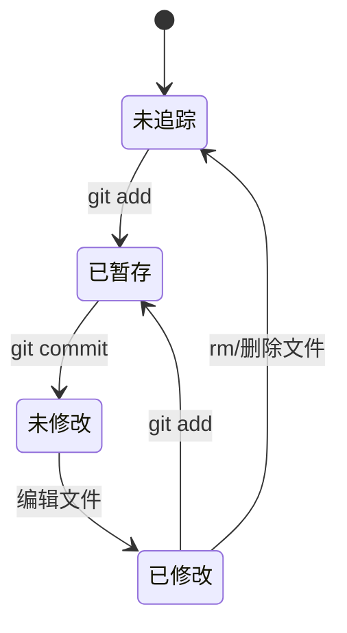

## 2. 状态管理

### 2.1 查看状态

```bash
 git status
```

输出说明：

- `Changes to be committed`：暂存区中的文件（已暂存）
- `Changes not staged for commit`：工作区中已修改但未暂存的文件
- `Untracked files`：未追踪的新文件

### 2.2 简略格式

```bash
 git status -s
```

输出标记：

- `??`：未追踪的文件
- `A`：新添加到暂存区的文件
- `M`：已修改的文件
- `D`：已删除的文件

## 3. 暂存与提交

### 3.1 暂存操作

```bash
 # 暂存单个文件
 git add <file>
 # 暂存所有文件
 git add .
 # 暂存所有已追踪文件的修改
 git add -u
 # 交互式暂存
 git add -p
```

### 3.2 提交操作

```bash
 # 提交暂存区的文件
 git commit -m "commit message"
 # 提交所有已追踪文件的修改（跳过暂存）
 git commit -a -m "commit message"
 # 修改最后一次提交
 git commit --amend -m "new message"
 # 提交空目录（需要在里面添加 .gitkeep）
 git add directory/.gitkeep
 git commit -m "add directory"
```

### 3.3 提交信息规范

推荐格式：

```text
 <type>: <subject>
 <body>
 <footer>
```

类型（type）：

- `feat`：新功能
- `fix`：bug 修复
- `docs`：文档更新
- `style`：格式调整
- `refactor`：重构
- `test`：测试相关
- `chore`：构建/工具相关

## 4. 查看历史

### 4.1 查看提交历史

```bash
 # 查看完整提交历史
 git log
 # 查看简洁的提交历史
 git log --oneline
 # 查看最近 N 次提交
 git log -n 5
 # 查看分支合并历史
 git log --graph --oneline --all
 # 查看特定文件的修改历史
 git log <file>
 # 查看某次提交的详细信息
 git show <commit-hash>
```

### 4.2 查看差异

```bash
 # 查看工作区与暂存区的差异
 git diff
 # 查看暂存区与上次提交的差异
 git diff --cached
 # 查看两个分支的差异
 git diff <branch1>..<branch2>
 # 查看特定文件的差异
 git diff <file>
```

## 5. 标签管理

### 5.1 创建标签

```bash
 # 创建轻量标签
 git tag <tag-name>
 # 创建附注标签
 git tag -a <tag-name> -m "tag message"
 # 为特定提交创建标签
 git tag -a <tag-name> <commit-hash> -m "tag message"
```

### 5.2 查看和操作标签

```bash
 # 查看所有标签
 git tag
 # 查看标签详细信息
 git show <tag-name>
 # 删除标签
 git tag -d <tag-name>
 # 推送标签到远程
 git push <remote-name> <tag-name>
 # 推送所有标签到远程
 git push <remote-name> --tags
 # 检出到特定标签
 git checkout <tag-name>
```

## 6. 撤销操作

### 6.1 撤销工作区修改

```bash
 # 撤销单个文件的修改
 git checkout -- <file>
 # 撤销所有文件的修改
 git checkout -- .
 # 使用 git restore（Git 2.23+）
 git restore <file>
 git restore .
```

### 6.2 撤销暂存

```bash
 # 撤销暂存（保留工作区修改）
 git reset HEAD <file>
 # 使用 git restore（Git 2.23+）
 git restore --staged <file>
```

### 6.3 撤销提交

```bash
 # 软回退：撤销提交，保留修改在暂存区
 git reset --soft HEAD~1
 # 混合回退：撤销提交，保留修改在工作区
 git reset --mixed HEAD~1
 # 硬回退：撤销提交，丢弃所有修改
 git reset --hard HEAD~1
```

### 6.4 使用 git revert

```bash
 # 创建一个新提交来撤销指定提交
 git revert <commit-hash>
 # 撤销多个提交
 git revert <commit-hash1> <commit-hash2>
```

**注意**：`git reset` 会改写历史，已推送到远程的提交不建议使用；`git revert` 是安全的撤销方式，会创建新的提交。

## 7. 远程仓库操作

### 7.1 添加和查看远程仓库

```bash
 # 添加远程仓库
 git remote add origin <url>
 # 查看远程仓库
 git remote -v
 # 修改远程仓库 URL
 git remote set-url origin <new-url>
 # 删除远程仓库
 git remote remove origin
```

### 7.2 推送和拉取

```bash
 # 推送到远程仓库
 git push origin main
 # 拉取远程仓库的更新
 git pull origin main
 # 获取远程仓库的更新（不合并）
 git fetch origin
```

## 8. 日常开发流程

### 8.1 标准开发流程

```bash
 # 1. 拉取最新代码
 git pull origin main
 # 2. 创建功能分支
 git checkout -b feature/new-feature
 # 3. 开发并提交
 git add .
 git commit -m "feat: add new feature"
 # 4. 推送到远程
 git push origin feature/new-feature
 # 5. 合并到主分支
 git checkout main
 git merge feature/new-feature
 git push origin main
 # 6. 删除功能分支
 git branch -d feature/new-feature
```

### 8.2 紧急修复流程

```bash
 # 1. 创建修复分支
 git checkout -b hotfix/fix-bug
 # 2. 修复并提交
 git add .
 git commit -m "fix: fix critical bug"
 # 3. 合并到主分支和开发分支
 git checkout main
 git merge hotfix/fix-bug
 git checkout develop
 git merge hotfix/fix-bug
 # 4. 删除修复分支
 git branch -d hotfix/fix-bug
```

## 9. 最佳实践

### 9.1 提交规范

- **频繁提交**：小步快跑，每次提交只做一件事
- **有意义的提交信息**：使用规范的提交信息格式
- **不要提交半成品**：确保每次提交都是可运行的

### 9.2 分支管理

- **主分支保持稳定**：main 分支始终可部署
- **功能分支开发**：每个功能在独立分支上开发
- **及时合并和删除**：合并后及时删除功能分支

### 9.3 常用快捷命令

| 命令                     | 说明                    |
| ------------------------ | ----------------------- |
| `git stash`              | 暂存当前修改            |
| `git stash pop`          | 恢复暂存的修改          |
| `git stash list`         | 查看暂存列表            |
| `git cherry-pick <hash>` | 选择性合并某个提交      |
| `git rebase main`        | 变基到 main 分支        |
| `git bisect`             | 二分查找引入 bug 的提交 |

---

## 状态查看

**基本写法：查看仓库状态**
`git status`
```bash
# 显示工作区、暂存区文件状态
git status;
```

**简略写法：短格式状态**
`git status -s`
```bash
# 输出 ?? 未追踪 / A 新增暂存 / M 修改 / D 删除
git status -s;
```

---

## 暂存操作

**基本写法：暂存单个文件**
`git add <file>`
```bash
# 暂存指定文件
git add src/index.js;
```

**基本写法：暂存所有变更**
`git add .`
```bash
# 暂存当前目录下所有文件
git add .;
```

**单行写法：暂存多个文件**
`git add <file1> <file2> <file3>`
```bash
# 一次性暂存多个文件
git add src/index.js src/utils.js src/config.js;
```

**换行写法：暂存多个文件**
`git add <file1> <file2> <file3>`
```bash
# 换行书写多个文件
git add src/index.js \
        src/utils.js \
        src/config.js;
```

**基本写法：暂存已追踪文件**
`git add -u`
```bash
# 暂存所有已追踪文件的修改（不含新文件）
git add -u;
```

**基本写法：交互式暂存**
`git add -p`
```bash
# 逐代码块确认是否暂存
git add -p;
```

---

## 提交操作

**基本写法：标准提交**
`git commit -m "<message>"`
```bash
# 提交暂存区内容并附带消息
git commit -m "feat: add login module";
```

**基本写法：跳过暂存提交**
`git commit -a -m "<message>"`
```bash
# 自动暂存已追踪文件并提交
git commit -a -m "fix: resolve crash";
```

**基本写法：修改最后一次提交**
`git commit --amend -m "<message>"`
```bash
# 修改最近一次提交消息
git commit --amend -m "feat: add login module v2";
```

---

## 提交信息规范

**基本写法：约定式提交格式**
`<type>: <subject>`
```text
# type 取值：feat / fix / docs / style / refactor / test / chore
feat: add user authentication
```

---

## 查看历史

**基本写法：查看完整历史**
`git log`
```bash
# 查看完整提交历史
git log;
```

**基本写法：简洁历史**
`git log --oneline`
```bash
# 每条提交一行显示
git log --oneline;
```

**基本写法：限制条数**
`git log -n <count>`
```bash
# 查看最近 5 次提交
git log -n 5;
```

**基本写法：图形化分支历史**
`git log --graph --oneline --all`
```bash
# 查看所有分支的合并图
git log --graph --oneline --all;
```

**基本写法：查看文件历史**
`git log <file>`
```bash
# 查看 src/index.js 的修改历史
git log src/index.js;
```

**基本写法：查看提交详情**
`git show <commit-hash>`
```bash
# 查看指定提交的详情
git show abc1234;
```

---

## 查看差异

**基本写法：工作区与暂存区差异**
`git diff`
```bash
# 查看未暂存的修改
git diff;
```

**基本写法：暂存区与上次提交差异**
`git diff --cached`
```bash
# 查看已暂存但未提交的修改
git diff --cached;
```

**基本写法：分支间差异**
`git diff <branch1>..<branch2>`
```bash
# 比较 main 与 feature 分支差异
git diff main..feature;
```

**基本写法：文件差异**
`git diff <file>`
```bash
# 查看 src/index.js 的修改
git diff src/index.js;
```

---

## 撤销工作区修改

**基本写法：撤销单个文件修改**
`git checkout -- <file>`
```bash
# 撤销 src/index.js 的工作区修改
git checkout -- src/index.js;
```

**基本写法：撤销所有文件修改**
`git checkout -- .`
```bash
# 撤销所有工作区修改
git checkout -- .;
```

**基本写法：使用 restore 撤销**
`git restore <file>`
```bash
# 撤销指定文件修改（Git 2.23+）
git restore src/index.js;
```

---

## 撤销暂存

**基本写法：取消暂存（保留修改）**
`git reset HEAD <file>`
```bash
# 将 src/index.js 移出暂存区
git reset HEAD src/index.js;
```

**基本写法：使用 restore 撤销暂存**
`git restore --staged <file>`
```bash
# 取消暂存但保留工作区修改（Git 2.23+）
git restore --staged src/index.js;
```

---

## 撤销提交

**基本写法：软回退**
`git reset --soft HEAD~<n>`
```bash
# 撤销最近一次提交，修改保留在暂存区
git reset --soft HEAD~1;
```

**基本写法：混合回退**
`git reset --mixed HEAD~<n>`
```bash
# 撤销最近一次提交，修改保留在工作区
git reset --mixed HEAD~1;
```

**基本写法：硬回退**
`git reset --hard HEAD~<n>`
```bash
# 撤销最近一次提交并丢弃修改
git reset --hard HEAD~1;
```

**基本写法：安全撤销（revert）**
`git revert <commit-hash>`
```bash
# 创建反向提交撤销 abc1234
git revert abc1234;
```

**单行写法：撤销多个提交**
`git revert <hash1> <hash2>`
```bash
# 撤销多个不连续的提交
git revert abc1234 def5678;
```

---

## 远程仓库基础

**基本写法：添加远程仓库**
`git remote add <name> <url>`
```bash
# 添加名为 origin 的远程仓库
git remote add origin https://github.com/user/repo.git;
```

**基本写法：查看远程仓库**
`git remote -v`
```bash
# 显示远程仓库名称和地址
git remote -v;
```

**基本写法：修改远程仓库 URL**
`git remote set-url <name> <new-url>`
```bash
# 更新 origin 的 URL
git remote set-url origin https://github.com/user/new-repo.git;
```

**基本写法：删除远程仓库**
`git remote remove <name>`
```bash
# 删除名为 origin 的远程仓库
git remote remove origin;
```

---

## 推送与拉取

**基本写法：推送到远程**
`git push <remote> <branch>`
```bash
# 推送 main 分支到 origin
git push origin main;
```

**基本写法：拉取远程更新**
`git pull <remote> <branch>`
```bash
# 拉取 origin 的 main 分支并合并
git pull origin main;
```

**基本写法：获取远程更新（不合并）**
`git fetch <remote>`
```bash
# 获取 origin 的更新但不合并
git fetch origin;
```

---

## 暂存修改（stash）

**基本写法：暂存当前修改**
`git stash`
```bash
# 暂存当前所有修改
git stash;
```

**基本写法：恢复暂存修改**
`git stash pop`
```bash
# 恢复最近一次暂存的修改并删除该暂存
git stash pop;
```

**基本写法：查看暂存列表**
`git stash list`
```bash
# 查看所有暂存记录
git stash list;
```

---

## 选择性合并

**基本写法：挑选提交合并**
`git cherry-pick <commit-hash>`
```bash
# 将 abc1234 提交应用到当前分支
git cherry-pick abc1234;
```


<!-- ============ 文档分隔线：003-git/004-GitBranchManagement.md ============ -->


## 2. 分支概述

分支是 Git 中非常重要的概念，它允许你在独立的环境中开发新功能或修复 bug，而不影响主分支的稳定性。
分支的核心特点：

- 分支是指向特定提交的指针
- 默认分支为 `master` 或 `main`
- 分支操作轻量快速
- 支持并行开发
- 便于代码审查和测试
  <a id="3"></a>

## 3. 分支操作基础

<a id="3.1"></a>

### 3.1 查看分支

```bash
 # 查看本地分支
 git branch
 # 查看远程分支
 git branch -r
 # 查看所有分支（本地和远程）
 git branch -a
 # 查看分支及其最后一次提交
 git branch -v
```

<a id="3.2"></a>

### 3.2 创建分支

```bash
 # 创建新分支
 git branch <分支名>
```

<a id="3.3"></a>

### 3.3 切换分支

```bash
 # 切换分支
 git checkout <分支名>
 # 或 Git 2.23+ 推荐
 git switch <分支名>
```

<a id="3.4"></a>

### 3.4 创建并切换分支

```bash
 # 创建并切换分支
 git checkout -b <分支名>
 # 或 Git 2.23+ 推荐
 git switch -c <分支名>
```

<a id="3.5"></a>

### 3.5 合并分支

```bash
 # 合并分支到当前分支
 git merge <分支名>
 # 快速合并（Fast-forward）
 # 当主分支没有新提交时，会执行快速合并
 git checkout main
 git merge feature/login
 # 三方合并（3-way merge）
 # 当主分支有新提交时，会执行三方合并
 git checkout main
 git merge feature/payment
```

#### 3.5.1 合并策略

```bash
 # 使用策略合并
 git merge --strategy-option theirs feature/branch # 优先使用对方分支的修改
 git merge --strategy-option ours feature/branch # 优先使用当前分支的修改
 # 递归策略（默认）
 git merge --strategy recursive feature/branch
 # 章鱼策略（适合合并多个分支）
 git merge --strategy octopus feature1 feature2 feature3
```

<a id="3.6"></a>

### 3.6 删除分支

```bash
 # 删除分支（仅当分支已合并）
 git branch -d <分支名>
 # 强制删除分支（无论是否合并）
 git branch -D <分支名>
 # 删除远程分支
 git push <远程仓库名> --delete <分支名>
```

<a id="3.7"></a>

### 3.7 重命名分支

```bash
 # 重命名分支
 git branch -m <旧分支名> <新分支名>
```

<a id="3.8"></a>

### 3.8 设置上游分支

```bash
 # 设置分支的上游分支
 git branch --set-upstream-to=origin/<远程分支名> <本地分支名>
 # 首次推送时设置上游分支
 git push -u <远程仓库名> <本地分支名>
```

<a id="4"></a>

## 4. 分支命名规范

| 分支类型     | 命名格式        | 示例                  | 说明                     |
| ------------ | --------------- | --------------------- | ------------------------ |
| 功能分支     | feature/功能名  | feature/login         | 用于开发新功能           |
| Bug 修复分支 | bugfix/问题描述 | bugfix/login-error    | 用于修复 bug             |
| 紧急修复分支 | hotfix/紧急修复 | hotfix/security-patch | 用于紧急修复生产环境问题 |
| 发布分支     | release/版本号  | release/v1.0.0        | 用于准备发布             |
| 开发分支     | develop         | develop               | 用于集成新功能           |
| 主分支       | main/master     | main                  | 保持稳定，只用于发布     |

<a id="5"></a>

## 5. 分支管理策略

<a id="5.1"></a>

### 5.1 集中式工作流

- 所有开发者直接在主分支上工作
- 适合小型团队和简单项目
- 优点：简单直接
- 缺点：容易产生冲突，不利于代码审查
  <a id="5.2"></a>

### 5.2 功能分支工作流

- 为每个功能创建单独的分支
- 完成后合并到主分支
- 适合大多数项目
- 优点：隔离开发，便于代码审查
- 缺点：需要更多的分支管理
  <a id="5.3"></a>

### 5.3 GitFlow 工作流

GitFlow 是一种详细的分支管理策略，适合大型项目和复杂的发布周期。

#### 5.3.1 GitFlow 分支结构

- **main/master**：主分支，保持稳定，只用于发布
- **develop**：开发分支，集成所有功能分支
- **feature/**：功能分支，从 develop 分支创建
- **release/**：发布分支，从 develop 分支创建
- **hotfix/**：热修复分支，从 main 分支创建

#### 5.3.2 GitFlow 工作流程

1. **初始化**：创建 main 和 develop 分支
2. **功能开发**：从 develop 创建 feature 分支，完成后合并回 develop
3. **发布准备**：从 develop 创建 release 分支，进行测试和修复
4. **发布**：将 release 分支合并到 main 和 develop
5. **热修复**：从 main 创建 hotfix 分支，完成后合并到 main 和 develop

#### 5.3.3 GitFlow 示例

```bash
 # 初始化 GitFlow
 git flow init
 # 创建功能分支
 git flow feature start login
 # 完成功能分支
 git flow feature finish login
 # 创建发布分支
 git flow release start v1.0.0
 # 完成发布分支
 git flow release finish v1.0.0
 # 创建热修复分支
 git flow hotfix start security-patch
 # 完成热修复分支
 git flow hotfix finish security-patch
```

<a id="5.4"></a>

### 5.4 Forking 工作流

- 开发者 fork 远程仓库
- 在自己的 fork 中工作
- 通过 Pull Request 贡献代码
- 适合开源项目
- 优点：适合多人协作，权限管理简单
- 缺点：流程相对复杂
  <a id="6"></a>

## 6. 解决分支冲突

当合并分支时，如果两个分支对同一文件的同一部分进行了不同修改，就会产生冲突。
解决冲突的步骤：

1. **查看冲突文件**：

```bash
 git diff
```

2. **手动编辑冲突文件**：
   冲突文件中会包含以下标记：

```
 <<<<<<<< HEAD
 当前分支的内容
 =======
 要合并的分支的内容
 >>>>>>> 分支名
```

手动编辑文件，保留需要的内容，删除冲突标记。3. **添加解决后的文件**：

```bash
 git add .
```

4. **完成合并**：

```bash
 git commit
```

5. **放弃合并**（如果需要）：

```bash
 git merge --abort
```

<a id="7"></a>

## 7. 分支最佳实践

### 7.1 分支管理最佳实践

1. **主分支保持稳定**：

- 主分支只用于发布
- 不直接在主分支上开发
- 所有修改通过分支合并

2. **使用功能分支**：

- 为每个功能创建单独的分支
- 分支名清晰描述功能
- 分支生命周期与功能开发周期一致

3. **定期同步**：

- 定期将主分支合并到功能分支
- 减少冲突概率
- 确保功能分支包含最新代码

4. **及时清理**：

- 功能完成后删除对应的分支
- 保持分支列表整洁
- 定期清理远程分支

5. **分支策略选择**：

- 小型项目：集中式或功能分支工作流
- 中型项目：功能分支工作流
- 大型项目：GitFlow 工作流
- 开源项目：Forking 工作流

6. **代码审查**：

- 使用 Pull Request 进行代码审查
- 确保代码质量
- 多人参与审查

### 7.2 实际项目案例

#### 7.2.1 小型项目（个人或小团队）

```bash
 # 初始化仓库
 git init
 # 创建并切换到功能分支
 git checkout -b feature/login
 # 开发完成后合并到主分支
 git checkout main
 git merge feature/login
 # 删除功能分支
 git branch -d feature/login
```

#### 7.2.2 中型项目（团队协作）

```bash
 # 从远程仓库克隆
 git clone <远程仓库URL>
 # 创建功能分支
 git checkout -b feature/payment
 # 定期同步主分支
 git checkout feature/payment
 git pull origin main
 # 完成后推送到远程
 git push origin feature/payment
 # 创建 Pull Request 进行代码审查
 # 合并后删除本地分支
 git branch -d feature/payment
```

#### 7.2.3 大型项目（GitFlow）

```bash
 # 初始化 GitFlow
 git flow init
 # 创建功能分支
 git flow feature start user-profile
 # 开发完成
 git flow feature finish user-profile
 # 创建发布分支
 git flow release start v2.0.0
 # 完成发布
 git flow release finish v2.0.0
 # 紧急修复
 git flow hotfix start critical-bug
```

<a id="8"></a>

## 8. 总结

分支管理是 Git 的核心功能之一，通过合理的分支管理，可以提高开发效率，减少冲突，确保代码质量。

- **分支操作**：掌握创建、切换、合并、删除分支的基本操作
- **分支命名**：遵循规范的分支命名约定
- **分支策略**：根据项目特点选择合适的分支管理策略
- **冲突解决**：掌握解决分支冲突的方法
- **最佳实践**：遵循分支管理的最佳实践
  通过熟练掌握分支管理，可以更好地组织代码开发流程，提高团队协作效率。
## 查看分支

**基本写法：查看本地分支**
`git branch`
```bash
# 列出本地所有分支
git branch;
```

**基本写法：查看远程分支**
`git branch -r`
```bash
# 列出所有远程分支
git branch -r;
```

**基本写法：查看所有分支**
`git branch -a`
```bash
# 列出本地和远程所有分支
git branch -a;
```

**基本写法：查看分支详情**
`git branch -v`
```bash
# 显示分支名、哈希、提交消息
git branch -v;
```

---

## 创建分支

**基本写法：创建新分支**
`git branch <分支名>`
```bash
# 创建 feature/login 分支
git branch feature/login;
```

---

## 切换分支

**基本写法：切换分支**
`git checkout <分支名>`
```bash
# 切换到 feature/login 分支
git checkout feature/login;
```

**基本写法：使用 switch 切换**
`git switch <分支名>`
```bash
# 切换到 develop 分支（Git 2.23+）
git switch develop;
```

---

## 创建并切换分支

**基本写法：创建并切换**
`git checkout -b <分支名>`
```bash
# 创建并切换到 feature/login 分支
git checkout -b feature/login;
```

**基本写法：使用 switch 创建并切换**
`git switch -c <分支名>`
```bash
# 创建并切换到 feature/payment 分支（Git 2.23+）
git switch -c feature/payment;
```

---

## 合并分支

**基本写法：合并到当前分支**
`git merge <分支名>`
```bash
# 将 feature/login 合并到当前分支
git merge feature/login;
```

**基本写法：快速合并（Fast-forward）**
`git merge <分支名>`
```bash
# 切换到 main 后合并 feature/login
git checkout main;
git merge feature/login;
```

**基本写法：三方合并（3-way merge）**
`git merge <分支名>`
```bash
# 切换到 main 后合并 feature/payment
git checkout main;
git merge feature/payment;
```

---

## 合并策略

**基本写法：优先对方分支修改**
`git merge --strategy-option theirs <分支名>`
```bash
# 冲突时优先使用对方分支的修改
git merge --strategy-option theirs feature/branch;
```

**基本写法：优先当前分支修改**
`git merge --strategy-option ours <分支名>`
```bash
# 冲突时优先使用当前分支的修改
git merge --strategy-option ours feature/branch;
```

**基本写法：递归策略**
`git merge --strategy recursive <分支名>`
```bash
# 显式指定递归策略
git merge --strategy recursive feature/branch;
```

**单行写法：章鱼策略合并多个分支**
`git merge --strategy octopus <分支1> <分支2> <分支3>`
```bash
# 同时合并多个分支
git merge --strategy octopus feature1 feature2 feature3;
```

**换行写法：章鱼策略合并多个分支**
`git merge --strategy octopus <分支1> <分支2> <分支3>`
```bash
# 换行书写多个分支
git merge --strategy octopus feature1 \
                          feature2 \
                          feature3;
```

---

## 删除分支

**基本写法：安全删除**
`git branch -d <分支名>`
```bash
# 删除已合并的 feature/login 分支
git branch -d feature/login;
```

**基本写法：强制删除**
`git branch -D <分支名>`
```bash
# 强制删除未合并的 feature/login 分支
git branch -D feature/login;
```

**基本写法：删除远程分支**
`git push <远程仓库名> --delete <分支名>`
```bash
# 删除 origin 上的 feature/login 分支
git push origin --delete feature/login;
```

---

## 重命名分支

**基本写法：重命名分支**
`git branch -m <旧分支名> <新分支名>`
```bash
# 将 feature/old 重命名为 feature/new
git branch -m feature/old feature/new;
```

---

## 设置上游分支

**基本写法：设置已有分支上游**
`git branch --set-upstream-to=<远程仓库名>/<远程分支名> <本地分支名>`
```bash
# 将本地 feature/login 关联到 origin/feature/login
git branch --set-upstream-to=origin/feature/login feature/login;
```

**基本写法：首次推送时设置上游**
`git push -u <远程仓库名> <本地分支名>`
```bash
# 推送 feature/login 并设置上游
git push -u origin feature/login;
```

---

## 分支命名规范

**基本写法：命名格式约定**
`<type>/<描述>`
```text
# 功能分支：feature/login
# 修复分支：bugfix/login-error
# 紧急修复：hotfix/security-patch
# 发布分支：release/v1.0.0
# 开发分支：develop
# 主分支：main / master
```

---

## GitFlow 工作流

**基本写法：初始化 GitFlow**
`git flow init`
```bash
# 初始化 GitFlow 工作流
git flow init;
```

**基本写法：创建功能分支**
`git flow feature start <功能名>`
```bash
# 创建功能分支
git flow feature start login;
```

**基本写法：完成功能分支**
`git flow feature finish <功能名>`
```bash
# 完成功能分支
git flow feature finish login;
```

**基本写法：创建发布分支**
`git flow release start <版本号>`
```bash
# 创建发布分支
git flow release start v1.0.0;
```

**基本写法：完成发布分支**
`git flow release finish <版本号>`
```bash
# 完成发布分支
git flow release finish v1.0.0;
```

**基本写法：创建热修复分支**
`git flow hotfix start <修复名>`
```bash
# 创建热修复分支
git flow hotfix start security-patch;
```

**基本写法：完成热修复分支**
`git flow hotfix finish <修复名>`
```bash
# 完成热修复分支
git flow hotfix finish security-patch;
```

---

## 解决分支冲突

**基本写法：查看冲突文件**
`git diff`
```bash
# 查看冲突详情
git diff;
```

**基本写法：冲突标记格式**
`<<<<<<< HEAD ... ======= ... >>>>>>> <分支名>`
```text
# 冲突标记格式
<<<<<<< HEAD
当前分支的内容
=======
要合并的分支的内容
>>>>>>> feature/login
```

**基本写法：标记冲突已解决**
`git add .`
```bash
# 将解决冲突后的文件加入暂存区
git add .;
```

**基本写法：完成合并提交**
`git commit`
```bash
# 提交合并结果
git commit;
```

**基本写法：放弃合并**
`git merge --abort`
```bash
# 放弃当前合并操作
git merge --abort;
```


<!-- ============ 文档分隔线：003-git/005-GitRemoteRepoOperation.md ============ -->


## 2. 远程仓库概述

远程仓库是存储在网络或其他位置的 Git 仓库副本，用于团队协作和代码共享。它是 Git 分布式版本控制系统的重要组成部分，使得多人可以协同开发同一个项目。

### 2.1 远程仓库类型

| 类型           | 示例                     | 特点                         | 适用场景               |
| -------------- | ------------------------ | ---------------------------- | ---------------------- |
| 公共托管平台   | GitHub、GitLab、Gitee    | 易于使用，提供丰富的协作功能 | 开源项目、团队协作     |
| 企业内部服务器 | GitLab Enterprise、Gitea | 完全控制，安全性高           | 企业内部项目、敏感代码 |
| 个人服务器     | 自搭建 Git 服务器        | 完全自定义，成本低           | 个人项目、小团队       |

### 2.2 远程仓库的主要作用

- **代码共享**：团队成员可以获取和贡献代码
- **备份**：提供代码的远程备份，防止本地代码丢失
- **协作**：支持多人同时开发，提高开发效率
- **代码审查**：通过 Pull Request 等机制进行代码审查
- **持续集成**：与 CI/CD 工具集成，自动化测试和部署

### 2.3 远程仓库协议

- **HTTPS**：使用用户名密码或令牌认证，适合大多数场景
- **SSH**：使用 SSH 密钥认证，更安全，不需要每次输入密码
- **Git**：使用 Git 协议，速度快但安全性较低
- **本地协议**：使用本地文件系统，适合单机多仓库场景
  <a id="3"></a>

## 3. 远程仓库管理

<a id="3.1"></a>

### 3.1 添加远程仓库

```bash
 # 添加远程仓库
 git remote add <远程仓库名> <仓库地址>
 # 示例：添加名为 origin 的远程仓库
 git remote add origin https://github.com/username/repository.git
```

<a id="3.2"></a>

### 3.2 查看远程仓库信息

```bash
 # 查看远程仓库信息
 git remote -v
 # 查看远程仓库详细信息
 git remote show <远程仓库名>
```

<a id="3.3"></a>

### 3.3 重命名远程仓库

```bash
 # 重命名远程仓库
 git remote rename <旧远程仓库名> <新远程仓库名>
 # 示例：将 origin 重命名为 upstream
 git remote rename origin upstream
```

<a id="3.4"></a>

### 3.4 删除远程仓库

```bash
 # 删除远程仓库
 git remote remove <远程仓库名>
 # 示例：删除名为 origin 的远程仓库
 git remote remove origin
```

<a id="3.5"></a>

### 3.5 更新远程仓库 URL

```bash
 # 更新远程仓库的 URL
 git remote set-url <远程仓库名> <新仓库地址>
 # 示例：更新 origin 的 URL
 git remote set-url origin https://github.com/username/new-repository.git
```

<a id="4"></a>

## 4. 推送与拉取

<a id="4.1"></a>

### 4.1 首次推送

首次推送时，需要设置上游分支：

```bash
 # 首次推送到远程仓库并设置上游分支
 git push -u <远程仓库名> <本地分支名>:<远程分支名>
 # 示例：首次推送到 origin 的 main 分支
 git push -u origin main
```

<a id="4.2"></a>

### 4.2 后续推送

首次推送成功后，后续推送可以简化：

```bash
 # 推送到远程仓库（已设置上游分支）
 git push
 # 推送指定分支
 git push <远程仓库名> <本地分支名>:<远程分支名>
 # 推送所有分支
 git push --all <远程仓库名>
 # 强制推送（谨慎使用）
 git push -f <远程仓库名> <分支名>
```

<a id="4.3"></a>

### 4.3 拉取远程更改

```bash
 # 拉取远程仓库（已设置上游分支）
 git pull
 # 拉取指定分支
 git pull <远程仓库名> <远程分支名>:<本地分支名>
 # 拉取并允许合并不相关历史
 git pull --allow-unrelated-histories
```

<a id="4.4"></a>

### 4.4 获取远程更改

```bash
 # 从远程仓库获取所有更新
 git fetch <远程仓库名>
 # 获取所有远程仓库的更新
 git fetch --all
 # 查看获取的远程分支
 git branch -r
```

<a id="5"></a>

## 5. 远程分支管理

```bash
 # 查看远程分支
 git branch -r
 # 从远程分支创建本地分支
 git checkout -b <本地分支名> <远程仓库名>/<远程分支名>
 # 跟踪远程分支
 git branch --set-upstream-to=<远程仓库名>/<远程分支名> <本地分支名>
 # 删除远程分支
 git push <远程仓库名> --delete <分支名>
```

<a id="6"></a>

## 6. 常见远程操作问题与解决方案

| 问题                                           | 原因                         | 解决方案                                                       |
| ---------------------------------------------- | ---------------------------- | -------------------------------------------------------------- |
| `fatal: No configured push destination`        | 未关联远程仓库               | 执行 `git remote add origin <仓库地址>` 关联远程仓库           |
| `error: failed to push some refs to`           | 远程仓库有本地没有的提交     | 先执行 `git pull` 拉取远程代码，解决冲突后再推送               |
| `fatal: refusing to merge unrelated histories` | 本地仓库和远程仓库历史不相关 | 执行 `git pull --allow-unrelated-histories` 允许合并不相关历史 |
| 推送超时                                       | 网络连接不稳定或文件过大     | 增加 `http.postBuffer` 值，或检查网络连接                      |
| 权限错误                                       | 没有远程仓库的访问权限       | 检查 SSH 密钥或 HTTPS 凭证，确保有正确的权限                   |

<a id="7"></a>

## 7. 远程仓库最佳实践

### 7.1 基础最佳实践

1. **使用有意义的远程仓库名**：

- `origin`：默认的远程仓库
- `upstream`：上游仓库（用于开源项目）
- `backup`：备份仓库

2. **定期同步远程更改**：

- 开始工作前执行 `git pull`
- 推送前执行 `git pull`，避免冲突
- 定期执行 `git fetch --all` 了解远程仓库状态

3. **合理使用推送命令**：

- 首次推送使用 `-u` 参数设置上游分支
- 后续推送直接使用 `git push`
- 谨慎使用 `git push -f` 强制推送，避免覆盖他人代码

4. **使用 SSH 协议**：

- SSH 协议更安全，不需要每次输入密码
- 配置 SSH 密钥后可以无密码访问远程仓库

5. **备份远程仓库**：

- 定期备份远程仓库
- 考虑使用多个远程仓库作为备份
- 重要项目使用镜像仓库

6. **远程仓库管理**：

- 定期清理不需要的远程分支
- 保持远程仓库的整洁
- 定期检查远程仓库的大小和健康状态

### 7.2 SSH 密钥配置

#### 7.2.1 生成 SSH 密钥

```bash
 # 生成 SSH 密钥对
 ssh-keygen -t ed25519 -C "your_email@example.com"
 # 或使用 RSA 算法（兼容性更好）
 ssh-keygen -t rsa -b 4096 -C "your_email@example.com"
```

#### 7.2.2 查看 SSH 公钥

```bash
 # 查看 SSH 公钥
 cat ~/.ssh/id_ed25519.pub
 # 或
 cat ~/.ssh/id_rsa.pub
```

#### 7.2.3 添加 SSH 公钥到远程平台

1. 复制公钥内容
2. 登录 GitHub/GitLab/Gitee 等平台
3. 进入设置 → SSH 密钥
4. 添加新的 SSH 密钥，粘贴公钥内容

#### 7.2.4 测试 SSH 连接

```bash
 # 测试 GitHub 连接
 ssh -T git@github.com
 # 测试 GitLab 连接
 ssh -T git@gitlab.com
 # 测试 Gitee 连接
 ssh -T git@gitee.com
```

### 7.3 高级远程操作技巧

#### 7.3.1 推送特定提交

```bash
 # 推送特定提交到远程分支
 git push <远程仓库名> <提交哈希>:<远程分支名>
```

#### 7.3.2 推送标签

```bash
 # 推送所有标签
 git push --tags <远程仓库名>
 # 推送特定标签
 git push <远程仓库名> <标签名>
```

#### 7.3.3 同步远程分支

```bash
 # 同步远程分支（删除本地不存在的远程分支）
 git fetch --prune <远程仓库名>
 # 同步所有远程仓库
 git fetch --all --prune
```

### 7.4 实际项目案例

#### 7.4.1 开源项目贡献

```bash
 # Fork 远程仓库到自己的账户
 # 克隆自己的 Fork
 git clone https://github.com/your-username/repository.git
 # 添加上游仓库
 git remote add upstream https://github.com/original-owner/repository.git
 # 同步上游仓库
 git fetch upstream
 git checkout main
 git merge upstream/main
 # 创建功能分支
 git checkout -b feature/new-feature
 # 开发完成后推送到自己的仓库
 git push origin feature/new-feature
 # 创建 Pull Request 到上游仓库
```

#### 7.4.2 多远程仓库管理

```bash
 # 添加多个远程仓库
 git remote add origin https://github.com/username/repository.git
 git remote add backup https://gitee.com/username/repository.git
 # 推送到多个远程仓库
 git push origin main
 git push backup main
 # 从特定远程仓库拉取
 git pull backup main
```

<a id="8"></a>

## 8. 总结

远程仓库操作是 Git 协作开发的核心，掌握这些操作可以有效地进行团队协作和代码共享。

- **远程仓库管理**：添加、查看、重命名和删除远程仓库
- **推送与拉取**：将本地更改推送到远程，从远程获取更改
- **远程分支管理**：管理远程分支，跟踪远程分支
- **问题解决**：解决常见的远程操作问题
- **最佳实践**：遵循远程仓库操作的最佳实践
  通过熟练掌握远程仓库操作，可以更好地进行团队协作，提高开发效率。

## 添加远程仓库

**基本写法：添加远程仓库**
`git remote add <远程仓库名> <仓库地址>`
```bash
# 添加名为 origin 的远程仓库
git remote add origin https://github.com/username/repository.git;
```

---

## 查看远程仓库信息

**基本写法：查看远程仓库列表**
`git remote -v`
```bash
# 列出所有远程仓库
git remote -v;
```

**基本写法：查看远程仓库详情**
`git remote show <远程仓库名>`
```bash
# 查看 origin 的详细信息
git remote show origin;
```

---

## 重命名远程仓库

**基本写法：重命名远程仓库**
`git remote rename <旧远程仓库名> <新远程仓库名>`
```bash
# 将 origin 重命名为 upstream
git remote rename origin upstream;
```

---

## 删除远程仓库

**基本写法：删除远程仓库**
`git remote remove <远程仓库名>`
```bash
# 删除名为 origin 的远程仓库
git remote remove origin;
```

---

## 更新远程仓库 URL

**基本写法：更新远程仓库 URL**
`git remote set-url <远程仓库名> <新仓库地址>`
```bash
# 更新 origin 的 URL
git remote set-url origin https://github.com/username/new-repository.git;
```

---

## 首次推送

**基本写法：首次推送并设置上游**
`git push -u <远程仓库名> <本地分支名>:<远程分支名>`
```bash
# 首次推送到 origin 的 main 分支并设置上游
git push -u origin main;
```

---

## 后续推送

**基本写法：简化推送**
`git push`
```bash
# 推送到默认上游分支
git push;
```

**基本写法：推送指定分支**
`git push <远程仓库名> <本地分支名>:<远程分支名>`
```bash
# 推送本地 feature 到远程 feature
git push origin feature:feature;
```

**基本写法：推送所有分支**
`git push --all <远程仓库名>`
```bash
# 推送所有分支到 origin
git push --all origin;
```

**基本写法：强制推送**
`git push -f <远程仓库名> <分支名>`
```bash
# 强制推送 main 分支
git push -f origin main;
```

---

## 拉取远程更改

**基本写法：拉取并合并**
`git pull`
```bash
# 拉取默认上游分支并合并
git pull;
```

**基本写法：拉取指定分支**
`git pull <远程仓库名> <远程分支名>:<本地分支名>`
```bash
# 拉取 origin 的 main 分支到本地 main
git pull origin main:main;
```

**基本写法：允许合并不相关历史**
`git pull --allow-unrelated-histories`
```bash
# 拉取并合并不相关历史
git pull --allow-unrelated-histories;
```

---

## 获取远程更改

**基本写法：获取所有更新**
`git fetch <远程仓库名>`
```bash
# 获取 origin 的所有更新
git fetch origin;
```

**基本写法：获取所有远程仓库更新**
`git fetch --all`
```bash
# 获取所有远程仓库的更新
git fetch --all;
```

**基本写法：查看获取的远程分支**
`git branch -r`
```bash
# 列出所有远程分支
git branch -r;
```

---

## 远程分支管理

**基本写法：从远程分支创建本地分支**
`git checkout -b <本地分支名> <远程仓库名>/<远程分支名>`
```bash
# 基于 origin/feature 创建本地 feature 分支
git checkout -b feature origin/feature;
```

**基本写法：跟踪远程分支**
`git branch --set-upstream-to=<远程仓库名>/<远程分支名> <本地分支名>`
```bash
# 将本地 main 跟踪 origin/main
git branch --set-upstream-to=origin/main main;
```

**基本写法：删除远程分支**
`git push <远程仓库名> --delete <分支名>`
```bash
# 删除 origin 上的 feature 分支
git push origin --delete feature;
```

---

## SSH 密钥配置

**基本写法：生成 ed25519 SSH 密钥**
`ssh-keygen -t <算法> -C "<注释>"`
```bash
# 生成 ed25519 算法的 SSH 密钥
ssh-keygen -t ed25519 -C "your_email@example.com";
```

**基本写法：生成 RSA SSH 密钥**
`ssh-keygen -t <算法> -b <位数> -C "<注释>"`
```bash
# 生成 RSA 算法的 SSH 密钥
ssh-keygen -t rsa -b 4096 -C "your_email@example.com";
```

**基本写法：查看 ed25519 SSH 公钥**
`cat ~/.ssh/<密钥文件>.pub`
```bash
# 查看 ed25519 公钥
cat ~/.ssh/id_ed25519.pub;
```

**基本写法：查看 RSA SSH 公钥**
`cat ~/.ssh/<密钥文件>.pub`
```bash
# 查看 RSA 公钥
cat ~/.ssh/id_rsa.pub;
```

**基本写法：测试 GitHub SSH 连接**
`ssh -T git@<域名>`
```bash
# 测试 GitHub 连接
ssh -T git@github.com;
```

**基本写法：测试 GitLab SSH 连接**
`ssh -T git@<域名>`
```bash
# 测试 GitLab 连接
ssh -T git@gitlab.com;
```

---

## 高级远程操作

**基本写法：推送特定提交**
`git push <远程仓库名> <提交哈希>:<远程分支名>`
```bash
# 将 abc1234 提交推送到 origin 的 main 分支
git push origin abc1234:main;
```

**基本写法：推送所有标签**
`git push --tags <远程仓库名>`
```bash
# 推送所有标签到 origin
git push --tags origin;
```

**基本写法：推送特定标签**
`git push <远程仓库名> <标签名>`
```bash
# 推送 v1.0.0 标签到 origin
git push origin v1.0.0;
```

**基本写法：同步远程分支（清理）**
`git fetch --prune <远程仓库名>`
```bash
# 同步 origin 并清理已删除的远程分支
git fetch --prune origin;
```

**基本写法：同步所有远程仓库并清理**
`git fetch --all --prune`
```bash
# 同步所有远程仓库并清理
git fetch --all --prune;
```

---

## 多远程仓库管理

**基本写法：添加主仓库**
`git remote add <名称> <地址>`
```bash
# 添加主仓库 origin
git remote add origin https://github.com/username/repository.git;
```

**基本写法：添加备份仓库**
`git remote add <名称> <地址>`
```bash
# 添加备份仓库 backup
git remote add backup https://gitee.com/username/repository.git;
```

**基本写法：推送到主仓库**
`git push <远程仓库名> <分支名>`
```bash
# 推送到主仓库 origin
git push origin main;
```

**基本写法：推送到备份仓库**
`git push <远程仓库名> <分支名>`
```bash
# 推送到备份仓库 backup
git push backup main;
```

**基本写法：从特定远程拉取**
`git pull <远程仓库名> <分支名>`
```bash
# 从备份仓库拉取 main 分支
git pull backup main;
```


<!-- ============ 文档分隔线：003-git/006-DistributedVCSPrinciple.md ============ -->


## 1. 分布式架构

### 1.1 集中式 vs 分布式

**集中式版本控制（CVCS）**：

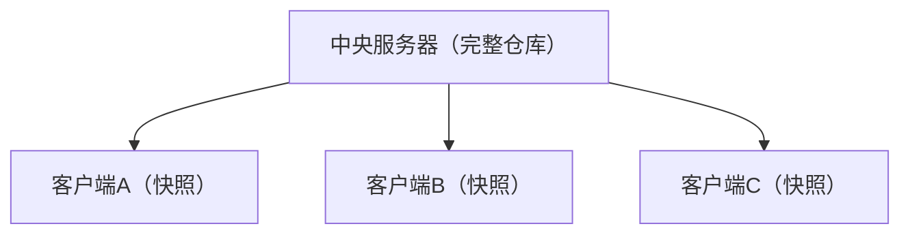

- 所有操作必须联网
- 中央服务器是单点故障
- 分支和标签是服务器端概念

**分布式版本控制（DVCS）**：

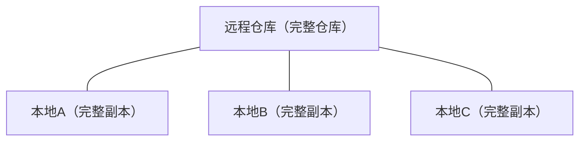

- 每个克隆都是完整仓库
- 离线可执行所有操作
- 无单点故障

### 1.2 分布式的优势

| 特性           | 集中式       | 分布式     |
| :------------- | :----------- | :--------- |
| **离线工作**   | 不支持       | 完全支持   |
| **分支速度**   | 慢           | 极快       |
| **数据安全**   | 依赖服务器   | 多副本冗余 |
| **协作灵活性** | 中心化       | 多中心     |
| **大规模项目** | 服务器压力大 | 负载分散   |

## 2. 快照与差异

### 2.1 存储模型

Git 不存储文件的**差异**，而是存储文件的**快照**：

- **版本1**：文件 A、B、C 均有完整快照
- **版本2**：B 发生变更，存储 B 的新快照；A 和 C 未变更，通过链接指向版本1的快照
- **版本3**：C 发生变更，存储 C 的新快照；A 和 B' 未变更，通过链接指向之前对应快照

核心机制：未变更的文件不会重复存储，而是通过链接引用之前的快照，从而实现高效去重。

### 2.2 内容寻址存储

Git 使用 **SHA-1 哈希**作为内容的地址：

$$
\text{SHA-1}(\text{content}) = \text{40位十六进制哈希值}
$$

```bash
# 计算文件的 Git 哈希
echo "hello" | git hash-object --stdin
# ce013625030ba8dba906f756967f9e9ca394464a
```

相同内容 → 相同哈希 → 只存储一次（去重）

## 3. 数据完整性

### 3.1 哈希校验

Git 中的每个对象都通过 SHA-1 哈希校验：

blob、tree、commit 三类对象均通过 SHA-1 哈希唯一标识。

任何数据损坏都会被检测到，因为：

- 修改文件内容 → 哈希变化 → blob 对象变化
- 修改目录结构 → tree 哈希变化 → 上层 tree 变化
- 修改提交 → commit 哈希变化 → 后续所有 commit 变化

### 3.2 不可篡改性

Git 的数据模型保证了**历史不可篡改**：

修改任何一个对象会导致其哈希变化，进而使整条哈希链断裂，后续所有提交的哈希都会失效，从而保证历史记录不可篡改。

## 4. 协作模型

### 4.1 同步模型


| 操作      | 方向            | 命令        |
| :-------- | :-------------- | :---------- |
| **fetch** | 远程 → 本地     | `git fetch` |
| **pull**  | 远程 → 工作区   | `git pull`  |
| **push**  | 本地 → 远程     | `git push`  |
| **clone** | 远程 → 完整本地 | `git clone` |

### 4.2 多远程协作

```bash
# 添加多个远程仓库
git remote add origin git@github.com:user/repo.git
git remote add mirror git@gitlab.com:user/repo.git
git remote add upstream git@github.com:original/repo.git

# 从上游同步
git fetch upstream
git merge upstream/main

# 推送到多个远程
git push origin main
git push mirror main
```

### 4.3 去中心化协作

Git 理论上支持**点对点协作**，无需中央服务器：

```bash
# 两个人直接交换补丁
git format-patch -1 HEAD       # 生成补丁文件
git apply < 0001-feature.patch # 应用补丁

# 或通过 bundle 交换
git bundle create repo.bundle --all
git clone repo.bundle cloned-repo
```

## 5. Git 的性能

### 5.1 本地操作的速度

几乎所有 Git 操作都是**本地操作**，不依赖网络：

| 操作         | 数据来源 | 速度           |
| :----------- | :------- | :------------- |
| `git log`    | 本地     | 毫秒级         |
| `git diff`   | 本地     | 毫秒级         |
| `git branch` | 本地     | 微秒级         |
| `git commit` | 本地     | 毫秒级         |
| `git push`   | 网络     | 秒级           |
| `git clone`  | 网络     | 取决于仓库大小 |

### 5.2 压缩存储

Git 使用 zlib 压缩存储对象：

```bash
# 查看仓库大小
du -sh .git

# 查看对象数量
git count-objects -v

# 手动压缩
git gc --aggressive
```

## 6. 与其他 DVCS 对比

| 特性           | Git             | Mercurial  | Bazaar    |
| :------------- | :-------------- | :--------- | :-------- |
| **分支模型**   | 轻量指针        | 命名分支   | 目录分支  |
| **存储效率**   | 高（去重+压缩） | 中等       | 中等      |
| **学习曲线**   | 较陡            | 较平       | 平缓      |
| **大文件支持** | Git LFS         | 大文件扩展 | 原生      |
| **社区规模**   | 最大            | 中等       | 小        |
| **平台支持**   | GitHub/GitLab   | Bitbucket  | Launchpad |


<!-- ============ 文档分隔线：003-git/007-ObjectModel.md ============ -->


## 1. Git 对象概述

### 1.1 四种对象类型

Git 的核心是一个**内容寻址文件系统**，所有数据存储为四种对象：

| 对象类型   | 作用     | 存储内容                    |
| :--------- | :------- | :-------------------------- |
| **blob**   | 文件内容 | 纯文件数据（无文件名）      |
| **tree**   | 目录结构 | 文件名 + blob/tree 引用     |
| **commit** | 提交快照 | tree 引用 + 父提交 + 元数据 |
| **tag**    | 标签     | 指向 commit 的命名引用      |

### 1.2 对象关系图

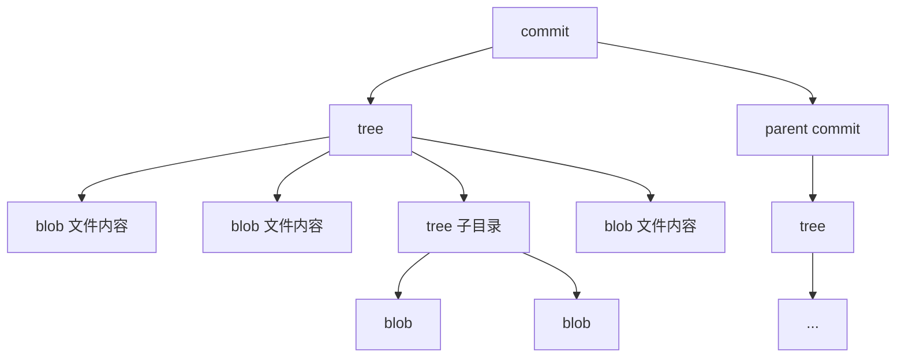

## 2. Blob 对象

### 2.1 结构

Blob 存储文件的**纯内容**，不包含文件名和权限：

```
blob <size>\0<content>
```

```bash
# 创建 blob 对象
echo "hello world" | git hash-object -w --stdin
# 3b18e512dba79e4c8300dd08aeb37f8e728b8dad

# 查看 blob 内容
git cat-file -p 3b18e512dba79e4c8300dd08aeb37f8e728b8dad
# hello world

# 查看 blob 类型
git cat-file -t 3b18e512dba79e4c8300dd08aeb37f8e728b8dad
# blob
```

### 2.2 去重机制

相同内容的文件共享同一个 blob：

```bash
# 两个文件内容相同
echo "hello" > a.txt
echo "hello" > b.txt

# 只创建一个 blob 对象
git add a.txt b.txt
git write-tree | xargs git ls-tree -r
# 100644 blob ce013625...    a.txt
# 100644 blob ce013625...    b.txt  ← 同一个 blob
```

## 3. Tree 对象

### 3.1 结构

Tree 存储目录结构，每个条目包含：

```
<mode> <type> <hash>\t<name>
```

```bash
# 查看 tree 对象
git cat-file -p HEAD^{tree}
# 100644 blob a1b2c3d4    README.md
# 100644 blob e5f6g7h8    index.js
# 040000 tree i9j0k1l2    src/
```

### 3.2 文件模式

| 模式     | 类型   | 说明       |
| :------- | :----- | :--------- |
| `100644` | blob   | 普通文件   |
| `100755` | blob   | 可执行文件 |
| `040000` | tree   | 目录       |
| `120000` | blob   | 符号链接   |
| `160000` | commit | 子模块     |

### 3.3 Tree 的嵌套

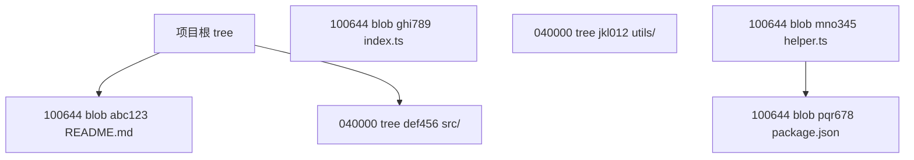

## 4. Commit 对象

### 4.1 结构

```bash
# 查看 commit 对象
git cat-file -p HEAD
# tree 9a1b2c3d4e5f6g7h8i9j0k1l2m3n4o5p6q7r8s9t
# parent a1b2c3d4e5f6g7h8i9j0k1l2m3n4o5p6q7r8s9t0
# author Zhang San <zhang@example.com> 1718342400 +0800
# committer Zhang San <zhang@example.com> 1718342400 +0800
#
# feat: add user authentication
```

### 4.2 Commit 字段

| 字段          | 说明                                |
| :------------ | :---------------------------------- |
| **tree**      | 指向项目根目录的 tree 对象          |
| **parent**    | 指向父提交（合并提交有多个 parent） |
| **author**    | 原始作者 + 时间戳                   |
| **committer** | 实际提交者 + 时间戳                 |
| **message**   | 提交消息                            |

### 4.3 提交链

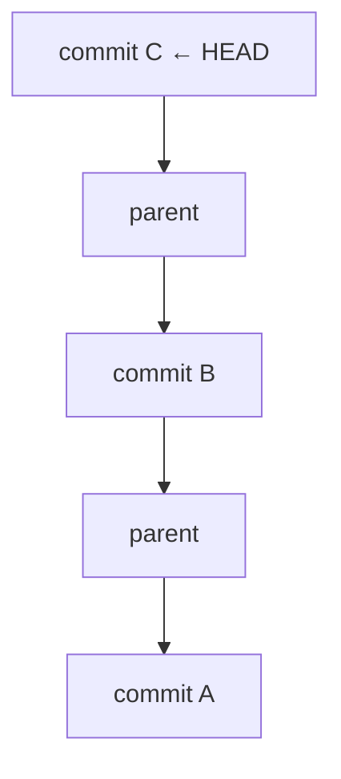

```bash
# 查看提交链
git log --oneline --graph

# 查看合并提交的两个父提交
git cat-file -p <merge-commit-hash>
# parent <first-parent>
# parent <second-parent>
```

## 5. Tag 对象

### 5.1 轻量标签

轻量标签只是一个**指向 commit 的引用**，不创建对象：

```bash
git tag v1.0.0
# .git/refs/tags/v1.0.0 → commit hash
```

### 5.2 附注标签

附注标签创建一个**独立的 tag 对象**：

```bash
git tag -a v1.0.0 -m "Release version 1.0.0"

# 查看 tag 对象
git cat-file -p v1.0.0
# object 9a1b2c3d...
# type commit
# tag v1.0.0
# tagger Zhang San <zhang@example.com> 1718342400 +0800
#
# Release version 1.0.0
```

### 5.3 标签字段

| 字段        | 说明                      |
| :---------- | :------------------------ |
| **object**  | 指向的 commit 对象        |
| **type**    | 对象类型（通常是 commit） |
| **tag**     | 标签名称                  |
| **tagger**  | 打标签的人 + 时间戳       |
| **message** | 标签消息                  |

## 6. 对象存储机制

### 6.1 松散对象

新创建的对象以**松散格式**存储：

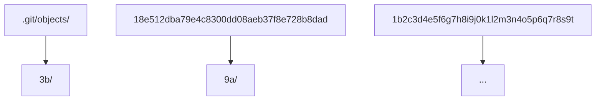

路径 = 哈希前2位/哈希后38位

### 6.2 打包文件

`git gc` 将松散对象打包为**包文件**以节省空间：

```bash
# 手动打包
git gc

# 查看打包文件
ls .git/objects/pack/
# pack-xxxx.idx  pack-xxxx.pack
```

### 6.3 对象查询

```bash
# 查看对象类型
git cat-file -t <hash>

# 查看对象内容
git cat-file -p <hash>

# 查看对象大小
git cat-file -s <hash>

# 查看对象原始内容
git cat-file <hash> | zlib-decompress
```


<!-- ============ 文档分隔线：003-git/008-SHA1IntegrityCheck.md ============ -->


## 1. SHA-1 在 Git 中的作用

### 1.1 内容寻址

Git 使用 SHA-1 哈希作为对象的**唯一标识符**。SHA-1 生成 160 位（20 字节）的哈希值，通常表示为 40 位十六进制字符串。

$$
\text{SHA-1}(x) = h, \quad h \in \{0,1\}^{160}
$$

```bash
# 计算字符串的 SHA-1
echo -n "hello" | openssl sha1
# aaf4c61ddcc5e8a2dabede0f3b482cd9aea9434d

# 计算 Git 对象的 SHA-1（包含类型和长度前缀）
echo "hello" | git hash-object --stdin
# ce013625030ba8dba906f756967f9e9ca394464a
```

### 1.2 三大作用

| 作用     | 说明                           |
| :------- | :----------------------------- |
| **标识** | 每个对象有唯一 ID              |
| **去重** | 相同内容产生相同哈希，只存一份 |
| **校验** | 任何数据变化都会导致哈希变化   |

## 2. 哈希计算过程

### 2.1 Git 对象的哈希

Git 在计算哈希时，会在内容前添加**类型和长度前缀**：

```
SHA-1("blob " + size + "\0" + content)
```

```bash
# 手动计算 blob 的 SHA-1
printf "blob 6\0hello\n" | openssl sha1
# ce013625030ba8dba906f756967f9e9ca394464a

# 与 git hash-object 结果一致
echo "hello" | git hash-object --stdin
# ce013625030ba8dba906f756967f9e9ca394464a
```

### 2.2 各对象类型的哈希

| 对象       | 格式                                | 示例     |
| :--------- | :---------------------------------- | :------- |
| **blob**   | `"blob " + size + "\0" + content`   | 文件内容 |
| **tree**   | `"tree " + size + "\0" + entries`   | 目录条目 |
| **commit** | `"commit " + size + "\0" + content` | 提交信息 |
| **tag**    | `"tag " + size + "\0" + content`    | 标签信息 |

## 3. 完整性校验

### 3.1 哈希链

Git 的对象形成一条**哈希链**，任何篡改都会被检测到：

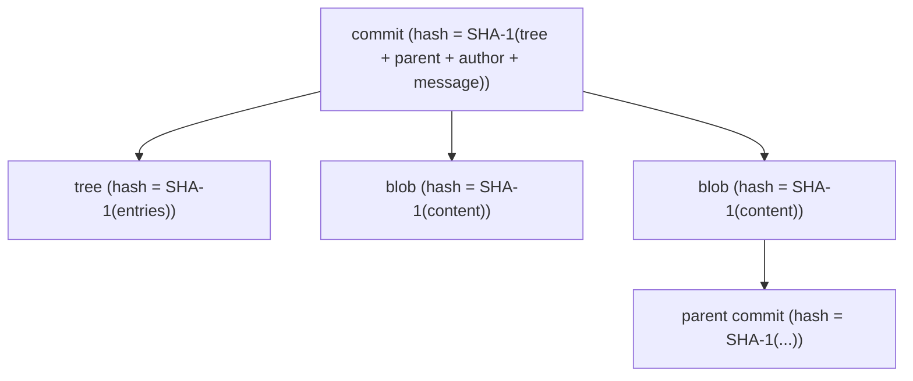

修改任何一个对象 → 其哈希变化 → 引用它的父对象哈希也变化 → 连锁反应直到根提交

### 3.2 fsck 校验

```bash
# 检查仓库完整性
git fsck

# 常见输出
# dangling blob abc1234...  ← 未被引用的 blob
# dangling commit def5678... ← 未被引用的 commit
# missing tree ghi9012...    ← 缺失的 tree 对象
# corrupt object jkl3456...  ← 损坏的对象
```

### 3.3 网络传输校验

```bash
# fetch 时自动校验
git fetch origin
# remote: Enumerating objects: 42, done.
# remote: Counting objects: 100% (42/42), done.
# remote: Compressing objects: 100% (20/20), done.
# remote: Total 42 (delta 15), reused 30 (delta 10), pack-reused 0

# 如果传输中数据损坏，Git 会拒绝接收
# error: object file .git/objects/xx/yyy is empty
# fatal: loose object xxx (expected yyy) is corrupt
```

## 4. 碰撞问题

### 4.1 SHA-1 碰撞

2017 年，Google 和 CWI 研究人员首次实现了 SHA-1 碰撞攻击（SHAttered），成本约 11,000 GPU 年。

$$
P(\text{collision}) \approx \frac{n^2}{2 \times 2^{160}}
$$

对于 Git 来说，碰撞的实际风险极低，因为：

- 需要构造**有意义**的碰撞内容
- Git 对象包含类型前缀，增加了构造难度
- 碰撞攻击需要大量计算资源

### 4.2 Git 的应对

```bash
# Git 2.13+ 检测碰撞攻击
git config --global transfer.shallowHiding true

# 未来可能迁移到 SHA-256
git init --object-format=sha256 my-repo
```

Git 正在开发 SHA-256 支持，但迁移需要兼容期。

## 5. 短哈希

### 5.1 使用短哈希

Git 允许使用哈希的前缀来引用对象：

```bash
# 使用完整哈希
git show 9a1b2c3d4e5f6g7h8i9j0k1l2m3n4o5p6q7r8s9t

# 使用短哈希（通常7位足够）
git show 9a1b2c3

# 自动选择不歧义的最短长度
git log --abbrev-commit
```

### 5.2 歧义检测

```bash
# 检查短哈希是否有歧义
git rev-parse --disambiguate=9a1b2c3

# 查看需要的最短长度
git rev-parse --short=7 HEAD
```

## 6. 实用命令

```bash
# 查看对象的 SHA-1
git rev-parse HEAD              # 当前提交的完整哈希
git rev-parse --short HEAD      # 短哈希
git rev-parse HEAD~3            # 第3个父提交的哈希

# 查看引用指向的哈希
git show-ref                    # 所有引用
git rev-parse --verify main     # main 分支的哈希

# 验证对象完整性
git fsck --full                 # 完整检查
git fsck --connectivity-only    # 只检查连通性（更快）
```


<!-- ============ 文档分隔线：003-git/009-ThreeTrees.md ============ -->


## 1. 三棵树模型

### 1.1 概念图

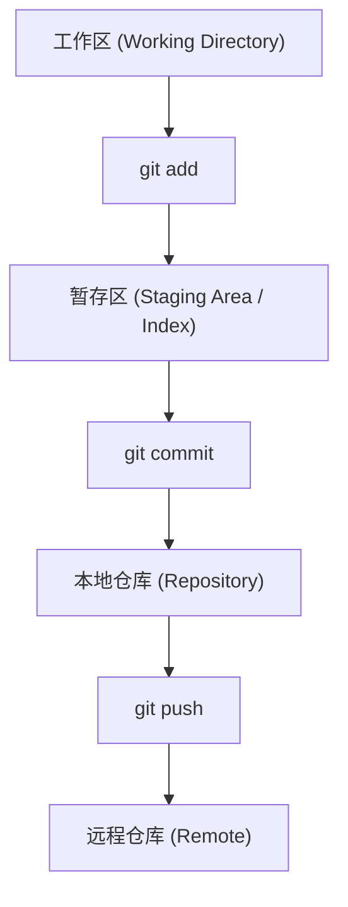

### 1.2 三棵树的定义

| 树           | 位置           | 内容           | 操作                |
| :----------- | :------------- | :------------- | :------------------ |
| **工作区**   | 文件系统       | 实际文件       | 编辑、创建、删除    |
| **暂存区**   | `.git/index`   | 下次提交的快照 | `git add`、`git rm` |
| **本地仓库** | `.git/objects` | 所有提交历史   | `git commit`        |

## 2. 工作区

### 2.1 文件状态

工作区中的文件有四种状态：

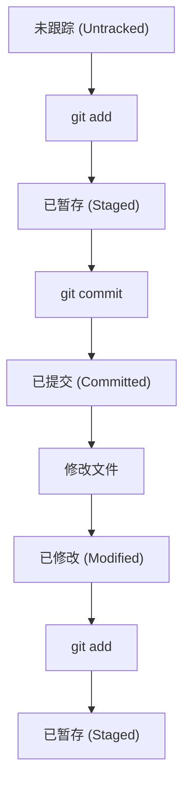

### 2.2 查看状态

```bash
git status
# On branch main
# Changes to be committed:        ← 已暂存
#   modified:   index.js
#
# Changes not staged for commit:  ← 已修改未暂存
#   modified:   README.md
#
# Untracked files:                ← 未跟踪
#   new-feature.js
```

### 2.3 简洁输出

```bash
git status -s
# M  index.js       ← 已暂存的修改
#  M README.md      ← 未暂存的修改
# ?? new-feature.js ← 未跟踪
# A  added.js       ← 新添加到暂存区
# D  deleted.js     ← 已删除（暂存区）
#  D removed.js     ← 已删除（工作区）
# MM both.js        ← 暂存区和工作区都有修改
```

## 3. 暂存区

### 3.1 Index 文件

暂存区存储在 `.git/index` 文件中，是一个**二进制文件**，记录了下次提交的文件快照：

```bash
# 查看暂存区内容
git ls-files -s
# 100644 abc1234 0    README.md
# 100644 def5678 0    src/index.js
# 100644 ghi9012 0    package.json
```

### 3.2 暂存操作

```bash
# 添加文件到暂存区
git add file.txt           # 添加单个文件
git add .                  # 添加所有变更
git add -p file.txt        # 交互式添加部分变更
git add -u                 # 添加已跟踪文件的修改

# 从暂存区移除
git rm --cached file.txt   # 移除跟踪但保留文件
git reset file.txt         # 取消暂存

# 查看暂存区与仓库的差异
git diff --staged
git diff --cached          # 同上
```

### 3.3 部分暂存

```bash
# 交互式添加
git add -p
# Stage this hunk [y,n,q,a,d,/,s,e,?]?
# y - 暂存此块
# n - 不暂存
# s - 分割成更小的块
# e - 手动编辑
```

## 4. 本地仓库

### 4.1 提交到仓库

```bash
# 提交暂存区的内容
git commit -m "feat: add user authentication"

# 提交所有已跟踪文件的修改（跳过 git add）
git commit -a -m "fix: resolve login bug"

# 修改上一次提交
git commit --amend -m "feat: add user auth with tests"
```

### 4.2 查看仓库状态

```bash
# 查看提交历史
git log --oneline -5

# 查看当前提交的 tree
git ls-tree -r HEAD

# 查看引用
git show-ref
```

## 5. 三棵树之间的差异

### 5.1 diff 命令矩阵

| 命令                   | 比较对象         | 说明               |
| :--------------------- | :--------------- | :----------------- |
| `git diff`             | 工作区 vs 暂存区 | 未暂存的修改       |
| `git diff --staged`    | 暂存区 vs 仓库   | 已暂存待提交的修改 |
| `git diff HEAD`        | 工作区 vs 仓库   | 所有未提交的修改   |
| `git diff --name-only` | 仅文件名         | 快速查看变更文件   |

### 5.2 状态转换图

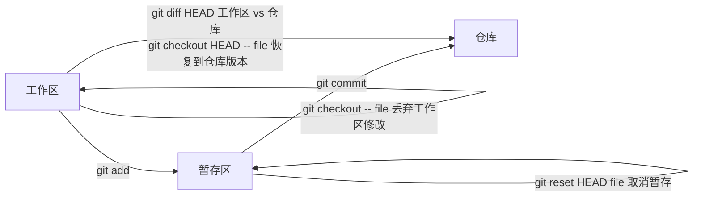

## 6. 常见操作流程

### 6.1 标准工作流

```bash
# 1. 修改文件
vim src/index.js

# 2. 查看状态
git status

# 3. 查看差异
git diff

# 4. 暂存修改
git add src/index.js

# 5. 确认暂存
git diff --staged

# 6. 提交
git commit -m "feat: add new feature"

# 7. 推送
git push origin main
```

### 6.2 修正错误

```bash
# 暂存了错误的文件
git reset HEAD wrong-file.js    # 取消暂存

# 工作区修改错误（未暂存）
git checkout -- file.js         # 恢复到暂存区版本
git restore file.js             # Git 2.23+ 推荐方式

# 提交后发现遗漏
git add forgotten-file.js
git commit --amend --no-edit    # 追加到上次提交

# 完全重置到上次提交
git reset --hard HEAD           # 丢弃所有未提交的修改
```


<!-- ============ 文档分隔线：003-git/010-GitDiffStagingOperation.md ============ -->


## 1. git diff 概述

### 1.1 diff 的三种模式

| 命令                | 比较对象           | 用途                 |
| :------------------ | :----------------- | :------------------- |
| `git diff`          | 工作区 vs 暂存区   | 查看未暂存的修改     |
| `git diff --staged` | 暂存区 vs 最新提交 | 查看已暂存的修改     |
| `git diff <commit>` | 工作区 vs 指定提交 | 查看与指定提交的差异 |

## 2. diff 输出格式

### 2.1 标准输出

```diff
diff --git a/src/index.js b/src/index.js
index abc1234..def5678 100644
--- a/src/index.js
+++ b/src/index.js
@@ -10,7 +10,8 @@ function process(data) {
   const result = transform(data);
   if (result.isValid) {
-    return result.value;
+    const processed = enhance(result.value);
+    return processed;
   }
   return null;
 }
```

### 2.2 输出解读

| 部分                     | 含义                                             |
| :----------------------- | :----------------------------------------------- |
| `diff --git a/... b/...` | 比较的文件路径                                   |
| `index abc1234..def5678` | 对象哈希范围                                     |
| `100644`                 | 文件模式                                         |
| `--- a/src/index.js`     | 原文件                                           |
| `+++ b/src/index.js`     | 新文件                                           |
| `@@ -10,7 +10,8 @@`      | 变更位置（旧文件第10行起7行，新文件第10行起8行） |
| `-` 前缀                 | 删除的行                                         |
| `+` 前缀                 | 新增的行                                         |
| 空格前缀                 | 上下文行                                         |

### 2.3 统计输出

```bash
git diff --stat
#  src/index.js    | 3 ++-
#  src/utils.js    | 5 +++--
#  2 files changed, 4 insertions(+), 4 deletions(-)

git diff --numstat
# 2       1       src/index.js
# 3       2       src/utils.js
# ↑新增行  ↑删除行
```

## 3. 常用 diff 选项

### 3.1 过滤选项

```bash
# 只看文件名
git diff --name-only

# 只看文件名和状态
git diff --name-status
# M  src/index.js      ← Modified
# A  src/new.js        ← Added
# D  src/old.js        ← Deleted

# 按路径过滤
git diff -- src/
git diff -- '*.js'
git diff -- ':(exclude)*.test.js'
```

### 3.2 显示选项

```bash
# 增加上下文行数
git diff -U5              # 5行上下文（默认3行）

# 忽略空白
git diff -w               # 忽略所有空白变化
git diff --ignore-space-at-eol  # 只忽略行尾空白

# 彩色输出
git diff --color-words    # 词语级别的差异高亮
git diff --word-diff      # 词语级别的差异标记

# 函数上下文
git diff -W               # 显示完整函数
```

### 3.3 比较选项

```bash
# 比较两个分支
git diff main..feature

# 比较两个提交
git diff abc1234..def5678

# 比较分支分叉点以来的变化
git diff main...feature   # feature 相对于 main 的变更

# 只看暂存区与 HEAD 的差异
git diff --staged
git diff --cached         # 同上
```

## 4. 高级用法

### 4.1 比较特定文件

```bash
# 比较特定文件在不同提交间的差异
git diff HEAD~3 -- src/index.js

# 比较两个分支的特定文件
git diff main feature -- package.json
```

### 4.2 交互式 diff

```bash
# 逐文件查看 diff
git diff --stat | fzf | xargs -I{} git diff -- {}

# 使用 difftool
git difftool              # 使用配置的 diff 工具
git difftool --tool=vimdiff
```

### 4.3 查看合并冲突的差异

```bash
# 查看冲突标记
git diff --check          # 标记空白错误和冲突标记

# 合并冲突的三方差异
git diff HEAD...MERGE_HEAD
```

## 5. diff 算法

### 5.1 算法选择

```bash
# 默认算法（Myers diff）
git diff

# 耐心算法（更好的人类可读性）
git diff --patience

# 直方图算法
git diff --histogram
```

| 算法          | 特点            | 适用场景 |
| :------------ | :-------------- | :------- |
| **Myers**     | 默认，快速      | 通用     |
| **Patience**  | 关注唯一行匹配  | 代码重构 |
| **Histogram** | Patience 的改进 | 复杂变更 |

### 5.2 重命名检测

```bash
# 检测文件重命名
git diff -M               # 检测重命名（默认50%相似度）
git diff -M50%             # 50%相似度阈值
git diff -M90%             # 90%相似度阈值（更严格）

# 检测文件复制
git diff -C               # 检测复制
git diff -C -M             # 同时检测重命名和复制
```

## 6. 实用别名

```bash
# .gitconfig
[alias]
    d = diff
    ds = diff --staged
    dn = diff --name-only
    dns = diff --staged --name-only
    dw = diff --color-words
    dws = diff --staged --color-words
    dst = diff --stat
    dsts = diff --staged --stat
```
## diff 三种模式

**基本写法：工作区与暂存区差异**
`git diff`
```bash
# 查看工作区与暂存区的差异
git diff;
```

**基本写法：暂存区与最新提交差异**
`git diff --staged`
```bash
# 查看暂存区与 HEAD 的差异
git diff --staged;
```

**基本写法：工作区与指定提交差异**
`git diff <commit>`
```bash
# 查看工作区与 abc1234 提交的差异
git diff abc1234;
```

---

## 统计输出

**基本写法：统计差异**
`git diff --stat`
```bash
# 显示每个文件的增删行数统计
git diff --stat;
```

**基本写法：数字统计**
`git diff --numstat`
```bash
# 输出格式：新增行数 删除行数 文件名
git diff --numstat;
```

---

## 过滤选项

**基本写法：只看文件名**
`git diff --name-only`
```bash
# 列出所有变更的文件名
git diff --name-only;
```

**基本写法：只看文件名和状态**
`git diff --name-status`
```bash
# M 修改 / A 新增 / D 删除
git diff --name-status;
```

**基本写法：按目录路径过滤**
`git diff -- <路径>`
```bash
# 查看 src/ 目录的差异
git diff -- src/;
```

**基本写法：按文件类型过滤**
`git diff -- <模式>`
```bash
# 查看 JavaScript 文件的差异
git diff -- '*.js';
```

**基本写法：排除路径**
`git diff -- ':(exclude)<模式>'`
```bash
# 排除测试文件
git diff -- ':(exclude)*.test.js';
```

---

## 显示选项

**基本写法：增加上下文行数**
`git diff -U<行数>`
```bash
# 显示 5 行上下文（默认 3 行）
git diff -U5;
```

**基本写法：忽略空白**
`git diff -w`
```bash
# 忽略所有空白变化
git diff -w;
```

**基本写法：忽略行尾空白**
`git diff --ignore-space-at-eol`
```bash
# 只忽略行尾空白
git diff --ignore-space-at-eol;
```

**基本写法：词语级别差异**
`git diff --color-words`
```bash
# 词语级别的差异高亮
git diff --color-words;
```

**基本写法：词语差异标记**
`git diff --word-diff`
```bash
# 词语级别的差异标记
git diff --word-diff;
```

**基本写法：函数上下文**
`git diff -W`
```bash
# 显示完整函数的差异
git diff -W;
```

---

## 比较选项

**基本写法：比较两个分支**
`git diff <分支1>..<分支2>`
```bash
# 比较 main 与 feature 分支
git diff main..feature;
```

**基本写法：比较两个提交**
`git diff <提交1>..<提交2>`
```bash
# 比较 abc1234 与 def5678 提交
git diff abc1234..def5678;
```

**基本写法：比较分叉点以来的变化**
`git diff <基础分支>...<目标分支>`
```bash
# feature 相对于 main 的变更
git diff main...feature;
```

**基本写法：暂存区与 HEAD 差异**
`git diff --cached`
```bash
# 查看暂存区与 HEAD 的差异
git diff --cached;
```

---

## 比较特定文件

**基本写法：比较特定文件在不同提交间的差异**
`git diff <提交> -- <文件>`
```bash
# 查看 src/index.js 在最近 3 次提交的差异
git diff HEAD~3 -- src/index.js;
```

**基本写法：比较两个分支的特定文件**
`git diff <分支1> <分支2> -- <文件>`
```bash
# 比较 main 和 feature 分支的 package.json
git diff main feature -- package.json;
```

---

## 交互式 diff

**基本写法：使用 difftool**
`git difftool`
```bash
# 使用默认 diff 工具
git difftool;
```

**基本写法：指定 diff 工具**
`git difftool --tool=<工具名>`
```bash
# 使用 vimdiff 查看差异
git difftool --tool=vimdiff;
```

---

## 查看合并冲突差异

**基本写法：检查冲突标记**
`git diff --check`
```bash
# 检查冲突标记和空白错误
git diff --check;
```

**基本写法：合并冲突的三方差异**
`git diff HEAD...MERGE_HEAD`
```bash
# 查看合并冲突的三方差异
git diff HEAD...MERGE_HEAD;
```

---

## diff 算法

**基本写法：默认算法（Myers）**
`git diff`
```bash
# 使用默认 Myers 算法
git diff;
```

**基本写法：耐心算法**
`git diff --patience`
```bash
# 使用耐心算法，适合代码重构
git diff --patience;
```

**基本写法：直方图算法**
`git diff --histogram`
```bash
# 使用直方图算法，适合复杂变更
git diff --histogram;
```

---

## 重命名检测

**基本写法：检测文件重命名**
`git diff -M`
```bash
# 检测重命名（默认 50% 相似度）
git diff -M;
```

**基本写法：指定相似度阈值**
`git diff -M<百分比>`
```bash
# 90% 相似度阈值（更严格）
git diff -M90%;
```

**基本写法：检测文件复制**
`git diff -C`
```bash
# 检测文件复制
git diff -C;
```

**基本写法：同时检测重命名和复制**
`git diff -C -M`
```bash
# 同时检测重命名和复制
git diff -C -M;
```

---

## 实用别名

**基本写法：配置 diff 别名**
`git config --global alias.<别名> "<命令>"`
```bash
# 配置常用 diff 别名
git config --global alias.d "diff";
```

**基本写法：配置暂存区差异别名**
`git config --global alias.<别名> "<命令>"`
```bash
# 配置暂存区差异别名
git config --global alias.ds "diff --staged";
```

**基本写法：配置文件名差异别名**
`git config --global alias.<别名> "<命令>"`
```bash
# 配置文件名差异别名
git config --global alias.dn "diff --name-only";
```

**基本写法：配置词语差异别名**
`git config --global alias.<别名> "<命令>"`
```bash
# 配置词语差异别名
git config --global alias.dw "diff --color-words";
```

**基本写法：配置统计差异别名**
`git config --global alias.<别名> "<命令>"`
```bash
# 配置统计差异别名
git config --global alias.dst "diff --stat";
```


<!-- ============ 文档分隔线：003-git/011-GitRestoreFileOperation.md ============ -->


## 1. git restore

### 1.1 概述

`git restore` 是 Git 2.23 引入的命令，用于**恢复工作区或暂存区的文件**，替代了 `git checkout` 的部分功能。

### 1.2 基本用法

```bash
# 恢复工作区文件（从暂存区）
git restore file.txt

# 恢复工作区文件（从指定提交）
git restore --source=HEAD~3 file.txt
git restore -s main file.txt

# 取消暂存（从仓库恢复到暂存区）
git restore --staged file.txt

# 同时恢复工作区和暂存区
git restore --staged --worktree file.txt
git restore -SW file.txt
```

### 1.3 restore vs checkout

| 操作           | `git restore`                | `git checkout`                |
| :------------- | :--------------------------- | :---------------------------- |
| 恢复工作区文件 | `git restore file`           | `git checkout -- file`        |
| 取消暂存       | `git restore --staged file`  | `git reset HEAD file`         |
| 切换分支       |                              | `git checkout branch`         |
| 恢复到指定提交 | `git restore -s commit file` | `git checkout commit -- file` |

## 2. git rm

### 2.1 基本用法

```bash
# 删除文件（工作区 + 暂存区）
git rm file.txt

# 只从暂存区删除（保留工作区文件）
git rm --cached file.txt

# 递归删除目录
git rm -r directory/

# 强制删除（忽略修改检查）
git rm -f file.txt

# 使用 glob 模式
git rm '*.log'
git rm 'src/**/*.test.js'
```

### 2.2 常见场景

```bash
# 从版本控制中移除但保留本地文件
git rm --cached .env          # 移除敏感文件
git rm --cached -r node_modules/  # 移除不应跟踪的目录

# 删除已删除的文件（已手动删除文件后）
git rm $(git ls-files --deleted)
```

## 3. git mv

### 3.1 基本用法

```bash
# 重命名文件
git mv old-name.txt new-name.txt

# 移动文件
git mv src/file.txt docs/file.txt

# 移动并重命名
git mv src/old.js lib/new.js
```

### 3.2 git mv 的本质

`git mv` 等价于以下三步操作：

```bash
mv old-name.txt new-name.txt    # 1. 文件系统重命名
git rm old-name.txt             # 2. Git 删除旧文件
git add new-name.txt            # 3. Git 添加新文件
```

Git 会自动检测重命名（通过内容相似度），不需要特殊操作。

### 3.3 重命名检测

```bash
# 查看重命名历史
git log --follow file.txt

# diff 时显示重命名
git diff -M                    # 检测重命名
git log --stat -M              # 日志中显示重命名
```

## 4. git clean

### 4.1 基本用法

```bash
# 查看将被删除的文件（干运行）
git clean -n

# 删除未跟踪的文件
git clean -f

# 删除未跟踪的文件和目录
git clean -fd

# 删除被忽略的文件
git clean -fX

# 删除未跟踪和被忽略的文件
git clean -fx

# 交互式删除
git clean -i
```

### 4.2 选项说明

| 选项 | 说明                         |
| :--- | :--------------------------- |
| `-n` | 干运行，只显示将被删除的文件 |
| `-f` | 强制删除                     |
| `-d` | 包含目录                     |
| `-X` | 只删除被忽略的文件           |
| `-x` | 删除未跟踪和被忽略的文件     |
| `-i` | 交互式确认                   |

### 4.3 常见场景

```bash
# 清理构建产物
git clean -fdx dist/

# 恢复到干净状态
git clean -fd && git reset --hard

# 只清理被忽略的文件
git clean -fX
```

## 5. 安全实践

### 5.1 防止数据丢失

```bash
# 在 clean 之前先查看
git clean -nfd                # 查看将被删除的内容

# 在 reset 之前先暂存
git stash                     # 保存当前修改
git reset --hard HEAD~3       # 重置
git stash pop                 # 恢复修改

# 使用 reflog 恢复误删的提交
git reflog                    # 查看操作历史
git reset --hard HEAD@{5}     # 恢复到指定操作
```

### 5.2 危险操作清单

| 命令                        | 风险等级 | 数据可恢复性                 |
| :-------------------------- | :------- | :--------------------------- |
| `git restore file`          | 低       | 暂存区或仓库有副本           |
| `git restore --staged file` | 低       | 仓库有副本                   |
| `git rm file`               | 中       | 提交历史中有                 |
| `git rm --cached file`      | 低       | 工作区保留                   |
| `git clean -f`              | **高**   | 未跟踪文件永久删除           |
| `git reset --hard`          | **高**   | reflog 可能恢复              |
| `git clean -fdx`            | **极高** | 所有未跟踪和忽略文件永久删除 |

### 5.3 保护措施

```bash
# 设置 clean 需要二次确认
git config --global clean.requireForce true

# 使用 .gitignore 防止重要文件被误删
echo "important-data/" >> .gitignore
```


<!-- ============ 文档分隔线：003-git/012-GitLogDetailed.md ============ -->


## 1. git log 基础

### 1.1 基本用法

```bash
git log                       # 查看完整日志
git log -5                    # 最近5条
git log --oneline             # 单行格式
git log --oneline -10         # 最近10条，单行格式
```

### 1.2 输出格式

```bash
# 默认格式
git log
# commit 9a1b2c3d4e5f6g7h8i9j0k1l2m3n4o5p6q7r8s9t
# Author: Zhang San <zhang@example.com>
# Date:   Sat Jun 14 10:00:00 2026 +0800
#
#     feat: add user authentication

# 单行格式
git log --oneline
# 9a1b2c3 feat: add user authentication

# 简短格式
git log --abbrev-commit
```

## 2. 自定义输出格式

### 2.1 预定义格式

```bash
# 单行
git log --oneline

# 紧凑
git log --oneline --graph --decorate

# 详细
git log --format=full

# 完整
git log --format=fuller

# 邮箱格式
git log --format=email

# 原始格式
git log --format=raw
```

### 2.2 自定义格式字符串

```bash
# 常用占位符
git log --format="%h - %an, %ar : %s"
# 9a1b2c3 - Zhang San, 2 hours ago : feat: add user auth

# 占位符参考
```

| 占位符 | 说明                 | 示例                |
| :----- | :------------------- | :------------------ |
| `%H`   | 完整哈希             | `9a1b2c3d4e5f...`   |
| `%h`   | 短哈希               | `9a1b2c3`           |
| `%T`   | 完整 tree 哈希       | —                   |
| `%t`   | 短 tree 哈希         | —                   |
| `%an`  | 作者名               | `Zhang San`         |
| `%ae`  | 作者邮箱             | `zhang@example.com` |
| `%ad`  | 作者日期             | —                   |
| `%ar`  | 作者相对日期         | `2 hours ago`       |
| `%cn`  | 提交者名             | —                   |
| `%s`   | 提交消息首行         | `feat: add auth`    |
| `%b`   | 提交消息正文         | —                   |
| `%d`   | 引用装饰             | `(HEAD -> main)`    |
| `%f`   | 消息的文件名安全版本 | —                   |

### 2.3 实用格式

```bash
# 美观的单行格式
git log --format="%C(yellow)%h%C(reset) %C(green)(%ar)%C(reset) %s %C(blue)<%an>%C(reset)"

# 图表格式
git log --oneline --graph --all --decorate

# 变更统计
git log --stat

# 每次提交的差异
git log -p

# 每次提交的差异（仅文件名）
git log --name-only

# 每次提交的差异（文件名+状态）
git log --name-status
```

## 3. 过滤选项

### 3.1 按数量

```bash
git log -5                    # 最近5条
git log -1                   # 最近1条
```

### 3.2 按日期

```bash
git log --since="2026-01-01"         # 2026年1月1日以来
git log --after="2026-01-01"         # 同上
git log --until="2026-06-14"         # 2026年6月14日之前
git log --before="2026-06-14"        # 同上
git log --since="2 weeks ago"        # 最近2周
git log --since="3 days ago"         # 最近3天
git log --after="yesterday"          # 昨天
```

### 3.3 按作者

```bash
git log --author="Zhang San"         # 按作者名
git log --author="zhang@example.com" # 按邮箱
git log --author="zhang"             # 模糊匹配
```

### 3.4 按提交消息

```bash
git log --grep="feat"                # 消息包含 "feat"
git log --grep="fix\|bug"            # 正则匹配
git log --grep="auth" -i             # 忽略大小写
git log --all-match --grep="feat" --grep="auth"  # 同时匹配
```

### 3.5 按文件

```bash
git log -- file.txt                  # 涉及指定文件的提交
git log -- src/                      # 涉及指定目录的提交
git log -p -- file.txt               # 显示文件差异
git log --follow file.txt            # 跟踪重命名
```

### 3.6 按引用范围

```bash
git log main..feature                # feature 有而 main 没有的提交
git log feature..main                # main 有而 feature 没有的提交
git log main...feature               # 两边独有的提交
git log --left-right main...feature  # 标注属于哪边
```

## 4. 图形化显示

### 4.1 内置图形

```bash
# ASCII 图形
git log --oneline --graph

# 带分支标签
git log --oneline --graph --decorate

# 所有分支
git log --oneline --graph --all

# 带日期和作者
git log --graph --format="%h %ad %an %s" --date=short
```

### 4.2 图形化工具

| 工具                  | 类型 | 特点                    |
| :-------------------- | :--- | :---------------------- |
| **gitk**              | 内置 | 基础图形界面            |
| **tig**               | 终端 | 终端中的交互式查看器    |
| **GitKraken**         | 桌面 | 专业 Git 客户端         |
| **SourceTree**        | 桌面 | 免费的 Atlassian 客户端 |
| **VS Code Git Graph** | 插件 | VS Code 内集成          |

## 5. 实用别名

```bash
[alias]
    lg = log --oneline --graph --decorate
    lga = log --oneline --graph --all --decorate
    ll = log --format="%C(yellow)%h%C(reset) %s %C(cyan)(%cr)%C(reset) %C(blue)<%an>%C(reset)"
    ls = log --stat
    lp = log -p
    lf = log --follow
    recent = log --since='2 weeks ago' --oneline
    who = shortlog -sn
```
## 格式化输出

**基本用法:简洁历史**
`git log --oneline`

```bash
# 每个提交一行显示
git log --oneline

# 限制显示条数
git log --oneline -10
```

---

**基本用法:图形化分支**
`git log --graph`

```bash
# 图形化展示分支合并历史
git log --oneline --graph --all

# 带装饰标签
git log --oneline --graph --decorate
```

---

**基本用法:自定义格式**
`git log --pretty=format:"<格式>"`

```bash
# 自定义字段:哈希 作者 时间 说明
git log --pretty=format:"%h - %an, %ar : %s"

# 完整格式
git log --pretty=format:"%C(yellow)%h%Creset %C(green)%ad%Creset %s" --date=short
```

---

## 过滤条件

**基本用法:按作者筛选**
`git log --author="<名称>"`

```bash
# 按作者过滤
git log --author="zhangsan"

# 按提交说明搜索
git log --grep="fix"
```

---

**基本用法:按时间筛选**
`git log --since=<时间>`

```bash
# 最近 7 天
git log --since="7 days ago"

# 指定日期之后
git log --since="2026-01-01" --until="2026-06-30"

# 按相对时间
git log --since="2 weeks ago" --until="yesterday"
```

---

**基本用法:按文件筛选**
`git log <路径>`

```bash
# 查看某文件的提交历史
git log -- src/auth/login.js

# 显示每次提交改动的统计
git log --stat -- src/

# 显示每次提交的具体差异
git log -p -- package.json
```

---

## 范围与对比

**基本用法:查看分支差异**
`git log <分支1>..<分支2>`

```bash
# 查看 feature 比 main 多的提交
git log main..feature

# 查看两个分支各自独有的提交
git log --left-right main...feature
```

---

**基本用法:查看指定行变更**
`git log -L <起始,结束>:<文件>`

```bash
# 追踪文件中 10-20 行的变更历史
git log -L 10,20:src/utils.js
```

---

## 统计输出

**基本用法:简明统计**
`git log --stat`

```bash
# 显示文件改动统计
git log --stat

# 仅显示数字统计
git log --numstat

# 短统计格式
git log --shortstat
```


<!-- ============ 文档分隔线：003-git/013-GitReflog.md ============ -->


## 1. reflog 概述

### 1.1 什么是 reflog

reflog（Reference Log）记录了**本地引用的变更历史**，包括 HEAD、分支指针的每次移动。它是 Git 的**安全网**，即使执行了看似破坏性的操作，也可以通过 reflog 恢复。

### 1.2 reflog 与 log 的区别

| 特性               | `git log`    | `git reflog` |
| :----------------- | :----------- | :----------- |
| **记录内容**       | 提交历史     | 引用移动历史 |
| **范围**           | 所有可达提交 | 仅本地操作   |
| **包含已删除提交** |              |              |
| **共享**           | 推送到远程   | 仅本地       |
| **过期**           | 永久         | 默认90天     |

## 2. 基本用法

### 2.1 查看引用日志

```bash
# 查看 HEAD 的 reflog
git reflog
# 9a1b2c3 HEAD@{0}: commit: feat: add auth
# def4567 HEAD@{1}: checkout: moving from feature to main
# abc1234 HEAD@{2}: commit: fix: resolve bug
# ...

# 查看指定分支的 reflog
git reflog show main
git reflog show feature

# 查看所有引用的 reflog
git reflog show --all
```

### 2.2 reflog 条目解读

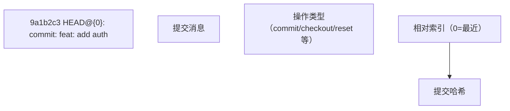

### 2.3 常见操作类型

| 操作              | reflog 记录                        |
| :---------------- | :--------------------------------- |
| `git commit`      | `commit: feat: xxx`                |
| `git checkout`    | `checkout: moving from A to B`     |
| `git reset`       | `reset: moving to HEAD~3`          |
| `git merge`       | `merge feature: Merge made by ...` |
| `git rebase`      | `rebase: checkout main`            |
| `git cherry-pick` | `cherry-pick: fix: xxx`            |
| `git pull`        | `pull: Fast-forward`               |
| `git clone`       | `clone: from https://...`          |

## 3. 恢复误操作

### 3.1 恢复 reset --hard

```bash
# 误操作：重置了3个提交
git reset --hard HEAD~3

# 恢复：通过 reflog 找到重置前的提交
git reflog
# abc1234 HEAD@{0}: reset: moving to HEAD~3    ← 重置操作
# def5678 HEAD@{1}: commit: feat: add auth     ← 重置前的提交

# 恢复到重置前的状态
git reset --hard def5678
# 或使用相对索引
git reset --hard HEAD@{1}
```

### 3.2 恢复误删的分支

```bash
# 误删分支
git branch -D feature

# 查找分支最后的提交
git reflog
# 9a1b2c3 HEAD@{5}: checkout: moving from feature to main  ← feature 的最后提交

# 重新创建分支
git branch feature 9a1b2c3
# 或
git checkout -b feature 9a1b2c3
```

### 3.3 恢复 rebase 失败

```bash
# rebase 过程中出错
git rebase main
# ... 冲突处理失败 ...

# 查找 rebase 前的状态
git reflog
# abc1234 HEAD@{2}: rebase: checkout main  ← rebase 开始前

# 放弃 rebase
git rebase --abort

# 或恢复到 rebase 前
git reset --hard HEAD@{2}
```

### 3.4 恢复 amend 之前的提交

```bash
# 误操作：amend 修改了提交
git commit --amend -m "new message"

# 查找 amend 前的提交
git reflog
# def5678 HEAD@{0}: commit (amend): new message
# abc1234 HEAD@{1}: commit: old message  ← amend 前的提交

# 恢复
git reset --soft abc1234
```

## 4. reflog 过期机制

### 4.1 默认过期时间

| 引用类型       | 过期时间 | 配置项                       |
| :------------- | :------- | :--------------------------- |
| **HEAD**       | 90 天    | `gc.reflogExpire`            |
| **可达提交**   | 90 天    | `gc.reflogExpire`            |
| **不可达提交** | 30 天    | `gc.reflogExpireUnreachable` |

### 4.2 配置过期时间

```bash
# 设置永不过期
git config --global gc.reflogExpire never

# 设置30天过期
git config --global gc.reflogExpire 30.days

# 设置不可达提交7天过期
git config --global gc.reflogExpireUnreachable 7.days
```

### 4.3 手动清理

```bash
# 删除所有过期的 reflog 条目
git reflog expire --expire=now --all

# 配合 gc 清理不可达对象
git reflog expire --expire=now --all && git gc --prune=now
```

## 5. 高级用法

### 5.1 按时间查找

```bash
# 查看指定时间点的 HEAD 位置
git reflog --date=iso
git show HEAD@{2026-06-10}

# 查看昨天的 HEAD
git show HEAD@{yesterday}
```

### 5.2 diff 比较

```bash
# 比较当前状态和3步前的差异
git diff HEAD@{3}

# 比较两个 reflog 条目
git diff HEAD@{5} HEAD@{3}
```

### 5.3 查看文件历史版本

```bash
# 查看文件在某个 reflog 点的内容
git show HEAD@{3}:src/index.js
```
## 查看 reflog

**基本写法：查看当前分支引用日志**
`git reflog [show]`
```bash
# 查看当前分支的引用日志
git reflog
```

---

**基本写法：查看指定分支引用日志**
`git reflog <分支名>`
```bash
# 查看 main 分支的引用日志
git reflog main
```

---

**基本写法：查看 HEAD 引用日志**
`git reflog show HEAD`
```bash
# 查看 HEAD 的所有移动记录
git reflog show HEAD
```

---

**基本写法：限定显示条数**
`git reflog -<数量>`
```bash
# 仅显示最近 5 条引用记录
git reflog -5
```

---

**基本写法：带日期过滤**
`git reflog --since="<时间>"`
```bash
# 仅显示最近 2 小时的记录
git reflog --since="2 hours ago"
```

---

## reflog 输出格式

**基本写法：自定义输出格式**
`git reflog --format="<格式>"`
```bash
# 自定义显示提交哈希与引用动作
git reflog --format="%h %gs"
```

---

**基本写法：显示时间戳**
`git reflog --date=iso`
```bash
# 以 ISO 格式显示日期
git reflog --date=iso
```

---

## 恢复丢失的提交

**基本写法：通过 reflog 哈希恢复提交**
`git reset --hard <reflog哈希>`
```bash
# 重置到 reflog 记录的某次提交
git reset --hard HEAD@{2}
```

---

**基本写法：通过 cherry-pick 恢复单个提交**
`git cherry-pick <reflog哈希>`
```bash
# 将丢失的提交重新应用
git cherry-pick 9a3b1c2
```

---

**基本写法：创建新分支保存丢失提交**
`git branch <分支名> <reflog哈希>`
```bash
# 用新分支指向丢失的提交
git branch recover-work HEAD@{3}
```

---

**基本写法：强制移动分支到 reflog 位置**
`git branch -f <分支名> <reflog哈希>`
```bash
# 将分支强制指向 reflog 记录
git branch -f feature HEAD@{1}
```

---

## 恢复误删分支

**基本写法：通过 reflog 重建被删分支**
`git branch <分支名> <reflog哈希>`
```bash
# 恢复已删除的 feature 分支
git branch feature feature@{2}
```

---

**基本写法：查看已删除分支的 reflog**
`git reflog show <已删除分支名>`
```bash
# 查看已删除分支历史位置
git reflog show deleted-branch
```

---

## 恢复误用 reset

**基本写法：撤销硬重置**
`git reset --hard HEAD@{1}`
```bash
# 回到 reset 之前的位置
git reset --hard HEAD@{1}
```

---

**基本写法：用 ORIG_HEAD 恢复**
`git reset --hard ORIG_HEAD`
```bash
# 使用上次操作前的 HEAD
git reset --hard ORIG_HEAD
```

---

## reflog 过期与管理

**基本写法：查看 reflog 子命令**
`git reflog --help`
```bash
# 查看 reflog 完整用法
git reflog --help
```

---

**基本写法：删除单条 reflog 记录**
`git reflog delete <引用>@{<序号>}`
```bash
# 删除指定 reflog 条目
git reflog delete HEAD@{5}
```

---

**基本写法：立即过期所有 reflog**
`git reflog expire --expire=now --all`
```bash
# 标记所有 reflog 条目为过期
git reflog expire --expire=now --all
```

---

**基本写法：按时间过期 reflog**
`git reflog expire --expire=<时间> --all`
```bash
# 90 天前的可达条目过期
git reflog expire --expire=90.days --all
```

---

**基本写法：过期不可达条目**
`git reflog expire --expire-unreachable=<时间> --all`
```bash
# 30 天前不可达的条目过期
git reflog expire --expire-unreachable=30.days --all
```

---

## 与 fsck 配合查找悬空对象

**基本写法：查找所有悬空提交**
`git fsck --lost-found`
```bash
# 查找未引用的对象并写入 .git/lost-found
git fsck --lost-found
```

---

**基本写法：查看悬空提交内容**
`git show <悬空提交哈希>`
```bash
# 查看悬空提交的变更
git show d1f2a3b
```

---

## 配置 reflog 保留时长

**基本写法：设置可达条目保留时间**
`git config --global gc.reflogExpire "<时间>"`
```bash
# 可达条目保留 90 天
git config --global gc.reflogExpire "90 days"
```

---

**基本写法：设置不可达条目保留时间**
`git config --global gc.reflogExpireUnreachable "<时间>"`
```bash
# 不可达条目保留 30 天
git config --global gc.reflogExpireUnreachable "30 days"
```

---

**基本写法：禁用某 ref 自动写 reflog**
`git config --global core.logAllRefUpdates false`
```bash
# 关闭自动记录引用更新
git config --global core.logAllRefUpdates false
```

---

## reflog 与 stash 协同

**基本写法：查看 stash 的 reflog**
`git reflog show stash`
```bash
# 查看 stash 栈所有变更
git reflog show stash
```

---

**基本写法：恢复误删的 stash**
`git stash apply <stash@{n}>`
```bash
# 通过 reflog 找回已 drop 的 stash
git stash apply stash@{2}
```


<!-- ============ 文档分隔线：003-git/014-GitBlame.md ============ -->


## 1. git blame 概述

### 1.1 什么是 git blame

`git blame` 逐行显示文件的**最后修改信息**，包括提交哈希、作者、时间和行内容。

```bash
git blame README.md
# abc1234d (Zhang San 2026-06-10 10:00:01 +0800  1) # My Project
# def5678e (Li Si     2026-06-12 14:30:22 +0800  2)
# abc1234d (Zhang San 2026-06-10 10:00:01 +0800  3) ## Getting Started
```

### 1.2 输出格式

```
哈希前缀 (作者 日期 时间 时区 行号) 行内容
```

## 2. 基本用法

### 2.1 常用选项

```bash
# 显示完整哈希
git blame -l file.txt

# 只显示邮箱
git blame -e file.txt

# 显示行号
git blame -n file.txt

# 从指定行开始
git blame -L 10,20 file.txt       # 第10到20行
git blame -L 10,+5 file.txt       # 第10行起5行
git blame -L :function file.txt   # 函数范围（需语言支持）

# 忽略空白变更
git blame -w file.txt

# 忽略移动/复制
git blame -M file.txt             # 检测行移动
git blame -C file.txt             # 检测行复制
git blame -C -C file.txt          # 更严格的复制检测
```

### 2.2 指定版本

```bash
# 查看指定提交时的 blame
git blame abc1234 -- file.txt

# 查看指定分支的 blame
git blame main -- file.txt
```

## 3. 高级用法

### 3.1 追踪重命名

```bash
# 跟踪文件重命名
git blame -M --follow file.txt
```

### 3.2 忽略特定提交

```bash
# 忽略格式化提交
git blame --ignore-rev abc1234 file.txt

# 从文件读取忽略列表
git blame --ignore-revs-file .git-blame-ignore-revs file.txt
```

### 3.3 增量 blame

```bash
# 只看最近 N 次提交的 blame
git blame --since="2 weeks ago" file.txt
```

## 4. 实际应用

### 4.1 定位 Bug 引入者

```bash
# 找到问题行的提交
git blame -L 42,42 src/auth.ts
# abc1234 (Zhang San 2026-05-20)  const token = getPassword();

# 查看该提交的详情
git show abc1234
```

### 4.2 代码审查辅助

```bash
# 找出最近修改的行
git blame --since="1 month ago" src/index.ts

# 找出某作者的修改
git blame -e src/index.ts | grep "zhang@example.com"
```

### 4.3 统计贡献

```bash
# 按作者统计行数
git blame file.txt | awk '{print $2}' | sort | uniq -c | sort -rn
```

## 5. blame 替代工具

| 工具                  | 特点                |
| :-------------------- | :------------------ |
| **git annotate**      | `git blame` 的别名  |
| **VS Code GitLens**   | 行级 blame 内联显示 |
| **GitHub blame view** | 在线 blame 界面     |
## 基本用法

**基本写法：查看文件每行最后修改者**
`git blame <文件>`
```bash
# 显示 src/main.py 每行的作者与提交
git blame src/main.py
```

---

**基本写法：限定行范围**
`git blame -L <起始>,<结束> <文件>`
```bash
# 仅查看第 10 到 30 行的归属
git blame -L 10,30 src/main.py
```

---

**基本写法：限定起始行到文件末尾**
`git blame -L <起始> <文件>`
```bash
# 从第 50 行到文件末尾
git blame -L 50 src/main.py
```

---

## 提交范围控制

**基本写法：从指定提交开始追溯**
`git blame <提交> -- <文件>`
```bash
# 从 v1.0.0 标签开始追溯
git blame v1.0.0 -- src/main.py
```

---

**基本写法：限定追溯范围**
`git blame <起点>..<终点> -- <文件>`
```bash
# 仅在指定提交范围内追溯
git blame v1.0.0..HEAD -- src/main.py
```

---

**基本写法：查看更早版本**
`git blame <提交>^ -- <文件>`
```bash
# 查看上一次提交时的归属
git blame HEAD^ -- src/main.py
```

---

## 输出格式

**基本写法：显示完整哈希**
`git blame -l <文件>`
```bash
# 显示 40 位完整提交哈希
git blame -l src/main.py
```

---

**基本写法：显示作者邮箱**
`git blame -e <文件>`
```bash
# 用邮箱代替作者姓名
git blame -e src/main.py
```

---

**基本写法：显示提交时间**
`git blame -t <文件>`
```bash
# 显示原始时间戳而非日期
git blame -t src/main.py
```

---

**基本写法：空提交敏感模式**
`git blame -w <文件>`
```bash
# 忽略空白变更的提交
git blame -w src/main.py
```

---

## 行追踪

**基本写法：追踪行移动**
`git blame -M <文件>`
```bash
# 检测同一文件内的行移动
git blame -M src/main.py
```

---

**基本写法：检测跨文件复制移动**
`git blame -C <文件>`
```bash
# 检测从其他文件复制的行
git blame -C src/main.py
```

---

**基本写法：全仓库范围检测复制**
`git blame -CCC <文件>`
```bash
# 在所有提交中检测复制来源
git blame -CCC src/main.py
```

---

**基本写法：指定移动检测阈值**
`git blame -M<数量> <文件>`
```bash
# 设置移动检测的最小字符数
git blame -M20 src/main.py
```

---

## 增量查看

**基本写法：限制每次显示行数**
`git blame --incremental <文件>`
```bash
# 增量输出便于程序解析
git blame --incremental src/main.py
```

---

**基本写法：显示边界提交**
`git blame --root <文件>`
```bash
# 将根提交也标记为边界
git blame --root src/main.py
```

---

## annotate 命令

**基本写法：使用 annotate（blame 别名）**
`git annotate <文件>`
```bash
# annotate 等价于 blame
git annotate src/main.py
```

---

**基本写法：annotate 限定范围**
`git annotate -L <起始>,<结束> <文件>`
```bash
# annotate 限定行范围
git annotate -L 1,20 src/main.py
```

---

## 实用场景

**基本写法：定位 bug 引入提交**
`git blame -L <行>,<行> <文件>`
```bash
# 定位某行代码的最后修改提交
git blame -L 42,42 src/main.py
```

---

**基本写法：查看某行完整提交信息**
`git show <提交>`
```bash
# 查看 blame 找到的提交详情
git show abc1234
```

---

**基本写法：忽略某些提交**
`git blame --ignore-rev <提交> <文件>`
```bash
# 跳过指定提交（如格式化提交）
git blame --ignore-rev abc1234 src/main.py
```

---

**基本写法：通过文件配置忽略列表**
`git blame --ignore-revs-file <文件> <目标文件>`
```bash
# 从文件读取要忽略的提交列表
git blame --ignore-revs-file .git-blame-ignore revs.txt src/main.py
```

---

**基本写法：配置默认忽略文件**
`git config blame.ignoreRevsFile <文件>`
```bash
# 配置项目默认的 blame 忽略文件
git config blame.ignoreRevsFile .git-blame-ignore-revs
```

---

**基本写法：按颜色高亮输出**
`git blame --color-by-age <文件>`
```bash
# 按提交年龄着色显示
git blame --color-by-age src/main.py
```

---

**基本写法：按作者着色**
`git blame --color-lines <文件>`
```bash
# 同一作者的行用相同颜色
git blame --color-lines src/main.py
```

---

## 与其他命令配合

**基本写法：blame 找到提交后查看历史**
`git log -p <提交> -- <文件>`
```bash
# 查看指定提交对该文件的所有改动
git log -p abc1234 -- src/main.py
```

---

**基本写法：定位后用 bisect 深入**
`git bisect start && git bisect bad HEAD && git bisect good <提交>`
```bash
# 由 blame 结果启动二分查找
git bisect start && git bisect bad HEAD && git bisect good abc1234
```


<!-- ============ 文档分隔线：003-git/015-HEADPointerBranchEssence.md ============ -->


## 1. HEAD 指针

### 1.1 什么是 HEAD

HEAD 是一个**符号引用**（symbolic reference），指向当前分支的最新提交。它告诉 Git "你现在在哪里"。

```bash
# 查看 HEAD 指向
cat .git/HEAD
# ref: refs/heads/main    ← 指向分支引用

# 查看解析后的值
git rev-parse HEAD
# 9a1b2c3d4e5f6g7h8i9j0k1l2m3n4o5p6q7r8s9t
```

### 1.2 HEAD 的两种状态

**附着的 HEAD（Attached HEAD）**：

```
HEAD → refs/heads/main → commit abc1234
```

- HEAD 指向一个分支名
- 提交时分支指针自动前进

**分离的 HEAD（Detached HEAD）**：

```
HEAD → commit abc1234（不指向任何分支）
```

- HEAD 直接指向一个提交
- 提交时不会更新任何分支

```bash
# 进入分离 HEAD 状态
git checkout abc1234
# Note: switching to 'abc1234'.
# You are in 'detached HEAD' state.

# 在分离 HEAD 下提交
git commit -m "temp work"
# 提交成功，但没有分支指向这个新提交
# 切换分支后可能丢失
```

### 1.3 分离 HEAD 的场景

| 场景     | 命令                   | 说明               |
| :------- | :--------------------- | :----------------- |
| 检出提交 | `git checkout abc1234` | 查看历史版本       |
| 检出标签 | `git checkout v1.0.0`  | 查看发布版本       |
| rebase   | `git rebase -i`        | 交互式变基过程中   |
| 子模块   | 子模块目录中           | 子模块处于分离状态 |

## 2. 分支的本质

### 2.1 分支是什么

Git 分支本质上是一个**指向提交的可移动指针**，存储在 `.git/refs/heads/` 目录中：

```bash
# 查看分支文件
cat .git/refs/heads/main
# 9a1b2c3d4e5f6g7h8i9j0k1l2m3n4o5p6q7r8s9t

# 这只是一个40字节的文本文件！
```

### 2.2 分支创建的 O(1) 特性

创建分支只是创建一个新文件，写入当前提交的哈希值：

```bash
# 创建分支
git branch feature
# 等价于：
echo abc1234 > .git/refs/heads/feature

# 时间复杂度：O(1)
# 无论仓库有多少文件、多少提交，创建分支都是瞬间完成
```

### 2.3 分支指针的移动

```
初始状态:
  A ← B ← C ← main
                ↑ HEAD

提交后:
  A ← B ← C ← D ← main
                    ↑ HEAD

分支指针自动前进到新提交
```

## 3. 引用体系

### 3.1 引用类型

| 类型         | 路径                 | 说明         |
| :----------- | :------------------- | :----------- |
| **分支**     | `.git/refs/heads/`   | 本地分支     |
| **远程分支** | `.git/refs/remotes/` | 远程跟踪分支 |
| **标签**     | `.git/refs/tags/`    | 标签引用     |
| **HEAD**     | `.git/HEAD`          | 当前位置     |

### 3.2 引用规范

```bash
# 完整路径
refs/heads/main
refs/remotes/origin/main
refs/tags/v1.0.0

# 简写
main                    → refs/heads/main
origin/main             → refs/remotes/origin/main
v1.0.0                  → refs/tags/v1.0.0
```

### 3.3 打包引用

当引用数量很多时，Git 会将它们打包到 `.git/packed-refs` 文件中：

```bash
# 查看 packed-refs
cat .git/packed-refs
# 9a1b2c3d refs/heads/main
# def5678e refs/heads/feature
# abc1234f refs/tags/v1.0.0
```

## 4. 分支操作原理

### 4.1 创建分支

```bash
git branch feature
# 1. 创建 .git/refs/heads/feature
# 2. 写入当前 HEAD 的哈希值
```

### 4.2 切换分支

```bash
git checkout feature
# 1. 更新 HEAD 指向 feature
# 2. 更新工作区和暂存区到 feature 指向的提交
# 3. 更新索引文件
```

### 4.3 删除分支

```bash
git branch -d feature
# 1. 删除 .git/refs/heads/feature
# 2. 提交对象仍然存在（通过 reflog 可恢复）
```

### 4.4 合并分支

```bash
git merge feature
# 1. 找到两个分支的共同祖先
# 2. 执行三方合并
# 3. 创建合并提交（或快进移动指针）
```

## 5. 实用命令

```bash
# 查看所有引用
git show-ref

# 查看引用指向的提交
git rev-parse main
git rev-parse HEAD
git rev-parse v1.0.0

# 查看引用日志
git reflog show main

# 比较两个引用
git log main..feature --oneline

# 查看分支的创建点
git merge-base main feature
```


<!-- ============ 文档分隔线：003-git/016-GitHookGitLFS.md ============ -->


## 1. Git 钩子概述

Git 钩子是 Git 仓库中的脚本，在特定 Git 事件发生时自动执行。它们可以用于自动化工作流程、强制执行代码规范、运行测试等。

### 钩子类型

- **客户端钩子**：在本地操作时触发
- **服务器端钩子**：在服务器端操作时触发

## 2. 客户端钩子

### 2.1 常见客户端钩子

| 钩子名称             | 触发时机         | 用途                   |
| :------------------- | :--------------- | :--------------------- |
| `pre-commit`         | 提交前           | 代码检查、格式化、测试 |
| `prepare-commit-msg` | 提交消息编辑器前 | 自动生成提交消息       |
| `commit-msg`         | 提交消息编辑后   | 验证提交消息格式       |
| `post-commit`        | 提交后           | 通知、触发构建         |
| `pre-push`           | 推送前           | 运行测试、检查         |

### 2.2 创建 pre-commit 钩子

```bash
 # 进入 Git 仓库
 cd /path/to/repo
 # 创建 pre-commit 钩子
 cat > .git/hooks/pre-commit << 'EOF'
 #!/bin/bash
 # 运行代码检查
 echo "Running code linting..."
 npm run lint
 # 运行测试
 echo "Running tests..."
 npm test
 # 检查结果
 if [ $? -ne 0 ]; then
  echo "Tests failed, commit aborted"
  exit 1
 fi
 echo "Pre-commit checks passed"
 EOF
 # 使钩子可执行
 chmod +x .git/hooks/pre-commit
```

### 2.3 创建 commit-msg 钩子

```bash
 # 创建 commit-msg 钩子
 cat > .git/hooks/commit-msg << 'EOF'
 #!/bin/bash
 # 检查提交消息格式
 commit_msg=$(cat "$1")
 # 正则表达式检查提交消息格式
 if ! echo "$commit_msg" | grep -qE '^(feat|fix|docs|style|refactor|test|chore): .+'; then
  echo "Error: Invalid commit message format"
  echo "Commit message should start with: feat|fix|docs|style|refactor|test|chore:"
  exit 1
 fi
 echo "Commit message format is valid"
 EOF
 # 使钩子可执行
 chmod +x .git/hooks/commit-msg
```

## 3. 服务器端钩子

### 3.1 常见服务器端钩子

| 钩子名称       | 触发时机   | 用途                 |
| :------------- | :--------- | :------------------- |
| `pre-receive`  | 推送接收前 | 拒绝不符合规则的推送 |
| `update`       | 分支更新时 | 对特定分支进行检查   |
| `post-receive` | 推送接收后 | 部署、通知           |

### 3.2 创建 post-receive 钩子

```bash
 # 在服务器仓库中创建 post-receive 钩子
 cat > /path/to/repo.git/hooks/post-receive << 'EOF'
 #!/bin/bash
 # 部署应用
 echo "Deploying application..."
 # 切换到部署目录
 cd /path/to/deploy
 # 拉取最新代码
 git pull origin main
 # 安装依赖
 npm install
 # 构建应用
 npm run build
 # 重启服务
 echo "Restarting service..."
 systemctl restart my-app
 echo "Deployment completed successfully"
 EOF
 # 使钩子可执行
 chmod +x /path/to/repo.git/hooks/post-receive
```

## 4. Git LFS (Large File Storage)

### 4.1 Git LFS 概述

Git LFS 是 Git 的扩展，用于管理大文件，通过将大文件存储在外部服务器上，只在 Git 仓库中存储引用，从而减小仓库体积。

### 4.2 安装 Git LFS

```bash
 # 安装 Git LFS
 # Windows
 download from https://git-lfs.github.com/
 # macOS
 brew install git-lfs
 # Linux
 sudo apt install git-lfs
 # 初始化 Git LFS
 git lfs install
```

### 4.3 配置 Git LFS

```bash
 # 跟踪大文件
 git lfs track "*.psd"
 git lfs track "*.jpg"
 git lfs track "*.mp4"
 # 查看跟踪的文件类型
 git lfs track
 # 提交 .gitattributes 文件
 git add .gitattributes
 git commit -m "Add Git LFS tracking"
```

### 4.4 使用 Git LFS

```bash
 # 正常添加和提交文件
 git add large-file.psd
 git commit -m "Add large file"
 git push origin main
 # 拉取 LFS 文件
 git lfs pull
 # 查看 LFS 文件
 git lfs ls-files
 # 验证 LFS 文件
 git lfs verify
```

## 5. 钩子最佳实践

1. **版本控制钩子**：将钩子存储在仓库中，使用脚本安装
2. **错误处理**：在钩子中添加适当的错误处理
3. **性能考虑**：确保钩子执行时间不会过长
4. **可配置性**：允许通过配置文件自定义钩子行为
5. **文档**：为钩子添加注释和文档

### 5.1 钩子管理脚本

```bash
 #!/bin/bash
 # hooks/install.sh
 # 安装钩子
 cp hooks/* .git/hooks/
 chmod +x .git/hooks/*
 echo "Hooks installed successfully"
```

## 6. Git LFS 最佳实践

1. **合理选择跟踪文件**：只跟踪真正的大文件
2. **设置合理的文件大小阈值**：根据项目需求设置
3. **定期清理**：使用 `git lfs prune` 清理过期文件
4. **备份 LFS 存储**：确保 LFS 文件的安全性
5. **监控存储使用**：定期检查 LFS 存储使用情况

### 6.1 Git LFS 配置示例

```bash
 # .gitattributes 文件
 * text=auto
 *.md text
 *.png binary
```

## 7. 高级钩子示例

### 7.1 自动更新版本号

```bash
 # pre-commit 钩子
 #!/bin/bash
 # 自动更新版本号
 if [ -f package.json ]; then
  current_version=$(jq -r '.version' package.json)
  # 简单的版本号递增逻辑
  new_version=$(echo $current_version | awk -F. '{print $1"."$2"."$3+1}')
  jq ".version = \"$new_version\"" package.json > package.json.tmp && mv package.json.tmp package.json
  git add package.json
  echo "Updated version to $new_version"
 fi
```

### 7.2 自动生成 CHANGELOG

```bash
 # post-commit 钩子
 #!/bin/bash
 # 自动生成 CHANGELOG
 if [ ! -f CHANGELOG.md ]; then
  echo "# Changelog\n" > CHANGELOG.md
 fi
 # 获取最新提交信息
 latest_commit=$(git log -1 --pretty=%B)
 # 提取提交类型和信息
 if echo "$latest_commit" | grep -qE '^(feat|fix|docs|style|refactor|test|chore):'; then
  commit_type=$(echo "$latest_commit" | cut -d: -f1)
  commit_msg=$(echo "$latest_commit" | cut -d: -f2 | sed 's/^ //')
  # 获取当前日期
  current_date=$(date +"%Y-%m-%d")
  # 添加到 CHANGELOG
  echo "## $current_date\n\n- **$commit_type**: $commit_msg\n" | cat - CHANGELOG.md > CHANGELOG.md.tmp && mv CHANGELOG.md.tmp CHANGELOG.md
  git add CHANGELOG.md
  git commit --amend --no-edit
  echo "Updated CHANGELOG.md"
 fi
```

## 8. 常见问题与解决方案

### 8.1 钩子不执行

**问题**：钩子脚本没有执行
**解决方案**：确保钩子文件可执行 `chmod +x .git/hooks/hook-name`

### 8.2 Git LFS 文件下载失败

**问题**：Git LFS 文件无法下载
**解决方案**：检查网络连接，运行 `git lfs pull` 手动拉取

### 8.3 钩子执行时间过长

**问题**：钩子执行时间过长，影响开发效率
**解决方案**：优化钩子逻辑，考虑使用后台执行

### 8.4 Git LFS 存储不足

**问题**：Git LFS 存储空间不足
**解决方案**：清理过期文件 `git lfs prune`，增加存储配置

## 9. 工具与集成

### 9.1 钩子管理工具

- **husky**：现代 Git 钩子管理工具
- **lint-staged**：配合 husky 使用，只对暂存文件运行检查

### 9.2 Git LFS 托管服务

- **GitHub**：内置 Git LFS 支持
- **GitLab**：内置 Git LFS 支持
- **Bitbucket**：内置 Git LFS 支持
- **自托管**：使用 Git LFS 服务器

## 10. 项目实战

### 10.1 完整的钩子配置

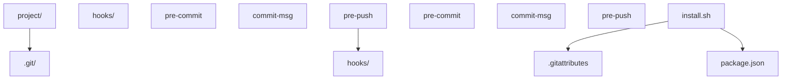

### 10.2 使用 husky 管理钩子

**安装 husky**

```bash
 npm install husky --save-dev
 npx husky install
 npm set-script prepare "husky install"
```

**添加钩子**

```bash
 npx husky add .husky/pre-commit "npm run lint"
 npx husky add .husky/commit-msg "npx commitlint --edit $1"
 npx husky add .husky/pre-push "npm test"
```

## 安装与初始化

**基本写法：安装 Git LFS**
`git lfs install`
```bash
# 在当前用户范围启用 Git LFS
git lfs install
```

---

**基本写法：在仓库中初始化 LFS**
`git lfs install --local`
```bash
# 仅在当前仓库启用 LFS
git lfs install --local
```

---

**基本写法：查看 LFS 版本**
`git lfs version`
```bash
# 输出当前 Git LFS 版本号
git lfs version
```

---

## 跟踪大文件

**基本写法：添加 LFS 跟踪规则**
`git lfs track "<模式>"`
```bash
# 跟踪所有 mp4 视频文件
git lfs track "*.mp4"
```

---

**基本写法：跟踪指定目录**
`git lfs track "<目录>/**"`
```bash
# 跟踪 assets 目录下所有文件
git lfs track "assets/**"
```

---

**基本写法：查看跟踪规则**
`git lfs track`
```bash
# 列出当前所有 LFS 跟踪规则
git lfs track
```

---

**基本写法：移除跟踪规则**
`git lfs untrack "<模式>"`
```bash
# 移除某类文件的 LFS 跟踪
git lfs untrack "*.mp4"
```

---

**基本写法：提交 .gitattributes**
`git add .gitattributes && git commit -m "<消息>"`
```bash
# 跟踪规则变更必须提交
git add .gitattributes && git commit -m "chore: configure LFS tracking"
```

---

## 操作 LFS 文件

**基本写法：添加大文件**
`git add <文件> && git commit -m "<消息>"`
```bash
# 添加大文件到 LFS 跟踪
git add video.mp4 && git commit -m "feat: add intro video"
```

---

**基本写法：查看 LFS 文件列表**
`git lfs ls-files`
```bash
# 列出仓库中所有 LFS 跟踪文件
git lfs ls-files
```

---

**基本写法：查看文件大小信息**
`git lfs ls-files --size`
```bash
# 显示 LFS 文件的实际大小
git lfs ls-files --size
```

---

## 拉取与推送

**基本写法：克隆含 LFS 的仓库**
`git clone <仓库URL>`
```bash
# 克隆时自动拉取 LFS 文件
git clone https://github.com/org/repo.git
```

---

**基本写法：跳过 LFS 内容克隆**
`GIT_LFS_SKIP_SMUDGE=1 git clone <仓库URL>`
```bash
# 仅克隆指针文件不下载大文件内容
GIT_LFS_SKIP_SMUDGE=1 git clone https://github.com/org/repo.git
```

---

**基本写法：按需下载 LFS 文件**
`git lfs pull`
```bash
# 拉取所有 LFS 跟踪文件内容
git lfs pull
```

---

**基本写法：拉取指定文件**
`git lfs pull --include="<路径>"`
```bash
# 仅拉取指定目录下的 LFS 文件
git lfs pull --include="assets/videos/*"
```

---

**基本写法：推送 LFS 文件**
`git push origin <分支>`
```bash
# 推送时自动上传 LFS 文件
git push origin main
```

---

**基本写法：仅推送 LFS 内容**
`git lfs push origin <分支>`
```bash
# 单独推送 LFS 文件到远程
git lfs push origin main
```

---

**基本写法：推送所有 LFS 对象**
`git lfs push --all origin <分支>`
```bash
# 推送全部历史 LFS 对象
git lfs push --all origin main
```

---

## 检出与切换

**基本写法：检出指定分支的 LFS 文件**
`git lfs checkout`
```bash
# 用 LFS 内容替换工作区指针文件
git lfs checkout
```

---

**基本写法：仅检出指定路径**
`git lfs checkout --include="<路径>"`
```bash
# 仅检出 assets 目录的 LFS 内容
git lfs checkout --include="assets/*"
```

---

**基本写法：切换分支后同步**
`git checkout <分支> && git lfs checkout`
```bash
# 切换分支后重新检出 LFS 文件
git checkout feature && git lfs checkout
```

---

## 历史与迁移

**基本写法：将已有文件转为 LFS**
`git lfs migrate import --include="<模式>"`
```bash
# 将历史中的 mp4 文件迁移到 LFS
git lfs migrate import --include="*.mp4"
```

---

**基本写法：迁移指定分支历史**
`git lfs migrate import --include="<模式>" --include-ref=<分支>`
```bash
# 仅迁移 main 分支的历史文件
git lfs migrate import --include="*.mp4" --include-ref=main
```

---

**基本写法：迁移所有引用**
`git lfs migrate import --include="<模式>" --include-ref=refs/heads/*`
```bash
# 迁移所有分支的历史文件
git lfs migrate import --include="*.mp4" --include-ref=refs/heads/*
```

---

**基本写法：导出 LFS 文件回普通对象**
`git lfs migrate export --include="<模式>"`
```bash
# 取消 LFS 跟踪并还原文件
git lfs migrate export --include="*.mp4"
```

---

## 检查与状态

**基本写法：查看 LFS 状态**
`git lfs status`
```bash
# 显示工作区 LFS 文件状态
git lfs status
```

---

**基本写法：检查 LFS 文件完整性**
`git lfs fsck`
```bash
# 校验 LFS 对象完整性
git lfs fsck
```

---

**基本写法：查看 LFS 日志**
`git lfs logs last`
```bash
# 查看最近一次 LFS 操作日志
git lfs logs last
```

---

**基本写法：列出所有 LFS 对象**
`git lfs ls-files --all`
```bash
# 列出所有历史中的 LFS 文件
git lfs ls-files --all
```

---

## 远程配置

**基本写法：查看 LFS 端点**
`git config -l | grep lfs`
```bash
# 查看 LFS 相关配置
git config -l | grep lfs
```

---

**基本写法：指定 LFS 服务器**
`git config -f .lfsconfig lfs.url <URL>`
```bash
# 配置自定义 LFS 服务器地址
git config -f .lfsconfig lfs.url https://lfs.example.com/org/repo
```

---

**基本写法：跳过 smudge 过滤器**
`git config --local lfs.smudge false`
```bash
# 关闭自动下载 LFS 内容
git config --local lfs.smudge false
```

---

## 锁定文件（防冲突）

**基本写法：锁定 LFS 文件**
`git lfs lock <文件>`
```bash
# 锁定二进制文件防止并发编辑
git lfs lock assets/logo.psd
```

---

**基本写法：查看锁定列表**
`git lfs locks`
```bash
# 列出所有已锁定文件
git lfs locks
```

---

**基本写法：解锁文件**
`git lfs unlock <文件>`
```bash
# 释放文件锁
git lfs unlock assets/logo.psd
```

---

**基本写法：强制解锁**
`git lfs unlock <文件> --force`
```bash
# 强制解锁他人持有的锁
git lfs unlock assets/logo.psd --force
```

---

## 清理与优化

**基本写法：清理无用 LFS 对象**
`git lfs prune`
```bash
# 清理本地未引用的 LFS 对象
git lfs prune
```

---

**基本写法：查看待清理对象**
`git lfs prune --dry-run`
```bash
# 预览将被清理的对象
git lfs prune --dry-run
```

---

**基本写法：强制保留对象**
`git lfs fetch --recent`
```bash
# 拉取最近使用的 LFS 对象
git lfs fetch --recent
```


<!-- ============ 文档分隔线：003-git/017-MergeConflictResolution.md ============ -->


## 1. 冲突概述

### 1.1 什么是合并冲突

当两个分支修改了**同一文件的同一位置**时，Git 无法自动决定采用哪个版本，就会产生合并冲突。

### 1.2 冲突标记

```text
<<<<<<< HEAD
当前分支的内容
=======
合并分支的内容
>>>>>>> feature
```

| 标记              | 含义             |
| :---------------- | :--------------- |
| `<<<<<<< HEAD`    | 当前分支内容开始 |
| `=======`         | 分隔线           |
| `>>>>>>> feature` | 合并分支内容结束 |

### 1.3 不会冲突的情况

- 修改不同文件 → 自动合并
- 修改同一文件的不同位置 → 自动合并
- 一方修改、一方删除 → 自动合并（采用修改版）

## 2. 冲突解决流程

### 2.1 标准流程

```bash
# 1. 尝试合并
git merge feature
# CONFLICT (content): Merge conflict in src/index.js

# 2. 查看冲突文件
git status
# Unmerged paths:
#   both modified:   src/index.js

# 3. 打开冲突文件，手动解决
vim src/index.js

# 4. 标记为已解决
git add src/index.js

# 5. 完成合并
git commit
```

### 2.2 查看冲突详情

```bash
# 列出冲突文件
git diff --name-only --diff-filter=U

# 查看冲突内容
git diff

# 查看三方视图
git mergetool
```

## 3. 解决策略

### 3.1 手动解决

编辑冲突文件，删除冲突标记，保留正确内容：

```text
<!-- 冲突内容 -->
<<<<<<< HEAD
const API_URL = "https://api.example.com/v2";
=======
const API_URL = "https://api.staging.com/v2";
>>>>>>> feature

<!-- 解决后 -->
const API_URL = "https://api.example.com/v2";
```

### 3.2 选择一方

```bash
# 采用当前分支版本
git checkout --ours file.txt

# 采用合并分支版本
git checkout --theirs file.txt

# 对特定文件选择
git checkout --ours src/config.js
git checkout --theirs src/styles.css
```

### 3.3 合并双方

```bash
# 使用 union 策略（合并双方修改）
git merge -X union feature

# 使用 ours 策略（冲突时总是采用当前分支）
git merge -X ours feature

# 使用 theirs 策略（冲突时总是采用合并分支）
git merge -X theirs feature
```

### 3.4 放弃合并

```bash
# 放弃当前合并，回到合并前状态
git merge --abort

# 如果已经部分解决
git reset --hard HEAD
```

## 4. 复杂冲突场景

### 4.1 多文件冲突

```bash
# 批量选择 ours/theirs
git checkout --ours .
git checkout --theirs .

# 逐文件处理
for file in $(git diff --name-only --diff-filter=U); do
    echo "Conflict in: $file"
    # 手动处理每个文件
done
```

### 4.2 重命名冲突

```bash
# 一方重命名、一方修改内容
# CONFLICT (modify/delete): ...

# 查看重命名情况
git diff --name-status --diff-filter=R
```

### 4.3 子模块冲突

```bash
# 子模块指向不同提交
git ls-tree HEAD path/to/submodule
# 选择正确的提交
cd path/to/submodule
git checkout correct-commit
cd ..
git add path/to/submodule
```

## 5. 预防冲突

### 5.1 工作流策略

| 策略               | 说明                  |
| :----------------- | :-------------------- |
| **频繁同步**       | 经常从主分支拉取更新  |
| **小步提交**       | 每次提交只做一件事    |
| **短生命周期分支** | 功能分支尽快合并      |
| **模块化代码**     | 减少多人修改同一文件  |
| **代码所有者**     | CODEOWNERS 指定负责人 |

### 5.2 减少冲突的编码习惯

- 避免大范围格式化修改
- 将公共配置与业务逻辑分离
- 使用接口/抽象减少直接依赖
- 新增代码而非修改共享代码

### 5.3 预合并检查

```bash
# 合并前检查是否有冲突
git merge --no-commit --no-ff feature
git diff --check     # 检查冲突标记
git merge --abort    # 放弃测试合并
```
## 冲突标记格式

**基本写法：冲突标记结构**
`<<<<<<< HEAD ... ======= ... >>>>>>> <分支名>`
```text
# 冲突标记格式
<<<<<<< HEAD
当前分支的内容
=======
合并分支的内容
>>>>>>> feature
```

---

## 冲突解决标准流程

**基本写法：尝试合并**
`git merge <分支名>`
```bash
# 合并 feature 分支到当前分支
git merge feature;
```

**基本写法：查看冲突文件**
`git status`
```bash
# 查看冲突状态
git status;
```

**基本写法：标记冲突已解决**
`git add <file>`
```bash
# 将解决冲突后的文件加入暂存区
git add src/index.js;
```

**基本写法：完成合并提交**
`git commit`
```bash
# 提交合并结果
git commit;
```

---

## 查看冲突详情

**基本写法：列出冲突文件**
`git diff --name-only --diff-filter=U`
```bash
# 列出所有冲突文件
git diff --name-only --diff-filter=U;
```

**基本写法：查看冲突内容**
`git diff`
```bash
# 查看冲突内容
git diff;
```

**基本写法：使用合并工具**
`git mergetool`
```bash
# 启动配置的合并工具
git mergetool;
```

---

## 选择一方版本

**基本写法：采用当前分支版本**
`git checkout --ours <file>`
```bash
# 采用当前分支版本的 src/config.js
git checkout --ours src/config.js;
```

**基本写法：采用合并分支版本**
`git checkout --theirs <file>`
```bash
# 采用合并分支版本的 src/styles.css
git checkout --theirs src/styles.css;
```

---

## 合并策略选项

**基本写法：合并双方修改**
`git merge -X union <分支名>`
```bash
# 使用 union 策略合并双方修改
git merge -X union feature;
```

**基本写法：冲突时采用当前分支**
`git merge -X ours <分支名>`
```bash
# 冲突时总是采用当前分支
git merge -X ours feature;
```

**基本写法：冲突时采用合并分支**
`git merge -X theirs <分支名>`
```bash
# 冲突时总是采用合并分支
git merge -X theirs feature;
```

---

## 放弃合并

**基本写法：放弃当前合并**
`git merge --abort`
```bash
# 放弃当前合并操作
git merge --abort;
```

**基本写法：硬重置放弃合并**
`git reset --hard HEAD`
```bash
# 强制回到合并前的 HEAD 状态
git reset --hard HEAD;
```

---

## 多文件冲突处理

**基本写法：批量采用 ours**
`git checkout --ours .`
```bash
# 批量采用当前分支版本
git checkout --ours .;
```

**基本写法：批量采用 theirs**
`git checkout --theirs .`
```bash
# 批量采用合并分支版本
git checkout --theirs .;
```

**基本写法：逐文件处理冲突**
`for file in $(git diff --name-only --diff-filter=U)`
```bash
# 遍历所有冲突文件逐个处理
for file in $(git diff --name-only --diff-filter=U); do
    echo "Conflict in: $file"
done
```

---

## 重命名冲突

**基本写法：查看重命名情况**
`git diff --name-status --diff-filter=R`
```bash
# 查看重命名的文件
git diff --name-status --diff-filter=R;
```

---

## 子模块冲突

**基本写法：查看子模块指向的提交**
`git ls-tree HEAD <子模块路径>`
```bash
# 查看子模块指向的提交
git ls-tree HEAD path/to/submodule;
```

**基本写法：进入子模块目录**
`cd <子模块路径>`
```bash
# 进入子模块目录
cd path/to/submodule;
```

**基本写法：切换到正确的提交**
`git checkout <提交哈希>`
```bash
# 切换到正确的提交
git checkout correct-commit;
```

**基本写法：返回主仓库**
`cd ..`
```bash
# 返回主仓库
cd ..;
```

**基本写法：添加子模块**
`git add <子模块路径>`
```bash
# 添加子模块
git add path/to/submodule;
```

---

## 预合并检查

**基本写法：测试合并（不提交）**
`git merge --no-commit --no-ff <分支名>`
```bash
# 测试合并但不提交
git merge --no-commit --no-ff feature;
```

**基本写法：检查冲突标记**
`git diff --check`
```bash
# 检查空白错误和冲突标记
git diff --check;
```

**基本写法：放弃测试合并**
`git merge --abort`
```bash
# 放弃测试合并
git merge --abort;
```


<!-- ============ 文档分隔线：003-git/018-GitMergetool.md ============ -->


## 1. mergetool 概述

### 1.1 什么是 mergetool

`git mergetool` 启动一个**可视化合并工具**来帮助解决冲突，比手动编辑冲突标记更直观。

### 1.2 工作原理

```
冲突文件 → mergetool → 本地版本 / 基础版本 / 远程版本 → 合并结果
```

mergetool 展示三方视图：

- **LOCAL**：当前分支版本
- **BASE**：共同祖先版本
- **REMOTE**：合并分支版本
- **MERGED**：合并结果

## 2. 配置 mergetool

### 2.1 选择工具

```bash
# 查看支持的工具
git mergetool --tool-help

# 设置默认工具
git config --global merge.tool vimdiff
git config --global merge.tool vscode
git config --global merge.tool meld

# 临时使用指定工具
git mergetool --tool=meld
```

### 2.2 常用工具配置

**VS Code**：

```bash
git config --global merge.tool vscode
git config --global mergetool.vscode.cmd 'code --wait $MERGED'
```

**Vimdiff**：

```bash
git config --global merge.tool vimdiff
# 内置支持，无需额外配置
```

**Meld**：

```bash
git config --global merge.tool meld
# Linux/macOS: sudo apt install meld / brew install meld
```

**Beyond Compare**：

```bash
git config --global merge.tool bc
git config --global mergetool.bc.cmd 'bcompare $LOCAL $REMOTE $BASE $MERGED'
```

### 2.3 常用选项

```bash
# 不提示就启动工具
git config --global mergetool.prompt false

# 合并后保留备份文件
git config --global mergetool.keepBackup true

# 自动检测工具路径
git config --global mergetool.autoResolve true
```

## 3. 使用 mergetool

### 3.1 基本流程

```bash
# 1. 合并产生冲突
git merge feature

# 2. 启动 mergetool
git mergetool

# 3. 在工具中解决冲突
# 4. 保存并退出
# 5. Git 自动标记为已解决

# 6. 完成合并
git commit
```

### 3.2 指定文件

```bash
# 只解决特定文件的冲突
git mergetool src/index.js

# 解决所有冲突文件
git mergetool
```

## 4. 工具对比

| 工具               | 平台        | 特点                    | 推荐度 |
| :----------------- | :---------- | :---------------------- | :----- |
| **VS Code**        | 跨平台      | 内置合并编辑器，直观    | 高 |
| **Vimdiff**        | 跨平台      | 终端内使用，需 Vim 技能 | 中   |
| **Meld**           | Linux/macOS | 三方对比，免费开源      | 高 |
| **Beyond Compare** | 跨平台      | 功能最强，付费          | 高 |
| **KDiff3**         | 跨平台      | 免费，自动合并          | 中   |
| **P4Merge**        | 跨平台      | Perforce 免费           | 中   |


<!-- ============ 文档分隔线：003-git/019-GitRebase.md ============ -->


## 1. rebase 概述

### 1.1 什么是 rebase

rebase（变基）将一系列提交**重新应用到**另一个基础提交之上，产生线性历史。

```
合并前:
  A---B---C main
       \
        D---E feature

merge 结果:
  A---B---C---M main
       \     /
        D---E

rebase 结果:
  A---B---C---D'---E' main, feature
```

### 1.2 rebase vs merge

| 特性       | merge        | rebase               |
| :--------- | :----------- | :------------------- |
| **历史**   | 保留分支结构 | 线性历史             |
| **提交**   | 创建合并提交 | 重写提交             |
| **可逆性** | 容易回退     | 需要 force push      |
| **冲突**   | 一次性解决   | 逐提交解决           |
| **适用**   | 合并到主分支 | 同步主分支到功能分支 |

## 2. 基本 rebase

### 2.1 标准变基

```bash
# 将 feature 变基到 main
git checkout feature
git rebase main

# 等价于
git rebase main feature
```

### 2.2 变基过程

```
1. 找到 feature 和 main 的共同祖先
2. 保存 feature 上的每个提交为补丁
3. 将 feature 指向 main 的最新提交
4. 逐个应用补丁（可能产生冲突）
5. 每个补丁生成新的提交（新哈希）
```

### 2.3 处理冲突

```bash
# rebase 过程中遇到冲突
git rebase main
# CONFLICT: ...

# 解决冲突后
git add .
git rebase --continue

# 跳过当前提交
git rebase --skip

# 放弃整个 rebase
git rebase --abort
```

## 3. 交互式 rebase

### 3.1 启动交互式 rebase

```bash
# 修改最近3个提交
git rebase -i HEAD~3

# 修改从分叉点以来的提交
git rebase -i main
```

### 3.2 编辑器内容

```text
pick abc1234 feat: add authentication
pick def5678 fix: resolve login bug
pick ghi9012 docs: update README

# Rebase instructions:
# p, pick = 使用提交
# r, reword = 使用提交，修改消息
# e, edit = 使用提交，暂停修改
# s, squash = 合并到前一个提交
# f, fixup = 合并到前一个提交，丢弃消息
# d, drop = 丢弃提交
```

### 3.3 常用操作

**修改提交消息**：

```text
reword abc1234 feat: add authentication
pick def5678 fix: resolve login bug
```

**合并提交**：

```text
pick abc1234 feat: add authentication
squash def5678 fix: resolve login bug
# 合并后编辑合并消息
```

**修改提交内容**：

```text
edit abc1234 feat: add authentication
pick def5678 fix: resolve login bug

# 保存后 Git 会暂停
# 修改文件
git add .
git commit --amend
git rebase --continue
```

**重新排序**：

```text
# 调整提交顺序
pick def5678 fix: resolve login bug
pick abc1234 feat: add authentication
```

**删除提交**：

```text
pick abc1234 feat: add authentication
drop def5678 fix: resolve login bug
```

## 4. 高级用法

### 4.1 rebase 到指定提交

```bash
# 变基到指定提交
git rebase --onto main abc1234 feature
# 将 abc1234..feature 范围的提交变基到 main 上
```

### 4.2 自动 squash

```bash
# 自动合并 fixup 提交
git rebase -i --autosquash
# 配合 git commit --fixup=abc1234 使用
```

### 4.3 保留合并提交

```bash
# 保留分支合并结构
git rebase -i --rebase-merges main
```

## 5. 黄金法则

### 5.1 不要 rebase 公共分支

```
 危险：rebase 已推送的提交
git checkout main
git rebase feature
git push --force  ← 会覆盖他人的提交历史

 安全：只 rebase 本地未推送的提交
git checkout feature
git rebase main
git push  ← 首次推送，无风险
```

### 5.2 force push 安全方式

```bash
# 使用 --force-with-lease（更安全）
git push --force-with-lease

# 它会检查远程是否有别人的新提交
# 如果有，拒绝 push，避免覆盖他人工作
```

## 6. 实际场景

### 6.1 同步主分支更新

```bash
# 功能分支保持与主分支同步
git checkout feature
git fetch origin
git rebase origin/main
```

### 6.2 清理提交历史

```bash
# 合并多个小提交为一个有意义的提交
git rebase -i HEAD~5
# 将 WIP 提交 squash 为最终版本
```

### 6.3 修复早期提交的 Bug

```bash
# 在早期提交上修复 Bug
git rebase -i HEAD~3
# 将目标提交标记为 edit
# 修复后
git commit --amend
git rebase --continue
```
## 基本 rebase

**基本写法：标准变基**
`git rebase <基础分支>`
```bash
# 将 feature 分支变基到 main
git checkout feature;
git rebase main;
```

**基本写法：等价写法**
`git rebase <基础分支> <目标分支>`
```bash
# 等价于先 checkout feature 再 rebase main
git rebase main feature;
```

---

## 处理 rebase 冲突

**基本写法：触发 rebase**
`git rebase <基础分支>`
```bash
# rebase 过程中遇到冲突
git rebase main;
```

**基本写法：添加解决后的文件**
`git add .`
```bash
# 解决冲突后添加文件
git add .;
```

**基本写法：继续 rebase**
`git rebase --continue`
```bash
# 继续 rebase 流程
git rebase --continue;
```

**基本写法：跳过当前提交**
`git rebase --skip`
```bash
# 跳过当前冲突的提交
git rebase --skip;
```

**基本写法：放弃 rebase**
`git rebase --abort`
```bash
# 放弃整个 rebase 操作
git rebase --abort;
```

---

## 交互式 rebase

**基本写法：修改最近 N 个提交**
`git rebase -i HEAD~<n>`
```bash
# 修改最近 3 个提交
git rebase -i HEAD~3;
```

**基本写法：修改分叉点以来的提交**
`git rebase -i <基础分支>`
```bash
# 修改从 main 分叉以来的所有提交
git rebase -i main;
```

---

## 交互式 rebase 指令

**基本写法：指令格式**
`<指令> <提交哈希> <提交消息>`
```text
# 指令说明
# p, pick   使用提交
# r, reword 使用提交，修改消息
# e, edit   使用提交，暂停修改
# s, squash 合并到前一个提交
# f, fixup  合并到前一个提交，丢弃消息
# d, drop   丢弃提交
pick abc1234 feat: add authentication
pick def5678 fix: resolve login bug
```

**基本写法：修改提交消息**
`reword <提交哈希> <提交消息>`
```text
# 修改 abc1234 的提交消息
reword abc1234 feat: add authentication
pick def5678 fix: resolve login bug
```

**基本写法：合并提交**
`squash <提交哈希> <提交消息>`
```text
# 将 def5678 合并到 abc1234
pick abc1234 feat: add authentication
squash def5678 fix: resolve login bug
```

**基本写法：修改提交内容**
`edit <提交哈希> <提交消息>`
```text
# 标记 abc1234 为 edit 后保存退出
edit abc1234 feat: add authentication
pick def5678 fix: resolve login bug
```

**基本写法：修改暂停后的提交**
`git commit --amend`
```bash
# 修改提交内容
git commit --amend;
```

**基本写法：重新排序提交**
`pick <提交哈希> <提交消息>`
```text
# 调整提交顺序，def5678 在前
pick def5678 fix: resolve login bug
pick abc1234 feat: add authentication
```

**基本写法：删除提交**
`drop <提交哈希> <提交消息>`
```text
# 删除 def5678 提交
pick abc1234 feat: add authentication
drop def5678 fix: resolve login bug
```

---

## 高级 rebase

**基本写法：变基到指定提交**
`git rebase --onto <基础分支> <起始提交> <目标分支>`
```bash
# 将 abc1234..feature 范围的提交变基到 main 上
git rebase --onto main abc1234 feature;
```

**基本写法：自动 squash**
`git rebase -i --autosquash`
```bash
# 配合 git commit --fixup=abc1234 使用
git rebase -i --autosquash;
```

**基本写法：保留合并提交**
`git rebase -i --rebase-merges <基础分支>`
```bash
# 保留分支合并结构的交互式变基
git rebase -i --rebase-merges main;
```

---

## force push 安全方式

**基本写法：安全强制推送**
`git push --force-with-lease`
```bash
# 检查远程是否有新提交，有则拒绝推送
git push --force-with-lease;
```

---

## 实际场景

**基本写法：同步主分支更新**
`git rebase <远程仓库名>/<分支名>`
```bash
# 功能分支同步主分支更新
git checkout feature;
git fetch origin;
git rebase origin/main;
```

**基本写法：清理提交历史**
`git rebase -i HEAD~<n>`
```bash
# 合并最近 5 个提交
git rebase -i HEAD~5;
```

**基本写法：启动交互式 rebase 修复 Bug**
`git rebase -i HEAD~<n>`
```bash
# 启动交互式 rebase
git rebase -i HEAD~3;
```

**基本写法：修改提交**
`git commit --amend`
```bash
# 修复 Bug 后修改提交
git commit --amend;
```

**基本写法：继续 rebase**
`git rebase --continue`
```bash
# 继续 rebase 流程
git rebase --continue;
```


<!-- ============ 文档分隔线：003-git/020-GitCherryPick.md ============ -->


## 1. cherry-pick 概述

### 1.1 什么是 cherry-pick

`git cherry-pick` 将指定的提交**移植**到当前分支，创建新的提交（新哈希）。

```
原始状态:
  A---B---C main
       \
        D---E feature

cherry-pick D 到 main:
  A---B---C---D' main
       \
        D---E feature
```

### 1.2 适用场景

| 场景           | 说明                                 |
| :------------- | :----------------------------------- |
| **热修复**     | 将修复提交从开发分支移植到发布分支   |
| **选择性合并** | 只合并特定功能，不合并整个分支       |
| **补丁回移**   | 将维护分支的修复回移到主分支         |
| **误提交修正** | 将误提交到错误分支的提交移到正确分支 |

## 2. 基本用法

### 2.1 单个提交

```bash
git cherry-pick abc1234
```

### 2.2 多个提交

```bash
# 多个提交
git cherry-pick abc1234 def5678

# 提交范围
git cherry-pick abc1234..def5678    # 不包含 abc1234
git cherry-pick abc1234^..def5678   # 包含 abc1234
```

### 2.3 常用选项

```bash
# 只应用变更但不提交
git cherry-pick -n abc1234

# 保留原始作者信息
git cherry-pick -x abc1234    # 在消息中添加原始提交哈希

# 修改提交消息
git cherry-pick -e abc1234

# 保留提交的父提交信息（用于合并提交）
git cherry-pick -m 1 abc1234
```

## 3. 冲突处理

### 3.1 解决冲突

```bash
git cherry-pick abc1234
# CONFLICT: ...

# 解决冲突
vim conflicted-file.js
git add .
git cherry-pick --continue
```

### 3.2 跳过提交

```bash
git cherry-pick --skip
```

### 3.3 放弃 cherry-pick

```bash
git cherry-pick --abort
```

## 4. 实际场景

### 4.1 热修复

```bash
# 在 develop 分支修复了 Bug
git checkout develop
git commit -m "fix: resolve critical bug"

# 将修复移植到 release 分支
git checkout release/v2.0
git cherry-pick abc1234
```

### 4.2 误提交修正

```bash
# 误提交到 main
git checkout main
git log --oneline -3
# abc1234 feat: should be in feature branch

# 移植到正确分支
git checkout feature
git cherry-pick abc1234

# 从 main 移除
git checkout main
git revert abc1234
```

### 4.3 批量移植

```bash
# 将 feature 分支的最近3个提交移植
git checkout main
git cherry-pick feature~3..feature
```

## 5. 注意事项

- cherry-pick 创建**新提交**（新哈希），不是移动原提交
- 同一变更 cherry-pick 两次会产生重复提交
- 合并提交的 cherry-pick 需要指定父提交编号
- cherry-pick 后可能需要解决上下文冲突
## 基本用法

**基本写法：应用单个提交到当前分支**
`git cherry-pick <提交>`
```bash
# 将指定提交应用到当前分支
git cherry-pick abc1234
```

---

**基本写法：应用多个提交**
`git cherry-pick <提交1> <提交2>`
```bash
# 按顺序应用多个提交
git cherry-pick abc1234 def5678
```

---

**基本写法：应用提交范围**
`git cherry-pick <起点>..<终点>`
```bash
# 应用从起点之后到终点的提交（不含起点）
git cherry-pick v1.0.0..v1.1.0
```

---

**基本写法：应用包含起点的范围**
`git cherry-pick <起点>^..<终点>`
```bash
# 应用从起点到终点的所有提交
git cherry-pick v1.0.0^..v1.1.0
```

---

## 保留信息

**基本写法：保留原提交作者**
`git cherry-pick -x <提交>`
```bash
# 在提交信息中追加原提交哈希
git cherry-pick -x abc1234
```

---

**基本写法：保留原提交哈希引用**
`git cherry-pick --edit <提交>`
```bash
# 应用时打开编辑器修改提交信息
git cherry-pick --edit abc1234
```

---

**基本写法：使用原提交信息**
`git cherry-pick --no-commit <提交>`
```bash
# 应用变更但不立即提交
git cherry-pick --no-commit abc1234
```

---

**基本写法：自定义提交信息**
`git cherry-pick --signoff <提交>`
```bash
# 添加 Signed-off-by 签名
git cherry-pick --signoff abc1234
```

---

## 冲突处理

**基本写法：继续 cherry-pick**
`git cherry-pick --continue`
```bash
# 解决冲突后继续
git cherry-pick --continue
```

---

**基本写法：放弃当前 cherry-pick**
`git cherry-pick --abort`
```bash
# 取消并回到操作前状态
git cherry-pick --abort
```

---

**基本写法：跳过当前提交**
`git cherry-pick --skip`
```bash
# 跳过当前冲突提交继续下一个
git cherry-pick --skip
```

---

**基本写法：保留冲突标记的合并提交**
`git cherry-pick --keep-redundant-commits <提交>`
```bash
# 即使变更已被包含也保留提交
git cherry-pick --keep-redundant-commits abc1234
```

---

## 策略选项

**基本写法：指定合并策略**
`git cherry-pick -X <策略> <提交>`
```bash
# 使用 theirs 策略优先采用被应用提交
git cherry-pick -X theirs abc1234
```

---

**基本写法：使用 ours 策略**
`git cherry-pick -X ours <提交>`
```bash
# 冲突时优先保留当前分支内容
git cherry-pick -X ours abc1234
```

---

## 主分支回退场景

**基本写法：从 hotfix 分支拣选修复到 main**
`git cherry-pick <修复提交>`
```bash
# 切到 main 后应用 hotfix 提交
git cherry-pick hotfix-9a3b1c2
```

---

**基本写法：从 main 拣选到发布分支**
`git cherry-pick <提交>`
```bash
# 将 main 上的修复同步到 release 分支
git cherry-pick release-1.2.3
```

---

## 批量操作

**基本写法：批量拣选多分支提交**
`git cherry-pick <分支A>^..<分支B>`
```bash
# 拣选 A 到 B 范围内的所有提交
git cherry-pick feature^..release
```

---

**基本写法：从 git log 拣选**
`git cherry-pick $(git log --grep="<关键字>" --format=%H)`
```bash
# 拣选所有匹配关键字的提交
git cherry-pick $(git log --grep="fix:" --format=%H)
```

---

## 验证与查询

**基本写法：查看哪些提交尚未应用**
`git cherry -v <上游分支>`
```bash
# 显示尚未合并到上游的提交
git cherry -v main
```

---

**基本写法：显示带 + 或 - 的可拣选提交**
`git cherry <上游> <分支>`
```bash
# 列出指定分支相对上游的可拣选状态
git cherry main feature
```


<!-- ============ 文档分隔线：003-git/021-GitStash.md ============ -->


## 1. stash 概述

### 1.1 什么是 stash

`git stash` 将工作区和暂存区的修改**临时保存**到栈中，恢复工作区到干净状态。

```mermaid
flowchart TD
    W[工作区 有修改] -->|git stash| C[工作区 干净]
    W --> S[stash 栈<br/>stash@{2} / stash@{1} / stash@{0} 最新]
```

## 2. 基本用法

### 2.1 创建 stash

```bash
# 保存所有已跟踪文件的修改
git stash

# 保存时添加消息
git stash push -m "WIP: feature auth"

# 包含未跟踪的文件
git stash -u
git stash --include-untracked

# 包含被忽略的文件
git stash -a
git stash --all

# 只暂存部分文件
git stash push -p          # 交互式选择
git stash push file.txt    # 指定文件
```

### 2.2 查看 stash

```bash
# 查看所有 stash
git stash list
# stash@{0}: On main: WIP: feature auth
# stash@{1}: WIP on main: abc1234 fix: bug

# 查看 stash 内容
git stash show             # 最新 stash 的摘要
git stash show -p          # 最新 stash 的差异
git stash show stash@{1}   # 指定 stash 的摘要
git stash show -p stash@{1}
```

### 2.3 恢复 stash

```bash
# 恢复并删除 stash
git stash pop              # 恢复最新的 stash
git stash pop stash@{1}    # 恢复指定 stash

# 恢复但保留 stash
git stash apply            # 恢复最新的 stash
git stash apply stash@{1}  # 恢复指定 stash

# 恢复暂存区状态
git stash apply --index    # 同时恢复暂存区
```

### 2.4 删除 stash

```bash
# 删除指定 stash
git stash drop stash@{1}

# 删除所有 stash
git stash clear
```

## 3. 高级用法

### 3.1 从 stash 创建分支

```bash
# 基于 stash 创建新分支
git stash branch feature-from-stash stash@{0}
# 1. 创建新分支
# 2. 恢复 stash 内容
# 3. 删除 stash
```

### 3.2 部分暂存

```bash
# 交互式选择暂存内容
git stash push -p
# Stash this hunk [y,n,q,a,d,/,s,e,?]?
```

### 3.3 查看 stash 中的文件

```bash
# 查看 stash 中某个文件的内容
git show stash@{0}:src/index.js

# 比较 stash 和当前工作区
git diff stash@{0}
```

## 4. 典型场景

### 4.1 紧急修复

```bash
# 正在开发功能，需要紧急修复 Bug
git stash -m "WIP: feature"
git checkout main
git checkout -b hotfix/bug-123
# ... 修复 Bug ...
git commit -m "fix: resolve bug 123"
git checkout feature
git stash pop
```

### 4.2 切换分支

```bash
# 需要切换分支但不想提交半成品
git stash
git checkout other-branch
# ... 完成其他工作 ...
git checkout feature
git stash pop
```

### 4.3 多任务并行

```bash
# 多个 WIP 进度
git stash push -m "feature A"
# ... 工作 ...
git stash push -m "feature B"

# 查看所有进度
git stash list

# 恢复特定进度
git stash apply stash@{1}
```

## 5. 注意事项

- `git stash pop` 如果有冲突，stash 不会被删除
- stash 是**本地**的，不会推送到远程
- 默认不保存未跟踪文件，需加 `-u`
- 长期不用的 stash 应及时清理
## 基础暂存

**基本用法:暂存当前改动**
`git stash [push]`

```bash
# 暂存已跟踪文件的改动(含暂存区与工作区)
git stash

# 添加描述信息
git stash push -m "WIP: 登录功能未完成"

# 仅暂存已暂存内容
git stash --keep-index
```

---

**基本用法:暂存含未跟踪文件**
`git stash -u`

```bash
# 包含未跟踪文件(untracked)
git stash -u

# 包含忽略文件
git stash -a
```

---

## 查看与恢复

**基本用法:查看暂存列表**
`git stash list`

```bash
# 列出所有 stash
git stash list

# 查看某个 stash 的内容差异
git stash show stash@{0}

# 查看完整差异
git stash show -p stash@{1}
```

---

**基本用法:恢复暂存**
`git stash pop [stash@{N}]`

```bash
# 恢复最近 stash 并删除
git stash pop

# 恢复指定 stash 并删除
git stash pop stash@{2}

# 恢复但保留 stash
git stash apply stash@{0}
```

---

## 管理暂存

**基本用法:删除暂存**
`git stash drop <stash@{N}>`

```bash
# 删除指定 stash
git stash drop stash@{1}

# 清空所有 stash
git stash clear
```

---

**基本用法:从 stash 创建分支**
`git stash branch <分支名> [stash@{N}]`

```bash
# 基于 stash 创建并切换分支
git stash branch hotfix-branch stash@{0}
```

---

## 局部暂存

**基本用法:交互式暂存**
`git stash -p`

```bash
# 逐块选择暂存内容
git stash -p
```


<!-- ============ 文档分隔线：003-git/022-RemoteTrackingBranch.md ============ -->


## 1. 远程跟踪分支概述

### 1.1 什么是远程跟踪分支

远程跟踪分支是**远程分支状态的本地引用**，以 `远程名/分支名` 格式表示（如 `origin/main`）。它们是只读的，只在网络操作时更新。

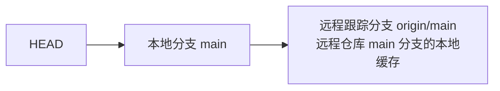

### 1.2 引用关系

```
.git/refs/heads/main           → 本地 main 分支
.git/refs/remotes/origin/main  → 远程 origin/main 的跟踪分支
.git/refs/remotes/origin/HEAD  → 远程 origin 的默认分支
```

## 2. 远程操作

### 2.1 fetch

```bash
# 获取远程更新（不合并）
git fetch origin
git fetch origin main
git fetch --all

# fetch 后查看远程分支
git branch -r
# origin/main
# origin/feature
# origin/develop
```

### 2.2 pull

```bash
# pull = fetch + merge
git pull origin main

# pull = fetch + rebase（推荐）
git pull --rebase origin main

# 设置默认使用 rebase
git config --global pull.rebase true
```

### 2.3 push

```bash
# 推送到远程
git push origin main

# 设置上游分支
git push -u origin feature
git push --set-upstream origin feature

# 推送所有分支
git push --all origin

# 删除远程分支
git push origin --delete feature
```

## 3. 上游分支

### 3.1 什么是上游分支

上游分支是本地分支**关联的远程跟踪分支**，设置了上游后可以简化 push/pull 命令。

```bash
# 设置上游
git branch -u origin/main main
git branch --set-upstream-to=origin/main main

# 查看上游设置
git branch -vv
# main    abc1234 [origin/main] feat: add auth
# feature def5678                 WIP: new feature
```

### 3.2 自动设置上游

```bash
# push 时自动设置
git push -u origin feature

# 之后可以直接
git pull
git push
```

## 4. 远程分支管理

### 4.1 查看远程分支

```bash
# 查看所有远程分支
git branch -r

# 查看所有分支（本地+远程）
git branch -a

# 查看远程仓库详情
git remote show origin
```

### 4.2 跟踪远程分支

```bash
# 创建本地分支跟踪远程分支
git checkout -b feature origin/feature
git checkout --track origin/feature    # 同上
git checkout feature                   # 如果远程有同名分支，自动跟踪
```

### 4.3 清理过时的远程分支

```bash
# 清理本地已不存在的远程分支引用
git remote prune origin

# 查看将被清理的分支
git remote prune origin --dry-run

# fetch 时自动清理
git fetch -p
git fetch --prune
```

## 5. 同步模型

### 5.1 快进同步

```
本地: A---B---C
远程: A---B---C---D---E

git pull → 本地快进到 E
本地: A---B---C---D---E
```

### 5.2 非快进同步

```
本地: A---B---C---D
远程: A---B---C---E

git pull → 产生合并提交或 rebase
本地: A---B---C---D---M (merge)
       A---B---C---D' (rebase)
```

### 5.3 三种同步策略

| 策略                  | 命令                 | 结果         |
| :-------------------- | :------------------- | :----------- |
| **merge**             | `git pull`           | 创建合并提交 |
| **rebase**            | `git pull --rebase`  | 线性历史     |
| **fast-forward only** | `git pull --ff-only` | 只允许快进   |

```bash
# 设置默认策略
git config --global pull.ff only
```


<!-- ============ 文档分隔线：003-git/023-GitFlowGitHubFlow.md ============ -->


## 1. 分支模型概述

### 1.1 为什么需要分支模型

分支模型定义了团队如何使用分支进行协作，核心解决：

- 如何组织功能开发
- 如何管理发布
- 如何处理热修复
- 如何保持主分支稳定

## 2. Git Flow

### 2.1 分支结构

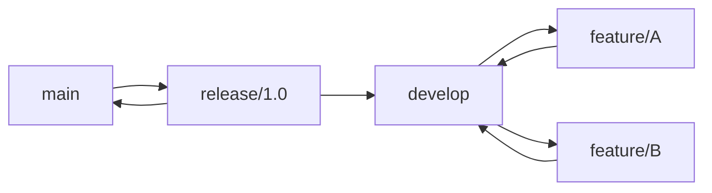

| 分支        | 命名        | 生命周期 | 用途         |
| :---------- | :---------- | :------- | :----------- |
| **main**    | `main`      | 永久     | 生产版本     |
| **develop** | `develop`   | 永久     | 开发集成分支 |
| **feature** | `feature/*` | 临时     | 功能开发     |
| **release** | `release/*` | 临时     | 发布准备     |
| **hotfix**  | `hotfix/*`  | 临时     | 紧急修复     |

### 2.2 工作流程

```bash
# 1. 从 develop 创建功能分支
git checkout -b feature/auth develop

# 2. 开发并提交
git commit -m "feat: add login"

# 3. 完成后合并回 develop
git checkout develop
git merge --no-ff feature/auth
git branch -d feature/auth

# 4. 准备发布
git checkout -b release/1.0 develop
# 修复 Bug、更新版本号
git commit -m "chore: bump version to 1.0"

# 5. 合并到 main 和 develop
git checkout main
git merge --no-ff release/1.0
git tag -a v1.0.0
git checkout develop
git merge --no-ff release/1.0
git branch -d release/1.0

# 6. 热修复
git checkout -b hotfix/bug-123 main
git commit -m "fix: resolve critical bug"
git checkout main
git merge --no-ff hotfix/bug-123
git tag -a v1.0.1
git checkout develop
git merge --no-ff hotfix/bug-123
git branch -d hotfix/bug-123
```

### 2.3 Git Flow 工具

```bash
# 安装 git-flow
brew install git-flow        # macOS
sudo apt install git-flow    # Linux

# 初始化
git flow init

# 功能开发
git flow feature start auth
git flow feature finish auth

# 发布
git flow release start 1.0
git flow release finish 1.0

# 热修复
git flow hotfix start bug-123
git flow hotfix finish bug-123
```

## 3. GitHub Flow

### 3.1 分支结构

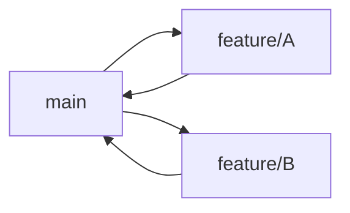

| 分支        | 命名        | 生命周期 | 用途         |
| :---------- | :---------- | :------- | :----------- |
| **main**    | `main`      | 永久     | 始终可部署   |
| **feature** | `feature/*` | 临时     | 所有开发工作 |

### 3.2 工作流程

```bash
# 1. 从 main 创建分支
git checkout -b feature/auth main

# 2. 开发并提交
git commit -m "feat: add authentication"

# 3. 推送并创建 Pull Request
git push -u origin feature/auth
# 在 GitHub 上创建 PR

# 4. 代码审查
# 团队成员审查代码

# 5. 合并到 main
# 通过 GitHub 合并 PR
# 自动部署到生产环境

# 6. 删除分支
git branch -d feature/auth
git push origin --delete feature/auth
```

### 3.3 核心原则

- `main` 分支**始终可部署**
- 所有开发在功能分支进行
- 通过 Pull Request 进行代码审查
- 合并后立即部署

## 4. 模型对比

| 特性         | Git Flow           | GitHub Flow      |
| :----------- | :----------------- | :--------------- |
| **复杂度**   | 高                 | 低               |
| **分支数量** | 5种                | 2种              |
| **发布节奏** | 计划发布           | 持续部署         |
| **适用团队** | 大团队、版本化产品 | 小团队、Web 应用 |
| **学习成本** | 较高               | 较低             |
| **热修复**   | 专用 hotfix 分支   | 从 main 创建分支 |
| **版本管理** | 明确的版本标签     | 持续交付         |

## 5. 其他模型

### 5.1 Trunk-Based Development


- 所有开发者在 main 上直接提交
- 使用功能开关（Feature Flag）控制
- 极短的分支生命周期（<1天）
- 适合 CI/CD 成熟的团队

### 5.2 选型建议

| 场景              | 推荐模型                  |
| :---------------- | :------------------------ |
| **Web/SaaS 应用** | GitHub Flow               |
| **移动应用**      | Git Flow                  |
| **开源项目**      | GitHub Flow               |
| **嵌入式/固件**   | Git Flow                  |
| **微服务**        | GitHub Flow / Trunk-Based |
| **大型团队**      | Git Flow                  |
| **初创团队**      | GitHub Flow               |
## 分支模型

**基本写法：主分支 main**
`main`
```bash
# 仅存放稳定的发布版本
# 每次合并都打标签
```

---

**基本写法：开发分支 develop**
`develop`
```bash
# 日常集成分支，反映最新开发状态
# feature 分支从此切出
```

---

**基本写法：功能分支 feature**
`feature/<功能名>`
```bash
# 单个功能开发分支
# 完成后合并回 develop
```

---

**基本写法：发布分支 release**
`release/<版本号>`
```bash
# 准备发布版本，仅修复 bug
# 完成后合并到 main 与 develop
```

---

**基本写法：热修分支 hotfix**
`hotfix/<编号>`
```bash
# 基于 main 修复线上问题
# 完成后合并到 main 与 develop
```

---

## git-flow 工具

**基本写法：安装 git-flow**
`apt-get install git-flow`
```bash
# Debian/Ubuntu 安装 git-flow 扩展
apt-get install git-flow
```

---

**基本写法：初始化 git-flow**
`git flow init`
```bash
# 交互式配置各分支命名
git flow init
```

---

**基本写法：非交互式初始化**
`git flow init -d`
```bash
# 使用默认配置初始化
git flow init -d
```

---

## feature 工作流

**基本写法：开始新功能**
`git flow feature start <功能名>`
```bash
# 从 develop 切出新功能分支
git flow feature start login
```

---

**基本写法：发布功能到远程**
`git flow feature publish <功能名>`
```bash
# 将功能分支推送到远程协作
git flow feature publish login
```

---

**基本写法：拉取远程功能分支**
`git flow feature track <功能名>`
```bash
# 跟踪远程已有的功能分支
git flow feature track login
```

---

**基本写法：完成功能**
`git flow feature finish <功能名>`
```bash
# 合并功能分支到 develop 并删除
git flow feature finish login
```

---

**基本写法：完成功能保留分支**
`git flow feature finish -k <功能名>`
```bash
# 合并后保留功能分支
git flow feature finish -k login
```

---

## release 工作流

**基本写法：开始发布分支**
`git flow release start <版本号>`
```bash
# 从 develop 创建发布分支
git flow release start 1.2.0
```

---

**基本写法：发布分支推到远程**
`git flow release publish <版本号>`
```bash
# 推送发布分支供团队协作
git flow release publish 1.2.0
```

---

**基本写法：完成发布**
`git flow release finish <版本号>`
```bash
# 合并到 main 与 develop 并打标签
git flow release finish 1.2.0
```

---

**基本写法：完成发布带推送**
`git flow release finish -p <版本号>`
```bash
# 完成后自动推送 main、develop 与标签
git flow release finish -p 1.2.0
```

---

**基本写法：完成发布带信息**
`git flow release finish -m "<消息>" <版本号>`
```bash
# 为合并提交与标签添加信息
git flow release finish -m "release 1.2.0" 1.2.0
```

---

## hotfix 工作流

**基本写法：开始热修**
`git flow hotfix start <版本号> [<基线>]`
```bash
# 基于 main 创建热修分支
git flow hotfix start 1.2.1
```

---

**基本写法：完成热修**
`git flow hotfix finish <版本号>`
```bash
# 合并到 main 与 develop 并打标签
git flow hotfix finish 1.2.1
```

---

**基本写法：完成热修带推送**
`git flow hotfix finish -p <版本号>`
```bash
# 完成后推送所有相关分支与标签
git flow hotfix finish -p 1.2.1
```

---

## 手动实现 Git Flow

**基本写法：手动创建 feature 分支**
`git checkout -b feature/<功能名> develop`
```bash
# 从 develop 创建功能分支
git checkout -b feature/login develop
```

---

**基本写法：完成 feature 合并**
`git checkout develop && git merge --no-ff feature/<功能名>`
```bash
# 用 --no-ff 保留合并记录
git checkout develop && git merge --no-ff feature/login
```

---

**基本写法：手动创建 release 分支**
`git checkout -b release/<版本号> develop`
```bash
# 从 develop 创建发布分支
git checkout -b release/1.2.0 develop
```

---

**基本写法：完成 release 合并到 main**
`git checkout main && git merge --no-ff release/<版本号>`
```bash
# 发布分支合并到 main
git checkout main && git merge --no-ff release/1.2.0
```

---

**基本写法：打版本标签**
`git tag -a <版本号> -m "<消息>"`
```bash
# 在 main 上打带注释标签
git tag -a v1.2.0 -m "Release 1.2.0"
```

---

**基本写法：release 合并回 develop**
`git checkout develop && git merge --no-ff release/<版本号>`
```bash
# 发布内容同步回 develop
git checkout develop && git merge --no-ff release/1.2.0
```

---

**基本写法：删除已合并分支**
`git branch -d <分支名>`
```bash
# 删除已合并的功能分支
git branch -d feature/login
```

---

## GitHub Flow 简化流程

**基本写法：从 main 切分支**
`git checkout -b <分支名> main`
```bash
# 简化流程仅使用 main 与功能分支
git checkout -b feature/login main
```

---

**基本写法：推送并创建 PR**
`git push -u origin <分支名>`
```bash
# 推送后通过 Pull Request 合并
git push -u origin feature/login
```

---

**基本写法：合并后删除分支**
`git branch -d <分支名> && git push origin --delete <分支名>`
```bash
# 本地与远程同时删除分支
git branch -d feature/login && git push origin --delete feature/login
```

---

## 版本号管理

**基本写法：语义化版本号格式**
`<主版本>.<次版本>.<修订号>`
```bash
# 例如 1.2.3 表示主版本 1 次版本 2 修订 3
```

---

**基本写法：发布标签命名规范**
`v<版本号>`
```bash
# 标签前加 v 表示版本
git tag -a v1.2.0 -m "Release 1.2.0"
```

---

## 与 CI/CD 协同

**基本写法：基于标签触发部署**
`git push origin --tags`
```bash
# 推送标签触发发布流水线
git push origin --tags
```

---

**基本写法：仅 main 触发生产部署**
`git push origin main`
```bash
# 主分支推送触发生产环境部署
git push origin main
```

---

**基本写法：develop 触发测试部署**
`git push origin develop`
```bash
# 开发分支推送触发测试环境部署
git push origin develop
```


<!-- ============ 文档分隔线：003-git/024-GitCommitAmend.md ============ -->


## 1. amend 概述

### 1.1 什么是 amend

`git commit --amend` 用于**修改最近一次提交**，可以修改提交消息或追加文件变更。

### 1.2 amend 的本质

amend 并非"修改"提交，而是**创建新提交替换旧提交**：

```
修改前: A---B---C (HEAD)
修改后: A---B---C' (HEAD)  ← C' 是新提交，C 变为不可达
```

## 2. 基本用法

### 2.1 修改提交消息

```bash
git commit --amend -m "新的提交消息"
```

### 2.2 追加文件变更

```bash
# 忘记添加文件
git add forgotten-file.js
git commit --amend --no-edit    # 不修改消息，只追加文件
```

### 2.3 同时修改消息和内容

```bash
git add new-file.js
git commit --amend -m "feat: add auth with new file"
```

### 2.4 修改作者信息

```bash
# 修改作者
git commit --amend --author="New Name <new@email.com>"

# 修改日期
git commit --amend --date="2026-06-14T10:00:00"
```

## 3. 安全注意事项

### 3.1 黄金法则

**不要 amend 已推送到远程的提交！**

```bash
#  危险
git push
git commit --amend
git push --force    # 会覆盖远程历史

#  安全
git commit --amend  # amend 未推送的提交
git push            # 正常推送
```

### 3.2 恢复 amend 前的提交

```bash
# 通过 reflog 找到 amend 前的提交
git reflog
# abc1234 HEAD@{0}: commit (amend): new message
# def5678 HEAD@{1}: commit: old message  ← amend 前

# 恢复
git reset --soft def5678
```

## 4. 实际场景

### 4.1 修复拼写错误

```bash
git commit -m "feat: add authnetication"    # 拼写错误
git commit --amend -m "feat: add authentication"
```

### 4.2 追加遗漏文件

```bash
git commit -m "feat: add auth"
git add test/auth.test.js                   # 忘记的测试文件
git commit --amend --no-edit
```

### 4.3 修改敏感信息

```bash
# 不小心提交了密码
git add config.js
git commit -m "feat: add config"
# 发现 config.js 包含密码
# 修改文件移除密码
git add config.js
git commit --amend --no-edit
# 注意：旧提交仍存在于 reflog 中，需要 git gc 清理
```
## Conventional Commits 基础

**基本写法：标准提交格式**
`<类型>[可选作用域]: <描述>`
```bash
# 规范化提交信息基本结构
feat: 添加用户登录功能
```

---

**基本写法：带作用域的提交**
`<类型>(<作用域>): <描述>`
```bash
# 指定变更影响的模块
feat(auth): 添加 OAuth2 登录
```

---

**基本写法：带破坏性变更标记**
`<类型>!: <描述>`
```bash
# 用 ! 标记不兼容变更
refactor!: 重构用户模型接口
```

---

**基本写法：带作用域的破坏性变更**
`<类型>(<作用域>)!: <描述>`
```bash
# 指定作用域的破坏性变更
feat(api)!: 修改响应数据结构
```

---

## 提交类型

**基本写法：新功能**
`feat: <描述>`
```bash
# 新增功能特性
feat: 添加导出 PDF 功能
```

---

**基本写法：修复 bug**
`fix: <描述>`
```bash
# 修复缺陷
fix: 修正登录跳转错误
```

---

**基本写法：文档变更**
`docs: <描述>`
```bash
# 仅修改文档
docs: 更新 README 安装步骤
```

---

**基本写法：样式调整**
`style: <描述>`
```bash
# 不影响代码逻辑的格式调整
style: 统一缩进为 4 空格
```

---

**基本写法：重构**
`refactor: <描述>`
```bash
# 既不新增功能也不修复 bug 的代码重构
refactor: 抽离用户认证逻辑
```

---

**基本写法：性能优化**
`perf: <描述>`
```bash
# 提升性能的变更
perf: 优化列表查询缓存
```

---

**基本写法：测试相关**
`test: <描述>`
```bash
# 新增或修改测试
test: 补充用户模块单元测试
```

---

**基本写法：构建系统**
`build: <描述>`
```bash
# 修改构建系统或依赖
build: 升级 webpack 到 5.0
```

---

**基本写法：CI 配置**
`ci: <描述>`
```bash
# 修改持续集成配置
ci: 添加自动部署流水线
```

---

**基本写法：杂项**
`chore: <描述>`
```bash
# 其他不修改源码或测试的杂项
chore: 更新 .gitignore
```

---

**基本写法：代码回退**
`revert: <描述>`
```bash
# 回退某次提交
revert: feat: 添加用户登录功能
```

---

## 完整提交信息结构

**基本写法：带正文的提交**
`<类型>: <描述>\n\n<正文>`
```bash
# 标题后空一行再写正文
git commit -m "feat: 添加用户登录功能" -m "实现邮箱密码与 OAuth 两种方式"
```

---

**基本写法：带脚注的提交**
`<类型>: <描述>\n\n<脚注>`
```bash
# 用脚注标记 issue 或破坏性变更
git commit -m "fix: 修正登录超时" -m "Closes #123"
```

---

**基本写法：破坏性变更脚注**
`<类型>: <描述>\n\nBREAKING CHANGE: <说明>`
```bash
# 用脚注详细说明不兼容变更
git commit -m "feat!: 重构 API" -m "BREAKING CHANGE: 返回结构改为统一信封格式"
```

---

**基本写法：关联 issue**
`<类型>: <描述>\n\nCloses #<编号>`
```bash
# 提交时关闭指定 issue
git commit -m "fix: 修正订单计算" -m "Closes #456"
```

---

## 多行提交信息

**基本写法：使用多个 -m 参数**
`git commit -m "<标题>" -m "<正文>"`
```bash
# 多个 -m 自动以空行分隔
git commit -m "feat: 添加导出功能" -m "支持导出为 CSV 与 JSON 格式"
```

---

**基本写法：使用 HEREDOC**
`git commit -F - <<'EOF'`
```bash
# 通过 HEREDOC 传入复杂提交信息
git commit -F - <<'EOF'
feat: 添加导出功能

支持导出为 CSV 与 JSON 格式
Closes #789
EOF
```

---

**基本写法：从文件读取提交信息**
`git commit -F <文件>`
```bash
# 从文件读取完整提交信息
git commit -F commit-msg.txt
```

---

**基本写法：用编辑器撰写**
`git commit`
```bash
# 不带 -m 时打开编辑器撰写
git commit
```

---

## 修改提交信息

**基本写法：修改最近一次提交信息**
`git commit --amend -m "<新消息>"`
```bash
# 修改最近一次提交的描述
git commit --amend -m "feat: 添加导出功能"
```

---

**基本写法：保留原提交信息修改**
`git commit --amend --no-edit`
```bash
# 仅追加文件不变更信息
git commit --amend --no-edit
```

---

**基本写法：修改历史提交信息**
`git rebase -i <提交>^`
```bash
# 交互式 rebase 改写历史
git rebase -i HEAD~3
```

---

## commitizen 工具

**基本写法：安装 commitizen**
`npm install -g commitizen`
```bash
# 全局安装交互式提交工具
npm install -g commitizen
```

---

**基本写法：初始化 conventional 适配器**
`commitizen init cz-conventional-changelog --save-dev`
```bash
# 项目内配置 conventional 适配器
commitizen init cz-conventional-changelog --save-dev
```

---

**基本写法：用 git cz 代替 git commit**
`git cz`
```bash
# 启动交互式提交表单
git cz
```

---

## commitlint 校验

**基本写法：安装 commitlint**
`npm install --save-dev @commitlint/cli @commitlint/config-conventional`
```bash
# 安装 commitlint 与 conventional 配置
npm install --save-dev @commitlint/cli @commitlint/config-conventional
```

---

**基本写法：配置 commitlint**
`echo "module.exports = { extends: ['@commitlint/config-conventional'] };" > commitlint.config.js`
```bash
# 创建 commitlint 配置文件
echo "module.exports = { extends: ['@commitlint/config-conventional'] };" > commitlint.config.js
```

---

**基本写法：校验提交信息**
`echo "<消息>" | commitlint`
```bash
# 校验单条提交信息格式
echo "feat: 添加登录" | commitlint
```

---

**基本写法：从最近提交校验**
`commitlint --from=<提交> --to=<提交>`
```bash
# 校验范围内的所有提交
commitlint --from=HEAD~5 --to=HEAD
```

---

## 自动生成变更日志

**基本写法：安装 standard-version**
`npm install --save-dev standard-version`
```bash
# 安装自动版本与日志工具
npm install --save-dev standard-version
```

---

**基本写法：生成版本与日志**
`npx standard-version`
```bash
# 根据 conventional 提交生成 CHANGELOG
npx standard-version
```

---

**基本写法：指定发布类型**
`npx standard-version --release-as <类型>`
```bash
# 强制发布为主版本/次版本/修订版
npx standard-version --release-as major
```

---

**基本写法：使用 conventional-changelog**
`npx conventional-changelog -p angular -i CHANGELOG.md -s`
```bash
# 按 angular 预设生成变更日志
npx conventional-changelog -p angular -i CHANGELOG.md -s
```

---

## 配套钩子校验

**基本写法：在 commit-msg 钩子中校验**
`.husky/commit-msg`
```bash
# 用 husky 钩子调用 commitlint
npx --no-install commitlint --edit "$1"
```

---

**基本写法：跳过钩子校验**
`git commit --no-verify -m "<消息>"`
```bash
# 紧急情况跳过校验（不推荐）
git commit --no-verify -m "fix: 紧急修复"
```

---

## Angular 提交规范

**基本写法：Angular 类型**
`<type>(<scope>): <subject>`
```bash
# Angular 规范要求主题全小写且不超过 72 字符
feat(auth): add oauth2 login
```

---

**基本写法：主题用祈使句**
`<类型>: <动词原形> <宾语>`
```bash
# 主题用祈使句现在时
feat: add export feature
```

---

**基本写法：正文换行控制**
`<每行不超过 72 字符>`
```bash
# 正文每行限制 72 字符便于阅读
git commit -m "feat: add export" -m "支持 CSV 与 JSON 两种格式导出"
```


<!-- ============ 文档分隔线：003-git/025-GitReset.md ============ -->


## 1. reset 概述

### 1.1 什么是 reset

`git reset` 将当前分支的 HEAD 移动到指定位置，根据模式决定是否影响暂存区和工作区。

### 1.2 三种模式对比

| 模式               | HEAD | 暂存区 | 工作区 | 安全性 |
| :----------------- | :--- | :----- | :----- | :----- |
| **--soft**         | 移动 | 不变   | 不变   | 最安全 |
| **--mixed** (默认) | 移动 | 重置   | 不变   | 安全   |
| **--hard**         | 移动 | 重置   | 重置   | 危险   |

## 2. --soft 模式

### 2.1 效果

只移动 HEAD 指针，暂存区和工作区保持不变。

```
重置前: A---B---C---D (HEAD, main)
                    ↑ 暂存区和工作区

git reset --soft B

重置后: A---B---C---D (工作区和暂存区仍有 D 的内容)
        ↑ HEAD, main
```

### 2.2 使用场景

```bash
# 合并多个提交为一个
git reset --soft HEAD~3
git commit -m "feat: complete feature"

# 撤销提交但保留暂存
git reset --soft HEAD~1
# 修改后重新提交
```

## 3. --mixed 模式（默认）

### 3.1 效果

移动 HEAD 指针，重置暂存区，工作区保持不变。

```
重置前: A---B---C---D (HEAD, main)
                    ↑ 暂存区
                    ↑ 工作区

git reset --mixed B
# 或 git reset B

重置后: A---B (HEAD, main)
             ↑ 暂存区
        C和D的变更保留在工作区（未暂存状态）
```

### 3.2 使用场景

```bash
# 撤销提交，变更回到未暂存状态
git reset HEAD~1

# 取消暂存
git reset file.txt

# 重置到指定提交
git reset abc1234
```

## 4. --hard 模式

### 4.1 效果

移动 HEAD 指针，重置暂存区和工作区。**所有未提交的变更都会丢失！**

```
重置前: A---B---C---D (HEAD, main)
                    ↑ 暂存区
                    ↑ 工作区

git reset --hard B

重置后: A---B (HEAD, main)
             ↑ 暂存区
             ↑ 工作区
        C和D的变更全部丢失
```

### 4.2 使用场景

```bash
# 完全丢弃所有修改
git reset --hard HEAD

# 回到指定提交
git reset --hard abc1234

# 丢弃所有本地修改，同步远程
git fetch origin
git reset --hard origin/main
```

### 4.3 恢复 hard reset

```bash
# 通过 reflog 恢复
git reflog
# abc1234 HEAD@{0}: reset: moving to B
# def5678 HEAD@{1}: commit: D  ← reset 前的提交

git reset --hard def5678
```

## 5. 路径 reset

### 5.1 重置特定文件

```bash
# 将文件从暂存区移除（不改变工作区）
git reset file.txt

# 将文件恢复到指定提交的版本（放入暂存区）
git reset abc1234 -- file.txt
```

## 6. 安全实践

### 6.1 操作前检查

```bash
# 查看将要丢弃的内容
git stash                     # 先保存当前修改
git reset --hard HEAD~3       # 再执行 reset
git stash pop                 # 需要时恢复
```

### 6.2 使用 restore 替代

```bash
# Git 2.23+ 推荐使用 restore 替代 reset 的部分功能
git restore --staged file.txt  # 替代 git reset file.txt
git restore file.txt           # 替代 git checkout -- file.txt
```


<!-- ============ 文档分隔线：003-git/026-GitRevert.md ============ -->


## 1. revert 概述

### 1.1 什么是 revert

`git revert` 创建一个**新的反向提交**来撤销指定提交的变更，不修改历史。

```
原始: A---B---C---D (HEAD)
revert D: A---B---C---D---D' (HEAD)
                         ↑ D' 是 D 的反向操作
```

### 1.2 revert vs reset

| 特性       | revert              | reset                |
| :--------- | :------------------ | :------------------- |
| **历史**   | 新增提交，保留历史  | 删除提交，改写历史   |
| **安全性** | 安全，不影响他人    | 危险，影响已拉取的人 |
| **已推送** | 可安全使用          | 需要 force push      |
| **粒度**   | 按提交撤销          | 按范围重置           |
| **可逆性** | 容易（再次 revert） | 需要 reflog          |

## 2. 基本用法

### 2.1 撤销单个提交

```bash
git revert abc1234
# 打开编辑器编辑 revert 消息
```

### 2.2 不自动提交

```bash
git revert -n abc1234
# 变更放入暂存区，不自动提交
# 可以修改后再提交
```

### 2.3 撤销多个提交

```bash
# 撤销连续的多个提交
git revert abc1234..def5678

# 撤销多个不连续的提交
git revert abc1234 def5678 ghi9012
```

### 2.4 修改 revert 消息

```bash
git revert -m "revert: 回退认证功能" abc1234
```

## 3. 合并提交的 revert

### 3.1 指定父提交

合并提交有多个父提交，revert 时需要指定保留哪个：

```bash
# 查看合并提交的父提交
git cat-file -p abc1234
# parent def5678  ← 第一个父提交（主分支）
# parent ghi9012  ← 第二个父提交（合并分支）

# revert 保留第一个父提交（撤销合并分支的变更）
git revert -m 1 abc1234

# revert 保留第二个父提交（撤销主分支的变更）
git revert -m 2 abc1234
```

### 3.2 重新合并

revert 合并提交后，如果需要重新合并，需要先 revert 那个 revert 提交：

```bash
# 1. revert 合并提交
git revert -m 1 merge-commit

# 2. 后续需要重新合并
git revert revert-commit    # revert 那个 revert
git merge feature           # 重新合并
```

## 4. 冲突处理

### 4.1 revert 冲突

如果 revert 的提交之后有相关修改，可能产生冲突：

```bash
git revert abc1234
# CONFLICT: ...

# 解决冲突
vim conflicted-file.js
git add .
git revert --continue

# 或放弃
git revert --abort
```

## 5. 实际场景

### 5.1 回退已推送的功能

```bash
# 发现功能有严重 Bug，需要回退
git revert abc1234
git push origin main
```

### 5.2 回退发布

```bash
# 回退整个发布
git revert v1.0.0..v1.1.0
git push origin main
```

### 5.3 安全地撤销错误提交

```bash
# 错误提交已推送
git revert wrong-commit
# 在 revert 提交中说明原因
git commit -m "revert: 回退错误提交，原因：..."
```
## revert 基本用法

**基本写法：撤销单个提交**
`git revert <提交哈希>`
```bash
# 撤销 abc1234 提交
git revert abc1234;
```

**基本写法：不自动提交**
`git revert -n <提交哈希>`
```bash
# 撤销 abc1234 但不自动提交
git revert -n abc1234;
```

**基本写法：撤销连续多个提交**
`git revert <起始哈希>..<结束哈希>`
```bash
# 撤销 abc1234 到 def5678 之间的提交
git revert abc1234..def5678;
```

**单行写法：撤销多个不连续提交**
`git revert <哈希1> <哈希2> <哈希3>`
```bash
# 撤销多个不连续的提交
git revert abc1234 def5678 ghi9012;
```

**换行写法：撤销多个不连续提交**
`git revert <哈希1> <哈希2> <哈希3>`
```bash
# 换行书写多个提交
git revert abc1234 \
          def5678 \
          ghi9012;
```

**基本写法：指定 revert 消息**
`git revert -m "<消息>" <提交哈希>`
```bash
# 撤销 abc1234 并指定消息
git revert -m "revert: 回退认证功能" abc1234;
```

---

## 合并提交的 revert

**基本写法：查看合并提交的父提交**
`git cat-file -p <合并提交哈希>`
```bash
# 查看 abc1234 合并提交的父提交
git cat-file -p abc1234;
```

**基本写法：revert 保留第一个父提交**
`git revert -m 1 <合并提交哈希>`
```bash
# 撤销合并提交，保留主分支的变更
git revert -m 1 abc1234;
```

**基本写法：revert 保留第二个父提交**
`git revert -m 2 <合并提交哈希>`
```bash
# 撤销合并提交，保留合并分支的变更
git revert -m 2 abc1234;
```

---

## 重新合并已撤销的分支

**基本写法：revert 之前的 revert**
`git revert <revert提交哈希>`
```bash
# 恢复被撤销的合并
git revert revert-commit;
```

**基本写法：重新合并分支**
`git merge <分支名>`
```bash
# revert revert 后重新合并 feature 分支
git merge feature;
```

---

## revert 冲突处理

**基本写法：触发 revert 冲突**
`git revert <提交哈希>`
```bash
# 触发 revert 冲突
git revert abc1234;
```

**基本写法：添加解决后的文件**
`git add .`
```bash
# 添加解决冲突后的文件
git add .;
```

**基本写法：继续 revert 流程**
`git revert --continue`
```bash
# 继续 revert 流程
git revert --continue;
```

**基本写法：放弃 revert**
`git revert --abort`
```bash
# 放弃当前 revert 操作
git revert --abort;
```

---

## reset 撤销提交

**基本写法：软回退**
`git reset --soft HEAD~<n>`
```bash
# 撤销最近一次提交，修改保留在暂存区
git reset --soft HEAD~1;
```

**基本写法：混合回退**
`git reset --mixed HEAD~<n>`
```bash
# 撤销最近一次提交，修改保留在工作区
git reset --mixed HEAD~1;
```

**基本写法：硬回退**
`git reset --hard HEAD~<n>`
```bash
# 撤销最近一次提交并丢弃修改
git reset --hard HEAD~1;
```

---

## 撤销工作区修改

**基本写法：撤销单个文件修改**
`git checkout -- <file>`
```bash
# 撤销 src/index.js 的工作区修改
git checkout -- src/index.js;
```

**基本写法：使用 restore 撤销**
`git restore <file>`
```bash
# 撤销指定文件修改（Git 2.23+）
git restore src/index.js;
```

---

## 撤销暂存

**基本写法：取消暂存（保留修改）**
`git reset HEAD <file>`
```bash
# 将 src/index.js 移出暂存区
git reset HEAD src/index.js;
```

**基本写法：使用 restore 撤销暂存**
`git restore --staged <file>`
```bash
# 取消暂存但保留工作区修改（Git 2.23+）
git restore --staged src/index.js;
```

---

## 实际场景

**基本写法：回退已推送的功能**
`git revert <提交哈希>`
```bash
# 撤销已推送的 abc1234 提交
git revert abc1234;
```

**基本写法：推送撤销结果**
`git push <远程仓库名> <分支名>`
```bash
# 推送撤销结果到远程
git push origin main;
```

**基本写法：回退整个发布**
`git revert <起始标签>..<结束标签>`
```bash
# 回退 v1.0.0 到 v1.1.0 之间的所有提交
git revert v1.0.0..v1.1.0;
```

**基本写法：安全撤销错误提交**
`git revert <错误提交哈希>`
```bash
# 撤销错误提交
git revert wrong-commit;
```

**基本写法：补充撤销原因说明**
`git commit -m "<消息>"`
```bash
# 提交撤销原因说明
git commit -m "revert: 回退错误提交，原因：...";
```


<!-- ============ 文档分隔线：003-git/027-GitPrincipleObjectModel.md ============ -->


## 1. Git 概述

Git 是一个分布式版本控制系统，用于跟踪文件的变化，协调多人之间的工作。它是由 Linux 创始人 Linus Torvalds 于 2005 年创建的，现在被广泛用于软件开发和其他需要版本控制的场景。

### 1.1 Git 的核心特点

- **分布式**：每个开发者都有完整的代码仓库
- **高效**：处理大型项目时性能优异
- **安全**：使用 SHA-1 哈希算法确保数据完整性
- **灵活**：支持多种工作流程
- **强大的分支系统**：轻松创建和管理分支

## 2. Git 基础概念

### 2.1 仓库（Repository）

- **本地仓库**：存储在本地的代码仓库
- **远程仓库**：存储在服务器上的代码仓库

### 2.2 工作区（Working Directory）

- 本地文件系统中实际的文件和目录
- 开发者直接修改的地方

### 2.3 暂存区（Staging Area）

- 临时保存修改的地方
- 位于 `.git/index` 文件中

### 2.4 版本库（Repository）

- 包含所有提交历史和对象的地方
- 位于 `.git` 目录中

### 2.5 提交（Commit）

- 对工作区和暂存区变更的快照
- 包含提交信息、作者、日期等元数据

### 2.6 分支（Branch）

- 指向特定提交的指针
- 默认分支是 `master` 或 `main`

### 2.7 合并（Merge）

- 将一个分支的更改合并到另一个分支

### 2.8 远程（Remote）

- 指向远程仓库的引用
- 通常命名为 `origin`

## 3. Git 基本命令

### 3.1 初始化与克隆

```bash
 # 初始化新仓库
 git init
 # 克隆远程仓库
 git clone <repository-url>
```

### 3.2 基本操作

```bash
 # 查看状态
 git status
 # 添加文件到暂存区
 git add <file>
 # 添加所有文件
 git add .
 # 提交更改
 git commit -m "commit message"
 # 提交所有更改
 git commit -a -m "commit message"
 # 查看提交历史
 git log
 # 查看简洁的提交历史
 git log --oneline
 # 查看文件差异
 git diff
 # 查看暂存区与上次提交的差异
 git diff --cached
```

### 3.3 分支操作

```bash
 # 查看分支
 git branch
 # 查看远程分支
 git branch -r
 # 查看所有分支
 git branch -a
 # 创建分支
 git branch <branch-name>
 # 切换分支
 git checkout <branch-name>
 # 创建并切换分支
 git checkout -b <branch-name>
 # 合并分支
 git merge <branch-name>
 # 删除分支
 git branch -d <branch-name>
 # 强制删除分支
 git branch -D <branch-name>
```

### 3.4 远程操作

```bash
 # 添加远程仓库
 git remote add <remote-name> <repository-url>
 # 查看远程仓库
 git remote -v
 # 拉取远程更改
 git pull <remote-name> <branch-name>
 # 推送更改到远程
 git push <remote-name> <branch-name>
 # 推送所有分支
 git push --all <remote-name>
 # 推送标签
 git push --tags <remote-name>
```

### 3.5 标签操作

```bash
 # 创建标签
 git tag <tag-name>
 # 创建带注释的标签
 git tag -a <tag-name> -m "tag message"
 # 查看标签
 git tag
 # 推送标签
 git push <remote-name> <tag-name>
 # 检出标签
 git checkout <tag-name>
```

### 3.6 撤销操作

```bash
 # 撤销工作区更改
 git checkout -- <file>
 # 撤销暂存区更改
 git reset HEAD <file>
 # 回退到指定提交
 git reset --hard <commit-hash>
 # 撤销最近的提交
 git revert HEAD
 # 撤销指定的提交
 git revert <commit-hash>
```

### 3.7 高级操作

```bash
 # 查看文件的历史变更
 git blame <file>
 # 查看提交之间的差异
 git diff <commit1> <commit2>
 # 交互式重写提交历史
 git rebase -i <commit-hash>
 # 保存当前工作状态
 git stash
 # 恢复保存的工作状态
 git stash pop
 # 查看保存的工作状态
 git stash list
```

## 4. Git 工作流程

### 4.1 集中式工作流

- 所有开发者直接在主分支上工作
- 适合小型团队和简单项目

### 4.2 功能分支工作流

- 为每个功能创建单独的分支
- 完成后合并到主分支
- 适合大多数项目

### 4.3 GitFlow 工作流

- 包含主分支、开发分支、功能分支、发布分支和热修复分支
- 适合大型项目和复杂的发布周期

### 4.4 Forking 工作流

- 开发者 fork 远程仓库
- 在自己的 fork 中工作
- 通过 Pull Request 贡献代码
- 适合开源项目

## 5. Git 配置

### 5.1 全局配置

```bash
 # 设置用户名
 git config --global user.name "Your Name"
 # 设置邮箱
 git config --global user.email "your.email@example.com"
 # 设置默认编辑器
 git config --global core.editor "vim"
 # 设置默认分支名称
 git config --global init.defaultBranch main
```

### 5.2 本地配置

```bash
 # 在当前仓库设置配置
 git config user.name "Your Name"
 git config user.email "your.email@example.com"
```

### 5.3 配置文件

- **全局配置**：`~/.gitconfig`
- **本地配置**：`.git/config`

## 6. Git 钩子

Git 钩子是在特定 Git 事件发生时自动执行的脚本。

### 6.1 常用钩子

- **pre-commit**：提交前执行
- **commit-msg**：提交消息验证
- **post-commit**：提交后执行
- **pre-push**：推送前执行

### 6.2 钩子示例

```bash
 # pre-commit 钩子示例
 #!/bin/sh
 # 运行代码检查
 npm run lint
```

## 7. Git 最佳实践

### 7.1 提交规范

- **提交消息**：清晰、简洁、描述性
- **提交粒度**：每个提交应该解决一个问题
- **提交频率**：频繁提交，保持提交小而专注

### 7.2 分支管理

- **主分支**：保持稳定，只用于发布
- **开发分支**：用于集成新功能
- **功能分支**：用于开发特定功能
- **发布分支**：用于准备发布
- **热修复分支**：用于紧急修复

### 7.3 冲突解决

- **预防冲突**：频繁拉取和合并
- **解决冲突**：仔细检查冲突内容，手动解决
- **测试**：解决冲突后进行测试

### 7.4 代码审查

- **Pull Request**：使用 PR 进行代码审查
- **代码风格**：遵循项目的代码风格
- **测试**：确保代码通过测试

## 8. Git 工具

### 8.1 图形化工具

- **Git GUI**：Git 自带的图形界面
- **GitHub Desktop**：GitHub 官方客户单
- **SourceTree**：Atlassian 开发的 Git 客户单
- **GitKraken**：跨平台 Git 客户单

### 8.2 命令行工具

- **git**：核心命令行工具
- **tig**：文本模式的 Git 界面
- **git-extras**：扩展 Git 功能的工具集

### 8.3 在线平台

- **GitHub**：最大的 Git 托管平台
- **GitLab**：开源的 Git 托管平台
- **Bitbucket**：Atlassian 的 Git 托管平台

## 9. 常见问题与解决方案

### 9.1 提交错误

**问题**：提交了错误的文件或消息
**解决方案**：

- 撤销提交：`git reset --soft HEAD^`
- 修改提交消息：`git commit --amend -m "new message"`

### 9.2 分支冲突

**问题**：合并分支时发生冲突
**解决方案**：

- 手动编辑冲突文件
- 标记冲突已解决：`git add <file>`
- 完成合并：`git commit`

### 9.3 远程仓库问题

**问题**：无法推送更改到远程仓库
**解决方案**：

- 先拉取远程更改：`git pull`
- 解决冲突后再推送：`git push`

### 9.4 历史重写

**问题**：需要修改历史提交
**解决方案**：

- 使用 `git rebase` 重写历史
- 注意：不要重写已推送到远程的提交

## 10. 示例工作流

### 10.1 基本工作流

1. **克隆仓库**：`git clone <repository-url>`
2. **创建分支**：`git checkout -b feature-branch`
3. **修改文件**：编辑代码
4. **添加更改**：`git add .`
5. **提交更改**：`git commit -m "Add new feature"`
6. **推送到远程**：`git push origin feature-branch`
7. **创建 Pull Request**：在 GitHub/GitLab 上创建 PR
8. **合并分支**：PR 通过后合并到主分支
9. **删除分支**：`git branch -d feature-branch`

### 10.2 团队协作工作流

1. **同步远程**：`git pull origin main`
2. **创建功能分支**：`git checkout -b feature/issue-123`
3. **开发功能**：实现功能并测试
4. **提交更改**：`git commit -m "Implement feature for issue #123"`
5. **推送到远程**：`git push origin feature/issue-123`
6. **创建 PR**：描述功能和相关问题
7. **代码审查**：团队成员审查代码
8. **解决反馈**：根据审查意见修改代码
9. **合并 PR**：代码通过审查后合并
10. **删除分支**：`git branch -d feature/issue-123`

## 11. Git 核心原理

### 11.1 Git 对象模型

Git 使用四种基本对象来存储数据：

#### 11.1.1 Blob 对象

- 存储文件内容
- 不包含文件名和路径信息
- 通过 SHA-1 哈希值唯一标识

```bash
 # 查看 blob 对象
 # 创建一个 blob 对象
 echo "Hello, Git!" | git hash-object -w --stdin
 # 查看 blob 对象内容
 git cat-file -p <blob-hash>
```

#### 11.1.2 Tree 对象

- 存储目录结构
- 包含文件名、权限和指向 blob 或其他 tree 的引用
- 通过 SHA-1 哈希值唯一标识

```bash
 # 查看 tree 对象
 # 创建一个 tree 对象（Git 内部操作）
 git write-tree
 # 查看 tree 对象内容
 git cat-file -p <tree-hash>
```

#### 11.1.3 Commit 对象

- 存储提交信息
- 包含作者、日期、提交信息、指向 tree 对象的引用
- 通过 SHA-1 哈希值唯一标识

```bash
 # 查看 commit 对象
 # 查看提交的内部信息
 git cat-file -p <commit-hash>
```

#### 11.1.4 Tag 对象

- 存储标签信息
- 包含标签名称、创建者、日期、标签信息、指向 commit 对象的引用
- 通过 SHA-1 哈希值唯一标识

```bash
 # 查看 tag 对象
 # 创建一个带注释的标签
 git tag -a v1.0.0 -m "Version 1.0.0"
 # 查看 tag 对象内容
 git cat-file -p v1.0.0
```

### 11.2 Git 存储机制

#### 11.2.1 对象存储

- Git 将对象存储在 `.git/objects` 目录中
- 对象按哈希值的前两位作为目录名，后38位作为文件名
- 采用压缩存储，节省空间

```bash
 # 查看对象存储目录
 ls -la .git/objects/
```

#### 11.2.2 引用存储

- 分支：`.git/refs/heads/`
- 标签：`.git/refs/tags/`
- 远程分支：`.git/refs/remotes/`

```bash
 # 查看分支引用
 cat .git/refs/heads/main
```

#### 11.2.3 HEAD 引用

- 指向当前所在的分支或提交
- 存储在 `.git/HEAD` 文件中

```bash
 # 查看 HEAD 引用
 cat .git/HEAD
```

### 11.3 Git 哈希算法

- 使用 SHA-1 哈希算法
- 生成 40 位十六进制字符串
- 确保数据完整性
- 用于唯一标识 Git 对象

```bash
 # 计算文件的哈希值
 git hash-object <file>
```

### 11.4 Git 分支实现原理

- 分支本质上是指向提交的指针
- 创建分支只是创建一个新的指针文件
- 切换分支只是修改 HEAD 指向

```bash
 # 创建分支的底层操作
 # 手动创建一个分支
 echo <commit-hash> > .git/refs/heads/new-branch
```

### 11.5 Git 合并机制

#### 11.5.1 快进合并（Fast-forward）

- 当目标分支是当前分支的直接祖先时
- 只需移动分支指针

#### 11.5.2 三方合并（3-way merge）

- 当两个分支有不同的提交历史时
- 找到共同祖先，合并三个版本

#### 11.5.3 冲突解决

- 当两个分支修改了同一文件的同一部分时
- 需要手动解决冲突

### 11.6 Git 垃圾回收

- Git 自动进行垃圾回收
- 清理未引用的对象
- 压缩对象存储

```bash
 # 手动执行垃圾回收
 git gc
 # 查看垃圾回收统计信息
 git gc --verbose
```

### 11.7 Git 索引（暂存区）

- 存储在 `.git/index` 文件中
- 是工作区和版本库之间的桥梁
- 记录文件的状态和元数据

```bash
 # 查看索引内容
 git ls-files --stage
```

## 12. Git 内部操作

### 12.1 底层命令

```bash
 # 查看 Git 版本
 git --version
 # 查看 Git 配置
 git config --list
 # 查看 Git 状态
 git status
 # 查看 Git 提交历史
 git log
 # 查看 Git 对象
 git cat-file -t <hash> # 查看对象类型
 git cat-file -p <hash> # 查看对象内容
 # 查看 Git 引用
 git show-ref
 # 查看 Git 分支
 git branch -v
 # 查看 Git 远程仓库
 git remote -v
 # 查看 Git 标签
 git tag -l
```

### 12.2 内部原理示例

#### 12.2.1 提交过程

1. **git add**：将文件内容添加到暂存区，创建 blob 对象
2. **git commit**：创建 tree 对象和 commit 对象
3. **更新分支指针**：将当前分支指向新的 commit 对象

#### 12.2.2 分支创建与切换

1. **git branch**：创建新的分支指针文件
2. **git checkout**：修改 HEAD 指向新的分支

#### 12.2.3 合并过程

1. **git merge**：找到共同祖先
2. **分析差异**：比较三个版本的差异
3. **生成新提交**：创建合并提交

## 13. 实际应用案例

### 13.1 大型项目管理

#### 13.1.1 分支策略

```bash
 # 主分支
 main # 稳定版本
 # 开发分支
 develop # 集成新功能
 # 功能分支
 feature/issue-123 # 开发特定功能
 # 发布分支
 release/v1.0.0 # 准备发布
 # 热修复分支
 hotfix/bug-456 # 紧急修复
```

#### 13.1.2 提交规范

```bash
 # 提交消息格式
 <type>(<scope>): <subject>
 <body>
 <footer>
 # 类型
 feat: 新功能
 fix: 修复 bug
 docs: 文档更改
 style: 代码风格更改
 refactor: 代码重构
 test: 测试更改
 chore: 构建或依赖更改
 perf: 性能优化
 revert: 回滚提交
```

### 13.2 团队协作

#### 13.2.1 代码审查流程

1. **创建 PR**：开发者创建 Pull Request
2. **代码审查**：团队成员审查代码
3. **反馈修改**：开发者根据反馈修改代码
4. **合并 PR**：代码通过审查后合并
5. **删除分支**：合并后删除功能分支

#### 13.2.2 冲突解决策略

1. **预防冲突**：频繁拉取和合并
2. **解决冲突**：仔细检查冲突内容
3. **测试验证**：解决冲突后进行测试

### 13.3 持续集成/持续部署

#### 13.3.1 CI/CD 配置

```yaml
 # .github/workflows/ci.yml
 name: CI
 on:
  push:
  branches: [main, develop]
  pull_request:
  branches: [main, develop]
 jobs:
  build:
  runs-on: ubuntu-latest
  steps:
  - uses: actions/checkout@v4
  - name: Set up Node.js
  uses: actions/setup-node@v4
  with:
  node-version: '20'
  - name: Install dependencies
  run: npm ci
  - name: Run tests
  run: npm test
  - name: Build
  run: npm run build
```

## 14. 常见问题与解决方案（进阶）

### 14.1 性能问题

**问题**：大型仓库操作缓慢
**解决方案**：

- 启用 Git 压缩：`git config --global core.compression 9`
- 清理垃圾对象：`git gc --aggressive`
- 使用浅克隆：`git clone --depth 1 <repository-url>`
- 配置大文件存储：`git lfs install`
  **问题**：提交历史过多
  **解决方案**：
- 使用 `git rebase` 压缩提交
- 清理历史中的大文件：`git filter-branch` 或 BFG Repo-Cleaner

### 14.2 安全问题

**问题**：提交了敏感信息
**解决方案**：

- 使用 `git filter-branch` 或 BFG Repo-Cleaner 移除敏感信息
- 重置远程仓库：`git push --force`
- 通知团队成员重新克隆仓库
  **问题**：SSH 密钥管理
  **解决方案**：
- 生成 SSH 密钥：`ssh-keygen -t ed25519 -C "your.email@example.com"`
- 添加 SSH 密钥到 ssh-agent：`ssh-add ~/.ssh/id_ed25519`
- 配置 SSH config 文件：`~/.ssh/config`

### 14.3 高级操作问题

**问题**：需要修改历史提交
**解决方案**：

- 使用 `git rebase -i` 交互式重写历史
- 注意：不要重写已推送到远程的提交
  **问题**：分支管理混乱
  **解决方案**：
- 定期清理无用分支：`git branch -d <branch-name>`
- 使用分支命名规范：`feature/`、`bugfix/`、`hotfix/`
- 定期同步远程分支：`git fetch --prune`

### 14.4 远程协作问题

**问题**：远程仓库冲突
**解决方案**：

- 先拉取远程更改：`git pull --rebase`
- 解决冲突后再推送：`git push`
  **问题**：网络连接问题
  **解决方案**：
- 配置 HTTP 代理：`git config --global http.proxy http://proxy:port`
- 使用 SSH 协议替代 HTTPS：`git remote set-url origin git@github.com:user/repo.git`

## 15. Git 最佳实践（进阶）

### 15.1 性能优化

1. **使用 Git LFS**：管理大文件
2. **启用自动垃圾回收**：`git config --global gc.auto 256`
3. **配置 pack 窗口大小**：`git config --global pack.windowMemory 512m`
4. **使用引用日志**：`git reflog` 查看操作历史

### 15.2 安全性

1. **使用 SSH 协议**：更安全的认证方式
2. **签名提交**：`git config --global user.signingkey <gpg-key-id>`
3. **验证签名**：`git log --show-signature`
4. **使用 .gitignore**：排除敏感文件

### 15.3 团队协作

1. **统一分支策略**：使用 GitFlow 或其他标准工作流
2. **自动化测试**：集成 CI/CD
3. **代码审查**：使用 Pull Request
4. **文档管理**：维护 README 和贡献指南

### 15.4 工具使用

1. **Git 客户单**：选择适合自己的客户单
2. **Git 钩子**：自动化工作流程
3. **Git 扩展**：git-extras、git-flow 等
4. **IDE 集成**：利用 IDE 的 Git 集成功能

## 17. 总结

Git 是一个强大的版本控制系统，它的核心是基于对象模型的存储机制。通过理解 Git 的内部原理，你可以更有效地使用 Git，解决复杂的版本控制问题，提高开发效率。

### 17.1 核心要点

- **对象模型**：Blob、Tree、Commit、Tag 四种基本对象
- **存储机制**：基于哈希的高效存储
- **分支实现**：轻量级的指针系统
- **合并机制**：快进合并和三方合并
- **垃圾回收**：自动清理未引用对象
- **分布式架构**：每个开发者都有完整的仓库

### 17.2 学习建议

- **深入理解**：掌握 Git 的内部原理
- **实践练习**：通过实际项目练习高级操作
- **工具使用**：利用 Git 工具提高效率
- **团队协作**：遵循团队的 Git 规范
- **持续学习**：关注 Git 的新特性和最佳实践
  通过不断学习和实践，你将能够熟练使用 Git，成为一名高效的开发者，为项目的成功做出贡献


<!-- ============ 文档分隔线：003-git/028-TagManagement.md ============ -->


## 1. 标签概述

### 1.1 什么是标签

标签（Tag）是指向特定提交的**固定引用**，用于标记重要的版本节点。

### 1.2 两种标签

| 类型         | 创建方式          | 存储             | 包含信息                   |
| :----------- | :---------------- | :--------------- | :------------------------- |
| **轻量标签** | `git tag v1.0`    | 文件存储提交哈希 | 仅提交引用                 |
| **附注标签** | `git tag -a v1.0` | 创建 tag 对象    | 作者、日期、消息、GPG 签名 |

## 2. 创建标签

### 2.1 轻量标签

```bash
# 在当前提交创建
git tag v1.0.0

# 在指定提交创建
git tag v0.9.0 abc1234
```

### 2.2 附注标签

```bash
# 创建附注标签
git tag -a v1.0.0 -m "Release version 1.0.0"

# 在指定提交创建
git tag -a v0.9.0 abc1234 -m "Release version 0.9.0"
```

### 2.3 语义化版本标签

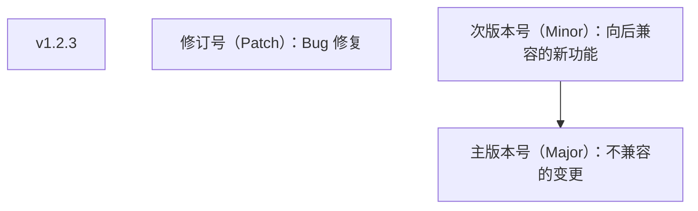

## 3. 查看标签

### 3.1 列出标签

```bash
# 列出所有标签
git tag

# 按模式过滤
git tag -l "v1.*"
git tag -l "v2.0*"

# 查看标签详情
git show v1.0.0
git cat-file -p v1.0.0
```

### 3.2 查看标签指向的提交

```bash
git rev-parse v1.0.0
git log v1.0.0 -1
```

## 4. 推送标签

### 4.1 推送单个标签

```bash
git push origin v1.0.0
```

### 4.2 推送所有标签

```bash
git push origin --tags
```

### 4.3 只推送附注标签

```bash
git push origin --follow-tags
```

## 5. 删除标签

### 5.1 删除本地标签

```bash
git tag -d v1.0.0
```

### 5.2 删除远程标签

```bash
git push origin --delete v1.0.0
# 或
git push origin :refs/tags/v1.0.0
```

## 6. 签名标签

### 6.1 GPG 签名

```bash
# 创建签名标签
git tag -s v1.0.0 -m "Release v1.0.0"

# 验证签名
git tag -v v1.0.0
```

### 6.2 SSH 签名

```bash
# Git 2.34+ 支持 SSH 签名
git tag -s v1.0.0 -m "Release v1.0.0"

# 配置 SSH 签名
git config --global gpg.format ssh
git config --global user.signingkey ~/.ssh/id_ed25519.pub
```

## 7. 标签在 CI/CD 中的应用

```bash
# 基于标签触发部署
# .github/workflows/deploy.yml
# on:
#   push:
#     tags:
#       - 'v*'

# 创建发布标签
git tag -a v1.0.0 -m "Release v1.0.0"
git push origin v1.0.0
# → 触发自动部署
```
## 创建轻量标签

**基本写法：在当前提交创建标签**
`git tag <标签名>`
```bash
# 在当前提交创建 v1.0.0 标签
git tag v1.0.0;
```

**基本写法：在指定提交创建标签**
`git tag <标签名> <提交哈希>`
```bash
# 在 abc1234 提交创建 v0.9.0 标签
git tag v0.9.0 abc1234;
```

---

## 创建附注标签

**基本写法：创建附注标签**
`git tag -a <标签名> -m "<标签消息>"`
```bash
# 创建附注标签 v1.0.0
git tag -a v1.0.0 -m "Release version 1.0.0";
```

**基本写法：在指定提交创建附注标签**
`git tag -a <标签名> <提交哈希> -m "<标签消息>"`
```bash
# 在 abc1234 提交创建附注标签 v0.9.0
git tag -a v0.9.0 abc1234 -m "Release version 0.9.0";
```

---

## 语义化版本

**基本写法：语义化版本格式**
`v<主版本号>.<次版本号>.<修订号>`
```text
# v1.2.3 含义
# 1 主版本号：不兼容的变更
# 2 次版本号：向后兼容的新功能
# 3 修订号：Bug 修复
v1.2.3
```

---

## 列出标签

**基本写法：列出所有标签**
`git tag`
```bash
# 列出所有标签
git tag;
```

**基本写法：按模式过滤标签**
`git tag -l "<模式>"`
```bash
# 列出 v1. 开头的标签
git tag -l "v1.*";
```

**基本写法：查看标签详情**
`git show <标签名>`
```bash
# 查看 v1.0.0 标签的详情
git show v1.0.0;
```

**基本写法：查看标签对象内容**
`git cat-file -p <标签名>`
```bash
# 查看 v1.0.0 标签对象内容
git cat-file -p v1.0.0;
```

---

## 查看标签指向的提交

**基本写法：获取标签指向的提交哈希**
`git rev-parse <标签名>`
```bash
# 获取 v1.0.0 指向的提交哈希
git rev-parse v1.0.0;
```

**基本写法：查看标签指向的提交日志**
`git log <标签名> -1`
```bash
# 查看 v1.0.0 标签指向的提交
git log v1.0.0 -1;
```

---

## 推送标签

**基本写法：推送单个标签**
`git push <远程仓库名> <标签名>`
```bash
# 推送 v1.0.0 标签到 origin
git push origin v1.0.0;
```

**基本写法：推送所有标签**
`git push <远程仓库名> --tags`
```bash
# 推送所有标签到 origin
git push origin --tags;
```

**基本写法：只推送附注标签**
`git push <远程仓库名> --follow-tags`
```bash
# 推送所有附注标签到 origin
git push origin --follow-tags;
```

---

## 删除标签

**基本写法：删除本地标签**
`git tag -d <标签名>`
```bash
# 删除本地 v1.0.0 标签
git tag -d v1.0.0;
```

**基本写法：删除远程标签**
`git push <远程仓库名> --delete <标签名>`
```bash
# 删除 origin 上的 v1.0.0 标签
git push origin --delete v1.0.0;
```

**基本写法：删除远程标签（refs 写法）**
`git push <远程仓库名> :refs/tags/<标签名>`
```bash
# 使用 refs 写法删除远程标签
git push origin :refs/tags/v1.0.0;
```

---

## 签名标签

**基本写法：创建 GPG 签名标签**
`git tag -s <标签名> -m "<标签消息>"`
```bash
# 创建 GPG 签名的 v1.0.0 标签
git tag -s v1.0.0 -m "Release v1.0.0";
```

**基本写法：验证签名标签**
`git tag -v <标签名>`
```bash
# 验证 v1.0.0 标签的签名
git tag -v v1.0.0;
```

---

## 配置 SSH 签名

**基本写法：配置 SSH 签名格式**
`git config --global gpg.format ssh`
```bash
# 配置使用 SSH 签名
git config --global gpg.format ssh;
```

**基本写法：配置签名密钥**
`git config --global user.signingkey <密钥路径>`
```bash
# 指定 ed25519 密钥作为签名密钥
git config --global user.signingkey ~/.ssh/id_ed25519.pub;
```

---

## 检出标签

**基本写法：检出到标签**
`git checkout <标签名>`
```bash
# 切换到 v1.0.0 标签对应的提交
git checkout v1.0.0;
```


<!-- ============ 文档分隔线：003-git/029-GitBisect.md ============ -->


## 1. bisect 概述

### 1.1 什么是 bisect

`git bisect` 使用**二分查找算法**在提交历史中定位引入 Bug 的提交。

$$
\text{查找次数} = \lceil \log_2(n) \rceil
$$

其中 $n$ 为可疑提交数量。1000 个提交最多只需 10 次二分即可定位。

### 1.2 工作原理

```
已知: v1.0 正常，当前版本有 Bug

提交历史: A---B---C---D---E---F---G---H (HEAD)

第1次: 检查 D →  (Bug 存在)
第2次: 检查 B →  (正常)
第3次: 检查 C →  (Bug 存在)
→ 结论: C 引入了 Bug
```

## 2. 基本用法

### 2.1 手动 bisect

```bash
# 1. 启动 bisect
git bisect start

# 2. 标记当前版本为有 Bug
git bisect bad

# 3. 标记已知正常的版本
git bisect good v1.0.0
# Bisecting: 5 revisions left to test
# [abc1234] some commit

# 4. 测试当前检出的版本
# 如果有 Bug
git bisect bad
# 如果正常
git bisect good

# 5. 重复步骤4，直到找到引入 Bug 的提交
# abc1234 is the first bad commit

# 6. 结束 bisect
git bisect reset
```

### 2.2 自动 bisect

```bash
# 提供测试脚本
git bisect start HEAD v1.0.0
git bisect run test.sh

# test.sh 返回值:
# 0 - 正常（good）
# 1-124, 126-127 - 有 Bug（bad）
# 125 - 无法测试（skip）
# 128+ - 中止 bisect
```

### 2.3 测试脚本示例

```bash
#!/bin/bash
# test.sh - 测试脚本

# 运行测试
npm test

# 返回测试结果
if [ $? -eq 0 ]; then
    exit 0    # 测试通过 → good
else
    exit 1    # 测试失败 → bad
fi
```

## 3. 高级用法

### 3.1 跳过无法测试的提交

```bash
git bisect skip    # 当前提交无法测试
git bisect skip abc1234 def5678  # 跳过指定提交
```

### 3.2 查看进度

```bash
git bisect log     # 查看 bisect 日志
git bisect visualize  # 可视化剩余范围
git bisect view       # 同上
```

### 3.3 重放 bisect

```bash
# 保存 bisect 日志
git bisect log > bisect-log.txt

# 重放
git bisect replay bisect-log.txt
```

## 4. 实际场景

### 4.1 定位性能回归

```bash
#!/bin/bash
# performance-test.sh

# 运行性能测试
time=$(./run-benchmark.sh | grep "Total time" | awk '{print $3}')

# 如果超过阈值，标记为 bad
if (( $(echo "$time > 5.0" | bc -l) )); then
    exit 1  # 性能退化
else
    exit 0  # 性能正常
fi
```

### 4.2 定位编译错误

```bash
#!/bin/bash
# build-test.sh

npm run build > /dev/null 2>&1
exit $?
```
## 启动与基本流程

**基本写法：启动二分查找**
`git bisect start`
```bash
# 进入 bisect 模式
git bisect start
```

---

**基本写法：标记当前提交为坏**
`git bisect bad [<提交>]`
```bash
# 标记 HEAD 为有问题的提交
git bisect bad
```

---

**基本写法：标记已知的好提交**
`git bisect good <提交>`
```bash
# 指定一个正常的旧提交
git bisect good v1.0.0
```

---

**基本写法：一行启动并指定好坏**
`git bisect start <坏提交> <好提交>`
```bash
# 同时指定坏起点与好起点
git bisect start HEAD v1.0.0
```

---

## 标记测试结果

**基本写法：当前提交标记为好**
`git bisect good`
```bash
# 当前测试通过，继续二分
git bisect good
```

---

**基本写法：当前提交标记为坏**
`git bisect bad`
```bash
# 当前测试失败，继续二分
git bisect bad
```

---

**基本写法：跳过当前提交**
`git bisect skip`
```bash
# 跳过无法测试的提交
git bisect skip
```

---

## 查看状态

**基本写法：查看二分状态**
`git bisect status`
```bash
# 显示当前 bisect 进度
git bisect status
```

---

**基本写法：查看剩余待测提交**
`git bisect visualize`
```bash
# 用 git log 查看剩余范围
git bisect visualize
```

---

**基本写法：查看已测试提交日志**
`git bisect log`
```bash
# 输出 bisect 操作过程
git bisect log
```

---

## 自动化二分

**基本写法：自动二分测试**
`git bisect run <命令> [<参数>]`
```bash
# 用测试脚本自动定位首坏提交
git bisect run npm test
```

---

**基本写法：通过脚本退出码判定**
`git bisect run <脚本>`
```bash
# 125 表示跳过，0 好，1-124 坏
git bisect run ./scripts/check-bug.sh
```

---

**基本写法：编译并测试**
`git bisect run <命令1> && <命令2>`
```bash
# 先编译再测试
git bisect run sh -c 'make && make test'
```

---

## 范围控制

**基本写法：限定路径范围**
`git bisect start -- <路径>`
```bash
# 只二分指定路径下的变更
git bisect start -- src/auth
```

---

**基本写法：排除某些提交**
`git bisect skip <提交1> <提交2>`
```bash
# 跳过多条已知不可测提交
git bisect skip abc1234 def5678
```

---

## 结束与回退

**基本写法：结束二分查找**
`git bisect reset`
```bash
# 退出 bisect 模式回到原分支
git bisect reset
```

---

**基本写法：结束后切回指定分支**
`git bisect reset <分支>`
```bash
# 退出并切回 main 分支
git bisect reset main
```

---

## 恢复中断的二分

**基本写法：记录二分过程到文件**
`git bisect log > <文件>`
```bash
# 保存当前 bisect 状态
git bisect log > bisect.log
```

---

**基本写法：从文件恢复二分状态**
`git bisect replay <文件>`
```bash
# 重新执行记录的 bisect 步骤
git bisect replay bisect.log
```

---

## 查看引入问题的提交

**基本写法：定位首坏提交后查看**
`git show <提交>`
```bash
# 查看被 bisect 锁定的提交内容
git show HEAD
```

---

**基本写法：查看引入问题的差异**
`git diff <好提交> <坏提交>`
```bash
# 查看好坏提交之间的差异
git diff v1.0.0 HEAD
```


<!-- ============ 文档分隔线：003-git/030-GitSubmodule.md ============ -->


## 1. submodule 概述

### 1.1 什么是 submodule

子模块允许在一个 Git 仓库中**嵌入另一个 Git 仓库**作为子目录，保持独立的版本控制。

```mermaid
flowchart TD
    T0["主仓库/"]
    T1["src/"]
    T2["lib/          ← 子模块（独立的 Git 仓库）"]
    T3[".git"]
    T4[".gitmodules   ← 子模块配置"]
    T5[".git/"]
    T6["modules/"]
    T7["lib/  ← 子模块的实际 Git 数据"]
    T0 --> T1
    T0 --> T2
    T3 --> T4
    T3 --> T5
    T5 --> T6
    T6 --> T7
```

### 1.2 适用场景

| 场景             | 说明                     |
| :--------------- | :----------------------- |
| **共享库**       | 多个项目共用同一库       |
| **组件库**       | 前端项目引用 UI 组件库   |
| **第三方代码**   | 引入第三方仓库而非复制   |
| **大型项目拆分** | 将大仓库拆分为多个子仓库 |

## 2. 基本操作

### 2.1 添加子模块

```bash
git submodule add https://github.com/user/shared-lib.git lib/shared
# 1. 克隆子模块到指定路径
# 2. 创建 .gitmodules 文件
# 3. 将子模块添加到暂存区

git commit -m "feat: add shared-lib submodule"
```

### 2.2 克隆含子模块的仓库

```bash
# 方式一：递归克隆
git clone --recurse-submodules https://github.com/user/main-repo.git

# 方式二：先克隆再初始化
git clone https://github.com/user/main-repo.git
cd main-repo
git submodule init
git submodule update

# 方式三：一步到位
git submodule update --init --recursive
```

### 2.3 更新子模块

```bash
# 更新到子模块远程仓库的最新提交
git submodule update --remote

# 更新指定子模块
git submodule update --remote lib/shared

# 更新所有子模块到最新
git submodule update --remote --merge
```

### 2.4 删除子模块

```bash
# 1. 取消注册
git submodule deinit -f lib/shared

# 2. 删除文件
rm -rf .git/modules/lib/shared

# 3. 从 Git 中移除
git rm -f lib/shared

# 4. 提交
git commit -m "chore: remove shared-lib submodule"
```

## 3. .gitmodules 文件

```ini
[submodule "lib/shared"]
    path = lib/shared
    url = https://github.com/user/shared-lib.git
    branch = main          # 跟踪的分支（可选）
```

## 4. 常见问题

### 4.1 子模块处于分离 HEAD

子模块默认检出特定提交，处于**分离 HEAD 状态**：

```bash
cd lib/shared
git checkout main    # 切到分支
git pull             # 拉取更新
cd ../..
git add lib/shared
git commit -m "chore: update submodule"
```

### 4.2 子模块脏状态

```bash
# 忽略子模块的修改
git config submodule.lib/shared.ignore dirty

# 强制更新（丢弃子模块的修改）
git submodule update --force
```

### 4.3 子模块冲突

```bash
# 合并时子模块冲突
# 选择一方的版本
git checkout --ours lib/shared
# 或
git checkout --theirs lib/shared
git add lib/shared
```

## 5. 替代方案

| 方案          | 特点               | 适用场景         |
| :------------ | :----------------- | :--------------- |
| **submodule** | 独立仓库，精确版本 | 第三方库         |
| **subtree**   | 合并到主仓库       | 更简单的依赖管理 |
| **npm/pip**   | 包管理器           | 语言生态内的依赖 |
| **Monorepo**  | 单一仓库           | 紧密耦合的项目   |

### 5.1 git subtree

```bash
# 添加 subtree
git subtree add --prefix=lib/shared https://github.com/user/shared-lib.git main --squash

# 更新 subtree
git subtree pull --prefix=lib/shared https://github.com/user/shared-lib.git main --squash
```
## 添加子模块

**基本写法：添加子模块**
`git submodule add <仓库地址> <路径>`
```bash
# 添加 shared-lib 作为子模块到 lib/shared
git submodule add https://github.com/user/shared-lib.git lib/shared;
```

**基本写法：提交子模块添加**
`git commit -m "<消息>"`
```bash
# 提交子模块添加
git commit -m "feat: add shared-lib submodule";
```

---

## 克隆含子模块的仓库

**基本写法：递归克隆**
`git clone --recurse-submodules <仓库地址>`
```bash
# 克隆并递归初始化所有子模块
git clone --recurse-submodules https://github.com/user/main-repo.git;
```

**基本写法：克隆主仓库**
`git clone <仓库地址>`
```bash
# 克隆主仓库
git clone https://github.com/user/main-repo.git;
```

**基本写法：初始化子模块**
`git submodule init`
```bash
# 初始化子模块
git submodule init;
```

**基本写法：更新子模块**
`git submodule update`
```bash
# 更新子模块
git submodule update;
```

**基本写法：一步到位初始化**
`git submodule update --init --recursive`
```bash
# 初始化并递归更新所有子模块
git submodule update --init --recursive;
```

---

## 更新子模块

**基本写法：更新到最新提交**
`git submodule update --remote`
```bash
# 更新所有子模块到远程最新提交
git submodule update --remote;
```

**基本写法：更新指定子模块**
`git submodule update --remote <路径>`
```bash
# 仅更新 lib/shared 子模块
git submodule update --remote lib/shared;
```

**基本写法：更新并合并**
`git submodule update --remote --merge`
```bash
# 更新所有子模块并合并
git submodule update --remote --merge;
```

---

## 删除子模块

**基本写法：取消注册子模块**
`git submodule deinit -f <路径>`
```bash
# 取消注册 lib/shared 子模块
git submodule deinit -f lib/shared;
```

**基本写法：删除子模块 Git 数据**
`rm -rf .git/modules/<路径>`
```bash
# 删除子模块的 Git 数据
rm -rf .git/modules/lib/shared;
```

**基本写法：从 Git 中移除子模块**
`git rm -f <路径>`
```bash
# 从 Git 中移除子模块
git rm -f lib/shared;
```

**基本写法：提交删除**
`git commit -m "<消息>"`
```bash
# 提交子模块删除
git commit -m "chore: remove shared-lib submodule";
```

---

## .gitmodules 配置文件

**基本写法：配置文件格式**
`[submodule "<名称>"]`
```ini
# .gitmodules 文件格式
[submodule "lib/shared"]
    path = lib/shared
    url = https://github.com/user/shared-lib.git
    branch = main
```

---

## 子模块分离 HEAD 处理

**基本写法：进入子模块目录**
`cd <子模块路径>`
```bash
# 进入子模块目录
cd lib/shared;
```

**基本写法：切换到分支**
`git checkout <分支名>`
```bash
# 切换到 main 分支
git checkout main;
```

**基本写法：拉取更新**
`git pull`
```bash
# 拉取更新
git pull;
```

**基本写法：返回主仓库**
`cd ../..`
```bash
# 返回主仓库
cd ../..;
```

**基本写法：添加子模块更新**
`git add <子模块路径>`
```bash
# 添加子模块更新
git add lib/shared;
```

**基本写法：提交更新**
`git commit -m "<消息>"`
```bash
# 提交子模块更新
git commit -m "chore: update submodule";
```

---

## 子模块脏状态处理

**基本写法：忽略子模块修改**
`git config submodule.<路径>.ignore dirty`
```bash
# 忽略 lib/shared 子模块的修改
git config submodule.lib/shared.ignore dirty;
```

**基本写法：强制更新子模块**
`git submodule update --force`
```bash
# 强制更新所有子模块
git submodule update --force;
```

---

## 子模块冲突

**基本写法：采用当前分支的子模块版本**
`git checkout --ours <子模块路径>`
```bash
# 采用当前分支的子模块版本
git checkout --ours lib/shared;
```

**基本写法：采用合并分支的子模块版本**
`git checkout --theirs <子模块路径>`
```bash
# 采用合并分支的子模块版本
git checkout --theirs lib/shared;
```

**基本写法：添加解决后的子模块**
`git add <子模块路径>`
```bash
# 添加解决后的子模块
git add lib/shared;
```

---

## git subtree 替代方案

**基本写法：添加 subtree**
`git subtree add --prefix=<路径> <仓库地址> <分支> --squash`
```bash
# 添加 shared-lib 到 lib/shared
git subtree add --prefix=lib/shared https://github.com/user/shared-lib.git main --squash;
```

**基本写法：更新 subtree**
`git subtree pull --prefix=<路径> <仓库地址> <分支> --squash`
```bash
# 更新 lib/shared 的 subtree
git subtree pull --prefix=lib/shared https://github.com/user/shared-lib.git main --squash;
```


<!-- ============ 文档分隔线：003-git/031-SparseCheckout.md ============ -->


## 1. sparse-checkout 概述

### 1.1 什么是 sparse-checkout

sparse-checkout 允许只检出仓库的**部分目录**，而非整个仓库。适用于大型 monorepo 场景。

### 1.2 适用场景

- **Monorepo**：只检出自己负责的模块
- **大型仓库**：减少磁盘占用和克隆时间
- **CI/CD**：只检出构建所需的文件

## 2. 基本用法

### 2.1 cone 模式（推荐）

```bash
# 初始化
git clone --filter=blob:none --sparse https://github.com/user/monorepo.git
cd monorepo

# 启用 sparse-checkout
git sparse-checkout init --cone

# 添加需要的目录
git sparse-checkout set apps/web packages/ui

# 添加更多目录
git sparse-checkout add apps/api

# 查看当前配置
git sparse-checkout list
```

### 2.2 完整流程

```bash
# 从零开始
git clone --filter=blob:none --sparse https://github.com/user/monorepo.git
cd monorepo
git sparse-checkout init --cone
git sparse-checkout set apps/web

# 只会检出 apps/web 目录
ls
# apps/

# 需要其他目录时
git sparse-checkout add packages/shared
```

### 2.3 禁用 sparse-checkout

```bash
# 检出所有文件
git sparse-checkout disable

# 重新启用
git sparse-checkout enable
```

## 3. 模式对比

### 3.1 cone 模式

```bash
git sparse-checkout init --cone
git sparse-checkout set apps/web packages/ui
```

只检出指定目录及其内容，性能最优。

### 3.2 非 cone 模式

```bash
git sparse-checkout init
git sparse-checkout set <<EOF
apps/web/*
!apps/web/tests/*
packages/ui/src/*
EOF
```

支持 glob 模式，但性能较差。

## 4. 与 shallow clone 配合

```bash
# 浅克隆 + 稀疏检出
git clone --depth=1 --filter=blob:none --sparse \
  https://github.com/user/monorepo.git

# 效果：
# - 只下载最近1次提交
# - 不下载文件内容（按需获取）
# - 只检出指定目录
```

## 5. 性能对比

| 操作         | 完整克隆 | sparse-checkout |
| :----------- | :------- | :-------------- |
| **克隆时间** | 长       | 短              |
| **磁盘占用** | 全部     | 仅指定目录      |
| **网络传输** | 全部     | 按需            |
| **Git 操作** | 正常     | 正常            |
| **切换目录** | 无需     | 需要配置        |

## 6. 注意事项

- 需要服务端支持（GitHub、GitLab 已支持）
- cone 模式下目录名不支持 glob
- 切换分支时可能需要更新 sparse-checkout
- CI/CD 中可利用 sparse-checkout 加速构建
## sparse-checkout 启用

**基本写法：初始化稀疏检出**
`git sparse-checkout init`
```bash
# 启用稀疏检出（默认仅根目录文件）
git sparse-checkout init
```

---

**基本写法：启用锥形模式**
`git sparse-checkout init --cone`
```bash
# 启用推荐的锥形模式（目录级匹配）
git sparse-checkout init --cone
```

---

**基本写法：启用模式模式**
`git sparse-checkout init --no-cone`
```bash
# 启用完整模式匹配（支持通配符）
git sparse-checkout init --no-cone
```

---

## 设置检出路径

**基本写法：设置需要检出的目录**
`git sparse-checkout set <路径1> <路径2>`
```bash
# 仅检出 src 与 docs 目录
git sparse-checkout set src docs
```

---

**基本写法：从标准输入读取路径**
`git sparse-checkout set --stdin < <文件>`
```bash
# 从文件读取路径列表
git sparse-checkout set --stdin < paths.txt
```

---

**基本写法：追加检出目录**
`git sparse-checkout add <路径>`
```bash
# 在已有基础上添加 tests 目录
git sparse-checkout add tests
```

---

**基本写法：重新应用稀疏规则**
`git sparse-checkout reapply`
```bash
# 修改规则后重新应用
git sparse-checkout reapply
```

---

## 查看与管理

**基本写法：查看当前检出规则**
`git sparse-checkout list`
```bash
# 列出当前所有稀疏检出路径
git sparse-checkout list
```

---

**基本写法：检查路径是否匹配**
`git sparse-checkout check-rules <路径>`
```bash
# 检查某路径是否会被检出
git sparse-checkout check-rules src/api/users.ts
```

---

**基本写法：禁用稀疏检出**
`git sparse-checkout disable`
```bash
# 关闭稀疏检出恢复完整工作区
git sparse-checkout disable
```

---

## cone 模式规则

**基本写法：添加根目录文件**
`git sparse-checkout set "/*"`
```bash
# 锥形模式下检出所有根目录文件
git sparse-checkout set "/*"
```

---

**基本写法：递归检出子目录**
`git sparse-checkout set src/`
```bash
# 检出 src 目录及其全部子目录
git sparse-checkout set src/
```

---

**基本写法：多层目录匹配**
`git sparse-checkout set src/api src/shared`
```bash
# 同时检出多个顶层子目录
git sparse-checkout set src/api src/shared
```

---

## 非 cone 模式规则

**基本写法：使用通配符匹配**
`git sparse-checkout set "/*.md"`
```bash
# 仅检出根目录 markdown 文件
git sparse-checkout set "/*.md"
```

---

**基本写法：排除某些路径**
`git sparse-checkout set "src/*" "!src/legacy/*"`
```bash
# 检出 src 但排除 legacy 子目录
git sparse-checkout set "src/*" "!src/legacy/*"
```

---

**基本写法：母目录与子目录同时配置**
`git sparse-checkout set "src/" "src/legacy/file.ts"`
```bash
# 检出 src 目录但只保留 legacy 中一个文件
git sparse-checkout set "src/" "src/legacy/file.ts"
```

---

## partial clone 部分克隆

**基本写法：克隆时跳过所有 blob**
`git clone --filter=blob:none <仓库URL>`
```bash
# 仅克隆提交历史，blob 按需获取
git clone --filter=blob:none https://github.com/org/repo.git
```

---

**基本写法：按大小过滤 blob**
`git clone --filter=blob:limit=<大小> <仓库URL>`
```bash
# 跳过大于 1MB 的 blob
git clone --filter=blob:limit=1m https://github.com/org/repo.git
```

---

**基本写法：仅克隆目录树**
`git clone --filter=tree:0 <仓库URL>`
```bash
# 仅克隆提交与目录结构
git clone --filter=tree:0 https://github.com/org/repo.git
```

---

**基本写法：仅克隆指定分支**
`git clone --branch <分支> --single-branch <仓库URL>`
```bash
# 仅克隆 main 分支历史
git clone --branch main --single-branch https://github.com/org/repo.git
```

---

## 组合使用

**基本写法：稀疏检出加部分克隆**
`git clone --filter=blob:none --sparse <仓库URL>`
```bash
# 同时启用部分克隆与稀疏检出
git clone --filter=blob:none --sparse https://github.com/org/repo.git
```

---

**基本写法：克隆后配置稀疏检出**
`git sparse-checkout set <路径>`
```bash
# 进入仓库后设置检出路径
git sparse-checkout set src/api
```

---

**基本写法：将现有仓库转为部分克隆**
`git remote set-origin --filter=blob:none origin`
```bash
# 修改远程配置启用过滤（需新克隆才生效）
git config remote.origin.partialclonefilter blob:none
```

---

## 浅克隆对比

**基本写法：浅克隆指定深度**
`git clone --depth=<深度> <仓库URL>`
```bash
# 仅克隆最近 10 次提交
git clone --depth=10 https://github.com/org/repo.git
```

---

**基本写法：浅克隆指定时间**
`git clone --shallow-since=<日期> <仓库URL>`
```bash
# 仅克隆 2024 年以来的提交
git clone --shallow-since=2024-01-01 https://github.com/org/repo.git
```

---

**基本写法：解除浅克隆**
`git fetch --unshallow`
```bash
# 拉取全部历史转为完整仓库
git fetch --unshallow
```

---

## 按需获取对象

**基本写法：手动获取缺失 blob**
`git fetch origin <路径>`
```bash
# 按需拉取指定路径的 blob
git fetch origin src/api/users.ts
```

---

**基本写法：批量获取某目录**
`git sparse-checkout add <路径>`
```bash
# 添加目录触发对象获取
git sparse-checkout add src/shared
```

---

**基本写法：检查缺失对象**
`git fsck --connectivity-only`
```bash
# 检查仓库对象连通性
git fsck --connectivity-only
```

---

## 配置与优化

**基本写法：配置部分克隆过滤**
`git config remote.origin.partialclonefilter <过滤>`
```bash
# 设置远程仓库部分克隆过滤规则
git config remote.origin.partialclonefilter blob:none
```

---

**基本写法：启用按需获取**
`git config remote.origin.promisor true`
```bash
# 标记远程为 promisor 允许按需获取
git config remote.origin.promisor true
```

---

**基本写法：查看 sparse 配置**
`git config --get-all core.sparseCheckout`
```bash
# 查看稀疏检出是否启用
git config --get-all core.sparseCheckout
```

---

**基本写法：查看 sparseCheckoutCone**
`git config core.sparseCheckoutCone`
```bash
# 查看是否启用锥形模式
git config core.sparseCheckoutCone
```


<!-- ============ 文档分隔线：003-git/032-GitFormatPatch.md ============ -->


## 1. format-patch 概述

### 1.1 什么是 format-patch

`git format-patch` 将提交转换为**标准的电子邮件补丁格式**，适合通过邮件或文件交换代码变更。

### 1.2 补丁格式

```
From abc1234 Mon Sep 17 00:00:00 2001
From: Zhang San <zhang@example.com>
Date: Sat, 14 Jun 2026 10:00:00 +0800
Subject: [PATCH] feat: add authentication

---
 src/auth.ts | 20 ++++++++++++++++++++
 1 file changed, 20 insertions(+)

diff --git a/src/auth.ts b/src/auth.ts
...
```

## 2. 基本用法

### 2.1 生成补丁

```bash
# 最近1个提交的补丁
git format-patch -1

# 最近3个提交的补丁
git format-patch -3

# 指定范围
git format-patch HEAD~3..HEAD
git format-patch abc1234..def5678

# 指定输出目录
git format-patch -3 -o /tmp/patches/
```

### 2.2 应用补丁

```bash
# 应用补丁（保留提交信息）
git am < 0001-feat-add-auth.patch

# 应用多个补丁
git am /tmp/patches/*.patch

# 检查补丁是否能应用
git apply --check 0001-feat-add-auth.patch

# 只应用变更不提交
git apply 0001-feat-add-auth.patch
```

### 2.3 处理冲突

```bash
git am /tmp/patches/*.patch
# Applying: feat: add auth
# error: patch failed: ...

# 解决冲突
vim conflicted-file.js
git add .
git am --continue

# 跳过当前补丁
git am --skip

# 放弃
git am --abort
```

## 3. 高级用法

### 3.1 生成单个文件

```bash
# 所有补丁合并为一个文件
git format-patch -3 --stdout > all-patches.patch

# 应用
git am < all-patches.patch
```

### 3.2 指定范围

```bash
# 某分支独有的提交
git format-patch main..feature

# 两个标签之间
git format-patch v1.0.0..v1.1.0
```

### 3.3 添加前缀

```bash
git format-patch -3 --subject-prefix="PATCH v2"
# [PATCH v2 1/3] feat: add auth
```

## 4. 离线协作场景

```bash
# 开发者 A：生成补丁
git format-patch -1 -o /tmp/patches/
# 通过 U盘/邮件 发送给开发者 B

# 开发者 B：应用补丁
git am < /tmp/patches/0001-feat-add-auth.patch
```

## 5. 与 git diff 的区别

| 特性         | format-patch | diff        |
| :----------- | :----------- | :---------- |
| **格式**     | 邮箱格式     | 纯差异      |
| **提交信息** | 保留         | 不保留      |
| **作者信息** | 保留         | 不保留      |
| **应用方式** | `git am`     | `git apply` |
| **适用场景** | 邮件协作     | 临时补丁    |
## 暂存文件

**基本用法:暂存改动**
`git add <路径>`

```bash
# 暂存单个文件
git add src/main.py

# 暂存整个目录
git add src/

# 暂存所有改动
git add .

# 暂存已跟踪文件(不含未跟踪)
git add -u
```

---

**基本用法:交互式暂存**
`git add -p`

```bash
# 逐块选择暂存(支持 y/n/s/e/q)
git add -p

# 交互模式主菜单
git add -i
```

---

**基本用法:按补丁暂存**
`git add --patch <文件>`

```bash
# 对指定文件逐块暂存
git add --patch src/utils.js
```

---

## 恢复工作区文件

**基本用法:丢弃工作区改动**
`git restore <文件>`

```bash
# 丢弃工作区改动(恢复到暂存区状态)
git restore src/main.py

# 恢复到指定提交的版本
git restore --source=HEAD~3 src/config.js

# 从暂存区取消暂存
git restore --staged src/main.py
```

---

**基本用法:用 checkout 恢复文件**
`git checkout -- <文件>`

```bash
# 旧写法:丢弃工作区改动
git checkout -- src/main.py

# 恢复指定提交的文件
git checkout a1b2c3d -- README.md
```

---

## 暂存区管理

**基本用法:取消暂存**
`git restore --staged <文件>`

```bash
# 把已暂存的文件移出暂存区
git restore --staged src/main.py

# 取消所有暂存
git restore --staged .
```

---

**基本用法:重置暂存区与工作区**
`git reset [选项] <提交>`

```bash
# 仅重置暂存区,保留工作区改动
git reset HEAD src/

# 软重置(保留改动到暂存区)
git reset --soft HEAD~1

# 混合重置(默认,保留改动到工作区)
git reset --mixed HEAD~1
```


<!-- ============ 文档分隔线：003-git/033-GitGrep.md ============ -->


## 1. git grep 概述

### 1.1 什么是 git grep

`git grep` 在 Git 仓库的**跟踪文件**中搜索，不需要索引文件，比普通 grep 更快。

### 1.2 优势

| 特性         | git grep            | 普通 grep  |
| :----------- | :------------------ | :--------- |
| **搜索范围** | 只搜跟踪文件        | 所有文件   |
| **速度**     | 快                  | 较慢       |
| **忽略文件** | 自动忽略 .gitignore | 需手动排除 |
| **指定版本** |                     |            |
| **并行搜索** |                     | 需配置     |

## 2. 基本用法

### 2.1 搜索当前工作区

```bash
# 搜索关键词
git grep "TODO"
git grep "function auth"

# 显示行号
git grep -n "TODO"

# 只显示文件名
git grep -l "TODO"

# 统计匹配数
git grep -c "TODO"

# 忽略大小写
git grep -i "todo"
```

### 2.2 搜索指定版本

```bash
# 在指定提交中搜索
git grep "TODO" HEAD~3
git grep "TODO" v1.0.0
git grep "TODO" main

# 在两个版本间搜索
git grep "TODO" main..feature
```

### 2.3 搜索指定文件

```bash
# 只搜特定文件
git grep "TODO" -- '*.js'
git grep "TODO" -- 'src/'

# 排除文件
git grep "TODO" -- ':!*.test.js'
```

## 3. 高级用法

### 3.1 正则搜索

```bash
# 基本正则
git grep -E "TODO|FIXME|HACK"

# Perl 正则
git grep -P "function\s+\w+\(" -- '*.js'

# 匹配整个单词
git grep -w "auth"
```

### 3.2 上下文显示

```bash
# 显示匹配行前后各2行
git grep -C 2 "TODO"

# 只显示后续行
git grep -A 5 "function auth"

# 只显示前面行
git grep -B 2 "return"
```

### 3.3 搜索多个模式

```bash
# 匹配任一模式
git grep -e "TODO" -e "FIXME"

# 必须同时匹配
git grep -e "import" --and -e "from"
```

## 4. 实际场景

### 4.1 查找所有 TODO

```bash
git grep -n "TODO\|FIXME\|HACK" -- '*.ts' '*.js'
```

### 4.2 查找废弃 API 使用

```bash
git grep -n "oldMethod\|deprecatedAPI" -- 'src/'
```

### 4.3 查找安全敏感代码

```bash
git grep -n "eval(\|innerHTML\|dangerouslySetInnerHTML" -- '*.js' '*.jsx' '*.ts' '*.tsx'
```

### 4.4 比较版本间的变更

```bash
# 查找新增的 TODO
git diff HEAD~5..HEAD | git grep "^+.*TODO"
```


<!-- ============ 文档分隔线：003-git/034-GitWorktree.md ============ -->


## 1. worktree 概述

### 1.1 什么是 worktree

`git worktree` 允许从同一仓库**检出多个工作目录**，每个目录对应不同分支，共享 .git 数据。

```
主工作树: ~/project/           → main 分支
工作树2:  ~/project-feature/   → feature 分支
工作树3:  ~/project-hotfix/    → hotfix 分支

共享: ~/project/.git/
```

### 1.2 优势

| 优势           | 说明               |
| :------------- | :----------------- |
| **无需 stash** | 不同分支在不同目录 |
| **并行开发**   | 同时在多个分支工作 |
| **快速切换**   | 不需要切换分支     |
| **节省空间**   | 共享 .git 数据     |

## 2. 基本用法

### 2.1 创建工作树

```bash
# 基于现有分支创建
git worktree add ../project-feature feature

# 基于新分支创建
git worktree add -b new-feature ../project-new-feature main

# 创建分离 HEAD 的工作树
git worktree add --detach ../project-v1 v1.0.0
```

### 2.2 管理工作树

```bash
# 列出所有工作树
git worktree list
# /home/user/project            abc1234 [main]
# /home/user/project-feature    def5678 [feature]
# /home/user/project-hotfix     ghi9012 [hotfix/bug]

# 在工作树中工作
cd ../project-feature
git log
git commit -m "feat: add new feature"

# 删除工作树
git worktree remove ../project-feature

# 强制删除（有未提交修改）
git worktree remove --force ../project-feature
```

### 2.3 清理工作树

```bash
# 清理已删除目录的工作树引用
git worktree prune

# 查看将被清理的
git worktree prune --dry-run
```

## 3. 实际场景

### 3.1 紧急修复

```bash
# 正在 feature 分支开发
# 需要紧急修复 Bug

# 不需要 stash，直接创建工作树
git worktree add ../hotfix -b hotfix/bug-123 main
cd ../hotfix
# 修复 Bug
git commit -m "fix: resolve bug 123"
git push origin hotfix/bug-123
cd ../project
git worktree remove ../hotfix
```

### 3.2 代码审查

```bash
# 检出同事的 PR 到独立工作树
git worktree add ../review-pr -b review origin/colleague/feature
cd ../review-pr
# 测试和审查
```

### 3.3 对比版本

```bash
# 同时查看两个版本的代码
git worktree add ../v1-compare v1.0.0
# 在两个目录间对比
diff -r src/ ../v1-compare/src/
```

## 4. 注意事项

- 同一分支不能同时在多个工作树中检出
- 工作树共享 .git 目录，操作互不影响
- 删除工作树目录后需 `git worktree prune`
- 工作树中的子模块需要单独初始化
## 创建工作树

**基本写法：基于现有分支创建**
`git worktree add <路径> <分支名>`
```bash
# 将 feature 分支检出到 ../project-feature
git worktree add ../project-feature feature;
```

**基本写法：基于新分支创建**
`git worktree add -b <新分支名> <路径> <基础分支>`
```bash
# 基于 main 创建 new-feature 分支并检出
git worktree add -b new-feature ../project-new-feature main;
```

**基本写法：创建分离 HEAD 工作树**
`git worktree add --detach <路径> <提交或标签>`
```bash
# 检出 v1.0.0 标签到 ../project-v1
git worktree add --detach ../project-v1 v1.0.0;
```

---

## 管理工作树

**基本写法：列出所有工作树**
`git worktree list`
```bash
# 列出所有工作树
git worktree list;
```

**基本写法：删除工作树**
`git worktree remove <路径>`
```bash
# 删除 ../project-feature 工作树
git worktree remove ../project-feature;
```

**基本写法：强制删除工作树**
`git worktree remove --force <路径>`
```bash
# 强制删除有修改的工作树
git worktree remove --force ../project-feature;
```

---

## 清理工作树

**基本写法：清理已删除目录的引用**
`git worktree prune`
```bash
# 清理已删除目录的工作树引用
git worktree prune;
```

**基本写法：预览清理**
`git worktree prune --dry-run`
```bash
# 查看将被清理的工作树
git worktree prune --dry-run;
```

---

## 紧急修复场景

**基本写法：创建紧急修复工作树**
`git worktree add -b <修复分支> <路径> <基础分支>`
```bash
# 创建紧急修复工作树
git worktree add ../hotfix -b hotfix/bug-123 main;
```

**基本写法：进入工作树**
`cd <路径>`
```bash
# 进入工作树
cd ../hotfix;
```

**基本写法：提交修复**
`git commit -m "<消息>"`
```bash
# 修复 Bug 并提交
git commit -m "fix: resolve bug 123";
```

**基本写法：推送修复**
`git push <远程仓库名> <分支名>`
```bash
# 推送修复
git push origin hotfix/bug-123;
```

**基本写法：返回主工作树**
`cd <路径>`
```bash
# 返回主工作树
cd ../project;
```

**基本写法：删除修复工作树**
`git worktree remove <路径>`
```bash
# 删除修复工作树
git worktree remove ../hotfix;
```

---

## 代码审查场景

**基本写法：检出 PR 到工作树**
`git worktree add -b <分支> <路径> <远程仓库名>/<远程分支名>`
```bash
# 检出同事的 PR 到独立工作树
git worktree add ../review-pr -b review origin/colleague/feature;
```

**基本写法：进入审查工作树**
`cd <路径>`
```bash
# 进入工作树
cd ../review-pr;
```

---

## 对比版本场景

**基本写法：创建对比工作树**
`git worktree add <路径> <标签或提交>`
```bash
# 检出 v1.0.0 到独立目录
git worktree add ../v1-compare v1.0.0;
```

**基本写法：对比两个版本**
`diff -r <目录1> <目录2>`
```bash
# 对比两个版本的代码
diff -r src/ ../v1-compare/src/;
```


<!-- ============ 文档分隔线：003-git/035-GitGc.md ============ -->


## 1. gc 概述

### 1.1 什么是 git gc

`git gc`（Garbage Collection）清理仓库中的**不可达对象**，打包松散对象，优化仓库性能。

### 1.2 gc 做什么

1. **打包松散对象**：将 `.git/objects/??/` 中的松散文件打包为 packfile
2. **删除不可达对象**：清理不再被任何引用指向的对象
3. **压缩 packfile**：合并多个 packfile 为一个
4. **清理 reflog**：移除过期的 reflog 条目

## 2. 基本用法

### 2.1 运行 gc

```bash
# 标准垃圾回收
git gc

# 激进模式（更彻底的压缩）
git gc --aggressive

# 自动模式（只在需要时运行）
git gc --auto

# 只打包不删除
git gc --no-prune

# 立即删除不可达对象
git gc --prune=now
```

### 2.2 查看仓库状态

```bash
# 查看对象数量
git count-objects -v
# count: 42           ← 松散对象数
# size: 128           ← 松散对象大小（KB）
# in-pack: 1234       ← 打包对象数
# packs: 2            ← packfile 数量
# size-pack: 4096     ← packfile 大小（KB）
# prune-packable: 0   ← 可清理的打包对象
# garbage: 0          ← 损坏的对象

# 查看仓库大小
du -sh .git
```

## 3. gc 触发时机

### 3.1 自动触发

Git 在以下操作后可能自动运行 `git gc --auto`：

- `git commit`
- `git merge`
- `git rebase`
- `git fetch`
- `git pull`

### 3.2 自动触发条件

```bash
# 默认配置
git config --get gc.auto
# 6700  ← 松散对象超过 6700 个时触发

git config --get gc.autoPackLimit
# 50   ← packfile 超过 50 个时触发
```

### 3.3 禁用自动 gc

```bash
# 禁用自动 gc
git config --global gc.auto 0

# 临时禁用
git -c gc.auto=0 commit -m "message"
```

## 4. 手动清理

### 4.1 清理 reflog

```bash
# 清理所有过期的 reflog
git reflog expire --expire=now --all

# 清理后运行 gc
git gc --prune=now
```

### 4.2 清理不可达分支

```bash
# 查看不可达的提交
git fsck --unreachable

# 清理
git gc --prune=now
```

### 4.3 重新打包

```bash
# 重新打包所有对象
git repack -a -d

# 只打包松散对象
git repack

# 增量打包
git repack -d -l
```

## 5. 性能优化

### 5.1 gc 策略配置

```bash
# 日常 gc（快速）
git gc

# 深度优化（慢但更彻底）
git gc --aggressive

# 差异：aggressive 会重新计算 delta 压缩
# 适合：大型仓库首次 gc 或重大变更后
```

### 5.2 推荐配置

```bash
# 定期运行 gc
git config --global gc.auto 256
git config --global gc.autopacklimit 20

# 优化 pack 窗口
git config --global pack.windowMemory 256m

# 优化 delta 压缩
git config --global pack.depth 50
git config --global pack.window 10
```

## 6. 常见问题

### 6.1 仓库体积过大

```bash
# 1. 清理 reflog
git reflog expire --expire=now --all

# 2. 运行 gc
git gc --prune=now --aggressive

# 3. 检查大文件
git rev-list --objects --all | \
  git cat-file --batch-check='%(objecttype) %(objectname) %(objectsize) %(rest)' | \
  awk '/^blob/ {print $3, $4}' | \
  sort -rn | head -20
```

### 6.2 清理历史中的大文件

```bash
# 使用 git filter-repo（推荐）
pip install git-filter-repo
git filter-repo --path large-file.bin --invert-paths

# 清理后
git reflog expire --expire=now --all
git gc --prune=now --aggressive
```


<!-- ============ 文档分隔线：003-git/036-GitFlowGitHubFlowComparison.md ============ -->


## 1. Git Flow 工作流

### 1.1 分支模型

Git Flow 由 Vincent Driessen 于 2010 年提出，定义了五类长期和短期分支：

| 分支类型    | 命名约定      | 生命周期 | 说明         |
| ----------- | ------------- | -------- | ------------ |
| `main`      | `main`        | 永久     | 生产就绪代码 |
| `develop`   | `develop`     | 永久     | 集成开发主线 |
| `feature/*` | `feature/xxx` | 短期     | 功能开发     |
| `release/*` | `release/1.x` | 短期     | 发布准备     |
| `hotfix/*`  | `hotfix/xxx`  | 短期     | 紧急修复     |

```mermaid
flowchart LR
    M[main A-E-H]
    D[develop B-C-D-F-G]
    F[feature/x C'-D']
    R[release/1.0 F'-E']
    H2[hotfix H']
    D --> M
    F --> D
    R --> M
    R --> D
    H2 --> M
```

### 1.2 核心流程

**功能开发**：

```bash
# 从 develop 创建 feature 分支
git checkout -b feature/user-auth develop

# 开发完成后合并回 develop
git checkout develop
git merge --no-ff feature/user-auth
git branch -d feature/user-auth
```

**发布流程**：

```bash
# 从 develop 创建 release 分支
git checkout -b release/1.2.0 develop

# 仅修复 bug，不添加新功能
# 测试通过后合并到 main 和 develop
git checkout main
git merge --no-ff release/1.2.0
git tag -a v1.2.0

git checkout develop
git merge --no-ff release/1.2.0
git branch -d release/1.2.0
```

**热修复**：

```bash
git checkout -b hotfix/critical-bug main
# 修复后合并到 main 和 develop
git checkout main
git merge --no-ff hotfix/critical-bug
git tag -a v1.2.1

git checkout develop
git merge --no-ff hotfix/critical-bug
```

### 1.3 优缺点

**优点**：

- 明确的分支职责，适合有计划发布周期的项目
- `main` 分支始终对应生产环境
- `release` 分支允许并行开发与发布准备

**缺点**：

- 分支管理复杂，五类分支增加认知负担
- `develop` 与 `main` 合并冲突频发
- 不适合持续部署场景

## 2. GitHub Flow 工作流

### 2.1 分支模型

GitHub Flow 极度简化，仅保留两类分支：

| 分支类型    | 命名约定     | 生命周期 | 说明       |
| ----------- | ------------ | -------- | ---------- |
| `main`      | `main`       | 永久     | 始终可部署 |
| `feature/*` | `描述性名称` | 短期     | 任何变更   |

```mermaid
flowchart LR
    M[main A-B-C-F-G]
    F[feature D-E]
    F --> M
```

### 2.2 核心流程

```bash
# 1. 从 main 创建分支
git checkout -b add-login-button main

# 2. 开发并频繁提交
git commit -m "feat: add login button component"

# 3. 推送并创建 Pull Request
git push -u origin add-login-button
# 在 GitHub 上创建 PR

# 4. Code Review 通过后合并
# 通过 GitHub UI 合并 PR

# 5. 立即部署
# 合并到 main 后自动触发部署
```

### 2.3 优缺点

**优点**：

- 极简，学习成本低
- `main` 始终可部署，适合持续交付
- PR 驱动的 Code Review 文化

**缺点**：

- 缺乏发布规划，不适合多版本并行维护
- 无 `develop` 缓冲区，`main` 可能不稳定
- 大规模团队协作时冲突概率高

## 3. 深度对比

### 3.1 维度对比表

| 维度         | Git Flow                      | GitHub Flow             |
| ------------ | ----------------------------- | ----------------------- |
| 分支数量     | 5 类                          | 2 类                    |
| 发布模式     | 计划发布（版本号驱动）        | 持续部署（合并即部署）  |
| 适用团队规模 | 中大型                        | 小型至中型              |
| 学习曲线     | 陡峭                          | 平缓                    |
| 版本维护     | 支持多版本并行                | 仅维护最新版            |
| 回滚策略     | `hotfix` 分支                 | `git revert` 或重新部署 |
| CI/CD 集成   | release 分支触发              | main 合并触发           |
| 冲突频率     | 高（develop ↔ main 双向合并） | 低（单向合并到 main）   |

### 3.2 部署节奏对比

```
Git Flow 部署节奏:
  开发 → 集成 → 冻结 → 测试 → 发布（周期性，如每2周）

GitHub Flow 部署节奏:
  开发 → Review → 合并 → 部署（持续，可能每天多次）
```

### 3.3 合并策略差异

Git Flow 推荐使用 `--no-ff` 保留分支拓扑：

```bash
git merge --no-ff feature/xxx
# 产生合并提交，保留分支历史
```

GitHub Flow 通过 PR 合并，支持三种策略：

- **Merge commit**：保留完整分支历史
- **Squash and merge**：压缩为单个提交，历史更整洁
- **Rebase and merge**：线性历史，无合并提交

## 4. 变体与混合方案

### 4.1 GitLab Flow

结合两者优点，引入环境分支：

```
main ──→ staging ──→ production
```

- 支持**环境部署顺序**：开发 → 预发布 → 生产
- 保留 GitHub Flow 的简洁性
- 增加环境分支的有序性

### 4.2 Trunk-Based Development

更极端的简化：

```
main（trunk）:  A──B──C──D──E
                    \
feature flags:       B'（短生命周期，<1天）
```

- 所有人在 `main` 上开发
- 使用**特性开关**控制未完成功能
- 要求完善的自动化测试

### 4.3 选择决策树

```mermaid
flowchart TD
    T0["是否有计划发布周期？"]
    T1["是 → 是否需要多版本并行维护？"]
    T2["是 → Git Flow"]
    T3["否 → GitLab Flow"]
    T4["否 → 是否能持续部署？"]
    T5["是 → GitHub Flow"]
    T6["否 → 是否有完善自动化测试？"]
    T7["是 → Trunk-Based Development"]
    T8["否 → GitHub Flow + 人工验证"]
    T0 --> T1
    T3 --> T4
    T4 --> T5
    T4 --> T6
    T6 --> T7
    T6 --> T8
```

## 5. 实践建议

### 5.1 Git Flow 实践要点

1. **使用 `git flow` 扩展**：`git flow init`、`git flow feature start` 等命令简化操作
2. **release 分支只做 bug 修复**：新功能必须走 feature → develop 路径
3. **打标签必须**：每次合并到 main 都要打版本标签
4. **定期清理已合并分支**：避免分支列表膨胀

### 5.2 GitHub Flow 实践要点

1. **分支命名规范**：`feat/xxx`、`fix/xxx`、`chore/xxx`
2. **小步提交**：每个 PR 控制在 200-400 行变更以内
3. **PR 模板**：统一描述变更内容、测试方法、截图
4. **CI 必须通过**：PR 合并前必须通过所有自动化检查
5. **部署自动化**：合并到 main 后自动触发部署流水线


<!-- ============ 文档分隔线：003-git/037-InteractiveRebase.md ============ -->


## 1. 交互式 rebase 基础

### 1.1 启动交互式 rebase

```bash
# 修改最近 3 个提交
git rebase -i HEAD~3

# 修改从某个提交之后的所有提交
git rebase -i abc1234

# 修改从根提交开始的所有提交
git rebase -i --root
```

启动后 Git 会打开编辑器，显示待修改的提交列表：

```
pick f7f3f6d feat: add user model
pick 310154e fix: correct validation logic
pick a5f4a0d docs: update README

# Rebase abc1234..a5f4a0d onto abc1234
#
# Commands:
# p, pick <commit> = use commit
# r, reword <commit> = use commit, but edit the commit message
# e, edit <commit> = use commit, but stop for amending
# s, squash <commit> = use commit, but meld into previous commit
# f, fixup [-C | -c] <commit> = like "squash" but keep only the previous
#                    commit's log message, unless -C is given, in which case
#                    keep only this commit's message
# x, exec <command> = run command (the rest of the line) using shell
# b, break = stop here (continue rebase later with 'git rebase --continue')
# d, drop <commit> = remove commit
# l, label <label> = label current HEAD with a name
# t, reset <label> = reset HEAD to a label
# m, merge [-C <commit> | -c <commit>] <label> [# <oneline>]
```

### 1.2 执行顺序

提交列表**从上到下**对应**从旧到新**的时间顺序。修改命令后，Git 按新顺序依次执行。

## 2. reword — 修改提交信息

### 2.1 使用场景

- 修正拼写错误
- 补充遗漏的上下文
- 使提交信息符合约定式提交规范

### 2.2 操作流程

将 `pick` 改为 `reword`（或 `r`）：

```
pick f7f3f6d feat: add user model
reword 310154e fix: corret validation logic  # 拼写错误
pick a5f4a0d docs: update README
```

保存退出后，Git 会为 reword 的提交打开编辑器，让你修改提交信息：

```
fix: correct validation logic

# 原始信息有拼写错误，修正为 correct
```

### 2.3 非交互式 reword

```bash
# 修改最近一个提交的信息
git commit --amend -m "fix: correct validation logic"

# 修改指定提交的信息（需要 rebase）
GIT_SEQUENCE_EDITOR="sed -i 's/pick abc1234/reword abc1234/'" git rebase -i abc1234^
```

## 3. squash — 合并提交

### 3.1 使用场景

- 将细碎提交合并为有意义的原子提交
- 将"修复上一个提交的提交"合并进去
- 保持提交历史整洁

### 3.2 操作流程

```
pick f7f3f6d feat: add user model
squash 310154e fix: correct validation in user model
squash a5f4a0d refactor: clean up user model code
```

保存后，Git 会打开编辑器让你编辑合并后的提交信息：

```
# This is a combination of 3 commits.
# This is the 1st commit message:

feat: add user model

# This is the commit message #2:

fix: correct validation in user model

# This is the commit message #3:

refactor: clean up user model code

# 请编辑为最终合并后的信息
```

合并结果：

```
# 之前
f7f3f6d feat: add user model
310154e fix: correct validation in user model
a5f4a0d refactor: clean up user model code

# 之后
b4a2c1d feat: add user model with validation and cleanup
```

### 3.3 squash 顺序

squash 将当前提交合并到**前一个**提交。因此第一个提交必须是 `pick`：

```
# 正确
pick   A  feat: add feature
squash B  fix: typo in feature
squash C  refactor: clean up feature

# 错误 — 第一个不能是 squash
squash A  feat: add feature
pick   B  fix: typo in feature
```

## 4. fixup — 静默合并

### 4.1 与 squash 的区别

| 操作     | 合并提交信息               | 交互式编辑 |
| -------- | -------------------------- | ---------- |
| squash   | 合并所有提交信息           | 是         |
| fixup    | 丢弃当前提交信息           | 否         |
| fixup -C | 保留当前提交信息替代之前的 | 否         |
| fixup -c | 保留当前提交信息替代之前的 | 是         |

### 4.2 使用场景

适用于"修前一个提交的小问题"的场景，不需要保留中间提交信息：

```bash
# 开发过程中
git commit -m "feat: add login form"
# 发现遗漏
git add forgotten-file.js
git commit -m "fix: forgot to add file"  # 这个提交信息无保留价值
```

交互式 rebase 时：

```
pick   abc1234 feat: add login form
fixup  def5678 fix: forgot to add file
```

结果只保留 `feat: add login form`，第二个提交的信息被丢弃。

### 4.3 fixup -C 保留后者的信息

```
pick   abc1234 WIP: add login form
fixup -C def5678 feat: add login form with validation
```

结果保留 `feat: add login form with validation`，前者信息被丢弃。

### 4.4 自动 fixup 标记

在提交时使用 `--fixup` 预标记：

```bash
git commit --fixup=abc1234 -m "fix: typo in login form"
```

rebase 时使用 `--autosquash` 自动排列：

```bash
git rebase -i --autosquash HEAD~3
```

编辑器自动显示：

```
pick   abc1234 feat: add login form
fixup  def5678 fix: typo in login form  # 自动标记为 fixup
```

## 5. drop — 删除提交

### 5.1 使用场景

- 移除误提交的调试代码
- 删除不再需要的功能提交
- 清理中间产物

### 5.2 操作方式

方式一：将 `pick` 改为 `drop`：

```
pick   abc1234 feat: add user model
drop   def5678 debug: add console.log statements
pick   ghi9012 feat: add user service
```

方式二：直接删除该行：

```
pick   abc1234 feat: add user model
pick   ghi9012 feat: add user service
# def5678 行已删除
```

### 5.3 注意事项

删除提交可能导致后续提交产生冲突，因为后续提交可能依赖于被删除提交的代码。

## 6. edit — 拆分提交

### 6.1 拆分流程

```
pick   abc1234 feat: add user model and service
edit   def5678 feat: add user controller
```

当 rebase 在 `edit` 处暂停时：

```bash
# 1. 回退当前提交但保留更改
git reset HEAD^

# 2. 分多次提交
git add src/models/user.js
git commit -m "feat: add user model"

git add src/services/user.js
git commit -m "feat: add user service"

# 3. 继续 rebase
git rebase --continue
```

### 6.2 修改提交内容

在 `edit` 暂停时修改文件：

```bash
# 修改文件
vim src/models/user.js

# 追加到当前提交
git add src/models/user.js
git commit --amend

# 继续
git rebase --continue
```

## 7. rebase 冲突处理

### 7.1 冲突解决流程

```bash
# rebase 过程中出现冲突
git rebase -i HEAD~5
# CONFLICT (content): Merge conflict in src/app.js

# 1. 手动解决冲突
vim src/app.js

# 2. 标记为已解决
git add src/app.js

# 3. 继续 rebase
git rebase --continue
```

### 7.2 跳过或中止

```bash
# 跳过当前提交（等效于 drop）
git rebase --skip

# 完全放弃 rebase，恢复原始状态
git rebase --abort
```

### 7.3 使用 git rerere 复用冲突解决方案

```bash
# 启用 rerere
git config --global rerere.enabled true

# Git 会记住之前的冲突解决方案
# 下次遇到相同冲突时自动应用
```

## 8. 安全实践

### 8.1 黄金法则

**永远不要对已推送到远程的公共分支执行 rebase。**

```
# 危险！
git rebase -i main  # 如果 main 是共享分支

# 安全
git rebase -i HEAD~3  # 仅修改自己的本地提交
```

### 8.2 强制推送的替代方案

如果必须 rebase 已推送的分支，使用 `--force-with-lease`：

```bash
git push --force-with-lease origin feature/xxx
# 比 --force 更安全，会检查远程是否有他人新提交
```

### 8.3 rebase 前备份

```bash
# 创建备份分支
git branch backup-before-rebase

# rebase 失败时恢复
git reset --hard backup-before-rebase
```


<!-- ============ 文档分隔线：003-git/038-GitRevertResetComparison.md ============ -->


## 1. 核心原理

### 1.1 git revert — 反做提交

`git revert` 创建一个**新提交**，其变更内容是指定提交的**逆向操作**。历史记录中既有原始提交，也有撤销提交。

```mermaid
flowchart LR
    A[A] --> B[B] --> C[C] --> D[D] --> C2[C' C 的逆向变更]
```mermaid
flowchart LR
    A[A] --> B[B]
    B -.C 和 D 从分支历史中消失.-> X
```

原始历史：A──B──C──D（HEAD → D）；reset B：A──B（HEAD → B）bash
# 撤销最近一个提交
git revert HEAD

# 撤销指定提交
git revert abc1234

# 撤销多个提交（按顺序创建多个 revert 提交）
git revert abc1234 def5678

# 撤销多个提交（合并为一个 revert 提交）
git revert --no-commit HEAD~3..HEAD
git commit -m "revert: undo last 3 commits"
```

### 1.2 git reset — 移动指针

`git reset` 将 HEAD 指针移动到指定提交，根据模式决定如何处理工作区和暂存区。

```mermaid
flowchart LR
    A[A] --> B[B]
    C[C] -.-> X[C 和 D 从分支历史中消失]
    D[D] -.-> X
    B --> C
    C --> D
```

原始历史：A──B──C──D（HEAD → D）；reset B：A──B（HEAD → B）

```bash
# --soft: 仅移动 HEAD，保留暂存区和工作区
git reset --soft HEAD~1

# --mixed（默认）: 移动 HEAD，重置暂存区，保留工作区
git reset --mixed HEAD~1
# 等同于
git reset HEAD~1

# --hard: 移动 HEAD，重置暂存区和工作区
git reset --hard HEAD~1
```

## 2. 三种 reset 模式详解

### 2.1 模式对比

| 模式      | HEAD | 暂存区（Index） | 工作区（Working Tree） |
| --------- | ---- | --------------- | ---------------------- |
| `--soft`  | 移动 | 不变            | 不变                   |
| `--mixed` | 移动 | 重置            | 不变                   |
| `--hard`  | 移动 | 重置            | 重置                   |

### 2.2 图示理解

假设当前状态：

```
HEAD → D
暂存区: D 的快照
工作区: D 的文件
```

执行 `git reset --soft B`：

```
HEAD → B
暂存区: D 的快照（D 的变更已暂存，可直接重新提交）
工作区: D 的文件
```

执行 `git reset --mixed B`：

```
HEAD → B
暂存区: B 的快照（D 的变更变为未暂存状态）
工作区: D 的文件
```

执行 `git reset --hard B`：

```
HEAD → B
暂存区: B 的快照
工作区: B 的文件（D 的变更完全丢失！）
```

### 2.3 典型应用

**`--soft`：重新组织提交**

```bash
# 撤销最近3个提交，但保留所有变更在暂存区
git reset --soft HEAD~3
git commit -m "feat: complete user module"
# 将3个零碎提交合并为一个
```

**`--mixed`：重新选择暂存**

```bash
# 撤销提交，变更回到工作区
git reset HEAD~1
# 重新选择要暂存的文件
git add src/important-file.js
git commit -m "feat: add important feature"
```

**`--hard`：彻底丢弃**

```bash
# 丢弃所有未提交的变更
git reset --hard HEAD

# 回到指定提交的状态（危险！）
git reset --hard abc1234
```

## 3. revert 与 reset 对比

### 3.1 核心差异

| 维度       | git revert                           | git reset                  |
| ---------- | ------------------------------------ | -------------------------- |
| 历史改写   | 不改写，新增撤销提交                 | 改写，丢弃提交             |
| 安全性     | 安全，可推送共享分支                 | 危险，不应推送已共享的分支 |
| 提交哈希   | 产生新哈希                           | 之前的哈希消失             |
| 冲突可能性 | 可能冲突（如果后续提交修改了相同行） | 不冲突（直接移动指针）     |
| 协作友好   | 友好，他人无需特殊操作               | 不友好，他人需要重新同步   |
| 精确度     | 可撤销任意单个提交                   | 只能从 HEAD 往回数         |
| 可逆性     | 可再次 revert 恢复                   | 需 reflog 找回             |

### 3.2 适用场景

**使用 revert**：

- 已推送到远程共享分支的提交
- 需要保留审计追踪
- CI/CD 环境中需要记录回滚操作
- 开源项目中维护透明的变更历史

**使用 reset**：

- 仅在本地未推送的提交
- 需要重新组织提交（squash、reorder）
- 误提交后立即撤销
- 清理本地实验性提交

### 3.3 revert 的特殊情况

**revert 一个 merge 提交**：

```bash
# merge 提交有两个父提交，需要指定撤销哪个方向
git revert -m 1 abc1234
# -m 1 表示保留第1个父提交（通常是主分支）的方向
# -m 2 表示保留第2个父提交（通常是特性分支）的方向
```

**revert 一个 revert**：

```bash
# 先 revert
git revert abc1234  # 创建 C'

# 后来需要恢复，revert 那个 revert
git revert C'       # 创建 C''
# C'' 的效果等同于重新应用 abc1234 的变更
```

## 4. reflog — 丢失提交的救星

### 4.1 reflog 记录

`git reset --hard` 后，提交看似丢失，但 reflog 仍保留记录：

```bash
git reflog
# a1b2c3d HEAD@{0}: reset: moving to HEAD~2
# d4e5f6g HEAD@{1}: commit: feat: add feature D
# g7h8i9j HEAD@{2}: commit: feat: add feature C
```

### 4.2 恢复丢失的提交

```bash
# 通过 reflog 找到丢失提交的哈希
git reflog

# 恢复到该提交
git reset --hard d4e5f6g
# 或者创建新分支指向它
git branch recovered d4e5f6g
```

### 4.3 reflog 过期

reflog 条目默认保留 90 天，过期后提交可能被 GC 回收：

```bash
# 查看过期设置
git config --get gc.reflogExpire
# 默认: 90 days

# 手动触发 GC（会清除不可达对象）
git gc --prune=now
```

## 5. 实践建议

### 5.1 安全操作清单

1. **已推送的提交**：只用 `git revert`
2. **未推送的提交**：可用 `git reset`
3. **reset 前先备份**：`git branch backup`
4. **使用 `--force-with-lease`**：替代 `--force` 推送
5. **定期检查 reflog**：确认重要提交可找回

### 5.2 常见错误与修复

```bash
# 错误：reset --hard 后想恢复
git reflog                    # 找到之前的 HEAD
git reset --hard HEAD@{1}     # 恢复

# 错误：revert 了错误的提交
git revert HEAD               # revert 那个 revert

# 错误：reset 后发现还需要那些提交
git reflog
git cherry-pick abc1234       # 逐个捡回需要的提交
```


<!-- ============ 文档分隔线：003-git/039-CodeReviewBestPractice.md ============ -->


## 1. Code Review 的价值

### 1.1 核心目标

Code Review 不仅是找 Bug，更是团队知识共享和质量保障的核心环节：

| 目标     | 说明                                   |
| -------- | -------------------------------------- |
| 质量保障 | 尽早发现逻辑错误、安全漏洞、性能问题   |
| 知识传播 | 评审者了解代码变更，降低"巴士因子"风险 |
| 编码规范 | 统一代码风格，确保团队一致性           |
| 设计改进 | 发现架构问题，推动更好的设计方案       |
| 导师作用 | 高级工程师通过 Review 指导初级工程师   |

### 1.2 数据支撑

根据 Google 的研究数据：

- Code Review 平均可发现 **60-90%** 的缺陷
- 每小时代入 Review 的时间可节省 **33** 小时的维护成本
- Review 效率在 **200-400 行**变更时最高

## 2. Review 流程设计

### 2.1 标准流程

```mermaid
flowchart TD
    T0["开发者                    审查者                    仓库"]
    T1["创建 PR"]
    T2["自动化检查"]
    T3["(CI/Lint/测试)"]
    T4["代码审查"]
    T5["评论/建议"]
    T6["修改代码"]
    T7["重新审查"]
    T8["Approve"]
    T9["合并 PR"]
    T0 --> T1
    T0 --> T2
    T0 --> T3
    T0 --> T4
    T0 --> T5
    T0 --> T6
    T0 --> T7
    T0 --> T8
    T0 --> T9
```

### 2.2 PR 准入条件

```yaml
# GitHub Branch Protection Rules
required_pull_request_reviews:
  required_approving_review_count: 2
  dismiss_stale_reviews: true
  require_code_owner_reviews: true

required_status_checks:
  strict: true
  contexts:
    - ci/lint
    - ci/test
    - ci/build
```

### 2.3 角色与职责

| 角色      | 职责                               |
| --------- | ---------------------------------- |
| PR 作者   | 编写清晰的 PR 描述、自检、响应评论 |
| 审查者    | 逐行审查、提出建设性意见、确认修改 |
| CODEOWNER | 关键模块的强制审查者               |
| 维护者    | 最终合并决策、解决审查分歧         |

## 3. 审查维度

### 3.1 审查清单

**功能正确性**：

- [ ] 代码是否实现了 PR 描述中的需求
- [ ] 边界条件是否处理
- [ ] 错误路径是否覆盖
- [ ] 并发场景是否安全

**代码质量**：

- [ ] 命名是否清晰、一致
- [ ] 函数是否过长（建议 < 50 行）
- [ ] 是否有重复代码可提取
- [ ] 复杂度是否合理（圈复杂度 < 10）

**安全性**：

- [ ] 输入是否验证和清理
- [ ] 是否有 SQL 注入 / XSS 风险
- [ ] 敏感信息是否硬编码
- [ ] 权限检查是否完整

**性能**：

- [ ] 是否有不必要的循环或递归
- [ ] 数据库查询是否优化（N+1 问题）
- [ ] 是否有内存泄漏风险
- [ ] 大数据量场景是否考虑

**可维护性**：

- [ ] 是否有必要的注释（解释"为什么"而非"做什么"）
- [ ] 是否有对应的测试
- [ ] 是否影响现有 API 兼容性
- [ ] 文档是否更新

### 3.2 审查优先级

```
P0 - 阻塞合并：安全漏洞、逻辑错误、数据丢失风险
P1 - 强烈建议：性能问题、可维护性差、缺少测试
P2 - 建议改进：命名优化、代码风格、注释补充
P3 - 可选讨论：设计偏好、替代方案讨论
```

### 3.3 审查效率

```bash
# 单次 Review 的最佳参数
PR 变更行数: 200-400 行
Review 时间: 30-60 分钟
审查深度:   逐行审查（< 200 行），重点审查（200-400 行），架构审查（> 400 行）
```

## 4. Review 评论规范

### 4.1 评论分类标记

```
[nit]     - 细微问题，不影响合并
[quest]   - 疑问，需要解释
[suggest] - 建议，非必须修改
[must]    - 必须修改，阻塞合并
[praise]  - 赞赏，值得学习的代码
```

### 4.2 建设性评论示例

**不好的评论**：

```
这段代码写得不好。
```

**好的评论**：

````
[must] 这里直接拼接 SQL 有注入风险，建议使用参数化查询：

```python
# 当前代码
query = f"SELECT * FROM users WHERE id = {user_id}"

# 建议改为
query = "SELECT * FROM users WHERE id = %s"
cursor.execute(query, (user_id,))
````

````

### 4.3 评论礼仪

1. **对事不对人**：评论代码，不评论人
2. **提供方案**：不只指出问题，还给出建议
3. **解释原因**：说明为什么这样改更好
4. **正面反馈**：对好的代码给予肯定

## 5. 工具与自动化

### 5.1 自动化检查集成

```yaml
# .github/workflows/pr-check.yml
name: PR Check
on:
  pull_request:
    types: [opened, synchronize]

jobs:
  lint:
    runs-on: ubuntu-latest
    steps:
      - uses: actions/checkout@v4
      - run: npm run lint

  test:
    runs-on: ubuntu-latest
    steps:
      - uses: actions/checkout@v4
      - run: npm test

  size-check:
    runs-on: ubuntu-latest
    steps:
      - uses: actions/checkout@v4
      - uses: andresz1/size-limit-action@v1
        with:
          github_token: ${{ secrets.GITHUB_TOKEN }}
````

### 5.2 CODEOWNERS 配置

```
# .github/025-CODEOWNERS

# 全局审查者
* @team-lead

# 核心模块需要架构师审查
/src/core/ @architect

# 安全相关需要安全团队审查
/src/auth/ @security-team

# 数据库变更需要 DBA 审查
/src/models/ @dba-team
```

### 5.3 PR 模板

```markdown
## 变更描述

<!-- 简要描述本次变更 -->

## 变更类型

- [ ] 新功能
- [ ] Bug 修复
- [ ] 重构
- [ ] 性能优化
- [ ] 文档更新

## 测试方法

<!-- 描述如何测试 -->

## 检查清单

- [ ] 自测通过
- [ ] 添加了测试用例
- [ ] 更新了文档
- [ ] 无安全风险
```

## 6. 团队最佳实践

### 6.1 PR 粒度控制

```
理想 PR: 200-400 行变更
可接受:  400-800 行（需说明原因）
需拆分:  > 800 行

拆分策略:
1. 按功能模块拆分
2. 先基础设施，后业务逻辑
3. 先数据层，后 UI 层
```

### 6.2 Review 时效

| PR 优先级 | 期望 Review 时间 |
| --------- | ---------------- |
| 紧急修复  | < 1 小时         |
| 普通功能  | < 4 小时         |
| 重构优化  | < 1 个工作日     |

### 6.3 避免 Review 瓶颈

1. **多审查者**：每个模块至少 2-3 人可审查
2. **轮转机制**：避免审查任务集中在个别人
3. **Review 时间块**：每天固定时间集中 Review
4. **自动化前置**：CI 不通过的 PR 不进入 Review 队列

### 6.4 常见反模式

| 反模式          | 问题                 | 解决方案                     |
| --------------- | -------------------- | ---------------------------- |
| 橡皮图章 Review | 审查流于形式         | 要求逐行评论                 |
| Review 拖延     | PR 长时间无人审查    | 设置 SLA，超时自动提醒       |
| 大 PR 恐惧      | 审查者回避大 PR      | 强制拆分，限制 PR 大小       |
| 无休止的讨论    | 在 PR 中争论设计决策 | 设计讨论应在 PR 之前完成     |
| 只审查新代码    | 忽略上下文           | 审查者需理解变更的完整上下文 |


<!-- ============ 文档分隔线：003-git/040-GitignoreDeepDive.md ============ -->


## 一句话理解

`.gitignore` 是一份"路径黑名单"：告诉 Git 哪些文件不需要跟踪，
比如依赖目录、构建产物、本地配置和密钥。

## 为什么需要

- `node_modules` 成千上万个文件提交进仓库，仓库会臃肿到无法协作。
- 密钥、`.env` 提交后等于泄露。
- 每个人本地的编辑器配置不该污染团队仓库。

## 模式语法速查

| 写法 | 含义 | 示例 |
| --- | --- | --- |
| `node_modules/` | 忽略目录（含内部全部内容） | `node_modules/` |
| `*.log` | 匹配任意层级的 .log 文件 | `*.log` |
| `build/` | 只忽略根目录下的 build 目录 | `build/` |
| `/dist` | 以 `/` 开头锚定仓库根目录 | `/dist` |
| `**/temp` | 匹配任意层级的 temp | `**/temp` |
| `!keep.txt` | 取反，重新包含 | `!important.txt` |
| `foo?bar` / `[ab]` | 单字符通配 / 字符集合 | `test?.log` |

```gitignore
# 一个 Node 项目的典型 .gitignore
node_modules/
dist/
*.log
.env
.env.*
!.env.example
.DS_Store
coverage/
```

## 三个关键细节

**1. 只影响未跟踪文件**

已经被跟踪的文件，忽略规则不生效。要停止跟踪但不删本地文件：

```bash
git rm --cached config.local.json
echo "config.local.json" >> .gitignore
git commit -m "停止跟踪本地配置文件"
```

**2. 空目录不会被跟踪**

Git 只跟踪文件。想让空目录进仓库，惯例是放一个 `.gitkeep`：

```bash
mkdir -p uploads
touch uploads/.gitkeep
```

**3. 取反的边界**

如果父目录被忽略，`!` 无法重新包含其中的文件：

```gitignore
logs/                 # 整个 logs 目录被忽略
!logs/important.log   # 无效：父目录已忽略
```

## 全局与本地忽略

```bash
# 全局忽略（对所有仓库生效，例如系统文件）
git config --global core.excludesfile ~/.gitignore_global

# 单仓库本地忽略（不进版本库）
# 编辑 .git/info/exclude，语法与 .gitignore 相同
```

## 常见误区

| 误区 | 真相 |
| --- | --- |
| 加了 .gitignore 文件就自动从仓库消失 | 只对未跟踪文件生效，已跟踪文件要 `git rm --cached` |
| 用 `*` 忽略一切再取反 | 父目录忽略会让取反失效，维护成本高 |
| 忽略规则写得越全越好 | 团队项目优先用官方模板 + 项目实际需要，避免误伤 |
| `.env` 提交后再加忽略就安全了 | 提交过的密钥要视为已泄露，立即轮换 |

## 小结

`.gitignore` 的要点就三句话：忽略未跟踪的生成物、用 `git rm --cached` 处理存量、
把敏感文件挡在仓库门外。需要现成模板时，直接参考
[github/gitignore](https://github.com/github/gitignore) 起步。


<!-- ============ 文档分隔线：003-git/041-SignedCommitsAndSecurityPractices.md ============ -->


## 一句话理解

提交签名 = 用你的私钥给提交打上"防伪标记"，任何能拿到你公钥的人都能验证
"这个提交确实出自你手"，GitHub 上会显示 Verified 标识。

## 为什么需要

- Git 提交的作者字段只是字符串，任何人都能伪装成你。
- 开源仓库的供应链攻击常从"冒名提交"开始。
- 签名 + 分支保护规则，可以阻止未经认证的提交进入主分支。

## 方案对比：GPG 与 SSH

| 方案 | 优点 | 门槛 |
| --- | --- | --- |
| GPG 签名 | 兼容最广、支持过期与吊销 | 需要生成和管理 GPG 密钥 |
| SSH 签名 | 复用 GitHub 已有的 SSH 密钥，无需额外生成 | 较新，部分平台支持有限 |

## GPG 签名实操

```bash
# 1. 生成密钥（按提示选择 RSA 4096 或 Ed25519）
gpg --full-generate-key

# 2. 查看密钥 ID 并告诉 Git
gpg --list-secret-keys --keyid-format=long
git config --global user.signingkey <KEY_ID>

# 3. 默认对提交签名
git config --global commit.gpgsign true

# 4. 提交与验证
git commit -S -m "带签名的提交"
git log --show-signature -1
```

```bash
# 把公钥导出并配置到 GitHub/Gitee
gpg --armor --export <KEY_ID>
# 然后在平台设置页添加 GPG 公钥
```

## SSH 签名实操

```bash
# 使用已有的 SSH 密钥签名（GitHub 支持）
git config --global gpg.format ssh
git config --global user.signingkey ~/.ssh/id_ed25519.pub
git config --global commit.gpgsign true
```

## 团队安全基线

- 主分支开启**分支保护**：要求签名提交、要求 PR 评审、禁止 force push。
- 私钥泄露立即吊销并在平台删除对应公钥。
- 为重要里程碑打**签名标签**：`git tag -s v1.0.0`。
- 定期审计提交者身份与权限矩阵，遵循最小权限原则。

## 常见误区

| 误区 | 真相 |
| --- | --- |
| 签名 = 加密 | 签名只认证不加密，提交内容仍公开可读 |
| 历史提交无法被伪造 | 无签名的旧提交可被重写，签名保护的是"从现在开始" |
| 只签 tag 不签 commit | 两者都重要，commit 签名是日常防线 |
| 换了机器忘记导入私钥 | 私钥是可迁移的，建议备份并妥善保管 |

## 小结

签名的本质是"身份证明"：配置一次，收益长期。
GPG 或 SSH 任选其一，配合分支保护与权限最小化，就能把提交环节的冒充风险基本关掉。
