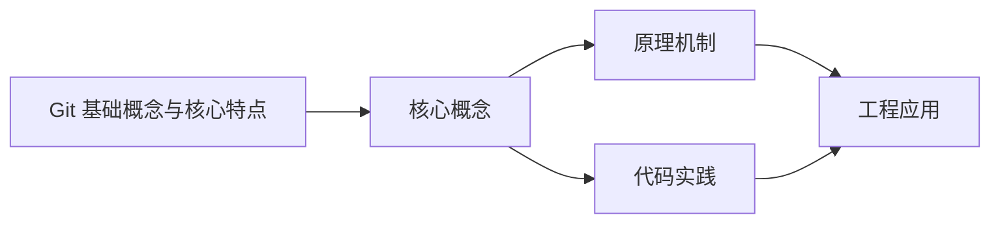
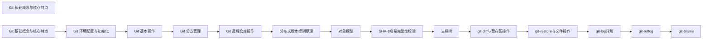

## 1. 学习目标（Bloom 分类）

本节按照布鲁姆教育目标分类学组织学习路径。本文主题为《Git 基础概念与核心特点》，属于 Git 模块，读者可以根据自身阶段选择阅读深度。

记忆层面：能够准确复述本文的核心概念、术语与基本语法或操作步骤，并能够在提问或检索时快速定位对应知识点。能够说出 Git 的核心概念、常用命令与流程。

理解层面：能够用自己的语言解释核心原理与工作机制，说明概念之间的因果关系，而不是机械记忆结论。能够解释 Git 的工作原理与设计动机。

应用层面：能够在真实项目或练习场景中运用本文知识解决具体问题，写出正确且可维护的实现。能够独立完成 Git 的标准操作。

分析层面：能够拆解复杂问题，比较本文主题与相邻概念的异同，识别边界条件与例外情况。能够分析 Git 使用中的异常与边界。

评价层面：能够根据约束条件（性能、可读性、安全、成本）评价不同方案的优劣，做出有依据的技术决策。能够评价 Git 相关工具与方案。

创造层面：能够把本文知识与其他模块知识组合，设计出新的解决方案或可复用的工程模式。能够把 Git 融入团队工作流。

通过本节学习，读者应当能够把《Git 基础概念与核心特点》纳入自己的知识网络，并与 Git 模块的其他主题（提交、分支、合并、远程协作）建立关联。

## 2. 历史动机与发展脉络

《Git 基础概念与核心特点》是 Git 领域的重要主题。要真正理解它，需要先了解它解决的问题与演进过程。

Git 由 Linus Torvalds 于 2005 年为 Linux 内核开发，目标是替代 BitKeeper：分布式、高性能、内容寻址。
Git 的核心是对象模型：blob（内容）、tree（目录）、commit（快照 + 元数据）、tag（引用）；一切对象用 SHA-1 哈希寻址。
工作流演进：集中式工作流 -> 特性分支 -> GitFlow -> GitHub Flow / Trunk-Based；现代团队普遍采用 PR 审查 + 主干发布。

回到本文主题：Git 基础概念与核心特点 的提出与成熟，正是上述技术背景下的必然产物。早期实现往往以简单可用为目标，随着工程规模扩大，社区逐渐沉淀出标准做法与最佳实践；理解这一脉络，可以帮助读者判断“为什么文档中的推荐写法是现在这个样子”，也能在遇到历史遗留代码时准确识别其设计年代与取舍。


## 3. 形式化定义与核心概念精讲

本节把《Git 基础概念与核心特点》涉及的核心概念以“定义 + 讲解”的形式展开。读者应把定义当作工具，把讲解当作理解路径；两者结合才能形成可迁移的知识。

三个区域：工作区、暂存区（index）、仓库（HEAD）；git add/commit 移动状态。
分支是指针：创建分支成本极低；合并（merge 生成合并提交）与变基（rebase 重放提交）各有取舍。
远程协作：clone/fetch/pull/push；refs/remotes 跟踪远端；冲突在合并时出现并手工解决。

### 3.1 原文章节逐一精讲

原文档把主题拆分为 23 个小节，下面按顺序给出每一节的导读讲解，随后保留原文细节供精读。

#### 原文精读（完整保留）

# Git 高级命令与工作流速查

> **符号约定**：`< >` 必填参数 | `[ ]` 可选参数

---

#### 2. Git 概述

Git 是一个分布式版本控制系统，用于跟踪文件的变化，协调多人之间的工作。它是由 Linux 创始人 Linus Torvalds 于 2005 年创建的，现在被广泛用于软件开发和其他需要版本控制的场景。
Git 的主要用途包括：

- 记录代码的历史变更
- 协作开发时管理不同版本
- 回滚到之前的版本
- 分支管理，实现并行开发
- 远程仓库同步，方便代码共享
- 代码审查和质量控制
- 发布管理和版本控制
  Git 与其他版本控制系统（如 SVN、CVS）的主要区别在于它是分布式的，每个开发者都拥有完整的代码仓库，而不是依赖中央服务器。
  <a id="3"></a>

#### 3. Git 核心特点

| 特点               | 描述                                            | 优势                                         |
| ------------------ | ----------------------------------------------- | -------------------------------------------- |
| **分布式**         | 每个开发者都有完整的代码仓库，不依赖中央服务器  | 即使网络中断也能正常工作，支持离线开发       |
| **高效**           | 处理大型项目时性能优异，采用压缩算法存储数据    | 快速处理大型代码库，节省存储空间             |
| **安全**           | 使用 SHA-1 哈希算法确保数据完整性，防止数据损坏 | 确保代码历史的真实性和完整性                 |
| **灵活**           | 支持多种工作流程，适应不同团队的需求            | 可以根据团队规模和项目特点选择合适的工作流程 |
| **强大的分支系统** | 轻松创建和管理分支，支持并行开发                | 允许同时开发多个功能，隔离不同的开发任务     |
| **速度快**         | 本地操作速度快，大部分操作不需要网络连接        | 提高开发效率，减少等待时间                   |
| **可靠性高**       | 数据存储采用冗余设计，确保数据安全              | 即使部分数据损坏也能恢复                     |
| **开源**           | 完全开源，拥有活跃的社区支持                    | 持续改进，免费使用                           |

<a id="4"></a>

#### 4. Git 基础概念

<a id="4.1"></a>

##### 4.1 仓库（Repository）

仓库是存储代码和历史记录的地方，分为本地仓库和远程仓库：

- **本地仓库**：存储在本地计算机上的代码仓库，包含完整的历史记录
- **远程仓库**：存储在服务器上的代码仓库，用于团队协作和代码共享
  **仓库创建方式**：

```bash
 # 初始化新仓库
 git init
 # 克隆远程仓库
 git clone https://github.com/username/repository.git
```

<a id="4.2"></a>

##### 4.2 工作区（Working Directory）

工作区是本地文件系统中实际的文件和目录，是开发者直接修改的地方。当你在工作区中修改文件时，Git 会跟踪这些变化。
**工作区状态**：

- **未跟踪（Untracked）**：新创建的文件，Git 还没有开始跟踪
- **已修改（Modified）**：已跟踪的文件被修改但尚未暂存
- **已暂存（Staged）**：已修改的文件被添加到暂存区，准备提交
  <a id="4.3"></a>

##### 4.3 暂存区（Staging Area）

暂存区是临时保存修改的地方，位于 `.git/index` 文件中。它是工作区和版本库之间的桥梁，用于准备提交的内容。
**暂存区的作用**：

- 允许开发者选择性地提交部分修改
- 可以在提交前预览将要提交的内容
- 提供了一个缓冲区，方便组织提交内容
  <a id="4.4"></a>

##### 4.4 版本库（Repository）

版本库包含所有提交历史和对象的地方，位于 `.git` 目录中。它存储了项目的完整历史记录，包括所有的提交、分支和标签。
**版本库的组成**：

- **对象库**：存储所有的文件快照、提交信息等
- **引用**：指向特定提交的指针，如分支和标签
- **配置文件**：存储仓库的配置信息
  <a id="4.5"></a>

##### 4.5 提交（Commit）

提交是对工作区和暂存区变更的快照，包含以下信息：

- 提交信息：描述本次修改的内容
- 作者信息：提交者的姓名和邮箱
- 日期：提交的时间
- 父提交：指向上一次提交的指针
- 树对象：包含文件的快照
  **提交示例**：

```bash
 # 提交暂存区的内容
 git commit -m "Add new feature"
 # 提交所有已修改的文件（跳过暂存区）
 git commit -a -m "Fix bug"
 # 修改上次提交的信息
 git commit --amend -m "Updated commit message"
```

<a id="4.6"></a>

##### 4.6 分支（Branch）

分支是指向特定提交的指针，默认分支为 `master` 或 `main`。分支允许开发者在独立的环境中开发新功能或修复 bug，而不影响主分支的稳定性。
**分支操作**：

```bash
 # 列出所有分支
 git branch
 # 创建新分支
 git branch feature-branch
 # 切换分支
 git checkout feature-branch
 # 创建并切换到新分支
 git checkout -b feature-branch
 # 删除分支
 git branch -d feature-branch
```

<a id="4.7"></a>

##### 4.7 合并（Merge）

合并是将一个分支的更改合并到另一个分支的过程。Git 会自动处理简单的合并，对于复杂的合并可能需要手动解决冲突。
**合并类型**：

- **快进合并（Fast-forward）**：当目标分支没有新提交时，直接移动指针
- **三方合并**：当双方都有新提交时，创建新的合并提交
- **变基合并（Rebase）**：将一个分支的提交应用到另一个分支上
  **合并操作**：

```bash
 # 合并分支到当前分支
 git merge feature-branch
 # 变基合并
 git rebase main
```

<a id="4.8"></a>

##### 4.8 远程（Remote）

远程是指向远程仓库的引用，通常命名为 `origin`。它用于与远程仓库进行交互，如推送和拉取代码。
**远程操作**：

```bash
 # 查看远程仓库
 git remote -v
 # 添加远程仓库
 git remote add origin https://github.com/username/repository.git
 # 推送代码到远程仓库
 git push origin main
 # 从远程仓库拉取代码
 git pull origin main
 # 克隆远程仓库
 git clone https://github.com/username/repository.git
```

<a id="5"></a>

#### 5. Git 安装与配置

##### 5.1 安装 Git

**Windows**：

1. 访问 [Git 官网](https://git-scm.com/download/win) 下载安装程序
2. 运行安装程序，按照默认选项安装
3. 安装完成后，打开 Git Bash 验证安装
   **macOS**：
4. 使用 Homebrew 安装：`brew install git`
5. 或使用 Xcode 命令行工具：`xcode-select --install`
   **Linux**：
6. Ubuntu/Debian：`sudo apt install git`
7. CentOS/RHEL：`sudo yum install git`
8. Fedora：`sudo dnf install git`

##### 5.2 配置 Git

**基本配置**：

```bash
 # 设置用户名
 git config --global user.name "Your Name"
 # 设置邮箱
 git config --global user.email "your.email@example.com"
 # 设置默认编辑器
 git config --global core.editor "code --wait" # 使用 VS Code
 # 设置差异比较工具
 git config --global diff.tool vscode
 git config --global difftool.vscode.cmd "code --wait --diff $LOCAL $REMOTE"
 # 启用彩色输出
 git config --global color.ui auto
 # 设置默认分支名称
 git config --global init.defaultBranch main
```

**查看配置**：

```bash
 # 查看所有配置
 git config --list
 # 查看特定配置
 git config user.name
```

<a id="6"></a>

#### 6. 基本 Git 命令

##### 6.1 仓库操作

| 命令         | 描述         | 示例                                             |
| ------------ | ------------ | ------------------------------------------------ |
| `git init`   | 初始化新仓库 | `git init my-project`                            |
| `git clone`  | 克隆远程仓库 | `git clone https://github.com/username/repo.git` |
| `git remote` | 管理远程仓库 | `git remote add origin <url>`                    |

##### 6.2 暂存与提交

| 命令         | 描述             | 示例                              |
| ------------ | ---------------- | --------------------------------- |
| `git add`    | 添加文件到暂存区 | `git add file.txt` 或 `git add .` |
| `git commit` | 提交暂存区的内容 | `git commit -m "Commit message"`  |
| `git status` | 查看工作区状态   | `git status`                      |
| `git diff`   | 查看文件修改内容 | `git diff` 或 `git diff --staged` |

##### 6.3 分支管理

| 命令            | 描述           | 示例                                             |
| --------------- | -------------- | ------------------------------------------------ |
| `git branch`    | 列出或创建分支 | `git branch` 或 `git branch feature`             |
| `git checkout`  | 切换分支       | `git checkout main` 或 `git checkout -b feature` |
| `git merge`     | 合并分支       | `git merge feature`                              |
| `git branch -d` | 删除分支       | `git branch -d feature`                          |

##### 6.4 远程操作

| 命令            | 描述               | 示例                   |
| --------------- | ------------------ | ---------------------- |
| `git push`      | 推送代码到远程仓库 | `git push origin main` |
| `git pull`      | 从远程仓库拉取代码 | `git pull origin main` |
| `git fetch`     | 从远程仓库获取更新 | `git fetch origin`     |
| `git remote -v` | 查看远程仓库信息   | `git remote -v`        |

##### 6.5 历史查看

| 命令        | 描述                   | 示例                             |
| ----------- | ---------------------- | -------------------------------- |
| `git log`   | 查看提交历史           | `git log` 或 `git log --oneline` |
| `git show`  | 查看特定提交的内容     | `git show <commit-hash>`         |
| `git blame` | 查看文件的每行修改历史 | `git blame file.txt`             |

##### 6.6 撤销操作

| 命令               | 描述                     | 示例                             |
| ------------------ | ------------------------ | -------------------------------- |
| `git checkout --`  | 撤销工作区的修改         | `git checkout -- file.txt`       |
| `git reset HEAD`   | 从暂存区移除文件         | `git reset HEAD file.txt`        |
| `git reset --hard` | 回滚到指定提交           | `git reset --hard <commit-hash>` |
| `git revert`       | 创建新提交撤销之前的提交 | `git revert <commit-hash>`       |

<a id="7"></a>

#### 7. 常见工作流程

##### 7.1 集中式工作流

适用于小型团队，只有一个主分支，所有开发者直接在主分支上工作。
**流程**：

1. 克隆远程仓库
2. 在本地修改代码
3. 提交修改
4. 推送到远程仓库

##### 7.2 功能分支工作流

每个功能都在独立的分支上开发，完成后合并到主分支。
**流程**：

1. 从主分支创建功能分支
2. 在功能分支上开发
3. 提交修改
4. 将功能分支合并到主分支
5. 删除功能分支

##### 7.3 GitFlow 工作流

更复杂的工作流，包含多个专用分支：

- `main`：稳定的发布分支
- `develop`：开发分支
- `feature/*`：功能分支
- `release/*`：发布准备分支
- `hotfix/*`：紧急修复分支

##### 7.4 Forking 工作流

适用于开源项目，开发者通过 fork 仓库进行贡献。
**流程**：

1. Fork 远程仓库
2. 克隆自己的 fork
3. 创建功能分支
4. 开发并提交修改
5. 向原仓库提交 Pull Request
   <a id="8"></a>

#### 8. 最佳实践

##### 8.1 提交规范

- **提交信息要清晰**：使用简洁明了的语言描述提交内容
- **提交粒度要适中**：每个提交应该只包含一个逻辑更改
- **使用语义化提交信息**：如 `feat: add new feature`、`fix: resolve bug`、`docs: update documentation`
- **避免提交大型二进制文件**：使用 Git LFS 管理大型文件

##### 8.2 分支管理

- **主分支保持稳定**：主分支应该始终可部署
- **功能分支命名规范**：如 `feature/feature-name`、`bugfix/bug-description`
- **定期合并主分支到功能分支**：避免合并冲突
- **及时删除已合并的分支**：保持仓库整洁

##### 8.3 代码质量

- **使用 .gitignore 文件**：忽略不需要版本控制的文件
- **定期进行代码审查**：通过 Pull Request 进行代码审查
- **使用钩子（Hooks）**：在提交前运行测试和 lint 检查
- **保持代码历史清晰**：避免不必要的合并和回滚

##### 8.4 远程仓库管理

- **使用 SSH 连接**：更安全、更方便
- **定期备份远程仓库**：防止数据丢失
- **设置分支保护**：保护主分支不被直接推送
- **使用标签管理版本**：如 `v1.0.0`
  <a id="9"></a>

#### 9. 常见问题与解决方案

##### 9.1 合并冲突

**问题**：合并分支时出现冲突
**解决方案**：

1. 查看冲突文件：`git status`
2. 手动编辑冲突文件，解决冲突
3. 标记冲突已解决：`git add <file>`
4. 完成合并：`git commit`

##### 9.2 误提交敏感信息

**问题**：不小心提交了密码、API 密钥等敏感信息
**解决方案**：

1. 立即修改敏感信息
2. 使用 `git filter-branch` 或 BFG Repo-Cleaner 从历史中移除敏感信息
3. 更新所有相关的密码和密钥

##### 9.3 仓库过大

**问题**：仓库体积过大，影响克隆和操作速度
**解决方案**：

1. 使用 `git gc` 清理垃圾文件
2. 使用 Git LFS 管理大型文件
3. 考虑使用浅克隆：`git clone --depth 1 <url>`

##### 9.4 忘记推送提交

**问题**：在本地提交后忘记推送到远程仓库
**解决方案**：

1. 查看本地提交：`git log`
2. 推送提交：`git push origin <branch>`

##### 9.5 错误删除分支

**问题**：不小心删除了包含重要代码的分支
**解决方案**：

1. 查看最近的提交：`git reflog`
2. 恢复分支：`git branch <branch-name> <commit-hash>`
   <a id="10"></a>

#### 10. 总结

Git 是一个强大的分布式版本控制系统，它的核心概念和特点使其成为现代软件开发中不可或缺的工具。通过理解 Git 的基础概念，掌握基本命令和工作流程，你可以更有效地管理代码，提高团队协作效率。
Git 的分布式架构、高效性能和强大的分支系统使其特别适合现代软件开发，尤其是在团队协作场景中。无论是小型项目还是大型开源项目，Git 都能提供可靠的版本控制解决方案。
掌握 Git 不仅是开发人员的基本技能，也是提高代码质量和团队协作效率的重要手段。通过不断实践和学习，你可以逐渐掌握 Git 的高级功能，成为版本控制的专家。

#### 延伸阅读

- [GitHub 账户](github/account-and-security)
#### 配置管理

**基本写法：设置全局用户**
`git config --global user.name "<姓名>"`
```bash
# 配置用户名
git config --global user.name "Alice"
git config --global user.email "alice@example.com"
```

---

**基本写法：查看配置**
`git config --list`
```bash
# 查看所有配置
git config --list
# 查看特定配置
git config user.name
```

---

**基本写法：设置默认编辑器**
`git config --global core.editor "<命令>"`
```bash
# 设置 VS Code 为默认编辑器
git config --global core.editor "code --wait"
```

---

**基本写法：配置别名**
`git config --global alias.<别名> "<命令>"`
```bash
# 设置别名
git config --global alias.co checkout
git config --global alias.br branch
git config --global alias.lg "log --oneline --graph"
```

---

#### 暂存与恢复

**基本写法：stash 暂存修改**
`git stash [push -m "<消息>"]`
```bash
# 暂存当前修改
git stash
# 带消息暂存
git stash push -m "WIP: feature A"
```

---

**基本写法：查看暂存列表**
`git stash list`
```bash
# 列出所有暂存
git stash list
```

---

**基本写法：恢复暂存**
`git stash pop [<索引>]`
```bash
# 恢复最近暂存并删除
git stash pop
# 恢复指定暂存
git stash pop stash@{1}
```

---

**基本写法：应用暂存不删除**
`git stash apply [<索引>]`
```bash
# 应用最近暂存（保留暂存）
git stash apply
```

---

**基本写法：清除暂存**
`git stash drop [<索引>]`
```bash
# 删除最近暂存
git stash drop
# 删除所有暂存
git stash clear
```

---

#### 提交修改

**基本写法：修改最近提交**
`git commit --amend [-m "<消息>"]`
```bash
# 修改最近提交的消息
git commit --amend -m "新消息"
# 将新改动加入最近提交
git add . && git commit --amend --no-edit
```

---

**基本写法：交互式添加**
`git add -p`
```bash
# 选择性添加改动块
git add -p
```

---

**基本写法：空提交**
`git commit --allow-empty -m "<消息>"`
```bash
# 创建空提交（触发 CI 等）
git commit --allow-empty -m "trigger deploy"
```

---

#### 分支操作

**基本写法：查看分支**
`git branch [-a] [-v]`
```bash
# 查看本地分支
git branch
# 查看所有分支（含远程）
git branch -a
# 查看分支详细信息
git branch -vv
```

---

**基本写法：重命名分支**
`git branch -m [<旧名>] <新名>`
```bash
# 重命名当前分支
git branch -m new-name
# 重命名指定分支
git branch -m old-name new-name
```

---

**基本写法：删除分支**
`git branch -d <分支名>`
```bash
# 安全删除（已合并）
git branch -d feature
# 强制删除
git branch -D feature
```

---

**基本写法：追踪远程分支**
`git branch -u <远程>/<分支>`
```bash
# 设置上游分支
git branch -u origin/main
```

---

#### 合并策略

**基本写法：合并分支**
`git merge <分支> [--no-ff]`
```bash
# 默认合并（可能 fast-forward）
git merge feature
# 强制创建合并提交
git merge --no-ff feature
```

---

**基本写法：变基**
`git rebase <目标分支>`
```bash
# 将当前分支变基到 main
git rebase main
```

---

**基本写法：交互式变基**
`git rebase -i <提交>`
```bash
# 压缩最近 3 次提交
git rebase -i HEAD~3
```

---

**基本写法：中止变基**
`git rebase --abort`
```bash
# 取消变基
git rebase --abort
```

---

**基本写法：解决冲突后继续**
`git rebase --continue`
```bash
# 解决冲突后继续变基
git add . && git rebase --continue
```

---

#### 远程仓库

**基本写法：添加远程**
`git remote add <名称> <URL>`
```bash
# 添加远程仓库
git remote add origin https://github.com/user/repo.git
```

---

**基本写法：查看远程**
`git remote -v`
```bash
# 查看所有远程
git remote -v
```

---

**基本写法：修改远程 URL**
`git remote set-url <名称> <新URL>`
```bash
# 修改远程地址
git remote set-url origin git@github.com:user/repo.git
```

---

**基本写法：拉取与推送**
`git pull [<远程>] [<分支>]`
```bash
# 拉取并合并
git pull origin main
# 推送
git push origin main
# 推送并设置上游
git push -u origin feature
```

---

**基本写法：强制推送**
`git push --force-with-lease`
```bash
# 安全的强制推送（推荐）
git push --force-with-lease
```

---

#### 历史查看

**基本写法：查看提交历史**
`git log [--oneline] [--graph] [-<数量>]`
```bash
# 单行显示历史
git log --oneline
# 图形化显示
git log --oneline --graph --all
# 查看最近 10 条
git log -10
```

---

**基本写法：查看文件历史**
`git log -p <文件>`
```bash
# 查看文件的变更历史
git log -p src/main.py
```

---

**基本写法：搜索提交**
`git log --grep="<关键词>"`
```bash
# 按消息搜索提交
git log --grep="fix"
```

---

**基本写法：查看作者提交**
`git log --author="<姓名>"`
```bash
# 按作者过滤
git log --author="Alice"
```

---

#### 撤销与回退

**基本写法：撤销工作区修改**
`git checkout -- <文件>`
```bash
# 丢弃工作区修改
git checkout -- file.txt
```

---

**基本写法：取消暂存**
`git reset HEAD <文件>`
```bash
# 取消已暂存的文件
git reset HEAD file.txt
```

---

**基本写法：软回退**
`git reset --soft <提交>`
```bash
# 回退提交，保留改动在暂存区
git reset --soft HEAD~1
```

---

**基本写法：硬回退**
`git reset --hard <提交>`
```bash
# 完全回退（慎用）
git reset --hard HEAD~1
```

---

**基本写法：撤销提交**
`git revert <提交>`
```bash
# 创建反向提交
git revert abc123
```

---

#### 标签管理

**基本写法：创建标签**
`git tag [-a] <标签名> [-m "<消息>"] [<提交>]`
```bash
# 创建轻量标签
git tag v1.0
# 创建附注标签
git tag -a v1.0 -m "Release 1.0"
```

---

**基本写法：推送标签**
`git push <远程> <标签>`
```bash
# 推送单个标签
git push origin v1.0
# 推送所有标签
git push origin --tags
```

---

**基本写法：删除标签**
`git tag -d <标签名>`
```bash
# 删除本地标签
git tag -d v1.0
# 删除远程标签
git push origin --delete v1.0
```

---

#### 二分查找

**基本写法：git bisect**
`git bisect start`
```bash
# 启动二分查找
git bisect start
git bisect bad          # 标记当前为坏
git bisect good v1.0     # 标记 v1.0 为好
# 测试后标记
git bisect good  # 或 bad
# 完成查找
git bisect reset
```

---

#### 樱桃挑选

**基本写法：cherry-pick**
`git cherry-pick <提交>`
```bash
# 选择性合并某个提交
git cherry-pick abc123
```

---

#### 子模块

**基本写法：添加子模块**
`git submodule add <URL> [<路径>]`
```bash
# 添加子模块
git submodule add https://github.com/user/lib.git libs/lib
```

---

**基本写法：初始化子模块**
`git submodule update --init --recursive`
```bash
# 克隆后初始化子模块
git submodule update --init --recursive
```

---

#### 工作树

**基本写法：添加工作树**
`git worktree add <路径> <分支>`
```bash
# 创建新工作树
git worktree add ../feature-work feature
```

---

**基本写法：列出工作树**
`git worktree list`
```bash
# 查看所有工作树
git worktree list
```

---

**基本写法：删除工作树**
`git worktree remove <路径>`
```bash
# 删除工作树
git worktree remove ../feature-work
```


### 3.2 概念关系图

下面用 Mermaid 图表达本文核心概念之间的关系，帮助读者建立整体图景：



图中展示的是本文知识的结构化关系：核心概念是入口，原理机制解释“为什么”，代码实践演示“怎么做”，工程应用回答“何时用”。读者学习时可以把每个小节的内容挂接到对应节点上。

## 4. 理论推导与原理解析

本节深入《Git 基础概念与核心特点》背后的原理。理论部分不求面面俱到，而是聚焦“能解释现象、能指导实践”的关键推导。

三个区域：工作区、暂存区（index）、仓库（HEAD）；git add/commit 移动状态。
分支是指针：创建分支成本极低；合并（merge 生成合并提交）与变基（rebase 重放提交）各有取舍。
远程协作：clone/fetch/pull/push；refs/remotes 跟踪远端；冲突在合并时出现并手工解决。
撤销模型：checkout/restore 改工作区，reset 移 HEAD，revert 生成反向提交；理解三者避免误操作。

需要强调的是，理论推导与工程实践之间存在翻译层：理论给出的是理想化模型与边界条件，工程代码则必须处理真实环境中的例外。读者在学习时应先掌握理论的“标准情形”，再通过陷阱章节了解“非标准情形”。

## 5. 代码示例与逐行讲解

本节把原文中的代码示例系统整理，并为每个示例补充用途说明与讲解。读者不应只浏览代码，而应逐段对照讲解理解设计意图。

### 5.1 示例：4.1 仓库（Repository）

该示例来自原文《4.1 仓库（Repository）》小节，用于演示Git 基础概念与核心特点相关操作。阅读时请先看代码结构，再看其后的讲解。

```bash
 # 初始化新仓库
 git init
 # 克隆远程仓库
 git clone https://github.com/username/repository.git
```

讲解：这段代码演示了本节核心知识点。代码中的关键操作可以归纳为三步：准备（定义或初始化）、执行（核心逻辑）、收尾（释放资源或返回结果）。实际项目中，这三步往往被封装为函数或类，以提升复用性与可测试性。

关键点分析：

该示例共 4 行有效代码，结构以数据或配置为主。阅读时应关注：数据字段的含义、配置项的作用，以及它们与运行行为的对应关系。

进阶思考路径：先尝试修改参数观察行为变化，再把示例中的模式迁移到自己的项目中；每次修改都记录预期与实测差异，这是把示例转化为能力的最快方式。

### 5.2 示例：4.5 提交（Commit）

该示例来自原文《4.5 提交（Commit）》小节，用于演示Git 基础概念与核心特点相关操作。阅读时请先看代码结构，再看其后的讲解。

```bash
 # 提交暂存区的内容
 git commit -m "Add new feature"
 # 提交所有已修改的文件（跳过暂存区）
 git commit -a -m "Fix bug"
 # 修改上次提交的信息
 git commit --amend -m "Updated commit message"
```

讲解：这段代码演示了本节核心知识点。代码中的关键操作可以归纳为三步：准备（定义或初始化）、执行（核心逻辑）、收尾（释放资源或返回结果）。实际项目中，这三步往往被封装为函数或类，以提升复用性与可测试性。

关键点分析：

该示例共 6 行有效代码，结构以数据或配置为主。阅读时应关注：数据字段的含义、配置项的作用，以及它们与运行行为的对应关系。

进阶思考路径：先尝试修改参数观察行为变化，再把示例中的模式迁移到自己的项目中；每次修改都记录预期与实测差异，这是把示例转化为能力的最快方式。

### 5.3 示例：4.6 分支（Branch）

该示例来自原文《4.6 分支（Branch）》小节，用于演示Git 基础概念与核心特点相关操作。阅读时请先看代码结构，再看其后的讲解。

```bash
 # 列出所有分支
 git branch
 # 创建新分支
 git branch feature-branch
 # 切换分支
 git checkout feature-branch
 # 创建并切换到新分支
 git checkout -b feature-branch
 # 删除分支
 git branch -d feature-branch
```

讲解：这段代码演示了本节核心知识点。代码中的关键操作可以归纳为三步：准备（定义或初始化）、执行（核心逻辑）、收尾（释放资源或返回结果）。实际项目中，这三步往往被封装为函数或类，以提升复用性与可测试性。

关键点分析：

该示例共 10 行有效代码，结构以数据或配置为主。阅读时应关注：数据字段的含义、配置项的作用，以及它们与运行行为的对应关系。

进阶思考路径：先尝试修改参数观察行为变化，再把示例中的模式迁移到自己的项目中；每次修改都记录预期与实测差异，这是把示例转化为能力的最快方式。

### 5.4 示例：4.7 合并（Merge）

该示例来自原文《4.7 合并（Merge）》小节，用于演示Git 基础概念与核心特点相关操作。阅读时请先看代码结构，再看其后的讲解。

```bash
 # 合并分支到当前分支
 git merge feature-branch
 # 变基合并
 git rebase main
```

讲解：这段代码演示了本节核心知识点。代码中的关键操作可以归纳为三步：准备（定义或初始化）、执行（核心逻辑）、收尾（释放资源或返回结果）。实际项目中，这三步往往被封装为函数或类，以提升复用性与可测试性。

关键点分析：

该示例共 4 行有效代码，结构以数据或配置为主。阅读时应关注：数据字段的含义、配置项的作用，以及它们与运行行为的对应关系。

进阶思考路径：先尝试修改参数观察行为变化，再把示例中的模式迁移到自己的项目中；每次修改都记录预期与实测差异，这是把示例转化为能力的最快方式。

### 5.5 示例：4.8 远程（Remote）

该示例来自原文《4.8 远程（Remote）》小节，用于演示Git 基础概念与核心特点相关操作。阅读时请先看代码结构，再看其后的讲解。

```bash
 # 查看远程仓库
 git remote -v
 # 添加远程仓库
 git remote add origin https://github.com/username/repository.git
 # 推送代码到远程仓库
 git push origin main
 # 从远程仓库拉取代码
 git pull origin main
 # 克隆远程仓库
 git clone https://github.com/username/repository.git
```

讲解：这段代码演示了本节核心知识点。代码中的关键操作可以归纳为三步：准备（定义或初始化）、执行（核心逻辑）、收尾（释放资源或返回结果）。实际项目中，这三步往往被封装为函数或类，以提升复用性与可测试性。

关键点分析：

该示例共 10 行有效代码，结构以数据或配置为主。阅读时应关注：数据字段的含义、配置项的作用，以及它们与运行行为的对应关系。

进阶思考路径：先尝试修改参数观察行为变化，再把示例中的模式迁移到自己的项目中；每次修改都记录预期与实测差异，这是把示例转化为能力的最快方式。

### 5.6 示例：5.2 配置 Git

该示例来自原文《5.2 配置 Git》小节，用于演示Git 基础概念与核心特点相关操作。阅读时请先看代码结构，再看其后的讲解。

```bash
 # 设置用户名
 git config --global user.name "Your Name"
 # 设置邮箱
 git config --global user.email "your.email@example.com"
 # 设置默认编辑器
 git config --global core.editor "code --wait" # 使用 VS Code
 # 设置差异比较工具
 git config --global diff.tool vscode
 git config --global difftool.vscode.cmd "code --wait --diff $LOCAL $REMOTE"
 # 启用彩色输出
 git config --global color.ui auto
 # 设置默认分支名称
 git config --global init.defaultBranch main
```

讲解：这段代码演示了本节核心知识点。代码中的关键操作可以归纳为三步：准备（定义或初始化）、执行（核心逻辑）、收尾（释放资源或返回结果）。实际项目中，这三步往往被封装为函数或类，以提升复用性与可测试性。

关键点分析：

该示例共 13 行有效代码，结构以数据或配置为主。阅读时应关注：数据字段的含义、配置项的作用，以及它们与运行行为的对应关系。

进阶思考路径：先尝试修改参数观察行为变化，再把示例中的模式迁移到自己的项目中；每次修改都记录预期与实测差异，这是把示例转化为能力的最快方式。

### 5.7 示例：5.2 配置 Git

该示例来自原文《5.2 配置 Git》小节，用于演示Git 基础概念与核心特点相关操作。阅读时请先看代码结构，再看其后的讲解。

```bash
 # 查看所有配置
 git config --list
 # 查看特定配置
 git config user.name
```

讲解：这段代码演示了本节核心知识点。代码中的关键操作可以归纳为三步：准备（定义或初始化）、执行（核心逻辑）、收尾（释放资源或返回结果）。实际项目中，这三步往往被封装为函数或类，以提升复用性与可测试性。

关键点分析：

该示例共 4 行有效代码，结构以数据或配置为主。阅读时应关注：数据字段的含义、配置项的作用，以及它们与运行行为的对应关系。

进阶思考路径：先尝试修改参数观察行为变化，再把示例中的模式迁移到自己的项目中；每次修改都记录预期与实测差异，这是把示例转化为能力的最快方式。

### 5.8 示例：配置管理

该示例来自原文《配置管理》小节，用于演示Git 基础概念与核心特点相关操作。阅读时请先看代码结构，再看其后的讲解。

```bash
# 配置用户名
git config --global user.name "Alice"
git config --global user.email "alice@example.com"
```

讲解：这段代码演示了本节核心知识点。代码中的关键操作可以归纳为三步：准备（定义或初始化）、执行（核心逻辑）、收尾（释放资源或返回结果）。实际项目中，这三步往往被封装为函数或类，以提升复用性与可测试性。

关键点分析：

该示例共 3 行有效代码，结构以数据或配置为主。阅读时应关注：数据字段的含义、配置项的作用，以及它们与运行行为的对应关系。

进阶思考路径：先尝试修改参数观察行为变化，再把示例中的模式迁移到自己的项目中；每次修改都记录预期与实测差异，这是把示例转化为能力的最快方式。

### 5.9 示例：配置管理

该示例来自原文《配置管理》小节，用于演示Git 基础概念与核心特点相关操作。阅读时请先看代码结构，再看其后的讲解。

```bash
# 查看所有配置
git config --list
# 查看特定配置
git config user.name
```

讲解：这段代码演示了本节核心知识点。代码中的关键操作可以归纳为三步：准备（定义或初始化）、执行（核心逻辑）、收尾（释放资源或返回结果）。实际项目中，这三步往往被封装为函数或类，以提升复用性与可测试性。

关键点分析：

该示例共 4 行有效代码，结构以数据或配置为主。阅读时应关注：数据字段的含义、配置项的作用，以及它们与运行行为的对应关系。

进阶思考路径：先尝试修改参数观察行为变化，再把示例中的模式迁移到自己的项目中；每次修改都记录预期与实测差异，这是把示例转化为能力的最快方式。

### 5.10 示例：配置管理

该示例来自原文《配置管理》小节，用于演示Git 基础概念与核心特点相关操作。阅读时请先看代码结构，再看其后的讲解。

```bash
# 设置 VS Code 为默认编辑器
git config --global core.editor "code --wait"
```

讲解：这段代码演示了本节核心知识点。代码中的关键操作可以归纳为三步：准备（定义或初始化）、执行（核心逻辑）、收尾（释放资源或返回结果）。实际项目中，这三步往往被封装为函数或类，以提升复用性与可测试性。

关键点分析：

该示例共 2 行有效代码，结构以数据或配置为主。阅读时应关注：数据字段的含义、配置项的作用，以及它们与运行行为的对应关系。

进阶思考路径：先尝试修改参数观察行为变化，再把示例中的模式迁移到自己的项目中；每次修改都记录预期与实测差异，这是把示例转化为能力的最快方式。

### 5.11 示例：配置管理

该示例来自原文《配置管理》小节，用于演示Git 基础概念与核心特点相关操作。阅读时请先看代码结构，再看其后的讲解。

```bash
# 设置别名
git config --global alias.co checkout
git config --global alias.br branch
git config --global alias.lg "log --oneline --graph"
```

讲解：这段代码演示了本节核心知识点。代码中的关键操作可以归纳为三步：准备（定义或初始化）、执行（核心逻辑）、收尾（释放资源或返回结果）。实际项目中，这三步往往被封装为函数或类，以提升复用性与可测试性。

关键点分析：

该示例共 4 行有效代码，结构以数据或配置为主。阅读时应关注：数据字段的含义、配置项的作用，以及它们与运行行为的对应关系。

进阶思考路径：先尝试修改参数观察行为变化，再把示例中的模式迁移到自己的项目中；每次修改都记录预期与实测差异，这是把示例转化为能力的最快方式。

### 5.12 示例：暂存与恢复

该示例来自原文《暂存与恢复》小节，用于演示Git 基础概念与核心特点相关操作。阅读时请先看代码结构，再看其后的讲解。

```bash
# 暂存当前修改
git stash
# 带消息暂存
git stash push -m "WIP: feature A"
```

讲解：这段代码演示了本节核心知识点。代码中的关键操作可以归纳为三步：准备（定义或初始化）、执行（核心逻辑）、收尾（释放资源或返回结果）。实际项目中，这三步往往被封装为函数或类，以提升复用性与可测试性。

关键点分析：

该示例共 4 行有效代码，结构以数据或配置为主。阅读时应关注：数据字段的含义、配置项的作用，以及它们与运行行为的对应关系。

进阶思考路径：先尝试修改参数观察行为变化，再把示例中的模式迁移到自己的项目中；每次修改都记录预期与实测差异，这是把示例转化为能力的最快方式。

### 5.13 示例：暂存与恢复

该示例来自原文《暂存与恢复》小节，用于演示Git 基础概念与核心特点相关操作。阅读时请先看代码结构，再看其后的讲解。

```bash
# 列出所有暂存
git stash list
```

讲解：这段代码演示了本节核心知识点。代码中的关键操作可以归纳为三步：准备（定义或初始化）、执行（核心逻辑）、收尾（释放资源或返回结果）。实际项目中，这三步往往被封装为函数或类，以提升复用性与可测试性。

关键点分析：

该示例共 2 行有效代码，结构以数据或配置为主。阅读时应关注：数据字段的含义、配置项的作用，以及它们与运行行为的对应关系。

进阶思考路径：先尝试修改参数观察行为变化，再把示例中的模式迁移到自己的项目中；每次修改都记录预期与实测差异，这是把示例转化为能力的最快方式。

### 5.14 示例：暂存与恢复

该示例来自原文《暂存与恢复》小节，用于演示Git 基础概念与核心特点相关操作。阅读时请先看代码结构，再看其后的讲解。

```bash
# 恢复最近暂存并删除
git stash pop
# 恢复指定暂存
git stash pop stash@{1}
```

讲解：这段代码演示了本节核心知识点。代码中的关键操作可以归纳为三步：准备（定义或初始化）、执行（核心逻辑）、收尾（释放资源或返回结果）。实际项目中，这三步往往被封装为函数或类，以提升复用性与可测试性。

关键点分析：

该示例共 4 行有效代码，结构以数据或配置为主。阅读时应关注：数据字段的含义、配置项的作用，以及它们与运行行为的对应关系。

进阶思考路径：先尝试修改参数观察行为变化，再把示例中的模式迁移到自己的项目中；每次修改都记录预期与实测差异，这是把示例转化为能力的最快方式。

### 5.15 示例：暂存与恢复

该示例来自原文《暂存与恢复》小节，用于演示Git 基础概念与核心特点相关操作。阅读时请先看代码结构，再看其后的讲解。

```bash
# 应用最近暂存（保留暂存）
git stash apply
```

讲解：这段代码演示了本节核心知识点。代码中的关键操作可以归纳为三步：准备（定义或初始化）、执行（核心逻辑）、收尾（释放资源或返回结果）。实际项目中，这三步往往被封装为函数或类，以提升复用性与可测试性。

关键点分析：

该示例共 2 行有效代码，结构以数据或配置为主。阅读时应关注：数据字段的含义、配置项的作用，以及它们与运行行为的对应关系。

进阶思考路径：先尝试修改参数观察行为变化，再把示例中的模式迁移到自己的项目中；每次修改都记录预期与实测差异，这是把示例转化为能力的最快方式。

### 5.16 示例：暂存与恢复

该示例来自原文《暂存与恢复》小节，用于演示Git 基础概念与核心特点相关操作。阅读时请先看代码结构，再看其后的讲解。

```bash
# 删除最近暂存
git stash drop
# 删除所有暂存
git stash clear
```

讲解：这段代码演示了本节核心知识点。代码中的关键操作可以归纳为三步：准备（定义或初始化）、执行（核心逻辑）、收尾（释放资源或返回结果）。实际项目中，这三步往往被封装为函数或类，以提升复用性与可测试性。

关键点分析：

该示例共 4 行有效代码，结构以数据或配置为主。阅读时应关注：数据字段的含义、配置项的作用，以及它们与运行行为的对应关系。

进阶思考路径：先尝试修改参数观察行为变化，再把示例中的模式迁移到自己的项目中；每次修改都记录预期与实测差异，这是把示例转化为能力的最快方式。

### 5.17 示例：提交修改

该示例来自原文《提交修改》小节，用于演示Git 基础概念与核心特点相关操作。阅读时请先看代码结构，再看其后的讲解。

```bash
# 修改最近提交的消息
git commit --amend -m "新消息"
# 将新改动加入最近提交
git add . && git commit --amend --no-edit
```

讲解：这段代码演示了本节核心知识点。代码中的关键操作可以归纳为三步：准备（定义或初始化）、执行（核心逻辑）、收尾（释放资源或返回结果）。实际项目中，这三步往往被封装为函数或类，以提升复用性与可测试性。

关键点分析：

该示例共 4 行有效代码，结构以数据或配置为主。阅读时应关注：数据字段的含义、配置项的作用，以及它们与运行行为的对应关系。

进阶思考路径：先尝试修改参数观察行为变化，再把示例中的模式迁移到自己的项目中；每次修改都记录预期与实测差异，这是把示例转化为能力的最快方式。

### 5.18 示例：提交修改

该示例来自原文《提交修改》小节，用于演示Git 基础概念与核心特点相关操作。阅读时请先看代码结构，再看其后的讲解。

```bash
# 选择性添加改动块
git add -p
```

讲解：这段代码演示了本节核心知识点。代码中的关键操作可以归纳为三步：准备（定义或初始化）、执行（核心逻辑）、收尾（释放资源或返回结果）。实际项目中，这三步往往被封装为函数或类，以提升复用性与可测试性。

关键点分析：

该示例共 2 行有效代码，结构以数据或配置为主。阅读时应关注：数据字段的含义、配置项的作用，以及它们与运行行为的对应关系。

进阶思考路径：先尝试修改参数观察行为变化，再把示例中的模式迁移到自己的项目中；每次修改都记录预期与实测差异，这是把示例转化为能力的最快方式。

### 5.19 示例：提交修改

该示例来自原文《提交修改》小节，用于演示Git 基础概念与核心特点相关操作。阅读时请先看代码结构，再看其后的讲解。

```bash
# 创建空提交（触发 CI 等）
git commit --allow-empty -m "trigger deploy"
```

讲解：这段代码演示了本节核心知识点。代码中的关键操作可以归纳为三步：准备（定义或初始化）、执行（核心逻辑）、收尾（释放资源或返回结果）。实际项目中，这三步往往被封装为函数或类，以提升复用性与可测试性。

关键点分析：

该示例共 2 行有效代码，结构以数据或配置为主。阅读时应关注：数据字段的含义、配置项的作用，以及它们与运行行为的对应关系。

进阶思考路径：先尝试修改参数观察行为变化，再把示例中的模式迁移到自己的项目中；每次修改都记录预期与实测差异，这是把示例转化为能力的最快方式。

### 5.20 示例：分支操作

该示例来自原文《分支操作》小节，用于演示Git 基础概念与核心特点相关操作。阅读时请先看代码结构，再看其后的讲解。

```bash
# 查看本地分支
git branch
# 查看所有分支（含远程）
git branch -a
# 查看分支详细信息
git branch -vv
```

讲解：这段代码演示了本节核心知识点。代码中的关键操作可以归纳为三步：准备（定义或初始化）、执行（核心逻辑）、收尾（释放资源或返回结果）。实际项目中，这三步往往被封装为函数或类，以提升复用性与可测试性。

关键点分析：

该示例共 6 行有效代码，结构以数据或配置为主。阅读时应关注：数据字段的含义、配置项的作用，以及它们与运行行为的对应关系。

进阶思考路径：先尝试修改参数观察行为变化，再把示例中的模式迁移到自己的项目中；每次修改都记录预期与实测差异，这是把示例转化为能力的最快方式。

### 5.21 示例：分支操作

该示例来自原文《分支操作》小节，用于演示Git 基础概念与核心特点相关操作。阅读时请先看代码结构，再看其后的讲解。

```bash
# 重命名当前分支
git branch -m new-name
# 重命名指定分支
git branch -m old-name new-name
```

讲解：这段代码演示了本节核心知识点。代码中的关键操作可以归纳为三步：准备（定义或初始化）、执行（核心逻辑）、收尾（释放资源或返回结果）。实际项目中，这三步往往被封装为函数或类，以提升复用性与可测试性。

关键点分析：

该示例共 4 行有效代码，结构以数据或配置为主。阅读时应关注：数据字段的含义、配置项的作用，以及它们与运行行为的对应关系。

进阶思考路径：先尝试修改参数观察行为变化，再把示例中的模式迁移到自己的项目中；每次修改都记录预期与实测差异，这是把示例转化为能力的最快方式。

### 5.22 示例：分支操作

该示例来自原文《分支操作》小节，用于演示Git 基础概念与核心特点相关操作。阅读时请先看代码结构，再看其后的讲解。

```bash
# 安全删除（已合并）
git branch -d feature
# 强制删除
git branch -D feature
```

讲解：这段代码演示了本节核心知识点。代码中的关键操作可以归纳为三步：准备（定义或初始化）、执行（核心逻辑）、收尾（释放资源或返回结果）。实际项目中，这三步往往被封装为函数或类，以提升复用性与可测试性。

关键点分析：

该示例共 4 行有效代码，结构以数据或配置为主。阅读时应关注：数据字段的含义、配置项的作用，以及它们与运行行为的对应关系。

进阶思考路径：先尝试修改参数观察行为变化，再把示例中的模式迁移到自己的项目中；每次修改都记录预期与实测差异，这是把示例转化为能力的最快方式。

### 5.23 示例：分支操作

该示例来自原文《分支操作》小节，用于演示Git 基础概念与核心特点相关操作。阅读时请先看代码结构，再看其后的讲解。

```bash
# 设置上游分支
git branch -u origin/main
```

讲解：这段代码演示了本节核心知识点。代码中的关键操作可以归纳为三步：准备（定义或初始化）、执行（核心逻辑）、收尾（释放资源或返回结果）。实际项目中，这三步往往被封装为函数或类，以提升复用性与可测试性。

关键点分析：

该示例共 2 行有效代码，结构以数据或配置为主。阅读时应关注：数据字段的含义、配置项的作用，以及它们与运行行为的对应关系。

进阶思考路径：先尝试修改参数观察行为变化，再把示例中的模式迁移到自己的项目中；每次修改都记录预期与实测差异，这是把示例转化为能力的最快方式。

### 5.24 示例：合并策略

该示例来自原文《合并策略》小节，用于演示Git 基础概念与核心特点相关操作。阅读时请先看代码结构，再看其后的讲解。

```bash
# 默认合并（可能 fast-forward）
git merge feature
# 强制创建合并提交
git merge --no-ff feature
```

讲解：这段代码演示了本节核心知识点。代码中的关键操作可以归纳为三步：准备（定义或初始化）、执行（核心逻辑）、收尾（释放资源或返回结果）。实际项目中，这三步往往被封装为函数或类，以提升复用性与可测试性。

关键点分析：

该示例共 4 行有效代码，结构以数据或配置为主。阅读时应关注：数据字段的含义、配置项的作用，以及它们与运行行为的对应关系。

进阶思考路径：先尝试修改参数观察行为变化，再把示例中的模式迁移到自己的项目中；每次修改都记录预期与实测差异，这是把示例转化为能力的最快方式。

### 5.25 示例：合并策略

该示例来自原文《合并策略》小节，用于演示Git 基础概念与核心特点相关操作。阅读时请先看代码结构，再看其后的讲解。

```bash
# 将当前分支变基到 main
git rebase main
```

讲解：这段代码演示了本节核心知识点。代码中的关键操作可以归纳为三步：准备（定义或初始化）、执行（核心逻辑）、收尾（释放资源或返回结果）。实际项目中，这三步往往被封装为函数或类，以提升复用性与可测试性。

关键点分析：

该示例共 2 行有效代码，结构以数据或配置为主。阅读时应关注：数据字段的含义、配置项的作用，以及它们与运行行为的对应关系。

进阶思考路径：先尝试修改参数观察行为变化，再把示例中的模式迁移到自己的项目中；每次修改都记录预期与实测差异，这是把示例转化为能力的最快方式。

### 5.26 示例：合并策略

该示例来自原文《合并策略》小节，用于演示Git 基础概念与核心特点相关操作。阅读时请先看代码结构，再看其后的讲解。

```bash
# 压缩最近 3 次提交
git rebase -i HEAD~3
```

讲解：这段代码演示了本节核心知识点。代码中的关键操作可以归纳为三步：准备（定义或初始化）、执行（核心逻辑）、收尾（释放资源或返回结果）。实际项目中，这三步往往被封装为函数或类，以提升复用性与可测试性。

关键点分析：

该示例共 2 行有效代码，结构以数据或配置为主。阅读时应关注：数据字段的含义、配置项的作用，以及它们与运行行为的对应关系。

进阶思考路径：先尝试修改参数观察行为变化，再把示例中的模式迁移到自己的项目中；每次修改都记录预期与实测差异，这是把示例转化为能力的最快方式。

### 5.27 示例：合并策略

该示例来自原文《合并策略》小节，用于演示Git 基础概念与核心特点相关操作。阅读时请先看代码结构，再看其后的讲解。

```bash
# 取消变基
git rebase --abort
```

讲解：这段代码演示了本节核心知识点。代码中的关键操作可以归纳为三步：准备（定义或初始化）、执行（核心逻辑）、收尾（释放资源或返回结果）。实际项目中，这三步往往被封装为函数或类，以提升复用性与可测试性。

关键点分析：

该示例共 2 行有效代码，结构以数据或配置为主。阅读时应关注：数据字段的含义、配置项的作用，以及它们与运行行为的对应关系。

进阶思考路径：先尝试修改参数观察行为变化，再把示例中的模式迁移到自己的项目中；每次修改都记录预期与实测差异，这是把示例转化为能力的最快方式。

### 5.28 示例：合并策略

该示例来自原文《合并策略》小节，用于演示Git 基础概念与核心特点相关操作。阅读时请先看代码结构，再看其后的讲解。

```bash
# 解决冲突后继续变基
git add . && git rebase --continue
```

讲解：这段代码演示了本节核心知识点。代码中的关键操作可以归纳为三步：准备（定义或初始化）、执行（核心逻辑）、收尾（释放资源或返回结果）。实际项目中，这三步往往被封装为函数或类，以提升复用性与可测试性。

关键点分析：

该示例共 2 行有效代码，结构以数据或配置为主。阅读时应关注：数据字段的含义、配置项的作用，以及它们与运行行为的对应关系。

进阶思考路径：先尝试修改参数观察行为变化，再把示例中的模式迁移到自己的项目中；每次修改都记录预期与实测差异，这是把示例转化为能力的最快方式。

### 5.29 示例：远程仓库

该示例来自原文《远程仓库》小节，用于演示Git 基础概念与核心特点相关操作。阅读时请先看代码结构，再看其后的讲解。

```bash
# 添加远程仓库
git remote add origin https://github.com/user/repo.git
```

讲解：这段代码演示了本节核心知识点。代码中的关键操作可以归纳为三步：准备（定义或初始化）、执行（核心逻辑）、收尾（释放资源或返回结果）。实际项目中，这三步往往被封装为函数或类，以提升复用性与可测试性。

关键点分析：

该示例共 2 行有效代码，结构以数据或配置为主。阅读时应关注：数据字段的含义、配置项的作用，以及它们与运行行为的对应关系。

进阶思考路径：先尝试修改参数观察行为变化，再把示例中的模式迁移到自己的项目中；每次修改都记录预期与实测差异，这是把示例转化为能力的最快方式。

### 5.30 示例：远程仓库

该示例来自原文《远程仓库》小节，用于演示Git 基础概念与核心特点相关操作。阅读时请先看代码结构，再看其后的讲解。

```bash
# 查看所有远程
git remote -v
```

讲解：这段代码演示了本节核心知识点。代码中的关键操作可以归纳为三步：准备（定义或初始化）、执行（核心逻辑）、收尾（释放资源或返回结果）。实际项目中，这三步往往被封装为函数或类，以提升复用性与可测试性。

关键点分析：

该示例共 2 行有效代码，结构以数据或配置为主。阅读时应关注：数据字段的含义、配置项的作用，以及它们与运行行为的对应关系。

进阶思考路径：先尝试修改参数观察行为变化，再把示例中的模式迁移到自己的项目中；每次修改都记录预期与实测差异，这是把示例转化为能力的最快方式。

### 5.31 示例：远程仓库

该示例来自原文《远程仓库》小节，用于演示Git 基础概念与核心特点相关操作。阅读时请先看代码结构，再看其后的讲解。

```bash
# 修改远程地址
git remote set-url origin git@github.com:user/repo.git
```

讲解：这段代码演示了本节核心知识点。代码中的关键操作可以归纳为三步：准备（定义或初始化）、执行（核心逻辑）、收尾（释放资源或返回结果）。实际项目中，这三步往往被封装为函数或类，以提升复用性与可测试性。

关键点分析：

该示例共 2 行有效代码，结构以数据或配置为主。阅读时应关注：数据字段的含义、配置项的作用，以及它们与运行行为的对应关系。

进阶思考路径：先尝试修改参数观察行为变化，再把示例中的模式迁移到自己的项目中；每次修改都记录预期与实测差异，这是把示例转化为能力的最快方式。

### 5.32 示例：远程仓库

该示例来自原文《远程仓库》小节，用于演示Git 基础概念与核心特点相关操作。阅读时请先看代码结构，再看其后的讲解。

```bash
# 拉取并合并
git pull origin main
# 推送
git push origin main
# 推送并设置上游
git push -u origin feature
```

讲解：这段代码演示了本节核心知识点。代码中的关键操作可以归纳为三步：准备（定义或初始化）、执行（核心逻辑）、收尾（释放资源或返回结果）。实际项目中，这三步往往被封装为函数或类，以提升复用性与可测试性。

关键点分析：

该示例共 6 行有效代码，结构以数据或配置为主。阅读时应关注：数据字段的含义、配置项的作用，以及它们与运行行为的对应关系。

进阶思考路径：先尝试修改参数观察行为变化，再把示例中的模式迁移到自己的项目中；每次修改都记录预期与实测差异，这是把示例转化为能力的最快方式。

### 5.33 示例：远程仓库

该示例来自原文《远程仓库》小节，用于演示Git 基础概念与核心特点相关操作。阅读时请先看代码结构，再看其后的讲解。

```bash
# 安全的强制推送（推荐）
git push --force-with-lease
```

讲解：这段代码演示了本节核心知识点。代码中的关键操作可以归纳为三步：准备（定义或初始化）、执行（核心逻辑）、收尾（释放资源或返回结果）。实际项目中，这三步往往被封装为函数或类，以提升复用性与可测试性。

关键点分析：

该示例共 2 行有效代码，结构以数据或配置为主。阅读时应关注：数据字段的含义、配置项的作用，以及它们与运行行为的对应关系。

进阶思考路径：先尝试修改参数观察行为变化，再把示例中的模式迁移到自己的项目中；每次修改都记录预期与实测差异，这是把示例转化为能力的最快方式。

### 5.34 示例：历史查看

该示例来自原文《历史查看》小节，用于演示Git 基础概念与核心特点相关操作。阅读时请先看代码结构，再看其后的讲解。

```bash
# 单行显示历史
git log --oneline
# 图形化显示
git log --oneline --graph --all
# 查看最近 10 条
git log -10
```

讲解：这段代码演示了本节核心知识点。代码中的关键操作可以归纳为三步：准备（定义或初始化）、执行（核心逻辑）、收尾（释放资源或返回结果）。实际项目中，这三步往往被封装为函数或类，以提升复用性与可测试性。

关键点分析：

该示例共 6 行有效代码，结构以数据或配置为主。阅读时应关注：数据字段的含义、配置项的作用，以及它们与运行行为的对应关系。

进阶思考路径：先尝试修改参数观察行为变化，再把示例中的模式迁移到自己的项目中；每次修改都记录预期与实测差异，这是把示例转化为能力的最快方式。

### 5.35 示例：历史查看

该示例来自原文《历史查看》小节，用于演示Git 基础概念与核心特点相关操作。阅读时请先看代码结构，再看其后的讲解。

```bash
# 查看文件的变更历史
git log -p src/main.py
```

讲解：这段代码演示了本节核心知识点。代码中的关键操作可以归纳为三步：准备（定义或初始化）、执行（核心逻辑）、收尾（释放资源或返回结果）。实际项目中，这三步往往被封装为函数或类，以提升复用性与可测试性。

关键点分析：

该示例共 2 行有效代码，结构以数据或配置为主。阅读时应关注：数据字段的含义、配置项的作用，以及它们与运行行为的对应关系。

进阶思考路径：先尝试修改参数观察行为变化，再把示例中的模式迁移到自己的项目中；每次修改都记录预期与实测差异，这是把示例转化为能力的最快方式。

### 5.36 示例：历史查看

该示例来自原文《历史查看》小节，用于演示Git 基础概念与核心特点相关操作。阅读时请先看代码结构，再看其后的讲解。

```bash
# 按消息搜索提交
git log --grep="fix"
```

讲解：这段代码演示了本节核心知识点。代码中的关键操作可以归纳为三步：准备（定义或初始化）、执行（核心逻辑）、收尾（释放资源或返回结果）。实际项目中，这三步往往被封装为函数或类，以提升复用性与可测试性。

关键点分析：

该示例共 2 行有效代码，结构以数据或配置为主。阅读时应关注：数据字段的含义、配置项的作用，以及它们与运行行为的对应关系。

进阶思考路径：先尝试修改参数观察行为变化，再把示例中的模式迁移到自己的项目中；每次修改都记录预期与实测差异，这是把示例转化为能力的最快方式。

### 5.37 示例：历史查看

该示例来自原文《历史查看》小节，用于演示Git 基础概念与核心特点相关操作。阅读时请先看代码结构，再看其后的讲解。

```bash
# 按作者过滤
git log --author="Alice"
```

讲解：这段代码演示了本节核心知识点。代码中的关键操作可以归纳为三步：准备（定义或初始化）、执行（核心逻辑）、收尾（释放资源或返回结果）。实际项目中，这三步往往被封装为函数或类，以提升复用性与可测试性。

关键点分析：

该示例共 2 行有效代码，结构以数据或配置为主。阅读时应关注：数据字段的含义、配置项的作用，以及它们与运行行为的对应关系。

进阶思考路径：先尝试修改参数观察行为变化，再把示例中的模式迁移到自己的项目中；每次修改都记录预期与实测差异，这是把示例转化为能力的最快方式。

### 5.38 示例：撤销与回退

该示例来自原文《撤销与回退》小节，用于演示Git 基础概念与核心特点相关操作。阅读时请先看代码结构，再看其后的讲解。

```bash
# 丢弃工作区修改
git checkout -- file.txt
```

讲解：这段代码演示了本节核心知识点。代码中的关键操作可以归纳为三步：准备（定义或初始化）、执行（核心逻辑）、收尾（释放资源或返回结果）。实际项目中，这三步往往被封装为函数或类，以提升复用性与可测试性。

关键点分析：

该示例共 2 行有效代码，结构以数据或配置为主。阅读时应关注：数据字段的含义、配置项的作用，以及它们与运行行为的对应关系。

进阶思考路径：先尝试修改参数观察行为变化，再把示例中的模式迁移到自己的项目中；每次修改都记录预期与实测差异，这是把示例转化为能力的最快方式。

### 5.39 示例：撤销与回退

该示例来自原文《撤销与回退》小节，用于演示Git 基础概念与核心特点相关操作。阅读时请先看代码结构，再看其后的讲解。

```bash
# 取消已暂存的文件
git reset HEAD file.txt
```

讲解：这段代码演示了本节核心知识点。代码中的关键操作可以归纳为三步：准备（定义或初始化）、执行（核心逻辑）、收尾（释放资源或返回结果）。实际项目中，这三步往往被封装为函数或类，以提升复用性与可测试性。

关键点分析：

该示例共 2 行有效代码，结构以数据或配置为主。阅读时应关注：数据字段的含义、配置项的作用，以及它们与运行行为的对应关系。

进阶思考路径：先尝试修改参数观察行为变化，再把示例中的模式迁移到自己的项目中；每次修改都记录预期与实测差异，这是把示例转化为能力的最快方式。

### 5.40 示例：撤销与回退

该示例来自原文《撤销与回退》小节，用于演示Git 基础概念与核心特点相关操作。阅读时请先看代码结构，再看其后的讲解。

```bash
# 回退提交，保留改动在暂存区
git reset --soft HEAD~1
```

讲解：这段代码演示了本节核心知识点。代码中的关键操作可以归纳为三步：准备（定义或初始化）、执行（核心逻辑）、收尾（释放资源或返回结果）。实际项目中，这三步往往被封装为函数或类，以提升复用性与可测试性。

关键点分析：

该示例共 2 行有效代码，结构以数据或配置为主。阅读时应关注：数据字段的含义、配置项的作用，以及它们与运行行为的对应关系。

进阶思考路径：先尝试修改参数观察行为变化，再把示例中的模式迁移到自己的项目中；每次修改都记录预期与实测差异，这是把示例转化为能力的最快方式。

### 5.41 示例：撤销与回退

该示例来自原文《撤销与回退》小节，用于演示Git 基础概念与核心特点相关操作。阅读时请先看代码结构，再看其后的讲解。

```bash
# 完全回退（慎用）
git reset --hard HEAD~1
```

讲解：这段代码演示了本节核心知识点。代码中的关键操作可以归纳为三步：准备（定义或初始化）、执行（核心逻辑）、收尾（释放资源或返回结果）。实际项目中，这三步往往被封装为函数或类，以提升复用性与可测试性。

关键点分析：

该示例共 2 行有效代码，结构以数据或配置为主。阅读时应关注：数据字段的含义、配置项的作用，以及它们与运行行为的对应关系。

进阶思考路径：先尝试修改参数观察行为变化，再把示例中的模式迁移到自己的项目中；每次修改都记录预期与实测差异，这是把示例转化为能力的最快方式。

### 5.42 示例：撤销与回退

该示例来自原文《撤销与回退》小节，用于演示Git 基础概念与核心特点相关操作。阅读时请先看代码结构，再看其后的讲解。

```bash
# 创建反向提交
git revert abc123
```

讲解：这段代码演示了本节核心知识点。代码中的关键操作可以归纳为三步：准备（定义或初始化）、执行（核心逻辑）、收尾（释放资源或返回结果）。实际项目中，这三步往往被封装为函数或类，以提升复用性与可测试性。

关键点分析：

该示例共 2 行有效代码，结构以数据或配置为主。阅读时应关注：数据字段的含义、配置项的作用，以及它们与运行行为的对应关系。

进阶思考路径：先尝试修改参数观察行为变化，再把示例中的模式迁移到自己的项目中；每次修改都记录预期与实测差异，这是把示例转化为能力的最快方式。

### 5.43 示例：标签管理

该示例来自原文《标签管理》小节，用于演示Git 基础概念与核心特点相关操作。阅读时请先看代码结构，再看其后的讲解。

```bash
# 创建轻量标签
git tag v1.0
# 创建附注标签
git tag -a v1.0 -m "Release 1.0"
```

讲解：这段代码演示了本节核心知识点。代码中的关键操作可以归纳为三步：准备（定义或初始化）、执行（核心逻辑）、收尾（释放资源或返回结果）。实际项目中，这三步往往被封装为函数或类，以提升复用性与可测试性。

关键点分析：

该示例共 4 行有效代码，结构以数据或配置为主。阅读时应关注：数据字段的含义、配置项的作用，以及它们与运行行为的对应关系。

进阶思考路径：先尝试修改参数观察行为变化，再把示例中的模式迁移到自己的项目中；每次修改都记录预期与实测差异，这是把示例转化为能力的最快方式。

### 5.44 示例：标签管理

该示例来自原文《标签管理》小节，用于演示Git 基础概念与核心特点相关操作。阅读时请先看代码结构，再看其后的讲解。

```bash
# 推送单个标签
git push origin v1.0
# 推送所有标签
git push origin --tags
```

讲解：这段代码演示了本节核心知识点。代码中的关键操作可以归纳为三步：准备（定义或初始化）、执行（核心逻辑）、收尾（释放资源或返回结果）。实际项目中，这三步往往被封装为函数或类，以提升复用性与可测试性。

关键点分析：

该示例共 4 行有效代码，结构以数据或配置为主。阅读时应关注：数据字段的含义、配置项的作用，以及它们与运行行为的对应关系。

进阶思考路径：先尝试修改参数观察行为变化，再把示例中的模式迁移到自己的项目中；每次修改都记录预期与实测差异，这是把示例转化为能力的最快方式。

### 5.45 示例：标签管理

该示例来自原文《标签管理》小节，用于演示Git 基础概念与核心特点相关操作。阅读时请先看代码结构，再看其后的讲解。

```bash
# 删除本地标签
git tag -d v1.0
# 删除远程标签
git push origin --delete v1.0
```

讲解：这段代码演示了本节核心知识点。代码中的关键操作可以归纳为三步：准备（定义或初始化）、执行（核心逻辑）、收尾（释放资源或返回结果）。实际项目中，这三步往往被封装为函数或类，以提升复用性与可测试性。

关键点分析：

该示例共 4 行有效代码，结构以数据或配置为主。阅读时应关注：数据字段的含义、配置项的作用，以及它们与运行行为的对应关系。

进阶思考路径：先尝试修改参数观察行为变化，再把示例中的模式迁移到自己的项目中；每次修改都记录预期与实测差异，这是把示例转化为能力的最快方式。

### 5.46 示例：二分查找

该示例来自原文《二分查找》小节，用于演示Git 基础概念与核心特点相关操作。阅读时请先看代码结构，再看其后的讲解。

```bash
# 启动二分查找
git bisect start
git bisect bad          # 标记当前为坏
git bisect good v1.0     # 标记 v1.0 为好
# 测试后标记
git bisect good  # 或 bad
# 完成查找
git bisect reset
```

讲解：这段代码演示了本节核心知识点。代码中的关键操作可以归纳为三步：准备（定义或初始化）、执行（核心逻辑）、收尾（释放资源或返回结果）。实际项目中，这三步往往被封装为函数或类，以提升复用性与可测试性。

关键点分析：

该示例共 8 行有效代码，结构以数据或配置为主。阅读时应关注：数据字段的含义、配置项的作用，以及它们与运行行为的对应关系。

进阶思考路径：先尝试修改参数观察行为变化，再把示例中的模式迁移到自己的项目中；每次修改都记录预期与实测差异，这是把示例转化为能力的最快方式。

### 5.47 示例：樱桃挑选

该示例来自原文《樱桃挑选》小节，用于演示Git 基础概念与核心特点相关操作。阅读时请先看代码结构，再看其后的讲解。

```bash
# 选择性合并某个提交
git cherry-pick abc123
```

讲解：这段代码演示了本节核心知识点。代码中的关键操作可以归纳为三步：准备（定义或初始化）、执行（核心逻辑）、收尾（释放资源或返回结果）。实际项目中，这三步往往被封装为函数或类，以提升复用性与可测试性。

关键点分析：

该示例共 2 行有效代码，结构以数据或配置为主。阅读时应关注：数据字段的含义、配置项的作用，以及它们与运行行为的对应关系。

进阶思考路径：先尝试修改参数观察行为变化，再把示例中的模式迁移到自己的项目中；每次修改都记录预期与实测差异，这是把示例转化为能力的最快方式。

### 5.48 示例：子模块

该示例来自原文《子模块》小节，用于演示Git 基础概念与核心特点相关操作。阅读时请先看代码结构，再看其后的讲解。

```bash
# 添加子模块
git submodule add https://github.com/user/lib.git libs/lib
```

讲解：这段代码演示了本节核心知识点。代码中的关键操作可以归纳为三步：准备（定义或初始化）、执行（核心逻辑）、收尾（释放资源或返回结果）。实际项目中，这三步往往被封装为函数或类，以提升复用性与可测试性。

关键点分析：

该示例共 2 行有效代码，结构以数据或配置为主。阅读时应关注：数据字段的含义、配置项的作用，以及它们与运行行为的对应关系。

进阶思考路径：先尝试修改参数观察行为变化，再把示例中的模式迁移到自己的项目中；每次修改都记录预期与实测差异，这是把示例转化为能力的最快方式。

### 5.49 示例：子模块

该示例来自原文《子模块》小节，用于演示Git 基础概念与核心特点相关操作。阅读时请先看代码结构，再看其后的讲解。

```bash
# 克隆后初始化子模块
git submodule update --init --recursive
```

讲解：这段代码演示了本节核心知识点。代码中的关键操作可以归纳为三步：准备（定义或初始化）、执行（核心逻辑）、收尾（释放资源或返回结果）。实际项目中，这三步往往被封装为函数或类，以提升复用性与可测试性。

关键点分析：

该示例共 2 行有效代码，结构以数据或配置为主。阅读时应关注：数据字段的含义、配置项的作用，以及它们与运行行为的对应关系。

进阶思考路径：先尝试修改参数观察行为变化，再把示例中的模式迁移到自己的项目中；每次修改都记录预期与实测差异，这是把示例转化为能力的最快方式。

### 5.50 示例：工作树

该示例来自原文《工作树》小节，用于演示Git 基础概念与核心特点相关操作。阅读时请先看代码结构，再看其后的讲解。

```bash
# 创建新工作树
git worktree add ../feature-work feature
```

讲解：这段代码演示了本节核心知识点。代码中的关键操作可以归纳为三步：准备（定义或初始化）、执行（核心逻辑）、收尾（释放资源或返回结果）。实际项目中，这三步往往被封装为函数或类，以提升复用性与可测试性。

关键点分析：

该示例共 2 行有效代码，结构以数据或配置为主。阅读时应关注：数据字段的含义、配置项的作用，以及它们与运行行为的对应关系。

进阶思考路径：先尝试修改参数观察行为变化，再把示例中的模式迁移到自己的项目中；每次修改都记录预期与实测差异，这是把示例转化为能力的最快方式。

### 5.51 示例：工作树

该示例来自原文《工作树》小节，用于演示Git 基础概念与核心特点相关操作。阅读时请先看代码结构，再看其后的讲解。

```bash
# 查看所有工作树
git worktree list
```

讲解：这段代码演示了本节核心知识点。代码中的关键操作可以归纳为三步：准备（定义或初始化）、执行（核心逻辑）、收尾（释放资源或返回结果）。实际项目中，这三步往往被封装为函数或类，以提升复用性与可测试性。

关键点分析：

该示例共 2 行有效代码，结构以数据或配置为主。阅读时应关注：数据字段的含义、配置项的作用，以及它们与运行行为的对应关系。

进阶思考路径：先尝试修改参数观察行为变化，再把示例中的模式迁移到自己的项目中；每次修改都记录预期与实测差异，这是把示例转化为能力的最快方式。

### 5.52 示例：工作树

该示例来自原文《工作树》小节，用于演示Git 基础概念与核心特点相关操作。阅读时请先看代码结构，再看其后的讲解。

```bash
# 删除工作树
git worktree remove ../feature-work
```

讲解：这段代码演示了本节核心知识点。代码中的关键操作可以归纳为三步：准备（定义或初始化）、执行（核心逻辑）、收尾（释放资源或返回结果）。实际项目中，这三步往往被封装为函数或类，以提升复用性与可测试性。

关键点分析：

该示例共 2 行有效代码，结构以数据或配置为主。阅读时应关注：数据字段的含义、配置项的作用，以及它们与运行行为的对应关系。

进阶思考路径：先尝试修改参数观察行为变化，再把示例中的模式迁移到自己的项目中；每次修改都记录预期与实测差异，这是把示例转化为能力的最快方式。


综合以上示例，可以总结出本主题的代码实践要点：第一，先定义清晰的输入输出契约；第二，核心逻辑保持单一职责；第三，错误处理与边界条件不可省略；第四，命名与注释表达意图而非复述代码。

## 6. 对比分析

对比是理解《Git 基础概念与核心特点》定位的最快路径。下面从多个维度与相邻方案进行对比。

Git 与 SVN：Git 分布式、离线提交、分支廉价；SVN 集中式已基本退出。
merge 与 rebase：merge 保留历史但复杂；rebase 线性整洁但改写。
GitHub Flow 与 GitFlow：前者主干 + PR 适合持续发布；后者适合版本化发布。

对比的目的不是分出绝对优劣，而是建立选择依据：不同约束条件下，最优解不同。读者应把每个对比维度转化为决策检查清单。

## 7. 常见陷阱与最佳实践

本节整理该主题的高频错误与推荐做法。每个陷阱先描述现象，再解释原因，最后给出最佳实践。

### 7.1 提交信息随意

无法追溯。使用 Conventional Commits（feat/fix/docs...）。

深入讲解：该问题之所以被归类为“常见陷阱”，是因为它在初学者的代码中反复出现，而且往往不在第一时间暴露——错误通常隐藏在特定数据或特定时序下。

从成因上看，提交信息随意 一般源于对 Git 某个机制的理解偏差：要么误用了默认行为，要么忽略了边界条件，要么把其他语言的思维惯性带了过来。

从影响上看，提交信息随意 轻则产生错误结果，重则导致资源泄漏、数据损坏或安全事故；这也是为什么工程评审中会把它列为检查项。

从修复策略上看，处理提交信息随意的正确顺序是：先复现（构造最小用例），再定位（确认机制层面的根因），最后修复并补充回归测试。跳过复现直接改代码，往往治标不治本。

### 7.2 大文件入库

仓库膨胀。使用 Git LFS 或排除构建产物。

深入讲解：该问题之所以被归类为“常见陷阱”，是因为它在初学者的代码中反复出现，而且往往不在第一时间暴露——错误通常隐藏在特定数据或特定时序下。

从成因上看，大文件入库 一般源于对 Git 某个机制的理解偏差：要么误用了默认行为，要么忽略了边界条件，要么把其他语言的思维惯性带了过来。

从影响上看，大文件入库 轻则产生错误结果，重则导致资源泄漏、数据损坏或安全事故；这也是为什么工程评审中会把它列为检查项。

从修复策略上看，处理大文件入库的正确顺序是：先复现（构造最小用例），再定位（确认机制层面的根因），最后修复并补充回归测试。跳过复现直接改代码，往往治标不治本。

### 7.3 force push 滥用

覆盖他人历史。仅限个人分支并通知。

深入讲解：该问题之所以被归类为“常见陷阱”，是因为它在初学者的代码中反复出现，而且往往不在第一时间暴露——错误通常隐藏在特定数据或特定时序下。

从成因上看，force push 滥用 一般源于对 Git 某个机制的理解偏差：要么误用了默认行为，要么忽略了边界条件，要么把其他语言的思维惯性带了过来。

从影响上看，force push 滥用 轻则产生错误结果，重则导致资源泄漏、数据损坏或安全事故；这也是为什么工程评审中会把它列为检查项。

从修复策略上看，处理force push 滥用的正确顺序是：先复现（构造最小用例），再定位（确认机制层面的根因），最后修复并补充回归测试。跳过复现直接改代码，往往治标不治本。

### 7.4 merge 冲突拖延

冲突积累。频繁合并、小步提交。

深入讲解：该问题之所以被归类为“常见陷阱”，是因为它在初学者的代码中反复出现，而且往往不在第一时间暴露——错误通常隐藏在特定数据或特定时序下。

从成因上看，merge 冲突拖延 一般源于对 Git 某个机制的理解偏差：要么误用了默认行为，要么忽略了边界条件，要么把其他语言的思维惯性带了过来。

从影响上看，merge 冲突拖延 轻则产生错误结果，重则导致资源泄漏、数据损坏或安全事故；这也是为什么工程评审中会把它列为检查项。

从修复策略上看，处理merge 冲突拖延的正确顺序是：先复现（构造最小用例），再定位（确认机制层面的根因），最后修复并补充回归测试。跳过复现直接改代码，往往治标不治本。

### 7.5 密钥入库

泄露事故。使用 .gitignore 与 secret 扫描。

深入讲解：该问题之所以被归类为“常见陷阱”，是因为它在初学者的代码中反复出现，而且往往不在第一时间暴露——错误通常隐藏在特定数据或特定时序下。

从成因上看，密钥入库 一般源于对 Git 某个机制的理解偏差：要么误用了默认行为，要么忽略了边界条件，要么把其他语言的思维惯性带了过来。

从影响上看，密钥入库 轻则产生错误结果，重则导致资源泄漏、数据损坏或安全事故；这也是为什么工程评审中会把它列为检查项。

从修复策略上看，处理密钥入库的正确顺序是：先复现（构造最小用例），再定位（确认机制层面的根因），最后修复并补充回归测试。跳过复现直接改代码，往往治标不治本。

### 7.6 reset 误操作

丢失工作。确认目标与 --hard 语义。

深入讲解：该问题之所以被归类为“常见陷阱”，是因为它在初学者的代码中反复出现，而且往往不在第一时间暴露——错误通常隐藏在特定数据或特定时序下。

从成因上看，reset 误操作 一般源于对 Git 某个机制的理解偏差：要么误用了默认行为，要么忽略了边界条件，要么把其他语言的思维惯性带了过来。

从影响上看，reset 误操作 轻则产生错误结果，重则导致资源泄漏、数据损坏或安全事故；这也是为什么工程评审中会把它列为检查项。

从修复策略上看，处理reset 误操作的正确顺序是：先复现（构造最小用例），再定位（确认机制层面的根因），最后修复并补充回归测试。跳过复现直接改代码，往往治标不治本。

### 7.7 忽略 .gitignore

构建产物污染。项目初始化即配置。

深入讲解：该问题之所以被归类为“常见陷阱”，是因为它在初学者的代码中反复出现，而且往往不在第一时间暴露——错误通常隐藏在特定数据或特定时序下。

从成因上看，忽略 .gitignore 一般源于对 Git 某个机制的理解偏差：要么误用了默认行为，要么忽略了边界条件，要么把其他语言的思维惯性带了过来。

从影响上看，忽略 .gitignore 轻则产生错误结果，重则导致资源泄漏、数据损坏或安全事故；这也是为什么工程评审中会把它列为检查项。

从修复策略上看，处理忽略 .gitignore的正确顺序是：先复现（构造最小用例），再定位（确认机制层面的根因），最后修复并补充回归测试。跳过复现直接改代码，往往治标不治本。

### 7.8 rebase 公共分支

改写已发布历史。公共分支只 merge。

深入讲解：该问题之所以被归类为“常见陷阱”，是因为它在初学者的代码中反复出现，而且往往不在第一时间暴露——错误通常隐藏在特定数据或特定时序下。

从成因上看，rebase 公共分支 一般源于对 Git 某个机制的理解偏差：要么误用了默认行为，要么忽略了边界条件，要么把其他语言的思维惯性带了过来。

从影响上看，rebase 公共分支 轻则产生错误结果，重则导致资源泄漏、数据损坏或安全事故；这也是为什么工程评审中会把它列为检查项。

从修复策略上看，处理rebase 公共分支的正确顺序是：先复现（构造最小用例），再定位（确认机制层面的根因），最后修复并补充回归测试。跳过复现直接改代码，往往治标不治本。

### 7.0 最佳实践总览

1. 小步提交：每次提交一个逻辑变更，可构建可测试。
2. 提交信息规范：类型 + 简述 + 正文（为什么）。
3. 分支命名：feature/xxx、fix/xxx、docs/xxx。
4. 合入前跑测试与 lint；PR 描述变更与影响。

把这些最佳实践固化为团队规范与代码评审检查项，是避免同类问题反复出现的关键。

## 8. 工程实践

本节把《Git 基础概念与核心特点》放入真实工程场景，给出可复用的模式与组织方法。

团队规范：分支策略、提交规范、PR 模板、CODEOWNERS 审查。
自动化：pre-commit hooks、CI 门禁、自动生成 CHANGELOG。
安全：分支保护、签名提交（GPG/SSH）、secret 扫描。

### 8.1 工程实践的原则拆解

以上工程实践可以归纳为四条原则。第一，配置与代码分离：Git 项目中环境差异应通过配置注入，而不是散落在代码分支中；这保证同一份代码可以在开发、测试、生产环境一致运行。

第二，接口稳定优先：对外接口（函数签名、协议、数据格式）一旦被消费方依赖，变更成本极高；设计时应预留扩展点并保持向后兼容。

第三，可观测性内置：日志、指标与追踪应该在功能开发时同步设计，而不是故障发生后补救；没有观测手段的模块等于黑盒。

第四，变更可回滚：任何发布都应有对应的回滚方案；数据库迁移、配置变更与代码发布一样需要版本管理与逆向路径。

### 8.2 实践落地的检查清单

- [ ] 团队规范：对照本节描述，检查当前项目是否已经落实；未落实的项列入技术债并排期处理。
- [ ] 自动化：对照本节描述，检查当前项目是否已经落实；未落实的项列入技术债并排期处理。
- [ ] 安全：对照本节描述，检查当前项目是否已经落实；未落实的项列入技术债并排期处理。

工程实践的共性原则：配置与代码分离、接口稳定优先、可观测性内置、变更可回滚。这些原则适用于本主题的所有实现。

## 9. 案例研究

本节通过一个完整案例把《Git 基础概念与核心特点》的知识串起来。案例按“需求分析、方案设计、实现、验证”四步展开。

需求：为团队建立 Git 协作规范并落地。
方案：Trunk-Based + 短特性分支 + PR 审查 + CI。
要点：小 PR、自动测试、冲突及时处理、回滚演练。
验证：统计合并周期与冲突频率，持续改进。

### 9.1 案例的扩展讨论

把案例中的方案放大到真实规模，需要额外考虑三个问题：

第一，规模：当数据量或并发量上升一个数量级时，原方案中的数据结构、缓存策略与任务调度是否仍然成立？通常需要引入分层与异步。

第二，团队：多人协作时，模块边界、接口契约与代码所有权必须明确；案例中的实现应拆分为可独立测试的单元，并配合文档说明设计意图。

第三，演进：上线后的需求变化不可避免；方案设计时应预留扩展点（配置化、插件化、事件化），并定期用真实指标验证假设。


案例研究的学习方法：先独立阅读需求，尝试在脑中形成方案，再对照实现与讲解，最后思考“如果约束变化（数据量、并发、团队规模），方案应如何调整”。

## 10. 知识要点总结与深入讲解

本节以讲解形式汇总全文要点，替代传统的习题与自测，读者不需要答题，只需跟随解释建立完整的认知框架。

关于《Git 基础概念与核心特点》的核心结论：

Git 的分布式对象模型是其强大与学习曲线的来源。
提交、分支、合并、撤销四大操作覆盖日常 90%。
团队价值在规范：一致的提交信息与流程。

原文档各小节的要点回顾：

- 2. Git 概述：该小节围绕Git 基础概念与核心特点展开具体细节，阅读时应关注其与核心结论的对应关系；每个小节都是核心结论在某一个侧面的展开。
- 3. Git 核心特点：该小节围绕Git 基础概念与核心特点展开具体细节，阅读时应关注其与核心结论的对应关系；每个小节都是核心结论在某一个侧面的展开。
- 4. Git 基础概念：该小节围绕Git 基础概念与核心特点展开具体细节，阅读时应关注其与核心结论的对应关系；每个小节都是核心结论在某一个侧面的展开。
- 5. Git 安装与配置：该小节围绕Git 基础概念与核心特点展开具体细节，阅读时应关注其与核心结论的对应关系；每个小节都是核心结论在某一个侧面的展开。
- 6. 基本 Git 命令：该小节围绕Git 基础概念与核心特点展开具体细节，阅读时应关注其与核心结论的对应关系；每个小节都是核心结论在某一个侧面的展开。
- 7. 常见工作流程：该小节围绕Git 基础概念与核心特点展开具体细节，阅读时应关注其与核心结论的对应关系；每个小节都是核心结论在某一个侧面的展开。
- 8. 最佳实践：该小节围绕Git 基础概念与核心特点展开具体细节，阅读时应关注其与核心结论的对应关系；每个小节都是核心结论在某一个侧面的展开。
- 9. 常见问题与解决方案：该小节围绕Git 基础概念与核心特点展开具体细节，阅读时应关注其与核心结论的对应关系；每个小节都是核心结论在某一个侧面的展开。
- 10. 总结：该小节围绕Git 基础概念与核心特点展开具体细节，阅读时应关注其与核心结论的对应关系；每个小节都是核心结论在某一个侧面的展开。
- 延伸阅读：该小节围绕Git 基础概念与核心特点展开具体细节，阅读时应关注其与核心结论的对应关系；每个小节都是核心结论在某一个侧面的展开。
- 配置管理：该小节围绕Git 基础概念与核心特点展开具体细节，阅读时应关注其与核心结论的对应关系；每个小节都是核心结论在某一个侧面的展开。
- 暂存与恢复：该小节围绕Git 基础概念与核心特点展开具体细节，阅读时应关注其与核心结论的对应关系；每个小节都是核心结论在某一个侧面的展开。
- 提交修改：该小节围绕Git 基础概念与核心特点展开具体细节，阅读时应关注其与核心结论的对应关系；每个小节都是核心结论在某一个侧面的展开。
- 分支操作：该小节围绕Git 基础概念与核心特点展开具体细节，阅读时应关注其与核心结论的对应关系；每个小节都是核心结论在某一个侧面的展开。
- 合并策略：该小节围绕Git 基础概念与核心特点展开具体细节，阅读时应关注其与核心结论的对应关系；每个小节都是核心结论在某一个侧面的展开。
- 远程仓库：该小节围绕Git 基础概念与核心特点展开具体细节，阅读时应关注其与核心结论的对应关系；每个小节都是核心结论在某一个侧面的展开。
- 历史查看：该小节围绕Git 基础概念与核心特点展开具体细节，阅读时应关注其与核心结论的对应关系；每个小节都是核心结论在某一个侧面的展开。
- 撤销与回退：该小节围绕Git 基础概念与核心特点展开具体细节，阅读时应关注其与核心结论的对应关系；每个小节都是核心结论在某一个侧面的展开。
- 标签管理：该小节围绕Git 基础概念与核心特点展开具体细节，阅读时应关注其与核心结论的对应关系；每个小节都是核心结论在某一个侧面的展开。
- 二分查找：该小节围绕Git 基础概念与核心特点展开具体细节，阅读时应关注其与核心结论的对应关系；每个小节都是核心结论在某一个侧面的展开。
- 樱桃挑选：该小节围绕Git 基础概念与核心特点展开具体细节，阅读时应关注其与核心结论的对应关系；每个小节都是核心结论在某一个侧面的展开。
- 子模块：该小节围绕Git 基础概念与核心特点展开具体细节，阅读时应关注其与核心结论的对应关系；每个小节都是核心结论在某一个侧面的展开。
- 工作树：该小节围绕Git 基础概念与核心特点展开具体细节，阅读时应关注其与核心结论的对应关系；每个小节都是核心结论在某一个侧面的展开。

把以上要点与第 3-9 节的内容对照复习，即可完成对本文主题的闭环学习。

## 11. 参考文献


Git 官方文档：https://git-scm.com/doc
Pro Git 中文版：https://git-scm.com/book/zh/v2
Git 参考手册：https://git-scm.com/docs
Conventional Commits：https://www.conventionalcommits.org/zh-hans/

## 12. 延伸阅读


Git 基础操作与分支，见 003-git 模块文档。
GitHub 协作与 PR，见 004-github 模块。
CI/CD 自动化，见 031-devops 模块。
尚硅谷 Bilibili 空间（https://space.bilibili.com/302417610 ）提供 Git 课程。

## 14. 模块知识图谱与学习路径

本文属于 Git 模块。为了把《Git 基础概念与核心特点》放入完整的知识网络，下面列出本模块的全部主题并给出相互关联的导读。学习时建议按模块内顺序推进，并在每个文档中留意交叉引用。



上图为模块主题的推荐学习顺序示意图（仅展示前若干主题）。各主题之间存在三类关联：

第一，前置依赖关系：早期主题是后期主题的基础，例如环境与语法先行、进阶主题随后；

第二，横向并列关系：同一层级主题从不同角度覆盖模块能力，学习顺序可以按兴趣调整；

第三，工程组合关系：多个主题在真实项目中组合使用，例如配置、性能与安全主题往往出现在同一系统的不同层面。

### 14.1 模块主题速查表

| 文档 | 主题 | 与本文的关联 |
| --- | --- | --- |
| Git 基础概念与核心特点 | 001-Git | 本文自身 |
| Git 环境配置与初始化 | 002-GitEnvConfigInit | 本文的前置基础 |
| Git 基本操作 | 003-GitBasicOperation | 本文的并列主题 |
| Git 分支管理 | 004-GitBranchManagement | 本文的并列主题 |
| Git 远程仓库操作 | 005-GitRemoteRepoOperation | 本文的并列主题 |
| 分布式版本控制原理 | 006-DistributedVCSPrinciple | 本文的原理深化 |
| 对象模型 | 007-ObjectModel | 本文的并列主题 |
| SHA-1哈希完整性校验 | 008-SHA1IntegrityCheck | 本文的并列主题 |
| 三棵树 | 009-ThreeTrees | 本文的并列主题 |
| git-diff与暂存区操作 | 010-GitDiffStagingOperation | 本文的并列主题 |
| git-restore与文件操作 | 011-GitRestoreFileOperation | 本文的并列主题 |
| git-log详解 | 012-GitLogDetailed | 本文的并列主题 |
| git-reflog | 013-GitReflog | 本文的并列主题 |
| git-blame | 014-GitBlame | 本文的并列主题 |
| HEAD指针与分支本质 | 015-HEADPointerBranchEssence | 本文的并列主题 |
| Git 钩子与 Git LFS | 016-GitHookGitLFS | 本文的并列主题 |
| 合并冲突解决 | 017-MergeConflictResolution | 本文的并列主题 |
| git-mergetool | 018-GitMergetool | 本文的并列主题 |
| git-rebase | 019-GitRebase | 本文的并列主题 |
| git-cherry-pick | 020-GitCherryPick | 本文的并列主题 |
| git-stash | 021-GitStash | 本文的并列主题 |
| 远程跟踪分支 | 022-RemoteTrackingBranch | 本文的并列主题 |
| Git-Flow与GitHub-Flow | 023-GitFlowGitHubFlow | 本文的并列主题 |
| git-commit-amend | 024-GitCommitAmend | 本文的并列主题 |
| git-reset | 025-GitReset | 本文的并列主题 |
| git-revert | 026-GitRevert | 本文的并列主题 |
| Git 原理与对象模型 | 027-GitPrincipleObjectModel | 本文的原理深化 |
| 标签管理 | 028-TagManagement | 本文的并列主题 |
| git-bisect | 029-GitBisect | 本文的并列主题 |
| git-submodule | 030-GitSubmodule | 本文的并列主题 |
| sparse-checkout | 031-SparseCheckout | 本文的并列主题 |
| git-format-patch | 032-GitFormatPatch | 本文的并列主题 |
| git-grep | 033-GitGrep | 本文的并列主题 |
| git-worktree | 034-GitWorktree | 本文的并列主题 |
| git-gc | 035-GitGc | 本文的并列主题 |
| Git-Flow与GitHub-Flow对比 | 036-GitFlowGitHubFlowComparison | 本文的并列主题 |
| 交互式rebase | 037-InteractiveRebase | 本文的并列主题 |
| git-revert与reset对比 | 038-GitRevertResetComparison | 本文的并列主题 |
| Code-Review流程与最佳实践 | 039-CodeReviewBestPractice | 本文的并列主题 |

速查表的作用是让读者快速判断：哪些文档应在阅读本文前掌握（前置基础），哪些文档应在阅读本文后继续（延伸主题）。本模块的交叉引用体系即以此表为基础。

## 15. 术语表

下表整理《Git 基础概念与核心特点》及 Git 模块中出现的高频术语，给出简明释义。术语按字母序或逻辑序排列，供查阅。

| 术语 | 释义 |
| --- | --- |
| 三个区域 | 工作区、暂存区（index）、仓库（HEAD）；git add/commit 移动状态。 |
| 分支是指针 | 创建分支成本极低；合并（merge 生成合并提交）与变基（rebase 重放提交）各有取舍。 |
| 远程协作 | clone/fetch/pull/push；refs/remotes 跟踪远端；冲突在合并时出现并手工解决。 |
| 撤销模型 | checkout/restore 改工作区，reset 移 HEAD，revert 生成反向提交；理解三者避免误操作。 |
| 提交信息随意（易错点） | 参见常见陷阱章节的详细讲解 |
| 大文件入库（易错点） | 参见常见陷阱章节的详细讲解 |
| force push 滥用（易错点） | 参见常见陷阱章节的详细讲解 |
| merge 冲突拖延（易错点） | 参见常见陷阱章节的详细讲解 |
| 密钥入库（易错点） | 参见常见陷阱章节的详细讲解 |
| reset 误操作（易错点） | 参见常见陷阱章节的详细讲解 |

术语表与正文配合使用：先通读正文，遇到模糊术语回查本表；长期使用后术语会自然进入工作记忆。
