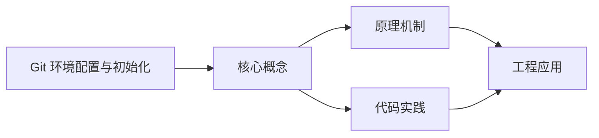
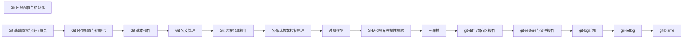

## 1. 学习目标（Bloom 分类）

本节按照布鲁姆教育目标分类学组织学习路径。本文主题为《Git 环境配置与初始化》，属于 Git 模块，读者可以根据自身阶段选择阅读深度。

记忆层面：能够准确复述本文的核心概念、术语与基本语法或操作步骤，并能够在提问或检索时快速定位对应知识点。能够说出 Git 的核心概念、常用命令与流程。

理解层面：能够用自己的语言解释核心原理与工作机制，说明概念之间的因果关系，而不是机械记忆结论。能够解释 Git 的工作原理与设计动机。

应用层面：能够在真实项目或练习场景中运用本文知识解决具体问题，写出正确且可维护的实现。能够独立完成 Git 的标准操作。

分析层面：能够拆解复杂问题，比较本文主题与相邻概念的异同，识别边界条件与例外情况。能够分析 Git 使用中的异常与边界。

评价层面：能够根据约束条件（性能、可读性、安全、成本）评价不同方案的优劣，做出有依据的技术决策。能够评价 Git 相关工具与方案。

创造层面：能够把本文知识与其他模块知识组合，设计出新的解决方案或可复用的工程模式。能够把 Git 融入团队工作流。

通过本节学习，读者应当能够把《Git 环境配置与初始化》纳入自己的知识网络，并与 Git 模块的其他主题（提交、分支、合并、远程协作）建立关联。

## 2. 历史动机与发展脉络

《Git 环境配置与初始化》是 Git 领域的重要主题。要真正理解它，需要先了解它解决的问题与演进过程。

Git 由 Linus Torvalds 于 2005 年为 Linux 内核开发，目标是替代 BitKeeper：分布式、高性能、内容寻址。
Git 的核心是对象模型：blob（内容）、tree（目录）、commit（快照 + 元数据）、tag（引用）；一切对象用 SHA-1 哈希寻址。
工作流演进：集中式工作流 -> 特性分支 -> GitFlow -> GitHub Flow / Trunk-Based；现代团队普遍采用 PR 审查 + 主干发布。

回到本文主题：Git 环境配置与初始化 的提出与成熟，正是上述技术背景下的必然产物。早期实现往往以简单可用为目标，随着工程规模扩大，社区逐渐沉淀出标准做法与最佳实践；理解这一脉络，可以帮助读者判断“为什么文档中的推荐写法是现在这个样子”，也能在遇到历史遗留代码时准确识别其设计年代与取舍。


## 3. 形式化定义与核心概念精讲

本节把《Git 环境配置与初始化》涉及的核心概念以“定义 + 讲解”的形式展开。读者应把定义当作工具，把讲解当作理解路径；两者结合才能形成可迁移的知识。

三个区域：工作区、暂存区（index）、仓库（HEAD）；git add/commit 移动状态。
分支是指针：创建分支成本极低；合并（merge 生成合并提交）与变基（rebase 重放提交）各有取舍。
远程协作：clone/fetch/pull/push；refs/remotes 跟踪远端；冲突在合并时出现并手工解决。

### 3.1 原文章节逐一精讲

原文档把主题拆分为 22 个小节，下面按顺序给出每一节的导读讲解，随后保留原文细节供精读。

#### 原文精读（完整保留）

# Git 配置管理

> **符号约定**：`< >` 必填参数 | `[ ]` 可选参数

---

#### 1. 什么是 Git

Git 是一个分布式版本控制系统，用于跟踪文件的变化，支持多人协作开发。它具有以下特点：

- **分布式**：每个开发者都拥有完整的代码库副本
- **高效**：处理大型项目时性能优秀
- **灵活**：支持多种工作流程
- **可靠**：数据存储采用 SHA-1 哈希值，确保数据完整性
- **分支管理**：轻量级分支，支持快速切换和合并
  <a id="2-环境配置"></a>

#### 2. 环境配置

在使用 Git 之前，需要进行基本的环境配置，主要包括设置用户名、邮箱等信息，这些信息会被记录在每次提交中。
<a id="21-全局配置"></a>

##### 2.1 全局配置

全局配置会应用到所有 Git 仓库，适合设置通用的信息：

```bash
 # 设置用户名（全局）
 git config --global user.name "你的用户名"
 # 设置邮箱（全局）
 git config --global user.email "你的邮箱"
 # 设置默认分支名称
 git config --global init.defaultBranch main
 # 解决 Windows 下中文文件名乱码问题
 git config --global core.quotepath false
 # 设置默认编辑器
 git config --global core.editor "code --wait"
 # 设置差异比较工具
 git config --global diff.tool vscode
 git config --global difftool.vscode.cmd "code --wait --diff $LOCAL $REMOTE"
 # 设置合并工具
 git config --global merge.tool vscode
 git config --global mergetool.vscode.cmd "code --wait $MERGED"
 # 设置自动换行处理
 git config --global core.autocrlf  # Windows 系统
 git config --global core.autocrlf input # Mac/Linux 系统
 # 设置提交时自动删除尾部空格
 git config --global core.trimwhitespace
 # 设置大小写敏感
 git config --global core.ignorecase false
 # 设置推送策略
 git config --global push.default simple
 # 设置拉取策略
 git config --global pull.rebase false
```

<a id="22-本地配置"></a>

##### 2.2 本地配置

本地配置仅应用于当前仓库，适合设置特定于项目的信息：

```bash
 # 进入仓库目录
 cd <仓库目录>
 # 设置用户名（仅当前仓库）
 git config user.name "你的用户名"
 # 设置邮箱（仅当前仓库）
 git config user.email "你的邮箱"
 # 设置特定于项目的编辑器
 git config core.editor "nano"
 # 设置特定于项目的换行处理
 git config core.autocrlf
```

<a id="23-配置验证"></a>

##### 2.3 配置验证

配置完成后，可以通过以下命令验证配置是否成功：

```bash
 # 查看所有配置（包括系统、全局和本地）
 git config --list
 # 查看特定配置
 git config user.name
 git config user.email
 # 查看全局配置
 git config --global --list
 # 查看本地配置
 git config --local --list
```

<a id="24-高级配置"></a>

##### 2.4 高级配置

```bash
 # 配置 Git 缓存大小
 git config --global core.packedGitLimit 512m
 git config --global core.packedGitWindowSize 512m
 # 配置 Git 压缩级别（0-9，9 最高）
 git config --global core.compression 9
 # 配置 Git 并行操作数量
 git config --global pack.threads 4
 # 配置 Git 远程操作超时（单位：字节）
 git config --global http.postBuffer 524288000
 # 配置 HTTP 代理
 git config --global http.proxy http://proxy.example.com:8080
 git config --global https.proxy https://proxy.example.com:8080
 # 取消 HTTP 代理
 git config --global --unset http.proxy
 git config --global --unset https.proxy
 # 设置常用别名
 git config --global alias.st status
 git config --global alias.ci commit
 git config --global alias.co checkout
 git config --global alias.br branch
 git config --global alias.unstage "reset HEAD --"
 git config --global alias.last "log -1 --stat"
 git config --global alias.logg "log --oneline --graph --all"
 git config --global alias.df "diff"
 git config --global alias.dfc "diff --cached"
 git config --global alias.cp "cherry-pick"
 git config --global alias.rb "rebase"
 git config --global alias.merge-no-ff "merge --no-ff"
 git config --global alias.stash-list "stash list"
 git config --global alias.stash-apply "stash apply"
 # 配置颜色显示
 git config --global color.ui auto
 git config --global color.diff auto
 git config --global color.status auto
 git config --global color.branch auto
```

<a id="25-配置文件详解"></a>

##### 2.5 配置文件详解

Git 配置文件采用 INI 格式，由节（section）和键值对组成：
**全局配置文件示例（~/.gitconfig）**：

```ini
 [user]
  name = Your Name
  email = your.email@example.com
 [core]
  quotepath = false
  editor = code --wait
  autocrlf =
  trimwhitespace =
 [init]
  defaultBranch = main
 [alias]
  st = status
  ci = commit
  co = checkout
  br = branch
 [diff]
  tool = vscode
 [difftool "vscode"]
  cmd = code --wait --diff $LOCAL $REMOTE
 [merge]
  tool = vscode
 [mergetool "vscode"]
  cmd = code --wait $MERGED
```

**本地配置文件示例（.git/config）**：

```ini
 [core]
  repositoryformatversion = 0
  filemode = false
  bare = false
  logallrefupdates =
  symlinks = false
  ignorecase =
 [remote "origin"]
  url = https://github.com/username/repository.git
  fetch = +refs/heads/*:refs/remotes/origin/*
 [branch "main"]
  remote = origin
  merge = refs/heads/main
```

<a id="3-仓库初始化"></a>

#### 3. 仓库初始化

<a id="31-初始化本地仓库"></a>

##### 3.1 初始化本地仓库

在当前目录初始化一个新的 Git 仓库：

```bash
 # 进入项目目录
 cd <项目目录>
 # 初始化 Git 仓库
 git init
 # 初始化时指定默认分支名称
 git init -b main
```

执行后，会在当前目录创建一个 `.git` 文件夹，用于存储 Git 相关的信息。`.git` 目录包含以下内容：

- `objects/`：存储 Git 对象（提交、树、 blob）
- `refs/`：存储分支和标签的引用
- `HEAD`：指向当前分支的引用
- `config`：本地配置文件
- `index`：暂存区信息
  <a id="32-克隆远程仓库"></a>

##### 3.2 克隆远程仓库

从远程服务器克隆一个已有的仓库：

```bash
 # 克隆默认分支
 git clone <仓库地址>
 # 克隆指定分支
 git clone -b <分支名> <仓库地址>
 # 克隆指定深度（只获取最近的 N 个提交）
 git clone --depth 1 <仓库地址> # 只获取最近 1 个提交
 # 克隆时指定目录名
 git clone <仓库地址> <目录名>
 # 克隆所有分支
 git clone --mirror <仓库地址> # 通常用于创建镜像仓库
 # 克隆时递归克隆子模块
 git clone --recursive <仓库地址>
 # 克隆时指定协议
 git clone git@github.com:username/repository.git # SSH 协议
 git clone https://github.com/username/repository.git # HTTPS 协议
```

<a id="33-初始化现有项目"></a>

##### 3.3 初始化现有项目

对于已经存在的项目，可以通过以下步骤初始化 Git 仓库：

```bash
 # 进入项目目录
 cd <项目目录>
 # 初始化 Git 仓库
 git init
 # 创建 .gitignore 文件（推荐）
 touch .gitignore
 # 添加项目文件到暂存区
 git add .
 # 提交初始版本
 git commit -m "Initial commit"
 # 添加远程仓库
 git remote add origin <仓库地址>
 # 推送到远程仓库
 git push -u origin main
```

**创建合理的 .gitignore 文件**：

```gitignore
 # 操作系统文件
 .DS_Store
 Thumbs.db
 # 编辑器文件
 .vscode/
 .idea/
 *
 *
 *
 # 编译产物
 build/
 dist/
 out/
 # 依赖包
 node_modules/
 venv/
 env/
 # 环境变量文件
 .env
 .env.local
 .env.development.local
 .env.test.local
 .env.production.local
 # 日志文件
 logs
 *
 # 数据库文件
 *
 *
 # 临时文件
 tmp/
 temp/
```

<a id="4-配置文件位置"></a>

#### 4. 配置文件位置

Git 的配置文件存储在以下位置，优先级从高到低：

1. **本地配置**：`.git/config`（位于每个 Git 仓库的 `.git` 目录中）
2. **全局配置**：`~/.gitconfig`（Windows 系统为 `C:\Users\用户名\.gitconfig`）
3. **系统配置**：`/etc/gitconfig`（Windows 系统为 `C:\Program Files\Git\etc\gitconfig`）
   当多个配置文件中存在相同的配置项时，优先级高的配置会覆盖优先级低的配置。
   <a id="5-常见配置问题与解决方案"></a>

#### 5. 常见配置问题与解决方案

| 问题           | 原因                              | 解决方案                                                |
| -------------- | --------------------------------- | ------------------------------------------------------- |
| 中文文件名乱码 | Git 默认使用 ASCII 编码处理文件名 | 执行 `git config --global core.quotepath false`         |
| 换行符不一致   | 不同操作系统的换行符标准不同      | 根据系统类型设置 `core.autocrlf`                        |
| 编辑器配置错误 | 默认编辑器设置不当                | 使用 `git config --global core.editor` 设置合适的编辑器 |
| 远程操作超时   | 网络连接不稳定或文件过大          | 增加 `http.postBuffer` 值                               |
| 权限被拒绝     | SSH 密钥未配置或权限错误          | 检查 SSH 密钥配置，确保文件权限正确                     |
| 推送失败       | 远程分支已更新，需要先拉取        | 执行 `git pull` 后再推送                                |
| 克隆速度慢     | 网络连接问题或仓库过大            | 使用 `--depth` 参数克隆，或使用国内镜像                 |
| 合并冲突       | 多人修改了同一文件的同一部分      | 手动解决冲突后提交                                      |

<a id="6-最佳实践"></a>

#### 6. 最佳实践

##### 6.1 配置最佳实践

- **设置有意义的用户名和邮箱**：便于团队协作和代码追溯
- **使用 SSH 协议**：比 HTTPS 更安全，无需每次输入密码
- **配置合理的别名**：提高命令输入效率
- **设置默认分支为 main**：符合现代 Git 规范
- **配置合适的编辑器**：确保提交信息编辑方便
- **设置自动换行处理**：避免跨平台换行符问题
- **创建 .gitignore 文件**：避免提交无关文件

##### 6.2 仓库初始化最佳实践

- **使用 `git init -b main`**：直接设置默认分支为 main
- **初始化时创建 .gitignore 文件**：从一开始就规范版本控制
- **进行初始提交**：确保仓库有基础版本
- **添加远程仓库**：便于代码备份和协作
- **设置上游分支**：使用 `git push -u` 简化后续推送

##### 6.3 日常使用最佳实践

- **定期拉取更新**：保持本地代码与远程同步
- **提交前查看变更**：使用 `git status` 和 `git diff` 检查变更
- **编写清晰的提交信息**：描述变更内容和原因
- **合理使用分支**：功能开发、Bug 修复等使用不同分支
- **定期清理本地分支**：删除已合并的分支
- **使用标签标记版本**：便于版本管理和发布
  <a id="7-实际应用示例"></a>

#### 7. 实际应用示例

##### 7.1 示例 1：初始化新项目

```bash
 # 创建项目目录
 mkdir my-project
 cd my-project
 # 初始化 Git 仓库
 git init -b main
 # 创建 .gitignore 文件
 cat > .gitignore << EOF
 # 操作系统文件
 .DS_Store
 Thumbs.db
 # 编辑器文件
 .vscode/
 .idea/
 # 编译产物
 build/
 dist/
 # 依赖包
 node_modules/
 EOF
 # 创建初始文件
 echo "# My Project" > README.md
 echo "console.log('Hello, Git!');" > index.js
 # 添加并提交
 git add .
 git commit -m "Initial commit"
 # 添加远程仓库
 git remote add origin https://github.com/username/my-project.git
 # 推送到远程
 git push -u origin main
```

##### 7.2 示例 2：配置 Git 别名

```bash
 # 设置常用别名
 git config --global alias.st status
 git config --global alias.ci commit
 git config --global alias.co checkout
 git config --global alias.br branch
 git config --global alias.logg "log --oneline --graph --all --decorate"
 git config --global alias.df "diff"
 git config --global alias.dfc "diff --cached"
 git config --global alias.unstage "reset HEAD --"
 git config --global alias.last "log -1 --stat"
 git config --global alias.rb "rebase"
 git config --global alias.merge-no-ff "merge --no-ff"
 # 使用别名示例
 git st # equivalent to git status
 git ci -m "Add new feature" # equivalent to git commit -m "Add new feature"
 git co main # equivalent to git checkout main
 git br # equivalent to git branch
 git logg # equivalent to git log --oneline --graph --all --decorate
```

##### 7.3 示例 3：解决中文文件名乱码问题

```bash
 # 配置 Git 处理中文文件名
 git config --global core.quotepath false
 # 验证配置
 git config core.quotepath
 # 创建包含中文的文件
 touch "中文文件.txt"
 echo "中文内容" > "中文文件.txt"
 # 添加并提交
 git add "中文文件.txt"
 git commit -m "添加中文文件"
 # 查看状态
 git status
```

##### 7.4 示例 4：配置 SSH 密钥

```bash
 # 生成 SSH 密钥
 ssh-keygen -t ed25519 -C "your.email@example.com"
 # 查看公钥
 cat ~/.ssh/id_ed25519.pub
 # 将公钥添加到 GitHub/GitLab 等平台
 # 测试 SSH 连接
 tssh -T git@github.com
 # 配置 Git 使用 SSH 协议
 git remote set-url origin git@github.com:username/repository.git
 # 验证远程 URL
 git remote -v
```

<a id="8-总结"></a>

#### 8. 总结

Git 的环境配置和仓库初始化是使用 Git 的基础步骤。通过合理的配置，可以提高 Git 的使用效率，避免常见问题。

- **全局配置**：适合设置通用信息，如用户名、邮箱、编辑器等
- **本地配置**：适合设置特定于项目的信息
- **仓库初始化**：可以通过 `git init` 创建新仓库，或通过 `git clone` 克隆现有仓库
- **配置验证**：使用 `git config --list` 查看当前配置
- **配置文件**：存储在系统、全局和本地三个级别，优先级依次提高
- **最佳实践**：设置有意义的用户名和邮箱，使用 SSH 协议，配置合理的别名，创建 .gitignore 文件等
  正确的环境配置是使用 Git 的良好开端，为后续的版本控制操作打下基础。通过本文的配置和示例，你应该能够快速搭建起一个高效、规范的 Git 环境。
#### 配置级别

**基本写法：设置仓库级配置（仅当前仓库）**
`git config <键> <值>`
```bash
# 设置当前仓库的用户名
git config user.name "Alice"
```

---

**基本写法：设置全局级配置（当前用户所有仓库）**
`git config --global <键> <值>`
```bash
# 设置全局用户邮箱
git config --global user.email "alice@example.com"
```

---

**基本写法：设置系统级配置（本机所有用户）**
`git config --system <键> <值>`
```bash
# 设置系统级默认分支名（需管理员权限）
git config --system init.defaultBranch main
```

---

**基本写法：查看某级别配置来源**
`git config --show-origin <键>`
```bash
# 显示配置项来自哪个文件
git config --show-origin user.name
```

---

#### 查看配置

**基本写法：查看所有配置（合并后最终值）**
`git config --list`
```bash
# 列出所有生效配置
git config --list
```

---

**基本写法：查看指定级别配置**
`git config --list --<级别>`
```bash
# 仅查看全局级配置
git config --list --global
```

---

**基本写法：查看单个配置项**
`git config <键>`
```bash
# 查看当前用户名
git config user.name
```

---

**基本写法：查看配置类型**
`git config --type <类型> <键>`
```bash
# 以布尔类型读取配置
git config --type bool core.autocrlf
```

---

#### 编辑配置文件

**基本写法：直接打开配置文件编辑**
`git config --<级别> --edit`
```bash
# 用默认编辑器打开全局配置
git config --global --edit
```

---

#### 用户身份

**基本写法：配置提交身份**
`git config --global user.name "<姓名>"`
```bash
# 设置全局提交姓名
git config --global user.name "Alice Lee"
```

---

**基本写法：配置提交邮箱**
`git config --global user.email "<邮箱>"`
```bash
# 设置全局提交邮箱
git config --global user.email "alice@example.com"
```

---

**基本写法：按仓库单独配置身份**
`git config user.name "<姓名>"`
```bash
# 仅当前仓库使用工作账号
git config user.name "Alice Corp"
```

---

#### 默认分支与初始化

**基本写法：设置 init 默认分支**
`git config --global init.defaultBranch <分支名>`
```bash
# 新仓库默认使用 main 分支
git config --global init.defaultBranch main
```

---

#### 行尾处理

**基本写法：Windows 自动转 CRLF**
`git config --global core.autocrlf true`
```bash
# 检出转 CRLF，提交转 LF
git config --global core.autocrlf true
```

---

**基本写法：Linux/Mac 保留 LF**
`git config --global core.autocrlf input`
```bash
# 检出保留 LF，提交转 LF
git config --global core.autocrlf input
```

---

#### 编辑器与工具

**基本写法：设置默认编辑器**
`git config --global core.editor "<命令>"`
```bash
# 使用 VS Code 作为默认编辑器
git config --global core.editor "code --wait"
```

---

**基本写法：设置默认合并工具**
`git config --global merge.tool <工具>`
```bash
# 配置 VS Code 为合并工具
git config --global merge.tool vscode
```

---

**基本写法：配置合并工具路径**
`git config --global mergetool.<工具>.cmd "<命令>"`
```bash
# 配置 vscode 合并工具调用命令
git config --global mergetool.vscode.cmd 'code --wait $MERGED'
```

---

#### 别名（alias）

**基本写法：设置命令别名**
`git config --global alias.<别名> "<命令>"`
```bash
# 用 co 代替 checkout
git config --global alias.co checkout
```

---

**基本写法：设置带参数别名**
`git config --global alias.<别名> "!<脚本>"`
```bash
# 用 ! 前缀执行外部命令
git config --global alias.lg "log --oneline --graph --all"
```

---

**基本写法：删除别名**
`git config --global --unset alias.<别名>`
```bash
# 移除 co 别名
git config --global --unset alias.co
```

---

#### 拉取与推送行为

**基本写法：拉取时默认使用 rebase**
`git config --global pull.rebase true`
```bash
# pull 默认变基而非合并
git config --global pull.rebase true
```

---

**基本写法：拉取仅快进**
`git config --global pull.ff only`
```bash
# 仅允许快进拉取，否则失败
git config --global pull.ff only
```

---

**基本写法：推送默认模式**
`git config --global push.default <模式>`
```bash
# 只推送当前分支到同名上游
git config --global push.default simple
```

---

#### 颜色与输出

**基本写法：开启颜色输出**
`git config --global color.ui auto`
```bash
# 终端自动启用颜色
git config --global color.ui auto
```

---

#### 凭据缓存

**基本写法：开启凭据助手**
`git config --global credential.helper <助手>`
```bash
# 使用系统凭据管理器
git config --global credential.helper manager
```

---

**基本写法：临时内存缓存**
`git config --global credential.helper 'cache --timeout=<秒>'`
```bash
# 凭据缓存 1 小时
git config --global credential.helper 'cache --timeout=3600'
```

---

#### 增删改配置项

**基本写法：新增或修改配置项**
`git config --<级别> <键> <值>`
```bash
# 修改全局 init 默认分支
git config --global init.defaultBranch main
```

---

**基本写法：删除配置项**
`git config --<级别> --unset <键>`
```bash
# 删除全局用户名配置
git config --global --unset user.name
```

---

**基本写法：删除多处同键配置**
`git config --<级别> --unset-all <键>`
```bash
# 删除所有同名配置项
git config --local --unset-all remote.origin.fetch
```

---

**基本写法：追加多值配置**
`git config --<级别> --add <键> <值>`
```bash
# 追加一条 fetch 规则
git config --local --add remote.origin.fetch '+refs/tags/*:refs/tags/*'
```

---

#### 引用存储格式（Reftable）

**基本写法：查看引用存储格式**
`git config core.refStorage`
```bash
# 查看当前引用存储后端
git config core.refStorage
```

---

**基本写法：迁移到 reftable 后端**
`git refs migrate --ref-storage=reftable`
```bash
# 切换到 reftable 引用存储（适用于多分支大仓）
git refs migrate --ref-storage=reftable
```

---

#### 文件路径与位置

**基本写法：查看各级别配置文件路径**
`git config --list --show-origin`
```bash
# 显示每条配置来源文件
git config --list --show-origin
```

---

**基本写法：仓库级配置文件位置**
`.git/config`
```bash
# 编辑当前仓库配置文件
git config --local --edit
```

---

**基本写法：全局配置文件位置**
`~/.gitconfig`
```bash
# 编辑用户级配置文件
git config --global --edit
```

---

**基本写法：系统级配置文件位置**
`/etc/gitconfig`
```bash
# 编辑系统级配置文件（需管理员权限）
git config --system --edit
```


### 3.2 概念关系图

下面用 Mermaid 图表达本文核心概念之间的关系，帮助读者建立整体图景：



图中展示的是本文知识的结构化关系：核心概念是入口，原理机制解释“为什么”，代码实践演示“怎么做”，工程应用回答“何时用”。读者学习时可以把每个小节的内容挂接到对应节点上。

## 4. 理论推导与原理解析

本节深入《Git 环境配置与初始化》背后的原理。理论部分不求面面俱到，而是聚焦“能解释现象、能指导实践”的关键推导。

三个区域：工作区、暂存区（index）、仓库（HEAD）；git add/commit 移动状态。
分支是指针：创建分支成本极低；合并（merge 生成合并提交）与变基（rebase 重放提交）各有取舍。
远程协作：clone/fetch/pull/push；refs/remotes 跟踪远端；冲突在合并时出现并手工解决。
撤销模型：checkout/restore 改工作区，reset 移 HEAD，revert 生成反向提交；理解三者避免误操作。

需要强调的是，理论推导与工程实践之间存在翻译层：理论给出的是理想化模型与边界条件，工程代码则必须处理真实环境中的例外。读者在学习时应先掌握理论的“标准情形”，再通过陷阱章节了解“非标准情形”。

## 5. 代码示例与逐行讲解

本节把原文中的代码示例系统整理，并为每个示例补充用途说明与讲解。读者不应只浏览代码，而应逐段对照讲解理解设计意图。

### 5.1 示例：2.1 全局配置

该示例来自原文《2.1 全局配置》小节，用于演示Git 环境配置与初始化相关操作。阅读时请先看代码结构，再看其后的讲解。

```bash
 # 设置用户名（全局）
 git config --global user.name "你的用户名"
 # 设置邮箱（全局）
 git config --global user.email "你的邮箱"
 # 设置默认分支名称
 git config --global init.defaultBranch main
 # 解决 Windows 下中文文件名乱码问题
 git config --global core.quotepath false
 # 设置默认编辑器
 git config --global core.editor "code --wait"
 # 设置差异比较工具
 git config --global diff.tool vscode
 git config --global difftool.vscode.cmd "code --wait --diff $LOCAL $REMOTE"
 # 设置合并工具
 git config --global merge.tool vscode
 git config --global mergetool.vscode.cmd "code --wait $MERGED"
 # 设置自动换行处理
 git config --global core.autocrlf  # Windows 系统
 git config --global core.autocrlf input # Mac/Linux 系统
 # 设置提交时自动删除尾部空格
 git config --global core.trimwhitespace
 # 设置大小写敏感
 git config --global core.ignorecase false
 # 设置推送策略
 git config --global push.default simple
 # 设置拉取策略
 git config --global pull.rebase false
```

讲解：这段代码演示了本节核心知识点。代码中的关键操作可以归纳为三步：准备（定义或初始化）、执行（核心逻辑）、收尾（释放资源或返回结果）。实际项目中，这三步往往被封装为函数或类，以提升复用性与可测试性。

关键点分析：

该示例共 27 行有效代码，结构以数据或配置为主。阅读时应关注：数据字段的含义、配置项的作用，以及它们与运行行为的对应关系。

进阶思考路径：先尝试修改参数观察行为变化，再把示例中的模式迁移到自己的项目中；每次修改都记录预期与实测差异，这是把示例转化为能力的最快方式。

### 5.2 示例：2.2 本地配置

该示例来自原文《2.2 本地配置》小节，用于演示Git 环境配置与初始化相关操作。阅读时请先看代码结构，再看其后的讲解。

```bash
 # 进入仓库目录
 cd <仓库目录>
 # 设置用户名（仅当前仓库）
 git config user.name "你的用户名"
 # 设置邮箱（仅当前仓库）
 git config user.email "你的邮箱"
 # 设置特定于项目的编辑器
 git config core.editor "nano"
 # 设置特定于项目的换行处理
 git config core.autocrlf
```

讲解：这段代码演示了本节核心知识点。代码中的关键操作可以归纳为三步：准备（定义或初始化）、执行（核心逻辑）、收尾（释放资源或返回结果）。实际项目中，这三步往往被封装为函数或类，以提升复用性与可测试性。

关键点分析：

该示例共 10 行有效代码，结构以数据或配置为主。阅读时应关注：数据字段的含义、配置项的作用，以及它们与运行行为的对应关系。

进阶思考路径：先尝试修改参数观察行为变化，再把示例中的模式迁移到自己的项目中；每次修改都记录预期与实测差异，这是把示例转化为能力的最快方式。

### 5.3 示例：2.3 配置验证

该示例来自原文《2.3 配置验证》小节，用于演示Git 环境配置与初始化相关操作。阅读时请先看代码结构，再看其后的讲解。

```bash
 # 查看所有配置（包括系统、全局和本地）
 git config --list
 # 查看特定配置
 git config user.name
 git config user.email
 # 查看全局配置
 git config --global --list
 # 查看本地配置
 git config --local --list
```

讲解：这段代码演示了本节核心知识点。代码中的关键操作可以归纳为三步：准备（定义或初始化）、执行（核心逻辑）、收尾（释放资源或返回结果）。实际项目中，这三步往往被封装为函数或类，以提升复用性与可测试性。

关键点分析：

该示例共 9 行有效代码，结构以数据或配置为主。阅读时应关注：数据字段的含义、配置项的作用，以及它们与运行行为的对应关系。

进阶思考路径：先尝试修改参数观察行为变化，再把示例中的模式迁移到自己的项目中；每次修改都记录预期与实测差异，这是把示例转化为能力的最快方式。

### 5.4 示例：2.4 高级配置

该示例来自原文《2.4 高级配置》小节，用于演示Git 环境配置与初始化相关操作。阅读时请先看代码结构，再看其后的讲解。

```bash
 # 配置 Git 缓存大小
 git config --global core.packedGitLimit 512m
 git config --global core.packedGitWindowSize 512m
 # 配置 Git 压缩级别（0-9，9 最高）
 git config --global core.compression 9
 # 配置 Git 并行操作数量
 git config --global pack.threads 4
 # 配置 Git 远程操作超时（单位：字节）
 git config --global http.postBuffer 524288000
 # 配置 HTTP 代理
 git config --global http.proxy http://proxy.example.com:8080
 git config --global https.proxy https://proxy.example.com:8080
 # 取消 HTTP 代理
 git config --global --unset http.proxy
 git config --global --unset https.proxy
 # 设置常用别名
 git config --global alias.st status
 git config --global alias.ci commit
 git config --global alias.co checkout
 git config --global alias.br branch
 git config --global alias.unstage "reset HEAD --"
 git config --global alias.last "log -1 --stat"
 git config --global alias.logg "log --oneline --graph --all"
 git config --global alias.df "diff"
 git config --global alias.dfc "diff --cached"
 git config --global alias.cp "cherry-pick"
 git config --global alias.rb "rebase"
 git config --global alias.merge-no-ff "merge --no-ff"
 git config --global alias.stash-list "stash list"
 git config --global alias.stash-apply "stash apply"
 # 配置颜色显示
 git config --global color.ui auto
 git config --global color.diff auto
 git config --global color.status auto
 git config --global color.branch auto
```

讲解：这段代码演示了本节核心知识点。代码中的关键操作可以归纳为三步：准备（定义或初始化）、执行（核心逻辑）、收尾（释放资源或返回结果）。实际项目中，这三步往往被封装为函数或类，以提升复用性与可测试性。

关键点分析：

该示例共 35 行有效代码，结构以数据或配置为主。阅读时应关注：数据字段的含义、配置项的作用，以及它们与运行行为的对应关系。

进阶思考路径：先尝试修改参数观察行为变化，再把示例中的模式迁移到自己的项目中；每次修改都记录预期与实测差异，这是把示例转化为能力的最快方式。

### 5.5 示例：2.5 配置文件详解

该示例来自原文《2.5 配置文件详解》小节，用于演示Git 环境配置与初始化相关操作。阅读时请先看代码结构，再看其后的讲解。

```ini
 [user]
  name = Your Name
  email = your.email@example.com
 [core]
  quotepath = false
  editor = code --wait
  autocrlf =
  trimwhitespace =
 [init]
  defaultBranch = main
 [alias]
  st = status
  ci = commit
  co = checkout
  br = branch
 [diff]
  tool = vscode
 [difftool "vscode"]
  cmd = code --wait --diff $LOCAL $REMOTE
 [merge]
  tool = vscode
 [mergetool "vscode"]
  cmd = code --wait $MERGED
```

讲解：这段代码演示了本节核心知识点。代码中的关键操作可以归纳为三步：准备（定义或初始化）、执行（核心逻辑）、收尾（释放资源或返回结果）。实际项目中，这三步往往被封装为函数或类，以提升复用性与可测试性。

关键点分析：

该示例共 23 行有效代码，结构以数据或配置为主。阅读时应关注：数据字段的含义、配置项的作用，以及它们与运行行为的对应关系。

进阶思考路径：先尝试修改参数观察行为变化，再把示例中的模式迁移到自己的项目中；每次修改都记录预期与实测差异，这是把示例转化为能力的最快方式。

### 5.6 示例：2.5 配置文件详解

该示例来自原文《2.5 配置文件详解》小节，用于演示Git 环境配置与初始化相关操作。阅读时请先看代码结构，再看其后的讲解。

```ini
 [core]
  repositoryformatversion = 0
  filemode = false
  bare = false
  logallrefupdates =
  symlinks = false
  ignorecase =
 [remote "origin"]
  url = https://github.com/username/repository.git
  fetch = +refs/heads/*:refs/remotes/origin/*
 [branch "main"]
  remote = origin
  merge = refs/heads/main
```

讲解：这段代码演示了本节核心知识点。代码中的关键操作可以归纳为三步：准备（定义或初始化）、执行（核心逻辑）、收尾（释放资源或返回结果）。实际项目中，这三步往往被封装为函数或类，以提升复用性与可测试性。

关键点分析：

该示例共 13 行有效代码，结构以数据或配置为主。阅读时应关注：数据字段的含义、配置项的作用，以及它们与运行行为的对应关系。

进阶思考路径：先尝试修改参数观察行为变化，再把示例中的模式迁移到自己的项目中；每次修改都记录预期与实测差异，这是把示例转化为能力的最快方式。

### 5.7 示例：3.1 初始化本地仓库

该示例来自原文《3.1 初始化本地仓库》小节，用于演示Git 环境配置与初始化相关操作。阅读时请先看代码结构，再看其后的讲解。

```bash
 # 进入项目目录
 cd <项目目录>
 # 初始化 Git 仓库
 git init
 # 初始化时指定默认分支名称
 git init -b main
```

讲解：这段代码演示了本节核心知识点。代码中的关键操作可以归纳为三步：准备（定义或初始化）、执行（核心逻辑）、收尾（释放资源或返回结果）。实际项目中，这三步往往被封装为函数或类，以提升复用性与可测试性。

关键点分析：

该示例共 6 行有效代码，结构以数据或配置为主。阅读时应关注：数据字段的含义、配置项的作用，以及它们与运行行为的对应关系。

进阶思考路径：先尝试修改参数观察行为变化，再把示例中的模式迁移到自己的项目中；每次修改都记录预期与实测差异，这是把示例转化为能力的最快方式。

### 5.8 示例：3.2 克隆远程仓库

该示例来自原文《3.2 克隆远程仓库》小节，用于演示Git 环境配置与初始化相关操作。阅读时请先看代码结构，再看其后的讲解。

```bash
 # 克隆默认分支
 git clone <仓库地址>
 # 克隆指定分支
 git clone -b <分支名> <仓库地址>
 # 克隆指定深度（只获取最近的 N 个提交）
 git clone --depth 1 <仓库地址> # 只获取最近 1 个提交
 # 克隆时指定目录名
 git clone <仓库地址> <目录名>
 # 克隆所有分支
 git clone --mirror <仓库地址> # 通常用于创建镜像仓库
 # 克隆时递归克隆子模块
 git clone --recursive <仓库地址>
 # 克隆时指定协议
 git clone git@github.com:username/repository.git # SSH 协议
 git clone https://github.com/username/repository.git # HTTPS 协议
```

讲解：这段代码演示了本节核心知识点。代码中的关键操作可以归纳为三步：准备（定义或初始化）、执行（核心逻辑）、收尾（释放资源或返回结果）。实际项目中，这三步往往被封装为函数或类，以提升复用性与可测试性。

关键点分析：

该示例共 15 行有效代码，结构以数据或配置为主。阅读时应关注：数据字段的含义、配置项的作用，以及它们与运行行为的对应关系。

进阶思考路径：先尝试修改参数观察行为变化，再把示例中的模式迁移到自己的项目中；每次修改都记录预期与实测差异，这是把示例转化为能力的最快方式。

### 5.9 示例：3.3 初始化现有项目

该示例来自原文《3.3 初始化现有项目》小节，用于演示Git 环境配置与初始化相关操作。阅读时请先看代码结构，再看其后的讲解。

```bash
 # 进入项目目录
 cd <项目目录>
 # 初始化 Git 仓库
 git init
 # 创建 .gitignore 文件（推荐）
 touch .gitignore
 # 添加项目文件到暂存区
 git add .
 # 提交初始版本
 git commit -m "Initial commit"
 # 添加远程仓库
 git remote add origin <仓库地址>
 # 推送到远程仓库
 git push -u origin main
```

讲解：这段代码演示了本节核心知识点。代码中的关键操作可以归纳为三步：准备（定义或初始化）、执行（核心逻辑）、收尾（释放资源或返回结果）。实际项目中，这三步往往被封装为函数或类，以提升复用性与可测试性。

关键点分析：

该示例共 14 行有效代码，结构以数据或配置为主。阅读时应关注：数据字段的含义、配置项的作用，以及它们与运行行为的对应关系。

进阶思考路径：先尝试修改参数观察行为变化，再把示例中的模式迁移到自己的项目中；每次修改都记录预期与实测差异，这是把示例转化为能力的最快方式。

### 5.10 示例：3.3 初始化现有项目

该示例来自原文《3.3 初始化现有项目》小节，用于演示Git 环境配置与初始化相关操作。阅读时请先看代码结构，再看其后的讲解。

```gitignore
 # 操作系统文件
 .DS_Store
 Thumbs.db
 # 编辑器文件
 .vscode/
 .idea/
 *
 *
 *
 # 编译产物
 build/
 dist/
 out/
 # 依赖包
 node_modules/
 venv/
 env/
 # 环境变量文件
 .env
 .env.local
 .env.development.local
 .env.test.local
 .env.production.local
 # 日志文件
 logs
 *
 # 数据库文件
 *
 *
 # 临时文件
 tmp/
 temp/
```

讲解：这段代码演示了本节核心知识点。代码中的关键操作可以归纳为三步：准备（定义或初始化）、执行（核心逻辑）、收尾（释放资源或返回结果）。实际项目中，这三步往往被封装为函数或类，以提升复用性与可测试性。

关键点分析：

该示例共 32 行有效代码，结构以数据或配置为主。阅读时应关注：数据字段的含义、配置项的作用，以及它们与运行行为的对应关系。

进阶思考路径：先尝试修改参数观察行为变化，再把示例中的模式迁移到自己的项目中；每次修改都记录预期与实测差异，这是把示例转化为能力的最快方式。

### 5.11 示例：7.1 示例 1：初始化新项目

该示例来自原文《7.1 示例 1：初始化新项目》小节，用于演示Git 环境配置与初始化相关操作。阅读时请先看代码结构，再看其后的讲解。

```bash
 # 创建项目目录
 mkdir my-project
 cd my-project
 # 初始化 Git 仓库
 git init -b main
 # 创建 .gitignore 文件
 cat > .gitignore << EOF
 # 操作系统文件
 .DS_Store
 Thumbs.db
 # 编辑器文件
 .vscode/
 .idea/
 # 编译产物
 build/
 dist/
 # 依赖包
 node_modules/
 EOF
 # 创建初始文件
 echo "# My Project" > README.md
 echo "console.log('Hello, Git!');" > index.js
 # 添加并提交
 git add .
 git commit -m "Initial commit"
 # 添加远程仓库
 git remote add origin https://github.com/username/my-project.git
 # 推送到远程
 git push -u origin main
```

讲解：这段代码演示了本节核心知识点。代码中的关键操作可以归纳为三步：准备（定义或初始化）、执行（核心逻辑）、收尾（释放资源或返回结果）。实际项目中，这三步往往被封装为函数或类，以提升复用性与可测试性。

关键点分析：

该示例共 29 行有效代码，结构以数据或配置为主。阅读时应关注：数据字段的含义、配置项的作用，以及它们与运行行为的对应关系。

进阶思考路径：先尝试修改参数观察行为变化，再把示例中的模式迁移到自己的项目中；每次修改都记录预期与实测差异，这是把示例转化为能力的最快方式。

### 5.12 示例：7.2 示例 2：配置 Git 别名

该示例来自原文《7.2 示例 2：配置 Git 别名》小节，用于演示Git 环境配置与初始化相关操作。阅读时请先看代码结构，再看其后的讲解。

```bash
 # 设置常用别名
 git config --global alias.st status
 git config --global alias.ci commit
 git config --global alias.co checkout
 git config --global alias.br branch
 git config --global alias.logg "log --oneline --graph --all --decorate"
 git config --global alias.df "diff"
 git config --global alias.dfc "diff --cached"
 git config --global alias.unstage "reset HEAD --"
 git config --global alias.last "log -1 --stat"
 git config --global alias.rb "rebase"
 git config --global alias.merge-no-ff "merge --no-ff"
 # 使用别名示例
 git st # equivalent to git status
 git ci -m "Add new feature" # equivalent to git commit -m "Add new feature"
 git co main # equivalent to git checkout main
 git br # equivalent to git branch
 git logg # equivalent to git log --oneline --graph --all --decorate
```

讲解：这段代码演示了本节核心知识点。代码中的关键操作可以归纳为三步：准备（定义或初始化）、执行（核心逻辑）、收尾（释放资源或返回结果）。实际项目中，这三步往往被封装为函数或类，以提升复用性与可测试性。

关键点分析：

该示例共 18 行有效代码，结构以数据或配置为主。阅读时应关注：数据字段的含义、配置项的作用，以及它们与运行行为的对应关系。

进阶思考路径：先尝试修改参数观察行为变化，再把示例中的模式迁移到自己的项目中；每次修改都记录预期与实测差异，这是把示例转化为能力的最快方式。

### 5.13 示例：7.3 示例 3：解决中文文件名乱码问题

该示例来自原文《7.3 示例 3：解决中文文件名乱码问题》小节，用于演示Git 环境配置与初始化相关操作。阅读时请先看代码结构，再看其后的讲解。

```bash
 # 配置 Git 处理中文文件名
 git config --global core.quotepath false
 # 验证配置
 git config core.quotepath
 # 创建包含中文的文件
 touch "中文文件.txt"
 echo "中文内容" > "中文文件.txt"
 # 添加并提交
 git add "中文文件.txt"
 git commit -m "添加中文文件"
 # 查看状态
 git status
```

讲解：这段代码演示了本节核心知识点。代码中的关键操作可以归纳为三步：准备（定义或初始化）、执行（核心逻辑）、收尾（释放资源或返回结果）。实际项目中，这三步往往被封装为函数或类，以提升复用性与可测试性。

关键点分析：

该示例共 12 行有效代码，结构以数据或配置为主。阅读时应关注：数据字段的含义、配置项的作用，以及它们与运行行为的对应关系。

进阶思考路径：先尝试修改参数观察行为变化，再把示例中的模式迁移到自己的项目中；每次修改都记录预期与实测差异，这是把示例转化为能力的最快方式。

### 5.14 示例：7.4 示例 4：配置 SSH 密钥

该示例来自原文《7.4 示例 4：配置 SSH 密钥》小节，用于演示Git 环境配置与初始化相关操作。阅读时请先看代码结构，再看其后的讲解。

```bash
 # 生成 SSH 密钥
 ssh-keygen -t ed25519 -C "your.email@example.com"
 # 查看公钥
 cat ~/.ssh/id_ed25519.pub
 # 将公钥添加到 GitHub/GitLab 等平台
 # 测试 SSH 连接
 tssh -T git@github.com
 # 配置 Git 使用 SSH 协议
 git remote set-url origin git@github.com:username/repository.git
 # 验证远程 URL
 git remote -v
```

讲解：这段代码演示了本节核心知识点。代码中的关键操作可以归纳为三步：准备（定义或初始化）、执行（核心逻辑）、收尾（释放资源或返回结果）。实际项目中，这三步往往被封装为函数或类，以提升复用性与可测试性。

关键点分析：

该示例共 11 行有效代码，结构以数据或配置为主。阅读时应关注：数据字段的含义、配置项的作用，以及它们与运行行为的对应关系。

进阶思考路径：先尝试修改参数观察行为变化，再把示例中的模式迁移到自己的项目中；每次修改都记录预期与实测差异，这是把示例转化为能力的最快方式。

### 5.15 示例：配置级别

该示例来自原文《配置级别》小节，用于演示Git 环境配置与初始化相关操作。阅读时请先看代码结构，再看其后的讲解。

```bash
# 设置当前仓库的用户名
git config user.name "Alice"
```

讲解：这段代码演示了本节核心知识点。代码中的关键操作可以归纳为三步：准备（定义或初始化）、执行（核心逻辑）、收尾（释放资源或返回结果）。实际项目中，这三步往往被封装为函数或类，以提升复用性与可测试性。

关键点分析：

该示例共 2 行有效代码，结构以数据或配置为主。阅读时应关注：数据字段的含义、配置项的作用，以及它们与运行行为的对应关系。

进阶思考路径：先尝试修改参数观察行为变化，再把示例中的模式迁移到自己的项目中；每次修改都记录预期与实测差异，这是把示例转化为能力的最快方式。

### 5.16 示例：配置级别

该示例来自原文《配置级别》小节，用于演示Git 环境配置与初始化相关操作。阅读时请先看代码结构，再看其后的讲解。

```bash
# 设置全局用户邮箱
git config --global user.email "alice@example.com"
```

讲解：这段代码演示了本节核心知识点。代码中的关键操作可以归纳为三步：准备（定义或初始化）、执行（核心逻辑）、收尾（释放资源或返回结果）。实际项目中，这三步往往被封装为函数或类，以提升复用性与可测试性。

关键点分析：

该示例共 2 行有效代码，结构以数据或配置为主。阅读时应关注：数据字段的含义、配置项的作用，以及它们与运行行为的对应关系。

进阶思考路径：先尝试修改参数观察行为变化，再把示例中的模式迁移到自己的项目中；每次修改都记录预期与实测差异，这是把示例转化为能力的最快方式。

### 5.17 示例：配置级别

该示例来自原文《配置级别》小节，用于演示Git 环境配置与初始化相关操作。阅读时请先看代码结构，再看其后的讲解。

```bash
# 设置系统级默认分支名（需管理员权限）
git config --system init.defaultBranch main
```

讲解：这段代码演示了本节核心知识点。代码中的关键操作可以归纳为三步：准备（定义或初始化）、执行（核心逻辑）、收尾（释放资源或返回结果）。实际项目中，这三步往往被封装为函数或类，以提升复用性与可测试性。

关键点分析：

该示例共 2 行有效代码，结构以数据或配置为主。阅读时应关注：数据字段的含义、配置项的作用，以及它们与运行行为的对应关系。

进阶思考路径：先尝试修改参数观察行为变化，再把示例中的模式迁移到自己的项目中；每次修改都记录预期与实测差异，这是把示例转化为能力的最快方式。

### 5.18 示例：配置级别

该示例来自原文《配置级别》小节，用于演示Git 环境配置与初始化相关操作。阅读时请先看代码结构，再看其后的讲解。

```bash
# 显示配置项来自哪个文件
git config --show-origin user.name
```

讲解：这段代码演示了本节核心知识点。代码中的关键操作可以归纳为三步：准备（定义或初始化）、执行（核心逻辑）、收尾（释放资源或返回结果）。实际项目中，这三步往往被封装为函数或类，以提升复用性与可测试性。

关键点分析：

该示例共 2 行有效代码，结构以数据或配置为主。阅读时应关注：数据字段的含义、配置项的作用，以及它们与运行行为的对应关系。

进阶思考路径：先尝试修改参数观察行为变化，再把示例中的模式迁移到自己的项目中；每次修改都记录预期与实测差异，这是把示例转化为能力的最快方式。

### 5.19 示例：查看配置

该示例来自原文《查看配置》小节，用于演示Git 环境配置与初始化相关操作。阅读时请先看代码结构，再看其后的讲解。

```bash
# 列出所有生效配置
git config --list
```

讲解：这段代码演示了本节核心知识点。代码中的关键操作可以归纳为三步：准备（定义或初始化）、执行（核心逻辑）、收尾（释放资源或返回结果）。实际项目中，这三步往往被封装为函数或类，以提升复用性与可测试性。

关键点分析：

该示例共 2 行有效代码，结构以数据或配置为主。阅读时应关注：数据字段的含义、配置项的作用，以及它们与运行行为的对应关系。

进阶思考路径：先尝试修改参数观察行为变化，再把示例中的模式迁移到自己的项目中；每次修改都记录预期与实测差异，这是把示例转化为能力的最快方式。

### 5.20 示例：查看配置

该示例来自原文《查看配置》小节，用于演示Git 环境配置与初始化相关操作。阅读时请先看代码结构，再看其后的讲解。

```bash
# 仅查看全局级配置
git config --list --global
```

讲解：这段代码演示了本节核心知识点。代码中的关键操作可以归纳为三步：准备（定义或初始化）、执行（核心逻辑）、收尾（释放资源或返回结果）。实际项目中，这三步往往被封装为函数或类，以提升复用性与可测试性。

关键点分析：

该示例共 2 行有效代码，结构以数据或配置为主。阅读时应关注：数据字段的含义、配置项的作用，以及它们与运行行为的对应关系。

进阶思考路径：先尝试修改参数观察行为变化，再把示例中的模式迁移到自己的项目中；每次修改都记录预期与实测差异，这是把示例转化为能力的最快方式。

### 5.21 示例：查看配置

该示例来自原文《查看配置》小节，用于演示Git 环境配置与初始化相关操作。阅读时请先看代码结构，再看其后的讲解。

```bash
# 查看当前用户名
git config user.name
```

讲解：这段代码演示了本节核心知识点。代码中的关键操作可以归纳为三步：准备（定义或初始化）、执行（核心逻辑）、收尾（释放资源或返回结果）。实际项目中，这三步往往被封装为函数或类，以提升复用性与可测试性。

关键点分析：

该示例共 2 行有效代码，结构以数据或配置为主。阅读时应关注：数据字段的含义、配置项的作用，以及它们与运行行为的对应关系。

进阶思考路径：先尝试修改参数观察行为变化，再把示例中的模式迁移到自己的项目中；每次修改都记录预期与实测差异，这是把示例转化为能力的最快方式。

### 5.22 示例：查看配置

该示例来自原文《查看配置》小节，用于演示Git 环境配置与初始化相关操作。阅读时请先看代码结构，再看其后的讲解。

```bash
# 以布尔类型读取配置
git config --type bool core.autocrlf
```

讲解：这段代码演示了本节核心知识点。代码中的关键操作可以归纳为三步：准备（定义或初始化）、执行（核心逻辑）、收尾（释放资源或返回结果）。实际项目中，这三步往往被封装为函数或类，以提升复用性与可测试性。

关键点分析：

该示例共 2 行有效代码，结构以数据或配置为主。阅读时应关注：数据字段的含义、配置项的作用，以及它们与运行行为的对应关系。

进阶思考路径：先尝试修改参数观察行为变化，再把示例中的模式迁移到自己的项目中；每次修改都记录预期与实测差异，这是把示例转化为能力的最快方式。

### 5.23 示例：编辑配置文件

该示例来自原文《编辑配置文件》小节，用于演示Git 环境配置与初始化相关操作。阅读时请先看代码结构，再看其后的讲解。

```bash
# 用默认编辑器打开全局配置
git config --global --edit
```

讲解：这段代码演示了本节核心知识点。代码中的关键操作可以归纳为三步：准备（定义或初始化）、执行（核心逻辑）、收尾（释放资源或返回结果）。实际项目中，这三步往往被封装为函数或类，以提升复用性与可测试性。

关键点分析：

该示例共 2 行有效代码，结构以数据或配置为主。阅读时应关注：数据字段的含义、配置项的作用，以及它们与运行行为的对应关系。

进阶思考路径：先尝试修改参数观察行为变化，再把示例中的模式迁移到自己的项目中；每次修改都记录预期与实测差异，这是把示例转化为能力的最快方式。

### 5.24 示例：用户身份

该示例来自原文《用户身份》小节，用于演示Git 环境配置与初始化相关操作。阅读时请先看代码结构，再看其后的讲解。

```bash
# 设置全局提交姓名
git config --global user.name "Alice Lee"
```

讲解：这段代码演示了本节核心知识点。代码中的关键操作可以归纳为三步：准备（定义或初始化）、执行（核心逻辑）、收尾（释放资源或返回结果）。实际项目中，这三步往往被封装为函数或类，以提升复用性与可测试性。

关键点分析：

该示例共 2 行有效代码，结构以数据或配置为主。阅读时应关注：数据字段的含义、配置项的作用，以及它们与运行行为的对应关系。

进阶思考路径：先尝试修改参数观察行为变化，再把示例中的模式迁移到自己的项目中；每次修改都记录预期与实测差异，这是把示例转化为能力的最快方式。

### 5.25 示例：用户身份

该示例来自原文《用户身份》小节，用于演示Git 环境配置与初始化相关操作。阅读时请先看代码结构，再看其后的讲解。

```bash
# 设置全局提交邮箱
git config --global user.email "alice@example.com"
```

讲解：这段代码演示了本节核心知识点。代码中的关键操作可以归纳为三步：准备（定义或初始化）、执行（核心逻辑）、收尾（释放资源或返回结果）。实际项目中，这三步往往被封装为函数或类，以提升复用性与可测试性。

关键点分析：

该示例共 2 行有效代码，结构以数据或配置为主。阅读时应关注：数据字段的含义、配置项的作用，以及它们与运行行为的对应关系。

进阶思考路径：先尝试修改参数观察行为变化，再把示例中的模式迁移到自己的项目中；每次修改都记录预期与实测差异，这是把示例转化为能力的最快方式。

### 5.26 示例：用户身份

该示例来自原文《用户身份》小节，用于演示Git 环境配置与初始化相关操作。阅读时请先看代码结构，再看其后的讲解。

```bash
# 仅当前仓库使用工作账号
git config user.name "Alice Corp"
```

讲解：这段代码演示了本节核心知识点。代码中的关键操作可以归纳为三步：准备（定义或初始化）、执行（核心逻辑）、收尾（释放资源或返回结果）。实际项目中，这三步往往被封装为函数或类，以提升复用性与可测试性。

关键点分析：

该示例共 2 行有效代码，结构以数据或配置为主。阅读时应关注：数据字段的含义、配置项的作用，以及它们与运行行为的对应关系。

进阶思考路径：先尝试修改参数观察行为变化，再把示例中的模式迁移到自己的项目中；每次修改都记录预期与实测差异，这是把示例转化为能力的最快方式。

### 5.27 示例：默认分支与初始化

该示例来自原文《默认分支与初始化》小节，用于演示Git 环境配置与初始化相关操作。阅读时请先看代码结构，再看其后的讲解。

```bash
# 新仓库默认使用 main 分支
git config --global init.defaultBranch main
```

讲解：这段代码演示了本节核心知识点。代码中的关键操作可以归纳为三步：准备（定义或初始化）、执行（核心逻辑）、收尾（释放资源或返回结果）。实际项目中，这三步往往被封装为函数或类，以提升复用性与可测试性。

关键点分析：

该示例共 2 行有效代码，结构以数据或配置为主。阅读时应关注：数据字段的含义、配置项的作用，以及它们与运行行为的对应关系。

进阶思考路径：先尝试修改参数观察行为变化，再把示例中的模式迁移到自己的项目中；每次修改都记录预期与实测差异，这是把示例转化为能力的最快方式。

### 5.28 示例：行尾处理

该示例来自原文《行尾处理》小节，用于演示Git 环境配置与初始化相关操作。阅读时请先看代码结构，再看其后的讲解。

```bash
# 检出转 CRLF，提交转 LF
git config --global core.autocrlf true
```

讲解：这段代码演示了本节核心知识点。代码中的关键操作可以归纳为三步：准备（定义或初始化）、执行（核心逻辑）、收尾（释放资源或返回结果）。实际项目中，这三步往往被封装为函数或类，以提升复用性与可测试性。

关键点分析：

该示例共 2 行有效代码，结构以数据或配置为主。阅读时应关注：数据字段的含义、配置项的作用，以及它们与运行行为的对应关系。

进阶思考路径：先尝试修改参数观察行为变化，再把示例中的模式迁移到自己的项目中；每次修改都记录预期与实测差异，这是把示例转化为能力的最快方式。

### 5.29 示例：行尾处理

该示例来自原文《行尾处理》小节，用于演示Git 环境配置与初始化相关操作。阅读时请先看代码结构，再看其后的讲解。

```bash
# 检出保留 LF，提交转 LF
git config --global core.autocrlf input
```

讲解：这段代码演示了本节核心知识点。代码中的关键操作可以归纳为三步：准备（定义或初始化）、执行（核心逻辑）、收尾（释放资源或返回结果）。实际项目中，这三步往往被封装为函数或类，以提升复用性与可测试性。

关键点分析：

该示例共 2 行有效代码，结构以数据或配置为主。阅读时应关注：数据字段的含义、配置项的作用，以及它们与运行行为的对应关系。

进阶思考路径：先尝试修改参数观察行为变化，再把示例中的模式迁移到自己的项目中；每次修改都记录预期与实测差异，这是把示例转化为能力的最快方式。

### 5.30 示例：编辑器与工具

该示例来自原文《编辑器与工具》小节，用于演示Git 环境配置与初始化相关操作。阅读时请先看代码结构，再看其后的讲解。

```bash
# 使用 VS Code 作为默认编辑器
git config --global core.editor "code --wait"
```

讲解：这段代码演示了本节核心知识点。代码中的关键操作可以归纳为三步：准备（定义或初始化）、执行（核心逻辑）、收尾（释放资源或返回结果）。实际项目中，这三步往往被封装为函数或类，以提升复用性与可测试性。

关键点分析：

该示例共 2 行有效代码，结构以数据或配置为主。阅读时应关注：数据字段的含义、配置项的作用，以及它们与运行行为的对应关系。

进阶思考路径：先尝试修改参数观察行为变化，再把示例中的模式迁移到自己的项目中；每次修改都记录预期与实测差异，这是把示例转化为能力的最快方式。

### 5.31 示例：编辑器与工具

该示例来自原文《编辑器与工具》小节，用于演示Git 环境配置与初始化相关操作。阅读时请先看代码结构，再看其后的讲解。

```bash
# 配置 VS Code 为合并工具
git config --global merge.tool vscode
```

讲解：这段代码演示了本节核心知识点。代码中的关键操作可以归纳为三步：准备（定义或初始化）、执行（核心逻辑）、收尾（释放资源或返回结果）。实际项目中，这三步往往被封装为函数或类，以提升复用性与可测试性。

关键点分析：

该示例共 2 行有效代码，结构以数据或配置为主。阅读时应关注：数据字段的含义、配置项的作用，以及它们与运行行为的对应关系。

进阶思考路径：先尝试修改参数观察行为变化，再把示例中的模式迁移到自己的项目中；每次修改都记录预期与实测差异，这是把示例转化为能力的最快方式。

### 5.32 示例：编辑器与工具

该示例来自原文《编辑器与工具》小节，用于演示Git 环境配置与初始化相关操作。阅读时请先看代码结构，再看其后的讲解。

```bash
# 配置 vscode 合并工具调用命令
git config --global mergetool.vscode.cmd 'code --wait $MERGED'
```

讲解：这段代码演示了本节核心知识点。代码中的关键操作可以归纳为三步：准备（定义或初始化）、执行（核心逻辑）、收尾（释放资源或返回结果）。实际项目中，这三步往往被封装为函数或类，以提升复用性与可测试性。

关键点分析：

该示例共 2 行有效代码，结构以数据或配置为主。阅读时应关注：数据字段的含义、配置项的作用，以及它们与运行行为的对应关系。

进阶思考路径：先尝试修改参数观察行为变化，再把示例中的模式迁移到自己的项目中；每次修改都记录预期与实测差异，这是把示例转化为能力的最快方式。

### 5.33 示例：别名（alias）

该示例来自原文《别名（alias）》小节，用于演示Git 环境配置与初始化相关操作。阅读时请先看代码结构，再看其后的讲解。

```bash
# 用 co 代替 checkout
git config --global alias.co checkout
```

讲解：这段代码演示了本节核心知识点。代码中的关键操作可以归纳为三步：准备（定义或初始化）、执行（核心逻辑）、收尾（释放资源或返回结果）。实际项目中，这三步往往被封装为函数或类，以提升复用性与可测试性。

关键点分析：

该示例共 2 行有效代码，结构以数据或配置为主。阅读时应关注：数据字段的含义、配置项的作用，以及它们与运行行为的对应关系。

进阶思考路径：先尝试修改参数观察行为变化，再把示例中的模式迁移到自己的项目中；每次修改都记录预期与实测差异，这是把示例转化为能力的最快方式。

### 5.34 示例：别名（alias）

该示例来自原文《别名（alias）》小节，用于演示Git 环境配置与初始化相关操作。阅读时请先看代码结构，再看其后的讲解。

```bash
# 用 ! 前缀执行外部命令
git config --global alias.lg "log --oneline --graph --all"
```

讲解：这段代码演示了本节核心知识点。代码中的关键操作可以归纳为三步：准备（定义或初始化）、执行（核心逻辑）、收尾（释放资源或返回结果）。实际项目中，这三步往往被封装为函数或类，以提升复用性与可测试性。

关键点分析：

该示例共 2 行有效代码，结构以数据或配置为主。阅读时应关注：数据字段的含义、配置项的作用，以及它们与运行行为的对应关系。

进阶思考路径：先尝试修改参数观察行为变化，再把示例中的模式迁移到自己的项目中；每次修改都记录预期与实测差异，这是把示例转化为能力的最快方式。

### 5.35 示例：别名（alias）

该示例来自原文《别名（alias）》小节，用于演示Git 环境配置与初始化相关操作。阅读时请先看代码结构，再看其后的讲解。

```bash
# 移除 co 别名
git config --global --unset alias.co
```

讲解：这段代码演示了本节核心知识点。代码中的关键操作可以归纳为三步：准备（定义或初始化）、执行（核心逻辑）、收尾（释放资源或返回结果）。实际项目中，这三步往往被封装为函数或类，以提升复用性与可测试性。

关键点分析：

该示例共 2 行有效代码，结构以数据或配置为主。阅读时应关注：数据字段的含义、配置项的作用，以及它们与运行行为的对应关系。

进阶思考路径：先尝试修改参数观察行为变化，再把示例中的模式迁移到自己的项目中；每次修改都记录预期与实测差异，这是把示例转化为能力的最快方式。

### 5.36 示例：拉取与推送行为

该示例来自原文《拉取与推送行为》小节，用于演示Git 环境配置与初始化相关操作。阅读时请先看代码结构，再看其后的讲解。

```bash
# pull 默认变基而非合并
git config --global pull.rebase true
```

讲解：这段代码演示了本节核心知识点。代码中的关键操作可以归纳为三步：准备（定义或初始化）、执行（核心逻辑）、收尾（释放资源或返回结果）。实际项目中，这三步往往被封装为函数或类，以提升复用性与可测试性。

关键点分析：

该示例共 2 行有效代码，结构以数据或配置为主。阅读时应关注：数据字段的含义、配置项的作用，以及它们与运行行为的对应关系。

进阶思考路径：先尝试修改参数观察行为变化，再把示例中的模式迁移到自己的项目中；每次修改都记录预期与实测差异，这是把示例转化为能力的最快方式。

### 5.37 示例：拉取与推送行为

该示例来自原文《拉取与推送行为》小节，用于演示Git 环境配置与初始化相关操作。阅读时请先看代码结构，再看其后的讲解。

```bash
# 仅允许快进拉取，否则失败
git config --global pull.ff only
```

讲解：这段代码演示了本节核心知识点。代码中的关键操作可以归纳为三步：准备（定义或初始化）、执行（核心逻辑）、收尾（释放资源或返回结果）。实际项目中，这三步往往被封装为函数或类，以提升复用性与可测试性。

关键点分析：

该示例共 2 行有效代码，结构以数据或配置为主。阅读时应关注：数据字段的含义、配置项的作用，以及它们与运行行为的对应关系。

进阶思考路径：先尝试修改参数观察行为变化，再把示例中的模式迁移到自己的项目中；每次修改都记录预期与实测差异，这是把示例转化为能力的最快方式。

### 5.38 示例：拉取与推送行为

该示例来自原文《拉取与推送行为》小节，用于演示Git 环境配置与初始化相关操作。阅读时请先看代码结构，再看其后的讲解。

```bash
# 只推送当前分支到同名上游
git config --global push.default simple
```

讲解：这段代码演示了本节核心知识点。代码中的关键操作可以归纳为三步：准备（定义或初始化）、执行（核心逻辑）、收尾（释放资源或返回结果）。实际项目中，这三步往往被封装为函数或类，以提升复用性与可测试性。

关键点分析：

该示例共 2 行有效代码，结构以数据或配置为主。阅读时应关注：数据字段的含义、配置项的作用，以及它们与运行行为的对应关系。

进阶思考路径：先尝试修改参数观察行为变化，再把示例中的模式迁移到自己的项目中；每次修改都记录预期与实测差异，这是把示例转化为能力的最快方式。

### 5.39 示例：颜色与输出

该示例来自原文《颜色与输出》小节，用于演示Git 环境配置与初始化相关操作。阅读时请先看代码结构，再看其后的讲解。

```bash
# 终端自动启用颜色
git config --global color.ui auto
```

讲解：这段代码演示了本节核心知识点。代码中的关键操作可以归纳为三步：准备（定义或初始化）、执行（核心逻辑）、收尾（释放资源或返回结果）。实际项目中，这三步往往被封装为函数或类，以提升复用性与可测试性。

关键点分析：

该示例共 2 行有效代码，结构以数据或配置为主。阅读时应关注：数据字段的含义、配置项的作用，以及它们与运行行为的对应关系。

进阶思考路径：先尝试修改参数观察行为变化，再把示例中的模式迁移到自己的项目中；每次修改都记录预期与实测差异，这是把示例转化为能力的最快方式。

### 5.40 示例：凭据缓存

该示例来自原文《凭据缓存》小节，用于演示Git 环境配置与初始化相关操作。阅读时请先看代码结构，再看其后的讲解。

```bash
# 使用系统凭据管理器
git config --global credential.helper manager
```

讲解：这段代码演示了本节核心知识点。代码中的关键操作可以归纳为三步：准备（定义或初始化）、执行（核心逻辑）、收尾（释放资源或返回结果）。实际项目中，这三步往往被封装为函数或类，以提升复用性与可测试性。

关键点分析：

该示例共 2 行有效代码，结构以数据或配置为主。阅读时应关注：数据字段的含义、配置项的作用，以及它们与运行行为的对应关系。

进阶思考路径：先尝试修改参数观察行为变化，再把示例中的模式迁移到自己的项目中；每次修改都记录预期与实测差异，这是把示例转化为能力的最快方式。

### 5.41 示例：凭据缓存

该示例来自原文《凭据缓存》小节，用于演示Git 环境配置与初始化相关操作。阅读时请先看代码结构，再看其后的讲解。

```bash
# 凭据缓存 1 小时
git config --global credential.helper 'cache --timeout=3600'
```

讲解：这段代码演示了本节核心知识点。代码中的关键操作可以归纳为三步：准备（定义或初始化）、执行（核心逻辑）、收尾（释放资源或返回结果）。实际项目中，这三步往往被封装为函数或类，以提升复用性与可测试性。

关键点分析：

该示例共 2 行有效代码，结构以数据或配置为主。阅读时应关注：数据字段的含义、配置项的作用，以及它们与运行行为的对应关系。

进阶思考路径：先尝试修改参数观察行为变化，再把示例中的模式迁移到自己的项目中；每次修改都记录预期与实测差异，这是把示例转化为能力的最快方式。

### 5.42 示例：增删改配置项

该示例来自原文《增删改配置项》小节，用于演示Git 环境配置与初始化相关操作。阅读时请先看代码结构，再看其后的讲解。

```bash
# 修改全局 init 默认分支
git config --global init.defaultBranch main
```

讲解：这段代码演示了本节核心知识点。代码中的关键操作可以归纳为三步：准备（定义或初始化）、执行（核心逻辑）、收尾（释放资源或返回结果）。实际项目中，这三步往往被封装为函数或类，以提升复用性与可测试性。

关键点分析：

该示例共 2 行有效代码，结构以数据或配置为主。阅读时应关注：数据字段的含义、配置项的作用，以及它们与运行行为的对应关系。

进阶思考路径：先尝试修改参数观察行为变化，再把示例中的模式迁移到自己的项目中；每次修改都记录预期与实测差异，这是把示例转化为能力的最快方式。

### 5.43 示例：增删改配置项

该示例来自原文《增删改配置项》小节，用于演示Git 环境配置与初始化相关操作。阅读时请先看代码结构，再看其后的讲解。

```bash
# 删除全局用户名配置
git config --global --unset user.name
```

讲解：这段代码演示了本节核心知识点。代码中的关键操作可以归纳为三步：准备（定义或初始化）、执行（核心逻辑）、收尾（释放资源或返回结果）。实际项目中，这三步往往被封装为函数或类，以提升复用性与可测试性。

关键点分析：

该示例共 2 行有效代码，结构以数据或配置为主。阅读时应关注：数据字段的含义、配置项的作用，以及它们与运行行为的对应关系。

进阶思考路径：先尝试修改参数观察行为变化，再把示例中的模式迁移到自己的项目中；每次修改都记录预期与实测差异，这是把示例转化为能力的最快方式。

### 5.44 示例：增删改配置项

该示例来自原文《增删改配置项》小节，用于演示Git 环境配置与初始化相关操作。阅读时请先看代码结构，再看其后的讲解。

```bash
# 删除所有同名配置项
git config --local --unset-all remote.origin.fetch
```

讲解：这段代码演示了本节核心知识点。代码中的关键操作可以归纳为三步：准备（定义或初始化）、执行（核心逻辑）、收尾（释放资源或返回结果）。实际项目中，这三步往往被封装为函数或类，以提升复用性与可测试性。

关键点分析：

该示例共 2 行有效代码，结构以数据或配置为主。阅读时应关注：数据字段的含义、配置项的作用，以及它们与运行行为的对应关系。

进阶思考路径：先尝试修改参数观察行为变化，再把示例中的模式迁移到自己的项目中；每次修改都记录预期与实测差异，这是把示例转化为能力的最快方式。

### 5.45 示例：增删改配置项

该示例来自原文《增删改配置项》小节，用于演示Git 环境配置与初始化相关操作。阅读时请先看代码结构，再看其后的讲解。

```bash
# 追加一条 fetch 规则
git config --local --add remote.origin.fetch '+refs/tags/*:refs/tags/*'
```

讲解：这段代码演示了本节核心知识点。代码中的关键操作可以归纳为三步：准备（定义或初始化）、执行（核心逻辑）、收尾（释放资源或返回结果）。实际项目中，这三步往往被封装为函数或类，以提升复用性与可测试性。

关键点分析：

该示例共 2 行有效代码，结构以数据或配置为主。阅读时应关注：数据字段的含义、配置项的作用，以及它们与运行行为的对应关系。

进阶思考路径：先尝试修改参数观察行为变化，再把示例中的模式迁移到自己的项目中；每次修改都记录预期与实测差异，这是把示例转化为能力的最快方式。

### 5.46 示例：引用存储格式（Reftable）

该示例来自原文《引用存储格式（Reftable）》小节，用于演示Git 环境配置与初始化相关操作。阅读时请先看代码结构，再看其后的讲解。

```bash
# 查看当前引用存储后端
git config core.refStorage
```

讲解：这段代码演示了本节核心知识点。代码中的关键操作可以归纳为三步：准备（定义或初始化）、执行（核心逻辑）、收尾（释放资源或返回结果）。实际项目中，这三步往往被封装为函数或类，以提升复用性与可测试性。

关键点分析：

该示例共 2 行有效代码，结构以数据或配置为主。阅读时应关注：数据字段的含义、配置项的作用，以及它们与运行行为的对应关系。

进阶思考路径：先尝试修改参数观察行为变化，再把示例中的模式迁移到自己的项目中；每次修改都记录预期与实测差异，这是把示例转化为能力的最快方式。

### 5.47 示例：引用存储格式（Reftable）

该示例来自原文《引用存储格式（Reftable）》小节，用于演示Git 环境配置与初始化相关操作。阅读时请先看代码结构，再看其后的讲解。

```bash
# 切换到 reftable 引用存储（适用于多分支大仓）
git refs migrate --ref-storage=reftable
```

讲解：这段代码演示了本节核心知识点。代码中的关键操作可以归纳为三步：准备（定义或初始化）、执行（核心逻辑）、收尾（释放资源或返回结果）。实际项目中，这三步往往被封装为函数或类，以提升复用性与可测试性。

关键点分析：

该示例共 2 行有效代码，结构以数据或配置为主。阅读时应关注：数据字段的含义、配置项的作用，以及它们与运行行为的对应关系。

进阶思考路径：先尝试修改参数观察行为变化，再把示例中的模式迁移到自己的项目中；每次修改都记录预期与实测差异，这是把示例转化为能力的最快方式。

### 5.48 示例：文件路径与位置

该示例来自原文《文件路径与位置》小节，用于演示Git 环境配置与初始化相关操作。阅读时请先看代码结构，再看其后的讲解。

```bash
# 显示每条配置来源文件
git config --list --show-origin
```

讲解：这段代码演示了本节核心知识点。代码中的关键操作可以归纳为三步：准备（定义或初始化）、执行（核心逻辑）、收尾（释放资源或返回结果）。实际项目中，这三步往往被封装为函数或类，以提升复用性与可测试性。

关键点分析：

该示例共 2 行有效代码，结构以数据或配置为主。阅读时应关注：数据字段的含义、配置项的作用，以及它们与运行行为的对应关系。

进阶思考路径：先尝试修改参数观察行为变化，再把示例中的模式迁移到自己的项目中；每次修改都记录预期与实测差异，这是把示例转化为能力的最快方式。

### 5.49 示例：文件路径与位置

该示例来自原文《文件路径与位置》小节，用于演示Git 环境配置与初始化相关操作。阅读时请先看代码结构，再看其后的讲解。

```bash
# 编辑当前仓库配置文件
git config --local --edit
```

讲解：这段代码演示了本节核心知识点。代码中的关键操作可以归纳为三步：准备（定义或初始化）、执行（核心逻辑）、收尾（释放资源或返回结果）。实际项目中，这三步往往被封装为函数或类，以提升复用性与可测试性。

关键点分析：

该示例共 2 行有效代码，结构以数据或配置为主。阅读时应关注：数据字段的含义、配置项的作用，以及它们与运行行为的对应关系。

进阶思考路径：先尝试修改参数观察行为变化，再把示例中的模式迁移到自己的项目中；每次修改都记录预期与实测差异，这是把示例转化为能力的最快方式。

### 5.50 示例：文件路径与位置

该示例来自原文《文件路径与位置》小节，用于演示Git 环境配置与初始化相关操作。阅读时请先看代码结构，再看其后的讲解。

```bash
# 编辑用户级配置文件
git config --global --edit
```

讲解：这段代码演示了本节核心知识点。代码中的关键操作可以归纳为三步：准备（定义或初始化）、执行（核心逻辑）、收尾（释放资源或返回结果）。实际项目中，这三步往往被封装为函数或类，以提升复用性与可测试性。

关键点分析：

该示例共 2 行有效代码，结构以数据或配置为主。阅读时应关注：数据字段的含义、配置项的作用，以及它们与运行行为的对应关系。

进阶思考路径：先尝试修改参数观察行为变化，再把示例中的模式迁移到自己的项目中；每次修改都记录预期与实测差异，这是把示例转化为能力的最快方式。

### 5.51 示例：文件路径与位置

该示例来自原文《文件路径与位置》小节，用于演示Git 环境配置与初始化相关操作。阅读时请先看代码结构，再看其后的讲解。

```bash
# 编辑系统级配置文件（需管理员权限）
git config --system --edit
```

讲解：这段代码演示了本节核心知识点。代码中的关键操作可以归纳为三步：准备（定义或初始化）、执行（核心逻辑）、收尾（释放资源或返回结果）。实际项目中，这三步往往被封装为函数或类，以提升复用性与可测试性。

关键点分析：

该示例共 2 行有效代码，结构以数据或配置为主。阅读时应关注：数据字段的含义、配置项的作用，以及它们与运行行为的对应关系。

进阶思考路径：先尝试修改参数观察行为变化，再把示例中的模式迁移到自己的项目中；每次修改都记录预期与实测差异，这是把示例转化为能力的最快方式。


综合以上示例，可以总结出本主题的代码实践要点：第一，先定义清晰的输入输出契约；第二，核心逻辑保持单一职责；第三，错误处理与边界条件不可省略；第四，命名与注释表达意图而非复述代码。

## 6. 对比分析

对比是理解《Git 环境配置与初始化》定位的最快路径。下面从多个维度与相邻方案进行对比。

Git 与 SVN：Git 分布式、离线提交、分支廉价；SVN 集中式已基本退出。
merge 与 rebase：merge 保留历史但复杂；rebase 线性整洁但改写。
GitHub Flow 与 GitFlow：前者主干 + PR 适合持续发布；后者适合版本化发布。

对比的目的不是分出绝对优劣，而是建立选择依据：不同约束条件下，最优解不同。读者应把每个对比维度转化为决策检查清单。

## 7. 常见陷阱与最佳实践

本节整理该主题的高频错误与推荐做法。每个陷阱先描述现象，再解释原因，最后给出最佳实践。

### 7.1 提交信息随意

无法追溯。使用 Conventional Commits（feat/fix/docs...）。

深入讲解：该问题之所以被归类为“常见陷阱”，是因为它在初学者的代码中反复出现，而且往往不在第一时间暴露——错误通常隐藏在特定数据或特定时序下。

从成因上看，提交信息随意 一般源于对 Git 某个机制的理解偏差：要么误用了默认行为，要么忽略了边界条件，要么把其他语言的思维惯性带了过来。

从影响上看，提交信息随意 轻则产生错误结果，重则导致资源泄漏、数据损坏或安全事故；这也是为什么工程评审中会把它列为检查项。

从修复策略上看，处理提交信息随意的正确顺序是：先复现（构造最小用例），再定位（确认机制层面的根因），最后修复并补充回归测试。跳过复现直接改代码，往往治标不治本。

### 7.2 大文件入库

仓库膨胀。使用 Git LFS 或排除构建产物。

深入讲解：该问题之所以被归类为“常见陷阱”，是因为它在初学者的代码中反复出现，而且往往不在第一时间暴露——错误通常隐藏在特定数据或特定时序下。

从成因上看，大文件入库 一般源于对 Git 某个机制的理解偏差：要么误用了默认行为，要么忽略了边界条件，要么把其他语言的思维惯性带了过来。

从影响上看，大文件入库 轻则产生错误结果，重则导致资源泄漏、数据损坏或安全事故；这也是为什么工程评审中会把它列为检查项。

从修复策略上看，处理大文件入库的正确顺序是：先复现（构造最小用例），再定位（确认机制层面的根因），最后修复并补充回归测试。跳过复现直接改代码，往往治标不治本。

### 7.3 force push 滥用

覆盖他人历史。仅限个人分支并通知。

深入讲解：该问题之所以被归类为“常见陷阱”，是因为它在初学者的代码中反复出现，而且往往不在第一时间暴露——错误通常隐藏在特定数据或特定时序下。

从成因上看，force push 滥用 一般源于对 Git 某个机制的理解偏差：要么误用了默认行为，要么忽略了边界条件，要么把其他语言的思维惯性带了过来。

从影响上看，force push 滥用 轻则产生错误结果，重则导致资源泄漏、数据损坏或安全事故；这也是为什么工程评审中会把它列为检查项。

从修复策略上看，处理force push 滥用的正确顺序是：先复现（构造最小用例），再定位（确认机制层面的根因），最后修复并补充回归测试。跳过复现直接改代码，往往治标不治本。

### 7.4 merge 冲突拖延

冲突积累。频繁合并、小步提交。

深入讲解：该问题之所以被归类为“常见陷阱”，是因为它在初学者的代码中反复出现，而且往往不在第一时间暴露——错误通常隐藏在特定数据或特定时序下。

从成因上看，merge 冲突拖延 一般源于对 Git 某个机制的理解偏差：要么误用了默认行为，要么忽略了边界条件，要么把其他语言的思维惯性带了过来。

从影响上看，merge 冲突拖延 轻则产生错误结果，重则导致资源泄漏、数据损坏或安全事故；这也是为什么工程评审中会把它列为检查项。

从修复策略上看，处理merge 冲突拖延的正确顺序是：先复现（构造最小用例），再定位（确认机制层面的根因），最后修复并补充回归测试。跳过复现直接改代码，往往治标不治本。

### 7.5 密钥入库

泄露事故。使用 .gitignore 与 secret 扫描。

深入讲解：该问题之所以被归类为“常见陷阱”，是因为它在初学者的代码中反复出现，而且往往不在第一时间暴露——错误通常隐藏在特定数据或特定时序下。

从成因上看，密钥入库 一般源于对 Git 某个机制的理解偏差：要么误用了默认行为，要么忽略了边界条件，要么把其他语言的思维惯性带了过来。

从影响上看，密钥入库 轻则产生错误结果，重则导致资源泄漏、数据损坏或安全事故；这也是为什么工程评审中会把它列为检查项。

从修复策略上看，处理密钥入库的正确顺序是：先复现（构造最小用例），再定位（确认机制层面的根因），最后修复并补充回归测试。跳过复现直接改代码，往往治标不治本。

### 7.6 reset 误操作

丢失工作。确认目标与 --hard 语义。

深入讲解：该问题之所以被归类为“常见陷阱”，是因为它在初学者的代码中反复出现，而且往往不在第一时间暴露——错误通常隐藏在特定数据或特定时序下。

从成因上看，reset 误操作 一般源于对 Git 某个机制的理解偏差：要么误用了默认行为，要么忽略了边界条件，要么把其他语言的思维惯性带了过来。

从影响上看，reset 误操作 轻则产生错误结果，重则导致资源泄漏、数据损坏或安全事故；这也是为什么工程评审中会把它列为检查项。

从修复策略上看，处理reset 误操作的正确顺序是：先复现（构造最小用例），再定位（确认机制层面的根因），最后修复并补充回归测试。跳过复现直接改代码，往往治标不治本。

### 7.7 忽略 .gitignore

构建产物污染。项目初始化即配置。

深入讲解：该问题之所以被归类为“常见陷阱”，是因为它在初学者的代码中反复出现，而且往往不在第一时间暴露——错误通常隐藏在特定数据或特定时序下。

从成因上看，忽略 .gitignore 一般源于对 Git 某个机制的理解偏差：要么误用了默认行为，要么忽略了边界条件，要么把其他语言的思维惯性带了过来。

从影响上看，忽略 .gitignore 轻则产生错误结果，重则导致资源泄漏、数据损坏或安全事故；这也是为什么工程评审中会把它列为检查项。

从修复策略上看，处理忽略 .gitignore的正确顺序是：先复现（构造最小用例），再定位（确认机制层面的根因），最后修复并补充回归测试。跳过复现直接改代码，往往治标不治本。

### 7.8 rebase 公共分支

改写已发布历史。公共分支只 merge。

深入讲解：该问题之所以被归类为“常见陷阱”，是因为它在初学者的代码中反复出现，而且往往不在第一时间暴露——错误通常隐藏在特定数据或特定时序下。

从成因上看，rebase 公共分支 一般源于对 Git 某个机制的理解偏差：要么误用了默认行为，要么忽略了边界条件，要么把其他语言的思维惯性带了过来。

从影响上看，rebase 公共分支 轻则产生错误结果，重则导致资源泄漏、数据损坏或安全事故；这也是为什么工程评审中会把它列为检查项。

从修复策略上看，处理rebase 公共分支的正确顺序是：先复现（构造最小用例），再定位（确认机制层面的根因），最后修复并补充回归测试。跳过复现直接改代码，往往治标不治本。

### 7.0 最佳实践总览

1. 小步提交：每次提交一个逻辑变更，可构建可测试。
2. 提交信息规范：类型 + 简述 + 正文（为什么）。
3. 分支命名：feature/xxx、fix/xxx、docs/xxx。
4. 合入前跑测试与 lint；PR 描述变更与影响。

把这些最佳实践固化为团队规范与代码评审检查项，是避免同类问题反复出现的关键。

## 8. 工程实践

本节把《Git 环境配置与初始化》放入真实工程场景，给出可复用的模式与组织方法。

团队规范：分支策略、提交规范、PR 模板、CODEOWNERS 审查。
自动化：pre-commit hooks、CI 门禁、自动生成 CHANGELOG。
安全：分支保护、签名提交（GPG/SSH）、secret 扫描。

### 8.1 工程实践的原则拆解

以上工程实践可以归纳为四条原则。第一，配置与代码分离：Git 项目中环境差异应通过配置注入，而不是散落在代码分支中；这保证同一份代码可以在开发、测试、生产环境一致运行。

第二，接口稳定优先：对外接口（函数签名、协议、数据格式）一旦被消费方依赖，变更成本极高；设计时应预留扩展点并保持向后兼容。

第三，可观测性内置：日志、指标与追踪应该在功能开发时同步设计，而不是故障发生后补救；没有观测手段的模块等于黑盒。

第四，变更可回滚：任何发布都应有对应的回滚方案；数据库迁移、配置变更与代码发布一样需要版本管理与逆向路径。

### 8.2 实践落地的检查清单

- [ ] 团队规范：对照本节描述，检查当前项目是否已经落实；未落实的项列入技术债并排期处理。
- [ ] 自动化：对照本节描述，检查当前项目是否已经落实；未落实的项列入技术债并排期处理。
- [ ] 安全：对照本节描述，检查当前项目是否已经落实；未落实的项列入技术债并排期处理。

工程实践的共性原则：配置与代码分离、接口稳定优先、可观测性内置、变更可回滚。这些原则适用于本主题的所有实现。

## 9. 案例研究

本节通过一个完整案例把《Git 环境配置与初始化》的知识串起来。案例按“需求分析、方案设计、实现、验证”四步展开。

需求：为团队建立 Git 协作规范并落地。
方案：Trunk-Based + 短特性分支 + PR 审查 + CI。
要点：小 PR、自动测试、冲突及时处理、回滚演练。
验证：统计合并周期与冲突频率，持续改进。

### 9.1 案例的扩展讨论

把案例中的方案放大到真实规模，需要额外考虑三个问题：

第一，规模：当数据量或并发量上升一个数量级时，原方案中的数据结构、缓存策略与任务调度是否仍然成立？通常需要引入分层与异步。

第二，团队：多人协作时，模块边界、接口契约与代码所有权必须明确；案例中的实现应拆分为可独立测试的单元，并配合文档说明设计意图。

第三，演进：上线后的需求变化不可避免；方案设计时应预留扩展点（配置化、插件化、事件化），并定期用真实指标验证假设。


案例研究的学习方法：先独立阅读需求，尝试在脑中形成方案，再对照实现与讲解，最后思考“如果约束变化（数据量、并发、团队规模），方案应如何调整”。

## 10. 知识要点总结与深入讲解

本节以讲解形式汇总全文要点，替代传统的习题与自测，读者不需要答题，只需跟随解释建立完整的认知框架。

关于《Git 环境配置与初始化》的核心结论：

Git 的分布式对象模型是其强大与学习曲线的来源。
提交、分支、合并、撤销四大操作覆盖日常 90%。
团队价值在规范：一致的提交信息与流程。

原文档各小节的要点回顾：

- 1. 什么是 Git：该小节围绕Git 环境配置与初始化展开具体细节，阅读时应关注其与核心结论的对应关系；每个小节都是核心结论在某一个侧面的展开。
- 2. 环境配置：该小节围绕Git 环境配置与初始化展开具体细节，阅读时应关注其与核心结论的对应关系；每个小节都是核心结论在某一个侧面的展开。
- 3. 仓库初始化：该小节围绕Git 环境配置与初始化展开具体细节，阅读时应关注其与核心结论的对应关系；每个小节都是核心结论在某一个侧面的展开。
- 4. 配置文件位置：该小节围绕Git 环境配置与初始化展开具体细节，阅读时应关注其与核心结论的对应关系；每个小节都是核心结论在某一个侧面的展开。
- 5. 常见配置问题与解决方案：该小节围绕Git 环境配置与初始化展开具体细节，阅读时应关注其与核心结论的对应关系；每个小节都是核心结论在某一个侧面的展开。
- 6. 最佳实践：该小节围绕Git 环境配置与初始化展开具体细节，阅读时应关注其与核心结论的对应关系；每个小节都是核心结论在某一个侧面的展开。
- 7. 实际应用示例：该小节围绕Git 环境配置与初始化展开具体细节，阅读时应关注其与核心结论的对应关系；每个小节都是核心结论在某一个侧面的展开。
- 8. 总结：该小节围绕Git 环境配置与初始化展开具体细节，阅读时应关注其与核心结论的对应关系；每个小节都是核心结论在某一个侧面的展开。
- 配置级别：该小节围绕Git 环境配置与初始化展开具体细节，阅读时应关注其与核心结论的对应关系；每个小节都是核心结论在某一个侧面的展开。
- 查看配置：该小节围绕Git 环境配置与初始化展开具体细节，阅读时应关注其与核心结论的对应关系；每个小节都是核心结论在某一个侧面的展开。
- 编辑配置文件：该小节围绕Git 环境配置与初始化展开具体细节，阅读时应关注其与核心结论的对应关系；每个小节都是核心结论在某一个侧面的展开。
- 用户身份：该小节围绕Git 环境配置与初始化展开具体细节，阅读时应关注其与核心结论的对应关系；每个小节都是核心结论在某一个侧面的展开。
- 默认分支与初始化：该小节围绕Git 环境配置与初始化展开具体细节，阅读时应关注其与核心结论的对应关系；每个小节都是核心结论在某一个侧面的展开。
- 行尾处理：该小节围绕Git 环境配置与初始化展开具体细节，阅读时应关注其与核心结论的对应关系；每个小节都是核心结论在某一个侧面的展开。
- 编辑器与工具：该小节围绕Git 环境配置与初始化展开具体细节，阅读时应关注其与核心结论的对应关系；每个小节都是核心结论在某一个侧面的展开。
- 别名（alias）：该小节围绕Git 环境配置与初始化展开具体细节，阅读时应关注其与核心结论的对应关系；每个小节都是核心结论在某一个侧面的展开。
- 拉取与推送行为：该小节围绕Git 环境配置与初始化展开具体细节，阅读时应关注其与核心结论的对应关系；每个小节都是核心结论在某一个侧面的展开。
- 颜色与输出：该小节围绕Git 环境配置与初始化展开具体细节，阅读时应关注其与核心结论的对应关系；每个小节都是核心结论在某一个侧面的展开。
- 凭据缓存：该小节围绕Git 环境配置与初始化展开具体细节，阅读时应关注其与核心结论的对应关系；每个小节都是核心结论在某一个侧面的展开。
- 增删改配置项：该小节围绕Git 环境配置与初始化展开具体细节，阅读时应关注其与核心结论的对应关系；每个小节都是核心结论在某一个侧面的展开。
- 引用存储格式（Reftable）：该小节围绕Git 环境配置与初始化展开具体细节，阅读时应关注其与核心结论的对应关系；每个小节都是核心结论在某一个侧面的展开。
- 文件路径与位置：该小节围绕Git 环境配置与初始化展开具体细节，阅读时应关注其与核心结论的对应关系；每个小节都是核心结论在某一个侧面的展开。

把以上要点与第 3-9 节的内容对照复习，即可完成对本文主题的闭环学习。

## 11. 参考文献


Git 官方文档：https://git-scm.com/doc
Pro Git 中文版：https://git-scm.com/book/zh/v2
Git 参考手册：https://git-scm.com/docs
Conventional Commits：https://www.conventionalcommits.org/zh-hans/

## 12. 延伸阅读


Git 基础操作与分支，见 003-git 模块文档。
GitHub 协作与 PR，见 004-github 模块。
CI/CD 自动化，见 031-devops 模块。
尚硅谷 Bilibili 空间（https://space.bilibili.com/302417610 ）提供 Git 课程。

## 14. 模块知识图谱与学习路径

本文属于 Git 模块。为了把《Git 环境配置与初始化》放入完整的知识网络，下面列出本模块的全部主题并给出相互关联的导读。学习时建议按模块内顺序推进，并在每个文档中留意交叉引用。



上图为模块主题的推荐学习顺序示意图（仅展示前若干主题）。各主题之间存在三类关联：

第一，前置依赖关系：早期主题是后期主题的基础，例如环境与语法先行、进阶主题随后；

第二，横向并列关系：同一层级主题从不同角度覆盖模块能力，学习顺序可以按兴趣调整；

第三，工程组合关系：多个主题在真实项目中组合使用，例如配置、性能与安全主题往往出现在同一系统的不同层面。

### 14.1 模块主题速查表

| 文档 | 主题 | 与本文的关联 |
| --- | --- | --- |
| Git 基础概念与核心特点 | 001-Git | 本文的前置基础 |
| Git 环境配置与初始化 | 002-GitEnvConfigInit | 本文自身 |
| Git 基本操作 | 003-GitBasicOperation | 本文的并列主题 |
| Git 分支管理 | 004-GitBranchManagement | 本文的并列主题 |
| Git 远程仓库操作 | 005-GitRemoteRepoOperation | 本文的并列主题 |
| 分布式版本控制原理 | 006-DistributedVCSPrinciple | 本文的原理深化 |
| 对象模型 | 007-ObjectModel | 本文的并列主题 |
| SHA-1哈希完整性校验 | 008-SHA1IntegrityCheck | 本文的并列主题 |
| 三棵树 | 009-ThreeTrees | 本文的并列主题 |
| git-diff与暂存区操作 | 010-GitDiffStagingOperation | 本文的并列主题 |
| git-restore与文件操作 | 011-GitRestoreFileOperation | 本文的并列主题 |
| git-log详解 | 012-GitLogDetailed | 本文的并列主题 |
| git-reflog | 013-GitReflog | 本文的并列主题 |
| git-blame | 014-GitBlame | 本文的并列主题 |
| HEAD指针与分支本质 | 015-HEADPointerBranchEssence | 本文的并列主题 |
| Git 钩子与 Git LFS | 016-GitHookGitLFS | 本文的并列主题 |
| 合并冲突解决 | 017-MergeConflictResolution | 本文的并列主题 |
| git-mergetool | 018-GitMergetool | 本文的并列主题 |
| git-rebase | 019-GitRebase | 本文的并列主题 |
| git-cherry-pick | 020-GitCherryPick | 本文的并列主题 |
| git-stash | 021-GitStash | 本文的并列主题 |
| 远程跟踪分支 | 022-RemoteTrackingBranch | 本文的并列主题 |
| Git-Flow与GitHub-Flow | 023-GitFlowGitHubFlow | 本文的并列主题 |
| git-commit-amend | 024-GitCommitAmend | 本文的并列主题 |
| git-reset | 025-GitReset | 本文的并列主题 |
| git-revert | 026-GitRevert | 本文的并列主题 |
| Git 原理与对象模型 | 027-GitPrincipleObjectModel | 本文的原理深化 |
| 标签管理 | 028-TagManagement | 本文的并列主题 |
| git-bisect | 029-GitBisect | 本文的并列主题 |
| git-submodule | 030-GitSubmodule | 本文的并列主题 |
| sparse-checkout | 031-SparseCheckout | 本文的并列主题 |
| git-format-patch | 032-GitFormatPatch | 本文的并列主题 |
| git-grep | 033-GitGrep | 本文的并列主题 |
| git-worktree | 034-GitWorktree | 本文的并列主题 |
| git-gc | 035-GitGc | 本文的并列主题 |
| Git-Flow与GitHub-Flow对比 | 036-GitFlowGitHubFlowComparison | 本文的并列主题 |
| 交互式rebase | 037-InteractiveRebase | 本文的并列主题 |
| git-revert与reset对比 | 038-GitRevertResetComparison | 本文的并列主题 |
| Code-Review流程与最佳实践 | 039-CodeReviewBestPractice | 本文的并列主题 |

速查表的作用是让读者快速判断：哪些文档应在阅读本文前掌握（前置基础），哪些文档应在阅读本文后继续（延伸主题）。本模块的交叉引用体系即以此表为基础。

## 15. 术语表

下表整理《Git 环境配置与初始化》及 Git 模块中出现的高频术语，给出简明释义。术语按字母序或逻辑序排列，供查阅。

| 术语 | 释义 |
| --- | --- |
| 三个区域 | 工作区、暂存区（index）、仓库（HEAD）；git add/commit 移动状态。 |
| 分支是指针 | 创建分支成本极低；合并（merge 生成合并提交）与变基（rebase 重放提交）各有取舍。 |
| 远程协作 | clone/fetch/pull/push；refs/remotes 跟踪远端；冲突在合并时出现并手工解决。 |
| 撤销模型 | checkout/restore 改工作区，reset 移 HEAD，revert 生成反向提交；理解三者避免误操作。 |
| 提交信息随意（易错点） | 参见常见陷阱章节的详细讲解 |
| 大文件入库（易错点） | 参见常见陷阱章节的详细讲解 |
| force push 滥用（易错点） | 参见常见陷阱章节的详细讲解 |
| merge 冲突拖延（易错点） | 参见常见陷阱章节的详细讲解 |
| 密钥入库（易错点） | 参见常见陷阱章节的详细讲解 |
| reset 误操作（易错点） | 参见常见陷阱章节的详细讲解 |

术语表与正文配合使用：先通读正文，遇到模糊术语回查本表；长期使用后术语会自然进入工作记忆。
