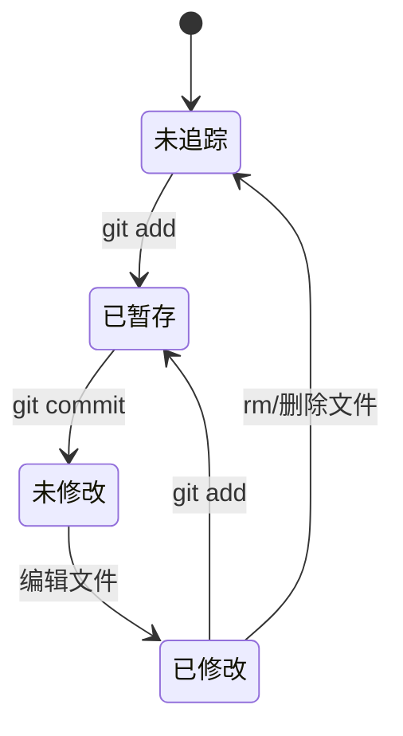
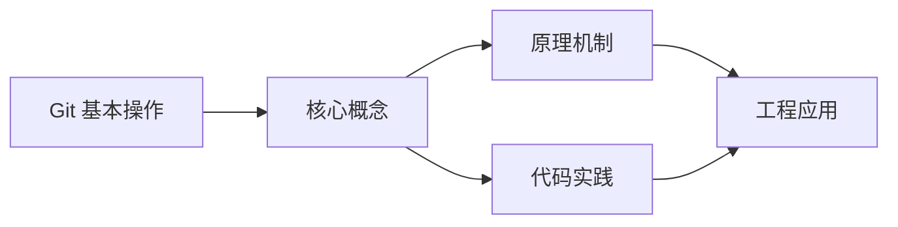
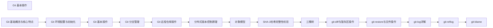

## 1. 学习目标（Bloom 分类）

本节按照布鲁姆教育目标分类学组织学习路径。本文主题为《Git 基本操作》，属于 Git 模块，读者可以根据自身阶段选择阅读深度。

记忆层面：能够准确复述本文的核心概念、术语与基本语法或操作步骤，并能够在提问或检索时快速定位对应知识点。能够说出 Git 的核心概念、常用命令与流程。

理解层面：能够用自己的语言解释核心原理与工作机制，说明概念之间的因果关系，而不是机械记忆结论。能够解释 Git 的工作原理与设计动机。

应用层面：能够在真实项目或练习场景中运用本文知识解决具体问题，写出正确且可维护的实现。能够独立完成 Git 的标准操作。

分析层面：能够拆解复杂问题，比较本文主题与相邻概念的异同，识别边界条件与例外情况。能够分析 Git 使用中的异常与边界。

评价层面：能够根据约束条件（性能、可读性、安全、成本）评价不同方案的优劣，做出有依据的技术决策。能够评价 Git 相关工具与方案。

创造层面：能够把本文知识与其他模块知识组合，设计出新的解决方案或可复用的工程模式。能够把 Git 融入团队工作流。

通过本节学习，读者应当能够把《Git 基本操作》纳入自己的知识网络，并与 Git 模块的其他主题（提交、分支、合并、远程协作）建立关联。

## 2. 历史动机与发展脉络

《Git 基本操作》是 Git 领域的重要主题。要真正理解它，需要先了解它解决的问题与演进过程。

Git 由 Linus Torvalds 于 2005 年为 Linux 内核开发，目标是替代 BitKeeper：分布式、高性能、内容寻址。
Git 的核心是对象模型：blob（内容）、tree（目录）、commit（快照 + 元数据）、tag（引用）；一切对象用 SHA-1 哈希寻址。
工作流演进：集中式工作流 -> 特性分支 -> GitFlow -> GitHub Flow / Trunk-Based；现代团队普遍采用 PR 审查 + 主干发布。

回到本文主题：Git 基本操作 的提出与成熟，正是上述技术背景下的必然产物。早期实现往往以简单可用为目标，随着工程规模扩大，社区逐渐沉淀出标准做法与最佳实践；理解这一脉络，可以帮助读者判断“为什么文档中的推荐写法是现在这个样子”，也能在遇到历史遗留代码时准确识别其设计年代与取舍。


## 3. 形式化定义与核心概念精讲

本节把《Git 基本操作》涉及的核心概念以“定义 + 讲解”的形式展开。读者应把定义当作工具，把讲解当作理解路径；两者结合才能形成可迁移的知识。

三个区域：工作区、暂存区（index）、仓库（HEAD）；git add/commit 移动状态。
分支是指针：创建分支成本极低；合并（merge 生成合并提交）与变基（rebase 重放提交）各有取舍。
远程协作：clone/fetch/pull/push；refs/remotes 跟踪远端；冲突在合并时出现并手工解决。

### 3.1 原文章节逐一精讲

原文档把主题拆分为 22 个小节，下面按顺序给出每一节的导读讲解，随后保留原文细节供精读。

#### 原文精读（完整保留）

# Git 基本操作

> **符号约定**：`< >` 必填参数 | `[ ]` 可选参数

---

#### 1. Git 工作区、暂存区和本地仓库

##### 1.1 概念解释

- **工作区（Working Directory）**：项目目录下用户直接编辑的文件区域
- **暂存区（Staging Area）**：位于 `.git/index` 文件中，用于保存即将提交的文件列表
- **本地仓库（Local Repository）**：位于 `.git` 目录中，包含了完整的项目历史

##### 1.2 文件状态

Git 中的文件有两种状态：

- **已追踪（Tracked）**：已被纳入版本控制的文件
- 未修改（Unmodified）
- 已修改（Modified）
- 已暂存（Staged）
- **未追踪（Untracked）**：不在版本控制中的新文件

##### 1.3 文件状态流转



#### 2. 状态管理

##### 2.1 查看状态

```bash
 git status
```

输出说明：

- `Changes to be committed`：暂存区中的文件（已暂存）
- `Changes not staged for commit`：工作区中已修改但未暂存的文件
- `Untracked files`：未追踪的新文件

##### 2.2 简略格式

```bash
 git status -s
```

输出标记：

- `??`：未追踪的文件
- `A`：新添加到暂存区的文件
- `M`：已修改的文件
- `D`：已删除的文件

#### 3. 暂存与提交

##### 3.1 暂存操作

```bash
 # 暂存单个文件
 git add <file>
 # 暂存所有文件
 git add .
 # 暂存所有已追踪文件的修改
 git add -u
 # 交互式暂存
 git add -p
```

##### 3.2 提交操作

```bash
 # 提交暂存区的文件
 git commit -m "commit message"
 # 提交所有已追踪文件的修改（跳过暂存）
 git commit -a -m "commit message"
 # 修改最后一次提交
 git commit --amend -m "new message"
 # 提交空目录（需要在里面添加 .gitkeep）
 git add directory/.gitkeep
 git commit -m "add directory"
```

##### 3.3 提交信息规范

推荐格式：

```text
 <type>: <subject>
 <body>
 <footer>
```

类型（type）：

- `feat`：新功能
- `fix`：bug 修复
- `docs`：文档更新
- `style`：格式调整
- `refactor`：重构
- `test`：测试相关
- `chore`：构建/工具相关

#### 4. 查看历史

##### 4.1 查看提交历史

```bash
 # 查看完整提交历史
 git log
 # 查看简洁的提交历史
 git log --oneline
 # 查看最近 N 次提交
 git log -n 5
 # 查看分支合并历史
 git log --graph --oneline --all
 # 查看特定文件的修改历史
 git log <file>
 # 查看某次提交的详细信息
 git show <commit-hash>
```

##### 4.2 查看差异

```bash
 # 查看工作区与暂存区的差异
 git diff
 # 查看暂存区与上次提交的差异
 git diff --cached
 # 查看两个分支的差异
 git diff <branch1>..<branch2>
 # 查看特定文件的差异
 git diff <file>
```

#### 5. 标签管理

##### 5.1 创建标签

```bash
 # 创建轻量标签
 git tag <tag-name>
 # 创建附注标签
 git tag -a <tag-name> -m "tag message"
 # 为特定提交创建标签
 git tag -a <tag-name> <commit-hash> -m "tag message"
```

##### 5.2 查看和操作标签

```bash
 # 查看所有标签
 git tag
 # 查看标签详细信息
 git show <tag-name>
 # 删除标签
 git tag -d <tag-name>
 # 推送标签到远程
 git push <remote-name> <tag-name>
 # 推送所有标签到远程
 git push <remote-name> --tags
 # 检出到特定标签
 git checkout <tag-name>
```

#### 6. 撤销操作

##### 6.1 撤销工作区修改

```bash
 # 撤销单个文件的修改
 git checkout -- <file>
 # 撤销所有文件的修改
 git checkout -- .
 # 使用 git restore（Git 2.23+）
 git restore <file>
 git restore .
```

##### 6.2 撤销暂存

```bash
 # 撤销暂存（保留工作区修改）
 git reset HEAD <file>
 # 使用 git restore（Git 2.23+）
 git restore --staged <file>
```

##### 6.3 撤销提交

```bash
 # 软回退：撤销提交，保留修改在暂存区
 git reset --soft HEAD~1
 # 混合回退：撤销提交，保留修改在工作区
 git reset --mixed HEAD~1
 # 硬回退：撤销提交，丢弃所有修改
 git reset --hard HEAD~1
```

##### 6.4 使用 git revert

```bash
 # 创建一个新提交来撤销指定提交
 git revert <commit-hash>
 # 撤销多个提交
 git revert <commit-hash1> <commit-hash2>
```

**注意**：`git reset` 会改写历史，已推送到远程的提交不建议使用；`git revert` 是安全的撤销方式，会创建新的提交。

#### 7. 远程仓库操作

##### 7.1 添加和查看远程仓库

```bash
 # 添加远程仓库
 git remote add origin <url>
 # 查看远程仓库
 git remote -v
 # 修改远程仓库 URL
 git remote set-url origin <new-url>
 # 删除远程仓库
 git remote remove origin
```

##### 7.2 推送和拉取

```bash
 # 推送到远程仓库
 git push origin main
 # 拉取远程仓库的更新
 git pull origin main
 # 获取远程仓库的更新（不合并）
 git fetch origin
```

#### 8. 日常开发流程

##### 8.1 标准开发流程

```bash
 # 1. 拉取最新代码
 git pull origin main
 # 2. 创建功能分支
 git checkout -b feature/new-feature
 # 3. 开发并提交
 git add .
 git commit -m "feat: add new feature"
 # 4. 推送到远程
 git push origin feature/new-feature
 # 5. 合并到主分支
 git checkout main
 git merge feature/new-feature
 git push origin main
 # 6. 删除功能分支
 git branch -d feature/new-feature
```

##### 8.2 紧急修复流程

```bash
 # 1. 创建修复分支
 git checkout -b hotfix/fix-bug
 # 2. 修复并提交
 git add .
 git commit -m "fix: fix critical bug"
 # 3. 合并到主分支和开发分支
 git checkout main
 git merge hotfix/fix-bug
 git checkout develop
 git merge hotfix/fix-bug
 # 4. 删除修复分支
 git branch -d hotfix/fix-bug
```

#### 9. 最佳实践

##### 9.1 提交规范

- **频繁提交**：小步快跑，每次提交只做一件事
- **有意义的提交信息**：使用规范的提交信息格式
- **不要提交半成品**：确保每次提交都是可运行的

##### 9.2 分支管理

- **主分支保持稳定**：main 分支始终可部署
- **功能分支开发**：每个功能在独立分支上开发
- **及时合并和删除**：合并后及时删除功能分支

##### 9.3 常用快捷命令

| 命令                     | 说明                    |
| ------------------------ | ----------------------- |
| `git stash`              | 暂存当前修改            |
| `git stash pop`          | 恢复暂存的修改          |
| `git stash list`         | 查看暂存列表            |
| `git cherry-pick <hash>` | 选择性合并某个提交      |
| `git rebase main`        | 变基到 main 分支        |
| `git bisect`             | 二分查找引入 bug 的提交 |

---

#### 状态查看

**基本写法：查看仓库状态**
`git status`
```bash
# 显示工作区、暂存区文件状态
git status;
```

**简略写法：短格式状态**
`git status -s`
```bash
# 输出 ?? 未追踪 / A 新增暂存 / M 修改 / D 删除
git status -s;
```

---

#### 暂存操作

**基本写法：暂存单个文件**
`git add <file>`
```bash
# 暂存指定文件
git add src/index.js;
```

**基本写法：暂存所有变更**
`git add .`
```bash
# 暂存当前目录下所有文件
git add .;
```

**单行写法：暂存多个文件**
`git add <file1> <file2> <file3>`
```bash
# 一次性暂存多个文件
git add src/index.js src/utils.js src/config.js;
```

**换行写法：暂存多个文件**
`git add <file1> <file2> <file3>`
```bash
# 换行书写多个文件
git add src/index.js \
        src/utils.js \
        src/config.js;
```

**基本写法：暂存已追踪文件**
`git add -u`
```bash
# 暂存所有已追踪文件的修改（不含新文件）
git add -u;
```

**基本写法：交互式暂存**
`git add -p`
```bash
# 逐代码块确认是否暂存
git add -p;
```

---

#### 提交操作

**基本写法：标准提交**
`git commit -m "<message>"`
```bash
# 提交暂存区内容并附带消息
git commit -m "feat: add login module";
```

**基本写法：跳过暂存提交**
`git commit -a -m "<message>"`
```bash
# 自动暂存已追踪文件并提交
git commit -a -m "fix: resolve crash";
```

**基本写法：修改最后一次提交**
`git commit --amend -m "<message>"`
```bash
# 修改最近一次提交消息
git commit --amend -m "feat: add login module v2";
```

---

#### 提交信息规范

**基本写法：约定式提交格式**
`<type>: <subject>`
```text
# type 取值：feat / fix / docs / style / refactor / test / chore
feat: add user authentication
```

---

#### 查看历史

**基本写法：查看完整历史**
`git log`
```bash
# 查看完整提交历史
git log;
```

**基本写法：简洁历史**
`git log --oneline`
```bash
# 每条提交一行显示
git log --oneline;
```

**基本写法：限制条数**
`git log -n <count>`
```bash
# 查看最近 5 次提交
git log -n 5;
```

**基本写法：图形化分支历史**
`git log --graph --oneline --all`
```bash
# 查看所有分支的合并图
git log --graph --oneline --all;
```

**基本写法：查看文件历史**
`git log <file>`
```bash
# 查看 src/index.js 的修改历史
git log src/index.js;
```

**基本写法：查看提交详情**
`git show <commit-hash>`
```bash
# 查看指定提交的详情
git show abc1234;
```

---

#### 查看差异

**基本写法：工作区与暂存区差异**
`git diff`
```bash
# 查看未暂存的修改
git diff;
```

**基本写法：暂存区与上次提交差异**
`git diff --cached`
```bash
# 查看已暂存但未提交的修改
git diff --cached;
```

**基本写法：分支间差异**
`git diff <branch1>..<branch2>`
```bash
# 比较 main 与 feature 分支差异
git diff main..feature;
```

**基本写法：文件差异**
`git diff <file>`
```bash
# 查看 src/index.js 的修改
git diff src/index.js;
```

---

#### 撤销工作区修改

**基本写法：撤销单个文件修改**
`git checkout -- <file>`
```bash
# 撤销 src/index.js 的工作区修改
git checkout -- src/index.js;
```

**基本写法：撤销所有文件修改**
`git checkout -- .`
```bash
# 撤销所有工作区修改
git checkout -- .;
```

**基本写法：使用 restore 撤销**
`git restore <file>`
```bash
# 撤销指定文件修改（Git 2.23+）
git restore src/index.js;
```

---

#### 撤销暂存

**基本写法：取消暂存（保留修改）**
`git reset HEAD <file>`
```bash
# 将 src/index.js 移出暂存区
git reset HEAD src/index.js;
```

**基本写法：使用 restore 撤销暂存**
`git restore --staged <file>`
```bash
# 取消暂存但保留工作区修改（Git 2.23+）
git restore --staged src/index.js;
```

---

#### 撤销提交

**基本写法：软回退**
`git reset --soft HEAD~<n>`
```bash
# 撤销最近一次提交，修改保留在暂存区
git reset --soft HEAD~1;
```

**基本写法：混合回退**
`git reset --mixed HEAD~<n>`
```bash
# 撤销最近一次提交，修改保留在工作区
git reset --mixed HEAD~1;
```

**基本写法：硬回退**
`git reset --hard HEAD~<n>`
```bash
# 撤销最近一次提交并丢弃修改
git reset --hard HEAD~1;
```

**基本写法：安全撤销（revert）**
`git revert <commit-hash>`
```bash
# 创建反向提交撤销 abc1234
git revert abc1234;
```

**单行写法：撤销多个提交**
`git revert <hash1> <hash2>`
```bash
# 撤销多个不连续的提交
git revert abc1234 def5678;
```

---

#### 远程仓库基础

**基本写法：添加远程仓库**
`git remote add <name> <url>`
```bash
# 添加名为 origin 的远程仓库
git remote add origin https://github.com/user/repo.git;
```

**基本写法：查看远程仓库**
`git remote -v`
```bash
# 显示远程仓库名称和地址
git remote -v;
```

**基本写法：修改远程仓库 URL**
`git remote set-url <name> <new-url>`
```bash
# 更新 origin 的 URL
git remote set-url origin https://github.com/user/new-repo.git;
```

**基本写法：删除远程仓库**
`git remote remove <name>`
```bash
# 删除名为 origin 的远程仓库
git remote remove origin;
```

---

#### 推送与拉取

**基本写法：推送到远程**
`git push <remote> <branch>`
```bash
# 推送 main 分支到 origin
git push origin main;
```

**基本写法：拉取远程更新**
`git pull <remote> <branch>`
```bash
# 拉取 origin 的 main 分支并合并
git pull origin main;
```

**基本写法：获取远程更新（不合并）**
`git fetch <remote>`
```bash
# 获取 origin 的更新但不合并
git fetch origin;
```

---

#### 暂存修改（stash）

**基本写法：暂存当前修改**
`git stash`
```bash
# 暂存当前所有修改
git stash;
```

**基本写法：恢复暂存修改**
`git stash pop`
```bash
# 恢复最近一次暂存的修改并删除该暂存
git stash pop;
```

**基本写法：查看暂存列表**
`git stash list`
```bash
# 查看所有暂存记录
git stash list;
```

---

#### 选择性合并

**基本写法：挑选提交合并**
`git cherry-pick <commit-hash>`
```bash
# 将 abc1234 提交应用到当前分支
git cherry-pick abc1234;
```


### 3.2 概念关系图

下面用 Mermaid 图表达本文核心概念之间的关系，帮助读者建立整体图景：



图中展示的是本文知识的结构化关系：核心概念是入口，原理机制解释“为什么”，代码实践演示“怎么做”，工程应用回答“何时用”。读者学习时可以把每个小节的内容挂接到对应节点上。

## 4. 理论推导与原理解析

本节深入《Git 基本操作》背后的原理。理论部分不求面面俱到，而是聚焦“能解释现象、能指导实践”的关键推导。

三个区域：工作区、暂存区（index）、仓库（HEAD）；git add/commit 移动状态。
分支是指针：创建分支成本极低；合并（merge 生成合并提交）与变基（rebase 重放提交）各有取舍。
远程协作：clone/fetch/pull/push；refs/remotes 跟踪远端；冲突在合并时出现并手工解决。
撤销模型：checkout/restore 改工作区，reset 移 HEAD，revert 生成反向提交；理解三者避免误操作。

需要强调的是，理论推导与工程实践之间存在翻译层：理论给出的是理想化模型与边界条件，工程代码则必须处理真实环境中的例外。读者在学习时应先掌握理论的“标准情形”，再通过陷阱章节了解“非标准情形”。

## 5. 代码示例与逐行讲解

本节把原文中的代码示例系统整理，并为每个示例补充用途说明与讲解。读者不应只浏览代码，而应逐段对照讲解理解设计意图。

### 5.1 示例：1.3 文件状态流转

该示例来自原文《1.3 文件状态流转》小节，用于演示Git 基本操作相关操作。阅读时请先看代码结构，再看其后的讲解。


讲解：这段代码演示了本节核心知识点。代码中的关键操作可以归纳为三步：准备（定义或初始化）、执行（核心逻辑）、收尾（释放资源或返回结果）。实际项目中，这三步往往被封装为函数或类，以提升复用性与可测试性。

关键点分析：

该示例共 7 行有效代码，结构以数据或配置为主。阅读时应关注：数据字段的含义、配置项的作用，以及它们与运行行为的对应关系。

进阶思考路径：先尝试修改参数观察行为变化，再把示例中的模式迁移到自己的项目中；每次修改都记录预期与实测差异，这是把示例转化为能力的最快方式。

### 5.2 示例：2.1 查看状态

该示例来自原文《2.1 查看状态》小节，用于演示Git 基本操作相关操作。阅读时请先看代码结构，再看其后的讲解。

```bash
 git status
```

讲解：这段代码演示了本节核心知识点。代码中的关键操作可以归纳为三步：准备（定义或初始化）、执行（核心逻辑）、收尾（释放资源或返回结果）。实际项目中，这三步往往被封装为函数或类，以提升复用性与可测试性。

关键点分析：

该示例共 1 行有效代码，结构以数据或配置为主。阅读时应关注：数据字段的含义、配置项的作用，以及它们与运行行为的对应关系。

进阶思考路径：先尝试修改参数观察行为变化，再把示例中的模式迁移到自己的项目中；每次修改都记录预期与实测差异，这是把示例转化为能力的最快方式。

### 5.3 示例：2.2 简略格式

该示例来自原文《2.2 简略格式》小节，用于演示Git 基本操作相关操作。阅读时请先看代码结构，再看其后的讲解。

```bash
 git status -s
```

讲解：这段代码演示了本节核心知识点。代码中的关键操作可以归纳为三步：准备（定义或初始化）、执行（核心逻辑）、收尾（释放资源或返回结果）。实际项目中，这三步往往被封装为函数或类，以提升复用性与可测试性。

关键点分析：

该示例共 1 行有效代码，结构以数据或配置为主。阅读时应关注：数据字段的含义、配置项的作用，以及它们与运行行为的对应关系。

进阶思考路径：先尝试修改参数观察行为变化，再把示例中的模式迁移到自己的项目中；每次修改都记录预期与实测差异，这是把示例转化为能力的最快方式。

### 5.4 示例：3.1 暂存操作

该示例来自原文《3.1 暂存操作》小节，用于演示Git 基本操作相关操作。阅读时请先看代码结构，再看其后的讲解。

```bash
 # 暂存单个文件
 git add <file>
 # 暂存所有文件
 git add .
 # 暂存所有已追踪文件的修改
 git add -u
 # 交互式暂存
 git add -p
```

讲解：这段代码演示了本节核心知识点。代码中的关键操作可以归纳为三步：准备（定义或初始化）、执行（核心逻辑）、收尾（释放资源或返回结果）。实际项目中，这三步往往被封装为函数或类，以提升复用性与可测试性。

关键点分析：

该示例共 8 行有效代码，结构以数据或配置为主。阅读时应关注：数据字段的含义、配置项的作用，以及它们与运行行为的对应关系。

进阶思考路径：先尝试修改参数观察行为变化，再把示例中的模式迁移到自己的项目中；每次修改都记录预期与实测差异，这是把示例转化为能力的最快方式。

### 5.5 示例：3.2 提交操作

该示例来自原文《3.2 提交操作》小节，用于演示Git 基本操作相关操作。阅读时请先看代码结构，再看其后的讲解。

```bash
 # 提交暂存区的文件
 git commit -m "commit message"
 # 提交所有已追踪文件的修改（跳过暂存）
 git commit -a -m "commit message"
 # 修改最后一次提交
 git commit --amend -m "new message"
 # 提交空目录（需要在里面添加 .gitkeep）
 git add directory/.gitkeep
 git commit -m "add directory"
```

讲解：这段代码演示了本节核心知识点。代码中的关键操作可以归纳为三步：准备（定义或初始化）、执行（核心逻辑）、收尾（释放资源或返回结果）。实际项目中，这三步往往被封装为函数或类，以提升复用性与可测试性。

关键点分析：

该示例共 9 行有效代码，结构以数据或配置为主。阅读时应关注：数据字段的含义、配置项的作用，以及它们与运行行为的对应关系。

进阶思考路径：先尝试修改参数观察行为变化，再把示例中的模式迁移到自己的项目中；每次修改都记录预期与实测差异，这是把示例转化为能力的最快方式。

### 5.6 示例：3.3 提交信息规范

该示例来自原文《3.3 提交信息规范》小节，用于演示Git 基本操作相关操作。阅读时请先看代码结构，再看其后的讲解。

```text
 <type>: <subject>
 <body>
 <footer>
```

讲解：这段代码演示了本节核心知识点。代码中的关键操作可以归纳为三步：准备（定义或初始化）、执行（核心逻辑）、收尾（释放资源或返回结果）。实际项目中，这三步往往被封装为函数或类，以提升复用性与可测试性。

关键点分析：

该示例共 3 行有效代码，结构以数据或配置为主。阅读时应关注：数据字段的含义、配置项的作用，以及它们与运行行为的对应关系。

进阶思考路径：先尝试修改参数观察行为变化，再把示例中的模式迁移到自己的项目中；每次修改都记录预期与实测差异，这是把示例转化为能力的最快方式。

### 5.7 示例：4.1 查看提交历史

该示例来自原文《4.1 查看提交历史》小节，用于演示Git 基本操作相关操作。阅读时请先看代码结构，再看其后的讲解。

```bash
 # 查看完整提交历史
 git log
 # 查看简洁的提交历史
 git log --oneline
 # 查看最近 N 次提交
 git log -n 5
 # 查看分支合并历史
 git log --graph --oneline --all
 # 查看特定文件的修改历史
 git log <file>
 # 查看某次提交的详细信息
 git show <commit-hash>
```

讲解：这段代码演示了本节核心知识点。代码中的关键操作可以归纳为三步：准备（定义或初始化）、执行（核心逻辑）、收尾（释放资源或返回结果）。实际项目中，这三步往往被封装为函数或类，以提升复用性与可测试性。

关键点分析：

该示例共 12 行有效代码，结构以数据或配置为主。阅读时应关注：数据字段的含义、配置项的作用，以及它们与运行行为的对应关系。

进阶思考路径：先尝试修改参数观察行为变化，再把示例中的模式迁移到自己的项目中；每次修改都记录预期与实测差异，这是把示例转化为能力的最快方式。

### 5.8 示例：4.2 查看差异

该示例来自原文《4.2 查看差异》小节，用于演示Git 基本操作相关操作。阅读时请先看代码结构，再看其后的讲解。

```bash
 # 查看工作区与暂存区的差异
 git diff
 # 查看暂存区与上次提交的差异
 git diff --cached
 # 查看两个分支的差异
 git diff <branch1>..<branch2>
 # 查看特定文件的差异
 git diff <file>
```

讲解：这段代码演示了本节核心知识点。代码中的关键操作可以归纳为三步：准备（定义或初始化）、执行（核心逻辑）、收尾（释放资源或返回结果）。实际项目中，这三步往往被封装为函数或类，以提升复用性与可测试性。

关键点分析：

该示例共 8 行有效代码，结构以数据或配置为主。阅读时应关注：数据字段的含义、配置项的作用，以及它们与运行行为的对应关系。

进阶思考路径：先尝试修改参数观察行为变化，再把示例中的模式迁移到自己的项目中；每次修改都记录预期与实测差异，这是把示例转化为能力的最快方式。

### 5.9 示例：5.1 创建标签

该示例来自原文《5.1 创建标签》小节，用于演示Git 基本操作相关操作。阅读时请先看代码结构，再看其后的讲解。

```bash
 # 创建轻量标签
 git tag <tag-name>
 # 创建附注标签
 git tag -a <tag-name> -m "tag message"
 # 为特定提交创建标签
 git tag -a <tag-name> <commit-hash> -m "tag message"
```

讲解：这段代码演示了本节核心知识点。代码中的关键操作可以归纳为三步：准备（定义或初始化）、执行（核心逻辑）、收尾（释放资源或返回结果）。实际项目中，这三步往往被封装为函数或类，以提升复用性与可测试性。

关键点分析：

该示例共 6 行有效代码，结构以数据或配置为主。阅读时应关注：数据字段的含义、配置项的作用，以及它们与运行行为的对应关系。

进阶思考路径：先尝试修改参数观察行为变化，再把示例中的模式迁移到自己的项目中；每次修改都记录预期与实测差异，这是把示例转化为能力的最快方式。

### 5.10 示例：5.2 查看和操作标签

该示例来自原文《5.2 查看和操作标签》小节，用于演示Git 基本操作相关操作。阅读时请先看代码结构，再看其后的讲解。

```bash
 # 查看所有标签
 git tag
 # 查看标签详细信息
 git show <tag-name>
 # 删除标签
 git tag -d <tag-name>
 # 推送标签到远程
 git push <remote-name> <tag-name>
 # 推送所有标签到远程
 git push <remote-name> --tags
 # 检出到特定标签
 git checkout <tag-name>
```

讲解：这段代码演示了本节核心知识点。代码中的关键操作可以归纳为三步：准备（定义或初始化）、执行（核心逻辑）、收尾（释放资源或返回结果）。实际项目中，这三步往往被封装为函数或类，以提升复用性与可测试性。

关键点分析：

该示例共 12 行有效代码，结构以数据或配置为主。阅读时应关注：数据字段的含义、配置项的作用，以及它们与运行行为的对应关系。

进阶思考路径：先尝试修改参数观察行为变化，再把示例中的模式迁移到自己的项目中；每次修改都记录预期与实测差异，这是把示例转化为能力的最快方式。

### 5.11 示例：6.1 撤销工作区修改

该示例来自原文《6.1 撤销工作区修改》小节，用于演示Git 基本操作相关操作。阅读时请先看代码结构，再看其后的讲解。

```bash
 # 撤销单个文件的修改
 git checkout -- <file>
 # 撤销所有文件的修改
 git checkout -- .
 # 使用 git restore（Git 2.23+）
 git restore <file>
 git restore .
```

讲解：这段代码演示了本节核心知识点。代码中的关键操作可以归纳为三步：准备（定义或初始化）、执行（核心逻辑）、收尾（释放资源或返回结果）。实际项目中，这三步往往被封装为函数或类，以提升复用性与可测试性。

关键点分析：

该示例共 7 行有效代码，结构以数据或配置为主。阅读时应关注：数据字段的含义、配置项的作用，以及它们与运行行为的对应关系。

进阶思考路径：先尝试修改参数观察行为变化，再把示例中的模式迁移到自己的项目中；每次修改都记录预期与实测差异，这是把示例转化为能力的最快方式。

### 5.12 示例：6.2 撤销暂存

该示例来自原文《6.2 撤销暂存》小节，用于演示Git 基本操作相关操作。阅读时请先看代码结构，再看其后的讲解。

```bash
 # 撤销暂存（保留工作区修改）
 git reset HEAD <file>
 # 使用 git restore（Git 2.23+）
 git restore --staged <file>
```

讲解：这段代码演示了本节核心知识点。代码中的关键操作可以归纳为三步：准备（定义或初始化）、执行（核心逻辑）、收尾（释放资源或返回结果）。实际项目中，这三步往往被封装为函数或类，以提升复用性与可测试性。

关键点分析：

该示例共 4 行有效代码，结构以数据或配置为主。阅读时应关注：数据字段的含义、配置项的作用，以及它们与运行行为的对应关系。

进阶思考路径：先尝试修改参数观察行为变化，再把示例中的模式迁移到自己的项目中；每次修改都记录预期与实测差异，这是把示例转化为能力的最快方式。

### 5.13 示例：6.3 撤销提交

该示例来自原文《6.3 撤销提交》小节，用于演示Git 基本操作相关操作。阅读时请先看代码结构，再看其后的讲解。

```bash
 # 软回退：撤销提交，保留修改在暂存区
 git reset --soft HEAD~1
 # 混合回退：撤销提交，保留修改在工作区
 git reset --mixed HEAD~1
 # 硬回退：撤销提交，丢弃所有修改
 git reset --hard HEAD~1
```

讲解：这段代码演示了本节核心知识点。代码中的关键操作可以归纳为三步：准备（定义或初始化）、执行（核心逻辑）、收尾（释放资源或返回结果）。实际项目中，这三步往往被封装为函数或类，以提升复用性与可测试性。

关键点分析：

该示例共 6 行有效代码，结构以数据或配置为主。阅读时应关注：数据字段的含义、配置项的作用，以及它们与运行行为的对应关系。

进阶思考路径：先尝试修改参数观察行为变化，再把示例中的模式迁移到自己的项目中；每次修改都记录预期与实测差异，这是把示例转化为能力的最快方式。

### 5.14 示例：6.4 使用 git revert

该示例来自原文《6.4 使用 git revert》小节，用于演示Git 基本操作相关操作。阅读时请先看代码结构，再看其后的讲解。

```bash
 # 创建一个新提交来撤销指定提交
 git revert <commit-hash>
 # 撤销多个提交
 git revert <commit-hash1> <commit-hash2>
```

讲解：这段代码演示了本节核心知识点。代码中的关键操作可以归纳为三步：准备（定义或初始化）、执行（核心逻辑）、收尾（释放资源或返回结果）。实际项目中，这三步往往被封装为函数或类，以提升复用性与可测试性。

关键点分析：

该示例共 4 行有效代码，结构以数据或配置为主。阅读时应关注：数据字段的含义、配置项的作用，以及它们与运行行为的对应关系。

进阶思考路径：先尝试修改参数观察行为变化，再把示例中的模式迁移到自己的项目中；每次修改都记录预期与实测差异，这是把示例转化为能力的最快方式。

### 5.15 示例：7.1 添加和查看远程仓库

该示例来自原文《7.1 添加和查看远程仓库》小节，用于演示Git 基本操作相关操作。阅读时请先看代码结构，再看其后的讲解。

```bash
 # 添加远程仓库
 git remote add origin <url>
 # 查看远程仓库
 git remote -v
 # 修改远程仓库 URL
 git remote set-url origin <new-url>
 # 删除远程仓库
 git remote remove origin
```

讲解：这段代码演示了本节核心知识点。代码中的关键操作可以归纳为三步：准备（定义或初始化）、执行（核心逻辑）、收尾（释放资源或返回结果）。实际项目中，这三步往往被封装为函数或类，以提升复用性与可测试性。

关键点分析：

该示例共 8 行有效代码，结构以数据或配置为主。阅读时应关注：数据字段的含义、配置项的作用，以及它们与运行行为的对应关系。

进阶思考路径：先尝试修改参数观察行为变化，再把示例中的模式迁移到自己的项目中；每次修改都记录预期与实测差异，这是把示例转化为能力的最快方式。

### 5.16 示例：7.2 推送和拉取

该示例来自原文《7.2 推送和拉取》小节，用于演示Git 基本操作相关操作。阅读时请先看代码结构，再看其后的讲解。

```bash
 # 推送到远程仓库
 git push origin main
 # 拉取远程仓库的更新
 git pull origin main
 # 获取远程仓库的更新（不合并）
 git fetch origin
```

讲解：这段代码演示了本节核心知识点。代码中的关键操作可以归纳为三步：准备（定义或初始化）、执行（核心逻辑）、收尾（释放资源或返回结果）。实际项目中，这三步往往被封装为函数或类，以提升复用性与可测试性。

关键点分析：

该示例共 6 行有效代码，结构以数据或配置为主。阅读时应关注：数据字段的含义、配置项的作用，以及它们与运行行为的对应关系。

进阶思考路径：先尝试修改参数观察行为变化，再把示例中的模式迁移到自己的项目中；每次修改都记录预期与实测差异，这是把示例转化为能力的最快方式。

### 5.17 示例：8.1 标准开发流程

该示例来自原文《8.1 标准开发流程》小节，用于演示Git 基本操作相关操作。阅读时请先看代码结构，再看其后的讲解。

```bash
 # 1. 拉取最新代码
 git pull origin main
 # 2. 创建功能分支
 git checkout -b feature/new-feature
 # 3. 开发并提交
 git add .
 git commit -m "feat: add new feature"
 # 4. 推送到远程
 git push origin feature/new-feature
 # 5. 合并到主分支
 git checkout main
 git merge feature/new-feature
 git push origin main
 # 6. 删除功能分支
 git branch -d feature/new-feature
```

讲解：这段代码演示了本节核心知识点。代码中的关键操作可以归纳为三步：准备（定义或初始化）、执行（核心逻辑）、收尾（释放资源或返回结果）。实际项目中，这三步往往被封装为函数或类，以提升复用性与可测试性。

关键点分析：

该示例共 15 行有效代码，结构以数据或配置为主。阅读时应关注：数据字段的含义、配置项的作用，以及它们与运行行为的对应关系。

进阶思考路径：先尝试修改参数观察行为变化，再把示例中的模式迁移到自己的项目中；每次修改都记录预期与实测差异，这是把示例转化为能力的最快方式。

### 5.18 示例：8.2 紧急修复流程

该示例来自原文《8.2 紧急修复流程》小节，用于演示Git 基本操作相关操作。阅读时请先看代码结构，再看其后的讲解。

```bash
 # 1. 创建修复分支
 git checkout -b hotfix/fix-bug
 # 2. 修复并提交
 git add .
 git commit -m "fix: fix critical bug"
 # 3. 合并到主分支和开发分支
 git checkout main
 git merge hotfix/fix-bug
 git checkout develop
 git merge hotfix/fix-bug
 # 4. 删除修复分支
 git branch -d hotfix/fix-bug
```

讲解：这段代码演示了本节核心知识点。代码中的关键操作可以归纳为三步：准备（定义或初始化）、执行（核心逻辑）、收尾（释放资源或返回结果）。实际项目中，这三步往往被封装为函数或类，以提升复用性与可测试性。

关键点分析：

该示例共 12 行有效代码，结构以数据或配置为主。阅读时应关注：数据字段的含义、配置项的作用，以及它们与运行行为的对应关系。

进阶思考路径：先尝试修改参数观察行为变化，再把示例中的模式迁移到自己的项目中；每次修改都记录预期与实测差异，这是把示例转化为能力的最快方式。

### 5.19 示例：状态查看

该示例来自原文《状态查看》小节，用于演示Git 基本操作相关操作。阅读时请先看代码结构，再看其后的讲解。

```bash
# 显示工作区、暂存区文件状态
git status;
```

讲解：这段代码演示了本节核心知识点。代码中的关键操作可以归纳为三步：准备（定义或初始化）、执行（核心逻辑）、收尾（释放资源或返回结果）。实际项目中，这三步往往被封装为函数或类，以提升复用性与可测试性。

关键点分析：

该示例共 2 行有效代码，结构以数据或配置为主。阅读时应关注：数据字段的含义、配置项的作用，以及它们与运行行为的对应关系。

进阶思考路径：先尝试修改参数观察行为变化，再把示例中的模式迁移到自己的项目中；每次修改都记录预期与实测差异，这是把示例转化为能力的最快方式。

### 5.20 示例：状态查看

该示例来自原文《状态查看》小节，用于演示Git 基本操作相关操作。阅读时请先看代码结构，再看其后的讲解。

```bash
# 输出 ?? 未追踪 / A 新增暂存 / M 修改 / D 删除
git status -s;
```

讲解：这段代码演示了本节核心知识点。代码中的关键操作可以归纳为三步：准备（定义或初始化）、执行（核心逻辑）、收尾（释放资源或返回结果）。实际项目中，这三步往往被封装为函数或类，以提升复用性与可测试性。

关键点分析：

该示例共 2 行有效代码，结构以数据或配置为主。阅读时应关注：数据字段的含义、配置项的作用，以及它们与运行行为的对应关系。

进阶思考路径：先尝试修改参数观察行为变化，再把示例中的模式迁移到自己的项目中；每次修改都记录预期与实测差异，这是把示例转化为能力的最快方式。

### 5.21 示例：暂存操作

该示例来自原文《暂存操作》小节，用于演示Git 基本操作相关操作。阅读时请先看代码结构，再看其后的讲解。

```bash
# 暂存指定文件
git add src/index.js;
```

讲解：这段代码演示了本节核心知识点。代码中的关键操作可以归纳为三步：准备（定义或初始化）、执行（核心逻辑）、收尾（释放资源或返回结果）。实际项目中，这三步往往被封装为函数或类，以提升复用性与可测试性。

关键点分析：

该示例共 2 行有效代码，结构以数据或配置为主。阅读时应关注：数据字段的含义、配置项的作用，以及它们与运行行为的对应关系。

进阶思考路径：先尝试修改参数观察行为变化，再把示例中的模式迁移到自己的项目中；每次修改都记录预期与实测差异，这是把示例转化为能力的最快方式。

### 5.22 示例：暂存操作

该示例来自原文《暂存操作》小节，用于演示Git 基本操作相关操作。阅读时请先看代码结构，再看其后的讲解。

```bash
# 暂存当前目录下所有文件
git add .;
```

讲解：这段代码演示了本节核心知识点。代码中的关键操作可以归纳为三步：准备（定义或初始化）、执行（核心逻辑）、收尾（释放资源或返回结果）。实际项目中，这三步往往被封装为函数或类，以提升复用性与可测试性。

关键点分析：

该示例共 2 行有效代码，结构以数据或配置为主。阅读时应关注：数据字段的含义、配置项的作用，以及它们与运行行为的对应关系。

进阶思考路径：先尝试修改参数观察行为变化，再把示例中的模式迁移到自己的项目中；每次修改都记录预期与实测差异，这是把示例转化为能力的最快方式。

### 5.23 示例：暂存操作

该示例来自原文《暂存操作》小节，用于演示Git 基本操作相关操作。阅读时请先看代码结构，再看其后的讲解。

```bash
# 一次性暂存多个文件
git add src/index.js src/utils.js src/config.js;
```

讲解：这段代码演示了本节核心知识点。代码中的关键操作可以归纳为三步：准备（定义或初始化）、执行（核心逻辑）、收尾（释放资源或返回结果）。实际项目中，这三步往往被封装为函数或类，以提升复用性与可测试性。

关键点分析：

该示例共 2 行有效代码，结构以数据或配置为主。阅读时应关注：数据字段的含义、配置项的作用，以及它们与运行行为的对应关系。

进阶思考路径：先尝试修改参数观察行为变化，再把示例中的模式迁移到自己的项目中；每次修改都记录预期与实测差异，这是把示例转化为能力的最快方式。

### 5.24 示例：暂存操作

该示例来自原文《暂存操作》小节，用于演示Git 基本操作相关操作。阅读时请先看代码结构，再看其后的讲解。

```bash
# 换行书写多个文件
git add src/index.js \
        src/utils.js \
        src/config.js;
```

讲解：这段代码演示了本节核心知识点。代码中的关键操作可以归纳为三步：准备（定义或初始化）、执行（核心逻辑）、收尾（释放资源或返回结果）。实际项目中，这三步往往被封装为函数或类，以提升复用性与可测试性。

关键点分析：

该示例共 4 行有效代码，结构以数据或配置为主。阅读时应关注：数据字段的含义、配置项的作用，以及它们与运行行为的对应关系。

进阶思考路径：先尝试修改参数观察行为变化，再把示例中的模式迁移到自己的项目中；每次修改都记录预期与实测差异，这是把示例转化为能力的最快方式。

### 5.25 示例：暂存操作

该示例来自原文《暂存操作》小节，用于演示Git 基本操作相关操作。阅读时请先看代码结构，再看其后的讲解。

```bash
# 暂存所有已追踪文件的修改（不含新文件）
git add -u;
```

讲解：这段代码演示了本节核心知识点。代码中的关键操作可以归纳为三步：准备（定义或初始化）、执行（核心逻辑）、收尾（释放资源或返回结果）。实际项目中，这三步往往被封装为函数或类，以提升复用性与可测试性。

关键点分析：

该示例共 2 行有效代码，结构以数据或配置为主。阅读时应关注：数据字段的含义、配置项的作用，以及它们与运行行为的对应关系。

进阶思考路径：先尝试修改参数观察行为变化，再把示例中的模式迁移到自己的项目中；每次修改都记录预期与实测差异，这是把示例转化为能力的最快方式。

### 5.26 示例：暂存操作

该示例来自原文《暂存操作》小节，用于演示Git 基本操作相关操作。阅读时请先看代码结构，再看其后的讲解。

```bash
# 逐代码块确认是否暂存
git add -p;
```

讲解：这段代码演示了本节核心知识点。代码中的关键操作可以归纳为三步：准备（定义或初始化）、执行（核心逻辑）、收尾（释放资源或返回结果）。实际项目中，这三步往往被封装为函数或类，以提升复用性与可测试性。

关键点分析：

该示例共 2 行有效代码，结构以数据或配置为主。阅读时应关注：数据字段的含义、配置项的作用，以及它们与运行行为的对应关系。

进阶思考路径：先尝试修改参数观察行为变化，再把示例中的模式迁移到自己的项目中；每次修改都记录预期与实测差异，这是把示例转化为能力的最快方式。

### 5.27 示例：提交操作

该示例来自原文《提交操作》小节，用于演示Git 基本操作相关操作。阅读时请先看代码结构，再看其后的讲解。

```bash
# 提交暂存区内容并附带消息
git commit -m "feat: add login module";
```

讲解：这段代码演示了本节核心知识点。代码中的关键操作可以归纳为三步：准备（定义或初始化）、执行（核心逻辑）、收尾（释放资源或返回结果）。实际项目中，这三步往往被封装为函数或类，以提升复用性与可测试性。

关键点分析：

该示例共 2 行有效代码，结构以数据或配置为主。阅读时应关注：数据字段的含义、配置项的作用，以及它们与运行行为的对应关系。

进阶思考路径：先尝试修改参数观察行为变化，再把示例中的模式迁移到自己的项目中；每次修改都记录预期与实测差异，这是把示例转化为能力的最快方式。

### 5.28 示例：提交操作

该示例来自原文《提交操作》小节，用于演示Git 基本操作相关操作。阅读时请先看代码结构，再看其后的讲解。

```bash
# 自动暂存已追踪文件并提交
git commit -a -m "fix: resolve crash";
```

讲解：这段代码演示了本节核心知识点。代码中的关键操作可以归纳为三步：准备（定义或初始化）、执行（核心逻辑）、收尾（释放资源或返回结果）。实际项目中，这三步往往被封装为函数或类，以提升复用性与可测试性。

关键点分析：

该示例共 2 行有效代码，结构以数据或配置为主。阅读时应关注：数据字段的含义、配置项的作用，以及它们与运行行为的对应关系。

进阶思考路径：先尝试修改参数观察行为变化，再把示例中的模式迁移到自己的项目中；每次修改都记录预期与实测差异，这是把示例转化为能力的最快方式。

### 5.29 示例：提交操作

该示例来自原文《提交操作》小节，用于演示Git 基本操作相关操作。阅读时请先看代码结构，再看其后的讲解。

```bash
# 修改最近一次提交消息
git commit --amend -m "feat: add login module v2";
```

讲解：这段代码演示了本节核心知识点。代码中的关键操作可以归纳为三步：准备（定义或初始化）、执行（核心逻辑）、收尾（释放资源或返回结果）。实际项目中，这三步往往被封装为函数或类，以提升复用性与可测试性。

关键点分析：

该示例共 2 行有效代码，结构以数据或配置为主。阅读时应关注：数据字段的含义、配置项的作用，以及它们与运行行为的对应关系。

进阶思考路径：先尝试修改参数观察行为变化，再把示例中的模式迁移到自己的项目中；每次修改都记录预期与实测差异，这是把示例转化为能力的最快方式。

### 5.30 示例：提交信息规范

该示例来自原文《提交信息规范》小节，用于演示Git 基本操作相关操作。阅读时请先看代码结构，再看其后的讲解。

```text
# type 取值：feat / fix / docs / style / refactor / test / chore
feat: add user authentication
```

讲解：这段代码演示了本节核心知识点。代码中的关键操作可以归纳为三步：准备（定义或初始化）、执行（核心逻辑）、收尾（释放资源或返回结果）。实际项目中，这三步往往被封装为函数或类，以提升复用性与可测试性。

关键点分析：

该示例共 2 行有效代码，结构以数据或配置为主。阅读时应关注：数据字段的含义、配置项的作用，以及它们与运行行为的对应关系。

进阶思考路径：先尝试修改参数观察行为变化，再把示例中的模式迁移到自己的项目中；每次修改都记录预期与实测差异，这是把示例转化为能力的最快方式。

### 5.31 示例：查看历史

该示例来自原文《查看历史》小节，用于演示Git 基本操作相关操作。阅读时请先看代码结构，再看其后的讲解。

```bash
# 查看完整提交历史
git log;
```

讲解：这段代码演示了本节核心知识点。代码中的关键操作可以归纳为三步：准备（定义或初始化）、执行（核心逻辑）、收尾（释放资源或返回结果）。实际项目中，这三步往往被封装为函数或类，以提升复用性与可测试性。

关键点分析：

该示例共 2 行有效代码，结构以数据或配置为主。阅读时应关注：数据字段的含义、配置项的作用，以及它们与运行行为的对应关系。

进阶思考路径：先尝试修改参数观察行为变化，再把示例中的模式迁移到自己的项目中；每次修改都记录预期与实测差异，这是把示例转化为能力的最快方式。

### 5.32 示例：查看历史

该示例来自原文《查看历史》小节，用于演示Git 基本操作相关操作。阅读时请先看代码结构，再看其后的讲解。

```bash
# 每条提交一行显示
git log --oneline;
```

讲解：这段代码演示了本节核心知识点。代码中的关键操作可以归纳为三步：准备（定义或初始化）、执行（核心逻辑）、收尾（释放资源或返回结果）。实际项目中，这三步往往被封装为函数或类，以提升复用性与可测试性。

关键点分析：

该示例共 2 行有效代码，结构以数据或配置为主。阅读时应关注：数据字段的含义、配置项的作用，以及它们与运行行为的对应关系。

进阶思考路径：先尝试修改参数观察行为变化，再把示例中的模式迁移到自己的项目中；每次修改都记录预期与实测差异，这是把示例转化为能力的最快方式。

### 5.33 示例：查看历史

该示例来自原文《查看历史》小节，用于演示Git 基本操作相关操作。阅读时请先看代码结构，再看其后的讲解。

```bash
# 查看最近 5 次提交
git log -n 5;
```

讲解：这段代码演示了本节核心知识点。代码中的关键操作可以归纳为三步：准备（定义或初始化）、执行（核心逻辑）、收尾（释放资源或返回结果）。实际项目中，这三步往往被封装为函数或类，以提升复用性与可测试性。

关键点分析：

该示例共 2 行有效代码，结构以数据或配置为主。阅读时应关注：数据字段的含义、配置项的作用，以及它们与运行行为的对应关系。

进阶思考路径：先尝试修改参数观察行为变化，再把示例中的模式迁移到自己的项目中；每次修改都记录预期与实测差异，这是把示例转化为能力的最快方式。

### 5.34 示例：查看历史

该示例来自原文《查看历史》小节，用于演示Git 基本操作相关操作。阅读时请先看代码结构，再看其后的讲解。

```bash
# 查看所有分支的合并图
git log --graph --oneline --all;
```

讲解：这段代码演示了本节核心知识点。代码中的关键操作可以归纳为三步：准备（定义或初始化）、执行（核心逻辑）、收尾（释放资源或返回结果）。实际项目中，这三步往往被封装为函数或类，以提升复用性与可测试性。

关键点分析：

该示例共 2 行有效代码，结构以数据或配置为主。阅读时应关注：数据字段的含义、配置项的作用，以及它们与运行行为的对应关系。

进阶思考路径：先尝试修改参数观察行为变化，再把示例中的模式迁移到自己的项目中；每次修改都记录预期与实测差异，这是把示例转化为能力的最快方式。

### 5.35 示例：查看历史

该示例来自原文《查看历史》小节，用于演示Git 基本操作相关操作。阅读时请先看代码结构，再看其后的讲解。

```bash
# 查看 src/index.js 的修改历史
git log src/index.js;
```

讲解：这段代码演示了本节核心知识点。代码中的关键操作可以归纳为三步：准备（定义或初始化）、执行（核心逻辑）、收尾（释放资源或返回结果）。实际项目中，这三步往往被封装为函数或类，以提升复用性与可测试性。

关键点分析：

该示例共 2 行有效代码，结构以数据或配置为主。阅读时应关注：数据字段的含义、配置项的作用，以及它们与运行行为的对应关系。

进阶思考路径：先尝试修改参数观察行为变化，再把示例中的模式迁移到自己的项目中；每次修改都记录预期与实测差异，这是把示例转化为能力的最快方式。

### 5.36 示例：查看历史

该示例来自原文《查看历史》小节，用于演示Git 基本操作相关操作。阅读时请先看代码结构，再看其后的讲解。

```bash
# 查看指定提交的详情
git show abc1234;
```

讲解：这段代码演示了本节核心知识点。代码中的关键操作可以归纳为三步：准备（定义或初始化）、执行（核心逻辑）、收尾（释放资源或返回结果）。实际项目中，这三步往往被封装为函数或类，以提升复用性与可测试性。

关键点分析：

该示例共 2 行有效代码，结构以数据或配置为主。阅读时应关注：数据字段的含义、配置项的作用，以及它们与运行行为的对应关系。

进阶思考路径：先尝试修改参数观察行为变化，再把示例中的模式迁移到自己的项目中；每次修改都记录预期与实测差异，这是把示例转化为能力的最快方式。

### 5.37 示例：查看差异

该示例来自原文《查看差异》小节，用于演示Git 基本操作相关操作。阅读时请先看代码结构，再看其后的讲解。

```bash
# 查看未暂存的修改
git diff;
```

讲解：这段代码演示了本节核心知识点。代码中的关键操作可以归纳为三步：准备（定义或初始化）、执行（核心逻辑）、收尾（释放资源或返回结果）。实际项目中，这三步往往被封装为函数或类，以提升复用性与可测试性。

关键点分析：

该示例共 2 行有效代码，结构以数据或配置为主。阅读时应关注：数据字段的含义、配置项的作用，以及它们与运行行为的对应关系。

进阶思考路径：先尝试修改参数观察行为变化，再把示例中的模式迁移到自己的项目中；每次修改都记录预期与实测差异，这是把示例转化为能力的最快方式。

### 5.38 示例：查看差异

该示例来自原文《查看差异》小节，用于演示Git 基本操作相关操作。阅读时请先看代码结构，再看其后的讲解。

```bash
# 查看已暂存但未提交的修改
git diff --cached;
```

讲解：这段代码演示了本节核心知识点。代码中的关键操作可以归纳为三步：准备（定义或初始化）、执行（核心逻辑）、收尾（释放资源或返回结果）。实际项目中，这三步往往被封装为函数或类，以提升复用性与可测试性。

关键点分析：

该示例共 2 行有效代码，结构以数据或配置为主。阅读时应关注：数据字段的含义、配置项的作用，以及它们与运行行为的对应关系。

进阶思考路径：先尝试修改参数观察行为变化，再把示例中的模式迁移到自己的项目中；每次修改都记录预期与实测差异，这是把示例转化为能力的最快方式。

### 5.39 示例：查看差异

该示例来自原文《查看差异》小节，用于演示Git 基本操作相关操作。阅读时请先看代码结构，再看其后的讲解。

```bash
# 比较 main 与 feature 分支差异
git diff main..feature;
```

讲解：这段代码演示了本节核心知识点。代码中的关键操作可以归纳为三步：准备（定义或初始化）、执行（核心逻辑）、收尾（释放资源或返回结果）。实际项目中，这三步往往被封装为函数或类，以提升复用性与可测试性。

关键点分析：

该示例共 2 行有效代码，结构以数据或配置为主。阅读时应关注：数据字段的含义、配置项的作用，以及它们与运行行为的对应关系。

进阶思考路径：先尝试修改参数观察行为变化，再把示例中的模式迁移到自己的项目中；每次修改都记录预期与实测差异，这是把示例转化为能力的最快方式。

### 5.40 示例：查看差异

该示例来自原文《查看差异》小节，用于演示Git 基本操作相关操作。阅读时请先看代码结构，再看其后的讲解。

```bash
# 查看 src/index.js 的修改
git diff src/index.js;
```

讲解：这段代码演示了本节核心知识点。代码中的关键操作可以归纳为三步：准备（定义或初始化）、执行（核心逻辑）、收尾（释放资源或返回结果）。实际项目中，这三步往往被封装为函数或类，以提升复用性与可测试性。

关键点分析：

该示例共 2 行有效代码，结构以数据或配置为主。阅读时应关注：数据字段的含义、配置项的作用，以及它们与运行行为的对应关系。

进阶思考路径：先尝试修改参数观察行为变化，再把示例中的模式迁移到自己的项目中；每次修改都记录预期与实测差异，这是把示例转化为能力的最快方式。

### 5.41 示例：撤销工作区修改

该示例来自原文《撤销工作区修改》小节，用于演示Git 基本操作相关操作。阅读时请先看代码结构，再看其后的讲解。

```bash
# 撤销 src/index.js 的工作区修改
git checkout -- src/index.js;
```

讲解：这段代码演示了本节核心知识点。代码中的关键操作可以归纳为三步：准备（定义或初始化）、执行（核心逻辑）、收尾（释放资源或返回结果）。实际项目中，这三步往往被封装为函数或类，以提升复用性与可测试性。

关键点分析：

该示例共 2 行有效代码，结构以数据或配置为主。阅读时应关注：数据字段的含义、配置项的作用，以及它们与运行行为的对应关系。

进阶思考路径：先尝试修改参数观察行为变化，再把示例中的模式迁移到自己的项目中；每次修改都记录预期与实测差异，这是把示例转化为能力的最快方式。

### 5.42 示例：撤销工作区修改

该示例来自原文《撤销工作区修改》小节，用于演示Git 基本操作相关操作。阅读时请先看代码结构，再看其后的讲解。

```bash
# 撤销所有工作区修改
git checkout -- .;
```

讲解：这段代码演示了本节核心知识点。代码中的关键操作可以归纳为三步：准备（定义或初始化）、执行（核心逻辑）、收尾（释放资源或返回结果）。实际项目中，这三步往往被封装为函数或类，以提升复用性与可测试性。

关键点分析：

该示例共 2 行有效代码，结构以数据或配置为主。阅读时应关注：数据字段的含义、配置项的作用，以及它们与运行行为的对应关系。

进阶思考路径：先尝试修改参数观察行为变化，再把示例中的模式迁移到自己的项目中；每次修改都记录预期与实测差异，这是把示例转化为能力的最快方式。

### 5.43 示例：撤销工作区修改

该示例来自原文《撤销工作区修改》小节，用于演示Git 基本操作相关操作。阅读时请先看代码结构，再看其后的讲解。

```bash
# 撤销指定文件修改（Git 2.23+）
git restore src/index.js;
```

讲解：这段代码演示了本节核心知识点。代码中的关键操作可以归纳为三步：准备（定义或初始化）、执行（核心逻辑）、收尾（释放资源或返回结果）。实际项目中，这三步往往被封装为函数或类，以提升复用性与可测试性。

关键点分析：

该示例共 2 行有效代码，结构以数据或配置为主。阅读时应关注：数据字段的含义、配置项的作用，以及它们与运行行为的对应关系。

进阶思考路径：先尝试修改参数观察行为变化，再把示例中的模式迁移到自己的项目中；每次修改都记录预期与实测差异，这是把示例转化为能力的最快方式。

### 5.44 示例：撤销暂存

该示例来自原文《撤销暂存》小节，用于演示Git 基本操作相关操作。阅读时请先看代码结构，再看其后的讲解。

```bash
# 将 src/index.js 移出暂存区
git reset HEAD src/index.js;
```

讲解：这段代码演示了本节核心知识点。代码中的关键操作可以归纳为三步：准备（定义或初始化）、执行（核心逻辑）、收尾（释放资源或返回结果）。实际项目中，这三步往往被封装为函数或类，以提升复用性与可测试性。

关键点分析：

该示例共 2 行有效代码，结构以数据或配置为主。阅读时应关注：数据字段的含义、配置项的作用，以及它们与运行行为的对应关系。

进阶思考路径：先尝试修改参数观察行为变化，再把示例中的模式迁移到自己的项目中；每次修改都记录预期与实测差异，这是把示例转化为能力的最快方式。

### 5.45 示例：撤销暂存

该示例来自原文《撤销暂存》小节，用于演示Git 基本操作相关操作。阅读时请先看代码结构，再看其后的讲解。

```bash
# 取消暂存但保留工作区修改（Git 2.23+）
git restore --staged src/index.js;
```

讲解：这段代码演示了本节核心知识点。代码中的关键操作可以归纳为三步：准备（定义或初始化）、执行（核心逻辑）、收尾（释放资源或返回结果）。实际项目中，这三步往往被封装为函数或类，以提升复用性与可测试性。

关键点分析：

该示例共 2 行有效代码，结构以数据或配置为主。阅读时应关注：数据字段的含义、配置项的作用，以及它们与运行行为的对应关系。

进阶思考路径：先尝试修改参数观察行为变化，再把示例中的模式迁移到自己的项目中；每次修改都记录预期与实测差异，这是把示例转化为能力的最快方式。

### 5.46 示例：撤销提交

该示例来自原文《撤销提交》小节，用于演示Git 基本操作相关操作。阅读时请先看代码结构，再看其后的讲解。

```bash
# 撤销最近一次提交，修改保留在暂存区
git reset --soft HEAD~1;
```

讲解：这段代码演示了本节核心知识点。代码中的关键操作可以归纳为三步：准备（定义或初始化）、执行（核心逻辑）、收尾（释放资源或返回结果）。实际项目中，这三步往往被封装为函数或类，以提升复用性与可测试性。

关键点分析：

该示例共 2 行有效代码，结构以数据或配置为主。阅读时应关注：数据字段的含义、配置项的作用，以及它们与运行行为的对应关系。

进阶思考路径：先尝试修改参数观察行为变化，再把示例中的模式迁移到自己的项目中；每次修改都记录预期与实测差异，这是把示例转化为能力的最快方式。

### 5.47 示例：撤销提交

该示例来自原文《撤销提交》小节，用于演示Git 基本操作相关操作。阅读时请先看代码结构，再看其后的讲解。

```bash
# 撤销最近一次提交，修改保留在工作区
git reset --mixed HEAD~1;
```

讲解：这段代码演示了本节核心知识点。代码中的关键操作可以归纳为三步：准备（定义或初始化）、执行（核心逻辑）、收尾（释放资源或返回结果）。实际项目中，这三步往往被封装为函数或类，以提升复用性与可测试性。

关键点分析：

该示例共 2 行有效代码，结构以数据或配置为主。阅读时应关注：数据字段的含义、配置项的作用，以及它们与运行行为的对应关系。

进阶思考路径：先尝试修改参数观察行为变化，再把示例中的模式迁移到自己的项目中；每次修改都记录预期与实测差异，这是把示例转化为能力的最快方式。

### 5.48 示例：撤销提交

该示例来自原文《撤销提交》小节，用于演示Git 基本操作相关操作。阅读时请先看代码结构，再看其后的讲解。

```bash
# 撤销最近一次提交并丢弃修改
git reset --hard HEAD~1;
```

讲解：这段代码演示了本节核心知识点。代码中的关键操作可以归纳为三步：准备（定义或初始化）、执行（核心逻辑）、收尾（释放资源或返回结果）。实际项目中，这三步往往被封装为函数或类，以提升复用性与可测试性。

关键点分析：

该示例共 2 行有效代码，结构以数据或配置为主。阅读时应关注：数据字段的含义、配置项的作用，以及它们与运行行为的对应关系。

进阶思考路径：先尝试修改参数观察行为变化，再把示例中的模式迁移到自己的项目中；每次修改都记录预期与实测差异，这是把示例转化为能力的最快方式。

### 5.49 示例：撤销提交

该示例来自原文《撤销提交》小节，用于演示Git 基本操作相关操作。阅读时请先看代码结构，再看其后的讲解。

```bash
# 创建反向提交撤销 abc1234
git revert abc1234;
```

讲解：这段代码演示了本节核心知识点。代码中的关键操作可以归纳为三步：准备（定义或初始化）、执行（核心逻辑）、收尾（释放资源或返回结果）。实际项目中，这三步往往被封装为函数或类，以提升复用性与可测试性。

关键点分析：

该示例共 2 行有效代码，结构以数据或配置为主。阅读时应关注：数据字段的含义、配置项的作用，以及它们与运行行为的对应关系。

进阶思考路径：先尝试修改参数观察行为变化，再把示例中的模式迁移到自己的项目中；每次修改都记录预期与实测差异，这是把示例转化为能力的最快方式。

### 5.50 示例：撤销提交

该示例来自原文《撤销提交》小节，用于演示Git 基本操作相关操作。阅读时请先看代码结构，再看其后的讲解。

```bash
# 撤销多个不连续的提交
git revert abc1234 def5678;
```

讲解：这段代码演示了本节核心知识点。代码中的关键操作可以归纳为三步：准备（定义或初始化）、执行（核心逻辑）、收尾（释放资源或返回结果）。实际项目中，这三步往往被封装为函数或类，以提升复用性与可测试性。

关键点分析：

该示例共 2 行有效代码，结构以数据或配置为主。阅读时应关注：数据字段的含义、配置项的作用，以及它们与运行行为的对应关系。

进阶思考路径：先尝试修改参数观察行为变化，再把示例中的模式迁移到自己的项目中；每次修改都记录预期与实测差异，这是把示例转化为能力的最快方式。

### 5.51 示例：远程仓库基础

该示例来自原文《远程仓库基础》小节，用于演示Git 基本操作相关操作。阅读时请先看代码结构，再看其后的讲解。

```bash
# 添加名为 origin 的远程仓库
git remote add origin https://github.com/user/repo.git;
```

讲解：这段代码演示了本节核心知识点。代码中的关键操作可以归纳为三步：准备（定义或初始化）、执行（核心逻辑）、收尾（释放资源或返回结果）。实际项目中，这三步往往被封装为函数或类，以提升复用性与可测试性。

关键点分析：

该示例共 2 行有效代码，结构以数据或配置为主。阅读时应关注：数据字段的含义、配置项的作用，以及它们与运行行为的对应关系。

进阶思考路径：先尝试修改参数观察行为变化，再把示例中的模式迁移到自己的项目中；每次修改都记录预期与实测差异，这是把示例转化为能力的最快方式。

### 5.52 示例：远程仓库基础

该示例来自原文《远程仓库基础》小节，用于演示Git 基本操作相关操作。阅读时请先看代码结构，再看其后的讲解。

```bash
# 显示远程仓库名称和地址
git remote -v;
```

讲解：这段代码演示了本节核心知识点。代码中的关键操作可以归纳为三步：准备（定义或初始化）、执行（核心逻辑）、收尾（释放资源或返回结果）。实际项目中，这三步往往被封装为函数或类，以提升复用性与可测试性。

关键点分析：

该示例共 2 行有效代码，结构以数据或配置为主。阅读时应关注：数据字段的含义、配置项的作用，以及它们与运行行为的对应关系。

进阶思考路径：先尝试修改参数观察行为变化，再把示例中的模式迁移到自己的项目中；每次修改都记录预期与实测差异，这是把示例转化为能力的最快方式。

### 5.53 示例：远程仓库基础

该示例来自原文《远程仓库基础》小节，用于演示Git 基本操作相关操作。阅读时请先看代码结构，再看其后的讲解。

```bash
# 更新 origin 的 URL
git remote set-url origin https://github.com/user/new-repo.git;
```

讲解：这段代码演示了本节核心知识点。代码中的关键操作可以归纳为三步：准备（定义或初始化）、执行（核心逻辑）、收尾（释放资源或返回结果）。实际项目中，这三步往往被封装为函数或类，以提升复用性与可测试性。

关键点分析：

该示例共 2 行有效代码，结构以数据或配置为主。阅读时应关注：数据字段的含义、配置项的作用，以及它们与运行行为的对应关系。

进阶思考路径：先尝试修改参数观察行为变化，再把示例中的模式迁移到自己的项目中；每次修改都记录预期与实测差异，这是把示例转化为能力的最快方式。

### 5.54 示例：远程仓库基础

该示例来自原文《远程仓库基础》小节，用于演示Git 基本操作相关操作。阅读时请先看代码结构，再看其后的讲解。

```bash
# 删除名为 origin 的远程仓库
git remote remove origin;
```

讲解：这段代码演示了本节核心知识点。代码中的关键操作可以归纳为三步：准备（定义或初始化）、执行（核心逻辑）、收尾（释放资源或返回结果）。实际项目中，这三步往往被封装为函数或类，以提升复用性与可测试性。

关键点分析：

该示例共 2 行有效代码，结构以数据或配置为主。阅读时应关注：数据字段的含义、配置项的作用，以及它们与运行行为的对应关系。

进阶思考路径：先尝试修改参数观察行为变化，再把示例中的模式迁移到自己的项目中；每次修改都记录预期与实测差异，这是把示例转化为能力的最快方式。

### 5.55 示例：推送与拉取

该示例来自原文《推送与拉取》小节，用于演示Git 基本操作相关操作。阅读时请先看代码结构，再看其后的讲解。

```bash
# 推送 main 分支到 origin
git push origin main;
```

讲解：这段代码演示了本节核心知识点。代码中的关键操作可以归纳为三步：准备（定义或初始化）、执行（核心逻辑）、收尾（释放资源或返回结果）。实际项目中，这三步往往被封装为函数或类，以提升复用性与可测试性。

关键点分析：

该示例共 2 行有效代码，结构以数据或配置为主。阅读时应关注：数据字段的含义、配置项的作用，以及它们与运行行为的对应关系。

进阶思考路径：先尝试修改参数观察行为变化，再把示例中的模式迁移到自己的项目中；每次修改都记录预期与实测差异，这是把示例转化为能力的最快方式。

### 5.56 示例：推送与拉取

该示例来自原文《推送与拉取》小节，用于演示Git 基本操作相关操作。阅读时请先看代码结构，再看其后的讲解。

```bash
# 拉取 origin 的 main 分支并合并
git pull origin main;
```

讲解：这段代码演示了本节核心知识点。代码中的关键操作可以归纳为三步：准备（定义或初始化）、执行（核心逻辑）、收尾（释放资源或返回结果）。实际项目中，这三步往往被封装为函数或类，以提升复用性与可测试性。

关键点分析：

该示例共 2 行有效代码，结构以数据或配置为主。阅读时应关注：数据字段的含义、配置项的作用，以及它们与运行行为的对应关系。

进阶思考路径：先尝试修改参数观察行为变化，再把示例中的模式迁移到自己的项目中；每次修改都记录预期与实测差异，这是把示例转化为能力的最快方式。

### 5.57 示例：推送与拉取

该示例来自原文《推送与拉取》小节，用于演示Git 基本操作相关操作。阅读时请先看代码结构，再看其后的讲解。

```bash
# 获取 origin 的更新但不合并
git fetch origin;
```

讲解：这段代码演示了本节核心知识点。代码中的关键操作可以归纳为三步：准备（定义或初始化）、执行（核心逻辑）、收尾（释放资源或返回结果）。实际项目中，这三步往往被封装为函数或类，以提升复用性与可测试性。

关键点分析：

该示例共 2 行有效代码，结构以数据或配置为主。阅读时应关注：数据字段的含义、配置项的作用，以及它们与运行行为的对应关系。

进阶思考路径：先尝试修改参数观察行为变化，再把示例中的模式迁移到自己的项目中；每次修改都记录预期与实测差异，这是把示例转化为能力的最快方式。

### 5.58 示例：暂存修改（stash）

该示例来自原文《暂存修改（stash）》小节，用于演示Git 基本操作相关操作。阅读时请先看代码结构，再看其后的讲解。

```bash
# 暂存当前所有修改
git stash;
```

讲解：这段代码演示了本节核心知识点。代码中的关键操作可以归纳为三步：准备（定义或初始化）、执行（核心逻辑）、收尾（释放资源或返回结果）。实际项目中，这三步往往被封装为函数或类，以提升复用性与可测试性。

关键点分析：

该示例共 2 行有效代码，结构以数据或配置为主。阅读时应关注：数据字段的含义、配置项的作用，以及它们与运行行为的对应关系。

进阶思考路径：先尝试修改参数观察行为变化，再把示例中的模式迁移到自己的项目中；每次修改都记录预期与实测差异，这是把示例转化为能力的最快方式。

### 5.59 示例：暂存修改（stash）

该示例来自原文《暂存修改（stash）》小节，用于演示Git 基本操作相关操作。阅读时请先看代码结构，再看其后的讲解。

```bash
# 恢复最近一次暂存的修改并删除该暂存
git stash pop;
```

讲解：这段代码演示了本节核心知识点。代码中的关键操作可以归纳为三步：准备（定义或初始化）、执行（核心逻辑）、收尾（释放资源或返回结果）。实际项目中，这三步往往被封装为函数或类，以提升复用性与可测试性。

关键点分析：

该示例共 2 行有效代码，结构以数据或配置为主。阅读时应关注：数据字段的含义、配置项的作用，以及它们与运行行为的对应关系。

进阶思考路径：先尝试修改参数观察行为变化，再把示例中的模式迁移到自己的项目中；每次修改都记录预期与实测差异，这是把示例转化为能力的最快方式。

### 5.60 示例：暂存修改（stash）

该示例来自原文《暂存修改（stash）》小节，用于演示Git 基本操作相关操作。阅读时请先看代码结构，再看其后的讲解。

```bash
# 查看所有暂存记录
git stash list;
```

讲解：这段代码演示了本节核心知识点。代码中的关键操作可以归纳为三步：准备（定义或初始化）、执行（核心逻辑）、收尾（释放资源或返回结果）。实际项目中，这三步往往被封装为函数或类，以提升复用性与可测试性。

关键点分析：

该示例共 2 行有效代码，结构以数据或配置为主。阅读时应关注：数据字段的含义、配置项的作用，以及它们与运行行为的对应关系。

进阶思考路径：先尝试修改参数观察行为变化，再把示例中的模式迁移到自己的项目中；每次修改都记录预期与实测差异，这是把示例转化为能力的最快方式。

### 5.61 示例：选择性合并

该示例来自原文《选择性合并》小节，用于演示Git 基本操作相关操作。阅读时请先看代码结构，再看其后的讲解。

```bash
# 将 abc1234 提交应用到当前分支
git cherry-pick abc1234;
```

讲解：这段代码演示了本节核心知识点。代码中的关键操作可以归纳为三步：准备（定义或初始化）、执行（核心逻辑）、收尾（释放资源或返回结果）。实际项目中，这三步往往被封装为函数或类，以提升复用性与可测试性。

关键点分析：

该示例共 2 行有效代码，结构以数据或配置为主。阅读时应关注：数据字段的含义、配置项的作用，以及它们与运行行为的对应关系。

进阶思考路径：先尝试修改参数观察行为变化，再把示例中的模式迁移到自己的项目中；每次修改都记录预期与实测差异，这是把示例转化为能力的最快方式。


综合以上示例，可以总结出本主题的代码实践要点：第一，先定义清晰的输入输出契约；第二，核心逻辑保持单一职责；第三，错误处理与边界条件不可省略；第四，命名与注释表达意图而非复述代码。

## 6. 对比分析

对比是理解《Git 基本操作》定位的最快路径。下面从多个维度与相邻方案进行对比。

Git 与 SVN：Git 分布式、离线提交、分支廉价；SVN 集中式已基本退出。
merge 与 rebase：merge 保留历史但复杂；rebase 线性整洁但改写。
GitHub Flow 与 GitFlow：前者主干 + PR 适合持续发布；后者适合版本化发布。

对比的目的不是分出绝对优劣，而是建立选择依据：不同约束条件下，最优解不同。读者应把每个对比维度转化为决策检查清单。

## 7. 常见陷阱与最佳实践

本节整理该主题的高频错误与推荐做法。每个陷阱先描述现象，再解释原因，最后给出最佳实践。

### 7.1 提交信息随意

无法追溯。使用 Conventional Commits（feat/fix/docs...）。

深入讲解：该问题之所以被归类为“常见陷阱”，是因为它在初学者的代码中反复出现，而且往往不在第一时间暴露——错误通常隐藏在特定数据或特定时序下。

从成因上看，提交信息随意 一般源于对 Git 某个机制的理解偏差：要么误用了默认行为，要么忽略了边界条件，要么把其他语言的思维惯性带了过来。

从影响上看，提交信息随意 轻则产生错误结果，重则导致资源泄漏、数据损坏或安全事故；这也是为什么工程评审中会把它列为检查项。

从修复策略上看，处理提交信息随意的正确顺序是：先复现（构造最小用例），再定位（确认机制层面的根因），最后修复并补充回归测试。跳过复现直接改代码，往往治标不治本。

### 7.2 大文件入库

仓库膨胀。使用 Git LFS 或排除构建产物。

深入讲解：该问题之所以被归类为“常见陷阱”，是因为它在初学者的代码中反复出现，而且往往不在第一时间暴露——错误通常隐藏在特定数据或特定时序下。

从成因上看，大文件入库 一般源于对 Git 某个机制的理解偏差：要么误用了默认行为，要么忽略了边界条件，要么把其他语言的思维惯性带了过来。

从影响上看，大文件入库 轻则产生错误结果，重则导致资源泄漏、数据损坏或安全事故；这也是为什么工程评审中会把它列为检查项。

从修复策略上看，处理大文件入库的正确顺序是：先复现（构造最小用例），再定位（确认机制层面的根因），最后修复并补充回归测试。跳过复现直接改代码，往往治标不治本。

### 7.3 force push 滥用

覆盖他人历史。仅限个人分支并通知。

深入讲解：该问题之所以被归类为“常见陷阱”，是因为它在初学者的代码中反复出现，而且往往不在第一时间暴露——错误通常隐藏在特定数据或特定时序下。

从成因上看，force push 滥用 一般源于对 Git 某个机制的理解偏差：要么误用了默认行为，要么忽略了边界条件，要么把其他语言的思维惯性带了过来。

从影响上看，force push 滥用 轻则产生错误结果，重则导致资源泄漏、数据损坏或安全事故；这也是为什么工程评审中会把它列为检查项。

从修复策略上看，处理force push 滥用的正确顺序是：先复现（构造最小用例），再定位（确认机制层面的根因），最后修复并补充回归测试。跳过复现直接改代码，往往治标不治本。

### 7.4 merge 冲突拖延

冲突积累。频繁合并、小步提交。

深入讲解：该问题之所以被归类为“常见陷阱”，是因为它在初学者的代码中反复出现，而且往往不在第一时间暴露——错误通常隐藏在特定数据或特定时序下。

从成因上看，merge 冲突拖延 一般源于对 Git 某个机制的理解偏差：要么误用了默认行为，要么忽略了边界条件，要么把其他语言的思维惯性带了过来。

从影响上看，merge 冲突拖延 轻则产生错误结果，重则导致资源泄漏、数据损坏或安全事故；这也是为什么工程评审中会把它列为检查项。

从修复策略上看，处理merge 冲突拖延的正确顺序是：先复现（构造最小用例），再定位（确认机制层面的根因），最后修复并补充回归测试。跳过复现直接改代码，往往治标不治本。

### 7.5 密钥入库

泄露事故。使用 .gitignore 与 secret 扫描。

深入讲解：该问题之所以被归类为“常见陷阱”，是因为它在初学者的代码中反复出现，而且往往不在第一时间暴露——错误通常隐藏在特定数据或特定时序下。

从成因上看，密钥入库 一般源于对 Git 某个机制的理解偏差：要么误用了默认行为，要么忽略了边界条件，要么把其他语言的思维惯性带了过来。

从影响上看，密钥入库 轻则产生错误结果，重则导致资源泄漏、数据损坏或安全事故；这也是为什么工程评审中会把它列为检查项。

从修复策略上看，处理密钥入库的正确顺序是：先复现（构造最小用例），再定位（确认机制层面的根因），最后修复并补充回归测试。跳过复现直接改代码，往往治标不治本。

### 7.6 reset 误操作

丢失工作。确认目标与 --hard 语义。

深入讲解：该问题之所以被归类为“常见陷阱”，是因为它在初学者的代码中反复出现，而且往往不在第一时间暴露——错误通常隐藏在特定数据或特定时序下。

从成因上看，reset 误操作 一般源于对 Git 某个机制的理解偏差：要么误用了默认行为，要么忽略了边界条件，要么把其他语言的思维惯性带了过来。

从影响上看，reset 误操作 轻则产生错误结果，重则导致资源泄漏、数据损坏或安全事故；这也是为什么工程评审中会把它列为检查项。

从修复策略上看，处理reset 误操作的正确顺序是：先复现（构造最小用例），再定位（确认机制层面的根因），最后修复并补充回归测试。跳过复现直接改代码，往往治标不治本。

### 7.7 忽略 .gitignore

构建产物污染。项目初始化即配置。

深入讲解：该问题之所以被归类为“常见陷阱”，是因为它在初学者的代码中反复出现，而且往往不在第一时间暴露——错误通常隐藏在特定数据或特定时序下。

从成因上看，忽略 .gitignore 一般源于对 Git 某个机制的理解偏差：要么误用了默认行为，要么忽略了边界条件，要么把其他语言的思维惯性带了过来。

从影响上看，忽略 .gitignore 轻则产生错误结果，重则导致资源泄漏、数据损坏或安全事故；这也是为什么工程评审中会把它列为检查项。

从修复策略上看，处理忽略 .gitignore的正确顺序是：先复现（构造最小用例），再定位（确认机制层面的根因），最后修复并补充回归测试。跳过复现直接改代码，往往治标不治本。

### 7.8 rebase 公共分支

改写已发布历史。公共分支只 merge。

深入讲解：该问题之所以被归类为“常见陷阱”，是因为它在初学者的代码中反复出现，而且往往不在第一时间暴露——错误通常隐藏在特定数据或特定时序下。

从成因上看，rebase 公共分支 一般源于对 Git 某个机制的理解偏差：要么误用了默认行为，要么忽略了边界条件，要么把其他语言的思维惯性带了过来。

从影响上看，rebase 公共分支 轻则产生错误结果，重则导致资源泄漏、数据损坏或安全事故；这也是为什么工程评审中会把它列为检查项。

从修复策略上看，处理rebase 公共分支的正确顺序是：先复现（构造最小用例），再定位（确认机制层面的根因），最后修复并补充回归测试。跳过复现直接改代码，往往治标不治本。

### 7.0 最佳实践总览

1. 小步提交：每次提交一个逻辑变更，可构建可测试。
2. 提交信息规范：类型 + 简述 + 正文（为什么）。
3. 分支命名：feature/xxx、fix/xxx、docs/xxx。
4. 合入前跑测试与 lint；PR 描述变更与影响。

把这些最佳实践固化为团队规范与代码评审检查项，是避免同类问题反复出现的关键。

## 8. 工程实践

本节把《Git 基本操作》放入真实工程场景，给出可复用的模式与组织方法。

团队规范：分支策略、提交规范、PR 模板、CODEOWNERS 审查。
自动化：pre-commit hooks、CI 门禁、自动生成 CHANGELOG。
安全：分支保护、签名提交（GPG/SSH）、secret 扫描。

### 8.1 工程实践的原则拆解

以上工程实践可以归纳为四条原则。第一，配置与代码分离：Git 项目中环境差异应通过配置注入，而不是散落在代码分支中；这保证同一份代码可以在开发、测试、生产环境一致运行。

第二，接口稳定优先：对外接口（函数签名、协议、数据格式）一旦被消费方依赖，变更成本极高；设计时应预留扩展点并保持向后兼容。

第三，可观测性内置：日志、指标与追踪应该在功能开发时同步设计，而不是故障发生后补救；没有观测手段的模块等于黑盒。

第四，变更可回滚：任何发布都应有对应的回滚方案；数据库迁移、配置变更与代码发布一样需要版本管理与逆向路径。

### 8.2 实践落地的检查清单

- [ ] 团队规范：对照本节描述，检查当前项目是否已经落实；未落实的项列入技术债并排期处理。
- [ ] 自动化：对照本节描述，检查当前项目是否已经落实；未落实的项列入技术债并排期处理。
- [ ] 安全：对照本节描述，检查当前项目是否已经落实；未落实的项列入技术债并排期处理。

工程实践的共性原则：配置与代码分离、接口稳定优先、可观测性内置、变更可回滚。这些原则适用于本主题的所有实现。

## 9. 案例研究

本节通过一个完整案例把《Git 基本操作》的知识串起来。案例按“需求分析、方案设计、实现、验证”四步展开。

需求：为团队建立 Git 协作规范并落地。
方案：Trunk-Based + 短特性分支 + PR 审查 + CI。
要点：小 PR、自动测试、冲突及时处理、回滚演练。
验证：统计合并周期与冲突频率，持续改进。

### 9.1 案例的扩展讨论

把案例中的方案放大到真实规模，需要额外考虑三个问题：

第一，规模：当数据量或并发量上升一个数量级时，原方案中的数据结构、缓存策略与任务调度是否仍然成立？通常需要引入分层与异步。

第二，团队：多人协作时，模块边界、接口契约与代码所有权必须明确；案例中的实现应拆分为可独立测试的单元，并配合文档说明设计意图。

第三，演进：上线后的需求变化不可避免；方案设计时应预留扩展点（配置化、插件化、事件化），并定期用真实指标验证假设。


案例研究的学习方法：先独立阅读需求，尝试在脑中形成方案，再对照实现与讲解，最后思考“如果约束变化（数据量、并发、团队规模），方案应如何调整”。

## 10. 知识要点总结与深入讲解

本节以讲解形式汇总全文要点，替代传统的习题与自测，读者不需要答题，只需跟随解释建立完整的认知框架。

关于《Git 基本操作》的核心结论：

Git 的分布式对象模型是其强大与学习曲线的来源。
提交、分支、合并、撤销四大操作覆盖日常 90%。
团队价值在规范：一致的提交信息与流程。

原文档各小节的要点回顾：

- 1. Git 工作区、暂存区和本地仓库：该小节围绕Git 基本操作展开具体细节，阅读时应关注其与核心结论的对应关系；每个小节都是核心结论在某一个侧面的展开。
- 2. 状态管理：该小节围绕Git 基本操作展开具体细节，阅读时应关注其与核心结论的对应关系；每个小节都是核心结论在某一个侧面的展开。
- 3. 暂存与提交：该小节围绕Git 基本操作展开具体细节，阅读时应关注其与核心结论的对应关系；每个小节都是核心结论在某一个侧面的展开。
- 4. 查看历史：该小节围绕Git 基本操作展开具体细节，阅读时应关注其与核心结论的对应关系；每个小节都是核心结论在某一个侧面的展开。
- 5. 标签管理：该小节围绕Git 基本操作展开具体细节，阅读时应关注其与核心结论的对应关系；每个小节都是核心结论在某一个侧面的展开。
- 6. 撤销操作：该小节围绕Git 基本操作展开具体细节，阅读时应关注其与核心结论的对应关系；每个小节都是核心结论在某一个侧面的展开。
- 7. 远程仓库操作：该小节围绕Git 基本操作展开具体细节，阅读时应关注其与核心结论的对应关系；每个小节都是核心结论在某一个侧面的展开。
- 8. 日常开发流程：该小节围绕Git 基本操作展开具体细节，阅读时应关注其与核心结论的对应关系；每个小节都是核心结论在某一个侧面的展开。
- 9. 最佳实践：该小节围绕Git 基本操作展开具体细节，阅读时应关注其与核心结论的对应关系；每个小节都是核心结论在某一个侧面的展开。
- 状态查看：该小节围绕Git 基本操作展开具体细节，阅读时应关注其与核心结论的对应关系；每个小节都是核心结论在某一个侧面的展开。
- 暂存操作：该小节围绕Git 基本操作展开具体细节，阅读时应关注其与核心结论的对应关系；每个小节都是核心结论在某一个侧面的展开。
- 提交操作：该小节围绕Git 基本操作展开具体细节，阅读时应关注其与核心结论的对应关系；每个小节都是核心结论在某一个侧面的展开。
- 提交信息规范：该小节围绕Git 基本操作展开具体细节，阅读时应关注其与核心结论的对应关系；每个小节都是核心结论在某一个侧面的展开。
- 查看历史：该小节围绕Git 基本操作展开具体细节，阅读时应关注其与核心结论的对应关系；每个小节都是核心结论在某一个侧面的展开。
- 查看差异：该小节围绕Git 基本操作展开具体细节，阅读时应关注其与核心结论的对应关系；每个小节都是核心结论在某一个侧面的展开。
- 撤销工作区修改：该小节围绕Git 基本操作展开具体细节，阅读时应关注其与核心结论的对应关系；每个小节都是核心结论在某一个侧面的展开。
- 撤销暂存：该小节围绕Git 基本操作展开具体细节，阅读时应关注其与核心结论的对应关系；每个小节都是核心结论在某一个侧面的展开。
- 撤销提交：该小节围绕Git 基本操作展开具体细节，阅读时应关注其与核心结论的对应关系；每个小节都是核心结论在某一个侧面的展开。
- 远程仓库基础：该小节围绕Git 基本操作展开具体细节，阅读时应关注其与核心结论的对应关系；每个小节都是核心结论在某一个侧面的展开。
- 推送与拉取：该小节围绕Git 基本操作展开具体细节，阅读时应关注其与核心结论的对应关系；每个小节都是核心结论在某一个侧面的展开。
- 暂存修改（stash）：该小节围绕Git 基本操作展开具体细节，阅读时应关注其与核心结论的对应关系；每个小节都是核心结论在某一个侧面的展开。
- 选择性合并：该小节围绕Git 基本操作展开具体细节，阅读时应关注其与核心结论的对应关系；每个小节都是核心结论在某一个侧面的展开。

把以上要点与第 3-9 节的内容对照复习，即可完成对本文主题的闭环学习。

## 11. 参考文献


Git 官方文档：https://git-scm.com/doc
Pro Git 中文版：https://git-scm.com/book/zh/v2
Git 参考手册：https://git-scm.com/docs
Conventional Commits：https://www.conventionalcommits.org/zh-hans/

## 12. 延伸阅读


Git 基础操作与分支，见 003-git 模块文档。
GitHub 协作与 PR，见 004-github 模块。
CI/CD 自动化，见 031-devops 模块。
尚硅谷 Bilibili 空间（https://space.bilibili.com/302417610 ）提供 Git 课程。

## 14. 模块知识图谱与学习路径

本文属于 Git 模块。为了把《Git 基本操作》放入完整的知识网络，下面列出本模块的全部主题并给出相互关联的导读。学习时建议按模块内顺序推进，并在每个文档中留意交叉引用。



上图为模块主题的推荐学习顺序示意图（仅展示前若干主题）。各主题之间存在三类关联：

第一，前置依赖关系：早期主题是后期主题的基础，例如环境与语法先行、进阶主题随后；

第二，横向并列关系：同一层级主题从不同角度覆盖模块能力，学习顺序可以按兴趣调整；

第三，工程组合关系：多个主题在真实项目中组合使用，例如配置、性能与安全主题往往出现在同一系统的不同层面。

### 14.1 模块主题速查表

| 文档 | 主题 | 与本文的关联 |
| --- | --- | --- |
| Git 基础概念与核心特点 | 001-Git | 本文的前置基础 |
| Git 环境配置与初始化 | 002-GitEnvConfigInit | 本文的前置基础 |
| Git 基本操作 | 003-GitBasicOperation | 本文自身 |
| Git 分支管理 | 004-GitBranchManagement | 本文的并列主题 |
| Git 远程仓库操作 | 005-GitRemoteRepoOperation | 本文的并列主题 |
| 分布式版本控制原理 | 006-DistributedVCSPrinciple | 本文的原理深化 |
| 对象模型 | 007-ObjectModel | 本文的并列主题 |
| SHA-1哈希完整性校验 | 008-SHA1IntegrityCheck | 本文的并列主题 |
| 三棵树 | 009-ThreeTrees | 本文的并列主题 |
| git-diff与暂存区操作 | 010-GitDiffStagingOperation | 本文的并列主题 |
| git-restore与文件操作 | 011-GitRestoreFileOperation | 本文的并列主题 |
| git-log详解 | 012-GitLogDetailed | 本文的并列主题 |
| git-reflog | 013-GitReflog | 本文的并列主题 |
| git-blame | 014-GitBlame | 本文的并列主题 |
| HEAD指针与分支本质 | 015-HEADPointerBranchEssence | 本文的并列主题 |
| Git 钩子与 Git LFS | 016-GitHookGitLFS | 本文的并列主题 |
| 合并冲突解决 | 017-MergeConflictResolution | 本文的并列主题 |
| git-mergetool | 018-GitMergetool | 本文的并列主题 |
| git-rebase | 019-GitRebase | 本文的并列主题 |
| git-cherry-pick | 020-GitCherryPick | 本文的并列主题 |
| git-stash | 021-GitStash | 本文的并列主题 |
| 远程跟踪分支 | 022-RemoteTrackingBranch | 本文的并列主题 |
| Git-Flow与GitHub-Flow | 023-GitFlowGitHubFlow | 本文的并列主题 |
| git-commit-amend | 024-GitCommitAmend | 本文的并列主题 |
| git-reset | 025-GitReset | 本文的并列主题 |
| git-revert | 026-GitRevert | 本文的并列主题 |
| Git 原理与对象模型 | 027-GitPrincipleObjectModel | 本文的原理深化 |
| 标签管理 | 028-TagManagement | 本文的并列主题 |
| git-bisect | 029-GitBisect | 本文的并列主题 |
| git-submodule | 030-GitSubmodule | 本文的并列主题 |
| sparse-checkout | 031-SparseCheckout | 本文的并列主题 |
| git-format-patch | 032-GitFormatPatch | 本文的并列主题 |
| git-grep | 033-GitGrep | 本文的并列主题 |
| git-worktree | 034-GitWorktree | 本文的并列主题 |
| git-gc | 035-GitGc | 本文的并列主题 |
| Git-Flow与GitHub-Flow对比 | 036-GitFlowGitHubFlowComparison | 本文的并列主题 |
| 交互式rebase | 037-InteractiveRebase | 本文的并列主题 |
| git-revert与reset对比 | 038-GitRevertResetComparison | 本文的并列主题 |
| Code-Review流程与最佳实践 | 039-CodeReviewBestPractice | 本文的并列主题 |

速查表的作用是让读者快速判断：哪些文档应在阅读本文前掌握（前置基础），哪些文档应在阅读本文后继续（延伸主题）。本模块的交叉引用体系即以此表为基础。

## 15. 术语表

下表整理《Git 基本操作》及 Git 模块中出现的高频术语，给出简明释义。术语按字母序或逻辑序排列，供查阅。

| 术语 | 释义 |
| --- | --- |
| 三个区域 | 工作区、暂存区（index）、仓库（HEAD）；git add/commit 移动状态。 |
| 分支是指针 | 创建分支成本极低；合并（merge 生成合并提交）与变基（rebase 重放提交）各有取舍。 |
| 远程协作 | clone/fetch/pull/push；refs/remotes 跟踪远端；冲突在合并时出现并手工解决。 |
| 撤销模型 | checkout/restore 改工作区，reset 移 HEAD，revert 生成反向提交；理解三者避免误操作。 |
| 提交信息随意（易错点） | 参见常见陷阱章节的详细讲解 |
| 大文件入库（易错点） | 参见常见陷阱章节的详细讲解 |
| force push 滥用（易错点） | 参见常见陷阱章节的详细讲解 |
| merge 冲突拖延（易错点） | 参见常见陷阱章节的详细讲解 |
| 密钥入库（易错点） | 参见常见陷阱章节的详细讲解 |
| reset 误操作（易错点） | 参见常见陷阱章节的详细讲解 |

术语表与正文配合使用：先通读正文，遇到模糊术语回查本表；长期使用后术语会自然进入工作记忆。
