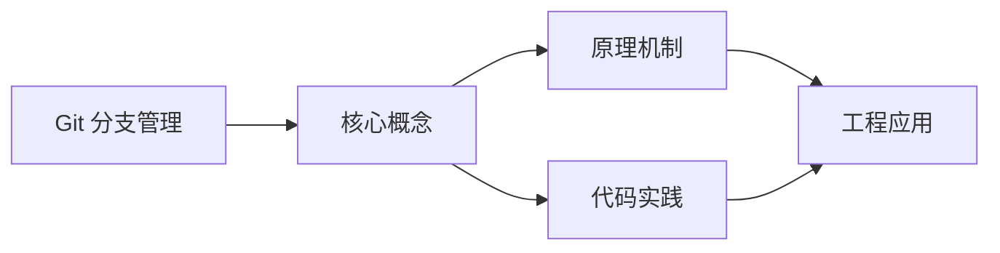
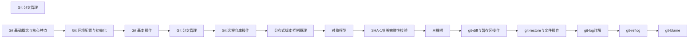

## 1. 学习目标（Bloom 分类）

本节按照布鲁姆教育目标分类学组织学习路径。本文主题为《Git 分支管理》，属于 Git 模块，读者可以根据自身阶段选择阅读深度。

记忆层面：能够准确复述本文的核心概念、术语与基本语法或操作步骤，并能够在提问或检索时快速定位对应知识点。能够说出 Git 的核心概念、常用命令与流程。

理解层面：能够用自己的语言解释核心原理与工作机制，说明概念之间的因果关系，而不是机械记忆结论。能够解释 Git 的工作原理与设计动机。

应用层面：能够在真实项目或练习场景中运用本文知识解决具体问题，写出正确且可维护的实现。能够独立完成 Git 的标准操作。

分析层面：能够拆解复杂问题，比较本文主题与相邻概念的异同，识别边界条件与例外情况。能够分析 Git 使用中的异常与边界。

评价层面：能够根据约束条件（性能、可读性、安全、成本）评价不同方案的优劣，做出有依据的技术决策。能够评价 Git 相关工具与方案。

创造层面：能够把本文知识与其他模块知识组合，设计出新的解决方案或可复用的工程模式。能够把 Git 融入团队工作流。

通过本节学习，读者应当能够把《Git 分支管理》纳入自己的知识网络，并与 Git 模块的其他主题（提交、分支、合并、远程协作）建立关联。

## 2. 历史动机与发展脉络

《Git 分支管理》是 Git 领域的重要主题。要真正理解它，需要先了解它解决的问题与演进过程。

Git 由 Linus Torvalds 于 2005 年为 Linux 内核开发，目标是替代 BitKeeper：分布式、高性能、内容寻址。
Git 的核心是对象模型：blob（内容）、tree（目录）、commit（快照 + 元数据）、tag（引用）；一切对象用 SHA-1 哈希寻址。
工作流演进：集中式工作流 -> 特性分支 -> GitFlow -> GitHub Flow / Trunk-Based；现代团队普遍采用 PR 审查 + 主干发布。

回到本文主题：Git 分支管理 的提出与成熟，正是上述技术背景下的必然产物。早期实现往往以简单可用为目标，随着工程规模扩大，社区逐渐沉淀出标准做法与最佳实践；理解这一脉络，可以帮助读者判断“为什么文档中的推荐写法是现在这个样子”，也能在遇到历史遗留代码时准确识别其设计年代与取舍。


## 3. 形式化定义与核心概念精讲

本节把《Git 分支管理》涉及的核心概念以“定义 + 讲解”的形式展开。读者应把定义当作工具，把讲解当作理解路径；两者结合才能形成可迁移的知识。

三个区域：工作区、暂存区（index）、仓库（HEAD）；git add/commit 移动状态。
分支是指针：创建分支成本极低；合并（merge 生成合并提交）与变基（rebase 重放提交）各有取舍。
远程协作：clone/fetch/pull/push；refs/remotes 跟踪远端；冲突在合并时出现并手工解决。

### 3.1 原文章节逐一精讲

原文档把主题拆分为 19 个小节，下面按顺序给出每一节的导读讲解，随后保留原文细节供精读。

#### 原文精读（完整保留）

# Git 分支管理

> **符号约定**：`< >` 必填参数 | `[ ]` 可选参数

---

#### 2. 分支概述

分支是 Git 中非常重要的概念，它允许你在独立的环境中开发新功能或修复 bug，而不影响主分支的稳定性。
分支的核心特点：

- 分支是指向特定提交的指针
- 默认分支为 `master` 或 `main`
- 分支操作轻量快速
- 支持并行开发
- 便于代码审查和测试
  <a id="3"></a>

#### 3. 分支操作基础

<a id="3.1"></a>

##### 3.1 查看分支

```bash
 # 查看本地分支
 git branch
 # 查看远程分支
 git branch -r
 # 查看所有分支（本地和远程）
 git branch -a
 # 查看分支及其最后一次提交
 git branch -v
```

<a id="3.2"></a>

##### 3.2 创建分支

```bash
 # 创建新分支
 git branch <分支名>
```

<a id="3.3"></a>

##### 3.3 切换分支

```bash
 # 切换分支
 git checkout <分支名>
 # 或 Git 2.23+ 推荐
 git switch <分支名>
```

<a id="3.4"></a>

##### 3.4 创建并切换分支

```bash
 # 创建并切换分支
 git checkout -b <分支名>
 # 或 Git 2.23+ 推荐
 git switch -c <分支名>
```

<a id="3.5"></a>

##### 3.5 合并分支

```bash
 # 合并分支到当前分支
 git merge <分支名>
 # 快速合并（Fast-forward）
 # 当主分支没有新提交时，会执行快速合并
 git checkout main
 git merge feature/login
 # 三方合并（3-way merge）
 # 当主分支有新提交时，会执行三方合并
 git checkout main
 git merge feature/payment
```

###### 3.5.1 合并策略

```bash
 # 使用策略合并
 git merge --strategy-option theirs feature/branch # 优先使用对方分支的修改
 git merge --strategy-option ours feature/branch # 优先使用当前分支的修改
 # 递归策略（默认）
 git merge --strategy recursive feature/branch
 # 章鱼策略（适合合并多个分支）
 git merge --strategy octopus feature1 feature2 feature3
```

<a id="3.6"></a>

##### 3.6 删除分支

```bash
 # 删除分支（仅当分支已合并）
 git branch -d <分支名>
 # 强制删除分支（无论是否合并）
 git branch -D <分支名>
 # 删除远程分支
 git push <远程仓库名> --delete <分支名>
```

<a id="3.7"></a>

##### 3.7 重命名分支

```bash
 # 重命名分支
 git branch -m <旧分支名> <新分支名>
```

<a id="3.8"></a>

##### 3.8 设置上游分支

```bash
 # 设置分支的上游分支
 git branch --set-upstream-to=origin/<远程分支名> <本地分支名>
 # 首次推送时设置上游分支
 git push -u <远程仓库名> <本地分支名>
```

<a id="4"></a>

#### 4. 分支命名规范

| 分支类型     | 命名格式        | 示例                  | 说明                     |
| ------------ | --------------- | --------------------- | ------------------------ |
| 功能分支     | feature/功能名  | feature/login         | 用于开发新功能           |
| Bug 修复分支 | bugfix/问题描述 | bugfix/login-error    | 用于修复 bug             |
| 紧急修复分支 | hotfix/紧急修复 | hotfix/security-patch | 用于紧急修复生产环境问题 |
| 发布分支     | release/版本号  | release/v1.0.0        | 用于准备发布             |
| 开发分支     | develop         | develop               | 用于集成新功能           |
| 主分支       | main/master     | main                  | 保持稳定，只用于发布     |

<a id="5"></a>

#### 5. 分支管理策略

<a id="5.1"></a>

##### 5.1 集中式工作流

- 所有开发者直接在主分支上工作
- 适合小型团队和简单项目
- 优点：简单直接
- 缺点：容易产生冲突，不利于代码审查
  <a id="5.2"></a>

##### 5.2 功能分支工作流

- 为每个功能创建单独的分支
- 完成后合并到主分支
- 适合大多数项目
- 优点：隔离开发，便于代码审查
- 缺点：需要更多的分支管理
  <a id="5.3"></a>

##### 5.3 GitFlow 工作流

GitFlow 是一种详细的分支管理策略，适合大型项目和复杂的发布周期。

###### 5.3.1 GitFlow 分支结构

- **main/master**：主分支，保持稳定，只用于发布
- **develop**：开发分支，集成所有功能分支
- **feature/**：功能分支，从 develop 分支创建
- **release/**：发布分支，从 develop 分支创建
- **hotfix/**：热修复分支，从 main 分支创建

###### 5.3.2 GitFlow 工作流程

1. **初始化**：创建 main 和 develop 分支
2. **功能开发**：从 develop 创建 feature 分支，完成后合并回 develop
3. **发布准备**：从 develop 创建 release 分支，进行测试和修复
4. **发布**：将 release 分支合并到 main 和 develop
5. **热修复**：从 main 创建 hotfix 分支，完成后合并到 main 和 develop

###### 5.3.3 GitFlow 示例

```bash
 # 初始化 GitFlow
 git flow init
 # 创建功能分支
 git flow feature start login
 # 完成功能分支
 git flow feature finish login
 # 创建发布分支
 git flow release start v1.0.0
 # 完成发布分支
 git flow release finish v1.0.0
 # 创建热修复分支
 git flow hotfix start security-patch
 # 完成热修复分支
 git flow hotfix finish security-patch
```

<a id="5.4"></a>

##### 5.4 Forking 工作流

- 开发者 fork 远程仓库
- 在自己的 fork 中工作
- 通过 Pull Request 贡献代码
- 适合开源项目
- 优点：适合多人协作，权限管理简单
- 缺点：流程相对复杂
  <a id="6"></a>

#### 6. 解决分支冲突

当合并分支时，如果两个分支对同一文件的同一部分进行了不同修改，就会产生冲突。
解决冲突的步骤：

1. **查看冲突文件**：

```bash
 git diff
```

2. **手动编辑冲突文件**：
   冲突文件中会包含以下标记：

```
 <<<<<<<< HEAD
 当前分支的内容
 =======
 要合并的分支的内容
 >>>>>>> 分支名
```

手动编辑文件，保留需要的内容，删除冲突标记。3. **添加解决后的文件**：

```bash
 git add .
```

4. **完成合并**：

```bash
 git commit
```

5. **放弃合并**（如果需要）：

```bash
 git merge --abort
```

<a id="7"></a>

#### 7. 分支最佳实践

##### 7.1 分支管理最佳实践

1. **主分支保持稳定**：

- 主分支只用于发布
- 不直接在主分支上开发
- 所有修改通过分支合并

2. **使用功能分支**：

- 为每个功能创建单独的分支
- 分支名清晰描述功能
- 分支生命周期与功能开发周期一致

3. **定期同步**：

- 定期将主分支合并到功能分支
- 减少冲突概率
- 确保功能分支包含最新代码

4. **及时清理**：

- 功能完成后删除对应的分支
- 保持分支列表整洁
- 定期清理远程分支

5. **分支策略选择**：

- 小型项目：集中式或功能分支工作流
- 中型项目：功能分支工作流
- 大型项目：GitFlow 工作流
- 开源项目：Forking 工作流

6. **代码审查**：

- 使用 Pull Request 进行代码审查
- 确保代码质量
- 多人参与审查

##### 7.2 实际项目案例

###### 7.2.1 小型项目（个人或小团队）

```bash
 # 初始化仓库
 git init
 # 创建并切换到功能分支
 git checkout -b feature/login
 # 开发完成后合并到主分支
 git checkout main
 git merge feature/login
 # 删除功能分支
 git branch -d feature/login
```

###### 7.2.2 中型项目（团队协作）

```bash
 # 从远程仓库克隆
 git clone <远程仓库URL>
 # 创建功能分支
 git checkout -b feature/payment
 # 定期同步主分支
 git checkout feature/payment
 git pull origin main
 # 完成后推送到远程
 git push origin feature/payment
 # 创建 Pull Request 进行代码审查
 # 合并后删除本地分支
 git branch -d feature/payment
```

###### 7.2.3 大型项目（GitFlow）

```bash
 # 初始化 GitFlow
 git flow init
 # 创建功能分支
 git flow feature start user-profile
 # 开发完成
 git flow feature finish user-profile
 # 创建发布分支
 git flow release start v2.0.0
 # 完成发布
 git flow release finish v2.0.0
 # 紧急修复
 git flow hotfix start critical-bug
```

<a id="8"></a>

#### 8. 总结

分支管理是 Git 的核心功能之一，通过合理的分支管理，可以提高开发效率，减少冲突，确保代码质量。

- **分支操作**：掌握创建、切换、合并、删除分支的基本操作
- **分支命名**：遵循规范的分支命名约定
- **分支策略**：根据项目特点选择合适的分支管理策略
- **冲突解决**：掌握解决分支冲突的方法
- **最佳实践**：遵循分支管理的最佳实践
  通过熟练掌握分支管理，可以更好地组织代码开发流程，提高团队协作效率。
#### 查看分支

**基本写法：查看本地分支**
`git branch`
```bash
# 列出本地所有分支
git branch;
```

**基本写法：查看远程分支**
`git branch -r`
```bash
# 列出所有远程分支
git branch -r;
```

**基本写法：查看所有分支**
`git branch -a`
```bash
# 列出本地和远程所有分支
git branch -a;
```

**基本写法：查看分支详情**
`git branch -v`
```bash
# 显示分支名、哈希、提交消息
git branch -v;
```

---

#### 创建分支

**基本写法：创建新分支**
`git branch <分支名>`
```bash
# 创建 feature/login 分支
git branch feature/login;
```

---

#### 切换分支

**基本写法：切换分支**
`git checkout <分支名>`
```bash
# 切换到 feature/login 分支
git checkout feature/login;
```

**基本写法：使用 switch 切换**
`git switch <分支名>`
```bash
# 切换到 develop 分支（Git 2.23+）
git switch develop;
```

---

#### 创建并切换分支

**基本写法：创建并切换**
`git checkout -b <分支名>`
```bash
# 创建并切换到 feature/login 分支
git checkout -b feature/login;
```

**基本写法：使用 switch 创建并切换**
`git switch -c <分支名>`
```bash
# 创建并切换到 feature/payment 分支（Git 2.23+）
git switch -c feature/payment;
```

---

#### 合并分支

**基本写法：合并到当前分支**
`git merge <分支名>`
```bash
# 将 feature/login 合并到当前分支
git merge feature/login;
```

**基本写法：快速合并（Fast-forward）**
`git merge <分支名>`
```bash
# 切换到 main 后合并 feature/login
git checkout main;
git merge feature/login;
```

**基本写法：三方合并（3-way merge）**
`git merge <分支名>`
```bash
# 切换到 main 后合并 feature/payment
git checkout main;
git merge feature/payment;
```

---

#### 合并策略

**基本写法：优先对方分支修改**
`git merge --strategy-option theirs <分支名>`
```bash
# 冲突时优先使用对方分支的修改
git merge --strategy-option theirs feature/branch;
```

**基本写法：优先当前分支修改**
`git merge --strategy-option ours <分支名>`
```bash
# 冲突时优先使用当前分支的修改
git merge --strategy-option ours feature/branch;
```

**基本写法：递归策略**
`git merge --strategy recursive <分支名>`
```bash
# 显式指定递归策略
git merge --strategy recursive feature/branch;
```

**单行写法：章鱼策略合并多个分支**
`git merge --strategy octopus <分支1> <分支2> <分支3>`
```bash
# 同时合并多个分支
git merge --strategy octopus feature1 feature2 feature3;
```

**换行写法：章鱼策略合并多个分支**
`git merge --strategy octopus <分支1> <分支2> <分支3>`
```bash
# 换行书写多个分支
git merge --strategy octopus feature1 \
                          feature2 \
                          feature3;
```

---

#### 删除分支

**基本写法：安全删除**
`git branch -d <分支名>`
```bash
# 删除已合并的 feature/login 分支
git branch -d feature/login;
```

**基本写法：强制删除**
`git branch -D <分支名>`
```bash
# 强制删除未合并的 feature/login 分支
git branch -D feature/login;
```

**基本写法：删除远程分支**
`git push <远程仓库名> --delete <分支名>`
```bash
# 删除 origin 上的 feature/login 分支
git push origin --delete feature/login;
```

---

#### 重命名分支

**基本写法：重命名分支**
`git branch -m <旧分支名> <新分支名>`
```bash
# 将 feature/old 重命名为 feature/new
git branch -m feature/old feature/new;
```

---

#### 设置上游分支

**基本写法：设置已有分支上游**
`git branch --set-upstream-to=<远程仓库名>/<远程分支名> <本地分支名>`
```bash
# 将本地 feature/login 关联到 origin/feature/login
git branch --set-upstream-to=origin/feature/login feature/login;
```

**基本写法：首次推送时设置上游**
`git push -u <远程仓库名> <本地分支名>`
```bash
# 推送 feature/login 并设置上游
git push -u origin feature/login;
```

---

#### 分支命名规范

**基本写法：命名格式约定**
`<type>/<描述>`
```text
# 功能分支：feature/login
# 修复分支：bugfix/login-error
# 紧急修复：hotfix/security-patch
# 发布分支：release/v1.0.0
# 开发分支：develop
# 主分支：main / master
```

---

#### GitFlow 工作流

**基本写法：初始化 GitFlow**
`git flow init`
```bash
# 初始化 GitFlow 工作流
git flow init;
```

**基本写法：创建功能分支**
`git flow feature start <功能名>`
```bash
# 创建功能分支
git flow feature start login;
```

**基本写法：完成功能分支**
`git flow feature finish <功能名>`
```bash
# 完成功能分支
git flow feature finish login;
```

**基本写法：创建发布分支**
`git flow release start <版本号>`
```bash
# 创建发布分支
git flow release start v1.0.0;
```

**基本写法：完成发布分支**
`git flow release finish <版本号>`
```bash
# 完成发布分支
git flow release finish v1.0.0;
```

**基本写法：创建热修复分支**
`git flow hotfix start <修复名>`
```bash
# 创建热修复分支
git flow hotfix start security-patch;
```

**基本写法：完成热修复分支**
`git flow hotfix finish <修复名>`
```bash
# 完成热修复分支
git flow hotfix finish security-patch;
```

---

#### 解决分支冲突

**基本写法：查看冲突文件**
`git diff`
```bash
# 查看冲突详情
git diff;
```

**基本写法：冲突标记格式**
`<<<<<<< HEAD ... ======= ... >>>>>>> <分支名>`
```text
# 冲突标记格式
<<<<<<< HEAD
当前分支的内容
=======
要合并的分支的内容
>>>>>>> feature/login
```

**基本写法：标记冲突已解决**
`git add .`
```bash
# 将解决冲突后的文件加入暂存区
git add .;
```

**基本写法：完成合并提交**
`git commit`
```bash
# 提交合并结果
git commit;
```

**基本写法：放弃合并**
`git merge --abort`
```bash
# 放弃当前合并操作
git merge --abort;
```


### 3.2 概念关系图

下面用 Mermaid 图表达本文核心概念之间的关系，帮助读者建立整体图景：



图中展示的是本文知识的结构化关系：核心概念是入口，原理机制解释“为什么”，代码实践演示“怎么做”，工程应用回答“何时用”。读者学习时可以把每个小节的内容挂接到对应节点上。

## 4. 理论推导与原理解析

本节深入《Git 分支管理》背后的原理。理论部分不求面面俱到，而是聚焦“能解释现象、能指导实践”的关键推导。

三个区域：工作区、暂存区（index）、仓库（HEAD）；git add/commit 移动状态。
分支是指针：创建分支成本极低；合并（merge 生成合并提交）与变基（rebase 重放提交）各有取舍。
远程协作：clone/fetch/pull/push；refs/remotes 跟踪远端；冲突在合并时出现并手工解决。
撤销模型：checkout/restore 改工作区，reset 移 HEAD，revert 生成反向提交；理解三者避免误操作。

需要强调的是，理论推导与工程实践之间存在翻译层：理论给出的是理想化模型与边界条件，工程代码则必须处理真实环境中的例外。读者在学习时应先掌握理论的“标准情形”，再通过陷阱章节了解“非标准情形”。

## 5. 代码示例与逐行讲解

本节把原文中的代码示例系统整理，并为每个示例补充用途说明与讲解。读者不应只浏览代码，而应逐段对照讲解理解设计意图。

### 5.1 示例：3.1 查看分支

该示例来自原文《3.1 查看分支》小节，用于演示Git 分支管理相关操作。阅读时请先看代码结构，再看其后的讲解。

```bash
 # 查看本地分支
 git branch
 # 查看远程分支
 git branch -r
 # 查看所有分支（本地和远程）
 git branch -a
 # 查看分支及其最后一次提交
 git branch -v
```

讲解：这段代码演示了本节核心知识点。代码中的关键操作可以归纳为三步：准备（定义或初始化）、执行（核心逻辑）、收尾（释放资源或返回结果）。实际项目中，这三步往往被封装为函数或类，以提升复用性与可测试性。

关键点分析：

该示例共 8 行有效代码，结构以数据或配置为主。阅读时应关注：数据字段的含义、配置项的作用，以及它们与运行行为的对应关系。

进阶思考路径：先尝试修改参数观察行为变化，再把示例中的模式迁移到自己的项目中；每次修改都记录预期与实测差异，这是把示例转化为能力的最快方式。

### 5.2 示例：3.2 创建分支

该示例来自原文《3.2 创建分支》小节，用于演示Git 分支管理相关操作。阅读时请先看代码结构，再看其后的讲解。

```bash
 # 创建新分支
 git branch <分支名>
```

讲解：这段代码演示了本节核心知识点。代码中的关键操作可以归纳为三步：准备（定义或初始化）、执行（核心逻辑）、收尾（释放资源或返回结果）。实际项目中，这三步往往被封装为函数或类，以提升复用性与可测试性。

关键点分析：

该示例共 2 行有效代码，结构以数据或配置为主。阅读时应关注：数据字段的含义、配置项的作用，以及它们与运行行为的对应关系。

进阶思考路径：先尝试修改参数观察行为变化，再把示例中的模式迁移到自己的项目中；每次修改都记录预期与实测差异，这是把示例转化为能力的最快方式。

### 5.3 示例：3.3 切换分支

该示例来自原文《3.3 切换分支》小节，用于演示Git 分支管理相关操作。阅读时请先看代码结构，再看其后的讲解。

```bash
 # 切换分支
 git checkout <分支名>
 # 或 Git 2.23+ 推荐
 git switch <分支名>
```

讲解：这段代码演示了本节核心知识点。代码中的关键操作可以归纳为三步：准备（定义或初始化）、执行（核心逻辑）、收尾（释放资源或返回结果）。实际项目中，这三步往往被封装为函数或类，以提升复用性与可测试性。

关键点分析：

该示例共 4 行有效代码，结构以数据或配置为主。阅读时应关注：数据字段的含义、配置项的作用，以及它们与运行行为的对应关系。

进阶思考路径：先尝试修改参数观察行为变化，再把示例中的模式迁移到自己的项目中；每次修改都记录预期与实测差异，这是把示例转化为能力的最快方式。

### 5.4 示例：3.4 创建并切换分支

该示例来自原文《3.4 创建并切换分支》小节，用于演示Git 分支管理相关操作。阅读时请先看代码结构，再看其后的讲解。

```bash
 # 创建并切换分支
 git checkout -b <分支名>
 # 或 Git 2.23+ 推荐
 git switch -c <分支名>
```

讲解：这段代码演示了本节核心知识点。代码中的关键操作可以归纳为三步：准备（定义或初始化）、执行（核心逻辑）、收尾（释放资源或返回结果）。实际项目中，这三步往往被封装为函数或类，以提升复用性与可测试性。

关键点分析：

该示例共 4 行有效代码，结构以数据或配置为主。阅读时应关注：数据字段的含义、配置项的作用，以及它们与运行行为的对应关系。

进阶思考路径：先尝试修改参数观察行为变化，再把示例中的模式迁移到自己的项目中；每次修改都记录预期与实测差异，这是把示例转化为能力的最快方式。

### 5.5 示例：3.5 合并分支

该示例来自原文《3.5 合并分支》小节，用于演示Git 分支管理相关操作。阅读时请先看代码结构，再看其后的讲解。

```bash
 # 合并分支到当前分支
 git merge <分支名>
 # 快速合并（Fast-forward）
 # 当主分支没有新提交时，会执行快速合并
 git checkout main
 git merge feature/login
 # 三方合并（3-way merge）
 # 当主分支有新提交时，会执行三方合并
 git checkout main
 git merge feature/payment
```

讲解：这段代码演示了本节核心知识点。代码中的关键操作可以归纳为三步：准备（定义或初始化）、执行（核心逻辑）、收尾（释放资源或返回结果）。实际项目中，这三步往往被封装为函数或类，以提升复用性与可测试性。

关键点分析：

该示例共 10 行有效代码，结构以数据或配置为主。阅读时应关注：数据字段的含义、配置项的作用，以及它们与运行行为的对应关系。

进阶思考路径：先尝试修改参数观察行为变化，再把示例中的模式迁移到自己的项目中；每次修改都记录预期与实测差异，这是把示例转化为能力的最快方式。

### 5.6 示例：3.5.1 合并策略

该示例来自原文《3.5.1 合并策略》小节，用于演示Git 分支管理相关操作。阅读时请先看代码结构，再看其后的讲解。

```bash
 # 使用策略合并
 git merge --strategy-option theirs feature/branch # 优先使用对方分支的修改
 git merge --strategy-option ours feature/branch # 优先使用当前分支的修改
 # 递归策略（默认）
 git merge --strategy recursive feature/branch
 # 章鱼策略（适合合并多个分支）
 git merge --strategy octopus feature1 feature2 feature3
```

讲解：这段代码演示了本节核心知识点。代码中的关键操作可以归纳为三步：准备（定义或初始化）、执行（核心逻辑）、收尾（释放资源或返回结果）。实际项目中，这三步往往被封装为函数或类，以提升复用性与可测试性。

关键点分析：

该示例共 7 行有效代码，结构以数据或配置为主。阅读时应关注：数据字段的含义、配置项的作用，以及它们与运行行为的对应关系。

进阶思考路径：先尝试修改参数观察行为变化，再把示例中的模式迁移到自己的项目中；每次修改都记录预期与实测差异，这是把示例转化为能力的最快方式。

### 5.7 示例：3.6 删除分支

该示例来自原文《3.6 删除分支》小节，用于演示Git 分支管理相关操作。阅读时请先看代码结构，再看其后的讲解。

```bash
 # 删除分支（仅当分支已合并）
 git branch -d <分支名>
 # 强制删除分支（无论是否合并）
 git branch -D <分支名>
 # 删除远程分支
 git push <远程仓库名> --delete <分支名>
```

讲解：这段代码演示了本节核心知识点。代码中的关键操作可以归纳为三步：准备（定义或初始化）、执行（核心逻辑）、收尾（释放资源或返回结果）。实际项目中，这三步往往被封装为函数或类，以提升复用性与可测试性。

关键点分析：

该示例共 6 行有效代码，结构以数据或配置为主。阅读时应关注：数据字段的含义、配置项的作用，以及它们与运行行为的对应关系。

进阶思考路径：先尝试修改参数观察行为变化，再把示例中的模式迁移到自己的项目中；每次修改都记录预期与实测差异，这是把示例转化为能力的最快方式。

### 5.8 示例：3.7 重命名分支

该示例来自原文《3.7 重命名分支》小节，用于演示Git 分支管理相关操作。阅读时请先看代码结构，再看其后的讲解。

```bash
 # 重命名分支
 git branch -m <旧分支名> <新分支名>
```

讲解：这段代码演示了本节核心知识点。代码中的关键操作可以归纳为三步：准备（定义或初始化）、执行（核心逻辑）、收尾（释放资源或返回结果）。实际项目中，这三步往往被封装为函数或类，以提升复用性与可测试性。

关键点分析：

该示例共 2 行有效代码，结构以数据或配置为主。阅读时应关注：数据字段的含义、配置项的作用，以及它们与运行行为的对应关系。

进阶思考路径：先尝试修改参数观察行为变化，再把示例中的模式迁移到自己的项目中；每次修改都记录预期与实测差异，这是把示例转化为能力的最快方式。

### 5.9 示例：3.8 设置上游分支

该示例来自原文《3.8 设置上游分支》小节，用于演示Git 分支管理相关操作。阅读时请先看代码结构，再看其后的讲解。

```bash
 # 设置分支的上游分支
 git branch --set-upstream-to=origin/<远程分支名> <本地分支名>
 # 首次推送时设置上游分支
 git push -u <远程仓库名> <本地分支名>
```

讲解：这段代码演示了本节核心知识点。代码中的关键操作可以归纳为三步：准备（定义或初始化）、执行（核心逻辑）、收尾（释放资源或返回结果）。实际项目中，这三步往往被封装为函数或类，以提升复用性与可测试性。

关键点分析：

该示例共 4 行有效代码，结构以数据或配置为主。阅读时应关注：数据字段的含义、配置项的作用，以及它们与运行行为的对应关系。

进阶思考路径：先尝试修改参数观察行为变化，再把示例中的模式迁移到自己的项目中；每次修改都记录预期与实测差异，这是把示例转化为能力的最快方式。

### 5.10 示例：5.3.3 GitFlow 示例

该示例来自原文《5.3.3 GitFlow 示例》小节，用于演示Git 分支管理相关操作。阅读时请先看代码结构，再看其后的讲解。

```bash
 # 初始化 GitFlow
 git flow init
 # 创建功能分支
 git flow feature start login
 # 完成功能分支
 git flow feature finish login
 # 创建发布分支
 git flow release start v1.0.0
 # 完成发布分支
 git flow release finish v1.0.0
 # 创建热修复分支
 git flow hotfix start security-patch
 # 完成热修复分支
 git flow hotfix finish security-patch
```

讲解：这段代码演示了本节核心知识点。代码中的关键操作可以归纳为三步：准备（定义或初始化）、执行（核心逻辑）、收尾（释放资源或返回结果）。实际项目中，这三步往往被封装为函数或类，以提升复用性与可测试性。

关键点分析：

该示例共 14 行有效代码，结构以数据或配置为主。阅读时应关注：数据字段的含义、配置项的作用，以及它们与运行行为的对应关系。

进阶思考路径：先尝试修改参数观察行为变化，再把示例中的模式迁移到自己的项目中；每次修改都记录预期与实测差异，这是把示例转化为能力的最快方式。

### 5.11 示例：6. 解决分支冲突

该示例来自原文《6. 解决分支冲突》小节，用于演示Git 分支管理相关操作。阅读时请先看代码结构，再看其后的讲解。

```bash
 git diff
```

讲解：这段代码演示了本节核心知识点。代码中的关键操作可以归纳为三步：准备（定义或初始化）、执行（核心逻辑）、收尾（释放资源或返回结果）。实际项目中，这三步往往被封装为函数或类，以提升复用性与可测试性。

关键点分析：

该示例共 1 行有效代码，结构以数据或配置为主。阅读时应关注：数据字段的含义、配置项的作用，以及它们与运行行为的对应关系。

进阶思考路径：先尝试修改参数观察行为变化，再把示例中的模式迁移到自己的项目中；每次修改都记录预期与实测差异，这是把示例转化为能力的最快方式。

### 5.12 示例：6. 解决分支冲突

该示例来自原文《6. 解决分支冲突》小节，用于演示Git 分支管理相关操作。阅读时请先看代码结构，再看其后的讲解。

```text
 <<<<<<<< HEAD
 当前分支的内容
 =======
 要合并的分支的内容
 >>>>>>> 分支名
```

讲解：这段代码演示了本节核心知识点。代码中的关键操作可以归纳为三步：准备（定义或初始化）、执行（核心逻辑）、收尾（释放资源或返回结果）。实际项目中，这三步往往被封装为函数或类，以提升复用性与可测试性。

关键点分析：

该示例共 5 行有效代码，结构以数据或配置为主。阅读时应关注：数据字段的含义、配置项的作用，以及它们与运行行为的对应关系。

进阶思考路径：先尝试修改参数观察行为变化，再把示例中的模式迁移到自己的项目中；每次修改都记录预期与实测差异，这是把示例转化为能力的最快方式。

### 5.13 示例：6. 解决分支冲突

该示例来自原文《6. 解决分支冲突》小节，用于演示Git 分支管理相关操作。阅读时请先看代码结构，再看其后的讲解。

```bash
 git add .
```

讲解：这段代码演示了本节核心知识点。代码中的关键操作可以归纳为三步：准备（定义或初始化）、执行（核心逻辑）、收尾（释放资源或返回结果）。实际项目中，这三步往往被封装为函数或类，以提升复用性与可测试性。

关键点分析：

该示例共 1 行有效代码，结构以数据或配置为主。阅读时应关注：数据字段的含义、配置项的作用，以及它们与运行行为的对应关系。

进阶思考路径：先尝试修改参数观察行为变化，再把示例中的模式迁移到自己的项目中；每次修改都记录预期与实测差异，这是把示例转化为能力的最快方式。

### 5.14 示例：6. 解决分支冲突

该示例来自原文《6. 解决分支冲突》小节，用于演示Git 分支管理相关操作。阅读时请先看代码结构，再看其后的讲解。

```bash
 git commit
```

讲解：这段代码演示了本节核心知识点。代码中的关键操作可以归纳为三步：准备（定义或初始化）、执行（核心逻辑）、收尾（释放资源或返回结果）。实际项目中，这三步往往被封装为函数或类，以提升复用性与可测试性。

关键点分析：

该示例共 1 行有效代码，结构以数据或配置为主。阅读时应关注：数据字段的含义、配置项的作用，以及它们与运行行为的对应关系。

进阶思考路径：先尝试修改参数观察行为变化，再把示例中的模式迁移到自己的项目中；每次修改都记录预期与实测差异，这是把示例转化为能力的最快方式。

### 5.15 示例：6. 解决分支冲突

该示例来自原文《6. 解决分支冲突》小节，用于演示Git 分支管理相关操作。阅读时请先看代码结构，再看其后的讲解。

```bash
 git merge --abort
```

讲解：这段代码演示了本节核心知识点。代码中的关键操作可以归纳为三步：准备（定义或初始化）、执行（核心逻辑）、收尾（释放资源或返回结果）。实际项目中，这三步往往被封装为函数或类，以提升复用性与可测试性。

关键点分析：

该示例共 1 行有效代码，结构以数据或配置为主。阅读时应关注：数据字段的含义、配置项的作用，以及它们与运行行为的对应关系。

进阶思考路径：先尝试修改参数观察行为变化，再把示例中的模式迁移到自己的项目中；每次修改都记录预期与实测差异，这是把示例转化为能力的最快方式。

### 5.16 示例：7.2.1 小型项目（个人或小团队）

该示例来自原文《7.2.1 小型项目（个人或小团队）》小节，用于演示Git 分支管理相关操作。阅读时请先看代码结构，再看其后的讲解。

```bash
 # 初始化仓库
 git init
 # 创建并切换到功能分支
 git checkout -b feature/login
 # 开发完成后合并到主分支
 git checkout main
 git merge feature/login
 # 删除功能分支
 git branch -d feature/login
```

讲解：这段代码演示了本节核心知识点。代码中的关键操作可以归纳为三步：准备（定义或初始化）、执行（核心逻辑）、收尾（释放资源或返回结果）。实际项目中，这三步往往被封装为函数或类，以提升复用性与可测试性。

关键点分析：

该示例共 9 行有效代码，结构以数据或配置为主。阅读时应关注：数据字段的含义、配置项的作用，以及它们与运行行为的对应关系。

进阶思考路径：先尝试修改参数观察行为变化，再把示例中的模式迁移到自己的项目中；每次修改都记录预期与实测差异，这是把示例转化为能力的最快方式。

### 5.17 示例：7.2.2 中型项目（团队协作）

该示例来自原文《7.2.2 中型项目（团队协作）》小节，用于演示Git 分支管理相关操作。阅读时请先看代码结构，再看其后的讲解。

```bash
 # 从远程仓库克隆
 git clone <远程仓库URL>
 # 创建功能分支
 git checkout -b feature/payment
 # 定期同步主分支
 git checkout feature/payment
 git pull origin main
 # 完成后推送到远程
 git push origin feature/payment
 # 创建 Pull Request 进行代码审查
 # 合并后删除本地分支
 git branch -d feature/payment
```

讲解：这段代码演示了本节核心知识点。代码中的关键操作可以归纳为三步：准备（定义或初始化）、执行（核心逻辑）、收尾（释放资源或返回结果）。实际项目中，这三步往往被封装为函数或类，以提升复用性与可测试性。

关键点分析：

该示例共 12 行有效代码，结构以数据或配置为主。阅读时应关注：数据字段的含义、配置项的作用，以及它们与运行行为的对应关系。

进阶思考路径：先尝试修改参数观察行为变化，再把示例中的模式迁移到自己的项目中；每次修改都记录预期与实测差异，这是把示例转化为能力的最快方式。

### 5.18 示例：7.2.3 大型项目（GitFlow）

该示例来自原文《7.2.3 大型项目（GitFlow）》小节，用于演示Git 分支管理相关操作。阅读时请先看代码结构，再看其后的讲解。

```bash
 # 初始化 GitFlow
 git flow init
 # 创建功能分支
 git flow feature start user-profile
 # 开发完成
 git flow feature finish user-profile
 # 创建发布分支
 git flow release start v2.0.0
 # 完成发布
 git flow release finish v2.0.0
 # 紧急修复
 git flow hotfix start critical-bug
```

讲解：这段代码演示了本节核心知识点。代码中的关键操作可以归纳为三步：准备（定义或初始化）、执行（核心逻辑）、收尾（释放资源或返回结果）。实际项目中，这三步往往被封装为函数或类，以提升复用性与可测试性。

关键点分析：

该示例共 12 行有效代码，结构以数据或配置为主。阅读时应关注：数据字段的含义、配置项的作用，以及它们与运行行为的对应关系。

进阶思考路径：先尝试修改参数观察行为变化，再把示例中的模式迁移到自己的项目中；每次修改都记录预期与实测差异，这是把示例转化为能力的最快方式。

### 5.19 示例：查看分支

该示例来自原文《查看分支》小节，用于演示Git 分支管理相关操作。阅读时请先看代码结构，再看其后的讲解。

```bash
# 列出本地所有分支
git branch;
```

讲解：这段代码演示了本节核心知识点。代码中的关键操作可以归纳为三步：准备（定义或初始化）、执行（核心逻辑）、收尾（释放资源或返回结果）。实际项目中，这三步往往被封装为函数或类，以提升复用性与可测试性。

关键点分析：

该示例共 2 行有效代码，结构以数据或配置为主。阅读时应关注：数据字段的含义、配置项的作用，以及它们与运行行为的对应关系。

进阶思考路径：先尝试修改参数观察行为变化，再把示例中的模式迁移到自己的项目中；每次修改都记录预期与实测差异，这是把示例转化为能力的最快方式。

### 5.20 示例：查看分支

该示例来自原文《查看分支》小节，用于演示Git 分支管理相关操作。阅读时请先看代码结构，再看其后的讲解。

```bash
# 列出所有远程分支
git branch -r;
```

讲解：这段代码演示了本节核心知识点。代码中的关键操作可以归纳为三步：准备（定义或初始化）、执行（核心逻辑）、收尾（释放资源或返回结果）。实际项目中，这三步往往被封装为函数或类，以提升复用性与可测试性。

关键点分析：

该示例共 2 行有效代码，结构以数据或配置为主。阅读时应关注：数据字段的含义、配置项的作用，以及它们与运行行为的对应关系。

进阶思考路径：先尝试修改参数观察行为变化，再把示例中的模式迁移到自己的项目中；每次修改都记录预期与实测差异，这是把示例转化为能力的最快方式。

### 5.21 示例：查看分支

该示例来自原文《查看分支》小节，用于演示Git 分支管理相关操作。阅读时请先看代码结构，再看其后的讲解。

```bash
# 列出本地和远程所有分支
git branch -a;
```

讲解：这段代码演示了本节核心知识点。代码中的关键操作可以归纳为三步：准备（定义或初始化）、执行（核心逻辑）、收尾（释放资源或返回结果）。实际项目中，这三步往往被封装为函数或类，以提升复用性与可测试性。

关键点分析：

该示例共 2 行有效代码，结构以数据或配置为主。阅读时应关注：数据字段的含义、配置项的作用，以及它们与运行行为的对应关系。

进阶思考路径：先尝试修改参数观察行为变化，再把示例中的模式迁移到自己的项目中；每次修改都记录预期与实测差异，这是把示例转化为能力的最快方式。

### 5.22 示例：查看分支

该示例来自原文《查看分支》小节，用于演示Git 分支管理相关操作。阅读时请先看代码结构，再看其后的讲解。

```bash
# 显示分支名、哈希、提交消息
git branch -v;
```

讲解：这段代码演示了本节核心知识点。代码中的关键操作可以归纳为三步：准备（定义或初始化）、执行（核心逻辑）、收尾（释放资源或返回结果）。实际项目中，这三步往往被封装为函数或类，以提升复用性与可测试性。

关键点分析：

该示例共 2 行有效代码，结构以数据或配置为主。阅读时应关注：数据字段的含义、配置项的作用，以及它们与运行行为的对应关系。

进阶思考路径：先尝试修改参数观察行为变化，再把示例中的模式迁移到自己的项目中；每次修改都记录预期与实测差异，这是把示例转化为能力的最快方式。

### 5.23 示例：创建分支

该示例来自原文《创建分支》小节，用于演示Git 分支管理相关操作。阅读时请先看代码结构，再看其后的讲解。

```bash
# 创建 feature/login 分支
git branch feature/login;
```

讲解：这段代码演示了本节核心知识点。代码中的关键操作可以归纳为三步：准备（定义或初始化）、执行（核心逻辑）、收尾（释放资源或返回结果）。实际项目中，这三步往往被封装为函数或类，以提升复用性与可测试性。

关键点分析：

该示例共 2 行有效代码，结构以数据或配置为主。阅读时应关注：数据字段的含义、配置项的作用，以及它们与运行行为的对应关系。

进阶思考路径：先尝试修改参数观察行为变化，再把示例中的模式迁移到自己的项目中；每次修改都记录预期与实测差异，这是把示例转化为能力的最快方式。

### 5.24 示例：切换分支

该示例来自原文《切换分支》小节，用于演示Git 分支管理相关操作。阅读时请先看代码结构，再看其后的讲解。

```bash
# 切换到 feature/login 分支
git checkout feature/login;
```

讲解：这段代码演示了本节核心知识点。代码中的关键操作可以归纳为三步：准备（定义或初始化）、执行（核心逻辑）、收尾（释放资源或返回结果）。实际项目中，这三步往往被封装为函数或类，以提升复用性与可测试性。

关键点分析：

该示例共 2 行有效代码，结构以数据或配置为主。阅读时应关注：数据字段的含义、配置项的作用，以及它们与运行行为的对应关系。

进阶思考路径：先尝试修改参数观察行为变化，再把示例中的模式迁移到自己的项目中；每次修改都记录预期与实测差异，这是把示例转化为能力的最快方式。

### 5.25 示例：切换分支

该示例来自原文《切换分支》小节，用于演示Git 分支管理相关操作。阅读时请先看代码结构，再看其后的讲解。

```bash
# 切换到 develop 分支（Git 2.23+）
git switch develop;
```

讲解：这段代码演示了本节核心知识点。代码中的关键操作可以归纳为三步：准备（定义或初始化）、执行（核心逻辑）、收尾（释放资源或返回结果）。实际项目中，这三步往往被封装为函数或类，以提升复用性与可测试性。

关键点分析：

该示例共 2 行有效代码，结构以数据或配置为主。阅读时应关注：数据字段的含义、配置项的作用，以及它们与运行行为的对应关系。

进阶思考路径：先尝试修改参数观察行为变化，再把示例中的模式迁移到自己的项目中；每次修改都记录预期与实测差异，这是把示例转化为能力的最快方式。

### 5.26 示例：创建并切换分支

该示例来自原文《创建并切换分支》小节，用于演示Git 分支管理相关操作。阅读时请先看代码结构，再看其后的讲解。

```bash
# 创建并切换到 feature/login 分支
git checkout -b feature/login;
```

讲解：这段代码演示了本节核心知识点。代码中的关键操作可以归纳为三步：准备（定义或初始化）、执行（核心逻辑）、收尾（释放资源或返回结果）。实际项目中，这三步往往被封装为函数或类，以提升复用性与可测试性。

关键点分析：

该示例共 2 行有效代码，结构以数据或配置为主。阅读时应关注：数据字段的含义、配置项的作用，以及它们与运行行为的对应关系。

进阶思考路径：先尝试修改参数观察行为变化，再把示例中的模式迁移到自己的项目中；每次修改都记录预期与实测差异，这是把示例转化为能力的最快方式。

### 5.27 示例：创建并切换分支

该示例来自原文《创建并切换分支》小节，用于演示Git 分支管理相关操作。阅读时请先看代码结构，再看其后的讲解。

```bash
# 创建并切换到 feature/payment 分支（Git 2.23+）
git switch -c feature/payment;
```

讲解：这段代码演示了本节核心知识点。代码中的关键操作可以归纳为三步：准备（定义或初始化）、执行（核心逻辑）、收尾（释放资源或返回结果）。实际项目中，这三步往往被封装为函数或类，以提升复用性与可测试性。

关键点分析：

该示例共 2 行有效代码，结构以数据或配置为主。阅读时应关注：数据字段的含义、配置项的作用，以及它们与运行行为的对应关系。

进阶思考路径：先尝试修改参数观察行为变化，再把示例中的模式迁移到自己的项目中；每次修改都记录预期与实测差异，这是把示例转化为能力的最快方式。

### 5.28 示例：合并分支

该示例来自原文《合并分支》小节，用于演示Git 分支管理相关操作。阅读时请先看代码结构，再看其后的讲解。

```bash
# 将 feature/login 合并到当前分支
git merge feature/login;
```

讲解：这段代码演示了本节核心知识点。代码中的关键操作可以归纳为三步：准备（定义或初始化）、执行（核心逻辑）、收尾（释放资源或返回结果）。实际项目中，这三步往往被封装为函数或类，以提升复用性与可测试性。

关键点分析：

该示例共 2 行有效代码，结构以数据或配置为主。阅读时应关注：数据字段的含义、配置项的作用，以及它们与运行行为的对应关系。

进阶思考路径：先尝试修改参数观察行为变化，再把示例中的模式迁移到自己的项目中；每次修改都记录预期与实测差异，这是把示例转化为能力的最快方式。

### 5.29 示例：合并分支

该示例来自原文《合并分支》小节，用于演示Git 分支管理相关操作。阅读时请先看代码结构，再看其后的讲解。

```bash
# 切换到 main 后合并 feature/login
git checkout main;
git merge feature/login;
```

讲解：这段代码演示了本节核心知识点。代码中的关键操作可以归纳为三步：准备（定义或初始化）、执行（核心逻辑）、收尾（释放资源或返回结果）。实际项目中，这三步往往被封装为函数或类，以提升复用性与可测试性。

关键点分析：

该示例共 3 行有效代码，结构以数据或配置为主。阅读时应关注：数据字段的含义、配置项的作用，以及它们与运行行为的对应关系。

进阶思考路径：先尝试修改参数观察行为变化，再把示例中的模式迁移到自己的项目中；每次修改都记录预期与实测差异，这是把示例转化为能力的最快方式。

### 5.30 示例：合并分支

该示例来自原文《合并分支》小节，用于演示Git 分支管理相关操作。阅读时请先看代码结构，再看其后的讲解。

```bash
# 切换到 main 后合并 feature/payment
git checkout main;
git merge feature/payment;
```

讲解：这段代码演示了本节核心知识点。代码中的关键操作可以归纳为三步：准备（定义或初始化）、执行（核心逻辑）、收尾（释放资源或返回结果）。实际项目中，这三步往往被封装为函数或类，以提升复用性与可测试性。

关键点分析：

该示例共 3 行有效代码，结构以数据或配置为主。阅读时应关注：数据字段的含义、配置项的作用，以及它们与运行行为的对应关系。

进阶思考路径：先尝试修改参数观察行为变化，再把示例中的模式迁移到自己的项目中；每次修改都记录预期与实测差异，这是把示例转化为能力的最快方式。

### 5.31 示例：合并策略

该示例来自原文《合并策略》小节，用于演示Git 分支管理相关操作。阅读时请先看代码结构，再看其后的讲解。

```bash
# 冲突时优先使用对方分支的修改
git merge --strategy-option theirs feature/branch;
```

讲解：这段代码演示了本节核心知识点。代码中的关键操作可以归纳为三步：准备（定义或初始化）、执行（核心逻辑）、收尾（释放资源或返回结果）。实际项目中，这三步往往被封装为函数或类，以提升复用性与可测试性。

关键点分析：

该示例共 2 行有效代码，结构以数据或配置为主。阅读时应关注：数据字段的含义、配置项的作用，以及它们与运行行为的对应关系。

进阶思考路径：先尝试修改参数观察行为变化，再把示例中的模式迁移到自己的项目中；每次修改都记录预期与实测差异，这是把示例转化为能力的最快方式。

### 5.32 示例：合并策略

该示例来自原文《合并策略》小节，用于演示Git 分支管理相关操作。阅读时请先看代码结构，再看其后的讲解。

```bash
# 冲突时优先使用当前分支的修改
git merge --strategy-option ours feature/branch;
```

讲解：这段代码演示了本节核心知识点。代码中的关键操作可以归纳为三步：准备（定义或初始化）、执行（核心逻辑）、收尾（释放资源或返回结果）。实际项目中，这三步往往被封装为函数或类，以提升复用性与可测试性。

关键点分析：

该示例共 2 行有效代码，结构以数据或配置为主。阅读时应关注：数据字段的含义、配置项的作用，以及它们与运行行为的对应关系。

进阶思考路径：先尝试修改参数观察行为变化，再把示例中的模式迁移到自己的项目中；每次修改都记录预期与实测差异，这是把示例转化为能力的最快方式。

### 5.33 示例：合并策略

该示例来自原文《合并策略》小节，用于演示Git 分支管理相关操作。阅读时请先看代码结构，再看其后的讲解。

```bash
# 显式指定递归策略
git merge --strategy recursive feature/branch;
```

讲解：这段代码演示了本节核心知识点。代码中的关键操作可以归纳为三步：准备（定义或初始化）、执行（核心逻辑）、收尾（释放资源或返回结果）。实际项目中，这三步往往被封装为函数或类，以提升复用性与可测试性。

关键点分析：

该示例共 2 行有效代码，结构以数据或配置为主。阅读时应关注：数据字段的含义、配置项的作用，以及它们与运行行为的对应关系。

进阶思考路径：先尝试修改参数观察行为变化，再把示例中的模式迁移到自己的项目中；每次修改都记录预期与实测差异，这是把示例转化为能力的最快方式。

### 5.34 示例：合并策略

该示例来自原文《合并策略》小节，用于演示Git 分支管理相关操作。阅读时请先看代码结构，再看其后的讲解。

```bash
# 同时合并多个分支
git merge --strategy octopus feature1 feature2 feature3;
```

讲解：这段代码演示了本节核心知识点。代码中的关键操作可以归纳为三步：准备（定义或初始化）、执行（核心逻辑）、收尾（释放资源或返回结果）。实际项目中，这三步往往被封装为函数或类，以提升复用性与可测试性。

关键点分析：

该示例共 2 行有效代码，结构以数据或配置为主。阅读时应关注：数据字段的含义、配置项的作用，以及它们与运行行为的对应关系。

进阶思考路径：先尝试修改参数观察行为变化，再把示例中的模式迁移到自己的项目中；每次修改都记录预期与实测差异，这是把示例转化为能力的最快方式。

### 5.35 示例：合并策略

该示例来自原文《合并策略》小节，用于演示Git 分支管理相关操作。阅读时请先看代码结构，再看其后的讲解。

```bash
# 换行书写多个分支
git merge --strategy octopus feature1 \
                          feature2 \
                          feature3;
```

讲解：这段代码演示了本节核心知识点。代码中的关键操作可以归纳为三步：准备（定义或初始化）、执行（核心逻辑）、收尾（释放资源或返回结果）。实际项目中，这三步往往被封装为函数或类，以提升复用性与可测试性。

关键点分析：

该示例共 4 行有效代码，结构以数据或配置为主。阅读时应关注：数据字段的含义、配置项的作用，以及它们与运行行为的对应关系。

进阶思考路径：先尝试修改参数观察行为变化，再把示例中的模式迁移到自己的项目中；每次修改都记录预期与实测差异，这是把示例转化为能力的最快方式。

### 5.36 示例：删除分支

该示例来自原文《删除分支》小节，用于演示Git 分支管理相关操作。阅读时请先看代码结构，再看其后的讲解。

```bash
# 删除已合并的 feature/login 分支
git branch -d feature/login;
```

讲解：这段代码演示了本节核心知识点。代码中的关键操作可以归纳为三步：准备（定义或初始化）、执行（核心逻辑）、收尾（释放资源或返回结果）。实际项目中，这三步往往被封装为函数或类，以提升复用性与可测试性。

关键点分析：

该示例共 2 行有效代码，结构以数据或配置为主。阅读时应关注：数据字段的含义、配置项的作用，以及它们与运行行为的对应关系。

进阶思考路径：先尝试修改参数观察行为变化，再把示例中的模式迁移到自己的项目中；每次修改都记录预期与实测差异，这是把示例转化为能力的最快方式。

### 5.37 示例：删除分支

该示例来自原文《删除分支》小节，用于演示Git 分支管理相关操作。阅读时请先看代码结构，再看其后的讲解。

```bash
# 强制删除未合并的 feature/login 分支
git branch -D feature/login;
```

讲解：这段代码演示了本节核心知识点。代码中的关键操作可以归纳为三步：准备（定义或初始化）、执行（核心逻辑）、收尾（释放资源或返回结果）。实际项目中，这三步往往被封装为函数或类，以提升复用性与可测试性。

关键点分析：

该示例共 2 行有效代码，结构以数据或配置为主。阅读时应关注：数据字段的含义、配置项的作用，以及它们与运行行为的对应关系。

进阶思考路径：先尝试修改参数观察行为变化，再把示例中的模式迁移到自己的项目中；每次修改都记录预期与实测差异，这是把示例转化为能力的最快方式。

### 5.38 示例：删除分支

该示例来自原文《删除分支》小节，用于演示Git 分支管理相关操作。阅读时请先看代码结构，再看其后的讲解。

```bash
# 删除 origin 上的 feature/login 分支
git push origin --delete feature/login;
```

讲解：这段代码演示了本节核心知识点。代码中的关键操作可以归纳为三步：准备（定义或初始化）、执行（核心逻辑）、收尾（释放资源或返回结果）。实际项目中，这三步往往被封装为函数或类，以提升复用性与可测试性。

关键点分析：

该示例共 2 行有效代码，结构以数据或配置为主。阅读时应关注：数据字段的含义、配置项的作用，以及它们与运行行为的对应关系。

进阶思考路径：先尝试修改参数观察行为变化，再把示例中的模式迁移到自己的项目中；每次修改都记录预期与实测差异，这是把示例转化为能力的最快方式。

### 5.39 示例：重命名分支

该示例来自原文《重命名分支》小节，用于演示Git 分支管理相关操作。阅读时请先看代码结构，再看其后的讲解。

```bash
# 将 feature/old 重命名为 feature/new
git branch -m feature/old feature/new;
```

讲解：这段代码演示了本节核心知识点。代码中的关键操作可以归纳为三步：准备（定义或初始化）、执行（核心逻辑）、收尾（释放资源或返回结果）。实际项目中，这三步往往被封装为函数或类，以提升复用性与可测试性。

关键点分析：

该示例共 2 行有效代码，结构以数据或配置为主。阅读时应关注：数据字段的含义、配置项的作用，以及它们与运行行为的对应关系。

进阶思考路径：先尝试修改参数观察行为变化，再把示例中的模式迁移到自己的项目中；每次修改都记录预期与实测差异，这是把示例转化为能力的最快方式。

### 5.40 示例：设置上游分支

该示例来自原文《设置上游分支》小节，用于演示Git 分支管理相关操作。阅读时请先看代码结构，再看其后的讲解。

```bash
# 将本地 feature/login 关联到 origin/feature/login
git branch --set-upstream-to=origin/feature/login feature/login;
```

讲解：这段代码演示了本节核心知识点。代码中的关键操作可以归纳为三步：准备（定义或初始化）、执行（核心逻辑）、收尾（释放资源或返回结果）。实际项目中，这三步往往被封装为函数或类，以提升复用性与可测试性。

关键点分析：

该示例共 2 行有效代码，结构以数据或配置为主。阅读时应关注：数据字段的含义、配置项的作用，以及它们与运行行为的对应关系。

进阶思考路径：先尝试修改参数观察行为变化，再把示例中的模式迁移到自己的项目中；每次修改都记录预期与实测差异，这是把示例转化为能力的最快方式。

### 5.41 示例：设置上游分支

该示例来自原文《设置上游分支》小节，用于演示Git 分支管理相关操作。阅读时请先看代码结构，再看其后的讲解。

```bash
# 推送 feature/login 并设置上游
git push -u origin feature/login;
```

讲解：这段代码演示了本节核心知识点。代码中的关键操作可以归纳为三步：准备（定义或初始化）、执行（核心逻辑）、收尾（释放资源或返回结果）。实际项目中，这三步往往被封装为函数或类，以提升复用性与可测试性。

关键点分析：

该示例共 2 行有效代码，结构以数据或配置为主。阅读时应关注：数据字段的含义、配置项的作用，以及它们与运行行为的对应关系。

进阶思考路径：先尝试修改参数观察行为变化，再把示例中的模式迁移到自己的项目中；每次修改都记录预期与实测差异，这是把示例转化为能力的最快方式。

### 5.42 示例：分支命名规范

该示例来自原文《分支命名规范》小节，用于演示Git 分支管理相关操作。阅读时请先看代码结构，再看其后的讲解。

```text
# 功能分支：feature/login
# 修复分支：bugfix/login-error
# 紧急修复：hotfix/security-patch
# 发布分支：release/v1.0.0
# 开发分支：develop
# 主分支：main / master
```

讲解：这段代码演示了本节核心知识点。代码中的关键操作可以归纳为三步：准备（定义或初始化）、执行（核心逻辑）、收尾（释放资源或返回结果）。实际项目中，这三步往往被封装为函数或类，以提升复用性与可测试性。

关键点分析：

该示例共 6 行有效代码，结构以数据或配置为主。阅读时应关注：数据字段的含义、配置项的作用，以及它们与运行行为的对应关系。

进阶思考路径：先尝试修改参数观察行为变化，再把示例中的模式迁移到自己的项目中；每次修改都记录预期与实测差异，这是把示例转化为能力的最快方式。

### 5.43 示例：GitFlow 工作流

该示例来自原文《GitFlow 工作流》小节，用于演示Git 分支管理相关操作。阅读时请先看代码结构，再看其后的讲解。

```bash
# 初始化 GitFlow 工作流
git flow init;
```

讲解：这段代码演示了本节核心知识点。代码中的关键操作可以归纳为三步：准备（定义或初始化）、执行（核心逻辑）、收尾（释放资源或返回结果）。实际项目中，这三步往往被封装为函数或类，以提升复用性与可测试性。

关键点分析：

该示例共 2 行有效代码，结构以数据或配置为主。阅读时应关注：数据字段的含义、配置项的作用，以及它们与运行行为的对应关系。

进阶思考路径：先尝试修改参数观察行为变化，再把示例中的模式迁移到自己的项目中；每次修改都记录预期与实测差异，这是把示例转化为能力的最快方式。

### 5.44 示例：GitFlow 工作流

该示例来自原文《GitFlow 工作流》小节，用于演示Git 分支管理相关操作。阅读时请先看代码结构，再看其后的讲解。

```bash
# 创建功能分支
git flow feature start login;
```

讲解：这段代码演示了本节核心知识点。代码中的关键操作可以归纳为三步：准备（定义或初始化）、执行（核心逻辑）、收尾（释放资源或返回结果）。实际项目中，这三步往往被封装为函数或类，以提升复用性与可测试性。

关键点分析：

该示例共 2 行有效代码，结构以数据或配置为主。阅读时应关注：数据字段的含义、配置项的作用，以及它们与运行行为的对应关系。

进阶思考路径：先尝试修改参数观察行为变化，再把示例中的模式迁移到自己的项目中；每次修改都记录预期与实测差异，这是把示例转化为能力的最快方式。

### 5.45 示例：GitFlow 工作流

该示例来自原文《GitFlow 工作流》小节，用于演示Git 分支管理相关操作。阅读时请先看代码结构，再看其后的讲解。

```bash
# 完成功能分支
git flow feature finish login;
```

讲解：这段代码演示了本节核心知识点。代码中的关键操作可以归纳为三步：准备（定义或初始化）、执行（核心逻辑）、收尾（释放资源或返回结果）。实际项目中，这三步往往被封装为函数或类，以提升复用性与可测试性。

关键点分析：

该示例共 2 行有效代码，结构以数据或配置为主。阅读时应关注：数据字段的含义、配置项的作用，以及它们与运行行为的对应关系。

进阶思考路径：先尝试修改参数观察行为变化，再把示例中的模式迁移到自己的项目中；每次修改都记录预期与实测差异，这是把示例转化为能力的最快方式。

### 5.46 示例：GitFlow 工作流

该示例来自原文《GitFlow 工作流》小节，用于演示Git 分支管理相关操作。阅读时请先看代码结构，再看其后的讲解。

```bash
# 创建发布分支
git flow release start v1.0.0;
```

讲解：这段代码演示了本节核心知识点。代码中的关键操作可以归纳为三步：准备（定义或初始化）、执行（核心逻辑）、收尾（释放资源或返回结果）。实际项目中，这三步往往被封装为函数或类，以提升复用性与可测试性。

关键点分析：

该示例共 2 行有效代码，结构以数据或配置为主。阅读时应关注：数据字段的含义、配置项的作用，以及它们与运行行为的对应关系。

进阶思考路径：先尝试修改参数观察行为变化，再把示例中的模式迁移到自己的项目中；每次修改都记录预期与实测差异，这是把示例转化为能力的最快方式。

### 5.47 示例：GitFlow 工作流

该示例来自原文《GitFlow 工作流》小节，用于演示Git 分支管理相关操作。阅读时请先看代码结构，再看其后的讲解。

```bash
# 完成发布分支
git flow release finish v1.0.0;
```

讲解：这段代码演示了本节核心知识点。代码中的关键操作可以归纳为三步：准备（定义或初始化）、执行（核心逻辑）、收尾（释放资源或返回结果）。实际项目中，这三步往往被封装为函数或类，以提升复用性与可测试性。

关键点分析：

该示例共 2 行有效代码，结构以数据或配置为主。阅读时应关注：数据字段的含义、配置项的作用，以及它们与运行行为的对应关系。

进阶思考路径：先尝试修改参数观察行为变化，再把示例中的模式迁移到自己的项目中；每次修改都记录预期与实测差异，这是把示例转化为能力的最快方式。

### 5.48 示例：GitFlow 工作流

该示例来自原文《GitFlow 工作流》小节，用于演示Git 分支管理相关操作。阅读时请先看代码结构，再看其后的讲解。

```bash
# 创建热修复分支
git flow hotfix start security-patch;
```

讲解：这段代码演示了本节核心知识点。代码中的关键操作可以归纳为三步：准备（定义或初始化）、执行（核心逻辑）、收尾（释放资源或返回结果）。实际项目中，这三步往往被封装为函数或类，以提升复用性与可测试性。

关键点分析：

该示例共 2 行有效代码，结构以数据或配置为主。阅读时应关注：数据字段的含义、配置项的作用，以及它们与运行行为的对应关系。

进阶思考路径：先尝试修改参数观察行为变化，再把示例中的模式迁移到自己的项目中；每次修改都记录预期与实测差异，这是把示例转化为能力的最快方式。

### 5.49 示例：GitFlow 工作流

该示例来自原文《GitFlow 工作流》小节，用于演示Git 分支管理相关操作。阅读时请先看代码结构，再看其后的讲解。

```bash
# 完成热修复分支
git flow hotfix finish security-patch;
```

讲解：这段代码演示了本节核心知识点。代码中的关键操作可以归纳为三步：准备（定义或初始化）、执行（核心逻辑）、收尾（释放资源或返回结果）。实际项目中，这三步往往被封装为函数或类，以提升复用性与可测试性。

关键点分析：

该示例共 2 行有效代码，结构以数据或配置为主。阅读时应关注：数据字段的含义、配置项的作用，以及它们与运行行为的对应关系。

进阶思考路径：先尝试修改参数观察行为变化，再把示例中的模式迁移到自己的项目中；每次修改都记录预期与实测差异，这是把示例转化为能力的最快方式。

### 5.50 示例：解决分支冲突

该示例来自原文《解决分支冲突》小节，用于演示Git 分支管理相关操作。阅读时请先看代码结构，再看其后的讲解。

```bash
# 查看冲突详情
git diff;
```

讲解：这段代码演示了本节核心知识点。代码中的关键操作可以归纳为三步：准备（定义或初始化）、执行（核心逻辑）、收尾（释放资源或返回结果）。实际项目中，这三步往往被封装为函数或类，以提升复用性与可测试性。

关键点分析：

该示例共 2 行有效代码，结构以数据或配置为主。阅读时应关注：数据字段的含义、配置项的作用，以及它们与运行行为的对应关系。

进阶思考路径：先尝试修改参数观察行为变化，再把示例中的模式迁移到自己的项目中；每次修改都记录预期与实测差异，这是把示例转化为能力的最快方式。

### 5.51 示例：解决分支冲突

该示例来自原文《解决分支冲突》小节，用于演示Git 分支管理相关操作。阅读时请先看代码结构，再看其后的讲解。

```text
# 冲突标记格式
<<<<<<< HEAD
当前分支的内容
=======
要合并的分支的内容
>>>>>>> feature/login
```

讲解：这段代码演示了本节核心知识点。代码中的关键操作可以归纳为三步：准备（定义或初始化）、执行（核心逻辑）、收尾（释放资源或返回结果）。实际项目中，这三步往往被封装为函数或类，以提升复用性与可测试性。

关键点分析：

该示例共 6 行有效代码，结构以数据或配置为主。阅读时应关注：数据字段的含义、配置项的作用，以及它们与运行行为的对应关系。

进阶思考路径：先尝试修改参数观察行为变化，再把示例中的模式迁移到自己的项目中；每次修改都记录预期与实测差异，这是把示例转化为能力的最快方式。

### 5.52 示例：解决分支冲突

该示例来自原文《解决分支冲突》小节，用于演示Git 分支管理相关操作。阅读时请先看代码结构，再看其后的讲解。

```bash
# 将解决冲突后的文件加入暂存区
git add .;
```

讲解：这段代码演示了本节核心知识点。代码中的关键操作可以归纳为三步：准备（定义或初始化）、执行（核心逻辑）、收尾（释放资源或返回结果）。实际项目中，这三步往往被封装为函数或类，以提升复用性与可测试性。

关键点分析：

该示例共 2 行有效代码，结构以数据或配置为主。阅读时应关注：数据字段的含义、配置项的作用，以及它们与运行行为的对应关系。

进阶思考路径：先尝试修改参数观察行为变化，再把示例中的模式迁移到自己的项目中；每次修改都记录预期与实测差异，这是把示例转化为能力的最快方式。

### 5.53 示例：解决分支冲突

该示例来自原文《解决分支冲突》小节，用于演示Git 分支管理相关操作。阅读时请先看代码结构，再看其后的讲解。

```bash
# 提交合并结果
git commit;
```

讲解：这段代码演示了本节核心知识点。代码中的关键操作可以归纳为三步：准备（定义或初始化）、执行（核心逻辑）、收尾（释放资源或返回结果）。实际项目中，这三步往往被封装为函数或类，以提升复用性与可测试性。

关键点分析：

该示例共 2 行有效代码，结构以数据或配置为主。阅读时应关注：数据字段的含义、配置项的作用，以及它们与运行行为的对应关系。

进阶思考路径：先尝试修改参数观察行为变化，再把示例中的模式迁移到自己的项目中；每次修改都记录预期与实测差异，这是把示例转化为能力的最快方式。

### 5.54 示例：解决分支冲突

该示例来自原文《解决分支冲突》小节，用于演示Git 分支管理相关操作。阅读时请先看代码结构，再看其后的讲解。

```bash
# 放弃当前合并操作
git merge --abort;
```

讲解：这段代码演示了本节核心知识点。代码中的关键操作可以归纳为三步：准备（定义或初始化）、执行（核心逻辑）、收尾（释放资源或返回结果）。实际项目中，这三步往往被封装为函数或类，以提升复用性与可测试性。

关键点分析：

该示例共 2 行有效代码，结构以数据或配置为主。阅读时应关注：数据字段的含义、配置项的作用，以及它们与运行行为的对应关系。

进阶思考路径：先尝试修改参数观察行为变化，再把示例中的模式迁移到自己的项目中；每次修改都记录预期与实测差异，这是把示例转化为能力的最快方式。


综合以上示例，可以总结出本主题的代码实践要点：第一，先定义清晰的输入输出契约；第二，核心逻辑保持单一职责；第三，错误处理与边界条件不可省略；第四，命名与注释表达意图而非复述代码。

## 6. 对比分析

对比是理解《Git 分支管理》定位的最快路径。下面从多个维度与相邻方案进行对比。

Git 与 SVN：Git 分布式、离线提交、分支廉价；SVN 集中式已基本退出。
merge 与 rebase：merge 保留历史但复杂；rebase 线性整洁但改写。
GitHub Flow 与 GitFlow：前者主干 + PR 适合持续发布；后者适合版本化发布。

对比的目的不是分出绝对优劣，而是建立选择依据：不同约束条件下，最优解不同。读者应把每个对比维度转化为决策检查清单。

## 7. 常见陷阱与最佳实践

本节整理该主题的高频错误与推荐做法。每个陷阱先描述现象，再解释原因，最后给出最佳实践。

### 7.1 提交信息随意

无法追溯。使用 Conventional Commits（feat/fix/docs...）。

深入讲解：该问题之所以被归类为“常见陷阱”，是因为它在初学者的代码中反复出现，而且往往不在第一时间暴露——错误通常隐藏在特定数据或特定时序下。

从成因上看，提交信息随意 一般源于对 Git 某个机制的理解偏差：要么误用了默认行为，要么忽略了边界条件，要么把其他语言的思维惯性带了过来。

从影响上看，提交信息随意 轻则产生错误结果，重则导致资源泄漏、数据损坏或安全事故；这也是为什么工程评审中会把它列为检查项。

从修复策略上看，处理提交信息随意的正确顺序是：先复现（构造最小用例），再定位（确认机制层面的根因），最后修复并补充回归测试。跳过复现直接改代码，往往治标不治本。

### 7.2 大文件入库

仓库膨胀。使用 Git LFS 或排除构建产物。

深入讲解：该问题之所以被归类为“常见陷阱”，是因为它在初学者的代码中反复出现，而且往往不在第一时间暴露——错误通常隐藏在特定数据或特定时序下。

从成因上看，大文件入库 一般源于对 Git 某个机制的理解偏差：要么误用了默认行为，要么忽略了边界条件，要么把其他语言的思维惯性带了过来。

从影响上看，大文件入库 轻则产生错误结果，重则导致资源泄漏、数据损坏或安全事故；这也是为什么工程评审中会把它列为检查项。

从修复策略上看，处理大文件入库的正确顺序是：先复现（构造最小用例），再定位（确认机制层面的根因），最后修复并补充回归测试。跳过复现直接改代码，往往治标不治本。

### 7.3 force push 滥用

覆盖他人历史。仅限个人分支并通知。

深入讲解：该问题之所以被归类为“常见陷阱”，是因为它在初学者的代码中反复出现，而且往往不在第一时间暴露——错误通常隐藏在特定数据或特定时序下。

从成因上看，force push 滥用 一般源于对 Git 某个机制的理解偏差：要么误用了默认行为，要么忽略了边界条件，要么把其他语言的思维惯性带了过来。

从影响上看，force push 滥用 轻则产生错误结果，重则导致资源泄漏、数据损坏或安全事故；这也是为什么工程评审中会把它列为检查项。

从修复策略上看，处理force push 滥用的正确顺序是：先复现（构造最小用例），再定位（确认机制层面的根因），最后修复并补充回归测试。跳过复现直接改代码，往往治标不治本。

### 7.4 merge 冲突拖延

冲突积累。频繁合并、小步提交。

深入讲解：该问题之所以被归类为“常见陷阱”，是因为它在初学者的代码中反复出现，而且往往不在第一时间暴露——错误通常隐藏在特定数据或特定时序下。

从成因上看，merge 冲突拖延 一般源于对 Git 某个机制的理解偏差：要么误用了默认行为，要么忽略了边界条件，要么把其他语言的思维惯性带了过来。

从影响上看，merge 冲突拖延 轻则产生错误结果，重则导致资源泄漏、数据损坏或安全事故；这也是为什么工程评审中会把它列为检查项。

从修复策略上看，处理merge 冲突拖延的正确顺序是：先复现（构造最小用例），再定位（确认机制层面的根因），最后修复并补充回归测试。跳过复现直接改代码，往往治标不治本。

### 7.5 密钥入库

泄露事故。使用 .gitignore 与 secret 扫描。

深入讲解：该问题之所以被归类为“常见陷阱”，是因为它在初学者的代码中反复出现，而且往往不在第一时间暴露——错误通常隐藏在特定数据或特定时序下。

从成因上看，密钥入库 一般源于对 Git 某个机制的理解偏差：要么误用了默认行为，要么忽略了边界条件，要么把其他语言的思维惯性带了过来。

从影响上看，密钥入库 轻则产生错误结果，重则导致资源泄漏、数据损坏或安全事故；这也是为什么工程评审中会把它列为检查项。

从修复策略上看，处理密钥入库的正确顺序是：先复现（构造最小用例），再定位（确认机制层面的根因），最后修复并补充回归测试。跳过复现直接改代码，往往治标不治本。

### 7.6 reset 误操作

丢失工作。确认目标与 --hard 语义。

深入讲解：该问题之所以被归类为“常见陷阱”，是因为它在初学者的代码中反复出现，而且往往不在第一时间暴露——错误通常隐藏在特定数据或特定时序下。

从成因上看，reset 误操作 一般源于对 Git 某个机制的理解偏差：要么误用了默认行为，要么忽略了边界条件，要么把其他语言的思维惯性带了过来。

从影响上看，reset 误操作 轻则产生错误结果，重则导致资源泄漏、数据损坏或安全事故；这也是为什么工程评审中会把它列为检查项。

从修复策略上看，处理reset 误操作的正确顺序是：先复现（构造最小用例），再定位（确认机制层面的根因），最后修复并补充回归测试。跳过复现直接改代码，往往治标不治本。

### 7.7 忽略 .gitignore

构建产物污染。项目初始化即配置。

深入讲解：该问题之所以被归类为“常见陷阱”，是因为它在初学者的代码中反复出现，而且往往不在第一时间暴露——错误通常隐藏在特定数据或特定时序下。

从成因上看，忽略 .gitignore 一般源于对 Git 某个机制的理解偏差：要么误用了默认行为，要么忽略了边界条件，要么把其他语言的思维惯性带了过来。

从影响上看，忽略 .gitignore 轻则产生错误结果，重则导致资源泄漏、数据损坏或安全事故；这也是为什么工程评审中会把它列为检查项。

从修复策略上看，处理忽略 .gitignore的正确顺序是：先复现（构造最小用例），再定位（确认机制层面的根因），最后修复并补充回归测试。跳过复现直接改代码，往往治标不治本。

### 7.8 rebase 公共分支

改写已发布历史。公共分支只 merge。

深入讲解：该问题之所以被归类为“常见陷阱”，是因为它在初学者的代码中反复出现，而且往往不在第一时间暴露——错误通常隐藏在特定数据或特定时序下。

从成因上看，rebase 公共分支 一般源于对 Git 某个机制的理解偏差：要么误用了默认行为，要么忽略了边界条件，要么把其他语言的思维惯性带了过来。

从影响上看，rebase 公共分支 轻则产生错误结果，重则导致资源泄漏、数据损坏或安全事故；这也是为什么工程评审中会把它列为检查项。

从修复策略上看，处理rebase 公共分支的正确顺序是：先复现（构造最小用例），再定位（确认机制层面的根因），最后修复并补充回归测试。跳过复现直接改代码，往往治标不治本。

### 7.0 最佳实践总览

1. 小步提交：每次提交一个逻辑变更，可构建可测试。
2. 提交信息规范：类型 + 简述 + 正文（为什么）。
3. 分支命名：feature/xxx、fix/xxx、docs/xxx。
4. 合入前跑测试与 lint；PR 描述变更与影响。

把这些最佳实践固化为团队规范与代码评审检查项，是避免同类问题反复出现的关键。

## 8. 工程实践

本节把《Git 分支管理》放入真实工程场景，给出可复用的模式与组织方法。

团队规范：分支策略、提交规范、PR 模板、CODEOWNERS 审查。
自动化：pre-commit hooks、CI 门禁、自动生成 CHANGELOG。
安全：分支保护、签名提交（GPG/SSH）、secret 扫描。

### 8.1 工程实践的原则拆解

以上工程实践可以归纳为四条原则。第一，配置与代码分离：Git 项目中环境差异应通过配置注入，而不是散落在代码分支中；这保证同一份代码可以在开发、测试、生产环境一致运行。

第二，接口稳定优先：对外接口（函数签名、协议、数据格式）一旦被消费方依赖，变更成本极高；设计时应预留扩展点并保持向后兼容。

第三，可观测性内置：日志、指标与追踪应该在功能开发时同步设计，而不是故障发生后补救；没有观测手段的模块等于黑盒。

第四，变更可回滚：任何发布都应有对应的回滚方案；数据库迁移、配置变更与代码发布一样需要版本管理与逆向路径。

### 8.2 实践落地的检查清单

- [ ] 团队规范：对照本节描述，检查当前项目是否已经落实；未落实的项列入技术债并排期处理。
- [ ] 自动化：对照本节描述，检查当前项目是否已经落实；未落实的项列入技术债并排期处理。
- [ ] 安全：对照本节描述，检查当前项目是否已经落实；未落实的项列入技术债并排期处理。

工程实践的共性原则：配置与代码分离、接口稳定优先、可观测性内置、变更可回滚。这些原则适用于本主题的所有实现。

## 9. 案例研究

本节通过一个完整案例把《Git 分支管理》的知识串起来。案例按“需求分析、方案设计、实现、验证”四步展开。

需求：为团队建立 Git 协作规范并落地。
方案：Trunk-Based + 短特性分支 + PR 审查 + CI。
要点：小 PR、自动测试、冲突及时处理、回滚演练。
验证：统计合并周期与冲突频率，持续改进。

### 9.1 案例的扩展讨论

把案例中的方案放大到真实规模，需要额外考虑三个问题：

第一，规模：当数据量或并发量上升一个数量级时，原方案中的数据结构、缓存策略与任务调度是否仍然成立？通常需要引入分层与异步。

第二，团队：多人协作时，模块边界、接口契约与代码所有权必须明确；案例中的实现应拆分为可独立测试的单元，并配合文档说明设计意图。

第三，演进：上线后的需求变化不可避免；方案设计时应预留扩展点（配置化、插件化、事件化），并定期用真实指标验证假设。


案例研究的学习方法：先独立阅读需求，尝试在脑中形成方案，再对照实现与讲解，最后思考“如果约束变化（数据量、并发、团队规模），方案应如何调整”。

## 10. 知识要点总结与深入讲解

本节以讲解形式汇总全文要点，替代传统的习题与自测，读者不需要答题，只需跟随解释建立完整的认知框架。

关于《Git 分支管理》的核心结论：

Git 的分布式对象模型是其强大与学习曲线的来源。
提交、分支、合并、撤销四大操作覆盖日常 90%。
团队价值在规范：一致的提交信息与流程。

原文档各小节的要点回顾：

- 2. 分支概述：该小节围绕Git 分支管理展开具体细节，阅读时应关注其与核心结论的对应关系；每个小节都是核心结论在某一个侧面的展开。
- 3. 分支操作基础：该小节围绕Git 分支管理展开具体细节，阅读时应关注其与核心结论的对应关系；每个小节都是核心结论在某一个侧面的展开。
- 4. 分支命名规范：该小节围绕Git 分支管理展开具体细节，阅读时应关注其与核心结论的对应关系；每个小节都是核心结论在某一个侧面的展开。
- 5. 分支管理策略：该小节围绕Git 分支管理展开具体细节，阅读时应关注其与核心结论的对应关系；每个小节都是核心结论在某一个侧面的展开。
- 6. 解决分支冲突：该小节围绕Git 分支管理展开具体细节，阅读时应关注其与核心结论的对应关系；每个小节都是核心结论在某一个侧面的展开。
- 7. 分支最佳实践：该小节围绕Git 分支管理展开具体细节，阅读时应关注其与核心结论的对应关系；每个小节都是核心结论在某一个侧面的展开。
- 8. 总结：该小节围绕Git 分支管理展开具体细节，阅读时应关注其与核心结论的对应关系；每个小节都是核心结论在某一个侧面的展开。
- 查看分支：该小节围绕Git 分支管理展开具体细节，阅读时应关注其与核心结论的对应关系；每个小节都是核心结论在某一个侧面的展开。
- 创建分支：该小节围绕Git 分支管理展开具体细节，阅读时应关注其与核心结论的对应关系；每个小节都是核心结论在某一个侧面的展开。
- 切换分支：该小节围绕Git 分支管理展开具体细节，阅读时应关注其与核心结论的对应关系；每个小节都是核心结论在某一个侧面的展开。
- 创建并切换分支：该小节围绕Git 分支管理展开具体细节，阅读时应关注其与核心结论的对应关系；每个小节都是核心结论在某一个侧面的展开。
- 合并分支：该小节围绕Git 分支管理展开具体细节，阅读时应关注其与核心结论的对应关系；每个小节都是核心结论在某一个侧面的展开。
- 合并策略：该小节围绕Git 分支管理展开具体细节，阅读时应关注其与核心结论的对应关系；每个小节都是核心结论在某一个侧面的展开。
- 删除分支：该小节围绕Git 分支管理展开具体细节，阅读时应关注其与核心结论的对应关系；每个小节都是核心结论在某一个侧面的展开。
- 重命名分支：该小节围绕Git 分支管理展开具体细节，阅读时应关注其与核心结论的对应关系；每个小节都是核心结论在某一个侧面的展开。
- 设置上游分支：该小节围绕Git 分支管理展开具体细节，阅读时应关注其与核心结论的对应关系；每个小节都是核心结论在某一个侧面的展开。
- 分支命名规范：该小节围绕Git 分支管理展开具体细节，阅读时应关注其与核心结论的对应关系；每个小节都是核心结论在某一个侧面的展开。
- GitFlow 工作流：该小节围绕Git 分支管理展开具体细节，阅读时应关注其与核心结论的对应关系；每个小节都是核心结论在某一个侧面的展开。
- 解决分支冲突：该小节围绕Git 分支管理展开具体细节，阅读时应关注其与核心结论的对应关系；每个小节都是核心结论在某一个侧面的展开。

把以上要点与第 3-9 节的内容对照复习，即可完成对本文主题的闭环学习。

## 11. 参考文献


Git 官方文档：https://git-scm.com/doc
Pro Git 中文版：https://git-scm.com/book/zh/v2
Git 参考手册：https://git-scm.com/docs
Conventional Commits：https://www.conventionalcommits.org/zh-hans/

## 12. 延伸阅读


Git 基础操作与分支，见 003-git 模块文档。
GitHub 协作与 PR，见 004-github 模块。
CI/CD 自动化，见 031-devops 模块。
尚硅谷 Bilibili 空间（https://space.bilibili.com/302417610 ）提供 Git 课程。

## 14. 模块知识图谱与学习路径

本文属于 Git 模块。为了把《Git 分支管理》放入完整的知识网络，下面列出本模块的全部主题并给出相互关联的导读。学习时建议按模块内顺序推进，并在每个文档中留意交叉引用。



上图为模块主题的推荐学习顺序示意图（仅展示前若干主题）。各主题之间存在三类关联：

第一，前置依赖关系：早期主题是后期主题的基础，例如环境与语法先行、进阶主题随后；

第二，横向并列关系：同一层级主题从不同角度覆盖模块能力，学习顺序可以按兴趣调整；

第三，工程组合关系：多个主题在真实项目中组合使用，例如配置、性能与安全主题往往出现在同一系统的不同层面。

### 14.1 模块主题速查表

| 文档 | 主题 | 与本文的关联 |
| --- | --- | --- |
| Git 基础概念与核心特点 | 001-Git | 本文的前置基础 |
| Git 环境配置与初始化 | 002-GitEnvConfigInit | 本文的前置基础 |
| Git 基本操作 | 003-GitBasicOperation | 本文的并列主题 |
| Git 分支管理 | 004-GitBranchManagement | 本文自身 |
| Git 远程仓库操作 | 005-GitRemoteRepoOperation | 本文的并列主题 |
| 分布式版本控制原理 | 006-DistributedVCSPrinciple | 本文的原理深化 |
| 对象模型 | 007-ObjectModel | 本文的并列主题 |
| SHA-1哈希完整性校验 | 008-SHA1IntegrityCheck | 本文的并列主题 |
| 三棵树 | 009-ThreeTrees | 本文的并列主题 |
| git-diff与暂存区操作 | 010-GitDiffStagingOperation | 本文的并列主题 |
| git-restore与文件操作 | 011-GitRestoreFileOperation | 本文的并列主题 |
| git-log详解 | 012-GitLogDetailed | 本文的并列主题 |
| git-reflog | 013-GitReflog | 本文的并列主题 |
| git-blame | 014-GitBlame | 本文的并列主题 |
| HEAD指针与分支本质 | 015-HEADPointerBranchEssence | 本文的并列主题 |
| Git 钩子与 Git LFS | 016-GitHookGitLFS | 本文的并列主题 |
| 合并冲突解决 | 017-MergeConflictResolution | 本文的并列主题 |
| git-mergetool | 018-GitMergetool | 本文的并列主题 |
| git-rebase | 019-GitRebase | 本文的并列主题 |
| git-cherry-pick | 020-GitCherryPick | 本文的并列主题 |
| git-stash | 021-GitStash | 本文的并列主题 |
| 远程跟踪分支 | 022-RemoteTrackingBranch | 本文的并列主题 |
| Git-Flow与GitHub-Flow | 023-GitFlowGitHubFlow | 本文的并列主题 |
| git-commit-amend | 024-GitCommitAmend | 本文的并列主题 |
| git-reset | 025-GitReset | 本文的并列主题 |
| git-revert | 026-GitRevert | 本文的并列主题 |
| Git 原理与对象模型 | 027-GitPrincipleObjectModel | 本文的原理深化 |
| 标签管理 | 028-TagManagement | 本文的并列主题 |
| git-bisect | 029-GitBisect | 本文的并列主题 |
| git-submodule | 030-GitSubmodule | 本文的并列主题 |
| sparse-checkout | 031-SparseCheckout | 本文的并列主题 |
| git-format-patch | 032-GitFormatPatch | 本文的并列主题 |
| git-grep | 033-GitGrep | 本文的并列主题 |
| git-worktree | 034-GitWorktree | 本文的并列主题 |
| git-gc | 035-GitGc | 本文的并列主题 |
| Git-Flow与GitHub-Flow对比 | 036-GitFlowGitHubFlowComparison | 本文的并列主题 |
| 交互式rebase | 037-InteractiveRebase | 本文的并列主题 |
| git-revert与reset对比 | 038-GitRevertResetComparison | 本文的并列主题 |
| Code-Review流程与最佳实践 | 039-CodeReviewBestPractice | 本文的并列主题 |

速查表的作用是让读者快速判断：哪些文档应在阅读本文前掌握（前置基础），哪些文档应在阅读本文后继续（延伸主题）。本模块的交叉引用体系即以此表为基础。

## 15. 术语表

下表整理《Git 分支管理》及 Git 模块中出现的高频术语，给出简明释义。术语按字母序或逻辑序排列，供查阅。

| 术语 | 释义 |
| --- | --- |
| 三个区域 | 工作区、暂存区（index）、仓库（HEAD）；git add/commit 移动状态。 |
| 分支是指针 | 创建分支成本极低；合并（merge 生成合并提交）与变基（rebase 重放提交）各有取舍。 |
| 远程协作 | clone/fetch/pull/push；refs/remotes 跟踪远端；冲突在合并时出现并手工解决。 |
| 撤销模型 | checkout/restore 改工作区，reset 移 HEAD，revert 生成反向提交；理解三者避免误操作。 |
| 提交信息随意（易错点） | 参见常见陷阱章节的详细讲解 |
| 大文件入库（易错点） | 参见常见陷阱章节的详细讲解 |
| force push 滥用（易错点） | 参见常见陷阱章节的详细讲解 |
| merge 冲突拖延（易错点） | 参见常见陷阱章节的详细讲解 |
| 密钥入库（易错点） | 参见常见陷阱章节的详细讲解 |
| reset 误操作（易错点） | 参见常见陷阱章节的详细讲解 |

术语表与正文配合使用：先通读正文，遇到模糊术语回查本表；长期使用后术语会自然进入工作记忆。
