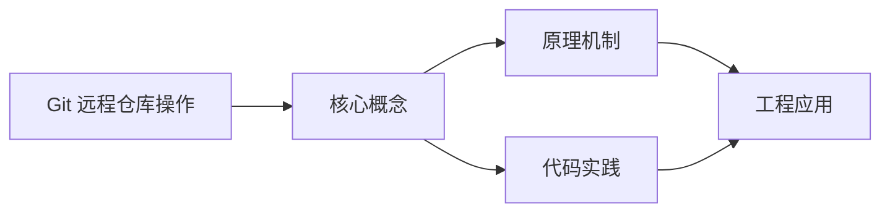
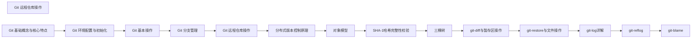

## 1. 学习目标（Bloom 分类）

本节按照布鲁姆教育目标分类学组织学习路径。本文主题为《Git 远程仓库操作》，属于 Git 模块，读者可以根据自身阶段选择阅读深度。

记忆层面：能够准确复述本文的核心概念、术语与基本语法或操作步骤，并能够在提问或检索时快速定位对应知识点。能够说出 Git 的核心概念、常用命令与流程。

理解层面：能够用自己的语言解释核心原理与工作机制，说明概念之间的因果关系，而不是机械记忆结论。能够解释 Git 的工作原理与设计动机。

应用层面：能够在真实项目或练习场景中运用本文知识解决具体问题，写出正确且可维护的实现。能够独立完成 Git 的标准操作。

分析层面：能够拆解复杂问题，比较本文主题与相邻概念的异同，识别边界条件与例外情况。能够分析 Git 使用中的异常与边界。

评价层面：能够根据约束条件（性能、可读性、安全、成本）评价不同方案的优劣，做出有依据的技术决策。能够评价 Git 相关工具与方案。

创造层面：能够把本文知识与其他模块知识组合，设计出新的解决方案或可复用的工程模式。能够把 Git 融入团队工作流。

通过本节学习，读者应当能够把《Git 远程仓库操作》纳入自己的知识网络，并与 Git 模块的其他主题（提交、分支、合并、远程协作）建立关联。

## 2. 历史动机与发展脉络

《Git 远程仓库操作》是 Git 领域的重要主题。要真正理解它，需要先了解它解决的问题与演进过程。

Git 由 Linus Torvalds 于 2005 年为 Linux 内核开发，目标是替代 BitKeeper：分布式、高性能、内容寻址。
Git 的核心是对象模型：blob（内容）、tree（目录）、commit（快照 + 元数据）、tag（引用）；一切对象用 SHA-1 哈希寻址。
工作流演进：集中式工作流 -> 特性分支 -> GitFlow -> GitHub Flow / Trunk-Based；现代团队普遍采用 PR 审查 + 主干发布。

回到本文主题：Git 远程仓库操作 的提出与成熟，正是上述技术背景下的必然产物。早期实现往往以简单可用为目标，随着工程规模扩大，社区逐渐沉淀出标准做法与最佳实践；理解这一脉络，可以帮助读者判断“为什么文档中的推荐写法是现在这个样子”，也能在遇到历史遗留代码时准确识别其设计年代与取舍。


## 3. 形式化定义与核心概念精讲

本节把《Git 远程仓库操作》涉及的核心概念以“定义 + 讲解”的形式展开。读者应把定义当作工具，把讲解当作理解路径；两者结合才能形成可迁移的知识。

三个区域：工作区、暂存区（index）、仓库（HEAD）；git add/commit 移动状态。
分支是指针：创建分支成本极低；合并（merge 生成合并提交）与变基（rebase 重放提交）各有取舍。
远程协作：clone/fetch/pull/push；refs/remotes 跟踪远端；冲突在合并时出现并手工解决。

### 3.1 原文章节逐一精讲

原文档把主题拆分为 21 个小节，下面按顺序给出每一节的导读讲解，随后保留原文细节供精读。

#### 原文精读（完整保留）

# Git 远程仓库操作

> **符号约定**：`< >` 必填参数 | `[ ]` 可选参数

---

#### 2. 远程仓库概述

远程仓库是存储在网络或其他位置的 Git 仓库副本，用于团队协作和代码共享。它是 Git 分布式版本控制系统的重要组成部分，使得多人可以协同开发同一个项目。

##### 2.1 远程仓库类型

| 类型           | 示例                     | 特点                         | 适用场景               |
| -------------- | ------------------------ | ---------------------------- | ---------------------- |
| 公共托管平台   | GitHub、GitLab、Gitee    | 易于使用，提供丰富的协作功能 | 开源项目、团队协作     |
| 企业内部服务器 | GitLab Enterprise、Gitea | 完全控制，安全性高           | 企业内部项目、敏感代码 |
| 个人服务器     | 自搭建 Git 服务器        | 完全自定义，成本低           | 个人项目、小团队       |

##### 2.2 远程仓库的主要作用

- **代码共享**：团队成员可以获取和贡献代码
- **备份**：提供代码的远程备份，防止本地代码丢失
- **协作**：支持多人同时开发，提高开发效率
- **代码审查**：通过 Pull Request 等机制进行代码审查
- **持续集成**：与 CI/CD 工具集成，自动化测试和部署

##### 2.3 远程仓库协议

- **HTTPS**：使用用户名密码或令牌认证，适合大多数场景
- **SSH**：使用 SSH 密钥认证，更安全，不需要每次输入密码
- **Git**：使用 Git 协议，速度快但安全性较低
- **本地协议**：使用本地文件系统，适合单机多仓库场景
  <a id="3"></a>

#### 3. 远程仓库管理

<a id="3.1"></a>

##### 3.1 添加远程仓库

```bash
 # 添加远程仓库
 git remote add <远程仓库名> <仓库地址>
 # 示例：添加名为 origin 的远程仓库
 git remote add origin https://github.com/username/repository.git
```

<a id="3.2"></a>

##### 3.2 查看远程仓库信息

```bash
 # 查看远程仓库信息
 git remote -v
 # 查看远程仓库详细信息
 git remote show <远程仓库名>
```

<a id="3.3"></a>

##### 3.3 重命名远程仓库

```bash
 # 重命名远程仓库
 git remote rename <旧远程仓库名> <新远程仓库名>
 # 示例：将 origin 重命名为 upstream
 git remote rename origin upstream
```

<a id="3.4"></a>

##### 3.4 删除远程仓库

```bash
 # 删除远程仓库
 git remote remove <远程仓库名>
 # 示例：删除名为 origin 的远程仓库
 git remote remove origin
```

<a id="3.5"></a>

##### 3.5 更新远程仓库 URL

```bash
 # 更新远程仓库的 URL
 git remote set-url <远程仓库名> <新仓库地址>
 # 示例：更新 origin 的 URL
 git remote set-url origin https://github.com/username/new-repository.git
```

<a id="4"></a>

#### 4. 推送与拉取

<a id="4.1"></a>

##### 4.1 首次推送

首次推送时，需要设置上游分支：

```bash
 # 首次推送到远程仓库并设置上游分支
 git push -u <远程仓库名> <本地分支名>:<远程分支名>
 # 示例：首次推送到 origin 的 main 分支
 git push -u origin main
```

<a id="4.2"></a>

##### 4.2 后续推送

首次推送成功后，后续推送可以简化：

```bash
 # 推送到远程仓库（已设置上游分支）
 git push
 # 推送指定分支
 git push <远程仓库名> <本地分支名>:<远程分支名>
 # 推送所有分支
 git push --all <远程仓库名>
 # 强制推送（谨慎使用）
 git push -f <远程仓库名> <分支名>
```

<a id="4.3"></a>

##### 4.3 拉取远程更改

```bash
 # 拉取远程仓库（已设置上游分支）
 git pull
 # 拉取指定分支
 git pull <远程仓库名> <远程分支名>:<本地分支名>
 # 拉取并允许合并不相关历史
 git pull --allow-unrelated-histories
```

<a id="4.4"></a>

##### 4.4 获取远程更改

```bash
 # 从远程仓库获取所有更新
 git fetch <远程仓库名>
 # 获取所有远程仓库的更新
 git fetch --all
 # 查看获取的远程分支
 git branch -r
```

<a id="5"></a>

#### 5. 远程分支管理

```bash
 # 查看远程分支
 git branch -r
 # 从远程分支创建本地分支
 git checkout -b <本地分支名> <远程仓库名>/<远程分支名>
 # 跟踪远程分支
 git branch --set-upstream-to=<远程仓库名>/<远程分支名> <本地分支名>
 # 删除远程分支
 git push <远程仓库名> --delete <分支名>
```

<a id="6"></a>

#### 6. 常见远程操作问题与解决方案

| 问题                                           | 原因                         | 解决方案                                                       |
| ---------------------------------------------- | ---------------------------- | -------------------------------------------------------------- |
| `fatal: No configured push destination`        | 未关联远程仓库               | 执行 `git remote add origin <仓库地址>` 关联远程仓库           |
| `error: failed to push some refs to`           | 远程仓库有本地没有的提交     | 先执行 `git pull` 拉取远程代码，解决冲突后再推送               |
| `fatal: refusing to merge unrelated histories` | 本地仓库和远程仓库历史不相关 | 执行 `git pull --allow-unrelated-histories` 允许合并不相关历史 |
| 推送超时                                       | 网络连接不稳定或文件过大     | 增加 `http.postBuffer` 值，或检查网络连接                      |
| 权限错误                                       | 没有远程仓库的访问权限       | 检查 SSH 密钥或 HTTPS 凭证，确保有正确的权限                   |

<a id="7"></a>

#### 7. 远程仓库最佳实践

##### 7.1 基础最佳实践

1. **使用有意义的远程仓库名**：

- `origin`：默认的远程仓库
- `upstream`：上游仓库（用于开源项目）
- `backup`：备份仓库

2. **定期同步远程更改**：

- 开始工作前执行 `git pull`
- 推送前执行 `git pull`，避免冲突
- 定期执行 `git fetch --all` 了解远程仓库状态

3. **合理使用推送命令**：

- 首次推送使用 `-u` 参数设置上游分支
- 后续推送直接使用 `git push`
- 谨慎使用 `git push -f` 强制推送，避免覆盖他人代码

4. **使用 SSH 协议**：

- SSH 协议更安全，不需要每次输入密码
- 配置 SSH 密钥后可以无密码访问远程仓库

5. **备份远程仓库**：

- 定期备份远程仓库
- 考虑使用多个远程仓库作为备份
- 重要项目使用镜像仓库

6. **远程仓库管理**：

- 定期清理不需要的远程分支
- 保持远程仓库的整洁
- 定期检查远程仓库的大小和健康状态

##### 7.2 SSH 密钥配置

###### 7.2.1 生成 SSH 密钥

```bash
 # 生成 SSH 密钥对
 ssh-keygen -t ed25519 -C "your_email@example.com"
 # 或使用 RSA 算法（兼容性更好）
 ssh-keygen -t rsa -b 4096 -C "your_email@example.com"
```

###### 7.2.2 查看 SSH 公钥

```bash
 # 查看 SSH 公钥
 cat ~/.ssh/id_ed25519.pub
 # 或
 cat ~/.ssh/id_rsa.pub
```

###### 7.2.3 添加 SSH 公钥到远程平台

1. 复制公钥内容
2. 登录 GitHub/GitLab/Gitee 等平台
3. 进入设置 → SSH 密钥
4. 添加新的 SSH 密钥，粘贴公钥内容

###### 7.2.4 测试 SSH 连接

```bash
 # 测试 GitHub 连接
 ssh -T git@github.com
 # 测试 GitLab 连接
 ssh -T git@gitlab.com
 # 测试 Gitee 连接
 ssh -T git@gitee.com
```

##### 7.3 高级远程操作技巧

###### 7.3.1 推送特定提交

```bash
 # 推送特定提交到远程分支
 git push <远程仓库名> <提交哈希>:<远程分支名>
```

###### 7.3.2 推送标签

```bash
 # 推送所有标签
 git push --tags <远程仓库名>
 # 推送特定标签
 git push <远程仓库名> <标签名>
```

###### 7.3.3 同步远程分支

```bash
 # 同步远程分支（删除本地不存在的远程分支）
 git fetch --prune <远程仓库名>
 # 同步所有远程仓库
 git fetch --all --prune
```

##### 7.4 实际项目案例

###### 7.4.1 开源项目贡献

```bash
 # Fork 远程仓库到自己的账户
 # 克隆自己的 Fork
 git clone https://github.com/your-username/repository.git
 # 添加上游仓库
 git remote add upstream https://github.com/original-owner/repository.git
 # 同步上游仓库
 git fetch upstream
 git checkout main
 git merge upstream/main
 # 创建功能分支
 git checkout -b feature/new-feature
 # 开发完成后推送到自己的仓库
 git push origin feature/new-feature
 # 创建 Pull Request 到上游仓库
```

###### 7.4.2 多远程仓库管理

```bash
 # 添加多个远程仓库
 git remote add origin https://github.com/username/repository.git
 git remote add backup https://gitee.com/username/repository.git
 # 推送到多个远程仓库
 git push origin main
 git push backup main
 # 从特定远程仓库拉取
 git pull backup main
```

<a id="8"></a>

#### 8. 总结

远程仓库操作是 Git 协作开发的核心，掌握这些操作可以有效地进行团队协作和代码共享。

- **远程仓库管理**：添加、查看、重命名和删除远程仓库
- **推送与拉取**：将本地更改推送到远程，从远程获取更改
- **远程分支管理**：管理远程分支，跟踪远程分支
- **问题解决**：解决常见的远程操作问题
- **最佳实践**：遵循远程仓库操作的最佳实践
  通过熟练掌握远程仓库操作，可以更好地进行团队协作，提高开发效率。

#### 延伸阅读

- [GitHub 仓库管理](github/repo-management)
#### 添加远程仓库

**基本写法：添加远程仓库**
`git remote add <远程仓库名> <仓库地址>`
```bash
# 添加名为 origin 的远程仓库
git remote add origin https://github.com/username/repository.git;
```

---

#### 查看远程仓库信息

**基本写法：查看远程仓库列表**
`git remote -v`
```bash
# 列出所有远程仓库
git remote -v;
```

**基本写法：查看远程仓库详情**
`git remote show <远程仓库名>`
```bash
# 查看 origin 的详细信息
git remote show origin;
```

---

#### 重命名远程仓库

**基本写法：重命名远程仓库**
`git remote rename <旧远程仓库名> <新远程仓库名>`
```bash
# 将 origin 重命名为 upstream
git remote rename origin upstream;
```

---

#### 删除远程仓库

**基本写法：删除远程仓库**
`git remote remove <远程仓库名>`
```bash
# 删除名为 origin 的远程仓库
git remote remove origin;
```

---

#### 更新远程仓库 URL

**基本写法：更新远程仓库 URL**
`git remote set-url <远程仓库名> <新仓库地址>`
```bash
# 更新 origin 的 URL
git remote set-url origin https://github.com/username/new-repository.git;
```

---

#### 首次推送

**基本写法：首次推送并设置上游**
`git push -u <远程仓库名> <本地分支名>:<远程分支名>`
```bash
# 首次推送到 origin 的 main 分支并设置上游
git push -u origin main;
```

---

#### 后续推送

**基本写法：简化推送**
`git push`
```bash
# 推送到默认上游分支
git push;
```

**基本写法：推送指定分支**
`git push <远程仓库名> <本地分支名>:<远程分支名>`
```bash
# 推送本地 feature 到远程 feature
git push origin feature:feature;
```

**基本写法：推送所有分支**
`git push --all <远程仓库名>`
```bash
# 推送所有分支到 origin
git push --all origin;
```

**基本写法：强制推送**
`git push -f <远程仓库名> <分支名>`
```bash
# 强制推送 main 分支
git push -f origin main;
```

---

#### 拉取远程更改

**基本写法：拉取并合并**
`git pull`
```bash
# 拉取默认上游分支并合并
git pull;
```

**基本写法：拉取指定分支**
`git pull <远程仓库名> <远程分支名>:<本地分支名>`
```bash
# 拉取 origin 的 main 分支到本地 main
git pull origin main:main;
```

**基本写法：允许合并不相关历史**
`git pull --allow-unrelated-histories`
```bash
# 拉取并合并不相关历史
git pull --allow-unrelated-histories;
```

---

#### 获取远程更改

**基本写法：获取所有更新**
`git fetch <远程仓库名>`
```bash
# 获取 origin 的所有更新
git fetch origin;
```

**基本写法：获取所有远程仓库更新**
`git fetch --all`
```bash
# 获取所有远程仓库的更新
git fetch --all;
```

**基本写法：查看获取的远程分支**
`git branch -r`
```bash
# 列出所有远程分支
git branch -r;
```

---

#### 远程分支管理

**基本写法：从远程分支创建本地分支**
`git checkout -b <本地分支名> <远程仓库名>/<远程分支名>`
```bash
# 基于 origin/feature 创建本地 feature 分支
git checkout -b feature origin/feature;
```

**基本写法：跟踪远程分支**
`git branch --set-upstream-to=<远程仓库名>/<远程分支名> <本地分支名>`
```bash
# 将本地 main 跟踪 origin/main
git branch --set-upstream-to=origin/main main;
```

**基本写法：删除远程分支**
`git push <远程仓库名> --delete <分支名>`
```bash
# 删除 origin 上的 feature 分支
git push origin --delete feature;
```

---

#### SSH 密钥配置

**基本写法：生成 ed25519 SSH 密钥**
`ssh-keygen -t <算法> -C "<注释>"`
```bash
# 生成 ed25519 算法的 SSH 密钥
ssh-keygen -t ed25519 -C "your_email@example.com";
```

**基本写法：生成 RSA SSH 密钥**
`ssh-keygen -t <算法> -b <位数> -C "<注释>"`
```bash
# 生成 RSA 算法的 SSH 密钥
ssh-keygen -t rsa -b 4096 -C "your_email@example.com";
```

**基本写法：查看 ed25519 SSH 公钥**
`cat ~/.ssh/<密钥文件>.pub`
```bash
# 查看 ed25519 公钥
cat ~/.ssh/id_ed25519.pub;
```

**基本写法：查看 RSA SSH 公钥**
`cat ~/.ssh/<密钥文件>.pub`
```bash
# 查看 RSA 公钥
cat ~/.ssh/id_rsa.pub;
```

**基本写法：测试 GitHub SSH 连接**
`ssh -T git@<域名>`
```bash
# 测试 GitHub 连接
ssh -T git@github.com;
```

**基本写法：测试 GitLab SSH 连接**
`ssh -T git@<域名>`
```bash
# 测试 GitLab 连接
ssh -T git@gitlab.com;
```

---

#### 高级远程操作

**基本写法：推送特定提交**
`git push <远程仓库名> <提交哈希>:<远程分支名>`
```bash
# 将 abc1234 提交推送到 origin 的 main 分支
git push origin abc1234:main;
```

**基本写法：推送所有标签**
`git push --tags <远程仓库名>`
```bash
# 推送所有标签到 origin
git push --tags origin;
```

**基本写法：推送特定标签**
`git push <远程仓库名> <标签名>`
```bash
# 推送 v1.0.0 标签到 origin
git push origin v1.0.0;
```

**基本写法：同步远程分支（清理）**
`git fetch --prune <远程仓库名>`
```bash
# 同步 origin 并清理已删除的远程分支
git fetch --prune origin;
```

**基本写法：同步所有远程仓库并清理**
`git fetch --all --prune`
```bash
# 同步所有远程仓库并清理
git fetch --all --prune;
```

---

#### 多远程仓库管理

**基本写法：添加主仓库**
`git remote add <名称> <地址>`
```bash
# 添加主仓库 origin
git remote add origin https://github.com/username/repository.git;
```

**基本写法：添加备份仓库**
`git remote add <名称> <地址>`
```bash
# 添加备份仓库 backup
git remote add backup https://gitee.com/username/repository.git;
```

**基本写法：推送到主仓库**
`git push <远程仓库名> <分支名>`
```bash
# 推送到主仓库 origin
git push origin main;
```

**基本写法：推送到备份仓库**
`git push <远程仓库名> <分支名>`
```bash
# 推送到备份仓库 backup
git push backup main;
```

**基本写法：从特定远程拉取**
`git pull <远程仓库名> <分支名>`
```bash
# 从备份仓库拉取 main 分支
git pull backup main;
```


### 3.2 概念关系图

下面用 Mermaid 图表达本文核心概念之间的关系，帮助读者建立整体图景：



图中展示的是本文知识的结构化关系：核心概念是入口，原理机制解释“为什么”，代码实践演示“怎么做”，工程应用回答“何时用”。读者学习时可以把每个小节的内容挂接到对应节点上。

## 4. 理论推导与原理解析

本节深入《Git 远程仓库操作》背后的原理。理论部分不求面面俱到，而是聚焦“能解释现象、能指导实践”的关键推导。

三个区域：工作区、暂存区（index）、仓库（HEAD）；git add/commit 移动状态。
分支是指针：创建分支成本极低；合并（merge 生成合并提交）与变基（rebase 重放提交）各有取舍。
远程协作：clone/fetch/pull/push；refs/remotes 跟踪远端；冲突在合并时出现并手工解决。
撤销模型：checkout/restore 改工作区，reset 移 HEAD，revert 生成反向提交；理解三者避免误操作。

需要强调的是，理论推导与工程实践之间存在翻译层：理论给出的是理想化模型与边界条件，工程代码则必须处理真实环境中的例外。读者在学习时应先掌握理论的“标准情形”，再通过陷阱章节了解“非标准情形”。

## 5. 代码示例与逐行讲解

本节把原文中的代码示例系统整理，并为每个示例补充用途说明与讲解。读者不应只浏览代码，而应逐段对照讲解理解设计意图。

### 5.1 示例：3.1 添加远程仓库

该示例来自原文《3.1 添加远程仓库》小节，用于演示Git 远程仓库操作相关操作。阅读时请先看代码结构，再看其后的讲解。

```bash
 # 添加远程仓库
 git remote add <远程仓库名> <仓库地址>
 # 示例：添加名为 origin 的远程仓库
 git remote add origin https://github.com/username/repository.git
```

讲解：这段代码演示了本节核心知识点。代码中的关键操作可以归纳为三步：准备（定义或初始化）、执行（核心逻辑）、收尾（释放资源或返回结果）。实际项目中，这三步往往被封装为函数或类，以提升复用性与可测试性。

关键点分析：

该示例共 4 行有效代码，结构以数据或配置为主。阅读时应关注：数据字段的含义、配置项的作用，以及它们与运行行为的对应关系。

进阶思考路径：先尝试修改参数观察行为变化，再把示例中的模式迁移到自己的项目中；每次修改都记录预期与实测差异，这是把示例转化为能力的最快方式。

### 5.2 示例：3.2 查看远程仓库信息

该示例来自原文《3.2 查看远程仓库信息》小节，用于演示Git 远程仓库操作相关操作。阅读时请先看代码结构，再看其后的讲解。

```bash
 # 查看远程仓库信息
 git remote -v
 # 查看远程仓库详细信息
 git remote show <远程仓库名>
```

讲解：这段代码演示了本节核心知识点。代码中的关键操作可以归纳为三步：准备（定义或初始化）、执行（核心逻辑）、收尾（释放资源或返回结果）。实际项目中，这三步往往被封装为函数或类，以提升复用性与可测试性。

关键点分析：

该示例共 4 行有效代码，结构以数据或配置为主。阅读时应关注：数据字段的含义、配置项的作用，以及它们与运行行为的对应关系。

进阶思考路径：先尝试修改参数观察行为变化，再把示例中的模式迁移到自己的项目中；每次修改都记录预期与实测差异，这是把示例转化为能力的最快方式。

### 5.3 示例：3.3 重命名远程仓库

该示例来自原文《3.3 重命名远程仓库》小节，用于演示Git 远程仓库操作相关操作。阅读时请先看代码结构，再看其后的讲解。

```bash
 # 重命名远程仓库
 git remote rename <旧远程仓库名> <新远程仓库名>
 # 示例：将 origin 重命名为 upstream
 git remote rename origin upstream
```

讲解：这段代码演示了本节核心知识点。代码中的关键操作可以归纳为三步：准备（定义或初始化）、执行（核心逻辑）、收尾（释放资源或返回结果）。实际项目中，这三步往往被封装为函数或类，以提升复用性与可测试性。

关键点分析：

该示例共 4 行有效代码，结构以数据或配置为主。阅读时应关注：数据字段的含义、配置项的作用，以及它们与运行行为的对应关系。

进阶思考路径：先尝试修改参数观察行为变化，再把示例中的模式迁移到自己的项目中；每次修改都记录预期与实测差异，这是把示例转化为能力的最快方式。

### 5.4 示例：3.4 删除远程仓库

该示例来自原文《3.4 删除远程仓库》小节，用于演示Git 远程仓库操作相关操作。阅读时请先看代码结构，再看其后的讲解。

```bash
 # 删除远程仓库
 git remote remove <远程仓库名>
 # 示例：删除名为 origin 的远程仓库
 git remote remove origin
```

讲解：这段代码演示了本节核心知识点。代码中的关键操作可以归纳为三步：准备（定义或初始化）、执行（核心逻辑）、收尾（释放资源或返回结果）。实际项目中，这三步往往被封装为函数或类，以提升复用性与可测试性。

关键点分析：

该示例共 4 行有效代码，结构以数据或配置为主。阅读时应关注：数据字段的含义、配置项的作用，以及它们与运行行为的对应关系。

进阶思考路径：先尝试修改参数观察行为变化，再把示例中的模式迁移到自己的项目中；每次修改都记录预期与实测差异，这是把示例转化为能力的最快方式。

### 5.5 示例：3.5 更新远程仓库 URL

该示例来自原文《3.5 更新远程仓库 URL》小节，用于演示Git 远程仓库操作相关操作。阅读时请先看代码结构，再看其后的讲解。

```bash
 # 更新远程仓库的 URL
 git remote set-url <远程仓库名> <新仓库地址>
 # 示例：更新 origin 的 URL
 git remote set-url origin https://github.com/username/new-repository.git
```

讲解：这段代码演示了本节核心知识点。代码中的关键操作可以归纳为三步：准备（定义或初始化）、执行（核心逻辑）、收尾（释放资源或返回结果）。实际项目中，这三步往往被封装为函数或类，以提升复用性与可测试性。

关键点分析：

该示例共 4 行有效代码，结构以数据或配置为主。阅读时应关注：数据字段的含义、配置项的作用，以及它们与运行行为的对应关系。

进阶思考路径：先尝试修改参数观察行为变化，再把示例中的模式迁移到自己的项目中；每次修改都记录预期与实测差异，这是把示例转化为能力的最快方式。

### 5.6 示例：4.1 首次推送

该示例来自原文《4.1 首次推送》小节，用于演示Git 远程仓库操作相关操作。阅读时请先看代码结构，再看其后的讲解。

```bash
 # 首次推送到远程仓库并设置上游分支
 git push -u <远程仓库名> <本地分支名>:<远程分支名>
 # 示例：首次推送到 origin 的 main 分支
 git push -u origin main
```

讲解：这段代码演示了本节核心知识点。代码中的关键操作可以归纳为三步：准备（定义或初始化）、执行（核心逻辑）、收尾（释放资源或返回结果）。实际项目中，这三步往往被封装为函数或类，以提升复用性与可测试性。

关键点分析：

该示例共 4 行有效代码，结构以数据或配置为主。阅读时应关注：数据字段的含义、配置项的作用，以及它们与运行行为的对应关系。

进阶思考路径：先尝试修改参数观察行为变化，再把示例中的模式迁移到自己的项目中；每次修改都记录预期与实测差异，这是把示例转化为能力的最快方式。

### 5.7 示例：4.2 后续推送

该示例来自原文《4.2 后续推送》小节，用于演示Git 远程仓库操作相关操作。阅读时请先看代码结构，再看其后的讲解。

```bash
 # 推送到远程仓库（已设置上游分支）
 git push
 # 推送指定分支
 git push <远程仓库名> <本地分支名>:<远程分支名>
 # 推送所有分支
 git push --all <远程仓库名>
 # 强制推送（谨慎使用）
 git push -f <远程仓库名> <分支名>
```

讲解：这段代码演示了本节核心知识点。代码中的关键操作可以归纳为三步：准备（定义或初始化）、执行（核心逻辑）、收尾（释放资源或返回结果）。实际项目中，这三步往往被封装为函数或类，以提升复用性与可测试性。

关键点分析：

该示例共 8 行有效代码，结构以数据或配置为主。阅读时应关注：数据字段的含义、配置项的作用，以及它们与运行行为的对应关系。

进阶思考路径：先尝试修改参数观察行为变化，再把示例中的模式迁移到自己的项目中；每次修改都记录预期与实测差异，这是把示例转化为能力的最快方式。

### 5.8 示例：4.3 拉取远程更改

该示例来自原文《4.3 拉取远程更改》小节，用于演示Git 远程仓库操作相关操作。阅读时请先看代码结构，再看其后的讲解。

```bash
 # 拉取远程仓库（已设置上游分支）
 git pull
 # 拉取指定分支
 git pull <远程仓库名> <远程分支名>:<本地分支名>
 # 拉取并允许合并不相关历史
 git pull --allow-unrelated-histories
```

讲解：这段代码演示了本节核心知识点。代码中的关键操作可以归纳为三步：准备（定义或初始化）、执行（核心逻辑）、收尾（释放资源或返回结果）。实际项目中，这三步往往被封装为函数或类，以提升复用性与可测试性。

关键点分析：

该示例共 6 行有效代码，结构以数据或配置为主。阅读时应关注：数据字段的含义、配置项的作用，以及它们与运行行为的对应关系。

进阶思考路径：先尝试修改参数观察行为变化，再把示例中的模式迁移到自己的项目中；每次修改都记录预期与实测差异，这是把示例转化为能力的最快方式。

### 5.9 示例：4.4 获取远程更改

该示例来自原文《4.4 获取远程更改》小节，用于演示Git 远程仓库操作相关操作。阅读时请先看代码结构，再看其后的讲解。

```bash
 # 从远程仓库获取所有更新
 git fetch <远程仓库名>
 # 获取所有远程仓库的更新
 git fetch --all
 # 查看获取的远程分支
 git branch -r
```

讲解：这段代码演示了本节核心知识点。代码中的关键操作可以归纳为三步：准备（定义或初始化）、执行（核心逻辑）、收尾（释放资源或返回结果）。实际项目中，这三步往往被封装为函数或类，以提升复用性与可测试性。

关键点分析：

该示例共 6 行有效代码，结构以数据或配置为主。阅读时应关注：数据字段的含义、配置项的作用，以及它们与运行行为的对应关系。

进阶思考路径：先尝试修改参数观察行为变化，再把示例中的模式迁移到自己的项目中；每次修改都记录预期与实测差异，这是把示例转化为能力的最快方式。

### 5.10 示例：5. 远程分支管理

该示例来自原文《5. 远程分支管理》小节，用于演示Git 远程仓库操作相关操作。阅读时请先看代码结构，再看其后的讲解。

```bash
 # 查看远程分支
 git branch -r
 # 从远程分支创建本地分支
 git checkout -b <本地分支名> <远程仓库名>/<远程分支名>
 # 跟踪远程分支
 git branch --set-upstream-to=<远程仓库名>/<远程分支名> <本地分支名>
 # 删除远程分支
 git push <远程仓库名> --delete <分支名>
```

讲解：这段代码演示了本节核心知识点。代码中的关键操作可以归纳为三步：准备（定义或初始化）、执行（核心逻辑）、收尾（释放资源或返回结果）。实际项目中，这三步往往被封装为函数或类，以提升复用性与可测试性。

关键点分析：

该示例共 8 行有效代码，结构以数据或配置为主。阅读时应关注：数据字段的含义、配置项的作用，以及它们与运行行为的对应关系。

进阶思考路径：先尝试修改参数观察行为变化，再把示例中的模式迁移到自己的项目中；每次修改都记录预期与实测差异，这是把示例转化为能力的最快方式。

### 5.11 示例：7.2.1 生成 SSH 密钥

该示例来自原文《7.2.1 生成 SSH 密钥》小节，用于演示Git 远程仓库操作相关操作。阅读时请先看代码结构，再看其后的讲解。

```bash
 # 生成 SSH 密钥对
 ssh-keygen -t ed25519 -C "your_email@example.com"
 # 或使用 RSA 算法（兼容性更好）
 ssh-keygen -t rsa -b 4096 -C "your_email@example.com"
```

讲解：这段代码演示了本节核心知识点。代码中的关键操作可以归纳为三步：准备（定义或初始化）、执行（核心逻辑）、收尾（释放资源或返回结果）。实际项目中，这三步往往被封装为函数或类，以提升复用性与可测试性。

关键点分析：

该示例共 4 行有效代码，结构以数据或配置为主。阅读时应关注：数据字段的含义、配置项的作用，以及它们与运行行为的对应关系。

进阶思考路径：先尝试修改参数观察行为变化，再把示例中的模式迁移到自己的项目中；每次修改都记录预期与实测差异，这是把示例转化为能力的最快方式。

### 5.12 示例：7.2.2 查看 SSH 公钥

该示例来自原文《7.2.2 查看 SSH 公钥》小节，用于演示Git 远程仓库操作相关操作。阅读时请先看代码结构，再看其后的讲解。

```bash
 # 查看 SSH 公钥
 cat ~/.ssh/id_ed25519.pub
 # 或
 cat ~/.ssh/id_rsa.pub
```

讲解：这段代码演示了本节核心知识点。代码中的关键操作可以归纳为三步：准备（定义或初始化）、执行（核心逻辑）、收尾（释放资源或返回结果）。实际项目中，这三步往往被封装为函数或类，以提升复用性与可测试性。

关键点分析：

该示例共 4 行有效代码，结构以数据或配置为主。阅读时应关注：数据字段的含义、配置项的作用，以及它们与运行行为的对应关系。

进阶思考路径：先尝试修改参数观察行为变化，再把示例中的模式迁移到自己的项目中；每次修改都记录预期与实测差异，这是把示例转化为能力的最快方式。

### 5.13 示例：7.2.4 测试 SSH 连接

该示例来自原文《7.2.4 测试 SSH 连接》小节，用于演示Git 远程仓库操作相关操作。阅读时请先看代码结构，再看其后的讲解。

```bash
 # 测试 GitHub 连接
 ssh -T git@github.com
 # 测试 GitLab 连接
 ssh -T git@gitlab.com
 # 测试 Gitee 连接
 ssh -T git@gitee.com
```

讲解：这段代码演示了本节核心知识点。代码中的关键操作可以归纳为三步：准备（定义或初始化）、执行（核心逻辑）、收尾（释放资源或返回结果）。实际项目中，这三步往往被封装为函数或类，以提升复用性与可测试性。

关键点分析：

该示例共 6 行有效代码，结构以数据或配置为主。阅读时应关注：数据字段的含义、配置项的作用，以及它们与运行行为的对应关系。

进阶思考路径：先尝试修改参数观察行为变化，再把示例中的模式迁移到自己的项目中；每次修改都记录预期与实测差异，这是把示例转化为能力的最快方式。

### 5.14 示例：7.3.1 推送特定提交

该示例来自原文《7.3.1 推送特定提交》小节，用于演示Git 远程仓库操作相关操作。阅读时请先看代码结构，再看其后的讲解。

```bash
 # 推送特定提交到远程分支
 git push <远程仓库名> <提交哈希>:<远程分支名>
```

讲解：这段代码演示了本节核心知识点。代码中的关键操作可以归纳为三步：准备（定义或初始化）、执行（核心逻辑）、收尾（释放资源或返回结果）。实际项目中，这三步往往被封装为函数或类，以提升复用性与可测试性。

关键点分析：

该示例共 2 行有效代码，结构以数据或配置为主。阅读时应关注：数据字段的含义、配置项的作用，以及它们与运行行为的对应关系。

进阶思考路径：先尝试修改参数观察行为变化，再把示例中的模式迁移到自己的项目中；每次修改都记录预期与实测差异，这是把示例转化为能力的最快方式。

### 5.15 示例：7.3.2 推送标签

该示例来自原文《7.3.2 推送标签》小节，用于演示Git 远程仓库操作相关操作。阅读时请先看代码结构，再看其后的讲解。

```bash
 # 推送所有标签
 git push --tags <远程仓库名>
 # 推送特定标签
 git push <远程仓库名> <标签名>
```

讲解：这段代码演示了本节核心知识点。代码中的关键操作可以归纳为三步：准备（定义或初始化）、执行（核心逻辑）、收尾（释放资源或返回结果）。实际项目中，这三步往往被封装为函数或类，以提升复用性与可测试性。

关键点分析：

该示例共 4 行有效代码，结构以数据或配置为主。阅读时应关注：数据字段的含义、配置项的作用，以及它们与运行行为的对应关系。

进阶思考路径：先尝试修改参数观察行为变化，再把示例中的模式迁移到自己的项目中；每次修改都记录预期与实测差异，这是把示例转化为能力的最快方式。

### 5.16 示例：7.3.3 同步远程分支

该示例来自原文《7.3.3 同步远程分支》小节，用于演示Git 远程仓库操作相关操作。阅读时请先看代码结构，再看其后的讲解。

```bash
 # 同步远程分支（删除本地不存在的远程分支）
 git fetch --prune <远程仓库名>
 # 同步所有远程仓库
 git fetch --all --prune
```

讲解：这段代码演示了本节核心知识点。代码中的关键操作可以归纳为三步：准备（定义或初始化）、执行（核心逻辑）、收尾（释放资源或返回结果）。实际项目中，这三步往往被封装为函数或类，以提升复用性与可测试性。

关键点分析：

该示例共 4 行有效代码，结构以数据或配置为主。阅读时应关注：数据字段的含义、配置项的作用，以及它们与运行行为的对应关系。

进阶思考路径：先尝试修改参数观察行为变化，再把示例中的模式迁移到自己的项目中；每次修改都记录预期与实测差异，这是把示例转化为能力的最快方式。

### 5.17 示例：7.4.1 开源项目贡献

该示例来自原文《7.4.1 开源项目贡献》小节，用于演示Git 远程仓库操作相关操作。阅读时请先看代码结构，再看其后的讲解。

```bash
 # Fork 远程仓库到自己的账户
 # 克隆自己的 Fork
 git clone https://github.com/your-username/repository.git
 # 添加上游仓库
 git remote add upstream https://github.com/original-owner/repository.git
 # 同步上游仓库
 git fetch upstream
 git checkout main
 git merge upstream/main
 # 创建功能分支
 git checkout -b feature/new-feature
 # 开发完成后推送到自己的仓库
 git push origin feature/new-feature
 # 创建 Pull Request 到上游仓库
```

讲解：这段代码演示了本节核心知识点。代码中的关键操作可以归纳为三步：准备（定义或初始化）、执行（核心逻辑）、收尾（释放资源或返回结果）。实际项目中，这三步往往被封装为函数或类，以提升复用性与可测试性。

关键点分析：

该示例共 14 行有效代码，结构以数据或配置为主。阅读时应关注：数据字段的含义、配置项的作用，以及它们与运行行为的对应关系。

进阶思考路径：先尝试修改参数观察行为变化，再把示例中的模式迁移到自己的项目中；每次修改都记录预期与实测差异，这是把示例转化为能力的最快方式。

### 5.18 示例：7.4.2 多远程仓库管理

该示例来自原文《7.4.2 多远程仓库管理》小节，用于演示Git 远程仓库操作相关操作。阅读时请先看代码结构，再看其后的讲解。

```bash
 # 添加多个远程仓库
 git remote add origin https://github.com/username/repository.git
 git remote add backup https://gitee.com/username/repository.git
 # 推送到多个远程仓库
 git push origin main
 git push backup main
 # 从特定远程仓库拉取
 git pull backup main
```

讲解：这段代码演示了本节核心知识点。代码中的关键操作可以归纳为三步：准备（定义或初始化）、执行（核心逻辑）、收尾（释放资源或返回结果）。实际项目中，这三步往往被封装为函数或类，以提升复用性与可测试性。

关键点分析：

该示例共 8 行有效代码，结构以数据或配置为主。阅读时应关注：数据字段的含义、配置项的作用，以及它们与运行行为的对应关系。

进阶思考路径：先尝试修改参数观察行为变化，再把示例中的模式迁移到自己的项目中；每次修改都记录预期与实测差异，这是把示例转化为能力的最快方式。

### 5.19 示例：添加远程仓库

该示例来自原文《添加远程仓库》小节，用于演示Git 远程仓库操作相关操作。阅读时请先看代码结构，再看其后的讲解。

```bash
# 添加名为 origin 的远程仓库
git remote add origin https://github.com/username/repository.git;
```

讲解：这段代码演示了本节核心知识点。代码中的关键操作可以归纳为三步：准备（定义或初始化）、执行（核心逻辑）、收尾（释放资源或返回结果）。实际项目中，这三步往往被封装为函数或类，以提升复用性与可测试性。

关键点分析：

该示例共 2 行有效代码，结构以数据或配置为主。阅读时应关注：数据字段的含义、配置项的作用，以及它们与运行行为的对应关系。

进阶思考路径：先尝试修改参数观察行为变化，再把示例中的模式迁移到自己的项目中；每次修改都记录预期与实测差异，这是把示例转化为能力的最快方式。

### 5.20 示例：查看远程仓库信息

该示例来自原文《查看远程仓库信息》小节，用于演示Git 远程仓库操作相关操作。阅读时请先看代码结构，再看其后的讲解。

```bash
# 列出所有远程仓库
git remote -v;
```

讲解：这段代码演示了本节核心知识点。代码中的关键操作可以归纳为三步：准备（定义或初始化）、执行（核心逻辑）、收尾（释放资源或返回结果）。实际项目中，这三步往往被封装为函数或类，以提升复用性与可测试性。

关键点分析：

该示例共 2 行有效代码，结构以数据或配置为主。阅读时应关注：数据字段的含义、配置项的作用，以及它们与运行行为的对应关系。

进阶思考路径：先尝试修改参数观察行为变化，再把示例中的模式迁移到自己的项目中；每次修改都记录预期与实测差异，这是把示例转化为能力的最快方式。

### 5.21 示例：查看远程仓库信息

该示例来自原文《查看远程仓库信息》小节，用于演示Git 远程仓库操作相关操作。阅读时请先看代码结构，再看其后的讲解。

```bash
# 查看 origin 的详细信息
git remote show origin;
```

讲解：这段代码演示了本节核心知识点。代码中的关键操作可以归纳为三步：准备（定义或初始化）、执行（核心逻辑）、收尾（释放资源或返回结果）。实际项目中，这三步往往被封装为函数或类，以提升复用性与可测试性。

关键点分析：

该示例共 2 行有效代码，结构以数据或配置为主。阅读时应关注：数据字段的含义、配置项的作用，以及它们与运行行为的对应关系。

进阶思考路径：先尝试修改参数观察行为变化，再把示例中的模式迁移到自己的项目中；每次修改都记录预期与实测差异，这是把示例转化为能力的最快方式。

### 5.22 示例：重命名远程仓库

该示例来自原文《重命名远程仓库》小节，用于演示Git 远程仓库操作相关操作。阅读时请先看代码结构，再看其后的讲解。

```bash
# 将 origin 重命名为 upstream
git remote rename origin upstream;
```

讲解：这段代码演示了本节核心知识点。代码中的关键操作可以归纳为三步：准备（定义或初始化）、执行（核心逻辑）、收尾（释放资源或返回结果）。实际项目中，这三步往往被封装为函数或类，以提升复用性与可测试性。

关键点分析：

该示例共 2 行有效代码，结构以数据或配置为主。阅读时应关注：数据字段的含义、配置项的作用，以及它们与运行行为的对应关系。

进阶思考路径：先尝试修改参数观察行为变化，再把示例中的模式迁移到自己的项目中；每次修改都记录预期与实测差异，这是把示例转化为能力的最快方式。

### 5.23 示例：删除远程仓库

该示例来自原文《删除远程仓库》小节，用于演示Git 远程仓库操作相关操作。阅读时请先看代码结构，再看其后的讲解。

```bash
# 删除名为 origin 的远程仓库
git remote remove origin;
```

讲解：这段代码演示了本节核心知识点。代码中的关键操作可以归纳为三步：准备（定义或初始化）、执行（核心逻辑）、收尾（释放资源或返回结果）。实际项目中，这三步往往被封装为函数或类，以提升复用性与可测试性。

关键点分析：

该示例共 2 行有效代码，结构以数据或配置为主。阅读时应关注：数据字段的含义、配置项的作用，以及它们与运行行为的对应关系。

进阶思考路径：先尝试修改参数观察行为变化，再把示例中的模式迁移到自己的项目中；每次修改都记录预期与实测差异，这是把示例转化为能力的最快方式。

### 5.24 示例：更新远程仓库 URL

该示例来自原文《更新远程仓库 URL》小节，用于演示Git 远程仓库操作相关操作。阅读时请先看代码结构，再看其后的讲解。

```bash
# 更新 origin 的 URL
git remote set-url origin https://github.com/username/new-repository.git;
```

讲解：这段代码演示了本节核心知识点。代码中的关键操作可以归纳为三步：准备（定义或初始化）、执行（核心逻辑）、收尾（释放资源或返回结果）。实际项目中，这三步往往被封装为函数或类，以提升复用性与可测试性。

关键点分析：

该示例共 2 行有效代码，结构以数据或配置为主。阅读时应关注：数据字段的含义、配置项的作用，以及它们与运行行为的对应关系。

进阶思考路径：先尝试修改参数观察行为变化，再把示例中的模式迁移到自己的项目中；每次修改都记录预期与实测差异，这是把示例转化为能力的最快方式。

### 5.25 示例：首次推送

该示例来自原文《首次推送》小节，用于演示Git 远程仓库操作相关操作。阅读时请先看代码结构，再看其后的讲解。

```bash
# 首次推送到 origin 的 main 分支并设置上游
git push -u origin main;
```

讲解：这段代码演示了本节核心知识点。代码中的关键操作可以归纳为三步：准备（定义或初始化）、执行（核心逻辑）、收尾（释放资源或返回结果）。实际项目中，这三步往往被封装为函数或类，以提升复用性与可测试性。

关键点分析：

该示例共 2 行有效代码，结构以数据或配置为主。阅读时应关注：数据字段的含义、配置项的作用，以及它们与运行行为的对应关系。

进阶思考路径：先尝试修改参数观察行为变化，再把示例中的模式迁移到自己的项目中；每次修改都记录预期与实测差异，这是把示例转化为能力的最快方式。

### 5.26 示例：后续推送

该示例来自原文《后续推送》小节，用于演示Git 远程仓库操作相关操作。阅读时请先看代码结构，再看其后的讲解。

```bash
# 推送到默认上游分支
git push;
```

讲解：这段代码演示了本节核心知识点。代码中的关键操作可以归纳为三步：准备（定义或初始化）、执行（核心逻辑）、收尾（释放资源或返回结果）。实际项目中，这三步往往被封装为函数或类，以提升复用性与可测试性。

关键点分析：

该示例共 2 行有效代码，结构以数据或配置为主。阅读时应关注：数据字段的含义、配置项的作用，以及它们与运行行为的对应关系。

进阶思考路径：先尝试修改参数观察行为变化，再把示例中的模式迁移到自己的项目中；每次修改都记录预期与实测差异，这是把示例转化为能力的最快方式。

### 5.27 示例：后续推送

该示例来自原文《后续推送》小节，用于演示Git 远程仓库操作相关操作。阅读时请先看代码结构，再看其后的讲解。

```bash
# 推送本地 feature 到远程 feature
git push origin feature:feature;
```

讲解：这段代码演示了本节核心知识点。代码中的关键操作可以归纳为三步：准备（定义或初始化）、执行（核心逻辑）、收尾（释放资源或返回结果）。实际项目中，这三步往往被封装为函数或类，以提升复用性与可测试性。

关键点分析：

该示例共 2 行有效代码，结构以数据或配置为主。阅读时应关注：数据字段的含义、配置项的作用，以及它们与运行行为的对应关系。

进阶思考路径：先尝试修改参数观察行为变化，再把示例中的模式迁移到自己的项目中；每次修改都记录预期与实测差异，这是把示例转化为能力的最快方式。

### 5.28 示例：后续推送

该示例来自原文《后续推送》小节，用于演示Git 远程仓库操作相关操作。阅读时请先看代码结构，再看其后的讲解。

```bash
# 推送所有分支到 origin
git push --all origin;
```

讲解：这段代码演示了本节核心知识点。代码中的关键操作可以归纳为三步：准备（定义或初始化）、执行（核心逻辑）、收尾（释放资源或返回结果）。实际项目中，这三步往往被封装为函数或类，以提升复用性与可测试性。

关键点分析：

该示例共 2 行有效代码，结构以数据或配置为主。阅读时应关注：数据字段的含义、配置项的作用，以及它们与运行行为的对应关系。

进阶思考路径：先尝试修改参数观察行为变化，再把示例中的模式迁移到自己的项目中；每次修改都记录预期与实测差异，这是把示例转化为能力的最快方式。

### 5.29 示例：后续推送

该示例来自原文《后续推送》小节，用于演示Git 远程仓库操作相关操作。阅读时请先看代码结构，再看其后的讲解。

```bash
# 强制推送 main 分支
git push -f origin main;
```

讲解：这段代码演示了本节核心知识点。代码中的关键操作可以归纳为三步：准备（定义或初始化）、执行（核心逻辑）、收尾（释放资源或返回结果）。实际项目中，这三步往往被封装为函数或类，以提升复用性与可测试性。

关键点分析：

该示例共 2 行有效代码，结构以数据或配置为主。阅读时应关注：数据字段的含义、配置项的作用，以及它们与运行行为的对应关系。

进阶思考路径：先尝试修改参数观察行为变化，再把示例中的模式迁移到自己的项目中；每次修改都记录预期与实测差异，这是把示例转化为能力的最快方式。

### 5.30 示例：拉取远程更改

该示例来自原文《拉取远程更改》小节，用于演示Git 远程仓库操作相关操作。阅读时请先看代码结构，再看其后的讲解。

```bash
# 拉取默认上游分支并合并
git pull;
```

讲解：这段代码演示了本节核心知识点。代码中的关键操作可以归纳为三步：准备（定义或初始化）、执行（核心逻辑）、收尾（释放资源或返回结果）。实际项目中，这三步往往被封装为函数或类，以提升复用性与可测试性。

关键点分析：

该示例共 2 行有效代码，结构以数据或配置为主。阅读时应关注：数据字段的含义、配置项的作用，以及它们与运行行为的对应关系。

进阶思考路径：先尝试修改参数观察行为变化，再把示例中的模式迁移到自己的项目中；每次修改都记录预期与实测差异，这是把示例转化为能力的最快方式。

### 5.31 示例：拉取远程更改

该示例来自原文《拉取远程更改》小节，用于演示Git 远程仓库操作相关操作。阅读时请先看代码结构，再看其后的讲解。

```bash
# 拉取 origin 的 main 分支到本地 main
git pull origin main:main;
```

讲解：这段代码演示了本节核心知识点。代码中的关键操作可以归纳为三步：准备（定义或初始化）、执行（核心逻辑）、收尾（释放资源或返回结果）。实际项目中，这三步往往被封装为函数或类，以提升复用性与可测试性。

关键点分析：

该示例共 2 行有效代码，结构以数据或配置为主。阅读时应关注：数据字段的含义、配置项的作用，以及它们与运行行为的对应关系。

进阶思考路径：先尝试修改参数观察行为变化，再把示例中的模式迁移到自己的项目中；每次修改都记录预期与实测差异，这是把示例转化为能力的最快方式。

### 5.32 示例：拉取远程更改

该示例来自原文《拉取远程更改》小节，用于演示Git 远程仓库操作相关操作。阅读时请先看代码结构，再看其后的讲解。

```bash
# 拉取并合并不相关历史
git pull --allow-unrelated-histories;
```

讲解：这段代码演示了本节核心知识点。代码中的关键操作可以归纳为三步：准备（定义或初始化）、执行（核心逻辑）、收尾（释放资源或返回结果）。实际项目中，这三步往往被封装为函数或类，以提升复用性与可测试性。

关键点分析：

该示例共 2 行有效代码，结构以数据或配置为主。阅读时应关注：数据字段的含义、配置项的作用，以及它们与运行行为的对应关系。

进阶思考路径：先尝试修改参数观察行为变化，再把示例中的模式迁移到自己的项目中；每次修改都记录预期与实测差异，这是把示例转化为能力的最快方式。

### 5.33 示例：获取远程更改

该示例来自原文《获取远程更改》小节，用于演示Git 远程仓库操作相关操作。阅读时请先看代码结构，再看其后的讲解。

```bash
# 获取 origin 的所有更新
git fetch origin;
```

讲解：这段代码演示了本节核心知识点。代码中的关键操作可以归纳为三步：准备（定义或初始化）、执行（核心逻辑）、收尾（释放资源或返回结果）。实际项目中，这三步往往被封装为函数或类，以提升复用性与可测试性。

关键点分析：

该示例共 2 行有效代码，结构以数据或配置为主。阅读时应关注：数据字段的含义、配置项的作用，以及它们与运行行为的对应关系。

进阶思考路径：先尝试修改参数观察行为变化，再把示例中的模式迁移到自己的项目中；每次修改都记录预期与实测差异，这是把示例转化为能力的最快方式。

### 5.34 示例：获取远程更改

该示例来自原文《获取远程更改》小节，用于演示Git 远程仓库操作相关操作。阅读时请先看代码结构，再看其后的讲解。

```bash
# 获取所有远程仓库的更新
git fetch --all;
```

讲解：这段代码演示了本节核心知识点。代码中的关键操作可以归纳为三步：准备（定义或初始化）、执行（核心逻辑）、收尾（释放资源或返回结果）。实际项目中，这三步往往被封装为函数或类，以提升复用性与可测试性。

关键点分析：

该示例共 2 行有效代码，结构以数据或配置为主。阅读时应关注：数据字段的含义、配置项的作用，以及它们与运行行为的对应关系。

进阶思考路径：先尝试修改参数观察行为变化，再把示例中的模式迁移到自己的项目中；每次修改都记录预期与实测差异，这是把示例转化为能力的最快方式。

### 5.35 示例：获取远程更改

该示例来自原文《获取远程更改》小节，用于演示Git 远程仓库操作相关操作。阅读时请先看代码结构，再看其后的讲解。

```bash
# 列出所有远程分支
git branch -r;
```

讲解：这段代码演示了本节核心知识点。代码中的关键操作可以归纳为三步：准备（定义或初始化）、执行（核心逻辑）、收尾（释放资源或返回结果）。实际项目中，这三步往往被封装为函数或类，以提升复用性与可测试性。

关键点分析：

该示例共 2 行有效代码，结构以数据或配置为主。阅读时应关注：数据字段的含义、配置项的作用，以及它们与运行行为的对应关系。

进阶思考路径：先尝试修改参数观察行为变化，再把示例中的模式迁移到自己的项目中；每次修改都记录预期与实测差异，这是把示例转化为能力的最快方式。

### 5.36 示例：远程分支管理

该示例来自原文《远程分支管理》小节，用于演示Git 远程仓库操作相关操作。阅读时请先看代码结构，再看其后的讲解。

```bash
# 基于 origin/feature 创建本地 feature 分支
git checkout -b feature origin/feature;
```

讲解：这段代码演示了本节核心知识点。代码中的关键操作可以归纳为三步：准备（定义或初始化）、执行（核心逻辑）、收尾（释放资源或返回结果）。实际项目中，这三步往往被封装为函数或类，以提升复用性与可测试性。

关键点分析：

该示例共 2 行有效代码，结构以数据或配置为主。阅读时应关注：数据字段的含义、配置项的作用，以及它们与运行行为的对应关系。

进阶思考路径：先尝试修改参数观察行为变化，再把示例中的模式迁移到自己的项目中；每次修改都记录预期与实测差异，这是把示例转化为能力的最快方式。

### 5.37 示例：远程分支管理

该示例来自原文《远程分支管理》小节，用于演示Git 远程仓库操作相关操作。阅读时请先看代码结构，再看其后的讲解。

```bash
# 将本地 main 跟踪 origin/main
git branch --set-upstream-to=origin/main main;
```

讲解：这段代码演示了本节核心知识点。代码中的关键操作可以归纳为三步：准备（定义或初始化）、执行（核心逻辑）、收尾（释放资源或返回结果）。实际项目中，这三步往往被封装为函数或类，以提升复用性与可测试性。

关键点分析：

该示例共 2 行有效代码，结构以数据或配置为主。阅读时应关注：数据字段的含义、配置项的作用，以及它们与运行行为的对应关系。

进阶思考路径：先尝试修改参数观察行为变化，再把示例中的模式迁移到自己的项目中；每次修改都记录预期与实测差异，这是把示例转化为能力的最快方式。

### 5.38 示例：远程分支管理

该示例来自原文《远程分支管理》小节，用于演示Git 远程仓库操作相关操作。阅读时请先看代码结构，再看其后的讲解。

```bash
# 删除 origin 上的 feature 分支
git push origin --delete feature;
```

讲解：这段代码演示了本节核心知识点。代码中的关键操作可以归纳为三步：准备（定义或初始化）、执行（核心逻辑）、收尾（释放资源或返回结果）。实际项目中，这三步往往被封装为函数或类，以提升复用性与可测试性。

关键点分析：

该示例共 2 行有效代码，结构以数据或配置为主。阅读时应关注：数据字段的含义、配置项的作用，以及它们与运行行为的对应关系。

进阶思考路径：先尝试修改参数观察行为变化，再把示例中的模式迁移到自己的项目中；每次修改都记录预期与实测差异，这是把示例转化为能力的最快方式。

### 5.39 示例：SSH 密钥配置

该示例来自原文《SSH 密钥配置》小节，用于演示Git 远程仓库操作相关操作。阅读时请先看代码结构，再看其后的讲解。

```bash
# 生成 ed25519 算法的 SSH 密钥
ssh-keygen -t ed25519 -C "your_email@example.com";
```

讲解：这段代码演示了本节核心知识点。代码中的关键操作可以归纳为三步：准备（定义或初始化）、执行（核心逻辑）、收尾（释放资源或返回结果）。实际项目中，这三步往往被封装为函数或类，以提升复用性与可测试性。

关键点分析：

该示例共 2 行有效代码，结构以数据或配置为主。阅读时应关注：数据字段的含义、配置项的作用，以及它们与运行行为的对应关系。

进阶思考路径：先尝试修改参数观察行为变化，再把示例中的模式迁移到自己的项目中；每次修改都记录预期与实测差异，这是把示例转化为能力的最快方式。

### 5.40 示例：SSH 密钥配置

该示例来自原文《SSH 密钥配置》小节，用于演示Git 远程仓库操作相关操作。阅读时请先看代码结构，再看其后的讲解。

```bash
# 生成 RSA 算法的 SSH 密钥
ssh-keygen -t rsa -b 4096 -C "your_email@example.com";
```

讲解：这段代码演示了本节核心知识点。代码中的关键操作可以归纳为三步：准备（定义或初始化）、执行（核心逻辑）、收尾（释放资源或返回结果）。实际项目中，这三步往往被封装为函数或类，以提升复用性与可测试性。

关键点分析：

该示例共 2 行有效代码，结构以数据或配置为主。阅读时应关注：数据字段的含义、配置项的作用，以及它们与运行行为的对应关系。

进阶思考路径：先尝试修改参数观察行为变化，再把示例中的模式迁移到自己的项目中；每次修改都记录预期与实测差异，这是把示例转化为能力的最快方式。

### 5.41 示例：SSH 密钥配置

该示例来自原文《SSH 密钥配置》小节，用于演示Git 远程仓库操作相关操作。阅读时请先看代码结构，再看其后的讲解。

```bash
# 查看 ed25519 公钥
cat ~/.ssh/id_ed25519.pub;
```

讲解：这段代码演示了本节核心知识点。代码中的关键操作可以归纳为三步：准备（定义或初始化）、执行（核心逻辑）、收尾（释放资源或返回结果）。实际项目中，这三步往往被封装为函数或类，以提升复用性与可测试性。

关键点分析：

该示例共 2 行有效代码，结构以数据或配置为主。阅读时应关注：数据字段的含义、配置项的作用，以及它们与运行行为的对应关系。

进阶思考路径：先尝试修改参数观察行为变化，再把示例中的模式迁移到自己的项目中；每次修改都记录预期与实测差异，这是把示例转化为能力的最快方式。

### 5.42 示例：SSH 密钥配置

该示例来自原文《SSH 密钥配置》小节，用于演示Git 远程仓库操作相关操作。阅读时请先看代码结构，再看其后的讲解。

```bash
# 查看 RSA 公钥
cat ~/.ssh/id_rsa.pub;
```

讲解：这段代码演示了本节核心知识点。代码中的关键操作可以归纳为三步：准备（定义或初始化）、执行（核心逻辑）、收尾（释放资源或返回结果）。实际项目中，这三步往往被封装为函数或类，以提升复用性与可测试性。

关键点分析：

该示例共 2 行有效代码，结构以数据或配置为主。阅读时应关注：数据字段的含义、配置项的作用，以及它们与运行行为的对应关系。

进阶思考路径：先尝试修改参数观察行为变化，再把示例中的模式迁移到自己的项目中；每次修改都记录预期与实测差异，这是把示例转化为能力的最快方式。

### 5.43 示例：SSH 密钥配置

该示例来自原文《SSH 密钥配置》小节，用于演示Git 远程仓库操作相关操作。阅读时请先看代码结构，再看其后的讲解。

```bash
# 测试 GitHub 连接
ssh -T git@github.com;
```

讲解：这段代码演示了本节核心知识点。代码中的关键操作可以归纳为三步：准备（定义或初始化）、执行（核心逻辑）、收尾（释放资源或返回结果）。实际项目中，这三步往往被封装为函数或类，以提升复用性与可测试性。

关键点分析：

该示例共 2 行有效代码，结构以数据或配置为主。阅读时应关注：数据字段的含义、配置项的作用，以及它们与运行行为的对应关系。

进阶思考路径：先尝试修改参数观察行为变化，再把示例中的模式迁移到自己的项目中；每次修改都记录预期与实测差异，这是把示例转化为能力的最快方式。

### 5.44 示例：SSH 密钥配置

该示例来自原文《SSH 密钥配置》小节，用于演示Git 远程仓库操作相关操作。阅读时请先看代码结构，再看其后的讲解。

```bash
# 测试 GitLab 连接
ssh -T git@gitlab.com;
```

讲解：这段代码演示了本节核心知识点。代码中的关键操作可以归纳为三步：准备（定义或初始化）、执行（核心逻辑）、收尾（释放资源或返回结果）。实际项目中，这三步往往被封装为函数或类，以提升复用性与可测试性。

关键点分析：

该示例共 2 行有效代码，结构以数据或配置为主。阅读时应关注：数据字段的含义、配置项的作用，以及它们与运行行为的对应关系。

进阶思考路径：先尝试修改参数观察行为变化，再把示例中的模式迁移到自己的项目中；每次修改都记录预期与实测差异，这是把示例转化为能力的最快方式。

### 5.45 示例：高级远程操作

该示例来自原文《高级远程操作》小节，用于演示Git 远程仓库操作相关操作。阅读时请先看代码结构，再看其后的讲解。

```bash
# 将 abc1234 提交推送到 origin 的 main 分支
git push origin abc1234:main;
```

讲解：这段代码演示了本节核心知识点。代码中的关键操作可以归纳为三步：准备（定义或初始化）、执行（核心逻辑）、收尾（释放资源或返回结果）。实际项目中，这三步往往被封装为函数或类，以提升复用性与可测试性。

关键点分析：

该示例共 2 行有效代码，结构以数据或配置为主。阅读时应关注：数据字段的含义、配置项的作用，以及它们与运行行为的对应关系。

进阶思考路径：先尝试修改参数观察行为变化，再把示例中的模式迁移到自己的项目中；每次修改都记录预期与实测差异，这是把示例转化为能力的最快方式。

### 5.46 示例：高级远程操作

该示例来自原文《高级远程操作》小节，用于演示Git 远程仓库操作相关操作。阅读时请先看代码结构，再看其后的讲解。

```bash
# 推送所有标签到 origin
git push --tags origin;
```

讲解：这段代码演示了本节核心知识点。代码中的关键操作可以归纳为三步：准备（定义或初始化）、执行（核心逻辑）、收尾（释放资源或返回结果）。实际项目中，这三步往往被封装为函数或类，以提升复用性与可测试性。

关键点分析：

该示例共 2 行有效代码，结构以数据或配置为主。阅读时应关注：数据字段的含义、配置项的作用，以及它们与运行行为的对应关系。

进阶思考路径：先尝试修改参数观察行为变化，再把示例中的模式迁移到自己的项目中；每次修改都记录预期与实测差异，这是把示例转化为能力的最快方式。

### 5.47 示例：高级远程操作

该示例来自原文《高级远程操作》小节，用于演示Git 远程仓库操作相关操作。阅读时请先看代码结构，再看其后的讲解。

```bash
# 推送 v1.0.0 标签到 origin
git push origin v1.0.0;
```

讲解：这段代码演示了本节核心知识点。代码中的关键操作可以归纳为三步：准备（定义或初始化）、执行（核心逻辑）、收尾（释放资源或返回结果）。实际项目中，这三步往往被封装为函数或类，以提升复用性与可测试性。

关键点分析：

该示例共 2 行有效代码，结构以数据或配置为主。阅读时应关注：数据字段的含义、配置项的作用，以及它们与运行行为的对应关系。

进阶思考路径：先尝试修改参数观察行为变化，再把示例中的模式迁移到自己的项目中；每次修改都记录预期与实测差异，这是把示例转化为能力的最快方式。

### 5.48 示例：高级远程操作

该示例来自原文《高级远程操作》小节，用于演示Git 远程仓库操作相关操作。阅读时请先看代码结构，再看其后的讲解。

```bash
# 同步 origin 并清理已删除的远程分支
git fetch --prune origin;
```

讲解：这段代码演示了本节核心知识点。代码中的关键操作可以归纳为三步：准备（定义或初始化）、执行（核心逻辑）、收尾（释放资源或返回结果）。实际项目中，这三步往往被封装为函数或类，以提升复用性与可测试性。

关键点分析：

该示例共 2 行有效代码，结构以数据或配置为主。阅读时应关注：数据字段的含义、配置项的作用，以及它们与运行行为的对应关系。

进阶思考路径：先尝试修改参数观察行为变化，再把示例中的模式迁移到自己的项目中；每次修改都记录预期与实测差异，这是把示例转化为能力的最快方式。

### 5.49 示例：高级远程操作

该示例来自原文《高级远程操作》小节，用于演示Git 远程仓库操作相关操作。阅读时请先看代码结构，再看其后的讲解。

```bash
# 同步所有远程仓库并清理
git fetch --all --prune;
```

讲解：这段代码演示了本节核心知识点。代码中的关键操作可以归纳为三步：准备（定义或初始化）、执行（核心逻辑）、收尾（释放资源或返回结果）。实际项目中，这三步往往被封装为函数或类，以提升复用性与可测试性。

关键点分析：

该示例共 2 行有效代码，结构以数据或配置为主。阅读时应关注：数据字段的含义、配置项的作用，以及它们与运行行为的对应关系。

进阶思考路径：先尝试修改参数观察行为变化，再把示例中的模式迁移到自己的项目中；每次修改都记录预期与实测差异，这是把示例转化为能力的最快方式。

### 5.50 示例：多远程仓库管理

该示例来自原文《多远程仓库管理》小节，用于演示Git 远程仓库操作相关操作。阅读时请先看代码结构，再看其后的讲解。

```bash
# 添加主仓库 origin
git remote add origin https://github.com/username/repository.git;
```

讲解：这段代码演示了本节核心知识点。代码中的关键操作可以归纳为三步：准备（定义或初始化）、执行（核心逻辑）、收尾（释放资源或返回结果）。实际项目中，这三步往往被封装为函数或类，以提升复用性与可测试性。

关键点分析：

该示例共 2 行有效代码，结构以数据或配置为主。阅读时应关注：数据字段的含义、配置项的作用，以及它们与运行行为的对应关系。

进阶思考路径：先尝试修改参数观察行为变化，再把示例中的模式迁移到自己的项目中；每次修改都记录预期与实测差异，这是把示例转化为能力的最快方式。

### 5.51 示例：多远程仓库管理

该示例来自原文《多远程仓库管理》小节，用于演示Git 远程仓库操作相关操作。阅读时请先看代码结构，再看其后的讲解。

```bash
# 添加备份仓库 backup
git remote add backup https://gitee.com/username/repository.git;
```

讲解：这段代码演示了本节核心知识点。代码中的关键操作可以归纳为三步：准备（定义或初始化）、执行（核心逻辑）、收尾（释放资源或返回结果）。实际项目中，这三步往往被封装为函数或类，以提升复用性与可测试性。

关键点分析：

该示例共 2 行有效代码，结构以数据或配置为主。阅读时应关注：数据字段的含义、配置项的作用，以及它们与运行行为的对应关系。

进阶思考路径：先尝试修改参数观察行为变化，再把示例中的模式迁移到自己的项目中；每次修改都记录预期与实测差异，这是把示例转化为能力的最快方式。

### 5.52 示例：多远程仓库管理

该示例来自原文《多远程仓库管理》小节，用于演示Git 远程仓库操作相关操作。阅读时请先看代码结构，再看其后的讲解。

```bash
# 推送到主仓库 origin
git push origin main;
```

讲解：这段代码演示了本节核心知识点。代码中的关键操作可以归纳为三步：准备（定义或初始化）、执行（核心逻辑）、收尾（释放资源或返回结果）。实际项目中，这三步往往被封装为函数或类，以提升复用性与可测试性。

关键点分析：

该示例共 2 行有效代码，结构以数据或配置为主。阅读时应关注：数据字段的含义、配置项的作用，以及它们与运行行为的对应关系。

进阶思考路径：先尝试修改参数观察行为变化，再把示例中的模式迁移到自己的项目中；每次修改都记录预期与实测差异，这是把示例转化为能力的最快方式。

### 5.53 示例：多远程仓库管理

该示例来自原文《多远程仓库管理》小节，用于演示Git 远程仓库操作相关操作。阅读时请先看代码结构，再看其后的讲解。

```bash
# 推送到备份仓库 backup
git push backup main;
```

讲解：这段代码演示了本节核心知识点。代码中的关键操作可以归纳为三步：准备（定义或初始化）、执行（核心逻辑）、收尾（释放资源或返回结果）。实际项目中，这三步往往被封装为函数或类，以提升复用性与可测试性。

关键点分析：

该示例共 2 行有效代码，结构以数据或配置为主。阅读时应关注：数据字段的含义、配置项的作用，以及它们与运行行为的对应关系。

进阶思考路径：先尝试修改参数观察行为变化，再把示例中的模式迁移到自己的项目中；每次修改都记录预期与实测差异，这是把示例转化为能力的最快方式。

### 5.54 示例：多远程仓库管理

该示例来自原文《多远程仓库管理》小节，用于演示Git 远程仓库操作相关操作。阅读时请先看代码结构，再看其后的讲解。

```bash
# 从备份仓库拉取 main 分支
git pull backup main;
```

讲解：这段代码演示了本节核心知识点。代码中的关键操作可以归纳为三步：准备（定义或初始化）、执行（核心逻辑）、收尾（释放资源或返回结果）。实际项目中，这三步往往被封装为函数或类，以提升复用性与可测试性。

关键点分析：

该示例共 2 行有效代码，结构以数据或配置为主。阅读时应关注：数据字段的含义、配置项的作用，以及它们与运行行为的对应关系。

进阶思考路径：先尝试修改参数观察行为变化，再把示例中的模式迁移到自己的项目中；每次修改都记录预期与实测差异，这是把示例转化为能力的最快方式。


综合以上示例，可以总结出本主题的代码实践要点：第一，先定义清晰的输入输出契约；第二，核心逻辑保持单一职责；第三，错误处理与边界条件不可省略；第四，命名与注释表达意图而非复述代码。

## 6. 对比分析

对比是理解《Git 远程仓库操作》定位的最快路径。下面从多个维度与相邻方案进行对比。

Git 与 SVN：Git 分布式、离线提交、分支廉价；SVN 集中式已基本退出。
merge 与 rebase：merge 保留历史但复杂；rebase 线性整洁但改写。
GitHub Flow 与 GitFlow：前者主干 + PR 适合持续发布；后者适合版本化发布。

对比的目的不是分出绝对优劣，而是建立选择依据：不同约束条件下，最优解不同。读者应把每个对比维度转化为决策检查清单。

## 7. 常见陷阱与最佳实践

本节整理该主题的高频错误与推荐做法。每个陷阱先描述现象，再解释原因，最后给出最佳实践。

### 7.1 提交信息随意

无法追溯。使用 Conventional Commits（feat/fix/docs...）。

深入讲解：该问题之所以被归类为“常见陷阱”，是因为它在初学者的代码中反复出现，而且往往不在第一时间暴露——错误通常隐藏在特定数据或特定时序下。

从成因上看，提交信息随意 一般源于对 Git 某个机制的理解偏差：要么误用了默认行为，要么忽略了边界条件，要么把其他语言的思维惯性带了过来。

从影响上看，提交信息随意 轻则产生错误结果，重则导致资源泄漏、数据损坏或安全事故；这也是为什么工程评审中会把它列为检查项。

从修复策略上看，处理提交信息随意的正确顺序是：先复现（构造最小用例），再定位（确认机制层面的根因），最后修复并补充回归测试。跳过复现直接改代码，往往治标不治本。

### 7.2 大文件入库

仓库膨胀。使用 Git LFS 或排除构建产物。

深入讲解：该问题之所以被归类为“常见陷阱”，是因为它在初学者的代码中反复出现，而且往往不在第一时间暴露——错误通常隐藏在特定数据或特定时序下。

从成因上看，大文件入库 一般源于对 Git 某个机制的理解偏差：要么误用了默认行为，要么忽略了边界条件，要么把其他语言的思维惯性带了过来。

从影响上看，大文件入库 轻则产生错误结果，重则导致资源泄漏、数据损坏或安全事故；这也是为什么工程评审中会把它列为检查项。

从修复策略上看，处理大文件入库的正确顺序是：先复现（构造最小用例），再定位（确认机制层面的根因），最后修复并补充回归测试。跳过复现直接改代码，往往治标不治本。

### 7.3 force push 滥用

覆盖他人历史。仅限个人分支并通知。

深入讲解：该问题之所以被归类为“常见陷阱”，是因为它在初学者的代码中反复出现，而且往往不在第一时间暴露——错误通常隐藏在特定数据或特定时序下。

从成因上看，force push 滥用 一般源于对 Git 某个机制的理解偏差：要么误用了默认行为，要么忽略了边界条件，要么把其他语言的思维惯性带了过来。

从影响上看，force push 滥用 轻则产生错误结果，重则导致资源泄漏、数据损坏或安全事故；这也是为什么工程评审中会把它列为检查项。

从修复策略上看，处理force push 滥用的正确顺序是：先复现（构造最小用例），再定位（确认机制层面的根因），最后修复并补充回归测试。跳过复现直接改代码，往往治标不治本。

### 7.4 merge 冲突拖延

冲突积累。频繁合并、小步提交。

深入讲解：该问题之所以被归类为“常见陷阱”，是因为它在初学者的代码中反复出现，而且往往不在第一时间暴露——错误通常隐藏在特定数据或特定时序下。

从成因上看，merge 冲突拖延 一般源于对 Git 某个机制的理解偏差：要么误用了默认行为，要么忽略了边界条件，要么把其他语言的思维惯性带了过来。

从影响上看，merge 冲突拖延 轻则产生错误结果，重则导致资源泄漏、数据损坏或安全事故；这也是为什么工程评审中会把它列为检查项。

从修复策略上看，处理merge 冲突拖延的正确顺序是：先复现（构造最小用例），再定位（确认机制层面的根因），最后修复并补充回归测试。跳过复现直接改代码，往往治标不治本。

### 7.5 密钥入库

泄露事故。使用 .gitignore 与 secret 扫描。

深入讲解：该问题之所以被归类为“常见陷阱”，是因为它在初学者的代码中反复出现，而且往往不在第一时间暴露——错误通常隐藏在特定数据或特定时序下。

从成因上看，密钥入库 一般源于对 Git 某个机制的理解偏差：要么误用了默认行为，要么忽略了边界条件，要么把其他语言的思维惯性带了过来。

从影响上看，密钥入库 轻则产生错误结果，重则导致资源泄漏、数据损坏或安全事故；这也是为什么工程评审中会把它列为检查项。

从修复策略上看，处理密钥入库的正确顺序是：先复现（构造最小用例），再定位（确认机制层面的根因），最后修复并补充回归测试。跳过复现直接改代码，往往治标不治本。

### 7.6 reset 误操作

丢失工作。确认目标与 --hard 语义。

深入讲解：该问题之所以被归类为“常见陷阱”，是因为它在初学者的代码中反复出现，而且往往不在第一时间暴露——错误通常隐藏在特定数据或特定时序下。

从成因上看，reset 误操作 一般源于对 Git 某个机制的理解偏差：要么误用了默认行为，要么忽略了边界条件，要么把其他语言的思维惯性带了过来。

从影响上看，reset 误操作 轻则产生错误结果，重则导致资源泄漏、数据损坏或安全事故；这也是为什么工程评审中会把它列为检查项。

从修复策略上看，处理reset 误操作的正确顺序是：先复现（构造最小用例），再定位（确认机制层面的根因），最后修复并补充回归测试。跳过复现直接改代码，往往治标不治本。

### 7.7 忽略 .gitignore

构建产物污染。项目初始化即配置。

深入讲解：该问题之所以被归类为“常见陷阱”，是因为它在初学者的代码中反复出现，而且往往不在第一时间暴露——错误通常隐藏在特定数据或特定时序下。

从成因上看，忽略 .gitignore 一般源于对 Git 某个机制的理解偏差：要么误用了默认行为，要么忽略了边界条件，要么把其他语言的思维惯性带了过来。

从影响上看，忽略 .gitignore 轻则产生错误结果，重则导致资源泄漏、数据损坏或安全事故；这也是为什么工程评审中会把它列为检查项。

从修复策略上看，处理忽略 .gitignore的正确顺序是：先复现（构造最小用例），再定位（确认机制层面的根因），最后修复并补充回归测试。跳过复现直接改代码，往往治标不治本。

### 7.8 rebase 公共分支

改写已发布历史。公共分支只 merge。

深入讲解：该问题之所以被归类为“常见陷阱”，是因为它在初学者的代码中反复出现，而且往往不在第一时间暴露——错误通常隐藏在特定数据或特定时序下。

从成因上看，rebase 公共分支 一般源于对 Git 某个机制的理解偏差：要么误用了默认行为，要么忽略了边界条件，要么把其他语言的思维惯性带了过来。

从影响上看，rebase 公共分支 轻则产生错误结果，重则导致资源泄漏、数据损坏或安全事故；这也是为什么工程评审中会把它列为检查项。

从修复策略上看，处理rebase 公共分支的正确顺序是：先复现（构造最小用例），再定位（确认机制层面的根因），最后修复并补充回归测试。跳过复现直接改代码，往往治标不治本。

### 7.0 最佳实践总览

1. 小步提交：每次提交一个逻辑变更，可构建可测试。
2. 提交信息规范：类型 + 简述 + 正文（为什么）。
3. 分支命名：feature/xxx、fix/xxx、docs/xxx。
4. 合入前跑测试与 lint；PR 描述变更与影响。

把这些最佳实践固化为团队规范与代码评审检查项，是避免同类问题反复出现的关键。

## 8. 工程实践

本节把《Git 远程仓库操作》放入真实工程场景，给出可复用的模式与组织方法。

团队规范：分支策略、提交规范、PR 模板、CODEOWNERS 审查。
自动化：pre-commit hooks、CI 门禁、自动生成 CHANGELOG。
安全：分支保护、签名提交（GPG/SSH）、secret 扫描。

### 8.1 工程实践的原则拆解

以上工程实践可以归纳为四条原则。第一，配置与代码分离：Git 项目中环境差异应通过配置注入，而不是散落在代码分支中；这保证同一份代码可以在开发、测试、生产环境一致运行。

第二，接口稳定优先：对外接口（函数签名、协议、数据格式）一旦被消费方依赖，变更成本极高；设计时应预留扩展点并保持向后兼容。

第三，可观测性内置：日志、指标与追踪应该在功能开发时同步设计，而不是故障发生后补救；没有观测手段的模块等于黑盒。

第四，变更可回滚：任何发布都应有对应的回滚方案；数据库迁移、配置变更与代码发布一样需要版本管理与逆向路径。

### 8.2 实践落地的检查清单

- [ ] 团队规范：对照本节描述，检查当前项目是否已经落实；未落实的项列入技术债并排期处理。
- [ ] 自动化：对照本节描述，检查当前项目是否已经落实；未落实的项列入技术债并排期处理。
- [ ] 安全：对照本节描述，检查当前项目是否已经落实；未落实的项列入技术债并排期处理。

工程实践的共性原则：配置与代码分离、接口稳定优先、可观测性内置、变更可回滚。这些原则适用于本主题的所有实现。

## 9. 案例研究

本节通过一个完整案例把《Git 远程仓库操作》的知识串起来。案例按“需求分析、方案设计、实现、验证”四步展开。

需求：为团队建立 Git 协作规范并落地。
方案：Trunk-Based + 短特性分支 + PR 审查 + CI。
要点：小 PR、自动测试、冲突及时处理、回滚演练。
验证：统计合并周期与冲突频率，持续改进。

### 9.1 案例的扩展讨论

把案例中的方案放大到真实规模，需要额外考虑三个问题：

第一，规模：当数据量或并发量上升一个数量级时，原方案中的数据结构、缓存策略与任务调度是否仍然成立？通常需要引入分层与异步。

第二，团队：多人协作时，模块边界、接口契约与代码所有权必须明确；案例中的实现应拆分为可独立测试的单元，并配合文档说明设计意图。

第三，演进：上线后的需求变化不可避免；方案设计时应预留扩展点（配置化、插件化、事件化），并定期用真实指标验证假设。


案例研究的学习方法：先独立阅读需求，尝试在脑中形成方案，再对照实现与讲解，最后思考“如果约束变化（数据量、并发、团队规模），方案应如何调整”。

## 10. 知识要点总结与深入讲解

本节以讲解形式汇总全文要点，替代传统的习题与自测，读者不需要答题，只需跟随解释建立完整的认知框架。

关于《Git 远程仓库操作》的核心结论：

Git 的分布式对象模型是其强大与学习曲线的来源。
提交、分支、合并、撤销四大操作覆盖日常 90%。
团队价值在规范：一致的提交信息与流程。

原文档各小节的要点回顾：

- 2. 远程仓库概述：该小节围绕Git 远程仓库操作展开具体细节，阅读时应关注其与核心结论的对应关系；每个小节都是核心结论在某一个侧面的展开。
- 3. 远程仓库管理：该小节围绕Git 远程仓库操作展开具体细节，阅读时应关注其与核心结论的对应关系；每个小节都是核心结论在某一个侧面的展开。
- 4. 推送与拉取：该小节围绕Git 远程仓库操作展开具体细节，阅读时应关注其与核心结论的对应关系；每个小节都是核心结论在某一个侧面的展开。
- 5. 远程分支管理：该小节围绕Git 远程仓库操作展开具体细节，阅读时应关注其与核心结论的对应关系；每个小节都是核心结论在某一个侧面的展开。
- 6. 常见远程操作问题与解决方案：该小节围绕Git 远程仓库操作展开具体细节，阅读时应关注其与核心结论的对应关系；每个小节都是核心结论在某一个侧面的展开。
- 7. 远程仓库最佳实践：该小节围绕Git 远程仓库操作展开具体细节，阅读时应关注其与核心结论的对应关系；每个小节都是核心结论在某一个侧面的展开。
- 8. 总结：该小节围绕Git 远程仓库操作展开具体细节，阅读时应关注其与核心结论的对应关系；每个小节都是核心结论在某一个侧面的展开。
- 延伸阅读：该小节围绕Git 远程仓库操作展开具体细节，阅读时应关注其与核心结论的对应关系；每个小节都是核心结论在某一个侧面的展开。
- 添加远程仓库：该小节围绕Git 远程仓库操作展开具体细节，阅读时应关注其与核心结论的对应关系；每个小节都是核心结论在某一个侧面的展开。
- 查看远程仓库信息：该小节围绕Git 远程仓库操作展开具体细节，阅读时应关注其与核心结论的对应关系；每个小节都是核心结论在某一个侧面的展开。
- 重命名远程仓库：该小节围绕Git 远程仓库操作展开具体细节，阅读时应关注其与核心结论的对应关系；每个小节都是核心结论在某一个侧面的展开。
- 删除远程仓库：该小节围绕Git 远程仓库操作展开具体细节，阅读时应关注其与核心结论的对应关系；每个小节都是核心结论在某一个侧面的展开。
- 更新远程仓库 URL：该小节围绕Git 远程仓库操作展开具体细节，阅读时应关注其与核心结论的对应关系；每个小节都是核心结论在某一个侧面的展开。
- 首次推送：该小节围绕Git 远程仓库操作展开具体细节，阅读时应关注其与核心结论的对应关系；每个小节都是核心结论在某一个侧面的展开。
- 后续推送：该小节围绕Git 远程仓库操作展开具体细节，阅读时应关注其与核心结论的对应关系；每个小节都是核心结论在某一个侧面的展开。
- 拉取远程更改：该小节围绕Git 远程仓库操作展开具体细节，阅读时应关注其与核心结论的对应关系；每个小节都是核心结论在某一个侧面的展开。
- 获取远程更改：该小节围绕Git 远程仓库操作展开具体细节，阅读时应关注其与核心结论的对应关系；每个小节都是核心结论在某一个侧面的展开。
- 远程分支管理：该小节围绕Git 远程仓库操作展开具体细节，阅读时应关注其与核心结论的对应关系；每个小节都是核心结论在某一个侧面的展开。
- SSH 密钥配置：该小节围绕Git 远程仓库操作展开具体细节，阅读时应关注其与核心结论的对应关系；每个小节都是核心结论在某一个侧面的展开。
- 高级远程操作：该小节围绕Git 远程仓库操作展开具体细节，阅读时应关注其与核心结论的对应关系；每个小节都是核心结论在某一个侧面的展开。
- 多远程仓库管理：该小节围绕Git 远程仓库操作展开具体细节，阅读时应关注其与核心结论的对应关系；每个小节都是核心结论在某一个侧面的展开。

把以上要点与第 3-9 节的内容对照复习，即可完成对本文主题的闭环学习。

## 11. 参考文献


Git 官方文档：https://git-scm.com/doc
Pro Git 中文版：https://git-scm.com/book/zh/v2
Git 参考手册：https://git-scm.com/docs
Conventional Commits：https://www.conventionalcommits.org/zh-hans/

## 12. 延伸阅读


Git 基础操作与分支，见 003-git 模块文档。
GitHub 协作与 PR，见 004-github 模块。
CI/CD 自动化，见 031-devops 模块。
尚硅谷 Bilibili 空间（https://space.bilibili.com/302417610 ）提供 Git 课程。

## 14. 模块知识图谱与学习路径

本文属于 Git 模块。为了把《Git 远程仓库操作》放入完整的知识网络，下面列出本模块的全部主题并给出相互关联的导读。学习时建议按模块内顺序推进，并在每个文档中留意交叉引用。



上图为模块主题的推荐学习顺序示意图（仅展示前若干主题）。各主题之间存在三类关联：

第一，前置依赖关系：早期主题是后期主题的基础，例如环境与语法先行、进阶主题随后；

第二，横向并列关系：同一层级主题从不同角度覆盖模块能力，学习顺序可以按兴趣调整；

第三，工程组合关系：多个主题在真实项目中组合使用，例如配置、性能与安全主题往往出现在同一系统的不同层面。

### 14.1 模块主题速查表

| 文档 | 主题 | 与本文的关联 |
| --- | --- | --- |
| Git 基础概念与核心特点 | 001-Git | 本文的前置基础 |
| Git 环境配置与初始化 | 002-GitEnvConfigInit | 本文的前置基础 |
| Git 基本操作 | 003-GitBasicOperation | 本文的并列主题 |
| Git 分支管理 | 004-GitBranchManagement | 本文的并列主题 |
| Git 远程仓库操作 | 005-GitRemoteRepoOperation | 本文自身 |
| 分布式版本控制原理 | 006-DistributedVCSPrinciple | 本文的原理深化 |
| 对象模型 | 007-ObjectModel | 本文的并列主题 |
| SHA-1哈希完整性校验 | 008-SHA1IntegrityCheck | 本文的并列主题 |
| 三棵树 | 009-ThreeTrees | 本文的并列主题 |
| git-diff与暂存区操作 | 010-GitDiffStagingOperation | 本文的并列主题 |
| git-restore与文件操作 | 011-GitRestoreFileOperation | 本文的并列主题 |
| git-log详解 | 012-GitLogDetailed | 本文的并列主题 |
| git-reflog | 013-GitReflog | 本文的并列主题 |
| git-blame | 014-GitBlame | 本文的并列主题 |
| HEAD指针与分支本质 | 015-HEADPointerBranchEssence | 本文的并列主题 |
| Git 钩子与 Git LFS | 016-GitHookGitLFS | 本文的并列主题 |
| 合并冲突解决 | 017-MergeConflictResolution | 本文的并列主题 |
| git-mergetool | 018-GitMergetool | 本文的并列主题 |
| git-rebase | 019-GitRebase | 本文的并列主题 |
| git-cherry-pick | 020-GitCherryPick | 本文的并列主题 |
| git-stash | 021-GitStash | 本文的并列主题 |
| 远程跟踪分支 | 022-RemoteTrackingBranch | 本文的并列主题 |
| Git-Flow与GitHub-Flow | 023-GitFlowGitHubFlow | 本文的并列主题 |
| git-commit-amend | 024-GitCommitAmend | 本文的并列主题 |
| git-reset | 025-GitReset | 本文的并列主题 |
| git-revert | 026-GitRevert | 本文的并列主题 |
| Git 原理与对象模型 | 027-GitPrincipleObjectModel | 本文的原理深化 |
| 标签管理 | 028-TagManagement | 本文的并列主题 |
| git-bisect | 029-GitBisect | 本文的并列主题 |
| git-submodule | 030-GitSubmodule | 本文的并列主题 |
| sparse-checkout | 031-SparseCheckout | 本文的并列主题 |
| git-format-patch | 032-GitFormatPatch | 本文的并列主题 |
| git-grep | 033-GitGrep | 本文的并列主题 |
| git-worktree | 034-GitWorktree | 本文的并列主题 |
| git-gc | 035-GitGc | 本文的并列主题 |
| Git-Flow与GitHub-Flow对比 | 036-GitFlowGitHubFlowComparison | 本文的并列主题 |
| 交互式rebase | 037-InteractiveRebase | 本文的并列主题 |
| git-revert与reset对比 | 038-GitRevertResetComparison | 本文的并列主题 |
| Code-Review流程与最佳实践 | 039-CodeReviewBestPractice | 本文的并列主题 |

速查表的作用是让读者快速判断：哪些文档应在阅读本文前掌握（前置基础），哪些文档应在阅读本文后继续（延伸主题）。本模块的交叉引用体系即以此表为基础。

## 15. 术语表

下表整理《Git 远程仓库操作》及 Git 模块中出现的高频术语，给出简明释义。术语按字母序或逻辑序排列，供查阅。

| 术语 | 释义 |
| --- | --- |
| 三个区域 | 工作区、暂存区（index）、仓库（HEAD）；git add/commit 移动状态。 |
| 分支是指针 | 创建分支成本极低；合并（merge 生成合并提交）与变基（rebase 重放提交）各有取舍。 |
| 远程协作 | clone/fetch/pull/push；refs/remotes 跟踪远端；冲突在合并时出现并手工解决。 |
| 撤销模型 | checkout/restore 改工作区，reset 移 HEAD，revert 生成反向提交；理解三者避免误操作。 |
| 提交信息随意（易错点） | 参见常见陷阱章节的详细讲解 |
| 大文件入库（易错点） | 参见常见陷阱章节的详细讲解 |
| force push 滥用（易错点） | 参见常见陷阱章节的详细讲解 |
| merge 冲突拖延（易错点） | 参见常见陷阱章节的详细讲解 |
| 密钥入库（易错点） | 参见常见陷阱章节的详细讲解 |
| reset 误操作（易错点） | 参见常见陷阱章节的详细讲解 |

术语表与正文配合使用：先通读正文，遇到模糊术语回查本表；长期使用后术语会自然进入工作记忆。
