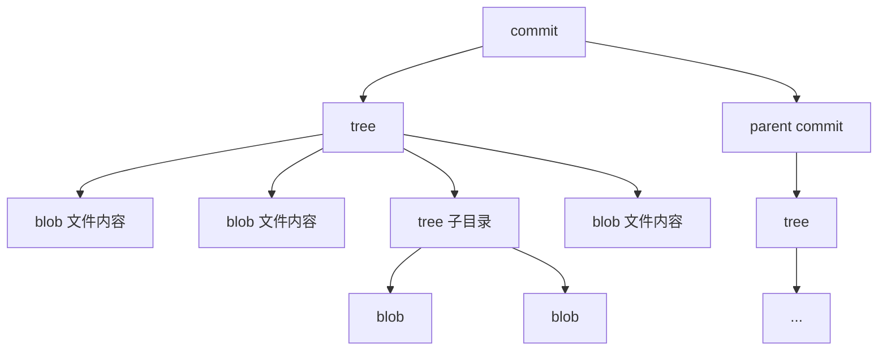
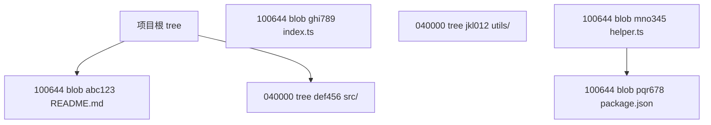
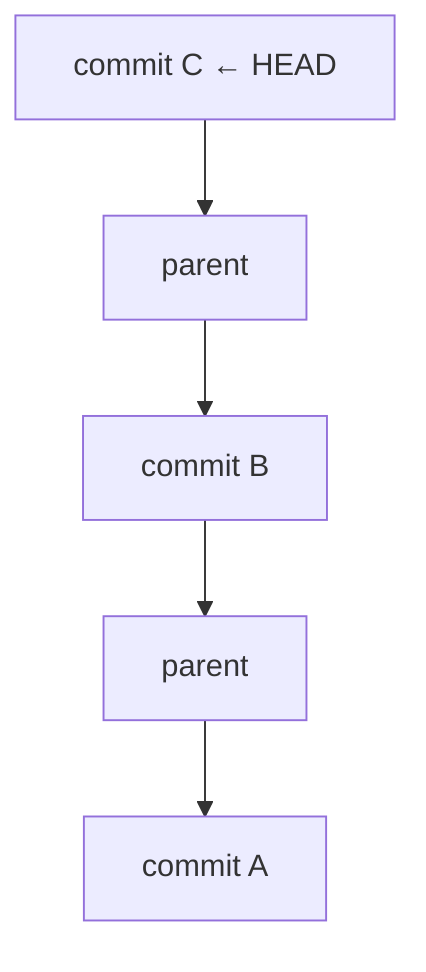
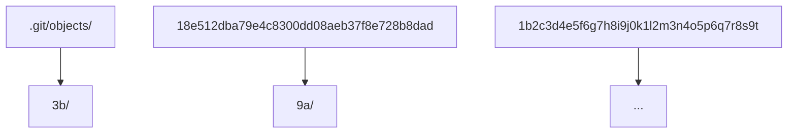

## 1. Git 对象概述

### 1.1 四种对象类型

Git 的核心是一个**内容寻址文件系统**，所有数据存储为四种对象：

| 对象类型   | 作用     | 存储内容                    |
| :--------- | :------- | :-------------------------- |
| **blob**   | 文件内容 | 纯文件数据（无文件名）      |
| **tree**   | 目录结构 | 文件名 + blob/tree 引用     |
| **commit** | 提交快照 | tree 引用 + 父提交 + 元数据 |
| **tag**    | 标签     | 指向 commit 的命名引用      |

### 1.2 对象关系图



## 2. Blob 对象

### 2.1 结构

Blob 存储文件的**纯内容**，不包含文件名和权限：

```
blob <size>\0<content>
```

```bash
# 创建 blob 对象
echo "hello world" | git hash-object -w --stdin
# 3b18e512dba79e4c8300dd08aeb37f8e728b8dad

# 查看 blob 内容
git cat-file -p 3b18e512dba79e4c8300dd08aeb37f8e728b8dad
# hello world

# 查看 blob 类型
git cat-file -t 3b18e512dba79e4c8300dd08aeb37f8e728b8dad
# blob
```

### 2.2 去重机制

相同内容的文件共享同一个 blob：

```bash
# 两个文件内容相同
echo "hello" > a.txt
echo "hello" > b.txt

# 只创建一个 blob 对象
git add a.txt b.txt
git write-tree | xargs git ls-tree -r
# 100644 blob ce013625...    a.txt
# 100644 blob ce013625...    b.txt  ← 同一个 blob
```

## 3. Tree 对象

### 3.1 结构

Tree 存储目录结构，每个条目包含：

```
<mode> <type> <hash>\t<name>
```

```bash
# 查看 tree 对象
git cat-file -p HEAD^{tree}
# 100644 blob a1b2c3d4    README.md
# 100644 blob e5f6g7h8    index.js
# 040000 tree i9j0k1l2    src/
```

### 3.2 文件模式

| 模式     | 类型   | 说明       |
| :------- | :----- | :--------- |
| `100644` | blob   | 普通文件   |
| `100755` | blob   | 可执行文件 |
| `040000` | tree   | 目录       |
| `120000` | blob   | 符号链接   |
| `160000` | commit | 子模块     |

### 3.3 Tree 的嵌套



## 4. Commit 对象

### 4.1 结构

```bash
# 查看 commit 对象
git cat-file -p HEAD
# tree 9a1b2c3d4e5f6g7h8i9j0k1l2m3n4o5p6q7r8s9t
# parent a1b2c3d4e5f6g7h8i9j0k1l2m3n4o5p6q7r8s9t0
# author Zhang San <zhang@example.com> 1718342400 +0800
# committer Zhang San <zhang@example.com> 1718342400 +0800
#
# feat: add user authentication
```

### 4.2 Commit 字段

| 字段          | 说明                                |
| :------------ | :---------------------------------- |
| **tree**      | 指向项目根目录的 tree 对象          |
| **parent**    | 指向父提交（合并提交有多个 parent） |
| **author**    | 原始作者 + 时间戳                   |
| **committer** | 实际提交者 + 时间戳                 |
| **message**   | 提交消息                            |

### 4.3 提交链



```bash
# 查看提交链
git log --oneline --graph

# 查看合并提交的两个父提交
git cat-file -p <merge-commit-hash>
# parent <first-parent>
# parent <second-parent>
```

## 5. Tag 对象

### 5.1 轻量标签

轻量标签只是一个**指向 commit 的引用**，不创建对象：

```bash
git tag v1.0.0
# .git/refs/tags/v1.0.0 → commit hash
```

### 5.2 附注标签

附注标签创建一个**独立的 tag 对象**：

```bash
git tag -a v1.0.0 -m "Release version 1.0.0"

# 查看 tag 对象
git cat-file -p v1.0.0
# object 9a1b2c3d...
# type commit
# tag v1.0.0
# tagger Zhang San <zhang@example.com> 1718342400 +0800
#
# Release version 1.0.0
```

### 5.3 标签字段

| 字段        | 说明                      |
| :---------- | :------------------------ |
| **object**  | 指向的 commit 对象        |
| **type**    | 对象类型（通常是 commit） |
| **tag**     | 标签名称                  |
| **tagger**  | 打标签的人 + 时间戳       |
| **message** | 标签消息                  |

## 6. 对象存储机制

### 6.1 松散对象

新创建的对象以**松散格式**存储：



路径 = 哈希前2位/哈希后38位

### 6.2 打包文件

`git gc` 将松散对象打包为**包文件**以节省空间：

```bash
# 手动打包
git gc

# 查看打包文件
ls .git/objects/pack/
# pack-xxxx.idx  pack-xxxx.pack
```

### 6.3 对象查询

```bash
# 查看对象类型
git cat-file -t <hash>

# 查看对象内容
git cat-file -p <hash>

# 查看对象大小
git cat-file -s <hash>

# 查看对象原始内容
git cat-file <hash> | zlib-decompress
```

## 参考文献

Git 官方文档：https://git-scm.com/doc
Pro Git 中文版：https://git-scm.com/book/zh/v2
Git 参考手册：https://git-scm.com/docs
Conventional Commits：https://www.conventionalcommits.org/zh-hans/

## 延伸阅读

Git 基础操作与分支，见 003-git 模块文档。
GitHub 协作与 PR，见 004-github 模块。
CI/CD 自动化，见 031-devops 模块。
尚硅谷 Bilibili 空间（https://space.bilibili.com/302417610 ）提供 Git 课程。

## 深度专题扩展

以下专题从不同角度深入本文主题，供有进阶需求的读者研读。每个专题独立成节，内容相互补充。

### 13.1 Git 对象模型与内部机制

git add 创建 blob 与 tree，git commit 创建 commit 对象，引用（HEAD/分支）指向 commit。
packfile 压缩对象；gc 清理悬空对象；fsck 校验完整性。
reflog 记录引用变动，是误操作恢复的最后防线。
理解对象模型后可解释 cherry-pick、rebase 与 reset 的底层行为。

### 13.2 合并策略与冲突解决

三路合并：base/ours/theirs 对比；rerere 记录重复冲突解决方案。
冲突标记：<<<<<<< 与 >>>>>>> 之间手工合并，保持语义正确后重新 add。
merge --no-ff 保留合并提交；squash 合并压缩 PR 历史。
策略选择：特性分支多 commit 用 squash/merge；持续集成用 rebase 保持线性。
