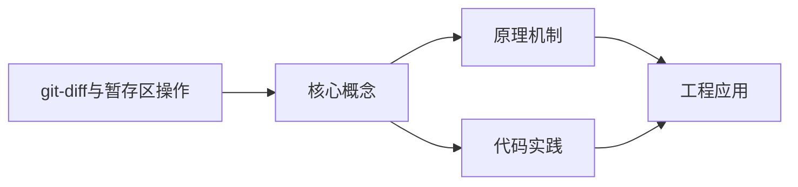
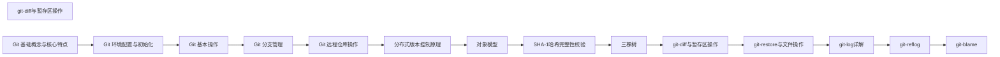

## 1. 学习目标（Bloom 分类）

本节按照布鲁姆教育目标分类学组织学习路径。本文主题为《git-diff与暂存区操作》，属于 Git 模块，读者可以根据自身阶段选择阅读深度。

记忆层面：能够准确复述本文的核心概念、术语与基本语法或操作步骤，并能够在提问或检索时快速定位对应知识点。能够说出 Git 的核心概念、常用命令与流程。

理解层面：能够用自己的语言解释核心原理与工作机制，说明概念之间的因果关系，而不是机械记忆结论。能够解释 Git 的工作原理与设计动机。

应用层面：能够在真实项目或练习场景中运用本文知识解决具体问题，写出正确且可维护的实现。能够独立完成 Git 的标准操作。

分析层面：能够拆解复杂问题，比较本文主题与相邻概念的异同，识别边界条件与例外情况。能够分析 Git 使用中的异常与边界。

评价层面：能够根据约束条件（性能、可读性、安全、成本）评价不同方案的优劣，做出有依据的技术决策。能够评价 Git 相关工具与方案。

创造层面：能够把本文知识与其他模块知识组合，设计出新的解决方案或可复用的工程模式。能够把 Git 融入团队工作流。

通过本节学习，读者应当能够把《git-diff与暂存区操作》纳入自己的知识网络，并与 Git 模块的其他主题（提交、分支、合并、远程协作）建立关联。

## 2. 历史动机与发展脉络

《git-diff与暂存区操作》是 Git 领域的重要主题。要真正理解它，需要先了解它解决的问题与演进过程。

Git 由 Linus Torvalds 于 2005 年为 Linux 内核开发，目标是替代 BitKeeper：分布式、高性能、内容寻址。
Git 的核心是对象模型：blob（内容）、tree（目录）、commit（快照 + 元数据）、tag（引用）；一切对象用 SHA-1 哈希寻址。
工作流演进：集中式工作流 -> 特性分支 -> GitFlow -> GitHub Flow / Trunk-Based；现代团队普遍采用 PR 审查 + 主干发布。

回到本文主题：git-diff与暂存区操作 的提出与成熟，正是上述技术背景下的必然产物。早期实现往往以简单可用为目标，随着工程规模扩大，社区逐渐沉淀出标准做法与最佳实践；理解这一脉络，可以帮助读者判断“为什么文档中的推荐写法是现在这个样子”，也能在遇到历史遗留代码时准确识别其设计年代与取舍。


## 3. 形式化定义与核心概念精讲

本节把《git-diff与暂存区操作》涉及的核心概念以“定义 + 讲解”的形式展开。读者应把定义当作工具，把讲解当作理解路径；两者结合才能形成可迁移的知识。

三个区域：工作区、暂存区（index）、仓库（HEAD）；git add/commit 移动状态。
分支是指针：创建分支成本极低；合并（merge 生成合并提交）与变基（rebase 重放提交）各有取舍。
远程协作：clone/fetch/pull/push；refs/remotes 跟踪远端；冲突在合并时出现并手工解决。

### 3.1 原文章节逐一精讲

原文档把主题拆分为 17 个小节，下面按顺序给出每一节的导读讲解，随后保留原文细节供精读。

#### 原文精读（完整保留）

# git-diff 与暂存区操作

> **符号约定**：`< >` 必填参数 | `[ ]` 可选参数

---

#### 1. git diff 概述

##### 1.1 diff 的三种模式

| 命令                | 比较对象           | 用途                 |
| :------------------ | :----------------- | :------------------- |
| `git diff`          | 工作区 vs 暂存区   | 查看未暂存的修改     |
| `git diff --staged` | 暂存区 vs 最新提交 | 查看已暂存的修改     |
| `git diff <commit>` | 工作区 vs 指定提交 | 查看与指定提交的差异 |

#### 2. diff 输出格式

##### 2.1 标准输出

```diff
diff --git a/src/index.js b/src/index.js
index abc1234..def5678 100644
--- a/src/index.js
+++ b/src/index.js
@@ -10,7 +10,8 @@ function process(data) {
   const result = transform(data);
   if (result.isValid) {
-    return result.value;
+    const processed = enhance(result.value);
+    return processed;
   }
   return null;
 }
```

##### 2.2 输出解读

| 部分                     | 含义                                             |
| :----------------------- | :----------------------------------------------- |
| `diff --git a/... b/...` | 比较的文件路径                                   |
| `index abc1234..def5678` | 对象哈希范围                                     |
| `100644`                 | 文件模式                                         |
| `--- a/src/index.js`     | 原文件                                           |
| `+++ b/src/index.js`     | 新文件                                           |
| `@@ -10,7 +10,8 @@`      | 变更位置（旧文件第10行起7行，新文件第10行起8行） |
| `-` 前缀                 | 删除的行                                         |
| `+` 前缀                 | 新增的行                                         |
| 空格前缀                 | 上下文行                                         |

##### 2.3 统计输出

```bash
git diff --stat
#  src/index.js    | 3 ++-
#  src/utils.js    | 5 +++--
#  2 files changed, 4 insertions(+), 4 deletions(-)

git diff --numstat
# 2       1       src/index.js
# 3       2       src/utils.js
# ↑新增行  ↑删除行
```

#### 3. 常用 diff 选项

##### 3.1 过滤选项

```bash
# 只看文件名
git diff --name-only

# 只看文件名和状态
git diff --name-status
# M  src/index.js      ← Modified
# A  src/new.js        ← Added
# D  src/old.js        ← Deleted

# 按路径过滤
git diff -- src/
git diff -- '*.js'
git diff -- ':(exclude)*.test.js'
```

##### 3.2 显示选项

```bash
# 增加上下文行数
git diff -U5              # 5行上下文（默认3行）

# 忽略空白
git diff -w               # 忽略所有空白变化
git diff --ignore-space-at-eol  # 只忽略行尾空白

# 彩色输出
git diff --color-words    # 词语级别的差异高亮
git diff --word-diff      # 词语级别的差异标记

# 函数上下文
git diff -W               # 显示完整函数
```

##### 3.3 比较选项

```bash
# 比较两个分支
git diff main..feature

# 比较两个提交
git diff abc1234..def5678

# 比较分支分叉点以来的变化
git diff main...feature   # feature 相对于 main 的变更

# 只看暂存区与 HEAD 的差异
git diff --staged
git diff --cached         # 同上
```

#### 4. 高级用法

##### 4.1 比较特定文件

```bash
# 比较特定文件在不同提交间的差异
git diff HEAD~3 -- src/index.js

# 比较两个分支的特定文件
git diff main feature -- package.json
```

##### 4.2 交互式 diff

```bash
# 逐文件查看 diff
git diff --stat | fzf | xargs -I{} git diff -- {}

# 使用 difftool
git difftool              # 使用配置的 diff 工具
git difftool --tool=vimdiff
```

##### 4.3 查看合并冲突的差异

```bash
# 查看冲突标记
git diff --check          # 标记空白错误和冲突标记

# 合并冲突的三方差异
git diff HEAD...MERGE_HEAD
```

#### 5. diff 算法

##### 5.1 算法选择

```bash
# 默认算法（Myers diff）
git diff

# 耐心算法（更好的人类可读性）
git diff --patience

# 直方图算法
git diff --histogram
```

| 算法          | 特点            | 适用场景 |
| :------------ | :-------------- | :------- |
| **Myers**     | 默认，快速      | 通用     |
| **Patience**  | 关注唯一行匹配  | 代码重构 |
| **Histogram** | Patience 的改进 | 复杂变更 |

##### 5.2 重命名检测

```bash
# 检测文件重命名
git diff -M               # 检测重命名（默认50%相似度）
git diff -M50%             # 50%相似度阈值
git diff -M90%             # 90%相似度阈值（更严格）

# 检测文件复制
git diff -C               # 检测复制
git diff -C -M             # 同时检测重命名和复制
```

#### 6. 实用别名

```bash
# .gitconfig
[alias]
    d = diff
    ds = diff --staged
    dn = diff --name-only
    dns = diff --staged --name-only
    dw = diff --color-words
    dws = diff --staged --color-words
    dst = diff --stat
    dsts = diff --staged --stat
```
#### diff 三种模式

**基本写法：工作区与暂存区差异**
`git diff`
```bash
# 查看工作区与暂存区的差异
git diff;
```

**基本写法：暂存区与最新提交差异**
`git diff --staged`
```bash
# 查看暂存区与 HEAD 的差异
git diff --staged;
```

**基本写法：工作区与指定提交差异**
`git diff <commit>`
```bash
# 查看工作区与 abc1234 提交的差异
git diff abc1234;
```

---

#### 统计输出

**基本写法：统计差异**
`git diff --stat`
```bash
# 显示每个文件的增删行数统计
git diff --stat;
```

**基本写法：数字统计**
`git diff --numstat`
```bash
# 输出格式：新增行数 删除行数 文件名
git diff --numstat;
```

---

#### 过滤选项

**基本写法：只看文件名**
`git diff --name-only`
```bash
# 列出所有变更的文件名
git diff --name-only;
```

**基本写法：只看文件名和状态**
`git diff --name-status`
```bash
# M 修改 / A 新增 / D 删除
git diff --name-status;
```

**基本写法：按目录路径过滤**
`git diff -- <路径>`
```bash
# 查看 src/ 目录的差异
git diff -- src/;
```

**基本写法：按文件类型过滤**
`git diff -- <模式>`
```bash
# 查看 JavaScript 文件的差异
git diff -- '*.js';
```

**基本写法：排除路径**
`git diff -- ':(exclude)<模式>'`
```bash
# 排除测试文件
git diff -- ':(exclude)*.test.js';
```

---

#### 显示选项

**基本写法：增加上下文行数**
`git diff -U<行数>`
```bash
# 显示 5 行上下文（默认 3 行）
git diff -U5;
```

**基本写法：忽略空白**
`git diff -w`
```bash
# 忽略所有空白变化
git diff -w;
```

**基本写法：忽略行尾空白**
`git diff --ignore-space-at-eol`
```bash
# 只忽略行尾空白
git diff --ignore-space-at-eol;
```

**基本写法：词语级别差异**
`git diff --color-words`
```bash
# 词语级别的差异高亮
git diff --color-words;
```

**基本写法：词语差异标记**
`git diff --word-diff`
```bash
# 词语级别的差异标记
git diff --word-diff;
```

**基本写法：函数上下文**
`git diff -W`
```bash
# 显示完整函数的差异
git diff -W;
```

---

#### 比较选项

**基本写法：比较两个分支**
`git diff <分支1>..<分支2>`
```bash
# 比较 main 与 feature 分支
git diff main..feature;
```

**基本写法：比较两个提交**
`git diff <提交1>..<提交2>`
```bash
# 比较 abc1234 与 def5678 提交
git diff abc1234..def5678;
```

**基本写法：比较分叉点以来的变化**
`git diff <基础分支>...<目标分支>`
```bash
# feature 相对于 main 的变更
git diff main...feature;
```

**基本写法：暂存区与 HEAD 差异**
`git diff --cached`
```bash
# 查看暂存区与 HEAD 的差异
git diff --cached;
```

---

#### 比较特定文件

**基本写法：比较特定文件在不同提交间的差异**
`git diff <提交> -- <文件>`
```bash
# 查看 src/index.js 在最近 3 次提交的差异
git diff HEAD~3 -- src/index.js;
```

**基本写法：比较两个分支的特定文件**
`git diff <分支1> <分支2> -- <文件>`
```bash
# 比较 main 和 feature 分支的 package.json
git diff main feature -- package.json;
```

---

#### 交互式 diff

**基本写法：使用 difftool**
`git difftool`
```bash
# 使用默认 diff 工具
git difftool;
```

**基本写法：指定 diff 工具**
`git difftool --tool=<工具名>`
```bash
# 使用 vimdiff 查看差异
git difftool --tool=vimdiff;
```

---

#### 查看合并冲突差异

**基本写法：检查冲突标记**
`git diff --check`
```bash
# 检查冲突标记和空白错误
git diff --check;
```

**基本写法：合并冲突的三方差异**
`git diff HEAD...MERGE_HEAD`
```bash
# 查看合并冲突的三方差异
git diff HEAD...MERGE_HEAD;
```

---

#### diff 算法

**基本写法：默认算法（Myers）**
`git diff`
```bash
# 使用默认 Myers 算法
git diff;
```

**基本写法：耐心算法**
`git diff --patience`
```bash
# 使用耐心算法，适合代码重构
git diff --patience;
```

**基本写法：直方图算法**
`git diff --histogram`
```bash
# 使用直方图算法，适合复杂变更
git diff --histogram;
```

---

#### 重命名检测

**基本写法：检测文件重命名**
`git diff -M`
```bash
# 检测重命名（默认 50% 相似度）
git diff -M;
```

**基本写法：指定相似度阈值**
`git diff -M<百分比>`
```bash
# 90% 相似度阈值（更严格）
git diff -M90%;
```

**基本写法：检测文件复制**
`git diff -C`
```bash
# 检测文件复制
git diff -C;
```

**基本写法：同时检测重命名和复制**
`git diff -C -M`
```bash
# 同时检测重命名和复制
git diff -C -M;
```

---

#### 实用别名

**基本写法：配置 diff 别名**
`git config --global alias.<别名> "<命令>"`
```bash
# 配置常用 diff 别名
git config --global alias.d "diff";
```

**基本写法：配置暂存区差异别名**
`git config --global alias.<别名> "<命令>"`
```bash
# 配置暂存区差异别名
git config --global alias.ds "diff --staged";
```

**基本写法：配置文件名差异别名**
`git config --global alias.<别名> "<命令>"`
```bash
# 配置文件名差异别名
git config --global alias.dn "diff --name-only";
```

**基本写法：配置词语差异别名**
`git config --global alias.<别名> "<命令>"`
```bash
# 配置词语差异别名
git config --global alias.dw "diff --color-words";
```

**基本写法：配置统计差异别名**
`git config --global alias.<别名> "<命令>"`
```bash
# 配置统计差异别名
git config --global alias.dst "diff --stat";
```


### 3.2 概念关系图

下面用 Mermaid 图表达本文核心概念之间的关系，帮助读者建立整体图景：



图中展示的是本文知识的结构化关系：核心概念是入口，原理机制解释“为什么”，代码实践演示“怎么做”，工程应用回答“何时用”。读者学习时可以把每个小节的内容挂接到对应节点上。

## 4. 理论推导与原理解析

本节深入《git-diff与暂存区操作》背后的原理。理论部分不求面面俱到，而是聚焦“能解释现象、能指导实践”的关键推导。

三个区域：工作区、暂存区（index）、仓库（HEAD）；git add/commit 移动状态。
分支是指针：创建分支成本极低；合并（merge 生成合并提交）与变基（rebase 重放提交）各有取舍。
远程协作：clone/fetch/pull/push；refs/remotes 跟踪远端；冲突在合并时出现并手工解决。
撤销模型：checkout/restore 改工作区，reset 移 HEAD，revert 生成反向提交；理解三者避免误操作。

需要强调的是，理论推导与工程实践之间存在翻译层：理论给出的是理想化模型与边界条件，工程代码则必须处理真实环境中的例外。读者在学习时应先掌握理论的“标准情形”，再通过陷阱章节了解“非标准情形”。

## 5. 代码示例与逐行讲解

本节把原文中的代码示例系统整理，并为每个示例补充用途说明与讲解。读者不应只浏览代码，而应逐段对照讲解理解设计意图。

### 5.1 示例：2.1 标准输出

该示例来自原文《2.1 标准输出》小节，用于演示git-diff与暂存区操作相关操作。阅读时请先看代码结构，再看其后的讲解。

```diff
diff --git a/src/index.js b/src/index.js
index abc1234..def5678 100644
--- a/src/index.js
+++ b/src/index.js
@@ -10,7 +10,8 @@ function process(data) {
   const result = transform(data);
   if (result.isValid) {
-    return result.value;
+    const processed = enhance(result.value);
+    return processed;
   }
   return null;
 }
```

讲解：这段代码演示了本节核心知识点。代码中的关键操作可以归纳为三步：准备（定义或初始化）、执行（核心逻辑）、收尾（释放资源或返回结果）。实际项目中，这三步往往被封装为函数或类，以提升复用性与可测试性。

关键点分析：

该示例共 13 行有效代码，包含 3 类关键结构（function、if、return）。其中：

- 入口与初始化部分负责建立上下文，对应实际项目中的启动或装配逻辑；
- 核心逻辑部分体现本文主题的主要操作，是阅读时最需要对照讲解理解的部分；
- 输出或返回部分把结果交给调用方，注意其类型与边界条件。

进阶思考路径：先尝试修改参数观察行为变化，再把示例中的模式迁移到自己的项目中；每次修改都记录预期与实测差异，这是把示例转化为能力的最快方式。

### 5.2 示例：2.3 统计输出

该示例来自原文《2.3 统计输出》小节，用于演示git-diff与暂存区操作相关操作。阅读时请先看代码结构，再看其后的讲解。

```bash
git diff --stat
#  src/index.js    | 3 ++-
#  src/utils.js    | 5 +++--
#  2 files changed, 4 insertions(+), 4 deletions(-)

git diff --numstat
# 2       1       src/index.js
# 3       2       src/utils.js
# ↑新增行  ↑删除行
```

讲解：这段代码演示了本节核心知识点。代码中的关键操作可以归纳为三步：准备（定义或初始化）、执行（核心逻辑）、收尾（释放资源或返回结果）。实际项目中，这三步往往被封装为函数或类，以提升复用性与可测试性。

关键点分析：

该示例共 8 行有效代码，结构以数据或配置为主。阅读时应关注：数据字段的含义、配置项的作用，以及它们与运行行为的对应关系。

进阶思考路径：先尝试修改参数观察行为变化，再把示例中的模式迁移到自己的项目中；每次修改都记录预期与实测差异，这是把示例转化为能力的最快方式。

### 5.3 示例：3.1 过滤选项

该示例来自原文《3.1 过滤选项》小节，用于演示git-diff与暂存区操作相关操作。阅读时请先看代码结构，再看其后的讲解。

```bash
# 只看文件名
git diff --name-only

# 只看文件名和状态
git diff --name-status
# M  src/index.js      ← Modified
# A  src/new.js        ← Added
# D  src/old.js        ← Deleted

# 按路径过滤
git diff -- src/
git diff -- '*.js'
git diff -- ':(exclude)*.test.js'
```

讲解：这段代码演示了本节核心知识点。代码中的关键操作可以归纳为三步：准备（定义或初始化）、执行（核心逻辑）、收尾（释放资源或返回结果）。实际项目中，这三步往往被封装为函数或类，以提升复用性与可测试性。

关键点分析：

该示例共 11 行有效代码，结构以数据或配置为主。阅读时应关注：数据字段的含义、配置项的作用，以及它们与运行行为的对应关系。

进阶思考路径：先尝试修改参数观察行为变化，再把示例中的模式迁移到自己的项目中；每次修改都记录预期与实测差异，这是把示例转化为能力的最快方式。

### 5.4 示例：3.2 显示选项

该示例来自原文《3.2 显示选项》小节，用于演示git-diff与暂存区操作相关操作。阅读时请先看代码结构，再看其后的讲解。

```bash
# 增加上下文行数
git diff -U5              # 5行上下文（默认3行）

# 忽略空白
git diff -w               # 忽略所有空白变化
git diff --ignore-space-at-eol  # 只忽略行尾空白

# 彩色输出
git diff --color-words    # 词语级别的差异高亮
git diff --word-diff      # 词语级别的差异标记

# 函数上下文
git diff -W               # 显示完整函数
```

讲解：这段代码演示了本节核心知识点。代码中的关键操作可以归纳为三步：准备（定义或初始化）、执行（核心逻辑）、收尾（释放资源或返回结果）。实际项目中，这三步往往被封装为函数或类，以提升复用性与可测试性。

关键点分析：

该示例共 10 行有效代码，结构以数据或配置为主。阅读时应关注：数据字段的含义、配置项的作用，以及它们与运行行为的对应关系。

进阶思考路径：先尝试修改参数观察行为变化，再把示例中的模式迁移到自己的项目中；每次修改都记录预期与实测差异，这是把示例转化为能力的最快方式。

### 5.5 示例：3.3 比较选项

该示例来自原文《3.3 比较选项》小节，用于演示git-diff与暂存区操作相关操作。阅读时请先看代码结构，再看其后的讲解。

```bash
# 比较两个分支
git diff main..feature

# 比较两个提交
git diff abc1234..def5678

# 比较分支分叉点以来的变化
git diff main...feature   # feature 相对于 main 的变更

# 只看暂存区与 HEAD 的差异
git diff --staged
git diff --cached         # 同上
```

讲解：这段代码演示了本节核心知识点。代码中的关键操作可以归纳为三步：准备（定义或初始化）、执行（核心逻辑）、收尾（释放资源或返回结果）。实际项目中，这三步往往被封装为函数或类，以提升复用性与可测试性。

关键点分析：

该示例共 9 行有效代码，结构以数据或配置为主。阅读时应关注：数据字段的含义、配置项的作用，以及它们与运行行为的对应关系。

进阶思考路径：先尝试修改参数观察行为变化，再把示例中的模式迁移到自己的项目中；每次修改都记录预期与实测差异，这是把示例转化为能力的最快方式。

### 5.6 示例：4.1 比较特定文件

该示例来自原文《4.1 比较特定文件》小节，用于演示git-diff与暂存区操作相关操作。阅读时请先看代码结构，再看其后的讲解。

```bash
# 比较特定文件在不同提交间的差异
git diff HEAD~3 -- src/index.js

# 比较两个分支的特定文件
git diff main feature -- package.json
```

讲解：这段代码演示了本节核心知识点。代码中的关键操作可以归纳为三步：准备（定义或初始化）、执行（核心逻辑）、收尾（释放资源或返回结果）。实际项目中，这三步往往被封装为函数或类，以提升复用性与可测试性。

关键点分析：

该示例共 4 行有效代码，结构以数据或配置为主。阅读时应关注：数据字段的含义、配置项的作用，以及它们与运行行为的对应关系。

进阶思考路径：先尝试修改参数观察行为变化，再把示例中的模式迁移到自己的项目中；每次修改都记录预期与实测差异，这是把示例转化为能力的最快方式。

### 5.7 示例：4.2 交互式 diff

该示例来自原文《4.2 交互式 diff》小节，用于演示git-diff与暂存区操作相关操作。阅读时请先看代码结构，再看其后的讲解。

```bash
# 逐文件查看 diff
git diff --stat | fzf | xargs -I{} git diff -- {}

# 使用 difftool
git difftool              # 使用配置的 diff 工具
git difftool --tool=vimdiff
```

讲解：这段代码演示了本节核心知识点。代码中的关键操作可以归纳为三步：准备（定义或初始化）、执行（核心逻辑）、收尾（释放资源或返回结果）。实际项目中，这三步往往被封装为函数或类，以提升复用性与可测试性。

关键点分析：

该示例共 5 行有效代码，结构以数据或配置为主。阅读时应关注：数据字段的含义、配置项的作用，以及它们与运行行为的对应关系。

进阶思考路径：先尝试修改参数观察行为变化，再把示例中的模式迁移到自己的项目中；每次修改都记录预期与实测差异，这是把示例转化为能力的最快方式。

### 5.8 示例：4.3 查看合并冲突的差异

该示例来自原文《4.3 查看合并冲突的差异》小节，用于演示git-diff与暂存区操作相关操作。阅读时请先看代码结构，再看其后的讲解。

```bash
# 查看冲突标记
git diff --check          # 标记空白错误和冲突标记

# 合并冲突的三方差异
git diff HEAD...MERGE_HEAD
```

讲解：这段代码演示了本节核心知识点。代码中的关键操作可以归纳为三步：准备（定义或初始化）、执行（核心逻辑）、收尾（释放资源或返回结果）。实际项目中，这三步往往被封装为函数或类，以提升复用性与可测试性。

关键点分析：

该示例共 4 行有效代码，结构以数据或配置为主。阅读时应关注：数据字段的含义、配置项的作用，以及它们与运行行为的对应关系。

进阶思考路径：先尝试修改参数观察行为变化，再把示例中的模式迁移到自己的项目中；每次修改都记录预期与实测差异，这是把示例转化为能力的最快方式。

### 5.9 示例：5.1 算法选择

该示例来自原文《5.1 算法选择》小节，用于演示git-diff与暂存区操作相关操作。阅读时请先看代码结构，再看其后的讲解。

```bash
# 默认算法（Myers diff）
git diff

# 耐心算法（更好的人类可读性）
git diff --patience

# 直方图算法
git diff --histogram
```

讲解：这段代码演示了本节核心知识点。代码中的关键操作可以归纳为三步：准备（定义或初始化）、执行（核心逻辑）、收尾（释放资源或返回结果）。实际项目中，这三步往往被封装为函数或类，以提升复用性与可测试性。

关键点分析：

该示例共 6 行有效代码，结构以数据或配置为主。阅读时应关注：数据字段的含义、配置项的作用，以及它们与运行行为的对应关系。

进阶思考路径：先尝试修改参数观察行为变化，再把示例中的模式迁移到自己的项目中；每次修改都记录预期与实测差异，这是把示例转化为能力的最快方式。

### 5.10 示例：5.2 重命名检测

该示例来自原文《5.2 重命名检测》小节，用于演示git-diff与暂存区操作相关操作。阅读时请先看代码结构，再看其后的讲解。

```bash
# 检测文件重命名
git diff -M               # 检测重命名（默认50%相似度）
git diff -M50%             # 50%相似度阈值
git diff -M90%             # 90%相似度阈值（更严格）

# 检测文件复制
git diff -C               # 检测复制
git diff -C -M             # 同时检测重命名和复制
```

讲解：这段代码演示了本节核心知识点。代码中的关键操作可以归纳为三步：准备（定义或初始化）、执行（核心逻辑）、收尾（释放资源或返回结果）。实际项目中，这三步往往被封装为函数或类，以提升复用性与可测试性。

关键点分析：

该示例共 7 行有效代码，结构以数据或配置为主。阅读时应关注：数据字段的含义、配置项的作用，以及它们与运行行为的对应关系。

进阶思考路径：先尝试修改参数观察行为变化，再把示例中的模式迁移到自己的项目中；每次修改都记录预期与实测差异，这是把示例转化为能力的最快方式。

### 5.11 示例：6. 实用别名

该示例来自原文《6. 实用别名》小节，用于演示git-diff与暂存区操作相关操作。阅读时请先看代码结构，再看其后的讲解。

```bash
# .gitconfig
[alias]
    d = diff
    ds = diff --staged
    dn = diff --name-only
    dns = diff --staged --name-only
    dw = diff --color-words
    dws = diff --staged --color-words
    dst = diff --stat
    dsts = diff --staged --stat
```

讲解：这段代码演示了本节核心知识点。代码中的关键操作可以归纳为三步：准备（定义或初始化）、执行（核心逻辑）、收尾（释放资源或返回结果）。实际项目中，这三步往往被封装为函数或类，以提升复用性与可测试性。

关键点分析：

该示例共 10 行有效代码，结构以数据或配置为主。阅读时应关注：数据字段的含义、配置项的作用，以及它们与运行行为的对应关系。

进阶思考路径：先尝试修改参数观察行为变化，再把示例中的模式迁移到自己的项目中；每次修改都记录预期与实测差异，这是把示例转化为能力的最快方式。

### 5.12 示例：diff 三种模式

该示例来自原文《diff 三种模式》小节，用于演示git-diff与暂存区操作相关操作。阅读时请先看代码结构，再看其后的讲解。

```bash
# 查看工作区与暂存区的差异
git diff;
```

讲解：这段代码演示了本节核心知识点。代码中的关键操作可以归纳为三步：准备（定义或初始化）、执行（核心逻辑）、收尾（释放资源或返回结果）。实际项目中，这三步往往被封装为函数或类，以提升复用性与可测试性。

关键点分析：

该示例共 2 行有效代码，结构以数据或配置为主。阅读时应关注：数据字段的含义、配置项的作用，以及它们与运行行为的对应关系。

进阶思考路径：先尝试修改参数观察行为变化，再把示例中的模式迁移到自己的项目中；每次修改都记录预期与实测差异，这是把示例转化为能力的最快方式。

### 5.13 示例：diff 三种模式

该示例来自原文《diff 三种模式》小节，用于演示git-diff与暂存区操作相关操作。阅读时请先看代码结构，再看其后的讲解。

```bash
# 查看暂存区与 HEAD 的差异
git diff --staged;
```

讲解：这段代码演示了本节核心知识点。代码中的关键操作可以归纳为三步：准备（定义或初始化）、执行（核心逻辑）、收尾（释放资源或返回结果）。实际项目中，这三步往往被封装为函数或类，以提升复用性与可测试性。

关键点分析：

该示例共 2 行有效代码，结构以数据或配置为主。阅读时应关注：数据字段的含义、配置项的作用，以及它们与运行行为的对应关系。

进阶思考路径：先尝试修改参数观察行为变化，再把示例中的模式迁移到自己的项目中；每次修改都记录预期与实测差异，这是把示例转化为能力的最快方式。

### 5.14 示例：diff 三种模式

该示例来自原文《diff 三种模式》小节，用于演示git-diff与暂存区操作相关操作。阅读时请先看代码结构，再看其后的讲解。

```bash
# 查看工作区与 abc1234 提交的差异
git diff abc1234;
```

讲解：这段代码演示了本节核心知识点。代码中的关键操作可以归纳为三步：准备（定义或初始化）、执行（核心逻辑）、收尾（释放资源或返回结果）。实际项目中，这三步往往被封装为函数或类，以提升复用性与可测试性。

关键点分析：

该示例共 2 行有效代码，结构以数据或配置为主。阅读时应关注：数据字段的含义、配置项的作用，以及它们与运行行为的对应关系。

进阶思考路径：先尝试修改参数观察行为变化，再把示例中的模式迁移到自己的项目中；每次修改都记录预期与实测差异，这是把示例转化为能力的最快方式。

### 5.15 示例：统计输出

该示例来自原文《统计输出》小节，用于演示git-diff与暂存区操作相关操作。阅读时请先看代码结构，再看其后的讲解。

```bash
# 显示每个文件的增删行数统计
git diff --stat;
```

讲解：这段代码演示了本节核心知识点。代码中的关键操作可以归纳为三步：准备（定义或初始化）、执行（核心逻辑）、收尾（释放资源或返回结果）。实际项目中，这三步往往被封装为函数或类，以提升复用性与可测试性。

关键点分析：

该示例共 2 行有效代码，结构以数据或配置为主。阅读时应关注：数据字段的含义、配置项的作用，以及它们与运行行为的对应关系。

进阶思考路径：先尝试修改参数观察行为变化，再把示例中的模式迁移到自己的项目中；每次修改都记录预期与实测差异，这是把示例转化为能力的最快方式。

### 5.16 示例：统计输出

该示例来自原文《统计输出》小节，用于演示git-diff与暂存区操作相关操作。阅读时请先看代码结构，再看其后的讲解。

```bash
# 输出格式：新增行数 删除行数 文件名
git diff --numstat;
```

讲解：这段代码演示了本节核心知识点。代码中的关键操作可以归纳为三步：准备（定义或初始化）、执行（核心逻辑）、收尾（释放资源或返回结果）。实际项目中，这三步往往被封装为函数或类，以提升复用性与可测试性。

关键点分析：

该示例共 2 行有效代码，结构以数据或配置为主。阅读时应关注：数据字段的含义、配置项的作用，以及它们与运行行为的对应关系。

进阶思考路径：先尝试修改参数观察行为变化，再把示例中的模式迁移到自己的项目中；每次修改都记录预期与实测差异，这是把示例转化为能力的最快方式。

### 5.17 示例：过滤选项

该示例来自原文《过滤选项》小节，用于演示git-diff与暂存区操作相关操作。阅读时请先看代码结构，再看其后的讲解。

```bash
# 列出所有变更的文件名
git diff --name-only;
```

讲解：这段代码演示了本节核心知识点。代码中的关键操作可以归纳为三步：准备（定义或初始化）、执行（核心逻辑）、收尾（释放资源或返回结果）。实际项目中，这三步往往被封装为函数或类，以提升复用性与可测试性。

关键点分析：

该示例共 2 行有效代码，结构以数据或配置为主。阅读时应关注：数据字段的含义、配置项的作用，以及它们与运行行为的对应关系。

进阶思考路径：先尝试修改参数观察行为变化，再把示例中的模式迁移到自己的项目中；每次修改都记录预期与实测差异，这是把示例转化为能力的最快方式。

### 5.18 示例：过滤选项

该示例来自原文《过滤选项》小节，用于演示git-diff与暂存区操作相关操作。阅读时请先看代码结构，再看其后的讲解。

```bash
# M 修改 / A 新增 / D 删除
git diff --name-status;
```

讲解：这段代码演示了本节核心知识点。代码中的关键操作可以归纳为三步：准备（定义或初始化）、执行（核心逻辑）、收尾（释放资源或返回结果）。实际项目中，这三步往往被封装为函数或类，以提升复用性与可测试性。

关键点分析：

该示例共 2 行有效代码，结构以数据或配置为主。阅读时应关注：数据字段的含义、配置项的作用，以及它们与运行行为的对应关系。

进阶思考路径：先尝试修改参数观察行为变化，再把示例中的模式迁移到自己的项目中；每次修改都记录预期与实测差异，这是把示例转化为能力的最快方式。

### 5.19 示例：过滤选项

该示例来自原文《过滤选项》小节，用于演示git-diff与暂存区操作相关操作。阅读时请先看代码结构，再看其后的讲解。

```bash
# 查看 src/ 目录的差异
git diff -- src/;
```

讲解：这段代码演示了本节核心知识点。代码中的关键操作可以归纳为三步：准备（定义或初始化）、执行（核心逻辑）、收尾（释放资源或返回结果）。实际项目中，这三步往往被封装为函数或类，以提升复用性与可测试性。

关键点分析：

该示例共 2 行有效代码，结构以数据或配置为主。阅读时应关注：数据字段的含义、配置项的作用，以及它们与运行行为的对应关系。

进阶思考路径：先尝试修改参数观察行为变化，再把示例中的模式迁移到自己的项目中；每次修改都记录预期与实测差异，这是把示例转化为能力的最快方式。

### 5.20 示例：过滤选项

该示例来自原文《过滤选项》小节，用于演示git-diff与暂存区操作相关操作。阅读时请先看代码结构，再看其后的讲解。

```bash
# 查看 JavaScript 文件的差异
git diff -- '*.js';
```

讲解：这段代码演示了本节核心知识点。代码中的关键操作可以归纳为三步：准备（定义或初始化）、执行（核心逻辑）、收尾（释放资源或返回结果）。实际项目中，这三步往往被封装为函数或类，以提升复用性与可测试性。

关键点分析：

该示例共 2 行有效代码，结构以数据或配置为主。阅读时应关注：数据字段的含义、配置项的作用，以及它们与运行行为的对应关系。

进阶思考路径：先尝试修改参数观察行为变化，再把示例中的模式迁移到自己的项目中；每次修改都记录预期与实测差异，这是把示例转化为能力的最快方式。

### 5.21 示例：过滤选项

该示例来自原文《过滤选项》小节，用于演示git-diff与暂存区操作相关操作。阅读时请先看代码结构，再看其后的讲解。

```bash
# 排除测试文件
git diff -- ':(exclude)*.test.js';
```

讲解：这段代码演示了本节核心知识点。代码中的关键操作可以归纳为三步：准备（定义或初始化）、执行（核心逻辑）、收尾（释放资源或返回结果）。实际项目中，这三步往往被封装为函数或类，以提升复用性与可测试性。

关键点分析：

该示例共 2 行有效代码，结构以数据或配置为主。阅读时应关注：数据字段的含义、配置项的作用，以及它们与运行行为的对应关系。

进阶思考路径：先尝试修改参数观察行为变化，再把示例中的模式迁移到自己的项目中；每次修改都记录预期与实测差异，这是把示例转化为能力的最快方式。

### 5.22 示例：显示选项

该示例来自原文《显示选项》小节，用于演示git-diff与暂存区操作相关操作。阅读时请先看代码结构，再看其后的讲解。

```bash
# 显示 5 行上下文（默认 3 行）
git diff -U5;
```

讲解：这段代码演示了本节核心知识点。代码中的关键操作可以归纳为三步：准备（定义或初始化）、执行（核心逻辑）、收尾（释放资源或返回结果）。实际项目中，这三步往往被封装为函数或类，以提升复用性与可测试性。

关键点分析：

该示例共 2 行有效代码，结构以数据或配置为主。阅读时应关注：数据字段的含义、配置项的作用，以及它们与运行行为的对应关系。

进阶思考路径：先尝试修改参数观察行为变化，再把示例中的模式迁移到自己的项目中；每次修改都记录预期与实测差异，这是把示例转化为能力的最快方式。

### 5.23 示例：显示选项

该示例来自原文《显示选项》小节，用于演示git-diff与暂存区操作相关操作。阅读时请先看代码结构，再看其后的讲解。

```bash
# 忽略所有空白变化
git diff -w;
```

讲解：这段代码演示了本节核心知识点。代码中的关键操作可以归纳为三步：准备（定义或初始化）、执行（核心逻辑）、收尾（释放资源或返回结果）。实际项目中，这三步往往被封装为函数或类，以提升复用性与可测试性。

关键点分析：

该示例共 2 行有效代码，结构以数据或配置为主。阅读时应关注：数据字段的含义、配置项的作用，以及它们与运行行为的对应关系。

进阶思考路径：先尝试修改参数观察行为变化，再把示例中的模式迁移到自己的项目中；每次修改都记录预期与实测差异，这是把示例转化为能力的最快方式。

### 5.24 示例：显示选项

该示例来自原文《显示选项》小节，用于演示git-diff与暂存区操作相关操作。阅读时请先看代码结构，再看其后的讲解。

```bash
# 只忽略行尾空白
git diff --ignore-space-at-eol;
```

讲解：这段代码演示了本节核心知识点。代码中的关键操作可以归纳为三步：准备（定义或初始化）、执行（核心逻辑）、收尾（释放资源或返回结果）。实际项目中，这三步往往被封装为函数或类，以提升复用性与可测试性。

关键点分析：

该示例共 2 行有效代码，结构以数据或配置为主。阅读时应关注：数据字段的含义、配置项的作用，以及它们与运行行为的对应关系。

进阶思考路径：先尝试修改参数观察行为变化，再把示例中的模式迁移到自己的项目中；每次修改都记录预期与实测差异，这是把示例转化为能力的最快方式。

### 5.25 示例：显示选项

该示例来自原文《显示选项》小节，用于演示git-diff与暂存区操作相关操作。阅读时请先看代码结构，再看其后的讲解。

```bash
# 词语级别的差异高亮
git diff --color-words;
```

讲解：这段代码演示了本节核心知识点。代码中的关键操作可以归纳为三步：准备（定义或初始化）、执行（核心逻辑）、收尾（释放资源或返回结果）。实际项目中，这三步往往被封装为函数或类，以提升复用性与可测试性。

关键点分析：

该示例共 2 行有效代码，结构以数据或配置为主。阅读时应关注：数据字段的含义、配置项的作用，以及它们与运行行为的对应关系。

进阶思考路径：先尝试修改参数观察行为变化，再把示例中的模式迁移到自己的项目中；每次修改都记录预期与实测差异，这是把示例转化为能力的最快方式。

### 5.26 示例：显示选项

该示例来自原文《显示选项》小节，用于演示git-diff与暂存区操作相关操作。阅读时请先看代码结构，再看其后的讲解。

```bash
# 词语级别的差异标记
git diff --word-diff;
```

讲解：这段代码演示了本节核心知识点。代码中的关键操作可以归纳为三步：准备（定义或初始化）、执行（核心逻辑）、收尾（释放资源或返回结果）。实际项目中，这三步往往被封装为函数或类，以提升复用性与可测试性。

关键点分析：

该示例共 2 行有效代码，结构以数据或配置为主。阅读时应关注：数据字段的含义、配置项的作用，以及它们与运行行为的对应关系。

进阶思考路径：先尝试修改参数观察行为变化，再把示例中的模式迁移到自己的项目中；每次修改都记录预期与实测差异，这是把示例转化为能力的最快方式。

### 5.27 示例：显示选项

该示例来自原文《显示选项》小节，用于演示git-diff与暂存区操作相关操作。阅读时请先看代码结构，再看其后的讲解。

```bash
# 显示完整函数的差异
git diff -W;
```

讲解：这段代码演示了本节核心知识点。代码中的关键操作可以归纳为三步：准备（定义或初始化）、执行（核心逻辑）、收尾（释放资源或返回结果）。实际项目中，这三步往往被封装为函数或类，以提升复用性与可测试性。

关键点分析：

该示例共 2 行有效代码，结构以数据或配置为主。阅读时应关注：数据字段的含义、配置项的作用，以及它们与运行行为的对应关系。

进阶思考路径：先尝试修改参数观察行为变化，再把示例中的模式迁移到自己的项目中；每次修改都记录预期与实测差异，这是把示例转化为能力的最快方式。

### 5.28 示例：比较选项

该示例来自原文《比较选项》小节，用于演示git-diff与暂存区操作相关操作。阅读时请先看代码结构，再看其后的讲解。

```bash
# 比较 main 与 feature 分支
git diff main..feature;
```

讲解：这段代码演示了本节核心知识点。代码中的关键操作可以归纳为三步：准备（定义或初始化）、执行（核心逻辑）、收尾（释放资源或返回结果）。实际项目中，这三步往往被封装为函数或类，以提升复用性与可测试性。

关键点分析：

该示例共 2 行有效代码，结构以数据或配置为主。阅读时应关注：数据字段的含义、配置项的作用，以及它们与运行行为的对应关系。

进阶思考路径：先尝试修改参数观察行为变化，再把示例中的模式迁移到自己的项目中；每次修改都记录预期与实测差异，这是把示例转化为能力的最快方式。

### 5.29 示例：比较选项

该示例来自原文《比较选项》小节，用于演示git-diff与暂存区操作相关操作。阅读时请先看代码结构，再看其后的讲解。

```bash
# 比较 abc1234 与 def5678 提交
git diff abc1234..def5678;
```

讲解：这段代码演示了本节核心知识点。代码中的关键操作可以归纳为三步：准备（定义或初始化）、执行（核心逻辑）、收尾（释放资源或返回结果）。实际项目中，这三步往往被封装为函数或类，以提升复用性与可测试性。

关键点分析：

该示例共 2 行有效代码，结构以数据或配置为主。阅读时应关注：数据字段的含义、配置项的作用，以及它们与运行行为的对应关系。

进阶思考路径：先尝试修改参数观察行为变化，再把示例中的模式迁移到自己的项目中；每次修改都记录预期与实测差异，这是把示例转化为能力的最快方式。

### 5.30 示例：比较选项

该示例来自原文《比较选项》小节，用于演示git-diff与暂存区操作相关操作。阅读时请先看代码结构，再看其后的讲解。

```bash
# feature 相对于 main 的变更
git diff main...feature;
```

讲解：这段代码演示了本节核心知识点。代码中的关键操作可以归纳为三步：准备（定义或初始化）、执行（核心逻辑）、收尾（释放资源或返回结果）。实际项目中，这三步往往被封装为函数或类，以提升复用性与可测试性。

关键点分析：

该示例共 2 行有效代码，结构以数据或配置为主。阅读时应关注：数据字段的含义、配置项的作用，以及它们与运行行为的对应关系。

进阶思考路径：先尝试修改参数观察行为变化，再把示例中的模式迁移到自己的项目中；每次修改都记录预期与实测差异，这是把示例转化为能力的最快方式。

### 5.31 示例：比较选项

该示例来自原文《比较选项》小节，用于演示git-diff与暂存区操作相关操作。阅读时请先看代码结构，再看其后的讲解。

```bash
# 查看暂存区与 HEAD 的差异
git diff --cached;
```

讲解：这段代码演示了本节核心知识点。代码中的关键操作可以归纳为三步：准备（定义或初始化）、执行（核心逻辑）、收尾（释放资源或返回结果）。实际项目中，这三步往往被封装为函数或类，以提升复用性与可测试性。

关键点分析：

该示例共 2 行有效代码，结构以数据或配置为主。阅读时应关注：数据字段的含义、配置项的作用，以及它们与运行行为的对应关系。

进阶思考路径：先尝试修改参数观察行为变化，再把示例中的模式迁移到自己的项目中；每次修改都记录预期与实测差异，这是把示例转化为能力的最快方式。

### 5.32 示例：比较特定文件

该示例来自原文《比较特定文件》小节，用于演示git-diff与暂存区操作相关操作。阅读时请先看代码结构，再看其后的讲解。

```bash
# 查看 src/index.js 在最近 3 次提交的差异
git diff HEAD~3 -- src/index.js;
```

讲解：这段代码演示了本节核心知识点。代码中的关键操作可以归纳为三步：准备（定义或初始化）、执行（核心逻辑）、收尾（释放资源或返回结果）。实际项目中，这三步往往被封装为函数或类，以提升复用性与可测试性。

关键点分析：

该示例共 2 行有效代码，结构以数据或配置为主。阅读时应关注：数据字段的含义、配置项的作用，以及它们与运行行为的对应关系。

进阶思考路径：先尝试修改参数观察行为变化，再把示例中的模式迁移到自己的项目中；每次修改都记录预期与实测差异，这是把示例转化为能力的最快方式。

### 5.33 示例：比较特定文件

该示例来自原文《比较特定文件》小节，用于演示git-diff与暂存区操作相关操作。阅读时请先看代码结构，再看其后的讲解。

```bash
# 比较 main 和 feature 分支的 package.json
git diff main feature -- package.json;
```

讲解：这段代码演示了本节核心知识点。代码中的关键操作可以归纳为三步：准备（定义或初始化）、执行（核心逻辑）、收尾（释放资源或返回结果）。实际项目中，这三步往往被封装为函数或类，以提升复用性与可测试性。

关键点分析：

该示例共 2 行有效代码，结构以数据或配置为主。阅读时应关注：数据字段的含义、配置项的作用，以及它们与运行行为的对应关系。

进阶思考路径：先尝试修改参数观察行为变化，再把示例中的模式迁移到自己的项目中；每次修改都记录预期与实测差异，这是把示例转化为能力的最快方式。

### 5.34 示例：交互式 diff

该示例来自原文《交互式 diff》小节，用于演示git-diff与暂存区操作相关操作。阅读时请先看代码结构，再看其后的讲解。

```bash
# 使用默认 diff 工具
git difftool;
```

讲解：这段代码演示了本节核心知识点。代码中的关键操作可以归纳为三步：准备（定义或初始化）、执行（核心逻辑）、收尾（释放资源或返回结果）。实际项目中，这三步往往被封装为函数或类，以提升复用性与可测试性。

关键点分析：

该示例共 2 行有效代码，结构以数据或配置为主。阅读时应关注：数据字段的含义、配置项的作用，以及它们与运行行为的对应关系。

进阶思考路径：先尝试修改参数观察行为变化，再把示例中的模式迁移到自己的项目中；每次修改都记录预期与实测差异，这是把示例转化为能力的最快方式。

### 5.35 示例：交互式 diff

该示例来自原文《交互式 diff》小节，用于演示git-diff与暂存区操作相关操作。阅读时请先看代码结构，再看其后的讲解。

```bash
# 使用 vimdiff 查看差异
git difftool --tool=vimdiff;
```

讲解：这段代码演示了本节核心知识点。代码中的关键操作可以归纳为三步：准备（定义或初始化）、执行（核心逻辑）、收尾（释放资源或返回结果）。实际项目中，这三步往往被封装为函数或类，以提升复用性与可测试性。

关键点分析：

该示例共 2 行有效代码，结构以数据或配置为主。阅读时应关注：数据字段的含义、配置项的作用，以及它们与运行行为的对应关系。

进阶思考路径：先尝试修改参数观察行为变化，再把示例中的模式迁移到自己的项目中；每次修改都记录预期与实测差异，这是把示例转化为能力的最快方式。

### 5.36 示例：查看合并冲突差异

该示例来自原文《查看合并冲突差异》小节，用于演示git-diff与暂存区操作相关操作。阅读时请先看代码结构，再看其后的讲解。

```bash
# 检查冲突标记和空白错误
git diff --check;
```

讲解：这段代码演示了本节核心知识点。代码中的关键操作可以归纳为三步：准备（定义或初始化）、执行（核心逻辑）、收尾（释放资源或返回结果）。实际项目中，这三步往往被封装为函数或类，以提升复用性与可测试性。

关键点分析：

该示例共 2 行有效代码，结构以数据或配置为主。阅读时应关注：数据字段的含义、配置项的作用，以及它们与运行行为的对应关系。

进阶思考路径：先尝试修改参数观察行为变化，再把示例中的模式迁移到自己的项目中；每次修改都记录预期与实测差异，这是把示例转化为能力的最快方式。

### 5.37 示例：查看合并冲突差异

该示例来自原文《查看合并冲突差异》小节，用于演示git-diff与暂存区操作相关操作。阅读时请先看代码结构，再看其后的讲解。

```bash
# 查看合并冲突的三方差异
git diff HEAD...MERGE_HEAD;
```

讲解：这段代码演示了本节核心知识点。代码中的关键操作可以归纳为三步：准备（定义或初始化）、执行（核心逻辑）、收尾（释放资源或返回结果）。实际项目中，这三步往往被封装为函数或类，以提升复用性与可测试性。

关键点分析：

该示例共 2 行有效代码，结构以数据或配置为主。阅读时应关注：数据字段的含义、配置项的作用，以及它们与运行行为的对应关系。

进阶思考路径：先尝试修改参数观察行为变化，再把示例中的模式迁移到自己的项目中；每次修改都记录预期与实测差异，这是把示例转化为能力的最快方式。

### 5.38 示例：diff 算法

该示例来自原文《diff 算法》小节，用于演示git-diff与暂存区操作相关操作。阅读时请先看代码结构，再看其后的讲解。

```bash
# 使用默认 Myers 算法
git diff;
```

讲解：这段代码演示了本节核心知识点。代码中的关键操作可以归纳为三步：准备（定义或初始化）、执行（核心逻辑）、收尾（释放资源或返回结果）。实际项目中，这三步往往被封装为函数或类，以提升复用性与可测试性。

关键点分析：

该示例共 2 行有效代码，结构以数据或配置为主。阅读时应关注：数据字段的含义、配置项的作用，以及它们与运行行为的对应关系。

进阶思考路径：先尝试修改参数观察行为变化，再把示例中的模式迁移到自己的项目中；每次修改都记录预期与实测差异，这是把示例转化为能力的最快方式。

### 5.39 示例：diff 算法

该示例来自原文《diff 算法》小节，用于演示git-diff与暂存区操作相关操作。阅读时请先看代码结构，再看其后的讲解。

```bash
# 使用耐心算法，适合代码重构
git diff --patience;
```

讲解：这段代码演示了本节核心知识点。代码中的关键操作可以归纳为三步：准备（定义或初始化）、执行（核心逻辑）、收尾（释放资源或返回结果）。实际项目中，这三步往往被封装为函数或类，以提升复用性与可测试性。

关键点分析：

该示例共 2 行有效代码，结构以数据或配置为主。阅读时应关注：数据字段的含义、配置项的作用，以及它们与运行行为的对应关系。

进阶思考路径：先尝试修改参数观察行为变化，再把示例中的模式迁移到自己的项目中；每次修改都记录预期与实测差异，这是把示例转化为能力的最快方式。

### 5.40 示例：diff 算法

该示例来自原文《diff 算法》小节，用于演示git-diff与暂存区操作相关操作。阅读时请先看代码结构，再看其后的讲解。

```bash
# 使用直方图算法，适合复杂变更
git diff --histogram;
```

讲解：这段代码演示了本节核心知识点。代码中的关键操作可以归纳为三步：准备（定义或初始化）、执行（核心逻辑）、收尾（释放资源或返回结果）。实际项目中，这三步往往被封装为函数或类，以提升复用性与可测试性。

关键点分析：

该示例共 2 行有效代码，结构以数据或配置为主。阅读时应关注：数据字段的含义、配置项的作用，以及它们与运行行为的对应关系。

进阶思考路径：先尝试修改参数观察行为变化，再把示例中的模式迁移到自己的项目中；每次修改都记录预期与实测差异，这是把示例转化为能力的最快方式。

### 5.41 示例：重命名检测

该示例来自原文《重命名检测》小节，用于演示git-diff与暂存区操作相关操作。阅读时请先看代码结构，再看其后的讲解。

```bash
# 检测重命名（默认 50% 相似度）
git diff -M;
```

讲解：这段代码演示了本节核心知识点。代码中的关键操作可以归纳为三步：准备（定义或初始化）、执行（核心逻辑）、收尾（释放资源或返回结果）。实际项目中，这三步往往被封装为函数或类，以提升复用性与可测试性。

关键点分析：

该示例共 2 行有效代码，结构以数据或配置为主。阅读时应关注：数据字段的含义、配置项的作用，以及它们与运行行为的对应关系。

进阶思考路径：先尝试修改参数观察行为变化，再把示例中的模式迁移到自己的项目中；每次修改都记录预期与实测差异，这是把示例转化为能力的最快方式。

### 5.42 示例：重命名检测

该示例来自原文《重命名检测》小节，用于演示git-diff与暂存区操作相关操作。阅读时请先看代码结构，再看其后的讲解。

```bash
# 90% 相似度阈值（更严格）
git diff -M90%;
```

讲解：这段代码演示了本节核心知识点。代码中的关键操作可以归纳为三步：准备（定义或初始化）、执行（核心逻辑）、收尾（释放资源或返回结果）。实际项目中，这三步往往被封装为函数或类，以提升复用性与可测试性。

关键点分析：

该示例共 2 行有效代码，结构以数据或配置为主。阅读时应关注：数据字段的含义、配置项的作用，以及它们与运行行为的对应关系。

进阶思考路径：先尝试修改参数观察行为变化，再把示例中的模式迁移到自己的项目中；每次修改都记录预期与实测差异，这是把示例转化为能力的最快方式。

### 5.43 示例：重命名检测

该示例来自原文《重命名检测》小节，用于演示git-diff与暂存区操作相关操作。阅读时请先看代码结构，再看其后的讲解。

```bash
# 检测文件复制
git diff -C;
```

讲解：这段代码演示了本节核心知识点。代码中的关键操作可以归纳为三步：准备（定义或初始化）、执行（核心逻辑）、收尾（释放资源或返回结果）。实际项目中，这三步往往被封装为函数或类，以提升复用性与可测试性。

关键点分析：

该示例共 2 行有效代码，结构以数据或配置为主。阅读时应关注：数据字段的含义、配置项的作用，以及它们与运行行为的对应关系。

进阶思考路径：先尝试修改参数观察行为变化，再把示例中的模式迁移到自己的项目中；每次修改都记录预期与实测差异，这是把示例转化为能力的最快方式。

### 5.44 示例：重命名检测

该示例来自原文《重命名检测》小节，用于演示git-diff与暂存区操作相关操作。阅读时请先看代码结构，再看其后的讲解。

```bash
# 同时检测重命名和复制
git diff -C -M;
```

讲解：这段代码演示了本节核心知识点。代码中的关键操作可以归纳为三步：准备（定义或初始化）、执行（核心逻辑）、收尾（释放资源或返回结果）。实际项目中，这三步往往被封装为函数或类，以提升复用性与可测试性。

关键点分析：

该示例共 2 行有效代码，结构以数据或配置为主。阅读时应关注：数据字段的含义、配置项的作用，以及它们与运行行为的对应关系。

进阶思考路径：先尝试修改参数观察行为变化，再把示例中的模式迁移到自己的项目中；每次修改都记录预期与实测差异，这是把示例转化为能力的最快方式。

### 5.45 示例：实用别名

该示例来自原文《实用别名》小节，用于演示git-diff与暂存区操作相关操作。阅读时请先看代码结构，再看其后的讲解。

```bash
# 配置常用 diff 别名
git config --global alias.d "diff";
```

讲解：这段代码演示了本节核心知识点。代码中的关键操作可以归纳为三步：准备（定义或初始化）、执行（核心逻辑）、收尾（释放资源或返回结果）。实际项目中，这三步往往被封装为函数或类，以提升复用性与可测试性。

关键点分析：

该示例共 2 行有效代码，结构以数据或配置为主。阅读时应关注：数据字段的含义、配置项的作用，以及它们与运行行为的对应关系。

进阶思考路径：先尝试修改参数观察行为变化，再把示例中的模式迁移到自己的项目中；每次修改都记录预期与实测差异，这是把示例转化为能力的最快方式。

### 5.46 示例：实用别名

该示例来自原文《实用别名》小节，用于演示git-diff与暂存区操作相关操作。阅读时请先看代码结构，再看其后的讲解。

```bash
# 配置暂存区差异别名
git config --global alias.ds "diff --staged";
```

讲解：这段代码演示了本节核心知识点。代码中的关键操作可以归纳为三步：准备（定义或初始化）、执行（核心逻辑）、收尾（释放资源或返回结果）。实际项目中，这三步往往被封装为函数或类，以提升复用性与可测试性。

关键点分析：

该示例共 2 行有效代码，结构以数据或配置为主。阅读时应关注：数据字段的含义、配置项的作用，以及它们与运行行为的对应关系。

进阶思考路径：先尝试修改参数观察行为变化，再把示例中的模式迁移到自己的项目中；每次修改都记录预期与实测差异，这是把示例转化为能力的最快方式。

### 5.47 示例：实用别名

该示例来自原文《实用别名》小节，用于演示git-diff与暂存区操作相关操作。阅读时请先看代码结构，再看其后的讲解。

```bash
# 配置文件名差异别名
git config --global alias.dn "diff --name-only";
```

讲解：这段代码演示了本节核心知识点。代码中的关键操作可以归纳为三步：准备（定义或初始化）、执行（核心逻辑）、收尾（释放资源或返回结果）。实际项目中，这三步往往被封装为函数或类，以提升复用性与可测试性。

关键点分析：

该示例共 2 行有效代码，结构以数据或配置为主。阅读时应关注：数据字段的含义、配置项的作用，以及它们与运行行为的对应关系。

进阶思考路径：先尝试修改参数观察行为变化，再把示例中的模式迁移到自己的项目中；每次修改都记录预期与实测差异，这是把示例转化为能力的最快方式。

### 5.48 示例：实用别名

该示例来自原文《实用别名》小节，用于演示git-diff与暂存区操作相关操作。阅读时请先看代码结构，再看其后的讲解。

```bash
# 配置词语差异别名
git config --global alias.dw "diff --color-words";
```

讲解：这段代码演示了本节核心知识点。代码中的关键操作可以归纳为三步：准备（定义或初始化）、执行（核心逻辑）、收尾（释放资源或返回结果）。实际项目中，这三步往往被封装为函数或类，以提升复用性与可测试性。

关键点分析：

该示例共 2 行有效代码，结构以数据或配置为主。阅读时应关注：数据字段的含义、配置项的作用，以及它们与运行行为的对应关系。

进阶思考路径：先尝试修改参数观察行为变化，再把示例中的模式迁移到自己的项目中；每次修改都记录预期与实测差异，这是把示例转化为能力的最快方式。

### 5.49 示例：实用别名

该示例来自原文《实用别名》小节，用于演示git-diff与暂存区操作相关操作。阅读时请先看代码结构，再看其后的讲解。

```bash
# 配置统计差异别名
git config --global alias.dst "diff --stat";
```

讲解：这段代码演示了本节核心知识点。代码中的关键操作可以归纳为三步：准备（定义或初始化）、执行（核心逻辑）、收尾（释放资源或返回结果）。实际项目中，这三步往往被封装为函数或类，以提升复用性与可测试性。

关键点分析：

该示例共 2 行有效代码，结构以数据或配置为主。阅读时应关注：数据字段的含义、配置项的作用，以及它们与运行行为的对应关系。

进阶思考路径：先尝试修改参数观察行为变化，再把示例中的模式迁移到自己的项目中；每次修改都记录预期与实测差异，这是把示例转化为能力的最快方式。


综合以上示例，可以总结出本主题的代码实践要点：第一，先定义清晰的输入输出契约；第二，核心逻辑保持单一职责；第三，错误处理与边界条件不可省略；第四，命名与注释表达意图而非复述代码。

## 6. 对比分析

对比是理解《git-diff与暂存区操作》定位的最快路径。下面从多个维度与相邻方案进行对比。

Git 与 SVN：Git 分布式、离线提交、分支廉价；SVN 集中式已基本退出。
merge 与 rebase：merge 保留历史但复杂；rebase 线性整洁但改写。
GitHub Flow 与 GitFlow：前者主干 + PR 适合持续发布；后者适合版本化发布。

对比的目的不是分出绝对优劣，而是建立选择依据：不同约束条件下，最优解不同。读者应把每个对比维度转化为决策检查清单。

## 7. 常见陷阱与最佳实践

本节整理该主题的高频错误与推荐做法。每个陷阱先描述现象，再解释原因，最后给出最佳实践。

### 7.1 提交信息随意

无法追溯。使用 Conventional Commits（feat/fix/docs...）。

深入讲解：该问题之所以被归类为“常见陷阱”，是因为它在初学者的代码中反复出现，而且往往不在第一时间暴露——错误通常隐藏在特定数据或特定时序下。

从成因上看，提交信息随意 一般源于对 Git 某个机制的理解偏差：要么误用了默认行为，要么忽略了边界条件，要么把其他语言的思维惯性带了过来。

从影响上看，提交信息随意 轻则产生错误结果，重则导致资源泄漏、数据损坏或安全事故；这也是为什么工程评审中会把它列为检查项。

从修复策略上看，处理提交信息随意的正确顺序是：先复现（构造最小用例），再定位（确认机制层面的根因），最后修复并补充回归测试。跳过复现直接改代码，往往治标不治本。

### 7.2 大文件入库

仓库膨胀。使用 Git LFS 或排除构建产物。

深入讲解：该问题之所以被归类为“常见陷阱”，是因为它在初学者的代码中反复出现，而且往往不在第一时间暴露——错误通常隐藏在特定数据或特定时序下。

从成因上看，大文件入库 一般源于对 Git 某个机制的理解偏差：要么误用了默认行为，要么忽略了边界条件，要么把其他语言的思维惯性带了过来。

从影响上看，大文件入库 轻则产生错误结果，重则导致资源泄漏、数据损坏或安全事故；这也是为什么工程评审中会把它列为检查项。

从修复策略上看，处理大文件入库的正确顺序是：先复现（构造最小用例），再定位（确认机制层面的根因），最后修复并补充回归测试。跳过复现直接改代码，往往治标不治本。

### 7.3 force push 滥用

覆盖他人历史。仅限个人分支并通知。

深入讲解：该问题之所以被归类为“常见陷阱”，是因为它在初学者的代码中反复出现，而且往往不在第一时间暴露——错误通常隐藏在特定数据或特定时序下。

从成因上看，force push 滥用 一般源于对 Git 某个机制的理解偏差：要么误用了默认行为，要么忽略了边界条件，要么把其他语言的思维惯性带了过来。

从影响上看，force push 滥用 轻则产生错误结果，重则导致资源泄漏、数据损坏或安全事故；这也是为什么工程评审中会把它列为检查项。

从修复策略上看，处理force push 滥用的正确顺序是：先复现（构造最小用例），再定位（确认机制层面的根因），最后修复并补充回归测试。跳过复现直接改代码，往往治标不治本。

### 7.4 merge 冲突拖延

冲突积累。频繁合并、小步提交。

深入讲解：该问题之所以被归类为“常见陷阱”，是因为它在初学者的代码中反复出现，而且往往不在第一时间暴露——错误通常隐藏在特定数据或特定时序下。

从成因上看，merge 冲突拖延 一般源于对 Git 某个机制的理解偏差：要么误用了默认行为，要么忽略了边界条件，要么把其他语言的思维惯性带了过来。

从影响上看，merge 冲突拖延 轻则产生错误结果，重则导致资源泄漏、数据损坏或安全事故；这也是为什么工程评审中会把它列为检查项。

从修复策略上看，处理merge 冲突拖延的正确顺序是：先复现（构造最小用例），再定位（确认机制层面的根因），最后修复并补充回归测试。跳过复现直接改代码，往往治标不治本。

### 7.5 密钥入库

泄露事故。使用 .gitignore 与 secret 扫描。

深入讲解：该问题之所以被归类为“常见陷阱”，是因为它在初学者的代码中反复出现，而且往往不在第一时间暴露——错误通常隐藏在特定数据或特定时序下。

从成因上看，密钥入库 一般源于对 Git 某个机制的理解偏差：要么误用了默认行为，要么忽略了边界条件，要么把其他语言的思维惯性带了过来。

从影响上看，密钥入库 轻则产生错误结果，重则导致资源泄漏、数据损坏或安全事故；这也是为什么工程评审中会把它列为检查项。

从修复策略上看，处理密钥入库的正确顺序是：先复现（构造最小用例），再定位（确认机制层面的根因），最后修复并补充回归测试。跳过复现直接改代码，往往治标不治本。

### 7.6 reset 误操作

丢失工作。确认目标与 --hard 语义。

深入讲解：该问题之所以被归类为“常见陷阱”，是因为它在初学者的代码中反复出现，而且往往不在第一时间暴露——错误通常隐藏在特定数据或特定时序下。

从成因上看，reset 误操作 一般源于对 Git 某个机制的理解偏差：要么误用了默认行为，要么忽略了边界条件，要么把其他语言的思维惯性带了过来。

从影响上看，reset 误操作 轻则产生错误结果，重则导致资源泄漏、数据损坏或安全事故；这也是为什么工程评审中会把它列为检查项。

从修复策略上看，处理reset 误操作的正确顺序是：先复现（构造最小用例），再定位（确认机制层面的根因），最后修复并补充回归测试。跳过复现直接改代码，往往治标不治本。

### 7.7 忽略 .gitignore

构建产物污染。项目初始化即配置。

深入讲解：该问题之所以被归类为“常见陷阱”，是因为它在初学者的代码中反复出现，而且往往不在第一时间暴露——错误通常隐藏在特定数据或特定时序下。

从成因上看，忽略 .gitignore 一般源于对 Git 某个机制的理解偏差：要么误用了默认行为，要么忽略了边界条件，要么把其他语言的思维惯性带了过来。

从影响上看，忽略 .gitignore 轻则产生错误结果，重则导致资源泄漏、数据损坏或安全事故；这也是为什么工程评审中会把它列为检查项。

从修复策略上看，处理忽略 .gitignore的正确顺序是：先复现（构造最小用例），再定位（确认机制层面的根因），最后修复并补充回归测试。跳过复现直接改代码，往往治标不治本。

### 7.8 rebase 公共分支

改写已发布历史。公共分支只 merge。

深入讲解：该问题之所以被归类为“常见陷阱”，是因为它在初学者的代码中反复出现，而且往往不在第一时间暴露——错误通常隐藏在特定数据或特定时序下。

从成因上看，rebase 公共分支 一般源于对 Git 某个机制的理解偏差：要么误用了默认行为，要么忽略了边界条件，要么把其他语言的思维惯性带了过来。

从影响上看，rebase 公共分支 轻则产生错误结果，重则导致资源泄漏、数据损坏或安全事故；这也是为什么工程评审中会把它列为检查项。

从修复策略上看，处理rebase 公共分支的正确顺序是：先复现（构造最小用例），再定位（确认机制层面的根因），最后修复并补充回归测试。跳过复现直接改代码，往往治标不治本。

### 7.0 最佳实践总览

1. 小步提交：每次提交一个逻辑变更，可构建可测试。
2. 提交信息规范：类型 + 简述 + 正文（为什么）。
3. 分支命名：feature/xxx、fix/xxx、docs/xxx。
4. 合入前跑测试与 lint；PR 描述变更与影响。

把这些最佳实践固化为团队规范与代码评审检查项，是避免同类问题反复出现的关键。

## 8. 工程实践

本节把《git-diff与暂存区操作》放入真实工程场景，给出可复用的模式与组织方法。

团队规范：分支策略、提交规范、PR 模板、CODEOWNERS 审查。
自动化：pre-commit hooks、CI 门禁、自动生成 CHANGELOG。
安全：分支保护、签名提交（GPG/SSH）、secret 扫描。

### 8.1 工程实践的原则拆解

以上工程实践可以归纳为四条原则。第一，配置与代码分离：Git 项目中环境差异应通过配置注入，而不是散落在代码分支中；这保证同一份代码可以在开发、测试、生产环境一致运行。

第二，接口稳定优先：对外接口（函数签名、协议、数据格式）一旦被消费方依赖，变更成本极高；设计时应预留扩展点并保持向后兼容。

第三，可观测性内置：日志、指标与追踪应该在功能开发时同步设计，而不是故障发生后补救；没有观测手段的模块等于黑盒。

第四，变更可回滚：任何发布都应有对应的回滚方案；数据库迁移、配置变更与代码发布一样需要版本管理与逆向路径。

### 8.2 实践落地的检查清单

- [ ] 团队规范：对照本节描述，检查当前项目是否已经落实；未落实的项列入技术债并排期处理。
- [ ] 自动化：对照本节描述，检查当前项目是否已经落实；未落实的项列入技术债并排期处理。
- [ ] 安全：对照本节描述，检查当前项目是否已经落实；未落实的项列入技术债并排期处理。

工程实践的共性原则：配置与代码分离、接口稳定优先、可观测性内置、变更可回滚。这些原则适用于本主题的所有实现。

## 9. 案例研究

本节通过一个完整案例把《git-diff与暂存区操作》的知识串起来。案例按“需求分析、方案设计、实现、验证”四步展开。

需求：为团队建立 Git 协作规范并落地。
方案：Trunk-Based + 短特性分支 + PR 审查 + CI。
要点：小 PR、自动测试、冲突及时处理、回滚演练。
验证：统计合并周期与冲突频率，持续改进。

### 9.1 案例的扩展讨论

把案例中的方案放大到真实规模，需要额外考虑三个问题：

第一，规模：当数据量或并发量上升一个数量级时，原方案中的数据结构、缓存策略与任务调度是否仍然成立？通常需要引入分层与异步。

第二，团队：多人协作时，模块边界、接口契约与代码所有权必须明确；案例中的实现应拆分为可独立测试的单元，并配合文档说明设计意图。

第三，演进：上线后的需求变化不可避免；方案设计时应预留扩展点（配置化、插件化、事件化），并定期用真实指标验证假设。


案例研究的学习方法：先独立阅读需求，尝试在脑中形成方案，再对照实现与讲解，最后思考“如果约束变化（数据量、并发、团队规模），方案应如何调整”。

## 10. 知识要点总结与深入讲解

本节以讲解形式汇总全文要点，替代传统的习题与自测，读者不需要答题，只需跟随解释建立完整的认知框架。

关于《git-diff与暂存区操作》的核心结论：

Git 的分布式对象模型是其强大与学习曲线的来源。
提交、分支、合并、撤销四大操作覆盖日常 90%。
团队价值在规范：一致的提交信息与流程。

原文档各小节的要点回顾：

- 1. git diff 概述：该小节围绕git-diff与暂存区操作展开具体细节，阅读时应关注其与核心结论的对应关系；每个小节都是核心结论在某一个侧面的展开。
- 2. diff 输出格式：该小节围绕git-diff与暂存区操作展开具体细节，阅读时应关注其与核心结论的对应关系；每个小节都是核心结论在某一个侧面的展开。
- 3. 常用 diff 选项：该小节围绕git-diff与暂存区操作展开具体细节，阅读时应关注其与核心结论的对应关系；每个小节都是核心结论在某一个侧面的展开。
- 4. 高级用法：该小节围绕git-diff与暂存区操作展开具体细节，阅读时应关注其与核心结论的对应关系；每个小节都是核心结论在某一个侧面的展开。
- 5. diff 算法：该小节围绕git-diff与暂存区操作展开具体细节，阅读时应关注其与核心结论的对应关系；每个小节都是核心结论在某一个侧面的展开。
- 6. 实用别名：该小节围绕git-diff与暂存区操作展开具体细节，阅读时应关注其与核心结论的对应关系；每个小节都是核心结论在某一个侧面的展开。
- diff 三种模式：该小节围绕git-diff与暂存区操作展开具体细节，阅读时应关注其与核心结论的对应关系；每个小节都是核心结论在某一个侧面的展开。
- 统计输出：该小节围绕git-diff与暂存区操作展开具体细节，阅读时应关注其与核心结论的对应关系；每个小节都是核心结论在某一个侧面的展开。
- 过滤选项：该小节围绕git-diff与暂存区操作展开具体细节，阅读时应关注其与核心结论的对应关系；每个小节都是核心结论在某一个侧面的展开。
- 显示选项：该小节围绕git-diff与暂存区操作展开具体细节，阅读时应关注其与核心结论的对应关系；每个小节都是核心结论在某一个侧面的展开。
- 比较选项：该小节围绕git-diff与暂存区操作展开具体细节，阅读时应关注其与核心结论的对应关系；每个小节都是核心结论在某一个侧面的展开。
- 比较特定文件：该小节围绕git-diff与暂存区操作展开具体细节，阅读时应关注其与核心结论的对应关系；每个小节都是核心结论在某一个侧面的展开。
- 交互式 diff：该小节围绕git-diff与暂存区操作展开具体细节，阅读时应关注其与核心结论的对应关系；每个小节都是核心结论在某一个侧面的展开。
- 查看合并冲突差异：该小节围绕git-diff与暂存区操作展开具体细节，阅读时应关注其与核心结论的对应关系；每个小节都是核心结论在某一个侧面的展开。
- diff 算法：该小节围绕git-diff与暂存区操作展开具体细节，阅读时应关注其与核心结论的对应关系；每个小节都是核心结论在某一个侧面的展开。
- 重命名检测：该小节围绕git-diff与暂存区操作展开具体细节，阅读时应关注其与核心结论的对应关系；每个小节都是核心结论在某一个侧面的展开。
- 实用别名：该小节围绕git-diff与暂存区操作展开具体细节，阅读时应关注其与核心结论的对应关系；每个小节都是核心结论在某一个侧面的展开。

把以上要点与第 3-9 节的内容对照复习，即可完成对本文主题的闭环学习。

## 11. 参考文献


Git 官方文档：https://git-scm.com/doc
Pro Git 中文版：https://git-scm.com/book/zh/v2
Git 参考手册：https://git-scm.com/docs
Conventional Commits：https://www.conventionalcommits.org/zh-hans/

## 12. 延伸阅读


Git 基础操作与分支，见 003-git 模块文档。
GitHub 协作与 PR，见 004-github 模块。
CI/CD 自动化，见 031-devops 模块。
尚硅谷 Bilibili 空间（https://space.bilibili.com/302417610 ）提供 Git 课程。

## 14. 模块知识图谱与学习路径

本文属于 Git 模块。为了把《git-diff与暂存区操作》放入完整的知识网络，下面列出本模块的全部主题并给出相互关联的导读。学习时建议按模块内顺序推进，并在每个文档中留意交叉引用。



上图为模块主题的推荐学习顺序示意图（仅展示前若干主题）。各主题之间存在三类关联：

第一，前置依赖关系：早期主题是后期主题的基础，例如环境与语法先行、进阶主题随后；

第二，横向并列关系：同一层级主题从不同角度覆盖模块能力，学习顺序可以按兴趣调整；

第三，工程组合关系：多个主题在真实项目中组合使用，例如配置、性能与安全主题往往出现在同一系统的不同层面。

### 14.1 模块主题速查表

| 文档 | 主题 | 与本文的关联 |
| --- | --- | --- |
| Git 基础概念与核心特点 | 001-Git | 本文的前置基础 |
| Git 环境配置与初始化 | 002-GitEnvConfigInit | 本文的前置基础 |
| Git 基本操作 | 003-GitBasicOperation | 本文的并列主题 |
| Git 分支管理 | 004-GitBranchManagement | 本文的并列主题 |
| Git 远程仓库操作 | 005-GitRemoteRepoOperation | 本文的并列主题 |
| 分布式版本控制原理 | 006-DistributedVCSPrinciple | 本文的原理深化 |
| 对象模型 | 007-ObjectModel | 本文的并列主题 |
| SHA-1哈希完整性校验 | 008-SHA1IntegrityCheck | 本文的并列主题 |
| 三棵树 | 009-ThreeTrees | 本文的并列主题 |
| git-diff与暂存区操作 | 010-GitDiffStagingOperation | 本文自身 |
| git-restore与文件操作 | 011-GitRestoreFileOperation | 本文的并列主题 |
| git-log详解 | 012-GitLogDetailed | 本文的并列主题 |
| git-reflog | 013-GitReflog | 本文的并列主题 |
| git-blame | 014-GitBlame | 本文的并列主题 |
| HEAD指针与分支本质 | 015-HEADPointerBranchEssence | 本文的并列主题 |
| Git 钩子与 Git LFS | 016-GitHookGitLFS | 本文的并列主题 |
| 合并冲突解决 | 017-MergeConflictResolution | 本文的并列主题 |
| git-mergetool | 018-GitMergetool | 本文的并列主题 |
| git-rebase | 019-GitRebase | 本文的并列主题 |
| git-cherry-pick | 020-GitCherryPick | 本文的并列主题 |
| git-stash | 021-GitStash | 本文的并列主题 |
| 远程跟踪分支 | 022-RemoteTrackingBranch | 本文的并列主题 |
| Git-Flow与GitHub-Flow | 023-GitFlowGitHubFlow | 本文的并列主题 |
| git-commit-amend | 024-GitCommitAmend | 本文的并列主题 |
| git-reset | 025-GitReset | 本文的并列主题 |
| git-revert | 026-GitRevert | 本文的并列主题 |
| Git 原理与对象模型 | 027-GitPrincipleObjectModel | 本文的原理深化 |
| 标签管理 | 028-TagManagement | 本文的并列主题 |
| git-bisect | 029-GitBisect | 本文的并列主题 |
| git-submodule | 030-GitSubmodule | 本文的并列主题 |
| sparse-checkout | 031-SparseCheckout | 本文的并列主题 |
| git-format-patch | 032-GitFormatPatch | 本文的并列主题 |
| git-grep | 033-GitGrep | 本文的并列主题 |
| git-worktree | 034-GitWorktree | 本文的并列主题 |
| git-gc | 035-GitGc | 本文的并列主题 |
| Git-Flow与GitHub-Flow对比 | 036-GitFlowGitHubFlowComparison | 本文的并列主题 |
| 交互式rebase | 037-InteractiveRebase | 本文的并列主题 |
| git-revert与reset对比 | 038-GitRevertResetComparison | 本文的并列主题 |
| Code-Review流程与最佳实践 | 039-CodeReviewBestPractice | 本文的并列主题 |

速查表的作用是让读者快速判断：哪些文档应在阅读本文前掌握（前置基础），哪些文档应在阅读本文后继续（延伸主题）。本模块的交叉引用体系即以此表为基础。

## 15. 术语表

下表整理《git-diff与暂存区操作》及 Git 模块中出现的高频术语，给出简明释义。术语按字母序或逻辑序排列，供查阅。

| 术语 | 释义 |
| --- | --- |
| 三个区域 | 工作区、暂存区（index）、仓库（HEAD）；git add/commit 移动状态。 |
| 分支是指针 | 创建分支成本极低；合并（merge 生成合并提交）与变基（rebase 重放提交）各有取舍。 |
| 远程协作 | clone/fetch/pull/push；refs/remotes 跟踪远端；冲突在合并时出现并手工解决。 |
| 撤销模型 | checkout/restore 改工作区，reset 移 HEAD，revert 生成反向提交；理解三者避免误操作。 |
| 提交信息随意（易错点） | 参见常见陷阱章节的详细讲解 |
| 大文件入库（易错点） | 参见常见陷阱章节的详细讲解 |
| force push 滥用（易错点） | 参见常见陷阱章节的详细讲解 |
| merge 冲突拖延（易错点） | 参见常见陷阱章节的详细讲解 |
| 密钥入库（易错点） | 参见常见陷阱章节的详细讲解 |
| reset 误操作（易错点） | 参见常见陷阱章节的详细讲解 |

术语表与正文配合使用：先通读正文，遇到模糊术语回查本表；长期使用后术语会自然进入工作记忆。
