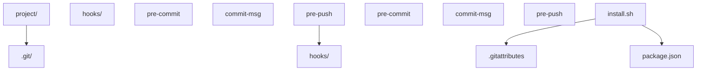
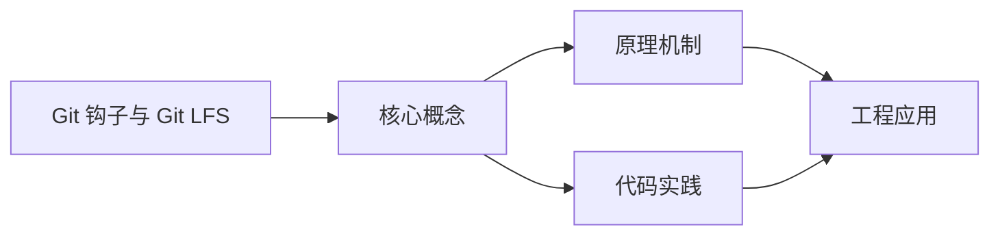
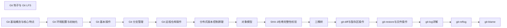

## 1. 学习目标（Bloom 分类）

本节按照布鲁姆教育目标分类学组织学习路径。本文主题为《Git 钩子与 Git LFS》，属于 Git 模块，读者可以根据自身阶段选择阅读深度。

记忆层面：能够准确复述本文的核心概念、术语与基本语法或操作步骤，并能够在提问或检索时快速定位对应知识点。能够说出 Git 的核心概念、常用命令与流程。

理解层面：能够用自己的语言解释核心原理与工作机制，说明概念之间的因果关系，而不是机械记忆结论。能够解释 Git 的工作原理与设计动机。

应用层面：能够在真实项目或练习场景中运用本文知识解决具体问题，写出正确且可维护的实现。能够独立完成 Git 的标准操作。

分析层面：能够拆解复杂问题，比较本文主题与相邻概念的异同，识别边界条件与例外情况。能够分析 Git 使用中的异常与边界。

评价层面：能够根据约束条件（性能、可读性、安全、成本）评价不同方案的优劣，做出有依据的技术决策。能够评价 Git 相关工具与方案。

创造层面：能够把本文知识与其他模块知识组合，设计出新的解决方案或可复用的工程模式。能够把 Git 融入团队工作流。

通过本节学习，读者应当能够把《Git 钩子与 Git LFS》纳入自己的知识网络，并与 Git 模块的其他主题（提交、分支、合并、远程协作）建立关联。

## 2. 历史动机与发展脉络

《Git 钩子与 Git LFS》是 Git 领域的重要主题。要真正理解它，需要先了解它解决的问题与演进过程。

Git 由 Linus Torvalds 于 2005 年为 Linux 内核开发，目标是替代 BitKeeper：分布式、高性能、内容寻址。
Git 的核心是对象模型：blob（内容）、tree（目录）、commit（快照 + 元数据）、tag（引用）；一切对象用 SHA-1 哈希寻址。
工作流演进：集中式工作流 -> 特性分支 -> GitFlow -> GitHub Flow / Trunk-Based；现代团队普遍采用 PR 审查 + 主干发布。

回到本文主题：Git 钩子与 Git LFS 的提出与成熟，正是上述技术背景下的必然产物。早期实现往往以简单可用为目标，随着工程规模扩大，社区逐渐沉淀出标准做法与最佳实践；理解这一脉络，可以帮助读者判断“为什么文档中的推荐写法是现在这个样子”，也能在遇到历史遗留代码时准确识别其设计年代与取舍。


## 3. 形式化定义与核心概念精讲

本节把《Git 钩子与 Git LFS》涉及的核心概念以“定义 + 讲解”的形式展开。读者应把定义当作工具，把讲解当作理解路径；两者结合才能形成可迁移的知识。

三个区域：工作区、暂存区（index）、仓库（HEAD）；git add/commit 移动状态。
分支是指针：创建分支成本极低；合并（merge 生成合并提交）与变基（rebase 重放提交）各有取舍。
远程协作：clone/fetch/pull/push；refs/remotes 跟踪远端；冲突在合并时出现并手工解决。

### 3.1 原文章节逐一精讲

原文档把主题拆分为 21 个小节，下面按顺序给出每一节的导读讲解，随后保留原文细节供精读。

#### 原文精读（完整保留）

# Git LFS 大文件存储

> **符号约定**：`< >` 必填参数 | `[ ]` 可选参数

---

#### 1. Git 钩子概述

Git 钩子是 Git 仓库中的脚本，在特定 Git 事件发生时自动执行。它们可以用于自动化工作流程、强制执行代码规范、运行测试等。

##### 钩子类型

- **客户端钩子**：在本地操作时触发
- **服务器端钩子**：在服务器端操作时触发

#### 2. 客户端钩子

##### 2.1 常见客户端钩子

| 钩子名称             | 触发时机         | 用途                   |
| :------------------- | :--------------- | :--------------------- |
| `pre-commit`         | 提交前           | 代码检查、格式化、测试 |
| `prepare-commit-msg` | 提交消息编辑器前 | 自动生成提交消息       |
| `commit-msg`         | 提交消息编辑后   | 验证提交消息格式       |
| `post-commit`        | 提交后           | 通知、触发构建         |
| `pre-push`           | 推送前           | 运行测试、检查         |

##### 2.2 创建 pre-commit 钩子

```bash
 # 进入 Git 仓库
 cd /path/to/repo
 # 创建 pre-commit 钩子
 cat > .git/hooks/pre-commit << 'EOF'
 #!/bin/bash
 # 运行代码检查
 echo "Running code linting..."
 npm run lint
 # 运行测试
 echo "Running tests..."
 npm test
 # 检查结果
 if [ $? -ne 0 ]; then
  echo "Tests failed, commit aborted"
  exit 1
 fi
 echo "Pre-commit checks passed"
 EOF
 # 使钩子可执行
 chmod +x .git/hooks/pre-commit
```

##### 2.3 创建 commit-msg 钩子

```bash
 # 创建 commit-msg 钩子
 cat > .git/hooks/commit-msg << 'EOF'
 #!/bin/bash
 # 检查提交消息格式
 commit_msg=$(cat "$1")
 # 正则表达式检查提交消息格式
 if ! echo "$commit_msg" | grep -qE '^(feat|fix|docs|style|refactor|test|chore): .+'; then
  echo "Error: Invalid commit message format"
  echo "Commit message should start with: feat|fix|docs|style|refactor|test|chore:"
  exit 1
 fi
 echo "Commit message format is valid"
 EOF
 # 使钩子可执行
 chmod +x .git/hooks/commit-msg
```

#### 3. 服务器端钩子

##### 3.1 常见服务器端钩子

| 钩子名称       | 触发时机   | 用途                 |
| :------------- | :--------- | :------------------- |
| `pre-receive`  | 推送接收前 | 拒绝不符合规则的推送 |
| `update`       | 分支更新时 | 对特定分支进行检查   |
| `post-receive` | 推送接收后 | 部署、通知           |

##### 3.2 创建 post-receive 钩子

```bash
 # 在服务器仓库中创建 post-receive 钩子
 cat > /path/to/repo.git/hooks/post-receive << 'EOF'
 #!/bin/bash
 # 部署应用
 echo "Deploying application..."
 # 切换到部署目录
 cd /path/to/deploy
 # 拉取最新代码
 git pull origin main
 # 安装依赖
 npm install
 # 构建应用
 npm run build
 # 重启服务
 echo "Restarting service..."
 systemctl restart my-app
 echo "Deployment completed successfully"
 EOF
 # 使钩子可执行
 chmod +x /path/to/repo.git/hooks/post-receive
```

#### 4. Git LFS (Large File Storage)

##### 4.1 Git LFS 概述

Git LFS 是 Git 的扩展，用于管理大文件，通过将大文件存储在外部服务器上，只在 Git 仓库中存储引用，从而减小仓库体积。

##### 4.2 安装 Git LFS

```bash
 # 安装 Git LFS
 # Windows
 download from https://git-lfs.github.com/
 # macOS
 brew install git-lfs
 # Linux
 sudo apt install git-lfs
 # 初始化 Git LFS
 git lfs install
```

##### 4.3 配置 Git LFS

```bash
 # 跟踪大文件
 git lfs track "*.psd"
 git lfs track "*.jpg"
 git lfs track "*.mp4"
 # 查看跟踪的文件类型
 git lfs track
 # 提交 .gitattributes 文件
 git add .gitattributes
 git commit -m "Add Git LFS tracking"
```

##### 4.4 使用 Git LFS

```bash
 # 正常添加和提交文件
 git add large-file.psd
 git commit -m "Add large file"
 git push origin main
 # 拉取 LFS 文件
 git lfs pull
 # 查看 LFS 文件
 git lfs ls-files
 # 验证 LFS 文件
 git lfs verify
```

#### 5. 钩子最佳实践

1. **版本控制钩子**：将钩子存储在仓库中，使用脚本安装
2. **错误处理**：在钩子中添加适当的错误处理
3. **性能考虑**：确保钩子执行时间不会过长
4. **可配置性**：允许通过配置文件自定义钩子行为
5. **文档**：为钩子添加注释和文档

##### 5.1 钩子管理脚本

```bash
 #!/bin/bash
 # hooks/install.sh
 # 安装钩子
 cp hooks/* .git/hooks/
 chmod +x .git/hooks/*
 echo "Hooks installed successfully"
```

#### 6. Git LFS 最佳实践

1. **合理选择跟踪文件**：只跟踪真正的大文件
2. **设置合理的文件大小阈值**：根据项目需求设置
3. **定期清理**：使用 `git lfs prune` 清理过期文件
4. **备份 LFS 存储**：确保 LFS 文件的安全性
5. **监控存储使用**：定期检查 LFS 存储使用情况

##### 6.1 Git LFS 配置示例

```bash
 # .gitattributes 文件
 *
 *
 *
```

#### 7. 高级钩子示例

##### 7.1 自动更新版本号

```bash
 # pre-commit 钩子
 #!/bin/bash
 # 自动更新版本号
 if [ -f package.json ]; then
  current_version=$(jq -r '.version' package.json)
  # 简单的版本号递增逻辑
  new_version=$(echo $current_version | awk -F. '{print $1"."$2"."$3+1}')
  jq ".version = \"$new_version\"" package.json > package.json.tmp && mv package.json.tmp package.json
  git add package.json
  echo "Updated version to $new_version"
 fi
```

##### 7.2 自动生成 CHANGELOG

```bash
 # post-commit 钩子
 #!/bin/bash
 # 自动生成 CHANGELOG
 if [ ! -f CHANGELOG.md ]; then
  echo "# Changelog\n" > CHANGELOG.md
 fi
 # 获取最新提交信息
 latest_commit=$(git log -1 --pretty=%B)
 # 提取提交类型和信息
 if echo "$latest_commit" | grep -qE '^(feat|fix|docs|style|refactor|test|chore):'; then
  commit_type=$(echo "$latest_commit" | cut -d: -f1)
  commit_msg=$(echo "$latest_commit" | cut -d: -f2 | sed 's/^ //')
  # 获取当前日期
  current_date=$(date +"%Y-%m-%d")
  # 添加到 CHANGELOG
  echo "## $current_date\n\n- **$commit_type**: $commit_msg\n" | cat - CHANGELOG.md > CHANGELOG.md.tmp && mv CHANGELOG.md.tmp CHANGELOG.md
  git add CHANGELOG.md
  git commit --amend --no-edit
  echo "Updated CHANGELOG.md"
 fi
```

#### 8. 常见问题与解决方案

##### 8.1 钩子不执行

**问题**：钩子脚本没有执行
**解决方案**：确保钩子文件可执行 `chmod +x .git/hooks/hook-name`

##### 8.2 Git LFS 文件下载失败

**问题**：Git LFS 文件无法下载
**解决方案**：检查网络连接，运行 `git lfs pull` 手动拉取

##### 8.3 钩子执行时间过长

**问题**：钩子执行时间过长，影响开发效率
**解决方案**：优化钩子逻辑，考虑使用后台执行

##### 8.4 Git LFS 存储不足

**问题**：Git LFS 存储空间不足
**解决方案**：清理过期文件 `git lfs prune`，增加存储配置

#### 9. 工具与集成

##### 9.1 钩子管理工具

- **husky**：现代 Git 钩子管理工具
- **lint-staged**：配合 husky 使用，只对暂存文件运行检查

##### 9.2 Git LFS 托管服务

- **GitHub**：内置 Git LFS 支持
- **GitLab**：内置 Git LFS 支持
- **Bitbucket**：内置 Git LFS 支持
- **自托管**：使用 Git LFS 服务器

#### 10. 项目实战

##### 10.1 完整的钩子配置



##### 10.2 使用 husky 管理钩子

**安装 husky**

```bash
 npm install husky --save-dev
 npx husky install
 npm set-script prepare "husky install"
```

**添加钩子**

```bash
 npx husky add .husky/pre-commit "npm run lint"
 npx husky add .husky/commit-msg "npx commitlint --edit $1"
 npx husky add .husky/pre-push "npm test"
```

#### 11. 延伸阅读

- [Git 官方钩子文档](https://git-scm.com/docs/githooks)
- [Git LFS 官方文档](https://git-lfs.github.com/)
- [husky 文档](https://typicode.github.io/husky/)
- [commitlint 文档](https://commitlint.js.org/)
  通过本教程，你已经了解了 Git 钩子和 Git LFS 的核心概念和实践技巧。在实际项目中，你可以使用这些工具来自动化工作流程、管理大文件，提高开发效率和代码质量
#### 安装与初始化

**基本写法：安装 Git LFS**
`git lfs install`
```bash
# 在当前用户范围启用 Git LFS
git lfs install
```

---

**基本写法：在仓库中初始化 LFS**
`git lfs install --local`
```bash
# 仅在当前仓库启用 LFS
git lfs install --local
```

---

**基本写法：查看 LFS 版本**
`git lfs version`
```bash
# 输出当前 Git LFS 版本号
git lfs version
```

---

#### 跟踪大文件

**基本写法：添加 LFS 跟踪规则**
`git lfs track "<模式>"`
```bash
# 跟踪所有 mp4 视频文件
git lfs track "*.mp4"
```

---

**基本写法：跟踪指定目录**
`git lfs track "<目录>/**"`
```bash
# 跟踪 assets 目录下所有文件
git lfs track "assets/**"
```

---

**基本写法：查看跟踪规则**
`git lfs track`
```bash
# 列出当前所有 LFS 跟踪规则
git lfs track
```

---

**基本写法：移除跟踪规则**
`git lfs untrack "<模式>"`
```bash
# 移除某类文件的 LFS 跟踪
git lfs untrack "*.mp4"
```

---

**基本写法：提交 .gitattributes**
`git add .gitattributes && git commit -m "<消息>"`
```bash
# 跟踪规则变更必须提交
git add .gitattributes && git commit -m "chore: configure LFS tracking"
```

---

#### 操作 LFS 文件

**基本写法：添加大文件**
`git add <文件> && git commit -m "<消息>"`
```bash
# 添加大文件到 LFS 跟踪
git add video.mp4 && git commit -m "feat: add intro video"
```

---

**基本写法：查看 LFS 文件列表**
`git lfs ls-files`
```bash
# 列出仓库中所有 LFS 跟踪文件
git lfs ls-files
```

---

**基本写法：查看文件大小信息**
`git lfs ls-files --size`
```bash
# 显示 LFS 文件的实际大小
git lfs ls-files --size
```

---

#### 拉取与推送

**基本写法：克隆含 LFS 的仓库**
`git clone <仓库URL>`
```bash
# 克隆时自动拉取 LFS 文件
git clone https://github.com/org/repo.git
```

---

**基本写法：跳过 LFS 内容克隆**
`GIT_LFS_SKIP_SMUDGE=1 git clone <仓库URL>`
```bash
# 仅克隆指针文件不下载大文件内容
GIT_LFS_SKIP_SMUDGE=1 git clone https://github.com/org/repo.git
```

---

**基本写法：按需下载 LFS 文件**
`git lfs pull`
```bash
# 拉取所有 LFS 跟踪文件内容
git lfs pull
```

---

**基本写法：拉取指定文件**
`git lfs pull --include="<路径>"`
```bash
# 仅拉取指定目录下的 LFS 文件
git lfs pull --include="assets/videos/*"
```

---

**基本写法：推送 LFS 文件**
`git push origin <分支>`
```bash
# 推送时自动上传 LFS 文件
git push origin main
```

---

**基本写法：仅推送 LFS 内容**
`git lfs push origin <分支>`
```bash
# 单独推送 LFS 文件到远程
git lfs push origin main
```

---

**基本写法：推送所有 LFS 对象**
`git lfs push --all origin <分支>`
```bash
# 推送全部历史 LFS 对象
git lfs push --all origin main
```

---

#### 检出与切换

**基本写法：检出指定分支的 LFS 文件**
`git lfs checkout`
```bash
# 用 LFS 内容替换工作区指针文件
git lfs checkout
```

---

**基本写法：仅检出指定路径**
`git lfs checkout --include="<路径>"`
```bash
# 仅检出 assets 目录的 LFS 内容
git lfs checkout --include="assets/*"
```

---

**基本写法：切换分支后同步**
`git checkout <分支> && git lfs checkout`
```bash
# 切换分支后重新检出 LFS 文件
git checkout feature && git lfs checkout
```

---

#### 历史与迁移

**基本写法：将已有文件转为 LFS**
`git lfs migrate import --include="<模式>"`
```bash
# 将历史中的 mp4 文件迁移到 LFS
git lfs migrate import --include="*.mp4"
```

---

**基本写法：迁移指定分支历史**
`git lfs migrate import --include="<模式>" --include-ref=<分支>`
```bash
# 仅迁移 main 分支的历史文件
git lfs migrate import --include="*.mp4" --include-ref=main
```

---

**基本写法：迁移所有引用**
`git lfs migrate import --include="<模式>" --include-ref=refs/heads/*`
```bash
# 迁移所有分支的历史文件
git lfs migrate import --include="*.mp4" --include-ref=refs/heads/*
```

---

**基本写法：导出 LFS 文件回普通对象**
`git lfs migrate export --include="<模式>"`
```bash
# 取消 LFS 跟踪并还原文件
git lfs migrate export --include="*.mp4"
```

---

#### 检查与状态

**基本写法：查看 LFS 状态**
`git lfs status`
```bash
# 显示工作区 LFS 文件状态
git lfs status
```

---

**基本写法：检查 LFS 文件完整性**
`git lfs fsck`
```bash
# 校验 LFS 对象完整性
git lfs fsck
```

---

**基本写法：查看 LFS 日志**
`git lfs logs last`
```bash
# 查看最近一次 LFS 操作日志
git lfs logs last
```

---

**基本写法：列出所有 LFS 对象**
`git lfs ls-files --all`
```bash
# 列出所有历史中的 LFS 文件
git lfs ls-files --all
```

---

#### 远程配置

**基本写法：查看 LFS 端点**
`git config -l | grep lfs`
```bash
# 查看 LFS 相关配置
git config -l | grep lfs
```

---

**基本写法：指定 LFS 服务器**
`git config -f .lfsconfig lfs.url <URL>`
```bash
# 配置自定义 LFS 服务器地址
git config -f .lfsconfig lfs.url https://lfs.example.com/org/repo
```

---

**基本写法：跳过 smudge 过滤器**
`git config --local lfs.smudge false`
```bash
# 关闭自动下载 LFS 内容
git config --local lfs.smudge false
```

---

#### 锁定文件（防冲突）

**基本写法：锁定 LFS 文件**
`git lfs lock <文件>`
```bash
# 锁定二进制文件防止并发编辑
git lfs lock assets/logo.psd
```

---

**基本写法：查看锁定列表**
`git lfs locks`
```bash
# 列出所有已锁定文件
git lfs locks
```

---

**基本写法：解锁文件**
`git lfs unlock <文件>`
```bash
# 释放文件锁
git lfs unlock assets/logo.psd
```

---

**基本写法：强制解锁**
`git lfs unlock <文件> --force`
```bash
# 强制解锁他人持有的锁
git lfs unlock assets/logo.psd --force
```

---

#### 清理与优化

**基本写法：清理无用 LFS 对象**
`git lfs prune`
```bash
# 清理本地未引用的 LFS 对象
git lfs prune
```

---

**基本写法：查看待清理对象**
`git lfs prune --dry-run`
```bash
# 预览将被清理的对象
git lfs prune --dry-run
```

---

**基本写法：强制保留对象**
`git lfs fetch --recent`
```bash
# 拉取最近使用的 LFS 对象
git lfs fetch --recent
```


### 3.2 概念关系图

下面用 Mermaid 图表达本文核心概念之间的关系，帮助读者建立整体图景：



图中展示的是本文知识的结构化关系：核心概念是入口，原理机制解释“为什么”，代码实践演示“怎么做”，工程应用回答“何时用”。读者学习时可以把每个小节的内容挂接到对应节点上。

## 4. 理论推导与原理解析

本节深入《Git 钩子与 Git LFS》背后的原理。理论部分不求面面俱到，而是聚焦“能解释现象、能指导实践”的关键推导。

三个区域：工作区、暂存区（index）、仓库（HEAD）；git add/commit 移动状态。
分支是指针：创建分支成本极低；合并（merge 生成合并提交）与变基（rebase 重放提交）各有取舍。
远程协作：clone/fetch/pull/push；refs/remotes 跟踪远端；冲突在合并时出现并手工解决。
撤销模型：checkout/restore 改工作区，reset 移 HEAD，revert 生成反向提交；理解三者避免误操作。

需要强调的是，理论推导与工程实践之间存在翻译层：理论给出的是理想化模型与边界条件，工程代码则必须处理真实环境中的例外。读者在学习时应先掌握理论的“标准情形”，再通过陷阱章节了解“非标准情形”。

## 5. 代码示例与逐行讲解

本节把原文中的代码示例系统整理，并为每个示例补充用途说明与讲解。读者不应只浏览代码，而应逐段对照讲解理解设计意图。

### 5.1 示例：2.2 创建 pre-commit 钩子

该示例来自原文《2.2 创建 pre-commit 钩子》小节，用于演示Git 钩子与 Git LFS相关操作。阅读时请先看代码结构，再看其后的讲解。

```bash
 # 进入 Git 仓库
 cd /path/to/repo
 # 创建 pre-commit 钩子
 cat > .git/hooks/pre-commit << 'EOF'
 #!/bin/bash
 # 运行代码检查
 echo "Running code linting..."
 npm run lint
 # 运行测试
 echo "Running tests..."
 npm test
 # 检查结果
 if [ $? -ne 0 ]; then
  echo "Tests failed, commit aborted"
  exit 1
 fi
 echo "Pre-commit checks passed"
 EOF
 # 使钩子可执行
 chmod +x .git/hooks/pre-commit
```

讲解：这段代码演示了本节核心知识点。代码中的关键操作可以归纳为三步：准备（定义或初始化）、执行（核心逻辑）、收尾（释放资源或返回结果）。实际项目中，这三步往往被封装为函数或类，以提升复用性与可测试性。

关键点分析：

该示例共 20 行有效代码，包含 1 类关键结构（if）。其中：

- 入口与初始化部分负责建立上下文，对应实际项目中的启动或装配逻辑；
- 核心逻辑部分体现本文主题的主要操作，是阅读时最需要对照讲解理解的部分；
- 输出或返回部分把结果交给调用方，注意其类型与边界条件。

进阶思考路径：先尝试修改参数观察行为变化，再把示例中的模式迁移到自己的项目中；每次修改都记录预期与实测差异，这是把示例转化为能力的最快方式。

### 5.2 示例：2.3 创建 commit-msg 钩子

该示例来自原文《2.3 创建 commit-msg 钩子》小节，用于演示Git 钩子与 Git LFS相关操作。阅读时请先看代码结构，再看其后的讲解。

```bash
 # 创建 commit-msg 钩子
 cat > .git/hooks/commit-msg << 'EOF'
 #!/bin/bash
 # 检查提交消息格式
 commit_msg=$(cat "$1")
 # 正则表达式检查提交消息格式
 if ! echo "$commit_msg" | grep -qE '^(feat|fix|docs|style|refactor|test|chore): .+'; then
  echo "Error: Invalid commit message format"
  echo "Commit message should start with: feat|fix|docs|style|refactor|test|chore:"
  exit 1
 fi
 echo "Commit message format is valid"
 EOF
 # 使钩子可执行
 chmod +x .git/hooks/commit-msg
```

讲解：这段代码演示了本节核心知识点。代码中的关键操作可以归纳为三步：准备（定义或初始化）、执行（核心逻辑）、收尾（释放资源或返回结果）。实际项目中，这三步往往被封装为函数或类，以提升复用性与可测试性。

关键点分析：

该示例共 15 行有效代码，包含 1 类关键结构（if）。其中：

- 入口与初始化部分负责建立上下文，对应实际项目中的启动或装配逻辑；
- 核心逻辑部分体现本文主题的主要操作，是阅读时最需要对照讲解理解的部分；
- 输出或返回部分把结果交给调用方，注意其类型与边界条件。

进阶思考路径：先尝试修改参数观察行为变化，再把示例中的模式迁移到自己的项目中；每次修改都记录预期与实测差异，这是把示例转化为能力的最快方式。

### 5.3 示例：3.2 创建 post-receive 钩子

该示例来自原文《3.2 创建 post-receive 钩子》小节，用于演示Git 钩子与 Git LFS相关操作。阅读时请先看代码结构，再看其后的讲解。

```bash
 # 在服务器仓库中创建 post-receive 钩子
 cat > /path/to/repo.git/hooks/post-receive << 'EOF'
 #!/bin/bash
 # 部署应用
 echo "Deploying application..."
 # 切换到部署目录
 cd /path/to/deploy
 # 拉取最新代码
 git pull origin main
 # 安装依赖
 npm install
 # 构建应用
 npm run build
 # 重启服务
 echo "Restarting service..."
 systemctl restart my-app
 echo "Deployment completed successfully"
 EOF
 # 使钩子可执行
 chmod +x /path/to/repo.git/hooks/post-receive
```

讲解：这段代码演示了本节核心知识点。代码中的关键操作可以归纳为三步：准备（定义或初始化）、执行（核心逻辑）、收尾（释放资源或返回结果）。实际项目中，这三步往往被封装为函数或类，以提升复用性与可测试性。

关键点分析：

该示例共 20 行有效代码，结构以数据或配置为主。阅读时应关注：数据字段的含义、配置项的作用，以及它们与运行行为的对应关系。

进阶思考路径：先尝试修改参数观察行为变化，再把示例中的模式迁移到自己的项目中；每次修改都记录预期与实测差异，这是把示例转化为能力的最快方式。

### 5.4 示例：4.2 安装 Git LFS

该示例来自原文《4.2 安装 Git LFS》小节，用于演示Git 钩子与 Git LFS相关操作。阅读时请先看代码结构，再看其后的讲解。

```bash
 # 安装 Git LFS
 # Windows
 download from https://git-lfs.github.com/
 # macOS
 brew install git-lfs
 # Linux
 sudo apt install git-lfs
 # 初始化 Git LFS
 git lfs install
```

讲解：这段代码演示了本节核心知识点。代码中的关键操作可以归纳为三步：准备（定义或初始化）、执行（核心逻辑）、收尾（释放资源或返回结果）。实际项目中，这三步往往被封装为函数或类，以提升复用性与可测试性。

关键点分析：

该示例共 9 行有效代码，包含 1 类关键结构（from）。其中：

- 入口与初始化部分负责建立上下文，对应实际项目中的启动或装配逻辑；
- 核心逻辑部分体现本文主题的主要操作，是阅读时最需要对照讲解理解的部分；
- 输出或返回部分把结果交给调用方，注意其类型与边界条件。

进阶思考路径：先尝试修改参数观察行为变化，再把示例中的模式迁移到自己的项目中；每次修改都记录预期与实测差异，这是把示例转化为能力的最快方式。

### 5.5 示例：4.3 配置 Git LFS

该示例来自原文《4.3 配置 Git LFS》小节，用于演示Git 钩子与 Git LFS相关操作。阅读时请先看代码结构，再看其后的讲解。

```bash
 # 跟踪大文件
 git lfs track "*.psd"
 git lfs track "*.jpg"
 git lfs track "*.mp4"
 # 查看跟踪的文件类型
 git lfs track
 # 提交 .gitattributes 文件
 git add .gitattributes
 git commit -m "Add Git LFS tracking"
```

讲解：这段代码演示了本节核心知识点。代码中的关键操作可以归纳为三步：准备（定义或初始化）、执行（核心逻辑）、收尾（释放资源或返回结果）。实际项目中，这三步往往被封装为函数或类，以提升复用性与可测试性。

关键点分析：

该示例共 9 行有效代码，结构以数据或配置为主。阅读时应关注：数据字段的含义、配置项的作用，以及它们与运行行为的对应关系。

进阶思考路径：先尝试修改参数观察行为变化，再把示例中的模式迁移到自己的项目中；每次修改都记录预期与实测差异，这是把示例转化为能力的最快方式。

### 5.6 示例：4.4 使用 Git LFS

该示例来自原文《4.4 使用 Git LFS》小节，用于演示Git 钩子与 Git LFS相关操作。阅读时请先看代码结构，再看其后的讲解。

```bash
 # 正常添加和提交文件
 git add large-file.psd
 git commit -m "Add large file"
 git push origin main
 # 拉取 LFS 文件
 git lfs pull
 # 查看 LFS 文件
 git lfs ls-files
 # 验证 LFS 文件
 git lfs verify
```

讲解：这段代码演示了本节核心知识点。代码中的关键操作可以归纳为三步：准备（定义或初始化）、执行（核心逻辑）、收尾（释放资源或返回结果）。实际项目中，这三步往往被封装为函数或类，以提升复用性与可测试性。

关键点分析：

该示例共 10 行有效代码，结构以数据或配置为主。阅读时应关注：数据字段的含义、配置项的作用，以及它们与运行行为的对应关系。

进阶思考路径：先尝试修改参数观察行为变化，再把示例中的模式迁移到自己的项目中；每次修改都记录预期与实测差异，这是把示例转化为能力的最快方式。

### 5.7 示例：5.1 钩子管理脚本

该示例来自原文《5.1 钩子管理脚本》小节，用于演示Git 钩子与 Git LFS相关操作。阅读时请先看代码结构，再看其后的讲解。

```bash
 #!/bin/bash
 # hooks/install.sh
 # 安装钩子
 cp hooks/* .git/hooks/
 chmod +x .git/hooks/*
 echo "Hooks installed successfully"
```

讲解：这段代码演示了本节核心知识点。代码中的关键操作可以归纳为三步：准备（定义或初始化）、执行（核心逻辑）、收尾（释放资源或返回结果）。实际项目中，这三步往往被封装为函数或类，以提升复用性与可测试性。

关键点分析：

该示例共 6 行有效代码，结构以数据或配置为主。阅读时应关注：数据字段的含义、配置项的作用，以及它们与运行行为的对应关系。

进阶思考路径：先尝试修改参数观察行为变化，再把示例中的模式迁移到自己的项目中；每次修改都记录预期与实测差异，这是把示例转化为能力的最快方式。

### 5.8 示例：6.1 Git LFS 配置示例

该示例来自原文《6.1 Git LFS 配置示例》小节，用于演示Git 钩子与 Git LFS相关操作。阅读时请先看代码结构，再看其后的讲解。

```bash
 # .gitattributes 文件
 *
 *
 *
```

讲解：这段代码演示了本节核心知识点。代码中的关键操作可以归纳为三步：准备（定义或初始化）、执行（核心逻辑）、收尾（释放资源或返回结果）。实际项目中，这三步往往被封装为函数或类，以提升复用性与可测试性。

关键点分析：

该示例共 4 行有效代码，结构以数据或配置为主。阅读时应关注：数据字段的含义、配置项的作用，以及它们与运行行为的对应关系。

进阶思考路径：先尝试修改参数观察行为变化，再把示例中的模式迁移到自己的项目中；每次修改都记录预期与实测差异，这是把示例转化为能力的最快方式。

### 5.9 示例：7.1 自动更新版本号

该示例来自原文《7.1 自动更新版本号》小节，用于演示Git 钩子与 Git LFS相关操作。阅读时请先看代码结构，再看其后的讲解。

```bash
 # pre-commit 钩子
 #!/bin/bash
 # 自动更新版本号
 if [ -f package.json ]; then
  current_version=$(jq -r '.version' package.json)
  # 简单的版本号递增逻辑
  new_version=$(echo $current_version | awk -F. '{print $1"."$2"."$3+1}')
  jq ".version = \"$new_version\"" package.json > package.json.tmp && mv package.json.tmp package.json
  git add package.json
  echo "Updated version to $new_version"
 fi
```

讲解：这段代码演示了本节核心知识点。代码中的关键操作可以归纳为三步：准备（定义或初始化）、执行（核心逻辑）、收尾（释放资源或返回结果）。实际项目中，这三步往往被封装为函数或类，以提升复用性与可测试性。

关键点分析：

该示例共 11 行有效代码，包含 1 类关键结构（if）。其中：

- 入口与初始化部分负责建立上下文，对应实际项目中的启动或装配逻辑；
- 核心逻辑部分体现本文主题的主要操作，是阅读时最需要对照讲解理解的部分；
- 输出或返回部分把结果交给调用方，注意其类型与边界条件。

进阶思考路径：先尝试修改参数观察行为变化，再把示例中的模式迁移到自己的项目中；每次修改都记录预期与实测差异，这是把示例转化为能力的最快方式。

### 5.10 示例：7.2 自动生成 CHANGELOG

该示例来自原文《7.2 自动生成 CHANGELOG》小节，用于演示Git 钩子与 Git LFS相关操作。阅读时请先看代码结构，再看其后的讲解。

```bash
 # post-commit 钩子
 #!/bin/bash
 # 自动生成 CHANGELOG
 if [ ! -f CHANGELOG.md ]; then
  echo "# Changelog\n" > CHANGELOG.md
 fi
 # 获取最新提交信息
 latest_commit=$(git log -1 --pretty=%B)
 # 提取提交类型和信息
 if echo "$latest_commit" | grep -qE '^(feat|fix|docs|style|refactor|test|chore):'; then
  commit_type=$(echo "$latest_commit" | cut -d: -f1)
  commit_msg=$(echo "$latest_commit" | cut -d: -f2 | sed 's/^ //')
  # 获取当前日期
  current_date=$(date +"%Y-%m-%d")
  # 添加到 CHANGELOG
  echo "## $current_date\n\n- **$commit_type**: $commit_msg\n" | cat - CHANGELOG.md > CHANGELOG.md.tmp && mv CHANGELOG.md.tmp CHANGELOG.md
  git add CHANGELOG.md
  git commit --amend --no-edit
  echo "Updated CHANGELOG.md"
 fi
```

讲解：这段代码演示了本节核心知识点。代码中的关键操作可以归纳为三步：准备（定义或初始化）、执行（核心逻辑）、收尾（释放资源或返回结果）。实际项目中，这三步往往被封装为函数或类，以提升复用性与可测试性。

关键点分析：

该示例共 20 行有效代码，包含 1 类关键结构（if）。其中：

- 入口与初始化部分负责建立上下文，对应实际项目中的启动或装配逻辑；
- 核心逻辑部分体现本文主题的主要操作，是阅读时最需要对照讲解理解的部分；
- 输出或返回部分把结果交给调用方，注意其类型与边界条件。

进阶思考路径：先尝试修改参数观察行为变化，再把示例中的模式迁移到自己的项目中；每次修改都记录预期与实测差异，这是把示例转化为能力的最快方式。

### 5.11 示例：10.1 完整的钩子配置

该示例来自原文《10.1 完整的钩子配置》小节，用于演示Git 钩子与 Git LFS相关操作。阅读时请先看代码结构，再看其后的讲解。


讲解：这段代码演示了本节核心知识点。代码中的关键操作可以归纳为三步：准备（定义或初始化）、执行（核心逻辑）、收尾（释放资源或返回结果）。实际项目中，这三步往往被封装为函数或类，以提升复用性与可测试性。

关键点分析：

该示例共 18 行有效代码，结构以数据或配置为主。阅读时应关注：数据字段的含义、配置项的作用，以及它们与运行行为的对应关系。

进阶思考路径：先尝试修改参数观察行为变化，再把示例中的模式迁移到自己的项目中；每次修改都记录预期与实测差异，这是把示例转化为能力的最快方式。

### 5.12 示例：10.2 使用 husky 管理钩子

该示例来自原文《10.2 使用 husky 管理钩子》小节，用于演示Git 钩子与 Git LFS相关操作。阅读时请先看代码结构，再看其后的讲解。

```bash
 npm install husky --save-dev
 npx husky install
 npm set-script prepare "husky install"
```

讲解：这段代码演示了本节核心知识点。代码中的关键操作可以归纳为三步：准备（定义或初始化）、执行（核心逻辑）、收尾（释放资源或返回结果）。实际项目中，这三步往往被封装为函数或类，以提升复用性与可测试性。

关键点分析：

该示例共 3 行有效代码，结构以数据或配置为主。阅读时应关注：数据字段的含义、配置项的作用，以及它们与运行行为的对应关系。

进阶思考路径：先尝试修改参数观察行为变化，再把示例中的模式迁移到自己的项目中；每次修改都记录预期与实测差异，这是把示例转化为能力的最快方式。

### 5.13 示例：10.2 使用 husky 管理钩子

该示例来自原文《10.2 使用 husky 管理钩子》小节，用于演示Git 钩子与 Git LFS相关操作。阅读时请先看代码结构，再看其后的讲解。

```bash
 npx husky add .husky/pre-commit "npm run lint"
 npx husky add .husky/commit-msg "npx commitlint --edit $1"
 npx husky add .husky/pre-push "npm test"
```

讲解：这段代码演示了本节核心知识点。代码中的关键操作可以归纳为三步：准备（定义或初始化）、执行（核心逻辑）、收尾（释放资源或返回结果）。实际项目中，这三步往往被封装为函数或类，以提升复用性与可测试性。

关键点分析：

该示例共 3 行有效代码，结构以数据或配置为主。阅读时应关注：数据字段的含义、配置项的作用，以及它们与运行行为的对应关系。

进阶思考路径：先尝试修改参数观察行为变化，再把示例中的模式迁移到自己的项目中；每次修改都记录预期与实测差异，这是把示例转化为能力的最快方式。

### 5.14 示例：安装与初始化

该示例来自原文《安装与初始化》小节，用于演示Git 钩子与 Git LFS相关操作。阅读时请先看代码结构，再看其后的讲解。

```bash
# 在当前用户范围启用 Git LFS
git lfs install
```

讲解：这段代码演示了本节核心知识点。代码中的关键操作可以归纳为三步：准备（定义或初始化）、执行（核心逻辑）、收尾（释放资源或返回结果）。实际项目中，这三步往往被封装为函数或类，以提升复用性与可测试性。

关键点分析：

该示例共 2 行有效代码，结构以数据或配置为主。阅读时应关注：数据字段的含义、配置项的作用，以及它们与运行行为的对应关系。

进阶思考路径：先尝试修改参数观察行为变化，再把示例中的模式迁移到自己的项目中；每次修改都记录预期与实测差异，这是把示例转化为能力的最快方式。

### 5.15 示例：安装与初始化

该示例来自原文《安装与初始化》小节，用于演示Git 钩子与 Git LFS相关操作。阅读时请先看代码结构，再看其后的讲解。

```bash
# 仅在当前仓库启用 LFS
git lfs install --local
```

讲解：这段代码演示了本节核心知识点。代码中的关键操作可以归纳为三步：准备（定义或初始化）、执行（核心逻辑）、收尾（释放资源或返回结果）。实际项目中，这三步往往被封装为函数或类，以提升复用性与可测试性。

关键点分析：

该示例共 2 行有效代码，结构以数据或配置为主。阅读时应关注：数据字段的含义、配置项的作用，以及它们与运行行为的对应关系。

进阶思考路径：先尝试修改参数观察行为变化，再把示例中的模式迁移到自己的项目中；每次修改都记录预期与实测差异，这是把示例转化为能力的最快方式。

### 5.16 示例：安装与初始化

该示例来自原文《安装与初始化》小节，用于演示Git 钩子与 Git LFS相关操作。阅读时请先看代码结构，再看其后的讲解。

```bash
# 输出当前 Git LFS 版本号
git lfs version
```

讲解：这段代码演示了本节核心知识点。代码中的关键操作可以归纳为三步：准备（定义或初始化）、执行（核心逻辑）、收尾（释放资源或返回结果）。实际项目中，这三步往往被封装为函数或类，以提升复用性与可测试性。

关键点分析：

该示例共 2 行有效代码，结构以数据或配置为主。阅读时应关注：数据字段的含义、配置项的作用，以及它们与运行行为的对应关系。

进阶思考路径：先尝试修改参数观察行为变化，再把示例中的模式迁移到自己的项目中；每次修改都记录预期与实测差异，这是把示例转化为能力的最快方式。

### 5.17 示例：跟踪大文件

该示例来自原文《跟踪大文件》小节，用于演示Git 钩子与 Git LFS相关操作。阅读时请先看代码结构，再看其后的讲解。

```bash
# 跟踪所有 mp4 视频文件
git lfs track "*.mp4"
```

讲解：这段代码演示了本节核心知识点。代码中的关键操作可以归纳为三步：准备（定义或初始化）、执行（核心逻辑）、收尾（释放资源或返回结果）。实际项目中，这三步往往被封装为函数或类，以提升复用性与可测试性。

关键点分析：

该示例共 2 行有效代码，结构以数据或配置为主。阅读时应关注：数据字段的含义、配置项的作用，以及它们与运行行为的对应关系。

进阶思考路径：先尝试修改参数观察行为变化，再把示例中的模式迁移到自己的项目中；每次修改都记录预期与实测差异，这是把示例转化为能力的最快方式。

### 5.18 示例：跟踪大文件

该示例来自原文《跟踪大文件》小节，用于演示Git 钩子与 Git LFS相关操作。阅读时请先看代码结构，再看其后的讲解。

```bash
# 跟踪 assets 目录下所有文件
git lfs track "assets/**"
```

讲解：这段代码演示了本节核心知识点。代码中的关键操作可以归纳为三步：准备（定义或初始化）、执行（核心逻辑）、收尾（释放资源或返回结果）。实际项目中，这三步往往被封装为函数或类，以提升复用性与可测试性。

关键点分析：

该示例共 2 行有效代码，结构以数据或配置为主。阅读时应关注：数据字段的含义、配置项的作用，以及它们与运行行为的对应关系。

进阶思考路径：先尝试修改参数观察行为变化，再把示例中的模式迁移到自己的项目中；每次修改都记录预期与实测差异，这是把示例转化为能力的最快方式。

### 5.19 示例：跟踪大文件

该示例来自原文《跟踪大文件》小节，用于演示Git 钩子与 Git LFS相关操作。阅读时请先看代码结构，再看其后的讲解。

```bash
# 列出当前所有 LFS 跟踪规则
git lfs track
```

讲解：这段代码演示了本节核心知识点。代码中的关键操作可以归纳为三步：准备（定义或初始化）、执行（核心逻辑）、收尾（释放资源或返回结果）。实际项目中，这三步往往被封装为函数或类，以提升复用性与可测试性。

关键点分析：

该示例共 2 行有效代码，结构以数据或配置为主。阅读时应关注：数据字段的含义、配置项的作用，以及它们与运行行为的对应关系。

进阶思考路径：先尝试修改参数观察行为变化，再把示例中的模式迁移到自己的项目中；每次修改都记录预期与实测差异，这是把示例转化为能力的最快方式。

### 5.20 示例：跟踪大文件

该示例来自原文《跟踪大文件》小节，用于演示Git 钩子与 Git LFS相关操作。阅读时请先看代码结构，再看其后的讲解。

```bash
# 移除某类文件的 LFS 跟踪
git lfs untrack "*.mp4"
```

讲解：这段代码演示了本节核心知识点。代码中的关键操作可以归纳为三步：准备（定义或初始化）、执行（核心逻辑）、收尾（释放资源或返回结果）。实际项目中，这三步往往被封装为函数或类，以提升复用性与可测试性。

关键点分析：

该示例共 2 行有效代码，结构以数据或配置为主。阅读时应关注：数据字段的含义、配置项的作用，以及它们与运行行为的对应关系。

进阶思考路径：先尝试修改参数观察行为变化，再把示例中的模式迁移到自己的项目中；每次修改都记录预期与实测差异，这是把示例转化为能力的最快方式。

### 5.21 示例：跟踪大文件

该示例来自原文《跟踪大文件》小节，用于演示Git 钩子与 Git LFS相关操作。阅读时请先看代码结构，再看其后的讲解。

```bash
# 跟踪规则变更必须提交
git add .gitattributes && git commit -m "chore: configure LFS tracking"
```

讲解：这段代码演示了本节核心知识点。代码中的关键操作可以归纳为三步：准备（定义或初始化）、执行（核心逻辑）、收尾（释放资源或返回结果）。实际项目中，这三步往往被封装为函数或类，以提升复用性与可测试性。

关键点分析：

该示例共 2 行有效代码，结构以数据或配置为主。阅读时应关注：数据字段的含义、配置项的作用，以及它们与运行行为的对应关系。

进阶思考路径：先尝试修改参数观察行为变化，再把示例中的模式迁移到自己的项目中；每次修改都记录预期与实测差异，这是把示例转化为能力的最快方式。

### 5.22 示例：操作 LFS 文件

该示例来自原文《操作 LFS 文件》小节，用于演示Git 钩子与 Git LFS相关操作。阅读时请先看代码结构，再看其后的讲解。

```bash
# 添加大文件到 LFS 跟踪
git add video.mp4 && git commit -m "feat: add intro video"
```

讲解：这段代码演示了本节核心知识点。代码中的关键操作可以归纳为三步：准备（定义或初始化）、执行（核心逻辑）、收尾（释放资源或返回结果）。实际项目中，这三步往往被封装为函数或类，以提升复用性与可测试性。

关键点分析：

该示例共 2 行有效代码，结构以数据或配置为主。阅读时应关注：数据字段的含义、配置项的作用，以及它们与运行行为的对应关系。

进阶思考路径：先尝试修改参数观察行为变化，再把示例中的模式迁移到自己的项目中；每次修改都记录预期与实测差异，这是把示例转化为能力的最快方式。

### 5.23 示例：操作 LFS 文件

该示例来自原文《操作 LFS 文件》小节，用于演示Git 钩子与 Git LFS相关操作。阅读时请先看代码结构，再看其后的讲解。

```bash
# 列出仓库中所有 LFS 跟踪文件
git lfs ls-files
```

讲解：这段代码演示了本节核心知识点。代码中的关键操作可以归纳为三步：准备（定义或初始化）、执行（核心逻辑）、收尾（释放资源或返回结果）。实际项目中，这三步往往被封装为函数或类，以提升复用性与可测试性。

关键点分析：

该示例共 2 行有效代码，结构以数据或配置为主。阅读时应关注：数据字段的含义、配置项的作用，以及它们与运行行为的对应关系。

进阶思考路径：先尝试修改参数观察行为变化，再把示例中的模式迁移到自己的项目中；每次修改都记录预期与实测差异，这是把示例转化为能力的最快方式。

### 5.24 示例：操作 LFS 文件

该示例来自原文《操作 LFS 文件》小节，用于演示Git 钩子与 Git LFS相关操作。阅读时请先看代码结构，再看其后的讲解。

```bash
# 显示 LFS 文件的实际大小
git lfs ls-files --size
```

讲解：这段代码演示了本节核心知识点。代码中的关键操作可以归纳为三步：准备（定义或初始化）、执行（核心逻辑）、收尾（释放资源或返回结果）。实际项目中，这三步往往被封装为函数或类，以提升复用性与可测试性。

关键点分析：

该示例共 2 行有效代码，结构以数据或配置为主。阅读时应关注：数据字段的含义、配置项的作用，以及它们与运行行为的对应关系。

进阶思考路径：先尝试修改参数观察行为变化，再把示例中的模式迁移到自己的项目中；每次修改都记录预期与实测差异，这是把示例转化为能力的最快方式。

### 5.25 示例：拉取与推送

该示例来自原文《拉取与推送》小节，用于演示Git 钩子与 Git LFS相关操作。阅读时请先看代码结构，再看其后的讲解。

```bash
# 克隆时自动拉取 LFS 文件
git clone https://github.com/org/repo.git
```

讲解：这段代码演示了本节核心知识点。代码中的关键操作可以归纳为三步：准备（定义或初始化）、执行（核心逻辑）、收尾（释放资源或返回结果）。实际项目中，这三步往往被封装为函数或类，以提升复用性与可测试性。

关键点分析：

该示例共 2 行有效代码，结构以数据或配置为主。阅读时应关注：数据字段的含义、配置项的作用，以及它们与运行行为的对应关系。

进阶思考路径：先尝试修改参数观察行为变化，再把示例中的模式迁移到自己的项目中；每次修改都记录预期与实测差异，这是把示例转化为能力的最快方式。

### 5.26 示例：拉取与推送

该示例来自原文《拉取与推送》小节，用于演示Git 钩子与 Git LFS相关操作。阅读时请先看代码结构，再看其后的讲解。

```bash
# 仅克隆指针文件不下载大文件内容
GIT_LFS_SKIP_SMUDGE=1 git clone https://github.com/org/repo.git
```

讲解：这段代码演示了本节核心知识点。代码中的关键操作可以归纳为三步：准备（定义或初始化）、执行（核心逻辑）、收尾（释放资源或返回结果）。实际项目中，这三步往往被封装为函数或类，以提升复用性与可测试性。

关键点分析：

该示例共 2 行有效代码，结构以数据或配置为主。阅读时应关注：数据字段的含义、配置项的作用，以及它们与运行行为的对应关系。

进阶思考路径：先尝试修改参数观察行为变化，再把示例中的模式迁移到自己的项目中；每次修改都记录预期与实测差异，这是把示例转化为能力的最快方式。

### 5.27 示例：拉取与推送

该示例来自原文《拉取与推送》小节，用于演示Git 钩子与 Git LFS相关操作。阅读时请先看代码结构，再看其后的讲解。

```bash
# 拉取所有 LFS 跟踪文件内容
git lfs pull
```

讲解：这段代码演示了本节核心知识点。代码中的关键操作可以归纳为三步：准备（定义或初始化）、执行（核心逻辑）、收尾（释放资源或返回结果）。实际项目中，这三步往往被封装为函数或类，以提升复用性与可测试性。

关键点分析：

该示例共 2 行有效代码，结构以数据或配置为主。阅读时应关注：数据字段的含义、配置项的作用，以及它们与运行行为的对应关系。

进阶思考路径：先尝试修改参数观察行为变化，再把示例中的模式迁移到自己的项目中；每次修改都记录预期与实测差异，这是把示例转化为能力的最快方式。

### 5.28 示例：拉取与推送

该示例来自原文《拉取与推送》小节，用于演示Git 钩子与 Git LFS相关操作。阅读时请先看代码结构，再看其后的讲解。

```bash
# 仅拉取指定目录下的 LFS 文件
git lfs pull --include="assets/videos/*"
```

讲解：这段代码演示了本节核心知识点。代码中的关键操作可以归纳为三步：准备（定义或初始化）、执行（核心逻辑）、收尾（释放资源或返回结果）。实际项目中，这三步往往被封装为函数或类，以提升复用性与可测试性。

关键点分析：

该示例共 2 行有效代码，结构以数据或配置为主。阅读时应关注：数据字段的含义、配置项的作用，以及它们与运行行为的对应关系。

进阶思考路径：先尝试修改参数观察行为变化，再把示例中的模式迁移到自己的项目中；每次修改都记录预期与实测差异，这是把示例转化为能力的最快方式。

### 5.29 示例：拉取与推送

该示例来自原文《拉取与推送》小节，用于演示Git 钩子与 Git LFS相关操作。阅读时请先看代码结构，再看其后的讲解。

```bash
# 推送时自动上传 LFS 文件
git push origin main
```

讲解：这段代码演示了本节核心知识点。代码中的关键操作可以归纳为三步：准备（定义或初始化）、执行（核心逻辑）、收尾（释放资源或返回结果）。实际项目中，这三步往往被封装为函数或类，以提升复用性与可测试性。

关键点分析：

该示例共 2 行有效代码，结构以数据或配置为主。阅读时应关注：数据字段的含义、配置项的作用，以及它们与运行行为的对应关系。

进阶思考路径：先尝试修改参数观察行为变化，再把示例中的模式迁移到自己的项目中；每次修改都记录预期与实测差异，这是把示例转化为能力的最快方式。

### 5.30 示例：拉取与推送

该示例来自原文《拉取与推送》小节，用于演示Git 钩子与 Git LFS相关操作。阅读时请先看代码结构，再看其后的讲解。

```bash
# 单独推送 LFS 文件到远程
git lfs push origin main
```

讲解：这段代码演示了本节核心知识点。代码中的关键操作可以归纳为三步：准备（定义或初始化）、执行（核心逻辑）、收尾（释放资源或返回结果）。实际项目中，这三步往往被封装为函数或类，以提升复用性与可测试性。

关键点分析：

该示例共 2 行有效代码，结构以数据或配置为主。阅读时应关注：数据字段的含义、配置项的作用，以及它们与运行行为的对应关系。

进阶思考路径：先尝试修改参数观察行为变化，再把示例中的模式迁移到自己的项目中；每次修改都记录预期与实测差异，这是把示例转化为能力的最快方式。

### 5.31 示例：拉取与推送

该示例来自原文《拉取与推送》小节，用于演示Git 钩子与 Git LFS相关操作。阅读时请先看代码结构，再看其后的讲解。

```bash
# 推送全部历史 LFS 对象
git lfs push --all origin main
```

讲解：这段代码演示了本节核心知识点。代码中的关键操作可以归纳为三步：准备（定义或初始化）、执行（核心逻辑）、收尾（释放资源或返回结果）。实际项目中，这三步往往被封装为函数或类，以提升复用性与可测试性。

关键点分析：

该示例共 2 行有效代码，结构以数据或配置为主。阅读时应关注：数据字段的含义、配置项的作用，以及它们与运行行为的对应关系。

进阶思考路径：先尝试修改参数观察行为变化，再把示例中的模式迁移到自己的项目中；每次修改都记录预期与实测差异，这是把示例转化为能力的最快方式。

### 5.32 示例：检出与切换

该示例来自原文《检出与切换》小节，用于演示Git 钩子与 Git LFS相关操作。阅读时请先看代码结构，再看其后的讲解。

```bash
# 用 LFS 内容替换工作区指针文件
git lfs checkout
```

讲解：这段代码演示了本节核心知识点。代码中的关键操作可以归纳为三步：准备（定义或初始化）、执行（核心逻辑）、收尾（释放资源或返回结果）。实际项目中，这三步往往被封装为函数或类，以提升复用性与可测试性。

关键点分析：

该示例共 2 行有效代码，结构以数据或配置为主。阅读时应关注：数据字段的含义、配置项的作用，以及它们与运行行为的对应关系。

进阶思考路径：先尝试修改参数观察行为变化，再把示例中的模式迁移到自己的项目中；每次修改都记录预期与实测差异，这是把示例转化为能力的最快方式。

### 5.33 示例：检出与切换

该示例来自原文《检出与切换》小节，用于演示Git 钩子与 Git LFS相关操作。阅读时请先看代码结构，再看其后的讲解。

```bash
# 仅检出 assets 目录的 LFS 内容
git lfs checkout --include="assets/*"
```

讲解：这段代码演示了本节核心知识点。代码中的关键操作可以归纳为三步：准备（定义或初始化）、执行（核心逻辑）、收尾（释放资源或返回结果）。实际项目中，这三步往往被封装为函数或类，以提升复用性与可测试性。

关键点分析：

该示例共 2 行有效代码，结构以数据或配置为主。阅读时应关注：数据字段的含义、配置项的作用，以及它们与运行行为的对应关系。

进阶思考路径：先尝试修改参数观察行为变化，再把示例中的模式迁移到自己的项目中；每次修改都记录预期与实测差异，这是把示例转化为能力的最快方式。

### 5.34 示例：检出与切换

该示例来自原文《检出与切换》小节，用于演示Git 钩子与 Git LFS相关操作。阅读时请先看代码结构，再看其后的讲解。

```bash
# 切换分支后重新检出 LFS 文件
git checkout feature && git lfs checkout
```

讲解：这段代码演示了本节核心知识点。代码中的关键操作可以归纳为三步：准备（定义或初始化）、执行（核心逻辑）、收尾（释放资源或返回结果）。实际项目中，这三步往往被封装为函数或类，以提升复用性与可测试性。

关键点分析：

该示例共 2 行有效代码，结构以数据或配置为主。阅读时应关注：数据字段的含义、配置项的作用，以及它们与运行行为的对应关系。

进阶思考路径：先尝试修改参数观察行为变化，再把示例中的模式迁移到自己的项目中；每次修改都记录预期与实测差异，这是把示例转化为能力的最快方式。

### 5.35 示例：历史与迁移

该示例来自原文《历史与迁移》小节，用于演示Git 钩子与 Git LFS相关操作。阅读时请先看代码结构，再看其后的讲解。

```bash
# 将历史中的 mp4 文件迁移到 LFS
git lfs migrate import --include="*.mp4"
```

讲解：这段代码演示了本节核心知识点。代码中的关键操作可以归纳为三步：准备（定义或初始化）、执行（核心逻辑）、收尾（释放资源或返回结果）。实际项目中，这三步往往被封装为函数或类，以提升复用性与可测试性。

关键点分析：

该示例共 2 行有效代码，包含 1 类关键结构（import）。其中：

- 入口与初始化部分负责建立上下文，对应实际项目中的启动或装配逻辑；
- 核心逻辑部分体现本文主题的主要操作，是阅读时最需要对照讲解理解的部分；
- 输出或返回部分把结果交给调用方，注意其类型与边界条件。

进阶思考路径：先尝试修改参数观察行为变化，再把示例中的模式迁移到自己的项目中；每次修改都记录预期与实测差异，这是把示例转化为能力的最快方式。

### 5.36 示例：历史与迁移

该示例来自原文《历史与迁移》小节，用于演示Git 钩子与 Git LFS相关操作。阅读时请先看代码结构，再看其后的讲解。

```bash
# 仅迁移 main 分支的历史文件
git lfs migrate import --include="*.mp4" --include-ref=main
```

讲解：这段代码演示了本节核心知识点。代码中的关键操作可以归纳为三步：准备（定义或初始化）、执行（核心逻辑）、收尾（释放资源或返回结果）。实际项目中，这三步往往被封装为函数或类，以提升复用性与可测试性。

关键点分析：

该示例共 2 行有效代码，包含 1 类关键结构（import）。其中：

- 入口与初始化部分负责建立上下文，对应实际项目中的启动或装配逻辑；
- 核心逻辑部分体现本文主题的主要操作，是阅读时最需要对照讲解理解的部分；
- 输出或返回部分把结果交给调用方，注意其类型与边界条件。

进阶思考路径：先尝试修改参数观察行为变化，再把示例中的模式迁移到自己的项目中；每次修改都记录预期与实测差异，这是把示例转化为能力的最快方式。

### 5.37 示例：历史与迁移

该示例来自原文《历史与迁移》小节，用于演示Git 钩子与 Git LFS相关操作。阅读时请先看代码结构，再看其后的讲解。

```bash
# 迁移所有分支的历史文件
git lfs migrate import --include="*.mp4" --include-ref=refs/heads/*
```

讲解：这段代码演示了本节核心知识点。代码中的关键操作可以归纳为三步：准备（定义或初始化）、执行（核心逻辑）、收尾（释放资源或返回结果）。实际项目中，这三步往往被封装为函数或类，以提升复用性与可测试性。

关键点分析：

该示例共 2 行有效代码，包含 1 类关键结构（import）。其中：

- 入口与初始化部分负责建立上下文，对应实际项目中的启动或装配逻辑；
- 核心逻辑部分体现本文主题的主要操作，是阅读时最需要对照讲解理解的部分；
- 输出或返回部分把结果交给调用方，注意其类型与边界条件。

进阶思考路径：先尝试修改参数观察行为变化，再把示例中的模式迁移到自己的项目中；每次修改都记录预期与实测差异，这是把示例转化为能力的最快方式。

### 5.38 示例：历史与迁移

该示例来自原文《历史与迁移》小节，用于演示Git 钩子与 Git LFS相关操作。阅读时请先看代码结构，再看其后的讲解。

```bash
# 取消 LFS 跟踪并还原文件
git lfs migrate export --include="*.mp4"
```

讲解：这段代码演示了本节核心知识点。代码中的关键操作可以归纳为三步：准备（定义或初始化）、执行（核心逻辑）、收尾（释放资源或返回结果）。实际项目中，这三步往往被封装为函数或类，以提升复用性与可测试性。

关键点分析：

该示例共 2 行有效代码，结构以数据或配置为主。阅读时应关注：数据字段的含义、配置项的作用，以及它们与运行行为的对应关系。

进阶思考路径：先尝试修改参数观察行为变化，再把示例中的模式迁移到自己的项目中；每次修改都记录预期与实测差异，这是把示例转化为能力的最快方式。

### 5.39 示例：检查与状态

该示例来自原文《检查与状态》小节，用于演示Git 钩子与 Git LFS相关操作。阅读时请先看代码结构，再看其后的讲解。

```bash
# 显示工作区 LFS 文件状态
git lfs status
```

讲解：这段代码演示了本节核心知识点。代码中的关键操作可以归纳为三步：准备（定义或初始化）、执行（核心逻辑）、收尾（释放资源或返回结果）。实际项目中，这三步往往被封装为函数或类，以提升复用性与可测试性。

关键点分析：

该示例共 2 行有效代码，结构以数据或配置为主。阅读时应关注：数据字段的含义、配置项的作用，以及它们与运行行为的对应关系。

进阶思考路径：先尝试修改参数观察行为变化，再把示例中的模式迁移到自己的项目中；每次修改都记录预期与实测差异，这是把示例转化为能力的最快方式。

### 5.40 示例：检查与状态

该示例来自原文《检查与状态》小节，用于演示Git 钩子与 Git LFS相关操作。阅读时请先看代码结构，再看其后的讲解。

```bash
# 校验 LFS 对象完整性
git lfs fsck
```

讲解：这段代码演示了本节核心知识点。代码中的关键操作可以归纳为三步：准备（定义或初始化）、执行（核心逻辑）、收尾（释放资源或返回结果）。实际项目中，这三步往往被封装为函数或类，以提升复用性与可测试性。

关键点分析：

该示例共 2 行有效代码，结构以数据或配置为主。阅读时应关注：数据字段的含义、配置项的作用，以及它们与运行行为的对应关系。

进阶思考路径：先尝试修改参数观察行为变化，再把示例中的模式迁移到自己的项目中；每次修改都记录预期与实测差异，这是把示例转化为能力的最快方式。

### 5.41 示例：检查与状态

该示例来自原文《检查与状态》小节，用于演示Git 钩子与 Git LFS相关操作。阅读时请先看代码结构，再看其后的讲解。

```bash
# 查看最近一次 LFS 操作日志
git lfs logs last
```

讲解：这段代码演示了本节核心知识点。代码中的关键操作可以归纳为三步：准备（定义或初始化）、执行（核心逻辑）、收尾（释放资源或返回结果）。实际项目中，这三步往往被封装为函数或类，以提升复用性与可测试性。

关键点分析：

该示例共 2 行有效代码，结构以数据或配置为主。阅读时应关注：数据字段的含义、配置项的作用，以及它们与运行行为的对应关系。

进阶思考路径：先尝试修改参数观察行为变化，再把示例中的模式迁移到自己的项目中；每次修改都记录预期与实测差异，这是把示例转化为能力的最快方式。

### 5.42 示例：检查与状态

该示例来自原文《检查与状态》小节，用于演示Git 钩子与 Git LFS相关操作。阅读时请先看代码结构，再看其后的讲解。

```bash
# 列出所有历史中的 LFS 文件
git lfs ls-files --all
```

讲解：这段代码演示了本节核心知识点。代码中的关键操作可以归纳为三步：准备（定义或初始化）、执行（核心逻辑）、收尾（释放资源或返回结果）。实际项目中，这三步往往被封装为函数或类，以提升复用性与可测试性。

关键点分析：

该示例共 2 行有效代码，结构以数据或配置为主。阅读时应关注：数据字段的含义、配置项的作用，以及它们与运行行为的对应关系。

进阶思考路径：先尝试修改参数观察行为变化，再把示例中的模式迁移到自己的项目中；每次修改都记录预期与实测差异，这是把示例转化为能力的最快方式。

### 5.43 示例：远程配置

该示例来自原文《远程配置》小节，用于演示Git 钩子与 Git LFS相关操作。阅读时请先看代码结构，再看其后的讲解。

```bash
# 查看 LFS 相关配置
git config -l | grep lfs
```

讲解：这段代码演示了本节核心知识点。代码中的关键操作可以归纳为三步：准备（定义或初始化）、执行（核心逻辑）、收尾（释放资源或返回结果）。实际项目中，这三步往往被封装为函数或类，以提升复用性与可测试性。

关键点分析：

该示例共 2 行有效代码，结构以数据或配置为主。阅读时应关注：数据字段的含义、配置项的作用，以及它们与运行行为的对应关系。

进阶思考路径：先尝试修改参数观察行为变化，再把示例中的模式迁移到自己的项目中；每次修改都记录预期与实测差异，这是把示例转化为能力的最快方式。

### 5.44 示例：远程配置

该示例来自原文《远程配置》小节，用于演示Git 钩子与 Git LFS相关操作。阅读时请先看代码结构，再看其后的讲解。

```bash
# 配置自定义 LFS 服务器地址
git config -f .lfsconfig lfs.url https://lfs.example.com/org/repo
```

讲解：这段代码演示了本节核心知识点。代码中的关键操作可以归纳为三步：准备（定义或初始化）、执行（核心逻辑）、收尾（释放资源或返回结果）。实际项目中，这三步往往被封装为函数或类，以提升复用性与可测试性。

关键点分析：

该示例共 2 行有效代码，结构以数据或配置为主。阅读时应关注：数据字段的含义、配置项的作用，以及它们与运行行为的对应关系。

进阶思考路径：先尝试修改参数观察行为变化，再把示例中的模式迁移到自己的项目中；每次修改都记录预期与实测差异，这是把示例转化为能力的最快方式。

### 5.45 示例：远程配置

该示例来自原文《远程配置》小节，用于演示Git 钩子与 Git LFS相关操作。阅读时请先看代码结构，再看其后的讲解。

```bash
# 关闭自动下载 LFS 内容
git config --local lfs.smudge false
```

讲解：这段代码演示了本节核心知识点。代码中的关键操作可以归纳为三步：准备（定义或初始化）、执行（核心逻辑）、收尾（释放资源或返回结果）。实际项目中，这三步往往被封装为函数或类，以提升复用性与可测试性。

关键点分析：

该示例共 2 行有效代码，结构以数据或配置为主。阅读时应关注：数据字段的含义、配置项的作用，以及它们与运行行为的对应关系。

进阶思考路径：先尝试修改参数观察行为变化，再把示例中的模式迁移到自己的项目中；每次修改都记录预期与实测差异，这是把示例转化为能力的最快方式。

### 5.46 示例：锁定文件（防冲突）

该示例来自原文《锁定文件（防冲突）》小节，用于演示Git 钩子与 Git LFS相关操作。阅读时请先看代码结构，再看其后的讲解。

```bash
# 锁定二进制文件防止并发编辑
git lfs lock assets/logo.psd
```

讲解：这段代码演示了本节核心知识点。代码中的关键操作可以归纳为三步：准备（定义或初始化）、执行（核心逻辑）、收尾（释放资源或返回结果）。实际项目中，这三步往往被封装为函数或类，以提升复用性与可测试性。

关键点分析：

该示例共 2 行有效代码，结构以数据或配置为主。阅读时应关注：数据字段的含义、配置项的作用，以及它们与运行行为的对应关系。

进阶思考路径：先尝试修改参数观察行为变化，再把示例中的模式迁移到自己的项目中；每次修改都记录预期与实测差异，这是把示例转化为能力的最快方式。

### 5.47 示例：锁定文件（防冲突）

该示例来自原文《锁定文件（防冲突）》小节，用于演示Git 钩子与 Git LFS相关操作。阅读时请先看代码结构，再看其后的讲解。

```bash
# 列出所有已锁定文件
git lfs locks
```

讲解：这段代码演示了本节核心知识点。代码中的关键操作可以归纳为三步：准备（定义或初始化）、执行（核心逻辑）、收尾（释放资源或返回结果）。实际项目中，这三步往往被封装为函数或类，以提升复用性与可测试性。

关键点分析：

该示例共 2 行有效代码，结构以数据或配置为主。阅读时应关注：数据字段的含义、配置项的作用，以及它们与运行行为的对应关系。

进阶思考路径：先尝试修改参数观察行为变化，再把示例中的模式迁移到自己的项目中；每次修改都记录预期与实测差异，这是把示例转化为能力的最快方式。

### 5.48 示例：锁定文件（防冲突）

该示例来自原文《锁定文件（防冲突）》小节，用于演示Git 钩子与 Git LFS相关操作。阅读时请先看代码结构，再看其后的讲解。

```bash
# 释放文件锁
git lfs unlock assets/logo.psd
```

讲解：这段代码演示了本节核心知识点。代码中的关键操作可以归纳为三步：准备（定义或初始化）、执行（核心逻辑）、收尾（释放资源或返回结果）。实际项目中，这三步往往被封装为函数或类，以提升复用性与可测试性。

关键点分析：

该示例共 2 行有效代码，结构以数据或配置为主。阅读时应关注：数据字段的含义、配置项的作用，以及它们与运行行为的对应关系。

进阶思考路径：先尝试修改参数观察行为变化，再把示例中的模式迁移到自己的项目中；每次修改都记录预期与实测差异，这是把示例转化为能力的最快方式。

### 5.49 示例：锁定文件（防冲突）

该示例来自原文《锁定文件（防冲突）》小节，用于演示Git 钩子与 Git LFS相关操作。阅读时请先看代码结构，再看其后的讲解。

```bash
# 强制解锁他人持有的锁
git lfs unlock assets/logo.psd --force
```

讲解：这段代码演示了本节核心知识点。代码中的关键操作可以归纳为三步：准备（定义或初始化）、执行（核心逻辑）、收尾（释放资源或返回结果）。实际项目中，这三步往往被封装为函数或类，以提升复用性与可测试性。

关键点分析：

该示例共 2 行有效代码，结构以数据或配置为主。阅读时应关注：数据字段的含义、配置项的作用，以及它们与运行行为的对应关系。

进阶思考路径：先尝试修改参数观察行为变化，再把示例中的模式迁移到自己的项目中；每次修改都记录预期与实测差异，这是把示例转化为能力的最快方式。

### 5.50 示例：清理与优化

该示例来自原文《清理与优化》小节，用于演示Git 钩子与 Git LFS相关操作。阅读时请先看代码结构，再看其后的讲解。

```bash
# 清理本地未引用的 LFS 对象
git lfs prune
```

讲解：这段代码演示了本节核心知识点。代码中的关键操作可以归纳为三步：准备（定义或初始化）、执行（核心逻辑）、收尾（释放资源或返回结果）。实际项目中，这三步往往被封装为函数或类，以提升复用性与可测试性。

关键点分析：

该示例共 2 行有效代码，结构以数据或配置为主。阅读时应关注：数据字段的含义、配置项的作用，以及它们与运行行为的对应关系。

进阶思考路径：先尝试修改参数观察行为变化，再把示例中的模式迁移到自己的项目中；每次修改都记录预期与实测差异，这是把示例转化为能力的最快方式。

### 5.51 示例：清理与优化

该示例来自原文《清理与优化》小节，用于演示Git 钩子与 Git LFS相关操作。阅读时请先看代码结构，再看其后的讲解。

```bash
# 预览将被清理的对象
git lfs prune --dry-run
```

讲解：这段代码演示了本节核心知识点。代码中的关键操作可以归纳为三步：准备（定义或初始化）、执行（核心逻辑）、收尾（释放资源或返回结果）。实际项目中，这三步往往被封装为函数或类，以提升复用性与可测试性。

关键点分析：

该示例共 2 行有效代码，结构以数据或配置为主。阅读时应关注：数据字段的含义、配置项的作用，以及它们与运行行为的对应关系。

进阶思考路径：先尝试修改参数观察行为变化，再把示例中的模式迁移到自己的项目中；每次修改都记录预期与实测差异，这是把示例转化为能力的最快方式。

### 5.52 示例：清理与优化

该示例来自原文《清理与优化》小节，用于演示Git 钩子与 Git LFS相关操作。阅读时请先看代码结构，再看其后的讲解。

```bash
# 拉取最近使用的 LFS 对象
git lfs fetch --recent
```

讲解：这段代码演示了本节核心知识点。代码中的关键操作可以归纳为三步：准备（定义或初始化）、执行（核心逻辑）、收尾（释放资源或返回结果）。实际项目中，这三步往往被封装为函数或类，以提升复用性与可测试性。

关键点分析：

该示例共 2 行有效代码，结构以数据或配置为主。阅读时应关注：数据字段的含义、配置项的作用，以及它们与运行行为的对应关系。

进阶思考路径：先尝试修改参数观察行为变化，再把示例中的模式迁移到自己的项目中；每次修改都记录预期与实测差异，这是把示例转化为能力的最快方式。


综合以上示例，可以总结出本主题的代码实践要点：第一，先定义清晰的输入输出契约；第二，核心逻辑保持单一职责；第三，错误处理与边界条件不可省略；第四，命名与注释表达意图而非复述代码。

## 6. 对比分析

对比是理解《Git 钩子与 Git LFS》定位的最快路径。下面从多个维度与相邻方案进行对比。

Git 与 SVN：Git 分布式、离线提交、分支廉价；SVN 集中式已基本退出。
merge 与 rebase：merge 保留历史但复杂；rebase 线性整洁但改写。
GitHub Flow 与 GitFlow：前者主干 + PR 适合持续发布；后者适合版本化发布。

对比的目的不是分出绝对优劣，而是建立选择依据：不同约束条件下，最优解不同。读者应把每个对比维度转化为决策检查清单。

## 7. 常见陷阱与最佳实践

本节整理该主题的高频错误与推荐做法。每个陷阱先描述现象，再解释原因，最后给出最佳实践。

### 7.1 提交信息随意

无法追溯。使用 Conventional Commits（feat/fix/docs...）。

深入讲解：该问题之所以被归类为“常见陷阱”，是因为它在初学者的代码中反复出现，而且往往不在第一时间暴露——错误通常隐藏在特定数据或特定时序下。

从成因上看，提交信息随意 一般源于对 Git 某个机制的理解偏差：要么误用了默认行为，要么忽略了边界条件，要么把其他语言的思维惯性带了过来。

从影响上看，提交信息随意 轻则产生错误结果，重则导致资源泄漏、数据损坏或安全事故；这也是为什么工程评审中会把它列为检查项。

从修复策略上看，处理提交信息随意的正确顺序是：先复现（构造最小用例），再定位（确认机制层面的根因），最后修复并补充回归测试。跳过复现直接改代码，往往治标不治本。

### 7.2 大文件入库

仓库膨胀。使用 Git LFS 或排除构建产物。

深入讲解：该问题之所以被归类为“常见陷阱”，是因为它在初学者的代码中反复出现，而且往往不在第一时间暴露——错误通常隐藏在特定数据或特定时序下。

从成因上看，大文件入库 一般源于对 Git 某个机制的理解偏差：要么误用了默认行为，要么忽略了边界条件，要么把其他语言的思维惯性带了过来。

从影响上看，大文件入库 轻则产生错误结果，重则导致资源泄漏、数据损坏或安全事故；这也是为什么工程评审中会把它列为检查项。

从修复策略上看，处理大文件入库的正确顺序是：先复现（构造最小用例），再定位（确认机制层面的根因），最后修复并补充回归测试。跳过复现直接改代码，往往治标不治本。

### 7.3 force push 滥用

覆盖他人历史。仅限个人分支并通知。

深入讲解：该问题之所以被归类为“常见陷阱”，是因为它在初学者的代码中反复出现，而且往往不在第一时间暴露——错误通常隐藏在特定数据或特定时序下。

从成因上看，force push 滥用 一般源于对 Git 某个机制的理解偏差：要么误用了默认行为，要么忽略了边界条件，要么把其他语言的思维惯性带了过来。

从影响上看，force push 滥用 轻则产生错误结果，重则导致资源泄漏、数据损坏或安全事故；这也是为什么工程评审中会把它列为检查项。

从修复策略上看，处理force push 滥用的正确顺序是：先复现（构造最小用例），再定位（确认机制层面的根因），最后修复并补充回归测试。跳过复现直接改代码，往往治标不治本。

### 7.4 merge 冲突拖延

冲突积累。频繁合并、小步提交。

深入讲解：该问题之所以被归类为“常见陷阱”，是因为它在初学者的代码中反复出现，而且往往不在第一时间暴露——错误通常隐藏在特定数据或特定时序下。

从成因上看，merge 冲突拖延 一般源于对 Git 某个机制的理解偏差：要么误用了默认行为，要么忽略了边界条件，要么把其他语言的思维惯性带了过来。

从影响上看，merge 冲突拖延 轻则产生错误结果，重则导致资源泄漏、数据损坏或安全事故；这也是为什么工程评审中会把它列为检查项。

从修复策略上看，处理merge 冲突拖延的正确顺序是：先复现（构造最小用例），再定位（确认机制层面的根因），最后修复并补充回归测试。跳过复现直接改代码，往往治标不治本。

### 7.5 密钥入库

泄露事故。使用 .gitignore 与 secret 扫描。

深入讲解：该问题之所以被归类为“常见陷阱”，是因为它在初学者的代码中反复出现，而且往往不在第一时间暴露——错误通常隐藏在特定数据或特定时序下。

从成因上看，密钥入库 一般源于对 Git 某个机制的理解偏差：要么误用了默认行为，要么忽略了边界条件，要么把其他语言的思维惯性带了过来。

从影响上看，密钥入库 轻则产生错误结果，重则导致资源泄漏、数据损坏或安全事故；这也是为什么工程评审中会把它列为检查项。

从修复策略上看，处理密钥入库的正确顺序是：先复现（构造最小用例），再定位（确认机制层面的根因），最后修复并补充回归测试。跳过复现直接改代码，往往治标不治本。

### 7.6 reset 误操作

丢失工作。确认目标与 --hard 语义。

深入讲解：该问题之所以被归类为“常见陷阱”，是因为它在初学者的代码中反复出现，而且往往不在第一时间暴露——错误通常隐藏在特定数据或特定时序下。

从成因上看，reset 误操作 一般源于对 Git 某个机制的理解偏差：要么误用了默认行为，要么忽略了边界条件，要么把其他语言的思维惯性带了过来。

从影响上看，reset 误操作 轻则产生错误结果，重则导致资源泄漏、数据损坏或安全事故；这也是为什么工程评审中会把它列为检查项。

从修复策略上看，处理reset 误操作的正确顺序是：先复现（构造最小用例），再定位（确认机制层面的根因），最后修复并补充回归测试。跳过复现直接改代码，往往治标不治本。

### 7.7 忽略 .gitignore

构建产物污染。项目初始化即配置。

深入讲解：该问题之所以被归类为“常见陷阱”，是因为它在初学者的代码中反复出现，而且往往不在第一时间暴露——错误通常隐藏在特定数据或特定时序下。

从成因上看，忽略 .gitignore 一般源于对 Git 某个机制的理解偏差：要么误用了默认行为，要么忽略了边界条件，要么把其他语言的思维惯性带了过来。

从影响上看，忽略 .gitignore 轻则产生错误结果，重则导致资源泄漏、数据损坏或安全事故；这也是为什么工程评审中会把它列为检查项。

从修复策略上看，处理忽略 .gitignore的正确顺序是：先复现（构造最小用例），再定位（确认机制层面的根因），最后修复并补充回归测试。跳过复现直接改代码，往往治标不治本。

### 7.8 rebase 公共分支

改写已发布历史。公共分支只 merge。

深入讲解：该问题之所以被归类为“常见陷阱”，是因为它在初学者的代码中反复出现，而且往往不在第一时间暴露——错误通常隐藏在特定数据或特定时序下。

从成因上看，rebase 公共分支 一般源于对 Git 某个机制的理解偏差：要么误用了默认行为，要么忽略了边界条件，要么把其他语言的思维惯性带了过来。

从影响上看，rebase 公共分支 轻则产生错误结果，重则导致资源泄漏、数据损坏或安全事故；这也是为什么工程评审中会把它列为检查项。

从修复策略上看，处理rebase 公共分支的正确顺序是：先复现（构造最小用例），再定位（确认机制层面的根因），最后修复并补充回归测试。跳过复现直接改代码，往往治标不治本。

### 7.0 最佳实践总览

1. 小步提交：每次提交一个逻辑变更，可构建可测试。
2. 提交信息规范：类型 + 简述 + 正文（为什么）。
3. 分支命名：feature/xxx、fix/xxx、docs/xxx。
4. 合入前跑测试与 lint；PR 描述变更与影响。

把这些最佳实践固化为团队规范与代码评审检查项，是避免同类问题反复出现的关键。

## 8. 工程实践

本节把《Git 钩子与 Git LFS》放入真实工程场景，给出可复用的模式与组织方法。

团队规范：分支策略、提交规范、PR 模板、CODEOWNERS 审查。
自动化：pre-commit hooks、CI 门禁、自动生成 CHANGELOG。
安全：分支保护、签名提交（GPG/SSH）、secret 扫描。

### 8.1 工程实践的原则拆解

以上工程实践可以归纳为四条原则。第一，配置与代码分离：Git 项目中环境差异应通过配置注入，而不是散落在代码分支中；这保证同一份代码可以在开发、测试、生产环境一致运行。

第二，接口稳定优先：对外接口（函数签名、协议、数据格式）一旦被消费方依赖，变更成本极高；设计时应预留扩展点并保持向后兼容。

第三，可观测性内置：日志、指标与追踪应该在功能开发时同步设计，而不是故障发生后补救；没有观测手段的模块等于黑盒。

第四，变更可回滚：任何发布都应有对应的回滚方案；数据库迁移、配置变更与代码发布一样需要版本管理与逆向路径。

### 8.2 实践落地的检查清单

- [ ] 团队规范：对照本节描述，检查当前项目是否已经落实；未落实的项列入技术债并排期处理。
- [ ] 自动化：对照本节描述，检查当前项目是否已经落实；未落实的项列入技术债并排期处理。
- [ ] 安全：对照本节描述，检查当前项目是否已经落实；未落实的项列入技术债并排期处理。

工程实践的共性原则：配置与代码分离、接口稳定优先、可观测性内置、变更可回滚。这些原则适用于本主题的所有实现。

## 9. 案例研究

本节通过一个完整案例把《Git 钩子与 Git LFS》的知识串起来。案例按“需求分析、方案设计、实现、验证”四步展开。

需求：为团队建立 Git 协作规范并落地。
方案：Trunk-Based + 短特性分支 + PR 审查 + CI。
要点：小 PR、自动测试、冲突及时处理、回滚演练。
验证：统计合并周期与冲突频率，持续改进。

### 9.1 案例的扩展讨论

把案例中的方案放大到真实规模，需要额外考虑三个问题：

第一，规模：当数据量或并发量上升一个数量级时，原方案中的数据结构、缓存策略与任务调度是否仍然成立？通常需要引入分层与异步。

第二，团队：多人协作时，模块边界、接口契约与代码所有权必须明确；案例中的实现应拆分为可独立测试的单元，并配合文档说明设计意图。

第三，演进：上线后的需求变化不可避免；方案设计时应预留扩展点（配置化、插件化、事件化），并定期用真实指标验证假设。


案例研究的学习方法：先独立阅读需求，尝试在脑中形成方案，再对照实现与讲解，最后思考“如果约束变化（数据量、并发、团队规模），方案应如何调整”。

## 10. 知识要点总结与深入讲解

本节以讲解形式汇总全文要点，替代传统的习题与自测，读者不需要答题，只需跟随解释建立完整的认知框架。

关于《Git 钩子与 Git LFS》的核心结论：

Git 的分布式对象模型是其强大与学习曲线的来源。
提交、分支、合并、撤销四大操作覆盖日常 90%。
团队价值在规范：一致的提交信息与流程。

原文档各小节的要点回顾：

- 1. Git 钩子概述：该小节围绕Git 钩子与 Git LFS展开具体细节，阅读时应关注其与核心结论的对应关系；每个小节都是核心结论在某一个侧面的展开。
- 2. 客户端钩子：该小节围绕Git 钩子与 Git LFS展开具体细节，阅读时应关注其与核心结论的对应关系；每个小节都是核心结论在某一个侧面的展开。
- 3. 服务器端钩子：该小节围绕Git 钩子与 Git LFS展开具体细节，阅读时应关注其与核心结论的对应关系；每个小节都是核心结论在某一个侧面的展开。
- 4. Git LFS (Large File Storage)：该小节围绕Git 钩子与 Git LFS展开具体细节，阅读时应关注其与核心结论的对应关系；每个小节都是核心结论在某一个侧面的展开。
- 5. 钩子最佳实践：该小节围绕Git 钩子与 Git LFS展开具体细节，阅读时应关注其与核心结论的对应关系；每个小节都是核心结论在某一个侧面的展开。
- 6. Git LFS 最佳实践：该小节围绕Git 钩子与 Git LFS展开具体细节，阅读时应关注其与核心结论的对应关系；每个小节都是核心结论在某一个侧面的展开。
- 7. 高级钩子示例：该小节围绕Git 钩子与 Git LFS展开具体细节，阅读时应关注其与核心结论的对应关系；每个小节都是核心结论在某一个侧面的展开。
- 8. 常见问题与解决方案：该小节围绕Git 钩子与 Git LFS展开具体细节，阅读时应关注其与核心结论的对应关系；每个小节都是核心结论在某一个侧面的展开。
- 9. 工具与集成：该小节围绕Git 钩子与 Git LFS展开具体细节，阅读时应关注其与核心结论的对应关系；每个小节都是核心结论在某一个侧面的展开。
- 10. 项目实战：该小节围绕Git 钩子与 Git LFS展开具体细节，阅读时应关注其与核心结论的对应关系；每个小节都是核心结论在某一个侧面的展开。
- 11. 延伸阅读：该小节围绕Git 钩子与 Git LFS展开具体细节，阅读时应关注其与核心结论的对应关系；每个小节都是核心结论在某一个侧面的展开。
- 安装与初始化：该小节围绕Git 钩子与 Git LFS展开具体细节，阅读时应关注其与核心结论的对应关系；每个小节都是核心结论在某一个侧面的展开。
- 跟踪大文件：该小节围绕Git 钩子与 Git LFS展开具体细节，阅读时应关注其与核心结论的对应关系；每个小节都是核心结论在某一个侧面的展开。
- 操作 LFS 文件：该小节围绕Git 钩子与 Git LFS展开具体细节，阅读时应关注其与核心结论的对应关系；每个小节都是核心结论在某一个侧面的展开。
- 拉取与推送：该小节围绕Git 钩子与 Git LFS展开具体细节，阅读时应关注其与核心结论的对应关系；每个小节都是核心结论在某一个侧面的展开。
- 检出与切换：该小节围绕Git 钩子与 Git LFS展开具体细节，阅读时应关注其与核心结论的对应关系；每个小节都是核心结论在某一个侧面的展开。
- 历史与迁移：该小节围绕Git 钩子与 Git LFS展开具体细节，阅读时应关注其与核心结论的对应关系；每个小节都是核心结论在某一个侧面的展开。
- 检查与状态：该小节围绕Git 钩子与 Git LFS展开具体细节，阅读时应关注其与核心结论的对应关系；每个小节都是核心结论在某一个侧面的展开。
- 远程配置：该小节围绕Git 钩子与 Git LFS展开具体细节，阅读时应关注其与核心结论的对应关系；每个小节都是核心结论在某一个侧面的展开。
- 锁定文件（防冲突）：该小节围绕Git 钩子与 Git LFS展开具体细节，阅读时应关注其与核心结论的对应关系；每个小节都是核心结论在某一个侧面的展开。
- 清理与优化：该小节围绕Git 钩子与 Git LFS展开具体细节，阅读时应关注其与核心结论的对应关系；每个小节都是核心结论在某一个侧面的展开。

把以上要点与第 3-9 节的内容对照复习，即可完成对本文主题的闭环学习。

## 11. 参考文献


Git 官方文档：https://git-scm.com/doc
Pro Git 中文版：https://git-scm.com/book/zh/v2
Git 参考手册：https://git-scm.com/docs
Conventional Commits：https://www.conventionalcommits.org/zh-hans/

## 12. 延伸阅读


Git 基础操作与分支，见 003-git 模块文档。
GitHub 协作与 PR，见 004-github 模块。
CI/CD 自动化，见 031-devops 模块。
尚硅谷 Bilibili 空间（https://space.bilibili.com/302417610 ）提供 Git 课程。

## 14. 模块知识图谱与学习路径

本文属于 Git 模块。为了把《Git 钩子与 Git LFS》放入完整的知识网络，下面列出本模块的全部主题并给出相互关联的导读。学习时建议按模块内顺序推进，并在每个文档中留意交叉引用。



上图为模块主题的推荐学习顺序示意图（仅展示前若干主题）。各主题之间存在三类关联：

第一，前置依赖关系：早期主题是后期主题的基础，例如环境与语法先行、进阶主题随后；

第二，横向并列关系：同一层级主题从不同角度覆盖模块能力，学习顺序可以按兴趣调整；

第三，工程组合关系：多个主题在真实项目中组合使用，例如配置、性能与安全主题往往出现在同一系统的不同层面。

### 14.1 模块主题速查表

| 文档 | 主题 | 与本文的关联 |
| --- | --- | --- |
| Git 基础概念与核心特点 | 001-Git | 本文的前置基础 |
| Git 环境配置与初始化 | 002-GitEnvConfigInit | 本文的前置基础 |
| Git 基本操作 | 003-GitBasicOperation | 本文的并列主题 |
| Git 分支管理 | 004-GitBranchManagement | 本文的并列主题 |
| Git 远程仓库操作 | 005-GitRemoteRepoOperation | 本文的并列主题 |
| 分布式版本控制原理 | 006-DistributedVCSPrinciple | 本文的原理深化 |
| 对象模型 | 007-ObjectModel | 本文的并列主题 |
| SHA-1哈希完整性校验 | 008-SHA1IntegrityCheck | 本文的并列主题 |
| 三棵树 | 009-ThreeTrees | 本文的并列主题 |
| git-diff与暂存区操作 | 010-GitDiffStagingOperation | 本文的并列主题 |
| git-restore与文件操作 | 011-GitRestoreFileOperation | 本文的并列主题 |
| git-log详解 | 012-GitLogDetailed | 本文的并列主题 |
| git-reflog | 013-GitReflog | 本文的并列主题 |
| git-blame | 014-GitBlame | 本文的并列主题 |
| HEAD指针与分支本质 | 015-HEADPointerBranchEssence | 本文的并列主题 |
| Git 钩子与 Git LFS | 016-GitHookGitLFS | 本文自身 |
| 合并冲突解决 | 017-MergeConflictResolution | 本文的并列主题 |
| git-mergetool | 018-GitMergetool | 本文的并列主题 |
| git-rebase | 019-GitRebase | 本文的并列主题 |
| git-cherry-pick | 020-GitCherryPick | 本文的并列主题 |
| git-stash | 021-GitStash | 本文的并列主题 |
| 远程跟踪分支 | 022-RemoteTrackingBranch | 本文的并列主题 |
| Git-Flow与GitHub-Flow | 023-GitFlowGitHubFlow | 本文的并列主题 |
| git-commit-amend | 024-GitCommitAmend | 本文的并列主题 |
| git-reset | 025-GitReset | 本文的并列主题 |
| git-revert | 026-GitRevert | 本文的并列主题 |
| Git 原理与对象模型 | 027-GitPrincipleObjectModel | 本文的原理深化 |
| 标签管理 | 028-TagManagement | 本文的并列主题 |
| git-bisect | 029-GitBisect | 本文的并列主题 |
| git-submodule | 030-GitSubmodule | 本文的并列主题 |
| sparse-checkout | 031-SparseCheckout | 本文的并列主题 |
| git-format-patch | 032-GitFormatPatch | 本文的并列主题 |
| git-grep | 033-GitGrep | 本文的并列主题 |
| git-worktree | 034-GitWorktree | 本文的并列主题 |
| git-gc | 035-GitGc | 本文的并列主题 |
| Git-Flow与GitHub-Flow对比 | 036-GitFlowGitHubFlowComparison | 本文的并列主题 |
| 交互式rebase | 037-InteractiveRebase | 本文的并列主题 |
| git-revert与reset对比 | 038-GitRevertResetComparison | 本文的并列主题 |
| Code-Review流程与最佳实践 | 039-CodeReviewBestPractice | 本文的并列主题 |

速查表的作用是让读者快速判断：哪些文档应在阅读本文前掌握（前置基础），哪些文档应在阅读本文后继续（延伸主题）。本模块的交叉引用体系即以此表为基础。

## 15. 术语表

下表整理《Git 钩子与 Git LFS》及 Git 模块中出现的高频术语，给出简明释义。术语按字母序或逻辑序排列，供查阅。

| 术语 | 释义 |
| --- | --- |
| 三个区域 | 工作区、暂存区（index）、仓库（HEAD）；git add/commit 移动状态。 |
| 分支是指针 | 创建分支成本极低；合并（merge 生成合并提交）与变基（rebase 重放提交）各有取舍。 |
| 远程协作 | clone/fetch/pull/push；refs/remotes 跟踪远端；冲突在合并时出现并手工解决。 |
| 撤销模型 | checkout/restore 改工作区，reset 移 HEAD，revert 生成反向提交；理解三者避免误操作。 |
| 提交信息随意（易错点） | 参见常见陷阱章节的详细讲解 |
| 大文件入库（易错点） | 参见常见陷阱章节的详细讲解 |
| force push 滥用（易错点） | 参见常见陷阱章节的详细讲解 |
| merge 冲突拖延（易错点） | 参见常见陷阱章节的详细讲解 |
| 密钥入库（易错点） | 参见常见陷阱章节的详细讲解 |
| reset 误操作（易错点） | 参见常见陷阱章节的详细讲解 |

术语表与正文配合使用：先通读正文，遇到模糊术语回查本表；长期使用后术语会自然进入工作记忆。
