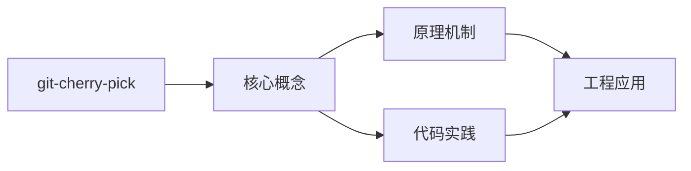
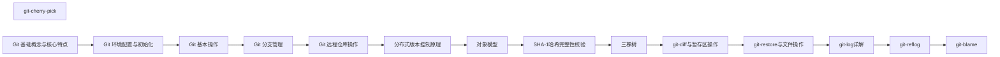

## 1. 学习目标（Bloom 分类）

本节按照布鲁姆教育目标分类学组织学习路径。本文主题为《git-cherry-pick》，属于 Git 模块，读者可以根据自身阶段选择阅读深度。

记忆层面：能够准确复述本文的核心概念、术语与基本语法或操作步骤，并能够在提问或检索时快速定位对应知识点。能够说出 Git 的核心概念、常用命令与流程。

理解层面：能够用自己的语言解释核心原理与工作机制，说明概念之间的因果关系，而不是机械记忆结论。能够解释 Git 的工作原理与设计动机。

应用层面：能够在真实项目或练习场景中运用本文知识解决具体问题，写出正确且可维护的实现。能够独立完成 Git 的标准操作。

分析层面：能够拆解复杂问题，比较本文主题与相邻概念的异同，识别边界条件与例外情况。能够分析 Git 使用中的异常与边界。

评价层面：能够根据约束条件（性能、可读性、安全、成本）评价不同方案的优劣，做出有依据的技术决策。能够评价 Git 相关工具与方案。

创造层面：能够把本文知识与其他模块知识组合，设计出新的解决方案或可复用的工程模式。能够把 Git 融入团队工作流。

通过本节学习，读者应当能够把《git-cherry-pick》纳入自己的知识网络，并与 Git 模块的其他主题（提交、分支、合并、远程协作）建立关联。

## 2. 历史动机与发展脉络

《git-cherry-pick》是 Git 领域的重要主题。要真正理解它，需要先了解它解决的问题与演进过程。

Git 由 Linus Torvalds 于 2005 年为 Linux 内核开发，目标是替代 BitKeeper：分布式、高性能、内容寻址。
Git 的核心是对象模型：blob（内容）、tree（目录）、commit（快照 + 元数据）、tag（引用）；一切对象用 SHA-1 哈希寻址。
工作流演进：集中式工作流 -> 特性分支 -> GitFlow -> GitHub Flow / Trunk-Based；现代团队普遍采用 PR 审查 + 主干发布。

回到本文主题：git-cherry-pick 的提出与成熟，正是上述技术背景下的必然产物。早期实现往往以简单可用为目标，随着工程规模扩大，社区逐渐沉淀出标准做法与最佳实践；理解这一脉络，可以帮助读者判断“为什么文档中的推荐写法是现在这个样子”，也能在遇到历史遗留代码时准确识别其设计年代与取舍。


## 3. 形式化定义与核心概念精讲

本节把《git-cherry-pick》涉及的核心概念以“定义 + 讲解”的形式展开。读者应把定义当作工具，把讲解当作理解路径；两者结合才能形成可迁移的知识。

三个区域：工作区、暂存区（index）、仓库（HEAD）；git add/commit 移动状态。
分支是指针：创建分支成本极低；合并（merge 生成合并提交）与变基（rebase 重放提交）各有取舍。
远程协作：clone/fetch/pull/push；refs/remotes 跟踪远端；冲突在合并时出现并手工解决。

### 3.1 原文章节逐一精讲

原文档把主题拆分为 12 个小节，下面按顺序给出每一节的导读讲解，随后保留原文细节供精读。

#### 原文精读（完整保留）

# Git cherry-pick

> **符号约定**：`< >` 必填参数 | `[ ]` 可选参数

---

#### 1. cherry-pick 概述

##### 1.1 什么是 cherry-pick

`git cherry-pick` 将指定的提交**移植**到当前分支，创建新的提交（新哈希）。

```
原始状态:
  A---B---C main
       \
        D---E feature

cherry-pick D 到 main:
  A---B---C---D' main
       \
        D---E feature
```

##### 1.2 适用场景

| 场景           | 说明                                 |
| :------------- | :----------------------------------- |
| **热修复**     | 将修复提交从开发分支移植到发布分支   |
| **选择性合并** | 只合并特定功能，不合并整个分支       |
| **补丁回移**   | 将维护分支的修复回移到主分支         |
| **误提交修正** | 将误提交到错误分支的提交移到正确分支 |

#### 2. 基本用法

##### 2.1 单个提交

```bash
git cherry-pick abc1234
```

##### 2.2 多个提交

```bash
# 多个提交
git cherry-pick abc1234 def5678

# 提交范围
git cherry-pick abc1234..def5678    # 不包含 abc1234
git cherry-pick abc1234^..def5678   # 包含 abc1234
```

##### 2.3 常用选项

```bash
# 只应用变更但不提交
git cherry-pick -n abc1234

# 保留原始作者信息
git cherry-pick -x abc1234    # 在消息中添加原始提交哈希

# 修改提交消息
git cherry-pick -e abc1234

# 保留提交的父提交信息（用于合并提交）
git cherry-pick -m 1 abc1234
```

#### 3. 冲突处理

##### 3.1 解决冲突

```bash
git cherry-pick abc1234
# CONFLICT: ...

# 解决冲突
vim conflicted-file.js
git add .
git cherry-pick --continue
```

##### 3.2 跳过提交

```bash
git cherry-pick --skip
```

##### 3.3 放弃 cherry-pick

```bash
git cherry-pick --abort
```

#### 4. 实际场景

##### 4.1 热修复

```bash
# 在 develop 分支修复了 Bug
git checkout develop
git commit -m "fix: resolve critical bug"

# 将修复移植到 release 分支
git checkout release/v2.0
git cherry-pick abc1234
```

##### 4.2 误提交修正

```bash
# 误提交到 main
git checkout main
git log --oneline -3
# abc1234 feat: should be in feature branch

# 移植到正确分支
git checkout feature
git cherry-pick abc1234

# 从 main 移除
git checkout main
git revert abc1234
```

##### 4.3 批量移植

```bash
# 将 feature 分支的最近3个提交移植
git checkout main
git cherry-pick feature~3..feature
```

#### 5. 注意事项

- cherry-pick 创建**新提交**（新哈希），不是移动原提交
- 同一变更 cherry-pick 两次会产生重复提交
- 合并提交的 cherry-pick 需要指定父提交编号
- cherry-pick 后可能需要解决上下文冲突
#### 基本用法

**基本写法：应用单个提交到当前分支**
`git cherry-pick <提交>`
```bash
# 将指定提交应用到当前分支
git cherry-pick abc1234
```

---

**基本写法：应用多个提交**
`git cherry-pick <提交1> <提交2>`
```bash
# 按顺序应用多个提交
git cherry-pick abc1234 def5678
```

---

**基本写法：应用提交范围**
`git cherry-pick <起点>..<终点>`
```bash
# 应用从起点之后到终点的提交（不含起点）
git cherry-pick v1.0.0..v1.1.0
```

---

**基本写法：应用包含起点的范围**
`git cherry-pick <起点>^..<终点>`
```bash
# 应用从起点到终点的所有提交
git cherry-pick v1.0.0^..v1.1.0
```

---

#### 保留信息

**基本写法：保留原提交作者**
`git cherry-pick -x <提交>`
```bash
# 在提交信息中追加原提交哈希
git cherry-pick -x abc1234
```

---

**基本写法：保留原提交哈希引用**
`git cherry-pick --edit <提交>`
```bash
# 应用时打开编辑器修改提交信息
git cherry-pick --edit abc1234
```

---

**基本写法：使用原提交信息**
`git cherry-pick --no-commit <提交>`
```bash
# 应用变更但不立即提交
git cherry-pick --no-commit abc1234
```

---

**基本写法：自定义提交信息**
`git cherry-pick --signoff <提交>`
```bash
# 添加 Signed-off-by 签名
git cherry-pick --signoff abc1234
```

---

#### 冲突处理

**基本写法：继续 cherry-pick**
`git cherry-pick --continue`
```bash
# 解决冲突后继续
git cherry-pick --continue
```

---

**基本写法：放弃当前 cherry-pick**
`git cherry-pick --abort`
```bash
# 取消并回到操作前状态
git cherry-pick --abort
```

---

**基本写法：跳过当前提交**
`git cherry-pick --skip`
```bash
# 跳过当前冲突提交继续下一个
git cherry-pick --skip
```

---

**基本写法：保留冲突标记的合并提交**
`git cherry-pick --keep-redundant-commits <提交>`
```bash
# 即使变更已被包含也保留提交
git cherry-pick --keep-redundant-commits abc1234
```

---

#### 策略选项

**基本写法：指定合并策略**
`git cherry-pick -X <策略> <提交>`
```bash
# 使用 theirs 策略优先采用被应用提交
git cherry-pick -X theirs abc1234
```

---

**基本写法：使用 ours 策略**
`git cherry-pick -X ours <提交>`
```bash
# 冲突时优先保留当前分支内容
git cherry-pick -X ours abc1234
```

---

#### 主分支回退场景

**基本写法：从 hotfix 分支拣选修复到 main**
`git cherry-pick <修复提交>`
```bash
# 切到 main 后应用 hotfix 提交
git cherry-pick hotfix-9a3b1c2
```

---

**基本写法：从 main 拣选到发布分支**
`git cherry-pick <提交>`
```bash
# 将 main 上的修复同步到 release 分支
git cherry-pick release-1.2.3
```

---

#### 批量操作

**基本写法：批量拣选多分支提交**
`git cherry-pick <分支A>^..<分支B>`
```bash
# 拣选 A 到 B 范围内的所有提交
git cherry-pick feature^..release
```

---

**基本写法：从 git log 拣选**
`git cherry-pick $(git log --grep="<关键字>" --format=%H)`
```bash
# 拣选所有匹配关键字的提交
git cherry-pick $(git log --grep="fix:" --format=%H)
```

---

#### 验证与查询

**基本写法：查看哪些提交尚未应用**
`git cherry -v <上游分支>`
```bash
# 显示尚未合并到上游的提交
git cherry -v main
```

---

**基本写法：显示带 + 或 - 的可拣选提交**
`git cherry <上游> <分支>`
```bash
# 列出指定分支相对上游的可拣选状态
git cherry main feature
```


### 3.2 概念关系图

下面用 Mermaid 图表达本文核心概念之间的关系，帮助读者建立整体图景：



图中展示的是本文知识的结构化关系：核心概念是入口，原理机制解释“为什么”，代码实践演示“怎么做”，工程应用回答“何时用”。读者学习时可以把每个小节的内容挂接到对应节点上。

## 4. 理论推导与原理解析

本节深入《git-cherry-pick》背后的原理。理论部分不求面面俱到，而是聚焦“能解释现象、能指导实践”的关键推导。

三个区域：工作区、暂存区（index）、仓库（HEAD）；git add/commit 移动状态。
分支是指针：创建分支成本极低；合并（merge 生成合并提交）与变基（rebase 重放提交）各有取舍。
远程协作：clone/fetch/pull/push；refs/remotes 跟踪远端；冲突在合并时出现并手工解决。
撤销模型：checkout/restore 改工作区，reset 移 HEAD，revert 生成反向提交；理解三者避免误操作。

需要强调的是，理论推导与工程实践之间存在翻译层：理论给出的是理想化模型与边界条件，工程代码则必须处理真实环境中的例外。读者在学习时应先掌握理论的“标准情形”，再通过陷阱章节了解“非标准情形”。

## 5. 代码示例与逐行讲解

本节把原文中的代码示例系统整理，并为每个示例补充用途说明与讲解。读者不应只浏览代码，而应逐段对照讲解理解设计意图。

### 5.1 示例：1.1 什么是 cherry-pick

该示例来自原文《1.1 什么是 cherry-pick》小节，用于演示git-cherry-pick相关操作。阅读时请先看代码结构，再看其后的讲解。

```text
原始状态:
  A---B---C main
       \
        D---E feature

cherry-pick D 到 main:
  A---B---C---D' main
       \
        D---E feature
```

讲解：这段代码演示了本节核心知识点。代码中的关键操作可以归纳为三步：准备（定义或初始化）、执行（核心逻辑）、收尾（释放资源或返回结果）。实际项目中，这三步往往被封装为函数或类，以提升复用性与可测试性。

关键点分析：

该示例共 8 行有效代码，结构以数据或配置为主。阅读时应关注：数据字段的含义、配置项的作用，以及它们与运行行为的对应关系。

进阶思考路径：先尝试修改参数观察行为变化，再把示例中的模式迁移到自己的项目中；每次修改都记录预期与实测差异，这是把示例转化为能力的最快方式。

### 5.2 示例：2.1 单个提交

该示例来自原文《2.1 单个提交》小节，用于演示git-cherry-pick相关操作。阅读时请先看代码结构，再看其后的讲解。

```bash
git cherry-pick abc1234
```

讲解：这段代码演示了本节核心知识点。代码中的关键操作可以归纳为三步：准备（定义或初始化）、执行（核心逻辑）、收尾（释放资源或返回结果）。实际项目中，这三步往往被封装为函数或类，以提升复用性与可测试性。

关键点分析：

该示例共 1 行有效代码，结构以数据或配置为主。阅读时应关注：数据字段的含义、配置项的作用，以及它们与运行行为的对应关系。

进阶思考路径：先尝试修改参数观察行为变化，再把示例中的模式迁移到自己的项目中；每次修改都记录预期与实测差异，这是把示例转化为能力的最快方式。

### 5.3 示例：2.2 多个提交

该示例来自原文《2.2 多个提交》小节，用于演示git-cherry-pick相关操作。阅读时请先看代码结构，再看其后的讲解。

```bash
# 多个提交
git cherry-pick abc1234 def5678

# 提交范围
git cherry-pick abc1234..def5678    # 不包含 abc1234
git cherry-pick abc1234^..def5678   # 包含 abc1234
```

讲解：这段代码演示了本节核心知识点。代码中的关键操作可以归纳为三步：准备（定义或初始化）、执行（核心逻辑）、收尾（释放资源或返回结果）。实际项目中，这三步往往被封装为函数或类，以提升复用性与可测试性。

关键点分析：

该示例共 5 行有效代码，结构以数据或配置为主。阅读时应关注：数据字段的含义、配置项的作用，以及它们与运行行为的对应关系。

进阶思考路径：先尝试修改参数观察行为变化，再把示例中的模式迁移到自己的项目中；每次修改都记录预期与实测差异，这是把示例转化为能力的最快方式。

### 5.4 示例：2.3 常用选项

该示例来自原文《2.3 常用选项》小节，用于演示git-cherry-pick相关操作。阅读时请先看代码结构，再看其后的讲解。

```bash
# 只应用变更但不提交
git cherry-pick -n abc1234

# 保留原始作者信息
git cherry-pick -x abc1234    # 在消息中添加原始提交哈希

# 修改提交消息
git cherry-pick -e abc1234

# 保留提交的父提交信息（用于合并提交）
git cherry-pick -m 1 abc1234
```

讲解：这段代码演示了本节核心知识点。代码中的关键操作可以归纳为三步：准备（定义或初始化）、执行（核心逻辑）、收尾（释放资源或返回结果）。实际项目中，这三步往往被封装为函数或类，以提升复用性与可测试性。

关键点分析：

该示例共 8 行有效代码，结构以数据或配置为主。阅读时应关注：数据字段的含义、配置项的作用，以及它们与运行行为的对应关系。

进阶思考路径：先尝试修改参数观察行为变化，再把示例中的模式迁移到自己的项目中；每次修改都记录预期与实测差异，这是把示例转化为能力的最快方式。

### 5.5 示例：3.1 解决冲突

该示例来自原文《3.1 解决冲突》小节，用于演示git-cherry-pick相关操作。阅读时请先看代码结构，再看其后的讲解。

```bash
git cherry-pick abc1234
# CONFLICT: ...

# 解决冲突
vim conflicted-file.js
git add .
git cherry-pick --continue
```

讲解：这段代码演示了本节核心知识点。代码中的关键操作可以归纳为三步：准备（定义或初始化）、执行（核心逻辑）、收尾（释放资源或返回结果）。实际项目中，这三步往往被封装为函数或类，以提升复用性与可测试性。

关键点分析：

该示例共 6 行有效代码，结构以数据或配置为主。阅读时应关注：数据字段的含义、配置项的作用，以及它们与运行行为的对应关系。

进阶思考路径：先尝试修改参数观察行为变化，再把示例中的模式迁移到自己的项目中；每次修改都记录预期与实测差异，这是把示例转化为能力的最快方式。

### 5.6 示例：3.2 跳过提交

该示例来自原文《3.2 跳过提交》小节，用于演示git-cherry-pick相关操作。阅读时请先看代码结构，再看其后的讲解。

```bash
git cherry-pick --skip
```

讲解：这段代码演示了本节核心知识点。代码中的关键操作可以归纳为三步：准备（定义或初始化）、执行（核心逻辑）、收尾（释放资源或返回结果）。实际项目中，这三步往往被封装为函数或类，以提升复用性与可测试性。

关键点分析：

该示例共 1 行有效代码，结构以数据或配置为主。阅读时应关注：数据字段的含义、配置项的作用，以及它们与运行行为的对应关系。

进阶思考路径：先尝试修改参数观察行为变化，再把示例中的模式迁移到自己的项目中；每次修改都记录预期与实测差异，这是把示例转化为能力的最快方式。

### 5.7 示例：3.3 放弃 cherry-pick

该示例来自原文《3.3 放弃 cherry-pick》小节，用于演示git-cherry-pick相关操作。阅读时请先看代码结构，再看其后的讲解。

```bash
git cherry-pick --abort
```

讲解：这段代码演示了本节核心知识点。代码中的关键操作可以归纳为三步：准备（定义或初始化）、执行（核心逻辑）、收尾（释放资源或返回结果）。实际项目中，这三步往往被封装为函数或类，以提升复用性与可测试性。

关键点分析：

该示例共 1 行有效代码，结构以数据或配置为主。阅读时应关注：数据字段的含义、配置项的作用，以及它们与运行行为的对应关系。

进阶思考路径：先尝试修改参数观察行为变化，再把示例中的模式迁移到自己的项目中；每次修改都记录预期与实测差异，这是把示例转化为能力的最快方式。

### 5.8 示例：4.1 热修复

该示例来自原文《4.1 热修复》小节，用于演示git-cherry-pick相关操作。阅读时请先看代码结构，再看其后的讲解。

```bash
# 在 develop 分支修复了 Bug
git checkout develop
git commit -m "fix: resolve critical bug"

# 将修复移植到 release 分支
git checkout release/v2.0
git cherry-pick abc1234
```

讲解：这段代码演示了本节核心知识点。代码中的关键操作可以归纳为三步：准备（定义或初始化）、执行（核心逻辑）、收尾（释放资源或返回结果）。实际项目中，这三步往往被封装为函数或类，以提升复用性与可测试性。

关键点分析：

该示例共 6 行有效代码，结构以数据或配置为主。阅读时应关注：数据字段的含义、配置项的作用，以及它们与运行行为的对应关系。

进阶思考路径：先尝试修改参数观察行为变化，再把示例中的模式迁移到自己的项目中；每次修改都记录预期与实测差异，这是把示例转化为能力的最快方式。

### 5.9 示例：4.2 误提交修正

该示例来自原文《4.2 误提交修正》小节，用于演示git-cherry-pick相关操作。阅读时请先看代码结构，再看其后的讲解。

```bash
# 误提交到 main
git checkout main
git log --oneline -3
# abc1234 feat: should be in feature branch

# 移植到正确分支
git checkout feature
git cherry-pick abc1234

# 从 main 移除
git checkout main
git revert abc1234
```

讲解：这段代码演示了本节核心知识点。代码中的关键操作可以归纳为三步：准备（定义或初始化）、执行（核心逻辑）、收尾（释放资源或返回结果）。实际项目中，这三步往往被封装为函数或类，以提升复用性与可测试性。

关键点分析：

该示例共 10 行有效代码，结构以数据或配置为主。阅读时应关注：数据字段的含义、配置项的作用，以及它们与运行行为的对应关系。

进阶思考路径：先尝试修改参数观察行为变化，再把示例中的模式迁移到自己的项目中；每次修改都记录预期与实测差异，这是把示例转化为能力的最快方式。

### 5.10 示例：4.3 批量移植

该示例来自原文《4.3 批量移植》小节，用于演示git-cherry-pick相关操作。阅读时请先看代码结构，再看其后的讲解。

```bash
# 将 feature 分支的最近3个提交移植
git checkout main
git cherry-pick feature~3..feature
```

讲解：这段代码演示了本节核心知识点。代码中的关键操作可以归纳为三步：准备（定义或初始化）、执行（核心逻辑）、收尾（释放资源或返回结果）。实际项目中，这三步往往被封装为函数或类，以提升复用性与可测试性。

关键点分析：

该示例共 3 行有效代码，结构以数据或配置为主。阅读时应关注：数据字段的含义、配置项的作用，以及它们与运行行为的对应关系。

进阶思考路径：先尝试修改参数观察行为变化，再把示例中的模式迁移到自己的项目中；每次修改都记录预期与实测差异，这是把示例转化为能力的最快方式。

### 5.11 示例：基本用法

该示例来自原文《基本用法》小节，用于演示git-cherry-pick相关操作。阅读时请先看代码结构，再看其后的讲解。

```bash
# 将指定提交应用到当前分支
git cherry-pick abc1234
```

讲解：这段代码演示了本节核心知识点。代码中的关键操作可以归纳为三步：准备（定义或初始化）、执行（核心逻辑）、收尾（释放资源或返回结果）。实际项目中，这三步往往被封装为函数或类，以提升复用性与可测试性。

关键点分析：

该示例共 2 行有效代码，结构以数据或配置为主。阅读时应关注：数据字段的含义、配置项的作用，以及它们与运行行为的对应关系。

进阶思考路径：先尝试修改参数观察行为变化，再把示例中的模式迁移到自己的项目中；每次修改都记录预期与实测差异，这是把示例转化为能力的最快方式。

### 5.12 示例：基本用法

该示例来自原文《基本用法》小节，用于演示git-cherry-pick相关操作。阅读时请先看代码结构，再看其后的讲解。

```bash
# 按顺序应用多个提交
git cherry-pick abc1234 def5678
```

讲解：这段代码演示了本节核心知识点。代码中的关键操作可以归纳为三步：准备（定义或初始化）、执行（核心逻辑）、收尾（释放资源或返回结果）。实际项目中，这三步往往被封装为函数或类，以提升复用性与可测试性。

关键点分析：

该示例共 2 行有效代码，结构以数据或配置为主。阅读时应关注：数据字段的含义、配置项的作用，以及它们与运行行为的对应关系。

进阶思考路径：先尝试修改参数观察行为变化，再把示例中的模式迁移到自己的项目中；每次修改都记录预期与实测差异，这是把示例转化为能力的最快方式。

### 5.13 示例：基本用法

该示例来自原文《基本用法》小节，用于演示git-cherry-pick相关操作。阅读时请先看代码结构，再看其后的讲解。

```bash
# 应用从起点之后到终点的提交（不含起点）
git cherry-pick v1.0.0..v1.1.0
```

讲解：这段代码演示了本节核心知识点。代码中的关键操作可以归纳为三步：准备（定义或初始化）、执行（核心逻辑）、收尾（释放资源或返回结果）。实际项目中，这三步往往被封装为函数或类，以提升复用性与可测试性。

关键点分析：

该示例共 2 行有效代码，结构以数据或配置为主。阅读时应关注：数据字段的含义、配置项的作用，以及它们与运行行为的对应关系。

进阶思考路径：先尝试修改参数观察行为变化，再把示例中的模式迁移到自己的项目中；每次修改都记录预期与实测差异，这是把示例转化为能力的最快方式。

### 5.14 示例：基本用法

该示例来自原文《基本用法》小节，用于演示git-cherry-pick相关操作。阅读时请先看代码结构，再看其后的讲解。

```bash
# 应用从起点到终点的所有提交
git cherry-pick v1.0.0^..v1.1.0
```

讲解：这段代码演示了本节核心知识点。代码中的关键操作可以归纳为三步：准备（定义或初始化）、执行（核心逻辑）、收尾（释放资源或返回结果）。实际项目中，这三步往往被封装为函数或类，以提升复用性与可测试性。

关键点分析：

该示例共 2 行有效代码，结构以数据或配置为主。阅读时应关注：数据字段的含义、配置项的作用，以及它们与运行行为的对应关系。

进阶思考路径：先尝试修改参数观察行为变化，再把示例中的模式迁移到自己的项目中；每次修改都记录预期与实测差异，这是把示例转化为能力的最快方式。

### 5.15 示例：保留信息

该示例来自原文《保留信息》小节，用于演示git-cherry-pick相关操作。阅读时请先看代码结构，再看其后的讲解。

```bash
# 在提交信息中追加原提交哈希
git cherry-pick -x abc1234
```

讲解：这段代码演示了本节核心知识点。代码中的关键操作可以归纳为三步：准备（定义或初始化）、执行（核心逻辑）、收尾（释放资源或返回结果）。实际项目中，这三步往往被封装为函数或类，以提升复用性与可测试性。

关键点分析：

该示例共 2 行有效代码，结构以数据或配置为主。阅读时应关注：数据字段的含义、配置项的作用，以及它们与运行行为的对应关系。

进阶思考路径：先尝试修改参数观察行为变化，再把示例中的模式迁移到自己的项目中；每次修改都记录预期与实测差异，这是把示例转化为能力的最快方式。

### 5.16 示例：保留信息

该示例来自原文《保留信息》小节，用于演示git-cherry-pick相关操作。阅读时请先看代码结构，再看其后的讲解。

```bash
# 应用时打开编辑器修改提交信息
git cherry-pick --edit abc1234
```

讲解：这段代码演示了本节核心知识点。代码中的关键操作可以归纳为三步：准备（定义或初始化）、执行（核心逻辑）、收尾（释放资源或返回结果）。实际项目中，这三步往往被封装为函数或类，以提升复用性与可测试性。

关键点分析：

该示例共 2 行有效代码，结构以数据或配置为主。阅读时应关注：数据字段的含义、配置项的作用，以及它们与运行行为的对应关系。

进阶思考路径：先尝试修改参数观察行为变化，再把示例中的模式迁移到自己的项目中；每次修改都记录预期与实测差异，这是把示例转化为能力的最快方式。

### 5.17 示例：保留信息

该示例来自原文《保留信息》小节，用于演示git-cherry-pick相关操作。阅读时请先看代码结构，再看其后的讲解。

```bash
# 应用变更但不立即提交
git cherry-pick --no-commit abc1234
```

讲解：这段代码演示了本节核心知识点。代码中的关键操作可以归纳为三步：准备（定义或初始化）、执行（核心逻辑）、收尾（释放资源或返回结果）。实际项目中，这三步往往被封装为函数或类，以提升复用性与可测试性。

关键点分析：

该示例共 2 行有效代码，结构以数据或配置为主。阅读时应关注：数据字段的含义、配置项的作用，以及它们与运行行为的对应关系。

进阶思考路径：先尝试修改参数观察行为变化，再把示例中的模式迁移到自己的项目中；每次修改都记录预期与实测差异，这是把示例转化为能力的最快方式。

### 5.18 示例：保留信息

该示例来自原文《保留信息》小节，用于演示git-cherry-pick相关操作。阅读时请先看代码结构，再看其后的讲解。

```bash
# 添加 Signed-off-by 签名
git cherry-pick --signoff abc1234
```

讲解：这段代码演示了本节核心知识点。代码中的关键操作可以归纳为三步：准备（定义或初始化）、执行（核心逻辑）、收尾（释放资源或返回结果）。实际项目中，这三步往往被封装为函数或类，以提升复用性与可测试性。

关键点分析：

该示例共 2 行有效代码，结构以数据或配置为主。阅读时应关注：数据字段的含义、配置项的作用，以及它们与运行行为的对应关系。

进阶思考路径：先尝试修改参数观察行为变化，再把示例中的模式迁移到自己的项目中；每次修改都记录预期与实测差异，这是把示例转化为能力的最快方式。

### 5.19 示例：冲突处理

该示例来自原文《冲突处理》小节，用于演示git-cherry-pick相关操作。阅读时请先看代码结构，再看其后的讲解。

```bash
# 解决冲突后继续
git cherry-pick --continue
```

讲解：这段代码演示了本节核心知识点。代码中的关键操作可以归纳为三步：准备（定义或初始化）、执行（核心逻辑）、收尾（释放资源或返回结果）。实际项目中，这三步往往被封装为函数或类，以提升复用性与可测试性。

关键点分析：

该示例共 2 行有效代码，结构以数据或配置为主。阅读时应关注：数据字段的含义、配置项的作用，以及它们与运行行为的对应关系。

进阶思考路径：先尝试修改参数观察行为变化，再把示例中的模式迁移到自己的项目中；每次修改都记录预期与实测差异，这是把示例转化为能力的最快方式。

### 5.20 示例：冲突处理

该示例来自原文《冲突处理》小节，用于演示git-cherry-pick相关操作。阅读时请先看代码结构，再看其后的讲解。

```bash
# 取消并回到操作前状态
git cherry-pick --abort
```

讲解：这段代码演示了本节核心知识点。代码中的关键操作可以归纳为三步：准备（定义或初始化）、执行（核心逻辑）、收尾（释放资源或返回结果）。实际项目中，这三步往往被封装为函数或类，以提升复用性与可测试性。

关键点分析：

该示例共 2 行有效代码，结构以数据或配置为主。阅读时应关注：数据字段的含义、配置项的作用，以及它们与运行行为的对应关系。

进阶思考路径：先尝试修改参数观察行为变化，再把示例中的模式迁移到自己的项目中；每次修改都记录预期与实测差异，这是把示例转化为能力的最快方式。

### 5.21 示例：冲突处理

该示例来自原文《冲突处理》小节，用于演示git-cherry-pick相关操作。阅读时请先看代码结构，再看其后的讲解。

```bash
# 跳过当前冲突提交继续下一个
git cherry-pick --skip
```

讲解：这段代码演示了本节核心知识点。代码中的关键操作可以归纳为三步：准备（定义或初始化）、执行（核心逻辑）、收尾（释放资源或返回结果）。实际项目中，这三步往往被封装为函数或类，以提升复用性与可测试性。

关键点分析：

该示例共 2 行有效代码，结构以数据或配置为主。阅读时应关注：数据字段的含义、配置项的作用，以及它们与运行行为的对应关系。

进阶思考路径：先尝试修改参数观察行为变化，再把示例中的模式迁移到自己的项目中；每次修改都记录预期与实测差异，这是把示例转化为能力的最快方式。

### 5.22 示例：冲突处理

该示例来自原文《冲突处理》小节，用于演示git-cherry-pick相关操作。阅读时请先看代码结构，再看其后的讲解。

```bash
# 即使变更已被包含也保留提交
git cherry-pick --keep-redundant-commits abc1234
```

讲解：这段代码演示了本节核心知识点。代码中的关键操作可以归纳为三步：准备（定义或初始化）、执行（核心逻辑）、收尾（释放资源或返回结果）。实际项目中，这三步往往被封装为函数或类，以提升复用性与可测试性。

关键点分析：

该示例共 2 行有效代码，结构以数据或配置为主。阅读时应关注：数据字段的含义、配置项的作用，以及它们与运行行为的对应关系。

进阶思考路径：先尝试修改参数观察行为变化，再把示例中的模式迁移到自己的项目中；每次修改都记录预期与实测差异，这是把示例转化为能力的最快方式。

### 5.23 示例：策略选项

该示例来自原文《策略选项》小节，用于演示git-cherry-pick相关操作。阅读时请先看代码结构，再看其后的讲解。

```bash
# 使用 theirs 策略优先采用被应用提交
git cherry-pick -X theirs abc1234
```

讲解：这段代码演示了本节核心知识点。代码中的关键操作可以归纳为三步：准备（定义或初始化）、执行（核心逻辑）、收尾（释放资源或返回结果）。实际项目中，这三步往往被封装为函数或类，以提升复用性与可测试性。

关键点分析：

该示例共 2 行有效代码，结构以数据或配置为主。阅读时应关注：数据字段的含义、配置项的作用，以及它们与运行行为的对应关系。

进阶思考路径：先尝试修改参数观察行为变化，再把示例中的模式迁移到自己的项目中；每次修改都记录预期与实测差异，这是把示例转化为能力的最快方式。

### 5.24 示例：策略选项

该示例来自原文《策略选项》小节，用于演示git-cherry-pick相关操作。阅读时请先看代码结构，再看其后的讲解。

```bash
# 冲突时优先保留当前分支内容
git cherry-pick -X ours abc1234
```

讲解：这段代码演示了本节核心知识点。代码中的关键操作可以归纳为三步：准备（定义或初始化）、执行（核心逻辑）、收尾（释放资源或返回结果）。实际项目中，这三步往往被封装为函数或类，以提升复用性与可测试性。

关键点分析：

该示例共 2 行有效代码，结构以数据或配置为主。阅读时应关注：数据字段的含义、配置项的作用，以及它们与运行行为的对应关系。

进阶思考路径：先尝试修改参数观察行为变化，再把示例中的模式迁移到自己的项目中；每次修改都记录预期与实测差异，这是把示例转化为能力的最快方式。

### 5.25 示例：主分支回退场景

该示例来自原文《主分支回退场景》小节，用于演示git-cherry-pick相关操作。阅读时请先看代码结构，再看其后的讲解。

```bash
# 切到 main 后应用 hotfix 提交
git cherry-pick hotfix-9a3b1c2
```

讲解：这段代码演示了本节核心知识点。代码中的关键操作可以归纳为三步：准备（定义或初始化）、执行（核心逻辑）、收尾（释放资源或返回结果）。实际项目中，这三步往往被封装为函数或类，以提升复用性与可测试性。

关键点分析：

该示例共 2 行有效代码，结构以数据或配置为主。阅读时应关注：数据字段的含义、配置项的作用，以及它们与运行行为的对应关系。

进阶思考路径：先尝试修改参数观察行为变化，再把示例中的模式迁移到自己的项目中；每次修改都记录预期与实测差异，这是把示例转化为能力的最快方式。

### 5.26 示例：主分支回退场景

该示例来自原文《主分支回退场景》小节，用于演示git-cherry-pick相关操作。阅读时请先看代码结构，再看其后的讲解。

```bash
# 将 main 上的修复同步到 release 分支
git cherry-pick release-1.2.3
```

讲解：这段代码演示了本节核心知识点。代码中的关键操作可以归纳为三步：准备（定义或初始化）、执行（核心逻辑）、收尾（释放资源或返回结果）。实际项目中，这三步往往被封装为函数或类，以提升复用性与可测试性。

关键点分析：

该示例共 2 行有效代码，结构以数据或配置为主。阅读时应关注：数据字段的含义、配置项的作用，以及它们与运行行为的对应关系。

进阶思考路径：先尝试修改参数观察行为变化，再把示例中的模式迁移到自己的项目中；每次修改都记录预期与实测差异，这是把示例转化为能力的最快方式。

### 5.27 示例：批量操作

该示例来自原文《批量操作》小节，用于演示git-cherry-pick相关操作。阅读时请先看代码结构，再看其后的讲解。

```bash
# 拣选 A 到 B 范围内的所有提交
git cherry-pick feature^..release
```

讲解：这段代码演示了本节核心知识点。代码中的关键操作可以归纳为三步：准备（定义或初始化）、执行（核心逻辑）、收尾（释放资源或返回结果）。实际项目中，这三步往往被封装为函数或类，以提升复用性与可测试性。

关键点分析：

该示例共 2 行有效代码，结构以数据或配置为主。阅读时应关注：数据字段的含义、配置项的作用，以及它们与运行行为的对应关系。

进阶思考路径：先尝试修改参数观察行为变化，再把示例中的模式迁移到自己的项目中；每次修改都记录预期与实测差异，这是把示例转化为能力的最快方式。

### 5.28 示例：批量操作

该示例来自原文《批量操作》小节，用于演示git-cherry-pick相关操作。阅读时请先看代码结构，再看其后的讲解。

```bash
# 拣选所有匹配关键字的提交
git cherry-pick $(git log --grep="fix:" --format=%H)
```

讲解：这段代码演示了本节核心知识点。代码中的关键操作可以归纳为三步：准备（定义或初始化）、执行（核心逻辑）、收尾（释放资源或返回结果）。实际项目中，这三步往往被封装为函数或类，以提升复用性与可测试性。

关键点分析：

该示例共 2 行有效代码，结构以数据或配置为主。阅读时应关注：数据字段的含义、配置项的作用，以及它们与运行行为的对应关系。

进阶思考路径：先尝试修改参数观察行为变化，再把示例中的模式迁移到自己的项目中；每次修改都记录预期与实测差异，这是把示例转化为能力的最快方式。

### 5.29 示例：验证与查询

该示例来自原文《验证与查询》小节，用于演示git-cherry-pick相关操作。阅读时请先看代码结构，再看其后的讲解。

```bash
# 显示尚未合并到上游的提交
git cherry -v main
```

讲解：这段代码演示了本节核心知识点。代码中的关键操作可以归纳为三步：准备（定义或初始化）、执行（核心逻辑）、收尾（释放资源或返回结果）。实际项目中，这三步往往被封装为函数或类，以提升复用性与可测试性。

关键点分析：

该示例共 2 行有效代码，结构以数据或配置为主。阅读时应关注：数据字段的含义、配置项的作用，以及它们与运行行为的对应关系。

进阶思考路径：先尝试修改参数观察行为变化，再把示例中的模式迁移到自己的项目中；每次修改都记录预期与实测差异，这是把示例转化为能力的最快方式。

### 5.30 示例：验证与查询

该示例来自原文《验证与查询》小节，用于演示git-cherry-pick相关操作。阅读时请先看代码结构，再看其后的讲解。

```bash
# 列出指定分支相对上游的可拣选状态
git cherry main feature
```

讲解：这段代码演示了本节核心知识点。代码中的关键操作可以归纳为三步：准备（定义或初始化）、执行（核心逻辑）、收尾（释放资源或返回结果）。实际项目中，这三步往往被封装为函数或类，以提升复用性与可测试性。

关键点分析：

该示例共 2 行有效代码，结构以数据或配置为主。阅读时应关注：数据字段的含义、配置项的作用，以及它们与运行行为的对应关系。

进阶思考路径：先尝试修改参数观察行为变化，再把示例中的模式迁移到自己的项目中；每次修改都记录预期与实测差异，这是把示例转化为能力的最快方式。


综合以上示例，可以总结出本主题的代码实践要点：第一，先定义清晰的输入输出契约；第二，核心逻辑保持单一职责；第三，错误处理与边界条件不可省略；第四，命名与注释表达意图而非复述代码。

## 6. 对比分析

对比是理解《git-cherry-pick》定位的最快路径。下面从多个维度与相邻方案进行对比。

Git 与 SVN：Git 分布式、离线提交、分支廉价；SVN 集中式已基本退出。
merge 与 rebase：merge 保留历史但复杂；rebase 线性整洁但改写。
GitHub Flow 与 GitFlow：前者主干 + PR 适合持续发布；后者适合版本化发布。

对比的目的不是分出绝对优劣，而是建立选择依据：不同约束条件下，最优解不同。读者应把每个对比维度转化为决策检查清单。

## 7. 常见陷阱与最佳实践

本节整理该主题的高频错误与推荐做法。每个陷阱先描述现象，再解释原因，最后给出最佳实践。

### 7.1 提交信息随意

无法追溯。使用 Conventional Commits（feat/fix/docs...）。

深入讲解：该问题之所以被归类为“常见陷阱”，是因为它在初学者的代码中反复出现，而且往往不在第一时间暴露——错误通常隐藏在特定数据或特定时序下。

从成因上看，提交信息随意 一般源于对 Git 某个机制的理解偏差：要么误用了默认行为，要么忽略了边界条件，要么把其他语言的思维惯性带了过来。

从影响上看，提交信息随意 轻则产生错误结果，重则导致资源泄漏、数据损坏或安全事故；这也是为什么工程评审中会把它列为检查项。

从修复策略上看，处理提交信息随意的正确顺序是：先复现（构造最小用例），再定位（确认机制层面的根因），最后修复并补充回归测试。跳过复现直接改代码，往往治标不治本。

### 7.2 大文件入库

仓库膨胀。使用 Git LFS 或排除构建产物。

深入讲解：该问题之所以被归类为“常见陷阱”，是因为它在初学者的代码中反复出现，而且往往不在第一时间暴露——错误通常隐藏在特定数据或特定时序下。

从成因上看，大文件入库 一般源于对 Git 某个机制的理解偏差：要么误用了默认行为，要么忽略了边界条件，要么把其他语言的思维惯性带了过来。

从影响上看，大文件入库 轻则产生错误结果，重则导致资源泄漏、数据损坏或安全事故；这也是为什么工程评审中会把它列为检查项。

从修复策略上看，处理大文件入库的正确顺序是：先复现（构造最小用例），再定位（确认机制层面的根因），最后修复并补充回归测试。跳过复现直接改代码，往往治标不治本。

### 7.3 force push 滥用

覆盖他人历史。仅限个人分支并通知。

深入讲解：该问题之所以被归类为“常见陷阱”，是因为它在初学者的代码中反复出现，而且往往不在第一时间暴露——错误通常隐藏在特定数据或特定时序下。

从成因上看，force push 滥用 一般源于对 Git 某个机制的理解偏差：要么误用了默认行为，要么忽略了边界条件，要么把其他语言的思维惯性带了过来。

从影响上看，force push 滥用 轻则产生错误结果，重则导致资源泄漏、数据损坏或安全事故；这也是为什么工程评审中会把它列为检查项。

从修复策略上看，处理force push 滥用的正确顺序是：先复现（构造最小用例），再定位（确认机制层面的根因），最后修复并补充回归测试。跳过复现直接改代码，往往治标不治本。

### 7.4 merge 冲突拖延

冲突积累。频繁合并、小步提交。

深入讲解：该问题之所以被归类为“常见陷阱”，是因为它在初学者的代码中反复出现，而且往往不在第一时间暴露——错误通常隐藏在特定数据或特定时序下。

从成因上看，merge 冲突拖延 一般源于对 Git 某个机制的理解偏差：要么误用了默认行为，要么忽略了边界条件，要么把其他语言的思维惯性带了过来。

从影响上看，merge 冲突拖延 轻则产生错误结果，重则导致资源泄漏、数据损坏或安全事故；这也是为什么工程评审中会把它列为检查项。

从修复策略上看，处理merge 冲突拖延的正确顺序是：先复现（构造最小用例），再定位（确认机制层面的根因），最后修复并补充回归测试。跳过复现直接改代码，往往治标不治本。

### 7.5 密钥入库

泄露事故。使用 .gitignore 与 secret 扫描。

深入讲解：该问题之所以被归类为“常见陷阱”，是因为它在初学者的代码中反复出现，而且往往不在第一时间暴露——错误通常隐藏在特定数据或特定时序下。

从成因上看，密钥入库 一般源于对 Git 某个机制的理解偏差：要么误用了默认行为，要么忽略了边界条件，要么把其他语言的思维惯性带了过来。

从影响上看，密钥入库 轻则产生错误结果，重则导致资源泄漏、数据损坏或安全事故；这也是为什么工程评审中会把它列为检查项。

从修复策略上看，处理密钥入库的正确顺序是：先复现（构造最小用例），再定位（确认机制层面的根因），最后修复并补充回归测试。跳过复现直接改代码，往往治标不治本。

### 7.6 reset 误操作

丢失工作。确认目标与 --hard 语义。

深入讲解：该问题之所以被归类为“常见陷阱”，是因为它在初学者的代码中反复出现，而且往往不在第一时间暴露——错误通常隐藏在特定数据或特定时序下。

从成因上看，reset 误操作 一般源于对 Git 某个机制的理解偏差：要么误用了默认行为，要么忽略了边界条件，要么把其他语言的思维惯性带了过来。

从影响上看，reset 误操作 轻则产生错误结果，重则导致资源泄漏、数据损坏或安全事故；这也是为什么工程评审中会把它列为检查项。

从修复策略上看，处理reset 误操作的正确顺序是：先复现（构造最小用例），再定位（确认机制层面的根因），最后修复并补充回归测试。跳过复现直接改代码，往往治标不治本。

### 7.7 忽略 .gitignore

构建产物污染。项目初始化即配置。

深入讲解：该问题之所以被归类为“常见陷阱”，是因为它在初学者的代码中反复出现，而且往往不在第一时间暴露——错误通常隐藏在特定数据或特定时序下。

从成因上看，忽略 .gitignore 一般源于对 Git 某个机制的理解偏差：要么误用了默认行为，要么忽略了边界条件，要么把其他语言的思维惯性带了过来。

从影响上看，忽略 .gitignore 轻则产生错误结果，重则导致资源泄漏、数据损坏或安全事故；这也是为什么工程评审中会把它列为检查项。

从修复策略上看，处理忽略 .gitignore的正确顺序是：先复现（构造最小用例），再定位（确认机制层面的根因），最后修复并补充回归测试。跳过复现直接改代码，往往治标不治本。

### 7.8 rebase 公共分支

改写已发布历史。公共分支只 merge。

深入讲解：该问题之所以被归类为“常见陷阱”，是因为它在初学者的代码中反复出现，而且往往不在第一时间暴露——错误通常隐藏在特定数据或特定时序下。

从成因上看，rebase 公共分支 一般源于对 Git 某个机制的理解偏差：要么误用了默认行为，要么忽略了边界条件，要么把其他语言的思维惯性带了过来。

从影响上看，rebase 公共分支 轻则产生错误结果，重则导致资源泄漏、数据损坏或安全事故；这也是为什么工程评审中会把它列为检查项。

从修复策略上看，处理rebase 公共分支的正确顺序是：先复现（构造最小用例），再定位（确认机制层面的根因），最后修复并补充回归测试。跳过复现直接改代码，往往治标不治本。

### 7.0 最佳实践总览

1. 小步提交：每次提交一个逻辑变更，可构建可测试。
2. 提交信息规范：类型 + 简述 + 正文（为什么）。
3. 分支命名：feature/xxx、fix/xxx、docs/xxx。
4. 合入前跑测试与 lint；PR 描述变更与影响。

把这些最佳实践固化为团队规范与代码评审检查项，是避免同类问题反复出现的关键。

## 8. 工程实践

本节把《git-cherry-pick》放入真实工程场景，给出可复用的模式与组织方法。

团队规范：分支策略、提交规范、PR 模板、CODEOWNERS 审查。
自动化：pre-commit hooks、CI 门禁、自动生成 CHANGELOG。
安全：分支保护、签名提交（GPG/SSH）、secret 扫描。

### 8.1 工程实践的原则拆解

以上工程实践可以归纳为四条原则。第一，配置与代码分离：Git 项目中环境差异应通过配置注入，而不是散落在代码分支中；这保证同一份代码可以在开发、测试、生产环境一致运行。

第二，接口稳定优先：对外接口（函数签名、协议、数据格式）一旦被消费方依赖，变更成本极高；设计时应预留扩展点并保持向后兼容。

第三，可观测性内置：日志、指标与追踪应该在功能开发时同步设计，而不是故障发生后补救；没有观测手段的模块等于黑盒。

第四，变更可回滚：任何发布都应有对应的回滚方案；数据库迁移、配置变更与代码发布一样需要版本管理与逆向路径。

### 8.2 实践落地的检查清单

- [ ] 团队规范：对照本节描述，检查当前项目是否已经落实；未落实的项列入技术债并排期处理。
- [ ] 自动化：对照本节描述，检查当前项目是否已经落实；未落实的项列入技术债并排期处理。
- [ ] 安全：对照本节描述，检查当前项目是否已经落实；未落实的项列入技术债并排期处理。

工程实践的共性原则：配置与代码分离、接口稳定优先、可观测性内置、变更可回滚。这些原则适用于本主题的所有实现。

## 9. 案例研究

本节通过一个完整案例把《git-cherry-pick》的知识串起来。案例按“需求分析、方案设计、实现、验证”四步展开。

需求：为团队建立 Git 协作规范并落地。
方案：Trunk-Based + 短特性分支 + PR 审查 + CI。
要点：小 PR、自动测试、冲突及时处理、回滚演练。
验证：统计合并周期与冲突频率，持续改进。

### 9.1 案例的扩展讨论

把案例中的方案放大到真实规模，需要额外考虑三个问题：

第一，规模：当数据量或并发量上升一个数量级时，原方案中的数据结构、缓存策略与任务调度是否仍然成立？通常需要引入分层与异步。

第二，团队：多人协作时，模块边界、接口契约与代码所有权必须明确；案例中的实现应拆分为可独立测试的单元，并配合文档说明设计意图。

第三，演进：上线后的需求变化不可避免；方案设计时应预留扩展点（配置化、插件化、事件化），并定期用真实指标验证假设。


案例研究的学习方法：先独立阅读需求，尝试在脑中形成方案，再对照实现与讲解，最后思考“如果约束变化（数据量、并发、团队规模），方案应如何调整”。

## 10. 知识要点总结与深入讲解

本节以讲解形式汇总全文要点，替代传统的习题与自测，读者不需要答题，只需跟随解释建立完整的认知框架。

关于《git-cherry-pick》的核心结论：

Git 的分布式对象模型是其强大与学习曲线的来源。
提交、分支、合并、撤销四大操作覆盖日常 90%。
团队价值在规范：一致的提交信息与流程。

原文档各小节的要点回顾：

- 1. cherry-pick 概述：该小节围绕git-cherry-pick展开具体细节，阅读时应关注其与核心结论的对应关系；每个小节都是核心结论在某一个侧面的展开。
- 2. 基本用法：该小节围绕git-cherry-pick展开具体细节，阅读时应关注其与核心结论的对应关系；每个小节都是核心结论在某一个侧面的展开。
- 3. 冲突处理：该小节围绕git-cherry-pick展开具体细节，阅读时应关注其与核心结论的对应关系；每个小节都是核心结论在某一个侧面的展开。
- 4. 实际场景：该小节围绕git-cherry-pick展开具体细节，阅读时应关注其与核心结论的对应关系；每个小节都是核心结论在某一个侧面的展开。
- 5. 注意事项：该小节围绕git-cherry-pick展开具体细节，阅读时应关注其与核心结论的对应关系；每个小节都是核心结论在某一个侧面的展开。
- 基本用法：该小节围绕git-cherry-pick展开具体细节，阅读时应关注其与核心结论的对应关系；每个小节都是核心结论在某一个侧面的展开。
- 保留信息：该小节围绕git-cherry-pick展开具体细节，阅读时应关注其与核心结论的对应关系；每个小节都是核心结论在某一个侧面的展开。
- 冲突处理：该小节围绕git-cherry-pick展开具体细节，阅读时应关注其与核心结论的对应关系；每个小节都是核心结论在某一个侧面的展开。
- 策略选项：该小节围绕git-cherry-pick展开具体细节，阅读时应关注其与核心结论的对应关系；每个小节都是核心结论在某一个侧面的展开。
- 主分支回退场景：该小节围绕git-cherry-pick展开具体细节，阅读时应关注其与核心结论的对应关系；每个小节都是核心结论在某一个侧面的展开。
- 批量操作：该小节围绕git-cherry-pick展开具体细节，阅读时应关注其与核心结论的对应关系；每个小节都是核心结论在某一个侧面的展开。
- 验证与查询：该小节围绕git-cherry-pick展开具体细节，阅读时应关注其与核心结论的对应关系；每个小节都是核心结论在某一个侧面的展开。

把以上要点与第 3-9 节的内容对照复习，即可完成对本文主题的闭环学习。

## 11. 参考文献


Git 官方文档：https://git-scm.com/doc
Pro Git 中文版：https://git-scm.com/book/zh/v2
Git 参考手册：https://git-scm.com/docs
Conventional Commits：https://www.conventionalcommits.org/zh-hans/

## 12. 延伸阅读


Git 基础操作与分支，见 003-git 模块文档。
GitHub 协作与 PR，见 004-github 模块。
CI/CD 自动化，见 031-devops 模块。
尚硅谷 Bilibili 空间（https://space.bilibili.com/302417610 ）提供 Git 课程。

## 14. 模块知识图谱与学习路径

本文属于 Git 模块。为了把《git-cherry-pick》放入完整的知识网络，下面列出本模块的全部主题并给出相互关联的导读。学习时建议按模块内顺序推进，并在每个文档中留意交叉引用。



上图为模块主题的推荐学习顺序示意图（仅展示前若干主题）。各主题之间存在三类关联：

第一，前置依赖关系：早期主题是后期主题的基础，例如环境与语法先行、进阶主题随后；

第二，横向并列关系：同一层级主题从不同角度覆盖模块能力，学习顺序可以按兴趣调整；

第三，工程组合关系：多个主题在真实项目中组合使用，例如配置、性能与安全主题往往出现在同一系统的不同层面。

### 14.1 模块主题速查表

| 文档 | 主题 | 与本文的关联 |
| --- | --- | --- |
| Git 基础概念与核心特点 | 001-Git | 本文的前置基础 |
| Git 环境配置与初始化 | 002-GitEnvConfigInit | 本文的前置基础 |
| Git 基本操作 | 003-GitBasicOperation | 本文的并列主题 |
| Git 分支管理 | 004-GitBranchManagement | 本文的并列主题 |
| Git 远程仓库操作 | 005-GitRemoteRepoOperation | 本文的并列主题 |
| 分布式版本控制原理 | 006-DistributedVCSPrinciple | 本文的原理深化 |
| 对象模型 | 007-ObjectModel | 本文的并列主题 |
| SHA-1哈希完整性校验 | 008-SHA1IntegrityCheck | 本文的并列主题 |
| 三棵树 | 009-ThreeTrees | 本文的并列主题 |
| git-diff与暂存区操作 | 010-GitDiffStagingOperation | 本文的并列主题 |
| git-restore与文件操作 | 011-GitRestoreFileOperation | 本文的并列主题 |
| git-log详解 | 012-GitLogDetailed | 本文的并列主题 |
| git-reflog | 013-GitReflog | 本文的并列主题 |
| git-blame | 014-GitBlame | 本文的并列主题 |
| HEAD指针与分支本质 | 015-HEADPointerBranchEssence | 本文的并列主题 |
| Git 钩子与 Git LFS | 016-GitHookGitLFS | 本文的并列主题 |
| 合并冲突解决 | 017-MergeConflictResolution | 本文的并列主题 |
| git-mergetool | 018-GitMergetool | 本文的并列主题 |
| git-rebase | 019-GitRebase | 本文的并列主题 |
| git-cherry-pick | 020-GitCherryPick | 本文自身 |
| git-stash | 021-GitStash | 本文的并列主题 |
| 远程跟踪分支 | 022-RemoteTrackingBranch | 本文的并列主题 |
| Git-Flow与GitHub-Flow | 023-GitFlowGitHubFlow | 本文的并列主题 |
| git-commit-amend | 024-GitCommitAmend | 本文的并列主题 |
| git-reset | 025-GitReset | 本文的并列主题 |
| git-revert | 026-GitRevert | 本文的并列主题 |
| Git 原理与对象模型 | 027-GitPrincipleObjectModel | 本文的原理深化 |
| 标签管理 | 028-TagManagement | 本文的并列主题 |
| git-bisect | 029-GitBisect | 本文的并列主题 |
| git-submodule | 030-GitSubmodule | 本文的并列主题 |
| sparse-checkout | 031-SparseCheckout | 本文的并列主题 |
| git-format-patch | 032-GitFormatPatch | 本文的并列主题 |
| git-grep | 033-GitGrep | 本文的并列主题 |
| git-worktree | 034-GitWorktree | 本文的并列主题 |
| git-gc | 035-GitGc | 本文的并列主题 |
| Git-Flow与GitHub-Flow对比 | 036-GitFlowGitHubFlowComparison | 本文的并列主题 |
| 交互式rebase | 037-InteractiveRebase | 本文的并列主题 |
| git-revert与reset对比 | 038-GitRevertResetComparison | 本文的并列主题 |
| Code-Review流程与最佳实践 | 039-CodeReviewBestPractice | 本文的并列主题 |

速查表的作用是让读者快速判断：哪些文档应在阅读本文前掌握（前置基础），哪些文档应在阅读本文后继续（延伸主题）。本模块的交叉引用体系即以此表为基础。

## 15. 术语表

下表整理《git-cherry-pick》及 Git 模块中出现的高频术语，给出简明释义。术语按字母序或逻辑序排列，供查阅。

| 术语 | 释义 |
| --- | --- |
| 三个区域 | 工作区、暂存区（index）、仓库（HEAD）；git add/commit 移动状态。 |
| 分支是指针 | 创建分支成本极低；合并（merge 生成合并提交）与变基（rebase 重放提交）各有取舍。 |
| 远程协作 | clone/fetch/pull/push；refs/remotes 跟踪远端；冲突在合并时出现并手工解决。 |
| 撤销模型 | checkout/restore 改工作区，reset 移 HEAD，revert 生成反向提交；理解三者避免误操作。 |
| 提交信息随意（易错点） | 参见常见陷阱章节的详细讲解 |
| 大文件入库（易错点） | 参见常见陷阱章节的详细讲解 |
| force push 滥用（易错点） | 参见常见陷阱章节的详细讲解 |
| merge 冲突拖延（易错点） | 参见常见陷阱章节的详细讲解 |
| 密钥入库（易错点） | 参见常见陷阱章节的详细讲解 |
| reset 误操作（易错点） | 参见常见陷阱章节的详细讲解 |

术语表与正文配合使用：先通读正文，遇到模糊术语回查本表；长期使用后术语会自然进入工作记忆。

## 13. 深度专题扩展

以下专题从不同角度深入本文主题，供有进阶需求的读者研读。每个专题独立成节，内容相互补充。

### 13.1 Git 对象模型与内部机制

git add 创建 blob 与 tree，git commit 创建 commit 对象，引用（HEAD/分支）指向 commit。
packfile 压缩对象；gc 清理悬空对象；fsck 校验完整性。
reflog 记录引用变动，是误操作恢复的最后防线。
理解对象模型后可解释 cherry-pick、rebase 与 reset 的底层行为。

### 13.2 合并策略与冲突解决

三路合并：base/ours/theirs 对比；rerere 记录重复冲突解决方案。
冲突标记：<<<<<<< 与 >>>>>>> 之间手工合并，保持语义正确后重新 add。
merge --no-ff 保留合并提交；squash 合并压缩 PR 历史。
策略选择：特性分支多 commit 用 squash/merge；持续集成用 rebase 保持线性。

## 16. 核心概念串讲（复习视角）

本节以“把知识讲给他人听”的方式，把《git-cherry-pick》的核心概念重新串讲一遍。与前文按章节展开不同，这里的叙述更接近课堂总结：先说整体，再逐个展开，最后收束。

《git-cherry-pick》属于 Git 模块。要理解它，先要理解它在模块中的位置：它解决的是该领域的一个具体问题，并依赖模块内若干前置概念；反过来，它又为后续进阶主题提供基础。

第一个概念是三个区域。工作区、暂存区（index）、仓库（HEAD）；git add/commit 移动状态。

在实际使用中，三个区域需要与相邻概念区分：它们的区别不在于名称，而在于适用条件与行为边界；这正是前文对比分析章节的意义。

第一个概念是分支是指针。创建分支成本极低；合并（merge 生成合并提交）与变基（rebase 重放提交）各有取舍。

在实际使用中，分支是指针需要与相邻概念区分：它们的区别不在于名称，而在于适用条件与行为边界；这正是前文对比分析章节的意义。

第一个概念是远程协作。clone/fetch/pull/push；refs/remotes 跟踪远端；冲突在合并时出现并手工解决。

在实际使用中，远程协作需要与相邻概念区分：它们的区别不在于名称，而在于适用条件与行为边界；这正是前文对比分析章节的意义。

接下来是三个区域。工作区、暂存区（index）、仓库（HEAD）；git add/commit 移动状态。

理解该原理的关键不是记住结论，而是记住“它从什么假设出发、推出了什么、假设不成立时会怎样”。带着这个框架复习，原理之间就会连成网络。

接下来是分支是指针。创建分支成本极低；合并（merge 生成合并提交）与变基（rebase 重放提交）各有取舍。

理解该原理的关键不是记住结论，而是记住“它从什么假设出发、推出了什么、假设不成立时会怎样”。带着这个框架复习，原理之间就会连成网络。

接下来是远程协作。clone/fetch/pull/push；refs/remotes 跟踪远端；冲突在合并时出现并手工解决。

理解该原理的关键不是记住结论，而是记住“它从什么假设出发、推出了什么、假设不成立时会怎样”。带着这个框架复习，原理之间就会连成网络。

接下来是撤销模型。checkout/restore 改工作区，reset 移 HEAD，revert 生成反向提交；理解三者避免误操作。

理解该原理的关键不是记住结论，而是记住“它从什么假设出发、推出了什么、假设不成立时会怎样”。带着这个框架复习，原理之间就会连成网络。

串讲收束：把概念与原理放回本文主题，可以得出一个总纲——定义描述是什么，原理解释为什么，实践回答怎么做。三者构成完整的学习闭环；后续遇到相关问题，都可以按这个总纲检索知识。
