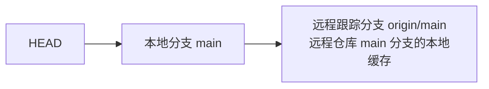

## 1. 远程跟踪分支概述

### 1.1 什么是远程跟踪分支

远程跟踪分支是**远程分支状态的本地引用**，以 `远程名/分支名` 格式表示（如 `origin/main`）。它们是只读的，只在网络操作时更新。



### 1.2 引用关系

```
.git/refs/heads/main           → 本地 main 分支
.git/refs/remotes/origin/main  → 远程 origin/main 的跟踪分支
.git/refs/remotes/origin/HEAD  → 远程 origin 的默认分支
```

## 2. 远程操作

### 2.1 fetch

```bash
# 获取远程更新（不合并）
git fetch origin
git fetch origin main
git fetch --all

# fetch 后查看远程分支
git branch -r
# origin/main
# origin/feature
# origin/develop
```

### 2.2 pull

```bash
# pull = fetch + merge
git pull origin main

# pull = fetch + rebase（推荐）
git pull --rebase origin main

# 设置默认使用 rebase
git config --global pull.rebase true
```

### 2.3 push

```bash
# 推送到远程
git push origin main

# 设置上游分支
git push -u origin feature
git push --set-upstream origin feature

# 推送所有分支
git push --all origin

# 删除远程分支
git push origin --delete feature
```

## 3. 上游分支

### 3.1 什么是上游分支

上游分支是本地分支**关联的远程跟踪分支**，设置了上游后可以简化 push/pull 命令。

```bash
# 设置上游
git branch -u origin/main main
git branch --set-upstream-to=origin/main main

# 查看上游设置
git branch -vv
# main    abc1234 [origin/main] feat: add auth
# feature def5678                 WIP: new feature
```

### 3.2 自动设置上游

```bash
# push 时自动设置
git push -u origin feature

# 之后可以直接
git pull
git push
```

## 4. 远程分支管理

### 4.1 查看远程分支

```bash
# 查看所有远程分支
git branch -r

# 查看所有分支（本地+远程）
git branch -a

# 查看远程仓库详情
git remote show origin
```

### 4.2 跟踪远程分支

```bash
# 创建本地分支跟踪远程分支
git checkout -b feature origin/feature
git checkout --track origin/feature    # 同上
git checkout feature                   # 如果远程有同名分支，自动跟踪
```

### 4.3 清理过时的远程分支

```bash
# 清理本地已不存在的远程分支引用
git remote prune origin

# 查看将被清理的分支
git remote prune origin --dry-run

# fetch 时自动清理
git fetch -p
git fetch --prune
```

## 5. 同步模型

### 5.1 快进同步

```
本地: A---B---C
远程: A---B---C---D---E

git pull → 本地快进到 E
本地: A---B---C---D---E
```

### 5.2 非快进同步

```
本地: A---B---C---D
远程: A---B---C---E

git pull → 产生合并提交或 rebase
本地: A---B---C---D---M (merge)
       A---B---C---D' (rebase)
```

### 5.3 三种同步策略

| 策略                  | 命令                 | 结果         |
| :-------------------- | :------------------- | :----------- |
| **merge**             | `git pull`           | 创建合并提交 |
| **rebase**            | `git pull --rebase`  | 线性历史     |
| **fast-forward only** | `git pull --ff-only` | 只允许快进   |

```bash
# 设置默认策略
git config --global pull.ff only
```

## 参考文献

Git 官方文档：https://git-scm.com/doc
Pro Git 中文版：https://git-scm.com/book/zh/v2
Git 参考手册：https://git-scm.com/docs
Conventional Commits：https://www.conventionalcommits.org/zh-hans/

## 延伸阅读

Git 基础操作与分支，见 003-git 模块文档。
GitHub 协作与 PR，见 004-github 模块。
CI/CD 自动化，见 031-devops 模块。
尚硅谷 Bilibili 空间（https://space.bilibili.com/302417610 ）提供 Git 课程。

## 深度专题扩展

以下专题从不同角度深入本文主题，供有进阶需求的读者研读。每个专题独立成节，内容相互补充。

### 13.1 Git 对象模型与内部机制

git add 创建 blob 与 tree，git commit 创建 commit 对象，引用（HEAD/分支）指向 commit。
packfile 压缩对象；gc 清理悬空对象；fsck 校验完整性。
reflog 记录引用变动，是误操作恢复的最后防线。
理解对象模型后可解释 cherry-pick、rebase 与 reset 的底层行为。

### 13.2 合并策略与冲突解决

三路合并：base/ours/theirs 对比；rerere 记录重复冲突解决方案。
冲突标记：<<<<<<< 与 >>>>>>> 之间手工合并，保持语义正确后重新 add。
merge --no-ff 保留合并提交；squash 合并压缩 PR 历史。
策略选择：特性分支多 commit 用 squash/merge；持续集成用 rebase 保持线性。
