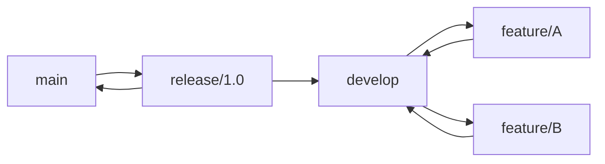
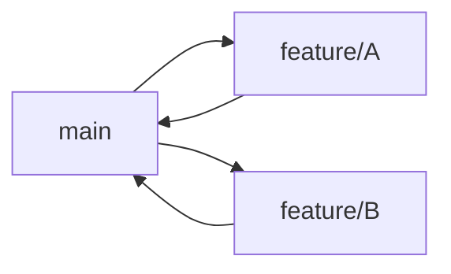
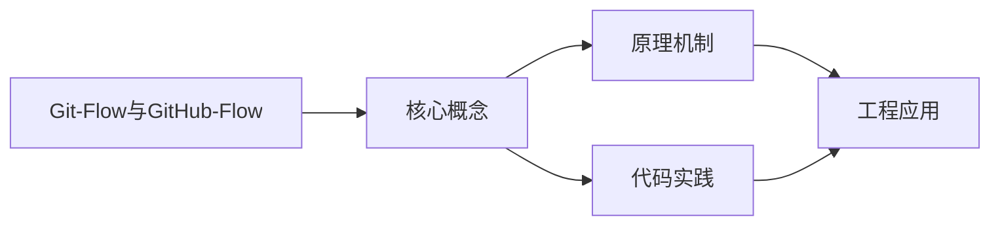
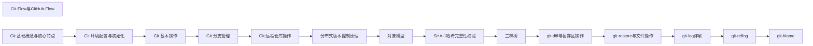

## 1. 学习目标（Bloom 分类）

本节按照布鲁姆教育目标分类学组织学习路径。本文主题为《Git-Flow与GitHub-Flow》，属于 Git 模块，读者可以根据自身阶段选择阅读深度。

记忆层面：能够准确复述本文的核心概念、术语与基本语法或操作步骤，并能够在提问或检索时快速定位对应知识点。能够说出 Git 的核心概念、常用命令与流程。

理解层面：能够用自己的语言解释核心原理与工作机制，说明概念之间的因果关系，而不是机械记忆结论。能够解释 Git 的工作原理与设计动机。

应用层面：能够在真实项目或练习场景中运用本文知识解决具体问题，写出正确且可维护的实现。能够独立完成 Git 的标准操作。

分析层面：能够拆解复杂问题，比较本文主题与相邻概念的异同，识别边界条件与例外情况。能够分析 Git 使用中的异常与边界。

评价层面：能够根据约束条件（性能、可读性、安全、成本）评价不同方案的优劣，做出有依据的技术决策。能够评价 Git 相关工具与方案。

创造层面：能够把本文知识与其他模块知识组合，设计出新的解决方案或可复用的工程模式。能够把 Git 融入团队工作流。

通过本节学习，读者应当能够把《Git-Flow与GitHub-Flow》纳入自己的知识网络，并与 Git 模块的其他主题（提交、分支、合并、远程协作）建立关联。

## 2. 历史动机与发展脉络

《Git-Flow与GitHub-Flow》是 Git 领域的重要主题。要真正理解它，需要先了解它解决的问题与演进过程。

Git 由 Linus Torvalds 于 2005 年为 Linux 内核开发，目标是替代 BitKeeper：分布式、高性能、内容寻址。
Git 的核心是对象模型：blob（内容）、tree（目录）、commit（快照 + 元数据）、tag（引用）；一切对象用 SHA-1 哈希寻址。
工作流演进：集中式工作流 -> 特性分支 -> GitFlow -> GitHub Flow / Trunk-Based；现代团队普遍采用 PR 审查 + 主干发布。

回到本文主题：Git-Flow与GitHub-Flow 的提出与成熟，正是上述技术背景下的必然产物。早期实现往往以简单可用为目标，随着工程规模扩大，社区逐渐沉淀出标准做法与最佳实践；理解这一脉络，可以帮助读者判断“为什么文档中的推荐写法是现在这个样子”，也能在遇到历史遗留代码时准确识别其设计年代与取舍。


## 3. 形式化定义与核心概念精讲

本节把《Git-Flow与GitHub-Flow》涉及的核心概念以“定义 + 讲解”的形式展开。读者应把定义当作工具，把讲解当作理解路径；两者结合才能形成可迁移的知识。

三个区域：工作区、暂存区（index）、仓库（HEAD）；git add/commit 移动状态。
分支是指针：创建分支成本极低；合并（merge 生成合并提交）与变基（rebase 重放提交）各有取舍。
远程协作：clone/fetch/pull/push；refs/remotes 跟踪远端；冲突在合并时出现并手工解决。

### 3.1 原文章节逐一精讲

原文档把主题拆分为 14 个小节，下面按顺序给出每一节的导读讲解，随后保留原文细节供精读。

#### 原文精读（完整保留）

# Git Flow 工作流

> **符号约定**：`< >` 必填参数 | `[ ]` 可选参数

---

#### 1. 分支模型概述

##### 1.1 为什么需要分支模型

分支模型定义了团队如何使用分支进行协作，核心解决：

- 如何组织功能开发
- 如何管理发布
- 如何处理热修复
- 如何保持主分支稳定

#### 2. Git Flow

##### 2.1 分支结构



| 分支        | 命名        | 生命周期 | 用途         |
| :---------- | :---------- | :------- | :----------- |
| **main**    | `main`      | 永久     | 生产版本     |
| **develop** | `develop`   | 永久     | 开发集成分支 |
| **feature** | `feature/*` | 临时     | 功能开发     |
| **release** | `release/*` | 临时     | 发布准备     |
| **hotfix**  | `hotfix/*`  | 临时     | 紧急修复     |

##### 2.2 工作流程

```bash
# 1. 从 develop 创建功能分支
git checkout -b feature/auth develop

# 2. 开发并提交
git commit -m "feat: add login"

# 3. 完成后合并回 develop
git checkout develop
git merge --no-ff feature/auth
git branch -d feature/auth

# 4. 准备发布
git checkout -b release/1.0 develop
# 修复 Bug、更新版本号
git commit -m "chore: bump version to 1.0"

# 5. 合并到 main 和 develop
git checkout main
git merge --no-ff release/1.0
git tag -a v1.0.0
git checkout develop
git merge --no-ff release/1.0
git branch -d release/1.0

# 6. 热修复
git checkout -b hotfix/bug-123 main
git commit -m "fix: resolve critical bug"
git checkout main
git merge --no-ff hotfix/bug-123
git tag -a v1.0.1
git checkout develop
git merge --no-ff hotfix/bug-123
git branch -d hotfix/bug-123
```

##### 2.3 Git Flow 工具

```bash
# 安装 git-flow
brew install git-flow        # macOS
sudo apt install git-flow    # Linux

# 初始化
git flow init

# 功能开发
git flow feature start auth
git flow feature finish auth

# 发布
git flow release start 1.0
git flow release finish 1.0

# 热修复
git flow hotfix start bug-123
git flow hotfix finish bug-123
```

#### 3. GitHub Flow

##### 3.1 分支结构



| 分支        | 命名        | 生命周期 | 用途         |
| :---------- | :---------- | :------- | :----------- |
| **main**    | `main`      | 永久     | 始终可部署   |
| **feature** | `feature/*` | 临时     | 所有开发工作 |

##### 3.2 工作流程

```bash
# 1. 从 main 创建分支
git checkout -b feature/auth main

# 2. 开发并提交
git commit -m "feat: add authentication"

# 3. 推送并创建 Pull Request
git push -u origin feature/auth
# 在 GitHub 上创建 PR

# 4. 代码审查
# 团队成员审查代码

# 5. 合并到 main
# 通过 GitHub 合并 PR
# 自动部署到生产环境

# 6. 删除分支
git branch -d feature/auth
git push origin --delete feature/auth
```

##### 3.3 核心原则

- `main` 分支**始终可部署**
- 所有开发在功能分支进行
- 通过 Pull Request 进行代码审查
- 合并后立即部署

#### 4. 模型对比

| 特性         | Git Flow           | GitHub Flow      |
| :----------- | :----------------- | :--------------- |
| **复杂度**   | 高                 | 低               |
| **分支数量** | 5种                | 2种              |
| **发布节奏** | 计划发布           | 持续部署         |
| **适用团队** | 大团队、版本化产品 | 小团队、Web 应用 |
| **学习成本** | 较高               | 较低             |
| **热修复**   | 专用 hotfix 分支   | 从 main 创建分支 |
| **版本管理** | 明确的版本标签     | 持续交付         |

#### 5. 其他模型

##### 5.1 Trunk-Based Development


- 所有开发者在 main 上直接提交
- 使用功能开关（Feature Flag）控制
- 极短的分支生命周期（<1天）
- 适合 CI/CD 成熟的团队

##### 5.2 选型建议

| 场景              | 推荐模型                  |
| :---------------- | :------------------------ |
| **Web/SaaS 应用** | GitHub Flow               |
| **移动应用**      | Git Flow                  |
| **开源项目**      | GitHub Flow               |
| **嵌入式/固件**   | Git Flow                  |
| **微服务**        | GitHub Flow / Trunk-Based |
| **大型团队**      | Git Flow                  |
| **初创团队**      | GitHub Flow               |
#### 分支模型

**基本写法：主分支 main**
`main`
```bash
# 仅存放稳定的发布版本
# 每次合并都打标签
```

---

**基本写法：开发分支 develop**
`develop`
```bash
# 日常集成分支，反映最新开发状态
# feature 分支从此切出
```

---

**基本写法：功能分支 feature**
`feature/<功能名>`
```bash
# 单个功能开发分支
# 完成后合并回 develop
```

---

**基本写法：发布分支 release**
`release/<版本号>`
```bash
# 准备发布版本，仅修复 bug
# 完成后合并到 main 与 develop
```

---

**基本写法：热修分支 hotfix**
`hotfix/<编号>`
```bash
# 基于 main 修复线上问题
# 完成后合并到 main 与 develop
```

---

#### git-flow 工具

**基本写法：安装 git-flow**
`apt-get install git-flow`
```bash
# Debian/Ubuntu 安装 git-flow 扩展
apt-get install git-flow
```

---

**基本写法：初始化 git-flow**
`git flow init`
```bash
# 交互式配置各分支命名
git flow init
```

---

**基本写法：非交互式初始化**
`git flow init -d`
```bash
# 使用默认配置初始化
git flow init -d
```

---

#### feature 工作流

**基本写法：开始新功能**
`git flow feature start <功能名>`
```bash
# 从 develop 切出新功能分支
git flow feature start login
```

---

**基本写法：发布功能到远程**
`git flow feature publish <功能名>`
```bash
# 将功能分支推送到远程协作
git flow feature publish login
```

---

**基本写法：拉取远程功能分支**
`git flow feature track <功能名>`
```bash
# 跟踪远程已有的功能分支
git flow feature track login
```

---

**基本写法：完成功能**
`git flow feature finish <功能名>`
```bash
# 合并功能分支到 develop 并删除
git flow feature finish login
```

---

**基本写法：完成功能保留分支**
`git flow feature finish -k <功能名>`
```bash
# 合并后保留功能分支
git flow feature finish -k login
```

---

#### release 工作流

**基本写法：开始发布分支**
`git flow release start <版本号>`
```bash
# 从 develop 创建发布分支
git flow release start 1.2.0
```

---

**基本写法：发布分支推到远程**
`git flow release publish <版本号>`
```bash
# 推送发布分支供团队协作
git flow release publish 1.2.0
```

---

**基本写法：完成发布**
`git flow release finish <版本号>`
```bash
# 合并到 main 与 develop 并打标签
git flow release finish 1.2.0
```

---

**基本写法：完成发布带推送**
`git flow release finish -p <版本号>`
```bash
# 完成后自动推送 main、develop 与标签
git flow release finish -p 1.2.0
```

---

**基本写法：完成发布带信息**
`git flow release finish -m "<消息>" <版本号>`
```bash
# 为合并提交与标签添加信息
git flow release finish -m "release 1.2.0" 1.2.0
```

---

#### hotfix 工作流

**基本写法：开始热修**
`git flow hotfix start <版本号> [<基线>]`
```bash
# 基于 main 创建热修分支
git flow hotfix start 1.2.1
```

---

**基本写法：完成热修**
`git flow hotfix finish <版本号>`
```bash
# 合并到 main 与 develop 并打标签
git flow hotfix finish 1.2.1
```

---

**基本写法：完成热修带推送**
`git flow hotfix finish -p <版本号>`
```bash
# 完成后推送所有相关分支与标签
git flow hotfix finish -p 1.2.1
```

---

#### 手动实现 Git Flow

**基本写法：手动创建 feature 分支**
`git checkout -b feature/<功能名> develop`
```bash
# 从 develop 创建功能分支
git checkout -b feature/login develop
```

---

**基本写法：完成 feature 合并**
`git checkout develop && git merge --no-ff feature/<功能名>`
```bash
# 用 --no-ff 保留合并记录
git checkout develop && git merge --no-ff feature/login
```

---

**基本写法：手动创建 release 分支**
`git checkout -b release/<版本号> develop`
```bash
# 从 develop 创建发布分支
git checkout -b release/1.2.0 develop
```

---

**基本写法：完成 release 合并到 main**
`git checkout main && git merge --no-ff release/<版本号>`
```bash
# 发布分支合并到 main
git checkout main && git merge --no-ff release/1.2.0
```

---

**基本写法：打版本标签**
`git tag -a <版本号> -m "<消息>"`
```bash
# 在 main 上打带注释标签
git tag -a v1.2.0 -m "Release 1.2.0"
```

---

**基本写法：release 合并回 develop**
`git checkout develop && git merge --no-ff release/<版本号>`
```bash
# 发布内容同步回 develop
git checkout develop && git merge --no-ff release/1.2.0
```

---

**基本写法：删除已合并分支**
`git branch -d <分支名>`
```bash
# 删除已合并的功能分支
git branch -d feature/login
```

---

#### GitHub Flow 简化流程

**基本写法：从 main 切分支**
`git checkout -b <分支名> main`
```bash
# 简化流程仅使用 main 与功能分支
git checkout -b feature/login main
```

---

**基本写法：推送并创建 PR**
`git push -u origin <分支名>`
```bash
# 推送后通过 Pull Request 合并
git push -u origin feature/login
```

---

**基本写法：合并后删除分支**
`git branch -d <分支名> && git push origin --delete <分支名>`
```bash
# 本地与远程同时删除分支
git branch -d feature/login && git push origin --delete feature/login
```

---

#### 版本号管理

**基本写法：语义化版本号格式**
`<主版本>.<次版本>.<修订号>`
```bash
# 例如 1.2.3 表示主版本 1 次版本 2 修订 3
```

---

**基本写法：发布标签命名规范**
`v<版本号>`
```bash
# 标签前加 v 表示版本
git tag -a v1.2.0 -m "Release 1.2.0"
```

---

#### 与 CI/CD 协同

**基本写法：基于标签触发部署**
`git push origin --tags`
```bash
# 推送标签触发发布流水线
git push origin --tags
```

---

**基本写法：仅 main 触发生产部署**
`git push origin main`
```bash
# 主分支推送触发生产环境部署
git push origin main
```

---

**基本写法：develop 触发测试部署**
`git push origin develop`
```bash
# 开发分支推送触发测试环境部署
git push origin develop
```


### 3.2 概念关系图

下面用 Mermaid 图表达本文核心概念之间的关系，帮助读者建立整体图景：



图中展示的是本文知识的结构化关系：核心概念是入口，原理机制解释“为什么”，代码实践演示“怎么做”，工程应用回答“何时用”。读者学习时可以把每个小节的内容挂接到对应节点上。

## 4. 理论推导与原理解析

本节深入《Git-Flow与GitHub-Flow》背后的原理。理论部分不求面面俱到，而是聚焦“能解释现象、能指导实践”的关键推导。

三个区域：工作区、暂存区（index）、仓库（HEAD）；git add/commit 移动状态。
分支是指针：创建分支成本极低；合并（merge 生成合并提交）与变基（rebase 重放提交）各有取舍。
远程协作：clone/fetch/pull/push；refs/remotes 跟踪远端；冲突在合并时出现并手工解决。
撤销模型：checkout/restore 改工作区，reset 移 HEAD，revert 生成反向提交；理解三者避免误操作。

需要强调的是，理论推导与工程实践之间存在翻译层：理论给出的是理想化模型与边界条件，工程代码则必须处理真实环境中的例外。读者在学习时应先掌握理论的“标准情形”，再通过陷阱章节了解“非标准情形”。

## 5. 代码示例与逐行讲解

本节把原文中的代码示例系统整理，并为每个示例补充用途说明与讲解。读者不应只浏览代码，而应逐段对照讲解理解设计意图。

### 5.1 示例：2.1 分支结构

该示例来自原文《2.1 分支结构》小节，用于演示Git-Flow与GitHub-Flow相关操作。阅读时请先看代码结构，再看其后的讲解。


讲解：这段代码演示了本节核心知识点。代码中的关键操作可以归纳为三步：准备（定义或初始化）、执行（核心逻辑）、收尾（释放资源或返回结果）。实际项目中，这三步往往被封装为函数或类，以提升复用性与可测试性。

关键点分析：

该示例共 8 行有效代码，结构以数据或配置为主。阅读时应关注：数据字段的含义、配置项的作用，以及它们与运行行为的对应关系。

进阶思考路径：先尝试修改参数观察行为变化，再把示例中的模式迁移到自己的项目中；每次修改都记录预期与实测差异，这是把示例转化为能力的最快方式。

### 5.2 示例：2.2 工作流程

该示例来自原文《2.2 工作流程》小节，用于演示Git-Flow与GitHub-Flow相关操作。阅读时请先看代码结构，再看其后的讲解。

```bash
# 1. 从 develop 创建功能分支
git checkout -b feature/auth develop

# 2. 开发并提交
git commit -m "feat: add login"

# 3. 完成后合并回 develop
git checkout develop
git merge --no-ff feature/auth
git branch -d feature/auth

# 4. 准备发布
git checkout -b release/1.0 develop
# 修复 Bug、更新版本号
git commit -m "chore: bump version to 1.0"

# 5. 合并到 main 和 develop
git checkout main
git merge --no-ff release/1.0
git tag -a v1.0.0
git checkout develop
git merge --no-ff release/1.0
git branch -d release/1.0

# 6. 热修复
git checkout -b hotfix/bug-123 main
git commit -m "fix: resolve critical bug"
git checkout main
git merge --no-ff hotfix/bug-123
git tag -a v1.0.1
git checkout develop
git merge --no-ff hotfix/bug-123
git branch -d hotfix/bug-123
```

讲解：这段代码演示了本节核心知识点。代码中的关键操作可以归纳为三步：准备（定义或初始化）、执行（核心逻辑）、收尾（释放资源或返回结果）。实际项目中，这三步往往被封装为函数或类，以提升复用性与可测试性。

关键点分析：

该示例共 28 行有效代码，结构以数据或配置为主。阅读时应关注：数据字段的含义、配置项的作用，以及它们与运行行为的对应关系。

进阶思考路径：先尝试修改参数观察行为变化，再把示例中的模式迁移到自己的项目中；每次修改都记录预期与实测差异，这是把示例转化为能力的最快方式。

### 5.3 示例：2.3 Git Flow 工具

该示例来自原文《2.3 Git Flow 工具》小节，用于演示Git-Flow与GitHub-Flow相关操作。阅读时请先看代码结构，再看其后的讲解。

```bash
# 安装 git-flow
brew install git-flow        # macOS
sudo apt install git-flow    # Linux

# 初始化
git flow init

# 功能开发
git flow feature start auth
git flow feature finish auth

# 发布
git flow release start 1.0
git flow release finish 1.0

# 热修复
git flow hotfix start bug-123
git flow hotfix finish bug-123
```

讲解：这段代码演示了本节核心知识点。代码中的关键操作可以归纳为三步：准备（定义或初始化）、执行（核心逻辑）、收尾（释放资源或返回结果）。实际项目中，这三步往往被封装为函数或类，以提升复用性与可测试性。

关键点分析：

该示例共 14 行有效代码，结构以数据或配置为主。阅读时应关注：数据字段的含义、配置项的作用，以及它们与运行行为的对应关系。

进阶思考路径：先尝试修改参数观察行为变化，再把示例中的模式迁移到自己的项目中；每次修改都记录预期与实测差异，这是把示例转化为能力的最快方式。

### 5.4 示例：3.1 分支结构

该示例来自原文《3.1 分支结构》小节，用于演示Git-Flow与GitHub-Flow相关操作。阅读时请先看代码结构，再看其后的讲解。


讲解：这段代码演示了本节核心知识点。代码中的关键操作可以归纳为三步：准备（定义或初始化）、执行（核心逻辑）、收尾（释放资源或返回结果）。实际项目中，这三步往往被封装为函数或类，以提升复用性与可测试性。

关键点分析：

该示例共 5 行有效代码，结构以数据或配置为主。阅读时应关注：数据字段的含义、配置项的作用，以及它们与运行行为的对应关系。

进阶思考路径：先尝试修改参数观察行为变化，再把示例中的模式迁移到自己的项目中；每次修改都记录预期与实测差异，这是把示例转化为能力的最快方式。

### 5.5 示例：3.2 工作流程

该示例来自原文《3.2 工作流程》小节，用于演示Git-Flow与GitHub-Flow相关操作。阅读时请先看代码结构，再看其后的讲解。

```bash
# 1. 从 main 创建分支
git checkout -b feature/auth main

# 2. 开发并提交
git commit -m "feat: add authentication"

# 3. 推送并创建 Pull Request
git push -u origin feature/auth
# 在 GitHub 上创建 PR

# 4. 代码审查
# 团队成员审查代码

# 5. 合并到 main
# 通过 GitHub 合并 PR
# 自动部署到生产环境

# 6. 删除分支
git branch -d feature/auth
git push origin --delete feature/auth
```

讲解：这段代码演示了本节核心知识点。代码中的关键操作可以归纳为三步：准备（定义或初始化）、执行（核心逻辑）、收尾（释放资源或返回结果）。实际项目中，这三步往往被封装为函数或类，以提升复用性与可测试性。

关键点分析：

该示例共 15 行有效代码，结构以数据或配置为主。阅读时应关注：数据字段的含义、配置项的作用，以及它们与运行行为的对应关系。

进阶思考路径：先尝试修改参数观察行为变化，再把示例中的模式迁移到自己的项目中；每次修改都记录预期与实测差异，这是把示例转化为能力的最快方式。

### 5.6 示例：5.1 Trunk-Based Development

该示例来自原文《5.1 Trunk-Based Development》小节，用于演示Git-Flow与GitHub-Flow相关操作。阅读时请先看代码结构，再看其后的讲解。


讲解：这段代码演示了本节核心知识点。代码中的关键操作可以归纳为三步：准备（定义或初始化）、执行（核心逻辑）、收尾（释放资源或返回结果）。实际项目中，这三步往往被封装为函数或类，以提升复用性与可测试性。

关键点分析：

该示例共 2 行有效代码，结构以数据或配置为主。阅读时应关注：数据字段的含义、配置项的作用，以及它们与运行行为的对应关系。

进阶思考路径：先尝试修改参数观察行为变化，再把示例中的模式迁移到自己的项目中；每次修改都记录预期与实测差异，这是把示例转化为能力的最快方式。

### 5.7 示例：分支模型

该示例来自原文《分支模型》小节，用于演示Git-Flow与GitHub-Flow相关操作。阅读时请先看代码结构，再看其后的讲解。

```bash
# 仅存放稳定的发布版本
# 每次合并都打标签
```

讲解：这段代码演示了本节核心知识点。代码中的关键操作可以归纳为三步：准备（定义或初始化）、执行（核心逻辑）、收尾（释放资源或返回结果）。实际项目中，这三步往往被封装为函数或类，以提升复用性与可测试性。

关键点分析：

该示例共 2 行有效代码，结构以数据或配置为主。阅读时应关注：数据字段的含义、配置项的作用，以及它们与运行行为的对应关系。

进阶思考路径：先尝试修改参数观察行为变化，再把示例中的模式迁移到自己的项目中；每次修改都记录预期与实测差异，这是把示例转化为能力的最快方式。

### 5.8 示例：分支模型

该示例来自原文《分支模型》小节，用于演示Git-Flow与GitHub-Flow相关操作。阅读时请先看代码结构，再看其后的讲解。

```bash
# 日常集成分支，反映最新开发状态
# feature 分支从此切出
```

讲解：这段代码演示了本节核心知识点。代码中的关键操作可以归纳为三步：准备（定义或初始化）、执行（核心逻辑）、收尾（释放资源或返回结果）。实际项目中，这三步往往被封装为函数或类，以提升复用性与可测试性。

关键点分析：

该示例共 2 行有效代码，结构以数据或配置为主。阅读时应关注：数据字段的含义、配置项的作用，以及它们与运行行为的对应关系。

进阶思考路径：先尝试修改参数观察行为变化，再把示例中的模式迁移到自己的项目中；每次修改都记录预期与实测差异，这是把示例转化为能力的最快方式。

### 5.9 示例：分支模型

该示例来自原文《分支模型》小节，用于演示Git-Flow与GitHub-Flow相关操作。阅读时请先看代码结构，再看其后的讲解。

```bash
# 单个功能开发分支
# 完成后合并回 develop
```

讲解：这段代码演示了本节核心知识点。代码中的关键操作可以归纳为三步：准备（定义或初始化）、执行（核心逻辑）、收尾（释放资源或返回结果）。实际项目中，这三步往往被封装为函数或类，以提升复用性与可测试性。

关键点分析：

该示例共 2 行有效代码，结构以数据或配置为主。阅读时应关注：数据字段的含义、配置项的作用，以及它们与运行行为的对应关系。

进阶思考路径：先尝试修改参数观察行为变化，再把示例中的模式迁移到自己的项目中；每次修改都记录预期与实测差异，这是把示例转化为能力的最快方式。

### 5.10 示例：分支模型

该示例来自原文《分支模型》小节，用于演示Git-Flow与GitHub-Flow相关操作。阅读时请先看代码结构，再看其后的讲解。

```bash
# 准备发布版本，仅修复 bug
# 完成后合并到 main 与 develop
```

讲解：这段代码演示了本节核心知识点。代码中的关键操作可以归纳为三步：准备（定义或初始化）、执行（核心逻辑）、收尾（释放资源或返回结果）。实际项目中，这三步往往被封装为函数或类，以提升复用性与可测试性。

关键点分析：

该示例共 2 行有效代码，结构以数据或配置为主。阅读时应关注：数据字段的含义、配置项的作用，以及它们与运行行为的对应关系。

进阶思考路径：先尝试修改参数观察行为变化，再把示例中的模式迁移到自己的项目中；每次修改都记录预期与实测差异，这是把示例转化为能力的最快方式。

### 5.11 示例：分支模型

该示例来自原文《分支模型》小节，用于演示Git-Flow与GitHub-Flow相关操作。阅读时请先看代码结构，再看其后的讲解。

```bash
# 基于 main 修复线上问题
# 完成后合并到 main 与 develop
```

讲解：这段代码演示了本节核心知识点。代码中的关键操作可以归纳为三步：准备（定义或初始化）、执行（核心逻辑）、收尾（释放资源或返回结果）。实际项目中，这三步往往被封装为函数或类，以提升复用性与可测试性。

关键点分析：

该示例共 2 行有效代码，结构以数据或配置为主。阅读时应关注：数据字段的含义、配置项的作用，以及它们与运行行为的对应关系。

进阶思考路径：先尝试修改参数观察行为变化，再把示例中的模式迁移到自己的项目中；每次修改都记录预期与实测差异，这是把示例转化为能力的最快方式。

### 5.12 示例：git-flow 工具

该示例来自原文《git-flow 工具》小节，用于演示Git-Flow与GitHub-Flow相关操作。阅读时请先看代码结构，再看其后的讲解。

```bash
# Debian/Ubuntu 安装 git-flow 扩展
apt-get install git-flow
```

讲解：这段代码演示了本节核心知识点。代码中的关键操作可以归纳为三步：准备（定义或初始化）、执行（核心逻辑）、收尾（释放资源或返回结果）。实际项目中，这三步往往被封装为函数或类，以提升复用性与可测试性。

关键点分析：

该示例共 2 行有效代码，结构以数据或配置为主。阅读时应关注：数据字段的含义、配置项的作用，以及它们与运行行为的对应关系。

进阶思考路径：先尝试修改参数观察行为变化，再把示例中的模式迁移到自己的项目中；每次修改都记录预期与实测差异，这是把示例转化为能力的最快方式。

### 5.13 示例：git-flow 工具

该示例来自原文《git-flow 工具》小节，用于演示Git-Flow与GitHub-Flow相关操作。阅读时请先看代码结构，再看其后的讲解。

```bash
# 交互式配置各分支命名
git flow init
```

讲解：这段代码演示了本节核心知识点。代码中的关键操作可以归纳为三步：准备（定义或初始化）、执行（核心逻辑）、收尾（释放资源或返回结果）。实际项目中，这三步往往被封装为函数或类，以提升复用性与可测试性。

关键点分析：

该示例共 2 行有效代码，结构以数据或配置为主。阅读时应关注：数据字段的含义、配置项的作用，以及它们与运行行为的对应关系。

进阶思考路径：先尝试修改参数观察行为变化，再把示例中的模式迁移到自己的项目中；每次修改都记录预期与实测差异，这是把示例转化为能力的最快方式。

### 5.14 示例：git-flow 工具

该示例来自原文《git-flow 工具》小节，用于演示Git-Flow与GitHub-Flow相关操作。阅读时请先看代码结构，再看其后的讲解。

```bash
# 使用默认配置初始化
git flow init -d
```

讲解：这段代码演示了本节核心知识点。代码中的关键操作可以归纳为三步：准备（定义或初始化）、执行（核心逻辑）、收尾（释放资源或返回结果）。实际项目中，这三步往往被封装为函数或类，以提升复用性与可测试性。

关键点分析：

该示例共 2 行有效代码，结构以数据或配置为主。阅读时应关注：数据字段的含义、配置项的作用，以及它们与运行行为的对应关系。

进阶思考路径：先尝试修改参数观察行为变化，再把示例中的模式迁移到自己的项目中；每次修改都记录预期与实测差异，这是把示例转化为能力的最快方式。

### 5.15 示例：feature 工作流

该示例来自原文《feature 工作流》小节，用于演示Git-Flow与GitHub-Flow相关操作。阅读时请先看代码结构，再看其后的讲解。

```bash
# 从 develop 切出新功能分支
git flow feature start login
```

讲解：这段代码演示了本节核心知识点。代码中的关键操作可以归纳为三步：准备（定义或初始化）、执行（核心逻辑）、收尾（释放资源或返回结果）。实际项目中，这三步往往被封装为函数或类，以提升复用性与可测试性。

关键点分析：

该示例共 2 行有效代码，结构以数据或配置为主。阅读时应关注：数据字段的含义、配置项的作用，以及它们与运行行为的对应关系。

进阶思考路径：先尝试修改参数观察行为变化，再把示例中的模式迁移到自己的项目中；每次修改都记录预期与实测差异，这是把示例转化为能力的最快方式。

### 5.16 示例：feature 工作流

该示例来自原文《feature 工作流》小节，用于演示Git-Flow与GitHub-Flow相关操作。阅读时请先看代码结构，再看其后的讲解。

```bash
# 将功能分支推送到远程协作
git flow feature publish login
```

讲解：这段代码演示了本节核心知识点。代码中的关键操作可以归纳为三步：准备（定义或初始化）、执行（核心逻辑）、收尾（释放资源或返回结果）。实际项目中，这三步往往被封装为函数或类，以提升复用性与可测试性。

关键点分析：

该示例共 2 行有效代码，结构以数据或配置为主。阅读时应关注：数据字段的含义、配置项的作用，以及它们与运行行为的对应关系。

进阶思考路径：先尝试修改参数观察行为变化，再把示例中的模式迁移到自己的项目中；每次修改都记录预期与实测差异，这是把示例转化为能力的最快方式。

### 5.17 示例：feature 工作流

该示例来自原文《feature 工作流》小节，用于演示Git-Flow与GitHub-Flow相关操作。阅读时请先看代码结构，再看其后的讲解。

```bash
# 跟踪远程已有的功能分支
git flow feature track login
```

讲解：这段代码演示了本节核心知识点。代码中的关键操作可以归纳为三步：准备（定义或初始化）、执行（核心逻辑）、收尾（释放资源或返回结果）。实际项目中，这三步往往被封装为函数或类，以提升复用性与可测试性。

关键点分析：

该示例共 2 行有效代码，结构以数据或配置为主。阅读时应关注：数据字段的含义、配置项的作用，以及它们与运行行为的对应关系。

进阶思考路径：先尝试修改参数观察行为变化，再把示例中的模式迁移到自己的项目中；每次修改都记录预期与实测差异，这是把示例转化为能力的最快方式。

### 5.18 示例：feature 工作流

该示例来自原文《feature 工作流》小节，用于演示Git-Flow与GitHub-Flow相关操作。阅读时请先看代码结构，再看其后的讲解。

```bash
# 合并功能分支到 develop 并删除
git flow feature finish login
```

讲解：这段代码演示了本节核心知识点。代码中的关键操作可以归纳为三步：准备（定义或初始化）、执行（核心逻辑）、收尾（释放资源或返回结果）。实际项目中，这三步往往被封装为函数或类，以提升复用性与可测试性。

关键点分析：

该示例共 2 行有效代码，结构以数据或配置为主。阅读时应关注：数据字段的含义、配置项的作用，以及它们与运行行为的对应关系。

进阶思考路径：先尝试修改参数观察行为变化，再把示例中的模式迁移到自己的项目中；每次修改都记录预期与实测差异，这是把示例转化为能力的最快方式。

### 5.19 示例：feature 工作流

该示例来自原文《feature 工作流》小节，用于演示Git-Flow与GitHub-Flow相关操作。阅读时请先看代码结构，再看其后的讲解。

```bash
# 合并后保留功能分支
git flow feature finish -k login
```

讲解：这段代码演示了本节核心知识点。代码中的关键操作可以归纳为三步：准备（定义或初始化）、执行（核心逻辑）、收尾（释放资源或返回结果）。实际项目中，这三步往往被封装为函数或类，以提升复用性与可测试性。

关键点分析：

该示例共 2 行有效代码，结构以数据或配置为主。阅读时应关注：数据字段的含义、配置项的作用，以及它们与运行行为的对应关系。

进阶思考路径：先尝试修改参数观察行为变化，再把示例中的模式迁移到自己的项目中；每次修改都记录预期与实测差异，这是把示例转化为能力的最快方式。

### 5.20 示例：release 工作流

该示例来自原文《release 工作流》小节，用于演示Git-Flow与GitHub-Flow相关操作。阅读时请先看代码结构，再看其后的讲解。

```bash
# 从 develop 创建发布分支
git flow release start 1.2.0
```

讲解：这段代码演示了本节核心知识点。代码中的关键操作可以归纳为三步：准备（定义或初始化）、执行（核心逻辑）、收尾（释放资源或返回结果）。实际项目中，这三步往往被封装为函数或类，以提升复用性与可测试性。

关键点分析：

该示例共 2 行有效代码，结构以数据或配置为主。阅读时应关注：数据字段的含义、配置项的作用，以及它们与运行行为的对应关系。

进阶思考路径：先尝试修改参数观察行为变化，再把示例中的模式迁移到自己的项目中；每次修改都记录预期与实测差异，这是把示例转化为能力的最快方式。

### 5.21 示例：release 工作流

该示例来自原文《release 工作流》小节，用于演示Git-Flow与GitHub-Flow相关操作。阅读时请先看代码结构，再看其后的讲解。

```bash
# 推送发布分支供团队协作
git flow release publish 1.2.0
```

讲解：这段代码演示了本节核心知识点。代码中的关键操作可以归纳为三步：准备（定义或初始化）、执行（核心逻辑）、收尾（释放资源或返回结果）。实际项目中，这三步往往被封装为函数或类，以提升复用性与可测试性。

关键点分析：

该示例共 2 行有效代码，结构以数据或配置为主。阅读时应关注：数据字段的含义、配置项的作用，以及它们与运行行为的对应关系。

进阶思考路径：先尝试修改参数观察行为变化，再把示例中的模式迁移到自己的项目中；每次修改都记录预期与实测差异，这是把示例转化为能力的最快方式。

### 5.22 示例：release 工作流

该示例来自原文《release 工作流》小节，用于演示Git-Flow与GitHub-Flow相关操作。阅读时请先看代码结构，再看其后的讲解。

```bash
# 合并到 main 与 develop 并打标签
git flow release finish 1.2.0
```

讲解：这段代码演示了本节核心知识点。代码中的关键操作可以归纳为三步：准备（定义或初始化）、执行（核心逻辑）、收尾（释放资源或返回结果）。实际项目中，这三步往往被封装为函数或类，以提升复用性与可测试性。

关键点分析：

该示例共 2 行有效代码，结构以数据或配置为主。阅读时应关注：数据字段的含义、配置项的作用，以及它们与运行行为的对应关系。

进阶思考路径：先尝试修改参数观察行为变化，再把示例中的模式迁移到自己的项目中；每次修改都记录预期与实测差异，这是把示例转化为能力的最快方式。

### 5.23 示例：release 工作流

该示例来自原文《release 工作流》小节，用于演示Git-Flow与GitHub-Flow相关操作。阅读时请先看代码结构，再看其后的讲解。

```bash
# 完成后自动推送 main、develop 与标签
git flow release finish -p 1.2.0
```

讲解：这段代码演示了本节核心知识点。代码中的关键操作可以归纳为三步：准备（定义或初始化）、执行（核心逻辑）、收尾（释放资源或返回结果）。实际项目中，这三步往往被封装为函数或类，以提升复用性与可测试性。

关键点分析：

该示例共 2 行有效代码，结构以数据或配置为主。阅读时应关注：数据字段的含义、配置项的作用，以及它们与运行行为的对应关系。

进阶思考路径：先尝试修改参数观察行为变化，再把示例中的模式迁移到自己的项目中；每次修改都记录预期与实测差异，这是把示例转化为能力的最快方式。

### 5.24 示例：release 工作流

该示例来自原文《release 工作流》小节，用于演示Git-Flow与GitHub-Flow相关操作。阅读时请先看代码结构，再看其后的讲解。

```bash
# 为合并提交与标签添加信息
git flow release finish -m "release 1.2.0" 1.2.0
```

讲解：这段代码演示了本节核心知识点。代码中的关键操作可以归纳为三步：准备（定义或初始化）、执行（核心逻辑）、收尾（释放资源或返回结果）。实际项目中，这三步往往被封装为函数或类，以提升复用性与可测试性。

关键点分析：

该示例共 2 行有效代码，结构以数据或配置为主。阅读时应关注：数据字段的含义、配置项的作用，以及它们与运行行为的对应关系。

进阶思考路径：先尝试修改参数观察行为变化，再把示例中的模式迁移到自己的项目中；每次修改都记录预期与实测差异，这是把示例转化为能力的最快方式。

### 5.25 示例：hotfix 工作流

该示例来自原文《hotfix 工作流》小节，用于演示Git-Flow与GitHub-Flow相关操作。阅读时请先看代码结构，再看其后的讲解。

```bash
# 基于 main 创建热修分支
git flow hotfix start 1.2.1
```

讲解：这段代码演示了本节核心知识点。代码中的关键操作可以归纳为三步：准备（定义或初始化）、执行（核心逻辑）、收尾（释放资源或返回结果）。实际项目中，这三步往往被封装为函数或类，以提升复用性与可测试性。

关键点分析：

该示例共 2 行有效代码，结构以数据或配置为主。阅读时应关注：数据字段的含义、配置项的作用，以及它们与运行行为的对应关系。

进阶思考路径：先尝试修改参数观察行为变化，再把示例中的模式迁移到自己的项目中；每次修改都记录预期与实测差异，这是把示例转化为能力的最快方式。

### 5.26 示例：hotfix 工作流

该示例来自原文《hotfix 工作流》小节，用于演示Git-Flow与GitHub-Flow相关操作。阅读时请先看代码结构，再看其后的讲解。

```bash
# 合并到 main 与 develop 并打标签
git flow hotfix finish 1.2.1
```

讲解：这段代码演示了本节核心知识点。代码中的关键操作可以归纳为三步：准备（定义或初始化）、执行（核心逻辑）、收尾（释放资源或返回结果）。实际项目中，这三步往往被封装为函数或类，以提升复用性与可测试性。

关键点分析：

该示例共 2 行有效代码，结构以数据或配置为主。阅读时应关注：数据字段的含义、配置项的作用，以及它们与运行行为的对应关系。

进阶思考路径：先尝试修改参数观察行为变化，再把示例中的模式迁移到自己的项目中；每次修改都记录预期与实测差异，这是把示例转化为能力的最快方式。

### 5.27 示例：hotfix 工作流

该示例来自原文《hotfix 工作流》小节，用于演示Git-Flow与GitHub-Flow相关操作。阅读时请先看代码结构，再看其后的讲解。

```bash
# 完成后推送所有相关分支与标签
git flow hotfix finish -p 1.2.1
```

讲解：这段代码演示了本节核心知识点。代码中的关键操作可以归纳为三步：准备（定义或初始化）、执行（核心逻辑）、收尾（释放资源或返回结果）。实际项目中，这三步往往被封装为函数或类，以提升复用性与可测试性。

关键点分析：

该示例共 2 行有效代码，结构以数据或配置为主。阅读时应关注：数据字段的含义、配置项的作用，以及它们与运行行为的对应关系。

进阶思考路径：先尝试修改参数观察行为变化，再把示例中的模式迁移到自己的项目中；每次修改都记录预期与实测差异，这是把示例转化为能力的最快方式。

### 5.28 示例：手动实现 Git Flow

该示例来自原文《手动实现 Git Flow》小节，用于演示Git-Flow与GitHub-Flow相关操作。阅读时请先看代码结构，再看其后的讲解。

```bash
# 从 develop 创建功能分支
git checkout -b feature/login develop
```

讲解：这段代码演示了本节核心知识点。代码中的关键操作可以归纳为三步：准备（定义或初始化）、执行（核心逻辑）、收尾（释放资源或返回结果）。实际项目中，这三步往往被封装为函数或类，以提升复用性与可测试性。

关键点分析：

该示例共 2 行有效代码，结构以数据或配置为主。阅读时应关注：数据字段的含义、配置项的作用，以及它们与运行行为的对应关系。

进阶思考路径：先尝试修改参数观察行为变化，再把示例中的模式迁移到自己的项目中；每次修改都记录预期与实测差异，这是把示例转化为能力的最快方式。

### 5.29 示例：手动实现 Git Flow

该示例来自原文《手动实现 Git Flow》小节，用于演示Git-Flow与GitHub-Flow相关操作。阅读时请先看代码结构，再看其后的讲解。

```bash
# 用 --no-ff 保留合并记录
git checkout develop && git merge --no-ff feature/login
```

讲解：这段代码演示了本节核心知识点。代码中的关键操作可以归纳为三步：准备（定义或初始化）、执行（核心逻辑）、收尾（释放资源或返回结果）。实际项目中，这三步往往被封装为函数或类，以提升复用性与可测试性。

关键点分析：

该示例共 2 行有效代码，结构以数据或配置为主。阅读时应关注：数据字段的含义、配置项的作用，以及它们与运行行为的对应关系。

进阶思考路径：先尝试修改参数观察行为变化，再把示例中的模式迁移到自己的项目中；每次修改都记录预期与实测差异，这是把示例转化为能力的最快方式。

### 5.30 示例：手动实现 Git Flow

该示例来自原文《手动实现 Git Flow》小节，用于演示Git-Flow与GitHub-Flow相关操作。阅读时请先看代码结构，再看其后的讲解。

```bash
# 从 develop 创建发布分支
git checkout -b release/1.2.0 develop
```

讲解：这段代码演示了本节核心知识点。代码中的关键操作可以归纳为三步：准备（定义或初始化）、执行（核心逻辑）、收尾（释放资源或返回结果）。实际项目中，这三步往往被封装为函数或类，以提升复用性与可测试性。

关键点分析：

该示例共 2 行有效代码，结构以数据或配置为主。阅读时应关注：数据字段的含义、配置项的作用，以及它们与运行行为的对应关系。

进阶思考路径：先尝试修改参数观察行为变化，再把示例中的模式迁移到自己的项目中；每次修改都记录预期与实测差异，这是把示例转化为能力的最快方式。

### 5.31 示例：手动实现 Git Flow

该示例来自原文《手动实现 Git Flow》小节，用于演示Git-Flow与GitHub-Flow相关操作。阅读时请先看代码结构，再看其后的讲解。

```bash
# 发布分支合并到 main
git checkout main && git merge --no-ff release/1.2.0
```

讲解：这段代码演示了本节核心知识点。代码中的关键操作可以归纳为三步：准备（定义或初始化）、执行（核心逻辑）、收尾（释放资源或返回结果）。实际项目中，这三步往往被封装为函数或类，以提升复用性与可测试性。

关键点分析：

该示例共 2 行有效代码，结构以数据或配置为主。阅读时应关注：数据字段的含义、配置项的作用，以及它们与运行行为的对应关系。

进阶思考路径：先尝试修改参数观察行为变化，再把示例中的模式迁移到自己的项目中；每次修改都记录预期与实测差异，这是把示例转化为能力的最快方式。

### 5.32 示例：手动实现 Git Flow

该示例来自原文《手动实现 Git Flow》小节，用于演示Git-Flow与GitHub-Flow相关操作。阅读时请先看代码结构，再看其后的讲解。

```bash
# 在 main 上打带注释标签
git tag -a v1.2.0 -m "Release 1.2.0"
```

讲解：这段代码演示了本节核心知识点。代码中的关键操作可以归纳为三步：准备（定义或初始化）、执行（核心逻辑）、收尾（释放资源或返回结果）。实际项目中，这三步往往被封装为函数或类，以提升复用性与可测试性。

关键点分析：

该示例共 2 行有效代码，结构以数据或配置为主。阅读时应关注：数据字段的含义、配置项的作用，以及它们与运行行为的对应关系。

进阶思考路径：先尝试修改参数观察行为变化，再把示例中的模式迁移到自己的项目中；每次修改都记录预期与实测差异，这是把示例转化为能力的最快方式。

### 5.33 示例：手动实现 Git Flow

该示例来自原文《手动实现 Git Flow》小节，用于演示Git-Flow与GitHub-Flow相关操作。阅读时请先看代码结构，再看其后的讲解。

```bash
# 发布内容同步回 develop
git checkout develop && git merge --no-ff release/1.2.0
```

讲解：这段代码演示了本节核心知识点。代码中的关键操作可以归纳为三步：准备（定义或初始化）、执行（核心逻辑）、收尾（释放资源或返回结果）。实际项目中，这三步往往被封装为函数或类，以提升复用性与可测试性。

关键点分析：

该示例共 2 行有效代码，结构以数据或配置为主。阅读时应关注：数据字段的含义、配置项的作用，以及它们与运行行为的对应关系。

进阶思考路径：先尝试修改参数观察行为变化，再把示例中的模式迁移到自己的项目中；每次修改都记录预期与实测差异，这是把示例转化为能力的最快方式。

### 5.34 示例：手动实现 Git Flow

该示例来自原文《手动实现 Git Flow》小节，用于演示Git-Flow与GitHub-Flow相关操作。阅读时请先看代码结构，再看其后的讲解。

```bash
# 删除已合并的功能分支
git branch -d feature/login
```

讲解：这段代码演示了本节核心知识点。代码中的关键操作可以归纳为三步：准备（定义或初始化）、执行（核心逻辑）、收尾（释放资源或返回结果）。实际项目中，这三步往往被封装为函数或类，以提升复用性与可测试性。

关键点分析：

该示例共 2 行有效代码，结构以数据或配置为主。阅读时应关注：数据字段的含义、配置项的作用，以及它们与运行行为的对应关系。

进阶思考路径：先尝试修改参数观察行为变化，再把示例中的模式迁移到自己的项目中；每次修改都记录预期与实测差异，这是把示例转化为能力的最快方式。

### 5.35 示例：GitHub Flow 简化流程

该示例来自原文《GitHub Flow 简化流程》小节，用于演示Git-Flow与GitHub-Flow相关操作。阅读时请先看代码结构，再看其后的讲解。

```bash
# 简化流程仅使用 main 与功能分支
git checkout -b feature/login main
```

讲解：这段代码演示了本节核心知识点。代码中的关键操作可以归纳为三步：准备（定义或初始化）、执行（核心逻辑）、收尾（释放资源或返回结果）。实际项目中，这三步往往被封装为函数或类，以提升复用性与可测试性。

关键点分析：

该示例共 2 行有效代码，结构以数据或配置为主。阅读时应关注：数据字段的含义、配置项的作用，以及它们与运行行为的对应关系。

进阶思考路径：先尝试修改参数观察行为变化，再把示例中的模式迁移到自己的项目中；每次修改都记录预期与实测差异，这是把示例转化为能力的最快方式。

### 5.36 示例：GitHub Flow 简化流程

该示例来自原文《GitHub Flow 简化流程》小节，用于演示Git-Flow与GitHub-Flow相关操作。阅读时请先看代码结构，再看其后的讲解。

```bash
# 推送后通过 Pull Request 合并
git push -u origin feature/login
```

讲解：这段代码演示了本节核心知识点。代码中的关键操作可以归纳为三步：准备（定义或初始化）、执行（核心逻辑）、收尾（释放资源或返回结果）。实际项目中，这三步往往被封装为函数或类，以提升复用性与可测试性。

关键点分析：

该示例共 2 行有效代码，结构以数据或配置为主。阅读时应关注：数据字段的含义、配置项的作用，以及它们与运行行为的对应关系。

进阶思考路径：先尝试修改参数观察行为变化，再把示例中的模式迁移到自己的项目中；每次修改都记录预期与实测差异，这是把示例转化为能力的最快方式。

### 5.37 示例：GitHub Flow 简化流程

该示例来自原文《GitHub Flow 简化流程》小节，用于演示Git-Flow与GitHub-Flow相关操作。阅读时请先看代码结构，再看其后的讲解。

```bash
# 本地与远程同时删除分支
git branch -d feature/login && git push origin --delete feature/login
```

讲解：这段代码演示了本节核心知识点。代码中的关键操作可以归纳为三步：准备（定义或初始化）、执行（核心逻辑）、收尾（释放资源或返回结果）。实际项目中，这三步往往被封装为函数或类，以提升复用性与可测试性。

关键点分析：

该示例共 2 行有效代码，结构以数据或配置为主。阅读时应关注：数据字段的含义、配置项的作用，以及它们与运行行为的对应关系。

进阶思考路径：先尝试修改参数观察行为变化，再把示例中的模式迁移到自己的项目中；每次修改都记录预期与实测差异，这是把示例转化为能力的最快方式。

### 5.38 示例：版本号管理

该示例来自原文《版本号管理》小节，用于演示Git-Flow与GitHub-Flow相关操作。阅读时请先看代码结构，再看其后的讲解。

```bash
# 例如 1.2.3 表示主版本 1 次版本 2 修订 3
```

讲解：这段代码演示了本节核心知识点。代码中的关键操作可以归纳为三步：准备（定义或初始化）、执行（核心逻辑）、收尾（释放资源或返回结果）。实际项目中，这三步往往被封装为函数或类，以提升复用性与可测试性。

关键点分析：

该示例共 1 行有效代码，结构以数据或配置为主。阅读时应关注：数据字段的含义、配置项的作用，以及它们与运行行为的对应关系。

进阶思考路径：先尝试修改参数观察行为变化，再把示例中的模式迁移到自己的项目中；每次修改都记录预期与实测差异，这是把示例转化为能力的最快方式。

### 5.39 示例：版本号管理

该示例来自原文《版本号管理》小节，用于演示Git-Flow与GitHub-Flow相关操作。阅读时请先看代码结构，再看其后的讲解。

```bash
# 标签前加 v 表示版本
git tag -a v1.2.0 -m "Release 1.2.0"
```

讲解：这段代码演示了本节核心知识点。代码中的关键操作可以归纳为三步：准备（定义或初始化）、执行（核心逻辑）、收尾（释放资源或返回结果）。实际项目中，这三步往往被封装为函数或类，以提升复用性与可测试性。

关键点分析：

该示例共 2 行有效代码，结构以数据或配置为主。阅读时应关注：数据字段的含义、配置项的作用，以及它们与运行行为的对应关系。

进阶思考路径：先尝试修改参数观察行为变化，再把示例中的模式迁移到自己的项目中；每次修改都记录预期与实测差异，这是把示例转化为能力的最快方式。

### 5.40 示例：与 CI/CD 协同

该示例来自原文《与 CI/CD 协同》小节，用于演示Git-Flow与GitHub-Flow相关操作。阅读时请先看代码结构，再看其后的讲解。

```bash
# 推送标签触发发布流水线
git push origin --tags
```

讲解：这段代码演示了本节核心知识点。代码中的关键操作可以归纳为三步：准备（定义或初始化）、执行（核心逻辑）、收尾（释放资源或返回结果）。实际项目中，这三步往往被封装为函数或类，以提升复用性与可测试性。

关键点分析：

该示例共 2 行有效代码，结构以数据或配置为主。阅读时应关注：数据字段的含义、配置项的作用，以及它们与运行行为的对应关系。

进阶思考路径：先尝试修改参数观察行为变化，再把示例中的模式迁移到自己的项目中；每次修改都记录预期与实测差异，这是把示例转化为能力的最快方式。

### 5.41 示例：与 CI/CD 协同

该示例来自原文《与 CI/CD 协同》小节，用于演示Git-Flow与GitHub-Flow相关操作。阅读时请先看代码结构，再看其后的讲解。

```bash
# 主分支推送触发生产环境部署
git push origin main
```

讲解：这段代码演示了本节核心知识点。代码中的关键操作可以归纳为三步：准备（定义或初始化）、执行（核心逻辑）、收尾（释放资源或返回结果）。实际项目中，这三步往往被封装为函数或类，以提升复用性与可测试性。

关键点分析：

该示例共 2 行有效代码，结构以数据或配置为主。阅读时应关注：数据字段的含义、配置项的作用，以及它们与运行行为的对应关系。

进阶思考路径：先尝试修改参数观察行为变化，再把示例中的模式迁移到自己的项目中；每次修改都记录预期与实测差异，这是把示例转化为能力的最快方式。

### 5.42 示例：与 CI/CD 协同

该示例来自原文《与 CI/CD 协同》小节，用于演示Git-Flow与GitHub-Flow相关操作。阅读时请先看代码结构，再看其后的讲解。

```bash
# 开发分支推送触发测试环境部署
git push origin develop
```

讲解：这段代码演示了本节核心知识点。代码中的关键操作可以归纳为三步：准备（定义或初始化）、执行（核心逻辑）、收尾（释放资源或返回结果）。实际项目中，这三步往往被封装为函数或类，以提升复用性与可测试性。

关键点分析：

该示例共 2 行有效代码，结构以数据或配置为主。阅读时应关注：数据字段的含义、配置项的作用，以及它们与运行行为的对应关系。

进阶思考路径：先尝试修改参数观察行为变化，再把示例中的模式迁移到自己的项目中；每次修改都记录预期与实测差异，这是把示例转化为能力的最快方式。


综合以上示例，可以总结出本主题的代码实践要点：第一，先定义清晰的输入输出契约；第二，核心逻辑保持单一职责；第三，错误处理与边界条件不可省略；第四，命名与注释表达意图而非复述代码。

## 6. 对比分析

对比是理解《Git-Flow与GitHub-Flow》定位的最快路径。下面从多个维度与相邻方案进行对比。

Git 与 SVN：Git 分布式、离线提交、分支廉价；SVN 集中式已基本退出。
merge 与 rebase：merge 保留历史但复杂；rebase 线性整洁但改写。
GitHub Flow 与 GitFlow：前者主干 + PR 适合持续发布；后者适合版本化发布。

对比的目的不是分出绝对优劣，而是建立选择依据：不同约束条件下，最优解不同。读者应把每个对比维度转化为决策检查清单。

## 7. 常见陷阱与最佳实践

本节整理该主题的高频错误与推荐做法。每个陷阱先描述现象，再解释原因，最后给出最佳实践。

### 7.1 提交信息随意

无法追溯。使用 Conventional Commits（feat/fix/docs...）。

深入讲解：该问题之所以被归类为“常见陷阱”，是因为它在初学者的代码中反复出现，而且往往不在第一时间暴露——错误通常隐藏在特定数据或特定时序下。

从成因上看，提交信息随意 一般源于对 Git 某个机制的理解偏差：要么误用了默认行为，要么忽略了边界条件，要么把其他语言的思维惯性带了过来。

从影响上看，提交信息随意 轻则产生错误结果，重则导致资源泄漏、数据损坏或安全事故；这也是为什么工程评审中会把它列为检查项。

从修复策略上看，处理提交信息随意的正确顺序是：先复现（构造最小用例），再定位（确认机制层面的根因），最后修复并补充回归测试。跳过复现直接改代码，往往治标不治本。

### 7.2 大文件入库

仓库膨胀。使用 Git LFS 或排除构建产物。

深入讲解：该问题之所以被归类为“常见陷阱”，是因为它在初学者的代码中反复出现，而且往往不在第一时间暴露——错误通常隐藏在特定数据或特定时序下。

从成因上看，大文件入库 一般源于对 Git 某个机制的理解偏差：要么误用了默认行为，要么忽略了边界条件，要么把其他语言的思维惯性带了过来。

从影响上看，大文件入库 轻则产生错误结果，重则导致资源泄漏、数据损坏或安全事故；这也是为什么工程评审中会把它列为检查项。

从修复策略上看，处理大文件入库的正确顺序是：先复现（构造最小用例），再定位（确认机制层面的根因），最后修复并补充回归测试。跳过复现直接改代码，往往治标不治本。

### 7.3 force push 滥用

覆盖他人历史。仅限个人分支并通知。

深入讲解：该问题之所以被归类为“常见陷阱”，是因为它在初学者的代码中反复出现，而且往往不在第一时间暴露——错误通常隐藏在特定数据或特定时序下。

从成因上看，force push 滥用 一般源于对 Git 某个机制的理解偏差：要么误用了默认行为，要么忽略了边界条件，要么把其他语言的思维惯性带了过来。

从影响上看，force push 滥用 轻则产生错误结果，重则导致资源泄漏、数据损坏或安全事故；这也是为什么工程评审中会把它列为检查项。

从修复策略上看，处理force push 滥用的正确顺序是：先复现（构造最小用例），再定位（确认机制层面的根因），最后修复并补充回归测试。跳过复现直接改代码，往往治标不治本。

### 7.4 merge 冲突拖延

冲突积累。频繁合并、小步提交。

深入讲解：该问题之所以被归类为“常见陷阱”，是因为它在初学者的代码中反复出现，而且往往不在第一时间暴露——错误通常隐藏在特定数据或特定时序下。

从成因上看，merge 冲突拖延 一般源于对 Git 某个机制的理解偏差：要么误用了默认行为，要么忽略了边界条件，要么把其他语言的思维惯性带了过来。

从影响上看，merge 冲突拖延 轻则产生错误结果，重则导致资源泄漏、数据损坏或安全事故；这也是为什么工程评审中会把它列为检查项。

从修复策略上看，处理merge 冲突拖延的正确顺序是：先复现（构造最小用例），再定位（确认机制层面的根因），最后修复并补充回归测试。跳过复现直接改代码，往往治标不治本。

### 7.5 密钥入库

泄露事故。使用 .gitignore 与 secret 扫描。

深入讲解：该问题之所以被归类为“常见陷阱”，是因为它在初学者的代码中反复出现，而且往往不在第一时间暴露——错误通常隐藏在特定数据或特定时序下。

从成因上看，密钥入库 一般源于对 Git 某个机制的理解偏差：要么误用了默认行为，要么忽略了边界条件，要么把其他语言的思维惯性带了过来。

从影响上看，密钥入库 轻则产生错误结果，重则导致资源泄漏、数据损坏或安全事故；这也是为什么工程评审中会把它列为检查项。

从修复策略上看，处理密钥入库的正确顺序是：先复现（构造最小用例），再定位（确认机制层面的根因），最后修复并补充回归测试。跳过复现直接改代码，往往治标不治本。

### 7.6 reset 误操作

丢失工作。确认目标与 --hard 语义。

深入讲解：该问题之所以被归类为“常见陷阱”，是因为它在初学者的代码中反复出现，而且往往不在第一时间暴露——错误通常隐藏在特定数据或特定时序下。

从成因上看，reset 误操作 一般源于对 Git 某个机制的理解偏差：要么误用了默认行为，要么忽略了边界条件，要么把其他语言的思维惯性带了过来。

从影响上看，reset 误操作 轻则产生错误结果，重则导致资源泄漏、数据损坏或安全事故；这也是为什么工程评审中会把它列为检查项。

从修复策略上看，处理reset 误操作的正确顺序是：先复现（构造最小用例），再定位（确认机制层面的根因），最后修复并补充回归测试。跳过复现直接改代码，往往治标不治本。

### 7.7 忽略 .gitignore

构建产物污染。项目初始化即配置。

深入讲解：该问题之所以被归类为“常见陷阱”，是因为它在初学者的代码中反复出现，而且往往不在第一时间暴露——错误通常隐藏在特定数据或特定时序下。

从成因上看，忽略 .gitignore 一般源于对 Git 某个机制的理解偏差：要么误用了默认行为，要么忽略了边界条件，要么把其他语言的思维惯性带了过来。

从影响上看，忽略 .gitignore 轻则产生错误结果，重则导致资源泄漏、数据损坏或安全事故；这也是为什么工程评审中会把它列为检查项。

从修复策略上看，处理忽略 .gitignore的正确顺序是：先复现（构造最小用例），再定位（确认机制层面的根因），最后修复并补充回归测试。跳过复现直接改代码，往往治标不治本。

### 7.8 rebase 公共分支

改写已发布历史。公共分支只 merge。

深入讲解：该问题之所以被归类为“常见陷阱”，是因为它在初学者的代码中反复出现，而且往往不在第一时间暴露——错误通常隐藏在特定数据或特定时序下。

从成因上看，rebase 公共分支 一般源于对 Git 某个机制的理解偏差：要么误用了默认行为，要么忽略了边界条件，要么把其他语言的思维惯性带了过来。

从影响上看，rebase 公共分支 轻则产生错误结果，重则导致资源泄漏、数据损坏或安全事故；这也是为什么工程评审中会把它列为检查项。

从修复策略上看，处理rebase 公共分支的正确顺序是：先复现（构造最小用例），再定位（确认机制层面的根因），最后修复并补充回归测试。跳过复现直接改代码，往往治标不治本。

### 7.0 最佳实践总览

1. 小步提交：每次提交一个逻辑变更，可构建可测试。
2. 提交信息规范：类型 + 简述 + 正文（为什么）。
3. 分支命名：feature/xxx、fix/xxx、docs/xxx。
4. 合入前跑测试与 lint；PR 描述变更与影响。

把这些最佳实践固化为团队规范与代码评审检查项，是避免同类问题反复出现的关键。

## 8. 工程实践

本节把《Git-Flow与GitHub-Flow》放入真实工程场景，给出可复用的模式与组织方法。

团队规范：分支策略、提交规范、PR 模板、CODEOWNERS 审查。
自动化：pre-commit hooks、CI 门禁、自动生成 CHANGELOG。
安全：分支保护、签名提交（GPG/SSH）、secret 扫描。

### 8.1 工程实践的原则拆解

以上工程实践可以归纳为四条原则。第一，配置与代码分离：Git 项目中环境差异应通过配置注入，而不是散落在代码分支中；这保证同一份代码可以在开发、测试、生产环境一致运行。

第二，接口稳定优先：对外接口（函数签名、协议、数据格式）一旦被消费方依赖，变更成本极高；设计时应预留扩展点并保持向后兼容。

第三，可观测性内置：日志、指标与追踪应该在功能开发时同步设计，而不是故障发生后补救；没有观测手段的模块等于黑盒。

第四，变更可回滚：任何发布都应有对应的回滚方案；数据库迁移、配置变更与代码发布一样需要版本管理与逆向路径。

### 8.2 实践落地的检查清单

- [ ] 团队规范：对照本节描述，检查当前项目是否已经落实；未落实的项列入技术债并排期处理。
- [ ] 自动化：对照本节描述，检查当前项目是否已经落实；未落实的项列入技术债并排期处理。
- [ ] 安全：对照本节描述，检查当前项目是否已经落实；未落实的项列入技术债并排期处理。

工程实践的共性原则：配置与代码分离、接口稳定优先、可观测性内置、变更可回滚。这些原则适用于本主题的所有实现。

## 9. 案例研究

本节通过一个完整案例把《Git-Flow与GitHub-Flow》的知识串起来。案例按“需求分析、方案设计、实现、验证”四步展开。

需求：为团队建立 Git 协作规范并落地。
方案：Trunk-Based + 短特性分支 + PR 审查 + CI。
要点：小 PR、自动测试、冲突及时处理、回滚演练。
验证：统计合并周期与冲突频率，持续改进。

### 9.1 案例的扩展讨论

把案例中的方案放大到真实规模，需要额外考虑三个问题：

第一，规模：当数据量或并发量上升一个数量级时，原方案中的数据结构、缓存策略与任务调度是否仍然成立？通常需要引入分层与异步。

第二，团队：多人协作时，模块边界、接口契约与代码所有权必须明确；案例中的实现应拆分为可独立测试的单元，并配合文档说明设计意图。

第三，演进：上线后的需求变化不可避免；方案设计时应预留扩展点（配置化、插件化、事件化），并定期用真实指标验证假设。


案例研究的学习方法：先独立阅读需求，尝试在脑中形成方案，再对照实现与讲解，最后思考“如果约束变化（数据量、并发、团队规模），方案应如何调整”。

## 10. 知识要点总结与深入讲解

本节以讲解形式汇总全文要点，替代传统的习题与自测，读者不需要答题，只需跟随解释建立完整的认知框架。

关于《Git-Flow与GitHub-Flow》的核心结论：

Git 的分布式对象模型是其强大与学习曲线的来源。
提交、分支、合并、撤销四大操作覆盖日常 90%。
团队价值在规范：一致的提交信息与流程。

原文档各小节的要点回顾：

- 1. 分支模型概述：该小节围绕Git-Flow与GitHub-Flow展开具体细节，阅读时应关注其与核心结论的对应关系；每个小节都是核心结论在某一个侧面的展开。
- 2. Git Flow：该小节围绕Git-Flow与GitHub-Flow展开具体细节，阅读时应关注其与核心结论的对应关系；每个小节都是核心结论在某一个侧面的展开。
- 3. GitHub Flow：该小节围绕Git-Flow与GitHub-Flow展开具体细节，阅读时应关注其与核心结论的对应关系；每个小节都是核心结论在某一个侧面的展开。
- 4. 模型对比：该小节围绕Git-Flow与GitHub-Flow展开具体细节，阅读时应关注其与核心结论的对应关系；每个小节都是核心结论在某一个侧面的展开。
- 5. 其他模型：该小节围绕Git-Flow与GitHub-Flow展开具体细节，阅读时应关注其与核心结论的对应关系；每个小节都是核心结论在某一个侧面的展开。
- 分支模型：该小节围绕Git-Flow与GitHub-Flow展开具体细节，阅读时应关注其与核心结论的对应关系；每个小节都是核心结论在某一个侧面的展开。
- git-flow 工具：该小节围绕Git-Flow与GitHub-Flow展开具体细节，阅读时应关注其与核心结论的对应关系；每个小节都是核心结论在某一个侧面的展开。
- feature 工作流：该小节围绕Git-Flow与GitHub-Flow展开具体细节，阅读时应关注其与核心结论的对应关系；每个小节都是核心结论在某一个侧面的展开。
- release 工作流：该小节围绕Git-Flow与GitHub-Flow展开具体细节，阅读时应关注其与核心结论的对应关系；每个小节都是核心结论在某一个侧面的展开。
- hotfix 工作流：该小节围绕Git-Flow与GitHub-Flow展开具体细节，阅读时应关注其与核心结论的对应关系；每个小节都是核心结论在某一个侧面的展开。
- 手动实现 Git Flow：该小节围绕Git-Flow与GitHub-Flow展开具体细节，阅读时应关注其与核心结论的对应关系；每个小节都是核心结论在某一个侧面的展开。
- GitHub Flow 简化流程：该小节围绕Git-Flow与GitHub-Flow展开具体细节，阅读时应关注其与核心结论的对应关系；每个小节都是核心结论在某一个侧面的展开。
- 版本号管理：该小节围绕Git-Flow与GitHub-Flow展开具体细节，阅读时应关注其与核心结论的对应关系；每个小节都是核心结论在某一个侧面的展开。
- 与 CI/CD 协同：该小节围绕Git-Flow与GitHub-Flow展开具体细节，阅读时应关注其与核心结论的对应关系；每个小节都是核心结论在某一个侧面的展开。

把以上要点与第 3-9 节的内容对照复习，即可完成对本文主题的闭环学习。

## 11. 参考文献


Git 官方文档：https://git-scm.com/doc
Pro Git 中文版：https://git-scm.com/book/zh/v2
Git 参考手册：https://git-scm.com/docs
Conventional Commits：https://www.conventionalcommits.org/zh-hans/

## 12. 延伸阅读


Git 基础操作与分支，见 003-git 模块文档。
GitHub 协作与 PR，见 004-github 模块。
CI/CD 自动化，见 031-devops 模块。
尚硅谷 Bilibili 空间（https://space.bilibili.com/302417610 ）提供 Git 课程。

## 14. 模块知识图谱与学习路径

本文属于 Git 模块。为了把《Git-Flow与GitHub-Flow》放入完整的知识网络，下面列出本模块的全部主题并给出相互关联的导读。学习时建议按模块内顺序推进，并在每个文档中留意交叉引用。



上图为模块主题的推荐学习顺序示意图（仅展示前若干主题）。各主题之间存在三类关联：

第一，前置依赖关系：早期主题是后期主题的基础，例如环境与语法先行、进阶主题随后；

第二，横向并列关系：同一层级主题从不同角度覆盖模块能力，学习顺序可以按兴趣调整；

第三，工程组合关系：多个主题在真实项目中组合使用，例如配置、性能与安全主题往往出现在同一系统的不同层面。

### 14.1 模块主题速查表

| 文档 | 主题 | 与本文的关联 |
| --- | --- | --- |
| Git 基础概念与核心特点 | 001-Git | 本文的前置基础 |
| Git 环境配置与初始化 | 002-GitEnvConfigInit | 本文的前置基础 |
| Git 基本操作 | 003-GitBasicOperation | 本文的并列主题 |
| Git 分支管理 | 004-GitBranchManagement | 本文的并列主题 |
| Git 远程仓库操作 | 005-GitRemoteRepoOperation | 本文的并列主题 |
| 分布式版本控制原理 | 006-DistributedVCSPrinciple | 本文的原理深化 |
| 对象模型 | 007-ObjectModel | 本文的并列主题 |
| SHA-1哈希完整性校验 | 008-SHA1IntegrityCheck | 本文的并列主题 |
| 三棵树 | 009-ThreeTrees | 本文的并列主题 |
| git-diff与暂存区操作 | 010-GitDiffStagingOperation | 本文的并列主题 |
| git-restore与文件操作 | 011-GitRestoreFileOperation | 本文的并列主题 |
| git-log详解 | 012-GitLogDetailed | 本文的并列主题 |
| git-reflog | 013-GitReflog | 本文的并列主题 |
| git-blame | 014-GitBlame | 本文的并列主题 |
| HEAD指针与分支本质 | 015-HEADPointerBranchEssence | 本文的并列主题 |
| Git 钩子与 Git LFS | 016-GitHookGitLFS | 本文的并列主题 |
| 合并冲突解决 | 017-MergeConflictResolution | 本文的并列主题 |
| git-mergetool | 018-GitMergetool | 本文的并列主题 |
| git-rebase | 019-GitRebase | 本文的并列主题 |
| git-cherry-pick | 020-GitCherryPick | 本文的并列主题 |
| git-stash | 021-GitStash | 本文的并列主题 |
| 远程跟踪分支 | 022-RemoteTrackingBranch | 本文的并列主题 |
| Git-Flow与GitHub-Flow | 023-GitFlowGitHubFlow | 本文自身 |
| git-commit-amend | 024-GitCommitAmend | 本文的并列主题 |
| git-reset | 025-GitReset | 本文的并列主题 |
| git-revert | 026-GitRevert | 本文的并列主题 |
| Git 原理与对象模型 | 027-GitPrincipleObjectModel | 本文的原理深化 |
| 标签管理 | 028-TagManagement | 本文的并列主题 |
| git-bisect | 029-GitBisect | 本文的并列主题 |
| git-submodule | 030-GitSubmodule | 本文的并列主题 |
| sparse-checkout | 031-SparseCheckout | 本文的并列主题 |
| git-format-patch | 032-GitFormatPatch | 本文的并列主题 |
| git-grep | 033-GitGrep | 本文的并列主题 |
| git-worktree | 034-GitWorktree | 本文的并列主题 |
| git-gc | 035-GitGc | 本文的并列主题 |
| Git-Flow与GitHub-Flow对比 | 036-GitFlowGitHubFlowComparison | 本文的并列主题 |
| 交互式rebase | 037-InteractiveRebase | 本文的并列主题 |
| git-revert与reset对比 | 038-GitRevertResetComparison | 本文的并列主题 |
| Code-Review流程与最佳实践 | 039-CodeReviewBestPractice | 本文的并列主题 |

速查表的作用是让读者快速判断：哪些文档应在阅读本文前掌握（前置基础），哪些文档应在阅读本文后继续（延伸主题）。本模块的交叉引用体系即以此表为基础。

## 15. 术语表

下表整理《Git-Flow与GitHub-Flow》及 Git 模块中出现的高频术语，给出简明释义。术语按字母序或逻辑序排列，供查阅。

| 术语 | 释义 |
| --- | --- |
| 三个区域 | 工作区、暂存区（index）、仓库（HEAD）；git add/commit 移动状态。 |
| 分支是指针 | 创建分支成本极低；合并（merge 生成合并提交）与变基（rebase 重放提交）各有取舍。 |
| 远程协作 | clone/fetch/pull/push；refs/remotes 跟踪远端；冲突在合并时出现并手工解决。 |
| 撤销模型 | checkout/restore 改工作区，reset 移 HEAD，revert 生成反向提交；理解三者避免误操作。 |
| 提交信息随意（易错点） | 参见常见陷阱章节的详细讲解 |
| 大文件入库（易错点） | 参见常见陷阱章节的详细讲解 |
| force push 滥用（易错点） | 参见常见陷阱章节的详细讲解 |
| merge 冲突拖延（易错点） | 参见常见陷阱章节的详细讲解 |
| 密钥入库（易错点） | 参见常见陷阱章节的详细讲解 |
| reset 误操作（易错点） | 参见常见陷阱章节的详细讲解 |

术语表与正文配合使用：先通读正文，遇到模糊术语回查本表；长期使用后术语会自然进入工作记忆。
