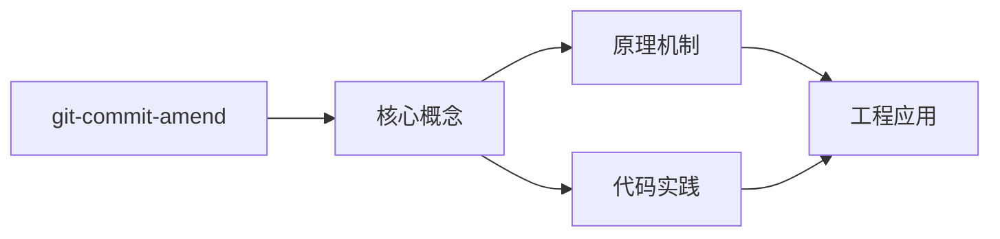
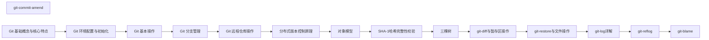

## 1. 学习目标（Bloom 分类）

本节按照布鲁姆教育目标分类学组织学习路径。本文主题为《git-commit-amend》，属于 Git 模块，读者可以根据自身阶段选择阅读深度。

记忆层面：能够准确复述本文的核心概念、术语与基本语法或操作步骤，并能够在提问或检索时快速定位对应知识点。能够说出 Git 的核心概念、常用命令与流程。

理解层面：能够用自己的语言解释核心原理与工作机制，说明概念之间的因果关系，而不是机械记忆结论。能够解释 Git 的工作原理与设计动机。

应用层面：能够在真实项目或练习场景中运用本文知识解决具体问题，写出正确且可维护的实现。能够独立完成 Git 的标准操作。

分析层面：能够拆解复杂问题，比较本文主题与相邻概念的异同，识别边界条件与例外情况。能够分析 Git 使用中的异常与边界。

评价层面：能够根据约束条件（性能、可读性、安全、成本）评价不同方案的优劣，做出有依据的技术决策。能够评价 Git 相关工具与方案。

创造层面：能够把本文知识与其他模块知识组合，设计出新的解决方案或可复用的工程模式。能够把 Git 融入团队工作流。

通过本节学习，读者应当能够把《git-commit-amend》纳入自己的知识网络，并与 Git 模块的其他主题（提交、分支、合并、远程协作）建立关联。

## 2. 历史动机与发展脉络

《git-commit-amend》是 Git 领域的重要主题。要真正理解它，需要先了解它解决的问题与演进过程。

Git 由 Linus Torvalds 于 2005 年为 Linux 内核开发，目标是替代 BitKeeper：分布式、高性能、内容寻址。
Git 的核心是对象模型：blob（内容）、tree（目录）、commit（快照 + 元数据）、tag（引用）；一切对象用 SHA-1 哈希寻址。
工作流演进：集中式工作流 -> 特性分支 -> GitFlow -> GitHub Flow / Trunk-Based；现代团队普遍采用 PR 审查 + 主干发布。

回到本文主题：git-commit-amend 的提出与成熟，正是上述技术背景下的必然产物。早期实现往往以简单可用为目标，随着工程规模扩大，社区逐渐沉淀出标准做法与最佳实践；理解这一脉络，可以帮助读者判断“为什么文档中的推荐写法是现在这个样子”，也能在遇到历史遗留代码时准确识别其设计年代与取舍。


## 3. 形式化定义与核心概念精讲

本节把《git-commit-amend》涉及的核心概念以“定义 + 讲解”的形式展开。读者应把定义当作工具，把讲解当作理解路径；两者结合才能形成可迁移的知识。

三个区域：工作区、暂存区（index）、仓库（HEAD）；git add/commit 移动状态。
分支是指针：创建分支成本极低；合并（merge 生成合并提交）与变基（rebase 重放提交）各有取舍。
远程协作：clone/fetch/pull/push；refs/remotes 跟踪远端；冲突在合并时出现并手工解决。

### 3.1 原文章节逐一精讲

原文档把主题拆分为 14 个小节，下面按顺序给出每一节的导读讲解，随后保留原文细节供精读。

#### 原文精读（完整保留）

# Git commit message 规范

> **符号约定**：`< >` 必填参数 | `[ ]` 可选参数

---

#### 1. amend 概述

##### 1.1 什么是 amend

`git commit --amend` 用于**修改最近一次提交**，可以修改提交消息或追加文件变更。

##### 1.2 amend 的本质

amend 并非"修改"提交，而是**创建新提交替换旧提交**：

```
修改前: A---B---C (HEAD)
修改后: A---B---C' (HEAD)  ← C' 是新提交，C 变为不可达
```

#### 2. 基本用法

##### 2.1 修改提交消息

```bash
git commit --amend -m "新的提交消息"
```

##### 2.2 追加文件变更

```bash
# 忘记添加文件
git add forgotten-file.js
git commit --amend --no-edit    # 不修改消息，只追加文件
```

##### 2.3 同时修改消息和内容

```bash
git add new-file.js
git commit --amend -m "feat: add auth with new file"
```

##### 2.4 修改作者信息

```bash
# 修改作者
git commit --amend --author="New Name <new@email.com>"

# 修改日期
git commit --amend --date="2026-06-14T10:00:00"
```

#### 3. 安全注意事项

##### 3.1 黄金法则

**不要 amend 已推送到远程的提交！**

```bash
#  危险
git push
git commit --amend
git push --force    # 会覆盖远程历史

#  安全
git commit --amend  # amend 未推送的提交
git push            # 正常推送
```

##### 3.2 恢复 amend 前的提交

```bash
# 通过 reflog 找到 amend 前的提交
git reflog
# abc1234 HEAD@{0}: commit (amend): new message
# def5678 HEAD@{1}: commit: old message  ← amend 前

# 恢复
git reset --soft def5678
```

#### 4. 实际场景

##### 4.1 修复拼写错误

```bash
git commit -m "feat: add authnetication"    # 拼写错误
git commit --amend -m "feat: add authentication"
```

##### 4.2 追加遗漏文件

```bash
git commit -m "feat: add auth"
git add test/auth.test.js                   # 忘记的测试文件
git commit --amend --no-edit
```

##### 4.3 修改敏感信息

```bash
# 不小心提交了密码
git add config.js
git commit -m "feat: add config"
# 发现 config.js 包含密码
# 修改文件移除密码
git add config.js
git commit --amend --no-edit
# 注意：旧提交仍存在于 reflog 中，需要 git gc 清理
```
#### Conventional Commits 基础

**基本写法：标准提交格式**
`<类型>[可选作用域]: <描述>`
```bash
# 规范化提交信息基本结构
feat: 添加用户登录功能
```

---

**基本写法：带作用域的提交**
`<类型>(<作用域>): <描述>`
```bash
# 指定变更影响的模块
feat(auth): 添加 OAuth2 登录
```

---

**基本写法：带破坏性变更标记**
`<类型>!: <描述>`
```bash
# 用 ! 标记不兼容变更
refactor!: 重构用户模型接口
```

---

**基本写法：带作用域的破坏性变更**
`<类型>(<作用域>)!: <描述>`
```bash
# 指定作用域的破坏性变更
feat(api)!: 修改响应数据结构
```

---

#### 提交类型

**基本写法：新功能**
`feat: <描述>`
```bash
# 新增功能特性
feat: 添加导出 PDF 功能
```

---

**基本写法：修复 bug**
`fix: <描述>`
```bash
# 修复缺陷
fix: 修正登录跳转错误
```

---

**基本写法：文档变更**
`docs: <描述>`
```bash
# 仅修改文档
docs: 更新 README 安装步骤
```

---

**基本写法：样式调整**
`style: <描述>`
```bash
# 不影响代码逻辑的格式调整
style: 统一缩进为 4 空格
```

---

**基本写法：重构**
`refactor: <描述>`
```bash
# 既不新增功能也不修复 bug 的代码重构
refactor: 抽离用户认证逻辑
```

---

**基本写法：性能优化**
`perf: <描述>`
```bash
# 提升性能的变更
perf: 优化列表查询缓存
```

---

**基本写法：测试相关**
`test: <描述>`
```bash
# 新增或修改测试
test: 补充用户模块单元测试
```

---

**基本写法：构建系统**
`build: <描述>`
```bash
# 修改构建系统或依赖
build: 升级 webpack 到 5.0
```

---

**基本写法：CI 配置**
`ci: <描述>`
```bash
# 修改持续集成配置
ci: 添加自动部署流水线
```

---

**基本写法：杂项**
`chore: <描述>`
```bash
# 其他不修改源码或测试的杂项
chore: 更新 .gitignore
```

---

**基本写法：代码回退**
`revert: <描述>`
```bash
# 回退某次提交
revert: feat: 添加用户登录功能
```

---

#### 完整提交信息结构

**基本写法：带正文的提交**
`<类型>: <描述>\n\n<正文>`
```bash
# 标题后空一行再写正文
git commit -m "feat: 添加用户登录功能" -m "实现邮箱密码与 OAuth 两种方式"
```

---

**基本写法：带脚注的提交**
`<类型>: <描述>\n\n<脚注>`
```bash
# 用脚注标记 issue 或破坏性变更
git commit -m "fix: 修正登录超时" -m "Closes #123"
```

---

**基本写法：破坏性变更脚注**
`<类型>: <描述>\n\nBREAKING CHANGE: <说明>`
```bash
# 用脚注详细说明不兼容变更
git commit -m "feat!: 重构 API" -m "BREAKING CHANGE: 返回结构改为统一信封格式"
```

---

**基本写法：关联 issue**
`<类型>: <描述>\n\nCloses #<编号>`
```bash
# 提交时关闭指定 issue
git commit -m "fix: 修正订单计算" -m "Closes #456"
```

---

#### 多行提交信息

**基本写法：使用多个 -m 参数**
`git commit -m "<标题>" -m "<正文>"`
```bash
# 多个 -m 自动以空行分隔
git commit -m "feat: 添加导出功能" -m "支持导出为 CSV 与 JSON 格式"
```

---

**基本写法：使用 HEREDOC**
`git commit -F - <<'EOF'`
```bash
# 通过 HEREDOC 传入复杂提交信息
git commit -F - <<'EOF'
feat: 添加导出功能

支持导出为 CSV 与 JSON 格式
Closes #789
EOF
```

---

**基本写法：从文件读取提交信息**
`git commit -F <文件>`
```bash
# 从文件读取完整提交信息
git commit -F commit-msg.txt
```

---

**基本写法：用编辑器撰写**
`git commit`
```bash
# 不带 -m 时打开编辑器撰写
git commit
```

---

#### 修改提交信息

**基本写法：修改最近一次提交信息**
`git commit --amend -m "<新消息>"`
```bash
# 修改最近一次提交的描述
git commit --amend -m "feat: 添加导出功能"
```

---

**基本写法：保留原提交信息修改**
`git commit --amend --no-edit`
```bash
# 仅追加文件不变更信息
git commit --amend --no-edit
```

---

**基本写法：修改历史提交信息**
`git rebase -i <提交>^`
```bash
# 交互式 rebase 改写历史
git rebase -i HEAD~3
```

---

#### commitizen 工具

**基本写法：安装 commitizen**
`npm install -g commitizen`
```bash
# 全局安装交互式提交工具
npm install -g commitizen
```

---

**基本写法：初始化 conventional 适配器**
`commitizen init cz-conventional-changelog --save-dev`
```bash
# 项目内配置 conventional 适配器
commitizen init cz-conventional-changelog --save-dev
```

---

**基本写法：用 git cz 代替 git commit**
`git cz`
```bash
# 启动交互式提交表单
git cz
```

---

#### commitlint 校验

**基本写法：安装 commitlint**
`npm install --save-dev @commitlint/cli @commitlint/config-conventional`
```bash
# 安装 commitlint 与 conventional 配置
npm install --save-dev @commitlint/cli @commitlint/config-conventional
```

---

**基本写法：配置 commitlint**
`echo "module.exports = { extends: ['@commitlint/config-conventional'] };" > commitlint.config.js`
```bash
# 创建 commitlint 配置文件
echo "module.exports = { extends: ['@commitlint/config-conventional'] };" > commitlint.config.js
```

---

**基本写法：校验提交信息**
`echo "<消息>" | commitlint`
```bash
# 校验单条提交信息格式
echo "feat: 添加登录" | commitlint
```

---

**基本写法：从最近提交校验**
`commitlint --from=<提交> --to=<提交>`
```bash
# 校验范围内的所有提交
commitlint --from=HEAD~5 --to=HEAD
```

---

#### 自动生成变更日志

**基本写法：安装 standard-version**
`npm install --save-dev standard-version`
```bash
# 安装自动版本与日志工具
npm install --save-dev standard-version
```

---

**基本写法：生成版本与日志**
`npx standard-version`
```bash
# 根据 conventional 提交生成 CHANGELOG
npx standard-version
```

---

**基本写法：指定发布类型**
`npx standard-version --release-as <类型>`
```bash
# 强制发布为主版本/次版本/修订版
npx standard-version --release-as major
```

---

**基本写法：使用 conventional-changelog**
`npx conventional-changelog -p angular -i CHANGELOG.md -s`
```bash
# 按 angular 预设生成变更日志
npx conventional-changelog -p angular -i CHANGELOG.md -s
```

---

#### 配套钩子校验

**基本写法：在 commit-msg 钩子中校验**
`.husky/commit-msg`
```bash
# 用 husky 钩子调用 commitlint
npx --no-install commitlint --edit "$1"
```

---

**基本写法：跳过钩子校验**
`git commit --no-verify -m "<消息>"`
```bash
# 紧急情况跳过校验（不推荐）
git commit --no-verify -m "fix: 紧急修复"
```

---

#### Angular 提交规范

**基本写法：Angular 类型**
`<type>(<scope>): <subject>`
```bash
# Angular 规范要求主题全小写且不超过 72 字符
feat(auth): add oauth2 login
```

---

**基本写法：主题用祈使句**
`<类型>: <动词原形> <宾语>`
```bash
# 主题用祈使句现在时
feat: add export feature
```

---

**基本写法：正文换行控制**
`<每行不超过 72 字符>`
```bash
# 正文每行限制 72 字符便于阅读
git commit -m "feat: add export" -m "支持 CSV 与 JSON 两种格式导出"
```


### 3.2 概念关系图

下面用 Mermaid 图表达本文核心概念之间的关系，帮助读者建立整体图景：



图中展示的是本文知识的结构化关系：核心概念是入口，原理机制解释“为什么”，代码实践演示“怎么做”，工程应用回答“何时用”。读者学习时可以把每个小节的内容挂接到对应节点上。

## 4. 理论推导与原理解析

本节深入《git-commit-amend》背后的原理。理论部分不求面面俱到，而是聚焦“能解释现象、能指导实践”的关键推导。

三个区域：工作区、暂存区（index）、仓库（HEAD）；git add/commit 移动状态。
分支是指针：创建分支成本极低；合并（merge 生成合并提交）与变基（rebase 重放提交）各有取舍。
远程协作：clone/fetch/pull/push；refs/remotes 跟踪远端；冲突在合并时出现并手工解决。
撤销模型：checkout/restore 改工作区，reset 移 HEAD，revert 生成反向提交；理解三者避免误操作。

需要强调的是，理论推导与工程实践之间存在翻译层：理论给出的是理想化模型与边界条件，工程代码则必须处理真实环境中的例外。读者在学习时应先掌握理论的“标准情形”，再通过陷阱章节了解“非标准情形”。

## 5. 代码示例与逐行讲解

本节把原文中的代码示例系统整理，并为每个示例补充用途说明与讲解。读者不应只浏览代码，而应逐段对照讲解理解设计意图。

### 5.1 示例：1.2 amend 的本质

该示例来自原文《1.2 amend 的本质》小节，用于演示git-commit-amend相关操作。阅读时请先看代码结构，再看其后的讲解。

```text
修改前: A---B---C (HEAD)
修改后: A---B---C' (HEAD)  ← C' 是新提交，C 变为不可达
```

讲解：这段代码演示了本节核心知识点。代码中的关键操作可以归纳为三步：准备（定义或初始化）、执行（核心逻辑）、收尾（释放资源或返回结果）。实际项目中，这三步往往被封装为函数或类，以提升复用性与可测试性。

关键点分析：

该示例共 2 行有效代码，结构以数据或配置为主。阅读时应关注：数据字段的含义、配置项的作用，以及它们与运行行为的对应关系。

进阶思考路径：先尝试修改参数观察行为变化，再把示例中的模式迁移到自己的项目中；每次修改都记录预期与实测差异，这是把示例转化为能力的最快方式。

### 5.2 示例：2.1 修改提交消息

该示例来自原文《2.1 修改提交消息》小节，用于演示git-commit-amend相关操作。阅读时请先看代码结构，再看其后的讲解。

```bash
git commit --amend -m "新的提交消息"
```

讲解：这段代码演示了本节核心知识点。代码中的关键操作可以归纳为三步：准备（定义或初始化）、执行（核心逻辑）、收尾（释放资源或返回结果）。实际项目中，这三步往往被封装为函数或类，以提升复用性与可测试性。

关键点分析：

该示例共 1 行有效代码，结构以数据或配置为主。阅读时应关注：数据字段的含义、配置项的作用，以及它们与运行行为的对应关系。

进阶思考路径：先尝试修改参数观察行为变化，再把示例中的模式迁移到自己的项目中；每次修改都记录预期与实测差异，这是把示例转化为能力的最快方式。

### 5.3 示例：2.2 追加文件变更

该示例来自原文《2.2 追加文件变更》小节，用于演示git-commit-amend相关操作。阅读时请先看代码结构，再看其后的讲解。

```bash
# 忘记添加文件
git add forgotten-file.js
git commit --amend --no-edit    # 不修改消息，只追加文件
```

讲解：这段代码演示了本节核心知识点。代码中的关键操作可以归纳为三步：准备（定义或初始化）、执行（核心逻辑）、收尾（释放资源或返回结果）。实际项目中，这三步往往被封装为函数或类，以提升复用性与可测试性。

关键点分析：

该示例共 3 行有效代码，结构以数据或配置为主。阅读时应关注：数据字段的含义、配置项的作用，以及它们与运行行为的对应关系。

进阶思考路径：先尝试修改参数观察行为变化，再把示例中的模式迁移到自己的项目中；每次修改都记录预期与实测差异，这是把示例转化为能力的最快方式。

### 5.4 示例：2.3 同时修改消息和内容

该示例来自原文《2.3 同时修改消息和内容》小节，用于演示git-commit-amend相关操作。阅读时请先看代码结构，再看其后的讲解。

```bash
git add new-file.js
git commit --amend -m "feat: add auth with new file"
```

讲解：这段代码演示了本节核心知识点。代码中的关键操作可以归纳为三步：准备（定义或初始化）、执行（核心逻辑）、收尾（释放资源或返回结果）。实际项目中，这三步往往被封装为函数或类，以提升复用性与可测试性。

关键点分析：

该示例共 2 行有效代码，结构以数据或配置为主。阅读时应关注：数据字段的含义、配置项的作用，以及它们与运行行为的对应关系。

进阶思考路径：先尝试修改参数观察行为变化，再把示例中的模式迁移到自己的项目中；每次修改都记录预期与实测差异，这是把示例转化为能力的最快方式。

### 5.5 示例：2.4 修改作者信息

该示例来自原文《2.4 修改作者信息》小节，用于演示git-commit-amend相关操作。阅读时请先看代码结构，再看其后的讲解。

```bash
# 修改作者
git commit --amend --author="New Name <new@email.com>"

# 修改日期
git commit --amend --date="2026-06-14T10:00:00"
```

讲解：这段代码演示了本节核心知识点。代码中的关键操作可以归纳为三步：准备（定义或初始化）、执行（核心逻辑）、收尾（释放资源或返回结果）。实际项目中，这三步往往被封装为函数或类，以提升复用性与可测试性。

关键点分析：

该示例共 4 行有效代码，结构以数据或配置为主。阅读时应关注：数据字段的含义、配置项的作用，以及它们与运行行为的对应关系。

进阶思考路径：先尝试修改参数观察行为变化，再把示例中的模式迁移到自己的项目中；每次修改都记录预期与实测差异，这是把示例转化为能力的最快方式。

### 5.6 示例：3.1 黄金法则

该示例来自原文《3.1 黄金法则》小节，用于演示git-commit-amend相关操作。阅读时请先看代码结构，再看其后的讲解。

```bash
#  危险
git push
git commit --amend
git push --force    # 会覆盖远程历史

#  安全
git commit --amend  # amend 未推送的提交
git push            # 正常推送
```

讲解：这段代码演示了本节核心知识点。代码中的关键操作可以归纳为三步：准备（定义或初始化）、执行（核心逻辑）、收尾（释放资源或返回结果）。实际项目中，这三步往往被封装为函数或类，以提升复用性与可测试性。

关键点分析：

该示例共 7 行有效代码，结构以数据或配置为主。阅读时应关注：数据字段的含义、配置项的作用，以及它们与运行行为的对应关系。

进阶思考路径：先尝试修改参数观察行为变化，再把示例中的模式迁移到自己的项目中；每次修改都记录预期与实测差异，这是把示例转化为能力的最快方式。

### 5.7 示例：3.2 恢复 amend 前的提交

该示例来自原文《3.2 恢复 amend 前的提交》小节，用于演示git-commit-amend相关操作。阅读时请先看代码结构，再看其后的讲解。

```bash
# 通过 reflog 找到 amend 前的提交
git reflog
# abc1234 HEAD@{0}: commit (amend): new message
# def5678 HEAD@{1}: commit: old message  ← amend 前

# 恢复
git reset --soft def5678
```

讲解：这段代码演示了本节核心知识点。代码中的关键操作可以归纳为三步：准备（定义或初始化）、执行（核心逻辑）、收尾（释放资源或返回结果）。实际项目中，这三步往往被封装为函数或类，以提升复用性与可测试性。

关键点分析：

该示例共 6 行有效代码，结构以数据或配置为主。阅读时应关注：数据字段的含义、配置项的作用，以及它们与运行行为的对应关系。

进阶思考路径：先尝试修改参数观察行为变化，再把示例中的模式迁移到自己的项目中；每次修改都记录预期与实测差异，这是把示例转化为能力的最快方式。

### 5.8 示例：4.1 修复拼写错误

该示例来自原文《4.1 修复拼写错误》小节，用于演示git-commit-amend相关操作。阅读时请先看代码结构，再看其后的讲解。

```bash
git commit -m "feat: add authnetication"    # 拼写错误
git commit --amend -m "feat: add authentication"
```

讲解：这段代码演示了本节核心知识点。代码中的关键操作可以归纳为三步：准备（定义或初始化）、执行（核心逻辑）、收尾（释放资源或返回结果）。实际项目中，这三步往往被封装为函数或类，以提升复用性与可测试性。

关键点分析：

该示例共 2 行有效代码，结构以数据或配置为主。阅读时应关注：数据字段的含义、配置项的作用，以及它们与运行行为的对应关系。

进阶思考路径：先尝试修改参数观察行为变化，再把示例中的模式迁移到自己的项目中；每次修改都记录预期与实测差异，这是把示例转化为能力的最快方式。

### 5.9 示例：4.2 追加遗漏文件

该示例来自原文《4.2 追加遗漏文件》小节，用于演示git-commit-amend相关操作。阅读时请先看代码结构，再看其后的讲解。

```bash
git commit -m "feat: add auth"
git add test/auth.test.js                   # 忘记的测试文件
git commit --amend --no-edit
```

讲解：这段代码演示了本节核心知识点。代码中的关键操作可以归纳为三步：准备（定义或初始化）、执行（核心逻辑）、收尾（释放资源或返回结果）。实际项目中，这三步往往被封装为函数或类，以提升复用性与可测试性。

关键点分析：

该示例共 3 行有效代码，结构以数据或配置为主。阅读时应关注：数据字段的含义、配置项的作用，以及它们与运行行为的对应关系。

进阶思考路径：先尝试修改参数观察行为变化，再把示例中的模式迁移到自己的项目中；每次修改都记录预期与实测差异，这是把示例转化为能力的最快方式。

### 5.10 示例：4.3 修改敏感信息

该示例来自原文《4.3 修改敏感信息》小节，用于演示git-commit-amend相关操作。阅读时请先看代码结构，再看其后的讲解。

```bash
# 不小心提交了密码
git add config.js
git commit -m "feat: add config"
# 发现 config.js 包含密码
# 修改文件移除密码
git add config.js
git commit --amend --no-edit
# 注意：旧提交仍存在于 reflog 中，需要 git gc 清理
```

讲解：这段代码演示了本节核心知识点。代码中的关键操作可以归纳为三步：准备（定义或初始化）、执行（核心逻辑）、收尾（释放资源或返回结果）。实际项目中，这三步往往被封装为函数或类，以提升复用性与可测试性。

关键点分析：

该示例共 8 行有效代码，结构以数据或配置为主。阅读时应关注：数据字段的含义、配置项的作用，以及它们与运行行为的对应关系。

进阶思考路径：先尝试修改参数观察行为变化，再把示例中的模式迁移到自己的项目中；每次修改都记录预期与实测差异，这是把示例转化为能力的最快方式。

### 5.11 示例：Conventional Commits 基础

该示例来自原文《Conventional Commits 基础》小节，用于演示git-commit-amend相关操作。阅读时请先看代码结构，再看其后的讲解。

```bash
# 规范化提交信息基本结构
feat: 添加用户登录功能
```

讲解：这段代码演示了本节核心知识点。代码中的关键操作可以归纳为三步：准备（定义或初始化）、执行（核心逻辑）、收尾（释放资源或返回结果）。实际项目中，这三步往往被封装为函数或类，以提升复用性与可测试性。

关键点分析：

该示例共 2 行有效代码，结构以数据或配置为主。阅读时应关注：数据字段的含义、配置项的作用，以及它们与运行行为的对应关系。

进阶思考路径：先尝试修改参数观察行为变化，再把示例中的模式迁移到自己的项目中；每次修改都记录预期与实测差异，这是把示例转化为能力的最快方式。

### 5.12 示例：Conventional Commits 基础

该示例来自原文《Conventional Commits 基础》小节，用于演示git-commit-amend相关操作。阅读时请先看代码结构，再看其后的讲解。

```bash
# 指定变更影响的模块
feat(auth): 添加 OAuth2 登录
```

讲解：这段代码演示了本节核心知识点。代码中的关键操作可以归纳为三步：准备（定义或初始化）、执行（核心逻辑）、收尾（释放资源或返回结果）。实际项目中，这三步往往被封装为函数或类，以提升复用性与可测试性。

关键点分析：

该示例共 2 行有效代码，结构以数据或配置为主。阅读时应关注：数据字段的含义、配置项的作用，以及它们与运行行为的对应关系。

进阶思考路径：先尝试修改参数观察行为变化，再把示例中的模式迁移到自己的项目中；每次修改都记录预期与实测差异，这是把示例转化为能力的最快方式。

### 5.13 示例：Conventional Commits 基础

该示例来自原文《Conventional Commits 基础》小节，用于演示git-commit-amend相关操作。阅读时请先看代码结构，再看其后的讲解。

```bash
# 用 ! 标记不兼容变更
refactor!: 重构用户模型接口
```

讲解：这段代码演示了本节核心知识点。代码中的关键操作可以归纳为三步：准备（定义或初始化）、执行（核心逻辑）、收尾（释放资源或返回结果）。实际项目中，这三步往往被封装为函数或类，以提升复用性与可测试性。

关键点分析：

该示例共 2 行有效代码，结构以数据或配置为主。阅读时应关注：数据字段的含义、配置项的作用，以及它们与运行行为的对应关系。

进阶思考路径：先尝试修改参数观察行为变化，再把示例中的模式迁移到自己的项目中；每次修改都记录预期与实测差异，这是把示例转化为能力的最快方式。

### 5.14 示例：Conventional Commits 基础

该示例来自原文《Conventional Commits 基础》小节，用于演示git-commit-amend相关操作。阅读时请先看代码结构，再看其后的讲解。

```bash
# 指定作用域的破坏性变更
feat(api)!: 修改响应数据结构
```

讲解：这段代码演示了本节核心知识点。代码中的关键操作可以归纳为三步：准备（定义或初始化）、执行（核心逻辑）、收尾（释放资源或返回结果）。实际项目中，这三步往往被封装为函数或类，以提升复用性与可测试性。

关键点分析：

该示例共 2 行有效代码，结构以数据或配置为主。阅读时应关注：数据字段的含义、配置项的作用，以及它们与运行行为的对应关系。

进阶思考路径：先尝试修改参数观察行为变化，再把示例中的模式迁移到自己的项目中；每次修改都记录预期与实测差异，这是把示例转化为能力的最快方式。

### 5.15 示例：提交类型

该示例来自原文《提交类型》小节，用于演示git-commit-amend相关操作。阅读时请先看代码结构，再看其后的讲解。

```bash
# 新增功能特性
feat: 添加导出 PDF 功能
```

讲解：这段代码演示了本节核心知识点。代码中的关键操作可以归纳为三步：准备（定义或初始化）、执行（核心逻辑）、收尾（释放资源或返回结果）。实际项目中，这三步往往被封装为函数或类，以提升复用性与可测试性。

关键点分析：

该示例共 2 行有效代码，结构以数据或配置为主。阅读时应关注：数据字段的含义、配置项的作用，以及它们与运行行为的对应关系。

进阶思考路径：先尝试修改参数观察行为变化，再把示例中的模式迁移到自己的项目中；每次修改都记录预期与实测差异，这是把示例转化为能力的最快方式。

### 5.16 示例：提交类型

该示例来自原文《提交类型》小节，用于演示git-commit-amend相关操作。阅读时请先看代码结构，再看其后的讲解。

```bash
# 修复缺陷
fix: 修正登录跳转错误
```

讲解：这段代码演示了本节核心知识点。代码中的关键操作可以归纳为三步：准备（定义或初始化）、执行（核心逻辑）、收尾（释放资源或返回结果）。实际项目中，这三步往往被封装为函数或类，以提升复用性与可测试性。

关键点分析：

该示例共 2 行有效代码，结构以数据或配置为主。阅读时应关注：数据字段的含义、配置项的作用，以及它们与运行行为的对应关系。

进阶思考路径：先尝试修改参数观察行为变化，再把示例中的模式迁移到自己的项目中；每次修改都记录预期与实测差异，这是把示例转化为能力的最快方式。

### 5.17 示例：提交类型

该示例来自原文《提交类型》小节，用于演示git-commit-amend相关操作。阅读时请先看代码结构，再看其后的讲解。

```bash
# 仅修改文档
docs: 更新 README 安装步骤
```

讲解：这段代码演示了本节核心知识点。代码中的关键操作可以归纳为三步：准备（定义或初始化）、执行（核心逻辑）、收尾（释放资源或返回结果）。实际项目中，这三步往往被封装为函数或类，以提升复用性与可测试性。

关键点分析：

该示例共 2 行有效代码，结构以数据或配置为主。阅读时应关注：数据字段的含义、配置项的作用，以及它们与运行行为的对应关系。

进阶思考路径：先尝试修改参数观察行为变化，再把示例中的模式迁移到自己的项目中；每次修改都记录预期与实测差异，这是把示例转化为能力的最快方式。

### 5.18 示例：提交类型

该示例来自原文《提交类型》小节，用于演示git-commit-amend相关操作。阅读时请先看代码结构，再看其后的讲解。

```bash
# 不影响代码逻辑的格式调整
style: 统一缩进为 4 空格
```

讲解：这段代码演示了本节核心知识点。代码中的关键操作可以归纳为三步：准备（定义或初始化）、执行（核心逻辑）、收尾（释放资源或返回结果）。实际项目中，这三步往往被封装为函数或类，以提升复用性与可测试性。

关键点分析：

该示例共 2 行有效代码，结构以数据或配置为主。阅读时应关注：数据字段的含义、配置项的作用，以及它们与运行行为的对应关系。

进阶思考路径：先尝试修改参数观察行为变化，再把示例中的模式迁移到自己的项目中；每次修改都记录预期与实测差异，这是把示例转化为能力的最快方式。

### 5.19 示例：提交类型

该示例来自原文《提交类型》小节，用于演示git-commit-amend相关操作。阅读时请先看代码结构，再看其后的讲解。

```bash
# 既不新增功能也不修复 bug 的代码重构
refactor: 抽离用户认证逻辑
```

讲解：这段代码演示了本节核心知识点。代码中的关键操作可以归纳为三步：准备（定义或初始化）、执行（核心逻辑）、收尾（释放资源或返回结果）。实际项目中，这三步往往被封装为函数或类，以提升复用性与可测试性。

关键点分析：

该示例共 2 行有效代码，结构以数据或配置为主。阅读时应关注：数据字段的含义、配置项的作用，以及它们与运行行为的对应关系。

进阶思考路径：先尝试修改参数观察行为变化，再把示例中的模式迁移到自己的项目中；每次修改都记录预期与实测差异，这是把示例转化为能力的最快方式。

### 5.20 示例：提交类型

该示例来自原文《提交类型》小节，用于演示git-commit-amend相关操作。阅读时请先看代码结构，再看其后的讲解。

```bash
# 提升性能的变更
perf: 优化列表查询缓存
```

讲解：这段代码演示了本节核心知识点。代码中的关键操作可以归纳为三步：准备（定义或初始化）、执行（核心逻辑）、收尾（释放资源或返回结果）。实际项目中，这三步往往被封装为函数或类，以提升复用性与可测试性。

关键点分析：

该示例共 2 行有效代码，结构以数据或配置为主。阅读时应关注：数据字段的含义、配置项的作用，以及它们与运行行为的对应关系。

进阶思考路径：先尝试修改参数观察行为变化，再把示例中的模式迁移到自己的项目中；每次修改都记录预期与实测差异，这是把示例转化为能力的最快方式。

### 5.21 示例：提交类型

该示例来自原文《提交类型》小节，用于演示git-commit-amend相关操作。阅读时请先看代码结构，再看其后的讲解。

```bash
# 新增或修改测试
test: 补充用户模块单元测试
```

讲解：这段代码演示了本节核心知识点。代码中的关键操作可以归纳为三步：准备（定义或初始化）、执行（核心逻辑）、收尾（释放资源或返回结果）。实际项目中，这三步往往被封装为函数或类，以提升复用性与可测试性。

关键点分析：

该示例共 2 行有效代码，结构以数据或配置为主。阅读时应关注：数据字段的含义、配置项的作用，以及它们与运行行为的对应关系。

进阶思考路径：先尝试修改参数观察行为变化，再把示例中的模式迁移到自己的项目中；每次修改都记录预期与实测差异，这是把示例转化为能力的最快方式。

### 5.22 示例：提交类型

该示例来自原文《提交类型》小节，用于演示git-commit-amend相关操作。阅读时请先看代码结构，再看其后的讲解。

```bash
# 修改构建系统或依赖
build: 升级 webpack 到 5.0
```

讲解：这段代码演示了本节核心知识点。代码中的关键操作可以归纳为三步：准备（定义或初始化）、执行（核心逻辑）、收尾（释放资源或返回结果）。实际项目中，这三步往往被封装为函数或类，以提升复用性与可测试性。

关键点分析：

该示例共 2 行有效代码，结构以数据或配置为主。阅读时应关注：数据字段的含义、配置项的作用，以及它们与运行行为的对应关系。

进阶思考路径：先尝试修改参数观察行为变化，再把示例中的模式迁移到自己的项目中；每次修改都记录预期与实测差异，这是把示例转化为能力的最快方式。

### 5.23 示例：提交类型

该示例来自原文《提交类型》小节，用于演示git-commit-amend相关操作。阅读时请先看代码结构，再看其后的讲解。

```bash
# 修改持续集成配置
ci: 添加自动部署流水线
```

讲解：这段代码演示了本节核心知识点。代码中的关键操作可以归纳为三步：准备（定义或初始化）、执行（核心逻辑）、收尾（释放资源或返回结果）。实际项目中，这三步往往被封装为函数或类，以提升复用性与可测试性。

关键点分析：

该示例共 2 行有效代码，结构以数据或配置为主。阅读时应关注：数据字段的含义、配置项的作用，以及它们与运行行为的对应关系。

进阶思考路径：先尝试修改参数观察行为变化，再把示例中的模式迁移到自己的项目中；每次修改都记录预期与实测差异，这是把示例转化为能力的最快方式。

### 5.24 示例：提交类型

该示例来自原文《提交类型》小节，用于演示git-commit-amend相关操作。阅读时请先看代码结构，再看其后的讲解。

```bash
# 其他不修改源码或测试的杂项
chore: 更新 .gitignore
```

讲解：这段代码演示了本节核心知识点。代码中的关键操作可以归纳为三步：准备（定义或初始化）、执行（核心逻辑）、收尾（释放资源或返回结果）。实际项目中，这三步往往被封装为函数或类，以提升复用性与可测试性。

关键点分析：

该示例共 2 行有效代码，结构以数据或配置为主。阅读时应关注：数据字段的含义、配置项的作用，以及它们与运行行为的对应关系。

进阶思考路径：先尝试修改参数观察行为变化，再把示例中的模式迁移到自己的项目中；每次修改都记录预期与实测差异，这是把示例转化为能力的最快方式。

### 5.25 示例：提交类型

该示例来自原文《提交类型》小节，用于演示git-commit-amend相关操作。阅读时请先看代码结构，再看其后的讲解。

```bash
# 回退某次提交
revert: feat: 添加用户登录功能
```

讲解：这段代码演示了本节核心知识点。代码中的关键操作可以归纳为三步：准备（定义或初始化）、执行（核心逻辑）、收尾（释放资源或返回结果）。实际项目中，这三步往往被封装为函数或类，以提升复用性与可测试性。

关键点分析：

该示例共 2 行有效代码，结构以数据或配置为主。阅读时应关注：数据字段的含义、配置项的作用，以及它们与运行行为的对应关系。

进阶思考路径：先尝试修改参数观察行为变化，再把示例中的模式迁移到自己的项目中；每次修改都记录预期与实测差异，这是把示例转化为能力的最快方式。

### 5.26 示例：完整提交信息结构

该示例来自原文《完整提交信息结构》小节，用于演示git-commit-amend相关操作。阅读时请先看代码结构，再看其后的讲解。

```bash
# 标题后空一行再写正文
git commit -m "feat: 添加用户登录功能" -m "实现邮箱密码与 OAuth 两种方式"
```

讲解：这段代码演示了本节核心知识点。代码中的关键操作可以归纳为三步：准备（定义或初始化）、执行（核心逻辑）、收尾（释放资源或返回结果）。实际项目中，这三步往往被封装为函数或类，以提升复用性与可测试性。

关键点分析：

该示例共 2 行有效代码，结构以数据或配置为主。阅读时应关注：数据字段的含义、配置项的作用，以及它们与运行行为的对应关系。

进阶思考路径：先尝试修改参数观察行为变化，再把示例中的模式迁移到自己的项目中；每次修改都记录预期与实测差异，这是把示例转化为能力的最快方式。

### 5.27 示例：完整提交信息结构

该示例来自原文《完整提交信息结构》小节，用于演示git-commit-amend相关操作。阅读时请先看代码结构，再看其后的讲解。

```bash
# 用脚注标记 issue 或破坏性变更
git commit -m "fix: 修正登录超时" -m "Closes #123"
```

讲解：这段代码演示了本节核心知识点。代码中的关键操作可以归纳为三步：准备（定义或初始化）、执行（核心逻辑）、收尾（释放资源或返回结果）。实际项目中，这三步往往被封装为函数或类，以提升复用性与可测试性。

关键点分析：

该示例共 2 行有效代码，结构以数据或配置为主。阅读时应关注：数据字段的含义、配置项的作用，以及它们与运行行为的对应关系。

进阶思考路径：先尝试修改参数观察行为变化，再把示例中的模式迁移到自己的项目中；每次修改都记录预期与实测差异，这是把示例转化为能力的最快方式。

### 5.28 示例：完整提交信息结构

该示例来自原文《完整提交信息结构》小节，用于演示git-commit-amend相关操作。阅读时请先看代码结构，再看其后的讲解。

```bash
# 用脚注详细说明不兼容变更
git commit -m "feat!: 重构 API" -m "BREAKING CHANGE: 返回结构改为统一信封格式"
```

讲解：这段代码演示了本节核心知识点。代码中的关键操作可以归纳为三步：准备（定义或初始化）、执行（核心逻辑）、收尾（释放资源或返回结果）。实际项目中，这三步往往被封装为函数或类，以提升复用性与可测试性。

关键点分析：

该示例共 2 行有效代码，结构以数据或配置为主。阅读时应关注：数据字段的含义、配置项的作用，以及它们与运行行为的对应关系。

进阶思考路径：先尝试修改参数观察行为变化，再把示例中的模式迁移到自己的项目中；每次修改都记录预期与实测差异，这是把示例转化为能力的最快方式。

### 5.29 示例：完整提交信息结构

该示例来自原文《完整提交信息结构》小节，用于演示git-commit-amend相关操作。阅读时请先看代码结构，再看其后的讲解。

```bash
# 提交时关闭指定 issue
git commit -m "fix: 修正订单计算" -m "Closes #456"
```

讲解：这段代码演示了本节核心知识点。代码中的关键操作可以归纳为三步：准备（定义或初始化）、执行（核心逻辑）、收尾（释放资源或返回结果）。实际项目中，这三步往往被封装为函数或类，以提升复用性与可测试性。

关键点分析：

该示例共 2 行有效代码，结构以数据或配置为主。阅读时应关注：数据字段的含义、配置项的作用，以及它们与运行行为的对应关系。

进阶思考路径：先尝试修改参数观察行为变化，再把示例中的模式迁移到自己的项目中；每次修改都记录预期与实测差异，这是把示例转化为能力的最快方式。

### 5.30 示例：多行提交信息

该示例来自原文《多行提交信息》小节，用于演示git-commit-amend相关操作。阅读时请先看代码结构，再看其后的讲解。

```bash
# 多个 -m 自动以空行分隔
git commit -m "feat: 添加导出功能" -m "支持导出为 CSV 与 JSON 格式"
```

讲解：这段代码演示了本节核心知识点。代码中的关键操作可以归纳为三步：准备（定义或初始化）、执行（核心逻辑）、收尾（释放资源或返回结果）。实际项目中，这三步往往被封装为函数或类，以提升复用性与可测试性。

关键点分析：

该示例共 2 行有效代码，结构以数据或配置为主。阅读时应关注：数据字段的含义、配置项的作用，以及它们与运行行为的对应关系。

进阶思考路径：先尝试修改参数观察行为变化，再把示例中的模式迁移到自己的项目中；每次修改都记录预期与实测差异，这是把示例转化为能力的最快方式。

### 5.31 示例：多行提交信息

该示例来自原文《多行提交信息》小节，用于演示git-commit-amend相关操作。阅读时请先看代码结构，再看其后的讲解。

```bash
# 通过 HEREDOC 传入复杂提交信息
git commit -F - <<'EOF'
feat: 添加导出功能

支持导出为 CSV 与 JSON 格式
Closes #789
EOF
```

讲解：这段代码演示了本节核心知识点。代码中的关键操作可以归纳为三步：准备（定义或初始化）、执行（核心逻辑）、收尾（释放资源或返回结果）。实际项目中，这三步往往被封装为函数或类，以提升复用性与可测试性。

关键点分析：

该示例共 6 行有效代码，结构以数据或配置为主。阅读时应关注：数据字段的含义、配置项的作用，以及它们与运行行为的对应关系。

进阶思考路径：先尝试修改参数观察行为变化，再把示例中的模式迁移到自己的项目中；每次修改都记录预期与实测差异，这是把示例转化为能力的最快方式。

### 5.32 示例：多行提交信息

该示例来自原文《多行提交信息》小节，用于演示git-commit-amend相关操作。阅读时请先看代码结构，再看其后的讲解。

```bash
# 从文件读取完整提交信息
git commit -F commit-msg.txt
```

讲解：这段代码演示了本节核心知识点。代码中的关键操作可以归纳为三步：准备（定义或初始化）、执行（核心逻辑）、收尾（释放资源或返回结果）。实际项目中，这三步往往被封装为函数或类，以提升复用性与可测试性。

关键点分析：

该示例共 2 行有效代码，结构以数据或配置为主。阅读时应关注：数据字段的含义、配置项的作用，以及它们与运行行为的对应关系。

进阶思考路径：先尝试修改参数观察行为变化，再把示例中的模式迁移到自己的项目中；每次修改都记录预期与实测差异，这是把示例转化为能力的最快方式。

### 5.33 示例：多行提交信息

该示例来自原文《多行提交信息》小节，用于演示git-commit-amend相关操作。阅读时请先看代码结构，再看其后的讲解。

```bash
# 不带 -m 时打开编辑器撰写
git commit
```

讲解：这段代码演示了本节核心知识点。代码中的关键操作可以归纳为三步：准备（定义或初始化）、执行（核心逻辑）、收尾（释放资源或返回结果）。实际项目中，这三步往往被封装为函数或类，以提升复用性与可测试性。

关键点分析：

该示例共 2 行有效代码，结构以数据或配置为主。阅读时应关注：数据字段的含义、配置项的作用，以及它们与运行行为的对应关系。

进阶思考路径：先尝试修改参数观察行为变化，再把示例中的模式迁移到自己的项目中；每次修改都记录预期与实测差异，这是把示例转化为能力的最快方式。

### 5.34 示例：修改提交信息

该示例来自原文《修改提交信息》小节，用于演示git-commit-amend相关操作。阅读时请先看代码结构，再看其后的讲解。

```bash
# 修改最近一次提交的描述
git commit --amend -m "feat: 添加导出功能"
```

讲解：这段代码演示了本节核心知识点。代码中的关键操作可以归纳为三步：准备（定义或初始化）、执行（核心逻辑）、收尾（释放资源或返回结果）。实际项目中，这三步往往被封装为函数或类，以提升复用性与可测试性。

关键点分析：

该示例共 2 行有效代码，结构以数据或配置为主。阅读时应关注：数据字段的含义、配置项的作用，以及它们与运行行为的对应关系。

进阶思考路径：先尝试修改参数观察行为变化，再把示例中的模式迁移到自己的项目中；每次修改都记录预期与实测差异，这是把示例转化为能力的最快方式。

### 5.35 示例：修改提交信息

该示例来自原文《修改提交信息》小节，用于演示git-commit-amend相关操作。阅读时请先看代码结构，再看其后的讲解。

```bash
# 仅追加文件不变更信息
git commit --amend --no-edit
```

讲解：这段代码演示了本节核心知识点。代码中的关键操作可以归纳为三步：准备（定义或初始化）、执行（核心逻辑）、收尾（释放资源或返回结果）。实际项目中，这三步往往被封装为函数或类，以提升复用性与可测试性。

关键点分析：

该示例共 2 行有效代码，结构以数据或配置为主。阅读时应关注：数据字段的含义、配置项的作用，以及它们与运行行为的对应关系。

进阶思考路径：先尝试修改参数观察行为变化，再把示例中的模式迁移到自己的项目中；每次修改都记录预期与实测差异，这是把示例转化为能力的最快方式。

### 5.36 示例：修改提交信息

该示例来自原文《修改提交信息》小节，用于演示git-commit-amend相关操作。阅读时请先看代码结构，再看其后的讲解。

```bash
# 交互式 rebase 改写历史
git rebase -i HEAD~3
```

讲解：这段代码演示了本节核心知识点。代码中的关键操作可以归纳为三步：准备（定义或初始化）、执行（核心逻辑）、收尾（释放资源或返回结果）。实际项目中，这三步往往被封装为函数或类，以提升复用性与可测试性。

关键点分析：

该示例共 2 行有效代码，结构以数据或配置为主。阅读时应关注：数据字段的含义、配置项的作用，以及它们与运行行为的对应关系。

进阶思考路径：先尝试修改参数观察行为变化，再把示例中的模式迁移到自己的项目中；每次修改都记录预期与实测差异，这是把示例转化为能力的最快方式。

### 5.37 示例：commitizen 工具

该示例来自原文《commitizen 工具》小节，用于演示git-commit-amend相关操作。阅读时请先看代码结构，再看其后的讲解。

```bash
# 全局安装交互式提交工具
npm install -g commitizen
```

讲解：这段代码演示了本节核心知识点。代码中的关键操作可以归纳为三步：准备（定义或初始化）、执行（核心逻辑）、收尾（释放资源或返回结果）。实际项目中，这三步往往被封装为函数或类，以提升复用性与可测试性。

关键点分析：

该示例共 2 行有效代码，结构以数据或配置为主。阅读时应关注：数据字段的含义、配置项的作用，以及它们与运行行为的对应关系。

进阶思考路径：先尝试修改参数观察行为变化，再把示例中的模式迁移到自己的项目中；每次修改都记录预期与实测差异，这是把示例转化为能力的最快方式。

### 5.38 示例：commitizen 工具

该示例来自原文《commitizen 工具》小节，用于演示git-commit-amend相关操作。阅读时请先看代码结构，再看其后的讲解。

```bash
# 项目内配置 conventional 适配器
commitizen init cz-conventional-changelog --save-dev
```

讲解：这段代码演示了本节核心知识点。代码中的关键操作可以归纳为三步：准备（定义或初始化）、执行（核心逻辑）、收尾（释放资源或返回结果）。实际项目中，这三步往往被封装为函数或类，以提升复用性与可测试性。

关键点分析：

该示例共 2 行有效代码，结构以数据或配置为主。阅读时应关注：数据字段的含义、配置项的作用，以及它们与运行行为的对应关系。

进阶思考路径：先尝试修改参数观察行为变化，再把示例中的模式迁移到自己的项目中；每次修改都记录预期与实测差异，这是把示例转化为能力的最快方式。

### 5.39 示例：commitizen 工具

该示例来自原文《commitizen 工具》小节，用于演示git-commit-amend相关操作。阅读时请先看代码结构，再看其后的讲解。

```bash
# 启动交互式提交表单
git cz
```

讲解：这段代码演示了本节核心知识点。代码中的关键操作可以归纳为三步：准备（定义或初始化）、执行（核心逻辑）、收尾（释放资源或返回结果）。实际项目中，这三步往往被封装为函数或类，以提升复用性与可测试性。

关键点分析：

该示例共 2 行有效代码，结构以数据或配置为主。阅读时应关注：数据字段的含义、配置项的作用，以及它们与运行行为的对应关系。

进阶思考路径：先尝试修改参数观察行为变化，再把示例中的模式迁移到自己的项目中；每次修改都记录预期与实测差异，这是把示例转化为能力的最快方式。

### 5.40 示例：commitlint 校验

该示例来自原文《commitlint 校验》小节，用于演示git-commit-amend相关操作。阅读时请先看代码结构，再看其后的讲解。

```bash
# 安装 commitlint 与 conventional 配置
npm install --save-dev @commitlint/cli @commitlint/config-conventional
```

讲解：这段代码演示了本节核心知识点。代码中的关键操作可以归纳为三步：准备（定义或初始化）、执行（核心逻辑）、收尾（释放资源或返回结果）。实际项目中，这三步往往被封装为函数或类，以提升复用性与可测试性。

关键点分析：

该示例共 2 行有效代码，结构以数据或配置为主。阅读时应关注：数据字段的含义、配置项的作用，以及它们与运行行为的对应关系。

进阶思考路径：先尝试修改参数观察行为变化，再把示例中的模式迁移到自己的项目中；每次修改都记录预期与实测差异，这是把示例转化为能力的最快方式。

### 5.41 示例：commitlint 校验

该示例来自原文《commitlint 校验》小节，用于演示git-commit-amend相关操作。阅读时请先看代码结构，再看其后的讲解。

```bash
# 创建 commitlint 配置文件
echo "module.exports = { extends: ['@commitlint/config-conventional'] };" > commitlint.config.js
```

讲解：这段代码演示了本节核心知识点。代码中的关键操作可以归纳为三步：准备（定义或初始化）、执行（核心逻辑）、收尾（释放资源或返回结果）。实际项目中，这三步往往被封装为函数或类，以提升复用性与可测试性。

关键点分析：

该示例共 2 行有效代码，结构以数据或配置为主。阅读时应关注：数据字段的含义、配置项的作用，以及它们与运行行为的对应关系。

进阶思考路径：先尝试修改参数观察行为变化，再把示例中的模式迁移到自己的项目中；每次修改都记录预期与实测差异，这是把示例转化为能力的最快方式。

### 5.42 示例：commitlint 校验

该示例来自原文《commitlint 校验》小节，用于演示git-commit-amend相关操作。阅读时请先看代码结构，再看其后的讲解。

```bash
# 校验单条提交信息格式
echo "feat: 添加登录" | commitlint
```

讲解：这段代码演示了本节核心知识点。代码中的关键操作可以归纳为三步：准备（定义或初始化）、执行（核心逻辑）、收尾（释放资源或返回结果）。实际项目中，这三步往往被封装为函数或类，以提升复用性与可测试性。

关键点分析：

该示例共 2 行有效代码，结构以数据或配置为主。阅读时应关注：数据字段的含义、配置项的作用，以及它们与运行行为的对应关系。

进阶思考路径：先尝试修改参数观察行为变化，再把示例中的模式迁移到自己的项目中；每次修改都记录预期与实测差异，这是把示例转化为能力的最快方式。

### 5.43 示例：commitlint 校验

该示例来自原文《commitlint 校验》小节，用于演示git-commit-amend相关操作。阅读时请先看代码结构，再看其后的讲解。

```bash
# 校验范围内的所有提交
commitlint --from=HEAD~5 --to=HEAD
```

讲解：这段代码演示了本节核心知识点。代码中的关键操作可以归纳为三步：准备（定义或初始化）、执行（核心逻辑）、收尾（释放资源或返回结果）。实际项目中，这三步往往被封装为函数或类，以提升复用性与可测试性。

关键点分析：

该示例共 2 行有效代码，结构以数据或配置为主。阅读时应关注：数据字段的含义、配置项的作用，以及它们与运行行为的对应关系。

进阶思考路径：先尝试修改参数观察行为变化，再把示例中的模式迁移到自己的项目中；每次修改都记录预期与实测差异，这是把示例转化为能力的最快方式。

### 5.44 示例：自动生成变更日志

该示例来自原文《自动生成变更日志》小节，用于演示git-commit-amend相关操作。阅读时请先看代码结构，再看其后的讲解。

```bash
# 安装自动版本与日志工具
npm install --save-dev standard-version
```

讲解：这段代码演示了本节核心知识点。代码中的关键操作可以归纳为三步：准备（定义或初始化）、执行（核心逻辑）、收尾（释放资源或返回结果）。实际项目中，这三步往往被封装为函数或类，以提升复用性与可测试性。

关键点分析：

该示例共 2 行有效代码，结构以数据或配置为主。阅读时应关注：数据字段的含义、配置项的作用，以及它们与运行行为的对应关系。

进阶思考路径：先尝试修改参数观察行为变化，再把示例中的模式迁移到自己的项目中；每次修改都记录预期与实测差异，这是把示例转化为能力的最快方式。

### 5.45 示例：自动生成变更日志

该示例来自原文《自动生成变更日志》小节，用于演示git-commit-amend相关操作。阅读时请先看代码结构，再看其后的讲解。

```bash
# 根据 conventional 提交生成 CHANGELOG
npx standard-version
```

讲解：这段代码演示了本节核心知识点。代码中的关键操作可以归纳为三步：准备（定义或初始化）、执行（核心逻辑）、收尾（释放资源或返回结果）。实际项目中，这三步往往被封装为函数或类，以提升复用性与可测试性。

关键点分析：

该示例共 2 行有效代码，结构以数据或配置为主。阅读时应关注：数据字段的含义、配置项的作用，以及它们与运行行为的对应关系。

进阶思考路径：先尝试修改参数观察行为变化，再把示例中的模式迁移到自己的项目中；每次修改都记录预期与实测差异，这是把示例转化为能力的最快方式。

### 5.46 示例：自动生成变更日志

该示例来自原文《自动生成变更日志》小节，用于演示git-commit-amend相关操作。阅读时请先看代码结构，再看其后的讲解。

```bash
# 强制发布为主版本/次版本/修订版
npx standard-version --release-as major
```

讲解：这段代码演示了本节核心知识点。代码中的关键操作可以归纳为三步：准备（定义或初始化）、执行（核心逻辑）、收尾（释放资源或返回结果）。实际项目中，这三步往往被封装为函数或类，以提升复用性与可测试性。

关键点分析：

该示例共 2 行有效代码，结构以数据或配置为主。阅读时应关注：数据字段的含义、配置项的作用，以及它们与运行行为的对应关系。

进阶思考路径：先尝试修改参数观察行为变化，再把示例中的模式迁移到自己的项目中；每次修改都记录预期与实测差异，这是把示例转化为能力的最快方式。

### 5.47 示例：自动生成变更日志

该示例来自原文《自动生成变更日志》小节，用于演示git-commit-amend相关操作。阅读时请先看代码结构，再看其后的讲解。

```bash
# 按 angular 预设生成变更日志
npx conventional-changelog -p angular -i CHANGELOG.md -s
```

讲解：这段代码演示了本节核心知识点。代码中的关键操作可以归纳为三步：准备（定义或初始化）、执行（核心逻辑）、收尾（释放资源或返回结果）。实际项目中，这三步往往被封装为函数或类，以提升复用性与可测试性。

关键点分析：

该示例共 2 行有效代码，结构以数据或配置为主。阅读时应关注：数据字段的含义、配置项的作用，以及它们与运行行为的对应关系。

进阶思考路径：先尝试修改参数观察行为变化，再把示例中的模式迁移到自己的项目中；每次修改都记录预期与实测差异，这是把示例转化为能力的最快方式。

### 5.48 示例：配套钩子校验

该示例来自原文《配套钩子校验》小节，用于演示git-commit-amend相关操作。阅读时请先看代码结构，再看其后的讲解。

```bash
# 用 husky 钩子调用 commitlint
npx --no-install commitlint --edit "$1"
```

讲解：这段代码演示了本节核心知识点。代码中的关键操作可以归纳为三步：准备（定义或初始化）、执行（核心逻辑）、收尾（释放资源或返回结果）。实际项目中，这三步往往被封装为函数或类，以提升复用性与可测试性。

关键点分析：

该示例共 2 行有效代码，结构以数据或配置为主。阅读时应关注：数据字段的含义、配置项的作用，以及它们与运行行为的对应关系。

进阶思考路径：先尝试修改参数观察行为变化，再把示例中的模式迁移到自己的项目中；每次修改都记录预期与实测差异，这是把示例转化为能力的最快方式。

### 5.49 示例：配套钩子校验

该示例来自原文《配套钩子校验》小节，用于演示git-commit-amend相关操作。阅读时请先看代码结构，再看其后的讲解。

```bash
# 紧急情况跳过校验（不推荐）
git commit --no-verify -m "fix: 紧急修复"
```

讲解：这段代码演示了本节核心知识点。代码中的关键操作可以归纳为三步：准备（定义或初始化）、执行（核心逻辑）、收尾（释放资源或返回结果）。实际项目中，这三步往往被封装为函数或类，以提升复用性与可测试性。

关键点分析：

该示例共 2 行有效代码，结构以数据或配置为主。阅读时应关注：数据字段的含义、配置项的作用，以及它们与运行行为的对应关系。

进阶思考路径：先尝试修改参数观察行为变化，再把示例中的模式迁移到自己的项目中；每次修改都记录预期与实测差异，这是把示例转化为能力的最快方式。

### 5.50 示例：Angular 提交规范

该示例来自原文《Angular 提交规范》小节，用于演示git-commit-amend相关操作。阅读时请先看代码结构，再看其后的讲解。

```bash
# Angular 规范要求主题全小写且不超过 72 字符
feat(auth): add oauth2 login
```

讲解：这段代码演示了本节核心知识点。代码中的关键操作可以归纳为三步：准备（定义或初始化）、执行（核心逻辑）、收尾（释放资源或返回结果）。实际项目中，这三步往往被封装为函数或类，以提升复用性与可测试性。

关键点分析：

该示例共 2 行有效代码，结构以数据或配置为主。阅读时应关注：数据字段的含义、配置项的作用，以及它们与运行行为的对应关系。

进阶思考路径：先尝试修改参数观察行为变化，再把示例中的模式迁移到自己的项目中；每次修改都记录预期与实测差异，这是把示例转化为能力的最快方式。

### 5.51 示例：Angular 提交规范

该示例来自原文《Angular 提交规范》小节，用于演示git-commit-amend相关操作。阅读时请先看代码结构，再看其后的讲解。

```bash
# 主题用祈使句现在时
feat: add export feature
```

讲解：这段代码演示了本节核心知识点。代码中的关键操作可以归纳为三步：准备（定义或初始化）、执行（核心逻辑）、收尾（释放资源或返回结果）。实际项目中，这三步往往被封装为函数或类，以提升复用性与可测试性。

关键点分析：

该示例共 2 行有效代码，结构以数据或配置为主。阅读时应关注：数据字段的含义、配置项的作用，以及它们与运行行为的对应关系。

进阶思考路径：先尝试修改参数观察行为变化，再把示例中的模式迁移到自己的项目中；每次修改都记录预期与实测差异，这是把示例转化为能力的最快方式。

### 5.52 示例：Angular 提交规范

该示例来自原文《Angular 提交规范》小节，用于演示git-commit-amend相关操作。阅读时请先看代码结构，再看其后的讲解。

```bash
# 正文每行限制 72 字符便于阅读
git commit -m "feat: add export" -m "支持 CSV 与 JSON 两种格式导出"
```

讲解：这段代码演示了本节核心知识点。代码中的关键操作可以归纳为三步：准备（定义或初始化）、执行（核心逻辑）、收尾（释放资源或返回结果）。实际项目中，这三步往往被封装为函数或类，以提升复用性与可测试性。

关键点分析：

该示例共 2 行有效代码，结构以数据或配置为主。阅读时应关注：数据字段的含义、配置项的作用，以及它们与运行行为的对应关系。

进阶思考路径：先尝试修改参数观察行为变化，再把示例中的模式迁移到自己的项目中；每次修改都记录预期与实测差异，这是把示例转化为能力的最快方式。


综合以上示例，可以总结出本主题的代码实践要点：第一，先定义清晰的输入输出契约；第二，核心逻辑保持单一职责；第三，错误处理与边界条件不可省略；第四，命名与注释表达意图而非复述代码。

## 6. 对比分析

对比是理解《git-commit-amend》定位的最快路径。下面从多个维度与相邻方案进行对比。

Git 与 SVN：Git 分布式、离线提交、分支廉价；SVN 集中式已基本退出。
merge 与 rebase：merge 保留历史但复杂；rebase 线性整洁但改写。
GitHub Flow 与 GitFlow：前者主干 + PR 适合持续发布；后者适合版本化发布。

对比的目的不是分出绝对优劣，而是建立选择依据：不同约束条件下，最优解不同。读者应把每个对比维度转化为决策检查清单。

## 7. 常见陷阱与最佳实践

本节整理该主题的高频错误与推荐做法。每个陷阱先描述现象，再解释原因，最后给出最佳实践。

### 7.1 提交信息随意

无法追溯。使用 Conventional Commits（feat/fix/docs...）。

深入讲解：该问题之所以被归类为“常见陷阱”，是因为它在初学者的代码中反复出现，而且往往不在第一时间暴露——错误通常隐藏在特定数据或特定时序下。

从成因上看，提交信息随意 一般源于对 Git 某个机制的理解偏差：要么误用了默认行为，要么忽略了边界条件，要么把其他语言的思维惯性带了过来。

从影响上看，提交信息随意 轻则产生错误结果，重则导致资源泄漏、数据损坏或安全事故；这也是为什么工程评审中会把它列为检查项。

从修复策略上看，处理提交信息随意的正确顺序是：先复现（构造最小用例），再定位（确认机制层面的根因），最后修复并补充回归测试。跳过复现直接改代码，往往治标不治本。

### 7.2 大文件入库

仓库膨胀。使用 Git LFS 或排除构建产物。

深入讲解：该问题之所以被归类为“常见陷阱”，是因为它在初学者的代码中反复出现，而且往往不在第一时间暴露——错误通常隐藏在特定数据或特定时序下。

从成因上看，大文件入库 一般源于对 Git 某个机制的理解偏差：要么误用了默认行为，要么忽略了边界条件，要么把其他语言的思维惯性带了过来。

从影响上看，大文件入库 轻则产生错误结果，重则导致资源泄漏、数据损坏或安全事故；这也是为什么工程评审中会把它列为检查项。

从修复策略上看，处理大文件入库的正确顺序是：先复现（构造最小用例），再定位（确认机制层面的根因），最后修复并补充回归测试。跳过复现直接改代码，往往治标不治本。

### 7.3 force push 滥用

覆盖他人历史。仅限个人分支并通知。

深入讲解：该问题之所以被归类为“常见陷阱”，是因为它在初学者的代码中反复出现，而且往往不在第一时间暴露——错误通常隐藏在特定数据或特定时序下。

从成因上看，force push 滥用 一般源于对 Git 某个机制的理解偏差：要么误用了默认行为，要么忽略了边界条件，要么把其他语言的思维惯性带了过来。

从影响上看，force push 滥用 轻则产生错误结果，重则导致资源泄漏、数据损坏或安全事故；这也是为什么工程评审中会把它列为检查项。

从修复策略上看，处理force push 滥用的正确顺序是：先复现（构造最小用例），再定位（确认机制层面的根因），最后修复并补充回归测试。跳过复现直接改代码，往往治标不治本。

### 7.4 merge 冲突拖延

冲突积累。频繁合并、小步提交。

深入讲解：该问题之所以被归类为“常见陷阱”，是因为它在初学者的代码中反复出现，而且往往不在第一时间暴露——错误通常隐藏在特定数据或特定时序下。

从成因上看，merge 冲突拖延 一般源于对 Git 某个机制的理解偏差：要么误用了默认行为，要么忽略了边界条件，要么把其他语言的思维惯性带了过来。

从影响上看，merge 冲突拖延 轻则产生错误结果，重则导致资源泄漏、数据损坏或安全事故；这也是为什么工程评审中会把它列为检查项。

从修复策略上看，处理merge 冲突拖延的正确顺序是：先复现（构造最小用例），再定位（确认机制层面的根因），最后修复并补充回归测试。跳过复现直接改代码，往往治标不治本。

### 7.5 密钥入库

泄露事故。使用 .gitignore 与 secret 扫描。

深入讲解：该问题之所以被归类为“常见陷阱”，是因为它在初学者的代码中反复出现，而且往往不在第一时间暴露——错误通常隐藏在特定数据或特定时序下。

从成因上看，密钥入库 一般源于对 Git 某个机制的理解偏差：要么误用了默认行为，要么忽略了边界条件，要么把其他语言的思维惯性带了过来。

从影响上看，密钥入库 轻则产生错误结果，重则导致资源泄漏、数据损坏或安全事故；这也是为什么工程评审中会把它列为检查项。

从修复策略上看，处理密钥入库的正确顺序是：先复现（构造最小用例），再定位（确认机制层面的根因），最后修复并补充回归测试。跳过复现直接改代码，往往治标不治本。

### 7.6 reset 误操作

丢失工作。确认目标与 --hard 语义。

深入讲解：该问题之所以被归类为“常见陷阱”，是因为它在初学者的代码中反复出现，而且往往不在第一时间暴露——错误通常隐藏在特定数据或特定时序下。

从成因上看，reset 误操作 一般源于对 Git 某个机制的理解偏差：要么误用了默认行为，要么忽略了边界条件，要么把其他语言的思维惯性带了过来。

从影响上看，reset 误操作 轻则产生错误结果，重则导致资源泄漏、数据损坏或安全事故；这也是为什么工程评审中会把它列为检查项。

从修复策略上看，处理reset 误操作的正确顺序是：先复现（构造最小用例），再定位（确认机制层面的根因），最后修复并补充回归测试。跳过复现直接改代码，往往治标不治本。

### 7.7 忽略 .gitignore

构建产物污染。项目初始化即配置。

深入讲解：该问题之所以被归类为“常见陷阱”，是因为它在初学者的代码中反复出现，而且往往不在第一时间暴露——错误通常隐藏在特定数据或特定时序下。

从成因上看，忽略 .gitignore 一般源于对 Git 某个机制的理解偏差：要么误用了默认行为，要么忽略了边界条件，要么把其他语言的思维惯性带了过来。

从影响上看，忽略 .gitignore 轻则产生错误结果，重则导致资源泄漏、数据损坏或安全事故；这也是为什么工程评审中会把它列为检查项。

从修复策略上看，处理忽略 .gitignore的正确顺序是：先复现（构造最小用例），再定位（确认机制层面的根因），最后修复并补充回归测试。跳过复现直接改代码，往往治标不治本。

### 7.8 rebase 公共分支

改写已发布历史。公共分支只 merge。

深入讲解：该问题之所以被归类为“常见陷阱”，是因为它在初学者的代码中反复出现，而且往往不在第一时间暴露——错误通常隐藏在特定数据或特定时序下。

从成因上看，rebase 公共分支 一般源于对 Git 某个机制的理解偏差：要么误用了默认行为，要么忽略了边界条件，要么把其他语言的思维惯性带了过来。

从影响上看，rebase 公共分支 轻则产生错误结果，重则导致资源泄漏、数据损坏或安全事故；这也是为什么工程评审中会把它列为检查项。

从修复策略上看，处理rebase 公共分支的正确顺序是：先复现（构造最小用例），再定位（确认机制层面的根因），最后修复并补充回归测试。跳过复现直接改代码，往往治标不治本。

### 7.0 最佳实践总览

1. 小步提交：每次提交一个逻辑变更，可构建可测试。
2. 提交信息规范：类型 + 简述 + 正文（为什么）。
3. 分支命名：feature/xxx、fix/xxx、docs/xxx。
4. 合入前跑测试与 lint；PR 描述变更与影响。

把这些最佳实践固化为团队规范与代码评审检查项，是避免同类问题反复出现的关键。

## 8. 工程实践

本节把《git-commit-amend》放入真实工程场景，给出可复用的模式与组织方法。

团队规范：分支策略、提交规范、PR 模板、CODEOWNERS 审查。
自动化：pre-commit hooks、CI 门禁、自动生成 CHANGELOG。
安全：分支保护、签名提交（GPG/SSH）、secret 扫描。

### 8.1 工程实践的原则拆解

以上工程实践可以归纳为四条原则。第一，配置与代码分离：Git 项目中环境差异应通过配置注入，而不是散落在代码分支中；这保证同一份代码可以在开发、测试、生产环境一致运行。

第二，接口稳定优先：对外接口（函数签名、协议、数据格式）一旦被消费方依赖，变更成本极高；设计时应预留扩展点并保持向后兼容。

第三，可观测性内置：日志、指标与追踪应该在功能开发时同步设计，而不是故障发生后补救；没有观测手段的模块等于黑盒。

第四，变更可回滚：任何发布都应有对应的回滚方案；数据库迁移、配置变更与代码发布一样需要版本管理与逆向路径。

### 8.2 实践落地的检查清单

- [ ] 团队规范：对照本节描述，检查当前项目是否已经落实；未落实的项列入技术债并排期处理。
- [ ] 自动化：对照本节描述，检查当前项目是否已经落实；未落实的项列入技术债并排期处理。
- [ ] 安全：对照本节描述，检查当前项目是否已经落实；未落实的项列入技术债并排期处理。

工程实践的共性原则：配置与代码分离、接口稳定优先、可观测性内置、变更可回滚。这些原则适用于本主题的所有实现。

## 9. 案例研究

本节通过一个完整案例把《git-commit-amend》的知识串起来。案例按“需求分析、方案设计、实现、验证”四步展开。

需求：为团队建立 Git 协作规范并落地。
方案：Trunk-Based + 短特性分支 + PR 审查 + CI。
要点：小 PR、自动测试、冲突及时处理、回滚演练。
验证：统计合并周期与冲突频率，持续改进。

### 9.1 案例的扩展讨论

把案例中的方案放大到真实规模，需要额外考虑三个问题：

第一，规模：当数据量或并发量上升一个数量级时，原方案中的数据结构、缓存策略与任务调度是否仍然成立？通常需要引入分层与异步。

第二，团队：多人协作时，模块边界、接口契约与代码所有权必须明确；案例中的实现应拆分为可独立测试的单元，并配合文档说明设计意图。

第三，演进：上线后的需求变化不可避免；方案设计时应预留扩展点（配置化、插件化、事件化），并定期用真实指标验证假设。


案例研究的学习方法：先独立阅读需求，尝试在脑中形成方案，再对照实现与讲解，最后思考“如果约束变化（数据量、并发、团队规模），方案应如何调整”。

## 10. 知识要点总结与深入讲解

本节以讲解形式汇总全文要点，替代传统的习题与自测，读者不需要答题，只需跟随解释建立完整的认知框架。

关于《git-commit-amend》的核心结论：

Git 的分布式对象模型是其强大与学习曲线的来源。
提交、分支、合并、撤销四大操作覆盖日常 90%。
团队价值在规范：一致的提交信息与流程。

原文档各小节的要点回顾：

- 1. amend 概述：该小节围绕git-commit-amend展开具体细节，阅读时应关注其与核心结论的对应关系；每个小节都是核心结论在某一个侧面的展开。
- 2. 基本用法：该小节围绕git-commit-amend展开具体细节，阅读时应关注其与核心结论的对应关系；每个小节都是核心结论在某一个侧面的展开。
- 3. 安全注意事项：该小节围绕git-commit-amend展开具体细节，阅读时应关注其与核心结论的对应关系；每个小节都是核心结论在某一个侧面的展开。
- 4. 实际场景：该小节围绕git-commit-amend展开具体细节，阅读时应关注其与核心结论的对应关系；每个小节都是核心结论在某一个侧面的展开。
- Conventional Commits 基础：该小节围绕git-commit-amend展开具体细节，阅读时应关注其与核心结论的对应关系；每个小节都是核心结论在某一个侧面的展开。
- 提交类型：该小节围绕git-commit-amend展开具体细节，阅读时应关注其与核心结论的对应关系；每个小节都是核心结论在某一个侧面的展开。
- 完整提交信息结构：该小节围绕git-commit-amend展开具体细节，阅读时应关注其与核心结论的对应关系；每个小节都是核心结论在某一个侧面的展开。
- 多行提交信息：该小节围绕git-commit-amend展开具体细节，阅读时应关注其与核心结论的对应关系；每个小节都是核心结论在某一个侧面的展开。
- 修改提交信息：该小节围绕git-commit-amend展开具体细节，阅读时应关注其与核心结论的对应关系；每个小节都是核心结论在某一个侧面的展开。
- commitizen 工具：该小节围绕git-commit-amend展开具体细节，阅读时应关注其与核心结论的对应关系；每个小节都是核心结论在某一个侧面的展开。
- commitlint 校验：该小节围绕git-commit-amend展开具体细节，阅读时应关注其与核心结论的对应关系；每个小节都是核心结论在某一个侧面的展开。
- 自动生成变更日志：该小节围绕git-commit-amend展开具体细节，阅读时应关注其与核心结论的对应关系；每个小节都是核心结论在某一个侧面的展开。
- 配套钩子校验：该小节围绕git-commit-amend展开具体细节，阅读时应关注其与核心结论的对应关系；每个小节都是核心结论在某一个侧面的展开。
- Angular 提交规范：该小节围绕git-commit-amend展开具体细节，阅读时应关注其与核心结论的对应关系；每个小节都是核心结论在某一个侧面的展开。

把以上要点与第 3-9 节的内容对照复习，即可完成对本文主题的闭环学习。

## 11. 参考文献


Git 官方文档：https://git-scm.com/doc
Pro Git 中文版：https://git-scm.com/book/zh/v2
Git 参考手册：https://git-scm.com/docs
Conventional Commits：https://www.conventionalcommits.org/zh-hans/

## 12. 延伸阅读


Git 基础操作与分支，见 003-git 模块文档。
GitHub 协作与 PR，见 004-github 模块。
CI/CD 自动化，见 031-devops 模块。
尚硅谷 Bilibili 空间（https://space.bilibili.com/302417610 ）提供 Git 课程。

## 14. 模块知识图谱与学习路径

本文属于 Git 模块。为了把《git-commit-amend》放入完整的知识网络，下面列出本模块的全部主题并给出相互关联的导读。学习时建议按模块内顺序推进，并在每个文档中留意交叉引用。



上图为模块主题的推荐学习顺序示意图（仅展示前若干主题）。各主题之间存在三类关联：

第一，前置依赖关系：早期主题是后期主题的基础，例如环境与语法先行、进阶主题随后；

第二，横向并列关系：同一层级主题从不同角度覆盖模块能力，学习顺序可以按兴趣调整；

第三，工程组合关系：多个主题在真实项目中组合使用，例如配置、性能与安全主题往往出现在同一系统的不同层面。

### 14.1 模块主题速查表

| 文档 | 主题 | 与本文的关联 |
| --- | --- | --- |
| Git 基础概念与核心特点 | 001-Git | 本文的前置基础 |
| Git 环境配置与初始化 | 002-GitEnvConfigInit | 本文的前置基础 |
| Git 基本操作 | 003-GitBasicOperation | 本文的并列主题 |
| Git 分支管理 | 004-GitBranchManagement | 本文的并列主题 |
| Git 远程仓库操作 | 005-GitRemoteRepoOperation | 本文的并列主题 |
| 分布式版本控制原理 | 006-DistributedVCSPrinciple | 本文的原理深化 |
| 对象模型 | 007-ObjectModel | 本文的并列主题 |
| SHA-1哈希完整性校验 | 008-SHA1IntegrityCheck | 本文的并列主题 |
| 三棵树 | 009-ThreeTrees | 本文的并列主题 |
| git-diff与暂存区操作 | 010-GitDiffStagingOperation | 本文的并列主题 |
| git-restore与文件操作 | 011-GitRestoreFileOperation | 本文的并列主题 |
| git-log详解 | 012-GitLogDetailed | 本文的并列主题 |
| git-reflog | 013-GitReflog | 本文的并列主题 |
| git-blame | 014-GitBlame | 本文的并列主题 |
| HEAD指针与分支本质 | 015-HEADPointerBranchEssence | 本文的并列主题 |
| Git 钩子与 Git LFS | 016-GitHookGitLFS | 本文的并列主题 |
| 合并冲突解决 | 017-MergeConflictResolution | 本文的并列主题 |
| git-mergetool | 018-GitMergetool | 本文的并列主题 |
| git-rebase | 019-GitRebase | 本文的并列主题 |
| git-cherry-pick | 020-GitCherryPick | 本文的并列主题 |
| git-stash | 021-GitStash | 本文的并列主题 |
| 远程跟踪分支 | 022-RemoteTrackingBranch | 本文的并列主题 |
| Git-Flow与GitHub-Flow | 023-GitFlowGitHubFlow | 本文的并列主题 |
| git-commit-amend | 024-GitCommitAmend | 本文自身 |
| git-reset | 025-GitReset | 本文的并列主题 |
| git-revert | 026-GitRevert | 本文的并列主题 |
| Git 原理与对象模型 | 027-GitPrincipleObjectModel | 本文的原理深化 |
| 标签管理 | 028-TagManagement | 本文的并列主题 |
| git-bisect | 029-GitBisect | 本文的并列主题 |
| git-submodule | 030-GitSubmodule | 本文的并列主题 |
| sparse-checkout | 031-SparseCheckout | 本文的并列主题 |
| git-format-patch | 032-GitFormatPatch | 本文的并列主题 |
| git-grep | 033-GitGrep | 本文的并列主题 |
| git-worktree | 034-GitWorktree | 本文的并列主题 |
| git-gc | 035-GitGc | 本文的并列主题 |
| Git-Flow与GitHub-Flow对比 | 036-GitFlowGitHubFlowComparison | 本文的并列主题 |
| 交互式rebase | 037-InteractiveRebase | 本文的并列主题 |
| git-revert与reset对比 | 038-GitRevertResetComparison | 本文的并列主题 |
| Code-Review流程与最佳实践 | 039-CodeReviewBestPractice | 本文的并列主题 |

速查表的作用是让读者快速判断：哪些文档应在阅读本文前掌握（前置基础），哪些文档应在阅读本文后继续（延伸主题）。本模块的交叉引用体系即以此表为基础。

## 15. 术语表

下表整理《git-commit-amend》及 Git 模块中出现的高频术语，给出简明释义。术语按字母序或逻辑序排列，供查阅。

| 术语 | 释义 |
| --- | --- |
| 三个区域 | 工作区、暂存区（index）、仓库（HEAD）；git add/commit 移动状态。 |
| 分支是指针 | 创建分支成本极低；合并（merge 生成合并提交）与变基（rebase 重放提交）各有取舍。 |
| 远程协作 | clone/fetch/pull/push；refs/remotes 跟踪远端；冲突在合并时出现并手工解决。 |
| 撤销模型 | checkout/restore 改工作区，reset 移 HEAD，revert 生成反向提交；理解三者避免误操作。 |
| 提交信息随意（易错点） | 参见常见陷阱章节的详细讲解 |
| 大文件入库（易错点） | 参见常见陷阱章节的详细讲解 |
| force push 滥用（易错点） | 参见常见陷阱章节的详细讲解 |
| merge 冲突拖延（易错点） | 参见常见陷阱章节的详细讲解 |
| 密钥入库（易错点） | 参见常见陷阱章节的详细讲解 |
| reset 误操作（易错点） | 参见常见陷阱章节的详细讲解 |

术语表与正文配合使用：先通读正文，遇到模糊术语回查本表；长期使用后术语会自然进入工作记忆。
