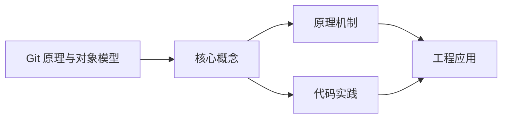
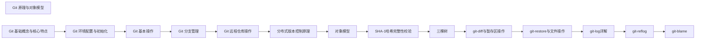

## 1. 学习目标（Bloom 分类）

本节按照布鲁姆教育目标分类学组织学习路径。本文主题为《Git 原理与对象模型》，属于 Git 模块，读者可以根据自身阶段选择阅读深度。

记忆层面：能够准确复述本文的核心概念、术语与基本语法或操作步骤，并能够在提问或检索时快速定位对应知识点。能够说出 Git 的核心概念、常用命令与流程。

理解层面：能够用自己的语言解释核心原理与工作机制，说明概念之间的因果关系，而不是机械记忆结论。能够解释 Git 的工作原理与设计动机。

应用层面：能够在真实项目或练习场景中运用本文知识解决具体问题，写出正确且可维护的实现。能够独立完成 Git 的标准操作。

分析层面：能够拆解复杂问题，比较本文主题与相邻概念的异同，识别边界条件与例外情况。能够分析 Git 使用中的异常与边界。

评价层面：能够根据约束条件（性能、可读性、安全、成本）评价不同方案的优劣，做出有依据的技术决策。能够评价 Git 相关工具与方案。

创造层面：能够把本文知识与其他模块知识组合，设计出新的解决方案或可复用的工程模式。能够把 Git 融入团队工作流。

通过本节学习，读者应当能够把《Git 原理与对象模型》纳入自己的知识网络，并与 Git 模块的其他主题（提交、分支、合并、远程协作）建立关联。

## 2. 历史动机与发展脉络

《Git 原理与对象模型》是 Git 领域的重要主题。要真正理解它，需要先了解它解决的问题与演进过程。

Git 由 Linus Torvalds 于 2005 年为 Linux 内核开发，目标是替代 BitKeeper：分布式、高性能、内容寻址。
Git 的核心是对象模型：blob（内容）、tree（目录）、commit（快照 + 元数据）、tag（引用）；一切对象用 SHA-1 哈希寻址。
工作流演进：集中式工作流 -> 特性分支 -> GitFlow -> GitHub Flow / Trunk-Based；现代团队普遍采用 PR 审查 + 主干发布。

回到本文主题：Git 原理与对象模型 的提出与成熟，正是上述技术背景下的必然产物。早期实现往往以简单可用为目标，随着工程规模扩大，社区逐渐沉淀出标准做法与最佳实践；理解这一脉络，可以帮助读者判断“为什么文档中的推荐写法是现在这个样子”，也能在遇到历史遗留代码时准确识别其设计年代与取舍。


## 3. 形式化定义与核心概念精讲

本节把《Git 原理与对象模型》涉及的核心概念以“定义 + 讲解”的形式展开。读者应把定义当作工具，把讲解当作理解路径；两者结合才能形成可迁移的知识。

三个区域：工作区、暂存区（index）、仓库（HEAD）；git add/commit 移动状态。
分支是指针：创建分支成本极低；合并（merge 生成合并提交）与变基（rebase 重放提交）各有取舍。
远程协作：clone/fetch/pull/push；refs/remotes 跟踪远端；冲突在合并时出现并手工解决。

### 3.1 原文章节逐一精讲

原文档把主题拆分为 17 个小节，下面按顺序给出每一节的导读讲解，随后保留原文细节供精读。

#### 原文精读（完整保留）


#### 1. Git 概述

Git 是一个分布式版本控制系统，用于跟踪文件的变化，协调多人之间的工作。它是由 Linux 创始人 Linus Torvalds 于 2005 年创建的，现在被广泛用于软件开发和其他需要版本控制的场景。

##### 1.1 Git 的核心特点

- **分布式**：每个开发者都有完整的代码仓库
- **高效**：处理大型项目时性能优异
- **安全**：使用 SHA-1 哈希算法确保数据完整性
- **灵活**：支持多种工作流程
- **强大的分支系统**：轻松创建和管理分支

#### 2. Git 基础概念

##### 2.1 仓库（Repository）

- **本地仓库**：存储在本地的代码仓库
- **远程仓库**：存储在服务器上的代码仓库

##### 2.2 工作区（Working Directory）

- 本地文件系统中实际的文件和目录
- 开发者直接修改的地方

##### 2.3 暂存区（Staging Area）

- 临时保存修改的地方
- 位于 `.git/index` 文件中

##### 2.4 版本库（Repository）

- 包含所有提交历史和对象的地方
- 位于 `.git` 目录中

##### 2.5 提交（Commit）

- 对工作区和暂存区变更的快照
- 包含提交信息、作者、日期等元数据

##### 2.6 分支（Branch）

- 指向特定提交的指针
- 默认分支是 `master` 或 `main`

##### 2.7 合并（Merge）

- 将一个分支的更改合并到另一个分支

##### 2.8 远程（Remote）

- 指向远程仓库的引用
- 通常命名为 `origin`

#### 3. Git 基本命令

##### 3.1 初始化与克隆

```bash
 # 初始化新仓库
 git init
 # 克隆远程仓库
 git clone <repository-url>
```

##### 3.2 基本操作

```bash
 # 查看状态
 git status
 # 添加文件到暂存区
 git add <file>
 # 添加所有文件
 git add .
 # 提交更改
 git commit -m "commit message"
 # 提交所有更改
 git commit -a -m "commit message"
 # 查看提交历史
 git log
 # 查看简洁的提交历史
 git log --oneline
 # 查看文件差异
 git diff
 # 查看暂存区与上次提交的差异
 git diff --cached
```

##### 3.3 分支操作

```bash
 # 查看分支
 git branch
 # 查看远程分支
 git branch -r
 # 查看所有分支
 git branch -a
 # 创建分支
 git branch <branch-name>
 # 切换分支
 git checkout <branch-name>
 # 创建并切换分支
 git checkout -b <branch-name>
 # 合并分支
 git merge <branch-name>
 # 删除分支
 git branch -d <branch-name>
 # 强制删除分支
 git branch -D <branch-name>
```

##### 3.4 远程操作

```bash
 # 添加远程仓库
 git remote add <remote-name> <repository-url>
 # 查看远程仓库
 git remote -v
 # 拉取远程更改
 git pull <remote-name> <branch-name>
 # 推送更改到远程
 git push <remote-name> <branch-name>
 # 推送所有分支
 git push --all <remote-name>
 # 推送标签
 git push --tags <remote-name>
```

##### 3.5 标签操作

```bash
 # 创建标签
 git tag <tag-name>
 # 创建带注释的标签
 git tag -a <tag-name> -m "tag message"
 # 查看标签
 git tag
 # 推送标签
 git push <remote-name> <tag-name>
 # 检出标签
 git checkout <tag-name>
```

##### 3.6 撤销操作

```bash
 # 撤销工作区更改
 git checkout -- <file>
 # 撤销暂存区更改
 git reset HEAD <file>
 # 回退到指定提交
 git reset --hard <commit-hash>
 # 撤销最近的提交
 git revert HEAD
 # 撤销指定的提交
 git revert <commit-hash>
```

##### 3.7 高级操作

```bash
 # 查看文件的历史变更
 git blame <file>
 # 查看提交之间的差异
 git diff <commit1> <commit2>
 # 交互式重写提交历史
 git rebase -i <commit-hash>
 # 保存当前工作状态
 git stash
 # 恢复保存的工作状态
 git stash pop
 # 查看保存的工作状态
 git stash list
```

#### 4. Git 工作流程

##### 4.1 集中式工作流

- 所有开发者直接在主分支上工作
- 适合小型团队和简单项目

##### 4.2 功能分支工作流

- 为每个功能创建单独的分支
- 完成后合并到主分支
- 适合大多数项目

##### 4.3 GitFlow 工作流

- 包含主分支、开发分支、功能分支、发布分支和热修复分支
- 适合大型项目和复杂的发布周期

##### 4.4 Forking 工作流

- 开发者 fork 远程仓库
- 在自己的 fork 中工作
- 通过 Pull Request 贡献代码
- 适合开源项目

#### 5. Git 配置

##### 5.1 全局配置

```bash
 # 设置用户名
 git config --global user.name "Your Name"
 # 设置邮箱
 git config --global user.email "your.email@example.com"
 # 设置默认编辑器
 git config --global core.editor "vim"
 # 设置默认分支名称
 git config --global init.defaultBranch main
```

##### 5.2 本地配置

```bash
 # 在当前仓库设置配置
 git config user.name "Your Name"
 git config user.email "your.email@example.com"
```

##### 5.3 配置文件

- **全局配置**：`~/.gitconfig`
- **本地配置**：`.git/config`

#### 6. Git 钩子

Git 钩子是在特定 Git 事件发生时自动执行的脚本。

##### 6.1 常用钩子

- **pre-commit**：提交前执行
- **commit-msg**：提交消息验证
- **post-commit**：提交后执行
- **pre-push**：推送前执行

##### 6.2 钩子示例

```bash
 # pre-commit 钩子示例
 #!/bin/sh
 # 运行代码检查
 npm run lint
```

#### 7. Git 最佳实践

##### 7.1 提交规范

- **提交消息**：清晰、简洁、描述性
- **提交粒度**：每个提交应该解决一个问题
- **提交频率**：频繁提交，保持提交小而专注

##### 7.2 分支管理

- **主分支**：保持稳定，只用于发布
- **开发分支**：用于集成新功能
- **功能分支**：用于开发特定功能
- **发布分支**：用于准备发布
- **热修复分支**：用于紧急修复

##### 7.3 冲突解决

- **预防冲突**：频繁拉取和合并
- **解决冲突**：仔细检查冲突内容，手动解决
- **测试**：解决冲突后进行测试

##### 7.4 代码审查

- **Pull Request**：使用 PR 进行代码审查
- **代码风格**：遵循项目的代码风格
- **测试**：确保代码通过测试

#### 8. Git 工具

##### 8.1 图形化工具

- **Git GUI**：Git 自带的图形界面
- **GitHub Desktop**：GitHub 官方客户单
- **SourceTree**：Atlassian 开发的 Git 客户单
- **GitKraken**：跨平台 Git 客户单

##### 8.2 命令行工具

- **git**：核心命令行工具
- **tig**：文本模式的 Git 界面
- **git-extras**：扩展 Git 功能的工具集

##### 8.3 在线平台

- **GitHub**：最大的 Git 托管平台
- **GitLab**：开源的 Git 托管平台
- **Bitbucket**：Atlassian 的 Git 托管平台

#### 9. 常见问题与解决方案

##### 9.1 提交错误

**问题**：提交了错误的文件或消息
**解决方案**：

- 撤销提交：`git reset --soft HEAD^`
- 修改提交消息：`git commit --amend -m "new message"`

##### 9.2 分支冲突

**问题**：合并分支时发生冲突
**解决方案**：

- 手动编辑冲突文件
- 标记冲突已解决：`git add <file>`
- 完成合并：`git commit`

##### 9.3 远程仓库问题

**问题**：无法推送更改到远程仓库
**解决方案**：

- 先拉取远程更改：`git pull`
- 解决冲突后再推送：`git push`

##### 9.4 历史重写

**问题**：需要修改历史提交
**解决方案**：

- 使用 `git rebase` 重写历史
- 注意：不要重写已推送到远程的提交

#### 10. 示例工作流

##### 10.1 基本工作流

1. **克隆仓库**：`git clone <repository-url>`
2. **创建分支**：`git checkout -b feature-branch`
3. **修改文件**：编辑代码
4. **添加更改**：`git add .`
5. **提交更改**：`git commit -m "Add new feature"`
6. **推送到远程**：`git push origin feature-branch`
7. **创建 Pull Request**：在 GitHub/GitLab 上创建 PR
8. **合并分支**：PR 通过后合并到主分支
9. **删除分支**：`git branch -d feature-branch`

##### 10.2 团队协作工作流

1. **同步远程**：`git pull origin main`
2. **创建功能分支**：`git checkout -b feature/issue-123`
3. **开发功能**：实现功能并测试
4. **提交更改**：`git commit -m "Implement feature for issue #123"`
5. **推送到远程**：`git push origin feature/issue-123`
6. **创建 PR**：描述功能和相关问题
7. **代码审查**：团队成员审查代码
8. **解决反馈**：根据审查意见修改代码
9. **合并 PR**：代码通过审查后合并
10. **删除分支**：`git branch -d feature/issue-123`

#### 11. Git 核心原理

##### 11.1 Git 对象模型

Git 使用四种基本对象来存储数据：

###### 11.1.1 Blob 对象

- 存储文件内容
- 不包含文件名和路径信息
- 通过 SHA-1 哈希值唯一标识

```bash
 # 查看 blob 对象
 # 创建一个 blob 对象
 echo "Hello, Git!" | git hash-object -w --stdin
 # 查看 blob 对象内容
 git cat-file -p <blob-hash>
```

###### 11.1.2 Tree 对象

- 存储目录结构
- 包含文件名、权限和指向 blob 或其他 tree 的引用
- 通过 SHA-1 哈希值唯一标识

```bash
 # 查看 tree 对象
 # 创建一个 tree 对象（Git 内部操作）
 git write-tree
 # 查看 tree 对象内容
 git cat-file -p <tree-hash>
```

###### 11.1.3 Commit 对象

- 存储提交信息
- 包含作者、日期、提交信息、指向 tree 对象的引用
- 通过 SHA-1 哈希值唯一标识

```bash
 # 查看 commit 对象
 # 查看提交的内部信息
 git cat-file -p <commit-hash>
```

###### 11.1.4 Tag 对象

- 存储标签信息
- 包含标签名称、创建者、日期、标签信息、指向 commit 对象的引用
- 通过 SHA-1 哈希值唯一标识

```bash
 # 查看 tag 对象
 # 创建一个带注释的标签
 git tag -a v1.0.0 -m "Version 1.0.0"
 # 查看 tag 对象内容
 git cat-file -p v1.0.0
```

##### 11.2 Git 存储机制

###### 11.2.1 对象存储

- Git 将对象存储在 `.git/objects` 目录中
- 对象按哈希值的前两位作为目录名，后38位作为文件名
- 采用压缩存储，节省空间

```bash
 # 查看对象存储目录
 ls -la .git/objects/
```

###### 11.2.2 引用存储

- 分支：`.git/refs/heads/`
- 标签：`.git/refs/tags/`
- 远程分支：`.git/refs/remotes/`

```bash
 # 查看分支引用
 cat .git/refs/heads/main
```

###### 11.2.3 HEAD 引用

- 指向当前所在的分支或提交
- 存储在 `.git/HEAD` 文件中

```bash
 # 查看 HEAD 引用
 cat .git/HEAD
```

##### 11.3 Git 哈希算法

- 使用 SHA-1 哈希算法
- 生成 40 位十六进制字符串
- 确保数据完整性
- 用于唯一标识 Git 对象

```bash
 # 计算文件的哈希值
 git hash-object <file>
```

##### 11.4 Git 分支实现原理

- 分支本质上是指向提交的指针
- 创建分支只是创建一个新的指针文件
- 切换分支只是修改 HEAD 指向

```bash
 # 创建分支的底层操作
 # 手动创建一个分支
 echo <commit-hash> > .git/refs/heads/new-branch
```

##### 11.5 Git 合并机制

###### 11.5.1 快进合并（Fast-forward）

- 当目标分支是当前分支的直接祖先时
- 只需移动分支指针

###### 11.5.2 三方合并（3-way merge）

- 当两个分支有不同的提交历史时
- 找到共同祖先，合并三个版本

###### 11.5.3 冲突解决

- 当两个分支修改了同一文件的同一部分时
- 需要手动解决冲突

##### 11.6 Git 垃圾回收

- Git 自动进行垃圾回收
- 清理未引用的对象
- 压缩对象存储

```bash
 # 手动执行垃圾回收
 git gc
 # 查看垃圾回收统计信息
 git gc --verbose
```

##### 11.7 Git 索引（暂存区）

- 存储在 `.git/index` 文件中
- 是工作区和版本库之间的桥梁
- 记录文件的状态和元数据

```bash
 # 查看索引内容
 git ls-files --stage
```

#### 12. Git 内部操作

##### 12.1 底层命令

```bash
 # 查看 Git 版本
 git --version
 # 查看 Git 配置
 git config --list
 # 查看 Git 状态
 git status
 # 查看 Git 提交历史
 git log
 # 查看 Git 对象
 git cat-file -t <hash> # 查看对象类型
 git cat-file -p <hash> # 查看对象内容
 # 查看 Git 引用
 git show-ref
 # 查看 Git 分支
 git branch -v
 # 查看 Git 远程仓库
 git remote -v
 # 查看 Git 标签
 git tag -l
```

##### 12.2 内部原理示例

###### 12.2.1 提交过程

1. **git add**：将文件内容添加到暂存区，创建 blob 对象
2. **git commit**：创建 tree 对象和 commit 对象
3. **更新分支指针**：将当前分支指向新的 commit 对象

###### 12.2.2 分支创建与切换

1. **git branch**：创建新的分支指针文件
2. **git checkout**：修改 HEAD 指向新的分支

###### 12.2.3 合并过程

1. **git merge**：找到共同祖先
2. **分析差异**：比较三个版本的差异
3. **生成新提交**：创建合并提交

#### 13. 实际应用案例

##### 13.1 大型项目管理

###### 13.1.1 分支策略

```bash
 # 主分支
 main # 稳定版本
 # 开发分支
 develop # 集成新功能
 # 功能分支
 feature/issue-123 # 开发特定功能
 # 发布分支
 release/v1.0.0 # 准备发布
 # 热修复分支
 hotfix/bug-456 # 紧急修复
```

###### 13.1.2 提交规范

```bash
 # 提交消息格式
 <type>(<scope>): <subject>
 <body>
 <footer>
 # 类型
 feat: 新功能
 fix: 修复 bug
 docs: 文档更改
 style: 代码风格更改
 refactor: 代码重构
 test: 测试更改
 chore: 构建或依赖更改
 perf: 性能优化
 revert: 回滚提交
```

##### 13.2 团队协作

###### 13.2.1 代码审查流程

1. **创建 PR**：开发者创建 Pull Request
2. **代码审查**：团队成员审查代码
3. **反馈修改**：开发者根据反馈修改代码
4. **合并 PR**：代码通过审查后合并
5. **删除分支**：合并后删除功能分支

###### 13.2.2 冲突解决策略

1. **预防冲突**：频繁拉取和合并
2. **解决冲突**：仔细检查冲突内容
3. **测试验证**：解决冲突后进行测试

##### 13.3 持续集成/持续部署

###### 13.3.1 CI/CD 配置

```yaml
 # .github/workflows/ci.yml
 name: CI
 on:
  push:
  branches: [main, develop]
  pull_request:
  branches: [main, develop]
 jobs:
  build:
  runs-on: ubuntu-latest
  steps:
  - uses: actions/checkout@v4
  - name: Set up Node.js
  uses: actions/setup-node@v4
  with:
  node-version: '20'
  - name: Install dependencies
  run: npm ci
  - name: Run tests
  run: npm test
  - name: Build
  run: npm run build
```

#### 14. 常见问题与解决方案（进阶）

##### 14.1 性能问题

**问题**：大型仓库操作缓慢
**解决方案**：

- 启用 Git 压缩：`git config --global core.compression 9`
- 清理垃圾对象：`git gc --aggressive`
- 使用浅克隆：`git clone --depth 1 <repository-url>`
- 配置大文件存储：`git lfs install`
  **问题**：提交历史过多
  **解决方案**：
- 使用 `git rebase` 压缩提交
- 清理历史中的大文件：`git filter-branch` 或 BFG Repo-Cleaner

##### 14.2 安全问题

**问题**：提交了敏感信息
**解决方案**：

- 使用 `git filter-branch` 或 BFG Repo-Cleaner 移除敏感信息
- 重置远程仓库：`git push --force`
- 通知团队成员重新克隆仓库
  **问题**：SSH 密钥管理
  **解决方案**：
- 生成 SSH 密钥：`ssh-keygen -t ed25519 -C "your.email@example.com"`
- 添加 SSH 密钥到 ssh-agent：`ssh-add ~/.ssh/id_ed25519`
- 配置 SSH config 文件：`~/.ssh/config`

##### 14.3 高级操作问题

**问题**：需要修改历史提交
**解决方案**：

- 使用 `git rebase -i` 交互式重写历史
- 注意：不要重写已推送到远程的提交
  **问题**：分支管理混乱
  **解决方案**：
- 定期清理无用分支：`git branch -d <branch-name>`
- 使用分支命名规范：`feature/`、`bugfix/`、`hotfix/`
- 定期同步远程分支：`git fetch --prune`

##### 14.4 远程协作问题

**问题**：远程仓库冲突
**解决方案**：

- 先拉取远程更改：`git pull --rebase`
- 解决冲突后再推送：`git push`
  **问题**：网络连接问题
  **解决方案**：
- 配置 HTTP 代理：`git config --global http.proxy http://proxy:port`
- 使用 SSH 协议替代 HTTPS：`git remote set-url origin git@github.com:user/repo.git`

#### 15. Git 最佳实践（进阶）

##### 15.1 性能优化

1. **使用 Git LFS**：管理大文件
2. **启用自动垃圾回收**：`git config --global gc.auto 256`
3. **配置 pack 窗口大小**：`git config --global pack.windowMemory 512m`
4. **使用引用日志**：`git reflog` 查看操作历史

##### 15.2 安全性

1. **使用 SSH 协议**：更安全的认证方式
2. **签名提交**：`git config --global user.signingkey <gpg-key-id>`
3. **验证签名**：`git log --show-signature`
4. **使用 .gitignore**：排除敏感文件

##### 15.3 团队协作

1. **统一分支策略**：使用 GitFlow 或其他标准工作流
2. **自动化测试**：集成 CI/CD
3. **代码审查**：使用 Pull Request
4. **文档管理**：维护 README 和贡献指南

##### 15.4 工具使用

1. **Git 客户单**：选择适合自己的客户单
2. **Git 钩子**：自动化工作流程
3. **Git 扩展**：git-extras、git-flow 等
4. **IDE 集成**：利用 IDE 的 Git 集成功能

#### 16. 延伸阅读

- [Git 官方文档](https://git-scm.com/doc) <!-- nofollow -->
- [Pro Git 书籍](https://git-scm.com/book/en/v2) <!-- nofollow -->
- [GitHub 文档](https://docs.github.com/en/get-started) <!-- nofollow -->
- [GitLab 文档](https://docs.gitlab.com/) <!-- nofollow -->
- [Bitbucket 文档](https://support.atlassian.com/bitbucket-cloud/docs/) <!-- nofollow -->
- [Git 内部原理](https://git-scm.com/book/en/v2/Git-Internals-Plumbing-and-Porcelain) <!-- nofollow -->
- [Git 工作流程](https://www.atlassian.com/git/tutorials/comparing-workflows) <!-- nofollow -->

#### 17. 总结

Git 是一个强大的版本控制系统，它的核心是基于对象模型的存储机制。通过理解 Git 的内部原理，你可以更有效地使用 Git，解决复杂的版本控制问题，提高开发效率。

##### 17.1 核心要点

- **对象模型**：Blob、Tree、Commit、Tag 四种基本对象
- **存储机制**：基于哈希的高效存储
- **分支实现**：轻量级的指针系统
- **合并机制**：快进合并和三方合并
- **垃圾回收**：自动清理未引用对象
- **分布式架构**：每个开发者都有完整的仓库

##### 17.2 学习建议

- **深入理解**：掌握 Git 的内部原理
- **实践练习**：通过实际项目练习高级操作
- **工具使用**：利用 Git 工具提高效率
- **团队协作**：遵循团队的 Git 规范
- **持续学习**：关注 Git 的新特性和最佳实践
  通过不断学习和实践，你将能够熟练使用 Git，成为一名高效的开发者，为项目的成功做出贡献


### 3.2 概念关系图

下面用 Mermaid 图表达本文核心概念之间的关系，帮助读者建立整体图景：



图中展示的是本文知识的结构化关系：核心概念是入口，原理机制解释“为什么”，代码实践演示“怎么做”，工程应用回答“何时用”。读者学习时可以把每个小节的内容挂接到对应节点上。

## 4. 理论推导与原理解析

本节深入《Git 原理与对象模型》背后的原理。理论部分不求面面俱到，而是聚焦“能解释现象、能指导实践”的关键推导。

三个区域：工作区、暂存区（index）、仓库（HEAD）；git add/commit 移动状态。
分支是指针：创建分支成本极低；合并（merge 生成合并提交）与变基（rebase 重放提交）各有取舍。
远程协作：clone/fetch/pull/push；refs/remotes 跟踪远端；冲突在合并时出现并手工解决。
撤销模型：checkout/restore 改工作区，reset 移 HEAD，revert 生成反向提交；理解三者避免误操作。

需要强调的是，理论推导与工程实践之间存在翻译层：理论给出的是理想化模型与边界条件，工程代码则必须处理真实环境中的例外。读者在学习时应先掌握理论的“标准情形”，再通过陷阱章节了解“非标准情形”。

## 5. 代码示例与逐行讲解

本节把原文中的代码示例系统整理，并为每个示例补充用途说明与讲解。读者不应只浏览代码，而应逐段对照讲解理解设计意图。

### 5.1 示例：3.1 初始化与克隆

该示例来自原文《3.1 初始化与克隆》小节，用于演示Git 原理与对象模型相关操作。阅读时请先看代码结构，再看其后的讲解。

```bash
 # 初始化新仓库
 git init
 # 克隆远程仓库
 git clone <repository-url>
```

讲解：这段代码演示了本节核心知识点。代码中的关键操作可以归纳为三步：准备（定义或初始化）、执行（核心逻辑）、收尾（释放资源或返回结果）。实际项目中，这三步往往被封装为函数或类，以提升复用性与可测试性。

关键点分析：

该示例共 4 行有效代码，结构以数据或配置为主。阅读时应关注：数据字段的含义、配置项的作用，以及它们与运行行为的对应关系。

进阶思考路径：先尝试修改参数观察行为变化，再把示例中的模式迁移到自己的项目中；每次修改都记录预期与实测差异，这是把示例转化为能力的最快方式。

### 5.2 示例：3.2 基本操作

该示例来自原文《3.2 基本操作》小节，用于演示Git 原理与对象模型相关操作。阅读时请先看代码结构，再看其后的讲解。

```bash
 # 查看状态
 git status
 # 添加文件到暂存区
 git add <file>
 # 添加所有文件
 git add .
 # 提交更改
 git commit -m "commit message"
 # 提交所有更改
 git commit -a -m "commit message"
 # 查看提交历史
 git log
 # 查看简洁的提交历史
 git log --oneline
 # 查看文件差异
 git diff
 # 查看暂存区与上次提交的差异
 git diff --cached
```

讲解：这段代码演示了本节核心知识点。代码中的关键操作可以归纳为三步：准备（定义或初始化）、执行（核心逻辑）、收尾（释放资源或返回结果）。实际项目中，这三步往往被封装为函数或类，以提升复用性与可测试性。

关键点分析：

该示例共 18 行有效代码，结构以数据或配置为主。阅读时应关注：数据字段的含义、配置项的作用，以及它们与运行行为的对应关系。

进阶思考路径：先尝试修改参数观察行为变化，再把示例中的模式迁移到自己的项目中；每次修改都记录预期与实测差异，这是把示例转化为能力的最快方式。

### 5.3 示例：3.3 分支操作

该示例来自原文《3.3 分支操作》小节，用于演示Git 原理与对象模型相关操作。阅读时请先看代码结构，再看其后的讲解。

```bash
 # 查看分支
 git branch
 # 查看远程分支
 git branch -r
 # 查看所有分支
 git branch -a
 # 创建分支
 git branch <branch-name>
 # 切换分支
 git checkout <branch-name>
 # 创建并切换分支
 git checkout -b <branch-name>
 # 合并分支
 git merge <branch-name>
 # 删除分支
 git branch -d <branch-name>
 # 强制删除分支
 git branch -D <branch-name>
```

讲解：这段代码演示了本节核心知识点。代码中的关键操作可以归纳为三步：准备（定义或初始化）、执行（核心逻辑）、收尾（释放资源或返回结果）。实际项目中，这三步往往被封装为函数或类，以提升复用性与可测试性。

关键点分析：

该示例共 18 行有效代码，结构以数据或配置为主。阅读时应关注：数据字段的含义、配置项的作用，以及它们与运行行为的对应关系。

进阶思考路径：先尝试修改参数观察行为变化，再把示例中的模式迁移到自己的项目中；每次修改都记录预期与实测差异，这是把示例转化为能力的最快方式。

### 5.4 示例：3.4 远程操作

该示例来自原文《3.4 远程操作》小节，用于演示Git 原理与对象模型相关操作。阅读时请先看代码结构，再看其后的讲解。

```bash
 # 添加远程仓库
 git remote add <remote-name> <repository-url>
 # 查看远程仓库
 git remote -v
 # 拉取远程更改
 git pull <remote-name> <branch-name>
 # 推送更改到远程
 git push <remote-name> <branch-name>
 # 推送所有分支
 git push --all <remote-name>
 # 推送标签
 git push --tags <remote-name>
```

讲解：这段代码演示了本节核心知识点。代码中的关键操作可以归纳为三步：准备（定义或初始化）、执行（核心逻辑）、收尾（释放资源或返回结果）。实际项目中，这三步往往被封装为函数或类，以提升复用性与可测试性。

关键点分析：

该示例共 12 行有效代码，结构以数据或配置为主。阅读时应关注：数据字段的含义、配置项的作用，以及它们与运行行为的对应关系。

进阶思考路径：先尝试修改参数观察行为变化，再把示例中的模式迁移到自己的项目中；每次修改都记录预期与实测差异，这是把示例转化为能力的最快方式。

### 5.5 示例：3.5 标签操作

该示例来自原文《3.5 标签操作》小节，用于演示Git 原理与对象模型相关操作。阅读时请先看代码结构，再看其后的讲解。

```bash
 # 创建标签
 git tag <tag-name>
 # 创建带注释的标签
 git tag -a <tag-name> -m "tag message"
 # 查看标签
 git tag
 # 推送标签
 git push <remote-name> <tag-name>
 # 检出标签
 git checkout <tag-name>
```

讲解：这段代码演示了本节核心知识点。代码中的关键操作可以归纳为三步：准备（定义或初始化）、执行（核心逻辑）、收尾（释放资源或返回结果）。实际项目中，这三步往往被封装为函数或类，以提升复用性与可测试性。

关键点分析：

该示例共 10 行有效代码，结构以数据或配置为主。阅读时应关注：数据字段的含义、配置项的作用，以及它们与运行行为的对应关系。

进阶思考路径：先尝试修改参数观察行为变化，再把示例中的模式迁移到自己的项目中；每次修改都记录预期与实测差异，这是把示例转化为能力的最快方式。

### 5.6 示例：3.6 撤销操作

该示例来自原文《3.6 撤销操作》小节，用于演示Git 原理与对象模型相关操作。阅读时请先看代码结构，再看其后的讲解。

```bash
 # 撤销工作区更改
 git checkout -- <file>
 # 撤销暂存区更改
 git reset HEAD <file>
 # 回退到指定提交
 git reset --hard <commit-hash>
 # 撤销最近的提交
 git revert HEAD
 # 撤销指定的提交
 git revert <commit-hash>
```

讲解：这段代码演示了本节核心知识点。代码中的关键操作可以归纳为三步：准备（定义或初始化）、执行（核心逻辑）、收尾（释放资源或返回结果）。实际项目中，这三步往往被封装为函数或类，以提升复用性与可测试性。

关键点分析：

该示例共 10 行有效代码，结构以数据或配置为主。阅读时应关注：数据字段的含义、配置项的作用，以及它们与运行行为的对应关系。

进阶思考路径：先尝试修改参数观察行为变化，再把示例中的模式迁移到自己的项目中；每次修改都记录预期与实测差异，这是把示例转化为能力的最快方式。

### 5.7 示例：3.7 高级操作

该示例来自原文《3.7 高级操作》小节，用于演示Git 原理与对象模型相关操作。阅读时请先看代码结构，再看其后的讲解。

```bash
 # 查看文件的历史变更
 git blame <file>
 # 查看提交之间的差异
 git diff <commit1> <commit2>
 # 交互式重写提交历史
 git rebase -i <commit-hash>
 # 保存当前工作状态
 git stash
 # 恢复保存的工作状态
 git stash pop
 # 查看保存的工作状态
 git stash list
```

讲解：这段代码演示了本节核心知识点。代码中的关键操作可以归纳为三步：准备（定义或初始化）、执行（核心逻辑）、收尾（释放资源或返回结果）。实际项目中，这三步往往被封装为函数或类，以提升复用性与可测试性。

关键点分析：

该示例共 12 行有效代码，结构以数据或配置为主。阅读时应关注：数据字段的含义、配置项的作用，以及它们与运行行为的对应关系。

进阶思考路径：先尝试修改参数观察行为变化，再把示例中的模式迁移到自己的项目中；每次修改都记录预期与实测差异，这是把示例转化为能力的最快方式。

### 5.8 示例：5.1 全局配置

该示例来自原文《5.1 全局配置》小节，用于演示Git 原理与对象模型相关操作。阅读时请先看代码结构，再看其后的讲解。

```bash
 # 设置用户名
 git config --global user.name "Your Name"
 # 设置邮箱
 git config --global user.email "your.email@example.com"
 # 设置默认编辑器
 git config --global core.editor "vim"
 # 设置默认分支名称
 git config --global init.defaultBranch main
```

讲解：这段代码演示了本节核心知识点。代码中的关键操作可以归纳为三步：准备（定义或初始化）、执行（核心逻辑）、收尾（释放资源或返回结果）。实际项目中，这三步往往被封装为函数或类，以提升复用性与可测试性。

关键点分析：

该示例共 8 行有效代码，结构以数据或配置为主。阅读时应关注：数据字段的含义、配置项的作用，以及它们与运行行为的对应关系。

进阶思考路径：先尝试修改参数观察行为变化，再把示例中的模式迁移到自己的项目中；每次修改都记录预期与实测差异，这是把示例转化为能力的最快方式。

### 5.9 示例：5.2 本地配置

该示例来自原文《5.2 本地配置》小节，用于演示Git 原理与对象模型相关操作。阅读时请先看代码结构，再看其后的讲解。

```bash
 # 在当前仓库设置配置
 git config user.name "Your Name"
 git config user.email "your.email@example.com"
```

讲解：这段代码演示了本节核心知识点。代码中的关键操作可以归纳为三步：准备（定义或初始化）、执行（核心逻辑）、收尾（释放资源或返回结果）。实际项目中，这三步往往被封装为函数或类，以提升复用性与可测试性。

关键点分析：

该示例共 3 行有效代码，结构以数据或配置为主。阅读时应关注：数据字段的含义、配置项的作用，以及它们与运行行为的对应关系。

进阶思考路径：先尝试修改参数观察行为变化，再把示例中的模式迁移到自己的项目中；每次修改都记录预期与实测差异，这是把示例转化为能力的最快方式。

### 5.10 示例：6.2 钩子示例

该示例来自原文《6.2 钩子示例》小节，用于演示Git 原理与对象模型相关操作。阅读时请先看代码结构，再看其后的讲解。

```bash
 # pre-commit 钩子示例
 #!/bin/sh
 # 运行代码检查
 npm run lint
```

讲解：这段代码演示了本节核心知识点。代码中的关键操作可以归纳为三步：准备（定义或初始化）、执行（核心逻辑）、收尾（释放资源或返回结果）。实际项目中，这三步往往被封装为函数或类，以提升复用性与可测试性。

关键点分析：

该示例共 4 行有效代码，结构以数据或配置为主。阅读时应关注：数据字段的含义、配置项的作用，以及它们与运行行为的对应关系。

进阶思考路径：先尝试修改参数观察行为变化，再把示例中的模式迁移到自己的项目中；每次修改都记录预期与实测差异，这是把示例转化为能力的最快方式。

### 5.11 示例：11.1.1 Blob 对象

该示例来自原文《11.1.1 Blob 对象》小节，用于演示Git 原理与对象模型相关操作。阅读时请先看代码结构，再看其后的讲解。

```bash
 # 查看 blob 对象
 # 创建一个 blob 对象
 echo "Hello, Git!" | git hash-object -w --stdin
 # 查看 blob 对象内容
 git cat-file -p <blob-hash>
```

讲解：这段代码演示了本节核心知识点。代码中的关键操作可以归纳为三步：准备（定义或初始化）、执行（核心逻辑）、收尾（释放资源或返回结果）。实际项目中，这三步往往被封装为函数或类，以提升复用性与可测试性。

关键点分析：

该示例共 5 行有效代码，结构以数据或配置为主。阅读时应关注：数据字段的含义、配置项的作用，以及它们与运行行为的对应关系。

进阶思考路径：先尝试修改参数观察行为变化，再把示例中的模式迁移到自己的项目中；每次修改都记录预期与实测差异，这是把示例转化为能力的最快方式。

### 5.12 示例：11.1.2 Tree 对象

该示例来自原文《11.1.2 Tree 对象》小节，用于演示Git 原理与对象模型相关操作。阅读时请先看代码结构，再看其后的讲解。

```bash
 # 查看 tree 对象
 # 创建一个 tree 对象（Git 内部操作）
 git write-tree
 # 查看 tree 对象内容
 git cat-file -p <tree-hash>
```

讲解：这段代码演示了本节核心知识点。代码中的关键操作可以归纳为三步：准备（定义或初始化）、执行（核心逻辑）、收尾（释放资源或返回结果）。实际项目中，这三步往往被封装为函数或类，以提升复用性与可测试性。

关键点分析：

该示例共 5 行有效代码，结构以数据或配置为主。阅读时应关注：数据字段的含义、配置项的作用，以及它们与运行行为的对应关系。

进阶思考路径：先尝试修改参数观察行为变化，再把示例中的模式迁移到自己的项目中；每次修改都记录预期与实测差异，这是把示例转化为能力的最快方式。

### 5.13 示例：11.1.3 Commit 对象

该示例来自原文《11.1.3 Commit 对象》小节，用于演示Git 原理与对象模型相关操作。阅读时请先看代码结构，再看其后的讲解。

```bash
 # 查看 commit 对象
 # 查看提交的内部信息
 git cat-file -p <commit-hash>
```

讲解：这段代码演示了本节核心知识点。代码中的关键操作可以归纳为三步：准备（定义或初始化）、执行（核心逻辑）、收尾（释放资源或返回结果）。实际项目中，这三步往往被封装为函数或类，以提升复用性与可测试性。

关键点分析：

该示例共 3 行有效代码，结构以数据或配置为主。阅读时应关注：数据字段的含义、配置项的作用，以及它们与运行行为的对应关系。

进阶思考路径：先尝试修改参数观察行为变化，再把示例中的模式迁移到自己的项目中；每次修改都记录预期与实测差异，这是把示例转化为能力的最快方式。

### 5.14 示例：11.1.4 Tag 对象

该示例来自原文《11.1.4 Tag 对象》小节，用于演示Git 原理与对象模型相关操作。阅读时请先看代码结构，再看其后的讲解。

```bash
 # 查看 tag 对象
 # 创建一个带注释的标签
 git tag -a v1.0.0 -m "Version 1.0.0"
 # 查看 tag 对象内容
 git cat-file -p v1.0.0
```

讲解：这段代码演示了本节核心知识点。代码中的关键操作可以归纳为三步：准备（定义或初始化）、执行（核心逻辑）、收尾（释放资源或返回结果）。实际项目中，这三步往往被封装为函数或类，以提升复用性与可测试性。

关键点分析：

该示例共 5 行有效代码，结构以数据或配置为主。阅读时应关注：数据字段的含义、配置项的作用，以及它们与运行行为的对应关系。

进阶思考路径：先尝试修改参数观察行为变化，再把示例中的模式迁移到自己的项目中；每次修改都记录预期与实测差异，这是把示例转化为能力的最快方式。

### 5.15 示例：11.2.1 对象存储

该示例来自原文《11.2.1 对象存储》小节，用于演示Git 原理与对象模型相关操作。阅读时请先看代码结构，再看其后的讲解。

```bash
 # 查看对象存储目录
 ls -la .git/objects/
```

讲解：这段代码演示了本节核心知识点。代码中的关键操作可以归纳为三步：准备（定义或初始化）、执行（核心逻辑）、收尾（释放资源或返回结果）。实际项目中，这三步往往被封装为函数或类，以提升复用性与可测试性。

关键点分析：

该示例共 2 行有效代码，结构以数据或配置为主。阅读时应关注：数据字段的含义、配置项的作用，以及它们与运行行为的对应关系。

进阶思考路径：先尝试修改参数观察行为变化，再把示例中的模式迁移到自己的项目中；每次修改都记录预期与实测差异，这是把示例转化为能力的最快方式。

### 5.16 示例：11.2.2 引用存储

该示例来自原文《11.2.2 引用存储》小节，用于演示Git 原理与对象模型相关操作。阅读时请先看代码结构，再看其后的讲解。

```bash
 # 查看分支引用
 cat .git/refs/heads/main
```

讲解：这段代码演示了本节核心知识点。代码中的关键操作可以归纳为三步：准备（定义或初始化）、执行（核心逻辑）、收尾（释放资源或返回结果）。实际项目中，这三步往往被封装为函数或类，以提升复用性与可测试性。

关键点分析：

该示例共 2 行有效代码，结构以数据或配置为主。阅读时应关注：数据字段的含义、配置项的作用，以及它们与运行行为的对应关系。

进阶思考路径：先尝试修改参数观察行为变化，再把示例中的模式迁移到自己的项目中；每次修改都记录预期与实测差异，这是把示例转化为能力的最快方式。

### 5.17 示例：11.2.3 HEAD 引用

该示例来自原文《11.2.3 HEAD 引用》小节，用于演示Git 原理与对象模型相关操作。阅读时请先看代码结构，再看其后的讲解。

```bash
 # 查看 HEAD 引用
 cat .git/HEAD
```

讲解：这段代码演示了本节核心知识点。代码中的关键操作可以归纳为三步：准备（定义或初始化）、执行（核心逻辑）、收尾（释放资源或返回结果）。实际项目中，这三步往往被封装为函数或类，以提升复用性与可测试性。

关键点分析：

该示例共 2 行有效代码，结构以数据或配置为主。阅读时应关注：数据字段的含义、配置项的作用，以及它们与运行行为的对应关系。

进阶思考路径：先尝试修改参数观察行为变化，再把示例中的模式迁移到自己的项目中；每次修改都记录预期与实测差异，这是把示例转化为能力的最快方式。

### 5.18 示例：11.3 Git 哈希算法

该示例来自原文《11.3 Git 哈希算法》小节，用于演示Git 原理与对象模型相关操作。阅读时请先看代码结构，再看其后的讲解。

```bash
 # 计算文件的哈希值
 git hash-object <file>
```

讲解：这段代码演示了本节核心知识点。代码中的关键操作可以归纳为三步：准备（定义或初始化）、执行（核心逻辑）、收尾（释放资源或返回结果）。实际项目中，这三步往往被封装为函数或类，以提升复用性与可测试性。

关键点分析：

该示例共 2 行有效代码，结构以数据或配置为主。阅读时应关注：数据字段的含义、配置项的作用，以及它们与运行行为的对应关系。

进阶思考路径：先尝试修改参数观察行为变化，再把示例中的模式迁移到自己的项目中；每次修改都记录预期与实测差异，这是把示例转化为能力的最快方式。

### 5.19 示例：11.4 Git 分支实现原理

该示例来自原文《11.4 Git 分支实现原理》小节，用于演示Git 原理与对象模型相关操作。阅读时请先看代码结构，再看其后的讲解。

```bash
 # 创建分支的底层操作
 # 手动创建一个分支
 echo <commit-hash> > .git/refs/heads/new-branch
```

讲解：这段代码演示了本节核心知识点。代码中的关键操作可以归纳为三步：准备（定义或初始化）、执行（核心逻辑）、收尾（释放资源或返回结果）。实际项目中，这三步往往被封装为函数或类，以提升复用性与可测试性。

关键点分析：

该示例共 3 行有效代码，结构以数据或配置为主。阅读时应关注：数据字段的含义、配置项的作用，以及它们与运行行为的对应关系。

进阶思考路径：先尝试修改参数观察行为变化，再把示例中的模式迁移到自己的项目中；每次修改都记录预期与实测差异，这是把示例转化为能力的最快方式。

### 5.20 示例：11.6 Git 垃圾回收

该示例来自原文《11.6 Git 垃圾回收》小节，用于演示Git 原理与对象模型相关操作。阅读时请先看代码结构，再看其后的讲解。

```bash
 # 手动执行垃圾回收
 git gc
 # 查看垃圾回收统计信息
 git gc --verbose
```

讲解：这段代码演示了本节核心知识点。代码中的关键操作可以归纳为三步：准备（定义或初始化）、执行（核心逻辑）、收尾（释放资源或返回结果）。实际项目中，这三步往往被封装为函数或类，以提升复用性与可测试性。

关键点分析：

该示例共 4 行有效代码，结构以数据或配置为主。阅读时应关注：数据字段的含义、配置项的作用，以及它们与运行行为的对应关系。

进阶思考路径：先尝试修改参数观察行为变化，再把示例中的模式迁移到自己的项目中；每次修改都记录预期与实测差异，这是把示例转化为能力的最快方式。

### 5.21 示例：11.7 Git 索引（暂存区）

该示例来自原文《11.7 Git 索引（暂存区）》小节，用于演示Git 原理与对象模型相关操作。阅读时请先看代码结构，再看其后的讲解。

```bash
 # 查看索引内容
 git ls-files --stage
```

讲解：这段代码演示了本节核心知识点。代码中的关键操作可以归纳为三步：准备（定义或初始化）、执行（核心逻辑）、收尾（释放资源或返回结果）。实际项目中，这三步往往被封装为函数或类，以提升复用性与可测试性。

关键点分析：

该示例共 2 行有效代码，结构以数据或配置为主。阅读时应关注：数据字段的含义、配置项的作用，以及它们与运行行为的对应关系。

进阶思考路径：先尝试修改参数观察行为变化，再把示例中的模式迁移到自己的项目中；每次修改都记录预期与实测差异，这是把示例转化为能力的最快方式。

### 5.22 示例：12.1 底层命令

该示例来自原文《12.1 底层命令》小节，用于演示Git 原理与对象模型相关操作。阅读时请先看代码结构，再看其后的讲解。

```bash
 # 查看 Git 版本
 git --version
 # 查看 Git 配置
 git config --list
 # 查看 Git 状态
 git status
 # 查看 Git 提交历史
 git log
 # 查看 Git 对象
 git cat-file -t <hash> # 查看对象类型
 git cat-file -p <hash> # 查看对象内容
 # 查看 Git 引用
 git show-ref
 # 查看 Git 分支
 git branch -v
 # 查看 Git 远程仓库
 git remote -v
 # 查看 Git 标签
 git tag -l
```

讲解：这段代码演示了本节核心知识点。代码中的关键操作可以归纳为三步：准备（定义或初始化）、执行（核心逻辑）、收尾（释放资源或返回结果）。实际项目中，这三步往往被封装为函数或类，以提升复用性与可测试性。

关键点分析：

该示例共 19 行有效代码，结构以数据或配置为主。阅读时应关注：数据字段的含义、配置项的作用，以及它们与运行行为的对应关系。

进阶思考路径：先尝试修改参数观察行为变化，再把示例中的模式迁移到自己的项目中；每次修改都记录预期与实测差异，这是把示例转化为能力的最快方式。

### 5.23 示例：13.1.1 分支策略

该示例来自原文《13.1.1 分支策略》小节，用于演示Git 原理与对象模型相关操作。阅读时请先看代码结构，再看其后的讲解。

```bash
 # 主分支
 main # 稳定版本
 # 开发分支
 develop # 集成新功能
 # 功能分支
 feature/issue-123 # 开发特定功能
 # 发布分支
 release/v1.0.0 # 准备发布
 # 热修复分支
 hotfix/bug-456 # 紧急修复
```

讲解：这段代码演示了本节核心知识点。代码中的关键操作可以归纳为三步：准备（定义或初始化）、执行（核心逻辑）、收尾（释放资源或返回结果）。实际项目中，这三步往往被封装为函数或类，以提升复用性与可测试性。

关键点分析：

该示例共 10 行有效代码，结构以数据或配置为主。阅读时应关注：数据字段的含义、配置项的作用，以及它们与运行行为的对应关系。

进阶思考路径：先尝试修改参数观察行为变化，再把示例中的模式迁移到自己的项目中；每次修改都记录预期与实测差异，这是把示例转化为能力的最快方式。

### 5.24 示例：13.1.2 提交规范

该示例来自原文《13.1.2 提交规范》小节，用于演示Git 原理与对象模型相关操作。阅读时请先看代码结构，再看其后的讲解。

```bash
 # 提交消息格式
 <type>(<scope>): <subject>
 <body>
 <footer>
 # 类型
 feat: 新功能
 fix: 修复 bug
 docs: 文档更改
 style: 代码风格更改
 refactor: 代码重构
 test: 测试更改
 chore: 构建或依赖更改
 perf: 性能优化
 revert: 回滚提交
```

讲解：这段代码演示了本节核心知识点。代码中的关键操作可以归纳为三步：准备（定义或初始化）、执行（核心逻辑）、收尾（释放资源或返回结果）。实际项目中，这三步往往被封装为函数或类，以提升复用性与可测试性。

关键点分析：

该示例共 14 行有效代码，结构以数据或配置为主。阅读时应关注：数据字段的含义、配置项的作用，以及它们与运行行为的对应关系。

进阶思考路径：先尝试修改参数观察行为变化，再把示例中的模式迁移到自己的项目中；每次修改都记录预期与实测差异，这是把示例转化为能力的最快方式。

### 5.25 示例：13.3.1 CI/CD 配置

该示例来自原文《13.3.1 CI/CD 配置》小节，用于演示Git 原理与对象模型相关操作。阅读时请先看代码结构，再看其后的讲解。

```yaml
 # .github/workflows/ci.yml
 name: CI
 on:
  push:
  branches: [main, develop]
  pull_request:
  branches: [main, develop]
 jobs:
  build:
  runs-on: ubuntu-latest
  steps:
  - uses: actions/checkout@v4
  - name: Set up Node.js
  uses: actions/setup-node@v4
  with:
  node-version: '20'
  - name: Install dependencies
  run: npm ci
  - name: Run tests
  run: npm test
  - name: Build
  run: npm run build
```

讲解：这段代码演示了本节核心知识点。代码中的关键操作可以归纳为三步：准备（定义或初始化）、执行（核心逻辑）、收尾（释放资源或返回结果）。实际项目中，这三步往往被封装为函数或类，以提升复用性与可测试性。

关键点分析：

该示例共 22 行有效代码，结构以数据或配置为主。阅读时应关注：数据字段的含义、配置项的作用，以及它们与运行行为的对应关系。

进阶思考路径：先尝试修改参数观察行为变化，再把示例中的模式迁移到自己的项目中；每次修改都记录预期与实测差异，这是把示例转化为能力的最快方式。


综合以上示例，可以总结出本主题的代码实践要点：第一，先定义清晰的输入输出契约；第二，核心逻辑保持单一职责；第三，错误处理与边界条件不可省略；第四，命名与注释表达意图而非复述代码。

## 6. 对比分析

对比是理解《Git 原理与对象模型》定位的最快路径。下面从多个维度与相邻方案进行对比。

Git 与 SVN：Git 分布式、离线提交、分支廉价；SVN 集中式已基本退出。
merge 与 rebase：merge 保留历史但复杂；rebase 线性整洁但改写。
GitHub Flow 与 GitFlow：前者主干 + PR 适合持续发布；后者适合版本化发布。

对比的目的不是分出绝对优劣，而是建立选择依据：不同约束条件下，最优解不同。读者应把每个对比维度转化为决策检查清单。

## 7. 常见陷阱与最佳实践

本节整理该主题的高频错误与推荐做法。每个陷阱先描述现象，再解释原因，最后给出最佳实践。

### 7.1 提交信息随意

无法追溯。使用 Conventional Commits（feat/fix/docs...）。

深入讲解：该问题之所以被归类为“常见陷阱”，是因为它在初学者的代码中反复出现，而且往往不在第一时间暴露——错误通常隐藏在特定数据或特定时序下。

从成因上看，提交信息随意 一般源于对 Git 某个机制的理解偏差：要么误用了默认行为，要么忽略了边界条件，要么把其他语言的思维惯性带了过来。

从影响上看，提交信息随意 轻则产生错误结果，重则导致资源泄漏、数据损坏或安全事故；这也是为什么工程评审中会把它列为检查项。

从修复策略上看，处理提交信息随意的正确顺序是：先复现（构造最小用例），再定位（确认机制层面的根因），最后修复并补充回归测试。跳过复现直接改代码，往往治标不治本。

### 7.2 大文件入库

仓库膨胀。使用 Git LFS 或排除构建产物。

深入讲解：该问题之所以被归类为“常见陷阱”，是因为它在初学者的代码中反复出现，而且往往不在第一时间暴露——错误通常隐藏在特定数据或特定时序下。

从成因上看，大文件入库 一般源于对 Git 某个机制的理解偏差：要么误用了默认行为，要么忽略了边界条件，要么把其他语言的思维惯性带了过来。

从影响上看，大文件入库 轻则产生错误结果，重则导致资源泄漏、数据损坏或安全事故；这也是为什么工程评审中会把它列为检查项。

从修复策略上看，处理大文件入库的正确顺序是：先复现（构造最小用例），再定位（确认机制层面的根因），最后修复并补充回归测试。跳过复现直接改代码，往往治标不治本。

### 7.3 force push 滥用

覆盖他人历史。仅限个人分支并通知。

深入讲解：该问题之所以被归类为“常见陷阱”，是因为它在初学者的代码中反复出现，而且往往不在第一时间暴露——错误通常隐藏在特定数据或特定时序下。

从成因上看，force push 滥用 一般源于对 Git 某个机制的理解偏差：要么误用了默认行为，要么忽略了边界条件，要么把其他语言的思维惯性带了过来。

从影响上看，force push 滥用 轻则产生错误结果，重则导致资源泄漏、数据损坏或安全事故；这也是为什么工程评审中会把它列为检查项。

从修复策略上看，处理force push 滥用的正确顺序是：先复现（构造最小用例），再定位（确认机制层面的根因），最后修复并补充回归测试。跳过复现直接改代码，往往治标不治本。

### 7.4 merge 冲突拖延

冲突积累。频繁合并、小步提交。

深入讲解：该问题之所以被归类为“常见陷阱”，是因为它在初学者的代码中反复出现，而且往往不在第一时间暴露——错误通常隐藏在特定数据或特定时序下。

从成因上看，merge 冲突拖延 一般源于对 Git 某个机制的理解偏差：要么误用了默认行为，要么忽略了边界条件，要么把其他语言的思维惯性带了过来。

从影响上看，merge 冲突拖延 轻则产生错误结果，重则导致资源泄漏、数据损坏或安全事故；这也是为什么工程评审中会把它列为检查项。

从修复策略上看，处理merge 冲突拖延的正确顺序是：先复现（构造最小用例），再定位（确认机制层面的根因），最后修复并补充回归测试。跳过复现直接改代码，往往治标不治本。

### 7.5 密钥入库

泄露事故。使用 .gitignore 与 secret 扫描。

深入讲解：该问题之所以被归类为“常见陷阱”，是因为它在初学者的代码中反复出现，而且往往不在第一时间暴露——错误通常隐藏在特定数据或特定时序下。

从成因上看，密钥入库 一般源于对 Git 某个机制的理解偏差：要么误用了默认行为，要么忽略了边界条件，要么把其他语言的思维惯性带了过来。

从影响上看，密钥入库 轻则产生错误结果，重则导致资源泄漏、数据损坏或安全事故；这也是为什么工程评审中会把它列为检查项。

从修复策略上看，处理密钥入库的正确顺序是：先复现（构造最小用例），再定位（确认机制层面的根因），最后修复并补充回归测试。跳过复现直接改代码，往往治标不治本。

### 7.6 reset 误操作

丢失工作。确认目标与 --hard 语义。

深入讲解：该问题之所以被归类为“常见陷阱”，是因为它在初学者的代码中反复出现，而且往往不在第一时间暴露——错误通常隐藏在特定数据或特定时序下。

从成因上看，reset 误操作 一般源于对 Git 某个机制的理解偏差：要么误用了默认行为，要么忽略了边界条件，要么把其他语言的思维惯性带了过来。

从影响上看，reset 误操作 轻则产生错误结果，重则导致资源泄漏、数据损坏或安全事故；这也是为什么工程评审中会把它列为检查项。

从修复策略上看，处理reset 误操作的正确顺序是：先复现（构造最小用例），再定位（确认机制层面的根因），最后修复并补充回归测试。跳过复现直接改代码，往往治标不治本。

### 7.7 忽略 .gitignore

构建产物污染。项目初始化即配置。

深入讲解：该问题之所以被归类为“常见陷阱”，是因为它在初学者的代码中反复出现，而且往往不在第一时间暴露——错误通常隐藏在特定数据或特定时序下。

从成因上看，忽略 .gitignore 一般源于对 Git 某个机制的理解偏差：要么误用了默认行为，要么忽略了边界条件，要么把其他语言的思维惯性带了过来。

从影响上看，忽略 .gitignore 轻则产生错误结果，重则导致资源泄漏、数据损坏或安全事故；这也是为什么工程评审中会把它列为检查项。

从修复策略上看，处理忽略 .gitignore的正确顺序是：先复现（构造最小用例），再定位（确认机制层面的根因），最后修复并补充回归测试。跳过复现直接改代码，往往治标不治本。

### 7.8 rebase 公共分支

改写已发布历史。公共分支只 merge。

深入讲解：该问题之所以被归类为“常见陷阱”，是因为它在初学者的代码中反复出现，而且往往不在第一时间暴露——错误通常隐藏在特定数据或特定时序下。

从成因上看，rebase 公共分支 一般源于对 Git 某个机制的理解偏差：要么误用了默认行为，要么忽略了边界条件，要么把其他语言的思维惯性带了过来。

从影响上看，rebase 公共分支 轻则产生错误结果，重则导致资源泄漏、数据损坏或安全事故；这也是为什么工程评审中会把它列为检查项。

从修复策略上看，处理rebase 公共分支的正确顺序是：先复现（构造最小用例），再定位（确认机制层面的根因），最后修复并补充回归测试。跳过复现直接改代码，往往治标不治本。

### 7.0 最佳实践总览

1. 小步提交：每次提交一个逻辑变更，可构建可测试。
2. 提交信息规范：类型 + 简述 + 正文（为什么）。
3. 分支命名：feature/xxx、fix/xxx、docs/xxx。
4. 合入前跑测试与 lint；PR 描述变更与影响。

把这些最佳实践固化为团队规范与代码评审检查项，是避免同类问题反复出现的关键。

## 8. 工程实践

本节把《Git 原理与对象模型》放入真实工程场景，给出可复用的模式与组织方法。

团队规范：分支策略、提交规范、PR 模板、CODEOWNERS 审查。
自动化：pre-commit hooks、CI 门禁、自动生成 CHANGELOG。
安全：分支保护、签名提交（GPG/SSH）、secret 扫描。

### 8.1 工程实践的原则拆解

以上工程实践可以归纳为四条原则。第一，配置与代码分离：Git 项目中环境差异应通过配置注入，而不是散落在代码分支中；这保证同一份代码可以在开发、测试、生产环境一致运行。

第二，接口稳定优先：对外接口（函数签名、协议、数据格式）一旦被消费方依赖，变更成本极高；设计时应预留扩展点并保持向后兼容。

第三，可观测性内置：日志、指标与追踪应该在功能开发时同步设计，而不是故障发生后补救；没有观测手段的模块等于黑盒。

第四，变更可回滚：任何发布都应有对应的回滚方案；数据库迁移、配置变更与代码发布一样需要版本管理与逆向路径。

### 8.2 实践落地的检查清单

- [ ] 团队规范：对照本节描述，检查当前项目是否已经落实；未落实的项列入技术债并排期处理。
- [ ] 自动化：对照本节描述，检查当前项目是否已经落实；未落实的项列入技术债并排期处理。
- [ ] 安全：对照本节描述，检查当前项目是否已经落实；未落实的项列入技术债并排期处理。

工程实践的共性原则：配置与代码分离、接口稳定优先、可观测性内置、变更可回滚。这些原则适用于本主题的所有实现。

## 9. 案例研究

本节通过一个完整案例把《Git 原理与对象模型》的知识串起来。案例按“需求分析、方案设计、实现、验证”四步展开。

需求：为团队建立 Git 协作规范并落地。
方案：Trunk-Based + 短特性分支 + PR 审查 + CI。
要点：小 PR、自动测试、冲突及时处理、回滚演练。
验证：统计合并周期与冲突频率，持续改进。

### 9.1 案例的扩展讨论

把案例中的方案放大到真实规模，需要额外考虑三个问题：

第一，规模：当数据量或并发量上升一个数量级时，原方案中的数据结构、缓存策略与任务调度是否仍然成立？通常需要引入分层与异步。

第二，团队：多人协作时，模块边界、接口契约与代码所有权必须明确；案例中的实现应拆分为可独立测试的单元，并配合文档说明设计意图。

第三，演进：上线后的需求变化不可避免；方案设计时应预留扩展点（配置化、插件化、事件化），并定期用真实指标验证假设。


案例研究的学习方法：先独立阅读需求，尝试在脑中形成方案，再对照实现与讲解，最后思考“如果约束变化（数据量、并发、团队规模），方案应如何调整”。

## 10. 知识要点总结与深入讲解

本节以讲解形式汇总全文要点，替代传统的习题与自测，读者不需要答题，只需跟随解释建立完整的认知框架。

关于《Git 原理与对象模型》的核心结论：

Git 的分布式对象模型是其强大与学习曲线的来源。
提交、分支、合并、撤销四大操作覆盖日常 90%。
团队价值在规范：一致的提交信息与流程。

原文档各小节的要点回顾：

- 1. Git 概述：该小节围绕Git 原理与对象模型展开具体细节，阅读时应关注其与核心结论的对应关系；每个小节都是核心结论在某一个侧面的展开。
- 2. Git 基础概念：该小节围绕Git 原理与对象模型展开具体细节，阅读时应关注其与核心结论的对应关系；每个小节都是核心结论在某一个侧面的展开。
- 3. Git 基本命令：该小节围绕Git 原理与对象模型展开具体细节，阅读时应关注其与核心结论的对应关系；每个小节都是核心结论在某一个侧面的展开。
- 4. Git 工作流程：该小节围绕Git 原理与对象模型展开具体细节，阅读时应关注其与核心结论的对应关系；每个小节都是核心结论在某一个侧面的展开。
- 5. Git 配置：该小节围绕Git 原理与对象模型展开具体细节，阅读时应关注其与核心结论的对应关系；每个小节都是核心结论在某一个侧面的展开。
- 6. Git 钩子：该小节围绕Git 原理与对象模型展开具体细节，阅读时应关注其与核心结论的对应关系；每个小节都是核心结论在某一个侧面的展开。
- 7. Git 最佳实践：该小节围绕Git 原理与对象模型展开具体细节，阅读时应关注其与核心结论的对应关系；每个小节都是核心结论在某一个侧面的展开。
- 8. Git 工具：该小节围绕Git 原理与对象模型展开具体细节，阅读时应关注其与核心结论的对应关系；每个小节都是核心结论在某一个侧面的展开。
- 9. 常见问题与解决方案：该小节围绕Git 原理与对象模型展开具体细节，阅读时应关注其与核心结论的对应关系；每个小节都是核心结论在某一个侧面的展开。
- 10. 示例工作流：该小节围绕Git 原理与对象模型展开具体细节，阅读时应关注其与核心结论的对应关系；每个小节都是核心结论在某一个侧面的展开。
- 11. Git 核心原理：该小节围绕Git 原理与对象模型展开具体细节，阅读时应关注其与核心结论的对应关系；每个小节都是核心结论在某一个侧面的展开。
- 12. Git 内部操作：该小节围绕Git 原理与对象模型展开具体细节，阅读时应关注其与核心结论的对应关系；每个小节都是核心结论在某一个侧面的展开。
- 13. 实际应用案例：该小节围绕Git 原理与对象模型展开具体细节，阅读时应关注其与核心结论的对应关系；每个小节都是核心结论在某一个侧面的展开。
- 14. 常见问题与解决方案（进阶）：该小节围绕Git 原理与对象模型展开具体细节，阅读时应关注其与核心结论的对应关系；每个小节都是核心结论在某一个侧面的展开。
- 15. Git 最佳实践（进阶）：该小节围绕Git 原理与对象模型展开具体细节，阅读时应关注其与核心结论的对应关系；每个小节都是核心结论在某一个侧面的展开。
- 16. 延伸阅读：该小节围绕Git 原理与对象模型展开具体细节，阅读时应关注其与核心结论的对应关系；每个小节都是核心结论在某一个侧面的展开。
- 17. 总结：该小节围绕Git 原理与对象模型展开具体细节，阅读时应关注其与核心结论的对应关系；每个小节都是核心结论在某一个侧面的展开。

把以上要点与第 3-9 节的内容对照复习，即可完成对本文主题的闭环学习。

## 11. 参考文献


Git 官方文档：https://git-scm.com/doc
Pro Git 中文版：https://git-scm.com/book/zh/v2
Git 参考手册：https://git-scm.com/docs
Conventional Commits：https://www.conventionalcommits.org/zh-hans/

## 12. 延伸阅读


Git 基础操作与分支，见 003-git 模块文档。
GitHub 协作与 PR，见 004-github 模块。
CI/CD 自动化，见 031-devops 模块。
尚硅谷 Bilibili 空间（https://space.bilibili.com/302417610 ）提供 Git 课程。

## 14. 模块知识图谱与学习路径

本文属于 Git 模块。为了把《Git 原理与对象模型》放入完整的知识网络，下面列出本模块的全部主题并给出相互关联的导读。学习时建议按模块内顺序推进，并在每个文档中留意交叉引用。



上图为模块主题的推荐学习顺序示意图（仅展示前若干主题）。各主题之间存在三类关联：

第一，前置依赖关系：早期主题是后期主题的基础，例如环境与语法先行、进阶主题随后；

第二，横向并列关系：同一层级主题从不同角度覆盖模块能力，学习顺序可以按兴趣调整；

第三，工程组合关系：多个主题在真实项目中组合使用，例如配置、性能与安全主题往往出现在同一系统的不同层面。

### 14.1 模块主题速查表

| 文档 | 主题 | 与本文的关联 |
| --- | --- | --- |
| Git 基础概念与核心特点 | 001-Git | 本文的前置基础 |
| Git 环境配置与初始化 | 002-GitEnvConfigInit | 本文的前置基础 |
| Git 基本操作 | 003-GitBasicOperation | 本文的并列主题 |
| Git 分支管理 | 004-GitBranchManagement | 本文的并列主题 |
| Git 远程仓库操作 | 005-GitRemoteRepoOperation | 本文的并列主题 |
| 分布式版本控制原理 | 006-DistributedVCSPrinciple | 本文的原理深化 |
| 对象模型 | 007-ObjectModel | 本文的并列主题 |
| SHA-1哈希完整性校验 | 008-SHA1IntegrityCheck | 本文的并列主题 |
| 三棵树 | 009-ThreeTrees | 本文的并列主题 |
| git-diff与暂存区操作 | 010-GitDiffStagingOperation | 本文的并列主题 |
| git-restore与文件操作 | 011-GitRestoreFileOperation | 本文的并列主题 |
| git-log详解 | 012-GitLogDetailed | 本文的并列主题 |
| git-reflog | 013-GitReflog | 本文的并列主题 |
| git-blame | 014-GitBlame | 本文的并列主题 |
| HEAD指针与分支本质 | 015-HEADPointerBranchEssence | 本文的并列主题 |
| Git 钩子与 Git LFS | 016-GitHookGitLFS | 本文的并列主题 |
| 合并冲突解决 | 017-MergeConflictResolution | 本文的并列主题 |
| git-mergetool | 018-GitMergetool | 本文的并列主题 |
| git-rebase | 019-GitRebase | 本文的并列主题 |
| git-cherry-pick | 020-GitCherryPick | 本文的并列主题 |
| git-stash | 021-GitStash | 本文的并列主题 |
| 远程跟踪分支 | 022-RemoteTrackingBranch | 本文的并列主题 |
| Git-Flow与GitHub-Flow | 023-GitFlowGitHubFlow | 本文的并列主题 |
| git-commit-amend | 024-GitCommitAmend | 本文的并列主题 |
| git-reset | 025-GitReset | 本文的并列主题 |
| git-revert | 026-GitRevert | 本文的并列主题 |
| Git 原理与对象模型 | 027-GitPrincipleObjectModel | 本文自身 |
| 标签管理 | 028-TagManagement | 本文的并列主题 |
| git-bisect | 029-GitBisect | 本文的并列主题 |
| git-submodule | 030-GitSubmodule | 本文的并列主题 |
| sparse-checkout | 031-SparseCheckout | 本文的并列主题 |
| git-format-patch | 032-GitFormatPatch | 本文的并列主题 |
| git-grep | 033-GitGrep | 本文的并列主题 |
| git-worktree | 034-GitWorktree | 本文的并列主题 |
| git-gc | 035-GitGc | 本文的并列主题 |
| Git-Flow与GitHub-Flow对比 | 036-GitFlowGitHubFlowComparison | 本文的并列主题 |
| 交互式rebase | 037-InteractiveRebase | 本文的并列主题 |
| git-revert与reset对比 | 038-GitRevertResetComparison | 本文的并列主题 |
| Code-Review流程与最佳实践 | 039-CodeReviewBestPractice | 本文的并列主题 |

速查表的作用是让读者快速判断：哪些文档应在阅读本文前掌握（前置基础），哪些文档应在阅读本文后继续（延伸主题）。本模块的交叉引用体系即以此表为基础。

## 15. 术语表

下表整理《Git 原理与对象模型》及 Git 模块中出现的高频术语，给出简明释义。术语按字母序或逻辑序排列，供查阅。

| 术语 | 释义 |
| --- | --- |
| 三个区域 | 工作区、暂存区（index）、仓库（HEAD）；git add/commit 移动状态。 |
| 分支是指针 | 创建分支成本极低；合并（merge 生成合并提交）与变基（rebase 重放提交）各有取舍。 |
| 远程协作 | clone/fetch/pull/push；refs/remotes 跟踪远端；冲突在合并时出现并手工解决。 |
| 撤销模型 | checkout/restore 改工作区，reset 移 HEAD，revert 生成反向提交；理解三者避免误操作。 |
| 提交信息随意（易错点） | 参见常见陷阱章节的详细讲解 |
| 大文件入库（易错点） | 参见常见陷阱章节的详细讲解 |
| force push 滥用（易错点） | 参见常见陷阱章节的详细讲解 |
| merge 冲突拖延（易错点） | 参见常见陷阱章节的详细讲解 |
| 密钥入库（易错点） | 参见常见陷阱章节的详细讲解 |
| reset 误操作（易错点） | 参见常见陷阱章节的详细讲解 |

术语表与正文配合使用：先通读正文，遇到模糊术语回查本表；长期使用后术语会自然进入工作记忆。
