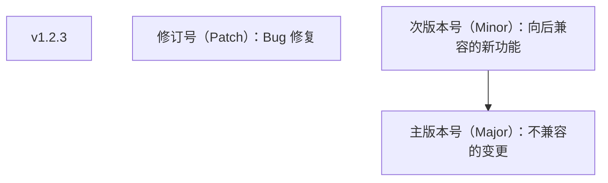

# 标签管理

> **符号约定**：`< >` 必填参数 | `[ ]` 可选参数

---

## 1. 标签概述

### 1.1 什么是标签

标签（Tag）是指向特定提交的**固定引用**，用于标记重要的版本节点。

### 1.2 两种标签

| 类型         | 创建方式          | 存储             | 包含信息                   |
| :----------- | :---------------- | :--------------- | :------------------------- |
| **轻量标签** | `git tag v1.0`    | 文件存储提交哈希 | 仅提交引用                 |
| **附注标签** | `git tag -a v1.0` | 创建 tag 对象    | 作者、日期、消息、GPG 签名 |

## 2. 创建标签

### 2.1 轻量标签

```bash
# 在当前提交创建
git tag v1.0.0

# 在指定提交创建
git tag v0.9.0 abc1234
```

### 2.2 附注标签

```bash
# 创建附注标签
git tag -a v1.0.0 -m "Release version 1.0.0"

# 在指定提交创建
git tag -a v0.9.0 abc1234 -m "Release version 0.9.0"
```

### 2.3 语义化版本标签



## 3. 查看标签

### 3.1 列出标签

```bash
# 列出所有标签
git tag

# 按模式过滤
git tag -l "v1.*"
git tag -l "v2.0*"

# 查看标签详情
git show v1.0.0
git cat-file -p v1.0.0
```

### 3.2 查看标签指向的提交

```bash
git rev-parse v1.0.0
git log v1.0.0 -1
```

## 4. 推送标签

### 4.1 推送单个标签

```bash
git push origin v1.0.0
```

### 4.2 推送所有标签

```bash
git push origin --tags
```

### 4.3 只推送附注标签

```bash
git push origin --follow-tags
```

## 5. 删除标签

### 5.1 删除本地标签

```bash
git tag -d v1.0.0
```

### 5.2 删除远程标签

```bash
git push origin --delete v1.0.0
# 或
git push origin :refs/tags/v1.0.0
```

## 6. 签名标签

### 6.1 GPG 签名

```bash
# 创建签名标签
git tag -s v1.0.0 -m "Release v1.0.0"

# 验证签名
git tag -v v1.0.0
```

### 6.2 SSH 签名

```bash
# Git 2.34+ 支持 SSH 签名
git tag -s v1.0.0 -m "Release v1.0.0"

# 配置 SSH 签名
git config --global gpg.format ssh
git config --global user.signingkey ~/.ssh/id_ed25519.pub
```

## 7. 标签在 CI/CD 中的应用

```bash
# 基于标签触发部署
# .github/workflows/deploy.yml
# on:
#   push:
#     tags:
#       - 'v*'

# 创建发布标签
git tag -a v1.0.0 -m "Release v1.0.0"
git push origin v1.0.0
# → 触发自动部署
```
## 创建轻量标签

**基本写法：在当前提交创建标签**
`git tag <标签名>`
```bash
# 在当前提交创建 v1.0.0 标签
git tag v1.0.0;
```

**基本写法：在指定提交创建标签**
`git tag <标签名> <提交哈希>`
```bash
# 在 abc1234 提交创建 v0.9.0 标签
git tag v0.9.0 abc1234;
```

---

## 创建附注标签

**基本写法：创建附注标签**
`git tag -a <标签名> -m "<标签消息>"`
```bash
# 创建附注标签 v1.0.0
git tag -a v1.0.0 -m "Release version 1.0.0";
```

**基本写法：在指定提交创建附注标签**
`git tag -a <标签名> <提交哈希> -m "<标签消息>"`
```bash
# 在 abc1234 提交创建附注标签 v0.9.0
git tag -a v0.9.0 abc1234 -m "Release version 0.9.0";
```

---

## 语义化版本

**基本写法：语义化版本格式**
`v<主版本号>.<次版本号>.<修订号>`
```text
# v1.2.3 含义
# 1 主版本号：不兼容的变更
# 2 次版本号：向后兼容的新功能
# 3 修订号：Bug 修复
v1.2.3
```

---

## 列出标签

**基本写法：列出所有标签**
`git tag`
```bash
# 列出所有标签
git tag;
```

**基本写法：按模式过滤标签**
`git tag -l "<模式>"`
```bash
# 列出 v1. 开头的标签
git tag -l "v1.*";
```

**基本写法：查看标签详情**
`git show <标签名>`
```bash
# 查看 v1.0.0 标签的详情
git show v1.0.0;
```

**基本写法：查看标签对象内容**
`git cat-file -p <标签名>`
```bash
# 查看 v1.0.0 标签对象内容
git cat-file -p v1.0.0;
```

---

## 查看标签指向的提交

**基本写法：获取标签指向的提交哈希**
`git rev-parse <标签名>`
```bash
# 获取 v1.0.0 指向的提交哈希
git rev-parse v1.0.0;
```

**基本写法：查看标签指向的提交日志**
`git log <标签名> -1`
```bash
# 查看 v1.0.0 标签指向的提交
git log v1.0.0 -1;
```

---

## 推送标签

**基本写法：推送单个标签**
`git push <远程仓库名> <标签名>`
```bash
# 推送 v1.0.0 标签到 origin
git push origin v1.0.0;
```

**基本写法：推送所有标签**
`git push <远程仓库名> --tags`
```bash
# 推送所有标签到 origin
git push origin --tags;
```

**基本写法：只推送附注标签**
`git push <远程仓库名> --follow-tags`
```bash
# 推送所有附注标签到 origin
git push origin --follow-tags;
```

---

## 删除标签

**基本写法：删除本地标签**
`git tag -d <标签名>`
```bash
# 删除本地 v1.0.0 标签
git tag -d v1.0.0;
```

**基本写法：删除远程标签**
`git push <远程仓库名> --delete <标签名>`
```bash
# 删除 origin 上的 v1.0.0 标签
git push origin --delete v1.0.0;
```

**基本写法：删除远程标签（refs 写法）**
`git push <远程仓库名> :refs/tags/<标签名>`
```bash
# 使用 refs 写法删除远程标签
git push origin :refs/tags/v1.0.0;
```

---

## 签名标签

**基本写法：创建 GPG 签名标签**
`git tag -s <标签名> -m "<标签消息>"`
```bash
# 创建 GPG 签名的 v1.0.0 标签
git tag -s v1.0.0 -m "Release v1.0.0";
```

**基本写法：验证签名标签**
`git tag -v <标签名>`
```bash
# 验证 v1.0.0 标签的签名
git tag -v v1.0.0;
```

---

## 配置 SSH 签名

**基本写法：配置 SSH 签名格式**
`git config --global gpg.format ssh`
```bash
# 配置使用 SSH 签名
git config --global gpg.format ssh;
```

**基本写法：配置签名密钥**
`git config --global user.signingkey <密钥路径>`
```bash
# 指定 ed25519 密钥作为签名密钥
git config --global user.signingkey ~/.ssh/id_ed25519.pub;
```

---

## 检出标签

**基本写法：检出到标签**
`git checkout <标签名>`
```bash
# 切换到 v1.0.0 标签对应的提交
git checkout v1.0.0;
```

## 参考文献


Git 官方文档：https://git-scm.com/doc
Pro Git 中文版：https://git-scm.com/book/zh/v2
Git 参考手册：https://git-scm.com/docs
Conventional Commits：https://www.conventionalcommits.org/zh-hans/

## 延伸阅读


Git 基础操作与分支，见 003-git 模块文档。
GitHub 协作与 PR，见 004-github 模块。
CI/CD 自动化，见 031-devops 模块。
尚硅谷 Bilibili 空间（https://space.bilibili.com/302417610 ）提供 Git 课程。

## 深度专题扩展


以下专题从不同角度深入本文主题，供有进阶需求的读者研读。每个专题独立成节，内容相互补充。

### 13.1 Git 对象模型与内部机制

git add 创建 blob 与 tree，git commit 创建 commit 对象，引用（HEAD/分支）指向 commit。
packfile 压缩对象；gc 清理悬空对象；fsck 校验完整性。
reflog 记录引用变动，是误操作恢复的最后防线。
理解对象模型后可解释 cherry-pick、rebase 与 reset 的底层行为。

### 13.2 合并策略与冲突解决

三路合并：base/ours/theirs 对比；rerere 记录重复冲突解决方案。
冲突标记：<<<<<<< 与 >>>>>>> 之间手工合并，保持语义正确后重新 add。
merge --no-ff 保留合并提交；squash 合并压缩 PR 历史。
策略选择：特性分支多 commit 用 squash/merge；持续集成用 rebase 保持线性。

## 模块文档速查表

| 文档 | 主题 | 与本文的关联 |
| --- | --- | --- |
| Git 基础概念与核心特点 | 001-Git | 本文的前置基础 |
| Git 环境配置与初始化 | 002-GitEnvConfigInit | 本文的前置基础 |
| Git 基本操作 | 003-GitBasicOperation | 本文的并列主题 |
| Git 分支管理 | 004-GitBranchManagement | 本文的并列主题 |
| Git 远程仓库操作 | 005-GitRemoteRepoOperation | 本文的并列主题 |
| 分布式版本控制原理 | 006-DistributedVCSPrinciple | 本文的原理深化 |
| 对象模型 | 007-ObjectModel | 本文的并列主题 |
| SHA-1哈希完整性校验 | 008-SHA1IntegrityCheck | 本文的并列主题 |
| 三棵树 | 009-ThreeTrees | 本文的并列主题 |
| git-diff与暂存区操作 | 010-GitDiffStagingOperation | 本文的并列主题 |
| git-restore与文件操作 | 011-GitRestoreFileOperation | 本文的并列主题 |
| git-log详解 | 012-GitLogDetailed | 本文的并列主题 |
| git-reflog | 013-GitReflog | 本文的并列主题 |
| git-blame | 014-GitBlame | 本文的并列主题 |
| HEAD指针与分支本质 | 015-HEADPointerBranchEssence | 本文的并列主题 |
| Git 钩子与 Git LFS | 016-GitHookGitLFS | 本文的并列主题 |
| 合并冲突解决 | 017-MergeConflictResolution | 本文的并列主题 |
| git-mergetool | 018-GitMergetool | 本文的并列主题 |
| git-rebase | 019-GitRebase | 本文的并列主题 |
| git-cherry-pick | 020-GitCherryPick | 本文的并列主题 |
| git-stash | 021-GitStash | 本文的并列主题 |
| 远程跟踪分支 | 022-RemoteTrackingBranch | 本文的并列主题 |
| Git-Flow与GitHub-Flow | 023-GitFlowGitHubFlow | 本文的并列主题 |
| git-commit-amend | 024-GitCommitAmend | 本文的并列主题 |
| git-reset | 025-GitReset | 本文的并列主题 |
| git-revert | 026-GitRevert | 本文的并列主题 |
| Git 原理与对象模型 | 027-GitPrincipleObjectModel | 本文的原理深化 |
| 标签管理 | 028-TagManagement | 本文自身 |
| git-bisect | 029-GitBisect | 本文的并列主题 |
| git-submodule | 030-GitSubmodule | 本文的并列主题 |
| sparse-checkout | 031-SparseCheckout | 本文的并列主题 |
| git-format-patch | 032-GitFormatPatch | 本文的并列主题 |
| git-grep | 033-GitGrep | 本文的并列主题 |
| git-worktree | 034-GitWorktree | 本文的并列主题 |
| git-gc | 035-GitGc | 本文的并列主题 |
| Git-Flow与GitHub-Flow对比 | 036-GitFlowGitHubFlowComparison | 本文的并列主题 |
| 交互式rebase | 037-InteractiveRebase | 本文的并列主题 |
| git-revert与reset对比 | 038-GitRevertResetComparison | 本文的并列主题 |
| Code-Review流程与最佳实践 | 039-CodeReviewBestPractice | 本文的并列主题 |
