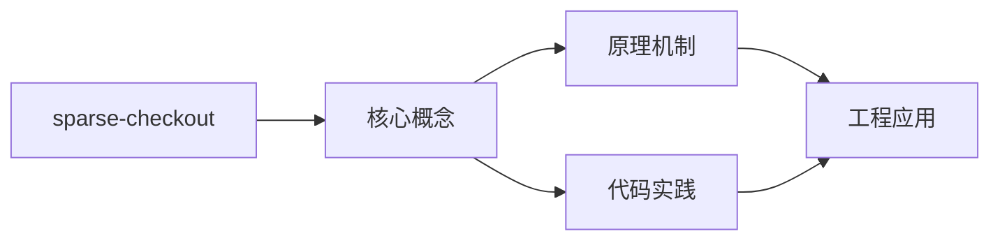
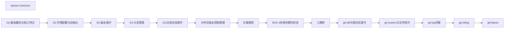

## 1. 学习目标（Bloom 分类）

本节按照布鲁姆教育目标分类学组织学习路径。本文主题为《sparse-checkout》，属于 Git 模块，读者可以根据自身阶段选择阅读深度。

记忆层面：能够准确复述本文的核心概念、术语与基本语法或操作步骤，并能够在提问或检索时快速定位对应知识点。能够说出 Git 的核心概念、常用命令与流程。

理解层面：能够用自己的语言解释核心原理与工作机制，说明概念之间的因果关系，而不是机械记忆结论。能够解释 Git 的工作原理与设计动机。

应用层面：能够在真实项目或练习场景中运用本文知识解决具体问题，写出正确且可维护的实现。能够独立完成 Git 的标准操作。

分析层面：能够拆解复杂问题，比较本文主题与相邻概念的异同，识别边界条件与例外情况。能够分析 Git 使用中的异常与边界。

评价层面：能够根据约束条件（性能、可读性、安全、成本）评价不同方案的优劣，做出有依据的技术决策。能够评价 Git 相关工具与方案。

创造层面：能够把本文知识与其他模块知识组合，设计出新的解决方案或可复用的工程模式。能够把 Git 融入团队工作流。

通过本节学习，读者应当能够把《sparse-checkout》纳入自己的知识网络，并与 Git 模块的其他主题（提交、分支、合并、远程协作）建立关联。

## 2. 历史动机与发展脉络

《sparse-checkout》是 Git 领域的重要主题。要真正理解它，需要先了解它解决的问题与演进过程。

Git 由 Linus Torvalds 于 2005 年为 Linux 内核开发，目标是替代 BitKeeper：分布式、高性能、内容寻址。
Git 的核心是对象模型：blob（内容）、tree（目录）、commit（快照 + 元数据）、tag（引用）；一切对象用 SHA-1 哈希寻址。
工作流演进：集中式工作流 -> 特性分支 -> GitFlow -> GitHub Flow / Trunk-Based；现代团队普遍采用 PR 审查 + 主干发布。

回到本文主题：sparse-checkout 的提出与成熟，正是上述技术背景下的必然产物。早期实现往往以简单可用为目标，随着工程规模扩大，社区逐渐沉淀出标准做法与最佳实践；理解这一脉络，可以帮助读者判断“为什么文档中的推荐写法是现在这个样子”，也能在遇到历史遗留代码时准确识别其设计年代与取舍。


## 3. 形式化定义与核心概念精讲

本节把《sparse-checkout》涉及的核心概念以“定义 + 讲解”的形式展开。读者应把定义当作工具，把讲解当作理解路径；两者结合才能形成可迁移的知识。

三个区域：工作区、暂存区（index）、仓库（HEAD）；git add/commit 移动状态。
分支是指针：创建分支成本极低；合并（merge 生成合并提交）与变基（rebase 重放提交）各有取舍。
远程协作：clone/fetch/pull/push；refs/remotes 跟踪远端；冲突在合并时出现并手工解决。

### 3.1 原文章节逐一精讲

原文档把主题拆分为 16 个小节，下面按顺序给出每一节的导读讲解，随后保留原文细节供精读。

#### 原文精读（完整保留）

# Git sparse-checkout 与 partial clone

> **符号约定**：`< >` 必填参数 | `[ ]` 可选参数

---

#### 1. sparse-checkout 概述

##### 1.1 什么是 sparse-checkout

sparse-checkout 允许只检出仓库的**部分目录**，而非整个仓库。适用于大型 monorepo 场景。

##### 1.2 适用场景

- **Monorepo**：只检出自己负责的模块
- **大型仓库**：减少磁盘占用和克隆时间
- **CI/CD**：只检出构建所需的文件

#### 2. 基本用法

##### 2.1 cone 模式（推荐）

```bash
# 初始化
git clone --filter=blob:none --sparse https://github.com/user/monorepo.git
cd monorepo

# 启用 sparse-checkout
git sparse-checkout init --cone

# 添加需要的目录
git sparse-checkout set apps/web packages/ui

# 添加更多目录
git sparse-checkout add apps/api

# 查看当前配置
git sparse-checkout list
```

##### 2.2 完整流程

```bash
# 从零开始
git clone --filter=blob:none --sparse https://github.com/user/monorepo.git
cd monorepo
git sparse-checkout init --cone
git sparse-checkout set apps/web

# 只会检出 apps/web 目录
ls
# apps/

# 需要其他目录时
git sparse-checkout add packages/shared
```

##### 2.3 禁用 sparse-checkout

```bash
# 检出所有文件
git sparse-checkout disable

# 重新启用
git sparse-checkout enable
```

#### 3. 模式对比

##### 3.1 cone 模式

```bash
git sparse-checkout init --cone
git sparse-checkout set apps/web packages/ui
```

只检出指定目录及其内容，性能最优。

##### 3.2 非 cone 模式

```bash
git sparse-checkout init
git sparse-checkout set <<EOF
apps/web/*
!apps/web/tests/*
packages/ui/src/*
EOF
```

支持 glob 模式，但性能较差。

#### 4. 与 shallow clone 配合

```bash
# 浅克隆 + 稀疏检出
git clone --depth=1 --filter=blob:none --sparse \
  https://github.com/user/monorepo.git

# 效果：
# - 只下载最近1次提交
# - 不下载文件内容（按需获取）
# - 只检出指定目录
```

#### 5. 性能对比

| 操作         | 完整克隆 | sparse-checkout |
| :----------- | :------- | :-------------- |
| **克隆时间** | 长       | 短              |
| **磁盘占用** | 全部     | 仅指定目录      |
| **网络传输** | 全部     | 按需            |
| **Git 操作** | 正常     | 正常            |
| **切换目录** | 无需     | 需要配置        |

#### 6. 注意事项

- 需要服务端支持（GitHub、GitLab 已支持）
- cone 模式下目录名不支持 glob
- 切换分支时可能需要更新 sparse-checkout
- CI/CD 中可利用 sparse-checkout 加速构建
#### sparse-checkout 启用

**基本写法：初始化稀疏检出**
`git sparse-checkout init`
```bash
# 启用稀疏检出（默认仅根目录文件）
git sparse-checkout init
```

---

**基本写法：启用锥形模式**
`git sparse-checkout init --cone`
```bash
# 启用推荐的锥形模式（目录级匹配）
git sparse-checkout init --cone
```

---

**基本写法：启用模式模式**
`git sparse-checkout init --no-cone`
```bash
# 启用完整模式匹配（支持通配符）
git sparse-checkout init --no-cone
```

---

#### 设置检出路径

**基本写法：设置需要检出的目录**
`git sparse-checkout set <路径1> <路径2>`
```bash
# 仅检出 src 与 docs 目录
git sparse-checkout set src docs
```

---

**基本写法：从标准输入读取路径**
`git sparse-checkout set --stdin < <文件>`
```bash
# 从文件读取路径列表
git sparse-checkout set --stdin < paths.txt
```

---

**基本写法：追加检出目录**
`git sparse-checkout add <路径>`
```bash
# 在已有基础上添加 tests 目录
git sparse-checkout add tests
```

---

**基本写法：重新应用稀疏规则**
`git sparse-checkout reapply`
```bash
# 修改规则后重新应用
git sparse-checkout reapply
```

---

#### 查看与管理

**基本写法：查看当前检出规则**
`git sparse-checkout list`
```bash
# 列出当前所有稀疏检出路径
git sparse-checkout list
```

---

**基本写法：检查路径是否匹配**
`git sparse-checkout check-rules <路径>`
```bash
# 检查某路径是否会被检出
git sparse-checkout check-rules src/api/users.ts
```

---

**基本写法：禁用稀疏检出**
`git sparse-checkout disable`
```bash
# 关闭稀疏检出恢复完整工作区
git sparse-checkout disable
```

---

#### cone 模式规则

**基本写法：添加根目录文件**
`git sparse-checkout set "/*"`
```bash
# 锥形模式下检出所有根目录文件
git sparse-checkout set "/*"
```

---

**基本写法：递归检出子目录**
`git sparse-checkout set src/`
```bash
# 检出 src 目录及其全部子目录
git sparse-checkout set src/
```

---

**基本写法：多层目录匹配**
`git sparse-checkout set src/api src/shared`
```bash
# 同时检出多个顶层子目录
git sparse-checkout set src/api src/shared
```

---

#### 非 cone 模式规则

**基本写法：使用通配符匹配**
`git sparse-checkout set "/*.md"`
```bash
# 仅检出根目录 markdown 文件
git sparse-checkout set "/*.md"
```

---

**基本写法：排除某些路径**
`git sparse-checkout set "src/*" "!src/legacy/*"`
```bash
# 检出 src 但排除 legacy 子目录
git sparse-checkout set "src/*" "!src/legacy/*"
```

---

**基本写法：母目录与子目录同时配置**
`git sparse-checkout set "src/" "src/legacy/file.ts"`
```bash
# 检出 src 目录但只保留 legacy 中一个文件
git sparse-checkout set "src/" "src/legacy/file.ts"
```

---

#### partial clone 部分克隆

**基本写法：克隆时跳过所有 blob**
`git clone --filter=blob:none <仓库URL>`
```bash
# 仅克隆提交历史，blob 按需获取
git clone --filter=blob:none https://github.com/org/repo.git
```

---

**基本写法：按大小过滤 blob**
`git clone --filter=blob:limit=<大小> <仓库URL>`
```bash
# 跳过大于 1MB 的 blob
git clone --filter=blob:limit=1m https://github.com/org/repo.git
```

---

**基本写法：仅克隆目录树**
`git clone --filter=tree:0 <仓库URL>`
```bash
# 仅克隆提交与目录结构
git clone --filter=tree:0 https://github.com/org/repo.git
```

---

**基本写法：仅克隆指定分支**
`git clone --branch <分支> --single-branch <仓库URL>`
```bash
# 仅克隆 main 分支历史
git clone --branch main --single-branch https://github.com/org/repo.git
```

---

#### 组合使用

**基本写法：稀疏检出加部分克隆**
`git clone --filter=blob:none --sparse <仓库URL>`
```bash
# 同时启用部分克隆与稀疏检出
git clone --filter=blob:none --sparse https://github.com/org/repo.git
```

---

**基本写法：克隆后配置稀疏检出**
`git sparse-checkout set <路径>`
```bash
# 进入仓库后设置检出路径
git sparse-checkout set src/api
```

---

**基本写法：将现有仓库转为部分克隆**
`git remote set-origin --filter=blob:none origin`
```bash
# 修改远程配置启用过滤（需新克隆才生效）
git config remote.origin.partialclonefilter blob:none
```

---

#### 浅克隆对比

**基本写法：浅克隆指定深度**
`git clone --depth=<深度> <仓库URL>`
```bash
# 仅克隆最近 10 次提交
git clone --depth=10 https://github.com/org/repo.git
```

---

**基本写法：浅克隆指定时间**
`git clone --shallow-since=<日期> <仓库URL>`
```bash
# 仅克隆 2024 年以来的提交
git clone --shallow-since=2024-01-01 https://github.com/org/repo.git
```

---

**基本写法：解除浅克隆**
`git fetch --unshallow`
```bash
# 拉取全部历史转为完整仓库
git fetch --unshallow
```

---

#### 按需获取对象

**基本写法：手动获取缺失 blob**
`git fetch origin <路径>`
```bash
# 按需拉取指定路径的 blob
git fetch origin src/api/users.ts
```

---

**基本写法：批量获取某目录**
`git sparse-checkout add <路径>`
```bash
# 添加目录触发对象获取
git sparse-checkout add src/shared
```

---

**基本写法：检查缺失对象**
`git fsck --connectivity-only`
```bash
# 检查仓库对象连通性
git fsck --connectivity-only
```

---

#### 配置与优化

**基本写法：配置部分克隆过滤**
`git config remote.origin.partialclonefilter <过滤>`
```bash
# 设置远程仓库部分克隆过滤规则
git config remote.origin.partialclonefilter blob:none
```

---

**基本写法：启用按需获取**
`git config remote.origin.promisor true`
```bash
# 标记远程为 promisor 允许按需获取
git config remote.origin.promisor true
```

---

**基本写法：查看 sparse 配置**
`git config --get-all core.sparseCheckout`
```bash
# 查看稀疏检出是否启用
git config --get-all core.sparseCheckout
```

---

**基本写法：查看 sparseCheckoutCone**
`git config core.sparseCheckoutCone`
```bash
# 查看是否启用锥形模式
git config core.sparseCheckoutCone
```


### 3.2 概念关系图

下面用 Mermaid 图表达本文核心概念之间的关系，帮助读者建立整体图景：



图中展示的是本文知识的结构化关系：核心概念是入口，原理机制解释“为什么”，代码实践演示“怎么做”，工程应用回答“何时用”。读者学习时可以把每个小节的内容挂接到对应节点上。

## 4. 理论推导与原理解析

本节深入《sparse-checkout》背后的原理。理论部分不求面面俱到，而是聚焦“能解释现象、能指导实践”的关键推导。

三个区域：工作区、暂存区（index）、仓库（HEAD）；git add/commit 移动状态。
分支是指针：创建分支成本极低；合并（merge 生成合并提交）与变基（rebase 重放提交）各有取舍。
远程协作：clone/fetch/pull/push；refs/remotes 跟踪远端；冲突在合并时出现并手工解决。
撤销模型：checkout/restore 改工作区，reset 移 HEAD，revert 生成反向提交；理解三者避免误操作。

需要强调的是，理论推导与工程实践之间存在翻译层：理论给出的是理想化模型与边界条件，工程代码则必须处理真实环境中的例外。读者在学习时应先掌握理论的“标准情形”，再通过陷阱章节了解“非标准情形”。

## 5. 代码示例与逐行讲解

本节把原文中的代码示例系统整理，并为每个示例补充用途说明与讲解。读者不应只浏览代码，而应逐段对照讲解理解设计意图。

### 5.1 示例：2.1 cone 模式（推荐）

该示例来自原文《2.1 cone 模式（推荐）》小节，用于演示sparse-checkout相关操作。阅读时请先看代码结构，再看其后的讲解。

```bash
# 初始化
git clone --filter=blob:none --sparse https://github.com/user/monorepo.git
cd monorepo

# 启用 sparse-checkout
git sparse-checkout init --cone

# 添加需要的目录
git sparse-checkout set apps/web packages/ui

# 添加更多目录
git sparse-checkout add apps/api

# 查看当前配置
git sparse-checkout list
```

讲解：这段代码演示了本节核心知识点。代码中的关键操作可以归纳为三步：准备（定义或初始化）、执行（核心逻辑）、收尾（释放资源或返回结果）。实际项目中，这三步往往被封装为函数或类，以提升复用性与可测试性。

关键点分析：

该示例共 11 行有效代码，结构以数据或配置为主。阅读时应关注：数据字段的含义、配置项的作用，以及它们与运行行为的对应关系。

进阶思考路径：先尝试修改参数观察行为变化，再把示例中的模式迁移到自己的项目中；每次修改都记录预期与实测差异，这是把示例转化为能力的最快方式。

### 5.2 示例：2.2 完整流程

该示例来自原文《2.2 完整流程》小节，用于演示sparse-checkout相关操作。阅读时请先看代码结构，再看其后的讲解。

```bash
# 从零开始
git clone --filter=blob:none --sparse https://github.com/user/monorepo.git
cd monorepo
git sparse-checkout init --cone
git sparse-checkout set apps/web

# 只会检出 apps/web 目录
ls
# apps/

# 需要其他目录时
git sparse-checkout add packages/shared
```

讲解：这段代码演示了本节核心知识点。代码中的关键操作可以归纳为三步：准备（定义或初始化）、执行（核心逻辑）、收尾（释放资源或返回结果）。实际项目中，这三步往往被封装为函数或类，以提升复用性与可测试性。

关键点分析：

该示例共 10 行有效代码，结构以数据或配置为主。阅读时应关注：数据字段的含义、配置项的作用，以及它们与运行行为的对应关系。

进阶思考路径：先尝试修改参数观察行为变化，再把示例中的模式迁移到自己的项目中；每次修改都记录预期与实测差异，这是把示例转化为能力的最快方式。

### 5.3 示例：2.3 禁用 sparse-checkout

该示例来自原文《2.3 禁用 sparse-checkout》小节，用于演示sparse-checkout相关操作。阅读时请先看代码结构，再看其后的讲解。

```bash
# 检出所有文件
git sparse-checkout disable

# 重新启用
git sparse-checkout enable
```

讲解：这段代码演示了本节核心知识点。代码中的关键操作可以归纳为三步：准备（定义或初始化）、执行（核心逻辑）、收尾（释放资源或返回结果）。实际项目中，这三步往往被封装为函数或类，以提升复用性与可测试性。

关键点分析：

该示例共 4 行有效代码，结构以数据或配置为主。阅读时应关注：数据字段的含义、配置项的作用，以及它们与运行行为的对应关系。

进阶思考路径：先尝试修改参数观察行为变化，再把示例中的模式迁移到自己的项目中；每次修改都记录预期与实测差异，这是把示例转化为能力的最快方式。

### 5.4 示例：3.1 cone 模式

该示例来自原文《3.1 cone 模式》小节，用于演示sparse-checkout相关操作。阅读时请先看代码结构，再看其后的讲解。

```bash
git sparse-checkout init --cone
git sparse-checkout set apps/web packages/ui
```

讲解：这段代码演示了本节核心知识点。代码中的关键操作可以归纳为三步：准备（定义或初始化）、执行（核心逻辑）、收尾（释放资源或返回结果）。实际项目中，这三步往往被封装为函数或类，以提升复用性与可测试性。

关键点分析：

该示例共 2 行有效代码，结构以数据或配置为主。阅读时应关注：数据字段的含义、配置项的作用，以及它们与运行行为的对应关系。

进阶思考路径：先尝试修改参数观察行为变化，再把示例中的模式迁移到自己的项目中；每次修改都记录预期与实测差异，这是把示例转化为能力的最快方式。

### 5.5 示例：3.2 非 cone 模式

该示例来自原文《3.2 非 cone 模式》小节，用于演示sparse-checkout相关操作。阅读时请先看代码结构，再看其后的讲解。

```bash
git sparse-checkout init
git sparse-checkout set <<EOF
apps/web/*
!apps/web/tests/*
packages/ui/src/*
EOF
```

讲解：这段代码演示了本节核心知识点。代码中的关键操作可以归纳为三步：准备（定义或初始化）、执行（核心逻辑）、收尾（释放资源或返回结果）。实际项目中，这三步往往被封装为函数或类，以提升复用性与可测试性。

关键点分析：

该示例共 6 行有效代码，结构以数据或配置为主。阅读时应关注：数据字段的含义、配置项的作用，以及它们与运行行为的对应关系。

进阶思考路径：先尝试修改参数观察行为变化，再把示例中的模式迁移到自己的项目中；每次修改都记录预期与实测差异，这是把示例转化为能力的最快方式。

### 5.6 示例：4. 与 shallow clone 配合

该示例来自原文《4. 与 shallow clone 配合》小节，用于演示sparse-checkout相关操作。阅读时请先看代码结构，再看其后的讲解。

```bash
# 浅克隆 + 稀疏检出
git clone --depth=1 --filter=blob:none --sparse \
  https://github.com/user/monorepo.git

# 效果：
# - 只下载最近1次提交
# - 不下载文件内容（按需获取）
# - 只检出指定目录
```

讲解：这段代码演示了本节核心知识点。代码中的关键操作可以归纳为三步：准备（定义或初始化）、执行（核心逻辑）、收尾（释放资源或返回结果）。实际项目中，这三步往往被封装为函数或类，以提升复用性与可测试性。

关键点分析：

该示例共 7 行有效代码，结构以数据或配置为主。阅读时应关注：数据字段的含义、配置项的作用，以及它们与运行行为的对应关系。

进阶思考路径：先尝试修改参数观察行为变化，再把示例中的模式迁移到自己的项目中；每次修改都记录预期与实测差异，这是把示例转化为能力的最快方式。

### 5.7 示例：sparse-checkout 启用

该示例来自原文《sparse-checkout 启用》小节，用于演示sparse-checkout相关操作。阅读时请先看代码结构，再看其后的讲解。

```bash
# 启用稀疏检出（默认仅根目录文件）
git sparse-checkout init
```

讲解：这段代码演示了本节核心知识点。代码中的关键操作可以归纳为三步：准备（定义或初始化）、执行（核心逻辑）、收尾（释放资源或返回结果）。实际项目中，这三步往往被封装为函数或类，以提升复用性与可测试性。

关键点分析：

该示例共 2 行有效代码，结构以数据或配置为主。阅读时应关注：数据字段的含义、配置项的作用，以及它们与运行行为的对应关系。

进阶思考路径：先尝试修改参数观察行为变化，再把示例中的模式迁移到自己的项目中；每次修改都记录预期与实测差异，这是把示例转化为能力的最快方式。

### 5.8 示例：sparse-checkout 启用

该示例来自原文《sparse-checkout 启用》小节，用于演示sparse-checkout相关操作。阅读时请先看代码结构，再看其后的讲解。

```bash
# 启用推荐的锥形模式（目录级匹配）
git sparse-checkout init --cone
```

讲解：这段代码演示了本节核心知识点。代码中的关键操作可以归纳为三步：准备（定义或初始化）、执行（核心逻辑）、收尾（释放资源或返回结果）。实际项目中，这三步往往被封装为函数或类，以提升复用性与可测试性。

关键点分析：

该示例共 2 行有效代码，结构以数据或配置为主。阅读时应关注：数据字段的含义、配置项的作用，以及它们与运行行为的对应关系。

进阶思考路径：先尝试修改参数观察行为变化，再把示例中的模式迁移到自己的项目中；每次修改都记录预期与实测差异，这是把示例转化为能力的最快方式。

### 5.9 示例：sparse-checkout 启用

该示例来自原文《sparse-checkout 启用》小节，用于演示sparse-checkout相关操作。阅读时请先看代码结构，再看其后的讲解。

```bash
# 启用完整模式匹配（支持通配符）
git sparse-checkout init --no-cone
```

讲解：这段代码演示了本节核心知识点。代码中的关键操作可以归纳为三步：准备（定义或初始化）、执行（核心逻辑）、收尾（释放资源或返回结果）。实际项目中，这三步往往被封装为函数或类，以提升复用性与可测试性。

关键点分析：

该示例共 2 行有效代码，结构以数据或配置为主。阅读时应关注：数据字段的含义、配置项的作用，以及它们与运行行为的对应关系。

进阶思考路径：先尝试修改参数观察行为变化，再把示例中的模式迁移到自己的项目中；每次修改都记录预期与实测差异，这是把示例转化为能力的最快方式。

### 5.10 示例：设置检出路径

该示例来自原文《设置检出路径》小节，用于演示sparse-checkout相关操作。阅读时请先看代码结构，再看其后的讲解。

```bash
# 仅检出 src 与 docs 目录
git sparse-checkout set src docs
```

讲解：这段代码演示了本节核心知识点。代码中的关键操作可以归纳为三步：准备（定义或初始化）、执行（核心逻辑）、收尾（释放资源或返回结果）。实际项目中，这三步往往被封装为函数或类，以提升复用性与可测试性。

关键点分析：

该示例共 2 行有效代码，结构以数据或配置为主。阅读时应关注：数据字段的含义、配置项的作用，以及它们与运行行为的对应关系。

进阶思考路径：先尝试修改参数观察行为变化，再把示例中的模式迁移到自己的项目中；每次修改都记录预期与实测差异，这是把示例转化为能力的最快方式。

### 5.11 示例：设置检出路径

该示例来自原文《设置检出路径》小节，用于演示sparse-checkout相关操作。阅读时请先看代码结构，再看其后的讲解。

```bash
# 从文件读取路径列表
git sparse-checkout set --stdin < paths.txt
```

讲解：这段代码演示了本节核心知识点。代码中的关键操作可以归纳为三步：准备（定义或初始化）、执行（核心逻辑）、收尾（释放资源或返回结果）。实际项目中，这三步往往被封装为函数或类，以提升复用性与可测试性。

关键点分析：

该示例共 2 行有效代码，结构以数据或配置为主。阅读时应关注：数据字段的含义、配置项的作用，以及它们与运行行为的对应关系。

进阶思考路径：先尝试修改参数观察行为变化，再把示例中的模式迁移到自己的项目中；每次修改都记录预期与实测差异，这是把示例转化为能力的最快方式。

### 5.12 示例：设置检出路径

该示例来自原文《设置检出路径》小节，用于演示sparse-checkout相关操作。阅读时请先看代码结构，再看其后的讲解。

```bash
# 在已有基础上添加 tests 目录
git sparse-checkout add tests
```

讲解：这段代码演示了本节核心知识点。代码中的关键操作可以归纳为三步：准备（定义或初始化）、执行（核心逻辑）、收尾（释放资源或返回结果）。实际项目中，这三步往往被封装为函数或类，以提升复用性与可测试性。

关键点分析：

该示例共 2 行有效代码，结构以数据或配置为主。阅读时应关注：数据字段的含义、配置项的作用，以及它们与运行行为的对应关系。

进阶思考路径：先尝试修改参数观察行为变化，再把示例中的模式迁移到自己的项目中；每次修改都记录预期与实测差异，这是把示例转化为能力的最快方式。

### 5.13 示例：设置检出路径

该示例来自原文《设置检出路径》小节，用于演示sparse-checkout相关操作。阅读时请先看代码结构，再看其后的讲解。

```bash
# 修改规则后重新应用
git sparse-checkout reapply
```

讲解：这段代码演示了本节核心知识点。代码中的关键操作可以归纳为三步：准备（定义或初始化）、执行（核心逻辑）、收尾（释放资源或返回结果）。实际项目中，这三步往往被封装为函数或类，以提升复用性与可测试性。

关键点分析：

该示例共 2 行有效代码，结构以数据或配置为主。阅读时应关注：数据字段的含义、配置项的作用，以及它们与运行行为的对应关系。

进阶思考路径：先尝试修改参数观察行为变化，再把示例中的模式迁移到自己的项目中；每次修改都记录预期与实测差异，这是把示例转化为能力的最快方式。

### 5.14 示例：查看与管理

该示例来自原文《查看与管理》小节，用于演示sparse-checkout相关操作。阅读时请先看代码结构，再看其后的讲解。

```bash
# 列出当前所有稀疏检出路径
git sparse-checkout list
```

讲解：这段代码演示了本节核心知识点。代码中的关键操作可以归纳为三步：准备（定义或初始化）、执行（核心逻辑）、收尾（释放资源或返回结果）。实际项目中，这三步往往被封装为函数或类，以提升复用性与可测试性。

关键点分析：

该示例共 2 行有效代码，结构以数据或配置为主。阅读时应关注：数据字段的含义、配置项的作用，以及它们与运行行为的对应关系。

进阶思考路径：先尝试修改参数观察行为变化，再把示例中的模式迁移到自己的项目中；每次修改都记录预期与实测差异，这是把示例转化为能力的最快方式。

### 5.15 示例：查看与管理

该示例来自原文《查看与管理》小节，用于演示sparse-checkout相关操作。阅读时请先看代码结构，再看其后的讲解。

```bash
# 检查某路径是否会被检出
git sparse-checkout check-rules src/api/users.ts
```

讲解：这段代码演示了本节核心知识点。代码中的关键操作可以归纳为三步：准备（定义或初始化）、执行（核心逻辑）、收尾（释放资源或返回结果）。实际项目中，这三步往往被封装为函数或类，以提升复用性与可测试性。

关键点分析：

该示例共 2 行有效代码，结构以数据或配置为主。阅读时应关注：数据字段的含义、配置项的作用，以及它们与运行行为的对应关系。

进阶思考路径：先尝试修改参数观察行为变化，再把示例中的模式迁移到自己的项目中；每次修改都记录预期与实测差异，这是把示例转化为能力的最快方式。

### 5.16 示例：查看与管理

该示例来自原文《查看与管理》小节，用于演示sparse-checkout相关操作。阅读时请先看代码结构，再看其后的讲解。

```bash
# 关闭稀疏检出恢复完整工作区
git sparse-checkout disable
```

讲解：这段代码演示了本节核心知识点。代码中的关键操作可以归纳为三步：准备（定义或初始化）、执行（核心逻辑）、收尾（释放资源或返回结果）。实际项目中，这三步往往被封装为函数或类，以提升复用性与可测试性。

关键点分析：

该示例共 2 行有效代码，结构以数据或配置为主。阅读时应关注：数据字段的含义、配置项的作用，以及它们与运行行为的对应关系。

进阶思考路径：先尝试修改参数观察行为变化，再把示例中的模式迁移到自己的项目中；每次修改都记录预期与实测差异，这是把示例转化为能力的最快方式。

### 5.17 示例：cone 模式规则

该示例来自原文《cone 模式规则》小节，用于演示sparse-checkout相关操作。阅读时请先看代码结构，再看其后的讲解。

```bash
# 锥形模式下检出所有根目录文件
git sparse-checkout set "/*"
```

讲解：这段代码演示了本节核心知识点。代码中的关键操作可以归纳为三步：准备（定义或初始化）、执行（核心逻辑）、收尾（释放资源或返回结果）。实际项目中，这三步往往被封装为函数或类，以提升复用性与可测试性。

关键点分析：

该示例共 2 行有效代码，结构以数据或配置为主。阅读时应关注：数据字段的含义、配置项的作用，以及它们与运行行为的对应关系。

进阶思考路径：先尝试修改参数观察行为变化，再把示例中的模式迁移到自己的项目中；每次修改都记录预期与实测差异，这是把示例转化为能力的最快方式。

### 5.18 示例：cone 模式规则

该示例来自原文《cone 模式规则》小节，用于演示sparse-checkout相关操作。阅读时请先看代码结构，再看其后的讲解。

```bash
# 检出 src 目录及其全部子目录
git sparse-checkout set src/
```

讲解：这段代码演示了本节核心知识点。代码中的关键操作可以归纳为三步：准备（定义或初始化）、执行（核心逻辑）、收尾（释放资源或返回结果）。实际项目中，这三步往往被封装为函数或类，以提升复用性与可测试性。

关键点分析：

该示例共 2 行有效代码，结构以数据或配置为主。阅读时应关注：数据字段的含义、配置项的作用，以及它们与运行行为的对应关系。

进阶思考路径：先尝试修改参数观察行为变化，再把示例中的模式迁移到自己的项目中；每次修改都记录预期与实测差异，这是把示例转化为能力的最快方式。

### 5.19 示例：cone 模式规则

该示例来自原文《cone 模式规则》小节，用于演示sparse-checkout相关操作。阅读时请先看代码结构，再看其后的讲解。

```bash
# 同时检出多个顶层子目录
git sparse-checkout set src/api src/shared
```

讲解：这段代码演示了本节核心知识点。代码中的关键操作可以归纳为三步：准备（定义或初始化）、执行（核心逻辑）、收尾（释放资源或返回结果）。实际项目中，这三步往往被封装为函数或类，以提升复用性与可测试性。

关键点分析：

该示例共 2 行有效代码，结构以数据或配置为主。阅读时应关注：数据字段的含义、配置项的作用，以及它们与运行行为的对应关系。

进阶思考路径：先尝试修改参数观察行为变化，再把示例中的模式迁移到自己的项目中；每次修改都记录预期与实测差异，这是把示例转化为能力的最快方式。

### 5.20 示例：非 cone 模式规则

该示例来自原文《非 cone 模式规则》小节，用于演示sparse-checkout相关操作。阅读时请先看代码结构，再看其后的讲解。

```bash
# 仅检出根目录 markdown 文件
git sparse-checkout set "/*.md"
```

讲解：这段代码演示了本节核心知识点。代码中的关键操作可以归纳为三步：准备（定义或初始化）、执行（核心逻辑）、收尾（释放资源或返回结果）。实际项目中，这三步往往被封装为函数或类，以提升复用性与可测试性。

关键点分析：

该示例共 2 行有效代码，结构以数据或配置为主。阅读时应关注：数据字段的含义、配置项的作用，以及它们与运行行为的对应关系。

进阶思考路径：先尝试修改参数观察行为变化，再把示例中的模式迁移到自己的项目中；每次修改都记录预期与实测差异，这是把示例转化为能力的最快方式。

### 5.21 示例：非 cone 模式规则

该示例来自原文《非 cone 模式规则》小节，用于演示sparse-checkout相关操作。阅读时请先看代码结构，再看其后的讲解。

```bash
# 检出 src 但排除 legacy 子目录
git sparse-checkout set "src/*" "!src/legacy/*"
```

讲解：这段代码演示了本节核心知识点。代码中的关键操作可以归纳为三步：准备（定义或初始化）、执行（核心逻辑）、收尾（释放资源或返回结果）。实际项目中，这三步往往被封装为函数或类，以提升复用性与可测试性。

关键点分析：

该示例共 2 行有效代码，结构以数据或配置为主。阅读时应关注：数据字段的含义、配置项的作用，以及它们与运行行为的对应关系。

进阶思考路径：先尝试修改参数观察行为变化，再把示例中的模式迁移到自己的项目中；每次修改都记录预期与实测差异，这是把示例转化为能力的最快方式。

### 5.22 示例：非 cone 模式规则

该示例来自原文《非 cone 模式规则》小节，用于演示sparse-checkout相关操作。阅读时请先看代码结构，再看其后的讲解。

```bash
# 检出 src 目录但只保留 legacy 中一个文件
git sparse-checkout set "src/" "src/legacy/file.ts"
```

讲解：这段代码演示了本节核心知识点。代码中的关键操作可以归纳为三步：准备（定义或初始化）、执行（核心逻辑）、收尾（释放资源或返回结果）。实际项目中，这三步往往被封装为函数或类，以提升复用性与可测试性。

关键点分析：

该示例共 2 行有效代码，结构以数据或配置为主。阅读时应关注：数据字段的含义、配置项的作用，以及它们与运行行为的对应关系。

进阶思考路径：先尝试修改参数观察行为变化，再把示例中的模式迁移到自己的项目中；每次修改都记录预期与实测差异，这是把示例转化为能力的最快方式。

### 5.23 示例：partial clone 部分克隆

该示例来自原文《partial clone 部分克隆》小节，用于演示sparse-checkout相关操作。阅读时请先看代码结构，再看其后的讲解。

```bash
# 仅克隆提交历史，blob 按需获取
git clone --filter=blob:none https://github.com/org/repo.git
```

讲解：这段代码演示了本节核心知识点。代码中的关键操作可以归纳为三步：准备（定义或初始化）、执行（核心逻辑）、收尾（释放资源或返回结果）。实际项目中，这三步往往被封装为函数或类，以提升复用性与可测试性。

关键点分析：

该示例共 2 行有效代码，结构以数据或配置为主。阅读时应关注：数据字段的含义、配置项的作用，以及它们与运行行为的对应关系。

进阶思考路径：先尝试修改参数观察行为变化，再把示例中的模式迁移到自己的项目中；每次修改都记录预期与实测差异，这是把示例转化为能力的最快方式。

### 5.24 示例：partial clone 部分克隆

该示例来自原文《partial clone 部分克隆》小节，用于演示sparse-checkout相关操作。阅读时请先看代码结构，再看其后的讲解。

```bash
# 跳过大于 1MB 的 blob
git clone --filter=blob:limit=1m https://github.com/org/repo.git
```

讲解：这段代码演示了本节核心知识点。代码中的关键操作可以归纳为三步：准备（定义或初始化）、执行（核心逻辑）、收尾（释放资源或返回结果）。实际项目中，这三步往往被封装为函数或类，以提升复用性与可测试性。

关键点分析：

该示例共 2 行有效代码，结构以数据或配置为主。阅读时应关注：数据字段的含义、配置项的作用，以及它们与运行行为的对应关系。

进阶思考路径：先尝试修改参数观察行为变化，再把示例中的模式迁移到自己的项目中；每次修改都记录预期与实测差异，这是把示例转化为能力的最快方式。

### 5.25 示例：partial clone 部分克隆

该示例来自原文《partial clone 部分克隆》小节，用于演示sparse-checkout相关操作。阅读时请先看代码结构，再看其后的讲解。

```bash
# 仅克隆提交与目录结构
git clone --filter=tree:0 https://github.com/org/repo.git
```

讲解：这段代码演示了本节核心知识点。代码中的关键操作可以归纳为三步：准备（定义或初始化）、执行（核心逻辑）、收尾（释放资源或返回结果）。实际项目中，这三步往往被封装为函数或类，以提升复用性与可测试性。

关键点分析：

该示例共 2 行有效代码，结构以数据或配置为主。阅读时应关注：数据字段的含义、配置项的作用，以及它们与运行行为的对应关系。

进阶思考路径：先尝试修改参数观察行为变化，再把示例中的模式迁移到自己的项目中；每次修改都记录预期与实测差异，这是把示例转化为能力的最快方式。

### 5.26 示例：partial clone 部分克隆

该示例来自原文《partial clone 部分克隆》小节，用于演示sparse-checkout相关操作。阅读时请先看代码结构，再看其后的讲解。

```bash
# 仅克隆 main 分支历史
git clone --branch main --single-branch https://github.com/org/repo.git
```

讲解：这段代码演示了本节核心知识点。代码中的关键操作可以归纳为三步：准备（定义或初始化）、执行（核心逻辑）、收尾（释放资源或返回结果）。实际项目中，这三步往往被封装为函数或类，以提升复用性与可测试性。

关键点分析：

该示例共 2 行有效代码，结构以数据或配置为主。阅读时应关注：数据字段的含义、配置项的作用，以及它们与运行行为的对应关系。

进阶思考路径：先尝试修改参数观察行为变化，再把示例中的模式迁移到自己的项目中；每次修改都记录预期与实测差异，这是把示例转化为能力的最快方式。

### 5.27 示例：组合使用

该示例来自原文《组合使用》小节，用于演示sparse-checkout相关操作。阅读时请先看代码结构，再看其后的讲解。

```bash
# 同时启用部分克隆与稀疏检出
git clone --filter=blob:none --sparse https://github.com/org/repo.git
```

讲解：这段代码演示了本节核心知识点。代码中的关键操作可以归纳为三步：准备（定义或初始化）、执行（核心逻辑）、收尾（释放资源或返回结果）。实际项目中，这三步往往被封装为函数或类，以提升复用性与可测试性。

关键点分析：

该示例共 2 行有效代码，结构以数据或配置为主。阅读时应关注：数据字段的含义、配置项的作用，以及它们与运行行为的对应关系。

进阶思考路径：先尝试修改参数观察行为变化，再把示例中的模式迁移到自己的项目中；每次修改都记录预期与实测差异，这是把示例转化为能力的最快方式。

### 5.28 示例：组合使用

该示例来自原文《组合使用》小节，用于演示sparse-checkout相关操作。阅读时请先看代码结构，再看其后的讲解。

```bash
# 进入仓库后设置检出路径
git sparse-checkout set src/api
```

讲解：这段代码演示了本节核心知识点。代码中的关键操作可以归纳为三步：准备（定义或初始化）、执行（核心逻辑）、收尾（释放资源或返回结果）。实际项目中，这三步往往被封装为函数或类，以提升复用性与可测试性。

关键点分析：

该示例共 2 行有效代码，结构以数据或配置为主。阅读时应关注：数据字段的含义、配置项的作用，以及它们与运行行为的对应关系。

进阶思考路径：先尝试修改参数观察行为变化，再把示例中的模式迁移到自己的项目中；每次修改都记录预期与实测差异，这是把示例转化为能力的最快方式。

### 5.29 示例：组合使用

该示例来自原文《组合使用》小节，用于演示sparse-checkout相关操作。阅读时请先看代码结构，再看其后的讲解。

```bash
# 修改远程配置启用过滤（需新克隆才生效）
git config remote.origin.partialclonefilter blob:none
```

讲解：这段代码演示了本节核心知识点。代码中的关键操作可以归纳为三步：准备（定义或初始化）、执行（核心逻辑）、收尾（释放资源或返回结果）。实际项目中，这三步往往被封装为函数或类，以提升复用性与可测试性。

关键点分析：

该示例共 2 行有效代码，结构以数据或配置为主。阅读时应关注：数据字段的含义、配置项的作用，以及它们与运行行为的对应关系。

进阶思考路径：先尝试修改参数观察行为变化，再把示例中的模式迁移到自己的项目中；每次修改都记录预期与实测差异，这是把示例转化为能力的最快方式。

### 5.30 示例：浅克隆对比

该示例来自原文《浅克隆对比》小节，用于演示sparse-checkout相关操作。阅读时请先看代码结构，再看其后的讲解。

```bash
# 仅克隆最近 10 次提交
git clone --depth=10 https://github.com/org/repo.git
```

讲解：这段代码演示了本节核心知识点。代码中的关键操作可以归纳为三步：准备（定义或初始化）、执行（核心逻辑）、收尾（释放资源或返回结果）。实际项目中，这三步往往被封装为函数或类，以提升复用性与可测试性。

关键点分析：

该示例共 2 行有效代码，结构以数据或配置为主。阅读时应关注：数据字段的含义、配置项的作用，以及它们与运行行为的对应关系。

进阶思考路径：先尝试修改参数观察行为变化，再把示例中的模式迁移到自己的项目中；每次修改都记录预期与实测差异，这是把示例转化为能力的最快方式。

### 5.31 示例：浅克隆对比

该示例来自原文《浅克隆对比》小节，用于演示sparse-checkout相关操作。阅读时请先看代码结构，再看其后的讲解。

```bash
# 仅克隆 2024 年以来的提交
git clone --shallow-since=2024-01-01 https://github.com/org/repo.git
```

讲解：这段代码演示了本节核心知识点。代码中的关键操作可以归纳为三步：准备（定义或初始化）、执行（核心逻辑）、收尾（释放资源或返回结果）。实际项目中，这三步往往被封装为函数或类，以提升复用性与可测试性。

关键点分析：

该示例共 2 行有效代码，结构以数据或配置为主。阅读时应关注：数据字段的含义、配置项的作用，以及它们与运行行为的对应关系。

进阶思考路径：先尝试修改参数观察行为变化，再把示例中的模式迁移到自己的项目中；每次修改都记录预期与实测差异，这是把示例转化为能力的最快方式。

### 5.32 示例：浅克隆对比

该示例来自原文《浅克隆对比》小节，用于演示sparse-checkout相关操作。阅读时请先看代码结构，再看其后的讲解。

```bash
# 拉取全部历史转为完整仓库
git fetch --unshallow
```

讲解：这段代码演示了本节核心知识点。代码中的关键操作可以归纳为三步：准备（定义或初始化）、执行（核心逻辑）、收尾（释放资源或返回结果）。实际项目中，这三步往往被封装为函数或类，以提升复用性与可测试性。

关键点分析：

该示例共 2 行有效代码，结构以数据或配置为主。阅读时应关注：数据字段的含义、配置项的作用，以及它们与运行行为的对应关系。

进阶思考路径：先尝试修改参数观察行为变化，再把示例中的模式迁移到自己的项目中；每次修改都记录预期与实测差异，这是把示例转化为能力的最快方式。

### 5.33 示例：按需获取对象

该示例来自原文《按需获取对象》小节，用于演示sparse-checkout相关操作。阅读时请先看代码结构，再看其后的讲解。

```bash
# 按需拉取指定路径的 blob
git fetch origin src/api/users.ts
```

讲解：这段代码演示了本节核心知识点。代码中的关键操作可以归纳为三步：准备（定义或初始化）、执行（核心逻辑）、收尾（释放资源或返回结果）。实际项目中，这三步往往被封装为函数或类，以提升复用性与可测试性。

关键点分析：

该示例共 2 行有效代码，结构以数据或配置为主。阅读时应关注：数据字段的含义、配置项的作用，以及它们与运行行为的对应关系。

进阶思考路径：先尝试修改参数观察行为变化，再把示例中的模式迁移到自己的项目中；每次修改都记录预期与实测差异，这是把示例转化为能力的最快方式。

### 5.34 示例：按需获取对象

该示例来自原文《按需获取对象》小节，用于演示sparse-checkout相关操作。阅读时请先看代码结构，再看其后的讲解。

```bash
# 添加目录触发对象获取
git sparse-checkout add src/shared
```

讲解：这段代码演示了本节核心知识点。代码中的关键操作可以归纳为三步：准备（定义或初始化）、执行（核心逻辑）、收尾（释放资源或返回结果）。实际项目中，这三步往往被封装为函数或类，以提升复用性与可测试性。

关键点分析：

该示例共 2 行有效代码，结构以数据或配置为主。阅读时应关注：数据字段的含义、配置项的作用，以及它们与运行行为的对应关系。

进阶思考路径：先尝试修改参数观察行为变化，再把示例中的模式迁移到自己的项目中；每次修改都记录预期与实测差异，这是把示例转化为能力的最快方式。

### 5.35 示例：按需获取对象

该示例来自原文《按需获取对象》小节，用于演示sparse-checkout相关操作。阅读时请先看代码结构，再看其后的讲解。

```bash
# 检查仓库对象连通性
git fsck --connectivity-only
```

讲解：这段代码演示了本节核心知识点。代码中的关键操作可以归纳为三步：准备（定义或初始化）、执行（核心逻辑）、收尾（释放资源或返回结果）。实际项目中，这三步往往被封装为函数或类，以提升复用性与可测试性。

关键点分析：

该示例共 2 行有效代码，结构以数据或配置为主。阅读时应关注：数据字段的含义、配置项的作用，以及它们与运行行为的对应关系。

进阶思考路径：先尝试修改参数观察行为变化，再把示例中的模式迁移到自己的项目中；每次修改都记录预期与实测差异，这是把示例转化为能力的最快方式。

### 5.36 示例：配置与优化

该示例来自原文《配置与优化》小节，用于演示sparse-checkout相关操作。阅读时请先看代码结构，再看其后的讲解。

```bash
# 设置远程仓库部分克隆过滤规则
git config remote.origin.partialclonefilter blob:none
```

讲解：这段代码演示了本节核心知识点。代码中的关键操作可以归纳为三步：准备（定义或初始化）、执行（核心逻辑）、收尾（释放资源或返回结果）。实际项目中，这三步往往被封装为函数或类，以提升复用性与可测试性。

关键点分析：

该示例共 2 行有效代码，结构以数据或配置为主。阅读时应关注：数据字段的含义、配置项的作用，以及它们与运行行为的对应关系。

进阶思考路径：先尝试修改参数观察行为变化，再把示例中的模式迁移到自己的项目中；每次修改都记录预期与实测差异，这是把示例转化为能力的最快方式。

### 5.37 示例：配置与优化

该示例来自原文《配置与优化》小节，用于演示sparse-checkout相关操作。阅读时请先看代码结构，再看其后的讲解。

```bash
# 标记远程为 promisor 允许按需获取
git config remote.origin.promisor true
```

讲解：这段代码演示了本节核心知识点。代码中的关键操作可以归纳为三步：准备（定义或初始化）、执行（核心逻辑）、收尾（释放资源或返回结果）。实际项目中，这三步往往被封装为函数或类，以提升复用性与可测试性。

关键点分析：

该示例共 2 行有效代码，结构以数据或配置为主。阅读时应关注：数据字段的含义、配置项的作用，以及它们与运行行为的对应关系。

进阶思考路径：先尝试修改参数观察行为变化，再把示例中的模式迁移到自己的项目中；每次修改都记录预期与实测差异，这是把示例转化为能力的最快方式。

### 5.38 示例：配置与优化

该示例来自原文《配置与优化》小节，用于演示sparse-checkout相关操作。阅读时请先看代码结构，再看其后的讲解。

```bash
# 查看稀疏检出是否启用
git config --get-all core.sparseCheckout
```

讲解：这段代码演示了本节核心知识点。代码中的关键操作可以归纳为三步：准备（定义或初始化）、执行（核心逻辑）、收尾（释放资源或返回结果）。实际项目中，这三步往往被封装为函数或类，以提升复用性与可测试性。

关键点分析：

该示例共 2 行有效代码，结构以数据或配置为主。阅读时应关注：数据字段的含义、配置项的作用，以及它们与运行行为的对应关系。

进阶思考路径：先尝试修改参数观察行为变化，再把示例中的模式迁移到自己的项目中；每次修改都记录预期与实测差异，这是把示例转化为能力的最快方式。

### 5.39 示例：配置与优化

该示例来自原文《配置与优化》小节，用于演示sparse-checkout相关操作。阅读时请先看代码结构，再看其后的讲解。

```bash
# 查看是否启用锥形模式
git config core.sparseCheckoutCone
```

讲解：这段代码演示了本节核心知识点。代码中的关键操作可以归纳为三步：准备（定义或初始化）、执行（核心逻辑）、收尾（释放资源或返回结果）。实际项目中，这三步往往被封装为函数或类，以提升复用性与可测试性。

关键点分析：

该示例共 2 行有效代码，结构以数据或配置为主。阅读时应关注：数据字段的含义、配置项的作用，以及它们与运行行为的对应关系。

进阶思考路径：先尝试修改参数观察行为变化，再把示例中的模式迁移到自己的项目中；每次修改都记录预期与实测差异，这是把示例转化为能力的最快方式。


综合以上示例，可以总结出本主题的代码实践要点：第一，先定义清晰的输入输出契约；第二，核心逻辑保持单一职责；第三，错误处理与边界条件不可省略；第四，命名与注释表达意图而非复述代码。

## 6. 对比分析

对比是理解《sparse-checkout》定位的最快路径。下面从多个维度与相邻方案进行对比。

Git 与 SVN：Git 分布式、离线提交、分支廉价；SVN 集中式已基本退出。
merge 与 rebase：merge 保留历史但复杂；rebase 线性整洁但改写。
GitHub Flow 与 GitFlow：前者主干 + PR 适合持续发布；后者适合版本化发布。

对比的目的不是分出绝对优劣，而是建立选择依据：不同约束条件下，最优解不同。读者应把每个对比维度转化为决策检查清单。

## 7. 常见陷阱与最佳实践

本节整理该主题的高频错误与推荐做法。每个陷阱先描述现象，再解释原因，最后给出最佳实践。

### 7.1 提交信息随意

无法追溯。使用 Conventional Commits（feat/fix/docs...）。

深入讲解：该问题之所以被归类为“常见陷阱”，是因为它在初学者的代码中反复出现，而且往往不在第一时间暴露——错误通常隐藏在特定数据或特定时序下。

从成因上看，提交信息随意 一般源于对 Git 某个机制的理解偏差：要么误用了默认行为，要么忽略了边界条件，要么把其他语言的思维惯性带了过来。

从影响上看，提交信息随意 轻则产生错误结果，重则导致资源泄漏、数据损坏或安全事故；这也是为什么工程评审中会把它列为检查项。

从修复策略上看，处理提交信息随意的正确顺序是：先复现（构造最小用例），再定位（确认机制层面的根因），最后修复并补充回归测试。跳过复现直接改代码，往往治标不治本。

### 7.2 大文件入库

仓库膨胀。使用 Git LFS 或排除构建产物。

深入讲解：该问题之所以被归类为“常见陷阱”，是因为它在初学者的代码中反复出现，而且往往不在第一时间暴露——错误通常隐藏在特定数据或特定时序下。

从成因上看，大文件入库 一般源于对 Git 某个机制的理解偏差：要么误用了默认行为，要么忽略了边界条件，要么把其他语言的思维惯性带了过来。

从影响上看，大文件入库 轻则产生错误结果，重则导致资源泄漏、数据损坏或安全事故；这也是为什么工程评审中会把它列为检查项。

从修复策略上看，处理大文件入库的正确顺序是：先复现（构造最小用例），再定位（确认机制层面的根因），最后修复并补充回归测试。跳过复现直接改代码，往往治标不治本。

### 7.3 force push 滥用

覆盖他人历史。仅限个人分支并通知。

深入讲解：该问题之所以被归类为“常见陷阱”，是因为它在初学者的代码中反复出现，而且往往不在第一时间暴露——错误通常隐藏在特定数据或特定时序下。

从成因上看，force push 滥用 一般源于对 Git 某个机制的理解偏差：要么误用了默认行为，要么忽略了边界条件，要么把其他语言的思维惯性带了过来。

从影响上看，force push 滥用 轻则产生错误结果，重则导致资源泄漏、数据损坏或安全事故；这也是为什么工程评审中会把它列为检查项。

从修复策略上看，处理force push 滥用的正确顺序是：先复现（构造最小用例），再定位（确认机制层面的根因），最后修复并补充回归测试。跳过复现直接改代码，往往治标不治本。

### 7.4 merge 冲突拖延

冲突积累。频繁合并、小步提交。

深入讲解：该问题之所以被归类为“常见陷阱”，是因为它在初学者的代码中反复出现，而且往往不在第一时间暴露——错误通常隐藏在特定数据或特定时序下。

从成因上看，merge 冲突拖延 一般源于对 Git 某个机制的理解偏差：要么误用了默认行为，要么忽略了边界条件，要么把其他语言的思维惯性带了过来。

从影响上看，merge 冲突拖延 轻则产生错误结果，重则导致资源泄漏、数据损坏或安全事故；这也是为什么工程评审中会把它列为检查项。

从修复策略上看，处理merge 冲突拖延的正确顺序是：先复现（构造最小用例），再定位（确认机制层面的根因），最后修复并补充回归测试。跳过复现直接改代码，往往治标不治本。

### 7.5 密钥入库

泄露事故。使用 .gitignore 与 secret 扫描。

深入讲解：该问题之所以被归类为“常见陷阱”，是因为它在初学者的代码中反复出现，而且往往不在第一时间暴露——错误通常隐藏在特定数据或特定时序下。

从成因上看，密钥入库 一般源于对 Git 某个机制的理解偏差：要么误用了默认行为，要么忽略了边界条件，要么把其他语言的思维惯性带了过来。

从影响上看，密钥入库 轻则产生错误结果，重则导致资源泄漏、数据损坏或安全事故；这也是为什么工程评审中会把它列为检查项。

从修复策略上看，处理密钥入库的正确顺序是：先复现（构造最小用例），再定位（确认机制层面的根因），最后修复并补充回归测试。跳过复现直接改代码，往往治标不治本。

### 7.6 reset 误操作

丢失工作。确认目标与 --hard 语义。

深入讲解：该问题之所以被归类为“常见陷阱”，是因为它在初学者的代码中反复出现，而且往往不在第一时间暴露——错误通常隐藏在特定数据或特定时序下。

从成因上看，reset 误操作 一般源于对 Git 某个机制的理解偏差：要么误用了默认行为，要么忽略了边界条件，要么把其他语言的思维惯性带了过来。

从影响上看，reset 误操作 轻则产生错误结果，重则导致资源泄漏、数据损坏或安全事故；这也是为什么工程评审中会把它列为检查项。

从修复策略上看，处理reset 误操作的正确顺序是：先复现（构造最小用例），再定位（确认机制层面的根因），最后修复并补充回归测试。跳过复现直接改代码，往往治标不治本。

### 7.7 忽略 .gitignore

构建产物污染。项目初始化即配置。

深入讲解：该问题之所以被归类为“常见陷阱”，是因为它在初学者的代码中反复出现，而且往往不在第一时间暴露——错误通常隐藏在特定数据或特定时序下。

从成因上看，忽略 .gitignore 一般源于对 Git 某个机制的理解偏差：要么误用了默认行为，要么忽略了边界条件，要么把其他语言的思维惯性带了过来。

从影响上看，忽略 .gitignore 轻则产生错误结果，重则导致资源泄漏、数据损坏或安全事故；这也是为什么工程评审中会把它列为检查项。

从修复策略上看，处理忽略 .gitignore的正确顺序是：先复现（构造最小用例），再定位（确认机制层面的根因），最后修复并补充回归测试。跳过复现直接改代码，往往治标不治本。

### 7.8 rebase 公共分支

改写已发布历史。公共分支只 merge。

深入讲解：该问题之所以被归类为“常见陷阱”，是因为它在初学者的代码中反复出现，而且往往不在第一时间暴露——错误通常隐藏在特定数据或特定时序下。

从成因上看，rebase 公共分支 一般源于对 Git 某个机制的理解偏差：要么误用了默认行为，要么忽略了边界条件，要么把其他语言的思维惯性带了过来。

从影响上看，rebase 公共分支 轻则产生错误结果，重则导致资源泄漏、数据损坏或安全事故；这也是为什么工程评审中会把它列为检查项。

从修复策略上看，处理rebase 公共分支的正确顺序是：先复现（构造最小用例），再定位（确认机制层面的根因），最后修复并补充回归测试。跳过复现直接改代码，往往治标不治本。

### 7.0 最佳实践总览

1. 小步提交：每次提交一个逻辑变更，可构建可测试。
2. 提交信息规范：类型 + 简述 + 正文（为什么）。
3. 分支命名：feature/xxx、fix/xxx、docs/xxx。
4. 合入前跑测试与 lint；PR 描述变更与影响。

把这些最佳实践固化为团队规范与代码评审检查项，是避免同类问题反复出现的关键。

## 8. 工程实践

本节把《sparse-checkout》放入真实工程场景，给出可复用的模式与组织方法。

团队规范：分支策略、提交规范、PR 模板、CODEOWNERS 审查。
自动化：pre-commit hooks、CI 门禁、自动生成 CHANGELOG。
安全：分支保护、签名提交（GPG/SSH）、secret 扫描。

### 8.1 工程实践的原则拆解

以上工程实践可以归纳为四条原则。第一，配置与代码分离：Git 项目中环境差异应通过配置注入，而不是散落在代码分支中；这保证同一份代码可以在开发、测试、生产环境一致运行。

第二，接口稳定优先：对外接口（函数签名、协议、数据格式）一旦被消费方依赖，变更成本极高；设计时应预留扩展点并保持向后兼容。

第三，可观测性内置：日志、指标与追踪应该在功能开发时同步设计，而不是故障发生后补救；没有观测手段的模块等于黑盒。

第四，变更可回滚：任何发布都应有对应的回滚方案；数据库迁移、配置变更与代码发布一样需要版本管理与逆向路径。

### 8.2 实践落地的检查清单

- [ ] 团队规范：对照本节描述，检查当前项目是否已经落实；未落实的项列入技术债并排期处理。
- [ ] 自动化：对照本节描述，检查当前项目是否已经落实；未落实的项列入技术债并排期处理。
- [ ] 安全：对照本节描述，检查当前项目是否已经落实；未落实的项列入技术债并排期处理。

工程实践的共性原则：配置与代码分离、接口稳定优先、可观测性内置、变更可回滚。这些原则适用于本主题的所有实现。

## 9. 案例研究

本节通过一个完整案例把《sparse-checkout》的知识串起来。案例按“需求分析、方案设计、实现、验证”四步展开。

需求：为团队建立 Git 协作规范并落地。
方案：Trunk-Based + 短特性分支 + PR 审查 + CI。
要点：小 PR、自动测试、冲突及时处理、回滚演练。
验证：统计合并周期与冲突频率，持续改进。

### 9.1 案例的扩展讨论

把案例中的方案放大到真实规模，需要额外考虑三个问题：

第一，规模：当数据量或并发量上升一个数量级时，原方案中的数据结构、缓存策略与任务调度是否仍然成立？通常需要引入分层与异步。

第二，团队：多人协作时，模块边界、接口契约与代码所有权必须明确；案例中的实现应拆分为可独立测试的单元，并配合文档说明设计意图。

第三，演进：上线后的需求变化不可避免；方案设计时应预留扩展点（配置化、插件化、事件化），并定期用真实指标验证假设。


案例研究的学习方法：先独立阅读需求，尝试在脑中形成方案，再对照实现与讲解，最后思考“如果约束变化（数据量、并发、团队规模），方案应如何调整”。

## 10. 知识要点总结与深入讲解

本节以讲解形式汇总全文要点，替代传统的习题与自测，读者不需要答题，只需跟随解释建立完整的认知框架。

关于《sparse-checkout》的核心结论：

Git 的分布式对象模型是其强大与学习曲线的来源。
提交、分支、合并、撤销四大操作覆盖日常 90%。
团队价值在规范：一致的提交信息与流程。

原文档各小节的要点回顾：

- 1. sparse-checkout 概述：该小节围绕sparse-checkout展开具体细节，阅读时应关注其与核心结论的对应关系；每个小节都是核心结论在某一个侧面的展开。
- 2. 基本用法：该小节围绕sparse-checkout展开具体细节，阅读时应关注其与核心结论的对应关系；每个小节都是核心结论在某一个侧面的展开。
- 3. 模式对比：该小节围绕sparse-checkout展开具体细节，阅读时应关注其与核心结论的对应关系；每个小节都是核心结论在某一个侧面的展开。
- 4. 与 shallow clone 配合：该小节围绕sparse-checkout展开具体细节，阅读时应关注其与核心结论的对应关系；每个小节都是核心结论在某一个侧面的展开。
- 5. 性能对比：该小节围绕sparse-checkout展开具体细节，阅读时应关注其与核心结论的对应关系；每个小节都是核心结论在某一个侧面的展开。
- 6. 注意事项：该小节围绕sparse-checkout展开具体细节，阅读时应关注其与核心结论的对应关系；每个小节都是核心结论在某一个侧面的展开。
- sparse-checkout 启用：该小节围绕sparse-checkout展开具体细节，阅读时应关注其与核心结论的对应关系；每个小节都是核心结论在某一个侧面的展开。
- 设置检出路径：该小节围绕sparse-checkout展开具体细节，阅读时应关注其与核心结论的对应关系；每个小节都是核心结论在某一个侧面的展开。
- 查看与管理：该小节围绕sparse-checkout展开具体细节，阅读时应关注其与核心结论的对应关系；每个小节都是核心结论在某一个侧面的展开。
- cone 模式规则：该小节围绕sparse-checkout展开具体细节，阅读时应关注其与核心结论的对应关系；每个小节都是核心结论在某一个侧面的展开。
- 非 cone 模式规则：该小节围绕sparse-checkout展开具体细节，阅读时应关注其与核心结论的对应关系；每个小节都是核心结论在某一个侧面的展开。
- partial clone 部分克隆：该小节围绕sparse-checkout展开具体细节，阅读时应关注其与核心结论的对应关系；每个小节都是核心结论在某一个侧面的展开。
- 组合使用：该小节围绕sparse-checkout展开具体细节，阅读时应关注其与核心结论的对应关系；每个小节都是核心结论在某一个侧面的展开。
- 浅克隆对比：该小节围绕sparse-checkout展开具体细节，阅读时应关注其与核心结论的对应关系；每个小节都是核心结论在某一个侧面的展开。
- 按需获取对象：该小节围绕sparse-checkout展开具体细节，阅读时应关注其与核心结论的对应关系；每个小节都是核心结论在某一个侧面的展开。
- 配置与优化：该小节围绕sparse-checkout展开具体细节，阅读时应关注其与核心结论的对应关系；每个小节都是核心结论在某一个侧面的展开。

把以上要点与第 3-9 节的内容对照复习，即可完成对本文主题的闭环学习。

## 11. 参考文献


Git 官方文档：https://git-scm.com/doc
Pro Git 中文版：https://git-scm.com/book/zh/v2
Git 参考手册：https://git-scm.com/docs
Conventional Commits：https://www.conventionalcommits.org/zh-hans/

## 12. 延伸阅读


Git 基础操作与分支，见 003-git 模块文档。
GitHub 协作与 PR，见 004-github 模块。
CI/CD 自动化，见 031-devops 模块。
尚硅谷 Bilibili 空间（https://space.bilibili.com/302417610 ）提供 Git 课程。

## 14. 模块知识图谱与学习路径

本文属于 Git 模块。为了把《sparse-checkout》放入完整的知识网络，下面列出本模块的全部主题并给出相互关联的导读。学习时建议按模块内顺序推进，并在每个文档中留意交叉引用。



上图为模块主题的推荐学习顺序示意图（仅展示前若干主题）。各主题之间存在三类关联：

第一，前置依赖关系：早期主题是后期主题的基础，例如环境与语法先行、进阶主题随后；

第二，横向并列关系：同一层级主题从不同角度覆盖模块能力，学习顺序可以按兴趣调整；

第三，工程组合关系：多个主题在真实项目中组合使用，例如配置、性能与安全主题往往出现在同一系统的不同层面。

### 14.1 模块主题速查表

| 文档 | 主题 | 与本文的关联 |
| --- | --- | --- |
| Git 基础概念与核心特点 | 001-Git | 本文的前置基础 |
| Git 环境配置与初始化 | 002-GitEnvConfigInit | 本文的前置基础 |
| Git 基本操作 | 003-GitBasicOperation | 本文的并列主题 |
| Git 分支管理 | 004-GitBranchManagement | 本文的并列主题 |
| Git 远程仓库操作 | 005-GitRemoteRepoOperation | 本文的并列主题 |
| 分布式版本控制原理 | 006-DistributedVCSPrinciple | 本文的原理深化 |
| 对象模型 | 007-ObjectModel | 本文的并列主题 |
| SHA-1哈希完整性校验 | 008-SHA1IntegrityCheck | 本文的并列主题 |
| 三棵树 | 009-ThreeTrees | 本文的并列主题 |
| git-diff与暂存区操作 | 010-GitDiffStagingOperation | 本文的并列主题 |
| git-restore与文件操作 | 011-GitRestoreFileOperation | 本文的并列主题 |
| git-log详解 | 012-GitLogDetailed | 本文的并列主题 |
| git-reflog | 013-GitReflog | 本文的并列主题 |
| git-blame | 014-GitBlame | 本文的并列主题 |
| HEAD指针与分支本质 | 015-HEADPointerBranchEssence | 本文的并列主题 |
| Git 钩子与 Git LFS | 016-GitHookGitLFS | 本文的并列主题 |
| 合并冲突解决 | 017-MergeConflictResolution | 本文的并列主题 |
| git-mergetool | 018-GitMergetool | 本文的并列主题 |
| git-rebase | 019-GitRebase | 本文的并列主题 |
| git-cherry-pick | 020-GitCherryPick | 本文的并列主题 |
| git-stash | 021-GitStash | 本文的并列主题 |
| 远程跟踪分支 | 022-RemoteTrackingBranch | 本文的并列主题 |
| Git-Flow与GitHub-Flow | 023-GitFlowGitHubFlow | 本文的并列主题 |
| git-commit-amend | 024-GitCommitAmend | 本文的并列主题 |
| git-reset | 025-GitReset | 本文的并列主题 |
| git-revert | 026-GitRevert | 本文的并列主题 |
| Git 原理与对象模型 | 027-GitPrincipleObjectModel | 本文的原理深化 |
| 标签管理 | 028-TagManagement | 本文的并列主题 |
| git-bisect | 029-GitBisect | 本文的并列主题 |
| git-submodule | 030-GitSubmodule | 本文的并列主题 |
| sparse-checkout | 031-SparseCheckout | 本文自身 |
| git-format-patch | 032-GitFormatPatch | 本文的并列主题 |
| git-grep | 033-GitGrep | 本文的并列主题 |
| git-worktree | 034-GitWorktree | 本文的并列主题 |
| git-gc | 035-GitGc | 本文的并列主题 |
| Git-Flow与GitHub-Flow对比 | 036-GitFlowGitHubFlowComparison | 本文的并列主题 |
| 交互式rebase | 037-InteractiveRebase | 本文的并列主题 |
| git-revert与reset对比 | 038-GitRevertResetComparison | 本文的并列主题 |
| Code-Review流程与最佳实践 | 039-CodeReviewBestPractice | 本文的并列主题 |

速查表的作用是让读者快速判断：哪些文档应在阅读本文前掌握（前置基础），哪些文档应在阅读本文后继续（延伸主题）。本模块的交叉引用体系即以此表为基础。

## 15. 术语表

下表整理《sparse-checkout》及 Git 模块中出现的高频术语，给出简明释义。术语按字母序或逻辑序排列，供查阅。

| 术语 | 释义 |
| --- | --- |
| 三个区域 | 工作区、暂存区（index）、仓库（HEAD）；git add/commit 移动状态。 |
| 分支是指针 | 创建分支成本极低；合并（merge 生成合并提交）与变基（rebase 重放提交）各有取舍。 |
| 远程协作 | clone/fetch/pull/push；refs/remotes 跟踪远端；冲突在合并时出现并手工解决。 |
| 撤销模型 | checkout/restore 改工作区，reset 移 HEAD，revert 生成反向提交；理解三者避免误操作。 |
| 提交信息随意（易错点） | 参见常见陷阱章节的详细讲解 |
| 大文件入库（易错点） | 参见常见陷阱章节的详细讲解 |
| force push 滥用（易错点） | 参见常见陷阱章节的详细讲解 |
| merge 冲突拖延（易错点） | 参见常见陷阱章节的详细讲解 |
| 密钥入库（易错点） | 参见常见陷阱章节的详细讲解 |
| reset 误操作（易错点） | 参见常见陷阱章节的详细讲解 |

术语表与正文配合使用：先通读正文，遇到模糊术语回查本表；长期使用后术语会自然进入工作记忆。
