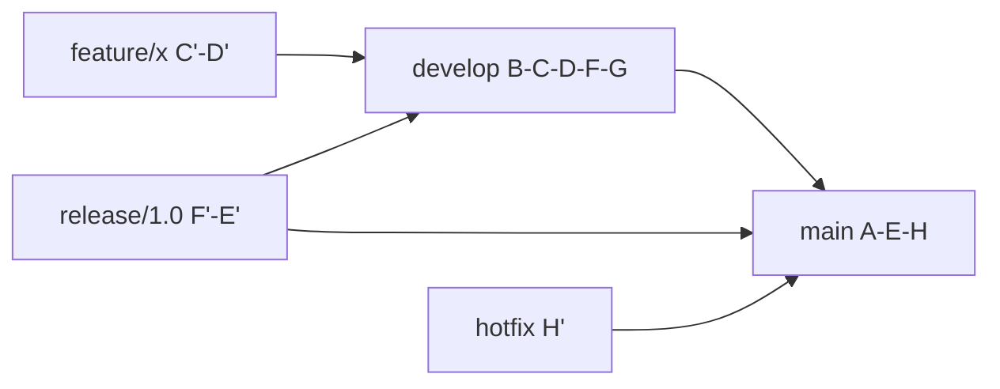
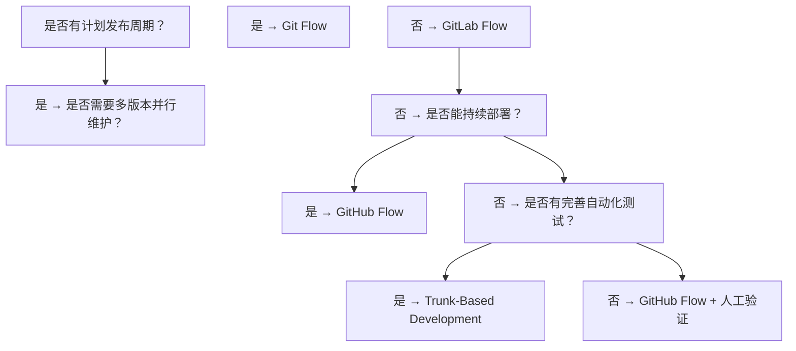

## 1. Git Flow 工作流

### 1.1 分支模型

Git Flow 由 Vincent Driessen 于 2010 年提出，定义了五类长期和短期分支：

| 分支类型    | 命名约定      | 生命周期 | 说明         |
| ----------- | ------------- | -------- | ------------ |
| `main`      | `main`        | 永久     | 生产就绪代码 |
| `develop`   | `develop`     | 永久     | 集成开发主线 |
| `feature/*` | `feature/xxx` | 短期     | 功能开发     |
| `release/*` | `release/1.x` | 短期     | 发布准备     |
| `hotfix/*`  | `hotfix/xxx`  | 短期     | 紧急修复     |



### 1.2 核心流程

**功能开发**：

```bash
# 从 develop 创建 feature 分支
git checkout -b feature/user-auth develop

# 开发完成后合并回 develop
git checkout develop
git merge --no-ff feature/user-auth
git branch -d feature/user-auth
```

**发布流程**：

```bash
# 从 develop 创建 release 分支
git checkout -b release/1.2.0 develop

# 仅修复 bug，不添加新功能
# 测试通过后合并到 main 和 develop
git checkout main
git merge --no-ff release/1.2.0
git tag -a v1.2.0

git checkout develop
git merge --no-ff release/1.2.0
git branch -d release/1.2.0
```

**热修复**：

```bash
git checkout -b hotfix/critical-bug main
# 修复后合并到 main 和 develop
git checkout main
git merge --no-ff hotfix/critical-bug
git tag -a v1.2.1

git checkout develop
git merge --no-ff hotfix/critical-bug
```

### 1.3 优缺点

**优点**：

- 明确的分支职责，适合有计划发布周期的项目
- `main` 分支始终对应生产环境
- `release` 分支允许并行开发与发布准备

**缺点**：

- 分支管理复杂，五类分支增加认知负担
- `develop` 与 `main` 合并冲突频发
- 不适合持续部署场景

## 2. GitHub Flow 工作流

### 2.1 分支模型

GitHub Flow 极度简化，仅保留两类分支：

| 分支类型    | 命名约定     | 生命周期 | 说明       |
| ----------- | ------------ | -------- | ---------- |
| `main`      | `main`       | 永久     | 始终可部署 |
| `feature/*` | `描述性名称` | 短期     | 任何变更   |


### 2.2 核心流程

```bash
# 1. 从 main 创建分支
git checkout -b add-login-button main

# 2. 开发并频繁提交
git commit -m "feat: add login button component"

# 3. 推送并创建 Pull Request
git push -u origin add-login-button
# 在 GitHub 上创建 PR

# 4. Code Review 通过后合并
# 通过 GitHub UI 合并 PR

# 5. 立即部署
# 合并到 main 后自动触发部署
```

### 2.3 优缺点

**优点**：

- 极简，学习成本低
- `main` 始终可部署，适合持续交付
- PR 驱动的 Code Review 文化

**缺点**：

- 缺乏发布规划，不适合多版本并行维护
- 无 `develop` 缓冲区，`main` 可能不稳定
- 大规模团队协作时冲突概率高

## 3. 深度对比

### 3.1 维度对比表

| 维度         | Git Flow                      | GitHub Flow             |
| ------------ | ----------------------------- | ----------------------- |
| 分支数量     | 5 类                          | 2 类                    |
| 发布模式     | 计划发布（版本号驱动）        | 持续部署（合并即部署）  |
| 适用团队规模 | 中大型                        | 小型至中型              |
| 学习曲线     | 陡峭                          | 平缓                    |
| 版本维护     | 支持多版本并行                | 仅维护最新版            |
| 回滚策略     | `hotfix` 分支                 | `git revert` 或重新部署 |
| CI/CD 集成   | release 分支触发              | main 合并触发           |
| 冲突频率     | 高（develop ↔ main 双向合并） | 低（单向合并到 main）   |

### 3.2 部署节奏对比

```
Git Flow 部署节奏:
  开发 → 集成 → 冻结 → 测试 → 发布（周期性，如每2周）

GitHub Flow 部署节奏:
  开发 → Review → 合并 → 部署（持续，可能每天多次）
```

### 3.3 合并策略差异

Git Flow 推荐使用 `--no-ff` 保留分支拓扑：

```bash
git merge --no-ff feature/xxx
# 产生合并提交，保留分支历史
```

GitHub Flow 通过 PR 合并，支持三种策略：

- **Merge commit**：保留完整分支历史
- **Squash and merge**：压缩为单个提交，历史更整洁
- **Rebase and merge**：线性历史，无合并提交

## 4. 变体与混合方案

### 4.1 GitLab Flow

结合两者优点，引入环境分支：

```
main ──→ staging ──→ production
```

- 支持**环境部署顺序**：开发 → 预发布 → 生产
- 保留 GitHub Flow 的简洁性
- 增加环境分支的有序性

### 4.2 Trunk-Based Development

更极端的简化：

```
main（trunk）:  A──B──C──D──E
                    \
feature flags:       B'（短生命周期，<1天）
```

- 所有人在 `main` 上开发
- 使用**特性开关**控制未完成功能
- 要求完善的自动化测试

### 4.3 选择决策树



## 5. 实践建议

### 5.1 Git Flow 实践要点

1. **使用 `git flow` 扩展**：`git flow init`、`git flow feature start` 等命令简化操作
2. **release 分支只做 bug 修复**：新功能必须走 feature → develop 路径
3. **打标签必须**：每次合并到 main 都要打版本标签
4. **定期清理已合并分支**：避免分支列表膨胀

### 5.2 GitHub Flow 实践要点

1. **分支命名规范**：`feat/xxx`、`fix/xxx`、`chore/xxx`
2. **小步提交**：每个 PR 控制在 200-400 行变更以内
3. **PR 模板**：统一描述变更内容、测试方法、截图
4. **CI 必须通过**：PR 合并前必须通过所有自动化检查
5. **部署自动化**：合并到 main 后自动触发部署流水线

## 参考文献


Git 官方文档：https://git-scm.com/doc
Pro Git 中文版：https://git-scm.com/book/zh/v2
Git 参考手册：https://git-scm.com/docs
Conventional Commits：https://www.conventionalcommits.org/zh-hans/

## 延伸阅读


Git 基础操作与分支，见 003-git 模块文档。
GitHub 协作与 PR，见 004-github 模块。
CI/CD 自动化，见 031-devops 模块。
尚硅谷 Bilibili 空间（https://space.bilibili.com/302417610 ）提供 Git 课程。

## 深度专题扩展


以下专题从不同角度深入本文主题，供有进阶需求的读者研读。每个专题独立成节，内容相互补充。

### 13.1 Git 对象模型与内部机制

git add 创建 blob 与 tree，git commit 创建 commit 对象，引用（HEAD/分支）指向 commit。
packfile 压缩对象；gc 清理悬空对象；fsck 校验完整性。
reflog 记录引用变动，是误操作恢复的最后防线。
理解对象模型后可解释 cherry-pick、rebase 与 reset 的底层行为。

### 13.2 合并策略与冲突解决

三路合并：base/ours/theirs 对比；rerere 记录重复冲突解决方案。
冲突标记：<<<<<<< 与 >>>>>>> 之间手工合并，保持语义正确后重新 add。
merge --no-ff 保留合并提交；squash 合并压缩 PR 历史。
策略选择：特性分支多 commit 用 squash/merge；持续集成用 rebase 保持线性。

## 模块文档速查表

| 文档 | 主题 | 与本文的关联 |
| --- | --- | --- |
| Git 基础概念与核心特点 | 001-Git | 本文的前置基础 |
| Git 环境配置与初始化 | 002-GitEnvConfigInit | 本文的前置基础 |
| Git 基本操作 | 003-GitBasicOperation | 本文的并列主题 |
| Git 分支管理 | 004-GitBranchManagement | 本文的并列主题 |
| Git 远程仓库操作 | 005-GitRemoteRepoOperation | 本文的并列主题 |
| 分布式版本控制原理 | 006-DistributedVCSPrinciple | 本文的原理深化 |
| 对象模型 | 007-ObjectModel | 本文的并列主题 |
| SHA-1哈希完整性校验 | 008-SHA1IntegrityCheck | 本文的并列主题 |
| 三棵树 | 009-ThreeTrees | 本文的并列主题 |
| git-diff与暂存区操作 | 010-GitDiffStagingOperation | 本文的并列主题 |
| git-restore与文件操作 | 011-GitRestoreFileOperation | 本文的并列主题 |
| git-log详解 | 012-GitLogDetailed | 本文的并列主题 |
| git-reflog | 013-GitReflog | 本文的并列主题 |
| git-blame | 014-GitBlame | 本文的并列主题 |
| HEAD指针与分支本质 | 015-HEADPointerBranchEssence | 本文的并列主题 |
| Git 钩子与 Git LFS | 016-GitHookGitLFS | 本文的并列主题 |
| 合并冲突解决 | 017-MergeConflictResolution | 本文的并列主题 |
| git-mergetool | 018-GitMergetool | 本文的并列主题 |
| git-rebase | 019-GitRebase | 本文的并列主题 |
| git-cherry-pick | 020-GitCherryPick | 本文的并列主题 |
| git-stash | 021-GitStash | 本文的并列主题 |
| 远程跟踪分支 | 022-RemoteTrackingBranch | 本文的并列主题 |
| Git-Flow与GitHub-Flow | 023-GitFlowGitHubFlow | 本文的并列主题 |
| git-commit-amend | 024-GitCommitAmend | 本文的并列主题 |
| git-reset | 025-GitReset | 本文的并列主题 |
| git-revert | 026-GitRevert | 本文的并列主题 |
| Git 原理与对象模型 | 027-GitPrincipleObjectModel | 本文的原理深化 |
| 标签管理 | 028-TagManagement | 本文的并列主题 |
| git-bisect | 029-GitBisect | 本文的并列主题 |
| git-submodule | 030-GitSubmodule | 本文的并列主题 |
| sparse-checkout | 031-SparseCheckout | 本文的并列主题 |
| git-format-patch | 032-GitFormatPatch | 本文的并列主题 |
| git-grep | 033-GitGrep | 本文的并列主题 |
| git-worktree | 034-GitWorktree | 本文的并列主题 |
| git-gc | 035-GitGc | 本文的并列主题 |
| Git-Flow与GitHub-Flow对比 | 036-GitFlowGitHubFlowComparison | 本文自身 |
| 交互式rebase | 037-InteractiveRebase | 本文的并列主题 |
| git-revert与reset对比 | 038-GitRevertResetComparison | 本文的并列主题 |
| Code-Review流程与最佳实践 | 039-CodeReviewBestPractice | 本文的并列主题 |
