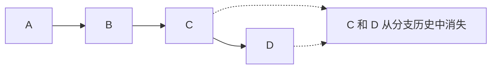

## 1. 核心原理

### 1.1 git revert — 反做提交

`git revert` 创建一个**新提交**，其变更内容是指定提交的**逆向操作**。历史记录中既有原始提交，也有撤销提交。

```mermaid
flowchart LR
    A[A] --> B[B] --> C[C] --> D[D] --> C2[C' C 的逆向变更]
```mermaid
flowchart LR
    A[A] --> B[B]
    B -.C 和 D 从分支历史中消失.-> X
```

原始历史：A──B──C──D（HEAD → D）；reset B：A──B（HEAD → B）bash
# 撤销最近一个提交
git revert HEAD

# 撤销指定提交
git revert abc1234

# 撤销多个提交（按顺序创建多个 revert 提交）
git revert abc1234 def5678

# 撤销多个提交（合并为一个 revert 提交）
git revert --no-commit HEAD~3..HEAD
git commit -m "revert: undo last 3 commits"
```

### 1.2 git reset — 移动指针

`git reset` 将 HEAD 指针移动到指定提交，根据模式决定如何处理工作区和暂存区。



原始历史：A──B──C──D（HEAD → D）；reset B：A──B（HEAD → B）

```bash
# --soft: 仅移动 HEAD，保留暂存区和工作区
git reset --soft HEAD~1

# --mixed（默认）: 移动 HEAD，重置暂存区，保留工作区
git reset --mixed HEAD~1
# 等同于
git reset HEAD~1

# --hard: 移动 HEAD，重置暂存区和工作区
git reset --hard HEAD~1
```

## 2. 三种 reset 模式详解

### 2.1 模式对比

| 模式      | HEAD | 暂存区（Index） | 工作区（Working Tree） |
| --------- | ---- | --------------- | ---------------------- |
| `--soft`  | 移动 | 不变            | 不变                   |
| `--mixed` | 移动 | 重置            | 不变                   |
| `--hard`  | 移动 | 重置            | 重置                   |

### 2.2 图示理解

假设当前状态：

```
HEAD → D
暂存区: D 的快照
工作区: D 的文件
```

执行 `git reset --soft B`：

```
HEAD → B
暂存区: D 的快照（D 的变更已暂存，可直接重新提交）
工作区: D 的文件
```

执行 `git reset --mixed B`：

```
HEAD → B
暂存区: B 的快照（D 的变更变为未暂存状态）
工作区: D 的文件
```

执行 `git reset --hard B`：

```
HEAD → B
暂存区: B 的快照
工作区: B 的文件（D 的变更完全丢失！）
```

### 2.3 典型应用

**`--soft`：重新组织提交**

```bash
# 撤销最近3个提交，但保留所有变更在暂存区
git reset --soft HEAD~3
git commit -m "feat: complete user module"
# 将3个零碎提交合并为一个
```

**`--mixed`：重新选择暂存**

```bash
# 撤销提交，变更回到工作区
git reset HEAD~1
# 重新选择要暂存的文件
git add src/important-file.js
git commit -m "feat: add important feature"
```

**`--hard`：彻底丢弃**

```bash
# 丢弃所有未提交的变更
git reset --hard HEAD

# 回到指定提交的状态（危险！）
git reset --hard abc1234
```

## 3. revert 与 reset 对比

### 3.1 核心差异

| 维度       | git revert                           | git reset                  |
| ---------- | ------------------------------------ | -------------------------- |
| 历史改写   | 不改写，新增撤销提交                 | 改写，丢弃提交             |
| 安全性     | 安全，可推送共享分支                 | 危险，不应推送已共享的分支 |
| 提交哈希   | 产生新哈希                           | 之前的哈希消失             |
| 冲突可能性 | 可能冲突（如果后续提交修改了相同行） | 不冲突（直接移动指针）     |
| 协作友好   | 友好，他人无需特殊操作               | 不友好，他人需要重新同步   |
| 精确度     | 可撤销任意单个提交                   | 只能从 HEAD 往回数         |
| 可逆性     | 可再次 revert 恢复                   | 需 reflog 找回             |

### 3.2 适用场景

**使用 revert**：

- 已推送到远程共享分支的提交
- 需要保留审计追踪
- CI/CD 环境中需要记录回滚操作
- 开源项目中维护透明的变更历史

**使用 reset**：

- 仅在本地未推送的提交
- 需要重新组织提交（squash、reorder）
- 误提交后立即撤销
- 清理本地实验性提交

### 3.3 revert 的特殊情况

**revert 一个 merge 提交**：

```bash
# merge 提交有两个父提交，需要指定撤销哪个方向
git revert -m 1 abc1234
# -m 1 表示保留第1个父提交（通常是主分支）的方向
# -m 2 表示保留第2个父提交（通常是特性分支）的方向
```

**revert 一个 revert**：

```bash
# 先 revert
git revert abc1234  # 创建 C'

# 后来需要恢复，revert 那个 revert
git revert C'       # 创建 C''
# C'' 的效果等同于重新应用 abc1234 的变更
```

## 4. reflog — 丢失提交的救星

### 4.1 reflog 记录

`git reset --hard` 后，提交看似丢失，但 reflog 仍保留记录：

```bash
git reflog
# a1b2c3d HEAD@{0}: reset: moving to HEAD~2
# d4e5f6g HEAD@{1}: commit: feat: add feature D
# g7h8i9j HEAD@{2}: commit: feat: add feature C
```

### 4.2 恢复丢失的提交

```bash
# 通过 reflog 找到丢失提交的哈希
git reflog

# 恢复到该提交
git reset --hard d4e5f6g
# 或者创建新分支指向它
git branch recovered d4e5f6g
```

### 4.3 reflog 过期

reflog 条目默认保留 90 天，过期后提交可能被 GC 回收：

```bash
# 查看过期设置
git config --get gc.reflogExpire
# 默认: 90 days

# 手动触发 GC（会清除不可达对象）
git gc --prune=now
```

## 5. 实践建议

### 5.1 安全操作清单

1. **已推送的提交**：只用 `git revert`
2. **未推送的提交**：可用 `git reset`
3. **reset 前先备份**：`git branch backup`
4. **使用 `--force-with-lease`**：替代 `--force` 推送
5. **定期检查 reflog**：确认重要提交可找回

### 5.2 常见错误与修复

```bash
# 错误：reset --hard 后想恢复
git reflog                    # 找到之前的 HEAD
git reset --hard HEAD@{1}     # 恢复

# 错误：revert 了错误的提交
git revert HEAD               # revert 那个 revert

# 错误：reset 后发现还需要那些提交
git reflog
git cherry-pick abc1234       # 逐个捡回需要的提交
```

## 参考文献


Git 官方文档：https://git-scm.com/doc
Pro Git 中文版：https://git-scm.com/book/zh/v2
Git 参考手册：https://git-scm.com/docs
Conventional Commits：https://www.conventionalcommits.org/zh-hans/

## 延伸阅读


Git 基础操作与分支，见 003-git 模块文档。
GitHub 协作与 PR，见 004-github 模块。
CI/CD 自动化，见 031-devops 模块。
尚硅谷 Bilibili 空间（https://space.bilibili.com/302417610 ）提供 Git 课程。

## 深度专题扩展


以下专题从不同角度深入本文主题，供有进阶需求的读者研读。每个专题独立成节，内容相互补充。

### 13.1 Git 对象模型与内部机制

git add 创建 blob 与 tree，git commit 创建 commit 对象，引用（HEAD/分支）指向 commit。
packfile 压缩对象；gc 清理悬空对象；fsck 校验完整性。
reflog 记录引用变动，是误操作恢复的最后防线。
理解对象模型后可解释 cherry-pick、rebase 与 reset 的底层行为。

### 13.2 合并策略与冲突解决

三路合并：base/ours/theirs 对比；rerere 记录重复冲突解决方案。
冲突标记：<<<<<<< 与 >>>>>>> 之间手工合并，保持语义正确后重新 add。
merge --no-ff 保留合并提交；squash 合并压缩 PR 历史。
策略选择：特性分支多 commit 用 squash/merge；持续集成用 rebase 保持线性。

## 模块文档速查表

| 文档 | 主题 | 与本文的关联 |
| --- | --- | --- |
| Git 基础概念与核心特点 | 001-Git | 本文的前置基础 |
| Git 环境配置与初始化 | 002-GitEnvConfigInit | 本文的前置基础 |
| Git 基本操作 | 003-GitBasicOperation | 本文的并列主题 |
| Git 分支管理 | 004-GitBranchManagement | 本文的并列主题 |
| Git 远程仓库操作 | 005-GitRemoteRepoOperation | 本文的并列主题 |
| 分布式版本控制原理 | 006-DistributedVCSPrinciple | 本文的原理深化 |
| 对象模型 | 007-ObjectModel | 本文的并列主题 |
| SHA-1哈希完整性校验 | 008-SHA1IntegrityCheck | 本文的并列主题 |
| 三棵树 | 009-ThreeTrees | 本文的并列主题 |
| git-diff与暂存区操作 | 010-GitDiffStagingOperation | 本文的并列主题 |
| git-restore与文件操作 | 011-GitRestoreFileOperation | 本文的并列主题 |
| git-log详解 | 012-GitLogDetailed | 本文的并列主题 |
| git-reflog | 013-GitReflog | 本文的并列主题 |
| git-blame | 014-GitBlame | 本文的并列主题 |
| HEAD指针与分支本质 | 015-HEADPointerBranchEssence | 本文的并列主题 |
| Git 钩子与 Git LFS | 016-GitHookGitLFS | 本文的并列主题 |
| 合并冲突解决 | 017-MergeConflictResolution | 本文的并列主题 |
| git-mergetool | 018-GitMergetool | 本文的并列主题 |
| git-rebase | 019-GitRebase | 本文的并列主题 |
| git-cherry-pick | 020-GitCherryPick | 本文的并列主题 |
| git-stash | 021-GitStash | 本文的并列主题 |
| 远程跟踪分支 | 022-RemoteTrackingBranch | 本文的并列主题 |
| Git-Flow与GitHub-Flow | 023-GitFlowGitHubFlow | 本文的并列主题 |
| git-commit-amend | 024-GitCommitAmend | 本文的并列主题 |
| git-reset | 025-GitReset | 本文的并列主题 |
| git-revert | 026-GitRevert | 本文的并列主题 |
| Git 原理与对象模型 | 027-GitPrincipleObjectModel | 本文的原理深化 |
| 标签管理 | 028-TagManagement | 本文的并列主题 |
| git-bisect | 029-GitBisect | 本文的并列主题 |
| git-submodule | 030-GitSubmodule | 本文的并列主题 |
| sparse-checkout | 031-SparseCheckout | 本文的并列主题 |
| git-format-patch | 032-GitFormatPatch | 本文的并列主题 |
| git-grep | 033-GitGrep | 本文的并列主题 |
| git-worktree | 034-GitWorktree | 本文的并列主题 |
| git-gc | 035-GitGc | 本文的并列主题 |
| Git-Flow与GitHub-Flow对比 | 036-GitFlowGitHubFlowComparison | 本文的并列主题 |
| 交互式rebase | 037-InteractiveRebase | 本文的并列主题 |
| git-revert与reset对比 | 038-GitRevertResetComparison | 本文自身 |
| Code-Review流程与最佳实践 | 039-CodeReviewBestPractice | 本文的并列主题 |
