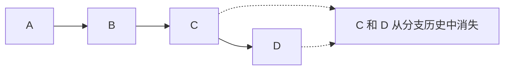
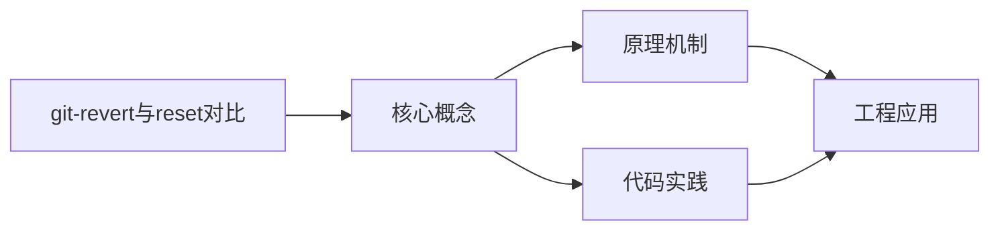
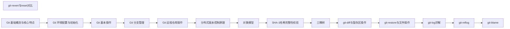

## 1. 学习目标（Bloom 分类）

本节按照布鲁姆教育目标分类学组织学习路径。本文主题为《git-revert与reset对比》，属于 Git 模块，读者可以根据自身阶段选择阅读深度。

记忆层面：能够准确复述本文的核心概念、术语与基本语法或操作步骤，并能够在提问或检索时快速定位对应知识点。能够说出 Git 的核心概念、常用命令与流程。

理解层面：能够用自己的语言解释核心原理与工作机制，说明概念之间的因果关系，而不是机械记忆结论。能够解释 Git 的工作原理与设计动机。

应用层面：能够在真实项目或练习场景中运用本文知识解决具体问题，写出正确且可维护的实现。能够独立完成 Git 的标准操作。

分析层面：能够拆解复杂问题，比较本文主题与相邻概念的异同，识别边界条件与例外情况。能够分析 Git 使用中的异常与边界。

评价层面：能够根据约束条件（性能、可读性、安全、成本）评价不同方案的优劣，做出有依据的技术决策。能够评价 Git 相关工具与方案。

创造层面：能够把本文知识与其他模块知识组合，设计出新的解决方案或可复用的工程模式。能够把 Git 融入团队工作流。

通过本节学习，读者应当能够把《git-revert与reset对比》纳入自己的知识网络，并与 Git 模块的其他主题（提交、分支、合并、远程协作）建立关联。

## 2. 历史动机与发展脉络

《git-revert与reset对比》是 Git 领域的重要主题。要真正理解它，需要先了解它解决的问题与演进过程。

Git 由 Linus Torvalds 于 2005 年为 Linux 内核开发，目标是替代 BitKeeper：分布式、高性能、内容寻址。
Git 的核心是对象模型：blob（内容）、tree（目录）、commit（快照 + 元数据）、tag（引用）；一切对象用 SHA-1 哈希寻址。
工作流演进：集中式工作流 -> 特性分支 -> GitFlow -> GitHub Flow / Trunk-Based；现代团队普遍采用 PR 审查 + 主干发布。

回到本文主题：git-revert与reset对比 的提出与成熟，正是上述技术背景下的必然产物。早期实现往往以简单可用为目标，随着工程规模扩大，社区逐渐沉淀出标准做法与最佳实践；理解这一脉络，可以帮助读者判断“为什么文档中的推荐写法是现在这个样子”，也能在遇到历史遗留代码时准确识别其设计年代与取舍。


## 3. 形式化定义与核心概念精讲

本节把《git-revert与reset对比》涉及的核心概念以“定义 + 讲解”的形式展开。读者应把定义当作工具，把讲解当作理解路径；两者结合才能形成可迁移的知识。

三个区域：工作区、暂存区（index）、仓库（HEAD）；git add/commit 移动状态。
分支是指针：创建分支成本极低；合并（merge 生成合并提交）与变基（rebase 重放提交）各有取舍。
远程协作：clone/fetch/pull/push；refs/remotes 跟踪远端；冲突在合并时出现并手工解决。

### 3.1 原文章节逐一精讲

原文档把主题拆分为 5 个小节，下面按顺序给出每一节的导读讲解，随后保留原文细节供精读。

#### 原文精读（完整保留）


#### 1. 核心原理

##### 1.1 git revert — 反做提交

`git revert` 创建一个**新提交**，其变更内容是指定提交的**逆向操作**。历史记录中既有原始提交，也有撤销提交。

```mermaid
flowchart LR
    A[A] --> B[B] --> C[C] --> D[D] --> C2[C' C 的逆向变更]
```mermaid
flowchart LR
    A[A] --> B[B]
    B -.C 和 D 从分支历史中消失.-> X
```

原始历史：A──B──C──D（HEAD → D）；reset B：A──B（HEAD → B）bash
# 撤销最近一个提交
git revert HEAD

# 撤销指定提交
git revert abc1234

# 撤销多个提交（按顺序创建多个 revert 提交）
git revert abc1234 def5678

# 撤销多个提交（合并为一个 revert 提交）
git revert --no-commit HEAD~3..HEAD
git commit -m "revert: undo last 3 commits"
```

##### 1.2 git reset — 移动指针

`git reset` 将 HEAD 指针移动到指定提交，根据模式决定如何处理工作区和暂存区。



原始历史：A──B──C──D（HEAD → D）；reset B：A──B（HEAD → B）

```bash
# --soft: 仅移动 HEAD，保留暂存区和工作区
git reset --soft HEAD~1

# --mixed（默认）: 移动 HEAD，重置暂存区，保留工作区
git reset --mixed HEAD~1
# 等同于
git reset HEAD~1

# --hard: 移动 HEAD，重置暂存区和工作区
git reset --hard HEAD~1
```

#### 2. 三种 reset 模式详解

##### 2.1 模式对比

| 模式      | HEAD | 暂存区（Index） | 工作区（Working Tree） |
| --------- | ---- | --------------- | ---------------------- |
| `--soft`  | 移动 | 不变            | 不变                   |
| `--mixed` | 移动 | 重置            | 不变                   |
| `--hard`  | 移动 | 重置            | 重置                   |

##### 2.2 图示理解

假设当前状态：

```
HEAD → D
暂存区: D 的快照
工作区: D 的文件
```

执行 `git reset --soft B`：

```
HEAD → B
暂存区: D 的快照（D 的变更已暂存，可直接重新提交）
工作区: D 的文件
```

执行 `git reset --mixed B`：

```
HEAD → B
暂存区: B 的快照（D 的变更变为未暂存状态）
工作区: D 的文件
```

执行 `git reset --hard B`：

```
HEAD → B
暂存区: B 的快照
工作区: B 的文件（D 的变更完全丢失！）
```

##### 2.3 典型应用

**`--soft`：重新组织提交**

```bash
# 撤销最近3个提交，但保留所有变更在暂存区
git reset --soft HEAD~3
git commit -m "feat: complete user module"
# 将3个零碎提交合并为一个
```

**`--mixed`：重新选择暂存**

```bash
# 撤销提交，变更回到工作区
git reset HEAD~1
# 重新选择要暂存的文件
git add src/important-file.js
git commit -m "feat: add important feature"
```

**`--hard`：彻底丢弃**

```bash
# 丢弃所有未提交的变更
git reset --hard HEAD

# 回到指定提交的状态（危险！）
git reset --hard abc1234
```

#### 3. revert 与 reset 对比

##### 3.1 核心差异

| 维度       | git revert                           | git reset                  |
| ---------- | ------------------------------------ | -------------------------- |
| 历史改写   | 不改写，新增撤销提交                 | 改写，丢弃提交             |
| 安全性     | 安全，可推送共享分支                 | 危险，不应推送已共享的分支 |
| 提交哈希   | 产生新哈希                           | 之前的哈希消失             |
| 冲突可能性 | 可能冲突（如果后续提交修改了相同行） | 不冲突（直接移动指针）     |
| 协作友好   | 友好，他人无需特殊操作               | 不友好，他人需要重新同步   |
| 精确度     | 可撤销任意单个提交                   | 只能从 HEAD 往回数         |
| 可逆性     | 可再次 revert 恢复                   | 需 reflog 找回             |

##### 3.2 适用场景

**使用 revert**：

- 已推送到远程共享分支的提交
- 需要保留审计追踪
- CI/CD 环境中需要记录回滚操作
- 开源项目中维护透明的变更历史

**使用 reset**：

- 仅在本地未推送的提交
- 需要重新组织提交（squash、reorder）
- 误提交后立即撤销
- 清理本地实验性提交

##### 3.3 revert 的特殊情况

**revert 一个 merge 提交**：

```bash
# merge 提交有两个父提交，需要指定撤销哪个方向
git revert -m 1 abc1234
# -m 1 表示保留第1个父提交（通常是主分支）的方向
# -m 2 表示保留第2个父提交（通常是特性分支）的方向
```

**revert 一个 revert**：

```bash
# 先 revert
git revert abc1234  # 创建 C'

# 后来需要恢复，revert 那个 revert
git revert C'       # 创建 C''
# C'' 的效果等同于重新应用 abc1234 的变更
```

#### 4. reflog — 丢失提交的救星

##### 4.1 reflog 记录

`git reset --hard` 后，提交看似丢失，但 reflog 仍保留记录：

```bash
git reflog
# a1b2c3d HEAD@{0}: reset: moving to HEAD~2
# d4e5f6g HEAD@{1}: commit: feat: add feature D
# g7h8i9j HEAD@{2}: commit: feat: add feature C
```

##### 4.2 恢复丢失的提交

```bash
# 通过 reflog 找到丢失提交的哈希
git reflog

# 恢复到该提交
git reset --hard d4e5f6g
# 或者创建新分支指向它
git branch recovered d4e5f6g
```

##### 4.3 reflog 过期

reflog 条目默认保留 90 天，过期后提交可能被 GC 回收：

```bash
# 查看过期设置
git config --get gc.reflogExpire
# 默认: 90 days

# 手动触发 GC（会清除不可达对象）
git gc --prune=now
```

#### 5. 实践建议

##### 5.1 安全操作清单

1. **已推送的提交**：只用 `git revert`
2. **未推送的提交**：可用 `git reset`
3. **reset 前先备份**：`git branch backup`
4. **使用 `--force-with-lease`**：替代 `--force` 推送
5. **定期检查 reflog**：确认重要提交可找回

##### 5.2 常见错误与修复

```bash
# 错误：reset --hard 后想恢复
git reflog                    # 找到之前的 HEAD
git reset --hard HEAD@{1}     # 恢复

# 错误：revert 了错误的提交
git revert HEAD               # revert 那个 revert

# 错误：reset 后发现还需要那些提交
git reflog
git cherry-pick abc1234       # 逐个捡回需要的提交
```


### 3.2 概念关系图

下面用 Mermaid 图表达本文核心概念之间的关系，帮助读者建立整体图景：



图中展示的是本文知识的结构化关系：核心概念是入口，原理机制解释“为什么”，代码实践演示“怎么做”，工程应用回答“何时用”。读者学习时可以把每个小节的内容挂接到对应节点上。

## 4. 理论推导与原理解析

本节深入《git-revert与reset对比》背后的原理。理论部分不求面面俱到，而是聚焦“能解释现象、能指导实践”的关键推导。

三个区域：工作区、暂存区（index）、仓库（HEAD）；git add/commit 移动状态。
分支是指针：创建分支成本极低；合并（merge 生成合并提交）与变基（rebase 重放提交）各有取舍。
远程协作：clone/fetch/pull/push；refs/remotes 跟踪远端；冲突在合并时出现并手工解决。
撤销模型：checkout/restore 改工作区，reset 移 HEAD，revert 生成反向提交；理解三者避免误操作。

需要强调的是，理论推导与工程实践之间存在翻译层：理论给出的是理想化模型与边界条件，工程代码则必须处理真实环境中的例外。读者在学习时应先掌握理论的“标准情形”，再通过陷阱章节了解“非标准情形”。

## 5. 代码示例与逐行讲解

本节把原文中的代码示例系统整理，并为每个示例补充用途说明与讲解。读者不应只浏览代码，而应逐段对照讲解理解设计意图。

### 5.1 示例：1.1 git revert — 反做提交

该示例来自原文《1.1 git revert — 反做提交》小节，用于演示git-revert与reset对比相关操作。阅读时请先看代码结构，再看其后的讲解。


讲解：这段代码演示了本节核心知识点。代码中的关键操作可以归纳为三步：准备（定义或初始化）、执行（核心逻辑）、收尾（释放资源或返回结果）。实际项目中，这三步往往被封装为函数或类，以提升复用性与可测试性。

关键点分析：

该示例共 2 行有效代码，结构以数据或配置为主。阅读时应关注：数据字段的含义、配置项的作用，以及它们与运行行为的对应关系。

进阶思考路径：先尝试修改参数观察行为变化，再把示例中的模式迁移到自己的项目中；每次修改都记录预期与实测差异，这是把示例转化为能力的最快方式。

### 5.2 示例：1.1 git revert — 反做提交

该示例来自原文《1.1 git revert — 反做提交》小节，用于演示git-revert与reset对比相关操作。阅读时请先看代码结构，再看其后的讲解。

```text

原始历史：A──B──C──D（HEAD → D）；reset B：A──B（HEAD → B）bash
# 撤销最近一个提交
git revert HEAD

# 撤销指定提交
git revert abc1234

# 撤销多个提交（按顺序创建多个 revert 提交）
git revert abc1234 def5678

# 撤销多个提交（合并为一个 revert 提交）
git revert --no-commit HEAD~3..HEAD
git commit -m "revert: undo last 3 commits"
```

讲解：这段代码演示了本节核心知识点。代码中的关键操作可以归纳为三步：准备（定义或初始化）、执行（核心逻辑）、收尾（释放资源或返回结果）。实际项目中，这三步往往被封装为函数或类，以提升复用性与可测试性。

关键点分析：

该示例共 10 行有效代码，结构以数据或配置为主。阅读时应关注：数据字段的含义、配置项的作用，以及它们与运行行为的对应关系。

进阶思考路径：先尝试修改参数观察行为变化，再把示例中的模式迁移到自己的项目中；每次修改都记录预期与实测差异，这是把示例转化为能力的最快方式。

### 5.3 示例：1.2 git reset — 移动指针

该示例来自原文《1.2 git reset — 移动指针》小节，用于演示git-revert与reset对比相关操作。阅读时请先看代码结构，再看其后的讲解。


讲解：这段代码演示了本节核心知识点。代码中的关键操作可以归纳为三步：准备（定义或初始化）、执行（核心逻辑）、收尾（释放资源或返回结果）。实际项目中，这三步往往被封装为函数或类，以提升复用性与可测试性。

关键点分析：

该示例共 6 行有效代码，结构以数据或配置为主。阅读时应关注：数据字段的含义、配置项的作用，以及它们与运行行为的对应关系。

进阶思考路径：先尝试修改参数观察行为变化，再把示例中的模式迁移到自己的项目中；每次修改都记录预期与实测差异，这是把示例转化为能力的最快方式。

### 5.4 示例：1.2 git reset — 移动指针

该示例来自原文《1.2 git reset — 移动指针》小节，用于演示git-revert与reset对比相关操作。阅读时请先看代码结构，再看其后的讲解。

```bash
# --soft: 仅移动 HEAD，保留暂存区和工作区
git reset --soft HEAD~1

# --mixed（默认）: 移动 HEAD，重置暂存区，保留工作区
git reset --mixed HEAD~1
# 等同于
git reset HEAD~1

# --hard: 移动 HEAD，重置暂存区和工作区
git reset --hard HEAD~1
```

讲解：这段代码演示了本节核心知识点。代码中的关键操作可以归纳为三步：准备（定义或初始化）、执行（核心逻辑）、收尾（释放资源或返回结果）。实际项目中，这三步往往被封装为函数或类，以提升复用性与可测试性。

关键点分析：

该示例共 8 行有效代码，结构以数据或配置为主。阅读时应关注：数据字段的含义、配置项的作用，以及它们与运行行为的对应关系。

进阶思考路径：先尝试修改参数观察行为变化，再把示例中的模式迁移到自己的项目中；每次修改都记录预期与实测差异，这是把示例转化为能力的最快方式。

### 5.5 示例：2.2 图示理解

该示例来自原文《2.2 图示理解》小节，用于演示git-revert与reset对比相关操作。阅读时请先看代码结构，再看其后的讲解。

```text
HEAD → D
暂存区: D 的快照
工作区: D 的文件
```

讲解：这段代码演示了本节核心知识点。代码中的关键操作可以归纳为三步：准备（定义或初始化）、执行（核心逻辑）、收尾（释放资源或返回结果）。实际项目中，这三步往往被封装为函数或类，以提升复用性与可测试性。

关键点分析：

该示例共 3 行有效代码，结构以数据或配置为主。阅读时应关注：数据字段的含义、配置项的作用，以及它们与运行行为的对应关系。

进阶思考路径：先尝试修改参数观察行为变化，再把示例中的模式迁移到自己的项目中；每次修改都记录预期与实测差异，这是把示例转化为能力的最快方式。

### 5.6 示例：2.2 图示理解

该示例来自原文《2.2 图示理解》小节，用于演示git-revert与reset对比相关操作。阅读时请先看代码结构，再看其后的讲解。

```text
HEAD → B
暂存区: D 的快照（D 的变更已暂存，可直接重新提交）
工作区: D 的文件
```

讲解：这段代码演示了本节核心知识点。代码中的关键操作可以归纳为三步：准备（定义或初始化）、执行（核心逻辑）、收尾（释放资源或返回结果）。实际项目中，这三步往往被封装为函数或类，以提升复用性与可测试性。

关键点分析：

该示例共 3 行有效代码，结构以数据或配置为主。阅读时应关注：数据字段的含义、配置项的作用，以及它们与运行行为的对应关系。

进阶思考路径：先尝试修改参数观察行为变化，再把示例中的模式迁移到自己的项目中；每次修改都记录预期与实测差异，这是把示例转化为能力的最快方式。

### 5.7 示例：2.2 图示理解

该示例来自原文《2.2 图示理解》小节，用于演示git-revert与reset对比相关操作。阅读时请先看代码结构，再看其后的讲解。

```text
HEAD → B
暂存区: B 的快照（D 的变更变为未暂存状态）
工作区: D 的文件
```

讲解：这段代码演示了本节核心知识点。代码中的关键操作可以归纳为三步：准备（定义或初始化）、执行（核心逻辑）、收尾（释放资源或返回结果）。实际项目中，这三步往往被封装为函数或类，以提升复用性与可测试性。

关键点分析：

该示例共 3 行有效代码，结构以数据或配置为主。阅读时应关注：数据字段的含义、配置项的作用，以及它们与运行行为的对应关系。

进阶思考路径：先尝试修改参数观察行为变化，再把示例中的模式迁移到自己的项目中；每次修改都记录预期与实测差异，这是把示例转化为能力的最快方式。

### 5.8 示例：2.2 图示理解

该示例来自原文《2.2 图示理解》小节，用于演示git-revert与reset对比相关操作。阅读时请先看代码结构，再看其后的讲解。

```text
HEAD → B
暂存区: B 的快照
工作区: B 的文件（D 的变更完全丢失！）
```

讲解：这段代码演示了本节核心知识点。代码中的关键操作可以归纳为三步：准备（定义或初始化）、执行（核心逻辑）、收尾（释放资源或返回结果）。实际项目中，这三步往往被封装为函数或类，以提升复用性与可测试性。

关键点分析：

该示例共 3 行有效代码，结构以数据或配置为主。阅读时应关注：数据字段的含义、配置项的作用，以及它们与运行行为的对应关系。

进阶思考路径：先尝试修改参数观察行为变化，再把示例中的模式迁移到自己的项目中；每次修改都记录预期与实测差异，这是把示例转化为能力的最快方式。

### 5.9 示例：2.3 典型应用

该示例来自原文《2.3 典型应用》小节，用于演示git-revert与reset对比相关操作。阅读时请先看代码结构，再看其后的讲解。

```bash
# 撤销最近3个提交，但保留所有变更在暂存区
git reset --soft HEAD~3
git commit -m "feat: complete user module"
# 将3个零碎提交合并为一个
```

讲解：这段代码演示了本节核心知识点。代码中的关键操作可以归纳为三步：准备（定义或初始化）、执行（核心逻辑）、收尾（释放资源或返回结果）。实际项目中，这三步往往被封装为函数或类，以提升复用性与可测试性。

关键点分析：

该示例共 4 行有效代码，结构以数据或配置为主。阅读时应关注：数据字段的含义、配置项的作用，以及它们与运行行为的对应关系。

进阶思考路径：先尝试修改参数观察行为变化，再把示例中的模式迁移到自己的项目中；每次修改都记录预期与实测差异，这是把示例转化为能力的最快方式。

### 5.10 示例：2.3 典型应用

该示例来自原文《2.3 典型应用》小节，用于演示git-revert与reset对比相关操作。阅读时请先看代码结构，再看其后的讲解。

```bash
# 撤销提交，变更回到工作区
git reset HEAD~1
# 重新选择要暂存的文件
git add src/important-file.js
git commit -m "feat: add important feature"
```

讲解：这段代码演示了本节核心知识点。代码中的关键操作可以归纳为三步：准备（定义或初始化）、执行（核心逻辑）、收尾（释放资源或返回结果）。实际项目中，这三步往往被封装为函数或类，以提升复用性与可测试性。

关键点分析：

该示例共 5 行有效代码，包含 1 类关键结构（import）。其中：

- 入口与初始化部分负责建立上下文，对应实际项目中的启动或装配逻辑；
- 核心逻辑部分体现本文主题的主要操作，是阅读时最需要对照讲解理解的部分；
- 输出或返回部分把结果交给调用方，注意其类型与边界条件。

进阶思考路径：先尝试修改参数观察行为变化，再把示例中的模式迁移到自己的项目中；每次修改都记录预期与实测差异，这是把示例转化为能力的最快方式。

### 5.11 示例：2.3 典型应用

该示例来自原文《2.3 典型应用》小节，用于演示git-revert与reset对比相关操作。阅读时请先看代码结构，再看其后的讲解。

```bash
# 丢弃所有未提交的变更
git reset --hard HEAD

# 回到指定提交的状态（危险！）
git reset --hard abc1234
```

讲解：这段代码演示了本节核心知识点。代码中的关键操作可以归纳为三步：准备（定义或初始化）、执行（核心逻辑）、收尾（释放资源或返回结果）。实际项目中，这三步往往被封装为函数或类，以提升复用性与可测试性。

关键点分析：

该示例共 4 行有效代码，结构以数据或配置为主。阅读时应关注：数据字段的含义、配置项的作用，以及它们与运行行为的对应关系。

进阶思考路径：先尝试修改参数观察行为变化，再把示例中的模式迁移到自己的项目中；每次修改都记录预期与实测差异，这是把示例转化为能力的最快方式。

### 5.12 示例：3.3 revert 的特殊情况

该示例来自原文《3.3 revert 的特殊情况》小节，用于演示git-revert与reset对比相关操作。阅读时请先看代码结构，再看其后的讲解。

```bash
# merge 提交有两个父提交，需要指定撤销哪个方向
git revert -m 1 abc1234
# -m 1 表示保留第1个父提交（通常是主分支）的方向
# -m 2 表示保留第2个父提交（通常是特性分支）的方向
```

讲解：这段代码演示了本节核心知识点。代码中的关键操作可以归纳为三步：准备（定义或初始化）、执行（核心逻辑）、收尾（释放资源或返回结果）。实际项目中，这三步往往被封装为函数或类，以提升复用性与可测试性。

关键点分析：

该示例共 4 行有效代码，结构以数据或配置为主。阅读时应关注：数据字段的含义、配置项的作用，以及它们与运行行为的对应关系。

进阶思考路径：先尝试修改参数观察行为变化，再把示例中的模式迁移到自己的项目中；每次修改都记录预期与实测差异，这是把示例转化为能力的最快方式。

### 5.13 示例：3.3 revert 的特殊情况

该示例来自原文《3.3 revert 的特殊情况》小节，用于演示git-revert与reset对比相关操作。阅读时请先看代码结构，再看其后的讲解。

```bash
# 先 revert
git revert abc1234  # 创建 C'

# 后来需要恢复，revert 那个 revert
git revert C'       # 创建 C''
# C'' 的效果等同于重新应用 abc1234 的变更
```

讲解：这段代码演示了本节核心知识点。代码中的关键操作可以归纳为三步：准备（定义或初始化）、执行（核心逻辑）、收尾（释放资源或返回结果）。实际项目中，这三步往往被封装为函数或类，以提升复用性与可测试性。

关键点分析：

该示例共 5 行有效代码，结构以数据或配置为主。阅读时应关注：数据字段的含义、配置项的作用，以及它们与运行行为的对应关系。

进阶思考路径：先尝试修改参数观察行为变化，再把示例中的模式迁移到自己的项目中；每次修改都记录预期与实测差异，这是把示例转化为能力的最快方式。

### 5.14 示例：4.1 reflog 记录

该示例来自原文《4.1 reflog 记录》小节，用于演示git-revert与reset对比相关操作。阅读时请先看代码结构，再看其后的讲解。

```bash
git reflog
# a1b2c3d HEAD@{0}: reset: moving to HEAD~2
# d4e5f6g HEAD@{1}: commit: feat: add feature D
# g7h8i9j HEAD@{2}: commit: feat: add feature C
```

讲解：这段代码演示了本节核心知识点。代码中的关键操作可以归纳为三步：准备（定义或初始化）、执行（核心逻辑）、收尾（释放资源或返回结果）。实际项目中，这三步往往被封装为函数或类，以提升复用性与可测试性。

关键点分析：

该示例共 4 行有效代码，结构以数据或配置为主。阅读时应关注：数据字段的含义、配置项的作用，以及它们与运行行为的对应关系。

进阶思考路径：先尝试修改参数观察行为变化，再把示例中的模式迁移到自己的项目中；每次修改都记录预期与实测差异，这是把示例转化为能力的最快方式。

### 5.15 示例：4.2 恢复丢失的提交

该示例来自原文《4.2 恢复丢失的提交》小节，用于演示git-revert与reset对比相关操作。阅读时请先看代码结构，再看其后的讲解。

```bash
# 通过 reflog 找到丢失提交的哈希
git reflog

# 恢复到该提交
git reset --hard d4e5f6g
# 或者创建新分支指向它
git branch recovered d4e5f6g
```

讲解：这段代码演示了本节核心知识点。代码中的关键操作可以归纳为三步：准备（定义或初始化）、执行（核心逻辑）、收尾（释放资源或返回结果）。实际项目中，这三步往往被封装为函数或类，以提升复用性与可测试性。

关键点分析：

该示例共 6 行有效代码，结构以数据或配置为主。阅读时应关注：数据字段的含义、配置项的作用，以及它们与运行行为的对应关系。

进阶思考路径：先尝试修改参数观察行为变化，再把示例中的模式迁移到自己的项目中；每次修改都记录预期与实测差异，这是把示例转化为能力的最快方式。

### 5.16 示例：4.3 reflog 过期

该示例来自原文《4.3 reflog 过期》小节，用于演示git-revert与reset对比相关操作。阅读时请先看代码结构，再看其后的讲解。

```bash
# 查看过期设置
git config --get gc.reflogExpire
# 默认: 90 days

# 手动触发 GC（会清除不可达对象）
git gc --prune=now
```

讲解：这段代码演示了本节核心知识点。代码中的关键操作可以归纳为三步：准备（定义或初始化）、执行（核心逻辑）、收尾（释放资源或返回结果）。实际项目中，这三步往往被封装为函数或类，以提升复用性与可测试性。

关键点分析：

该示例共 5 行有效代码，结构以数据或配置为主。阅读时应关注：数据字段的含义、配置项的作用，以及它们与运行行为的对应关系。

进阶思考路径：先尝试修改参数观察行为变化，再把示例中的模式迁移到自己的项目中；每次修改都记录预期与实测差异，这是把示例转化为能力的最快方式。

### 5.17 示例：5.2 常见错误与修复

该示例来自原文《5.2 常见错误与修复》小节，用于演示git-revert与reset对比相关操作。阅读时请先看代码结构，再看其后的讲解。

```bash
# 错误：reset --hard 后想恢复
git reflog                    # 找到之前的 HEAD
git reset --hard HEAD@{1}     # 恢复

# 错误：revert 了错误的提交
git revert HEAD               # revert 那个 revert

# 错误：reset 后发现还需要那些提交
git reflog
git cherry-pick abc1234       # 逐个捡回需要的提交
```

讲解：这段代码演示了本节核心知识点。代码中的关键操作可以归纳为三步：准备（定义或初始化）、执行（核心逻辑）、收尾（释放资源或返回结果）。实际项目中，这三步往往被封装为函数或类，以提升复用性与可测试性。

关键点分析：

该示例共 8 行有效代码，结构以数据或配置为主。阅读时应关注：数据字段的含义、配置项的作用，以及它们与运行行为的对应关系。

进阶思考路径：先尝试修改参数观察行为变化，再把示例中的模式迁移到自己的项目中；每次修改都记录预期与实测差异，这是把示例转化为能力的最快方式。


综合以上示例，可以总结出本主题的代码实践要点：第一，先定义清晰的输入输出契约；第二，核心逻辑保持单一职责；第三，错误处理与边界条件不可省略；第四，命名与注释表达意图而非复述代码。

## 6. 对比分析

对比是理解《git-revert与reset对比》定位的最快路径。下面从多个维度与相邻方案进行对比。

Git 与 SVN：Git 分布式、离线提交、分支廉价；SVN 集中式已基本退出。
merge 与 rebase：merge 保留历史但复杂；rebase 线性整洁但改写。
GitHub Flow 与 GitFlow：前者主干 + PR 适合持续发布；后者适合版本化发布。

对比的目的不是分出绝对优劣，而是建立选择依据：不同约束条件下，最优解不同。读者应把每个对比维度转化为决策检查清单。

## 7. 常见陷阱与最佳实践

本节整理该主题的高频错误与推荐做法。每个陷阱先描述现象，再解释原因，最后给出最佳实践。

### 7.1 提交信息随意

无法追溯。使用 Conventional Commits（feat/fix/docs...）。

深入讲解：该问题之所以被归类为“常见陷阱”，是因为它在初学者的代码中反复出现，而且往往不在第一时间暴露——错误通常隐藏在特定数据或特定时序下。

从成因上看，提交信息随意 一般源于对 Git 某个机制的理解偏差：要么误用了默认行为，要么忽略了边界条件，要么把其他语言的思维惯性带了过来。

从影响上看，提交信息随意 轻则产生错误结果，重则导致资源泄漏、数据损坏或安全事故；这也是为什么工程评审中会把它列为检查项。

从修复策略上看，处理提交信息随意的正确顺序是：先复现（构造最小用例），再定位（确认机制层面的根因），最后修复并补充回归测试。跳过复现直接改代码，往往治标不治本。

### 7.2 大文件入库

仓库膨胀。使用 Git LFS 或排除构建产物。

深入讲解：该问题之所以被归类为“常见陷阱”，是因为它在初学者的代码中反复出现，而且往往不在第一时间暴露——错误通常隐藏在特定数据或特定时序下。

从成因上看，大文件入库 一般源于对 Git 某个机制的理解偏差：要么误用了默认行为，要么忽略了边界条件，要么把其他语言的思维惯性带了过来。

从影响上看，大文件入库 轻则产生错误结果，重则导致资源泄漏、数据损坏或安全事故；这也是为什么工程评审中会把它列为检查项。

从修复策略上看，处理大文件入库的正确顺序是：先复现（构造最小用例），再定位（确认机制层面的根因），最后修复并补充回归测试。跳过复现直接改代码，往往治标不治本。

### 7.3 force push 滥用

覆盖他人历史。仅限个人分支并通知。

深入讲解：该问题之所以被归类为“常见陷阱”，是因为它在初学者的代码中反复出现，而且往往不在第一时间暴露——错误通常隐藏在特定数据或特定时序下。

从成因上看，force push 滥用 一般源于对 Git 某个机制的理解偏差：要么误用了默认行为，要么忽略了边界条件，要么把其他语言的思维惯性带了过来。

从影响上看，force push 滥用 轻则产生错误结果，重则导致资源泄漏、数据损坏或安全事故；这也是为什么工程评审中会把它列为检查项。

从修复策略上看，处理force push 滥用的正确顺序是：先复现（构造最小用例），再定位（确认机制层面的根因），最后修复并补充回归测试。跳过复现直接改代码，往往治标不治本。

### 7.4 merge 冲突拖延

冲突积累。频繁合并、小步提交。

深入讲解：该问题之所以被归类为“常见陷阱”，是因为它在初学者的代码中反复出现，而且往往不在第一时间暴露——错误通常隐藏在特定数据或特定时序下。

从成因上看，merge 冲突拖延 一般源于对 Git 某个机制的理解偏差：要么误用了默认行为，要么忽略了边界条件，要么把其他语言的思维惯性带了过来。

从影响上看，merge 冲突拖延 轻则产生错误结果，重则导致资源泄漏、数据损坏或安全事故；这也是为什么工程评审中会把它列为检查项。

从修复策略上看，处理merge 冲突拖延的正确顺序是：先复现（构造最小用例），再定位（确认机制层面的根因），最后修复并补充回归测试。跳过复现直接改代码，往往治标不治本。

### 7.5 密钥入库

泄露事故。使用 .gitignore 与 secret 扫描。

深入讲解：该问题之所以被归类为“常见陷阱”，是因为它在初学者的代码中反复出现，而且往往不在第一时间暴露——错误通常隐藏在特定数据或特定时序下。

从成因上看，密钥入库 一般源于对 Git 某个机制的理解偏差：要么误用了默认行为，要么忽略了边界条件，要么把其他语言的思维惯性带了过来。

从影响上看，密钥入库 轻则产生错误结果，重则导致资源泄漏、数据损坏或安全事故；这也是为什么工程评审中会把它列为检查项。

从修复策略上看，处理密钥入库的正确顺序是：先复现（构造最小用例），再定位（确认机制层面的根因），最后修复并补充回归测试。跳过复现直接改代码，往往治标不治本。

### 7.6 reset 误操作

丢失工作。确认目标与 --hard 语义。

深入讲解：该问题之所以被归类为“常见陷阱”，是因为它在初学者的代码中反复出现，而且往往不在第一时间暴露——错误通常隐藏在特定数据或特定时序下。

从成因上看，reset 误操作 一般源于对 Git 某个机制的理解偏差：要么误用了默认行为，要么忽略了边界条件，要么把其他语言的思维惯性带了过来。

从影响上看，reset 误操作 轻则产生错误结果，重则导致资源泄漏、数据损坏或安全事故；这也是为什么工程评审中会把它列为检查项。

从修复策略上看，处理reset 误操作的正确顺序是：先复现（构造最小用例），再定位（确认机制层面的根因），最后修复并补充回归测试。跳过复现直接改代码，往往治标不治本。

### 7.7 忽略 .gitignore

构建产物污染。项目初始化即配置。

深入讲解：该问题之所以被归类为“常见陷阱”，是因为它在初学者的代码中反复出现，而且往往不在第一时间暴露——错误通常隐藏在特定数据或特定时序下。

从成因上看，忽略 .gitignore 一般源于对 Git 某个机制的理解偏差：要么误用了默认行为，要么忽略了边界条件，要么把其他语言的思维惯性带了过来。

从影响上看，忽略 .gitignore 轻则产生错误结果，重则导致资源泄漏、数据损坏或安全事故；这也是为什么工程评审中会把它列为检查项。

从修复策略上看，处理忽略 .gitignore的正确顺序是：先复现（构造最小用例），再定位（确认机制层面的根因），最后修复并补充回归测试。跳过复现直接改代码，往往治标不治本。

### 7.8 rebase 公共分支

改写已发布历史。公共分支只 merge。

深入讲解：该问题之所以被归类为“常见陷阱”，是因为它在初学者的代码中反复出现，而且往往不在第一时间暴露——错误通常隐藏在特定数据或特定时序下。

从成因上看，rebase 公共分支 一般源于对 Git 某个机制的理解偏差：要么误用了默认行为，要么忽略了边界条件，要么把其他语言的思维惯性带了过来。

从影响上看，rebase 公共分支 轻则产生错误结果，重则导致资源泄漏、数据损坏或安全事故；这也是为什么工程评审中会把它列为检查项。

从修复策略上看，处理rebase 公共分支的正确顺序是：先复现（构造最小用例），再定位（确认机制层面的根因），最后修复并补充回归测试。跳过复现直接改代码，往往治标不治本。

### 7.0 最佳实践总览

1. 小步提交：每次提交一个逻辑变更，可构建可测试。
2. 提交信息规范：类型 + 简述 + 正文（为什么）。
3. 分支命名：feature/xxx、fix/xxx、docs/xxx。
4. 合入前跑测试与 lint；PR 描述变更与影响。

把这些最佳实践固化为团队规范与代码评审检查项，是避免同类问题反复出现的关键。

## 8. 工程实践

本节把《git-revert与reset对比》放入真实工程场景，给出可复用的模式与组织方法。

团队规范：分支策略、提交规范、PR 模板、CODEOWNERS 审查。
自动化：pre-commit hooks、CI 门禁、自动生成 CHANGELOG。
安全：分支保护、签名提交（GPG/SSH）、secret 扫描。

### 8.1 工程实践的原则拆解

以上工程实践可以归纳为四条原则。第一，配置与代码分离：Git 项目中环境差异应通过配置注入，而不是散落在代码分支中；这保证同一份代码可以在开发、测试、生产环境一致运行。

第二，接口稳定优先：对外接口（函数签名、协议、数据格式）一旦被消费方依赖，变更成本极高；设计时应预留扩展点并保持向后兼容。

第三，可观测性内置：日志、指标与追踪应该在功能开发时同步设计，而不是故障发生后补救；没有观测手段的模块等于黑盒。

第四，变更可回滚：任何发布都应有对应的回滚方案；数据库迁移、配置变更与代码发布一样需要版本管理与逆向路径。

### 8.2 实践落地的检查清单

- [ ] 团队规范：对照本节描述，检查当前项目是否已经落实；未落实的项列入技术债并排期处理。
- [ ] 自动化：对照本节描述，检查当前项目是否已经落实；未落实的项列入技术债并排期处理。
- [ ] 安全：对照本节描述，检查当前项目是否已经落实；未落实的项列入技术债并排期处理。

工程实践的共性原则：配置与代码分离、接口稳定优先、可观测性内置、变更可回滚。这些原则适用于本主题的所有实现。

## 9. 案例研究

本节通过一个完整案例把《git-revert与reset对比》的知识串起来。案例按“需求分析、方案设计、实现、验证”四步展开。

需求：为团队建立 Git 协作规范并落地。
方案：Trunk-Based + 短特性分支 + PR 审查 + CI。
要点：小 PR、自动测试、冲突及时处理、回滚演练。
验证：统计合并周期与冲突频率，持续改进。

### 9.1 案例的扩展讨论

把案例中的方案放大到真实规模，需要额外考虑三个问题：

第一，规模：当数据量或并发量上升一个数量级时，原方案中的数据结构、缓存策略与任务调度是否仍然成立？通常需要引入分层与异步。

第二，团队：多人协作时，模块边界、接口契约与代码所有权必须明确；案例中的实现应拆分为可独立测试的单元，并配合文档说明设计意图。

第三，演进：上线后的需求变化不可避免；方案设计时应预留扩展点（配置化、插件化、事件化），并定期用真实指标验证假设。


案例研究的学习方法：先独立阅读需求，尝试在脑中形成方案，再对照实现与讲解，最后思考“如果约束变化（数据量、并发、团队规模），方案应如何调整”。

## 10. 知识要点总结与深入讲解

本节以讲解形式汇总全文要点，替代传统的习题与自测，读者不需要答题，只需跟随解释建立完整的认知框架。

关于《git-revert与reset对比》的核心结论：

Git 的分布式对象模型是其强大与学习曲线的来源。
提交、分支、合并、撤销四大操作覆盖日常 90%。
团队价值在规范：一致的提交信息与流程。

原文档各小节的要点回顾：

- 1. 核心原理：该小节围绕git-revert与reset对比展开具体细节，阅读时应关注其与核心结论的对应关系；每个小节都是核心结论在某一个侧面的展开。
- 2. 三种 reset 模式详解：该小节围绕git-revert与reset对比展开具体细节，阅读时应关注其与核心结论的对应关系；每个小节都是核心结论在某一个侧面的展开。
- 3. revert 与 reset 对比：该小节围绕git-revert与reset对比展开具体细节，阅读时应关注其与核心结论的对应关系；每个小节都是核心结论在某一个侧面的展开。
- 4. reflog — 丢失提交的救星：该小节围绕git-revert与reset对比展开具体细节，阅读时应关注其与核心结论的对应关系；每个小节都是核心结论在某一个侧面的展开。
- 5. 实践建议：该小节围绕git-revert与reset对比展开具体细节，阅读时应关注其与核心结论的对应关系；每个小节都是核心结论在某一个侧面的展开。

把以上要点与第 3-9 节的内容对照复习，即可完成对本文主题的闭环学习。

## 11. 参考文献


Git 官方文档：https://git-scm.com/doc
Pro Git 中文版：https://git-scm.com/book/zh/v2
Git 参考手册：https://git-scm.com/docs
Conventional Commits：https://www.conventionalcommits.org/zh-hans/

## 12. 延伸阅读


Git 基础操作与分支，见 003-git 模块文档。
GitHub 协作与 PR，见 004-github 模块。
CI/CD 自动化，见 031-devops 模块。
尚硅谷 Bilibili 空间（https://space.bilibili.com/302417610 ）提供 Git 课程。

## 14. 模块知识图谱与学习路径

本文属于 Git 模块。为了把《git-revert与reset对比》放入完整的知识网络，下面列出本模块的全部主题并给出相互关联的导读。学习时建议按模块内顺序推进，并在每个文档中留意交叉引用。



上图为模块主题的推荐学习顺序示意图（仅展示前若干主题）。各主题之间存在三类关联：

第一，前置依赖关系：早期主题是后期主题的基础，例如环境与语法先行、进阶主题随后；

第二，横向并列关系：同一层级主题从不同角度覆盖模块能力，学习顺序可以按兴趣调整；

第三，工程组合关系：多个主题在真实项目中组合使用，例如配置、性能与安全主题往往出现在同一系统的不同层面。

### 14.1 模块主题速查表

| 文档 | 主题 | 与本文的关联 |
| --- | --- | --- |
| Git 基础概念与核心特点 | 001-Git | 本文的前置基础 |
| Git 环境配置与初始化 | 002-GitEnvConfigInit | 本文的前置基础 |
| Git 基本操作 | 003-GitBasicOperation | 本文的并列主题 |
| Git 分支管理 | 004-GitBranchManagement | 本文的并列主题 |
| Git 远程仓库操作 | 005-GitRemoteRepoOperation | 本文的并列主题 |
| 分布式版本控制原理 | 006-DistributedVCSPrinciple | 本文的原理深化 |
| 对象模型 | 007-ObjectModel | 本文的并列主题 |
| SHA-1哈希完整性校验 | 008-SHA1IntegrityCheck | 本文的并列主题 |
| 三棵树 | 009-ThreeTrees | 本文的并列主题 |
| git-diff与暂存区操作 | 010-GitDiffStagingOperation | 本文的并列主题 |
| git-restore与文件操作 | 011-GitRestoreFileOperation | 本文的并列主题 |
| git-log详解 | 012-GitLogDetailed | 本文的并列主题 |
| git-reflog | 013-GitReflog | 本文的并列主题 |
| git-blame | 014-GitBlame | 本文的并列主题 |
| HEAD指针与分支本质 | 015-HEADPointerBranchEssence | 本文的并列主题 |
| Git 钩子与 Git LFS | 016-GitHookGitLFS | 本文的并列主题 |
| 合并冲突解决 | 017-MergeConflictResolution | 本文的并列主题 |
| git-mergetool | 018-GitMergetool | 本文的并列主题 |
| git-rebase | 019-GitRebase | 本文的并列主题 |
| git-cherry-pick | 020-GitCherryPick | 本文的并列主题 |
| git-stash | 021-GitStash | 本文的并列主题 |
| 远程跟踪分支 | 022-RemoteTrackingBranch | 本文的并列主题 |
| Git-Flow与GitHub-Flow | 023-GitFlowGitHubFlow | 本文的并列主题 |
| git-commit-amend | 024-GitCommitAmend | 本文的并列主题 |
| git-reset | 025-GitReset | 本文的并列主题 |
| git-revert | 026-GitRevert | 本文的并列主题 |
| Git 原理与对象模型 | 027-GitPrincipleObjectModel | 本文的原理深化 |
| 标签管理 | 028-TagManagement | 本文的并列主题 |
| git-bisect | 029-GitBisect | 本文的并列主题 |
| git-submodule | 030-GitSubmodule | 本文的并列主题 |
| sparse-checkout | 031-SparseCheckout | 本文的并列主题 |
| git-format-patch | 032-GitFormatPatch | 本文的并列主题 |
| git-grep | 033-GitGrep | 本文的并列主题 |
| git-worktree | 034-GitWorktree | 本文的并列主题 |
| git-gc | 035-GitGc | 本文的并列主题 |
| Git-Flow与GitHub-Flow对比 | 036-GitFlowGitHubFlowComparison | 本文的并列主题 |
| 交互式rebase | 037-InteractiveRebase | 本文的并列主题 |
| git-revert与reset对比 | 038-GitRevertResetComparison | 本文自身 |
| Code-Review流程与最佳实践 | 039-CodeReviewBestPractice | 本文的并列主题 |

速查表的作用是让读者快速判断：哪些文档应在阅读本文前掌握（前置基础），哪些文档应在阅读本文后继续（延伸主题）。本模块的交叉引用体系即以此表为基础。

## 15. 术语表

下表整理《git-revert与reset对比》及 Git 模块中出现的高频术语，给出简明释义。术语按字母序或逻辑序排列，供查阅。

| 术语 | 释义 |
| --- | --- |
| 三个区域 | 工作区、暂存区（index）、仓库（HEAD）；git add/commit 移动状态。 |
| 分支是指针 | 创建分支成本极低；合并（merge 生成合并提交）与变基（rebase 重放提交）各有取舍。 |
| 远程协作 | clone/fetch/pull/push；refs/remotes 跟踪远端；冲突在合并时出现并手工解决。 |
| 撤销模型 | checkout/restore 改工作区，reset 移 HEAD，revert 生成反向提交；理解三者避免误操作。 |
| 提交信息随意（易错点） | 参见常见陷阱章节的详细讲解 |
| 大文件入库（易错点） | 参见常见陷阱章节的详细讲解 |
| force push 滥用（易错点） | 参见常见陷阱章节的详细讲解 |
| merge 冲突拖延（易错点） | 参见常见陷阱章节的详细讲解 |
| 密钥入库（易错点） | 参见常见陷阱章节的详细讲解 |
| reset 误操作（易错点） | 参见常见陷阱章节的详细讲解 |

术语表与正文配合使用：先通读正文，遇到模糊术语回查本表；长期使用后术语会自然进入工作记忆。

## 13. 深度专题扩展

以下专题从不同角度深入本文主题，供有进阶需求的读者研读。每个专题独立成节，内容相互补充。

### 13.1 Git 对象模型与内部机制

git add 创建 blob 与 tree，git commit 创建 commit 对象，引用（HEAD/分支）指向 commit。
packfile 压缩对象；gc 清理悬空对象；fsck 校验完整性。
reflog 记录引用变动，是误操作恢复的最后防线。
理解对象模型后可解释 cherry-pick、rebase 与 reset 的底层行为。

### 13.2 合并策略与冲突解决

三路合并：base/ours/theirs 对比；rerere 记录重复冲突解决方案。
冲突标记：<<<<<<< 与 >>>>>>> 之间手工合并，保持语义正确后重新 add。
merge --no-ff 保留合并提交；squash 合并压缩 PR 历史。
策略选择：特性分支多 commit 用 squash/merge；持续集成用 rebase 保持线性。

## 16. 核心概念串讲（复习视角）

本节以“把知识讲给他人听”的方式，把《git-revert与reset对比》的核心概念重新串讲一遍。与前文按章节展开不同，这里的叙述更接近课堂总结：先说整体，再逐个展开，最后收束。

《git-revert与reset对比》属于 Git 模块。要理解它，先要理解它在模块中的位置：它解决的是该领域的一个具体问题，并依赖模块内若干前置概念；反过来，它又为后续进阶主题提供基础。

第一个概念是三个区域。工作区、暂存区（index）、仓库（HEAD）；git add/commit 移动状态。

在实际使用中，三个区域需要与相邻概念区分：它们的区别不在于名称，而在于适用条件与行为边界；这正是前文对比分析章节的意义。

第一个概念是分支是指针。创建分支成本极低；合并（merge 生成合并提交）与变基（rebase 重放提交）各有取舍。

在实际使用中，分支是指针需要与相邻概念区分：它们的区别不在于名称，而在于适用条件与行为边界；这正是前文对比分析章节的意义。

第一个概念是远程协作。clone/fetch/pull/push；refs/remotes 跟踪远端；冲突在合并时出现并手工解决。

在实际使用中，远程协作需要与相邻概念区分：它们的区别不在于名称，而在于适用条件与行为边界；这正是前文对比分析章节的意义。

接下来是三个区域。工作区、暂存区（index）、仓库（HEAD）；git add/commit 移动状态。

理解该原理的关键不是记住结论，而是记住“它从什么假设出发、推出了什么、假设不成立时会怎样”。带着这个框架复习，原理之间就会连成网络。

接下来是分支是指针。创建分支成本极低；合并（merge 生成合并提交）与变基（rebase 重放提交）各有取舍。

理解该原理的关键不是记住结论，而是记住“它从什么假设出发、推出了什么、假设不成立时会怎样”。带着这个框架复习，原理之间就会连成网络。

接下来是远程协作。clone/fetch/pull/push；refs/remotes 跟踪远端；冲突在合并时出现并手工解决。

理解该原理的关键不是记住结论，而是记住“它从什么假设出发、推出了什么、假设不成立时会怎样”。带着这个框架复习，原理之间就会连成网络。

接下来是撤销模型。checkout/restore 改工作区，reset 移 HEAD，revert 生成反向提交；理解三者避免误操作。

理解该原理的关键不是记住结论，而是记住“它从什么假设出发、推出了什么、假设不成立时会怎样”。带着这个框架复习，原理之间就会连成网络。

串讲收束：把概念与原理放回本文主题，可以得出一个总纲——定义描述是什么，原理解释为什么，实践回答怎么做。三者构成完整的学习闭环；后续遇到相关问题，都可以按这个总纲检索知识。
