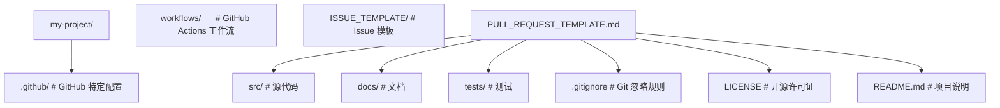

## 1. GitHub 概述 (Overview)

**GitHub** 是全球最大的代码托管与协作开发平台，成立于 2008 年，2018 年被 Microsoft 收购。它基于 **Git** 分布式版本控制系统，为开发者提供代码托管、协作、CI/CD、项目管理等一站式服务。截至 2025 年，GitHub 拥有超过 1 亿开发者和 4 亿+ 仓库。

### 1.1 核心功能

| 功能             | 描述                                    | 优势                           |
| :--------------- | :-------------------------------------- | :----------------------------- |
| **代码托管**     | 基于 Git 的仓库托管，支持公开和私有仓库 | 代码安全存储，版本可追溯       |
| **Pull Request** | 代码审查与合并流程，支持在线讨论和审查  | 保证代码质量，促进团队协作     |
| **Issues**       | 问题跟踪与任务管理，支持标签、里程碑    | 统一管理 Bug 和功能需求        |
| **Actions**      | 内置 CI/CD 自动化工作流                 | 自动构建、测试、部署           |
| **Pages**        | 静态网站托管服务                        | 免费部署项目文档和个人网站     |
| **Codespaces**   | 基于云的开发环境                        | 随时随地编写代码，无需本地配置 |
| **Copilot**      | AI 辅助编程工具                         | 智能代码补全，提高开发效率     |
| **Projects**     | 看板式项目管理工具                      | 可视化任务进度，灵活组织工作   |

### 1.2 GitHub 发展历程

| 时间 | 事件                                |
| :--- | :---------------------------------- |
| 2008 | GitHub 成立，提供 Git 仓库托管服务  |
| 2011 | 用户数突破 100 万                   |
| 2012 | 获得 A 轮融资 1 亿美元              |
| 2016 | 推出 GitHub Pages 和 GitHub Desktop |
| 2018 | Microsoft 以 75 亿美元收购 GitHub   |
| 2019 | 推出 GitHub Actions（CI/CD）        |
| 2020 | 代码仓库数量突破 2 亿               |
| 2021 | 推出 GitHub Copilot 技术预览        |
| 2022 | GitHub Copilot 正式发布             |
| 2023 | 推出 GitHub Copilot Chat            |
| 2025 | 用户数突破 1 亿                     |

### 1.3 GitHub 与 Git 的区别

| 方面             | Git                | GitHub                    |
| :--------------- | :----------------- | :------------------------ |
| **类型**         | 分布式版本控制系统 | 代码托管与协作平台        |
| **运行方式**     | 本地命令行工具     | 基于 Web 的云服务         |
| **核心功能**     | 版本控制、分支管理 | 代码托管、协作、CI/CD     |
| **是否需要网络** | 否（本地操作）     | 是（远程同步）            |
| **费用**         | 免费开源           | 免费基础版 + 付费高级功能 |

## 2. 账户与计划 (Plans & Pricing)

### 2.1 账户类型

- **个人账户 (Personal Account)**: 适合个人开发者，免费使用
- **组织账户 (Organization)**: 适合团队和企业，支持权限管理

### 2.2 订阅计划

| 计划           | 价格        | 主要特性                               |
| :------------- | :---------- | :------------------------------------- |
| **Free**       | 免费        | 无限公开/私有仓库，2,000 CI/CD 分钟/月 |
| **Pro**        | $4/月       | 高级代码审查，3,000 CI/CD 分钟/月      |
| **Team**       | $4/用户/月  | 组织权限管理，3,000 CI/CD 分钟/月      |
| **Enterprise** | $21/用户/月 | SAML SSO，50,000 CI/CD 分钟/月         |

### 2.3 免费计划限制

- 私有仓库协作者上限：无限制
- GitHub Actions 分钟数：2,000 分钟/月
- GitHub Packages 存储：500 MB
- GitHub Codespaces：120 核心小时/月

## 3. 仓库基础 (Repository Basics)

### 3.1 仓库类型

- **公开仓库 (Public)**: 所有人可见，适合开源项目
- **私有仓库 (Private)**: 仅授权用户可见，适合商业项目
- **内部仓库 (Internal)**: 组织内部可见（Enterprise 计划）

### 3.2 仓库结构



### 3.3 重要文件

| 文件                 | 作用                       |
| :------------------- | :------------------------- |
| `README.md`          | 项目说明文档，仓库首页显示 |
| `.gitignore`         | 指定 Git 忽略的文件和目录  |
| `LICENSE`            | 开源许可证                 |
| `CONTRIBUTING.md`    | 贡献指南                   |
| `CODE_OF_CONDUCT.md` | 行为准则                   |
| `SECURITY.md`        | 安全策略                   |

## 4. 协作开发流程 (Collaboration Workflow)

### 4.1 基本协作流程

1. **Fork** 仓库到个人账户
2. **Clone** 到本地开发环境
3. **创建分支** 进行功能开发
4. **提交代码** 并推送到远程
5. **创建 Pull Request** 请求合并
6. **代码审查** 团队成员审查代码
7. **合并代码** 审查通过后合并到主分支

### 4.2 分支策略

| 策略            | 描述                                        | 适用场景     |
| :-------------- | :------------------------------------------ | :----------- |
| **GitHub Flow** | 基于主分支创建功能分支，PR 合并             | 持续部署项目 |
| **Git Flow**    | 包含 develop、feature、release、hotfix 分支 | 版本发布项目 |
| **Trunk-Based** | 所有人在主分支上开发，使用特性开关          | 高频发布项目 |

### 4.3 代码审查最佳实践

- PR 保持小规模，便于审查
- 编写清晰的 PR 描述
- 使用代码注释标记审查意见
- 及时回复审查意见
- 合并前确保 CI 通过

## 5. 常用快捷操作 (Tips & Tricks)

### 5.1 键盘快捷键

| 快捷键 | 功能                    |
| :----- | :---------------------- |
| `.`    | 在 Web 编辑器中打开仓库 |
| `T`    | 文件搜索                |
| `W`    | 分支切换                |
| `L`    | 跳转到指定行            |
| `B`    | 查看 Blame 信息         |
| `?`    | 显示所有快捷键          |

### 5.2 Markdown 技巧

- 使用 `[ ]` 和 `[x]` 创建任务列表
- 使用 `@mention` 提及用户或团队
- 使用 `#issue` 引用 Issue
- 使用 `commit_sha` 引用提交

### 5.3 搜索语法

```
language:python stars:>1000   # Python 项目，星标超过 1000
topic:react fork:true         # React 主题，包含 Fork
owner:facebook path:src       # Facebook 仓库，src 目录下
```

## 6. 生态与集成 (Ecosystem)

### 6.1 GitHub 生态工具

| 工具                  | 用途              |
| :-------------------- | :---------------- |
| **GitHub CLI (gh)**   | 命令行操作 GitHub |
| **GitHub Desktop**    | 图形化 Git 客户端 |
| **GitHub Mobile**     | 移动端管理仓库    |
| **GitHub Codespaces** | 云端开发环境      |
| **GitHub Copilot**    | AI 编程助手       |
| **GitHub Packages**   | 包注册与托管      |
| **GitHub Registry**   | 容器镜像托管      |

### 6.2 第三方集成

- **CI/CD**: Jenkins, CircleCI, Travis CI
- **监控**: Datadog, New Relic, Sentry
- **通信**: Slack, Microsoft Teams, Discord
- **项目管理**: Jira, Linear, Asana

## 7. 学习路径 (Learning Path)

### 7.1 入门阶段

1. 注册 GitHub 账户并配置 2FA
2. 创建第一个仓库
3. 学习 Git 基本操作
4. 编写 README 和文档

### 7.2 进阶阶段

1. 掌握 Pull Request 工作流
2. 使用 GitHub Actions 自动化
3. 配置分支保护规则
4. 参与 Issue 讨论

### 7.3 高级阶段

1. 搭建 CI/CD 流水线
2. 使用 GitHub Pages 部署站点
3. 开发 GitHub Actions 插件
4. 管理大型开源项目

## 8. 总结

GitHub 是现代软件开发的基础设施，掌握其核心功能对开发者至关重要。从基础的代码托管到高级的 CI/CD 自动化，GitHub 提供了完整的开发协作工具链。

### 8.1 关键要点

- **版本控制**: Git 是基础，GitHub 是平台
- **协作开发**: Pull Request 是核心协作流程
- **自动化**: GitHub Actions 实现 CI/CD
- **安全**: 2FA 和分支保护保障代码安全
- **开源**: GitHub 是全球最大的开源社区

---

## 仓库信息

**基本用法:查看仓库设置**
`gh repo view <仓库>`

```bash
# 查看仓库详情
gh repo view owner/repo

# 以 JSON 输出
gh repo view owner/repo --json name,visibility,defaultBranchRef
```

---

**基本用法:修改仓库设置**
`gh repo edit <仓库>`

```bash
# 修改描述
gh repo edit owner/repo --description "项目描述"

# 修改主页地址
gh repo edit owner/repo --homepage "https://example.com"

# 切换可见性
gh repo edit owner/repo --visibility public
gh repo edit owner/repo --visibility internal

# 启用 issues 与 wiki
gh repo edit owner/repo --enable-issues --enable-wiki

# 关闭项目功能
gh repo edit owner/repo --enable-projects=false
```

---

## 仓库生命周期

**基本用法:归档仓库**
`gh repo archive <仓库>`

```bash
# 把仓库设为只读归档
gh repo archive owner/repo --yes
```

---

**基本用法:取消归档**
`gh repo unarchive <仓库>`

```bash
# 恢复归档仓库为可写
gh repo unarchive owner/repo --yes
```

---

**基本用法:删除仓库**
`gh repo delete <仓库>`

```bash
# 删除仓库(危险操作)
gh repo delete owner/repo --yes
```

---

## 仓库元数据

**基本用法:管理 topics**
`gh repo edit <仓库> --add-topic`

```bash
# 添加 topic 标签
gh repo edit owner/repo --add-topic vue --add-topic frontend

# 移除 topic
gh repo edit owner/repo --remove-topic legacy

# 清空 topics
gh repo edit owner/repo --clear-topics
```

---

## 部署密钥

**基本用法:添加部署密钥**
`gh repo deploy-key add <文件>`

```bash
# 添加只读部署密钥
gh repo deploy-key add ~/.ssh/deploy.pub -t "CI deploy key"

# 添加可写部署密钥
gh repo deploy-key add ~/.ssh/deploy.pub -t "write key" --allow-write

# 列出部署密钥
gh repo deploy-key list

# 删除密钥
gh repo deploy-key delete <key-id>
```

---

## 通过 API 操作

**基本用法:调用 API 修改设置**
`gh api repos/<owner>/<repo> -X PATCH`

```bash
# 修改默认分支
gh api repos/owner/repo -X PATCH -f default_branch=main

# 启用自动删除分支
gh api repos/owner/repo -X PATCH -F delete_branch_on_merge=true
```

---

## 参考文献

GitHub 文档：https://docs.github.com/zh
GitHub Actions 文档：https://docs.github.com/zh/actions
GitHub REST API：https://docs.github.com/zh/rest
GitHub GraphQL API：https://docs.github.com/zh/graphql

## 延伸阅读

GitHub Actions CI/CD，见 004-github 模块 Actions 文档。
Git 协作基础，见 003-git 模块。
DevOps 自动化，见 031-devops 模块。
黑马程序员 Bilibili 空间（https://space.bilibili.com/37974444 ）提供 GitHub 课程。

## 深度专题扩展

以下专题从不同角度深入本文主题，供有进阶需求的读者研读。每个专题独立成节，内容相互补充。

### 13.1 GitHub Actions 深入

事件驱动：push、pull_request、schedule、workflow_dispatch；on 支持过滤路径与分支。
上下文：github（事件数据）、env、secrets、needs（任务依赖）；表达式与函数。
安全：第三方 action 固定 SHA；权限默认最小；OIDC 换取云凭证。
缓存与性能：actions/cache、并发控制、矩阵并行。

### 13.2 开源协作治理

CONTRIBUTING 定义贡献路径；Issue 标签（good first issue）引导新手。
维护者时间管理：合并队列、自动化 triage、定期发布。
社区健康：行为准则执行、讨论区沉淀、感谢贡献。
安全披露：SECURITY.md + 私密漏洞报告流程。

## 模块文档速查表

| 文档 | 主题 | 与本文的关联 |
| --- | --- | --- |
| GitHub 概述 | 001-GitHubOverview | 本文自身 |
| 账户注册与双因素认证（2FA） | 002-AccountRegister2FA2FA | 本文的并列主题 |
| 仓库创建、克隆、归档、删除 | 003-RepositoryCreateCloneArchiveDelete | 本文的并列主题 |
| SSH 与 HTTPS 远程配置 | 004-SSHHTTPS | 本文的并列主题 |
| 协作开发规范 | 005-CollaborationDevelopmentStandard | 本文的并列主题 |
| README文件 | 006-READMEFile | 本文的并列主题 |
| 分支模型与分支保护规则 | 007-BranchModelBranchRule | 本文的并列主题 |
| Gitignore配置 | 008-GitignoreConfig | 本文的并列主题 |
| 开源许可证选择 | 009-OpenSourceLicense | 本文的并列主题 |
| 依赖安全选项 | 010-DependencySecurityOptions | 本文的安全延伸 |
| Fork工作流 | 011-ForkWorkflow | 本文的并列主题 |
| Projects看板 | 012-ProjectsBoard | 本文的并列主题 |
| Wikis | 013-Wikis | 本文的并列主题 |
| Discussions | 014-Discussions | 本文的并列主题 |
| GitHub-Copilot | 015-GitHubCopilot | 本文的并列主题 |
| Dependabot | 016-Dependabot | 本文的并列主题 |
| Issues 模板、标签与里程碑 | 017-IssuesTemplateTagMilestone | 本文的并列主题 |
| 密钥扫描 | 018-SecretScanning | 本文的并列主题 |
| CodeQL代码扫描 | 019-CodeQLCodeScanning | 本文的并列主题 |
| GitHub-CLI | 020-GitHubCLI | 本文的并列主题 |
| REST与GraphQL-API | 021-RESTGraphQLAPI | 本文的并列主题 |
| Webhooks | 022-Webhooks | 本文的并列主题 |
| GitHub-Packages | 023-GitHubPackages | 本文的并列主题 |
| Codespaces | 024-Codespaces | 本文的并列主题 |
| CODEOWNERS | 025-CODEOWNERS | 本文的并列主题 |
| 社区健康文件 | 026-CommunityHealthFile | 本文的并列主题 |
| Pull Request 完整协作流程 | 027-PullRequestCompleteCollaborationFlow | 本文的并列主题 |
| GitHub Pages 多站点方案 | 028-GitHubPagesMultiSolution | 本文的并列主题 |
| GitHub Actions 与 CI/CD | 029-GitHubActionsCICD | 本文的并列主题 |
| Actions触发器 | 030-ActionsTrigger | 本文的并列主题 |
| 常见问题排查 | 031-FAQTroubleshoot | 本文的并列主题 |
| Actions矩阵构建 | 032-ActionsMatrixBuild | 本文的并列主题 |
| Actions缓存依赖 | 033-ActionsCacheDependency | 本文的并列主题 |
| Actions自托管运行器 | 034-ActionsSelfHostedRunner | 本文的并列主题 |
| Actions制品传递 | 035-ActionsArtifact | 本文的并列主题 |
| Actions环境部署 | 036-ActionsEnvironmentDeploy | 本文的前置基础 |
| GitHub 仓库初始化 | 037-GitRepoInit | 本文的并列主题 |
| GitHub 提交与推送 | 038-GitCommitPush | 本文的并列主题 |
| GitHub 拉取与获取 | 039-GitPullFetch | 本文的并列主题 |
| GitHub 合并与变基 | 040-GitMergeRebase | 本文的并列主题 |
| GitHub 冲突解决 | 041-GitConflictResolve | 本文的并列主题 |
| GitHub 标签管理 | 042-GitTagManage | 本文的并列主题 |
| GitHub 远程仓库管理 | 043-GitRemoteManage | 本文的并列主题 |
| GitHub 历史与日志 | 044-GitHistoryLog | 本文的并列主题 |
| GitHub 暂存与回退 | 045-GitStashReset | 本文的并列主题 |
| GitHub CLI 认证配置 | 046-GhCliAuth | 本文的并列主题 |
| GitHub CLI PR 管理 | 047-GhPrManage | 本文的并列主题 |
| GitHub CLI Issue 管理 | 048-GhIssueManage | 本文的并列主题 |
| GitHub CLI 仓库管理 | 049-GhRepoManage | 本文的并列主题 |
| gh release 发布命令速查手册 | 050-GhRelease | 本文的并列主题 |
| gh workflow 工作流命令速查手册 | 051-GhWorkflow | 本文的并列主题 |
| gh gist 代码片段命令速查手册 | 052-GhGist | 本文的并列主题 |
| gh extension 扩展命令速查手册 | 053-GhExtension | 本文的并列主题 |
| gh api 调用命令速查手册 | 054-GhApi | 本文的并列主题 |
| gh search 搜索命令速查手册 | 055-GhSearch | 本文的并列主题 |
| gh label 与 alias/config 命令速查手册 | 056-GhLabel | 本文的并列主题 |
| gh alias 与 config 命令速查手册 | 057-GhAliasConfig | 本文的并列主题 |
