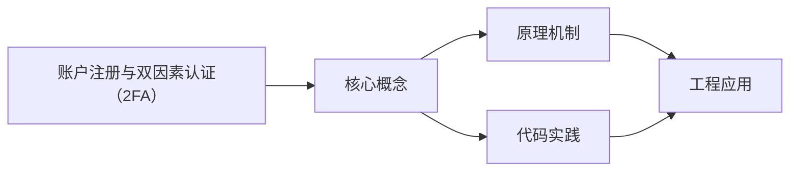
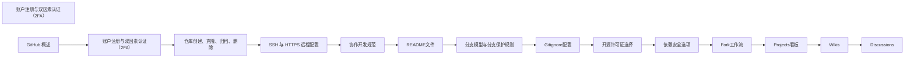

## 1. 学习目标（Bloom 分类）

本节按照布鲁姆教育目标分类学组织学习路径。本文主题为《账户注册与双因素认证（2FA）》，属于 GitHub 模块，读者可以根据自身阶段选择阅读深度。

记忆层面：能够准确复述本文的核心概念、术语与基本语法或操作步骤，并能够在提问或检索时快速定位对应知识点。能够说出 GitHub 的核心概念、常用命令与流程。

理解层面：能够用自己的语言解释核心原理与工作机制，说明概念之间的因果关系，而不是机械记忆结论。能够解释 GitHub 的工作原理与设计动机。

应用层面：能够在真实项目或练习场景中运用本文知识解决具体问题，写出正确且可维护的实现。能够独立完成 GitHub 的标准操作。

分析层面：能够拆解复杂问题，比较本文主题与相邻概念的异同，识别边界条件与例外情况。能够分析 GitHub 使用中的异常与边界。

评价层面：能够根据约束条件（性能、可读性、安全、成本）评价不同方案的优劣，做出有依据的技术决策。能够评价 GitHub 相关工具与方案。

创造层面：能够把本文知识与其他模块知识组合，设计出新的解决方案或可复用的工程模式。能够把 GitHub 融入团队工作流。

通过本节学习，读者应当能够把《账户注册与双因素认证（2FA）》纳入自己的知识网络，并与 GitHub 模块的其他主题（仓库、Issue、PR、Actions、生态）建立关联。

## 2. 历史动机与发展脉络

《账户注册与双因素认证（2FA）》是 GitHub 领域的重要主题。要真正理解它，需要先了解它解决的问题与演进过程。

GitHub 2008 年上线，2018 年被微软收购，是全球最大的代码托管与协作平台；核心是 Git 之上的社交化协作层。
协作对象：Repository（仓库）、Issue（问题）、Pull Request（变更请求）、Discussion（讨论）、Actions（自动化）、Projects（看板）。
生态：GitHub Pages、Codespaces、Copilot、CodeQL、Packages；开放平台（REST/GraphQL API）支撑生态集成。

回到本文主题：账户注册与双因素认证（2FA） 的提出与成熟，正是上述技术背景下的必然产物。早期实现往往以简单可用为目标，随着工程规模扩大，社区逐渐沉淀出标准做法与最佳实践；理解这一脉络，可以帮助读者判断“为什么文档中的推荐写法是现在这个样子”，也能在遇到历史遗留代码时准确识别其设计年代与取舍。


## 3. 形式化定义与核心概念精讲

本节把《账户注册与双因素认证（2FA）》涉及的核心概念以“定义 + 讲解”的形式展开。读者应把定义当作工具，把讲解当作理解路径；两者结合才能形成可迁移的知识。

PR 流程：fork/branch -> 提交 -> PR -> 审查 -> 合并；审查通过保护规则（required reviews）。
Actions：workflow（YAML）由事件触发，job 在 runner 上执行 step；支持矩阵、缓存与密钥。
Issue 管理：标签、里程碑、模板；与 PR 通过关键词（fixes #123）自动关联。

### 3.1 原文章节逐一精讲

原文档把主题拆分为 9 个小节，下面按顺序给出每一节的导读讲解，随后保留原文细节供精读。

#### 原文精读（完整保留）


#### 1. 背景

**GitHub** 作为全球最大的代码托管平台，不仅存储代码，还管理着项目协作、Issue 跟踪、CI/CD 配置等关键信息。账户安全至关重要，一旦泄露可能导致：

- 代码仓库被恶意修改或删除
- 私有代码和敏感信息外泄
- 项目配置被篡改
- 个人账户被用于恶意活动
  除了设置强密码外，**2FA（双因素认证，Two-Factor Authentication）** 是 GitHub 官方强烈推荐的安全措施，它在「密码」这一知识因子之外，增加了「你持有设备」的物理因子，大大提高了账户安全性。

#### 2. 原理简述

2FA 的核心是多因素认证，登录时需要验证：

1. **你知道的**：账户密码
2. **你持有的**：第二验证因子，包括：

- **TOTP（基于时间的一次性密码）**：由手机验证器 App 生成的 6 位动态码，每 30 秒更新一次
- **WebAuthn（网页认证）**：兼容的硬件密钥，如 YubiKey
- **SMS（短信）**：通过短信接收验证码（不推荐，易受 SIM 卡交换攻击）
- **Passkey（通行密钥）**：基于 WebAuthn 的无密码认证方案，安全性更高
  **安全等级排序**：硬件密钥 > TOTP > Passkey > SMS

#### 3. 操作步骤（含截图占位）

##### 3.1 注册与邮箱验证

1. **访问注册页面**：打开 [GitHub 注册页](https://github.com/join)，填写用户名、邮箱和密码
2. **选择合适的邮箱**：推荐使用个人常用邮箱或工作邮箱（需符合公司政策）
3. **设置强密码**：包含大小写字母、数字和特殊字符，长度至少 16 位
4. **完成邮箱验证**：GitHub 会发送验证邮件，点击邮件中的链接完成验证
5. **完善个人资料**：设置头像、简介等信息，便于团队识别
   **截图占位**：`[图 01-1] 注册成功后的 Profile 概览页`

##### 3.2 开启 2FA

###### 3.2.1 使用 TOTP 验证器

1. **进入 2FA 设置页面**：点击头像 → Settings → Password and authentication → Two-factor authentication
2. **开始设置**：点击 "Enable two-factor authentication" 按钮
3. **选择验证方式**：选择 "Authentication app"
4. **扫描二维码**：使用 Google Authenticator、Microsoft Authenticator 或 Authy 等 App 扫描屏幕上的二维码
5. **输入验证码**：在 App 中找到 GitHub 条目，输入生成的 6 位验证码
6. **保存恢复码**：系统会生成一组恢复码，用于在无法使用验证器时恢复账户访问，请务必：

- 下载恢复码文件
- 打印纸质备份
- 存储在安全的密码管理器中

7. **完成设置**：点击 "Enable" 按钮完成 2FA 开启
   **截图占位**：`[图 01-2] 2FA 已启用状态与恢复码下载提示`

###### 3.2.2 使用硬件密钥（推荐）

1. **进入 2FA 设置页面**：同上
2. **选择安全密钥**：在验证方式中选择 "Security key"
3. **插入硬件密钥**：将 YubiKey 等硬件密钥插入电脑 USB 接口
4. **按照提示操作**：触摸或按下硬件密钥上的按钮
5. **完成设置**：系统会确认硬件密钥已成功添加

##### 3.3 命令行登录配置

启用 2FA 后，通过 **HTTPS** 协议访问 GitHub 仓库时，不能再使用账户密码，需要使用 **PAT（Personal Access Token，个人访问令牌）** 代替。

###### 3.3.1 生成 PAT

1. **进入 PAT 设置页面**：Settings → Developer settings → Personal access tokens → Tokens (classic)
2. **生成新令牌**：点击 "Generate new token" → "Generate new token (classic)"
3. **设置令牌信息**：

- 填写 Note（令牌名称）
- 设置 Expiration（过期时间，建议 30-90 天）
- 选择所需的 scopes（权限范围，遵循最小权限原则）

4. **生成令牌**：点击 "Generate token" 按钮
5. **保存令牌**：复制生成的令牌，因为离开页面后将无法再次查看

###### 3.3.2 配置 Git 凭据管理

```bash
 # Windows 系统：使用 Git Credential Manager
 git config --global credential.helper manager
 # macOS 系统：使用 osxkeychain
 git config --global credential.helper osxkeychain
 # Linux 系统：使用 libsecret
 git config --global credential.helper libsecret
 # 验证配置
 git config --global --get credential.helper
```

首次使用 HTTPS 克隆或推送时，系统会提示输入用户名和密码，此时：

- 用户名：输入 GitHub 用户名
- 密码：输入生成的 PAT

#### 4. 可运行配置示例

##### 示例 A：检查和配置全局 Git 身份

```bash
 # 检查当前全局配置
 git config --global --list
 # 设置全局用户名和邮箱
 git config --global user.name "Your Name" # 建议与 GitHub 展示名一致
 git config --global user.email "you@example.com" # 必须是 GitHub 已验证邮箱
 # 验证设置是否生效
 git config --global user.name
 git config --global user.email
```

##### 示例 B：为特定仓库设置不同身份

```bash
 # 进入仓库目录
 cd /path/to/repo
 # 设置仓库特定的用户名和邮箱
 git config user.name "Work Name"
 git config user.email "work@company.com"
 # 验证仓库特定设置
 git config user.name
 git config user.email
```

##### 示例 C：`.gitconfig` 完整配置示例

```ini
 # 全局 Git 配置
 [user]
  name = Your Name
  email = you@example.com
 [credential]
  helper = manager # Windows 系统
  # helper = osxkeychain # macOS 系统
  # helper = libsecret # Linux 系统
 [core]
  editor = code --wait # 使用 VS Code 作为提交信息编辑器
  autocrlf =  # Windows 系统
  # autocrlf = input # macOS/Linux 系统
 [pull]
  rebase =  # 使用 rebase 方式拉取代码
 [alias]
  st = status
  ci = commit
  br = branch
  co = checkout
  lg = log --oneline --graph --decorate
```

#### 5. 常见坑点与解决方案

| 坑点                   | 原因                           | 解决方案                                              |
| ---------------------- | ------------------------------ | ----------------------------------------------------- |
| 恢复码丢失且手机不可用 | 未妥善保存恢复码               | 定期备份恢复码到多个安全位置，如密码管理器、纸质备份  |
| 公司 SSO 登录问题      | 组织强制使用 SAML 单点登录     | 遵循公司 IT 政策，使用公司提供的登录方式              |
| 多账户管理混乱         | 多个 GitHub 账号需要分别访问   | 使用 SSH config 配置多 Host，或使用不同浏览器配置文件 |
| PAT 权限不足           | 生成 PAT 时未选择正确的 scopes | 重新生成 PAT，选择所需的最小权限范围                  |
| 贡献统计不显示         | 提交邮箱未在 GitHub 验证       | 在 GitHub 账户中添加并验证提交所用邮箱                |

#### 6. 最佳实践

##### 6.1 账户安全

- **使用 TOTP + 硬件密钥** 双重保护：TOTP 作为主要验证方式，硬件密钥作为备用
- **定期轮换 PAT**：设置合理的过期时间，到期后生成新令牌
- **最小权限原则**：生成 PAT 时只选择必要的 scopes
- **启用登录通知**：在 Settings → Notifications 中开启登录活动通知
- **设置安全告警**：在 Settings → Security 中配置可疑活动告警
- **使用密码管理器**：存储 PAT 和恢复码，避免明文存储

##### 6.2 工作流程

- **统一提交身份**：确保所有仓库使用相同的验证邮箱，保持贡献统计一致
- **定期检查配置**：每月检查一次 Git 配置和 2FA 状态
- **团队协作**：建立团队级别的安全规范，确保所有成员都启用 2FA
- **应急方案**：制定账户恢复预案，确保团队在成员无法访问账户时仍能继续工作

#### 7. 故障诊断工具与脚本

##### 7.1 检查 Git 配置

```bash
 # 检查全局配置
 git config --global --list
 # 检查当前仓库配置
 git config --local --list
 # 检查系统配置
 git config --system --list
 # 筛选用户相关配置
 git config --list | grep user
```

##### 7.2 验证邮箱状态

```bash
 # 检查本地提交使用的邮箱
 git log --pretty=format:"%ae" | head -n 5
 # 检查远程仓库信息
 git remote -v
 # 测试 HTTPS 连接（会提示输入 PAT）
 git ls-remote https://github.com/username/repository.git
```

##### 7.3 排查 2FA 问题

1. **检查 2FA 状态**：登录 GitHub 后在 Settings → Password and authentication 中查看
2. **测试验证器**：使用验证器 App 生成验证码，尝试登录
3. **使用恢复码**：如果验证器不可用，尝试使用恢复码登录
4. **联系支持**：如果所有方法都失败，联系 GitHub 支持团队

#### 8. 高级配置：多账户管理

##### 8.1 使用 SSH 配置多账户

```bash
 # ~/.ssh/config 文件
 Host github.com-personal
  HostName github.com
  User git
  IdentityFile ~/.ssh/id_rsa_personal
 Host github.com-work
  HostName github.com
  User git
  IdentityFile ~/.ssh/id_rsa_work
```

##### 8.2 对应仓库配置

```bash
 # 个人仓库
 git remote set-url origin git@github.com-personal:username/personal-repo.git
 # 工作仓库
 git remote set-url origin git@github.com-work:company/work-repo.git
```

#### 延伸阅读

- [GitHub：配置 2FA](https://docs.github.com/en/authentication/securing-your-account-with-two-factor-authentication-2fa) <!-- nofollow -->
- [GitHub：创建个人访问令牌](https://docs.github.com/en/authentication/keeping-your-account-and-data-secure/creating-a-personal-access-token) <!-- nofollow -->
- [GitHub：使用硬件安全密钥](https://docs.github.com/en/authentication/securing-your-account-with-two-factor-authentication-2fa/configuring-two-factor-authentication#configuring-two-factor-authentication-using-a-security-key) <!-- nofollow -->
- [GitHub：管理多账户](https://docs.github.com/en/get-started/getting-started-with-git/managing-remote-repositories) <!-- nofollow -->

##### 跨模块关联

- [Git 安装](git/setup-and-init)


### 3.2 概念关系图

下面用 Mermaid 图表达本文核心概念之间的关系，帮助读者建立整体图景：



图中展示的是本文知识的结构化关系：核心概念是入口，原理机制解释“为什么”，代码实践演示“怎么做”，工程应用回答“何时用”。读者学习时可以把每个小节的内容挂接到对应节点上。

## 4. 理论推导与原理解析

本节深入《账户注册与双因素认证（2FA）》背后的原理。理论部分不求面面俱到，而是聚焦“能解释现象、能指导实践”的关键推导。

PR 流程：fork/branch -> 提交 -> PR -> 审查 -> 合并；审查通过保护规则（required reviews）。
Actions：workflow（YAML）由事件触发，job 在 runner 上执行 step；支持矩阵、缓存与密钥。
Issue 管理：标签、里程碑、模板；与 PR 通过关键词（fixes #123）自动关联。
权限与安全：仓库角色（read/triage/write/maintain/admin）、分支保护、CODEOWNERS、安全通告。

需要强调的是，理论推导与工程实践之间存在翻译层：理论给出的是理想化模型与边界条件，工程代码则必须处理真实环境中的例外。读者在学习时应先掌握理论的“标准情形”，再通过陷阱章节了解“非标准情形”。

## 5. 代码示例与逐行讲解

本节把原文中的代码示例系统整理，并为每个示例补充用途说明与讲解。读者不应只浏览代码，而应逐段对照讲解理解设计意图。

### 5.1 示例：3.3.2 配置 Git 凭据管理

该示例来自原文《3.3.2 配置 Git 凭据管理》小节，用于演示账户注册与双因素认证（2FA）相关操作。阅读时请先看代码结构，再看其后的讲解。

```bash
 # Windows 系统：使用 Git Credential Manager
 git config --global credential.helper manager
 # macOS 系统：使用 osxkeychain
 git config --global credential.helper osxkeychain
 # Linux 系统：使用 libsecret
 git config --global credential.helper libsecret
 # 验证配置
 git config --global --get credential.helper
```

讲解：这段代码演示了本节核心知识点。代码中的关键操作可以归纳为三步：准备（定义或初始化）、执行（核心逻辑）、收尾（释放资源或返回结果）。实际项目中，这三步往往被封装为函数或类，以提升复用性与可测试性。

关键点分析：

该示例共 8 行有效代码，结构以数据或配置为主。阅读时应关注：数据字段的含义、配置项的作用，以及它们与运行行为的对应关系。

进阶思考路径：先尝试修改参数观察行为变化，再把示例中的模式迁移到自己的项目中；每次修改都记录预期与实测差异，这是把示例转化为能力的最快方式。

### 5.2 示例：示例 A：检查和配置全局 Git 身份

该示例来自原文《示例 A：检查和配置全局 Git 身份》小节，用于演示账户注册与双因素认证（2FA）相关操作。阅读时请先看代码结构，再看其后的讲解。

```bash
 # 检查当前全局配置
 git config --global --list
 # 设置全局用户名和邮箱
 git config --global user.name "Your Name" # 建议与 GitHub 展示名一致
 git config --global user.email "you@example.com" # 必须是 GitHub 已验证邮箱
 # 验证设置是否生效
 git config --global user.name
 git config --global user.email
```

讲解：这段代码演示了本节核心知识点。代码中的关键操作可以归纳为三步：准备（定义或初始化）、执行（核心逻辑）、收尾（释放资源或返回结果）。实际项目中，这三步往往被封装为函数或类，以提升复用性与可测试性。

关键点分析：

该示例共 8 行有效代码，结构以数据或配置为主。阅读时应关注：数据字段的含义、配置项的作用，以及它们与运行行为的对应关系。

进阶思考路径：先尝试修改参数观察行为变化，再把示例中的模式迁移到自己的项目中；每次修改都记录预期与实测差异，这是把示例转化为能力的最快方式。

### 5.3 示例：示例 B：为特定仓库设置不同身份

该示例来自原文《示例 B：为特定仓库设置不同身份》小节，用于演示账户注册与双因素认证（2FA）相关操作。阅读时请先看代码结构，再看其后的讲解。

```bash
 # 进入仓库目录
 cd /path/to/repo
 # 设置仓库特定的用户名和邮箱
 git config user.name "Work Name"
 git config user.email "work@company.com"
 # 验证仓库特定设置
 git config user.name
 git config user.email
```

讲解：这段代码演示了本节核心知识点。代码中的关键操作可以归纳为三步：准备（定义或初始化）、执行（核心逻辑）、收尾（释放资源或返回结果）。实际项目中，这三步往往被封装为函数或类，以提升复用性与可测试性。

关键点分析：

该示例共 8 行有效代码，结构以数据或配置为主。阅读时应关注：数据字段的含义、配置项的作用，以及它们与运行行为的对应关系。

进阶思考路径：先尝试修改参数观察行为变化，再把示例中的模式迁移到自己的项目中；每次修改都记录预期与实测差异，这是把示例转化为能力的最快方式。

### 5.4 示例：示例 C：`.gitconfig` 完整配置示例

该示例来自原文《示例 C：`.gitconfig` 完整配置示例》小节，用于演示账户注册与双因素认证（2FA）相关操作。阅读时请先看代码结构，再看其后的讲解。

```ini
 # 全局 Git 配置
 [user]
  name = Your Name
  email = you@example.com
 [credential]
  helper = manager # Windows 系统
  # helper = osxkeychain # macOS 系统
  # helper = libsecret # Linux 系统
 [core]
  editor = code --wait # 使用 VS Code 作为提交信息编辑器
  autocrlf =  # Windows 系统
  # autocrlf = input # macOS/Linux 系统
 [pull]
  rebase =  # 使用 rebase 方式拉取代码
 [alias]
  st = status
  ci = commit
  br = branch
  co = checkout
  lg = log --oneline --graph --decorate
```

讲解：这段代码演示了本节核心知识点。代码中的关键操作可以归纳为三步：准备（定义或初始化）、执行（核心逻辑）、收尾（释放资源或返回结果）。实际项目中，这三步往往被封装为函数或类，以提升复用性与可测试性。

关键点分析：

该示例共 20 行有效代码，结构以数据或配置为主。阅读时应关注：数据字段的含义、配置项的作用，以及它们与运行行为的对应关系。

进阶思考路径：先尝试修改参数观察行为变化，再把示例中的模式迁移到自己的项目中；每次修改都记录预期与实测差异，这是把示例转化为能力的最快方式。

### 5.5 示例：7.1 检查 Git 配置

该示例来自原文《7.1 检查 Git 配置》小节，用于演示账户注册与双因素认证（2FA）相关操作。阅读时请先看代码结构，再看其后的讲解。

```bash
 # 检查全局配置
 git config --global --list
 # 检查当前仓库配置
 git config --local --list
 # 检查系统配置
 git config --system --list
 # 筛选用户相关配置
 git config --list | grep user
```

讲解：这段代码演示了本节核心知识点。代码中的关键操作可以归纳为三步：准备（定义或初始化）、执行（核心逻辑）、收尾（释放资源或返回结果）。实际项目中，这三步往往被封装为函数或类，以提升复用性与可测试性。

关键点分析：

该示例共 8 行有效代码，结构以数据或配置为主。阅读时应关注：数据字段的含义、配置项的作用，以及它们与运行行为的对应关系。

进阶思考路径：先尝试修改参数观察行为变化，再把示例中的模式迁移到自己的项目中；每次修改都记录预期与实测差异，这是把示例转化为能力的最快方式。

### 5.6 示例：7.2 验证邮箱状态

该示例来自原文《7.2 验证邮箱状态》小节，用于演示账户注册与双因素认证（2FA）相关操作。阅读时请先看代码结构，再看其后的讲解。

```bash
 # 检查本地提交使用的邮箱
 git log --pretty=format:"%ae" | head -n 5
 # 检查远程仓库信息
 git remote -v
 # 测试 HTTPS 连接（会提示输入 PAT）
 git ls-remote https://github.com/username/repository.git
```

讲解：这段代码演示了本节核心知识点。代码中的关键操作可以归纳为三步：准备（定义或初始化）、执行（核心逻辑）、收尾（释放资源或返回结果）。实际项目中，这三步往往被封装为函数或类，以提升复用性与可测试性。

关键点分析：

该示例共 6 行有效代码，结构以数据或配置为主。阅读时应关注：数据字段的含义、配置项的作用，以及它们与运行行为的对应关系。

进阶思考路径：先尝试修改参数观察行为变化，再把示例中的模式迁移到自己的项目中；每次修改都记录预期与实测差异，这是把示例转化为能力的最快方式。

### 5.7 示例：8.1 使用 SSH 配置多账户

该示例来自原文《8.1 使用 SSH 配置多账户》小节，用于演示账户注册与双因素认证（2FA）相关操作。阅读时请先看代码结构，再看其后的讲解。

```bash
 # ~/.ssh/config 文件
 Host github.com-personal
  HostName github.com
  User git
  IdentityFile ~/.ssh/id_rsa_personal
 Host github.com-work
  HostName github.com
  User git
  IdentityFile ~/.ssh/id_rsa_work
```

讲解：这段代码演示了本节核心知识点。代码中的关键操作可以归纳为三步：准备（定义或初始化）、执行（核心逻辑）、收尾（释放资源或返回结果）。实际项目中，这三步往往被封装为函数或类，以提升复用性与可测试性。

关键点分析：

该示例共 9 行有效代码，结构以数据或配置为主。阅读时应关注：数据字段的含义、配置项的作用，以及它们与运行行为的对应关系。

进阶思考路径：先尝试修改参数观察行为变化，再把示例中的模式迁移到自己的项目中；每次修改都记录预期与实测差异，这是把示例转化为能力的最快方式。

### 5.8 示例：8.2 对应仓库配置

该示例来自原文《8.2 对应仓库配置》小节，用于演示账户注册与双因素认证（2FA）相关操作。阅读时请先看代码结构，再看其后的讲解。

```bash
 # 个人仓库
 git remote set-url origin git@github.com-personal:username/personal-repo.git
 # 工作仓库
 git remote set-url origin git@github.com-work:company/work-repo.git
```

讲解：这段代码演示了本节核心知识点。代码中的关键操作可以归纳为三步：准备（定义或初始化）、执行（核心逻辑）、收尾（释放资源或返回结果）。实际项目中，这三步往往被封装为函数或类，以提升复用性与可测试性。

关键点分析：

该示例共 4 行有效代码，结构以数据或配置为主。阅读时应关注：数据字段的含义、配置项的作用，以及它们与运行行为的对应关系。

进阶思考路径：先尝试修改参数观察行为变化，再把示例中的模式迁移到自己的项目中；每次修改都记录预期与实测差异，这是把示例转化为能力的最快方式。


综合以上示例，可以总结出本主题的代码实践要点：第一，先定义清晰的输入输出契约；第二，核心逻辑保持单一职责；第三，错误处理与边界条件不可省略；第四，命名与注释表达意图而非复述代码。

## 6. 对比分析

对比是理解《账户注册与双因素认证（2FA）》定位的最快路径。下面从多个维度与相邻方案进行对比。

GitHub 与 GitLab：GitHub 社区大、生态全；GitLab 内置 CI/CD 与自托管。
PR 与 Issue：PR 是代码变更请求，Issue 是任务/缺陷；两者关联形成闭环。
公有与私有仓库：开源公开协作，内部代码私有 + 精细权限。

对比的目的不是分出绝对优劣，而是建立选择依据：不同约束条件下，最优解不同。读者应把每个对比维度转化为决策检查清单。

## 7. 常见陷阱与最佳实践

本节整理该主题的高频错误与推荐做法。每个陷阱先描述现象，再解释原因，最后给出最佳实践。

### 7.1 直接推主分支

绕过审查。启用分支保护 + 强制 PR。

深入讲解：该问题之所以被归类为“常见陷阱”，是因为它在初学者的代码中反复出现，而且往往不在第一时间暴露——错误通常隐藏在特定数据或特定时序下。

从成因上看，直接推主分支 一般源于对 GitHub 某个机制的理解偏差：要么误用了默认行为，要么忽略了边界条件，要么把其他语言的思维惯性带了过来。

从影响上看，直接推主分支 轻则产生错误结果，重则导致资源泄漏、数据损坏或安全事故；这也是为什么工程评审中会把它列为检查项。

从修复策略上看，处理直接推主分支的正确顺序是：先复现（构造最小用例），再定位（确认机制层面的根因），最后修复并补充回归测试。跳过复现直接改代码，往往治标不治本。

### 7.2 密钥写进 Actions 文件

泄露。使用 repository secrets 与 OIDC。

深入讲解：该问题之所以被归类为“常见陷阱”，是因为它在初学者的代码中反复出现，而且往往不在第一时间暴露——错误通常隐藏在特定数据或特定时序下。

从成因上看，密钥写进 Actions 文件 一般源于对 GitHub 某个机制的理解偏差：要么误用了默认行为，要么忽略了边界条件，要么把其他语言的思维惯性带了过来。

从影响上看，密钥写进 Actions 文件 轻则产生错误结果，重则导致资源泄漏、数据损坏或安全事故；这也是为什么工程评审中会把它列为检查项。

从修复策略上看，处理密钥写进 Actions 文件的正确顺序是：先复现（构造最小用例），再定位（确认机制层面的根因），最后修复并补充回归测试。跳过复现直接改代码，往往治标不治本。

### 7.3 PR 过大

难以审查。小 PR + 清晰描述。

深入讲解：该问题之所以被归类为“常见陷阱”，是因为它在初学者的代码中反复出现，而且往往不在第一时间暴露——错误通常隐藏在特定数据或特定时序下。

从成因上看，PR 过大 一般源于对 GitHub 某个机制的理解偏差：要么误用了默认行为，要么忽略了边界条件，要么把其他语言的思维惯性带了过来。

从影响上看，PR 过大 轻则产生错误结果，重则导致资源泄漏、数据损坏或安全事故；这也是为什么工程评审中会把它列为检查项。

从修复策略上看，处理PR 过大的正确顺序是：先复现（构造最小用例），再定位（确认机制层面的根因），最后修复并补充回归测试。跳过复现直接改代码，往往治标不治本。

### 7.4 忽略 CODEOWNERS

关键代码无人审查。配置并强制执行。

深入讲解：该问题之所以被归类为“常见陷阱”，是因为它在初学者的代码中反复出现，而且往往不在第一时间暴露——错误通常隐藏在特定数据或特定时序下。

从成因上看，忽略 CODEOWNERS 一般源于对 GitHub 某个机制的理解偏差：要么误用了默认行为，要么忽略了边界条件，要么把其他语言的思维惯性带了过来。

从影响上看，忽略 CODEOWNERS 轻则产生错误结果，重则导致资源泄漏、数据损坏或安全事故；这也是为什么工程评审中会把它列为检查项。

从修复策略上看，处理忽略 CODEOWNERS的正确顺序是：先复现（构造最小用例），再定位（确认机制层面的根因），最后修复并补充回归测试。跳过复现直接改代码，往往治标不治本。

### 7.5 依赖漏洞不处理

Dependabot 告警堆积。自动化更新与合并。

深入讲解：该问题之所以被归类为“常见陷阱”，是因为它在初学者的代码中反复出现，而且往往不在第一时间暴露——错误通常隐藏在特定数据或特定时序下。

从成因上看，依赖漏洞不处理 一般源于对 GitHub 某个机制的理解偏差：要么误用了默认行为，要么忽略了边界条件，要么把其他语言的思维惯性带了过来。

从影响上看，依赖漏洞不处理 轻则产生错误结果，重则导致资源泄漏、数据损坏或安全事故；这也是为什么工程评审中会把它列为检查项。

从修复策略上看，处理依赖漏洞不处理的正确顺序是：先复现（构造最小用例），再定位（确认机制层面的根因），最后修复并补充回归测试。跳过复现直接改代码，往往治标不治本。

### 7.6 fork 后不同步

上游更新丢失。配置上游 remote 定期同步。

深入讲解：该问题之所以被归类为“常见陷阱”，是因为它在初学者的代码中反复出现，而且往往不在第一时间暴露——错误通常隐藏在特定数据或特定时序下。

从成因上看，fork 后不同步 一般源于对 GitHub 某个机制的理解偏差：要么误用了默认行为，要么忽略了边界条件，要么把其他语言的思维惯性带了过来。

从影响上看，fork 后不同步 轻则产生错误结果，重则导致资源泄漏、数据损坏或安全事故；这也是为什么工程评审中会把它列为检查项。

从修复策略上看，处理fork 后不同步的正确顺序是：先复现（构造最小用例），再定位（确认机制层面的根因），最后修复并补充回归测试。跳过复现直接改代码，往往治标不治本。

### 7.7 滥用 force push

覆盖他人工作。仅个人分支。

深入讲解：该问题之所以被归类为“常见陷阱”，是因为它在初学者的代码中反复出现，而且往往不在第一时间暴露——错误通常隐藏在特定数据或特定时序下。

从成因上看，滥用 force push 一般源于对 GitHub 某个机制的理解偏差：要么误用了默认行为，要么忽略了边界条件，要么把其他语言的思维惯性带了过来。

从影响上看，滥用 force push 轻则产生错误结果，重则导致资源泄漏、数据损坏或安全事故；这也是为什么工程评审中会把它列为检查项。

从修复策略上看，处理滥用 force push的正确顺序是：先复现（构造最小用例），再定位（确认机制层面的根因），最后修复并补充回归测试。跳过复现直接改代码，往往治标不治本。

### 7.8 Issue 无模板

信息不全。配置 issue/PR 模板。

深入讲解：该问题之所以被归类为“常见陷阱”，是因为它在初学者的代码中反复出现，而且往往不在第一时间暴露——错误通常隐藏在特定数据或特定时序下。

从成因上看，Issue 无模板 一般源于对 GitHub 某个机制的理解偏差：要么误用了默认行为，要么忽略了边界条件，要么把其他语言的思维惯性带了过来。

从影响上看，Issue 无模板 轻则产生错误结果，重则导致资源泄漏、数据损坏或安全事故；这也是为什么工程评审中会把它列为检查项。

从修复策略上看，处理Issue 无模板的正确顺序是：先复现（构造最小用例），再定位（确认机制层面的根因），最后修复并补充回归测试。跳过复现直接改代码，往往治标不治本。

### 7.0 最佳实践总览

1. 仓库健康：README、LICENSE、CONTRIBUTING、模板齐全。
2. 自动化：CI 门禁、Dependabot、CodeQL、自动标签。
3. 发布：GitHub Releases + CHANGELOG；语义化版本。

把这些最佳实践固化为团队规范与代码评审检查项，是避免同类问题反复出现的关键。

## 8. 工程实践

本节把《账户注册与双因素认证（2FA）》放入真实工程场景，给出可复用的模式与组织方法。

组织管理：Teams 分权、SAMLOIDC 单点登录、审计日志。
开源治理：行为准则、贡献指南、维护者矩阵。
度量：PR 周期、合并率、Issue 响应时间驱动改进。

### 8.1 工程实践的原则拆解

以上工程实践可以归纳为四条原则。第一，配置与代码分离：GitHub 项目中环境差异应通过配置注入，而不是散落在代码分支中；这保证同一份代码可以在开发、测试、生产环境一致运行。

第二，接口稳定优先：对外接口（函数签名、协议、数据格式）一旦被消费方依赖，变更成本极高；设计时应预留扩展点并保持向后兼容。

第三，可观测性内置：日志、指标与追踪应该在功能开发时同步设计，而不是故障发生后补救；没有观测手段的模块等于黑盒。

第四，变更可回滚：任何发布都应有对应的回滚方案；数据库迁移、配置变更与代码发布一样需要版本管理与逆向路径。

### 8.2 实践落地的检查清单

- [ ] 组织管理：对照本节描述，检查当前项目是否已经落实；未落实的项列入技术债并排期处理。
- [ ] 开源治理：对照本节描述，检查当前项目是否已经落实；未落实的项列入技术债并排期处理。
- [ ] 度量：对照本节描述，检查当前项目是否已经落实；未落实的项列入技术债并排期处理。

工程实践的共性原则：配置与代码分离、接口稳定优先、可观测性内置、变更可回滚。这些原则适用于本主题的所有实现。

## 9. 案例研究

本节通过一个完整案例把《账户注册与双因素认证（2FA）》的知识串起来。案例按“需求分析、方案设计、实现、验证”四步展开。

需求：为开源项目建立高质量协作流程。
方案：模板 + 分支保护 + CI + Dependabot + 发布流程。
要点：自动化检查前置、审查清单、安全扫描。
验证：贡献者体验调查与流程指标。

### 9.1 案例的扩展讨论

把案例中的方案放大到真实规模，需要额外考虑三个问题：

第一，规模：当数据量或并发量上升一个数量级时，原方案中的数据结构、缓存策略与任务调度是否仍然成立？通常需要引入分层与异步。

第二，团队：多人协作时，模块边界、接口契约与代码所有权必须明确；案例中的实现应拆分为可独立测试的单元，并配合文档说明设计意图。

第三，演进：上线后的需求变化不可避免；方案设计时应预留扩展点（配置化、插件化、事件化），并定期用真实指标验证假设。


案例研究的学习方法：先独立阅读需求，尝试在脑中形成方案，再对照实现与讲解，最后思考“如果约束变化（数据量、并发、团队规模），方案应如何调整”。

## 10. 知识要点总结与深入讲解

本节以讲解形式汇总全文要点，替代传统的习题与自测，读者不需要答题，只需跟随解释建立完整的认知框架。

关于《账户注册与双因素认证（2FA）》的核心结论：

GitHub 的价值是协作闭环：Issue 到 PR 到发布全部可追踪。
自动化（Actions）与安全是平台能力的双翼。
规范模板让外部贡献者低成本参与。

原文档各小节的要点回顾：

- 1. 背景：该小节围绕账户注册与双因素认证（2FA）展开具体细节，阅读时应关注其与核心结论的对应关系；每个小节都是核心结论在某一个侧面的展开。
- 2. 原理简述：该小节围绕账户注册与双因素认证（2FA）展开具体细节，阅读时应关注其与核心结论的对应关系；每个小节都是核心结论在某一个侧面的展开。
- 3. 操作步骤（含截图占位）：该小节围绕账户注册与双因素认证（2FA）展开具体细节，阅读时应关注其与核心结论的对应关系；每个小节都是核心结论在某一个侧面的展开。
- 4. 可运行配置示例：该小节围绕账户注册与双因素认证（2FA）展开具体细节，阅读时应关注其与核心结论的对应关系；每个小节都是核心结论在某一个侧面的展开。
- 5. 常见坑点与解决方案：该小节围绕账户注册与双因素认证（2FA）展开具体细节，阅读时应关注其与核心结论的对应关系；每个小节都是核心结论在某一个侧面的展开。
- 6. 最佳实践：该小节围绕账户注册与双因素认证（2FA）展开具体细节，阅读时应关注其与核心结论的对应关系；每个小节都是核心结论在某一个侧面的展开。
- 7. 故障诊断工具与脚本：该小节围绕账户注册与双因素认证（2FA）展开具体细节，阅读时应关注其与核心结论的对应关系；每个小节都是核心结论在某一个侧面的展开。
- 8. 高级配置：多账户管理：该小节围绕账户注册与双因素认证（2FA）展开具体细节，阅读时应关注其与核心结论的对应关系；每个小节都是核心结论在某一个侧面的展开。
- 延伸阅读：该小节围绕账户注册与双因素认证（2FA）展开具体细节，阅读时应关注其与核心结论的对应关系；每个小节都是核心结论在某一个侧面的展开。

把以上要点与第 3-9 节的内容对照复习，即可完成对本文主题的闭环学习。

## 11. 参考文献


GitHub 文档：https://docs.github.com/zh
GitHub Actions 文档：https://docs.github.com/zh/actions
GitHub REST API：https://docs.github.com/zh/rest
GitHub GraphQL API：https://docs.github.com/zh/graphql

## 12. 延伸阅读


GitHub Actions CI/CD，见 004-github 模块 Actions 文档。
Git 协作基础，见 003-git 模块。
DevOps 自动化，见 031-devops 模块。
黑马程序员 Bilibili 空间（https://space.bilibili.com/37974444 ）提供 GitHub 课程。

## 14. 模块知识图谱与学习路径

本文属于 GitHub 模块。为了把《账户注册与双因素认证（2FA）》放入完整的知识网络，下面列出本模块的全部主题并给出相互关联的导读。学习时建议按模块内顺序推进，并在每个文档中留意交叉引用。



上图为模块主题的推荐学习顺序示意图（仅展示前若干主题）。各主题之间存在三类关联：

第一，前置依赖关系：早期主题是后期主题的基础，例如环境与语法先行、进阶主题随后；

第二，横向并列关系：同一层级主题从不同角度覆盖模块能力，学习顺序可以按兴趣调整；

第三，工程组合关系：多个主题在真实项目中组合使用，例如配置、性能与安全主题往往出现在同一系统的不同层面。

### 14.1 模块主题速查表

| 文档 | 主题 | 与本文的关联 |
| --- | --- | --- |
| GitHub 概述 | 001-GitHubOverview | 本文的前置基础 |
| 账户注册与双因素认证（2FA） | 002-AccountRegister2FA2FA | 本文自身 |
| 仓库创建、克隆、归档、删除 | 003-RepositoryCreateCloneArchiveDelete | 本文的并列主题 |
| SSH 与 HTTPS 远程配置 | 004-SSHHTTPS | 本文的并列主题 |
| 协作开发规范 | 005-CollaborationDevelopmentStandard | 本文的并列主题 |
| README文件 | 006-READMEFile | 本文的并列主题 |
| 分支模型与分支保护规则 | 007-BranchModelBranchRule | 本文的并列主题 |
| Gitignore配置 | 008-GitignoreConfig | 本文的并列主题 |
| 开源许可证选择 | 009-OpenSourceLicense | 本文的并列主题 |
| 依赖安全选项 | 010-DependencySecurityOptions | 本文的安全延伸 |
| Fork工作流 | 011-ForkWorkflow | 本文的并列主题 |
| Projects看板 | 012-ProjectsBoard | 本文的并列主题 |
| Wikis | 013-Wikis | 本文的并列主题 |
| Discussions | 014-Discussions | 本文的并列主题 |
| GitHub-Copilot | 015-GitHubCopilot | 本文的并列主题 |
| Dependabot | 016-Dependabot | 本文的并列主题 |
| Issues 模板、标签与里程碑 | 017-IssuesTemplateTagMilestone | 本文的并列主题 |
| 密钥扫描 | 018-SecretScanning | 本文的并列主题 |
| CodeQL代码扫描 | 019-CodeQLCodeScanning | 本文的并列主题 |
| GitHub-CLI | 020-GitHubCLI | 本文的并列主题 |
| REST与GraphQL-API | 021-RESTGraphQLAPI | 本文的并列主题 |
| Webhooks | 022-Webhooks | 本文的并列主题 |
| GitHub-Packages | 023-GitHubPackages | 本文的并列主题 |
| Codespaces | 024-Codespaces | 本文的并列主题 |
| CODEOWNERS | 025-CODEOWNERS | 本文的并列主题 |
| 社区健康文件 | 026-CommunityHealthFile | 本文的并列主题 |
| Pull Request 完整协作流程 | 027-PullRequestCompleteCollaborationFlow | 本文的并列主题 |
| GitHub Pages 多站点方案 | 028-GitHubPagesMultiSolution | 本文的并列主题 |
| GitHub Actions 与 CI/CD | 029-GitHubActionsCICD | 本文的并列主题 |
| Actions触发器 | 030-ActionsTrigger | 本文的并列主题 |
| 常见问题排查 | 031-FAQTroubleshoot | 本文的并列主题 |
| Actions矩阵构建 | 032-ActionsMatrixBuild | 本文的并列主题 |
| Actions缓存依赖 | 033-ActionsCacheDependency | 本文的并列主题 |
| Actions自托管运行器 | 034-ActionsSelfHostedRunner | 本文的并列主题 |
| Actions制品传递 | 035-ActionsArtifact | 本文的并列主题 |
| Actions环境部署 | 036-ActionsEnvironmentDeploy | 本文的前置基础 |
| GitHub 仓库初始化 | 037-GitRepoInit | 本文的并列主题 |
| GitHub 提交与推送 | 038-GitCommitPush | 本文的并列主题 |
| GitHub 拉取与获取 | 039-GitPullFetch | 本文的并列主题 |
| GitHub 合并与变基 | 040-GitMergeRebase | 本文的并列主题 |
| GitHub 冲突解决 | 041-GitConflictResolve | 本文的并列主题 |
| GitHub 标签管理 | 042-GitTagManage | 本文的并列主题 |
| GitHub 远程仓库管理 | 043-GitRemoteManage | 本文的并列主题 |
| GitHub 历史与日志 | 044-GitHistoryLog | 本文的并列主题 |
| GitHub 暂存与回退 | 045-GitStashReset | 本文的并列主题 |
| GitHub CLI 认证配置 | 046-GhCliAuth | 本文的并列主题 |
| GitHub CLI PR 管理 | 047-GhPrManage | 本文的并列主题 |
| GitHub CLI Issue 管理 | 048-GhIssueManage | 本文的并列主题 |
| GitHub CLI 仓库管理 | 049-GhRepoManage | 本文的并列主题 |
| gh release 发布命令速查手册 | 050-GhRelease | 本文的并列主题 |
| gh workflow 工作流命令速查手册 | 051-GhWorkflow | 本文的并列主题 |
| gh gist 代码片段命令速查手册 | 052-GhGist | 本文的并列主题 |
| gh extension 扩展命令速查手册 | 053-GhExtension | 本文的并列主题 |
| gh api 调用命令速查手册 | 054-GhApi | 本文的并列主题 |
| gh search 搜索命令速查手册 | 055-GhSearch | 本文的并列主题 |
| gh label 与 alias/config 命令速查手册 | 056-GhLabel | 本文的并列主题 |
| gh alias 与 config 命令速查手册 | 057-GhAliasConfig | 本文的并列主题 |

速查表的作用是让读者快速判断：哪些文档应在阅读本文前掌握（前置基础），哪些文档应在阅读本文后继续（延伸主题）。本模块的交叉引用体系即以此表为基础。

## 15. 术语表

下表整理《账户注册与双因素认证（2FA）》及 GitHub 模块中出现的高频术语，给出简明释义。术语按字母序或逻辑序排列，供查阅。

| 术语 | 释义 |
| --- | --- |
| PR 流程 | fork/branch -> 提交 -> PR -> 审查 -> 合并；审查通过保护规则（required reviews）。 |
| Actions | workflow（YAML）由事件触发，job 在 runner 上执行 step；支持矩阵、缓存与密钥。 |
| Issue 管理 | 标签、里程碑、模板；与 PR 通过关键词（fixes #123）自动关联。 |
| 权限与安全 | 仓库角色（read/triage/write/maintain/admin）、分支保护、CODEOWNERS、安全通告。 |
| 直接推主分支（易错点） | 参见常见陷阱章节的详细讲解 |
| 密钥写进 Actions 文件（易错点） | 参见常见陷阱章节的详细讲解 |
| PR 过大（易错点） | 参见常见陷阱章节的详细讲解 |
| 忽略 CODEOWNERS（易错点） | 参见常见陷阱章节的详细讲解 |
| 依赖漏洞不处理（易错点） | 参见常见陷阱章节的详细讲解 |
| fork 后不同步（易错点） | 参见常见陷阱章节的详细讲解 |

术语表与正文配合使用：先通读正文，遇到模糊术语回查本表；长期使用后术语会自然进入工作记忆。

## 13. 深度专题扩展

以下专题从不同角度深入本文主题，供有进阶需求的读者研读。每个专题独立成节，内容相互补充。

### 13.1 GitHub Actions 深入

事件驱动：push、pull_request、schedule、workflow_dispatch；on 支持过滤路径与分支。
上下文：github（事件数据）、env、secrets、needs（任务依赖）；表达式与函数。
安全：第三方 action 固定 SHA；权限默认最小；OIDC 换取云凭证。
缓存与性能：actions/cache、并发控制、矩阵并行。

### 13.2 开源协作治理

CONTRIBUTING 定义贡献路径；Issue 标签（good first issue）引导新手。
维护者时间管理：合并队列、自动化 triage、定期发布。
社区健康：行为准则执行、讨论区沉淀、感谢贡献。
安全披露：SECURITY.md + 私密漏洞报告流程。

## 16. 核心概念串讲（复习视角）

本节以“把知识讲给他人听”的方式，把《账户注册与双因素认证（2FA）》的核心概念重新串讲一遍。与前文按章节展开不同，这里的叙述更接近课堂总结：先说整体，再逐个展开，最后收束。

《账户注册与双因素认证（2FA）》属于 GitHub 模块。要理解它，先要理解它在模块中的位置：它解决的是该领域的一个具体问题，并依赖模块内若干前置概念；反过来，它又为后续进阶主题提供基础。

第一个概念是PR 流程。fork/branch -> 提交 -> PR -> 审查 -> 合并；审查通过保护规则（required reviews）。

在实际使用中，PR 流程需要与相邻概念区分：它们的区别不在于名称，而在于适用条件与行为边界；这正是前文对比分析章节的意义。

第一个概念是Actions。workflow（YAML）由事件触发，job 在 runner 上执行 step；支持矩阵、缓存与密钥。

在实际使用中，Actions需要与相邻概念区分：它们的区别不在于名称，而在于适用条件与行为边界；这正是前文对比分析章节的意义。

第一个概念是Issue 管理。标签、里程碑、模板；与 PR 通过关键词（fixes #123）自动关联。

在实际使用中，Issue 管理需要与相邻概念区分：它们的区别不在于名称，而在于适用条件与行为边界；这正是前文对比分析章节的意义。

接下来是PR 流程。fork/branch -> 提交 -> PR -> 审查 -> 合并；审查通过保护规则（required reviews）。

理解该原理的关键不是记住结论，而是记住“它从什么假设出发、推出了什么、假设不成立时会怎样”。带着这个框架复习，原理之间就会连成网络。

接下来是Actions。workflow（YAML）由事件触发，job 在 runner 上执行 step；支持矩阵、缓存与密钥。

理解该原理的关键不是记住结论，而是记住“它从什么假设出发、推出了什么、假设不成立时会怎样”。带着这个框架复习，原理之间就会连成网络。

接下来是Issue 管理。标签、里程碑、模板；与 PR 通过关键词（fixes #123）自动关联。

理解该原理的关键不是记住结论，而是记住“它从什么假设出发、推出了什么、假设不成立时会怎样”。带着这个框架复习，原理之间就会连成网络。

接下来是权限与安全。仓库角色（read/triage/write/maintain/admin）、分支保护、CODEOWNERS、安全通告。

理解该原理的关键不是记住结论，而是记住“它从什么假设出发、推出了什么、假设不成立时会怎样”。带着这个框架复习，原理之间就会连成网络。

串讲收束：把概念与原理放回本文主题，可以得出一个总纲——定义描述是什么，原理解释为什么，实践回答怎么做。三者构成完整的学习闭环；后续遇到相关问题，都可以按这个总纲检索知识。
