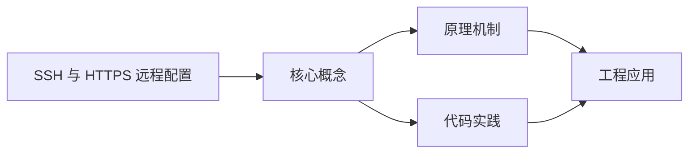
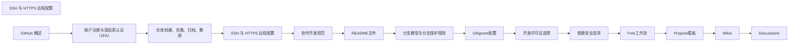

## 1. 学习目标（Bloom 分类）

本节按照布鲁姆教育目标分类学组织学习路径。本文主题为《SSH 与 HTTPS 远程配置》，属于 GitHub 模块，读者可以根据自身阶段选择阅读深度。

记忆层面：能够准确复述本文的核心概念、术语与基本语法或操作步骤，并能够在提问或检索时快速定位对应知识点。能够说出 GitHub 的核心概念、常用命令与流程。

理解层面：能够用自己的语言解释核心原理与工作机制，说明概念之间的因果关系，而不是机械记忆结论。能够解释 GitHub 的工作原理与设计动机。

应用层面：能够在真实项目或练习场景中运用本文知识解决具体问题，写出正确且可维护的实现。能够独立完成 GitHub 的标准操作。

分析层面：能够拆解复杂问题，比较本文主题与相邻概念的异同，识别边界条件与例外情况。能够分析 GitHub 使用中的异常与边界。

评价层面：能够根据约束条件（性能、可读性、安全、成本）评价不同方案的优劣，做出有依据的技术决策。能够评价 GitHub 相关工具与方案。

创造层面：能够把本文知识与其他模块知识组合，设计出新的解决方案或可复用的工程模式。能够把 GitHub 融入团队工作流。

通过本节学习，读者应当能够把《SSH 与 HTTPS 远程配置》纳入自己的知识网络，并与 GitHub 模块的其他主题（仓库、Issue、PR、Actions、生态）建立关联。

## 2. 历史动机与发展脉络

《SSH 与 HTTPS 远程配置》是 GitHub 领域的重要主题。要真正理解它，需要先了解它解决的问题与演进过程。

GitHub 2008 年上线，2018 年被微软收购，是全球最大的代码托管与协作平台；核心是 Git 之上的社交化协作层。
协作对象：Repository（仓库）、Issue（问题）、Pull Request（变更请求）、Discussion（讨论）、Actions（自动化）、Projects（看板）。
生态：GitHub Pages、Codespaces、Copilot、CodeQL、Packages；开放平台（REST/GraphQL API）支撑生态集成。

回到本文主题：SSH 与 HTTPS 远程配置 的提出与成熟，正是上述技术背景下的必然产物。早期实现往往以简单可用为目标，随着工程规模扩大，社区逐渐沉淀出标准做法与最佳实践；理解这一脉络，可以帮助读者判断“为什么文档中的推荐写法是现在这个样子”，也能在遇到历史遗留代码时准确识别其设计年代与取舍。


## 3. 形式化定义与核心概念精讲

本节把《SSH 与 HTTPS 远程配置》涉及的核心概念以“定义 + 讲解”的形式展开。读者应把定义当作工具，把讲解当作理解路径；两者结合才能形成可迁移的知识。

PR 流程：fork/branch -> 提交 -> PR -> 审查 -> 合并；审查通过保护规则（required reviews）。
Actions：workflow（YAML）由事件触发，job 在 runner 上执行 step；支持矩阵、缓存与密钥。
Issue 管理：标签、里程碑、模板；与 PR 通过关键词（fixes #123）自动关联。

### 3.1 原文章节逐一精讲

原文档把主题拆分为 8 个小节，下面按顺序给出每一节的导读讲解，随后保留原文细节供精读。

#### 原文精读（完整保留）


#### 1. 背景

与远程 **GitHub 仓库（repository）** 通信是日常开发中不可或缺的操作，主要有两种认证方式：

- **SSH（Secure Shell）**：使用非对称密钥对进行认证
- **HTTPS**：使用 **PAT（个人访问令牌）** 作为密码替代
  选择哪种方式取决于多种因素，如团队规范、网络环境、安全性要求等。本指南将详细介绍两种方式的配置和使用方法。

#### 2. 原理对比

| 特性       | SSH                        | HTTPS                  |
| ---------- | -------------------------- | ---------------------- |
| 认证方式   | 非对称密钥对（公钥/私钥）  | 用户名 + PAT           |
| 端口       | 22                         | 443                    |
| 安全性     | 高（私钥本地存储）         | 中（PAT 需要妥善保管） |
| 网络兼容性 | 可能被防火墙阻止           | 几乎所有网络都支持     |
| 配置复杂度 | 稍高（需要生成和管理密钥） | 简单（只需生成 PAT）   |
| 适用场景   | 高频推送、多设备开发       | 偶尔操作、受限网络环境 |

#### 3. SSH：生成密钥与配置

##### 3.1 生成 SSH 密钥

###### 3.1.1 使用 Ed25519 算法（推荐）

```bash
 # Windows 系统
 ssh-keygen -t ed25519 -C "you@example.com" -f "%USERPROFILE%\.ssh\id_ed25519_github" -N ""
 # macOS/Linux 系统
 ssh-keygen -t ed25519 -C "you@example.com" -f "~/.ssh/id_ed25519_github" -N ""
 # 参数说明：
 # -t ed25519：使用 Ed25519 算法，更安全且密钥文件更小
 # -C "you@example.com"：添加注释，通常使用邮箱
 # -f：指定密钥文件路径和名称
 # -N ""：设置空密码短语，生产环境建议设置密码短语
```

###### 3.1.2 使用 RSA 算法（兼容性更好）

```bash
 # Windows 系统
 ssh-keygen -t rsa -b 4096 -C "you@example.com" -f "%USERPROFILE%\.ssh\id_rsa_github" -N ""
 # macOS/Linux 系统
 ssh-keygen -t rsa -b 4096 -C "you@example.com" -f "~/.ssh/id_rsa_github" -N ""
 # 参数说明：
 # -t rsa：使用 RSA 算法
 # -b 4096：密钥长度为 4096 位
```

##### 3.2 查看和复制公钥

```bash
 # Windows 系统
 type %USERPROFILE%\.ssh\id_ed25519_github.pub
 # macOS/Linux 系统
 cat ~/.ssh/id_ed25519_github.pub
 # 复制输出的公钥内容，包括 ssh-ed25519 前缀和邮箱后缀
```

##### 3.3 在 GitHub 上添加公钥

1. 登录 GitHub，点击头像 → Settings → SSH and GPG keys
2. 点击 "New SSH key" 按钮
3. 在 "Title" 字段中输入密钥名称（如 "My Laptop"）
4. 在 "Key" 字段中粘贴复制的公钥内容
5. 点击 "Add SSH key" 按钮完成添加
   **截图占位**：`[图 02-1] SSH 公钥已添加列表`

##### 3.4 测试 SSH 连接

```bash
 # 测试默认 GitHub 连接
 ssh -T git@github.com
 # 测试指定密钥文件的连接
 ssh -i "%USERPROFILE%\.ssh\id_ed25519_github" -T git@github.com # Windows
 ssh -i "~/.ssh/id_ed25519_github" -T git@github.com # macOS/Linux
 # 首次连接会提示验证主机指纹，确认后输入 yes
 # 成功时显示：Hi username! You've successfully authenticated...
```

##### 3.5 配置 ssh-agent 管理密钥

```bash
 # 启动 ssh-agent
 # Windows 系统
 Start-Service ssh-agent # PowerShell
 # 或
 ssh-agent cmd.exe # CMD
 # macOS/Linux 系统
 eval "$(ssh-agent -s)"
 # 添加私钥到 ssh-agent
 # Windows 系统
 ssh-add "%USERPROFILE%\.ssh\id_ed25519_github"
 # macOS/Linux 系统
 ssh-add ~/.ssh/id_ed25519_github
 # 查看已添加的密钥
 ssh-add -l
```

##### 3.6 多账户配置：SSH config

```sshconfig
 # 文件路径：~/.ssh/config（Windows 同路径）
 # 个人 GitHub 账户
 Host github.com-personal
  HostName github.com
  User git
  IdentityFile ~/.ssh/id_ed25519_personal
  IdentitiesOnly yes # 只使用指定的密钥
 # 工作 GitHub 账户
 Host github.com-work
  HostName github.com
  User git
  IdentityFile ~/.ssh/id_ed25519_work
  IdentitiesOnly yes
 # 配置说明：
 # Host：自定义主机别名
 # HostName：实际主机名
 # User：登录用户名，GitHub 固定为 git
 # IdentityFile：指定使用的私钥文件
 # IdentitiesOnly：只使用配置中指定的密钥
```

##### 3.7 使用 SSH 克隆和推送

```bash
 # 使用默认 SSH 配置克隆
 git clone git@github.com:username/repository.git
 # 使用指定账户克隆
 git clone git@github.com-personal:username/personal-repo.git
 git clone git@github.com-work:company/work-repo.git
 # 推送代码
 cd repository
 git add .
 git commit -m "Update files"
 git push origin main
```

#### 4. HTTPS：PAT 与凭据管理

##### 4.1 生成个人访问令牌 (PAT)

###### 4.1.1 生成 Fine-grained token（推荐）

1. 登录 GitHub，点击头像 → Settings → Developer settings → Personal access tokens → Fine-grained tokens
2. 点击 "Generate new token" 按钮
3. 填写以下信息：

- Token name：令牌名称（如 "My Laptop HTTPS"）
- Expiration：过期时间（建议 30-90 天）
- Repository access：选择访问权限（可选择特定仓库或所有仓库）
- Permissions：根据需要选择具体权限

4. 点击 "Generate token" 按钮
5. 复制生成的令牌，离开页面后将无法再次查看

###### 4.1.2 生成 Classic token

1. 登录 GitHub，点击头像 → Settings → Developer settings → Personal access tokens → Tokens (classic)
2. 点击 "Generate new token" → "Generate new token (classic)"
3. 填写以下信息：

- Note：令牌名称
- Expiration：过期时间
- Scopes：选择所需权限（如 `repo`、`gist` 等）

4. 点击 "Generate token" 按钮
5. 复制生成的令牌
   **截图占位**：`[图 02-2] Fine-grained token 权限勾选界面`

##### 4.2 配置 Git 凭据管理

```bash
 # Windows 系统：使用 Git Credential Manager
 git config --global credential.helper manager
 # macOS 系统：使用 osxkeychain
 git config --global credential.helper osxkeychain
 # Linux 系统：使用 libsecret
 git config --global credential.helper libsecret
 # 验证配置
 git config --global --get credential.helper
```

##### 4.3 使用 HTTPS 克隆和推送

```bash
 # 克隆仓库
 git clone https://github.com/username/repository.git
 # 首次推送时，系统会提示输入用户名和密码：
 # 用户名：GitHub 用户名
 # 密码：粘贴生成的 PAT
 # 查看远程配置
 git remote -v
 # 更改远程 URL 从 SSH 到 HTTPS
 git remote set-url origin https://github.com/username/repository.git
 # 更改远程 URL 从 HTTPS 到 SSH
 git remote set-url origin git@github.com:username/repository.git
```

##### 4.4 管理 PAT

- **定期轮换**：设置合理的过期时间，到期前生成新令牌
- **最小权限**：只授予必要的权限范围
- **安全存储**：使用密码管理器存储 PAT，避免明文存储
- **撤销令牌**：当设备丢失或令牌泄露时，及时在 GitHub 上撤销

#### 5. 常见问题与解决方案

| 问题                          | 原因                                                             | 解决方案                                                        |
| ----------------------------- | ---------------------------------------------------------------- | --------------------------------------------------------------- |
| Permission denied (publickey) | 公钥未添加到 GitHub、私钥未加载到 ssh-agent、SSH config 配置错误 | 检查公钥是否已添加、使用 ssh-add 加载私钥、检查 SSH config 配置 |
| Host key verification failed  | 主机指纹不匹配，可能是中间人攻击                                 | 确认 GitHub 官方指纹后再连接                                    |
| PAT 过期                      | Classic token 设置了有效期                                       | 生成新的 PAT 并更新凭据                                         |
| HTTPS 连接失败                | 网络问题、代理设置、企业 MITM                                    | 检查网络连接、配置代理、信任企业根证书                          |
| 多账户认证冲突                | 多个 SSH 密钥或 PAT 管理混乱                                     | 使用 SSH config 配置多账户、为不同账户使用不同 PAT              |

##### 5.1 故障诊断脚本

```bash
 # 检查 SSH 配置
 ssh -v git@github.com # 详细输出 SSH 连接过程
 # 检查 Git 远程配置
 git remote -v
 # 检查 Git 凭据配置
 git config --list | grep credential
 # 测试 HTTPS 连接
 git ls-remote https://github.com/username/repository.git
 # 测试 SSH 连接
 git ls-remote git@github.com:username/repository.git
```

#### 6. 最佳实践

##### 6.1 SSH 最佳实践

- **使用 Ed25519 算法**：更安全且密钥文件更小
- **设置密码短语**：为私钥设置密码短语，增加安全性
- **合理命名密钥**：为不同用途的密钥使用明确的命名（如 id_ed25519_personal、id_ed25519_work）
- **权限设置**：
- Linux/macOS：`chmod 600 ~/.ssh/id_ed25519_*`
- Windows：使用 OpenSSH 默认权限
- **定期备份**：备份私钥文件到安全位置
- **使用 ssh-agent**：避免每次操作都输入密码短语

##### 6.2 HTTPS 最佳实践

- **使用 Fine-grained token**：提供更精细的权限控制
- **设置合理过期时间**：建议 30-90 天
- **最小权限原则**：只授予必要的权限
- **使用凭据管理器**：避免每次操作都输入 PAT
- **定期轮换**：到期前生成新令牌
- **CI/CD 环境**：使用 GitHub Actions 提供的 `GITHUB_TOKEN`，不使用个人 PAT

##### 6.3 团队协作最佳实践

- **统一认证方式**：团队内统一使用 SSH 或 HTTPS
- **文档化配置**：创建团队配置文档，包含认证方式和步骤
- **密钥管理**：建立密钥轮换和备份策略
- **安全审计**：定期检查已添加的 SSH 密钥和 PAT

#### 7. 高级配置

##### 7.1 使用 SSH 代理

```bash
 # 配置 SSH 通过代理连接
 # ~/.ssh/config
 Host github.com
  HostName github.com
  User git
  ProxyCommand nc -X 5 -x proxy.example.com:1080 %h %p
  IdentityFile ~/.ssh/id_ed25519_github
```

##### 7.2 自动加载 SSH 密钥

```bash
 # Windows：在 PowerShell 配置文件中添加
 # ~/Documents/WindowsPowerShell/Microsoft.PowerShell_profile.ps1
 Start-Service ssh-agent
 ssh-add ~/.ssh/id_ed25519_github
 # macOS/Linux：在 ~/.bashrc 或 ~/.zshrc 中添加
 if [ -z "$SSH_AUTH_SOCK" ]; then
  eval "$(ssh-agent -s)"
  ssh-add ~/.ssh/id_ed25519_github
 fi
```

##### 7.3 多仓库配置示例

```bash
 # 个人仓库使用 SSH
 git remote set-url origin git@github.com-personal:username/personal-repo.git
 # 工作仓库使用 HTTPS
 git remote set-url origin https://github.com/company/work-repo.git
 # 检查配置
 git remote -v
```

#### 延伸阅读

- [GitHub：SSH 密钥](https://docs.github.com/en/authentication/connecting-to-github-with-ssh) <!-- nofollow -->
- [GitHub：创建个人访问令牌](https://docs.github.com/en/authentication/keeping-your-account-and-data-secure/creating-a-personal-access-token) <!-- nofollow -->
- [GitHub：使用 SSH 代理](https://docs.github.com/en/authentication/connecting-to-github-with-ssh/using-ssh-agent-forwarding) <!-- nofollow -->
- [Git 官方文档：凭据存储](https://git-scm.com/book/en/v2/Git-Tools-Credential-Storage) <!-- nofollow -->


### 3.2 概念关系图

下面用 Mermaid 图表达本文核心概念之间的关系，帮助读者建立整体图景：



图中展示的是本文知识的结构化关系：核心概念是入口，原理机制解释“为什么”，代码实践演示“怎么做”，工程应用回答“何时用”。读者学习时可以把每个小节的内容挂接到对应节点上。

## 4. 理论推导与原理解析

本节深入《SSH 与 HTTPS 远程配置》背后的原理。理论部分不求面面俱到，而是聚焦“能解释现象、能指导实践”的关键推导。

PR 流程：fork/branch -> 提交 -> PR -> 审查 -> 合并；审查通过保护规则（required reviews）。
Actions：workflow（YAML）由事件触发，job 在 runner 上执行 step；支持矩阵、缓存与密钥。
Issue 管理：标签、里程碑、模板；与 PR 通过关键词（fixes #123）自动关联。
权限与安全：仓库角色（read/triage/write/maintain/admin）、分支保护、CODEOWNERS、安全通告。

需要强调的是，理论推导与工程实践之间存在翻译层：理论给出的是理想化模型与边界条件，工程代码则必须处理真实环境中的例外。读者在学习时应先掌握理论的“标准情形”，再通过陷阱章节了解“非标准情形”。

## 5. 代码示例与逐行讲解

本节把原文中的代码示例系统整理，并为每个示例补充用途说明与讲解。读者不应只浏览代码，而应逐段对照讲解理解设计意图。

### 5.1 示例：3.1.1 使用 Ed25519 算法（推荐）

该示例来自原文《3.1.1 使用 Ed25519 算法（推荐）》小节，用于演示SSH 与 HTTPS 远程配置相关操作。阅读时请先看代码结构，再看其后的讲解。

```bash
 # Windows 系统
 ssh-keygen -t ed25519 -C "you@example.com" -f "%USERPROFILE%\.ssh\id_ed25519_github" -N ""
 # macOS/Linux 系统
 ssh-keygen -t ed25519 -C "you@example.com" -f "~/.ssh/id_ed25519_github" -N ""
 # 参数说明：
 # -t ed25519：使用 Ed25519 算法，更安全且密钥文件更小
 # -C "you@example.com"：添加注释，通常使用邮箱
 # -f：指定密钥文件路径和名称
 # -N ""：设置空密码短语，生产环境建议设置密码短语
```

讲解：这段代码演示了本节核心知识点。代码中的关键操作可以归纳为三步：准备（定义或初始化）、执行（核心逻辑）、收尾（释放资源或返回结果）。实际项目中，这三步往往被封装为函数或类，以提升复用性与可测试性。

关键点分析：

该示例共 9 行有效代码，结构以数据或配置为主。阅读时应关注：数据字段的含义、配置项的作用，以及它们与运行行为的对应关系。

进阶思考路径：先尝试修改参数观察行为变化，再把示例中的模式迁移到自己的项目中；每次修改都记录预期与实测差异，这是把示例转化为能力的最快方式。

### 5.2 示例：3.1.2 使用 RSA 算法（兼容性更好）

该示例来自原文《3.1.2 使用 RSA 算法（兼容性更好）》小节，用于演示SSH 与 HTTPS 远程配置相关操作。阅读时请先看代码结构，再看其后的讲解。

```bash
 # Windows 系统
 ssh-keygen -t rsa -b 4096 -C "you@example.com" -f "%USERPROFILE%\.ssh\id_rsa_github" -N ""
 # macOS/Linux 系统
 ssh-keygen -t rsa -b 4096 -C "you@example.com" -f "~/.ssh/id_rsa_github" -N ""
 # 参数说明：
 # -t rsa：使用 RSA 算法
 # -b 4096：密钥长度为 4096 位
```

讲解：这段代码演示了本节核心知识点。代码中的关键操作可以归纳为三步：准备（定义或初始化）、执行（核心逻辑）、收尾（释放资源或返回结果）。实际项目中，这三步往往被封装为函数或类，以提升复用性与可测试性。

关键点分析：

该示例共 7 行有效代码，结构以数据或配置为主。阅读时应关注：数据字段的含义、配置项的作用，以及它们与运行行为的对应关系。

进阶思考路径：先尝试修改参数观察行为变化，再把示例中的模式迁移到自己的项目中；每次修改都记录预期与实测差异，这是把示例转化为能力的最快方式。

### 5.3 示例：3.2 查看和复制公钥

该示例来自原文《3.2 查看和复制公钥》小节，用于演示SSH 与 HTTPS 远程配置相关操作。阅读时请先看代码结构，再看其后的讲解。

```bash
 # Windows 系统
 type %USERPROFILE%\.ssh\id_ed25519_github.pub
 # macOS/Linux 系统
 cat ~/.ssh/id_ed25519_github.pub
 # 复制输出的公钥内容，包括 ssh-ed25519 前缀和邮箱后缀
```

讲解：这段代码演示了本节核心知识点。代码中的关键操作可以归纳为三步：准备（定义或初始化）、执行（核心逻辑）、收尾（释放资源或返回结果）。实际项目中，这三步往往被封装为函数或类，以提升复用性与可测试性。

关键点分析：

该示例共 5 行有效代码，结构以数据或配置为主。阅读时应关注：数据字段的含义、配置项的作用，以及它们与运行行为的对应关系。

进阶思考路径：先尝试修改参数观察行为变化，再把示例中的模式迁移到自己的项目中；每次修改都记录预期与实测差异，这是把示例转化为能力的最快方式。

### 5.4 示例：3.4 测试 SSH 连接

该示例来自原文《3.4 测试 SSH 连接》小节，用于演示SSH 与 HTTPS 远程配置相关操作。阅读时请先看代码结构，再看其后的讲解。

```bash
 # 测试默认 GitHub 连接
 ssh -T git@github.com
 # 测试指定密钥文件的连接
 ssh -i "%USERPROFILE%\.ssh\id_ed25519_github" -T git@github.com # Windows
 ssh -i "~/.ssh/id_ed25519_github" -T git@github.com # macOS/Linux
 # 首次连接会提示验证主机指纹，确认后输入 yes
 # 成功时显示：Hi username! You've successfully authenticated...
```

讲解：这段代码演示了本节核心知识点。代码中的关键操作可以归纳为三步：准备（定义或初始化）、执行（核心逻辑）、收尾（释放资源或返回结果）。实际项目中，这三步往往被封装为函数或类，以提升复用性与可测试性。

关键点分析：

该示例共 7 行有效代码，结构以数据或配置为主。阅读时应关注：数据字段的含义、配置项的作用，以及它们与运行行为的对应关系。

进阶思考路径：先尝试修改参数观察行为变化，再把示例中的模式迁移到自己的项目中；每次修改都记录预期与实测差异，这是把示例转化为能力的最快方式。

### 5.5 示例：3.5 配置 ssh-agent 管理密钥

该示例来自原文《3.5 配置 ssh-agent 管理密钥》小节，用于演示SSH 与 HTTPS 远程配置相关操作。阅读时请先看代码结构，再看其后的讲解。

```bash
 # 启动 ssh-agent
 # Windows 系统
 Start-Service ssh-agent # PowerShell
 # 或
 ssh-agent cmd.exe # CMD
 # macOS/Linux 系统
 eval "$(ssh-agent -s)"
 # 添加私钥到 ssh-agent
 # Windows 系统
 ssh-add "%USERPROFILE%\.ssh\id_ed25519_github"
 # macOS/Linux 系统
 ssh-add ~/.ssh/id_ed25519_github
 # 查看已添加的密钥
 ssh-add -l
```

讲解：这段代码演示了本节核心知识点。代码中的关键操作可以归纳为三步：准备（定义或初始化）、执行（核心逻辑）、收尾（释放资源或返回结果）。实际项目中，这三步往往被封装为函数或类，以提升复用性与可测试性。

关键点分析：

该示例共 14 行有效代码，结构以数据或配置为主。阅读时应关注：数据字段的含义、配置项的作用，以及它们与运行行为的对应关系。

进阶思考路径：先尝试修改参数观察行为变化，再把示例中的模式迁移到自己的项目中；每次修改都记录预期与实测差异，这是把示例转化为能力的最快方式。

### 5.6 示例：3.6 多账户配置：SSH config

该示例来自原文《3.6 多账户配置：SSH config》小节，用于演示SSH 与 HTTPS 远程配置相关操作。阅读时请先看代码结构，再看其后的讲解。

```sshconfig
 # 文件路径：~/.ssh/config（Windows 同路径）
 # 个人 GitHub 账户
 Host github.com-personal
  HostName github.com
  User git
  IdentityFile ~/.ssh/id_ed25519_personal
  IdentitiesOnly yes # 只使用指定的密钥
 # 工作 GitHub 账户
 Host github.com-work
  HostName github.com
  User git
  IdentityFile ~/.ssh/id_ed25519_work
  IdentitiesOnly yes
 # 配置说明：
 # Host：自定义主机别名
 # HostName：实际主机名
 # User：登录用户名，GitHub 固定为 git
 # IdentityFile：指定使用的私钥文件
 # IdentitiesOnly：只使用配置中指定的密钥
```

讲解：这段代码演示了本节核心知识点。代码中的关键操作可以归纳为三步：准备（定义或初始化）、执行（核心逻辑）、收尾（释放资源或返回结果）。实际项目中，这三步往往被封装为函数或类，以提升复用性与可测试性。

关键点分析：

该示例共 19 行有效代码，结构以数据或配置为主。阅读时应关注：数据字段的含义、配置项的作用，以及它们与运行行为的对应关系。

进阶思考路径：先尝试修改参数观察行为变化，再把示例中的模式迁移到自己的项目中；每次修改都记录预期与实测差异，这是把示例转化为能力的最快方式。

### 5.7 示例：3.7 使用 SSH 克隆和推送

该示例来自原文《3.7 使用 SSH 克隆和推送》小节，用于演示SSH 与 HTTPS 远程配置相关操作。阅读时请先看代码结构，再看其后的讲解。

```bash
 # 使用默认 SSH 配置克隆
 git clone git@github.com:username/repository.git
 # 使用指定账户克隆
 git clone git@github.com-personal:username/personal-repo.git
 git clone git@github.com-work:company/work-repo.git
 # 推送代码
 cd repository
 git add .
 git commit -m "Update files"
 git push origin main
```

讲解：这段代码演示了本节核心知识点。代码中的关键操作可以归纳为三步：准备（定义或初始化）、执行（核心逻辑）、收尾（释放资源或返回结果）。实际项目中，这三步往往被封装为函数或类，以提升复用性与可测试性。

关键点分析：

该示例共 10 行有效代码，结构以数据或配置为主。阅读时应关注：数据字段的含义、配置项的作用，以及它们与运行行为的对应关系。

进阶思考路径：先尝试修改参数观察行为变化，再把示例中的模式迁移到自己的项目中；每次修改都记录预期与实测差异，这是把示例转化为能力的最快方式。

### 5.8 示例：4.2 配置 Git 凭据管理

该示例来自原文《4.2 配置 Git 凭据管理》小节，用于演示SSH 与 HTTPS 远程配置相关操作。阅读时请先看代码结构，再看其后的讲解。

```bash
 # Windows 系统：使用 Git Credential Manager
 git config --global credential.helper manager
 # macOS 系统：使用 osxkeychain
 git config --global credential.helper osxkeychain
 # Linux 系统：使用 libsecret
 git config --global credential.helper libsecret
 # 验证配置
 git config --global --get credential.helper
```

讲解：这段代码演示了本节核心知识点。代码中的关键操作可以归纳为三步：准备（定义或初始化）、执行（核心逻辑）、收尾（释放资源或返回结果）。实际项目中，这三步往往被封装为函数或类，以提升复用性与可测试性。

关键点分析：

该示例共 8 行有效代码，结构以数据或配置为主。阅读时应关注：数据字段的含义、配置项的作用，以及它们与运行行为的对应关系。

进阶思考路径：先尝试修改参数观察行为变化，再把示例中的模式迁移到自己的项目中；每次修改都记录预期与实测差异，这是把示例转化为能力的最快方式。

### 5.9 示例：4.3 使用 HTTPS 克隆和推送

该示例来自原文《4.3 使用 HTTPS 克隆和推送》小节，用于演示SSH 与 HTTPS 远程配置相关操作。阅读时请先看代码结构，再看其后的讲解。

```bash
 # 克隆仓库
 git clone https://github.com/username/repository.git
 # 首次推送时，系统会提示输入用户名和密码：
 # 用户名：GitHub 用户名
 # 密码：粘贴生成的 PAT
 # 查看远程配置
 git remote -v
 # 更改远程 URL 从 SSH 到 HTTPS
 git remote set-url origin https://github.com/username/repository.git
 # 更改远程 URL 从 HTTPS 到 SSH
 git remote set-url origin git@github.com:username/repository.git
```

讲解：这段代码演示了本节核心知识点。代码中的关键操作可以归纳为三步：准备（定义或初始化）、执行（核心逻辑）、收尾（释放资源或返回结果）。实际项目中，这三步往往被封装为函数或类，以提升复用性与可测试性。

关键点分析：

该示例共 11 行有效代码，结构以数据或配置为主。阅读时应关注：数据字段的含义、配置项的作用，以及它们与运行行为的对应关系。

进阶思考路径：先尝试修改参数观察行为变化，再把示例中的模式迁移到自己的项目中；每次修改都记录预期与实测差异，这是把示例转化为能力的最快方式。

### 5.10 示例：5.1 故障诊断脚本

该示例来自原文《5.1 故障诊断脚本》小节，用于演示SSH 与 HTTPS 远程配置相关操作。阅读时请先看代码结构，再看其后的讲解。

```bash
 # 检查 SSH 配置
 ssh -v git@github.com # 详细输出 SSH 连接过程
 # 检查 Git 远程配置
 git remote -v
 # 检查 Git 凭据配置
 git config --list | grep credential
 # 测试 HTTPS 连接
 git ls-remote https://github.com/username/repository.git
 # 测试 SSH 连接
 git ls-remote git@github.com:username/repository.git
```

讲解：这段代码演示了本节核心知识点。代码中的关键操作可以归纳为三步：准备（定义或初始化）、执行（核心逻辑）、收尾（释放资源或返回结果）。实际项目中，这三步往往被封装为函数或类，以提升复用性与可测试性。

关键点分析：

该示例共 10 行有效代码，结构以数据或配置为主。阅读时应关注：数据字段的含义、配置项的作用，以及它们与运行行为的对应关系。

进阶思考路径：先尝试修改参数观察行为变化，再把示例中的模式迁移到自己的项目中；每次修改都记录预期与实测差异，这是把示例转化为能力的最快方式。

### 5.11 示例：7.1 使用 SSH 代理

该示例来自原文《7.1 使用 SSH 代理》小节，用于演示SSH 与 HTTPS 远程配置相关操作。阅读时请先看代码结构，再看其后的讲解。

```bash
 # 配置 SSH 通过代理连接
 # ~/.ssh/config
 Host github.com
  HostName github.com
  User git
  ProxyCommand nc -X 5 -x proxy.example.com:1080 %h %p
  IdentityFile ~/.ssh/id_ed25519_github
```

讲解：这段代码演示了本节核心知识点。代码中的关键操作可以归纳为三步：准备（定义或初始化）、执行（核心逻辑）、收尾（释放资源或返回结果）。实际项目中，这三步往往被封装为函数或类，以提升复用性与可测试性。

关键点分析：

该示例共 7 行有效代码，结构以数据或配置为主。阅读时应关注：数据字段的含义、配置项的作用，以及它们与运行行为的对应关系。

进阶思考路径：先尝试修改参数观察行为变化，再把示例中的模式迁移到自己的项目中；每次修改都记录预期与实测差异，这是把示例转化为能力的最快方式。

### 5.12 示例：7.2 自动加载 SSH 密钥

该示例来自原文《7.2 自动加载 SSH 密钥》小节，用于演示SSH 与 HTTPS 远程配置相关操作。阅读时请先看代码结构，再看其后的讲解。

```bash
 # Windows：在 PowerShell 配置文件中添加
 # ~/Documents/WindowsPowerShell/Microsoft.PowerShell_profile.ps1
 Start-Service ssh-agent
 ssh-add ~/.ssh/id_ed25519_github
 # macOS/Linux：在 ~/.bashrc 或 ~/.zshrc 中添加
 if [ -z "$SSH_AUTH_SOCK" ]; then
  eval "$(ssh-agent -s)"
  ssh-add ~/.ssh/id_ed25519_github
 fi
```

讲解：这段代码演示了本节核心知识点。代码中的关键操作可以归纳为三步：准备（定义或初始化）、执行（核心逻辑）、收尾（释放资源或返回结果）。实际项目中，这三步往往被封装为函数或类，以提升复用性与可测试性。

关键点分析：

该示例共 9 行有效代码，包含 1 类关键结构（if）。其中：

- 入口与初始化部分负责建立上下文，对应实际项目中的启动或装配逻辑；
- 核心逻辑部分体现本文主题的主要操作，是阅读时最需要对照讲解理解的部分；
- 输出或返回部分把结果交给调用方，注意其类型与边界条件。

进阶思考路径：先尝试修改参数观察行为变化，再把示例中的模式迁移到自己的项目中；每次修改都记录预期与实测差异，这是把示例转化为能力的最快方式。

### 5.13 示例：7.3 多仓库配置示例

该示例来自原文《7.3 多仓库配置示例》小节，用于演示SSH 与 HTTPS 远程配置相关操作。阅读时请先看代码结构，再看其后的讲解。

```bash
 # 个人仓库使用 SSH
 git remote set-url origin git@github.com-personal:username/personal-repo.git
 # 工作仓库使用 HTTPS
 git remote set-url origin https://github.com/company/work-repo.git
 # 检查配置
 git remote -v
```

讲解：这段代码演示了本节核心知识点。代码中的关键操作可以归纳为三步：准备（定义或初始化）、执行（核心逻辑）、收尾（释放资源或返回结果）。实际项目中，这三步往往被封装为函数或类，以提升复用性与可测试性。

关键点分析：

该示例共 6 行有效代码，结构以数据或配置为主。阅读时应关注：数据字段的含义、配置项的作用，以及它们与运行行为的对应关系。

进阶思考路径：先尝试修改参数观察行为变化，再把示例中的模式迁移到自己的项目中；每次修改都记录预期与实测差异，这是把示例转化为能力的最快方式。


综合以上示例，可以总结出本主题的代码实践要点：第一，先定义清晰的输入输出契约；第二，核心逻辑保持单一职责；第三，错误处理与边界条件不可省略；第四，命名与注释表达意图而非复述代码。

## 6. 对比分析

对比是理解《SSH 与 HTTPS 远程配置》定位的最快路径。下面从多个维度与相邻方案进行对比。

GitHub 与 GitLab：GitHub 社区大、生态全；GitLab 内置 CI/CD 与自托管。
PR 与 Issue：PR 是代码变更请求，Issue 是任务/缺陷；两者关联形成闭环。
公有与私有仓库：开源公开协作，内部代码私有 + 精细权限。

对比的目的不是分出绝对优劣，而是建立选择依据：不同约束条件下，最优解不同。读者应把每个对比维度转化为决策检查清单。

## 7. 常见陷阱与最佳实践

本节整理该主题的高频错误与推荐做法。每个陷阱先描述现象，再解释原因，最后给出最佳实践。

### 7.1 直接推主分支

绕过审查。启用分支保护 + 强制 PR。

深入讲解：该问题之所以被归类为“常见陷阱”，是因为它在初学者的代码中反复出现，而且往往不在第一时间暴露——错误通常隐藏在特定数据或特定时序下。

从成因上看，直接推主分支 一般源于对 GitHub 某个机制的理解偏差：要么误用了默认行为，要么忽略了边界条件，要么把其他语言的思维惯性带了过来。

从影响上看，直接推主分支 轻则产生错误结果，重则导致资源泄漏、数据损坏或安全事故；这也是为什么工程评审中会把它列为检查项。

从修复策略上看，处理直接推主分支的正确顺序是：先复现（构造最小用例），再定位（确认机制层面的根因），最后修复并补充回归测试。跳过复现直接改代码，往往治标不治本。

### 7.2 密钥写进 Actions 文件

泄露。使用 repository secrets 与 OIDC。

深入讲解：该问题之所以被归类为“常见陷阱”，是因为它在初学者的代码中反复出现，而且往往不在第一时间暴露——错误通常隐藏在特定数据或特定时序下。

从成因上看，密钥写进 Actions 文件 一般源于对 GitHub 某个机制的理解偏差：要么误用了默认行为，要么忽略了边界条件，要么把其他语言的思维惯性带了过来。

从影响上看，密钥写进 Actions 文件 轻则产生错误结果，重则导致资源泄漏、数据损坏或安全事故；这也是为什么工程评审中会把它列为检查项。

从修复策略上看，处理密钥写进 Actions 文件的正确顺序是：先复现（构造最小用例），再定位（确认机制层面的根因），最后修复并补充回归测试。跳过复现直接改代码，往往治标不治本。

### 7.3 PR 过大

难以审查。小 PR + 清晰描述。

深入讲解：该问题之所以被归类为“常见陷阱”，是因为它在初学者的代码中反复出现，而且往往不在第一时间暴露——错误通常隐藏在特定数据或特定时序下。

从成因上看，PR 过大 一般源于对 GitHub 某个机制的理解偏差：要么误用了默认行为，要么忽略了边界条件，要么把其他语言的思维惯性带了过来。

从影响上看，PR 过大 轻则产生错误结果，重则导致资源泄漏、数据损坏或安全事故；这也是为什么工程评审中会把它列为检查项。

从修复策略上看，处理PR 过大的正确顺序是：先复现（构造最小用例），再定位（确认机制层面的根因），最后修复并补充回归测试。跳过复现直接改代码，往往治标不治本。

### 7.4 忽略 CODEOWNERS

关键代码无人审查。配置并强制执行。

深入讲解：该问题之所以被归类为“常见陷阱”，是因为它在初学者的代码中反复出现，而且往往不在第一时间暴露——错误通常隐藏在特定数据或特定时序下。

从成因上看，忽略 CODEOWNERS 一般源于对 GitHub 某个机制的理解偏差：要么误用了默认行为，要么忽略了边界条件，要么把其他语言的思维惯性带了过来。

从影响上看，忽略 CODEOWNERS 轻则产生错误结果，重则导致资源泄漏、数据损坏或安全事故；这也是为什么工程评审中会把它列为检查项。

从修复策略上看，处理忽略 CODEOWNERS的正确顺序是：先复现（构造最小用例），再定位（确认机制层面的根因），最后修复并补充回归测试。跳过复现直接改代码，往往治标不治本。

### 7.5 依赖漏洞不处理

Dependabot 告警堆积。自动化更新与合并。

深入讲解：该问题之所以被归类为“常见陷阱”，是因为它在初学者的代码中反复出现，而且往往不在第一时间暴露——错误通常隐藏在特定数据或特定时序下。

从成因上看，依赖漏洞不处理 一般源于对 GitHub 某个机制的理解偏差：要么误用了默认行为，要么忽略了边界条件，要么把其他语言的思维惯性带了过来。

从影响上看，依赖漏洞不处理 轻则产生错误结果，重则导致资源泄漏、数据损坏或安全事故；这也是为什么工程评审中会把它列为检查项。

从修复策略上看，处理依赖漏洞不处理的正确顺序是：先复现（构造最小用例），再定位（确认机制层面的根因），最后修复并补充回归测试。跳过复现直接改代码，往往治标不治本。

### 7.6 fork 后不同步

上游更新丢失。配置上游 remote 定期同步。

深入讲解：该问题之所以被归类为“常见陷阱”，是因为它在初学者的代码中反复出现，而且往往不在第一时间暴露——错误通常隐藏在特定数据或特定时序下。

从成因上看，fork 后不同步 一般源于对 GitHub 某个机制的理解偏差：要么误用了默认行为，要么忽略了边界条件，要么把其他语言的思维惯性带了过来。

从影响上看，fork 后不同步 轻则产生错误结果，重则导致资源泄漏、数据损坏或安全事故；这也是为什么工程评审中会把它列为检查项。

从修复策略上看，处理fork 后不同步的正确顺序是：先复现（构造最小用例），再定位（确认机制层面的根因），最后修复并补充回归测试。跳过复现直接改代码，往往治标不治本。

### 7.7 滥用 force push

覆盖他人工作。仅个人分支。

深入讲解：该问题之所以被归类为“常见陷阱”，是因为它在初学者的代码中反复出现，而且往往不在第一时间暴露——错误通常隐藏在特定数据或特定时序下。

从成因上看，滥用 force push 一般源于对 GitHub 某个机制的理解偏差：要么误用了默认行为，要么忽略了边界条件，要么把其他语言的思维惯性带了过来。

从影响上看，滥用 force push 轻则产生错误结果，重则导致资源泄漏、数据损坏或安全事故；这也是为什么工程评审中会把它列为检查项。

从修复策略上看，处理滥用 force push的正确顺序是：先复现（构造最小用例），再定位（确认机制层面的根因），最后修复并补充回归测试。跳过复现直接改代码，往往治标不治本。

### 7.8 Issue 无模板

信息不全。配置 issue/PR 模板。

深入讲解：该问题之所以被归类为“常见陷阱”，是因为它在初学者的代码中反复出现，而且往往不在第一时间暴露——错误通常隐藏在特定数据或特定时序下。

从成因上看，Issue 无模板 一般源于对 GitHub 某个机制的理解偏差：要么误用了默认行为，要么忽略了边界条件，要么把其他语言的思维惯性带了过来。

从影响上看，Issue 无模板 轻则产生错误结果，重则导致资源泄漏、数据损坏或安全事故；这也是为什么工程评审中会把它列为检查项。

从修复策略上看，处理Issue 无模板的正确顺序是：先复现（构造最小用例），再定位（确认机制层面的根因），最后修复并补充回归测试。跳过复现直接改代码，往往治标不治本。

### 7.0 最佳实践总览

1. 仓库健康：README、LICENSE、CONTRIBUTING、模板齐全。
2. 自动化：CI 门禁、Dependabot、CodeQL、自动标签。
3. 发布：GitHub Releases + CHANGELOG；语义化版本。

把这些最佳实践固化为团队规范与代码评审检查项，是避免同类问题反复出现的关键。

## 8. 工程实践

本节把《SSH 与 HTTPS 远程配置》放入真实工程场景，给出可复用的模式与组织方法。

组织管理：Teams 分权、SAMLOIDC 单点登录、审计日志。
开源治理：行为准则、贡献指南、维护者矩阵。
度量：PR 周期、合并率、Issue 响应时间驱动改进。

### 8.1 工程实践的原则拆解

以上工程实践可以归纳为四条原则。第一，配置与代码分离：GitHub 项目中环境差异应通过配置注入，而不是散落在代码分支中；这保证同一份代码可以在开发、测试、生产环境一致运行。

第二，接口稳定优先：对外接口（函数签名、协议、数据格式）一旦被消费方依赖，变更成本极高；设计时应预留扩展点并保持向后兼容。

第三，可观测性内置：日志、指标与追踪应该在功能开发时同步设计，而不是故障发生后补救；没有观测手段的模块等于黑盒。

第四，变更可回滚：任何发布都应有对应的回滚方案；数据库迁移、配置变更与代码发布一样需要版本管理与逆向路径。

### 8.2 实践落地的检查清单

- [ ] 组织管理：对照本节描述，检查当前项目是否已经落实；未落实的项列入技术债并排期处理。
- [ ] 开源治理：对照本节描述，检查当前项目是否已经落实；未落实的项列入技术债并排期处理。
- [ ] 度量：对照本节描述，检查当前项目是否已经落实；未落实的项列入技术债并排期处理。

工程实践的共性原则：配置与代码分离、接口稳定优先、可观测性内置、变更可回滚。这些原则适用于本主题的所有实现。

## 9. 案例研究

本节通过一个完整案例把《SSH 与 HTTPS 远程配置》的知识串起来。案例按“需求分析、方案设计、实现、验证”四步展开。

需求：为开源项目建立高质量协作流程。
方案：模板 + 分支保护 + CI + Dependabot + 发布流程。
要点：自动化检查前置、审查清单、安全扫描。
验证：贡献者体验调查与流程指标。

### 9.1 案例的扩展讨论

把案例中的方案放大到真实规模，需要额外考虑三个问题：

第一，规模：当数据量或并发量上升一个数量级时，原方案中的数据结构、缓存策略与任务调度是否仍然成立？通常需要引入分层与异步。

第二，团队：多人协作时，模块边界、接口契约与代码所有权必须明确；案例中的实现应拆分为可独立测试的单元，并配合文档说明设计意图。

第三，演进：上线后的需求变化不可避免；方案设计时应预留扩展点（配置化、插件化、事件化），并定期用真实指标验证假设。


案例研究的学习方法：先独立阅读需求，尝试在脑中形成方案，再对照实现与讲解，最后思考“如果约束变化（数据量、并发、团队规模），方案应如何调整”。

## 10. 知识要点总结与深入讲解

本节以讲解形式汇总全文要点，替代传统的习题与自测，读者不需要答题，只需跟随解释建立完整的认知框架。

关于《SSH 与 HTTPS 远程配置》的核心结论：

GitHub 的价值是协作闭环：Issue 到 PR 到发布全部可追踪。
自动化（Actions）与安全是平台能力的双翼。
规范模板让外部贡献者低成本参与。

原文档各小节的要点回顾：

- 1. 背景：该小节围绕SSH 与 HTTPS 远程配置展开具体细节，阅读时应关注其与核心结论的对应关系；每个小节都是核心结论在某一个侧面的展开。
- 2. 原理对比：该小节围绕SSH 与 HTTPS 远程配置展开具体细节，阅读时应关注其与核心结论的对应关系；每个小节都是核心结论在某一个侧面的展开。
- 3. SSH：生成密钥与配置：该小节围绕SSH 与 HTTPS 远程配置展开具体细节，阅读时应关注其与核心结论的对应关系；每个小节都是核心结论在某一个侧面的展开。
- 4. HTTPS：PAT 与凭据管理：该小节围绕SSH 与 HTTPS 远程配置展开具体细节，阅读时应关注其与核心结论的对应关系；每个小节都是核心结论在某一个侧面的展开。
- 5. 常见问题与解决方案：该小节围绕SSH 与 HTTPS 远程配置展开具体细节，阅读时应关注其与核心结论的对应关系；每个小节都是核心结论在某一个侧面的展开。
- 6. 最佳实践：该小节围绕SSH 与 HTTPS 远程配置展开具体细节，阅读时应关注其与核心结论的对应关系；每个小节都是核心结论在某一个侧面的展开。
- 7. 高级配置：该小节围绕SSH 与 HTTPS 远程配置展开具体细节，阅读时应关注其与核心结论的对应关系；每个小节都是核心结论在某一个侧面的展开。
- 延伸阅读：该小节围绕SSH 与 HTTPS 远程配置展开具体细节，阅读时应关注其与核心结论的对应关系；每个小节都是核心结论在某一个侧面的展开。

把以上要点与第 3-9 节的内容对照复习，即可完成对本文主题的闭环学习。

## 11. 参考文献


GitHub 文档：https://docs.github.com/zh
GitHub Actions 文档：https://docs.github.com/zh/actions
GitHub REST API：https://docs.github.com/zh/rest
GitHub GraphQL API：https://docs.github.com/zh/graphql

## 12. 延伸阅读


GitHub Actions CI/CD，见 004-github 模块 Actions 文档。
Git 协作基础，见 003-git 模块。
DevOps 自动化，见 031-devops 模块。
黑马程序员 Bilibili 空间（https://space.bilibili.com/37974444 ）提供 GitHub 课程。

## 14. 模块知识图谱与学习路径

本文属于 GitHub 模块。为了把《SSH 与 HTTPS 远程配置》放入完整的知识网络，下面列出本模块的全部主题并给出相互关联的导读。学习时建议按模块内顺序推进，并在每个文档中留意交叉引用。



上图为模块主题的推荐学习顺序示意图（仅展示前若干主题）。各主题之间存在三类关联：

第一，前置依赖关系：早期主题是后期主题的基础，例如环境与语法先行、进阶主题随后；

第二，横向并列关系：同一层级主题从不同角度覆盖模块能力，学习顺序可以按兴趣调整；

第三，工程组合关系：多个主题在真实项目中组合使用，例如配置、性能与安全主题往往出现在同一系统的不同层面。

### 14.1 模块主题速查表

| 文档 | 主题 | 与本文的关联 |
| --- | --- | --- |
| GitHub 概述 | 001-GitHubOverview | 本文的前置基础 |
| 账户注册与双因素认证（2FA） | 002-AccountRegister2FA2FA | 本文的并列主题 |
| 仓库创建、克隆、归档、删除 | 003-RepositoryCreateCloneArchiveDelete | 本文的并列主题 |
| SSH 与 HTTPS 远程配置 | 004-SSHHTTPS | 本文自身 |
| 协作开发规范 | 005-CollaborationDevelopmentStandard | 本文的并列主题 |
| README文件 | 006-READMEFile | 本文的并列主题 |
| 分支模型与分支保护规则 | 007-BranchModelBranchRule | 本文的并列主题 |
| Gitignore配置 | 008-GitignoreConfig | 本文的并列主题 |
| 开源许可证选择 | 009-OpenSourceLicense | 本文的并列主题 |
| 依赖安全选项 | 010-DependencySecurityOptions | 本文的安全延伸 |
| Fork工作流 | 011-ForkWorkflow | 本文的并列主题 |
| Projects看板 | 012-ProjectsBoard | 本文的并列主题 |
| Wikis | 013-Wikis | 本文的并列主题 |
| Discussions | 014-Discussions | 本文的并列主题 |
| GitHub-Copilot | 015-GitHubCopilot | 本文的并列主题 |
| Dependabot | 016-Dependabot | 本文的并列主题 |
| Issues 模板、标签与里程碑 | 017-IssuesTemplateTagMilestone | 本文的并列主题 |
| 密钥扫描 | 018-SecretScanning | 本文的并列主题 |
| CodeQL代码扫描 | 019-CodeQLCodeScanning | 本文的并列主题 |
| GitHub-CLI | 020-GitHubCLI | 本文的并列主题 |
| REST与GraphQL-API | 021-RESTGraphQLAPI | 本文的并列主题 |
| Webhooks | 022-Webhooks | 本文的并列主题 |
| GitHub-Packages | 023-GitHubPackages | 本文的并列主题 |
| Codespaces | 024-Codespaces | 本文的并列主题 |
| CODEOWNERS | 025-CODEOWNERS | 本文的并列主题 |
| 社区健康文件 | 026-CommunityHealthFile | 本文的并列主题 |
| Pull Request 完整协作流程 | 027-PullRequestCompleteCollaborationFlow | 本文的并列主题 |
| GitHub Pages 多站点方案 | 028-GitHubPagesMultiSolution | 本文的并列主题 |
| GitHub Actions 与 CI/CD | 029-GitHubActionsCICD | 本文的并列主题 |
| Actions触发器 | 030-ActionsTrigger | 本文的并列主题 |
| 常见问题排查 | 031-FAQTroubleshoot | 本文的并列主题 |
| Actions矩阵构建 | 032-ActionsMatrixBuild | 本文的并列主题 |
| Actions缓存依赖 | 033-ActionsCacheDependency | 本文的并列主题 |
| Actions自托管运行器 | 034-ActionsSelfHostedRunner | 本文的并列主题 |
| Actions制品传递 | 035-ActionsArtifact | 本文的并列主题 |
| Actions环境部署 | 036-ActionsEnvironmentDeploy | 本文的前置基础 |
| GitHub 仓库初始化 | 037-GitRepoInit | 本文的并列主题 |
| GitHub 提交与推送 | 038-GitCommitPush | 本文的并列主题 |
| GitHub 拉取与获取 | 039-GitPullFetch | 本文的并列主题 |
| GitHub 合并与变基 | 040-GitMergeRebase | 本文的并列主题 |
| GitHub 冲突解决 | 041-GitConflictResolve | 本文的并列主题 |
| GitHub 标签管理 | 042-GitTagManage | 本文的并列主题 |
| GitHub 远程仓库管理 | 043-GitRemoteManage | 本文的并列主题 |
| GitHub 历史与日志 | 044-GitHistoryLog | 本文的并列主题 |
| GitHub 暂存与回退 | 045-GitStashReset | 本文的并列主题 |
| GitHub CLI 认证配置 | 046-GhCliAuth | 本文的并列主题 |
| GitHub CLI PR 管理 | 047-GhPrManage | 本文的并列主题 |
| GitHub CLI Issue 管理 | 048-GhIssueManage | 本文的并列主题 |
| GitHub CLI 仓库管理 | 049-GhRepoManage | 本文的并列主题 |
| gh release 发布命令速查手册 | 050-GhRelease | 本文的并列主题 |
| gh workflow 工作流命令速查手册 | 051-GhWorkflow | 本文的并列主题 |
| gh gist 代码片段命令速查手册 | 052-GhGist | 本文的并列主题 |
| gh extension 扩展命令速查手册 | 053-GhExtension | 本文的并列主题 |
| gh api 调用命令速查手册 | 054-GhApi | 本文的并列主题 |
| gh search 搜索命令速查手册 | 055-GhSearch | 本文的并列主题 |
| gh label 与 alias/config 命令速查手册 | 056-GhLabel | 本文的并列主题 |
| gh alias 与 config 命令速查手册 | 057-GhAliasConfig | 本文的并列主题 |

速查表的作用是让读者快速判断：哪些文档应在阅读本文前掌握（前置基础），哪些文档应在阅读本文后继续（延伸主题）。本模块的交叉引用体系即以此表为基础。

## 15. 术语表

下表整理《SSH 与 HTTPS 远程配置》及 GitHub 模块中出现的高频术语，给出简明释义。术语按字母序或逻辑序排列，供查阅。

| 术语 | 释义 |
| --- | --- |
| PR 流程 | fork/branch -> 提交 -> PR -> 审查 -> 合并；审查通过保护规则（required reviews）。 |
| Actions | workflow（YAML）由事件触发，job 在 runner 上执行 step；支持矩阵、缓存与密钥。 |
| Issue 管理 | 标签、里程碑、模板；与 PR 通过关键词（fixes #123）自动关联。 |
| 权限与安全 | 仓库角色（read/triage/write/maintain/admin）、分支保护、CODEOWNERS、安全通告。 |
| 直接推主分支（易错点） | 参见常见陷阱章节的详细讲解 |
| 密钥写进 Actions 文件（易错点） | 参见常见陷阱章节的详细讲解 |
| PR 过大（易错点） | 参见常见陷阱章节的详细讲解 |
| 忽略 CODEOWNERS（易错点） | 参见常见陷阱章节的详细讲解 |
| 依赖漏洞不处理（易错点） | 参见常见陷阱章节的详细讲解 |
| fork 后不同步（易错点） | 参见常见陷阱章节的详细讲解 |

术语表与正文配合使用：先通读正文，遇到模糊术语回查本表；长期使用后术语会自然进入工作记忆。

## 13. 深度专题扩展

以下专题从不同角度深入本文主题，供有进阶需求的读者研读。每个专题独立成节，内容相互补充。

### 13.1 GitHub Actions 深入

事件驱动：push、pull_request、schedule、workflow_dispatch；on 支持过滤路径与分支。
上下文：github（事件数据）、env、secrets、needs（任务依赖）；表达式与函数。
安全：第三方 action 固定 SHA；权限默认最小；OIDC 换取云凭证。
缓存与性能：actions/cache、并发控制、矩阵并行。

### 13.2 开源协作治理

CONTRIBUTING 定义贡献路径；Issue 标签（good first issue）引导新手。
维护者时间管理：合并队列、自动化 triage、定期发布。
社区健康：行为准则执行、讨论区沉淀、感谢贡献。
安全披露：SECURITY.md + 私密漏洞报告流程。

## 16. 核心概念串讲（复习视角）

本节以“把知识讲给他人听”的方式，把《SSH 与 HTTPS 远程配置》的核心概念重新串讲一遍。与前文按章节展开不同，这里的叙述更接近课堂总结：先说整体，再逐个展开，最后收束。

《SSH 与 HTTPS 远程配置》属于 GitHub 模块。要理解它，先要理解它在模块中的位置：它解决的是该领域的一个具体问题，并依赖模块内若干前置概念；反过来，它又为后续进阶主题提供基础。

第一个概念是PR 流程。fork/branch -> 提交 -> PR -> 审查 -> 合并；审查通过保护规则（required reviews）。

在实际使用中，PR 流程需要与相邻概念区分：它们的区别不在于名称，而在于适用条件与行为边界；这正是前文对比分析章节的意义。

第一个概念是Actions。workflow（YAML）由事件触发，job 在 runner 上执行 step；支持矩阵、缓存与密钥。

在实际使用中，Actions需要与相邻概念区分：它们的区别不在于名称，而在于适用条件与行为边界；这正是前文对比分析章节的意义。

第一个概念是Issue 管理。标签、里程碑、模板；与 PR 通过关键词（fixes #123）自动关联。

在实际使用中，Issue 管理需要与相邻概念区分：它们的区别不在于名称，而在于适用条件与行为边界；这正是前文对比分析章节的意义。

接下来是PR 流程。fork/branch -> 提交 -> PR -> 审查 -> 合并；审查通过保护规则（required reviews）。

理解该原理的关键不是记住结论，而是记住“它从什么假设出发、推出了什么、假设不成立时会怎样”。带着这个框架复习，原理之间就会连成网络。

接下来是Actions。workflow（YAML）由事件触发，job 在 runner 上执行 step；支持矩阵、缓存与密钥。

理解该原理的关键不是记住结论，而是记住“它从什么假设出发、推出了什么、假设不成立时会怎样”。带着这个框架复习，原理之间就会连成网络。

接下来是Issue 管理。标签、里程碑、模板；与 PR 通过关键词（fixes #123）自动关联。

理解该原理的关键不是记住结论，而是记住“它从什么假设出发、推出了什么、假设不成立时会怎样”。带着这个框架复习，原理之间就会连成网络。

接下来是权限与安全。仓库角色（read/triage/write/maintain/admin）、分支保护、CODEOWNERS、安全通告。

理解该原理的关键不是记住结论，而是记住“它从什么假设出发、推出了什么、假设不成立时会怎样”。带着这个框架复习，原理之间就会连成网络。

串讲收束：把概念与原理放回本文主题，可以得出一个总纲——定义描述是什么，原理解释为什么，实践回答怎么做。三者构成完整的学习闭环；后续遇到相关问题，都可以按这个总纲检索知识。
