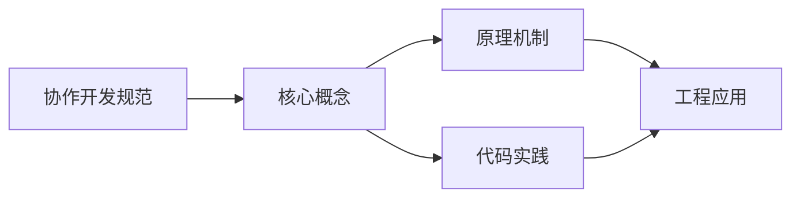
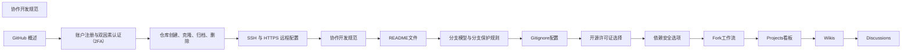

## 1. 学习目标（Bloom 分类）

本节按照布鲁姆教育目标分类学组织学习路径。本文主题为《协作开发规范》，属于 GitHub 模块，读者可以根据自身阶段选择阅读深度。

记忆层面：能够准确复述本文的核心概念、术语与基本语法或操作步骤，并能够在提问或检索时快速定位对应知识点。能够说出 GitHub 的核心概念、常用命令与流程。

理解层面：能够用自己的语言解释核心原理与工作机制，说明概念之间的因果关系，而不是机械记忆结论。能够解释 GitHub 的工作原理与设计动机。

应用层面：能够在真实项目或练习场景中运用本文知识解决具体问题，写出正确且可维护的实现。能够独立完成 GitHub 的标准操作。

分析层面：能够拆解复杂问题，比较本文主题与相邻概念的异同，识别边界条件与例外情况。能够分析 GitHub 使用中的异常与边界。

评价层面：能够根据约束条件（性能、可读性、安全、成本）评价不同方案的优劣，做出有依据的技术决策。能够评价 GitHub 相关工具与方案。

创造层面：能够把本文知识与其他模块知识组合，设计出新的解决方案或可复用的工程模式。能够把 GitHub 融入团队工作流。

通过本节学习，读者应当能够把《协作开发规范》纳入自己的知识网络，并与 GitHub 模块的其他主题（仓库、Issue、PR、Actions、生态）建立关联。

## 2. 历史动机与发展脉络

《协作开发规范》是 GitHub 领域的重要主题。要真正理解它，需要先了解它解决的问题与演进过程。

GitHub 2008 年上线，2018 年被微软收购，是全球最大的代码托管与协作平台；核心是 Git 之上的社交化协作层。
协作对象：Repository（仓库）、Issue（问题）、Pull Request（变更请求）、Discussion（讨论）、Actions（自动化）、Projects（看板）。
生态：GitHub Pages、Codespaces、Copilot、CodeQL、Packages；开放平台（REST/GraphQL API）支撑生态集成。

回到本文主题：协作开发规范 的提出与成熟，正是上述技术背景下的必然产物。早期实现往往以简单可用为目标，随着工程规模扩大，社区逐渐沉淀出标准做法与最佳实践；理解这一脉络，可以帮助读者判断“为什么文档中的推荐写法是现在这个样子”，也能在遇到历史遗留代码时准确识别其设计年代与取舍。


## 3. 形式化定义与核心概念精讲

本节把《协作开发规范》涉及的核心概念以“定义 + 讲解”的形式展开。读者应把定义当作工具，把讲解当作理解路径；两者结合才能形成可迁移的知识。

PR 流程：fork/branch -> 提交 -> PR -> 审查 -> 合并；审查通过保护规则（required reviews）。
Actions：workflow（YAML）由事件触发，job 在 runner 上执行 step；支持矩阵、缓存与密钥。
Issue 管理：标签、里程碑、模板；与 PR 通过关键词（fixes #123）自动关联。

### 3.1 原文章节逐一精讲

原文档把主题拆分为 18 个小节，下面按顺序给出每一节的导读讲解，随后保留原文细节供精读。

#### 原文精读（完整保留）


#### 1. 背景

规模化协作依赖 **可检索的提交历史**、**可执行的审查流程** 与 **法律层面的贡献授权**。**Conventional Commits（约定式提交）** 广泛用于生成 **CHANGELOG**；**PR 模板** 减少来回询问；**CLA（贡献者许可协议）** 与 **DCO（开发者来源证书）** 用于明确 **IP（知识产权）** 归属。

#### 2. Commit Message 约定

##### 2.1 标准格式

```
 <type>(<scope>): <subject>
 <body>
 <footer>
```

##### 2.2 类型说明

| 类型     | 描述                               | 示例                                         |
| -------- | ---------------------------------- | -------------------------------------------- |
| feat     | 新功能                             | `feat(auth): add refresh token rotation`     |
| fix      | 修复 bug                           | `fix(api): handle 429 from upstream`         |
| docs     | 文档更新                           | `docs(readme): clarify install steps`        |
| style    | 代码风格（格式调整，不影响功能）   | `style: format code with prettier`           |
| refactor | 代码重构（不添加功能，不修复 bug） | `refactor: extract common utility functions` |
| test     | 测试相关                           | `test: add unit tests for auth module`       |
| chore    | 构建过程或辅助工具变动             | `chore: update dependencies`                 |
| perf     | 性能优化                           | `perf: optimize database query`              |
| revert   | 回滚更改                           | `revert: revert commit abc123`               |

##### 2.3 作用域（Scope）

- 可选，用于指定变更的模块或组件
- 建议使用语义化的模块名称，如 `auth`、`api`、`ui` 等

##### 2.4 主题（Subject）

- 简短描述变更内容（不超过 50 个字符）
- 使用祈使句（如 "add" 而非 "added"）
- 英文小写开头（团队可统一使用中文）
- 结尾不要加句号

##### 2.5 正文（Body）

- 可选，详细描述变更内容
- 每行不超过 72 个字符
- 说明变更的原因和影响

##### 2.6 页脚（Footer）

- 可选，包含以下信息：
- **Breaking Change**：使用 `BREAKING CHANGE:` 前缀说明破坏性变更
- **关联 Issue**：使用 `Closes #123` 或 `Resolves #123` 关联相关 Issue
- **DCO 签名**：使用 `Signed-off-by: Name <email@example.com>` 进行 DCO 签名

##### 2.7 示例

```text
 feat(auth): add refresh token rotation
 Implement refresh token rotation to improve security.
 this change requires clients to handle token rotation properly.
 breakING CHANGE: Clients must now handle refresh token rotation.
 Closes #456
 Signed-off-by: John Doe <john@example.com>
```

##### 2.8 工具支持

- **commitizen**：交互式提交信息生成工具
- **commitlint**：提交信息验证工具
- **standard-version**：基于提交信息生成 CHANGELOG

#### 3. PR 模板配置

##### 3.1 创建 PR 模板

在仓库根目录创建 `.github/pull_request_template.md` 文件：

```markdown
#### 背景

简要描述本次 PR 的背景和目的。

#### 关联 Issue

-
-

#### 变更说明

-
-
-

#### 实现细节

-
-
-

#### 测试

-
-
-

1. 步骤 1
2. 步骤 2

#### 检查清单

-
-
-
-
-

#### 其他说明

如有其他需要说明的内容，请在此处补充。
```

##### 3.2 分支命名规范

```
 <type>/<description>
```

- **type**：feat、fix、docs、refactor 等
- **description**：简短描述分支目的
  示例：
- `feat/add-login`
- `fix/api-error-handling`
- `docs/update-readme`

##### 3.3 PR 标题规范

```
 <type>(<scope>): <subject>
```

与 Commit Message 格式一致，便于自动生成 CHANGELOG。

##### 3.4 PR 描述最佳实践

- 清晰描述变更内容和原因
- 提供测试步骤和预期结果
- 如有破坏性变更，明确说明
- 关联相关 Issue
- 如有需要，提供截图或演示链接

#### 4. Code Review 流程

##### 4.1 审查者职责

- 理解 PR 的目的和实现
- 检查代码质量和安全性
- 提供建设性反馈
- 确保测试覆盖充分
- 验证变更符合项目规范

##### 4.2 审查清单

###### 4.2.1 正确性

- [ ] 代码逻辑正确
- [ ] 边界情况处理
- [ ] 错误处理完善
- [ ] 并发安全
- [ ] 事务一致性

###### 4.2.2 安全性

- [ ] 无注入漏洞
- [ ] 无路径遍历
- [ ] 无敏感信息泄露
- [ ] 依赖无安全漏洞（使用 Dependabot）
- [ ] 权限控制正确

###### 4.2.3 可维护性

- [ ] 代码风格一致
- [ ] 命名规范
- [ ] 注释充分
- [ ] 无重复代码
- [ ] 模块化设计

###### 4.2.4 性能

- [ ] 无性能瓶颈
- [ ] 无 N+1 查询
- [ ] 资源使用合理
- [ ] 缓存策略适当

###### 4.2.5 测试

- [ ] 单元测试覆盖
- [ ] 集成测试覆盖
- [ ] 测试用例合理

##### 4.3 审查反馈类型

- **必须修改**：代码存在严重问题，必须修复
- **建议修改**：代码可以改进，建议优化
- **疑问**：对代码有疑问，需要作者解释
- **赞赏**：代码写得好，值得肯定

##### 4.4 审查流程

1. **分配审查者**：使用 CODEOWNERS 自动分配或手动指定
2. **初步审查**：检查 PR 描述和变更范围
3. **代码审查**：逐行审查代码
4. **测试验证**：运行测试确保无回归
5. **反馈沟通**：提供反馈并等待作者修改
6. **最终批准**：确认所有问题已解决
7. **合并 PR**：选择合适的合并策略

#### 5. CLA 与 DCO

##### 5.1 CLA（贡献者许可协议）

###### 5.1.1 什么是 CLA

CLA 是贡献者与项目所有者之间的法律协议，明确贡献的知识产权归属，保护项目和贡献者双方的权益。

###### 5.1.2 类型

- **个人 CLA**：适用于个人贡献者
- **企业 CLA**：适用于企业员工代表公司贡献

###### 5.1.3 配置

1. **选择 CLA 工具**：

- **CLA Assistant**：GitHub App，自动管理 CLA 签署
- **CLA Hub**：另一个流行的 CLA 管理工具

2. **配置步骤**：

- 安装 CLA Assistant GitHub App
- 创建 CLA 文档
- 在仓库中配置 CLA 检查

##### 5.2 DCO（开发者来源证书）

###### 5.2.1 什么是 DCO

DCO 是一种轻量级的贡献者协议，通过在提交信息中添加 `Signed-off-by` 行来确认贡献者有权提交代码。

###### 5.2.2 配置

1. **启用 DCO 检查**：

- 使用 `actions/dco` GitHub Action
- 在 `.github/workflows/dco.yml` 中配置

2. **DCO 工作流**：

- 贡献者使用 `git commit -s` 签署提交
- DCO Action 验证每个提交是否有签名
- 无签名的提交将导致 CI 失败

##### 5.3 CLA 与 DCO 对比

| 特性       | CLA                | DCO                |
| ---------- | ------------------ | ------------------ |
| 复杂度     | 高                 | 低                 |
| 法律约束力 | 强                 | 中等               |
| 实施难度   | 中等               | 低                 |
| 适用场景   | 大型项目、企业项目 | 开源项目、小型项目 |

#### 6. 团队协作规范

##### 6.1 分支管理

- **main/master**：主分支，保持稳定可发布状态
- **develop**：开发分支，集成新功能
- **feature/**：功能分支，开发新功能
- **fix/**：修复分支，修复 bug
- **release/**：发布分支，准备发布
- **hotfix/**：热修复分支，紧急修复生产问题

##### 6.2 代码风格

- **统一代码风格**：使用 ESLint、Prettier 等工具
- **编码规范**：制定团队编码规范文档
- **代码审查**：确保代码符合风格要求

##### 6.3 文档规范

- **README.md**：项目概述、安装、使用说明
- **CONTRIBUTING.md**：贡献指南
- **CODE_OF_CONDUCT.md**：行为准则
- **SECURITY.md**：安全漏洞上报流程
- **API 文档**：使用 JSDoc、Swagger 等工具生成

##### 6.4 会议规范

- **站会**：每日 15 分钟，同步进度和问题
- **评审会**：定期代码评审会议
- **规划会**： Sprint 规划和回顾
- **技术分享**：定期技术分享会议

#### 7. 常见问题与解决方案

##### 7.1 Commit Message 问题

- **问题**：提交信息不规范
- **解决方案**：

1.  使用 commitizen 工具生成规范的提交信息
2.  配置 commitlint 进行提交信息验证
3.  定期代码审查时检查提交信息

##### 7.2 PR 审核延迟

- **问题**：PR 审核不及时
- **解决方案**：

1.  明确审核责任和时间要求
2.  使用 CODEOWNERS 自动分配审核者
3.  建立审核优先级机制

##### 7.3 DCO 签名缺失

- **问题**：提交缺少 DCO 签名导致 CI 失败
- **解决方案**：

1.  使用 `git commit -s` 重新提交
2.  对历史提交使用 `git rebase --signoff` 签名
3.  配置 Git 客户端默认使用 `-s` 选项

##### 7.4 合并冲突

- **问题**：PR 合并时出现冲突
- **解决方案**：

1.  及时同步上游分支
2.  使用 `git rebase` 解决冲突
3.  小批量提交减少冲突概率

##### 7.5 代码质量问题

- **问题**：代码质量不符合要求
- **解决方案**：

1.  建立代码质量标准
2.  使用静态代码分析工具
3.  加强代码审查力度

#### 8. 实际应用案例

##### 8.1 开源项目

- **Vue.js**：使用 Conventional Commits 和 DCO
- **React**：使用 PR 模板和 CODEOWNERS
- **Node.js**：使用 CLA 和严格的代码审查

##### 8.2 企业项目

- **大型电商平台**：使用 Git Flow 分支管理和 CLA
- **SaaS 产品**：使用 GitHub Actions 自动化测试和部署
- **金融系统**：使用严格的代码审查和安全检查

#### 9. 工具集成

##### 9.1 GitHub 工具

- **GitHub Actions**：自动化测试、构建和部署
- **Dependabot**：自动更新依赖
- **Code Scanning**：代码安全扫描
- **Secret Scanning**：敏感信息扫描

##### 9.2 第三方工具

- **SonarQube**：代码质量分析
- **Snyk**：依赖安全扫描
- **Jira**：项目管理和 Issue 跟踪
- **Slack**：团队沟通和通知

#### 10. 最佳实践总结

- **统一规范**：制定并执行统一的协作规范
- **自动化**：使用工具自动化流程和检查
- **透明沟通**：保持团队沟通透明和及时
- **持续改进**：定期回顾和优化协作流程
- **尊重贡献者**：感谢和尊重每一位贡献者

#### 11. 延伸阅读

- [Conventional Commits](https://www.conventionalcommits.org/) <!-- nofollow -->
- [GitHub 协作指南](https://docs.github.com/en/github/collaborating-with-pull-requests) <!-- nofollow -->
- [Code Review 最佳实践](https://google.github.io/eng-practices/review/) <!-- nofollow -->
- [CLA 与 DCO 比较](https://opensource.guide/legal/#contributor-license-agreements) <!-- nofollow -->
- [Git 分支管理策略](https://nvie.com/posts/a-successful-git-branching-model/) <!-- nofollow -->


### 3.2 概念关系图

下面用 Mermaid 图表达本文核心概念之间的关系，帮助读者建立整体图景：



图中展示的是本文知识的结构化关系：核心概念是入口，原理机制解释“为什么”，代码实践演示“怎么做”，工程应用回答“何时用”。读者学习时可以把每个小节的内容挂接到对应节点上。

## 4. 理论推导与原理解析

本节深入《协作开发规范》背后的原理。理论部分不求面面俱到，而是聚焦“能解释现象、能指导实践”的关键推导。

PR 流程：fork/branch -> 提交 -> PR -> 审查 -> 合并；审查通过保护规则（required reviews）。
Actions：workflow（YAML）由事件触发，job 在 runner 上执行 step；支持矩阵、缓存与密钥。
Issue 管理：标签、里程碑、模板；与 PR 通过关键词（fixes #123）自动关联。
权限与安全：仓库角色（read/triage/write/maintain/admin）、分支保护、CODEOWNERS、安全通告。

需要强调的是，理论推导与工程实践之间存在翻译层：理论给出的是理想化模型与边界条件，工程代码则必须处理真实环境中的例外。读者在学习时应先掌握理论的“标准情形”，再通过陷阱章节了解“非标准情形”。

## 5. 代码示例与逐行讲解

本节把原文中的代码示例系统整理，并为每个示例补充用途说明与讲解。读者不应只浏览代码，而应逐段对照讲解理解设计意图。

### 5.1 示例：2.1 标准格式

该示例来自原文《2.1 标准格式》小节，用于演示协作开发规范相关操作。阅读时请先看代码结构，再看其后的讲解。

```text
 <type>(<scope>): <subject>
 <body>
 <footer>
```

讲解：这段代码演示了本节核心知识点。代码中的关键操作可以归纳为三步：准备（定义或初始化）、执行（核心逻辑）、收尾（释放资源或返回结果）。实际项目中，这三步往往被封装为函数或类，以提升复用性与可测试性。

关键点分析：

该示例共 3 行有效代码，结构以数据或配置为主。阅读时应关注：数据字段的含义、配置项的作用，以及它们与运行行为的对应关系。

进阶思考路径：先尝试修改参数观察行为变化，再把示例中的模式迁移到自己的项目中；每次修改都记录预期与实测差异，这是把示例转化为能力的最快方式。

### 5.2 示例：2.7 示例

该示例来自原文《2.7 示例》小节，用于演示协作开发规范相关操作。阅读时请先看代码结构，再看其后的讲解。

```text
 feat(auth): add refresh token rotation
 Implement refresh token rotation to improve security.
 this change requires clients to handle token rotation properly.
 breakING CHANGE: Clients must now handle refresh token rotation.
 Closes #456
 Signed-off-by: John Doe <john@example.com>
```

讲解：这段代码演示了本节核心知识点。代码中的关键操作可以归纳为三步：准备（定义或初始化）、执行（核心逻辑）、收尾（释放资源或返回结果）。实际项目中，这三步往往被封装为函数或类，以提升复用性与可测试性。

关键点分析：

该示例共 6 行有效代码，结构以数据或配置为主。阅读时应关注：数据字段的含义、配置项的作用，以及它们与运行行为的对应关系。

进阶思考路径：先尝试修改参数观察行为变化，再把示例中的模式迁移到自己的项目中；每次修改都记录预期与实测差异，这是把示例转化为能力的最快方式。

### 5.3 示例：3.1 创建 PR 模板

该示例来自原文《3.1 创建 PR 模板》小节，用于演示协作开发规范相关操作。阅读时请先看代码结构，再看其后的讲解。

```markdown
## 背景

简要描述本次 PR 的背景和目的。

## 关联 Issue

-
-

## 变更说明

-
-
-

## 实现细节

-
-
-

## 测试

-
-
-

1. 步骤 1
2. 步骤 2

## 检查清单

-
-
-
-
-

## 其他说明

如有其他需要说明的内容，请在此处补充。
```

讲解：这段代码演示了本节核心知识点。代码中的关键操作可以归纳为三步：准备（定义或初始化）、执行（核心逻辑）、收尾（释放资源或返回结果）。实际项目中，这三步往往被封装为函数或类，以提升复用性与可测试性。

关键点分析：

该示例共 27 行有效代码，结构以数据或配置为主。阅读时应关注：数据字段的含义、配置项的作用，以及它们与运行行为的对应关系。

进阶思考路径：先尝试修改参数观察行为变化，再把示例中的模式迁移到自己的项目中；每次修改都记录预期与实测差异，这是把示例转化为能力的最快方式。

### 5.4 示例：3.2 分支命名规范

该示例来自原文《3.2 分支命名规范》小节，用于演示协作开发规范相关操作。阅读时请先看代码结构，再看其后的讲解。

```text
 <type>/<description>
```

讲解：这段代码演示了本节核心知识点。代码中的关键操作可以归纳为三步：准备（定义或初始化）、执行（核心逻辑）、收尾（释放资源或返回结果）。实际项目中，这三步往往被封装为函数或类，以提升复用性与可测试性。

关键点分析：

该示例共 1 行有效代码，结构以数据或配置为主。阅读时应关注：数据字段的含义、配置项的作用，以及它们与运行行为的对应关系。

进阶思考路径：先尝试修改参数观察行为变化，再把示例中的模式迁移到自己的项目中；每次修改都记录预期与实测差异，这是把示例转化为能力的最快方式。

### 5.5 示例：3.3 PR 标题规范

该示例来自原文《3.3 PR 标题规范》小节，用于演示协作开发规范相关操作。阅读时请先看代码结构，再看其后的讲解。

```text
 <type>(<scope>): <subject>
```

讲解：这段代码演示了本节核心知识点。代码中的关键操作可以归纳为三步：准备（定义或初始化）、执行（核心逻辑）、收尾（释放资源或返回结果）。实际项目中，这三步往往被封装为函数或类，以提升复用性与可测试性。

关键点分析：

该示例共 1 行有效代码，结构以数据或配置为主。阅读时应关注：数据字段的含义、配置项的作用，以及它们与运行行为的对应关系。

进阶思考路径：先尝试修改参数观察行为变化，再把示例中的模式迁移到自己的项目中；每次修改都记录预期与实测差异，这是把示例转化为能力的最快方式。


综合以上示例，可以总结出本主题的代码实践要点：第一，先定义清晰的输入输出契约；第二，核心逻辑保持单一职责；第三，错误处理与边界条件不可省略；第四，命名与注释表达意图而非复述代码。

## 6. 对比分析

对比是理解《协作开发规范》定位的最快路径。下面从多个维度与相邻方案进行对比。

GitHub 与 GitLab：GitHub 社区大、生态全；GitLab 内置 CI/CD 与自托管。
PR 与 Issue：PR 是代码变更请求，Issue 是任务/缺陷；两者关联形成闭环。
公有与私有仓库：开源公开协作，内部代码私有 + 精细权限。

对比的目的不是分出绝对优劣，而是建立选择依据：不同约束条件下，最优解不同。读者应把每个对比维度转化为决策检查清单。

## 7. 常见陷阱与最佳实践

本节整理该主题的高频错误与推荐做法。每个陷阱先描述现象，再解释原因，最后给出最佳实践。

### 7.1 直接推主分支

绕过审查。启用分支保护 + 强制 PR。

深入讲解：该问题之所以被归类为“常见陷阱”，是因为它在初学者的代码中反复出现，而且往往不在第一时间暴露——错误通常隐藏在特定数据或特定时序下。

从成因上看，直接推主分支 一般源于对 GitHub 某个机制的理解偏差：要么误用了默认行为，要么忽略了边界条件，要么把其他语言的思维惯性带了过来。

从影响上看，直接推主分支 轻则产生错误结果，重则导致资源泄漏、数据损坏或安全事故；这也是为什么工程评审中会把它列为检查项。

从修复策略上看，处理直接推主分支的正确顺序是：先复现（构造最小用例），再定位（确认机制层面的根因），最后修复并补充回归测试。跳过复现直接改代码，往往治标不治本。

### 7.2 密钥写进 Actions 文件

泄露。使用 repository secrets 与 OIDC。

深入讲解：该问题之所以被归类为“常见陷阱”，是因为它在初学者的代码中反复出现，而且往往不在第一时间暴露——错误通常隐藏在特定数据或特定时序下。

从成因上看，密钥写进 Actions 文件 一般源于对 GitHub 某个机制的理解偏差：要么误用了默认行为，要么忽略了边界条件，要么把其他语言的思维惯性带了过来。

从影响上看，密钥写进 Actions 文件 轻则产生错误结果，重则导致资源泄漏、数据损坏或安全事故；这也是为什么工程评审中会把它列为检查项。

从修复策略上看，处理密钥写进 Actions 文件的正确顺序是：先复现（构造最小用例），再定位（确认机制层面的根因），最后修复并补充回归测试。跳过复现直接改代码，往往治标不治本。

### 7.3 PR 过大

难以审查。小 PR + 清晰描述。

深入讲解：该问题之所以被归类为“常见陷阱”，是因为它在初学者的代码中反复出现，而且往往不在第一时间暴露——错误通常隐藏在特定数据或特定时序下。

从成因上看，PR 过大 一般源于对 GitHub 某个机制的理解偏差：要么误用了默认行为，要么忽略了边界条件，要么把其他语言的思维惯性带了过来。

从影响上看，PR 过大 轻则产生错误结果，重则导致资源泄漏、数据损坏或安全事故；这也是为什么工程评审中会把它列为检查项。

从修复策略上看，处理PR 过大的正确顺序是：先复现（构造最小用例），再定位（确认机制层面的根因），最后修复并补充回归测试。跳过复现直接改代码，往往治标不治本。

### 7.4 忽略 CODEOWNERS

关键代码无人审查。配置并强制执行。

深入讲解：该问题之所以被归类为“常见陷阱”，是因为它在初学者的代码中反复出现，而且往往不在第一时间暴露——错误通常隐藏在特定数据或特定时序下。

从成因上看，忽略 CODEOWNERS 一般源于对 GitHub 某个机制的理解偏差：要么误用了默认行为，要么忽略了边界条件，要么把其他语言的思维惯性带了过来。

从影响上看，忽略 CODEOWNERS 轻则产生错误结果，重则导致资源泄漏、数据损坏或安全事故；这也是为什么工程评审中会把它列为检查项。

从修复策略上看，处理忽略 CODEOWNERS的正确顺序是：先复现（构造最小用例），再定位（确认机制层面的根因），最后修复并补充回归测试。跳过复现直接改代码，往往治标不治本。

### 7.5 依赖漏洞不处理

Dependabot 告警堆积。自动化更新与合并。

深入讲解：该问题之所以被归类为“常见陷阱”，是因为它在初学者的代码中反复出现，而且往往不在第一时间暴露——错误通常隐藏在特定数据或特定时序下。

从成因上看，依赖漏洞不处理 一般源于对 GitHub 某个机制的理解偏差：要么误用了默认行为，要么忽略了边界条件，要么把其他语言的思维惯性带了过来。

从影响上看，依赖漏洞不处理 轻则产生错误结果，重则导致资源泄漏、数据损坏或安全事故；这也是为什么工程评审中会把它列为检查项。

从修复策略上看，处理依赖漏洞不处理的正确顺序是：先复现（构造最小用例），再定位（确认机制层面的根因），最后修复并补充回归测试。跳过复现直接改代码，往往治标不治本。

### 7.6 fork 后不同步

上游更新丢失。配置上游 remote 定期同步。

深入讲解：该问题之所以被归类为“常见陷阱”，是因为它在初学者的代码中反复出现，而且往往不在第一时间暴露——错误通常隐藏在特定数据或特定时序下。

从成因上看，fork 后不同步 一般源于对 GitHub 某个机制的理解偏差：要么误用了默认行为，要么忽略了边界条件，要么把其他语言的思维惯性带了过来。

从影响上看，fork 后不同步 轻则产生错误结果，重则导致资源泄漏、数据损坏或安全事故；这也是为什么工程评审中会把它列为检查项。

从修复策略上看，处理fork 后不同步的正确顺序是：先复现（构造最小用例），再定位（确认机制层面的根因），最后修复并补充回归测试。跳过复现直接改代码，往往治标不治本。

### 7.7 滥用 force push

覆盖他人工作。仅个人分支。

深入讲解：该问题之所以被归类为“常见陷阱”，是因为它在初学者的代码中反复出现，而且往往不在第一时间暴露——错误通常隐藏在特定数据或特定时序下。

从成因上看，滥用 force push 一般源于对 GitHub 某个机制的理解偏差：要么误用了默认行为，要么忽略了边界条件，要么把其他语言的思维惯性带了过来。

从影响上看，滥用 force push 轻则产生错误结果，重则导致资源泄漏、数据损坏或安全事故；这也是为什么工程评审中会把它列为检查项。

从修复策略上看，处理滥用 force push的正确顺序是：先复现（构造最小用例），再定位（确认机制层面的根因），最后修复并补充回归测试。跳过复现直接改代码，往往治标不治本。

### 7.8 Issue 无模板

信息不全。配置 issue/PR 模板。

深入讲解：该问题之所以被归类为“常见陷阱”，是因为它在初学者的代码中反复出现，而且往往不在第一时间暴露——错误通常隐藏在特定数据或特定时序下。

从成因上看，Issue 无模板 一般源于对 GitHub 某个机制的理解偏差：要么误用了默认行为，要么忽略了边界条件，要么把其他语言的思维惯性带了过来。

从影响上看，Issue 无模板 轻则产生错误结果，重则导致资源泄漏、数据损坏或安全事故；这也是为什么工程评审中会把它列为检查项。

从修复策略上看，处理Issue 无模板的正确顺序是：先复现（构造最小用例），再定位（确认机制层面的根因），最后修复并补充回归测试。跳过复现直接改代码，往往治标不治本。

### 7.0 最佳实践总览

1. 仓库健康：README、LICENSE、CONTRIBUTING、模板齐全。
2. 自动化：CI 门禁、Dependabot、CodeQL、自动标签。
3. 发布：GitHub Releases + CHANGELOG；语义化版本。

把这些最佳实践固化为团队规范与代码评审检查项，是避免同类问题反复出现的关键。

## 8. 工程实践

本节把《协作开发规范》放入真实工程场景，给出可复用的模式与组织方法。

组织管理：Teams 分权、SAMLOIDC 单点登录、审计日志。
开源治理：行为准则、贡献指南、维护者矩阵。
度量：PR 周期、合并率、Issue 响应时间驱动改进。

### 8.1 工程实践的原则拆解

以上工程实践可以归纳为四条原则。第一，配置与代码分离：GitHub 项目中环境差异应通过配置注入，而不是散落在代码分支中；这保证同一份代码可以在开发、测试、生产环境一致运行。

第二，接口稳定优先：对外接口（函数签名、协议、数据格式）一旦被消费方依赖，变更成本极高；设计时应预留扩展点并保持向后兼容。

第三，可观测性内置：日志、指标与追踪应该在功能开发时同步设计，而不是故障发生后补救；没有观测手段的模块等于黑盒。

第四，变更可回滚：任何发布都应有对应的回滚方案；数据库迁移、配置变更与代码发布一样需要版本管理与逆向路径。

### 8.2 实践落地的检查清单

- [ ] 组织管理：对照本节描述，检查当前项目是否已经落实；未落实的项列入技术债并排期处理。
- [ ] 开源治理：对照本节描述，检查当前项目是否已经落实；未落实的项列入技术债并排期处理。
- [ ] 度量：对照本节描述，检查当前项目是否已经落实；未落实的项列入技术债并排期处理。

工程实践的共性原则：配置与代码分离、接口稳定优先、可观测性内置、变更可回滚。这些原则适用于本主题的所有实现。

## 9. 案例研究

本节通过一个完整案例把《协作开发规范》的知识串起来。案例按“需求分析、方案设计、实现、验证”四步展开。

需求：为开源项目建立高质量协作流程。
方案：模板 + 分支保护 + CI + Dependabot + 发布流程。
要点：自动化检查前置、审查清单、安全扫描。
验证：贡献者体验调查与流程指标。

### 9.1 案例的扩展讨论

把案例中的方案放大到真实规模，需要额外考虑三个问题：

第一，规模：当数据量或并发量上升一个数量级时，原方案中的数据结构、缓存策略与任务调度是否仍然成立？通常需要引入分层与异步。

第二，团队：多人协作时，模块边界、接口契约与代码所有权必须明确；案例中的实现应拆分为可独立测试的单元，并配合文档说明设计意图。

第三，演进：上线后的需求变化不可避免；方案设计时应预留扩展点（配置化、插件化、事件化），并定期用真实指标验证假设。


案例研究的学习方法：先独立阅读需求，尝试在脑中形成方案，再对照实现与讲解，最后思考“如果约束变化（数据量、并发、团队规模），方案应如何调整”。

## 10. 知识要点总结与深入讲解

本节以讲解形式汇总全文要点，替代传统的习题与自测，读者不需要答题，只需跟随解释建立完整的认知框架。

关于《协作开发规范》的核心结论：

GitHub 的价值是协作闭环：Issue 到 PR 到发布全部可追踪。
自动化（Actions）与安全是平台能力的双翼。
规范模板让外部贡献者低成本参与。

原文档各小节的要点回顾：

- 1. 背景：该小节围绕协作开发规范展开具体细节，阅读时应关注其与核心结论的对应关系；每个小节都是核心结论在某一个侧面的展开。
- 2. Commit Message 约定：该小节围绕协作开发规范展开具体细节，阅读时应关注其与核心结论的对应关系；每个小节都是核心结论在某一个侧面的展开。
- 3. PR 模板配置：该小节围绕协作开发规范展开具体细节，阅读时应关注其与核心结论的对应关系；每个小节都是核心结论在某一个侧面的展开。
- 背景：该小节围绕协作开发规范展开具体细节，阅读时应关注其与核心结论的对应关系；每个小节都是核心结论在某一个侧面的展开。
- 关联 Issue：该小节围绕协作开发规范展开具体细节，阅读时应关注其与核心结论的对应关系；每个小节都是核心结论在某一个侧面的展开。
- 变更说明：该小节围绕协作开发规范展开具体细节，阅读时应关注其与核心结论的对应关系；每个小节都是核心结论在某一个侧面的展开。
- 实现细节：该小节围绕协作开发规范展开具体细节，阅读时应关注其与核心结论的对应关系；每个小节都是核心结论在某一个侧面的展开。
- 测试：该小节围绕协作开发规范展开具体细节，阅读时应关注其与核心结论的对应关系；每个小节都是核心结论在某一个侧面的展开。
- 检查清单：该小节围绕协作开发规范展开具体细节，阅读时应关注其与核心结论的对应关系；每个小节都是核心结论在某一个侧面的展开。
- 其他说明：该小节围绕协作开发规范展开具体细节，阅读时应关注其与核心结论的对应关系；每个小节都是核心结论在某一个侧面的展开。
- 4. Code Review 流程：该小节围绕协作开发规范展开具体细节，阅读时应关注其与核心结论的对应关系；每个小节都是核心结论在某一个侧面的展开。
- 5. CLA 与 DCO：该小节围绕协作开发规范展开具体细节，阅读时应关注其与核心结论的对应关系；每个小节都是核心结论在某一个侧面的展开。
- 6. 团队协作规范：该小节围绕协作开发规范展开具体细节，阅读时应关注其与核心结论的对应关系；每个小节都是核心结论在某一个侧面的展开。
- 7. 常见问题与解决方案：该小节围绕协作开发规范展开具体细节，阅读时应关注其与核心结论的对应关系；每个小节都是核心结论在某一个侧面的展开。
- 8. 实际应用案例：该小节围绕协作开发规范展开具体细节，阅读时应关注其与核心结论的对应关系；每个小节都是核心结论在某一个侧面的展开。
- 9. 工具集成：该小节围绕协作开发规范展开具体细节，阅读时应关注其与核心结论的对应关系；每个小节都是核心结论在某一个侧面的展开。
- 10. 最佳实践总结：该小节围绕协作开发规范展开具体细节，阅读时应关注其与核心结论的对应关系；每个小节都是核心结论在某一个侧面的展开。
- 11. 延伸阅读：该小节围绕协作开发规范展开具体细节，阅读时应关注其与核心结论的对应关系；每个小节都是核心结论在某一个侧面的展开。

把以上要点与第 3-9 节的内容对照复习，即可完成对本文主题的闭环学习。

## 11. 参考文献


GitHub 文档：https://docs.github.com/zh
GitHub Actions 文档：https://docs.github.com/zh/actions
GitHub REST API：https://docs.github.com/zh/rest
GitHub GraphQL API：https://docs.github.com/zh/graphql

## 12. 延伸阅读


GitHub Actions CI/CD，见 004-github 模块 Actions 文档。
Git 协作基础，见 003-git 模块。
DevOps 自动化，见 031-devops 模块。
黑马程序员 Bilibili 空间（https://space.bilibili.com/37974444 ）提供 GitHub 课程。

## 14. 模块知识图谱与学习路径

本文属于 GitHub 模块。为了把《协作开发规范》放入完整的知识网络，下面列出本模块的全部主题并给出相互关联的导读。学习时建议按模块内顺序推进，并在每个文档中留意交叉引用。



上图为模块主题的推荐学习顺序示意图（仅展示前若干主题）。各主题之间存在三类关联：

第一，前置依赖关系：早期主题是后期主题的基础，例如环境与语法先行、进阶主题随后；

第二，横向并列关系：同一层级主题从不同角度覆盖模块能力，学习顺序可以按兴趣调整；

第三，工程组合关系：多个主题在真实项目中组合使用，例如配置、性能与安全主题往往出现在同一系统的不同层面。

### 14.1 模块主题速查表

| 文档 | 主题 | 与本文的关联 |
| --- | --- | --- |
| GitHub 概述 | 001-GitHubOverview | 本文的前置基础 |
| 账户注册与双因素认证（2FA） | 002-AccountRegister2FA2FA | 本文的并列主题 |
| 仓库创建、克隆、归档、删除 | 003-RepositoryCreateCloneArchiveDelete | 本文的并列主题 |
| SSH 与 HTTPS 远程配置 | 004-SSHHTTPS | 本文的并列主题 |
| 协作开发规范 | 005-CollaborationDevelopmentStandard | 本文自身 |
| README文件 | 006-READMEFile | 本文的并列主题 |
| 分支模型与分支保护规则 | 007-BranchModelBranchRule | 本文的并列主题 |
| Gitignore配置 | 008-GitignoreConfig | 本文的并列主题 |
| 开源许可证选择 | 009-OpenSourceLicense | 本文的并列主题 |
| 依赖安全选项 | 010-DependencySecurityOptions | 本文的安全延伸 |
| Fork工作流 | 011-ForkWorkflow | 本文的并列主题 |
| Projects看板 | 012-ProjectsBoard | 本文的并列主题 |
| Wikis | 013-Wikis | 本文的并列主题 |
| Discussions | 014-Discussions | 本文的并列主题 |
| GitHub-Copilot | 015-GitHubCopilot | 本文的并列主题 |
| Dependabot | 016-Dependabot | 本文的并列主题 |
| Issues 模板、标签与里程碑 | 017-IssuesTemplateTagMilestone | 本文的并列主题 |
| 密钥扫描 | 018-SecretScanning | 本文的并列主题 |
| CodeQL代码扫描 | 019-CodeQLCodeScanning | 本文的并列主题 |
| GitHub-CLI | 020-GitHubCLI | 本文的并列主题 |
| REST与GraphQL-API | 021-RESTGraphQLAPI | 本文的并列主题 |
| Webhooks | 022-Webhooks | 本文的并列主题 |
| GitHub-Packages | 023-GitHubPackages | 本文的并列主题 |
| Codespaces | 024-Codespaces | 本文的并列主题 |
| CODEOWNERS | 025-CODEOWNERS | 本文的并列主题 |
| 社区健康文件 | 026-CommunityHealthFile | 本文的并列主题 |
| Pull Request 完整协作流程 | 027-PullRequestCompleteCollaborationFlow | 本文的并列主题 |
| GitHub Pages 多站点方案 | 028-GitHubPagesMultiSolution | 本文的并列主题 |
| GitHub Actions 与 CI/CD | 029-GitHubActionsCICD | 本文的并列主题 |
| Actions触发器 | 030-ActionsTrigger | 本文的并列主题 |
| 常见问题排查 | 031-FAQTroubleshoot | 本文的并列主题 |
| Actions矩阵构建 | 032-ActionsMatrixBuild | 本文的并列主题 |
| Actions缓存依赖 | 033-ActionsCacheDependency | 本文的并列主题 |
| Actions自托管运行器 | 034-ActionsSelfHostedRunner | 本文的并列主题 |
| Actions制品传递 | 035-ActionsArtifact | 本文的并列主题 |
| Actions环境部署 | 036-ActionsEnvironmentDeploy | 本文的前置基础 |
| GitHub 仓库初始化 | 037-GitRepoInit | 本文的并列主题 |
| GitHub 提交与推送 | 038-GitCommitPush | 本文的并列主题 |
| GitHub 拉取与获取 | 039-GitPullFetch | 本文的并列主题 |
| GitHub 合并与变基 | 040-GitMergeRebase | 本文的并列主题 |
| GitHub 冲突解决 | 041-GitConflictResolve | 本文的并列主题 |
| GitHub 标签管理 | 042-GitTagManage | 本文的并列主题 |
| GitHub 远程仓库管理 | 043-GitRemoteManage | 本文的并列主题 |
| GitHub 历史与日志 | 044-GitHistoryLog | 本文的并列主题 |
| GitHub 暂存与回退 | 045-GitStashReset | 本文的并列主题 |
| GitHub CLI 认证配置 | 046-GhCliAuth | 本文的并列主题 |
| GitHub CLI PR 管理 | 047-GhPrManage | 本文的并列主题 |
| GitHub CLI Issue 管理 | 048-GhIssueManage | 本文的并列主题 |
| GitHub CLI 仓库管理 | 049-GhRepoManage | 本文的并列主题 |
| gh release 发布命令速查手册 | 050-GhRelease | 本文的并列主题 |
| gh workflow 工作流命令速查手册 | 051-GhWorkflow | 本文的并列主题 |
| gh gist 代码片段命令速查手册 | 052-GhGist | 本文的并列主题 |
| gh extension 扩展命令速查手册 | 053-GhExtension | 本文的并列主题 |
| gh api 调用命令速查手册 | 054-GhApi | 本文的并列主题 |
| gh search 搜索命令速查手册 | 055-GhSearch | 本文的并列主题 |
| gh label 与 alias/config 命令速查手册 | 056-GhLabel | 本文的并列主题 |
| gh alias 与 config 命令速查手册 | 057-GhAliasConfig | 本文的并列主题 |

速查表的作用是让读者快速判断：哪些文档应在阅读本文前掌握（前置基础），哪些文档应在阅读本文后继续（延伸主题）。本模块的交叉引用体系即以此表为基础。

## 15. 术语表

下表整理《协作开发规范》及 GitHub 模块中出现的高频术语，给出简明释义。术语按字母序或逻辑序排列，供查阅。

| 术语 | 释义 |
| --- | --- |
| PR 流程 | fork/branch -> 提交 -> PR -> 审查 -> 合并；审查通过保护规则（required reviews）。 |
| Actions | workflow（YAML）由事件触发，job 在 runner 上执行 step；支持矩阵、缓存与密钥。 |
| Issue 管理 | 标签、里程碑、模板；与 PR 通过关键词（fixes #123）自动关联。 |
| 权限与安全 | 仓库角色（read/triage/write/maintain/admin）、分支保护、CODEOWNERS、安全通告。 |
| 直接推主分支（易错点） | 参见常见陷阱章节的详细讲解 |
| 密钥写进 Actions 文件（易错点） | 参见常见陷阱章节的详细讲解 |
| PR 过大（易错点） | 参见常见陷阱章节的详细讲解 |
| 忽略 CODEOWNERS（易错点） | 参见常见陷阱章节的详细讲解 |
| 依赖漏洞不处理（易错点） | 参见常见陷阱章节的详细讲解 |
| fork 后不同步（易错点） | 参见常见陷阱章节的详细讲解 |

术语表与正文配合使用：先通读正文，遇到模糊术语回查本表；长期使用后术语会自然进入工作记忆。

## 13. 深度专题扩展

以下专题从不同角度深入本文主题，供有进阶需求的读者研读。每个专题独立成节，内容相互补充。

### 13.1 GitHub Actions 深入

事件驱动：push、pull_request、schedule、workflow_dispatch；on 支持过滤路径与分支。
上下文：github（事件数据）、env、secrets、needs（任务依赖）；表达式与函数。
安全：第三方 action 固定 SHA；权限默认最小；OIDC 换取云凭证。
缓存与性能：actions/cache、并发控制、矩阵并行。

### 13.2 开源协作治理

CONTRIBUTING 定义贡献路径；Issue 标签（good first issue）引导新手。
维护者时间管理：合并队列、自动化 triage、定期发布。
社区健康：行为准则执行、讨论区沉淀、感谢贡献。
安全披露：SECURITY.md + 私密漏洞报告流程。

## 16. 核心概念串讲（复习视角）

本节以“把知识讲给他人听”的方式，把《协作开发规范》的核心概念重新串讲一遍。与前文按章节展开不同，这里的叙述更接近课堂总结：先说整体，再逐个展开，最后收束。

《协作开发规范》属于 GitHub 模块。要理解它，先要理解它在模块中的位置：它解决的是该领域的一个具体问题，并依赖模块内若干前置概念；反过来，它又为后续进阶主题提供基础。

第一个概念是PR 流程。fork/branch -> 提交 -> PR -> 审查 -> 合并；审查通过保护规则（required reviews）。

在实际使用中，PR 流程需要与相邻概念区分：它们的区别不在于名称，而在于适用条件与行为边界；这正是前文对比分析章节的意义。

第一个概念是Actions。workflow（YAML）由事件触发，job 在 runner 上执行 step；支持矩阵、缓存与密钥。

在实际使用中，Actions需要与相邻概念区分：它们的区别不在于名称，而在于适用条件与行为边界；这正是前文对比分析章节的意义。

第一个概念是Issue 管理。标签、里程碑、模板；与 PR 通过关键词（fixes #123）自动关联。

在实际使用中，Issue 管理需要与相邻概念区分：它们的区别不在于名称，而在于适用条件与行为边界；这正是前文对比分析章节的意义。

接下来是PR 流程。fork/branch -> 提交 -> PR -> 审查 -> 合并；审查通过保护规则（required reviews）。

理解该原理的关键不是记住结论，而是记住“它从什么假设出发、推出了什么、假设不成立时会怎样”。带着这个框架复习，原理之间就会连成网络。

接下来是Actions。workflow（YAML）由事件触发，job 在 runner 上执行 step；支持矩阵、缓存与密钥。

理解该原理的关键不是记住结论，而是记住“它从什么假设出发、推出了什么、假设不成立时会怎样”。带着这个框架复习，原理之间就会连成网络。

接下来是Issue 管理。标签、里程碑、模板；与 PR 通过关键词（fixes #123）自动关联。

理解该原理的关键不是记住结论，而是记住“它从什么假设出发、推出了什么、假设不成立时会怎样”。带着这个框架复习，原理之间就会连成网络。

接下来是权限与安全。仓库角色（read/triage/write/maintain/admin）、分支保护、CODEOWNERS、安全通告。

理解该原理的关键不是记住结论，而是记住“它从什么假设出发、推出了什么、假设不成立时会怎样”。带着这个框架复习，原理之间就会连成网络。

串讲收束：把概念与原理放回本文主题，可以得出一个总纲——定义描述是什么，原理解释为什么，实践回答怎么做。三者构成完整的学习闭环；后续遇到相关问题，都可以按这个总纲检索知识。
