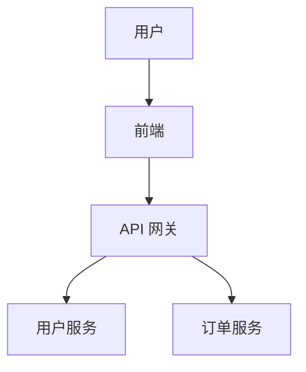

## 1. README 概述

### 1.1 为什么 README 很重要

README 是项目的**门面**，是访客看到的第一份文档。一个好的 README 可以：

- 让访客在 30 秒内理解项目
- 降低新贡献者的上手门槛
- 提高项目的可发现性和可信度

### 1.2 README 的核心要素

| 要素               | 优先级 | 说明                   |
| :----------------- | :----- | :--------------------- |
| **项目名称与描述** | 必须   | 一句话说清楚项目是什么 |
| **安装说明**       | 必须   | 如何安装和运行         |
| **使用示例**       | 必须   | 快速上手代码           |
| **许可证**         | 必须   | 开源协议               |
| **徽章**           | 推荐   | 状态一览               |
| **贡献指南**       | 推荐   | 如何参与               |
| **常见问题**       | 可选   | FAQ                    |

## 2. README 结构模板

```markdown
# 项目名称


简短的项目描述，一句话说明项目做什么。

## 功能特性

- 功能一：简短描述
- 功能二：简短描述
- 功能三：简短描述

## 快速开始

### 安装

\`\`\`bash
npm install my-project
\`\`\`

### 使用

\`\`\`javascript
import { createApp } from 'my-project';

const app = createApp({
target: '#app',
props: { title: 'Hello' }
});
\`\`\`

## 文档

完整文档请访问 [docs.example.com](https://docs.example.com)

## 开发

\`\`\`bash
git clone https://github.com/user/repo.git
cd repo
npm install
npm run dev
\`\`\`

## 贡献

欢迎贡献！请阅读 [贡献指南](CONTRIBUTING.md)

## 许可证

[MIT](LICENSE)
```

## 3. 徽章（Badges）

### 3.1 常用徽章

```markdown


```

### 3.2 自定义徽章

```markdown


```

## 4. 视觉元素

### 4.1 截图和 GIF

```markdown
## 预览


<details>
<summary>更多截图</summary>


</details>
```

### 4.2 架构图

使用 Mermaid 绘制架构图：

````markdown

````

## 5. 最佳实践

- README 控制在 200 行以内，详细内容放 Wiki
- 代码示例要**可运行**
- 安装步骤要**完整**，包括前置依赖
- 使用目录导航长文档
- 定期更新 README 与代码保持同步

## 参考文献


GitHub 文档：https://docs.github.com/zh
GitHub Actions 文档：https://docs.github.com/zh/actions
GitHub REST API：https://docs.github.com/zh/rest
GitHub GraphQL API：https://docs.github.com/zh/graphql

## 延伸阅读


GitHub Actions CI/CD，见 004-github 模块 Actions 文档。
Git 协作基础，见 003-git 模块。
DevOps 自动化，见 031-devops 模块。
黑马程序员 Bilibili 空间（https://space.bilibili.com/37974444 ）提供 GitHub 课程。

## 深度专题扩展


以下专题从不同角度深入本文主题，供有进阶需求的读者研读。每个专题独立成节，内容相互补充。

### 13.1 GitHub Actions 深入

事件驱动：push、pull_request、schedule、workflow_dispatch；on 支持过滤路径与分支。
上下文：github（事件数据）、env、secrets、needs（任务依赖）；表达式与函数。
安全：第三方 action 固定 SHA；权限默认最小；OIDC 换取云凭证。
缓存与性能：actions/cache、并发控制、矩阵并行。

### 13.2 开源协作治理

CONTRIBUTING 定义贡献路径；Issue 标签（good first issue）引导新手。
维护者时间管理：合并队列、自动化 triage、定期发布。
社区健康：行为准则执行、讨论区沉淀、感谢贡献。
安全披露：SECURITY.md + 私密漏洞报告流程。

## 模块文档速查表

| 文档 | 主题 | 与本文的关联 |
| --- | --- | --- |
| GitHub 概述 | 001-GitHubOverview | 本文的前置基础 |
| 账户注册与双因素认证（2FA） | 002-AccountRegister2FA2FA | 本文的并列主题 |
| 仓库创建、克隆、归档、删除 | 003-RepositoryCreateCloneArchiveDelete | 本文的并列主题 |
| SSH 与 HTTPS 远程配置 | 004-SSHHTTPS | 本文的并列主题 |
| 协作开发规范 | 005-CollaborationDevelopmentStandard | 本文的并列主题 |
| README文件 | 006-READMEFile | 本文自身 |
| 分支模型与分支保护规则 | 007-BranchModelBranchRule | 本文的并列主题 |
| Gitignore配置 | 008-GitignoreConfig | 本文的并列主题 |
| 开源许可证选择 | 009-OpenSourceLicense | 本文的并列主题 |
| 依赖安全选项 | 010-DependencySecurityOptions | 本文的安全延伸 |
| Fork工作流 | 011-ForkWorkflow | 本文的并列主题 |
| Projects看板 | 012-ProjectsBoard | 本文的并列主题 |
| Wikis | 013-Wikis | 本文的并列主题 |
| Discussions | 014-Discussions | 本文的并列主题 |
| GitHub-Copilot | 015-GitHubCopilot | 本文的并列主题 |
| Dependabot | 016-Dependabot | 本文的并列主题 |
| Issues 模板、标签与里程碑 | 017-IssuesTemplateTagMilestone | 本文的并列主题 |
| 密钥扫描 | 018-SecretScanning | 本文的并列主题 |
| CodeQL代码扫描 | 019-CodeQLCodeScanning | 本文的并列主题 |
| GitHub-CLI | 020-GitHubCLI | 本文的并列主题 |
| REST与GraphQL-API | 021-RESTGraphQLAPI | 本文的并列主题 |
| Webhooks | 022-Webhooks | 本文的并列主题 |
| GitHub-Packages | 023-GitHubPackages | 本文的并列主题 |
| Codespaces | 024-Codespaces | 本文的并列主题 |
| CODEOWNERS | 025-CODEOWNERS | 本文的并列主题 |
| 社区健康文件 | 026-CommunityHealthFile | 本文的并列主题 |
| Pull Request 完整协作流程 | 027-PullRequestCompleteCollaborationFlow | 本文的并列主题 |
| GitHub Pages 多站点方案 | 028-GitHubPagesMultiSolution | 本文的并列主题 |
| GitHub Actions 与 CI/CD | 029-GitHubActionsCICD | 本文的并列主题 |
| Actions触发器 | 030-ActionsTrigger | 本文的并列主题 |
| 常见问题排查 | 031-FAQTroubleshoot | 本文的并列主题 |
| Actions矩阵构建 | 032-ActionsMatrixBuild | 本文的并列主题 |
| Actions缓存依赖 | 033-ActionsCacheDependency | 本文的并列主题 |
| Actions自托管运行器 | 034-ActionsSelfHostedRunner | 本文的并列主题 |
| Actions制品传递 | 035-ActionsArtifact | 本文的并列主题 |
| Actions环境部署 | 036-ActionsEnvironmentDeploy | 本文的前置基础 |
| GitHub 仓库初始化 | 037-GitRepoInit | 本文的并列主题 |
| GitHub 提交与推送 | 038-GitCommitPush | 本文的并列主题 |
| GitHub 拉取与获取 | 039-GitPullFetch | 本文的并列主题 |
| GitHub 合并与变基 | 040-GitMergeRebase | 本文的并列主题 |
| GitHub 冲突解决 | 041-GitConflictResolve | 本文的并列主题 |
| GitHub 标签管理 | 042-GitTagManage | 本文的并列主题 |
| GitHub 远程仓库管理 | 043-GitRemoteManage | 本文的并列主题 |
| GitHub 历史与日志 | 044-GitHistoryLog | 本文的并列主题 |
| GitHub 暂存与回退 | 045-GitStashReset | 本文的并列主题 |
| GitHub CLI 认证配置 | 046-GhCliAuth | 本文的并列主题 |
| GitHub CLI PR 管理 | 047-GhPrManage | 本文的并列主题 |
| GitHub CLI Issue 管理 | 048-GhIssueManage | 本文的并列主题 |
| GitHub CLI 仓库管理 | 049-GhRepoManage | 本文的并列主题 |
| gh release 发布命令速查手册 | 050-GhRelease | 本文的并列主题 |
| gh workflow 工作流命令速查手册 | 051-GhWorkflow | 本文的并列主题 |
| gh gist 代码片段命令速查手册 | 052-GhGist | 本文的并列主题 |
| gh extension 扩展命令速查手册 | 053-GhExtension | 本文的并列主题 |
| gh api 调用命令速查手册 | 054-GhApi | 本文的并列主题 |
| gh search 搜索命令速查手册 | 055-GhSearch | 本文的并列主题 |
| gh label 与 alias/config 命令速查手册 | 056-GhLabel | 本文的并列主题 |
| gh alias 与 config 命令速查手册 | 057-GhAliasConfig | 本文的并列主题 |
