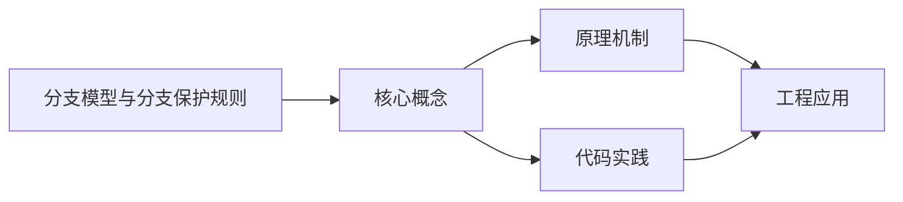
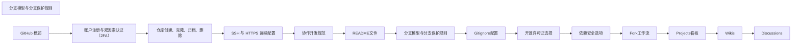

## 1. 学习目标（Bloom 分类）

本节按照布鲁姆教育目标分类学组织学习路径。本文主题为《分支模型与分支保护规则》，属于 GitHub 模块，读者可以根据自身阶段选择阅读深度。

记忆层面：能够准确复述本文的核心概念、术语与基本语法或操作步骤，并能够在提问或检索时快速定位对应知识点。能够说出 GitHub 的核心概念、常用命令与流程。

理解层面：能够用自己的语言解释核心原理与工作机制，说明概念之间的因果关系，而不是机械记忆结论。能够解释 GitHub 的工作原理与设计动机。

应用层面：能够在真实项目或练习场景中运用本文知识解决具体问题，写出正确且可维护的实现。能够独立完成 GitHub 的标准操作。

分析层面：能够拆解复杂问题，比较本文主题与相邻概念的异同，识别边界条件与例外情况。能够分析 GitHub 使用中的异常与边界。

评价层面：能够根据约束条件（性能、可读性、安全、成本）评价不同方案的优劣，做出有依据的技术决策。能够评价 GitHub 相关工具与方案。

创造层面：能够把本文知识与其他模块知识组合，设计出新的解决方案或可复用的工程模式。能够把 GitHub 融入团队工作流。

通过本节学习，读者应当能够把《分支模型与分支保护规则》纳入自己的知识网络，并与 GitHub 模块的其他主题（仓库、Issue、PR、Actions、生态）建立关联。

## 2. 历史动机与发展脉络

《分支模型与分支保护规则》是 GitHub 领域的重要主题。要真正理解它，需要先了解它解决的问题与演进过程。

GitHub 2008 年上线，2018 年被微软收购，是全球最大的代码托管与协作平台；核心是 Git 之上的社交化协作层。
协作对象：Repository（仓库）、Issue（问题）、Pull Request（变更请求）、Discussion（讨论）、Actions（自动化）、Projects（看板）。
生态：GitHub Pages、Codespaces、Copilot、CodeQL、Packages；开放平台（REST/GraphQL API）支撑生态集成。

回到本文主题：分支模型与分支保护规则 的提出与成熟，正是上述技术背景下的必然产物。早期实现往往以简单可用为目标，随着工程规模扩大，社区逐渐沉淀出标准做法与最佳实践；理解这一脉络，可以帮助读者判断“为什么文档中的推荐写法是现在这个样子”，也能在遇到历史遗留代码时准确识别其设计年代与取舍。


## 3. 形式化定义与核心概念精讲

本节把《分支模型与分支保护规则》涉及的核心概念以“定义 + 讲解”的形式展开。读者应把定义当作工具，把讲解当作理解路径；两者结合才能形成可迁移的知识。

PR 流程：fork/branch -> 提交 -> PR -> 审查 -> 合并；审查通过保护规则（required reviews）。
Actions：workflow（YAML）由事件触发，job 在 runner 上执行 step；支持矩阵、缓存与密钥。
Issue 管理：标签、里程碑、模板；与 PR 通过关键词（fixes #123）自动关联。

### 3.1 原文章节逐一精讲

原文档把主题拆分为 14 个小节，下面按顺序给出每一节的导读讲解，随后保留原文细节供精读。

#### 原文精读（完整保留）

# GitHub 分支管理

> **符号约定**：`< >` 必填参数 | `[ ]` 可选参数

---

#### 2. 分支模型详解

##### 2.1 Git Flow 分支模型

Git Flow 是一种较为复杂的分支模型，适合有明确发布周期的软件项目。

###### 2.1.1 核心分支

- **main/master**：生产环境分支，存放稳定的已发布代码
- **develop**：开发集成分支，存放最新的开发代码
- **feature/**\*：功能分支，从 develop 分支创建，完成后合并回 develop
- **release/**\*：发布分支，从 develop 分支创建，用于预发布准备
- **hotfix/**\*：热修复分支，从 main/master 分支创建，用于紧急修复生产问题

###### 2.1.2 Git Flow 工作流程

1. 从 develop 分支创建 feature 分支
2. 在 feature 分支上进行开发
3. 完成开发后，将 feature 分支合并回 develop
4. 当 develop 分支积累了足够的功能，创建 release 分支
5. 在 release 分支上进行测试和修复
6. 完成后，将 release 分支合并回 main/master 和 develop
7. 如有生产问题，从 main/master 创建 hotfix 分支
8. 修复完成后，将 hotfix 分支合并回 main/master 和 develop

##### 2.2 GitHub Flow 分支模型

GitHub Flow 是一种简化的分支模型，适合持续交付和 Web 服务项目。

###### 2.2.1 核心分支

- **main**：默认分支，始终保持可部署状态
- **feature 分支**：从 main 分支创建，用于开发新功能或修复问题

###### 2.2.2 GitHub Flow 工作流程

1. 从 main 分支创建 feature 分支
2. 在 feature 分支上进行开发
3. 提交代码并推送到远程仓库
4. 打开 Pull Request 进行代码审查
5. 通过审查后，将 feature 分支合并回 main
6. 合并后立即部署到生产环境

##### 2.3 分支模型对比

| 特性     | Git Flow                                      | GitHub Flow         |
| -------- | --------------------------------------------- | ------------------- |
| 分支数量 | 多（main, develop, feature, release, hotfix） | 少（main, feature） |
| 适合项目 | 有明确发布周期的软件                          | 持续交付的 Web 服务 |
| 学习成本 | 高                                            | 低                  |
| 部署频率 | 较低                                          | 较高                |
| 复杂度   | 复杂                                          | 简单                |

#### 3. GitHub 分支保护规则配置

##### 3.1 配置路径

路径：**Settings → Branches → Branch protection rules → Add rule**

##### 3.2 详细配置选项

###### 3.2.1 基本设置

- **Branch name pattern**：分支名称模式，如 `main`、`release/*` 等
- **Protect matching branches**：启用分支保护

###### 3.2.2 合并规则

- **Require a pull request before merging**：禁止直接推送，强制通过 PR 合并
- **Require approvals**：设置最少审查人数，可选择是否需要 CODEOWNERS 批准
- **Dismiss stale pull request approvals when new commits are pushed**：当有新提交时，撤销之前的批准
- **Require review from Code Owners**：要求代码所有者审查
- **Restrict who can dismiss pull request reviews**：限制谁可以撤销 PR 审查

###### 3.2.3 状态检查

- **Require status checks to pass before merging**：要求状态检查通过才能合并
- **Require branches to be up to date before merging**：要求分支在合并前与基础分支同步
- **Status checks that are required**：选择需要通过的状态检查

###### 3.2.4 分支操作限制

- **Restrict who can push to matching branches**：限制谁可以向匹配的分支推送
- **Allow force pushes**：是否允许强制推送
- **Allow deletions**：是否允许删除分支
- **Include administrators**：是否对管理员同样生效

##### 3.3 配置示例

###### 3.3.1 生产分支（main/master）配置

- \[支持] Require a pull request before merging
- \[支持] Require approvals (2 人)
- \[支持] Require status checks to pass before merging
- \[支持] Require branches to be up to date before merging
- \[支持] Include administrators
- \[不支持] Allow force pushes
- \[不支持] Allow deletions

###### 3.3.2 开发分支（develop）配置

- \[支持] Require a pull request before merging
- \[支持] Require approvals (1 人)
- \[支持] Require status checks to pass before merging
- \[支持] Require branches to be up to date before merging
- \[支持] Include administrators
- \[不支持] Allow force pushes
- \[不支持] Allow deletions

###### 3.3.3 功能分支（feature/\*）配置

- \[不支持] Require a pull request before merging
- \[不支持] Require approvals
- \[不支持] Require status checks to pass before merging
- \[不支持] Include administrators
- \[支持] Allow force pushes
- \[支持] Allow deletions

#### 4. CODEOWNERS 配置

##### 4.1 CODEOWNERS 文件位置

CODEOWNERS 文件可以放在以下位置：

- 仓库根目录：`.github/CODEOWNERS`
- 仓库根目录：`CODEOWNERS`
- `docs/` 目录：`docs/CODEOWNERS`

##### 4.2 CODEOWNERS 语法

```gitignore
 # 语法：模式 @团队或用户
 # 整个仓库的所有者
 *
 # 特定目录的所有者
 /
 /
 # 特定文件类型的所有者
 *
 *
 # 特定文件的所有者
 README.md @maintainer # README.md 文件变更需要 maintainer 审查
```

##### 4.3 CODEOWNERS 匹配规则

- 匹配顺序：从上到下，找到第一个匹配的规则即生效
- 更具体的模式优先于更通用的模式
- 以 `#` 开头的行是注释
- 空行被忽略

#### 5. 分支操作实战

##### 5.1 GitHub Flow 分支操作

```bash
 # 1. 确保本地 main 分支是最新的
 git checkout main
 git pull origin main
 # 2. 创建并切换到 feature 分支
 git checkout -b feature/add-login
 # 3. 进行开发并提交代码
 git add .
 git commit -m "Add login functionality"
 # 4. 推送到远程仓库（首次推送）
 git push -u origin feature/add-login
 # 5. 后续推送
 git push
 # 6. 完成开发后，在 GitHub 上打开 PR
 # 7. 通过审查后，合并 PR
 # 8. 清理本地分支
 git checkout main
 git pull origin main
 git branch -d feature/add-login
```

##### 5.2 Git Flow 分支操作

```bash
 # 1. 从 develop 分支创建 feature 分支
 git checkout develop
 git pull origin develop
 git checkout -b feature/add-login
 # 2. 开发完成后，合并回 develop
 git checkout develop
 git merge feature/add-login
 # 3. 创建 release 分支
 git checkout -b release/v1.0.0
 # 4. 完成发布准备后，合并到 main 和 develop
 git checkout main
 git merge release/v1.0.0
 git tag v1.0.0
 git checkout develop
 git merge release/v1.0.0
 # 5. 处理热修复
 git checkout main
 git checkout -b hotfix/security-patch
 git checkout main
 git merge hotfix/security-patch
 git tag v1.0.1
 git checkout develop
 git merge hotfix/security-patch
```

#### 6. 常见问题与解决方案

##### 6.1 状态检查问题

###### 6.1.1 状态检查名称错误

- **问题**：Actions job 改名后，保护规则里的旧名称不生效，导致 PR 永远等不到「绿灯」
- **解决方案**：

1.  在 GitHub 上查看最新的状态检查名称
2.  更新分支保护规则中的状态检查名称
3.  重新运行 CI 检查

###### 6.1.2 状态检查超时

- **问题**：CI 检查超时，导致 PR 无法合并
- **解决方案**：

1.  检查 CI 配置，优化构建时间
2.  增加 CI 超时时间
3.  考虑将大型测试拆分为多个任务

##### 6.2 分支操作问题

###### 6.2.1 强制推送被禁止

- **问题**：尝试强制推送时收到错误
- **解决方案**：

1.  对于保护的分支，避免使用强制推送
2.  如果确实需要，联系仓库管理员临时允许强制推送
3.  考虑使用 `git push --force-with-lease` 代替 `git push --force`

###### 6.2.2 分支合并冲突

- **问题**：PR 合并时出现冲突
- **解决方案**：

1.  在本地解决冲突：

```bash
 git checkout feature-branch
 git pull origin main
 # 解决冲突
 git add .
 git commit -m "Resolve merge conflicts"
 git push
```

2.  使用 GitHub 网页界面解决冲突

##### 6.3 权限问题

###### 6.3.1 无法推送至保护分支

- **问题**：收到「You are not allowed to push code to this branch」错误
- **解决方案**：

1.  确认是否有推送权限
2.  对于保护的分支，使用 PR 流程而不是直接推送
3.  联系仓库管理员调整权限

###### 6.3.2 无法批准自己的 PR

- **问题**：GitHub 不允许作者批准自己的 PR
- **解决方案**：

1.  邀请团队成员审查 PR
2.  确保 CODEOWNERS 配置正确

#### 7. 最佳实践

##### 7.1 分支命名规范

- **feature 分支**：`feature/功能描述`，如 `feature/add-login`
- **bugfix 分支**：`bugfix/问题描述`，如 `bugfix/fix-login-error`
- **hotfix 分支**：`hotfix/问题描述`，如 `hotfix/security-patch`
- **release 分支**：`release/版本号`，如 `release/v1.0.0`

##### 7.2 合并策略

- **默认分支**：选择一种合并策略并保持一致
- **Squash merge**：将多个提交压缩为一个，保持历史简洁
- **Merge commit**：保留所有提交历史
- **Rebase and merge**：将提交重新基于目标分支，创建线性历史

##### 7.3 分支保护策略

- **生产分支（main/master）**：最严格的保护，要求多人审查和所有状态检查通过
- **开发分支（develop）**：中等保护，要求至少一人审查和状态检查通过
- **功能分支（feature/\*）**：最少保护，允许开发者自由操作

##### 7.4 CI/CD 集成

- **状态检查**：配置必要的 CI 检查，如代码质量、单元测试、构建等
- **部署流水线**：设置自动化部署流程，确保合并到 main 分支后自动部署
- **环境隔离**：使用不同的环境（开发、测试、生产）进行部署

##### 7.5 团队协作

- **CODEOWNERS**：为不同模块设置明确的代码所有者
- **PR 模板**：使用 PR 模板，确保 PR 包含必要的信息
- **分支清理**：定期清理已合并的分支，保持仓库整洁
- **文档**：记录分支模型和工作流程，确保团队成员理解并遵循

#### 8. 实际应用案例

##### 8.1 大型开源项目

###### 8.1.1 案例描述

- **项目**：一个大型前端框架
- **分支模型**：Git Flow
- **保护规则**：
- `main` 分支：要求 2 人审查，所有 CI 检查通过
- `develop` 分支：要求 1 人审查，所有 CI 检查通过
- `release/*` 分支：要求 2 人审查，所有 CI 检查通过

###### 8.1.2 工作流程

1. 贡献者从 `develop` 分支创建 feature 分支
2. 完成开发后，打开 PR 到 `develop` 分支
3. 经过审查和 CI 检查后，合并到 `develop`
4. 当准备发布时，从 `develop` 创建 `release/*` 分支
5. 在 `release/*` 分支上进行测试和修复
6. 完成后，合并到 `main` 和 `develop`
7. 如有紧急问题，从 `main` 创建 hotfix 分支

##### 8.2 中小型团队项目

###### 8.2.1 案例描述

- **项目**：一个 Web 应用
- **分支模型**：GitHub Flow
- **保护规则**：
- `main` 分支：要求 1 人审查，所有 CI 检查通过

###### 8.2.2 工作流程

1. 开发者从 `main` 分支创建 feature 分支
2. 完成开发后，打开 PR 到 `main` 分支
3. 经过审查和 CI 检查后，合并到 `main`
4. 合并后自动部署到生产环境

#### 9. 延伸阅读

- [GitHub Flow 指南](https://docs.github.com/en/get-started/using-github/github-flow) <!-- nofollow -->
- [Git Flow 工作流](https://nvie.com/posts/a-successful-git-branching-model/) <!-- nofollow -->
- [GitHub 分支保护规则文档](https://docs.github.com/en/repositories/configuring-branches-and-merges-in-your-repository/defining-the-mergeability-of-pull-requests/about-protected-branches) <!-- nofollow -->
- [CODEOWNERS 文档](https://docs.github.com/en/repositories/managing-your-repositorys-settings-and-features/customizing-your-repository/about-code-owners) <!-- nofollow -->

#### 创建分支

**基本写法：创建新分支**
`git branch <分支名>`
```bash
# 创建新分支但不切换
git branch feature/login
```

---

**基本写法：创建并切换分支**
`git switch -c <分支名>`
```bash
# 创建新分支并立即切换
git switch -c feature/login
```

---

**基本写法：checkout 方式创建并切换**
`git checkout -b <分支名>`
```bash
# 旧写法创建并切换分支
git checkout -b feature/login
```

---

**基本写法：从指定提交创建分支**
`git switch -c <分支名> <提交ID>`
```bash
# 从指定提交点创建新分支
git switch -c hotfix abc1234
```

---

**基本写法：从远程分支创建**
`git switch -c <本地分支> origin/<远程分支>`
```bash
# 基于远程分支创建本地分支
git switch -c feature origin/feature
```

---

**基本写法：创建追踪远程分支**
`git switch --track origin/<远程分支>`
```bash
# 创建并追踪同名远程分支
git switch --track origin/feature
```

---

#### 查看分支

**基本写法：查看本地分支**
`git branch`
```bash
# 列出所有本地分支
git branch
```

---

**基本写法：查看所有分支**
`git branch -a`
```bash
# 列出本地和远程所有分支
git branch -a
```

---

**基本写法：查看远程分支**
`git branch -r`
```bash
# 仅列出远程分支
git branch -r
```

---

**基本写法：查看分支追踪信息**
`git branch -vv`
```bash
# 查看分支追踪关系和最新提交
git branch -vv
```

---

**基本写法：按最新提交排序**
`git branch --sort=-committerdate`
```bash
# 按最近提交时间排序分支
git branch --sort=-committerdate
```

---

**基本写法：查看已合并分支**
`git branch --merged`
```bash
# 查看已合并到当前分支的分支
git branch --merged
```

---

**基本写法：查看未合并分支**
`git branch --no-merged`
```bash
# 查看未合并到当前分支的分支
git branch --no-merged
```

---

#### 切换分支

**基本写法：切换到指定分支**
`git switch <分支名>`
```bash
# 切换到指定分支（推荐写法）
git switch main
```

---

**基本写法：checkout 切换分支**
`git checkout <分支名>`
```bash
# 旧写法切换分支
git checkout main
```

---

**基本写法：切换到上一个分支**
`git switch -`
```bash
# 快速切换到上次所在的分支
git switch -
```

---

**基本写法：checkout 切换上一分支**
`git checkout -`
```bash
# 旧写法切换到上一个分支
git checkout -
```

---

**基本写法：切换到远程分支**
`git switch <远程分支名>`
```bash
# 自动追踪同名远程分支并切换
git switch origin/feature
```

---

#### 删除分支

**基本写法：删除已合并分支**
`git branch -d <分支名>`
```bash
# 删除已合并的本地分支
git branch -d feature/login
```

---

**基本写法：强制删除分支**
`git branch -D <分支名>`
```bash
# 强制删除未合并的分支
git branch -D feature/abandoned
```

---

**基本写法：删除远程分支**
`git push origin --delete <分支名>`
```bash
# 删除远程仓库的分支
git push origin --delete old-feature
```

---

**基本写法：删除远程分支（替代方式）**
`git push origin :<分支名>`
```bash
# 通过推送空分支删除远程分支
git push origin :old-feature
```

---

#### 重命名分支

**基本写法：重命名当前分支**
`git branch -m <新名>`
```bash
# 重命名当前所在分支
git branch -m main
```

---

**基本写法：重命名指定分支**
`git branch -m <旧名> <新名>`
```bash
# 重命名指定分支
git branch -m old-name new-name
```

---

**基本写法：重命名远程分支**
`git push origin :<旧名> <新名>`
```bash
# 删除旧远程分支并推送新名分支
git push origin :old-feature new-feature
```

---

**基本写法：设置新上游**
`git branch -u origin/<新名>`
```bash
# 为重命名后的分支设置新的追踪关系
git branch -u origin/new-feature
```

---

#### 分支关联管理

**基本写法：设置上游分支**
`git branch --set-upstream-to=origin/<分支名>`
```bash
# 为当前分支设置远程追踪
git branch --set-upstream-to=origin/main
```

---

**基本写法：设置上游（短写法）**
`git branch -u origin/<分支名>`
```bash
# 设置当前分支的远程追踪
git branch -u origin/main
```

---

**基本写法：取消上游关联**
`git branch --unset-upstream`
```bash
# 移除当前分支的远程追踪关系
git branch --unset-upstream
```

---

**基本写法：查看所有分支的追踪关系**
`git branch -vv`
```bash
# 显示各分支的远程追踪状态
git branch -vv
```


### 3.2 概念关系图

下面用 Mermaid 图表达本文核心概念之间的关系，帮助读者建立整体图景：



图中展示的是本文知识的结构化关系：核心概念是入口，原理机制解释“为什么”，代码实践演示“怎么做”，工程应用回答“何时用”。读者学习时可以把每个小节的内容挂接到对应节点上。

## 4. 理论推导与原理解析

本节深入《分支模型与分支保护规则》背后的原理。理论部分不求面面俱到，而是聚焦“能解释现象、能指导实践”的关键推导。

PR 流程：fork/branch -> 提交 -> PR -> 审查 -> 合并；审查通过保护规则（required reviews）。
Actions：workflow（YAML）由事件触发，job 在 runner 上执行 step；支持矩阵、缓存与密钥。
Issue 管理：标签、里程碑、模板；与 PR 通过关键词（fixes #123）自动关联。
权限与安全：仓库角色（read/triage/write/maintain/admin）、分支保护、CODEOWNERS、安全通告。

需要强调的是，理论推导与工程实践之间存在翻译层：理论给出的是理想化模型与边界条件，工程代码则必须处理真实环境中的例外。读者在学习时应先掌握理论的“标准情形”，再通过陷阱章节了解“非标准情形”。

## 5. 代码示例与逐行讲解

本节把原文中的代码示例系统整理，并为每个示例补充用途说明与讲解。读者不应只浏览代码，而应逐段对照讲解理解设计意图。

### 5.1 示例：4.2 CODEOWNERS 语法

该示例来自原文《4.2 CODEOWNERS 语法》小节，用于演示分支模型与分支保护规则相关操作。阅读时请先看代码结构，再看其后的讲解。

```gitignore
 # 语法：模式 @团队或用户
 # 整个仓库的所有者
 *
 # 特定目录的所有者
 /
 /
 # 特定文件类型的所有者
 *
 *
 # 特定文件的所有者
 README.md @maintainer # README.md 文件变更需要 maintainer 审查
```

讲解：这段代码演示了本节核心知识点。代码中的关键操作可以归纳为三步：准备（定义或初始化）、执行（核心逻辑）、收尾（释放资源或返回结果）。实际项目中，这三步往往被封装为函数或类，以提升复用性与可测试性。

关键点分析：

该示例共 11 行有效代码，结构以数据或配置为主。阅读时应关注：数据字段的含义、配置项的作用，以及它们与运行行为的对应关系。

进阶思考路径：先尝试修改参数观察行为变化，再把示例中的模式迁移到自己的项目中；每次修改都记录预期与实测差异，这是把示例转化为能力的最快方式。

### 5.2 示例：5.1 GitHub Flow 分支操作

该示例来自原文《5.1 GitHub Flow 分支操作》小节，用于演示分支模型与分支保护规则相关操作。阅读时请先看代码结构，再看其后的讲解。

```bash
 # 1. 确保本地 main 分支是最新的
 git checkout main
 git pull origin main
 # 2. 创建并切换到 feature 分支
 git checkout -b feature/add-login
 # 3. 进行开发并提交代码
 git add .
 git commit -m "Add login functionality"
 # 4. 推送到远程仓库（首次推送）
 git push -u origin feature/add-login
 # 5. 后续推送
 git push
 # 6. 完成开发后，在 GitHub 上打开 PR
 # 7. 通过审查后，合并 PR
 # 8. 清理本地分支
 git checkout main
 git pull origin main
 git branch -d feature/add-login
```

讲解：这段代码演示了本节核心知识点。代码中的关键操作可以归纳为三步：准备（定义或初始化）、执行（核心逻辑）、收尾（释放资源或返回结果）。实际项目中，这三步往往被封装为函数或类，以提升复用性与可测试性。

关键点分析：

该示例共 18 行有效代码，包含 1 类关键结构（function）。其中：

- 入口与初始化部分负责建立上下文，对应实际项目中的启动或装配逻辑；
- 核心逻辑部分体现本文主题的主要操作，是阅读时最需要对照讲解理解的部分；
- 输出或返回部分把结果交给调用方，注意其类型与边界条件。

进阶思考路径：先尝试修改参数观察行为变化，再把示例中的模式迁移到自己的项目中；每次修改都记录预期与实测差异，这是把示例转化为能力的最快方式。

### 5.3 示例：5.2 Git Flow 分支操作

该示例来自原文《5.2 Git Flow 分支操作》小节，用于演示分支模型与分支保护规则相关操作。阅读时请先看代码结构，再看其后的讲解。

```bash
 # 1. 从 develop 分支创建 feature 分支
 git checkout develop
 git pull origin develop
 git checkout -b feature/add-login
 # 2. 开发完成后，合并回 develop
 git checkout develop
 git merge feature/add-login
 # 3. 创建 release 分支
 git checkout -b release/v1.0.0
 # 4. 完成发布准备后，合并到 main 和 develop
 git checkout main
 git merge release/v1.0.0
 git tag v1.0.0
 git checkout develop
 git merge release/v1.0.0
 # 5. 处理热修复
 git checkout main
 git checkout -b hotfix/security-patch
 git checkout main
 git merge hotfix/security-patch
 git tag v1.0.1
 git checkout develop
 git merge hotfix/security-patch
```

讲解：这段代码演示了本节核心知识点。代码中的关键操作可以归纳为三步：准备（定义或初始化）、执行（核心逻辑）、收尾（释放资源或返回结果）。实际项目中，这三步往往被封装为函数或类，以提升复用性与可测试性。

关键点分析：

该示例共 23 行有效代码，结构以数据或配置为主。阅读时应关注：数据字段的含义、配置项的作用，以及它们与运行行为的对应关系。

进阶思考路径：先尝试修改参数观察行为变化，再把示例中的模式迁移到自己的项目中；每次修改都记录预期与实测差异，这是把示例转化为能力的最快方式。

### 5.4 示例：6.2.2 分支合并冲突

该示例来自原文《6.2.2 分支合并冲突》小节，用于演示分支模型与分支保护规则相关操作。阅读时请先看代码结构，再看其后的讲解。

```bash
 git checkout feature-branch
 git pull origin main
 # 解决冲突
 git add .
 git commit -m "Resolve merge conflicts"
 git push
```

讲解：这段代码演示了本节核心知识点。代码中的关键操作可以归纳为三步：准备（定义或初始化）、执行（核心逻辑）、收尾（释放资源或返回结果）。实际项目中，这三步往往被封装为函数或类，以提升复用性与可测试性。

关键点分析：

该示例共 6 行有效代码，结构以数据或配置为主。阅读时应关注：数据字段的含义、配置项的作用，以及它们与运行行为的对应关系。

进阶思考路径：先尝试修改参数观察行为变化，再把示例中的模式迁移到自己的项目中；每次修改都记录预期与实测差异，这是把示例转化为能力的最快方式。

### 5.5 示例：创建分支

该示例来自原文《创建分支》小节，用于演示分支模型与分支保护规则相关操作。阅读时请先看代码结构，再看其后的讲解。

```bash
# 创建新分支但不切换
git branch feature/login
```

讲解：这段代码演示了本节核心知识点。代码中的关键操作可以归纳为三步：准备（定义或初始化）、执行（核心逻辑）、收尾（释放资源或返回结果）。实际项目中，这三步往往被封装为函数或类，以提升复用性与可测试性。

关键点分析：

该示例共 2 行有效代码，结构以数据或配置为主。阅读时应关注：数据字段的含义、配置项的作用，以及它们与运行行为的对应关系。

进阶思考路径：先尝试修改参数观察行为变化，再把示例中的模式迁移到自己的项目中；每次修改都记录预期与实测差异，这是把示例转化为能力的最快方式。

### 5.6 示例：创建分支

该示例来自原文《创建分支》小节，用于演示分支模型与分支保护规则相关操作。阅读时请先看代码结构，再看其后的讲解。

```bash
# 创建新分支并立即切换
git switch -c feature/login
```

讲解：这段代码演示了本节核心知识点。代码中的关键操作可以归纳为三步：准备（定义或初始化）、执行（核心逻辑）、收尾（释放资源或返回结果）。实际项目中，这三步往往被封装为函数或类，以提升复用性与可测试性。

关键点分析：

该示例共 2 行有效代码，结构以数据或配置为主。阅读时应关注：数据字段的含义、配置项的作用，以及它们与运行行为的对应关系。

进阶思考路径：先尝试修改参数观察行为变化，再把示例中的模式迁移到自己的项目中；每次修改都记录预期与实测差异，这是把示例转化为能力的最快方式。

### 5.7 示例：创建分支

该示例来自原文《创建分支》小节，用于演示分支模型与分支保护规则相关操作。阅读时请先看代码结构，再看其后的讲解。

```bash
# 旧写法创建并切换分支
git checkout -b feature/login
```

讲解：这段代码演示了本节核心知识点。代码中的关键操作可以归纳为三步：准备（定义或初始化）、执行（核心逻辑）、收尾（释放资源或返回结果）。实际项目中，这三步往往被封装为函数或类，以提升复用性与可测试性。

关键点分析：

该示例共 2 行有效代码，结构以数据或配置为主。阅读时应关注：数据字段的含义、配置项的作用，以及它们与运行行为的对应关系。

进阶思考路径：先尝试修改参数观察行为变化，再把示例中的模式迁移到自己的项目中；每次修改都记录预期与实测差异，这是把示例转化为能力的最快方式。

### 5.8 示例：创建分支

该示例来自原文《创建分支》小节，用于演示分支模型与分支保护规则相关操作。阅读时请先看代码结构，再看其后的讲解。

```bash
# 从指定提交点创建新分支
git switch -c hotfix abc1234
```

讲解：这段代码演示了本节核心知识点。代码中的关键操作可以归纳为三步：准备（定义或初始化）、执行（核心逻辑）、收尾（释放资源或返回结果）。实际项目中，这三步往往被封装为函数或类，以提升复用性与可测试性。

关键点分析：

该示例共 2 行有效代码，结构以数据或配置为主。阅读时应关注：数据字段的含义、配置项的作用，以及它们与运行行为的对应关系。

进阶思考路径：先尝试修改参数观察行为变化，再把示例中的模式迁移到自己的项目中；每次修改都记录预期与实测差异，这是把示例转化为能力的最快方式。

### 5.9 示例：创建分支

该示例来自原文《创建分支》小节，用于演示分支模型与分支保护规则相关操作。阅读时请先看代码结构，再看其后的讲解。

```bash
# 基于远程分支创建本地分支
git switch -c feature origin/feature
```

讲解：这段代码演示了本节核心知识点。代码中的关键操作可以归纳为三步：准备（定义或初始化）、执行（核心逻辑）、收尾（释放资源或返回结果）。实际项目中，这三步往往被封装为函数或类，以提升复用性与可测试性。

关键点分析：

该示例共 2 行有效代码，结构以数据或配置为主。阅读时应关注：数据字段的含义、配置项的作用，以及它们与运行行为的对应关系。

进阶思考路径：先尝试修改参数观察行为变化，再把示例中的模式迁移到自己的项目中；每次修改都记录预期与实测差异，这是把示例转化为能力的最快方式。

### 5.10 示例：创建分支

该示例来自原文《创建分支》小节，用于演示分支模型与分支保护规则相关操作。阅读时请先看代码结构，再看其后的讲解。

```bash
# 创建并追踪同名远程分支
git switch --track origin/feature
```

讲解：这段代码演示了本节核心知识点。代码中的关键操作可以归纳为三步：准备（定义或初始化）、执行（核心逻辑）、收尾（释放资源或返回结果）。实际项目中，这三步往往被封装为函数或类，以提升复用性与可测试性。

关键点分析：

该示例共 2 行有效代码，结构以数据或配置为主。阅读时应关注：数据字段的含义、配置项的作用，以及它们与运行行为的对应关系。

进阶思考路径：先尝试修改参数观察行为变化，再把示例中的模式迁移到自己的项目中；每次修改都记录预期与实测差异，这是把示例转化为能力的最快方式。

### 5.11 示例：查看分支

该示例来自原文《查看分支》小节，用于演示分支模型与分支保护规则相关操作。阅读时请先看代码结构，再看其后的讲解。

```bash
# 列出所有本地分支
git branch
```

讲解：这段代码演示了本节核心知识点。代码中的关键操作可以归纳为三步：准备（定义或初始化）、执行（核心逻辑）、收尾（释放资源或返回结果）。实际项目中，这三步往往被封装为函数或类，以提升复用性与可测试性。

关键点分析：

该示例共 2 行有效代码，结构以数据或配置为主。阅读时应关注：数据字段的含义、配置项的作用，以及它们与运行行为的对应关系。

进阶思考路径：先尝试修改参数观察行为变化，再把示例中的模式迁移到自己的项目中；每次修改都记录预期与实测差异，这是把示例转化为能力的最快方式。

### 5.12 示例：查看分支

该示例来自原文《查看分支》小节，用于演示分支模型与分支保护规则相关操作。阅读时请先看代码结构，再看其后的讲解。

```bash
# 列出本地和远程所有分支
git branch -a
```

讲解：这段代码演示了本节核心知识点。代码中的关键操作可以归纳为三步：准备（定义或初始化）、执行（核心逻辑）、收尾（释放资源或返回结果）。实际项目中，这三步往往被封装为函数或类，以提升复用性与可测试性。

关键点分析：

该示例共 2 行有效代码，结构以数据或配置为主。阅读时应关注：数据字段的含义、配置项的作用，以及它们与运行行为的对应关系。

进阶思考路径：先尝试修改参数观察行为变化，再把示例中的模式迁移到自己的项目中；每次修改都记录预期与实测差异，这是把示例转化为能力的最快方式。

### 5.13 示例：查看分支

该示例来自原文《查看分支》小节，用于演示分支模型与分支保护规则相关操作。阅读时请先看代码结构，再看其后的讲解。

```bash
# 仅列出远程分支
git branch -r
```

讲解：这段代码演示了本节核心知识点。代码中的关键操作可以归纳为三步：准备（定义或初始化）、执行（核心逻辑）、收尾（释放资源或返回结果）。实际项目中，这三步往往被封装为函数或类，以提升复用性与可测试性。

关键点分析：

该示例共 2 行有效代码，结构以数据或配置为主。阅读时应关注：数据字段的含义、配置项的作用，以及它们与运行行为的对应关系。

进阶思考路径：先尝试修改参数观察行为变化，再把示例中的模式迁移到自己的项目中；每次修改都记录预期与实测差异，这是把示例转化为能力的最快方式。

### 5.14 示例：查看分支

该示例来自原文《查看分支》小节，用于演示分支模型与分支保护规则相关操作。阅读时请先看代码结构，再看其后的讲解。

```bash
# 查看分支追踪关系和最新提交
git branch -vv
```

讲解：这段代码演示了本节核心知识点。代码中的关键操作可以归纳为三步：准备（定义或初始化）、执行（核心逻辑）、收尾（释放资源或返回结果）。实际项目中，这三步往往被封装为函数或类，以提升复用性与可测试性。

关键点分析：

该示例共 2 行有效代码，结构以数据或配置为主。阅读时应关注：数据字段的含义、配置项的作用，以及它们与运行行为的对应关系。

进阶思考路径：先尝试修改参数观察行为变化，再把示例中的模式迁移到自己的项目中；每次修改都记录预期与实测差异，这是把示例转化为能力的最快方式。

### 5.15 示例：查看分支

该示例来自原文《查看分支》小节，用于演示分支模型与分支保护规则相关操作。阅读时请先看代码结构，再看其后的讲解。

```bash
# 按最近提交时间排序分支
git branch --sort=-committerdate
```

讲解：这段代码演示了本节核心知识点。代码中的关键操作可以归纳为三步：准备（定义或初始化）、执行（核心逻辑）、收尾（释放资源或返回结果）。实际项目中，这三步往往被封装为函数或类，以提升复用性与可测试性。

关键点分析：

该示例共 2 行有效代码，结构以数据或配置为主。阅读时应关注：数据字段的含义、配置项的作用，以及它们与运行行为的对应关系。

进阶思考路径：先尝试修改参数观察行为变化，再把示例中的模式迁移到自己的项目中；每次修改都记录预期与实测差异，这是把示例转化为能力的最快方式。

### 5.16 示例：查看分支

该示例来自原文《查看分支》小节，用于演示分支模型与分支保护规则相关操作。阅读时请先看代码结构，再看其后的讲解。

```bash
# 查看已合并到当前分支的分支
git branch --merged
```

讲解：这段代码演示了本节核心知识点。代码中的关键操作可以归纳为三步：准备（定义或初始化）、执行（核心逻辑）、收尾（释放资源或返回结果）。实际项目中，这三步往往被封装为函数或类，以提升复用性与可测试性。

关键点分析：

该示例共 2 行有效代码，结构以数据或配置为主。阅读时应关注：数据字段的含义、配置项的作用，以及它们与运行行为的对应关系。

进阶思考路径：先尝试修改参数观察行为变化，再把示例中的模式迁移到自己的项目中；每次修改都记录预期与实测差异，这是把示例转化为能力的最快方式。

### 5.17 示例：查看分支

该示例来自原文《查看分支》小节，用于演示分支模型与分支保护规则相关操作。阅读时请先看代码结构，再看其后的讲解。

```bash
# 查看未合并到当前分支的分支
git branch --no-merged
```

讲解：这段代码演示了本节核心知识点。代码中的关键操作可以归纳为三步：准备（定义或初始化）、执行（核心逻辑）、收尾（释放资源或返回结果）。实际项目中，这三步往往被封装为函数或类，以提升复用性与可测试性。

关键点分析：

该示例共 2 行有效代码，结构以数据或配置为主。阅读时应关注：数据字段的含义、配置项的作用，以及它们与运行行为的对应关系。

进阶思考路径：先尝试修改参数观察行为变化，再把示例中的模式迁移到自己的项目中；每次修改都记录预期与实测差异，这是把示例转化为能力的最快方式。

### 5.18 示例：切换分支

该示例来自原文《切换分支》小节，用于演示分支模型与分支保护规则相关操作。阅读时请先看代码结构，再看其后的讲解。

```bash
# 切换到指定分支（推荐写法）
git switch main
```

讲解：这段代码演示了本节核心知识点。代码中的关键操作可以归纳为三步：准备（定义或初始化）、执行（核心逻辑）、收尾（释放资源或返回结果）。实际项目中，这三步往往被封装为函数或类，以提升复用性与可测试性。

关键点分析：

该示例共 2 行有效代码，结构以数据或配置为主。阅读时应关注：数据字段的含义、配置项的作用，以及它们与运行行为的对应关系。

进阶思考路径：先尝试修改参数观察行为变化，再把示例中的模式迁移到自己的项目中；每次修改都记录预期与实测差异，这是把示例转化为能力的最快方式。

### 5.19 示例：切换分支

该示例来自原文《切换分支》小节，用于演示分支模型与分支保护规则相关操作。阅读时请先看代码结构，再看其后的讲解。

```bash
# 旧写法切换分支
git checkout main
```

讲解：这段代码演示了本节核心知识点。代码中的关键操作可以归纳为三步：准备（定义或初始化）、执行（核心逻辑）、收尾（释放资源或返回结果）。实际项目中，这三步往往被封装为函数或类，以提升复用性与可测试性。

关键点分析：

该示例共 2 行有效代码，结构以数据或配置为主。阅读时应关注：数据字段的含义、配置项的作用，以及它们与运行行为的对应关系。

进阶思考路径：先尝试修改参数观察行为变化，再把示例中的模式迁移到自己的项目中；每次修改都记录预期与实测差异，这是把示例转化为能力的最快方式。

### 5.20 示例：切换分支

该示例来自原文《切换分支》小节，用于演示分支模型与分支保护规则相关操作。阅读时请先看代码结构，再看其后的讲解。

```bash
# 快速切换到上次所在的分支
git switch -
```

讲解：这段代码演示了本节核心知识点。代码中的关键操作可以归纳为三步：准备（定义或初始化）、执行（核心逻辑）、收尾（释放资源或返回结果）。实际项目中，这三步往往被封装为函数或类，以提升复用性与可测试性。

关键点分析：

该示例共 2 行有效代码，结构以数据或配置为主。阅读时应关注：数据字段的含义、配置项的作用，以及它们与运行行为的对应关系。

进阶思考路径：先尝试修改参数观察行为变化，再把示例中的模式迁移到自己的项目中；每次修改都记录预期与实测差异，这是把示例转化为能力的最快方式。

### 5.21 示例：切换分支

该示例来自原文《切换分支》小节，用于演示分支模型与分支保护规则相关操作。阅读时请先看代码结构，再看其后的讲解。

```bash
# 旧写法切换到上一个分支
git checkout -
```

讲解：这段代码演示了本节核心知识点。代码中的关键操作可以归纳为三步：准备（定义或初始化）、执行（核心逻辑）、收尾（释放资源或返回结果）。实际项目中，这三步往往被封装为函数或类，以提升复用性与可测试性。

关键点分析：

该示例共 2 行有效代码，结构以数据或配置为主。阅读时应关注：数据字段的含义、配置项的作用，以及它们与运行行为的对应关系。

进阶思考路径：先尝试修改参数观察行为变化，再把示例中的模式迁移到自己的项目中；每次修改都记录预期与实测差异，这是把示例转化为能力的最快方式。

### 5.22 示例：切换分支

该示例来自原文《切换分支》小节，用于演示分支模型与分支保护规则相关操作。阅读时请先看代码结构，再看其后的讲解。

```bash
# 自动追踪同名远程分支并切换
git switch origin/feature
```

讲解：这段代码演示了本节核心知识点。代码中的关键操作可以归纳为三步：准备（定义或初始化）、执行（核心逻辑）、收尾（释放资源或返回结果）。实际项目中，这三步往往被封装为函数或类，以提升复用性与可测试性。

关键点分析：

该示例共 2 行有效代码，结构以数据或配置为主。阅读时应关注：数据字段的含义、配置项的作用，以及它们与运行行为的对应关系。

进阶思考路径：先尝试修改参数观察行为变化，再把示例中的模式迁移到自己的项目中；每次修改都记录预期与实测差异，这是把示例转化为能力的最快方式。

### 5.23 示例：删除分支

该示例来自原文《删除分支》小节，用于演示分支模型与分支保护规则相关操作。阅读时请先看代码结构，再看其后的讲解。

```bash
# 删除已合并的本地分支
git branch -d feature/login
```

讲解：这段代码演示了本节核心知识点。代码中的关键操作可以归纳为三步：准备（定义或初始化）、执行（核心逻辑）、收尾（释放资源或返回结果）。实际项目中，这三步往往被封装为函数或类，以提升复用性与可测试性。

关键点分析：

该示例共 2 行有效代码，结构以数据或配置为主。阅读时应关注：数据字段的含义、配置项的作用，以及它们与运行行为的对应关系。

进阶思考路径：先尝试修改参数观察行为变化，再把示例中的模式迁移到自己的项目中；每次修改都记录预期与实测差异，这是把示例转化为能力的最快方式。

### 5.24 示例：删除分支

该示例来自原文《删除分支》小节，用于演示分支模型与分支保护规则相关操作。阅读时请先看代码结构，再看其后的讲解。

```bash
# 强制删除未合并的分支
git branch -D feature/abandoned
```

讲解：这段代码演示了本节核心知识点。代码中的关键操作可以归纳为三步：准备（定义或初始化）、执行（核心逻辑）、收尾（释放资源或返回结果）。实际项目中，这三步往往被封装为函数或类，以提升复用性与可测试性。

关键点分析：

该示例共 2 行有效代码，结构以数据或配置为主。阅读时应关注：数据字段的含义、配置项的作用，以及它们与运行行为的对应关系。

进阶思考路径：先尝试修改参数观察行为变化，再把示例中的模式迁移到自己的项目中；每次修改都记录预期与实测差异，这是把示例转化为能力的最快方式。

### 5.25 示例：删除分支

该示例来自原文《删除分支》小节，用于演示分支模型与分支保护规则相关操作。阅读时请先看代码结构，再看其后的讲解。

```bash
# 删除远程仓库的分支
git push origin --delete old-feature
```

讲解：这段代码演示了本节核心知识点。代码中的关键操作可以归纳为三步：准备（定义或初始化）、执行（核心逻辑）、收尾（释放资源或返回结果）。实际项目中，这三步往往被封装为函数或类，以提升复用性与可测试性。

关键点分析：

该示例共 2 行有效代码，结构以数据或配置为主。阅读时应关注：数据字段的含义、配置项的作用，以及它们与运行行为的对应关系。

进阶思考路径：先尝试修改参数观察行为变化，再把示例中的模式迁移到自己的项目中；每次修改都记录预期与实测差异，这是把示例转化为能力的最快方式。

### 5.26 示例：删除分支

该示例来自原文《删除分支》小节，用于演示分支模型与分支保护规则相关操作。阅读时请先看代码结构，再看其后的讲解。

```bash
# 通过推送空分支删除远程分支
git push origin :old-feature
```

讲解：这段代码演示了本节核心知识点。代码中的关键操作可以归纳为三步：准备（定义或初始化）、执行（核心逻辑）、收尾（释放资源或返回结果）。实际项目中，这三步往往被封装为函数或类，以提升复用性与可测试性。

关键点分析：

该示例共 2 行有效代码，结构以数据或配置为主。阅读时应关注：数据字段的含义、配置项的作用，以及它们与运行行为的对应关系。

进阶思考路径：先尝试修改参数观察行为变化，再把示例中的模式迁移到自己的项目中；每次修改都记录预期与实测差异，这是把示例转化为能力的最快方式。

### 5.27 示例：重命名分支

该示例来自原文《重命名分支》小节，用于演示分支模型与分支保护规则相关操作。阅读时请先看代码结构，再看其后的讲解。

```bash
# 重命名当前所在分支
git branch -m main
```

讲解：这段代码演示了本节核心知识点。代码中的关键操作可以归纳为三步：准备（定义或初始化）、执行（核心逻辑）、收尾（释放资源或返回结果）。实际项目中，这三步往往被封装为函数或类，以提升复用性与可测试性。

关键点分析：

该示例共 2 行有效代码，结构以数据或配置为主。阅读时应关注：数据字段的含义、配置项的作用，以及它们与运行行为的对应关系。

进阶思考路径：先尝试修改参数观察行为变化，再把示例中的模式迁移到自己的项目中；每次修改都记录预期与实测差异，这是把示例转化为能力的最快方式。

### 5.28 示例：重命名分支

该示例来自原文《重命名分支》小节，用于演示分支模型与分支保护规则相关操作。阅读时请先看代码结构，再看其后的讲解。

```bash
# 重命名指定分支
git branch -m old-name new-name
```

讲解：这段代码演示了本节核心知识点。代码中的关键操作可以归纳为三步：准备（定义或初始化）、执行（核心逻辑）、收尾（释放资源或返回结果）。实际项目中，这三步往往被封装为函数或类，以提升复用性与可测试性。

关键点分析：

该示例共 2 行有效代码，结构以数据或配置为主。阅读时应关注：数据字段的含义、配置项的作用，以及它们与运行行为的对应关系。

进阶思考路径：先尝试修改参数观察行为变化，再把示例中的模式迁移到自己的项目中；每次修改都记录预期与实测差异，这是把示例转化为能力的最快方式。

### 5.29 示例：重命名分支

该示例来自原文《重命名分支》小节，用于演示分支模型与分支保护规则相关操作。阅读时请先看代码结构，再看其后的讲解。

```bash
# 删除旧远程分支并推送新名分支
git push origin :old-feature new-feature
```

讲解：这段代码演示了本节核心知识点。代码中的关键操作可以归纳为三步：准备（定义或初始化）、执行（核心逻辑）、收尾（释放资源或返回结果）。实际项目中，这三步往往被封装为函数或类，以提升复用性与可测试性。

关键点分析：

该示例共 2 行有效代码，结构以数据或配置为主。阅读时应关注：数据字段的含义、配置项的作用，以及它们与运行行为的对应关系。

进阶思考路径：先尝试修改参数观察行为变化，再把示例中的模式迁移到自己的项目中；每次修改都记录预期与实测差异，这是把示例转化为能力的最快方式。

### 5.30 示例：重命名分支

该示例来自原文《重命名分支》小节，用于演示分支模型与分支保护规则相关操作。阅读时请先看代码结构，再看其后的讲解。

```bash
# 为重命名后的分支设置新的追踪关系
git branch -u origin/new-feature
```

讲解：这段代码演示了本节核心知识点。代码中的关键操作可以归纳为三步：准备（定义或初始化）、执行（核心逻辑）、收尾（释放资源或返回结果）。实际项目中，这三步往往被封装为函数或类，以提升复用性与可测试性。

关键点分析：

该示例共 2 行有效代码，结构以数据或配置为主。阅读时应关注：数据字段的含义、配置项的作用，以及它们与运行行为的对应关系。

进阶思考路径：先尝试修改参数观察行为变化，再把示例中的模式迁移到自己的项目中；每次修改都记录预期与实测差异，这是把示例转化为能力的最快方式。

### 5.31 示例：分支关联管理

该示例来自原文《分支关联管理》小节，用于演示分支模型与分支保护规则相关操作。阅读时请先看代码结构，再看其后的讲解。

```bash
# 为当前分支设置远程追踪
git branch --set-upstream-to=origin/main
```

讲解：这段代码演示了本节核心知识点。代码中的关键操作可以归纳为三步：准备（定义或初始化）、执行（核心逻辑）、收尾（释放资源或返回结果）。实际项目中，这三步往往被封装为函数或类，以提升复用性与可测试性。

关键点分析：

该示例共 2 行有效代码，结构以数据或配置为主。阅读时应关注：数据字段的含义、配置项的作用，以及它们与运行行为的对应关系。

进阶思考路径：先尝试修改参数观察行为变化，再把示例中的模式迁移到自己的项目中；每次修改都记录预期与实测差异，这是把示例转化为能力的最快方式。

### 5.32 示例：分支关联管理

该示例来自原文《分支关联管理》小节，用于演示分支模型与分支保护规则相关操作。阅读时请先看代码结构，再看其后的讲解。

```bash
# 设置当前分支的远程追踪
git branch -u origin/main
```

讲解：这段代码演示了本节核心知识点。代码中的关键操作可以归纳为三步：准备（定义或初始化）、执行（核心逻辑）、收尾（释放资源或返回结果）。实际项目中，这三步往往被封装为函数或类，以提升复用性与可测试性。

关键点分析：

该示例共 2 行有效代码，结构以数据或配置为主。阅读时应关注：数据字段的含义、配置项的作用，以及它们与运行行为的对应关系。

进阶思考路径：先尝试修改参数观察行为变化，再把示例中的模式迁移到自己的项目中；每次修改都记录预期与实测差异，这是把示例转化为能力的最快方式。

### 5.33 示例：分支关联管理

该示例来自原文《分支关联管理》小节，用于演示分支模型与分支保护规则相关操作。阅读时请先看代码结构，再看其后的讲解。

```bash
# 移除当前分支的远程追踪关系
git branch --unset-upstream
```

讲解：这段代码演示了本节核心知识点。代码中的关键操作可以归纳为三步：准备（定义或初始化）、执行（核心逻辑）、收尾（释放资源或返回结果）。实际项目中，这三步往往被封装为函数或类，以提升复用性与可测试性。

关键点分析：

该示例共 2 行有效代码，结构以数据或配置为主。阅读时应关注：数据字段的含义、配置项的作用，以及它们与运行行为的对应关系。

进阶思考路径：先尝试修改参数观察行为变化，再把示例中的模式迁移到自己的项目中；每次修改都记录预期与实测差异，这是把示例转化为能力的最快方式。

### 5.34 示例：分支关联管理

该示例来自原文《分支关联管理》小节，用于演示分支模型与分支保护规则相关操作。阅读时请先看代码结构，再看其后的讲解。

```bash
# 显示各分支的远程追踪状态
git branch -vv
```

讲解：这段代码演示了本节核心知识点。代码中的关键操作可以归纳为三步：准备（定义或初始化）、执行（核心逻辑）、收尾（释放资源或返回结果）。实际项目中，这三步往往被封装为函数或类，以提升复用性与可测试性。

关键点分析：

该示例共 2 行有效代码，结构以数据或配置为主。阅读时应关注：数据字段的含义、配置项的作用，以及它们与运行行为的对应关系。

进阶思考路径：先尝试修改参数观察行为变化，再把示例中的模式迁移到自己的项目中；每次修改都记录预期与实测差异，这是把示例转化为能力的最快方式。


综合以上示例，可以总结出本主题的代码实践要点：第一，先定义清晰的输入输出契约；第二，核心逻辑保持单一职责；第三，错误处理与边界条件不可省略；第四，命名与注释表达意图而非复述代码。

## 6. 对比分析

对比是理解《分支模型与分支保护规则》定位的最快路径。下面从多个维度与相邻方案进行对比。

GitHub 与 GitLab：GitHub 社区大、生态全；GitLab 内置 CI/CD 与自托管。
PR 与 Issue：PR 是代码变更请求，Issue 是任务/缺陷；两者关联形成闭环。
公有与私有仓库：开源公开协作，内部代码私有 + 精细权限。

对比的目的不是分出绝对优劣，而是建立选择依据：不同约束条件下，最优解不同。读者应把每个对比维度转化为决策检查清单。

## 7. 常见陷阱与最佳实践

本节整理该主题的高频错误与推荐做法。每个陷阱先描述现象，再解释原因，最后给出最佳实践。

### 7.1 直接推主分支

绕过审查。启用分支保护 + 强制 PR。

深入讲解：该问题之所以被归类为“常见陷阱”，是因为它在初学者的代码中反复出现，而且往往不在第一时间暴露——错误通常隐藏在特定数据或特定时序下。

从成因上看，直接推主分支 一般源于对 GitHub 某个机制的理解偏差：要么误用了默认行为，要么忽略了边界条件，要么把其他语言的思维惯性带了过来。

从影响上看，直接推主分支 轻则产生错误结果，重则导致资源泄漏、数据损坏或安全事故；这也是为什么工程评审中会把它列为检查项。

从修复策略上看，处理直接推主分支的正确顺序是：先复现（构造最小用例），再定位（确认机制层面的根因），最后修复并补充回归测试。跳过复现直接改代码，往往治标不治本。

### 7.2 密钥写进 Actions 文件

泄露。使用 repository secrets 与 OIDC。

深入讲解：该问题之所以被归类为“常见陷阱”，是因为它在初学者的代码中反复出现，而且往往不在第一时间暴露——错误通常隐藏在特定数据或特定时序下。

从成因上看，密钥写进 Actions 文件 一般源于对 GitHub 某个机制的理解偏差：要么误用了默认行为，要么忽略了边界条件，要么把其他语言的思维惯性带了过来。

从影响上看，密钥写进 Actions 文件 轻则产生错误结果，重则导致资源泄漏、数据损坏或安全事故；这也是为什么工程评审中会把它列为检查项。

从修复策略上看，处理密钥写进 Actions 文件的正确顺序是：先复现（构造最小用例），再定位（确认机制层面的根因），最后修复并补充回归测试。跳过复现直接改代码，往往治标不治本。

### 7.3 PR 过大

难以审查。小 PR + 清晰描述。

深入讲解：该问题之所以被归类为“常见陷阱”，是因为它在初学者的代码中反复出现，而且往往不在第一时间暴露——错误通常隐藏在特定数据或特定时序下。

从成因上看，PR 过大 一般源于对 GitHub 某个机制的理解偏差：要么误用了默认行为，要么忽略了边界条件，要么把其他语言的思维惯性带了过来。

从影响上看，PR 过大 轻则产生错误结果，重则导致资源泄漏、数据损坏或安全事故；这也是为什么工程评审中会把它列为检查项。

从修复策略上看，处理PR 过大的正确顺序是：先复现（构造最小用例），再定位（确认机制层面的根因），最后修复并补充回归测试。跳过复现直接改代码，往往治标不治本。

### 7.4 忽略 CODEOWNERS

关键代码无人审查。配置并强制执行。

深入讲解：该问题之所以被归类为“常见陷阱”，是因为它在初学者的代码中反复出现，而且往往不在第一时间暴露——错误通常隐藏在特定数据或特定时序下。

从成因上看，忽略 CODEOWNERS 一般源于对 GitHub 某个机制的理解偏差：要么误用了默认行为，要么忽略了边界条件，要么把其他语言的思维惯性带了过来。

从影响上看，忽略 CODEOWNERS 轻则产生错误结果，重则导致资源泄漏、数据损坏或安全事故；这也是为什么工程评审中会把它列为检查项。

从修复策略上看，处理忽略 CODEOWNERS的正确顺序是：先复现（构造最小用例），再定位（确认机制层面的根因），最后修复并补充回归测试。跳过复现直接改代码，往往治标不治本。

### 7.5 依赖漏洞不处理

Dependabot 告警堆积。自动化更新与合并。

深入讲解：该问题之所以被归类为“常见陷阱”，是因为它在初学者的代码中反复出现，而且往往不在第一时间暴露——错误通常隐藏在特定数据或特定时序下。

从成因上看，依赖漏洞不处理 一般源于对 GitHub 某个机制的理解偏差：要么误用了默认行为，要么忽略了边界条件，要么把其他语言的思维惯性带了过来。

从影响上看，依赖漏洞不处理 轻则产生错误结果，重则导致资源泄漏、数据损坏或安全事故；这也是为什么工程评审中会把它列为检查项。

从修复策略上看，处理依赖漏洞不处理的正确顺序是：先复现（构造最小用例），再定位（确认机制层面的根因），最后修复并补充回归测试。跳过复现直接改代码，往往治标不治本。

### 7.6 fork 后不同步

上游更新丢失。配置上游 remote 定期同步。

深入讲解：该问题之所以被归类为“常见陷阱”，是因为它在初学者的代码中反复出现，而且往往不在第一时间暴露——错误通常隐藏在特定数据或特定时序下。

从成因上看，fork 后不同步 一般源于对 GitHub 某个机制的理解偏差：要么误用了默认行为，要么忽略了边界条件，要么把其他语言的思维惯性带了过来。

从影响上看，fork 后不同步 轻则产生错误结果，重则导致资源泄漏、数据损坏或安全事故；这也是为什么工程评审中会把它列为检查项。

从修复策略上看，处理fork 后不同步的正确顺序是：先复现（构造最小用例），再定位（确认机制层面的根因），最后修复并补充回归测试。跳过复现直接改代码，往往治标不治本。

### 7.7 滥用 force push

覆盖他人工作。仅个人分支。

深入讲解：该问题之所以被归类为“常见陷阱”，是因为它在初学者的代码中反复出现，而且往往不在第一时间暴露——错误通常隐藏在特定数据或特定时序下。

从成因上看，滥用 force push 一般源于对 GitHub 某个机制的理解偏差：要么误用了默认行为，要么忽略了边界条件，要么把其他语言的思维惯性带了过来。

从影响上看，滥用 force push 轻则产生错误结果，重则导致资源泄漏、数据损坏或安全事故；这也是为什么工程评审中会把它列为检查项。

从修复策略上看，处理滥用 force push的正确顺序是：先复现（构造最小用例），再定位（确认机制层面的根因），最后修复并补充回归测试。跳过复现直接改代码，往往治标不治本。

### 7.8 Issue 无模板

信息不全。配置 issue/PR 模板。

深入讲解：该问题之所以被归类为“常见陷阱”，是因为它在初学者的代码中反复出现，而且往往不在第一时间暴露——错误通常隐藏在特定数据或特定时序下。

从成因上看，Issue 无模板 一般源于对 GitHub 某个机制的理解偏差：要么误用了默认行为，要么忽略了边界条件，要么把其他语言的思维惯性带了过来。

从影响上看，Issue 无模板 轻则产生错误结果，重则导致资源泄漏、数据损坏或安全事故；这也是为什么工程评审中会把它列为检查项。

从修复策略上看，处理Issue 无模板的正确顺序是：先复现（构造最小用例），再定位（确认机制层面的根因），最后修复并补充回归测试。跳过复现直接改代码，往往治标不治本。

### 7.0 最佳实践总览

1. 仓库健康：README、LICENSE、CONTRIBUTING、模板齐全。
2. 自动化：CI 门禁、Dependabot、CodeQL、自动标签。
3. 发布：GitHub Releases + CHANGELOG；语义化版本。

把这些最佳实践固化为团队规范与代码评审检查项，是避免同类问题反复出现的关键。

## 8. 工程实践

本节把《分支模型与分支保护规则》放入真实工程场景，给出可复用的模式与组织方法。

组织管理：Teams 分权、SAMLOIDC 单点登录、审计日志。
开源治理：行为准则、贡献指南、维护者矩阵。
度量：PR 周期、合并率、Issue 响应时间驱动改进。

### 8.1 工程实践的原则拆解

以上工程实践可以归纳为四条原则。第一，配置与代码分离：GitHub 项目中环境差异应通过配置注入，而不是散落在代码分支中；这保证同一份代码可以在开发、测试、生产环境一致运行。

第二，接口稳定优先：对外接口（函数签名、协议、数据格式）一旦被消费方依赖，变更成本极高；设计时应预留扩展点并保持向后兼容。

第三，可观测性内置：日志、指标与追踪应该在功能开发时同步设计，而不是故障发生后补救；没有观测手段的模块等于黑盒。

第四，变更可回滚：任何发布都应有对应的回滚方案；数据库迁移、配置变更与代码发布一样需要版本管理与逆向路径。

### 8.2 实践落地的检查清单

- [ ] 组织管理：对照本节描述，检查当前项目是否已经落实；未落实的项列入技术债并排期处理。
- [ ] 开源治理：对照本节描述，检查当前项目是否已经落实；未落实的项列入技术债并排期处理。
- [ ] 度量：对照本节描述，检查当前项目是否已经落实；未落实的项列入技术债并排期处理。

工程实践的共性原则：配置与代码分离、接口稳定优先、可观测性内置、变更可回滚。这些原则适用于本主题的所有实现。

## 9. 案例研究

本节通过一个完整案例把《分支模型与分支保护规则》的知识串起来。案例按“需求分析、方案设计、实现、验证”四步展开。

需求：为开源项目建立高质量协作流程。
方案：模板 + 分支保护 + CI + Dependabot + 发布流程。
要点：自动化检查前置、审查清单、安全扫描。
验证：贡献者体验调查与流程指标。

### 9.1 案例的扩展讨论

把案例中的方案放大到真实规模，需要额外考虑三个问题：

第一，规模：当数据量或并发量上升一个数量级时，原方案中的数据结构、缓存策略与任务调度是否仍然成立？通常需要引入分层与异步。

第二，团队：多人协作时，模块边界、接口契约与代码所有权必须明确；案例中的实现应拆分为可独立测试的单元，并配合文档说明设计意图。

第三，演进：上线后的需求变化不可避免；方案设计时应预留扩展点（配置化、插件化、事件化），并定期用真实指标验证假设。


案例研究的学习方法：先独立阅读需求，尝试在脑中形成方案，再对照实现与讲解，最后思考“如果约束变化（数据量、并发、团队规模），方案应如何调整”。

## 10. 知识要点总结与深入讲解

本节以讲解形式汇总全文要点，替代传统的习题与自测，读者不需要答题，只需跟随解释建立完整的认知框架。

关于《分支模型与分支保护规则》的核心结论：

GitHub 的价值是协作闭环：Issue 到 PR 到发布全部可追踪。
自动化（Actions）与安全是平台能力的双翼。
规范模板让外部贡献者低成本参与。

原文档各小节的要点回顾：

- 2. 分支模型详解：该小节围绕分支模型与分支保护规则展开具体细节，阅读时应关注其与核心结论的对应关系；每个小节都是核心结论在某一个侧面的展开。
- 3. GitHub 分支保护规则配置：该小节围绕分支模型与分支保护规则展开具体细节，阅读时应关注其与核心结论的对应关系；每个小节都是核心结论在某一个侧面的展开。
- 4. CODEOWNERS 配置：该小节围绕分支模型与分支保护规则展开具体细节，阅读时应关注其与核心结论的对应关系；每个小节都是核心结论在某一个侧面的展开。
- 5. 分支操作实战：该小节围绕分支模型与分支保护规则展开具体细节，阅读时应关注其与核心结论的对应关系；每个小节都是核心结论在某一个侧面的展开。
- 6. 常见问题与解决方案：该小节围绕分支模型与分支保护规则展开具体细节，阅读时应关注其与核心结论的对应关系；每个小节都是核心结论在某一个侧面的展开。
- 7. 最佳实践：该小节围绕分支模型与分支保护规则展开具体细节，阅读时应关注其与核心结论的对应关系；每个小节都是核心结论在某一个侧面的展开。
- 8. 实际应用案例：该小节围绕分支模型与分支保护规则展开具体细节，阅读时应关注其与核心结论的对应关系；每个小节都是核心结论在某一个侧面的展开。
- 9. 延伸阅读：该小节围绕分支模型与分支保护规则展开具体细节，阅读时应关注其与核心结论的对应关系；每个小节都是核心结论在某一个侧面的展开。
- 创建分支：该小节围绕分支模型与分支保护规则展开具体细节，阅读时应关注其与核心结论的对应关系；每个小节都是核心结论在某一个侧面的展开。
- 查看分支：该小节围绕分支模型与分支保护规则展开具体细节，阅读时应关注其与核心结论的对应关系；每个小节都是核心结论在某一个侧面的展开。
- 切换分支：该小节围绕分支模型与分支保护规则展开具体细节，阅读时应关注其与核心结论的对应关系；每个小节都是核心结论在某一个侧面的展开。
- 删除分支：该小节围绕分支模型与分支保护规则展开具体细节，阅读时应关注其与核心结论的对应关系；每个小节都是核心结论在某一个侧面的展开。
- 重命名分支：该小节围绕分支模型与分支保护规则展开具体细节，阅读时应关注其与核心结论的对应关系；每个小节都是核心结论在某一个侧面的展开。
- 分支关联管理：该小节围绕分支模型与分支保护规则展开具体细节，阅读时应关注其与核心结论的对应关系；每个小节都是核心结论在某一个侧面的展开。

把以上要点与第 3-9 节的内容对照复习，即可完成对本文主题的闭环学习。

## 11. 参考文献


GitHub 文档：https://docs.github.com/zh
GitHub Actions 文档：https://docs.github.com/zh/actions
GitHub REST API：https://docs.github.com/zh/rest
GitHub GraphQL API：https://docs.github.com/zh/graphql

## 12. 延伸阅读


GitHub Actions CI/CD，见 004-github 模块 Actions 文档。
Git 协作基础，见 003-git 模块。
DevOps 自动化，见 031-devops 模块。
黑马程序员 Bilibili 空间（https://space.bilibili.com/37974444 ）提供 GitHub 课程。

## 14. 模块知识图谱与学习路径

本文属于 GitHub 模块。为了把《分支模型与分支保护规则》放入完整的知识网络，下面列出本模块的全部主题并给出相互关联的导读。学习时建议按模块内顺序推进，并在每个文档中留意交叉引用。



上图为模块主题的推荐学习顺序示意图（仅展示前若干主题）。各主题之间存在三类关联：

第一，前置依赖关系：早期主题是后期主题的基础，例如环境与语法先行、进阶主题随后；

第二，横向并列关系：同一层级主题从不同角度覆盖模块能力，学习顺序可以按兴趣调整；

第三，工程组合关系：多个主题在真实项目中组合使用，例如配置、性能与安全主题往往出现在同一系统的不同层面。

### 14.1 模块主题速查表

| 文档 | 主题 | 与本文的关联 |
| --- | --- | --- |
| GitHub 概述 | 001-GitHubOverview | 本文的前置基础 |
| 账户注册与双因素认证（2FA） | 002-AccountRegister2FA2FA | 本文的并列主题 |
| 仓库创建、克隆、归档、删除 | 003-RepositoryCreateCloneArchiveDelete | 本文的并列主题 |
| SSH 与 HTTPS 远程配置 | 004-SSHHTTPS | 本文的并列主题 |
| 协作开发规范 | 005-CollaborationDevelopmentStandard | 本文的并列主题 |
| README文件 | 006-READMEFile | 本文的并列主题 |
| 分支模型与分支保护规则 | 007-BranchModelBranchRule | 本文自身 |
| Gitignore配置 | 008-GitignoreConfig | 本文的并列主题 |
| 开源许可证选择 | 009-OpenSourceLicense | 本文的并列主题 |
| 依赖安全选项 | 010-DependencySecurityOptions | 本文的安全延伸 |
| Fork工作流 | 011-ForkWorkflow | 本文的并列主题 |
| Projects看板 | 012-ProjectsBoard | 本文的并列主题 |
| Wikis | 013-Wikis | 本文的并列主题 |
| Discussions | 014-Discussions | 本文的并列主题 |
| GitHub-Copilot | 015-GitHubCopilot | 本文的并列主题 |
| Dependabot | 016-Dependabot | 本文的并列主题 |
| Issues 模板、标签与里程碑 | 017-IssuesTemplateTagMilestone | 本文的并列主题 |
| 密钥扫描 | 018-SecretScanning | 本文的并列主题 |
| CodeQL代码扫描 | 019-CodeQLCodeScanning | 本文的并列主题 |
| GitHub-CLI | 020-GitHubCLI | 本文的并列主题 |
| REST与GraphQL-API | 021-RESTGraphQLAPI | 本文的并列主题 |
| Webhooks | 022-Webhooks | 本文的并列主题 |
| GitHub-Packages | 023-GitHubPackages | 本文的并列主题 |
| Codespaces | 024-Codespaces | 本文的并列主题 |
| CODEOWNERS | 025-CODEOWNERS | 本文的并列主题 |
| 社区健康文件 | 026-CommunityHealthFile | 本文的并列主题 |
| Pull Request 完整协作流程 | 027-PullRequestCompleteCollaborationFlow | 本文的并列主题 |
| GitHub Pages 多站点方案 | 028-GitHubPagesMultiSolution | 本文的并列主题 |
| GitHub Actions 与 CI/CD | 029-GitHubActionsCICD | 本文的并列主题 |
| Actions触发器 | 030-ActionsTrigger | 本文的并列主题 |
| 常见问题排查 | 031-FAQTroubleshoot | 本文的并列主题 |
| Actions矩阵构建 | 032-ActionsMatrixBuild | 本文的并列主题 |
| Actions缓存依赖 | 033-ActionsCacheDependency | 本文的并列主题 |
| Actions自托管运行器 | 034-ActionsSelfHostedRunner | 本文的并列主题 |
| Actions制品传递 | 035-ActionsArtifact | 本文的并列主题 |
| Actions环境部署 | 036-ActionsEnvironmentDeploy | 本文的前置基础 |
| GitHub 仓库初始化 | 037-GitRepoInit | 本文的并列主题 |
| GitHub 提交与推送 | 038-GitCommitPush | 本文的并列主题 |
| GitHub 拉取与获取 | 039-GitPullFetch | 本文的并列主题 |
| GitHub 合并与变基 | 040-GitMergeRebase | 本文的并列主题 |
| GitHub 冲突解决 | 041-GitConflictResolve | 本文的并列主题 |
| GitHub 标签管理 | 042-GitTagManage | 本文的并列主题 |
| GitHub 远程仓库管理 | 043-GitRemoteManage | 本文的并列主题 |
| GitHub 历史与日志 | 044-GitHistoryLog | 本文的并列主题 |
| GitHub 暂存与回退 | 045-GitStashReset | 本文的并列主题 |
| GitHub CLI 认证配置 | 046-GhCliAuth | 本文的并列主题 |
| GitHub CLI PR 管理 | 047-GhPrManage | 本文的并列主题 |
| GitHub CLI Issue 管理 | 048-GhIssueManage | 本文的并列主题 |
| GitHub CLI 仓库管理 | 049-GhRepoManage | 本文的并列主题 |
| gh release 发布命令速查手册 | 050-GhRelease | 本文的并列主题 |
| gh workflow 工作流命令速查手册 | 051-GhWorkflow | 本文的并列主题 |
| gh gist 代码片段命令速查手册 | 052-GhGist | 本文的并列主题 |
| gh extension 扩展命令速查手册 | 053-GhExtension | 本文的并列主题 |
| gh api 调用命令速查手册 | 054-GhApi | 本文的并列主题 |
| gh search 搜索命令速查手册 | 055-GhSearch | 本文的并列主题 |
| gh label 与 alias/config 命令速查手册 | 056-GhLabel | 本文的并列主题 |
| gh alias 与 config 命令速查手册 | 057-GhAliasConfig | 本文的并列主题 |

速查表的作用是让读者快速判断：哪些文档应在阅读本文前掌握（前置基础），哪些文档应在阅读本文后继续（延伸主题）。本模块的交叉引用体系即以此表为基础。

## 15. 术语表

下表整理《分支模型与分支保护规则》及 GitHub 模块中出现的高频术语，给出简明释义。术语按字母序或逻辑序排列，供查阅。

| 术语 | 释义 |
| --- | --- |
| PR 流程 | fork/branch -> 提交 -> PR -> 审查 -> 合并；审查通过保护规则（required reviews）。 |
| Actions | workflow（YAML）由事件触发，job 在 runner 上执行 step；支持矩阵、缓存与密钥。 |
| Issue 管理 | 标签、里程碑、模板；与 PR 通过关键词（fixes #123）自动关联。 |
| 权限与安全 | 仓库角色（read/triage/write/maintain/admin）、分支保护、CODEOWNERS、安全通告。 |
| 直接推主分支（易错点） | 参见常见陷阱章节的详细讲解 |
| 密钥写进 Actions 文件（易错点） | 参见常见陷阱章节的详细讲解 |
| PR 过大（易错点） | 参见常见陷阱章节的详细讲解 |
| 忽略 CODEOWNERS（易错点） | 参见常见陷阱章节的详细讲解 |
| 依赖漏洞不处理（易错点） | 参见常见陷阱章节的详细讲解 |
| fork 后不同步（易错点） | 参见常见陷阱章节的详细讲解 |

术语表与正文配合使用：先通读正文，遇到模糊术语回查本表；长期使用后术语会自然进入工作记忆。
